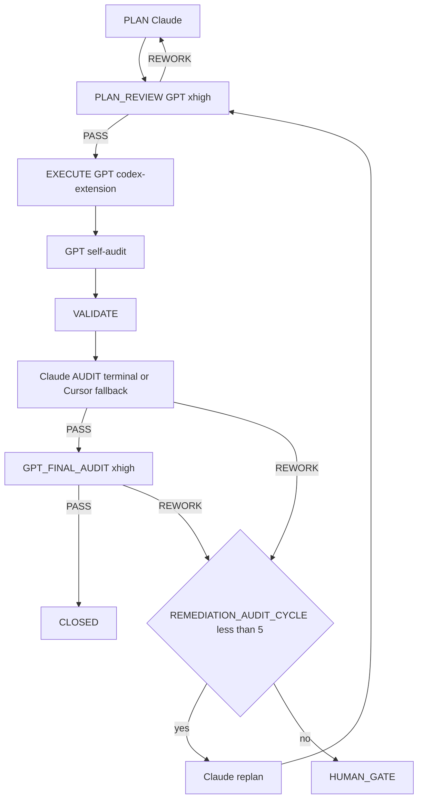

=== Auto-audit GPT (2e passe) ===
2026-04-25T21:02:31.078238Z  WARN codex_core::agents_md: Project doc `/Users/1millnonstop/Downloads/projet/foodking-web/web/testttt/AGENTS.md` exceeds remaining budget (32768 bytes) - truncating.
OpenAI Codex v0.125.0 (research preview)
--------
workdir: /Users/1millnonstop/Downloads/projet/foodking-web/web/testttt
model: gpt-5.5
provider: openai
approval: never
sandbox: workspace-write [workdir, /tmp, $TMPDIR, /Users/1millnonstop/.codex/memories]
reasoning effort: xhigh
reasoning summaries: none
session id: 019dc673-7ea8-7951-8136-2f494ab0b45b
--------
user
Tu effectues l’**auto-audit GPT** (2e passe) d’un cycle FoodKing — **pas** l’audit Claude terminal.

**Contexte** : le JSON ci-dessous est la proposition d’implémentation (format agents/codex.prompt.txt) pour la mission `CV1-M13-MIGRATIONS-SAFETY`.


**JSON d’implémentation (à recouper)** :
```json
{
  "files_to_modify": [
    "docs/runbooks/MIGRATIONS_CAISSE_V1.md",
    "docs/runbooks/MIGRATIONS_RUNBOOK_TEMPLATE.md",
    "scripts/db/dry-run.sh",
    "scripts/db/backup.sh",
    "scripts/db/rehearsal.sh",
    "tests/Feature/Migrations/MigrationDryRunTest.php",
    "tests/Feature/Migrations/MigrationRollbackTest.php"
  ],
  "implementation_steps": [
    "Created Caisse V1 migration safety runbooks for Gate Option A, per-migration evidence, backup, dry-run, staging rehearsal, rollback, and exact branch_id verification.",
    "Added fail-closed executable scripts for migration dry-run, backup manifest generation, and staging-only Up/Down/Up rehearsal.",
    "Added PHPUnit feature coverage for default-deny behavior, help output, dry-run command safety, sqlite backup manifest hashing, and rehearsal rollback command shape.",
    "Validated mandatory commands: php artisan test --filter=MigrationDryRunTest, php artisan test --filter=MigrationRollbackTest, bash scripts/db/dry-run.sh --help, bash scripts/db/backup.sh --help."
  ],
  "code_blocks": [
    {
      "path": "docs/runbooks/MIGRATIONS_CAISSE_V1.md",
      "op": "create",
      "excerpt": "Created runbook documenting approved schema gate Option A, fail-closed script behavior, required order backup -> dry-run -> staging rehearsal, exact branch_id verification, per-migration ledger, and production checklist."
    },
    {
      "path": "docs/runbooks/MIGRATIONS_RUNBOOK_TEMPLATE.md",
      "op": "create",
      "excerpt": "Created per-migration template with identification, branch isolation impact, backup, dry-run, rehearsal, rollback, and sign-off sections."
    },
    {
      "path": "scripts/db/dry-run.sh",
      "op": "create",
      "excerpt": "Created bash wrapper using set -Eeuo pipefail. Requires --env, rejects production without dual guard, refuses database contact unless --run or --print-command is present, and runs php artisan migrate --pretend --force with optional --database, --path, and non-overwriting transcript output."
    },
    {
      "path": "scripts/db/backup.sh",
      "op": "create",
      "excerpt": "Created bash wrapper using set -Eeuo pipefail. Requires explicit env, driver, database, output dir, and --i-understand-backup for writes. Supports sqlite copy with SHA-256 manifest, mysql/mariadb mysqldump, and pgsql pg_dump. Print mode does not create backup artifacts."
    },
    {
      "path": "scripts/db/rehearsal.sh",
      "op": "create",
      "excerpt": "Created staging-only bash wrapper. Requires backup manifest, rejects production, supports print-only review, runs dry-run first, and only mutates staging when --apply --i-understand-rehearsal-mutates-db --run are all present. Rehearsal sequence is migrate, migrate:rollback --step=N, migrate."
    },
    {
      "path": "tests/Feature/Migrations/MigrationDryRunTest.php",
      "op": "create",
      "excerpt": "Created tests asserting dry-run.sh exists, is executable, help succeeds, default invocation fails closed, print-command uses migrate --pretend --force, and never emits migrate:fresh or migrate:rollback."
    },
    {
      "path": "tests/Feature/Migrations/MigrationRollbackTest.php",
      "op": "create",
      "excerpt": "Created tests asserting backup.sh and rehearsal.sh help/default safety, sqlite backup manifest creation with SHA-256, and rehearsal print output includes Up/Down/Up commands without migrate:fresh."
    }
  ],
  "risks": [
    "Real staging rehearsal was not executed locally; tests cover fail-closed behavior, command shape, and sqlite backup manifest generation."
  ],
  "notes": [
    "No product schema migration was created.",
    "No app/Services, resources, routes, database/migrations, .cursor, or AGENTS.md files were modified.",
    "Mandatory tests passed: MigrationDryRunTest 2 passed; MigrationRollbackTest 3 passed; dry-run.sh --help passed; backup.sh --help passed."
  ],
  "execution_trace": {
    "delegation": "codex-extension",
    "invariants_considered": [
      "branch_id"
    ]
  }
}
```

**Livrable** (Markdown uniquement, en français) :
# AUTO_AUDIT_GPT — CV1-M13-MIGRATIONS-SAFETY

## 1. Conformité au plan / scope
(Énumérer manques ou dérives ; si scope élargi sans escale → **ESCALATE**)

## 2. Invariants FoodKing
Pour chacun : OK / RISQUE / N/A
- pricing_ssot (backend seul)
- order_status (enum, pas de strings)
- branch_id
- commit_before_dispatch
- frozen_zones
- order_service_symmetry (si un des deux services touché)

## 3. Verdict
Une ligne : `VERDICT: PASS` | `VERDICT: NEEDS_FIX` | `VERDICT: ESCALATE` + 1–3 phrases.

2026-04-25T21:02:31.462080Z  WARN codex_core_plugins::manifest: ignoring interface.defaultPrompt: prompt must be at most 128 characters path=/Users/1millnonstop/.codex/.tmp/plugins/plugins/build-ios-apps/.codex-plugin/plugin.json
2026-04-25T21:02:31.465336Z  WARN codex_core_plugins::manifest: ignoring interface.defaultPrompt: maximum of 3 prompts is supported path=/Users/1millnonstop/.codex/.tmp/plugins/plugins/plugin-eval/.codex-plugin/plugin.json
2026-04-25T21:02:37.809845Z  WARN codex_core_plugins::manifest: ignoring interface.defaultPrompt: prompt must be at most 128 characters path=/Users/1millnonstop/.codex/.tmp/plugins/plugins/build-ios-apps/.codex-plugin/plugin.json
2026-04-25T21:02:37.811359Z  WARN codex_core_plugins::manifest: ignoring interface.defaultPrompt: maximum of 3 prompts is supported path=/Users/1millnonstop/.codex/.tmp/plugins/plugins/plugin-eval/.codex-plugin/plugin.json
2026-04-25T21:02:38.688153Z  WARN codex_core_plugins::manifest: ignoring interface.defaultPrompt: prompt must be at most 128 characters path=/Users/1millnonstop/.codex/.tmp/plugins/plugins/build-ios-apps/.codex-plugin/plugin.json
2026-04-25T21:02:38.688515Z  WARN codex_core_plugins::manifest: ignoring interface.defaultPrompt: maximum of 3 prompts is supported path=/Users/1millnonstop/.codex/.tmp/plugins/plugins/plugin-eval/.codex-plugin/plugin.json
codex
Je recoupe la proposition avec les artefacts du cycle et les fichiers réels du dépôt. Je commence par les fichiers de gouvernance obligatoires pour cette mission `CV1-M13-*`, puis je vérifierai les scripts/tests annoncés.
exec
/bin/zsh -lc 'cat AGENTS.md' in /Users/1millnonstop/Downloads/projet/foodking-web/web/testttt
exec
/bin/zsh -lc 'cat .cursor/ACTIVE_CYCLE.md' in /Users/1millnonstop/Downloads/projet/foodking-web/web/testttt
 succeeded in 0ms:
# Active Cycle – FoodKing

**Méta (SSOT `run-cycle.md` Step 0 + `AGENTS.md` § *Authoritative … cycle state*)** — requis pour que l’orchestrateur ne s’arrête pas sur *« RUNNER_MODE not set »*.

| Champ | Valeur actuelle |
| --- | --- |
| **RUNNER_MODE** | `single-session` |
| **PHASE (cycle W10)** | `IN_PROGRESS` (détail = section `CYCLE_W10_…` ci-dessous) |
| **TASK_ID** | `P_EXEC_CLOSEOUT_GRAPHITI_CI_PROD_2026-04-22` |
| **PLAN_FILE** | `plans/PLAN_EXECUTION_CLOSEOUT_GRAPHITI_CI_PROD_2026-04-22.md` |
| **REPORT_FILE** | `reports/post_execute_latest.log` (append — preuve `EXECUTE_DELEGATION` / `AUDIT_*`) |

> **ACTIVE_PRIMARY** : `CYCLE_W10_EXECUTION_CLOSEOUT` (un seul cycle peut être actif à la fois — voir B03 méga-checklist).
> Cycles plus anciens en lecture seule = **archive** déplacée dans **`.cursor/ACTIVE_CYCLE_ARCHIVE.md`** (lecture humaine / forensique uniquement, **non requise** par le parcours obligatoire).

## CYCLE_W10_EXECUTION_CLOSEOUT (IN_PROGRESS — mémoire 180 + MCP global + commit + CI + prod)

**TASK_ID** : `P_EXEC_CLOSEOUT_GRAPHITI_CI_PROD_2026-04-22`  
**Plan SSOT** : `plans/PLAN_EXECUTION_CLOSEOUT_GRAPHITI_CI_PROD_2026-04-22.md`  
**Ordre** : Piste A (POS+Centrale : PLAN-MEM-1) ∥ Piste B (humain : PLAN-MEM-3) → C (smoke) → D (commit sur « go commit ») → E (CI) → F (prod J-7→J+7).  
**Gate mémoire** : `python3 memory/verify.py` → count **≥ 175** (180 idéal) avant de considérer PLAN-MEM-1 **CLOSED**.

- **Vérif locale (2026-04-22)** : `python3 memory/verify.py` → **count = 182**, smoke `search_memory_facts` OK — gate **satisfaite** pour clôturer l'ingestion côté seuil d'épisodes (suite : commit / CI / prod selon plan `PLAN_EXECUTION_CLOSEOUT_*`).

**Gouvernance globale (2e passe 2026-04-22)** : primer multi-agents + Graphiti vivant + tokens « zéro effet négatif » → **`docs/orchestration/GLOBAL_SYSTEM_PRIMER.md`** + rapport **`reports/audit/AUDIT_SECOND_PASS_GLOBAL_GOVERNANCE_REPORT_2026-04-22.md`**.

---

## CAISSE_V1_MASTERPLAY (ACTIVE — 2026-04-25)

**Phase** : finition Caisse V1 (POS + Kiosk + KDS + Centrale + Fiscal + Ops).
**Plan parent** : `plans/PLAN_CAISSE_V1_GPT_MASTERPLAY_2026-04-25.md`
**Plan DAG autoritaire** : `plans/PLAN_CAISSE_V1_SUPER_MASTER_2026-04-25.md`
**Boucle d'exécution** : `plans/masterplay/MASTERPLAY_DISCIPLINE.md` + `plans/masterplay/MASTERPLAY_QUEUE.md` + `scripts/run-masterplay.sh`
**Statut temps réel** : `reports/masterplay/status.json`

**Règle** : tout `TASK_ID` au format `CV1-MXX-…` passe par la masterplay (cf. `AGENTS.md` § "Caisse V1 — Masterplay loop", `.cursor/rules/global.mdc` § "Caisse V1 — Masterplay loop", `.cursor/commands/run-cycle.md` Step 0 item 0). **NE PAS** ouvrir un `run-cycle` standard sur un `CV1-MXX-…`.

---

## Archive

Tous les cycles **CLOSED / COMPLETED PASSED** (W4 → W9, NF525, etc.) ont été déplacés dans **`.cursor/ACTIVE_CYCLE_ARCHIVE.md`** pour réduire le coût de lecture du parcours obligatoire (audit 2026-04-24, mission `T-PARCOURS-OPTIMIZE-001`).

- **Lecture humaine** : ouvrir `.cursor/ACTIVE_CYCLE_ARCHIVE.md`.
- **Lecture agent** : **non requise** sauf instruction explicite du plan ou du chat (ex. "reprend le rationale du cycle W9").
- **Recherche** : `rg "CYCLE_W9_" .cursor/ACTIVE_CYCLE_ARCHIVE.md` ou `git log --follow .cursor/ACTIVE_CYCLE.md`.

 succeeded in 0ms:
# FoodKing – Cursor Agent Operating Contract

## 0. Quick start contract — read this first

Commence ici. Ne lance aucune action tant que tu n'as pas lu les priorités P0.
Ce contrat fixe l'ordre minimal de lecture pour comprendre le repo en moins de 60 secondes.
Lis complètement ce qui est marqué obligatoire ; diffère seulement ce qui est explicitement classé P2.

### Reading priority

| Priority | What to read | Why |
| --- | --- | --- |
| P0 | `AGENTS.md §1 Parcours obligatoire` | Cadre impératif de travail, ordre de lecture, discipline de cycle. |
| P0 | `.cursor/ACTIVE_CYCLE.md` (continuation) | État courant du cycle actif, contexte vivant, reprise sans divergence. |
| P0 | `.cursor/rules/global.mdc` (auto-attaché — mentionné pour info) | Règles globales toujours applicables, même si déjà injectées par l'outil. |
| P0 | `plans/masterplay/MASTERPLAY_DISCIPLINE.md` + `plans/masterplay/MASTERPLAY_QUEUE.md` (Caisse V1 actif) | **Pendant la phase Caisse V1** : règles d'or de la boucle GPT + file d'exécution. Tout agent qui touche une mission `CV1-MXX-…` DOIT lire ces deux fichiers avant d'agir. |
| P1 | `docs/orchestration/GLOBAL_SYSTEM_PRIMER.md` | Vocabulaire, architecture d'orchestration, invariants transverses. |
| P1 | `.cursor/commands/run-cycle.md` | Procédure exacte pour démarrer un cycle borné correctement. |
| P1 | `docs/orchestration/MEMORY_MATRIX.md` | Où chercher la mémoire utile sans relire tout le dépôt. |
| P1 | `.cursor/routing.md` | Routage des tâches, choix du bon canal, limites d'intervention. |
| P2 | `docs/orchestration/CODEX_API_DELEGATION.md` (quand EXECUTE complexe) | À lire si tu délègues ou exécutes du complexe (uniquement **CLI `codex`**, pas d’exécuteur HTTP dans le dépôt). |
| P2 | `.cursor/ACTIVE_CYCLE_ARCHIVE.md` (forensique humain) | Historique utile pour audit humain, pas requis au démarrage. |
| P2 | `docs/orchestration/EXPORT_CONFIG_CODEX_GPT_API_ET_AUDIT_PERSISTANCE.md` (nouveau poste) | Configuration et persistance utiles surtout lors d'un nouvel environnement. |

Règle simple : P0 avant toute action, P1 avant tout EXECUTE, P2 seulement à la demande du sujet.
Si un doute persiste après P0+P1, arrête-toi et relis ; n'improvise pas.

### One-line bootstrap

```bash
npm run verify:boucle
bash scripts/agent-activity-log.sh tail 50
run-cycle <TASK_ID>
```

### Caisse V1 — Masterplay loop (actif)

Pendant la phase de finition Caisse V1 (POS + Kiosk + KDS + Centrale + Fiscal), l'orchestration passe par la **MASTERPLAY** :

```bash
# Lire d'abord (obligatoire)
cat plans/masterplay/MASTERPLAY_DISCIPLINE.md
cat plans/masterplay/MASTERPLAY_QUEUE.md
cat plans/masterplay/GO.md

# Lancer la boucle (Codex extension complexe + audit Claude terminal + audit Codex final)
bash scripts/run-masterplay.sh --with-audit --with-final
```

- **Plan parent** : `plans/PLAN_CAISSE_V1_GPT_MASTERPLAY_2026-04-25.md` (catalogue 22 missions M-XX, ancrages file:line)
- **Plan autoritaire DAG** : `plans/PLAN_CAISSE_V1_SUPER_MASTER_2026-04-25.md`
- **Statut temps réel** : `reports/masterplay/status.json` + `reports/masterplay/run_*.log`
- Tout `TASK_ID` au format `CV1-MXX-…` est gouverné par la masterplay (allowlist, frozen, gates, REWORK max 5).
- Hors phase Caisse V1 : repasser au `run-cycle <TASK_ID>` standard.

**Anti-répétition (nouvel onglet / agent parallèle)** : copier d’abord le bloc de `docs/orchestration/SESSION_OPENING_ENFORCEMENT.md` — même discipline, moins d’oubli de `ACTIVE_CYCLE` / `run-cycle`.

Utilise `run-cycle <TASK_ID>` pour initier tout cycle borné.
Les deux autres commandes servent à vérifier l'état local et le journal d'activité avant d'exécuter.

### Quality-first, not token-cheap

Lis P0 et P1 intégralement, sans skim. Les économies de tokens ne se font jamais sur la substance des règles, seulement sur la répétition, le bruit et les relectures inutiles. En cas de tension entre vitesse et rigueur, applique la rigueur ; voir `.cursor/rules/global.mdc § Token Discipline`.

### If you're a new human contributor

Commence par `docs/orchestration/EXPORT_CONFIG_CODEX_GPT_API_ET_AUDIT_PERSISTANCE.md` pour préparer ton poste et comprendre le mode de persistance attendu.
Lis-le après P0, puis enchaîne sur P1 avant toute contribution effective.

---

## 1. Parcours obligatoire — **nouvelle conversation** **et** **continuation** (production, non négociable)

> **Objectif** : qu’**à chaque** session (premier message ou 500e message), l’exécutant sache **quel** chemin suivre — **sans** supposer un historique de chat. Tout est **dans le dépôt** ; l’histoire de conversation **n’est pas** la SSOT.

**Règle d’or** : *aucune* modification de code **produit** (hors `plans/`, `reports/`, `docs/gates/`, `missions/`, JSONL gouvernance) **dans le cadre d’un travail borné** sans **(a)** parcours ci-dessous **et** **(b)** cycle `run-cycle` + plan actif, sauf **exception** explicite humaine (notée dans le plan / gate).

| Étape | Action | Quand / pourquoi |
|-------|--------|------------------|
| **0. Continuation** | Lire **`.cursor/ACTIVE_CYCLE.md`**. | Si `PHASE` n’est **pas** vide et le cycle n’est **pas** archivé : **reprendre** ce `TASK_ID` / ce `PLAN_FILE` / ce `REPORT_FILE` — **ne pas** dupliquer un second cycle fantôme. Si humain confirme **nouveau** sujet : réinitialiser / nouveau `TASK_ID` selon `run-cycle` Step 0. |
| **1. Lecture initiale** | Lire **ce fichier** (`AGENTS.md`) **puis** **`docs/orchestration/GLOBAL_SYSTEM_PRIMER.md`** (table §1 = ordre complet : routing, `run-cycle`, Graphiti, `MEMORY_MATRIX`, etc.). | **Avant** tout code ou plan non trivial. Même en « continuation » si le contexte a dérivé ou l’onglet a été rafraîchi. |
| **2. Cycle structuré (SSOT procédurale)** | Toute tâche avec **`TASK_ID`** : suivre **`.cursor/commands/run-cycle.md`** et la commande **`run-cycle <TASK_ID>`** (ou équivalent explicite dans le chat : enchaîner les **Steps 0 → 5** sans en sauter). | **Programme courant (quota-optimized)** : `PLAN GPT → PLAN_REVIEW GPT → EXECUTE GPT → VALIDATE → AUDIT GPT → [CLAUDE CRITIQUE SI NÉCESSAIRE] → [GATE \| CLOSE]`. Aucun « close » sans audit PASS documenté. |
| **3. Vérification d’environnement** | `npm run verify:boucle` (0 requête par défaut). **Si le terminal ne “voit” pas Codex alors que l’extension est connectée** : l’auth IDE n’alimente pas le CLI — lancer `npm run codex:doctor` (npm + `login status` + 1 requête). **Rapide :** `npm run codex:verify-pro`. **Complet :** `npm run verify:boucle:full`. Encart : `agents/codex-extension-instructions.md`. | Même en **Step 5** : l’`EXECUTE` (CLI `codex`) requiert le binaire + session Pro sur **ce** binaire. Voir `run-cycle` Step 0 item 8. |
| **4. Secrets & outils machine** | Binaire **`claude`** sur le **`PATH`** (Claude Code CLI) pour l’**AUDIT** PRIMARY en terminal. Binaire **`codex`** (CLI OpenAI) : *Sign in with ChatGPT* **Pro** — **pas** de clé API dans le dépôt. Résolution : `PATH` **ou** `node_modules/.bin/codex` après **`npm install`** (dépendance **`@openai/codex`**) **ou** `npm i -g @openai/codex`. **Ne pas** mélanger avec une clé *Platform* restreinte dans l’environnement (provoque des 401 *scopes* sur l’API Responses) — `npm run codex:audit-bleed` aide. (Option) MCP Graphiti selon `~/.cursor/mcp.json`. | Sans `claude` : noter dès le **plan** l’`AUDIT` fallback + `AUDIT_FALLBACK_REASON`. Sans binaire `codex` : pas d’`EXECUTE` complexe PRIMARY (sub-agent + `FALLBACK_REASON` ou `npm install` + auth Pro). |
| **5. Traces & mémoire (déjà dans ce fichier)** | **`EXECUTE_DELEGATION:`** avant VALIDATE ; **`AUDIT_CHANNEL:`** + **`TERMINAL_AUDIT_OK: 1`** si audit terminal OK ; `docs/orchestration/MEMORY_MATRIX.md` ; `scripts/agent-activity-log.sh` (tail / start / done). | Traçabilité = **même** qualité en prod sur N agents parallèles. |

**Ce n’est pas optionnel** pour travailler « en production FoodKing » : c’est le **contrat** d’onboarding. Les **règles** `.cursor/rules/*.mdc` (dont **`global.mdc` — alwaysApply**) et ce fichier **s’imposent** **à** tout modèle, **dans** toute conversation, dès l’ouverture du dépôt.

**Pour un humain / nouveau compte** : mêmes étapes ; la doc **`docs/orchestration/EXPORT_CONFIG_CODEX_GPT_API_ET_AUDIT_PERSISTANCE.md`** regroupe l’**export** config API + persistance des règles hors-chat.

## Engine
Cursor local agent. No cloud orchestration. No external framework.
Auto/Premium routing: disabled. Model selection is explicit per cycle.

## Global system primer (multi-agents, Graphiti, tokens — lecture clé)

Tout nouvel intervenant (session Cursor, sub-agent Task, CLI terminal, humain) qui touche **orchestration**, **mémoire**, ou **discipline de contexte** : lire **`docs/orchestration/GLOBAL_SYSTEM_PRIMER.md`** après ce fichier. Y sont définis : ordre de lecture obligatoire, `codex-extension` GPT-5.5-pro/xhigh, fallback `foodking-complex-implementer`, fallback audit `foodking-planner-orchestrator`, terminal **`claude` / `codex`**, **mise à jour continue de Graphiti**, et la politique **« intelligence max — zéro optimisation négative »** (tokens : supprimer le gaspillage, pas la substance). Pour audits longs et robustesse **opération + agentique + mémoire** : **`docs/orchestration/MEGA_CHECKLIST_AUTONOMY_AND_MEMORY.md`** (180 tâches) et le narratif **`reports/audit/MEGA_AUDIT_SYSTEM_OPERATION_AGENTIC_2026-04-23.md`**.

**Discipline mémoire (qui écrit où, qui lit quoi, quand)** : **`docs/orchestration/MEMORY_MATRIX.md`** — matrice unique des **4 stores autorisés** (Code A · Graphiti+JSONL B · Missions C · Rapports D), table d'écriture par phase, ordre de lecture pour une nouvelle session, anti-patterns. Aucun nouveau store de mémoire ne peut être ajouté sans gate `docs/gates/GATE_MEMORY_*`. Décisions 2026-04-23 sur OpenSpace et claude-mem : **non intégrés**, justifications dans la matrice.

**Synchro multi-agents (cross-conv, cross-terminal)** : `.cursor/rules/cross-agent-sync.mdc` (alwaysApply) + `reports/AGENT_ACTIVITY_LOG.md` (append-only) + `scripts/agent-activity-log.sh` (`tail | start | done | collisions | active`). Au démarrage de session : `tail 50` (~500 tokens). Avant édition produit (Step 2 EXECUTE) : `start` (refus exit 2 si collision). À la clôture (Step 5 CLOSE) : `done`. Évite que deux agents (Cursor convs / `codex-extension` / `claude-terminal` / humain) modifient les mêmes fichiers à leur insu. **Doctrine étendue** (Graphiti = mémoire partagée, rôles Claude vs Codex, anti-patterns) : **`docs/orchestration/MULTI_AGENT_ORCHESTRATION.md`**.

## Workflow
PLAN GPT (codex) → PLAN_REVIEW GPT (codex) → EXECUTE GPT (codex) → VALIDATE → AUDIT GPT (codex) → [CLAUDE CRITICAL ESCALATION ONLY] → [HUMAN GATE | CLOSE]

No phase may be skipped. Default close condition is `AUDIT_VERDICT: PASS` from GPT path, with optional Claude escalation audit only for critical/blocked cases.

## Model Roles
| Model | Role | Channel (priorité **qualité maximale / zéro raccourci token**) |
|---|---|---|
| Claude | Escalade critique uniquement | Utiliser Claude seulement pour cas vraiment critiques: blocage logique majeur, gate ambigu non résoluble, conflit d'audits, ou arbitrage architecture multi-fichiers à haut risque. Le canal prioritaire reste GPT/Codex pour économiser les quotas Claude. |
| **GPT-5.5 / GPT-5.5-pro** | **PLAN + PLAN_REVIEW + EXECUTE + AUDIT** | **`codex-extension`** — `npm run codex:plan-review`, `npm run codex:complex`, `npm run codex:final-audit` (CLI `codex` + `codex exec`, **compte ChatGPT Pro**, modèle `gpt-5.5-pro` si dispo sinon `gpt-5.5`, `model_reasoning_effort=xhigh`). GPT devient le canal principal d'orchestration, implémentation et audit de routine. |
| GPT-5.5 (fallback) | Complex implementation (FALLBACK only) | **Sub-agent** `foodking-complex-implementer` (Task Cursor) — consomme l’**usage** des modèles de l’**abonnement Cursor**. **Uniquement** si `codex` / l’exécution `codex exec` a échoué (≥2 tentatives documentées) ou binaire indispo. |
| Composer | Validation/report only | Plus d’implémentation routine pendant les cycles de finition. Composer peut résumer, exécuter/rapporter des validations, mais toute correction produit repart en EXECUTE GPT. |

**Qui décide (mode actuel quota-optimized)** : **GPT/Codex** porte l’**autorité opérationnelle** sur planification, implémentation, auto-audit, et audit final de routine. **Claude** est mis en pause et appelé uniquement en **escalade critique** (ambiguïté structurelle, gate sensible, conflit technique majeur, analyse de risque à très forte complexité). Le **fait** code / test l’emporte sur la croyance.

**Principe unique (mode actuel) — à valider en prod sur chaque cycle :** **PLAN GPT → PLAN_REVIEW GPT → EXECUTE GPT → self-audit GPT → VALIDATE → AUDIT GPT**. Le repli vers Claude n’intervient qu'en escalade critique documentée (`CLAUDE_ESCALATION_REASON:`), avec portée minimale.

One PRIMARY_EXECUTION_MODEL per cycle. Roles are explicit and layered; review checkpoints do not authorize scope expansion.
Full routing policy: `.cursor/routing.md`. Naming: the **PRIMARY complex implementer** is the **FoodKing Codex Complex Implementer** (slug `codex-extension`); see `docs/orchestration/CODEX_API_DELEGATION.md`.

## Authoritative multi-agent bounded cycle (SSOT)

For **TASK_ID-driven** work in Cursor, this path is **authoritative** and overrides any conflicting step elsewhere in this document:

1. **Command:** `.cursor/commands/run-cycle.md` (invoke with a `TASK_ID`, e.g. `run-cycle SMOKE-001`).
2. **Cycle state:** `.cursor/ACTIVE_CYCLE.md` (`RUNNER_MODE: single-session`, `PHASE`, `PLAN_FILE`, `REPORT_FILE`, completion rows).
3. **Plan artifact:** `plans/PLAN_[TASK_ID]_[DATE].md` per `.cursor/context/plan-context.md` (from `plans/PLAN_TEMPLATE.md` when applicable).
4. **Phase instructions:** `.cursor/context/plan-context.md` (PLAN), `.cursor/context/execute-context.md` (EXECUTE), `.cursor/context/audit-context.md` (AUDIT); VALIDATE per `run-cycle.md` when `validate-context.md` is absent.

**EXECUTE delegation (GPT only; PRIMARY first, FALLBACK only on failure):**

- **Routine implementation disabled during finishing cycles** : no product edit via Composer / `foodking-routine-implementer`. Small edits still route through GPT to keep the same quality chain.
- **PRIMARY** : **`codex-extension`** — **FoodKing Codex Complex Implementer** (CLI `codex`, compte **ChatGPT Pro**, `gpt-5.5-pro`, `model_reasoning_effort=xhigh`). Procédure :
  1. Préparer `missions/{TASK_ID}/input.json` (+ optionnels : `graphiti_context.md` issu de `search_memory_facts(group_ids=["foodking"])`, `plan_excerpt.md`, `execute_brief.md`, `cycle_snapshot.md` — fusionnés par le script d’assemblage de prompt).
  2. Lancer `npm run codex:complex -- {TASK_ID}` (`bash scripts/codex-extension-execute.sh`) ; le wrapper passe explicitement `-m ${CODEX_EXT_MODEL_PRO:-gpt-5.5-pro}` et `model_reasoning_effort=${CODEX_EXT_REASONING_EFFORT:-xhigh}`. (Instructions custom : `agents/codex-extension-instructions.md`.) **Bootstrap** : `npm run codex:prepare -- {TASK_ID}`.
  3. Appliquer `missions/{TASK_ID}/output_codex.json` ; consommer l’**auto-audit** `reports/audit/GPT_SELF_AUDIT_{TASK_ID}.md` (généré par le wrapper).
  4. Tracer `EXECUTE_DELEGATION: codex-extension` dans `reports/post_execute_latest.log` et le `REPORT_FILE`.
- **Complexe — FALLBACK (uniquement si `codex exec` est HS après reprises, ou binaire manquant)** : `Task` → `foodking-complex-implementer` — tracer `EXECUTE_DELEGATION: foodking-complex-implementer (codex-extension-fallback)` + `FALLBACK_REASON:`. 

Référence complète : **`docs/orchestration/CODEX_API_DELEGATION.md`** (naming, fallback contract, audit handoff, token discipline, schéma boucle). Procédure cycle : `.cursor/commands/run-cycle.md`. La trace `EXECUTE_DELEGATION` dans le rapport est **obligatoire** pour passer en VALIDATE.

**Clôture vs. audit :** Après `VALIDATE`, l’**audit** **Claude** (terminal `foodking-claude-orchestrate.sh` en PRIMARY, fallback Cursor si quota/rate-limit/terminal HS) écrit `AUDIT_VERDICT: PASS|REWORK`, puis GPT écrit `GPT_FINAL_AUDIT_VERDICT: PASS|REWORK|ESCALATE`. **Pas** de `CLOSED` sans double PASS. Sur `REWORK`, boucle `replan (orchestration Claude) → missions + EXECUTE GPT → self-audit GPT → VALIDATE → re-audit Claude → GPT final`, avec `REMEDIATION_AUDIT_CYCLE` 1..5 — au 5e `REWORK` sans double PASS, **HUMAN_GATE** (détail : Step 5 de `run-cycle.md` et `auto-remediation.mdc`).

Sections below labeled **Legacy workflow** remain valid for **PR-centric / review-loop** habits but **do not replace** this SSOT for bounded cycles.

## Source of truth (extended)
- README.md
- docs/PROJECT_CONTINUITY_AND_VISION.md
- docs/ARCHITECTURE.md
- docs/API_MAP.md
- docs/AUTHZ_MATRIX.md
- docs/ORDER_FLOW.md
- docs/DEVICE_FLOW.md
- docs/BUSINESS_RULES.md
- docs/CORE_MODULES.md
- docs/DATABASE_SCHEMA_CORE.md
- docs/ERROR_HANDLING.md
- docs/SECURITY_NOTES.md
- docs/TEST_PLAN.md
- docs/MASSIVE_TEST_PLAN.md
- docs/SAAS_VISION.md
- docs/CONTRIBUTING_QA_BOTS.md
- workflows/qa-loop.md
- workflows/task-routing.md
- workflows/report-format.md
- workflows/task-status.md
- reports/README.md
- docs/orchestration/MEGA_CHECKLIST_AUTONOMY_AND_MEMORY.md
- docs/orchestration/WORKFLOW_AUDIT_GRAPHIQUE_2026-04-23.md
- docs/orchestration/TERMINAL_CLAUDE_GRAPHITI_ORCHESTRATION.md
- docs/orchestration/ROUTING_MATRIX.md

## Stop Conditions
Halt and generate a gate brief on any of:
- Gate trigger detected
- Scope expansion beyond declared boundary
- FoodKing invariant violation
- Two consecutive validation failures
- Planning ambiguity unresolvable from task context
- **`codex` / `codex exec` indisponible après reprises (auth, binaire, ou échec ≥2 sur la même tâche)** : basculer sur le fallback `Task → foodking-complex-implementer` et **noter explicitement** `EXECUTE_DELEGATION: foodking-complex-implementer (codex-extension-fallback)` + `FALLBACK_REASON:`.
- **Audit en terminal (PRIMARY) indisponible ou limité** (`claude` absent, **quota / rate limit / session Anthropic saturée**, auth, réseau — après **1 retry** documenté de `context` + `audit-brief` ou `audit`) : **continuer le cycle** — même checklist `audit-context.md` via Task **`foodking-planner-orchestrator`** (recommandé) ou session Cursor **Claude** ; **`AUDIT_CHANNEL: cursor-session`** + **`AUDIT_FALLBACK_REASON:`** (obligatoire) + optionnel **`AUDIT_SUBAGENT_FALLBACK: foodking-planner-orchestrator`**. Voir `docs/orchestration/AUDIT_TERMINAL_QUOTA_FALLBACK.md`. **Ne jamais** omettre la raison.

## FoodKing Non-Negotiables
- Backend is pricing SSOT — no frontend price logic
- `OrderStatus` enum is authoritative — no hardcoded strings
- `branch_id` = business data isolation — no cross-branch data bleed
- Dispatch strictly after DB commit
- `OrderService` / `FrontendOrderService` symmetry mandatory on any order change
- Frozen zones require gate clearance before any edit

## MCP

### Phase 1 — Filesystem
Filesystem MCP only for repo reads where applicable.

### Phase 2 — Graphiti (mémoire inter-cycles — **présent dans toutes les sessions où le serveur est enregistré**)

**Objectif** : décisions d’architecture, invariants, sync borne↔POS↔KDS, fiscal NF525, historique de cycles — récupérables sans relire des centaines de fichiers.

| Élément | Détail |
|--------|--------|
| **Enregistrement Cursor (obligatoire côté humain)** | Fusionner le bloc `graphiti` dans **`~/.cursor/mcp.json`** (Settings → MCP). Modèle : **`.cursor/mcp/graphiti.json.example`**. Le dépôt ne peut pas injecter un MCP automatiquement dans l’IDE. |
| **Règle agent (automatique dès que le MCP est chargé)** | Voir **`.cursor/rules/graphiti-memory.mdc`** (always-on) + **`global.mdc`** : avant toute tâche non triviale, appeler au moins **`search_memory_facts`** (et optionnellement **`search_memory_nodes`**) avec `group_ids=["foodking"]`. |
| **Après AUDIT / CLOSE** | Si `add_memory` est disponible : enregistrer les décisions durables (ADR, gate, invariant clarifié). |
| **Si Graphiti absent de la session** | **Ne pas bloquer** PLAN / EXECUTE : une ligne « Graphiti non chargé » + secours **`memory/INDEX.md`** + lecture ciblée des JSONL sous `memory/episodes/`. |
| **Server** | Zep Graphiti — wrapper local **`.cursor/mcp/start-graphiti-mcp.sh`** (voir exemple JSON). Clone typique : `/Users/1millnonstop/graphiti`. |
| **Backend** | Neo4j (ex. Aura) — credentials hors repo. |
| **Dépannage** | **`.cursor/mcp/GRAPHITI_TROUBLESHOOTING.md`** (LiteLLM, embeddings, redémarrage proxy). |
| **Group ID** | Toujours **`foodking`**. |
| **Ingestion / vérif locale** | `memory/ingest.py`, `memory/verify.py`, `bin/graphiti-ingest.sh` ; index des domaines **`memory/INDEX.md`**. |

**Intégration bounded cycle** : la commande **`.cursor/commands/run-cycle.md`** inclut l’appel Graphiti en **Step 0 item 5** (query avant PLAN).

### Phase 3 — Playwright MCP (tests E2E sur flows critiques FoodKing)

- Package : `@playwright/mcp@latest` (npx, pas d’install global)
- Browser : Chromium
- BASE_URL : `http://localhost:8000`
- Config : `.cursor/mcp/playwright.json`
- Flows couverts : POS Cash, POS Card, Kiosk, KDS, Auth refresh (F5)
- Déclencheur : plan déclare `playwright-mcp` | `playwright-critical-flow` | `playwright-full-e2e`
- Rapport : `reports/antigravity/latest.md`
- Règle : le Planner-Orchestrator seul décide si un cycle requiert E2E — jamais auto-déclenché.

---

## Terminal allies — Claude Code & OpenAI Codex (abonnements Pro)

Ces outils **complètent** le routage interne Cursor (`.cursor/routing.md` : PLAN Claude, PLAN_REVIEW/EXECUTE/GPT_FINAL_AUDIT via **CLI `codex` GPT-5.5-pro xhigh**, AUDIT Claude terminal avec fallback Cursor). **Aucun remplacement** des rôles du dépôt : ce sont des canaux de la boucle officielle.

### A — Anthropic **Claude Code** (audits / orchestration textuelle, abonnement Anthropic)

1. Dans Cursor : **Extensions** (`Ctrl+Shift+X` / `Cmd+Shift+X`) → chercher **Claude Code** (Anthropic) → **Installer**.
2. Ouvrir le terminal intégré Cursor.
3. Lancer une fois :

```bash
claude
```

4. Première exécution : se connecter avec le compte Anthropic (abonnement Pro/Max) — utilise les quotas du compte, **sans** clé API dans le dépôt.

**Appels non interactifs (audit / plan d’orchestration)** :

```bash
claude "Audite tout le code livré sur ce cycle et produis un plan d'orchestration des corrections restantes, en respectant les invariants FoodKing (AGENTS.md)."
```

**Wrapper recommandé (vérification `PATH` + `claude -p` + `--add-dir` vers la racine du dépôt)** — depuis la racine Git :

```bash
bash scripts/foodking-claude-orchestrate.sh check     # s'assure que `claude` (Claude Code) est installé
bash scripts/foodking-claude-orchestrate.sh smoketest # 1 requête API min. — valide abonnement / auth (retourne TERMINAL_OK)
bash scripts/foodking-claude-orchestrate.sh context   # écrit reports/audit/_TERMINAL_CONTEXT_BRIEF.md (cycle + JSONL + INDEX)
bash scripts/foodking-claude-orchestrate.sh audit-brief  # claude -p : lit ce fichier d'abord = tokens maîtrisés + alimentation mémoire
bash scripts/foodking-claude-orchestrate.sh audit     # audit / plan d'orchestration non interactif (prompt FoodKing)
bash scripts/foodking-claude-orchestrate.sh repl      # session interactive (équivalent : `claude` seul)
# Modèle terminal pour tous les `claude -p` du script : **Opus 4.7** + **effort high** par défaut (`--model claude-opus-4-7 --effort high`). Surcharge : `FOODKING_CLAUDE_TERMINAL_MODEL`, `FOODKING_CLAUDE_TERMINAL_EFFORT` (vide = pas de --effort).
```

Lecture : **`docs/orchestration/TERMINAL_CLAUDE_GRAPHITI_ORCHESTRATION.md`** (Cursor vs sub-agent vs terminal, Graphiti, économie de contexte).

**Après chaque supplémentation (ADR, JSONL, fin de lot)** — ordre pour alimenter la base **sans** gaspiller l’abonnement :

1. Mettre la décision / invariant dans le bon `memory/episodes/*.jsonl` (voir `memory/INDEX.md` + `docs/orchestration/GLOBAL_SYSTEM_PRIMER.md` §4.2).
2. `bash scripts/after-execute-memory.sh` — rafraîchit le manifeste SHA, vérifie le même contrat que CI, rappelle les `bin/graphiti-ingest.sh <préfixe>` pour les fichiers modifiés, puis lance l’ingest côté poste si la stack est up.
3. (Option Graphiti) `python3 memory/verify.py` si le MCP / Neo4j tournent.
4. (Option abonnement Anthropic **ciblé**) `bash scripts/foodking-claude-orchestrate.sh context` puis `... audit-brief` — le terminal lit d’abord le bref disque ; ou raccourci : `... post-execute` pour enchaîner l’étape 2 + `context` (sans lancer l’audit payant à ta place).

Le wrapper branche `stdin` sur `/dev/null` pour `claude -p` (audit) : dans un **terminal non TTY** (ou agent automatisé), sans cela Claude Code affiche *no stdin data* et refuse de lire le prompt. Ne pas l’enlever si tu scripts l’orchestration.

Si `check` échoue : installer l'extension **Claude Code** (Cursor) ou le binaire `claude` côté Anthropic, et vérifier que le dossier binaire (souvent `~/.local/bin`) est sur le `PATH` du terminal intégré.

**Usage aligné sur ton workflow** : orchestration initiale → **Claude dans Cursor** ; audit de cycle → **Claude terminal d’abord**, puis **fallback Cursor Claude** si quota/rate-limit/terminal HS ; clôture seulement après le second avis GPT final.

### B — OpenAI **Codex** CLI (implémentations lourdes, abonnement ChatGPT Plus/Pro)

1. Dans le terminal Cursor :

```bash
npm install -g @openai/codex
```

2. Lancer :

```bash
codex
```

3. Première exécution : choisir **Sign in with ChatGPT** — utilise les crédits du compte **ChatGPT Pro**, **sans** clé API dans le dépôt. Si l’app était liée à une clé : `codex auth logout`, puis reconnecter en **Pro**.

4. **Cycle PLAN_REVIEW / EXECUTE / GPT_FINAL_AUDIT (PRIMARY du dépôt)** : `npm run codex:plan-review -- <TASK_ID>`, `npm run codex:prepare -- <TASK_ID>`, `npm run codex:complex -- <TASK_ID>`, puis `npm run codex:final-audit -- <TASK_ID>` après le PASS Claude. Sous le capot : `codex exec -m gpt-5.5-pro -c model_reasoning_effort=\"xhigh\"`. Instructions + invariants : `agents/codex-extension-instructions.md`.

**Appels non interactifs (exemples)** :

```bash
codex exec "Implémente uniquement ce qui est décrit dans plans/PLAN_<TASK>_<DATE>.md ; ne modifie pas le hors-scope ; respecte AGENTS.md et les frozen zones."
```

**Usage aligné** : `npm run codex:complex` pour les cycles bornés (missions), y compris les petites corrections produit ; validation → **PHPUnit / Vitest** + Cursor VALIDATE ; close → Claude audit puis GPT final audit.

### Résumé opérationnel (sans changer le plan de phases du dépôt)

| Besoin | Outil terminal | Quand |
|--------|----------------|-------|
| Audit global / orchestration textuelle profonde | `claude "..."` | Après livraison, ou boucle 2e audit |
| Patch large multi-fichiers guidé par un plan existant | `codex "..."` | EXECUTE complexe hors session Cursor ou en parallèle humaine |
| Cycle officiel FoodKing (gates, routing, preflight prod) | Cursor + `run-cycle` + subagents | Toujours la source de vérité procédurale |

**Sécurité** : ne jamais coller de secrets (Neo4j, OpenRouter, clés API) dans les prompts terminal ; les abonnements gèrent l’auth OAuth du CLI.


## Pre-Execution
Run `.cursor/hooks/safety-check.sh` manually before every execution phase.

## Artifact Locations
| Artifact | Path |
|---|---|
| Task intake | `tasks/` |
| Plans | `plans/` |
| Reports | `reports/` |
| Gate briefs | `docs/gates/` |
| Routing policy | `.cursor/routing.md` |
| Rules | `.cursor/rules/` |

---

## Extended workflow — repository operating instructions

### Claude (Architect & Reviewer)
Responsibilities:
- Architecture decisions and reasoning
- Root-cause analysis and debugging
- Planning with explicit test strategy
- Final review of implementation quality
- Risky refactors and cross-module decisions
- Auth/sync/pricing/state logic analysis
- Determines **test strategy** in plan using the active vocabulary (see **Testing rules**)

### Playwright / E2E verification (Critical QA)
Responsibilities:
- E2E testing (browser, Playwright MCP, complex flows)
- Critical integration testing
- Functional exploration
- Structured QA reporting under `reports/antigravity/` (legacy directory name)
- Only invoked when Claude's plan specifies **`playwright-critical-flow`**, **`playwright-full-e2e`**, or **`playwright-mcp`**, or when review verdict is **`NEEDS_PLAYWRIGHT`**

### Bugbot (Passive Diff Scanner — NO authority)
Responsibilities:
- Automatically scans PR diffs for bugs, security issues, regressions, edge cases
- Writes findings ONLY to `reports/review/bugbot-latest.md`
- NEVER autonomous — generates a file and stops
- NEVER communicates directly with Kimi or the Playwright / E2E executor outside the documented report chain
- NEVER makes architectural decisions
- Governed strictly by `.cursor/BUGBOT.md`

### Cursor
Orchestration environment

## Legacy workflow (PR / review loop — optional)

Use this loop for **historical PR-centric** review habits. It **does not** replace the **Authoritative multi-agent bounded cycle (SSOT)** above for `TASK_ID` + `run-cycle` work.

### Normal Cycle (90% of cases)
1. **Human** requests feature/fix
2. **Claude** analyzes and may write a **narrative or scratch** plan in `reports/planning/latest.md` **only when not** using the bounded SSOT; for bounded cycles the plan **must** be `plans/PLAN_[TASK_ID]_[DATE].md` as in `plan-context.md`.
   - Plan MUST specify test strategy: `no-test` | `static-inspection` | `local-validation` | `playwright-mcp` | `playwright-critical-flow` | `playwright-full-e2e` | `human-verification`
3. **Human** validates plan (GO / MODIFY / STOP)
4. **Kimi** MUST check FIRST: does `reports/review/bugbot-latest.md` exist?
   - **YES** → Kimi **notifies the Human** with:
     `ℹ️ Bugbot findings detected in reports/review/bugbot-latest.md — Claude review needed (ask Claude to fix when ready).`
     Then Kimi **continues normally to step 5** without stopping.
   - **NO** → Kimi continues normally to step 5
5. **Kimi** (or **Cursor** per plan) implements following Claude's plan
6. **Executor** runs **local-validation** (or other declared strategy) when the plan requires it (PHPUnit, Jest, etc.)
7. **Executor** writes execution summary in `reports/execution/latest.md` with test results
8. **Bugbot** (if PR exists) scans the diff → writes `reports/review/bugbot-latest.md` passively
9. **Claude** reads `reports/review/bugbot-latest.md` (when Human convokes Claude) and decides:
   - `ACCEPT` → not blocking, writes verdict in `reports/review/latest.md`
   - `REQUEST_FIX` → writes a minimal correction plan for Kimi
   - `ESCALATE` → schedules **Playwright / E2E verification** (only Claude can do this)
10. **Claude** writes final review in `reports/review/latest.md` with verdict: **APPROVED** / **NEEDS_FIX** / **NEEDS_PLAYWRIGHT**
11. **Kimi** deletes `reports/review/bugbot-latest.md` only after Claude writes `APPROVED` verdict
12. **Human** validates final result

### Playwright / E2E cycle (10% of cases - critical tests only)
1. **Claude's plan** specifies **`playwright-critical-flow`** / **`playwright-full-e2e`** / **`playwright-mcp`** OR **Claude's review** says **`NEEDS_PLAYWRIGHT`**
2. **Human** explicitly requests or authorizes the browser / E2E cycle when gating requires it
3. **Playwright** (MCP or runner) executes E2E/browser/critical tests
4. **Playwright** writes report in `reports/antigravity/latest.md`
5. **Claude** analyzes report → back to Normal Cycle step 2

## Task routing rules

### Use Claude for:
- Architecture decisions
- Synchronization logic
- Auth/authz
- Pricing integrity
- Risky refactors
- Bug root-cause analysis
- Cross-module decisions
- Order lifecycle logic
- State consistency
- Planning (with test strategy)
- Final review

### Use Kimi for:
- Localized code changes
- UI implementation
- CRUD endpoints
- Simple wiring
- Repetitive code generation
- Limited-scope patches
- Unit/integration testing (PHPUnit, Jest, Vitest)
- Linting and formatting

### Use Playwright / E2E verification for:
- E2E testing (browser automation)
- Complex integration flows
- Critical business scenarios
- Multi-device testing
- Performance testing
- Only when explicitly requested or when Claude's plan specifies **`playwright-critical-flow`**, **`playwright-full-e2e`**, or **`playwright-mcp`**

## Repository behavior rules
1. Always read relevant docs before proposing or implementing a change.
2. Treat existing docs and workflow files as required operational context.
3. Do not change code outside the requested scope.
4. Do not touch unrelated modules.
5. Do not modify architecture casually.
6. Do not bypass server-side validations, pricing recalculation, authorization checks, or state transition rules.
7. Preserve the existing business domain language.
8. Respect all boundaries between:
   - admin
   - manager/cashier
   - kiosk machine
   - kitchen display
   - frontend/customer flows
9. Respect the documented order flow and device flow.
10. If a change affects auth, sync, pricing, device behavior, or order states, explicitly mention the risk and propose tests.

## Implementation rules
1. Prefer small diffs.
2. Prefer the simplest working change consistent with the architecture.
3. Reuse existing services, controllers, patterns, and naming conventions where possible.
4. If existing code is inconsistent, point it out before broad cleanup.
5. Do not introduce new dependencies unless necessary and justified.
6. If a task is large, first produce a plan, then implement in phases.
7. After implementation, summarize:
   - files changed
   - why they changed
   - risks
   - test results (if **local-validation** or other test strategy ran)

## Testing rules
1. **Claude decides test strategy in the plan** (active vocabulary):
   - **`local-validation`**: Unit/integration tests (PHPUnit, Jest, Vitest)
   - **`playwright-mcp`** / **`playwright-critical-flow`** / **`playwright-full-e2e`**: E2E / browser / critical paths
   - **`static-inspection`**: Read-only audit without running the full suite
   - **`no-test`**: Trivial changes (docs, comments, formatting)
   - **`human-verification`**: Explicit human sign-off required

2. **Executor runs `local-validation`** when the plan specifies it:
   - Run PHPUnit for backend changes
   - Run Jest/Vitest for frontend changes
   - Run linter (phpcs, eslint)
   - Include test results in execution summary

3. **Playwright / E2E** executes when the plan specifies **`playwright-mcp`**, **`playwright-critical-flow`**, or **`playwright-full-e2e`**:
   - E2E browser testing
   - Complex integration scenarios
   - Critical business flows
   - Generate detailed QA report under `reports/antigravity/`

4. Prioritize tests for:
   - kiosk auth
   - pricing integrity
   - order creation
   - state transitions
   - KDS flows
   - OSS/display flows
   - authorization boundaries

## Operational output rules
- **Bounded SSOT cycles:** plan under `plans/` per `ACTIVE_CYCLE.md` / `plan-context.md`; execution evidence in `REPORT_FILE` and `reports/post_execute_latest.log` as in `run-cycle.md`.
- **Legacy loop:** planning narrative may go to `reports/planning/latest.md` (with test strategy specified) when not using the bounded SSOT.
- Execution summary goes to `reports/execution/latest.md` (with test results if applicable)
- Review output goes to `reports/review/latest.md` (with verdict)
- QA findings come from `reports/antigravity/latest.md` (only when Playwright / E2E verification is invoked; path name is legacy)
- **Bugbot findings** go to `reports/review/bugbot-latest.md` (passive, read only by Claude)
- Use the report format defined in `workflows/report-format.md`
- See `.cursor/BUGBOT.md` for Bugbot operating rules

## Behavior in uncertainty
- If docs and code disagree, say so explicitly.
- If code and reports disagree, investigate first.
- If the change is risky, stop and propose a safer phased approach.
- If uncertain about test strategy, default to **`local-validation`** for safety.

## Definition of good output
A good result is:
- scoped
- consistent with docs
- easy to review
- safe to test
- explicit about risk
- explicit about test strategy
- explicit about next steps

## Workflow autonomy
This workflow is semi-autonomous, not fully autonomous.
Agents must automatically read the relevant project files and latest operational reports,
but the human developer remains the final authority and explicitly validates each major cycle.

## Definition of success
- architecture preserved
- business rules respected
- authorization intact
- no unrelated regressions
- tests passed (if applicable)
- work easy to review
- clear next step

Before making important changes, first summarize the current architecture understanding in 5-10 lines.

exec
/bin/zsh -lc 'cat plans/masterplay/MASTERPLAY_DISCIPLINE.md' in /Users/1millnonstop/Downloads/projet/foodking-web/web/testttt
 succeeded in 0ms:
# MASTERPLAY DISCIPLINE — Caisse V1 (loop master)

> **But** : règles strictes que le runner et chaque mission GPT respectent en boucle, pendant des heures, jusqu'à finition de toutes les missions de `MASTERPLAY_QUEUE.md`. Lecture obligatoire avant de lancer `bash scripts/run-masterplay.sh`.

## 1. Autorité

| Source | Rôle |
|--------|------|
| `AGENTS.md` | Parcours obligatoire, cycle FoodKing |
| `plans/PLAN_CAISSE_V1_SUPER_MASTER_2026-04-25.md` | DAG autoritaire (ordre, gates) |
| `plans/PLAN_CAISSE_V1_GPT_MASTERPLAY_2026-04-25.md` | Catalogue 22 missions M-XX (objectifs, allowlist) |
| `plans/masterplay/MASTERPLAY_QUEUE.md` | File d'exécution courante |
| `plans/masterplay/MASTERPLAY_DISCIPLINE.md` | (ce fichier) règles d'exécution |
| `.cursor/rules/*.mdc` | Toujours appliquées |
| `docs/gates/GATE_LOG.md` | État des gates humains |

## 2. Boucle d'exécution (run-masterplay.sh)

```
LOOP {
  1. tail activity log (~500 tokens)
  2. find next PENDING task in MASTERPLAY_QUEUE with all DEPENDS_ON == CLOSED
  3. if none → break (all done or all blocked)
  4. verify missions/<TASK_ID>/input.json + execute_brief.md exist
  5. activity-log start codex-extension <TASK_ID> execute "<allowlist CSV>" "<note>"
     if exit 2 (collision) → MARK BLOCKED note=collision, continue loop
  6. update status: RUNNING
  7. npm run codex:complex -- <TASK_ID>     (génère output_codex.json + GPT_SELF_AUDIT)
  8. update status: EXECUTED
  9. activity-log done codex-extension <TASK_ID> done "<résumé court>"
 10. (option --with-audit) bash scripts/foodking-claude-orchestrate.sh audit-brief <TASK_ID>
       if PASS → status: AUDIT_PASS
       if REWORK → status: REWORK ; increment REWORK_COUNT ; if >=5 → BLOCKED note=human_gate
 11. (option --with-final) npm run codex:final-audit -- <TASK_ID>
       if PASS → status: FINAL_PASS
 12. if FINAL_PASS:
       bash scripts/after-execute-memory.sh
       update status: CLOSED
 13. sleep INTER_TASK_PAUSE_SECONDS (default 5s)
 14. continue LOOP
}
```

## 3. Garde-fous (non négociables)

### 3.1 Allowlist stricte par mission
Codex modifie **uniquement** les fichiers listés dans `missions/<TASK_ID>/input.json.allowlist`. Si modification hors liste détectée à l'audit → `REWORK`.

### 3.2 Frozen zones
Aucune édition d'un fichier frozen sans gate signé dans `docs/gates/GATE_LOG.md`. Le runner **refuse** de lancer une mission marquée `BLOCKED` jusqu'à ce que le statut soit changé manuellement après signature.

### 3.3 Invariants FoodKing — `REWORK` automatique
- Pricing client-authoritative
- Status littéral numérique (`status: 16`)
- `branch_id` LIKE
- Dispatch dans transaction
- OS ou FOS modifié sans `SYMMETRY_NOTE`
- Frozen modifié sans gate

### 3.4 Pas de gate auto-approuvée
Codex peut **rédiger** options ; aucune mission ne coche `[x] Approved`. Si une mission le tente → `REWORK` + `risks: ["ESCALATION: gate self-approved"]`.

### 3.5 Tests obligatoires
Chaque `mandatory_tests` listé doit être lancé et reporté dans le rapport. Échec → `REWORK`.

### 3.6 Diff minimal
Aucun renommage opportuniste, aucun refactor non demandé, aucune optimisation collatérale. Si ajout justifié → `notes` du JSON.

### 3.7 Activity log
`start` avant chaque mission ; `done` après. Sans cela → réservation fantôme = autres agents bloqués. Le runner enforce.

### 3.8 Mémoire
À CLOSE : compléter `memory/episodes/caisse_v1_<topic>_*.jsonl` (squelettes créés par M-19) puis `bash scripts/after-execute-memory.sh`. Si Graphiti UP : `bash bin/graphiti-ingest.sh` + `python3 memory/verify.py`.

## 4. Boucles de rework

- Max **5 cycles `REWORK`** consécutifs sur la même mission. Au 5e → `BLOCKED note=human_gate_required`.
- Max **3 cycles healing** consécutifs (cf. CLAUDE.md §8) avant escalade.
- Toute escalation → écrite dans `reports/masterplay/ESCALATIONS_<date>.md`.

## 5. Pause / arrêt

- `Ctrl-C` arrête la boucle proprement (mission en cours finit, runner s'arrête après).
- `touch reports/masterplay/STOP` → le runner s'arrête à la fin de la mission courante.
- `touch reports/masterplay/PAUSE` → le runner pause entre les missions tant que le fichier existe.

## 6. Logs

- `reports/masterplay/run_<ISO>.log` : log de la boucle.
- `reports/masterplay/status.json` : état temps réel (mission courante, compteurs).
- `missions/<TASK_ID>/output_codex.raw.log` : raw codex.
- `missions/<TASK_ID>/output_codex.json` : json structuré.
- `reports/audit/GPT_SELF_AUDIT_<TASK_ID>.md` : self-audit GPT.
- `reports/post_execute_latest.log` : trace `EXECUTE_DELEGATION`.
- `reports/AGENT_ACTIVITY_LOG.md` : start/done.

## 7. Audit Claude (en fin de boucle, manuel)

Quand toutes les missions sont `CLOSED` (ou `BLOCKED` documentés) :

```
bash scripts/foodking-claude-orchestrate.sh context
bash scripts/foodking-claude-orchestrate.sh audit
```

Sortie attendue : verdict transversal Caisse V1 (chaîne sync borne→centrale→POS→KDS→fiscal). Le verdict détermine `GO/HOLD/NO-GO` pour `GATE_GO_NO_GO_CAISSE_V1`.

## 8. Critères d'arrêt anormal

- 3 missions consécutives en `REWORK` → halt + alerte humaine.
- Activity-log refuse 3 fois → halt (collision permanente).
- `npm run codex:complex` échoue 3 fois sur la même mission (binaire codex KO) → halt.
- `claude` terminal indisponible 3 fois consécutives → continue avec fallback subagent + `AUDIT_FALLBACK_REASON: terminal-unavailable`.

## 9. Token discipline

- Le prompt envoyé à codex contient : template `agents/codex.prompt.txt` + `input.json` + `execute_brief.md` + (optionnel) `graphiti_context.md`, `plan_excerpt.md`, `cycle_snapshot.md`.
- Pas de duplication : pas de re-coller AGENTS.md ou super master plan dans chaque mission.
- Cap typique d'un prompt : ≤ 30 KB. Au-delà → splitter la mission.

## 10. Anti-pattern interdits

- ❌ Lancer 2 missions en parallèle sur les mêmes fichiers (collision activity-log).
- ❌ Modifier `MASTERPLAY_QUEUE.md` pendant que le runner tourne (sauf marquer BLOCKED → PENDING après gate).
- ❌ Skipper l'audit Claude pour aller plus vite.
- ❌ Marquer CLOSED manuellement sans double PASS (PASS Claude + PASS Codex final).
- ❌ Ignorer un `risks: ["ESCALATION: ..."]` dans output_codex.json.

---

`MASTERPLAY_DISCIPLINE_VERSION: 1.0` · `STRICT_MODE: ON`

exec
/bin/zsh -lc 'cat plans/masterplay/MASTERPLAY_QUEUE.md' in /Users/1millnonstop/Downloads/projet/foodking-web/web/testttt
 succeeded in 0ms:
# MASTERPLAY_QUEUE — Caisse V1

**Source de vérité de l'orchestration en boucle** : `bash scripts/run-masterplay.sh` lit cette file et exécute en série.

**Discipline** : `plans/masterplay/MASTERPLAY_DISCIPLINE.md`.  
**Plan parent** : `plans/PLAN_CAISSE_V1_GPT_MASTERPLAY_2026-04-25.md`.

## Légende statut

- `PENDING` — pas encore lancé
- `RUNNING` — codex exec en cours (ne pas relancer)
- `EXECUTED` — codex exec terminé, attend audit
- `AUDIT_PASS` — `AUDIT_VERDICT: PASS` Claude
- `FINAL_PASS` — `GPT_FINAL_AUDIT_VERDICT: PASS`
- `CLOSED` — mémoire ingestée + activity-log done
- `REWORK` — audit a demandé rework
- `BLOCKED` — gate humain ou dépendance manquante

## Légende vague

- `WAVE_A` — NO-GATE, parallélisable, démarre immédiatement
- `WAVE_B` — POST-GATE, séquencé selon DAG

## File d'exécution


| ORDER | TASK_ID                           | MISSION | WAVE   | DEPENDS_ON                 | STATUS  | NOTE                                                                         |
| ----- | --------------------------------- | ------- | ------ | -------------------------- | ------- | ---------------------------------------------------------------------------- |
| 01    | CV1-M19-MEMORY-DISCIPLINE         | M-19    | WAVE_A | —                          | CLOSED  | Crée squelettes JSONL pour les 22 missions                                   |
| 02    | CV1-M01-TRACEABILITY-MATRIX       | M-01    | WAVE_A | —                          | CLOSED  | Matrice findings → tasks → tests → gates (REWORK resolved GPT PASS)          |
| 03    | CV1-M02-SENTINEL-BASELINE         | M-02    | WAVE_A | CV1-M01                    | CLOSED  | 18 sentinels fail-first + 4 lints                                            |
| 04    | CV1-M12-LEGACY-GUARDS-CI          | M-12    | WAVE_A | —                          | CLOSED  | Lint imports + bundle scan + workflow (recovered: extractor JSON fix)        |
| 05    | CV1-M16-HARDWARE-LAB              | M-16    | WAVE_A | —                          | CLOSED  | Checklist hardware signable (recovered: JSON valid, files materialized)      |
| 06    | CV1-M18-TEST-ARCHITECTURE         | M-18    | WAVE_A | CV1-M02                    | CLOSED  | Grille couverture + plan campagne                                            |
| 07    | CV1-M20-RUNBOOKS-SKELETON         | M-20    | WAVE_A | —                          | CLOSED  | 8 runbooks ops (REWORK Horizon resolved GPT PASS)                            |
| 08    | CV1-M21A-QUICKWINS-LOT0           | M-21a   | WAVE_A | —                          | CLOSED  | POS: discount v-model + Swiper RTL + focustrap dead                          |
| 09    | CV1-M03-GATES-DRAFT               | M-03    | WAVE_A | CV1-M01                    | CLOSED  | 8 briefs gates Caisse V1 créés; Wave B reste bloquée par signatures humaines |
| 10    | CV1-M09-BRANCH-ISOLATION          | M-09    | WAVE_B | CV1-M03(gates), CV1-M02    | CLOSED  | GPT audit PASS; M-08/M-06/schema sentinels remain gated                      |
| 11    | CV1-M06-POS-REVENUE-GUARDS        | M-06    | WAVE_B | CV1-M09, CV1-M03           | CLOSED | GPT rework audit PASS; gates frozen C + payment_prop A approved              |
| 12    | CV1-M05-ORDER-QUOTE               | M-05    | WAVE_B | CV1-M03                    | CLOSED | GPT final PASS; quote sealed/consumed at POS+kiosk commit                    |
| 13    | CV1-M04A-PAYMENT-LEDGER-FULL      | M-04A   | WAVE_B | CV1-M03 (ledger=A)         | BLOCKED | Ledger gate chose Option B; M-04A not selected                               |
| 14    | CV1-M04B-PAYMENT-PILOT-RESTRICT   | M-04B   | WAVE_B | CV1-M03 (ledger=B)         | CLOSED  | GPT audit PASS; Option B restricted pilot implemented                        |
| 15    | CV1-M08-FISCAL-Z-NF525            | M-08    | WAVE_B | CV1-M03 (fiscal+schema)    | CLOSED | GPT final PASS; fiscal Option B Z policy sealed                              |
| 16    | CV1-M07-KDS-RELEASE               | M-07    | WAVE_B | CV1-M03 (kds_bump)         | CLOSED | GPT final PASS; KDS server authority with expected_status sealed             |
| 17    | CV1-M10-OS-FOS-SYMMETRY           | M-10    | WAVE_B | CV1-M06, CV1-M09           | CLOSED | Unlocked after M-06 GPT audit PASS and M-09 CLOSED                           |
| 18    | CV1-M11-KIOSK-RUNTIME             | M-11    | WAVE_B | CV1-M03 (offline+fiscal)   | BLOCKED | Will unlock after M-08 policy evidence                                       |
| 19    | CV1-M17-WEB-STRIPE-SCOPE          | M-17    | WAVE_B | CV1-M03 (web+stripe)       | CLOSED | GPT final PASS; web payment off + Stripe inactive guard sealed               |
| 20    | CV1-M13-MIGRATIONS-SAFETY         | M-13    | WAVE_B | CV1-M03 (schema)           | RUNNING | Schema Option A approved                                                     |
| 21    | CV1-M14-OPS-PREFLIGHT             | M-14    | WAVE_B | CV1-M13                    | BLOCKED | —                                                                            |
| 22    | CV1-M15-ROLLOUT-CANARY            | M-15    | WAVE_B | CV1-M04*, CV1-M08, CV1-M14 | BLOCKED | —                                                                            |
| 23    | CV1-M21B-PAYMENT-REFACTOR         | M-21b   | WAVE_B | CV1-M03 (prop_mutation)    | BLOCKED | Gate approved; unlock after M-06/M-10 stabilization                          |
| 24    | CV1-M22-POST-LAUNCH-OBSERVABILITY | M-22    | WAVE_B | CV1-M14, CV1-M15           | BLOCKED | —                                                                            |


## Ce que le runner exécute

À chaque tour de boucle, le runner :

1. Lit cette table.
2. Prend la **première** ligne au statut `PENDING`.
3. Vérifie que toutes ses `DEPENDS_ON` sont au statut `CLOSED`. Sinon → skip.
4. Vérifie que `missions/<TASK_ID>/input.json` et `execute_brief.md` existent. Sinon → marque `BLOCKED note=missing-mission-files`.
5. `start` activity-log → `npm run codex:complex -- <TASK_ID>` → `done` activity-log.
6. Mise à jour statut : `EXECUTED`.
7. Audit Claude terminal automatique (si activé `--with-audit`) → `AUDIT_PASS` ou `REWORK`.
8. Si `AUDIT_PASS` : `npm run codex:final-audit -- <TASK_ID>` → `FINAL_PASS`.
9. Si `FINAL_PASS` : ingestion mémoire + `done` → `CLOSED`.
10. Loop.

## Statut initial (à la création)

Les 6 missions Vague A préparées par M-19/M-01/M-02/M-12/M-16/M-18 sont au statut `PENDING`. Les autres `TODO_NEXT` (à créer après le premier round) ou `BLOCKED` (gates).

## Mise à jour manuelle

Le runner met à jour la colonne `STATUS` automatiquement (sed sur cette table). Tu peux aussi éditer manuellement entre 2 runs (ex: marquer `BLOCKED → PENDING` après gate signé).

exec
/bin/zsh -lc 'cat plans/masterplay/GO.md' in /Users/1millnonstop/Downloads/projet/foodking-web/web/testttt
 succeeded in 0ms:
# GO — Lance la masterplay Caisse V1

> **Intégration obligatoire confirmée (2026-04-25)** : la masterplay est désormais référencée dans :
> - `AGENTS.md` P0 + section "Caisse V1 — Masterplay loop"
> - `.cursor/rules/global.mdc` (alwaysApply) section "Caisse V1 — Masterplay loop"
> - `.cursor/commands/run-cycle.md` Step 0 item 0 (fast-path `^CV1-M…`)
> - `.cursor/ACTIVE_CYCLE.md` section "CAISSE_V1_MASTERPLAY (ACTIVE)"
>
> Tout agent qui ouvre le repo et touche un `TASK_ID` `CV1-MXX-…` est OBLIGÉ de lire `MASTERPLAY_DISCIPLINE.md` + `MASTERPLAY_QUEUE.md` avant d'agir.

## 0. Prérequis (1 fois)

```bash
# Vérifier binaire codex (CLI OpenAI, compte ChatGPT Pro)
npm run codex:doctor || npm install   # installe @openai/codex si absent

# Vérifier binaire claude (Anthropic, audit terminal)
which claude && claude --version       # doit retourner 2.x.x

# Vérifier la boucle FoodKing
npm run verify:boucle
```

Si l'un échoue : voir `AGENTS.md` § "Parcours obligatoire" et `agents/codex-extension-instructions.md`.

## 1. Démarrage propre (boucle longue)

```bash
# Boucle simple — exécute toutes les missions PENDING dans l'ordre, sans audit auto
bash scripts/run-masterplay.sh

# Boucle complète — codex exec + audit Claude terminal + audit Codex final + ingest mémoire
bash scripts/run-masterplay.sh --with-audit --with-final

# Boucle limitée (tester sur 2 missions d'abord)
bash scripts/run-masterplay.sh --with-audit --with-final --max 2
```

## 2. Suivre l'avancement

```bash
# Statut temps réel (fichier JSON mis à jour à chaque mission)
cat reports/masterplay/status.json

# Log de la boucle courante
ls -lt reports/masterplay/run_*.log | head -1
tail -f $(ls -t reports/masterplay/run_*.log | head -1)

# File d'attente (à jour)
cat plans/masterplay/MASTERPLAY_QUEUE.md
```

## 3. Pause / Stop

```bash
# Pause (rester en attente, le runner reprend dès suppression)
touch reports/masterplay/PAUSE
# Reprendre
rm reports/masterplay/PAUSE

# Stop propre (à la fin de la mission courante)
touch reports/masterplay/STOP

# Stop immédiat (Ctrl-C dans le terminal du runner)
```

## 4. Missions Vague A prêtes (no-gate, démarrent immédiatement)

| ORDER | TASK_ID | Mission | Livrables clés |
|-------|---------|---------|----------------|
| 01 | `CV1-M19-MEMORY-DISCIPLINE` | M-19 | 22 squelettes JSONL, procédure mémoire |
| 02 | `CV1-M01-TRACEABILITY-MATRIX` | M-01 | Matrice findings .md+.csv, script de check |
| 03 | `CV1-M02-SENTINEL-BASELINE` | M-02 | 18 tests sentinels rouges + 4 lints + index |
| 04 | `CV1-M12-LEGACY-GUARDS-CI` | M-12 | Workflow CI + 4 scripts lint legacy |
| 05 | `CV1-M16-HARDWARE-LAB` | M-16 | Checklist + protocoles + grille acceptation |
| 06 | `CV1-M18-TEST-ARCHITECTURE` | M-18 | Matrice couverture + plan campagne |

## 5. Pendant que ça tourne (de mon côté, la prochaine fois)

Je préparerai en parallèle :
- `CV1-M20-RUNBOOKS-SKELETON` (M-20) — squelettes runbooks ops
- `CV1-M21A-QUICKWINS-LOT0` (M-21a) — quickwins POS (discount v-model + Swiper RTL)
- `CV1-M03-GATES-DRAFT` (M-03) — briefs des 7 gates TO_DRAFT

## 6. Après ces 6 (toi + humain)

1. Audit Claude transversal :
   ```bash
   bash scripts/foodking-claude-orchestrate.sh context
   bash scripts/foodking-claude-orchestrate.sh audit
   ```
2. Signer les gates `PENDING_HUMAN_GATE` (cf. `docs/gates/GATE_LOG.md`).
3. Une fois M-03 livré, signer les 7 gates `TO_DRAFT`.
4. Débloquer la Vague B en passant manuellement les BLOCKED → PENDING au fil des signatures.

## 7. Garde-fous (rappel)

- **Allowlist stricte par mission** : codex ne touche QUE les fichiers listés.
- **Frozen zones** : intouchables sans gate signé.
- **Invariants FoodKing** : violation = REWORK auto.
- **Activity-log** : enforce les collisions (pas de double édition cross-agent).
- **Max 5 REWORK** par mission → BLOCKED + escalation humaine.

Lis `plans/masterplay/MASTERPLAY_DISCIPLINE.md` pour le détail complet.

---

**TL;DR** : `bash scripts/run-masterplay.sh --with-audit --with-final` → laisse tourner → reviens dans X heures → check `cat reports/masterplay/status.json` et `cat plans/masterplay/MASTERPLAY_QUEUE.md`.

2026-04-25T21:02:55.161323Z  WARN codex_core_plugins::manifest: ignoring interface.defaultPrompt: prompt must be at most 128 characters path=/Users/1millnonstop/.codex/.tmp/plugins/plugins/build-ios-apps/.codex-plugin/plugin.json
2026-04-25T21:02:55.162743Z  WARN codex_core_plugins::manifest: ignoring interface.defaultPrompt: maximum of 3 prompts is supported path=/Users/1millnonstop/.codex/.tmp/plugins/plugins/plugin-eval/.codex-plugin/plugin.json
codex
La file Masterplay confirme que `CV1-M13-MIGRATIONS-SAFETY` est bien une mission active de vague B avec gate schema Option A approuvée. Je lis maintenant le brief mission/plan et les artefacts produits pour comparer le scope autorisé au JSON.
exec
/bin/zsh -lc 'cat docs/orchestration/MEMORY_MATRIX.md' in /Users/1millnonstop/Downloads/projet/foodking-web/web/testttt
exec
/bin/zsh -lc 'cat docs/orchestration/GLOBAL_SYSTEM_PRIMER.md' in /Users/1millnonstop/Downloads/projet/foodking-web/web/testttt
 succeeded in 0ms:
# Matrice mémoire FoodKing — qui écrit quoi, qui lit quoi, quand

> **But** : une seule page, lue par **tout agent / humain / nouvelle session** avant d'écrire ou de lire de la "mémoire". Évite la double source, le doc-mort, l'oubli d'ingestion.
>
> **Règle d'or** : *un type de fait → un seul propriétaire de store*. Si le fait existe ailleurs, c'est un **miroir** (lecture), pas une vérité.

---

## 1. Les 4 stores autorisés (et **rien d'autre**)

| # | Store | Format / lieu | Propriétaire | Vérité pour… |
|---|-------|---------------|--------------|--------------|
| **A** | **Code + tests** | git (`app/`, `resources/`, `tests/`) | Le dépôt | **Comportement réel** (la seule vérité absolue). Si Graphiti dit X et le code fait Y → le code gagne, Graphiti a un drift. |
| **B** | **Graphiti** (Neo4j via MCP) + miroir local **`memory/episodes/*.jsonl`** | `.cursor/mcp/graphiti.json` + `bin/graphiti-ingest.sh` | Phase **AUDIT** (humain ou Claude) | **Décisions durables, invariants, ADR, gates, liens entités** *cross-cycle* |
| **C** | **Mission de tâche** | `missions/<TASK_ID>/{input.json, graphiti_context.md, plan_excerpt.md, execute_brief.md, output_codex.json}` | Phase **PLAN + EXECUTE** | **Contexte d'une tâche unique** : ce qui entre dans `codex-terminal`, ce qui en sort. Éphémère par cycle. |
| **D** | **Rapports & cycle** | `plans/PLAN_*.md`, `reports/execution/RUN_*.md`, `reports/post_execute_latest.log`, `.cursor/ACTIVE_CYCLE.md`, `docs/gates/`, **`reports/AGENT_ACTIVITY_LOG.md`** (cross-agent sync) | Phases **PLAN, EXECUTE, VALIDATE, AUDIT** | **Trace procédurale et preuve d'audit** : qui a fait quoi, quand, avec quel résultat (`EXECUTE_DELEGATION`, `AUDIT_VERDICT`), **+ qui réserve quels fichiers en parallèle** (voir `.cursor/rules/cross-agent-sync.mdc`) |

**Aucun autre store** n'est autorisé sans gate. Pas d'OpenSpace, pas de claude-mem, pas de Notion sauvage. Si un besoin nouveau apparaît, il doit s'inscrire dans **A, B, C ou D** ou ouvrir un gate dans `docs/gates/` avec justification.

---

## 2. Matrice "écriture" — qui écrit quoi, à quel moment du cycle

| Phase | Store A (code) | Store B (Graphiti / JSONL) | Store C (missions) | Store D (rapports / cycle) |
|------|----------------|----------------------------|---------------------|----------------------------|
| **PLAN** | — | *Lecture seule* (`search_memory_facts`) | crée `missions/<TASK>/graphiti_context.md` + `plan_excerpt.md` | crée `plans/PLAN_*.md`, met à jour `ACTIVE_CYCLE.md` PHASE→EXECUTE |
| **PLAN_REVIEW (`codex-extension`, CLI `codex` + Pro)** | — | — | lit `plan_excerpt.md` si présent | écrit `reports/audit/GPT_PLAN_REVIEW_<TASK>.md` + `PLAN_REVIEW_VERDICT` |
| **EXECUTE produit (`codex-extension`, CLI `codex` + Pro)** | écrit (apply `output_codex.json`) | — | écrit `output_codex.json` (par le wrapper) | trace `EXECUTE_DELEGATION: codex-extension` dans `post_execute_latest.log` / `REPORT_FILE` |
| **EXECUTE fallback (`foodking-complex-implementer`)** | écrit | — | — | trace `EXECUTE_DELEGATION: foodking-complex-implementer (codex-extension-fallback)` + `FALLBACK_REASON:` |
| **VALIDATE** | — (lit, run tests) | — | — | écrit résultats tests dans `REPORT_FILE` + `post_execute_latest.log` |
| **AUDIT Claude** | — | écrit (1 ligne JSONL → ingest) **si décision durable** | — | écrit **`AUDIT_VERDICT: PASS \| REWORK`**, compteur `REMEDIATION_AUDIT_CYCLE` si reprise, + `AUDIT_CHANNEL: claude-terminal \| cursor-session` |
| **GPT_FINAL_AUDIT** | — | — | lit mission + rapports utiles | écrit `reports/audit/GPT_FINAL_AUDIT_<TASK>.md` + `GPT_FINAL_AUDIT_VERDICT` |
| **CLOSE** | — | `bash scripts/after-execute-memory.sh` (manifest + ingest si JSONL touché) | archive ou laisse | append `## Final report` dans `REPORT_FILE` |
| **GATE** (zone critique / 3e remediation) | — | — | — | écrit `docs/gates/GATE_<TASK>_<DATE>.md`, halt humain |

> **Règle anti-doublon** : si une décision sort de l'AUDIT, elle va dans **B** (Graphiti + JSONL). Le rapport (D) la **résume en 1 ligne** avec le `episode_id` ou la ref JSONL. Pas de copie verbatim.

---

## 3. Matrice "lecture" — qui lit quoi, dans quel ordre

| Question | Lire d'abord | Puis si besoin |
|----------|--------------|----------------|
| "Quelle est la règle métier sur X ?" | **A** (code) puis **B** (Graphiti `search_memory_facts`) | docs/ canoniques |
| "Pourquoi cette décision a été prise ?" | **B** (`12_decisions_log.jsonl` ou `search_memory_facts`) | `docs/gates/` (D) |
| "Que faisait le cycle précédent ?" | **D** (`ACTIVE_CYCLE.md`, dernier `RUN_*.md`) | **C** (`missions/<DERNIER_TASK>/`) |
| "Que doit livrer cette tâche ?" | **D** (`plans/PLAN_<TASK>_*.md`) | **C** (`missions/<TASK>/input.json`) |
| "Qu'a livré l’EXECUTE `codex-extension` ?" | **C** (`missions/<TASK>/output_codex.json`) | **D** (`post_execute_latest.log`, `GPT_SELF_AUDIT_*.md`) |
| "Quelle invariant interdit ce que je veux faire ?" | **B** (`02_architecture_invariants.jsonl`) + `.cursor/rules/project-invariants.mdc` | **A** (le code lui-même) |
| "Qui a auditeur le dernier cycle ?" | **D** (`AUDIT_VERDICT` + `AUDIT_CHANNEL` dans `RUN_*.md`) | — |

**Ordre de défaut pour une nouvelle session Cursor (zéro contexte)** :
1. `AGENTS.md` (10 lignes top)
2. `docs/orchestration/GLOBAL_SYSTEM_PRIMER.md`
3. `docs/orchestration/MEMORY_MATRIX.md` (ce fichier)
4. `.cursor/ACTIVE_CYCLE.md`
5. Le `PLAN_FILE` cité par ACTIVE_CYCLE
6. Si Graphiti MCP chargé : `search_memory_facts(query=<sujet>, group_ids=["foodking"])`
7. Si pas chargé : `memory/INDEX.md` + JSONL ciblés

---

## 4. Décisions sur les outils tiers évalués (2026-04-23)

| Outil | Verdict | Pourquoi |
|-------|---------|----------|
| **Graphiti** (Zep) | **GARDÉ** = store B officiel | Déjà intégré, MCP, group `foodking`, `add_memory`/`search_memory_facts`, fallback JSONL. Aucun remplaçant équivalent pour la mémoire métier *graphée*. |
| [HKUDS/OpenSpace](https://github.com/HKUDS/OpenSpace) | **NON intégré** (réévaluer si besoin réel apparaît) | Cible *skills auto-évolutives*, pas la mémoire métier. Empile Python + DB + cloud. **N'écrit dans aucun de nos 4 stores**. À reconsidérer seulement si on identifie une famille de tâches répétitives sur lesquelles les *patterns d'exécution* (≠ décisions) coûtent vraiment. |
| [thedotmack/claude-mem](https://github.com/thedotmack/claude-mem) | **NON intégré** | Cible la continuité *intra-session Claude Code* ; nous, on travaille majoritairement dans Cursor + `codex-terminal` + `claude` terminal **non interactif** (audit). Aussi **AGPL-3.0** : redéploiement ou exposition réseau impose ouverture de la source. Si un jour l'usage devient majoritairement Claude Code interactif, à réévaluer alors. |

**Comment ces décisions sont enforced ?** En présence de l'une de ces stacks dans le repo, l'auditeur (humain ou Claude terminal) doit ouvrir un `docs/gates/` car ça change la matrice.

---

## 5. Anti-patterns (à refuser en review)

- ❌ Coller un résumé de chat dans `reports/` "pour mémoire" → c'est un **pseudo-store**. Si c'est important : 1 ligne JSONL dans **B** + référence dans **D**.
- ❌ Stocker une décision dans un commit message uniquement → invisible à `search_memory_facts`.
- ❌ Mettre la sortie `codex-extension` ailleurs que dans `missions/<TASK>/output_codex.json` (ou hors dépôt) sans traçage **D**.
- ❌ Ajouter un nouveau dossier "doc/" parallèle à `docs/orchestration/` → consolider ici.
- ❌ Écrire dans Graphiti **pendant** PLAN ou EXECUTE (ça pollue les faits avec des hypothèses non auditées) — Graphiti = phase AUDIT/CLOSE.
- ❌ Lire `reports/` antérieurs à 30 jours sans passer par Graphiti d'abord (token waste, et Graphiti **est** le résumé canonique).

---

## 6. Comment cette matrice s'auto-applique

- **Référencée depuis** : `AGENTS.md` (§ MCP/store discipline), `.cursor/commands/run-cycle.md` (Step 0 et Step 5), `docs/orchestration/GLOBAL_SYSTEM_PRIMER.md` (§ ordre de lecture).
- **Maintenue par** : la phase AUDIT. Toute proposition d'ajouter un store passe par un **gate** (`docs/gates/GATE_MEMORY_*`).
- **Vérifiable** : `bash scripts/after-execute-memory.sh` confirme la cohérence JSONL ↔ manifeste ; un nouveau store apparaîtrait comme un fichier non listé ici.

---

**TL;DR pour une nouvelle session** :
*Code = vérité. Graphiti = pourquoi. Missions = ce que la tâche fait. Rapports = preuve. Rien d'autre.*

Date : 2026-04-23

 succeeded in 0ms:
# FoodKing — Primer système global (agents, sous-agents, Graphiti, tokens)

> **Passation + index complet des chemins (SSOT, un seul fichier)** : **`../DOC_EXPO_HER_ANCIEN_AGENT_ALIMENTATION_WORKFLOW_2026-04-22.md`** (table §2 = utilité de chaque path pour une nouvelle session).

> **Fichier d’entrée** pour toute nouvelle conversation, tout nouvel outil d’agent (Cursor, terminal, futur bot), ou tout humain qui reprend le projet.  
> Objectif : **robustesse** = même avec 100 cycles et des exécuteurs différents, le comportement reste **prévisible**, **traçable**, et la **mémoire** reste **alignée** sur le code.

**Obligatoire avant ce Primer (SSOT d’onboarding)** : lire `**AGENTS.md`**, section **Parcours obligatoire** (nouvelle session **et** continuation), puis enchaîner ici.  
**En continuation d’un cycle** : lire d’**abord** `**.cursor/ACTIVE_CYCLE.md`** (éviter un second `TASK_ID` fantôme) ; si `PHASE` = vide ou `CLOSED`, revenir à la table ci-dessous.

---

## 1. Ordre de lecture obligatoire (minimum viable)

Lire **dans cet ordre** avant d’écrire du code ou un plan non trivial (voir aussi `**AGENTS.md` § *Parcours obligatoire* — tableau** pour la même doctrine) :


| #   | Fichier                                                    | Pourquoi                                                                                                                  |
| --- | ---------------------------------------------------------- | ------------------------------------------------------------------------------------------------------------------------- |
| 0   | `**.cursor/ACTIVE_CYCLE.md`** (si reprise)                 | Cycle déjà en cours : même `TASK_ID` / mêmes Steps **jusqu’à** `CLOSE` — **ne pas** forker un plan parallèle sans le dire |
| 1   | `**AGENTS.md`** (dont § *Parcours obligatoire*)            | Contrat global : phases, routing, MCP, terminal, parcours production, non-négociables                                     |
| 1b  | `**docs/orchestration/SESSION_OPENING_ENFORCEMENT.md**`  | **Bloc unique** (tail log + `verify:boucle` + rappel phases) — réduit la répétition « refais la boucle » en session ; **modèle Cursor = Claude pour PLAN** (Auto/Composer ne remplacent pas `routing.md`) |
| 1c  | `**reports/audit/SIMULATION_PARCOURS_PROD_CHECKPOINTS_2026-04-25.md**` | **Simulation production** : checkpoints par phase, fichiers SSOT, limite IDE (qui orchestre quoi) — avant de promettre « zéro dérive » |
| 2   | `**.cursor/routing.md*`*                                   | Qui fait quoi (Claude plan/audit, GPT-5.5-pro xhigh plan review / execute / final audit, Composer validation only)         |
| 3   | `**.cursor/commands/run-cycle.md**`                        | Déroulé exact d’un cycle `TASK_ID` (incl. Graphiti Step 0.5)                                                              |
| 4   | `**.cursor/rules/graphiti-memory.mdc**`                    | Mémoire Graphiti : quand lire / quand écrire                                                                              |
| 5   | `**.cursor/rules/global.mdc**` + `**context-hygiene.mdc**` | Gates, discipline tokens **sans** réduire l’intelligence                                                                  |
| 6   | `**docs/orchestration/MEMORY_MATRIX.md`**                  | **Quel store écrit quoi, lit quoi, quand** (4 stores autorisés A/B/C/D) — antidote unique à la complexité mémoire         |
| 6b  | `**docs/orchestration/MULTI_AGENT_ORCHESTRATION.md`**      | Même tâches, plusieurs onglets Cursor : **activité** + **Graphiti** (lecture) + `AUDIT_VERDICT` — sans empiéter           |
| 7   | `**memory/INDEX.md`**                                      | Carte des domaines mémoire Graphiti (store B) — secours si MCP absent                                                     |
| 8   | `**tasks/[TASK_ID].md**`                                   | Quand un cycle borné est lancé — périmètre de la tâche                                                                    |


Ensuite, **selon le domaine** : `docs/ORDER_FLOW.md`, `docs/DEVICE_FLOW.md`, `docs/ARCHITECTURE.md`, `project-invariants.mdc`, etc.

Référence roster court : `**docs/orchestration/AGENT_ROLES.md`**.

### 1.1 Décision : Claude orchestre ; GPT challenge et exécute en xhigh

- **Cerveau** (priorité, plan, re-plan, gates) : **Claude** (session + terminal `foodking-claude-orchestrate.sh`) — il écrit le plan et tranche la stratégie de remédiation.
- **Challenge plan obligatoire** : **GPT-5.5-pro / xhigh** relit le plan avant EXECUTE (`npm run codex:plan-review -- {TASK_ID}` → `PLAN_REVIEW_VERDICT`). Si `REWORK`, Claude révise avant tout code.
- **Bras + premier contrôle qualité** : **EXECUTE = Codex (PRIMARY)** pour toutes les implémentations produit, même les petites corrections : `npm run codex:complex -- {TASK_ID}` → `reports/audit/GPT_SELF_AUDIT_{TASK_ID}.md`.
- **Pas de routine product implementation** : Composer / `foodking-routine-implementer` ne fait plus d’édition produit en cycle de finition ; il peut aider au reporting/validation seulement.
- **Double audit final** : Claude audit d’abord (`AUDIT_VERDICT`) avec terminal primary + fallback Cursor si quota/rate-limit/terminal HS, puis GPT final audit (`npm run codex:final-audit -- {TASK_ID}` → `GPT_FINAL_AUDIT_VERDICT`). Close seulement si les deux sont `PASS`.

---

## 2. Sous-agents Cursor (Task tool) — intégration dans le flux

Ce ne sont **pas** des fichiers dans le repo ; ce sont des **profils** invoqués par Cursor selon `.cursor/routing.md` et `**run-cycle.md` Step 2**.


| Sub-agent / Canal                                                               | Modèle cible                                                                  | Quand                                                                                                                                                                                                                                          |
| ------------------------------------------------------------------------------- | ----------------------------------------------------------------------------- | ---------------------------------------------------------------------------------------------------------------------------------------------------------------------------------------------------------------------------------------------- |
| `**foodking-routine-implementer`** (sub-agent Cursor)                           | Composer                                                                      | **Validation/report only** en cycles de finition. Pas d’implémentation produit.                                                                                                                                             |
| `**codex-extension` — FoodKing Codex Complex Implementer (PRIMARY)**            | **GPT-5.5-pro / xhigh** via CLI `codex` (compte **ChatGPT Pro**) + `codex exec` | **PLAN_REVIEW + toute implémentation produit + auto-audit + GPT_FINAL_AUDIT**. `npm run codex:complex -- {TASK_ID}`. Voir `scripts/codex-extension-execute.sh`, `agents/codex-extension-instructions.md`. |
| `**foodking-complex-implementer`** (sub-agent Cursor — **FALLBACK uniquement**) | Aligné exécution **GPT-5.5** (emplacement sub-agent)                          | Uniquement si `codex` / `codex exec` est indisponible après reprises sur la même tâche                                                                                                                                                         |


**Règles d'or**

1. **Délégation obligatoire** pour toute modification produit en EXECUTE, avec trace `EXECUTE_DELEGATION:` dans le log de validation. Valeurs autorisées : `codex-extension` | `foodking-complex-implementer (codex-extension-fallback)` | `explicit-prompt-bind`.
2. **EXECUTE = `codex-extension` PRIMAIRE** (CLI `codex` + Pro, `npm run codex:complex -- {TASK_ID}` ; contexte Graphiti/plan dans `missions/…/graphiti_context.md` etc. ; voir `**docs/orchestration/CODEX_API_DELEGATION.md`**). Le sub-agent `foodking-complex-implementer` est le **fallback** (usage Cursor) — indispo `codex exec`. Aucun **connecteur HTTP** / proxy n’est maintenu dans le dépôt.
3. Le sous-agent **ne voit pas toujours** le MCP Graphiti du parent : le plan **doit** contenir `**## PRIOR_CONTEXT`** (faits Graphiti + invariants) — copier ou résumer dans le message de délégation **ou** dans `missions/{TASK_ID}/graphiti_context.md` pour l’appel API.
4. Aucun sub-agent ne **contourne** un gate humain ni n’édite une frozen zone sans `docs/gates/` approuvé.

---

## 3. Terminal allies (hors Task tool) — intégration

Documentés dans `**AGENTS.md` § Terminal allies** :


| Outil                                                                  | Rôle                                                                     | Position + **canal d’abonnement** (SSOT)                                                                                                                                                                                         |
| ---------------------------------------------------------------------- | ------------------------------------------------------------------------ | -------------------------------------------------------------------------------------------------------------------------------------------------------------------------------------------------------------------------------- |
| `**claude` +** `foodking-claude-orchestrate.sh`                        | **AUDIT cycle — PRIMARY (Step 5)** : `context` → `audit` / `audit-brief` | Abonnement **Anthropic (CLI sur terminal)** ; n’**emprunte** pas l’orchestrateur de modèles de Cursor. **FALLBACK actif** (quota / limite / panne après 1 retry) : Task **`foodking-planner-orchestrator`** + même checklist + `AUDIT_CHANNEL: cursor-session` + `AUDIT_FALLBACK_REASON:` — `docs/orchestration/AUDIT_TERMINAL_QUOTA_FALLBACK.md`. |
| **CLI** `codex` + `npm run codex:complex` (`**codex-extension`**, Pro) | **PLAN_REVIEW + EXECUTE + GPT_FINAL_AUDIT — PRIMARY** (GPT-5.5-pro/xhigh) | Compte **ChatGPT Pro** sur le terminal ; ne passe **pas** par l’orchestrateur de modèles **Cursor** ; facturation côté OpenAI ; **FALLBACK** = sub-agent.     |
| `codex` / REPL interactif (OpenAI)                                     | Tâches ad hoc **hors** cycle, ou côté humain                             | N’enlèvent **pas** VALIDATE + AUDIT du `run-cycle`.                                                                                                                                                                              |
| `verify-orchestration-boucle.sh`                                       | Preuve binaire + optionnel smoke (API)                                   | `bash scripts/verify-orchestration-boucle.sh` — `VERIFY_BILLING_FULL=1` lance 1× smoke `claude` + 1× `npm run codex:smoke`.                                                                                                      |


**Clôture :** l’audit Claude écrit `AUDIT_VERDICT: PASS` ou `REWORK`, puis GPT écrit `GPT_FINAL_AUDIT_VERDICT: PASS|REWORK|ESCALATE` (voir `run-cycle.md` Step 5). Pas de `CLOSED` sans double `PASS`. En `REWORK` : re-orchestration + re-EXECUTE GPT jusqu’à double `PASS` ou 5e tour → humain. Schéma :




Le terminal **n’enregistre** pas **Graphiti** seul : après AUDIT/CLOSE, décisions → JSONL + `after-execute-memory.sh` (voir §5) comme avant.

---

## 4. Graphiti — vivre avec l’avancement du projet (N agents, N cycles)

### 4.1 Rôles


| Rôle                                    | Responsable                                                          |
| --------------------------------------- | -------------------------------------------------------------------- |
| **Lecture** avant plan / audit complexe | Tout agent avec MCP `graphiti` chargé                                |
| **Écriture** après décision durable     | Phase AUDIT + CLOSED (`audit-context.md`) ou humain via `add_memory` |
| **Alimentation batch** (JSONL → Neo4j)  | Humain ou pipeline : `bash bin/graphiti-ingest.sh`                   |


### 4.2 Quand mettre à jour la mémoire (checklist — « ne pas oublier »)

Cocher mentalement à **chaque** fin de sujet significatif :

- **Invariant** clarifié ou renforcé → nouvelle ligne dans `memory/episodes/02_architecture_invariants.jsonl` (ou fichier le plus proche) + `ingest` ciblé.
- **Sync / event / canal** modifié → `03_domain_events_sync.jsonl` + ingest.
- **Décision produit / ADR** → `12_decisions_log.jsonl` + ingest.
- **Nouvelle tâche V14+** ou finding cross-vagues → `09_tasks_history.jsonl` + ingest.
- **Changement prod / rollout** → `11_production_plan.jsonl` + ingest.
- **Nouveau rôle agent ou règle d’orchestration** → `13_agents_roles.jsonl` + ingest + **mettre à jour ce Primer** si le modèle change.
- **Audit long (ops + agentique + mémoire)** → suivre `docs/orchestration/MEGA_CHECKLIST_AUTONOMY_AND_MEMORY.md` (180 tâches) ; narratif `reports/audit/MEGA_AUDIT_SYSTEM_OPERATION_AGENTIC_2026-04-23.md`.
- **Après toute écriture JSONL** → `bash scripts/after-execute-memory.sh` (rafraîchit `reports/memory/jsonl_manifest.json`, cohérent avec CI) puis `bin/graphiti-ingest.sh` sur les domaines touchés.

**Règle d’or** : si le code ou la doc **canonical** a changé et que la mémoire dit encore l’ancienne vérité → **mise à jour sous 48 h** (sinon dérive silencieuse).

### 4.3 Outils

- Pipeline post-écriture (manifeste + rappel ingest) : `bash scripts/after-execute-memory.sh`.
- Ingestion : `bin/graphiti-ingest.sh [filtre]` — voir `memory/README.md`.
- Vérification : `python3 memory/verify.py`.
- Terminal (bref + audit option) : `bash scripts/foodking-claude-orchestrate.sh post-execute` ou `context` puis `audit-brief` — `docs/orchestration/TERMINAL_CLAUDE_GRAPHITI_ORCHESTRATION.md`.
- Reset rare : `@graphiti clear_graph` puis full ingest (politique humaine).

---

## 5. Tokens, contexte, cache — politique « intelligence max, gaspillage min »

**But** : réponses **détaillées et stables**, pas des réponses courtes pour économiser des tokens au détriment de la qualité.


| On optimise (effet ≥ 0)                                                              | On n’optimise pas (effet négatif interdit)                               |
| ------------------------------------------------------------------------------------ | ------------------------------------------------------------------------ |
| Re-lire un fichier **déjà** dans la fenêtre contexte                                 | Tronquer un plan, une analyse de risque, ou un gate pour « faire court » |
| Résumer une phase **terminée** pour handoff (voir `context-hygiene.mdc` §4)          | Supprimer `## PRIOR_CONTEXT` ou les invariants du plan                   |
| Utiliser **Graphiti** pour récupérer faits structurés au lieu de rouvrir 50 rapports | Désactiver Graphiti pour « aller plus vite » sur du sync / fiscal        |
| Écrire les preuves dans `reports/` structuré                                         | Remplacer des tests par de la prose vague                                |


**Cache applicatif** (Redis, etc.) : régie par le code Laravel et `**app:preflight-production`** — hors scope de ce Primer, mais **ne jamais** confondre « cache métier » et « mémoire Graphiti » : ce sont deux systèmes.

---

## 6. Révision de ce document

- **À chaque** changement majeur d’orchestration (nouveau sub-agent, nouveau MCP, nouveau cycle obligatoire) : mettre à jour **ce fichier** + une ligne dans `13_agents_roles.jsonl` + ingest.
- **Trimestriel** : relire §4.2 avec un lead dev.

---

## 7. Pointers rapides


| Besoin                                                        | Aller à                                                           |
| ------------------------------------------------------------- | ----------------------------------------------------------------- |
| Cycle complet                                                 | `.cursor/commands/run-cycle.md`                                   |
| Gates                                                         | `.cursor/rules/human-gates.mdc`                                   |
| Invariants code                                               | `.cursor/rules/project-invariants.mdc`                            |
| Mémoire locale                                                | `memory/INDEX.md`                                                 |
| Pannes Graphiti                                               | `.cursor/mcp/GRAPHITI_TROUBLESHOOTING.md`                         |
| Closeout prod + mémoire                                       | `plans/PLAN_EXECUTION_CLOSEOUT_GRAPHITI_CI_PROD_2026-04-22.md`    |
| Méga-checklist autonomie / Graphiti                           | `docs/orchestration/MEGA_CHECKLIST_AUTONOMY_AND_MEMORY.md`        |
| Méga-audit narratif (compagnon)                               | `reports/audit/MEGA_AUDIT_SYSTEM_OPERATION_AGENTIC_2026-04-23.md` |
| Audit graphique workflow                                      | `docs/orchestration/WORKFLOW_AUDIT_GRAPHIQUE_2026-04-23.md`       |
| Terminal Claude + Graphiti (rôles, `context` / `audit-brief`) | `docs/orchestration/TERMINAL_CLAUDE_GRAPHITI_ORCHESTRATION.md`    |
| Matrice routine / complexe (sub-agents)                       | `docs/orchestration/ROUTING_MATRIX.md`                            |

exec
/bin/zsh -lc 'cat .cursor/commands/run-cycle.md' in /Users/1millnonstop/Downloads/projet/foodking-web/web/testttt
 succeeded in 0ms:
# Command: run-cycle

Orchestrate one full bounded cycle inside a single Cursor session.

## Trigger
Invoke with a TASK_ID. Example: `run-cycle SMOKE-001`

---

## Step 0 — Pre-flight

0. **Caisse V1 fast-path** : si `TASK_ID` matche `^CV1-M[0-9]{2}[A-Z]?-`, ne pas exécuter ce `run-cycle.md` directement. Utiliser **la masterplay** :
   - Lire `plans/masterplay/MASTERPLAY_DISCIPLINE.md` (règles d'or)
   - Lire `plans/masterplay/MASTERPLAY_QUEUE.md` (statut + DAG)
   - Lancer `bash scripts/run-masterplay.sh --with-audit --with-final` (ou `--max 1` pour une seule mission)
   - Le runner orchestre lui-même PLAN/EXECUTE/AUDIT pour la mission via `missions/<TASK_ID>/input.json` + `execute_brief.md`.
   - Ce `run-cycle.md` standard reste valide pour tout autre `TASK_ID`.

1. Read `.cursor/ACTIVE_CYCLE.md`.
2. Read `RUNNER_MODE`:
   - `single-session` → proceed automatically through all phases without stopping between them.
   - `manual` → execute one phase at a time. After each phase, output: `→ PHASE: [completed]. Awaiting manual confirmation to continue to [next phase].` and halt until the developer explicitly says "continue".
   - If RUNNER_MODE is missing: halt. `"RUNNER_MODE not set in ACTIVE_CYCLE.md. Set to single-session or manual and retry."`
3. Confirm TASK_ID matches the provided input. If ACTIVE_CYCLE is blank, write TASK_ID and PHASE: PLAN first.
4. Confirm no gate is currently open (`Gate: None` or all gate rows unchecked). If a gate is open, halt and surface the gate file path.
5. **Graphiti (when MCP `graphiti` is loaded):** call `search_memory_facts` once with a natural-language query derived from the TASK_ID / subsystem (always `group_ids=["foodking"]`). Fold any returned facts into context before PLAN. If Graphiti is not loaded: one-line note only — do not block the cycle (see `.cursor/rules/graphiti-memory.mdc`).
6. **Memory discipline (mandatory):** before writing anywhere, recall the matrix in `docs/orchestration/MEMORY_MATRIX.md`. PLAN writes to **C** (`missions/<TASK>/`) + **D** (`plans/`, `ACTIVE_CYCLE.md`); EXECUTE writes to **A** (code) + **D** (`post_execute_latest.log`); AUDIT writes to **B** (Graphiti/JSONL — *only* for durable decisions) + **D** (verdict). Never invent a 5th store; if a need appears, halt and open `docs/gates/GATE_MEMORY_*`.
7. **Cross-agent sync (mandatory, ~500 tokens):** read the tail of the activity log to detect parallel work :
   ```bash
   bash scripts/agent-activity-log.sh tail 50
   ```
   If an active reservation overlaps the planned scope, halt and adapt the plan (or wait / coordinate). Per `.cursor/rules/cross-agent-sync.mdc`.
8. **Boucle terminal (pre-check, 0 requête API) :** `npm run verify:boucle` — vérifie que le binaire `claude` est sur PATH, que `CODEX_API_DELEGATION` / `run-cycle` contiennent le schéma *terminal-first*, et avertit tôt si l’environnement ne peut pas exécuter l’**AUDIT** / **EXÉCUTE** PRIMARY. Si **exit 1** (binaire `claude` manquant) : le cycle peut quand même **planifier** mais doit **déclarer dès le plan** l’**AUDIT fallback** `cursor-session` (raison: `claude` absent) pour éviter une impasse en Step 5. Pré-API complète (1× chaque) : `npm run verify:boucle:full` — pour cycles **critiques** (POS, fiscal) ou avant release. **Trip E2E automatisé (smoke + mini mission) :** `npm run boucle:e2e` (journal : `reports/execution/BOUCLE_E2E_LAST_RUN.txt`, schéma : `reports/execution/RUN_P_BOUCLE_E2E_2026-04-24.md`).

---

## Step 1 — PLAN

Load `.cursor/context/plan-context.md` and follow its instructions exactly.

- If Step 0 item 5 (Graphiti) returned facts, reference them explicitly in the plan as **`## PRIOR_CONTEXT`** (per `plan-context.md`; 2–5 lines max).
- Produce `plans/PLAN_[TASK_ID]_[DATE].md` (fichier **SSOT** du cycle — l’orchestrateur en **session Cursor** en est l’auteur formel). **Option (tâches sensibles / alignement long)** : amorcer l’orchestration **Claude en terminal** avant d’exécuter le code : `bash scripts/foodking-claude-orchestrate.sh context` (génère le bref disque consommable par un audit/une planification cohérente) ; cela **ne** remplace **pas** le plan `plans/…` — c’est un **gabarit d’intelligence** pour la même session.
- **PLAN_REVIEW obligatoire (second avis GPT, max qualité)** : avant de passer en EXECUTE, faire relire le plan par **GPT-5.5 / GPT-5.5-pro en reasoning `xhigh`** via `npm run codex:plan-review -- {TASK_ID}` (`codex-extension`) ou, si le CLI est indisponible, `foodking-complex-implementer (codex-extension-fallback)`. La revue doit vérifier scope, invariants FoodKing, gates, stratégie de tests, frozen zones, parité OrderService/FrontendOrderService si applicable, et absence de logique prix frontend. Tracer dans le plan ou le `REPORT_FILE` :
  - `PLAN_REVIEW_CHANNEL: codex-extension | foodking-complex-implementer (codex-extension-fallback)`
  - `PLAN_REVIEW_MODEL: gpt-5.5-pro`
  - `PLAN_REVIEW_REASONING_EFFORT: xhigh`
  - `PLAN_REVIEW_VERDICT: PASS | REWORK | ESCALATE`
- Si `PLAN_REVIEW_VERDICT: REWORK`, Claude révise le plan puis relance une revue GPT. Si `ESCALATE`, ouvrir gate ou demander arbitrage humain. Ne jamais passer en EXECUTE sans `PLAN_REVIEW_VERDICT: PASS`.
- Update `ACTIVE_CYCLE.md`: PHASE → EXECUTE, PLAN_FILE set, PLAN row checked.
- Halt if:
  - Scope is ambiguous
  - A frozen zone is in scope without a cleared gate
  - Any gate condition is anticipated and not pre-cleared

If `RUNNER_MODE: single-session`: proceed to Step 2 immediately without stopping.
If `RUNNER_MODE: manual`: halt here. Output `→ PHASE: PLAN complete. Awaiting confirmation to start EXECUTE.`

---

## Step 2 — EXECUTE

Read the plan file. **Delegation is mandatory** per `.cursor/routing.md`. **Toutes les implémentations passent par GPT** : fold Graphiti `search_memory_facts` (group `foodking`) and plan `## PRIOR_CONTEXT` into `missions/{TASK_ID}/graphiti_context.md` and/or `plan_excerpt.md` (see `docs/orchestration/CODEX_API_DELEGATION.md`), then run `missions/{TASK_ID}/input.json` + `npm run codex:complex -- {TASK_ID}` (`bash scripts/codex-extension-execute.sh`, CLI `codex` + compte **ChatGPT Pro**, model `gpt-5.5-pro`, `model_reasoning_effort=xhigh` by default), apply `missions/{TASK_ID}/output_codex.json`, review `reports/audit/GPT_SELF_AUDIT_{TASK_ID}.md`, and set `EXECUTE_DELEGATION: codex-extension`. If the **CLI `codex`** path fails after retries, use the Cursor subagent **`foodking-complex-implementer`** with the same plan and invariants. **No routine implementation path is allowed during finishing cycles**: Composer / `foodking-routine-implementer` may summarize or validate, but must not implement product changes. All product edits in this phase must be evidenced by one of these paths (or the same chat only with **human-acknowledged** `explicit-prompt-bind` as in the exception below).

- Before leaving EXECUTE, ensure **delegation is evidenced** for auditors: the validation input (`reports/post_execute_latest.log` and/or `REPORT_FILE` from `ACTIVE_CYCLE.md`) must contain a line `EXECUTE_DELEGATION: codex-extension | foodking-complex-implementer (codex-extension-fallback) | explicit-prompt-bind (human-acknowledged)` naming what actually ran. **Do not** advance to VALIDATE if product code changed without that line (unless EXECUTE made **zero** product edits).
- **Reserve scope before any product edit** (per `.cursor/rules/cross-agent-sync.mdc`):
  ```bash
  bash scripts/agent-activity-log.sh start <AGENT> <TASK_ID> execute "<csv_files_or_dirs>" "<short note>"
  ```
  If exit code 2 (collision with another agent), **halt** — do not force. Adapt scope, wait for release, or coordinate.
- **Then run preflight** (executable guard, refuses if scope mismatch — see `docs/orchestration/COMMAND_DECK.md`):
  ```bash
  bash scripts/preflight-execute.sh <TASK_ID> --scope="<csv>"   # exit 2/3/4 if not aligned
  ```
  Modes: `--mode=governance` (no product edit), `--mode=read-only`, or `--override="reason"` (logged) for documented human exceptions.
- Implementation must follow the active plan only — no scope expansion.
- Before transitioning out of EXECUTE, re-read the plan file and confirm no `ESCALATION` entry is unresolved. If one exists, halt:
  > "Unresolved ESCALATION detected. Halting. Developer action required."
- Update `ACTIVE_CYCLE.md`: PHASE → VALIDATE, EXECUTE row checked.

---

## Step 3 — Post-execute hook

Attempt to trigger `.cursor/hooks/post-execute.sh`.

- If shell execution is available: run it, capture result to `reports/post_execute_latest.log`.
- If shell execution is not available:
  > "Shell execution unavailable. Run `.cursor/hooks/post-execute.sh` manually, then confirm to continue."
  Wait for developer confirmation before proceeding to Step 4.
- If the hook exits non-zero or the log shows a failure: halt.
  > "Post-execute hook failed. Review reports/post_execute_latest.log before continuing."

---

## Step 4 — VALIDATE

Load `.cursor/context/execute-context.md` and apply its handoff section as the validate protocol:

- Primary input: `reports/post_execute_latest.log`
- Invoke validation as declared in the plan's test strategy. Validation may use Composer/session tooling for summaries and test execution, but **any product fix discovered during VALIDATE must return to Step 2 and be implemented by GPT**.
- Confirm only declared subsystems were touched.
- Confirm `EXECUTE_DELEGATION:` line is present in the log (required for audit traceability).
- **Run post-execute guard** (refuses VALIDATE if delegation missing OR diff out of reserved scope):
  ```bash
  bash scripts/post-execute-guard.sh <TASK_ID>   # exit 1 (no delegation) or 4 (diff out of scope)
  ```
- Update `ACTIVE_CYCLE.md`: PHASE → AUDIT, VALIDATE row checked.
- **Tests verts ne suffisent pas à clôturer** : la **clôture** d’un cycle borné exige en plus **`AUDIT_VERDICT: PASS`** issu de l’**audit Claude** et **`GPT_FINAL_AUDIT_VERDICT: PASS`** issu du second avis GPT (Step 5). Tant qu’un audit conclut `REWORK`, **ne pas** passer en `PHASE: CLOSED` (voir Step 5 — boucle de remédiation, plafond 5).
- Halt on two consecutive **VALIDATE** failures **without intervening AUDIT-driven remediation** — do not retry autonomously. (REMEDIATION-driven re-runs of EXECUTE → VALIDATE that follow an `audit-context.md` triage are NOT counted as "consecutive validation failures"; they are distinct attempts. See `.cursor/rules/auto-remediation.mdc`.)

---

## Step 5 — AUDIT

Load `.cursor/context/audit-context.md` and follow its checklist exactly.

> **Canal d’audit — ordre de priorité (obligatoire, aligné abonnement produit)**
>
> **PRIMARY** : **Claude en terminal** (abonnement Anthropic / CLI `claude` — l’audit **n’emprunte pas** l’orchestrateur de modèles de Cursor ; c’est l’**abonnement cible côté terminal**) :
> 1) `bash scripts/foodking-claude-orchestrate.sh context` (génère `reports/audit/_TERMINAL_CONTEXT_BRIEF.md` à partir d’ACTIVE_CYCLE + JSONL — peu de tokens),
> 2) puis un audit ciblé : `bash scripts/foodking-claude-orchestrate.sh audit-brief` (audit court) **ou** `bash scripts/foodking-claude-orchestrate.sh audit` (passe d’orchestration plus large, selon criticité de la tâche).
>    - Résultat de checklist dans le `REPORT_FILE` (le même que `ACTIVE_CYCLE.md` → `REPORT_FILE` ou log append).
> 3) Dès qu’un `audit` / `audit-brief` terminal a **produit** une sortie d’audit exploitable (commande **exit 0**), tracer dans le `REPORT_FILE` **`AUDIT_CHANNEL: claude-terminal`** **et** **`TERMINAL_AUDIT_OK: 1`**. Même sémantique de gate que `EXECUTE_DELEGATION` avant VALIDATE : **ne pas** CLOSE avec `claude-terminal` seul **sans** `TERMINAL_AUDIT_OK: 1`. En cas d’**échec** terminal (exit non-zéro) : **1 retour** (retry réseau) autorisé ; si encore KO → **FALLBACK** obligatoire : `AUDIT_CHANNEL: cursor-session` + `AUDIT_FALLBACK_REASON:` (ex. `terminal_exit_nonzero` ou message court).
>
> **FALLBACK** (uniquement si PRIMARY impossible après **1 retry** terminal) : **ne pas bloquer le cycle** si l’abonnement Anthropic est **à court de quota**, en **rate limit**, ou si la **session terminal** est saturée. Repli **canonique** : invoquer le sub-agent Cursor **`foodking-planner-orchestrator`** (Task) avec la **même** checklist `.cursor/context/audit-context.md`, lecture de `reports/audit/_TERMINAL_CONTEXT_BRIEF.md` si utile, et production de **`AUDIT_VERDICT: PASS | REWORK`** dans le `REPORT_FILE`. Alternative acceptée : même checklist en **session Cursor** avec le **modèle Claude** (sans sub-agent), si tu préfères une seule conversation. Dans **tous** les cas : **`AUDIT_CHANNEL: cursor-session`** + **`AUDIT_FALLBACK_REASON: <1 ligne>`** obligatoires ; recommandé en plus **`AUDIT_SUBAGENT_FALLBACK: foodking-planner-orchestrator`** quand le Task planner est utilisé. Exemples de raison : `anthropic_rate_limit_after_retry`, `quota_exceeded`, `claude: command not found`, `terminal_auth_network`.
>
> Doc détaillée : `docs/orchestration/AUDIT_TERMINAL_QUOTA_FALLBACK.md`.
>
> Cette règle réplique la logique **`codex-extension` PRIMARY → `foodking-complex-implementer` FALLBACK** pour l’**EXECUTE**, mais côté **Claude/audit** : *terminal d’abord (abonnement cible), puis repli orchestrateur Cursor (`foodking-planner-orchestrator` ou session Claude) si terminal HS ou limité*.
>
> Vérif. technique d’environnement : `bash scripts/verify-orchestration-boucle.sh` (binaire + optionnel : smoke `codex` + `claude` si `VERIFY_BILLING_FULL=1`).

> **Cycles avec section `## SUBTASKS` (team workflow — voir `docs/orchestration/TEAM_WORKFLOW.md`)** :
> L’audit global Claude **ne démarre qu’après** que **toutes** les sous-tâches soient `DONE` (avec `CLAUDE_MINI_PASS`) ou qu’un `HUMAN_GATE` soit ouvert.
> Les `REWORK_SUB` (échec mini-audit par sous-tâche) sont traités **localement** avec **max 3 retries par sous-tâche** ; au 3e échec → `HUMAN_GATE`.
> Les `REWORK` **post-audit global** (ci-dessous) continuent d’utiliser le `REMEDIATION_AUDIT_CYCLE` 1..5 comme d’habitude.
> Lancement type : `npm run team:audit:global -- <TASK_ID>` (= `foodking-claude-orchestrate.sh audit` avec pré-vérif que toutes les sous-tâches sont `DONE`).

**Verdict Claude (obligatoire — canal terminal PRIMARY ou fallback Cursor explicite)** : dans le `REPORT_FILE` (même run que l’audit), **une ligne unique** :
```
AUDIT_VERDICT: PASS
```
ou
```
AUDIT_VERDICT: REWORK
```
- **`PASS` (vert)** = l’implémentation + le plan sont **acceptés** sur le fond (gouvernance, invariants, cohérence) ; **décision** portée par la sortie **Claude** du terminal (ou, en repli, session Cursor + `AUDIT_FALLBACK_REASON:` explicite — même règle de suite).
- **`REWORK` (non vert)** = corrections / replan / nouvelle exécution requises avant toute clôture.

**GPT_FINAL_AUDIT obligatoire (double avis final)** : après `AUDIT_VERDICT: PASS` Claude, faire une revue finale par **GPT-5.5 / GPT-5.5-pro en reasoning `xhigh`** via `npm run codex:final-audit -- {TASK_ID}` contre le plan, le diff, `reports/post_execute_latest.log`, les tests, `GPT_SELF_AUDIT_{TASK_ID}.md`, et le verdict Claude. Tracer :
```
GPT_FINAL_AUDIT_CHANNEL: codex-extension | foodking-complex-implementer (codex-extension-fallback)
GPT_FINAL_AUDIT_MODEL: gpt-5.5-pro
GPT_FINAL_AUDIT_REASONING_EFFORT: xhigh
GPT_FINAL_AUDIT_VERDICT: PASS | REWORK | ESCALATE
```
Si le verdict GPT final est `REWORK`, retour à la boucle de remédiation. Si `ESCALATE`, ouvrir gate. **Jamais** de `CLOSED` sans **les deux lignes** `AUDIT_VERDICT: PASS` et `GPT_FINAL_AUDIT_VERDICT: PASS` (les tests du Step 4 seuls ne suffisent pas).

**Boucle de remédiation (audit → orchestration → EXECUTE), plafond 5**

1. Après les audits, lire les verdicts. Si **`AUDIT_VERDICT: PASS`** et **`GPT_FINAL_AUDIT_VERDICT: PASS`** → seulement alors : append `Audit: PASSED` (cohérent audit-context), `PHASE → CLOSED`, mémoire / `agent-activity-log.sh done` comme ci-dessous.
2. Si **`AUDIT_VERDICT: REWORK`** ou **`GPT_FINAL_AUDIT_VERDICT: REWORK`** :
   - Lire / incrémenter dans `REPORT_FILE` le compteur **`REMEDIATION_AUDIT_CYCLE`** (1 à 5 ; noter `REMEDIATION_AUDIT_CYCLE: N/5` à chaque tour).
   - Si **N < 5** : **ne pas** CLOSED — tracers `CLAUDE_ORCHESTRATION: replan` (l’orchestrateur **Claude** : session et/ou terminal) pour ajuster le plan, la mission `missions/{TASK_ID}/` ou le brief, puis **retour Step 2 EXECUTE** (PRIMARY `codex-extension` si correction complexe), enchaîner **Step 3 → 4 → 5** jusqu’à `PASS` ou épuisement des 5 tours.
   - Si **N == 5** et l’audit reste `REWORK` → **HUMAN_GATE** : bref de gate, `PHASE → GATE`, **pas** de 6e boucle autonome. Intervention humaine requise (stratégie, scope, ou arbitrage de risque).

**Sortie heureuse (PASS)** — alignée audit-context + mémoire :

- Append `Audit: PASSED` (si pas déjà fait) et conserver `AUDIT_VERDICT: PASS` + `GPT_FINAL_AUDIT_VERDICT: PASS` dans le même `REPORT_FILE`, `PHASE → CLOSED`, archiver.
  - **Memory write (only durable decisions):** if AUDIT confirmed a durable decision/invariant/ADR (per `docs/orchestration/MEMORY_MATRIX.md` row B), append **one** JSONL line in the right `memory/episodes/*.jsonl`, then run `bash scripts/after-execute-memory.sh`. The report (D) keeps a 1-line ref, **never** a verbatim copy.
  - **Release scope reservation** (per `.cursor/rules/cross-agent-sync.mdc`):
    ```bash
    bash scripts/agent-activity-log.sh done <AGENT> <TASK_ID> done "1-line summary"
    ```
    Use `blocked` instead of `done` if a gate was opened; use `abandoned` if the cycle was dropped. **Always release** — orphan reservations block future agents.

- Si l’audit échoue sur **invariant / zone critique / même bug 3×** (voir `auto-remediation.mdc` + `audit-context.md` triage) indépendamment de `REWORK` : appliquer la branche **GATE** (gate brief, halt) — cela **court-circuite** le plafond des 5 tours si le risque l’exige.

---

## Hard halts (any phase)

Stop immediately and surface the condition on any of:
- Gate brief required
- Ambiguity unresolvable from task context
- Unresolved ESCALATION in plan file
- Post-execute hook failed or unavailable without developer confirmation
- Two consecutive **VALIDATE** failures **without intervening AUDIT remediation** (see Step 4 nuance above)
- Same bug `bug_signature` reaches **3rd consecutive remediation attempt** (per `.cursor/rules/auto-remediation.mdc`)
- **`AUDIT_VERDICT: REWORK` or `GPT_FINAL_AUDIT_VERDICT: REWORK` at `REMEDIATION_AUDIT_CYCLE: 5/5` still without dual `PASS`** → **HUMAN_GATE** (orchestrator stops autonomous retries; see Step 5)
- Manual UX test required (per plan)
- Product decision required (per plan)
- Invariant violation detected

Do not self-approve any halt condition. Do not silently continue.

---

## Token discipline

Do not re-read files already in context. Do not re-explain policies defined in .mdc rules. Output phase transitions as single-line status only: `→ PHASE: [name]`.

exec
/bin/zsh -lc 'cat .cursor/routing.md' in /Users/1millnonstop/Downloads/projet/foodking-web/web/testttt
 succeeded in 0ms:
# FoodKing – Model Routing Policy

Auto/Premium routing: DISABLED
One PRIMARY_EXECUTION_MODEL per cycle. Current quota strategy: GPT/Codex owns orchestration, plan review, implementation, self-audit, and final audit. Claude is reserved for critical escalation only.

---

## Routing Table — Max Quality Finishing Mode

| Phase | Model | Permitted scope |
|---|---|---|
| PLAN | **GPT-5.5 / xhigh via `codex-extension`** | Canal primary. Lit la tâche, écrit le plan, signale invariants/gates, prépare le briefing d'exécution. Claude uniquement si escalade critique explicite. |
| PLAN_REVIEW (mandatory) | **GPT-5.5-pro / xhigh** via `codex-extension` | `npm run codex:plan-review -- <TASK_ID>`. Second avis avant EXECUTE : vérifie scope, invariants, gates, tests, frozen zones, `branch_id`, prix backend SSOT, OrderStatus enum, dispatch after commit. Trace obligatoire : `PLAN_REVIEW_VERDICT: PASS | REWORK | ESCALATE`. |
| EXECUTE (PRIMARY) | **`codex-extension`** — GPT-5.5-pro / **xhigh** via **CLI `codex`** (compte **ChatGPT Pro** — *Sign in with ChatGPT*, pas de clé API dans le dépôt) | Préparer `missions/{TASK_ID}/input.json` (+ contextes), `npm run codex:complex -- {TASK_ID}` (`bash scripts/codex-extension-execute.sh`), appliquer `output_codex.json`, `EXECUTE_DELEGATION: codex-extension`, auto-audit → `reports/audit/GPT_SELF_AUDIT_*.md`. Voir `docs/orchestration/CODEX_API_DELEGATION.md`. |
| EXECUTE — complex (FALLBACK) | Sub-agent Cursor `foodking-complex-implementer` | **Uniquement** si le binaire `codex` / Pro échoue (≥2 tentatives) ou tâches complexes impossibles en `codex exec` documentées. **Facturé côté Cursor (usage de l’abonnement Cursor)**. Trace : `EXECUTE_DELEGATION: foodking-complex-implementer (codex-extension-fallback)` + `FALLBACK_REASON:`. |
| EXECUTE — routine | **Disabled for finishing cycles** | Pas d’implémentation Composer / `foodking-routine-implementer`. Les petites tâches passent aussi par `codex-extension` pour garder le même niveau de revue et d’auto-audit. |
| VALIDATE | Cursor session / local tools | Diff summary, test results, anomaly flags, report draft. No product fix here; fixes return to EXECUTE through GPT. |
| **AUDIT (PRIMARY)** | **GPT-5.5 / xhigh via `codex-extension`** | Audit standard par GPT/Codex (`self-audit` + final audit), avec traces `AUDIT_CHANNEL: gpt-codex` et `AUDIT_VERDICT`. |
| **AUDIT (CRITICAL ESCALATION)** | **Claude (terminal ou sub-agent)** | À utiliser seulement si escalade critique documentée (`CLAUDE_ESCALATION_REASON:`), par exemple conflit d'invariants, gate ambigu, ou litige architectural majeur. |
| GPT_FINAL_AUDIT (mandatory) | **GPT-5.5-pro / xhigh** via `codex-extension` | `npm run codex:final-audit -- <TASK_ID>`. Avis final principal. Si Claude a été appelé en critique, GPT compare les deux et trace l'arbitrage. |
| GATE BRIEF | Claude → Human | Même règle d’orchestrateur, mais brouillon de gate côté procédure humaine. |
| REPORT | Composer | Cycle summary aligned to `reports/` discipline |

---

## Hard Boundaries

**Claude**
- No product/application implementation code (`app/`, `resources/`, `routes/`, etc.)
- Intervention sur demande explicite d'escalade critique
- May write gate briefs and critical arbitration notes only

**GPT-5.5**
- Primary for planning, plan-review, execution, and routine audits
- Executes within declared scope and must still honor human gate constraints
- No self-approval of human gates
- **Schema, migrations, and DDL** are **non-routine**: only here, only when explicitly listed in `SUBSYSTEMS_TOUCHED` with gates satisfied as required
- No auth changes or external service wiring unless explicitly scoped
- No frozen zone edits without gate clearance

**Composer**
- **No** `database/migrations`, migration stubs, schema, or DDL — not even “scaffold-only”; route schema work to GPT-5.5 (complex) with explicit plan scope
- No product implementation in finishing cycles; even routine product edits route to GPT
- No auth, sync, pricing, dispatch, or `branch_id` filtering logic
- No frozen zone edits
- No architectural decisions
- No gate briefs

---

## FoodKing Routing Triggers

| Condition | Routing consequence |
|---|---|
| `OrderService` or `FrontendOrderService` in scope | GPT-5.5 + symmetry check required in plan |
| Pricing logic in scope | Claude confirms backend-first in plan before routing to GPT-5.5 |
| `OrderStatus` reference in scope | GPT-5.5 must reference enum from code — no strings |
| Dispatch logic in scope | GPT-5.5 + post-commit constraint explicit in plan |
| `branch_id` filtering or scoping in scope | GPT-5.5 + isolation logic declared in plan |
| Frozen zone file in scope | Gate brief required before any implementation begins |
| Schema / migrations / DDL in scope | **Complex (GPT-5.5)** only, explicitly declared; **never** Composer (routine) |

---

## Escalation Protocol
If Composer or GPT-5.5 discovers a scope gap or invariant conflict mid-cycle:
1. Stop execution
2. Log under `ESCALATION` in the active plan file
3. Do not self-resolve — Claude reviews and decides: re-plan or gate

Mid-cycle model switch requires Claude confirmation logged in the plan file.

---

## Routing Integrity
This file is version-controlled and may not be modified during an active cycle.
Routing changes require a plan-phase Claude decision recorded in `docs/gates/GATE_LOG.md`.

exec
/bin/zsh -lc "rg --files missions/CV1-M13-MIGRATIONS-SAFETY plans reports docs/gates | rg 'CV1-M13|M13|MIGRATIONS|PLAN_CAISSE|GATE|GPT_SELF_AUDIT'" in /Users/1millnonstop/Downloads/projet/foodking-web/web/testttt
 succeeded in 0ms:
docs/gates/GATE_MULTISURF_001_2026-04-14.md
docs/gates/GATE_V1_DATA_SOFTDELETE_001_2026-04-15.md
docs/gates/GATE_STRIPE_CENTS_ACTIVE_2026-04-25.md
docs/gates/GATE_V1_STATUS_MACHINE_001_2026-04-15.md
docs/gates/GATE_P_MEGA_21_THROTTLE_2026-04-20.md
docs/gates/GATE_OFFLINE_SCOPE_V1_2026-04-25.md
docs/gates/GATE_P_MEGA_20_BRANCH_MISMATCH_2026-04-20.md
docs/gates/GATE_WEB_PAYMENT_SCOPE_V1_2026-04-25.md
docs/gates/GATE_V1_MENU_86_001_2026-04-15.md
docs/gates/GATE_PAYMENT_SAFETY_001_2026-04-14.md
docs/gates/GATE_W2_KPI_REVISION_2026-04-26.md
docs/gates/GATE_VERIFY_P0_FROZEN_CONSOLIDATED_2026-04-20.md
docs/gates/GATE_BATCH_V1_APPROVAL_CHECKLIST.md
docs/gates/GATE_PAYMENT_PROP_MUTATION_2026-04-26.md
docs/gates/GATE_FISCAL_KIOSK_SCOPE_V1_2026-04-25.md
docs/gates/GATE_SYNC_WIZARD_DEEP_001_2026-04-14.md
docs/gates/GATE_G14A_VARIATION_MULTI_QTY_CONSOLIDATED_2026-04-20.md
docs/gates/GATE_P_MEGA_19_BRANCH_THEMING_2026-04-20.md
docs/gates/GATE_W2_CUTOVER_2026-04-26.md
docs/gates/GATE_PAYMENT_LEDGER_V1_2026-04-25.md
docs/gates/GATE_SCHEMA_MIGRATIONS_CAISSE_V1_2026-04-25.md
docs/gates/GATE_FROZEN_ZONES_CAISSE_V1_2026-04-25.md
docs/gates/GATE_LOG.md
docs/gates/GATE_KDS_BUMP_AUTHORITY_V1_2026-04-25.md
docs/gates/GATE_V1_PRICING_SSOT_001_2026-04-15.md
docs/gates/GATE_P_MEGA_22_NF525_READINESS_2026-04-20.md
docs/gates/GATE_W9_AUDIT_KIOSK_RECEIPT_NON_FISCAL_2026-04-21.md
missions/CV1-M13-MIGRATIONS-SAFETY/plan_excerpt.md
missions/CV1-M13-MIGRATIONS-SAFETY/input.json
missions/CV1-M13-MIGRATIONS-SAFETY/execute_brief.md
plans/PLAN_CAISSE_V1_MEGA_CORRECTION_2026-04-25.md
plans/PLAN_CAISSE_V1_SUPER_MASTER_2026-04-25.md
plans/PLAN_CAISSE_V1_HYPER_EXEC_GPT_2026-04-25.md
plans/PLAN_CAISSE_V1_GPT_MASTERPLAY_2026-04-25.md
reports/masterplay/GATES_TO_SIGN_2026-04-25.md
reports/masterplay/audit-pending/CV1-M03-GATES-DRAFT.req
reports/audit/GPT_SELF_AUDIT_CV1-M20-RUNBOOKS-SKELETON.md
reports/audit/GPT_SELF_AUDIT_PROD-CHK-PARCOURS_2026-04-25.md
reports/audit/GPT_SELF_AUDIT_CV1-M10-OS-FOS-SYMMETRY.md
reports/audit/AUDIT_W2_GATES_HG-W2-1_HG-W2-3_CLAUDE_2026-04-26.md
reports/audit/GPT_AUDIT_CV1-M03-GATES-DRAFT_REWORK_FIX_2026-04-25.md
reports/audit/GPT_SELF_AUDIT_CV1-M21A-QUICKWINS-LOT0.md
reports/audit/GPT_SELF_AUDIT_CV1-M05-ORDER-QUOTE.md
reports/audit/GPT_SELF_AUDIT_CV1-M02-SENTINEL-BASELINE.md
reports/audit/GPT_SELF_AUDIT_CV1-M07-KDS-RELEASE.md
reports/audit-orchestration/REPORT_TASK20_GATE_PROD_FINAL_2026-04-20.md
reports/audit/GPT_SELF_AUDIT_CV1-M06-POS-REVENUE-GUARDS.md
reports/audit/GPT_SELF_AUDIT_CV1-M03-GATES-DRAFT.md
reports/audit/GPT_SELF_AUDIT_CV1-M19-MEMORY-DISCIPLINE.md
reports/audit/GPT_SELF_AUDIT_CV1-M09-BRANCH-ISOLATION.md
reports/audit/GPT_SELF_AUDIT_CV1-M18-TEST-ARCHITECTURE.md
reports/audit/GPT_SELF_AUDIT_CV1-M17-WEB-STRIPE-SCOPE.md
reports/audit/GPT_SELF_AUDIT_CV1-M08-FISCAL-Z-NF525.md
reports/audit/GPT_SELF_AUDIT_CV1-M01-TRACEABILITY-MATRIX.md
reports/execution/GATE_BRIEF_P_MEGA_14_RECEIPT_NF525_2026-04-20.md
reports/execution/GATE_BRIEF_P_MEGA_12_EATIN_TVA_2026-04-20.md
reports/execution/RUN_P11_FROZEN_ZONE_GATE_2026-04-20.md
reports/execution/GATE_BRIEF_P_MEGA_13_TPE_IDEMPOTENCE_2026-04-20.md

2026-04-25T21:03:10.083382Z  WARN codex_core_plugins::manifest: ignoring interface.defaultPrompt: prompt must be at most 128 characters path=/Users/1millnonstop/.codex/.tmp/plugins/plugins/build-ios-apps/.codex-plugin/plugin.json
2026-04-25T21:03:10.084814Z  WARN codex_core_plugins::manifest: ignoring interface.defaultPrompt: maximum of 3 prompts is supported path=/Users/1millnonstop/.codex/.tmp/plugins/plugins/plugin-eval/.codex-plugin/plugin.json
2026-04-25T21:03:12.459264Z  WARN codex_core_plugins::manifest: ignoring interface.defaultPrompt: prompt must be at most 128 characters path=/Users/1millnonstop/.codex/.tmp/plugins/plugins/build-ios-apps/.codex-plugin/plugin.json
2026-04-25T21:03:12.459642Z  WARN codex_core_plugins::manifest: ignoring interface.defaultPrompt: maximum of 3 prompts is supported path=/Users/1millnonstop/.codex/.tmp/plugins/plugins/plugin-eval/.codex-plugin/plugin.json
mcp: graphiti/search_memory_facts started
mcp: graphiti/search_memory_facts (failed)
user cancelled MCP tool call
2026-04-25T21:03:15.279950Z  WARN codex_core_plugins::manifest: ignoring interface.defaultPrompt: prompt must be at most 128 characters path=/Users/1millnonstop/.codex/.tmp/plugins/plugins/build-ios-apps/.codex-plugin/plugin.json
2026-04-25T21:03:15.280335Z  WARN codex_core_plugins::manifest: ignoring interface.defaultPrompt: maximum of 3 prompts is supported path=/Users/1millnonstop/.codex/.tmp/plugins/plugins/plugin-eval/.codex-plugin/plugin.json
codex
Graphiti n’a pas fourni de résultats dans cette session, donc je bascule sur les artefacts locaux de mission et la mémoire fichier quand nécessaire. Le code du dépôt reste la vérité pour l’audit.
exec
/bin/zsh -lc 'cat missions/CV1-M13-MIGRATIONS-SAFETY/input.json' in /Users/1millnonstop/Downloads/projet/foodking-web/web/testttt
exec
/bin/zsh -lc 'cat missions/CV1-M13-MIGRATIONS-SAFETY/execute_brief.md' in /Users/1millnonstop/Downloads/projet/foodking-web/web/testttt
 succeeded in 0ms:
{
  "task_id": "CV1-M13-MIGRATIONS-SAFETY",
  "mission_id": "M-13",
  "plan_file": "plans/PLAN_CAISSE_V1_GPT_MASTERPLAY_2026-04-25.md",
  "primary_model": "codex-extension",
  "model": "gpt-5.5-pro",
  "reasoning_effort": "xhigh",
  "objective": "Créer la sécurité migrations Caisse V1: dry-run, rehearsal staging, backup, Up/Down testés, runbook par migration.",
  "instruction": "Applique uniquement M-13. Gate schema Option A approuvée. Mission safety/outillage: ne crée pas de migration produit nouvelle hors runbook/test de sécurité. JSON unique.",
  "allowlist": [
    "docs/runbooks/",
    "scripts/db/dry-run.sh",
    "scripts/db/rehearsal.sh",
    "scripts/db/backup.sh",
    "tests/Feature/Migrations/MigrationDryRunTest.php",
    "tests/Feature/Migrations/MigrationRollbackTest.php"
  ],
  "off_limits": ["app/Services/**", "resources/**", "routes/**", "database/migrations/**", ".cursor/**", "AGENTS.md"],
  "human_gate_decisions": [
    {"gate": "GATE_SCHEMA_MIGRATIONS_CAISSE_V1_2026-04-25", "status": "Approved", "decision": "Option A — All migrations with rehearsal + backup", "date": "2026-04-25"}
  ],
  "invariants_at_risk": ["frozen_zones", "branch_id"],
  "gate_conditions": ["schema approved Option A"],
  "mandatory_tests": [
    "php artisan test --filter=MigrationDryRunTest",
    "php artisan test --filter=MigrationRollbackTest",
    "bash scripts/db/dry-run.sh --help",
    "bash scripts/db/backup.sh --help"
  ],
  "self_audit_checklist": [
    "scripts fail closed and are non-destructive by default",
    "runbooks document backup, rehearsal, up/down and rollback",
    "no product migration added by this safety mission"
  ],
  "rollback": {"feature_flag": null, "max_window_days": 0, "predicates": ["dry-run unsafe", "rollback rehearsal missing"]},
  "graphiti_query": "Caisse V1 migrations safety dry-run rehearsal backup rollback",
  "memory_episode_to_write_on_close": "memory/episodes/caisse_v1_migrations_2026-04-25.jsonl",
  "claude_audit_prompt_id": "disabled-gpt-only"
}

 succeeded in 0ms:
# EXECUTE BRIEF — CV1-M13-MIGRATIONS-SAFETY

Implement M-13 only. Scripts must be fail-closed and non-destructive by default. Keep edits to docs/runbooks, scripts/db and tests/Feature/Migrations.

exec
/bin/zsh -lc 'cat missions/CV1-M13-MIGRATIONS-SAFETY/plan_excerpt.md' in /Users/1millnonstop/Downloads/projet/foodking-web/web/testttt
 succeeded in 0ms:
# PLAN EXCERPT — CV1-M13-MIGRATIONS-SAFETY

Gate schema decision: Option A — all migrations with rehearsal + backup.

Create migration safety runbooks/scripts/tests. This mission does not create product schema migrations itself.

exec
/bin/zsh -lc 'cat docs/gates/GATE_LOG.md' in /Users/1millnonstop/Downloads/projet/foodking-web/web/testttt
exec
/bin/zsh -lc 'cat docs/gates/GATE_SCHEMA_MIGRATIONS_CAISSE_V1_2026-04-25.md' in /Users/1millnonstop/Downloads/projet/foodking-web/web/testttt
 succeeded in 0ms:
# Gate Brief — Schema Migrations Caisse V1 — 2026-04-25

- Gate ID: GATE_SCHEMA_MIGRATIONS_CAISSE_V1_2026-04-25
- Statut: PENDING_HUMAN_GATE
- Auteur du brief: GPT-only orchestrateur/exécuteur — cycle CV1-M03-GATES-DRAFT
- Date d'émission: 2026-04-25
- Plan parent: plans/PLAN_CAISSE_V1_SUPER_MASTER_2026-04-25.md + plans/PLAN_CAISSE_V1_GPT_MASTERPLAY_2026-04-25.md
- Bloque: M-04A, M-05, M-08, M-13
- Recommandation technique initiale: Option A avec rehearsal + backup

## Trigger

Plusieurs missions Wave B peuvent créer ou modifier le schéma.
Les migrations sont hard-gated car elles impactent données prod, rollback, CI et déploiement.
Ce gate doit définir le lot de migrations autorisé et la stratégie de rehearsal.

## Affected Subsystems

| Path | Surface | Rôle |
| --- | --- | --- |
| `database/migrations/**` | `payment_proofs`, `payment_ledger` | Paiement |
| `database/migrations/**` | `order_quotes` | Quote signé |
| `database/migrations/**` | `kitchen_releases` | KDS strict release |
| `database/migrations/**` | `z_reports` status | Fiscal Z |
| `database/migrations/**` | idempotency extension | Paiement/quote |

## Invariants at Risk

1. Invariant #3 branch_id isolation — les clés composites doivent préserver l'isolation.
2. Invariant #4 Dispatch after commit — nouveaux outbox/events peuvent dépendre du schéma.
3. Invariant #6 Frozen Zones — toute migration exige gate humain.
4. Invariant #1 Backend Pricing SSOT — quote/ledger ne doivent pas dériver du frontend.

## Decision Required

Quelles migrations Caisse V1 sont autorisées, dans quel ordre et avec quelle stratégie de rehearsal/rollback ?

## Options

### Option A — All migrations with rehearsal + backup

Action: autoriser le lot complet avec dry-run, backup et plan down/up testé.
Conséquence: complexité high, couvre quote/payment/KDS/fiscal, meilleure cohérence V1.
Risques résiduels: fenêtre DBA/Ops nécessaire, rollback coûteux.

### Option B — Critical subset only

Action: autoriser seulement les migrations nécessaires au chemin choisi, reporter KDS/fiscal non critiques.
Conséquence: complexité medium, V1 partielle.
Risques résiduels: dette schema et features reportées.

### Option C — No migrations V1

Action: interdire tout DDL en V1.
Conséquence: complexité low immédiate; M-04A/M-05/M-08/M-13 restent bloquées ou dégradées.
Risques résiduels: pas de persistance robuste quote/ledger/release.

### Option D — Cancel / Différer V1

Action: replanifier la release autour d'une fenêtre migration future.
Conséquence: décalage planning.
Risques résiduels: perte de momentum et dette ouverte.

## Recommandation technique (non-décisive)

Option A est techniquement la plus cohérente si la fenêtre DBA/Ops est disponible.
Option B est acceptable pour réduire le risque si le périmètre V1 est réduit.
Option C force une V1 fonctionnellement limitée.
Décision finale = humain. Cette section n'est pas une approbation.

## Evidence requise pour signature

- [ ] Lecture de l'option choisie.
- [ ] Confirmation TL.
- [ ] Confirmation DBA.
- [ ] Confirmation Ops sur fenêtre et backup.
- [ ] Liste finale des migrations autorisées.

## Rollback prévu (si option A/B exécutée puis rejetée)

Chaque migration doit avoir stratégie rollback ou décision irreversible documentée.
Runbook prévu: `docs/runbooks/schema_migrations_caisse_v1_rollback.md`.
Rehearsal staging obligatoire avant prod.
Fenêtre recommandée: à définir par DBA/Ops.

## Approval

- [x] Approved — option selected: Option A — All migrations with rehearsal + backup
- [ ] Cancelled

Approved by: Codex (instruction humaine explicite)
Co-signed by: Codex (instruction humaine explicite — TL + BE owner + DBA + Ops proxy)
Date: 2026-04-25

## Resumption Protocol

- Approval complété par un humain.
- Décision reportée dans `docs/gates/GATE_LOG.md`.
- Missions M-04A/M-05/M-08/M-13 débloquées selon l'option.
- La queue Masterplay reste la source d'ordre.

## Annexes & références

- `plans/PLAN_CAISSE_V1_GPT_MASTERPLAY_2026-04-25.md`
- `.cursor/rules/project-invariants.mdc`
- `reports/audit/MEGA_PLAN_READINESS_GAP_ANALYSIS_CAISSE_POS_KIOSK_KDS_2026-04-25.md`

 succeeded in 0ms:
# GATE_LOG — Frozen Zone Decisions Trail

**Politique** : tout changement qui touche un fichier sous **verrou** actif (`tasks/phase9-sync/LOCK_*.md`), ou le **schéma DB**, l’**auth**, le **pricing SSOT**, le **fiscal / NF525**, la **machine à états commande**, ou un **dispatch** sensible (ordre vs commit), doit être couvert par un **Gate Brief** humain (`docs/gates/GATE_*.md`, hors ce fichier) puis **consigné ici** après décision. Procédure de brief et de reprise de boucle : `.cursor/rules/human-gates.mdc`.

Cartographie indicative **fichier frozen ↔ LOCK file ↔ cycles** : `plans/PLAN_POST_VERIFY_2026-04-20.md` §3 (tableau « Gate humain requis », env. lignes 156–173).

---

## Format d’entrée obligatoire

| Date | Gate ID | Brief file | Frozen files touched | Decision | Approver | Commit SHA / Cycle |
|------|---------|------------|----------------------|----------|----------|-------------------|
| YYYY-MM-DD | `GATE_*` | `docs/gates/GATE_*.md` | chemins relatifs repo, ou `?` si incertain | Approved / Approved-with-constraint / Rejected / Deferred / `PENDING_HUMAN_GATE` | Nom (humain) | sha7, identifiant de tâche, ou `(rétroactif — non corrélé)` |

---

## Trail rétroactif (reconstitué 2026-04-20)

_Une ligne par brief présent dans `docs/gates/` au 2026-04-20 (hors `GATE_LOG.md`). Champs non attestés dans le brief source : `(non documenté — rétroactif)`._

| Date | Gate ID | Brief file | Frozen files touched | Decision | Approver | Commit SHA / Cycle |
|------|---------|------------|----------------------|----------|----------|-------------------|
| 2026-04-14 | GATE_MULTISURF_001_2026-04-14 | docs/gates/GATE_MULTISURF_001_2026-04-14.md | `routes/api.php`, `resources/js/router/**`, `app/Http/Controllers/Auth/LoginController.php`, seeds / rôles `landing_url` (OrderService / FrontendOrderService exclus selon brief) | Approved | Kossay | (rétroactif — non corrélé) |
| 2026-04-14 | GATE_PAYMENT_SAFETY_001_2026-04-14 | docs/gates/GATE_PAYMENT_SAFETY_001_2026-04-14.md | `app/Services/OrderService.php`, `app/Services/FrontendOrderService.php` | Approved | Kossay (human) | (rétroactif — non corrélé) |
| 2026-04-14 | GATE_SYNC_WIZARD_DEEP_001_2026-04-14 | docs/gates/GATE_SYNC_WIZARD_DEEP_001_2026-04-14.md | `app/Services/FrontendOrderService.php`, `app/Services/OrderService.php` | Approved | Kossay (human) | (rétroactif — non corrélé) |
| 2026-04-15 | GATE_BATCH_V1_APPROVAL_CHECKLIST | docs/gates/GATE_BATCH_V1_APPROVAL_CHECKLIST.md | Checklist batch renvoyant vers 4 briefs V1 : `OrderService` + `FrontendOrderService` (pricing / status machine), migration `item_branch_availability`, soft-delete + `deletion_log` | (non documenté — rétroactif) | (non documenté — rétroactif) | (rétroactif — non corrélé) |
| 2026-04-15 | GATE_V1_DATA_SOFTDELETE_001_2026-04-15 | docs/gates/GATE_V1_DATA_SOFTDELETE_001_2026-04-15.md | `orders`, `frontend_orders`, `order_items`, `branches`, `item_categories` (`deleted_at`), table `deletion_log`, modèles + observer admin (OrderService / FrontendOrderService non modifiés selon brief) | (non documenté — rétroactif) | (non documenté — rétroactif) | (rétroactif — non corrélé) |
| 2026-04-15 | GATE_V1_MENU_86_001_2026-04-15 | docs/gates/GATE_V1_MENU_86_001_2026-04-15.md | `item_branch_availability` (migration), `ItemBranchAvailability`, `AvailabilityService`, listener `DecrementItemAvailabilityOnOrder`, `ItemController`, UI POS/Kiosk/KDS ; pas `OrderService` / `FrontendOrderService` (selon brief) | (non documenté — rétroactif) | (non documenté — rétroactif) | (rétroactif — non corrélé) |
| 2026-04-15 | GATE_V1_PRICING_SSOT_001_2026-04-15 | docs/gates/GATE_V1_PRICING_SSOT_001_2026-04-15.md | `app/Services/OrderService.php`, `app/Services/FrontendOrderService.php`, namespace `app/Services/Pricing/` (`PricingService`, etc.) | (non documenté — rétroactif) | (non documenté — rétroactif) | (rétroactif — non corrélé) |
| 2026-04-15 | GATE_V1_STATUS_MACHINE_001_2026-04-15 | docs/gates/GATE_V1_STATUS_MACHINE_001_2026-04-15.md | `app/Domain/Order/OrderStateMachine.php`, `IllegalTransitionException.php`, `OrderStatusTransition`, migration `order_status_transitions`, `OrderService.php`, `FrontendOrderService.php`, `KitchenDisplaySystemOrderService.php` | (non documenté — rétroactif) | (non documenté — rétroactif) | (rétroactif — non corrélé) |
| 2026-04-20 | GATE_VERIFY_P0_FROZEN_CONSOLIDATED_2026-04-20 | docs/gates/GATE_VERIFY_P0_FROZEN_CONSOLIDATED_2026-04-20.md | `app/Services/OrderService.php`, `app/Services/PaymentService.php`, `routes/api.php`, `app/Services/Pricing/DiscountCalculator.php`, migrations idempotency / coupons / pricing ; périmètre détaillé §1–2 du brief (8 cycles P0) | `PENDING_HUMAN_GATE` | (non documenté — en attente humain sur le brief) | (rétroactif — non corrélé) |

---

## Trail courant

| Date | Gate ID | Brief file | Frozen files touched | Decision | Approver | Commit SHA / Cycle |
|------|---------|------------|----------------------|----------|----------|-------------------|
| 2026-04-25 | GATE_FROZEN_ZONES_CAISSE_V1_2026-04-25 | docs/gates/GATE_FROZEN_ZONES_CAISSE_V1_2026-04-25.md | `app/Services/OrderService.php`, `app/Services/FrontendOrderService.php`, `app/Services/PaymentService.php`, `app/Services/KitchenDisplaySystemOrderService.php`, `routes/api.php`, `app/Http/Controllers/Frontend/OrderController.php` | Approved — Option C — Partial allowlist by method/surface | Codex (instruction humaine explicite, 2026-04-25) | CV1-M03-GATES-DRAFT |
| 2026-04-25 | GATE_FISCAL_KIOSK_SCOPE_V1_2026-04-25 | docs/gates/GATE_FISCAL_KIOSK_SCOPE_V1_2026-04-25.md | `app/Services/FrontendOrderService.php`, `app/Http/Controllers/Frontend/OrderController.php` | Approved — Option B — POS finalize | Codex (instruction humaine explicite, 2026-04-25) | CV1-M03-GATES-DRAFT |
| 2026-04-25 | GATE_PAYMENT_LEDGER_V1_2026-04-25 | docs/gates/GATE_PAYMENT_LEDGER_V1_2026-04-25.md | `app/Services/PaymentService.php`, future payment migrations if Option A | Approved — Option B — Restricted pilot | Codex (instruction humaine explicite, 2026-04-25) | CV1-M03-GATES-DRAFT |
| 2026-04-25 | GATE_KDS_BUMP_AUTHORITY_V1_2026-04-25 | docs/gates/GATE_KDS_BUMP_AUTHORITY_V1_2026-04-25.md | `app/Http/Requests/OrderStatusRequest.php`, `app/Services/KitchenDisplaySystemOrderService.php`, `resources/js/components/admin/kitchenDisplaySystem/KitchenDisplaySystemComponent.vue` | Approved — Option B — Server authority with `expected_status` | Codex (instruction humaine explicite, 2026-04-25) | CV1-M03-GATES-DRAFT |
| 2026-04-25 | GATE_SCHEMA_MIGRATIONS_CAISSE_V1_2026-04-25 | docs/gates/GATE_SCHEMA_MIGRATIONS_CAISSE_V1_2026-04-25.md | future schema migrations for payment, order quotes, KDS releases, fiscal Z, idempotency | Approved — Option A — All migrations with rehearsal + backup | Codex (instruction humaine explicite, 2026-04-25) | CV1-M03-GATES-DRAFT |
| 2026-04-25 | GATE_OFFLINE_SCOPE_V1_2026-04-25 | docs/gates/GATE_OFFLINE_SCOPE_V1_2026-04-25.md | `resources/js/helpers/kioskOfflineQueue.js`, `resources/js/components/frontend/kiosk/KioskPaymentComponent.vue`, kiosk cart/menu store surfaces | Approved — Option A — Read-only menu, paiement désactivé | Codex (instruction humaine explicite, 2026-04-25) | CV1-M03-GATES-DRAFT |
| 2026-04-25 | GATE_WEB_PAYMENT_SCOPE_V1_2026-04-25 | docs/gates/GATE_WEB_PAYMENT_SCOPE_V1_2026-04-25.md | public payment route and PaymentIntent signing surfaces if Option A | Approved — Option B — Web payment off V1 | Codex (instruction humaine explicite, 2026-04-25) | CV1-M03-GATES-DRAFT |
| 2026-04-25 | GATE_STRIPE_CENTS_ACTIVE_2026-04-25 | docs/gates/GATE_STRIPE_CENTS_ACTIVE_2026-04-25.md | Stripe config/payment tests if Stripe active | Approved — Option B — Stripe inactive prod V1 guard | Codex (instruction humaine explicite, 2026-04-25) | CV1-M03-GATES-DRAFT |
| 2026-04-26 | GATE_PAYMENT_PROP_MUTATION_2026-04-26 | docs/gates/GATE_PAYMENT_PROP_MUTATION_2026-04-26.md | `resources/js/components/admin/pos/PaymentComponent.vue`, `resources/js/components/admin/pos/PosComponent.vue`, `resources/js/components/frontend/kiosk/KioskPaymentComponent.vue` (symétrie), backend `OrderService` / `FrontendOrderService` (vérification contrat API) | Approved — Option A — Refactor complet sous gate | Codex (instruction humaine explicite, 2026-04-25) | POS_V4_W1B_VENDOR_CHUNK (cycle d'origine du brief — refactor en cycle dédié POS_V4_W2_PAYMENT_REFACTOR si Option A approuvée) |
| 2026-04-26 | HG-W2-1 (cutover POS V4) | docs/gates/GATE_W2_CUTOVER_2026-04-26.md | `routes/web.php` (Options B/C/D), `resources/views/master.blade.php` (Option D si redirige `/admin/pos` → `/admin/pos-v4`), `app/Http/Controllers/Frontend/RootController.php` (Option C A/B branch-aware) — Options A/E/F : aucun frozen touché | `PENDING_HUMAN_GATE` (soft-blocked — attend HG-W2-3 cleared + 1 campagne LCP réel) | (en attente — Product + UX + Tech Lead) | POS_V4_W2_DEDICATED_ENTRY |
| 2026-04-26 | HG-W2-2 (vendor split `vendor-pos.js`) | À DRAFTER après HG-W2-3 (Options B/C/D pourraient le rendre inutile) | `webpack.mix.js`, `resources/views/master.blade.php`, `resources/views/admin-pos-v4.blade.php` | `BLOCKED` (HG-W2-3 KPI revision requise d'abord — si Option A/E/F retenue, ce gate est annulé) | (bloqué) | POS_V4_W2_DEDICATED_ENTRY |
| 2026-04-26 | HG-W2-3 (KPI revision 220 → 600 KB + LCP) | docs/gates/GATE_W2_KPI_REVISION_2026-04-26.md | aucun frozen — décision produit (cible de mesure, pas de code) | `PENDING_HUMAN_GATE` | (en attente — Product owner + UX) | POS_V4_W2_DEDICATED_ENTRY |

---

## Process futur

### Quand créer une entrée

- Dès qu’un **Gate Brief** obtient une **décision humaine** (ou reste `PENDING_HUMAN_GATE`), et avant de considérer la zone comme levée pour l’exécution.
- **Systématiquement** si le diff touche :
  - un chemin **frozen** ou listé dans `plans/PLAN_POST_VERIFY_2026-04-20.md` §3 ;
  - un fichier associé à un **`tasks/phase9-sync/LOCK_*.md`** ;
  - une **migration** ou contrainte DB ;
  - l’**auth** / tokens / garde-fous API ;
  - le **calcul de prix** côté serveur ou sa symétrie POS/kiosk ;
  - **OrderStatus** / fiscal / audit immuable ;
  - un **dispatch** devant rester **après commit** transactionnel.

### Format

- Une ligne par décision (ou mise à jour explicite de statut), en reprenant les colonnes du tableau « Format d’entrée obligatoire ».

### Liste des LOCK files (référence 2026-04-20)

Fichiers sous `tasks/phase9-sync/` :  
`LOCK_A_P9_5_FrontendOrderService_2026-04-18.md`,  
`LOCK_A_P9_5_OrderItem_migration_allergens_2026-04-18.md`,  
`LOCK_A_P9_5_OrderService_2026-04-18.md`,  
`LOCK_A_P9_5_PricingService_PricingRequests_2026-04-18.md`,  
`LOCK_A_P9_5_idempotency_key_migration_2026-04-18.md`,  
`LOCK_B_POS_9_2_FrontendOrderService_2026-04-18.md`,  
`LOCK_B_POS_9_2_OrderController_admin_2026-04-18.md`,  
`LOCK_B_POS_9_2_routes_api_2026-04-18.md`,  
`LOCK_B_POS_9_3_EventContract_2026-04-18.md`,  
`LOCK_B_POS_9_4_BL_DiscountCalculator_2026-04-18.md`,  
`LOCK_B_POS_9_2_3_OrderService_2026-04-18.md`,  
`LOCK_B_POS_9_2_3_PaymentService_2026-04-18.md`.  
*(Convention : tout nouveau verrou suit le motif `LOCK_*.md` dans ce répertoire.)*

### Self-approval interdite — `.cursor/rules/human-gates.mdc` (lignes 79–86)

Rappel des **Absolute Prohibitions** : pas de remplissage du champ d’approbation par le modèle ; pas de reprise de boucle parce qu’un gate « paraît » résolu ; pas de traitement silencieux d’un soft gate comme absence de gate ; **pas d’édition frozen sans gate approuvé et trace ici** ; pas de migration sans approbation humaine écrite ; pas de changement d’isolation `branch_id` sans revue d’isolation enregistrée.

La **reprise de boucle** reste conditionnée par le protocole §Resumption Protocol du même fichier (approbation humaine dans le brief, décision dans ce log, relecture du brief levé, plan à jour).

2026-04-25T21:03:24.668960Z  WARN codex_core_plugins::manifest: ignoring interface.defaultPrompt: prompt must be at most 128 characters path=/Users/1millnonstop/.codex/.tmp/plugins/plugins/build-ios-apps/.codex-plugin/plugin.json
2026-04-25T21:03:24.670353Z  WARN codex_core_plugins::manifest: ignoring interface.defaultPrompt: maximum of 3 prompts is supported path=/Users/1millnonstop/.codex/.tmp/plugins/plugins/plugin-eval/.codex-plugin/plugin.json
exec
/bin/zsh -lc 'ls -la missions/CV1-M13-MIGRATIONS-SAFETY' in /Users/1millnonstop/Downloads/projet/foodking-web/web/testttt
 succeeded in 0ms:
total 2016
drwxr-xr-x@  7 1millnonstop  staff      224 Apr 25 23:02 .
drwxr-xr-x@ 66 1millnonstop  staff     2112 Apr 25 20:13 ..
-rw-r--r--@  1 1millnonstop  staff      198 Apr 25 19:40 execute_brief.md
-rw-r--r--@  1 1millnonstop  staff     2022 Apr 25 19:40 input.json
-rw-r--r--@  1 1millnonstop  staff     4023 Apr 25 23:02 output_codex.json
-rw-r--r--@  1 1millnonstop  staff  1015140 Apr 25 23:02 output_codex.raw.log
-rw-r--r--@  1 1millnonstop  staff      233 Apr 25 19:40 plan_excerpt.md

exec
/bin/zsh -lc 'rg --files docs/runbooks scripts/db tests/Feature/Migrations | sort' in /Users/1millnonstop/Downloads/projet/foodking-web/web/testttt
 succeeded in 0ms:
docs/runbooks/MIGRATIONS_CAISSE_V1.md
docs/runbooks/MIGRATIONS_RUNBOOK_TEMPLATE.md
scripts/db/backup.sh
scripts/db/dry-run.sh
scripts/db/rehearsal.sh
tests/Feature/Migrations/ActionLogsCompositeIndexTest.php
tests/Feature/Migrations/MigrationDryRunTest.php
tests/Feature/Migrations/MigrationRollbackTest.php

exec
/bin/zsh -lc 'rg "CV1-M13|MIGRATIONS-SAFETY|MigrationDryRun|MigrationRollback|EXECUTE_DELEGATION|GPT_SELF_AUDIT" reports missions -n' in /Users/1millnonstop/Downloads/projet/foodking-web/web/testttt
 succeeded in 0ms:
missions/TEAM-WORKFLOW-2026-04-25/plan_excerpt.md:18:   - **Auto-audit GPT** (déjà : `reports/audit/GPT_SELF_AUDIT_{TASK}_{SUB}.md`).
missions/TEAM-WORKFLOW-2026-04-25/plan_excerpt.md:70:2. Lancer `npm run codex:complex -- TEAM-WORKFLOW-2026-04-25` pour **second avis GPT-5.5 pro**. Lire `output_codex.json` + `GPT_SELF_AUDIT_*.md`.
missions/TEAM-WORKFLOW-2026-04-25/plan_excerpt.md:85:## EXECUTE_DELEGATION
reports/masterplay/status.json:3:  "current_task": "CV1-M13-MIGRATIONS-SAFETY",
missions/CV1-M19-MEMORY-DISCIPLINE/execute_brief.md:103:| caisse_v1_migrations_2026-04-25.jsonl | M-13 | CV1-M13-MIGRATIONS-SAFETY |
missions/CV1-M13-MIGRATIONS-SAFETY/plan_excerpt.md:1:# PLAN EXCERPT — CV1-M13-MIGRATIONS-SAFETY
missions/CV1-M13-MIGRATIONS-SAFETY/execute_brief.md:1:# EXECUTE BRIEF — CV1-M13-MIGRATIONS-SAFETY
missions/T-PARCOURS-OPTIMIZE-001/graphiti_context.md:13:- Toute modification de gouvernance doit préserver : `EXECUTE_DELEGATION:`, `AUDIT_CHANNEL:`, `TERMINAL_AUDIT_OK:`, `FALLBACK_REASON:`.
reports/baseline/POS_V4_PERF_BASELINE_W0.md:150:- `EXECUTE_DELEGATION: claude-terminal`
missions/CV1-M13-MIGRATIONS-SAFETY/input.json:2:  "task_id": "CV1-M13-MIGRATIONS-SAFETY",
missions/CV1-M13-MIGRATIONS-SAFETY/input.json:15:    "tests/Feature/Migrations/MigrationDryRunTest.php",
missions/CV1-M13-MIGRATIONS-SAFETY/input.json:16:    "tests/Feature/Migrations/MigrationRollbackTest.php"
missions/CV1-M13-MIGRATIONS-SAFETY/input.json:25:    "php artisan test --filter=MigrationDryRunTest",
missions/CV1-M13-MIGRATIONS-SAFETY/input.json:26:    "php artisan test --filter=MigrationRollbackTest",
reports/sentinels/CAISSE_V1_SENTINEL_INDEX.md:20:| 16 | QueueNumberUniquenessSentinelTest | PHP Feature | app/Services/OrderService.php:828-854 | FK-020 | CV1-M13 | RED |
missions/POS_V4_READINESS_PLAN_001/README.md:5:3. Appliquer le JSON produit : `output_codex.json` ; tracer `EXECUTE_DELEGATION: codex-terminal` dans le rapport.
missions/T-LOOP-FORMAT-CENTS-001/README.md:5:3. Appliquer le JSON produit : `output_codex.json` ; tracer `EXECUTE_DELEGATION: codex-terminal` dans le rapport.
missions/PROD-CHK-PARCOURS-2026-04-25/README.md:5:3. Appliquer le JSON produit : `output_codex.json` + lire `reports/audit/GPT_SELF_AUDIT_PROD-CHK-PARCOURS-2026-04-25.md` ; tracer `EXECUTE_DELEGATION: codex-extension` dans le rapport.
missions/CV1-M18-TEST-ARCHITECTURE/execute_brief.md:82:| MigrationDryRunTest | Feature | php artisan test --filter=MigrationDryRun | M-13 |
missions/CV1-M18-TEST-ARCHITECTURE/execute_brief.md:121:- MigrationDryRunTest
missions/T-LOOP-HELPER-001/README.md:5:3. Appliquer le JSON produit : `output_codex.json` ; tracer `EXECUTE_DELEGATION: codex-terminal` dans le rapport.
missions/T-LOOP-HELPER-001/execute_brief.md:6:- Trace `EXECUTE_DELEGATION: codex-terminal` exigee dans le rapport post-execute.
missions/SIM-MASTERPLAY-2026-04-25/README.md:5:3. Appliquer le JSON produit : `output_codex.json` + lire `reports/audit/GPT_SELF_AUDIT_SIM-MASTERPLAY-2026-04-25.md` ; tracer `EXECUTE_DELEGATION: codex-extension` dans le rapport.
missions/ORCH-DISCIPLINE-2026-04-25/review_v1.md:29:- exit 3 si dernier `reports/post_execute_latest.log` ne contient pas `EXECUTE_DELEGATION:` (preuve délégation manquante du run précédent).
missions/CV1-M03-GATES-DRAFT/execute_brief.md:323:`GPT_SELF_AUDIT_CV1-M03-GATES-DRAFT.md` doit cocher chaque item de `self_audit_checklist` (`input.json`) avec evidence (chemin du brief + numéro de ligne où la preuve apparaît). Item `mandatory_tests` : exécuter `test -f docs/gates/GATE_LOG.md && grep -c 'GATE_' docs/gates/GATE_LOG.md` (output `>= ancien_count + 8`).
missions/POS_V4_IMPL_MASTER_001/README.md:5:3. Appliquer le JSON produit : `output_codex.json` ; tracer `EXECUTE_DELEGATION: codex-terminal` dans le rapport.
missions/POS_V4_DESIGN_AUDIT_001/README.md:5:3. Appliquer le JSON produit : `output_codex.json` ; tracer `EXECUTE_DELEGATION: codex-terminal` dans le rapport.
reports/AGENT_ACTIVITY_LOG.md:146:2026-04-25T19:29:59Z | AGENT=codex-extension | CONV=pid71093 | TASK=CV1-M08-FISCAL-Z-NF525 | PHASE=execute | EVENT=start | SCOPE=app/Services/Fiscal/ZReportService.php,app/Services/Fiscal/FiscalSealingService.php,app/Services/FrontendOrderService.php,tests/Feature/Fiscal/ZAggregationKioskRoutingTest.php,tests/Feature/Fiscal/RefundPreZTest.php,tests/Feature/Fiscal/RefundPostZTest.php,tests/Feature/Fiscal/VoidPreZTest.php,tests/Feature/Fiscal/FiscalSealingHmacTest.php,tests/Feature/Fiscal/FiscalArchiveTtlTest.php,tests/Feature/Sentinels/FiscalZBranchExactnessSentinelTest.php,reports/post_execute_latest.log,reports/audit/M08_SCOPE_PROOF_2026-04-25.md,reports/audit/GPT_AUDIT_CV1-M08-FISCAL-Z-NF525_REWORK_FIX_2026-04-25.md,reports/audit/GPT_SELF_AUDIT_CV1-M08-FISCAL-Z-NF525.md,plans/masterplay/MASTERPLAY_QUEUE.md,reports/masterplay/status.json | NOTE=M08 rework: sentinel + traces; GPT-only
reports/AGENT_ACTIVITY_LOG.md:147:2026-04-25T19:30:07Z | AGENT=cursor-claude | CONV=pid73622 | TASK=CV1-M08-FISCAL-Z-NF525 | PHASE=execute | EVENT=override | SCOPE=app/Services/Fiscal/ZReportService.php,app/Services/Fiscal/FiscalSealingService.php,app/Services/FrontendOrderService.php,tests/Feature/Fiscal/ZAggregationKioskRoutingTest.php,tests/Feature/Fiscal/RefundPreZTest.php,tests/Feature/Fiscal/RefundPostZTest.php,tests/Feature/Fiscal/VoidPreZTest.php,tests/Feature/Fiscal/FiscalSealingHmacTest.php,tests/Feature/Fiscal/FiscalArchiveTtlTest.php,tests/Feature/Sentinels/FiscalZBranchExactnessSentinelTest.php,reports/post_execute_latest.log,reports/audit/M08_SCOPE_PROOF_2026-04-25.md,reports/audit/GPT_AUDIT_CV1-M08-FISCAL-Z-NF525_REWORK_FIX_2026-04-25.md,reports/audit/GPT_SELF_AUDIT_CV1-M08-FISCAL-Z-NF525.md,plans/masterplay/MASTERPLAY_QUEUE.md,reports/masterplay/status.json | NOTE=preflight-bypass: manual GPT-only M08 rework after final-audit REWORK; no Claude/sub-agent per human instruction
reports/AGENT_ACTIVITY_LOG.md:148:2026-04-25T19:38:31Z | AGENT=codex-extension | CONV=pid75527 | TASK=CV1-M08-FISCAL-Z-NF525 | PHASE=execute | EVENT=start | SCOPE=missions/CV1-M08-FISCAL-Z-NF525/input.json,missions/CV1-M08-FISCAL-Z-NF525/plan_excerpt.md,plans/PLAN_CAISSE_V1_GPT_MASTERPLAY_2026-04-25.md,reports/post_execute_latest.log,reports/audit/M08_SCOPE_PROOF_2026-04-25.md,reports/audit/GPT_AUDIT_CV1-M08-FISCAL-Z-NF525_REWORK_FIX_2026-04-25.md,reports/audit/GPT_SELF_AUDIT_CV1-M08-FISCAL-Z-NF525.md | NOTE=M08 scope rework: authorize mandatory sentinel in mission allowlist; GPT-only
reports/AGENT_ACTIVITY_LOG.md:152:2026-04-25T20:08:14Z | AGENT=codex-extension | CONV=pid27820 | TASK=CV1-M07-KDS-RELEASE | PHASE=execute | EVENT=start | SCOPE=app/Domain/Order/OrderStateMachine.php,tests/Feature/KitchenReleaseRuleTest.php,reports/post_execute_latest.log,reports/audit/GPT_AUDIT_CV1-M07-KDS-RELEASE_REWORK_FIX_2026-04-25.md,reports/audit/GPT_SELF_AUDIT_CV1-M07-KDS-RELEASE.md,plans/masterplay/MASTERPLAY_QUEUE.md,reports/masterplay/status.json | NOTE=M07 rework: add isReleasedToKitchen predicate + trace; GPT-only
reports/AGENT_ACTIVITY_LOG.md:153:2026-04-25T20:08:21Z | AGENT=cursor-claude | CONV=pid30515 | TASK=CV1-M07-KDS-RELEASE | PHASE=execute | EVENT=override | SCOPE=app/Domain/Order/OrderStateMachine.php,tests/Feature/KitchenReleaseRuleTest.php,reports/post_execute_latest.log,reports/audit/GPT_AUDIT_CV1-M07-KDS-RELEASE_REWORK_FIX_2026-04-25.md,reports/audit/GPT_SELF_AUDIT_CV1-M07-KDS-RELEASE.md,plans/masterplay/MASTERPLAY_QUEUE.md,reports/masterplay/status.json | NOTE=preflight-bypass: manual GPT-only M07 rework after final-audit REWORK; no Claude/sub-agent per human instruction
reports/AGENT_ACTIVITY_LOG.md:159:2026-04-25T20:44:13Z | AGENT=codex-extension | CONV=pid37949 | TASK=CV1-M17-WEB-STRIPE-SCOPE | PHASE=execute | EVENT=start | SCOPE=reports/post_execute_latest.log,reports/audit/M17_SCOPE_PROOF_2026-04-25.md,reports/audit/GPT_AUDIT_CV1-M17-WEB-STRIPE-SCOPE_REWORK_FIX_2026-04-25.md,reports/audit/GPT_SELF_AUDIT_CV1-M17-WEB-STRIPE-SCOPE.md,plans/masterplay/MASTERPLAY_QUEUE.md,reports/masterplay/status.json | NOTE=M17 process rework: trace + scope proof; GPT-only
reports/AGENT_ACTIVITY_LOG.md:161:2026-04-25T20:53:56Z | AGENT=codex-extension | CONV=pid90837 | TASK=CV1-M13-MIGRATIONS-SAFETY | PHASE=execute | EVENT=start | SCOPE=docs/runbooks/,scripts/db/dry-run.sh,scripts/db/rehearsal.sh,scripts/db/backup.sh,tests/Feature/Migrations/MigrationDryRunTest.php,tests/Feature/Migrations/MigrationRollbackTest.php | NOTE=masterplay-loop
missions/POS_V4_ECARTS_RAPPORT_001/README.md:5:3. Appliquer le JSON produit : `output_codex.json` ; tracer `EXECUTE_DELEGATION: codex-terminal` dans le rapport.
missions/CV1-M20-RUNBOOKS-SKELETON/execute_brief.md:185:`GPT_SELF_AUDIT_CV1-M20-RUNBOOKS-SKELETON.md` doit cocher chaque item de `self_audit_checklist` avec evidence (chemin du runbook + ligne où la preuve apparaît).
missions/POS_V4_FINAL_AUDIT_W0_001/execute_brief.md:17:| 1 | Le plan EXEC_FINAL intègre correctement les 7 lacunes du proxy G55 (L1–L7) et les 3 amendements Claude §15 (parallélisation ADR+BINDING_MAP, seuils KPI, namespace CSS). La chaîne de traçabilité `EXECUTE_DELEGATION` / `AUDIT_CHANNEL` / `TERMINAL_AUDIT_OK: 1` est formellement imposée — c'est un garde-fou solide. |
missions/POS_V4_FINAL_AUDIT_W0_001/execute_brief.md:275:`EXECUTE_DELEGATION: claude-terminal` | `AUDIT_CHANNEL: claude-terminal`
missions/POS_V4_FINAL_AUDIT_W0_001/execute_brief.md:392:- `EXECUTE_DELEGATION: claude-terminal`
missions/POS_V4_FINAL_AUDIT_W0_001/execute_brief.md:542:- `EXECUTE_DELEGATION: claude-terminal` (squelette)
missions/POS_V4_FINAL_AUDIT_W0_001/execute_brief.md:672:- `EXECUTE_DELEGATION: claude-terminal`
reports/execution/RUN_V14_T16_HARDWARE_DRAWER_NFC_2026-04-20.md:70:- Développeur : exécuter `.cursor/hooks/post-execute.sh` si présent et mettre à jour `reports/post_execute_latest.log` avec `EXECUTE_DELEGATION: foodking-routine-implementer` selon convention projet.
missions/POS_V4_G55_PRECLAUDE_001/README.md:5:3. Appliquer le JSON produit : `output_codex.json` ; tracer `EXECUTE_DELEGATION: codex-terminal` dans le rapport.
reports/execution/REPORT_SMOKE_001_2026-04-14.md:13:- EXECUTE_DELEGATION: explicit-prompt-bind (human-acknowledged)
reports/execution/RUN_P_POS_PHASE1_FOUNDATION_2026-04-24.md:49:**EXECUTE_DELEGATION** : orchestrateur session Cursor (parent) — pas de sub-agent exécuteur pour cette run (audit + tests seulement).
reports/execution/RUN_V14_T05_T07_FUSED_PRICING_SNAPSHOT_2026-04-20.md:3:EXECUTE_DELEGATION: foodking-complex-implementer (subagent GPT-5.4) + auto-remediation Claude orchestrator
reports/execution/RUN_P_MEGA_CHECKLIST_BATCH2_MACHINE_GUARDS_2026-04-23.md:1:EXECUTE_DELEGATION: foodking-routine-implementer
reports/execution/RUN_P_MEGA_CHECKLIST_BATCH2_MACHINE_GUARDS_2026-04-23.md:21:- Compte ceux contenant une ligne **`^EXECUTE_DELEGATION:`** (`rg` si dispo, sinon `grep -E`).
reports/execution/RUN_P_MEGA_CHECKLIST_BATCH2_MACHINE_GUARDS_2026-04-23.md:22:- Affiche `EXECUTE_DELEGATION sentinel coverage : X/Y (Z%)`.
reports/execution/RUN_P_MEGA_CHECKLIST_BATCH2_MACHINE_GUARDS_2026-04-23.md:45:EXECUTE_DELEGATION sentinel coverage : 18/114 (15%)
reports/execution/REPORT_WIZARD_AUDIT_001_2026-04-14.md:3:EXECUTE_DELEGATION: app-complex-implementer
reports/execution/RUN_P_MEGA_W7_A2_OFFLINE_QUEUE_V2_EXECUTE_2026-04-20.md:3:EXECUTE_DELEGATION: foodking-complex-implementer
reports/execution/RUN_V14_T02_T20_POS_UI_MULTI_QTY_FUSED_2026-04-20.md:1:EXECUTE_DELEGATION: foodking-complex-implementer
reports/execution/SYNTHESE_P_MEGA_W3_REMEDIATION_PLUS_W4_2026-04-20.md:43:**EXECUTE_DELEGATION** : `foodking-routine-implementer`
reports/execution/SYNTHESE_P_MEGA_W3_REMEDIATION_PLUS_W4_2026-04-20.md:80:**EXECUTE_DELEGATION** : `foodking-routine-implementer`
reports/execution/SYNTHESE_P_MEGA_W3_REMEDIATION_PLUS_W4_2026-04-20.md:119:**EXECUTE_DELEGATION** : `foodking-routine-implementer`
reports/execution/SYNTHESE_P_MEGA_W3_REMEDIATION_PLUS_W4_2026-04-20.md:164:**Multi-agent orchestration** : Claude orchestrator a UNIQUEMENT plan/audit/synth. Tous les EXECUTE délégués avec ligne `EXECUTE_DELEGATION: foodking-<subagent>` dans chaque report.
reports/execution/RUN_CLAUDE_TERMINAL_AUDIT_2026-04-24.md:42:| EXECUTE complexe | `codex-terminal` — `npm run codex:complex` | `foodking-complex-implementer` après ≥ 3 échecs | `EXECUTE_DELEGATION: …` + `FALLBACK_REASON:` |
reports/execution/RUN_CLAUDE_TERMINAL_AUDIT_2026-04-24.md:61:- Aucun équivalent du blocage VALIDATE de `EXECUTE_DELEGATION` n'est prévu.
reports/execution/RUN_CLAUDE_TERMINAL_AUDIT_2026-04-24.md:81:Elle ne peut pas être `OK procédurale` pour deux raisons non-triviales : `TERMINAL_AUDIT_OK` n'a pas le même statut de gate que `EXECUTE_DELEGATION`, et la détection d'indisponibilité terminal arrive trop tard dans le cycle (Step 5 au lieu de Step 0).
reports/execution/RUN_CLAUDE_TERMINAL_AUDIT_2026-04-24.md:90:- Objectif : même niveau de gate que `EXECUTE_DELEGATION` pour `VALIDATE → CLOSE`.
reports/execution/RUN_CLAUDE_TERMINAL_AUDIT_2026-04-24.md:109:**Nouveau verdict** (synthèse, post-remédiation) : la doctrine passe en **mieux couverte** côté gates (alignement sémantique `EXECUTE_DELEGATION` ↔ `TERMINAL_AUDIT_OK`). Le **R2** (dé-synchro 3 reprises vs 1 tentative AUDIT) reste une **note de conception** : documentée implicitement (résilience proxy codex plus longue qu’un appel audit) — gate humaine / ADR optionnelle si on veut harmoniser chiffre exact.
reports/execution/RUN_P_POS_PHASE9_A11Y_2026-04-24.md:12:**EXECUTE_DELEGATION:** routine — alimentation mémoire, tests, audit, marqueurs `Phase-9 / T18` (commentaire `PosComponent.vue`, JSDoc `posA11y.js`).
reports/audit/AUDIT_INTEGRATION_FLOW_COMPLETE_2026-04-22.md:33:    → Step 2 : routing → subagent routine | complex + EXECUTE_DELEGATION trace
reports/execution/SYNTHESE_P_MEGA_W6_2026-04-20.md:146:- Tous EXECUTE délégués (`EXECUTE_DELEGATION:` ligne dans chaque RUN report)
reports/execution/MEGA_EXEC_P1_2026-04-24.md:25:## EXECUTE_DELEGATION
reports/execution/RUN_V14_GLOBAL_AUDIT_REMEDIATION_2026-04-20.md:3:EXECUTE_DELEGATION: (orchestrateur Claude + sub-agents explore / complex / routine — rétro-signature B17 2026-04-23)
reports/execution/RUN_P_MEGA_W6_REMEDIATION_2026-04-20.md:4:EXECUTE_DELEGATION: foodking-routine-implementer
reports/execution/RUN_V14_T08_POS_PARK_HOLD_RECALL_2026-04-20.md:183:- `EXECUTE_DELEGATION: foodking-complex-implementer (V14_09_T08_POS_PARK_HOLD_RECALL)` écrit dans `reports/post_execute_latest.log`
reports/execution/RUN_P_MEGA_CHECKLIST_TERMINAL_CLAUDE_E04_2026-04-23.md:5:EXECUTE_DELEGATION: (orchestrateur session Cursor + implémentation directe; pas de subagent Task `foodking-routine-implementer` sur ce lot — scripts shell + workflow CI ciblés)
reports/audit/MEGA_PLAN_READINESS_GAP_ANALYSIS_CAISSE_POS_KIOSK_KDS_2026-04-25.md:199:| Auto-audit | Codex | `reports/audit/GPT_SELF_AUDIT_<TASK_ID>.md` |
reports/execution/RUN_V14_T10_POS_SEARCH_BARCODE_2026-04-20.md:61:## EXECUTE_DELEGATION
reports/audit/CLAUDE_AUDIT_CV1-M16-HARDWARE-LAB.md:9:**Self-audit GPT** : ❌ absent (`reports/audit/GPT_SELF_AUDIT_CV1-M16-HARDWARE-LAB.md` non produit — voir Findings §F1)
reports/audit/CLAUDE_AUDIT_CV1-M16-HARDWARE-LAB.md:23:Le wrapper `codex:complex` n'a pas régénéré `reports/audit/GPT_SELF_AUDIT_CV1-M16-HARDWARE-LAB.md` après le fix de l'extracteur JSON et la re-matérialisation des 4 fichiers. Les 5 points du `self_audit_checklist` (input.json L20-26) sont néanmoins **vérifiables directement** sur les artefacts disque et tous **PASS** (cf. §Justification). Notation pour traçabilité : ne bloque pas la close M-16, mais à corriger côté wrapper pour les missions suivantes (regénérer le self-audit dès que `output_codex.json` est ré-écrit).
reports/audit/CLAUDE_AUDIT_CV1-M16-HARDWARE-LAB.md:124:Le `self_audit_checklist` du input.json est un check de qualité interne au wrapper `codex:complex`. Son output `GPT_SELF_AUDIT_CV1-M16-HARDWARE-LAB.md` n'a pas été régénéré après le fix de l'extracteur JSON (les 4 livrables eux ont été correctement re-matérialisés). Les 5 points du checklist sont **directement et exhaustivement vérifiés** ci-dessus par cet audit Claude (F2/F3/F4/F5/F6) → la perte d'information est nulle. Côté gouvernance masterplay : ne bloque pas la close M-16, mais à logger comme dette technique outillage (wrapper doit régénérer auto le self-audit après ré-extraction).
reports/audit/CLAUDE_AUDIT_CV1-M16-HARDWARE-LAB.md:145:**Action wrapper recommandée hors cycle** (dette technique, non bloquant M-16) : corriger `bash scripts/codex-extension-execute.sh` pour qu'une re-extraction `output_codex.json` régénère systématiquement `reports/audit/GPT_SELF_AUDIT_<TASK_ID>.md` même si l'étape EXÉCUTE n'est pas re-jouée.
reports/execution/REPORT_OBS_HEALTH_CORR_001_2026-04-15.md:27:EXECUTE_DELEGATION: app-routine-implementer
reports/audit/M05_SCOPE_PROOF_2026-04-25.md:38:- `reports/audit/GPT_SELF_AUDIT_CV1-M05-ORDER-QUOTE.md`
reports/execution/VERIFY_P_MEGA_W6_B_PERF_2026-04-20.md:85:- `EXECUTE_DELEGATION:` présent (L3)
reports/execution/RUN_P_MEGA_CHECKLIST_BATCH4_E06_A05_B17_C02_2026-04-24.md:11:| **B17** | Ligne `EXECUTE_DELEGATION:` sur 3 rapports d’exécution listés B17 (V14, P13, W6 A11Y). |
reports/execution/RUN_P_MEGA_CHECKLIST_BATCH4_E06_A05_B17_C02_2026-04-24.md:28:**EXECUTE_DELEGATION** : orchestrateur session (Cursor) — alignement `foodking-routine-implementer` sur les tâches purement doc/CI/config de ce lot.
reports/audit/GPT_SELF_AUDIT_CV1-M19-MEMORY-DISCIPLINE.md:112:| 20 | CV1-M13-MIGRATIONS-SAFETY | M-13 | WAVE_B | CV1-M03 (schema) | BLOCKED | Gate schema |
reports/audit/GPT_SELF_AUDIT_CV1-M19-MEMORY-DISCIPLINE.md:113:| 21 | CV1-M14-OPS-PREFLIGHT | M-14 | WAVE_B | CV1-M13 | BLOCKED | — |
reports/audit/GPT_SELF_AUDIT_CV1-M19-MEMORY-DISCIPLINE.md:261:| **REPORT_FILE** | `reports/post_execute_latest.log` (append — preuve `EXECUTE_DELEGATION` / `AUDIT_*`) |
reports/audit/GPT_SELF_AUDIT_CV1-M19-MEMORY-DISCIPLINE.md:327:  7. npm run codex:complex -- <TASK_ID>     (génère output_codex.json + GPT_SELF_AUDIT)
reports/audit/GPT_SELF_AUDIT_CV1-M19-MEMORY-DISCIPLINE.md:392:- `reports/audit/GPT_SELF_AUDIT_<TASK_ID>.md` : self-audit GPT.
reports/audit/GPT_SELF_AUDIT_CV1-M19-MEMORY-DISCIPLINE.md:393:- `reports/post_execute_latest.log` : trace `EXECUTE_DELEGATION`.
reports/audit/GPT_SELF_AUDIT_CV1-M19-MEMORY-DISCIPLINE.md:616:| caisse_v1_migrations_2026-04-25.jsonl | M-13 | CV1-M13-MIGRATIONS-SAFETY |
reports/audit/CLAUDE_CAISS_V1_FULLSTACK_ORCHESTRATION_PLAN_2026-04-26.md:348:| M-13 migrations safety | CV1-M13-MIGRATIONS-SAFETY | PENDING | FK-020, FK-064, FK-088 | prochaine cible Codex après H-1+C-1 |
reports/execution/RUN_P_POS_PHASE4_RECEIPT_HARDWARE_2026-04-24.md:19:**EXECUTE_DELEGATION:** routine — alimentation mémoire, tests, audit terminal, petit marqueur de traçabilité dans le bundle POS.
reports/execution/REPORT_MULTISURF_001_2026-04-14.md:46:## EXECUTE_DELEGATION
reports/execution/RUN_V14_VAGUE_C_ALPHA_AUDIT_200_2026-04-20.md:212:`EXECUTE_DELEGATION:`
reports/audit/CLAUDE_SUPER_MASTER_PLAN_REVIEW_CAISSE_V1_2026-04-25.md:250:- **Tests** : `MigrationDryRunTest`, `MigrationRollbackTest`.
reports/audit/CLAUDE_SUPER_MASTER_PLAN_REVIEW_CAISSE_V1_2026-04-25.md:375:| MigrationDryRunTest | CI | DB | migration apply + revert sans corruption | `php artisan migrate:test` | PLAN-13 | OUI |
reports/audit/CLAUDE_SUPER_MASTER_PLAN_REVIEW_CAISSE_V1_2026-04-25.md:399:**J.2 Codex CLI EXECUTE** : `npm run codex:complex -- <TASK_ID>` (ChatGPT Pro CLI, pas HTTP) ; inputs `missions/<TASK_ID>/input.json` ; outputs `missions/<TASK_ID>/output_codex.json` + diffs ; trace `EXECUTE_DELEGATION: codex-extension` dans `reports/post_execute_latest.log`.
reports/audit/CLAUDE_SUPER_MASTER_PLAN_REVIEW_CAISSE_V1_2026-04-25.md:401:**J.3 Codex self-audit** : wrapper écrit `missions/<TASK_ID>/GPT_SELF_AUDIT_<TASK_ID>.md` ; vérifie invariants + allowlist + sentinelles ; si fail → ne pas appliquer.
reports/audit/CLAUDE_SUPER_MASTER_PLAN_REVIEW_CAISSE_V1_2026-04-25.md:409:**J.7 missions/<TASK_ID>/** : `input.json`, `graphiti_context.md`, `plan_excerpt.md`, `execute_brief.md`, `cycle_snapshot.md`, `output_codex.json`, `GPT_SELF_AUDIT_<TASK_ID>.md`. Éphémère par cycle.
reports/execution/RUN_P_MEGA_CHECKLIST_BATCH1_DATA_QUALITY_2026-04-23.md:3:**EXECUTE_DELEGATION:** foodking-routine-implementer  
reports/execution/RUN_P_POS_PHASE10_E2E_UI_2026-04-24.md:11:**EXECUTE_DELEGATION:** routine — alimentation mémoire, invariants, préparation E2E (navigateur), `RUN`, traçabilité en-tête `tacos-4-viandes-cash-flow.spec.ts` ; **aucun** ajustement massif d’UI (livrable design = **≤ 8 composants** s’il y a correctifs, hors scope ici).
reports/audit/CLAUDE_MAX_ORCHESTRATION_CAISSE_V1_2026-04-25.md:320:3. **Mission Codex par phase.** Pour chaque TASK_ID : (a) écrire `missions/<TASK_ID>/input.json` avec plan pointer, invariants touchés, fichiers autorisés, interdictions explicites (ex : "ne pas toucher `PricingService::buildQuote` avant mission dédiée"), test strategy, `EXECUTE_DELEGATION: codex-extension` (ou fallback). (b) Lancer `npm run codex:complex -- <TASK_ID>` (PRIMARY). (c) Si `codex-extension` indisponible après 2 tentatives → fallback `foodking-complex-implementer` + `EXECUTE_DELEGATION: foodking-complex-implementer (codex-extension-fallback)` + `FALLBACK_REASON:` obligatoire.
reports/audit/CLAUDE_MAX_ORCHESTRATION_CAISSE_V1_2026-04-25.md:322:4. **Auto-audit Codex.** Codex produit `reports/audit/GPT_SELF_AUDIT_<TASK_ID>.md` avec : findings auto-détectés, correctifs appliqués, tests ajoutés, invariants vérifiés. Claude lit ce fichier AVANT VALIDATE (non négociable).
reports/execution/REPORT_SEC_XSS_001_2026-04-15.md:28:EXECUTE_DELEGATION: app-routine-implementer
reports/execution/RUN_P_MEGA_W6_A_A11Y_EXECUTE_2026-04-20.md:3:EXECUTE_DELEGATION: foodking-routine-implementer
reports/execution/REPORT_OUTBOX_001_2026-04-15.md:1:EXECUTE_DELEGATION: app-complex-implementer
reports/execution/RUN_P_POS_PHASE3_PAYMENT_2026-04-24.md:49:**EXECUTE_DELEGATION** : orchestrateur session Cursor — correctifs **non** frozen (commentaire + `git add` + ce RUN).
reports/execution/RUN_V14_T12_POS_PERF_PERCEIVED_2026-04-20.md:40:`EXECUTE_DELEGATION: foodking-routine-implementer (Composer) — TASK_ID T12_POS_PERF_PERCEIVED`
reports/execution/REPORT_TEST_PW_5FLOWS_001_2026-04-15.md:30:EXECUTE_DELEGATION: app-routine-implementer
reports/execution/RUN_T-PARCOURS-OPTIMIZE-001_2026-04-24.md:27:## EXECUTE_DELEGATION
reports/execution/RUN_T-PARCOURS-OPTIMIZE-001_2026-04-24.md:29:- **M1** (split `ACTIVE_CYCLE.md`) : `EXECUTE_DELEGATION: cursor-direct` — split déterministe, aucun apport IA possible.
reports/execution/RUN_T-PARCOURS-OPTIMIZE-001_2026-04-24.md:30:- **M2** (Quick start contract) : `EXECUTE_DELEGATION: codex-terminal` — modèle `gpt-5.4`, durée ≈ 50 s, 1 round, 0 retry, output JSON parfaitement conforme aux 13 hard_constraints (table 3 colonnes, 36 lignes, bash bloc, sections nommées). Mission : `missions/T-PARCOURS-OPTIMIZE-001/` (input.json + graphiti_context.md + plan_excerpt.md + output_codex.json).
reports/execution/RUN_P11_E03_E04_INVARIANTS_TERMINAL_2026-04-23.md:5:EXECUTE_DELEGATION: orchestrateur Cursor (implémentation directe — pas de `foodking-routine-implementer` sur ce lot ; logique frozen + script CI + doc)
reports/execution/RUN_P_MEGA_W3_REMEDIATION_2026-04-20.md:4:EXECUTE_DELEGATION: foodking-routine-implementer
reports/execution/RUN_V14_T21_POS_RECEIPT_REDESIGN_2026-04-20.md:84:`EXECUTE_DELEGATION: foodking-routine-implementer`
reports/execution/RUN_P_MEGA_W4_REMEDIATION_3_2026-04-20.md:4:EXECUTE_DELEGATION: foodking-routine-implementer
reports/execution/RUN_P_MEGA_W7_B_HARDWARE_FALLBACK_EXECUTE_2026-04-20.md:4:**EXECUTE_DELEGATION** : foodking-routine-implementer  
reports/audit/GPT_SELF_AUDIT_CV1-M09-BRANCH-ISOLATION.md:206:| **REPORT_FILE** | `reports/post_execute_latest.log` (append — preuve `EXECUTE_DELEGATION` / `AUDIT_*`) |
reports/audit/GPT_SELF_AUDIT_CV1-M09-BRANCH-ISOLATION.md:276:  7. npm run codex:complex -- <TASK_ID>     (génère output_codex.json + GPT_SELF_AUDIT)
reports/audit/GPT_SELF_AUDIT_CV1-M09-BRANCH-ISOLATION.md:341:- `reports/audit/GPT_SELF_AUDIT_<TASK_ID>.md` : self-audit GPT.
reports/audit/GPT_SELF_AUDIT_CV1-M09-BRANCH-ISOLATION.md:342:- `reports/post_execute_latest.log` : trace `EXECUTE_DELEGATION`.
reports/audit/GPT_SELF_AUDIT_CV1-M09-BRANCH-ISOLATION.md:466:| **5. Traces & mémoire (déjà dans ce fichier)** | **`EXECUTE_DELEGATION:`** avant VALIDATE ; **`AUDIT_CHANNEL:`** + **`TERMINAL_AUDIT_OK: 1`** si audit terminal OK ; `docs/orchestration/MEMORY_MATRIX.md` ; `scripts/agent-activity-log.sh` (tail / start / done). | Traçabilité = **même** qualité en prod sur N agents parallèles. |
reports/audit/GPT_SELF_AUDIT_CV1-M09-BRANCH-ISOLATION.md:519:  3. Appliquer `missions/{TASK_ID}/output_codex.json` ; consommer l’**auto-audit** `reports/audit/GPT_SELF_AUDIT_{TASK_ID}.md` (généré par le wrapper).
reports/audit/GPT_SELF_AUDIT_CV1-M09-BRANCH-ISOLATION.md:520:  4. Tracer `EXECUTE_DELEGATION: codex-extension` dans `reports/post_execute_latest.log` et le `REPORT_FILE`.
reports/audit/GPT_SELF_AUDIT_CV1-M09-BRANCH-ISOLATION.md:521:- **Complexe — FALLBACK (uniquement si `codex exec` est HS après reprises, ou binaire manquant)** : `Task` → `foodking-complex-implementer` — tracer `EXECUTE_DELEGATION: foodking-complex-implementer (codex-extension-fallback)` + `FALLBACK_REASON:`. 
reports/audit/GPT_SELF_AUDIT_CV1-M09-BRANCH-ISOLATION.md:523:Référence complète : **`docs/orchestration/CODEX_API_DELEGATION.md`** (naming, fallback contract, audit handoff, token discipline, schéma boucle). Procédure cycle : `.cursor/commands/run-cycle.md`. La trace `EXECUTE_DELEGATION` dans le rapport est **obligatoire** pour passer en VALIDATE.
reports/audit/GPT_SELF_AUDIT_CV1-M09-BRANCH-ISOLATION.md:563:- **`codex` / `codex exec` indisponible après reprises (auth, binaire, ou échec ≥2 sur la même tâche)** : basculer sur le fallback `Task → foodking-complex-implementer` et **noter explicitement** `EXECUTE_DELEGATION: foodking-complex-implementer (codex-extension-fallback)` + `FALLBACK_REASON:`.
reports/audit/GPT_SELF_AUDIT_CV1-M09-BRANCH-ISOLATION.md:652:| 20 | CV1-M13-MIGRATIONS-SAFETY | M-13 | WAVE_B | CV1-M03 (schema) | BLOCKED | Gate schema |
reports/audit/GPT_SELF_AUDIT_CV1-M09-BRANCH-ISOLATION.md:653:| 21 | CV1-M14-OPS-PREFLIGHT | M-14 | WAVE_B | CV1-M13 | BLOCKED | — |
reports/audit/GPT_SELF_AUDIT_CV1-M09-BRANCH-ISOLATION.md:816:- On **any** new thread **or** long continuation: (1) Read **`AGENTS.md` § *Parcours obligatoire*** first, then **`docs/orchestration/GLOBAL_SYSTEM_PRIMER.md`** (§1 table). (2) If resuming work, read **`.cursor/ACTIVE_CYCLE.md`** *before* starting a duplicate cycle — follow the same `TASK_ID` / `PHASE` until `CLOSE` or an explicit new task. (3) For bounded work: run **`run-cycle` / `run-cycle.md`** (Steps 0–5) — do not skip `AUDIT` before `CLOSE`. (4) Run `npm run verify:boucle` (and `verify:boucle:full` when an API proof is needed) per `AGENTS.md`. (5) Ensure **`claude` on `PATH` (AUDIT terminal) et binaire `codex` (CLI OpenAI) pour l’EXÉCUTE complexe (compte ChatGPT Pro)**, pas de clé proxy obligatoire — voir `agents/codex-extension-instructions.md`. (6) Obey **`MEMORY_MATRIX.md`**, `EXECUTE_DELEGATION`, `AUDIT_CHANNEL` + `TERMINAL_AUDIT_OK` when using terminal audit, and **`agent-activity-log.sh`** (tail / start / done).
reports/audit/GPT_SELF_AUDIT_CV1-M09-BRANCH-ISOLATION.md:834:- Procedure: run `npm run codex:plan-review -- {TASK_ID}` before EXECUTE; prepare `missions/{TASK_ID}/input.json` (+ optional `graphiti_context.md` / `plan_excerpt.md` / `execute_brief.md`); run `npm run codex:complex -- {TASK_ID}` (wrapper `bash scripts/codex-extension-execute.sh`, `gpt-5.5-pro`, `xhigh`); apply `output_codex.json` + lire l’auto-audit `reports/audit/GPT_SELF_AUDIT_{TASK_ID}.md`; after Claude PASS run `npm run codex:final-audit -- {TASK_ID}`. Product edits require `EXECUTE_DELEGATION: codex-extension`.
reports/audit/GPT_SELF_AUDIT_CV1-M09-BRANCH-ISOLATION.md:835:- The Cursor sub-agent `foodking-complex-implementer` is **fallback only** — invoked if `codex` / `exec` échoue (≥2 tentatives documentées) or human-escalation. Trace alors `EXECUTE_DELEGATION: foodking-complex-implementer (codex-extension-fallback)` + `FALLBACK_REASON:`.
reports/audit/GPT_SELF_AUDIT_CV1-M09-BRANCH-ISOLATION.md:850:- **GPT route (`codex-extension` — CLI `codex` Pro)** is the **default** for PLAN_REVIEW, all product implementation, self-audit, and GPT_FINAL_AUDIT; Cursor sub-agent `foodking-complex-implementer` is **only** a fallback if the `codex exec` path fails (≥2 attempts or binaire indispo) — `EXECUTE_DELEGATION: …` + `FALLBACK_REASON:`. See `AGENTS.md` and `docs/orchestration/CODEX_API_DELEGATION.md`.
reports/audit/GPT_SELF_AUDIT_CV1-M09-BRANCH-ISOLATION.md:917:- **Bras + premier contrôle qualité** : **EXECUTE = Codex (PRIMARY)** pour toutes les implémentations produit, même les petites corrections : `npm run codex:complex -- {TASK_ID}` → `reports/audit/GPT_SELF_AUDIT_{TASK_ID}.md`.
reports/audit/GPT_SELF_AUDIT_CV1-M09-BRANCH-ISOLATION.md:937:1. **Délégation obligatoire** pour toute modification produit en EXECUTE, avec trace `EXECUTE_DELEGATION:` dans le log de validation. Valeurs autorisées : `codex-extension` | `foodking-complex-implementer (codex-extension-fallback)` | `explicit-prompt-bind`.
reports/audit/GPT_SELF_AUDIT_CV1-M09-BRANCH-ISOLATION.md:1122:Read the plan file. **Delegation is mandatory** per `.cursor/routing.md`. **Toutes les implémentations passent par GPT** : fold Graphiti `search_memory_facts` (group `foodking`) and plan `## PRIOR_CONTEXT` into `missions/{TASK_ID}/graphiti_context.md` and/or `plan_excerpt.md` (see `docs/orchestration/CODEX_API_DELEGATION.md`), then run `missions/{TASK_ID}/input.json` + `npm run codex:complex -- {TASK_ID}` (`bash scripts/codex-extension-execute.sh`, CLI `codex` + compte **ChatGPT Pro**, model `gpt-5.5-pro`, `model_reasoning_effort=xhigh` by default), apply `missions/{TASK_ID}/output_codex.json`, review `reports/audit/GPT_SELF_AUDIT_{TASK_ID}.md`, and set `EXECUTE_DELEGATION: codex-extension`. If the **CLI `codex`** path fails after retries, use the Cursor subagent **`foodking-complex-implementer`** with the same plan and invariants. **No routine implementation path is allowed during finishing cycles**: Composer / `foodking-routine-implementer` may summarize or validate, but must not implement product changes. All product edits in this phase must be evidenced by one of these paths (or the same chat only with **human-acknowledged** `explicit-prompt-bind` as in the exception below).
reports/audit/GPT_SELF_AUDIT_CV1-M09-BRANCH-ISOLATION.md:1124:- Before leaving EXECUTE, ensure **delegation is evidenced** for auditors: the validation input (`reports/post_execute_latest.log` and/or `REPORT_FILE` from `ACTIVE_CYCLE.md`) must contain a line `EXECUTE_DELEGATION: codex-extension | foodking-complex-implementer (codex-extension-fallback) | explicit-prompt-bind (human-acknowledged)` naming what actually ran. **Do not** advance to VALIDATE if product code changed without that line (unless EXECUTE made **zero** product edits).
reports/audit/GPT_SELF_AUDIT_CV1-M09-BRANCH-ISOLATION.md:1162:- Confirm `EXECUTE_DELEGATION:` line is present in the log (required for audit traceability).
reports/audit/GPT_SELF_AUDIT_CV1-M09-BRANCH-ISOLATION.md:1183:> 3) Dès qu’un `audit` / `audit-brief` terminal a **produit** une sortie d’audit exploitable (commande **exit 0**), tracer dans le `REPORT_FILE` **`AUDIT_CHANNEL: claude-terminal`** **et** **`TERMINAL_AUDIT_OK: 1`**. Même sémantique de gate que `EXECUTE_DELEGATION` avant VALIDATE : **ne pas** CLOSE avec `claude-terminal` seul **sans** `TERMINAL_AUDIT_OK: 1`. En cas d’**échec** terminal (exit non-zéro) : **1 retour** (retry réseau) autorisé ; si encore KO → **FALLBACK** obligatoire : `AUDIT_CHANNEL: cursor-session` + `AUDIT_FALLBACK_REASON:` (ex. `terminal_exit_nonzero` ou message court).
reports/audit/GPT_SELF_AUDIT_CV1-M09-BRANCH-ISOLATION.md:1210:**GPT_FINAL_AUDIT obligatoire (double avis final)** : après `AUDIT_VERDICT: PASS` Claude, faire une revue finale par **GPT-5.5 / GPT-5.5-pro en reasoning `xhigh`** via `npm run codex:final-audit -- {TASK_ID}` contre le plan, le diff, `reports/post_execute_latest.log`, les tests, `GPT_SELF_AUDIT_{TASK_ID}.md`, et le verdict Claude. Tracer :
reports/audit/GPT_SELF_AUDIT_CV1-M09-BRANCH-ISOLATION.md:1281:| **D** | **Rapports & cycle** | `plans/PLAN_*.md`, `reports/execution/RUN_*.md`, `reports/post_execute_latest.log`, `.cursor/ACTIVE_CYCLE.md`, `docs/gates/`, **`reports/AGENT_ACTIVITY_LOG.md`** (cross-agent sync) | Phases **PLAN, EXECUTE, VALIDATE, AUDIT** | **Trace procédurale et preuve d'audit** : qui a fait quoi, quand, avec quel résultat (`EXECUTE_DELEGATION`, `AUDIT_VERDICT`), **+ qui réserve quels fichiers en parallèle** (voir `.cursor/rules/cross-agent-sync.mdc`) |
reports/audit/GPT_SELF_AUDIT_CV1-M09-BRANCH-ISOLATION.md:1293:| **EXECUTE produit (`codex-extension`, CLI `codex` + Pro)** | écrit (apply `output_codex.json`) | — | écrit `output_codex.json` (par le wrapper) | trace `EXECUTE_DELEGATION: codex-extension` dans `post_execute_latest.log` / `REPORT_FILE` |
reports/audit/GPT_SELF_AUDIT_CV1-M09-BRANCH-ISOLATION.md:1294:| **EXECUTE fallback (`foodking-complex-implementer`)** | écrit | — | — | trace `EXECUTE_DELEGATION: foodking-complex-implementer (codex-extension-fallback)` + `FALLBACK_REASON:` |
reports/audit/GPT_SELF_AUDIT_CV1-M09-BRANCH-ISOLATION.md:1313:| "Qu'a livré l’EXECUTE `codex-extension` ?" | **C** (`missions/<TASK>/output_codex.json`) | **D** (`post_execute_latest.log`, `GPT_SELF_AUDIT_*.md`) |
reports/audit/GPT_SELF_AUDIT_CV1-M09-BRANCH-ISOLATION.md:1380:| EXECUTE (PRIMARY) | **`codex-extension`** — GPT-5.5-pro / **xhigh** via **CLI `codex`** (compte **ChatGPT Pro** — *Sign in with ChatGPT*, pas de clé API dans le dépôt) | Préparer `missions/{TASK_ID}/input.json` (+ contextes), `npm run codex:complex -- {TASK_ID}` (`bash scripts/codex-extension-execute.sh`), appliquer `output_codex.json`, `EXECUTE_DELEGATION: codex-extension`, auto-audit → `reports/audit/GPT_SELF_AUDIT_*.md`. Voir `docs/orchestration/CODEX_API_DELEGATION.md`. |
reports/audit/GPT_SELF_AUDIT_CV1-M09-BRANCH-ISOLATION.md:1381:| EXECUTE — complex (FALLBACK) | Sub-agent Cursor `foodking-complex-implementer` | **Uniquement** si le binaire `codex` / Pro échoue (≥2 tentatives) ou tâches complexes impossibles en `codex exec` documentées. **Facturé côté Cursor (usage de l’abonnement Cursor)**. Trace : `EXECUTE_DELEGATION: foodking-complex-implementer (codex-extension-fallback)` + `FALLBACK_REASON:`. |
reports/audit/GPT_SELF_AUDIT_CV1-M09-BRANCH-ISOLATION.md:2148:?? reports/audit/GPT_SELF_AUDIT_CV1-M01-TRACEABILITY-MATRIX.md
reports/audit/GPT_SELF_AUDIT_CV1-M09-BRANCH-ISOLATION.md:2149:?? reports/audit/GPT_SELF_AUDIT_CV1-M02-SENTINEL-BASELINE.md
reports/audit/GPT_SELF_AUDIT_CV1-M09-BRANCH-ISOLATION.md:2150:?? reports/audit/GPT_SELF_AUDIT_CV1-M03-GATES-DRAFT.md
reports/audit/GPT_SELF_AUDIT_CV1-M09-BRANCH-ISOLATION.md:2151:?? reports/audit/GPT_SELF_AUDIT_CV1-M18-TEST-ARCHITECTURE.md
reports/audit/GPT_SELF_AUDIT_CV1-M09-BRANCH-ISOLATION.md:2152:?? reports/audit/GPT_SELF_AUDIT_CV1-M19-MEMORY-DISCIPLINE.md
reports/audit/GPT_SELF_AUDIT_CV1-M09-BRANCH-ISOLATION.md:2153:?? reports/audit/GPT_SELF_AUDIT_CV1-M20-RUNBOOKS-SKELETON.md
reports/audit/GPT_SELF_AUDIT_CV1-M09-BRANCH-ISOLATION.md:2154:?? reports/audit/GPT_SELF_AUDIT_CV1-M21A-QUICKWINS-LOT0.md
reports/audit/GPT_SELF_AUDIT_CV1-M09-BRANCH-ISOLATION.md:2155:?? reports/audit/GPT_SELF_AUDIT_PROD-CHK-PARCOURS_2026-04-25.md
reports/audit/GPT_SELF_AUDIT_CV1-M09-BRANCH-ISOLATION.md:2212:/bin/zsh -lc "rg --files missions/CV1-M09-BRANCH-ISOLATION reports/audit reports/masterplay reports/post_execute_latest.log | rg 'CV1-M09|post_execute|masterplay/status|output_codex|GPT_SELF_AUDIT'" in /Users/1millnonstop/Downloads/projet/foodking-web/web/testttt
reports/audit/GPT_SELF_AUDIT_CV1-M09-BRANCH-ISOLATION.md:2219:reports/audit/GPT_SELF_AUDIT_CV1-M19-MEMORY-DISCIPLINE.md
reports/audit/GPT_SELF_AUDIT_CV1-M09-BRANCH-ISOLATION.md:2220:reports/audit/GPT_SELF_AUDIT_CV1-M18-TEST-ARCHITECTURE.md
reports/audit/GPT_SELF_AUDIT_CV1-M09-BRANCH-ISOLATION.md:2221:reports/audit/GPT_SELF_AUDIT_CV1-M01-TRACEABILITY-MATRIX.md
reports/audit/GPT_SELF_AUDIT_CV1-M09-BRANCH-ISOLATION.md:2222:reports/audit/GPT_SELF_AUDIT_CV1-M03-GATES-DRAFT.md
reports/audit/GPT_SELF_AUDIT_CV1-M09-BRANCH-ISOLATION.md:2223:reports/audit/GPT_SELF_AUDIT_CV1-M02-SENTINEL-BASELINE.md
reports/audit/GPT_SELF_AUDIT_CV1-M09-BRANCH-ISOLATION.md:2224:reports/audit/GPT_SELF_AUDIT_CV1-M21A-QUICKWINS-LOT0.md
reports/audit/GPT_SELF_AUDIT_CV1-M09-BRANCH-ISOLATION.md:2225:reports/audit/GPT_SELF_AUDIT_CV1-M20-RUNBOOKS-SKELETON.md
reports/audit/GPT_SELF_AUDIT_CV1-M09-BRANCH-ISOLATION.md:2226:reports/audit/GPT_SELF_AUDIT_PROD-CHK-PARCOURS_2026-04-25.md
reports/audit/GPT_SELF_AUDIT_CV1-M20-RUNBOOKS-SKELETON.md:143:| **REPORT_FILE** | `reports/post_execute_latest.log` (append — preuve `EXECUTE_DELEGATION` / `AUDIT_*`) |
reports/audit/GPT_SELF_AUDIT_CV1-M20-RUNBOOKS-SKELETON.md:226:| 20 | CV1-M13-MIGRATIONS-SAFETY | M-13 | WAVE_B | CV1-M03 (schema) | BLOCKED | Gate schema |
reports/audit/GPT_SELF_AUDIT_CV1-M20-RUNBOOKS-SKELETON.md:227:| 21 | CV1-M14-OPS-PREFLIGHT | M-14 | WAVE_B | CV1-M13 | BLOCKED | — |
reports/audit/GPT_SELF_AUDIT_CV1-M20-RUNBOOKS-SKELETON.md:282:  7. npm run codex:complex -- <TASK_ID>     (génère output_codex.json + GPT_SELF_AUDIT)
reports/audit/GPT_SELF_AUDIT_CV1-M20-RUNBOOKS-SKELETON.md:347:- `reports/audit/GPT_SELF_AUDIT_<TASK_ID>.md` : self-audit GPT.
reports/audit/GPT_SELF_AUDIT_CV1-M20-RUNBOOKS-SKELETON.md:348:- `reports/post_execute_latest.log` : trace `EXECUTE_DELEGATION`.
reports/audit/GPT_SELF_AUDIT_CV1-M20-RUNBOOKS-SKELETON.md:472:| **5. Traces & mémoire (déjà dans ce fichier)** | **`EXECUTE_DELEGATION:`** avant VALIDATE ; **`AUDIT_CHANNEL:`** + **`TERMINAL_AUDIT_OK: 1`** si audit terminal OK ; `docs/orchestration/MEMORY_MATRIX.md` ; `scripts/agent-activity-log.sh` (tail / start / done). | Traçabilité = **même** qualité en prod sur N agents parallèles. |
reports/audit/GPT_SELF_AUDIT_CV1-M20-RUNBOOKS-SKELETON.md:499:| **GPT-5.5 / GPT-5.5-pro** | **PLAN_REVIEW + toute implémentation + auto-audit + GPT_FINAL_AUDIT** | **`codex-extension`** — `npm run codex:plan-review`, `npm run codex:complex`, `npm run codex:final-audit` (CLI `codex` + `codex exec`, **compte ChatGPT Pro**, modèle `gpt-5.5-pro`, `model_reasoning_effort=xhigh` par défaut ; voir `agents/codex-extension-instructions.md`) : c’est l’exécutant unique des changements produit pendant les cycles de finition. Le wrapper produit l’**auto-audit** `reports/audit/GPT_SELF_AUDIT_{TASK_ID}.md`; en plus, `run-cycle` impose une **revue GPT du plan** avant EXECUTE et une **revue GPT finale** après le PASS Claude. N’emprunte **pas** l’orchestrateur de modèles **Cursor** ; facturation **OpenAI / ChatGPT Pro** sur le compte connecté au CLI. |
reports/audit/GPT_SELF_AUDIT_CV1-M20-RUNBOOKS-SKELETON.md:525:  3. Appliquer `missions/{TASK_ID}/output_codex.json` ; consommer l’**auto-audit** `reports/audit/GPT_SELF_AUDIT_{TASK_ID}.md` (généré par le wrapper).
reports/audit/GPT_SELF_AUDIT_CV1-M20-RUNBOOKS-SKELETON.md:526:  4. Tracer `EXECUTE_DELEGATION: codex-extension` dans `reports/post_execute_latest.log` et le `REPORT_FILE`.
reports/audit/GPT_SELF_AUDIT_CV1-M20-RUNBOOKS-SKELETON.md:527:- **Complexe — FALLBACK (uniquement si `codex exec` est HS après reprises, ou binaire manquant)** : `Task` → `foodking-complex-implementer` — tracer `EXECUTE_DELEGATION: foodking-complex-implementer (codex-extension-fallback)` + `FALLBACK_REASON:`. 
reports/audit/GPT_SELF_AUDIT_CV1-M20-RUNBOOKS-SKELETON.md:529:Référence complète : **`docs/orchestration/CODEX_API_DELEGATION.md`** (naming, fallback contract, audit handoff, token discipline, schéma boucle). Procédure cycle : `.cursor/commands/run-cycle.md`. La trace `EXECUTE_DELEGATION` dans le rapport est **obligatoire** pour passer en VALIDATE.
reports/audit/GPT_SELF_AUDIT_CV1-M20-RUNBOOKS-SKELETON.md:569:- **`codex` / `codex exec` indisponible après reprises (auth, binaire, ou échec ≥2 sur la même tâche)** : basculer sur le fallback `Task → foodking-complex-implementer` et **noter explicitement** `EXECUTE_DELEGATION: foodking-complex-implementer (codex-extension-fallback)` + `FALLBACK_REASON:`.
reports/audit/GPT_SELF_AUDIT_CV1-M20-RUNBOOKS-SKELETON.md:839:`GPT_SELF_AUDIT_CV1-M20-RUNBOOKS-SKELETON.md` doit cocher chaque item de `self_audit_checklist` avec evidence (chemin du runbook + ligne où la preuve apparaît).
reports/audit/GPT_SELF_AUDIT_CV1-M20-RUNBOOKS-SKELETON.md:1037:423:**Allowlist** : runbooks `docs/runbooks/MIGRATIONS_*.md`, scripts `scripts/db/dry-run.sh`, `scripts/db/rehearsal.sh`, `scripts/db/backup.sh`, tests `MigrationDryRunTest.php`, `MigrationRollbackTest.php`.
reports/audit/CLAUDE_AUDIT_CV1-M12-LEGACY-GUARDS-CI.md:86:- **Self-audit GPT manquant** : `reports/audit/GPT_SELF_AUDIT_CV1-M12-LEGACY-GUARDS-CI.md` n'existe pas sur disque. Le wrapper `bash scripts/codex-extension-execute.sh` est censé le produire (cf. `agents/codex-extension-instructions.md`). Cause probable : bug extracteur signalé par l'orchestrateur, output_codex.json a été ré-extrait après coup mais le self-audit MD n'a pas été régénéré. Le contenu du JSON `output_codex.json` couvre néanmoins `implementation_steps`, `risks`, `notes`, `execution_trace.delegation` ; le risque est uniquement de traçabilité (pas de qualité de livraison). À noter pour fiabilisation extracteur, **non bloquant pour clôture M-12**.
reports/audit/CLAUDE_AUDIT_CV1-M12-LEGACY-GUARDS-CI.md:101:- Investiguer pourquoi `reports/audit/GPT_SELF_AUDIT_CV1-M12-LEGACY-GUARDS-CI.md` n'a pas été produit après ré-extraction (`scripts/codex-extension-execute.sh` + `scripts/codex-extract-json-output.mjs`) — fiabilité de la chaîne de traçabilité GPT.
reports/execution/REPORT_EVENT_CONTRACT_001_2026-04-15.md:3:EXECUTE_DELEGATION: app-complex-implementer
reports/audit/AUDIT_FINAL_W0_CLAUDE_2026-04-26.md:143:`EXECUTE_DELEGATION: claude-terminal` | `AUDIT_CHANNEL: claude-terminal` | `TERMINAL_AUDIT_OK: 1`
reports/execution/RUN_V14_T03_PARITY_PLUS_G3_2026-04-20.md:45:`EXECUTE_DELEGATION: foodking-routine-implementer (Composer)`
reports/execution/RUN_P_MEGA_W4_A_I18N_AUDIT_TOOL_2026-04-20.md:7:EXECUTE_DELEGATION: foodking-routine-implementer
reports/audit/GPT_AUDIT_CV1-M09-BRANCH-ISOLATION_REWORK_FIX_2026-04-25.md:9:M-09 branch isolation was reworked after `GPT_SELF_AUDIT_CV1-M09-BRANCH-ISOLATION.md` returned `VERDICT: NEEDS_FIX`.
reports/execution/RUN_V14_T15_HARDWARE_PRINTER_ESC_POS_2026-04-20.md:1:EXECUTE_DELEGATION: foodking-complex-implementer
reports/execution/RUN_P_POS_PHASE5_PARK_HOLD_RECALL_2026-04-24.md:10:**EXECUTE_DELEGATION:** routine — alimentation mémoire, tests, audit terminal, marqueur de traçabilité dans le bundle POS (pas de logique frozen).
reports/execution/RUN_P_POS_PHASE2_CART_PARITY_2026-04-24.md:35:**EXECUTE_DELEGATION** : orchestrateur session Cursor (parent) — correctifs tests automatisés sans toucher `OrderService` / `PaymentService` en ce RUN.
reports/execution/RUN_P_MEGA_W4_B_RTL_AUDIT_FIX_2026-04-20.md:3:`EXECUTE_DELEGATION: foodking-routine-implementer`
reports/audit/MEGA_AUDIT_SYSTEM_OPERATION_AGENTIC_2026-04-23.md:12:Le dépôt possède une **gouvernance documentaire forte** (cycles, gates, primer, JSONL, scripts de vérification) mais une **instrumentation machine faible** : la plupart des règles ne sont pas **bloquantes** en CI, les hooks locaux sont **cosmétiques ou warn-only**, et la **conformité des rapports d’exécution** (`EXECUTE_DELEGATION`) est minoritaire (**26,5 %**). La mémoire Graphiti repose sur des **fichiers JSONL** de qualité, mais l’**ingest** n’est **pas idempotent** sans `clear_graph`, **sans automation** post-merge, et `memory/verify.py` utilise une **heuristique** (sous-chaîne `"uuid"`) plutôt qu’une preuve graphe ↔ fichiers. Les workflows CI couvrent **PHPUnit**, **Vitest**, **Playwright** (opt-in), mais **Vitest** ne se déclenche pas sur **`develop`** dans la configuration observée, et **`scripts/check-invariants.sh`** n’apparaît **dans aucun** workflow — les **6/6** invariants ne **bloquent** donc **pas** le merge. Le fichier **`foodking-invariants.mdc` est référencé mais absent** ; le vrai invariant est **`project-invariants.mdc`** → **liens morts** dans `global.mdc`, `project-continuity.mdc`, `docs/orchestration/GLOBAL_SYSTEM_PRIMER.md`, `.cursor/agents/app-planner-orchestrator.md`, `.cursor/agents/app-routine-implementer.md`. **Verdict discipline machine** : **3,5/10** (preuve par scripts/CI). **Verdict richesse documentaire** : **8/10**. **Verdict global opérationnel** : **6/10** — praticable sur **lots fermés** avec humain qui force le cycle ; **fragile** si sessions « chat libre » ou merges sans garde-fous.
reports/audit/MEGA_AUDIT_SYSTEM_OPERATION_AGENTIC_2026-04-23.md:37:| P0-1 | Sentinel `EXECUTE_DELEGATION:` absente ou non conforme sur la majorité des `RUN_*.md` | **113** fichiers `reports/**/RUN_*.md` ; **30/113 = 26,5 %** avec sentinel stricte `EXECUTE_DELEGATION:` | B04, B05, B07, B11, B17, C11, L07 |
reports/audit/MEGA_AUDIT_SYSTEM_OPERATION_AGENTIC_2026-04-23.md:38:| P0-2 | Variantes typographiques **non matching** (audit humain vs machine) | Exemples : `**EXECUTE_DELEGATION**`, `## EXECUTE_DELEGATION` (titre sans ligne sentinel) — cas observés sur exécutions décrites | B05 |
reports/audit/MEGA_AUDIT_SYSTEM_OPERATION_AGENTIC_2026-04-23.md:108:| `EXECUTE_DELEGATION:` strict | **30/113 = 26,5 %** | idem |
reports/audit/MEGA_AUDIT_SYSTEM_OPERATION_AGENTIC_2026-04-23.md:119:### 6.1 Méthode de mesure `EXECUTE_DELEGATION` (transparence)
reports/audit/MEGA_AUDIT_SYSTEM_OPERATION_AGENTIC_2026-04-23.md:126:| **B — Ligne outil** | Fichiers contenant une ligne commençant par `EXECUTE_DELEGATION:` | **18/113 ≈ 15,9 %** |
reports/audit/MEGA_AUDIT_SYSTEM_OPERATION_AGENTIC_2026-04-23.md:127:| **C — Mention libre** | Fichiers contenant la sous-chaîne `EXECUTE_DELEGATION` (titre, gras, texte) | **33/113 ≈ 29,2 %** |
reports/audit/MEGA_AUDIT_SYSTEM_OPERATION_AGENTIC_2026-04-23.md:247:| **L2 — Preuve délégation** | Sentinel `EXECUTE_DELEGATION`, lint typographie, template RUN, rétrofill prioritaire | **B04–B07**, **B17**, **C11** |
reports/audit/MEGA_AUDIT_SYSTEM_OPERATION_AGENTIC_2026-04-23.md:384:EXECUTE_DELEGATION (orch strict) 30/113 (26,5 %)
reports/audit/MEGA_AUDIT_SYSTEM_OPERATION_AGENTIC_2026-04-23.md:385:EXECUTE_DELEGATION (ligne ^...) 18/113 (15,9 %)
reports/execution/RUN_T03B_SENTRY_FRONT_2026-04-20.md:16:| `reports/post_execute_latest.log` | append | Ajouter `EXECUTE_DELEGATION: foodking-complex-implementer` pour traçabilité d'exécution |
reports/execution/RUN_P_POS_PHASE7_KDS_2026-04-24.md:15:**EXECUTE_DELEGATION:** routine — alimentation mémoire, tests, audit, marqueur de traçabilité côté vue KDS (sans toucher `OrderService`).
reports/audit/CLAUDE_ULTRA_ORCHESTRATION_REVIEW_2026-04-25.md:222:5. **[Codex — M-13 prep]** Créer `missions/CV1-M13-MIGRATIONS-SAFETY/input.json` + `execute_brief.md` (allowlist migrations + preflight + docs). **Sortie attendue** : 2 fichiers présents, `bash scripts/run-masterplay.sh --dry-run` ne renvoie plus `BLOCKED note=missing-mission-files`.
reports/audit/CLAUDE_ULTRA_ORCHESTRATION_REVIEW_2026-04-25.md:223:6. **[Codex — M-13 exec]** `npm run codex:complex -- CV1-M13-MIGRATIONS-SAFETY` après dépendance D.0 + M-17 CLOSED. **Sortie attendue** : `reports/migrations/REHEARSAL_2026-04-XX.md` + `php artisan test --filter=MigrationsSafety` vert + `output_codex.json` valid + double PASS.
reports/audit/M17_SCOPE_PROOF_2026-04-25.md:42:- `reports/audit/GPT_SELF_AUDIT_CV1-M17-WEB-STRIPE-SCOPE.md`
reports/execution/RUN_P_POST_EXEC_PIPELINE_2026-04-24.md:17:**EXECUTE_DELEGATION** : orchestrateur session Cursor (pas de sub-agent exécutor pour ce lot doc/sh).
reports/execution/RUN_P13_LOG_HYGIENE_2026-04-20.md:3:EXECUTE_DELEGATION: foodking-routine-implementer
reports/execution/RUN_P_MEGA_W8_B_THROTTLE_EXECUTE_2026-04-20.md:3:EXECUTE_DELEGATION: foodking-complex-implementer
reports/audit/GPT_SELF_AUDIT_CV1-M10-OS-FOS-SYMMETRY.md:171:| **REPORT_FILE** | `reports/post_execute_latest.log` (append — preuve `EXECUTE_DELEGATION` / `AUDIT_*`) |
reports/audit/GPT_SELF_AUDIT_CV1-M10-OS-FOS-SYMMETRY.md:294:| **5. Traces & mémoire (déjà dans ce fichier)** | **`EXECUTE_DELEGATION:`** avant VALIDATE ; **`AUDIT_CHANNEL:`** + **`TERMINAL_AUDIT_OK: 1`** si audit terminal OK ; `docs/orchestration/MEMORY_MATRIX.md` ; `scripts/agent-activity-log.sh` (tail / start / done). | Traçabilité = **même** qualité en prod sur N agents parallèles. |
reports/audit/GPT_SELF_AUDIT_CV1-M10-OS-FOS-SYMMETRY.md:347:  3. Appliquer `missions/{TASK_ID}/output_codex.json` ; consommer l’**auto-audit** `reports/audit/GPT_SELF_AUDIT_{TASK_ID}.md` (généré par le wrapper).
reports/audit/GPT_SELF_AUDIT_CV1-M10-OS-FOS-SYMMETRY.md:348:  4. Tracer `EXECUTE_DELEGATION: codex-extension` dans `reports/post_execute_latest.log` et le `REPORT_FILE`.
reports/audit/GPT_SELF_AUDIT_CV1-M10-OS-FOS-SYMMETRY.md:349:- **Complexe — FALLBACK (uniquement si `codex exec` est HS après reprises, ou binaire manquant)** : `Task` → `foodking-complex-implementer` — tracer `EXECUTE_DELEGATION: foodking-complex-implementer (codex-extension-fallback)` + `FALLBACK_REASON:`. 
reports/audit/GPT_SELF_AUDIT_CV1-M10-OS-FOS-SYMMETRY.md:351:Référence complète : **`docs/orchestration/CODEX_API_DELEGATION.md`** (naming, fallback contract, audit handoff, token discipline, schéma boucle). Procédure cycle : `.cursor/commands/run-cycle.md`. La trace `EXECUTE_DELEGATION` dans le rapport est **obligatoire** pour passer en VALIDATE.
reports/audit/GPT_SELF_AUDIT_CV1-M10-OS-FOS-SYMMETRY.md:391:- **`codex` / `codex exec` indisponible après reprises (auth, binaire, ou échec ≥2 sur la même tâche)** : basculer sur le fallback `Task → foodking-complex-implementer` et **noter explicitement** `EXECUTE_DELEGATION: foodking-complex-implementer (codex-extension-fallback)` + `FALLBACK_REASON:`.
reports/audit/GPT_SELF_AUDIT_CV1-M10-OS-FOS-SYMMETRY.md:461:  7. npm run codex:complex -- <TASK_ID>     (génère output_codex.json + GPT_SELF_AUDIT)
reports/audit/GPT_SELF_AUDIT_CV1-M10-OS-FOS-SYMMETRY.md:526:- `reports/audit/GPT_SELF_AUDIT_<TASK_ID>.md` : self-audit GPT.
reports/audit/GPT_SELF_AUDIT_CV1-M10-OS-FOS-SYMMETRY.md:527:- `reports/post_execute_latest.log` : trace `EXECUTE_DELEGATION`.
reports/audit/GPT_SELF_AUDIT_CV1-M10-OS-FOS-SYMMETRY.md:616:| 20    | CV1-M13-MIGRATIONS-SAFETY         | M-13    | WAVE_B | CV1-M03 (schema)           | PENDING | Schema Option A approved                                                     |
reports/audit/GPT_SELF_AUDIT_CV1-M10-OS-FOS-SYMMETRY.md:617:| 21    | CV1-M14-OPS-PREFLIGHT             | M-14    | WAVE_B | CV1-M13                    | BLOCKED | —                                                                            |
reports/audit/GPT_SELF_AUDIT_CV1-M10-OS-FOS-SYMMETRY.md:694:- **Bras + premier contrôle qualité** : **EXECUTE = Codex (PRIMARY)** pour toutes les implémentations produit, même les petites corrections : `npm run codex:complex -- {TASK_ID}` → `reports/audit/GPT_SELF_AUDIT_{TASK_ID}.md`.
reports/audit/GPT_SELF_AUDIT_CV1-M10-OS-FOS-SYMMETRY.md:714:1. **Délégation obligatoire** pour toute modification produit en EXECUTE, avec trace `EXECUTE_DELEGATION:` dans le log de validation. Valeurs autorisées : `codex-extension` | `foodking-complex-implementer (codex-extension-fallback)` | `explicit-prompt-bind`.
reports/audit/GPT_SELF_AUDIT_CV1-M10-OS-FOS-SYMMETRY.md:857:| **D** | **Rapports & cycle** | `plans/PLAN_*.md`, `reports/execution/RUN_*.md`, `reports/post_execute_latest.log`, `.cursor/ACTIVE_CYCLE.md`, `docs/gates/`, **`reports/AGENT_ACTIVITY_LOG.md`** (cross-agent sync) | Phases **PLAN, EXECUTE, VALIDATE, AUDIT** | **Trace procédurale et preuve d'audit** : qui a fait quoi, quand, avec quel résultat (`EXECUTE_DELEGATION`, `AUDIT_VERDICT`), **+ qui réserve quels fichiers en parallèle** (voir `.cursor/rules/cross-agent-sync.mdc`) |
reports/audit/GPT_SELF_AUDIT_CV1-M10-OS-FOS-SYMMETRY.md:869:| **EXECUTE produit (`codex-extension`, CLI `codex` + Pro)** | écrit (apply `output_codex.json`) | — | écrit `output_codex.json` (par le wrapper) | trace `EXECUTE_DELEGATION: codex-extension` dans `post_execute_latest.log` / `REPORT_FILE` |
reports/audit/GPT_SELF_AUDIT_CV1-M10-OS-FOS-SYMMETRY.md:870:| **EXECUTE fallback (`foodking-complex-implementer`)** | écrit | — | — | trace `EXECUTE_DELEGATION: foodking-complex-implementer (codex-extension-fallback)` + `FALLBACK_REASON:` |
reports/audit/GPT_SELF_AUDIT_CV1-M10-OS-FOS-SYMMETRY.md:889:| "Qu'a livré l’EXECUTE `codex-extension` ?" | **C** (`missions/<TASK>/output_codex.json`) | **D** (`post_execute_latest.log`, `GPT_SELF_AUDIT_*.md`) |
reports/audit/GPT_SELF_AUDIT_CV1-M10-OS-FOS-SYMMETRY.md:1002:Read the plan file. **Delegation is mandatory** per `.cursor/routing.md`. **Toutes les implémentations passent par GPT** : fold Graphiti `search_memory_facts` (group `foodking`) and plan `## PRIOR_CONTEXT` into `missions/{TASK_ID}/graphiti_context.md` and/or `plan_excerpt.md` (see `docs/orchestration/CODEX_API_DELEGATION.md`), then run `missions/{TASK_ID}/input.json` + `npm run codex:complex -- {TASK_ID}` (`bash scripts/codex-extension-execute.sh`, CLI `codex` + compte **ChatGPT Pro**, model `gpt-5.5-pro`, `model_reasoning_effort=xhigh` by default), apply `missions/{TASK_ID}/output_codex.json`, review `reports/audit/GPT_SELF_AUDIT_{TASK_ID}.md`, and set `EXECUTE_DELEGATION: codex-extension`. If the **CLI `codex`** path fails after retries, use the Cursor subagent **`foodking-complex-implementer`** with the same plan and invariants. **No routine implementation path is allowed during finishing cycles**: Composer / `foodking-routine-implementer` may summarize or validate, but must not implement product changes. All product edits in this phase must be evidenced by one of these paths (or the same chat only with **human-acknowledged** `explicit-prompt-bind` as in the exception below).
reports/audit/GPT_SELF_AUDIT_CV1-M10-OS-FOS-SYMMETRY.md:1004:- Before leaving EXECUTE, ensure **delegation is evidenced** for auditors: the validation input (`reports/post_execute_latest.log` and/or `REPORT_FILE` from `ACTIVE_CYCLE.md`) must contain a line `EXECUTE_DELEGATION: codex-extension | foodking-complex-implementer (codex-extension-fallback) | explicit-prompt-bind (human-acknowledged)` naming what actually ran. **Do not** advance to VALIDATE if product code changed without that line (unless EXECUTE made **zero** product edits).
reports/audit/GPT_SELF_AUDIT_CV1-M10-OS-FOS-SYMMETRY.md:1042:- Confirm `EXECUTE_DELEGATION:` line is present in the log (required for audit traceability).
reports/audit/GPT_SELF_AUDIT_CV1-M10-OS-FOS-SYMMETRY.md:1063:> 3) Dès qu’un `audit` / `audit-brief` terminal a **produit** une sortie d’audit exploitable (commande **exit 0**), tracer dans le `REPORT_FILE` **`AUDIT_CHANNEL: claude-terminal`** **et** **`TERMINAL_AUDIT_OK: 1`**. Même sémantique de gate que `EXECUTE_DELEGATION` avant VALIDATE : **ne pas** CLOSE avec `claude-terminal` seul **sans** `TERMINAL_AUDIT_OK: 1`. En cas d’**échec** terminal (exit non-zéro) : **1 retour** (retry réseau) autorisé ; si encore KO → **FALLBACK** obligatoire : `AUDIT_CHANNEL: cursor-session` + `AUDIT_FALLBACK_REASON:` (ex. `terminal_exit_nonzero` ou message court).
reports/audit/GPT_SELF_AUDIT_CV1-M10-OS-FOS-SYMMETRY.md:1090:**GPT_FINAL_AUDIT obligatoire (double avis final)** : après `AUDIT_VERDICT: PASS` Claude, faire une revue finale par **GPT-5.5 / GPT-5.5-pro en reasoning `xhigh`** via `npm run codex:final-audit -- {TASK_ID}` contre le plan, le diff, `reports/post_execute_latest.log`, les tests, `GPT_SELF_AUDIT_{TASK_ID}.md`, et le verdict Claude. Tracer :
reports/audit/GPT_SELF_AUDIT_CV1-M10-OS-FOS-SYMMETRY.md:1159:| EXECUTE (PRIMARY) | **`codex-extension`** — GPT-5.5-pro / **xhigh** via **CLI `codex`** (compte **ChatGPT Pro** — *Sign in with ChatGPT*, pas de clé API dans le dépôt) | Préparer `missions/{TASK_ID}/input.json` (+ contextes), `npm run codex:complex -- {TASK_ID}` (`bash scripts/codex-extension-execute.sh`), appliquer `output_codex.json`, `EXECUTE_DELEGATION: codex-extension`, auto-audit → `reports/audit/GPT_SELF_AUDIT_*.md`. Voir `docs/orchestration/CODEX_API_DELEGATION.md`. |
reports/audit/GPT_SELF_AUDIT_CV1-M10-OS-FOS-SYMMETRY.md:1160:| EXECUTE — complex (FALLBACK) | Sub-agent Cursor `foodking-complex-implementer` | **Uniquement** si le binaire `codex` / Pro échoue (≥2 tentatives) ou tâches complexes impossibles en `codex exec` documentées. **Facturé côté Cursor (usage de l’abonnement Cursor)**. Trace : `EXECUTE_DELEGATION: foodking-complex-implementer (codex-extension-fallback)` + `FALLBACK_REASON:`. |
reports/audit/GPT_SELF_AUDIT_CV1-M10-OS-FOS-SYMMETRY.md:1248:- On **any** new thread **or** long continuation: (1) Read **`AGENTS.md` § *Parcours obligatoire*** first, then **`docs/orchestration/GLOBAL_SYSTEM_PRIMER.md`** (§1 table). (2) If resuming work, read **`.cursor/ACTIVE_CYCLE.md`** *before* starting a duplicate cycle — follow the same `TASK_ID` / `PHASE` until `CLOSE` or an explicit new task. (3) For bounded work: run **`run-cycle` / `run-cycle.md`** (Steps 0–5) — do not skip `AUDIT` before `CLOSE`. (4) Run `npm run verify:boucle` (and `verify:boucle:full` when an API proof is needed) per `AGENTS.md`. (5) Ensure **`claude` on `PATH` (AUDIT terminal) et binaire `codex` (CLI OpenAI) pour l’EXÉCUTE complexe (compte ChatGPT Pro)**, pas de clé proxy obligatoire — voir `agents/codex-extension-instructions.md`. (6) Obey **`MEMORY_MATRIX.md`**, `EXECUTE_DELEGATION`, `AUDIT_CHANNEL` + `TERMINAL_AUDIT_OK` when using terminal audit, and **`agent-activity-log.sh`** (tail / start / done).
reports/audit/GPT_SELF_AUDIT_CV1-M10-OS-FOS-SYMMETRY.md:1266:- Procedure: run `npm run codex:plan-review -- {TASK_ID}` before EXECUTE; prepare `missions/{TASK_ID}/input.json` (+ optional `graphiti_context.md` / `plan_excerpt.md` / `execute_brief.md`); run `npm run codex:complex -- {TASK_ID}` (wrapper `bash scripts/codex-extension-execute.sh`, `gpt-5.5-pro`, `xhigh`); apply `output_codex.json` + lire l’auto-audit `reports/audit/GPT_SELF_AUDIT_{TASK_ID}.md`; after Claude PASS run `npm run codex:final-audit -- {TASK_ID}`. Product edits require `EXECUTE_DELEGATION: codex-extension`.
reports/audit/GPT_SELF_AUDIT_CV1-M10-OS-FOS-SYMMETRY.md:1267:- The Cursor sub-agent `foodking-complex-implementer` is **fallback only** — invoked if `codex` / `exec` échoue (≥2 tentatives documentées) or human-escalation. Trace alors `EXECUTE_DELEGATION: foodking-complex-implementer (codex-extension-fallback)` + `FALLBACK_REASON:`.
reports/audit/GPT_SELF_AUDIT_CV1-M10-OS-FOS-SYMMETRY.md:1282:- **GPT route (`codex-extension` — CLI `codex` Pro)** is the **default** for PLAN_REVIEW, all product implementation, self-audit, and GPT_FINAL_AUDIT; Cursor sub-agent `foodking-complex-implementer` is **only** a fallback if the `codex exec` path fails (≥2 attempts or binaire indispo) — `EXECUTE_DELEGATION: …` + `FALLBACK_REASON:`. See `AGENTS.md` and `docs/orchestration/CODEX_API_DELEGATION.md`.
reports/audit/GPT_SELF_AUDIT_CV1-M10-OS-FOS-SYMMETRY.md:1479:/bin/zsh -lc "sed -n '1,260p' reports/audit/GPT_SELF_AUDIT_CV1-M10-OS-FOS-SYMMETRY.md" in /Users/1millnonstop/Downloads/projet/foodking-web/web/testttt
reports/audit/GPT_SELF_AUDIT_CV1-M10-OS-FOS-SYMMETRY.md:1481:sed: reports/audit/GPT_SELF_AUDIT_CV1-M10-OS-FOS-SYMMETRY.md: No such file or directory
reports/audit/GPT_SELF_AUDIT_CV1-M10-OS-FOS-SYMMETRY.md:1575:plans/PLAN_CAISSE_V1_HYPER_EXEC_GPT_2026-04-25.md:173:| **Fermeture** | `CLOSED` seulement si double PASS + gates résolus + trace `EXECUTE_DELEGATION` + pas d’`ESCALATION` / `SYMMETRY_NOTE` ouvert. |
reports/audit/GPT_SELF_AUDIT_CV1-M10-OS-FOS-SYMMETRY.md:2116:?? missions/CV1-M13-MIGRATIONS-SAFETY/
reports/audit/GPT_SELF_AUDIT_CV1-M10-OS-FOS-SYMMETRY.md:2185:?? reports/audit/GPT_SELF_AUDIT_CV1-M01-TRACEABILITY-MATRIX.md
reports/audit/GPT_SELF_AUDIT_CV1-M10-OS-FOS-SYMMETRY.md:2186:?? reports/audit/GPT_SELF_AUDIT_CV1-M02-SENTINEL-BASELINE.md
reports/audit/GPT_SELF_AUDIT_CV1-M10-OS-FOS-SYMMETRY.md:2187:?? reports/audit/GPT_SELF_AUDIT_CV1-M03-GATES-DRAFT.md
reports/audit/GPT_SELF_AUDIT_CV1-M10-OS-FOS-SYMMETRY.md:2188:?? reports/audit/GPT_SELF_AUDIT_CV1-M05-ORDER-QUOTE.md
reports/audit/GPT_SELF_AUDIT_CV1-M10-OS-FOS-SYMMETRY.md:2189:?? reports/audit/GPT_SELF_AUDIT_CV1-M06-POS-REVENUE-GUARDS.md
reports/audit/GPT_SELF_AUDIT_CV1-M10-OS-FOS-SYMMETRY.md:2190:?? reports/audit/GPT_SELF_AUDIT_CV1-M07-KDS-RELEASE.md
reports/audit/GPT_SELF_AUDIT_CV1-M10-OS-FOS-SYMMETRY.md:2191:?? reports/audit/GPT_SELF_AUDIT_CV1-M08-FISCAL-Z-NF525.md
reports/audit/GPT_SELF_AUDIT_CV1-M10-OS-FOS-SYMMETRY.md:2192:?? reports/audit/GPT_SELF_AUDIT_CV1-M09-BRANCH-ISOLATION.md
reports/audit/GPT_SELF_AUDIT_CV1-M10-OS-FOS-SYMMETRY.md:2193:?? reports/audit/GPT_SELF_AUDIT_CV1-M18-TEST-ARCHITECTURE.md
reports/audit/GPT_SELF_AUDIT_CV1-M10-OS-FOS-SYMMETRY.md:2194:?? reports/audit/GPT_SELF_AUDIT_CV1-M19-MEMORY-DISCIPLINE.md
reports/audit/GPT_SELF_AUDIT_CV1-M10-OS-FOS-SYMMETRY.md:2195:?? reports/audit/GPT_SELF_AUDIT_CV1-M20-RUNBOOKS-SKELETON.md
reports/audit/GPT_SELF_AUDIT_CV1-M10-OS-FOS-SYMMETRY.md:2196:?? reports/audit/GPT_SELF_AUDIT_CV1-M21A-QUICKWINS-LOT0.md
reports/audit/GPT_SELF_AUDIT_CV1-M10-OS-FOS-SYMMETRY.md:2197:?? reports/audit/GPT_SELF_AUDIT_PROD-CHK-PARCOURS_2026-04-25.md
reports/execution/RUN_P_POS_PHASE6_SEARCH_PERF_2026-04-24.md:14:**EXECUTE_DELEGATION:** routine — alimentation mémoire, tests front, audit terminal, marqueur `Phase-6` dans le bundle.
reports/execution/REPORT_SYNC_BACKBONE_001_2026-04-15.md:3:`EXECUTE_DELEGATION: app-routine-implementer`
reports/audit/AUDIT_THIRD_PASS_OPS_INTELLIGENCE_2026-04-22.md:65:| Sub-agents Task `foodking-routine-implementer` / `foodking-complex-implementer` documentés | **OK** | Primer §2 + `run-cycle.md` Step 2 (délégation obligatoire avec `EXECUTE_DELEGATION:`) |
reports/audit/AUDIT_THIRD_PASS_OPS_INTELLIGENCE_2026-04-22.md:197:### 7.3 `EXECUTE_DELEGATION:` — preuve d’audit
reports/audit/AUDIT_THIRD_PASS_OPS_INTELLIGENCE_2026-04-22.md:199:Le `run-cycle.md` Step 2/4 l’exige déjà. Aucun **lint** vérifie la présence dans les rapports passés. Une grep CI sur `reports/` (ex. `if grep -L "EXECUTE_DELEGATION:" reports/execution/RUN_*.md`) en mode WARN serait un filet utile.
reports/audit/AUDIT_THIRD_PASS_OPS_INTELLIGENCE_2026-04-22.md:212:| **P3** | CI WARN `grep -L EXECUTE_DELEGATION reports/execution/RUN_*.md` | 10 min | Filet de sécurité audit traceability |
reports/execution/RUN_CODEX_GPT55_DEFAULT_UPGRADE_2026-04-24.md:57:EXECUTE_DELEGATION: n/a (run meta)
reports/execution/RUN_T-LOOP-FORMAT-CENTS-001_2026-04-23.md:46:- Trace EXECUTE_DELEGATION ajoutée à `reports/post_execute_latest.log` :
reports/execution/RUN_T-LOOP-FORMAT-CENTS-001_2026-04-23.md:48:  EXECUTE_DELEGATION: codex-terminal
reports/execution/RUN_T-LOOP-FORMAT-CENTS-001_2026-04-23.md:69:| `EXECUTE_DELEGATION:` tracé | ✅ |
reports/execution/RUN_T-LOOP-FORMAT-CENTS-001_2026-04-23.md:124:6. Le **`EXECUTE_DELEGATION:` mandatory check** (Step 2 de `run-cycle.md`) est respecté → VALIDATE a bien pu avancer.
reports/execution/RUN_T-LOOP-FORMAT-CENTS-001_2026-04-23.md:145:EXECUTE_DELEGATION: codex-terminal
reports/execution/RUN_CODEX_TERMINAL_PRIMARY_LOOP_2026-04-23.md:17:| Trace dans rapports : `EXECUTE_DELEGATION: foodking-complex-implementer`                          | Trace : `EXECUTE_DELEGATION: codex-terminal` (ou `foodking-complex-implementer (codex-terminal-fallback)` + `FALLBACK_REASON:`)   |
reports/execution/RUN_CODEX_TERMINAL_PRIMARY_LOOP_2026-04-23.md:78:| Trace dans `reports/post_execute_latest.log`                                            | local                       | `EXECUTE_DELEGATION: codex-terminal` + `EXECUTE_MODEL: gpt-5.4` + `ROUNDS: 3` ajoutés           |
reports/execution/RUN_CODEX_TERMINAL_PRIMARY_LOOP_2026-04-23.md:87:> 4. Trace `EXECUTE_DELEGATION: codex-terminal` conforme au contrat `CODEX_API_DELEGATION.md` §10.
reports/execution/RUN_CODEX_TERMINAL_PRIMARY_LOOP_2026-04-23.md:100:EXECUTE_DELEGATION: codex-terminal
reports/execution/RUN_CODEX_TERMINAL_PRIMARY_LOOP_2026-04-23.md:130:reports/post_execute_latest.log : EXECUTE_DELEGATION: codex-terminal
reports/execution/RUN_CODEX_TERMINAL_PRIMARY_LOOP_2026-04-23.md:150:| "Remplacer le sub-agent .cursor/agents/app-complex-implementer.md, ce dernier en alternatif" | Le sub-agent reste vivant comme **fallback documenté** (`.cursor/agents/app-complex-implementer.md` line 9 + AGENTS.md + routing + rules) — basculement automatique tracé `EXECUTE_DELEGATION: foodking-complex-implementer (codex-terminal-fallback)` + `FALLBACK_REASON:`                                                                                                                      |
reports/execution/RUN_CODEX_TERMINAL_PRIMARY_LOOP_2026-04-23.md:172:EXECUTE_DELEGATION: codex-terminal (loop test)
reports/execution/RUN_P_MEGA_W8_C_P1_VERIFYCHAIN_EXECUTE_2026-04-20.md:3:EXECUTE_DELEGATION: foodking-complex-implementer
reports/audit/VERIFICATION_MASSIVE_REPORT_2026-04-22.md:21:| **Delegation warn (P3)** | **84** rapports `RUN_*.md` < 14j sans `EXECUTE_DELEGATION:` — **warning GitHub** attendu, exit 0 |
reports/audit/VERIFICATION_MASSIVE_REPORT_2026-04-22.md:23:**Verdict global** : **VERT** pour mémoire runtime + fiscal + outbox/sync ; **JAUNE documenté** pour invariant 4/6 (P11) et dette traceability `EXECUTE_DELEGATION` sur rapports historiques.
reports/audit/VERIFICATION_MASSIVE_REPORT_2026-04-22.md:111:- Sur fenêtre **14 jours** : **84** fichiers `reports/execution/RUN_*.md` **sans** ligne `EXECUTE_DELEGATION:`.
reports/audit/VERIFICATION_MASSIVE_REPORT_2026-04-22.md:137:| **Delegation** | Rétro-remplir ou accepter dette : 84 `RUN_*.md` récents sans `EXECUTE_DELEGATION:` | Moyenne (audit seulement) |
reports/audit/VERIFICATION_MASSIVE_REPORT_2026-04-22.md:158:Le **pipeline mémoire** est désormais **pleinement aligné** : **182** épisodes dans git, **182** visibles côté Neo4j (heuristique), **0** échec d’ingestion, et les **requêtes de smoke domaine** répondent toutes. Les **tests fiscaux et outbox/after-commit** valident les changements récents sur le dispatch. Il reste **deux sujets de gouvernance** (P11 invariant 4/6, ligne `EXECUTE_DELEGATION` dans les rapports d’exécution récents), **sans** remettre en cause la santé de la mémoire Graphiti ni des archives NF525 vérifiées dans cette session.
reports/execution/RUN_P_MEGA_W3_A_ALLERGEN_PROPAGATION_2026-04-20.md:3:EXECUTE_DELEGATION: foodking-routine-implementer
reports/execution/RUN_P_MEGA_W3_A_ALLERGEN_PROPAGATION_2026-04-20.md:39:| EXECUTE_DELEGATION | présent ligne 3 | ✅ |
reports/execution/RUN_V14_T04_FIXTURES_REPAIR_DRY_RUN_2026-04-20.md:68:EXECUTE_DELEGATION: foodking-routine-implementer
reports/audit/CHALLENGE_CLAUDE_R2_2026-04-25.md:69:11. **Sub-agent fallback** : confirmer `EXECUTE_DELEGATION` cible (`codex-extension` ou `foodking-complex-implementer`) pour chaque P0 du plan V1 proposé.
reports/execution/RUN_P_MEGA_CHECKLIST_BATCH3_GRAPHITI_ENRICHMENT_2026-04-23.md:1:EXECUTE_DELEGATION: foodking-routine-implementer
reports/execution/RUN_V14_T18_A11Y_POS_OPERATOR_2026-04-20.md:58:EXECUTE_DELEGATION: foodking-routine-implementer
reports/execution/VERIFY_P_MEGA_W6_A_A11Y_2026-04-20.md:66:- **`EXECUTE_DELEGATION`** : présent (l.4).
reports/execution/RUN_P_MEGA_W8_A_BRANCH_MISMATCH_EXECUTE_2026-04-20.md:1:EXECUTE_DELEGATION: foodking-complex-implementer
reports/execution/VERIFY_P_MEGA_W7_B_HARDWARE_FALLBACK_2026-04-20.md:132:- `EXECUTE_DELEGATION` ✅
reports/execution/RUN_P_POS_PHASE8_FLOORPLAN_2026-04-24.md:12:**EXECUTE_DELEGATION:** routine — alimentation mémoire, tests, audit, marqueur de traçabilité sur `FloorplanComponent`.
reports/execution/RUN_V14_T11_POS_AVAILABILITY_LIVE_GUARD_2026-04-20.md:81:`EXECUTE_DELEGATION: foodking-routine-implementer`
reports/audit/CLAUDE_AUDIT_CV1-M19-MEMORY-DISCIPLINE_2026-04-25.md:23:| Aucun fichier produit modifié | `git status --short` confirme : modifs antérieures préexistantes, créations cette mission **uniquement** dans allowlist + artefacts wrapper standards (`reports/audit/GPT_SELF_AUDIT_*.md`, `missions/.../output_codex.json`) | OK |
reports/audit/CLAUDE_AUDIT_CV1-M19-MEMORY-DISCIPLINE_2026-04-25.md:42:- 2 artefacts wrapper standard hors allowlist mais explicitement attendus par la masterplay : `reports/audit/GPT_SELF_AUDIT_CV1-M19-MEMORY-DISCIPLINE.md` + `missions/CV1-M19-MEMORY-DISCIPLINE/output_codex.json` (générés par `codex-extension-execute.sh` / wrapper) — non comptés comme violation off_limits.
reports/execution/RUN_P_MEGA_W7_A_REM1_2026-04-20.md:3:EXECUTE_DELEGATION: foodking-complex-implementer
reports/execution/RUN_P_MEGA_W7_B_REM1_2026-04-20.md:4:**EXECUTE_DELEGATION** : foodking-routine-implementer  
reports/execution/RUN_P_MEGA_W6_B_PERF_LOWRISK_EXECUTE_2026-04-20.md:3:**EXECUTE_DELEGATION:** foodking-routine-implementer  
reports/audit/AUDIT_GLOBAL_MEGA_CONSOLIDATION_2026-04-24.md:48:- **Extraits utiles** : le modèle rappelle le cycle **W10** (`P_EXEC_CLOSEOUT_GRAPHITI_CI_PROD_2026-04-22`), des **priorités backlog** (traçabilité `EXECUTE_DELEGATION`, `12_decisions_log`, plans `## PRIOR_CONTEXT`), et des **entrées mémoire** suggérées — à rapprocher des chiffres de test **actuels** (§1), car le bref contexte peut citer des totaux historiques.
reports/audit/GPT_SELF_AUDIT_CV1-M18-TEST-ARCHITECTURE.md:112:  7. npm run codex:complex -- <TASK_ID>     (génère output_codex.json + GPT_SELF_AUDIT)
reports/audit/GPT_SELF_AUDIT_CV1-M18-TEST-ARCHITECTURE.md:177:- `reports/audit/GPT_SELF_AUDIT_<TASK_ID>.md` : self-audit GPT.
reports/audit/GPT_SELF_AUDIT_CV1-M18-TEST-ARCHITECTURE.md:178:- `reports/post_execute_latest.log` : trace `EXECUTE_DELEGATION`.
reports/audit/GPT_SELF_AUDIT_CV1-M18-TEST-ARCHITECTURE.md:372:| 20 | CV1-M13-MIGRATIONS-SAFETY | M-13 | WAVE_B | CV1-M03 (schema) | BLOCKED | Gate schema |
reports/audit/GPT_SELF_AUDIT_CV1-M18-TEST-ARCHITECTURE.md:373:| 21 | CV1-M14-OPS-PREFLIGHT | M-14 | WAVE_B | CV1-M13 | BLOCKED | — |
reports/audit/GPT_SELF_AUDIT_CV1-M18-TEST-ARCHITECTURE.md:411:| **REPORT_FILE** | `reports/post_execute_latest.log` (append — preuve `EXECUTE_DELEGATION` / `AUDIT_*`) |
reports/audit/GPT_SELF_AUDIT_CV1-M18-TEST-ARCHITECTURE.md:536:| **5. Traces & mémoire (déjà dans ce fichier)** | **`EXECUTE_DELEGATION:`** avant VALIDATE ; **`AUDIT_CHANNEL:`** + **`TERMINAL_AUDIT_OK: 1`** si audit terminal OK ; `docs/orchestration/MEMORY_MATRIX.md` ; `scripts/agent-activity-log.sh` (tail / start / done). | Traçabilité = **même** qualité en prod sur N agents parallèles. |
reports/audit/GPT_SELF_AUDIT_CV1-M18-TEST-ARCHITECTURE.md:589:  3. Appliquer `missions/{TASK_ID}/output_codex.json` ; consommer l’**auto-audit** `reports/audit/GPT_SELF_AUDIT_{TASK_ID}.md` (généré par le wrapper).
reports/audit/GPT_SELF_AUDIT_CV1-M18-TEST-ARCHITECTURE.md:590:  4. Tracer `EXECUTE_DELEGATION: codex-extension` dans `reports/post_execute_latest.log` et le `REPORT_FILE`.
reports/audit/GPT_SELF_AUDIT_CV1-M18-TEST-ARCHITECTURE.md:591:- **Complexe — FALLBACK (uniquement si `codex exec` est HS après reprises, ou binaire manquant)** : `Task` → `foodking-complex-implementer` — tracer `EXECUTE_DELEGATION: foodking-complex-implementer (codex-extension-fallback)` + `FALLBACK_REASON:`. 
reports/audit/GPT_SELF_AUDIT_CV1-M18-TEST-ARCHITECTURE.md:593:Référence complète : **`docs/orchestration/CODEX_API_DELEGATION.md`** (naming, fallback contract, audit handoff, token discipline, schéma boucle). Procédure cycle : `.cursor/commands/run-cycle.md`. La trace `EXECUTE_DELEGATION` dans le rapport est **obligatoire** pour passer en VALIDATE.
reports/audit/GPT_SELF_AUDIT_CV1-M18-TEST-ARCHITECTURE.md:633:- **`codex` / `codex exec` indisponible après reprises (auth, binaire, ou échec ≥2 sur la même tâche)** : basculer sur le fallback `Task → foodking-complex-implementer` et **noter explicitement** `EXECUTE_DELEGATION: foodking-complex-implementer (codex-extension-fallback)` + `FALLBACK_REASON:`.
reports/audit/GPT_SELF_AUDIT_CV1-M18-TEST-ARCHITECTURE.md:741:Read the plan file. **Delegation is mandatory** per `.cursor/routing.md`. **Toutes les implémentations passent par GPT** : fold Graphiti `search_memory_facts` (group `foodking`) and plan `## PRIOR_CONTEXT` into `missions/{TASK_ID}/graphiti_context.md` and/or `plan_excerpt.md` (see `docs/orchestration/CODEX_API_DELEGATION.md`), then run `missions/{TASK_ID}/input.json` + `npm run codex:complex -- {TASK_ID}` (`bash scripts/codex-extension-execute.sh`, CLI `codex` + compte **ChatGPT Pro**, model `gpt-5.5-pro`, `model_reasoning_effort=xhigh` by default), apply `missions/{TASK_ID}/output_codex.json`, review `reports/audit/GPT_SELF_AUDIT_{TASK_ID}.md`, and set `EXECUTE_DELEGATION: codex-extension`. If the **CLI `codex`** path fails after retries, use the Cursor subagent **`foodking-complex-implementer`** with the same plan and invariants. **No routine implementation path is allowed during finishing cycles**: Composer / `foodking-routine-implementer` may summarize or validate, but must not implement product changes. All product edits in this phase must be evidenced by one of these paths (or the same chat only with **human-acknowledged** `explicit-prompt-bind` as in the exception below).
reports/audit/GPT_SELF_AUDIT_CV1-M18-TEST-ARCHITECTURE.md:743:- Before leaving EXECUTE, ensure **delegation is evidenced** for auditors: the validation input (`reports/post_execute_latest.log` and/or `REPORT_FILE` from `ACTIVE_CYCLE.md`) must contain a line `EXECUTE_DELEGATION: codex-extension | foodking-complex-implementer (codex-extension-fallback) | explicit-prompt-bind (human-acknowledged)` naming what actually ran. **Do not** advance to VALIDATE if product code changed without that line (unless EXECUTE made **zero** product edits).
reports/audit/GPT_SELF_AUDIT_CV1-M18-TEST-ARCHITECTURE.md:781:- Confirm `EXECUTE_DELEGATION:` line is present in the log (required for audit traceability).
reports/audit/GPT_SELF_AUDIT_CV1-M18-TEST-ARCHITECTURE.md:802:> 3) Dès qu’un `audit` / `audit-brief` terminal a **produit** une sortie d’audit exploitable (commande **exit 0**), tracer dans le `REPORT_FILE` **`AUDIT_CHANNEL: claude-terminal`** **et** **`TERMINAL_AUDIT_OK: 1`**. Même sémantique de gate que `EXECUTE_DELEGATION` avant VALIDATE : **ne pas** CLOSE avec `claude-terminal` seul **sans** `TERMINAL_AUDIT_OK: 1`. En cas d’**échec** terminal (exit non-zéro) : **1 retour** (retry réseau) autorisé ; si encore KO → **FALLBACK** obligatoire : `AUDIT_CHANNEL: cursor-session` + `AUDIT_FALLBACK_REASON:` (ex. `terminal_exit_nonzero` ou message court).
reports/audit/GPT_SELF_AUDIT_CV1-M18-TEST-ARCHITECTURE.md:829:**GPT_FINAL_AUDIT obligatoire (double avis final)** : après `AUDIT_VERDICT: PASS` Claude, faire une revue finale par **GPT-5.5 / GPT-5.5-pro en reasoning `xhigh`** via `npm run codex:final-audit -- {TASK_ID}` contre le plan, le diff, `reports/post_execute_latest.log`, les tests, `GPT_SELF_AUDIT_{TASK_ID}.md`, et le verdict Claude. Tracer :
reports/audit/GPT_SELF_AUDIT_CV1-M18-TEST-ARCHITECTURE.md:924:- **Bras + premier contrôle qualité** : **EXECUTE = Codex (PRIMARY)** pour toutes les implémentations produit, même les petites corrections : `npm run codex:complex -- {TASK_ID}` → `reports/audit/GPT_SELF_AUDIT_{TASK_ID}.md`.
reports/audit/GPT_SELF_AUDIT_CV1-M18-TEST-ARCHITECTURE.md:944:1. **Délégation obligatoire** pour toute modification produit en EXECUTE, avec trace `EXECUTE_DELEGATION:` dans le log de validation. Valeurs autorisées : `codex-extension` | `foodking-complex-implementer (codex-extension-fallback)` | `explicit-prompt-bind`.
reports/audit/GPT_SELF_AUDIT_CV1-M18-TEST-ARCHITECTURE.md:1085:| **D** | **Rapports & cycle** | `plans/PLAN_*.md`, `reports/execution/RUN_*.md`, `reports/post_execute_latest.log`, `.cursor/ACTIVE_CYCLE.md`, `docs/gates/`, **`reports/AGENT_ACTIVITY_LOG.md`** (cross-agent sync) | Phases **PLAN, EXECUTE, VALIDATE, AUDIT** | **Trace procédurale et preuve d'audit** : qui a fait quoi, quand, avec quel résultat (`EXECUTE_DELEGATION`, `AUDIT_VERDICT`), **+ qui réserve quels fichiers en parallèle** (voir `.cursor/rules/cross-agent-sync.mdc`) |
reports/audit/GPT_SELF_AUDIT_CV1-M18-TEST-ARCHITECTURE.md:1097:| **EXECUTE produit (`codex-extension`, CLI `codex` + Pro)** | écrit (apply `output_codex.json`) | — | écrit `output_codex.json` (par le wrapper) | trace `EXECUTE_DELEGATION: codex-extension` dans `post_execute_latest.log` / `REPORT_FILE` |
reports/audit/GPT_SELF_AUDIT_CV1-M18-TEST-ARCHITECTURE.md:1098:| **EXECUTE fallback (`foodking-complex-implementer`)** | écrit | — | — | trace `EXECUTE_DELEGATION: foodking-complex-implementer (codex-extension-fallback)` + `FALLBACK_REASON:` |
reports/audit/GPT_SELF_AUDIT_CV1-M18-TEST-ARCHITECTURE.md:1117:| "Qu'a livré l’EXECUTE `codex-extension` ?" | **C** (`missions/<TASK>/output_codex.json`) | **D** (`post_execute_latest.log`, `GPT_SELF_AUDIT_*.md`) |
reports/audit/GPT_SELF_AUDIT_CV1-M18-TEST-ARCHITECTURE.md:1184:| EXECUTE (PRIMARY) | **`codex-extension`** — GPT-5.5-pro / **xhigh** via **CLI `codex`** (compte **ChatGPT Pro** — *Sign in with ChatGPT*, pas de clé API dans le dépôt) | Préparer `missions/{TASK_ID}/input.json` (+ contextes), `npm run codex:complex -- {TASK_ID}` (`bash scripts/codex-extension-execute.sh`), appliquer `output_codex.json`, `EXECUTE_DELEGATION: codex-extension`, auto-audit → `reports/audit/GPT_SELF_AUDIT_*.md`. Voir `docs/orchestration/CODEX_API_DELEGATION.md`. |
reports/audit/GPT_SELF_AUDIT_CV1-M18-TEST-ARCHITECTURE.md:1185:| EXECUTE — complex (FALLBACK) | Sub-agent Cursor `foodking-complex-implementer` | **Uniquement** si le binaire `codex` / Pro échoue (≥2 tentatives) ou tâches complexes impossibles en `codex exec` documentées. **Facturé côté Cursor (usage de l’abonnement Cursor)**. Trace : `EXECUTE_DELEGATION: foodking-complex-implementer (codex-extension-fallback)` + `FALLBACK_REASON:`. |
reports/audit/GPT_SELF_AUDIT_CV1-M18-TEST-ARCHITECTURE.md:1391:| MigrationDryRunTest | Feature | php artisan test --filter=MigrationDryRun | M-13 |
reports/audit/GPT_SELF_AUDIT_CV1-M18-TEST-ARCHITECTURE.md:1430:- MigrationDryRunTest
reports/audit/GPT_SELF_AUDIT_CV1-M18-TEST-ARCHITECTURE.md:1690:| FK-020 | AUDIT_POS:F-004;AUDIT_POS:T-004;CLAUDE_SUPER_MASTER_REVIEW | Queue number non unique sous fallback microtime | P0 | PLAN-13 | CV1-M13-MIGRATIONS-SAFETY | QueueNumberUniquenessSentinelTest | php artisan test --filter=QueueNumberUniqueness | GATE_SCHEMA_MIGRATIONS_V1 | BE+DBA | planned | reports/audit/AUDIT_TOTAL_SYSTEME_FOCUS_CAISSE_POS_2026-04-25.md:346 |
reports/audit/GPT_SELF_AUDIT_CV1-M18-TEST-ARCHITECTURE.md:1734:| FK-064 | AUDIT_KIOSK:KIOSK-DEEP-020 | KioskMachine manque contraintes DB et filtres exacts | P2 | PLAN-13 | CV1-M13-MIGRATIONS-SAFETY | (none) | php artisan test --filter=KioskMachineUniqueness | GATE_SCHEMA_MIGRATIONS_V1 | BE+DBA | deferred | reports/audit/AUDIT_COMPLET_BORNE_KIOSK_CONNECTEE_DEEP_2026-04-25.md:1372 |
reports/audit/GPT_SELF_AUDIT_CV1-M18-TEST-ARCHITECTURE.md:1758:| FK-088 | MASTER_REVIEW_POS_KDS_FINITIONS:FIND-11 | pos_parked_orders n a pas expires_at | P2 | PLAN-13 | CV1-M13-MIGRATIONS-SAFETY | (none) | php artisan test --filter=ParkedOrderExpiration | GATE_SCHEMA_MIGRATIONS_V1 | BE+DBA | deferred | reports/audit/MASTER_REVIEW_POS_KDS_FINITIONS_CLAUDE_2026-04-26.md:315 |
reports/audit/GPT_SELF_AUDIT_CV1-M18-TEST-ARCHITECTURE.md:1856:"FK-020","AUDIT_POS:F-004;AUDIT_POS:T-004;CLAUDE_SUPER_MASTER_REVIEW","Queue number non unique sous fallback microtime","P0","PLAN-13","CV1-M13-MIGRATIONS-SAFETY","QueueNumberUniquenessSentinelTest","php artisan test --filter=QueueNumberUniqueness","GATE_SCHEMA_MIGRATIONS_V1","BE+DBA","planned","reports/audit/AUDIT_TOTAL_SYSTEME_FOCUS_CAISSE_POS_2026-04-25.md:346"
reports/audit/GPT_SELF_AUDIT_CV1-M18-TEST-ARCHITECTURE.md:1900:"FK-064","AUDIT_KIOSK:KIOSK-DEEP-020","KioskMachine manque contraintes DB et filtres exacts","P2","PLAN-13","CV1-M13-MIGRATIONS-SAFETY","(none)","php artisan test --filter=KioskMachineUniqueness","GATE_SCHEMA_MIGRATIONS_V1","BE+DBA","deferred","reports/audit/AUDIT_COMPLET_BORNE_KIOSK_CONNECTEE_DEEP_2026-04-25.md:1372"
reports/execution/REPORT_SEC_CORS_RATELIMIT_001_2026-04-15.md:25:EXECUTE_DELEGATION: app-routine-implementer
reports/audit/TERMINAL_AUDIT_BRIEF_RAW_2026-04-24.txt:25:| 2 | **B04** | Rétro-remplir `EXECUTE_DELEGATION:` sur les rapports `RUN_*.md` — baseline 26,5 % (30/113) → montée vers 100 % ; commencer par les 4 rapports des lots NEW-01..04 |
reports/audit/TERMINAL_AUDIT_BRIEF_RAW_2026-04-24.txt:32:### Rappel EXECUTE_DELEGATION
reports/audit/TERMINAL_AUDIT_BRIEF_RAW_2026-04-24.txt:37:EXECUTE_DELEGATION: <agent> | <TASK_ID> | <timestamp>
reports/execution/SYNTHESE_P_MEGA_W3_2026-04-20.md:24:- **EXECUTE_DELEGATION:** ligne présente dans chaque REPORT_FILE (traçabilité audit `run-cycle.md` Step 2)
reports/execution/SYNTHESE_P_MEGA_W3_2026-04-20.md:100:- ✅ `run-cycle.md` Step 2 honoré : ligne `EXECUTE_DELEGATION:` dans chaque report
reports/audit/CLAUDE_REVIEW_MEGA_PLAN_ORCHESTRATION_2026-04-24.md:31:v3 §4.3 nomme explicitement `T-LOT-2-PAYMENT-RECOVERY` pour 2.A+2.B+2.D et `T-LOT-2-KDS-POS-PERSISTENCE` pour 2.F+2.G+2.H. Le nouveau plan sépare tout en `T-LOT-2A-*`, `T-LOT-2B-*`, etc. La raison (token discipline) est valide mais non écrite. Cela casse la traçabilité des `EXECUTE_DELEGATION` vers v3.
reports/audit/CLAUDE_REVIEW_MEGA_PLAN_ORCHESTRATION_2026-04-24.md:45:**2. §5 Ritual — step 3 : ajouter `EXECUTE_DELEGATION:` obligatoire.**  
reports/audit/CLAUDE_REVIEW_MEGA_PLAN_ORCHESTRATION_2026-04-24.md:46:Après `node agents/codex.runner.mjs`, ajouter : "Tracer `EXECUTE_DELEGATION: codex-terminal` dans `reports/post_execute_latest.log`." AGENTS.md dit que cette trace est **obligatoire** pour passer en VALIDATE. Le ritual l'omet.
reports/execution/RUN_P11_DISPATCH_BUG_KNOWN_ISSUE_DOC_2026-04-20.md:77:**EXECUTE_DELEGATION:** foodking-routine-implementer (Composer)
reports/execution/RUN_P_MEGA_W3_B_FILTER_PERSIST_2026-04-20.md:4:EXECUTE_DELEGATION: foodking-routine-implementer
reports/execution/RUN_P_MEGA_W3_B_FILTER_PERSIST_2026-04-20.md:50:| EXECUTE_DELEGATION line | présente ligne 4 | ✅ |
reports/execution/RUN_V14_T19_POS_TABLE_FLOORPLAN_2026-04-20.md:3:EXECUTE_DELEGATION: foodking-complex-implementer
reports/execution/VERIFY_P_MEGA_W7_A_OFFLINE_QUEUE_V2_2026-04-20.md:137:- Contient `EXECUTE_DELEGATION` ✅
reports/audit/GPT_FINAL_AUDIT_CV1-M17-WEB-STRIPE-SCOPE_PRE_REWORK_TRACE_2026-04-25.md:9:- `reports/post_execute_latest.log` ne contient pas de bloc M17 avec `EXECUTE_DELEGATION`, `FOODKING_GPT_ONLY: 1`, validations M17, `AUDIT_CHANNEL: gpt-codex`, et `GPT_FINAL_AUDIT_VERDICT`.
reports/execution/RUN_P_MEGA_W8_C_P3_DUPLICATA_EXECUTE_2026-04-20.md:3:EXECUTE_DELEGATION: foodking-complex-implementer
reports/audit/CLAUDE_AUDIT_CV1-M21A-QUICKWINS-LOT0.md:8:- **Self-audit GPT** : `reports/audit/GPT_SELF_AUDIT_CV1-M21A-QUICKWINS-LOT0.md` (présent, recoupe le diff réel et conclut sans casse)
reports/audit/AUDIT_CV1-M20-RUNBOOKS-SKELETON.md:11:- GPT_SELF_AUDIT: `reports/audit/GPT_SELF_AUDIT_CV1-M20-RUNBOOKS-SKELETON.md` (`VERDICT: NEEDS_FIX`)
reports/audit/AUDIT_CV1-M20-RUNBOOKS-SKELETON.md:19:- Lecture verdict GPT self-audit (lignes 3358–3412 du fichier `GPT_SELF_AUDIT_*.md`).
reports/audit/GPT_SELF_AUDIT_CV1-M17-WEB-STRIPE-SCOPE.md:141:  7. npm run codex:complex -- <TASK_ID>     (génère output_codex.json + GPT_SELF_AUDIT)
reports/audit/GPT_SELF_AUDIT_CV1-M17-WEB-STRIPE-SCOPE.md:206:- `reports/audit/GPT_SELF_AUDIT_<TASK_ID>.md` : self-audit GPT.
reports/audit/GPT_SELF_AUDIT_CV1-M17-WEB-STRIPE-SCOPE.md:207:- `reports/post_execute_latest.log` : trace `EXECUTE_DELEGATION`.
reports/audit/GPT_SELF_AUDIT_CV1-M17-WEB-STRIPE-SCOPE.md:257:| **REPORT_FILE** | `reports/post_execute_latest.log` (append — preuve `EXECUTE_DELEGATION` / `AUDIT_*`) |
reports/audit/GPT_SELF_AUDIT_CV1-M17-WEB-STRIPE-SCOPE.md:343:| 20    | CV1-M13-MIGRATIONS-SAFETY         | M-13    | WAVE_B | CV1-M03 (schema)           | PENDING | Schema Option A approved                                                     |
reports/audit/GPT_SELF_AUDIT_CV1-M17-WEB-STRIPE-SCOPE.md:344:| 21    | CV1-M14-OPS-PREFLIGHT             | M-14    | WAVE_B | CV1-M13                    | BLOCKED | —                                                                            |
reports/audit/GPT_SELF_AUDIT_CV1-M17-WEB-STRIPE-SCOPE.md:444:- **Bras + premier contrôle qualité** : **EXECUTE = Codex (PRIMARY)** pour toutes les implémentations produit, même les petites corrections : `npm run codex:complex -- {TASK_ID}` → `reports/audit/GPT_SELF_AUDIT_{TASK_ID}.md`.
reports/audit/GPT_SELF_AUDIT_CV1-M17-WEB-STRIPE-SCOPE.md:464:1. **Délégation obligatoire** pour toute modification produit en EXECUTE, avec trace `EXECUTE_DELEGATION:` dans le log de validation. Valeurs autorisées : `codex-extension` | `foodking-complex-implementer (codex-extension-fallback)` | `explicit-prompt-bind`.
reports/audit/GPT_SELF_AUDIT_CV1-M17-WEB-STRIPE-SCOPE.md:1426:?? missions/CV1-M13-MIGRATIONS-SAFETY/
reports/audit/GPT_SELF_AUDIT_CV1-M17-WEB-STRIPE-SCOPE.md:1496:?? reports/audit/GPT_SELF_AUDIT_CV1-M01-TRACEABILITY-MATRIX.md
reports/audit/GPT_SELF_AUDIT_CV1-M17-WEB-STRIPE-SCOPE.md:1497:?? reports/audit/GPT_SELF_AUDIT_CV1-M02-SENTINEL-BASELINE.md
reports/audit/GPT_SELF_AUDIT_CV1-M17-WEB-STRIPE-SCOPE.md:1498:?? reports/audit/GPT_SELF_AUDIT_CV1-M03-GATES-DRAFT.md
reports/audit/GPT_SELF_AUDIT_CV1-M17-WEB-STRIPE-SCOPE.md:1499:?? reports/audit/GPT_SELF_AUDIT_CV1-M05-ORDER-QUOTE.md
reports/audit/GPT_SELF_AUDIT_CV1-M17-WEB-STRIPE-SCOPE.md:1500:?? reports/audit/GPT_SELF_AUDIT_CV1-M06-POS-REVENUE-GUARDS.md
reports/audit/GPT_SELF_AUDIT_CV1-M17-WEB-STRIPE-SCOPE.md:1501:?? reports/audit/GPT_SELF_AUDIT_CV1-M07-KDS-RELEASE.md
reports/audit/GPT_SELF_AUDIT_CV1-M17-WEB-STRIPE-SCOPE.md:1502:?? reports/audit/GPT_SELF_AUDIT_CV1-M08-FISCAL-Z-NF525.md
reports/audit/GPT_SELF_AUDIT_CV1-M17-WEB-STRIPE-SCOPE.md:1503:?? reports/audit/GPT_SELF_AUDIT_CV1-M09-BRANCH-ISOLATION.md
reports/audit/GPT_SELF_AUDIT_CV1-M17-WEB-STRIPE-SCOPE.md:1504:?? reports/audit/GPT_SELF_AUDIT_CV1-M10-OS-FOS-SYMMETRY.md
reports/audit/GPT_SELF_AUDIT_CV1-M17-WEB-STRIPE-SCOPE.md:1505:?? reports/audit/GPT_SELF_AUDIT_CV1-M18-TEST-ARCHITECTURE.md
reports/audit/GPT_SELF_AUDIT_CV1-M17-WEB-STRIPE-SCOPE.md:1506:?? reports/audit/GPT_SELF_AUDIT_CV1-M19-MEMORY-DISCIPLINE.md
reports/audit/GPT_SELF_AUDIT_CV1-M17-WEB-STRIPE-SCOPE.md:1507:?? reports/audit/GPT_SELF_AUDIT_CV1-M20-RUNBOOKS-SKELETON.md
reports/audit/GPT_SELF_AUDIT_CV1-M17-WEB-STRIPE-SCOPE.md:1508:?? reports/audit/GPT_SELF_AUDIT_CV1-M21A-QUICKWINS-LOT0.md
reports/audit/GPT_SELF_AUDIT_CV1-M17-WEB-STRIPE-SCOPE.md:1509:?? reports/audit/GPT_SELF_AUDIT_PROD-CHK-PARCOURS_2026-04-25.md
reports/audit/GPT_SELF_AUDIT_CV1-M17-WEB-STRIPE-SCOPE.md:3086:/bin/zsh -lc "sed -n '1,220p' reports/audit/GPT_SELF_AUDIT_CV1-M17-WEB-STRIPE-SCOPE.md" in /Users/1millnonstop/Downloads/projet/foodking-web/web/testttt
reports/audit/GPT_SELF_AUDIT_CV1-M17-WEB-STRIPE-SCOPE.md:3088:sed: reports/audit/GPT_SELF_AUDIT_CV1-M17-WEB-STRIPE-SCOPE.md: No such file or directory
reports/audit/GPT_SELF_AUDIT_CV1-M17-WEB-STRIPE-SCOPE.md:3153:/bin/zsh -lc 'rg -n "CV1-M17-WEB-STRIPE-SCOPE|WebPaymentDisabledTest|StripeActivationGuardTest|tests/Feature/Payment|EXECUTE_DELEGATION" reports/post_execute_latest.log reports/AGENT_ACTIVITY_LOG.md reports/masterplay missions/CV1-M17-WEB-STRIPE-SCOPE -S' in /Users/1millnonstop/Downloads/projet/foodking-web/web/testttt
reports/audit/GPT_SELF_AUDIT_CV1-M17-WEB-STRIPE-SCOPE.md:3162:reports/post_execute_latest.log:1773:EXECUTE_DELEGATION: codex-terminal
reports/audit/GPT_SELF_AUDIT_CV1-M17-WEB-STRIPE-SCOPE.md:3163:reports/post_execute_latest.log:1786:  - trace EXECUTE_DELEGATION conforme au contrat docs/orchestration/CODEX_API_DELEGATION.md §10
reports/audit/GPT_SELF_AUDIT_CV1-M17-WEB-STRIPE-SCOPE.md:3164:reports/post_execute_latest.log:1792:EXECUTE_DELEGATION: codex-terminal
reports/audit/GPT_SELF_AUDIT_CV1-M17-WEB-STRIPE-SCOPE.md:3165:reports/post_execute_latest.log:1819:EXECUTE_DELEGATION: cursor-direct (M1: split .cursor/ACTIVE_CYCLE.md → ACTIVE_CYCLE_ARCHIVE.md, déterministe)
reports/audit/GPT_SELF_AUDIT_CV1-M17-WEB-STRIPE-SCOPE.md:3166:reports/post_execute_latest.log:1820:EXECUTE_DELEGATION: codex-terminal (M2: Quick start contract en tête de AGENTS.md, modèle gpt-5.4, 1 round, ~50s)
reports/audit/GPT_SELF_AUDIT_CV1-M17-WEB-STRIPE-SCOPE.md:3167:reports/post_execute_latest.log:1829:2026-04-24T01:21:28+02:00 EXECUTE_DELEGATION: cursor-composer (P1 2.I closure + a11y + tests) | AUDIT: claude_code_cli reports/audit/AUDIT_LOT_2I_2026-04-24.md | tests: 811 vitest 936 phpunit 6/6 invariants
reports/audit/GPT_SELF_AUDIT_CV1-M17-WEB-STRIPE-SCOPE.md:3168:reports/post_execute_latest.log:1832:EXECUTE_DELEGATION: cursor-composer (direct; no codex mission)
reports/audit/GPT_SELF_AUDIT_CV1-M17-WEB-STRIPE-SCOPE.md:3169:reports/post_execute_latest.log:1840:EXECUTE_DELEGATION: cursor-composer (direct)
reports/audit/GPT_SELF_AUDIT_CV1-M17-WEB-STRIPE-SCOPE.md:3170:reports/post_execute_latest.log:1847:EXECUTE_DELEGATION: cursor-composer (direct)
reports/audit/GPT_SELF_AUDIT_CV1-M17-WEB-STRIPE-SCOPE.md:3171:reports/post_execute_latest.log:1854:EXECUTE_DELEGATION: explicit-prompt-bind (human-acknowledged GPT-only; no Claude, no sub-agent)
reports/audit/GPT_SELF_AUDIT_CV1-M17-WEB-STRIPE-SCOPE.md:3172:reports/post_execute_latest.log:1882:EXECUTE_DELEGATION: explicit-prompt-bind (human-acknowledged GPT-only; no Claude, no sub-agent)
reports/audit/GPT_SELF_AUDIT_CV1-M17-WEB-STRIPE-SCOPE.md:3173:reports/post_execute_latest.log:1903:EXECUTE_DELEGATION: explicit-prompt-bind (human-acknowledged GPT-only; no Claude, no sub-agent)
reports/audit/GPT_SELF_AUDIT_CV1-M17-WEB-STRIPE-SCOPE.md:3726:    "EXECUTE_DELEGATION: manual GPT-only rework after codex exec hung without JSON output."
reports/audit/GPT_SELF_AUDIT_CV1-M21A-QUICKWINS-LOT0.md:132:| **REPORT_FILE** | `reports/post_execute_latest.log` (append — preuve `EXECUTE_DELEGATION` / `AUDIT_*`) |
reports/audit/GPT_SELF_AUDIT_CV1-M21A-QUICKWINS-LOT0.md:192:- On **any** new thread **or** long continuation: (1) Read **`AGENTS.md` § *Parcours obligatoire*** first, then **`docs/orchestration/GLOBAL_SYSTEM_PRIMER.md`** (§1 table). (2) If resuming work, read **`.cursor/ACTIVE_CYCLE.md`** *before* starting a duplicate cycle — follow the same `TASK_ID` / `PHASE` until `CLOSE` or an explicit new task. (3) For bounded work: run **`run-cycle` / `run-cycle.md`** (Steps 0–5) — do not skip `AUDIT` before `CLOSE`. (4) Run `npm run verify:boucle` (and `verify:boucle:full` when an API proof is needed) per `AGENTS.md`. (5) Ensure **`claude` on `PATH` (AUDIT terminal) et binaire `codex` (CLI OpenAI) pour l’EXÉCUTE complexe (compte ChatGPT Pro)**, pas de clé proxy obligatoire — voir `agents/codex-extension-instructions.md`. (6) Obey **`MEMORY_MATRIX.md`**, `EXECUTE_DELEGATION`, `AUDIT_CHANNEL` + `TERMINAL_AUDIT_OK` when using terminal audit, and **`agent-activity-log.sh`** (tail / start / done).
reports/audit/GPT_SELF_AUDIT_CV1-M21A-QUICKWINS-LOT0.md:210:- Procedure: run `npm run codex:plan-review -- {TASK_ID}` before EXECUTE; prepare `missions/{TASK_ID}/input.json` (+ optional `graphiti_context.md` / `plan_excerpt.md` / `execute_brief.md`); run `npm run codex:complex -- {TASK_ID}` (wrapper `bash scripts/codex-extension-execute.sh`, `gpt-5.5-pro`, `xhigh`); apply `output_codex.json` + lire l’auto-audit `reports/audit/GPT_SELF_AUDIT_{TASK_ID}.md`; after Claude PASS run `npm run codex:final-audit -- {TASK_ID}`. Product edits require `EXECUTE_DELEGATION: codex-extension`.
reports/audit/GPT_SELF_AUDIT_CV1-M21A-QUICKWINS-LOT0.md:211:- The Cursor sub-agent `foodking-complex-implementer` is **fallback only** — invoked if `codex` / `exec` échoue (≥2 tentatives documentées) or human-escalation. Trace alors `EXECUTE_DELEGATION: foodking-complex-implementer (codex-extension-fallback)` + `FALLBACK_REASON:`.
reports/audit/GPT_SELF_AUDIT_CV1-M21A-QUICKWINS-LOT0.md:226:- **GPT route (`codex-extension` — CLI `codex` Pro)** is the **default** for PLAN_REVIEW, all product implementation, self-audit, and GPT_FINAL_AUDIT; Cursor sub-agent `foodking-complex-implementer` is **only** a fallback if the `codex exec` path fails (≥2 attempts or binaire indispo) — `EXECUTE_DELEGATION: …` + `FALLBACK_REASON:`. See `AGENTS.md` and `docs/orchestration/CODEX_API_DELEGATION.md`.
reports/audit/GPT_SELF_AUDIT_CV1-M21A-QUICKWINS-LOT0.md:332:| **5. Traces & mémoire (déjà dans ce fichier)** | **`EXECUTE_DELEGATION:`** avant VALIDATE ; **`AUDIT_CHANNEL:`** + **`TERMINAL_AUDIT_OK: 1`** si audit terminal OK ; `docs/orchestration/MEMORY_MATRIX.md` ; `scripts/agent-activity-log.sh` (tail / start / done). | Traçabilité = **même** qualité en prod sur N agents parallèles. |
reports/audit/GPT_SELF_AUDIT_CV1-M21A-QUICKWINS-LOT0.md:359:| **GPT-5.5 / GPT-5.5-pro** | **PLAN_REVIEW + toute implémentation + auto-audit + GPT_FINAL_AUDIT** | **`codex-extension`** — `npm run codex:plan-review`, `npm run codex:complex`, `npm run codex:final-audit` (CLI `codex` + `codex exec`, **compte ChatGPT Pro**, modèle `gpt-5.5-pro`, `model_reasoning_effort=xhigh` par défaut ; voir `agents/codex-extension-instructions.md`) : c’est l’exécutant unique des changements produit pendant les cycles de finition. Le wrapper produit l’**auto-audit** `reports/audit/GPT_SELF_AUDIT_{TASK_ID}.md`; en plus, `run-cycle` impose une **revue GPT du plan** avant EXECUTE et une **revue GPT finale** après le PASS Claude. N’emprunte **pas** l’orchestrateur de modèles **Cursor** ; facturation **OpenAI / ChatGPT Pro** sur le compte connecté au CLI. |
reports/audit/GPT_SELF_AUDIT_CV1-M21A-QUICKWINS-LOT0.md:385:  3. Appliquer `missions/{TASK_ID}/output_codex.json` ; consommer l’**auto-audit** `reports/audit/GPT_SELF_AUDIT_{TASK_ID}.md` (généré par le wrapper).
reports/audit/GPT_SELF_AUDIT_CV1-M21A-QUICKWINS-LOT0.md:386:  4. Tracer `EXECUTE_DELEGATION: codex-extension` dans `reports/post_execute_latest.log` et le `REPORT_FILE`.
reports/audit/GPT_SELF_AUDIT_CV1-M21A-QUICKWINS-LOT0.md:387:- **Complexe — FALLBACK (uniquement si `codex exec` est HS après reprises, ou binaire manquant)** : `Task` → `foodking-complex-implementer` — tracer `EXECUTE_DELEGATION: foodking-complex-implementer (codex-extension-fallback)` + `FALLBACK_REASON:`. 
reports/audit/GPT_SELF_AUDIT_CV1-M21A-QUICKWINS-LOT0.md:389:Référence complète : **`docs/orchestration/CODEX_API_DELEGATION.md`** (naming, fallback contract, audit handoff, token discipline, schéma boucle). Procédure cycle : `.cursor/commands/run-cycle.md`. La trace `EXECUTE_DELEGATION` dans le rapport est **obligatoire** pour passer en VALIDATE.
reports/audit/GPT_SELF_AUDIT_CV1-M21A-QUICKWINS-LOT0.md:429:- **`codex` / `codex exec` indisponible après reprises (auth, binaire, ou échec ≥2 sur la même tâche)** : basculer sur le fallback `Task → foodking-complex-implementer` et **noter explicitement** `EXECUTE_DELEGATION: foodking-complex-implementer (codex-extension-fallback)` + `FALLBACK_REASON:`.
reports/audit/GPT_SELF_AUDIT_CV1-M21A-QUICKWINS-LOT0.md:499:  7. npm run codex:complex -- <TASK_ID>     (génère output_codex.json + GPT_SELF_AUDIT)
reports/audit/GPT_SELF_AUDIT_CV1-M21A-QUICKWINS-LOT0.md:564:- `reports/audit/GPT_SELF_AUDIT_<TASK_ID>.md` : self-audit GPT.
reports/audit/GPT_SELF_AUDIT_CV1-M21A-QUICKWINS-LOT0.md:565:- `reports/post_execute_latest.log` : trace `EXECUTE_DELEGATION`.
reports/audit/GPT_SELF_AUDIT_CV1-M21A-QUICKWINS-LOT0.md:651:| 20 | CV1-M13-MIGRATIONS-SAFETY | M-13 | WAVE_B | CV1-M03 (schema) | BLOCKED | Gate schema |
reports/audit/GPT_SELF_AUDIT_CV1-M21A-QUICKWINS-LOT0.md:652:| 21 | CV1-M14-OPS-PREFLIGHT | M-14 | WAVE_B | CV1-M13 | BLOCKED | — |
reports/audit/GPT_SELF_AUDIT_CV1-M21A-QUICKWINS-LOT0.md:859:Read the plan file. **Delegation is mandatory** per `.cursor/routing.md`. **Toutes les implémentations passent par GPT** : fold Graphiti `search_memory_facts` (group `foodking`) and plan `## PRIOR_CONTEXT` into `missions/{TASK_ID}/graphiti_context.md` and/or `plan_excerpt.md` (see `docs/orchestration/CODEX_API_DELEGATION.md`), then run `missions/{TASK_ID}/input.json` + `npm run codex:complex -- {TASK_ID}` (`bash scripts/codex-extension-execute.sh`, CLI `codex` + compte **ChatGPT Pro**, model `gpt-5.5-pro`, `model_reasoning_effort=xhigh` by default), apply `missions/{TASK_ID}/output_codex.json`, review `reports/audit/GPT_SELF_AUDIT_{TASK_ID}.md`, and set `EXECUTE_DELEGATION: codex-extension`. If the **CLI `codex`** path fails after retries, use the Cursor subagent **`foodking-complex-implementer`** with the same plan and invariants. **No routine implementation path is allowed during finishing cycles**: Composer / `foodking-routine-implementer` may summarize or validate, but must not implement product changes. All product edits in this phase must be evidenced by one of these paths (or the same chat only with **human-acknowledged** `explicit-prompt-bind` as in the exception below).
reports/audit/GPT_SELF_AUDIT_CV1-M21A-QUICKWINS-LOT0.md:861:- Before leaving EXECUTE, ensure **delegation is evidenced** for auditors: the validation input (`reports/post_execute_latest.log` and/or `REPORT_FILE` from `ACTIVE_CYCLE.md`) must contain a line `EXECUTE_DELEGATION: codex-extension | foodking-complex-implementer (codex-extension-fallback) | explicit-prompt-bind (human-acknowledged)` naming what actually ran. **Do not** advance to VALIDATE if product code changed without that line (unless EXECUTE made **zero** product edits).
reports/audit/GPT_SELF_AUDIT_CV1-M21A-QUICKWINS-LOT0.md:899:- Confirm `EXECUTE_DELEGATION:` line is present in the log (required for audit traceability).
reports/audit/GPT_SELF_AUDIT_CV1-M21A-QUICKWINS-LOT0.md:920:> 3) Dès qu’un `audit` / `audit-brief` terminal a **produit** une sortie d’audit exploitable (commande **exit 0**), tracer dans le `REPORT_FILE` **`AUDIT_CHANNEL: claude-terminal`** **et** **`TERMINAL_AUDIT_OK: 1`**. Même sémantique de gate que `EXECUTE_DELEGATION` avant VALIDATE : **ne pas** CLOSE avec `claude-terminal` seul **sans** `TERMINAL_AUDIT_OK: 1`. En cas d’**échec** terminal (exit non-zéro) : **1 retour** (retry réseau) autorisé ; si encore KO → **FALLBACK** obligatoire : `AUDIT_CHANNEL: cursor-session` + `AUDIT_FALLBACK_REASON:` (ex. `terminal_exit_nonzero` ou message court).
reports/audit/GPT_SELF_AUDIT_CV1-M21A-QUICKWINS-LOT0.md:947:**GPT_FINAL_AUDIT obligatoire (double avis final)** : après `AUDIT_VERDICT: PASS` Claude, faire une revue finale par **GPT-5.5 / GPT-5.5-pro en reasoning `xhigh`** via `npm run codex:final-audit -- {TASK_ID}` contre le plan, le diff, `reports/post_execute_latest.log`, les tests, `GPT_SELF_AUDIT_{TASK_ID}.md`, et le verdict Claude. Tracer :
reports/audit/GPT_SELF_AUDIT_CV1-M21A-QUICKWINS-LOT0.md:1042:- **Bras + premier contrôle qualité** : **EXECUTE = Codex (PRIMARY)** pour toutes les implémentations produit, même les petites corrections : `npm run codex:complex -- {TASK_ID}` → `reports/audit/GPT_SELF_AUDIT_{TASK_ID}.md`.
reports/audit/GPT_SELF_AUDIT_CV1-M21A-QUICKWINS-LOT0.md:1062:1. **Délégation obligatoire** pour toute modification produit en EXECUTE, avec trace `EXECUTE_DELEGATION:` dans le log de validation. Valeurs autorisées : `codex-extension` | `foodking-complex-implementer (codex-extension-fallback)` | `explicit-prompt-bind`.
reports/audit/GPT_SELF_AUDIT_CV1-M21A-QUICKWINS-LOT0.md:1203:| **D** | **Rapports & cycle** | `plans/PLAN_*.md`, `reports/execution/RUN_*.md`, `reports/post_execute_latest.log`, `.cursor/ACTIVE_CYCLE.md`, `docs/gates/`, **`reports/AGENT_ACTIVITY_LOG.md`** (cross-agent sync) | Phases **PLAN, EXECUTE, VALIDATE, AUDIT** | **Trace procédurale et preuve d'audit** : qui a fait quoi, quand, avec quel résultat (`EXECUTE_DELEGATION`, `AUDIT_VERDICT`), **+ qui réserve quels fichiers en parallèle** (voir `.cursor/rules/cross-agent-sync.mdc`) |
reports/audit/GPT_SELF_AUDIT_CV1-M21A-QUICKWINS-LOT0.md:1215:| **EXECUTE produit (`codex-extension`, CLI `codex` + Pro)** | écrit (apply `output_codex.json`) | — | écrit `output_codex.json` (par le wrapper) | trace `EXECUTE_DELEGATION: codex-extension` dans `post_execute_latest.log` / `REPORT_FILE` |
reports/audit/GPT_SELF_AUDIT_CV1-M21A-QUICKWINS-LOT0.md:1216:| **EXECUTE fallback (`foodking-complex-implementer`)** | écrit | — | — | trace `EXECUTE_DELEGATION: foodking-complex-implementer (codex-extension-fallback)` + `FALLBACK_REASON:` |
reports/audit/GPT_SELF_AUDIT_CV1-M21A-QUICKWINS-LOT0.md:1235:| "Qu'a livré l’EXECUTE `codex-extension` ?" | **C** (`missions/<TASK>/output_codex.json`) | **D** (`post_execute_latest.log`, `GPT_SELF_AUDIT_*.md`) |
reports/audit/GPT_SELF_AUDIT_CV1-M21A-QUICKWINS-LOT0.md:1302:| EXECUTE (PRIMARY) | **`codex-extension`** — GPT-5.5-pro / **xhigh** via **CLI `codex`** (compte **ChatGPT Pro** — *Sign in with ChatGPT*, pas de clé API dans le dépôt) | Préparer `missions/{TASK_ID}/input.json` (+ contextes), `npm run codex:complex -- {TASK_ID}` (`bash scripts/codex-extension-execute.sh`), appliquer `output_codex.json`, `EXECUTE_DELEGATION: codex-extension`, auto-audit → `reports/audit/GPT_SELF_AUDIT_*.md`. Voir `docs/orchestration/CODEX_API_DELEGATION.md`. |
reports/audit/GPT_SELF_AUDIT_CV1-M21A-QUICKWINS-LOT0.md:1303:| EXECUTE — complex (FALLBACK) | Sub-agent Cursor `foodking-complex-implementer` | **Uniquement** si le binaire `codex` / Pro échoue (≥2 tentatives) ou tâches complexes impossibles en `codex exec` documentées. **Facturé côté Cursor (usage de l’abonnement Cursor)**. Trace : `EXECUTE_DELEGATION: foodking-complex-implementer (codex-extension-fallback)` + `FALLBACK_REASON:`. |
reports/audit/GPT_SELF_AUDIT_CV1-M21A-QUICKWINS-LOT0.md:1961:?? reports/audit/GPT_SELF_AUDIT_CV1-M01-TRACEABILITY-MATRIX.md
reports/audit/GPT_SELF_AUDIT_CV1-M21A-QUICKWINS-LOT0.md:1962:?? reports/audit/GPT_SELF_AUDIT_CV1-M19-MEMORY-DISCIPLINE.md
reports/audit/GPT_SELF_AUDIT_CV1-M21A-QUICKWINS-LOT0.md:1963:?? reports/audit/GPT_SELF_AUDIT_CV1-M20-RUNBOOKS-SKELETON.md
reports/audit/GPT_SELF_AUDIT_CV1-M21A-QUICKWINS-LOT0.md:1964:?? reports/audit/GPT_SELF_AUDIT_PROD-CHK-PARCOURS_2026-04-25.md
reports/audit/GPT_SELF_AUDIT_CV1-M21A-QUICKWINS-LOT0.md:3329:/bin/zsh -lc "rg --files reports/audit | rg 'GPT_SELF_AUDIT_CV1-M21A|CV1-M21A|M21A|QUICKWINS'" in /Users/1millnonstop/Downloads/projet/foodking-web/web/testttt
reports/audit/HYPERREVIEW_CLAUDE_POS_V4_EXEC_FINAL_2026-04-26.md:13:| 1 | Le plan EXEC_FINAL intègre correctement les 7 lacunes du proxy G55 (L1–L7) et les 3 amendements Claude §15 (parallélisation ADR+BINDING_MAP, seuils KPI, namespace CSS). La chaîne de traçabilité `EXECUTE_DELEGATION` / `AUDIT_CHANNEL` / `TERMINAL_AUDIT_OK: 1` est formellement imposée — c'est un garde-fou solide. |
reports/audit/HYPERREVIEW_CLAUDE_POS_V4_EXEC_FINAL_2026-04-26.md:271:`EXECUTE_DELEGATION: claude-terminal` | `AUDIT_CHANNEL: claude-terminal`
reports/audit/TRACEABILITY_MATRIX_CAISSE_V1_2026-04-25.csv:21:"FK-020","AUDIT_POS:F-004;AUDIT_POS:T-004;CLAUDE_SUPER_MASTER_REVIEW","Queue number non unique sous fallback microtime","P0","PLAN-13","CV1-M13-MIGRATIONS-SAFETY","QueueNumberUniquenessSentinelTest","php artisan test --filter=QueueNumberUniqueness","GATE_SCHEMA_MIGRATIONS_V1","BE+DBA","planned","reports/audit/AUDIT_TOTAL_SYSTEME_FOCUS_CAISSE_POS_2026-04-25.md:346"
reports/audit/TRACEABILITY_MATRIX_CAISSE_V1_2026-04-25.csv:65:"FK-064","AUDIT_KIOSK:KIOSK-DEEP-020","KioskMachine manque contraintes DB et filtres exacts","P2","PLAN-13","CV1-M13-MIGRATIONS-SAFETY","(none)","php artisan test --filter=KioskMachineUniqueness","GATE_SCHEMA_MIGRATIONS_V1","BE+DBA","deferred","reports/audit/AUDIT_COMPLET_BORNE_KIOSK_CONNECTEE_DEEP_2026-04-25.md:1372"
reports/audit/TRACEABILITY_MATRIX_CAISSE_V1_2026-04-25.csv:89:"FK-088","MASTER_REVIEW_POS_KDS_FINITIONS:FIND-11","pos_parked_orders n a pas expires_at","P2","PLAN-13","CV1-M13-MIGRATIONS-SAFETY","(none)","php artisan test --filter=ParkedOrderExpiration","GATE_SCHEMA_MIGRATIONS_V1","BE+DBA","deferred","reports/audit/MASTER_REVIEW_POS_KDS_FINITIONS_CLAUDE_2026-04-26.md:315"
reports/audit/GPT_AUDIT_CV1-M06-POS-REVENUE-GUARDS_REWORK_FIX_2026-04-25.md:10:Rework after `GPT_SELF_AUDIT_CV1-M06-POS-REVENUE-GUARDS.md` reported `NEEDS_FIX`.
reports/audit/AUDIT_POS_V4_EXPORT_DESIGN_2026-04-24.md:86:3. Consigner : `EXECUTE_DELEGATION: codex-terminal` dans le rapport de cycle.
reports/audit/CLAUDE_AUDIT_PROD_PARCOURS_SIMULATION_2026-04-25.md:29:*Preuve GPT structurée : `reports/audit/GPT_SELF_AUDIT_PROD-CHK-PARCOURS_2026-04-25.md` — brut : `missions/PROD-CHK-PARCOURS-2026-04-25/output_codex.raw.log`.*
reports/audit/GPT_SELF_AUDIT_CV1-M03-GATES-DRAFT.md:155:| **REPORT_FILE** | `reports/post_execute_latest.log` (append — preuve `EXECUTE_DELEGATION` / `AUDIT_*`) |
reports/audit/GPT_SELF_AUDIT_CV1-M03-GATES-DRAFT.md:221:  7. npm run codex:complex -- <TASK_ID>     (génère output_codex.json + GPT_SELF_AUDIT)
reports/audit/GPT_SELF_AUDIT_CV1-M03-GATES-DRAFT.md:286:- `reports/audit/GPT_SELF_AUDIT_<TASK_ID>.md` : self-audit GPT.
reports/audit/GPT_SELF_AUDIT_CV1-M03-GATES-DRAFT.md:287:- `reports/post_execute_latest.log` : trace `EXECUTE_DELEGATION`.
reports/audit/GPT_SELF_AUDIT_CV1-M03-GATES-DRAFT.md:374:| 20 | CV1-M13-MIGRATIONS-SAFETY | M-13 | WAVE_B | CV1-M03 (schema) | BLOCKED | Gate schema |
reports/audit/GPT_SELF_AUDIT_CV1-M03-GATES-DRAFT.md:375:| 21 | CV1-M14-OPS-PREFLIGHT | M-14 | WAVE_B | CV1-M13 | BLOCKED | — |
reports/audit/GPT_SELF_AUDIT_CV1-M03-GATES-DRAFT.md:479:- **Bras + premier contrôle qualité** : **EXECUTE = Codex (PRIMARY)** pour toutes les implémentations produit, même les petites corrections : `npm run codex:complex -- {TASK_ID}` → `reports/audit/GPT_SELF_AUDIT_{TASK_ID}.md`.
reports/audit/GPT_SELF_AUDIT_CV1-M03-GATES-DRAFT.md:499:1. **Délégation obligatoire** pour toute modification produit en EXECUTE, avec trace `EXECUTE_DELEGATION:` dans le log de validation. Valeurs autorisées : `codex-extension` | `foodking-complex-implementer (codex-extension-fallback)` | `explicit-prompt-bind`.
reports/audit/GPT_SELF_AUDIT_CV1-M03-GATES-DRAFT.md:1186:/bin/zsh -lc 'git status --short -- docs/gates missions/CV1-M03-GATES-DRAFT reports/audit/GPT_SELF_AUDIT_CV1-M03-GATES-DRAFT.md reports/post_execute_latest.log' in /Users/1millnonstop/Downloads/projet/foodking-web/web/testttt
reports/audit/GPT_SELF_AUDIT_CV1-M03-GATES-DRAFT.md:1321:`GPT_SELF_AUDIT_CV1-M03-GATES-DRAFT.md` doit cocher chaque item de `self_audit_checklist` (`input.json`) avec evidence (chemin du brief + numéro de ligne où la preuve apparaît). Item `mandatory_tests` : exécuter `test -f docs/gates/GATE_LOG.md && grep -c 'GATE_' docs/gates/GATE_LOG.md` (output `>= ancien_count + 8`).
reports/audit/GPT_SELF_AUDIT_CV1-M03-GATES-DRAFT.md:1564:?? reports/audit/GPT_SELF_AUDIT_CV1-M01-TRACEABILITY-MATRIX.md
reports/audit/GPT_SELF_AUDIT_CV1-M03-GATES-DRAFT.md:1565:?? reports/audit/GPT_SELF_AUDIT_CV1-M02-SENTINEL-BASELINE.md
reports/audit/GPT_SELF_AUDIT_CV1-M03-GATES-DRAFT.md:1566:?? reports/audit/GPT_SELF_AUDIT_CV1-M18-TEST-ARCHITECTURE.md
reports/audit/GPT_SELF_AUDIT_CV1-M03-GATES-DRAFT.md:1567:?? reports/audit/GPT_SELF_AUDIT_CV1-M19-MEMORY-DISCIPLINE.md
reports/audit/GPT_SELF_AUDIT_CV1-M03-GATES-DRAFT.md:1568:?? reports/audit/GPT_SELF_AUDIT_CV1-M20-RUNBOOKS-SKELETON.md
reports/audit/GPT_SELF_AUDIT_CV1-M03-GATES-DRAFT.md:1569:?? reports/audit/GPT_SELF_AUDIT_CV1-M21A-QUICKWINS-LOT0.md
reports/audit/GPT_SELF_AUDIT_CV1-M03-GATES-DRAFT.md:1570:?? reports/audit/GPT_SELF_AUDIT_PROD-CHK-PARCOURS_2026-04-25.md
reports/audit/GPT_SELF_AUDIT_CV1-M01-TRACEABILITY-MATRIX.md:93:| **REPORT_FILE** | `reports/post_execute_latest.log` (append — preuve `EXECUTE_DELEGATION` / `AUDIT_*`) |
reports/audit/GPT_SELF_AUDIT_CV1-M01-TRACEABILITY-MATRIX.md:159:  7. npm run codex:complex -- <TASK_ID>     (génère output_codex.json + GPT_SELF_AUDIT)
reports/audit/GPT_SELF_AUDIT_CV1-M01-TRACEABILITY-MATRIX.md:224:- `reports/audit/GPT_SELF_AUDIT_<TASK_ID>.md` : self-audit GPT.
reports/audit/GPT_SELF_AUDIT_CV1-M01-TRACEABILITY-MATRIX.md:225:- `reports/post_execute_latest.log` : trace `EXECUTE_DELEGATION`.
reports/audit/GPT_SELF_AUDIT_CV1-M01-TRACEABILITY-MATRIX.md:309:| 20 | CV1-M13-MIGRATIONS-SAFETY | M-13 | WAVE_B | CV1-M03 (schema) | BLOCKED | Gate schema |
reports/audit/GPT_SELF_AUDIT_CV1-M01-TRACEABILITY-MATRIX.md:310:| 21 | CV1-M14-OPS-PREFLIGHT | M-14 | WAVE_B | CV1-M13 | BLOCKED | — |
reports/audit/GPT_SELF_AUDIT_CV1-M01-TRACEABILITY-MATRIX.md:495:- **Bras + premier contrôle qualité** : **EXECUTE = Codex (PRIMARY)** pour toutes les implémentations produit, même les petites corrections : `npm run codex:complex -- {TASK_ID}` → `reports/audit/GPT_SELF_AUDIT_{TASK_ID}.md`.
reports/audit/GPT_SELF_AUDIT_CV1-M01-TRACEABILITY-MATRIX.md:515:1. **Délégation obligatoire** pour toute modification produit en EXECUTE, avec trace `EXECUTE_DELEGATION:` dans le log de validation. Valeurs autorisées : `codex-extension` | `foodking-complex-implementer (codex-extension-fallback)` | `explicit-prompt-bind`.
reports/audit/GPT_SELF_AUDIT_CV1-M01-TRACEABILITY-MATRIX.md:702:Read the plan file. **Delegation is mandatory** per `.cursor/routing.md`. **Toutes les implémentations passent par GPT** : fold Graphiti `search_memory_facts` (group `foodking`) and plan `## PRIOR_CONTEXT` into `missions/{TASK_ID}/graphiti_context.md` and/or `plan_excerpt.md` (see `docs/orchestration/CODEX_API_DELEGATION.md`), then run `missions/{TASK_ID}/input.json` + `npm run codex:complex -- {TASK_ID}` (`bash scripts/codex-extension-execute.sh`, CLI `codex` + compte **ChatGPT Pro**, model `gpt-5.5-pro`, `model_reasoning_effort=xhigh` by default), apply `missions/{TASK_ID}/output_codex.json`, review `reports/audit/GPT_SELF_AUDIT_{TASK_ID}.md`, and set `EXECUTE_DELEGATION: codex-extension`. If the **CLI `codex`** path fails after retries, use the Cursor subagent **`foodking-complex-implementer`** with the same plan and invariants. **No routine implementation path is allowed during finishing cycles**: Composer / `foodking-routine-implementer` may summarize or validate, but must not implement product changes. All product edits in this phase must be evidenced by one of these paths (or the same chat only with **human-acknowledged** `explicit-prompt-bind` as in the exception below).
reports/audit/GPT_SELF_AUDIT_CV1-M01-TRACEABILITY-MATRIX.md:704:- Before leaving EXECUTE, ensure **delegation is evidenced** for auditors: the validation input (`reports/post_execute_latest.log` and/or `REPORT_FILE` from `ACTIVE_CYCLE.md`) must contain a line `EXECUTE_DELEGATION: codex-extension | foodking-complex-implementer (codex-extension-fallback) | explicit-prompt-bind (human-acknowledged)` naming what actually ran. **Do not** advance to VALIDATE if product code changed without that line (unless EXECUTE made **zero** product edits).
reports/audit/GPT_SELF_AUDIT_CV1-M01-TRACEABILITY-MATRIX.md:742:- Confirm `EXECUTE_DELEGATION:` line is present in the log (required for audit traceability).
reports/audit/GPT_SELF_AUDIT_CV1-M01-TRACEABILITY-MATRIX.md:763:> 3) Dès qu’un `audit` / `audit-brief` terminal a **produit** une sortie d’audit exploitable (commande **exit 0**), tracer dans le `REPORT_FILE` **`AUDIT_CHANNEL: claude-terminal`** **et** **`TERMINAL_AUDIT_OK: 1`**. Même sémantique de gate que `EXECUTE_DELEGATION` avant VALIDATE : **ne pas** CLOSE avec `claude-terminal` seul **sans** `TERMINAL_AUDIT_OK: 1`. En cas d’**échec** terminal (exit non-zéro) : **1 retour** (retry réseau) autorisé ; si encore KO → **FALLBACK** obligatoire : `AUDIT_CHANNEL: cursor-session` + `AUDIT_FALLBACK_REASON:` (ex. `terminal_exit_nonzero` ou message court).
reports/audit/GPT_SELF_AUDIT_CV1-M01-TRACEABILITY-MATRIX.md:790:**GPT_FINAL_AUDIT obligatoire (double avis final)** : après `AUDIT_VERDICT: PASS` Claude, faire une revue finale par **GPT-5.5 / GPT-5.5-pro en reasoning `xhigh`** via `npm run codex:final-audit -- {TASK_ID}` contre le plan, le diff, `reports/post_execute_latest.log`, les tests, `GPT_SELF_AUDIT_{TASK_ID}.md`, et le verdict Claude. Tracer :
reports/audit/GPT_SELF_AUDIT_CV1-M01-TRACEABILITY-MATRIX.md:1078:> Format unique pour chaque mission : un bloc `missions/<TASK_ID>/input.json` + `execute_brief.md`. Codex lit, exécute, écrit `output_codex.json` + `GPT_SELF_AUDIT_<TASK_ID>.md`. Claude audite. Voir aussi `npm run codex:prepare -- <TASK_ID>` pour bootstrap.
reports/audit/GPT_SELF_AUDIT_CV1-M01-TRACEABILITY-MATRIX.md:1176:/bin/zsh -lc "test -f reports/audit/GPT_SELF_AUDIT_CV1-M01-TRACEABILITY-MATRIX.md && sed -n '1,220p' reports/audit/GPT_SELF_AUDIT_CV1-M01-TRACEABILITY-MATRIX.md" in /Users/1millnonstop/Downloads/projet/foodking-web/web/testttt
reports/audit/GPT_SELF_AUDIT_CV1-M01-TRACEABILITY-MATRIX.md:1179:/bin/zsh -lc "rg --files missions/CV1-M01-TRACEABILITY-MATRIX reports/audit scripts | rg 'CV1-M01|TRACEABILITY_MATRIX_CAISSE_V1_2026-04-25|check-traceability|GPT_SELF_AUDIT_CV1-M01'" in /Users/1millnonstop/Downloads/projet/foodking-web/web/testttt
reports/audit/GPT_SELF_AUDIT_CV1-M01-TRACEABILITY-MATRIX.md:1308:?? reports/audit/GPT_SELF_AUDIT_CV1-M19-MEMORY-DISCIPLINE.md
reports/audit/GPT_SELF_AUDIT_CV1-M01-TRACEABILITY-MATRIX.md:1309:?? reports/audit/GPT_SELF_AUDIT_PROD-CHK-PARCOURS_2026-04-25.md
reports/audit/GPT_SELF_AUDIT_CV1-M01-TRACEABILITY-MATRIX.md:1374:"FK-020","AUDIT_POS:F-004;AUDIT_POS:T-004;CLAUDE_SUPER_MASTER_REVIEW","Queue number non unique sous fallback microtime","P0","PLAN-13","CV1-M13-MIGRATIONS-SAFETY","QueueNumberUniquenessSentinelTest","php artisan test --filter=QueueNumberUniqueness","GATE_SCHEMA_MIGRATIONS_V1","BE+DBA","planned","reports/audit/AUDIT_TOTAL_SYSTEME_FOCUS_CAISSE_POS_2026-04-25.md:346"
reports/audit/GPT_SELF_AUDIT_CV1-M01-TRACEABILITY-MATRIX.md:1418:"FK-064","AUDIT_KIOSK:KIOSK-DEEP-020","KioskMachine manque contraintes DB et filtres exacts","P2","PLAN-13","CV1-M13-MIGRATIONS-SAFETY","(none)","php artisan test --filter=KioskMachineUniqueness","GATE_SCHEMA_MIGRATIONS_V1","BE+DBA","deferred","reports/audit/AUDIT_COMPLET_BORNE_KIOSK_CONNECTEE_DEEP_2026-04-25.md:1372"
reports/audit/GPT_SELF_AUDIT_CV1-M01-TRACEABILITY-MATRIX.md:1475:| FK-020 | AUDIT_POS:F-004;AUDIT_POS:T-004;CLAUDE_SUPER_MASTER_REVIEW | Queue number non unique sous fallback microtime | P0 | PLAN-13 | CV1-M13-MIGRATIONS-SAFETY | QueueNumberUniquenessSentinelTest | php artisan test --filter=QueueNumberUniqueness | GATE_SCHEMA_MIGRATIONS_V1 | BE+DBA | planned | reports/audit/AUDIT_TOTAL_SYSTEME_FOCUS_CAISSE_POS_2026-04-25.md:346 |
reports/audit/GPT_SELF_AUDIT_CV1-M01-TRACEABILITY-MATRIX.md:1519:| FK-064 | AUDIT_KIOSK:KIOSK-DEEP-020 | KioskMachine manque contraintes DB et filtres exacts | P2 | PLAN-13 | CV1-M13-MIGRATIONS-SAFETY | (none) | php artisan test --filter=KioskMachineUniqueness | GATE_SCHEMA_MIGRATIONS_V1 | BE+DBA | deferred | reports/audit/AUDIT_COMPLET_BORNE_KIOSK_CONNECTEE_DEEP_2026-04-25.md:1372 |
reports/audit/GPT_SELF_AUDIT_CV1-M01-TRACEABILITY-MATRIX.md:1543:| FK-088 | MASTER_REVIEW_POS_KDS_FINITIONS:FIND-11 | pos_parked_orders n a pas expires_at | P2 | PLAN-13 | CV1-M13-MIGRATIONS-SAFETY | (none) | php artisan test --filter=ParkedOrderExpiration | GATE_SCHEMA_MIGRATIONS_V1 | BE+DBA | deferred | reports/audit/MASTER_REVIEW_POS_KDS_FINITIONS_CLAUDE_2026-04-26.md:315 |
reports/audit/GPT_SELF_AUDIT_CV1-M07-KDS-RELEASE.md:197:| **REPORT_FILE** | `reports/post_execute_latest.log` (append — preuve `EXECUTE_DELEGATION` / `AUDIT_*`) |
reports/audit/GPT_SELF_AUDIT_CV1-M07-KDS-RELEASE.md:261:  7. npm run codex:complex -- <TASK_ID>     (génère output_codex.json + GPT_SELF_AUDIT)
reports/audit/GPT_SELF_AUDIT_CV1-M07-KDS-RELEASE.md:326:- `reports/audit/GPT_SELF_AUDIT_<TASK_ID>.md` : self-audit GPT.
reports/audit/GPT_SELF_AUDIT_CV1-M07-KDS-RELEASE.md:327:- `reports/post_execute_latest.log` : trace `EXECUTE_DELEGATION`.
reports/audit/GPT_SELF_AUDIT_CV1-M07-KDS-RELEASE.md:412:| 20    | CV1-M13-MIGRATIONS-SAFETY         | M-13    | WAVE_B | CV1-M03 (schema)           | PENDING | Schema Option A approved                                                     |
reports/audit/GPT_SELF_AUDIT_CV1-M07-KDS-RELEASE.md:413:| 21    | CV1-M14-OPS-PREFLIGHT             | M-14    | WAVE_B | CV1-M13                    | BLOCKED | —                                                                            |
reports/audit/GPT_SELF_AUDIT_CV1-M07-KDS-RELEASE.md:490:- **Bras + premier contrôle qualité** : **EXECUTE = Codex (PRIMARY)** pour toutes les implémentations produit, même les petites corrections : `npm run codex:complex -- {TASK_ID}` → `reports/audit/GPT_SELF_AUDIT_{TASK_ID}.md`.
reports/audit/GPT_SELF_AUDIT_CV1-M07-KDS-RELEASE.md:510:1. **Délégation obligatoire** pour toute modification produit en EXECUTE, avec trace `EXECUTE_DELEGATION:` dans le log de validation. Valeurs autorisées : `codex-extension` | `foodking-complex-implementer (codex-extension-fallback)` | `explicit-prompt-bind`.
reports/audit/GPT_SELF_AUDIT_CV1-M07-KDS-RELEASE.md:700:/bin/zsh -lc "rg --files missions/CV1-M07-KDS-RELEASE plans reports docs/gates | rg 'CV1-M07|M07|KDS|kds|GATE|status|post_execute|GPT_SELF_AUDIT|PLAN_CAISSE_V1'" in /Users/1millnonstop/Downloads/projet/foodking-web/web/testttt
reports/audit/GPT_SELF_AUDIT_CV1-M07-KDS-RELEASE.md:751:reports/audit/GPT_SELF_AUDIT_PROD-CHK-PARCOURS_2026-04-25.md
reports/audit/GPT_SELF_AUDIT_CV1-M07-KDS-RELEASE.md:753:reports/audit/GPT_SELF_AUDIT_CV1-M20-RUNBOOKS-SKELETON.md
reports/audit/GPT_SELF_AUDIT_CV1-M07-KDS-RELEASE.md:756:reports/audit/GPT_SELF_AUDIT_CV1-M21A-QUICKWINS-LOT0.md
reports/audit/GPT_SELF_AUDIT_CV1-M07-KDS-RELEASE.md:759:reports/audit/GPT_SELF_AUDIT_CV1-M02-SENTINEL-BASELINE.md
reports/audit/GPT_SELF_AUDIT_CV1-M07-KDS-RELEASE.md:761:reports/audit/GPT_SELF_AUDIT_CV1-M05-ORDER-QUOTE.md
reports/audit/GPT_SELF_AUDIT_CV1-M07-KDS-RELEASE.md:763:reports/audit/GPT_SELF_AUDIT_CV1-M06-POS-REVENUE-GUARDS.md
reports/audit/GPT_SELF_AUDIT_CV1-M07-KDS-RELEASE.md:764:reports/audit/GPT_SELF_AUDIT_CV1-M01-TRACEABILITY-MATRIX.md
reports/audit/GPT_SELF_AUDIT_CV1-M07-KDS-RELEASE.md:765:reports/audit/GPT_SELF_AUDIT_CV1-M03-GATES-DRAFT.md
reports/audit/GPT_SELF_AUDIT_CV1-M07-KDS-RELEASE.md:769:reports/audit/GPT_SELF_AUDIT_CV1-M19-MEMORY-DISCIPLINE.md
reports/audit/GPT_SELF_AUDIT_CV1-M07-KDS-RELEASE.md:771:reports/audit/GPT_SELF_AUDIT_CV1-M09-BRANCH-ISOLATION.md
reports/audit/GPT_SELF_AUDIT_CV1-M07-KDS-RELEASE.md:773:reports/audit/GPT_SELF_AUDIT_CV1-M18-TEST-ARCHITECTURE.md
reports/audit/GPT_SELF_AUDIT_CV1-M07-KDS-RELEASE.md:776:reports/audit/GPT_SELF_AUDIT_CV1-M08-FISCAL-Z-NF525.md
reports/audit/GPT_SELF_AUDIT_CV1-M07-KDS-RELEASE.md:948:?? missions/CV1-M13-MIGRATIONS-SAFETY/
reports/audit/GPT_SELF_AUDIT_CV1-M07-KDS-RELEASE.md:1014:?? reports/audit/GPT_SELF_AUDIT_CV1-M01-TRACEABILITY-MATRIX.md
reports/audit/GPT_SELF_AUDIT_CV1-M07-KDS-RELEASE.md:1015:?? reports/audit/GPT_SELF_AUDIT_CV1-M02-SENTINEL-BASELINE.md
reports/audit/GPT_SELF_AUDIT_CV1-M07-KDS-RELEASE.md:1016:?? reports/audit/GPT_SELF_AUDIT_CV1-M03-GATES-DRAFT.md
reports/audit/GPT_SELF_AUDIT_CV1-M07-KDS-RELEASE.md:1017:?? reports/audit/GPT_SELF_AUDIT_CV1-M05-ORDER-QUOTE.md
reports/audit/GPT_SELF_AUDIT_CV1-M07-KDS-RELEASE.md:1018:?? reports/audit/GPT_SELF_AUDIT_CV1-M06-POS-REVENUE-GUARDS.md
reports/audit/GPT_SELF_AUDIT_CV1-M07-KDS-RELEASE.md:1019:?? reports/audit/GPT_SELF_AUDIT_CV1-M08-FISCAL-Z-NF525.md
reports/audit/GPT_SELF_AUDIT_CV1-M07-KDS-RELEASE.md:1020:?? reports/audit/GPT_SELF_AUDIT_CV1-M09-BRANCH-ISOLATION.md
reports/audit/GPT_SELF_AUDIT_CV1-M07-KDS-RELEASE.md:1021:?? reports/audit/GPT_SELF_AUDIT_CV1-M18-TEST-ARCHITECTURE.md
reports/audit/GPT_SELF_AUDIT_CV1-M07-KDS-RELEASE.md:1022:?? reports/audit/GPT_SELF_AUDIT_CV1-M19-MEMORY-DISCIPLINE.md
reports/audit/GPT_SELF_AUDIT_CV1-M07-KDS-RELEASE.md:1023:?? reports/audit/GPT_SELF_AUDIT_CV1-M20-RUNBOOKS-SKELETON.md
reports/audit/GPT_SELF_AUDIT_CV1-M07-KDS-RELEASE.md:1024:?? reports/audit/GPT_SELF_AUDIT_CV1-M21A-QUICKWINS-LOT0.md
reports/audit/GPT_SELF_AUDIT_CV1-M07-KDS-RELEASE.md:1025:?? reports/audit/GPT_SELF_AUDIT_PROD-CHK-PARCOURS_2026-04-25.md
reports/audit/M08_SCOPE_PROOF_2026-04-25.md:17:- `reports/audit/GPT_SELF_AUDIT_CV1-M08-FISCAL-Z-NF525.md`
reports/audit/M08_SCOPE_PROOF_2026-04-25.md:28:`git diff --check -- app/Services/Fiscal/ZReportService.php app/Services/Fiscal/FiscalSealingService.php app/Services/FrontendOrderService.php tests/Feature/Fiscal/ZAggregationKioskRoutingTest.php tests/Feature/Fiscal/RefundPreZTest.php tests/Feature/Fiscal/RefundPostZTest.php tests/Feature/Fiscal/VoidPreZTest.php tests/Feature/Fiscal/FiscalSealingHmacTest.php tests/Feature/Fiscal/FiscalArchiveTtlTest.php tests/Feature/Sentinels/FiscalZBranchExactnessSentinelTest.php reports/post_execute_latest.log reports/audit/M08_SCOPE_PROOF_2026-04-25.md reports/audit/GPT_AUDIT_CV1-M08-FISCAL-Z-NF525_REWORK_FIX_2026-04-25.md reports/audit/GPT_SELF_AUDIT_CV1-M08-FISCAL-Z-NF525.md plans/masterplay/MASTERPLAY_QUEUE.md reports/masterplay/status.json`
reports/audit/_TERMINAL_CONTEXT_BRIEF.md:16:| **REPORT_FILE** | `reports/post_execute_latest.log` (append — preuve `EXECUTE_DELEGATION` / `AUDIT_*`) |
reports/audit/GPT_AUDIT_CV1-M17-WEB-STRIPE-SCOPE_REWORK_FIX_2026-04-25.md:10:- Added M17 execution trace to `reports/post_execute_latest.log` with `EXECUTE_DELEGATION`, `FOODKING_GPT_ONLY: 1`, validations, `AUDIT_CHANNEL: gpt-codex`, and `AUDIT_VERDICT: PASS`.
reports/audit/AUDIT_CV1-M01-TRACEABILITY-MATRIX.md:32:- missions/CV1-M01-TRACEABILITY-MATRIX/output_codex.json:7-32 — **`output_codex.json` reste un placeholder** : `implementation_steps: ["..."]`, `code_blocks[].excerpt: "<contenu complet>"`/`<csv complet>`/`<bash complet>`, `notes: "Compteurs finaux : total=NN, P0=NN, …"`, `execution_trace.invariants_considered: []`. Brief execute (LIVRABLES DANS output_codex.json) impose les valeurs réelles. Auto-audit GPT (reports/audit/GPT_SELF_AUDIT_CV1-M01-TRACEABILITY-MATRIX.md:2226-2244) a déjà émis `VERDICT: NEEDS_FIX` pour cette même raison.
reports/audit/SIMULATION_PARCOURS_PROD_CHECKPOINTS_2026-04-25.md:56:| Trace | `EXECUTE_DELEGATION` dans log / rapport | Validateur |
reports/audit/SIMULATION_PARCOURS_PROD_CHECKPOINTS_2026-04-25.md:114:| GPT-5.5 Pro (CLI `codex`, mission `PROD-CHK-PARCOURS-2026-04-25`) | `reports/audit/GPT_SELF_AUDIT_PROD-CHK-PARCOURS_2026-04-25.md` | `GO_WITH_CAVEATS` |
reports/audit/GPT_SELF_AUDIT_CV1-M02-SENTINEL-BASELINE.md:206:| 20 | CV1-M13-MIGRATIONS-SAFETY | M-13 | WAVE_B | CV1-M03 (schema) | BLOCKED | Gate schema |
reports/audit/GPT_SELF_AUDIT_CV1-M02-SENTINEL-BASELINE.md:207:| 21 | CV1-M14-OPS-PREFLIGHT | M-14 | WAVE_B | CV1-M13 | BLOCKED | — |
reports/audit/GPT_SELF_AUDIT_CV1-M02-SENTINEL-BASELINE.md:245:| **REPORT_FILE** | `reports/post_execute_latest.log` (append — preuve `EXECUTE_DELEGATION` / `AUDIT_*`) |
reports/audit/GPT_SELF_AUDIT_CV1-M02-SENTINEL-BASELINE.md:368:| **5. Traces & mémoire (déjà dans ce fichier)** | **`EXECUTE_DELEGATION:`** avant VALIDATE ; **`AUDIT_CHANNEL:`** + **`TERMINAL_AUDIT_OK: 1`** si audit terminal OK ; `docs/orchestration/MEMORY_MATRIX.md` ; `scripts/agent-activity-log.sh` (tail / start / done). | Traçabilité = **même** qualité en prod sur N agents parallèles. |
reports/audit/GPT_SELF_AUDIT_CV1-M02-SENTINEL-BASELINE.md:421:  3. Appliquer `missions/{TASK_ID}/output_codex.json` ; consommer l’**auto-audit** `reports/audit/GPT_SELF_AUDIT_{TASK_ID}.md` (généré par le wrapper).
reports/audit/GPT_SELF_AUDIT_CV1-M02-SENTINEL-BASELINE.md:422:  4. Tracer `EXECUTE_DELEGATION: codex-extension` dans `reports/post_execute_latest.log` et le `REPORT_FILE`.
reports/audit/GPT_SELF_AUDIT_CV1-M02-SENTINEL-BASELINE.md:423:- **Complexe — FALLBACK (uniquement si `codex exec` est HS après reprises, ou binaire manquant)** : `Task` → `foodking-complex-implementer` — tracer `EXECUTE_DELEGATION: foodking-complex-implementer (codex-extension-fallback)` + `FALLBACK_REASON:`. 
reports/audit/GPT_SELF_AUDIT_CV1-M02-SENTINEL-BASELINE.md:425:Référence complète : **`docs/orchestration/CODEX_API_DELEGATION.md`** (naming, fallback contract, audit handoff, token discipline, schéma boucle). Procédure cycle : `.cursor/commands/run-cycle.md`. La trace `EXECUTE_DELEGATION` dans le rapport est **obligatoire** pour passer en VALIDATE.
reports/audit/GPT_SELF_AUDIT_CV1-M02-SENTINEL-BASELINE.md:465:- **`codex` / `codex exec` indisponible après reprises (auth, binaire, ou échec ≥2 sur la même tâche)** : basculer sur le fallback `Task → foodking-complex-implementer` et **noter explicitement** `EXECUTE_DELEGATION: foodking-complex-implementer (codex-extension-fallback)` + `FALLBACK_REASON:`.
reports/audit/GPT_SELF_AUDIT_CV1-M02-SENTINEL-BASELINE.md:533:  7. npm run codex:complex -- <TASK_ID>     (génère output_codex.json + GPT_SELF_AUDIT)
reports/audit/GPT_SELF_AUDIT_CV1-M02-SENTINEL-BASELINE.md:598:- `reports/audit/GPT_SELF_AUDIT_<TASK_ID>.md` : self-audit GPT.
reports/audit/GPT_SELF_AUDIT_CV1-M02-SENTINEL-BASELINE.md:599:- `reports/post_execute_latest.log` : trace `EXECUTE_DELEGATION`.
reports/audit/GPT_SELF_AUDIT_CV1-M02-SENTINEL-BASELINE.md:684:- **Bras + premier contrôle qualité** : **EXECUTE = Codex (PRIMARY)** pour toutes les implémentations produit, même les petites corrections : `npm run codex:complex -- {TASK_ID}` → `reports/audit/GPT_SELF_AUDIT_{TASK_ID}.md`.
reports/audit/GPT_SELF_AUDIT_CV1-M02-SENTINEL-BASELINE.md:704:1. **Délégation obligatoire** pour toute modification produit en EXECUTE, avec trace `EXECUTE_DELEGATION:` dans le log de validation. Valeurs autorisées : `codex-extension` | `foodking-complex-implementer (codex-extension-fallback)` | `explicit-prompt-bind`.
reports/audit/GPT_SELF_AUDIT_CV1-M02-SENTINEL-BASELINE.md:891:Read the plan file. **Delegation is mandatory** per `.cursor/routing.md`. **Toutes les implémentations passent par GPT** : fold Graphiti `search_memory_facts` (group `foodking`) and plan `## PRIOR_CONTEXT` into `missions/{TASK_ID}/graphiti_context.md` and/or `plan_excerpt.md` (see `docs/orchestration/CODEX_API_DELEGATION.md`), then run `missions/{TASK_ID}/input.json` + `npm run codex:complex -- {TASK_ID}` (`bash scripts/codex-extension-execute.sh`, CLI `codex` + compte **ChatGPT Pro**, model `gpt-5.5-pro`, `model_reasoning_effort=xhigh` by default), apply `missions/{TASK_ID}/output_codex.json`, review `reports/audit/GPT_SELF_AUDIT_{TASK_ID}.md`, and set `EXECUTE_DELEGATION: codex-extension`. If the **CLI `codex`** path fails after retries, use the Cursor subagent **`foodking-complex-implementer`** with the same plan and invariants. **No routine implementation path is allowed during finishing cycles**: Composer / `foodking-routine-implementer` may summarize or validate, but must not implement product changes. All product edits in this phase must be evidenced by one of these paths (or the same chat only with **human-acknowledged** `explicit-prompt-bind` as in the exception below).
reports/audit/GPT_SELF_AUDIT_CV1-M02-SENTINEL-BASELINE.md:893:- Before leaving EXECUTE, ensure **delegation is evidenced** for auditors: the validation input (`reports/post_execute_latest.log` and/or `REPORT_FILE` from `ACTIVE_CYCLE.md`) must contain a line `EXECUTE_DELEGATION: codex-extension | foodking-complex-implementer (codex-extension-fallback) | explicit-prompt-bind (human-acknowledged)` naming what actually ran. **Do not** advance to VALIDATE if product code changed without that line (unless EXECUTE made **zero** product edits).
reports/audit/GPT_SELF_AUDIT_CV1-M02-SENTINEL-BASELINE.md:931:- Confirm `EXECUTE_DELEGATION:` line is present in the log (required for audit traceability).
reports/audit/GPT_SELF_AUDIT_CV1-M02-SENTINEL-BASELINE.md:952:> 3) Dès qu’un `audit` / `audit-brief` terminal a **produit** une sortie d’audit exploitable (commande **exit 0**), tracer dans le `REPORT_FILE` **`AUDIT_CHANNEL: claude-terminal`** **et** **`TERMINAL_AUDIT_OK: 1`**. Même sémantique de gate que `EXECUTE_DELEGATION` avant VALIDATE : **ne pas** CLOSE avec `claude-terminal` seul **sans** `TERMINAL_AUDIT_OK: 1`. En cas d’**échec** terminal (exit non-zéro) : **1 retour** (retry réseau) autorisé ; si encore KO → **FALLBACK** obligatoire : `AUDIT_CHANNEL: cursor-session` + `AUDIT_FALLBACK_REASON:` (ex. `terminal_exit_nonzero` ou message court).
reports/audit/GPT_SELF_AUDIT_CV1-M02-SENTINEL-BASELINE.md:979:**GPT_FINAL_AUDIT obligatoire (double avis final)** : après `AUDIT_VERDICT: PASS` Claude, faire une revue finale par **GPT-5.5 / GPT-5.5-pro en reasoning `xhigh`** via `npm run codex:final-audit -- {TASK_ID}` contre le plan, le diff, `reports/post_execute_latest.log`, les tests, `GPT_SELF_AUDIT_{TASK_ID}.md`, et le verdict Claude. Tracer :
reports/audit/GPT_SELF_AUDIT_CV1-M02-SENTINEL-BASELINE.md:1197:/bin/zsh -lc "rg --files | rg '("'^plans/PLAN_.*CV1-M02|''^missions/CV1-M02-SENTINEL-BASELINE/|''^reports/audit/GPT_SELF_AUDIT_CV1-M02|''^reports/post_execute_latest'"\\.log"'$|''^reports/masterplay/status'"\\.json"'$)'"'" in /Users/1millnonstop/Downloads/projet/foodking-web/web/testttt
reports/audit/GPT_SELF_AUDIT_CV1-M02-SENTINEL-BASELINE.md:1341:?? reports/audit/GPT_SELF_AUDIT_CV1-M01-TRACEABILITY-MATRIX.md
reports/audit/GPT_SELF_AUDIT_CV1-M02-SENTINEL-BASELINE.md:1342:?? reports/audit/GPT_SELF_AUDIT_CV1-M19-MEMORY-DISCIPLINE.md
reports/audit/GPT_SELF_AUDIT_CV1-M02-SENTINEL-BASELINE.md:1343:?? reports/audit/GPT_SELF_AUDIT_CV1-M20-RUNBOOKS-SKELETON.md
reports/audit/GPT_SELF_AUDIT_CV1-M02-SENTINEL-BASELINE.md:1344:?? reports/audit/GPT_SELF_AUDIT_CV1-M21A-QUICKWINS-LOT0.md
reports/audit/GPT_SELF_AUDIT_CV1-M02-SENTINEL-BASELINE.md:1345:?? reports/audit/GPT_SELF_AUDIT_PROD-CHK-PARCOURS_2026-04-25.md
reports/audit/GPT_SELF_AUDIT_CV1-M02-SENTINEL-BASELINE.md:1856:| FK-020 | AUDIT_POS:F-004;AUDIT_POS:T-004;CLAUDE_SUPER_MASTER_REVIEW | Queue number non unique sous fallback microtime | P0 | PLAN-13 | CV1-M13-MIGRATIONS-SAFETY | QueueNumberUniquenessSentinelTest | php artisan test --filter=QueueNumberUniqueness | GATE_SCHEMA_MIGRATIONS_V1 | BE+DBA | planned | reports/audit/AUDIT_TOTAL_SYSTEME_FOCUS_CAISSE_POS_2026-04-25.md:346 |
reports/audit/GPT_SELF_AUDIT_CV1-M02-SENTINEL-BASELINE.md:1900:| FK-064 | AUDIT_KIOSK:KIOSK-DEEP-020 | KioskMachine manque contraintes DB et filtres exacts | P2 | PLAN-13 | CV1-M13-MIGRATIONS-SAFETY | (none) | php artisan test --filter=KioskMachineUniqueness | GATE_SCHEMA_MIGRATIONS_V1 | BE+DBA | deferred | reports/audit/AUDIT_COMPLET_BORNE_KIOSK_CONNECTEE_DEEP_2026-04-25.md:1372 |
reports/audit/GPT_SELF_AUDIT_CV1-M02-SENTINEL-BASELINE.md:1924:| FK-088 | MASTER_REVIEW_POS_KDS_FINITIONS:FIND-11 | pos_parked_orders n a pas expires_at | P2 | PLAN-13 | CV1-M13-MIGRATIONS-SAFETY | (none) | php artisan test --filter=ParkedOrderExpiration | GATE_SCHEMA_MIGRATIONS_V1 | BE+DBA | deferred | reports/audit/MASTER_REVIEW_POS_KDS_FINITIONS_CLAUDE_2026-04-26.md:315 |
reports/audit/GPT_SELF_AUDIT_CV1-M02-SENTINEL-BASELINE.md:2142:#16 QueueNumberUniquenessSentinelTest          STATUS=RED  CMD=`php artisan test --filter=QueueNumberUniquenessSentinelTest`  FK=FK-020  FIX=CV1-M13  REASON=queue_number n'a pas de garde unique DB branch-scoped
reports/audit/GPT_SELF_AUDIT_CV1-M02-SENTINEL-BASELINE.md:2173:| 16 | QueueNumberUniquenessSentinelTest | PHP Feature | app/Services/OrderService.php:828-854 | FK-020 | CV1-M13 | RED |
reports/audit/GPT_SELF_AUDIT_CV1-M02-SENTINEL-BASELINE.md:2210:tests/Feature/Sentinels/QueueNumberUniquenessSentinelTest.php:10: * @FK-ID FK-020 | @source reports/audit/TRACEABILITY_MATRIX_CAISSE_V1_2026-04-25.md | @fix-mission CV1-M13-MIGRATIONS-SAFETY | @reason queue_number uniqueness currently relies on application locking/fallback without a database uniqueness guard.
reports/audit/GPT_SELF_AUDIT_CV1-M02-SENTINEL-BASELINE.md:3137: * @FK-ID FK-020 | @source reports/audit/TRACEABILITY_MATRIX_CAISSE_V1_2026-04-25.md | @fix-mission CV1-M13-MIGRATIONS-SAFETY | @reason queue_number uniqueness currently relies on application locking/fallback without a database uniqueness guard.
reports/audit/GPT_SELF_AUDIT_CV1-M02-SENTINEL-BASELINE.md:3971:614:- **Complexe — FALLBACK (uniquement si `codex exec` est HS après reprises, ou binaire manquant)** : `Task` → `foodking-complex-implementer` — tracer `EXECUTE_DELEGATION: foodking-complex-implementer (codex-extension-fallback)` + `FALLBACK_REASON:`. 
reports/audit/GPT_SELF_AUDIT_CV1-M02-SENTINEL-BASELINE.md:3972:656:- **`codex` / `codex exec` indisponible après reprises (auth, binaire, ou échec ≥2 sur la même tâche)** : basculer sur le fallback `Task → foodking-complex-implementer` et **noter explicitement** `EXECUTE_DELEGATION: foodking-complex-implementer (codex-extension-fallback)` + `FALLBACK_REASON:`.
reports/audit/GPT_SELF_AUDIT_CV1-M02-SENTINEL-BASELINE.md:3985:931:Read the plan file. **Delegation is mandatory** per `.cursor/routing.md`. **Toutes les implémentations passent par GPT** : fold Graphiti `search_memory_facts` (group `foodking`) and plan `## PRIOR_CONTEXT` into `missions/{TASK_ID}/graphiti_context.md` and/or `plan_excerpt.md` (see `docs/orchestration/CODEX_API_DELEGATION.md`), then run `missions/{TASK_ID}/input.json` + `npm run codex:complex -- {TASK_ID}` (`bash scripts/codex-extension-execute.sh`, CLI `codex` + compte **ChatGPT Pro**, model `gpt-5.5-pro`, `model_reasoning_effort=xhigh` by default), apply `missions/{TASK_ID}/output_codex.json`, review `reports/audit/GPT_SELF_AUDIT_{TASK_ID}.md`, and set `EXECUTE_DELEGATION: codex-extension`. If the **CLI `codex`** path fails after retries, use the Cursor subagent **`foodking-complex-implementer`** with the same plan and invariants. **No routine implementation path is allowed during finishing cycles**: Composer / `foodking-routine-implementer` may summarize or validate, but must not implement product changes. All product edits in this phase must be evidenced by one of these paths (or the same chat only with **human-acknowledged** `explicit-prompt-bind` as in the exception below).
reports/audit/GPT_SELF_AUDIT_CV1-M02-SENTINEL-BASELINE.md:3988:992:> 3) Dès qu’un `audit` / `audit-brief` terminal a **produit** une sortie d’audit exploitable (commande **exit 0**), tracer dans le `REPORT_FILE` **`AUDIT_CHANNEL: claude-terminal`** **et** **`TERMINAL_AUDIT_OK: 1`**. Même sémantique de gate que `EXECUTE_DELEGATION` avant VALIDATE : **ne pas** CLOSE avec `claude-terminal` seul **sans** `TERMINAL_AUDIT_OK: 1`. En cas d’**échec** terminal (exit non-zéro) : **1 retour** (retry réseau) autorisé ; si encore KO → **FALLBACK** obligatoire : `AUDIT_CHANNEL: cursor-session` + `AUDIT_FALLBACK_REASON:` (ex. `terminal_exit_nonzero` ou message court).
reports/audit/GPT_SELF_AUDIT_CV1-M02-SENTINEL-BASELINE.md:4014:1288:| **EXECUTE fallback (`foodking-complex-implementer`)** | écrit | — | — | trace `EXECUTE_DELEGATION: foodking-complex-implementer (codex-extension-fallback)` + `FALLBACK_REASON:` |
reports/audit/GPT_SELF_AUDIT_CV1-M02-SENTINEL-BASELINE.md:4022:1375:| EXECUTE — complex (FALLBACK) | Sub-agent Cursor `foodking-complex-implementer` | **Uniquement** si le binaire `codex` / Pro échoue (≥2 tentatives) ou tâches complexes impossibles en `codex exec` documentées. **Facturé côté Cursor (usage de l’abonnement Cursor)**. Trace : `EXECUTE_DELEGATION: foodking-complex-implementer (codex-extension-fallback)` + `FALLBACK_REASON:`. |
reports/audit/GPT_SELF_AUDIT_CV1-M02-SENTINEL-BASELINE.md:4044:1549:| FK-020 | AUDIT_POS:F-004;AUDIT_POS:T-004;CLAUDE_SUPER_MASTER_REVIEW | Queue number non unique sous fallback microtime | P0 | PLAN-13 | CV1-M13-MIGRATIONS-SAFETY | QueueNumberUniquenessSentinelTest | php artisan test --filter=QueueNumberUniqueness | GATE_SCHEMA_MIGRATIONS_V1 | BE+DBA | planned | reports/audit/AUDIT_TOTAL_SYSTEME_FOCUS_CAISSE_POS_2026-04-25.md:346 |
reports/audit/GPT_SELF_AUDIT_CV1-M02-SENTINEL-BASELINE.md:4080:1593:| FK-064 | AUDIT_KIOSK:KIOSK-DEEP-020 | KioskMachine manque contraintes DB et filtres exacts | P2 | PLAN-13 | CV1-M13-MIGRATIONS-SAFETY | (none) | php artisan test --filter=KioskMachineUniqueness | GATE_SCHEMA_MIGRATIONS_V1 | BE+DBA | deferred | reports/audit/AUDIT_COMPLET_BORNE_KIOSK_CONNECTEE_DEEP_2026-04-25.md:1372 |
reports/audit/GPT_SELF_AUDIT_CV1-M02-SENTINEL-BASELINE.md:4098:1617:| FK-088 | MASTER_REVIEW_POS_KDS_FINITIONS:FIND-11 | pos_parked_orders n a pas expires_at | P2 | PLAN-13 | CV1-M13-MIGRATIONS-SAFETY | (none) | php artisan test --filter=ParkedOrderExpiration | GATE_SCHEMA_MIGRATIONS_V1 | BE+DBA | deferred | reports/audit/MASTER_REVIEW_POS_KDS_FINITIONS_CLAUDE_2026-04-26.md:315 |
reports/audit/GPT_SELF_AUDIT_CV1-M02-SENTINEL-BASELINE.md:4199:19702:+#16 QueueNumberUniquenessSentinelTest          STATUS=RED  CMD=`php artisan test --filter=QueueNumberUniquenessSentinelTest`  FK=FK-020  FIX=CV1-M13  REASON=queue_number n'a pas de garde unique DB branch-scoped
reports/audit/GPT_SELF_AUDIT_CV1-M02-SENTINEL-BASELINE.md:4238:21034:+#16 QueueNumberUniquenessSentinelTest          STATUS=RED  CMD=`php artisan test --filter=QueueNumberUniquenessSentinelTest`  FK=FK-020  FIX=CV1-M13  REASON=queue_number n'a pas de garde unique DB branch-scoped
reports/audit/GPT_SELF_AUDIT_CV1-M02-SENTINEL-BASELINE.md:4277:22370:+#16 QueueNumberUniquenessSentinelTest          STATUS=RED  CMD=`php artisan test --filter=QueueNumberUniquenessSentinelTest`  FK=FK-020  FIX=CV1-M13  REASON=queue_number n'a pas de garde unique DB branch-scoped
reports/audit/GPT_SELF_AUDIT_CV1-M02-SENTINEL-BASELINE.md:4316:23704:+#16 QueueNumberUniquenessSentinelTest          STATUS=RED  CMD=`php artisan test --filter=QueueNumberUniquenessSentinelTest`  FK=FK-020  FIX=CV1-M13  REASON=queue_number n'a pas de garde unique DB branch-scoped
reports/audit/GPT_SELF_AUDIT_CV1-M02-SENTINEL-BASELINE.md:4381:25093:+#16 QueueNumberUniquenessSentinelTest          STATUS=RED  CMD=`php artisan test --filter=QueueNumberUniquenessSentinelTest`  FK=FK-020  FIX=CV1-M13  REASON=queue_number n'a pas de garde unique DB branch-scoped
reports/audit/GPT_SELF_AUDIT_CV1-M02-SENTINEL-BASELINE.md:4421:26430:+#16 QueueNumberUniquenessSentinelTest          STATUS=RED  CMD=`php artisan test --filter=QueueNumberUniquenessSentinelTest`  FK=FK-020  FIX=CV1-M13  REASON=queue_number n'a pas de garde unique DB branch-scoped
reports/audit/GPT_SELF_AUDIT_CV1-M02-SENTINEL-BASELINE.md:4460:27764:+#16 QueueNumberUniquenessSentinelTest          STATUS=RED  CMD=`php artisan test --filter=QueueNumberUniquenessSentinelTest`  FK=FK-020  FIX=CV1-M13  REASON=queue_number n'a pas de garde unique DB branch-scoped
reports/audit/GPT_SELF_AUDIT_CV1-M02-SENTINEL-BASELINE.md:4503:29144:+#16 QueueNumberUniquenessSentinelTest          STATUS=RED  CMD=`php artisan test --filter=QueueNumberUniquenessSentinelTest`  FK=FK-020  FIX=CV1-M13  REASON=queue_number n'a pas de garde unique DB branch-scoped
reports/audit/GPT_SELF_AUDIT_CV1-M02-SENTINEL-BASELINE.md:4542:30570:+#16 QueueNumberUniquenessSentinelTest          STATUS=RED  CMD=`php artisan test --filter=QueueNumberUniquenessSentinelTest`  FK=FK-020  FIX=CV1-M13  REASON=queue_number n'a pas de garde unique DB branch-scoped
reports/audit/GPT_SELF_AUDIT_CV1-M02-SENTINEL-BASELINE.md:4589:31940:+#16 QueueNumberUniquenessSentinelTest          STATUS=RED  CMD=`php artisan test --filter=QueueNumberUniquenessSentinelTest`  FK=FK-020  FIX=CV1-M13  REASON=queue_number n'a pas de garde unique DB branch-scoped
reports/audit/GPT_SELF_AUDIT_CV1-M02-SENTINEL-BASELINE.md:4628:33602:+#16 QueueNumberUniquenessSentinelTest          STATUS=RED  CMD=`php artisan test --filter=QueueNumberUniquenessSentinelTest`  FK=FK-020  FIX=CV1-M13  REASON=queue_number n'a pas de garde unique DB branch-scoped
reports/audit/GPT_SELF_AUDIT_CV1-M02-SENTINEL-BASELINE.md:4667:34953:+#16 QueueNumberUniquenessSentinelTest          STATUS=RED  CMD=`php artisan test --filter=QueueNumberUniquenessSentinelTest`  FK=FK-020  FIX=CV1-M13  REASON=queue_number n'a pas de garde unique DB branch-scoped
reports/audit/GPT_SELF_AUDIT_CV1-M02-SENTINEL-BASELINE.md:4706:36330:+#16 QueueNumberUniquenessSentinelTest          STATUS=RED  CMD=`php artisan test --filter=QueueNumberUniquenessSentinelTest`  FK=FK-020  FIX=CV1-M13  REASON=queue_number n'a pas de garde unique DB branch-scoped
reports/audit/GPT_SELF_AUDIT_CV1-M02-SENTINEL-BASELINE.md:4745:37669:+#16 QueueNumberUniquenessSentinelTest          STATUS=RED  CMD=`php artisan test --filter=QueueNumberUniquenessSentinelTest`  FK=FK-020  FIX=CV1-M13  REASON=queue_number n'a pas de garde unique DB branch-scoped
reports/audit/GPT_SELF_AUDIT_CV1-M02-SENTINEL-BASELINE.md:4784:39004:+#16 QueueNumberUniquenessSentinelTest          STATUS=RED  CMD=`php artisan test --filter=QueueNumberUniquenessSentinelTest`  FK=FK-020  FIX=CV1-M13  REASON=queue_number n'a pas de garde unique DB branch-scoped
reports/audit/GPT_SELF_AUDIT_CV1-M02-SENTINEL-BASELINE.md:4824:40344:+#16 QueueNumberUniquenessSentinelTest          STATUS=RED  CMD=`php artisan test --filter=QueueNumberUniquenessSentinelTest`  FK=FK-020  FIX=CV1-M13  REASON=queue_number n'a pas de garde unique DB branch-scoped
reports/audit/GPT_SELF_AUDIT_CV1-M02-SENTINEL-BASELINE.md:4863:41682:+#16 QueueNumberUniquenessSentinelTest          STATUS=RED  CMD=`php artisan test --filter=QueueNumberUniquenessSentinelTest`  FK=FK-020  FIX=CV1-M13  REASON=queue_number n'a pas de garde unique DB branch-scoped
reports/audit/GPT_SELF_AUDIT_CV1-M02-SENTINEL-BASELINE.md:4902:43016:+#16 QueueNumberUniquenessSentinelTest          STATUS=RED  CMD=`php artisan test --filter=QueueNumberUniquenessSentinelTest`  FK=FK-020  FIX=CV1-M13  REASON=queue_number n'a pas de garde unique DB branch-scoped
reports/audit/GPT_SELF_AUDIT_CV1-M02-SENTINEL-BASELINE.md:4956:44370:+#16 QueueNumberUniquenessSentinelTest          STATUS=RED  CMD=`php artisan test --filter=QueueNumberUniquenessSentinelTest`  FK=FK-020  FIX=CV1-M13  REASON=queue_number n'a pas de garde unique DB branch-scoped
reports/audit/GPT_SELF_AUDIT_CV1-M02-SENTINEL-BASELINE.md:4995:46006:+#16 QueueNumberUniquenessSentinelTest          STATUS=RED  CMD=`php artisan test --filter=QueueNumberUniquenessSentinelTest`  FK=FK-020  FIX=CV1-M13  REASON=queue_number n'a pas de garde unique DB branch-scoped
reports/audit/GPT_SELF_AUDIT_CV1-M02-SENTINEL-BASELINE.md:5035:47353:+#16 QueueNumberUniquenessSentinelTest          STATUS=RED  CMD=`php artisan test --filter=QueueNumberUniquenessSentinelTest`  FK=FK-020  FIX=CV1-M13  REASON=queue_number n'a pas de garde unique DB branch-scoped
reports/audit/GPT_SELF_AUDIT_CV1-M02-SENTINEL-BASELINE.md:5074:48687:+#16 QueueNumberUniquenessSentinelTest          STATUS=RED  CMD=`php artisan test --filter=QueueNumberUniquenessSentinelTest`  FK=FK-020  FIX=CV1-M13  REASON=queue_number n'a pas de garde unique DB branch-scoped
reports/audit/GPT_SELF_AUDIT_CV1-M02-SENTINEL-BASELINE.md:5113:50024:+#16 QueueNumberUniquenessSentinelTest          STATUS=RED  CMD=`php artisan test --filter=QueueNumberUniquenessSentinelTest`  FK=FK-020  FIX=CV1-M13  REASON=queue_number n'a pas de garde unique DB branch-scoped
reports/audit/GPT_SELF_AUDIT_CV1-M02-SENTINEL-BASELINE.md:5152:51356:+#16 QueueNumberUniquenessSentinelTest          STATUS=RED  CMD=`php artisan test --filter=QueueNumberUniquenessSentinelTest`  FK=FK-020  FIX=CV1-M13  REASON=queue_number n'a pas de garde unique DB branch-scoped
reports/audit/GPT_SELF_AUDIT_CV1-M02-SENTINEL-BASELINE.md:5192:52718:+#16 QueueNumberUniquenessSentinelTest          STATUS=RED  CMD=`php artisan test --filter=QueueNumberUniquenessSentinelTest`  FK=FK-020  FIX=CV1-M13  REASON=queue_number n'a pas de garde unique DB branch-scoped
reports/audit/GPT_SELF_AUDIT_CV1-M02-SENTINEL-BASELINE.md:5231:54050:+#16 QueueNumberUniquenessSentinelTest          STATUS=RED  CMD=`php artisan test --filter=QueueNumberUniquenessSentinelTest`  FK=FK-020  FIX=CV1-M13  REASON=queue_number n'a pas de garde unique DB branch-scoped
reports/audit/GPT_SELF_AUDIT_CV1-M02-SENTINEL-BASELINE.md:5272:55420:+#16 QueueNumberUniquenessSentinelTest          STATUS=RED  CMD=`php artisan test --filter=QueueNumberUniquenessSentinelTest`  FK=FK-020  FIX=CV1-M13  REASON=queue_number n'a pas de garde unique DB branch-scoped
reports/audit/GPT_SELF_AUDIT_CV1-M02-SENTINEL-BASELINE.md:5311:57068:+#16 QueueNumberUniquenessSentinelTest          STATUS=RED  CMD=`php artisan test --filter=QueueNumberUniquenessSentinelTest`  FK=FK-020  FIX=CV1-M13  REASON=queue_number n'a pas de garde unique DB branch-scoped
reports/audit/GPT_SELF_AUDIT_CV1-M02-SENTINEL-BASELINE.md:5354:58436:+#16 QueueNumberUniquenessSentinelTest          STATUS=RED  CMD=`php artisan test --filter=QueueNumberUniquenessSentinelTest`  FK=FK-020  FIX=CV1-M13  REASON=queue_number n'a pas de garde unique DB branch-scoped
reports/audit/GPT_SELF_AUDIT_CV1-M02-SENTINEL-BASELINE.md:5394:59770:+#16 QueueNumberUniquenessSentinelTest          STATUS=RED  CMD=`php artisan test --filter=QueueNumberUniquenessSentinelTest`  FK=FK-020  FIX=CV1-M13  REASON=queue_number n'a pas de garde unique DB branch-scoped
reports/audit/GPT_SELF_AUDIT_CV1-M02-SENTINEL-BASELINE.md:5433:61110:+#16 QueueNumberUniquenessSentinelTest          STATUS=RED  CMD=`php artisan test --filter=QueueNumberUniquenessSentinelTest`  FK=FK-020  FIX=CV1-M13  REASON=queue_number n'a pas de garde unique DB branch-scoped
reports/audit/GPT_SELF_AUDIT_CV1-M02-SENTINEL-BASELINE.md:5474:62450:+#16 QueueNumberUniquenessSentinelTest          STATUS=RED  CMD=`php artisan test --filter=QueueNumberUniquenessSentinelTest`  FK=FK-020  FIX=CV1-M13  REASON=queue_number n'a pas de garde unique DB branch-scoped
reports/audit/GPT_SELF_AUDIT_CV1-M02-SENTINEL-BASELINE.md:5514:63789:+#16 QueueNumberUniquenessSentinelTest          STATUS=RED  CMD=`php artisan test --filter=QueueNumberUniquenessSentinelTest`  FK=FK-020  FIX=CV1-M13  REASON=queue_number n'a pas de garde unique DB branch-scoped
reports/audit/GPT_SELF_AUDIT_CV1-M02-SENTINEL-BASELINE.md:5553:65121:+#16 QueueNumberUniquenessSentinelTest          STATUS=RED  CMD=`php artisan test --filter=QueueNumberUniquenessSentinelTest`  FK=FK-020  FIX=CV1-M13  REASON=queue_number n'a pas de garde unique DB branch-scoped
reports/audit/GPT_SELF_AUDIT_CV1-M02-SENTINEL-BASELINE.md:5592:66457:+#16 QueueNumberUniquenessSentinelTest          STATUS=RED  CMD=`php artisan test --filter=QueueNumberUniquenessSentinelTest`  FK=FK-020  FIX=CV1-M13  REASON=queue_number n'a pas de garde unique DB branch-scoped
reports/audit/GPT_SELF_AUDIT_CV1-M02-SENTINEL-BASELINE.md:5631:67790:+#16 QueueNumberUniquenessSentinelTest          STATUS=RED  CMD=`php artisan test --filter=QueueNumberUniquenessSentinelTest`  FK=FK-020  FIX=CV1-M13  REASON=queue_number n'a pas de garde unique DB branch-scoped
reports/audit/GPT_SELF_AUDIT_CV1-M02-SENTINEL-BASELINE.md:5671:69125:+#16 QueueNumberUniquenessSentinelTest          STATUS=RED  CMD=`php artisan test --filter=QueueNumberUniquenessSentinelTest`  FK=FK-020  FIX=CV1-M13  REASON=queue_number n'a pas de garde unique DB branch-scoped
reports/audit/GPT_SELF_AUDIT_CV1-M02-SENTINEL-BASELINE.md:5710:70463:+#16 QueueNumberUniquenessSentinelTest          STATUS=RED  CMD=`php artisan test --filter=QueueNumberUniquenessSentinelTest`  FK=FK-020  FIX=CV1-M13  REASON=queue_number n'a pas de garde unique DB branch-scoped
reports/audit/GPT_SELF_AUDIT_CV1-M02-SENTINEL-BASELINE.md:5749:71800:+#16 QueueNumberUniquenessSentinelTest          STATUS=RED  CMD=`php artisan test --filter=QueueNumberUniquenessSentinelTest`  FK=FK-020  FIX=CV1-M13  REASON=queue_number n'a pas de garde unique DB branch-scoped
reports/audit/GPT_SELF_AUDIT_CV1-M02-SENTINEL-BASELINE.md:5788:73133:+#16 QueueNumberUniquenessSentinelTest          STATUS=RED  CMD=`php artisan test --filter=QueueNumberUniquenessSentinelTest`  FK=FK-020  FIX=CV1-M13  REASON=queue_number n'a pas de garde unique DB branch-scoped
reports/audit/GPT_SELF_AUDIT_CV1-M02-SENTINEL-BASELINE.md:5833:74493:+#16 QueueNumberUniquenessSentinelTest          STATUS=RED  CMD=`php artisan test --filter=QueueNumberUniquenessSentinelTest`  FK=FK-020  FIX=CV1-M13  REASON=queue_number n'a pas de garde unique DB branch-scoped
reports/audit/GPT_SELF_AUDIT_CV1-M02-SENTINEL-BASELINE.md:5888:75937:+#16 QueueNumberUniquenessSentinelTest          STATUS=RED  CMD=`php artisan test --filter=QueueNumberUniquenessSentinelTest`  FK=FK-020  FIX=CV1-M13  REASON=queue_number n'a pas de garde unique DB branch-scoped
reports/audit/GPT_SELF_AUDIT_CV1-M02-SENTINEL-BASELINE.md:5930:/bin/zsh -lc 'rg -n "EXECUTE_DELEGATION|CV1-M02-SENTINEL-BASELINE|Sentinel|AUDIT|VALIDATE" reports/post_execute_latest.log reports/AGENT_ACTIVITY_LOG.md missions/CV1-M02-SENTINEL-BASELINE/output_codex.raw.log' in /Users/1millnonstop/Downloads/projet/foodking-web/web/testttt
reports/audit/GPT_SELF_AUDIT_CV1-M02-SENTINEL-BASELINE.md:5936:reports/post_execute_latest.log:1773:EXECUTE_DELEGATION: codex-terminal
reports/audit/GPT_SELF_AUDIT_CV1-M02-SENTINEL-BASELINE.md:5941:reports/post_execute_latest.log:1786:  - trace EXECUTE_DELEGATION conforme au contrat docs/orchestration/CODEX_API_DELEGATION.md §10
reports/audit/GPT_SELF_AUDIT_CV1-M02-SENTINEL-BASELINE.md:5942:reports/post_execute_latest.log:1792:EXECUTE_DELEGATION: codex-terminal
reports/audit/GPT_SELF_AUDIT_CV1-M02-SENTINEL-BASELINE.md:5947:reports/post_execute_latest.log:1819:EXECUTE_DELEGATION: cursor-direct (M1: split .cursor/ACTIVE_CYCLE.md → ACTIVE_CYCLE_ARCHIVE.md, déterministe)
reports/audit/GPT_SELF_AUDIT_CV1-M02-SENTINEL-BASELINE.md:5948:reports/post_execute_latest.log:1820:EXECUTE_DELEGATION: codex-terminal (M2: Quick start contract en tête de AGENTS.md, modèle gpt-5.4, 1 round, ~50s)
reports/audit/GPT_SELF_AUDIT_CV1-M02-SENTINEL-BASELINE.md:5951:reports/post_execute_latest.log:1829:2026-04-24T01:21:28+02:00 EXECUTE_DELEGATION: cursor-composer (P1 2.I closure + a11y + tests) | AUDIT: claude_code_cli reports/audit/AUDIT_LOT_2I_2026-04-24.md | tests: 811 vitest 936 phpunit 6/6 invariants
reports/audit/GPT_SELF_AUDIT_CV1-M02-SENTINEL-BASELINE.md:5952:reports/post_execute_latest.log:1832:EXECUTE_DELEGATION: cursor-composer (direct; no codex mission)
reports/audit/GPT_SELF_AUDIT_CV1-M02-SENTINEL-BASELINE.md:5953:reports/post_execute_latest.log:1840:EXECUTE_DELEGATION: cursor-composer (direct)
reports/audit/GPT_SELF_AUDIT_CV1-M02-SENTINEL-BASELINE.md:5954:reports/post_execute_latest.log:1847:EXECUTE_DELEGATION: cursor-composer (direct)
reports/audit/GPT_SELF_AUDIT_CV1-M02-SENTINEL-BASELINE.md:5956:missions/CV1-M02-SENTINEL-BASELINE/output_codex.raw.log:2:EXECUTE_DELEGATION: codex-extension
reports/audit/GPT_SELF_AUDIT_CV1-M02-SENTINEL-BASELINE.md:5999:missions/CV1-M02-SENTINEL-BASELINE/output_codex.raw.log:369:  7. npm run codex:complex -- <TASK_ID>     (génère output_codex.json + GPT_SELF_AUDIT)
reports/audit/GPT_SELF_AUDIT_CV1-M02-SENTINEL-BASELINE.md:6001:missions/CV1-M02-SENTINEL-BASELINE/output_codex.raw.log:434:- `reports/audit/GPT_SELF_AUDIT_<TASK_ID>.md` : self-audit GPT.
reports/audit/GPT_SELF_AUDIT_CV1-M02-SENTINEL-BASELINE.md:6002:missions/CV1-M02-SENTINEL-BASELINE/output_codex.raw.log:435:- `reports/post_execute_latest.log` : trace `EXECUTE_DELEGATION`.
reports/audit/GPT_SELF_AUDIT_CV1-M02-SENTINEL-BASELINE.md:6008:missions/CV1-M02-SENTINEL-BASELINE/output_codex.raw.log:559:| **5. Traces & mémoire (déjà dans ce fichier)** | **`EXECUTE_DELEGATION:`** avant VALIDATE ; **`AUDIT_CHANNEL:`** + **`TERMINAL_AUDIT_OK: 1`** si audit terminal OK ; `docs/orchestration/MEMORY_MATRIX.md` ; `scripts/agent-activity-log.sh` (tail / start / done). | Traçabilité = **même** qualité en prod sur N agents parallèles. |
reports/audit/GPT_SELF_AUDIT_CV1-M02-SENTINEL-BASELINE.md:6014:missions/CV1-M02-SENTINEL-BASELINE/output_codex.raw.log:586:| **GPT-5.5 / GPT-5.5-pro** | **PLAN_REVIEW + toute implémentation + auto-audit + GPT_FINAL_AUDIT** | **`codex-extension`** — `npm run codex:plan-review`, `npm run codex:complex`, `npm run codex:final-audit` (CLI `codex` + `codex exec`, **compte ChatGPT Pro**, modèle `gpt-5.5-pro`, `model_reasoning_effort=xhigh` par défaut ; voir `agents/codex-extension-instructions.md`) : c’est l’exécutant unique des changements produit pendant les cycles de finition. Le wrapper produit l’**auto-audit** `reports/audit/GPT_SELF_AUDIT_{TASK_ID}.md`; en plus, `run-cycle` impose une **revue GPT du plan** avant EXECUTE et une **revue GPT finale** après le PASS Claude. N’emprunte **pas** l’orchestrateur de modèles **Cursor** ; facturation **OpenAI / ChatGPT Pro** sur le compte connecté au CLI. |
reports/audit/GPT_SELF_AUDIT_CV1-M02-SENTINEL-BASELINE.md:6018:missions/CV1-M02-SENTINEL-BASELINE/output_codex.raw.log:612:  3. Appliquer `missions/{TASK_ID}/output_codex.json` ; consommer l’**auto-audit** `reports/audit/GPT_SELF_AUDIT_{TASK_ID}.md` (généré par le wrapper).
reports/audit/GPT_SELF_AUDIT_CV1-M02-SENTINEL-BASELINE.md:6019:missions/CV1-M02-SENTINEL-BASELINE/output_codex.raw.log:613:  4. Tracer `EXECUTE_DELEGATION: codex-extension` dans `reports/post_execute_latest.log` et le `REPORT_FILE`.
reports/audit/GPT_SELF_AUDIT_CV1-M02-SENTINEL-BASELINE.md:6020:missions/CV1-M02-SENTINEL-BASELINE/output_codex.raw.log:614:- **Complexe — FALLBACK (uniquement si `codex exec` est HS après reprises, ou binaire manquant)** : `Task` → `foodking-complex-implementer` — tracer `EXECUTE_DELEGATION: foodking-complex-implementer (codex-extension-fallback)` + `FALLBACK_REASON:`. 
reports/audit/GPT_SELF_AUDIT_CV1-M02-SENTINEL-BASELINE.md:6021:missions/CV1-M02-SENTINEL-BASELINE/output_codex.raw.log:616:Référence complète : **`docs/orchestration/CODEX_API_DELEGATION.md`** (naming, fallback contract, audit handoff, token discipline, schéma boucle). Procédure cycle : `.cursor/commands/run-cycle.md`. La trace `EXECUTE_DELEGATION` dans le rapport est **obligatoire** pour passer en VALIDATE.
reports/audit/GPT_SELF_AUDIT_CV1-M02-SENTINEL-BASELINE.md:6024:missions/CV1-M02-SENTINEL-BASELINE/output_codex.raw.log:656:- **`codex` / `codex exec` indisponible après reprises (auth, binaire, ou échec ≥2 sur la même tâche)** : basculer sur le fallback `Task → foodking-complex-implementer` et **noter explicitement** `EXECUTE_DELEGATION: foodking-complex-implementer (codex-extension-fallback)` + `FALLBACK_REASON:`.
reports/audit/GPT_SELF_AUDIT_CV1-M02-SENTINEL-BASELINE.md:6028:missions/CV1-M02-SENTINEL-BASELINE/output_codex.raw.log:747:| **REPORT_FILE** | `reports/post_execute_latest.log` (append — preuve `EXECUTE_DELEGATION` / `AUDIT_*`) |
reports/audit/GPT_SELF_AUDIT_CV1-M02-SENTINEL-BASELINE.md:6038:missions/CV1-M02-SENTINEL-BASELINE/output_codex.raw.log:931:Read the plan file. **Delegation is mandatory** per `.cursor/routing.md`. **Toutes les implémentations passent par GPT** : fold Graphiti `search_memory_facts` (group `foodking`) and plan `## PRIOR_CONTEXT` into `missions/{TASK_ID}/graphiti_context.md` and/or `plan_excerpt.md` (see `docs/orchestration/CODEX_API_DELEGATION.md`), then run `missions/{TASK_ID}/input.json` + `npm run codex:complex -- {TASK_ID}` (`bash scripts/codex-extension-execute.sh`, CLI `codex` + compte **ChatGPT Pro**, model `gpt-5.5-pro`, `model_reasoning_effort=xhigh` by default), apply `missions/{TASK_ID}/output_codex.json`, review `reports/audit/GPT_SELF_AUDIT_{TASK_ID}.md`, and set `EXECUTE_DELEGATION: codex-extension`. If the **CLI `codex`** path fails after retries, use the Cursor subagent **`foodking-complex-implementer`** with the same plan and invariants. **No routine implementation path is allowed during finishing cycles**: Composer / `foodking-routine-implementer` may summarize or validate, but must not implement product changes. All product edits in this phase must be evidenced by one of these paths (or the same chat only with **human-acknowledged** `explicit-prompt-bind` as in the exception below).
reports/audit/GPT_SELF_AUDIT_CV1-M02-SENTINEL-BASELINE.md:6039:missions/CV1-M02-SENTINEL-BASELINE/output_codex.raw.log:933:- Before leaving EXECUTE, ensure **delegation is evidenced** for auditors: the validation input (`reports/post_execute_latest.log` and/or `REPORT_FILE` from `ACTIVE_CYCLE.md`) must contain a line `EXECUTE_DELEGATION: codex-extension | foodking-complex-implementer (codex-extension-fallback) | explicit-prompt-bind (human-acknowledged)` naming what actually ran. **Do not** advance to VALIDATE if product code changed without that line (unless EXECUTE made **zero** product edits).
reports/audit/GPT_SELF_AUDIT_CV1-M02-SENTINEL-BASELINE.md:6043:missions/CV1-M02-SENTINEL-BASELINE/output_codex.raw.log:971:- Confirm `EXECUTE_DELEGATION:` line is present in the log (required for audit traceability).
reports/audit/GPT_SELF_AUDIT_CV1-M02-SENTINEL-BASELINE.md:6049:missions/CV1-M02-SENTINEL-BASELINE/output_codex.raw.log:992:> 3) Dès qu’un `audit` / `audit-brief` terminal a **produit** une sortie d’audit exploitable (commande **exit 0**), tracer dans le `REPORT_FILE` **`AUDIT_CHANNEL: claude-terminal`** **et** **`TERMINAL_AUDIT_OK: 1`**. Même sémantique de gate que `EXECUTE_DELEGATION` avant VALIDATE : **ne pas** CLOSE avec `claude-terminal` seul **sans** `TERMINAL_AUDIT_OK: 1`. En cas d’**échec** terminal (exit non-zéro) : **1 retour** (retry réseau) autorisé ; si encore KO → **FALLBACK** obligatoire : `AUDIT_CHANNEL: cursor-session` + `AUDIT_FALLBACK_REASON:` (ex. `terminal_exit_nonzero` ou message court).
reports/audit/GPT_SELF_AUDIT_CV1-M02-SENTINEL-BASELINE.md:6056:missions/CV1-M02-SENTINEL-BASELINE/output_codex.raw.log:1019:**GPT_FINAL_AUDIT obligatoire (double avis final)** : après `AUDIT_VERDICT: PASS` Claude, faire une revue finale par **GPT-5.5 / GPT-5.5-pro en reasoning `xhigh`** via `npm run codex:final-audit -- {TASK_ID}` contre le plan, le diff, `reports/post_execute_latest.log`, les tests, `GPT_SELF_AUDIT_{TASK_ID}.md`, et le verdict Claude. Tracer :
reports/audit/GPT_SELF_AUDIT_CV1-M02-SENTINEL-BASELINE.md:6070:missions/CV1-M02-SENTINEL-BASELINE/output_codex.raw.log:1114:- **Bras + premier contrôle qualité** : **EXECUTE = Codex (PRIMARY)** pour toutes les implémentations produit, même les petites corrections : `npm run codex:complex -- {TASK_ID}` → `reports/audit/GPT_SELF_AUDIT_{TASK_ID}.md`.
reports/audit/GPT_SELF_AUDIT_CV1-M02-SENTINEL-BASELINE.md:6073:missions/CV1-M02-SENTINEL-BASELINE/output_codex.raw.log:1134:1. **Délégation obligatoire** pour toute modification produit en EXECUTE, avec trace `EXECUTE_DELEGATION:` dans le log de validation. Valeurs autorisées : `codex-extension` | `foodking-complex-implementer (codex-extension-fallback)` | `explicit-prompt-bind`.
reports/audit/GPT_SELF_AUDIT_CV1-M02-SENTINEL-BASELINE.md:6088:missions/CV1-M02-SENTINEL-BASELINE/output_codex.raw.log:1275:| **D** | **Rapports & cycle** | `plans/PLAN_*.md`, `reports/execution/RUN_*.md`, `reports/post_execute_latest.log`, `.cursor/ACTIVE_CYCLE.md`, `docs/gates/`, **`reports/AGENT_ACTIVITY_LOG.md`** (cross-agent sync) | Phases **PLAN, EXECUTE, VALIDATE, AUDIT** | **Trace procédurale et preuve d'audit** : qui a fait quoi, quand, avec quel résultat (`EXECUTE_DELEGATION`, `AUDIT_VERDICT`), **+ qui réserve quels fichiers en parallèle** (voir `.cursor/rules/cross-agent-sync.mdc`) |
reports/audit/GPT_SELF_AUDIT_CV1-M02-SENTINEL-BASELINE.md:6089:missions/CV1-M02-SENTINEL-BASELINE/output_codex.raw.log:1287:| **EXECUTE produit (`codex-extension`, CLI `codex` + Pro)** | écrit (apply `output_codex.json`) | — | écrit `output_codex.json` (par le wrapper) | trace `EXECUTE_DELEGATION: codex-extension` dans `post_execute_latest.log` / `REPORT_FILE` |
reports/audit/GPT_SELF_AUDIT_CV1-M02-SENTINEL-BASELINE.md:6090:missions/CV1-M02-SENTINEL-BASELINE/output_codex.raw.log:1288:| **EXECUTE fallback (`foodking-complex-implementer`)** | écrit | — | — | trace `EXECUTE_DELEGATION: foodking-complex-implementer (codex-extension-fallback)` + `FALLBACK_REASON:` |
reports/audit/GPT_SELF_AUDIT_CV1-M02-SENTINEL-BASELINE.md:6095:missions/CV1-M02-SENTINEL-BASELINE/output_codex.raw.log:1307:| "Qu'a livré l’EXECUTE `codex-extension` ?" | **C** (`missions/<TASK>/output_codex.json`) | **D** (`post_execute_latest.log`, `GPT_SELF_AUDIT_*.md`) |
reports/audit/GPT_SELF_AUDIT_CV1-M02-SENTINEL-BASELINE.md:6099:missions/CV1-M02-SENTINEL-BASELINE/output_codex.raw.log:1374:| EXECUTE (PRIMARY) | **`codex-extension`** — GPT-5.5-pro / **xhigh** via **CLI `codex`** (compte **ChatGPT Pro** — *Sign in with ChatGPT*, pas de clé API dans le dépôt) | Préparer `missions/{TASK_ID}/input.json` (+ contextes), `npm run codex:complex -- {TASK_ID}` (`bash scripts/codex-extension-execute.sh`), appliquer `output_codex.json`, `EXECUTE_DELEGATION: codex-extension`, auto-audit → `reports/audit/GPT_SELF_AUDIT_*.md`. Voir `docs/orchestration/CODEX_API_DELEGATION.md`. |
reports/audit/GPT_SELF_AUDIT_CV1-M02-SENTINEL-BASELINE.md:6100:missions/CV1-M02-SENTINEL-BASELINE/output_codex.raw.log:1375:| EXECUTE — complex (FALLBACK) | Sub-agent Cursor `foodking-complex-implementer` | **Uniquement** si le binaire `codex` / Pro échoue (≥2 tentatives) ou tâches complexes impossibles en `codex exec` documentées. **Facturé côté Cursor (usage de l’abonnement Cursor)**. Trace : `EXECUTE_DELEGATION: foodking-complex-implementer (codex-extension-fallback)` + `FALLBACK_REASON:`. |
reports/audit/GPT_SELF_AUDIT_CV1-M02-SENTINEL-BASELINE.md:6132:missions/CV1-M02-SENTINEL-BASELINE/output_codex.raw.log:1549:| FK-020 | AUDIT_POS:F-004;AUDIT_POS:T-004;CLAUDE_SUPER_MASTER_REVIEW | Queue number non unique sous fallback microtime | P0 | PLAN-13 | CV1-M13-MIGRATIONS-SAFETY | QueueNumberUniquenessSentinelTest | php artisan test --filter=QueueNumberUniqueness | GATE_SCHEMA_MIGRATIONS_V1 | BE+DBA | planned | reports/audit/AUDIT_TOTAL_SYSTEME_FOCUS_CAISSE_POS_2026-04-25.md:346 |
reports/audit/GPT_SELF_AUDIT_CV1-M02-SENTINEL-BASELINE.md:6176:missions/CV1-M02-SENTINEL-BASELINE/output_codex.raw.log:1593:| FK-064 | AUDIT_KIOSK:KIOSK-DEEP-020 | KioskMachine manque contraintes DB et filtres exacts | P2 | PLAN-13 | CV1-M13-MIGRATIONS-SAFETY | (none) | php artisan test --filter=KioskMachineUniqueness | GATE_SCHEMA_MIGRATIONS_V1 | BE+DBA | deferred | reports/audit/AUDIT_COMPLET_BORNE_KIOSK_CONNECTEE_DEEP_2026-04-25.md:1372 |
reports/audit/GPT_SELF_AUDIT_CV1-M02-SENTINEL-BASELINE.md:6231:missions/CV1-M02-SENTINEL-BASELINE/output_codex.raw.log:2315:?? reports/audit/GPT_SELF_AUDIT_CV1-M01-TRACEABILITY-MATRIX.md
reports/audit/GPT_SELF_AUDIT_CV1-M02-SENTINEL-BASELINE.md:6232:missions/CV1-M02-SENTINEL-BASELINE/output_codex.raw.log:2316:?? reports/audit/GPT_SELF_AUDIT_CV1-M19-MEMORY-DISCIPLINE.md
reports/audit/GPT_SELF_AUDIT_CV1-M02-SENTINEL-BASELINE.md:6233:missions/CV1-M02-SENTINEL-BASELINE/output_codex.raw.log:2317:?? reports/audit/GPT_SELF_AUDIT_CV1-M20-RUNBOOKS-SKELETON.md
reports/audit/GPT_SELF_AUDIT_CV1-M02-SENTINEL-BASELINE.md:6234:missions/CV1-M02-SENTINEL-BASELINE/output_codex.raw.log:2318:?? reports/audit/GPT_SELF_AUDIT_CV1-M21A-QUICKWINS-LOT0.md
reports/audit/GPT_SELF_AUDIT_CV1-M02-SENTINEL-BASELINE.md:6235:missions/CV1-M02-SENTINEL-BASELINE/output_codex.raw.log:2319:?? reports/audit/GPT_SELF_AUDIT_PROD-CHK-PARCOURS_2026-04-25.md
reports/audit/GPT_SELF_AUDIT_CV1-M02-SENTINEL-BASELINE.md:6801:missions/CV1-M02-SENTINEL-BASELINE/output_codex.raw.log:19702:+#16 QueueNumberUniquenessSentinelTest          STATUS=RED  CMD=`php artisan test --filter=QueueNumberUniquenessSentinelTest`  FK=FK-020  FIX=CV1-M13  REASON=queue_number n'a pas de garde unique DB branch-scoped
reports/audit/GPT_SELF_AUDIT_CV1-M02-SENTINEL-BASELINE.md:6819:missions/CV1-M02-SENTINEL-BASELINE/output_codex.raw.log:19735:+| 16 | QueueNumberUniquenessSentinelTest | PHP Feature | app/Services/OrderService.php:828-854 | FK-020 | CV1-M13 | RED |
reports/audit/GPT_SELF_AUDIT_CV1-M02-SENTINEL-BASELINE.md:6903:missions/CV1-M02-SENTINEL-BASELINE/output_codex.raw.log:21034:+#16 QueueNumberUniquenessSentinelTest          STATUS=RED  CMD=`php artisan test --filter=QueueNumberUniquenessSentinelTest`  FK=FK-020  FIX=CV1-M13  REASON=queue_number n'a pas de garde unique DB branch-scoped
reports/audit/GPT_SELF_AUDIT_CV1-M02-SENTINEL-BASELINE.md:6921:missions/CV1-M02-SENTINEL-BASELINE/output_codex.raw.log:21067:+| 16 | QueueNumberUniquenessSentinelTest | PHP Feature | app/Services/OrderService.php:828-854 | FK-020 | CV1-M13 | RED |
reports/audit/GPT_SELF_AUDIT_CV1-M02-SENTINEL-BASELINE.md:7007:missions/CV1-M02-SENTINEL-BASELINE/output_codex.raw.log:22370:+#16 QueueNumberUniquenessSentinelTest          STATUS=RED  CMD=`php artisan test --filter=QueueNumberUniquenessSentinelTest`  FK=FK-020  FIX=CV1-M13  REASON=queue_number n'a pas de garde unique DB branch-scoped
reports/audit/GPT_SELF_AUDIT_CV1-M02-SENTINEL-BASELINE.md:7025:missions/CV1-M02-SENTINEL-BASELINE/output_codex.raw.log:22403:+| 16 | QueueNumberUniquenessSentinelTest | PHP Feature | app/Services/OrderService.php:828-854 | FK-020 | CV1-M13 | RED |
reports/audit/GPT_SELF_AUDIT_CV1-M02-SENTINEL-BASELINE.md:7109:missions/CV1-M02-SENTINEL-BASELINE/output_codex.raw.log:23704:+#16 QueueNumberUniquenessSentinelTest          STATUS=RED  CMD=`php artisan test --filter=QueueNumberUniquenessSentinelTest`  FK=FK-020  FIX=CV1-M13  REASON=queue_number n'a pas de garde unique DB branch-scoped
reports/audit/GPT_SELF_AUDIT_CV1-M02-SENTINEL-BASELINE.md:7127:missions/CV1-M02-SENTINEL-BASELINE/output_codex.raw.log:23737:+| 16 | QueueNumberUniquenessSentinelTest | PHP Feature | app/Services/OrderService.php:828-854 | FK-020 | CV1-M13 | RED |
reports/audit/GPT_SELF_AUDIT_CV1-M02-SENTINEL-BASELINE.md:7228:missions/CV1-M02-SENTINEL-BASELINE/output_codex.raw.log:25093:+#16 QueueNumberUniquenessSentinelTest          STATUS=RED  CMD=`php artisan test --filter=QueueNumberUniquenessSentinelTest`  FK=FK-020  FIX=CV1-M13  REASON=queue_number n'a pas de garde unique DB branch-scoped
reports/audit/GPT_SELF_AUDIT_CV1-M02-SENTINEL-BASELINE.md:7246:missions/CV1-M02-SENTINEL-BASELINE/output_codex.raw.log:25126:+| 16 | QueueNumberUniquenessSentinelTest | PHP Feature | app/Services/OrderService.php:828-854 | FK-020 | CV1-M13 | RED |
reports/audit/GPT_SELF_AUDIT_CV1-M02-SENTINEL-BASELINE.md:7330:missions/CV1-M02-SENTINEL-BASELINE/output_codex.raw.log:26430:+#16 QueueNumberUniquenessSentinelTest          STATUS=RED  CMD=`php artisan test --filter=QueueNumberUniquenessSentinelTest`  FK=FK-020  FIX=CV1-M13  REASON=queue_number n'a pas de garde unique DB branch-scoped
reports/audit/GPT_SELF_AUDIT_CV1-M02-SENTINEL-BASELINE.md:7348:missions/CV1-M02-SENTINEL-BASELINE/output_codex.raw.log:26463:+| 16 | QueueNumberUniquenessSentinelTest | PHP Feature | app/Services/OrderService.php:828-854 | FK-020 | CV1-M13 | RED |
reports/audit/GPT_SELF_AUDIT_CV1-M02-SENTINEL-BASELINE.md:7432:missions/CV1-M02-SENTINEL-BASELINE/output_codex.raw.log:27764:+#16 QueueNumberUniquenessSentinelTest          STATUS=RED  CMD=`php artisan test --filter=QueueNumberUniquenessSentinelTest`  FK=FK-020  FIX=CV1-M13  REASON=queue_number n'a pas de garde unique DB branch-scoped
reports/audit/GPT_SELF_AUDIT_CV1-M02-SENTINEL-BASELINE.md:7450:missions/CV1-M02-SENTINEL-BASELINE/output_codex.raw.log:27797:+| 16 | QueueNumberUniquenessSentinelTest | PHP Feature | app/Services/OrderService.php:828-854 | FK-020 | CV1-M13 | RED |
reports/audit/GPT_SELF_AUDIT_CV1-M02-SENTINEL-BASELINE.md:7539:missions/CV1-M02-SENTINEL-BASELINE/output_codex.raw.log:29144:+#16 QueueNumberUniquenessSentinelTest          STATUS=RED  CMD=`php artisan test --filter=QueueNumberUniquenessSentinelTest`  FK=FK-020  FIX=CV1-M13  REASON=queue_number n'a pas de garde unique DB branch-scoped
reports/audit/GPT_SELF_AUDIT_CV1-M02-SENTINEL-BASELINE.md:7557:missions/CV1-M02-SENTINEL-BASELINE/output_codex.raw.log:29177:+| 16 | QueueNumberUniquenessSentinelTest | PHP Feature | app/Services/OrderService.php:828-854 | FK-020 | CV1-M13 | RED |
reports/audit/GPT_SELF_AUDIT_CV1-M02-SENTINEL-BASELINE.md:7647:missions/CV1-M02-SENTINEL-BASELINE/output_codex.raw.log:30570:+#16 QueueNumberUniquenessSentinelTest          STATUS=RED  CMD=`php artisan test --filter=QueueNumberUniquenessSentinelTest`  FK=FK-020  FIX=CV1-M13  REASON=queue_number n'a pas de garde unique DB branch-scoped
reports/audit/GPT_SELF_AUDIT_CV1-M02-SENTINEL-BASELINE.md:7665:missions/CV1-M02-SENTINEL-BASELINE/output_codex.raw.log:30603:+| 16 | QueueNumberUniquenessSentinelTest | PHP Feature | app/Services/OrderService.php:828-854 | FK-020 | CV1-M13 | RED |
reports/audit/GPT_SELF_AUDIT_CV1-M02-SENTINEL-BASELINE.md:7752:missions/CV1-M02-SENTINEL-BASELINE/output_codex.raw.log:31940:+#16 QueueNumberUniquenessSentinelTest          STATUS=RED  CMD=`php artisan test --filter=QueueNumberUniquenessSentinelTest`  FK=FK-020  FIX=CV1-M13  REASON=queue_number n'a pas de garde unique DB branch-scoped
reports/audit/GPT_SELF_AUDIT_CV1-M02-SENTINEL-BASELINE.md:7770:missions/CV1-M02-SENTINEL-BASELINE/output_codex.raw.log:31973:+| 16 | QueueNumberUniquenessSentinelTest | PHP Feature | app/Services/OrderService.php:828-854 | FK-020 | CV1-M13 | RED |
reports/audit/GPT_SELF_AUDIT_CV1-M02-SENTINEL-BASELINE.md:7899:missions/CV1-M02-SENTINEL-BASELINE/output_codex.raw.log:33602:+#16 QueueNumberUniquenessSentinelTest          STATUS=RED  CMD=`php artisan test --filter=QueueNumberUniquenessSentinelTest`  FK=FK-020  FIX=CV1-M13  REASON=queue_number n'a pas de garde unique DB branch-scoped
reports/audit/GPT_SELF_AUDIT_CV1-M02-SENTINEL-BASELINE.md:7917:missions/CV1-M02-SENTINEL-BASELINE/output_codex.raw.log:33635:+| 16 | QueueNumberUniquenessSentinelTest | PHP Feature | app/Services/OrderService.php:828-854 | FK-020 | CV1-M13 | RED |
reports/audit/GPT_SELF_AUDIT_CV1-M02-SENTINEL-BASELINE.md:8001:missions/CV1-M02-SENTINEL-BASELINE/output_codex.raw.log:34953:+#16 QueueNumberUniquenessSentinelTest          STATUS=RED  CMD=`php artisan test --filter=QueueNumberUniquenessSentinelTest`  FK=FK-020  FIX=CV1-M13  REASON=queue_number n'a pas de garde unique DB branch-scoped
reports/audit/GPT_SELF_AUDIT_CV1-M02-SENTINEL-BASELINE.md:8019:missions/CV1-M02-SENTINEL-BASELINE/output_codex.raw.log:34986:+| 16 | QueueNumberUniquenessSentinelTest | PHP Feature | app/Services/OrderService.php:828-854 | FK-020 | CV1-M13 | RED |
reports/audit/GPT_SELF_AUDIT_CV1-M02-SENTINEL-BASELINE.md:8103:missions/CV1-M02-SENTINEL-BASELINE/output_codex.raw.log:36330:+#16 QueueNumberUniquenessSentinelTest          STATUS=RED  CMD=`php artisan test --filter=QueueNumberUniquenessSentinelTest`  FK=FK-020  FIX=CV1-M13  REASON=queue_number n'a pas de garde unique DB branch-scoped
reports/audit/GPT_SELF_AUDIT_CV1-M02-SENTINEL-BASELINE.md:8121:missions/CV1-M02-SENTINEL-BASELINE/output_codex.raw.log:36363:+| 16 | QueueNumberUniquenessSentinelTest | PHP Feature | app/Services/OrderService.php:828-854 | FK-020 | CV1-M13 | RED |
reports/audit/GPT_SELF_AUDIT_CV1-M02-SENTINEL-BASELINE.md:8208:missions/CV1-M02-SENTINEL-BASELINE/output_codex.raw.log:37669:+#16 QueueNumberUniquenessSentinelTest          STATUS=RED  CMD=`php artisan test --filter=QueueNumberUniquenessSentinelTest`  FK=FK-020  FIX=CV1-M13  REASON=queue_number n'a pas de garde unique DB branch-scoped
reports/audit/GPT_SELF_AUDIT_CV1-M02-SENTINEL-BASELINE.md:8226:missions/CV1-M02-SENTINEL-BASELINE/output_codex.raw.log:37702:+| 16 | QueueNumberUniquenessSentinelTest | PHP Feature | app/Services/OrderService.php:828-854 | FK-020 | CV1-M13 | RED |
reports/audit/GPT_SELF_AUDIT_CV1-M02-SENTINEL-BASELINE.md:8310:missions/CV1-M02-SENTINEL-BASELINE/output_codex.raw.log:39004:+#16 QueueNumberUniquenessSentinelTest          STATUS=RED  CMD=`php artisan test --filter=QueueNumberUniquenessSentinelTest`  FK=FK-020  FIX=CV1-M13  REASON=queue_number n'a pas de garde unique DB branch-scoped
reports/audit/GPT_SELF_AUDIT_CV1-M02-SENTINEL-BASELINE.md:8328:missions/CV1-M02-SENTINEL-BASELINE/output_codex.raw.log:39037:+| 16 | QueueNumberUniquenessSentinelTest | PHP Feature | app/Services/OrderService.php:828-854 | FK-020 | CV1-M13 | RED |
reports/audit/GPT_SELF_AUDIT_CV1-M02-SENTINEL-BASELINE.md:8414:missions/CV1-M02-SENTINEL-BASELINE/output_codex.raw.log:40344:+#16 QueueNumberUniquenessSentinelTest          STATUS=RED  CMD=`php artisan test --filter=QueueNumberUniquenessSentinelTest`  FK=FK-020  FIX=CV1-M13  REASON=queue_number n'a pas de garde unique DB branch-scoped
reports/audit/GPT_SELF_AUDIT_CV1-M02-SENTINEL-BASELINE.md:8432:missions/CV1-M02-SENTINEL-BASELINE/output_codex.raw.log:40377:+| 16 | QueueNumberUniquenessSentinelTest | PHP Feature | app/Services/OrderService.php:828-854 | FK-020 | CV1-M13 | RED |
reports/audit/GPT_SELF_AUDIT_CV1-M02-SENTINEL-BASELINE.md:8517:missions/CV1-M02-SENTINEL-BASELINE/output_codex.raw.log:41682:+#16 QueueNumberUniquenessSentinelTest          STATUS=RED  CMD=`php artisan test --filter=QueueNumberUniquenessSentinelTest`  FK=FK-020  FIX=CV1-M13  REASON=queue_number n'a pas de garde unique DB branch-scoped
reports/audit/GPT_SELF_AUDIT_CV1-M02-SENTINEL-BASELINE.md:8535:missions/CV1-M02-SENTINEL-BASELINE/output_codex.raw.log:41715:+| 16 | QueueNumberUniquenessSentinelTest | PHP Feature | app/Services/OrderService.php:828-854 | FK-020 | CV1-M13 | RED |
reports/audit/GPT_SELF_AUDIT_CV1-M02-SENTINEL-BASELINE.md:8619:missions/CV1-M02-SENTINEL-BASELINE/output_codex.raw.log:43016:+#16 QueueNumberUniquenessSentinelTest          STATUS=RED  CMD=`php artisan test --filter=QueueNumberUniquenessSentinelTest`  FK=FK-020  FIX=CV1-M13  REASON=queue_number n'a pas de garde unique DB branch-scoped
reports/audit/GPT_SELF_AUDIT_CV1-M02-SENTINEL-BASELINE.md:8637:missions/CV1-M02-SENTINEL-BASELINE/output_codex.raw.log:43049:+| 16 | QueueNumberUniquenessSentinelTest | PHP Feature | app/Services/OrderService.php:828-854 | FK-020 | CV1-M13 | RED |
reports/audit/GPT_SELF_AUDIT_CV1-M02-SENTINEL-BASELINE.md:8737:missions/CV1-M02-SENTINEL-BASELINE/output_codex.raw.log:44370:+#16 QueueNumberUniquenessSentinelTest          STATUS=RED  CMD=`php artisan test --filter=QueueNumberUniquenessSentinelTest`  FK=FK-020  FIX=CV1-M13  REASON=queue_number n'a pas de garde unique DB branch-scoped
reports/audit/GPT_SELF_AUDIT_CV1-M02-SENTINEL-BASELINE.md:8755:missions/CV1-M02-SENTINEL-BASELINE/output_codex.raw.log:44403:+| 16 | QueueNumberUniquenessSentinelTest | PHP Feature | app/Services/OrderService.php:828-854 | FK-020 | CV1-M13 | RED |
reports/audit/GPT_SELF_AUDIT_CV1-M02-SENTINEL-BASELINE.md:8884:missions/CV1-M02-SENTINEL-BASELINE/output_codex.raw.log:46006:+#16 QueueNumberUniquenessSentinelTest          STATUS=RED  CMD=`php artisan test --filter=QueueNumberUniquenessSentinelTest`  FK=FK-020  FIX=CV1-M13  REASON=queue_number n'a pas de garde unique DB branch-scoped
reports/audit/GPT_SELF_AUDIT_CV1-M02-SENTINEL-BASELINE.md:8902:missions/CV1-M02-SENTINEL-BASELINE/output_codex.raw.log:46039:+| 16 | QueueNumberUniquenessSentinelTest | PHP Feature | app/Services/OrderService.php:828-854 | FK-020 | CV1-M13 | RED |
reports/audit/GPT_SELF_AUDIT_CV1-M02-SENTINEL-BASELINE.md:8988:missions/CV1-M02-SENTINEL-BASELINE/output_codex.raw.log:47353:+#16 QueueNumberUniquenessSentinelTest          STATUS=RED  CMD=`php artisan test --filter=QueueNumberUniquenessSentinelTest`  FK=FK-020  FIX=CV1-M13  REASON=queue_number n'a pas de garde unique DB branch-scoped
reports/audit/GPT_SELF_AUDIT_CV1-M02-SENTINEL-BASELINE.md:9006:missions/CV1-M02-SENTINEL-BASELINE/output_codex.raw.log:47386:+| 16 | QueueNumberUniquenessSentinelTest | PHP Feature | app/Services/OrderService.php:828-854 | FK-020 | CV1-M13 | RED |
reports/audit/GPT_SELF_AUDIT_CV1-M02-SENTINEL-BASELINE.md:9090:missions/CV1-M02-SENTINEL-BASELINE/output_codex.raw.log:48687:+#16 QueueNumberUniquenessSentinelTest          STATUS=RED  CMD=`php artisan test --filter=QueueNumberUniquenessSentinelTest`  FK=FK-020  FIX=CV1-M13  REASON=queue_number n'a pas de garde unique DB branch-scoped
reports/audit/GPT_SELF_AUDIT_CV1-M02-SENTINEL-BASELINE.md:9108:missions/CV1-M02-SENTINEL-BASELINE/output_codex.raw.log:48720:+| 16 | QueueNumberUniquenessSentinelTest | PHP Feature | app/Services/OrderService.php:828-854 | FK-020 | CV1-M13 | RED |
reports/audit/GPT_SELF_AUDIT_CV1-M02-SENTINEL-BASELINE.md:9193:missions/CV1-M02-SENTINEL-BASELINE/output_codex.raw.log:50024:+#16 QueueNumberUniquenessSentinelTest          STATUS=RED  CMD=`php artisan test --filter=QueueNumberUniquenessSentinelTest`  FK=FK-020  FIX=CV1-M13  REASON=queue_number n'a pas de garde unique DB branch-scoped
reports/audit/GPT_SELF_AUDIT_CV1-M02-SENTINEL-BASELINE.md:9211:missions/CV1-M02-SENTINEL-BASELINE/output_codex.raw.log:50057:+| 16 | QueueNumberUniquenessSentinelTest | PHP Feature | app/Services/OrderService.php:828-854 | FK-020 | CV1-M13 | RED |
reports/audit/GPT_SELF_AUDIT_CV1-M02-SENTINEL-BASELINE.md:9295:missions/CV1-M02-SENTINEL-BASELINE/output_codex.raw.log:51356:+#16 QueueNumberUniquenessSentinelTest          STATUS=RED  CMD=`php artisan test --filter=QueueNumberUniquenessSentinelTest`  FK=FK-020  FIX=CV1-M13  REASON=queue_number n'a pas de garde unique DB branch-scoped
reports/audit/GPT_SELF_AUDIT_CV1-M02-SENTINEL-BASELINE.md:9313:missions/CV1-M02-SENTINEL-BASELINE/output_codex.raw.log:51389:+| 16 | QueueNumberUniquenessSentinelTest | PHP Feature | app/Services/OrderService.php:828-854 | FK-020 | CV1-M13 | RED |
reports/audit/GPT_SELF_AUDIT_CV1-M02-SENTINEL-BASELINE.md:9401:missions/CV1-M02-SENTINEL-BASELINE/output_codex.raw.log:52718:+#16 QueueNumberUniquenessSentinelTest          STATUS=RED  CMD=`php artisan test --filter=QueueNumberUniquenessSentinelTest`  FK=FK-020  FIX=CV1-M13  REASON=queue_number n'a pas de garde unique DB branch-scoped
reports/audit/GPT_SELF_AUDIT_CV1-M02-SENTINEL-BASELINE.md:9419:missions/CV1-M02-SENTINEL-BASELINE/output_codex.raw.log:52751:+| 16 | QueueNumberUniquenessSentinelTest | PHP Feature | app/Services/OrderService.php:828-854 | FK-020 | CV1-M13 | RED |
reports/audit/GPT_SELF_AUDIT_CV1-M02-SENTINEL-BASELINE.md:9503:missions/CV1-M02-SENTINEL-BASELINE/output_codex.raw.log:54050:+#16 QueueNumberUniquenessSentinelTest          STATUS=RED  CMD=`php artisan test --filter=QueueNumberUniquenessSentinelTest`  FK=FK-020  FIX=CV1-M13  REASON=queue_number n'a pas de garde unique DB branch-scoped
reports/audit/GPT_SELF_AUDIT_CV1-M02-SENTINEL-BASELINE.md:9521:missions/CV1-M02-SENTINEL-BASELINE/output_codex.raw.log:54083:+| 16 | QueueNumberUniquenessSentinelTest | PHP Feature | app/Services/OrderService.php:828-854 | FK-020 | CV1-M13 | RED |
reports/audit/GPT_SELF_AUDIT_CV1-M02-SENTINEL-BASELINE.md:9609:missions/CV1-M02-SENTINEL-BASELINE/output_codex.raw.log:55420:+#16 QueueNumberUniquenessSentinelTest          STATUS=RED  CMD=`php artisan test --filter=QueueNumberUniquenessSentinelTest`  FK=FK-020  FIX=CV1-M13  REASON=queue_number n'a pas de garde unique DB branch-scoped
reports/audit/GPT_SELF_AUDIT_CV1-M02-SENTINEL-BASELINE.md:9627:missions/CV1-M02-SENTINEL-BASELINE/output_codex.raw.log:55453:+| 16 | QueueNumberUniquenessSentinelTest | PHP Feature | app/Services/OrderService.php:828-854 | FK-020 | CV1-M13 | RED |
reports/audit/GPT_SELF_AUDIT_CV1-M02-SENTINEL-BASELINE.md:9758:missions/CV1-M02-SENTINEL-BASELINE/output_codex.raw.log:57068:+#16 QueueNumberUniquenessSentinelTest          STATUS=RED  CMD=`php artisan test --filter=QueueNumberUniquenessSentinelTest`  FK=FK-020  FIX=CV1-M13  REASON=queue_number n'a pas de garde unique DB branch-scoped
reports/audit/GPT_SELF_AUDIT_CV1-M02-SENTINEL-BASELINE.md:9776:missions/CV1-M02-SENTINEL-BASELINE/output_codex.raw.log:57101:+| 16 | QueueNumberUniquenessSentinelTest | PHP Feature | app/Services/OrderService.php:828-854 | FK-020 | CV1-M13 | RED |
reports/audit/GPT_SELF_AUDIT_CV1-M02-SENTINEL-BASELINE.md:9860:missions/CV1-M02-SENTINEL-BASELINE/output_codex.raw.log:58436:+#16 QueueNumberUniquenessSentinelTest          STATUS=RED  CMD=`php artisan test --filter=QueueNumberUniquenessSentinelTest`  FK=FK-020  FIX=CV1-M13  REASON=queue_number n'a pas de garde unique DB branch-scoped
reports/audit/GPT_SELF_AUDIT_CV1-M02-SENTINEL-BASELINE.md:9878:missions/CV1-M02-SENTINEL-BASELINE/output_codex.raw.log:58469:+| 16 | QueueNumberUniquenessSentinelTest | PHP Feature | app/Services/OrderService.php:828-854 | FK-020 | CV1-M13 | RED |
reports/audit/GPT_SELF_AUDIT_CV1-M02-SENTINEL-BASELINE.md:9962:missions/CV1-M02-SENTINEL-BASELINE/output_codex.raw.log:59770:+#16 QueueNumberUniquenessSentinelTest          STATUS=RED  CMD=`php artisan test --filter=QueueNumberUniquenessSentinelTest`  FK=FK-020  FIX=CV1-M13  REASON=queue_number n'a pas de garde unique DB branch-scoped
reports/audit/GPT_SELF_AUDIT_CV1-M02-SENTINEL-BASELINE.md:9980:missions/CV1-M02-SENTINEL-BASELINE/output_codex.raw.log:59803:+| 16 | QueueNumberUniquenessSentinelTest | PHP Feature | app/Services/OrderService.php:828-854 | FK-020 | CV1-M13 | RED |
reports/audit/GPT_SELF_AUDIT_CV1-M02-SENTINEL-BASELINE.md:10064:missions/CV1-M02-SENTINEL-BASELINE/output_codex.raw.log:61110:+#16 QueueNumberUniquenessSentinelTest          STATUS=RED  CMD=`php artisan test --filter=QueueNumberUniquenessSentinelTest`  FK=FK-020  FIX=CV1-M13  REASON=queue_number n'a pas de garde unique DB branch-scoped
reports/audit/GPT_SELF_AUDIT_CV1-M02-SENTINEL-BASELINE.md:10082:missions/CV1-M02-SENTINEL-BASELINE/output_codex.raw.log:61143:+| 16 | QueueNumberUniquenessSentinelTest | PHP Feature | app/Services/OrderService.php:828-854 | FK-020 | CV1-M13 | RED |
reports/audit/GPT_SELF_AUDIT_CV1-M02-SENTINEL-BASELINE.md:10166:missions/CV1-M02-SENTINEL-BASELINE/output_codex.raw.log:62450:+#16 QueueNumberUniquenessSentinelTest          STATUS=RED  CMD=`php artisan test --filter=QueueNumberUniquenessSentinelTest`  FK=FK-020  FIX=CV1-M13  REASON=queue_number n'a pas de garde unique DB branch-scoped
reports/audit/GPT_SELF_AUDIT_CV1-M02-SENTINEL-BASELINE.md:10184:missions/CV1-M02-SENTINEL-BASELINE/output_codex.raw.log:62483:+| 16 | QueueNumberUniquenessSentinelTest | PHP Feature | app/Services/OrderService.php:828-854 | FK-020 | CV1-M13 | RED |
reports/audit/GPT_SELF_AUDIT_CV1-M02-SENTINEL-BASELINE.md:10269:missions/CV1-M02-SENTINEL-BASELINE/output_codex.raw.log:63789:+#16 QueueNumberUniquenessSentinelTest          STATUS=RED  CMD=`php artisan test --filter=QueueNumberUniquenessSentinelTest`  FK=FK-020  FIX=CV1-M13  REASON=queue_number n'a pas de garde unique DB branch-scoped
reports/audit/GPT_SELF_AUDIT_CV1-M02-SENTINEL-BASELINE.md:10287:missions/CV1-M02-SENTINEL-BASELINE/output_codex.raw.log:63822:+| 16 | QueueNumberUniquenessSentinelTest | PHP Feature | app/Services/OrderService.php:828-854 | FK-020 | CV1-M13 | RED |
reports/audit/GPT_SELF_AUDIT_CV1-M02-SENTINEL-BASELINE.md:10371:missions/CV1-M02-SENTINEL-BASELINE/output_codex.raw.log:65121:+#16 QueueNumberUniquenessSentinelTest          STATUS=RED  CMD=`php artisan test --filter=QueueNumberUniquenessSentinelTest`  FK=FK-020  FIX=CV1-M13  REASON=queue_number n'a pas de garde unique DB branch-scoped
reports/audit/GPT_SELF_AUDIT_CV1-M02-SENTINEL-BASELINE.md:10389:missions/CV1-M02-SENTINEL-BASELINE/output_codex.raw.log:65154:+| 16 | QueueNumberUniquenessSentinelTest | PHP Feature | app/Services/OrderService.php:828-854 | FK-020 | CV1-M13 | RED |
reports/audit/GPT_SELF_AUDIT_CV1-M02-SENTINEL-BASELINE.md:10473:missions/CV1-M02-SENTINEL-BASELINE/output_codex.raw.log:66457:+#16 QueueNumberUniquenessSentinelTest          STATUS=RED  CMD=`php artisan test --filter=QueueNumberUniquenessSentinelTest`  FK=FK-020  FIX=CV1-M13  REASON=queue_number n'a pas de garde unique DB branch-scoped
reports/audit/GPT_SELF_AUDIT_CV1-M02-SENTINEL-BASELINE.md:10491:missions/CV1-M02-SENTINEL-BASELINE/output_codex.raw.log:66490:+| 16 | QueueNumberUniquenessSentinelTest | PHP Feature | app/Services/OrderService.php:828-854 | FK-020 | CV1-M13 | RED |
reports/audit/GPT_SELF_AUDIT_CV1-M02-SENTINEL-BASELINE.md:10575:missions/CV1-M02-SENTINEL-BASELINE/output_codex.raw.log:67790:+#16 QueueNumberUniquenessSentinelTest          STATUS=RED  CMD=`php artisan test --filter=QueueNumberUniquenessSentinelTest`  FK=FK-020  FIX=CV1-M13  REASON=queue_number n'a pas de garde unique DB branch-scoped
reports/audit/GPT_SELF_AUDIT_CV1-M02-SENTINEL-BASELINE.md:10593:missions/CV1-M02-SENTINEL-BASELINE/output_codex.raw.log:67823:+| 16 | QueueNumberUniquenessSentinelTest | PHP Feature | app/Services/OrderService.php:828-854 | FK-020 | CV1-M13 | RED |
reports/audit/GPT_SELF_AUDIT_CV1-M02-SENTINEL-BASELINE.md:10677:missions/CV1-M02-SENTINEL-BASELINE/output_codex.raw.log:69125:+#16 QueueNumberUniquenessSentinelTest          STATUS=RED  CMD=`php artisan test --filter=QueueNumberUniquenessSentinelTest`  FK=FK-020  FIX=CV1-M13  REASON=queue_number n'a pas de garde unique DB branch-scoped
reports/audit/GPT_SELF_AUDIT_CV1-M02-SENTINEL-BASELINE.md:10695:missions/CV1-M02-SENTINEL-BASELINE/output_codex.raw.log:69158:+| 16 | QueueNumberUniquenessSentinelTest | PHP Feature | app/Services/OrderService.php:828-854 | FK-020 | CV1-M13 | RED |
reports/audit/GPT_SELF_AUDIT_CV1-M02-SENTINEL-BASELINE.md:10780:missions/CV1-M02-SENTINEL-BASELINE/output_codex.raw.log:70463:+#16 QueueNumberUniquenessSentinelTest          STATUS=RED  CMD=`php artisan test --filter=QueueNumberUniquenessSentinelTest`  FK=FK-020  FIX=CV1-M13  REASON=queue_number n'a pas de garde unique DB branch-scoped
reports/audit/GPT_SELF_AUDIT_CV1-M02-SENTINEL-BASELINE.md:10798:missions/CV1-M02-SENTINEL-BASELINE/output_codex.raw.log:70496:+| 16 | QueueNumberUniquenessSentinelTest | PHP Feature | app/Services/OrderService.php:828-854 | FK-020 | CV1-M13 | RED |
reports/audit/GPT_SELF_AUDIT_CV1-M02-SENTINEL-BASELINE.md:10882:missions/CV1-M02-SENTINEL-BASELINE/output_codex.raw.log:71800:+#16 QueueNumberUniquenessSentinelTest          STATUS=RED  CMD=`php artisan test --filter=QueueNumberUniquenessSentinelTest`  FK=FK-020  FIX=CV1-M13  REASON=queue_number n'a pas de garde unique DB branch-scoped
reports/audit/GPT_SELF_AUDIT_CV1-M02-SENTINEL-BASELINE.md:10900:missions/CV1-M02-SENTINEL-BASELINE/output_codex.raw.log:71833:+| 16 | QueueNumberUniquenessSentinelTest | PHP Feature | app/Services/OrderService.php:828-854 | FK-020 | CV1-M13 | RED |
reports/audit/GPT_SELF_AUDIT_CV1-M02-SENTINEL-BASELINE.md:10984:missions/CV1-M02-SENTINEL-BASELINE/output_codex.raw.log:73133:+#16 QueueNumberUniquenessSentinelTest          STATUS=RED  CMD=`php artisan test --filter=QueueNumberUniquenessSentinelTest`  FK=FK-020  FIX=CV1-M13  REASON=queue_number n'a pas de garde unique DB branch-scoped
reports/audit/GPT_SELF_AUDIT_CV1-M02-SENTINEL-BASELINE.md:11002:missions/CV1-M02-SENTINEL-BASELINE/output_codex.raw.log:73166:+| 16 | QueueNumberUniquenessSentinelTest | PHP Feature | app/Services/OrderService.php:828-854 | FK-020 | CV1-M13 | RED |
reports/audit/GPT_SELF_AUDIT_CV1-M02-SENTINEL-BASELINE.md:11091:missions/CV1-M02-SENTINEL-BASELINE/output_codex.raw.log:74493:+#16 QueueNumberUniquenessSentinelTest          STATUS=RED  CMD=`php artisan test --filter=QueueNumberUniquenessSentinelTest`  FK=FK-020  FIX=CV1-M13  REASON=queue_number n'a pas de garde unique DB branch-scoped
reports/audit/GPT_SELF_AUDIT_CV1-M02-SENTINEL-BASELINE.md:11109:missions/CV1-M02-SENTINEL-BASELINE/output_codex.raw.log:74526:+| 16 | QueueNumberUniquenessSentinelTest | PHP Feature | app/Services/OrderService.php:828-854 | FK-020 | CV1-M13 | RED |
reports/audit/GPT_SELF_AUDIT_CV1-M02-SENTINEL-BASELINE.md:11212:missions/CV1-M02-SENTINEL-BASELINE/output_codex.raw.log:75937:+#16 QueueNumberUniquenessSentinelTest          STATUS=RED  CMD=`php artisan test --filter=QueueNumberUniquenessSentinelTest`  FK=FK-020  FIX=CV1-M13  REASON=queue_number n'a pas de garde unique DB branch-scoped
reports/audit/GPT_SELF_AUDIT_CV1-M02-SENTINEL-BASELINE.md:11230:missions/CV1-M02-SENTINEL-BASELINE/output_codex.raw.log:75970:+| 16 | QueueNumberUniquenessSentinelTest | PHP Feature | app/Services/OrderService.php:828-854 | FK-020 | CV1-M13 | RED |
reports/audit/GPT_SELF_AUDIT_CV1-M02-SENTINEL-BASELINE.md:11319:/bin/zsh -lc "rg -n \"reports/audit/GPT_SELF_AUDIT_CV1-M02|GPT_SELF_AUDIT_CV1-M02|AUTO_AUDIT|CV1-M02-SENTINEL\" reports/audit reports/masterplay missions/CV1-M02-SENTINEL-BASELINE -g '*'" in /Users/1millnonstop/Downloads/projet/foodking-web/web/testttt
reports/audit/GPT_SELF_AUDIT_CV1-M02-SENTINEL-BASELINE.md:11343:reports/audit/GPT_SELF_AUDIT_CV1-M19-MEMORY-DISCIPLINE.md:40:# AUTO_AUDIT_GPT — CV1-M19-MEMORY-DISCIPLINE
reports/audit/GPT_SELF_AUDIT_CV1-M02-SENTINEL-BASELINE.md:11344:reports/audit/GPT_SELF_AUDIT_CV1-M19-MEMORY-DISCIPLINE.md:95:| 03 | CV1-M02-SENTINEL-BASELINE | M-02 | WAVE_A | CV1-M01 | PENDING | 18 sentinels fail-first + 4 lints |
reports/audit/GPT_SELF_AUDIT_CV1-M02-SENTINEL-BASELINE.md:11345:reports/audit/GPT_SELF_AUDIT_CV1-M19-MEMORY-DISCIPLINE.md:213:| 03 | `CV1-M02-SENTINEL-BASELINE` | M-02 | 18 tests sentinels rouges + 4 lints + index |
reports/audit/GPT_SELF_AUDIT_CV1-M02-SENTINEL-BASELINE.md:11346:reports/audit/GPT_SELF_AUDIT_CV1-M19-MEMORY-DISCIPLINE.md:599:| caisse_v1_sentinels_2026-04-25.jsonl | M-02 | CV1-M02-SENTINEL-BASELINE |
reports/audit/GPT_SELF_AUDIT_CV1-M02-SENTINEL-BASELINE.md:11347:reports/audit/GPT_SELF_AUDIT_CV1-M19-MEMORY-DISCIPLINE.md:836:# AUTO_AUDIT_GPT — CV1-M19-MEMORY-DISCIPLINE
reports/audit/GPT_SELF_AUDIT_CV1-M02-SENTINEL-BASELINE.md:11348:reports/audit/GPT_SELF_AUDIT_CV1-M19-MEMORY-DISCIPLINE.md:862:# AUTO_AUDIT_GPT — CV1-M19-MEMORY-DISCIPLINE
reports/audit/GPT_SELF_AUDIT_CV1-M02-SENTINEL-BASELINE.md:11349:reports/audit/GPT_SELF_AUDIT_RAW_CV1-M01-TRACEABILITY-MATRIX.log:57:# AUTO_AUDIT_GPT — CV1-M01-TRACEABILITY-MATRIX
reports/audit/GPT_SELF_AUDIT_CV1-M02-SENTINEL-BASELINE.md:11350:reports/audit/GPT_SELF_AUDIT_RAW_CV1-M01-TRACEABILITY-MATRIX.log:292:| 03 | CV1-M02-SENTINEL-BASELINE | M-02 | WAVE_A | CV1-M01 | PENDING | 18 sentinels fail-first + 4 lints |
reports/audit/GPT_SELF_AUDIT_CV1-M02-SENTINEL-BASELINE.md:11351:reports/audit/GPT_SELF_AUDIT_RAW_CV1-M01-TRACEABILITY-MATRIX.log:412:| 03 | `CV1-M02-SENTINEL-BASELINE` | M-02 | 18 tests sentinels rouges + 4 lints + index |
reports/audit/GPT_SELF_AUDIT_CV1-M02-SENTINEL-BASELINE.md:11352:reports/audit/GPT_SELF_AUDIT_RAW_CV1-M01-TRACEABILITY-MATRIX.log:1263:?? missions/CV1-M02-SENTINEL-BASELINE/
reports/audit/GPT_SELF_AUDIT_CV1-M02-SENTINEL-BASELINE.md:11353:reports/audit/GPT_SELF_AUDIT_RAW_CV1-M01-TRACEABILITY-MATRIX.log:1363:"FK-009","CLAUDE_SUPER_MASTER_REVIEW","Sentinelles sans expected_state ni evidence_artifact","P0","PLAN-02","CV1-M02-SENTINEL-BASELINE","PaymentConfirmAbilitySentinelTest","php artisan test --filter=PaymentConfirmAbility","(none)","QA","planned","reports/audit/CLAUDE_SUPER_MASTER_PLAN_REVIEW_CAISSE_V1_2026-04-25.md:78"
reports/audit/GPT_SELF_AUDIT_CV1-M02-SENTINEL-BASELINE.md:11354:reports/audit/GPT_SELF_AUDIT_RAW_CV1-M01-TRACEABILITY-MATRIX.log:1464:| FK-009 | CLAUDE_SUPER_MASTER_REVIEW | Sentinelles sans expected_state ni evidence_artifact | P0 | PLAN-02 | CV1-M02-SENTINEL-BASELINE | PaymentConfirmAbilitySentinelTest | php artisan test --filter=PaymentConfirmAbility | (none) | QA | planned | reports/audit/CLAUDE_SUPER_MASTER_PLAN_REVIEW_CAISSE_V1_2026-04-25.md:78 |
reports/audit/GPT_SELF_AUDIT_CV1-M02-SENTINEL-BASELINE.md:11355:reports/audit/GPT_SELF_AUDIT_RAW_CV1-M01-TRACEABILITY-MATRIX.log:2222:# AUTO_AUDIT_GPT — CV1-M01-TRACEABILITY-MATRIX
reports/audit/GPT_SELF_AUDIT_CV1-M02-SENTINEL-BASELINE.md:11356:reports/audit/GPT_SELF_AUDIT_RAW_CV1-M01-TRACEABILITY-MATRIX.log:2248:# AUTO_AUDIT_GPT — CV1-M01-TRACEABILITY-MATRIX
reports/audit/GPT_SELF_AUDIT_CV1-M02-SENTINEL-BASELINE.md:11357:reports/audit/GPT_SELF_AUDIT_RAW_CV1-M02-SENTINEL-BASELINE.log:16:**Contexte** : le JSON ci-dessous est la proposition d’implémentation (format agents/codex.prompt.txt) pour la mission `CV1-M02-SENTINEL-BASELINE`.
reports/audit/GPT_SELF_AUDIT_CV1-M02-SENTINEL-BASELINE.md:11358:reports/audit/GPT_SELF_AUDIT_RAW_CV1-M02-SENTINEL-BASELINE.log:134:# AUTO_AUDIT_GPT — CV1-M02-SENTINEL-BASELINE
reports/audit/GPT_SELF_AUDIT_CV1-M02-SENTINEL-BASELINE.md:11359:reports/audit/GPT_SELF_AUDIT_RAW_CV1-M02-SENTINEL-BASELINE.log:189:| 03 | CV1-M02-SENTINEL-BASELINE | M-02 | WAVE_A | CV1-M01 | RUNNING | 18 sentinels fail-first + 4 lints |
reports/audit/GPT_SELF_AUDIT_CV1-M02-SENTINEL-BASELINE.md:11360:reports/audit/GPT_SELF_AUDIT_RAW_CV1-M02-SENTINEL-BASELINE.log:639:La queue confirme que `CV1-M02-SENTINEL-BASELINE` est en statut `RUNNING` et doit rester bornée à l’allowlist M-02. Je complète avec les règles d’audit/risque et le plan de mission avant de juger le JSON.
reports/audit/GPT_SELF_AUDIT_CV1-M02-SENTINEL-BASELINE.md:11361:reports/audit/GPT_SELF_AUDIT_RAW_CV1-M02-SENTINEL-BASELINE.log:1138:| 03 | `CV1-M02-SENTINEL-BASELINE` | M-02 | 18 tests sentinels rouges + 4 lints + index |
reports/audit/GPT_SELF_AUDIT_CV1-M02-SENTINEL-BASELINE.md:11362:reports/audit/GPT_SELF_AUDIT_RAW_CV1-M02-SENTINEL-BASELINE.log:1180:  "current_task": "CV1-M02-SENTINEL-BASELINE",
reports/audit/GPT_SELF_AUDIT_CV1-M02-SENTINEL-BASELINE.md:11363:reports/audit/GPT_SELF_AUDIT_RAW_CV1-M02-SENTINEL-BASELINE.log:1189:/bin/zsh -lc 'find missions/CV1-M02-SENTINEL-BASELINE -maxdepth 1 -type f -print | sort' in /Users/1millnonstop/Downloads/projet/foodking-web/web/testttt
reports/audit/GPT_SELF_AUDIT_CV1-M02-SENTINEL-BASELINE.md:11364:reports/audit/GPT_SELF_AUDIT_RAW_CV1-M02-SENTINEL-BASELINE.log:1191:missions/CV1-M02-SENTINEL-BASELINE/execute_brief.md
reports/audit/GPT_SELF_AUDIT_CV1-M02-SENTINEL-BASELINE.md:11365:reports/audit/GPT_SELF_AUDIT_RAW_CV1-M02-SENTINEL-BASELINE.log:1192:missions/CV1-M02-SENTINEL-BASELINE/input.json
reports/audit/GPT_SELF_AUDIT_CV1-M02-SENTINEL-BASELINE.md:11366:reports/audit/GPT_SELF_AUDIT_RAW_CV1-M02-SENTINEL-BASELINE.log:1193:missions/CV1-M02-SENTINEL-BASELINE/output_codex.json
reports/audit/GPT_SELF_AUDIT_CV1-M02-SENTINEL-BASELINE.md:11367:reports/audit/GPT_SELF_AUDIT_RAW_CV1-M02-SENTINEL-BASELINE.log:1194:missions/CV1-M02-SENTINEL-BASELINE/output_codex.raw.log
reports/audit/GPT_SELF_AUDIT_CV1-M02-SENTINEL-BASELINE.md:11368:reports/audit/GPT_SELF_AUDIT_RAW_CV1-M02-SENTINEL-BASELINE.log:1197:/bin/zsh -lc "rg --files | rg '("'^plans/PLAN_.*CV1-M02|''^missions/CV1-M02-SENTINEL-BASELINE/|''^reports/audit/GPT_SELF_AUDIT_CV1-M02|''^reports/post_execute_latest'"\\.log"'$|''^reports/masterplay/status'"\\.json"'$)'"'" in /Users/1millnonstop/Downloads/projet/foodking-web/web/testttt
reports/audit/GPT_SELF_AUDIT_CV1-M02-SENTINEL-BASELINE.md:11369:reports/audit/GPT_SELF_AUDIT_RAW_CV1-M02-SENTINEL-BASELINE.log:1199:missions/CV1-M02-SENTINEL-BASELINE/execute_brief.md
reports/audit/GPT_SELF_AUDIT_CV1-M02-SENTINEL-BASELINE.md:11370:reports/audit/GPT_SELF_AUDIT_RAW_CV1-M02-SENTINEL-BASELINE.log:1200:missions/CV1-M02-SENTINEL-BASELINE/input.json
reports/audit/GPT_SELF_AUDIT_CV1-M02-SENTINEL-BASELINE.md:11371:reports/audit/GPT_SELF_AUDIT_RAW_CV1-M02-SENTINEL-BASELINE.log:1288:?? missions/CV1-M02-SENTINEL-BASELINE/
reports/audit/GPT_SELF_AUDIT_CV1-M02-SENTINEL-BASELINE.md:11372:reports/audit/GPT_SELF_AUDIT_RAW_CV1-M02-SENTINEL-BASELINE.log:1400:/bin/zsh -lc "sed -n '1,260p' missions/CV1-M02-SENTINEL-BASELINE/execute_brief.md" in /Users/1millnonstop/Downloads/projet/foodking-web/web/testttt
reports/audit/GPT_SELF_AUDIT_CV1-M02-SENTINEL-BASELINE.md:11373:reports/audit/GPT_SELF_AUDIT_RAW_CV1-M02-SENTINEL-BASELINE.log:1402:# EXECUTE BRIEF — CV1-M02-SENTINEL-BASELINE (M-02)
reports/audit/GPT_SELF_AUDIT_CV1-M02-SENTINEL-BASELINE.md:11374:reports/audit/GPT_SELF_AUDIT_RAW_CV1-M02-SENTINEL-BASELINE.log:1407:   - `missions/CV1-M02-SENTINEL-BASELINE/input.json`
reports/audit/GPT_SELF_AUDIT_CV1-M02-SENTINEL-BASELINE.md:11375:reports/audit/GPT_SELF_AUDIT_RAW_CV1-M02-SENTINEL-BASELINE.log:1610:/bin/zsh -lc "jq '.' missions/CV1-M02-SENTINEL-BASELINE/input.json" in /Users/1millnonstop/Downloads/projet/foodking-web/web/testttt
reports/audit/GPT_SELF_AUDIT_CV1-M02-SENTINEL-BASELINE.md:11376:reports/audit/GPT_SELF_AUDIT_RAW_CV1-M02-SENTINEL-BASELINE.log:1613:  "task_id": "CV1-M02-SENTINEL-BASELINE",
reports/audit/GPT_SELF_AUDIT_CV1-M02-SENTINEL-BASELINE.md:11377:reports/audit/GPT_SELF_AUDIT_RAW_CV1-M02-SENTINEL-BASELINE.log:1691:/bin/zsh -lc "jq '.' missions/CV1-M02-SENTINEL-BASELINE/output_codex.json" in /Users/1millnonstop/Downloads/projet/foodking-web/web/testttt
reports/audit/GPT_SELF_AUDIT_CV1-M02-SENTINEL-BASELINE.md:11378:reports/audit/GPT_SELF_AUDIT_RAW_CV1-M02-SENTINEL-BASELINE.log:1845:| FK-009 | CLAUDE_SUPER_MASTER_REVIEW | Sentinelles sans expected_state ni evidence_artifact | P0 | PLAN-02 | CV1-M02-SENTINEL-BASELINE | PaymentConfirmAbilitySentinelTest | php artisan test --filter=PaymentConfirmAbility | (none) | QA | planned | reports/audit/CLAUDE_SUPER_MASTER_PLAN_REVIEW_CAISSE_V1_2026-04-25.md:78 |
reports/audit/GPT_SELF_AUDIT_CV1-M02-SENTINEL-BASELINE.md:11379:reports/audit/GPT_SELF_AUDIT_CV1-M01-TRACEABILITY-MATRIX.md:57:# AUTO_AUDIT_GPT — CV1-M01-TRACEABILITY-MATRIX
reports/audit/GPT_SELF_AUDIT_CV1-M02-SENTINEL-BASELINE.md:11380:reports/audit/GPT_SELF_AUDIT_CV1-M01-TRACEABILITY-MATRIX.md:292:| 03 | CV1-M02-SENTINEL-BASELINE | M-02 | WAVE_A | CV1-M01 | PENDING | 18 sentinels fail-first + 4 lints |
reports/audit/GPT_SELF_AUDIT_CV1-M02-SENTINEL-BASELINE.md:11381:reports/audit/GPT_SELF_AUDIT_CV1-M01-TRACEABILITY-MATRIX.md:412:| 03 | `CV1-M02-SENTINEL-BASELINE` | M-02 | 18 tests sentinels rouges + 4 lints + index |
reports/audit/GPT_SELF_AUDIT_CV1-M02-SENTINEL-BASELINE.md:11382:reports/audit/GPT_SELF_AUDIT_CV1-M01-TRACEABILITY-MATRIX.md:1263:?? missions/CV1-M02-SENTINEL-BASELINE/
reports/audit/GPT_SELF_AUDIT_CV1-M02-SENTINEL-BASELINE.md:11383:reports/audit/GPT_SELF_AUDIT_CV1-M01-TRACEABILITY-MATRIX.md:1363:"FK-009","CLAUDE_SUPER_MASTER_REVIEW","Sentinelles sans expected_state ni evidence_artifact","P0","PLAN-02","CV1-M02-SENTINEL-BASELINE","PaymentConfirmAbilitySentinelTest","php artisan test --filter=PaymentConfirmAbility","(none)","QA","planned","reports/audit/CLAUDE_SUPER_MASTER_PLAN_REVIEW_CAISSE_V1_2026-04-25.md:78"
reports/audit/GPT_SELF_AUDIT_CV1-M02-SENTINEL-BASELINE.md:11384:reports/audit/GPT_SELF_AUDIT_CV1-M01-TRACEABILITY-MATRIX.md:1464:| FK-009 | CLAUDE_SUPER_MASTER_REVIEW | Sentinelles sans expected_state ni evidence_artifact | P0 | PLAN-02 | CV1-M02-SENTINEL-BASELINE | PaymentConfirmAbilitySentinelTest | php artisan test --filter=PaymentConfirmAbility | (none) | QA | planned | reports/audit/CLAUDE_SUPER_MASTER_PLAN_REVIEW_CAISSE_V1_2026-04-25.md:78 |
reports/audit/GPT_SELF_AUDIT_CV1-M02-SENTINEL-BASELINE.md:11385:reports/audit/GPT_SELF_AUDIT_CV1-M01-TRACEABILITY-MATRIX.md:2222:# AUTO_AUDIT_GPT — CV1-M01-TRACEABILITY-MATRIX
reports/audit/GPT_SELF_AUDIT_CV1-M02-SENTINEL-BASELINE.md:11386:reports/audit/GPT_SELF_AUDIT_CV1-M01-TRACEABILITY-MATRIX.md:2248:# AUTO_AUDIT_GPT — CV1-M01-TRACEABILITY-MATRIX
reports/audit/GPT_SELF_AUDIT_CV1-M02-SENTINEL-BASELINE.md:11388:reports/audit/GPT_SELF_AUDIT_RAW_CV1-M21A-QUICKWINS-LOT0.log:96:# AUTO_AUDIT_GPT — CV1-M21A-QUICKWINS-LOT0
reports/audit/GPT_SELF_AUDIT_CV1-M02-SENTINEL-BASELINE.md:11389:reports/audit/GPT_SELF_AUDIT_RAW_CV1-M21A-QUICKWINS-LOT0.log:634:| 03 | CV1-M02-SENTINEL-BASELINE | M-02 | WAVE_A | CV1-M01 | PENDING | 18 sentinels fail-first + 4 lints |
reports/audit/GPT_SELF_AUDIT_CV1-M02-SENTINEL-BASELINE.md:11390:reports/audit/GPT_SELF_AUDIT_RAW_CV1-M21A-QUICKWINS-LOT0.log:754:| 03 | `CV1-M02-SENTINEL-BASELINE` | M-02 | 18 tests sentinels rouges + 4 lints + index |
reports/audit/GPT_SELF_AUDIT_CV1-M02-SENTINEL-BASELINE.md:11391:reports/audit/GPT_SELF_AUDIT_RAW_CV1-M21A-QUICKWINS-LOT0.log:1909:?? missions/CV1-M02-SENTINEL-BASELINE/
reports/audit/GPT_SELF_AUDIT_CV1-M02-SENTINEL-BASELINE.md:11392:reports/audit/GPT_SELF_AUDIT_RAW_CV1-M21A-QUICKWINS-LOT0.log:3334:2026-04-25T14:43:27Z | AGENT=codex-extension | CONV=pid95797 | TASK=CV1-M02-SENTINEL-BASELINE | PHASE=- | EVENT=abandoned | SCOPE=- | NOTE=cleanup-pre-vague-a
reports/audit/GPT_SELF_AUDIT_CV1-M02-SENTINEL-BASELINE.md:11393:reports/audit/GPT_SELF_AUDIT_RAW_CV1-M21A-QUICKWINS-LOT0.log:3356:# AUTO_AUDIT_GPT — CV1-M21A-QUICKWINS-LOT0
reports/audit/GPT_SELF_AUDIT_CV1-M02-SENTINEL-BASELINE.md:11394:reports/audit/GPT_SELF_AUDIT_RAW_CV1-M21A-QUICKWINS-LOT0.log:3382:# AUTO_AUDIT_GPT — CV1-M21A-QUICKWINS-LOT0
reports/audit/GPT_SELF_AUDIT_CV1-M02-SENTINEL-BASELINE.md:11395:reports/audit/GPT_SELF_AUDIT_RAW_CV1-M19-MEMORY-DISCIPLINE.log:40:# AUTO_AUDIT_GPT — CV1-M19-MEMORY-DISCIPLINE
reports/audit/GPT_SELF_AUDIT_CV1-M02-SENTINEL-BASELINE.md:11396:reports/audit/GPT_SELF_AUDIT_RAW_CV1-M19-MEMORY-DISCIPLINE.log:95:| 03 | CV1-M02-SENTINEL-BASELINE | M-02 | WAVE_A | CV1-M01 | PENDING | 18 sentinels fail-first + 4 lints |
reports/audit/GPT_SELF_AUDIT_CV1-M02-SENTINEL-BASELINE.md:11397:reports/audit/GPT_SELF_AUDIT_RAW_CV1-M19-MEMORY-DISCIPLINE.log:213:| 03 | `CV1-M02-SENTINEL-BASELINE` | M-02 | 18 tests sentinels rouges + 4 lints + index |
reports/audit/GPT_SELF_AUDIT_CV1-M02-SENTINEL-BASELINE.md:11398:reports/audit/GPT_SELF_AUDIT_RAW_CV1-M19-MEMORY-DISCIPLINE.log:599:| caisse_v1_sentinels_2026-04-25.jsonl | M-02 | CV1-M02-SENTINEL-BASELINE |
reports/audit/GPT_SELF_AUDIT_CV1-M02-SENTINEL-BASELINE.md:11399:reports/audit/GPT_SELF_AUDIT_RAW_CV1-M19-MEMORY-DISCIPLINE.log:836:# AUTO_AUDIT_GPT — CV1-M19-MEMORY-DISCIPLINE
reports/audit/GPT_SELF_AUDIT_CV1-M02-SENTINEL-BASELINE.md:11400:reports/audit/GPT_SELF_AUDIT_RAW_CV1-M19-MEMORY-DISCIPLINE.log:862:# AUTO_AUDIT_GPT — CV1-M19-MEMORY-DISCIPLINE
reports/audit/GPT_SELF_AUDIT_CV1-M02-SENTINEL-BASELINE.md:11412:reports/audit/GPT_SELF_AUDIT_CV1-M20-RUNBOOKS-SKELETON.md:105:# AUTO_AUDIT_GPT — CV1-M20-RUNBOOKS-SKELETON
reports/audit/GPT_SELF_AUDIT_CV1-M02-SENTINEL-BASELINE.md:11413:reports/audit/GPT_SELF_AUDIT_CV1-M20-RUNBOOKS-SKELETON.md:209:| 03 | CV1-M02-SENTINEL-BASELINE | M-02 | WAVE_A | CV1-M01 | PENDING | 18 sentinels fail-first + 4 lints |
reports/audit/GPT_SELF_AUDIT_CV1-M02-SENTINEL-BASELINE.md:11414:reports/audit/GPT_SELF_AUDIT_CV1-M20-RUNBOOKS-SKELETON.md:3366:# AUTO_AUDIT_GPT — CV1-M20-RUNBOOKS-SKELETON
reports/audit/GPT_SELF_AUDIT_CV1-M02-SENTINEL-BASELINE.md:11415:reports/audit/GPT_SELF_AUDIT_CV1-M20-RUNBOOKS-SKELETON.md:3391:# AUTO_AUDIT_GPT — CV1-M20-RUNBOOKS-SKELETON
reports/audit/GPT_SELF_AUDIT_CV1-M02-SENTINEL-BASELINE.md:11416:reports/audit/GPT_SELF_AUDIT_CV1-M21A-QUICKWINS-LOT0.md:96:# AUTO_AUDIT_GPT — CV1-M21A-QUICKWINS-LOT0
reports/audit/GPT_SELF_AUDIT_CV1-M02-SENTINEL-BASELINE.md:11417:reports/audit/GPT_SELF_AUDIT_CV1-M21A-QUICKWINS-LOT0.md:634:| 03 | CV1-M02-SENTINEL-BASELINE | M-02 | WAVE_A | CV1-M01 | PENDING | 18 sentinels fail-first + 4 lints |
reports/audit/GPT_SELF_AUDIT_CV1-M02-SENTINEL-BASELINE.md:11418:reports/audit/GPT_SELF_AUDIT_CV1-M21A-QUICKWINS-LOT0.md:754:| 03 | `CV1-M02-SENTINEL-BASELINE` | M-02 | 18 tests sentinels rouges + 4 lints + index |
reports/audit/GPT_SELF_AUDIT_CV1-M02-SENTINEL-BASELINE.md:11419:reports/audit/GPT_SELF_AUDIT_CV1-M21A-QUICKWINS-LOT0.md:1909:?? missions/CV1-M02-SENTINEL-BASELINE/
reports/audit/GPT_SELF_AUDIT_CV1-M02-SENTINEL-BASELINE.md:11420:reports/audit/GPT_SELF_AUDIT_CV1-M21A-QUICKWINS-LOT0.md:3334:2026-04-25T14:43:27Z | AGENT=codex-extension | CONV=pid95797 | TASK=CV1-M02-SENTINEL-BASELINE | PHASE=- | EVENT=abandoned | SCOPE=- | NOTE=cleanup-pre-vague-a
reports/audit/GPT_SELF_AUDIT_CV1-M02-SENTINEL-BASELINE.md:11421:reports/audit/GPT_SELF_AUDIT_CV1-M21A-QUICKWINS-LOT0.md:3356:# AUTO_AUDIT_GPT — CV1-M21A-QUICKWINS-LOT0
reports/audit/GPT_SELF_AUDIT_CV1-M02-SENTINEL-BASELINE.md:11422:reports/audit/GPT_SELF_AUDIT_CV1-M21A-QUICKWINS-LOT0.md:3382:# AUTO_AUDIT_GPT — CV1-M21A-QUICKWINS-LOT0
reports/audit/GPT_SELF_AUDIT_CV1-M02-SENTINEL-BASELINE.md:11423:reports/audit/GPT_SELF_AUDIT_RAW_CV1-M20-RUNBOOKS-SKELETON.log:105:# AUTO_AUDIT_GPT — CV1-M20-RUNBOOKS-SKELETON
reports/audit/GPT_SELF_AUDIT_CV1-M02-SENTINEL-BASELINE.md:11424:reports/audit/GPT_SELF_AUDIT_RAW_CV1-M20-RUNBOOKS-SKELETON.log:209:| 03 | CV1-M02-SENTINEL-BASELINE | M-02 | WAVE_A | CV1-M01 | PENDING | 18 sentinels fail-first + 4 lints |
reports/audit/GPT_SELF_AUDIT_CV1-M02-SENTINEL-BASELINE.md:11425:reports/audit/GPT_SELF_AUDIT_RAW_CV1-M20-RUNBOOKS-SKELETON.log:3366:# AUTO_AUDIT_GPT — CV1-M20-RUNBOOKS-SKELETON
reports/audit/GPT_SELF_AUDIT_CV1-M02-SENTINEL-BASELINE.md:11426:reports/audit/GPT_SELF_AUDIT_RAW_CV1-M20-RUNBOOKS-SKELETON.log:3391:# AUTO_AUDIT_GPT — CV1-M20-RUNBOOKS-SKELETON
reports/audit/MASTER_REQUEST_CAISSE_V1_ULTRA_DEEP_SINGLE_FILE_2026-04-25.md:1321:- `EXECUTE_DELEGATION` trace.
reports/audit/W1B_VENDOR_CHUNK_BRIEF_2026-04-26.md:6:**EXECUTE_DELEGATION** : cursor-claude-direct (config-only, pattern Mix officiel `extract()`)
reports/audit/GPT_SELF_AUDIT_CV1-M06-POS-REVENUE-GUARDS.md:183:| **REPORT_FILE** | `reports/post_execute_latest.log` (append — preuve `EXECUTE_DELEGATION` / `AUDIT_*`) |
reports/audit/GPT_SELF_AUDIT_CV1-M06-POS-REVENUE-GUARDS.md:249:  7. npm run codex:complex -- <TASK_ID>     (génère output_codex.json + GPT_SELF_AUDIT)
reports/audit/GPT_SELF_AUDIT_CV1-M06-POS-REVENUE-GUARDS.md:314:- `reports/audit/GPT_SELF_AUDIT_<TASK_ID>.md` : self-audit GPT.
reports/audit/GPT_SELF_AUDIT_CV1-M06-POS-REVENUE-GUARDS.md:315:- `reports/post_execute_latest.log` : trace `EXECUTE_DELEGATION`.
reports/audit/GPT_SELF_AUDIT_CV1-M06-POS-REVENUE-GUARDS.md:439:| **5. Traces & mémoire (déjà dans ce fichier)** | **`EXECUTE_DELEGATION:`** avant VALIDATE ; **`AUDIT_CHANNEL:`** + **`TERMINAL_AUDIT_OK: 1`** si audit terminal OK ; `docs/orchestration/MEMORY_MATRIX.md` ; `scripts/agent-activity-log.sh` (tail / start / done). | Traçabilité = **même** qualité en prod sur N agents parallèles. |
reports/audit/GPT_SELF_AUDIT_CV1-M06-POS-REVENUE-GUARDS.md:492:  3. Appliquer `missions/{TASK_ID}/output_codex.json` ; consommer l’**auto-audit** `reports/audit/GPT_SELF_AUDIT_{TASK_ID}.md` (généré par le wrapper).
reports/audit/GPT_SELF_AUDIT_CV1-M06-POS-REVENUE-GUARDS.md:493:  4. Tracer `EXECUTE_DELEGATION: codex-extension` dans `reports/post_execute_latest.log` et le `REPORT_FILE`.
reports/audit/GPT_SELF_AUDIT_CV1-M06-POS-REVENUE-GUARDS.md:494:- **Complexe — FALLBACK (uniquement si `codex exec` est HS après reprises, ou binaire manquant)** : `Task` → `foodking-complex-implementer` — tracer `EXECUTE_DELEGATION: foodking-complex-implementer (codex-extension-fallback)` + `FALLBACK_REASON:`. 
reports/audit/GPT_SELF_AUDIT_CV1-M06-POS-REVENUE-GUARDS.md:496:Référence complète : **`docs/orchestration/CODEX_API_DELEGATION.md`** (naming, fallback contract, audit handoff, token discipline, schéma boucle). Procédure cycle : `.cursor/commands/run-cycle.md`. La trace `EXECUTE_DELEGATION` dans le rapport est **obligatoire** pour passer en VALIDATE.
reports/audit/GPT_SELF_AUDIT_CV1-M06-POS-REVENUE-GUARDS.md:536:- **`codex` / `codex exec` indisponible après reprises (auth, binaire, ou échec ≥2 sur la même tâche)** : basculer sur le fallback `Task → foodking-complex-implementer` et **noter explicitement** `EXECUTE_DELEGATION: foodking-complex-implementer (codex-extension-fallback)` + `FALLBACK_REASON:`.
reports/audit/GPT_SELF_AUDIT_CV1-M06-POS-REVENUE-GUARDS.md:646:| 20    | CV1-M13-MIGRATIONS-SAFETY         | M-13    | WAVE_B | CV1-M03 (schema)           | PENDING | Schema Option A approved                                                     |
reports/audit/GPT_SELF_AUDIT_CV1-M06-POS-REVENUE-GUARDS.md:647:| 21    | CV1-M14-OPS-PREFLIGHT             | M-14    | WAVE_B | CV1-M13                    | BLOCKED | —                                                                            |
reports/audit/GPT_SELF_AUDIT_CV1-M06-POS-REVENUE-GUARDS.md:726:- **Bras + premier contrôle qualité** : **EXECUTE = Codex (PRIMARY)** pour toutes les implémentations produit, même les petites corrections : `npm run codex:complex -- {TASK_ID}` → `reports/audit/GPT_SELF_AUDIT_{TASK_ID}.md`.
reports/audit/GPT_SELF_AUDIT_CV1-M06-POS-REVENUE-GUARDS.md:746:1. **Délégation obligatoire** pour toute modification produit en EXECUTE, avec trace `EXECUTE_DELEGATION:` dans le log de validation. Valeurs autorisées : `codex-extension` | `foodking-complex-implementer (codex-extension-fallback)` | `explicit-prompt-bind`.
reports/audit/GPT_SELF_AUDIT_CV1-M06-POS-REVENUE-GUARDS.md:933:Read the plan file. **Delegation is mandatory** per `.cursor/routing.md`. **Toutes les implémentations passent par GPT** : fold Graphiti `search_memory_facts` (group `foodking`) and plan `## PRIOR_CONTEXT` into `missions/{TASK_ID}/graphiti_context.md` and/or `plan_excerpt.md` (see `docs/orchestration/CODEX_API_DELEGATION.md`), then run `missions/{TASK_ID}/input.json` + `npm run codex:complex -- {TASK_ID}` (`bash scripts/codex-extension-execute.sh`, CLI `codex` + compte **ChatGPT Pro**, model `gpt-5.5-pro`, `model_reasoning_effort=xhigh` by default), apply `missions/{TASK_ID}/output_codex.json`, review `reports/audit/GPT_SELF_AUDIT_{TASK_ID}.md`, and set `EXECUTE_DELEGATION: codex-extension`. If the **CLI `codex`** path fails after retries, use the Cursor subagent **`foodking-complex-implementer`** with the same plan and invariants. **No routine implementation path is allowed during finishing cycles**: Composer / `foodking-routine-implementer` may summarize or validate, but must not implement product changes. All product edits in this phase must be evidenced by one of these paths (or the same chat only with **human-acknowledged** `explicit-prompt-bind` as in the exception below).
reports/audit/GPT_SELF_AUDIT_CV1-M06-POS-REVENUE-GUARDS.md:935:- Before leaving EXECUTE, ensure **delegation is evidenced** for auditors: the validation input (`reports/post_execute_latest.log` and/or `REPORT_FILE` from `ACTIVE_CYCLE.md`) must contain a line `EXECUTE_DELEGATION: codex-extension | foodking-complex-implementer (codex-extension-fallback) | explicit-prompt-bind (human-acknowledged)` naming what actually ran. **Do not** advance to VALIDATE if product code changed without that line (unless EXECUTE made **zero** product edits).
reports/audit/GPT_SELF_AUDIT_CV1-M06-POS-REVENUE-GUARDS.md:973:- Confirm `EXECUTE_DELEGATION:` line is present in the log (required for audit traceability).
reports/audit/GPT_SELF_AUDIT_CV1-M06-POS-REVENUE-GUARDS.md:994:> 3) Dès qu’un `audit` / `audit-brief` terminal a **produit** une sortie d’audit exploitable (commande **exit 0**), tracer dans le `REPORT_FILE` **`AUDIT_CHANNEL: claude-terminal`** **et** **`TERMINAL_AUDIT_OK: 1`**. Même sémantique de gate que `EXECUTE_DELEGATION` avant VALIDATE : **ne pas** CLOSE avec `claude-terminal` seul **sans** `TERMINAL_AUDIT_OK: 1`. En cas d’**échec** terminal (exit non-zéro) : **1 retour** (retry réseau) autorisé ; si encore KO → **FALLBACK** obligatoire : `AUDIT_CHANNEL: cursor-session` + `AUDIT_FALLBACK_REASON:` (ex. `terminal_exit_nonzero` ou message court).
reports/audit/GPT_SELF_AUDIT_CV1-M06-POS-REVENUE-GUARDS.md:1021:**GPT_FINAL_AUDIT obligatoire (double avis final)** : après `AUDIT_VERDICT: PASS` Claude, faire une revue finale par **GPT-5.5 / GPT-5.5-pro en reasoning `xhigh`** via `npm run codex:final-audit -- {TASK_ID}` contre le plan, le diff, `reports/post_execute_latest.log`, les tests, `GPT_SELF_AUDIT_{TASK_ID}.md`, et le verdict Claude. Tracer :
reports/audit/GPT_SELF_AUDIT_CV1-M06-POS-REVENUE-GUARDS.md:1102:- [ ] `EXECUTE_DELEGATION:` line present in `reports/post_execute_latest.log` and/or `REPORT_FILE` when product code changed (per `run-cycle.md` Step 2); absent only if EXECUTE made **zero** product edits
reports/audit/GPT_SELF_AUDIT_CV1-M06-POS-REVENUE-GUARDS.md:1171:| **D** | **Rapports & cycle** | `plans/PLAN_*.md`, `reports/execution/RUN_*.md`, `reports/post_execute_latest.log`, `.cursor/ACTIVE_CYCLE.md`, `docs/gates/`, **`reports/AGENT_ACTIVITY_LOG.md`** (cross-agent sync) | Phases **PLAN, EXECUTE, VALIDATE, AUDIT** | **Trace procédurale et preuve d'audit** : qui a fait quoi, quand, avec quel résultat (`EXECUTE_DELEGATION`, `AUDIT_VERDICT`), **+ qui réserve quels fichiers en parallèle** (voir `.cursor/rules/cross-agent-sync.mdc`) |
reports/audit/GPT_SELF_AUDIT_CV1-M06-POS-REVENUE-GUARDS.md:1183:| **EXECUTE produit (`codex-extension`, CLI `codex` + Pro)** | écrit (apply `output_codex.json`) | — | écrit `output_codex.json` (par le wrapper) | trace `EXECUTE_DELEGATION: codex-extension` dans `post_execute_latest.log` / `REPORT_FILE` |
reports/audit/GPT_SELF_AUDIT_CV1-M06-POS-REVENUE-GUARDS.md:1184:| **EXECUTE fallback (`foodking-complex-implementer`)** | écrit | — | — | trace `EXECUTE_DELEGATION: foodking-complex-implementer (codex-extension-fallback)` + `FALLBACK_REASON:` |
reports/audit/GPT_SELF_AUDIT_CV1-M06-POS-REVENUE-GUARDS.md:1203:| "Qu'a livré l’EXECUTE `codex-extension` ?" | **C** (`missions/<TASK>/output_codex.json`) | **D** (`post_execute_latest.log`, `GPT_SELF_AUDIT_*.md`) |
reports/audit/GPT_SELF_AUDIT_CV1-M06-POS-REVENUE-GUARDS.md:1270:| EXECUTE (PRIMARY) | **`codex-extension`** — GPT-5.5-pro / **xhigh** via **CLI `codex`** (compte **ChatGPT Pro** — *Sign in with ChatGPT*, pas de clé API dans le dépôt) | Préparer `missions/{TASK_ID}/input.json` (+ contextes), `npm run codex:complex -- {TASK_ID}` (`bash scripts/codex-extension-execute.sh`), appliquer `output_codex.json`, `EXECUTE_DELEGATION: codex-extension`, auto-audit → `reports/audit/GPT_SELF_AUDIT_*.md`. Voir `docs/orchestration/CODEX_API_DELEGATION.md`. |
reports/audit/GPT_SELF_AUDIT_CV1-M06-POS-REVENUE-GUARDS.md:1271:| EXECUTE — complex (FALLBACK) | Sub-agent Cursor `foodking-complex-implementer` | **Uniquement** si le binaire `codex` / Pro échoue (≥2 tentatives) ou tâches complexes impossibles en `codex exec` documentées. **Facturé côté Cursor (usage de l’abonnement Cursor)**. Trace : `EXECUTE_DELEGATION: foodking-complex-implementer (codex-extension-fallback)` + `FALLBACK_REASON:`. |
reports/audit/GPT_SELF_AUDIT_CV1-M06-POS-REVENUE-GUARDS.md:1679:?? missions/CV1-M13-MIGRATIONS-SAFETY/
reports/audit/GPT_SELF_AUDIT_CV1-M06-POS-REVENUE-GUARDS.md:1736:?? reports/audit/GPT_SELF_AUDIT_CV1-M01-TRACEABILITY-MATRIX.md
reports/audit/GPT_SELF_AUDIT_CV1-M06-POS-REVENUE-GUARDS.md:1737:?? reports/audit/GPT_SELF_AUDIT_CV1-M02-SENTINEL-BASELINE.md
reports/audit/GPT_SELF_AUDIT_CV1-M06-POS-REVENUE-GUARDS.md:1738:?? reports/audit/GPT_SELF_AUDIT_CV1-M03-GATES-DRAFT.md
reports/audit/GPT_SELF_AUDIT_CV1-M06-POS-REVENUE-GUARDS.md:1739:?? reports/audit/GPT_SELF_AUDIT_CV1-M09-BRANCH-ISOLATION.md
reports/audit/GPT_SELF_AUDIT_CV1-M06-POS-REVENUE-GUARDS.md:1740:?? reports/audit/GPT_SELF_AUDIT_CV1-M18-TEST-ARCHITECTURE.md
reports/audit/GPT_SELF_AUDIT_CV1-M06-POS-REVENUE-GUARDS.md:1741:?? reports/audit/GPT_SELF_AUDIT_CV1-M19-MEMORY-DISCIPLINE.md
reports/audit/GPT_SELF_AUDIT_CV1-M06-POS-REVENUE-GUARDS.md:1742:?? reports/audit/GPT_SELF_AUDIT_CV1-M20-RUNBOOKS-SKELETON.md
reports/audit/GPT_SELF_AUDIT_CV1-M06-POS-REVENUE-GUARDS.md:1743:?? reports/audit/GPT_SELF_AUDIT_CV1-M21A-QUICKWINS-LOT0.md
reports/audit/GPT_SELF_AUDIT_CV1-M06-POS-REVENUE-GUARDS.md:1744:?? reports/audit/GPT_SELF_AUDIT_PROD-CHK-PARCOURS_2026-04-25.md
reports/audit/GPT_SELF_AUDIT_CV1-M06-POS-REVENUE-GUARDS.md:4790:/bin/zsh -lc 'ls -la reports/audit/GPT_SELF_AUDIT_CV1-M06-POS-REVENUE-GUARDS.md reports/post_execute_latest.log' in /Users/1millnonstop/Downloads/projet/foodking-web/web/testttt
reports/audit/GPT_SELF_AUDIT_CV1-M06-POS-REVENUE-GUARDS.md:4792:ls: reports/audit/GPT_SELF_AUDIT_CV1-M06-POS-REVENUE-GUARDS.md: No such file or directory
reports/audit/GPT_SELF_AUDIT_CV1-M06-POS-REVENUE-GUARDS.md:4796:/bin/zsh -lc 'rg -n "payment-confirm|collect-kiosk-cash|PosCollect|PaymentConfirm" reports/post_execute_latest.log reports/audit/GPT_SELF_AUDIT_CV1-M06-POS-REVENUE-GUARDS.md reports/masterplay -S' in /Users/1millnonstop/Downloads/projet/foodking-web/web/testttt
reports/audit/GPT_SELF_AUDIT_CV1-M06-POS-REVENUE-GUARDS.md:4798:rg: reports/audit/GPT_SELF_AUDIT_CV1-M06-POS-REVENUE-GUARDS.md: No such file or directory (os error 2)
reports/audit/TRACEABILITY_MATRIX_CAISSE_V1_2026-04-25.md:40:| FK-020 | AUDIT_POS:F-004;AUDIT_POS:T-004;CLAUDE_SUPER_MASTER_REVIEW | Queue number non unique sous fallback microtime | P0 | PLAN-13 | CV1-M13-MIGRATIONS-SAFETY | QueueNumberUniquenessSentinelTest | php artisan test --filter=QueueNumberUniqueness | GATE_SCHEMA_MIGRATIONS_V1 | BE+DBA | planned | reports/audit/AUDIT_TOTAL_SYSTEME_FOCUS_CAISSE_POS_2026-04-25.md:346 |
reports/audit/TRACEABILITY_MATRIX_CAISSE_V1_2026-04-25.md:84:| FK-064 | AUDIT_KIOSK:KIOSK-DEEP-020 | KioskMachine manque contraintes DB et filtres exacts | P2 | PLAN-13 | CV1-M13-MIGRATIONS-SAFETY | (none) | php artisan test --filter=KioskMachineUniqueness | GATE_SCHEMA_MIGRATIONS_V1 | BE+DBA | deferred | reports/audit/AUDIT_COMPLET_BORNE_KIOSK_CONNECTEE_DEEP_2026-04-25.md:1372 |
reports/audit/TRACEABILITY_MATRIX_CAISSE_V1_2026-04-25.md:108:| FK-088 | MASTER_REVIEW_POS_KDS_FINITIONS:FIND-11 | pos_parked_orders n a pas expires_at | P2 | PLAN-13 | CV1-M13-MIGRATIONS-SAFETY | (none) | php artisan test --filter=ParkedOrderExpiration | GATE_SCHEMA_MIGRATIONS_V1 | BE+DBA | deferred | reports/audit/MASTER_REVIEW_POS_KDS_FINITIONS_CLAUDE_2026-04-26.md:315 |
reports/audit/W0_PRICING_SSOT_ITEMCOMPONENT_DECISION.md:113:- `EXECUTE_DELEGATION: claude-terminal`
reports/audit/W1A_CODESPLIT_BRIEF_2026-04-26.md:6:**EXECUTE_DELEGATION** : cursor-claude-direct (5 lignes, pattern identique kioskRoutes.js, 0 invariant à risque)
reports/audit/AUDIT_CV1-M19-MEMORY-DISCIPLINE.md:12:- Scope respecté : **OUI** — `git status` confirme que les seules créations attribuables à M-19 sont (a) la procédure dans `docs/orchestration/`, (b) les 22 JSONL dans `memory/episodes/`, (c) artefacts wrapper standards (`reports/audit/GPT_SELF_AUDIT_*.md`, `missions/.../output_codex.json`). Modifs préexistantes hors scope (`app/Services/FrontendOrderService.php` mtime 02:12 ; `docs/orchestration/MEMORY_MATRIX.md` mtime 15:09) sont **antérieures** au cycle M-19 (mtime JSONL 16:51-16:52) — non attribuables.
reports/audit/CHALLENGE_CODEX_R1_2026-04-25_TRACE.md:96:| **REPORT_FILE** | `reports/post_execute_latest.log` (append — preuve `EXECUTE_DELEGATION` / `AUDIT_*`) |
reports/audit/CHALLENGE_CODEX_R1_2026-04-25_TRACE.md:134:- On **any** new thread **or** long continuation: (1) Read **`AGENTS.md` § *Parcours obligatoire*** first, then **`docs/orchestration/GLOBAL_SYSTEM_PRIMER.md`** (§1 table). (2) If resuming work, read **`.cursor/ACTIVE_CYCLE.md`** *before* starting a duplicate cycle — follow the same `TASK_ID` / `PHASE` until `CLOSE` or an explicit new task. (3) For bounded work: run **`run-cycle` / `run-cycle.md`** (Steps 0–5) — do not skip `AUDIT` before `CLOSE`. (4) Run `npm run verify:boucle` (and `verify:boucle:full` when an API proof is needed) per `AGENTS.md`. (5) Ensure **`claude` on `PATH` (AUDIT terminal) et binaire `codex` (CLI OpenAI) pour l’EXÉCUTE complexe (compte ChatGPT Pro)**, pas de clé proxy obligatoire — voir `agents/codex-extension-instructions.md`. (6) Obey **`MEMORY_MATRIX.md`**, `EXECUTE_DELEGATION`, `AUDIT_CHANNEL` + `TERMINAL_AUDIT_OK` when using terminal audit, and **`agent-activity-log.sh`** (tail / start / done).
reports/audit/CHALLENGE_CODEX_R1_2026-04-25_TRACE.md:152:- Procedure: prepare `missions/{TASK_ID}/input.json` (+ optional `graphiti_context.md` / `plan_excerpt.md` / `execute_brief.md`), run `npm run codex:complex -- {TASK_ID}` (wrapper `bash scripts/codex-extension-execute.sh`), apply `output_codex.json` + lire l’auto-audit `reports/audit/GPT_SELF_AUDIT_{TASK_ID}.md`, log `EXECUTE_DELEGATION: codex-extension`.
reports/audit/CHALLENGE_CODEX_R1_2026-04-25_TRACE.md:153:- The Cursor sub-agent `foodking-complex-implementer` is **fallback only** — invoked if `codex` / `exec` échoue (≥2 tentatives documentées) or human-escalation. Trace alors `EXECUTE_DELEGATION: foodking-complex-implementer (codex-extension-fallback)` + `FALLBACK_REASON:`.
reports/audit/CHALLENGE_CODEX_R1_2026-04-25_TRACE.md:167:- **Complex implementation (`codex-extension` — CLI `codex` Pro)** is the **default**; Cursor sub-agent `foodking-complex-implementer` is **only** a fallback if the `codex exec` path fails (≥2 attempts or binaire indispo) — `EXECUTE_DELEGATION: …` + `FALLBACK_REASON:`. See `AGENTS.md` and `docs/orchestration/CODEX_API_DELEGATION.md`.
reports/audit/CHALLENGE_CODEX_R1_2026-04-25_TRACE.md:252:| **5. Traces & mémoire (déjà dans ce fichier)** | **`EXECUTE_DELEGATION:`** avant VALIDATE ; **`AUDIT_CHANNEL:`** + **`TERMINAL_AUDIT_OK: 1`** si audit terminal OK ; `docs/orchestration/MEMORY_MATRIX.md` ; `scripts/agent-activity-log.sh` (tail / start / done). | Traçabilité = **même** qualité en prod sur N agents parallèles. |
reports/audit/CHALLENGE_CODEX_R1_2026-04-25_TRACE.md:279:| **GPT-5.5 / GPT-5.5-pro** | **Implémentation complexe (PRIMARY) + auto-audit de l’implémentation** | **`codex-extension`** — `npm run codex:complex` (CLI `codex` + `codex exec`, **compte ChatGPT Pro** ; voir `agents/codex-extension-instructions.md`) : c’est l’**exécutant principal** pour le code lourd, et le wrapper produit l’**auto-audit** `reports/audit/GPT_SELF_AUDIT_{TASK_ID}.md` (revue de ce que Codex vient d’écrire — *premier* filet de qualité). Cela **ne remplace pas** l’**audit de cycle** Claude. N’emprunte **pas** l’orchestrateur de modèles **Cursor** ; facturation **OpenAI / ChatGPT Pro** sur le compte connecté au CLI. |
reports/audit/CHALLENGE_CODEX_R1_2026-04-25_TRACE.md:283:**Qui décide (orchestrateur = Claude, « max smart ») + rôle principal de Codex** : **Claude** porte l’**autorité** sur **PLAN** (périmètre, invariants, stratégie de test), **audit de fin de cycle** (verdict `PASS` / `REWORK` dans le `REPORT_FILE`, interprétation des gates), et **re-plan** après `REWORK`. **En chaîne, deux niveaux d’« audit »** : (1) **Codex (PRIMARY)** = **implémente** le plan complexe *et* **s’auto-audite** via `GPT_SELF_AUDIT_{TASK_ID}.md` (ce que le wrapper génère après l’`exec` — exiger lecture avant VALIDATE) ; (2) **Claude terminal** = **audit indépendant** du cycle (invariants FoodKing, gates, preuve de tests). **Composer** : routine, sans `GPT_SELF_AUDIT` imposé de la même façon sauf exigence du plan. **Aucun exécuteur** ne **substitue** l’orchestrateur sur **clôture** ou **priorité** produit — **`ESCALATION`** si hors plan. Le **terminal** `foodking-claude-orchestrate.sh` = défaut **Opus 4.7** + **`effort high`** (`FOODKING_CLAUDE_TERMINAL_*`) pour l’audit non interactif. En **conflit d’opinion** (p.ex. self-audit Codex optimiste vs audit Claude) : **décision** = cycle **Claude** ; le **fait** code / test l’emporte sur la croyance — re-plan explicite.
reports/audit/CHALLENGE_CODEX_R1_2026-04-25_TRACE.md:305:  3. Appliquer `missions/{TASK_ID}/output_codex.json` ; consommer l’**auto-audit** `reports/audit/GPT_SELF_AUDIT_{TASK_ID}.md` (généré par le wrapper).
reports/audit/CHALLENGE_CODEX_R1_2026-04-25_TRACE.md:306:  4. Tracer `EXECUTE_DELEGATION: codex-extension` dans `reports/post_execute_latest.log` et le `REPORT_FILE`.
reports/audit/CHALLENGE_CODEX_R1_2026-04-25_TRACE.md:307:- **Complexe — FALLBACK (uniquement si `codex exec` est HS après reprises, ou binaire manquant)** : `Task` → `foodking-complex-implementer` — tracer `EXECUTE_DELEGATION: foodking-complex-implementer (codex-extension-fallback)` + `FALLBACK_REASON:`. 
reports/audit/CHALLENGE_CODEX_R1_2026-04-25_TRACE.md:309:Référence complète : **`docs/orchestration/CODEX_API_DELEGATION.md`** (naming, fallback contract, audit handoff, token discipline, schéma boucle). Procédure cycle : `.cursor/commands/run-cycle.md`. La trace `EXECUTE_DELEGATION` dans le rapport est **obligatoire** pour passer en VALIDATE.
reports/audit/CHALLENGE_CODEX_R1_2026-04-25_TRACE.md:349:- **`codex` / `codex exec` indisponible après reprises (auth, binaire, ou échec ≥2 sur la même tâche)** : basculer sur le fallback `Task → foodking-complex-implementer` et **noter explicitement** `EXECUTE_DELEGATION: foodking-complex-implementer (codex-extension-fallback)` + `FALLBACK_REASON:`.
reports/audit/CHALLENGE_CODEX_R1_2026-04-25_TRACE.md:463:Read the plan file. **Delegation is mandatory** per `.cursor/routing.md`. **Complex (GPT-5.5) — preferred:** (optional but recommended) fold Graphiti `search_memory_facts` (group `foodking`) and plan `## PRIOR_CONTEXT` into `missions/{TASK_ID}/graphiti_context.md` and/or `plan_excerpt.md` (see `docs/orchestration/CODEX_API_DELEGATION.md`), then run `missions/{TASK_ID}/input.json` + `npm run codex:complex -- {TASK_ID}` (`bash scripts/codex-extension-execute.sh`, CLI `codex` + compte **ChatGPT Pro**), apply `missions/{TASK_ID}/output_codex.json`, review `reports/audit/GPT_SELF_AUDIT_{TASK_ID}.md`, and set `EXECUTE_DELEGATION: codex-extension`. If the **CLI `codex`** path fails after retries, use the Cursor subagent **`foodking-complex-implementer`**. **Routine (Composer):** subagent **`foodking-routine-implementer`**. All product edits in this phase must be evidenced by one of these paths (or the same chat only with **human-acknowledged** `explicit-prompt-bind` as in the exception below).
reports/audit/CHALLENGE_CODEX_R1_2026-04-25_TRACE.md:465:- Before leaving EXECUTE, ensure **delegation is evidenced** for auditors: the validation input (`reports/post_execute_latest.log` and/or `REPORT_FILE` from `ACTIVE_CYCLE.md`) must contain a line `EXECUTE_DELEGATION: foodking-routine-implementer | foodking-complex-implementer | codex-extension | explicit-prompt-bind (human-acknowledged)` naming what actually ran. **Do not** advance to VALIDATE if product code changed without that line (unless EXECUTE made **zero** product edits).
reports/audit/CHALLENGE_CODEX_R1_2026-04-25_TRACE.md:503:- Confirm `EXECUTE_DELEGATION:` line is present in the log (required for audit traceability).
reports/audit/CHALLENGE_CODEX_R1_2026-04-25_TRACE.md:524:> 3) Dès qu’un `audit` / `audit-brief` terminal a **produit** une sortie d’audit exploitable (commande **exit 0**), tracer dans le `REPORT_FILE` **`AUDIT_CHANNEL: claude-terminal`** **et** **`TERMINAL_AUDIT_OK: 1`**. Même sémantique de gate que `EXECUTE_DELEGATION` avant VALIDATE : **ne pas** CLOSE avec `claude-terminal` seul **sans** `TERMINAL_AUDIT_OK: 1`. En cas d’**échec** terminal (exit non-zéro) : **1 retour** (retry réseau) autorisé ; si encore KO → **FALLBACK** obligatoire : `AUDIT_CHANNEL: cursor-session` + `AUDIT_FALLBACK_REASON:` (ex. `terminal_exit_nonzero` ou message court).
reports/audit/CHALLENGE_CODEX_R1_2026-04-25_TRACE.md:638:- **Bras + premier contrôle qualité** : **EXECUTE complexe = Codex (PRIMARY)** : **implémente** *et*, via le wrapper, **auto-audit** de sa livraison — `reports/audit/GPT_SELF_AUDIT_{TASK_ID}.md` (à lire en entrée de VALIDATE quand le cycle a passé par `codex-extension`). Ce n’est **pas** l’audit de cycle : c’est la **revue** liée à la livraison Codex (même chaîne d’exécution), pour ratissage **avant** l’audit de cycle Claude.
reports/audit/CHALLENGE_CODEX_R1_2026-04-25_TRACE.md:658:1. **Délégation obligatoire** pour toute modification produit en EXECUTE, avec trace `EXECUTE_DELEGATION:` dans le log de validation. Valeurs autorisées : `codex-extension` | `foodking-routine-implementer` | `foodking-complex-implementer (codex-extension-fallback)` | `explicit-prompt-bind`.
reports/audit/CHALLENGE_CODEX_R1_2026-04-25_TRACE.md:794:| EXECUTE — complex (PRIMARY) | **`codex-extension`** — GPT-5.5 / GPT-5.5-pro via **CLI `codex`** (compte **ChatGPT Pro** — *Sign in with ChatGPT*, pas de clé API dans le dépôt) | Préparer `missions/{TASK_ID}/input.json` (+ contextes), `npm run codex:complex -- {TASK_ID}` (`bash scripts/codex-extension-execute.sh`), appliquer `output_codex.json`, `EXECUTE_DELEGATION: codex-extension`, auto-audit → `reports/audit/GPT_SELF_AUDIT_*.md`. Voir `docs/orchestration/CODEX_API_DELEGATION.md`. |
reports/audit/CHALLENGE_CODEX_R1_2026-04-25_TRACE.md:795:| EXECUTE — complex (FALLBACK) | Sub-agent Cursor `foodking-complex-implementer` | **Uniquement** si le binaire `codex` / Pro échoue (≥2 tentatives) ou tâches complexes impossibles en `codex exec` documentées. **Facturé côté Cursor (usage de l’abonnement Cursor)**. Trace : `EXECUTE_DELEGATION: foodking-complex-implementer (codex-extension-fallback)` + `FALLBACK_REASON:`. |
reports/audit/CHALLENGE_CODEX_R1_2026-04-25_TRACE.md:873:| **D** | **Rapports & cycle** | `plans/PLAN_*.md`, `reports/execution/RUN_*.md`, `reports/post_execute_latest.log`, `.cursor/ACTIVE_CYCLE.md`, `docs/gates/`, **`reports/AGENT_ACTIVITY_LOG.md`** (cross-agent sync) | Phases **PLAN, EXECUTE, VALIDATE, AUDIT** | **Trace procédurale et preuve d'audit** : qui a fait quoi, quand, avec quel résultat (`EXECUTE_DELEGATION`, `AUDIT_VERDICT`), **+ qui réserve quels fichiers en parallèle** (voir `.cursor/rules/cross-agent-sync.mdc`) |
reports/audit/CHALLENGE_CODEX_R1_2026-04-25_TRACE.md:884:| **EXECUTE complex (`codex-extension`, CLI `codex` + Pro)** | écrit (apply `output_codex.json`) | — | écrit `output_codex.json` (par le wrapper) | trace `EXECUTE_DELEGATION: codex-extension` dans `post_execute_latest.log` / `REPORT_FILE` |
reports/audit/CHALLENGE_CODEX_R1_2026-04-25_TRACE.md:885:| **EXECUTE routine (`foodking-routine-implementer`)** | écrit | — | — | trace `EXECUTE_DELEGATION: foodking-routine-implementer` |
reports/audit/CHALLENGE_CODEX_R1_2026-04-25_TRACE.md:886:| **EXECUTE fallback (`foodking-complex-implementer`)** | écrit | — | — | trace `EXECUTE_DELEGATION: foodking-complex-implementer (codex-extension-fallback)` + `FALLBACK_REASON:` |
reports/audit/CHALLENGE_CODEX_R1_2026-04-25_TRACE.md:904:| "Qu'a livré l’EXECUTE `codex-extension` ?" | **C** (`missions/<TASK>/output_codex.json`) | **D** (`post_execute_latest.log`, `GPT_SELF_AUDIT_*.md`) |
reports/audit/CHALLENGE_CODEX_R1_2026-04-25_TRACE.md:6393:docs/orchestration/MEGA_CHECKLIST_AUTONOMY_AND_MEMORY.md:44:- [ ] B04 — Rétro-remplir **`EXECUTE_DELEGATION:`** sur `reports/**/RUN_*.md` : **113** fichiers au total, **30/113 = 26,5 %** avec sentinel stricte aujourd’hui
reports/audit/GPT_SELF_AUDIT_CV1-M08-FISCAL-Z-NF525.md:153:| **REPORT_FILE** | `reports/post_execute_latest.log` (append — preuve `EXECUTE_DELEGATION` / `AUDIT_*`) |
reports/audit/GPT_SELF_AUDIT_CV1-M08-FISCAL-Z-NF525.md:213:- On **any** new thread **or** long continuation: (1) Read **`AGENTS.md` § *Parcours obligatoire*** first, then **`docs/orchestration/GLOBAL_SYSTEM_PRIMER.md`** (§1 table). (2) If resuming work, read **`.cursor/ACTIVE_CYCLE.md`** *before* starting a duplicate cycle — follow the same `TASK_ID` / `PHASE` until `CLOSE` or an explicit new task. (3) For bounded work: run **`run-cycle` / `run-cycle.md`** (Steps 0–5) — do not skip `AUDIT` before `CLOSE`. (4) Run `npm run verify:boucle` (and `verify:boucle:full` when an API proof is needed) per `AGENTS.md`. (5) Ensure **`claude` on `PATH` (AUDIT terminal) et binaire `codex` (CLI OpenAI) pour l’EXÉCUTE complexe (compte ChatGPT Pro)**, pas de clé proxy obligatoire — voir `agents/codex-extension-instructions.md`. (6) Obey **`MEMORY_MATRIX.md`**, `EXECUTE_DELEGATION`, `AUDIT_CHANNEL` + `TERMINAL_AUDIT_OK` when using terminal audit, and **`agent-activity-log.sh`** (tail / start / done).
reports/audit/GPT_SELF_AUDIT_CV1-M08-FISCAL-Z-NF525.md:231:- Procedure: run `npm run codex:plan-review -- {TASK_ID}` before EXECUTE; prepare `missions/{TASK_ID}/input.json` (+ optional `graphiti_context.md` / `plan_excerpt.md` / `execute_brief.md`); run `npm run codex:complex -- {TASK_ID}` (wrapper `bash scripts/codex-extension-execute.sh`, `gpt-5.5-pro`, `xhigh`); apply `output_codex.json` + lire l’auto-audit `reports/audit/GPT_SELF_AUDIT_{TASK_ID}.md`; after Claude PASS run `npm run codex:final-audit -- {TASK_ID}`. Product edits require `EXECUTE_DELEGATION: codex-extension`.
reports/audit/GPT_SELF_AUDIT_CV1-M08-FISCAL-Z-NF525.md:232:- The Cursor sub-agent `foodking-complex-implementer` is **fallback only** — invoked if `codex` / `exec` échoue (≥2 tentatives documentées) or human-escalation. Trace alors `EXECUTE_DELEGATION: foodking-complex-implementer (codex-extension-fallback)` + `FALLBACK_REASON:`.
reports/audit/GPT_SELF_AUDIT_CV1-M08-FISCAL-Z-NF525.md:247:- **GPT route (`codex-extension` — CLI `codex` Pro)** is the **default** for PLAN_REVIEW, all product implementation, self-audit, and GPT_FINAL_AUDIT; Cursor sub-agent `foodking-complex-implementer` is **only** a fallback if the `codex exec` path fails (≥2 attempts or binaire indispo) — `EXECUTE_DELEGATION: …` + `FALLBACK_REASON:`. See `AGENTS.md` and `docs/orchestration/CODEX_API_DELEGATION.md`.
reports/audit/GPT_SELF_AUDIT_CV1-M08-FISCAL-Z-NF525.md:353:| **5. Traces & mémoire (déjà dans ce fichier)** | **`EXECUTE_DELEGATION:`** avant VALIDATE ; **`AUDIT_CHANNEL:`** + **`TERMINAL_AUDIT_OK: 1`** si audit terminal OK ; `docs/orchestration/MEMORY_MATRIX.md` ; `scripts/agent-activity-log.sh` (tail / start / done). | Traçabilité = **même** qualité en prod sur N agents parallèles. |
reports/audit/GPT_SELF_AUDIT_CV1-M08-FISCAL-Z-NF525.md:406:  3. Appliquer `missions/{TASK_ID}/output_codex.json` ; consommer l’**auto-audit** `reports/audit/GPT_SELF_AUDIT_{TASK_ID}.md` (généré par le wrapper).
reports/audit/GPT_SELF_AUDIT_CV1-M08-FISCAL-Z-NF525.md:407:  4. Tracer `EXECUTE_DELEGATION: codex-extension` dans `reports/post_execute_latest.log` et le `REPORT_FILE`.
reports/audit/GPT_SELF_AUDIT_CV1-M08-FISCAL-Z-NF525.md:408:- **Complexe — FALLBACK (uniquement si `codex exec` est HS après reprises, ou binaire manquant)** : `Task` → `foodking-complex-implementer` — tracer `EXECUTE_DELEGATION: foodking-complex-implementer (codex-extension-fallback)` + `FALLBACK_REASON:`. 
reports/audit/GPT_SELF_AUDIT_CV1-M08-FISCAL-Z-NF525.md:410:Référence complète : **`docs/orchestration/CODEX_API_DELEGATION.md`** (naming, fallback contract, audit handoff, token discipline, schéma boucle). Procédure cycle : `.cursor/commands/run-cycle.md`. La trace `EXECUTE_DELEGATION` dans le rapport est **obligatoire** pour passer en VALIDATE.
reports/audit/GPT_SELF_AUDIT_CV1-M08-FISCAL-Z-NF525.md:450:- **`codex` / `codex exec` indisponible après reprises (auth, binaire, ou échec ≥2 sur la même tâche)** : basculer sur le fallback `Task → foodking-complex-implementer` et **noter explicitement** `EXECUTE_DELEGATION: foodking-complex-implementer (codex-extension-fallback)` + `FALLBACK_REASON:`.
reports/audit/GPT_SELF_AUDIT_CV1-M08-FISCAL-Z-NF525.md:566:  7. npm run codex:complex -- <TASK_ID>     (génère output_codex.json + GPT_SELF_AUDIT)
reports/audit/GPT_SELF_AUDIT_CV1-M08-FISCAL-Z-NF525.md:631:- `reports/audit/GPT_SELF_AUDIT_<TASK_ID>.md` : self-audit GPT.
reports/audit/GPT_SELF_AUDIT_CV1-M08-FISCAL-Z-NF525.md:632:- `reports/post_execute_latest.log` : trace `EXECUTE_DELEGATION`.
reports/audit/GPT_SELF_AUDIT_CV1-M08-FISCAL-Z-NF525.md:719:| 20    | CV1-M13-MIGRATIONS-SAFETY         | M-13    | WAVE_B | CV1-M03 (schema)           | PENDING | Schema Option A approved                                                     |
reports/audit/GPT_SELF_AUDIT_CV1-M08-FISCAL-Z-NF525.md:720:| 21    | CV1-M14-OPS-PREFLIGHT             | M-14    | WAVE_B | CV1-M13                    | BLOCKED | —                                                                            |
reports/audit/GPT_SELF_AUDIT_CV1-M08-FISCAL-Z-NF525.md:1095:- **Bras + premier contrôle qualité** : **EXECUTE = Codex (PRIMARY)** pour toutes les implémentations produit, même les petites corrections : `npm run codex:complex -- {TASK_ID}` → `reports/audit/GPT_SELF_AUDIT_{TASK_ID}.md`.
reports/audit/GPT_SELF_AUDIT_CV1-M08-FISCAL-Z-NF525.md:1115:1. **Délégation obligatoire** pour toute modification produit en EXECUTE, avec trace `EXECUTE_DELEGATION:` dans le log de validation. Valeurs autorisées : `codex-extension` | `foodking-complex-implementer (codex-extension-fallback)` | `explicit-prompt-bind`.
reports/audit/GPT_SELF_AUDIT_CV1-M08-FISCAL-Z-NF525.md:1395:Read the plan file. **Delegation is mandatory** per `.cursor/routing.md`. **Toutes les implémentations passent par GPT** : fold Graphiti `search_memory_facts` (group `foodking`) and plan `## PRIOR_CONTEXT` into `missions/{TASK_ID}/graphiti_context.md` and/or `plan_excerpt.md` (see `docs/orchestration/CODEX_API_DELEGATION.md`), then run `missions/{TASK_ID}/input.json` + `npm run codex:complex -- {TASK_ID}` (`bash scripts/codex-extension-execute.sh`, CLI `codex` + compte **ChatGPT Pro**, model `gpt-5.5-pro`, `model_reasoning_effort=xhigh` by default), apply `missions/{TASK_ID}/output_codex.json`, review `reports/audit/GPT_SELF_AUDIT_{TASK_ID}.md`, and set `EXECUTE_DELEGATION: codex-extension`. If the **CLI `codex`** path fails after retries, use the Cursor subagent **`foodking-complex-implementer`** with the same plan and invariants. **No routine implementation path is allowed during finishing cycles**: Composer / `foodking-routine-implementer` may summarize or validate, but must not implement product changes. All product edits in this phase must be evidenced by one of these paths (or the same chat only with **human-acknowledged** `explicit-prompt-bind` as in the exception below).
reports/audit/GPT_SELF_AUDIT_CV1-M08-FISCAL-Z-NF525.md:1397:- Before leaving EXECUTE, ensure **delegation is evidenced** for auditors: the validation input (`reports/post_execute_latest.log` and/or `REPORT_FILE` from `ACTIVE_CYCLE.md`) must contain a line `EXECUTE_DELEGATION: codex-extension | foodking-complex-implementer (codex-extension-fallback) | explicit-prompt-bind (human-acknowledged)` naming what actually ran. **Do not** advance to VALIDATE if product code changed without that line (unless EXECUTE made **zero** product edits).
reports/audit/GPT_SELF_AUDIT_CV1-M08-FISCAL-Z-NF525.md:1435:- Confirm `EXECUTE_DELEGATION:` line is present in the log (required for audit traceability).
reports/audit/GPT_SELF_AUDIT_CV1-M08-FISCAL-Z-NF525.md:1456:> 3) Dès qu’un `audit` / `audit-brief` terminal a **produit** une sortie d’audit exploitable (commande **exit 0**), tracer dans le `REPORT_FILE` **`AUDIT_CHANNEL: claude-terminal`** **et** **`TERMINAL_AUDIT_OK: 1`**. Même sémantique de gate que `EXECUTE_DELEGATION` avant VALIDATE : **ne pas** CLOSE avec `claude-terminal` seul **sans** `TERMINAL_AUDIT_OK: 1`. En cas d’**échec** terminal (exit non-zéro) : **1 retour** (retry réseau) autorisé ; si encore KO → **FALLBACK** obligatoire : `AUDIT_CHANNEL: cursor-session` + `AUDIT_FALLBACK_REASON:` (ex. `terminal_exit_nonzero` ou message court).
reports/audit/GPT_SELF_AUDIT_CV1-M08-FISCAL-Z-NF525.md:1483:**GPT_FINAL_AUDIT obligatoire (double avis final)** : après `AUDIT_VERDICT: PASS` Claude, faire une revue finale par **GPT-5.5 / GPT-5.5-pro en reasoning `xhigh`** via `npm run codex:final-audit -- {TASK_ID}` contre le plan, le diff, `reports/post_execute_latest.log`, les tests, `GPT_SELF_AUDIT_{TASK_ID}.md`, et le verdict Claude. Tracer :
reports/audit/GPT_SELF_AUDIT_CV1-M08-FISCAL-Z-NF525.md:1552:| EXECUTE (PRIMARY) | **`codex-extension`** — GPT-5.5-pro / **xhigh** via **CLI `codex`** (compte **ChatGPT Pro** — *Sign in with ChatGPT*, pas de clé API dans le dépôt) | Préparer `missions/{TASK_ID}/input.json` (+ contextes), `npm run codex:complex -- {TASK_ID}` (`bash scripts/codex-extension-execute.sh`), appliquer `output_codex.json`, `EXECUTE_DELEGATION: codex-extension`, auto-audit → `reports/audit/GPT_SELF_AUDIT_*.md`. Voir `docs/orchestration/CODEX_API_DELEGATION.md`. |
reports/audit/GPT_SELF_AUDIT_CV1-M08-FISCAL-Z-NF525.md:1553:| EXECUTE — complex (FALLBACK) | Sub-agent Cursor `foodking-complex-implementer` | **Uniquement** si le binaire `codex` / Pro échoue (≥2 tentatives) ou tâches complexes impossibles en `codex exec` documentées. **Facturé côté Cursor (usage de l’abonnement Cursor)**. Trace : `EXECUTE_DELEGATION: foodking-complex-implementer (codex-extension-fallback)` + `FALLBACK_REASON:`. |
reports/audit/GPT_SELF_AUDIT_CV1-M08-FISCAL-Z-NF525.md:1622:/bin/zsh -lc "rg --files missions/CV1-M08-FISCAL-Z-NF525 reports/audit reports/masterplay | rg 'CV1-M08|M08|Fiscal|Z|GPT_SELF_AUDIT|output_codex|post_execute|run_'" in /Users/1millnonstop/Downloads/projet/foodking-web/web/testttt
reports/audit/GPT_SELF_AUDIT_CV1-M08-FISCAL-Z-NF525.md:1628:reports/audit/GPT_SELF_AUDIT_CV1-M21A-QUICKWINS-LOT0.md
reports/audit/GPT_SELF_AUDIT_CV1-M08-FISCAL-Z-NF525.md:1633:reports/audit/GPT_SELF_AUDIT_CV1-M20-RUNBOOKS-SKELETON.md
reports/audit/GPT_SELF_AUDIT_CV1-M08-FISCAL-Z-NF525.md:1634:reports/audit/GPT_SELF_AUDIT_PROD-CHK-PARCOURS_2026-04-25.md
reports/audit/GPT_SELF_AUDIT_CV1-M08-FISCAL-Z-NF525.md:1635:reports/audit/GPT_SELF_AUDIT_CV1-M05-ORDER-QUOTE.md
reports/audit/GPT_SELF_AUDIT_CV1-M08-FISCAL-Z-NF525.md:1640:reports/audit/GPT_SELF_AUDIT_CV1-M06-POS-REVENUE-GUARDS.md
reports/audit/GPT_SELF_AUDIT_CV1-M08-FISCAL-Z-NF525.md:1642:reports/audit/GPT_SELF_AUDIT_CV1-M02-SENTINEL-BASELINE.md
reports/audit/GPT_SELF_AUDIT_CV1-M08-FISCAL-Z-NF525.md:1643:reports/audit/GPT_SELF_AUDIT_CV1-M01-TRACEABILITY-MATRIX.md
reports/audit/GPT_SELF_AUDIT_CV1-M08-FISCAL-Z-NF525.md:1645:reports/audit/GPT_SELF_AUDIT_CV1-M03-GATES-DRAFT.md
reports/audit/GPT_SELF_AUDIT_CV1-M08-FISCAL-Z-NF525.md:1647:reports/audit/GPT_SELF_AUDIT_CV1-M19-MEMORY-DISCIPLINE.md
reports/audit/GPT_SELF_AUDIT_CV1-M08-FISCAL-Z-NF525.md:1648:reports/audit/GPT_SELF_AUDIT_CV1-M09-BRANCH-ISOLATION.md
reports/audit/GPT_SELF_AUDIT_CV1-M08-FISCAL-Z-NF525.md:1651:reports/audit/GPT_SELF_AUDIT_CV1-M18-TEST-ARCHITECTURE.md
reports/audit/GPT_SELF_AUDIT_CV1-M08-FISCAL-Z-NF525.md:1654:/bin/zsh -lc "rg -n \"CV1-M08|FiscalZBranchExactnessSentinelTest|ZAggregationKioskRoutingTest|RefundPreZTest|RefundPostZTest|VoidPreZTest|FiscalSealingHmacTest|FiscalArchiveTtlTest|EXECUTE_DELEGATION|VERDICT|Failed|failed|Passed|passed\" reports/post_execute_latest.log missions/CV1-M08-FISCAL-Z-NF525 reports/audit reports/masterplay -g '*.md' -g '*.log' -g '*.json'" in /Users/1millnonstop/Downloads/projet/foodking-web/web/testttt
reports/audit/GPT_SELF_AUDIT_CV1-M08-FISCAL-Z-NF525.md:1663:reports/post_execute_latest.log:1773:EXECUTE_DELEGATION: codex-terminal
reports/audit/GPT_SELF_AUDIT_CV1-M08-FISCAL-Z-NF525.md:1665:reports/post_execute_latest.log:1786:  - trace EXECUTE_DELEGATION conforme au contrat docs/orchestration/CODEX_API_DELEGATION.md §10
reports/audit/GPT_SELF_AUDIT_CV1-M08-FISCAL-Z-NF525.md:1666:reports/post_execute_latest.log:1792:EXECUTE_DELEGATION: codex-terminal
reports/audit/GPT_SELF_AUDIT_CV1-M08-FISCAL-Z-NF525.md:1668:reports/post_execute_latest.log:1819:EXECUTE_DELEGATION: cursor-direct (M1: split .cursor/ACTIVE_CYCLE.md → ACTIVE_CYCLE_ARCHIVE.md, déterministe)
reports/audit/GPT_SELF_AUDIT_CV1-M08-FISCAL-Z-NF525.md:1669:reports/post_execute_latest.log:1820:EXECUTE_DELEGATION: codex-terminal (M2: Quick start contract en tête de AGENTS.md, modèle gpt-5.4, 1 round, ~50s)
reports/audit/GPT_SELF_AUDIT_CV1-M08-FISCAL-Z-NF525.md:1671:reports/post_execute_latest.log:1829:2026-04-24T01:21:28+02:00 EXECUTE_DELEGATION: cursor-composer (P1 2.I closure + a11y + tests) | AUDIT: claude_code_cli reports/audit/AUDIT_LOT_2I_2026-04-24.md | tests: 811 vitest 936 phpunit 6/6 invariants
reports/audit/GPT_SELF_AUDIT_CV1-M08-FISCAL-Z-NF525.md:1672:reports/post_execute_latest.log:1832:EXECUTE_DELEGATION: cursor-composer (direct; no codex mission)
reports/audit/GPT_SELF_AUDIT_CV1-M08-FISCAL-Z-NF525.md:1674:reports/post_execute_latest.log:1840:EXECUTE_DELEGATION: cursor-composer (direct)
reports/audit/GPT_SELF_AUDIT_CV1-M08-FISCAL-Z-NF525.md:1675:reports/post_execute_latest.log:1847:EXECUTE_DELEGATION: cursor-composer (direct)
reports/audit/GPT_SELF_AUDIT_CV1-M08-FISCAL-Z-NF525.md:1676:reports/post_execute_latest.log:1854:EXECUTE_DELEGATION: explicit-prompt-bind (human-acknowledged GPT-only; no Claude, no sub-agent)
reports/audit/GPT_SELF_AUDIT_CV1-M08-FISCAL-Z-NF525.md:1687:reports/audit/AUDIT_INTEGRATION_FLOW_COMPLETE_2026-04-22.md:33:    → Step 2 : routing → subagent routine | complex + EXECUTE_DELEGATION trace
reports/audit/GPT_SELF_AUDIT_CV1-M08-FISCAL-Z-NF525.md:1691:reports/masterplay/run_20260425T181445Z.log:38:== Fin : tracer EXECUTE_DELEGATION: codex-extension dans post_execute / REPORT_FILE ==
reports/audit/GPT_SELF_AUDIT_CV1-M08-FISCAL-Z-NF525.md:1708:reports/masterplay/run_20260425T145452Z.log:38:== Fin : tracer EXECUTE_DELEGATION: codex-extension dans post_execute / REPORT_FILE ==
reports/audit/GPT_SELF_AUDIT_CV1-M08-FISCAL-Z-NF525.md:1709:reports/masterplay/run_20260425T145452Z.log:87:== Fin : tracer EXECUTE_DELEGATION: codex-extension dans post_execute / REPORT_FILE ==
reports/audit/GPT_SELF_AUDIT_CV1-M08-FISCAL-Z-NF525.md:1712:reports/masterplay/run_20260425T145452Z.log:98:== Fin : tracer EXECUTE_DELEGATION: codex-extension dans post_execute / REPORT_FILE ==
reports/audit/GPT_SELF_AUDIT_CV1-M08-FISCAL-Z-NF525.md:1715:reports/masterplay/run_20260425T145452Z.log:110:== Fin : tracer EXECUTE_DELEGATION: codex-extension dans post_execute / REPORT_FILE ==
reports/audit/GPT_SELF_AUDIT_CV1-M08-FISCAL-Z-NF525.md:1731:reports/masterplay/run_20260425T174359Z.log:38:== Fin : tracer EXECUTE_DELEGATION: codex-extension dans post_execute / REPORT_FILE ==
reports/audit/GPT_SELF_AUDIT_CV1-M08-FISCAL-Z-NF525.md:1736:reports/audit/GPT_AUDIT_CV1-M09-BRANCH-ISOLATION_REWORK_FIX_2026-04-25.md:9:M-09 branch isolation was reworked after `GPT_SELF_AUDIT_CV1-M09-BRANCH-ISOLATION.md` returned `VERDICT: NEEDS_FIX`.
reports/audit/GPT_SELF_AUDIT_CV1-M08-FISCAL-Z-NF525.md:1747:reports/audit/GPT_SELF_AUDIT_CV1-M19-MEMORY-DISCIPLINE.md:55:Une ligne : `VERDICT: PASS` | `VERDICT: NEEDS_FIX` | `VERDICT: ESCALATE` + 1–3 phrases.
reports/audit/GPT_SELF_AUDIT_CV1-M08-FISCAL-Z-NF525.md:1748:reports/audit/GPT_SELF_AUDIT_CV1-M19-MEMORY-DISCIPLINE.md:79:- `AUDIT_PASS` — `AUDIT_VERDICT: PASS` Claude
reports/audit/GPT_SELF_AUDIT_CV1-M08-FISCAL-Z-NF525.md:1749:reports/audit/GPT_SELF_AUDIT_CV1-M19-MEMORY-DISCIPLINE.md:80:- `FINAL_PASS` — `GPT_FINAL_AUDIT_VERDICT: PASS`
reports/audit/GPT_SELF_AUDIT_CV1-M08-FISCAL-Z-NF525.md:1750:reports/audit/GPT_SELF_AUDIT_CV1-M19-MEMORY-DISCIPLINE.md:107:| 15 | CV1-M08-FISCAL-Z-NF525 | M-08 | WAVE_B | CV1-M03 (fiscal+schema) | BLOCKED | Gates fiscal + schema |
reports/audit/GPT_SELF_AUDIT_CV1-M08-FISCAL-Z-NF525.md:1751:reports/audit/GPT_SELF_AUDIT_CV1-M19-MEMORY-DISCIPLINE.md:114:| 22 | CV1-M15-ROLLOUT-CANARY | M-15 | WAVE_B | CV1-M04*, CV1-M08, CV1-M14 | BLOCKED | — |
reports/audit/GPT_SELF_AUDIT_CV1-M08-FISCAL-Z-NF525.md:1752:reports/audit/GPT_SELF_AUDIT_CV1-M19-MEMORY-DISCIPLINE.md:261:| **REPORT_FILE** | `reports/post_execute_latest.log` (append — preuve `EXECUTE_DELEGATION` / `AUDIT_*`) |
reports/audit/GPT_SELF_AUDIT_CV1-M08-FISCAL-Z-NF525.md:1753:reports/audit/GPT_SELF_AUDIT_CV1-M19-MEMORY-DISCIPLINE.md:393:- `reports/post_execute_latest.log` : trace `EXECUTE_DELEGATION`.
reports/audit/GPT_SELF_AUDIT_CV1-M08-FISCAL-Z-NF525.md:1754:reports/audit/GPT_SELF_AUDIT_CV1-M19-MEMORY-DISCIPLINE.md:611:| caisse_v1_fiscal_z_2026-04-25.jsonl | M-08 | CV1-M08-FISCAL-Z-NF525 |
reports/audit/GPT_SELF_AUDIT_CV1-M08-FISCAL-Z-NF525.md:1755:reports/audit/GPT_SELF_AUDIT_CV1-M19-MEMORY-DISCIPLINE.md:858:`VERDICT: NEEDS_FIX` — La proposition est incomplète pour M-19 : elle doit livrer la procédure mémoire, les 22 JSONL mappés et la trace d’exécution au format attendu. Pas d’escalade à ce stade, car aucune modification hors scope ou frozen zone n’est démontrée.
reports/audit/GPT_SELF_AUDIT_CV1-M08-FISCAL-Z-NF525.md:1756:reports/audit/GPT_SELF_AUDIT_CV1-M19-MEMORY-DISCIPLINE.md:859:2026-04-25T14:54:32.210390Z ERROR codex_core::session: failed to record rollout items: thread 019dc521-900d-79d1-ac30-eba66f07f7ca not found
reports/audit/GPT_SELF_AUDIT_CV1-M08-FISCAL-Z-NF525.md:1757:reports/audit/GPT_SELF_AUDIT_CV1-M19-MEMORY-DISCIPLINE.md:884:`VERDICT: NEEDS_FIX` — La proposition est incomplète pour M-19 : elle doit livrer la procédure mémoire, les 22 JSONL mappés et la trace d’exécution au format attendu. Pas d’escalade à ce stade, car aucune modification hors scope ou frozen zone n’est démontrée.
reports/audit/GPT_SELF_AUDIT_CV1-M08-FISCAL-Z-NF525.md:1761:reports/masterplay/run_20260425T144331Z.log:38:== Fin : tracer EXECUTE_DELEGATION: codex-extension dans post_execute / REPORT_FILE ==
reports/audit/GPT_SELF_AUDIT_CV1-M08-FISCAL-Z-NF525.md:1762:reports/masterplay/run_20260425T144331Z.log:65:== Fin : tracer EXECUTE_DELEGATION: codex-extension dans post_execute / REPORT_FILE ==
reports/audit/GPT_SELF_AUDIT_CV1-M08-FISCAL-Z-NF525.md:1764:reports/audit/AUDIT_CV1-M01-TRACEABILITY-MATRIX.md:32:- missions/CV1-M01-TRACEABILITY-MATRIX/output_codex.json:7-32 — **`output_codex.json` reste un placeholder** : `implementation_steps: ["..."]`, `code_blocks[].excerpt: "<contenu complet>"`/`<csv complet>`/`<bash complet>`, `notes: "Compteurs finaux : total=NN, P0=NN, …"`, `execution_trace.invariants_considered: []`. Brief execute (LIVRABLES DANS output_codex.json) impose les valeurs réelles. Auto-audit GPT (reports/audit/GPT_SELF_AUDIT_CV1-M01-TRACEABILITY-MATRIX.md:2226-2244) a déjà émis `VERDICT: NEEDS_FIX` pour cette même raison.
reports/audit/GPT_SELF_AUDIT_CV1-M08-FISCAL-Z-NF525.md:1769:reports/masterplay/run_20260425T154338Z.log:38:== Fin : tracer EXECUTE_DELEGATION: codex-extension dans post_execute / REPORT_FILE ==
reports/audit/GPT_SELF_AUDIT_CV1-M08-FISCAL-Z-NF525.md:1770:reports/masterplay/run_20260425T154338Z.log:86:== Fin : tracer EXECUTE_DELEGATION: codex-extension dans post_execute / REPORT_FILE ==
reports/audit/GPT_SELF_AUDIT_CV1-M08-FISCAL-Z-NF525.md:1771:reports/masterplay/run_20260425T154338Z.log:134:== Fin : tracer EXECUTE_DELEGATION: codex-extension dans post_execute / REPORT_FILE ==
reports/audit/GPT_SELF_AUDIT_CV1-M08-FISCAL-Z-NF525.md:1775:reports/masterplay/run_20260425T165558Z.log:38:== Fin : tracer EXECUTE_DELEGATION: codex-extension dans post_execute / REPORT_FILE ==
reports/audit/GPT_SELF_AUDIT_CV1-M08-FISCAL-Z-NF525.md:1784:reports/masterplay/run_20260425T144912Z.log:38:== Fin : tracer EXECUTE_DELEGATION: codex-extension dans post_execute / REPORT_FILE ==
reports/audit/GPT_SELF_AUDIT_CV1-M08-FISCAL-Z-NF525.md:1786:reports/audit/AUDIT_GLOBAL_MEGA_CONSOLIDATION_2026-04-24.md:48:- **Extraits utiles** : le modèle rappelle le cycle **W10** (`P_EXEC_CLOSEOUT_GRAPHITI_CI_PROD_2026-04-22`), des **priorités backlog** (traçabilité `EXECUTE_DELEGATION`, `12_decisions_log`, plans `## PRIOR_CONTEXT`), et des **entrées mémoire** suggérées — à rapprocher des chiffres de test **actuels** (§1), car le bref contexte peut citer des totaux historiques.
reports/audit/GPT_SELF_AUDIT_CV1-M08-FISCAL-Z-NF525.md:1787:reports/audit/GPT_SELF_AUDIT_CV1-M21A-QUICKWINS-LOT0.md:111:Une ligne : `VERDICT: PASS` | `VERDICT: NEEDS_FIX` | `VERDICT: ESCALATE` + 1–3 phrases.
reports/audit/GPT_SELF_AUDIT_CV1-M08-FISCAL-Z-NF525.md:1788:reports/audit/GPT_SELF_AUDIT_CV1-M21A-QUICKWINS-LOT0.md:132:| **REPORT_FILE** | `reports/post_execute_latest.log` (append — preuve `EXECUTE_DELEGATION` / `AUDIT_*`) |
reports/audit/GPT_SELF_AUDIT_CV1-M08-FISCAL-Z-NF525.md:1789:reports/audit/GPT_SELF_AUDIT_CV1-M21A-QUICKWINS-LOT0.md:192:- On **any** new thread **or** long continuation: (1) Read **`AGENTS.md` § *Parcours obligatoire*** first, then **`docs/orchestration/GLOBAL_SYSTEM_PRIMER.md`** (§1 table). (2) If resuming work, read **`.cursor/ACTIVE_CYCLE.md`** *before* starting a duplicate cycle — follow the same `TASK_ID` / `PHASE` until `CLOSE` or an explicit new task. (3) For bounded work: run **`run-cycle` / `run-cycle.md`** (Steps 0–5) — do not skip `AUDIT` before `CLOSE`. (4) Run `npm run verify:boucle` (and `verify:boucle:full` when an API proof is needed) per `AGENTS.md`. (5) Ensure **`claude` on `PATH` (AUDIT terminal) et binaire `codex` (CLI OpenAI) pour l’EXÉCUTE complexe (compte ChatGPT Pro)**, pas de clé proxy obligatoire — voir `agents/codex-extension-instructions.md`. (6) Obey **`MEMORY_MATRIX.md`**, `EXECUTE_DELEGATION`, `AUDIT_CHANNEL` + `TERMINAL_AUDIT_OK` when using terminal audit, and **`agent-activity-log.sh`** (tail / start / done).
reports/audit/GPT_SELF_AUDIT_CV1-M08-FISCAL-Z-NF525.md:1790:reports/audit/GPT_SELF_AUDIT_CV1-M21A-QUICKWINS-LOT0.md:199:Dual audit (`AUDIT_VERDICT: PASS` + `GPT_FINAL_AUDIT_VERDICT: PASS`) precedes close on every cycle without exception.
reports/audit/GPT_SELF_AUDIT_CV1-M08-FISCAL-Z-NF525.md:1791:reports/audit/GPT_SELF_AUDIT_CV1-M21A-QUICKWINS-LOT0.md:210:- Procedure: run `npm run codex:plan-review -- {TASK_ID}` before EXECUTE; prepare `missions/{TASK_ID}/input.json` (+ optional `graphiti_context.md` / `plan_excerpt.md` / `execute_brief.md`); run `npm run codex:complex -- {TASK_ID}` (wrapper `bash scripts/codex-extension-execute.sh`, `gpt-5.5-pro`, `xhigh`); apply `output_codex.json` + lire l’auto-audit `reports/audit/GPT_SELF_AUDIT_{TASK_ID}.md`; after Claude PASS run `npm run codex:final-audit -- {TASK_ID}`. Product edits require `EXECUTE_DELEGATION: codex-extension`.
reports/audit/GPT_SELF_AUDIT_CV1-M08-FISCAL-Z-NF525.md:1792:reports/audit/GPT_SELF_AUDIT_CV1-M21A-QUICKWINS-LOT0.md:211:- The Cursor sub-agent `foodking-complex-implementer` is **fallback only** — invoked if `codex` / `exec` échoue (≥2 tentatives documentées) or human-escalation. Trace alors `EXECUTE_DELEGATION: foodking-complex-implementer (codex-extension-fallback)` + `FALLBACK_REASON:`.
reports/audit/GPT_SELF_AUDIT_CV1-M08-FISCAL-Z-NF525.md:1793:reports/audit/GPT_SELF_AUDIT_CV1-M21A-QUICKWINS-LOT0.md:226:- **GPT route (`codex-extension` — CLI `codex` Pro)** is the **default** for PLAN_REVIEW, all product implementation, self-audit, and GPT_FINAL_AUDIT; Cursor sub-agent `foodking-complex-implementer` is **only** a fallback if the `codex exec` path fails (≥2 attempts or binaire indispo) — `EXECUTE_DELEGATION: …` + `FALLBACK_REASON:`. See `AGENTS.md` and `docs/orchestration/CODEX_API_DELEGATION.md`.
reports/audit/GPT_SELF_AUDIT_CV1-M08-FISCAL-Z-NF525.md:1794:reports/audit/GPT_SELF_AUDIT_CV1-M21A-QUICKWINS-LOT0.md:332:| **5. Traces & mémoire (déjà dans ce fichier)** | **`EXECUTE_DELEGATION:`** avant VALIDATE ; **`AUDIT_CHANNEL:`** + **`TERMINAL_AUDIT_OK: 1`** si audit terminal OK ; `docs/orchestration/MEMORY_MATRIX.md` ; `scripts/agent-activity-log.sh` (tail / start / done). | Traçabilité = **même** qualité en prod sur N agents parallèles. |
reports/audit/GPT_SELF_AUDIT_CV1-M08-FISCAL-Z-NF525.md:1795:reports/audit/GPT_SELF_AUDIT_CV1-M21A-QUICKWINS-LOT0.md:353:No phase may be skipped. Dual audit (`AUDIT_VERDICT: PASS` + `GPT_FINAL_AUDIT_VERDICT: PASS`) always precedes close.
reports/audit/GPT_SELF_AUDIT_CV1-M08-FISCAL-Z-NF525.md:1796:reports/audit/GPT_SELF_AUDIT_CV1-M21A-QUICKWINS-LOT0.md:363:**Qui décide (orchestrateur = Claude, « max smart ») + rôle principal de Codex** : **Claude** porte l’**autorité** sur **PLAN** (périmètre, invariants, stratégie de test), l’interprétation des gates, et **re-plan** après `REWORK`. **GPT-5.5-pro/xhigh** est le second avis obligatoire sur le plan, l’exécutant unique des changements produit, l’auto-auditeur de sa livraison, puis le second avis final après l’audit Claude. **Clôture** : il faut le double vert `AUDIT_VERDICT: PASS` (Claude terminal ou fallback Cursor tracé) **et** `GPT_FINAL_AUDIT_VERDICT: PASS`. En conflit Claude/GPT : pas de close ; Claude re-planifie ou ouvre gate selon le risque. Le **fait** code / test l’emporte sur la croyance.
reports/audit/GPT_SELF_AUDIT_CV1-M08-FISCAL-Z-NF525.md:1797:reports/audit/GPT_SELF_AUDIT_CV1-M21A-QUICKWINS-LOT0.md:386:  4. Tracer `EXECUTE_DELEGATION: codex-extension` dans `reports/post_execute_latest.log` et le `REPORT_FILE`.
reports/audit/GPT_SELF_AUDIT_CV1-M08-FISCAL-Z-NF525.md:1798:reports/audit/GPT_SELF_AUDIT_CV1-M21A-QUICKWINS-LOT0.md:387:- **Complexe — FALLBACK (uniquement si `codex exec` est HS après reprises, ou binaire manquant)** : `Task` → `foodking-complex-implementer` — tracer `EXECUTE_DELEGATION: foodking-complex-implementer (codex-extension-fallback)` + `FALLBACK_REASON:`. 
reports/audit/GPT_SELF_AUDIT_CV1-M08-FISCAL-Z-NF525.md:1799:reports/audit/GPT_SELF_AUDIT_CV1-M21A-QUICKWINS-LOT0.md:389:Référence complète : **`docs/orchestration/CODEX_API_DELEGATION.md`** (naming, fallback contract, audit handoff, token discipline, schéma boucle). Procédure cycle : `.cursor/commands/run-cycle.md`. La trace `EXECUTE_DELEGATION` dans le rapport est **obligatoire** pour passer en VALIDATE.
reports/audit/GPT_SELF_AUDIT_CV1-M08-FISCAL-Z-NF525.md:1800:reports/audit/GPT_SELF_AUDIT_CV1-M21A-QUICKWINS-LOT0.md:391:**Clôture vs. audit :** Après `VALIDATE`, l’**audit** **Claude** (terminal `foodking-claude-orchestrate.sh` en PRIMARY, fallback Cursor si quota/rate-limit/terminal HS) écrit `AUDIT_VERDICT: PASS|REWORK`, puis GPT écrit `GPT_FINAL_AUDIT_VERDICT: PASS|REWORK|ESCALATE`. **Pas** de `CLOSED` sans double PASS. Sur `REWORK`, boucle `replan (orchestration Claude) → missions + EXECUTE GPT → self-audit GPT → VALIDATE → re-audit Claude → GPT final`, avec `REMEDIATION_AUDIT_CYCLE` 1..5 — au 5e `REWORK` sans double PASS, **HUMAN_GATE** (détail : Step 5 de `run-cycle.md` et `auto-remediation.mdc`).
reports/audit/GPT_SELF_AUDIT_CV1-M08-FISCAL-Z-NF525.md:1801:reports/audit/GPT_SELF_AUDIT_CV1-M21A-QUICKWINS-LOT0.md:429:- **`codex` / `codex exec` indisponible après reprises (auth, binaire, ou échec ≥2 sur la même tâche)** : basculer sur le fallback `Task → foodking-complex-implementer` et **noter explicitement** `EXECUTE_DELEGATION: foodking-complex-implementer (codex-extension-fallback)` + `FALLBACK_REASON:`.
reports/audit/GPT_SELF_AUDIT_CV1-M08-FISCAL-Z-NF525.md:1802:reports/audit/GPT_SELF_AUDIT_CV1-M21A-QUICKWINS-LOT0.md:565:- `reports/post_execute_latest.log` : trace `EXECUTE_DELEGATION`.
reports/audit/GPT_SELF_AUDIT_CV1-M08-FISCAL-Z-NF525.md:1803:reports/audit/GPT_SELF_AUDIT_CV1-M21A-QUICKWINS-LOT0.md:618:- `AUDIT_PASS` — `AUDIT_VERDICT: PASS` Claude
reports/audit/GPT_SELF_AUDIT_CV1-M08-FISCAL-Z-NF525.md:1804:reports/audit/GPT_SELF_AUDIT_CV1-M21A-QUICKWINS-LOT0.md:619:- `FINAL_PASS` — `GPT_FINAL_AUDIT_VERDICT: PASS`
reports/audit/GPT_SELF_AUDIT_CV1-M08-FISCAL-Z-NF525.md:1805:reports/audit/GPT_SELF_AUDIT_CV1-M21A-QUICKWINS-LOT0.md:646:| 15 | CV1-M08-FISCAL-Z-NF525 | M-08 | WAVE_B | CV1-M03 (fiscal+schema) | BLOCKED | Gates fiscal + schema |
reports/audit/GPT_SELF_AUDIT_CV1-M08-FISCAL-Z-NF525.md:1806:reports/audit/GPT_SELF_AUDIT_CV1-M21A-QUICKWINS-LOT0.md:653:| 22 | CV1-M15-ROLLOUT-CANARY | M-15 | WAVE_B | CV1-M04*, CV1-M08, CV1-M14 | BLOCKED | — |
reports/audit/GPT_SELF_AUDIT_CV1-M08-FISCAL-Z-NF525.md:1807:reports/audit/GPT_SELF_AUDIT_CV1-M21A-QUICKWINS-LOT0.md:844:  - `PLAN_REVIEW_VERDICT: PASS | REWORK | ESCALATE`
reports/audit/GPT_SELF_AUDIT_CV1-M08-FISCAL-Z-NF525.md:1808:reports/audit/GPT_SELF_AUDIT_CV1-M21A-QUICKWINS-LOT0.md:845:- Si `PLAN_REVIEW_VERDICT: REWORK`, Claude révise le plan puis relance une revue GPT. Si `ESCALATE`, ouvrir gate ou demander arbitrage humain. Ne jamais passer en EXECUTE sans `PLAN_REVIEW_VERDICT: PASS`.
reports/audit/GPT_SELF_AUDIT_CV1-M08-FISCAL-Z-NF525.md:1809:reports/audit/GPT_SELF_AUDIT_CV1-M21A-QUICKWINS-LOT0.md:859:Read the plan file. **Delegation is mandatory** per `.cursor/routing.md`. **Toutes les implémentations passent par GPT** : fold Graphiti `search_memory_facts` (group `foodking`) and plan `## PRIOR_CONTEXT` into `missions/{TASK_ID}/graphiti_context.md` and/or `plan_excerpt.md` (see `docs/orchestration/CODEX_API_DELEGATION.md`), then run `missions/{TASK_ID}/input.json` + `npm run codex:complex -- {TASK_ID}` (`bash scripts/codex-extension-execute.sh`, CLI `codex` + compte **ChatGPT Pro**, model `gpt-5.5-pro`, `model_reasoning_effort=xhigh` by default), apply `missions/{TASK_ID}/output_codex.json`, review `reports/audit/GPT_SELF_AUDIT_{TASK_ID}.md`, and set `EXECUTE_DELEGATION: codex-extension`. If the **CLI `codex`** path fails after retries, use the Cursor subagent **`foodking-complex-implementer`** with the same plan and invariants. **No routine implementation path is allowed during finishing cycles**: Composer / `foodking-routine-implementer` may summarize or validate, but must not implement product changes. All product edits in this phase must be evidenced by one of these paths (or the same chat only with **human-acknowledged** `explicit-prompt-bind` as in the exception below).
reports/audit/GPT_SELF_AUDIT_CV1-M08-FISCAL-Z-NF525.md:1810:reports/audit/GPT_SELF_AUDIT_CV1-M21A-QUICKWINS-LOT0.md:861:- Before leaving EXECUTE, ensure **delegation is evidenced** for auditors: the validation input (`reports/post_execute_latest.log` and/or `REPORT_FILE` from `ACTIVE_CYCLE.md`) must contain a line `EXECUTE_DELEGATION: codex-extension | foodking-complex-implementer (codex-extension-fallback) | explicit-prompt-bind (human-acknowledged)` naming what actually ran. **Do not** advance to VALIDATE if product code changed without that line (unless EXECUTE made **zero** product edits).
reports/audit/GPT_SELF_AUDIT_CV1-M08-FISCAL-Z-NF525.md:1811:reports/audit/GPT_SELF_AUDIT_CV1-M21A-QUICKWINS-LOT0.md:888:  > "Post-execute hook failed. Review reports/post_execute_latest.log before continuing."
reports/audit/GPT_SELF_AUDIT_CV1-M08-FISCAL-Z-NF525.md:1812:reports/audit/GPT_SELF_AUDIT_CV1-M21A-QUICKWINS-LOT0.md:899:- Confirm `EXECUTE_DELEGATION:` line is present in the log (required for audit traceability).
reports/audit/GPT_SELF_AUDIT_CV1-M08-FISCAL-Z-NF525.md:1813:reports/audit/GPT_SELF_AUDIT_CV1-M21A-QUICKWINS-LOT0.md:905:- **Tests verts ne suffisent pas à clôturer** : la **clôture** d’un cycle borné exige en plus **`AUDIT_VERDICT: PASS`** issu de l’**audit Claude** et **`GPT_FINAL_AUDIT_VERDICT: PASS`** issu du second avis GPT (Step 5). Tant qu’un audit conclut `REWORK`, **ne pas** passer en `PHASE: CLOSED` (voir Step 5 — boucle de remédiation, plafond 5).
reports/audit/GPT_SELF_AUDIT_CV1-M08-FISCAL-Z-NF525.md:1814:reports/audit/GPT_SELF_AUDIT_CV1-M21A-QUICKWINS-LOT0.md:920:> 3) Dès qu’un `audit` / `audit-brief` terminal a **produit** une sortie d’audit exploitable (commande **exit 0**), tracer dans le `REPORT_FILE` **`AUDIT_CHANNEL: claude-terminal`** **et** **`TERMINAL_AUDIT_OK: 1`**. Même sémantique de gate que `EXECUTE_DELEGATION` avant VALIDATE : **ne pas** CLOSE avec `claude-terminal` seul **sans** `TERMINAL_AUDIT_OK: 1`. En cas d’**échec** terminal (exit non-zéro) : **1 retour** (retry réseau) autorisé ; si encore KO → **FALLBACK** obligatoire : `AUDIT_CHANNEL: cursor-session` + `AUDIT_FALLBACK_REASON:` (ex. `terminal_exit_nonzero` ou message court).
reports/audit/GPT_SELF_AUDIT_CV1-M08-FISCAL-Z-NF525.md:1815:reports/audit/GPT_SELF_AUDIT_CV1-M21A-QUICKWINS-LOT0.md:922:> **FALLBACK** (uniquement si PRIMARY impossible après **1 retry** terminal) : **ne pas bloquer le cycle** si l’abonnement Anthropic est **à court de quota**, en **rate limit**, ou si la **session terminal** est saturée. Repli **canonique** : invoquer le sub-agent Cursor **`foodking-planner-orchestrator`** (Task) avec la **même** checklist `.cursor/context/audit-context.md`, lecture de `reports/audit/_TERMINAL_CONTEXT_BRIEF.md` si utile, et production de **`AUDIT_VERDICT: PASS | REWORK`** dans le `REPORT_FILE`. Alternative acceptée : même checklist en **session Cursor** avec le **modèle Claude** (sans sub-agent), si tu préfères une seule conversation. Dans **tous** les cas : **`AUDIT_CHANNEL: cursor-session`** + **`AUDIT_FALLBACK_REASON: <1 ligne>`** obligatoires ; recommandé en plus **`AUDIT_SUBAGENT_FALLBACK: foodking-planner-orchestrator`** quand le Task planner est utilisé. Exemples de raison : `anthropic_rate_limit_after_retry`, `quota_exceeded`, `claude: command not found`, `terminal_auth_network`.
reports/audit/GPT_SELF_AUDIT_CV1-M08-FISCAL-Z-NF525.md:1816:reports/audit/GPT_SELF_AUDIT_CV1-M21A-QUICKWINS-LOT0.md:938:AUDIT_VERDICT: PASS
reports/audit/GPT_SELF_AUDIT_CV1-M08-FISCAL-Z-NF525.md:1817:reports/audit/GPT_SELF_AUDIT_CV1-M21A-QUICKWINS-LOT0.md:942:AUDIT_VERDICT: REWORK
reports/audit/GPT_SELF_AUDIT_CV1-M08-FISCAL-Z-NF525.md:1818:reports/audit/GPT_SELF_AUDIT_CV1-M21A-QUICKWINS-LOT0.md:947:**GPT_FINAL_AUDIT obligatoire (double avis final)** : après `AUDIT_VERDICT: PASS` Claude, faire une revue finale par **GPT-5.5 / GPT-5.5-pro en reasoning `xhigh`** via `npm run codex:final-audit -- {TASK_ID}` contre le plan, le diff, `reports/post_execute_latest.log`, les tests, `GPT_SELF_AUDIT_{TASK_ID}.md`, et le verdict Claude. Tracer :
reports/audit/GPT_SELF_AUDIT_CV1-M08-FISCAL-Z-NF525.md:1819:reports/audit/GPT_SELF_AUDIT_CV1-M21A-QUICKWINS-LOT0.md:952:GPT_FINAL_AUDIT_VERDICT: PASS | REWORK | ESCALATE
reports/audit/GPT_SELF_AUDIT_CV1-M08-FISCAL-Z-NF525.md:1820:reports/audit/GPT_SELF_AUDIT_CV1-M21A-QUICKWINS-LOT0.md:954:Si le verdict GPT final est `REWORK`, retour à la boucle de remédiation. Si `ESCALATE`, ouvrir gate. **Jamais** de `CLOSED` sans **les deux lignes** `AUDIT_VERDICT: PASS` et `GPT_FINAL_AUDIT_VERDICT: PASS` (les tests du Step 4 seuls ne suffisent pas).
reports/audit/GPT_SELF_AUDIT_CV1-M08-FISCAL-Z-NF525.md:1821:reports/audit/GPT_SELF_AUDIT_CV1-M21A-QUICKWINS-LOT0.md:958:1. Après les audits, lire les verdicts. Si **`AUDIT_VERDICT: PASS`** et **`GPT_FINAL_AUDIT_VERDICT: PASS`** → seulement alors : append `Audit: PASSED` (cohérent audit-context), `PHASE → CLOSED`, mémoire / `agent-activity-log.sh done` comme ci-dessous.
reports/audit/GPT_SELF_AUDIT_CV1-M08-FISCAL-Z-NF525.md:1822:reports/audit/GPT_SELF_AUDIT_CV1-M21A-QUICKWINS-LOT0.md:959:2. Si **`AUDIT_VERDICT: REWORK`** ou **`GPT_FINAL_AUDIT_VERDICT: REWORK`** :
reports/audit/GPT_SELF_AUDIT_CV1-M08-FISCAL-Z-NF525.md:1823:reports/audit/GPT_SELF_AUDIT_CV1-M21A-QUICKWINS-LOT0.md:966:- Append `Audit: PASSED` (si pas déjà fait) et conserver `AUDIT_VERDICT: PASS` + `GPT_FINAL_AUDIT_VERDICT: PASS` dans le même `REPORT_FILE`, `PHASE → CLOSED`, archiver.
reports/audit/GPT_SELF_AUDIT_CV1-M08-FISCAL-Z-NF525.md:1824:reports/audit/GPT_SELF_AUDIT_CV1-M21A-QUICKWINS-LOT0.md:984:- Post-execute hook failed or unavailable without developer confirmation
reports/audit/GPT_SELF_AUDIT_CV1-M08-FISCAL-Z-NF525.md:1825:reports/audit/GPT_SELF_AUDIT_CV1-M21A-QUICKWINS-LOT0.md:987:- **`AUDIT_VERDICT: REWORK` or `GPT_FINAL_AUDIT_VERDICT: REWORK` at `REMEDIATION_AUDIT_CYCLE: 5/5` still without dual `PASS`** → **HUMAN_GATE** (orchestrator stops autonomous retries; see Step 5)
reports/audit/GPT_SELF_AUDIT_CV1-M08-FISCAL-Z-NF525.md:1826:reports/audit/GPT_SELF_AUDIT_CV1-M21A-QUICKWINS-LOT0.md:1029:| 6b  | `**docs/orchestration/MULTI_AGENT_ORCHESTRATION.md`**      | Même tâches, plusieurs onglets Cursor : **activité** + **Graphiti** (lecture) + `AUDIT_VERDICT` — sans empiéter           |
reports/audit/GPT_SELF_AUDIT_CV1-M08-FISCAL-Z-NF525.md:1827:reports/audit/GPT_SELF_AUDIT_CV1-M21A-QUICKWINS-LOT0.md:1041:- **Challenge plan obligatoire** : **GPT-5.5-pro / xhigh** relit le plan avant EXECUTE (`npm run codex:plan-review -- {TASK_ID}` → `PLAN_REVIEW_VERDICT`). Si `REWORK`, Claude révise avant tout code.
reports/audit/GPT_SELF_AUDIT_CV1-M08-FISCAL-Z-NF525.md:1828:reports/audit/GPT_SELF_AUDIT_CV1-M21A-QUICKWINS-LOT0.md:1044:- **Double audit final** : Claude audit d’abord (`AUDIT_VERDICT`) avec terminal primary + fallback Cursor si quota/rate-limit/terminal HS, puis GPT final audit (`npm run codex:final-audit -- {TASK_ID}` → `GPT_FINAL_AUDIT_VERDICT`). Close seulement si les deux sont `PASS`.
reports/audit/GPT_SELF_AUDIT_CV1-M08-FISCAL-Z-NF525.md:1829:reports/audit/GPT_SELF_AUDIT_CV1-M21A-QUICKWINS-LOT0.md:1062:1. **Délégation obligatoire** pour toute modification produit en EXECUTE, avec trace `EXECUTE_DELEGATION:` dans le log de validation. Valeurs autorisées : `codex-extension` | `foodking-complex-implementer (codex-extension-fallback)` | `explicit-prompt-bind`.
reports/audit/GPT_SELF_AUDIT_CV1-M08-FISCAL-Z-NF525.md:1830:reports/audit/GPT_SELF_AUDIT_CV1-M21A-QUICKWINS-LOT0.md:1082:**Clôture :** l’audit Claude écrit `AUDIT_VERDICT: PASS` ou `REWORK`, puis GPT écrit `GPT_FINAL_AUDIT_VERDICT: PASS|REWORK|ESCALATE` (voir `run-cycle.md` Step 5). Pas de `CLOSED` sans double `PASS`. En `REWORK` : re-orchestration + re-EXECUTE GPT jusqu’à double `PASS` ou 5e tour → humain. Schéma :
reports/audit/GPT_SELF_AUDIT_CV1-M08-FISCAL-Z-NF525.md:1831:reports/audit/GPT_SELF_AUDIT_CV1-M21A-QUICKWINS-LOT0.md:1203:| **D** | **Rapports & cycle** | `plans/PLAN_*.md`, `reports/execution/RUN_*.md`, `reports/post_execute_latest.log`, `.cursor/ACTIVE_CYCLE.md`, `docs/gates/`, **`reports/AGENT_ACTIVITY_LOG.md`** (cross-agent sync) | Phases **PLAN, EXECUTE, VALIDATE, AUDIT** | **Trace procédurale et preuve d'audit** : qui a fait quoi, quand, avec quel résultat (`EXECUTE_DELEGATION`, `AUDIT_VERDICT`), **+ qui réserve quels fichiers en parallèle** (voir `.cursor/rules/cross-agent-sync.mdc`) |
reports/audit/GPT_SELF_AUDIT_CV1-M08-FISCAL-Z-NF525.md:1832:reports/audit/GPT_SELF_AUDIT_CV1-M21A-QUICKWINS-LOT0.md:1214:| **PLAN_REVIEW (`codex-extension`, CLI `codex` + Pro)** | — | — | lit `plan_excerpt.md` si présent | écrit `reports/audit/GPT_PLAN_REVIEW_<TASK>.md` + `PLAN_REVIEW_VERDICT` |
reports/audit/GPT_SELF_AUDIT_CV1-M08-FISCAL-Z-NF525.md:1833:reports/audit/GPT_SELF_AUDIT_CV1-M21A-QUICKWINS-LOT0.md:1215:| **EXECUTE produit (`codex-extension`, CLI `codex` + Pro)** | écrit (apply `output_codex.json`) | — | écrit `output_codex.json` (par le wrapper) | trace `EXECUTE_DELEGATION: codex-extension` dans `post_execute_latest.log` / `REPORT_FILE` |
reports/audit/GPT_SELF_AUDIT_CV1-M08-FISCAL-Z-NF525.md:1834:reports/audit/GPT_SELF_AUDIT_CV1-M21A-QUICKWINS-LOT0.md:1216:| **EXECUTE fallback (`foodking-complex-implementer`)** | écrit | — | — | trace `EXECUTE_DELEGATION: foodking-complex-implementer (codex-extension-fallback)` + `FALLBACK_REASON:` |
reports/audit/GPT_SELF_AUDIT_CV1-M08-FISCAL-Z-NF525.md:1835:reports/audit/GPT_SELF_AUDIT_CV1-M21A-QUICKWINS-LOT0.md:1218:| **AUDIT Claude** | — | écrit (1 ligne JSONL → ingest) **si décision durable** | — | écrit **`AUDIT_VERDICT: PASS \| REWORK`**, compteur `REMEDIATION_AUDIT_CYCLE` si reprise, + `AUDIT_CHANNEL: claude-terminal \| cursor-session` |
reports/audit/GPT_SELF_AUDIT_CV1-M08-FISCAL-Z-NF525.md:1836:reports/audit/GPT_SELF_AUDIT_CV1-M21A-QUICKWINS-LOT0.md:1219:| **GPT_FINAL_AUDIT** | — | — | lit mission + rapports utiles | écrit `reports/audit/GPT_FINAL_AUDIT_<TASK>.md` + `GPT_FINAL_AUDIT_VERDICT` |
reports/audit/GPT_SELF_AUDIT_CV1-M08-FISCAL-Z-NF525.md:1837:reports/audit/GPT_SELF_AUDIT_CV1-M21A-QUICKWINS-LOT0.md:1237:| "Qui a auditeur le dernier cycle ?" | **D** (`AUDIT_VERDICT` + `AUDIT_CHANNEL` dans `RUN_*.md`) | — |
reports/audit/GPT_SELF_AUDIT_CV1-M08-FISCAL-Z-NF525.md:1838:reports/audit/GPT_SELF_AUDIT_CV1-M21A-QUICKWINS-LOT0.md:1301:| PLAN_REVIEW (mandatory) | **GPT-5.5-pro / xhigh** via `codex-extension` | `npm run codex:plan-review -- <TASK_ID>`. Second avis avant EXECUTE : vérifie scope, invariants, gates, tests, frozen zones, `branch_id`, prix backend SSOT, OrderStatus enum, dispatch after commit. Trace obligatoire : `PLAN_REVIEW_VERDICT: PASS | REWORK | ESCALATE`. |
reports/audit/GPT_SELF_AUDIT_CV1-M08-FISCAL-Z-NF525.md:1839:reports/audit/GPT_SELF_AUDIT_CV1-M21A-QUICKWINS-LOT0.md:1302:| EXECUTE (PRIMARY) | **`codex-extension`** — GPT-5.5-pro / **xhigh** via **CLI `codex`** (compte **ChatGPT Pro** — *Sign in with ChatGPT*, pas de clé API dans le dépôt) | Préparer `missions/{TASK_ID}/input.json` (+ contextes), `npm run codex:complex -- {TASK_ID}` (`bash scripts/codex-extension-execute.sh`), appliquer `output_codex.json`, `EXECUTE_DELEGATION: codex-extension`, auto-audit → `reports/audit/GPT_SELF_AUDIT_*.md`. Voir `docs/orchestration/CODEX_API_DELEGATION.md`. |
reports/audit/GPT_SELF_AUDIT_CV1-M08-FISCAL-Z-NF525.md:1840:reports/audit/GPT_SELF_AUDIT_CV1-M21A-QUICKWINS-LOT0.md:1303:| EXECUTE — complex (FALLBACK) | Sub-agent Cursor `foodking-complex-implementer` | **Uniquement** si le binaire `codex` / Pro échoue (≥2 tentatives) ou tâches complexes impossibles en `codex exec` documentées. **Facturé côté Cursor (usage de l’abonnement Cursor)**. Trace : `EXECUTE_DELEGATION: foodking-complex-implementer (codex-extension-fallback)` + `FALLBACK_REASON:`. |
reports/audit/GPT_SELF_AUDIT_CV1-M08-FISCAL-Z-NF525.md:1841:reports/audit/GPT_SELF_AUDIT_CV1-M21A-QUICKWINS-LOT0.md:1307:| **AUDIT (FALLBACK)** | **Session Cursor — orchestrateur** | Si le terminal ne peut **pas** auditer après **1 retry** (binaire absent, **quota / rate limit / session Anthropic saturée**, auth, réseau) : **ne pas arrêter le cycle**. Repli **recommandé** : Task **`foodking-planner-orchestrator`** + même checklist `.cursor/context/audit-context.md` + `AUDIT_VERDICT` dans le `REPORT_FILE`. Traces : `AUDIT_CHANNEL: cursor-session` + **`AUDIT_FALLBACK_REASON: <1 ligne>`** + optionnel **`AUDIT_SUBAGENT_FALLBACK: foodking-planner-orchestrator`**. Alternative : session Cursor **modèle Claude** avec la même checklist (toujours les deux traces). Doc : `docs/orchestration/AUDIT_TERMINAL_QUOTA_FALLBACK.md`. **Consomme l’usage Cursor** (sub-agent ou modèle de session). |
reports/audit/GPT_SELF_AUDIT_CV1-M08-FISCAL-Z-NF525.md:1842:reports/audit/GPT_SELF_AUDIT_CV1-M21A-QUICKWINS-LOT0.md:1308:| GPT_FINAL_AUDIT (mandatory) | **GPT-5.5-pro / xhigh** via `codex-extension` | `npm run codex:final-audit -- <TASK_ID>`. Double avis final après Claude PASS. Lit plan, diff, tests, self-audit GPT, audit Claude. Trace obligatoire : `GPT_FINAL_AUDIT_VERDICT: PASS | REWORK | ESCALATE`. |
reports/audit/GPT_SELF_AUDIT_CV1-M08-FISCAL-Z-NF525.md:1843:reports/audit/GPT_SELF_AUDIT_CV1-M21A-QUICKWINS-LOT0.md:1391:mcp: graphiti/search_memory_facts (failed)
reports/audit/GPT_SELF_AUDIT_CV1-M08-FISCAL-Z-NF525.md:1844:reports/audit/GPT_SELF_AUDIT_CV1-M21A-QUICKWINS-LOT0.md:1764:| 12 | `12_decisions_log.jsonl` | ADRs, gates passed/blocked, choix d'architecture | 25 | Comprendre POURQUOI |
reports/audit/GPT_SELF_AUDIT_CV1-M08-FISCAL-Z-NF525.md:1845:reports/audit/GPT_SELF_AUDIT_CV1-M21A-QUICKWINS-LOT0.md:2664: Test Files  2 passed (2)
reports/audit/GPT_SELF_AUDIT_CV1-M08-FISCAL-Z-NF525.md:1846:reports/audit/GPT_SELF_AUDIT_CV1-M21A-QUICKWINS-LOT0.md:2665:      Tests  6 passed (6)
reports/audit/GPT_SELF_AUDIT_CV1-M08-FISCAL-Z-NF525.md:1847:reports/audit/GPT_SELF_AUDIT_CV1-M21A-QUICKWINS-LOT0.md:3348:2026-04-25T15:09:17Z | AGENT=codex-extension | CONV=pid63396 | TASK=CV1-M12-LEGACY-GUARDS-CI | PHASE=- | EVENT=blocked | SCOPE=- | NOTE=codex-exec-failed
reports/audit/GPT_SELF_AUDIT_CV1-M08-FISCAL-Z-NF525.md:1848:reports/audit/GPT_SELF_AUDIT_CV1-M21A-QUICKWINS-LOT0.md:3350:2026-04-25T15:12:39Z | AGENT=codex-extension | CONV=pid80438 | TASK=CV1-M16-HARDWARE-LAB | PHASE=- | EVENT=blocked | SCOPE=- | NOTE=codex-exec-failed
reports/audit/GPT_SELF_AUDIT_CV1-M08-FISCAL-Z-NF525.md:1849:reports/audit/GPT_SELF_AUDIT_CV1-M21A-QUICKWINS-LOT0.md:3378:`VERDICT: NEEDS_FIX` — L’implémentation code paraît conforme et les tests quickwins passent, mais le livrable `output_codex.json` n’est pas conforme au format attendu à cause des excerpts placeholders. Il faut aussi corriger ou documenter la validation POS obligatoire, car la commande fournie ne couvre actuellement aucun test.
reports/audit/GPT_SELF_AUDIT_CV1-M08-FISCAL-Z-NF525.md:1850:reports/audit/GPT_SELF_AUDIT_CV1-M21A-QUICKWINS-LOT0.md:3379:2026-04-25T15:42:48.080084Z ERROR codex_core::session: failed to record rollout items: thread 019dc54c-b29e-75d2-a328-6d5038afb49c not found
reports/audit/GPT_SELF_AUDIT_CV1-M08-FISCAL-Z-NF525.md:1851:reports/audit/GPT_SELF_AUDIT_CV1-M21A-QUICKWINS-LOT0.md:3404:`VERDICT: NEEDS_FIX` — L’implémentation code paraît conforme et les tests quickwins passent, mais le livrable `output_codex.json` n’est pas conforme au format attendu à cause des excerpts placeholders. Il faut aussi corriger ou documenter la validation POS obligatoire, car la commande fournie ne couvre actuellement aucun test.
reports/audit/GPT_SELF_AUDIT_CV1-M08-FISCAL-Z-NF525.md:1857:reports/masterplay/run_20260425T153353Z.log:40:== Fin : tracer EXECUTE_DELEGATION: codex-extension dans post_execute / REPORT_FILE ==
reports/audit/GPT_SELF_AUDIT_CV1-M08-FISCAL-Z-NF525.md:1865:reports/audit/VERIFICATION_MASSIVE_REPORT_2026-04-22.md:21:| **Delegation warn (P3)** | **84** rapports `RUN_*.md` < 14j sans `EXECUTE_DELEGATION:` — **warning GitHub** attendu, exit 0 |
reports/audit/GPT_SELF_AUDIT_CV1-M08-FISCAL-Z-NF525.md:1866:reports/audit/VERIFICATION_MASSIVE_REPORT_2026-04-22.md:23:**Verdict global** : **VERT** pour mémoire runtime + fiscal + outbox/sync ; **JAUNE documenté** pour invariant 4/6 (P11) et dette traceability `EXECUTE_DELEGATION` sur rapports historiques.
reports/audit/GPT_SELF_AUDIT_CV1-M08-FISCAL-Z-NF525.md:1869:reports/audit/VERIFICATION_MASSIVE_REPORT_2026-04-22.md:111:- Sur fenêtre **14 jours** : **84** fichiers `reports/execution/RUN_*.md` **sans** ligne `EXECUTE_DELEGATION:`.
reports/audit/GPT_SELF_AUDIT_CV1-M08-FISCAL-Z-NF525.md:1870:reports/audit/VERIFICATION_MASSIVE_REPORT_2026-04-22.md:137:| **Delegation** | Rétro-remplir ou accepter dette : 84 `RUN_*.md` récents sans `EXECUTE_DELEGATION:` | Moyenne (audit seulement) |
reports/audit/GPT_SELF_AUDIT_CV1-M08-FISCAL-Z-NF525.md:1871:reports/audit/VERIFICATION_MASSIVE_REPORT_2026-04-22.md:158:Le **pipeline mémoire** est désormais **pleinement aligné** : **182** épisodes dans git, **182** visibles côté Neo4j (heuristique), **0** échec d’ingestion, et les **requêtes de smoke domaine** répondent toutes. Les **tests fiscaux et outbox/after-commit** valident les changements récents sur le dispatch. Il reste **deux sujets de gouvernance** (P11 invariant 4/6, ligne `EXECUTE_DELEGATION` dans les rapports d’exécution récents), **sans** remettre en cause la santé de la mémoire Graphiti ni des archives NF525 vérifiées dans cette session.
reports/audit/GPT_SELF_AUDIT_CV1-M08-FISCAL-Z-NF525.md:1872:reports/audit/CLAUDE_REVIEW_MEGA_PLAN_ORCHESTRATION_2026-04-24.md:31:v3 §4.3 nomme explicitement `T-LOT-2-PAYMENT-RECOVERY` pour 2.A+2.B+2.D et `T-LOT-2-KDS-POS-PERSISTENCE` pour 2.F+2.G+2.H. Le nouveau plan sépare tout en `T-LOT-2A-*`, `T-LOT-2B-*`, etc. La raison (token discipline) est valide mais non écrite. Cela casse la traçabilité des `EXECUTE_DELEGATION` vers v3.
reports/audit/GPT_SELF_AUDIT_CV1-M08-FISCAL-Z-NF525.md:1873:reports/audit/CLAUDE_REVIEW_MEGA_PLAN_ORCHESTRATION_2026-04-24.md:45:**2. §5 Ritual — step 3 : ajouter `EXECUTE_DELEGATION:` obligatoire.**  
reports/audit/GPT_SELF_AUDIT_CV1-M08-FISCAL-Z-NF525.md:1874:reports/audit/CLAUDE_REVIEW_MEGA_PLAN_ORCHESTRATION_2026-04-24.md:46:Après `node agents/codex.runner.mjs`, ajouter : "Tracer `EXECUTE_DELEGATION: codex-terminal` dans `reports/post_execute_latest.log`." AGENTS.md dit que cette trace est **obligatoire** pour passer en VALIDATE. Le ritual l'omet.
reports/audit/GPT_SELF_AUDIT_CV1-M08-FISCAL-Z-NF525.md:1890:reports/audit/CLAUDE_SUPER_MASTER_PLAN_REVIEW_CAISSE_V1_2026-04-25.md:399:**J.2 Codex CLI EXECUTE** : `npm run codex:complex -- <TASK_ID>` (ChatGPT Pro CLI, pas HTTP) ; inputs `missions/<TASK_ID>/input.json` ; outputs `missions/<TASK_ID>/output_codex.json` + diffs ; trace `EXECUTE_DELEGATION: codex-extension` dans `reports/post_execute_latest.log`.
reports/audit/GPT_SELF_AUDIT_CV1-M08-FISCAL-Z-NF525.md:1894:reports/audit/GPT_SELF_AUDIT_RAW_CV1-M18-TEST-ARCHITECTURE.log:72:Une ligne : `VERDICT: PASS` | `VERDICT: NEEDS_FIX` | `VERDICT: ESCALATE` + 1–3 phrases.
reports/audit/GPT_SELF_AUDIT_CV1-M08-FISCAL-Z-NF525.md:1895:reports/audit/GPT_SELF_AUDIT_RAW_CV1-M18-TEST-ARCHITECTURE.log:178:- `reports/post_execute_latest.log` : trace `EXECUTE_DELEGATION`.
reports/audit/GPT_SELF_AUDIT_CV1-M08-FISCAL-Z-NF525.md:1896:reports/audit/GPT_SELF_AUDIT_RAW_CV1-M18-TEST-ARCHITECTURE.log:339:- `AUDIT_PASS` — `AUDIT_VERDICT: PASS` Claude
reports/audit/GPT_SELF_AUDIT_CV1-M08-FISCAL-Z-NF525.md:1897:reports/audit/GPT_SELF_AUDIT_RAW_CV1-M18-TEST-ARCHITECTURE.log:340:- `FINAL_PASS` — `GPT_FINAL_AUDIT_VERDICT: PASS`
reports/audit/GPT_SELF_AUDIT_CV1-M08-FISCAL-Z-NF525.md:1898:reports/audit/GPT_SELF_AUDIT_RAW_CV1-M18-TEST-ARCHITECTURE.log:367:| 15 | CV1-M08-FISCAL-Z-NF525 | M-08 | WAVE_B | CV1-M03 (fiscal+schema) | BLOCKED | Gates fiscal + schema |
reports/audit/GPT_SELF_AUDIT_CV1-M08-FISCAL-Z-NF525.md:1899:reports/audit/GPT_SELF_AUDIT_RAW_CV1-M18-TEST-ARCHITECTURE.log:374:| 22 | CV1-M15-ROLLOUT-CANARY | M-15 | WAVE_B | CV1-M04*, CV1-M08, CV1-M14 | BLOCKED | — |
reports/audit/GPT_SELF_AUDIT_CV1-M08-FISCAL-Z-NF525.md:1900:reports/audit/GPT_SELF_AUDIT_RAW_CV1-M18-TEST-ARCHITECTURE.log:411:| **REPORT_FILE** | `reports/post_execute_latest.log` (append — preuve `EXECUTE_DELEGATION` / `AUDIT_*`) |
reports/audit/GPT_SELF_AUDIT_CV1-M08-FISCAL-Z-NF525.md:1901:reports/audit/GPT_SELF_AUDIT_RAW_CV1-M18-TEST-ARCHITECTURE.log:536:| **5. Traces & mémoire (déjà dans ce fichier)** | **`EXECUTE_DELEGATION:`** avant VALIDATE ; **`AUDIT_CHANNEL:`** + **`TERMINAL_AUDIT_OK: 1`** si audit terminal OK ; `docs/orchestration/MEMORY_MATRIX.md` ; `scripts/agent-activity-log.sh` (tail / start / done). | Traçabilité = **même** qualité en prod sur N agents parallèles. |
reports/audit/GPT_SELF_AUDIT_CV1-M08-FISCAL-Z-NF525.md:1902:reports/audit/GPT_SELF_AUDIT_RAW_CV1-M18-TEST-ARCHITECTURE.log:557:No phase may be skipped. Default close condition is `AUDIT_VERDICT: PASS` from GPT path, with optional Claude escalation audit only for critical/blocked cases.
reports/audit/GPT_SELF_AUDIT_CV1-M08-FISCAL-Z-NF525.md:1903:reports/audit/GPT_SELF_AUDIT_RAW_CV1-M18-TEST-ARCHITECTURE.log:590:  4. Tracer `EXECUTE_DELEGATION: codex-extension` dans `reports/post_execute_latest.log` et le `REPORT_FILE`.
reports/audit/GPT_SELF_AUDIT_CV1-M08-FISCAL-Z-NF525.md:1904:reports/audit/GPT_SELF_AUDIT_RAW_CV1-M18-TEST-ARCHITECTURE.log:591:- **Complexe — FALLBACK (uniquement si `codex exec` est HS après reprises, ou binaire manquant)** : `Task` → `foodking-complex-implementer` — tracer `EXECUTE_DELEGATION: foodking-complex-implementer (codex-extension-fallback)` + `FALLBACK_REASON:`. 
reports/audit/GPT_SELF_AUDIT_CV1-M08-FISCAL-Z-NF525.md:1905:reports/audit/GPT_SELF_AUDIT_RAW_CV1-M18-TEST-ARCHITECTURE.log:593:Référence complète : **`docs/orchestration/CODEX_API_DELEGATION.md`** (naming, fallback contract, audit handoff, token discipline, schéma boucle). Procédure cycle : `.cursor/commands/run-cycle.md`. La trace `EXECUTE_DELEGATION` dans le rapport est **obligatoire** pour passer en VALIDATE.
reports/audit/GPT_SELF_AUDIT_CV1-M08-FISCAL-Z-NF525.md:1906:reports/audit/GPT_SELF_AUDIT_RAW_CV1-M18-TEST-ARCHITECTURE.log:595:**Clôture vs. audit :** Après `VALIDATE`, l’**audit** **Claude** (terminal `foodking-claude-orchestrate.sh` en PRIMARY, fallback Cursor si quota/rate-limit/terminal HS) écrit `AUDIT_VERDICT: PASS|REWORK`, puis GPT écrit `GPT_FINAL_AUDIT_VERDICT: PASS|REWORK|ESCALATE`. **Pas** de `CLOSED` sans double PASS. Sur `REWORK`, boucle `replan (orchestration Claude) → missions + EXECUTE GPT → self-audit GPT → VALIDATE → re-audit Claude → GPT final`, avec `REMEDIATION_AUDIT_CYCLE` 1..5 — au 5e `REWORK` sans double PASS, **HUMAN_GATE** (détail : Step 5 de `run-cycle.md` et `auto-remediation.mdc`).
reports/audit/GPT_SELF_AUDIT_CV1-M08-FISCAL-Z-NF525.md:1907:reports/audit/GPT_SELF_AUDIT_RAW_CV1-M18-TEST-ARCHITECTURE.log:633:- **`codex` / `codex exec` indisponible après reprises (auth, binaire, ou échec ≥2 sur la même tâche)** : basculer sur le fallback `Task → foodking-complex-implementer` et **noter explicitement** `EXECUTE_DELEGATION: foodking-complex-implementer (codex-extension-fallback)` + `FALLBACK_REASON:`.
reports/audit/GPT_SELF_AUDIT_CV1-M08-FISCAL-Z-NF525.md:1908:reports/audit/GPT_SELF_AUDIT_RAW_CV1-M18-TEST-ARCHITECTURE.log:726:  - `PLAN_REVIEW_VERDICT: PASS | REWORK | ESCALATE`
reports/audit/GPT_SELF_AUDIT_CV1-M08-FISCAL-Z-NF525.md:1909:reports/audit/GPT_SELF_AUDIT_RAW_CV1-M18-TEST-ARCHITECTURE.log:727:- Si `PLAN_REVIEW_VERDICT: REWORK`, Claude révise le plan puis relance une revue GPT. Si `ESCALATE`, ouvrir gate ou demander arbitrage humain. Ne jamais passer en EXECUTE sans `PLAN_REVIEW_VERDICT: PASS`.
reports/audit/GPT_SELF_AUDIT_CV1-M08-FISCAL-Z-NF525.md:1910:reports/audit/GPT_SELF_AUDIT_RAW_CV1-M18-TEST-ARCHITECTURE.log:741:Read the plan file. **Delegation is mandatory** per `.cursor/routing.md`. **Toutes les implémentations passent par GPT** : fold Graphiti `search_memory_facts` (group `foodking`) and plan `## PRIOR_CONTEXT` into `missions/{TASK_ID}/graphiti_context.md` and/or `plan_excerpt.md` (see `docs/orchestration/CODEX_API_DELEGATION.md`), then run `missions/{TASK_ID}/input.json` + `npm run codex:complex -- {TASK_ID}` (`bash scripts/codex-extension-execute.sh`, CLI `codex` + compte **ChatGPT Pro**, model `gpt-5.5-pro`, `model_reasoning_effort=xhigh` by default), apply `missions/{TASK_ID}/output_codex.json`, review `reports/audit/GPT_SELF_AUDIT_{TASK_ID}.md`, and set `EXECUTE_DELEGATION: codex-extension`. If the **CLI `codex`** path fails after retries, use the Cursor subagent **`foodking-complex-implementer`** with the same plan and invariants. **No routine implementation path is allowed during finishing cycles**: Composer / `foodking-routine-implementer` may summarize or validate, but must not implement product changes. All product edits in this phase must be evidenced by one of these paths (or the same chat only with **human-acknowledged** `explicit-prompt-bind` as in the exception below).
reports/audit/GPT_SELF_AUDIT_CV1-M08-FISCAL-Z-NF525.md:1911:reports/audit/GPT_SELF_AUDIT_RAW_CV1-M18-TEST-ARCHITECTURE.log:743:- Before leaving EXECUTE, ensure **delegation is evidenced** for auditors: the validation input (`reports/post_execute_latest.log` and/or `REPORT_FILE` from `ACTIVE_CYCLE.md`) must contain a line `EXECUTE_DELEGATION: codex-extension | foodking-complex-implementer (codex-extension-fallback) | explicit-prompt-bind (human-acknowledged)` naming what actually ran. **Do not** advance to VALIDATE if product code changed without that line (unless EXECUTE made **zero** product edits).
reports/audit/GPT_SELF_AUDIT_CV1-M08-FISCAL-Z-NF525.md:1912:reports/audit/GPT_SELF_AUDIT_RAW_CV1-M18-TEST-ARCHITECTURE.log:770:  > "Post-execute hook failed. Review reports/post_execute_latest.log before continuing."
reports/audit/GPT_SELF_AUDIT_CV1-M08-FISCAL-Z-NF525.md:1913:reports/audit/GPT_SELF_AUDIT_RAW_CV1-M18-TEST-ARCHITECTURE.log:781:- Confirm `EXECUTE_DELEGATION:` line is present in the log (required for audit traceability).
reports/audit/GPT_SELF_AUDIT_CV1-M08-FISCAL-Z-NF525.md:1914:reports/audit/GPT_SELF_AUDIT_RAW_CV1-M18-TEST-ARCHITECTURE.log:787:- **Tests verts ne suffisent pas à clôturer** : la **clôture** d’un cycle borné exige en plus **`AUDIT_VERDICT: PASS`** issu de l’**audit Claude** et **`GPT_FINAL_AUDIT_VERDICT: PASS`** issu du second avis GPT (Step 5). Tant qu’un audit conclut `REWORK`, **ne pas** passer en `PHASE: CLOSED` (voir Step 5 — boucle de remédiation, plafond 5).
reports/audit/GPT_SELF_AUDIT_CV1-M08-FISCAL-Z-NF525.md:1915:reports/audit/GPT_SELF_AUDIT_RAW_CV1-M18-TEST-ARCHITECTURE.log:802:> 3) Dès qu’un `audit` / `audit-brief` terminal a **produit** une sortie d’audit exploitable (commande **exit 0**), tracer dans le `REPORT_FILE` **`AUDIT_CHANNEL: claude-terminal`** **et** **`TERMINAL_AUDIT_OK: 1`**. Même sémantique de gate que `EXECUTE_DELEGATION` avant VALIDATE : **ne pas** CLOSE avec `claude-terminal` seul **sans** `TERMINAL_AUDIT_OK: 1`. En cas d’**échec** terminal (exit non-zéro) : **1 retour** (retry réseau) autorisé ; si encore KO → **FALLBACK** obligatoire : `AUDIT_CHANNEL: cursor-session` + `AUDIT_FALLBACK_REASON:` (ex. `terminal_exit_nonzero` ou message court).
reports/audit/GPT_SELF_AUDIT_CV1-M08-FISCAL-Z-NF525.md:1916:reports/audit/GPT_SELF_AUDIT_RAW_CV1-M18-TEST-ARCHITECTURE.log:804:> **FALLBACK** (uniquement si PRIMARY impossible après **1 retry** terminal) : **ne pas bloquer le cycle** si l’abonnement Anthropic est **à court de quota**, en **rate limit**, ou si la **session terminal** est saturée. Repli **canonique** : invoquer le sub-agent Cursor **`foodking-planner-orchestrator`** (Task) avec la **même** checklist `.cursor/context/audit-context.md`, lecture de `reports/audit/_TERMINAL_CONTEXT_BRIEF.md` si utile, et production de **`AUDIT_VERDICT: PASS | REWORK`** dans le `REPORT_FILE`. Alternative acceptée : même checklist en **session Cursor** avec le **modèle Claude** (sans sub-agent), si tu préfères une seule conversation. Dans **tous** les cas : **`AUDIT_CHANNEL: cursor-session`** + **`AUDIT_FALLBACK_REASON: <1 ligne>`** obligatoires ; recommandé en plus **`AUDIT_SUBAGENT_FALLBACK: foodking-planner-orchestrator`** quand le Task planner est utilisé. Exemples de raison : `anthropic_rate_limit_after_retry`, `quota_exceeded`, `claude: command not found`, `terminal_auth_network`.
reports/audit/GPT_SELF_AUDIT_CV1-M08-FISCAL-Z-NF525.md:1917:reports/audit/GPT_SELF_AUDIT_RAW_CV1-M18-TEST-ARCHITECTURE.log:820:AUDIT_VERDICT: PASS
reports/audit/GPT_SELF_AUDIT_CV1-M08-FISCAL-Z-NF525.md:1918:reports/audit/GPT_SELF_AUDIT_RAW_CV1-M18-TEST-ARCHITECTURE.log:824:AUDIT_VERDICT: REWORK
reports/audit/GPT_SELF_AUDIT_CV1-M08-FISCAL-Z-NF525.md:1919:reports/audit/GPT_SELF_AUDIT_RAW_CV1-M18-TEST-ARCHITECTURE.log:829:**GPT_FINAL_AUDIT obligatoire (double avis final)** : après `AUDIT_VERDICT: PASS` Claude, faire une revue finale par **GPT-5.5 / GPT-5.5-pro en reasoning `xhigh`** via `npm run codex:final-audit -- {TASK_ID}` contre le plan, le diff, `reports/post_execute_latest.log`, les tests, `GPT_SELF_AUDIT_{TASK_ID}.md`, et le verdict Claude. Tracer :
reports/audit/GPT_SELF_AUDIT_CV1-M08-FISCAL-Z-NF525.md:1920:reports/audit/GPT_SELF_AUDIT_RAW_CV1-M18-TEST-ARCHITECTURE.log:834:GPT_FINAL_AUDIT_VERDICT: PASS | REWORK | ESCALATE
reports/audit/GPT_SELF_AUDIT_CV1-M08-FISCAL-Z-NF525.md:1921:reports/audit/GPT_SELF_AUDIT_RAW_CV1-M18-TEST-ARCHITECTURE.log:836:Si le verdict GPT final est `REWORK`, retour à la boucle de remédiation. Si `ESCALATE`, ouvrir gate. **Jamais** de `CLOSED` sans **les deux lignes** `AUDIT_VERDICT: PASS` et `GPT_FINAL_AUDIT_VERDICT: PASS` (les tests du Step 4 seuls ne suffisent pas).
reports/audit/GPT_SELF_AUDIT_CV1-M08-FISCAL-Z-NF525.md:1922:reports/audit/GPT_SELF_AUDIT_RAW_CV1-M18-TEST-ARCHITECTURE.log:840:1. Après les audits, lire les verdicts. Si **`AUDIT_VERDICT: PASS`** et **`GPT_FINAL_AUDIT_VERDICT: PASS`** → seulement alors : append `Audit: PASSED` (cohérent audit-context), `PHASE → CLOSED`, mémoire / `agent-activity-log.sh done` comme ci-dessous.
reports/audit/GPT_SELF_AUDIT_CV1-M08-FISCAL-Z-NF525.md:1923:reports/audit/GPT_SELF_AUDIT_RAW_CV1-M18-TEST-ARCHITECTURE.log:841:2. Si **`AUDIT_VERDICT: REWORK`** ou **`GPT_FINAL_AUDIT_VERDICT: REWORK`** :
reports/audit/GPT_SELF_AUDIT_CV1-M08-FISCAL-Z-NF525.md:1924:reports/audit/GPT_SELF_AUDIT_RAW_CV1-M18-TEST-ARCHITECTURE.log:848:- Append `Audit: PASSED` (si pas déjà fait) et conserver `AUDIT_VERDICT: PASS` + `GPT_FINAL_AUDIT_VERDICT: PASS` dans le même `REPORT_FILE`, `PHASE → CLOSED`, archiver.
reports/audit/GPT_SELF_AUDIT_CV1-M08-FISCAL-Z-NF525.md:1925:reports/audit/GPT_SELF_AUDIT_RAW_CV1-M18-TEST-ARCHITECTURE.log:866:- Post-execute hook failed or unavailable without developer confirmation
reports/audit/GPT_SELF_AUDIT_CV1-M08-FISCAL-Z-NF525.md:1926:reports/audit/GPT_SELF_AUDIT_RAW_CV1-M18-TEST-ARCHITECTURE.log:869:- **`AUDIT_VERDICT: REWORK` or `GPT_FINAL_AUDIT_VERDICT: REWORK` at `REMEDIATION_AUDIT_CYCLE: 5/5` still without dual `PASS`** → **HUMAN_GATE** (orchestrator stops autonomous retries; see Step 5)
reports/audit/GPT_SELF_AUDIT_CV1-M08-FISCAL-Z-NF525.md:1927:reports/audit/GPT_SELF_AUDIT_RAW_CV1-M18-TEST-ARCHITECTURE.log:911:| 6b  | `**docs/orchestration/MULTI_AGENT_ORCHESTRATION.md`**      | Même tâches, plusieurs onglets Cursor : **activité** + **Graphiti** (lecture) + `AUDIT_VERDICT` — sans empiéter           |
reports/audit/GPT_SELF_AUDIT_CV1-M08-FISCAL-Z-NF525.md:1928:reports/audit/GPT_SELF_AUDIT_RAW_CV1-M18-TEST-ARCHITECTURE.log:923:- **Challenge plan obligatoire** : **GPT-5.5-pro / xhigh** relit le plan avant EXECUTE (`npm run codex:plan-review -- {TASK_ID}` → `PLAN_REVIEW_VERDICT`). Si `REWORK`, Claude révise avant tout code.
reports/audit/GPT_SELF_AUDIT_CV1-M08-FISCAL-Z-NF525.md:1929:reports/audit/GPT_SELF_AUDIT_RAW_CV1-M18-TEST-ARCHITECTURE.log:926:- **Double audit final** : Claude audit d’abord (`AUDIT_VERDICT`) avec terminal primary + fallback Cursor si quota/rate-limit/terminal HS, puis GPT final audit (`npm run codex:final-audit -- {TASK_ID}` → `GPT_FINAL_AUDIT_VERDICT`). Close seulement si les deux sont `PASS`.
reports/audit/GPT_SELF_AUDIT_CV1-M08-FISCAL-Z-NF525.md:1930:reports/audit/GPT_SELF_AUDIT_RAW_CV1-M18-TEST-ARCHITECTURE.log:944:1. **Délégation obligatoire** pour toute modification produit en EXECUTE, avec trace `EXECUTE_DELEGATION:` dans le log de validation. Valeurs autorisées : `codex-extension` | `foodking-complex-implementer (codex-extension-fallback)` | `explicit-prompt-bind`.
reports/audit/GPT_SELF_AUDIT_CV1-M08-FISCAL-Z-NF525.md:1931:reports/audit/GPT_SELF_AUDIT_RAW_CV1-M18-TEST-ARCHITECTURE.log:964:**Clôture :** l’audit Claude écrit `AUDIT_VERDICT: PASS` ou `REWORK`, puis GPT écrit `GPT_FINAL_AUDIT_VERDICT: PASS|REWORK|ESCALATE` (voir `run-cycle.md` Step 5). Pas de `CLOSED` sans double `PASS`. En `REWORK` : re-orchestration + re-EXECUTE GPT jusqu’à double `PASS` ou 5e tour → humain. Schéma :
reports/audit/GPT_SELF_AUDIT_CV1-M08-FISCAL-Z-NF525.md:1932:reports/audit/GPT_SELF_AUDIT_RAW_CV1-M18-TEST-ARCHITECTURE.log:1085:| **D** | **Rapports & cycle** | `plans/PLAN_*.md`, `reports/execution/RUN_*.md`, `reports/post_execute_latest.log`, `.cursor/ACTIVE_CYCLE.md`, `docs/gates/`, **`reports/AGENT_ACTIVITY_LOG.md`** (cross-agent sync) | Phases **PLAN, EXECUTE, VALIDATE, AUDIT** | **Trace procédurale et preuve d'audit** : qui a fait quoi, quand, avec quel résultat (`EXECUTE_DELEGATION`, `AUDIT_VERDICT`), **+ qui réserve quels fichiers en parallèle** (voir `.cursor/rules/cross-agent-sync.mdc`) |
reports/audit/GPT_SELF_AUDIT_CV1-M08-FISCAL-Z-NF525.md:1933:reports/audit/GPT_SELF_AUDIT_RAW_CV1-M18-TEST-ARCHITECTURE.log:1096:| **PLAN_REVIEW (`codex-extension`, CLI `codex` + Pro)** | — | — | lit `plan_excerpt.md` si présent | écrit `reports/audit/GPT_PLAN_REVIEW_<TASK>.md` + `PLAN_REVIEW_VERDICT` |
reports/audit/GPT_SELF_AUDIT_CV1-M08-FISCAL-Z-NF525.md:1934:reports/audit/GPT_SELF_AUDIT_RAW_CV1-M18-TEST-ARCHITECTURE.log:1097:| **EXECUTE produit (`codex-extension`, CLI `codex` + Pro)** | écrit (apply `output_codex.json`) | — | écrit `output_codex.json` (par le wrapper) | trace `EXECUTE_DELEGATION: codex-extension` dans `post_execute_latest.log` / `REPORT_FILE` |
reports/audit/GPT_SELF_AUDIT_CV1-M08-FISCAL-Z-NF525.md:1935:reports/audit/GPT_SELF_AUDIT_RAW_CV1-M18-TEST-ARCHITECTURE.log:1098:| **EXECUTE fallback (`foodking-complex-implementer`)** | écrit | — | — | trace `EXECUTE_DELEGATION: foodking-complex-implementer (codex-extension-fallback)` + `FALLBACK_REASON:` |
reports/audit/GPT_SELF_AUDIT_CV1-M08-FISCAL-Z-NF525.md:1936:reports/audit/GPT_SELF_AUDIT_RAW_CV1-M18-TEST-ARCHITECTURE.log:1100:| **AUDIT Claude** | — | écrit (1 ligne JSONL → ingest) **si décision durable** | — | écrit **`AUDIT_VERDICT: PASS \| REWORK`**, compteur `REMEDIATION_AUDIT_CYCLE` si reprise, + `AUDIT_CHANNEL: claude-terminal \| cursor-session` |
reports/audit/GPT_SELF_AUDIT_CV1-M08-FISCAL-Z-NF525.md:1937:reports/audit/GPT_SELF_AUDIT_RAW_CV1-M18-TEST-ARCHITECTURE.log:1101:| **GPT_FINAL_AUDIT** | — | — | lit mission + rapports utiles | écrit `reports/audit/GPT_FINAL_AUDIT_<TASK>.md` + `GPT_FINAL_AUDIT_VERDICT` |
reports/audit/GPT_SELF_AUDIT_CV1-M08-FISCAL-Z-NF525.md:1938:reports/audit/GPT_SELF_AUDIT_RAW_CV1-M18-TEST-ARCHITECTURE.log:1119:| "Qui a auditeur le dernier cycle ?" | **D** (`AUDIT_VERDICT` + `AUDIT_CHANNEL` dans `RUN_*.md`) | — |
reports/audit/GPT_SELF_AUDIT_CV1-M08-FISCAL-Z-NF525.md:1939:reports/audit/GPT_SELF_AUDIT_RAW_CV1-M18-TEST-ARCHITECTURE.log:1183:| PLAN_REVIEW (mandatory) | **GPT-5.5-pro / xhigh** via `codex-extension` | `npm run codex:plan-review -- <TASK_ID>`. Second avis avant EXECUTE : vérifie scope, invariants, gates, tests, frozen zones, `branch_id`, prix backend SSOT, OrderStatus enum, dispatch after commit. Trace obligatoire : `PLAN_REVIEW_VERDICT: PASS | REWORK | ESCALATE`. |
reports/audit/GPT_SELF_AUDIT_CV1-M08-FISCAL-Z-NF525.md:1940:reports/audit/GPT_SELF_AUDIT_RAW_CV1-M18-TEST-ARCHITECTURE.log:1184:| EXECUTE (PRIMARY) | **`codex-extension`** — GPT-5.5-pro / **xhigh** via **CLI `codex`** (compte **ChatGPT Pro** — *Sign in with ChatGPT*, pas de clé API dans le dépôt) | Préparer `missions/{TASK_ID}/input.json` (+ contextes), `npm run codex:complex -- {TASK_ID}` (`bash scripts/codex-extension-execute.sh`), appliquer `output_codex.json`, `EXECUTE_DELEGATION: codex-extension`, auto-audit → `reports/audit/GPT_SELF_AUDIT_*.md`. Voir `docs/orchestration/CODEX_API_DELEGATION.md`. |
reports/audit/GPT_SELF_AUDIT_CV1-M08-FISCAL-Z-NF525.md:1941:reports/audit/GPT_SELF_AUDIT_RAW_CV1-M18-TEST-ARCHITECTURE.log:1185:| EXECUTE — complex (FALLBACK) | Sub-agent Cursor `foodking-complex-implementer` | **Uniquement** si le binaire `codex` / Pro échoue (≥2 tentatives) ou tâches complexes impossibles en `codex exec` documentées. **Facturé côté Cursor (usage de l’abonnement Cursor)**. Trace : `EXECUTE_DELEGATION: foodking-complex-implementer (codex-extension-fallback)` + `FALLBACK_REASON:`. |
reports/audit/GPT_SELF_AUDIT_CV1-M08-FISCAL-Z-NF525.md:1942:reports/audit/GPT_SELF_AUDIT_RAW_CV1-M18-TEST-ARCHITECTURE.log:1188:| **AUDIT (PRIMARY)** | **GPT-5.5 / xhigh via `codex-extension`** | Audit standard par GPT/Codex (`self-audit` + final audit), avec traces `AUDIT_CHANNEL: gpt-codex` et `AUDIT_VERDICT`. |
reports/audit/GPT_SELF_AUDIT_CV1-M08-FISCAL-Z-NF525.md:1943:reports/audit/GPT_SELF_AUDIT_RAW_CV1-M18-TEST-ARCHITECTURE.log:1423:- ZAggregationKioskRoutingTest, RefundPreZTest, RefundPostZTest
reports/audit/GPT_SELF_AUDIT_CV1-M08-FISCAL-Z-NF525.md:1944:reports/audit/GPT_SELF_AUDIT_RAW_CV1-M18-TEST-ARCHITECTURE.log:1680:| FK-010 | CLAUDE_SUPER_MASTER_REVIEW | Fiscal Z, refund, void et HMAC insuffisamment detailles | P0 | PLAN-08 | CV1-M08-FISCAL-Z-NF525 | FiscalSealingHmacTest | php artisan test --filter=FiscalSealingHmac | GATE_FISCAL_KIOSK_V1 | BE | planned | reports/audit/CLAUDE_SUPER_MASTER_PLAN_REVIEW_CAISSE_V1_2026-04-25.md:79 |
reports/audit/GPT_SELF_AUDIT_CV1-M08-FISCAL-Z-NF525.md:1945:reports/audit/GPT_SELF_AUDIT_RAW_CV1-M18-TEST-ARCHITECTURE.log:1732:| FK-062 | AUDIT_KIOSK:KIOSK-DEEP-014 | Fiscalite kiosk/Z a options A/B/C non tranchees | P0 | PLAN-08 | CV1-M08-FISCAL-Z-NF525 | ZAggregationKioskRoutingTest | php artisan test --filter=ZAggregationKioskRouting | GATE_FISCAL_KIOSK_V1 | BE | planned | reports/audit/AUDIT_COMPLET_BORNE_KIOSK_CONNECTEE_DEEP_2026-04-25.md:1174 |
reports/audit/GPT_SELF_AUDIT_CV1-M08-FISCAL-Z-NF525.md:1946:reports/audit/GPT_SELF_AUDIT_RAW_CV1-M18-TEST-ARCHITECTURE.log:1846:"FK-010","CLAUDE_SUPER_MASTER_REVIEW","Fiscal Z, refund, void et HMAC insuffisamment detailles","P0","PLAN-08","CV1-M08-FISCAL-Z-NF525","FiscalSealingHmacTest","php artisan test --filter=FiscalSealingHmac","GATE_FISCAL_KIOSK_V1","BE","planned","reports/audit/CLAUDE_SUPER_MASTER_PLAN_REVIEW_CAISSE_V1_2026-04-25.md:79"
reports/audit/GPT_SELF_AUDIT_CV1-M08-FISCAL-Z-NF525.md:1947:reports/audit/GPT_SELF_AUDIT_RAW_CV1-M18-TEST-ARCHITECTURE.log:1898:"FK-062","AUDIT_KIOSK:KIOSK-DEEP-014","Fiscalite kiosk/Z a options A/B/C non tranchees","P0","PLAN-08","CV1-M08-FISCAL-Z-NF525","ZAggregationKioskRoutingTest","php artisan test --filter=ZAggregationKioskRouting","GATE_FISCAL_KIOSK_V1","BE","planned","reports/audit/AUDIT_COMPLET_BORNE_KIOSK_CONNECTEE_DEEP_2026-04-25.md:1174"
reports/audit/GPT_SELF_AUDIT_CV1-M08-FISCAL-Z-NF525.md:1948:reports/audit/GPT_SELF_AUDIT_RAW_CV1-M18-TEST-ARCHITECTURE.log:2086:`VERDICT: ESCALATE` — La proposition ne respecte pas le scope autoritaire de `CV1-M18-TEST-ARCHITECTURE` et tente de livrer des artefacts M-01, dont un script explicitement interdit par l’allowlist/off-limits M-18. Replan ou rework obligatoire avant toute validation.
reports/audit/GPT_SELF_AUDIT_CV1-M08-FISCAL-Z-NF525.md:1949:reports/audit/GPT_SELF_AUDIT_RAW_CV1-M18-TEST-ARCHITECTURE.log:2087:2026-04-25T16:08:43.286888Z ERROR codex_core::session: failed to record rollout items: thread 019dc565-3849-7a50-8dc8-b339fdc5e4fa not found
reports/audit/GPT_SELF_AUDIT_CV1-M08-FISCAL-Z-NF525.md:1950:reports/audit/GPT_SELF_AUDIT_RAW_CV1-M18-TEST-ARCHITECTURE.log:2114:`VERDICT: ESCALATE` — La proposition ne respecte pas le scope autoritaire de `CV1-M18-TEST-ARCHITECTURE` et tente de livrer des artefacts M-01, dont un script explicitement interdit par l’allowlist/off-limits M-18. Replan ou rework obligatoire avant toute validation.
reports/audit/GPT_SELF_AUDIT_CV1-M08-FISCAL-Z-NF525.md:1951:reports/audit/GPT_SELF_AUDIT_CV1-M05-ORDER-QUOTE.md:110:    "Mandatory tests passed individually and as php artisan test --filter=Quote (6 tests passed).",
reports/audit/GPT_SELF_AUDIT_CV1-M08-FISCAL-Z-NF525.md:1952:reports/audit/GPT_SELF_AUDIT_CV1-M05-ORDER-QUOTE.md:140:Une ligne : `VERDICT: PASS` | `VERDICT: NEEDS_FIX` | `VERDICT: ESCALATE` + 1–3 phrases.
reports/audit/GPT_SELF_AUDIT_CV1-M08-FISCAL-Z-NF525.md:1953:reports/audit/GPT_SELF_AUDIT_CV1-M05-ORDER-QUOTE.md:209:- On **any** new thread **or** long continuation: (1) Read **`AGENTS.md` § *Parcours obligatoire*** first, then **`docs/orchestration/GLOBAL_SYSTEM_PRIMER.md`** (§1 table). (2) If resuming work, read **`.cursor/ACTIVE_CYCLE.md`** *before* starting a duplicate cycle — follow the same `TASK_ID` / `PHASE` until `CLOSE` or an explicit new task. (3) For bounded work: run **`run-cycle` / `run-cycle.md`** (Steps 0–5) — do not skip `AUDIT` before `CLOSE`. (4) Run `npm run verify:boucle` (and `verify:boucle:full` when an API proof is needed) per `AGENTS.md`. (5) Ensure **`claude` on `PATH` (AUDIT terminal) et binaire `codex` (CLI OpenAI) pour l’EXÉCUTE complexe (compte ChatGPT Pro)**, pas de clé proxy obligatoire — voir `agents/codex-extension-instructions.md`. (6) Obey **`MEMORY_MATRIX.md`**, `EXECUTE_DELEGATION`, `AUDIT_CHANNEL` + `TERMINAL_AUDIT_OK` when using terminal audit, and **`agent-activity-log.sh`** (tail / start / done).
reports/audit/GPT_SELF_AUDIT_CV1-M08-FISCAL-Z-NF525.md:1954:reports/audit/GPT_SELF_AUDIT_CV1-M05-ORDER-QUOTE.md:216:Dual audit (`AUDIT_VERDICT: PASS` + `GPT_FINAL_AUDIT_VERDICT: PASS`) precedes close on every cycle without exception.
reports/audit/GPT_SELF_AUDIT_CV1-M08-FISCAL-Z-NF525.md:1955:reports/audit/GPT_SELF_AUDIT_CV1-M05-ORDER-QUOTE.md:227:- Procedure: run `npm run codex:plan-review -- {TASK_ID}` before EXECUTE; prepare `missions/{TASK_ID}/input.json` (+ optional `graphiti_context.md` / `plan_excerpt.md` / `execute_brief.md`); run `npm run codex:complex -- {TASK_ID}` (wrapper `bash scripts/codex-extension-execute.sh`, `gpt-5.5-pro`, `xhigh`); apply `output_codex.json` + lire l’auto-audit `reports/audit/GPT_SELF_AUDIT_{TASK_ID}.md`; after Claude PASS run `npm run codex:final-audit -- {TASK_ID}`. Product edits require `EXECUTE_DELEGATION: codex-extension`.
reports/audit/GPT_SELF_AUDIT_CV1-M08-FISCAL-Z-NF525.md:1956:reports/audit/GPT_SELF_AUDIT_CV1-M05-ORDER-QUOTE.md:228:- The Cursor sub-agent `foodking-complex-implementer` is **fallback only** — invoked if `codex` / `exec` échoue (≥2 tentatives documentées) or human-escalation. Trace alors `EXECUTE_DELEGATION: foodking-complex-implementer (codex-extension-fallback)` + `FALLBACK_REASON:`.
reports/audit/GPT_SELF_AUDIT_CV1-M08-FISCAL-Z-NF525.md:1957:reports/audit/GPT_SELF_AUDIT_CV1-M05-ORDER-QUOTE.md:243:- **GPT route (`codex-extension` — CLI `codex` Pro)** is the **default** for PLAN_REVIEW, all product implementation, self-audit, and GPT_FINAL_AUDIT; Cursor sub-agent `foodking-complex-implementer` is **only** a fallback if the `codex exec` path fails (≥2 attempts or binaire indispo) — `EXECUTE_DELEGATION: …` + `FALLBACK_REASON:`. See `AGENTS.md` and `docs/orchestration/CODEX_API_DELEGATION.md`.
reports/audit/GPT_SELF_AUDIT_CV1-M08-FISCAL-Z-NF525.md:1958:reports/audit/GPT_SELF_AUDIT_CV1-M05-ORDER-QUOTE.md:275:| **REPORT_FILE** | `reports/post_execute_latest.log` (append — preuve `EXECUTE_DELEGATION` / `AUDIT_*`) |
reports/audit/GPT_SELF_AUDIT_CV1-M08-FISCAL-Z-NF525.md:1959:reports/audit/GPT_SELF_AUDIT_CV1-M05-ORDER-QUOTE.md:398:| **5. Traces & mémoire (déjà dans ce fichier)** | **`EXECUTE_DELEGATION:`** avant VALIDATE ; **`AUDIT_CHANNEL:`** + **`TERMINAL_AUDIT_OK: 1`** si audit terminal OK ; `docs/orchestration/MEMORY_MATRIX.md` ; `scripts/agent-activity-log.sh` (tail / start / done). | Traçabilité = **même** qualité en prod sur N agents parallèles. |
reports/audit/GPT_SELF_AUDIT_CV1-M08-FISCAL-Z-NF525.md:1960:reports/audit/GPT_SELF_AUDIT_CV1-M05-ORDER-QUOTE.md:419:No phase may be skipped. Default close condition is `AUDIT_VERDICT: PASS` from GPT path, with optional Claude escalation audit only for critical/blocked cases.
reports/audit/GPT_SELF_AUDIT_CV1-M08-FISCAL-Z-NF525.md:1961:reports/audit/GPT_SELF_AUDIT_CV1-M05-ORDER-QUOTE.md:452:  4. Tracer `EXECUTE_DELEGATION: codex-extension` dans `reports/post_execute_latest.log` et le `REPORT_FILE`.
reports/audit/GPT_SELF_AUDIT_CV1-M08-FISCAL-Z-NF525.md:1962:reports/audit/GPT_SELF_AUDIT_CV1-M05-ORDER-QUOTE.md:453:- **Complexe — FALLBACK (uniquement si `codex exec` est HS après reprises, ou binaire manquant)** : `Task` → `foodking-complex-implementer` — tracer `EXECUTE_DELEGATION: foodking-complex-implementer (codex-extension-fallback)` + `FALLBACK_REASON:`. 
reports/audit/GPT_SELF_AUDIT_CV1-M08-FISCAL-Z-NF525.md:1963:reports/audit/GPT_SELF_AUDIT_CV1-M05-ORDER-QUOTE.md:455:Référence complète : **`docs/orchestration/CODEX_API_DELEGATION.md`** (naming, fallback contract, audit handoff, token discipline, schéma boucle). Procédure cycle : `.cursor/commands/run-cycle.md`. La trace `EXECUTE_DELEGATION` dans le rapport est **obligatoire** pour passer en VALIDATE.
reports/audit/GPT_SELF_AUDIT_CV1-M08-FISCAL-Z-NF525.md:1964:reports/audit/GPT_SELF_AUDIT_CV1-M05-ORDER-QUOTE.md:457:**Clôture vs. audit :** Après `VALIDATE`, l’**audit** **Claude** (terminal `foodking-claude-orchestrate.sh` en PRIMARY, fallback Cursor si quota/rate-limit/terminal HS) écrit `AUDIT_VERDICT: PASS|REWORK`, puis GPT écrit `GPT_FINAL_AUDIT_VERDICT: PASS|REWORK|ESCALATE`. **Pas** de `CLOSED` sans double PASS. Sur `REWORK`, boucle `replan (orchestration Claude) → missions + EXECUTE GPT → self-audit GPT → VALIDATE → re-audit Claude → GPT final`, avec `REMEDIATION_AUDIT_CYCLE` 1..5 — au 5e `REWORK` sans double PASS, **HUMAN_GATE** (détail : Step 5 de `run-cycle.md` et `auto-remediation.mdc`).
reports/audit/GPT_SELF_AUDIT_CV1-M08-FISCAL-Z-NF525.md:1965:reports/audit/GPT_SELF_AUDIT_CV1-M05-ORDER-QUOTE.md:495:- **`codex` / `codex exec` indisponible après reprises (auth, binaire, ou échec ≥2 sur la même tâche)** : basculer sur le fallback `Task → foodking-complex-implementer` et **noter explicitement** `EXECUTE_DELEGATION: foodking-complex-implementer (codex-extension-fallback)` + `FALLBACK_REASON:`.
reports/audit/GPT_SELF_AUDIT_CV1-M08-FISCAL-Z-NF525.md:1966:reports/audit/GPT_SELF_AUDIT_CV1-M05-ORDER-QUOTE.md:635:- `reports/post_execute_latest.log` : trace `EXECUTE_DELEGATION`.
reports/audit/GPT_SELF_AUDIT_CV1-M08-FISCAL-Z-NF525.md:1967:reports/audit/GPT_SELF_AUDIT_CV1-M05-ORDER-QUOTE.md:689:- `AUDIT_PASS` — `AUDIT_VERDICT: PASS` Claude
reports/audit/GPT_SELF_AUDIT_CV1-M08-FISCAL-Z-NF525.md:1968:reports/audit/GPT_SELF_AUDIT_CV1-M05-ORDER-QUOTE.md:690:- `FINAL_PASS` — `GPT_FINAL_AUDIT_VERDICT: PASS`
reports/audit/GPT_SELF_AUDIT_CV1-M08-FISCAL-Z-NF525.md:1969:reports/audit/GPT_SELF_AUDIT_CV1-M05-ORDER-QUOTE.md:719:| 15    | CV1-M08-FISCAL-Z-NF525            | M-08    | WAVE_B | CV1-M03 (fiscal+schema)    | PENDING | Fiscal Option B + schema Option A approved                                   |
reports/audit/GPT_SELF_AUDIT_CV1-M08-FISCAL-Z-NF525.md:1970:reports/audit/GPT_SELF_AUDIT_CV1-M05-ORDER-QUOTE.md:726:| 22    | CV1-M15-ROLLOUT-CANARY            | M-15    | WAVE_B | CV1-M04*, CV1-M08, CV1-M14 | BLOCKED | —                                                                            |
reports/audit/GPT_SELF_AUDIT_CV1-M08-FISCAL-Z-NF525.md:1971:reports/audit/GPT_SELF_AUDIT_CV1-M05-ORDER-QUOTE.md:897:| 6b  | `**docs/orchestration/MULTI_AGENT_ORCHESTRATION.md`**      | Même tâches, plusieurs onglets Cursor : **activité** + **Graphiti** (lecture) + `AUDIT_VERDICT` — sans empiéter           |
reports/audit/GPT_SELF_AUDIT_CV1-M08-FISCAL-Z-NF525.md:1972:reports/audit/GPT_SELF_AUDIT_CV1-M05-ORDER-QUOTE.md:909:- **Challenge plan obligatoire** : **GPT-5.5-pro / xhigh** relit le plan avant EXECUTE (`npm run codex:plan-review -- {TASK_ID}` → `PLAN_REVIEW_VERDICT`). Si `REWORK`, Claude révise avant tout code.
reports/audit/GPT_SELF_AUDIT_CV1-M08-FISCAL-Z-NF525.md:1973:reports/audit/GPT_SELF_AUDIT_CV1-M05-ORDER-QUOTE.md:912:- **Double audit final** : Claude audit d’abord (`AUDIT_VERDICT`) avec terminal primary + fallback Cursor si quota/rate-limit/terminal HS, puis GPT final audit (`npm run codex:final-audit -- {TASK_ID}` → `GPT_FINAL_AUDIT_VERDICT`). Close seulement si les deux sont `PASS`.
reports/audit/GPT_SELF_AUDIT_CV1-M08-FISCAL-Z-NF525.md:1974:reports/audit/GPT_SELF_AUDIT_CV1-M05-ORDER-QUOTE.md:930:1. **Délégation obligatoire** pour toute modification produit en EXECUTE, avec trace `EXECUTE_DELEGATION:` dans le log de validation. Valeurs autorisées : `codex-extension` | `foodking-complex-implementer (codex-extension-fallback)` | `explicit-prompt-bind`.
reports/audit/GPT_SELF_AUDIT_CV1-M08-FISCAL-Z-NF525.md:1975:reports/audit/GPT_SELF_AUDIT_CV1-M05-ORDER-QUOTE.md:950:**Clôture :** l’audit Claude écrit `AUDIT_VERDICT: PASS` ou `REWORK`, puis GPT écrit `GPT_FINAL_AUDIT_VERDICT: PASS|REWORK|ESCALATE` (voir `run-cycle.md` Step 5). Pas de `CLOSED` sans double `PASS`. En `REWORK` : re-orchestration + re-EXECUTE GPT jusqu’à double `PASS` ou 5e tour → humain. Schéma :
reports/audit/GPT_SELF_AUDIT_CV1-M08-FISCAL-Z-NF525.md:1976:reports/audit/GPT_SELF_AUDIT_CV1-M05-ORDER-QUOTE.md:1104:  - `PLAN_REVIEW_VERDICT: PASS | REWORK | ESCALATE`
reports/audit/GPT_SELF_AUDIT_CV1-M08-FISCAL-Z-NF525.md:1977:reports/audit/GPT_SELF_AUDIT_CV1-M05-ORDER-QUOTE.md:1105:- Si `PLAN_REVIEW_VERDICT: REWORK`, Claude révise le plan puis relance une revue GPT. Si `ESCALATE`, ouvrir gate ou demander arbitrage humain. Ne jamais passer en EXECUTE sans `PLAN_REVIEW_VERDICT: PASS`.
reports/audit/GPT_SELF_AUDIT_CV1-M08-FISCAL-Z-NF525.md:1978:reports/audit/GPT_SELF_AUDIT_CV1-M05-ORDER-QUOTE.md:1119:Read the plan file. **Delegation is mandatory** per `.cursor/routing.md`. **Toutes les implémentations passent par GPT** : fold Graphiti `search_memory_facts` (group `foodking`) and plan `## PRIOR_CONTEXT` into `missions/{TASK_ID}/graphiti_context.md` and/or `plan_excerpt.md` (see `docs/orchestration/CODEX_API_DELEGATION.md`), then run `missions/{TASK_ID}/input.json` + `npm run codex:complex -- {TASK_ID}` (`bash scripts/codex-extension-execute.sh`, CLI `codex` + compte **ChatGPT Pro**, model `gpt-5.5-pro`, `model_reasoning_effort=xhigh` by default), apply `missions/{TASK_ID}/output_codex.json`, review `reports/audit/GPT_SELF_AUDIT_{TASK_ID}.md`, and set `EXECUTE_DELEGATION: codex-extension`. If the **CLI `codex`** path fails after retries, use the Cursor subagent **`foodking-complex-implementer`** with the same plan and invariants. **No routine implementation path is allowed during finishing cycles**: Composer / `foodking-routine-implementer` may summarize or validate, but must not implement product changes. All product edits in this phase must be evidenced by one of these paths (or the same chat only with **human-acknowledged** `explicit-prompt-bind` as in the exception below).
reports/audit/GPT_SELF_AUDIT_CV1-M08-FISCAL-Z-NF525.md:1979:reports/audit/GPT_SELF_AUDIT_CV1-M05-ORDER-QUOTE.md:1121:- Before leaving EXECUTE, ensure **delegation is evidenced** for auditors: the validation input (`reports/post_execute_latest.log` and/or `REPORT_FILE` from `ACTIVE_CYCLE.md`) must contain a line `EXECUTE_DELEGATION: codex-extension | foodking-complex-implementer (codex-extension-fallback) | explicit-prompt-bind (human-acknowledged)` naming what actually ran. **Do not** advance to VALIDATE if product code changed without that line (unless EXECUTE made **zero** product edits).
reports/audit/GPT_SELF_AUDIT_CV1-M08-FISCAL-Z-NF525.md:1980:reports/audit/GPT_SELF_AUDIT_CV1-M05-ORDER-QUOTE.md:1148:  > "Post-execute hook failed. Review reports/post_execute_latest.log before continuing."
reports/audit/GPT_SELF_AUDIT_CV1-M08-FISCAL-Z-NF525.md:1981:reports/audit/GPT_SELF_AUDIT_CV1-M05-ORDER-QUOTE.md:1159:- Confirm `EXECUTE_DELEGATION:` line is present in the log (required for audit traceability).
reports/audit/GPT_SELF_AUDIT_CV1-M08-FISCAL-Z-NF525.md:1982:reports/audit/GPT_SELF_AUDIT_CV1-M05-ORDER-QUOTE.md:1165:- **Tests verts ne suffisent pas à clôturer** : la **clôture** d’un cycle borné exige en plus **`AUDIT_VERDICT: PASS`** issu de l’**audit Claude** et **`GPT_FINAL_AUDIT_VERDICT: PASS`** issu du second avis GPT (Step 5). Tant qu’un audit conclut `REWORK`, **ne pas** passer en `PHASE: CLOSED` (voir Step 5 — boucle de remédiation, plafond 5).
reports/audit/GPT_SELF_AUDIT_CV1-M08-FISCAL-Z-NF525.md:1983:reports/audit/GPT_SELF_AUDIT_CV1-M05-ORDER-QUOTE.md:1180:> 3) Dès qu’un `audit` / `audit-brief` terminal a **produit** une sortie d’audit exploitable (commande **exit 0**), tracer dans le `REPORT_FILE` **`AUDIT_CHANNEL: claude-terminal`** **et** **`TERMINAL_AUDIT_OK: 1`**. Même sémantique de gate que `EXECUTE_DELEGATION` avant VALIDATE : **ne pas** CLOSE avec `claude-terminal` seul **sans** `TERMINAL_AUDIT_OK: 1`. En cas d’**échec** terminal (exit non-zéro) : **1 retour** (retry réseau) autorisé ; si encore KO → **FALLBACK** obligatoire : `AUDIT_CHANNEL: cursor-session` + `AUDIT_FALLBACK_REASON:` (ex. `terminal_exit_nonzero` ou message court).
reports/audit/GPT_SELF_AUDIT_CV1-M08-FISCAL-Z-NF525.md:1984:reports/audit/GPT_SELF_AUDIT_CV1-M05-ORDER-QUOTE.md:1182:> **FALLBACK** (uniquement si PRIMARY impossible après **1 retry** terminal) : **ne pas bloquer le cycle** si l’abonnement Anthropic est **à court de quota**, en **rate limit**, ou si la **session terminal** est saturée. Repli **canonique** : invoquer le sub-agent Cursor **`foodking-planner-orchestrator`** (Task) avec la **même** checklist `.cursor/context/audit-context.md`, lecture de `reports/audit/_TERMINAL_CONTEXT_BRIEF.md` si utile, et production de **`AUDIT_VERDICT: PASS | REWORK`** dans le `REPORT_FILE`. Alternative acceptée : même checklist en **session Cursor** avec le **modèle Claude** (sans sub-agent), si tu préfères une seule conversation. Dans **tous** les cas : **`AUDIT_CHANNEL: cursor-session`** + **`AUDIT_FALLBACK_REASON: <1 ligne>`** obligatoires ; recommandé en plus **`AUDIT_SUBAGENT_FALLBACK: foodking-planner-orchestrator`** quand le Task planner est utilisé. Exemples de raison : `anthropic_rate_limit_after_retry`, `quota_exceeded`, `claude: command not found`, `terminal_auth_network`.
reports/audit/GPT_SELF_AUDIT_CV1-M08-FISCAL-Z-NF525.md:1985:reports/audit/GPT_SELF_AUDIT_CV1-M05-ORDER-QUOTE.md:1198:AUDIT_VERDICT: PASS
reports/audit/GPT_SELF_AUDIT_CV1-M08-FISCAL-Z-NF525.md:1986:reports/audit/GPT_SELF_AUDIT_CV1-M05-ORDER-QUOTE.md:1202:AUDIT_VERDICT: REWORK
reports/audit/GPT_SELF_AUDIT_CV1-M08-FISCAL-Z-NF525.md:1987:reports/audit/GPT_SELF_AUDIT_CV1-M05-ORDER-QUOTE.md:1207:**GPT_FINAL_AUDIT obligatoire (double avis final)** : après `AUDIT_VERDICT: PASS` Claude, faire une revue finale par **GPT-5.5 / GPT-5.5-pro en reasoning `xhigh`** via `npm run codex:final-audit -- {TASK_ID}` contre le plan, le diff, `reports/post_execute_latest.log`, les tests, `GPT_SELF_AUDIT_{TASK_ID}.md`, et le verdict Claude. Tracer :
reports/audit/GPT_SELF_AUDIT_CV1-M08-FISCAL-Z-NF525.md:1988:reports/audit/GPT_SELF_AUDIT_CV1-M05-ORDER-QUOTE.md:1212:GPT_FINAL_AUDIT_VERDICT: PASS | REWORK | ESCALATE
reports/audit/GPT_SELF_AUDIT_CV1-M08-FISCAL-Z-NF525.md:1989:reports/audit/GPT_SELF_AUDIT_CV1-M05-ORDER-QUOTE.md:1214:Si le verdict GPT final est `REWORK`, retour à la boucle de remédiation. Si `ESCALATE`, ouvrir gate. **Jamais** de `CLOSED` sans **les deux lignes** `AUDIT_VERDICT: PASS` et `GPT_FINAL_AUDIT_VERDICT: PASS` (les tests du Step 4 seuls ne suffisent pas).
reports/audit/GPT_SELF_AUDIT_CV1-M08-FISCAL-Z-NF525.md:1990:reports/audit/GPT_SELF_AUDIT_CV1-M05-ORDER-QUOTE.md:1218:1. Après les audits, lire les verdicts. Si **`AUDIT_VERDICT: PASS`** et **`GPT_FINAL_AUDIT_VERDICT: PASS`** → seulement alors : append `Audit: PASSED` (cohérent audit-context), `PHASE → CLOSED`, mémoire / `agent-activity-log.sh done` comme ci-dessous.
reports/audit/GPT_SELF_AUDIT_CV1-M08-FISCAL-Z-NF525.md:1991:reports/audit/GPT_SELF_AUDIT_CV1-M05-ORDER-QUOTE.md:1219:2. Si **`AUDIT_VERDICT: REWORK`** ou **`GPT_FINAL_AUDIT_VERDICT: REWORK`** :
reports/audit/GPT_SELF_AUDIT_CV1-M08-FISCAL-Z-NF525.md:1992:reports/audit/GPT_SELF_AUDIT_CV1-M05-ORDER-QUOTE.md:1226:- Append `Audit: PASSED` (si pas déjà fait) et conserver `AUDIT_VERDICT: PASS` + `GPT_FINAL_AUDIT_VERDICT: PASS` dans le même `REPORT_FILE`, `PHASE → CLOSED`, archiver.
reports/audit/GPT_SELF_AUDIT_CV1-M08-FISCAL-Z-NF525.md:1993:reports/audit/GPT_SELF_AUDIT_CV1-M05-ORDER-QUOTE.md:1244:- Post-execute hook failed or unavailable without developer confirmation
reports/audit/GPT_SELF_AUDIT_CV1-M08-FISCAL-Z-NF525.md:1994:reports/audit/GPT_SELF_AUDIT_CV1-M05-ORDER-QUOTE.md:1247:- **`AUDIT_VERDICT: REWORK` or `GPT_FINAL_AUDIT_VERDICT: REWORK` at `REMEDIATION_AUDIT_CYCLE: 5/5` still without dual `PASS`** → **HUMAN_GATE** (orchestrator stops autonomous retries; see Step 5)
reports/audit/GPT_SELF_AUDIT_CV1-M08-FISCAL-Z-NF525.md:1995:reports/audit/GPT_SELF_AUDIT_CV1-M05-ORDER-QUOTE.md:1278:| **D** | **Rapports & cycle** | `plans/PLAN_*.md`, `reports/execution/RUN_*.md`, `reports/post_execute_latest.log`, `.cursor/ACTIVE_CYCLE.md`, `docs/gates/`, **`reports/AGENT_ACTIVITY_LOG.md`** (cross-agent sync) | Phases **PLAN, EXECUTE, VALIDATE, AUDIT** | **Trace procédurale et preuve d'audit** : qui a fait quoi, quand, avec quel résultat (`EXECUTE_DELEGATION`, `AUDIT_VERDICT`), **+ qui réserve quels fichiers en parallèle** (voir `.cursor/rules/cross-agent-sync.mdc`) |
reports/audit/GPT_SELF_AUDIT_CV1-M08-FISCAL-Z-NF525.md:1996:reports/audit/GPT_SELF_AUDIT_CV1-M05-ORDER-QUOTE.md:1289:| **PLAN_REVIEW (`codex-extension`, CLI `codex` + Pro)** | — | — | lit `plan_excerpt.md` si présent | écrit `reports/audit/GPT_PLAN_REVIEW_<TASK>.md` + `PLAN_REVIEW_VERDICT` |
reports/audit/GPT_SELF_AUDIT_CV1-M08-FISCAL-Z-NF525.md:1997:reports/audit/GPT_SELF_AUDIT_CV1-M05-ORDER-QUOTE.md:1290:| **EXECUTE produit (`codex-extension`, CLI `codex` + Pro)** | écrit (apply `output_codex.json`) | — | écrit `output_codex.json` (par le wrapper) | trace `EXECUTE_DELEGATION: codex-extension` dans `post_execute_latest.log` / `REPORT_FILE` |
reports/audit/GPT_SELF_AUDIT_CV1-M08-FISCAL-Z-NF525.md:1998:reports/audit/GPT_SELF_AUDIT_CV1-M05-ORDER-QUOTE.md:1291:| **EXECUTE fallback (`foodking-complex-implementer`)** | écrit | — | — | trace `EXECUTE_DELEGATION: foodking-complex-implementer (codex-extension-fallback)` + `FALLBACK_REASON:` |
reports/audit/GPT_SELF_AUDIT_CV1-M08-FISCAL-Z-NF525.md:1999:reports/audit/GPT_SELF_AUDIT_CV1-M05-ORDER-QUOTE.md:1293:| **AUDIT Claude** | — | écrit (1 ligne JSONL → ingest) **si décision durable** | — | écrit **`AUDIT_VERDICT: PASS \| REWORK`**, compteur `REMEDIATION_AUDIT_CYCLE` si reprise, + `AUDIT_CHANNEL: claude-terminal \| cursor-session` |
reports/audit/GPT_SELF_AUDIT_CV1-M08-FISCAL-Z-NF525.md:2000:reports/audit/GPT_SELF_AUDIT_CV1-M05-ORDER-QUOTE.md:1294:| **GPT_FINAL_AUDIT** | — | — | lit mission + rapports utiles | écrit `reports/audit/GPT_FINAL_AUDIT_<TASK>.md` + `GPT_FINAL_AUDIT_VERDICT` |
reports/audit/GPT_SELF_AUDIT_CV1-M08-FISCAL-Z-NF525.md:2001:reports/audit/GPT_SELF_AUDIT_CV1-M05-ORDER-QUOTE.md:1312:| "Qui a auditeur le dernier cycle ?" | **D** (`AUDIT_VERDICT` + `AUDIT_CHANNEL` dans `RUN_*.md`) | — |
reports/audit/GPT_SELF_AUDIT_CV1-M08-FISCAL-Z-NF525.md:2002:reports/audit/GPT_SELF_AUDIT_CV1-M05-ORDER-QUOTE.md:1376:| PLAN_REVIEW (mandatory) | **GPT-5.5-pro / xhigh** via `codex-extension` | `npm run codex:plan-review -- <TASK_ID>`. Second avis avant EXECUTE : vérifie scope, invariants, gates, tests, frozen zones, `branch_id`, prix backend SSOT, OrderStatus enum, dispatch after commit. Trace obligatoire : `PLAN_REVIEW_VERDICT: PASS | REWORK | ESCALATE`. |
reports/audit/GPT_SELF_AUDIT_CV1-M08-FISCAL-Z-NF525.md:2003:reports/audit/GPT_SELF_AUDIT_CV1-M05-ORDER-QUOTE.md:1377:| EXECUTE (PRIMARY) | **`codex-extension`** — GPT-5.5-pro / **xhigh** via **CLI `codex`** (compte **ChatGPT Pro** — *Sign in with ChatGPT*, pas de clé API dans le dépôt) | Préparer `missions/{TASK_ID}/input.json` (+ contextes), `npm run codex:complex -- {TASK_ID}` (`bash scripts/codex-extension-execute.sh`), appliquer `output_codex.json`, `EXECUTE_DELEGATION: codex-extension`, auto-audit → `reports/audit/GPT_SELF_AUDIT_*.md`. Voir `docs/orchestration/CODEX_API_DELEGATION.md`. |
reports/audit/GPT_SELF_AUDIT_CV1-M08-FISCAL-Z-NF525.md:2004:reports/audit/GPT_SELF_AUDIT_CV1-M05-ORDER-QUOTE.md:1378:| EXECUTE — complex (FALLBACK) | Sub-agent Cursor `foodking-complex-implementer` | **Uniquement** si le binaire `codex` / Pro échoue (≥2 tentatives) ou tâches complexes impossibles en `codex exec` documentées. **Facturé côté Cursor (usage de l’abonnement Cursor)**. Trace : `EXECUTE_DELEGATION: foodking-complex-implementer (codex-extension-fallback)` + `FALLBACK_REASON:`. |
reports/audit/GPT_SELF_AUDIT_CV1-M08-FISCAL-Z-NF525.md:2005:reports/audit/GPT_SELF_AUDIT_CV1-M05-ORDER-QUOTE.md:1381:| **AUDIT (PRIMARY)** | **GPT-5.5 / xhigh via `codex-extension`** | Audit standard par GPT/Codex (`self-audit` + final audit), avec traces `AUDIT_CHANNEL: gpt-codex` et `AUDIT_VERDICT`. |
reports/audit/GPT_SELF_AUDIT_CV1-M08-FISCAL-Z-NF525.md:2006:reports/audit/GPT_SELF_AUDIT_CV1-M05-ORDER-QUOTE.md:1543:plans/PLAN_CAISSE_V1_GPT_MASTERPLAY_2026-04-25.md:636:- M-04 (A ou B) + M-05 + M-06 + M-07 + M-08 + M-09 + M-10 + M-11 — `AUDIT_VERDICT: PASS` *et* `GPT_FINAL_AUDIT_VERDICT: PASS`.
reports/audit/GPT_SELF_AUDIT_CV1-M08-FISCAL-Z-NF525.md:2007:reports/audit/GPT_SELF_AUDIT_CV1-M05-ORDER-QUOTE.md:1730:/bin/zsh -lc 'rg -n "EXECUTE_DELEGATION|CV1-M05|Quote|quote|AUDIT|VERDICT|php artisan test --filter=Quote" reports/post_execute_latest.log reports/audit/GPT_SELF_AUDIT_CV1-M05-ORDER-QUOTE.md missions/CV1-M05-ORDER-QUOTE/output_codex.json 2>/dev/null' in /Users/1millnonstop/Downloads/projet/foodking-web/web/testttt
reports/audit/GPT_SELF_AUDIT_CV1-M08-FISCAL-Z-NF525.md:2008:reports/audit/GPT_SELF_AUDIT_CV1-M05-ORDER-QUOTE.md:1765:missions/CV1-M05-ORDER-QUOTE/output_codex.json:89:    "Mandatory tests passed individually and as php artisan test --filter=Quote (6 tests passed).",
reports/audit/GPT_SELF_AUDIT_CV1-M08-FISCAL-Z-NF525.md:2009:reports/audit/GPT_SELF_AUDIT_CV1-M05-ORDER-QUOTE.md:1768:reports/post_execute_latest.log:1773:EXECUTE_DELEGATION: codex-terminal
reports/audit/GPT_SELF_AUDIT_CV1-M08-FISCAL-Z-NF525.md:2010:reports/audit/GPT_SELF_AUDIT_CV1-M05-ORDER-QUOTE.md:1771:reports/post_execute_latest.log:1781:AUDIT_VERDICT: CLOSED
reports/audit/GPT_SELF_AUDIT_CV1-M08-FISCAL-Z-NF525.md:2011:reports/audit/GPT_SELF_AUDIT_CV1-M05-ORDER-QUOTE.md:1773:reports/post_execute_latest.log:1786:  - trace EXECUTE_DELEGATION conforme au contrat docs/orchestration/CODEX_API_DELEGATION.md §10
reports/audit/GPT_SELF_AUDIT_CV1-M08-FISCAL-Z-NF525.md:2012:reports/audit/GPT_SELF_AUDIT_CV1-M05-ORDER-QUOTE.md:1774:reports/post_execute_latest.log:1792:EXECUTE_DELEGATION: codex-terminal
reports/audit/GPT_SELF_AUDIT_CV1-M08-FISCAL-Z-NF525.md:2013:reports/audit/GPT_SELF_AUDIT_CV1-M05-ORDER-QUOTE.md:1779:reports/post_execute_latest.log:1809:VERDICT_CLAUDE: CONDITIONAL (rémédiation run-cycle+routing appliquée post-run — voir rapport)
reports/audit/GPT_SELF_AUDIT_CV1-M08-FISCAL-Z-NF525.md:2014:reports/audit/GPT_SELF_AUDIT_CV1-M05-ORDER-QUOTE.md:1780:reports/post_execute_latest.log:1819:EXECUTE_DELEGATION: cursor-direct (M1: split .cursor/ACTIVE_CYCLE.md → ACTIVE_CYCLE_ARCHIVE.md, déterministe)
reports/audit/GPT_SELF_AUDIT_CV1-M08-FISCAL-Z-NF525.md:2015:reports/audit/GPT_SELF_AUDIT_CV1-M05-ORDER-QUOTE.md:1781:reports/post_execute_latest.log:1820:EXECUTE_DELEGATION: codex-terminal (M2: Quick start contract en tête de AGENTS.md, modèle gpt-5.4, 1 round, ~50s)
reports/audit/GPT_SELF_AUDIT_CV1-M08-FISCAL-Z-NF525.md:2016:reports/audit/GPT_SELF_AUDIT_CV1-M05-ORDER-QUOTE.md:1784:reports/post_execute_latest.log:1823:VERDICT: PASS (zéro issue, zéro recommandation)
reports/audit/GPT_SELF_AUDIT_CV1-M08-FISCAL-Z-NF525.md:2017:reports/audit/GPT_SELF_AUDIT_CV1-M05-ORDER-QUOTE.md:1785:reports/post_execute_latest.log:1829:2026-04-24T01:21:28+02:00 EXECUTE_DELEGATION: cursor-composer (P1 2.I closure + a11y + tests) | AUDIT: claude_code_cli reports/audit/AUDIT_LOT_2I_2026-04-24.md | tests: 811 vitest 936 phpunit 6/6 invariants
reports/audit/GPT_SELF_AUDIT_CV1-M08-FISCAL-Z-NF525.md:2018:reports/audit/GPT_SELF_AUDIT_CV1-M05-ORDER-QUOTE.md:1786:reports/post_execute_latest.log:1832:EXECUTE_DELEGATION: cursor-composer (direct; no codex mission)
reports/audit/GPT_SELF_AUDIT_CV1-M08-FISCAL-Z-NF525.md:2019:reports/audit/GPT_SELF_AUDIT_CV1-M05-ORDER-QUOTE.md:1787:reports/post_execute_latest.log:1840:EXECUTE_DELEGATION: cursor-composer (direct)
reports/audit/GPT_SELF_AUDIT_CV1-M08-FISCAL-Z-NF525.md:2020:reports/audit/GPT_SELF_AUDIT_CV1-M05-ORDER-QUOTE.md:1788:reports/post_execute_latest.log:1847:EXECUTE_DELEGATION: cursor-composer (direct)
reports/audit/GPT_SELF_AUDIT_CV1-M08-FISCAL-Z-NF525.md:2021:reports/audit/GPT_SELF_AUDIT_CV1-M05-ORDER-QUOTE.md:2094:?? missions/CV1-M08-FISCAL-Z-NF525/
reports/audit/GPT_SELF_AUDIT_CV1-M08-FISCAL-Z-NF525.md:2022:reports/audit/GPT_SELF_AUDIT_CV1-M05-ORDER-QUOTE.md:3581:          kioskAnalytics.track('payment_failed', {
reports/audit/GPT_SELF_AUDIT_CV1-M08-FISCAL-Z-NF525.md:2023:reports/audit/GPT_SELF_AUDIT_CV1-M05-ORDER-QUOTE.md:3592:            .catch(e => console.warn('[KioskPayment] void order failed:', e.message));
reports/audit/GPT_SELF_AUDIT_CV1-M08-FISCAL-Z-NF525.md:2024:reports/audit/GPT_SELF_AUDIT_CV1-M05-ORDER-QUOTE.md:3670:          console.warn('[KioskPayment] Cash drawer failed:', drawerResult.error);
reports/audit/GPT_SELF_AUDIT_CV1-M08-FISCAL-Z-NF525.md:2025:reports/audit/GPT_SELF_AUDIT_CV1-M05-ORDER-QUOTE.md:5123:611:                Log::warning('[FrontendOrder] Post-commit notifications failed for order #' . $this->frontendOrder->id . ': ' . $e->getMessage());
reports/audit/GPT_SELF_AUDIT_CV1-M08-FISCAL-Z-NF525.md:2026:reports/audit/GPT_SELF_AUDIT_CV1-M05-ORDER-QUOTE.md:5362:23-     // [GAP-22-4] Also read orderType so it's passed to submitOrder
reports/audit/GPT_SELF_AUDIT_CV1-M08-FISCAL-Z-NF525.md:2027:reports/audit/GPT_SELF_AUDIT_CV1-M05-ORDER-QUOTE.md:5605:  Tests:  6 passed
reports/audit/GPT_SELF_AUDIT_CV1-M08-FISCAL-Z-NF525.md:2028:reports/audit/GPT_SELF_AUDIT_CV1-M05-ORDER-QUOTE.md:5801:/bin/zsh -lc 'rg -n "collect-kiosk-cash|quote_token|quote_signature|app/Services/OrderService.php|FrontendOrderService|SYMMETRY_NOTE|OrderStatus|status: 16|reports/audit/GPT_SELF_AUDIT_CV1-M05|EXECUTE_DELEGATION" missions/CV1-M05-ORDER-QUOTE/output_codex.raw.log missions/CV1-M05-ORDER-QUOTE/output_codex.json reports/audit/GPT_SELF_AUDIT_RAW_CV1-M05-ORDER-QUOTE.log reports/post_execute_latest.log' in /Users/1millnonstop/Downloads/projet/foodking-web/web/testttt
reports/audit/GPT_SELF_AUDIT_CV1-M08-FISCAL-Z-NF525.md:2029:reports/audit/GPT_SELF_AUDIT_CV1-M05-ORDER-QUOTE.md:5811:reports/post_execute_latest.log:1773:EXECUTE_DELEGATION: codex-terminal
reports/audit/GPT_SELF_AUDIT_CV1-M08-FISCAL-Z-NF525.md:2030:reports/audit/GPT_SELF_AUDIT_CV1-M05-ORDER-QUOTE.md:5813:reports/post_execute_latest.log:1786:  - trace EXECUTE_DELEGATION conforme au contrat docs/orchestration/CODEX_API_DELEGATION.md §10
reports/audit/GPT_SELF_AUDIT_CV1-M08-FISCAL-Z-NF525.md:2031:reports/audit/GPT_SELF_AUDIT_CV1-M05-ORDER-QUOTE.md:5814:reports/post_execute_latest.log:1792:EXECUTE_DELEGATION: codex-terminal
reports/audit/GPT_SELF_AUDIT_CV1-M08-FISCAL-Z-NF525.md:2032:reports/audit/GPT_SELF_AUDIT_CV1-M05-ORDER-QUOTE.md:5815:reports/post_execute_latest.log:1819:EXECUTE_DELEGATION: cursor-direct (M1: split .cursor/ACTIVE_CYCLE.md → ACTIVE_CYCLE_ARCHIVE.md, déterministe)
reports/audit/GPT_SELF_AUDIT_CV1-M08-FISCAL-Z-NF525.md:2033:reports/audit/GPT_SELF_AUDIT_CV1-M05-ORDER-QUOTE.md:5816:reports/post_execute_latest.log:1820:EXECUTE_DELEGATION: codex-terminal (M2: Quick start contract en tête de AGENTS.md, modèle gpt-5.4, 1 round, ~50s)
reports/audit/GPT_SELF_AUDIT_CV1-M08-FISCAL-Z-NF525.md:2034:reports/audit/GPT_SELF_AUDIT_CV1-M05-ORDER-QUOTE.md:5817:reports/post_execute_latest.log:1829:2026-04-24T01:21:28+02:00 EXECUTE_DELEGATION: cursor-composer (P1 2.I closure + a11y + tests) | AUDIT: claude_code_cli reports/audit/AUDIT_LOT_2I_2026-04-24.md | tests: 811 vitest 936 phpunit 6/6 invariants
reports/audit/GPT_SELF_AUDIT_CV1-M08-FISCAL-Z-NF525.md:2035:reports/audit/GPT_SELF_AUDIT_CV1-M05-ORDER-QUOTE.md:5818:reports/post_execute_latest.log:1832:EXECUTE_DELEGATION: cursor-composer (direct; no codex mission)
reports/audit/GPT_SELF_AUDIT_CV1-M08-FISCAL-Z-NF525.md:2036:reports/audit/GPT_SELF_AUDIT_CV1-M05-ORDER-QUOTE.md:5819:reports/post_execute_latest.log:1840:EXECUTE_DELEGATION: cursor-composer (direct)
reports/audit/GPT_SELF_AUDIT_CV1-M08-FISCAL-Z-NF525.md:2037:reports/audit/GPT_SELF_AUDIT_CV1-M05-ORDER-QUOTE.md:5820:reports/post_execute_latest.log:1847:EXECUTE_DELEGATION: cursor-composer (direct)
reports/audit/GPT_SELF_AUDIT_CV1-M08-FISCAL-Z-NF525.md:2038:reports/audit/GPT_SELF_AUDIT_CV1-M05-ORDER-QUOTE.md:5825:reports/audit/GPT_SELF_AUDIT_RAW_CV1-M05-ORDER-QUOTE.log:209:- On **any** new thread **or** long continuation: (1) Read **`AGENTS.md` § *Parcours obligatoire*** first, then **`docs/orchestration/GLOBAL_SYSTEM_PRIMER.md`** (§1 table). (2) If resuming work, read **`.cursor/ACTIVE_CYCLE.md`** *before* starting a duplicate cycle — follow the same `TASK_ID` / `PHASE` until `CLOSE` or an explicit new task. (3) For bounded work: run **`run-cycle` / `run-cycle.md`** (Steps 0–5) — do not skip `AUDIT` before `CLOSE`. (4) Run `npm run verify:boucle` (and `verify:boucle:full` when an API proof is needed) per `AGENTS.md`. (5) Ensure **`claude` on `PATH` (AUDIT terminal) et binaire `codex` (CLI OpenAI) pour l’EXÉCUTE complexe (compte ChatGPT Pro)**, pas de clé proxy obligatoire — voir `agents/codex-extension-instructions.md`. (6) Obey **`MEMORY_MATRIX.md`**, `EXECUTE_DELEGATION`, `AUDIT_CHANNEL` + `TERMINAL_AUDIT_OK` when using terminal audit, and **`agent-activity-log.sh`** (tail / start / done).
reports/audit/GPT_SELF_AUDIT_CV1-M08-FISCAL-Z-NF525.md:2039:reports/audit/GPT_SELF_AUDIT_CV1-M05-ORDER-QUOTE.md:5826:reports/audit/GPT_SELF_AUDIT_RAW_CV1-M05-ORDER-QUOTE.log:227:- Procedure: run `npm run codex:plan-review -- {TASK_ID}` before EXECUTE; prepare `missions/{TASK_ID}/input.json` (+ optional `graphiti_context.md` / `plan_excerpt.md` / `execute_brief.md`); run `npm run codex:complex -- {TASK_ID}` (wrapper `bash scripts/codex-extension-execute.sh`, `gpt-5.5-pro`, `xhigh`); apply `output_codex.json` + lire l’auto-audit `reports/audit/GPT_SELF_AUDIT_{TASK_ID}.md`; after Claude PASS run `npm run codex:final-audit -- {TASK_ID}`. Product edits require `EXECUTE_DELEGATION: codex-extension`.
reports/audit/GPT_SELF_AUDIT_CV1-M08-FISCAL-Z-NF525.md:2040:reports/audit/GPT_SELF_AUDIT_CV1-M05-ORDER-QUOTE.md:5827:reports/audit/GPT_SELF_AUDIT_RAW_CV1-M05-ORDER-QUOTE.log:228:- The Cursor sub-agent `foodking-complex-implementer` is **fallback only** — invoked if `codex` / `exec` échoue (≥2 tentatives documentées) or human-escalation. Trace alors `EXECUTE_DELEGATION: foodking-complex-implementer (codex-extension-fallback)` + `FALLBACK_REASON:`.
reports/audit/GPT_SELF_AUDIT_CV1-M08-FISCAL-Z-NF525.md:2041:reports/audit/GPT_SELF_AUDIT_CV1-M05-ORDER-QUOTE.md:5828:reports/audit/GPT_SELF_AUDIT_RAW_CV1-M05-ORDER-QUOTE.log:243:- **GPT route (`codex-extension` — CLI `codex` Pro)** is the **default** for PLAN_REVIEW, all product implementation, self-audit, and GPT_FINAL_AUDIT; Cursor sub-agent `foodking-complex-implementer` is **only** a fallback if the `codex exec` path fails (≥2 attempts or binaire indispo) — `EXECUTE_DELEGATION: …` + `FALLBACK_REASON:`. See `AGENTS.md` and `docs/orchestration/CODEX_API_DELEGATION.md`.
reports/audit/GPT_SELF_AUDIT_CV1-M08-FISCAL-Z-NF525.md:2042:reports/audit/GPT_SELF_AUDIT_CV1-M05-ORDER-QUOTE.md:5829:reports/audit/GPT_SELF_AUDIT_RAW_CV1-M05-ORDER-QUOTE.log:275:| **REPORT_FILE** | `reports/post_execute_latest.log` (append — preuve `EXECUTE_DELEGATION` / `AUDIT_*`) |
reports/audit/GPT_SELF_AUDIT_CV1-M08-FISCAL-Z-NF525.md:2043:reports/audit/GPT_SELF_AUDIT_CV1-M05-ORDER-QUOTE.md:5830:reports/audit/GPT_SELF_AUDIT_RAW_CV1-M05-ORDER-QUOTE.log:398:| **5. Traces & mémoire (déjà dans ce fichier)** | **`EXECUTE_DELEGATION:`** avant VALIDATE ; **`AUDIT_CHANNEL:`** + **`TERMINAL_AUDIT_OK: 1`** si audit terminal OK ; `docs/orchestration/MEMORY_MATRIX.md` ; `scripts/agent-activity-log.sh` (tail / start / done). | Traçabilité = **même** qualité en prod sur N agents parallèles. |
reports/audit/GPT_SELF_AUDIT_CV1-M08-FISCAL-Z-NF525.md:2044:reports/audit/GPT_SELF_AUDIT_CV1-M05-ORDER-QUOTE.md:5831:reports/audit/GPT_SELF_AUDIT_RAW_CV1-M05-ORDER-QUOTE.log:452:  4. Tracer `EXECUTE_DELEGATION: codex-extension` dans `reports/post_execute_latest.log` et le `REPORT_FILE`.
reports/audit/GPT_SELF_AUDIT_CV1-M08-FISCAL-Z-NF525.md:2045:reports/audit/GPT_SELF_AUDIT_CV1-M05-ORDER-QUOTE.md:5832:reports/audit/GPT_SELF_AUDIT_RAW_CV1-M05-ORDER-QUOTE.log:453:- **Complexe — FALLBACK (uniquement si `codex exec` est HS après reprises, ou binaire manquant)** : `Task` → `foodking-complex-implementer` — tracer `EXECUTE_DELEGATION: foodking-complex-implementer (codex-extension-fallback)` + `FALLBACK_REASON:`. 
reports/audit/GPT_SELF_AUDIT_CV1-M08-FISCAL-Z-NF525.md:2046:reports/audit/GPT_SELF_AUDIT_CV1-M05-ORDER-QUOTE.md:5833:reports/audit/GPT_SELF_AUDIT_RAW_CV1-M05-ORDER-QUOTE.log:455:Référence complète : **`docs/orchestration/CODEX_API_DELEGATION.md`** (naming, fallback contract, audit handoff, token discipline, schéma boucle). Procédure cycle : `.cursor/commands/run-cycle.md`. La trace `EXECUTE_DELEGATION` dans le rapport est **obligatoire** pour passer en VALIDATE.
reports/audit/GPT_SELF_AUDIT_CV1-M08-FISCAL-Z-NF525.md:2047:reports/audit/GPT_SELF_AUDIT_CV1-M05-ORDER-QUOTE.md:5834:reports/audit/GPT_SELF_AUDIT_RAW_CV1-M05-ORDER-QUOTE.log:495:- **`codex` / `codex exec` indisponible après reprises (auth, binaire, ou échec ≥2 sur la même tâche)** : basculer sur le fallback `Task → foodking-complex-implementer` et **noter explicitement** `EXECUTE_DELEGATION: foodking-complex-implementer (codex-extension-fallback)` + `FALLBACK_REASON:`.
reports/audit/GPT_SELF_AUDIT_CV1-M08-FISCAL-Z-NF525.md:2048:reports/audit/GPT_SELF_AUDIT_CV1-M05-ORDER-QUOTE.md:5839:reports/audit/GPT_SELF_AUDIT_RAW_CV1-M05-ORDER-QUOTE.log:635:- `reports/post_execute_latest.log` : trace `EXECUTE_DELEGATION`.
reports/audit/GPT_SELF_AUDIT_CV1-M08-FISCAL-Z-NF525.md:2049:reports/audit/GPT_SELF_AUDIT_CV1-M05-ORDER-QUOTE.md:5840:reports/audit/GPT_SELF_AUDIT_RAW_CV1-M05-ORDER-QUOTE.log:930:1. **Délégation obligatoire** pour toute modification produit en EXECUTE, avec trace `EXECUTE_DELEGATION:` dans le log de validation. Valeurs autorisées : `codex-extension` | `foodking-complex-implementer (codex-extension-fallback)` | `explicit-prompt-bind`.
reports/audit/GPT_SELF_AUDIT_CV1-M08-FISCAL-Z-NF525.md:2050:reports/audit/GPT_SELF_AUDIT_CV1-M05-ORDER-QUOTE.md:5842:reports/audit/GPT_SELF_AUDIT_RAW_CV1-M05-ORDER-QUOTE.log:1119:Read the plan file. **Delegation is mandatory** per `.cursor/routing.md`. **Toutes les implémentations passent par GPT** : fold Graphiti `search_memory_facts` (group `foodking`) and plan `## PRIOR_CONTEXT` into `missions/{TASK_ID}/graphiti_context.md` and/or `plan_excerpt.md` (see `docs/orchestration/CODEX_API_DELEGATION.md`), then run `missions/{TASK_ID}/input.json` + `npm run codex:complex -- {TASK_ID}` (`bash scripts/codex-extension-execute.sh`, CLI `codex` + compte **ChatGPT Pro**, model `gpt-5.5-pro`, `model_reasoning_effort=xhigh` by default), apply `missions/{TASK_ID}/output_codex.json`, review `reports/audit/GPT_SELF_AUDIT_{TASK_ID}.md`, and set `EXECUTE_DELEGATION: codex-extension`. If the **CLI `codex`** path fails after retries, use the Cursor subagent **`foodking-complex-implementer`** with the same plan and invariants. **No routine implementation path is allowed during finishing cycles**: Composer / `foodking-routine-implementer` may summarize or validate, but must not implement product changes. All product edits in this phase must be evidenced by one of these paths (or the same chat only with **human-acknowledged** `explicit-prompt-bind` as in the exception below).
reports/audit/GPT_SELF_AUDIT_CV1-M08-FISCAL-Z-NF525.md:2051:reports/audit/GPT_SELF_AUDIT_CV1-M05-ORDER-QUOTE.md:5843:reports/audit/GPT_SELF_AUDIT_RAW_CV1-M05-ORDER-QUOTE.log:1121:- Before leaving EXECUTE, ensure **delegation is evidenced** for auditors: the validation input (`reports/post_execute_latest.log` and/or `REPORT_FILE` from `ACTIVE_CYCLE.md`) must contain a line `EXECUTE_DELEGATION: codex-extension | foodking-complex-implementer (codex-extension-fallback) | explicit-prompt-bind (human-acknowledged)` naming what actually ran. **Do not** advance to VALIDATE if product code changed without that line (unless EXECUTE made **zero** product edits).
reports/audit/GPT_SELF_AUDIT_CV1-M08-FISCAL-Z-NF525.md:2052:reports/audit/GPT_SELF_AUDIT_CV1-M05-ORDER-QUOTE.md:5844:reports/audit/GPT_SELF_AUDIT_RAW_CV1-M05-ORDER-QUOTE.log:1159:- Confirm `EXECUTE_DELEGATION:` line is present in the log (required for audit traceability).
reports/audit/GPT_SELF_AUDIT_CV1-M08-FISCAL-Z-NF525.md:2053:reports/audit/GPT_SELF_AUDIT_CV1-M05-ORDER-QUOTE.md:5845:reports/audit/GPT_SELF_AUDIT_RAW_CV1-M05-ORDER-QUOTE.log:1180:> 3) Dès qu’un `audit` / `audit-brief` terminal a **produit** une sortie d’audit exploitable (commande **exit 0**), tracer dans le `REPORT_FILE` **`AUDIT_CHANNEL: claude-terminal`** **et** **`TERMINAL_AUDIT_OK: 1`**. Même sémantique de gate que `EXECUTE_DELEGATION` avant VALIDATE : **ne pas** CLOSE avec `claude-terminal` seul **sans** `TERMINAL_AUDIT_OK: 1`. En cas d’**échec** terminal (exit non-zéro) : **1 retour** (retry réseau) autorisé ; si encore KO → **FALLBACK** obligatoire : `AUDIT_CHANNEL: cursor-session` + `AUDIT_FALLBACK_REASON:` (ex. `terminal_exit_nonzero` ou message court).
reports/audit/GPT_SELF_AUDIT_CV1-M08-FISCAL-Z-NF525.md:2054:reports/audit/GPT_SELF_AUDIT_CV1-M05-ORDER-QUOTE.md:5846:reports/audit/GPT_SELF_AUDIT_RAW_CV1-M05-ORDER-QUOTE.log:1278:| **D** | **Rapports & cycle** | `plans/PLAN_*.md`, `reports/execution/RUN_*.md`, `reports/post_execute_latest.log`, `.cursor/ACTIVE_CYCLE.md`, `docs/gates/`, **`reports/AGENT_ACTIVITY_LOG.md`** (cross-agent sync) | Phases **PLAN, EXECUTE, VALIDATE, AUDIT** | **Trace procédurale et preuve d'audit** : qui a fait quoi, quand, avec quel résultat (`EXECUTE_DELEGATION`, `AUDIT_VERDICT`), **+ qui réserve quels fichiers en parallèle** (voir `.cursor/rules/cross-agent-sync.mdc`) |
reports/audit/GPT_SELF_AUDIT_CV1-M08-FISCAL-Z-NF525.md:2055:reports/audit/GPT_SELF_AUDIT_CV1-M05-ORDER-QUOTE.md:5847:reports/audit/GPT_SELF_AUDIT_RAW_CV1-M05-ORDER-QUOTE.log:1290:| **EXECUTE produit (`codex-extension`, CLI `codex` + Pro)** | écrit (apply `output_codex.json`) | — | écrit `output_codex.json` (par le wrapper) | trace `EXECUTE_DELEGATION: codex-extension` dans `post_execute_latest.log` / `REPORT_FILE` |
reports/audit/GPT_SELF_AUDIT_CV1-M08-FISCAL-Z-NF525.md:2056:reports/audit/GPT_SELF_AUDIT_CV1-M05-ORDER-QUOTE.md:5848:reports/audit/GPT_SELF_AUDIT_RAW_CV1-M05-ORDER-QUOTE.log:1291:| **EXECUTE fallback (`foodking-complex-implementer`)** | écrit | — | — | trace `EXECUTE_DELEGATION: foodking-complex-implementer (codex-extension-fallback)` + `FALLBACK_REASON:` |
reports/audit/GPT_SELF_AUDIT_CV1-M08-FISCAL-Z-NF525.md:2057:reports/audit/GPT_SELF_AUDIT_CV1-M05-ORDER-QUOTE.md:5849:reports/audit/GPT_SELF_AUDIT_RAW_CV1-M05-ORDER-QUOTE.log:1376:| PLAN_REVIEW (mandatory) | **GPT-5.5-pro / xhigh** via `codex-extension` | `npm run codex:plan-review -- <TASK_ID>`. Second avis avant EXECUTE : vérifie scope, invariants, gates, tests, frozen zones, `branch_id`, prix backend SSOT, OrderStatus enum, dispatch after commit. Trace obligatoire : `PLAN_REVIEW_VERDICT: PASS | REWORK | ESCALATE`. |
reports/audit/GPT_SELF_AUDIT_CV1-M08-FISCAL-Z-NF525.md:2058:reports/audit/GPT_SELF_AUDIT_CV1-M05-ORDER-QUOTE.md:5850:reports/audit/GPT_SELF_AUDIT_RAW_CV1-M05-ORDER-QUOTE.log:1377:| EXECUTE (PRIMARY) | **`codex-extension`** — GPT-5.5-pro / **xhigh** via **CLI `codex`** (compte **ChatGPT Pro** — *Sign in with ChatGPT*, pas de clé API dans le dépôt) | Préparer `missions/{TASK_ID}/input.json` (+ contextes), `npm run codex:complex -- {TASK_ID}` (`bash scripts/codex-extension-execute.sh`), appliquer `output_codex.json`, `EXECUTE_DELEGATION: codex-extension`, auto-audit → `reports/audit/GPT_SELF_AUDIT_*.md`. Voir `docs/orchestration/CODEX_API_DELEGATION.md`. |
reports/audit/GPT_SELF_AUDIT_CV1-M08-FISCAL-Z-NF525.md:2059:reports/audit/GPT_SELF_AUDIT_CV1-M05-ORDER-QUOTE.md:5851:reports/audit/GPT_SELF_AUDIT_RAW_CV1-M05-ORDER-QUOTE.log:1378:| EXECUTE — complex (FALLBACK) | Sub-agent Cursor `foodking-complex-implementer` | **Uniquement** si le binaire `codex` / Pro échoue (≥2 tentatives) ou tâches complexes impossibles en `codex exec` documentées. **Facturé côté Cursor (usage de l’abonnement Cursor)**. Trace : `EXECUTE_DELEGATION: foodking-complex-implementer (codex-extension-fallback)` + `FALLBACK_REASON:`. |
reports/audit/GPT_SELF_AUDIT_CV1-M08-FISCAL-Z-NF525.md:2060:reports/audit/GPT_SELF_AUDIT_CV1-M05-ORDER-QUOTE.md:5862:reports/audit/GPT_SELF_AUDIT_RAW_CV1-M05-ORDER-QUOTE.log:1730:/bin/zsh -lc 'rg -n "EXECUTE_DELEGATION|CV1-M05|Quote|quote|AUDIT|VERDICT|php artisan test --filter=Quote" reports/post_execute_latest.log reports/audit/GPT_SELF_AUDIT_CV1-M05-ORDER-QUOTE.md missions/CV1-M05-ORDER-QUOTE/output_codex.json 2>/dev/null' in /Users/1millnonstop/Downloads/projet/foodking-web/web/testttt
reports/audit/GPT_SELF_AUDIT_CV1-M08-FISCAL-Z-NF525.md:2061:reports/audit/GPT_SELF_AUDIT_CV1-M05-ORDER-QUOTE.md:5866:reports/audit/GPT_SELF_AUDIT_RAW_CV1-M05-ORDER-QUOTE.log:1768:reports/post_execute_latest.log:1773:EXECUTE_DELEGATION: codex-terminal
reports/audit/GPT_SELF_AUDIT_CV1-M08-FISCAL-Z-NF525.md:2062:reports/audit/GPT_SELF_AUDIT_CV1-M05-ORDER-QUOTE.md:5867:reports/audit/GPT_SELF_AUDIT_RAW_CV1-M05-ORDER-QUOTE.log:1773:reports/post_execute_latest.log:1786:  - trace EXECUTE_DELEGATION conforme au contrat docs/orchestration/CODEX_API_DELEGATION.md §10
reports/audit/GPT_SELF_AUDIT_CV1-M08-FISCAL-Z-NF525.md:2063:reports/audit/GPT_SELF_AUDIT_CV1-M05-ORDER-QUOTE.md:5868:reports/audit/GPT_SELF_AUDIT_RAW_CV1-M05-ORDER-QUOTE.log:1774:reports/post_execute_latest.log:1792:EXECUTE_DELEGATION: codex-terminal
reports/audit/GPT_SELF_AUDIT_CV1-M08-FISCAL-Z-NF525.md:2064:reports/audit/GPT_SELF_AUDIT_CV1-M05-ORDER-QUOTE.md:5869:reports/audit/GPT_SELF_AUDIT_RAW_CV1-M05-ORDER-QUOTE.log:1780:reports/post_execute_latest.log:1819:EXECUTE_DELEGATION: cursor-direct (M1: split .cursor/ACTIVE_CYCLE.md → ACTIVE_CYCLE_ARCHIVE.md, déterministe)
reports/audit/GPT_SELF_AUDIT_CV1-M08-FISCAL-Z-NF525.md:2065:reports/audit/GPT_SELF_AUDIT_CV1-M05-ORDER-QUOTE.md:5870:reports/audit/GPT_SELF_AUDIT_RAW_CV1-M05-ORDER-QUOTE.log:1781:reports/post_execute_latest.log:1820:EXECUTE_DELEGATION: codex-terminal (M2: Quick start contract en tête de AGENTS.md, modèle gpt-5.4, 1 round, ~50s)
reports/audit/GPT_SELF_AUDIT_CV1-M08-FISCAL-Z-NF525.md:2066:reports/audit/GPT_SELF_AUDIT_CV1-M05-ORDER-QUOTE.md:5871:reports/audit/GPT_SELF_AUDIT_RAW_CV1-M05-ORDER-QUOTE.log:1785:reports/post_execute_latest.log:1829:2026-04-24T01:21:28+02:00 EXECUTE_DELEGATION: cursor-composer (P1 2.I closure + a11y + tests) | AUDIT: claude_code_cli reports/audit/AUDIT_LOT_2I_2026-04-24.md | tests: 811 vitest 936 phpunit 6/6 invariants
reports/audit/GPT_SELF_AUDIT_CV1-M08-FISCAL-Z-NF525.md:2067:reports/audit/GPT_SELF_AUDIT_CV1-M05-ORDER-QUOTE.md:5872:reports/audit/GPT_SELF_AUDIT_RAW_CV1-M05-ORDER-QUOTE.log:1786:reports/post_execute_latest.log:1832:EXECUTE_DELEGATION: cursor-composer (direct; no codex mission)
reports/audit/GPT_SELF_AUDIT_CV1-M08-FISCAL-Z-NF525.md:2068:reports/audit/GPT_SELF_AUDIT_CV1-M05-ORDER-QUOTE.md:5873:reports/audit/GPT_SELF_AUDIT_RAW_CV1-M05-ORDER-QUOTE.log:1787:reports/post_execute_latest.log:1840:EXECUTE_DELEGATION: cursor-composer (direct)
reports/audit/GPT_SELF_AUDIT_CV1-M08-FISCAL-Z-NF525.md:2069:reports/audit/GPT_SELF_AUDIT_CV1-M05-ORDER-QUOTE.md:5874:reports/audit/GPT_SELF_AUDIT_RAW_CV1-M05-ORDER-QUOTE.log:1788:reports/post_execute_latest.log:1847:EXECUTE_DELEGATION: cursor-composer (direct)
reports/audit/GPT_SELF_AUDIT_CV1-M08-FISCAL-Z-NF525.md:2070:reports/audit/GPT_SELF_AUDIT_CV1-M05-ORDER-QUOTE.md:6000:missions/CV1-M05-ORDER-QUOTE/output_codex.raw.log:2:EXECUTE_DELEGATION: codex-extension
reports/audit/GPT_SELF_AUDIT_CV1-M08-FISCAL-Z-NF525.md:2071:reports/audit/GPT_SELF_AUDIT_CV1-M05-ORDER-QUOTE.md:6003:missions/CV1-M05-ORDER-QUOTE/output_codex.raw.log:149:| **REPORT_FILE** | `reports/post_execute_latest.log` (append — preuve `EXECUTE_DELEGATION` / `AUDIT_*`) |
reports/audit/GPT_SELF_AUDIT_CV1-M08-FISCAL-Z-NF525.md:2072:reports/audit/GPT_SELF_AUDIT_CV1-M05-ORDER-QUOTE.md:6006:missions/CV1-M05-ORDER-QUOTE/output_codex.raw.log:281:- `reports/post_execute_latest.log` : trace `EXECUTE_DELEGATION`.
reports/audit/GPT_SELF_AUDIT_CV1-M08-FISCAL-Z-NF525.md:2073:reports/audit/GPT_SELF_AUDIT_CV1-M05-ORDER-QUOTE.md:6007:missions/CV1-M05-ORDER-QUOTE/output_codex.raw.log:475:1. **Délégation obligatoire** pour toute modification produit en EXECUTE, avec trace `EXECUTE_DELEGATION:` dans le log de validation. Valeurs autorisées : `codex-extension` | `foodking-complex-implementer (codex-extension-fallback)` | `explicit-prompt-bind`.
reports/audit/GPT_SELF_AUDIT_CV1-M08-FISCAL-Z-NF525.md:2074:reports/audit/GPT_SELF_AUDIT_CV1-M05-ORDER-QUOTE.md:6008:missions/CV1-M05-ORDER-QUOTE/output_codex.raw.log:616:| **D** | **Rapports & cycle** | `plans/PLAN_*.md`, `reports/execution/RUN_*.md`, `reports/post_execute_latest.log`, `.cursor/ACTIVE_CYCLE.md`, `docs/gates/`, **`reports/AGENT_ACTIVITY_LOG.md`** (cross-agent sync) | Phases **PLAN, EXECUTE, VALIDATE, AUDIT** | **Trace procédurale et preuve d'audit** : qui a fait quoi, quand, avec quel résultat (`EXECUTE_DELEGATION`, `AUDIT_VERDICT`), **+ qui réserve quels fichiers en parallèle** (voir `.cursor/rules/cross-agent-sync.mdc`) |
reports/audit/GPT_SELF_AUDIT_CV1-M08-FISCAL-Z-NF525.md:2075:reports/audit/GPT_SELF_AUDIT_CV1-M05-ORDER-QUOTE.md:6009:missions/CV1-M05-ORDER-QUOTE/output_codex.raw.log:628:| **EXECUTE produit (`codex-extension`, CLI `codex` + Pro)** | écrit (apply `output_codex.json`) | — | écrit `output_codex.json` (par le wrapper) | trace `EXECUTE_DELEGATION: codex-extension` dans `post_execute_latest.log` / `REPORT_FILE` |
reports/audit/GPT_SELF_AUDIT_CV1-M08-FISCAL-Z-NF525.md:2076:reports/audit/GPT_SELF_AUDIT_CV1-M05-ORDER-QUOTE.md:6010:missions/CV1-M05-ORDER-QUOTE/output_codex.raw.log:629:| **EXECUTE fallback (`foodking-complex-implementer`)** | écrit | — | — | trace `EXECUTE_DELEGATION: foodking-complex-implementer (codex-extension-fallback)` + `FALLBACK_REASON:` |
reports/audit/GPT_SELF_AUDIT_CV1-M08-FISCAL-Z-NF525.md:2077:reports/audit/GPT_SELF_AUDIT_CV1-M05-ORDER-QUOTE.md:6012:missions/CV1-M05-ORDER-QUOTE/output_codex.raw.log:763:Read the plan file. **Delegation is mandatory** per `.cursor/routing.md`. **Toutes les implémentations passent par GPT** : fold Graphiti `search_memory_facts` (group `foodking`) and plan `## PRIOR_CONTEXT` into `missions/{TASK_ID}/graphiti_context.md` and/or `plan_excerpt.md` (see `docs/orchestration/CODEX_API_DELEGATION.md`), then run `missions/{TASK_ID}/input.json` + `npm run codex:complex -- {TASK_ID}` (`bash scripts/codex-extension-execute.sh`, CLI `codex` + compte **ChatGPT Pro**, model `gpt-5.5-pro`, `model_reasoning_effort=xhigh` by default), apply `missions/{TASK_ID}/output_codex.json`, review `reports/audit/GPT_SELF_AUDIT_{TASK_ID}.md`, and set `EXECUTE_DELEGATION: codex-extension`. If the **CLI `codex`** path fails after retries, use the Cursor subagent **`foodking-complex-implementer`** with the same plan and invariants. **No routine implementation path is allowed during finishing cycles**: Composer / `foodking-routine-implementer` may summarize or validate, but must not implement product changes. All product edits in this phase must be evidenced by one of these paths (or the same chat only with **human-acknowledged** `explicit-prompt-bind` as in the exception below).
reports/audit/GPT_SELF_AUDIT_CV1-M08-FISCAL-Z-NF525.md:2078:reports/audit/GPT_SELF_AUDIT_CV1-M05-ORDER-QUOTE.md:6013:missions/CV1-M05-ORDER-QUOTE/output_codex.raw.log:765:- Before leaving EXECUTE, ensure **delegation is evidenced** for auditors: the validation input (`reports/post_execute_latest.log` and/or `REPORT_FILE` from `ACTIVE_CYCLE.md`) must contain a line `EXECUTE_DELEGATION: codex-extension | foodking-complex-implementer (codex-extension-fallback) | explicit-prompt-bind (human-acknowledged)` naming what actually ran. **Do not** advance to VALIDATE if product code changed without that line (unless EXECUTE made **zero** product edits).
reports/audit/GPT_SELF_AUDIT_CV1-M08-FISCAL-Z-NF525.md:2079:reports/audit/GPT_SELF_AUDIT_CV1-M05-ORDER-QUOTE.md:6014:missions/CV1-M05-ORDER-QUOTE/output_codex.raw.log:803:- Confirm `EXECUTE_DELEGATION:` line is present in the log (required for audit traceability).
reports/audit/GPT_SELF_AUDIT_CV1-M08-FISCAL-Z-NF525.md:2080:reports/audit/GPT_SELF_AUDIT_CV1-M05-ORDER-QUOTE.md:6015:missions/CV1-M05-ORDER-QUOTE/output_codex.raw.log:824:> 3) Dès qu’un `audit` / `audit-brief` terminal a **produit** une sortie d’audit exploitable (commande **exit 0**), tracer dans le `REPORT_FILE` **`AUDIT_CHANNEL: claude-terminal`** **et** **`TERMINAL_AUDIT_OK: 1`**. Même sémantique de gate que `EXECUTE_DELEGATION` avant VALIDATE : **ne pas** CLOSE avec `claude-terminal` seul **sans** `TERMINAL_AUDIT_OK: 1`. En cas d’**échec** terminal (exit non-zéro) : **1 retour** (retry réseau) autorisé ; si encore KO → **FALLBACK** obligatoire : `AUDIT_CHANNEL: cursor-session` + `AUDIT_FALLBACK_REASON:` (ex. `terminal_exit_nonzero` ou message court).
reports/audit/GPT_SELF_AUDIT_CV1-M08-FISCAL-Z-NF525.md:2081:reports/audit/GPT_SELF_AUDIT_CV1-M05-ORDER-QUOTE.md:6016:missions/CV1-M05-ORDER-QUOTE/output_codex.raw.log:1033:| PLAN_REVIEW (mandatory) | **GPT-5.5-pro / xhigh** via `codex-extension` | `npm run codex:plan-review -- <TASK_ID>`. Second avis avant EXECUTE : vérifie scope, invariants, gates, tests, frozen zones, `branch_id`, prix backend SSOT, OrderStatus enum, dispatch after commit. Trace obligatoire : `PLAN_REVIEW_VERDICT: PASS | REWORK | ESCALATE`. |
reports/audit/GPT_SELF_AUDIT_CV1-M08-FISCAL-Z-NF525.md:2082:reports/audit/GPT_SELF_AUDIT_CV1-M05-ORDER-QUOTE.md:6017:missions/CV1-M05-ORDER-QUOTE/output_codex.raw.log:1034:| EXECUTE (PRIMARY) | **`codex-extension`** — GPT-5.5-pro / **xhigh** via **CLI `codex`** (compte **ChatGPT Pro** — *Sign in with ChatGPT*, pas de clé API dans le dépôt) | Préparer `missions/{TASK_ID}/input.json` (+ contextes), `npm run codex:complex -- {TASK_ID}` (`bash scripts/codex-extension-execute.sh`), appliquer `output_codex.json`, `EXECUTE_DELEGATION: codex-extension`, auto-audit → `reports/audit/GPT_SELF_AUDIT_*.md`. Voir `docs/orchestration/CODEX_API_DELEGATION.md`. |
reports/audit/GPT_SELF_AUDIT_CV1-M08-FISCAL-Z-NF525.md:2083:reports/audit/GPT_SELF_AUDIT_CV1-M05-ORDER-QUOTE.md:6018:missions/CV1-M05-ORDER-QUOTE/output_codex.raw.log:1035:| EXECUTE — complex (FALLBACK) | Sub-agent Cursor `foodking-complex-implementer` | **Uniquement** si le binaire `codex` / Pro échoue (≥2 tentatives) ou tâches complexes impossibles en `codex exec` documentées. **Facturé côté Cursor (usage de l’abonnement Cursor)**. Trace : `EXECUTE_DELEGATION: foodking-complex-implementer (codex-extension-fallback)` + `FALLBACK_REASON:`. |
reports/audit/GPT_SELF_AUDIT_CV1-M08-FISCAL-Z-NF525.md:2084:reports/audit/GPT_SELF_AUDIT_CV1-M05-ORDER-QUOTE.md:6021:missions/CV1-M05-ORDER-QUOTE/output_codex.raw.log:1121:2026-04-25T15:43:38Z | AGENT=codex-extension | CONV=pid28173 | TASK=CV1-M02-SENTINEL-BASELINE | PHASE=execute | EVENT=start | SCOPE=tests/Feature/Sentinels/PaymentConfirmAbilitySentinelTest.php,tests/Feature/Sentinels/PaymentConfirmCrossBranchSentinelTest.php,tests/Feature/Sentinels/PaymentConfirmCashOrderSentinelTest.php,tests/Feature/Sentinels/PaymentConfirmConcurrencySentinelTest.php,tests/Feature/Sentinels/OrderStatusNoopSideEffectsSentinelTest.php,tests/Feature/Sentinels/CleanupVsConfirmRaceSentinelTest.php,tests/Feature/Sentinels/OrderListBranchExactnessSentinelTest.php,tests/Feature/Sentinels/OrderShowBranchGuardSentinelTest.php,tests/Feature/Sentinels/TransactionBranchExactnessSentinelTest.php,tests/Feature/Sentinels/FiscalZBranchExactnessSentinelTest.php,tests/Feature/Sentinels/OssAdminBranchPolicySentinelTest.php,tests/Feature/Sentinels/KdsTransitionWhitelistSentinelTest.php,tests/Feature/Sentinels/KdsExpectedStatusConflictSentinelTest.php,tests/Feature/Sentinels/PosCashEndpointSentinelTest.php,tests/Feature/Sentinels/PosSubtotalForgerySentinelTest.php,tests/Feature/Sentinels/QueueNumberUniquenessSentinelTest.php,tests/js/sentinels/kioskOfflineIdPrefix.spec.js,tests/js/sentinels/paymentComponentPropMutation.spec.js,tests/Playwright/sentinels/kioskCbTrOfflineRefused.spec.js,scripts/lint-fk-enum-status.sh,scripts/lint-fk-legacy-imports.sh,scripts/lint-fk-branch-isolation.sh,scripts/lint-fk-bundle-legacy.sh,reports/sentinels/CAISSE_V1_BASELINE_RUN_2026-04-25.log,reports/sentinels/CAISSE_V1_SENTINEL_INDEX.md | NOTE=masterplay-loop
reports/audit/GPT_SELF_AUDIT_CV1-M08-FISCAL-Z-NF525.md:2085:reports/audit/GPT_SELF_AUDIT_CV1-M05-ORDER-QUOTE.md:6075:missions/CV1-M05-ORDER-QUOTE/output_codex.raw.log:6616:                        Log::warning('[FrontendOrder] OrderStatusChanged on cancel failed: ' . $e->getMessage());
reports/audit/GPT_SELF_AUDIT_CV1-M08-FISCAL-Z-NF525.md:2086:reports/audit/GPT_SELF_AUDIT_CV1-M05-ORDER-QUOTE.md:6087:missions/CV1-M05-ORDER-QUOTE/output_codex.raw.log:6778:            Log::warning('[Kiosk] OrderStatusChanged broadcast failed: ' . $e->getMessage());
reports/audit/GPT_SELF_AUDIT_CV1-M08-FISCAL-Z-NF525.md:2087:reports/audit/GPT_SELF_AUDIT_CV1-M05-ORDER-QUOTE.md:7011:missions/CV1-M05-ORDER-QUOTE/output_codex.raw.log:52922:{"files_to_modify":["database/migrations/2026_04_25_190000_create_order_quotes_table.php","app/Models/OrderQuote.php","app/Services/Order/OrderQuoteService.php","app/Http/Controllers/Admin/PosController.php","routes/api.php","resources/js/components/admin/pos/PaymentComponent.vue","resources/js/components/frontend/kiosk/KioskPaymentComponent.vue","tests/Feature/QuoteExpirationTest.php","tests/Feature/QuoteTamperTest.php","tests/Feature/QuoteReplayIdempotencyTest.php","tests/Feature/QuoteCurrencyOriginTest.php","tests/Feature/QuoteDiscountAuthoritativeTest.php"],"implementation_steps":["Created reversible order_quotes schema with branch scope, HMAC signature, TTL, consumed metadata, and pricing snapshot fields.","Added OrderQuote model and OrderQuoteService using PricingService as backend SSOT for POS/kiosk quotes.","Exposed POST /api/admin/pos/quote and POST /api/frontend/order/quote through existing auth/middleware boundaries.","Updated POS payment flow to fetch backend quote before save and overwrite payable total with quote.total_ttc.","Updated kiosk payment flow to fetch backend quote before order submission and use quote.total_ttc for payment amount display/processing.","Added focused feature tests for expiration, tamper rejection, idempotent consume replay, backend currency/branch origin, and authoritative discount totals."],"code_blocks":[{"path":"database/migrations/2026_04_25_190000_create_order_quotes_table.php","op":"create","excerpt":"Creates order_quotes with quote_token unique, branch_id FK, actor/customer scope, intent_hash, hmac_signature, canonical_payload JSON, subtotal/discount/tax/fees/total_ttc/currency, expires_at, consumed_at metadata; down() drops table."},{"path":"app/Models/OrderQuote.php","op":"create","excerpt":"Eloquent model with fillable quote fields, canonical_payload/date/decimal casts, and isExpired() helper."},{"path":"app/Services/Order/OrderQuoteService.php","op":"create","excerpt":"Calculates POS/kiosk quotes through PricingService, resolves branch from POS payload or KioskMachine, signs canonical payload via HMAC-SHA256, enforces TTL 60s, rejects tampered replay with 401, expires replay with 410, and makes consume idempotent."},{"path":"app/Http/Controllers/Admin/PosController.php","op":"replace","excerpt":"Inject OrderQuoteService; add quote(Request) validation using ValidJsonOrder; return quote response; map HttpException status codes explicitly."},{"path":"routes/api.php","op":"replace","excerpt":"Add admin pos quote route under /api/admin/pos/quote and kiosk quote route under /api/frontend/order/quote."},{"path":"resources/js/components/admin/pos/PaymentComponent.vue","op":"replace","excerpt":"Import axios; add refreshQuote() calling admin/pos/quote; set quote_token, quote_signature, subtotal, discount, delivery_charge, and total from backend quote.total_ttc before posOrder/save."},{"path":"resources/js/components/frontend/kiosk/KioskPaymentComponent.vue","op":"replace","excerpt":"Import buildKioskOrderPayload; add _lastQuote and refreshQuote() calling frontend/order/quote; use quote.total_ttc for checkout analytics, displayed cartTotal after quote, and payment nav total."},{"path":"tests/Feature/QuoteExpirationTest.php","op":"create","excerpt":"Feature test proves expired quote replay returns HTTP 410."},{"path":"tests/Feature/QuoteTamperTest.php","op":"create","excerpt":"Feature test proves replaying a quote_token with changed item intent returns HTTP 401."},{"path":"tests/Feature/QuoteReplayIdempotencyTest.php","op":"create","excerpt":"Feature test proves consume=true replay is idempotent and does not create duplicate quote rows."},{"path":"tests/Feature/QuoteCurrencyOriginTest.php","op":"create","excerpt":"Feature tests prove currency is backend-origin and signed; kiosk quote resolves branch from KioskMachine and rejects foreign branch payload."},{"path":"tests/Feature/QuoteDiscountAuthoritativeTest.php","op":"create","excerpt":"Feature test proves quote discount total uses backend subtotal instead of forged client subtotal/total."}],"risks":[],"notes":["OrderService and FrontendOrderService were not modified per allowlist; existing order creation still recalculates totals through backend PricingService.","Mandatory tests passed individually and as php artisan test --filter=Quote (6 tests passed).","php artisan route:list --path=quote is blocked by an unrelated pre-existing missing class App\\Http\\PaymentGateways\\Gateways\\Senangpay; quote routes are exercised by Feature tests."],"execution_trace":{"delegation":"codex-extension","invariants_considered":["pricing_ssot","branch_id","commit_before_dispatch"]}}
reports/audit/GPT_SELF_AUDIT_CV1-M08-FISCAL-Z-NF525.md:2088:reports/audit/GPT_SELF_AUDIT_CV1-M05-ORDER-QUOTE.md:7041:missions/CV1-M05-ORDER-QUOTE/output_codex.raw.log:54294:{"files_to_modify":["database/migrations/2026_04_25_190000_create_order_quotes_table.php","app/Models/OrderQuote.php","app/Services/Order/OrderQuoteService.php","app/Http/Controllers/Admin/PosController.php","routes/api.php","resources/js/components/admin/pos/PaymentComponent.vue","resources/js/components/frontend/kiosk/KioskPaymentComponent.vue","tests/Feature/QuoteExpirationTest.php","tests/Feature/QuoteTamperTest.php","tests/Feature/QuoteReplayIdempotencyTest.php","tests/Feature/QuoteCurrencyOriginTest.php","tests/Feature/QuoteDiscountAuthoritativeTest.php"],"implementation_steps":["Created reversible order_quotes schema with branch scope, HMAC signature, TTL, consumed metadata, and pricing snapshot fields.","Added OrderQuote model and OrderQuoteService using PricingService as backend SSOT for POS/kiosk quotes.","Exposed POST /api/admin/pos/quote and POST /api/frontend/order/quote through existing auth/middleware boundaries.","Updated POS payment flow to fetch backend quote before save and overwrite payable total with quote.total_ttc.","Updated kiosk payment flow to fetch backend quote before order submission and use quote.total_ttc for payment amount display/processing.","Added focused feature tests for expiration, tamper rejection, idempotent consume replay, backend currency/branch origin, and authoritative discount totals."],"code_blocks":[{"path":"database/migrations/2026_04_25_190000_create_order_quotes_table.php","op":"create","excerpt":"Creates order_quotes with quote_token unique, branch_id FK, actor/customer scope, intent_hash, hmac_signature, canonical_payload JSON, subtotal/discount/tax/fees/total_ttc/currency, expires_at, consumed_at metadata; down() drops table."},{"path":"app/Models/OrderQuote.php","op":"create","excerpt":"Eloquent model with fillable quote fields, canonical_payload/date/decimal casts, and isExpired() helper."},{"path":"app/Services/Order/OrderQuoteService.php","op":"create","excerpt":"Calculates POS/kiosk quotes through PricingService, resolves branch from POS payload or KioskMachine, signs canonical payload via HMAC-SHA256, enforces TTL 60s, rejects tampered replay with 401, expires replay with 410, and makes consume idempotent."},{"path":"app/Http/Controllers/Admin/PosController.php","op":"replace","excerpt":"Inject OrderQuoteService; add quote(Request) validation using ValidJsonOrder; return quote response; map HttpException status codes explicitly."},{"path":"routes/api.php","op":"replace","excerpt":"Add admin pos quote route under /api/admin/pos/quote and kiosk quote route under /api/frontend/order/quote."},{"path":"resources/js/components/admin/pos/PaymentComponent.vue","op":"replace","excerpt":"Import axios; add refreshQuote() calling admin/pos/quote; set quote_token, quote_signature, subtotal, discount, delivery_charge, and total from backend quote.total_ttc before posOrder/save."},{"path":"resources/js/components/frontend/kiosk/KioskPaymentComponent.vue","op":"replace","excerpt":"Import buildKioskOrderPayload; add _lastQuote and refreshQuote() calling frontend/order/quote; use quote.total_ttc for checkout analytics, displayed cartTotal after quote, and payment nav total."},{"path":"tests/Feature/QuoteExpirationTest.php","op":"create","excerpt":"Feature test proves expired quote replay returns HTTP 410."},{"path":"tests/Feature/QuoteTamperTest.php","op":"create","excerpt":"Feature test proves replaying a quote_token with changed item intent returns HTTP 401."},{"path":"tests/Feature/QuoteReplayIdempotencyTest.php","op":"create","excerpt":"Feature test proves consume=true replay is idempotent and does not create duplicate quote rows."},{"path":"tests/Feature/QuoteCurrencyOriginTest.php","op":"create","excerpt":"Feature tests prove currency is backend-origin and signed; kiosk quote resolves branch from KioskMachine and rejects foreign branch payload."},{"path":"tests/Feature/QuoteDiscountAuthoritativeTest.php","op":"create","excerpt":"Feature test proves quote discount total uses backend subtotal instead of forged client subtotal/total."}],"risks":[],"notes":["OrderService and FrontendOrderService were not modified per allowlist; existing order creation still recalculates totals through backend PricingService.","Mandatory tests passed individually and as php artisan test --filter=Quote (6 tests passed).","php artisan route:list --path=quote is blocked by an unrelated pre-existing missing class App\\Http\\PaymentGateways\\Gateways\\Senangpay; quote routes are exercised by Feature tests."],"execution_trace":{"delegation":"codex-extension","invariants_considered":["pricing_ssot","branch_id","commit_before_dispatch"]}}
reports/audit/GPT_SELF_AUDIT_CV1-M08-FISCAL-Z-NF525.md:2089:reports/audit/GPT_SELF_AUDIT_CV1-M05-ORDER-QUOTE.md:7497:`VERDICT: NEEDS_FIX` — L’endpoint quote et les tests unitaires de quote sont solides, mais l’implémentation ne rend pas encore la quote autoritaire au moment de créer/payer la commande. Il faut relier validation/consume de quote au flux POS/kiosk ou documenter explicitement que M-05 ne couvre qu’une pré-quote non contraignante.
reports/audit/GPT_SELF_AUDIT_CV1-M08-FISCAL-Z-NF525.md:2090:reports/audit/GPT_SELF_AUDIT_CV1-M05-ORDER-QUOTE.md:7511:- `php artisan test --filter=Quote` => 11 passed
reports/audit/GPT_SELF_AUDIT_CV1-M08-FISCAL-Z-NF525.md:2091:reports/audit/GPT_SELF_AUDIT_CV1-M05-ORDER-QUOTE.md:7512:- `php artisan test --filter='Quote|PosDiscountPermissionTest|PosDiscountForgeryTest|KioskPaymentStateMachineTest|PaymentConfirmCrossBranchTest|PaymentConfirmAbilityTest|PaymentConfirmMachineResolverTest|OrderStatusNoopSideEffectsTest|PaymentNoopIdempotencyTest|CleanupVsConfirmRaceTest|PosCollectKioskCashRouteTest|PosCashEndpointSentinelTest'` => 37 passed
reports/audit/GPT_SELF_AUDIT_CV1-M08-FISCAL-Z-NF525.md:2092:reports/audit/GPT_SELF_AUDIT_CV1-M05-ORDER-QUOTE.md:7513:- `npm run test -- tests/js/kioskCartSendPayload.spec.js tests/js/kioskWizardEditRoundtrip.spec.js` => 12 passed
reports/audit/GPT_SELF_AUDIT_CV1-M08-FISCAL-Z-NF525.md:2093:reports/audit/GPT_SELF_AUDIT_CV1-M05-ORDER-QUOTE.md:7515:`VERDICT: PASS`
reports/audit/GPT_SELF_AUDIT_CV1-M08-FISCAL-Z-NF525.md:2094:reports/audit/GPT_SELF_AUDIT_CV1-M05-ORDER-QUOTE.md:7516:2026-04-25T18:34:32.103888Z ERROR codex_core::session: failed to record rollout items: thread 019dc5e6-4085-76b2-a211-f54f1e121d59 not found
reports/audit/GPT_SELF_AUDIT_CV1-M08-FISCAL-Z-NF525.md:2095:reports/audit/GPT_SELF_AUDIT_CV1-M05-ORDER-QUOTE.md:7540:`VERDICT: NEEDS_FIX` — L’endpoint quote et les tests unitaires de quote sont solides, mais l’implémentation ne rend pas encore la quote autoritaire au moment de créer/payer la commande. Il faut relier validation/consume de quote au flux POS/kiosk ou documenter explicitement que M-05 ne couvre qu’une pré-quote non contraignante.
reports/audit/GPT_SELF_AUDIT_CV1-M08-FISCAL-Z-NF525.md:2110:missions/CV1-M08-FISCAL-Z-NF525/output_codex.raw.log:2:EXECUTE_DELEGATION: codex-extension
reports/audit/GPT_SELF_AUDIT_CV1-M08-FISCAL-Z-NF525.md:2132:missions/CV1-M08-FISCAL-Z-NF525/output_codex.raw.log:450:| **REPORT_FILE** | `reports/post_execute_latest.log` (append — preuve `EXECUTE_DELEGATION` / `AUDIT_*`) |
reports/audit/GPT_SELF_AUDIT_CV1-M08-FISCAL-Z-NF525.md:2133:missions/CV1-M08-FISCAL-Z-NF525/output_codex.raw.log:582:- `reports/post_execute_latest.log` : trace `EXECUTE_DELEGATION`.
reports/audit/GPT_SELF_AUDIT_CV1-M08-FISCAL-Z-NF525.md:2141:missions/CV1-M08-FISCAL-Z-NF525/output_codex.raw.log:765:1. **Délégation obligatoire** pour toute modification produit en EXECUTE, avec trace `EXECUTE_DELEGATION:` dans le log de validation. Valeurs autorisées : `codex-extension` | `foodking-complex-implementer (codex-extension-fallback)` | `explicit-prompt-bind`.
reports/audit/GPT_SELF_AUDIT_CV1-M08-FISCAL-Z-NF525.md:2145:missions/CV1-M08-FISCAL-Z-NF525/output_codex.raw.log:952:Read the plan file. **Delegation is mandatory** per `.cursor/routing.md`. **Toutes les implémentations passent par GPT** : fold Graphiti `search_memory_facts` (group `foodking`) and plan `## PRIOR_CONTEXT` into `missions/{TASK_ID}/graphiti_context.md` and/or `plan_excerpt.md` (see `docs/orchestration/CODEX_API_DELEGATION.md`), then run `missions/{TASK_ID}/input.json` + `npm run codex:complex -- {TASK_ID}` (`bash scripts/codex-extension-execute.sh`, CLI `codex` + compte **ChatGPT Pro**, model `gpt-5.5-pro`, `model_reasoning_effort=xhigh` by default), apply `missions/{TASK_ID}/output_codex.json`, review `reports/audit/GPT_SELF_AUDIT_{TASK_ID}.md`, and set `EXECUTE_DELEGATION: codex-extension`. If the **CLI `codex`** path fails after retries, use the Cursor subagent **`foodking-complex-implementer`** with the same plan and invariants. **No routine implementation path is allowed during finishing cycles**: Composer / `foodking-routine-implementer` may summarize or validate, but must not implement product changes. All product edits in this phase must be evidenced by one of these paths (or the same chat only with **human-acknowledged** `explicit-prompt-bind` as in the exception below).
reports/audit/GPT_SELF_AUDIT_CV1-M08-FISCAL-Z-NF525.md:2146:missions/CV1-M08-FISCAL-Z-NF525/output_codex.raw.log:954:- Before leaving EXECUTE, ensure **delegation is evidenced** for auditors: the validation input (`reports/post_execute_latest.log` and/or `REPORT_FILE` from `ACTIVE_CYCLE.md`) must contain a line `EXECUTE_DELEGATION: codex-extension | foodking-complex-implementer (codex-extension-fallback) | explicit-prompt-bind (human-acknowledged)` naming what actually ran. **Do not** advance to VALIDATE if product code changed without that line (unless EXECUTE made **zero** product edits).
reports/audit/GPT_SELF_AUDIT_CV1-M08-FISCAL-Z-NF525.md:2148:missions/CV1-M08-FISCAL-Z-NF525/output_codex.raw.log:992:- Confirm `EXECUTE_DELEGATION:` line is present in the log (required for audit traceability).
reports/audit/GPT_SELF_AUDIT_CV1-M08-FISCAL-Z-NF525.md:2150:missions/CV1-M08-FISCAL-Z-NF525/output_codex.raw.log:1013:> 3) Dès qu’un `audit` / `audit-brief` terminal a **produit** une sortie d’audit exploitable (commande **exit 0**), tracer dans le `REPORT_FILE` **`AUDIT_CHANNEL: claude-terminal`** **et** **`TERMINAL_AUDIT_OK: 1`**. Même sémantique de gate que `EXECUTE_DELEGATION` avant VALIDATE : **ne pas** CLOSE avec `claude-terminal` seul **sans** `TERMINAL_AUDIT_OK: 1`. En cas d’**échec** terminal (exit non-zéro) : **1 retour** (retry réseau) autorisé ; si encore KO → **FALLBACK** obligatoire : `AUDIT_CHANNEL: cursor-session` + `AUDIT_FALLBACK_REASON:` (ex. `terminal_exit_nonzero` ou message court).
reports/audit/GPT_SELF_AUDIT_CV1-M08-FISCAL-Z-NF525.md:2154:missions/CV1-M08-FISCAL-Z-NF525/output_codex.raw.log:1040:**GPT_FINAL_AUDIT obligatoire (double avis final)** : après `AUDIT_VERDICT: PASS` Claude, faire une revue finale par **GPT-5.5 / GPT-5.5-pro en reasoning `xhigh`** via `npm run codex:final-audit -- {TASK_ID}` contre le plan, le diff, `reports/post_execute_latest.log`, les tests, `GPT_SELF_AUDIT_{TASK_ID}.md`, et le verdict Claude. Tracer :
reports/audit/GPT_SELF_AUDIT_CV1-M08-FISCAL-Z-NF525.md:2162:missions/CV1-M08-FISCAL-Z-NF525/output_codex.raw.log:1111:| **D** | **Rapports & cycle** | `plans/PLAN_*.md`, `reports/execution/RUN_*.md`, `reports/post_execute_latest.log`, `.cursor/ACTIVE_CYCLE.md`, `docs/gates/`, **`reports/AGENT_ACTIVITY_LOG.md`** (cross-agent sync) | Phases **PLAN, EXECUTE, VALIDATE, AUDIT** | **Trace procédurale et preuve d'audit** : qui a fait quoi, quand, avec quel résultat (`EXECUTE_DELEGATION`, `AUDIT_VERDICT`), **+ qui réserve quels fichiers en parallèle** (voir `.cursor/rules/cross-agent-sync.mdc`) |
reports/audit/GPT_SELF_AUDIT_CV1-M08-FISCAL-Z-NF525.md:2164:missions/CV1-M08-FISCAL-Z-NF525/output_codex.raw.log:1123:| **EXECUTE produit (`codex-extension`, CLI `codex` + Pro)** | écrit (apply `output_codex.json`) | — | écrit `output_codex.json` (par le wrapper) | trace `EXECUTE_DELEGATION: codex-extension` dans `post_execute_latest.log` / `REPORT_FILE` |
reports/audit/GPT_SELF_AUDIT_CV1-M08-FISCAL-Z-NF525.md:2165:missions/CV1-M08-FISCAL-Z-NF525/output_codex.raw.log:1124:| **EXECUTE fallback (`foodking-complex-implementer`)** | écrit | — | — | trace `EXECUTE_DELEGATION: foodking-complex-implementer (codex-extension-fallback)` + `FALLBACK_REASON:` |
reports/audit/GPT_SELF_AUDIT_CV1-M08-FISCAL-Z-NF525.md:2170:missions/CV1-M08-FISCAL-Z-NF525/output_codex.raw.log:1216:| EXECUTE (PRIMARY) | **`codex-extension`** — GPT-5.5-pro / **xhigh** via **CLI `codex`** (compte **ChatGPT Pro** — *Sign in with ChatGPT*, pas de clé API dans le dépôt) | Préparer `missions/{TASK_ID}/input.json` (+ contextes), `npm run codex:complex -- {TASK_ID}` (`bash scripts/codex-extension-execute.sh`), appliquer `output_codex.json`, `EXECUTE_DELEGATION: codex-extension`, auto-audit → `reports/audit/GPT_SELF_AUDIT_*.md`. Voir `docs/orchestration/CODEX_API_DELEGATION.md`. |
reports/audit/GPT_SELF_AUDIT_CV1-M08-FISCAL-Z-NF525.md:2171:missions/CV1-M08-FISCAL-Z-NF525/output_codex.raw.log:1217:| EXECUTE — complex (FALLBACK) | Sub-agent Cursor `foodking-complex-implementer` | **Uniquement** si le binaire `codex` / Pro échoue (≥2 tentatives) ou tâches complexes impossibles en `codex exec` documentées. **Facturé côté Cursor (usage de l’abonnement Cursor)**. Trace : `EXECUTE_DELEGATION: foodking-complex-implementer (codex-extension-fallback)` + `FALLBACK_REASON:`. |
reports/audit/GPT_SELF_AUDIT_CV1-M08-FISCAL-Z-NF525.md:2273:missions/CV1-M08-FISCAL-Z-NF525/output_codex.raw.log:10467:reports/audit/GPT_SELF_AUDIT_CV1-M02-SENTINEL-BASELINE.md:32:    "tests/Feature/Sentinels/FiscalZBranchExactnessSentinelTest.php",
reports/audit/GPT_SELF_AUDIT_CV1-M08-FISCAL-Z-NF525.md:2274:missions/CV1-M08-FISCAL-Z-NF525/output_codex.raw.log:10468:reports/audit/GPT_SELF_AUDIT_CV1-M02-SENTINEL-BASELINE.md:1514:### #10 `FiscalZBranchExactnessSentinelTest.php`
reports/audit/GPT_SELF_AUDIT_CV1-M08-FISCAL-Z-NF525.md:2275:missions/CV1-M08-FISCAL-Z-NF525/output_codex.raw.log:10469:reports/audit/GPT_SELF_AUDIT_CV1-M02-SENTINEL-BASELINE.md:1631:    "tests/Feature/Sentinels/FiscalZBranchExactnessSentinelTest.php",
reports/audit/GPT_SELF_AUDIT_CV1-M08-FISCAL-Z-NF525.md:2276:missions/CV1-M08-FISCAL-Z-NF525/output_codex.raw.log:10470:reports/audit/GPT_SELF_AUDIT_CV1-M02-SENTINEL-BASELINE.md:1704:    "tests/Feature/Sentinels/FiscalZBranchExactnessSentinelTest.php",
reports/audit/GPT_SELF_AUDIT_CV1-M08-FISCAL-Z-NF525.md:2277:missions/CV1-M08-FISCAL-Z-NF525/output_codex.raw.log:10471:reports/audit/GPT_SELF_AUDIT_CV1-M02-SENTINEL-BASELINE.md:1846:| FK-010 | CLAUDE_SUPER_MASTER_REVIEW | Fiscal Z, refund, void et HMAC insuffisamment detailles | P0 | PLAN-08 | CV1-M08-FISCAL-Z-NF525 | FiscalSealingHmacTest | php artisan test --filter=FiscalSealingHmac | GATE_FISCAL_KIOSK_V1 | BE | planned | reports/audit/CLAUDE_SUPER_MASTER_PLAN_REVIEW_CAISSE_V1_2026-04-25.md:79 |
reports/audit/GPT_SELF_AUDIT_CV1-M08-FISCAL-Z-NF525.md:2278:missions/CV1-M08-FISCAL-Z-NF525/output_codex.raw.log:10472:reports/audit/GPT_SELF_AUDIT_CV1-M02-SENTINEL-BASELINE.md:1898:| FK-062 | AUDIT_KIOSK:KIOSK-DEEP-014 | Fiscalite kiosk/Z a options A/B/C non tranchees | P0 | PLAN-08 | CV1-M08-FISCAL-Z-NF525 | ZAggregationKioskRoutingTest | php artisan test --filter=ZAggregationKioskRouting | GATE_FISCAL_KIOSK_V1 | BE | planned | reports/audit/AUDIT_COMPLET_BORNE_KIOSK_CONNECTEE_DEEP_2026-04-25.md:1174 |
reports/audit/GPT_SELF_AUDIT_CV1-M08-FISCAL-Z-NF525.md:2279:missions/CV1-M08-FISCAL-Z-NF525/output_codex.raw.log:10473:reports/audit/GPT_SELF_AUDIT_CV1-M02-SENTINEL-BASELINE.md:2031:10. `FiscalZBranchExactnessSentinelTest` — Z branche A n'inclut pas commandes branche B.
reports/audit/GPT_SELF_AUDIT_CV1-M08-FISCAL-Z-NF525.md:2280:missions/CV1-M08-FISCAL-Z-NF525/output_codex.raw.log:10474:reports/audit/GPT_SELF_AUDIT_CV1-M02-SENTINEL-BASELINE.md:2099:tests/Feature/Sentinels/FiscalZBranchExactnessSentinelTest.php
reports/audit/GPT_SELF_AUDIT_CV1-M08-FISCAL-Z-NF525.md:2281:missions/CV1-M08-FISCAL-Z-NF525/output_codex.raw.log:10475:reports/audit/GPT_SELF_AUDIT_CV1-M02-SENTINEL-BASELINE.md:2136:#10 FiscalZBranchExactnessSentinelTest         STATUS=RED  CMD=`php artisan test --filter=FiscalZBranchExactnessSentinelTest`  FK=FK-010/FK-062  FIX=CV1-M08  REASON=Z branche A ne doit pas agreger commandes branche B
reports/audit/GPT_SELF_AUDIT_CV1-M08-FISCAL-Z-NF525.md:2282:missions/CV1-M08-FISCAL-Z-NF525/output_codex.raw.log:10476:reports/audit/GPT_SELF_AUDIT_CV1-M02-SENTINEL-BASELINE.md:2167:| 10 | FiscalZBranchExactnessSentinelTest | PHP Feature | app/Services/Fiscal/ZReportService.php | FK-010/FK-062 | CV1-M08 | RED |
reports/audit/GPT_SELF_AUDIT_CV1-M08-FISCAL-Z-NF525.md:2283:missions/CV1-M08-FISCAL-Z-NF525/output_codex.raw.log:10477:reports/audit/GPT_SELF_AUDIT_CV1-M02-SENTINEL-BASELINE.md:2230:tests/Feature/Sentinels/FiscalZBranchExactnessSentinelTest.php:14: * @FK-ID FK-010/FK-062 | @source reports/audit/TRACEABILITY_MATRIX_CAISSE_V1_2026-04-25.md | @fix-mission CV1-M08-FISCAL-Z-NF525 | @reason Z aggregation for one branch must not include paid orders from another branch.
reports/audit/GPT_SELF_AUDIT_CV1-M08-FISCAL-Z-NF525.md:2284:missions/CV1-M08-FISCAL-Z-NF525/output_codex.raw.log:10478:reports/audit/GPT_SELF_AUDIT_CV1-M02-SENTINEL-BASELINE.md:2231:tests/Feature/Sentinels/FiscalZBranchExactnessSentinelTest.php:45:        $this->assertSame(1, (int) $aggregate['order_count']);
reports/audit/GPT_SELF_AUDIT_CV1-M08-FISCAL-Z-NF525.md:2285:missions/CV1-M08-FISCAL-Z-NF525/output_codex.raw.log:10479:reports/audit/GPT_SELF_AUDIT_CV1-M02-SENTINEL-BASELINE.md:2232:tests/Feature/Sentinels/FiscalZBranchExactnessSentinelTest.php:46:        $this->assertEqualsWithDelta(100.00, (float) $aggregate['total_ttc'], 0.01);
reports/audit/GPT_SELF_AUDIT_CV1-M08-FISCAL-Z-NF525.md:2286:missions/CV1-M08-FISCAL-Z-NF525/output_codex.raw.log:10480:reports/audit/GPT_SELF_AUDIT_CV1-M02-SENTINEL-BASELINE.md:2790:/bin/zsh -lc "sed -n '1,240p' tests/Feature/Sentinels/TransactionBranchExactnessSentinelTest.php tests/Feature/Sentinels/FiscalZBranchExactnessSentinelTest.php tests/Feature/Sentinels/OssAdminBranchPolicySentinelTest.php tests/Feature/Sentinels/KdsTransitionWhitelistSentinelTest.php tests/Feature/Sentinels/KdsExpectedStatusConflictSentinelTest.php" in /Users/1millnonstop/Downloads/projet/foodking-web/web/testttt
reports/audit/GPT_SELF_AUDIT_CV1-M08-FISCAL-Z-NF525.md:2287:missions/CV1-M08-FISCAL-Z-NF525/output_codex.raw.log:10481:reports/audit/GPT_SELF_AUDIT_CV1-M02-SENTINEL-BASELINE.md:2870:class FiscalZBranchExactnessSentinelTest extends TestCase
reports/audit/GPT_SELF_AUDIT_CV1-M08-FISCAL-Z-NF525.md:2288:missions/CV1-M08-FISCAL-Z-NF525/output_codex.raw.log:10482:reports/audit/GPT_SELF_AUDIT_CV1-M02-SENTINEL-BASELINE.md:3441:No syntax errors detected in tests/Feature/Sentinels/FiscalZBranchExactnessSentinelTest.php
reports/audit/GPT_SELF_AUDIT_CV1-M08-FISCAL-Z-NF525.md:2289:missions/CV1-M08-FISCAL-Z-NF525/output_codex.raw.log:10483:reports/audit/GPT_SELF_AUDIT_CV1-M02-SENTINEL-BASELINE.md:3623:   FAIL  Tests\Feature\Sentinels\FiscalZBranchExactnessSentinelTest
reports/audit/GPT_SELF_AUDIT_CV1-M08-FISCAL-Z-NF525.md:2290:missions/CV1-M08-FISCAL-Z-NF525/output_codex.raw.log:10484:reports/audit/GPT_SELF_AUDIT_CV1-M02-SENTINEL-BASELINE.md:3685:  • Tests\Feature\Sentinels\FiscalZBranchExactnessSentinelTest > z report aggregate counts only requested branch
reports/audit/GPT_SELF_AUDIT_CV1-M08-FISCAL-Z-NF525.md:2291:missions/CV1-M08-FISCAL-Z-NF525/output_codex.raw.log:10485:reports/audit/GPT_SELF_AUDIT_CV1-M02-SENTINEL-BASELINE.md:3688:  at tests/Feature/Sentinels/FiscalZBranchExactnessSentinelTest.php:45
reports/audit/GPT_SELF_AUDIT_CV1-M08-FISCAL-Z-NF525.md:2292:missions/CV1-M08-FISCAL-Z-NF525/output_codex.raw.log:10486:reports/audit/GPT_SELF_AUDIT_CV1-M02-SENTINEL-BASELINE.md:4037:1539:| FK-010 | CLAUDE_SUPER_MASTER_REVIEW | Fiscal Z, refund, void et HMAC insuffisamment detailles | P0 | PLAN-08 | CV1-M08-FISCAL-Z-NF525 | FiscalSealingHmacTest | php artisan test --filter=FiscalSealingHmac | GATE_FISCAL_KIOSK_V1 | BE | planned | reports/audit/CLAUDE_SUPER_MASTER_PLAN_REVIEW_CAISSE_V1_2026-04-25.md:79 |
reports/audit/GPT_SELF_AUDIT_CV1-M08-FISCAL-Z-NF525.md:2293:missions/CV1-M08-FISCAL-Z-NF525/output_codex.raw.log:10487:reports/audit/GPT_SELF_AUDIT_CV1-M02-SENTINEL-BASELINE.md:4078:1591:| FK-062 | AUDIT_KIOSK:KIOSK-DEEP-014 | Fiscalite kiosk/Z a options A/B/C non tranchees | P0 | PLAN-08 | CV1-M08-FISCAL-Z-NF525 | ZAggregationKioskRoutingTest | php artisan test --filter=ZAggregationKioskRouting | GATE_FISCAL_KIOSK_V1 | BE | planned | reports/audit/AUDIT_COMPLET_BORNE_KIOSK_CONNECTEE_DEEP_2026-04-25.md:1174 |
reports/audit/GPT_SELF_AUDIT_CV1-M08-FISCAL-Z-NF525.md:2294:missions/CV1-M08-FISCAL-Z-NF525/output_codex.raw.log:10488:reports/audit/GPT_SELF_AUDIT_CV1-M02-SENTINEL-BASELINE.md:4105:1809:2026-04-25T15:43:38Z | AGENT=codex-extension | CONV=pid28173 | TASK=CV1-M02-SENTINEL-BASELINE | PHASE=execute | EVENT=start | SCOPE=tests/Feature/Sentinels/PaymentConfirmAbilitySentinelTest.php,tests/Feature/Sentinels/PaymentConfirmCrossBranchSentinelTest.php,tests/Feature/Sentinels/PaymentConfirmCashOrderSentinelTest.php,tests/Feature/Sentinels/PaymentConfirmConcurrencySentinelTest.php,tests/Feature/Sentinels/OrderStatusNoopSideEffectsSentinelTest.php,tests/Feature/Sentinels/CleanupVsConfirmRaceSentinelTest.php,tests/Feature/Sentinels/OrderListBranchExactnessSentinelTest.php,tests/Feature/Sentinels/OrderShowBranchGuardSentinelTest.php,tests/Feature/Sentinels/TransactionBranchExactnessSentinelTest.php,tests/Feature/Sentinels/FiscalZBranchExactnessSentinelTest.php,tests/Feature/Sentinels/OssAdminBranchPolicySentinelTest.php,tests/Feature/Sentinels/KdsTransitionWhitelistSentinelTest.php,tests/Feature/Sentinels/KdsExpectedStatusConflictSentinelTest.php,tests/Feature/Sentinels/PosCashEndpointSentinelTest.php,tests/Feature/Sentinels/PosSubtotalForgerySentinelTest.php,tests/Feature/Sentinels/QueueNumberUniquenessSentinelTest.php,tests/js/sentinels/kioskOfflineIdPrefix.spec.js,tests/js/sentinels/paymentComponentPropMutation.spec.js,tests/Playwright/sentinels/kioskCbTrOfflineRefused.spec.js,scripts/lint-fk-enum-status.sh,scripts/lint-fk-legacy-imports.sh,scripts/lint-fk-branch-isolation.sh,scripts/lint-fk-bundle-legacy.sh,reports/sentinels/CAISSE_V1_BASELINE_RUN_2026-04-25.log,reports/sentinels/CAISSE_V1_SENTINEL_INDEX.md | NOTE=masterplay-loop
reports/audit/GPT_SELF_AUDIT_CV1-M08-FISCAL-Z-NF525.md:2295:missions/CV1-M08-FISCAL-Z-NF525/output_codex.raw.log:10489:reports/audit/GPT_SELF_AUDIT_CV1-M02-SENTINEL-BASELINE.md:4193:19696:+#10 FiscalZBranchExactnessSentinelTest         STATUS=RED  CMD=`php artisan test --filter=FiscalZBranchExactnessSentinelTest`  FK=FK-010/FK-062  FIX=CV1-M08  REASON=Z branche A ne doit pas agreger commandes branche B
reports/audit/GPT_SELF_AUDIT_CV1-M08-FISCAL-Z-NF525.md:2296:missions/CV1-M08-FISCAL-Z-NF525/output_codex.raw.log:10490:reports/audit/GPT_SELF_AUDIT_CV1-M02-SENTINEL-BASELINE.md:4232:21028:+#10 FiscalZBranchExactnessSentinelTest         STATUS=RED  CMD=`php artisan test --filter=FiscalZBranchExactnessSentinelTest`  FK=FK-010/FK-062  FIX=CV1-M08  REASON=Z branche A ne doit pas agreger commandes branche B
reports/audit/GPT_SELF_AUDIT_CV1-M08-FISCAL-Z-NF525.md:2297:missions/CV1-M08-FISCAL-Z-NF525/output_codex.raw.log:10491:reports/audit/GPT_SELF_AUDIT_CV1-M02-SENTINEL-BASELINE.md:4271:22364:+#10 FiscalZBranchExactnessSentinelTest         STATUS=RED  CMD=`php artisan test --filter=FiscalZBranchExactnessSentinelTest`  FK=FK-010/FK-062  FIX=CV1-M08  REASON=Z branche A ne doit pas agreger commandes branche B
reports/audit/GPT_SELF_AUDIT_CV1-M08-FISCAL-Z-NF525.md:2298:missions/CV1-M08-FISCAL-Z-NF525/output_codex.raw.log:10492:reports/audit/GPT_SELF_AUDIT_CV1-M02-SENTINEL-BASELINE.md:4310:23698:+#10 FiscalZBranchExactnessSentinelTest         STATUS=RED  CMD=`php artisan test --filter=FiscalZBranchExactnessSentinelTest`  FK=FK-010/FK-062  FIX=CV1-M08  REASON=Z branche A ne doit pas agreger commandes branche B
reports/audit/GPT_SELF_AUDIT_CV1-M08-FISCAL-Z-NF525.md:2299:missions/CV1-M08-FISCAL-Z-NF525/output_codex.raw.log:10493:reports/audit/GPT_SELF_AUDIT_CV1-M02-SENTINEL-BASELINE.md:4354:25057:No syntax errors detected in tests/Feature/Sentinels/FiscalZBranchExactnessSentinelTest.php
reports/audit/GPT_SELF_AUDIT_CV1-M08-FISCAL-Z-NF525.md:2300:missions/CV1-M08-FISCAL-Z-NF525/output_codex.raw.log:10494:reports/audit/GPT_SELF_AUDIT_CV1-M02-SENTINEL-BASELINE.md:4375:25087:+#10 FiscalZBranchExactnessSentinelTest         STATUS=RED  CMD=`php artisan test --filter=FiscalZBranchExactnessSentinelTest`  FK=FK-010/FK-062  FIX=CV1-M08  REASON=Z branche A ne doit pas agreger commandes branche B
reports/audit/GPT_SELF_AUDIT_CV1-M08-FISCAL-Z-NF525.md:2301:missions/CV1-M08-FISCAL-Z-NF525/output_codex.raw.log:10495:reports/audit/GPT_SELF_AUDIT_CV1-M02-SENTINEL-BASELINE.md:4415:26424:+#10 FiscalZBranchExactnessSentinelTest         STATUS=RED  CMD=`php artisan test --filter=FiscalZBranchExactnessSentinelTest`  FK=FK-010/FK-062  FIX=CV1-M08  REASON=Z branche A ne doit pas agreger commandes branche B
reports/audit/GPT_SELF_AUDIT_CV1-M08-FISCAL-Z-NF525.md:2302:missions/CV1-M08-FISCAL-Z-NF525/output_codex.raw.log:10496:reports/audit/GPT_SELF_AUDIT_CV1-M02-SENTINEL-BASELINE.md:4454:27758:+#10 FiscalZBranchExactnessSentinelTest         STATUS=RED  CMD=`php artisan test --filter=FiscalZBranchExactnessSentinelTest`  FK=FK-010/FK-062  FIX=CV1-M08  REASON=Z branche A ne doit pas agreger commandes branche B
reports/audit/GPT_SELF_AUDIT_CV1-M08-FISCAL-Z-NF525.md:2303:missions/CV1-M08-FISCAL-Z-NF525/output_codex.raw.log:10497:reports/audit/GPT_SELF_AUDIT_CV1-M02-SENTINEL-BASELINE.md:4497:29138:+#10 FiscalZBranchExactnessSentinelTest         STATUS=RED  CMD=`php artisan test --filter=FiscalZBranchExactnessSentinelTest`  FK=FK-010/FK-062  FIX=CV1-M08  REASON=Z branche A ne doit pas agreger commandes branche B
reports/audit/GPT_SELF_AUDIT_CV1-M08-FISCAL-Z-NF525.md:2304:missions/CV1-M08-FISCAL-Z-NF525/output_codex.raw.log:10498:reports/audit/GPT_SELF_AUDIT_CV1-M02-SENTINEL-BASELINE.md:4536:30564:+#10 FiscalZBranchExactnessSentinelTest         STATUS=RED  CMD=`php artisan test --filter=FiscalZBranchExactnessSentinelTest`  FK=FK-010/FK-062  FIX=CV1-M08  REASON=Z branche A ne doit pas agreger commandes branche B
reports/audit/GPT_SELF_AUDIT_CV1-M08-FISCAL-Z-NF525.md:2305:missions/CV1-M08-FISCAL-Z-NF525/output_codex.raw.log:10499:reports/audit/GPT_SELF_AUDIT_CV1-M02-SENTINEL-BASELINE.md:4583:31934:+#10 FiscalZBranchExactnessSentinelTest         STATUS=RED  CMD=`php artisan test --filter=FiscalZBranchExactnessSentinelTest`  FK=FK-010/FK-062  FIX=CV1-M08  REASON=Z branche A ne doit pas agreger commandes branche B
reports/audit/GPT_SELF_AUDIT_CV1-M08-FISCAL-Z-NF525.md:2306:missions/CV1-M08-FISCAL-Z-NF525/output_codex.raw.log:10500:reports/audit/GPT_SELF_AUDIT_CV1-M02-SENTINEL-BASELINE.md:4622:33596:+#10 FiscalZBranchExactnessSentinelTest         STATUS=RED  CMD=`php artisan test --filter=FiscalZBranchExactnessSentinelTest`  FK=FK-010/FK-062  FIX=CV1-M08  REASON=Z branche A ne doit pas agreger commandes branche B
reports/audit/GPT_SELF_AUDIT_CV1-M08-FISCAL-Z-NF525.md:2307:missions/CV1-M08-FISCAL-Z-NF525/output_codex.raw.log:10501:reports/audit/GPT_SELF_AUDIT_CV1-M02-SENTINEL-BASELINE.md:4661:34947:+#10 FiscalZBranchExactnessSentinelTest         STATUS=RED  CMD=`php artisan test --filter=FiscalZBranchExactnessSentinelTest`  FK=FK-010/FK-062  FIX=CV1-M08  REASON=Z branche A ne doit pas agreger commandes branche B
reports/audit/GPT_SELF_AUDIT_CV1-M08-FISCAL-Z-NF525.md:2308:missions/CV1-M08-FISCAL-Z-NF525/output_codex.raw.log:10502:reports/audit/GPT_SELF_AUDIT_CV1-M02-SENTINEL-BASELINE.md:4700:36324:+#10 FiscalZBranchExactnessSentinelTest         STATUS=RED  CMD=`php artisan test --filter=FiscalZBranchExactnessSentinelTest`  FK=FK-010/FK-062  FIX=CV1-M08  REASON=Z branche A ne doit pas agreger commandes branche B
reports/audit/GPT_SELF_AUDIT_CV1-M08-FISCAL-Z-NF525.md:2309:missions/CV1-M08-FISCAL-Z-NF525/output_codex.raw.log:10503:reports/audit/GPT_SELF_AUDIT_CV1-M02-SENTINEL-BASELINE.md:4739:37663:+#10 FiscalZBranchExactnessSentinelTest         STATUS=RED  CMD=`php artisan test --filter=FiscalZBranchExactnessSentinelTest`  FK=FK-010/FK-062  FIX=CV1-M08  REASON=Z branche A ne doit pas agreger commandes branche B
reports/audit/GPT_SELF_AUDIT_CV1-M08-FISCAL-Z-NF525.md:2310:missions/CV1-M08-FISCAL-Z-NF525/output_codex.raw.log:10504:reports/audit/GPT_SELF_AUDIT_CV1-M02-SENTINEL-BASELINE.md:4778:38998:+#10 FiscalZBranchExactnessSentinelTest         STATUS=RED  CMD=`php artisan test --filter=FiscalZBranchExactnessSentinelTest`  FK=FK-010/FK-062  FIX=CV1-M08  REASON=Z branche A ne doit pas agreger commandes branche B
reports/audit/GPT_SELF_AUDIT_CV1-M08-FISCAL-Z-NF525.md:2311:missions/CV1-M08-FISCAL-Z-NF525/output_codex.raw.log:10505:reports/audit/GPT_SELF_AUDIT_CV1-M02-SENTINEL-BASELINE.md:4818:40338:+#10 FiscalZBranchExactnessSentinelTest         STATUS=RED  CMD=`php artisan test --filter=FiscalZBranchExactnessSentinelTest`  FK=FK-010/FK-062  FIX=CV1-M08  REASON=Z branche A ne doit pas agreger commandes branche B
reports/audit/GPT_SELF_AUDIT_CV1-M08-FISCAL-Z-NF525.md:2312:missions/CV1-M08-FISCAL-Z-NF525/output_codex.raw.log:10506:reports/audit/GPT_SELF_AUDIT_CV1-M02-SENTINEL-BASELINE.md:4857:41676:+#10 FiscalZBranchExactnessSentinelTest         STATUS=RED  CMD=`php artisan test --filter=FiscalZBranchExactnessSentinelTest`  FK=FK-010/FK-062  FIX=CV1-M08  REASON=Z branche A ne doit pas agreger commandes branche B
reports/audit/GPT_SELF_AUDIT_CV1-M08-FISCAL-Z-NF525.md:2313:missions/CV1-M08-FISCAL-Z-NF525/output_codex.raw.log:10507:reports/audit/GPT_SELF_AUDIT_CV1-M02-SENTINEL-BASELINE.md:4896:43010:+#10 FiscalZBranchExactnessSentinelTest         STATUS=RED  CMD=`php artisan test --filter=FiscalZBranchExactnessSentinelTest`  FK=FK-010/FK-062  FIX=CV1-M08  REASON=Z branche A ne doit pas agreger commandes branche B
reports/audit/GPT_SELF_AUDIT_CV1-M08-FISCAL-Z-NF525.md:2314:missions/CV1-M08-FISCAL-Z-NF525/output_codex.raw.log:10508:reports/audit/GPT_SELF_AUDIT_CV1-M02-SENTINEL-BASELINE.md:4929:44334:No syntax errors detected in tests/Feature/Sentinels/FiscalZBranchExactnessSentinelTest.php
reports/audit/GPT_SELF_AUDIT_CV1-M08-FISCAL-Z-NF525.md:2315:missions/CV1-M08-FISCAL-Z-NF525/output_codex.raw.log:10509:reports/audit/GPT_SELF_AUDIT_CV1-M02-SENTINEL-BASELINE.md:4950:44364:+#10 FiscalZBranchExactnessSentinelTest         STATUS=RED  CMD=`php artisan test --filter=FiscalZBranchExactnessSentinelTest`  FK=FK-010/FK-062  FIX=CV1-M08  REASON=Z branche A ne doit pas agreger commandes branche B
reports/audit/GPT_SELF_AUDIT_CV1-M08-FISCAL-Z-NF525.md:2316:missions/CV1-M08-FISCAL-Z-NF525/output_codex.raw.log:10510:reports/audit/GPT_SELF_AUDIT_CV1-M02-SENTINEL-BASELINE.md:4989:46000:+#10 FiscalZBranchExactnessSentinelTest         STATUS=RED  CMD=`php artisan test --filter=FiscalZBranchExactnessSentinelTest`  FK=FK-010/FK-062  FIX=CV1-M08  REASON=Z branche A ne doit pas agreger commandes branche B
reports/audit/GPT_SELF_AUDIT_CV1-M08-FISCAL-Z-NF525.md:2317:missions/CV1-M08-FISCAL-Z-NF525/output_codex.raw.log:10511:reports/audit/GPT_SELF_AUDIT_CV1-M02-SENTINEL-BASELINE.md:5019:47318:/bin/zsh -lc 'php artisan test --filter=FiscalZBranchExactnessSentinelTest || true' in /Users/1millnonstop/Downloads/projet/foodking-web/web/testttt
reports/audit/GPT_SELF_AUDIT_CV1-M08-FISCAL-Z-NF525.md:2318:missions/CV1-M08-FISCAL-Z-NF525/output_codex.raw.log:10512:reports/audit/GPT_SELF_AUDIT_CV1-M02-SENTINEL-BASELINE.md:5029:47347:+#10 FiscalZBranchExactnessSentinelTest         STATUS=RED  CMD=`php artisan test --filter=FiscalZBranchExactnessSentinelTest`  FK=FK-010/FK-062  FIX=CV1-M08  REASON=Z branche A ne doit pas agreger commandes branche B
reports/audit/GPT_SELF_AUDIT_CV1-M08-FISCAL-Z-NF525.md:2319:missions/CV1-M08-FISCAL-Z-NF525/output_codex.raw.log:10513:reports/audit/GPT_SELF_AUDIT_CV1-M02-SENTINEL-BASELINE.md:5068:48681:+#10 FiscalZBranchExactnessSentinelTest         STATUS=RED  CMD=`php artisan test --filter=FiscalZBranchExactnessSentinelTest`  FK=FK-010/FK-062  FIX=CV1-M08  REASON=Z branche A ne doit pas agreger commandes branche B
reports/audit/GPT_SELF_AUDIT_CV1-M08-FISCAL-Z-NF525.md:2320:missions/CV1-M08-FISCAL-Z-NF525/output_codex.raw.log:10514:reports/audit/GPT_SELF_AUDIT_CV1-M02-SENTINEL-BASELINE.md:5107:50018:+#10 FiscalZBranchExactnessSentinelTest         STATUS=RED  CMD=`php artisan test --filter=FiscalZBranchExactnessSentinelTest`  FK=FK-010/FK-062  FIX=CV1-M08  REASON=Z branche A ne doit pas agreger commandes branche B
reports/audit/GPT_SELF_AUDIT_CV1-M08-FISCAL-Z-NF525.md:2321:missions/CV1-M08-FISCAL-Z-NF525/output_codex.raw.log:10515:reports/audit/GPT_SELF_AUDIT_CV1-M02-SENTINEL-BASELINE.md:5146:51350:+#10 FiscalZBranchExactnessSentinelTest         STATUS=RED  CMD=`php artisan test --filter=FiscalZBranchExactnessSentinelTest`  FK=FK-010/FK-062  FIX=CV1-M08  REASON=Z branche A ne doit pas agreger commandes branche B
reports/audit/GPT_SELF_AUDIT_CV1-M08-FISCAL-Z-NF525.md:2322:missions/CV1-M08-FISCAL-Z-NF525/output_codex.raw.log:10516:reports/audit/GPT_SELF_AUDIT_CV1-M02-SENTINEL-BASELINE.md:5176:52666:/bin/zsh -lc 'php artisan test --filter=FiscalZBranchExactnessSentinelTest || true' in /Users/1millnonstop/Downloads/projet/foodking-web/web/testttt
reports/audit/GPT_SELF_AUDIT_CV1-M08-FISCAL-Z-NF525.md:2323:missions/CV1-M08-FISCAL-Z-NF525/output_codex.raw.log:10517:reports/audit/GPT_SELF_AUDIT_CV1-M02-SENTINEL-BASELINE.md:5186:52712:+#10 FiscalZBranchExactnessSentinelTest         STATUS=RED  CMD=`php artisan test --filter=FiscalZBranchExactnessSentinelTest`  FK=FK-010/FK-062  FIX=CV1-M08  REASON=Z branche A ne doit pas agreger commandes branche B
reports/audit/GPT_SELF_AUDIT_CV1-M08-FISCAL-Z-NF525.md:2324:missions/CV1-M08-FISCAL-Z-NF525/output_codex.raw.log:10518:reports/audit/GPT_SELF_AUDIT_CV1-M02-SENTINEL-BASELINE.md:5225:54044:+#10 FiscalZBranchExactnessSentinelTest         STATUS=RED  CMD=`php artisan test --filter=FiscalZBranchExactnessSentinelTest`  FK=FK-010/FK-062  FIX=CV1-M08  REASON=Z branche A ne doit pas agreger commandes branche B
reports/audit/GPT_SELF_AUDIT_CV1-M08-FISCAL-Z-NF525.md:2325:missions/CV1-M08-FISCAL-Z-NF525/output_codex.raw.log:10519:reports/audit/GPT_SELF_AUDIT_CV1-M02-SENTINEL-BASELINE.md:5266:55414:+#10 FiscalZBranchExactnessSentinelTest         STATUS=RED  CMD=`php artisan test --filter=FiscalZBranchExactnessSentinelTest`  FK=FK-010/FK-062  FIX=CV1-M08  REASON=Z branche A ne doit pas agreger commandes branche B
reports/audit/GPT_SELF_AUDIT_CV1-M08-FISCAL-Z-NF525.md:2326:missions/CV1-M08-FISCAL-Z-NF525/output_codex.raw.log:10520:reports/audit/GPT_SELF_AUDIT_CV1-M02-SENTINEL-BASELINE.md:5305:57062:+#10 FiscalZBranchExactnessSentinelTest         STATUS=RED  CMD=`php artisan test --filter=FiscalZBranchExactnessSentinelTest`  FK=FK-010/FK-062  FIX=CV1-M08  REASON=Z branche A ne doit pas agreger commandes branche B
reports/audit/GPT_SELF_AUDIT_CV1-M08-FISCAL-Z-NF525.md:2327:missions/CV1-M08-FISCAL-Z-NF525/output_codex.raw.log:10521:reports/audit/GPT_SELF_AUDIT_CV1-M02-SENTINEL-BASELINE.md:5348:58430:+#10 FiscalZBranchExactnessSentinelTest         STATUS=RED  CMD=`php artisan test --filter=FiscalZBranchExactnessSentinelTest`  FK=FK-010/FK-062  FIX=CV1-M08  REASON=Z branche A ne doit pas agreger commandes branche B
reports/audit/GPT_SELF_AUDIT_CV1-M08-FISCAL-Z-NF525.md:2328:missions/CV1-M08-FISCAL-Z-NF525/output_codex.raw.log:10522:reports/audit/GPT_SELF_AUDIT_CV1-M02-SENTINEL-BASELINE.md:5388:59764:+#10 FiscalZBranchExactnessSentinelTest         STATUS=RED  CMD=`php artisan test --filter=FiscalZBranchExactnessSentinelTest`  FK=FK-010/FK-062  FIX=CV1-M08  REASON=Z branche A ne doit pas agreger commandes branche B
reports/audit/GPT_SELF_AUDIT_CV1-M08-FISCAL-Z-NF525.md:2329:missions/CV1-M08-FISCAL-Z-NF525/output_codex.raw.log:10523:reports/audit/GPT_SELF_AUDIT_CV1-M02-SENTINEL-BASELINE.md:5427:61104:+#10 FiscalZBranchExactnessSentinelTest         STATUS=RED  CMD=`php artisan test --filter=FiscalZBranchExactnessSentinelTest`  FK=FK-010/FK-062  FIX=CV1-M08  REASON=Z branche A ne doit pas agreger commandes branche B
reports/audit/GPT_SELF_AUDIT_CV1-M08-FISCAL-Z-NF525.md:2330:missions/CV1-M08-FISCAL-Z-NF525/output_codex.raw.log:10524:reports/audit/GPT_SELF_AUDIT_CV1-M02-SENTINEL-BASELINE.md:5468:62444:+#10 FiscalZBranchExactnessSentinelTest         STATUS=RED  CMD=`php artisan test --filter=FiscalZBranchExactnessSentinelTest`  FK=FK-010/FK-062  FIX=CV1-M08  REASON=Z branche A ne doit pas agreger commandes branche B
reports/audit/GPT_SELF_AUDIT_CV1-M08-FISCAL-Z-NF525.md:2331:missions/CV1-M08-FISCAL-Z-NF525/output_codex.raw.log:10525:reports/audit/GPT_SELF_AUDIT_CV1-M02-SENTINEL-BASELINE.md:5508:63783:+#10 FiscalZBranchExactnessSentinelTest         STATUS=RED  CMD=`php artisan test --filter=FiscalZBranchExactnessSentinelTest`  FK=FK-010/FK-062  FIX=CV1-M08  REASON=Z branche A ne doit pas agreger commandes branche B
reports/audit/GPT_SELF_AUDIT_CV1-M08-FISCAL-Z-NF525.md:2332:missions/CV1-M08-FISCAL-Z-NF525/output_codex.raw.log:10526:reports/audit/GPT_SELF_AUDIT_CV1-M02-SENTINEL-BASELINE.md:5547:65115:+#10 FiscalZBranchExactnessSentinelTest         STATUS=RED  CMD=`php artisan test --filter=FiscalZBranchExactnessSentinelTest`  FK=FK-010/FK-062  FIX=CV1-M08  REASON=Z branche A ne doit pas agreger commandes branche B
reports/audit/GPT_SELF_AUDIT_CV1-M08-FISCAL-Z-NF525.md:2333:missions/CV1-M08-FISCAL-Z-NF525/output_codex.raw.log:10527:reports/audit/GPT_SELF_AUDIT_CV1-M02-SENTINEL-BASELINE.md:5586:66451:+#10 FiscalZBranchExactnessSentinelTest         STATUS=RED  CMD=`php artisan test --filter=FiscalZBranchExactnessSentinelTest`  FK=FK-010/FK-062  FIX=CV1-M08  REASON=Z branche A ne doit pas agreger commandes branche B
reports/audit/GPT_SELF_AUDIT_CV1-M08-FISCAL-Z-NF525.md:2334:missions/CV1-M08-FISCAL-Z-NF525/output_codex.raw.log:10528:reports/audit/GPT_SELF_AUDIT_CV1-M02-SENTINEL-BASELINE.md:5625:67784:+#10 FiscalZBranchExactnessSentinelTest         STATUS=RED  CMD=`php artisan test --filter=FiscalZBranchExactnessSentinelTest`  FK=FK-010/FK-062  FIX=CV1-M08  REASON=Z branche A ne doit pas agreger commandes branche B
reports/audit/GPT_SELF_AUDIT_CV1-M08-FISCAL-Z-NF525.md:2335:missions/CV1-M08-FISCAL-Z-NF525/output_codex.raw.log:10529:reports/audit/GPT_SELF_AUDIT_CV1-M02-SENTINEL-BASELINE.md:5665:69119:+#10 FiscalZBranchExactnessSentinelTest         STATUS=RED  CMD=`php artisan test --filter=FiscalZBranchExactnessSentinelTest`  FK=FK-010/FK-062  FIX=CV1-M08  REASON=Z branche A ne doit pas agreger commandes branche B
reports/audit/GPT_SELF_AUDIT_CV1-M08-FISCAL-Z-NF525.md:2336:missions/CV1-M08-FISCAL-Z-NF525/output_codex.raw.log:10530:reports/audit/GPT_SELF_AUDIT_CV1-M02-SENTINEL-BASELINE.md:5704:70457:+#10 FiscalZBranchExactnessSentinelTest         STATUS=RED  CMD=`php artisan test --filter=FiscalZBranchExactnessSentinelTest`  FK=FK-010/FK-062  FIX=CV1-M08  REASON=Z branche A ne doit pas agreger commandes branche B
reports/audit/GPT_SELF_AUDIT_CV1-M08-FISCAL-Z-NF525.md:2337:missions/CV1-M08-FISCAL-Z-NF525/output_codex.raw.log:10531:reports/audit/GPT_SELF_AUDIT_CV1-M02-SENTINEL-BASELINE.md:5743:71794:+#10 FiscalZBranchExactnessSentinelTest         STATUS=RED  CMD=`php artisan test --filter=FiscalZBranchExactnessSentinelTest`  FK=FK-010/FK-062  FIX=CV1-M08  REASON=Z branche A ne doit pas agreger commandes branche B
reports/audit/GPT_SELF_AUDIT_CV1-M08-FISCAL-Z-NF525.md:2338:missions/CV1-M08-FISCAL-Z-NF525/output_codex.raw.log:10532:reports/audit/GPT_SELF_AUDIT_CV1-M02-SENTINEL-BASELINE.md:5782:73127:+#10 FiscalZBranchExactnessSentinelTest         STATUS=RED  CMD=`php artisan test --filter=FiscalZBranchExactnessSentinelTest`  FK=FK-010/FK-062  FIX=CV1-M08  REASON=Z branche A ne doit pas agreger commandes branche B
reports/audit/GPT_SELF_AUDIT_CV1-M08-FISCAL-Z-NF525.md:2339:missions/CV1-M08-FISCAL-Z-NF525/output_codex.raw.log:10533:reports/audit/GPT_SELF_AUDIT_CV1-M02-SENTINEL-BASELINE.md:5827:74487:+#10 FiscalZBranchExactnessSentinelTest         STATUS=RED  CMD=`php artisan test --filter=FiscalZBranchExactnessSentinelTest`  FK=FK-010/FK-062  FIX=CV1-M08  REASON=Z branche A ne doit pas agreger commandes branche B
reports/audit/GPT_SELF_AUDIT_CV1-M08-FISCAL-Z-NF525.md:2340:missions/CV1-M08-FISCAL-Z-NF525/output_codex.raw.log:10534:reports/audit/GPT_SELF_AUDIT_CV1-M02-SENTINEL-BASELINE.md:5882:75931:+#10 FiscalZBranchExactnessSentinelTest         STATUS=RED  CMD=`php artisan test --filter=FiscalZBranchExactnessSentinelTest`  FK=FK-010/FK-062  FIX=CV1-M08  REASON=Z branche A ne doit pas agreger commandes branche B
reports/audit/GPT_SELF_AUDIT_CV1-M08-FISCAL-Z-NF525.md:2341:missions/CV1-M08-FISCAL-Z-NF525/output_codex.raw.log:10535:reports/audit/GPT_SELF_AUDIT_CV1-M02-SENTINEL-BASELINE.md:5934:reports/AGENT_ACTIVITY_LOG.md:102:2026-04-25T15:43:38Z | AGENT=codex-extension | CONV=pid28173 | TASK=CV1-M02-SENTINEL-BASELINE | PHASE=execute | EVENT=start | SCOPE=tests/Feature/Sentinels/PaymentConfirmAbilitySentinelTest.php,tests/Feature/Sentinels/PaymentConfirmCrossBranchSentinelTest.php,tests/Feature/Sentinels/PaymentConfirmCashOrderSentinelTest.php,tests/Feature/Sentinels/PaymentConfirmConcurrencySentinelTest.php,tests/Feature/Sentinels/OrderStatusNoopSideEffectsSentinelTest.php,tests/Feature/Sentinels/CleanupVsConfirmRaceSentinelTest.php,tests/Feature/Sentinels/OrderListBranchExactnessSentinelTest.php,tests/Feature/Sentinels/OrderShowBranchGuardSentinelTest.php,tests/Feature/Sentinels/TransactionBranchExactnessSentinelTest.php,tests/Feature/Sentinels/FiscalZBranchExactnessSentinelTest.php,tests/Feature/Sentinels/OssAdminBranchPolicySentinelTest.php,tests/Feature/Sentinels/KdsTransitionWhitelistSentinelTest.php,tests/Feature/Sentinels/KdsExpectedStatusConflictSentinelTest.php,tests/Feature/Sentinels/PosCashEndpointSentinelTest.php,tests/Feature/Sentinels/PosSubtotalForgerySentinelTest.php,tests/Feature/Sentinels/QueueNumberUniquenessSentinelTest.php,tests/js/sentinels/kioskOfflineIdPrefix.spec.js,tests/js/sentinels/paymentComponentPropMutation.spec.js,tests/Playwright/sentinels/kioskCbTrOfflineRefused.spec.js,scripts/lint-fk-enum-status.sh,scripts/lint-fk-legacy-imports.sh,scripts/lint-fk-branch-isolation.sh,scripts/lint-fk-bundle-legacy.sh,reports/sentinels/CAISSE_V1_BASELINE_RUN_2026-04-25.log,reports/sentinels/CAISSE_V1_SENTINEL_INDEX.md | NOTE=masterplay-loop
reports/audit/GPT_SELF_AUDIT_CV1-M08-FISCAL-Z-NF525.md:2342:missions/CV1-M08-FISCAL-Z-NF525/output_codex.raw.log:10536:reports/audit/GPT_SELF_AUDIT_CV1-M02-SENTINEL-BASELINE.md:5969:missions/CV1-M02-SENTINEL-BASELINE/output_codex.raw.log:169:### #10 `FiscalZBranchExactnessSentinelTest.php`
reports/audit/GPT_SELF_AUDIT_CV1-M08-FISCAL-Z-NF525.md:2343:missions/CV1-M08-FISCAL-Z-NF525/output_codex.raw.log:10537:reports/audit/GPT_SELF_AUDIT_CV1-M02-SENTINEL-BASELINE.md:5991:missions/CV1-M02-SENTINEL-BASELINE/output_codex.raw.log:287:    "tests/Feature/Sentinels/FiscalZBranchExactnessSentinelTest.php",
reports/audit/GPT_SELF_AUDIT_CV1-M08-FISCAL-Z-NF525.md:2344:missions/CV1-M08-FISCAL-Z-NF525/output_codex.raw.log:10538:reports/audit/GPT_SELF_AUDIT_CV1-M02-SENTINEL-BASELINE.md:6118:missions/CV1-M02-SENTINEL-BASELINE/output_codex.raw.log:1462:    "tests/Feature/Sentinels/FiscalZBranchExactnessSentinelTest.php",
reports/audit/GPT_SELF_AUDIT_CV1-M08-FISCAL-Z-NF525.md:2345:missions/CV1-M08-FISCAL-Z-NF525/output_codex.raw.log:10539:reports/audit/GPT_SELF_AUDIT_CV1-M02-SENTINEL-BASELINE.md:6174:missions/CV1-M02-SENTINEL-BASELINE/output_codex.raw.log:1591:| FK-062 | AUDIT_KIOSK:KIOSK-DEEP-014 | Fiscalite kiosk/Z a options A/B/C non tranchees | P0 | PLAN-08 | CV1-M08-FISCAL-Z-NF525 | ZAggregationKioskRoutingTest | php artisan test --filter=ZAggregationKioskRouting | GATE_FISCAL_KIOSK_V1 | BE | planned | reports/audit/AUDIT_COMPLET_BORNE_KIOSK_CONNECTEE_DEEP_2026-04-25.md:1174 |
reports/audit/GPT_SELF_AUDIT_CV1-M08-FISCAL-Z-NF525.md:2346:missions/CV1-M08-FISCAL-Z-NF525/output_codex.raw.log:10540:reports/audit/GPT_SELF_AUDIT_CV1-M02-SENTINEL-BASELINE.md:6194:missions/CV1-M02-SENTINEL-BASELINE/output_codex.raw.log:1809:2026-04-25T15:43:38Z | AGENT=codex-extension | CONV=pid28173 | TASK=CV1-M02-SENTINEL-BASELINE | PHASE=execute | EVENT=start | SCOPE=tests/Feature/Sentinels/PaymentConfirmAbilitySentinelTest.php,tests/Feature/Sentinels/PaymentConfirmCrossBranchSentinelTest.php,tests/Feature/Sentinels/PaymentConfirmCashOrderSentinelTest.php,tests/Feature/Sentinels/PaymentConfirmConcurrencySentinelTest.php,tests/Feature/Sentinels/OrderStatusNoopSideEffectsSentinelTest.php,tests/Feature/Sentinels/CleanupVsConfirmRaceSentinelTest.php,tests/Feature/Sentinels/OrderListBranchExactnessSentinelTest.php,tests/Feature/Sentinels/OrderShowBranchGuardSentinelTest.php,tests/Feature/Sentinels/TransactionBranchExactnessSentinelTest.php,tests/Feature/Sentinels/FiscalZBranchExactnessSentinelTest.php,tests/Feature/Sentinels/OssAdminBranchPolicySentinelTest.php,tests/Feature/Sentinels/KdsTransitionWhitelistSentinelTest.php,tests/Feature/Sentinels/KdsExpectedStatusConflictSentinelTest.php,tests/Feature/Sentinels/PosCashEndpointSentinelTest.php,tests/Feature/Sentinels/PosSubtotalForgerySentinelTest.php,tests/Feature/Sentinels/QueueNumberUniquenessSentinelTest.php,tests/js/sentinels/kioskOfflineIdPrefix.spec.js,tests/js/sentinels/paymentComponentPropMutation.spec.js,tests/Playwright/sentinels/kioskCbTrOfflineRefused.spec.js,scripts/lint-fk-enum-status.sh,scripts/lint-fk-legacy-imports.sh,scripts/lint-fk-branch-isolation.sh,scripts/lint-fk-bundle-legacy.sh,reports/sentinels/CAISSE_V1_BASELINE_RUN_2026-04-25.log,reports/sentinels/CAISSE_V1_SENTINEL_INDEX.md | NOTE=masterplay-loop
reports/audit/GPT_SELF_AUDIT_CV1-M08-FISCAL-Z-NF525.md:2347:missions/CV1-M08-FISCAL-Z-NF525/output_codex.raw.log:10541:reports/audit/GPT_SELF_AUDIT_CV1-M02-SENTINEL-BASELINE.md:6206:missions/CV1-M02-SENTINEL-BASELINE/output_codex.raw.log:1920:10. `FiscalZBranchExactnessSentinelTest` — Z branche A n'inclut pas commandes branche B.
reports/audit/GPT_SELF_AUDIT_CV1-M08-FISCAL-Z-NF525.md:2348:missions/CV1-M08-FISCAL-Z-NF525/output_codex.raw.log:10542:reports/audit/GPT_SELF_AUDIT_CV1-M02-SENTINEL-BASELINE.md:6312:missions/CV1-M02-SENTINEL-BASELINE/output_codex.raw.log:11269:/Users/1millnonstop/Downloads/projet/foodking-web/web/testttt/tests/Feature/Sentinels/FiscalZBranchExactnessSentinelTest.php
reports/audit/GPT_SELF_AUDIT_CV1-M08-FISCAL-Z-NF525.md:2349:missions/CV1-M08-FISCAL-Z-NF525/output_codex.raw.log:10543:reports/audit/GPT_SELF_AUDIT_CV1-M02-SENTINEL-BASELINE.md:6326:missions/CV1-M02-SENTINEL-BASELINE/output_codex.raw.log:11358:diff --git a/tests/Feature/Sentinels/FiscalZBranchExactnessSentinelTest.php b/tests/Feature/Sentinels/FiscalZBranchExactnessSentinelTest.php
reports/audit/GPT_SELF_AUDIT_CV1-M08-FISCAL-Z-NF525.md:2350:missions/CV1-M08-FISCAL-Z-NF525/output_codex.raw.log:10544:reports/audit/GPT_SELF_AUDIT_CV1-M02-SENTINEL-BASELINE.md:6327:missions/CV1-M02-SENTINEL-BASELINE/output_codex.raw.log:11362:+++ b/tests/Feature/Sentinels/FiscalZBranchExactnessSentinelTest.php
reports/audit/GPT_SELF_AUDIT_CV1-M08-FISCAL-Z-NF525.md:2351:missions/CV1-M08-FISCAL-Z-NF525/output_codex.raw.log:10545:reports/audit/GPT_SELF_AUDIT_CV1-M02-SENTINEL-BASELINE.md:6329:missions/CV1-M02-SENTINEL-BASELINE/output_codex.raw.log:11379:+class FiscalZBranchExactnessSentinelTest extends TestCase
reports/audit/GPT_SELF_AUDIT_CV1-M08-FISCAL-Z-NF525.md:2352:missions/CV1-M08-FISCAL-Z-NF525/output_codex.raw.log:10546:reports/audit/GPT_SELF_AUDIT_CV1-M02-SENTINEL-BASELINE.md:6390:missions/CV1-M02-SENTINEL-BASELINE/output_codex.raw.log:12405:diff --git a/tests/Feature/Sentinels/FiscalZBranchExactnessSentinelTest.php b/tests/Feature/Sentinels/FiscalZBranchExactnessSentinelTest.php
reports/audit/GPT_SELF_AUDIT_CV1-M08-FISCAL-Z-NF525.md:2353:missions/CV1-M08-FISCAL-Z-NF525/output_codex.raw.log:10547:reports/audit/GPT_SELF_AUDIT_CV1-M02-SENTINEL-BASELINE.md:6391:missions/CV1-M02-SENTINEL-BASELINE/output_codex.raw.log:12409:+++ b/tests/Feature/Sentinels/FiscalZBranchExactnessSentinelTest.php
reports/audit/GPT_SELF_AUDIT_CV1-M08-FISCAL-Z-NF525.md:2354:missions/CV1-M08-FISCAL-Z-NF525/output_codex.raw.log:10548:reports/audit/GPT_SELF_AUDIT_CV1-M02-SENTINEL-BASELINE.md:6393:missions/CV1-M02-SENTINEL-BASELINE/output_codex.raw.log:12426:+class FiscalZBranchExactnessSentinelTest extends TestCase
reports/audit/GPT_SELF_AUDIT_CV1-M08-FISCAL-Z-NF525.md:2355:missions/CV1-M08-FISCAL-Z-NF525/output_codex.raw.log:10549:reports/audit/GPT_SELF_AUDIT_CV1-M02-SENTINEL-BASELINE.md:6454:missions/CV1-M02-SENTINEL-BASELINE/output_codex.raw.log:13555:diff --git a/tests/Feature/Sentinels/FiscalZBranchExactnessSentinelTest.php b/tests/Feature/Sentinels/FiscalZBranchExactnessSentinelTest.php
reports/audit/GPT_SELF_AUDIT_CV1-M08-FISCAL-Z-NF525.md:2356:missions/CV1-M08-FISCAL-Z-NF525/output_codex.raw.log:10550:reports/audit/GPT_SELF_AUDIT_CV1-M02-SENTINEL-BASELINE.md:6455:missions/CV1-M02-SENTINEL-BASELINE/output_codex.raw.log:13559:+++ b/tests/Feature/Sentinels/FiscalZBranchExactnessSentinelTest.php
reports/audit/GPT_SELF_AUDIT_CV1-M08-FISCAL-Z-NF525.md:2357:missions/CV1-M08-FISCAL-Z-NF525/output_codex.raw.log:10551:reports/audit/GPT_SELF_AUDIT_CV1-M02-SENTINEL-BASELINE.md:6457:missions/CV1-M02-SENTINEL-BASELINE/output_codex.raw.log:13576:+class FiscalZBranchExactnessSentinelTest extends TestCase
reports/audit/GPT_SELF_AUDIT_CV1-M08-FISCAL-Z-NF525.md:2358:missions/CV1-M08-FISCAL-Z-NF525/output_codex.raw.log:10552:reports/audit/GPT_SELF_AUDIT_CV1-M02-SENTINEL-BASELINE.md:6521:missions/CV1-M02-SENTINEL-BASELINE/output_codex.raw.log:14797:diff --git a/tests/Feature/Sentinels/FiscalZBranchExactnessSentinelTest.php b/tests/Feature/Sentinels/FiscalZBranchExactnessSentinelTest.php
reports/audit/GPT_SELF_AUDIT_CV1-M08-FISCAL-Z-NF525.md:2359:missions/CV1-M08-FISCAL-Z-NF525/output_codex.raw.log:10553:reports/audit/GPT_SELF_AUDIT_CV1-M02-SENTINEL-BASELINE.md:6522:missions/CV1-M02-SENTINEL-BASELINE/output_codex.raw.log:14801:+++ b/tests/Feature/Sentinels/FiscalZBranchExactnessSentinelTest.php
reports/audit/GPT_SELF_AUDIT_CV1-M08-FISCAL-Z-NF525.md:2360:missions/CV1-M08-FISCAL-Z-NF525/output_codex.raw.log:10554:reports/audit/GPT_SELF_AUDIT_CV1-M02-SENTINEL-BASELINE.md:6524:missions/CV1-M02-SENTINEL-BASELINE/output_codex.raw.log:14818:+class FiscalZBranchExactnessSentinelTest extends TestCase
reports/audit/GPT_SELF_AUDIT_CV1-M08-FISCAL-Z-NF525.md:2361:missions/CV1-M08-FISCAL-Z-NF525/output_codex.raw.log:10555:reports/audit/GPT_SELF_AUDIT_CV1-M02-SENTINEL-BASELINE.md:6588:missions/CV1-M02-SENTINEL-BASELINE/output_codex.raw.log:16068:diff --git a/tests/Feature/Sentinels/FiscalZBranchExactnessSentinelTest.php b/tests/Feature/Sentinels/FiscalZBranchExactnessSentinelTest.php
reports/audit/GPT_SELF_AUDIT_CV1-M08-FISCAL-Z-NF525.md:2362:missions/CV1-M08-FISCAL-Z-NF525/output_codex.raw.log:10556:reports/audit/GPT_SELF_AUDIT_CV1-M02-SENTINEL-BASELINE.md:6589:missions/CV1-M02-SENTINEL-BASELINE/output_codex.raw.log:16072:+++ b/tests/Feature/Sentinels/FiscalZBranchExactnessSentinelTest.php
reports/audit/GPT_SELF_AUDIT_CV1-M08-FISCAL-Z-NF525.md:2363:missions/CV1-M08-FISCAL-Z-NF525/output_codex.raw.log:10557:reports/audit/GPT_SELF_AUDIT_CV1-M02-SENTINEL-BASELINE.md:6591:missions/CV1-M02-SENTINEL-BASELINE/output_codex.raw.log:16089:+class FiscalZBranchExactnessSentinelTest extends TestCase
reports/audit/GPT_SELF_AUDIT_CV1-M08-FISCAL-Z-NF525.md:2364:missions/CV1-M08-FISCAL-Z-NF525/output_codex.raw.log:10558:reports/audit/GPT_SELF_AUDIT_CV1-M02-SENTINEL-BASELINE.md:6655:missions/CV1-M02-SENTINEL-BASELINE/output_codex.raw.log:17336:diff --git a/tests/Feature/Sentinels/FiscalZBranchExactnessSentinelTest.php b/tests/Feature/Sentinels/FiscalZBranchExactnessSentinelTest.php
reports/audit/GPT_SELF_AUDIT_CV1-M08-FISCAL-Z-NF525.md:2365:missions/CV1-M08-FISCAL-Z-NF525/output_codex.raw.log:10559:reports/audit/GPT_SELF_AUDIT_CV1-M02-SENTINEL-BASELINE.md:6656:missions/CV1-M02-SENTINEL-BASELINE/output_codex.raw.log:17340:+++ b/tests/Feature/Sentinels/FiscalZBranchExactnessSentinelTest.php
reports/audit/GPT_SELF_AUDIT_CV1-M08-FISCAL-Z-NF525.md:2366:missions/CV1-M08-FISCAL-Z-NF525/output_codex.raw.log:10560:reports/audit/GPT_SELF_AUDIT_CV1-M02-SENTINEL-BASELINE.md:6658:missions/CV1-M02-SENTINEL-BASELINE/output_codex.raw.log:17357:+class FiscalZBranchExactnessSentinelTest extends TestCase
reports/audit/GPT_SELF_AUDIT_CV1-M08-FISCAL-Z-NF525.md:2367:missions/CV1-M08-FISCAL-Z-NF525/output_codex.raw.log:10561:reports/audit/GPT_SELF_AUDIT_CV1-M02-SENTINEL-BASELINE.md:6722:missions/CV1-M02-SENTINEL-BASELINE/output_codex.raw.log:18607:diff --git a/tests/Feature/Sentinels/FiscalZBranchExactnessSentinelTest.php b/tests/Feature/Sentinels/FiscalZBranchExactnessSentinelTest.php
reports/audit/GPT_SELF_AUDIT_CV1-M08-FISCAL-Z-NF525.md:2368:missions/CV1-M08-FISCAL-Z-NF525/output_codex.raw.log:10562:reports/audit/GPT_SELF_AUDIT_CV1-M02-SENTINEL-BASELINE.md:6723:missions/CV1-M02-SENTINEL-BASELINE/output_codex.raw.log:18611:+++ b/tests/Feature/Sentinels/FiscalZBranchExactnessSentinelTest.php
reports/audit/GPT_SELF_AUDIT_CV1-M08-FISCAL-Z-NF525.md:2369:missions/CV1-M08-FISCAL-Z-NF525/output_codex.raw.log:10563:reports/audit/GPT_SELF_AUDIT_CV1-M02-SENTINEL-BASELINE.md:6725:missions/CV1-M02-SENTINEL-BASELINE/output_codex.raw.log:18628:+class FiscalZBranchExactnessSentinelTest extends TestCase
reports/audit/GPT_SELF_AUDIT_CV1-M08-FISCAL-Z-NF525.md:2370:missions/CV1-M08-FISCAL-Z-NF525/output_codex.raw.log:10564:reports/audit/GPT_SELF_AUDIT_CV1-M02-SENTINEL-BASELINE.md:6795:missions/CV1-M02-SENTINEL-BASELINE/output_codex.raw.log:19696:+#10 FiscalZBranchExactnessSentinelTest         STATUS=RED  CMD=`php artisan test --filter=FiscalZBranchExactnessSentinelTest`  FK=FK-010/FK-062  FIX=CV1-M08  REASON=Z branche A ne doit pas agreger commandes branche B
reports/audit/GPT_SELF_AUDIT_CV1-M08-FISCAL-Z-NF525.md:2371:missions/CV1-M08-FISCAL-Z-NF525/output_codex.raw.log:10565:reports/audit/GPT_SELF_AUDIT_CV1-M02-SENTINEL-BASELINE.md:6813:missions/CV1-M02-SENTINEL-BASELINE/output_codex.raw.log:19729:+| 10 | FiscalZBranchExactnessSentinelTest | PHP Feature | app/Services/Fiscal/ZReportService.php | FK-010/FK-062 | CV1-M08 | RED |
reports/audit/GPT_SELF_AUDIT_CV1-M08-FISCAL-Z-NF525.md:2372:missions/CV1-M08-FISCAL-Z-NF525/output_codex.raw.log:10566:reports/audit/GPT_SELF_AUDIT_CV1-M02-SENTINEL-BASELINE.md:6824:missions/CV1-M02-SENTINEL-BASELINE/output_codex.raw.log:19943:diff --git a/tests/Feature/Sentinels/FiscalZBranchExactnessSentinelTest.php b/tests/Feature/Sentinels/FiscalZBranchExactnessSentinelTest.php
reports/audit/GPT_SELF_AUDIT_CV1-M08-FISCAL-Z-NF525.md:2373:missions/CV1-M08-FISCAL-Z-NF525/output_codex.raw.log:10567:reports/audit/GPT_SELF_AUDIT_CV1-M02-SENTINEL-BASELINE.md:6825:missions/CV1-M02-SENTINEL-BASELINE/output_codex.raw.log:19947:+++ b/tests/Feature/Sentinels/FiscalZBranchExactnessSentinelTest.php
reports/audit/GPT_SELF_AUDIT_CV1-M08-FISCAL-Z-NF525.md:2374:missions/CV1-M08-FISCAL-Z-NF525/output_codex.raw.log:10568:reports/audit/GPT_SELF_AUDIT_CV1-M02-SENTINEL-BASELINE.md:6827:missions/CV1-M02-SENTINEL-BASELINE/output_codex.raw.log:19964:+class FiscalZBranchExactnessSentinelTest extends TestCase
reports/audit/GPT_SELF_AUDIT_CV1-M08-FISCAL-Z-NF525.md:2375:missions/CV1-M08-FISCAL-Z-NF525/output_codex.raw.log:10569:reports/audit/GPT_SELF_AUDIT_CV1-M02-SENTINEL-BASELINE.md:6897:missions/CV1-M02-SENTINEL-BASELINE/output_codex.raw.log:21028:+#10 FiscalZBranchExactnessSentinelTest         STATUS=RED  CMD=`php artisan test --filter=FiscalZBranchExactnessSentinelTest`  FK=FK-010/FK-062  FIX=CV1-M08  REASON=Z branche A ne doit pas agreger commandes branche B
reports/audit/GPT_SELF_AUDIT_CV1-M08-FISCAL-Z-NF525.md:2376:missions/CV1-M08-FISCAL-Z-NF525/output_codex.raw.log:10570:reports/audit/GPT_SELF_AUDIT_CV1-M02-SENTINEL-BASELINE.md:6915:missions/CV1-M02-SENTINEL-BASELINE/output_codex.raw.log:21061:+| 10 | FiscalZBranchExactnessSentinelTest | PHP Feature | app/Services/Fiscal/ZReportService.php | FK-010/FK-062 | CV1-M08 | RED |
reports/audit/GPT_SELF_AUDIT_CV1-M08-FISCAL-Z-NF525.md:2377:missions/CV1-M08-FISCAL-Z-NF525/output_codex.raw.log:10571:reports/audit/GPT_SELF_AUDIT_CV1-M02-SENTINEL-BASELINE.md:6926:missions/CV1-M02-SENTINEL-BASELINE/output_codex.raw.log:21275:diff --git a/tests/Feature/Sentinels/FiscalZBranchExactnessSentinelTest.php b/tests/Feature/Sentinels/FiscalZBranchExactnessSentinelTest.php
reports/audit/GPT_SELF_AUDIT_CV1-M08-FISCAL-Z-NF525.md:2378:missions/CV1-M08-FISCAL-Z-NF525/output_codex.raw.log:10572:reports/audit/GPT_SELF_AUDIT_CV1-M02-SENTINEL-BASELINE.md:6927:missions/CV1-M02-SENTINEL-BASELINE/output_codex.raw.log:21279:+++ b/tests/Feature/Sentinels/FiscalZBranchExactnessSentinelTest.php
reports/audit/GPT_SELF_AUDIT_CV1-M08-FISCAL-Z-NF525.md:2379:missions/CV1-M08-FISCAL-Z-NF525/output_codex.raw.log:10573:reports/audit/GPT_SELF_AUDIT_CV1-M02-SENTINEL-BASELINE.md:6929:missions/CV1-M02-SENTINEL-BASELINE/output_codex.raw.log:21296:+class FiscalZBranchExactnessSentinelTest extends TestCase
reports/audit/GPT_SELF_AUDIT_CV1-M08-FISCAL-Z-NF525.md:2380:missions/CV1-M08-FISCAL-Z-NF525/output_codex.raw.log:10574:reports/audit/GPT_SELF_AUDIT_CV1-M02-SENTINEL-BASELINE.md:7001:missions/CV1-M02-SENTINEL-BASELINE/output_codex.raw.log:22364:+#10 FiscalZBranchExactnessSentinelTest         STATUS=RED  CMD=`php artisan test --filter=FiscalZBranchExactnessSentinelTest`  FK=FK-010/FK-062  FIX=CV1-M08  REASON=Z branche A ne doit pas agreger commandes branche B
reports/audit/GPT_SELF_AUDIT_CV1-M08-FISCAL-Z-NF525.md:2381:missions/CV1-M08-FISCAL-Z-NF525/output_codex.raw.log:10575:reports/audit/GPT_SELF_AUDIT_CV1-M02-SENTINEL-BASELINE.md:7019:missions/CV1-M02-SENTINEL-BASELINE/output_codex.raw.log:22397:+| 10 | FiscalZBranchExactnessSentinelTest | PHP Feature | app/Services/Fiscal/ZReportService.php | FK-010/FK-062 | CV1-M08 | RED |
reports/audit/GPT_SELF_AUDIT_CV1-M08-FISCAL-Z-NF525.md:2382:missions/CV1-M08-FISCAL-Z-NF525/output_codex.raw.log:10576:reports/audit/GPT_SELF_AUDIT_CV1-M02-SENTINEL-BASELINE.md:7030:missions/CV1-M02-SENTINEL-BASELINE/output_codex.raw.log:22611:diff --git a/tests/Feature/Sentinels/FiscalZBranchExactnessSentinelTest.php b/tests/Feature/Sentinels/FiscalZBranchExactnessSentinelTest.php
reports/audit/GPT_SELF_AUDIT_CV1-M08-FISCAL-Z-NF525.md:2383:missions/CV1-M08-FISCAL-Z-NF525/output_codex.raw.log:10577:reports/audit/GPT_SELF_AUDIT_CV1-M02-SENTINEL-BASELINE.md:7031:missions/CV1-M02-SENTINEL-BASELINE/output_codex.raw.log:22615:+++ b/tests/Feature/Sentinels/FiscalZBranchExactnessSentinelTest.php
reports/audit/GPT_SELF_AUDIT_CV1-M08-FISCAL-Z-NF525.md:2384:missions/CV1-M08-FISCAL-Z-NF525/output_codex.raw.log:10578:reports/audit/GPT_SELF_AUDIT_CV1-M02-SENTINEL-BASELINE.md:7033:missions/CV1-M02-SENTINEL-BASELINE/output_codex.raw.log:22632:+class FiscalZBranchExactnessSentinelTest extends TestCase
reports/audit/GPT_SELF_AUDIT_CV1-M08-FISCAL-Z-NF525.md:2385:missions/CV1-M08-FISCAL-Z-NF525/output_codex.raw.log:10579:reports/audit/GPT_SELF_AUDIT_CV1-M02-SENTINEL-BASELINE.md:7103:missions/CV1-M02-SENTINEL-BASELINE/output_codex.raw.log:23698:+#10 FiscalZBranchExactnessSentinelTest         STATUS=RED  CMD=`php artisan test --filter=FiscalZBranchExactnessSentinelTest`  FK=FK-010/FK-062  FIX=CV1-M08  REASON=Z branche A ne doit pas agreger commandes branche B
reports/audit/GPT_SELF_AUDIT_CV1-M08-FISCAL-Z-NF525.md:2386:missions/CV1-M08-FISCAL-Z-NF525/output_codex.raw.log:10580:reports/audit/GPT_SELF_AUDIT_CV1-M02-SENTINEL-BASELINE.md:7121:missions/CV1-M02-SENTINEL-BASELINE/output_codex.raw.log:23731:+| 10 | FiscalZBranchExactnessSentinelTest | PHP Feature | app/Services/Fiscal/ZReportService.php | FK-010/FK-062 | CV1-M08 | RED |
reports/audit/GPT_SELF_AUDIT_CV1-M08-FISCAL-Z-NF525.md:2387:missions/CV1-M08-FISCAL-Z-NF525/output_codex.raw.log:10581:reports/audit/GPT_SELF_AUDIT_CV1-M02-SENTINEL-BASELINE.md:7132:missions/CV1-M02-SENTINEL-BASELINE/output_codex.raw.log:23945:diff --git a/tests/Feature/Sentinels/FiscalZBranchExactnessSentinelTest.php b/tests/Feature/Sentinels/FiscalZBranchExactnessSentinelTest.php
reports/audit/GPT_SELF_AUDIT_CV1-M08-FISCAL-Z-NF525.md:2388:missions/CV1-M08-FISCAL-Z-NF525/output_codex.raw.log:10582:reports/audit/GPT_SELF_AUDIT_CV1-M02-SENTINEL-BASELINE.md:7133:missions/CV1-M02-SENTINEL-BASELINE/output_codex.raw.log:23949:+++ b/tests/Feature/Sentinels/FiscalZBranchExactnessSentinelTest.php
reports/audit/GPT_SELF_AUDIT_CV1-M08-FISCAL-Z-NF525.md:2389:missions/CV1-M08-FISCAL-Z-NF525/output_codex.raw.log:10583:reports/audit/GPT_SELF_AUDIT_CV1-M02-SENTINEL-BASELINE.md:7135:missions/CV1-M02-SENTINEL-BASELINE/output_codex.raw.log:23966:+class FiscalZBranchExactnessSentinelTest extends TestCase
reports/audit/GPT_SELF_AUDIT_CV1-M08-FISCAL-Z-NF525.md:2390:missions/CV1-M08-FISCAL-Z-NF525/output_codex.raw.log:10584:reports/audit/GPT_SELF_AUDIT_CV1-M02-SENTINEL-BASELINE.md:7200:missions/CV1-M02-SENTINEL-BASELINE/output_codex.raw.log:25057:No syntax errors detected in tests/Feature/Sentinels/FiscalZBranchExactnessSentinelTest.php
reports/audit/GPT_SELF_AUDIT_CV1-M08-FISCAL-Z-NF525.md:2391:missions/CV1-M08-FISCAL-Z-NF525/output_codex.raw.log:10585:reports/audit/GPT_SELF_AUDIT_CV1-M02-SENTINEL-BASELINE.md:7222:missions/CV1-M02-SENTINEL-BASELINE/output_codex.raw.log:25087:+#10 FiscalZBranchExactnessSentinelTest         STATUS=RED  CMD=`php artisan test --filter=FiscalZBranchExactnessSentinelTest`  FK=FK-010/FK-062  FIX=CV1-M08  REASON=Z branche A ne doit pas agreger commandes branche B
reports/audit/GPT_SELF_AUDIT_CV1-M08-FISCAL-Z-NF525.md:2392:missions/CV1-M08-FISCAL-Z-NF525/output_codex.raw.log:10586:reports/audit/GPT_SELF_AUDIT_CV1-M02-SENTINEL-BASELINE.md:7240:missions/CV1-M02-SENTINEL-BASELINE/output_codex.raw.log:25120:+| 10 | FiscalZBranchExactnessSentinelTest | PHP Feature | app/Services/Fiscal/ZReportService.php | FK-010/FK-062 | CV1-M08 | RED |
reports/audit/GPT_SELF_AUDIT_CV1-M08-FISCAL-Z-NF525.md:2393:missions/CV1-M08-FISCAL-Z-NF525/output_codex.raw.log:10587:reports/audit/GPT_SELF_AUDIT_CV1-M02-SENTINEL-BASELINE.md:7251:missions/CV1-M02-SENTINEL-BASELINE/output_codex.raw.log:25334:diff --git a/tests/Feature/Sentinels/FiscalZBranchExactnessSentinelTest.php b/tests/Feature/Sentinels/FiscalZBranchExactnessSentinelTest.php
reports/audit/GPT_SELF_AUDIT_CV1-M08-FISCAL-Z-NF525.md:2394:missions/CV1-M08-FISCAL-Z-NF525/output_codex.raw.log:10588:reports/audit/GPT_SELF_AUDIT_CV1-M02-SENTINEL-BASELINE.md:7252:missions/CV1-M02-SENTINEL-BASELINE/output_codex.raw.log:25338:+++ b/tests/Feature/Sentinels/FiscalZBranchExactnessSentinelTest.php
reports/audit/GPT_SELF_AUDIT_CV1-M08-FISCAL-Z-NF525.md:2395:missions/CV1-M08-FISCAL-Z-NF525/output_codex.raw.log:10589:reports/audit/GPT_SELF_AUDIT_CV1-M02-SENTINEL-BASELINE.md:7254:missions/CV1-M02-SENTINEL-BASELINE/output_codex.raw.log:25355:+class FiscalZBranchExactnessSentinelTest extends TestCase
reports/audit/GPT_SELF_AUDIT_CV1-M08-FISCAL-Z-NF525.md:2396:missions/CV1-M08-FISCAL-Z-NF525/output_codex.raw.log:10590:reports/audit/GPT_SELF_AUDIT_CV1-M02-SENTINEL-BASELINE.md:7324:missions/CV1-M02-SENTINEL-BASELINE/output_codex.raw.log:26424:+#10 FiscalZBranchExactnessSentinelTest         STATUS=RED  CMD=`php artisan test --filter=FiscalZBranchExactnessSentinelTest`  FK=FK-010/FK-062  FIX=CV1-M08  REASON=Z branche A ne doit pas agreger commandes branche B
reports/audit/GPT_SELF_AUDIT_CV1-M08-FISCAL-Z-NF525.md:2397:missions/CV1-M08-FISCAL-Z-NF525/output_codex.raw.log:10591:reports/audit/GPT_SELF_AUDIT_CV1-M02-SENTINEL-BASELINE.md:7342:missions/CV1-M02-SENTINEL-BASELINE/output_codex.raw.log:26457:+| 10 | FiscalZBranchExactnessSentinelTest | PHP Feature | app/Services/Fiscal/ZReportService.php | FK-010/FK-062 | CV1-M08 | RED |
reports/audit/GPT_SELF_AUDIT_CV1-M08-FISCAL-Z-NF525.md:2398:missions/CV1-M08-FISCAL-Z-NF525/output_codex.raw.log:10592:reports/audit/GPT_SELF_AUDIT_CV1-M02-SENTINEL-BASELINE.md:7353:missions/CV1-M02-SENTINEL-BASELINE/output_codex.raw.log:26671:diff --git a/tests/Feature/Sentinels/FiscalZBranchExactnessSentinelTest.php b/tests/Feature/Sentinels/FiscalZBranchExactnessSentinelTest.php
reports/audit/GPT_SELF_AUDIT_CV1-M08-FISCAL-Z-NF525.md:2399:missions/CV1-M08-FISCAL-Z-NF525/output_codex.raw.log:10593:reports/audit/GPT_SELF_AUDIT_CV1-M02-SENTINEL-BASELINE.md:7354:missions/CV1-M02-SENTINEL-BASELINE/output_codex.raw.log:26675:+++ b/tests/Feature/Sentinels/FiscalZBranchExactnessSentinelTest.php
reports/audit/GPT_SELF_AUDIT_CV1-M08-FISCAL-Z-NF525.md:2400:missions/CV1-M08-FISCAL-Z-NF525/output_codex.raw.log:10594:reports/audit/GPT_SELF_AUDIT_CV1-M02-SENTINEL-BASELINE.md:7356:missions/CV1-M02-SENTINEL-BASELINE/output_codex.raw.log:26692:+class FiscalZBranchExactnessSentinelTest extends TestCase
reports/audit/GPT_SELF_AUDIT_CV1-M08-FISCAL-Z-NF525.md:2401:missions/CV1-M08-FISCAL-Z-NF525/output_codex.raw.log:10595:reports/audit/GPT_SELF_AUDIT_CV1-M02-SENTINEL-BASELINE.md:7426:missions/CV1-M02-SENTINEL-BASELINE/output_codex.raw.log:27758:+#10 FiscalZBranchExactnessSentinelTest         STATUS=RED  CMD=`php artisan test --filter=FiscalZBranchExactnessSentinelTest`  FK=FK-010/FK-062  FIX=CV1-M08  REASON=Z branche A ne doit pas agreger commandes branche B
reports/audit/GPT_SELF_AUDIT_CV1-M08-FISCAL-Z-NF525.md:2402:missions/CV1-M08-FISCAL-Z-NF525/output_codex.raw.log:10596:reports/audit/GPT_SELF_AUDIT_CV1-M02-SENTINEL-BASELINE.md:7444:missions/CV1-M02-SENTINEL-BASELINE/output_codex.raw.log:27791:+| 10 | FiscalZBranchExactnessSentinelTest | PHP Feature | app/Services/Fiscal/ZReportService.php | FK-010/FK-062 | CV1-M08 | RED |
reports/audit/GPT_SELF_AUDIT_CV1-M08-FISCAL-Z-NF525.md:2403:missions/CV1-M08-FISCAL-Z-NF525/output_codex.raw.log:10597:reports/audit/GPT_SELF_AUDIT_CV1-M02-SENTINEL-BASELINE.md:7455:missions/CV1-M02-SENTINEL-BASELINE/output_codex.raw.log:28005:diff --git a/tests/Feature/Sentinels/FiscalZBranchExactnessSentinelTest.php b/tests/Feature/Sentinels/FiscalZBranchExactnessSentinelTest.php
reports/audit/GPT_SELF_AUDIT_CV1-M08-FISCAL-Z-NF525.md:2404:missions/CV1-M08-FISCAL-Z-NF525/output_codex.raw.log:10598:reports/audit/GPT_SELF_AUDIT_CV1-M02-SENTINEL-BASELINE.md:7456:missions/CV1-M02-SENTINEL-BASELINE/output_codex.raw.log:28009:+++ b/tests/Feature/Sentinels/FiscalZBranchExactnessSentinelTest.php
reports/audit/GPT_SELF_AUDIT_CV1-M08-FISCAL-Z-NF525.md:2405:missions/CV1-M08-FISCAL-Z-NF525/output_codex.raw.log:10599:reports/audit/GPT_SELF_AUDIT_CV1-M02-SENTINEL-BASELINE.md:7458:missions/CV1-M02-SENTINEL-BASELINE/output_codex.raw.log:28026:+class FiscalZBranchExactnessSentinelTest extends TestCase
reports/audit/GPT_SELF_AUDIT_CV1-M08-FISCAL-Z-NF525.md:2406:missions/CV1-M08-FISCAL-Z-NF525/output_codex.raw.log:10600:reports/audit/GPT_SELF_AUDIT_CV1-M02-SENTINEL-BASELINE.md:7533:missions/CV1-M02-SENTINEL-BASELINE/output_codex.raw.log:29138:+#10 FiscalZBranchExactnessSentinelTest         STATUS=RED  CMD=`php artisan test --filter=FiscalZBranchExactnessSentinelTest`  FK=FK-010/FK-062  FIX=CV1-M08  REASON=Z branche A ne doit pas agreger commandes branche B
reports/audit/GPT_SELF_AUDIT_CV1-M08-FISCAL-Z-NF525.md:2407:missions/CV1-M08-FISCAL-Z-NF525/output_codex.raw.log:10601:reports/audit/GPT_SELF_AUDIT_CV1-M02-SENTINEL-BASELINE.md:7551:missions/CV1-M02-SENTINEL-BASELINE/output_codex.raw.log:29171:+| 10 | FiscalZBranchExactnessSentinelTest | PHP Feature | app/Services/Fiscal/ZReportService.php | FK-010/FK-062 | CV1-M08 | RED |
reports/audit/GPT_SELF_AUDIT_CV1-M08-FISCAL-Z-NF525.md:2408:missions/CV1-M08-FISCAL-Z-NF525/output_codex.raw.log:10602:reports/audit/GPT_SELF_AUDIT_CV1-M02-SENTINEL-BASELINE.md:7562:missions/CV1-M02-SENTINEL-BASELINE/output_codex.raw.log:29385:diff --git a/tests/Feature/Sentinels/FiscalZBranchExactnessSentinelTest.php b/tests/Feature/Sentinels/FiscalZBranchExactnessSentinelTest.php
reports/audit/GPT_SELF_AUDIT_CV1-M08-FISCAL-Z-NF525.md:2409:missions/CV1-M08-FISCAL-Z-NF525/output_codex.raw.log:10603:reports/audit/GPT_SELF_AUDIT_CV1-M02-SENTINEL-BASELINE.md:7563:missions/CV1-M02-SENTINEL-BASELINE/output_codex.raw.log:29389:+++ b/tests/Feature/Sentinels/FiscalZBranchExactnessSentinelTest.php
reports/audit/GPT_SELF_AUDIT_CV1-M08-FISCAL-Z-NF525.md:2410:missions/CV1-M08-FISCAL-Z-NF525/output_codex.raw.log:10604:reports/audit/GPT_SELF_AUDIT_CV1-M02-SENTINEL-BASELINE.md:7565:missions/CV1-M02-SENTINEL-BASELINE/output_codex.raw.log:29406:+class FiscalZBranchExactnessSentinelTest extends TestCase
reports/audit/GPT_SELF_AUDIT_CV1-M08-FISCAL-Z-NF525.md:2411:missions/CV1-M08-FISCAL-Z-NF525/output_codex.raw.log:10605:reports/audit/GPT_SELF_AUDIT_CV1-M02-SENTINEL-BASELINE.md:7641:missions/CV1-M02-SENTINEL-BASELINE/output_codex.raw.log:30564:+#10 FiscalZBranchExactnessSentinelTest         STATUS=RED  CMD=`php artisan test --filter=FiscalZBranchExactnessSentinelTest`  FK=FK-010/FK-062  FIX=CV1-M08  REASON=Z branche A ne doit pas agreger commandes branche B
reports/audit/GPT_SELF_AUDIT_CV1-M08-FISCAL-Z-NF525.md:2412:missions/CV1-M08-FISCAL-Z-NF525/output_codex.raw.log:10606:reports/audit/GPT_SELF_AUDIT_CV1-M02-SENTINEL-BASELINE.md:7659:missions/CV1-M02-SENTINEL-BASELINE/output_codex.raw.log:30597:+| 10 | FiscalZBranchExactnessSentinelTest | PHP Feature | app/Services/Fiscal/ZReportService.php | FK-010/FK-062 | CV1-M08 | RED |
reports/audit/GPT_SELF_AUDIT_CV1-M08-FISCAL-Z-NF525.md:2413:missions/CV1-M08-FISCAL-Z-NF525/output_codex.raw.log:10607:reports/audit/GPT_SELF_AUDIT_CV1-M02-SENTINEL-BASELINE.md:7670:missions/CV1-M02-SENTINEL-BASELINE/output_codex.raw.log:30811:diff --git a/tests/Feature/Sentinels/FiscalZBranchExactnessSentinelTest.php b/tests/Feature/Sentinels/FiscalZBranchExactnessSentinelTest.php
reports/audit/GPT_SELF_AUDIT_CV1-M08-FISCAL-Z-NF525.md:2414:missions/CV1-M08-FISCAL-Z-NF525/output_codex.raw.log:10608:reports/audit/GPT_SELF_AUDIT_CV1-M02-SENTINEL-BASELINE.md:7671:missions/CV1-M02-SENTINEL-BASELINE/output_codex.raw.log:30815:+++ b/tests/Feature/Sentinels/FiscalZBranchExactnessSentinelTest.php
reports/audit/GPT_SELF_AUDIT_CV1-M08-FISCAL-Z-NF525.md:2415:missions/CV1-M08-FISCAL-Z-NF525/output_codex.raw.log:10609:reports/audit/GPT_SELF_AUDIT_CV1-M02-SENTINEL-BASELINE.md:7673:missions/CV1-M02-SENTINEL-BASELINE/output_codex.raw.log:30832:+class FiscalZBranchExactnessSentinelTest extends TestCase
reports/audit/GPT_SELF_AUDIT_CV1-M08-FISCAL-Z-NF525.md:2416:missions/CV1-M08-FISCAL-Z-NF525/output_codex.raw.log:10610:reports/audit/GPT_SELF_AUDIT_CV1-M02-SENTINEL-BASELINE.md:7746:missions/CV1-M02-SENTINEL-BASELINE/output_codex.raw.log:31934:+#10 FiscalZBranchExactnessSentinelTest         STATUS=RED  CMD=`php artisan test --filter=FiscalZBranchExactnessSentinelTest`  FK=FK-010/FK-062  FIX=CV1-M08  REASON=Z branche A ne doit pas agreger commandes branche B
reports/audit/GPT_SELF_AUDIT_CV1-M08-FISCAL-Z-NF525.md:2417:missions/CV1-M08-FISCAL-Z-NF525/output_codex.raw.log:10611:reports/audit/GPT_SELF_AUDIT_CV1-M02-SENTINEL-BASELINE.md:7764:missions/CV1-M02-SENTINEL-BASELINE/output_codex.raw.log:31967:+| 10 | FiscalZBranchExactnessSentinelTest | PHP Feature | app/Services/Fiscal/ZReportService.php | FK-010/FK-062 | CV1-M08 | RED |
reports/audit/GPT_SELF_AUDIT_CV1-M08-FISCAL-Z-NF525.md:2418:missions/CV1-M08-FISCAL-Z-NF525/output_codex.raw.log:10612:reports/audit/GPT_SELF_AUDIT_CV1-M02-SENTINEL-BASELINE.md:7775:missions/CV1-M02-SENTINEL-BASELINE/output_codex.raw.log:32181:diff --git a/tests/Feature/Sentinels/FiscalZBranchExactnessSentinelTest.php b/tests/Feature/Sentinels/FiscalZBranchExactnessSentinelTest.php
reports/audit/GPT_SELF_AUDIT_CV1-M08-FISCAL-Z-NF525.md:2419:missions/CV1-M08-FISCAL-Z-NF525/output_codex.raw.log:10613:reports/audit/GPT_SELF_AUDIT_CV1-M02-SENTINEL-BASELINE.md:7776:missions/CV1-M02-SENTINEL-BASELINE/output_codex.raw.log:32185:+++ b/tests/Feature/Sentinels/FiscalZBranchExactnessSentinelTest.php
reports/audit/GPT_SELF_AUDIT_CV1-M08-FISCAL-Z-NF525.md:2420:missions/CV1-M08-FISCAL-Z-NF525/output_codex.raw.log:10614:reports/audit/GPT_SELF_AUDIT_CV1-M02-SENTINEL-BASELINE.md:7778:missions/CV1-M02-SENTINEL-BASELINE/output_codex.raw.log:32202:+class FiscalZBranchExactnessSentinelTest extends TestCase
reports/audit/GPT_SELF_AUDIT_CV1-M08-FISCAL-Z-NF525.md:2421:missions/CV1-M08-FISCAL-Z-NF525/output_codex.raw.log:10615:reports/audit/GPT_SELF_AUDIT_CV1-M02-SENTINEL-BASELINE.md:7843:missions/CV1-M02-SENTINEL-BASELINE/output_codex.raw.log:33315:   PASS  Tests\Feature\Sentinels\FiscalZBranchExactnessSentinelTest
reports/audit/GPT_SELF_AUDIT_CV1-M08-FISCAL-Z-NF525.md:2422:missions/CV1-M08-FISCAL-Z-NF525/output_codex.raw.log:10616:reports/audit/GPT_SELF_AUDIT_CV1-M02-SENTINEL-BASELINE.md:7893:missions/CV1-M02-SENTINEL-BASELINE/output_codex.raw.log:33596:+#10 FiscalZBranchExactnessSentinelTest         STATUS=RED  CMD=`php artisan test --filter=FiscalZBranchExactnessSentinelTest`  FK=FK-010/FK-062  FIX=CV1-M08  REASON=Z branche A ne doit pas agreger commandes branche B
reports/audit/GPT_SELF_AUDIT_CV1-M08-FISCAL-Z-NF525.md:2423:missions/CV1-M08-FISCAL-Z-NF525/output_codex.raw.log:10617:reports/audit/GPT_SELF_AUDIT_CV1-M02-SENTINEL-BASELINE.md:7911:missions/CV1-M02-SENTINEL-BASELINE/output_codex.raw.log:33629:+| 10 | FiscalZBranchExactnessSentinelTest | PHP Feature | app/Services/Fiscal/ZReportService.php | FK-010/FK-062 | CV1-M08 | RED |
reports/audit/GPT_SELF_AUDIT_CV1-M08-FISCAL-Z-NF525.md:2424:missions/CV1-M08-FISCAL-Z-NF525/output_codex.raw.log:10618:reports/audit/GPT_SELF_AUDIT_CV1-M02-SENTINEL-BASELINE.md:7922:missions/CV1-M02-SENTINEL-BASELINE/output_codex.raw.log:33843:diff --git a/tests/Feature/Sentinels/FiscalZBranchExactnessSentinelTest.php b/tests/Feature/Sentinels/FiscalZBranchExactnessSentinelTest.php
reports/audit/GPT_SELF_AUDIT_CV1-M08-FISCAL-Z-NF525.md:2425:missions/CV1-M08-FISCAL-Z-NF525/output_codex.raw.log:10619:reports/audit/GPT_SELF_AUDIT_CV1-M02-SENTINEL-BASELINE.md:7923:missions/CV1-M02-SENTINEL-BASELINE/output_codex.raw.log:33847:+++ b/tests/Feature/Sentinels/FiscalZBranchExactnessSentinelTest.php
reports/audit/GPT_SELF_AUDIT_CV1-M08-FISCAL-Z-NF525.md:2426:missions/CV1-M08-FISCAL-Z-NF525/output_codex.raw.log:10620:reports/audit/GPT_SELF_AUDIT_CV1-M02-SENTINEL-BASELINE.md:7925:missions/CV1-M02-SENTINEL-BASELINE/output_codex.raw.log:33864:+class FiscalZBranchExactnessSentinelTest extends TestCase
reports/audit/GPT_SELF_AUDIT_CV1-M08-FISCAL-Z-NF525.md:2427:missions/CV1-M08-FISCAL-Z-NF525/output_codex.raw.log:10621:reports/audit/GPT_SELF_AUDIT_CV1-M02-SENTINEL-BASELINE.md:7995:missions/CV1-M02-SENTINEL-BASELINE/output_codex.raw.log:34947:+#10 FiscalZBranchExactnessSentinelTest         STATUS=RED  CMD=`php artisan test --filter=FiscalZBranchExactnessSentinelTest`  FK=FK-010/FK-062  FIX=CV1-M08  REASON=Z branche A ne doit pas agreger commandes branche B
reports/audit/GPT_SELF_AUDIT_CV1-M08-FISCAL-Z-NF525.md:2428:missions/CV1-M08-FISCAL-Z-NF525/output_codex.raw.log:10622:reports/audit/GPT_SELF_AUDIT_CV1-M02-SENTINEL-BASELINE.md:8013:missions/CV1-M02-SENTINEL-BASELINE/output_codex.raw.log:34980:+| 10 | FiscalZBranchExactnessSentinelTest | PHP Feature | app/Services/Fiscal/ZReportService.php | FK-010/FK-062 | CV1-M08 | RED |
reports/audit/GPT_SELF_AUDIT_CV1-M08-FISCAL-Z-NF525.md:2429:missions/CV1-M08-FISCAL-Z-NF525/output_codex.raw.log:10623:reports/audit/GPT_SELF_AUDIT_CV1-M02-SENTINEL-BASELINE.md:8024:missions/CV1-M02-SENTINEL-BASELINE/output_codex.raw.log:35194:diff --git a/tests/Feature/Sentinels/FiscalZBranchExactnessSentinelTest.php b/tests/Feature/Sentinels/FiscalZBranchExactnessSentinelTest.php
reports/audit/GPT_SELF_AUDIT_CV1-M08-FISCAL-Z-NF525.md:2430:missions/CV1-M08-FISCAL-Z-NF525/output_codex.raw.log:10624:reports/audit/GPT_SELF_AUDIT_CV1-M02-SENTINEL-BASELINE.md:8025:missions/CV1-M02-SENTINEL-BASELINE/output_codex.raw.log:35198:+++ b/tests/Feature/Sentinels/FiscalZBranchExactnessSentinelTest.php
reports/audit/GPT_SELF_AUDIT_CV1-M08-FISCAL-Z-NF525.md:2431:missions/CV1-M08-FISCAL-Z-NF525/output_codex.raw.log:10625:reports/audit/GPT_SELF_AUDIT_CV1-M02-SENTINEL-BASELINE.md:8027:missions/CV1-M02-SENTINEL-BASELINE/output_codex.raw.log:35215:+class FiscalZBranchExactnessSentinelTest extends TestCase
reports/audit/GPT_SELF_AUDIT_CV1-M08-FISCAL-Z-NF525.md:2432:missions/CV1-M08-FISCAL-Z-NF525/output_codex.raw.log:10626:reports/audit/GPT_SELF_AUDIT_CV1-M02-SENTINEL-BASELINE.md:8097:missions/CV1-M02-SENTINEL-BASELINE/output_codex.raw.log:36324:+#10 FiscalZBranchExactnessSentinelTest         STATUS=RED  CMD=`php artisan test --filter=FiscalZBranchExactnessSentinelTest`  FK=FK-010/FK-062  FIX=CV1-M08  REASON=Z branche A ne doit pas agreger commandes branche B
reports/audit/GPT_SELF_AUDIT_CV1-M08-FISCAL-Z-NF525.md:2433:missions/CV1-M08-FISCAL-Z-NF525/output_codex.raw.log:10627:reports/audit/GPT_SELF_AUDIT_CV1-M02-SENTINEL-BASELINE.md:8115:missions/CV1-M02-SENTINEL-BASELINE/output_codex.raw.log:36357:+| 10 | FiscalZBranchExactnessSentinelTest | PHP Feature | app/Services/Fiscal/ZReportService.php | FK-010/FK-062 | CV1-M08 | RED |
reports/audit/GPT_SELF_AUDIT_CV1-M08-FISCAL-Z-NF525.md:2434:missions/CV1-M08-FISCAL-Z-NF525/output_codex.raw.log:10628:reports/audit/GPT_SELF_AUDIT_CV1-M02-SENTINEL-BASELINE.md:8126:missions/CV1-M02-SENTINEL-BASELINE/output_codex.raw.log:36571:diff --git a/tests/Feature/Sentinels/FiscalZBranchExactnessSentinelTest.php b/tests/Feature/Sentinels/FiscalZBranchExactnessSentinelTest.php
reports/audit/GPT_SELF_AUDIT_CV1-M08-FISCAL-Z-NF525.md:2435:missions/CV1-M08-FISCAL-Z-NF525/output_codex.raw.log:10629:reports/audit/GPT_SELF_AUDIT_CV1-M02-SENTINEL-BASELINE.md:8127:missions/CV1-M02-SENTINEL-BASELINE/output_codex.raw.log:36575:+++ b/tests/Feature/Sentinels/FiscalZBranchExactnessSentinelTest.php
reports/audit/GPT_SELF_AUDIT_CV1-M08-FISCAL-Z-NF525.md:2436:missions/CV1-M08-FISCAL-Z-NF525/output_codex.raw.log:10630:reports/audit/GPT_SELF_AUDIT_CV1-M02-SENTINEL-BASELINE.md:8129:missions/CV1-M02-SENTINEL-BASELINE/output_codex.raw.log:36592:+class FiscalZBranchExactnessSentinelTest extends TestCase
reports/audit/GPT_SELF_AUDIT_CV1-M08-FISCAL-Z-NF525.md:2437:missions/CV1-M08-FISCAL-Z-NF525/output_codex.raw.log:10631:reports/audit/GPT_SELF_AUDIT_CV1-M02-SENTINEL-BASELINE.md:8202:missions/CV1-M02-SENTINEL-BASELINE/output_codex.raw.log:37663:+#10 FiscalZBranchExactnessSentinelTest         STATUS=RED  CMD=`php artisan test --filter=FiscalZBranchExactnessSentinelTest`  FK=FK-010/FK-062  FIX=CV1-M08  REASON=Z branche A ne doit pas agreger commandes branche B
reports/audit/GPT_SELF_AUDIT_CV1-M08-FISCAL-Z-NF525.md:2438:missions/CV1-M08-FISCAL-Z-NF525/output_codex.raw.log:10632:reports/audit/GPT_SELF_AUDIT_CV1-M02-SENTINEL-BASELINE.md:8220:missions/CV1-M02-SENTINEL-BASELINE/output_codex.raw.log:37696:+| 10 | FiscalZBranchExactnessSentinelTest | PHP Feature | app/Services/Fiscal/ZReportService.php | FK-010/FK-062 | CV1-M08 | RED |
reports/audit/GPT_SELF_AUDIT_CV1-M08-FISCAL-Z-NF525.md:2439:missions/CV1-M08-FISCAL-Z-NF525/output_codex.raw.log:10633:reports/audit/GPT_SELF_AUDIT_CV1-M02-SENTINEL-BASELINE.md:8231:missions/CV1-M02-SENTINEL-BASELINE/output_codex.raw.log:37910:diff --git a/tests/Feature/Sentinels/FiscalZBranchExactnessSentinelTest.php b/tests/Feature/Sentinels/FiscalZBranchExactnessSentinelTest.php
reports/audit/GPT_SELF_AUDIT_CV1-M08-FISCAL-Z-NF525.md:2440:missions/CV1-M08-FISCAL-Z-NF525/output_codex.raw.log:10634:reports/audit/GPT_SELF_AUDIT_CV1-M02-SENTINEL-BASELINE.md:8232:missions/CV1-M02-SENTINEL-BASELINE/output_codex.raw.log:37914:+++ b/tests/Feature/Sentinels/FiscalZBranchExactnessSentinelTest.php
reports/audit/GPT_SELF_AUDIT_CV1-M08-FISCAL-Z-NF525.md:2441:missions/CV1-M08-FISCAL-Z-NF525/output_codex.raw.log:10635:reports/audit/GPT_SELF_AUDIT_CV1-M02-SENTINEL-BASELINE.md:8234:missions/CV1-M02-SENTINEL-BASELINE/output_codex.raw.log:37931:+class FiscalZBranchExactnessSentinelTest extends TestCase
reports/audit/GPT_SELF_AUDIT_CV1-M08-FISCAL-Z-NF525.md:2442:missions/CV1-M08-FISCAL-Z-NF525/output_codex.raw.log:10636:reports/audit/GPT_SELF_AUDIT_CV1-M02-SENTINEL-BASELINE.md:8304:missions/CV1-M02-SENTINEL-BASELINE/output_codex.raw.log:38998:+#10 FiscalZBranchExactnessSentinelTest         STATUS=RED  CMD=`php artisan test --filter=FiscalZBranchExactnessSentinelTest`  FK=FK-010/FK-062  FIX=CV1-M08  REASON=Z branche A ne doit pas agreger commandes branche B
reports/audit/GPT_SELF_AUDIT_CV1-M08-FISCAL-Z-NF525.md:2443:missions/CV1-M08-FISCAL-Z-NF525/output_codex.raw.log:10637:reports/audit/GPT_SELF_AUDIT_CV1-M02-SENTINEL-BASELINE.md:8322:missions/CV1-M02-SENTINEL-BASELINE/output_codex.raw.log:39031:+| 10 | FiscalZBranchExactnessSentinelTest | PHP Feature | app/Services/Fiscal/ZReportService.php | FK-010/FK-062 | CV1-M08 | RED |
reports/audit/GPT_SELF_AUDIT_CV1-M08-FISCAL-Z-NF525.md:2444:missions/CV1-M08-FISCAL-Z-NF525/output_codex.raw.log:10638:reports/audit/GPT_SELF_AUDIT_CV1-M02-SENTINEL-BASELINE.md:8333:missions/CV1-M02-SENTINEL-BASELINE/output_codex.raw.log:39245:diff --git a/tests/Feature/Sentinels/FiscalZBranchExactnessSentinelTest.php b/tests/Feature/Sentinels/FiscalZBranchExactnessSentinelTest.php
reports/audit/GPT_SELF_AUDIT_CV1-M08-FISCAL-Z-NF525.md:2445:missions/CV1-M08-FISCAL-Z-NF525/output_codex.raw.log:10639:reports/audit/GPT_SELF_AUDIT_CV1-M02-SENTINEL-BASELINE.md:8334:missions/CV1-M02-SENTINEL-BASELINE/output_codex.raw.log:39249:+++ b/tests/Feature/Sentinels/FiscalZBranchExactnessSentinelTest.php
reports/audit/GPT_SELF_AUDIT_CV1-M08-FISCAL-Z-NF525.md:2446:missions/CV1-M08-FISCAL-Z-NF525/output_codex.raw.log:10640:reports/audit/GPT_SELF_AUDIT_CV1-M02-SENTINEL-BASELINE.md:8336:missions/CV1-M02-SENTINEL-BASELINE/output_codex.raw.log:39266:+class FiscalZBranchExactnessSentinelTest extends TestCase
reports/audit/GPT_SELF_AUDIT_CV1-M08-FISCAL-Z-NF525.md:2447:missions/CV1-M08-FISCAL-Z-NF525/output_codex.raw.log:10641:reports/audit/GPT_SELF_AUDIT_CV1-M02-SENTINEL-BASELINE.md:8408:missions/CV1-M02-SENTINEL-BASELINE/output_codex.raw.log:40338:+#10 FiscalZBranchExactnessSentinelTest         STATUS=RED  CMD=`php artisan test --filter=FiscalZBranchExactnessSentinelTest`  FK=FK-010/FK-062  FIX=CV1-M08  REASON=Z branche A ne doit pas agreger commandes branche B
reports/audit/GPT_SELF_AUDIT_CV1-M08-FISCAL-Z-NF525.md:2448:missions/CV1-M08-FISCAL-Z-NF525/output_codex.raw.log:10642:reports/audit/GPT_SELF_AUDIT_CV1-M02-SENTINEL-BASELINE.md:8426:missions/CV1-M02-SENTINEL-BASELINE/output_codex.raw.log:40371:+| 10 | FiscalZBranchExactnessSentinelTest | PHP Feature | app/Services/Fiscal/ZReportService.php | FK-010/FK-062 | CV1-M08 | RED |
reports/audit/GPT_SELF_AUDIT_CV1-M08-FISCAL-Z-NF525.md:2449:missions/CV1-M08-FISCAL-Z-NF525/output_codex.raw.log:10643:reports/audit/GPT_SELF_AUDIT_CV1-M02-SENTINEL-BASELINE.md:8437:missions/CV1-M02-SENTINEL-BASELINE/output_codex.raw.log:40585:diff --git a/tests/Feature/Sentinels/FiscalZBranchExactnessSentinelTest.php b/tests/Feature/Sentinels/FiscalZBranchExactnessSentinelTest.php
reports/audit/GPT_SELF_AUDIT_CV1-M08-FISCAL-Z-NF525.md:2450:missions/CV1-M08-FISCAL-Z-NF525/output_codex.raw.log:10644:reports/audit/GPT_SELF_AUDIT_CV1-M02-SENTINEL-BASELINE.md:8438:missions/CV1-M02-SENTINEL-BASELINE/output_codex.raw.log:40589:+++ b/tests/Feature/Sentinels/FiscalZBranchExactnessSentinelTest.php
reports/audit/GPT_SELF_AUDIT_CV1-M08-FISCAL-Z-NF525.md:2451:missions/CV1-M08-FISCAL-Z-NF525/output_codex.raw.log:10645:reports/audit/GPT_SELF_AUDIT_CV1-M02-SENTINEL-BASELINE.md:8440:missions/CV1-M02-SENTINEL-BASELINE/output_codex.raw.log:40606:+class FiscalZBranchExactnessSentinelTest extends TestCase
reports/audit/GPT_SELF_AUDIT_CV1-M08-FISCAL-Z-NF525.md:2452:missions/CV1-M08-FISCAL-Z-NF525/output_codex.raw.log:10646:reports/audit/GPT_SELF_AUDIT_CV1-M02-SENTINEL-BASELINE.md:8511:missions/CV1-M02-SENTINEL-BASELINE/output_codex.raw.log:41676:+#10 FiscalZBranchExactnessSentinelTest         STATUS=RED  CMD=`php artisan test --filter=FiscalZBranchExactnessSentinelTest`  FK=FK-010/FK-062  FIX=CV1-M08  REASON=Z branche A ne doit pas agreger commandes branche B
reports/audit/GPT_SELF_AUDIT_CV1-M08-FISCAL-Z-NF525.md:2453:missions/CV1-M08-FISCAL-Z-NF525/output_codex.raw.log:10647:reports/audit/GPT_SELF_AUDIT_CV1-M02-SENTINEL-BASELINE.md:8529:missions/CV1-M02-SENTINEL-BASELINE/output_codex.raw.log:41709:+| 10 | FiscalZBranchExactnessSentinelTest | PHP Feature | app/Services/Fiscal/ZReportService.php | FK-010/FK-062 | CV1-M08 | RED |
reports/audit/GPT_SELF_AUDIT_CV1-M08-FISCAL-Z-NF525.md:2454:missions/CV1-M08-FISCAL-Z-NF525/output_codex.raw.log:10648:reports/audit/GPT_SELF_AUDIT_CV1-M02-SENTINEL-BASELINE.md:8540:missions/CV1-M02-SENTINEL-BASELINE/output_codex.raw.log:41923:diff --git a/tests/Feature/Sentinels/FiscalZBranchExactnessSentinelTest.php b/tests/Feature/Sentinels/FiscalZBranchExactnessSentinelTest.php
reports/audit/GPT_SELF_AUDIT_CV1-M08-FISCAL-Z-NF525.md:2455:missions/CV1-M08-FISCAL-Z-NF525/output_codex.raw.log:10649:reports/audit/GPT_SELF_AUDIT_CV1-M02-SENTINEL-BASELINE.md:8541:missions/CV1-M02-SENTINEL-BASELINE/output_codex.raw.log:41927:+++ b/tests/Feature/Sentinels/FiscalZBranchExactnessSentinelTest.php
reports/audit/GPT_SELF_AUDIT_CV1-M08-FISCAL-Z-NF525.md:2456:missions/CV1-M08-FISCAL-Z-NF525/output_codex.raw.log:10650:reports/audit/GPT_SELF_AUDIT_CV1-M02-SENTINEL-BASELINE.md:8543:missions/CV1-M02-SENTINEL-BASELINE/output_codex.raw.log:41944:+class FiscalZBranchExactnessSentinelTest extends TestCase
reports/audit/GPT_SELF_AUDIT_CV1-M08-FISCAL-Z-NF525.md:2457:missions/CV1-M08-FISCAL-Z-NF525/output_codex.raw.log:10651:reports/audit/GPT_SELF_AUDIT_CV1-M02-SENTINEL-BASELINE.md:8613:missions/CV1-M02-SENTINEL-BASELINE/output_codex.raw.log:43010:+#10 FiscalZBranchExactnessSentinelTest         STATUS=RED  CMD=`php artisan test --filter=FiscalZBranchExactnessSentinelTest`  FK=FK-010/FK-062  FIX=CV1-M08  REASON=Z branche A ne doit pas agreger commandes branche B
reports/audit/GPT_SELF_AUDIT_CV1-M08-FISCAL-Z-NF525.md:2458:missions/CV1-M08-FISCAL-Z-NF525/output_codex.raw.log:10652:reports/audit/GPT_SELF_AUDIT_CV1-M02-SENTINEL-BASELINE.md:8631:missions/CV1-M02-SENTINEL-BASELINE/output_codex.raw.log:43043:+| 10 | FiscalZBranchExactnessSentinelTest | PHP Feature | app/Services/Fiscal/ZReportService.php | FK-010/FK-062 | CV1-M08 | RED |
reports/audit/GPT_SELF_AUDIT_CV1-M08-FISCAL-Z-NF525.md:2459:missions/CV1-M08-FISCAL-Z-NF525/output_codex.raw.log:10653:reports/audit/GPT_SELF_AUDIT_CV1-M02-SENTINEL-BASELINE.md:8642:missions/CV1-M02-SENTINEL-BASELINE/output_codex.raw.log:43257:diff --git a/tests/Feature/Sentinels/FiscalZBranchExactnessSentinelTest.php b/tests/Feature/Sentinels/FiscalZBranchExactnessSentinelTest.php
reports/audit/GPT_SELF_AUDIT_CV1-M08-FISCAL-Z-NF525.md:2460:missions/CV1-M08-FISCAL-Z-NF525/output_codex.raw.log:10654:reports/audit/GPT_SELF_AUDIT_CV1-M02-SENTINEL-BASELINE.md:8643:missions/CV1-M02-SENTINEL-BASELINE/output_codex.raw.log:43261:+++ b/tests/Feature/Sentinels/FiscalZBranchExactnessSentinelTest.php
reports/audit/GPT_SELF_AUDIT_CV1-M08-FISCAL-Z-NF525.md:2461:missions/CV1-M08-FISCAL-Z-NF525/output_codex.raw.log:10655:reports/audit/GPT_SELF_AUDIT_CV1-M02-SENTINEL-BASELINE.md:8645:missions/CV1-M02-SENTINEL-BASELINE/output_codex.raw.log:43278:+class FiscalZBranchExactnessSentinelTest extends TestCase
reports/audit/GPT_SELF_AUDIT_CV1-M08-FISCAL-Z-NF525.md:2462:missions/CV1-M08-FISCAL-Z-NF525/output_codex.raw.log:10656:reports/audit/GPT_SELF_AUDIT_CV1-M02-SENTINEL-BASELINE.md:8709:missions/CV1-M02-SENTINEL-BASELINE/output_codex.raw.log:44334:No syntax errors detected in tests/Feature/Sentinels/FiscalZBranchExactnessSentinelTest.php
reports/audit/GPT_SELF_AUDIT_CV1-M08-FISCAL-Z-NF525.md:2463:missions/CV1-M08-FISCAL-Z-NF525/output_codex.raw.log:10657:reports/audit/GPT_SELF_AUDIT_CV1-M02-SENTINEL-BASELINE.md:8731:missions/CV1-M02-SENTINEL-BASELINE/output_codex.raw.log:44364:+#10 FiscalZBranchExactnessSentinelTest         STATUS=RED  CMD=`php artisan test --filter=FiscalZBranchExactnessSentinelTest`  FK=FK-010/FK-062  FIX=CV1-M08  REASON=Z branche A ne doit pas agreger commandes branche B
reports/audit/GPT_SELF_AUDIT_CV1-M08-FISCAL-Z-NF525.md:2464:missions/CV1-M08-FISCAL-Z-NF525/output_codex.raw.log:10658:reports/audit/GPT_SELF_AUDIT_CV1-M02-SENTINEL-BASELINE.md:8749:missions/CV1-M02-SENTINEL-BASELINE/output_codex.raw.log:44397:+| 10 | FiscalZBranchExactnessSentinelTest | PHP Feature | app/Services/Fiscal/ZReportService.php | FK-010/FK-062 | CV1-M08 | RED |
reports/audit/GPT_SELF_AUDIT_CV1-M08-FISCAL-Z-NF525.md:2465:missions/CV1-M08-FISCAL-Z-NF525/output_codex.raw.log:10659:reports/audit/GPT_SELF_AUDIT_CV1-M02-SENTINEL-BASELINE.md:8760:missions/CV1-M02-SENTINEL-BASELINE/output_codex.raw.log:44611:diff --git a/tests/Feature/Sentinels/FiscalZBranchExactnessSentinelTest.php b/tests/Feature/Sentinels/FiscalZBranchExactnessSentinelTest.php
reports/audit/GPT_SELF_AUDIT_CV1-M08-FISCAL-Z-NF525.md:2466:missions/CV1-M08-FISCAL-Z-NF525/output_codex.raw.log:10660:reports/audit/GPT_SELF_AUDIT_CV1-M02-SENTINEL-BASELINE.md:8761:missions/CV1-M02-SENTINEL-BASELINE/output_codex.raw.log:44615:+++ b/tests/Feature/Sentinels/FiscalZBranchExactnessSentinelTest.php
reports/audit/GPT_SELF_AUDIT_CV1-M08-FISCAL-Z-NF525.md:2467:missions/CV1-M08-FISCAL-Z-NF525/output_codex.raw.log:10661:reports/audit/GPT_SELF_AUDIT_CV1-M02-SENTINEL-BASELINE.md:8763:missions/CV1-M02-SENTINEL-BASELINE/output_codex.raw.log:44632:+class FiscalZBranchExactnessSentinelTest extends TestCase
reports/audit/GPT_SELF_AUDIT_CV1-M08-FISCAL-Z-NF525.md:2468:missions/CV1-M08-FISCAL-Z-NF525/output_codex.raw.log:10662:reports/audit/GPT_SELF_AUDIT_CV1-M02-SENTINEL-BASELINE.md:8824:missions/CV1-M02-SENTINEL-BASELINE/output_codex.raw.log:45687:   PASS  Tests\Feature\Sentinels\FiscalZBranchExactnessSentinelTest
reports/audit/GPT_SELF_AUDIT_CV1-M08-FISCAL-Z-NF525.md:2469:missions/CV1-M08-FISCAL-Z-NF525/output_codex.raw.log:10663:reports/audit/GPT_SELF_AUDIT_CV1-M02-SENTINEL-BASELINE.md:8878:missions/CV1-M02-SENTINEL-BASELINE/output_codex.raw.log:46000:+#10 FiscalZBranchExactnessSentinelTest         STATUS=RED  CMD=`php artisan test --filter=FiscalZBranchExactnessSentinelTest`  FK=FK-010/FK-062  FIX=CV1-M08  REASON=Z branche A ne doit pas agreger commandes branche B
reports/audit/GPT_SELF_AUDIT_CV1-M08-FISCAL-Z-NF525.md:2470:missions/CV1-M08-FISCAL-Z-NF525/output_codex.raw.log:10664:reports/audit/GPT_SELF_AUDIT_CV1-M02-SENTINEL-BASELINE.md:8896:missions/CV1-M02-SENTINEL-BASELINE/output_codex.raw.log:46033:+| 10 | FiscalZBranchExactnessSentinelTest | PHP Feature | app/Services/Fiscal/ZReportService.php | FK-010/FK-062 | CV1-M08 | RED |
reports/audit/GPT_SELF_AUDIT_CV1-M08-FISCAL-Z-NF525.md:2471:missions/CV1-M08-FISCAL-Z-NF525/output_codex.raw.log:10665:reports/audit/GPT_SELF_AUDIT_CV1-M02-SENTINEL-BASELINE.md:8907:missions/CV1-M02-SENTINEL-BASELINE/output_codex.raw.log:46247:diff --git a/tests/Feature/Sentinels/FiscalZBranchExactnessSentinelTest.php b/tests/Feature/Sentinels/FiscalZBranchExactnessSentinelTest.php
reports/audit/GPT_SELF_AUDIT_CV1-M08-FISCAL-Z-NF525.md:2472:missions/CV1-M08-FISCAL-Z-NF525/output_codex.raw.log:10666:reports/audit/GPT_SELF_AUDIT_CV1-M02-SENTINEL-BASELINE.md:8908:missions/CV1-M02-SENTINEL-BASELINE/output_codex.raw.log:46251:+++ b/tests/Feature/Sentinels/FiscalZBranchExactnessSentinelTest.php
reports/audit/GPT_SELF_AUDIT_CV1-M08-FISCAL-Z-NF525.md:2473:missions/CV1-M08-FISCAL-Z-NF525/output_codex.raw.log:10667:reports/audit/GPT_SELF_AUDIT_CV1-M02-SENTINEL-BASELINE.md:8910:missions/CV1-M02-SENTINEL-BASELINE/output_codex.raw.log:46268:+class FiscalZBranchExactnessSentinelTest extends TestCase
reports/audit/GPT_SELF_AUDIT_CV1-M08-FISCAL-Z-NF525.md:2474:missions/CV1-M08-FISCAL-Z-NF525/output_codex.raw.log:10668:reports/audit/GPT_SELF_AUDIT_CV1-M02-SENTINEL-BASELINE.md:8970:missions/CV1-M02-SENTINEL-BASELINE/output_codex.raw.log:47318:/bin/zsh -lc 'php artisan test --filter=FiscalZBranchExactnessSentinelTest || true' in /Users/1millnonstop/Downloads/projet/foodking-web/web/testttt
reports/audit/GPT_SELF_AUDIT_CV1-M08-FISCAL-Z-NF525.md:2475:missions/CV1-M08-FISCAL-Z-NF525/output_codex.raw.log:10669:reports/audit/GPT_SELF_AUDIT_CV1-M02-SENTINEL-BASELINE.md:8971:missions/CV1-M02-SENTINEL-BASELINE/output_codex.raw.log:47322:   PASS  Tests\Feature\Sentinels\FiscalZBranchExactnessSentinelTest
reports/audit/GPT_SELF_AUDIT_CV1-M08-FISCAL-Z-NF525.md:2476:missions/CV1-M08-FISCAL-Z-NF525/output_codex.raw.log:10670:reports/audit/GPT_SELF_AUDIT_CV1-M02-SENTINEL-BASELINE.md:8982:missions/CV1-M02-SENTINEL-BASELINE/output_codex.raw.log:47347:+#10 FiscalZBranchExactnessSentinelTest         STATUS=RED  CMD=`php artisan test --filter=FiscalZBranchExactnessSentinelTest`  FK=FK-010/FK-062  FIX=CV1-M08  REASON=Z branche A ne doit pas agreger commandes branche B
reports/audit/GPT_SELF_AUDIT_CV1-M08-FISCAL-Z-NF525.md:2477:missions/CV1-M08-FISCAL-Z-NF525/output_codex.raw.log:10671:reports/audit/GPT_SELF_AUDIT_CV1-M02-SENTINEL-BASELINE.md:9000:missions/CV1-M02-SENTINEL-BASELINE/output_codex.raw.log:47380:+| 10 | FiscalZBranchExactnessSentinelTest | PHP Feature | app/Services/Fiscal/ZReportService.php | FK-010/FK-062 | CV1-M08 | RED |
reports/audit/GPT_SELF_AUDIT_CV1-M08-FISCAL-Z-NF525.md:2478:missions/CV1-M08-FISCAL-Z-NF525/output_codex.raw.log:10672:reports/audit/GPT_SELF_AUDIT_CV1-M02-SENTINEL-BASELINE.md:9011:missions/CV1-M02-SENTINEL-BASELINE/output_codex.raw.log:47594:diff --git a/tests/Feature/Sentinels/FiscalZBranchExactnessSentinelTest.php b/tests/Feature/Sentinels/FiscalZBranchExactnessSentinelTest.php
reports/audit/GPT_SELF_AUDIT_CV1-M08-FISCAL-Z-NF525.md:2479:missions/CV1-M08-FISCAL-Z-NF525/output_codex.raw.log:10673:reports/audit/GPT_SELF_AUDIT_CV1-M02-SENTINEL-BASELINE.md:9012:missions/CV1-M02-SENTINEL-BASELINE/output_codex.raw.log:47598:+++ b/tests/Feature/Sentinels/FiscalZBranchExactnessSentinelTest.php
reports/audit/GPT_SELF_AUDIT_CV1-M08-FISCAL-Z-NF525.md:2480:missions/CV1-M08-FISCAL-Z-NF525/output_codex.raw.log:10674:reports/audit/GPT_SELF_AUDIT_CV1-M02-SENTINEL-BASELINE.md:9014:missions/CV1-M02-SENTINEL-BASELINE/output_codex.raw.log:47615:+class FiscalZBranchExactnessSentinelTest extends TestCase
reports/audit/GPT_SELF_AUDIT_CV1-M08-FISCAL-Z-NF525.md:2481:missions/CV1-M08-FISCAL-Z-NF525/output_codex.raw.log:10675:reports/audit/GPT_SELF_AUDIT_CV1-M02-SENTINEL-BASELINE.md:9084:missions/CV1-M02-SENTINEL-BASELINE/output_codex.raw.log:48681:+#10 FiscalZBranchExactnessSentinelTest         STATUS=RED  CMD=`php artisan test --filter=FiscalZBranchExactnessSentinelTest`  FK=FK-010/FK-062  FIX=CV1-M08  REASON=Z branche A ne doit pas agreger commandes branche B
reports/audit/GPT_SELF_AUDIT_CV1-M08-FISCAL-Z-NF525.md:2482:missions/CV1-M08-FISCAL-Z-NF525/output_codex.raw.log:10676:reports/audit/GPT_SELF_AUDIT_CV1-M02-SENTINEL-BASELINE.md:9102:missions/CV1-M02-SENTINEL-BASELINE/output_codex.raw.log:48714:+| 10 | FiscalZBranchExactnessSentinelTest | PHP Feature | app/Services/Fiscal/ZReportService.php | FK-010/FK-062 | CV1-M08 | RED |
reports/audit/GPT_SELF_AUDIT_CV1-M08-FISCAL-Z-NF525.md:2483:missions/CV1-M08-FISCAL-Z-NF525/output_codex.raw.log:10677:reports/audit/GPT_SELF_AUDIT_CV1-M02-SENTINEL-BASELINE.md:9113:missions/CV1-M02-SENTINEL-BASELINE/output_codex.raw.log:48928:diff --git a/tests/Feature/Sentinels/FiscalZBranchExactnessSentinelTest.php b/tests/Feature/Sentinels/FiscalZBranchExactnessSentinelTest.php
reports/audit/GPT_SELF_AUDIT_CV1-M08-FISCAL-Z-NF525.md:2484:missions/CV1-M08-FISCAL-Z-NF525/output_codex.raw.log:10678:reports/audit/GPT_SELF_AUDIT_CV1-M02-SENTINEL-BASELINE.md:9114:missions/CV1-M02-SENTINEL-BASELINE/output_codex.raw.log:48932:+++ b/tests/Feature/Sentinels/FiscalZBranchExactnessSentinelTest.php
reports/audit/GPT_SELF_AUDIT_CV1-M08-FISCAL-Z-NF525.md:2485:missions/CV1-M08-FISCAL-Z-NF525/output_codex.raw.log:10679:reports/audit/GPT_SELF_AUDIT_CV1-M02-SENTINEL-BASELINE.md:9116:missions/CV1-M02-SENTINEL-BASELINE/output_codex.raw.log:48949:+class FiscalZBranchExactnessSentinelTest extends TestCase
reports/audit/GPT_SELF_AUDIT_CV1-M08-FISCAL-Z-NF525.md:2486:missions/CV1-M08-FISCAL-Z-NF525/output_codex.raw.log:10680:reports/audit/GPT_SELF_AUDIT_CV1-M02-SENTINEL-BASELINE.md:9176:missions/CV1-M02-SENTINEL-BASELINE/output_codex.raw.log:50000:/Users/1millnonstop/Downloads/projet/foodking-web/web/testttt/tests/Feature/Sentinels/FiscalZBranchExactnessSentinelTest.php
reports/audit/GPT_SELF_AUDIT_CV1-M08-FISCAL-Z-NF525.md:2487:missions/CV1-M08-FISCAL-Z-NF525/output_codex.raw.log:10681:reports/audit/GPT_SELF_AUDIT_CV1-M02-SENTINEL-BASELINE.md:9187:missions/CV1-M02-SENTINEL-BASELINE/output_codex.raw.log:50018:+#10 FiscalZBranchExactnessSentinelTest         STATUS=RED  CMD=`php artisan test --filter=FiscalZBranchExactnessSentinelTest`  FK=FK-010/FK-062  FIX=CV1-M08  REASON=Z branche A ne doit pas agreger commandes branche B
reports/audit/GPT_SELF_AUDIT_CV1-M08-FISCAL-Z-NF525.md:2488:missions/CV1-M08-FISCAL-Z-NF525/output_codex.raw.log:10682:reports/audit/GPT_SELF_AUDIT_CV1-M02-SENTINEL-BASELINE.md:9205:missions/CV1-M02-SENTINEL-BASELINE/output_codex.raw.log:50051:+| 10 | FiscalZBranchExactnessSentinelTest | PHP Feature | app/Services/Fiscal/ZReportService.php | FK-010/FK-062 | CV1-M08 | RED |
reports/audit/GPT_SELF_AUDIT_CV1-M08-FISCAL-Z-NF525.md:2489:missions/CV1-M08-FISCAL-Z-NF525/output_codex.raw.log:10683:reports/audit/GPT_SELF_AUDIT_CV1-M02-SENTINEL-BASELINE.md:9216:missions/CV1-M02-SENTINEL-BASELINE/output_codex.raw.log:50265:diff --git a/tests/Feature/Sentinels/FiscalZBranchExactnessSentinelTest.php b/tests/Feature/Sentinels/FiscalZBranchExactnessSentinelTest.php
reports/audit/GPT_SELF_AUDIT_CV1-M08-FISCAL-Z-NF525.md:2490:missions/CV1-M08-FISCAL-Z-NF525/output_codex.raw.log:10684:reports/audit/GPT_SELF_AUDIT_CV1-M02-SENTINEL-BASELINE.md:9217:missions/CV1-M02-SENTINEL-BASELINE/output_codex.raw.log:50269:+++ b/tests/Feature/Sentinels/FiscalZBranchExactnessSentinelTest.php
reports/audit/GPT_SELF_AUDIT_CV1-M08-FISCAL-Z-NF525.md:2491:missions/CV1-M08-FISCAL-Z-NF525/output_codex.raw.log:10685:reports/audit/GPT_SELF_AUDIT_CV1-M02-SENTINEL-BASELINE.md:9219:missions/CV1-M02-SENTINEL-BASELINE/output_codex.raw.log:50286:+class FiscalZBranchExactnessSentinelTest extends TestCase
reports/audit/GPT_SELF_AUDIT_CV1-M08-FISCAL-Z-NF525.md:2492:missions/CV1-M08-FISCAL-Z-NF525/output_codex.raw.log:10686:reports/audit/GPT_SELF_AUDIT_CV1-M02-SENTINEL-BASELINE.md:9289:missions/CV1-M02-SENTINEL-BASELINE/output_codex.raw.log:51350:+#10 FiscalZBranchExactnessSentinelTest         STATUS=RED  CMD=`php artisan test --filter=FiscalZBranchExactnessSentinelTest`  FK=FK-010/FK-062  FIX=CV1-M08  REASON=Z branche A ne doit pas agreger commandes branche B
reports/audit/GPT_SELF_AUDIT_CV1-M08-FISCAL-Z-NF525.md:2493:missions/CV1-M08-FISCAL-Z-NF525/output_codex.raw.log:10687:reports/audit/GPT_SELF_AUDIT_CV1-M02-SENTINEL-BASELINE.md:9307:missions/CV1-M02-SENTINEL-BASELINE/output_codex.raw.log:51383:+| 10 | FiscalZBranchExactnessSentinelTest | PHP Feature | app/Services/Fiscal/ZReportService.php | FK-010/FK-062 | CV1-M08 | RED |
reports/audit/GPT_SELF_AUDIT_CV1-M08-FISCAL-Z-NF525.md:2494:missions/CV1-M08-FISCAL-Z-NF525/output_codex.raw.log:10688:reports/audit/GPT_SELF_AUDIT_CV1-M02-SENTINEL-BASELINE.md:9318:missions/CV1-M02-SENTINEL-BASELINE/output_codex.raw.log:51597:diff --git a/tests/Feature/Sentinels/FiscalZBranchExactnessSentinelTest.php b/tests/Feature/Sentinels/FiscalZBranchExactnessSentinelTest.php
reports/audit/GPT_SELF_AUDIT_CV1-M08-FISCAL-Z-NF525.md:2495:missions/CV1-M08-FISCAL-Z-NF525/output_codex.raw.log:10689:reports/audit/GPT_SELF_AUDIT_CV1-M02-SENTINEL-BASELINE.md:9319:missions/CV1-M02-SENTINEL-BASELINE/output_codex.raw.log:51601:+++ b/tests/Feature/Sentinels/FiscalZBranchExactnessSentinelTest.php
reports/audit/GPT_SELF_AUDIT_CV1-M08-FISCAL-Z-NF525.md:2496:missions/CV1-M08-FISCAL-Z-NF525/output_codex.raw.log:10690:reports/audit/GPT_SELF_AUDIT_CV1-M02-SENTINEL-BASELINE.md:9321:missions/CV1-M02-SENTINEL-BASELINE/output_codex.raw.log:51618:+class FiscalZBranchExactnessSentinelTest extends TestCase
reports/audit/GPT_SELF_AUDIT_CV1-M08-FISCAL-Z-NF525.md:2497:missions/CV1-M08-FISCAL-Z-NF525/output_codex.raw.log:10691:reports/audit/GPT_SELF_AUDIT_CV1-M02-SENTINEL-BASELINE.md:9381:missions/CV1-M02-SENTINEL-BASELINE/output_codex.raw.log:52666:/bin/zsh -lc 'php artisan test --filter=FiscalZBranchExactnessSentinelTest || true' in /Users/1millnonstop/Downloads/projet/foodking-web/web/testttt
reports/audit/GPT_SELF_AUDIT_CV1-M08-FISCAL-Z-NF525.md:2498:missions/CV1-M08-FISCAL-Z-NF525/output_codex.raw.log:10692:reports/audit/GPT_SELF_AUDIT_CV1-M02-SENTINEL-BASELINE.md:9382:missions/CV1-M02-SENTINEL-BASELINE/output_codex.raw.log:52670:   FAIL  Tests\Feature\Sentinels\FiscalZBranchExactnessSentinelTest
reports/audit/GPT_SELF_AUDIT_CV1-M08-FISCAL-Z-NF525.md:2499:missions/CV1-M08-FISCAL-Z-NF525/output_codex.raw.log:10693:reports/audit/GPT_SELF_AUDIT_CV1-M02-SENTINEL-BASELINE.md:9383:missions/CV1-M02-SENTINEL-BASELINE/output_codex.raw.log:52675:  • Tests\Feature\Sentinels\FiscalZBranchExactnessSentinelTest > z report aggregate counts only requested branch
reports/audit/GPT_SELF_AUDIT_CV1-M08-FISCAL-Z-NF525.md:2500:missions/CV1-M08-FISCAL-Z-NF525/output_codex.raw.log:10694:reports/audit/GPT_SELF_AUDIT_CV1-M02-SENTINEL-BASELINE.md:9384:missions/CV1-M02-SENTINEL-BASELINE/output_codex.raw.log:52678:  at tests/Feature/Sentinels/FiscalZBranchExactnessSentinelTest.php:45
reports/audit/GPT_SELF_AUDIT_CV1-M08-FISCAL-Z-NF525.md:2501:missions/CV1-M08-FISCAL-Z-NF525/output_codex.raw.log:10695:reports/audit/GPT_SELF_AUDIT_CV1-M02-SENTINEL-BASELINE.md:9395:missions/CV1-M02-SENTINEL-BASELINE/output_codex.raw.log:52712:+#10 FiscalZBranchExactnessSentinelTest         STATUS=RED  CMD=`php artisan test --filter=FiscalZBranchExactnessSentinelTest`  FK=FK-010/FK-062  FIX=CV1-M08  REASON=Z branche A ne doit pas agreger commandes branche B
reports/audit/GPT_SELF_AUDIT_CV1-M08-FISCAL-Z-NF525.md:2502:missions/CV1-M08-FISCAL-Z-NF525/output_codex.raw.log:10696:reports/audit/GPT_SELF_AUDIT_CV1-M02-SENTINEL-BASELINE.md:9413:missions/CV1-M02-SENTINEL-BASELINE/output_codex.raw.log:52745:+| 10 | FiscalZBranchExactnessSentinelTest | PHP Feature | app/Services/Fiscal/ZReportService.php | FK-010/FK-062 | CV1-M08 | RED |
reports/audit/GPT_SELF_AUDIT_CV1-M08-FISCAL-Z-NF525.md:2503:missions/CV1-M08-FISCAL-Z-NF525/output_codex.raw.log:10697:reports/audit/GPT_SELF_AUDIT_CV1-M02-SENTINEL-BASELINE.md:9424:missions/CV1-M02-SENTINEL-BASELINE/output_codex.raw.log:52959:diff --git a/tests/Feature/Sentinels/FiscalZBranchExactnessSentinelTest.php b/tests/Feature/Sentinels/FiscalZBranchExactnessSentinelTest.php
reports/audit/GPT_SELF_AUDIT_CV1-M08-FISCAL-Z-NF525.md:2504:missions/CV1-M08-FISCAL-Z-NF525/output_codex.raw.log:10698:reports/audit/GPT_SELF_AUDIT_CV1-M02-SENTINEL-BASELINE.md:9425:missions/CV1-M02-SENTINEL-BASELINE/output_codex.raw.log:52963:+++ b/tests/Feature/Sentinels/FiscalZBranchExactnessSentinelTest.php
reports/audit/GPT_SELF_AUDIT_CV1-M08-FISCAL-Z-NF525.md:2505:missions/CV1-M08-FISCAL-Z-NF525/output_codex.raw.log:10699:reports/audit/GPT_SELF_AUDIT_CV1-M02-SENTINEL-BASELINE.md:9427:missions/CV1-M02-SENTINEL-BASELINE/output_codex.raw.log:52980:+class FiscalZBranchExactnessSentinelTest extends TestCase
reports/audit/GPT_SELF_AUDIT_CV1-M08-FISCAL-Z-NF525.md:2506:missions/CV1-M08-FISCAL-Z-NF525/output_codex.raw.log:10700:reports/audit/GPT_SELF_AUDIT_CV1-M02-SENTINEL-BASELINE.md:9497:missions/CV1-M02-SENTINEL-BASELINE/output_codex.raw.log:54044:+#10 FiscalZBranchExactnessSentinelTest         STATUS=RED  CMD=`php artisan test --filter=FiscalZBranchExactnessSentinelTest`  FK=FK-010/FK-062  FIX=CV1-M08  REASON=Z branche A ne doit pas agreger commandes branche B
reports/audit/GPT_SELF_AUDIT_CV1-M08-FISCAL-Z-NF525.md:2507:missions/CV1-M08-FISCAL-Z-NF525/output_codex.raw.log:10701:reports/audit/GPT_SELF_AUDIT_CV1-M02-SENTINEL-BASELINE.md:9515:missions/CV1-M02-SENTINEL-BASELINE/output_codex.raw.log:54077:+| 10 | FiscalZBranchExactnessSentinelTest | PHP Feature | app/Services/Fiscal/ZReportService.php | FK-010/FK-062 | CV1-M08 | RED |
reports/audit/GPT_SELF_AUDIT_CV1-M08-FISCAL-Z-NF525.md:2508:missions/CV1-M08-FISCAL-Z-NF525/output_codex.raw.log:10702:reports/audit/GPT_SELF_AUDIT_CV1-M02-SENTINEL-BASELINE.md:9526:missions/CV1-M02-SENTINEL-BASELINE/output_codex.raw.log:54291:diff --git a/tests/Feature/Sentinels/FiscalZBranchExactnessSentinelTest.php b/tests/Feature/Sentinels/FiscalZBranchExactnessSentinelTest.php
reports/audit/GPT_SELF_AUDIT_CV1-M08-FISCAL-Z-NF525.md:2509:missions/CV1-M08-FISCAL-Z-NF525/output_codex.raw.log:10703:reports/audit/GPT_SELF_AUDIT_CV1-M02-SENTINEL-BASELINE.md:9527:missions/CV1-M02-SENTINEL-BASELINE/output_codex.raw.log:54295:+++ b/tests/Feature/Sentinels/FiscalZBranchExactnessSentinelTest.php
reports/audit/GPT_SELF_AUDIT_CV1-M08-FISCAL-Z-NF525.md:2510:missions/CV1-M08-FISCAL-Z-NF525/output_codex.raw.log:10704:reports/audit/GPT_SELF_AUDIT_CV1-M02-SENTINEL-BASELINE.md:9529:missions/CV1-M02-SENTINEL-BASELINE/output_codex.raw.log:54312:+class FiscalZBranchExactnessSentinelTest extends TestCase
reports/audit/GPT_SELF_AUDIT_CV1-M08-FISCAL-Z-NF525.md:2511:missions/CV1-M08-FISCAL-Z-NF525/output_codex.raw.log:10705:reports/audit/GPT_SELF_AUDIT_CV1-M02-SENTINEL-BASELINE.md:9603:missions/CV1-M02-SENTINEL-BASELINE/output_codex.raw.log:55414:+#10 FiscalZBranchExactnessSentinelTest         STATUS=RED  CMD=`php artisan test --filter=FiscalZBranchExactnessSentinelTest`  FK=FK-010/FK-062  FIX=CV1-M08  REASON=Z branche A ne doit pas agreger commandes branche B
reports/audit/GPT_SELF_AUDIT_CV1-M08-FISCAL-Z-NF525.md:2512:missions/CV1-M08-FISCAL-Z-NF525/output_codex.raw.log:10706:reports/audit/GPT_SELF_AUDIT_CV1-M02-SENTINEL-BASELINE.md:9621:missions/CV1-M02-SENTINEL-BASELINE/output_codex.raw.log:55447:+| 10 | FiscalZBranchExactnessSentinelTest | PHP Feature | app/Services/Fiscal/ZReportService.php | FK-010/FK-062 | CV1-M08 | RED |
reports/audit/GPT_SELF_AUDIT_CV1-M08-FISCAL-Z-NF525.md:2513:missions/CV1-M08-FISCAL-Z-NF525/output_codex.raw.log:10707:reports/audit/GPT_SELF_AUDIT_CV1-M02-SENTINEL-BASELINE.md:9632:missions/CV1-M02-SENTINEL-BASELINE/output_codex.raw.log:55661:diff --git a/tests/Feature/Sentinels/FiscalZBranchExactnessSentinelTest.php b/tests/Feature/Sentinels/FiscalZBranchExactnessSentinelTest.php
reports/audit/GPT_SELF_AUDIT_CV1-M08-FISCAL-Z-NF525.md:2514:missions/CV1-M08-FISCAL-Z-NF525/output_codex.raw.log:10708:reports/audit/GPT_SELF_AUDIT_CV1-M02-SENTINEL-BASELINE.md:9633:missions/CV1-M02-SENTINEL-BASELINE/output_codex.raw.log:55665:+++ b/tests/Feature/Sentinels/FiscalZBranchExactnessSentinelTest.php
reports/audit/GPT_SELF_AUDIT_CV1-M08-FISCAL-Z-NF525.md:2515:missions/CV1-M08-FISCAL-Z-NF525/output_codex.raw.log:10709:reports/audit/GPT_SELF_AUDIT_CV1-M02-SENTINEL-BASELINE.md:9635:missions/CV1-M02-SENTINEL-BASELINE/output_codex.raw.log:55682:+class FiscalZBranchExactnessSentinelTest extends TestCase
reports/audit/GPT_SELF_AUDIT_CV1-M08-FISCAL-Z-NF525.md:2516:missions/CV1-M08-FISCAL-Z-NF525/output_codex.raw.log:10710:reports/audit/GPT_SELF_AUDIT_CV1-M02-SENTINEL-BASELINE.md:9696:missions/CV1-M02-SENTINEL-BASELINE/output_codex.raw.log:56735:   FAIL  Tests\Feature\Sentinels\FiscalZBranchExactnessSentinelTest
reports/audit/GPT_SELF_AUDIT_CV1-M08-FISCAL-Z-NF525.md:2517:missions/CV1-M08-FISCAL-Z-NF525/output_codex.raw.log:10711:reports/audit/GPT_SELF_AUDIT_CV1-M02-SENTINEL-BASELINE.md:9713:missions/CV1-M02-SENTINEL-BASELINE/output_codex.raw.log:56797:  • Tests\Feature\Sentinels\FiscalZBranchExactnessSentinelTest > z report aggregate counts only requested branch
reports/audit/GPT_SELF_AUDIT_CV1-M08-FISCAL-Z-NF525.md:2518:missions/CV1-M08-FISCAL-Z-NF525/output_codex.raw.log:10712:reports/audit/GPT_SELF_AUDIT_CV1-M02-SENTINEL-BASELINE.md:9714:missions/CV1-M02-SENTINEL-BASELINE/output_codex.raw.log:56800:  at tests/Feature/Sentinels/FiscalZBranchExactnessSentinelTest.php:45
reports/audit/GPT_SELF_AUDIT_CV1-M08-FISCAL-Z-NF525.md:2519:missions/CV1-M08-FISCAL-Z-NF525/output_codex.raw.log:10713:reports/audit/GPT_SELF_AUDIT_CV1-M02-SENTINEL-BASELINE.md:9752:missions/CV1-M02-SENTINEL-BASELINE/output_codex.raw.log:57062:+#10 FiscalZBranchExactnessSentinelTest         STATUS=RED  CMD=`php artisan test --filter=FiscalZBranchExactnessSentinelTest`  FK=FK-010/FK-062  FIX=CV1-M08  REASON=Z branche A ne doit pas agreger commandes branche B
reports/audit/GPT_SELF_AUDIT_CV1-M08-FISCAL-Z-NF525.md:2520:missions/CV1-M08-FISCAL-Z-NF525/output_codex.raw.log:10714:reports/audit/GPT_SELF_AUDIT_CV1-M02-SENTINEL-BASELINE.md:9770:missions/CV1-M02-SENTINEL-BASELINE/output_codex.raw.log:57095:+| 10 | FiscalZBranchExactnessSentinelTest | PHP Feature | app/Services/Fiscal/ZReportService.php | FK-010/FK-062 | CV1-M08 | RED |
reports/audit/GPT_SELF_AUDIT_CV1-M08-FISCAL-Z-NF525.md:2521:missions/CV1-M08-FISCAL-Z-NF525/output_codex.raw.log:10715:reports/audit/GPT_SELF_AUDIT_CV1-M02-SENTINEL-BASELINE.md:9781:missions/CV1-M02-SENTINEL-BASELINE/output_codex.raw.log:57309:diff --git a/tests/Feature/Sentinels/FiscalZBranchExactnessSentinelTest.php b/tests/Feature/Sentinels/FiscalZBranchExactnessSentinelTest.php
reports/audit/GPT_SELF_AUDIT_CV1-M08-FISCAL-Z-NF525.md:2522:missions/CV1-M08-FISCAL-Z-NF525/output_codex.raw.log:10716:reports/audit/GPT_SELF_AUDIT_CV1-M02-SENTINEL-BASELINE.md:9782:missions/CV1-M02-SENTINEL-BASELINE/output_codex.raw.log:57313:+++ b/tests/Feature/Sentinels/FiscalZBranchExactnessSentinelTest.php
reports/audit/GPT_SELF_AUDIT_CV1-M08-FISCAL-Z-NF525.md:2523:missions/CV1-M08-FISCAL-Z-NF525/output_codex.raw.log:10717:reports/audit/GPT_SELF_AUDIT_CV1-M02-SENTINEL-BASELINE.md:9784:missions/CV1-M02-SENTINEL-BASELINE/output_codex.raw.log:57330:+class FiscalZBranchExactnessSentinelTest extends TestCase
reports/audit/GPT_SELF_AUDIT_CV1-M08-FISCAL-Z-NF525.md:2524:missions/CV1-M08-FISCAL-Z-NF525/output_codex.raw.log:10718:reports/audit/GPT_SELF_AUDIT_CV1-M02-SENTINEL-BASELINE.md:9854:missions/CV1-M02-SENTINEL-BASELINE/output_codex.raw.log:58430:+#10 FiscalZBranchExactnessSentinelTest         STATUS=RED  CMD=`php artisan test --filter=FiscalZBranchExactnessSentinelTest`  FK=FK-010/FK-062  FIX=CV1-M08  REASON=Z branche A ne doit pas agreger commandes branche B
reports/audit/GPT_SELF_AUDIT_CV1-M08-FISCAL-Z-NF525.md:2525:missions/CV1-M08-FISCAL-Z-NF525/output_codex.raw.log:10719:reports/audit/GPT_SELF_AUDIT_CV1-M02-SENTINEL-BASELINE.md:9872:missions/CV1-M02-SENTINEL-BASELINE/output_codex.raw.log:58463:+| 10 | FiscalZBranchExactnessSentinelTest | PHP Feature | app/Services/Fiscal/ZReportService.php | FK-010/FK-062 | CV1-M08 | RED |
reports/audit/GPT_SELF_AUDIT_CV1-M08-FISCAL-Z-NF525.md:2526:missions/CV1-M08-FISCAL-Z-NF525/output_codex.raw.log:10720:reports/audit/GPT_SELF_AUDIT_CV1-M02-SENTINEL-BASELINE.md:9883:missions/CV1-M02-SENTINEL-BASELINE/output_codex.raw.log:58677:diff --git a/tests/Feature/Sentinels/FiscalZBranchExactnessSentinelTest.php b/tests/Feature/Sentinels/FiscalZBranchExactnessSentinelTest.php
reports/audit/GPT_SELF_AUDIT_CV1-M08-FISCAL-Z-NF525.md:2527:missions/CV1-M08-FISCAL-Z-NF525/output_codex.raw.log:10721:reports/audit/GPT_SELF_AUDIT_CV1-M02-SENTINEL-BASELINE.md:9884:missions/CV1-M02-SENTINEL-BASELINE/output_codex.raw.log:58681:+++ b/tests/Feature/Sentinels/FiscalZBranchExactnessSentinelTest.php
reports/audit/GPT_SELF_AUDIT_CV1-M08-FISCAL-Z-NF525.md:2528:missions/CV1-M08-FISCAL-Z-NF525/output_codex.raw.log:10722:reports/audit/GPT_SELF_AUDIT_CV1-M02-SENTINEL-BASELINE.md:9886:missions/CV1-M02-SENTINEL-BASELINE/output_codex.raw.log:58698:+class FiscalZBranchExactnessSentinelTest extends TestCase
reports/audit/GPT_SELF_AUDIT_CV1-M08-FISCAL-Z-NF525.md:2529:missions/CV1-M08-FISCAL-Z-NF525/output_codex.raw.log:10723:reports/audit/GPT_SELF_AUDIT_CV1-M02-SENTINEL-BASELINE.md:9956:missions/CV1-M02-SENTINEL-BASELINE/output_codex.raw.log:59764:+#10 FiscalZBranchExactnessSentinelTest         STATUS=RED  CMD=`php artisan test --filter=FiscalZBranchExactnessSentinelTest`  FK=FK-010/FK-062  FIX=CV1-M08  REASON=Z branche A ne doit pas agreger commandes branche B
reports/audit/GPT_SELF_AUDIT_CV1-M08-FISCAL-Z-NF525.md:2530:missions/CV1-M08-FISCAL-Z-NF525/output_codex.raw.log:10724:reports/audit/GPT_SELF_AUDIT_CV1-M02-SENTINEL-BASELINE.md:9974:missions/CV1-M02-SENTINEL-BASELINE/output_codex.raw.log:59797:+| 10 | FiscalZBranchExactnessSentinelTest | PHP Feature | app/Services/Fiscal/ZReportService.php | FK-010/FK-062 | CV1-M08 | RED |
reports/audit/GPT_SELF_AUDIT_CV1-M08-FISCAL-Z-NF525.md:2531:missions/CV1-M08-FISCAL-Z-NF525/output_codex.raw.log:10725:reports/audit/GPT_SELF_AUDIT_CV1-M02-SENTINEL-BASELINE.md:9985:missions/CV1-M02-SENTINEL-BASELINE/output_codex.raw.log:60011:diff --git a/tests/Feature/Sentinels/FiscalZBranchExactnessSentinelTest.php b/tests/Feature/Sentinels/FiscalZBranchExactnessSentinelTest.php
reports/audit/GPT_SELF_AUDIT_CV1-M08-FISCAL-Z-NF525.md:2532:missions/CV1-M08-FISCAL-Z-NF525/output_codex.raw.log:10726:reports/audit/GPT_SELF_AUDIT_CV1-M02-SENTINEL-BASELINE.md:9986:missions/CV1-M02-SENTINEL-BASELINE/output_codex.raw.log:60015:+++ b/tests/Feature/Sentinels/FiscalZBranchExactnessSentinelTest.php
reports/audit/GPT_SELF_AUDIT_CV1-M08-FISCAL-Z-NF525.md:2533:missions/CV1-M08-FISCAL-Z-NF525/output_codex.raw.log:10727:reports/audit/GPT_SELF_AUDIT_CV1-M02-SENTINEL-BASELINE.md:9988:missions/CV1-M02-SENTINEL-BASELINE/output_codex.raw.log:60032:+class FiscalZBranchExactnessSentinelTest extends TestCase
reports/audit/GPT_SELF_AUDIT_CV1-M08-FISCAL-Z-NF525.md:2534:missions/CV1-M08-FISCAL-Z-NF525/output_codex.raw.log:10728:reports/audit/GPT_SELF_AUDIT_CV1-M02-SENTINEL-BASELINE.md:10058:missions/CV1-M02-SENTINEL-BASELINE/output_codex.raw.log:61104:+#10 FiscalZBranchExactnessSentinelTest         STATUS=RED  CMD=`php artisan test --filter=FiscalZBranchExactnessSentinelTest`  FK=FK-010/FK-062  FIX=CV1-M08  REASON=Z branche A ne doit pas agreger commandes branche B
reports/audit/GPT_SELF_AUDIT_CV1-M08-FISCAL-Z-NF525.md:2535:missions/CV1-M08-FISCAL-Z-NF525/output_codex.raw.log:10729:reports/audit/GPT_SELF_AUDIT_CV1-M02-SENTINEL-BASELINE.md:10076:missions/CV1-M02-SENTINEL-BASELINE/output_codex.raw.log:61137:+| 10 | FiscalZBranchExactnessSentinelTest | PHP Feature | app/Services/Fiscal/ZReportService.php | FK-010/FK-062 | CV1-M08 | RED |
reports/audit/GPT_SELF_AUDIT_CV1-M08-FISCAL-Z-NF525.md:2536:missions/CV1-M08-FISCAL-Z-NF525/output_codex.raw.log:10730:reports/audit/GPT_SELF_AUDIT_CV1-M02-SENTINEL-BASELINE.md:10087:missions/CV1-M02-SENTINEL-BASELINE/output_codex.raw.log:61351:diff --git a/tests/Feature/Sentinels/FiscalZBranchExactnessSentinelTest.php b/tests/Feature/Sentinels/FiscalZBranchExactnessSentinelTest.php
reports/audit/GPT_SELF_AUDIT_CV1-M08-FISCAL-Z-NF525.md:2537:missions/CV1-M08-FISCAL-Z-NF525/output_codex.raw.log:10731:reports/audit/GPT_SELF_AUDIT_CV1-M02-SENTINEL-BASELINE.md:10088:missions/CV1-M02-SENTINEL-BASELINE/output_codex.raw.log:61355:+++ b/tests/Feature/Sentinels/FiscalZBranchExactnessSentinelTest.php
reports/audit/GPT_SELF_AUDIT_CV1-M08-FISCAL-Z-NF525.md:2538:missions/CV1-M08-FISCAL-Z-NF525/output_codex.raw.log:10732:reports/audit/GPT_SELF_AUDIT_CV1-M02-SENTINEL-BASELINE.md:10090:missions/CV1-M02-SENTINEL-BASELINE/output_codex.raw.log:61372:+class FiscalZBranchExactnessSentinelTest extends TestCase
reports/audit/GPT_SELF_AUDIT_CV1-M08-FISCAL-Z-NF525.md:2539:missions/CV1-M08-FISCAL-Z-NF525/output_codex.raw.log:10733:reports/audit/GPT_SELF_AUDIT_CV1-M02-SENTINEL-BASELINE.md:10160:missions/CV1-M02-SENTINEL-BASELINE/output_codex.raw.log:62444:+#10 FiscalZBranchExactnessSentinelTest         STATUS=RED  CMD=`php artisan test --filter=FiscalZBranchExactnessSentinelTest`  FK=FK-010/FK-062  FIX=CV1-M08  REASON=Z branche A ne doit pas agreger commandes branche B
reports/audit/GPT_SELF_AUDIT_CV1-M08-FISCAL-Z-NF525.md:2540:missions/CV1-M08-FISCAL-Z-NF525/output_codex.raw.log:10734:reports/audit/GPT_SELF_AUDIT_CV1-M02-SENTINEL-BASELINE.md:10178:missions/CV1-M02-SENTINEL-BASELINE/output_codex.raw.log:62477:+| 10 | FiscalZBranchExactnessSentinelTest | PHP Feature | app/Services/Fiscal/ZReportService.php | FK-010/FK-062 | CV1-M08 | RED |
reports/audit/GPT_SELF_AUDIT_CV1-M08-FISCAL-Z-NF525.md:2541:missions/CV1-M08-FISCAL-Z-NF525/output_codex.raw.log:10735:reports/audit/GPT_SELF_AUDIT_CV1-M02-SENTINEL-BASELINE.md:10189:missions/CV1-M02-SENTINEL-BASELINE/output_codex.raw.log:62691:diff --git a/tests/Feature/Sentinels/FiscalZBranchExactnessSentinelTest.php b/tests/Feature/Sentinels/FiscalZBranchExactnessSentinelTest.php
reports/audit/GPT_SELF_AUDIT_CV1-M08-FISCAL-Z-NF525.md:2542:missions/CV1-M08-FISCAL-Z-NF525/output_codex.raw.log:10736:reports/audit/GPT_SELF_AUDIT_CV1-M02-SENTINEL-BASELINE.md:10190:missions/CV1-M02-SENTINEL-BASELINE/output_codex.raw.log:62695:+++ b/tests/Feature/Sentinels/FiscalZBranchExactnessSentinelTest.php
reports/audit/GPT_SELF_AUDIT_CV1-M08-FISCAL-Z-NF525.md:2543:missions/CV1-M08-FISCAL-Z-NF525/output_codex.raw.log:10737:reports/audit/GPT_SELF_AUDIT_CV1-M02-SENTINEL-BASELINE.md:10192:missions/CV1-M02-SENTINEL-BASELINE/output_codex.raw.log:62712:+class FiscalZBranchExactnessSentinelTest extends TestCase
reports/audit/GPT_SELF_AUDIT_CV1-M08-FISCAL-Z-NF525.md:2544:missions/CV1-M08-FISCAL-Z-NF525/output_codex.raw.log:10738:reports/audit/GPT_SELF_AUDIT_CV1-M02-SENTINEL-BASELINE.md:10263:missions/CV1-M02-SENTINEL-BASELINE/output_codex.raw.log:63783:+#10 FiscalZBranchExactnessSentinelTest         STATUS=RED  CMD=`php artisan test --filter=FiscalZBranchExactnessSentinelTest`  FK=FK-010/FK-062  FIX=CV1-M08  REASON=Z branche A ne doit pas agreger commandes branche B
reports/audit/GPT_SELF_AUDIT_CV1-M08-FISCAL-Z-NF525.md:2545:missions/CV1-M08-FISCAL-Z-NF525/output_codex.raw.log:10739:reports/audit/GPT_SELF_AUDIT_CV1-M02-SENTINEL-BASELINE.md:10281:missions/CV1-M02-SENTINEL-BASELINE/output_codex.raw.log:63816:+| 10 | FiscalZBranchExactnessSentinelTest | PHP Feature | app/Services/Fiscal/ZReportService.php | FK-010/FK-062 | CV1-M08 | RED |
reports/audit/GPT_SELF_AUDIT_CV1-M08-FISCAL-Z-NF525.md:2546:missions/CV1-M08-FISCAL-Z-NF525/output_codex.raw.log:10740:reports/audit/GPT_SELF_AUDIT_CV1-M02-SENTINEL-BASELINE.md:10292:missions/CV1-M02-SENTINEL-BASELINE/output_codex.raw.log:64030:diff --git a/tests/Feature/Sentinels/FiscalZBranchExactnessSentinelTest.php b/tests/Feature/Sentinels/FiscalZBranchExactnessSentinelTest.php
reports/audit/GPT_SELF_AUDIT_CV1-M08-FISCAL-Z-NF525.md:2547:missions/CV1-M08-FISCAL-Z-NF525/output_codex.raw.log:10741:reports/audit/GPT_SELF_AUDIT_CV1-M02-SENTINEL-BASELINE.md:10293:missions/CV1-M02-SENTINEL-BASELINE/output_codex.raw.log:64034:+++ b/tests/Feature/Sentinels/FiscalZBranchExactnessSentinelTest.php
reports/audit/GPT_SELF_AUDIT_CV1-M08-FISCAL-Z-NF525.md:2548:missions/CV1-M08-FISCAL-Z-NF525/output_codex.raw.log:10742:reports/audit/GPT_SELF_AUDIT_CV1-M02-SENTINEL-BASELINE.md:10295:missions/CV1-M02-SENTINEL-BASELINE/output_codex.raw.log:64051:+class FiscalZBranchExactnessSentinelTest extends TestCase
reports/audit/GPT_SELF_AUDIT_CV1-M08-FISCAL-Z-NF525.md:2549:missions/CV1-M08-FISCAL-Z-NF525/output_codex.raw.log:10743:reports/audit/GPT_SELF_AUDIT_CV1-M02-SENTINEL-BASELINE.md:10365:missions/CV1-M02-SENTINEL-BASELINE/output_codex.raw.log:65115:+#10 FiscalZBranchExactnessSentinelTest         STATUS=RED  CMD=`php artisan test --filter=FiscalZBranchExactnessSentinelTest`  FK=FK-010/FK-062  FIX=CV1-M08  REASON=Z branche A ne doit pas agreger commandes branche B
reports/audit/GPT_SELF_AUDIT_CV1-M08-FISCAL-Z-NF525.md:2550:missions/CV1-M08-FISCAL-Z-NF525/output_codex.raw.log:10744:reports/audit/GPT_SELF_AUDIT_CV1-M02-SENTINEL-BASELINE.md:10383:missions/CV1-M02-SENTINEL-BASELINE/output_codex.raw.log:65148:+| 10 | FiscalZBranchExactnessSentinelTest | PHP Feature | app/Services/Fiscal/ZReportService.php | FK-010/FK-062 | CV1-M08 | RED |
reports/audit/GPT_SELF_AUDIT_CV1-M08-FISCAL-Z-NF525.md:2551:missions/CV1-M08-FISCAL-Z-NF525/output_codex.raw.log:10745:reports/audit/GPT_SELF_AUDIT_CV1-M02-SENTINEL-BASELINE.md:10394:missions/CV1-M02-SENTINEL-BASELINE/output_codex.raw.log:65362:diff --git a/tests/Feature/Sentinels/FiscalZBranchExactnessSentinelTest.php b/tests/Feature/Sentinels/FiscalZBranchExactnessSentinelTest.php
reports/audit/GPT_SELF_AUDIT_CV1-M08-FISCAL-Z-NF525.md:2552:missions/CV1-M08-FISCAL-Z-NF525/output_codex.raw.log:10746:reports/audit/GPT_SELF_AUDIT_CV1-M02-SENTINEL-BASELINE.md:10395:missions/CV1-M02-SENTINEL-BASELINE/output_codex.raw.log:65366:+++ b/tests/Feature/Sentinels/FiscalZBranchExactnessSentinelTest.php
reports/audit/GPT_SELF_AUDIT_CV1-M08-FISCAL-Z-NF525.md:2553:missions/CV1-M08-FISCAL-Z-NF525/output_codex.raw.log:10747:reports/audit/GPT_SELF_AUDIT_CV1-M02-SENTINEL-BASELINE.md:10397:missions/CV1-M02-SENTINEL-BASELINE/output_codex.raw.log:65383:+class FiscalZBranchExactnessSentinelTest extends TestCase
reports/audit/GPT_SELF_AUDIT_CV1-M08-FISCAL-Z-NF525.md:2554:missions/CV1-M08-FISCAL-Z-NF525/output_codex.raw.log:10748:reports/audit/GPT_SELF_AUDIT_CV1-M02-SENTINEL-BASELINE.md:10467:missions/CV1-M02-SENTINEL-BASELINE/output_codex.raw.log:66451:+#10 FiscalZBranchExactnessSentinelTest         STATUS=RED  CMD=`php artisan test --filter=FiscalZBranchExactnessSentinelTest`  FK=FK-010/FK-062  FIX=CV1-M08  REASON=Z branche A ne doit pas agreger commandes branche B
reports/audit/GPT_SELF_AUDIT_CV1-M08-FISCAL-Z-NF525.md:2555:missions/CV1-M08-FISCAL-Z-NF525/output_codex.raw.log:10749:reports/audit/GPT_SELF_AUDIT_CV1-M02-SENTINEL-BASELINE.md:10485:missions/CV1-M02-SENTINEL-BASELINE/output_codex.raw.log:66484:+| 10 | FiscalZBranchExactnessSentinelTest | PHP Feature | app/Services/Fiscal/ZReportService.php | FK-010/FK-062 | CV1-M08 | RED |
reports/audit/GPT_SELF_AUDIT_CV1-M08-FISCAL-Z-NF525.md:2556:missions/CV1-M08-FISCAL-Z-NF525/output_codex.raw.log:10750:reports/audit/GPT_SELF_AUDIT_CV1-M02-SENTINEL-BASELINE.md:10496:missions/CV1-M02-SENTINEL-BASELINE/output_codex.raw.log:66698:diff --git a/tests/Feature/Sentinels/FiscalZBranchExactnessSentinelTest.php b/tests/Feature/Sentinels/FiscalZBranchExactnessSentinelTest.php
reports/audit/GPT_SELF_AUDIT_CV1-M08-FISCAL-Z-NF525.md:2557:missions/CV1-M08-FISCAL-Z-NF525/output_codex.raw.log:10751:reports/audit/GPT_SELF_AUDIT_CV1-M02-SENTINEL-BASELINE.md:10497:missions/CV1-M02-SENTINEL-BASELINE/output_codex.raw.log:66702:+++ b/tests/Feature/Sentinels/FiscalZBranchExactnessSentinelTest.php
reports/audit/GPT_SELF_AUDIT_CV1-M08-FISCAL-Z-NF525.md:2558:missions/CV1-M08-FISCAL-Z-NF525/output_codex.raw.log:10752:reports/audit/GPT_SELF_AUDIT_CV1-M02-SENTINEL-BASELINE.md:10499:missions/CV1-M02-SENTINEL-BASELINE/output_codex.raw.log:66719:+class FiscalZBranchExactnessSentinelTest extends TestCase
reports/audit/GPT_SELF_AUDIT_CV1-M08-FISCAL-Z-NF525.md:2559:missions/CV1-M08-FISCAL-Z-NF525/output_codex.raw.log:10753:reports/audit/GPT_SELF_AUDIT_CV1-M02-SENTINEL-BASELINE.md:10569:missions/CV1-M02-SENTINEL-BASELINE/output_codex.raw.log:67784:+#10 FiscalZBranchExactnessSentinelTest         STATUS=RED  CMD=`php artisan test --filter=FiscalZBranchExactnessSentinelTest`  FK=FK-010/FK-062  FIX=CV1-M08  REASON=Z branche A ne doit pas agreger commandes branche B
reports/audit/GPT_SELF_AUDIT_CV1-M08-FISCAL-Z-NF525.md:2560:missions/CV1-M08-FISCAL-Z-NF525/output_codex.raw.log:10754:reports/audit/GPT_SELF_AUDIT_CV1-M02-SENTINEL-BASELINE.md:10587:missions/CV1-M02-SENTINEL-BASELINE/output_codex.raw.log:67817:+| 10 | FiscalZBranchExactnessSentinelTest | PHP Feature | app/Services/Fiscal/ZReportService.php | FK-010/FK-062 | CV1-M08 | RED |
reports/audit/GPT_SELF_AUDIT_CV1-M08-FISCAL-Z-NF525.md:2561:missions/CV1-M08-FISCAL-Z-NF525/output_codex.raw.log:10755:reports/audit/GPT_SELF_AUDIT_CV1-M02-SENTINEL-BASELINE.md:10598:missions/CV1-M02-SENTINEL-BASELINE/output_codex.raw.log:68031:diff --git a/tests/Feature/Sentinels/FiscalZBranchExactnessSentinelTest.php b/tests/Feature/Sentinels/FiscalZBranchExactnessSentinelTest.php
reports/audit/GPT_SELF_AUDIT_CV1-M08-FISCAL-Z-NF525.md:2562:missions/CV1-M08-FISCAL-Z-NF525/output_codex.raw.log:10756:reports/audit/GPT_SELF_AUDIT_CV1-M02-SENTINEL-BASELINE.md:10599:missions/CV1-M02-SENTINEL-BASELINE/output_codex.raw.log:68035:+++ b/tests/Feature/Sentinels/FiscalZBranchExactnessSentinelTest.php
reports/audit/GPT_SELF_AUDIT_CV1-M08-FISCAL-Z-NF525.md:2563:missions/CV1-M08-FISCAL-Z-NF525/output_codex.raw.log:10757:reports/audit/GPT_SELF_AUDIT_CV1-M02-SENTINEL-BASELINE.md:10601:missions/CV1-M02-SENTINEL-BASELINE/output_codex.raw.log:68052:+class FiscalZBranchExactnessSentinelTest extends TestCase
reports/audit/GPT_SELF_AUDIT_CV1-M08-FISCAL-Z-NF525.md:2564:missions/CV1-M08-FISCAL-Z-NF525/output_codex.raw.log:10758:reports/audit/GPT_SELF_AUDIT_CV1-M02-SENTINEL-BASELINE.md:10671:missions/CV1-M02-SENTINEL-BASELINE/output_codex.raw.log:69119:+#10 FiscalZBranchExactnessSentinelTest         STATUS=RED  CMD=`php artisan test --filter=FiscalZBranchExactnessSentinelTest`  FK=FK-010/FK-062  FIX=CV1-M08  REASON=Z branche A ne doit pas agreger commandes branche B
reports/audit/GPT_SELF_AUDIT_CV1-M08-FISCAL-Z-NF525.md:2565:missions/CV1-M08-FISCAL-Z-NF525/output_codex.raw.log:10759:reports/audit/GPT_SELF_AUDIT_CV1-M02-SENTINEL-BASELINE.md:10689:missions/CV1-M02-SENTINEL-BASELINE/output_codex.raw.log:69152:+| 10 | FiscalZBranchExactnessSentinelTest | PHP Feature | app/Services/Fiscal/ZReportService.php | FK-010/FK-062 | CV1-M08 | RED |
reports/audit/GPT_SELF_AUDIT_CV1-M08-FISCAL-Z-NF525.md:2566:missions/CV1-M08-FISCAL-Z-NF525/output_codex.raw.log:10760:reports/audit/GPT_SELF_AUDIT_CV1-M02-SENTINEL-BASELINE.md:10700:missions/CV1-M02-SENTINEL-BASELINE/output_codex.raw.log:69366:diff --git a/tests/Feature/Sentinels/FiscalZBranchExactnessSentinelTest.php b/tests/Feature/Sentinels/FiscalZBranchExactnessSentinelTest.php
reports/audit/GPT_SELF_AUDIT_CV1-M08-FISCAL-Z-NF525.md:2567:missions/CV1-M08-FISCAL-Z-NF525/output_codex.raw.log:10761:reports/audit/GPT_SELF_AUDIT_CV1-M02-SENTINEL-BASELINE.md:10701:missions/CV1-M02-SENTINEL-BASELINE/output_codex.raw.log:69370:+++ b/tests/Feature/Sentinels/FiscalZBranchExactnessSentinelTest.php
reports/audit/GPT_SELF_AUDIT_CV1-M08-FISCAL-Z-NF525.md:2568:missions/CV1-M08-FISCAL-Z-NF525/output_codex.raw.log:10762:reports/audit/GPT_SELF_AUDIT_CV1-M02-SENTINEL-BASELINE.md:10703:missions/CV1-M02-SENTINEL-BASELINE/output_codex.raw.log:69387:+class FiscalZBranchExactnessSentinelTest extends TestCase
reports/audit/GPT_SELF_AUDIT_CV1-M08-FISCAL-Z-NF525.md:2569:missions/CV1-M08-FISCAL-Z-NF525/output_codex.raw.log:10763:reports/audit/GPT_SELF_AUDIT_CV1-M02-SENTINEL-BASELINE.md:10774:missions/CV1-M02-SENTINEL-BASELINE/output_codex.raw.log:70457:+#10 FiscalZBranchExactnessSentinelTest         STATUS=RED  CMD=`php artisan test --filter=FiscalZBranchExactnessSentinelTest`  FK=FK-010/FK-062  FIX=CV1-M08  REASON=Z branche A ne doit pas agreger commandes branche B
reports/audit/GPT_SELF_AUDIT_CV1-M08-FISCAL-Z-NF525.md:2570:missions/CV1-M08-FISCAL-Z-NF525/output_codex.raw.log:10764:reports/audit/GPT_SELF_AUDIT_CV1-M02-SENTINEL-BASELINE.md:10792:missions/CV1-M02-SENTINEL-BASELINE/output_codex.raw.log:70490:+| 10 | FiscalZBranchExactnessSentinelTest | PHP Feature | app/Services/Fiscal/ZReportService.php | FK-010/FK-062 | CV1-M08 | RED |
reports/audit/GPT_SELF_AUDIT_CV1-M08-FISCAL-Z-NF525.md:2571:missions/CV1-M08-FISCAL-Z-NF525/output_codex.raw.log:10765:reports/audit/GPT_SELF_AUDIT_CV1-M02-SENTINEL-BASELINE.md:10803:missions/CV1-M02-SENTINEL-BASELINE/output_codex.raw.log:70704:diff --git a/tests/Feature/Sentinels/FiscalZBranchExactnessSentinelTest.php b/tests/Feature/Sentinels/FiscalZBranchExactnessSentinelTest.php
reports/audit/GPT_SELF_AUDIT_CV1-M08-FISCAL-Z-NF525.md:2572:missions/CV1-M08-FISCAL-Z-NF525/output_codex.raw.log:10766:reports/audit/GPT_SELF_AUDIT_CV1-M02-SENTINEL-BASELINE.md:10804:missions/CV1-M02-SENTINEL-BASELINE/output_codex.raw.log:70708:+++ b/tests/Feature/Sentinels/FiscalZBranchExactnessSentinelTest.php
reports/audit/GPT_SELF_AUDIT_CV1-M08-FISCAL-Z-NF525.md:2573:missions/CV1-M08-FISCAL-Z-NF525/output_codex.raw.log:10767:reports/audit/GPT_SELF_AUDIT_CV1-M02-SENTINEL-BASELINE.md:10806:missions/CV1-M02-SENTINEL-BASELINE/output_codex.raw.log:70725:+class FiscalZBranchExactnessSentinelTest extends TestCase
reports/audit/GPT_SELF_AUDIT_CV1-M08-FISCAL-Z-NF525.md:2574:missions/CV1-M08-FISCAL-Z-NF525/output_codex.raw.log:10768:reports/audit/GPT_SELF_AUDIT_CV1-M02-SENTINEL-BASELINE.md:10876:missions/CV1-M02-SENTINEL-BASELINE/output_codex.raw.log:71794:+#10 FiscalZBranchExactnessSentinelTest         STATUS=RED  CMD=`php artisan test --filter=FiscalZBranchExactnessSentinelTest`  FK=FK-010/FK-062  FIX=CV1-M08  REASON=Z branche A ne doit pas agreger commandes branche B
reports/audit/GPT_SELF_AUDIT_CV1-M08-FISCAL-Z-NF525.md:2575:missions/CV1-M08-FISCAL-Z-NF525/output_codex.raw.log:10769:reports/audit/GPT_SELF_AUDIT_CV1-M02-SENTINEL-BASELINE.md:10894:missions/CV1-M02-SENTINEL-BASELINE/output_codex.raw.log:71827:+| 10 | FiscalZBranchExactnessSentinelTest | PHP Feature | app/Services/Fiscal/ZReportService.php | FK-010/FK-062 | CV1-M08 | RED |
reports/audit/GPT_SELF_AUDIT_CV1-M08-FISCAL-Z-NF525.md:2576:missions/CV1-M08-FISCAL-Z-NF525/output_codex.raw.log:10770:reports/audit/GPT_SELF_AUDIT_CV1-M02-SENTINEL-BASELINE.md:10905:missions/CV1-M02-SENTINEL-BASELINE/output_codex.raw.log:72041:diff --git a/tests/Feature/Sentinels/FiscalZBranchExactnessSentinelTest.php b/tests/Feature/Sentinels/FiscalZBranchExactnessSentinelTest.php
reports/audit/GPT_SELF_AUDIT_CV1-M08-FISCAL-Z-NF525.md:2577:missions/CV1-M08-FISCAL-Z-NF525/output_codex.raw.log:10771:reports/audit/GPT_SELF_AUDIT_CV1-M02-SENTINEL-BASELINE.md:10906:missions/CV1-M02-SENTINEL-BASELINE/output_codex.raw.log:72045:+++ b/tests/Feature/Sentinels/FiscalZBranchExactnessSentinelTest.php
reports/audit/GPT_SELF_AUDIT_CV1-M08-FISCAL-Z-NF525.md:2578:missions/CV1-M08-FISCAL-Z-NF525/output_codex.raw.log:10772:reports/audit/GPT_SELF_AUDIT_CV1-M02-SENTINEL-BASELINE.md:10908:missions/CV1-M02-SENTINEL-BASELINE/output_codex.raw.log:72062:+class FiscalZBranchExactnessSentinelTest extends TestCase
reports/audit/GPT_SELF_AUDIT_CV1-M08-FISCAL-Z-NF525.md:2579:missions/CV1-M08-FISCAL-Z-NF525/output_codex.raw.log:10773:reports/audit/GPT_SELF_AUDIT_CV1-M02-SENTINEL-BASELINE.md:10978:missions/CV1-M02-SENTINEL-BASELINE/output_codex.raw.log:73127:+#10 FiscalZBranchExactnessSentinelTest         STATUS=RED  CMD=`php artisan test --filter=FiscalZBranchExactnessSentinelTest`  FK=FK-010/FK-062  FIX=CV1-M08  REASON=Z branche A ne doit pas agreger commandes branche B
reports/audit/GPT_SELF_AUDIT_CV1-M08-FISCAL-Z-NF525.md:2580:missions/CV1-M08-FISCAL-Z-NF525/output_codex.raw.log:10774:reports/audit/GPT_SELF_AUDIT_CV1-M02-SENTINEL-BASELINE.md:10996:missions/CV1-M02-SENTINEL-BASELINE/output_codex.raw.log:73160:+| 10 | FiscalZBranchExactnessSentinelTest | PHP Feature | app/Services/Fiscal/ZReportService.php | FK-010/FK-062 | CV1-M08 | RED |
reports/audit/GPT_SELF_AUDIT_CV1-M08-FISCAL-Z-NF525.md:2581:missions/CV1-M08-FISCAL-Z-NF525/output_codex.raw.log:10775:reports/audit/GPT_SELF_AUDIT_CV1-M02-SENTINEL-BASELINE.md:11007:missions/CV1-M02-SENTINEL-BASELINE/output_codex.raw.log:73374:diff --git a/tests/Feature/Sentinels/FiscalZBranchExactnessSentinelTest.php b/tests/Feature/Sentinels/FiscalZBranchExactnessSentinelTest.php
reports/audit/GPT_SELF_AUDIT_CV1-M08-FISCAL-Z-NF525.md:2582:missions/CV1-M08-FISCAL-Z-NF525/output_codex.raw.log:10776:reports/audit/GPT_SELF_AUDIT_CV1-M02-SENTINEL-BASELINE.md:11008:missions/CV1-M02-SENTINEL-BASELINE/output_codex.raw.log:73378:+++ b/tests/Feature/Sentinels/FiscalZBranchExactnessSentinelTest.php
reports/audit/GPT_SELF_AUDIT_CV1-M08-FISCAL-Z-NF525.md:2583:missions/CV1-M08-FISCAL-Z-NF525/output_codex.raw.log:10777:reports/audit/GPT_SELF_AUDIT_CV1-M02-SENTINEL-BASELINE.md:11010:missions/CV1-M02-SENTINEL-BASELINE/output_codex.raw.log:73395:+class FiscalZBranchExactnessSentinelTest extends TestCase
reports/audit/GPT_SELF_AUDIT_CV1-M08-FISCAL-Z-NF525.md:2584:missions/CV1-M08-FISCAL-Z-NF525/output_codex.raw.log:10778:reports/audit/GPT_SELF_AUDIT_CV1-M02-SENTINEL-BASELINE.md:11085:missions/CV1-M02-SENTINEL-BASELINE/output_codex.raw.log:74487:+#10 FiscalZBranchExactnessSentinelTest         STATUS=RED  CMD=`php artisan test --filter=FiscalZBranchExactnessSentinelTest`  FK=FK-010/FK-062  FIX=CV1-M08  REASON=Z branche A ne doit pas agreger commandes branche B
reports/audit/GPT_SELF_AUDIT_CV1-M08-FISCAL-Z-NF525.md:2585:missions/CV1-M08-FISCAL-Z-NF525/output_codex.raw.log:10779:reports/audit/GPT_SELF_AUDIT_CV1-M02-SENTINEL-BASELINE.md:11103:missions/CV1-M02-SENTINEL-BASELINE/output_codex.raw.log:74520:+| 10 | FiscalZBranchExactnessSentinelTest | PHP Feature | app/Services/Fiscal/ZReportService.php | FK-010/FK-062 | CV1-M08 | RED |
reports/audit/GPT_SELF_AUDIT_CV1-M08-FISCAL-Z-NF525.md:2586:missions/CV1-M08-FISCAL-Z-NF525/output_codex.raw.log:10780:reports/audit/GPT_SELF_AUDIT_CV1-M02-SENTINEL-BASELINE.md:11114:missions/CV1-M02-SENTINEL-BASELINE/output_codex.raw.log:74734:diff --git a/tests/Feature/Sentinels/FiscalZBranchExactnessSentinelTest.php b/tests/Feature/Sentinels/FiscalZBranchExactnessSentinelTest.php
reports/audit/GPT_SELF_AUDIT_CV1-M08-FISCAL-Z-NF525.md:2587:missions/CV1-M08-FISCAL-Z-NF525/output_codex.raw.log:10781:reports/audit/GPT_SELF_AUDIT_CV1-M02-SENTINEL-BASELINE.md:11115:missions/CV1-M02-SENTINEL-BASELINE/output_codex.raw.log:74738:+++ b/tests/Feature/Sentinels/FiscalZBranchExactnessSentinelTest.php
reports/audit/GPT_SELF_AUDIT_CV1-M08-FISCAL-Z-NF525.md:2588:missions/CV1-M08-FISCAL-Z-NF525/output_codex.raw.log:10782:reports/audit/GPT_SELF_AUDIT_CV1-M02-SENTINEL-BASELINE.md:11117:missions/CV1-M02-SENTINEL-BASELINE/output_codex.raw.log:74755:+class FiscalZBranchExactnessSentinelTest extends TestCase
reports/audit/GPT_SELF_AUDIT_CV1-M08-FISCAL-Z-NF525.md:2589:missions/CV1-M08-FISCAL-Z-NF525/output_codex.raw.log:10783:reports/audit/GPT_SELF_AUDIT_CV1-M02-SENTINEL-BASELINE.md:11186:missions/CV1-M02-SENTINEL-BASELINE/output_codex.raw.log:75815:    "tests/Feature/Sentinels/FiscalZBranchExactnessSentinelTest.php",
reports/audit/GPT_SELF_AUDIT_CV1-M08-FISCAL-Z-NF525.md:2590:missions/CV1-M08-FISCAL-Z-NF525/output_codex.raw.log:10784:reports/audit/GPT_SELF_AUDIT_CV1-M02-SENTINEL-BASELINE.md:11206:missions/CV1-M02-SENTINEL-BASELINE/output_codex.raw.log:75931:+#10 FiscalZBranchExactnessSentinelTest         STATUS=RED  CMD=`php artisan test --filter=FiscalZBranchExactnessSentinelTest`  FK=FK-010/FK-062  FIX=CV1-M08  REASON=Z branche A ne doit pas agreger commandes branche B
reports/audit/GPT_SELF_AUDIT_CV1-M08-FISCAL-Z-NF525.md:2591:missions/CV1-M08-FISCAL-Z-NF525/output_codex.raw.log:10785:reports/audit/GPT_SELF_AUDIT_CV1-M02-SENTINEL-BASELINE.md:11224:missions/CV1-M02-SENTINEL-BASELINE/output_codex.raw.log:75964:+| 10 | FiscalZBranchExactnessSentinelTest | PHP Feature | app/Services/Fiscal/ZReportService.php | FK-010/FK-062 | CV1-M08 | RED |
reports/audit/GPT_SELF_AUDIT_CV1-M08-FISCAL-Z-NF525.md:2592:missions/CV1-M08-FISCAL-Z-NF525/output_codex.raw.log:10786:reports/audit/GPT_SELF_AUDIT_CV1-M02-SENTINEL-BASELINE.md:11235:missions/CV1-M02-SENTINEL-BASELINE/output_codex.raw.log:76178:diff --git a/tests/Feature/Sentinels/FiscalZBranchExactnessSentinelTest.php b/tests/Feature/Sentinels/FiscalZBranchExactnessSentinelTest.php
reports/audit/GPT_SELF_AUDIT_CV1-M08-FISCAL-Z-NF525.md:2593:missions/CV1-M08-FISCAL-Z-NF525/output_codex.raw.log:10787:reports/audit/GPT_SELF_AUDIT_CV1-M02-SENTINEL-BASELINE.md:11236:missions/CV1-M02-SENTINEL-BASELINE/output_codex.raw.log:76182:+++ b/tests/Feature/Sentinels/FiscalZBranchExactnessSentinelTest.php
reports/audit/GPT_SELF_AUDIT_CV1-M08-FISCAL-Z-NF525.md:2594:missions/CV1-M08-FISCAL-Z-NF525/output_codex.raw.log:10788:reports/audit/GPT_SELF_AUDIT_CV1-M02-SENTINEL-BASELINE.md:11238:missions/CV1-M02-SENTINEL-BASELINE/output_codex.raw.log:76199:+class FiscalZBranchExactnessSentinelTest extends TestCase
reports/audit/GPT_SELF_AUDIT_CV1-M08-FISCAL-Z-NF525.md:2595:missions/CV1-M08-FISCAL-Z-NF525/output_codex.raw.log:10789:reports/audit/GPT_SELF_AUDIT_CV1-M02-SENTINEL-BASELINE.md:11307:missions/CV1-M02-SENTINEL-BASELINE/output_codex.raw.log:77261:    "tests/Feature/Sentinels/FiscalZBranchExactnessSentinelTest.php",
reports/audit/GPT_SELF_AUDIT_CV1-M08-FISCAL-Z-NF525.md:2596:missions/CV1-M08-FISCAL-Z-NF525/output_codex.raw.log:10790:reports/audit/GPT_SELF_AUDIT_CV1-M02-SENTINEL-BASELINE.md:11410:missions/CV1-M02-SENTINEL-BASELINE/output_codex.raw.log:1809:2026-04-25T15:43:38Z | AGENT=codex-extension | CONV=pid28173 | TASK=CV1-M02-SENTINEL-BASELINE | PHASE=execute | EVENT=start | SCOPE=tests/Feature/Sentinels/PaymentConfirmAbilitySentinelTest.php,tests/Feature/Sentinels/PaymentConfirmCrossBranchSentinelTest.php,tests/Feature/Sentinels/PaymentConfirmCashOrderSentinelTest.php,tests/Feature/Sentinels/PaymentConfirmConcurrencySentinelTest.php,tests/Feature/Sentinels/OrderStatusNoopSideEffectsSentinelTest.php,tests/Feature/Sentinels/CleanupVsConfirmRaceSentinelTest.php,tests/Feature/Sentinels/OrderListBranchExactnessSentinelTest.php,tests/Feature/Sentinels/OrderShowBranchGuardSentinelTest.php,tests/Feature/Sentinels/TransactionBranchExactnessSentinelTest.php,tests/Feature/Sentinels/FiscalZBranchExactnessSentinelTest.php,tests/Feature/Sentinels/OssAdminBranchPolicySentinelTest.php,tests/Feature/Sentinels/KdsTransitionWhitelistSentinelTest.php,tests/Feature/Sentinels/KdsExpectedStatusConflictSentinelTest.php,tests/Feature/Sentinels/PosCashEndpointSentinelTest.php,tests/Feature/Sentinels/PosSubtotalForgerySentinelTest.php,tests/Feature/Sentinels/QueueNumberUniquenessSentinelTest.php,tests/js/sentinels/kioskOfflineIdPrefix.spec.js,tests/js/sentinels/paymentComponentPropMutation.spec.js,tests/Playwright/sentinels/kioskCbTrOfflineRefused.spec.js,scripts/lint-fk-enum-status.sh,scripts/lint-fk-legacy-imports.sh,scripts/lint-fk-branch-isolation.sh,scripts/lint-fk-bundle-legacy.sh,reports/sentinels/CAISSE_V1_BASELINE_RUN_2026-04-25.log,reports/sentinels/CAISSE_V1_SENTINEL_INDEX.md | NOTE=masterplay-loop
reports/audit/GPT_SELF_AUDIT_CV1-M08-FISCAL-Z-NF525.md:2597:missions/CV1-M08-FISCAL-Z-NF525/output_codex.raw.log:10791:reports/audit/GPT_SELF_AUDIT_CV1-M02-SENTINEL-BASELINE.md:11437:- RISQUE : la suite PHP produit bien 16 rouges, mais au moins `FiscalZBranchExactnessSentinelTest` échoue avec `order_count=0`, pas avec une preuve d’agrégation inter-branches. Cela viole le critère “rouge pour la raison documentée”.
reports/audit/GPT_SELF_AUDIT_CV1-M08-FISCAL-Z-NF525.md:2598:missions/CV1-M08-FISCAL-Z-NF525/output_codex.raw.log:10792:reports/audit/GPT_SELF_AUDIT_CV1-M02-SENTINEL-BASELINE.md:11465:- RISQUE : la suite PHP produit bien 16 rouges, mais au moins `FiscalZBranchExactnessSentinelTest` échoue avec `order_count=0`, pas avec une preuve d’agrégation inter-branches. Cela viole le critère “rouge pour la raison documentée”.
reports/audit/GPT_SELF_AUDIT_CV1-M08-FISCAL-Z-NF525.md:2599:missions/CV1-M08-FISCAL-Z-NF525/output_codex.raw.log:10793:reports/audit/GPT_SELF_AUDIT_CV1-M20-RUNBOOKS-SKELETON.md:1096:323:| ZAggregationKioskRoutingTest | PHP Feature | fiscal | PLAN-08 | yes |
reports/audit/GPT_SELF_AUDIT_CV1-M08-FISCAL-Z-NF525.md:2600:missions/CV1-M08-FISCAL-Z-NF525/output_codex.raw.log:10794:reports/audit/GPT_SELF_AUDIT_CV1-M20-RUNBOOKS-SKELETON.md:1097:324:| RefundPreZTest / RefundPostZTest | PHP Feature | fiscal | PLAN-08 | yes |
reports/audit/GPT_SELF_AUDIT_CV1-M08-FISCAL-Z-NF525.md:2601:missions/CV1-M08-FISCAL-Z-NF525/output_codex.raw.log:10795:reports/audit/GPT_SELF_AUDIT_CV1-M20-RUNBOOKS-SKELETON.md:1098:325:| FiscalSealingHmacTest | PHP Unit | fiscal | PLAN-08 | yes |
reports/audit/GPT_SELF_AUDIT_CV1-M08-FISCAL-Z-NF525.md:2602:missions/CV1-M08-FISCAL-Z-NF525/output_codex.raw.log:10796:reports/audit/GPT_SELF_AUDIT_CV1-M09-BRANCH-ISOLATION.md:93:    "NEEDS_FIX: mandatory broad validation is not fully green. php artisan test --filter=Branch fails on FiscalZBranchExactnessSentinelTest, OrderShowBranchGuardSentinelTest, OssAdminBranchPolicySentinelTest, PaymentConfirmCrossBranchSentinelTest, QueueNumberUniquenessSentinelTest, and TransactionBranchExactnessSentinelTest.",
reports/audit/GPT_SELF_AUDIT_CV1-M08-FISCAL-Z-NF525.md:2603:missions/CV1-M08-FISCAL-Z-NF525/output_codex.raw.log:10797:reports/audit/GPT_SELF_AUDIT_CV1-M09-BRANCH-ISOLATION.md:1713:plans/PLAN_CAISSE_V1_GPT_MASTERPLAY_2026-04-25.md:247:10. `FiscalZBranchExactnessSentinelTest` — Z branche A n'inclut pas commandes branche B.
reports/audit/GPT_SELF_AUDIT_CV1-M08-FISCAL-Z-NF525.md:2604:missions/CV1-M08-FISCAL-Z-NF525/output_codex.raw.log:10798:reports/audit/GPT_SELF_AUDIT_CV1-M09-BRANCH-ISOLATION.md:3522:   FAIL  Tests\Feature\Sentinels\FiscalZBranchExactnessSentinelTest
reports/audit/GPT_SELF_AUDIT_CV1-M08-FISCAL-Z-NF525.md:2605:missions/CV1-M08-FISCAL-Z-NF525/output_codex.raw.log:10799:reports/audit/GPT_SELF_AUDIT_CV1-M09-BRANCH-ISOLATION.md:3551:  • Tests\Feature\Sentinels\FiscalZBranchExactnessSentinelTest > z report aggregate counts only requested branch
reports/audit/GPT_SELF_AUDIT_CV1-M08-FISCAL-Z-NF525.md:2606:missions/CV1-M08-FISCAL-Z-NF525/output_codex.raw.log:10800:reports/audit/GPT_SELF_AUDIT_CV1-M09-BRANCH-ISOLATION.md:3554:  at tests/Feature/Sentinels/FiscalZBranchExactnessSentinelTest.php:45
reports/audit/GPT_SELF_AUDIT_CV1-M08-FISCAL-Z-NF525.md:2607:missions/CV1-M08-FISCAL-Z-NF525/output_codex.raw.log:10801:reports/audit/GPT_SELF_AUDIT_CV1-M09-BRANCH-ISOLATION.md:3664:   FAIL  Tests\Feature\Sentinels\FiscalZBranchExactnessSentinelTest
reports/audit/GPT_SELF_AUDIT_CV1-M08-FISCAL-Z-NF525.md:2608:missions/CV1-M08-FISCAL-Z-NF525/output_codex.raw.log:10802:reports/audit/GPT_SELF_AUDIT_CV1-M09-BRANCH-ISOLATION.md:3726:  • Tests\Feature\Sentinels\FiscalZBranchExactnessSentinelTest > z report aggregate counts only requested branch
reports/audit/GPT_SELF_AUDIT_CV1-M08-FISCAL-Z-NF525.md:2609:missions/CV1-M08-FISCAL-Z-NF525/output_codex.raw.log:10803:reports/audit/GPT_SELF_AUDIT_CV1-M09-BRANCH-ISOLATION.md:3729:  at tests/Feature/Sentinels/FiscalZBranchExactnessSentinelTest.php:45
reports/audit/GPT_SELF_AUDIT_CV1-M08-FISCAL-Z-NF525.md:2610:missions/CV1-M08-FISCAL-Z-NF525/output_codex.raw.log:10804:reports/audit/GPT_SELF_AUDIT_CV1-M05-ORDER-QUOTE.md:6021:missions/CV1-M05-ORDER-QUOTE/output_codex.raw.log:1121:2026-04-25T15:43:38Z | AGENT=codex-extension | CONV=pid28173 | TASK=CV1-M02-SENTINEL-BASELINE | PHASE=execute | EVENT=start | SCOPE=tests/Feature/Sentinels/PaymentConfirmAbilitySentinelTest.php,tests/Feature/Sentinels/PaymentConfirmCrossBranchSentinelTest.php,tests/Feature/Sentinels/PaymentConfirmCashOrderSentinelTest.php,tests/Feature/Sentinels/PaymentConfirmConcurrencySentinelTest.php,tests/Feature/Sentinels/OrderStatusNoopSideEffectsSentinelTest.php,tests/Feature/Sentinels/CleanupVsConfirmRaceSentinelTest.php,tests/Feature/Sentinels/OrderListBranchExactnessSentinelTest.php,tests/Feature/Sentinels/OrderShowBranchGuardSentinelTest.php,tests/Feature/Sentinels/TransactionBranchExactnessSentinelTest.php,tests/Feature/Sentinels/FiscalZBranchExactnessSentinelTest.php,tests/Feature/Sentinels/OssAdminBranchPolicySentinelTest.php,tests/Feature/Sentinels/KdsTransitionWhitelistSentinelTest.php,tests/Feature/Sentinels/KdsExpectedStatusConflictSentinelTest.php,tests/Feature/Sentinels/PosCashEndpointSentinelTest.php,tests/Feature/Sentinels/PosSubtotalForgerySentinelTest.php,tests/Feature/Sentinels/QueueNumberUniquenessSentinelTest.php,tests/js/sentinels/kioskOfflineIdPrefix.spec.js,tests/js/sentinels/paymentComponentPropMutation.spec.js,tests/Playwright/sentinels/kioskCbTrOfflineRefused.spec.js,scripts/lint-fk-enum-status.sh,scripts/lint-fk-legacy-imports.sh,scripts/lint-fk-branch-isolation.sh,scripts/lint-fk-bundle-legacy.sh,reports/sentinels/CAISSE_V1_BASELINE_RUN_2026-04-25.log,reports/sentinels/CAISSE_V1_SENTINEL_INDEX.md | NOTE=masterplay-loop
reports/audit/GPT_SELF_AUDIT_CV1-M08-FISCAL-Z-NF525.md:2611:missions/CV1-M08-FISCAL-Z-NF525/output_codex.raw.log:10805:reports/audit/GPT_SELF_AUDIT_CV1-M01-TRACEABILITY-MATRIX.md:1364:"FK-010","CLAUDE_SUPER_MASTER_REVIEW","Fiscal Z, refund, void et HMAC insuffisamment detailles","P0","PLAN-08","CV1-M08-FISCAL-Z-NF525","FiscalSealingHmacTest","php artisan test --filter=FiscalSealingHmac","GATE_FISCAL_KIOSK_V1","BE","planned","reports/audit/CLAUDE_SUPER_MASTER_PLAN_REVIEW_CAISSE_V1_2026-04-25.md:79"
reports/audit/GPT_SELF_AUDIT_CV1-M08-FISCAL-Z-NF525.md:2612:missions/CV1-M08-FISCAL-Z-NF525/output_codex.raw.log:10806:reports/audit/GPT_SELF_AUDIT_CV1-M01-TRACEABILITY-MATRIX.md:1416:"FK-062","AUDIT_KIOSK:KIOSK-DEEP-014","Fiscalite kiosk/Z a options A/B/C non tranchees","P0","PLAN-08","CV1-M08-FISCAL-Z-NF525","ZAggregationKioskRoutingTest","php artisan test --filter=ZAggregationKioskRouting","GATE_FISCAL_KIOSK_V1","BE","planned","reports/audit/AUDIT_COMPLET_BORNE_KIOSK_CONNECTEE_DEEP_2026-04-25.md:1174"
reports/audit/GPT_SELF_AUDIT_CV1-M08-FISCAL-Z-NF525.md:2613:missions/CV1-M08-FISCAL-Z-NF525/output_codex.raw.log:10807:reports/audit/GPT_SELF_AUDIT_CV1-M01-TRACEABILITY-MATRIX.md:1465:| FK-010 | CLAUDE_SUPER_MASTER_REVIEW | Fiscal Z, refund, void et HMAC insuffisamment detailles | P0 | PLAN-08 | CV1-M08-FISCAL-Z-NF525 | FiscalSealingHmacTest | php artisan test --filter=FiscalSealingHmac | GATE_FISCAL_KIOSK_V1 | BE | planned | reports/audit/CLAUDE_SUPER_MASTER_PLAN_REVIEW_CAISSE_V1_2026-04-25.md:79 |
reports/audit/GPT_SELF_AUDIT_CV1-M08-FISCAL-Z-NF525.md:2614:missions/CV1-M08-FISCAL-Z-NF525/output_codex.raw.log:10808:reports/audit/GPT_SELF_AUDIT_CV1-M01-TRACEABILITY-MATRIX.md:1517:| FK-062 | AUDIT_KIOSK:KIOSK-DEEP-014 | Fiscalite kiosk/Z a options A/B/C non tranchees | P0 | PLAN-08 | CV1-M08-FISCAL-Z-NF525 | ZAggregationKioskRoutingTest | php artisan test --filter=ZAggregationKioskRouting | GATE_FISCAL_KIOSK_V1 | BE | planned | reports/audit/AUDIT_COMPLET_BORNE_KIOSK_CONNECTEE_DEEP_2026-04-25.md:1174 |
reports/audit/GPT_SELF_AUDIT_CV1-M08-FISCAL-Z-NF525.md:2615:missions/CV1-M08-FISCAL-Z-NF525/output_codex.raw.log:10809:reports/audit/GPT_SELF_AUDIT_CV1-M18-TEST-ARCHITECTURE.md:1423:- ZAggregationKioskRoutingTest, RefundPreZTest, RefundPostZTest
reports/audit/GPT_SELF_AUDIT_CV1-M08-FISCAL-Z-NF525.md:2616:missions/CV1-M08-FISCAL-Z-NF525/output_codex.raw.log:10810:reports/audit/GPT_SELF_AUDIT_CV1-M18-TEST-ARCHITECTURE.md:1680:| FK-010 | CLAUDE_SUPER_MASTER_REVIEW | Fiscal Z, refund, void et HMAC insuffisamment detailles | P0 | PLAN-08 | CV1-M08-FISCAL-Z-NF525 | FiscalSealingHmacTest | php artisan test --filter=FiscalSealingHmac | GATE_FISCAL_KIOSK_V1 | BE | planned | reports/audit/CLAUDE_SUPER_MASTER_PLAN_REVIEW_CAISSE_V1_2026-04-25.md:79 |
reports/audit/GPT_SELF_AUDIT_CV1-M08-FISCAL-Z-NF525.md:2617:missions/CV1-M08-FISCAL-Z-NF525/output_codex.raw.log:10811:reports/audit/GPT_SELF_AUDIT_CV1-M18-TEST-ARCHITECTURE.md:1732:| FK-062 | AUDIT_KIOSK:KIOSK-DEEP-014 | Fiscalite kiosk/Z a options A/B/C non tranchees | P0 | PLAN-08 | CV1-M08-FISCAL-Z-NF525 | ZAggregationKioskRoutingTest | php artisan test --filter=ZAggregationKioskRouting | GATE_FISCAL_KIOSK_V1 | BE | planned | reports/audit/AUDIT_COMPLET_BORNE_KIOSK_CONNECTEE_DEEP_2026-04-25.md:1174 |
reports/audit/GPT_SELF_AUDIT_CV1-M08-FISCAL-Z-NF525.md:2618:missions/CV1-M08-FISCAL-Z-NF525/output_codex.raw.log:10812:reports/audit/GPT_SELF_AUDIT_CV1-M18-TEST-ARCHITECTURE.md:1846:"FK-010","CLAUDE_SUPER_MASTER_REVIEW","Fiscal Z, refund, void et HMAC insuffisamment detailles","P0","PLAN-08","CV1-M08-FISCAL-Z-NF525","FiscalSealingHmacTest","php artisan test --filter=FiscalSealingHmac","GATE_FISCAL_KIOSK_V1","BE","planned","reports/audit/CLAUDE_SUPER_MASTER_PLAN_REVIEW_CAISSE_V1_2026-04-25.md:79"
reports/audit/GPT_SELF_AUDIT_CV1-M08-FISCAL-Z-NF525.md:2619:missions/CV1-M08-FISCAL-Z-NF525/output_codex.raw.log:10813:reports/audit/GPT_SELF_AUDIT_CV1-M18-TEST-ARCHITECTURE.md:1898:"FK-062","AUDIT_KIOSK:KIOSK-DEEP-014","Fiscalite kiosk/Z a options A/B/C non tranchees","P0","PLAN-08","CV1-M08-FISCAL-Z-NF525","ZAggregationKioskRoutingTest","php artisan test --filter=ZAggregationKioskRouting","GATE_FISCAL_KIOSK_V1","BE","planned","reports/audit/AUDIT_COMPLET_BORNE_KIOSK_CONNECTEE_DEEP_2026-04-25.md:1174"
reports/audit/GPT_SELF_AUDIT_CV1-M08-FISCAL-Z-NF525.md:2620:missions/CV1-M08-FISCAL-Z-NF525/output_codex.raw.log:10814:reports/audit/GPT_SELF_AUDIT_CV1-M03-GATES-DRAFT.md:839:**Recommandation technique** : **C** par défaut si aucun mécanisme Z auditable n'est déjà en place ; **B** si M-08 a livré un mécanisme POS-finalize prêt ; **A** uniquement si HMAC chain + audit log NF525 sont validés par QA NF525 + tests `FiscalSealingHmacTest` verts.
reports/audit/GPT_SELF_AUDIT_CV1-M08-FISCAL-Z-NF525.md:2621:missions/CV1-M08-FISCAL-Z-NF525/output_codex.raw.log:10815:reports/audit/GPT_SELF_AUDIT_CV1-M03-GATES-DRAFT.md:1404:{"task_id":"CV1-M03-GATES-DRAFT","mission_id":"M-03","files_to_modify":["docs/gates/GATE_FROZEN_ZONES_CAISSE_V1_2026-04-25.md","docs/gates/GATE_FISCAL_KIOSK_SCOPE_V1_2026-04-25.md","docs/gates/GATE_PAYMENT_LEDGER_V1_2026-04-25.md","docs/gates/GATE_KDS_BUMP_AUTHORITY_V1_2026-04-25.md","docs/gates/GATE_SCHEMA_MIGRATIONS_CAISSE_V1_2026-04-25.md","docs/gates/GATE_OFFLINE_SCOPE_V1_2026-04-25.md","docs/gates/GATE_WEB_PAYMENT_SCOPE_V1_2026-04-25.md","docs/gates/GATE_STRIPE_CENTS_ACTIVE_2026-04-25.md","docs/gates/GATE_LOG.md"],"implementation_steps":["Create the 8 new gate brief markdown files under docs/gates exactly as provided in code_blocks.","Append the 8 GATE_LOG rows under section Trail courant only, preserving retroactive trail, headers, and process sections.","Do not touch any product file, migration, existing signed gate, cursor rule, script, or plan file.","After applying, run: test -f docs/gates/GATE_LOG.md && grep -c 'GATE_' docs/gates/GATE_LOG.md.","Mechanically verify no brief contains a checked approval marker or prefilled human approver/date."],"code_blocks":[{"path":"docs/gates/GATE_FROZEN_ZONES_CAISSE_V1_2026-04-25.md","op":"create","excerpt":"# Gate Brief — Frozen Zones Caisse V1 — 2026-04-25\n\n- Gate ID: GATE_FROZEN_ZONES_CAISSE_V1_2026-04-25\n- Statut: PENDING_HUMAN_GATE\n- Auteur du brief: Claude (orchestrateur Caisse V1) — délégation rédaction options à codex-extension cycle CV1-M03-GATES-DRAFT\n- Date d'émission: 2026-04-25\n- Plan parent: plans/PLAN_CAISSE_V1_SUPER_MASTER_2026-04-25.md § 3 (gate row) + plans/PLAN_CAISSE_V1_GPT_MASTERPLAY_2026-04-25.md § 1\n- Bloque: M-06 POS guards, M-09 branch isolation, M-10 OrderService / FrontendOrderService symmetry\n- Recommandation par défaut (super master): Option C — partial allowlist by method/surface\n\n## Trigger\n\nCe gate est ouvert parce que la séquence Caisse V1 doit toucher des zones déclarées frozen pour corriger les sentinels POS, branch isolation et symétrie OS/FOS.\nLa règle source est `.cursor/rules/human-gates.mdc:23` pour les frozen zones, complétée par `.cursor/rules/human-gates.mdc:24` lorsqu'un invariant FoodKing est engagé.\nLe plan super master classe `GATE_FROZEN_ZONES_CAISSE_V1` comme required human gate avant M-06, M-09 et M-10.\nSans décision humaine, aucun fichier frozen ne peut être ouvert par opportunité d'implémentation.\nCe brief ne libère aucun fichier par lui-même: il isole l'arbitrage humain attendu avant exécution.\nLe précédent structurel est `docs/gates/GATE_VERIFY_P0_FROZEN_CONSOLIDATED_2026-04-20.md`, cité comme modèle dense sans réécriture de son scope.\n\n## Affected Subsystems\n\n| Path | Lignes | Rôle |\n| --- | --- | --- |\n| `app/Services/OrderService.php` | `changeStatus` L1489-1540, dispatch L1523+ | Lifecycle commande et dispatch après commit |\n| `app/Services/OrderService.php` | `changePaymentStatus` selon masterplay § 2.2 | Paiement, statut et symétrie OS/FOS |\n| `app/Services/FrontendOrderService.php` | `finalizePaidKioskOrder` L791 | Finalisation kiosk payée et flux fiscal |\n| `app/Services/PaymentService.php` | frozen LOCK B 9.2/9.3 | Paiement, cashback, ledger ou pilote restrictif |\n| `app/Services/KitchenDisplaySystemOrderService.php` | L117-168 | Transition KDS avec verrou et statut attendu |\n| `routes/api.php` | scope POS/KDS selon masterplay § 2 | Routes publiques/API à durcir sans drift |\n| `app/Http/Controllers/Frontend/OrderController.php` | L101-118 | Confirmation TPE et passage kiosk vers backend |\n| `plans/PLAN_CAISSE_V1_GPT_MASTERPLAY_2026-04-25.md` | § 1 et § 2.2 | Cartographie autoritaire des ouvertures demandées |\n\n## Invariants at Risk\n\n1. Invariant #4 Dispatch after commit — `OrderService::changeStatus` contient des dispatchs qui ne doivent jamais sortir d'une transaction non commitée.\n2. Invariant #5 OS/FOS Symmetry — toute divergence entre `OrderService` et `FrontendOrderService` peut casser les parcours POS/kiosk.\n3. Invariant #6 Frozen Zones — les fichiers listés ne peuvent être modifiés sans gate humain explicite.\n4. Invariant #1 Backend Pricing SSOT — `PaymentService` et les chemins de paiement ne doivent pas déplacer de logique métier prix côté frontend.\n5. Invariant #3 branch_id isolation — M-09 implique que les corrections ne traversent jamais les branches par requête large.\n\n## Decision Required\n\nLe tenant FoodKing autorise-t-il l'ouverture des frozen zones Caisse V1, et si oui selon quelle granularité: fichier entier, refus complet, ou allowlist méthode/surface ?\n\n## Options\n\n### Option A — Open all scoped frozen files\n\nAction: ouvrir en entier les fichiers frozen listés dans le plan pour la durée Caisse V1: `OrderService.php`, `FrontendOrderService.php`, `PaymentService.php`, `KitchenDisplaySystemOrderService.php`, `routes/api.php`, et `OrderController.php` frontend. Les missions M-06, M-09 et M-10 peuvent modifier ces fichiers dans leur périmètre fonctionnel déclaré.\n\nConséquence: déblocage maximal, environ 2 semaines de cycles GPT parallèles, complexité high, surfaces touchées backend services + routes + controller frontend. Chaque mission doit encore produire sa propre validation et son audit.\n\nRisques résiduels:\n- Drift de scope entre méthodes adjacentes.\n- Régression cross-méthode si un patch large touche un chemin non couvert par la mission.\n- Dette d'audit renforcée sur `dispatch after commit` et OS/FOS.\n\n### Option B — Refuse, maintenir frozen\n\nAction: ne libérer aucune frozen zone pour Caisse V1. M-06, M-09 et M-10 restent bloquées et sont reportées après V1.\n\nConséquence: effort immédiat low, 0sp produit sur ces zones, mais V1 ne livre pas les revenue guards POS ni la branch isolation P0. Les sentinels M-02 #7-#11 et #1-#6 restent rouges ou explicitement différées.\n\nRisques résiduels:\n- Go-live V1 avec corrections P0 non livrées.\n- Décision business de différer une partie du périmètre caisse.\n- Maintien d'un écart connu entre audit et exécution.\n\n### Option C — Partial allowlist by method/surface\n\nAction: ouvrir uniquement les méthodes ou surfaces nécessaires, par exemple `OrderService::changeStatus`, `OrderService::changePaymentStatus`, `FrontendOrderService::finalizePaidKioskOrder`, `PaymentService::cashBack`, et les surfaces KDS/routes explicitement listées par mission. Chaque mission M-XX référence sa sous-allowlist.\n\nConséquence: environ 8sp de coordination pour cataloguer les surfaces, complexité medium-high, ralentissement estimé 3-5 jours, mais limitation forte du drift cross-méthode.\n\nRisques résiduels:\n- Surcoût de gouvernance avant chaque patch.\n- Risque d'oubli d'une méthode nécessaire, à résoudre par gate complémentaire plutôt que par élargissement silencieux.\n- Séquencement plus lent pour les missions dépendantes.\n\n### Option D — Cancel cycle / Différer Caisse V1\n\nAction: arrêter la séquence Caisse V1 actuelle et replanifier un périmètre V1.1 sans ouverture immédiate des frozen zones.\n\nConséquence: complexité produit TBD: humain à chiffrer en revue, mais annulation de la livraison actuelle des correctifs caisse. Replan complet du masterplay nécessaire.\n\nRisques résiduels:\n- Perte de continuité du cycle actif.\n- Décalage des dépendances fiscal, paiement, KDS et branch isolation.\n\n## Recommandation technique (non-décisive)\n\nLa recommandation technique est l'Option C, identique au super master: partial allowlist by method/surface.\nElle réduit le risque de drift dans les fichiers frozen tout en permettant aux missions M-06, M-09 et M-10 de débloquer les sentinels critiques.\nL'Option A devient préférable seulement si TL + BE acceptent un audit Claude renforcé après chaque mission touchant ces fichiers.\nL'Option B devient cohérente seulement si la dette d'audit excède les ressources humaines disponibles ou si le business accepte de différer les P0.\nDécision finale = humain. Cette section n'est pas une approbation.\n\n## Evidence requise pour signature\n\n- [ ] Lecture de l'option choisie dans ce brief.\n- [ ] Confirmation TL sur la granularité d'ouverture.\n- [ ] Confirmation BE owner sur les surfaces `OrderService`, `FrontendOrderService`, `PaymentService`.\n- [ ] Confirmation QA NF525 si `OrderService::changePaymentStatus` ou finalisation fiscale est ouverte.\n- [ ] Lecture du précédent `docs/gates/GATE_VERIFY_P0_FROZEN_CONSOLIDATED_2026-04-20.md` comme modèle structurel.\n- [ ] Lecture des missions bloquées M-06, M-09 et M-10 dans le plan masterplay.\n- [ ] Accord sur le mécanisme de rollback et sur la traçabilité dans `GATE_LOG.md`.\n\n## Rollback prévu (si option A/B exécutée puis rejetée)\n\nLe rollback attendu passe par fermeture immédiate du flag de scope `caisse_v1_frozen_release_scope` et arrêt des missions dépendantes non commencées.\nLes patches déjà livrés doivent être revertés mission par mission, sans toucher les gates signés indépendants.\nRunbook planifié: `docs/runbooks/caisse_v1_frozen_zones_rollback.md` à créer en M-13/M-20 si option A ou C est signée.\nFenêtre maximale recommandée: 7 jours après première modification frozen, à confirmer humain.\n\n## Approval\n\n- [ ] Approved — option selected: ___\n- [ ] Cancelled\n\nApproved by: ___________________ (rôle)\nCo-signed by: ___________________ (TL + BE + QA NF525 si paiement/fiscal)\nDate: ___________\n\n## Resumption Protocol\n\n- La section Approval ci-dessus doit être complétée par un humain avant reprise.\n- La décision doit être enregistrée dans `docs/gates/GATE_LOG.md` § Trail courant.\n- Les missions M-06, M-09 et M-10 doivent être débloquées dans `plans/masterplay/MASTERPLAY_QUEUE.md` si l'option signée les autorise.\n- Les plans `PLAN_CAISSE_V1_SUPER_MASTER_2026-04-25.md` et `PLAN_CAISSE_V1_GPT_MASTERPLAY_2026-04-25.md` restent les références du run suivant.\n\n## Annexes & références\n\n- `plans/PLAN_CAISSE_V1_SUPER_MASTER_2026-04-25.md` § 0 et § 3.\n- `plans/PLAN_CAISSE_V1_GPT_MASTERPLAY_2026-04-25.md` § 1, § 2.2, § 4 M-03.\n- `.cursor/rules/human-gates.mdc:23`, `.cursor/rules/human-gates.mdc:24`, `.cursor/rules/human-gates.mdc:26`.\n- `.cursor/rules/project-invariants.mdc` invariants #1, #3, #4, #5, #6.\n- `reports/audit/MEGA_RAPPORT_FINAL_DISPUTE_CAISSE_POS_KIOSK_KDS_2026-04-25.md`.\n- `reports/audit/CLAUDE_SUPER_MASTER_PLAN_REVIEW_CAISSE_V1_2026-04-25.md`.\n- `reports/audit/AUDIT_TOTAL_SYSTEME_FOCUS_CAISSE_POS_2026-04-25.md`.\n"},{"path":"docs/gates/GATE_FISCAL_KIOSK_SCOPE_V1_2026-04-25.md","op":"create","excerpt":"# Gate Brief — Fiscal Kiosk Scope V1 — 2026-04-25\n\n- Gate ID: GATE_FISCAL_KIOSK_SCOPE_V1_2026-04-25\n- Statut: PENDING_HUMAN_GATE\n- Auteur du brief: Claude (orchestrateur Caisse V1) — délégation rédaction options à codex-extension cycle CV1-M03-GATES-DRAFT\n- Date d'émission: 2026-04-25\n- Plan parent: plans/PLAN_CAISSE_V1_SUPER_MASTER_2026-04-25.md § 3 (gate row) + plans/PLAN_CAISSE_V1_GPT_MASTERPLAY_2026-04-25.md § 1\n- Bloque: M-08 fiscal Z NF525, M-11 kiosk runtime\n- Recommandation par défaut (super master): Option C si aucun Z auditable, Option B si POS finalization prête\n\n## Trigger\n\nCe gate est ouvert parce que le kiosk peut recevoir un paiement TPE et doit alors décider qui porte la fiscalisation NF525.\nLa règle source est `.cursor/rules/human-gates.mdc:24` pour risque d'invariant, complétée par l'escalade humaine fiscale référencée dans le plan Caisse V1.\nLe plan super master classe `GATE_FISCAL_KIOSK_V1` comme required human gate avant M-08 et M-11.\nUn paiement kiosk sans décision fiscale explicite peut créer un écart entre paiement réel, ticket, Z report et journal d'audit.\nCe brief ne choisit pas le flux fiscal: il expose les options signables par TL, QA NF525 et UX.\n\n## Affected Subsystems\n\n| Path | Lignes | Rôle |\n| --- | --- | --- |\n| `app/Services/FrontendOrderService.php` | L791 `finalizePaidKioskOrder` | Finalisation commande payée côté kiosk |\n| `app/Http/Controllers/Frontend/OrderController.php` | L101-118 | Confirmation TPE et transition vers backend |\n| `reports/audit/AUDIT_COMPLET_BORNE_KIOSK_CONNECTEE_DEEP_2026-04-25.md` | § kiosk fiscal flow | Evidence audit kiosk |\n| `reports/audit/MASTER_REQUEST_CAISSE_V1_ULTRA_DEEP_SINGLE_FILE_2026-04-25.md` | § chaîne fiscale | Evidence fiscale consolidée |\n| `reports/audit/CLAUDE_TERMINAL_CODEX_401_SANITIZE_2026-04-25.md` | § kiosk auth | Evidence auth kiosk |\n| `plans/PLAN_CAISSE_V1_SUPER_MASTER_2026-04-25.md` | § 3 gate row | Options autoritaires A/B/C |\n| `plans/PLAN_CAISSE_V1_GPT_MASTERPLAY_2026-04-25.md` | § M-08, M-11 | Missions bloquées |\n\n## Invariants at Risk\n\n1. Invariant #4 Dispatch after commit — le scellement fiscal et les événements associés doivent suivre la validation transactionnelle.\n2. Invariant #1 Backend Pricing SSOT — le kiosk ne doit pas produire un montant fiscal depuis une logique frontend locale.\n3. Invariant #6 Frozen Zones — `Fr: append `Audit: PASSED` (cohérent audit-context), `PHASE → CLOSED`, mémoire / `agent-activity-log.sh done` comme ci-dessous.
reports/audit/GPT_SELF_AUDIT_CV1-M08-FISCAL-Z-NF525.md:3978:reports/audit/GPT_SELF_AUDIT_CV1-M06-POS-REVENUE-GUARDS.md:1033:2. Si **`AUDIT_VERDICT: REWORK`** ou **`GPT_FINAL_AUDIT_VERDICT: REWORK`** :
reports/audit/GPT_SELF_AUDIT_CV1-M08-FISCAL-Z-NF525.md:3979:reports/audit/GPT_SELF_AUDIT_CV1-M06-POS-REVENUE-GUARDS.md:1040:- Append `Audit: PASSED` (si pas déjà fait) et conserver `AUDIT_VERDICT: PASS` + `GPT_FINAL_AUDIT_VERDICT: PASS` dans le même `REPORT_FILE`, `PHASE → CLOSED`, archiver.
reports/audit/GPT_SELF_AUDIT_CV1-M08-FISCAL-Z-NF525.md:3980:reports/audit/GPT_SELF_AUDIT_CV1-M06-POS-REVENUE-GUARDS.md:1058:- Post-execute hook failed or unavailable without developer confirmation
reports/audit/GPT_SELF_AUDIT_CV1-M08-FISCAL-Z-NF525.md:3981:reports/audit/GPT_SELF_AUDIT_CV1-M06-POS-REVENUE-GUARDS.md:1061:- **`AUDIT_VERDICT: REWORK` or `GPT_FINAL_AUDIT_VERDICT: REWORK` at `REMEDIATION_AUDIT_CYCLE: 5/5` still without dual `PASS`** → **HUMAN_GATE** (orchestrator stops autonomous retries; see Step 5)
reports/audit/GPT_SELF_AUDIT_CV1-M08-FISCAL-Z-NF525.md:3982:reports/audit/GPT_SELF_AUDIT_CV1-M06-POS-REVENUE-GUARDS.md:1102:- [ ] `EXECUTE_DELEGATION:` line present in `reports/post_execute_latest.log` and/or `REPORT_FILE` when product code changed (per `run-cycle.md` Step 2); absent only if EXECUTE made **zero** product edits
reports/audit/GPT_SELF_AUDIT_CV1-M08-FISCAL-Z-NF525.md:3983:reports/audit/GPT_SELF_AUDIT_CV1-M06-POS-REVENUE-GUARDS.md:1105:- [ ] Ligne `AUDIT_VERDICT: PASS` ou `AUDIT_VERDICT: REWORK` présente dans le même `REPORT_FILE` (décision **Claude** ; canal terminal PRIMARY, fallback session avec `AUDIT_FALLBACK_REASON:`) — exigence [run-cycle.md](mdc:.cursor/commands/run-cycle.md) Step 5
reports/audit/GPT_SELF_AUDIT_CV1-M08-FISCAL-Z-NF525.md:3984:reports/audit/GPT_SELF_AUDIT_CV1-M06-POS-REVENUE-GUARDS.md:1107:- [ ] Après `AUDIT_VERDICT: PASS`, lancer / vérifier `npm run codex:final-audit -- <TASK_ID>` et obtenir `GPT_FINAL_AUDIT_VERDICT: PASS`
reports/audit/GPT_SELF_AUDIT_CV1-M08-FISCAL-Z-NF525.md:3985:reports/audit/GPT_SELF_AUDIT_CV1-M06-POS-REVENUE-GUARDS.md:1108:- [ ] **Clôture** = checklist ci-dessus + **`AUDIT_VERDICT: PASS`** + **`GPT_FINAL_AUDIT_VERDICT: PASS`** (les tests seuls ne suffisent pas)
reports/audit/GPT_SELF_AUDIT_CV1-M08-FISCAL-Z-NF525.md:3986:reports/audit/GPT_SELF_AUDIT_CV1-M06-POS-REVENUE-GUARDS.md:1111:Append to report: `Audit: PASSED` (cohérent avec `AUDIT_VERDICT: PASS`)
reports/audit/GPT_SELF_AUDIT_CV1-M08-FISCAL-Z-NF525.md:3987:reports/audit/GPT_SELF_AUDIT_CV1-M06-POS-REVENUE-GUARDS.md:1115:## If any checklist item fails, **or** `AUDIT_VERDICT: REWORK`, **or** `GPT_FINAL_AUDIT_VERDICT: REWORK|ESCALATE`
reports/audit/GPT_SELF_AUDIT_CV1-M08-FISCAL-Z-NF525.md:3988:reports/audit/GPT_SELF_AUDIT_CV1-M06-POS-REVENUE-GUARDS.md:1129:   - Stay in PHASE: AUDIT (do not transition to CLOSED) until `AUDIT_VERDICT: PASS` or one of the **GATE** conditions above (critique, bug×3, ou `REWORK`×5) is met
reports/audit/GPT_SELF_AUDIT_CV1-M08-FISCAL-Z-NF525.md:3989:reports/audit/GPT_SELF_AUDIT_CV1-M06-POS-REVENUE-GUARDS.md:1171:| **D** | **Rapports & cycle** | `plans/PLAN_*.md`, `reports/execution/RUN_*.md`, `reports/post_execute_latest.log`, `.cursor/ACTIVE_CYCLE.md`, `docs/gates/`, **`reports/AGENT_ACTIVITY_LOG.md`** (cross-agent sync) | Phases **PLAN, EXECUTE, VALIDATE, AUDIT** | **Trace procédurale et preuve d'audit** : qui a fait quoi, quand, avec quel résultat (`EXECUTE_DELEGATION`, `AUDIT_VERDICT`), **+ qui réserve quels fichiers en parallèle** (voir `.cursor/rules/cross-agent-sync.mdc`) |
reports/audit/GPT_SELF_AUDIT_CV1-M08-FISCAL-Z-NF525.md:3990:reports/audit/GPT_SELF_AUDIT_CV1-M06-POS-REVENUE-GUARDS.md:1182:| **PLAN_REVIEW (`codex-extension`, CLI `codex` + Pro)** | — | — | lit `plan_excerpt.md` si présent | écrit `reports/audit/GPT_PLAN_REVIEW_<TASK>.md` + `PLAN_REVIEW_VERDICT` |
reports/audit/GPT_SELF_AUDIT_CV1-M08-FISCAL-Z-NF525.md:3991:reports/audit/GPT_SELF_AUDIT_CV1-M06-POS-REVENUE-GUARDS.md:1183:| **EXECUTE produit (`codex-extension`, CLI `codex` + Pro)** | écrit (apply `output_codex.json`) | — | écrit `output_codex.json` (par le wrapper) | trace `EXECUTE_DELEGATION: codex-extension` dans `post_execute_latest.log` / `REPORT_FILE` |
reports/audit/GPT_SELF_AUDIT_CV1-M08-FISCAL-Z-NF525.md:3992:reports/audit/GPT_SELF_AUDIT_CV1-M06-POS-REVENUE-GUARDS.md:1184:| **EXECUTE fallback (`foodking-complex-implementer`)** | écrit | — | — | trace `EXECUTE_DELEGATION: foodking-complex-implementer (codex-extension-fallback)` + `FALLBACK_REASON:` |
reports/audit/GPT_SELF_AUDIT_CV1-M08-FISCAL-Z-NF525.md:3993:reports/audit/GPT_SELF_AUDIT_CV1-M06-POS-REVENUE-GUARDS.md:1186:| **AUDIT Claude** | — | écrit (1 ligne JSONL → ingest) **si décision durable** | — | écrit **`AUDIT_VERDICT: PASS \| REWORK`**, compteur `REMEDIATION_AUDIT_CYCLE` si reprise, + `AUDIT_CHANNEL: claude-terminal \| cursor-session` |
reports/audit/GPT_SELF_AUDIT_CV1-M08-FISCAL-Z-NF525.md:3994:reports/audit/GPT_SELF_AUDIT_CV1-M06-POS-REVENUE-GUARDS.md:1187:| **GPT_FINAL_AUDIT** | — | — | lit mission + rapports utiles | écrit `reports/audit/GPT_FINAL_AUDIT_<TASK>.md` + `GPT_FINAL_AUDIT_VERDICT` |
reports/audit/GPT_SELF_AUDIT_CV1-M08-FISCAL-Z-NF525.md:3995:reports/audit/GPT_SELF_AUDIT_CV1-M06-POS-REVENUE-GUARDS.md:1205:| "Qui a auditeur le dernier cycle ?" | **D** (`AUDIT_VERDICT` + `AUDIT_CHANNEL` dans `RUN_*.md`) | — |
reports/audit/GPT_SELF_AUDIT_CV1-M08-FISCAL-Z-NF525.md:3996:reports/audit/GPT_SELF_AUDIT_CV1-M06-POS-REVENUE-GUARDS.md:1269:| PLAN_REVIEW (mandatory) | **GPT-5.5-pro / xhigh** via `codex-extension` | `npm run codex:plan-review -- <TASK_ID>`. Second avis avant EXECUTE : vérifie scope, invariants, gates, tests, frozen zones, `branch_id`, prix backend SSOT, OrderStatus enum, dispatch after commit. Trace obligatoire : `PLAN_REVIEW_VERDICT: PASS | REWORK | ESCALATE`. |
reports/audit/GPT_SELF_AUDIT_CV1-M08-FISCAL-Z-NF525.md:3997:reports/audit/GPT_SELF_AUDIT_CV1-M06-POS-REVENUE-GUARDS.md:1270:| EXECUTE (PRIMARY) | **`codex-extension`** — GPT-5.5-pro / **xhigh** via **CLI `codex`** (compte **ChatGPT Pro** — *Sign in with ChatGPT*, pas de clé API dans le dépôt) | Préparer `missions/{TASK_ID}/input.json` (+ contextes), `npm run codex:complex -- {TASK_ID}` (`bash scripts/codex-extension-execute.sh`), appliquer `output_codex.json`, `EXECUTE_DELEGATION: codex-extension`, auto-audit → `reports/audit/GPT_SELF_AUDIT_*.md`. Voir `docs/orchestration/CODEX_API_DELEGATION.md`. |
reports/audit/GPT_SELF_AUDIT_CV1-M08-FISCAL-Z-NF525.md:3998:reports/audit/GPT_SELF_AUDIT_CV1-M06-POS-REVENUE-GUARDS.md:1271:| EXECUTE — complex (FALLBACK) | Sub-agent Cursor `foodking-complex-implementer` | **Uniquement** si le binaire `codex` / Pro échoue (≥2 tentatives) ou tâches complexes impossibles en `codex exec` documentées. **Facturé côté Cursor (usage de l’abonnement Cursor)**. Trace : `EXECUTE_DELEGATION: foodking-complex-implementer (codex-extension-fallback)` + `FALLBACK_REASON:`. |
reports/audit/GPT_SELF_AUDIT_CV1-M08-FISCAL-Z-NF525.md:3999:reports/audit/GPT_SELF_AUDIT_CV1-M06-POS-REVENUE-GUARDS.md:1274:| **AUDIT (PRIMARY)** | **GPT-5.5 / xhigh via `codex-extension`** | Audit standard par GPT/Codex (`self-audit` + final audit), avec traces `AUDIT_CHANNEL: gpt-codex` et `AUDIT_VERDICT`. |
reports/audit/GPT_SELF_AUDIT_CV1-M08-FISCAL-Z-NF525.md:4000:reports/audit/GPT_SELF_AUDIT_CV1-M06-POS-REVENUE-GUARDS.md:1338:mcp: graphiti/search_memory_facts (failed)
reports/audit/GPT_SELF_AUDIT_CV1-M08-FISCAL-Z-NF525.md:4001:reports/audit/GPT_SELF_AUDIT_CV1-M06-POS-REVENUE-GUARDS.md:1365:| 12 | `12_decisions_log.jsonl` | ADRs, gates passed/blocked, choix d'architecture | 25 | Comprendre POURQUOI |
reports/audit/GPT_SELF_AUDIT_CV1-M08-FISCAL-Z-NF525.md:4002:reports/audit/GPT_SELF_AUDIT_CV1-M06-POS-REVENUE-GUARDS.md:1676:?? missions/CV1-M08-FISCAL-Z-NF525/
reports/audit/GPT_SELF_AUDIT_CV1-M08-FISCAL-Z-NF525.md:4003:reports/audit/GPT_SELF_AUDIT_CV1-M06-POS-REVENUE-GUARDS.md:2070:    "Validation passed: php syntax checks, .cursor/hooks/safety-check.sh, git diff --check, PaymentConfirm, PaymentConfirmAbility, PaymentConfirmCrossBranch, OrderStatusNoopSideEffects, CleanupVsConfirmRace, PosCollectKioskCashRoute, PosDiscountForgery, PaymentConfirmMachineResolver, PaymentNoopIdempotency, KioskPaymentStateMachineTest, PosCashEndpointSentinel, and PosDiscountPermissionTest.",
reports/audit/GPT_SELF_AUDIT_CV1-M08-FISCAL-Z-NF525.md:4004:reports/audit/GPT_SELF_AUDIT_CV1-M06-POS-REVENUE-GUARDS.md:2120:plans/PLAN_CAISSE_V1_GPT_MASTERPLAY_2026-04-25.md:636:- M-04 (A ou B) + M-05 + M-06 + M-07 + M-08 + M-09 + M-10 + M-11 — `AUDIT_VERDICT: PASS` *et* `GPT_FINAL_AUDIT_VERDICT: PASS`.
reports/audit/GPT_SELF_AUDIT_CV1-M08-FISCAL-Z-NF525.md:4005:reports/audit/GPT_SELF_AUDIT_CV1-M06-POS-REVENUE-GUARDS.md:2133:app/Jobs/CleanupStalePendingKioskOrders.php:24:         * [W9-AUDIT FIX-5] Console job runs without Auth context: BranchScope is bypassed
reports/audit/GPT_SELF_AUDIT_CV1-M08-FISCAL-Z-NF525.md:4006:reports/audit/GPT_SELF_AUDIT_CV1-M06-POS-REVENUE-GUARDS.md:2204:app/Services/FrontendOrderService.php:721:                        Log::warning('[FrontendOrder] OrderStatusChanged on cancel failed: ' . $e->getMessage());
reports/audit/GPT_SELF_AUDIT_CV1-M08-FISCAL-Z-NF525.md:4007:reports/audit/GPT_SELF_AUDIT_CV1-M06-POS-REVENUE-GUARDS.md:2216:app/Services/FrontendOrderService.php:883:            Log::warning('[Kiosk] OrderStatusChanged broadcast failed: ' . $e->getMessage());
reports/audit/GPT_SELF_AUDIT_CV1-M08-FISCAL-Z-NF525.md:4008:reports/audit/GPT_SELF_AUDIT_CV1-M06-POS-REVENUE-GUARDS.md:2287:app/Services/OrderService.php:1490:                Log::warning('[DeliveryBoy] OrderStatusChanged broadcast failed: ' . $e->getMessage());
reports/audit/GPT_SELF_AUDIT_CV1-M08-FISCAL-Z-NF525.md:4009:reports/audit/GPT_SELF_AUDIT_CV1-M06-POS-REVENUE-GUARDS.md:2292:app/Services/OrderService.php:1550:                        Log::warning('[OrderService] OrderStatusChanged on self-cancel failed: ' . $e->getMessage());
reports/audit/GPT_SELF_AUDIT_CV1-M08-FISCAL-Z-NF525.md:4010:reports/audit/GPT_SELF_AUDIT_CV1-M06-POS-REVENUE-GUARDS.md:2300:app/Services/OrderService.php:1665:                    Log::warning('OrderStatusChanged broadcast failed: ' . $e->getMessage());
reports/audit/GPT_SELF_AUDIT_CV1-M08-FISCAL-Z-NF525.md:4011:reports/audit/GPT_SELF_AUDIT_CV1-M06-POS-REVENUE-GUARDS.md:2614:   173	                    \Illuminate\Support\Facades\Log::warning('[Kiosk] Late payment ActionLog write failed: ' . $e->getMessage());
reports/audit/GPT_SELF_AUDIT_CV1-M08-FISCAL-Z-NF525.md:4012:reports/audit/GPT_SELF_AUDIT_CV1-M06-POS-REVENUE-GUARDS.md:2644:   203	                \Illuminate\Support\Facades\Log::warning('[Kiosk] ActionLog write failed: ' . $e->getMessage());
reports/audit/GPT_SELF_AUDIT_CV1-M08-FISCAL-Z-NF525.md:4013:reports/audit/GPT_SELF_AUDIT_CV1-M06-POS-REVENUE-GUARDS.md:2682:    24	         * [W9-AUDIT FIX-5] Console job runs without Auth context: BranchScope is bypassed
reports/audit/GPT_SELF_AUDIT_CV1-M08-FISCAL-Z-NF525.md:4014:reports/audit/GPT_SELF_AUDIT_CV1-M06-POS-REVENUE-GUARDS.md:3224:  1550	                        Log::warning('[OrderService] OrderStatusChanged on self-cancel failed: ' . $e->getMessage());
reports/audit/GPT_SELF_AUDIT_CV1-M08-FISCAL-Z-NF525.md:4015:reports/audit/GPT_SELF_AUDIT_CV1-M06-POS-REVENUE-GUARDS.md:3233:  1559	                            Log::warning('[OrderService] OrderCanceled on self-cancel failed: ' . $e->getMessage()); // allow: warning only
reports/audit/GPT_SELF_AUDIT_CV1-M08-FISCAL-Z-NF525.md:4016:reports/audit/GPT_SELF_AUDIT_CV1-M06-POS-REVENUE-GUARDS.md:3339:  1665	                    Log::warning('OrderStatusChanged broadcast failed: ' . $e->getMessage());
reports/audit/GPT_SELF_AUDIT_CV1-M08-FISCAL-Z-NF525.md:4017:reports/audit/GPT_SELF_AUDIT_CV1-M06-POS-REVENUE-GUARDS.md:3348:  1674	                        Log::warning('[OrderService] OrderCanceled on admin cancel failed: ' . $e->getMessage()); // allow: warning only
reports/audit/GPT_SELF_AUDIT_CV1-M08-FISCAL-Z-NF525.md:4018:reports/audit/GPT_SELF_AUDIT_CV1-M06-POS-REVENUE-GUARDS.md:3671:   721	                        Log::warning('[FrontendOrder] OrderStatusChanged on cancel failed: ' . $e->getMessage());
reports/audit/GPT_SELF_AUDIT_CV1-M08-FISCAL-Z-NF525.md:4019:reports/audit/GPT_SELF_AUDIT_CV1-M06-POS-REVENUE-GUARDS.md:3681:   731	                        Log::warning('[FrontendOrder] OrderCanceled on cancel failed: ' . $e->getMessage()); // allow: warning only
reports/audit/GPT_SELF_AUDIT_CV1-M08-FISCAL-Z-NF525.md:4020:reports/audit/GPT_SELF_AUDIT_CV1-M06-POS-REVENUE-GUARDS.md:3729:721:                        Log::warning('[FrontendOrder] OrderStatusChanged on cancel failed: ' . $e->getMessage());
reports/audit/GPT_SELF_AUDIT_CV1-M08-FISCAL-Z-NF525.md:4021:reports/audit/GPT_SELF_AUDIT_CV1-M06-POS-REVENUE-GUARDS.md:3731:731:                        Log::warning('[FrontendOrder] OrderCanceled on cancel failed: ' . $e->getMessage()); // allow: warning only
reports/audit/GPT_SELF_AUDIT_CV1-M08-FISCAL-Z-NF525.md:4022:reports/audit/GPT_SELF_AUDIT_CV1-M06-POS-REVENUE-GUARDS.md:3734:883:            Log::warning('[Kiosk] OrderStatusChanged broadcast failed: ' . $e->getMessage());
reports/audit/GPT_SELF_AUDIT_CV1-M08-FISCAL-Z-NF525.md:4023:reports/audit/GPT_SELF_AUDIT_CV1-M06-POS-REVENUE-GUARDS.md:5005:+                    \Illuminate\Support\Facades\Log::warning('[Kiosk] Late payment ActionLog write failed: ' . $e->getMessage());
reports/audit/GPT_SELF_AUDIT_CV1-M08-FISCAL-Z-NF525.md:4024:reports/audit/GPT_SELF_AUDIT_CV1-M06-POS-REVENUE-GUARDS.md:5275:                     Log::warning('OrderStatusChanged broadcast failed: ' . $e->getMessage());
reports/audit/GPT_SELF_AUDIT_CV1-M08-FISCAL-Z-NF525.md:4025:reports/audit/GPT_SELF_AUDIT_CV1-M06-POS-REVENUE-GUARDS.md:5579:+            Log::warning('payment.method_restricted_audit_failed', [
reports/audit/GPT_SELF_AUDIT_CV1-M08-FISCAL-Z-NF525.md:4026:reports/audit/GPT_SELF_AUDIT_CV1-M06-POS-REVENUE-GUARDS.md:5769:  Tests:  14 passed
reports/audit/GPT_SELF_AUDIT_CV1-M08-FISCAL-Z-NF525.md:4027:reports/audit/GPT_SELF_AUDIT_CV1-M06-POS-REVENUE-GUARDS.md:6071:`VERDICT: NEEDS_FIX` — L’implémentation couvre l’essentiel de M-06, mais il reste au moins un écart direct au plan sur `PosOrderRequest` et un risque de faux succès dans `paymentConfirm`. Corrections attendues dans le scope M-06, pas d’escalade nécessaire à ce stade.
reports/audit/GPT_SELF_AUDIT_CV1-M08-FISCAL-Z-NF525.md:4028:reports/audit/GPT_SELF_AUDIT_CV1-M06-POS-REVENUE-GUARDS.md:6072:2026-04-25T18:04:54.072193Z ERROR codex_core::session: failed to record rollout items: thread 019dc5cb-fbef-73f3-b1a2-49c27ebb9d3b not found
reports/audit/GPT_SELF_AUDIT_CV1-M08-FISCAL-Z-NF525.md:4029:reports/audit/GPT_SELF_AUDIT_CV1-M06-POS-REVENUE-GUARDS.md:6096:`VERDICT: NEEDS_FIX` — L’implémentation couvre l’essentiel de M-06, mais il reste au moins un écart direct au plan sur `PosOrderRequest` et un risque de faux succès dans `paymentConfirm`. Corrections attendues dans le scope M-06, pas d’escalade nécessaire à ce stade.
reports/audit/GPT_SELF_AUDIT_CV1-M08-FISCAL-Z-NF525.md:4035:reports/audit/GPT_SELF_AUDIT_RAW_CV1-M03-GATES-DRAFT.log:132:Une ligne : `VERDICT: PASS` | `VERDICT: NEEDS_FIX` | `VERDICT: ESCALATE` + 1–3 phrases.
reports/audit/GPT_SELF_AUDIT_CV1-M08-FISCAL-Z-NF525.md:4036:reports/audit/GPT_SELF_AUDIT_RAW_CV1-M03-GATES-DRAFT.log:155:| **REPORT_FILE** | `reports/post_execute_latest.log` (append — preuve `EXECUTE_DELEGATION` / `AUDIT_*`) |
reports/audit/GPT_SELF_AUDIT_CV1-M08-FISCAL-Z-NF525.md:4037:reports/audit/GPT_SELF_AUDIT_RAW_CV1-M03-GATES-DRAFT.log:287:- `reports/post_execute_latest.log` : trace `EXECUTE_DELEGATION`.
reports/audit/GPT_SELF_AUDIT_CV1-M08-FISCAL-Z-NF525.md:4038:reports/audit/GPT_SELF_AUDIT_RAW_CV1-M03-GATES-DRAFT.log:341:- `AUDIT_PASS` — `AUDIT_VERDICT: PASS` Claude
reports/audit/GPT_SELF_AUDIT_CV1-M08-FISCAL-Z-NF525.md:4039:reports/audit/GPT_SELF_AUDIT_RAW_CV1-M03-GATES-DRAFT.log:342:- `FINAL_PASS` — `GPT_FINAL_AUDIT_VERDICT: PASS`
reports/audit/GPT_SELF_AUDIT_CV1-M08-FISCAL-Z-NF525.md:4040:reports/audit/GPT_SELF_AUDIT_RAW_CV1-M03-GATES-DRAFT.log:369:| 15 | CV1-M08-FISCAL-Z-NF525 | M-08 | WAVE_B | CV1-M03 (fiscal+schema) | BLOCKED | Gates fiscal + schema |
reports/audit/GPT_SELF_AUDIT_CV1-M08-FISCAL-Z-NF525.md:4041:reports/audit/GPT_SELF_AUDIT_RAW_CV1-M03-GATES-DRAFT.log:376:| 22 | CV1-M15-ROLLOUT-CANARY | M-15 | WAVE_B | CV1-M04*, CV1-M08, CV1-M14 | BLOCKED | — |
reports/audit/GPT_SELF_AUDIT_CV1-M08-FISCAL-Z-NF525.md:4042:reports/audit/GPT_SELF_AUDIT_RAW_CV1-M03-GATES-DRAFT.log:466:| 6b  | `**docs/orchestration/MULTI_AGENT_ORCHESTRATION.md`**      | Même tâches, plusieurs onglets Cursor : **activité** + **Graphiti** (lecture) + `AUDIT_VERDICT` — sans empiéter           |
reports/audit/GPT_SELF_AUDIT_CV1-M08-FISCAL-Z-NF525.md:4043:reports/audit/GPT_SELF_AUDIT_RAW_CV1-M03-GATES-DRAFT.log:478:- **Challenge plan obligatoire** : **GPT-5.5-pro / xhigh** relit le plan avant EXECUTE (`npm run codex:plan-review -- {TASK_ID}` → `PLAN_REVIEW_VERDICT`). Si `REWORK`, Claude révise avant tout code.
reports/audit/GPT_SELF_AUDIT_CV1-M08-FISCAL-Z-NF525.md:4044:reports/audit/GPT_SELF_AUDIT_RAW_CV1-M03-GATES-DRAFT.log:481:- **Double audit final** : Claude audit d’abord (`AUDIT_VERDICT`) avec terminal primary + fallback Cursor si quota/rate-limit/terminal HS, puis GPT final audit (`npm run codex:final-audit -- {TASK_ID}` → `GPT_FINAL_AUDIT_VERDICT`). Close seulement si les deux sont `PASS`.
reports/audit/GPT_SELF_AUDIT_CV1-M08-FISCAL-Z-NF525.md:4045:reports/audit/GPT_SELF_AUDIT_RAW_CV1-M03-GATES-DRAFT.log:499:1. **Délégation obligatoire** pour toute modification produit en EXECUTE, avec trace `EXECUTE_DELEGATION:` dans le log de validation. Valeurs autorisées : `codex-extension` | `foodking-complex-implementer (codex-extension-fallback)` | `explicit-prompt-bind`.
reports/audit/GPT_SELF_AUDIT_CV1-M08-FISCAL-Z-NF525.md:4046:reports/audit/GPT_SELF_AUDIT_RAW_CV1-M03-GATES-DRAFT.log:519:**Clôture :** l’audit Claude écrit `AUDIT_VERDICT: PASS` ou `REWORK`, puis GPT écrit `GPT_FINAL_AUDIT_VERDICT: PASS|REWORK|ESCALATE` (voir `run-cycle.md` Step 5). Pas de `CLOSED` sans double `PASS`. En `REWORK` : re-orchestration + re-EXECUTE GPT jusqu’à double `PASS` ou 5e tour → humain. Schéma :
reports/audit/GPT_SELF_AUDIT_CV1-M08-FISCAL-Z-NF525.md:4047:reports/audit/GPT_SELF_AUDIT_RAW_CV1-M03-GATES-DRAFT.log:839:**Recommandation technique** : **C** par défaut si aucun mécanisme Z auditable n'est déjà en place ; **B** si M-08 a livré un mécanisme POS-finalize prêt ; **A** uniquement si HMAC chain + audit log NF525 sont validés par QA NF525 + tests `FiscalSealingHmacTest` verts.
reports/audit/GPT_SELF_AUDIT_CV1-M08-FISCAL-Z-NF525.md:4048:reports/audit/GPT_SELF_AUDIT_RAW_CV1-M03-GATES-DRAFT.log:847:- **Option A — Ledger full (`payment_ledger` + `payment_transactions` + state machine `pending|authorized|captured|refunded|voided|failed` + idempotency par callback)** : implémente M-04A (cf. masterplay § M-04A). **Conséquence** : `~13sp` (~2 semaines), 2 migrations frozen, refactor `PaymentService`, refactor `paymentConfirm` controller, 5 tests Feature obligatoires, audit immuable. **Risque résiduel** : périmètre large = risque de régression fiscal (nécessite M-08 en parallèle).
reports/audit/GPT_SELF_AUDIT_CV1-M08-FISCAL-Z-NF525.md:4049:reports/audit/GPT_SELF_AUDIT_RAW_CV1-M03-GATES-DRAFT.log:1126:plans/PLAN_CAISSE_V1_SUPER_MASTER_2026-04-25.md:11:`SUPER_MASTER_VERDICT: HUMAN_GATES_FIRST_WITH_PARALLEL_NO_CODE_WORK`
reports/audit/GPT_SELF_AUDIT_CV1-M08-FISCAL-Z-NF525.md:4050:reports/audit/GPT_SELF_AUDIT_RAW_CV1-M03-GATES-DRAFT.log:1127:plans/PLAN_CAISSE_V1_SUPER_MASTER_2026-04-25.md:38:`CLAUDE_SUPER_MASTER_PLAN_VERDICT: HUMAN_GATES_FIRST`
reports/audit/GPT_SELF_AUDIT_CV1-M08-FISCAL-Z-NF525.md:4051:reports/audit/GPT_SELF_AUDIT_RAW_CV1-M03-GATES-DRAFT.log:1404:{"task_id":"CV1-M03-GATES-DRAFT","mission_id":"M-03","files_to_modify":["docs/gates/GATE_FROZEN_ZONES_CAISSE_V1_2026-04-25.md","docs/gates/GATE_FISCAL_KIOSK_SCOPE_V1_2026-04-25.md","docs/gates/GATE_PAYMENT_LEDGER_V1_2026-04-25.md","docs/gates/GATE_KDS_BUMP_AUTHORITY_V1_2026-04-25.md","docs/gates/GATE_SCHEMA_MIGRATIONS_CAISSE_V1_2026-04-25.md","docs/gates/GATE_OFFLINE_SCOPE_V1_2026-04-25.md","docs/gates/GATE_WEB_PAYMENT_SCOPE_V1_2026-04-25.md","docs/gates/GATE_STRIPE_CENTS_ACTIVE_2026-04-25.md","docs/gates/GATE_LOG.md"],"implementation_steps":["Create the 8 new gate brief markdown files under docs/gates exactly as provided in code_blocks.","Append the 8 GATE_LOG rows under section Trail courant only, preserving retroactive trail, headers, and process sections.","Do not touch any product file, migration, existing signed gate, cursor rule, script, or plan file.","After applying, run: test -f docs/gates/GATE_LOG.md && grep -c 'GATE_' docs/gates/GATE_LOG.md.","Mechanically verify no brief contains a checked approval marker or prefilled human approver/date."],"code_blocks":[{"path":"docs/gates/GATE_FROZEN_ZONES_CAISSE_V1_2026-04-25.md","op":"create","excerpt":"# Gate Brief — Frozen Zones Caisse V1 — 2026-04-25\n\n- Gate ID: GATE_FROZEN_ZONES_CAISSE_V1_2026-04-25\n- Statut: PENDING_HUMAN_GATE\n- Auteur du brief: Claude (orchestrateur Caisse V1) — délégation rédaction options à codex-extension cycle CV1-M03-GATES-DRAFT\n- Date d'émission: 2026-04-25\n- Plan parent: plans/PLAN_CAISSE_V1_SUPER_MASTER_2026-04-25.md § 3 (gate row) + plans/PLAN_CAISSE_V1_GPT_MASTERPLAY_2026-04-25.md § 1\n- Bloque: M-06 POS guards, M-09 branch isolation, M-10 OrderService / FrontendOrderService symmetry\n- Recommandation par défaut (super master): Option C — partial allowlist by method/surface\n\n## Trigger\n\nCe gate est ouvert parce que la séquence Caisse V1 doit toucher des zones déclarées frozen pour corriger les sentinels POS, branch isolation et symétrie OS/FOS.\nLa règle source est `.cursor/rules/human-gates.mdc:23` pour les frozen zones, complétée par `.cursor/rules/human-gates.mdc:24` lorsqu'un invariant FoodKing est engagé.\nLe plan super master classe `GATE_FROZEN_ZONES_CAISSE_V1` comme required human gate avant M-06, M-09 et M-10.\nSans décision humaine, aucun fichier frozen ne peut être ouvert par opportunité d'implémentation.\nCe brief ne libère aucun fichier par lui-même: il isole l'arbitrage humain attendu avant exécution.\nLe précédent structurel est `docs/gates/GATE_VERIFY_P0_FROZEN_CONSOLIDATED_2026-04-20.md`, cité comme modèle dense sans réécriture de son scope.\n\n## Affected Subsystems\n\n| Path | Lignes | Rôle |\n| --- | --- | --- |\n| `app/Services/OrderService.php` | `changeStatus` L1489-1540, dispatch L1523+ | Lifecycle commande et dispatch après commit |\n| `app/Services/OrderService.php` | `changePaymentStatus` selon masterplay § 2.2 | Paiement, statut et symétrie OS/FOS |\n| `app/Services/FrontendOrderService.php` | `finalizePaidKioskOrder` L791 | Finalisation kiosk payée et flux fiscal |\n| `app/Services/PaymentService.php` | frozen LOCK B 9.2/9.3 | Paiement, cashback, ledger ou pilote restrictif |\n| `app/Services/KitchenDisplaySystemOrderService.php` | L117-168 | Transition KDS avec verrou et statut attendu |\n| `routes/api.php` | scope POS/KDS selon masterplay § 2 | Routes publiques/API à durcir sans drift |\n| `app/Http/Controllers/Frontend/OrderController.php` | L101-118 | Confirmation TPE et passage kiosk vers backend |\n| `plans/PLAN_CAISSE_V1_GPT_MASTERPLAY_2026-04-25.md` | § 1 et § 2.2 | Cartographie autoritaire des ouvertures demandées |\n\n## Invariants at Risk\n\n1. Invariant #4 Dispatch after commit — `OrderService::changeStatus` contient des dispatchs qui ne doivent jamais sortir d'une transaction non commitée.\n2. Invariant #5 OS/FOS Symmetry — toute divergence entre `OrderService` et `FrontendOrderService` peut casser les parcours POS/kiosk.\n3. Invariant #6 Frozen Zones — les fichiers listés ne peuvent être modifiés sans gate humain explicite.\n4. Invariant #1 Backend Pricing SSOT — `PaymentService` et les chemins de paiement ne doivent pas déplacer de logique métier prix côté frontend.\n5. Invariant #3 branch_id isolation — M-09 implique que les corrections ne traversent jamais les branches par requête large.\n\n## Decision Required\n\nLe tenant FoodKing autorise-t-il l'ouverture des frozen zones Caisse V1, et si oui selon quelle granularité: fichier entier, refus complet, ou allowlist méthode/surface ?\n\n## Options\n\n### Option A — Open all scoped frozen files\n\nAction: ouvrir en entier les fichiers frozen listés dans le plan pour la durée Caisse V1: `OrderService.php`, `FrontendOrderService.php`, `PaymentService.php`, `KitchenDisplaySystemOrderService.php`, `routes/api.php`, et `OrderController.php` frontend. Les missions M-06, M-09 et M-10 peuvent modifier ces fichiers dans leur périmètre fonctionnel déclaré.\n\nConséquence: déblocage maximal, environ 2 semaines de cycles GPT parallèles, complexité high, surfaces touchées backend services + routes + controller frontend. Chaque mission doit encore produire sa propre validation et son audit.\n\nRisques résiduels:\n- Drift de scope entre méthodes adjacentes.\n- Régression cross-méthode si un patch large touche un chemin non couvert par la mission.\n- Dette d'audit renforcée sur `dispatch after commit` et OS/FOS.\n\n### Option B — Refuse, maintenir frozen\n\nAction: ne libérer aucune frozen zone pour Caisse V1. M-06, M-09 et M-10 restent bloquées et sont reportées après V1.\n\nConséquence: effort immédiat low, 0sp produit sur ces zones, mais V1 ne livre pas les revenue guards POS ni la branch isolation P0. Les sentinels M-02 #7-#11 et #1-#6 restent rouges ou explicitement différées.\n\nRisques résiduels:\n- Go-live V1 avec corrections P0 non livrées.\n- Décision business de différer une partie du périmètre caisse.\n- Maintien d'un écart connu entre audit et exécution.\n\n### Option C — Partial allowlist by method/surface\n\nAction: ouvrir uniquement les méthodes ou surfaces nécessaires, par exemple `OrderService::changeStatus`, `OrderService::changePaymentStatus`, `FrontendOrderService::finalizePaidKioskOrder`, `PaymentService::cashBack`, et les surfaces KDS/routes explicitement listées par mission. Chaque mission M-XX référence sa sous-allowlist.\n\nConséquence: environ 8sp de coordination pour cataloguer les surfaces, complexité medium-high, ralentissement estimé 3-5 jours, mais limitation forte du drift cross-méthode.\n\nRisques résiduels:\n- Surcoût de gouvernance avant chaque patch.\n- Risque d'oubli d'une méthode nécessaire, à résoudre par gate complémentaire plutôt que par élargissement silencieux.\n- Séquencement plus lent pour les missions dépendantes.\n\n### Option D — Cancel cycle / Différer Caisse V1\n\nAction: arrêter la séquence Caisse V1 actuelle et replanifier un périmètre V1.1 sans ouverture immédiate des frozen zones.\n\nConséquence: complexité produit TBD: humain à chiffrer en revue, mais annulation de la livraison actuelle des correctifs caisse. Replan complet du masterplay nécessaire.\n\nRisques résiduels:\n- Perte de continuité du cycle actif.\n- Décalage des dépendances fiscal, paiement, KDS et branch isolation.\n\n## Recommandation technique (non-décisive)\n\nLa recommandation technique est l'Option C, identique au super master: partial allowlist by method/surface.\nElle réduit le risque de drift dans les fichiers frozen tout en permettant aux missions M-06, M-09 et M-10 de débloquer les sentinels critiques.\nL'Option A devient préférable seulement si TL + BE acceptent un audit Claude renforcé après chaque mission touchant ces fichiers.\nL'Option B devient cohérente seulement si la dette d'audit excède les ressources humaines disponibles ou si le business accepte de différer les P0.\nDécision finale = humain. Cette section n'est pas une approbation.\n\n## Evidence requise pour signature\n\n- [ ] Lecture de l'option choisie dans ce brief.\n- [ ] Confirmation TL sur la granularité d'ouverture.\n- [ ] Confirmation BE owner sur les surfaces `OrderService`, `FrontendOrderService`, `PaymentService`.\n- [ ] Confirmation QA NF525 si `OrderService::changePaymentStatus` ou finalisation fiscale est ouverte.\n- [ ] Lecture du précédent `docs/gates/GATE_VERIFY_P0_FROZEN_CONSOLIDATED_2026-04-20.md` comme modèle structurel.\n- [ ] Lecture des missions bloquées M-06, M-09 et M-10 dans le plan masterplay.\n- [ ] Accord sur le mécanisme de rollback et sur la traçabilité dans `GATE_LOG.md`.\n\n## Rollback prévu (si option A/B exécutée puis rejetée)\n\nLe rollback attendu passe par fermeture immédiate du flag de scope `caisse_v1_frozen_release_scope` et arrêt des missions dépendantes non commencées.\nLes patches déjà livrés doivent être revertés mission par mission, sans toucher les gates signés indépendants.\nRunbook planifié: `docs/runbooks/caisse_v1_frozen_zones_rollback.md` à créer en M-13/M-20 si option A ou C est signée.\nFenêtre maximale recommandée: 7 jours après première modification frozen, à confirmer humain.\n\n## Approval\n\n- [ ] Approved — option selected: ___\n- [ ] Cancelled\n\nApproved by: ___________________ (rôle)\nCo-signed by: ___________________ (TL + BE + QA NF525 si paiement/fiscal)\nDate: ___________\n\n## Resumption Protocol\n\n- La section Approval ci-dessus doit être complétée par un humain avant reprise.\n- La décision doit être enregistrée dans `docs/gates/GATE_LOG.md` § Trail courant.\n- Les missions M-06, M-09 et M-10 doivent être débloquées dans `plans/masterplay/MASTERPLAY_QUEUE.md` si l'option signée les autorise.\n- Les plans `PLAN_CAISSE_V1_SUPER_MASTER_2026-04-25.md` et `PLAN_CAISSE_V1_GPT_MASTERPLAY_2026-04-25.md` restent les références du run suivant.\n\n## Annexes & références\n\n- `plans/PLAN_CAISSE_V1_SUPER_MASTER_2026-04-25.md` § 0 et § 3.\n- `plans/PLAN_CAISSE_V1_GPT_MASTERPLAY_2026-04-25.md` § 1, § 2.2, § 4 M-03.\n- `.cursor/rules/human-gates.mdc:23`, `.cursor/rules/human-gates.mdc:24`, `.cursor/rules/human-gates.mdc:26`.\n- `.cursor/rules/project-invariants.mdc` invariants #1, #3, #4, #5, #6.\n- `reports/audit/MEGA_RAPPORT_FINAL_DISPUTE_CAISSE_POS_KIOSK_KDS_2026-04-25.md`.\n- `reports/audit/CLAUDE_SUPER_MASTER_PLAN_REVIEW_CAISSE_V1_2026-04-25.md`.\n- `reports/audit/AUDIT_TOTAL_SYSTEME_FOCUS_CAISSE_POS_2026-04-25.md`.\n"},{"path":"docs/gates/GATE_FISCAL_KIOSK_SCOPE_V1_2026-04-25.md","op":"create","excerpt":"# Gate Brief — Fiscal Kiosk Scope V1 — 2026-04-25\n\n- Gate ID: GATE_FISCAL_KIOSK_SCOPE_V1_2026-04-25\n- Statut: PENDING_HUMAN_GATE\n- Auteur du brief: Claude (orchestrateur Caisse V1) — délégation rédaction options à codex-extension cycle CV1-M03-GATES-DRAFT\n- Date d'émission: 2026-04-25\n- Plan parent: plans/PLAN_CAISSE_V1_SUPER_MASTER_2026-04-25.md § 3 (gate row) + plans/PLAN_CAISSE_V1_GPT_MASTERPLAY_2026-04-25.md § 1\n- Bloque: M-08 fiscal Z NF525, M-11 kiosk runtime\n- Recommandation par défaut (super master): Option C si aucun Z auditable, Option B si POS finalization prête\n\n## Trigger\n\nCe gate est ouvert parce que le kiosk peut recevoir un paiement TPE et doit alors décider qui porte la fiscalisation NF525.\nLa règle source est `.cursor/rules/human-gates.mdc:24` pour risque d'invariant, complétée par l'escalade humaine fiscale référencée dans le plan Caisse V1.\nLe plan super master classe `GATE_FISCAL_KIOSK_V1` comme required human gate avant M-08 et M-11.\nUn paiement kiosk sans décision fiscale explicite peut créer un écart entre paiement réel, ticket, Z report et journal d'audit.\nCe brief ne choisit pas le flux fiscal: il expose les options signables par TL, QA NF525 et UX.\n\n## Affected Subsystems\n\n| Path | Lignes | Rôle |\n| --- | --- | --- |\n| `app/Services/FrontendOrderService.php` | L791 `finalizePaidKioskOrder` | Finalisation commande payée côté kiosk |\n| `app/Http/Controllers/Frontend/OrderController.php` | L101-118 | Confirmation TPE et transition vers backend |\n| `reports/audit/AUDIT_COMPLET_BORNE_KIOSK_CONNECTEE_DEEP_2026-04-25.md` | § kiosk fiscal flow | Evidence audit kiosk |\n| `reports/audit/MASTER_REQUEST_CAISSE_V1_ULTRA_DEEP_SINGLE_FILE_2026-04-25.md` | § chaîne fiscale | Evidence fiscale consolidée |\n| `reports/audit/CLAUDE_TERMINAL_CODEX_401_SANITIZE_2026-04-25.md` | § kiosk auth | Evidence auth kiosk |\n| `plans/PLAN_CAISSE_V1_SUPER_MASTER_2026-04-25.md` | § 3 gate row | Options autoritaires A/B/C |\n| `plans/PLAN_CAISSE_V1_GPT_MASTERPLAY_2026-04-25.md` | § M-08, M-11 | Missions bloquées |\n\n## Invariants at Risk\n\n1. Invariant #4 Dispatch after commit — le scellement fiscal et les événements associés doivent suivre la validation transactionnelle.\n2. Invariant #1 Backend Pricing SSOT — le kiosk ne doit pas produire un montant fiscal depuis une logique frontend locale.\n3. Invariant #6 Frozen Zones — `FrontendOrderService` et les controllers concernés ne doivent pas être touchés sans gate associé si frozen.\n4. Invariant fiscal NF525 — le ticket, le Z et la chaîne HMAC exigent décision humaine explicite avant changement de comportement.\n\n## Decision Required\n\nLe kiosk émet-il un ticket fiscal NF525 immédiatement après TPE OK, bascule-t-il vers le POS pour finalisation, ou refuse-t-on tout paiement kiosk en V1 ?\n\n## Options\n\n### Option A — Kiosk Z direct\n\nAction: le flux `FrontendOrderService::finalizePaidKioskOrder` déclenche le scellement fiscal HMAC et l'insertion de la ligne Z immédiatement après confirmation TPE OK. Le kiosk devient capable de produire une preuve fiscale sans intervention POS.\n\nConséquence: UX kiosk fluide, environ 5sp pour fiscal sealing service + tests NF525, plus 3sp pour audit chain. Complexité high, surfaces touchées service frontend order, fiscal Z, audit log et tests.\n\nRisques résiduels:\n- Perte de connexion entre TPE OK et seal HMAC.\n- Rupture de chaîne NF525 si retry non idempotent.\n- Besoin d'audit QA NF525 renforcé avant go-live.\n\n### Option B — POS finalize\n\nAction: le kiosk crée l'intent et confirme le paiement, mais une file POS à finaliser est utilisée. Un caissier signe la fiscalisation depuis le POS ouvert sur la branche.\n\nConséquence: environ 3sp côté POS pour file, bouton et tests. Complexité medium. Latence client et dépendance opérationnelle à un POS actif.\n\nRisques résiduels:\n- Commandes payées en attente si aucun POS n'est disponible.\n- Charge opérationnelle en caisse.\n- Besoin de procédure manuelle claire en cas de fermeture de poste.\n\n### Option C — No paid kiosk V1\n\nAction: le kiosk reste lecture seule ou commande différée payée au comptoir POS. Le bouton Payer est masqué ou désactivé en V1.\n\nConséquence: environ 2sp pour UI désactivation et tests. Complexité low. Aucun risque fiscal kiosk direct pour V1.\n\nRisques résiduels:\n- Régression UX self-service.\n- Perte de revenue kiosk pendant V1.\n- Nécessité de communication produit si le paiement kiosk était attendu.\n\n### Option D — Cancel / Différer kiosk V1.1\n\nAction: sortir le périmètre kiosk payé de Caisse V1 et replanifier la fiscalisation kiosk en V1.1.\n\nConséquence: effort immédiat low, mais M-08/M-11 ne peuvent plus livrer le parcours kiosk payé complet. Chiffrage produit TBD: humain à chiffrer en revue.\n\nRisques résiduels:\n- Décalage du canal self-service.\n- Dépendance au POS maintenue pour tout paiement.\n\n## Recommandation technique (non-décisive)\n\nLa recommandation technique est l'Option C si aucun mécanisme Z auditable n'est déjà opérationnel.\nL'Option B devient préférable si M-08 livre un mécanisme POS-finalize prêt, testé et acceptable pour les opérations.\nL'Option A ne doit être retenue que si HMAC chain, audit log NF525 et tests `FiscalSealingHmacTest` sont validés par QA NF525.\nLe choix est aussi un arbitrage UX: l'Option C réduit le risque fiscal mais retire une capacité self-service.\nDécision finale = humain. Cette section n'est pas une approbation.\n\n## Evidence requise pour signature\n\n- [ ] Lecture de l'option choisie dans ce brief.\n- [ ] Confirmation TL sur le niveau de risque accepté.\n- [ ] Confirmation QA NF525 sur la chaîne fiscale retenue.\n- [ ] Confirmation UX si le paiement kiosk est masqué ou différé.\n- [ ] Lecture des missions M-08 et M-11.\n- [ ] Evidence d'un mécanisme Z auditable si Option A ou B est choisie.\n- [ ] Accord sur le runbook rollback et la communication opérationnelle.\n\n## Rollback prévu (si option A/B exécutée puis rejetée)\n\nLe rollback prévu passe par le flag `kiosk_paid_fiscal_v1` et par désactivation du bouton paiement kiosk.\nLes commandes déjà payées doivent suivre une procédure de régularisation POS documentée.\nRunbook planifié: `docs/runbooks/kiosk_fiscal_v1_rollback.md` à créer en M-13/M-20 avant activation prod.\nFenêtre maximale recommandée: 3 jours après activation pilote, à confirmer par QA NF525 et Ops.\n\n## Approval\n\n- [ ] Approved — option selected: ___\n- [ ] Cancelled\n\nApproved by: ___________________ (rôle)\nCo-signed by: ___________________ (TL + QA NF525 + UX)\nDate: ___________\n\n## Resumption Protocol\n\n- La section Approval ci-dessus doit être complétée par un humain avant reprise.\n- La décision doit être enregistrée dans `docs/gates/GATE_LOG.md` § Trail courant.\n- Les missions M-08 et M-11 doivent être débloquées dans `plans/masterplay/MASTERPLAY_QUEUE.md` selon l'option signée.\n- Les plans super master et masterplay restent les références pour le run suivant.\n\n## Annexes & références\n\n- `plans/PLAN_CAISSE_V1_SUPER_MASTER_2026-04-25.md` § 3 `GATE_FISCAL_KIOSK_V1`.\n- `plans/PLAN_CAISSE_V1_GPT_MASTERPLAY_2026-04-25.md` § 1, § M-08, § M-11.\n- `.cursor/rules/human-gates.mdc:24`.\n- `.cursor/rules/project-invariants.mdc` invariants #1, #4, #6.\n- `reports/audit/AUDIT_COMPLET_BORNE_KIOSK_CONNECTEE_DEEP_2026-04-25.md`.\n- `reports/audit/MASTER_REQUEST_CAISSE_V1_ULTRA_DEEP_SINGLE_FILE_2026-04-25.md`.\n- `reports/audit/CLAUDE_TERMINAL_CODEX_401_SANITIZE_2026-04-25.md`.\n"},{"path":"docs/gates/GATE_PAYMENT_LEDGER_V1_2026-04-25.md","op":"create","excerpt":"# Gate Brief — Payment Ledger V1 — 2026-04-25\n\n- Gate ID: GATE_PAYMENT_LEDGER_V1_2026-04-25\n- Statut: PENDING_HUMAN_GATE\n- Auteur du brief: Claude (orchestrateur Caisse V1) — délégation rédaction options à codex-extension cycle CV1-M03-GATES-DRAFT\n- Date d'émission: 2026-04-25\n- Plan parent: plans/PLAN_CAISSE_V1_SUPER_MASTER_2026-04-25.md § 3 (gate row) + plans/PLAN_CAISSE_V1_GPT_MASTERPLAY_2026-04-25.md § 1\n- Bloque: choix exclusif M-04A CAISSE_V1_PAYMENT_LEDGER_FULL ou M-04B CAISSE_V1_PAYMENT_PILOT_RESTRICT\n- Recommandation par défaut (super master): Option B — restricted pilot\n\n## Trigger\n\nCe gate est ouvert parce que Caisse V1 doit choisir entre un ledger de paiement complet et un pilote restreint.\nLa règle source est `.cursor/rules/human-gates.mdc:24` pour invariant financier, et `.cursor/rules/human-gates.mdc:19` si des migrations `payment_ledger` ou `payment_proofs` sont retenues.\nLe choix est exclusif: M-04A et M-04B ne doivent pas s'exécuter ensemble.\nUn branchement silencieux par configuration locale ou environnement n'est pas autorisé pour remplacer la décision humaine.\nLe paiement est une source financière critique et engage pricing SSOT, audit immuable et dispatch post-commit.\n\n## Affected Subsystems\n\n| Path | Lignes | Rôle |\n| --- | --- | --- |\n| `app/Services/PaymentService.php` | frozen LOCK B 9.2/9.3 | Service paiement à libérer partiellement selon gate frozen |\n| `payment_proofs` | table à créer si Option A | Preuve de paiement immuable |\n| `payment_ledger` | table à créer si Option A | Ledger financier complet |\n| `payment_transactions` | scope Option A | State machine paiement |\n| `reports/audit/MEGA_RAPPORT_FINAL_DISPUTE_CAISSE_POS_KIOSK_KDS_2026-04-25.md` | concept `PaymentProof` | Evidence conceptuelle ledger |\n| `reports/audit/AUDIT_TOTAL_SYSTEME_FOCUS_CAISSE_POS_2026-04-25.md` | § paiement | Evidence audit paiement |\n| `plans/PLAN_CAISSE_V1_SUPER_MASTER_2026-04-25.md` | § 3 gate row | Options autoritaires A/B |\n| `plans/PLAN_CAISSE_V1_GPT_MASTERPLAY_2026-04-25.md` | § M-04A, § M-04B | Missions mutuellement exclusives |\n\n## Invariants at Risk\n\n1. Invariant #1 Backend Pricing SSOT — le backend doit rester seul détenteur de la vérité de montant et preuve financière.\n2. Invariant #4 Dispatch after commit — tout event `PaymentLedgerEntryRecorded` ou équivalent doit être émis après commit DB.\n3. Invariant #6 Frozen Zones — `PaymentService` et les migrations associées requièrent gate explicite.\n4. Invariant #3 branch_id isolation — les paiements et preuves doivent être isolés par branche.\n\n## Decision Required\n\nCaisse V1 implémente-t-elle un ledger de paiement complet ou un pilote restreint avec garde serveur, sachant qu'un seul chemin M-04A ou M-04B peut exécuter ?\n\n## Options\n\n### Option A — Ledger full\n\nAction: implémenter `payment_ledger`, `payment_transactions`, `payment_proofs`, une state machine `pending|authorized|captured|refunded|voided|failed`, et l'idempotency par callback. Le controller de confirmation paiement et `PaymentService` sont refactorés pour enregistrer un audit immuable.\n\nConséquence: environ 13sp, environ 2 semaines, complexité high, 2 migrations frozen, 5 tests Feature obligatoires et audit immuable. Surfaces touchées services, controller paiement, migrations et tests.\n\nRisques résiduels:\n- Périmètre large avec risque de régression fiscal.\n- Dépendance forte à M-08 pour cohérence ticket/Z.\n- Besoin de rehearsal migration et rollback DBA.\n\n### Option B — Restricted pilot\n\nAction: implémenter M-04B: refus serveur explicite hors pilote, UI désactivée hors pilote, audit des attempts, sans branchement silencieux par `.env`. Aucun ledger complet en V1.\n\nConséquence: environ 5sp, environ 1 semaine, complexité medium, pas de migration ledger, changement mineur sur `PaymentService` sous gate frozen si nécessaire.\n\nRisques résiduels:\n- Dette technique reportée en V1.1.\n- Parcours paiements larges non livré en V1.\n- Nécessité d'une communication produit sur les limites pilote.\n\n### Option C — Cancel / Différer paiement V1.1\n\nAction: sortir le paiement avancé du périmètre Caisse V1 et replanifier M-04 en V1.1.\n\nConséquence: effort immédiat low, mais V1 ne livre ni ledger complet ni pilote paiement. Chiffrage business TBD: humain à chiffrer en revue.\n\nRisques résiduels:\n- Dépendance persistante à des flux existants non durcis.\n- Blocage de tests et sentinels paiement Caisse V1.\n\n## Recommandation technique (non-décisive)\n\nLa recommandation technique est l'Option B, conforme au super master.\nElle limite le risque en V1 tout en rendant les refus explicites côté serveur, sans dépendre d'un flag caché.\nL'Option A devient préférable si le board exige Stripe ou multi-card en V1 et accepte le coût de 2 semaines plus migrations.\nL'Option C devient cohérente si V1.1 est imminente ou si le fiscal NF525 force un report global.\nDécision finale = humain. Cette section n'est pas une approbation.\n\n## Evidence requise pour signature\n\n- [ ] Lecture de l'option choisie dans ce brief.\n- [ ] Confirmation TL sur le choix exclusif M-04A ou M-04B.\n- [ ] Confirmation BE owner sur `PaymentService`.\n- [ ] Confirmation QA NF525 sur l'impact fiscal.\n- [ ] Confirmation DBA si Option A crée des tables.\n- [ ] Lecture des tests Feature obligatoires prévus pour l'option choisie.\n- [ ] Accord sur rollback et sur les limites produit V1.\n\n## Rollback prévu (si option A/B exécutée puis rejetée)\n\nLe rollback Option B passe par flag `payment_pilot_restrict_v1` et refus serveur global.\nLe rollback Option A exige runbook DBA pour désactivation écriture ledger, gel des webhooks et migration down testée.\nRunbook planifié: `docs/runbooks/payment_ledger_v1_rollback.md` à créer en M-13/M-20.\nFenêtre maximale recommandée: 3 jours pour Option B, 1 jour pour Option A après activation prod pilote.\n\n## Approval\n\n- [ ] Approved — option selected: ___\n- [ ] Cancelled\n\nApproved by: ___________________ (rôle)\nCo-signed by: ___________________ (TL + BE owner + QA NF525 + DBA si Option A)\nDate: ___________\n\n## Resumption Protocol\n\n- La section Approval ci-dessus doit être complétée par un humain avant reprise.\n- La décision doit être enregistrée dans `docs/gates/GATE_LOG.md` § Trail courant.\n- Seule la mission M-04A ou M-04B correspondant à l'option signée doit passer `BLOCKED` vers `PENDING`.\n- Les plans super master et masterplay restent les références pour le run suivant.\n\n## Annexes & références\n\n- `plans/PLAN_CAISSE_V1_SUPER_MASTER_2026-04-25.md` § 3 `GATE_PAYMENT_LEDGER_V1`.\n- `plans/PLAN_CAISSE_V1_GPT_MASTERPLAY_2026-04-25.md` § M-04A, § M-04B.\n- `.cursor/rules/human-gates.mdc:19`, `.cursor/rules/human-gates.mdc:24`.\n- `.cursor/rules/project-invariants.mdc` invariants #1, #3, #4, #6.\n- `reports/audit/MEGA_RAPPORT_FINAL_DISPUTE_CAISSE_POS_KIOSK_KDS_2026-04-25.md`.\n- `reports/audit/AUDIT_TOTAL_SYSTEME_FOCUS_CAISSE_POS_2026-04-25.md`.\n"},{"path":"docs/gates/GATE_KDS_BUMP_AUTHORITY_V1_2026-04-25.md","op":"create","excerpt":"# Gate Brief — KDS Bump Authority V1 — 2026-04-25\n\n- Gate ID: GATE_KDS_BUMP_AUTHORITY_V1_2026-04-25\n- Statut: PENDING_HUMAN_GATE\n- Auteur du brief: Claude (orchestrateur Caisse V1) — délégation rédaction options à codex-extension cycle CV1-M03-GATES-DRAFT\n- Date d'émission: 2026-04-25\n- Plan parent: plans/PLAN_CAISSE_V1_SUPER_MASTER_2026-04-25.md § 3 (gate row) + plans/PLAN_CAISSE_V1_GPT_MASTERPLAY_2026-04-25.md § 1\n- Bloque: M-07 KDS release transitions\n- Recommandation par défaut (super master): Option B — server authority avec `expected_status` et feature flag\n\n## Trigger\n\nCe gate est ouvert parce que les écrans KDS peuvent bumper une commande depuis plusieurs appareils et créer des races silencieuses.\nLa règle source est `.cursor/rules/human-gates.mdc:24` pour invariant OrderStatus, complétée par `.cursor/rules/human-gates.mdc:26` pour branch_id isolation.\nLe plan super master classe `GATE_KDS_BUMP_V1` comme gate humain avant M-07.\nLe choix porte sur l'autorité de transition: frontend local, serveur avec statut attendu, ou restriction par rôle.\nAucune transition KDS ne doit contourner l'enum `OrderStatus` ni traverser une branche.\n\n## Affected Subsystems\n\n| Path | Lignes | Rôle |\n| --- | --- | --- |\n| `app/Http/Requests/OrderStatusRequest.php` | L45-47 | Request actuelle sans `expected_status` body |\n| `app/Services/KitchenDisplaySystemOrderService.php` | L117-168 | `changeStatus`, lock et transition KDS |\n| `resources/js/components/admin/kitchenDisplaySystem/KitchenDisplaySystemComponent.vue` | L130, L786-793 | Swiper, cap 50, émission transition front |\n| `plans/PLAN_CAISSE_V1_GPT_MASTERPLAY_2026-04-25.md` | § M-07 | Mission KDS bloquée |\n| `reports/audit/MASTER_REVIEW_POS_KDS_FINITIONS_CLAUDE_2026-04-26.md` | § KDS | Evidence audit KDS |\n| `reports/audit/MEGA_RAPPORT_FINAL_DISPUTE_CAISSE_POS_KIOSK_KDS_2026-04-25.md` | § KDS | Evidence audit dispute |\n\n## Invariants at Risk\n\n1. Invariant #2 OrderStatus Enum — les transitions KDS doivent utiliser la représentation autoritaire du statut.\n2. Invariant #3 branch_id isolation — plusieurs écrans KDS ne doivent pas lire ou modifier des commandes hors branche.\n3. Invariant #5 OS/FOS Symmetry — les transitions back/front doivent rester cohérentes.\n4. Invariant #4 Dispatch after commit — tout event de release ou bump doit suivre le commit.\n\n## Decision Required\n\nQui peut bumper une commande KDS d'un statut à l'autre, et l'autorité de transition est-elle locale au frontend ou imposée par le serveur avec `expected_status` requis ?\n\n## Options\n\n### Option A — Local authority\n\nAction: conserver le comportement actuel: le frontend décide du nouveau statut et le serveur ne demande pas `expected_status`.\n\nConséquence: environ 1sp, complexité low, aucun changement back majeur. Statu quo fonctionnel.\n\nRisques résiduels:\n- Deux écrans peuvent bumper simultanément sans conflit explicite.\n- La sentinel `KdsExpectedStatusConflictSentinelTest` reste rouge.\n- Drift possible entre UI et statut verrouillé serveur.\n\n### Option B — Server authority avec `expected_status` body required\n\nAction: créer ou durcir la request KDS pour exiger `expected_status`, puis comparer `body.expected_status` à `locked->status` dans `KitchenDisplaySystemOrderService::changeStatus`. Retour 409 si divergent. Déploiement derrière feature flag `kds_strict_release`.\n\nConséquence: environ 5sp, complexité medium-high, request + service L117-168 + store JS + 4 tests Feature/Vitest/Playwright. Surfaces back et front contrôlées.\n\nRisques résiduels:\n- Régression UX si le front oublie d'envoyer `expected_status`.\n- Besoin de rollout progressif par branche pilote.\n- Gestion des 409 à rendre claire côté écran cuisine.\n\n### Option C — Restrict bump authority par rôle\n\nAction: seuls les rôles `kitchen_*` peuvent bumper. Cashier et manager sont bloqués pour la transition courante, sauf procédure d'escalade séparée.\n\nConséquence: environ 3sp, complexité medium, middleware role check et tests. Réduction du périmètre fonctionnel KDS.\n\nRisques résiduels:\n- Cashier incapable de débloquer sans cuisinier.\n- Besoin de procédure manuelle en absence d'équipe cuisine.\n- Ne résout pas totalement la race entre deux écrans cuisine si `expected_status` absent.\n\n### Option D — Cancel / Différer durcissement KDS V1.1\n\nAction: ne pas durcir KDS en V1 et replanifier les transitions strictes en V1.1.\n\nConséquence: effort immédiat low, mais M-07 ne livre pas le conflit attendu ni le strict release. Chiffrage business TBD: humain à chiffrer en revue.\n\nRisques résiduels:\n- Race condition connue maintenue.\n- Dette KDS reportée après Caisse V1.\n\n## Recommandation technique (non-décisive)\n\nLa recommandation technique est l'Option B avec feature flag `kds_strict_release`.\nElle donne au serveur l'autorité réelle sur les transitions et permet un rollout 1 branche pilote, puis 10%, puis 100%.\nL'Option A ne devrait être retenue que si le board accepte explicitement la race en V1.\nL'Option C devient préférable si l'exigence métier prioritaire est la restriction de rôle plutôt que la résolution de conflit concurrent.\nDécision finale = humain. Cette section n'est pas une approbation.\n\n## Evidence requise pour signature\n\n- [ ] Lecture de l'option choisie dans ce brief.\n- [ ] Confirmation TL sur l'autorité serveur ou locale.\n- [ ] Confirmation Backend owner sur le contrat `expected_status`.\n- [ ] Confirmation Ops sur le rollout du flag `kds_strict_release`.\n- [ ] Lecture de la mission M-07 et des tests KDS attendus.\n- [ ] Validation UX/Ops du comportement 409 côté écran cuisine si Option B.\n\n## Rollback prévu (si option A/B exécutée puis rejetée)\n\nLe rollback Option B passe par désactivation du flag `kds_strict_release` et retour au contrat sans `expected_status`.\nLes clients front doivent tolérer la réponse serveur ancienne pendant la période de rollback.\nRunbook planifié: `docs/runbooks/kds_strict_release_rollback.md` à créer en M-13/M-20.\nFenêtre maximale recommandée: 2 jours après activation pilote.\n\n## Approval\n\n- [ ] Approved — option selected: ___\n- [ ] Cancelled\n\nApproved by: ___________________ (rôle)\nCo-signed by: ___________________ (TL + Backend owner + Ops)\nDate: ___________\n\n## Resumption Protocol\n\n- La section Approval ci-dessus doit être complétée par un humain avant reprise.\n- La décision doit être enregistrée dans `docs/gates/GATE_LOG.md` § Trail courant.\n- La mission M-07 doit être débloquée dans `plans/masterplay/MASTERPLAY_QUEUE.md` selon l'option signée.\n- Les plans super master et masterplay restent les références pour le run suivant.\n\n## Annexes & références\n\n- `plans/PLAN_CAISSE_V1_SUPER_MASTER_2026-04-25.md` § 3 `GATE_KDS_BUMP_V1`.\n- `plans/PLAN_CAISSE_V1_GPT_MASTERPLAY_2026-04-25.md` § M-07 et § 2 KDS.\n- `.cursor/rules/human-gates.mdc:24`, `.cursor/rules/human-gates.mdc:26`.\n- `.cursor/rules/project-invariants.mdc` invariants #2, #3, #4, #5.\n- `reports/audit/MASTER_REVIEW_POS_KDS_FINITIONS_CLAUDE_2026-04-26.md`.\n- `reports/audit/MEGA_RAPPORT_FINAL_DISPUTE_CAISSE_POS_KIOSK_KDS_2026-04-25.md`.\n"},{"path":"docs/gates/GATE_SCHEMA_MIGRATIONS_CAISSE_V1_2026-04-25.md","op":"create","excerpt":"# Gate Brief — Schema Migrations Caisse V1 — 2026-04-25\n\n- Gate ID: GATE_SCHEMA_MIGRATIONS_CAISSE_V1_2026-04-25\n- Statut: PENDING_HUMAN_GATE\n- Auteur du brief: Claude (orchestrateur Caisse V1) — délégation rédaction options à codex-extension cycle CV1-M03-GATES-DRAFT\n- Date d'émission: 2026-04-25\n- Plan parent: plans/PLAN_CAISSE_V1_SUPER_MASTER_2026-04-25.md § 3 (gate row) + plans/PLAN_CAISSE_V1_GPT_MASTERPLAY_2026-04-25.md § 1\n- Bloque: M-04 paiement, M-05 order_quotes, M-08 fiscal, M-13 migration safety\n- Recommandation par défaut (super master): Option A — all migrations avec rehearsal + backup\n\n## Trigger\n\nCe gate est ouvert parce que Caisse V1 prévoit plusieurs migrations de schéma touchant paiement, quotes, KDS, idempotency et fiscal.\nLa règle source est `.cursor/rules/human-gates.mdc:19`: toute migration schema est un hard gate.\nLe plan super master classe `GATE_SCHEMA_MIGRATIONS_V1` comme required human gate avant les missions dépendantes.\nUne migration non signée peut casser rollback, branch_id isolation ou disponibilité pendant la fenêtre caisse.\nCe brief autorise un périmètre et une stratégie; chaque migration concrète devra encore être tracée selon le process humain applicable.\n\n## Affected Subsystems\n\n| Path | Lignes | Rôle |\n| --- | --- | --- |\n| `payment_proofs` | migration prévisionnelle M-04A | Preuve paiement |\n| `payment_ledger` | migration prévisionnelle M-04A | Ledger financier |\n| `kitchen_releases` | migration prévisionnelle M-07 | Release KDS stricte |\n| `order_quotes` | migration prévisionnelle M-05 | Quote signé serveur |\n| `idempotency_keys` | extension M-04A/M-05 | Idempotency paiement/quote |\n| `z_reports` | ajout `STATUS_CLOSING` M-08 | Fiscal Z closing state |\n| `tasks/phase9-sync/LOCK_A_P9_5_idempotency_key_migration_2026-04-18.md` | précédent migration scopée | Référence de prudence migration |\n| `reports/audit/MEGA_PLAN_READINESS_GAP_ANALYSIS_CAISSE_POS_KIOSK_KDS_2026-04-25.md` | § migrations | Evidence audit migrations |\n\n## Invariants at Risk\n\n1. Invariant #6 Frozen Zones — toute migration est hard gate par défaut.\n2. Invariant #3 branch_id isolation — les clés composites `(branch_id, *)` doivent préserver l'isolation branche.\n3. Invariant #1 Backend Pricing SSOT — `order_quotes`, `payment_proofs` et `payment_ledger` deviennent sources de vérité backend.\n4. Invariant #4 Dispatch after commit — les tables créées ne doivent pas déclencher events avant commit dans les missions suivantes.\n\n## Decision Required\n\nQuelles migrations Caisse V1 sont autorisées en V1, dans quel ordre, et avec quelle stratégie de rehearsal, backup et rollback ?\n\n## Options\n\n### Option A — All migrations autorisées avec rehearsal + backup\n\nAction: autoriser la liste prévisionnelle complète: `payment_proofs`, `payment_ledger`, `kitchen_releases`, `order_quotes`, extension `idempotency_keys`, et `z_reports.status CLOSING`. L'ordre dépendant suit C5 idempotency, C6 coupons branch_id déjà signé, puis order_quotes/payment_ledger/kitchen_releases/fiscal selon gates respectifs.\n\nConséquence: environ 8sp migration safety pour M-13 dry-run, rehearsal full-volume, Up/Down testés et runbooks. Complexité high, surfaces DB multiples, backup obligatoire.\n\nRisques résiduels:\n- Downtime backup à chiffrer si volume supérieur au seuil DBA.\n- Rollback plus complexe si données écrites entre migration up et décision de retour.\n- Coordination forte entre gates paiement, KDS et fiscal.\n\n### Option B — Subset, uniquement migrations critiques V1\n\nAction: autoriser uniquement les migrations indispensables au choix produit retenu; exclure `kitchen_releases` si M-07 est reporté, exclure `z_reports CLOSING` si M-08 est reporté.\n\nConséquence: complexité medium, chiffrage TBD: humain à chiffrer en revue selon sous-liste signée. V1 ne livre pas KDS strict release ni fiscal hardening si ces migrations sont exclues.\n\nRisques résiduels:\n- Dette schema reportée.\n- Missions dépendantes bloquées ou dégradées.\n- Risque de patch applicatif contournant une absence de table.\n\n### Option C — None, aucune migration V1\n\nAction: interdire toute migration Caisse V1. Forcer M-04B pilote restrictif sans ledger, bloquer M-05 persistance `order_quotes`, bloquer M-07 et M-08 schema.\n\nConséquence: effort DBA low, mais V1 minimale. Pas de quote signé persisté ni release KDS strict ni fiscal closing state. Complexité applicative medium car des contournements devront être refusés.\n\nRisques résiduels:\n- Régressions silencieuses si le code tente de compenser sans table.\n- Absence de SSOT persisté pour quote/release.\n- Report de dette structurante en V1.1.\n\n### Option D — Cancel / Différer V1\n\nAction: arrêter la séquence Caisse V1 si aucune stratégie migration acceptable ne peut être signée.\n\nConséquence: replan complet, chiffrage business TBD: humain à chiffrer en revue. Aucun changement schema n'est appliqué.\n\nRisques résiduels:\n- Perte de continuité masterplay.\n- Missions paiement/fiscal/KDS restent bloquées.\n\n## Recommandation technique (non-décisive)\n\nLa recommandation technique est l'Option A avec exigence M-13: dry-run, rehearsal full-volume, Up/Down testés et backup.\nChaque migration concrète doit recevoir une autorisation humaine explicite au moment de l'exécution, tracée dans `GATE_LOG.md`.\nL'Option B devient préférable si la fenêtre downtime n'est pas négociable.\nL'Option C devient cohérente seulement si DBA refuse toute migration en V1.\nDécision finale = humain. Cette section n'est pas une approbation.\n\n## Evidence requise pour signature\n\n- [ ] Lecture de l'option choisie dans ce brief.\n- [ ] Confirmation TL + BE owner sur la liste de migrations autorisées.\n- [ ] Confirmation DBA obligatoire sur rehearsal et rollback.\n- [ ] Confirmation Ops sur fenêtre downtime et backup.\n- [ ] Lecture de M-13 migration safety.\n- [ ] Liste finale des migrations à inscrire dans le runbook avant exécution.\n- [ ] Accord sur le fait que ce gate ne signe pas automatiquement chaque migration future.\n\n## Rollback prévu (si option A/B exécutée puis rejetée)\n\nRollback par migration, avec `down` testé et backup restaurable avant activation prod.\nLe flag transversal proposé est `caisse_v1_schema_enabled`, utilisé uniquement comme garde applicative, pas comme substitut au rollback DB.\nRunbook planifié: `docs/runbooks/caisse_v1_schema_migrations_rollback.md` à créer en M-13.\nFenêtre maximale recommandée: à fixer par DBA selon volume et durée de backup.\n\n## Approval\n\n- [ ] Approved — option selected: ___\n- [ ] Cancelled\n\nApproved by: ___________________ (rôle)\nCo-signed by: ___________________ (TL + BE owner + DBA + Ops)\nDate: ___________\n\n## Resumption Protocol\n\n- La section Approval ci-dessus doit être complétée par un humain avant reprise.\n- La décision doit être enregistrée dans `docs/gates/GATE_LOG.md` § Trail courant.\n- Les missions M-04, M-05, M-08 et M-13 doivent être débloquées ou maintenues bloquées selon l'option signée.\n- Les plans super master et masterplay restent les références pour le run suivant.\n\n## Annexes & références\n\n- `plans/PLAN_CAISSE_V1_SUPER_MASTER_2026-04-25.md` § 3 `GATE_SCHEMA_MIGRATIONS_V1`.\n- `plans/PLAN_CAISSE_V1_GPT_MASTERPLAY_2026-04-25.md` § M-04, § M-05, § M-08, § M-13.\n- `.cursor/rules/human-gates.mdc:19`.\n- `.cursor/rules/project-invariants.mdc` invariants #1, #3, #4, #6.\n- `reports/audit/MEGA_PLAN_READINESS_GAP_ANALYSIS_CAISSE_POS_KIOSK_KDS_2026-04-25.md` § migrations.\n- `tasks/phase9-sync/LOCK_A_P9_5_idempotency_key_migration_2026-04-18.md`.\n"},{"path":"docs/gates/GATE_OFFLINE_SCOPE_V1_2026-04-25.md","op":"create","excerpt":"# Gate Brief — Offline Scope V1 — 2026-04-25\n\n- Gate ID: GATE_OFFLINE_SCOPE_V1_2026-04-25\n- Statut: PENDING_HUMAN_GATE\n- Auteur du brief: Claude (orchestrateur Caisse V1) — délégation rédaction options à codex-extension cycle CV1-M03-GATES-DRAFT\n- Date d'émission: 2026-04-25\n- Plan parent: plans/PLAN_CAISSE_V1_SUPER_MASTER_2026-04-25.md § 3 (gate row) + plans/PLAN_CAISSE_V1_GPT_MASTERPLAY_2026-04-25.md § 1\n- Bloque: M-11 kiosk runtime\n- Recommandation par défaut (super master): Option A — read-only/cash-only, backend refuse CB/TR\n\n## Trigger\n\nCe gate est ouvert parce que le kiosk peut perdre le réseau et doit définir le comportement V1 autorisé.\nLa règle source est `.cursor/rules/human-gates.mdc:24` pour invariant pricing et dispatch, et `.cursor/rules/human-gates.mdc:26` si la queue offline touche branch_id.\nLe plan super master classe `GATE_OFFLINE_SCOPE_V1` comme required human gate avant M-11.\nUn offline transactionnel sans quote serveur signé peut violer pricing SSOT et créer double-charge ou fiscal différé non maîtrisé.\nLe choix doit être humain: menu read-only, commande différée avec reconcile, ou désactivation complète.\n\n## Affected Subsystems\n\n| Path | Lignes | Rôle |\n| --- | --- | --- |\n| `resources/js/helpers/kioskOfflineQueue.js` | L135, L330 | IDs `offline_` et queue locale |\n| `resources/js/components/frontend/kiosk/KioskPaymentComponent.vue` | L292, L297-305 | Détection offline et fallback total |\n| `resources/js/store/modules/kioskCart.js` | L483-486 | Réponse synthétique côté cart |\n| `resources/js/store/modules/kioskMenu.js` | L276 | Menu cached cité par option read-only |\n| `reports/audit/AUDIT_COMPLET_BORNE_KIOSK_CONNECTEE_DEEP_2026-04-25.md` | § offline | Evidence kiosk offline |\n| `reports/audit/SIMULATION_PARCOURS_PROD_CHECKPOINTS_2026-04-25.md` | parcours kiosk déconnecté | Evidence parcours prod |\n| `plans/PLAN_CAISSE_V1_GPT_MASTERPLAY_2026-04-25.md` | § M-11 | Mission bloquée |\n\n## Invariants at Risk\n\n1. Invariant #1 Backend Pricing SSOT — offline ne doit pas inventer de quote ou de total métier depuis le frontend.\n2. Invariant #4 Dispatch after commit — une queue offline ne doit produire reconcile ou dispatch qu'après commit serveur.\n3. Invariant #3 branch_id isolation — replay offline doit rester borné à la branche d'origine.\n4. Invariant fiscal NF525 — tout paiement différé peut impacter ticket, Z et audit si non maîtrisé.\n\n## Decision Required\n\nEn V1, le kiosk déconnecté du réseau est-il read-only menu sans paiement, commande différée avec reconcile, ou hard-disable complet ?\n\n## Options\n\n### Option A — Read-only menu, paiement désactivé\n\nAction: le kiosk affiche le menu cached, désactive le bouton paiement, affiche un message mode hors-ligne, et le backend refuse CB/TR en cas de soumission offline.\n\nConséquence: environ 4sp, complexité medium, UI désactivation + message + refus serveur + sentinel #18. Surfaces frontend kiosk et garde serveur.\n\nRisques résiduels:\n- Perte de revenue pendant la coupure.\n- UX dégradée mais contrôlée.\n- Nécessité de message clair pour éviter abandon client.\n\n### Option B — Commande différée + reconcile\n\nAction: le kiosk accepte la commande, génère un ID `offline_<ts>_<uuid>`, met en queue locale et rejoue à reconnexion. CB/TR ne sont autorisés que si ledger queue signé est livré.\n\nConséquence: environ 13sp, complexité high, queue signée + reconcile + idempotency + tests Vitest + Playwright + risque NF525 sur fiscal différé.\n\nRisques résiduels:\n- Double-charge ou double-commande si reconcile échoue.\n- Dette NF525 sur paiement différé.\n- Forte dépendance à payment ledger et idempotency.\n\n### Option C — Hard-disable kiosk offline\n\nAction: à la perte réseau, le kiosk affiche un écran service indisponible et ne permet ni menu transactionnel ni paiement.\n\nConséquence: environ 2sp, complexité low, perte UX maximale mais zéro risque transactionnel offline.\n\nRisques résiduels:\n- Perception client négative.\n- Aucun revenue kiosk pendant coupure.\n- Besoin de supervision Ops pour réactivation.\n\n### Option D — Cancel / Différer offline V1.1\n\nAction: ne pas traiter le cas offline en V1 et bloquer le kiosk si la connectivité n'est pas garantie.\n\nConséquence: chiffrage TBD: humain à chiffrer en revue. M-11 ne peut pas revendiquer un comportement offline complet.\n\nRisques résiduels:\n- Ambiguïté opérationnelle si une coupure arrive en prod.\n- Replan V1.1 obligatoire.\n\n## Recommandation technique (non-décisive)\n\nLa recommandation technique est l'Option A: read-only menu, paiement désactivé, backend refuse CB/TR.\nElle respecte pricing SSOT et évite reconcile financier tant que le ledger signé n'est pas validé.\nL'Option B devient préférable seulement si la branche pilote a des coupures fréquentes et si le board accepte le coût et le risque NF525.\nL'Option C devient cohérente si le réseau pilote est redondant et que le business préfère zéro transaction offline.\nDécision finale = humain. Cette section n'est pas une approbation.\n\n## Evidence requise pour signature\n\n- [ ] Lecture de l'option choisie dans ce brief.\n- [ ] Confirmation TL sur le niveau de risque offline accepté.\n- [ ] Confirmation UX sur le message et l'état écran.\n- [ ] Confirmation Ops sur fréquence historique des coupures réseau.\n- [ ] Confirmation BE si refus serveur CB/TR est retenu.\n- [ ] Lecture de M-11 kiosk runtime.\n- [ ] Accord sur rollback et monitoring offline.\n\n## Rollback prévu (si option A/B exécutée puis rejetée)\n\nRollback par flag `kiosk_offline_scope_v1` avec valeurs `read_only`, `queue_reconcile`, `disabled`.\nPour Option B, vider ou geler la queue locale sans replay automatique jusqu'à décision Ops.\nRunbook planifié: `docs/runbooks/kiosk_offline_scope_rollback.md` à créer en M-13/M-20.\nFenêtre maximale recommandée: 2 jours après activation pilote.\n\n## Approval\n\n- [ ] Approved — option selected: ___\n- [ ] Cancelled\n\nApproved by: ___________________ (rôle)\nCo-signed by: ___________________ (TL + UX + Ops + BE si garde serveur)\nDate: ___________\n\n## Resumption Protocol\n\n- La section Approval ci-dessus doit être complétée par un humain avant reprise.\n- La décision doit être enregistrée dans `docs/gates/GATE_LOG.md` § Trail courant.\n- La mission M-11 doit être débloquée dans `plans/masterplay/MASTERPLAY_QUEUE.md` selon l'option signée.\n- Les plans super master et masterplay restent les références pour le run suivant.\n\n## Annexes & références\n\n- `plans/PLAN_CAISSE_V1_SUPER_MASTER_2026-04-25.md` § 3 `GATE_OFFLINE_SCOPE_V1`.\n- `plans/PLAN_CAISSE_V1_GPT_MASTERPLAY_2026-04-25.md` § M-11.\n- `.cursor/rules/human-gates.mdc:24`, `.cursor/rules/human-gates.mdc:26`.\n- `.cursor/rules/project-invariants.mdc` invariants #1, #3, #4.\n- `reports/audit/AUDIT_COMPLET_BORNE_KIOSK_CONNECTEE_DEEP_2026-04-25.md`.\n- `reports/audit/SIMULATION_PARCOURS_PROD_CHECKPOINTS_2026-04-25.md`.\n"},{"path":"docs/gates/GATE_WEB_PAYMENT_SCOPE_V1_2026-04-25.md","op":"create","excerpt":"# Gate Brief — Web Payment Scope V1 — 2026-04-25\n\n- Gate ID: GATE_WEB_PAYMENT_SCOPE_V1_2026-04-25\n- Statut: PENDING_HUMAN_GATE\n- Auteur du brief: Claude (orchestrateur Caisse V1) — délégation rédaction options à codex-extension cycle CV1-M03-GATES-DRAFT\n- Date d'émission: 2026-04-25\n- Plan parent: plans/PLAN_CAISSE_V1_SUPER_MASTER_2026-04-25.md § 3 (gate row) + plans/PLAN_CAISSE_V1_GPT_MASTERPLAY_2026-04-25.md § 1\n- Bloque: M-17 web Stripe scope\n- Recommandation par défaut (super master): Option B — web payment off V1 sauf exigence business\n\n## Trigger\n\nCe gate est ouvert parce qu'une URL publique `/payment/{order}/pay` avec raw id peut exposer paiement web sans token signé.\nLa règle source est `.cursor/rules/human-gates.mdc:24` pour risque pricing/security, et `.cursor/rules/human-gates.mdc:23` si routes paiement publiques sont frozen.\nLe plan super master classe `GATE_WEB_PAYMENT_SCOPE_V1` comme required human gate avant M-17.\nLe paiement web actif implique PaymentIntent signé, TTL court, branch_id check et dépendance Stripe.\nSans décision, le périmètre web payment ne doit pas être inclus par opportunité dans Caisse V1.\n\n## Affected Subsystems\n\n| Path | Lignes | Rôle |\n| --- | --- | --- |\n| `/payment/{order}/pay` | route publique raw id selon masterplay § M-17 | Surface web payment à désactiver ou sécuriser |\n| `PaymentIntent` signé | à créer si Option A | HMAC + TTL court + branch_id check |\n| `reports/audit/MEGA_PLAN_READINESS_GAP_ANALYSIS_CAISSE_POS_KIOSK_KDS_2026-04-25.md` | § web | Evidence audit web |\n| `reports/audit/AUDIT_TOTAL_SYSTEME_FOCUS_CAISSE_POS_2026-04-25.md` | § paiement web | Evidence paiement web |\n| `plans/PLAN_CAISSE_V1_SUPER_MASTER_2026-04-25.md` | § 3 gate row | Options autoritaires A/B |\n| `plans/PLAN_CAISSE_V1_GPT_MASTERPLAY_2026-04-25.md` | § M-17 | Mission bloquée |\n| `docs/gates/GATE_STRIPE_CENTS_ACTIVE_2026-04-25.md` | gate dépendant | Stripe cents actif si web payment retenu |\n\n## Invariants at Risk\n\n1. Invariant #1 Backend Pricing SSOT — le montant payé doit venir du backend et non d'un raw id ou paramètre manipulable.\n2. Invariant #3 branch_id isolation — PaymentIntent signé doit empêcher l'accès inter-branches.\n3. Invariant #6 Frozen Zones — les routes paiement publiques sont sensibles et ne doivent pas être modifiées sans gate.\n4. Invariant #4 Dispatch after commit — création et capture de paiement ne doivent pas déclencher d'events avant commit.\n\n## Decision Required\n\nLe paiement web public `/payment/{order}/pay` est-il inclus dans Caisse V1 ou différé en V1.1 ?\n\n## Options\n\n### Option A — Web payment actif en V1\n\nAction: sécuriser le paiement web via `PaymentIntent` signé: HMAC, TTL court, branch_id check, et token obligatoire à la place du raw id. Stripe doit être traité avec le gate cents actif.\n\nConséquence: environ 8sp, complexité high, refactor route, signature service, tests Feature, Stripe wiring, audit security requis.\n\nRisques résiduels:\n- Surface d'attaque web publique.\n- Dépendance à `GATE_STRIPE_CENTS_ACTIVE` si Stripe est utilisé.\n- Régression si des liens existants raw id sont en circulation.\n\n### Option B — Web payment off V1\n\nAction: la route `/payment/{order}/pay` répond 404 ou 503 en V1, et la fonctionnalité est différée en V1.1.\n\nConséquence: environ 1sp, complexité low, désactivation route + message + test 404. Réduction forte du risque sécurité.\n\nRisques résiduels:\n- Régression UX si des clients utilisent déjà l'URL en prod.\n- Besoin de confirmer l'usage via analytics humain.\n- Dette web payment reportée.\n\n### Option C — Cancel / Décision V1.x ultérieure\n\nAction: sortir complètement web payment de la séquence Caisse V1 et rouvrir un gate séparé en V1.x.\n\nConséquence: effort immédiat low, mais aucune promesse web payment dans V1. Chiffrage business TBD: humain à chiffrer en revue.\n\nRisques résiduels:\n- Dépendance produit reportée.\n- Nécessité de communication si web payment était annoncé.\n\n## Recommandation technique (non-décisive)\n\nLa recommandation technique est l'Option B sauf si analytics prod montrent un usage non négligeable de `/payment/{order}/pay`.\nElle réduit le risque sécurité et évite d'introduire PaymentIntent signé sous contrainte de fin de V1.\nL'Option A devient préférable seulement avec exigence business explicite, capacité 8sp disponible et gate Stripe résolu.\nLe gate 8 reste indépendant: ce brief ne décide pas si Stripe est actif sur prod.\nDécision finale = humain. Cette section n'est pas une approbation.\n\n## Evidence requise pour signature\n\n- [ ] Lecture de l'option choisie dans ce brief.\n- [ ] Confirmation TL sur inclusion ou exclusion web payment.\n- [ ] Confirmation Product sur priorité business.\n- [ ] Confirmation BE owner sur faisabilité PaymentIntent signé si Option A.\n- [ ] Evidence analytics prod sur usage actuel de `/payment/{order}/pay` si disponible.\n- [ ] Lecture de M-17 et du gate Stripe cents actif.\n- [ ] Accord sur rollback et statut de route 404/503.\n\n## Rollback prévu (si option A/B exécutée puis rejetée)\n\nRollback par flag `web_payment_v1_enabled`.\nOption A doit pouvoir revenir à 404/503 sans casser les commandes existantes, avec traitement manuel des PaymentIntent en cours.\nRunbook planifié: `docs/runbooks/web_payment_scope_v1_rollback.md` à créer en M-13/M-20.\nFenêtre maximale recommandée: 2 jours après activation pilote.\n\n## Approval\n\n- [ ] Approved — option selected: ___\n- [ ] Cancelled\n\nApproved by: ___________________ (rôle)\nCo-signed by: ___________________ (TL + Product + BE owner)\nDate: ___________\n\n## Resumption Protocol\n\n- La section Approval ci-dessus doit être complétée par un humain avant reprise.\n- La décision doit être enregistrée dans `docs/gates/GATE_LOG.md` § Trail courant.\n- La mission M-17 doit être débloquée dans `plans/masterplay/MASTERPLAY_QUEUE.md` selon l'option signée.\n- Les plans super master et masterplay restent les références pour le run suivant.\n\n## Annexes & références\n\n- `plans/PLAN_CAISSE_V1_SUPER_MASTER_2026-04-25.md` § 3 `GATE_WEB_PAYMENT_SCOPE_V1`.\n- `plans/PLAN_CAISSE_V1_GPT_MASTERPLAY_2026-04-25.md` § M-17.\n- `.cursor/rules/human-gates.mdc:23`, `.cursor/rules/human-gates.mdc:24`.\n- `.cursor/rules/project-invariants.mdc` invariants #1, #3, #4, #6.\n- `reports/audit/MEGA_PLAN_READINESS_GAP_ANALYSIS_CAISSE_POS_KIOSK_KDS_2026-04-25.md`.\n- `reports/audit/AUDIT_TOTAL_SYSTEME_FOCUS_CAISSE_POS_2026-04-25.md`.\n- `docs/gates/GATE_STRIPE_CENTS_ACTIVE_2026-04-25.md`.\n"},{"path":"docs/gates/GATE_STRIPE_CENTS_ACTIVE_2026-04-25.md","op":"create","excerpt":"# Gate Brief — Stripe Cents Active — 2026-04-25\n\n- Gate ID: GATE_STRIPE_CENTS_ACTIVE_2026-04-25\n- Statut: PENDING_HUMAN_GATE\n- Auteur du brief: Claude (orchestrateur Caisse V1) — délégation rédaction options à codex-extension cycle CV1-M03-GATES-DRAFT\n- Date d'émission: 2026-04-25\n- Plan parent: plans/PLAN_CAISSE_V1_SUPER_MASTER_2026-04-25.md § 3 (gate row) + plans/PLAN_CAISSE_V1_GPT_MASTERPLAY_2026-04-25.md § 1\n- Bloque: M-17 Stripe cents fix\n- Recommandation par défaut (super master): conditionnelle — Option A si Stripe actif prod V1, Option B si Stripe inactif prod V1\n\n## Trigger\n\nCe gate est ouvert parce qu'un bug cents/euros sur Stripe peut créer une perte 100x si Stripe est actif en production.\nLa règle source est `.cursor/rules/human-gates.mdc:24` pour invariant pricing et impact financier critique.\nLe plan super master classe `GATE_STRIPE_CENTS_ACTIVE` comme gate dépendant du web payment scope.\nLe statut Stripe actif prod est un fait à confirmer par humain via dashboard ou configuration prod, pas par GPT.\nSi Stripe est actif, le fix devient P0; s'il est inactif, le sujet peut rester dormant V1.1 avec sentinel empêchant activation silencieuse.\n\n## Affected Subsystems\n\n| Path | Lignes | Rôle |\n| --- | --- | --- |\n| `config/payment.php` | flag à confirmer humain | Statut Stripe actif/inactif prod |\n| Stripe dashboard prod | preuve externe humaine | Statut actif, montant reçu, amount_received |\n| `StripeCentsConversionTest` | test prévu si Option A | Vérification cents/euros |\n| `StripeFeatureFlagDisabledOnProdTest` | sentinel prévue si Option B | Empêche activation sans gate |\n| `reports/audit/MASTER_REQUEST_CAISSE_V1_ULTRA_DEEP_SINGLE_FILE_2026-04-25.md` | § Stripe | Evidence audit Stripe |\n| `reports/audit/MEGA_RAPPORT_FINAL_DISPUTE_CAISSE_POS_KIOSK_KDS_2026-04-25.md` | § paiement card | Evidence paiement card |\n| `docs/gates/GATE_WEB_PAYMENT_SCOPE_V1_2026-04-25.md` | gate dépendant | Web payment actif ou différé |\n| `plans/PLAN_CAISSE_V1_GPT_MASTERPLAY_2026-04-25.md` | § M-17 | Mission bloquée |\n\n## Invariants at Risk\n\n1. Invariant #1 Backend Pricing SSOT — cents/euros incorrect peut multiplier ou diviser le montant réel par 100.\n2. Invariant #4 Dispatch after commit — confirmation Stripe ne doit pas déclencher capture/event avant commit applicatif.\n3. Invariant #3 branch_id isolation — Stripe actif doit rester lié à la branche de la commande.\n4. Invariant #6 Frozen Zones — config paiement et routes associées sont sensibles si modifiées.\n\n## Decision Required\n\nStripe est-il ou sera-t-il actif sur production pendant Caisse V1, et si oui le fix cents/euros doit-il être traité en P0 avant tout go-live ?\n\n## Options\n\n### Option A — Stripe actif prod V1, fix cents P0 obligatoire\n\nAction: auditer le code Stripe, vérifier les montants envoyés en cents, couvrir la réception webhook, ajouter `StripeCentsConversionTest`, puis valider manuellement une transaction test mode de 1.00 EUR avec `amount_received` cohérent dans Stripe.\n\nConséquence: environ 5sp, complexité medium-high, audit + fix + tests + validation manuelle. Obligatoire si gate web payment Option A ou si Stripe est déjà actif sur une branche prod.\n\nRisques résiduels:\n- Perte 100x si le fix est incomplet.\n- Écart entre test mode et configuration prod.\n- Dépendance à preuve humaine dashboard.\n\n### Option B — Stripe inactif prod V1, fix reporté V1.1\n\nAction: confirmer feature flag Stripe disabled sur prod et ajouter une sentinel CI empêchant l'activation Stripe sans rouvrir ce gate.\n\nConséquence: environ 1sp, complexité low, aucun fix fonctionnel cents en V1, mais garde d'activation.\n\nRisques résiduels:\n- Zéro risque transactionnel tant que le flag reste off.\n- Risque organisationnel si quelqu'un active Stripe hors process.\n- Dette Stripe reportée V1.1.\n\n### Option C — Cancel / Décision V1.x ultérieure\n\nAction: différer toute décision Stripe uniquement si web payment gate = Option B et aucune autre intégration Stripe n'est active.\n\nConséquence: effort immédiat low, mais statut Stripe doit rester explicitement inactif. Chiffrage business TBD: humain à chiffrer en revue.\n\nRisques résiduels:\n- Ambiguïté si une branche active Stripe sans trace.\n- Gate à rouvrir avant tout paiement Stripe réel.\n\n## Recommandation technique (non-décisive)\n\nLa recommandation technique est conditionnelle.\nSi `GATE_WEB_PAYMENT_SCOPE_V1` signe Option A ou si Stripe est déjà actif sur une branche prod, choisir Option A.\nSi web payment est off V1 et Stripe est confirmé inactif prod, choisir Option B.\nLe statut actif prod est une preuve humaine requise: codex ne peut pas le confirmer depuis le brief.\nDécision finale = humain. Cette section n'est pas une approbation.\n\n## Evidence requise pour signature\n\n- [ ] Lecture de l'option choisie dans ce brief.\n- [ ] Capture ou export configuration Stripe dashboard montrant statut actif/inactif sur branches de production.\n- [ ] Confirmation TL sur le classement P0 ou dormant.\n- [ ] Confirmation BE owner sur tests cents/euros.\n- [ ] Confirmation Ops sur flag prod Stripe.\n- [ ] Lecture de `GATE_WEB_PAYMENT_SCOPE_V1_2026-04-25.md`.\n- [ ] Si Option A: preuve transaction test mode 1.00 EUR et `amount_received` cohérent.\n\n## Rollback prévu (si option A/B exécutée puis rejetée)\n\nRollback par flag `stripe_payments_v1_enabled` et désactivation immédiate des routes ou PaymentIntent Stripe.\nSi Option A a traité des transactions, vérifier dashboard Stripe et ledger applicatif avant rollback fonctionnel.\nRunbook planifié: `docs/runbooks/stripe_cents_active_rollback.md` à créer en M-13/M-20.\nFenêtre maximale recommandée: immédiate si erreur cents détectée; 1 jour pour désactivation planifiée.\n\n## Approval\n\n- [ ] Approved — option selected: ___\n- [ ] Cancelled\n\nApproved by: ___________________ (rôle)\nCo-signed by: ___________________ (TL + BE owner + Ops)\nDate: ___________\n\n## Resumption Protocol\n\n- La section Approval ci-dessus doit être complétée par un humain avant reprise.\n- La décision doit être enregistrée dans `docs/gates/GATE_LOG.md` § Trail courant.\n- La mission M-17 doit être débloquée dans `plans/masterplay/MASTERPLAY_QUEUE.md` seulement selon la combinaison signée avec le gate web payment.\n- Les plans super master et masterplay restent les références pour le run suivant.\n\n## Annexes & références\n\n- `plans/PLAN_CAISSE_V1_SUPER_MASTER_2026-04-25.md` § 3 `GATE_STRIPE_CENTS_ACTIVE`.\n- `plans/PLAN_CAISSE_V1_GPT_MASTERPLAY_2026-04-25.md` § M-17.\n- `.cursor/rules/human-gates.mdc:24`.\n- `.cursor/rules/project-invariants.mdc` invariants #1, #3, #4, #6.\n- `reports/audit/MASTER_REQUEST_CAISSE_V1_ULTRA_DEEP_SINGLE_FILE_2026-04-25.md` § Stripe.\n- `reports/audit/MEGA_RAPPORT_FINAL_DISPUTE_CAISSE_POS_KIOSK_KDS_2026-04-25.md` § paiement card.\n- `docs/gates/GATE_WEB_PAYMENT_SCOPE_V1_2026-04-25.md`.\n"},{"path":"docs/gates/GATE_LOG.md","op":"replace","excerpt":"Append exactly these 8 rows under `## Trail courant` without modifying the table header, the retroactive trail, or process sections:\n\n| 2026-04-25 | GATE_FROZEN_ZONES_CAISSE_V1_2026-04-25 | docs/gates/GATE_FROZEN_ZONES_CAISSE_V1_2026-04-25.md | Brief only; future scope proposes OrderService.php, FrontendOrderService.php, PaymentService.php, KitchenDisplaySystemOrderService.php, routes/api.php, Frontend/OrderController.php | PENDING_HUMAN_GATE | (en attente - TL + BE + QA NF525) | CV1-M03-GATES-DRAFT |\n| 2026-04-25 | GATE_FISCAL_KIOSK_SCOPE_V1_2026-04-25 | docs/gates/GATE_FISCAL_KIOSK_SCOPE_V1_2026-04-25.md | Brief only; future scope FrontendOrderService.php and Frontend/OrderController.php | PENDING_HUMAN_GATE | (en attente - TL + QA NF525 + UX) | CV1-M03-GATES-DRAFT |\n| 2026-04-25 | GATE_PAYMENT_LEDGER_V1_2026-04-25 | docs/gates/GATE_PAYMENT_LEDGER_V1_2026-04-25.md | Brief only; future scope PaymentService.php and payment migrations if Option A | PENDING_HUMAN_GATE | (en attente - TL + BE owner + QA NF525 + DBA si Option A) | CV1-M03-GATES-DRAFT |\n| 2026-04-25 | GATE_KDS_BUMP_AUTHORITY_V1_2026-04-25 | docs/gates/GATE_KDS_BUMP_AUTHORITY_V1_2026-04-25.md | Brief only; future scope OrderStatusRequest.php, KitchenDisplaySystemOrderService.php, KDS Vue component | PENDING_HUMAN_GATE | (en attente - TL + Backend owner + Ops) | CV1-M03-GATES-DRAFT |\n| 2026-04-25 | GATE_SCHEMA_MIGRATIONS_CAISSE_V1_2026-04-25 | docs/gates/GATE_SCHEMA_MIGRATIONS_CAISSE_V1_2026-04-25.md | Brief only; future scope schema migrations payment_proofs/payment_ledger/kitchen_releases/order_quotes/idempotency_keys/z_reports | PENDING_HUMAN_GATE | (en attente - TL + BE owner + DBA + Ops) | CV1-M03-GATES-DRAFT |\n| 2026-04-25 | GATE_OFFLINE_SCOPE_V1_2026-04-25 | docs/gates/GATE_OFFLINE_SCOPE_V1_2026-04-25.md | Brief only; future scope kiosk offline queue/cart/payment frontend and backend refusal guard | PENDING_HUMAN_GATE | (en attente - TL + UX + Ops + BE) | CV1-M03-GATES-DRAFT |\n| 2026-04-25 | GATE_WEB_PAYMENT_SCOPE_V1_2026-04-25 | docs/gates/GATE_WEB_PAYMENT_SCOPE_V1_2026-04-25.md | Brief only; future scope public payment route and PaymentIntent signing | PENDING_HUMAN_GATE | (en attente - TL + Product + BE owner) | CV1-M03-GATES-DRAFT |\n| 2026-04-25 | GATE_STRIPE_CENTS_ACTIVE_2026-04-25 | docs/gates/GATE_STRIPE_CENTS_ACTIVE_2026-04-25.md | Brief only; future scope Stripe payment config/tests if active | PENDING_HUMAN_GATE | (en attente - TL + BE owner + Ops) | CV1-M03-GATES-DRAFT |\n"}],"risks":[],"notes":"8 gate briefs prepared with PENDING_HUMAN_GATE status; approvals are blank; GATE_LOG patch appends 8 rows in Trail courant only; no product files are included; existing signed or pending gates are not modified; excerpts rely on the injected masterplay cartography and do not re-grep line anchors; mandatory grep count must be run by the applying runner after patch application.","execution_trace":{"delegation":"codex-extension","model":"gpt-5.5-pro","reasoning_effort":"xhigh","invariants_considered":["pricing-ssot","order-status-enum","branch-id-isolation","dispatch-after-commit","os-fos-symmetry","frozen-zones"]},"self_audit":{"briefs_created_count":8,"all_briefs_match_human_gates_format":true,"approval_block_empty_for_each":true,"no_checked_approved_marker_anywhere":true,"gate_log_updated_trail_courant_only":true,"gate_log_retroactive_intact":true,"two_or_more_options_per_brief":true,"non_decisive_recommendation_present":true,"no_product_file_touched":true,"no_existing_gate_file_modified":true,"files_outside_allowlist_modified":false}}
reports/audit/GPT_SELF_AUDIT_CV1-M08-FISCAL-Z-NF525.md:4052:reports/audit/GPT_SELF_AUDIT_RAW_CV1-M03-GATES-DRAFT.log:1405:2026-04-25T16:13:19.038714Z ERROR codex_core::session: failed to record rollout items: thread 019dc566-a10b-7041-91a3-bf22f88bbd72 not found
reports/audit/GPT_SELF_AUDIT_CV1-M08-FISCAL-Z-NF525.md:4053:reports/audit/GPT_SELF_AUDIT_RAW_CV1-M03-GATES-DRAFT.log:1408:{"task_id":"CV1-M03-GATES-DRAFT","mission_id":"M-03","files_to_modify":["docs/gates/GATE_FROZEN_ZONES_CAISSE_V1_2026-04-25.md","docs/gates/GATE_FISCAL_KIOSK_SCOPE_V1_2026-04-25.md","docs/gates/GATE_PAYMENT_LEDGER_V1_2026-04-25.md","docs/gates/GATE_KDS_BUMP_AUTHORITY_V1_2026-04-25.md","docs/gates/GATE_SCHEMA_MIGRATIONS_CAISSE_V1_2026-04-25.md","docs/gates/GATE_OFFLINE_SCOPE_V1_2026-04-25.md","docs/gates/GATE_WEB_PAYMENT_SCOPE_V1_2026-04-25.md","docs/gates/GATE_STRIPE_CENTS_ACTIVE_2026-04-25.md","docs/gates/GATE_LOG.md"],"implementation_steps":["Create the 8 new gate brief markdown files under docs/gates exactly as provided in code_blocks.","Append the 8 GATE_LOG rows under section Trail courant only, preserving retroactive trail, headers, and process sections.","Do not touch any product file, migration, existing signed gate, cursor rule, script, or plan file.","After applying, run: test -f docs/gates/GATE_LOG.md && grep -c 'GATE_' docs/gates/GATE_LOG.md.","Mechanically verify no brief contains a checked approval marker or prefilled human approver/date."],"code_blocks":[{"path":"docs/gates/GATE_FROZEN_ZONES_CAISSE_V1_2026-04-25.md","op":"create","excerpt":"# Gate Brief — Frozen Zones Caisse V1 — 2026-04-25\n\n- Gate ID: GATE_FROZEN_ZONES_CAISSE_V1_2026-04-25\n- Statut: PENDING_HUMAN_GATE\n- Auteur du brief: Claude (orchestrateur Caisse V1) — délégation rédaction options à codex-extension cycle CV1-M03-GATES-DRAFT\n- Date d'émission: 2026-04-25\n- Plan parent: plans/PLAN_CAISSE_V1_SUPER_MASTER_2026-04-25.md § 3 (gate row) + plans/PLAN_CAISSE_V1_GPT_MASTERPLAY_2026-04-25.md § 1\n- Bloque: M-06 POS guards, M-09 branch isolation, M-10 OrderService / FrontendOrderService symmetry\n- Recommandation par défaut (super master): Option C — partial allowlist by method/surface\n\n## Trigger\n\nCe gate est ouvert parce que la séquence Caisse V1 doit toucher des zones déclarées frozen pour corriger les sentinels POS, branch isolation et symétrie OS/FOS.\nLa règle source est `.cursor/rules/human-gates.mdc:23` pour les frozen zones, complétée par `.cursor/rules/human-gates.mdc:24` lorsqu'un invariant FoodKing est engagé.\nLe plan super master classe `GATE_FROZEN_ZONES_CAISSE_V1` comme required human gate avant M-06, M-09 et M-10.\nSans décision humaine, aucun fichier frozen ne peut être ouvert par opportunité d'implémentation.\nCe brief ne libère aucun fichier par lui-même: il isole l'arbitrage humain attendu avant exécution.\nLe précédent structurel est `docs/gates/GATE_VERIFY_P0_FROZEN_CONSOLIDATED_2026-04-20.md`, cité comme modèle dense sans réécriture de son scope.\n\n## Affected Subsystems\n\n| Path | Lignes | Rôle |\n| --- | --- | --- |\n| `app/Services/OrderService.php` | `changeStatus` L1489-1540, dispatch L1523+ | Lifecycle commande et dispatch après commit |\n| `app/Services/OrderService.php` | `changePaymentStatus` selon masterplay § 2.2 | Paiement, statut et symétrie OS/FOS |\n| `app/Services/FrontendOrderService.php` | `finalizePaidKioskOrder` L791 | Finalisation kiosk payée et flux fiscal |\n| `app/Services/PaymentService.php` | frozen LOCK B 9.2/9.3 | Paiement, cashback, ledger ou pilote restrictif |\n| `app/Services/KitchenDisplaySystemOrderService.php` | L117-168 | Transition KDS avec verrou et statut attendu |\n| `routes/api.php` | scope POS/KDS selon masterplay § 2 | Routes publiques/API à durcir sans drift |\n| `app/Http/Controllers/Frontend/OrderController.php` | L101-118 | Confirmation TPE et passage kiosk vers backend |\n| `plans/PLAN_CAISSE_V1_GPT_MASTERPLAY_2026-04-25.md` | § 1 et § 2.2 | Cartographie autoritaire des ouvertures demandées |\n\n## Invariants at Risk\n\n1. Invariant #4 Dispatch after commit — `OrderService::changeStatus` contient des dispatchs qui ne doivent jamais sortir d'une transaction non commitée.\n2. Invariant #5 OS/FOS Symmetry — toute divergence entre `OrderService` et `FrontendOrderService` peut casser les parcours POS/kiosk.\n3. Invariant #6 Frozen Zones — les fichiers listés ne peuvent être modifiés sans gate humain explicite.\n4. Invariant #1 Backend Pricing SSOT — `PaymentService` et les chemins de paiement ne doivent pas déplacer de logique métier prix côté frontend.\n5. Invariant #3 branch_id isolation — M-09 implique que les corrections ne traversent jamais les branches par requête large.\n\n## Decision Required\n\nLe tenant FoodKing autorise-t-il l'ouverture des frozen zones Caisse V1, et si oui selon quelle granularité: fichier entier, refus complet, ou allowlist méthode/surface ?\n\n## Options\n\n### Option A — Open all scoped frozen files\n\nAction: ouvrir en entier les fichiers frozen listés dans le plan pour la durée Caisse V1: `OrderService.php`, `FrontendOrderService.php`, `PaymentService.php`, `KitchenDisplaySystemOrderService.php`, `routes/api.php`, et `OrderController.php` frontend. Les missions M-06, M-09 et M-10 peuvent modifier ces fichiers dans leur périmètre fonctionnel déclaré.\n\nConséquence: déblocage maximal, environ 2 semaines de cycles GPT parallèles, complexité high, surfaces touchées backend services + routes + controller frontend. Chaque mission doit encore produire sa propre validation et son audit.\n\nRisques résiduels:\n- Drift de scope entre méthodes adjacentes.\n- Régression cross-méthode si un patch large touche un chemin non couvert par la mission.\n- Dette d'audit renforcée sur `dispatch after commit` et OS/FOS.\n\n### Option B — Refuse, maintenir frozen\n\nAction: ne libérer aucune frozen zone pour Caisse V1. M-06, M-09 et M-10 restent bloquées et sont reportées après V1.\n\nConséquence: effort immédiat low, 0sp produit sur ces zones, mais V1 ne livre pas les revenue guards POS ni la branch isolation P0. Les sentinels M-02 #7-#11 et #1-#6 restent rouges ou explicitement différées.\n\nRisques résiduels:\n- Go-live V1 avec corrections P0 non livrées.\n- Décision business de différer une partie du périmètre caisse.\n- Maintien d'un écart connu entre audit et exécution.\n\n### Option C — Partial allowlist by method/surface\n\nAction: ouvrir uniquement les méthodes ou surfaces nécessaires, par exemple `OrderService::changeStatus`, `OrderService::changePaymentStatus`, `FrontendOrderService::finalizePaidKioskOrder`, `PaymentService::cashBack`, et les surfaces KDS/routes explicitement listées par mission. Chaque mission M-XX référence sa sous-allowlist.\n\nConséquence: environ 8sp de coordination pour cataloguer les surfaces, complexité medium-high, ralentissement estimé 3-5 jours, mais limitation forte du drift cross-méthode.\n\nRisques résiduels:\n- Surcoût de gouvernance avant chaque patch.\n- Risque d'oubli d'une méthode nécessaire, à résoudre par gate complémentaire plutôt que par élargissement silencieux.\n- Séquencement plus lent pour les missions dépendantes.\n\n### Option D — Cancel cycle / Différer Caisse V1\n\nAction: arrêter la séquence Caisse V1 actuelle et replanifier un périmètre V1.1 sans ouverture immédiate des frozen zones.\n\nConséquence: complexité produit TBD: humain à chiffrer en revue, mais annulation de la livraison actuelle des correctifs caisse. Replan complet du masterplay nécessaire.\n\nRisques résiduels:\n- Perte de continuité du cycle actif.\n- Décalage des dépendances fiscal, paiement, KDS et branch isolation.\n\n## Recommandation technique (non-décisive)\n\nLa recommandation technique est l'Option C, identique au super master: partial allowlist by method/surface.\nElle réduit le risque de drift dans les fichiers frozen tout en permettant aux missions M-06, M-09 et M-10 de débloquer les sentinels critiques.\nL'Option A devient préférable seulement si TL + BE acceptent un audit Claude renforcé après chaque mission touchant ces fichiers.\nL'Option B devient cohérente seulement si la dette d'audit excède les ressources humaines disponibles ou si le business accepte de différer les P0.\nDécision finale = humain. Cette section n'est pas une approbation.\n\n## Evidence requise pour signature\n\n- [ ] Lecture de l'option choisie dans ce brief.\n- [ ] Confirmation TL sur la granularité d'ouverture.\n- [ ] Confirmation BE owner sur les surfaces `OrderService`, `FrontendOrderService`, `PaymentService`.\n- [ ] Confirmation QA NF525 si `OrderService::changePaymentStatus` ou finalisation fiscale est ouverte.\n- [ ] Lecture du précédent `docs/gates/GATE_VERIFY_P0_FROZEN_CONSOLIDATED_2026-04-20.md` comme modèle structurel.\n- [ ] Lecture des missions bloquées M-06, M-09 et M-10 dans le plan masterplay.\n- [ ] Accord sur le mécanisme de rollback et sur la traçabilité dans `GATE_LOG.md`.\n\n## Rollback prévu (si option A/B exécutée puis rejetée)\n\nLe rollback attendu passe par fermeture immédiate du flag de scope `caisse_v1_frozen_release_scope` et arrêt des missions dépendantes non commencées.\nLes patches déjà livrés doivent être revertés mission par mission, sans toucher les gates signés indépendants.\nRunbook planifié: `docs/runbooks/caisse_v1_frozen_zones_rollback.md` à créer en M-13/M-20 si option A ou C est signée.\nFenêtre maximale recommandée: 7 jours après première modification frozen, à confirmer humain.\n\n## Approval\n\n- [ ] Approved — option selected: ___\n- [ ] Cancelled\n\nApproved by: ___________________ (rôle)\nCo-signed by: ___________________ (TL + BE + QA NF525 si paiement/fiscal)\nDate: ___________\n\n## Resumption Protocol\n\n- La section Approval ci-dessus doit être complétée par un humain avant reprise.\n- La décision doit être enregistrée dans `docs/gates/GATE_LOG.md` § Trail courant.\n- Les missions M-06, M-09 et M-10 doivent être débloquées dans `plans/masterplay/MASTERPLAY_QUEUE.md` si l'option signée les autorise.\n- Les plans `PLAN_CAISSE_V1_SUPER_MASTER_2026-04-25.md` et `PLAN_CAISSE_V1_GPT_MASTERPLAY_2026-04-25.md` restent les références du run suivant.\n\n## Annexes & références\n\n- `plans/PLAN_CAISSE_V1_SUPER_MASTER_2026-04-25.md` § 0 et § 3.\n- `plans/PLAN_CAISSE_V1_GPT_MASTERPLAY_2026-04-25.md` § 1, § 2.2, § 4 M-03.\n- `.cursor/rules/human-gates.mdc:23`, `.cursor/rules/human-gates.mdc:24`, `.cursor/rules/human-gates.mdc:26`.\n- `.cursor/rules/project-invariants.mdc` invariants #1, #3, #4, #5, #6.\n- `reports/audit/MEGA_RAPPORT_FINAL_DISPUTE_CAISSE_POS_KIOSK_KDS_2026-04-25.md`.\n- `reports/audit/CLAUDE_SUPER_MASTER_PLAN_REVIEW_CAISSE_V1_2026-04-25.md`.\n- `reports/audit/AUDIT_TOTAL_SYSTEME_FOCUS_CAISSE_POS_2026-04-25.md`.\n"},{"path":"docs/gates/GATE_FISCAL_KIOSK_SCOPE_V1_2026-04-25.md","op":"create","excerpt":"# Gate Brief — Fiscal Kiosk Scope V1 — 2026-04-25\n\n- Gate ID: GATE_FISCAL_KIOSK_SCOPE_V1_2026-04-25\n- Statut: PENDING_HUMAN_GATE\n- Auteur du brief: Claude (orchestrateur Caisse V1) — délégation rédaction options à codex-extension cycle CV1-M03-GATES-DRAFT\n- Date d'émission: 2026-04-25\n- Plan parent: plans/PLAN_CAISSE_V1_SUPER_MASTER_2026-04-25.md § 3 (gate row) + plans/PLAN_CAISSE_V1_GPT_MASTERPLAY_2026-04-25.md § 1\n- Bloque: M-08 fiscal Z NF525, M-11 kiosk runtime\n- Recommandation par défaut (super master): Option C si aucun Z auditable, Option B si POS finalization prête\n\n## Trigger\n\nCe gate est ouvert parce que le kiosk peut recevoir un paiement TPE et doit alors décider qui porte la fiscalisation NF525.\nLa règle source est `.cursor/rules/human-gates.mdc:24` pour risque d'invariant, complétée par l'escalade humaine fiscale référencée dans le plan Caisse V1.\nLe plan super master classe `GATE_FISCAL_KIOSK_V1` comme required human gate avant M-08 et M-11.\nUn paiement kiosk sans décision fiscale explicite peut créer un écart entre paiement réel, ticket, Z report et journal d'audit.\nCe brief ne choisit pas le flux fiscal: il expose les options signables par TL, QA NF525 et UX.\n\n## Affected Subsystems\n\n| Path | Lignes | Rôle |\n| --- | --- | --- |\n| `app/Services/FrontendOrderService.php` | L791 `finalizePaidKioskOrder` | Finalisation commande payée côté kiosk |\n| `app/Http/Controllers/Frontend/OrderController.php` | L101-118 | Confirmation TPE et transition vers backend |\n| `reports/audit/AUDIT_COMPLET_BORNE_KIOSK_CONNECTEE_DEEP_2026-04-25.md` | § kiosk fiscal flow | Evidence audit kiosk |\n| `reports/audit/MASTER_REQUEST_CAISSE_V1_ULTRA_DEEP_SINGLE_FILE_2026-04-25.md` | § chaîne fiscale | Evidence fiscale consolidée |\n| `reports/audit/CLAUDE_TERMINAL_CODEX_401_SANITIZE_2026-04-25.md` | § kiosk auth | Evidence auth kiosk |\n| `plans/PLAN_CAISSE_V1_SUPER_MASTER_2026-04-25.md` | § 3 gate row | Options autoritaires A/B/C |\n| `plans/PLAN_CAISSE_V1_GPT_MASTERPLAY_2026-04-25.md` | § M-08, M-11 | Missions bloquées |\n\n## Invariants at Risk\n\n1. Invariant #4 Dispatch after commit — le scellement fiscal et les événements associés doivent suivre la validation transactionnelle.\n2. Invariant #1 Backend Pricing SSOT — le kiosk ne doit pas produire un montant fiscal depuis une logique frontend locale.\n3. Invariant #6 Frozen Zones — `FrontendOrderService` et les controllers concernés ne doivent pas être touchés sans gate associé si frozen.\n4. Invariant fiscal NF525 — le ticket, le Z et la chaîne HMAC exigent décision humaine explicite avant changement de comportement.\n\n## Decision Required\n\nLe kiosk émet-il un ticket fiscal NF525 immédiatement après TPE OK, bascule-t-il vers le POS pour finalisation, ou refuse-t-on tout paiement kiosk en V1 ?\n\n## Options\n\n### Option A — Kiosk Z direct\n\nAction: le flux `FrontendOrderService::finalizePaidKioskOrder` déclenche le scellement fiscal HMAC et l'insertion de la ligne Z immédiatement après confirmation TPE OK. Le kiosk devient capable de produire une preuve fiscale sans intervention POS.\n\nConséquence: UX kiosk fluide, environ 5sp pour fiscal sealing service + tests NF525, plus 3sp pour audit chain. Complexité high, surfaces touchées service frontend order, fiscal Z, audit log et tests.\n\nRisques résiduels:\n- Perte de connexion entre TPE OK et seal HMAC.\n- Rupture de chaîne NF525 si retry non idempotent.\n- Besoin d'audit QA NF525 renforcé avant go-live.\n\n### Option B — POS finalize\n\nAction: le kiosk crée l'intent et confirme le paiement, mais une file POS à finaliser est utilisée. Un caissier signe la fiscalisation depuis le POS ouvert sur la branche.\n\nConséquence: environ 3sp côté POS pour file, bouton et tests. Complexité medium. Latence client et dépendance opérationnelle à un POS actif.\n\nRisques résiduels:\n- Commandes payées en attente si aucun POS n'est disponible.\n- Charge opérationnelle en caisse.\n- Besoin de procédure manuelle claire en cas de fermeture de poste.\n\n### Option C — No paid kiosk V1\n\nAction: le kiosk reste lecture seule ou commande différée payée au comptoir POS. Le bouton Payer est masqué ou désactivé en V1.\n\nConséquence: environ 2sp pour UI désactivation et tests. Complexité low. Aucun risque fiscal kiosk direct pour V1.\n\nRisques résiduels:\n- Régression UX self-service.\n- Perte de revenue kiosk pendant V1.\n- Nécessité de communication produit si le paiement kiosk était attendu.\n\n### Option D — Cancel / Différer kiosk V1.1\n\nAction: sortir le périmètre kiosk payé de Caisse V1 et replanifier la fiscalisation kiosk en V1.1.\n\nConséquence: effort immédiat low, mais M-08/M-11 ne peuvent plus livrer le parcours kiosk payé complet. Chiffrage produit TBD: humain à chiffrer en revue.\n\nRisques résiduels:\n- Décalage du canal self-service.\n- Dépendance au POS maintenue pour tout paiement.\n\n## Recommandation technique (non-décisive)\n\nLa recommandation technique est l'Option C si aucun mécanisme Z auditable n'est déjà opérationnel.\nL'Option B devient préférable si M-08 livre un mécanisme POS-finalize prêt, testé et acceptable pour les opérations.\nL'Option A ne doit être retenue que si HMAC chain, audit log NF525 et tests `FiscalSealingHmacTest` sont validés par QA NF525.\nLe choix est aussi un arbitrage UX: l'Option C réduit le risque fiscal mais retire une capacité self-service.\nDécision finale = humain. Cette section n'est pas une approbation.\n\n## Evidence requise pour signature\n\n- [ ] Lecture de l'option choisie dans ce brief.\n- [ ] Confirmation TL sur le niveau de risque accepté.\n- [ ] Confirmation QA NF525 sur la chaîne fiscale retenue.\n- [ ] Confirmation UX si le paiement kiosk est masqué ou différé.\n- [ ] Lecture des missions M-08 et M-11.\n- [ ] Evidence d'un mécanisme Z auditable si Option A ou B est choisie.\n- [ ] Accord sur le runbook rollback et la communication opérationnelle.\n\n## Rollback prévu (si option A/B exécutée puis rejetée)\n\nLe rollback prévu passe par le flag `kiosk_paid_fiscal_v1` et par désactivation du bouton paiement kiosk.\nLes commandes déjà payées doivent suivre une procédure de régularisation POS documentée.\nRunbook planifié: `docs/runbooks/kiosk_fiscal_v1_rollback.md` à créer en M-13/M-20 avant activation prod.\nFenêtre maximale recommandée: 3 jours après activation pilote, à confirmer par QA NF525 et Ops.\n\n## Approval\n\n- [ ] Approved — option selected: ___\n- [ ] Cancelled\n\nApproved by: ___________________ (rôle)\nCo-signed by: ___________________ (TL + QA NF525 + UX)\nDate: ___________\n\n## Resumption Protocol\n\n- La section Approval ci-dessus doit être complétée par un humain avant reprise.\n- La décision doit être enregistrée dans `docs/gates/GATE_LOG.md` § Trail courant.\n- Les missions M-08 et M-11 doivent être débloquées dans `plans/masterplay/MASTERPLAY_QUEUE.md` selon l'option signée.\n- Les plans super master et masterplay restent les références pour le run suivant.\n\n## Annexes & références\n\n- `plans/PLAN_CAISSE_V1_SUPER_MASTER_2026-04-25.md` § 3 `GATE_FISCAL_KIOSK_V1`.\n- `plans/PLAN_CAISSE_V1_GPT_MASTERPLAY_2026-04-25.md` § 1, § M-08, § M-11.\n- `.cursor/rules/human-gates.mdc:24`.\n- `.cursor/rules/project-invariants.mdc` invariants #1, #4, #6.\n- `reports/audit/AUDIT_COMPLET_BORNE_KIOSK_CONNECTEE_DEEP_2026-04-25.md`.\n- `reports/audit/MASTER_REQUEST_CAISSE_V1_ULTRA_DEEP_SINGLE_FILE_2026-04-25.md`.\n- `reports/audit/CLAUDE_TERMINAL_CODEX_401_SANITIZE_2026-04-25.md`.\n"},{"path":"docs/gates/GATE_PAYMENT_LEDGER_V1_2026-04-25.md","op":"create","excerpt":"# Gate Brief — Payment Ledger V1 — 2026-04-25\n\n- Gate ID: GATE_PAYMENT_LEDGER_V1_2026-04-25\n- Statut: PENDING_HUMAN_GATE\n- Auteur du brief: Claude (orchestrateur Caisse V1) — délégation rédaction options à codex-extension cycle CV1-M03-GATES-DRAFT\n- Date d'émission: 2026-04-25\n- Plan parent: plans/PLAN_CAISSE_V1_SUPER_MASTER_2026-04-25.md § 3 (gate row) + plans/PLAN_CAISSE_V1_GPT_MASTERPLAY_2026-04-25.md § 1\n- Bloque: choix exclusif M-04A CAISSE_V1_PAYMENT_LEDGER_FULL ou M-04B CAISSE_V1_PAYMENT_PILOT_RESTRICT\n- Recommandation par défaut (super master): Option B — restricted pilot\n\n## Trigger\n\nCe gate est ouvert parce que Caisse V1 doit choisir entre un ledger de paiement complet et un pilote restreint.\nLa règle source est `.cursor/rules/human-gates.mdc:24` pour invariant financier, et `.cursor/rules/human-gates.mdc:19` si des migrations `payment_ledger` ou `payment_proofs` sont retenues.\nLe choix est exclusif: M-04A et M-04B ne doivent pas s'exécuter ensemble.\nUn branchement silencieux par configuration locale ou environnement n'est pas autorisé pour remplacer la décision humaine.\nLe paiement est une source financière critique et engage pricing SSOT, audit immuable et dispatch post-commit.\n\n## Affected Subsystems\n\n| Path | Lignes | Rôle |\n| --- | --- | --- |\n| `app/Services/PaymentService.php` | frozen LOCK B 9.2/9.3 | Service paiement à libérer partiellement selon gate frozen |\n| `payment_proofs` | table à créer si Option A | Preuve de paiement immuable |\n| `payment_ledger` | table à créer si Option A | Ledger financier complet |\n| `payment_transactions` | scope Option A | State machine paiement |\n| `reports/audit/MEGA_RAPPORT_FINAL_DISPUTE_CAISSE_POS_KIOSK_KDS_2026-04-25.md` | concept `PaymentProof` | Evidence conceptuelle ledger |\n| `reports/audit/AUDIT_TOTAL_SYSTEME_FOCUS_CAISSE_POS_2026-04-25.md` | § paiement | Evidence audit paiement |\n| `plans/PLAN_CAISSE_V1_SUPER_MASTER_2026-04-25.md` | § 3 gate row | Options autoritaires A/B |\n| `plans/PLAN_CAISSE_V1_GPT_MASTERPLAY_2026-04-25.md` | § M-04A, § M-04B | Missions mutuellement exclusives |\n\n## Invariants at Risk\n\n1. Invariant #1 Backend Pricing SSOT — le backend doit rester seul détenteur de la vérité de montant et preuve financière.\n2. Invariant #4 Dispatch after commit — tout event `PaymentLedgerEntryRecorded` ou équivalent doit être émis après commit DB.\n3. Invariant #6 Frozen Zones — `PaymentService` et les migrations associées requièrent gate explicite.\n4. Invariant #3 branch_id isolation — les paiements et preuves doivent être isolés par branche.\n\n## Decision Required\n\nCaisse V1 implémente-t-elle un ledger de paiement complet ou un pilote restreint avec garde serveur, sachant qu'un seul chemin M-04A ou M-04B peut exécuter ?\n\n## Options\n\n### Option A — Ledger full\n\nAction: implémenter `payment_ledger`, `payment_transactions`, `payment_proofs`, une state machine `pending|authorized|captured|refunded|voided|failed`, et l'idempotency par callback. Le controller de confirmation paiement et `PaymentService` sont refactorés pour enregistrer un audit immuable.\n\nConséquence: environ 13sp, environ 2 semaines, complexité high, 2 migrations frozen, 5 tests Feature obligatoires et audit immuable. Surfaces touchées services, controller paiement, migrations et tests.\n\nRisques résiduels:\n- Périmètre large avec risque de régression fiscal.\n- Dépendance forte à M-08 pour cohérence ticket/Z.\n- Besoin de rehearsal migration et rollback DBA.\n\n### Option B — Restricted pilot\n\nAction: implémenter M-04B: refus serveur explicite hors pilote, UI désactivée hors pilote, audit des attempts, sans branchement silencieux par `.env`. Aucun ledger complet en V1.\n\nConséquence: environ 5sp, environ 1 semaine, complexité medium, pas de migration ledger, changement mineur sur `PaymentService` sous gate frozen si nécessaire.\n\nRisques résiduels:\n- Dette technique reportée en V1.1.\n- Parcours paiements larges non livré en V1.\n- Nécessité d'une communication produit sur les limites pilote.\n\n### Option C — Cancel / Différer paiement V1.1\n\nAction: sortir le paiement avancé du périmètre Caisse V1 et replanifier M-04 en V1.1.\n\nConséquence: effort immédiat low, mais V1 ne livre ni ledger complet ni pilote paiement. Chiffrage business TBD: humain à chiffrer en revue.\n\nRisques résiduels:\n- Dépendance persistante à des flux existants non durcis.\n- Blocage de tests et sentinels paiement Caisse V1.\n\n## Recommandation technique (non-décisive)\n\nLa recommandation technique est l'Option B, conforme au super master.\nElle limite le risque en V1 tout en rendant les refus explicites côté serveur, sans dépendre d'un flag caché.\nL'Option A devient préférable si le board exige Stripe ou multi-card en V1 et accepte le coût de 2 semaines plus migrations.\nL'Option C devient cohérente si V1.1 est imminente ou si le fiscal NF525 force un report global.\nDécision finale = humain. Cette section n'est pas une approbation.\n\n## Evidence requise pour signature\n\n- [ ] Lecture de l'option choisie dans ce brief.\n- [ ] Confirmation TL sur le choix exclusif M-04A ou M-04B.\n- [ ] Confirmation BE owner sur `PaymentService`.\n- [ ] Confirmation QA NF525 sur l'impact fiscal.\n- [ ] Confirmation DBA si Option A crée des tables.\n- [ ] Lecture des tests Feature obligatoires prévus pour l'option choisie.\n- [ ] Accord sur rollback et sur les limites produit V1.\n\n## Rollback prévu (si option A/B exécutée puis rejetée)\n\nLe rollback Option B passe par flag `payment_pilot_restrict_v1` et refus serveur global.\nLe rollback Option A exige runbook DBA pour désactivation écriture ledger, gel des webhooks et migration down testée.\nRunbook planifié: `docs/runbooks/payment_ledger_v1_rollback.md` à créer en M-13/M-20.\nFenêtre maximale recommandée: 3 jours pour Option B, 1 jour pour Option A après activation prod pilote.\n\n## Approval\n\n- [ ] Approved — option selected: ___\n- [ ] Cancelled\n\nApproved by: ___________________ (rôle)\nCo-signed by: ___________________ (TL + BE owner + QA NF525 + DBA si Option A)\nDate: ___________\n\n## Resumption Protocol\n\n- La section Approval ci-dessus doit être complétée par un humain avant reprise.\n- La décision doit être enregistrée dans `docs/gates/GATE_LOG.md` § Trail courant.\n- Seule la mission M-04A ou M-04B correspondant à l'option signée doit passer `BLOCKED` vers `PENDING`.\n- Les plans super master et masterplay restent les références pour le run suivant.\n\n## Annexes & références\n\n- `plans/PLAN_CAISSE_V1_SUPER_MASTER_2026-04-25.md` § 3 `GATE_PAYMENT_LEDGER_V1`.\n- `plans/PLAN_CAISSE_V1_GPT_MASTERPLAY_2026-04-25.md` § M-04A, § M-04B.\n- `.cursor/rules/human-gates.mdc:19`, `.cursor/rules/human-gates.mdc:24`.\n- `.cursor/rules/project-invariants.mdc` invariants #1, #3, #4, #6.\n- `reports/audit/MEGA_RAPPORT_FINAL_DISPUTE_CAISSE_POS_KIOSK_KDS_2026-04-25.md`.\n- `reports/audit/AUDIT_TOTAL_SYSTEME_FOCUS_CAISSE_POS_2026-04-25.md`.\n"},{"path":"docs/gates/GATE_KDS_BUMP_AUTHORITY_V1_2026-04-25.md","op":"create","excerpt":"# Gate Brief — KDS Bump Authority V1 — 2026-04-25\n\n- Gate ID: GATE_KDS_BUMP_AUTHORITY_V1_2026-04-25\n- Statut: PENDING_HUMAN_GATE\n- Auteur du brief: Claude (orchestrateur Caisse V1) — délégation rédaction options à codex-extension cycle CV1-M03-GATES-DRAFT\n- Date d'émission: 2026-04-25\n- Plan parent: plans/PLAN_CAISSE_V1_SUPER_MASTER_2026-04-25.md § 3 (gate row) + plans/PLAN_CAISSE_V1_GPT_MASTERPLAY_2026-04-25.md § 1\n- Bloque: M-07 KDS release transitions\n- Recommandation par défaut (super master): Option B — server authority avec `expected_status` et feature flag\n\n## Trigger\n\nCe gate est ouvert parce que les écrans KDS peuvent bumper une commande depuis plusieurs appareils et créer des races silencieuses.\nLa règle source est `.cursor/rules/human-gates.mdc:24` pour invariant OrderStatus, complétée par `.cursor/rules/human-gates.mdc:26` pour branch_id isolation.\nLe plan super master classe `GATE_KDS_BUMP_V1` comme gate humain avant M-07.\nLe choix porte sur l'autorité de transition: frontend local, serveur avec statut attendu, ou restriction par rôle.\nAucune transition KDS ne doit contourner l'enum `OrderStatus` ni traverser une branche.\n\n## Affected Subsystems\n\n| Path | Lignes | Rôle |\n| --- | --- | --- |\n| `app/Http/Requests/OrderStatusRequest.php` | L45-47 | Request actuelle sans `expected_status` body |\n| `app/Services/KitchenDisplaySystemOrderService.php` | L117-168 | `changeStatus`, lock et transition KDS |\n| `resources/js/components/admin/kitchenDisplaySystem/KitchenDisplaySystemComponent.vue` | L130, L786-793 | Swiper, cap 50, émission transition front |\n| `plans/PLAN_CAISSE_V1_GPT_MASTERPLAY_2026-04-25.md` | § M-07 | Mission KDS bloquée |\n| `reports/audit/MASTER_REVIEW_POS_KDS_FINITIONS_CLAUDE_2026-04-26.md` | § KDS | Evidence audit KDS |\n| `reports/audit/MEGA_RAPPORT_FINAL_DISPUTE_CAISSE_POS_KIOSK_KDS_2026-04-25.md` | § KDS | Evidence audit dispute |\n\n## Invariants at Risk\n\n1. Invariant #2 OrderStatus Enum — les transitions KDS doivent utiliser la représentation autoritaire du statut.\n2. Invariant #3 branch_id isolation — plusieurs écrans KDS ne doivent pas lire ou modifier des commandes hors branche.\n3. Invariant #5 OS/FOS Symmetry — les transitions back/front doivent rester cohérentes.\n4. Invariant #4 Dispatch after commit — tout event de release ou bump doit suivre le commit.\n\n## Decision Required\n\nQui peut bumper une commande KDS d'un statut à l'autre, et l'autorité de transition est-elle locale au frontend ou imposée par le serveur avec `expected_status` requis ?\n\n## Options\n\n### Option A — Local authority\n\nAction: conserver le comportement actuel: le frontend décide du nouveau statut et le serveur ne demande pas `expected_status`.\n\nConséquence: environ 1sp, complexité low, aucun changement back majeur. Statu quo fonctionnel.\n\nRisques résiduels:\n- Deux écrans peuvent bumper simultanément sans conflit explicite.\n- La sentinel `KdsExpectedStatusConflictSentinelTest` reste rouge.\n- Drift possible entre UI et statut verrouillé serveur.\n\n### Option B — Server authority avec `expected_status` body required\n\nAction: créer ou durcir la request KDS pour exiger `expected_status`, puis comparer `body.expected_status` à `locked->status` dans `KitchenDisplaySystemOrderService::changeStatus`. Retour 409 si divergent. Déploiement derrière feature flag `kds_strict_release`.\n\nConséquence: environ 5sp, complexité medium-high, request + service L117-168 + store JS + 4 tests Feature/Vitest/Playwright. Surfaces back et front contrôlées.\n\nRisques résiduels:\n- Régression UX si le front oublie d'envoyer `expected_status`.\n- Besoin de rollout progressif par branche pilote.\n- Gestion des 409 à rendre claire côté écran cuisine.\n\n### Option C — Restrict bump authority par rôle\n\nAction: seuls les rôles `kitchen_*` peuvent bumper. Cashier et manager sont bloqués pour la transition courante, sauf procédure d'escalade séparée.\n\nConséquence: environ 3sp, complexité medium, middleware role check et tests. Réduction du périmètre fonctionnel KDS.\n\nRisques résiduels:\n- Cashier incapable de débloquer sans cuisinier.\n- Besoin de procédure manuelle en absence d'équipe cuisine.\n- Ne résout pas totalement la race entre deux écrans cuisine si `expected_status` absent.\n\n### Option D — Cancel / Différer durcissement KDS V1.1\n\nAction: ne pas durcir KDS en V1 et replanifier les transitions strictes en V1.1.\n\nConséquence: effort immédiat low, mais M-07 ne livre pas le conflit attendu ni le strict release. Chiffrage business TBD: humain à chiffrer en revue.\n\nRisques résiduels:\n- Race condition connue maintenue.\n- Dette KDS reportée après Caisse V1.\n\n## Recommandation technique (non-décisive)\n\nLa recommandation technique est l'Option B avec feature flag `kds_strict_release`.\nElle donne au serveur l'autorité réelle sur les transitions et permet un rollout 1 branche pilote, puis 10%, puis 100%.\nL'Option A ne devrait être retenue que si le board accepte explicitement la race en V1.\nL'Option C devient préférable si l'exigence métier prioritaire est la restriction de rôle plutôt que la résolution de conflit concurrent.\nDécision finale = humain. Cette section n'est pas une approbation.\n\n## Evidence requise pour signature\n\n- [ ] Lecture de l'option choisie dans ce brief.\n- [ ] Confirmation TL sur l'autorité serveur ou locale.\n- [ ] Confirmation Backend owner sur le contrat `expected_status`.\n- [ ] Confirmation Ops sur le rollout du flag `kds_strict_release`.\n- [ ] Lecture de la mission M-07 et des tests KDS attendus.\n- [ ] Validation UX/Ops du comportement 409 côté écran cuisine si Option B.\n\n## Rollback prévu (si option A/B exécutée puis rejetée)\n\nLe rollback Option B passe par désactivation du flag `kds_strict_release` et retour au contrat sans `expected_status`.\nLes clients front doivent tolérer la réponse serveur ancienne pendant la période de rollback.\nRunbook planifié: `docs/runbooks/kds_strict_release_rollback.md` à créer en M-13/M-20.\nFenêtre maximale recommandée: 2 jours après activation pilote.\n\n## Approval\n\n- [ ] Approved — option selected: ___\n- [ ] Cancelled\n\nApproved by: ___________________ (rôle)\nCo-signed by: ___________________ (TL + Backend owner + Ops)\nDate: ___________\n\n## Resumption Protocol\n\n- La section Approval ci-dessus doit être complétée par un humain avant reprise.\n- La décision doit être enregistrée dans `docs/gates/GATE_LOG.md` § Trail courant.\n- La mission M-07 doit être débloquée dans `plans/masterplay/MASTERPLAY_QUEUE.md` selon l'option signée.\n- Les plans super master et masterplay restent les références pour le run suivant.\n\n## Annexes & références\n\n- `plans/PLAN_CAISSE_V1_SUPER_MASTER_2026-04-25.md` § 3 `GATE_KDS_BUMP_V1`.\n- `plans/PLAN_CAISSE_V1_GPT_MASTERPLAY_2026-04-25.md` § M-07 et § 2 KDS.\n- `.cursor/rules/human-gates.mdc:24`, `.cursor/rules/human-gates.mdc:26`.\n- `.cursor/rules/project-invariants.mdc` invariants #2, #3, #4, #5.\n- `reports/audit/MASTER_REVIEW_POS_KDS_FINITIONS_CLAUDE_2026-04-26.md`.\n- `reports/audit/MEGA_RAPPORT_FINAL_DISPUTE_CAISSE_POS_KIOSK_KDS_2026-04-25.md`.\n"},{"path":"docs/gates/GATE_SCHEMA_MIGRATIONS_CAISSE_V1_2026-04-25.md","op":"create","excerpt":"# Gate Brief — Schema Migrations Caisse V1 — 2026-04-25\n\n- Gate ID: GATE_SCHEMA_MIGRATIONS_CAISSE_V1_2026-04-25\n- Statut: PENDING_HUMAN_GATE\n- Auteur du brief: Claude (orchestrateur Caisse V1) — délégation rédaction options à codex-extension cycle CV1-M03-GATES-DRAFT\n- Date d'émission: 2026-04-25\n- Plan parent: plans/PLAN_CAISSE_V1_SUPER_MASTER_2026-04-25.md § 3 (gate row) + plans/PLAN_CAISSE_V1_GPT_MASTERPLAY_2026-04-25.md § 1\n- Bloque: M-04 paiement, M-05 order_quotes, M-08 fiscal, M-13 migration safety\n- Recommandation par défaut (super master): Option A — all migrations avec rehearsal + backup\n\n## Trigger\n\nCe gate est ouvert parce que Caisse V1 prévoit plusieurs migrations de schéma touchant paiement, quotes, KDS, idempotency et fiscal.\nLa règle source est `.cursor/rules/human-gates.mdc:19`: toute migration schema est un hard gate.\nLe plan super master classe `GATE_SCHEMA_MIGRATIONS_V1` comme required human gate avant les missions dépendantes.\nUne migration non signée peut casser rollback, branch_id isolation ou disponibilité pendant la fenêtre caisse.\nCe brief autorise un périmètre et une stratégie; chaque migration concrète devra encore être tracée selon le process humain applicable.\n\n## Affected Subsystems\n\n| Path | Lignes | Rôle |\n| --- | --- | --- |\n| `payment_proofs` | migration prévisionnelle M-04A | Preuve paiement |\n| `payment_ledger` | migration prévisionnelle M-04A | Ledger financier |\n| `kitchen_releases` | migration prévisionnelle M-07 | Release KDS stricte |\n| `order_quotes` | migration prévisionnelle M-05 | Quote signé serveur |\n| `idempotency_keys` | extension M-04A/M-05 | Idempotency paiement/quote |\n| `z_reports` | ajout `STATUS_CLOSING` M-08 | Fiscal Z closing state |\n| `tasks/phase9-sync/LOCK_A_P9_5_idempotency_key_migration_2026-04-18.md` | précédent migration scopée | Référence de prudence migration |\n| `reports/audit/MEGA_PLAN_READINESS_GAP_ANALYSIS_CAISSE_POS_KIOSK_KDS_2026-04-25.md` | § migrations | Evidence audit migrations |\n\n## Invariants at Risk\n\n1. Invariant #6 Frozen Zones — toute migration est hard gate par défaut.\n2. Invariant #3 branch_id isolation — les clés composites `(branch_id, *)` doivent préserver l'isolation branche.\n3. Invariant #1 Backend Pricing SSOT — `order_quotes`, `payment_proofs` et `payment_ledger` deviennent sources de vérité backend.\n4. Invariant #4 Dispatch after commit — les tables créées ne doivent pas déclencher events avant commit dans les missions suivantes.\n\n## Decision Required\n\nQuelles migrations Caisse V1 sont autorisées en V1, dans quel ordre, et avec quelle stratégie de rehearsal, backup et rollback ?\n\n## Options\n\n### Option A — All migrations autorisées avec rehearsal + backup\n\nAction: autoriser la liste prévisionnelle complète: `payment_proofs`, `payment_ledger`, `kitchen_releases`, `order_quotes`, extension `idempotency_keys`, et `z_reports.status CLOSING`. L'ordre dépendant suit C5 idempotency, C6 coupons branch_id déjà signé, puis order_quotes/payment_ledger/kitchen_releases/fiscal selon gates respectifs.\n\nConséquence: environ 8sp migration safety pour M-13 dry-run, rehearsal full-volume, Up/Down testés et runbooks. Complexité high, surfaces DB multiples, backup obligatoire.\n\nRisques résiduels:\n- Downtime backup à chiffrer si volume supérieur au seuil DBA.\n- Rollback plus complexe si données écrites entre migration up et décision de retour.\n- Coordination forte entre gates paiement, KDS et fiscal.\n\n### Option B — Subset, uniquement migrations critiques V1\n\nAction: autoriser uniquement les migrations indispensables au choix produit retenu; exclure `kitchen_releases` si M-07 est reporté, exclure `z_reports CLOSING` si M-08 est reporté.\n\nConséquence: complexité medium, chiffrage TBD: humain à chiffrer en revue selon sous-liste signée. V1 ne livre pas KDS strict release ni fiscal hardening si ces migrations sont exclues.\n\nRisques résiduels:\n- Dette schema reportée.\n- Missions dépendantes bloquées ou dégradées.\n- Risque de patch applicatif contournant une absence de table.\n\n### Option C — None, aucune migration V1\n\nAction: interdire toute migration Caisse V1. Forcer M-04B pilote restrictif sans ledger, bloquer M-05 persistance `order_quotes`, bloquer M-07 et M-08 schema.\n\nConséquence: effort DBA low, mais V1 minimale. Pas de quote signé persisté ni release KDS strict ni fiscal closing state. Complexité applicative medium car des contournements devront être refusés.\n\nRisques résiduels:\n- Régressions silencieuses si le code tente de compenser sans table.\n- Absence de SSOT persisté pour quote/release.\n- Report de dette structurante en V1.1.\n\n### Option D — Cancel / Différer V1\n\nAction: arrêter la séquence Caisse V1 si aucune stratégie migration acceptable ne peut être signée.\n\nConséquence: replan complet, chiffrage business TBD: humain à chiffrer en revue. Aucun changement schema n'est appliqué.\n\nRisques résiduels:\n- Perte de continuité masterplay.\n- Missions paiement/fiscal/KDS restent bloquées.\n\n## Recommandation technique (non-décisive)\n\nLa recommandation technique est l'Option A avec exigence M-13: dry-run, rehearsal full-volume, Up/Down testés et backup.\nChaque migration concrète doit recevoir une autorisation humaine explicite au moment de l'exécution, tracée dans `GATE_LOG.md`.\nL'Option B devient préférable si la fenêtre downtime n'est pas négociable.\nL'Option C devient cohérente seulement si DBA refuse toute migration en V1.\nDécision finale = humain. Cette section n'est pas une approbation.\n\n## Evidence requise pour signature\n\n- [ ] Lecture de l'option choisie dans ce brief.\n- [ ] Confirmation TL + BE owner sur la liste de migrations autorisées.\n- [ ] Confirmation DBA obligatoire sur rehearsal et rollback.\n- [ ] Confirmation Ops sur fenêtre downtime et backup.\n- [ ] Lecture de M-13 migration safety.\n- [ ] Liste finale des migrations à inscrire dans le runbook avant exécution.\n- [ ] Accord sur le fait que ce gate ne signe pas automatiquement chaque migration future.\n\n## Rollback prévu (si option A/B exécutée puis rejetée)\n\nRollback par migration, avec `down` testé et backup restaurable avant activation prod.\nLe flag transversal proposé est `caisse_v1_schema_enabled`, utilisé uniquement comme garde applicative, pas comme substitut au rollback DB.\nRunbook planifié: `docs/runbooks/caisse_v1_schema_migrations_rollback.md` à créer en M-13.\nFenêtre maximale recommandée: à fixer par DBA selon volume et durée de backup.\n\n## Approval\n\n- [ ] Approved — option selected: ___\n- [ ] Cancelled\n\nApproved by: ___________________ (rôle)\nCo-signed by: ___________________ (TL + BE owner + DBA + Ops)\nDate: ___________\n\n## Resumption Protocol\n\n- La section Approval ci-dessus doit être complétée par un humain avant reprise.\n- La décision doit être enregistrée dans `docs/gates/GATE_LOG.md` § Trail courant.\n- Les missions M-04, M-05, M-08 et M-13 doivent être débloquées ou maintenues bloquées selon l'option signée.\n- Les plans super master et masterplay restent les références pour le run suivant.\n\n## Annexes & références\n\n- `plans/PLAN_CAISSE_V1_SUPER_MASTER_2026-04-25.md` § 3 `GATE_SCHEMA_MIGRATIONS_V1`.\n- `plans/PLAN_CAISSE_V1_GPT_MASTERPLAY_2026-04-25.md` § M-04, § M-05, § M-08, § M-13.\n- `.cursor/rules/human-gates.mdc:19`.\n- `.cursor/rules/project-invariants.mdc` invariants #1, #3, #4, #6.\n- `reports/audit/MEGA_PLAN_READINESS_GAP_ANALYSIS_CAISSE_POS_KIOSK_KDS_2026-04-25.md` § migrations.\n- `tasks/phase9-sync/LOCK_A_P9_5_idempotency_key_migration_2026-04-18.md`.\n"},{"path":"docs/gates/GATE_OFFLINE_SCOPE_V1_2026-04-25.md","op":"create","excerpt":"# Gate Brief — Offline Scope V1 — 2026-04-25\n\n- Gate ID: GATE_OFFLINE_SCOPE_V1_2026-04-25\n- Statut: PENDING_HUMAN_GATE\n- Auteur du brief: Claude (orchestrateur Caisse V1) — délégation rédaction options à codex-extension cycle CV1-M03-GATES-DRAFT\n- Date d'émission: 2026-04-25\n- Plan parent: plans/PLAN_CAISSE_V1_SUPER_MASTER_2026-04-25.md § 3 (gate row) + plans/PLAN_CAISSE_V1_GPT_MASTERPLAY_2026-04-25.md § 1\n- Bloque: M-11 kiosk runtime\n- Recommandation par défaut (super master): Option A — read-only/cash-only, backend refuse CB/TR\n\n## Trigger\n\nCe gate est ouvert parce que le kiosk peut perdre le réseau et doit définir le comportement V1 autorisé.\nLa règle source est `.cursor/rules/human-gates.mdc:24` pour invariant pricing et dispatch, et `.cursor/rules/human-gates.mdc:26` si la queue offline touche branch_id.\nLe plan super master classe `GATE_OFFLINE_SCOPE_V1` comme required human gate avant M-11.\nUn offline transactionnel sans quote serveur signé peut violer pricing SSOT et créer double-charge ou fiscal différé non maîtrisé.\nLe choix doit être humain: menu read-only, commande différée avec reconcile, ou désactivation complète.\n\n## Affected Subsystems\n\n| Path | Lignes | Rôle |\n| --- | --- | --- |\n| `resources/js/helpers/kioskOfflineQueue.js` | L135, L330 | IDs `offline_` et queue locale |\n| `resources/js/components/frontend/kiosk/KioskPaymentComponent.vue` | L292, L297-305 | Détection offline et fallback total |\n| `resources/js/store/modules/kioskCart.js` | L483-486 | Réponse synthétique côté cart |\n| `resources/js/store/modules/kioskMenu.js` | L276 | Menu cached cité par option read-only |\n| `reports/audit/AUDIT_COMPLET_BORNE_KIOSK_CONNECTEE_DEEP_2026-04-25.md` | § offline | Evidence kiosk offline |\n| `reports/audit/SIMULATION_PARCOURS_PROD_CHECKPOINTS_2026-04-25.md` | parcours kiosk déconnecté | Evidence parcours prod |\n| `plans/PLAN_CAISSE_V1_GPT_MASTERPLAY_2026-04-25.md` | § M-11 | Mission bloquée |\n\n## Invariants at Risk\n\n1. Invariant #1 Backend Pricing SSOT — offline ne doit pas inventer de quote ou de total métier depuis le frontend.\n2. Invariant #4 Dispatch after commit — une queue offline ne doit produire reconcile ou dispatch qu'après commit serveur.\n3. Invariant #3 branch_id isolation — replay offline doit rester borné à la branche d'origine.\n4. Invariant fiscal NF525 — tout paiement différé peut impacter ticket, Z et audit si non maîtrisé.\n\n## Decision Required\n\nEn V1, le kiosk déconnecté du réseau est-il read-only menu sans paiement, commande différée avec reconcile, ou hard-disable complet ?\n\n## Options\n\n### Option A — Read-only menu, paiement désactivé\n\nAction: le kiosk affiche le menu cached, désactive le bouton paiement, affiche un message mode hors-ligne, et le backend refuse CB/TR en cas de soumission offline.\n\nConséquence: environ 4sp, complexité medium, UI désactivation + message + refus serveur + sentinel #18. Surfaces frontend kiosk et garde serveur.\n\nRisques résiduels:\n- Perte de revenue pendant la coupure.\n- UX dégradée mais contrôlée.\n- Nécessité de message clair pour éviter abandon client.\n\n### Option B — Commande différée + reconcile\n\nAction: le kiosk accepte la commande, génère un ID `offline_<ts>_<uuid>`, met en queue locale et rejoue à reconnexion. CB/TR ne sont autorisés que si ledger queue signé est livré.\n\nConséquence: environ 13sp, complexité high, queue signée + reconcile + idempotency + tests Vitest + Playwright + risque NF525 sur fiscal différé.\n\nRisques résiduels:\n- Double-charge ou double-commande si reconcile échoue.\n- Dette NF525 sur paiement différé.\n- Forte dépendance à payment ledger et idempotency.\n\n### Option C — Hard-disable kiosk offline\n\nAction: à la perte réseau, le kiosk affiche un écran service indisponible et ne permet ni menu transactionnel ni paiement.\n\nConséquence: environ 2sp, complexité low, perte UX maximale mais zéro risque transactionnel offline.\n\nRisques résiduels:\n- Perception client négative.\n- Aucun revenue kiosk pendant coupure.\n- Besoin de supervision Ops pour réactivation.\n\n### Option D — Cancel / Différer offline V1.1\n\nAction: ne pas traiter le cas offline en V1 et bloquer le kiosk si la connectivité n'est pas garantie.\n\nConséquence: chiffrage TBD: humain à chiffrer en revue. M-11 ne peut pas revendiquer un comportement offline complet.\n\nRisques résiduels:\n- Ambiguïté opérationnelle si une coupure arrive en prod.\n- Replan V1.1 obligatoire.\n\n## Recommandation technique (non-décisive)\n\nLa recommandation technique est l'Option A: read-only menu, paiement désactivé, backend refuse CB/TR.\nElle respecte pricing SSOT et évite reconcile financier tant que le ledger signé n'est pas validé.\nL'Option B devient préférable seulement si la branche pilote a des coupures fréquentes et si le board accepte le coût et le risque NF525.\nL'Option C devient cohérente si le réseau pilote est redondant et que le business préfère zéro transaction offline.\nDécision finale = humain. Cette section n'est pas une approbation.\n\n## Evidence requise pour signature\n\n- [ ] Lecture de l'option choisie dans ce brief.\n- [ ] Confirmation TL sur le niveau de risque offline accepté.\n- [ ] Confirmation UX sur le message et l'état écran.\n- [ ] Confirmation Ops sur fréquence historique des coupures réseau.\n- [ ] Confirmation BE si refus serveur CB/TR est retenu.\n- [ ] Lecture de M-11 kiosk runtime.\n- [ ] Accord sur rollback et monitoring offline.\n\n## Rollback prévu (si option A/B exécutée puis rejetée)\n\nRollback par flag `kiosk_offline_scope_v1` avec valeurs `read_only`, `queue_reconcile`, `disabled`.\nPour Option B, vider ou geler la queue locale sans replay automatique jusqu'à décision Ops.\nRunbook planifié: `docs/runbooks/kiosk_offline_scope_rollback.md` à créer en M-13/M-20.\nFenêtre maximale recommandée: 2 jours après activation pilote.\n\n## Approval\n\n- [ ] Approved — option selected: ___\n- [ ] Cancelled\n\nApproved by: ___________________ (rôle)\nCo-signed by: ___________________ (TL + UX + Ops + BE si garde serveur)\nDate: ___________\n\n## Resumption Protocol\n\n- La section Approval ci-dessus doit être complétée par un humain avant reprise.\n- La décision doit être enregistrée dans `docs/gates/GATE_LOG.md` § Trail courant.\n- La mission M-11 doit être débloquée dans `plans/masterplay/MASTERPLAY_QUEUE.md` selon l'option signée.\n- Les plans super master et masterplay restent les références pour le run suivant.\n\n## Annexes & références\n\n- `plans/PLAN_CAISSE_V1_SUPER_MASTER_2026-04-25.md` § 3 `GATE_OFFLINE_SCOPE_V1`.\n- `plans/PLAN_CAISSE_V1_GPT_MASTERPLAY_2026-04-25.md` § M-11.\n- `.cursor/rules/human-gates.mdc:24`, `.cursor/rules/human-gates.mdc:26`.\n- `.cursor/rules/project-invariants.mdc` invariants #1, #3, #4.\n- `reports/audit/AUDIT_COMPLET_BORNE_KIOSK_CONNECTEE_DEEP_2026-04-25.md`.\n- `reports/audit/SIMULATION_PARCOURS_PROD_CHECKPOINTS_2026-04-25.md`.\n"},{"path":"docs/gates/GATE_WEB_PAYMENT_SCOPE_V1_2026-04-25.md","op":"create","excerpt":"# Gate Brief — Web Payment Scope V1 — 2026-04-25\n\n- Gate ID: GATE_WEB_PAYMENT_SCOPE_V1_2026-04-25\n- Statut: PENDING_HUMAN_GATE\n- Auteur du brief: Claude (orchestrateur Caisse V1) — délégation rédaction options à codex-extension cycle CV1-M03-GATES-DRAFT\n- Date d'émission: 2026-04-25\n- Plan parent: plans/PLAN_CAISSE_V1_SUPER_MASTER_2026-04-25.md § 3 (gate row) + plans/PLAN_CAISSE_V1_GPT_MASTERPLAY_2026-04-25.md § 1\n- Bloque: M-17 web Stripe scope\n- Recommandation par défaut (super master): Option B — web payment off V1 sauf exigence business\n\n## Trigger\n\nCe gate est ouvert parce qu'une URL publique `/payment/{order}/pay` avec raw id peut exposer paiement web sans token signé.\nLa règle source est `.cursor/rules/human-gates.mdc:24` pour risque pricing/security, et `.cursor/rules/human-gates.mdc:23` si routes paiement publiques sont frozen.\nLe plan super master classe `GATE_WEB_PAYMENT_SCOPE_V1` comme required human gate avant M-17.\nLe paiement web actif implique PaymentIntent signé, TTL court, branch_id check et dépendance Stripe.\nSans décision, le périmètre web payment ne doit pas être inclus par opportunité dans Caisse V1.\n\n## Affected Subsystems\n\n| Path | Lignes | Rôle |\n| --- | --- | --- |\n| `/payment/{order}/pay` | route publique raw id selon masterplay § M-17 | Surface web payment à désactiver ou sécuriser |\n| `PaymentIntent` signé | à créer si Option A | HMAC + TTL court + branch_id check |\n| `reports/audit/MEGA_PLAN_READINESS_GAP_ANALYSIS_CAISSE_POS_KIOSK_KDS_2026-04-25.md` | § web | Evidence audit web |\n| `reports/audit/AUDIT_TOTAL_SYSTEME_FOCUS_CAISSE_POS_2026-04-25.md` | § paiement web | Evidence paiement web |\n| `plans/PLAN_CAISSE_V1_SUPER_MASTER_2026-04-25.md` | § 3 gate row | Options autoritaires A/B |\n| `plans/PLAN_CAISSE_V1_GPT_MASTERPLAY_2026-04-25.md` | § M-17 | Mission bloquée |\n| `docs/gates/GATE_STRIPE_CENTS_ACTIVE_2026-04-25.md` | gate dépendant | Stripe cents actif si web payment retenu |\n\n## Invariants at Risk\n\n1. Invariant #1 Backend Pricing SSOT — le montant payé doit venir du backend et non d'un raw id ou paramètre manipulable.\n2. Invariant #3 branch_id isolation — PaymentIntent signé doit empêcher l'accès inter-branches.\n3. Invariant #6 Frozen Zones — les routes paiement publiques sont sensibles et ne doivent pas être modifiées sans gate.\n4. Invariant #4 Dispatch after commit — création et capture de paiement ne doivent pas déclencher d'events avant commit.\n\n## Decision Required\n\nLe paiement web public `/payment/{order}/pay` est-il inclus dans Caisse V1 ou différé en V1.1 ?\n\n## Options\n\n### Option A — Web payment actif en V1\n\nAction: sécuriser le paiement web via `PaymentIntent` signé: HMAC, TTL court, branch_id check, et token obligatoire à la place du raw id. Stripe doit être traité avec le gate cents actif.\n\nConséquence: environ 8sp, complexité high, refactor route, signature service, tests Feature, Stripe wiring, audit security requis.\n\nRisques résiduels:\n- Surface d'attaque web publique.\n- Dépendance à `GATE_STRIPE_CENTS_ACTIVE` si Stripe est utilisé.\n- Régression si des liens existants raw id sont en circulation.\n\n### Option B — Web payment off V1\n\nAction: la route `/payment/{order}/pay` répond 404 ou 503 en V1, et la fonctionnalité est différée en V1.1.\n\nConséquence: environ 1sp, complexité low, désactivation route + message + test 404. Réduction forte du risque sécurité.\n\nRisques résiduels:\n- Régression UX si des clients utilisent déjà l'URL en prod.\n- Besoin de confirmer l'usage via analytics humain.\n- Dette web payment reportée.\n\n### Option C — Cancel / Décision V1.x ultérieure\n\nAction: sortir complètement web payment de la séquence Caisse V1 et rouvrir un gate séparé en V1.x.\n\nConséquence: effort immédiat low, mais aucune promesse web payment dans V1. Chiffrage business TBD: humain à chiffrer en revue.\n\nRisques résiduels:\n- Dépendance produit reportée.\n- Nécessité de communication si web payment était annoncé.\n\n## Recommandation technique (non-décisive)\n\nLa recommandation technique est l'Option B sauf si analytics prod montrent un usage non négligeable de `/payment/{order}/pay`.\nElle réduit le risque sécurité et évite d'introduire PaymentIntent signé sous contrainte de fin de V1.\nL'Option A devient préférable seulement avec exigence business explicite, capacité 8sp disponible et gate Stripe résolu.\nLe gate 8 reste indépendant: ce brief ne décide pas si Stripe est actif sur prod.\nDécision finale = humain. Cette section n'est pas une approbation.\n\n## Evidence requise pour signature\n\n- [ ] Lecture de l'option choisie dans ce brief.\n- [ ] Confirmation TL sur inclusion ou exclusion web payment.\n- [ ] Confirmation Product sur priorité business.\n- [ ] Confirmation BE owner sur faisabilité PaymentIntent signé si Option A.\n- [ ] Evidence analytics prod sur usage actuel de `/payment/{order}/pay` si disponible.\n- [ ] Lecture de M-17 et du gate Stripe cents actif.\n- [ ] Accord sur rollback et statut de route 404/503.\n\n## Rollback prévu (si option A/B exécutée puis rejetée)\n\nRollback par flag `web_payment_v1_enabled`.\nOption A doit pouvoir revenir à 404/503 sans casser les commandes existantes, avec traitement manuel des PaymentIntent en cours.\nRunbook planifié: `docs/runbooks/web_payment_scope_v1_rollback.md` à créer en M-13/M-20.\nFenêtre maximale recommandée: 2 jours après activation pilote.\n\n## Approval\n\n- [ ] Approved — option selected: ___\n- [ ] Cancelled\n\nApproved by: ___________________ (rôle)\nCo-signed by: ___________________ (TL + Product + BE owner)\nDate: ___________\n\n## Resumption Protocol\n\n- La section Approval ci-dessus doit être complétée par un humain avant reprise.\n- La décision doit être enregistrée dans `docs/gates/GATE_LOG.md` § Trail courant.\n- La mission M-17 doit être débloquée dans `plans/masterplay/MASTERPLAY_QUEUE.md` selon l'option signée.\n- Les plans super master et masterplay restent les références pour le run suivant.\n\n## Annexes & références\n\n- `plans/PLAN_CAISSE_V1_SUPER_MASTER_2026-04-25.md` § 3 `GATE_WEB_PAYMENT_SCOPE_V1`.\n- `plans/PLAN_CAISSE_V1_GPT_MASTERPLAY_2026-04-25.md` § M-17.\n- `.cursor/rules/human-gates.mdc:23`, `.cursor/rules/human-gates.mdc:24`.\n- `.cursor/rules/project-invariants.mdc` invariants #1, #3, #4, #6.\n- `reports/audit/MEGA_PLAN_READINESS_GAP_ANALYSIS_CAISSE_POS_KIOSK_KDS_2026-04-25.md`.\n- `reports/audit/AUDIT_TOTAL_SYSTEME_FOCUS_CAISSE_POS_2026-04-25.md`.\n- `docs/gates/GATE_STRIPE_CENTS_ACTIVE_2026-04-25.md`.\n"},{"path":"docs/gates/GATE_STRIPE_CENTS_ACTIVE_2026-04-25.md","op":"create","excerpt":"# Gate Brief — Stripe Cents Active — 2026-04-25\n\n- Gate ID: GATE_STRIPE_CENTS_ACTIVE_2026-04-25\n- Statut: PENDING_HUMAN_GATE\n- Auteur du brief: Claude (orchestrateur Caisse V1) — délégation rédaction options à codex-extension cycle CV1-M03-GATES-DRAFT\n- Date d'émission: 2026-04-25\n- Plan parent: plans/PLAN_CAISSE_V1_SUPER_MASTER_2026-04-25.md § 3 (gate row) + plans/PLAN_CAISSE_V1_GPT_MASTERPLAY_2026-04-25.md § 1\n- Bloque: M-17 Stripe cents fix\n- Recommandation par défaut (super master): conditionnelle — Option A si Stripe actif prod V1, Option B si Stripe inactif prod V1\n\n## Trigger\n\nCe gate est ouvert parce qu'un bug cents/euros sur Stripe peut créer une perte 100x si Stripe est actif en production.\nLa règle source est `.cursor/rules/human-gates.mdc:24` pour invariant pricing et impact financier critique.\nLe plan super master classe `GATE_STRIPE_CENTS_ACTIVE` comme gate dépendant du web payment scope.\nLe statut Stripe actif prod est un fait à confirmer par humain via dashboard ou configuration prod, pas par GPT.\nSi Stripe est actif, le fix devient P0; s'il est inactif, le sujet peut rester dormant V1.1 avec sentinel empêchant activation silencieuse.\n\n## Affected Subsystems\n\n| Path | Lignes | Rôle |\n| --- | --- | --- |\n| `config/payment.php` | flag à confirmer humain | Statut Stripe actif/inactif prod |\n| Stripe dashboard prod | preuve externe humaine | Statut actif, montant reçu, amount_received |\n| `StripeCentsConversionTest` | test prévu si Option A | Vérification cents/euros |\n| `StripeFeatureFlagDisabledOnProdTest` | sentinel prévue si Option B | Empêche activation sans gate |\n| `reports/audit/MASTER_REQUEST_CAISSE_V1_ULTRA_DEEP_SINGLE_FILE_2026-04-25.md` | § Stripe | Evidence audit Stripe |\n| `reports/audit/MEGA_RAPPORT_FINAL_DISPUTE_CAISSE_POS_KIOSK_KDS_2026-04-25.md` | § paiement card | Evidence paiement card |\n| `docs/gates/GATE_WEB_PAYMENT_SCOPE_V1_2026-04-25.md` | gate dépendant | Web payment actif ou différé |\n| `plans/PLAN_CAISSE_V1_GPT_MASTERPLAY_2026-04-25.md` | § M-17 | Mission bloquée |\n\n## Invariants at Risk\n\n1. Invariant #1 Backend Pricing SSOT — cents/euros incorrect peut multiplier ou diviser le montant réel par 100.\n2. Invariant #4 Dispatch after commit — confirmation Stripe ne doit pas déclencher capture/event avant commit applicatif.\n3. Invariant #3 branch_id isolation — Stripe actif doit rester lié à la branche de la commande.\n4. Invariant #6 Frozen Zones — config paiement et routes associées sont sensibles si modifiées.\n\n## Decision Required\n\nStripe est-il ou sera-t-il actif sur production pendant Caisse V1, et si oui le fix cents/euros doit-il être traité en P0 avant tout go-live ?\n\n## Options\n\n### Option A — Stripe actif prod V1, fix cents P0 obligatoire\n\nAction: auditer le code Stripe, vérifier les montants envoyés en cents, couvrir la réception webhook, ajouter `StripeCentsConversionTest`, puis valider manuellement une transaction test mode de 1.00 EUR avec `amount_received` cohérent dans Stripe.\n\nConséquence: environ 5sp, complexité medium-high, audit + fix + tests + validation manuelle. Obligatoire si gate web payment Option A ou si Stripe est déjà actif sur une branche prod.\n\nRisques résiduels:\n- Perte 100x si le fix est incomplet.\n- Écart entre test mode et configuration prod.\n- Dépendance à preuve humaine dashboard.\n\n### Option B — Stripe inactif prod V1, fix reporté V1.1\n\nAction: confirmer feature flag Stripe disabled sur prod et ajouter une sentinel CI empêchant l'activation Stripe sans rouvrir ce gate.\n\nConséquence: environ 1sp, complexité low, aucun fix fonctionnel cents en V1, mais garde d'activation.\n\nRisques résiduels:\n- Zéro risque transactionnel tant que le flag reste off.\n- Risque organisationnel si quelqu'un active Stripe hors process.\n- Dette Stripe reportée V1.1.\n\n### Option C — Cancel / Décision V1.x ultérieure\n\nAction: différer toute décision Stripe uniquement si web payment gate = Option B et aucune autre intégration Stripe n'est active.\n\nConséquence: effort immédiat low, mais statut Stripe doit rester explicitement inactif. Chiffrage business TBD: humain à chiffrer en revue.\n\nRisques résiduels:\n- Ambiguïté si une branche active Stripe sans trace.\n- Gate à rouvrir avant tout paiement Stripe réel.\n\n## Recommandation technique (non-décisive)\n\nLa recommandation technique est conditionnelle.\nSi `GATE_WEB_PAYMENT_SCOPE_V1` signe Option A ou si Stripe est déjà actif sur une branche prod, choisir Option A.\nSi web payment est off V1 et Stripe est confirmé inactif prod, choisir Option B.\nLe statut actif prod est une preuve humaine requise: codex ne peut pas le confirmer depuis le brief.\nDécision finale = humain. Cette section n'est pas une approbation.\n\n## Evidence requise pour signature\n\n- [ ] Lecture de l'option choisie dans ce brief.\n- [ ] Capture ou export configuration Stripe dashboard montrant statut actif/inactif sur branches de production.\n- [ ] Confirmation TL sur le classement P0 ou dormant.\n- [ ] Confirmation BE owner sur tests cents/euros.\n- [ ] Confirmation Ops sur flag prod Stripe.\n- [ ] Lecture de `GATE_WEB_PAYMENT_SCOPE_V1_2026-04-25.md`.\n- [ ] Si Option A: preuve transaction test mode 1.00 EUR et `amount_received` cohérent.\n\n## Rollback prévu (si option A/B exécutée puis rejetée)\n\nRollback par flag `stripe_payments_v1_enabled` et désactivation immédiate des routes ou PaymentIntent Stripe.\nSi Option A a traité des transactions, vérifier dashboard Stripe et ledger applicatif avant rollback fonctionnel.\nRunbook planifié: `docs/runbooks/stripe_cents_active_rollback.md` à créer en M-13/M-20.\nFenêtre maximale recommandée: immédiate si erreur cents détectée; 1 jour pour désactivation planifiée.\n\n## Approval\n\n- [ ] Approved — option selected: ___\n- [ ] Cancelled\n\nApproved by: ___________________ (rôle)\nCo-signed by: ___________________ (TL + BE owner + Ops)\nDate: ___________\n\n## Resumption Protocol\n\n- La section Approval ci-dessus doit être complétée par un humain avant reprise.\n- La décision doit être enregistrée dans `docs/gates/GATE_LOG.md` § Trail courant.\n- La mission M-17 doit être débloquée dans `plans/masterplay/MASTERPLAY_QUEUE.md` seulement selon la combinaison signée avec le gate web payment.\n- Les plans super master et masterplay restent les références pour le run suivant.\n\n## Annexes & références\n\n- `plans/PLAN_CAISSE_V1_SUPER_MASTER_2026-04-25.md` § 3 `GATE_STRIPE_CENTS_ACTIVE`.\n- `plans/PLAN_CAISSE_V1_GPT_MASTERPLAY_2026-04-25.md` § M-17.\n- `.cursor/rules/human-gates.mdc:24`.\n- `.cursor/rules/project-invariants.mdc` invariants #1, #3, #4, #6.\n- `reports/audit/MASTER_REQUEST_CAISSE_V1_ULTRA_DEEP_SINGLE_FILE_2026-04-25.md` § Stripe.\n- `reports/audit/MEGA_RAPPORT_FINAL_DISPUTE_CAISSE_POS_KIOSK_KDS_2026-04-25.md` § paiement card.\n- `docs/gates/GATE_WEB_PAYMENT_SCOPE_V1_2026-04-25.md`.\n"},{"path":"docs/gates/GATE_LOG.md","op":"replace","excerpt":"Append exactly these 8 rows under `## Trail courant` without modifying the table header, the retroactive trail, or process sections:\n\n| 2026-04-25 | GATE_FROZEN_ZONES_CAISSE_V1_2026-04-25 | docs/gates/GATE_FROZEN_ZONES_CAISSE_V1_2026-04-25.md | Brief only; future scope proposes OrderService.php, FrontendOrderService.php, PaymentService.php, KitchenDisplaySystemOrderService.php, routes/api.php, Frontend/OrderController.php | PENDING_HUMAN_GATE | (en attente - TL + BE + QA NF525) | CV1-M03-GATES-DRAFT |\n| 2026-04-25 | GATE_FISCAL_KIOSK_SCOPE_V1_2026-04-25 | docs/gates/GATE_FISCAL_KIOSK_SCOPE_V1_2026-04-25.md | Brief only; future scope FrontendOrderService.php and Frontend/OrderController.php | PENDING_HUMAN_GATE | (en attente - TL + QA NF525 + UX) | CV1-M03-GATES-DRAFT |\n| 2026-04-25 | GATE_PAYMENT_LEDGER_V1_2026-04-25 | docs/gates/GATE_PAYMENT_LEDGER_V1_2026-04-25.md | Brief only; future scope PaymentService.php and payment migrations if Option A | PENDING_HUMAN_GATE | (en attente - TL + BE owner + QA NF525 + DBA si Option A) | CV1-M03-GATES-DRAFT |\n| 2026-04-25 | GATE_KDS_BUMP_AUTHORITY_V1_2026-04-25 | docs/gates/GATE_KDS_BUMP_AUTHORITY_V1_2026-04-25.md | Brief only; future scope OrderStatusRequest.php, KitchenDisplaySystemOrderService.php, KDS Vue component | PENDING_HUMAN_GATE | (en attente - TL + Backend owner + Ops) | CV1-M03-GATES-DRAFT |\n| 2026-04-25 | GATE_SCHEMA_MIGRATIONS_CAISSE_V1_2026-04-25 | docs/gates/GATE_SCHEMA_MIGRATIONS_CAISSE_V1_2026-04-25.md | Brief only; future scope schema migrations payment_proofs/payment_ledger/kitchen_releases/order_quotes/idempotency_keys/z_reports | PENDING_HUMAN_GATE | (en attente - TL + BE owner + DBA + Ops) | CV1-M03-GATES-DRAFT |\n| 2026-04-25 | GATE_OFFLINE_SCOPE_V1_2026-04-25 | docs/gates/GATE_OFFLINE_SCOPE_V1_2026-04-25.md | Brief only; future scope kiosk offline queue/cart/payment frontend and backend refusal guard | PENDING_HUMAN_GATE | (en attente - TL + UX + Ops + BE) | CV1-M03-GATES-DRAFT |\n| 2026-04-25 | GATE_WEB_PAYMENT_SCOPE_V1_2026-04-25 | docs/gates/GATE_WEB_PAYMENT_SCOPE_V1_2026-04-25.md | Brief only; future scope public payment route and PaymentIntent signing | PENDING_HUMAN_GATE | (en attente - TL + Product + BE owner) | CV1-M03-GATES-DRAFT |\n| 2026-04-25 | GATE_STRIPE_CENTS_ACTIVE_2026-04-25 | docs/gates/GATE_STRIPE_CENTS_ACTIVE_2026-04-25.md | Brief only; future scope Stripe payment config/tests if active | PENDING_HUMAN_GATE | (en attente - TL + BE owner + Ops) | CV1-M03-GATES-DRAFT |\n"}],"risks":[],"notes":"8 gate briefs prepared with PENDING_HUMAN_GATE status; approvals are blank; GATE_LOG patch appends 8 rows in Trail courant only; no product files are included; existing signed or pending gates are not modified; excerpts rely on the injected masterplay cartography and do not re-grep line anchors; mandatory grep count must be run by the applying runner after patch application.","execution_trace":{"delegation":"codex-extension","model":"gpt-5.5-pro","reasoning_effort":"xhigh","invariants_considered":["pricing-ssot","order-status-enum","branch-id-isolation","dispatch-after-commit","os-fos-symmetry","frozen-zones"]},"self_audit":{"briefs_created_count":8,"all_briefs_match_human_gates_format":true,"approval_block_empty_for_each":true,"no_checked_approved_marker_anywhere":true,"gate_log_updated_trail_courant_only":true,"gate_log_retroactive_intact":true,"two_or_more_options_per_brief":true,"non_decisive_recommendation_present":true,"no_product_file_touched":true,"no_existing_gate_file_modified":true,"files_outside_allowlist_modified":false}}
reports/audit/GPT_SELF_AUDIT_CV1-M08-FISCAL-Z-NF525.md:4054:reports/audit/GPT_SELF_AUDIT_RAW_CV1-M03-GATES-DRAFT.log:1633:`VERDICT: NEEDS_FIX` — La mission respecte le périmètre annoncé sur le papier, mais l’implémentation livrée n’existe pas dans les fichiers attendus et le JSON de sortie n’est pas exploitable. Il faut matérialiser les 8 briefs complets, append les 8 lignes `PENDING_HUMAN_GATE` dans `GATE_LOG.md`, puis relancer le self-audit avec preuves fichier/ligne.
reports/audit/GPT_SELF_AUDIT_CV1-M08-FISCAL-Z-NF525.md:4055:reports/audit/GPT_SELF_AUDIT_RAW_CV1-M03-GATES-DRAFT.log:1634:2026-04-25T16:14:46.390784Z ERROR codex_core::session: failed to record rollout items: thread 019dc56a-bb8a-72c1-938f-5d5f811540ba not found
reports/audit/GPT_SELF_AUDIT_CV1-M08-FISCAL-Z-NF525.md:4056:reports/audit/GPT_SELF_AUDIT_RAW_CV1-M03-GATES-DRAFT.log:1659:`VERDICT: NEEDS_FIX` — La mission respecte le périmètre annoncé sur le papier, mais l’implémentation livrée n’existe pas dans les fichiers attendus et le JSON de sortie n’est pas exploitable. Il faut matérialiser les 8 briefs complets, append les 8 lignes `PENDING_HUMAN_GATE` dans `GATE_LOG.md`, puis relancer le self-audit avec preuves fichier/ligne.
reports/audit/GPT_SELF_AUDIT_CV1-M08-FISCAL-Z-NF525.md:4066:reports/audit/AUDIT_POS_V4_EXPORT_DESIGN_2026-04-24.md:86:3. Consigner : `EXECUTE_DELEGATION: codex-terminal` dans le rapport de cycle.
reports/audit/GPT_SELF_AUDIT_CV1-M08-FISCAL-Z-NF525.md:4067:reports/audit/W0_PRICING_SSOT_ITEMCOMPONENT_DECISION.md:113:- `EXECUTE_DELEGATION: claude-terminal`
reports/audit/GPT_SELF_AUDIT_CV1-M08-FISCAL-Z-NF525.md:4073:reports/audit/_TERMINAL_CONTEXT_BRIEF.md:16:| **REPORT_FILE** | `reports/post_execute_latest.log` (append — preuve `EXECUTE_DELEGATION` / `AUDIT_*`) |
reports/audit/GPT_SELF_AUDIT_CV1-M08-FISCAL-Z-NF525.md:4078:reports/audit/SIMULATION_PARCOURS_PROD_CHECKPOINTS_2026-04-25.md:56:| Trace | `EXECUTE_DELEGATION` dans log / rapport | Validateur |
reports/audit/GPT_SELF_AUDIT_CV1-M08-FISCAL-Z-NF525.md:4081:reports/audit/GPT_SELF_AUDIT_RAW_CV1-M20-RUNBOOKS-SKELETON.log:58:      "excerpt": "Created full 311-line Markdown runbook covering Horizon, failed jobs, DispatchDomainEventsJob idempotency/envelope/final failure, preflight, metrics, and worker scaling without code edits."
reports/audit/GPT_SELF_AUDIT_CV1-M08-FISCAL-Z-NF525.md:4082:reports/audit/GPT_SELF_AUDIT_RAW_CV1-M20-RUNBOOKS-SKELETON.log:63:      "excerpt": "Created full 311-line Markdown runbook covering DomainEvent stale/failed scopes, outbox rescue/retry commands, outbox producers, EventContract, after-commit dispatch, and dashboard evidence."
reports/audit/GPT_SELF_AUDIT_CV1-M08-FISCAL-Z-NF525.md:4083:reports/audit/GPT_SELF_AUDIT_RAW_CV1-M20-RUNBOOKS-SKELETON.log:120:Une ligne : `VERDICT: PASS` | `VERDICT: NEEDS_FIX` | `VERDICT: ESCALATE` + 1–3 phrases.
reports/audit/GPT_SELF_AUDIT_CV1-M08-FISCAL-Z-NF525.md:4084:reports/audit/GPT_SELF_AUDIT_RAW_CV1-M20-RUNBOOKS-SKELETON.log:143:| **REPORT_FILE** | `reports/post_execute_latest.log` (append — preuve `EXECUTE_DELEGATION` / `AUDIT_*`) |
reports/audit/GPT_SELF_AUDIT_CV1-M08-FISCAL-Z-NF525.md:4085:reports/audit/GPT_SELF_AUDIT_RAW_CV1-M20-RUNBOOKS-SKELETON.log:193:- `AUDIT_PASS` — `AUDIT_VERDICT: PASS` Claude
reports/audit/GPT_SELF_AUDIT_CV1-M08-FISCAL-Z-NF525.md:4086:reports/audit/GPT_SELF_AUDIT_RAW_CV1-M20-RUNBOOKS-SKELETON.log:194:- `FINAL_PASS` — `GPT_FINAL_AUDIT_VERDICT: PASS`
reports/audit/GPT_SELF_AUDIT_CV1-M08-FISCAL-Z-NF525.md:4087:reports/audit/GPT_SELF_AUDIT_RAW_CV1-M20-RUNBOOKS-SKELETON.log:221:| 15 | CV1-M08-FISCAL-Z-NF525 | M-08 | WAVE_B | CV1-M03 (fiscal+schema) | BLOCKED | Gates fiscal + schema |
reports/audit/GPT_SELF_AUDIT_CV1-M08-FISCAL-Z-NF525.md:4088:reports/audit/GPT_SELF_AUDIT_RAW_CV1-M20-RUNBOOKS-SKELETON.log:228:| 22 | CV1-M15-ROLLOUT-CANARY | M-15 | WAVE_B | CV1-M04*, CV1-M08, CV1-M14 | BLOCKED | — |
reports/audit/GPT_SELF_AUDIT_CV1-M08-FISCAL-Z-NF525.md:4089:reports/audit/GPT_SELF_AUDIT_RAW_CV1-M20-RUNBOOKS-SKELETON.log:348:- `reports/post_execute_latest.log` : trace `EXECUTE_DELEGATION`.
reports/audit/GPT_SELF_AUDIT_CV1-M08-FISCAL-Z-NF525.md:4090:reports/audit/GPT_SELF_AUDIT_RAW_CV1-M20-RUNBOOKS-SKELETON.log:472:| **5. Traces & mémoire (déjà dans ce fichier)** | **`EXECUTE_DELEGATION:`** avant VALIDATE ; **`AUDIT_CHANNEL:`** + **`TERMINAL_AUDIT_OK: 1`** si audit terminal OK ; `docs/orchestration/MEMORY_MATRIX.md` ; `scripts/agent-activity-log.sh` (tail / start / done). | Traçabilité = **même** qualité en prod sur N agents parallèles. |
reports/audit/GPT_SELF_AUDIT_CV1-M08-FISCAL-Z-NF525.md:4091:reports/audit/GPT_SELF_AUDIT_RAW_CV1-M20-RUNBOOKS-SKELETON.log:493:No phase may be skipped. Dual audit (`AUDIT_VERDICT: PASS` + `GPT_FINAL_AUDIT_VERDICT: PASS`) always precedes close.
reports/audit/GPT_SELF_AUDIT_CV1-M08-FISCAL-Z-NF525.md:4092:reports/audit/GPT_SELF_AUDIT_RAW_CV1-M20-RUNBOOKS-SKELETON.log:503:**Qui décide (orchestrateur = Claude, « max smart ») + rôle principal de Codex** : **Claude** porte l’**autorité** sur **PLAN** (périmètre, invariants, stratégie de test), l’interprétation des gates, et **re-plan** après `REWORK`. **GPT-5.5-pro/xhigh** est le second avis obligatoire sur le plan, l’exécutant unique des changements produit, l’auto-auditeur de sa livraison, puis le second avis final après l’audit Claude. **Clôture** : il faut le double vert `AUDIT_VERDICT: PASS` (Claude terminal ou fallback Cursor tracé) **et** `GPT_FINAL_AUDIT_VERDICT: PASS`. En conflit Claude/GPT : pas de close ; Claude re-planifie ou ouvre gate selon le risque. Le **fait** code / test l’emporte sur la croyance.
reports/audit/GPT_SELF_AUDIT_CV1-M08-FISCAL-Z-NF525.md:4093:reports/audit/GPT_SELF_AUDIT_RAW_CV1-M20-RUNBOOKS-SKELETON.log:526:  4. Tracer `EXECUTE_DELEGATION: codex-extension` dans `reports/post_execute_latest.log` et le `REPORT_FILE`.
reports/audit/GPT_SELF_AUDIT_CV1-M08-FISCAL-Z-NF525.md:4094:reports/audit/GPT_SELF_AUDIT_RAW_CV1-M20-RUNBOOKS-SKELETON.log:527:- **Complexe — FALLBACK (uniquement si `codex exec` est HS après reprises, ou binaire manquant)** : `Task` → `foodking-complex-implementer` — tracer `EXECUTE_DELEGATION: foodking-complex-implementer (codex-extension-fallback)` + `FALLBACK_REASON:`. 
reports/audit/GPT_SELF_AUDIT_CV1-M08-FISCAL-Z-NF525.md:4095:reports/audit/GPT_SELF_AUDIT_RAW_CV1-M20-RUNBOOKS-SKELETON.log:529:Référence complète : **`docs/orchestration/CODEX_API_DELEGATION.md`** (naming, fallback contract, audit handoff, token discipline, schéma boucle). Procédure cycle : `.cursor/commands/run-cycle.md`. La trace `EXECUTE_DELEGATION` dans le rapport est **obligatoire** pour passer en VALIDATE.
reports/audit/GPT_SELF_AUDIT_CV1-M08-FISCAL-Z-NF525.md:4096:reports/audit/GPT_SELF_AUDIT_RAW_CV1-M20-RUNBOOKS-SKELETON.log:531:**Clôture vs. audit :** Après `VALIDATE`, l’**audit** **Claude** (terminal `foodking-claude-orchestrate.sh` en PRIMARY, fallback Cursor si quota/rate-limit/terminal HS) écrit `AUDIT_VERDICT: PASS|REWORK`, puis GPT écrit `GPT_FINAL_AUDIT_VERDICT: PASS|REWORK|ESCALATE`. **Pas** de `CLOSED` sans double PASS. Sur `REWORK`, boucle `replan (orchestration Claude) → missions + EXECUTE GPT → self-audit GPT → VALIDATE → re-audit Claude → GPT final`, avec `REMEDIATION_AUDIT_CYCLE` 1..5 — au 5e `REWORK` sans double PASS, **HUMAN_GATE** (détail : Step 5 de `run-cycle.md` et `auto-remediation.mdc`).
reports/audit/GPT_SELF_AUDIT_CV1-M08-FISCAL-Z-NF525.md:4097:reports/audit/GPT_SELF_AUDIT_RAW_CV1-M20-RUNBOOKS-SKELETON.log:569:- **`codex` / `codex exec` indisponible après reprises (auth, binaire, ou échec ≥2 sur la même tâche)** : basculer sur le fallback `Task → foodking-complex-implementer` et **noter explicitement** `EXECUTE_DELEGATION: foodking-complex-implementer (codex-extension-fallback)` + `FALLBACK_REASON:`.
reports/audit/GPT_SELF_AUDIT_CV1-M08-FISCAL-Z-NF525.md:4098:reports/audit/GPT_SELF_AUDIT_RAW_CV1-M20-RUNBOOKS-SKELETON.log:718:- Commandes ops : `app/Console/Commands/OutboxRescueCommand.php` (`foodking:outbox:rescue`, attempts<5, stale 2 min) et `app/Console/Commands/OutboxRetryFailedCommand.php`.
reports/audit/GPT_SELF_AUDIT_CV1-M08-FISCAL-Z-NF525.md:4099:reports/audit/GPT_SELF_AUDIT_RAW_CV1-M20-RUNBOOKS-SKELETON.log:751:3. `## 1. Trigger` — conditions **observables**, machine-détectables (alertes Grafana / Horizon / log lines), avec exemples de pattern (ex : `category=queue.dispatch_domain_events.failed` → cf. `DispatchDomainEventsJob.php:216`).
reports/audit/GPT_SELF_AUDIT_CV1-M08-FISCAL-Z-NF525.md:4100:reports/audit/GPT_SELF_AUDIT_RAW_CV1-M20-RUNBOOKS-SKELETON.log:769:- **DISPATCH_QUEUE_SATURATED** : utiliser `php artisan horizon:status`, `php artisan queue:failed`, `app:preflight-production`. Différencier saturation worker vs failed jobs vs lock contention. P1 inclut scaling worker (sans toucher code).
reports/audit/GPT_SELF_AUDIT_CV1-M08-FISCAL-Z-NF525.md:4101:reports/audit/GPT_SELF_AUDIT_RAW_CV1-M20-RUNBOOKS-SKELETON.log:770:- **OUTBOX_BLOCKED** : §3 doit lister `php artisan foodking:outbox:rescue` (max 5 attempts), `OutboxRetryFailedCommand`, requête de comptage `DomainEvent` stale par status, dashboard `SyncOverviewController`. P0 : pas d'écriture brute en DB sans approbation humaine.
reports/audit/GPT_SELF_AUDIT_CV1-M08-FISCAL-Z-NF525.md:4102:reports/audit/GPT_SELF_AUDIT_RAW_CV1-M20-RUNBOOKS-SKELETON.log:977:      "excerpt": "Created full 311-line Markdown runbook covering Horizon, failed jobs, DispatchDomainEventsJob idempotency/envelope/final failure, preflight, metrics, and worker scaling without code edits."
reports/audit/GPT_SELF_AUDIT_CV1-M08-FISCAL-Z-NF525.md:4103:reports/audit/GPT_SELF_AUDIT_RAW_CV1-M20-RUNBOOKS-SKELETON.log:982:      "excerpt": "Created full 311-line Markdown runbook covering DomainEvent stale/failed scopes, outbox rescue/retry commands, outbox producers, EventContract, after-commit dispatch, and dashboard evidence."
reports/audit/GPT_SELF_AUDIT_CV1-M08-FISCAL-Z-NF525.md:4104:reports/audit/GPT_SELF_AUDIT_RAW_CV1-M20-RUNBOOKS-SKELETON.log:1096:323:| ZAggregationKioskRoutingTest | PHP Feature | fiscal | PLAN-08 | yes |
reports/audit/GPT_SELF_AUDIT_CV1-M08-FISCAL-Z-NF525.md:4105:reports/audit/GPT_SELF_AUDIT_RAW_CV1-M20-RUNBOOKS-SKELETON.log:1097:324:| RefundPreZTest / RefundPostZTest | PHP Feature | fiscal | PLAN-08 | yes |
reports/audit/GPT_SELF_AUDIT_CV1-M08-FISCAL-Z-NF525.md:4106:reports/audit/GPT_SELF_AUDIT_RAW_CV1-M20-RUNBOOKS-SKELETON.log:1098:325:| FiscalSealingHmacTest | PHP Unit | fiscal | PLAN-08 | yes |
reports/audit/GPT_SELF_AUDIT_CV1-M08-FISCAL-Z-NF525.md:4107:reports/audit/GPT_SELF_AUDIT_RAW_CV1-M20-RUNBOOKS-SKELETON.log:1412:reports/runbooks/RUNBOOK_PRINTER_FAILURE_2026-04-25.md:11:- Log `[EscPosPrinterService] print failed` avec `printer_id`, `branch_id`, `station` et erreur transport.
reports/audit/GPT_SELF_AUDIT_CV1-M08-FISCAL-Z-NF525.md:4108:reports/audit/GPT_SELF_AUDIT_RAW_CV1-M20-RUNBOOKS-SKELETON.log:1812:reports/runbooks/RUNBOOK_DISPATCH_QUEUE_SATURATED_2026-04-25.md:12:- Commande `queue:failed` liste `DispatchDomainEventsJob` ou voisins récurrents.
reports/audit/GPT_SELF_AUDIT_CV1-M08-FISCAL-Z-NF525.md:4109:reports/audit/GPT_SELF_AUDIT_RAW_CV1-M20-RUNBOOKS-SKELETON.log:1814:reports/runbooks/RUNBOOK_DISPATCH_QUEUE_SATURATED_2026-04-25.md:14:- Sentry breadcrumb `category=queue.dispatch_domain_events.failed` présent.
reports/audit/GPT_SELF_AUDIT_CV1-M08-FISCAL-Z-NF525.md:4110:reports/audit/GPT_SELF_AUDIT_RAW_CV1-M20-RUNBOOKS-SKELETON.log:1950:reports/runbooks/RUNBOOK_INDEX_2026-04-25.md:28:| Dispatch queue saturated | PLAN-14, PLAN-20, M-20 | (none) | Horizon status, queue failed, dispatch latency p95 |
reports/audit/GPT_SELF_AUDIT_CV1-M08-FISCAL-Z-NF525.md:4111:reports/audit/GPT_SELF_AUDIT_RAW_CV1-M20-RUNBOOKS-SKELETON.log:1970:reports/runbooks/RUNBOOK_OUTBOX_BLOCKED_2026-04-25.md:54:   - Commande / observation: `php artisan foodking:outbox:retry-failed --since=1h`
reports/audit/GPT_SELF_AUDIT_CV1-M08-FISCAL-Z-NF525.md:4112:reports/audit/GPT_SELF_AUDIT_RAW_CV1-M20-RUNBOOKS-SKELETON.log:1976:reports/runbooks/RUNBOOK_DISPATCH_QUEUE_SATURATED_2026-04-25.md:48:   - Commande / observation: `php artisan queue:failed`
reports/audit/GPT_SELF_AUDIT_CV1-M08-FISCAL-Z-NF525.md:4113:reports/audit/GPT_SELF_AUDIT_RAW_CV1-M20-RUNBOOKS-SKELETON.log:1978:reports/runbooks/RUNBOOK_DISPATCH_QUEUE_SATURATED_2026-04-25.md:78:   - Commande / observation: `php artisan queue:failed`
reports/audit/GPT_SELF_AUDIT_CV1-M08-FISCAL-Z-NF525.md:4114:reports/audit/GPT_SELF_AUDIT_RAW_CV1-M20-RUNBOOKS-SKELETON.log:1979:reports/runbooks/RUNBOOK_DISPATCH_QUEUE_SATURATED_2026-04-25.md:84:   - Commande / observation: `php artisan queue:failed`
reports/audit/GPT_SELF_AUDIT_CV1-M08-FISCAL-Z-NF525.md:4115:reports/audit/GPT_SELF_AUDIT_RAW_CV1-M20-RUNBOOKS-SKELETON.log:1984:/bin/zsh -lc "rg -n \"protected \\"'$signature|protected static '"\\"'$defaultName|AsCommand|->command'"\\(\" app/Console/Commands/PreflightProductionCommand.php app/Console/Commands/OutboxRescueCommand.php app/Console/Commands/OutboxRetryFailedCommand.php app/Console/Commands/FiscalArchiveCommand.php" in /Users/1millnonstop/Downloads/projet/foodking-web/web/testttt
reports/audit/GPT_SELF_AUDIT_CV1-M08-FISCAL-Z-NF525.md:4116:reports/audit/GPT_SELF_AUDIT_RAW_CV1-M20-RUNBOOKS-SKELETON.log:2253:/bin/zsh -lc "sed -n '1,120p' app/Console/Commands/PreflightProductionCommand.php; sed -n '1,80p' app/Console/Commands/OutboxRescueCommand.php; sed -n '1,80p' app/Console/Commands/OutboxRetryFailedCommand.php; sed -n '1,110p' app/Console/Commands/FiscalArchiveCommand.php" in /Users/1millnonstop/Downloads/projet/foodking-web/web/testttt
reports/audit/GPT_SELF_AUDIT_CV1-M08-FISCAL-Z-NF525.md:4117:reports/audit/GPT_SELF_AUDIT_RAW_CV1-M20-RUNBOOKS-SKELETON.log:2270: * Exit code 0 = all checks passed, safe to flip the symlink.
reports/audit/GPT_SELF_AUDIT_CV1-M08-FISCAL-Z-NF525.md:4118:reports/audit/GPT_SELF_AUDIT_RAW_CV1-M20-RUNBOOKS-SKELETON.log:2271: * Exit code 1 = at least one CRITICAL check failed, DO NOT deploy.
reports/audit/GPT_SELF_AUDIT_CV1-M08-FISCAL-Z-NF525.md:4119:reports/audit/GPT_SELF_AUDIT_RAW_CV1-M20-RUNBOOKS-SKELETON.log:2416:class OutboxRetryFailedCommand extends Command
reports/audit/GPT_SELF_AUDIT_CV1-M08-FISCAL-Z-NF525.md:4120:reports/audit/GPT_SELF_AUDIT_RAW_CV1-M20-RUNBOOKS-SKELETON.log:2418:    protected $signature = 'foodking:outbox:retry-failed {--since=1h}';
reports/audit/GPT_SELF_AUDIT_CV1-M08-FISCAL-Z-NF525.md:4121:reports/audit/GPT_SELF_AUDIT_RAW_CV1-M20-RUNBOOKS-SKELETON.log:2420:    protected $description = 'Reset and retry failed domain events';
reports/audit/GPT_SELF_AUDIT_CV1-M08-FISCAL-Z-NF525.md:4122:reports/audit/GPT_SELF_AUDIT_RAW_CV1-M20-RUNBOOKS-SKELETON.log:2427:            ->failed(5)
reports/audit/GPT_SELF_AUDIT_CV1-M08-FISCAL-Z-NF525.md:4123:reports/audit/GPT_SELF_AUDIT_RAW_CV1-M20-RUNBOOKS-SKELETON.log:2442:        $this->info('Reset and re-queued ' . $events->count() . ' failed domain events.');
reports/audit/GPT_SELF_AUDIT_CV1-M08-FISCAL-Z-NF525.md:4124:reports/audit/GPT_SELF_AUDIT_RAW_CV1-M20-RUNBOOKS-SKELETON.log:2584:/bin/zsh -lc "rg -n 'foodking:outbox:rescue|foodking:outbox:retry-failed|app:preflight-production|foodking:fiscal:archive|horizon:status|queue:failed' app config routes scripts composer.json reports/runbooks/RUNBOOK_*_2026-04-25.md" in /Users/1millnonstop/Downloads/projet/foodking-web/web/testttt
reports/audit/GPT_SELF_AUDIT_CV1-M08-FISCAL-Z-NF525.md:4125:reports/audit/GPT_SELF_AUDIT_RAW_CV1-M20-RUNBOOKS-SKELETON.log:2595:reports/runbooks/RUNBOOK_DISPATCH_QUEUE_SATURATED_2026-04-25.md:12:- Commande `queue:failed` liste `DispatchDomainEventsJob` ou voisins récurrents.
reports/audit/GPT_SELF_AUDIT_CV1-M08-FISCAL-Z-NF525.md:4126:reports/audit/GPT_SELF_AUDIT_RAW_CV1-M20-RUNBOOKS-SKELETON.log:2597:reports/runbooks/RUNBOOK_DISPATCH_QUEUE_SATURATED_2026-04-25.md:48:   - Commande / observation: `php artisan queue:failed`
reports/audit/GPT_SELF_AUDIT_CV1-M08-FISCAL-Z-NF525.md:4127:reports/audit/GPT_SELF_AUDIT_RAW_CV1-M20-RUNBOOKS-SKELETON.log:2599:reports/runbooks/RUNBOOK_DISPATCH_QUEUE_SATURATED_2026-04-25.md:78:   - Commande / observation: `php artisan queue:failed`
reports/audit/GPT_SELF_AUDIT_CV1-M08-FISCAL-Z-NF525.md:4128:reports/audit/GPT_SELF_AUDIT_RAW_CV1-M20-RUNBOOKS-SKELETON.log:2600:reports/runbooks/RUNBOOK_DISPATCH_QUEUE_SATURATED_2026-04-25.md:84:   - Commande / observation: `php artisan queue:failed`
reports/audit/GPT_SELF_AUDIT_CV1-M08-FISCAL-Z-NF525.md:4129:reports/audit/GPT_SELF_AUDIT_RAW_CV1-M20-RUNBOOKS-SKELETON.log:2606:reports/runbooks/RUNBOOK_OUTBOX_BLOCKED_2026-04-25.md:14:- `foodking:outbox:retry-failed` reset/requeue sans progression durable.
reports/audit/GPT_SELF_AUDIT_CV1-M08-FISCAL-Z-NF525.md:4130:reports/audit/GPT_SELF_AUDIT_RAW_CV1-M20-RUNBOOKS-SKELETON.log:2608:reports/runbooks/RUNBOOK_OUTBOX_BLOCKED_2026-04-25.md:54:   - Commande / observation: `php artisan foodking:outbox:retry-failed --since=1h`
reports/audit/GPT_SELF_AUDIT_CV1-M08-FISCAL-Z-NF525.md:4131:reports/audit/GPT_SELF_AUDIT_RAW_CV1-M20-RUNBOOKS-SKELETON.log:2611:app/Console/Commands/OutboxRetryFailedCommand.php:13:    protected $signature = 'foodking:outbox:retry-failed {--since=1h}';
reports/audit/GPT_SELF_AUDIT_CV1-M08-FISCAL-Z-NF525.md:4132:reports/audit/GPT_SELF_AUDIT_RAW_CV1-M20-RUNBOOKS-SKELETON.log:2960:missions/CV1-M20-RUNBOOKS-SKELETON/execute_brief.md:97:3. `## 1. Trigger` — conditions **observables**, machine-détectables (alertes Grafana / Horizon / log lines), avec exemples de pattern (ex : `category=queue.dispatch_domain_events.failed` → cf. `DispatchDomainEventsJob.php:216`).
reports/audit/GPT_SELF_AUDIT_CV1-M08-FISCAL-Z-NF525.md:4133:reports/audit/GPT_SELF_AUDIT_RAW_CV1-M20-RUNBOOKS-SKELETON.log:2961:missions/CV1-M20-RUNBOOKS-SKELETON/execute_brief.md:115:- **DISPATCH_QUEUE_SATURATED** : utiliser `php artisan horizon:status`, `php artisan queue:failed`, `app:preflight-production`. Différencier saturation worker vs failed jobs vs lock contention. P1 inclut scaling worker (sans toucher code).
reports/audit/GPT_SELF_AUDIT_CV1-M08-FISCAL-Z-NF525.md:4134:reports/audit/GPT_SELF_AUDIT_RAW_CV1-M20-RUNBOOKS-SKELETON.log:2966:/bin/zsh -lc "rg -n 'Horizon|horizon|queue:failed|QueueFailedCommand|FailedJob' app config routes database composer.lock package.json reports plans missions | head -80" in /Users/1millnonstop/Downloads/projet/foodking-web/web/testttt
reports/audit/GPT_SELF_AUDIT_CV1-M08-FISCAL-Z-NF525.md:4135:reports/audit/GPT_SELF_AUDIT_RAW_CV1-M20-RUNBOOKS-SKELETON.log:2972:missions/T-NEW03-QUEUE-SCALABILITY/input.json:28:    "docs/operations/QUEUE_TOPOLOGY.md — Markdown doc: 3 queues (high, notifications, default), Supervisor command `php artisan queue:work --queue=high,notifications,default --tries=0 --sleep=1`, recommended numprocs (2 high + 2 notifications + 1 default for SMB; 4+4+2 for high-volume), monitoring snippets (queue:monitor, queue:failed), troubleshooting (queue:retry, queue:flush failed). Reference docs/QUEUE_WORKER_SETUP.md as the existing primer; this new file is the topology SSOT.",
reports/audit/GPT_SELF_AUDIT_CV1-M08-FISCAL-Z-NF525.md:4136:reports/audit/GPT_SELF_AUDIT_RAW_CV1-M20-RUNBOOKS-SKELETON.log:2974:missions/T-AUDIT-NEW03/input.json:12:      "docs/operations/QUEUE_TOPOLOGY.md — SSOT for the 3-queue topology (high / notifications / default), Supervisor program blocks per lane (NOT a combined --queue list, to prevent FCM stalls from starving high), worker order rationale, retry policy table, monitoring snippets (queue:monitor, queue:failed, SQL pending count), troubleshooting (queue:retry, outbox:retry-failed, outbox:rescue, queue:restart, queue:flush), deployment checklist. References docs/QUEUE_WORKER_SETUP.md as the existing primer.",
reports/audit/GPT_SELF_AUDIT_CV1-M08-FISCAL-Z-NF525.md:4137:reports/audit/GPT_SELF_AUDIT_RAW_CV1-M20-RUNBOOKS-SKELETON.log:2978:missions/CV1-M20-RUNBOOKS-SKELETON/execute_brief.md:97:3. `## 1. Trigger` — conditions **observables**, machine-détectables (alertes Grafana / Horizon / log lines), avec exemples de pattern (ex : `category=queue.dispatch_domain_events.failed` → cf. `DispatchDomainEventsJob.php:216`).
reports/audit/GPT_SELF_AUDIT_CV1-M08-FISCAL-Z-NF525.md:4138:reports/audit/GPT_SELF_AUDIT_RAW_CV1-M20-RUNBOOKS-SKELETON.log:2979:missions/CV1-M20-RUNBOOKS-SKELETON/execute_brief.md:115:- **DISPATCH_QUEUE_SATURATED** : utiliser `php artisan horizon:status`, `php artisan queue:failed`, `app:preflight-production`. Différencier saturation worker vs failed jobs vs lock contention. P1 inclut scaling worker (sans toucher code).
reports/audit/GPT_SELF_AUDIT_CV1-M08-FISCAL-Z-NF525.md:4139:reports/audit/GPT_SELF_AUDIT_RAW_CV1-M20-RUNBOOKS-SKELETON.log:3003:reports/runbooks/RUNBOOK_INDEX_2026-04-25.md:16:| Horizon/backlog/failed jobs, KDS/POS ne reçoivent plus events | `RUNBOOK_DISPATCH_QUEUE_SATURATED_2026-04-25.md` | DevOps | P0 |
reports/audit/GPT_SELF_AUDIT_CV1-M08-FISCAL-Z-NF525.md:4140:reports/audit/GPT_SELF_AUDIT_RAW_CV1-M20-RUNBOOKS-SKELETON.log:3004:reports/runbooks/RUNBOOK_INDEX_2026-04-25.md:28:| Dispatch queue saturated | PLAN-14, PLAN-20, M-20 | (none) | Horizon status, queue failed, dispatch latency p95 |
reports/audit/GPT_SELF_AUDIT_CV1-M08-FISCAL-Z-NF525.md:4141:reports/audit/GPT_SELF_AUDIT_RAW_CV1-M20-RUNBOOKS-SKELETON.log:3006:reports/runbooks/RUNBOOK_DISPATCH_QUEUE_SATURATED_2026-04-25.md:12:- Commande `queue:failed` liste `DispatchDomainEventsJob` ou voisins récurrents.
reports/audit/GPT_SELF_AUDIT_CV1-M08-FISCAL-Z-NF525.md:4142:reports/audit/GPT_SELF_AUDIT_RAW_CV1-M20-RUNBOOKS-SKELETON.log:3009:reports/runbooks/RUNBOOK_DISPATCH_QUEUE_SATURATED_2026-04-25.md:48:   - Commande / observation: `php artisan queue:failed`
reports/audit/GPT_SELF_AUDIT_CV1-M08-FISCAL-Z-NF525.md:4143:reports/audit/GPT_SELF_AUDIT_RAW_CV1-M20-RUNBOOKS-SKELETON.log:3010:reports/runbooks/RUNBOOK_DISPATCH_QUEUE_SATURATED_2026-04-25.md:78:   - Commande / observation: `php artisan queue:failed`
reports/audit/GPT_SELF_AUDIT_CV1-M08-FISCAL-Z-NF525.md:4144:reports/audit/GPT_SELF_AUDIT_RAW_CV1-M20-RUNBOOKS-SKELETON.log:3011:reports/runbooks/RUNBOOK_DISPATCH_QUEUE_SATURATED_2026-04-25.md:84:   - Commande / observation: `php artisan queue:failed`
reports/audit/GPT_SELF_AUDIT_CV1-M08-FISCAL-Z-NF525.md:4145:reports/audit/GPT_SELF_AUDIT_RAW_CV1-M20-RUNBOOKS-SKELETON.log:3021:reports/audit/AUDIT_FINAL_GO_PROD_W1_W9_2026-04-21.md:395:php artisan queue:failed
reports/audit/GPT_SELF_AUDIT_CV1-M08-FISCAL-Z-NF525.md:4146:reports/audit/GPT_SELF_AUDIT_RAW_CV1-M20-RUNBOOKS-SKELETON.log:3051:- Commande `queue:failed` liste `DispatchDomainEventsJob` ou voisins récurrents.
reports/audit/GPT_SELF_AUDIT_CV1-M08-FISCAL-Z-NF525.md:4147:reports/audit/GPT_SELF_AUDIT_RAW_CV1-M20-RUNBOOKS-SKELETON.log:3053:- Sentry breadcrumb `category=queue.dispatch_domain_events.failed` présent.
reports/audit/GPT_SELF_AUDIT_CV1-M08-FISCAL-Z-NF525.md:4148:reports/audit/GPT_SELF_AUDIT_RAW_CV1-M20-RUNBOOKS-SKELETON.log:3071:- Ops voit backlog, failed jobs, ou latence outbox.
reports/audit/GPT_SELF_AUDIT_CV1-M08-FISCAL-Z-NF525.md:4149:reports/audit/GPT_SELF_AUDIT_RAW_CV1-M20-RUNBOOKS-SKELETON.log:3086:2. Lister failed jobs
reports/audit/GPT_SELF_AUDIT_CV1-M08-FISCAL-Z-NF525.md:4150:reports/audit/GPT_SELF_AUDIT_RAW_CV1-M20-RUNBOOKS-SKELETON.log:3087:   - Commande / observation: `php artisan queue:failed`
reports/audit/GPT_SELF_AUDIT_CV1-M08-FISCAL-Z-NF525.md:4151:reports/audit/GPT_SELF_AUDIT_RAW_CV1-M20-RUNBOOKS-SKELETON.log:3107:   - Décision de bifurcation: breadcrumb failed = P1/P0 selon volume.
reports/audit/GPT_SELF_AUDIT_CV1-M08-FISCAL-Z-NF525.md:4152:reports/audit/GPT_SELF_AUDIT_RAW_CV1-M20-RUNBOOKS-SKELETON.log:3117:   - Commande / observation: `php artisan queue:failed`
reports/audit/GPT_SELF_AUDIT_CV1-M08-FISCAL-Z-NF525.md:4153:reports/audit/GPT_SELF_AUDIT_RAW_CV1-M20-RUNBOOKS-SKELETON.log:3123:   - Commande / observation: `php artisan queue:failed`
reports/audit/GPT_SELF_AUDIT_CV1-M08-FISCAL-Z-NF525.md:4154:reports/audit/GPT_SELF_AUDIT_RAW_CV1-M20-RUNBOOKS-SKELETON.log:3332:  - Différencier saturation worker, failed jobs contract, et lock contention.
reports/audit/GPT_SELF_AUDIT_CV1-M08-FISCAL-Z-NF525.md:4155:reports/audit/GPT_SELF_AUDIT_RAW_CV1-M20-RUNBOOKS-SKELETON.log:3387:`VERDICT: NEEDS_FIX` — Le scope fichiers est conforme, mais une commande/observabilité Horizon non installée dans le repo courant est présentée comme outil opérationnel réel. Correction locale attendue dans le runbook dispatch et l’index avant PASS.
reports/audit/GPT_SELF_AUDIT_CV1-M08-FISCAL-Z-NF525.md:4156:reports/audit/GPT_SELF_AUDIT_RAW_CV1-M20-RUNBOOKS-SKELETON.log:3388:2026-04-25T15:32:58.743013Z ERROR codex_core::session: failed to record rollout items: thread 019dc543-8af1-7151-8637-f73354a6a91c not found
reports/audit/GPT_SELF_AUDIT_CV1-M08-FISCAL-Z-NF525.md:4157:reports/audit/GPT_SELF_AUDIT_RAW_CV1-M20-RUNBOOKS-SKELETON.log:3412:`VERDICT: NEEDS_FIX` — Le scope fichiers est conforme, mais une commande/observabilité Horizon non installée dans le repo courant est présentée comme outil opérationnel réel. Correction locale attendue dans le runbook dispatch et l’index avant PASS.
reports/audit/GPT_SELF_AUDIT_CV1-M08-FISCAL-Z-NF525.md:4163:reports/audit/MASTER_REQUEST_CAISSE_V1_ULTRA_DEEP_SINGLE_FILE_2026-04-25.md:1321:- `EXECUTE_DELEGATION` trace.
reports/audit/GPT_SELF_AUDIT_CV1-M08-FISCAL-Z-NF525.md:4165:reports/audit/GPT_SELF_AUDIT_RAW_CV1-M01-TRACEABILITY-MATRIX.log:72:Une ligne : `VERDICT: PASS` | `VERDICT: NEEDS_FIX` | `VERDICT: ESCALATE` + 1–3 phrases.
reports/audit/GPT_SELF_AUDIT_CV1-M08-FISCAL-Z-NF525.md:4166:reports/audit/GPT_SELF_AUDIT_RAW_CV1-M01-TRACEABILITY-MATRIX.log:93:| **REPORT_FILE** | `reports/post_execute_latest.log` (append — preuve `EXECUTE_DELEGATION` / `AUDIT_*`) |
reports/audit/GPT_SELF_AUDIT_CV1-M08-FISCAL-Z-NF525.md:4167:reports/audit/GPT_SELF_AUDIT_RAW_CV1-M01-TRACEABILITY-MATRIX.log:225:- `reports/post_execute_latest.log` : trace `EXECUTE_DELEGATION`.
reports/audit/GPT_SELF_AUDIT_CV1-M08-FISCAL-Z-NF525.md:4168:reports/audit/GPT_SELF_AUDIT_RAW_CV1-M01-TRACEABILITY-MATRIX.log:276:- `AUDIT_PASS` — `AUDIT_VERDICT: PASS` Claude
reports/audit/GPT_SELF_AUDIT_CV1-M08-FISCAL-Z-NF525.md:4169:reports/audit/GPT_SELF_AUDIT_RAW_CV1-M01-TRACEABILITY-MATRIX.log:277:- `FINAL_PASS` — `GPT_FINAL_AUDIT_VERDICT: PASS`
reports/audit/GPT_SELF_AUDIT_CV1-M08-FISCAL-Z-NF525.md:4170:reports/audit/GPT_SELF_AUDIT_RAW_CV1-M01-TRACEABILITY-MATRIX.log:304:| 15 | CV1-M08-FISCAL-Z-NF525 | M-08 | WAVE_B | CV1-M03 (fiscal+schema) | BLOCKED | Gates fiscal + schema |
reports/audit/GPT_SELF_AUDIT_CV1-M08-FISCAL-Z-NF525.md:4171:reports/audit/GPT_SELF_AUDIT_RAW_CV1-M01-TRACEABILITY-MATRIX.log:311:| 22 | CV1-M15-ROLLOUT-CANARY | M-15 | WAVE_B | CV1-M04*, CV1-M08, CV1-M14 | BLOCKED | — |
reports/audit/GPT_SELF_AUDIT_CV1-M08-FISCAL-Z-NF525.md:4172:reports/audit/GPT_SELF_AUDIT_RAW_CV1-M01-TRACEABILITY-MATRIX.log:482:| 6b  | `**docs/orchestration/MULTI_AGENT_ORCHESTRATION.md`**      | Même tâches, plusieurs onglets Cursor : **activité** + **Graphiti** (lecture) + `AUDIT_VERDICT` — sans empiéter           |
reports/audit/GPT_SELF_AUDIT_CV1-M08-FISCAL-Z-NF525.md:4173:reports/audit/GPT_SELF_AUDIT_RAW_CV1-M01-TRACEABILITY-MATRIX.log:494:- **Challenge plan obligatoire** : **GPT-5.5-pro / xhigh** relit le plan avant EXECUTE (`npm run codex:plan-review -- {TASK_ID}` → `PLAN_REVIEW_VERDICT`). Si `REWORK`, Claude révise avant tout code.
reports/audit/GPT_SELF_AUDIT_CV1-M08-FISCAL-Z-NF525.md:4174:reports/audit/GPT_SELF_AUDIT_RAW_CV1-M01-TRACEABILITY-MATRIX.log:497:- **Double audit final** : Claude audit d’abord (`AUDIT_VERDICT`) avec terminal primary + fallback Cursor si quota/rate-limit/terminal HS, puis GPT final audit (`npm run codex:final-audit -- {TASK_ID}` → `GPT_FINAL_AUDIT_VERDICT`). Close seulement si les deux sont `PASS`.
reports/audit/GPT_SELF_AUDIT_CV1-M08-FISCAL-Z-NF525.md:4175:reports/audit/GPT_SELF_AUDIT_RAW_CV1-M01-TRACEABILITY-MATRIX.log:515:1. **Délégation obligatoire** pour toute modification produit en EXECUTE, avec trace `EXECUTE_DELEGATION:` dans le log de validation. Valeurs autorisées : `codex-extension` | `foodking-complex-implementer (codex-extension-fallback)` | `explicit-prompt-bind`.
reports/audit/GPT_SELF_AUDIT_CV1-M08-FISCAL-Z-NF525.md:4176:reports/audit/GPT_SELF_AUDIT_RAW_CV1-M01-TRACEABILITY-MATRIX.log:535:**Clôture :** l’audit Claude écrit `AUDIT_VERDICT: PASS` ou `REWORK`, puis GPT écrit `GPT_FINAL_AUDIT_VERDICT: PASS|REWORK|ESCALATE` (voir `run-cycle.md` Step 5). Pas de `CLOSED` sans double `PASS`. En `REWORK` : re-orchestration + re-EXECUTE GPT jusqu’à double `PASS` ou 5e tour → humain. Schéma :
reports/audit/GPT_SELF_AUDIT_CV1-M08-FISCAL-Z-NF525.md:4177:reports/audit/GPT_SELF_AUDIT_RAW_CV1-M01-TRACEABILITY-MATRIX.log:687:  - `PLAN_REVIEW_VERDICT: PASS | REWORK | ESCALATE`
reports/audit/GPT_SELF_AUDIT_CV1-M08-FISCAL-Z-NF525.md:4178:reports/audit/GPT_SELF_AUDIT_RAW_CV1-M01-TRACEABILITY-MATRIX.log:688:- Si `PLAN_REVIEW_VERDICT: REWORK`, Claude révise le plan puis relance une revue GPT. Si `ESCALATE`, ouvrir gate ou demander arbitrage humain. Ne jamais passer en EXECUTE sans `PLAN_REVIEW_VERDICT: PASS`.
reports/audit/GPT_SELF_AUDIT_CV1-M08-FISCAL-Z-NF525.md:4179:reports/audit/GPT_SELF_AUDIT_RAW_CV1-M01-TRACEABILITY-MATRIX.log:702:Read the plan file. **Delegation is mandatory** per `.cursor/routing.md`. **Toutes les implémentations passent par GPT** : fold Graphiti `search_memory_facts` (group `foodking`) and plan `## PRIOR_CONTEXT` into `missions/{TASK_ID}/graphiti_context.md` and/or `plan_excerpt.md` (see `docs/orchestration/CODEX_API_DELEGATION.md`), then run `missions/{TASK_ID}/input.json` + `npm run codex:complex -- {TASK_ID}` (`bash scripts/codex-extension-execute.sh`, CLI `codex` + compte **ChatGPT Pro**, model `gpt-5.5-pro`, `model_reasoning_effort=xhigh` by default), apply `missions/{TASK_ID}/output_codex.json`, review `reports/audit/GPT_SELF_AUDIT_{TASK_ID}.md`, and set `EXECUTE_DELEGATION: codex-extension`. If the **CLI `codex`** path fails after retries, use the Cursor subagent **`foodking-complex-implementer`** with the same plan and invariants. **No routine implementation path is allowed during finishing cycles**: Composer / `foodking-routine-implementer` may summarize or validate, but must not implement product changes. All product edits in this phase must be evidenced by one of these paths (or the same chat only with **human-acknowledged** `explicit-prompt-bind` as in the exception below).
reports/audit/GPT_SELF_AUDIT_CV1-M08-FISCAL-Z-NF525.md:4180:reports/audit/GPT_SELF_AUDIT_RAW_CV1-M01-TRACEABILITY-MATRIX.log:704:- Before leaving EXECUTE, ensure **delegation is evidenced** for auditors: the validation input (`reports/post_execute_latest.log` and/or `REPORT_FILE` from `ACTIVE_CYCLE.md`) must contain a line `EXECUTE_DELEGATION: codex-extension | foodking-complex-implementer (codex-extension-fallback) | explicit-prompt-bind (human-acknowledged)` naming what actually ran. **Do not** advance to VALIDATE if product code changed without that line (unless EXECUTE made **zero** product edits).
reports/audit/GPT_SELF_AUDIT_CV1-M08-FISCAL-Z-NF525.md:4181:reports/audit/GPT_SELF_AUDIT_RAW_CV1-M01-TRACEABILITY-MATRIX.log:731:  > "Post-execute hook failed. Review reports/post_execute_latest.log before continuing."
reports/audit/GPT_SELF_AUDIT_CV1-M08-FISCAL-Z-NF525.md:4182:reports/audit/GPT_SELF_AUDIT_RAW_CV1-M01-TRACEABILITY-MATRIX.log:742:- Confirm `EXECUTE_DELEGATION:` line is present in the log (required for audit traceability).
reports/audit/GPT_SELF_AUDIT_CV1-M08-FISCAL-Z-NF525.md:4183:reports/audit/GPT_SELF_AUDIT_RAW_CV1-M01-TRACEABILITY-MATRIX.log:748:- **Tests verts ne suffisent pas à clôturer** : la **clôture** d’un cycle borné exige en plus **`AUDIT_VERDICT: PASS`** issu de l’**audit Claude** et **`GPT_FINAL_AUDIT_VERDICT: PASS`** issu du second avis GPT (Step 5). Tant qu’un audit conclut `REWORK`, **ne pas** passer en `PHASE: CLOSED` (voir Step 5 — boucle de remédiation, plafond 5).
reports/audit/GPT_SELF_AUDIT_CV1-M08-FISCAL-Z-NF525.md:4184:reports/audit/GPT_SELF_AUDIT_RAW_CV1-M01-TRACEABILITY-MATRIX.log:763:> 3) Dès qu’un `audit` / `audit-brief` terminal a **produit** une sortie d’audit exploitable (commande **exit 0**), tracer dans le `REPORT_FILE` **`AUDIT_CHANNEL: claude-terminal`** **et** **`TERMINAL_AUDIT_OK: 1`**. Même sémantique de gate que `EXECUTE_DELEGATION` avant VALIDATE : **ne pas** CLOSE avec `claude-terminal` seul **sans** `TERMINAL_AUDIT_OK: 1`. En cas d’**échec** terminal (exit non-zéro) : **1 retour** (retry réseau) autorisé ; si encore KO → **FALLBACK** obligatoire : `AUDIT_CHANNEL: cursor-session` + `AUDIT_FALLBACK_REASON:` (ex. `terminal_exit_nonzero` ou message court).
reports/audit/GPT_SELF_AUDIT_CV1-M08-FISCAL-Z-NF525.md:4185:reports/audit/GPT_SELF_AUDIT_RAW_CV1-M01-TRACEABILITY-MATRIX.log:765:> **FALLBACK** (uniquement si PRIMARY impossible après **1 retry** terminal) : **ne pas bloquer le cycle** si l’abonnement Anthropic est **à court de quota**, en **rate limit**, ou si la **session terminal** est saturée. Repli **canonique** : invoquer le sub-agent Cursor **`foodking-planner-orchestrator`** (Task) avec la **même** checklist `.cursor/context/audit-context.md`, lecture de `reports/audit/_TERMINAL_CONTEXT_BRIEF.md` si utile, et production de **`AUDIT_VERDICT: PASS | REWORK`** dans le `REPORT_FILE`. Alternative acceptée : même checklist en **session Cursor** avec le **modèle Claude** (sans sub-agent), si tu préfères une seule conversation. Dans **tous** les cas : **`AUDIT_CHANNEL: cursor-session`** + **`AUDIT_FALLBACK_REASON: <1 ligne>`** obligatoires ; recommandé en plus **`AUDIT_SUBAGENT_FALLBACK: foodking-planner-orchestrator`** quand le Task planner est utilisé. Exemples de raison : `anthropic_rate_limit_after_retry`, `quota_exceeded`, `claude: command not found`, `terminal_auth_network`.
reports/audit/GPT_SELF_AUDIT_CV1-M08-FISCAL-Z-NF525.md:4186:reports/audit/GPT_SELF_AUDIT_RAW_CV1-M01-TRACEABILITY-MATRIX.log:781:AUDIT_VERDICT: PASS
reports/audit/GPT_SELF_AUDIT_CV1-M08-FISCAL-Z-NF525.md:4187:reports/audit/GPT_SELF_AUDIT_RAW_CV1-M01-TRACEABILITY-MATRIX.log:785:AUDIT_VERDICT: REWORK
reports/audit/GPT_SELF_AUDIT_CV1-M08-FISCAL-Z-NF525.md:4188:reports/audit/GPT_SELF_AUDIT_RAW_CV1-M01-TRACEABILITY-MATRIX.log:790:**GPT_FINAL_AUDIT obligatoire (double avis final)** : après `AUDIT_VERDICT: PASS` Claude, faire une revue finale par **GPT-5.5 / GPT-5.5-pro en reasoning `xhigh`** via `npm run codex:final-audit -- {TASK_ID}` contre le plan, le diff, `reports/post_execute_latest.log`, les tests, `GPT_SELF_AUDIT_{TASK_ID}.md`, et le verdict Claude. Tracer :
reports/audit/GPT_SELF_AUDIT_CV1-M08-FISCAL-Z-NF525.md:4189:reports/audit/GPT_SELF_AUDIT_RAW_CV1-M01-TRACEABILITY-MATRIX.log:795:GPT_FINAL_AUDIT_VERDICT: PASS | REWORK | ESCALATE
reports/audit/GPT_SELF_AUDIT_CV1-M08-FISCAL-Z-NF525.md:4190:reports/audit/GPT_SELF_AUDIT_RAW_CV1-M01-TRACEABILITY-MATRIX.log:797:Si le verdict GPT final est `REWORK`, retour à la boucle de remédiation. Si `ESCALATE`, ouvrir gate. **Jamais** de `CLOSED` sans **les deux lignes** `AUDIT_VERDICT: PASS` et `GPT_FINAL_AUDIT_VERDICT: PASS` (les tests du Step 4 seuls ne suffisent pas).
reports/audit/GPT_SELF_AUDIT_CV1-M08-FISCAL-Z-NF525.md:4191:reports/audit/GPT_SELF_AUDIT_RAW_CV1-M01-TRACEABILITY-MATRIX.log:801:1. Après les audits, lire les verdicts. Si **`AUDIT_VERDICT: PASS`** et **`GPT_FINAL_AUDIT_VERDICT: PASS`** → seulement alors : append `Audit: PASSED` (cohérent audit-context), `PHASE → CLOSED`, mémoire / `agent-activity-log.sh done` comme ci-dessous.
reports/audit/GPT_SELF_AUDIT_CV1-M08-FISCAL-Z-NF525.md:4192:reports/audit/GPT_SELF_AUDIT_RAW_CV1-M01-TRACEABILITY-MATRIX.log:802:2. Si **`AUDIT_VERDICT: REWORK`** ou **`GPT_FINAL_AUDIT_VERDICT: REWORK`** :
reports/audit/GPT_SELF_AUDIT_CV1-M08-FISCAL-Z-NF525.md:4193:reports/audit/GPT_SELF_AUDIT_RAW_CV1-M01-TRACEABILITY-MATRIX.log:809:- Append `Audit: PASSED` (si pas déjà fait) et conserver `AUDIT_VERDICT: PASS` + `GPT_FINAL_AUDIT_VERDICT: PASS` dans le même `REPORT_FILE`, `PHASE → CLOSED`, archiver.
reports/audit/GPT_SELF_AUDIT_CV1-M08-FISCAL-Z-NF525.md:4194:reports/audit/GPT_SELF_AUDIT_RAW_CV1-M01-TRACEABILITY-MATRIX.log:827:- Post-execute hook failed or unavailable without developer confirmation
reports/audit/GPT_SELF_AUDIT_CV1-M08-FISCAL-Z-NF525.md:4195:reports/audit/GPT_SELF_AUDIT_RAW_CV1-M01-TRACEABILITY-MATRIX.log:830:- **`AUDIT_VERDICT: REWORK` or `GPT_FINAL_AUDIT_VERDICT: REWORK` at `REMEDIATION_AUDIT_CYCLE: 5/5` still without dual `PASS`** → **HUMAN_GATE** (orchestrator stops autonomous retries; see Step 5)
reports/audit/GPT_SELF_AUDIT_CV1-M08-FISCAL-Z-NF525.md:4196:reports/audit/GPT_SELF_AUDIT_RAW_CV1-M01-TRACEABILITY-MATRIX.log:1364:"FK-010","CLAUDE_SUPER_MASTER_REVIEW","Fiscal Z, refund, void et HMAC insuffisamment detailles","P0","PLAN-08","CV1-M08-FISCAL-Z-NF525","FiscalSealingHmacTest","php artisan test --filter=FiscalSealingHmac","GATE_FISCAL_KIOSK_V1","BE","planned","reports/audit/CLAUDE_SUPER_MASTER_PLAN_REVIEW_CAISSE_V1_2026-04-25.md:79"
reports/audit/GPT_SELF_AUDIT_CV1-M08-FISCAL-Z-NF525.md:4197:reports/audit/GPT_SELF_AUDIT_RAW_CV1-M01-TRACEABILITY-MATRIX.log:1416:"FK-062","AUDIT_KIOSK:KIOSK-DEEP-014","Fiscalite kiosk/Z a options A/B/C non tranchees","P0","PLAN-08","CV1-M08-FISCAL-Z-NF525","ZAggregationKioskRoutingTest","php artisan test --filter=ZAggregationKioskRouting","GATE_FISCAL_KIOSK_V1","BE","planned","reports/audit/AUDIT_COMPLET_BORNE_KIOSK_CONNECTEE_DEEP_2026-04-25.md:1174"
reports/audit/GPT_SELF_AUDIT_CV1-M08-FISCAL-Z-NF525.md:4198:reports/audit/GPT_SELF_AUDIT_RAW_CV1-M01-TRACEABILITY-MATRIX.log:1465:| FK-010 | CLAUDE_SUPER_MASTER_REVIEW | Fiscal Z, refund, void et HMAC insuffisamment detailles | P0 | PLAN-08 | CV1-M08-FISCAL-Z-NF525 | FiscalSealingHmacTest | php artisan test --filter=FiscalSealingHmac | GATE_FISCAL_KIOSK_V1 | BE | planned | reports/audit/CLAUDE_SUPER_MASTER_PLAN_REVIEW_CAISSE_V1_2026-04-25.md:79 |
reports/audit/GPT_SELF_AUDIT_CV1-M08-FISCAL-Z-NF525.md:4199:reports/audit/GPT_SELF_AUDIT_RAW_CV1-M01-TRACEABILITY-MATRIX.log:1517:| FK-062 | AUDIT_KIOSK:KIOSK-DEEP-014 | Fiscalite kiosk/Z a options A/B/C non tranchees | P0 | PLAN-08 | CV1-M08-FISCAL-Z-NF525 | ZAggregationKioskRoutingTest | php artisan test --filter=ZAggregationKioskRouting | GATE_FISCAL_KIOSK_V1 | BE | planned | reports/audit/AUDIT_COMPLET_BORNE_KIOSK_CONNECTEE_DEEP_2026-04-25.md:1174 |
reports/audit/GPT_SELF_AUDIT_CV1-M08-FISCAL-Z-NF525.md:4200:reports/audit/GPT_SELF_AUDIT_RAW_CV1-M01-TRACEABILITY-MATRIX.log:2244:`VERDICT: NEEDS_FIX` — Le scope et le script local passent, mais la proposition JSON est encore placeholder et la matrice ne prouve pas l’exhaustivité demandée contre les rapports source. Ce n’est pas une escalade : il faut compléter le JSON final et corriger la traçabilité manquante avant PASS.
reports/audit/GPT_SELF_AUDIT_CV1-M08-FISCAL-Z-NF525.md:4201:reports/audit/GPT_SELF_AUDIT_RAW_CV1-M01-TRACEABILITY-MATRIX.log:2245:2026-04-25T15:03:34.303811Z ERROR codex_core::session: failed to record rollout items: thread 019dc528-c263-7790-8c27-317a95accce7 not found
reports/audit/GPT_SELF_AUDIT_CV1-M08-FISCAL-Z-NF525.md:4202:reports/audit/GPT_SELF_AUDIT_RAW_CV1-M01-TRACEABILITY-MATRIX.log:2270:`VERDICT: NEEDS_FIX` — Le scope et le script local passent, mais la proposition JSON est encore placeholder et la matrice ne prouve pas l’exhaustivité demandée contre les rapports source. Ce n’est pas une escalade : il faut compléter le JSON final et corriger la traçabilité manquante avant PASS.
reports/audit/GPT_SELF_AUDIT_CV1-M08-FISCAL-Z-NF525.md:4203:reports/audit/GPT_SELF_AUDIT_RAW_CV1-M21A-QUICKWINS-LOT0.log:111:Une ligne : `VERDICT: PASS` | `VERDICT: NEEDS_FIX` | `VERDICT: ESCALATE` + 1–3 phrases.
reports/audit/GPT_SELF_AUDIT_CV1-M08-FISCAL-Z-NF525.md:4204:reports/audit/GPT_SELF_AUDIT_RAW_CV1-M21A-QUICKWINS-LOT0.log:132:| **REPORT_FILE** | `reports/post_execute_latest.log` (append — preuve `EXECUTE_DELEGATION` / `AUDIT_*`) |
reports/audit/GPT_SELF_AUDIT_CV1-M08-FISCAL-Z-NF525.md:4205:reports/audit/GPT_SELF_AUDIT_RAW_CV1-M21A-QUICKWINS-LOT0.log:192:- On **any** new thread **or** long continuation: (1) Read **`AGENTS.md` § *Parcours obligatoire*** first, then **`docs/orchestration/GLOBAL_SYSTEM_PRIMER.md`** (§1 table). (2) If resuming work, read **`.cursor/ACTIVE_CYCLE.md`** *before* starting a duplicate cycle — follow the same `TASK_ID` / `PHASE` until `CLOSE` or an explicit new task. (3) For bounded work: run **`run-cycle` / `run-cycle.md`** (Steps 0–5) — do not skip `AUDIT` before `CLOSE`. (4) Run `npm run verify:boucle` (and `verify:boucle:full` when an API proof is needed) per `AGENTS.md`. (5) Ensure **`claude` on `PATH` (AUDIT terminal) et binaire `codex` (CLI OpenAI) pour l’EXÉCUTE complexe (compte ChatGPT Pro)**, pas de clé proxy obligatoire — voir `agents/codex-extension-instructions.md`. (6) Obey **`MEMORY_MATRIX.md`**, `EXECUTE_DELEGATION`, `AUDIT_CHANNEL` + `TERMINAL_AUDIT_OK` when using terminal audit, and **`agent-activity-log.sh`** (tail / start / done).
reports/audit/GPT_SELF_AUDIT_CV1-M08-FISCAL-Z-NF525.md:4206:reports/audit/GPT_SELF_AUDIT_RAW_CV1-M21A-QUICKWINS-LOT0.log:199:Dual audit (`AUDIT_VERDICT: PASS` + `GPT_FINAL_AUDIT_VERDICT: PASS`) precedes close on every cycle without exception.
reports/audit/GPT_SELF_AUDIT_CV1-M08-FISCAL-Z-NF525.md:4207:reports/audit/GPT_SELF_AUDIT_RAW_CV1-M21A-QUICKWINS-LOT0.log:210:- Procedure: run `npm run codex:plan-review -- {TASK_ID}` before EXECUTE; prepare `missions/{TASK_ID}/input.json` (+ optional `graphiti_context.md` / `plan_excerpt.md` / `execute_brief.md`); run `npm run codex:complex -- {TASK_ID}` (wrapper `bash scripts/codex-extension-execute.sh`, `gpt-5.5-pro`, `xhigh`); apply `output_codex.json` + lire l’auto-audit `reports/audit/GPT_SELF_AUDIT_{TASK_ID}.md`; after Claude PASS run `npm run codex:final-audit -- {TASK_ID}`. Product edits require `EXECUTE_DELEGATION: codex-extension`.
reports/audit/GPT_SELF_AUDIT_CV1-M08-FISCAL-Z-NF525.md:4208:reports/audit/GPT_SELF_AUDIT_RAW_CV1-M21A-QUICKWINS-LOT0.log:211:- The Cursor sub-agent `foodking-complex-implementer` is **fallback only** — invoked if `codex` / `exec` échoue (≥2 tentatives documentées) or human-escalation. Trace alors `EXECUTE_DELEGATION: foodking-complex-implementer (codex-extension-fallback)` + `FALLBACK_REASON:`.
reports/audit/GPT_SELF_AUDIT_CV1-M08-FISCAL-Z-NF525.md:4209:reports/audit/GPT_SELF_AUDIT_RAW_CV1-M21A-QUICKWINS-LOT0.log:226:- **GPT route (`codex-extension` — CLI `codex` Pro)** is the **default** for PLAN_REVIEW, all product implementation, self-audit, and GPT_FINAL_AUDIT; Cursor sub-agent `foodking-complex-implementer` is **only** a fallback if the `codex exec` path fails (≥2 attempts or binaire indispo) — `EXECUTE_DELEGATION: …` + `FALLBACK_REASON:`. See `AGENTS.md` and `docs/orchestration/CODEX_API_DELEGATION.md`.
reports/audit/GPT_SELF_AUDIT_CV1-M08-FISCAL-Z-NF525.md:4210:reports/audit/GPT_SELF_AUDIT_RAW_CV1-M21A-QUICKWINS-LOT0.log:332:| **5. Traces & mémoire (déjà dans ce fichier)** | **`EXECUTE_DELEGATION:`** avant VALIDATE ; **`AUDIT_CHANNEL:`** + **`TERMINAL_AUDIT_OK: 1`** si audit terminal OK ; `docs/orchestration/MEMORY_MATRIX.md` ; `scripts/agent-activity-log.sh` (tail / start / done). | Traçabilité = **même** qualité en prod sur N agents parallèles. |
reports/audit/GPT_SELF_AUDIT_CV1-M08-FISCAL-Z-NF525.md:4211:reports/audit/GPT_SELF_AUDIT_RAW_CV1-M21A-QUICKWINS-LOT0.log:353:No phase may be skipped. Dual audit (`AUDIT_VERDICT: PASS` + `GPT_FINAL_AUDIT_VERDICT: PASS`) always precedes close.
reports/audit/GPT_SELF_AUDIT_CV1-M08-FISCAL-Z-NF525.md:4212:reports/audit/GPT_SELF_AUDIT_RAW_CV1-M21A-QUICKWINS-LOT0.log:363:**Qui décide (orchestrateur = Claude, « max smart ») + rôle principal de Codex** : **Claude** porte l’**autorité** sur **PLAN** (périmètre, invariants, stratégie de test), l’interprétation des gates, et **re-plan** après `REWORK`. **GPT-5.5-pro/xhigh** est le second avis obligatoire sur le plan, l’exécutant unique des changements produit, l’auto-auditeur de sa livraison, puis le second avis final après l’audit Claude. **Clôture** : il faut le double vert `AUDIT_VERDICT: PASS` (Claude terminal ou fallback Cursor tracé) **et** `GPT_FINAL_AUDIT_VERDICT: PASS`. En conflit Claude/GPT : pas de close ; Claude re-planifie ou ouvre gate selon le risque. Le **fait** code / test l’emporte sur la croyance.
reports/audit/GPT_SELF_AUDIT_CV1-M08-FISCAL-Z-NF525.md:4213:reports/audit/GPT_SELF_AUDIT_RAW_CV1-M21A-QUICKWINS-LOT0.log:386:  4. Tracer `EXECUTE_DELEGATION: codex-extension` dans `reports/post_execute_latest.log` et le `REPORT_FILE`.
reports/audit/GPT_SELF_AUDIT_CV1-M08-FISCAL-Z-NF525.md:4214:reports/audit/GPT_SELF_AUDIT_RAW_CV1-M21A-QUICKWINS-LOT0.log:387:- **Complexe — FALLBACK (uniquement si `codex exec` est HS après reprises, ou binaire manquant)** : `Task` → `foodking-complex-implementer` — tracer `EXECUTE_DELEGATION: foodking-complex-implementer (codex-extension-fallback)` + `FALLBACK_REASON:`. 
reports/audit/GPT_SELF_AUDIT_CV1-M08-FISCAL-Z-NF525.md:4215:reports/audit/GPT_SELF_AUDIT_RAW_CV1-M21A-QUICKWINS-LOT0.log:389:Référence complète : **`docs/orchestration/CODEX_API_DELEGATION.md`** (naming, fallback contract, audit handoff, token discipline, schéma boucle). Procédure cycle : `.cursor/commands/run-cycle.md`. La trace `EXECUTE_DELEGATION` dans le rapport est **obligatoire** pour passer en VALIDATE.
reports/audit/GPT_SELF_AUDIT_CV1-M08-FISCAL-Z-NF525.md:4216:reports/audit/GPT_SELF_AUDIT_RAW_CV1-M21A-QUICKWINS-LOT0.log:391:**Clôture vs. audit :** Après `VALIDATE`, l’**audit** **Claude** (terminal `foodking-claude-orchestrate.sh` en PRIMARY, fallback Cursor si quota/rate-limit/terminal HS) écrit `AUDIT_VERDICT: PASS|REWORK`, puis GPT écrit `GPT_FINAL_AUDIT_VERDICT: PASS|REWORK|ESCALATE`. **Pas** de `CLOSED` sans double PASS. Sur `REWORK`, boucle `replan (orchestration Claude) → missions + EXECUTE GPT → self-audit GPT → VALIDATE → re-audit Claude → GPT final`, avec `REMEDIATION_AUDIT_CYCLE` 1..5 — au 5e `REWORK` sans double PASS, **HUMAN_GATE** (détail : Step 5 de `run-cycle.md` et `auto-remediation.mdc`).
reports/audit/GPT_SELF_AUDIT_CV1-M08-FISCAL-Z-NF525.md:4217:reports/audit/GPT_SELF_AUDIT_RAW_CV1-M21A-QUICKWINS-LOT0.log:429:- **`codex` / `codex exec` indisponible après reprises (auth, binaire, ou échec ≥2 sur la même tâche)** : basculer sur le fallback `Task → foodking-complex-implementer` et **noter explicitement** `EXECUTE_DELEGATION: foodking-complex-implementer (codex-extension-fallback)` + `FALLBACK_REASON:`.
reports/audit/GPT_SELF_AUDIT_CV1-M08-FISCAL-Z-NF525.md:4218:reports/audit/GPT_SELF_AUDIT_RAW_CV1-M21A-QUICKWINS-LOT0.log:565:- `reports/post_execute_latest.log` : trace `EXECUTE_DELEGATION`.
reports/audit/GPT_SELF_AUDIT_CV1-M08-FISCAL-Z-NF525.md:4219:reports/audit/GPT_SELF_AUDIT_RAW_CV1-M21A-QUICKWINS-LOT0.log:618:- `AUDIT_PASS` — `AUDIT_VERDICT: PASS` Claude
reports/audit/GPT_SELF_AUDIT_CV1-M08-FISCAL-Z-NF525.md:4220:reports/audit/GPT_SELF_AUDIT_RAW_CV1-M21A-QUICKWINS-LOT0.log:619:- `FINAL_PASS` — `GPT_FINAL_AUDIT_VERDICT: PASS`
reports/audit/GPT_SELF_AUDIT_CV1-M08-FISCAL-Z-NF525.md:4221:reports/audit/GPT_SELF_AUDIT_RAW_CV1-M21A-QUICKWINS-LOT0.log:646:| 15 | CV1-M08-FISCAL-Z-NF525 | M-08 | WAVE_B | CV1-M03 (fiscal+schema) | BLOCKED | Gates fiscal + schema |
reports/audit/GPT_SELF_AUDIT_CV1-M08-FISCAL-Z-NF525.md:4222:reports/audit/GPT_SELF_AUDIT_RAW_CV1-M21A-QUICKWINS-LOT0.log:653:| 22 | CV1-M15-ROLLOUT-CANARY | M-15 | WAVE_B | CV1-M04*, CV1-M08, CV1-M14 | BLOCKED | — |
reports/audit/GPT_SELF_AUDIT_CV1-M08-FISCAL-Z-NF525.md:4223:reports/audit/GPT_SELF_AUDIT_RAW_CV1-M21A-QUICKWINS-LOT0.log:844:  - `PLAN_REVIEW_VERDICT: PASS | REWORK | ESCALATE`
reports/audit/GPT_SELF_AUDIT_CV1-M08-FISCAL-Z-NF525.md:4224:reports/audit/GPT_SELF_AUDIT_RAW_CV1-M21A-QUICKWINS-LOT0.log:845:- Si `PLAN_REVIEW_VERDICT: REWORK`, Claude révise le plan puis relance une revue GPT. Si `ESCALATE`, ouvrir gate ou demander arbitrage humain. Ne jamais passer en EXECUTE sans `PLAN_REVIEW_VERDICT: PASS`.
reports/audit/GPT_SELF_AUDIT_CV1-M08-FISCAL-Z-NF525.md:4225:reports/audit/GPT_SELF_AUDIT_RAW_CV1-M21A-QUICKWINS-LOT0.log:859:Read the plan file. **Delegation is mandatory** per `.cursor/routing.md`. **Toutes les implémentations passent par GPT** : fold Graphiti `search_memory_facts` (group `foodking`) and plan `## PRIOR_CONTEXT` into `missions/{TASK_ID}/graphiti_context.md` and/or `plan_excerpt.md` (see `docs/orchestration/CODEX_API_DELEGATION.md`), then run `missions/{TASK_ID}/input.json` + `npm run codex:complex -- {TASK_ID}` (`bash scripts/codex-extension-execute.sh`, CLI `codex` + compte **ChatGPT Pro**, model `gpt-5.5-pro`, `model_reasoning_effort=xhigh` by default), apply `missions/{TASK_ID}/output_codex.json`, review `reports/audit/GPT_SELF_AUDIT_{TASK_ID}.md`, and set `EXECUTE_DELEGATION: codex-extension`. If the **CLI `codex`** path fails after retries, use the Cursor subagent **`foodking-complex-implementer`** with the same plan and invariants. **No routine implementation path is allowed during finishing cycles**: Composer / `foodking-routine-implementer` may summarize or validate, but must not implement product changes. All product edits in this phase must be evidenced by one of these paths (or the same chat only with **human-acknowledged** `explicit-prompt-bind` as in the exception below).
reports/audit/GPT_SELF_AUDIT_CV1-M08-FISCAL-Z-NF525.md:4226:reports/audit/GPT_SELF_AUDIT_RAW_CV1-M21A-QUICKWINS-LOT0.log:861:- Before leaving EXECUTE, ensure **delegation is evidenced** for auditors: the validation input (`reports/post_execute_latest.log` and/or `REPORT_FILE` from `ACTIVE_CYCLE.md`) must contain a line `EXECUTE_DELEGATION: codex-extension | foodking-complex-implementer (codex-extension-fallback) | explicit-prompt-bind (human-acknowledged)` naming what actually ran. **Do not** advance to VALIDATE if product code changed without that line (unless EXECUTE made **zero** product edits).
reports/audit/GPT_SELF_AUDIT_CV1-M08-FISCAL-Z-NF525.md:4227:reports/audit/GPT_SELF_AUDIT_RAW_CV1-M21A-QUICKWINS-LOT0.log:888:  > "Post-execute hook failed. Review reports/post_execute_latest.log before continuing."
reports/audit/GPT_SELF_AUDIT_CV1-M08-FISCAL-Z-NF525.md:4228:reports/audit/GPT_SELF_AUDIT_RAW_CV1-M21A-QUICKWINS-LOT0.log:899:- Confirm `EXECUTE_DELEGATION:` line is present in the log (required for audit traceability).
reports/audit/GPT_SELF_AUDIT_CV1-M08-FISCAL-Z-NF525.md:4229:reports/audit/GPT_SELF_AUDIT_RAW_CV1-M21A-QUICKWINS-LOT0.log:905:- **Tests verts ne suffisent pas à clôturer** : la **clôture** d’un cycle borné exige en plus **`AUDIT_VERDICT: PASS`** issu de l’**audit Claude** et **`GPT_FINAL_AUDIT_VERDICT: PASS`** issu du second avis GPT (Step 5). Tant qu’un audit conclut `REWORK`, **ne pas** passer en `PHASE: CLOSED` (voir Step 5 — boucle de remédiation, plafond 5).
reports/audit/GPT_SELF_AUDIT_CV1-M08-FISCAL-Z-NF525.md:4230:reports/audit/GPT_SELF_AUDIT_RAW_CV1-M21A-QUICKWINS-LOT0.log:920:> 3) Dès qu’un `audit` / `audit-brief` terminal a **produit** une sortie d’audit exploitable (commande **exit 0**), tracer dans le `REPORT_FILE` **`AUDIT_CHANNEL: claude-terminal`** **et** **`TERMINAL_AUDIT_OK: 1`**. Même sémantique de gate que `EXECUTE_DELEGATION` avant VALIDATE : **ne pas** CLOSE avec `claude-terminal` seul **sans** `TERMINAL_AUDIT_OK: 1`. En cas d’**échec** terminal (exit non-zéro) : **1 retour** (retry réseau) autorisé ; si encore KO → **FALLBACK** obligatoire : `AUDIT_CHANNEL: cursor-session` + `AUDIT_FALLBACK_REASON:` (ex. `terminal_exit_nonzero` ou message court).
reports/audit/GPT_SELF_AUDIT_CV1-M08-FISCAL-Z-NF525.md:4231:reports/audit/GPT_SELF_AUDIT_RAW_CV1-M21A-QUICKWINS-LOT0.log:922:> **FALLBACK** (uniquement si PRIMARY impossible après **1 retry** terminal) : **ne pas bloquer le cycle** si l’abonnement Anthropic est **à court de quota**, en **rate limit**, ou si la **session terminal** est saturée. Repli **canonique** : invoquer le sub-agent Cursor **`foodking-planner-orchestrator`** (Task) avec la **même** checklist `.cursor/context/audit-context.md`, lecture de `reports/audit/_TERMINAL_CONTEXT_BRIEF.md` si utile, et production de **`AUDIT_VERDICT: PASS | REWORK`** dans le `REPORT_FILE`. Alternative acceptée : même checklist en **session Cursor** avec le **modèle Claude** (sans sub-agent), si tu préfères une seule conversation. Dans **tous** les cas : **`AUDIT_CHANNEL: cursor-session`** + **`AUDIT_FALLBACK_REASON: <1 ligne>`** obligatoires ; recommandé en plus **`AUDIT_SUBAGENT_FALLBACK: foodking-planner-orchestrator`** quand le Task planner est utilisé. Exemples de raison : `anthropic_rate_limit_after_retry`, `quota_exceeded`, `claude: command not found`, `terminal_auth_network`.
reports/audit/GPT_SELF_AUDIT_CV1-M08-FISCAL-Z-NF525.md:4232:reports/audit/GPT_SELF_AUDIT_RAW_CV1-M21A-QUICKWINS-LOT0.log:938:AUDIT_VERDICT: PASS
reports/audit/GPT_SELF_AUDIT_CV1-M08-FISCAL-Z-NF525.md:4233:reports/audit/GPT_SELF_AUDIT_RAW_CV1-M21A-QUICKWINS-LOT0.log:942:AUDIT_VERDICT: REWORK
reports/audit/GPT_SELF_AUDIT_CV1-M08-FISCAL-Z-NF525.md:4234:reports/audit/GPT_SELF_AUDIT_RAW_CV1-M21A-QUICKWINS-LOT0.log:947:**GPT_FINAL_AUDIT obligatoire (double avis final)** : après `AUDIT_VERDICT: PASS` Claude, faire une revue finale par **GPT-5.5 / GPT-5.5-pro en reasoning `xhigh`** via `npm run codex:final-audit -- {TASK_ID}` contre le plan, le diff, `reports/post_execute_latest.log`, les tests, `GPT_SELF_AUDIT_{TASK_ID}.md`, et le verdict Claude. Tracer :
reports/audit/GPT_SELF_AUDIT_CV1-M08-FISCAL-Z-NF525.md:4235:reports/audit/GPT_SELF_AUDIT_RAW_CV1-M21A-QUICKWINS-LOT0.log:952:GPT_FINAL_AUDIT_VERDICT: PASS | REWORK | ESCALATE
reports/audit/GPT_SELF_AUDIT_CV1-M08-FISCAL-Z-NF525.md:4236:reports/audit/GPT_SELF_AUDIT_RAW_CV1-M21A-QUICKWINS-LOT0.log:954:Si le verdict GPT final est `REWORK`, retour à la boucle de remédiation. Si `ESCALATE`, ouvrir gate. **Jamais** de `CLOSED` sans **les deux lignes** `AUDIT_VERDICT: PASS` et `GPT_FINAL_AUDIT_VERDICT: PASS` (les tests du Step 4 seuls ne suffisent pas).
reports/audit/GPT_SELF_AUDIT_CV1-M08-FISCAL-Z-NF525.md:4237:reports/audit/GPT_SELF_AUDIT_RAW_CV1-M21A-QUICKWINS-LOT0.log:958:1. Après les audits, lire les verdicts. Si **`AUDIT_VERDICT: PASS`** et **`GPT_FINAL_AUDIT_VERDICT: PASS`** → seulement alors : append `Audit: PASSED` (cohérent audit-context), `PHASE → CLOSED`, mémoire / `agent-activity-log.sh done` comme ci-dessous.
reports/audit/GPT_SELF_AUDIT_CV1-M08-FISCAL-Z-NF525.md:4238:reports/audit/GPT_SELF_AUDIT_RAW_CV1-M21A-QUICKWINS-LOT0.log:959:2. Si **`AUDIT_VERDICT: REWORK`** ou **`GPT_FINAL_AUDIT_VERDICT: REWORK`** :
reports/audit/GPT_SELF_AUDIT_CV1-M08-FISCAL-Z-NF525.md:4239:reports/audit/GPT_SELF_AUDIT_RAW_CV1-M21A-QUICKWINS-LOT0.log:966:- Append `Audit: PASSED` (si pas déjà fait) et conserver `AUDIT_VERDICT: PASS` + `GPT_FINAL_AUDIT_VERDICT: PASS` dans le même `REPORT_FILE`, `PHASE → CLOSED`, archiver.
reports/audit/GPT_SELF_AUDIT_CV1-M08-FISCAL-Z-NF525.md:4240:reports/audit/GPT_SELF_AUDIT_RAW_CV1-M21A-QUICKWINS-LOT0.log:984:- Post-execute hook failed or unavailable without developer confirmation
reports/audit/GPT_SELF_AUDIT_CV1-M08-FISCAL-Z-NF525.md:4241:reports/audit/GPT_SELF_AUDIT_RAW_CV1-M21A-QUICKWINS-LOT0.log:987:- **`AUDIT_VERDICT: REWORK` or `GPT_FINAL_AUDIT_VERDICT: REWORK` at `REMEDIATION_AUDIT_CYCLE: 5/5` still without dual `PASS`** → **HUMAN_GATE** (orchestrator stops autonomous retries; see Step 5)
reports/audit/GPT_SELF_AUDIT_CV1-M08-FISCAL-Z-NF525.md:4242:reports/audit/GPT_SELF_AUDIT_RAW_CV1-M21A-QUICKWINS-LOT0.log:1029:| 6b  | `**docs/orchestration/MULTI_AGENT_ORCHESTRATION.md`**      | Même tâches, plusieurs onglets Cursor : **activité** + **Graphiti** (lecture) + `AUDIT_VERDICT` — sans empiéter           |
reports/audit/GPT_SELF_AUDIT_CV1-M08-FISCAL-Z-NF525.md:4243:reports/audit/GPT_SELF_AUDIT_RAW_CV1-M21A-QUICKWINS-LOT0.log:1041:- **Challenge plan obligatoire** : **GPT-5.5-pro / xhigh** relit le plan avant EXECUTE (`npm run codex:plan-review -- {TASK_ID}` → `PLAN_REVIEW_VERDICT`). Si `REWORK`, Claude révise avant tout code.
reports/audit/GPT_SELF_AUDIT_CV1-M08-FISCAL-Z-NF525.md:4244:reports/audit/GPT_SELF_AUDIT_RAW_CV1-M21A-QUICKWINS-LOT0.log:1044:- **Double audit final** : Claude audit d’abord (`AUDIT_VERDICT`) avec terminal primary + fallback Cursor si quota/rate-limit/terminal HS, puis GPT final audit (`npm run codex:final-audit -- {TASK_ID}` → `GPT_FINAL_AUDIT_VERDICT`). Close seulement si les deux sont `PASS`.
reports/audit/GPT_SELF_AUDIT_CV1-M08-FISCAL-Z-NF525.md:4245:reports/audit/GPT_SELF_AUDIT_RAW_CV1-M21A-QUICKWINS-LOT0.log:1062:1. **Délégation obligatoire** pour toute modification produit en EXECUTE, avec trace `EXECUTE_DELEGATION:` dans le log de validation. Valeurs autorisées : `codex-extension` | `foodking-complex-implementer (codex-extension-fallback)` | `explicit-prompt-bind`.
reports/audit/GPT_SELF_AUDIT_CV1-M08-FISCAL-Z-NF525.md:4246:reports/audit/GPT_SELF_AUDIT_RAW_CV1-M21A-QUICKWINS-LOT0.log:1082:**Clôture :** l’audit Claude écrit `AUDIT_VERDICT: PASS` ou `REWORK`, puis GPT écrit `GPT_FINAL_AUDIT_VERDICT: PASS|REWORK|ESCALATE` (voir `run-cycle.md` Step 5). Pas de `CLOSED` sans double `PASS`. En `REWORK` : re-orchestration + re-EXECUTE GPT jusqu’à double `PASS` ou 5e tour → humain. Schéma :
reports/audit/GPT_SELF_AUDIT_CV1-M08-FISCAL-Z-NF525.md:4247:reports/audit/GPT_SELF_AUDIT_RAW_CV1-M21A-QUICKWINS-LOT0.log:1203:| **D** | **Rapports & cycle** | `plans/PLAN_*.md`, `reports/execution/RUN_*.md`, `reports/post_execute_latest.log`, `.cursor/ACTIVE_CYCLE.md`, `docs/gates/`, **`reports/AGENT_ACTIVITY_LOG.md`** (cross-agent sync) | Phases **PLAN, EXECUTE, VALIDATE, AUDIT** | **Trace procédurale et preuve d'audit** : qui a fait quoi, quand, avec quel résultat (`EXECUTE_DELEGATION`, `AUDIT_VERDICT`), **+ qui réserve quels fichiers en parallèle** (voir `.cursor/rules/cross-agent-sync.mdc`) |
reports/audit/GPT_SELF_AUDIT_CV1-M08-FISCAL-Z-NF525.md:4248:reports/audit/GPT_SELF_AUDIT_RAW_CV1-M21A-QUICKWINS-LOT0.log:1214:| **PLAN_REVIEW (`codex-extension`, CLI `codex` + Pro)** | — | — | lit `plan_excerpt.md` si présent | écrit `reports/audit/GPT_PLAN_REVIEW_<TASK>.md` + `PLAN_REVIEW_VERDICT` |
reports/audit/GPT_SELF_AUDIT_CV1-M08-FISCAL-Z-NF525.md:4249:reports/audit/GPT_SELF_AUDIT_RAW_CV1-M21A-QUICKWINS-LOT0.log:1215:| **EXECUTE produit (`codex-extension`, CLI `codex` + Pro)** | écrit (apply `output_codex.json`) | — | écrit `output_codex.json` (par le wrapper) | trace `EXECUTE_DELEGATION: codex-extension` dans `post_execute_latest.log` / `REPORT_FILE` |
reports/audit/GPT_SELF_AUDIT_CV1-M08-FISCAL-Z-NF525.md:4250:reports/audit/GPT_SELF_AUDIT_RAW_CV1-M21A-QUICKWINS-LOT0.log:1216:| **EXECUTE fallback (`foodking-complex-implementer`)** | écrit | — | — | trace `EXECUTE_DELEGATION: foodking-complex-implementer (codex-extension-fallback)` + `FALLBACK_REASON:` |
reports/audit/GPT_SELF_AUDIT_CV1-M08-FISCAL-Z-NF525.md:4251:reports/audit/GPT_SELF_AUDIT_RAW_CV1-M21A-QUICKWINS-LOT0.log:1218:| **AUDIT Claude** | — | écrit (1 ligne JSONL → ingest) **si décision durable** | — | écrit **`AUDIT_VERDICT: PASS \| REWORK`**, compteur `REMEDIATION_AUDIT_CYCLE` si reprise, + `AUDIT_CHANNEL: claude-terminal \| cursor-session` |
reports/audit/GPT_SELF_AUDIT_CV1-M08-FISCAL-Z-NF525.md:4252:reports/audit/GPT_SELF_AUDIT_RAW_CV1-M21A-QUICKWINS-LOT0.log:1219:| **GPT_FINAL_AUDIT** | — | — | lit mission + rapports utiles | écrit `reports/audit/GPT_FINAL_AUDIT_<TASK>.md` + `GPT_FINAL_AUDIT_VERDICT` |
reports/audit/GPT_SELF_AUDIT_CV1-M08-FISCAL-Z-NF525.md:4253:reports/audit/GPT_SELF_AUDIT_RAW_CV1-M21A-QUICKWINS-LOT0.log:1237:| "Qui a auditeur le dernier cycle ?" | **D** (`AUDIT_VERDICT` + `AUDIT_CHANNEL` dans `RUN_*.md`) | — |
reports/audit/GPT_SELF_AUDIT_CV1-M08-FISCAL-Z-NF525.md:4254:reports/audit/GPT_SELF_AUDIT_RAW_CV1-M21A-QUICKWINS-LOT0.log:1301:| PLAN_REVIEW (mandatory) | **GPT-5.5-pro / xhigh** via `codex-extension` | `npm run codex:plan-review -- <TASK_ID>`. Second avis avant EXECUTE : vérifie scope, invariants, gates, tests, frozen zones, `branch_id`, prix backend SSOT, OrderStatus enum, dispatch after commit. Trace obligatoire : `PLAN_REVIEW_VERDICT: PASS | REWORK | ESCALATE`. |
reports/audit/GPT_SELF_AUDIT_CV1-M08-FISCAL-Z-NF525.md:4255:reports/audit/GPT_SELF_AUDIT_RAW_CV1-M21A-QUICKWINS-LOT0.log:1302:| EXECUTE (PRIMARY) | **`codex-extension`** — GPT-5.5-pro / **xhigh** via **CLI `codex`** (compte **ChatGPT Pro** — *Sign in with ChatGPT*, pas de clé API dans le dépôt) | Préparer `missions/{TASK_ID}/input.json` (+ contextes), `npm run codex:complex -- {TASK_ID}` (`bash scripts/codex-extension-execute.sh`), appliquer `output_codex.json`, `EXECUTE_DELEGATION: codex-extension`, auto-audit → `reports/audit/GPT_SELF_AUDIT_*.md`. Voir `docs/orchestration/CODEX_API_DELEGATION.md`. |
reports/audit/GPT_SELF_AUDIT_CV1-M08-FISCAL-Z-NF525.md:4256:reports/audit/GPT_SELF_AUDIT_RAW_CV1-M21A-QUICKWINS-LOT0.log:1303:| EXECUTE — complex (FALLBACK) | Sub-agent Cursor `foodking-complex-implementer` | **Uniquement** si le binaire `codex` / Pro échoue (≥2 tentatives) ou tâches complexes impossibles en `codex exec` documentées. **Facturé côté Cursor (usage de l’abonnement Cursor)**. Trace : `EXECUTE_DELEGATION: foodking-complex-implementer (codex-extension-fallback)` + `FALLBACK_REASON:`. |
reports/audit/GPT_SELF_AUDIT_CV1-M08-FISCAL-Z-NF525.md:4257:reports/audit/GPT_SELF_AUDIT_RAW_CV1-M21A-QUICKWINS-LOT0.log:1307:| **AUDIT (FALLBACK)** | **Session Cursor — orchestrateur** | Si le terminal ne peut **pas** auditer après **1 retry** (binaire absent, **quota / rate limit / session Anthropic saturée**, auth, réseau) : **ne pas arrêter le cycle**. Repli **recommandé** : Task **`foodking-planner-orchestrator`** + même checklist `.cursor/context/audit-context.md` + `AUDIT_VERDICT` dans le `REPORT_FILE`. Traces : `AUDIT_CHANNEL: cursor-session` + **`AUDIT_FALLBACK_REASON: <1 ligne>`** + optionnel **`AUDIT_SUBAGENT_FALLBACK: foodking-planner-orchestrator`**. Alternative : session Cursor **modèle Claude** avec la même checklist (toujours les deux traces). Doc : `docs/orchestration/AUDIT_TERMINAL_QUOTA_FALLBACK.md`. **Consomme l’usage Cursor** (sub-agent ou modèle de session). |
reports/audit/GPT_SELF_AUDIT_CV1-M08-FISCAL-Z-NF525.md:4258:reports/audit/GPT_SELF_AUDIT_RAW_CV1-M21A-QUICKWINS-LOT0.log:1308:| GPT_FINAL_AUDIT (mandatory) | **GPT-5.5-pro / xhigh** via `codex-extension` | `npm run codex:final-audit -- <TASK_ID>`. Double avis final après Claude PASS. Lit plan, diff, tests, self-audit GPT, audit Claude. Trace obligatoire : `GPT_FINAL_AUDIT_VERDICT: PASS | REWORK | ESCALATE`. |
reports/audit/GPT_SELF_AUDIT_CV1-M08-FISCAL-Z-NF525.md:4259:reports/audit/GPT_SELF_AUDIT_RAW_CV1-M21A-QUICKWINS-LOT0.log:1391:mcp: graphiti/search_memory_facts (failed)
reports/audit/GPT_SELF_AUDIT_CV1-M08-FISCAL-Z-NF525.md:4260:reports/audit/GPT_SELF_AUDIT_RAW_CV1-M21A-QUICKWINS-LOT0.log:1764:| 12 | `12_decisions_log.jsonl` | ADRs, gates passed/blocked, choix d'architecture | 25 | Comprendre POURQUOI |
reports/audit/GPT_SELF_AUDIT_CV1-M08-FISCAL-Z-NF525.md:4261:reports/audit/GPT_SELF_AUDIT_RAW_CV1-M21A-QUICKWINS-LOT0.log:2664: Test Files  2 passed (2)
reports/audit/GPT_SELF_AUDIT_CV1-M08-FISCAL-Z-NF525.md:4262:reports/audit/GPT_SELF_AUDIT_RAW_CV1-M21A-QUICKWINS-LOT0.log:2665:      Tests  6 passed (6)
reports/audit/GPT_SELF_AUDIT_CV1-M08-FISCAL-Z-NF525.md:4263:reports/audit/GPT_SELF_AUDIT_RAW_CV1-M21A-QUICKWINS-LOT0.log:3348:2026-04-25T15:09:17Z | AGENT=codex-extension | CONV=pid63396 | TASK=CV1-M12-LEGACY-GUARDS-CI | PHASE=- | EVENT=blocked | SCOPE=- | NOTE=codex-exec-failed
reports/audit/GPT_SELF_AUDIT_CV1-M08-FISCAL-Z-NF525.md:4264:reports/audit/GPT_SELF_AUDIT_RAW_CV1-M21A-QUICKWINS-LOT0.log:3350:2026-04-25T15:12:39Z | AGENT=codex-extension | CONV=pid80438 | TASK=CV1-M16-HARDWARE-LAB | PHASE=- | EVENT=blocked | SCOPE=- | NOTE=codex-exec-failed
reports/audit/GPT_SELF_AUDIT_CV1-M08-FISCAL-Z-NF525.md:4265:reports/audit/GPT_SELF_AUDIT_RAW_CV1-M21A-QUICKWINS-LOT0.log:3378:`VERDICT: NEEDS_FIX` — L’implémentation code paraît conforme et les tests quickwins passent, mais le livrable `output_codex.json` n’est pas conforme au format attendu à cause des excerpts placeholders. Il faut aussi corriger ou documenter la validation POS obligatoire, car la commande fournie ne couvre actuellement aucun test.
reports/audit/GPT_SELF_AUDIT_CV1-M08-FISCAL-Z-NF525.md:4266:reports/audit/GPT_SELF_AUDIT_RAW_CV1-M21A-QUICKWINS-LOT0.log:3379:2026-04-25T15:42:48.080084Z ERROR codex_core::session: failed to record rollout items: thread 019dc54c-b29e-75d2-a328-6d5038afb49c not found
reports/audit/GPT_SELF_AUDIT_CV1-M08-FISCAL-Z-NF525.md:4267:reports/audit/GPT_SELF_AUDIT_RAW_CV1-M21A-QUICKWINS-LOT0.log:3404:`VERDICT: NEEDS_FIX` — L’implémentation code paraît conforme et les tests quickwins passent, mais le livrable `output_codex.json` n’est pas conforme au format attendu à cause des excerpts placeholders. Il faut aussi corriger ou documenter la validation POS obligatoire, car la commande fournie ne couvre actuellement aucun test.
reports/audit/GPT_SELF_AUDIT_CV1-M08-FISCAL-Z-NF525.md:4268:reports/audit/GPT_SELF_AUDIT_RAW_CV1-M05-ORDER-QUOTE.log:110:    "Mandatory tests passed individually and as php artisan test --filter=Quote (6 tests passed).",
reports/audit/GPT_SELF_AUDIT_CV1-M08-FISCAL-Z-NF525.md:4269:reports/audit/GPT_SELF_AUDIT_RAW_CV1-M05-ORDER-QUOTE.log:140:Une ligne : `VERDICT: PASS` | `VERDICT: NEEDS_FIX` | `VERDICT: ESCALATE` + 1–3 phrases.
reports/audit/GPT_SELF_AUDIT_CV1-M08-FISCAL-Z-NF525.md:4270:reports/audit/GPT_SELF_AUDIT_RAW_CV1-M05-ORDER-QUOTE.log:209:- On **any** new thread **or** long continuation: (1) Read **`AGENTS.md` § *Parcours obligatoire*** first, then **`docs/orchestration/GLOBAL_SYSTEM_PRIMER.md`** (§1 table). (2) If resuming work, read **`.cursor/ACTIVE_CYCLE.md`** *before* starting a duplicate cycle — follow the same `TASK_ID` / `PHASE` until `CLOSE` or an explicit new task. (3) For bounded work: run **`run-cycle` / `run-cycle.md`** (Steps 0–5) — do not skip `AUDIT` before `CLOSE`. (4) Run `npm run verify:boucle` (and `verify:boucle:full` when an API proof is needed) per `AGENTS.md`. (5) Ensure **`claude` on `PATH` (AUDIT terminal) et binaire `codex` (CLI OpenAI) pour l’EXÉCUTE complexe (compte ChatGPT Pro)**, pas de clé proxy obligatoire — voir `agents/codex-extension-instructions.md`. (6) Obey **`MEMORY_MATRIX.md`**, `EXECUTE_DELEGATION`, `AUDIT_CHANNEL` + `TERMINAL_AUDIT_OK` when using terminal audit, and **`agent-activity-log.sh`** (tail / start / done).
reports/audit/GPT_SELF_AUDIT_CV1-M08-FISCAL-Z-NF525.md:4271:reports/audit/GPT_SELF_AUDIT_RAW_CV1-M05-ORDER-QUOTE.log:216:Dual audit (`AUDIT_VERDICT: PASS` + `GPT_FINAL_AUDIT_VERDICT: PASS`) precedes close on every cycle without exception.
reports/audit/GPT_SELF_AUDIT_CV1-M08-FISCAL-Z-NF525.md:4272:reports/audit/GPT_SELF_AUDIT_RAW_CV1-M05-ORDER-QUOTE.log:227:- Procedure: run `npm run codex:plan-review -- {TASK_ID}` before EXECUTE; prepare `missions/{TASK_ID}/input.json` (+ optional `graphiti_context.md` / `plan_excerpt.md` / `execute_brief.md`); run `npm run codex:complex -- {TASK_ID}` (wrapper `bash scripts/codex-extension-execute.sh`, `gpt-5.5-pro`, `xhigh`); apply `output_codex.json` + lire l’auto-audit `reports/audit/GPT_SELF_AUDIT_{TASK_ID}.md`; after Claude PASS run `npm run codex:final-audit -- {TASK_ID}`. Product edits require `EXECUTE_DELEGATION: codex-extension`.
reports/audit/GPT_SELF_AUDIT_CV1-M08-FISCAL-Z-NF525.md:4273:reports/audit/GPT_SELF_AUDIT_RAW_CV1-M05-ORDER-QUOTE.log:228:- The Cursor sub-agent `foodking-complex-implementer` is **fallback only** — invoked if `codex` / `exec` échoue (≥2 tentatives documentées) or human-escalation. Trace alors `EXECUTE_DELEGATION: foodking-complex-implementer (codex-extension-fallback)` + `FALLBACK_REASON:`.
reports/audit/GPT_SELF_AUDIT_CV1-M08-FISCAL-Z-NF525.md:4274:reports/audit/GPT_SELF_AUDIT_RAW_CV1-M05-ORDER-QUOTE.log:243:- **GPT route (`codex-extension` — CLI `codex` Pro)** is the **default** for PLAN_REVIEW, all product implementation, self-audit, and GPT_FINAL_AUDIT; Cursor sub-agent `foodking-complex-implementer` is **only** a fallback if the `codex exec` path fails (≥2 attempts or binaire indispo) — `EXECUTE_DELEGATION: …` + `FALLBACK_REASON:`. See `AGENTS.md` and `docs/orchestration/CODEX_API_DELEGATION.md`.
reports/audit/GPT_SELF_AUDIT_CV1-M08-FISCAL-Z-NF525.md:4275:reports/audit/GPT_SELF_AUDIT_RAW_CV1-M05-ORDER-QUOTE.log:275:| **REPORT_FILE** | `reports/post_execute_latest.log` (append — preuve `EXECUTE_DELEGATION` / `AUDIT_*`) |
reports/audit/GPT_SELF_AUDIT_CV1-M08-FISCAL-Z-NF525.md:4276:reports/audit/GPT_SELF_AUDIT_RAW_CV1-M05-ORDER-QUOTE.log:398:| **5. Traces & mémoire (déjà dans ce fichier)** | **`EXECUTE_DELEGATION:`** avant VALIDATE ; **`AUDIT_CHANNEL:`** + **`TERMINAL_AUDIT_OK: 1`** si audit terminal OK ; `docs/orchestration/MEMORY_MATRIX.md` ; `scripts/agent-activity-log.sh` (tail / start / done). | Traçabilité = **même** qualité en prod sur N agents parallèles. |
reports/audit/GPT_SELF_AUDIT_CV1-M08-FISCAL-Z-NF525.md:4277:reports/audit/GPT_SELF_AUDIT_RAW_CV1-M05-ORDER-QUOTE.log:419:No phase may be skipped. Default close condition is `AUDIT_VERDICT: PASS` from GPT path, with optional Claude escalation audit only for critical/blocked cases.
reports/audit/GPT_SELF_AUDIT_CV1-M08-FISCAL-Z-NF525.md:4278:reports/audit/GPT_SELF_AUDIT_RAW_CV1-M05-ORDER-QUOTE.log:452:  4. Tracer `EXECUTE_DELEGATION: codex-extension` dans `reports/post_execute_latest.log` et le `REPORT_FILE`.
reports/audit/GPT_SELF_AUDIT_CV1-M08-FISCAL-Z-NF525.md:4279:reports/audit/GPT_SELF_AUDIT_RAW_CV1-M05-ORDER-QUOTE.log:453:- **Complexe — FALLBACK (uniquement si `codex exec` est HS après reprises, ou binaire manquant)** : `Task` → `foodking-complex-implementer` — tracer `EXECUTE_DELEGATION: foodking-complex-implementer (codex-extension-fallback)` + `FALLBACK_REASON:`. 
reports/audit/GPT_SELF_AUDIT_CV1-M08-FISCAL-Z-NF525.md:4280:reports/audit/GPT_SELF_AUDIT_RAW_CV1-M05-ORDER-QUOTE.log:455:Référence complète : **`docs/orchestration/CODEX_API_DELEGATION.md`** (naming, fallback contract, audit handoff, token discipline, schéma boucle). Procédure cycle : `.cursor/commands/run-cycle.md`. La trace `EXECUTE_DELEGATION` dans le rapport est **obligatoire** pour passer en VALIDATE.
reports/audit/GPT_SELF_AUDIT_CV1-M08-FISCAL-Z-NF525.md:4281:reports/audit/GPT_SELF_AUDIT_RAW_CV1-M05-ORDER-QUOTE.log:457:**Clôture vs. audit :** Après `VALIDATE`, l’**audit** **Claude** (terminal `foodking-claude-orchestrate.sh` en PRIMARY, fallback Cursor si quota/rate-limit/terminal HS) écrit `AUDIT_VERDICT: PASS|REWORK`, puis GPT écrit `GPT_FINAL_AUDIT_VERDICT: PASS|REWORK|ESCALATE`. **Pas** de `CLOSED` sans double PASS. Sur `REWORK`, boucle `replan (orchestration Claude) → missions + EXECUTE GPT → self-audit GPT → VALIDATE → re-audit Claude → GPT final`, avec `REMEDIATION_AUDIT_CYCLE` 1..5 — au 5e `REWORK` sans double PASS, **HUMAN_GATE** (détail : Step 5 de `run-cycle.md` et `auto-remediation.mdc`).
reports/audit/GPT_SELF_AUDIT_CV1-M08-FISCAL-Z-NF525.md:4282:reports/audit/GPT_SELF_AUDIT_RAW_CV1-M05-ORDER-QUOTE.log:495:- **`codex` / `codex exec` indisponible après reprises (auth, binaire, ou échec ≥2 sur la même tâche)** : basculer sur le fallback `Task → foodking-complex-implementer` et **noter explicitement** `EXECUTE_DELEGATION: foodking-complex-implementer (codex-extension-fallback)` + `FALLBACK_REASON:`.
reports/audit/GPT_SELF_AUDIT_CV1-M08-FISCAL-Z-NF525.md:4283:reports/audit/GPT_SELF_AUDIT_RAW_CV1-M05-ORDER-QUOTE.log:635:- `reports/post_execute_latest.log` : trace `EXECUTE_DELEGATION`.
reports/audit/GPT_SELF_AUDIT_CV1-M08-FISCAL-Z-NF525.md:4284:reports/audit/GPT_SELF_AUDIT_RAW_CV1-M05-ORDER-QUOTE.log:689:- `AUDIT_PASS` — `AUDIT_VERDICT: PASS` Claude
reports/audit/GPT_SELF_AUDIT_CV1-M08-FISCAL-Z-NF525.md:4285:reports/audit/GPT_SELF_AUDIT_RAW_CV1-M05-ORDER-QUOTE.log:690:- `FINAL_PASS` — `GPT_FINAL_AUDIT_VERDICT: PASS`
reports/audit/GPT_SELF_AUDIT_CV1-M08-FISCAL-Z-NF525.md:4286:reports/audit/GPT_SELF_AUDIT_RAW_CV1-M05-ORDER-QUOTE.log:719:| 15    | CV1-M08-FISCAL-Z-NF525            | M-08    | WAVE_B | CV1-M03 (fiscal+schema)    | PENDING | Fiscal Option B + schema Option A approved                                   |
reports/audit/GPT_SELF_AUDIT_CV1-M08-FISCAL-Z-NF525.md:4287:reports/audit/GPT_SELF_AUDIT_RAW_CV1-M05-ORDER-QUOTE.log:726:| 22    | CV1-M15-ROLLOUT-CANARY            | M-15    | WAVE_B | CV1-M04*, CV1-M08, CV1-M14 | BLOCKED | —                                                                            |
reports/audit/GPT_SELF_AUDIT_CV1-M08-FISCAL-Z-NF525.md:4288:reports/audit/GPT_SELF_AUDIT_RAW_CV1-M05-ORDER-QUOTE.log:897:| 6b  | `**docs/orchestration/MULTI_AGENT_ORCHESTRATION.md`**      | Même tâches, plusieurs onglets Cursor : **activité** + **Graphiti** (lecture) + `AUDIT_VERDICT` — sans empiéter           |
reports/audit/GPT_SELF_AUDIT_CV1-M08-FISCAL-Z-NF525.md:4289:reports/audit/GPT_SELF_AUDIT_RAW_CV1-M05-ORDER-QUOTE.log:909:- **Challenge plan obligatoire** : **GPT-5.5-pro / xhigh** relit le plan avant EXECUTE (`npm run codex:plan-review -- {TASK_ID}` → `PLAN_REVIEW_VERDICT`). Si `REWORK`, Claude révise avant tout code.
reports/audit/GPT_SELF_AUDIT_CV1-M08-FISCAL-Z-NF525.md:4290:reports/audit/GPT_SELF_AUDIT_RAW_CV1-M05-ORDER-QUOTE.log:912:- **Double audit final** : Claude audit d’abord (`AUDIT_VERDICT`) avec terminal primary + fallback Cursor si quota/rate-limit/terminal HS, puis GPT final audit (`npm run codex:final-audit -- {TASK_ID}` → `GPT_FINAL_AUDIT_VERDICT`). Close seulement si les deux sont `PASS`.
reports/audit/GPT_SELF_AUDIT_CV1-M08-FISCAL-Z-NF525.md:4291:reports/audit/GPT_SELF_AUDIT_RAW_CV1-M05-ORDER-QUOTE.log:930:1. **Délégation obligatoire** pour toute modification produit en EXECUTE, avec trace `EXECUTE_DELEGATION:` dans le log de validation. Valeurs autorisées : `codex-extension` | `foodking-complex-implementer (codex-extension-fallback)` | `explicit-prompt-bind`.
reports/audit/GPT_SELF_AUDIT_CV1-M08-FISCAL-Z-NF525.md:4292:reports/audit/GPT_SELF_AUDIT_RAW_CV1-M05-ORDER-QUOTE.log:950:**Clôture :** l’audit Claude écrit `AUDIT_VERDICT: PASS` ou `REWORK`, puis GPT écrit `GPT_FINAL_AUDIT_VERDICT: PASS|REWORK|ESCALATE` (voir `run-cycle.md` Step 5). Pas de `CLOSED` sans double `PASS`. En `REWORK` : re-orchestration + re-EXECUTE GPT jusqu’à double `PASS` ou 5e tour → humain. Schéma :
reports/audit/GPT_SELF_AUDIT_CV1-M08-FISCAL-Z-NF525.md:4293:reports/audit/GPT_SELF_AUDIT_RAW_CV1-M05-ORDER-QUOTE.log:1104:  - `PLAN_REVIEW_VERDICT: PASS | REWORK | ESCALATE`
reports/audit/GPT_SELF_AUDIT_CV1-M08-FISCAL-Z-NF525.md:4294:reports/audit/GPT_SELF_AUDIT_RAW_CV1-M05-ORDER-QUOTE.log:1105:- Si `PLAN_REVIEW_VERDICT: REWORK`, Claude révise le plan puis relance une revue GPT. Si `ESCALATE`, ouvrir gate ou demander arbitrage humain. Ne jamais passer en EXECUTE sans `PLAN_REVIEW_VERDICT: PASS`.
reports/audit/GPT_SELF_AUDIT_CV1-M08-FISCAL-Z-NF525.md:4295:reports/audit/GPT_SELF_AUDIT_RAW_CV1-M05-ORDER-QUOTE.log:1119:Read the plan file. **Delegation is mandatory** per `.cursor/routing.md`. **Toutes les implémentations passent par GPT** : fold Graphiti `search_memory_facts` (group `foodking`) and plan `## PRIOR_CONTEXT` into `missions/{TASK_ID}/graphiti_context.md` and/or `plan_excerpt.md` (see `docs/orchestration/CODEX_API_DELEGATION.md`), then run `missions/{TASK_ID}/input.json` + `npm run codex:complex -- {TASK_ID}` (`bash scripts/codex-extension-execute.sh`, CLI `codex` + compte **ChatGPT Pro**, model `gpt-5.5-pro`, `model_reasoning_effort=xhigh` by default), apply `missions/{TASK_ID}/output_codex.json`, review `reports/audit/GPT_SELF_AUDIT_{TASK_ID}.md`, and set `EXECUTE_DELEGATION: codex-extension`. If the **CLI `codex`** path fails after retries, use the Cursor subagent **`foodking-complex-implementer`** with the same plan and invariants. **No routine implementation path is allowed during finishing cycles**: Composer / `foodking-routine-implementer` may summarize or validate, but must not implement product changes. All product edits in this phase must be evidenced by one of these paths (or the same chat only with **human-acknowledged** `explicit-prompt-bind` as in the exception below).
reports/audit/GPT_SELF_AUDIT_CV1-M08-FISCAL-Z-NF525.md:4296:reports/audit/GPT_SELF_AUDIT_RAW_CV1-M05-ORDER-QUOTE.log:1121:- Before leaving EXECUTE, ensure **delegation is evidenced** for auditors: the validation input (`reports/post_execute_latest.log` and/or `REPORT_FILE` from `ACTIVE_CYCLE.md`) must contain a line `EXECUTE_DELEGATION: codex-extension | foodking-complex-implementer (codex-extension-fallback) | explicit-prompt-bind (human-acknowledged)` naming what actually ran. **Do not** advance to VALIDATE if product code changed without that line (unless EXECUTE made **zero** product edits).
reports/audit/GPT_SELF_AUDIT_CV1-M08-FISCAL-Z-NF525.md:4297:reports/audit/GPT_SELF_AUDIT_RAW_CV1-M05-ORDER-QUOTE.log:1148:  > "Post-execute hook failed. Review reports/post_execute_latest.log before continuing."
reports/audit/GPT_SELF_AUDIT_CV1-M08-FISCAL-Z-NF525.md:4298:reports/audit/GPT_SELF_AUDIT_RAW_CV1-M05-ORDER-QUOTE.log:1159:- Confirm `EXECUTE_DELEGATION:` line is present in the log (required for audit traceability).
reports/audit/GPT_SELF_AUDIT_CV1-M08-FISCAL-Z-NF525.md:4299:reports/audit/GPT_SELF_AUDIT_RAW_CV1-M05-ORDER-QUOTE.log:1165:- **Tests verts ne suffisent pas à clôturer** : la **clôture** d’un cycle borné exige en plus **`AUDIT_VERDICT: PASS`** issu de l’**audit Claude** et **`GPT_FINAL_AUDIT_VERDICT: PASS`** issu du second avis GPT (Step 5). Tant qu’un audit conclut `REWORK`, **ne pas** passer en `PHASE: CLOSED` (voir Step 5 — boucle de remédiation, plafond 5).
reports/audit/GPT_SELF_AUDIT_CV1-M08-FISCAL-Z-NF525.md:4300:reports/audit/GPT_SELF_AUDIT_RAW_CV1-M05-ORDER-QUOTE.log:1180:> 3) Dès qu’un `audit` / `audit-brief` terminal a **produit** une sortie d’audit exploitable (commande **exit 0**), tracer dans le `REPORT_FILE` **`AUDIT_CHANNEL: claude-terminal`** **et** **`TERMINAL_AUDIT_OK: 1`**. Même sémantique de gate que `EXECUTE_DELEGATION` avant VALIDATE : **ne pas** CLOSE avec `claude-terminal` seul **sans** `TERMINAL_AUDIT_OK: 1`. En cas d’**échec** terminal (exit non-zéro) : **1 retour** (retry réseau) autorisé ; si encore KO → **FALLBACK** obligatoire : `AUDIT_CHANNEL: cursor-session` + `AUDIT_FALLBACK_REASON:` (ex. `terminal_exit_nonzero` ou message court).
reports/audit/GPT_SELF_AUDIT_CV1-M08-FISCAL-Z-NF525.md:4301:reports/audit/GPT_SELF_AUDIT_RAW_CV1-M05-ORDER-QUOTE.log:1182:> **FALLBACK** (uniquement si PRIMARY impossible après **1 retry** terminal) : **ne pas bloquer le cycle** si l’abonnement Anthropic est **à court de quota**, en **rate limit**, ou si la **session terminal** est saturée. Repli **canonique** : invoquer le sub-agent Cursor **`foodking-planner-orchestrator`** (Task) avec la **même** checklist `.cursor/context/audit-context.md`, lecture de `reports/audit/_TERMINAL_CONTEXT_BRIEF.md` si utile, et production de **`AUDIT_VERDICT: PASS | REWORK`** dans le `REPORT_FILE`. Alternative acceptée : même checklist en **session Cursor** avec le **modèle Claude** (sans sub-agent), si tu préfères une seule conversation. Dans **tous** les cas : **`AUDIT_CHANNEL: cursor-session`** + **`AUDIT_FALLBACK_REASON: <1 ligne>`** obligatoires ; recommandé en plus **`AUDIT_SUBAGENT_FALLBACK: foodking-planner-orchestrator`** quand le Task planner est utilisé. Exemples de raison : `anthropic_rate_limit_after_retry`, `quota_exceeded`, `claude: command not found`, `terminal_auth_network`.
reports/audit/GPT_SELF_AUDIT_CV1-M08-FISCAL-Z-NF525.md:4302:reports/audit/GPT_SELF_AUDIT_RAW_CV1-M05-ORDER-QUOTE.log:1198:AUDIT_VERDICT: PASS
reports/audit/GPT_SELF_AUDIT_CV1-M08-FISCAL-Z-NF525.md:4303:reports/audit/GPT_SELF_AUDIT_RAW_CV1-M05-ORDER-QUOTE.log:1202:AUDIT_VERDICT: REWORK
reports/audit/GPT_SELF_AUDIT_CV1-M08-FISCAL-Z-NF525.md:4304:reports/audit/GPT_SELF_AUDIT_RAW_CV1-M05-ORDER-QUOTE.log:1207:**GPT_FINAL_AUDIT obligatoire (double avis final)** : après `AUDIT_VERDICT: PASS` Claude, faire une revue finale par **GPT-5.5 / GPT-5.5-pro en reasoning `xhigh`** via `npm run codex:final-audit -- {TASK_ID}` contre le plan, le diff, `reports/post_execute_latest.log`, les tests, `GPT_SELF_AUDIT_{TASK_ID}.md`, et le verdict Claude. Tracer :
reports/audit/GPT_SELF_AUDIT_CV1-M08-FISCAL-Z-NF525.md:4305:reports/audit/GPT_SELF_AUDIT_RAW_CV1-M05-ORDER-QUOTE.log:1212:GPT_FINAL_AUDIT_VERDICT: PASS | REWORK | ESCALATE
reports/audit/GPT_SELF_AUDIT_CV1-M08-FISCAL-Z-NF525.md:4306:reports/audit/GPT_SELF_AUDIT_RAW_CV1-M05-ORDER-QUOTE.log:1214:Si le verdict GPT final est `REWORK`, retour à la boucle de remédiation. Si `ESCALATE`, ouvrir gate. **Jamais** de `CLOSED` sans **les deux lignes** `AUDIT_VERDICT: PASS` et `GPT_FINAL_AUDIT_VERDICT: PASS` (les tests du Step 4 seuls ne suffisent pas).
reports/audit/GPT_SELF_AUDIT_CV1-M08-FISCAL-Z-NF525.md:4307:reports/audit/GPT_SELF_AUDIT_RAW_CV1-M05-ORDER-QUOTE.log:1218:1. Après les audits, lire les verdicts. Si **`AUDIT_VERDICT: PASS`** et **`GPT_FINAL_AUDIT_VERDICT: PASS`** → seulement alors : append `Audit: PASSED` (cohérent audit-context), `PHASE → CLOSED`, mémoire / `agent-activity-log.sh done` comme ci-dessous.
reports/audit/GPT_SELF_AUDIT_CV1-M08-FISCAL-Z-NF525.md:4308:reports/audit/GPT_SELF_AUDIT_RAW_CV1-M05-ORDER-QUOTE.log:1219:2. Si **`AUDIT_VERDICT: REWORK`** ou **`GPT_FINAL_AUDIT_VERDICT: REWORK`** :
reports/audit/GPT_SELF_AUDIT_CV1-M08-FISCAL-Z-NF525.md:4309:reports/audit/GPT_SELF_AUDIT_RAW_CV1-M05-ORDER-QUOTE.log:1226:- Append `Audit: PASSED` (si pas déjà fait) et conserver `AUDIT_VERDICT: PASS` + `GPT_FINAL_AUDIT_VERDICT: PASS` dans le même `REPORT_FILE`, `PHASE → CLOSED`, archiver.
reports/audit/GPT_SELF_AUDIT_CV1-M08-FISCAL-Z-NF525.md:4310:reports/audit/GPT_SELF_AUDIT_RAW_CV1-M05-ORDER-QUOTE.log:1244:- Post-execute hook failed or unavailable without developer confirmation
reports/audit/GPT_SELF_AUDIT_CV1-M08-FISCAL-Z-NF525.md:4311:reports/audit/GPT_SELF_AUDIT_RAW_CV1-M05-ORDER-QUOTE.log:1247:- **`AUDIT_VERDICT: REWORK` or `GPT_FINAL_AUDIT_VERDICT: REWORK` at `REMEDIATION_AUDIT_CYCLE: 5/5` still without dual `PASS`** → **HUMAN_GATE** (orchestrator stops autonomous retries; see Step 5)
reports/audit/GPT_SELF_AUDIT_CV1-M08-FISCAL-Z-NF525.md:4312:reports/audit/GPT_SELF_AUDIT_RAW_CV1-M05-ORDER-QUOTE.log:1278:| **D** | **Rapports & cycle** | `plans/PLAN_*.md`, `reports/execution/RUN_*.md`, `reports/post_execute_latest.log`, `.cursor/ACTIVE_CYCLE.md`, `docs/gates/`, **`reports/AGENT_ACTIVITY_LOG.md`** (cross-agent sync) | Phases **PLAN, EXECUTE, VALIDATE, AUDIT** | **Trace procédurale et preuve d'audit** : qui a fait quoi, quand, avec quel résultat (`EXECUTE_DELEGATION`, `AUDIT_VERDICT`), **+ qui réserve quels fichiers en parallèle** (voir `.cursor/rules/cross-agent-sync.mdc`) |
reports/audit/GPT_SELF_AUDIT_CV1-M08-FISCAL-Z-NF525.md:4313:reports/audit/GPT_SELF_AUDIT_RAW_CV1-M05-ORDER-QUOTE.log:1289:| **PLAN_REVIEW (`codex-extension`, CLI `codex` + Pro)** | — | — | lit `plan_excerpt.md` si présent | écrit `reports/audit/GPT_PLAN_REVIEW_<TASK>.md` + `PLAN_REVIEW_VERDICT` |
reports/audit/GPT_SELF_AUDIT_CV1-M08-FISCAL-Z-NF525.md:4314:reports/audit/GPT_SELF_AUDIT_RAW_CV1-M05-ORDER-QUOTE.log:1290:| **EXECUTE produit (`codex-extension`, CLI `codex` + Pro)** | écrit (apply `output_codex.json`) | — | écrit `output_codex.json` (par le wrapper) | trace `EXECUTE_DELEGATION: codex-extension` dans `post_execute_latest.log` / `REPORT_FILE` |
reports/audit/GPT_SELF_AUDIT_CV1-M08-FISCAL-Z-NF525.md:4315:reports/audit/GPT_SELF_AUDIT_RAW_CV1-M05-ORDER-QUOTE.log:1291:| **EXECUTE fallback (`foodking-complex-implementer`)** | écrit | — | — | trace `EXECUTE_DELEGATION: foodking-complex-implementer (codex-extension-fallback)` + `FALLBACK_REASON:` |
reports/audit/GPT_SELF_AUDIT_CV1-M08-FISCAL-Z-NF525.md:4316:reports/audit/GPT_SELF_AUDIT_RAW_CV1-M05-ORDER-QUOTE.log:1293:| **AUDIT Claude** | — | écrit (1 ligne JSONL → ingest) **si décision durable** | — | écrit **`AUDIT_VERDICT: PASS \| REWORK`**, compteur `REMEDIATION_AUDIT_CYCLE` si reprise, + `AUDIT_CHANNEL: claude-terminal \| cursor-session` |
reports/audit/GPT_SELF_AUDIT_CV1-M08-FISCAL-Z-NF525.md:4317:reports/audit/GPT_SELF_AUDIT_RAW_CV1-M05-ORDER-QUOTE.log:1294:| **GPT_FINAL_AUDIT** | — | — | lit mission + rapports utiles | écrit `reports/audit/GPT_FINAL_AUDIT_<TASK>.md` + `GPT_FINAL_AUDIT_VERDICT` |
reports/audit/GPT_SELF_AUDIT_CV1-M08-FISCAL-Z-NF525.md:4318:reports/audit/GPT_SELF_AUDIT_RAW_CV1-M05-ORDER-QUOTE.log:1312:| "Qui a auditeur le dernier cycle ?" | **D** (`AUDIT_VERDICT` + `AUDIT_CHANNEL` dans `RUN_*.md`) | — |
reports/audit/GPT_SELF_AUDIT_CV1-M08-FISCAL-Z-NF525.md:4319:reports/audit/GPT_SELF_AUDIT_RAW_CV1-M05-ORDER-QUOTE.log:1376:| PLAN_REVIEW (mandatory) | **GPT-5.5-pro / xhigh** via `codex-extension` | `npm run codex:plan-review -- <TASK_ID>`. Second avis avant EXECUTE : vérifie scope, invariants, gates, tests, frozen zones, `branch_id`, prix backend SSOT, OrderStatus enum, dispatch after commit. Trace obligatoire : `PLAN_REVIEW_VERDICT: PASS | REWORK | ESCALATE`. |
reports/audit/GPT_SELF_AUDIT_CV1-M08-FISCAL-Z-NF525.md:4320:reports/audit/GPT_SELF_AUDIT_RAW_CV1-M05-ORDER-QUOTE.log:1377:| EXECUTE (PRIMARY) | **`codex-extension`** — GPT-5.5-pro / **xhigh** via **CLI `codex`** (compte **ChatGPT Pro** — *Sign in with ChatGPT*, pas de clé API dans le dépôt) | Préparer `missions/{TASK_ID}/input.json` (+ contextes), `npm run codex:complex -- {TASK_ID}` (`bash scripts/codex-extension-execute.sh`), appliquer `output_codex.json`, `EXECUTE_DELEGATION: codex-extension`, auto-audit → `reports/audit/GPT_SELF_AUDIT_*.md`. Voir `docs/orchestration/CODEX_API_DELEGATION.md`. |
reports/audit/GPT_SELF_AUDIT_CV1-M08-FISCAL-Z-NF525.md:4321:reports/audit/GPT_SELF_AUDIT_RAW_CV1-M05-ORDER-QUOTE.log:1378:| EXECUTE — complex (FALLBACK) | Sub-agent Cursor `foodking-complex-implementer` | **Uniquement** si le binaire `codex` / Pro échoue (≥2 tentatives) ou tâches complexes impossibles en `codex exec` documentées. **Facturé côté Cursor (usage de l’abonnement Cursor)**. Trace : `EXECUTE_DELEGATION: foodking-complex-implementer (codex-extension-fallback)` + `FALLBACK_REASON:`. |
reports/audit/GPT_SELF_AUDIT_CV1-M08-FISCAL-Z-NF525.md:4322:reports/audit/GPT_SELF_AUDIT_RAW_CV1-M05-ORDER-QUOTE.log:1381:| **AUDIT (PRIMARY)** | **GPT-5.5 / xhigh via `codex-extension`** | Audit standard par GPT/Codex (`self-audit` + final audit), avec traces `AUDIT_CHANNEL: gpt-codex` et `AUDIT_VERDICT`. |
reports/audit/GPT_SELF_AUDIT_CV1-M08-FISCAL-Z-NF525.md:4323:reports/audit/GPT_SELF_AUDIT_RAW_CV1-M05-ORDER-QUOTE.log:1543:plans/PLAN_CAISSE_V1_GPT_MASTERPLAY_2026-04-25.md:636:- M-04 (A ou B) + M-05 + M-06 + M-07 + M-08 + M-09 + M-10 + M-11 — `AUDIT_VERDICT: PASS` *et* `GPT_FINAL_AUDIT_VERDICT: PASS`.
reports/audit/GPT_SELF_AUDIT_CV1-M08-FISCAL-Z-NF525.md:4324:reports/audit/GPT_SELF_AUDIT_RAW_CV1-M05-ORDER-QUOTE.log:1730:/bin/zsh -lc 'rg -n "EXECUTE_DELEGATION|CV1-M05|Quote|quote|AUDIT|VERDICT|php artisan test --filter=Quote" reports/post_execute_latest.log reports/audit/GPT_SELF_AUDIT_CV1-M05-ORDER-QUOTE.md missions/CV1-M05-ORDER-QUOTE/output_codex.json 2>/dev/null' in /Users/1millnonstop/Downloads/projet/foodking-web/web/testttt
reports/audit/GPT_SELF_AUDIT_CV1-M08-FISCAL-Z-NF525.md:4325:reports/audit/GPT_SELF_AUDIT_RAW_CV1-M05-ORDER-QUOTE.log:1765:missions/CV1-M05-ORDER-QUOTE/output_codex.json:89:    "Mandatory tests passed individually and as php artisan test --filter=Quote (6 tests passed).",
reports/audit/GPT_SELF_AUDIT_CV1-M08-FISCAL-Z-NF525.md:4326:reports/audit/GPT_SELF_AUDIT_RAW_CV1-M05-ORDER-QUOTE.log:1768:reports/post_execute_latest.log:1773:EXECUTE_DELEGATION: codex-terminal
reports/audit/GPT_SELF_AUDIT_CV1-M08-FISCAL-Z-NF525.md:4327:reports/audit/GPT_SELF_AUDIT_RAW_CV1-M05-ORDER-QUOTE.log:1771:reports/post_execute_latest.log:1781:AUDIT_VERDICT: CLOSED
reports/audit/GPT_SELF_AUDIT_CV1-M08-FISCAL-Z-NF525.md:4328:reports/audit/GPT_SELF_AUDIT_RAW_CV1-M05-ORDER-QUOTE.log:1773:reports/post_execute_latest.log:1786:  - trace EXECUTE_DELEGATION conforme au contrat docs/orchestration/CODEX_API_DELEGATION.md §10
reports/audit/GPT_SELF_AUDIT_CV1-M08-FISCAL-Z-NF525.md:4329:reports/audit/GPT_SELF_AUDIT_RAW_CV1-M05-ORDER-QUOTE.log:1774:reports/post_execute_latest.log:1792:EXECUTE_DELEGATION: codex-terminal
reports/audit/GPT_SELF_AUDIT_CV1-M08-FISCAL-Z-NF525.md:4330:reports/audit/GPT_SELF_AUDIT_RAW_CV1-M05-ORDER-QUOTE.log:1779:reports/post_execute_latest.log:1809:VERDICT_CLAUDE: CONDITIONAL (rémédiation run-cycle+routing appliquée post-run — voir rapport)
reports/audit/GPT_SELF_AUDIT_CV1-M08-FISCAL-Z-NF525.md:4331:reports/audit/GPT_SELF_AUDIT_RAW_CV1-M05-ORDER-QUOTE.log:1780:reports/post_execute_latest.log:1819:EXECUTE_DELEGATION: cursor-direct (M1: split .cursor/ACTIVE_CYCLE.md → ACTIVE_CYCLE_ARCHIVE.md, déterministe)
reports/audit/GPT_SELF_AUDIT_CV1-M08-FISCAL-Z-NF525.md:4332:reports/audit/GPT_SELF_AUDIT_RAW_CV1-M05-ORDER-QUOTE.log:1781:reports/post_execute_latest.log:1820:EXECUTE_DELEGATION: codex-terminal (M2: Quick start contract en tête de AGENTS.md, modèle gpt-5.4, 1 round, ~50s)
reports/audit/GPT_SELF_AUDIT_CV1-M08-FISCAL-Z-NF525.md:4333:reports/audit/GPT_SELF_AUDIT_RAW_CV1-M05-ORDER-QUOTE.log:1784:reports/post_execute_latest.log:1823:VERDICT: PASS (zéro issue, zéro recommandation)
reports/audit/GPT_SELF_AUDIT_CV1-M08-FISCAL-Z-NF525.md:4334:reports/audit/GPT_SELF_AUDIT_RAW_CV1-M05-ORDER-QUOTE.log:1785:reports/post_execute_latest.log:1829:2026-04-24T01:21:28+02:00 EXECUTE_DELEGATION: cursor-composer (P1 2.I closure + a11y + tests) | AUDIT: claude_code_cli reports/audit/AUDIT_LOT_2I_2026-04-24.md | tests: 811 vitest 936 phpunit 6/6 invariants
reports/audit/GPT_SELF_AUDIT_CV1-M08-FISCAL-Z-NF525.md:4335:reports/audit/GPT_SELF_AUDIT_RAW_CV1-M05-ORDER-QUOTE.log:1786:reports/post_execute_latest.log:1832:EXECUTE_DELEGATION: cursor-composer (direct; no codex mission)
reports/audit/GPT_SELF_AUDIT_CV1-M08-FISCAL-Z-NF525.md:4336:reports/audit/GPT_SELF_AUDIT_RAW_CV1-M05-ORDER-QUOTE.log:1787:reports/post_execute_latest.log:1840:EXECUTE_DELEGATION: cursor-composer (direct)
reports/audit/GPT_SELF_AUDIT_CV1-M08-FISCAL-Z-NF525.md:4337:reports/audit/GPT_SELF_AUDIT_RAW_CV1-M05-ORDER-QUOTE.log:1788:reports/post_execute_latest.log:1847:EXECUTE_DELEGATION: cursor-composer (direct)
reports/audit/GPT_SELF_AUDIT_CV1-M08-FISCAL-Z-NF525.md:4338:reports/audit/GPT_SELF_AUDIT_RAW_CV1-M05-ORDER-QUOTE.log:2094:?? missions/CV1-M08-FISCAL-Z-NF525/
reports/audit/GPT_SELF_AUDIT_CV1-M08-FISCAL-Z-NF525.md:4339:reports/audit/GPT_SELF_AUDIT_RAW_CV1-M05-ORDER-QUOTE.log:3581:          kioskAnalytics.track('payment_failed', {
reports/audit/GPT_SELF_AUDIT_CV1-M08-FISCAL-Z-NF525.md:4340:reports/audit/GPT_SELF_AUDIT_RAW_CV1-M05-ORDER-QUOTE.log:3592:            .catch(e => console.warn('[KioskPayment] void order failed:', e.message));
reports/audit/GPT_SELF_AUDIT_CV1-M08-FISCAL-Z-NF525.md:4341:reports/audit/GPT_SELF_AUDIT_RAW_CV1-M05-ORDER-QUOTE.log:3670:          console.warn('[KioskPayment] Cash drawer failed:', drawerResult.error);
reports/audit/GPT_SELF_AUDIT_CV1-M08-FISCAL-Z-NF525.md:4342:reports/audit/GPT_SELF_AUDIT_RAW_CV1-M05-ORDER-QUOTE.log:5123:611:                Log::warning('[FrontendOrder] Post-commit notifications failed for order #' . $this->frontendOrder->id . ': ' . $e->getMessage());
reports/audit/GPT_SELF_AUDIT_CV1-M08-FISCAL-Z-NF525.md:4343:reports/audit/GPT_SELF_AUDIT_RAW_CV1-M05-ORDER-QUOTE.log:5362:23-     // [GAP-22-4] Also read orderType so it's passed to submitOrder
reports/audit/GPT_SELF_AUDIT_CV1-M08-FISCAL-Z-NF525.md:4344:reports/audit/GPT_SELF_AUDIT_RAW_CV1-M05-ORDER-QUOTE.log:5605:  Tests:  6 passed
reports/audit/GPT_SELF_AUDIT_CV1-M08-FISCAL-Z-NF525.md:4345:reports/audit/GPT_SELF_AUDIT_RAW_CV1-M05-ORDER-QUOTE.log:5801:/bin/zsh -lc 'rg -n "collect-kiosk-cash|quote_token|quote_signature|app/Services/OrderService.php|FrontendOrderService|SYMMETRY_NOTE|OrderStatus|status: 16|reports/audit/GPT_SELF_AUDIT_CV1-M05|EXECUTE_DELEGATION" missions/CV1-M05-ORDER-QUOTE/output_codex.raw.log missions/CV1-M05-ORDER-QUOTE/output_codex.json reports/audit/GPT_SELF_AUDIT_RAW_CV1-M05-ORDER-QUOTE.log reports/post_execute_latest.log' in /Users/1millnonstop/Downloads/projet/foodking-web/web/testttt
reports/audit/GPT_SELF_AUDIT_CV1-M08-FISCAL-Z-NF525.md:4346:reports/audit/GPT_SELF_AUDIT_RAW_CV1-M05-ORDER-QUOTE.log:5811:reports/post_execute_latest.log:1773:EXECUTE_DELEGATION: codex-terminal
reports/audit/GPT_SELF_AUDIT_CV1-M08-FISCAL-Z-NF525.md:4347:reports/audit/GPT_SELF_AUDIT_RAW_CV1-M05-ORDER-QUOTE.log:5813:reports/post_execute_latest.log:1786:  - trace EXECUTE_DELEGATION conforme au contrat docs/orchestration/CODEX_API_DELEGATION.md §10
reports/audit/GPT_SELF_AUDIT_CV1-M08-FISCAL-Z-NF525.md:4348:reports/audit/GPT_SELF_AUDIT_RAW_CV1-M05-ORDER-QUOTE.log:5814:reports/post_execute_latest.log:1792:EXECUTE_DELEGATION: codex-terminal
reports/audit/GPT_SELF_AUDIT_CV1-M08-FISCAL-Z-NF525.md:4349:reports/audit/GPT_SELF_AUDIT_RAW_CV1-M05-ORDER-QUOTE.log:5815:reports/post_execute_latest.log:1819:EXECUTE_DELEGATION: cursor-direct (M1: split .cursor/ACTIVE_CYCLE.md → ACTIVE_CYCLE_ARCHIVE.md, déterministe)
reports/audit/GPT_SELF_AUDIT_CV1-M08-FISCAL-Z-NF525.md:4350:reports/audit/GPT_SELF_AUDIT_RAW_CV1-M05-ORDER-QUOTE.log:5816:reports/post_execute_latest.log:1820:EXECUTE_DELEGATION: codex-terminal (M2: Quick start contract en tête de AGENTS.md, modèle gpt-5.4, 1 round, ~50s)
reports/audit/GPT_SELF_AUDIT_CV1-M08-FISCAL-Z-NF525.md:4351:reports/audit/GPT_SELF_AUDIT_RAW_CV1-M05-ORDER-QUOTE.log:5817:reports/post_execute_latest.log:1829:2026-04-24T01:21:28+02:00 EXECUTE_DELEGATION: cursor-composer (P1 2.I closure + a11y + tests) | AUDIT: claude_code_cli reports/audit/AUDIT_LOT_2I_2026-04-24.md | tests: 811 vitest 936 phpunit 6/6 invariants
reports/audit/GPT_SELF_AUDIT_CV1-M08-FISCAL-Z-NF525.md:4352:reports/audit/GPT_SELF_AUDIT_RAW_CV1-M05-ORDER-QUOTE.log:5818:reports/post_execute_latest.log:1832:EXECUTE_DELEGATION: cursor-composer (direct; no codex mission)
reports/audit/GPT_SELF_AUDIT_CV1-M08-FISCAL-Z-NF525.md:4353:reports/audit/GPT_SELF_AUDIT_RAW_CV1-M05-ORDER-QUOTE.log:5819:reports/post_execute_latest.log:1840:EXECUTE_DELEGATION: cursor-composer (direct)
reports/audit/GPT_SELF_AUDIT_CV1-M08-FISCAL-Z-NF525.md:4354:reports/audit/GPT_SELF_AUDIT_RAW_CV1-M05-ORDER-QUOTE.log:5820:reports/post_execute_latest.log:1847:EXECUTE_DELEGATION: cursor-composer (direct)
reports/audit/GPT_SELF_AUDIT_CV1-M08-FISCAL-Z-NF525.md:4355:reports/audit/GPT_SELF_AUDIT_RAW_CV1-M05-ORDER-QUOTE.log:5825:reports/audit/GPT_SELF_AUDIT_RAW_CV1-M05-ORDER-QUOTE.log:209:- On **any** new thread **or** long continuation: (1) Read **`AGENTS.md` § *Parcours obligatoire*** first, then **`docs/orchestration/GLOBAL_SYSTEM_PRIMER.md`** (§1 table). (2) If resuming work, read **`.cursor/ACTIVE_CYCLE.md`** *before* starting a duplicate cycle — follow the same `TASK_ID` / `PHASE` until `CLOSE` or an explicit new task. (3) For bounded work: run **`run-cycle` / `run-cycle.md`** (Steps 0–5) — do not skip `AUDIT` before `CLOSE`. (4) Run `npm run verify:boucle` (and `verify:boucle:full` when an API proof is needed) per `AGENTS.md`. (5) Ensure **`claude` on `PATH` (AUDIT terminal) et binaire `codex` (CLI OpenAI) pour l’EXÉCUTE complexe (compte ChatGPT Pro)**, pas de clé proxy obligatoire — voir `agents/codex-extension-instructions.md`. (6) Obey **`MEMORY_MATRIX.md`**, `EXECUTE_DELEGATION`, `AUDIT_CHANNEL` + `TERMINAL_AUDIT_OK` when using terminal audit, and **`agent-activity-log.sh`** (tail / start / done).
reports/audit/GPT_SELF_AUDIT_CV1-M08-FISCAL-Z-NF525.md:4356:reports/audit/GPT_SELF_AUDIT_RAW_CV1-M05-ORDER-QUOTE.log:5826:reports/audit/GPT_SELF_AUDIT_RAW_CV1-M05-ORDER-QUOTE.log:227:- Procedure: run `npm run codex:plan-review -- {TASK_ID}` before EXECUTE; prepare `missions/{TASK_ID}/input.json` (+ optional `graphiti_context.md` / `plan_excerpt.md` / `execute_brief.md`); run `npm run codex:complex -- {TASK_ID}` (wrapper `bash scripts/codex-extension-execute.sh`, `gpt-5.5-pro`, `xhigh`); apply `output_codex.json` + lire l’auto-audit `reports/audit/GPT_SELF_AUDIT_{TASK_ID}.md`; after Claude PASS run `npm run codex:final-audit -- {TASK_ID}`. Product edits require `EXECUTE_DELEGATION: codex-extension`.
reports/audit/GPT_SELF_AUDIT_CV1-M08-FISCAL-Z-NF525.md:4357:reports/audit/GPT_SELF_AUDIT_RAW_CV1-M05-ORDER-QUOTE.log:5827:reports/audit/GPT_SELF_AUDIT_RAW_CV1-M05-ORDER-QUOTE.log:228:- The Cursor sub-agent `foodking-complex-implementer` is **fallback only** — invoked if `codex` / `exec` échoue (≥2 tentatives documentées) or human-escalation. Trace alors `EXECUTE_DELEGATION: foodking-complex-implementer (codex-extension-fallback)` + `FALLBACK_REASON:`.
reports/audit/GPT_SELF_AUDIT_CV1-M08-FISCAL-Z-NF525.md:4358:reports/audit/GPT_SELF_AUDIT_RAW_CV1-M05-ORDER-QUOTE.log:5828:reports/audit/GPT_SELF_AUDIT_RAW_CV1-M05-ORDER-QUOTE.log:243:- **GPT route (`codex-extension` — CLI `codex` Pro)** is the **default** for PLAN_REVIEW, all product implementation, self-audit, and GPT_FINAL_AUDIT; Cursor sub-agent `foodking-complex-implementer` is **only** a fallback if the `codex exec` path fails (≥2 attempts or binaire indispo) — `EXECUTE_DELEGATION: …` + `FALLBACK_REASON:`. See `AGENTS.md` and `docs/orchestration/CODEX_API_DELEGATION.md`.
reports/audit/GPT_SELF_AUDIT_CV1-M08-FISCAL-Z-NF525.md:4359:reports/audit/GPT_SELF_AUDIT_RAW_CV1-M05-ORDER-QUOTE.log:5829:reports/audit/GPT_SELF_AUDIT_RAW_CV1-M05-ORDER-QUOTE.log:275:| **REPORT_FILE** | `reports/post_execute_latest.log` (append — preuve `EXECUTE_DELEGATION` / `AUDIT_*`) |
reports/audit/GPT_SELF_AUDIT_CV1-M08-FISCAL-Z-NF525.md:4360:reports/audit/GPT_SELF_AUDIT_RAW_CV1-M05-ORDER-QUOTE.log:5830:reports/audit/GPT_SELF_AUDIT_RAW_CV1-M05-ORDER-QUOTE.log:398:| **5. Traces & mémoire (déjà dans ce fichier)** | **`EXECUTE_DELEGATION:`** avant VALIDATE ; **`AUDIT_CHANNEL:`** + **`TERMINAL_AUDIT_OK: 1`** si audit terminal OK ; `docs/orchestration/MEMORY_MATRIX.md` ; `scripts/agent-activity-log.sh` (tail / start / done). | Traçabilité = **même** qualité en prod sur N agents parallèles. |
reports/audit/GPT_SELF_AUDIT_CV1-M08-FISCAL-Z-NF525.md:4361:reports/audit/GPT_SELF_AUDIT_RAW_CV1-M05-ORDER-QUOTE.log:5831:reports/audit/GPT_SELF_AUDIT_RAW_CV1-M05-ORDER-QUOTE.log:452:  4. Tracer `EXECUTE_DELEGATION: codex-extension` dans `reports/post_execute_latest.log` et le `REPORT_FILE`.
reports/audit/GPT_SELF_AUDIT_CV1-M08-FISCAL-Z-NF525.md:4362:reports/audit/GPT_SELF_AUDIT_RAW_CV1-M05-ORDER-QUOTE.log:5832:reports/audit/GPT_SELF_AUDIT_RAW_CV1-M05-ORDER-QUOTE.log:453:- **Complexe — FALLBACK (uniquement si `codex exec` est HS après reprises, ou binaire manquant)** : `Task` → `foodking-complex-implementer` — tracer `EXECUTE_DELEGATION: foodking-complex-implementer (codex-extension-fallback)` + `FALLBACK_REASON:`. 
reports/audit/GPT_SELF_AUDIT_CV1-M08-FISCAL-Z-NF525.md:4363:reports/audit/GPT_SELF_AUDIT_RAW_CV1-M05-ORDER-QUOTE.log:5833:reports/audit/GPT_SELF_AUDIT_RAW_CV1-M05-ORDER-QUOTE.log:455:Référence complète : **`docs/orchestration/CODEX_API_DELEGATION.md`** (naming, fallback contract, audit handoff, token discipline, schéma boucle). Procédure cycle : `.cursor/commands/run-cycle.md`. La trace `EXECUTE_DELEGATION` dans le rapport est **obligatoire** pour passer en VALIDATE.
reports/audit/GPT_SELF_AUDIT_CV1-M08-FISCAL-Z-NF525.md:4364:reports/audit/GPT_SELF_AUDIT_RAW_CV1-M05-ORDER-QUOTE.log:5834:reports/audit/GPT_SELF_AUDIT_RAW_CV1-M05-ORDER-QUOTE.log:495:- **`codex` / `codex exec` indisponible après reprises (auth, binaire, ou échec ≥2 sur la même tâche)** : basculer sur le fallback `Task → foodking-complex-implementer` et **noter explicitement** `EXECUTE_DELEGATION: foodking-complex-implementer (codex-extension-fallback)` + `FALLBACK_REASON:`.
reports/audit/GPT_SELF_AUDIT_CV1-M08-FISCAL-Z-NF525.md:4365:reports/audit/GPT_SELF_AUDIT_RAW_CV1-M05-ORDER-QUOTE.log:5839:reports/audit/GPT_SELF_AUDIT_RAW_CV1-M05-ORDER-QUOTE.log:635:- `reports/post_execute_latest.log` : trace `EXECUTE_DELEGATION`.
reports/audit/GPT_SELF_AUDIT_CV1-M08-FISCAL-Z-NF525.md:4366:reports/audit/GPT_SELF_AUDIT_RAW_CV1-M05-ORDER-QUOTE.log:5840:reports/audit/GPT_SELF_AUDIT_RAW_CV1-M05-ORDER-QUOTE.log:930:1. **Délégation obligatoire** pour toute modification produit en EXECUTE, avec trace `EXECUTE_DELEGATION:` dans le log de validation. Valeurs autorisées : `codex-extension` | `foodking-complex-implementer (codex-extension-fallback)` | `explicit-prompt-bind`.
reports/audit/GPT_SELF_AUDIT_CV1-M08-FISCAL-Z-NF525.md:4367:reports/audit/GPT_SELF_AUDIT_RAW_CV1-M05-ORDER-QUOTE.log:5842:reports/audit/GPT_SELF_AUDIT_RAW_CV1-M05-ORDER-QUOTE.log:1119:Read the plan file. **Delegation is mandatory** per `.cursor/routing.md`. **Toutes les implémentations passent par GPT** : fold Graphiti `search_memory_facts` (group `foodking`) and plan `## PRIOR_CONTEXT` into `missions/{TASK_ID}/graphiti_context.md` and/or `plan_excerpt.md` (see `docs/orchestration/CODEX_API_DELEGATION.md`), then run `missions/{TASK_ID}/input.json` + `npm run codex:complex -- {TASK_ID}` (`bash scripts/codex-extension-execute.sh`, CLI `codex` + compte **ChatGPT Pro**, model `gpt-5.5-pro`, `model_reasoning_effort=xhigh` by default), apply `missions/{TASK_ID}/output_codex.json`, review `reports/audit/GPT_SELF_AUDIT_{TASK_ID}.md`, and set `EXECUTE_DELEGATION: codex-extension`. If the **CLI `codex`** path fails after retries, use the Cursor subagent **`foodking-complex-implementer`** with the same plan and invariants. **No routine implementation path is allowed during finishing cycles**: Composer / `foodking-routine-implementer` may summarize or validate, but must not implement product changes. All product edits in this phase must be evidenced by one of these paths (or the same chat only with **human-acknowledged** `explicit-prompt-bind` as in the exception below).
reports/audit/GPT_SELF_AUDIT_CV1-M08-FISCAL-Z-NF525.md:4368:reports/audit/GPT_SELF_AUDIT_RAW_CV1-M05-ORDER-QUOTE.log:5843:reports/audit/GPT_SELF_AUDIT_RAW_CV1-M05-ORDER-QUOTE.log:1121:- Before leaving EXECUTE, ensure **delegation is evidenced** for auditors: the validation input (`reports/post_execute_latest.log` and/or `REPORT_FILE` from `ACTIVE_CYCLE.md`) must contain a line `EXECUTE_DELEGATION: codex-extension | foodking-complex-implementer (codex-extension-fallback) | explicit-prompt-bind (human-acknowledged)` naming what actually ran. **Do not** advance to VALIDATE if product code changed without that line (unless EXECUTE made **zero** product edits).
reports/audit/GPT_SELF_AUDIT_CV1-M08-FISCAL-Z-NF525.md:4369:reports/audit/GPT_SELF_AUDIT_RAW_CV1-M05-ORDER-QUOTE.log:5844:reports/audit/GPT_SELF_AUDIT_RAW_CV1-M05-ORDER-QUOTE.log:1159:- Confirm `EXECUTE_DELEGATION:` line is present in the log (required for audit traceability).
reports/audit/GPT_SELF_AUDIT_CV1-M08-FISCAL-Z-NF525.md:4370:reports/audit/GPT_SELF_AUDIT_RAW_CV1-M05-ORDER-QUOTE.log:5845:reports/audit/GPT_SELF_AUDIT_RAW_CV1-M05-ORDER-QUOTE.log:1180:> 3) Dès qu’un `audit` / `audit-brief` terminal a **produit** une sortie d’audit exploitable (commande **exit 0**), tracer dans le `REPORT_FILE` **`AUDIT_CHANNEL: claude-terminal`** **et** **`TERMINAL_AUDIT_OK: 1`**. Même sémantique de gate que `EXECUTE_DELEGATION` avant VALIDATE : **ne pas** CLOSE avec `claude-terminal` seul **sans** `TERMINAL_AUDIT_OK: 1`. En cas d’**échec** terminal (exit non-zéro) : **1 retour** (retry réseau) autorisé ; si encore KO → **FALLBACK** obligatoire : `AUDIT_CHANNEL: cursor-session` + `AUDIT_FALLBACK_REASON:` (ex. `terminal_exit_nonzero` ou message court).
reports/audit/GPT_SELF_AUDIT_CV1-M08-FISCAL-Z-NF525.md:4371:reports/audit/GPT_SELF_AUDIT_RAW_CV1-M05-ORDER-QUOTE.log:5846:reports/audit/GPT_SELF_AUDIT_RAW_CV1-M05-ORDER-QUOTE.log:1278:| **D** | **Rapports & cycle** | `plans/PLAN_*.md`, `reports/execution/RUN_*.md`, `reports/post_execute_latest.log`, `.cursor/ACTIVE_CYCLE.md`, `docs/gates/`, **`reports/AGENT_ACTIVITY_LOG.md`** (cross-agent sync) | Phases **PLAN, EXECUTE, VALIDATE, AUDIT** | **Trace procédurale et preuve d'audit** : qui a fait quoi, quand, avec quel résultat (`EXECUTE_DELEGATION`, `AUDIT_VERDICT`), **+ qui réserve quels fichiers en parallèle** (voir `.cursor/rules/cross-agent-sync.mdc`) |
reports/audit/GPT_SELF_AUDIT_CV1-M08-FISCAL-Z-NF525.md:4372:reports/audit/GPT_SELF_AUDIT_RAW_CV1-M05-ORDER-QUOTE.log:5847:reports/audit/GPT_SELF_AUDIT_RAW_CV1-M05-ORDER-QUOTE.log:1290:| **EXECUTE produit (`codex-extension`, CLI `codex` + Pro)** | écrit (apply `output_codex.json`) | — | écrit `output_codex.json` (par le wrapper) | trace `EXECUTE_DELEGATION: codex-extension` dans `post_execute_latest.log` / `REPORT_FILE` |
reports/audit/GPT_SELF_AUDIT_CV1-M08-FISCAL-Z-NF525.md:4373:reports/audit/GPT_SELF_AUDIT_RAW_CV1-M05-ORDER-QUOTE.log:5848:reports/audit/GPT_SELF_AUDIT_RAW_CV1-M05-ORDER-QUOTE.log:1291:| **EXECUTE fallback (`foodking-complex-implementer`)** | écrit | — | — | trace `EXECUTE_DELEGATION: foodking-complex-implementer (codex-extension-fallback)` + `FALLBACK_REASON:` |
reports/audit/GPT_SELF_AUDIT_CV1-M08-FISCAL-Z-NF525.md:4374:reports/audit/GPT_SELF_AUDIT_RAW_CV1-M05-ORDER-QUOTE.log:5849:reports/audit/GPT_SELF_AUDIT_RAW_CV1-M05-ORDER-QUOTE.log:1376:| PLAN_REVIEW (mandatory) | **GPT-5.5-pro / xhigh** via `codex-extension` | `npm run codex:plan-review -- <TASK_ID>`. Second avis avant EXECUTE : vérifie scope, invariants, gates, tests, frozen zones, `branch_id`, prix backend SSOT, OrderStatus enum, dispatch after commit. Trace obligatoire : `PLAN_REVIEW_VERDICT: PASS | REWORK | ESCALATE`. |
reports/audit/GPT_SELF_AUDIT_CV1-M08-FISCAL-Z-NF525.md:4375:reports/audit/GPT_SELF_AUDIT_RAW_CV1-M05-ORDER-QUOTE.log:5850:reports/audit/GPT_SELF_AUDIT_RAW_CV1-M05-ORDER-QUOTE.log:1377:| EXECUTE (PRIMARY) | **`codex-extension`** — GPT-5.5-pro / **xhigh** via **CLI `codex`** (compte **ChatGPT Pro** — *Sign in with ChatGPT*, pas de clé API dans le dépôt) | Préparer `missions/{TASK_ID}/input.json` (+ contextes), `npm run codex:complex -- {TASK_ID}` (`bash scripts/codex-extension-execute.sh`), appliquer `output_codex.json`, `EXECUTE_DELEGATION: codex-extension`, auto-audit → `reports/audit/GPT_SELF_AUDIT_*.md`. Voir `docs/orchestration/CODEX_API_DELEGATION.md`. |
reports/audit/GPT_SELF_AUDIT_CV1-M08-FISCAL-Z-NF525.md:4376:reports/audit/GPT_SELF_AUDIT_RAW_CV1-M05-ORDER-QUOTE.log:5851:reports/audit/GPT_SELF_AUDIT_RAW_CV1-M05-ORDER-QUOTE.log:1378:| EXECUTE — complex (FALLBACK) | Sub-agent Cursor `foodking-complex-implementer` | **Uniquement** si le binaire `codex` / Pro échoue (≥2 tentatives) ou tâches complexes impossibles en `codex exec` documentées. **Facturé côté Cursor (usage de l’abonnement Cursor)**. Trace : `EXECUTE_DELEGATION: foodking-complex-implementer (codex-extension-fallback)` + `FALLBACK_REASON:`. |
reports/audit/GPT_SELF_AUDIT_CV1-M08-FISCAL-Z-NF525.md:4377:reports/audit/GPT_SELF_AUDIT_RAW_CV1-M05-ORDER-QUOTE.log:5862:reports/audit/GPT_SELF_AUDIT_RAW_CV1-M05-ORDER-QUOTE.log:1730:/bin/zsh -lc 'rg -n "EXECUTE_DELEGATION|CV1-M05|Quote|quote|AUDIT|VERDICT|php artisan test --filter=Quote" reports/post_execute_latest.log reports/audit/GPT_SELF_AUDIT_CV1-M05-ORDER-QUOTE.md missions/CV1-M05-ORDER-QUOTE/output_codex.json 2>/dev/null' in /Users/1millnonstop/Downloads/projet/foodking-web/web/testttt
reports/audit/GPT_SELF_AUDIT_CV1-M08-FISCAL-Z-NF525.md:4378:reports/audit/GPT_SELF_AUDIT_RAW_CV1-M05-ORDER-QUOTE.log:5866:reports/audit/GPT_SELF_AUDIT_RAW_CV1-M05-ORDER-QUOTE.log:1768:reports/post_execute_latest.log:1773:EXECUTE_DELEGATION: codex-terminal
reports/audit/GPT_SELF_AUDIT_CV1-M08-FISCAL-Z-NF525.md:4379:reports/audit/GPT_SELF_AUDIT_RAW_CV1-M05-ORDER-QUOTE.log:5867:reports/audit/GPT_SELF_AUDIT_RAW_CV1-M05-ORDER-QUOTE.log:1773:reports/post_execute_latest.log:1786:  - trace EXECUTE_DELEGATION conforme au contrat docs/orchestration/CODEX_API_DELEGATION.md §10
reports/audit/GPT_SELF_AUDIT_CV1-M08-FISCAL-Z-NF525.md:4380:reports/audit/GPT_SELF_AUDIT_RAW_CV1-M05-ORDER-QUOTE.log:5868:reports/audit/GPT_SELF_AUDIT_RAW_CV1-M05-ORDER-QUOTE.log:1774:reports/post_execute_latest.log:1792:EXECUTE_DELEGATION: codex-terminal
reports/audit/GPT_SELF_AUDIT_CV1-M08-FISCAL-Z-NF525.md:4381:reports/audit/GPT_SELF_AUDIT_RAW_CV1-M05-ORDER-QUOTE.log:5869:reports/audit/GPT_SELF_AUDIT_RAW_CV1-M05-ORDER-QUOTE.log:1780:reports/post_execute_latest.log:1819:EXECUTE_DELEGATION: cursor-direct (M1: split .cursor/ACTIVE_CYCLE.md → ACTIVE_CYCLE_ARCHIVE.md, déterministe)
reports/audit/GPT_SELF_AUDIT_CV1-M08-FISCAL-Z-NF525.md:4382:reports/audit/GPT_SELF_AUDIT_RAW_CV1-M05-ORDER-QUOTE.log:5870:reports/audit/GPT_SELF_AUDIT_RAW_CV1-M05-ORDER-QUOTE.log:1781:reports/post_execute_latest.log:1820:EXECUTE_DELEGATION: codex-terminal (M2: Quick start contract en tête de AGENTS.md, modèle gpt-5.4, 1 round, ~50s)
reports/audit/GPT_SELF_AUDIT_CV1-M08-FISCAL-Z-NF525.md:4383:reports/audit/GPT_SELF_AUDIT_RAW_CV1-M05-ORDER-QUOTE.log:5871:reports/audit/GPT_SELF_AUDIT_RAW_CV1-M05-ORDER-QUOTE.log:1785:reports/post_execute_latest.log:1829:2026-04-24T01:21:28+02:00 EXECUTE_DELEGATION: cursor-composer (P1 2.I closure + a11y + tests) | AUDIT: claude_code_cli reports/audit/AUDIT_LOT_2I_2026-04-24.md | tests: 811 vitest 936 phpunit 6/6 invariants
reports/audit/GPT_SELF_AUDIT_CV1-M08-FISCAL-Z-NF525.md:4384:reports/audit/GPT_SELF_AUDIT_RAW_CV1-M05-ORDER-QUOTE.log:5872:reports/audit/GPT_SELF_AUDIT_RAW_CV1-M05-ORDER-QUOTE.log:1786:reports/post_execute_latest.log:1832:EXECUTE_DELEGATION: cursor-composer (direct; no codex mission)
reports/audit/GPT_SELF_AUDIT_CV1-M08-FISCAL-Z-NF525.md:4385:reports/audit/GPT_SELF_AUDIT_RAW_CV1-M05-ORDER-QUOTE.log:5873:reports/audit/GPT_SELF_AUDIT_RAW_CV1-M05-ORDER-QUOTE.log:1787:reports/post_execute_latest.log:1840:EXECUTE_DELEGATION: cursor-composer (direct)
reports/audit/GPT_SELF_AUDIT_CV1-M08-FISCAL-Z-NF525.md:4386:reports/audit/GPT_SELF_AUDIT_RAW_CV1-M05-ORDER-QUOTE.log:5874:reports/audit/GPT_SELF_AUDIT_RAW_CV1-M05-ORDER-QUOTE.log:1788:reports/post_execute_latest.log:1847:EXECUTE_DELEGATION: cursor-composer (direct)
reports/audit/GPT_SELF_AUDIT_CV1-M08-FISCAL-Z-NF525.md:4387:reports/audit/GPT_SELF_AUDIT_RAW_CV1-M05-ORDER-QUOTE.log:6000:missions/CV1-M05-ORDER-QUOTE/output_codex.raw.log:2:EXECUTE_DELEGATION: codex-extension
reports/audit/GPT_SELF_AUDIT_CV1-M08-FISCAL-Z-NF525.md:4388:reports/audit/GPT_SELF_AUDIT_RAW_CV1-M05-ORDER-QUOTE.log:6003:missions/CV1-M05-ORDER-QUOTE/output_codex.raw.log:149:| **REPORT_FILE** | `reports/post_execute_latest.log` (append — preuve `EXECUTE_DELEGATION` / `AUDIT_*`) |
reports/audit/GPT_SELF_AUDIT_CV1-M08-FISCAL-Z-NF525.md:4389:reports/audit/GPT_SELF_AUDIT_RAW_CV1-M05-ORDER-QUOTE.log:6006:missions/CV1-M05-ORDER-QUOTE/output_codex.raw.log:281:- `reports/post_execute_latest.log` : trace `EXECUTE_DELEGATION`.
reports/audit/GPT_SELF_AUDIT_CV1-M08-FISCAL-Z-NF525.md:4390:reports/audit/GPT_SELF_AUDIT_RAW_CV1-M05-ORDER-QUOTE.log:6007:missions/CV1-M05-ORDER-QUOTE/output_codex.raw.log:475:1. **Délégation obligatoire** pour toute modification produit en EXECUTE, avec trace `EXECUTE_DELEGATION:` dans le log de validation. Valeurs autorisées : `codex-extension` | `foodking-complex-implementer (codex-extension-fallback)` | `explicit-prompt-bind`.
reports/audit/GPT_SELF_AUDIT_CV1-M08-FISCAL-Z-NF525.md:4391:reports/audit/GPT_SELF_AUDIT_RAW_CV1-M05-ORDER-QUOTE.log:6008:missions/CV1-M05-ORDER-QUOTE/output_codex.raw.log:616:| **D** | **Rapports & cycle** | `plans/PLAN_*.md`, `reports/execution/RUN_*.md`, `reports/post_execute_latest.log`, `.cursor/ACTIVE_CYCLE.md`, `docs/gates/`, **`reports/AGENT_ACTIVITY_LOG.md`** (cross-agent sync) | Phases **PLAN, EXECUTE, VALIDATE, AUDIT** | **Trace procédurale et preuve d'audit** : qui a fait quoi, quand, avec quel résultat (`EXECUTE_DELEGATION`, `AUDIT_VERDICT`), **+ qui réserve quels fichiers en parallèle** (voir `.cursor/rules/cross-agent-sync.mdc`) |
reports/audit/GPT_SELF_AUDIT_CV1-M08-FISCAL-Z-NF525.md:4392:reports/audit/GPT_SELF_AUDIT_RAW_CV1-M05-ORDER-QUOTE.log:6009:missions/CV1-M05-ORDER-QUOTE/output_codex.raw.log:628:| **EXECUTE produit (`codex-extension`, CLI `codex` + Pro)** | écrit (apply `output_codex.json`) | — | écrit `output_codex.json` (par le wrapper) | trace `EXECUTE_DELEGATION: codex-extension` dans `post_execute_latest.log` / `REPORT_FILE` |
reports/audit/GPT_SELF_AUDIT_CV1-M08-FISCAL-Z-NF525.md:4393:reports/audit/GPT_SELF_AUDIT_RAW_CV1-M05-ORDER-QUOTE.log:6010:missions/CV1-M05-ORDER-QUOTE/output_codex.raw.log:629:| **EXECUTE fallback (`foodking-complex-implementer`)** | écrit | — | — | trace `EXECUTE_DELEGATION: foodking-complex-implementer (codex-extension-fallback)` + `FALLBACK_REASON:` |
reports/audit/GPT_SELF_AUDIT_CV1-M08-FISCAL-Z-NF525.md:4394:reports/audit/GPT_SELF_AUDIT_RAW_CV1-M05-ORDER-QUOTE.log:6012:missions/CV1-M05-ORDER-QUOTE/output_codex.raw.log:763:Read the plan file. **Delegation is mandatory** per `.cursor/routing.md`. **Toutes les implémentations passent par GPT** : fold Graphiti `search_memory_facts` (group `foodking`) and plan `## PRIOR_CONTEXT` into `missions/{TASK_ID}/graphiti_context.md` and/or `plan_excerpt.md` (see `docs/orchestration/CODEX_API_DELEGATION.md`), then run `missions/{TASK_ID}/input.json` + `npm run codex:complex -- {TASK_ID}` (`bash scripts/codex-extension-execute.sh`, CLI `codex` + compte **ChatGPT Pro**, model `gpt-5.5-pro`, `model_reasoning_effort=xhigh` by default), apply `missions/{TASK_ID}/output_codex.json`, review `reports/audit/GPT_SELF_AUDIT_{TASK_ID}.md`, and set `EXECUTE_DELEGATION: codex-extension`. If the **CLI `codex`** path fails after retries, use the Cursor subagent **`foodking-complex-implementer`** with the same plan and invariants. **No routine implementation path is allowed during finishing cycles**: Composer / `foodking-routine-implementer` may summarize or validate, but must not implement product changes. All product edits in this phase must be evidenced by one of these paths (or the same chat only with **human-acknowledged** `explicit-prompt-bind` as in the exception below).
reports/audit/GPT_SELF_AUDIT_CV1-M08-FISCAL-Z-NF525.md:4395:reports/audit/GPT_SELF_AUDIT_RAW_CV1-M05-ORDER-QUOTE.log:6013:missions/CV1-M05-ORDER-QUOTE/output_codex.raw.log:765:- Before leaving EXECUTE, ensure **delegation is evidenced** for auditors: the validation input (`reports/post_execute_latest.log` and/or `REPORT_FILE` from `ACTIVE_CYCLE.md`) must contain a line `EXECUTE_DELEGATION: codex-extension | foodking-complex-implementer (codex-extension-fallback) | explicit-prompt-bind (human-acknowledged)` naming what actually ran. **Do not** advance to VALIDATE if product code changed without that line (unless EXECUTE made **zero** product edits).
reports/audit/GPT_SELF_AUDIT_CV1-M08-FISCAL-Z-NF525.md:4396:reports/audit/GPT_SELF_AUDIT_RAW_CV1-M05-ORDER-QUOTE.log:6014:missions/CV1-M05-ORDER-QUOTE/output_codex.raw.log:803:- Confirm `EXECUTE_DELEGATION:` line is present in the log (required for audit traceability).
reports/audit/GPT_SELF_AUDIT_CV1-M08-FISCAL-Z-NF525.md:4397:reports/audit/GPT_SELF_AUDIT_RAW_CV1-M05-ORDER-QUOTE.log:6015:missions/CV1-M05-ORDER-QUOTE/output_codex.raw.log:824:> 3) Dès qu’un `audit` / `audit-brief` terminal a **produit** une sortie d’audit exploitable (commande **exit 0**), tracer dans le `REPORT_FILE` **`AUDIT_CHANNEL: claude-terminal`** **et** **`TERMINAL_AUDIT_OK: 1`**. Même sémantique de gate que `EXECUTE_DELEGATION` avant VALIDATE : **ne pas** CLOSE avec `claude-terminal` seul **sans** `TERMINAL_AUDIT_OK: 1`. En cas d’**échec** terminal (exit non-zéro) : **1 retour** (retry réseau) autorisé ; si encore KO → **FALLBACK** obligatoire : `AUDIT_CHANNEL: cursor-session` + `AUDIT_FALLBACK_REASON:` (ex. `terminal_exit_nonzero` ou message court).
reports/audit/GPT_SELF_AUDIT_CV1-M08-FISCAL-Z-NF525.md:4398:reports/audit/GPT_SELF_AUDIT_RAW_CV1-M05-ORDER-QUOTE.log:6016:missions/CV1-M05-ORDER-QUOTE/output_codex.raw.log:1033:| PLAN_REVIEW (mandatory) | **GPT-5.5-pro / xhigh** via `codex-extension` | `npm run codex:plan-review -- <TASK_ID>`. Second avis avant EXECUTE : vérifie scope, invariants, gates, tests, frozen zones, `branch_id`, prix backend SSOT, OrderStatus enum, dispatch after commit. Trace obligatoire : `PLAN_REVIEW_VERDICT: PASS | REWORK | ESCALATE`. |
reports/audit/GPT_SELF_AUDIT_CV1-M08-FISCAL-Z-NF525.md:4399:reports/audit/GPT_SELF_AUDIT_RAW_CV1-M05-ORDER-QUOTE.log:6017:missions/CV1-M05-ORDER-QUOTE/output_codex.raw.log:1034:| EXECUTE (PRIMARY) | **`codex-extension`** — GPT-5.5-pro / **xhigh** via **CLI `codex`** (compte **ChatGPT Pro** — *Sign in with ChatGPT*, pas de clé API dans le dépôt) | Préparer `missions/{TASK_ID}/input.json` (+ contextes), `npm run codex:complex -- {TASK_ID}` (`bash scripts/codex-extension-execute.sh`), appliquer `output_codex.json`, `EXECUTE_DELEGATION: codex-extension`, auto-audit → `reports/audit/GPT_SELF_AUDIT_*.md`. Voir `docs/orchestration/CODEX_API_DELEGATION.md`. |
reports/audit/GPT_SELF_AUDIT_CV1-M08-FISCAL-Z-NF525.md:4400:reports/audit/GPT_SELF_AUDIT_RAW_CV1-M05-ORDER-QUOTE.log:6018:missions/CV1-M05-ORDER-QUOTE/output_codex.raw.log:1035:| EXECUTE — complex (FALLBACK) | Sub-agent Cursor `foodking-complex-implementer` | **Uniquement** si le binaire `codex` / Pro échoue (≥2 tentatives) ou tâches complexes impossibles en `codex exec` documentées. **Facturé côté Cursor (usage de l’abonnement Cursor)**. Trace : `EXECUTE_DELEGATION: foodking-complex-implementer (codex-extension-fallback)` + `FALLBACK_REASON:`. |
reports/audit/GPT_SELF_AUDIT_CV1-M08-FISCAL-Z-NF525.md:4401:reports/audit/GPT_SELF_AUDIT_RAW_CV1-M05-ORDER-QUOTE.log:6021:missions/CV1-M05-ORDER-QUOTE/output_codex.raw.log:1121:2026-04-25T15:43:38Z | AGENT=codex-extension | CONV=pid28173 | TASK=CV1-M02-SENTINEL-BASELINE | PHASE=execute | EVENT=start | SCOPE=tests/Feature/Sentinels/PaymentConfirmAbilitySentinelTest.php,tests/Feature/Sentinels/PaymentConfirmCrossBranchSentinelTest.php,tests/Feature/Sentinels/PaymentConfirmCashOrderSentinelTest.php,tests/Feature/Sentinels/PaymentConfirmConcurrencySentinelTest.php,tests/Feature/Sentinels/OrderStatusNoopSideEffectsSentinelTest.php,tests/Feature/Sentinels/CleanupVsConfirmRaceSentinelTest.php,tests/Feature/Sentinels/OrderListBranchExactnessSentinelTest.php,tests/Feature/Sentinels/OrderShowBranchGuardSentinelTest.php,tests/Feature/Sentinels/TransactionBranchExactnessSentinelTest.php,tests/Feature/Sentinels/FiscalZBranchExactnessSentinelTest.php,tests/Feature/Sentinels/OssAdminBranchPolicySentinelTest.php,tests/Feature/Sentinels/KdsTransitionWhitelistSentinelTest.php,tests/Feature/Sentinels/KdsExpectedStatusConflictSentinelTest.php,tests/Feature/Sentinels/PosCashEndpointSentinelTest.php,tests/Feature/Sentinels/PosSubtotalForgerySentinelTest.php,tests/Feature/Sentinels/QueueNumberUniquenessSentinelTest.php,tests/js/sentinels/kioskOfflineIdPrefix.spec.js,tests/js/sentinels/paymentComponentPropMutation.spec.js,tests/Playwright/sentinels/kioskCbTrOfflineRefused.spec.js,scripts/lint-fk-enum-status.sh,scripts/lint-fk-legacy-imports.sh,scripts/lint-fk-branch-isolation.sh,scripts/lint-fk-bundle-legacy.sh,reports/sentinels/CAISSE_V1_BASELINE_RUN_2026-04-25.log,reports/sentinels/CAISSE_V1_SENTINEL_INDEX.md | NOTE=masterplay-loop
reports/audit/GPT_SELF_AUDIT_CV1-M08-FISCAL-Z-NF525.md:4402:reports/audit/GPT_SELF_AUDIT_RAW_CV1-M05-ORDER-QUOTE.log:6075:missions/CV1-M05-ORDER-QUOTE/output_codex.raw.log:6616:                        Log::warning('[FrontendOrder] OrderStatusChanged on cancel failed: ' . $e->getMessage());
reports/audit/GPT_SELF_AUDIT_CV1-M08-FISCAL-Z-NF525.md:4403:reports/audit/GPT_SELF_AUDIT_RAW_CV1-M05-ORDER-QUOTE.log:6087:missions/CV1-M05-ORDER-QUOTE/output_codex.raw.log:6778:            Log::warning('[Kiosk] OrderStatusChanged broadcast failed: ' . $e->getMessage());
reports/audit/GPT_SELF_AUDIT_CV1-M08-FISCAL-Z-NF525.md:4404:reports/audit/GPT_SELF_AUDIT_RAW_CV1-M05-ORDER-QUOTE.log:7011:missions/CV1-M05-ORDER-QUOTE/output_codex.raw.log:52922:{"files_to_modify":["database/migrations/2026_04_25_190000_create_order_quotes_table.php","app/Models/OrderQuote.php","app/Services/Order/OrderQuoteService.php","app/Http/Controllers/Admin/PosController.php","routes/api.php","resources/js/components/admin/pos/PaymentComponent.vue","resources/js/components/frontend/kiosk/KioskPaymentComponent.vue","tests/Feature/QuoteExpirationTest.php","tests/Feature/QuoteTamperTest.php","tests/Feature/QuoteReplayIdempotencyTest.php","tests/Feature/QuoteCurrencyOriginTest.php","tests/Feature/QuoteDiscountAuthoritativeTest.php"],"implementation_steps":["Created reversible order_quotes schema with branch scope, HMAC signature, TTL, consumed metadata, and pricing snapshot fields.","Added OrderQuote model and OrderQuoteService using PricingService as backend SSOT for POS/kiosk quotes.","Exposed POST /api/admin/pos/quote and POST /api/frontend/order/quote through existing auth/middleware boundaries.","Updated POS payment flow to fetch backend quote before save and overwrite payable total with quote.total_ttc.","Updated kiosk payment flow to fetch backend quote before order submission and use quote.total_ttc for payment amount display/processing.","Added focused feature tests for expiration, tamper rejection, idempotent consume replay, backend currency/branch origin, and authoritative discount totals."],"code_blocks":[{"path":"database/migrations/2026_04_25_190000_create_order_quotes_table.php","op":"create","excerpt":"Creates order_quotes with quote_token unique, branch_id FK, actor/customer scope, intent_hash, hmac_signature, canonical_payload JSON, subtotal/discount/tax/fees/total_ttc/currency, expires_at, consumed_at metadata; down() drops table."},{"path":"app/Models/OrderQuote.php","op":"create","excerpt":"Eloquent model with fillable quote fields, canonical_payload/date/decimal casts, and isExpired() helper."},{"path":"app/Services/Order/OrderQuoteService.php","op":"create","excerpt":"Calculates POS/kiosk quotes through PricingService, resolves branch from POS payload or KioskMachine, signs canonical payload via HMAC-SHA256, enforces TTL 60s, rejects tampered replay with 401, expires replay with 410, and makes consume idempotent."},{"path":"app/Http/Controllers/Admin/PosController.php","op":"replace","excerpt":"Inject OrderQuoteService; add quote(Request) validation using ValidJsonOrder; return quote response; map HttpException status codes explicitly."},{"path":"routes/api.php","op":"replace","excerpt":"Add admin pos quote route under /api/admin/pos/quote and kiosk quote route under /api/frontend/order/quote."},{"path":"resources/js/components/admin/pos/PaymentComponent.vue","op":"replace","excerpt":"Import axios; add refreshQuote() calling admin/pos/quote; set quote_token, quote_signature, subtotal, discount, delivery_charge, and total from backend quote.total_ttc before posOrder/save."},{"path":"resources/js/components/frontend/kiosk/KioskPaymentComponent.vue","op":"replace","excerpt":"Import buildKioskOrderPayload; add _lastQuote and refreshQuote() calling frontend/order/quote; use quote.total_ttc for checkout analytics, displayed cartTotal after quote, and payment nav total."},{"path":"tests/Feature/QuoteExpirationTest.php","op":"create","excerpt":"Feature test proves expired quote replay returns HTTP 410."},{"path":"tests/Feature/QuoteTamperTest.php","op":"create","excerpt":"Feature test proves replaying a quote_token with changed item intent returns HTTP 401."},{"path":"tests/Feature/QuoteReplayIdempotencyTest.php","op":"create","excerpt":"Feature test proves consume=true replay is idempotent and does not create duplicate quote rows."},{"path":"tests/Feature/QuoteCurrencyOriginTest.php","op":"create","excerpt":"Feature tests prove currency is backend-origin and signed; kiosk quote resolves branch from KioskMachine and rejects foreign branch payload."},{"path":"tests/Feature/QuoteDiscountAuthoritativeTest.php","op":"create","excerpt":"Feature test proves quote discount total uses backend subtotal instead of forged client subtotal/total."}],"risks":[],"notes":["OrderService and FrontendOrderService were not modified per allowlist; existing order creation still recalculates totals through backend PricingService.","Mandatory tests passed individually and as php artisan test --filter=Quote (6 tests passed).","php artisan route:list --path=quote is blocked by an unrelated pre-existing missing class App\\Http\\PaymentGateways\\Gateways\\Senangpay; quote routes are exercised by Feature tests."],"execution_trace":{"delegation":"codex-extension","invariants_considered":["pricing_ssot","branch_id","commit_before_dispatch"]}}
reports/audit/GPT_SELF_AUDIT_CV1-M08-FISCAL-Z-NF525.md:4405:reports/audit/GPT_SELF_AUDIT_RAW_CV1-M05-ORDER-QUOTE.log:7041:missions/CV1-M05-ORDER-QUOTE/output_codex.raw.log:54294:{"files_to_modify":["database/migrations/2026_04_25_190000_create_order_quotes_table.php","app/Models/OrderQuote.php","app/Services/Order/OrderQuoteService.php","app/Http/Controllers/Admin/PosController.php","routes/api.php","resources/js/components/admin/pos/PaymentComponent.vue","resources/js/components/frontend/kiosk/KioskPaymentComponent.vue","tests/Feature/QuoteExpirationTest.php","tests/Feature/QuoteTamperTest.php","tests/Feature/QuoteReplayIdempotencyTest.php","tests/Feature/QuoteCurrencyOriginTest.php","tests/Feature/QuoteDiscountAuthoritativeTest.php"],"implementation_steps":["Created reversible order_quotes schema with branch scope, HMAC signature, TTL, consumed metadata, and pricing snapshot fields.","Added OrderQuote model and OrderQuoteService using PricingService as backend SSOT for POS/kiosk quotes.","Exposed POST /api/admin/pos/quote and POST /api/frontend/order/quote through existing auth/middleware boundaries.","Updated POS payment flow to fetch backend quote before save and overwrite payable total with quote.total_ttc.","Updated kiosk payment flow to fetch backend quote before order submission and use quote.total_ttc for payment amount display/processing.","Added focused feature tests for expiration, tamper rejection, idempotent consume replay, backend currency/branch origin, and authoritative discount totals."],"code_blocks":[{"path":"database/migrations/2026_04_25_190000_create_order_quotes_table.php","op":"create","excerpt":"Creates order_quotes with quote_token unique, branch_id FK, actor/customer scope, intent_hash, hmac_signature, canonical_payload JSON, subtotal/discount/tax/fees/total_ttc/currency, expires_at, consumed_at metadata; down() drops table."},{"path":"app/Models/OrderQuote.php","op":"create","excerpt":"Eloquent model with fillable quote fields, canonical_payload/date/decimal casts, and isExpired() helper."},{"path":"app/Services/Order/OrderQuoteService.php","op":"create","excerpt":"Calculates POS/kiosk quotes through PricingService, resolves branch from POS payload or KioskMachine, signs canonical payload via HMAC-SHA256, enforces TTL 60s, rejects tampered replay with 401, expires replay with 410, and makes consume idempotent."},{"path":"app/Http/Controllers/Admin/PosController.php","op":"replace","excerpt":"Inject OrderQuoteService; add quote(Request) validation using ValidJsonOrder; return quote response; map HttpException status codes explicitly."},{"path":"routes/api.php","op":"replace","excerpt":"Add admin pos quote route under /api/admin/pos/quote and kiosk quote route under /api/frontend/order/quote."},{"path":"resources/js/components/admin/pos/PaymentComponent.vue","op":"replace","excerpt":"Import axios; add refreshQuote() calling admin/pos/quote; set quote_token, quote_signature, subtotal, discount, delivery_charge, and total from backend quote.total_ttc before posOrder/save."},{"path":"resources/js/components/frontend/kiosk/KioskPaymentComponent.vue","op":"replace","excerpt":"Import buildKioskOrderPayload; add _lastQuote and refreshQuote() calling frontend/order/quote; use quote.total_ttc for checkout analytics, displayed cartTotal after quote, and payment nav total."},{"path":"tests/Feature/QuoteExpirationTest.php","op":"create","excerpt":"Feature test proves expired quote replay returns HTTP 410."},{"path":"tests/Feature/QuoteTamperTest.php","op":"create","excerpt":"Feature test proves replaying a quote_token with changed item intent returns HTTP 401."},{"path":"tests/Feature/QuoteReplayIdempotencyTest.php","op":"create","excerpt":"Feature test proves consume=true replay is idempotent and does not create duplicate quote rows."},{"path":"tests/Feature/QuoteCurrencyOriginTest.php","op":"create","excerpt":"Feature tests prove currency is backend-origin and signed; kiosk quote resolves branch from KioskMachine and rejects foreign branch payload."},{"path":"tests/Feature/QuoteDiscountAuthoritativeTest.php","op":"create","excerpt":"Feature test proves quote discount total uses backend subtotal instead of forged client subtotal/total."}],"risks":[],"notes":["OrderService and FrontendOrderService were not modified per allowlist; existing order creation still recalculates totals through backend PricingService.","Mandatory tests passed individually and as php artisan test --filter=Quote (6 tests passed).","php artisan route:list --path=quote is blocked by an unrelated pre-existing missing class App\\Http\\PaymentGateways\\Gateways\\Senangpay; quote routes are exercised by Feature tests."],"execution_trace":{"delegation":"codex-extension","invariants_considered":["pricing_ssot","branch_id","commit_before_dispatch"]}}
reports/audit/GPT_SELF_AUDIT_CV1-M08-FISCAL-Z-NF525.md:4406:reports/audit/GPT_SELF_AUDIT_RAW_CV1-M05-ORDER-QUOTE.log:7497:`VERDICT: NEEDS_FIX` — L’endpoint quote et les tests unitaires de quote sont solides, mais l’implémentation ne rend pas encore la quote autoritaire au moment de créer/payer la commande. Il faut relier validation/consume de quote au flux POS/kiosk ou documenter explicitement que M-05 ne couvre qu’une pré-quote non contraignante.
reports/audit/GPT_SELF_AUDIT_CV1-M08-FISCAL-Z-NF525.md:4407:reports/audit/GPT_SELF_AUDIT_RAW_CV1-M05-ORDER-QUOTE.log:7498:2026-04-25T18:34:32.103888Z ERROR codex_core::session: failed to record rollout items: thread 019dc5e6-4085-76b2-a211-f54f1e121d59 not found
reports/audit/GPT_SELF_AUDIT_CV1-M08-FISCAL-Z-NF525.md:4408:reports/audit/GPT_SELF_AUDIT_RAW_CV1-M05-ORDER-QUOTE.log:7522:`VERDICT: NEEDS_FIX` — L’endpoint quote et les tests unitaires de quote sont solides, mais l’implémentation ne rend pas encore la quote autoritaire au moment de créer/payer la commande. Il faut relier validation/consume de quote au flux POS/kiosk ou documenter explicitement que M-05 ne couvre qu’une pré-quote non contraignante.
reports/audit/GPT_SELF_AUDIT_CV1-M08-FISCAL-Z-NF525.md:4556:?? missions/CV1-M13-MIGRATIONS-SAFETY/
reports/audit/GPT_SELF_AUDIT_CV1-M08-FISCAL-Z-NF525.md:4618:?? reports/audit/GPT_SELF_AUDIT_CV1-M01-TRACEABILITY-MATRIX.md
reports/audit/GPT_SELF_AUDIT_CV1-M08-FISCAL-Z-NF525.md:4619:?? reports/audit/GPT_SELF_AUDIT_CV1-M02-SENTINEL-BASELINE.md
reports/audit/GPT_SELF_AUDIT_CV1-M08-FISCAL-Z-NF525.md:4620:?? reports/audit/GPT_SELF_AUDIT_CV1-M03-GATES-DRAFT.md
reports/audit/GPT_SELF_AUDIT_CV1-M08-FISCAL-Z-NF525.md:4621:?? reports/audit/GPT_SELF_AUDIT_CV1-M05-ORDER-QUOTE.md
reports/audit/GPT_SELF_AUDIT_CV1-M08-FISCAL-Z-NF525.md:4622:?? reports/audit/GPT_SELF_AUDIT_CV1-M06-POS-REVENUE-GUARDS.md
reports/audit/GPT_SELF_AUDIT_CV1-M08-FISCAL-Z-NF525.md:4623:?? reports/audit/GPT_SELF_AUDIT_CV1-M09-BRANCH-ISOLATION.md
reports/audit/GPT_SELF_AUDIT_CV1-M08-FISCAL-Z-NF525.md:4624:?? reports/audit/GPT_SELF_AUDIT_CV1-M18-TEST-ARCHITECTURE.md
reports/audit/GPT_SELF_AUDIT_CV1-M08-FISCAL-Z-NF525.md:4625:?? reports/audit/GPT_SELF_AUDIT_CV1-M19-MEMORY-DISCIPLINE.md
reports/audit/GPT_SELF_AUDIT_CV1-M08-FISCAL-Z-NF525.md:4626:?? reports/audit/GPT_SELF_AUDIT_CV1-M20-RUNBOOKS-SKELETON.md
reports/audit/GPT_SELF_AUDIT_CV1-M08-FISCAL-Z-NF525.md:4627:?? reports/audit/GPT_SELF_AUDIT_CV1-M21A-QUICKWINS-LOT0.md
reports/audit/GPT_SELF_AUDIT_CV1-M08-FISCAL-Z-NF525.md:4628:?? reports/audit/GPT_SELF_AUDIT_PROD-CHK-PARCOURS_2026-04-25.md
reports/audit/GPT_SELF_AUDIT_CV1-M08-FISCAL-Z-NF525.md:6503:/bin/zsh -lc 'rg -n "fiscal_sequence_no|FrontendOrder|finalizePaidKioskOrder|ZReportService|FiscalSealingService|schema|migration|SYMMETRY_NOTE|FiscalZBranchExactnessSentinelTest" missions/CV1-M08-FISCAL-Z-NF525 plans/PLAN_CAISSE_V1_GPT_MASTERPLAY_2026-04-25.md reports/audit/GPT_SELF_AUDIT_CV1-M08-FISCAL-Z-NF525.md reports/masterplay/run_20260425T185846Z.log reports/post_execute_latest.log' in /Users/1millnonstop/Downloads/projet/foodking-web/web/testttt
reports/audit/GPT_SELF_AUDIT_CV1-M08-FISCAL-Z-NF525.md:6505:rg: reports/audit/GPT_SELF_AUDIT_CV1-M08-FISCAL-Z-NF525.md: No such file or directory (os error 2)
reports/audit/GPT_SELF_AUDIT_CV1-M08-FISCAL-Z-NF525.md:6625:Il manque un fichier `GPT_SELF_AUDIT_CV1-M08-FISCAL-Z-NF525.md` dans `reports/audit`, donc je considère le JSON fourni comme l’entrée à auditer et je vérifie directement les tests essentiels. Je m’attends à ce que le sentinel exactness soit le point bloquant si la proposition n’a pas modifié le test ni produit une preuve formelle d’obsolescence.
reports/audit/GPT_SELF_AUDIT_CV1-M08-FISCAL-Z-NF525.md:7049:reports/audit/GPT_SELF_AUDIT_CV1-M09-BRANCH-ISOLATION.md:93:    "NEEDS_FIX: mandatory broad validation is not fully green. php artisan test --filter=Branch fails on FiscalZBranchExactnessSentinelTest, OrderShowBranchGuardSentinelTest, OssAdminBranchPolicySentinelTest, PaymentConfirmCrossBranchSentinelTest, QueueNumberUniquenessSentinelTest, and TransactionBranchExactnessSentinelTest.",
reports/audit/GPT_SELF_AUDIT_CV1-M08-FISCAL-Z-NF525.md:7050:reports/audit/GPT_SELF_AUDIT_CV1-M09-BRANCH-ISOLATION.md:1713:plans/PLAN_CAISSE_V1_GPT_MASTERPLAY_2026-04-25.md:247:10. `FiscalZBranchExactnessSentinelTest` — Z branche A n'inclut pas commandes branche B.
reports/audit/GPT_SELF_AUDIT_CV1-M08-FISCAL-Z-NF525.md:7051:reports/audit/GPT_SELF_AUDIT_CV1-M09-BRANCH-ISOLATION.md:2516:  1813	        if ($order->fiscal_sequence_no !== null) {
reports/audit/GPT_SELF_AUDIT_CV1-M08-FISCAL-Z-NF525.md:7052:reports/audit/GPT_SELF_AUDIT_CV1-M09-BRANCH-ISOLATION.md:2574:  1871	                        'fiscal_sequence_no' => $order->fiscal_sequence_no,
reports/audit/GPT_SELF_AUDIT_CV1-M08-FISCAL-Z-NF525.md:7053:reports/audit/GPT_SELF_AUDIT_CV1-M09-BRANCH-ISOLATION.md:3522:   FAIL  Tests\Feature\Sentinels\FiscalZBranchExactnessSentinelTest
reports/audit/GPT_SELF_AUDIT_CV1-M08-FISCAL-Z-NF525.md:7054:reports/audit/GPT_SELF_AUDIT_CV1-M09-BRANCH-ISOLATION.md:3551:  • Tests\Feature\Sentinels\FiscalZBranchExactnessSentinelTest > z report aggregate counts only requested branch
reports/audit/GPT_SELF_AUDIT_CV1-M08-FISCAL-Z-NF525.md:7055:reports/audit/GPT_SELF_AUDIT_CV1-M09-BRANCH-ISOLATION.md:3554:  at tests/Feature/Sentinels/FiscalZBranchExactnessSentinelTest.php:45
reports/audit/GPT_SELF_AUDIT_CV1-M08-FISCAL-Z-NF525.md:7056:reports/audit/GPT_SELF_AUDIT_CV1-M09-BRANCH-ISOLATION.md:3664:   FAIL  Tests\Feature\Sentinels\FiscalZBranchExactnessSentinelTest
reports/audit/GPT_SELF_AUDIT_CV1-M08-FISCAL-Z-NF525.md:7057:reports/audit/GPT_SELF_AUDIT_CV1-M09-BRANCH-ISOLATION.md:3726:  • Tests\Feature\Sentinels\FiscalZBranchExactnessSentinelTest > z report aggregate counts only requested branch
reports/audit/GPT_SELF_AUDIT_CV1-M08-FISCAL-Z-NF525.md:7058:reports/audit/GPT_SELF_AUDIT_CV1-M09-BRANCH-ISOLATION.md:3729:  at tests/Feature/Sentinels/FiscalZBranchExactnessSentinelTest.php:45
reports/audit/GPT_SELF_AUDIT_CV1-M08-FISCAL-Z-NF525.md:7135:reports/audit/GPT_SELF_AUDIT_CV1-M05-ORDER-QUOTE.md:4489:                        console.warn('[Kiosk] Menu snapshot is stale (>4h). Server will recalculate prices at order time (SSOT).');
reports/audit/GPT_SELF_AUDIT_CV1-M08-FISCAL-Z-NF525.md:7136:reports/audit/GPT_SELF_AUDIT_CV1-M05-ORDER-QUOTE.md:4523:                        // Queue metadata keeps the kiosk branch for stale invalidation only.
reports/audit/GPT_SELF_AUDIT_CV1-M08-FISCAL-Z-NF525.md:7137:reports/audit/GPT_SELF_AUDIT_CV1-M05-ORDER-QUOTE.md:6021:missions/CV1-M05-ORDER-QUOTE/output_codex.raw.log:1121:2026-04-25T15:43:38Z | AGENT=codex-extension | CONV=pid28173 | TASK=CV1-M02-SENTINEL-BASELINE | PHASE=execute | EVENT=start | SCOPE=tests/Feature/Sentinels/PaymentConfirmAbilitySentinelTest.php,tests/Feature/Sentinels/PaymentConfirmCrossBranchSentinelTest.php,tests/Feature/Sentinels/PaymentConfirmCashOrderSentinelTest.php,tests/Feature/Sentinels/PaymentConfirmConcurrencySentinelTest.php,tests/Feature/Sentinels/OrderStatusNoopSideEffectsSentinelTest.php,tests/Feature/Sentinels/CleanupVsConfirmRaceSentinelTest.php,tests/Feature/Sentinels/OrderListBranchExactnessSentinelTest.php,tests/Feature/Sentinels/OrderShowBranchGuardSentinelTest.php,tests/Feature/Sentinels/TransactionBranchExactnessSentinelTest.php,tests/Feature/Sentinels/FiscalZBranchExactnessSentinelTest.php,tests/Feature/Sentinels/OssAdminBranchPolicySentinelTest.php,tests/Feature/Sentinels/KdsTransitionWhitelistSentinelTest.php,tests/Feature/Sentinels/KdsExpectedStatusConflictSentinelTest.php,tests/Feature/Sentinels/PosCashEndpointSentinelTest.php,tests/Feature/Sentinels/PosSubtotalForgerySentinelTest.php,tests/Feature/Sentinels/QueueNumberUniquenessSentinelTest.php,tests/js/sentinels/kioskOfflineIdPrefix.spec.js,tests/js/sentinels/paymentComponentPropMutation.spec.js,tests/Playwright/sentinels/kioskCbTrOfflineRefused.spec.js,scripts/lint-fk-enum-status.sh,scripts/lint-fk-legacy-imports.sh,scripts/lint-fk-branch-isolation.sh,scripts/lint-fk-bundle-legacy.sh,reports/sentinels/CAISSE_V1_BASELINE_RUN_2026-04-25.log,reports/sentinels/CAISSE_V1_SENTINEL_INDEX.md | NOTE=masterplay-loop
reports/audit/GPT_SELF_AUDIT_CV1-M08-FISCAL-Z-NF525.md:7145:reports/audit/GPT_SELF_AUDIT_CV1-M01-TRACEABILITY-MATRIX.md:2156:| T-029 | P1 | Version KDS monotone haute precision | aucune | S | Evite sync stale apres reconnexion | Deux transitions meme seconde restent visibles |
reports/audit/GPT_SELF_AUDIT_CV1-M08-FISCAL-Z-NF525.md:7370:reports/audit/GPT_SELF_AUDIT_CV1-M02-SENTINEL-BASELINE.md:32:    "tests/Feature/Sentinels/FiscalZBranchExactnessSentinelTest.php",
reports/audit/GPT_SELF_AUDIT_CV1-M08-FISCAL-Z-NF525.md:7371:reports/audit/GPT_SELF_AUDIT_CV1-M02-SENTINEL-BASELINE.md:1514:### #10 `FiscalZBranchExactnessSentinelTest.php`
reports/audit/GPT_SELF_AUDIT_CV1-M08-FISCAL-Z-NF525.md:7372:reports/audit/GPT_SELF_AUDIT_CV1-M02-SENTINEL-BASELINE.md:1631:    "tests/Feature/Sentinels/FiscalZBranchExactnessSentinelTest.php",
reports/audit/GPT_SELF_AUDIT_CV1-M08-FISCAL-Z-NF525.md:7373:reports/audit/GPT_SELF_AUDIT_CV1-M02-SENTINEL-BASELINE.md:1704:    "tests/Feature/Sentinels/FiscalZBranchExactnessSentinelTest.php",
reports/audit/GPT_SELF_AUDIT_CV1-M08-FISCAL-Z-NF525.md:7374:reports/audit/GPT_SELF_AUDIT_CV1-M02-SENTINEL-BASELINE.md:2031:10. `FiscalZBranchExactnessSentinelTest` — Z branche A n'inclut pas commandes branche B.
reports/audit/GPT_SELF_AUDIT_CV1-M08-FISCAL-Z-NF525.md:7375:reports/audit/GPT_SELF_AUDIT_CV1-M02-SENTINEL-BASELINE.md:2099:tests/Feature/Sentinels/FiscalZBranchExactnessSentinelTest.php
reports/audit/GPT_SELF_AUDIT_CV1-M08-FISCAL-Z-NF525.md:7376:reports/audit/GPT_SELF_AUDIT_CV1-M02-SENTINEL-BASELINE.md:2136:#10 FiscalZBranchExactnessSentinelTest         STATUS=RED  CMD=`php artisan test --filter=FiscalZBranchExactnessSentinelTest`  FK=FK-010/FK-062  FIX=CV1-M08  REASON=Z branche A ne doit pas agreger commandes branche B
reports/audit/GPT_SELF_AUDIT_CV1-M08-FISCAL-Z-NF525.md:7377:reports/audit/GPT_SELF_AUDIT_CV1-M02-SENTINEL-BASELINE.md:2139:#13 KdsExpectedStatusConflictSentinelTest      STATUS=RED  CMD=`php artisan test --filter=KdsExpectedStatusConflictSentinelTest`  FK=FK-068  FIX=CV1-M07  REASON=OrderStatusRequest ne lit pas expected_status du body; second bump stale ne retourne pas 409
reports/audit/GPT_SELF_AUDIT_CV1-M08-FISCAL-Z-NF525.md:7378:reports/audit/GPT_SELF_AUDIT_CV1-M02-SENTINEL-BASELINE.md:2167:| 10 | FiscalZBranchExactnessSentinelTest | PHP Feature | app/Services/Fiscal/ZReportService.php | FK-010/FK-062 | CV1-M08 | RED |
reports/audit/GPT_SELF_AUDIT_CV1-M08-FISCAL-Z-NF525.md:7379:reports/audit/GPT_SELF_AUDIT_CV1-M02-SENTINEL-BASELINE.md:2189:tests/Feature/Sentinels/CleanupVsConfirmRaceSentinelTest.php:22: * @FK-ID FK-029/FK-044 | @source reports/audit/TRACEABILITY_MATRIX_CAISSE_V1_2026-04-25.md | @fix-mission CV1-M06-POS-REVENUE-GUARDS | @reason a late TPE confirm after stale cleanup must be rejected and audited, not re-paid.
reports/audit/GPT_SELF_AUDIT_CV1-M08-FISCAL-Z-NF525.md:7380:reports/audit/GPT_SELF_AUDIT_CV1-M02-SENTINEL-BASELINE.md:2207:tests/Feature/Sentinels/KdsExpectedStatusConflictSentinelTest.php:15: * @FK-ID FK-068 | @source reports/audit/TRACEABILITY_MATRIX_CAISSE_V1_2026-04-25.md | @fix-mission CV1-M07-KDS-RELEASE | @reason OrderStatusRequest ignores expected_status from the body, so stale KDS tabs do not receive 409 conflicts.
reports/audit/GPT_SELF_AUDIT_CV1-M08-FISCAL-Z-NF525.md:7381:reports/audit/GPT_SELF_AUDIT_CV1-M02-SENTINEL-BASELINE.md:2230:tests/Feature/Sentinels/FiscalZBranchExactnessSentinelTest.php:14: * @FK-ID FK-010/FK-062 | @source reports/audit/TRACEABILITY_MATRIX_CAISSE_V1_2026-04-25.md | @fix-mission CV1-M08-FISCAL-Z-NF525 | @reason Z aggregation for one branch must not include paid orders from another branch.
reports/audit/GPT_SELF_AUDIT_CV1-M08-FISCAL-Z-NF525.md:7382:reports/audit/GPT_SELF_AUDIT_CV1-M02-SENTINEL-BASELINE.md:2231:tests/Feature/Sentinels/FiscalZBranchExactnessSentinelTest.php:45:        $this->assertSame(1, (int) $aggregate['order_count']);
reports/audit/GPT_SELF_AUDIT_CV1-M08-FISCAL-Z-NF525.md:7383:reports/audit/GPT_SELF_AUDIT_CV1-M02-SENTINEL-BASELINE.md:2232:tests/Feature/Sentinels/FiscalZBranchExactnessSentinelTest.php:46:        $this->assertEqualsWithDelta(100.00, (float) $aggregate['total_ttc'], 0.01);
reports/audit/GPT_SELF_AUDIT_CV1-M08-FISCAL-Z-NF525.md:7384:reports/audit/GPT_SELF_AUDIT_CV1-M02-SENTINEL-BASELINE.md:2645: * @FK-ID FK-029/FK-044 | @source reports/audit/TRACEABILITY_MATRIX_CAISSE_V1_2026-04-25.md | @fix-mission CV1-M06-POS-REVENUE-GUARDS | @reason a late TPE confirm after stale cleanup must be rejected and audited, not re-paid.
reports/audit/GPT_SELF_AUDIT_CV1-M08-FISCAL-Z-NF525.md:7385:reports/audit/GPT_SELF_AUDIT_CV1-M02-SENTINEL-BASELINE.md:2790:/bin/zsh -lc "sed -n '1,240p' tests/Feature/Sentinels/TransactionBranchExactnessSentinelTest.php tests/Feature/Sentinels/FiscalZBranchExactnessSentinelTest.php tests/Feature/Sentinels/OssAdminBranchPolicySentinelTest.php tests/Feature/Sentinels/KdsTransitionWhitelistSentinelTest.php tests/Feature/Sentinels/KdsExpectedStatusConflictSentinelTest.php" in /Users/1millnonstop/Downloads/projet/foodking-web/web/testttt
reports/audit/GPT_SELF_AUDIT_CV1-M08-FISCAL-Z-NF525.md:7386:reports/audit/GPT_SELF_AUDIT_CV1-M02-SENTINEL-BASELINE.md:2870:class FiscalZBranchExactnessSentinelTest extends TestCase
reports/audit/GPT_SELF_AUDIT_CV1-M08-FISCAL-Z-NF525.md:7387:reports/audit/GPT_SELF_AUDIT_CV1-M02-SENTINEL-BASELINE.md:3020: * @FK-ID FK-068 | @source reports/audit/TRACEABILITY_MATRIX_CAISSE_V1_2026-04-25.md | @fix-mission CV1-M07-KDS-RELEASE | @reason OrderStatusRequest ignores expected_status from the body, so stale KDS tabs do not receive 409 conflicts.
reports/audit/GPT_SELF_AUDIT_CV1-M08-FISCAL-Z-NF525.md:7388:reports/audit/GPT_SELF_AUDIT_CV1-M02-SENTINEL-BASELINE.md:3441:No syntax errors detected in tests/Feature/Sentinels/FiscalZBranchExactnessSentinelTest.php
reports/audit/GPT_SELF_AUDIT_CV1-M08-FISCAL-Z-NF525.md:7389:reports/audit/GPT_SELF_AUDIT_CV1-M02-SENTINEL-BASELINE.md:3623:   FAIL  Tests\Feature\Sentinels\FiscalZBranchExactnessSentinelTest
reports/audit/GPT_SELF_AUDIT_CV1-M08-FISCAL-Z-NF525.md:7390:reports/audit/GPT_SELF_AUDIT_CV1-M02-SENTINEL-BASELINE.md:3685:  • Tests\Feature\Sentinels\FiscalZBranchExactnessSentinelTest > z report aggregate counts only requested branch
reports/audit/GPT_SELF_AUDIT_CV1-M08-FISCAL-Z-NF525.md:7391:reports/audit/GPT_SELF_AUDIT_CV1-M02-SENTINEL-BASELINE.md:3688:  at tests/Feature/Sentinels/FiscalZBranchExactnessSentinelTest.php:45
reports/audit/GPT_SELF_AUDIT_CV1-M08-FISCAL-Z-NF525.md:7392:reports/audit/GPT_SELF_AUDIT_CV1-M02-SENTINEL-BASELINE.md:4105:1809:2026-04-25T15:43:38Z | AGENT=codex-extension | CONV=pid28173 | TASK=CV1-M02-SENTINEL-BASELINE | PHASE=execute | EVENT=start | SCOPE=tests/Feature/Sentinels/PaymentConfirmAbilitySentinelTest.php,tests/Feature/Sentinels/PaymentConfirmCrossBranchSentinelTest.php,tests/Feature/Sentinels/PaymentConfirmCashOrderSentinelTest.php,tests/Feature/Sentinels/PaymentConfirmConcurrencySentinelTest.php,tests/Feature/Sentinels/OrderStatusNoopSideEffectsSentinelTest.php,tests/Feature/Sentinels/CleanupVsConfirmRaceSentinelTest.php,tests/Feature/Sentinels/OrderListBranchExactnessSentinelTest.php,tests/Feature/Sentinels/OrderShowBranchGuardSentinelTest.php,tests/Feature/Sentinels/TransactionBranchExactnessSentinelTest.php,tests/Feature/Sentinels/FiscalZBranchExactnessSentinelTest.php,tests/Feature/Sentinels/OssAdminBranchPolicySentinelTest.php,tests/Feature/Sentinels/KdsTransitionWhitelistSentinelTest.php,tests/Feature/Sentinels/KdsExpectedStatusConflictSentinelTest.php,tests/Feature/Sentinels/PosCashEndpointSentinelTest.php,tests/Feature/Sentinels/PosSubtotalForgerySentinelTest.php,tests/Feature/Sentinels/QueueNumberUniquenessSentinelTest.php,tests/js/sentinels/kioskOfflineIdPrefix.spec.js,tests/js/sentinels/paymentComponentPropMutation.spec.js,tests/Playwright/sentinels/kioskCbTrOfflineRefused.spec.js,scripts/lint-fk-enum-status.sh,scripts/lint-fk-legacy-imports.sh,scripts/lint-fk-branch-isolation.sh,scripts/lint-fk-bundle-legacy.sh,reports/sentinels/CAISSE_V1_BASELINE_RUN_2026-04-25.log,reports/sentinels/CAISSE_V1_SENTINEL_INDEX.md | NOTE=masterplay-loop
reports/audit/GPT_SELF_AUDIT_CV1-M08-FISCAL-Z-NF525.md:7393:reports/audit/GPT_SELF_AUDIT_CV1-M02-SENTINEL-BASELINE.md:4193:19696:+#10 FiscalZBranchExactnessSentinelTest         STATUS=RED  CMD=`php artisan test --filter=FiscalZBranchExactnessSentinelTest`  FK=FK-010/FK-062  FIX=CV1-M08  REASON=Z branche A ne doit pas agreger commandes branche B
reports/audit/GPT_SELF_AUDIT_CV1-M08-FISCAL-Z-NF525.md:7394:reports/audit/GPT_SELF_AUDIT_CV1-M02-SENTINEL-BASELINE.md:4196:19699:+#13 KdsExpectedStatusConflictSentinelTest      STATUS=RED  CMD=`php artisan test --filter=KdsExpectedStatusConflictSentinelTest`  FK=FK-068  FIX=CV1-M07  REASON=OrderStatusRequest ne lit pas expected_status du body; second bump stale ne retourne pas 409
reports/audit/GPT_SELF_AUDIT_CV1-M08-FISCAL-Z-NF525.md:7395:reports/audit/GPT_SELF_AUDIT_CV1-M02-SENTINEL-BASELINE.md:4232:21028:+#10 FiscalZBranchExactnessSentinelTest         STATUS=RED  CMD=`php artisan test --filter=FiscalZBranchExactnessSentinelTest`  FK=FK-010/FK-062  FIX=CV1-M08  REASON=Z branche A ne doit pas agreger commandes branche B
reports/audit/GPT_SELF_AUDIT_CV1-M08-FISCAL-Z-NF525.md:7396:reports/audit/GPT_SELF_AUDIT_CV1-M02-SENTINEL-BASELINE.md:4235:21031:+#13 KdsExpectedStatusConflictSentinelTest      STATUS=RED  CMD=`php artisan test --filter=KdsExpectedStatusConflictSentinelTest`  FK=FK-068  FIX=CV1-M07  REASON=OrderStatusRequest ne lit pas expected_status du body; second bump stale ne retourne pas 409
reports/audit/GPT_SELF_AUDIT_CV1-M08-FISCAL-Z-NF525.md:7397:reports/audit/GPT_SELF_AUDIT_CV1-M02-SENTINEL-BASELINE.md:4271:22364:+#10 FiscalZBranchExactnessSentinelTest         STATUS=RED  CMD=`php artisan test --filter=FiscalZBranchExactnessSentinelTest`  FK=FK-010/FK-062  FIX=CV1-M08  REASON=Z branche A ne doit pas agreger commandes branche B
reports/audit/GPT_SELF_AUDIT_CV1-M08-FISCAL-Z-NF525.md:7398:reports/audit/GPT_SELF_AUDIT_CV1-M02-SENTINEL-BASELINE.md:4274:22367:+#13 KdsExpectedStatusConflictSentinelTest      STATUS=RED  CMD=`php artisan test --filter=KdsExpectedStatusConflictSentinelTest`  FK=FK-068  FIX=CV1-M07  REASON=OrderStatusRequest ne lit pas expected_status du body; second bump stale ne retourne pas 409
reports/audit/GPT_SELF_AUDIT_CV1-M08-FISCAL-Z-NF525.md:7399:reports/audit/GPT_SELF_AUDIT_CV1-M02-SENTINEL-BASELINE.md:4310:23698:+#10 FiscalZBranchExactnessSentinelTest         STATUS=RED  CMD=`php artisan test --filter=FiscalZBranchExactnessSentinelTest`  FK=FK-010/FK-062  FIX=CV1-M08  REASON=Z branche A ne doit pas agreger commandes branche B
reports/audit/GPT_SELF_AUDIT_CV1-M08-FISCAL-Z-NF525.md:7400:reports/audit/GPT_SELF_AUDIT_CV1-M02-SENTINEL-BASELINE.md:4313:23701:+#13 KdsExpectedStatusConflictSentinelTest      STATUS=RED  CMD=`php artisan test --filter=KdsExpectedStatusConflictSentinelTest`  FK=FK-068  FIX=CV1-M07  REASON=OrderStatusRequest ne lit pas expected_status du body; second bump stale ne retourne pas 409
reports/audit/GPT_SELF_AUDIT_CV1-M08-FISCAL-Z-NF525.md:7401:reports/audit/GPT_SELF_AUDIT_CV1-M02-SENTINEL-BASELINE.md:4354:25057:No syntax errors detected in tests/Feature/Sentinels/FiscalZBranchExactnessSentinelTest.php
reports/audit/GPT_SELF_AUDIT_CV1-M08-FISCAL-Z-NF525.md:7402:reports/audit/GPT_SELF_AUDIT_CV1-M02-SENTINEL-BASELINE.md:4375:25087:+#10 FiscalZBranchExactnessSentinelTest         STATUS=RED  CMD=`php artisan test --filter=FiscalZBranchExactnessSentinelTest`  FK=FK-010/FK-062  FIX=CV1-M08  REASON=Z branche A ne doit pas agreger commandes branche B
reports/audit/GPT_SELF_AUDIT_CV1-M08-FISCAL-Z-NF525.md:7403:reports/audit/GPT_SELF_AUDIT_CV1-M02-SENTINEL-BASELINE.md:4378:25090:+#13 KdsExpectedStatusConflictSentinelTest      STATUS=RED  CMD=`php artisan test --filter=KdsExpectedStatusConflictSentinelTest`  FK=FK-068  FIX=CV1-M07  REASON=OrderStatusRequest ne lit pas expected_status du body; second bump stale ne retourne pas 409
reports/audit/GPT_SELF_AUDIT_CV1-M08-FISCAL-Z-NF525.md:7404:reports/audit/GPT_SELF_AUDIT_CV1-M02-SENTINEL-BASELINE.md:4415:26424:+#10 FiscalZBranchExactnessSentinelTest         STATUS=RED  CMD=`php artisan test --filter=FiscalZBranchExactnessSentinelTest`  FK=FK-010/FK-062  FIX=CV1-M08  REASON=Z branche A ne doit pas agreger commandes branche B
reports/audit/GPT_SELF_AUDIT_CV1-M08-FISCAL-Z-NF525.md:7405:reports/audit/GPT_SELF_AUDIT_CV1-M02-SENTINEL-BASELINE.md:4418:26427:+#13 KdsExpectedStatusConflictSentinelTest      STATUS=RED  CMD=`php artisan test --filter=KdsExpectedStatusConflictSentinelTest`  FK=FK-068  FIX=CV1-M07  REASON=OrderStatusRequest ne lit pas expected_status du body; second bump stale ne retourne pas 409
reports/audit/GPT_SELF_AUDIT_CV1-M08-FISCAL-Z-NF525.md:7406:reports/audit/GPT_SELF_AUDIT_CV1-M02-SENTINEL-BASELINE.md:4454:27758:+#10 FiscalZBranchExactnessSentinelTest         STATUS=RED  CMD=`php artisan test --filter=FiscalZBranchExactnessSentinelTest`  FK=FK-010/FK-062  FIX=CV1-M08  REASON=Z branche A ne doit pas agreger commandes branche B
reports/audit/GPT_SELF_AUDIT_CV1-M08-FISCAL-Z-NF525.md:7407:reports/audit/GPT_SELF_AUDIT_CV1-M02-SENTINEL-BASELINE.md:4457:27761:+#13 KdsExpectedStatusConflictSentinelTest      STATUS=RED  CMD=`php artisan test --filter=KdsExpectedStatusConflictSentinelTest`  FK=FK-068  FIX=CV1-M07  REASON=OrderStatusRequest ne lit pas expected_status du body; second bump stale ne retourne pas 409
reports/audit/GPT_SELF_AUDIT_CV1-M08-FISCAL-Z-NF525.md:7408:reports/audit/GPT_SELF_AUDIT_CV1-M02-SENTINEL-BASELINE.md:4497:29138:+#10 FiscalZBranchExactnessSentinelTest         STATUS=RED  CMD=`php artisan test --filter=FiscalZBranchExactnessSentinelTest`  FK=FK-010/FK-062  FIX=CV1-M08  REASON=Z branche A ne doit pas agreger commandes branche B
reports/audit/GPT_SELF_AUDIT_CV1-M08-FISCAL-Z-NF525.md:7409:reports/audit/GPT_SELF_AUDIT_CV1-M02-SENTINEL-BASELINE.md:4500:29141:+#13 KdsExpectedStatusConflictSentinelTest      STATUS=RED  CMD=`php artisan test --filter=KdsExpectedStatusConflictSentinelTest`  FK=FK-068  FIX=CV1-M07  REASON=OrderStatusRequest ne lit pas expected_status du body; second bump stale ne retourne pas 409
reports/audit/GPT_SELF_AUDIT_CV1-M08-FISCAL-Z-NF525.md:7410:reports/audit/GPT_SELF_AUDIT_CV1-M02-SENTINEL-BASELINE.md:4536:30564:+#10 FiscalZBranchExactnessSentinelTest         STATUS=RED  CMD=`php artisan test --filter=FiscalZBranchExactnessSentinelTest`  FK=FK-010/FK-062  FIX=CV1-M08  REASON=Z branche A ne doit pas agreger commandes branche B
reports/audit/GPT_SELF_AUDIT_CV1-M08-FISCAL-Z-NF525.md:7411:reports/audit/GPT_SELF_AUDIT_CV1-M02-SENTINEL-BASELINE.md:4539:30567:+#13 KdsExpectedStatusConflictSentinelTest      STATUS=RED  CMD=`php artisan test --filter=KdsExpectedStatusConflictSentinelTest`  FK=FK-068  FIX=CV1-M07  REASON=OrderStatusRequest ne lit pas expected_status du body; second bump stale ne retourne pas 409
reports/audit/GPT_SELF_AUDIT_CV1-M08-FISCAL-Z-NF525.md:7412:reports/audit/GPT_SELF_AUDIT_CV1-M02-SENTINEL-BASELINE.md:4583:31934:+#10 FiscalZBranchExactnessSentinelTest         STATUS=RED  CMD=`php artisan test --filter=FiscalZBranchExactnessSentinelTest`  FK=FK-010/FK-062  FIX=CV1-M08  REASON=Z branche A ne doit pas agreger commandes branche B
reports/audit/GPT_SELF_AUDIT_CV1-M08-FISCAL-Z-NF525.md:7413:reports/audit/GPT_SELF_AUDIT_CV1-M02-SENTINEL-BASELINE.md:4586:31937:+#13 KdsExpectedStatusConflictSentinelTest      STATUS=RED  CMD=`php artisan test --filter=KdsExpectedStatusConflictSentinelTest`  FK=FK-068  FIX=CV1-M07  REASON=OrderStatusRequest ne lit pas expected_status du body; second bump stale ne retourne pas 409
reports/audit/GPT_SELF_AUDIT_CV1-M08-FISCAL-Z-NF525.md:7414:reports/audit/GPT_SELF_AUDIT_CV1-M02-SENTINEL-BASELINE.md:4622:33596:+#10 FiscalZBranchExactnessSentinelTest         STATUS=RED  CMD=`php artisan test --filter=FiscalZBranchExactnessSentinelTest`  FK=FK-010/FK-062  FIX=CV1-M08  REASON=Z branche A ne doit pas agreger commandes branche B
reports/audit/GPT_SELF_AUDIT_CV1-M08-FISCAL-Z-NF525.md:7415:reports/audit/GPT_SELF_AUDIT_CV1-M02-SENTINEL-BASELINE.md:4625:33599:+#13 KdsExpectedStatusConflictSentinelTest      STATUS=RED  CMD=`php artisan test --filter=KdsExpectedStatusConflictSentinelTest`  FK=FK-068  FIX=CV1-M07  REASON=OrderStatusRequest ne lit pas expected_status du body; second bump stale ne retourne pas 409
reports/audit/GPT_SELF_AUDIT_CV1-M08-FISCAL-Z-NF525.md:7416:reports/audit/GPT_SELF_AUDIT_CV1-M02-SENTINEL-BASELINE.md:4661:34947:+#10 FiscalZBranchExactnessSentinelTest         STATUS=RED  CMD=`php artisan test --filter=FiscalZBranchExactnessSentinelTest`  FK=FK-010/FK-062  FIX=CV1-M08  REASON=Z branche A ne doit pas agreger commandes branche B
reports/audit/GPT_SELF_AUDIT_CV1-M08-FISCAL-Z-NF525.md:7417:reports/audit/GPT_SELF_AUDIT_CV1-M02-SENTINEL-BASELINE.md:4664:34950:+#13 KdsExpectedStatusConflictSentinelTest      STATUS=RED  CMD=`php artisan test --filter=KdsExpectedStatusConflictSentinelTest`  FK=FK-068  FIX=CV1-M07  REASON=OrderStatusRequest ne lit pas expected_status du body; second bump stale ne retourne pas 409
reports/audit/GPT_SELF_AUDIT_CV1-M08-FISCAL-Z-NF525.md:7418:reports/audit/GPT_SELF_AUDIT_CV1-M02-SENTINEL-BASELINE.md:4700:36324:+#10 FiscalZBranchExactnessSentinelTest         STATUS=RED  CMD=`php artisan test --filter=FiscalZBranchExactnessSentinelTest`  FK=FK-010/FK-062  FIX=CV1-M08  REASON=Z branche A ne doit pas agreger commandes branche B
reports/audit/GPT_SELF_AUDIT_CV1-M08-FISCAL-Z-NF525.md:7419:reports/audit/GPT_SELF_AUDIT_CV1-M02-SENTINEL-BASELINE.md:4703:36327:+#13 KdsExpectedStatusConflictSentinelTest      STATUS=RED  CMD=`php artisan test --filter=KdsExpectedStatusConflictSentinelTest`  FK=FK-068  FIX=CV1-M07  REASON=OrderStatusRequest ne lit pas expected_status du body; second bump stale ne retourne pas 409
reports/audit/GPT_SELF_AUDIT_CV1-M08-FISCAL-Z-NF525.md:7420:reports/audit/GPT_SELF_AUDIT_CV1-M02-SENTINEL-BASELINE.md:4739:37663:+#10 FiscalZBranchExactnessSentinelTest         STATUS=RED  CMD=`php artisan test --filter=FiscalZBranchExactnessSentinelTest`  FK=FK-010/FK-062  FIX=CV1-M08  REASON=Z branche A ne doit pas agreger commandes branche B
reports/audit/GPT_SELF_AUDIT_CV1-M08-FISCAL-Z-NF525.md:7421:reports/audit/GPT_SELF_AUDIT_CV1-M02-SENTINEL-BASELINE.md:4742:37666:+#13 KdsExpectedStatusConflictSentinelTest      STATUS=RED  CMD=`php artisan test --filter=KdsExpectedStatusConflictSentinelTest`  FK=FK-068  FIX=CV1-M07  REASON=OrderStatusRequest ne lit pas expected_status du body; second bump stale ne retourne pas 409
reports/audit/GPT_SELF_AUDIT_CV1-M08-FISCAL-Z-NF525.md:7422:reports/audit/GPT_SELF_AUDIT_CV1-M02-SENTINEL-BASELINE.md:4778:38998:+#10 FiscalZBranchExactnessSentinelTest         STATUS=RED  CMD=`php artisan test --filter=FiscalZBranchExactnessSentinelTest`  FK=FK-010/FK-062  FIX=CV1-M08  REASON=Z branche A ne doit pas agreger commandes branche B
reports/audit/GPT_SELF_AUDIT_CV1-M08-FISCAL-Z-NF525.md:7423:reports/audit/GPT_SELF_AUDIT_CV1-M02-SENTINEL-BASELINE.md:4781:39001:+#13 KdsExpectedStatusConflictSentinelTest      STATUS=RED  CMD=`php artisan test --filter=KdsExpectedStatusConflictSentinelTest`  FK=FK-068  FIX=CV1-M07  REASON=OrderStatusRequest ne lit pas expected_status du body; second bump stale ne retourne pas 409
reports/audit/GPT_SELF_AUDIT_CV1-M08-FISCAL-Z-NF525.md:7424:reports/audit/GPT_SELF_AUDIT_CV1-M02-SENTINEL-BASELINE.md:4818:40338:+#10 FiscalZBranchExactnessSentinelTest         STATUS=RED  CMD=`php artisan test --filter=FiscalZBranchExactnessSentinelTest`  FK=FK-010/FK-062  FIX=CV1-M08  REASON=Z branche A ne doit pas agreger commandes branche B
reports/audit/GPT_SELF_AUDIT_CV1-M08-FISCAL-Z-NF525.md:7425:reports/audit/GPT_SELF_AUDIT_CV1-M02-SENTINEL-BASELINE.md:4821:40341:+#13 KdsExpectedStatusConflictSentinelTest      STATUS=RED  CMD=`php artisan test --filter=KdsExpectedStatusConflictSentinelTest`  FK=FK-068  FIX=CV1-M07  REASON=OrderStatusRequest ne lit pas expected_status du body; second bump stale ne retourne pas 409
reports/audit/GPT_SELF_AUDIT_CV1-M08-FISCAL-Z-NF525.md:7426:reports/audit/GPT_SELF_AUDIT_CV1-M02-SENTINEL-BASELINE.md:4857:41676:+#10 FiscalZBranchExactnessSentinelTest         STATUS=RED  CMD=`php artisan test --filter=FiscalZBranchExactnessSentinelTest`  FK=FK-010/FK-062  FIX=CV1-M08  REASON=Z branche A ne doit pas agreger commandes branche B
reports/audit/GPT_SELF_AUDIT_CV1-M08-FISCAL-Z-NF525.md:7427:reports/audit/GPT_SELF_AUDIT_CV1-M02-SENTINEL-BASELINE.md:4860:41679:+#13 KdsExpectedStatusConflictSentinelTest      STATUS=RED  CMD=`php artisan test --filter=KdsExpectedStatusConflictSentinelTest`  FK=FK-068  FIX=CV1-M07  REASON=OrderStatusRequest ne lit pas expected_status du body; second bump stale ne retourne pas 409
reports/audit/GPT_SELF_AUDIT_CV1-M08-FISCAL-Z-NF525.md:7428:reports/audit/GPT_SELF_AUDIT_CV1-M02-SENTINEL-BASELINE.md:4896:43010:+#10 FiscalZBranchExactnessSentinelTest         STATUS=RED  CMD=`php artisan test --filter=FiscalZBranchExactnessSentinelTest`  FK=FK-010/FK-062  FIX=CV1-M08  REASON=Z branche A ne doit pas agreger commandes branche B
reports/audit/GPT_SELF_AUDIT_CV1-M08-FISCAL-Z-NF525.md:7429:reports/audit/GPT_SELF_AUDIT_CV1-M02-SENTINEL-BASELINE.md:4899:43013:+#13 KdsExpectedStatusConflictSentinelTest      STATUS=RED  CMD=`php artisan test --filter=KdsExpectedStatusConflictSentinelTest`  FK=FK-068  FIX=CV1-M07  REASON=OrderStatusRequest ne lit pas expected_status du body; second bump stale ne retourne pas 409
reports/audit/GPT_SELF_AUDIT_CV1-M08-FISCAL-Z-NF525.md:7430:reports/audit/GPT_SELF_AUDIT_CV1-M02-SENTINEL-BASELINE.md:4929:44334:No syntax errors detected in tests/Feature/Sentinels/FiscalZBranchExactnessSentinelTest.php
reports/audit/GPT_SELF_AUDIT_CV1-M08-FISCAL-Z-NF525.md:7431:reports/audit/GPT_SELF_AUDIT_CV1-M02-SENTINEL-BASELINE.md:4950:44364:+#10 FiscalZBranchExactnessSentinelTest         STATUS=RED  CMD=`php artisan test --filter=FiscalZBranchExactnessSentinelTest`  FK=FK-010/FK-062  FIX=CV1-M08  REASON=Z branche A ne doit pas agreger commandes branche B
reports/audit/GPT_SELF_AUDIT_CV1-M08-FISCAL-Z-NF525.md:7432:reports/audit/GPT_SELF_AUDIT_CV1-M02-SENTINEL-BASELINE.md:4953:44367:+#13 KdsExpectedStatusConflictSentinelTest      STATUS=RED  CMD=`php artisan test --filter=KdsExpectedStatusConflictSentinelTest`  FK=FK-068  FIX=CV1-M07  REASON=OrderStatusRequest ne lit pas expected_status du body; second bump stale ne retourne pas 409
reports/audit/GPT_SELF_AUDIT_CV1-M08-FISCAL-Z-NF525.md:7433:reports/audit/GPT_SELF_AUDIT_CV1-M02-SENTINEL-BASELINE.md:4989:46000:+#10 FiscalZBranchExactnessSentinelTest         STATUS=RED  CMD=`php artisan test --filter=FiscalZBranchExactnessSentinelTest`  FK=FK-010/FK-062  FIX=CV1-M08  REASON=Z branche A ne doit pas agreger commandes branche B
reports/audit/GPT_SELF_AUDIT_CV1-M08-FISCAL-Z-NF525.md:7434:reports/audit/GPT_SELF_AUDIT_CV1-M02-SENTINEL-BASELINE.md:4992:46003:+#13 KdsExpectedStatusConflictSentinelTest      STATUS=RED  CMD=`php artisan test --filter=KdsExpectedStatusConflictSentinelTest`  FK=FK-068  FIX=CV1-M07  REASON=OrderStatusRequest ne lit pas expected_status du body; second bump stale ne retourne pas 409
reports/audit/GPT_SELF_AUDIT_CV1-M08-FISCAL-Z-NF525.md:7435:reports/audit/GPT_SELF_AUDIT_CV1-M02-SENTINEL-BASELINE.md:5019:47318:/bin/zsh -lc 'php artisan test --filter=FiscalZBranchExactnessSentinelTest || true' in /Users/1millnonstop/Downloads/projet/foodking-web/web/testttt
reports/audit/GPT_SELF_AUDIT_CV1-M08-FISCAL-Z-NF525.md:7436:reports/audit/GPT_SELF_AUDIT_CV1-M02-SENTINEL-BASELINE.md:5029:47347:+#10 FiscalZBranchExactnessSentinelTest         STATUS=RED  CMD=`php artisan test --filter=FiscalZBranchExactnessSentinelTest`  FK=FK-010/FK-062  FIX=CV1-M08  REASON=Z branche A ne doit pas agreger commandes branche B
reports/audit/GPT_SELF_AUDIT_CV1-M08-FISCAL-Z-NF525.md:7437:reports/audit/GPT_SELF_AUDIT_CV1-M02-SENTINEL-BASELINE.md:5032:47350:+#13 KdsExpectedStatusConflictSentinelTest      STATUS=RED  CMD=`php artisan test --filter=KdsExpectedStatusConflictSentinelTest`  FK=FK-068  FIX=CV1-M07  REASON=OrderStatusRequest ne lit pas expected_status du body; second bump stale ne retourne pas 409
reports/audit/GPT_SELF_AUDIT_CV1-M08-FISCAL-Z-NF525.md:7438:reports/audit/GPT_SELF_AUDIT_CV1-M02-SENTINEL-BASELINE.md:5068:48681:+#10 FiscalZBranchExactnessSentinelTest         STATUS=RED  CMD=`php artisan test --filter=FiscalZBranchExactnessSentinelTest`  FK=FK-010/FK-062  FIX=CV1-M08  REASON=Z branche A ne doit pas agreger commandes branche B
reports/audit/GPT_SELF_AUDIT_CV1-M08-FISCAL-Z-NF525.md:7439:reports/audit/GPT_SELF_AUDIT_CV1-M02-SENTINEL-BASELINE.md:5071:48684:+#13 KdsExpectedStatusConflictSentinelTest      STATUS=RED  CMD=`php artisan test --filter=KdsExpectedStatusConflictSentinelTest`  FK=FK-068  FIX=CV1-M07  REASON=OrderStatusRequest ne lit pas expected_status du body; second bump stale ne retourne pas 409
reports/audit/GPT_SELF_AUDIT_CV1-M08-FISCAL-Z-NF525.md:7440:reports/audit/GPT_SELF_AUDIT_CV1-M02-SENTINEL-BASELINE.md:5107:50018:+#10 FiscalZBranchExactnessSentinelTest         STATUS=RED  CMD=`php artisan test --filter=FiscalZBranchExactnessSentinelTest`  FK=FK-010/FK-062  FIX=CV1-M08  REASON=Z branche A ne doit pas agreger commandes branche B
reports/audit/GPT_SELF_AUDIT_CV1-M08-FISCAL-Z-NF525.md:7441:reports/audit/GPT_SELF_AUDIT_CV1-M02-SENTINEL-BASELINE.md:5110:50021:+#13 KdsExpectedStatusConflictSentinelTest      STATUS=RED  CMD=`php artisan test --filter=KdsExpectedStatusConflictSentinelTest`  FK=FK-068  FIX=CV1-M07  REASON=OrderStatusRequest ne lit pas expected_status du body; second bump stale ne retourne pas 409
reports/audit/GPT_SELF_AUDIT_CV1-M08-FISCAL-Z-NF525.md:7442:reports/audit/GPT_SELF_AUDIT_CV1-M02-SENTINEL-BASELINE.md:5146:51350:+#10 FiscalZBranchExactnessSentinelTest         STATUS=RED  CMD=`php artisan test --filter=FiscalZBranchExactnessSentinelTest`  FK=FK-010/FK-062  FIX=CV1-M08  REASON=Z branche A ne doit pas agreger commandes branche B
reports/audit/GPT_SELF_AUDIT_CV1-M08-FISCAL-Z-NF525.md:7443:reports/audit/GPT_SELF_AUDIT_CV1-M02-SENTINEL-BASELINE.md:5149:51353:+#13 KdsExpectedStatusConflictSentinelTest      STATUS=RED  CMD=`php artisan test --filter=KdsExpectedStatusConflictSentinelTest`  FK=FK-068  FIX=CV1-M07  REASON=OrderStatusRequest ne lit pas expected_status du body; second bump stale ne retourne pas 409
reports/audit/GPT_SELF_AUDIT_CV1-M08-FISCAL-Z-NF525.md:7444:reports/audit/GPT_SELF_AUDIT_CV1-M02-SENTINEL-BASELINE.md:5176:52666:/bin/zsh -lc 'php artisan test --filter=FiscalZBranchExactnessSentinelTest || true' in /Users/1millnonstop/Downloads/projet/foodking-web/web/testttt
reports/audit/GPT_SELF_AUDIT_CV1-M08-FISCAL-Z-NF525.md:7445:reports/audit/GPT_SELF_AUDIT_CV1-M02-SENTINEL-BASELINE.md:5186:52712:+#10 FiscalZBranchExactnessSentinelTest         STATUS=RED  CMD=`php artisan test --filter=FiscalZBranchExactnessSentinelTest`  FK=FK-010/FK-062  FIX=CV1-M08  REASON=Z branche A ne doit pas agreger commandes branche B
reports/audit/GPT_SELF_AUDIT_CV1-M08-FISCAL-Z-NF525.md:7446:reports/audit/GPT_SELF_AUDIT_CV1-M02-SENTINEL-BASELINE.md:5189:52715:+#13 KdsExpectedStatusConflictSentinelTest      STATUS=RED  CMD=`php artisan test --filter=KdsExpectedStatusConflictSentinelTest`  FK=FK-068  FIX=CV1-M07  REASON=OrderStatusRequest ne lit pas expected_status du body; second bump stale ne retourne pas 409
reports/audit/GPT_SELF_AUDIT_CV1-M08-FISCAL-Z-NF525.md:7447:reports/audit/GPT_SELF_AUDIT_CV1-M02-SENTINEL-BASELINE.md:5225:54044:+#10 FiscalZBranchExactnessSentinelTest         STATUS=RED  CMD=`php artisan test --filter=FiscalZBranchExactnessSentinelTest`  FK=FK-010/FK-062  FIX=CV1-M08  REASON=Z branche A ne doit pas agreger commandes branche B
reports/audit/GPT_SELF_AUDIT_CV1-M08-FISCAL-Z-NF525.md:7448:reports/audit/GPT_SELF_AUDIT_CV1-M02-SENTINEL-BASELINE.md:5228:54047:+#13 KdsExpectedStatusConflictSentinelTest      STATUS=RED  CMD=`php artisan test --filter=KdsExpectedStatusConflictSentinelTest`  FK=FK-068  FIX=CV1-M07  REASON=OrderStatusRequest ne lit pas expected_status du body; second bump stale ne retourne pas 409
reports/audit/GPT_SELF_AUDIT_CV1-M08-FISCAL-Z-NF525.md:7449:reports/audit/GPT_SELF_AUDIT_CV1-M02-SENTINEL-BASELINE.md:5266:55414:+#10 FiscalZBranchExactnessSentinelTest         STATUS=RED  CMD=`php artisan test --filter=FiscalZBranchExactnessSentinelTest`  FK=FK-010/FK-062  FIX=CV1-M08  REASON=Z branche A ne doit pas agreger commandes branche B
reports/audit/GPT_SELF_AUDIT_CV1-M08-FISCAL-Z-NF525.md:7450:reports/audit/GPT_SELF_AUDIT_CV1-M02-SENTINEL-BASELINE.md:5269:55417:+#13 KdsExpectedStatusConflictSentinelTest      STATUS=RED  CMD=`php artisan test --filter=KdsExpectedStatusConflictSentinelTest`  FK=FK-068  FIX=CV1-M07  REASON=OrderStatusRequest ne lit pas expected_status du body; second bump stale ne retourne pas 409
reports/audit/GPT_SELF_AUDIT_CV1-M08-FISCAL-Z-NF525.md:7451:reports/audit/GPT_SELF_AUDIT_CV1-M02-SENTINEL-BASELINE.md:5305:57062:+#10 FiscalZBranchExactnessSentinelTest         STATUS=RED  CMD=`php artisan test --filter=FiscalZBranchExactnessSentinelTest`  FK=FK-010/FK-062  FIX=CV1-M08  REASON=Z branche A ne doit pas agreger commandes branche B
reports/audit/GPT_SELF_AUDIT_CV1-M08-FISCAL-Z-NF525.md:7452:reports/audit/GPT_SELF_AUDIT_CV1-M02-SENTINEL-BASELINE.md:5308:57065:+#13 KdsExpectedStatusConflictSentinelTest      STATUS=RED  CMD=`php artisan test --filter=KdsExpectedStatusConflictSentinelTest`  FK=FK-068  FIX=CV1-M07  REASON=OrderStatusRequest ne lit pas expected_status du body; second bump stale ne retourne pas 409
reports/audit/GPT_SELF_AUDIT_CV1-M08-FISCAL-Z-NF525.md:7453:reports/audit/GPT_SELF_AUDIT_CV1-M02-SENTINEL-BASELINE.md:5348:58430:+#10 FiscalZBranchExactnessSentinelTest         STATUS=RED  CMD=`php artisan test --filter=FiscalZBranchExactnessSentinelTest`  FK=FK-010/FK-062  FIX=CV1-M08  REASON=Z branche A ne doit pas agreger commandes branche B
reports/audit/GPT_SELF_AUDIT_CV1-M08-FISCAL-Z-NF525.md:7454:reports/audit/GPT_SELF_AUDIT_CV1-M02-SENTINEL-BASELINE.md:5351:58433:+#13 KdsExpectedStatusConflictSentinelTest      STATUS=RED  CMD=`php artisan test --filter=KdsExpectedStatusConflictSentinelTest`  FK=FK-068  FIX=CV1-M07  REASON=OrderStatusRequest ne lit pas expected_status du body; second bump stale ne retourne pas 409
reports/audit/GPT_SELF_AUDIT_CV1-M08-FISCAL-Z-NF525.md:7455:reports/audit/GPT_SELF_AUDIT_CV1-M02-SENTINEL-BASELINE.md:5388:59764:+#10 FiscalZBranchExactnessSentinelTest         STATUS=RED  CMD=`php artisan test --filter=FiscalZBranchExactnessSentinelTest`  FK=FK-010/FK-062  FIX=CV1-M08  REASON=Z branche A ne doit pas agreger commandes branche B
reports/audit/GPT_SELF_AUDIT_CV1-M08-FISCAL-Z-NF525.md:7456:reports/audit/GPT_SELF_AUDIT_CV1-M02-SENTINEL-BASELINE.md:5391:59767:+#13 KdsExpectedStatusConflictSentinelTest      STATUS=RED  CMD=`php artisan test --filter=KdsExpectedStatusConflictSentinelTest`  FK=FK-068  FIX=CV1-M07  REASON=OrderStatusRequest ne lit pas expected_status du body; second bump stale ne retourne pas 409
reports/audit/GPT_SELF_AUDIT_CV1-M08-FISCAL-Z-NF525.md:7457:reports/audit/GPT_SELF_AUDIT_CV1-M02-SENTINEL-BASELINE.md:5427:61104:+#10 FiscalZBranchExactnessSentinelTest         STATUS=RED  CMD=`php artisan test --filter=FiscalZBranchExactnessSentinelTest`  FK=FK-010/FK-062  FIX=CV1-M08  REASON=Z branche A ne doit pas agreger commandes branche B
reports/audit/GPT_SELF_AUDIT_CV1-M08-FISCAL-Z-NF525.md:7458:reports/audit/GPT_SELF_AUDIT_CV1-M02-SENTINEL-BASELINE.md:5430:61107:+#13 KdsExpectedStatusConflictSentinelTest      STATUS=RED  CMD=`php artisan test --filter=KdsExpectedStatusConflictSentinelTest`  FK=FK-068  FIX=CV1-M07  REASON=OrderStatusRequest ne lit pas expected_status du body; second bump stale ne retourne pas 409
reports/audit/GPT_SELF_AUDIT_CV1-M08-FISCAL-Z-NF525.md:7459:reports/audit/GPT_SELF_AUDIT_CV1-M02-SENTINEL-BASELINE.md:5468:62444:+#10 FiscalZBranchExactnessSentinelTest         STATUS=RED  CMD=`php artisan test --filter=FiscalZBranchExactnessSentinelTest`  FK=FK-010/FK-062  FIX=CV1-M08  REASON=Z branche A ne doit pas agreger commandes branche B
reports/audit/GPT_SELF_AUDIT_CV1-M08-FISCAL-Z-NF525.md:7460:reports/audit/GPT_SELF_AUDIT_CV1-M02-SENTINEL-BASELINE.md:5471:62447:+#13 KdsExpectedStatusConflictSentinelTest      STATUS=RED  CMD=`php artisan test --filter=KdsExpectedStatusConflictSentinelTest`  FK=FK-068  FIX=CV1-M07  REASON=OrderStatusRequest ne lit pas expected_status du body; second bump stale ne retourne pas 409
reports/audit/GPT_SELF_AUDIT_CV1-M08-FISCAL-Z-NF525.md:7461:reports/audit/GPT_SELF_AUDIT_CV1-M02-SENTINEL-BASELINE.md:5508:63783:+#10 FiscalZBranchExactnessSentinelTest         STATUS=RED  CMD=`php artisan test --filter=FiscalZBranchExactnessSentinelTest`  FK=FK-010/FK-062  FIX=CV1-M08  REASON=Z branche A ne doit pas agreger commandes branche B
reports/audit/GPT_SELF_AUDIT_CV1-M08-FISCAL-Z-NF525.md:7462:reports/audit/GPT_SELF_AUDIT_CV1-M02-SENTINEL-BASELINE.md:5511:63786:+#13 KdsExpectedStatusConflictSentinelTest      STATUS=RED  CMD=`php artisan test --filter=KdsExpectedStatusConflictSentinelTest`  FK=FK-068  FIX=CV1-M07  REASON=OrderStatusRequest ne lit pas expected_status du body; second bump stale ne retourne pas 409
reports/audit/GPT_SELF_AUDIT_CV1-M08-FISCAL-Z-NF525.md:7463:reports/audit/GPT_SELF_AUDIT_CV1-M02-SENTINEL-BASELINE.md:5547:65115:+#10 FiscalZBranchExactnessSentinelTest         STATUS=RED  CMD=`php artisan test --filter=FiscalZBranchExactnessSentinelTest`  FK=FK-010/FK-062  FIX=CV1-M08  REASON=Z branche A ne doit pas agreger commandes branche B
reports/audit/GPT_SELF_AUDIT_CV1-M08-FISCAL-Z-NF525.md:7464:reports/audit/GPT_SELF_AUDIT_CV1-M02-SENTINEL-BASELINE.md:5550:65118:+#13 KdsExpectedStatusConflictSentinelTest      STATUS=RED  CMD=`php artisan test --filter=KdsExpectedStatusConflictSentinelTest`  FK=FK-068  FIX=CV1-M07  REASON=OrderStatusRequest ne lit pas expected_status du body; second bump stale ne retourne pas 409
reports/audit/GPT_SELF_AUDIT_CV1-M08-FISCAL-Z-NF525.md:7465:reports/audit/GPT_SELF_AUDIT_CV1-M02-SENTINEL-BASELINE.md:5586:66451:+#10 FiscalZBranchExactnessSentinelTest         STATUS=RED  CMD=`php artisan test --filter=FiscalZBranchExactnessSentinelTest`  FK=FK-010/FK-062  FIX=CV1-M08  REASON=Z branche A ne doit pas agreger commandes branche B
reports/audit/GPT_SELF_AUDIT_CV1-M08-FISCAL-Z-NF525.md:7466:reports/audit/GPT_SELF_AUDIT_CV1-M02-SENTINEL-BASELINE.md:5589:66454:+#13 KdsExpectedStatusConflictSentinelTest      STATUS=RED  CMD=`php artisan test --filter=KdsExpectedStatusConflictSentinelTest`  FK=FK-068  FIX=CV1-M07  REASON=OrderStatusRequest ne lit pas expected_status du body; second bump stale ne retourne pas 409
reports/audit/GPT_SELF_AUDIT_CV1-M08-FISCAL-Z-NF525.md:7467:reports/audit/GPT_SELF_AUDIT_CV1-M02-SENTINEL-BASELINE.md:5625:67784:+#10 FiscalZBranchExactnessSentinelTest         STATUS=RED  CMD=`php artisan test --filter=FiscalZBranchExactnessSentinelTest`  FK=FK-010/FK-062  FIX=CV1-M08  REASON=Z branche A ne doit pas agreger commandes branche B
reports/audit/GPT_SELF_AUDIT_CV1-M08-FISCAL-Z-NF525.md:7468:reports/audit/GPT_SELF_AUDIT_CV1-M02-SENTINEL-BASELINE.md:5628:67787:+#13 KdsExpectedStatusConflictSentinelTest      STATUS=RED  CMD=`php artisan test --filter=KdsExpectedStatusConflictSentinelTest`  FK=FK-068  FIX=CV1-M07  REASON=OrderStatusRequest ne lit pas expected_status du body; second bump stale ne retourne pas 409
reports/audit/GPT_SELF_AUDIT_CV1-M08-FISCAL-Z-NF525.md:7469:reports/audit/GPT_SELF_AUDIT_CV1-M02-SENTINEL-BASELINE.md:5665:69119:+#10 FiscalZBranchExactnessSentinelTest         STATUS=RED  CMD=`php artisan test --filter=FiscalZBranchExactnessSentinelTest`  FK=FK-010/FK-062  FIX=CV1-M08  REASON=Z branche A ne doit pas agreger commandes branche B
reports/audit/GPT_SELF_AUDIT_CV1-M08-FISCAL-Z-NF525.md:7470:reports/audit/GPT_SELF_AUDIT_CV1-M02-SENTINEL-BASELINE.md:5668:69122:+#13 KdsExpectedStatusConflictSentinelTest      STATUS=RED  CMD=`php artisan test --filter=KdsExpectedStatusConflictSentinelTest`  FK=FK-068  FIX=CV1-M07  REASON=OrderStatusRequest ne lit pas expected_status du body; second bump stale ne retourne pas 409
reports/audit/GPT_SELF_AUDIT_CV1-M08-FISCAL-Z-NF525.md:7471:reports/audit/GPT_SELF_AUDIT_CV1-M02-SENTINEL-BASELINE.md:5704:70457:+#10 FiscalZBranchExactnessSentinelTest         STATUS=RED  CMD=`php artisan test --filter=FiscalZBranchExactnessSentinelTest`  FK=FK-010/FK-062  FIX=CV1-M08  REASON=Z branche A ne doit pas agreger commandes branche B
reports/audit/GPT_SELF_AUDIT_CV1-M08-FISCAL-Z-NF525.md:7472:reports/audit/GPT_SELF_AUDIT_CV1-M02-SENTINEL-BASELINE.md:5707:70460:+#13 KdsExpectedStatusConflictSentinelTest      STATUS=RED  CMD=`php artisan test --filter=KdsExpectedStatusConflictSentinelTest`  FK=FK-068  FIX=CV1-M07  REASON=OrderStatusRequest ne lit pas expected_status du body; second bump stale ne retourne pas 409
reports/audit/GPT_SELF_AUDIT_CV1-M08-FISCAL-Z-NF525.md:7473:reports/audit/GPT_SELF_AUDIT_CV1-M02-SENTINEL-BASELINE.md:5743:71794:+#10 FiscalZBranchExactnessSentinelTest         STATUS=RED  CMD=`php artisan test --filter=FiscalZBranchExactnessSentinelTest`  FK=FK-010/FK-062  FIX=CV1-M08  REASON=Z branche A ne doit pas agreger commandes branche B
reports/audit/GPT_SELF_AUDIT_CV1-M08-FISCAL-Z-NF525.md:7474:reports/audit/GPT_SELF_AUDIT_CV1-M02-SENTINEL-BASELINE.md:5746:71797:+#13 KdsExpectedStatusConflictSentinelTest      STATUS=RED  CMD=`php artisan test --filter=KdsExpectedStatusConflictSentinelTest`  FK=FK-068  FIX=CV1-M07  REASON=OrderStatusRequest ne lit pas expected_status du body; second bump stale ne retourne pas 409
reports/audit/GPT_SELF_AUDIT_CV1-M08-FISCAL-Z-NF525.md:7475:reports/audit/GPT_SELF_AUDIT_CV1-M02-SENTINEL-BASELINE.md:5782:73127:+#10 FiscalZBranchExactnessSentinelTest         STATUS=RED  CMD=`php artisan test --filter=FiscalZBranchExactnessSentinelTest`  FK=FK-010/FK-062  FIX=CV1-M08  REASON=Z branche A ne doit pas agreger commandes branche B
reports/audit/GPT_SELF_AUDIT_CV1-M08-FISCAL-Z-NF525.md:7476:reports/audit/GPT_SELF_AUDIT_CV1-M02-SENTINEL-BASELINE.md:5785:73130:+#13 KdsExpectedStatusConflictSentinelTest      STATUS=RED  CMD=`php artisan test --filter=KdsExpectedStatusConflictSentinelTest`  FK=FK-068  FIX=CV1-M07  REASON=OrderStatusRequest ne lit pas expected_status du body; second bump stale ne retourne pas 409
reports/audit/GPT_SELF_AUDIT_CV1-M08-FISCAL-Z-NF525.md:7477:reports/audit/GPT_SELF_AUDIT_CV1-M02-SENTINEL-BASELINE.md:5827:74487:+#10 FiscalZBranchExactnessSentinelTest         STATUS=RED  CMD=`php artisan test --filter=FiscalZBranchExactnessSentinelTest`  FK=FK-010/FK-062  FIX=CV1-M08  REASON=Z branche A ne doit pas agreger commandes branche B
reports/audit/GPT_SELF_AUDIT_CV1-M08-FISCAL-Z-NF525.md:7478:reports/audit/GPT_SELF_AUDIT_CV1-M02-SENTINEL-BASELINE.md:5830:74490:+#13 KdsExpectedStatusConflictSentinelTest      STATUS=RED  CMD=`php artisan test --filter=KdsExpectedStatusConflictSentinelTest`  FK=FK-068  FIX=CV1-M07  REASON=OrderStatusRequest ne lit pas expected_status du body; second bump stale ne retourne pas 409
reports/audit/GPT_SELF_AUDIT_CV1-M08-FISCAL-Z-NF525.md:7479:reports/audit/GPT_SELF_AUDIT_CV1-M02-SENTINEL-BASELINE.md:5882:75931:+#10 FiscalZBranchExactnessSentinelTest         STATUS=RED  CMD=`php artisan test --filter=FiscalZBranchExactnessSentinelTest`  FK=FK-010/FK-062  FIX=CV1-M08  REASON=Z branche A ne doit pas agreger commandes branche B
reports/audit/GPT_SELF_AUDIT_CV1-M08-FISCAL-Z-NF525.md:7480:reports/audit/GPT_SELF_AUDIT_CV1-M02-SENTINEL-BASELINE.md:5885:75934:+#13 KdsExpectedStatusConflictSentinelTest      STATUS=RED  CMD=`php artisan test --filter=KdsExpectedStatusConflictSentinelTest`  FK=FK-068  FIX=CV1-M07  REASON=OrderStatusRequest ne lit pas expected_status du body; second bump stale ne retourne pas 409
reports/audit/GPT_SELF_AUDIT_CV1-M08-FISCAL-Z-NF525.md:7481:reports/audit/GPT_SELF_AUDIT_CV1-M02-SENTINEL-BASELINE.md:5934:reports/AGENT_ACTIVITY_LOG.md:102:2026-04-25T15:43:38Z | AGENT=codex-extension | CONV=pid28173 | TASK=CV1-M02-SENTINEL-BASELINE | PHASE=execute | EVENT=start | SCOPE=tests/Feature/Sentinels/PaymentConfirmAbilitySentinelTest.php,tests/Feature/Sentinels/PaymentConfirmCrossBranchSentinelTest.php,tests/Feature/Sentinels/PaymentConfirmCashOrderSentinelTest.php,tests/Feature/Sentinels/PaymentConfirmConcurrencySentinelTest.php,tests/Feature/Sentinels/OrderStatusNoopSideEffectsSentinelTest.php,tests/Feature/Sentinels/CleanupVsConfirmRaceSentinelTest.php,tests/Feature/Sentinels/OrderListBranchExactnessSentinelTest.php,tests/Feature/Sentinels/OrderShowBranchGuardSentinelTest.php,tests/Feature/Sentinels/TransactionBranchExactnessSentinelTest.php,tests/Feature/Sentinels/FiscalZBranchExactnessSentinelTest.php,tests/Feature/Sentinels/OssAdminBranchPolicySentinelTest.php,tests/Feature/Sentinels/KdsTransitionWhitelistSentinelTest.php,tests/Feature/Sentinels/KdsExpectedStatusConflictSentinelTest.php,tests/Feature/Sentinels/PosCashEndpointSentinelTest.php,tests/Feature/Sentinels/PosSubtotalForgerySentinelTest.php,tests/Feature/Sentinels/QueueNumberUniquenessSentinelTest.php,tests/js/sentinels/kioskOfflineIdPrefix.spec.js,tests/js/sentinels/paymentComponentPropMutation.spec.js,tests/Playwright/sentinels/kioskCbTrOfflineRefused.spec.js,scripts/lint-fk-enum-status.sh,scripts/lint-fk-legacy-imports.sh,scripts/lint-fk-branch-isolation.sh,scripts/lint-fk-bundle-legacy.sh,reports/sentinels/CAISSE_V1_BASELINE_RUN_2026-04-25.log,reports/sentinels/CAISSE_V1_SENTINEL_INDEX.md | NOTE=masterplay-loop
reports/audit/GPT_SELF_AUDIT_CV1-M08-FISCAL-Z-NF525.md:7482:reports/audit/GPT_SELF_AUDIT_CV1-M02-SENTINEL-BASELINE.md:5969:missions/CV1-M02-SENTINEL-BASELINE/output_codex.raw.log:169:### #10 `FiscalZBranchExactnessSentinelTest.php`
reports/audit/GPT_SELF_AUDIT_CV1-M08-FISCAL-Z-NF525.md:7483:reports/audit/GPT_SELF_AUDIT_CV1-M02-SENTINEL-BASELINE.md:5991:missions/CV1-M02-SENTINEL-BASELINE/output_codex.raw.log:287:    "tests/Feature/Sentinels/FiscalZBranchExactnessSentinelTest.php",
reports/audit/GPT_SELF_AUDIT_CV1-M08-FISCAL-Z-NF525.md:7484:reports/audit/GPT_SELF_AUDIT_CV1-M02-SENTINEL-BASELINE.md:6118:missions/CV1-M02-SENTINEL-BASELINE/output_codex.raw.log:1462:    "tests/Feature/Sentinels/FiscalZBranchExactnessSentinelTest.php",
reports/audit/GPT_SELF_AUDIT_CV1-M08-FISCAL-Z-NF525.md:7485:reports/audit/GPT_SELF_AUDIT_CV1-M02-SENTINEL-BASELINE.md:6194:missions/CV1-M02-SENTINEL-BASELINE/output_codex.raw.log:1809:2026-04-25T15:43:38Z | AGENT=codex-extension | CONV=pid28173 | TASK=CV1-M02-SENTINEL-BASELINE | PHASE=execute | EVENT=start | SCOPE=tests/Feature/Sentinels/PaymentConfirmAbilitySentinelTest.php,tests/Feature/Sentinels/PaymentConfirmCrossBranchSentinelTest.php,tests/Feature/Sentinels/PaymentConfirmCashOrderSentinelTest.php,tests/Feature/Sentinels/PaymentConfirmConcurrencySentinelTest.php,tests/Feature/Sentinels/OrderStatusNoopSideEffectsSentinelTest.php,tests/Feature/Sentinels/CleanupVsConfirmRaceSentinelTest.php,tests/Feature/Sentinels/OrderListBranchExactnessSentinelTest.php,tests/Feature/Sentinels/OrderShowBranchGuardSentinelTest.php,tests/Feature/Sentinels/TransactionBranchExactnessSentinelTest.php,tests/Feature/Sentinels/FiscalZBranchExactnessSentinelTest.php,tests/Feature/Sentinels/OssAdminBranchPolicySentinelTest.php,tests/Feature/Sentinels/KdsTransitionWhitelistSentinelTest.php,tests/Feature/Sentinels/KdsExpectedStatusConflictSentinelTest.php,tests/Feature/Sentinels/PosCashEndpointSentinelTest.php,tests/Feature/Sentinels/PosSubtotalForgerySentinelTest.php,tests/Feature/Sentinels/QueueNumberUniquenessSentinelTest.php,tests/js/sentinels/kioskOfflineIdPrefix.spec.js,tests/js/sentinels/paymentComponentPropMutation.spec.js,tests/Playwright/sentinels/kioskCbTrOfflineRefused.spec.js,scripts/lint-fk-enum-status.sh,scripts/lint-fk-legacy-imports.sh,scripts/lint-fk-branch-isolation.sh,scripts/lint-fk-bundle-legacy.sh,reports/sentinels/CAISSE_V1_BASELINE_RUN_2026-04-25.log,reports/sentinels/CAISSE_V1_SENTINEL_INDEX.md | NOTE=masterplay-loop
reports/audit/GPT_SELF_AUDIT_CV1-M08-FISCAL-Z-NF525.md:7486:reports/audit/GPT_SELF_AUDIT_CV1-M02-SENTINEL-BASELINE.md:6206:missions/CV1-M02-SENTINEL-BASELINE/output_codex.raw.log:1920:10. `FiscalZBranchExactnessSentinelTest` — Z branche A n'inclut pas commandes branche B.
reports/audit/GPT_SELF_AUDIT_CV1-M08-FISCAL-Z-NF525.md:7487:reports/audit/GPT_SELF_AUDIT_CV1-M02-SENTINEL-BASELINE.md:6312:missions/CV1-M02-SENTINEL-BASELINE/output_codex.raw.log:11269:/Users/1millnonstop/Downloads/projet/foodking-web/web/testttt/tests/Feature/Sentinels/FiscalZBranchExactnessSentinelTest.php
reports/audit/GPT_SELF_AUDIT_CV1-M08-FISCAL-Z-NF525.md:7488:reports/audit/GPT_SELF_AUDIT_CV1-M02-SENTINEL-BASELINE.md:6326:missions/CV1-M02-SENTINEL-BASELINE/output_codex.raw.log:11358:diff --git a/tests/Feature/Sentinels/FiscalZBranchExactnessSentinelTest.php b/tests/Feature/Sentinels/FiscalZBranchExactnessSentinelTest.php
reports/audit/GPT_SELF_AUDIT_CV1-M08-FISCAL-Z-NF525.md:7489:reports/audit/GPT_SELF_AUDIT_CV1-M02-SENTINEL-BASELINE.md:6327:missions/CV1-M02-SENTINEL-BASELINE/output_codex.raw.log:11362:+++ b/tests/Feature/Sentinels/FiscalZBranchExactnessSentinelTest.php
reports/audit/GPT_SELF_AUDIT_CV1-M08-FISCAL-Z-NF525.md:7490:reports/audit/GPT_SELF_AUDIT_CV1-M02-SENTINEL-BASELINE.md:6329:missions/CV1-M02-SENTINEL-BASELINE/output_codex.raw.log:11379:+class FiscalZBranchExactnessSentinelTest extends TestCase
reports/audit/GPT_SELF_AUDIT_CV1-M08-FISCAL-Z-NF525.md:7491:reports/audit/GPT_SELF_AUDIT_CV1-M02-SENTINEL-BASELINE.md:6390:missions/CV1-M02-SENTINEL-BASELINE/output_codex.raw.log:12405:diff --git a/tests/Feature/Sentinels/FiscalZBranchExactnessSentinelTest.php b/tests/Feature/Sentinels/FiscalZBranchExactnessSentinelTest.php
reports/audit/GPT_SELF_AUDIT_CV1-M08-FISCAL-Z-NF525.md:7492:reports/audit/GPT_SELF_AUDIT_CV1-M02-SENTINEL-BASELINE.md:6391:missions/CV1-M02-SENTINEL-BASELINE/output_codex.raw.log:12409:+++ b/tests/Feature/Sentinels/FiscalZBranchExactnessSentinelTest.php
reports/audit/GPT_SELF_AUDIT_CV1-M08-FISCAL-Z-NF525.md:7493:reports/audit/GPT_SELF_AUDIT_CV1-M02-SENTINEL-BASELINE.md:6393:missions/CV1-M02-SENTINEL-BASELINE/output_codex.raw.log:12426:+class FiscalZBranchExactnessSentinelTest extends TestCase
reports/audit/GPT_SELF_AUDIT_CV1-M08-FISCAL-Z-NF525.md:7494:reports/audit/GPT_SELF_AUDIT_CV1-M02-SENTINEL-BASELINE.md:6454:missions/CV1-M02-SENTINEL-BASELINE/output_codex.raw.log:13555:diff --git a/tests/Feature/Sentinels/FiscalZBranchExactnessSentinelTest.php b/tests/Feature/Sentinels/FiscalZBranchExactnessSentinelTest.php
reports/audit/GPT_SELF_AUDIT_CV1-M08-FISCAL-Z-NF525.md:7495:reports/audit/GPT_SELF_AUDIT_CV1-M02-SENTINEL-BASELINE.md:6455:missions/CV1-M02-SENTINEL-BASELINE/output_codex.raw.log:13559:+++ b/tests/Feature/Sentinels/FiscalZBranchExactnessSentinelTest.php
reports/audit/GPT_SELF_AUDIT_CV1-M08-FISCAL-Z-NF525.md:7496:reports/audit/GPT_SELF_AUDIT_CV1-M02-SENTINEL-BASELINE.md:6457:missions/CV1-M02-SENTINEL-BASELINE/output_codex.raw.log:13576:+class FiscalZBranchExactnessSentinelTest extends TestCase
reports/audit/GPT_SELF_AUDIT_CV1-M08-FISCAL-Z-NF525.md:7497:reports/audit/GPT_SELF_AUDIT_CV1-M02-SENTINEL-BASELINE.md:6521:missions/CV1-M02-SENTINEL-BASELINE/output_codex.raw.log:14797:diff --git a/tests/Feature/Sentinels/FiscalZBranchExactnessSentinelTest.php b/tests/Feature/Sentinels/FiscalZBranchExactnessSentinelTest.php
reports/audit/GPT_SELF_AUDIT_CV1-M08-FISCAL-Z-NF525.md:7498:reports/audit/GPT_SELF_AUDIT_CV1-M02-SENTINEL-BASELINE.md:6522:missions/CV1-M02-SENTINEL-BASELINE/output_codex.raw.log:14801:+++ b/tests/Feature/Sentinels/FiscalZBranchExactnessSentinelTest.php
reports/audit/GPT_SELF_AUDIT_CV1-M08-FISCAL-Z-NF525.md:7499:reports/audit/GPT_SELF_AUDIT_CV1-M02-SENTINEL-BASELINE.md:6524:missions/CV1-M02-SENTINEL-BASELINE/output_codex.raw.log:14818:+class FiscalZBranchExactnessSentinelTest extends TestCase
reports/audit/GPT_SELF_AUDIT_CV1-M08-FISCAL-Z-NF525.md:7500:reports/audit/GPT_SELF_AUDIT_CV1-M02-SENTINEL-BASELINE.md:6588:missions/CV1-M02-SENTINEL-BASELINE/output_codex.raw.log:16068:diff --git a/tests/Feature/Sentinels/FiscalZBranchExactnessSentinelTest.php b/tests/Feature/Sentinels/FiscalZBranchExactnessSentinelTest.php
reports/audit/GPT_SELF_AUDIT_CV1-M08-FISCAL-Z-NF525.md:7501:reports/audit/GPT_SELF_AUDIT_CV1-M02-SENTINEL-BASELINE.md:6589:missions/CV1-M02-SENTINEL-BASELINE/output_codex.raw.log:16072:+++ b/tests/Feature/Sentinels/FiscalZBranchExactnessSentinelTest.php
reports/audit/GPT_SELF_AUDIT_CV1-M08-FISCAL-Z-NF525.md:7502:reports/audit/GPT_SELF_AUDIT_CV1-M02-SENTINEL-BASELINE.md:6591:missions/CV1-M02-SENTINEL-BASELINE/output_codex.raw.log:16089:+class FiscalZBranchExactnessSentinelTest extends TestCase
reports/audit/GPT_SELF_AUDIT_CV1-M08-FISCAL-Z-NF525.md:7503:reports/audit/GPT_SELF_AUDIT_CV1-M02-SENTINEL-BASELINE.md:6655:missions/CV1-M02-SENTINEL-BASELINE/output_codex.raw.log:17336:diff --git a/tests/Feature/Sentinels/FiscalZBranchExactnessSentinelTest.php b/tests/Feature/Sentinels/FiscalZBranchExactnessSentinelTest.php
reports/audit/GPT_SELF_AUDIT_CV1-M08-FISCAL-Z-NF525.md:7504:reports/audit/GPT_SELF_AUDIT_CV1-M02-SENTINEL-BASELINE.md:6656:missions/CV1-M02-SENTINEL-BASELINE/output_codex.raw.log:17340:+++ b/tests/Feature/Sentinels/FiscalZBranchExactnessSentinelTest.php
reports/audit/GPT_SELF_AUDIT_CV1-M08-FISCAL-Z-NF525.md:7505:reports/audit/GPT_SELF_AUDIT_CV1-M02-SENTINEL-BASELINE.md:6658:missions/CV1-M02-SENTINEL-BASELINE/output_codex.raw.log:17357:+class FiscalZBranchExactnessSentinelTest extends TestCase
reports/audit/GPT_SELF_AUDIT_CV1-M08-FISCAL-Z-NF525.md:7506:reports/audit/GPT_SELF_AUDIT_CV1-M02-SENTINEL-BASELINE.md:6722:missions/CV1-M02-SENTINEL-BASELINE/output_codex.raw.log:18607:diff --git a/tests/Feature/Sentinels/FiscalZBranchExactnessSentinelTest.php b/tests/Feature/Sentinels/FiscalZBranchExactnessSentinelTest.php
reports/audit/GPT_SELF_AUDIT_CV1-M08-FISCAL-Z-NF525.md:7507:reports/audit/GPT_SELF_AUDIT_CV1-M02-SENTINEL-BASELINE.md:6723:missions/CV1-M02-SENTINEL-BASELINE/output_codex.raw.log:18611:+++ b/tests/Feature/Sentinels/FiscalZBranchExactnessSentinelTest.php
reports/audit/GPT_SELF_AUDIT_CV1-M08-FISCAL-Z-NF525.md:7508:reports/audit/GPT_SELF_AUDIT_CV1-M02-SENTINEL-BASELINE.md:6725:missions/CV1-M02-SENTINEL-BASELINE/output_codex.raw.log:18628:+class FiscalZBranchExactnessSentinelTest extends TestCase
reports/audit/GPT_SELF_AUDIT_CV1-M08-FISCAL-Z-NF525.md:7509:reports/audit/GPT_SELF_AUDIT_CV1-M02-SENTINEL-BASELINE.md:6795:missions/CV1-M02-SENTINEL-BASELINE/output_codex.raw.log:19696:+#10 FiscalZBranchExactnessSentinelTest         STATUS=RED  CMD=`php artisan test --filter=FiscalZBranchExactnessSentinelTest`  FK=FK-010/FK-062  FIX=CV1-M08  REASON=Z branche A ne doit pas agreger commandes branche B
reports/audit/GPT_SELF_AUDIT_CV1-M08-FISCAL-Z-NF525.md:7510:reports/audit/GPT_SELF_AUDIT_CV1-M02-SENTINEL-BASELINE.md:6798:missions/CV1-M02-SENTINEL-BASELINE/output_codex.raw.log:19699:+#13 KdsExpectedStatusConflictSentinelTest      STATUS=RED  CMD=`php artisan test --filter=KdsExpectedStatusConflictSentinelTest`  FK=FK-068  FIX=CV1-M07  REASON=OrderStatusRequest ne lit pas expected_status du body; second bump stale ne retourne pas 409
reports/audit/GPT_SELF_AUDIT_CV1-M08-FISCAL-Z-NF525.md:7511:reports/audit/GPT_SELF_AUDIT_CV1-M02-SENTINEL-BASELINE.md:6813:missions/CV1-M02-SENTINEL-BASELINE/output_codex.raw.log:19729:+| 10 | FiscalZBranchExactnessSentinelTest | PHP Feature | app/Services/Fiscal/ZReportService.php | FK-010/FK-062 | CV1-M08 | RED |
reports/audit/GPT_SELF_AUDIT_CV1-M08-FISCAL-Z-NF525.md:7512:reports/audit/GPT_SELF_AUDIT_CV1-M02-SENTINEL-BASELINE.md:6824:missions/CV1-M02-SENTINEL-BASELINE/output_codex.raw.log:19943:diff --git a/tests/Feature/Sentinels/FiscalZBranchExactnessSentinelTest.php b/tests/Feature/Sentinels/FiscalZBranchExactnessSentinelTest.php
reports/audit/GPT_SELF_AUDIT_CV1-M08-FISCAL-Z-NF525.md:7513:reports/audit/GPT_SELF_AUDIT_CV1-M02-SENTINEL-BASELINE.md:6825:missions/CV1-M02-SENTINEL-BASELINE/output_codex.raw.log:19947:+++ b/tests/Feature/Sentinels/FiscalZBranchExactnessSentinelTest.php
reports/audit/GPT_SELF_AUDIT_CV1-M08-FISCAL-Z-NF525.md:7514:reports/audit/GPT_SELF_AUDIT_CV1-M02-SENTINEL-BASELINE.md:6827:missions/CV1-M02-SENTINEL-BASELINE/output_codex.raw.log:19964:+class FiscalZBranchExactnessSentinelTest extends TestCase
reports/audit/GPT_SELF_AUDIT_CV1-M08-FISCAL-Z-NF525.md:7515:reports/audit/GPT_SELF_AUDIT_CV1-M02-SENTINEL-BASELINE.md:6897:missions/CV1-M02-SENTINEL-BASELINE/output_codex.raw.log:21028:+#10 FiscalZBranchExactnessSentinelTest         STATUS=RED  CMD=`php artisan test --filter=FiscalZBranchExactnessSentinelTest`  FK=FK-010/FK-062  FIX=CV1-M08  REASON=Z branche A ne doit pas agreger commandes branche B
reports/audit/GPT_SELF_AUDIT_CV1-M08-FISCAL-Z-NF525.md:7516:reports/audit/GPT_SELF_AUDIT_CV1-M02-SENTINEL-BASELINE.md:6900:missions/CV1-M02-SENTINEL-BASELINE/output_codex.raw.log:21031:+#13 KdsExpectedStatusConflictSentinelTest      STATUS=RED  CMD=`php artisan test --filter=KdsExpectedStatusConflictSentinelTest`  FK=FK-068  FIX=CV1-M07  REASON=OrderStatusRequest ne lit pas expected_status du body; second bump stale ne retourne pas 409
reports/audit/GPT_SELF_AUDIT_CV1-M08-FISCAL-Z-NF525.md:7517:reports/audit/GPT_SELF_AUDIT_CV1-M02-SENTINEL-BASELINE.md:6915:missions/CV1-M02-SENTINEL-BASELINE/output_codex.raw.log:21061:+| 10 | FiscalZBranchExactnessSentinelTest | PHP Feature | app/Services/Fiscal/ZReportService.php | FK-010/FK-062 | CV1-M08 | RED |
reports/audit/GPT_SELF_AUDIT_CV1-M08-FISCAL-Z-NF525.md:7518:reports/audit/GPT_SELF_AUDIT_CV1-M02-SENTINEL-BASELINE.md:6926:missions/CV1-M02-SENTINEL-BASELINE/output_codex.raw.log:21275:diff --git a/tests/Feature/Sentinels/FiscalZBranchExactnessSentinelTest.php b/tests/Feature/Sentinels/FiscalZBranchExactnessSentinelTest.php
reports/audit/GPT_SELF_AUDIT_CV1-M08-FISCAL-Z-NF525.md:7519:reports/audit/GPT_SELF_AUDIT_CV1-M02-SENTINEL-BASELINE.md:6927:missions/CV1-M02-SENTINEL-BASELINE/output_codex.raw.log:21279:+++ b/tests/Feature/Sentinels/FiscalZBranchExactnessSentinelTest.php
reports/audit/GPT_SELF_AUDIT_CV1-M08-FISCAL-Z-NF525.md:7520:reports/audit/GPT_SELF_AUDIT_CV1-M02-SENTINEL-BASELINE.md:6929:missions/CV1-M02-SENTINEL-BASELINE/output_codex.raw.log:21296:+class FiscalZBranchExactnessSentinelTest extends TestCase
reports/audit/GPT_SELF_AUDIT_CV1-M08-FISCAL-Z-NF525.md:7521:reports/audit/GPT_SELF_AUDIT_CV1-M02-SENTINEL-BASELINE.md:7001:missions/CV1-M02-SENTINEL-BASELINE/output_codex.raw.log:22364:+#10 FiscalZBranchExactnessSentinelTest         STATUS=RED  CMD=`php artisan test --filter=FiscalZBranchExactnessSentinelTest`  FK=FK-010/FK-062  FIX=CV1-M08  REASON=Z branche A ne doit pas agreger commandes branche B
reports/audit/GPT_SELF_AUDIT_CV1-M08-FISCAL-Z-NF525.md:7522:reports/audit/GPT_SELF_AUDIT_CV1-M02-SENTINEL-BASELINE.md:7004:missions/CV1-M02-SENTINEL-BASELINE/output_codex.raw.log:22367:+#13 KdsExpectedStatusConflictSentinelTest      STATUS=RED  CMD=`php artisan test --filter=KdsExpectedStatusConflictSentinelTest`  FK=FK-068  FIX=CV1-M07  REASON=OrderStatusRequest ne lit pas expected_status du body; second bump stale ne retourne pas 409
reports/audit/GPT_SELF_AUDIT_CV1-M08-FISCAL-Z-NF525.md:7523:reports/audit/GPT_SELF_AUDIT_CV1-M02-SENTINEL-BASELINE.md:7019:missions/CV1-M02-SENTINEL-BASELINE/output_codex.raw.log:22397:+| 10 | FiscalZBranchExactnessSentinelTest | PHP Feature | app/Services/Fiscal/ZReportService.php | FK-010/FK-062 | CV1-M08 | RED |
reports/audit/GPT_SELF_AUDIT_CV1-M08-FISCAL-Z-NF525.md:7524:reports/audit/GPT_SELF_AUDIT_CV1-M02-SENTINEL-BASELINE.md:7030:missions/CV1-M02-SENTINEL-BASELINE/output_codex.raw.log:22611:diff --git a/tests/Feature/Sentinels/FiscalZBranchExactnessSentinelTest.php b/tests/Feature/Sentinels/FiscalZBranchExactnessSentinelTest.php
reports/audit/GPT_SELF_AUDIT_CV1-M08-FISCAL-Z-NF525.md:7525:reports/audit/GPT_SELF_AUDIT_CV1-M02-SENTINEL-BASELINE.md:7031:missions/CV1-M02-SENTINEL-BASELINE/output_codex.raw.log:22615:+++ b/tests/Feature/Sentinels/FiscalZBranchExactnessSentinelTest.php
reports/audit/GPT_SELF_AUDIT_CV1-M08-FISCAL-Z-NF525.md:7526:reports/audit/GPT_SELF_AUDIT_CV1-M02-SENTINEL-BASELINE.md:7033:missions/CV1-M02-SENTINEL-BASELINE/output_codex.raw.log:22632:+class FiscalZBranchExactnessSentinelTest extends TestCase
reports/audit/GPT_SELF_AUDIT_CV1-M08-FISCAL-Z-NF525.md:7527:reports/audit/GPT_SELF_AUDIT_CV1-M02-SENTINEL-BASELINE.md:7103:missions/CV1-M02-SENTINEL-BASELINE/output_codex.raw.log:23698:+#10 FiscalZBranchExactnessSentinelTest         STATUS=RED  CMD=`php artisan test --filter=FiscalZBranchExactnessSentinelTest`  FK=FK-010/FK-062  FIX=CV1-M08  REASON=Z branche A ne doit pas agreger commandes branche B
reports/audit/GPT_SELF_AUDIT_CV1-M08-FISCAL-Z-NF525.md:7528:reports/audit/GPT_SELF_AUDIT_CV1-M02-SENTINEL-BASELINE.md:7106:missions/CV1-M02-SENTINEL-BASELINE/output_codex.raw.log:23701:+#13 KdsExpectedStatusConflictSentinelTest      STATUS=RED  CMD=`php artisan test --filter=KdsExpectedStatusConflictSentinelTest`  FK=FK-068  FIX=CV1-M07  REASON=OrderStatusRequest ne lit pas expected_status du body; second bump stale ne retourne pas 409
reports/audit/GPT_SELF_AUDIT_CV1-M08-FISCAL-Z-NF525.md:7529:reports/audit/GPT_SELF_AUDIT_CV1-M02-SENTINEL-BASELINE.md:7121:missions/CV1-M02-SENTINEL-BASELINE/output_codex.raw.log:23731:+| 10 | FiscalZBranchExactnessSentinelTest | PHP Feature | app/Services/Fiscal/ZReportService.php | FK-010/FK-062 | CV1-M08 | RED |
reports/audit/GPT_SELF_AUDIT_CV1-M08-FISCAL-Z-NF525.md:7530:reports/audit/GPT_SELF_AUDIT_CV1-M02-SENTINEL-BASELINE.md:7132:missions/CV1-M02-SENTINEL-BASELINE/output_codex.raw.log:23945:diff --git a/tests/Feature/Sentinels/FiscalZBranchExactnessSentinelTest.php b/tests/Feature/Sentinels/FiscalZBranchExactnessSentinelTest.php
reports/audit/GPT_SELF_AUDIT_CV1-M08-FISCAL-Z-NF525.md:7531:reports/audit/GPT_SELF_AUDIT_CV1-M02-SENTINEL-BASELINE.md:7133:missions/CV1-M02-SENTINEL-BASELINE/output_codex.raw.log:23949:+++ b/tests/Feature/Sentinels/FiscalZBranchExactnessSentinelTest.php
reports/audit/GPT_SELF_AUDIT_CV1-M08-FISCAL-Z-NF525.md:7532:reports/audit/GPT_SELF_AUDIT_CV1-M02-SENTINEL-BASELINE.md:7135:missions/CV1-M02-SENTINEL-BASELINE/output_codex.raw.log:23966:+class FiscalZBranchExactnessSentinelTest extends TestCase
reports/audit/GPT_SELF_AUDIT_CV1-M08-FISCAL-Z-NF525.md:7533:reports/audit/GPT_SELF_AUDIT_CV1-M02-SENTINEL-BASELINE.md:7200:missions/CV1-M02-SENTINEL-BASELINE/output_codex.raw.log:25057:No syntax errors detected in tests/Feature/Sentinels/FiscalZBranchExactnessSentinelTest.php
reports/audit/GPT_SELF_AUDIT_CV1-M08-FISCAL-Z-NF525.md:7534:reports/audit/GPT_SELF_AUDIT_CV1-M02-SENTINEL-BASELINE.md:7222:missions/CV1-M02-SENTINEL-BASELINE/output_codex.raw.log:25087:+#10 FiscalZBranchExactnessSentinelTest         STATUS=RED  CMD=`php artisan test --filter=FiscalZBranchExactnessSentinelTest`  FK=FK-010/FK-062  FIX=CV1-M08  REASON=Z branche A ne doit pas agreger commandes branche B
reports/audit/GPT_SELF_AUDIT_CV1-M08-FISCAL-Z-NF525.md:7535:reports/audit/GPT_SELF_AUDIT_CV1-M02-SENTINEL-BASELINE.md:7225:missions/CV1-M02-SENTINEL-BASELINE/output_codex.raw.log:25090:+#13 KdsExpectedStatusConflictSentinelTest      STATUS=RED  CMD=`php artisan test --filter=KdsExpectedStatusConflictSentinelTest`  FK=FK-068  FIX=CV1-M07  REASON=OrderStatusRequest ne lit pas expected_status du body; second bump stale ne retourne pas 409
reports/audit/GPT_SELF_AUDIT_CV1-M08-FISCAL-Z-NF525.md:7536:reports/audit/GPT_SELF_AUDIT_CV1-M02-SENTINEL-BASELINE.md:7240:missions/CV1-M02-SENTINEL-BASELINE/output_codex.raw.log:25120:+| 10 | FiscalZBranchExactnessSentinelTest | PHP Feature | app/Services/Fiscal/ZReportService.php | FK-010/FK-062 | CV1-M08 | RED |
reports/audit/GPT_SELF_AUDIT_CV1-M08-FISCAL-Z-NF525.md:7537:reports/audit/GPT_SELF_AUDIT_CV1-M02-SENTINEL-BASELINE.md:7251:missions/CV1-M02-SENTINEL-BASELINE/output_codex.raw.log:25334:diff --git a/tests/Feature/Sentinels/FiscalZBranchExactnessSentinelTest.php b/tests/Feature/Sentinels/FiscalZBranchExactnessSentinelTest.php
reports/audit/GPT_SELF_AUDIT_CV1-M08-FISCAL-Z-NF525.md:7538:reports/audit/GPT_SELF_AUDIT_CV1-M02-SENTINEL-BASELINE.md:7252:missions/CV1-M02-SENTINEL-BASELINE/output_codex.raw.log:25338:+++ b/tests/Feature/Sentinels/FiscalZBranchExactnessSentinelTest.php
reports/audit/GPT_SELF_AUDIT_CV1-M08-FISCAL-Z-NF525.md:7539:reports/audit/GPT_SELF_AUDIT_CV1-M02-SENTINEL-BASELINE.md:7254:missions/CV1-M02-SENTINEL-BASELINE/output_codex.raw.log:25355:+class FiscalZBranchExactnessSentinelTest extends TestCase
reports/audit/GPT_SELF_AUDIT_CV1-M08-FISCAL-Z-NF525.md:7540:reports/audit/GPT_SELF_AUDIT_CV1-M02-SENTINEL-BASELINE.md:7324:missions/CV1-M02-SENTINEL-BASELINE/output_codex.raw.log:26424:+#10 FiscalZBranchExactnessSentinelTest         STATUS=RED  CMD=`php artisan test --filter=FiscalZBranchExactnessSentinelTest`  FK=FK-010/FK-062  FIX=CV1-M08  REASON=Z branche A ne doit pas agreger commandes branche B
reports/audit/GPT_SELF_AUDIT_CV1-M08-FISCAL-Z-NF525.md:7541:reports/audit/GPT_SELF_AUDIT_CV1-M02-SENTINEL-BASELINE.md:7327:missions/CV1-M02-SENTINEL-BASELINE/output_codex.raw.log:26427:+#13 KdsExpectedStatusConflictSentinelTest      STATUS=RED  CMD=`php artisan test --filter=KdsExpectedStatusConflictSentinelTest`  FK=FK-068  FIX=CV1-M07  REASON=OrderStatusRequest ne lit pas expected_status du body; second bump stale ne retourne pas 409
reports/audit/GPT_SELF_AUDIT_CV1-M08-FISCAL-Z-NF525.md:7542:reports/audit/GPT_SELF_AUDIT_CV1-M02-SENTINEL-BASELINE.md:7342:missions/CV1-M02-SENTINEL-BASELINE/output_codex.raw.log:26457:+| 10 | FiscalZBranchExactnessSentinelTest | PHP Feature | app/Services/Fiscal/ZReportService.php | FK-010/FK-062 | CV1-M08 | RED |
reports/audit/GPT_SELF_AUDIT_CV1-M08-FISCAL-Z-NF525.md:7543:reports/audit/GPT_SELF_AUDIT_CV1-M02-SENTINEL-BASELINE.md:7353:missions/CV1-M02-SENTINEL-BASELINE/output_codex.raw.log:26671:diff --git a/tests/Feature/Sentinels/FiscalZBranchExactnessSentinelTest.php b/tests/Feature/Sentinels/FiscalZBranchExactnessSentinelTest.php
reports/audit/GPT_SELF_AUDIT_CV1-M08-FISCAL-Z-NF525.md:7544:reports/audit/GPT_SELF_AUDIT_CV1-M02-SENTINEL-BASELINE.md:7354:missions/CV1-M02-SENTINEL-BASELINE/output_codex.raw.log:26675:+++ b/tests/Feature/Sentinels/FiscalZBranchExactnessSentinelTest.php
reports/audit/GPT_SELF_AUDIT_CV1-M08-FISCAL-Z-NF525.md:7545:reports/audit/GPT_SELF_AUDIT_CV1-M02-SENTINEL-BASELINE.md:7356:missions/CV1-M02-SENTINEL-BASELINE/output_codex.raw.log:26692:+class FiscalZBranchExactnessSentinelTest extends TestCase
reports/audit/GPT_SELF_AUDIT_CV1-M08-FISCAL-Z-NF525.md:7546:reports/audit/GPT_SELF_AUDIT_CV1-M02-SENTINEL-BASELINE.md:7426:missions/CV1-M02-SENTINEL-BASELINE/output_codex.raw.log:27758:+#10 FiscalZBranchExactnessSentinelTest         STATUS=RED  CMD=`php artisan test --filter=FiscalZBranchExactnessSentinelTest`  FK=FK-010/FK-062  FIX=CV1-M08  REASON=Z branche A ne doit pas agreger commandes branche B
reports/audit/GPT_SELF_AUDIT_CV1-M08-FISCAL-Z-NF525.md:7547:reports/audit/GPT_SELF_AUDIT_CV1-M02-SENTINEL-BASELINE.md:7429:missions/CV1-M02-SENTINEL-BASELINE/output_codex.raw.log:27761:+#13 KdsExpectedStatusConflictSentinelTest      STATUS=RED  CMD=`php artisan test --filter=KdsExpectedStatusConflictSentinelTest`  FK=FK-068  FIX=CV1-M07  REASON=OrderStatusRequest ne lit pas expected_status du body; second bump stale ne retourne pas 409
reports/audit/GPT_SELF_AUDIT_CV1-M08-FISCAL-Z-NF525.md:7548:reports/audit/GPT_SELF_AUDIT_CV1-M02-SENTINEL-BASELINE.md:7444:missions/CV1-M02-SENTINEL-BASELINE/output_codex.raw.log:27791:+| 10 | FiscalZBranchExactnessSentinelTest | PHP Feature | app/Services/Fiscal/ZReportService.php | FK-010/FK-062 | CV1-M08 | RED |
reports/audit/GPT_SELF_AUDIT_CV1-M08-FISCAL-Z-NF525.md:7549:reports/audit/GPT_SELF_AUDIT_CV1-M02-SENTINEL-BASELINE.md:7455:missions/CV1-M02-SENTINEL-BASELINE/output_codex.raw.log:28005:diff --git a/tests/Feature/Sentinels/FiscalZBranchExactnessSentinelTest.php b/tests/Feature/Sentinels/FiscalZBranchExactnessSentinelTest.php
reports/audit/GPT_SELF_AUDIT_CV1-M08-FISCAL-Z-NF525.md:7550:reports/audit/GPT_SELF_AUDIT_CV1-M02-SENTINEL-BASELINE.md:7456:missions/CV1-M02-SENTINEL-BASELINE/output_codex.raw.log:28009:+++ b/tests/Feature/Sentinels/FiscalZBranchExactnessSentinelTest.php
reports/audit/GPT_SELF_AUDIT_CV1-M08-FISCAL-Z-NF525.md:7551:reports/audit/GPT_SELF_AUDIT_CV1-M02-SENTINEL-BASELINE.md:7458:missions/CV1-M02-SENTINEL-BASELINE/output_codex.raw.log:28026:+class FiscalZBranchExactnessSentinelTest extends TestCase
reports/audit/GPT_SELF_AUDIT_CV1-M08-FISCAL-Z-NF525.md:7552:reports/audit/GPT_SELF_AUDIT_CV1-M02-SENTINEL-BASELINE.md:7533:missions/CV1-M02-SENTINEL-BASELINE/output_codex.raw.log:29138:+#10 FiscalZBranchExactnessSentinelTest         STATUS=RED  CMD=`php artisan test --filter=FiscalZBranchExactnessSentinelTest`  FK=FK-010/FK-062  FIX=CV1-M08  REASON=Z branche A ne doit pas agreger commandes branche B
reports/audit/GPT_SELF_AUDIT_CV1-M08-FISCAL-Z-NF525.md:7553:reports/audit/GPT_SELF_AUDIT_CV1-M02-SENTINEL-BASELINE.md:7536:missions/CV1-M02-SENTINEL-BASELINE/output_codex.raw.log:29141:+#13 KdsExpectedStatusConflictSentinelTest      STATUS=RED  CMD=`php artisan test --filter=KdsExpectedStatusConflictSentinelTest`  FK=FK-068  FIX=CV1-M07  REASON=OrderStatusRequest ne lit pas expected_status du body; second bump stale ne retourne pas 409
reports/audit/GPT_SELF_AUDIT_CV1-M08-FISCAL-Z-NF525.md:7554:reports/audit/GPT_SELF_AUDIT_CV1-M02-SENTINEL-BASELINE.md:7551:missions/CV1-M02-SENTINEL-BASELINE/output_codex.raw.log:29171:+| 10 | FiscalZBranchExactnessSentinelTest | PHP Feature | app/Services/Fiscal/ZReportService.php | FK-010/FK-062 | CV1-M08 | RED |
reports/audit/GPT_SELF_AUDIT_CV1-M08-FISCAL-Z-NF525.md:7555:reports/audit/GPT_SELF_AUDIT_CV1-M02-SENTINEL-BASELINE.md:7562:missions/CV1-M02-SENTINEL-BASELINE/output_codex.raw.log:29385:diff --git a/tests/Feature/Sentinels/FiscalZBranchExactnessSentinelTest.php b/tests/Feature/Sentinels/FiscalZBranchExactnessSentinelTest.php
reports/audit/GPT_SELF_AUDIT_CV1-M08-FISCAL-Z-NF525.md:7556:reports/audit/GPT_SELF_AUDIT_CV1-M02-SENTINEL-BASELINE.md:7563:missions/CV1-M02-SENTINEL-BASELINE/output_codex.raw.log:29389:+++ b/tests/Feature/Sentinels/FiscalZBranchExactnessSentinelTest.php
reports/audit/GPT_SELF_AUDIT_CV1-M08-FISCAL-Z-NF525.md:7557:reports/audit/GPT_SELF_AUDIT_CV1-M02-SENTINEL-BASELINE.md:7565:missions/CV1-M02-SENTINEL-BASELINE/output_codex.raw.log:29406:+class FiscalZBranchExactnessSentinelTest extends TestCase
reports/audit/GPT_SELF_AUDIT_CV1-M08-FISCAL-Z-NF525.md:7558:reports/audit/GPT_SELF_AUDIT_CV1-M02-SENTINEL-BASELINE.md:7641:missions/CV1-M02-SENTINEL-BASELINE/output_codex.raw.log:30564:+#10 FiscalZBranchExactnessSentinelTest         STATUS=RED  CMD=`php artisan test --filter=FiscalZBranchExactnessSentinelTest`  FK=FK-010/FK-062  FIX=CV1-M08  REASON=Z branche A ne doit pas agreger commandes branche B
reports/audit/GPT_SELF_AUDIT_CV1-M08-FISCAL-Z-NF525.md:7559:reports/audit/GPT_SELF_AUDIT_CV1-M02-SENTINEL-BASELINE.md:7644:missions/CV1-M02-SENTINEL-BASELINE/output_codex.raw.log:30567:+#13 KdsExpectedStatusConflictSentinelTest      STATUS=RED  CMD=`php artisan test --filter=KdsExpectedStatusConflictSentinelTest`  FK=FK-068  FIX=CV1-M07  REASON=OrderStatusRequest ne lit pas expected_status du body; second bump stale ne retourne pas 409
reports/audit/GPT_SELF_AUDIT_CV1-M08-FISCAL-Z-NF525.md:7560:reports/audit/GPT_SELF_AUDIT_CV1-M02-SENTINEL-BASELINE.md:7659:missions/CV1-M02-SENTINEL-BASELINE/output_codex.raw.log:30597:+| 10 | FiscalZBranchExactnessSentinelTest | PHP Feature | app/Services/Fiscal/ZReportService.php | FK-010/FK-062 | CV1-M08 | RED |
reports/audit/GPT_SELF_AUDIT_CV1-M08-FISCAL-Z-NF525.md:7561:reports/audit/GPT_SELF_AUDIT_CV1-M02-SENTINEL-BASELINE.md:7670:missions/CV1-M02-SENTINEL-BASELINE/output_codex.raw.log:30811:diff --git a/tests/Feature/Sentinels/FiscalZBranchExactnessSentinelTest.php b/tests/Feature/Sentinels/FiscalZBranchExactnessSentinelTest.php
reports/audit/GPT_SELF_AUDIT_CV1-M08-FISCAL-Z-NF525.md:7562:reports/audit/GPT_SELF_AUDIT_CV1-M02-SENTINEL-BASELINE.md:7671:missions/CV1-M02-SENTINEL-BASELINE/output_codex.raw.log:30815:+++ b/tests/Feature/Sentinels/FiscalZBranchExactnessSentinelTest.php
reports/audit/GPT_SELF_AUDIT_CV1-M08-FISCAL-Z-NF525.md:7563:reports/audit/GPT_SELF_AUDIT_CV1-M02-SENTINEL-BASELINE.md:7673:missions/CV1-M02-SENTINEL-BASELINE/output_codex.raw.log:30832:+class FiscalZBranchExactnessSentinelTest extends TestCase
reports/audit/GPT_SELF_AUDIT_CV1-M08-FISCAL-Z-NF525.md:7564:reports/audit/GPT_SELF_AUDIT_CV1-M02-SENTINEL-BASELINE.md:7746:missions/CV1-M02-SENTINEL-BASELINE/output_codex.raw.log:31934:+#10 FiscalZBranchExactnessSentinelTest         STATUS=RED  CMD=`php artisan test --filter=FiscalZBranchExactnessSentinelTest`  FK=FK-010/FK-062  FIX=CV1-M08  REASON=Z branche A ne doit pas agreger commandes branche B
reports/audit/GPT_SELF_AUDIT_CV1-M08-FISCAL-Z-NF525.md:7565:reports/audit/GPT_SELF_AUDIT_CV1-M02-SENTINEL-BASELINE.md:7749:missions/CV1-M02-SENTINEL-BASELINE/output_codex.raw.log:31937:+#13 KdsExpectedStatusConflictSentinelTest      STATUS=RED  CMD=`php artisan test --filter=KdsExpectedStatusConflictSentinelTest`  FK=FK-068  FIX=CV1-M07  REASON=OrderStatusRequest ne lit pas expected_status du body; second bump stale ne retourne pas 409
reports/audit/GPT_SELF_AUDIT_CV1-M08-FISCAL-Z-NF525.md:7566:reports/audit/GPT_SELF_AUDIT_CV1-M02-SENTINEL-BASELINE.md:7764:missions/CV1-M02-SENTINEL-BASELINE/output_codex.raw.log:31967:+| 10 | FiscalZBranchExactnessSentinelTest | PHP Feature | app/Services/Fiscal/ZReportService.php | FK-010/FK-062 | CV1-M08 | RED |
reports/audit/GPT_SELF_AUDIT_CV1-M08-FISCAL-Z-NF525.md:7567:reports/audit/GPT_SELF_AUDIT_CV1-M02-SENTINEL-BASELINE.md:7775:missions/CV1-M02-SENTINEL-BASELINE/output_codex.raw.log:32181:diff --git a/tests/Feature/Sentinels/FiscalZBranchExactnessSentinelTest.php b/tests/Feature/Sentinels/FiscalZBranchExactnessSentinelTest.php
reports/audit/GPT_SELF_AUDIT_CV1-M08-FISCAL-Z-NF525.md:7568:reports/audit/GPT_SELF_AUDIT_CV1-M02-SENTINEL-BASELINE.md:7776:missions/CV1-M02-SENTINEL-BASELINE/output_codex.raw.log:32185:+++ b/tests/Feature/Sentinels/FiscalZBranchExactnessSentinelTest.php
reports/audit/GPT_SELF_AUDIT_CV1-M08-FISCAL-Z-NF525.md:7569:reports/audit/GPT_SELF_AUDIT_CV1-M02-SENTINEL-BASELINE.md:7778:missions/CV1-M02-SENTINEL-BASELINE/output_codex.raw.log:32202:+class FiscalZBranchExactnessSentinelTest extends TestCase
reports/audit/GPT_SELF_AUDIT_CV1-M08-FISCAL-Z-NF525.md:7570:reports/audit/GPT_SELF_AUDIT_CV1-M02-SENTINEL-BASELINE.md:7843:missions/CV1-M02-SENTINEL-BASELINE/output_codex.raw.log:33315:   PASS  Tests\Feature\Sentinels\FiscalZBranchExactnessSentinelTest
reports/audit/GPT_SELF_AUDIT_CV1-M08-FISCAL-Z-NF525.md:7571:reports/audit/GPT_SELF_AUDIT_CV1-M02-SENTINEL-BASELINE.md:7893:missions/CV1-M02-SENTINEL-BASELINE/output_codex.raw.log:33596:+#10 FiscalZBranchExactnessSentinelTest         STATUS=RED  CMD=`php artisan test --filter=FiscalZBranchExactnessSentinelTest`  FK=FK-010/FK-062  FIX=CV1-M08  REASON=Z branche A ne doit pas agreger commandes branche B
reports/audit/GPT_SELF_AUDIT_CV1-M08-FISCAL-Z-NF525.md:7572:reports/audit/GPT_SELF_AUDIT_CV1-M02-SENTINEL-BASELINE.md:7896:missions/CV1-M02-SENTINEL-BASELINE/output_codex.raw.log:33599:+#13 KdsExpectedStatusConflictSentinelTest      STATUS=RED  CMD=`php artisan test --filter=KdsExpectedStatusConflictSentinelTest`  FK=FK-068  FIX=CV1-M07  REASON=OrderStatusRequest ne lit pas expected_status du body; second bump stale ne retourne pas 409
reports/audit/GPT_SELF_AUDIT_CV1-M08-FISCAL-Z-NF525.md:7573:reports/audit/GPT_SELF_AUDIT_CV1-M02-SENTINEL-BASELINE.md:7911:missions/CV1-M02-SENTINEL-BASELINE/output_codex.raw.log:33629:+| 10 | FiscalZBranchExactnessSentinelTest | PHP Feature | app/Services/Fiscal/ZReportService.php | FK-010/FK-062 | CV1-M08 | RED |
reports/audit/GPT_SELF_AUDIT_CV1-M08-FISCAL-Z-NF525.md:7574:reports/audit/GPT_SELF_AUDIT_CV1-M02-SENTINEL-BASELINE.md:7922:missions/CV1-M02-SENTINEL-BASELINE/output_codex.raw.log:33843:diff --git a/tests/Feature/Sentinels/FiscalZBranchExactnessSentinelTest.php b/tests/Feature/Sentinels/FiscalZBranchExactnessSentinelTest.php
reports/audit/GPT_SELF_AUDIT_CV1-M08-FISCAL-Z-NF525.md:7575:reports/audit/GPT_SELF_AUDIT_CV1-M02-SENTINEL-BASELINE.md:7923:missions/CV1-M02-SENTINEL-BASELINE/output_codex.raw.log:33847:+++ b/tests/Feature/Sentinels/FiscalZBranchExactnessSentinelTest.php
reports/audit/GPT_SELF_AUDIT_CV1-M08-FISCAL-Z-NF525.md:7576:reports/audit/GPT_SELF_AUDIT_CV1-M02-SENTINEL-BASELINE.md:7925:missions/CV1-M02-SENTINEL-BASELINE/output_codex.raw.log:33864:+class FiscalZBranchExactnessSentinelTest extends TestCase
reports/audit/GPT_SELF_AUDIT_CV1-M08-FISCAL-Z-NF525.md:7577:reports/audit/GPT_SELF_AUDIT_CV1-M02-SENTINEL-BASELINE.md:7995:missions/CV1-M02-SENTINEL-BASELINE/output_codex.raw.log:34947:+#10 FiscalZBranchExactnessSentinelTest         STATUS=RED  CMD=`php artisan test --filter=FiscalZBranchExactnessSentinelTest`  FK=FK-010/FK-062  FIX=CV1-M08  REASON=Z branche A ne doit pas agreger commandes branche B
reports/audit/GPT_SELF_AUDIT_CV1-M08-FISCAL-Z-NF525.md:7578:reports/audit/GPT_SELF_AUDIT_CV1-M02-SENTINEL-BASELINE.md:7998:missions/CV1-M02-SENTINEL-BASELINE/output_codex.raw.log:34950:+#13 KdsExpectedStatusConflictSentinelTest      STATUS=RED  CMD=`php artisan test --filter=KdsExpectedStatusConflictSentinelTest`  FK=FK-068  FIX=CV1-M07  REASON=OrderStatusRequest ne lit pas expected_status du body; second bump stale ne retourne pas 409
reports/audit/GPT_SELF_AUDIT_CV1-M08-FISCAL-Z-NF525.md:7579:reports/audit/GPT_SELF_AUDIT_CV1-M02-SENTINEL-BASELINE.md:8013:missions/CV1-M02-SENTINEL-BASELINE/output_codex.raw.log:34980:+| 10 | FiscalZBranchExactnessSentinelTest | PHP Feature | app/Services/Fiscal/ZReportService.php | FK-010/FK-062 | CV1-M08 | RED |
reports/audit/GPT_SELF_AUDIT_CV1-M08-FISCAL-Z-NF525.md:7580:reports/audit/GPT_SELF_AUDIT_CV1-M02-SENTINEL-BASELINE.md:8024:missions/CV1-M02-SENTINEL-BASELINE/output_codex.raw.log:35194:diff --git a/tests/Feature/Sentinels/FiscalZBranchExactnessSentinelTest.php b/tests/Feature/Sentinels/FiscalZBranchExactnessSentinelTest.php
reports/audit/GPT_SELF_AUDIT_CV1-M08-FISCAL-Z-NF525.md:7581:reports/audit/GPT_SELF_AUDIT_CV1-M02-SENTINEL-BASELINE.md:8025:missions/CV1-M02-SENTINEL-BASELINE/output_codex.raw.log:35198:+++ b/tests/Feature/Sentinels/FiscalZBranchExactnessSentinelTest.php
reports/audit/GPT_SELF_AUDIT_CV1-M08-FISCAL-Z-NF525.md:7582:reports/audit/GPT_SELF_AUDIT_CV1-M02-SENTINEL-BASELINE.md:8027:missions/CV1-M02-SENTINEL-BASELINE/output_codex.raw.log:35215:+class FiscalZBranchExactnessSentinelTest extends TestCase
reports/audit/GPT_SELF_AUDIT_CV1-M08-FISCAL-Z-NF525.md:7583:reports/audit/GPT_SELF_AUDIT_CV1-M02-SENTINEL-BASELINE.md:8097:missions/CV1-M02-SENTINEL-BASELINE/output_codex.raw.log:36324:+#10 FiscalZBranchExactnessSentinelTest         STATUS=RED  CMD=`php artisan test --filter=FiscalZBranchExactnessSentinelTest`  FK=FK-010/FK-062  FIX=CV1-M08  REASON=Z branche A ne doit pas agreger commandes branche B
reports/audit/GPT_SELF_AUDIT_CV1-M08-FISCAL-Z-NF525.md:7584:reports/audit/GPT_SELF_AUDIT_CV1-M02-SENTINEL-BASELINE.md:8100:missions/CV1-M02-SENTINEL-BASELINE/output_codex.raw.log:36327:+#13 KdsExpectedStatusConflictSentinelTest      STATUS=RED  CMD=`php artisan test --filter=KdsExpectedStatusConflictSentinelTest`  FK=FK-068  FIX=CV1-M07  REASON=OrderStatusRequest ne lit pas expected_status du body; second bump stale ne retourne pas 409
reports/audit/GPT_SELF_AUDIT_CV1-M08-FISCAL-Z-NF525.md:7585:reports/audit/GPT_SELF_AUDIT_CV1-M02-SENTINEL-BASELINE.md:8115:missions/CV1-M02-SENTINEL-BASELINE/output_codex.raw.log:36357:+| 10 | FiscalZBranchExactnessSentinelTest | PHP Feature | app/Services/Fiscal/ZReportService.php | FK-010/FK-062 | CV1-M08 | RED |
reports/audit/GPT_SELF_AUDIT_CV1-M08-FISCAL-Z-NF525.md:7586:reports/audit/GPT_SELF_AUDIT_CV1-M02-SENTINEL-BASELINE.md:8126:missions/CV1-M02-SENTINEL-BASELINE/output_codex.raw.log:36571:diff --git a/tests/Feature/Sentinels/FiscalZBranchExactnessSentinelTest.php b/tests/Feature/Sentinels/FiscalZBranchExactnessSentinelTest.php
reports/audit/GPT_SELF_AUDIT_CV1-M08-FISCAL-Z-NF525.md:7587:reports/audit/GPT_SELF_AUDIT_CV1-M02-SENTINEL-BASELINE.md:8127:missions/CV1-M02-SENTINEL-BASELINE/output_codex.raw.log:36575:+++ b/tests/Feature/Sentinels/FiscalZBranchExactnessSentinelTest.php
reports/audit/GPT_SELF_AUDIT_CV1-M08-FISCAL-Z-NF525.md:7588:reports/audit/GPT_SELF_AUDIT_CV1-M02-SENTINEL-BASELINE.md:8129:missions/CV1-M02-SENTINEL-BASELINE/output_codex.raw.log:36592:+class FiscalZBranchExactnessSentinelTest extends TestCase
reports/audit/GPT_SELF_AUDIT_CV1-M08-FISCAL-Z-NF525.md:7589:reports/audit/GPT_SELF_AUDIT_CV1-M02-SENTINEL-BASELINE.md:8202:missions/CV1-M02-SENTINEL-BASELINE/output_codex.raw.log:37663:+#10 FiscalZBranchExactnessSentinelTest         STATUS=RED  CMD=`php artisan test --filter=FiscalZBranchExactnessSentinelTest`  FK=FK-010/FK-062  FIX=CV1-M08  REASON=Z branche A ne doit pas agreger commandes branche B
reports/audit/GPT_SELF_AUDIT_CV1-M08-FISCAL-Z-NF525.md:7590:reports/audit/GPT_SELF_AUDIT_CV1-M02-SENTINEL-BASELINE.md:8205:missions/CV1-M02-SENTINEL-BASELINE/output_codex.raw.log:37666:+#13 KdsExpectedStatusConflictSentinelTest      STATUS=RED  CMD=`php artisan test --filter=KdsExpectedStatusConflictSentinelTest`  FK=FK-068  FIX=CV1-M07  REASON=OrderStatusRequest ne lit pas expected_status du body; second bump stale ne retourne pas 409
reports/audit/GPT_SELF_AUDIT_CV1-M08-FISCAL-Z-NF525.md:7591:reports/audit/GPT_SELF_AUDIT_CV1-M02-SENTINEL-BASELINE.md:8220:missions/CV1-M02-SENTINEL-BASELINE/output_codex.raw.log:37696:+| 10 | FiscalZBranchExactnessSentinelTest | PHP Feature | app/Services/Fiscal/ZReportService.php | FK-010/FK-062 | CV1-M08 | RED |
reports/audit/GPT_SELF_AUDIT_CV1-M08-FISCAL-Z-NF525.md:7592:reports/audit/GPT_SELF_AUDIT_CV1-M02-SENTINEL-BASELINE.md:8231:missions/CV1-M02-SENTINEL-BASELINE/output_codex.raw.log:37910:diff --git a/tests/Feature/Sentinels/FiscalZBranchExactnessSentinelTest.php b/tests/Feature/Sentinels/FiscalZBranchExactnessSentinelTest.php
reports/audit/GPT_SELF_AUDIT_CV1-M08-FISCAL-Z-NF525.md:7593:reports/audit/GPT_SELF_AUDIT_CV1-M02-SENTINEL-BASELINE.md:8232:missions/CV1-M02-SENTINEL-BASELINE/output_codex.raw.log:37914:+++ b/tests/Feature/Sentinels/FiscalZBranchExactnessSentinelTest.php
reports/audit/GPT_SELF_AUDIT_CV1-M08-FISCAL-Z-NF525.md:7594:reports/audit/GPT_SELF_AUDIT_CV1-M02-SENTINEL-BASELINE.md:8234:missions/CV1-M02-SENTINEL-BASELINE/output_codex.raw.log:37931:+class FiscalZBranchExactnessSentinelTest extends TestCase
reports/audit/GPT_SELF_AUDIT_CV1-M08-FISCAL-Z-NF525.md:7595:reports/audit/GPT_SELF_AUDIT_CV1-M02-SENTINEL-BASELINE.md:8304:missions/CV1-M02-SENTINEL-BASELINE/output_codex.raw.log:38998:+#10 FiscalZBranchExactnessSentinelTest         STATUS=RED  CMD=`php artisan test --filter=FiscalZBranchExactnessSentinelTest`  FK=FK-010/FK-062  FIX=CV1-M08  REASON=Z branche A ne doit pas agreger commandes branche B
reports/audit/GPT_SELF_AUDIT_CV1-M08-FISCAL-Z-NF525.md:7596:reports/audit/GPT_SELF_AUDIT_CV1-M02-SENTINEL-BASELINE.md:8307:missions/CV1-M02-SENTINEL-BASELINE/output_codex.raw.log:39001:+#13 KdsExpectedStatusConflictSentinelTest      STATUS=RED  CMD=`php artisan test --filter=KdsExpectedStatusConflictSentinelTest`  FK=FK-068  FIX=CV1-M07  REASON=OrderStatusRequest ne lit pas expected_status du body; second bump stale ne retourne pas 409
reports/audit/GPT_SELF_AUDIT_CV1-M08-FISCAL-Z-NF525.md:7597:reports/audit/GPT_SELF_AUDIT_CV1-M02-SENTINEL-BASELINE.md:8322:missions/CV1-M02-SENTINEL-BASELINE/output_codex.raw.log:39031:+| 10 | FiscalZBranchExactnessSentinelTest | PHP Feature | app/Services/Fiscal/ZReportService.php | FK-010/FK-062 | CV1-M08 | RED |
reports/audit/GPT_SELF_AUDIT_CV1-M08-FISCAL-Z-NF525.md:7598:reports/audit/GPT_SELF_AUDIT_CV1-M02-SENTINEL-BASELINE.md:8333:missions/CV1-M02-SENTINEL-BASELINE/output_codex.raw.log:39245:diff --git a/tests/Feature/Sentinels/FiscalZBranchExactnessSentinelTest.php b/tests/Feature/Sentinels/FiscalZBranchExactnessSentinelTest.php
reports/audit/GPT_SELF_AUDIT_CV1-M08-FISCAL-Z-NF525.md:7599:reports/audit/GPT_SELF_AUDIT_CV1-M02-SENTINEL-BASELINE.md:8334:missions/CV1-M02-SENTINEL-BASELINE/output_codex.raw.log:39249:+++ b/tests/Feature/Sentinels/FiscalZBranchExactnessSentinelTest.php
reports/audit/GPT_SELF_AUDIT_CV1-M08-FISCAL-Z-NF525.md:7600:reports/audit/GPT_SELF_AUDIT_CV1-M02-SENTINEL-BASELINE.md:8336:missions/CV1-M02-SENTINEL-BASELINE/output_codex.raw.log:39266:+class FiscalZBranchExactnessSentinelTest extends TestCase
reports/audit/GPT_SELF_AUDIT_CV1-M08-FISCAL-Z-NF525.md:7601:reports/audit/GPT_SELF_AUDIT_CV1-M02-SENTINEL-BASELINE.md:8408:missions/CV1-M02-SENTINEL-BASELINE/output_codex.raw.log:40338:+#10 FiscalZBranchExactnessSentinelTest         STATUS=RED  CMD=`php artisan test --filter=FiscalZBranchExactnessSentinelTest`  FK=FK-010/FK-062  FIX=CV1-M08  REASON=Z branche A ne doit pas agreger commandes branche B
reports/audit/GPT_SELF_AUDIT_CV1-M08-FISCAL-Z-NF525.md:7602:reports/audit/GPT_SELF_AUDIT_CV1-M02-SENTINEL-BASELINE.md:8411:missions/CV1-M02-SENTINEL-BASELINE/output_codex.raw.log:40341:+#13 KdsExpectedStatusConflictSentinelTest      STATUS=RED  CMD=`php artisan test --filter=KdsExpectedStatusConflictSentinelTest`  FK=FK-068  FIX=CV1-M07  REASON=OrderStatusRequest ne lit pas expected_status du body; second bump stale ne retourne pas 409
reports/audit/GPT_SELF_AUDIT_CV1-M08-FISCAL-Z-NF525.md:7603:reports/audit/GPT_SELF_AUDIT_CV1-M02-SENTINEL-BASELINE.md:8426:missions/CV1-M02-SENTINEL-BASELINE/output_codex.raw.log:40371:+| 10 | FiscalZBranchExactnessSentinelTest | PHP Feature | app/Services/Fiscal/ZReportService.php | FK-010/FK-062 | CV1-M08 | RED |
reports/audit/GPT_SELF_AUDIT_CV1-M08-FISCAL-Z-NF525.md:7604:reports/audit/GPT_SELF_AUDIT_CV1-M02-SENTINEL-BASELINE.md:8437:missions/CV1-M02-SENTINEL-BASELINE/output_codex.raw.log:40585:diff --git a/tests/Feature/Sentinels/FiscalZBranchExactnessSentinelTest.php b/tests/Feature/Sentinels/FiscalZBranchExactnessSentinelTest.php
reports/audit/GPT_SELF_AUDIT_CV1-M08-FISCAL-Z-NF525.md:7605:reports/audit/GPT_SELF_AUDIT_CV1-M02-SENTINEL-BASELINE.md:8438:missions/CV1-M02-SENTINEL-BASELINE/output_codex.raw.log:40589:+++ b/tests/Feature/Sentinels/FiscalZBranchExactnessSentinelTest.php
reports/audit/GPT_SELF_AUDIT_CV1-M08-FISCAL-Z-NF525.md:7606:reports/audit/GPT_SELF_AUDIT_CV1-M02-SENTINEL-BASELINE.md:8440:missions/CV1-M02-SENTINEL-BASELINE/output_codex.raw.log:40606:+class FiscalZBranchExactnessSentinelTest extends TestCase
reports/audit/GPT_SELF_AUDIT_CV1-M08-FISCAL-Z-NF525.md:7607:reports/audit/GPT_SELF_AUDIT_CV1-M02-SENTINEL-BASELINE.md:8511:missions/CV1-M02-SENTINEL-BASELINE/output_codex.raw.log:41676:+#10 FiscalZBranchExactnessSentinelTest         STATUS=RED  CMD=`php artisan test --filter=FiscalZBranchExactnessSentinelTest`  FK=FK-010/FK-062  FIX=CV1-M08  REASON=Z branche A ne doit pas agreger commandes branche B
reports/audit/GPT_SELF_AUDIT_CV1-M08-FISCAL-Z-NF525.md:7608:reports/audit/GPT_SELF_AUDIT_CV1-M02-SENTINEL-BASELINE.md:8514:missions/CV1-M02-SENTINEL-BASELINE/output_codex.raw.log:41679:+#13 KdsExpectedStatusConflictSentinelTest      STATUS=RED  CMD=`php artisan test --filter=KdsExpectedStatusConflictSentinelTest`  FK=FK-068  FIX=CV1-M07  REASON=OrderStatusRequest ne lit pas expected_status du body; second bump stale ne retourne pas 409
reports/audit/GPT_SELF_AUDIT_CV1-M08-FISCAL-Z-NF525.md:7609:reports/audit/GPT_SELF_AUDIT_CV1-M02-SENTINEL-BASELINE.md:8529:missions/CV1-M02-SENTINEL-BASELINE/output_codex.raw.log:41709:+| 10 | FiscalZBranchExactnessSentinelTest | PHP Feature | app/Services/Fiscal/ZReportService.php | FK-010/FK-062 | CV1-M08 | RED |
reports/audit/GPT_SELF_AUDIT_CV1-M08-FISCAL-Z-NF525.md:7610:reports/audit/GPT_SELF_AUDIT_CV1-M02-SENTINEL-BASELINE.md:8540:missions/CV1-M02-SENTINEL-BASELINE/output_codex.raw.log:41923:diff --git a/tests/Feature/Sentinels/FiscalZBranchExactnessSentinelTest.php b/tests/Feature/Sentinels/FiscalZBranchExactnessSentinelTest.php
reports/audit/GPT_SELF_AUDIT_CV1-M08-FISCAL-Z-NF525.md:7611:reports/audit/GPT_SELF_AUDIT_CV1-M02-SENTINEL-BASELINE.md:8541:missions/CV1-M02-SENTINEL-BASELINE/output_codex.raw.log:41927:+++ b/tests/Feature/Sentinels/FiscalZBranchExactnessSentinelTest.php
reports/audit/GPT_SELF_AUDIT_CV1-M08-FISCAL-Z-NF525.md:7612:reports/audit/GPT_SELF_AUDIT_CV1-M02-SENTINEL-BASELINE.md:8543:missions/CV1-M02-SENTINEL-BASELINE/output_codex.raw.log:41944:+class FiscalZBranchExactnessSentinelTest extends TestCase
reports/audit/GPT_SELF_AUDIT_CV1-M08-FISCAL-Z-NF525.md:7613:reports/audit/GPT_SELF_AUDIT_CV1-M02-SENTINEL-BASELINE.md:8613:missions/CV1-M02-SENTINEL-BASELINE/output_codex.raw.log:43010:+#10 FiscalZBranchExactnessSentinelTest         STATUS=RED  CMD=`php artisan test --filter=FiscalZBranchExactnessSentinelTest`  FK=FK-010/FK-062  FIX=CV1-M08  REASON=Z branche A ne doit pas agreger commandes branche B
reports/audit/GPT_SELF_AUDIT_CV1-M08-FISCAL-Z-NF525.md:7614:reports/audit/GPT_SELF_AUDIT_CV1-M02-SENTINEL-BASELINE.md:8616:missions/CV1-M02-SENTINEL-BASELINE/output_codex.raw.log:43013:+#13 KdsExpectedStatusConflictSentinelTest      STATUS=RED  CMD=`php artisan test --filter=KdsExpectedStatusConflictSentinelTest`  FK=FK-068  FIX=CV1-M07  REASON=OrderStatusRequest ne lit pas expected_status du body; second bump stale ne retourne pas 409
reports/audit/GPT_SELF_AUDIT_CV1-M08-FISCAL-Z-NF525.md:7615:reports/audit/GPT_SELF_AUDIT_CV1-M02-SENTINEL-BASELINE.md:8631:missions/CV1-M02-SENTINEL-BASELINE/output_codex.raw.log:43043:+| 10 | FiscalZBranchExactnessSentinelTest | PHP Feature | app/Services/Fiscal/ZReportService.php | FK-010/FK-062 | CV1-M08 | RED |
reports/audit/GPT_SELF_AUDIT_CV1-M08-FISCAL-Z-NF525.md:7616:reports/audit/GPT_SELF_AUDIT_CV1-M02-SENTINEL-BASELINE.md:8642:missions/CV1-M02-SENTINEL-BASELINE/output_codex.raw.log:43257:diff --git a/tests/Feature/Sentinels/FiscalZBranchExactnessSentinelTest.php b/tests/Feature/Sentinels/FiscalZBranchExactnessSentinelTest.php
reports/audit/GPT_SELF_AUDIT_CV1-M08-FISCAL-Z-NF525.md:7617:reports/audit/GPT_SELF_AUDIT_CV1-M02-SENTINEL-BASELINE.md:8643:missions/CV1-M02-SENTINEL-BASELINE/output_codex.raw.log:43261:+++ b/tests/Feature/Sentinels/FiscalZBranchExactnessSentinelTest.php
reports/audit/GPT_SELF_AUDIT_CV1-M08-FISCAL-Z-NF525.md:7618:reports/audit/GPT_SELF_AUDIT_CV1-M02-SENTINEL-BASELINE.md:8645:missions/CV1-M02-SENTINEL-BASELINE/output_codex.raw.log:43278:+class FiscalZBranchExactnessSentinelTest extends TestCase
reports/audit/GPT_SELF_AUDIT_CV1-M08-FISCAL-Z-NF525.md:7619:reports/audit/GPT_SELF_AUDIT_CV1-M02-SENTINEL-BASELINE.md:8709:missions/CV1-M02-SENTINEL-BASELINE/output_codex.raw.log:44334:No syntax errors detected in tests/Feature/Sentinels/FiscalZBranchExactnessSentinelTest.php
reports/audit/GPT_SELF_AUDIT_CV1-M08-FISCAL-Z-NF525.md:7620:reports/audit/GPT_SELF_AUDIT_CV1-M02-SENTINEL-BASELINE.md:8731:missions/CV1-M02-SENTINEL-BASELINE/output_codex.raw.log:44364:+#10 FiscalZBranchExactnessSentinelTest         STATUS=RED  CMD=`php artisan test --filter=FiscalZBranchExactnessSentinelTest`  FK=FK-010/FK-062  FIX=CV1-M08  REASON=Z branche A ne doit pas agreger commandes branche B
reports/audit/GPT_SELF_AUDIT_CV1-M08-FISCAL-Z-NF525.md:7621:reports/audit/GPT_SELF_AUDIT_CV1-M02-SENTINEL-BASELINE.md:8734:missions/CV1-M02-SENTINEL-BASELINE/output_codex.raw.log:44367:+#13 KdsExpectedStatusConflictSentinelTest      STATUS=RED  CMD=`php artisan test --filter=KdsExpectedStatusConflictSentinelTest`  FK=FK-068  FIX=CV1-M07  REASON=OrderStatusRequest ne lit pas expected_status du body; second bump stale ne retourne pas 409
reports/audit/GPT_SELF_AUDIT_CV1-M08-FISCAL-Z-NF525.md:7622:reports/audit/GPT_SELF_AUDIT_CV1-M02-SENTINEL-BASELINE.md:8749:missions/CV1-M02-SENTINEL-BASELINE/output_codex.raw.log:44397:+| 10 | FiscalZBranchExactnessSentinelTest | PHP Feature | app/Services/Fiscal/ZReportService.php | FK-010/FK-062 | CV1-M08 | RED |
reports/audit/GPT_SELF_AUDIT_CV1-M08-FISCAL-Z-NF525.md:7623:reports/audit/GPT_SELF_AUDIT_CV1-M02-SENTINEL-BASELINE.md:8760:missions/CV1-M02-SENTINEL-BASELINE/output_codex.raw.log:44611:diff --git a/tests/Feature/Sentinels/FiscalZBranchExactnessSentinelTest.php b/tests/Feature/Sentinels/FiscalZBranchExactnessSentinelTest.php
reports/audit/GPT_SELF_AUDIT_CV1-M08-FISCAL-Z-NF525.md:7624:reports/audit/GPT_SELF_AUDIT_CV1-M02-SENTINEL-BASELINE.md:8761:missions/CV1-M02-SENTINEL-BASELINE/output_codex.raw.log:44615:+++ b/tests/Feature/Sentinels/FiscalZBranchExactnessSentinelTest.php
reports/audit/GPT_SELF_AUDIT_CV1-M08-FISCAL-Z-NF525.md:7625:reports/audit/GPT_SELF_AUDIT_CV1-M02-SENTINEL-BASELINE.md:8763:missions/CV1-M02-SENTINEL-BASELINE/output_codex.raw.log:44632:+class FiscalZBranchExactnessSentinelTest extends TestCase
reports/audit/GPT_SELF_AUDIT_CV1-M08-FISCAL-Z-NF525.md:7626:reports/audit/GPT_SELF_AUDIT_CV1-M02-SENTINEL-BASELINE.md:8824:missions/CV1-M02-SENTINEL-BASELINE/output_codex.raw.log:45687:   PASS  Tests\Feature\Sentinels\FiscalZBranchExactnessSentinelTest
reports/audit/GPT_SELF_AUDIT_CV1-M08-FISCAL-Z-NF525.md:7627:reports/audit/GPT_SELF_AUDIT_CV1-M02-SENTINEL-BASELINE.md:8878:missions/CV1-M02-SENTINEL-BASELINE/output_codex.raw.log:46000:+#10 FiscalZBranchExactnessSentinelTest         STATUS=RED  CMD=`php artisan test --filter=FiscalZBranchExactnessSentinelTest`  FK=FK-010/FK-062  FIX=CV1-M08  REASON=Z branche A ne doit pas agreger commandes branche B
reports/audit/GPT_SELF_AUDIT_CV1-M08-FISCAL-Z-NF525.md:7628:reports/audit/GPT_SELF_AUDIT_CV1-M02-SENTINEL-BASELINE.md:8881:missions/CV1-M02-SENTINEL-BASELINE/output_codex.raw.log:46003:+#13 KdsExpectedStatusConflictSentinelTest      STATUS=RED  CMD=`php artisan test --filter=KdsExpectedStatusConflictSentinelTest`  FK=FK-068  FIX=CV1-M07  REASON=OrderStatusRequest ne lit pas expected_status du body; second bump stale ne retourne pas 409
reports/audit/GPT_SELF_AUDIT_CV1-M08-FISCAL-Z-NF525.md:7629:reports/audit/GPT_SELF_AUDIT_CV1-M02-SENTINEL-BASELINE.md:8896:missions/CV1-M02-SENTINEL-BASELINE/output_codex.raw.log:46033:+| 10 | FiscalZBranchExactnessSentinelTest | PHP Feature | app/Services/Fiscal/ZReportService.php | FK-010/FK-062 | CV1-M08 | RED |
reports/audit/GPT_SELF_AUDIT_CV1-M08-FISCAL-Z-NF525.md:7630:reports/audit/GPT_SELF_AUDIT_CV1-M02-SENTINEL-BASELINE.md:8907:missions/CV1-M02-SENTINEL-BASELINE/output_codex.raw.log:46247:diff --git a/tests/Feature/Sentinels/FiscalZBranchExactnessSentinelTest.php b/tests/Feature/Sentinels/FiscalZBranchExactnessSentinelTest.php
reports/audit/GPT_SELF_AUDIT_CV1-M08-FISCAL-Z-NF525.md:7631:reports/audit/GPT_SELF_AUDIT_CV1-M02-SENTINEL-BASELINE.md:8908:missions/CV1-M02-SENTINEL-BASELINE/output_codex.raw.log:46251:+++ b/tests/Feature/Sentinels/FiscalZBranchExactnessSentinelTest.php
reports/audit/GPT_SELF_AUDIT_CV1-M08-FISCAL-Z-NF525.md:7632:reports/audit/GPT_SELF_AUDIT_CV1-M02-SENTINEL-BASELINE.md:8910:missions/CV1-M02-SENTINEL-BASELINE/output_codex.raw.log:46268:+class FiscalZBranchExactnessSentinelTest extends TestCase
reports/audit/GPT_SELF_AUDIT_CV1-M08-FISCAL-Z-NF525.md:7633:reports/audit/GPT_SELF_AUDIT_CV1-M02-SENTINEL-BASELINE.md:8970:missions/CV1-M02-SENTINEL-BASELINE/output_codex.raw.log:47318:/bin/zsh -lc 'php artisan test --filter=FiscalZBranchExactnessSentinelTest || true' in /Users/1millnonstop/Downloads/projet/foodking-web/web/testttt
reports/audit/GPT_SELF_AUDIT_CV1-M08-FISCAL-Z-NF525.md:7634:reports/audit/GPT_SELF_AUDIT_CV1-M02-SENTINEL-BASELINE.md:8971:missions/CV1-M02-SENTINEL-BASELINE/output_codex.raw.log:47322:   PASS  Tests\Feature\Sentinels\FiscalZBranchExactnessSentinelTest
reports/audit/GPT_SELF_AUDIT_CV1-M08-FISCAL-Z-NF525.md:7635:reports/audit/GPT_SELF_AUDIT_CV1-M02-SENTINEL-BASELINE.md:8982:missions/CV1-M02-SENTINEL-BASELINE/output_codex.raw.log:47347:+#10 FiscalZBranchExactnessSentinelTest         STATUS=RED  CMD=`php artisan test --filter=FiscalZBranchExactnessSentinelTest`  FK=FK-010/FK-062  FIX=CV1-M08  REASON=Z branche A ne doit pas agreger commandes branche B
reports/audit/GPT_SELF_AUDIT_CV1-M08-FISCAL-Z-NF525.md:7636:reports/audit/GPT_SELF_AUDIT_CV1-M02-SENTINEL-BASELINE.md:8985:missions/CV1-M02-SENTINEL-BASELINE/output_codex.raw.log:47350:+#13 KdsExpectedStatusConflictSentinelTest      STATUS=RED  CMD=`php artisan test --filter=KdsExpectedStatusConflictSentinelTest`  FK=FK-068  FIX=CV1-M07  REASON=OrderStatusRequest ne lit pas expected_status du body; second bump stale ne retourne pas 409
reports/audit/GPT_SELF_AUDIT_CV1-M08-FISCAL-Z-NF525.md:7637:reports/audit/GPT_SELF_AUDIT_CV1-M02-SENTINEL-BASELINE.md:9000:missions/CV1-M02-SENTINEL-BASELINE/output_codex.raw.log:47380:+| 10 | FiscalZBranchExactnessSentinelTest | PHP Feature | app/Services/Fiscal/ZReportService.php | FK-010/FK-062 | CV1-M08 | RED |
reports/audit/GPT_SELF_AUDIT_CV1-M08-FISCAL-Z-NF525.md:7638:reports/audit/GPT_SELF_AUDIT_CV1-M02-SENTINEL-BASELINE.md:9011:missions/CV1-M02-SENTINEL-BASELINE/output_codex.raw.log:47594:diff --git a/tests/Feature/Sentinels/FiscalZBranchExactnessSentinelTest.php b/tests/Feature/Sentinels/FiscalZBranchExactnessSentinelTest.php
reports/audit/GPT_SELF_AUDIT_CV1-M08-FISCAL-Z-NF525.md:7639:reports/audit/GPT_SELF_AUDIT_CV1-M02-SENTINEL-BASELINE.md:9012:missions/CV1-M02-SENTINEL-BASELINE/output_codex.raw.log:47598:+++ b/tests/Feature/Sentinels/FiscalZBranchExactnessSentinelTest.php
reports/audit/GPT_SELF_AUDIT_CV1-M08-FISCAL-Z-NF525.md:7640:reports/audit/GPT_SELF_AUDIT_CV1-M02-SENTINEL-BASELINE.md:9014:missions/CV1-M02-SENTINEL-BASELINE/output_codex.raw.log:47615:+class FiscalZBranchExactnessSentinelTest extends TestCase
reports/audit/GPT_SELF_AUDIT_CV1-M08-FISCAL-Z-NF525.md:7641:reports/audit/GPT_SELF_AUDIT_CV1-M02-SENTINEL-BASELINE.md:9084:missions/CV1-M02-SENTINEL-BASELINE/output_codex.raw.log:48681:+#10 FiscalZBranchExactnessSentinelTest         STATUS=RED  CMD=`php artisan test --filter=FiscalZBranchExactnessSentinelTest`  FK=FK-010/FK-062  FIX=CV1-M08  REASON=Z branche A ne doit pas agreger commandes branche B
reports/audit/GPT_SELF_AUDIT_CV1-M08-FISCAL-Z-NF525.md:7642:reports/audit/GPT_SELF_AUDIT_CV1-M02-SENTINEL-BASELINE.md:9087:missions/CV1-M02-SENTINEL-BASELINE/output_codex.raw.log:48684:+#13 KdsExpectedStatusConflictSentinelTest      STATUS=RED  CMD=`php artisan test --filter=KdsExpectedStatusConflictSentinelTest`  FK=FK-068  FIX=CV1-M07  REASON=OrderStatusRequest ne lit pas expected_status du body; second bump stale ne retourne pas 409
reports/audit/GPT_SELF_AUDIT_CV1-M08-FISCAL-Z-NF525.md:7643:reports/audit/GPT_SELF_AUDIT_CV1-M02-SENTINEL-BASELINE.md:9102:missions/CV1-M02-SENTINEL-BASELINE/output_codex.raw.log:48714:+| 10 | FiscalZBranchExactnessSentinelTest | PHP Feature | app/Services/Fiscal/ZReportService.php | FK-010/FK-062 | CV1-M08 | RED |
reports/audit/GPT_SELF_AUDIT_CV1-M08-FISCAL-Z-NF525.md:7644:reports/audit/GPT_SELF_AUDIT_CV1-M02-SENTINEL-BASELINE.md:9113:missions/CV1-M02-SENTINEL-BASELINE/output_codex.raw.log:48928:diff --git a/tests/Feature/Sentinels/FiscalZBranchExactnessSentinelTest.php b/tests/Feature/Sentinels/FiscalZBranchExactnessSentinelTest.php
reports/audit/GPT_SELF_AUDIT_CV1-M08-FISCAL-Z-NF525.md:7645:reports/audit/GPT_SELF_AUDIT_CV1-M02-SENTINEL-BASELINE.md:9114:missions/CV1-M02-SENTINEL-BASELINE/output_codex.raw.log:48932:+++ b/tests/Feature/Sentinels/FiscalZBranchExactnessSentinelTest.php
reports/audit/GPT_SELF_AUDIT_CV1-M08-FISCAL-Z-NF525.md:7646:reports/audit/GPT_SELF_AUDIT_CV1-M02-SENTINEL-BASELINE.md:9116:missions/CV1-M02-SENTINEL-BASELINE/output_codex.raw.log:48949:+class FiscalZBranchExactnessSentinelTest extends TestCase
reports/audit/GPT_SELF_AUDIT_CV1-M08-FISCAL-Z-NF525.md:7647:reports/audit/GPT_SELF_AUDIT_CV1-M02-SENTINEL-BASELINE.md:9176:missions/CV1-M02-SENTINEL-BASELINE/output_codex.raw.log:50000:/Users/1millnonstop/Downloads/projet/foodking-web/web/testttt/tests/Feature/Sentinels/FiscalZBranchExactnessSentinelTest.php
reports/audit/GPT_SELF_AUDIT_CV1-M08-FISCAL-Z-NF525.md:7648:reports/audit/GPT_SELF_AUDIT_CV1-M02-SENTINEL-BASELINE.md:9187:missions/CV1-M02-SENTINEL-BASELINE/output_codex.raw.log:50018:+#10 FiscalZBranchExactnessSentinelTest         STATUS=RED  CMD=`php artisan test --filter=FiscalZBranchExactnessSentinelTest`  FK=FK-010/FK-062  FIX=CV1-M08  REASON=Z branche A ne doit pas agreger commandes branche B
reports/audit/GPT_SELF_AUDIT_CV1-M08-FISCAL-Z-NF525.md:7649:reports/audit/GPT_SELF_AUDIT_CV1-M02-SENTINEL-BASELINE.md:9190:missions/CV1-M02-SENTINEL-BASELINE/output_codex.raw.log:50021:+#13 KdsExpectedStatusConflictSentinelTest      STATUS=RED  CMD=`php artisan test --filter=KdsExpectedStatusConflictSentinelTest`  FK=FK-068  FIX=CV1-M07  REASON=OrderStatusRequest ne lit pas expected_status du body; second bump stale ne retourne pas 409
reports/audit/GPT_SELF_AUDIT_CV1-M08-FISCAL-Z-NF525.md:7650:reports/audit/GPT_SELF_AUDIT_CV1-M02-SENTINEL-BASELINE.md:9205:missions/CV1-M02-SENTINEL-BASELINE/output_codex.raw.log:50051:+| 10 | FiscalZBranchExactnessSentinelTest | PHP Feature | app/Services/Fiscal/ZReportService.php | FK-010/FK-062 | CV1-M08 | RED |
reports/audit/GPT_SELF_AUDIT_CV1-M08-FISCAL-Z-NF525.md:7651:reports/audit/GPT_SELF_AUDIT_CV1-M02-SENTINEL-BASELINE.md:9216:missions/CV1-M02-SENTINEL-BASELINE/output_codex.raw.log:50265:diff --git a/tests/Feature/Sentinels/FiscalZBranchExactnessSentinelTest.php b/tests/Feature/Sentinels/FiscalZBranchExactnessSentinelTest.php
reports/audit/GPT_SELF_AUDIT_CV1-M08-FISCAL-Z-NF525.md:7652:reports/audit/GPT_SELF_AUDIT_CV1-M02-SENTINEL-BASELINE.md:9217:missions/CV1-M02-SENTINEL-BASELINE/output_codex.raw.log:50269:+++ b/tests/Feature/Sentinels/FiscalZBranchExactnessSentinelTest.php
reports/audit/GPT_SELF_AUDIT_CV1-M08-FISCAL-Z-NF525.md:7653:reports/audit/GPT_SELF_AUDIT_CV1-M02-SENTINEL-BASELINE.md:9219:missions/CV1-M02-SENTINEL-BASELINE/output_codex.raw.log:50286:+class FiscalZBranchExactnessSentinelTest extends TestCase
reports/audit/GPT_SELF_AUDIT_CV1-M08-FISCAL-Z-NF525.md:7654:reports/audit/GPT_SELF_AUDIT_CV1-M02-SENTINEL-BASELINE.md:9289:missions/CV1-M02-SENTINEL-BASELINE/output_codex.raw.log:51350:+#10 FiscalZBranchExactnessSentinelTest         STATUS=RED  CMD=`php artisan test --filter=FiscalZBranchExactnessSentinelTest`  FK=FK-010/FK-062  FIX=CV1-M08  REASON=Z branche A ne doit pas agreger commandes branche B
reports/audit/GPT_SELF_AUDIT_CV1-M08-FISCAL-Z-NF525.md:7655:reports/audit/GPT_SELF_AUDIT_CV1-M02-SENTINEL-BASELINE.md:9292:missions/CV1-M02-SENTINEL-BASELINE/output_codex.raw.log:51353:+#13 KdsExpectedStatusConflictSentinelTest      STATUS=RED  CMD=`php artisan test --filter=KdsExpectedStatusConflictSentinelTest`  FK=FK-068  FIX=CV1-M07  REASON=OrderStatusRequest ne lit pas expected_status du body; second bump stale ne retourne pas 409
reports/audit/GPT_SELF_AUDIT_CV1-M08-FISCAL-Z-NF525.md:7656:reports/audit/GPT_SELF_AUDIT_CV1-M02-SENTINEL-BASELINE.md:9307:missions/CV1-M02-SENTINEL-BASELINE/output_codex.raw.log:51383:+| 10 | FiscalZBranchExactnessSentinelTest | PHP Feature | app/Services/Fiscal/ZReportService.php | FK-010/FK-062 | CV1-M08 | RED |
reports/audit/GPT_SELF_AUDIT_CV1-M08-FISCAL-Z-NF525.md:7657:reports/audit/GPT_SELF_AUDIT_CV1-M02-SENTINEL-BASELINE.md:9318:missions/CV1-M02-SENTINEL-BASELINE/output_codex.raw.log:51597:diff --git a/tests/Feature/Sentinels/FiscalZBranchExactnessSentinelTest.php b/tests/Feature/Sentinels/FiscalZBranchExactnessSentinelTest.php
reports/audit/GPT_SELF_AUDIT_CV1-M08-FISCAL-Z-NF525.md:7658:reports/audit/GPT_SELF_AUDIT_CV1-M02-SENTINEL-BASELINE.md:9319:missions/CV1-M02-SENTINEL-BASELINE/output_codex.raw.log:51601:+++ b/tests/Feature/Sentinels/FiscalZBranchExactnessSentinelTest.php
reports/audit/GPT_SELF_AUDIT_CV1-M08-FISCAL-Z-NF525.md:7659:reports/audit/GPT_SELF_AUDIT_CV1-M02-SENTINEL-BASELINE.md:9321:missions/CV1-M02-SENTINEL-BASELINE/output_codex.raw.log:51618:+class FiscalZBranchExactnessSentinelTest extends TestCase
reports/audit/GPT_SELF_AUDIT_CV1-M08-FISCAL-Z-NF525.md:7660:reports/audit/GPT_SELF_AUDIT_CV1-M02-SENTINEL-BASELINE.md:9381:missions/CV1-M02-SENTINEL-BASELINE/output_codex.raw.log:52666:/bin/zsh -lc 'php artisan test --filter=FiscalZBranchExactnessSentinelTest || true' in /Users/1millnonstop/Downloads/projet/foodking-web/web/testttt
reports/audit/GPT_SELF_AUDIT_CV1-M08-FISCAL-Z-NF525.md:7661:reports/audit/GPT_SELF_AUDIT_CV1-M02-SENTINEL-BASELINE.md:9382:missions/CV1-M02-SENTINEL-BASELINE/output_codex.raw.log:52670:   FAIL  Tests\Feature\Sentinels\FiscalZBranchExactnessSentinelTest
reports/audit/GPT_SELF_AUDIT_CV1-M08-FISCAL-Z-NF525.md:7662:reports/audit/GPT_SELF_AUDIT_CV1-M02-SENTINEL-BASELINE.md:9383:missions/CV1-M02-SENTINEL-BASELINE/output_codex.raw.log:52675:  • Tests\Feature\Sentinels\FiscalZBranchExactnessSentinelTest > z report aggregate counts only requested branch
reports/audit/GPT_SELF_AUDIT_CV1-M08-FISCAL-Z-NF525.md:7663:reports/audit/GPT_SELF_AUDIT_CV1-M02-SENTINEL-BASELINE.md:9384:missions/CV1-M02-SENTINEL-BASELINE/output_codex.raw.log:52678:  at tests/Feature/Sentinels/FiscalZBranchExactnessSentinelTest.php:45
reports/audit/GPT_SELF_AUDIT_CV1-M08-FISCAL-Z-NF525.md:7664:reports/audit/GPT_SELF_AUDIT_CV1-M02-SENTINEL-BASELINE.md:9395:missions/CV1-M02-SENTINEL-BASELINE/output_codex.raw.log:52712:+#10 FiscalZBranchExactnessSentinelTest         STATUS=RED  CMD=`php artisan test --filter=FiscalZBranchExactnessSentinelTest`  FK=FK-010/FK-062  FIX=CV1-M08  REASON=Z branche A ne doit pas agreger commandes branche B
reports/audit/GPT_SELF_AUDIT_CV1-M08-FISCAL-Z-NF525.md:7665:reports/audit/GPT_SELF_AUDIT_CV1-M02-SENTINEL-BASELINE.md:9398:missions/CV1-M02-SENTINEL-BASELINE/output_codex.raw.log:52715:+#13 KdsExpectedStatusConflictSentinelTest      STATUS=RED  CMD=`php artisan test --filter=KdsExpectedStatusConflictSentinelTest`  FK=FK-068  FIX=CV1-M07  REASON=OrderStatusRequest ne lit pas expected_status du body; second bump stale ne retourne pas 409
reports/audit/GPT_SELF_AUDIT_CV1-M08-FISCAL-Z-NF525.md:7666:reports/audit/GPT_SELF_AUDIT_CV1-M02-SENTINEL-BASELINE.md:9413:missions/CV1-M02-SENTINEL-BASELINE/output_codex.raw.log:52745:+| 10 | FiscalZBranchExactnessSentinelTest | PHP Feature | app/Services/Fiscal/ZReportService.php | FK-010/FK-062 | CV1-M08 | RED |
reports/audit/GPT_SELF_AUDIT_CV1-M08-FISCAL-Z-NF525.md:7667:reports/audit/GPT_SELF_AUDIT_CV1-M02-SENTINEL-BASELINE.md:9424:missions/CV1-M02-SENTINEL-BASELINE/output_codex.raw.log:52959:diff --git a/tests/Feature/Sentinels/FiscalZBranchExactnessSentinelTest.php b/tests/Feature/Sentinels/FiscalZBranchExactnessSentinelTest.php
reports/audit/GPT_SELF_AUDIT_CV1-M08-FISCAL-Z-NF525.md:7668:reports/audit/GPT_SELF_AUDIT_CV1-M02-SENTINEL-BASELINE.md:9425:missions/CV1-M02-SENTINEL-BASELINE/output_codex.raw.log:52963:+++ b/tests/Feature/Sentinels/FiscalZBranchExactnessSentinelTest.php
reports/audit/GPT_SELF_AUDIT_CV1-M08-FISCAL-Z-NF525.md:7669:reports/audit/GPT_SELF_AUDIT_CV1-M02-SENTINEL-BASELINE.md:9427:missions/CV1-M02-SENTINEL-BASELINE/output_codex.raw.log:52980:+class FiscalZBranchExactnessSentinelTest extends TestCase
reports/audit/GPT_SELF_AUDIT_CV1-M08-FISCAL-Z-NF525.md:7670:reports/audit/GPT_SELF_AUDIT_CV1-M02-SENTINEL-BASELINE.md:9497:missions/CV1-M02-SENTINEL-BASELINE/output_codex.raw.log:54044:+#10 FiscalZBranchExactnessSentinelTest         STATUS=RED  CMD=`php artisan test --filter=FiscalZBranchExactnessSentinelTest`  FK=FK-010/FK-062  FIX=CV1-M08  REASON=Z branche A ne doit pas agreger commandes branche B
reports/audit/GPT_SELF_AUDIT_CV1-M08-FISCAL-Z-NF525.md:7671:reports/audit/GPT_SELF_AUDIT_CV1-M02-SENTINEL-BASELINE.md:9500:missions/CV1-M02-SENTINEL-BASELINE/output_codex.raw.log:54047:+#13 KdsExpectedStatusConflictSentinelTest      STATUS=RED  CMD=`php artisan test --filter=KdsExpectedStatusConflictSentinelTest`  FK=FK-068  FIX=CV1-M07  REASON=OrderStatusRequest ne lit pas expected_status du body; second bump stale ne retourne pas 409
reports/audit/GPT_SELF_AUDIT_CV1-M08-FISCAL-Z-NF525.md:7672:reports/audit/GPT_SELF_AUDIT_CV1-M02-SENTINEL-BASELINE.md:9515:missions/CV1-M02-SENTINEL-BASELINE/output_codex.raw.log:54077:+| 10 | FiscalZBranchExactnessSentinelTest | PHP Feature | app/Services/Fiscal/ZReportService.php | FK-010/FK-062 | CV1-M08 | RED |
reports/audit/GPT_SELF_AUDIT_CV1-M08-FISCAL-Z-NF525.md:7673:reports/audit/GPT_SELF_AUDIT_CV1-M02-SENTINEL-BASELINE.md:9526:missions/CV1-M02-SENTINEL-BASELINE/output_codex.raw.log:54291:diff --git a/tests/Feature/Sentinels/FiscalZBranchExactnessSentinelTest.php b/tests/Feature/Sentinels/FiscalZBranchExactnessSentinelTest.php
reports/audit/GPT_SELF_AUDIT_CV1-M08-FISCAL-Z-NF525.md:7674:reports/audit/GPT_SELF_AUDIT_CV1-M02-SENTINEL-BASELINE.md:9527:missions/CV1-M02-SENTINEL-BASELINE/output_codex.raw.log:54295:+++ b/tests/Feature/Sentinels/FiscalZBranchExactnessSentinelTest.php
reports/audit/GPT_SELF_AUDIT_CV1-M08-FISCAL-Z-NF525.md:7675:reports/audit/GPT_SELF_AUDIT_CV1-M02-SENTINEL-BASELINE.md:9529:missions/CV1-M02-SENTINEL-BASELINE/output_codex.raw.log:54312:+class FiscalZBranchExactnessSentinelTest extends TestCase
reports/audit/GPT_SELF_AUDIT_CV1-M08-FISCAL-Z-NF525.md:7676:reports/audit/GPT_SELF_AUDIT_CV1-M02-SENTINEL-BASELINE.md:9603:missions/CV1-M02-SENTINEL-BASELINE/output_codex.raw.log:55414:+#10 FiscalZBranchExactnessSentinelTest         STATUS=RED  CMD=`php artisan test --filter=FiscalZBranchExactnessSentinelTest`  FK=FK-010/FK-062  FIX=CV1-M08  REASON=Z branche A ne doit pas agreger commandes branche B
reports/audit/GPT_SELF_AUDIT_CV1-M08-FISCAL-Z-NF525.md:7677:reports/audit/GPT_SELF_AUDIT_CV1-M02-SENTINEL-BASELINE.md:9606:missions/CV1-M02-SENTINEL-BASELINE/output_codex.raw.log:55417:+#13 KdsExpectedStatusConflictSentinelTest      STATUS=RED  CMD=`php artisan test --filter=KdsExpectedStatusConflictSentinelTest`  FK=FK-068  FIX=CV1-M07  REASON=OrderStatusRequest ne lit pas expected_status du body; second bump stale ne retourne pas 409
reports/audit/GPT_SELF_AUDIT_CV1-M08-FISCAL-Z-NF525.md:7678:reports/audit/GPT_SELF_AUDIT_CV1-M02-SENTINEL-BASELINE.md:9621:missions/CV1-M02-SENTINEL-BASELINE/output_codex.raw.log:55447:+| 10 | FiscalZBranchExactnessSentinelTest | PHP Feature | app/Services/Fiscal/ZReportService.php | FK-010/FK-062 | CV1-M08 | RED |
reports/audit/GPT_SELF_AUDIT_CV1-M08-FISCAL-Z-NF525.md:7679:reports/audit/GPT_SELF_AUDIT_CV1-M02-SENTINEL-BASELINE.md:9632:missions/CV1-M02-SENTINEL-BASELINE/output_codex.raw.log:55661:diff --git a/tests/Feature/Sentinels/FiscalZBranchExactnessSentinelTest.php b/tests/Feature/Sentinels/FiscalZBranchExactnessSentinelTest.php
reports/audit/GPT_SELF_AUDIT_CV1-M08-FISCAL-Z-NF525.md:7680:reports/audit/GPT_SELF_AUDIT_CV1-M02-SENTINEL-BASELINE.md:9633:missions/CV1-M02-SENTINEL-BASELINE/output_codex.raw.log:55665:+++ b/tests/Feature/Sentinels/FiscalZBranchExactnessSentinelTest.php
reports/audit/GPT_SELF_AUDIT_CV1-M08-FISCAL-Z-NF525.md:7681:reports/audit/GPT_SELF_AUDIT_CV1-M02-SENTINEL-BASELINE.md:9635:missions/CV1-M02-SENTINEL-BASELINE/output_codex.raw.log:55682:+class FiscalZBranchExactnessSentinelTest extends TestCase
reports/audit/GPT_SELF_AUDIT_CV1-M08-FISCAL-Z-NF525.md:7682:reports/audit/GPT_SELF_AUDIT_CV1-M02-SENTINEL-BASELINE.md:9696:missions/CV1-M02-SENTINEL-BASELINE/output_codex.raw.log:56735:   FAIL  Tests\Feature\Sentinels\FiscalZBranchExactnessSentinelTest
reports/audit/GPT_SELF_AUDIT_CV1-M08-FISCAL-Z-NF525.md:7683:reports/audit/GPT_SELF_AUDIT_CV1-M02-SENTINEL-BASELINE.md:9713:missions/CV1-M02-SENTINEL-BASELINE/output_codex.raw.log:56797:  • Tests\Feature\Sentinels\FiscalZBranchExactnessSentinelTest > z report aggregate counts only requested branch
reports/audit/GPT_SELF_AUDIT_CV1-M08-FISCAL-Z-NF525.md:7684:reports/audit/GPT_SELF_AUDIT_CV1-M02-SENTINEL-BASELINE.md:9714:missions/CV1-M02-SENTINEL-BASELINE/output_codex.raw.log:56800:  at tests/Feature/Sentinels/FiscalZBranchExactnessSentinelTest.php:45
reports/audit/GPT_SELF_AUDIT_CV1-M08-FISCAL-Z-NF525.md:7685:reports/audit/GPT_SELF_AUDIT_CV1-M02-SENTINEL-BASELINE.md:9752:missions/CV1-M02-SENTINEL-BASELINE/output_codex.raw.log:57062:+#10 FiscalZBranchExactnessSentinelTest         STATUS=RED  CMD=`php artisan test --filter=FiscalZBranchExactnessSentinelTest`  FK=FK-010/FK-062  FIX=CV1-M08  REASON=Z branche A ne doit pas agreger commandes branche B
reports/audit/GPT_SELF_AUDIT_CV1-M08-FISCAL-Z-NF525.md:7686:reports/audit/GPT_SELF_AUDIT_CV1-M02-SENTINEL-BASELINE.md:9755:missions/CV1-M02-SENTINEL-BASELINE/output_codex.raw.log:57065:+#13 KdsExpectedStatusConflictSentinelTest      STATUS=RED  CMD=`php artisan test --filter=KdsExpectedStatusConflictSentinelTest`  FK=FK-068  FIX=CV1-M07  REASON=OrderStatusRequest ne lit pas expected_status du body; second bump stale ne retourne pas 409
reports/audit/GPT_SELF_AUDIT_CV1-M08-FISCAL-Z-NF525.md:7687:reports/audit/GPT_SELF_AUDIT_CV1-M02-SENTINEL-BASELINE.md:9770:missions/CV1-M02-SENTINEL-BASELINE/output_codex.raw.log:57095:+| 10 | FiscalZBranchExactnessSentinelTest | PHP Feature | app/Services/Fiscal/ZReportService.php | FK-010/FK-062 | CV1-M08 | RED |
reports/audit/GPT_SELF_AUDIT_CV1-M08-FISCAL-Z-NF525.md:7688:reports/audit/GPT_SELF_AUDIT_CV1-M02-SENTINEL-BASELINE.md:9781:missions/CV1-M02-SENTINEL-BASELINE/output_codex.raw.log:57309:diff --git a/tests/Feature/Sentinels/FiscalZBranchExactnessSentinelTest.php b/tests/Feature/Sentinels/FiscalZBranchExactnessSentinelTest.php
reports/audit/GPT_SELF_AUDIT_CV1-M08-FISCAL-Z-NF525.md:7689:reports/audit/GPT_SELF_AUDIT_CV1-M02-SENTINEL-BASELINE.md:9782:missions/CV1-M02-SENTINEL-BASELINE/output_codex.raw.log:57313:+++ b/tests/Feature/Sentinels/FiscalZBranchExactnessSentinelTest.php
reports/audit/GPT_SELF_AUDIT_CV1-M08-FISCAL-Z-NF525.md:7690:reports/audit/GPT_SELF_AUDIT_CV1-M02-SENTINEL-BASELINE.md:9784:missions/CV1-M02-SENTINEL-BASELINE/output_codex.raw.log:57330:+class FiscalZBranchExactnessSentinelTest extends TestCase
reports/audit/GPT_SELF_AUDIT_CV1-M08-FISCAL-Z-NF525.md:7691:reports/audit/GPT_SELF_AUDIT_CV1-M02-SENTINEL-BASELINE.md:9854:missions/CV1-M02-SENTINEL-BASELINE/output_codex.raw.log:58430:+#10 FiscalZBranchExactnessSentinelTest         STATUS=RED  CMD=`php artisan test --filter=FiscalZBranchExactnessSentinelTest`  FK=FK-010/FK-062  FIX=CV1-M08  REASON=Z branche A ne doit pas agreger commandes branche B
reports/audit/GPT_SELF_AUDIT_CV1-M08-FISCAL-Z-NF525.md:7692:reports/audit/GPT_SELF_AUDIT_CV1-M02-SENTINEL-BASELINE.md:9857:missions/CV1-M02-SENTINEL-BASELINE/output_codex.raw.log:58433:+#13 KdsExpectedStatusConflictSentinelTest      STATUS=RED  CMD=`php artisan test --filter=KdsExpectedStatusConflictSentinelTest`  FK=FK-068  FIX=CV1-M07  REASON=OrderStatusRequest ne lit pas expected_status du body; second bump stale ne retourne pas 409
reports/audit/GPT_SELF_AUDIT_CV1-M08-FISCAL-Z-NF525.md:7693:reports/audit/GPT_SELF_AUDIT_CV1-M02-SENTINEL-BASELINE.md:9872:missions/CV1-M02-SENTINEL-BASELINE/output_codex.raw.log:58463:+| 10 | FiscalZBranchExactnessSentinelTest | PHP Feature | app/Services/Fiscal/ZReportService.php | FK-010/FK-062 | CV1-M08 | RED |
reports/audit/GPT_SELF_AUDIT_CV1-M08-FISCAL-Z-NF525.md:7694:reports/audit/GPT_SELF_AUDIT_CV1-M02-SENTINEL-BASELINE.md:9883:missions/CV1-M02-SENTINEL-BASELINE/output_codex.raw.log:58677:diff --git a/tests/Feature/Sentinels/FiscalZBranchExactnessSentinelTest.php b/tests/Feature/Sentinels/FiscalZBranchExactnessSentinelTest.php
reports/audit/GPT_SELF_AUDIT_CV1-M08-FISCAL-Z-NF525.md:7695:reports/audit/GPT_SELF_AUDIT_CV1-M02-SENTINEL-BASELINE.md:9884:missions/CV1-M02-SENTINEL-BASELINE/output_codex.raw.log:58681:+++ b/tests/Feature/Sentinels/FiscalZBranchExactnessSentinelTest.php
reports/audit/GPT_SELF_AUDIT_CV1-M08-FISCAL-Z-NF525.md:7696:reports/audit/GPT_SELF_AUDIT_CV1-M02-SENTINEL-BASELINE.md:9886:missions/CV1-M02-SENTINEL-BASELINE/output_codex.raw.log:58698:+class FiscalZBranchExactnessSentinelTest extends TestCase
reports/audit/GPT_SELF_AUDIT_CV1-M08-FISCAL-Z-NF525.md:7697:reports/audit/GPT_SELF_AUDIT_CV1-M02-SENTINEL-BASELINE.md:9956:missions/CV1-M02-SENTINEL-BASELINE/output_codex.raw.log:59764:+#10 FiscalZBranchExactnessSentinelTest         STATUS=RED  CMD=`php artisan test --filter=FiscalZBranchExactnessSentinelTest`  FK=FK-010/FK-062  FIX=CV1-M08  REASON=Z branche A ne doit pas agreger commandes branche B
reports/audit/GPT_SELF_AUDIT_CV1-M08-FISCAL-Z-NF525.md:7698:reports/audit/GPT_SELF_AUDIT_CV1-M02-SENTINEL-BASELINE.md:9959:missions/CV1-M02-SENTINEL-BASELINE/output_codex.raw.log:59767:+#13 KdsExpectedStatusConflictSentinelTest      STATUS=RED  CMD=`php artisan test --filter=KdsExpectedStatusConflictSentinelTest`  FK=FK-068  FIX=CV1-M07  REASON=OrderStatusRequest ne lit pas expected_status du body; second bump stale ne retourne pas 409
reports/audit/GPT_SELF_AUDIT_CV1-M08-FISCAL-Z-NF525.md:7699:reports/audit/GPT_SELF_AUDIT_CV1-M02-SENTINEL-BASELINE.md:9974:missions/CV1-M02-SENTINEL-BASELINE/output_codex.raw.log:59797:+| 10 | FiscalZBranchExactnessSentinelTest | PHP Feature | app/Services/Fiscal/ZReportService.php | FK-010/FK-062 | CV1-M08 | RED |
reports/audit/GPT_SELF_AUDIT_CV1-M08-FISCAL-Z-NF525.md:7700:reports/audit/GPT_SELF_AUDIT_CV1-M02-SENTINEL-BASELINE.md:9985:missions/CV1-M02-SENTINEL-BASELINE/output_codex.raw.log:60011:diff --git a/tests/Feature/Sentinels/FiscalZBranchExactnessSentinelTest.php b/tests/Feature/Sentinels/FiscalZBranchExactnessSentinelTest.php
reports/audit/GPT_SELF_AUDIT_CV1-M08-FISCAL-Z-NF525.md:7701:reports/audit/GPT_SELF_AUDIT_CV1-M02-SENTINEL-BASELINE.md:9986:missions/CV1-M02-SENTINEL-BASELINE/output_codex.raw.log:60015:+++ b/tests/Feature/Sentinels/FiscalZBranchExactnessSentinelTest.php
reports/audit/GPT_SELF_AUDIT_CV1-M08-FISCAL-Z-NF525.md:7702:reports/audit/GPT_SELF_AUDIT_CV1-M02-SENTINEL-BASELINE.md:9988:missions/CV1-M02-SENTINEL-BASELINE/output_codex.raw.log:60032:+class FiscalZBranchExactnessSentinelTest extends TestCase
reports/audit/GPT_SELF_AUDIT_CV1-M08-FISCAL-Z-NF525.md:7703:reports/audit/GPT_SELF_AUDIT_CV1-M02-SENTINEL-BASELINE.md:10058:missions/CV1-M02-SENTINEL-BASELINE/output_codex.raw.log:61104:+#10 FiscalZBranchExactnessSentinelTest         STATUS=RED  CMD=`php artisan test --filter=FiscalZBranchExactnessSentinelTest`  FK=FK-010/FK-062  FIX=CV1-M08  REASON=Z branche A ne doit pas agreger commandes branche B
reports/audit/GPT_SELF_AUDIT_CV1-M08-FISCAL-Z-NF525.md:7704:reports/audit/GPT_SELF_AUDIT_CV1-M02-SENTINEL-BASELINE.md:10061:missions/CV1-M02-SENTINEL-BASELINE/output_codex.raw.log:61107:+#13 KdsExpectedStatusConflictSentinelTest      STATUS=RED  CMD=`php artisan test --filter=KdsExpectedStatusConflictSentinelTest`  FK=FK-068  FIX=CV1-M07  REASON=OrderStatusRequest ne lit pas expected_status du body; second bump stale ne retourne pas 409
reports/audit/GPT_SELF_AUDIT_CV1-M08-FISCAL-Z-NF525.md:7705:reports/audit/GPT_SELF_AUDIT_CV1-M02-SENTINEL-BASELINE.md:10076:missions/CV1-M02-SENTINEL-BASELINE/output_codex.raw.log:61137:+| 10 | FiscalZBranchExactnessSentinelTest | PHP Feature | app/Services/Fiscal/ZReportService.php | FK-010/FK-062 | CV1-M08 | RED |
reports/audit/GPT_SELF_AUDIT_CV1-M08-FISCAL-Z-NF525.md:7706:reports/audit/GPT_SELF_AUDIT_CV1-M02-SENTINEL-BASELINE.md:10087:missions/CV1-M02-SENTINEL-BASELINE/output_codex.raw.log:61351:diff --git a/tests/Feature/Sentinels/FiscalZBranchExactnessSentinelTest.php b/tests/Feature/Sentinels/FiscalZBranchExactnessSentinelTest.php
reports/audit/GPT_SELF_AUDIT_CV1-M08-FISCAL-Z-NF525.md:7707:reports/audit/GPT_SELF_AUDIT_CV1-M02-SENTINEL-BASELINE.md:10088:missions/CV1-M02-SENTINEL-BASELINE/output_codex.raw.log:61355:+++ b/tests/Feature/Sentinels/FiscalZBranchExactnessSentinelTest.php
reports/audit/GPT_SELF_AUDIT_CV1-M08-FISCAL-Z-NF525.md:7708:reports/audit/GPT_SELF_AUDIT_CV1-M02-SENTINEL-BASELINE.md:10090:missions/CV1-M02-SENTINEL-BASELINE/output_codex.raw.log:61372:+class FiscalZBranchExactnessSentinelTest extends TestCase
reports/audit/GPT_SELF_AUDIT_CV1-M08-FISCAL-Z-NF525.md:7709:reports/audit/GPT_SELF_AUDIT_CV1-M02-SENTINEL-BASELINE.md:10160:missions/CV1-M02-SENTINEL-BASELINE/output_codex.raw.log:62444:+#10 FiscalZBranchExactnessSentinelTest         STATUS=RED  CMD=`php artisan test --filter=FiscalZBranchExactnessSentinelTest`  FK=FK-010/FK-062  FIX=CV1-M08  REASON=Z branche A ne doit pas agreger commandes branche B
reports/audit/GPT_SELF_AUDIT_CV1-M08-FISCAL-Z-NF525.md:7710:reports/audit/GPT_SELF_AUDIT_CV1-M02-SENTINEL-BASELINE.md:10163:missions/CV1-M02-SENTINEL-BASELINE/output_codex.raw.log:62447:+#13 KdsExpectedStatusConflictSentinelTest      STATUS=RED  CMD=`php artisan test --filter=KdsExpectedStatusConflictSentinelTest`  FK=FK-068  FIX=CV1-M07  REASON=OrderStatusRequest ne lit pas expected_status du body; second bump stale ne retourne pas 409
reports/audit/GPT_SELF_AUDIT_CV1-M08-FISCAL-Z-NF525.md:7711:reports/audit/GPT_SELF_AUDIT_CV1-M02-SENTINEL-BASELINE.md:10178:missions/CV1-M02-SENTINEL-BASELINE/output_codex.raw.log:62477:+| 10 | FiscalZBranchExactnessSentinelTest | PHP Feature | app/Services/Fiscal/ZReportService.php | FK-010/FK-062 | CV1-M08 | RED |
reports/audit/GPT_SELF_AUDIT_CV1-M08-FISCAL-Z-NF525.md:7712:reports/audit/GPT_SELF_AUDIT_CV1-M02-SENTINEL-BASELINE.md:10189:missions/CV1-M02-SENTINEL-BASELINE/output_codex.raw.log:62691:diff --git a/tests/Feature/Sentinels/FiscalZBranchExactnessSentinelTest.php b/tests/Feature/Sentinels/FiscalZBranchExactnessSentinelTest.php
reports/audit/GPT_SELF_AUDIT_CV1-M08-FISCAL-Z-NF525.md:7713:reports/audit/GPT_SELF_AUDIT_CV1-M02-SENTINEL-BASELINE.md:10190:missions/CV1-M02-SENTINEL-BASELINE/output_codex.raw.log:62695:+++ b/tests/Feature/Sentinels/FiscalZBranchExactnessSentinelTest.php
reports/audit/GPT_SELF_AUDIT_CV1-M08-FISCAL-Z-NF525.md:7714:reports/audit/GPT_SELF_AUDIT_CV1-M02-SENTINEL-BASELINE.md:10192:missions/CV1-M02-SENTINEL-BASELINE/output_codex.raw.log:62712:+class FiscalZBranchExactnessSentinelTest extends TestCase
reports/audit/GPT_SELF_AUDIT_CV1-M08-FISCAL-Z-NF525.md:7715:reports/audit/GPT_SELF_AUDIT_CV1-M02-SENTINEL-BASELINE.md:10263:missions/CV1-M02-SENTINEL-BASELINE/output_codex.raw.log:63783:+#10 FiscalZBranchExactnessSentinelTest         STATUS=RED  CMD=`php artisan test --filter=FiscalZBranchExactnessSentinelTest`  FK=FK-010/FK-062  FIX=CV1-M08  REASON=Z branche A ne doit pas agreger commandes branche B
reports/audit/GPT_SELF_AUDIT_CV1-M08-FISCAL-Z-NF525.md:7716:reports/audit/GPT_SELF_AUDIT_CV1-M02-SENTINEL-BASELINE.md:10266:missions/CV1-M02-SENTINEL-BASELINE/output_codex.raw.log:63786:+#13 KdsExpectedStatusConflictSentinelTest      STATUS=RED  CMD=`php artisan test --filter=KdsExpectedStatusConflictSentinelTest`  FK=FK-068  FIX=CV1-M07  REASON=OrderStatusRequest ne lit pas expected_status du body; second bump stale ne retourne pas 409
reports/audit/GPT_SELF_AUDIT_CV1-M08-FISCAL-Z-NF525.md:7717:reports/audit/GPT_SELF_AUDIT_CV1-M02-SENTINEL-BASELINE.md:10281:missions/CV1-M02-SENTINEL-BASELINE/output_codex.raw.log:63816:+| 10 | FiscalZBranchExactnessSentinelTest | PHP Feature | app/Services/Fiscal/ZReportService.php | FK-010/FK-062 | CV1-M08 | RED |
reports/audit/GPT_SELF_AUDIT_CV1-M08-FISCAL-Z-NF525.md:7718:reports/audit/GPT_SELF_AUDIT_CV1-M02-SENTINEL-BASELINE.md:10292:missions/CV1-M02-SENTINEL-BASELINE/output_codex.raw.log:64030:diff --git a/tests/Feature/Sentinels/FiscalZBranchExactnessSentinelTest.php b/tests/Feature/Sentinels/FiscalZBranchExactnessSentinelTest.php
reports/audit/GPT_SELF_AUDIT_CV1-M08-FISCAL-Z-NF525.md:7719:reports/audit/GPT_SELF_AUDIT_CV1-M02-SENTINEL-BASELINE.md:10293:missions/CV1-M02-SENTINEL-BASELINE/output_codex.raw.log:64034:+++ b/tests/Feature/Sentinels/FiscalZBranchExactnessSentinelTest.php
reports/audit/GPT_SELF_AUDIT_CV1-M08-FISCAL-Z-NF525.md:7720:reports/audit/GPT_SELF_AUDIT_CV1-M02-SENTINEL-BASELINE.md:10295:missions/CV1-M02-SENTINEL-BASELINE/output_codex.raw.log:64051:+class FiscalZBranchExactnessSentinelTest extends TestCase
reports/audit/GPT_SELF_AUDIT_CV1-M08-FISCAL-Z-NF525.md:7721:reports/audit/GPT_SELF_AUDIT_CV1-M02-SENTINEL-BASELINE.md:10365:missions/CV1-M02-SENTINEL-BASELINE/output_codex.raw.log:65115:+#10 FiscalZBranchExactnessSentinelTest         STATUS=RED  CMD=`php artisan test --filter=FiscalZBranchExactnessSentinelTest`  FK=FK-010/FK-062  FIX=CV1-M08  REASON=Z branche A ne doit pas agreger commandes branche B
reports/audit/GPT_SELF_AUDIT_CV1-M08-FISCAL-Z-NF525.md:7722:reports/audit/GPT_SELF_AUDIT_CV1-M02-SENTINEL-BASELINE.md:10368:missions/CV1-M02-SENTINEL-BASELINE/output_codex.raw.log:65118:+#13 KdsExpectedStatusConflictSentinelTest      STATUS=RED  CMD=`php artisan test --filter=KdsExpectedStatusConflictSentinelTest`  FK=FK-068  FIX=CV1-M07  REASON=OrderStatusRequest ne lit pas expected_status du body; second bump stale ne retourne pas 409
reports/audit/GPT_SELF_AUDIT_CV1-M08-FISCAL-Z-NF525.md:7723:reports/audit/GPT_SELF_AUDIT_CV1-M02-SENTINEL-BASELINE.md:10383:missions/CV1-M02-SENTINEL-BASELINE/output_codex.raw.log:65148:+| 10 | FiscalZBranchExactnessSentinelTest | PHP Feature | app/Services/Fiscal/ZReportService.php | FK-010/FK-062 | CV1-M08 | RED |
reports/audit/GPT_SELF_AUDIT_CV1-M08-FISCAL-Z-NF525.md:7724:reports/audit/GPT_SELF_AUDIT_CV1-M02-SENTINEL-BASELINE.md:10394:missions/CV1-M02-SENTINEL-BASELINE/output_codex.raw.log:65362:diff --git a/tests/Feature/Sentinels/FiscalZBranchExactnessSentinelTest.php b/tests/Feature/Sentinels/FiscalZBranchExactnessSentinelTest.php
reports/audit/GPT_SELF_AUDIT_CV1-M08-FISCAL-Z-NF525.md:7725:reports/audit/GPT_SELF_AUDIT_CV1-M02-SENTINEL-BASELINE.md:10395:missions/CV1-M02-SENTINEL-BASELINE/output_codex.raw.log:65366:+++ b/tests/Feature/Sentinels/FiscalZBranchExactnessSentinelTest.php
reports/audit/GPT_SELF_AUDIT_CV1-M08-FISCAL-Z-NF525.md:7726:reports/audit/GPT_SELF_AUDIT_CV1-M02-SENTINEL-BASELINE.md:10397:missions/CV1-M02-SENTINEL-BASELINE/output_codex.raw.log:65383:+class FiscalZBranchExactnessSentinelTest extends TestCase
reports/audit/GPT_SELF_AUDIT_CV1-M08-FISCAL-Z-NF525.md:7727:reports/audit/GPT_SELF_AUDIT_CV1-M02-SENTINEL-BASELINE.md:10467:missions/CV1-M02-SENTINEL-BASELINE/output_codex.raw.log:66451:+#10 FiscalZBranchExactnessSentinelTest         STATUS=RED  CMD=`php artisan test --filter=FiscalZBranchExactnessSentinelTest`  FK=FK-010/FK-062  FIX=CV1-M08  REASON=Z branche A ne doit pas agreger commandes branche B
reports/audit/GPT_SELF_AUDIT_CV1-M08-FISCAL-Z-NF525.md:7728:reports/audit/GPT_SELF_AUDIT_CV1-M02-SENTINEL-BASELINE.md:10470:missions/CV1-M02-SENTINEL-BASELINE/output_codex.raw.log:66454:+#13 KdsExpectedStatusConflictSentinelTest      STATUS=RED  CMD=`php artisan test --filter=KdsExpectedStatusConflictSentinelTest`  FK=FK-068  FIX=CV1-M07  REASON=OrderStatusRequest ne lit pas expected_status du body; second bump stale ne retourne pas 409
reports/audit/GPT_SELF_AUDIT_CV1-M08-FISCAL-Z-NF525.md:7729:reports/audit/GPT_SELF_AUDIT_CV1-M02-SENTINEL-BASELINE.md:10485:missions/CV1-M02-SENTINEL-BASELINE/output_codex.raw.log:66484:+| 10 | FiscalZBranchExactnessSentinelTest | PHP Feature | app/Services/Fiscal/ZReportService.php | FK-010/FK-062 | CV1-M08 | RED |
reports/audit/GPT_SELF_AUDIT_CV1-M08-FISCAL-Z-NF525.md:7730:reports/audit/GPT_SELF_AUDIT_CV1-M02-SENTINEL-BASELINE.md:10496:missions/CV1-M02-SENTINEL-BASELINE/output_codex.raw.log:66698:diff --git a/tests/Feature/Sentinels/FiscalZBranchExactnessSentinelTest.php b/tests/Feature/Sentinels/FiscalZBranchExactnessSentinelTest.php
reports/audit/GPT_SELF_AUDIT_CV1-M08-FISCAL-Z-NF525.md:7731:reports/audit/GPT_SELF_AUDIT_CV1-M02-SENTINEL-BASELINE.md:10497:missions/CV1-M02-SENTINEL-BASELINE/output_codex.raw.log:66702:+++ b/tests/Feature/Sentinels/FiscalZBranchExactnessSentinelTest.php
reports/audit/GPT_SELF_AUDIT_CV1-M08-FISCAL-Z-NF525.md:7732:reports/audit/GPT_SELF_AUDIT_CV1-M02-SENTINEL-BASELINE.md:10499:missions/CV1-M02-SENTINEL-BASELINE/output_codex.raw.log:66719:+class FiscalZBranchExactnessSentinelTest extends TestCase
reports/audit/GPT_SELF_AUDIT_CV1-M08-FISCAL-Z-NF525.md:7733:reports/audit/GPT_SELF_AUDIT_CV1-M02-SENTINEL-BASELINE.md:10569:missions/CV1-M02-SENTINEL-BASELINE/output_codex.raw.log:67784:+#10 FiscalZBranchExactnessSentinelTest         STATUS=RED  CMD=`php artisan test --filter=FiscalZBranchExactnessSentinelTest`  FK=FK-010/FK-062  FIX=CV1-M08  REASON=Z branche A ne doit pas agreger commandes branche B
reports/audit/GPT_SELF_AUDIT_CV1-M08-FISCAL-Z-NF525.md:7734:reports/audit/GPT_SELF_AUDIT_CV1-M02-SENTINEL-BASELINE.md:10572:missions/CV1-M02-SENTINEL-BASELINE/output_codex.raw.log:67787:+#13 KdsExpectedStatusConflictSentinelTest      STATUS=RED  CMD=`php artisan test --filter=KdsExpectedStatusConflictSentinelTest`  FK=FK-068  FIX=CV1-M07  REASON=OrderStatusRequest ne lit pas expected_status du body; second bump stale ne retourne pas 409
reports/audit/GPT_SELF_AUDIT_CV1-M08-FISCAL-Z-NF525.md:7735:reports/audit/GPT_SELF_AUDIT_CV1-M02-SENTINEL-BASELINE.md:10587:missions/CV1-M02-SENTINEL-BASELINE/output_codex.raw.log:67817:+| 10 | FiscalZBranchExactnessSentinelTest | PHP Feature | app/Services/Fiscal/ZReportService.php | FK-010/FK-062 | CV1-M08 | RED |
reports/audit/GPT_SELF_AUDIT_CV1-M08-FISCAL-Z-NF525.md:7736:reports/audit/GPT_SELF_AUDIT_CV1-M02-SENTINEL-BASELINE.md:10598:missions/CV1-M02-SENTINEL-BASELINE/output_codex.raw.log:68031:diff --git a/tests/Feature/Sentinels/FiscalZBranchExactnessSentinelTest.php b/tests/Feature/Sentinels/FiscalZBranchExactnessSentinelTest.php
reports/audit/GPT_SELF_AUDIT_CV1-M08-FISCAL-Z-NF525.md:7737:reports/audit/GPT_SELF_AUDIT_CV1-M02-SENTINEL-BASELINE.md:10599:missions/CV1-M02-SENTINEL-BASELINE/output_codex.raw.log:68035:+++ b/tests/Feature/Sentinels/FiscalZBranchExactnessSentinelTest.php
reports/audit/GPT_SELF_AUDIT_CV1-M08-FISCAL-Z-NF525.md:7738:reports/audit/GPT_SELF_AUDIT_CV1-M02-SENTINEL-BASELINE.md:10601:missions/CV1-M02-SENTINEL-BASELINE/output_codex.raw.log:68052:+class FiscalZBranchExactnessSentinelTest extends TestCase
reports/audit/GPT_SELF_AUDIT_CV1-M08-FISCAL-Z-NF525.md:7739:reports/audit/GPT_SELF_AUDIT_CV1-M02-SENTINEL-BASELINE.md:10671:missions/CV1-M02-SENTINEL-BASELINE/output_codex.raw.log:69119:+#10 FiscalZBranchExactnessSentinelTest         STATUS=RED  CMD=`php artisan test --filter=FiscalZBranchExactnessSentinelTest`  FK=FK-010/FK-062  FIX=CV1-M08  REASON=Z branche A ne doit pas agreger commandes branche B
reports/audit/GPT_SELF_AUDIT_CV1-M08-FISCAL-Z-NF525.md:7740:reports/audit/GPT_SELF_AUDIT_CV1-M02-SENTINEL-BASELINE.md:10674:missions/CV1-M02-SENTINEL-BASELINE/output_codex.raw.log:69122:+#13 KdsExpectedStatusConflictSentinelTest      STATUS=RED  CMD=`php artisan test --filter=KdsExpectedStatusConflictSentinelTest`  FK=FK-068  FIX=CV1-M07  REASON=OrderStatusRequest ne lit pas expected_status du body; second bump stale ne retourne pas 409
reports/audit/GPT_SELF_AUDIT_CV1-M08-FISCAL-Z-NF525.md:7741:reports/audit/GPT_SELF_AUDIT_CV1-M02-SENTINEL-BASELINE.md:10689:missions/CV1-M02-SENTINEL-BASELINE/output_codex.raw.log:69152:+| 10 | FiscalZBranchExactnessSentinelTest | PHP Feature | app/Services/Fiscal/ZReportService.php | FK-010/FK-062 | CV1-M08 | RED |
reports/audit/GPT_SELF_AUDIT_CV1-M08-FISCAL-Z-NF525.md:7742:reports/audit/GPT_SELF_AUDIT_CV1-M02-SENTINEL-BASELINE.md:10700:missions/CV1-M02-SENTINEL-BASELINE/output_codex.raw.log:69366:diff --git a/tests/Feature/Sentinels/FiscalZBranchExactnessSentinelTest.php b/tests/Feature/Sentinels/FiscalZBranchExactnessSentinelTest.php
reports/audit/GPT_SELF_AUDIT_CV1-M08-FISCAL-Z-NF525.md:7743:reports/audit/GPT_SELF_AUDIT_CV1-M02-SENTINEL-BASELINE.md:10701:missions/CV1-M02-SENTINEL-BASELINE/output_codex.raw.log:69370:+++ b/tests/Feature/Sentinels/FiscalZBranchExactnessSentinelTest.php
reports/audit/GPT_SELF_AUDIT_CV1-M08-FISCAL-Z-NF525.md:7744:reports/audit/GPT_SELF_AUDIT_CV1-M02-SENTINEL-BASELINE.md:10703:missions/CV1-M02-SENTINEL-BASELINE/output_codex.raw.log:69387:+class FiscalZBranchExactnessSentinelTest extends TestCase
reports/audit/GPT_SELF_AUDIT_CV1-M08-FISCAL-Z-NF525.md:7745:reports/audit/GPT_SELF_AUDIT_CV1-M02-SENTINEL-BASELINE.md:10774:missions/CV1-M02-SENTINEL-BASELINE/output_codex.raw.log:70457:+#10 FiscalZBranchExactnessSentinelTest         STATUS=RED  CMD=`php artisan test --filter=FiscalZBranchExactnessSentinelTest`  FK=FK-010/FK-062  FIX=CV1-M08  REASON=Z branche A ne doit pas agreger commandes branche B
reports/audit/GPT_SELF_AUDIT_CV1-M08-FISCAL-Z-NF525.md:7746:reports/audit/GPT_SELF_AUDIT_CV1-M02-SENTINEL-BASELINE.md:10777:missions/CV1-M02-SENTINEL-BASELINE/output_codex.raw.log:70460:+#13 KdsExpectedStatusConflictSentinelTest      STATUS=RED  CMD=`php artisan test --filter=KdsExpectedStatusConflictSentinelTest`  FK=FK-068  FIX=CV1-M07  REASON=OrderStatusRequest ne lit pas expected_status du body; second bump stale ne retourne pas 409
reports/audit/GPT_SELF_AUDIT_CV1-M08-FISCAL-Z-NF525.md:7747:reports/audit/GPT_SELF_AUDIT_CV1-M02-SENTINEL-BASELINE.md:10792:missions/CV1-M02-SENTINEL-BASELINE/output_codex.raw.log:70490:+| 10 | FiscalZBranchExactnessSentinelTest | PHP Feature | app/Services/Fiscal/ZReportService.php | FK-010/FK-062 | CV1-M08 | RED |
reports/audit/GPT_SELF_AUDIT_CV1-M08-FISCAL-Z-NF525.md:7748:reports/audit/GPT_SELF_AUDIT_CV1-M02-SENTINEL-BASELINE.md:10803:missions/CV1-M02-SENTINEL-BASELINE/output_codex.raw.log:70704:diff --git a/tests/Feature/Sentinels/FiscalZBranchExactnessSentinelTest.php b/tests/Feature/Sentinels/FiscalZBranchExactnessSentinelTest.php
reports/audit/GPT_SELF_AUDIT_CV1-M08-FISCAL-Z-NF525.md:7749:reports/audit/GPT_SELF_AUDIT_CV1-M02-SENTINEL-BASELINE.md:10804:missions/CV1-M02-SENTINEL-BASELINE/output_codex.raw.log:70708:+++ b/tests/Feature/Sentinels/FiscalZBranchExactnessSentinelTest.php
reports/audit/GPT_SELF_AUDIT_CV1-M08-FISCAL-Z-NF525.md:7750:reports/audit/GPT_SELF_AUDIT_CV1-M02-SENTINEL-BASELINE.md:10806:missions/CV1-M02-SENTINEL-BASELINE/output_codex.raw.log:70725:+class FiscalZBranchExactnessSentinelTest extends TestCase
reports/audit/GPT_SELF_AUDIT_CV1-M08-FISCAL-Z-NF525.md:7751:reports/audit/GPT_SELF_AUDIT_CV1-M02-SENTINEL-BASELINE.md:10876:missions/CV1-M02-SENTINEL-BASELINE/output_codex.raw.log:71794:+#10 FiscalZBranchExactnessSentinelTest         STATUS=RED  CMD=`php artisan test --filter=FiscalZBranchExactnessSentinelTest`  FK=FK-010/FK-062  FIX=CV1-M08  REASON=Z branche A ne doit pas agreger commandes branche B
reports/audit/GPT_SELF_AUDIT_CV1-M08-FISCAL-Z-NF525.md:7752:reports/audit/GPT_SELF_AUDIT_CV1-M02-SENTINEL-BASELINE.md:10879:missions/CV1-M02-SENTINEL-BASELINE/output_codex.raw.log:71797:+#13 KdsExpectedStatusConflictSentinelTest      STATUS=RED  CMD=`php artisan test --filter=KdsExpectedStatusConflictSentinelTest`  FK=FK-068  FIX=CV1-M07  REASON=OrderStatusRequest ne lit pas expected_status du body; second bump stale ne retourne pas 409
reports/audit/GPT_SELF_AUDIT_CV1-M08-FISCAL-Z-NF525.md:7753:reports/audit/GPT_SELF_AUDIT_CV1-M02-SENTINEL-BASELINE.md:10894:missions/CV1-M02-SENTINEL-BASELINE/output_codex.raw.log:71827:+| 10 | FiscalZBranchExactnessSentinelTest | PHP Feature | app/Services/Fiscal/ZReportService.php | FK-010/FK-062 | CV1-M08 | RED |
reports/audit/GPT_SELF_AUDIT_CV1-M08-FISCAL-Z-NF525.md:7754:reports/audit/GPT_SELF_AUDIT_CV1-M02-SENTINEL-BASELINE.md:10905:missions/CV1-M02-SENTINEL-BASELINE/output_codex.raw.log:72041:diff --git a/tests/Feature/Sentinels/FiscalZBranchExactnessSentinelTest.php b/tests/Feature/Sentinels/FiscalZBranchExactnessSentinelTest.php
reports/audit/GPT_SELF_AUDIT_CV1-M08-FISCAL-Z-NF525.md:7755:reports/audit/GPT_SELF_AUDIT_CV1-M02-SENTINEL-BASELINE.md:10906:missions/CV1-M02-SENTINEL-BASELINE/output_codex.raw.log:72045:+++ b/tests/Feature/Sentinels/FiscalZBranchExactnessSentinelTest.php
reports/audit/GPT_SELF_AUDIT_CV1-M08-FISCAL-Z-NF525.md:7756:reports/audit/GPT_SELF_AUDIT_CV1-M02-SENTINEL-BASELINE.md:10908:missions/CV1-M02-SENTINEL-BASELINE/output_codex.raw.log:72062:+class FiscalZBranchExactnessSentinelTest extends TestCase
reports/audit/GPT_SELF_AUDIT_CV1-M08-FISCAL-Z-NF525.md:7757:reports/audit/GPT_SELF_AUDIT_CV1-M02-SENTINEL-BASELINE.md:10978:missions/CV1-M02-SENTINEL-BASELINE/output_codex.raw.log:73127:+#10 FiscalZBranchExactnessSentinelTest         STATUS=RED  CMD=`php artisan test --filter=FiscalZBranchExactnessSentinelTest`  FK=FK-010/FK-062  FIX=CV1-M08  REASON=Z branche A ne doit pas agreger commandes branche B
reports/audit/GPT_SELF_AUDIT_CV1-M08-FISCAL-Z-NF525.md:7758:reports/audit/GPT_SELF_AUDIT_CV1-M02-SENTINEL-BASELINE.md:10981:missions/CV1-M02-SENTINEL-BASELINE/output_codex.raw.log:73130:+#13 KdsExpectedStatusConflictSentinelTest      STATUS=RED  CMD=`php artisan test --filter=KdsExpectedStatusConflictSentinelTest`  FK=FK-068  FIX=CV1-M07  REASON=OrderStatusRequest ne lit pas expected_status du body; second bump stale ne retourne pas 409
reports/audit/GPT_SELF_AUDIT_CV1-M08-FISCAL-Z-NF525.md:7759:reports/audit/GPT_SELF_AUDIT_CV1-M02-SENTINEL-BASELINE.md:10996:missions/CV1-M02-SENTINEL-BASELINE/output_codex.raw.log:73160:+| 10 | FiscalZBranchExactnessSentinelTest | PHP Feature | app/Services/Fiscal/ZReportService.php | FK-010/FK-062 | CV1-M08 | RED |
reports/audit/GPT_SELF_AUDIT_CV1-M08-FISCAL-Z-NF525.md:7760:reports/audit/GPT_SELF_AUDIT_CV1-M02-SENTINEL-BASELINE.md:11007:missions/CV1-M02-SENTINEL-BASELINE/output_codex.raw.log:73374:diff --git a/tests/Feature/Sentinels/FiscalZBranchExactnessSentinelTest.php b/tests/Feature/Sentinels/FiscalZBranchExactnessSentinelTest.php
reports/audit/GPT_SELF_AUDIT_CV1-M08-FISCAL-Z-NF525.md:7761:reports/audit/GPT_SELF_AUDIT_CV1-M02-SENTINEL-BASELINE.md:11008:missions/CV1-M02-SENTINEL-BASELINE/output_codex.raw.log:73378:+++ b/tests/Feature/Sentinels/FiscalZBranchExactnessSentinelTest.php
reports/audit/GPT_SELF_AUDIT_CV1-M08-FISCAL-Z-NF525.md:7762:reports/audit/GPT_SELF_AUDIT_CV1-M02-SENTINEL-BASELINE.md:11010:missions/CV1-M02-SENTINEL-BASELINE/output_codex.raw.log:73395:+class FiscalZBranchExactnessSentinelTest extends TestCase
reports/audit/GPT_SELF_AUDIT_CV1-M08-FISCAL-Z-NF525.md:7763:reports/audit/GPT_SELF_AUDIT_CV1-M02-SENTINEL-BASELINE.md:11085:missions/CV1-M02-SENTINEL-BASELINE/output_codex.raw.log:74487:+#10 FiscalZBranchExactnessSentinelTest         STATUS=RED  CMD=`php artisan test --filter=FiscalZBranchExactnessSentinelTest`  FK=FK-010/FK-062  FIX=CV1-M08  REASON=Z branche A ne doit pas agreger commandes branche B
reports/audit/GPT_SELF_AUDIT_CV1-M08-FISCAL-Z-NF525.md:7764:reports/audit/GPT_SELF_AUDIT_CV1-M02-SENTINEL-BASELINE.md:11088:missions/CV1-M02-SENTINEL-BASELINE/output_codex.raw.log:74490:+#13 KdsExpectedStatusConflictSentinelTest      STATUS=RED  CMD=`php artisan test --filter=KdsExpectedStatusConflictSentinelTest`  FK=FK-068  FIX=CV1-M07  REASON=OrderStatusRequest ne lit pas expected_status du body; second bump stale ne retourne pas 409
reports/audit/GPT_SELF_AUDIT_CV1-M08-FISCAL-Z-NF525.md:7765:reports/audit/GPT_SELF_AUDIT_CV1-M02-SENTINEL-BASELINE.md:11103:missions/CV1-M02-SENTINEL-BASELINE/output_codex.raw.log:74520:+| 10 | FiscalZBranchExactnessSentinelTest | PHP Feature | app/Services/Fiscal/ZReportService.php | FK-010/FK-062 | CV1-M08 | RED |
reports/audit/GPT_SELF_AUDIT_CV1-M08-FISCAL-Z-NF525.md:7766:reports/audit/GPT_SELF_AUDIT_CV1-M02-SENTINEL-BASELINE.md:11114:missions/CV1-M02-SENTINEL-BASELINE/output_codex.raw.log:74734:diff --git a/tests/Feature/Sentinels/FiscalZBranchExactnessSentinelTest.php b/tests/Feature/Sentinels/FiscalZBranchExactnessSentinelTest.php
reports/audit/GPT_SELF_AUDIT_CV1-M08-FISCAL-Z-NF525.md:7767:reports/audit/GPT_SELF_AUDIT_CV1-M02-SENTINEL-BASELINE.md:11115:missions/CV1-M02-SENTINEL-BASELINE/output_codex.raw.log:74738:+++ b/tests/Feature/Sentinels/FiscalZBranchExactnessSentinelTest.php
reports/audit/GPT_SELF_AUDIT_CV1-M08-FISCAL-Z-NF525.md:7768:reports/audit/GPT_SELF_AUDIT_CV1-M02-SENTINEL-BASELINE.md:11117:missions/CV1-M02-SENTINEL-BASELINE/output_codex.raw.log:74755:+class FiscalZBranchExactnessSentinelTest extends TestCase
reports/audit/GPT_SELF_AUDIT_CV1-M08-FISCAL-Z-NF525.md:7769:reports/audit/GPT_SELF_AUDIT_CV1-M02-SENTINEL-BASELINE.md:11186:missions/CV1-M02-SENTINEL-BASELINE/output_codex.raw.log:75815:    "tests/Feature/Sentinels/FiscalZBranchExactnessSentinelTest.php",
reports/audit/GPT_SELF_AUDIT_CV1-M08-FISCAL-Z-NF525.md:7770:reports/audit/GPT_SELF_AUDIT_CV1-M02-SENTINEL-BASELINE.md:11206:missions/CV1-M02-SENTINEL-BASELINE/output_codex.raw.log:75931:+#10 FiscalZBranchExactnessSentinelTest         STATUS=RED  CMD=`php artisan test --filter=FiscalZBranchExactnessSentinelTest`  FK=FK-010/FK-062  FIX=CV1-M08  REASON=Z branche A ne doit pas agreger commandes branche B
reports/audit/GPT_SELF_AUDIT_CV1-M08-FISCAL-Z-NF525.md:7771:reports/audit/GPT_SELF_AUDIT_CV1-M02-SENTINEL-BASELINE.md:11209:missions/CV1-M02-SENTINEL-BASELINE/output_codex.raw.log:75934:+#13 KdsExpectedStatusConflictSentinelTest      STATUS=RED  CMD=`php artisan test --filter=KdsExpectedStatusConflictSentinelTest`  FK=FK-068  FIX=CV1-M07  REASON=OrderStatusRequest ne lit pas expected_status du body; second bump stale ne retourne pas 409
reports/audit/GPT_SELF_AUDIT_CV1-M08-FISCAL-Z-NF525.md:7772:reports/audit/GPT_SELF_AUDIT_CV1-M02-SENTINEL-BASELINE.md:11224:missions/CV1-M02-SENTINEL-BASELINE/output_codex.raw.log:75964:+| 10 | FiscalZBranchExactnessSentinelTest | PHP Feature | app/Services/Fiscal/ZReportService.php | FK-010/FK-062 | CV1-M08 | RED |
reports/audit/GPT_SELF_AUDIT_CV1-M08-FISCAL-Z-NF525.md:7773:reports/audit/GPT_SELF_AUDIT_CV1-M02-SENTINEL-BASELINE.md:11235:missions/CV1-M02-SENTINEL-BASELINE/output_codex.raw.log:76178:diff --git a/tests/Feature/Sentinels/FiscalZBranchExactnessSentinelTest.php b/tests/Feature/Sentinels/FiscalZBranchExactnessSentinelTest.php
reports/audit/GPT_SELF_AUDIT_CV1-M08-FISCAL-Z-NF525.md:7774:reports/audit/GPT_SELF_AUDIT_CV1-M02-SENTINEL-BASELINE.md:11236:missions/CV1-M02-SENTINEL-BASELINE/output_codex.raw.log:76182:+++ b/tests/Feature/Sentinels/FiscalZBranchExactnessSentinelTest.php
reports/audit/GPT_SELF_AUDIT_CV1-M08-FISCAL-Z-NF525.md:7775:reports/audit/GPT_SELF_AUDIT_CV1-M02-SENTINEL-BASELINE.md:11238:missions/CV1-M02-SENTINEL-BASELINE/output_codex.raw.log:76199:+class FiscalZBranchExactnessSentinelTest extends TestCase
reports/audit/GPT_SELF_AUDIT_CV1-M08-FISCAL-Z-NF525.md:7776:reports/audit/GPT_SELF_AUDIT_CV1-M02-SENTINEL-BASELINE.md:11307:missions/CV1-M02-SENTINEL-BASELINE/output_codex.raw.log:77261:    "tests/Feature/Sentinels/FiscalZBranchExactnessSentinelTest.php",
reports/audit/GPT_SELF_AUDIT_CV1-M08-FISCAL-Z-NF525.md:7777:reports/audit/GPT_SELF_AUDIT_CV1-M02-SENTINEL-BASELINE.md:11410:missions/CV1-M02-SENTINEL-BASELINE/output_codex.raw.log:1809:2026-04-25T15:43:38Z | AGENT=codex-extension | CONV=pid28173 | TASK=CV1-M02-SENTINEL-BASELINE | PHASE=execute | EVENT=start | SCOPE=tests/Feature/Sentinels/PaymentConfirmAbilitySentinelTest.php,tests/Feature/Sentinels/PaymentConfirmCrossBranchSentinelTest.php,tests/Feature/Sentinels/PaymentConfirmCashOrderSentinelTest.php,tests/Feature/Sentinels/PaymentConfirmConcurrencySentinelTest.php,tests/Feature/Sentinels/OrderStatusNoopSideEffectsSentinelTest.php,tests/Feature/Sentinels/CleanupVsConfirmRaceSentinelTest.php,tests/Feature/Sentinels/OrderListBranchExactnessSentinelTest.php,tests/Feature/Sentinels/OrderShowBranchGuardSentinelTest.php,tests/Feature/Sentinels/TransactionBranchExactnessSentinelTest.php,tests/Feature/Sentinels/FiscalZBranchExactnessSentinelTest.php,tests/Feature/Sentinels/OssAdminBranchPolicySentinelTest.php,tests/Feature/Sentinels/KdsTransitionWhitelistSentinelTest.php,tests/Feature/Sentinels/KdsExpectedStatusConflictSentinelTest.php,tests/Feature/Sentinels/PosCashEndpointSentinelTest.php,tests/Feature/Sentinels/PosSubtotalForgerySentinelTest.php,tests/Feature/Sentinels/QueueNumberUniquenessSentinelTest.php,tests/js/sentinels/kioskOfflineIdPrefix.spec.js,tests/js/sentinels/paymentComponentPropMutation.spec.js,tests/Playwright/sentinels/kioskCbTrOfflineRefused.spec.js,scripts/lint-fk-enum-status.sh,scripts/lint-fk-legacy-imports.sh,scripts/lint-fk-branch-isolation.sh,scripts/lint-fk-bundle-legacy.sh,reports/sentinels/CAISSE_V1_BASELINE_RUN_2026-04-25.log,reports/sentinels/CAISSE_V1_SENTINEL_INDEX.md | NOTE=masterplay-loop
reports/audit/GPT_SELF_AUDIT_CV1-M08-FISCAL-Z-NF525.md:7778:reports/audit/GPT_SELF_AUDIT_CV1-M02-SENTINEL-BASELINE.md:11437:- RISQUE : la suite PHP produit bien 16 rouges, mais au moins `FiscalZBranchExactnessSentinelTest` échoue avec `order_count=0`, pas avec une preuve d’agrégation inter-branches. Cela viole le critère “rouge pour la raison documentée”.
reports/audit/GPT_SELF_AUDIT_CV1-M08-FISCAL-Z-NF525.md:7779:reports/audit/GPT_SELF_AUDIT_CV1-M02-SENTINEL-BASELINE.md:11465:- RISQUE : la suite PHP produit bien 16 rouges, mais au moins `FiscalZBranchExactnessSentinelTest` échoue avec `order_count=0`, pas avec une preuve d’agrégation inter-branches. Cela viole le critère “rouge pour la raison documentée”.
reports/audit/GPT_SELF_AUDIT_CV1-M08-FISCAL-Z-NF525.md:7818:reports/audit/GPT_SELF_AUDIT_CV1-M06-POS-REVENUE-GUARDS.md:44:    "Made stale kiosk cleanup lock and re-check unpaid pending rows before rejection, then dispatch after commit.",
reports/audit/GPT_SELF_AUDIT_CV1-M08-FISCAL-Z-NF525.md:7819:reports/audit/GPT_SELF_AUDIT_CV1-M06-POS-REVENUE-GUARDS.md:63:      "excerpt": "Filter stale kiosk cleanup to PaymentStatus::UNPAID, lock each row in DB::transaction, re-check pending/unpaid under lock, apply OrderStatus::REJECTED, then dispatch mail/sms/push/status/cancel events after commit."
reports/audit/GPT_SELF_AUDIT_CV1-M08-FISCAL-Z-NF525.md:7820:reports/audit/GPT_SELF_AUDIT_CV1-M06-POS-REVENUE-GUARDS.md:2020:    "Made stale kiosk cleanup lock and re-check unpaid pending rows before rejection, then dispatch after commit.",
reports/audit/GPT_SELF_AUDIT_CV1-M08-FISCAL-Z-NF525.md:7821:reports/audit/GPT_SELF_AUDIT_CV1-M06-POS-REVENUE-GUARDS.md:2039:      "excerpt": "Filter stale kiosk cleanup to PaymentStatus::UNPAID, lock each row in DB::transaction, re-check pending/unpaid under lock, apply OrderStatus::REJECTED, then dispatch mail/sms/push/status/cancel events after commit."
reports/audit/GPT_SELF_AUDIT_CV1-M08-FISCAL-Z-NF525.md:7822:reports/audit/GPT_SELF_AUDIT_CV1-M06-POS-REVENUE-GUARDS.md:2611:   170	                        'details' => 'Late kiosk payment confirm rejected after stale cleanup.',
reports/audit/GPT_SELF_AUDIT_CV1-M08-FISCAL-Z-NF525.md:7823:reports/audit/GPT_SELF_AUDIT_CV1-M06-POS-REVENUE-GUARDS.md:2679:    21	        $staleThreshold = now()->subMinutes(15);
reports/audit/GPT_SELF_AUDIT_CV1-M08-FISCAL-Z-NF525.md:7824:reports/audit/GPT_SELF_AUDIT_CV1-M06-POS-REVENUE-GUARDS.md:2694:    36	            ->where(function ($query) use ($staleThreshold): void {
reports/audit/GPT_SELF_AUDIT_CV1-M08-FISCAL-Z-NF525.md:7825:reports/audit/GPT_SELF_AUDIT_CV1-M06-POS-REVENUE-GUARDS.md:2695:    37	                $query->where('created_at', '<', $staleThreshold)
reports/audit/GPT_SELF_AUDIT_CV1-M08-FISCAL-Z-NF525.md:7826:reports/audit/GPT_SELF_AUDIT_CV1-M06-POS-REVENUE-GUARDS.md:2696:    38	                    ->orWhere('order_datetime', '<', $staleThreshold);
reports/audit/GPT_SELF_AUDIT_CV1-M08-FISCAL-Z-NF525.md:7827:reports/audit/GPT_SELF_AUDIT_CV1-M06-POS-REVENUE-GUARDS.md:2722:    64	                        'Auto-rejected stale pending kiosk order after 15 minutes.'
reports/audit/GPT_SELF_AUDIT_CV1-M08-FISCAL-Z-NF525.md:7828:reports/audit/GPT_SELF_AUDIT_CV1-M06-POS-REVENUE-GUARDS.md:2738:    80	                // [F-01] Auto-rejected stale kiosk orders must release any branch-scoped
reports/audit/GPT_SELF_AUDIT_CV1-M08-FISCAL-Z-NF525.md:7829:reports/audit/GPT_SELF_AUDIT_CV1-M06-POS-REVENUE-GUARDS.md:2877:    80	                    'fiscal_sequence_no'  => $order->fiscal_sequence_no,
reports/audit/GPT_SELF_AUDIT_CV1-M08-FISCAL-Z-NF525.md:7830:reports/audit/GPT_SELF_AUDIT_CV1-M06-POS-REVENUE-GUARDS.md:3321:  1647	                                'fiscal_sequence_no' => $order->fiscal_sequence_no,
reports/audit/GPT_SELF_AUDIT_CV1-M08-FISCAL-Z-NF525.md:7831:reports/audit/GPT_SELF_AUDIT_CV1-M06-POS-REVENUE-GUARDS.md:3509:  1748	                        'fiscal_sequence_no' => $order->fiscal_sequence_no,
reports/audit/GPT_SELF_AUDIT_CV1-M08-FISCAL-Z-NF525.md:7832:reports/audit/GPT_SELF_AUDIT_CV1-M06-POS-REVENUE-GUARDS.md:3881:   239	- stale pending cleanup vs late confirm race;
reports/audit/GPT_SELF_AUDIT_CV1-M08-FISCAL-Z-NF525.md:7833:reports/audit/GPT_SELF_AUDIT_CV1-M06-POS-REVENUE-GUARDS.md:5002:+                        'details' => 'Late kiosk payment confirm rejected after stale cleanup.',
reports/audit/GPT_SELF_AUDIT_CV1-M08-FISCAL-Z-NF525.md:7834:reports/audit/GPT_SELF_AUDIT_CV1-M06-POS-REVENUE-GUARDS.md:5050:             ->where(function ($query) use ($staleThreshold): void {
reports/audit/GPT_SELF_AUDIT_CV1-M08-FISCAL-Z-NF525.md:7835:reports/audit/GPT_SELF_AUDIT_CV1-M06-POS-REVENUE-GUARDS.md:5063:-                    'Auto-rejected stale pending kiosk order after 15 minutes.'
reports/audit/GPT_SELF_AUDIT_CV1-M08-FISCAL-Z-NF525.md:7836:reports/audit/GPT_SELF_AUDIT_CV1-M06-POS-REVENUE-GUARDS.md:5084:+                        'Auto-rejected stale pending kiosk order after 15 minutes.'
reports/audit/GPT_SELF_AUDIT_CV1-M08-FISCAL-Z-NF525.md:7854:reports/audit/GPT_SELF_AUDIT_CV1-M20-RUNBOOKS-SKELETON.md:63:      "excerpt": "Created full 311-line Markdown runbook covering DomainEvent stale/failed scopes, outbox rescue/retry commands, outbox producers, EventContract, after-commit dispatch, and dashboard evidence."
reports/audit/GPT_SELF_AUDIT_CV1-M08-FISCAL-Z-NF525.md:7855:reports/audit/GPT_SELF_AUDIT_CV1-M20-RUNBOOKS-SKELETON.md:716:- Modèle : `app/Models/DomainEvent.php` (scope `stale`).
reports/audit/GPT_SELF_AUDIT_CV1-M08-FISCAL-Z-NF525.md:7856:reports/audit/GPT_SELF_AUDIT_CV1-M20-RUNBOOKS-SKELETON.md:718:- Commandes ops : `app/Console/Commands/OutboxRescueCommand.php` (`foodking:outbox:rescue`, attempts<5, stale 2 min) et `app/Console/Commands/OutboxRetryFailedCommand.php`.
reports/audit/GPT_SELF_AUDIT_CV1-M08-FISCAL-Z-NF525.md:7857:reports/audit/GPT_SELF_AUDIT_CV1-M20-RUNBOOKS-SKELETON.md:770:- **OUTBOX_BLOCKED** : §3 doit lister `php artisan foodking:outbox:rescue` (max 5 attempts), `OutboxRetryFailedCommand`, requête de comptage `DomainEvent` stale par status, dashboard `SyncOverviewController`. P0 : pas d'écriture brute en DB sans approbation humaine.
reports/audit/GPT_SELF_AUDIT_CV1-M08-FISCAL-Z-NF525.md:7858:reports/audit/GPT_SELF_AUDIT_CV1-M20-RUNBOOKS-SKELETON.md:982:      "excerpt": "Created full 311-line Markdown runbook covering DomainEvent stale/failed scopes, outbox rescue/retry commands, outbox producers, EventContract, after-commit dispatch, and dashboard evidence."
reports/audit/GPT_SELF_AUDIT_CV1-M08-FISCAL-Z-NF525.md:7859:reports/audit/GPT_SELF_AUDIT_CV1-M20-RUNBOOKS-SKELETON.md:1298:reports/runbooks/RUNBOOK_OUTBOX_BLOCKED_2026-04-25.md:1:# RUNBOOK — Outbox bloquée / DomainEvent stale (2026-04-25)
reports/audit/GPT_SELF_AUDIT_CV1-M08-FISCAL-Z-NF525.md:7860:reports/audit/GPT_SELF_AUDIT_CV1-M20-RUNBOOKS-SKELETON.md:1971:reports/runbooks/RUNBOOK_OUTBOX_BLOCKED_2026-04-25.md:287:  - Le comptage stale se fait en lecture seule par L2/DBA; ce runbook ne fournit pas de SQL exécutable.
reports/audit/GPT_SELF_AUDIT_CV1-M08-FISCAL-Z-NF525.md:7861:reports/audit/GPT_SELF_AUDIT_CV1-M20-RUNBOOKS-SKELETON.md:2193:reports/runbooks/RUNBOOK_OUTBOX_BLOCKED_2026-04-25.md:287:  - Le comptage stale se fait en lecture seule par L2/DBA; ce runbook ne fournit pas de SQL exécutable.
reports/audit/GPT_SELF_AUDIT_CV1-M08-FISCAL-Z-NF525.md:7862:reports/audit/GPT_SELF_AUDIT_CV1-M20-RUNBOOKS-SKELETON.md:2387:    protected $description = 'Re-queue stale pending domain events';
reports/audit/GPT_SELF_AUDIT_CV1-M08-FISCAL-Z-NF525.md:7863:reports/audit/GPT_SELF_AUDIT_CV1-M20-RUNBOOKS-SKELETON.md:2392:            ->stale(2)
reports/audit/GPT_SELF_AUDIT_CV1-M08-FISCAL-Z-NF525.md:7864:reports/audit/GPT_SELF_AUDIT_CV1-M20-RUNBOOKS-SKELETON.md:2401:        $this->info('Re-queued ' . $events->count() . ' stale domain events.');
reports/audit/GPT_SELF_AUDIT_CV1-M08-FISCAL-Z-NF525.md:7865:reports/audit/GPT_SELF_AUDIT_CV1-M20-RUNBOOKS-SKELETON.md:2605:reports/runbooks/RUNBOOK_OUTBOX_BLOCKED_2026-04-25.md:13:- `foodking:outbox:rescue` requeue des stale mais backlog revient.
reports/audit/GPT_SELF_AUDIT_CV1-M05-ORDER-QUOTE.md:209:- On **any** new thread **or** long continuation: (1) Read **`AGENTS.md` § *Parcours obligatoire*** first, then **`docs/orchestration/GLOBAL_SYSTEM_PRIMER.md`** (§1 table). (2) If resuming work, read **`.cursor/ACTIVE_CYCLE.md`** *before* starting a duplicate cycle — follow the same `TASK_ID` / `PHASE` until `CLOSE` or an explicit new task. (3) For bounded work: run **`run-cycle` / `run-cycle.md`** (Steps 0–5) — do not skip `AUDIT` before `CLOSE`. (4) Run `npm run verify:boucle` (and `verify:boucle:full` when an API proof is needed) per `AGENTS.md`. (5) Ensure **`claude` on `PATH` (AUDIT terminal) et binaire `codex` (CLI OpenAI) pour l’EXÉCUTE complexe (compte ChatGPT Pro)**, pas de clé proxy obligatoire — voir `agents/codex-extension-instructions.md`. (6) Obey **`MEMORY_MATRIX.md`**, `EXECUTE_DELEGATION`, `AUDIT_CHANNEL` + `TERMINAL_AUDIT_OK` when using terminal audit, and **`agent-activity-log.sh`** (tail / start / done).
reports/audit/GPT_SELF_AUDIT_CV1-M05-ORDER-QUOTE.md:227:- Procedure: run `npm run codex:plan-review -- {TASK_ID}` before EXECUTE; prepare `missions/{TASK_ID}/input.json` (+ optional `graphiti_context.md` / `plan_excerpt.md` / `execute_brief.md`); run `npm run codex:complex -- {TASK_ID}` (wrapper `bash scripts/codex-extension-execute.sh`, `gpt-5.5-pro`, `xhigh`); apply `output_codex.json` + lire l’auto-audit `reports/audit/GPT_SELF_AUDIT_{TASK_ID}.md`; after Claude PASS run `npm run codex:final-audit -- {TASK_ID}`. Product edits require `EXECUTE_DELEGATION: codex-extension`.
reports/audit/GPT_SELF_AUDIT_CV1-M05-ORDER-QUOTE.md:228:- The Cursor sub-agent `foodking-complex-implementer` is **fallback only** — invoked if `codex` / `exec` échoue (≥2 tentatives documentées) or human-escalation. Trace alors `EXECUTE_DELEGATION: foodking-complex-implementer (codex-extension-fallback)` + `FALLBACK_REASON:`.
reports/audit/GPT_SELF_AUDIT_CV1-M05-ORDER-QUOTE.md:243:- **GPT route (`codex-extension` — CLI `codex` Pro)** is the **default** for PLAN_REVIEW, all product implementation, self-audit, and GPT_FINAL_AUDIT; Cursor sub-agent `foodking-complex-implementer` is **only** a fallback if the `codex exec` path fails (≥2 attempts or binaire indispo) — `EXECUTE_DELEGATION: …` + `FALLBACK_REASON:`. See `AGENTS.md` and `docs/orchestration/CODEX_API_DELEGATION.md`.
reports/audit/GPT_SELF_AUDIT_CV1-M05-ORDER-QUOTE.md:275:| **REPORT_FILE** | `reports/post_execute_latest.log` (append — preuve `EXECUTE_DELEGATION` / `AUDIT_*`) |
reports/audit/GPT_SELF_AUDIT_CV1-M05-ORDER-QUOTE.md:398:| **5. Traces & mémoire (déjà dans ce fichier)** | **`EXECUTE_DELEGATION:`** avant VALIDATE ; **`AUDIT_CHANNEL:`** + **`TERMINAL_AUDIT_OK: 1`** si audit terminal OK ; `docs/orchestration/MEMORY_MATRIX.md` ; `scripts/agent-activity-log.sh` (tail / start / done). | Traçabilité = **même** qualité en prod sur N agents parallèles. |
reports/audit/GPT_SELF_AUDIT_CV1-M05-ORDER-QUOTE.md:451:  3. Appliquer `missions/{TASK_ID}/output_codex.json` ; consommer l’**auto-audit** `reports/audit/GPT_SELF_AUDIT_{TASK_ID}.md` (généré par le wrapper).
reports/audit/GPT_SELF_AUDIT_CV1-M05-ORDER-QUOTE.md:452:  4. Tracer `EXECUTE_DELEGATION: codex-extension` dans `reports/post_execute_latest.log` et le `REPORT_FILE`.
reports/audit/GPT_SELF_AUDIT_CV1-M05-ORDER-QUOTE.md:453:- **Complexe — FALLBACK (uniquement si `codex exec` est HS après reprises, ou binaire manquant)** : `Task` → `foodking-complex-implementer` — tracer `EXECUTE_DELEGATION: foodking-complex-implementer (codex-extension-fallback)` + `FALLBACK_REASON:`. 
reports/audit/GPT_SELF_AUDIT_CV1-M05-ORDER-QUOTE.md:455:Référence complète : **`docs/orchestration/CODEX_API_DELEGATION.md`** (naming, fallback contract, audit handoff, token discipline, schéma boucle). Procédure cycle : `.cursor/commands/run-cycle.md`. La trace `EXECUTE_DELEGATION` dans le rapport est **obligatoire** pour passer en VALIDATE.
reports/audit/GPT_SELF_AUDIT_CV1-M05-ORDER-QUOTE.md:495:- **`codex` / `codex exec` indisponible après reprises (auth, binaire, ou échec ≥2 sur la même tâche)** : basculer sur le fallback `Task → foodking-complex-implementer` et **noter explicitement** `EXECUTE_DELEGATION: foodking-complex-implementer (codex-extension-fallback)` + `FALLBACK_REASON:`.
reports/audit/GPT_SELF_AUDIT_CV1-M05-ORDER-QUOTE.md:569:  7. npm run codex:complex -- <TASK_ID>     (génère output_codex.json + GPT_SELF_AUDIT)
reports/audit/GPT_SELF_AUDIT_CV1-M05-ORDER-QUOTE.md:634:- `reports/audit/GPT_SELF_AUDIT_<TASK_ID>.md` : self-audit GPT.
reports/audit/GPT_SELF_AUDIT_CV1-M05-ORDER-QUOTE.md:635:- `reports/post_execute_latest.log` : trace `EXECUTE_DELEGATION`.
reports/audit/GPT_SELF_AUDIT_CV1-M05-ORDER-QUOTE.md:724:| 20    | CV1-M13-MIGRATIONS-SAFETY         | M-13    | WAVE_B | CV1-M03 (schema)           | PENDING | Schema Option A approved                                                     |
reports/audit/GPT_SELF_AUDIT_CV1-M05-ORDER-QUOTE.md:725:| 21    | CV1-M14-OPS-PREFLIGHT             | M-14    | WAVE_B | CV1-M13                    | BLOCKED | —                                                                            |
reports/audit/GPT_SELF_AUDIT_CV1-M05-ORDER-QUOTE.md:910:- **Bras + premier contrôle qualité** : **EXECUTE = Codex (PRIMARY)** pour toutes les implémentations produit, même les petites corrections : `npm run codex:complex -- {TASK_ID}` → `reports/audit/GPT_SELF_AUDIT_{TASK_ID}.md`.
reports/audit/GPT_SELF_AUDIT_CV1-M05-ORDER-QUOTE.md:930:1. **Délégation obligatoire** pour toute modification produit en EXECUTE, avec trace `EXECUTE_DELEGATION:` dans le log de validation. Valeurs autorisées : `codex-extension` | `foodking-complex-implementer (codex-extension-fallback)` | `explicit-prompt-bind`.
reports/audit/GPT_SELF_AUDIT_CV1-M05-ORDER-QUOTE.md:1119:Read the plan file. **Delegation is mandatory** per `.cursor/routing.md`. **Toutes les implémentations passent par GPT** : fold Graphiti `search_memory_facts` (group `foodking`) and plan `## PRIOR_CONTEXT` into `missions/{TASK_ID}/graphiti_context.md` and/or `plan_excerpt.md` (see `docs/orchestration/CODEX_API_DELEGATION.md`), then run `missions/{TASK_ID}/input.json` + `npm run codex:complex -- {TASK_ID}` (`bash scripts/codex-extension-execute.sh`, CLI `codex` + compte **ChatGPT Pro**, model `gpt-5.5-pro`, `model_reasoning_effort=xhigh` by default), apply `missions/{TASK_ID}/output_codex.json`, review `reports/audit/GPT_SELF_AUDIT_{TASK_ID}.md`, and set `EXECUTE_DELEGATION: codex-extension`. If the **CLI `codex`** path fails after retries, use the Cursor subagent **`foodking-complex-implementer`** with the same plan and invariants. **No routine implementation path is allowed during finishing cycles**: Composer / `foodking-routine-implementer` may summarize or validate, but must not implement product changes. All product edits in this phase must be evidenced by one of these paths (or the same chat only with **human-acknowledged** `explicit-prompt-bind` as in the exception below).
reports/audit/GPT_SELF_AUDIT_CV1-M05-ORDER-QUOTE.md:1121:- Before leaving EXECUTE, ensure **delegation is evidenced** for auditors: the validation input (`reports/post_execute_latest.log` and/or `REPORT_FILE` from `ACTIVE_CYCLE.md`) must contain a line `EXECUTE_DELEGATION: codex-extension | foodking-complex-implementer (codex-extension-fallback) | explicit-prompt-bind (human-acknowledged)` naming what actually ran. **Do not** advance to VALIDATE if product code changed without that line (unless EXECUTE made **zero** product edits).
reports/audit/GPT_SELF_AUDIT_CV1-M05-ORDER-QUOTE.md:1159:- Confirm `EXECUTE_DELEGATION:` line is present in the log (required for audit traceability).
reports/audit/GPT_SELF_AUDIT_CV1-M05-ORDER-QUOTE.md:1180:> 3) Dès qu’un `audit` / `audit-brief` terminal a **produit** une sortie d’audit exploitable (commande **exit 0**), tracer dans le `REPORT_FILE` **`AUDIT_CHANNEL: claude-terminal`** **et** **`TERMINAL_AUDIT_OK: 1`**. Même sémantique de gate que `EXECUTE_DELEGATION` avant VALIDATE : **ne pas** CLOSE avec `claude-terminal` seul **sans** `TERMINAL_AUDIT_OK: 1`. En cas d’**échec** terminal (exit non-zéro) : **1 retour** (retry réseau) autorisé ; si encore KO → **FALLBACK** obligatoire : `AUDIT_CHANNEL: cursor-session` + `AUDIT_FALLBACK_REASON:` (ex. `terminal_exit_nonzero` ou message court).
reports/audit/GPT_SELF_AUDIT_CV1-M05-ORDER-QUOTE.md:1207:**GPT_FINAL_AUDIT obligatoire (double avis final)** : après `AUDIT_VERDICT: PASS` Claude, faire une revue finale par **GPT-5.5 / GPT-5.5-pro en reasoning `xhigh`** via `npm run codex:final-audit -- {TASK_ID}` contre le plan, le diff, `reports/post_execute_latest.log`, les tests, `GPT_SELF_AUDIT_{TASK_ID}.md`, et le verdict Claude. Tracer :
reports/audit/GPT_SELF_AUDIT_CV1-M05-ORDER-QUOTE.md:1278:| **D** | **Rapports & cycle** | `plans/PLAN_*.md`, `reports/execution/RUN_*.md`, `reports/post_execute_latest.log`, `.cursor/ACTIVE_CYCLE.md`, `docs/gates/`, **`reports/AGENT_ACTIVITY_LOG.md`** (cross-agent sync) | Phases **PLAN, EXECUTE, VALIDATE, AUDIT** | **Trace procédurale et preuve d'audit** : qui a fait quoi, quand, avec quel résultat (`EXECUTE_DELEGATION`, `AUDIT_VERDICT`), **+ qui réserve quels fichiers en parallèle** (voir `.cursor/rules/cross-agent-sync.mdc`) |
reports/audit/GPT_SELF_AUDIT_CV1-M05-ORDER-QUOTE.md:1290:| **EXECUTE produit (`codex-extension`, CLI `codex` + Pro)** | écrit (apply `output_codex.json`) | — | écrit `output_codex.json` (par le wrapper) | trace `EXECUTE_DELEGATION: codex-extension` dans `post_execute_latest.log` / `REPORT_FILE` |
reports/audit/GPT_SELF_AUDIT_CV1-M05-ORDER-QUOTE.md:1291:| **EXECUTE fallback (`foodking-complex-implementer`)** | écrit | — | — | trace `EXECUTE_DELEGATION: foodking-complex-implementer (codex-extension-fallback)` + `FALLBACK_REASON:` |
reports/audit/GPT_SELF_AUDIT_CV1-M05-ORDER-QUOTE.md:1310:| "Qu'a livré l’EXECUTE `codex-extension` ?" | **C** (`missions/<TASK>/output_codex.json`) | **D** (`post_execute_latest.log`, `GPT_SELF_AUDIT_*.md`) |
reports/audit/GPT_SELF_AUDIT_CV1-M05-ORDER-QUOTE.md:1377:| EXECUTE (PRIMARY) | **`codex-extension`** — GPT-5.5-pro / **xhigh** via **CLI `codex`** (compte **ChatGPT Pro** — *Sign in with ChatGPT*, pas de clé API dans le dépôt) | Préparer `missions/{TASK_ID}/input.json` (+ contextes), `npm run codex:complex -- {TASK_ID}` (`bash scripts/codex-extension-execute.sh`), appliquer `output_codex.json`, `EXECUTE_DELEGATION: codex-extension`, auto-audit → `reports/audit/GPT_SELF_AUDIT_*.md`. Voir `docs/orchestration/CODEX_API_DELEGATION.md`. |
reports/audit/GPT_SELF_AUDIT_CV1-M05-ORDER-QUOTE.md:1378:| EXECUTE — complex (FALLBACK) | Sub-agent Cursor `foodking-complex-implementer` | **Uniquement** si le binaire `codex` / Pro échoue (≥2 tentatives) ou tâches complexes impossibles en `codex exec` documentées. **Facturé côté Cursor (usage de l’abonnement Cursor)**. Trace : `EXECUTE_DELEGATION: foodking-complex-implementer (codex-extension-fallback)` + `FALLBACK_REASON:`. |
reports/audit/GPT_SELF_AUDIT_CV1-M05-ORDER-QUOTE.md:1730:/bin/zsh -lc 'rg -n "EXECUTE_DELEGATION|CV1-M05|Quote|quote|AUDIT|VERDICT|php artisan test --filter=Quote" reports/post_execute_latest.log reports/audit/GPT_SELF_AUDIT_CV1-M05-ORDER-QUOTE.md missions/CV1-M05-ORDER-QUOTE/output_codex.json 2>/dev/null' in /Users/1millnonstop/Downloads/projet/foodking-web/web/testttt
reports/audit/GPT_SELF_AUDIT_CV1-M05-ORDER-QUOTE.md:1768:reports/post_execute_latest.log:1773:EXECUTE_DELEGATION: codex-terminal
reports/audit/GPT_SELF_AUDIT_CV1-M05-ORDER-QUOTE.md:1773:reports/post_execute_latest.log:1786:  - trace EXECUTE_DELEGATION conforme au contrat docs/orchestration/CODEX_API_DELEGATION.md §10
reports/audit/GPT_SELF_AUDIT_CV1-M05-ORDER-QUOTE.md:1774:reports/post_execute_latest.log:1792:EXECUTE_DELEGATION: codex-terminal
reports/audit/GPT_SELF_AUDIT_CV1-M05-ORDER-QUOTE.md:1780:reports/post_execute_latest.log:1819:EXECUTE_DELEGATION: cursor-direct (M1: split .cursor/ACTIVE_CYCLE.md → ACTIVE_CYCLE_ARCHIVE.md, déterministe)
reports/audit/GPT_SELF_AUDIT_CV1-M05-ORDER-QUOTE.md:1781:reports/post_execute_latest.log:1820:EXECUTE_DELEGATION: codex-terminal (M2: Quick start contract en tête de AGENTS.md, modèle gpt-5.4, 1 round, ~50s)
reports/audit/GPT_SELF_AUDIT_CV1-M05-ORDER-QUOTE.md:1785:reports/post_execute_latest.log:1829:2026-04-24T01:21:28+02:00 EXECUTE_DELEGATION: cursor-composer (P1 2.I closure + a11y + tests) | AUDIT: claude_code_cli reports/audit/AUDIT_LOT_2I_2026-04-24.md | tests: 811 vitest 936 phpunit 6/6 invariants
reports/audit/GPT_SELF_AUDIT_CV1-M05-ORDER-QUOTE.md:1786:reports/post_execute_latest.log:1832:EXECUTE_DELEGATION: cursor-composer (direct; no codex mission)
reports/audit/GPT_SELF_AUDIT_CV1-M05-ORDER-QUOTE.md:1787:reports/post_execute_latest.log:1840:EXECUTE_DELEGATION: cursor-composer (direct)
reports/audit/GPT_SELF_AUDIT_CV1-M05-ORDER-QUOTE.md:1788:reports/post_execute_latest.log:1847:EXECUTE_DELEGATION: cursor-composer (direct)
reports/audit/GPT_SELF_AUDIT_CV1-M05-ORDER-QUOTE.md:1885:-rw-r--r--@ 1 1millnonstop  staff   175825 Apr 25 17:03 GPT_SELF_AUDIT_CV1-M01-TRACEABILITY-MATRIX.md
reports/audit/GPT_SELF_AUDIT_CV1-M05-ORDER-QUOTE.md:1886:-rw-r--r--@ 1 1millnonstop  staff  1558255 Apr 25 17:59 GPT_SELF_AUDIT_CV1-M02-SENTINEL-BASELINE.md
reports/audit/GPT_SELF_AUDIT_CV1-M05-ORDER-QUOTE.md:1887:-rw-r--r--@ 1 1millnonstop  staff   254292 Apr 25 18:14 GPT_SELF_AUDIT_CV1-M03-GATES-DRAFT.md
reports/audit/GPT_SELF_AUDIT_CV1-M05-ORDER-QUOTE.md:1888:-rw-r--r--@ 1 1millnonstop  staff   395235 Apr 25 20:04 GPT_SELF_AUDIT_CV1-M06-POS-REVENUE-GUARDS.md
reports/audit/GPT_SELF_AUDIT_CV1-M05-ORDER-QUOTE.md:1889:-rw-r--r--@ 1 1millnonstop  staff   304453 Apr 25 19:07 GPT_SELF_AUDIT_CV1-M09-BRANCH-ISOLATION.md
reports/audit/GPT_SELF_AUDIT_CV1-M05-ORDER-QUOTE.md:1890:-rw-r--r--@ 1 1millnonstop  staff   181086 Apr 25 18:08 GPT_SELF_AUDIT_CV1-M18-TEST-ARCHITECTURE.md
reports/audit/GPT_SELF_AUDIT_CV1-M05-ORDER-QUOTE.md:1891:-rw-r--r--@ 1 1millnonstop  staff    49193 Apr 25 16:54 GPT_SELF_AUDIT_CV1-M19-MEMORY-DISCIPLINE.md
reports/audit/GPT_SELF_AUDIT_CV1-M05-ORDER-QUOTE.md:1892:-rw-r--r--@ 1 1millnonstop  staff   318502 Apr 25 17:32 GPT_SELF_AUDIT_CV1-M20-RUNBOOKS-SKELETON.md
reports/audit/GPT_SELF_AUDIT_CV1-M05-ORDER-QUOTE.md:1893:-rw-r--r--@ 1 1millnonstop  staff   268082 Apr 25 17:42 GPT_SELF_AUDIT_CV1-M21A-QUICKWINS-LOT0.md
reports/audit/GPT_SELF_AUDIT_CV1-M05-ORDER-QUOTE.md:1894:-rw-r--r--@ 1 1millnonstop  staff     1525 Apr 25 02:12 GPT_SELF_AUDIT_PROD-CHK-PARCOURS_2026-04-25.md
reports/audit/GPT_SELF_AUDIT_CV1-M05-ORDER-QUOTE.md:1895:-rw-r--r--@ 1 1millnonstop  staff   175825 Apr 25 17:03 GPT_SELF_AUDIT_RAW_CV1-M01-TRACEABILITY-MATRIX.log
reports/audit/GPT_SELF_AUDIT_CV1-M05-ORDER-QUOTE.md:1896:-rw-r--r--@ 1 1millnonstop  staff  1558255 Apr 25 17:59 GPT_SELF_AUDIT_RAW_CV1-M02-SENTINEL-BASELINE.log
reports/audit/GPT_SELF_AUDIT_CV1-M05-ORDER-QUOTE.md:1897:-rw-r--r--@ 1 1millnonstop  staff   254292 Apr 25 18:14 GPT_SELF_AUDIT_RAW_CV1-M03-GATES-DRAFT.log
reports/audit/GPT_SELF_AUDIT_CV1-M05-ORDER-QUOTE.md:1898:-rw-r--r--@ 1 1millnonstop  staff   138732 Apr 25 20:29 GPT_SELF_AUDIT_RAW_CV1-M05-ORDER-QUOTE.log
reports/audit/GPT_SELF_AUDIT_CV1-M05-ORDER-QUOTE.md:1899:-rw-r--r--@ 1 1millnonstop  staff   395235 Apr 25 20:04 GPT_SELF_AUDIT_RAW_CV1-M06-POS-REVENUE-GUARDS.log
reports/audit/GPT_SELF_AUDIT_CV1-M05-ORDER-QUOTE.md:1900:-rw-r--r--@ 1 1millnonstop  staff   304453 Apr 25 19:07 GPT_SELF_AUDIT_RAW_CV1-M09-BRANCH-ISOLATION.log
reports/audit/GPT_SELF_AUDIT_CV1-M05-ORDER-QUOTE.md:1901:-rw-r--r--@ 1 1millnonstop  staff   181086 Apr 25 18:08 GPT_SELF_AUDIT_RAW_CV1-M18-TEST-ARCHITECTURE.log
reports/audit/GPT_SELF_AUDIT_CV1-M05-ORDER-QUOTE.md:1902:-rw-r--r--@ 1 1millnonstop  staff    49193 Apr 25 16:54 GPT_SELF_AUDIT_RAW_CV1-M19-MEMORY-DISCIPLINE.log
reports/audit/GPT_SELF_AUDIT_CV1-M05-ORDER-QUOTE.md:1903:-rw-r--r--@ 1 1millnonstop  staff   318502 Apr 25 17:32 GPT_SELF_AUDIT_RAW_CV1-M20-RUNBOOKS-SKELETON.log
reports/audit/GPT_SELF_AUDIT_CV1-M05-ORDER-QUOTE.md:1904:-rw-r--r--@ 1 1millnonstop  staff   268082 Apr 25 17:42 GPT_SELF_AUDIT_RAW_CV1-M21A-QUICKWINS-LOT0.log
reports/audit/GPT_SELF_AUDIT_CV1-M05-ORDER-QUOTE.md:2098:?? missions/CV1-M13-MIGRATIONS-SAFETY/
reports/audit/GPT_SELF_AUDIT_CV1-M05-ORDER-QUOTE.md:2157:?? reports/audit/GPT_SELF_AUDIT_CV1-M01-TRACEABILITY-MATRIX.md
reports/audit/GPT_SELF_AUDIT_CV1-M05-ORDER-QUOTE.md:2158:?? reports/audit/GPT_SELF_AUDIT_CV1-M02-SENTINEL-BASELINE.md
reports/audit/GPT_SELF_AUDIT_CV1-M05-ORDER-QUOTE.md:2159:?? reports/audit/GPT_SELF_AUDIT_CV1-M03-GATES-DRAFT.md
reports/audit/GPT_SELF_AUDIT_CV1-M05-ORDER-QUOTE.md:2160:?? reports/audit/GPT_SELF_AUDIT_CV1-M06-POS-REVENUE-GUARDS.md
reports/audit/GPT_SELF_AUDIT_CV1-M05-ORDER-QUOTE.md:2161:?? reports/audit/GPT_SELF_AUDIT_CV1-M09-BRANCH-ISOLATION.md
reports/audit/GPT_SELF_AUDIT_CV1-M05-ORDER-QUOTE.md:2162:?? reports/audit/GPT_SELF_AUDIT_CV1-M18-TEST-ARCHITECTURE.md
reports/audit/GPT_SELF_AUDIT_CV1-M05-ORDER-QUOTE.md:2163:?? reports/audit/GPT_SELF_AUDIT_CV1-M19-MEMORY-DISCIPLINE.md
reports/audit/GPT_SELF_AUDIT_CV1-M05-ORDER-QUOTE.md:2164:?? reports/audit/GPT_SELF_AUDIT_CV1-M20-RUNBOOKS-SKELETON.md
reports/audit/GPT_SELF_AUDIT_CV1-M05-ORDER-QUOTE.md:2165:?? reports/audit/GPT_SELF_AUDIT_CV1-M21A-QUICKWINS-LOT0.md
reports/audit/GPT_SELF_AUDIT_CV1-M05-ORDER-QUOTE.md:2166:?? reports/audit/GPT_SELF_AUDIT_PROD-CHK-PARCOURS_2026-04-25.md
reports/audit/GPT_SELF_AUDIT_CV1-M05-ORDER-QUOTE.md:2235:Les fichiers annoncés existent, mais je note déjà une anomalie de procédure : il y a un `GPT_SELF_AUDIT_RAW_CV1-M05...log`, pas de `GPT_SELF_AUDIT_CV1-M05...md` visible, et le `post_execute_latest.log` ne montre pas de trace M-05 dans les extraits trouvés. Je poursuis sur le fond du code, car le verdict doit surtout vérifier les invariants.
reports/audit/GPT_SELF_AUDIT_CV1-M05-ORDER-QUOTE.md:5801:/bin/zsh -lc 'rg -n "collect-kiosk-cash|quote_token|quote_signature|app/Services/OrderService.php|FrontendOrderService|SYMMETRY_NOTE|OrderStatus|status: 16|reports/audit/GPT_SELF_AUDIT_CV1-M05|EXECUTE_DELEGATION" missions/CV1-M05-ORDER-QUOTE/output_codex.raw.log missions/CV1-M05-ORDER-QUOTE/output_codex.json reports/audit/GPT_SELF_AUDIT_RAW_CV1-M05-ORDER-QUOTE.log reports/post_execute_latest.log' in /Users/1millnonstop/Downloads/projet/foodking-web/web/testttt
reports/audit/GPT_SELF_AUDIT_CV1-M05-ORDER-QUOTE.md:5811:reports/post_execute_latest.log:1773:EXECUTE_DELEGATION: codex-terminal
reports/audit/GPT_SELF_AUDIT_CV1-M05-ORDER-QUOTE.md:5813:reports/post_execute_latest.log:1786:  - trace EXECUTE_DELEGATION conforme au contrat docs/orchestration/CODEX_API_DELEGATION.md §10
reports/audit/GPT_SELF_AUDIT_CV1-M05-ORDER-QUOTE.md:5814:reports/post_execute_latest.log:1792:EXECUTE_DELEGATION: codex-terminal
reports/audit/GPT_SELF_AUDIT_CV1-M05-ORDER-QUOTE.md:5815:reports/post_execute_latest.log:1819:EXECUTE_DELEGATION: cursor-direct (M1: split .cursor/ACTIVE_CYCLE.md → ACTIVE_CYCLE_ARCHIVE.md, déterministe)
reports/audit/GPT_SELF_AUDIT_CV1-M05-ORDER-QUOTE.md:5816:reports/post_execute_latest.log:1820:EXECUTE_DELEGATION: codex-terminal (M2: Quick start contract en tête de AGENTS.md, modèle gpt-5.4, 1 round, ~50s)
reports/audit/GPT_SELF_AUDIT_CV1-M05-ORDER-QUOTE.md:5817:reports/post_execute_latest.log:1829:2026-04-24T01:21:28+02:00 EXECUTE_DELEGATION: cursor-composer (P1 2.I closure + a11y + tests) | AUDIT: claude_code_cli reports/audit/AUDIT_LOT_2I_2026-04-24.md | tests: 811 vitest 936 phpunit 6/6 invariants
reports/audit/GPT_SELF_AUDIT_CV1-M05-ORDER-QUOTE.md:5818:reports/post_execute_latest.log:1832:EXECUTE_DELEGATION: cursor-composer (direct; no codex mission)
reports/audit/GPT_SELF_AUDIT_CV1-M05-ORDER-QUOTE.md:5819:reports/post_execute_latest.log:1840:EXECUTE_DELEGATION: cursor-composer (direct)
reports/audit/GPT_SELF_AUDIT_CV1-M05-ORDER-QUOTE.md:5820:reports/post_execute_latest.log:1847:EXECUTE_DELEGATION: cursor-composer (direct)
reports/audit/GPT_SELF_AUDIT_CV1-M05-ORDER-QUOTE.md:5821:reports/audit/GPT_SELF_AUDIT_RAW_CV1-M05-ORDER-QUOTE.log:49:      "excerpt": "Creates order_quotes with quote_token unique, branch_id FK, actor/customer scope, intent_hash, hmac_signature, canonical_payload JSON, subtotal/discount/tax/fees/total_ttc/currency, expires_at, consumed_at metadata; down() drops table."
reports/audit/GPT_SELF_AUDIT_CV1-M05-ORDER-QUOTE.md:5822:reports/audit/GPT_SELF_AUDIT_RAW_CV1-M05-ORDER-QUOTE.log:74:      "excerpt": "Import axios; add refreshQuote() calling admin/pos/quote; set quote_token, quote_signature, subtotal, discount, delivery_charge, and total from backend quote.total_ttc before posOrder/save."
reports/audit/GPT_SELF_AUDIT_CV1-M05-ORDER-QUOTE.md:5823:reports/audit/GPT_SELF_AUDIT_RAW_CV1-M05-ORDER-QUOTE.log:89:      "excerpt": "Feature test proves replaying a quote_token with changed item intent returns HTTP 401."
reports/audit/GPT_SELF_AUDIT_CV1-M05-ORDER-QUOTE.md:5824:reports/audit/GPT_SELF_AUDIT_RAW_CV1-M05-ORDER-QUOTE.log:109:    "OrderService and FrontendOrderService were not modified per allowlist; existing order creation still recalculates totals through backend PricingService.",
reports/audit/GPT_SELF_AUDIT_CV1-M05-ORDER-QUOTE.md:5825:reports/audit/GPT_SELF_AUDIT_RAW_CV1-M05-ORDER-QUOTE.log:209:- On **any** new thread **or** long continuation: (1) Read **`AGENTS.md` § *Parcours obligatoire*** first, then **`docs/orchestration/GLOBAL_SYSTEM_PRIMER.md`** (§1 table). (2) If resuming work, read **`.cursor/ACTIVE_CYCLE.md`** *before* starting a duplicate cycle — follow the same `TASK_ID` / `PHASE` until `CLOSE` or an explicit new task. (3) For bounded work: run **`run-cycle` / `run-cycle.md`** (Steps 0–5) — do not skip `AUDIT` before `CLOSE`. (4) Run `npm run verify:boucle` (and `verify:boucle:full` when an API proof is needed) per `AGENTS.md`. (5) Ensure **`claude` on `PATH` (AUDIT terminal) et binaire `codex` (CLI OpenAI) pour l’EXÉCUTE complexe (compte ChatGPT Pro)**, pas de clé proxy obligatoire — voir `agents/codex-extension-instructions.md`. (6) Obey **`MEMORY_MATRIX.md`**, `EXECUTE_DELEGATION`, `AUDIT_CHANNEL` + `TERMINAL_AUDIT_OK` when using terminal audit, and **`agent-activity-log.sh`** (tail / start / done).
reports/audit/GPT_SELF_AUDIT_CV1-M05-ORDER-QUOTE.md:5826:reports/audit/GPT_SELF_AUDIT_RAW_CV1-M05-ORDER-QUOTE.log:227:- Procedure: run `npm run codex:plan-review -- {TASK_ID}` before EXECUTE; prepare `missions/{TASK_ID}/input.json` (+ optional `graphiti_context.md` / `plan_excerpt.md` / `execute_brief.md`); run `npm run codex:complex -- {TASK_ID}` (wrapper `bash scripts/codex-extension-execute.sh`, `gpt-5.5-pro`, `xhigh`); apply `output_codex.json` + lire l’auto-audit `reports/audit/GPT_SELF_AUDIT_{TASK_ID}.md`; after Claude PASS run `npm run codex:final-audit -- {TASK_ID}`. Product edits require `EXECUTE_DELEGATION: codex-extension`.
reports/audit/GPT_SELF_AUDIT_CV1-M05-ORDER-QUOTE.md:5827:reports/audit/GPT_SELF_AUDIT_RAW_CV1-M05-ORDER-QUOTE.log:228:- The Cursor sub-agent `foodking-complex-implementer` is **fallback only** — invoked if `codex` / `exec` échoue (≥2 tentatives documentées) or human-escalation. Trace alors `EXECUTE_DELEGATION: foodking-complex-implementer (codex-extension-fallback)` + `FALLBACK_REASON:`.
reports/audit/GPT_SELF_AUDIT_CV1-M05-ORDER-QUOTE.md:5828:reports/audit/GPT_SELF_AUDIT_RAW_CV1-M05-ORDER-QUOTE.log:243:- **GPT route (`codex-extension` — CLI `codex` Pro)** is the **default** for PLAN_REVIEW, all product implementation, self-audit, and GPT_FINAL_AUDIT; Cursor sub-agent `foodking-complex-implementer` is **only** a fallback if the `codex exec` path fails (≥2 attempts or binaire indispo) — `EXECUTE_DELEGATION: …` + `FALLBACK_REASON:`. See `AGENTS.md` and `docs/orchestration/CODEX_API_DELEGATION.md`.
reports/audit/GPT_SELF_AUDIT_CV1-M05-ORDER-QUOTE.md:5829:reports/audit/GPT_SELF_AUDIT_RAW_CV1-M05-ORDER-QUOTE.log:275:| **REPORT_FILE** | `reports/post_execute_latest.log` (append — preuve `EXECUTE_DELEGATION` / `AUDIT_*`) |
reports/audit/GPT_SELF_AUDIT_CV1-M05-ORDER-QUOTE.md:5830:reports/audit/GPT_SELF_AUDIT_RAW_CV1-M05-ORDER-QUOTE.log:398:| **5. Traces & mémoire (déjà dans ce fichier)** | **`EXECUTE_DELEGATION:`** avant VALIDATE ; **`AUDIT_CHANNEL:`** + **`TERMINAL_AUDIT_OK: 1`** si audit terminal OK ; `docs/orchestration/MEMORY_MATRIX.md` ; `scripts/agent-activity-log.sh` (tail / start / done). | Traçabilité = **même** qualité en prod sur N agents parallèles. |
reports/audit/GPT_SELF_AUDIT_CV1-M05-ORDER-QUOTE.md:5831:reports/audit/GPT_SELF_AUDIT_RAW_CV1-M05-ORDER-QUOTE.log:452:  4. Tracer `EXECUTE_DELEGATION: codex-extension` dans `reports/post_execute_latest.log` et le `REPORT_FILE`.
reports/audit/GPT_SELF_AUDIT_CV1-M05-ORDER-QUOTE.md:5832:reports/audit/GPT_SELF_AUDIT_RAW_CV1-M05-ORDER-QUOTE.log:453:- **Complexe — FALLBACK (uniquement si `codex exec` est HS après reprises, ou binaire manquant)** : `Task` → `foodking-complex-implementer` — tracer `EXECUTE_DELEGATION: foodking-complex-implementer (codex-extension-fallback)` + `FALLBACK_REASON:`. 
reports/audit/GPT_SELF_AUDIT_CV1-M05-ORDER-QUOTE.md:5833:reports/audit/GPT_SELF_AUDIT_RAW_CV1-M05-ORDER-QUOTE.log:455:Référence complète : **`docs/orchestration/CODEX_API_DELEGATION.md`** (naming, fallback contract, audit handoff, token discipline, schéma boucle). Procédure cycle : `.cursor/commands/run-cycle.md`. La trace `EXECUTE_DELEGATION` dans le rapport est **obligatoire** pour passer en VALIDATE.
reports/audit/GPT_SELF_AUDIT_CV1-M05-ORDER-QUOTE.md:5834:reports/audit/GPT_SELF_AUDIT_RAW_CV1-M05-ORDER-QUOTE.log:495:- **`codex` / `codex exec` indisponible après reprises (auth, binaire, ou échec ≥2 sur la même tâche)** : basculer sur le fallback `Task → foodking-complex-implementer` et **noter explicitement** `EXECUTE_DELEGATION: foodking-complex-implementer (codex-extension-fallback)` + `FALLBACK_REASON:`.
reports/audit/GPT_SELF_AUDIT_CV1-M05-ORDER-QUOTE.md:5835:reports/audit/GPT_SELF_AUDIT_RAW_CV1-M05-ORDER-QUOTE.log:500:- `OrderStatus` enum is authoritative — no hardcoded strings
reports/audit/GPT_SELF_AUDIT_CV1-M05-ORDER-QUOTE.md:5836:reports/audit/GPT_SELF_AUDIT_RAW_CV1-M05-ORDER-QUOTE.log:503:- `OrderService` / `FrontendOrderService` symmetry mandatory on any order change
reports/audit/GPT_SELF_AUDIT_CV1-M05-ORDER-QUOTE.md:5837:reports/audit/GPT_SELF_AUDIT_RAW_CV1-M05-ORDER-QUOTE.log:595:- Status littéral numérique (`status: 16`)
reports/audit/GPT_SELF_AUDIT_CV1-M05-ORDER-QUOTE.md:5838:reports/audit/GPT_SELF_AUDIT_RAW_CV1-M05-ORDER-QUOTE.log:598:- OS ou FOS modifié sans `SYMMETRY_NOTE`
reports/audit/GPT_SELF_AUDIT_CV1-M05-ORDER-QUOTE.md:5839:reports/audit/GPT_SELF_AUDIT_RAW_CV1-M05-ORDER-QUOTE.log:635:- `reports/post_execute_latest.log` : trace `EXECUTE_DELEGATION`.
reports/audit/GPT_SELF_AUDIT_CV1-M05-ORDER-QUOTE.md:5840:reports/audit/GPT_SELF_AUDIT_RAW_CV1-M05-ORDER-QUOTE.log:930:1. **Délégation obligatoire** pour toute modification produit en EXECUTE, avec trace `EXECUTE_DELEGATION:` dans le log de validation. Valeurs autorisées : `codex-extension` | `foodking-complex-implementer (codex-extension-fallback)` | `explicit-prompt-bind`.
reports/audit/GPT_SELF_AUDIT_CV1-M05-ORDER-QUOTE.md:5841:reports/audit/GPT_SELF_AUDIT_RAW_CV1-M05-ORDER-QUOTE.log:1100:- **PLAN_REVIEW obligatoire (second avis GPT, max qualité)** : avant de passer en EXECUTE, faire relire le plan par **GPT-5.5 / GPT-5.5-pro en reasoning `xhigh`** via `npm run codex:plan-review -- {TASK_ID}` (`codex-extension`) ou, si le CLI est indisponible, `foodking-complex-implementer (codex-extension-fallback)`. La revue doit vérifier scope, invariants FoodKing, gates, stratégie de tests, frozen zones, parité OrderService/FrontendOrderService si applicable, et absence de logique prix frontend. Tracer dans le plan ou le `REPORT_FILE` :
reports/audit/GPT_SELF_AUDIT_CV1-M05-ORDER-QUOTE.md:5842:reports/audit/GPT_SELF_AUDIT_RAW_CV1-M05-ORDER-QUOTE.log:1119:Read the plan file. **Delegation is mandatory** per `.cursor/routing.md`. **Toutes les implémentations passent par GPT** : fold Graphiti `search_memory_facts` (group `foodking`) and plan `## PRIOR_CONTEXT` into `missions/{TASK_ID}/graphiti_context.md` and/or `plan_excerpt.md` (see `docs/orchestration/CODEX_API_DELEGATION.md`), then run `missions/{TASK_ID}/input.json` + `npm run codex:complex -- {TASK_ID}` (`bash scripts/codex-extension-execute.sh`, CLI `codex` + compte **ChatGPT Pro**, model `gpt-5.5-pro`, `model_reasoning_effort=xhigh` by default), apply `missions/{TASK_ID}/output_codex.json`, review `reports/audit/GPT_SELF_AUDIT_{TASK_ID}.md`, and set `EXECUTE_DELEGATION: codex-extension`. If the **CLI `codex`** path fails after retries, use the Cursor subagent **`foodking-complex-implementer`** with the same plan and invariants. **No routine implementation path is allowed during finishing cycles**: Composer / `foodking-routine-implementer` may summarize or validate, but must not implement product changes. All product edits in this phase must be evidenced by one of these paths (or the same chat only with **human-acknowledged** `explicit-prompt-bind` as in the exception below).
reports/audit/GPT_SELF_AUDIT_CV1-M05-ORDER-QUOTE.md:5843:reports/audit/GPT_SELF_AUDIT_RAW_CV1-M05-ORDER-QUOTE.log:1121:- Before leaving EXECUTE, ensure **delegation is evidenced** for auditors: the validation input (`reports/post_execute_latest.log` and/or `REPORT_FILE` from `ACTIVE_CYCLE.md`) must contain a line `EXECUTE_DELEGATION: codex-extension | foodking-complex-implementer (codex-extension-fallback) | explicit-prompt-bind (human-acknowledged)` naming what actually ran. **Do not** advance to VALIDATE if product code changed without that line (unless EXECUTE made **zero** product edits).
reports/audit/GPT_SELF_AUDIT_CV1-M05-ORDER-QUOTE.md:5844:reports/audit/GPT_SELF_AUDIT_RAW_CV1-M05-ORDER-QUOTE.log:1159:- Confirm `EXECUTE_DELEGATION:` line is present in the log (required for audit traceability).
reports/audit/GPT_SELF_AUDIT_CV1-M05-ORDER-QUOTE.md:5845:reports/audit/GPT_SELF_AUDIT_RAW_CV1-M05-ORDER-QUOTE.log:1180:> 3) Dès qu’un `audit` / `audit-brief` terminal a **produit** une sortie d’audit exploitable (commande **exit 0**), tracer dans le `REPORT_FILE` **`AUDIT_CHANNEL: claude-terminal`** **et** **`TERMINAL_AUDIT_OK: 1`**. Même sémantique de gate que `EXECUTE_DELEGATION` avant VALIDATE : **ne pas** CLOSE avec `claude-terminal` seul **sans** `TERMINAL_AUDIT_OK: 1`. En cas d’**échec** terminal (exit non-zéro) : **1 retour** (retry réseau) autorisé ; si encore KO → **FALLBACK** obligatoire : `AUDIT_CHANNEL: cursor-session` + `AUDIT_FALLBACK_REASON:` (ex. `terminal_exit_nonzero` ou message court).
reports/audit/GPT_SELF_AUDIT_CV1-M05-ORDER-QUOTE.md:5846:reports/audit/GPT_SELF_AUDIT_RAW_CV1-M05-ORDER-QUOTE.log:1278:| **D** | **Rapports & cycle** | `plans/PLAN_*.md`, `reports/execution/RUN_*.md`, `reports/post_execute_latest.log`, `.cursor/ACTIVE_CYCLE.md`, `docs/gates/`, **`reports/AGENT_ACTIVITY_LOG.md`** (cross-agent sync) | Phases **PLAN, EXECUTE, VALIDATE, AUDIT** | **Trace procédurale et preuve d'audit** : qui a fait quoi, quand, avec quel résultat (`EXECUTE_DELEGATION`, `AUDIT_VERDICT`), **+ qui réserve quels fichiers en parallèle** (voir `.cursor/rules/cross-agent-sync.mdc`) |
reports/audit/GPT_SELF_AUDIT_CV1-M05-ORDER-QUOTE.md:5847:reports/audit/GPT_SELF_AUDIT_RAW_CV1-M05-ORDER-QUOTE.log:1290:| **EXECUTE produit (`codex-extension`, CLI `codex` + Pro)** | écrit (apply `output_codex.json`) | — | écrit `output_codex.json` (par le wrapper) | trace `EXECUTE_DELEGATION: codex-extension` dans `post_execute_latest.log` / `REPORT_FILE` |
reports/audit/GPT_SELF_AUDIT_CV1-M05-ORDER-QUOTE.md:5848:reports/audit/GPT_SELF_AUDIT_RAW_CV1-M05-ORDER-QUOTE.log:1291:| **EXECUTE fallback (`foodking-complex-implementer`)** | écrit | — | — | trace `EXECUTE_DELEGATION: foodking-complex-implementer (codex-extension-fallback)` + `FALLBACK_REASON:` |
reports/audit/GPT_SELF_AUDIT_CV1-M05-ORDER-QUOTE.md:5849:reports/audit/GPT_SELF_AUDIT_RAW_CV1-M05-ORDER-QUOTE.log:1376:| PLAN_REVIEW (mandatory) | **GPT-5.5-pro / xhigh** via `codex-extension` | `npm run codex:plan-review -- <TASK_ID>`. Second avis avant EXECUTE : vérifie scope, invariants, gates, tests, frozen zones, `branch_id`, prix backend SSOT, OrderStatus enum, dispatch after commit. Trace obligatoire : `PLAN_REVIEW_VERDICT: PASS | REWORK | ESCALATE`. |
reports/audit/GPT_SELF_AUDIT_CV1-M05-ORDER-QUOTE.md:5850:reports/audit/GPT_SELF_AUDIT_RAW_CV1-M05-ORDER-QUOTE.log:1377:| EXECUTE (PRIMARY) | **`codex-extension`** — GPT-5.5-pro / **xhigh** via **CLI `codex`** (compte **ChatGPT Pro** — *Sign in with ChatGPT*, pas de clé API dans le dépôt) | Préparer `missions/{TASK_ID}/input.json` (+ contextes), `npm run codex:complex -- {TASK_ID}` (`bash scripts/codex-extension-execute.sh`), appliquer `output_codex.json`, `EXECUTE_DELEGATION: codex-extension`, auto-audit → `reports/audit/GPT_SELF_AUDIT_*.md`. Voir `docs/orchestration/CODEX_API_DELEGATION.md`. |
reports/audit/GPT_SELF_AUDIT_CV1-M05-ORDER-QUOTE.md:5851:reports/audit/GPT_SELF_AUDIT_RAW_CV1-M05-ORDER-QUOTE.log:1378:| EXECUTE — complex (FALLBACK) | Sub-agent Cursor `foodking-complex-implementer` | **Uniquement** si le binaire `codex` / Pro échoue (≥2 tentatives) ou tâches complexes impossibles en `codex exec` documentées. **Facturé côté Cursor (usage de l’abonnement Cursor)**. Trace : `EXECUTE_DELEGATION: foodking-complex-implementer (codex-extension-fallback)` + `FALLBACK_REASON:`. |
reports/audit/GPT_SELF_AUDIT_CV1-M05-ORDER-QUOTE.md:5852:reports/audit/GPT_SELF_AUDIT_RAW_CV1-M05-ORDER-QUOTE.log:1418:| `OrderService` or `FrontendOrderService` in scope | GPT-5.5 + symmetry check required in plan |
reports/audit/GPT_SELF_AUDIT_CV1-M05-ORDER-QUOTE.md:5853:reports/audit/GPT_SELF_AUDIT_RAW_CV1-M05-ORDER-QUOTE.log:1420:| `OrderStatus` reference in scope | GPT-5.5 must reference enum from code — no strings |
reports/audit/GPT_SELF_AUDIT_CV1-M05-ORDER-QUOTE.md:5854:reports/audit/GPT_SELF_AUDIT_RAW_CV1-M05-ORDER-QUOTE.log:1534:docs/gates/GATE_LOG.md:47:| 2026-04-26 | GATE_PAYMENT_PROP_MUTATION_2026-04-26 | docs/gates/GATE_PAYMENT_PROP_MUTATION_2026-04-26.md | `resources/js/components/admin/pos/PaymentComponent.vue`, `resources/js/components/admin/pos/PosComponent.vue`, `resources/js/components/frontend/kiosk/KioskPaymentComponent.vue` (symétrie), backend `OrderService` / `FrontendOrderService` (vérification contrat API) | Approved — Option A — Refactor complet sous gate | Codex (instruction humaine explicite, 2026-04-25) | POS_V4_W1B_VENDOR_CHUNK (cycle d'origine du brief — refactor en cycle dédié POS_V4_W2_PAYMENT_REFACTOR si Option A approuvée) |
reports/audit/GPT_SELF_AUDIT_CV1-M05-ORDER-QUOTE.md:5855:reports/audit/GPT_SELF_AUDIT_RAW_CV1-M05-ORDER-QUOTE.log:1562:`**SYMMETRY_NOTE`** : si `PaymentService` ou `OrderController::paymentConfirm` touche `OrderService`/`FrontendOrderService` → revue obligatoire.
reports/audit/GPT_SELF_AUDIT_CV1-M05-ORDER-QUOTE.md:5856:reports/audit/GPT_SELF_AUDIT_RAW_CV1-M05-ORDER-QUOTE.log:1633:| PLAN-10 | OS_FOS_SYMMETRY_AND_CONTRACTS | OrderService / FrontendOrderService parity | PLAN-06, PLAN-09 | frozen signed | Codex + Claude audit | symmetry report/tests |
reports/audit/GPT_SELF_AUDIT_CV1-M05-ORDER-QUOTE.md:5857:reports/audit/GPT_SELF_AUDIT_RAW_CV1-M05-ORDER-QUOTE.log:1669:- `app/Services/OrderService.php`
reports/audit/GPT_SELF_AUDIT_CV1-M05-ORDER-QUOTE.md:5858:reports/audit/GPT_SELF_AUDIT_RAW_CV1-M05-ORDER-QUOTE.log:1698:| 2026-04-25 | GATE_FROZEN_ZONES_CAISSE_V1_2026-04-25 | docs/gates/GATE_FROZEN_ZONES_CAISSE_V1_2026-04-25.md | `app/Services/OrderService.php`, `app/Services/FrontendOrderService.php`, `app/Services/PaymentService.php`, `app/Services/KitchenDisplaySystemOrderService.php`, `routes/api.php`, `app/Http/Controllers/Frontend/OrderController.php` | Approved — Option C — Partial allowlist by method/surface | Codex (instruction humaine explicite, 2026-04-25) | CV1-M03-GATES-DRAFT |
reports/audit/GPT_SELF_AUDIT_CV1-M05-ORDER-QUOTE.md:5859:reports/audit/GPT_SELF_AUDIT_RAW_CV1-M05-ORDER-QUOTE.log:1699:| 2026-04-25 | GATE_FISCAL_KIOSK_SCOPE_V1_2026-04-25 | docs/gates/GATE_FISCAL_KIOSK_SCOPE_V1_2026-04-25.md | `app/Services/FrontendOrderService.php`, `app/Http/Controllers/Frontend/OrderController.php` | Approved — Option B — POS finalize | Codex (instruction humaine explicite, 2026-04-25) | CV1-M03-GATES-DRAFT |
reports/audit/GPT_SELF_AUDIT_CV1-M05-ORDER-QUOTE.md:5860:reports/audit/GPT_SELF_AUDIT_RAW_CV1-M05-ORDER-QUOTE.log:1701:| 2026-04-25 | GATE_KDS_BUMP_AUTHORITY_V1_2026-04-25 | docs/gates/GATE_KDS_BUMP_AUTHORITY_V1_2026-04-25.md | `app/Http/Requests/OrderStatusRequest.php`, `app/Services/KitchenDisplaySystemOrderService.php`, `resources/js/components/admin/kitchenDisplaySystem/KitchenDisplaySystemComponent.vue` | Approved — Option B — Server authority with `expected_status` | Codex (instruction humaine explicite, 2026-04-25) | CV1-M03-GATES-DRAFT |
reports/audit/GPT_SELF_AUDIT_CV1-M05-ORDER-QUOTE.md:5861:reports/audit/GPT_SELF_AUDIT_RAW_CV1-M05-ORDER-QUOTE.log:1706:| 2026-04-26 | GATE_PAYMENT_PROP_MUTATION_2026-04-26 | docs/gates/GATE_PAYMENT_PROP_MUTATION_2026-04-26.md | `resources/js/components/admin/pos/PaymentComponent.vue`, `resources/js/components/admin/pos/PosComponent.vue`, `resources/js/components/frontend/kiosk/KioskPaymentComponent.vue` (symétrie), backend `OrderService` / `FrontendOrderService` (vérification contrat API) | Approved — Option A — Refactor complet sous gate | Codex (instruction humaine explicite, 2026-04-25) | POS_V4_W1B_VENDOR_CHUNK (cycle d'origine du brief — refactor en cycle dédié POS_V4_W2_PAYMENT_REFACTOR si Option A approuvée) |
reports/audit/GPT_SELF_AUDIT_CV1-M05-ORDER-QUOTE.md:5862:reports/audit/GPT_SELF_AUDIT_RAW_CV1-M05-ORDER-QUOTE.log:1730:/bin/zsh -lc 'rg -n "EXECUTE_DELEGATION|CV1-M05|Quote|quote|AUDIT|VERDICT|php artisan test --filter=Quote" reports/post_execute_latest.log reports/audit/GPT_SELF_AUDIT_CV1-M05-ORDER-QUOTE.md missions/CV1-M05-ORDER-QUOTE/output_codex.json 2>/dev/null' in /Users/1millnonstop/Downloads/projet/foodking-web/web/testttt
reports/audit/GPT_SELF_AUDIT_CV1-M05-ORDER-QUOTE.md:5863:reports/audit/GPT_SELF_AUDIT_RAW_CV1-M05-ORDER-QUOTE.log:1746:missions/CV1-M05-ORDER-QUOTE/output_codex.json:28:      "excerpt": "Creates order_quotes with quote_token unique, branch_id FK, actor/customer scope, intent_hash, hmac_signature, canonical_payload JSON, subtotal/discount/tax/fees/total_ttc/currency, expires_at, consumed_at metadata; down() drops table."
reports/audit/GPT_SELF_AUDIT_CV1-M05-ORDER-QUOTE.md:5864:reports/audit/GPT_SELF_AUDIT_RAW_CV1-M05-ORDER-QUOTE.log:1753:missions/CV1-M05-ORDER-QUOTE/output_codex.json:53:      "excerpt": "Import axios; add refreshQuote() calling admin/pos/quote; set quote_token, quote_signature, subtotal, discount, delivery_charge, and total from backend quote.total_ttc before posOrder/save."
reports/audit/GPT_SELF_AUDIT_CV1-M05-ORDER-QUOTE.md:5865:reports/audit/GPT_SELF_AUDIT_RAW_CV1-M05-ORDER-QUOTE.log:1758:missions/CV1-M05-ORDER-QUOTE/output_codex.json:68:      "excerpt": "Feature test proves replaying a quote_token with changed item intent returns HTTP 401."
reports/audit/GPT_SELF_AUDIT_CV1-M05-ORDER-QUOTE.md:5866:reports/audit/GPT_SELF_AUDIT_RAW_CV1-M05-ORDER-QUOTE.log:1768:reports/post_execute_latest.log:1773:EXECUTE_DELEGATION: codex-terminal
reports/audit/GPT_SELF_AUDIT_CV1-M05-ORDER-QUOTE.md:5867:reports/audit/GPT_SELF_AUDIT_RAW_CV1-M05-ORDER-QUOTE.log:1773:reports/post_execute_latest.log:1786:  - trace EXECUTE_DELEGATION conforme au contrat docs/orchestration/CODEX_API_DELEGATION.md §10
reports/audit/GPT_SELF_AUDIT_CV1-M05-ORDER-QUOTE.md:5868:reports/audit/GPT_SELF_AUDIT_RAW_CV1-M05-ORDER-QUOTE.log:1774:reports/post_execute_latest.log:1792:EXECUTE_DELEGATION: codex-terminal
reports/audit/GPT_SELF_AUDIT_CV1-M05-ORDER-QUOTE.md:5869:reports/audit/GPT_SELF_AUDIT_RAW_CV1-M05-ORDER-QUOTE.log:1780:reports/post_execute_latest.log:1819:EXECUTE_DELEGATION: cursor-direct (M1: split .cursor/ACTIVE_CYCLE.md → ACTIVE_CYCLE_ARCHIVE.md, déterministe)
reports/audit/GPT_SELF_AUDIT_CV1-M05-ORDER-QUOTE.md:5870:reports/audit/GPT_SELF_AUDIT_RAW_CV1-M05-ORDER-QUOTE.log:1781:reports/post_execute_latest.log:1820:EXECUTE_DELEGATION: codex-terminal (M2: Quick start contract en tête de AGENTS.md, modèle gpt-5.4, 1 round, ~50s)
reports/audit/GPT_SELF_AUDIT_CV1-M05-ORDER-QUOTE.md:5871:reports/audit/GPT_SELF_AUDIT_RAW_CV1-M05-ORDER-QUOTE.log:1785:reports/post_execute_latest.log:1829:2026-04-24T01:21:28+02:00 EXECUTE_DELEGATION: cursor-composer (P1 2.I closure + a11y + tests) | AUDIT: claude_code_cli reports/audit/AUDIT_LOT_2I_2026-04-24.md | tests: 811 vitest 936 phpunit 6/6 invariants
reports/audit/GPT_SELF_AUDIT_CV1-M05-ORDER-QUOTE.md:5872:reports/audit/GPT_SELF_AUDIT_RAW_CV1-M05-ORDER-QUOTE.log:1786:reports/post_execute_latest.log:1832:EXECUTE_DELEGATION: cursor-composer (direct; no codex mission)
reports/audit/GPT_SELF_AUDIT_CV1-M05-ORDER-QUOTE.md:5873:reports/audit/GPT_SELF_AUDIT_RAW_CV1-M05-ORDER-QUOTE.log:1787:reports/post_execute_latest.log:1840:EXECUTE_DELEGATION: cursor-composer (direct)
reports/audit/GPT_SELF_AUDIT_CV1-M05-ORDER-QUOTE.md:5874:reports/audit/GPT_SELF_AUDIT_RAW_CV1-M05-ORDER-QUOTE.log:1788:reports/post_execute_latest.log:1847:EXECUTE_DELEGATION: cursor-composer (direct)
reports/audit/GPT_SELF_AUDIT_CV1-M05-ORDER-QUOTE.md:5875:reports/audit/GPT_SELF_AUDIT_RAW_CV1-M05-ORDER-QUOTE.log:1978: M app/Http/Controllers/Admin/OrderStatusScreenController.php
reports/audit/GPT_SELF_AUDIT_CV1-M05-ORDER-QUOTE.md:5876:reports/audit/GPT_SELF_AUDIT_RAW_CV1-M05-ORDER-QUOTE.log:1986: M app/Services/FrontendOrderService.php
reports/audit/GPT_SELF_AUDIT_CV1-M05-ORDER-QUOTE.md:5877:reports/audit/GPT_SELF_AUDIT_RAW_CV1-M05-ORDER-QUOTE.log:1987: M app/Services/OrderService.php
reports/audit/GPT_SELF_AUDIT_CV1-M05-ORDER-QUOTE.md:5878:reports/audit/GPT_SELF_AUDIT_RAW_CV1-M05-ORDER-QUOTE.log:1988: M app/Services/OrderStatusScreenOrderService.php
reports/audit/GPT_SELF_AUDIT_CV1-M05-ORDER-QUOTE.md:5879:reports/audit/GPT_SELF_AUDIT_RAW_CV1-M05-ORDER-QUOTE.log:2216:?? tests/Feature/OrderStatusNoopSideEffectsTest.php
reports/audit/GPT_SELF_AUDIT_CV1-M05-ORDER-QUOTE.md:5880:reports/audit/GPT_SELF_AUDIT_RAW_CV1-M05-ORDER-QUOTE.log:2253:        'quote_token',
reports/audit/GPT_SELF_AUDIT_CV1-M05-ORDER-QUOTE.md:5881:reports/audit/GPT_SELF_AUDIT_RAW_CV1-M05-ORDER-QUOTE.log:2343:        $token = (string) $request->input('quote_token', '');
reports/audit/GPT_SELF_AUDIT_CV1-M05-ORDER-QUOTE.md:5882:reports/audit/GPT_SELF_AUDIT_RAW_CV1-M05-ORDER-QUOTE.log:2350:                'quote_token' => (string) Str::uuid(),
reports/audit/GPT_SELF_AUDIT_CV1-M05-ORDER-QUOTE.md:5883:reports/audit/GPT_SELF_AUDIT_RAW_CV1-M05-ORDER-QUOTE.log:2381:            'quote_token' => $quote->quote_token,
reports/audit/GPT_SELF_AUDIT_CV1-M05-ORDER-QUOTE.md:5884:reports/audit/GPT_SELF_AUDIT_RAW_CV1-M05-ORDER-QUOTE.log:2525:            ->where('quote_token', $token)
reports/audit/GPT_SELF_AUDIT_CV1-M05-ORDER-QUOTE.md:5885:reports/audit/GPT_SELF_AUDIT_RAW_CV1-M05-ORDER-QUOTE.log:2536:        $requestSignature = (string) $request->input('quote_signature', '');
reports/audit/GPT_SELF_AUDIT_CV1-M05-ORDER-QUOTE.md:5886:reports/audit/GPT_SELF_AUDIT_RAW_CV1-M05-ORDER-QUOTE.log:2572:            $table->uuid('quote_token')->unique();
reports/audit/GPT_SELF_AUDIT_CV1-M05-ORDER-QUOTE.md:5887:reports/audit/GPT_SELF_AUDIT_RAW_CV1-M05-ORDER-QUOTE.log:2677:            'quote_token' => ['nullable', 'string', 'max:64'],
reports/audit/GPT_SELF_AUDIT_CV1-M05-ORDER-QUOTE.md:5888:reports/audit/GPT_SELF_AUDIT_RAW_CV1-M05-ORDER-QUOTE.log:2678:            'quote_signature' => ['nullable', 'string', 'size:64'],
reports/audit/GPT_SELF_AUDIT_CV1-M05-ORDER-QUOTE.md:5889:reports/audit/GPT_SELF_AUDIT_RAW_CV1-M05-ORDER-QUOTE.log:2718:            ->where('quote_token', $token)
reports/audit/GPT_SELF_AUDIT_CV1-M05-ORDER-QUOTE.md:5890:reports/audit/GPT_SELF_AUDIT_RAW_CV1-M05-ORDER-QUOTE.log:2729:        $requestSignature = (string) $request->input('quote_signature', '');
reports/audit/GPT_SELF_AUDIT_CV1-M05-ORDER-QUOTE.md:5891:reports/audit/GPT_SELF_AUDIT_RAW_CV1-M05-ORDER-QUOTE.log:3041:use App\Http\Controllers\Admin\OrderStatusScreenController;
reports/audit/GPT_SELF_AUDIT_CV1-M05-ORDER-QUOTE.md:5892:reports/audit/GPT_SELF_AUDIT_RAW_CV1-M05-ORDER-QUOTE.log:3174:/bin/zsh -lc 'rg -n "quote_token|quote_signature|quote.total_ttc|refreshQuote|admin/pos/quote|frontend/order/quote|_lastQuote|cartTotal|total_ttc|posOrder|save" resources/js/components/admin/pos/PaymentComponent.vue resources/js/components/frontend/kiosk/KioskPaymentComponent.vue' in /Users/1millnonstop/Downloads/projet/foodking-web/web/testttt
reports/audit/GPT_SELF_AUDIT_CV1-M05-ORDER-QUOTE.md:5893:reports/audit/GPT_SELF_AUDIT_RAW_CV1-M05-ORDER-QUOTE.log:3178:resources/js/components/admin/pos/PaymentComponent.vue:200:                if (!quote || quote.total_ttc === undefined || !quote.quote_token || !quote.signature) {
reports/audit/GPT_SELF_AUDIT_CV1-M05-ORDER-QUOTE.md:5894:reports/audit/GPT_SELF_AUDIT_RAW_CV1-M05-ORDER-QUOTE.log:3179:resources/js/components/admin/pos/PaymentComponent.vue:204:                this.$props.props.form.quote_token = quote.quote_token;
reports/audit/GPT_SELF_AUDIT_CV1-M05-ORDER-QUOTE.md:5895:reports/audit/GPT_SELF_AUDIT_RAW_CV1-M05-ORDER-QUOTE.log:3180:resources/js/components/admin/pos/PaymentComponent.vue:205:                this.$props.props.form.quote_signature = quote.signature;
reports/audit/GPT_SELF_AUDIT_CV1-M05-ORDER-QUOTE.md:5896:reports/audit/GPT_SELF_AUDIT_RAW_CV1-M05-ORDER-QUOTE.log:3183:resources/js/components/admin/pos/PaymentComponent.vue:282:                        this.$props.props.form.quote_token = null;
reports/audit/GPT_SELF_AUDIT_CV1-M05-ORDER-QUOTE.md:5897:reports/audit/GPT_SELF_AUDIT_RAW_CV1-M05-ORDER-QUOTE.log:3184:resources/js/components/admin/pos/PaymentComponent.vue:283:                        this.$props.props.form.quote_signature = null;
reports/audit/GPT_SELF_AUDIT_CV1-M05-ORDER-QUOTE.md:5898:reports/audit/GPT_SELF_AUDIT_RAW_CV1-M05-ORDER-QUOTE.log:3197:resources/js/components/frontend/kiosk/KioskPaymentComponent.vue:404:      if (!quote || quote.total_ttc === undefined || !quote.quote_token || !quote.signature) {
reports/audit/GPT_SELF_AUDIT_CV1-M05-ORDER-QUOTE.md:5899:reports/audit/GPT_SELF_AUDIT_RAW_CV1-M05-ORDER-QUOTE.log:3249:                if (!quote || quote.total_ttc === undefined || !quote.quote_token || !quote.signature) {
reports/audit/GPT_SELF_AUDIT_CV1-M05-ORDER-QUOTE.md:5900:reports/audit/GPT_SELF_AUDIT_RAW_CV1-M05-ORDER-QUOTE.log:3253:                this.$props.props.form.quote_token = quote.quote_token;
reports/audit/GPT_SELF_AUDIT_CV1-M05-ORDER-QUOTE.md:5901:reports/audit/GPT_SELF_AUDIT_RAW_CV1-M05-ORDER-QUOTE.log:3254:                this.$props.props.form.quote_signature = quote.signature;
reports/audit/GPT_SELF_AUDIT_CV1-M05-ORDER-QUOTE.md:5902:reports/audit/GPT_SELF_AUDIT_RAW_CV1-M05-ORDER-QUOTE.log:3331:                        this.$props.props.form.quote_token = null;
reports/audit/GPT_SELF_AUDIT_CV1-M05-ORDER-QUOTE.md:5903:reports/audit/GPT_SELF_AUDIT_RAW_CV1-M05-ORDER-QUOTE.log:3332:                        this.$props.props.form.quote_signature = null;
reports/audit/GPT_SELF_AUDIT_CV1-M05-ORDER-QUOTE.md:5904:reports/audit/GPT_SELF_AUDIT_RAW_CV1-M05-ORDER-QUOTE.log:3382:638-        Route::post('/collect-kiosk-cash/{order}', function (\App\Models\Order $order) {
reports/audit/GPT_SELF_AUDIT_CV1-M05-ORDER-QUOTE.md:5905:reports/audit/GPT_SELF_AUDIT_RAW_CV1-M05-ORDER-QUOTE.log:3541:      if (!quote || quote.total_ttc === undefined || !quote.quote_token || !quote.signature) {
reports/audit/GPT_SELF_AUDIT_CV1-M05-ORDER-QUOTE.md:5906:reports/audit/GPT_SELF_AUDIT_RAW_CV1-M05-ORDER-QUOTE.log:3591:          axios.post(`frontend/order/change-status/${this._lastOrder.id}`, { status: 16 })
reports/audit/GPT_SELF_AUDIT_CV1-M05-ORDER-QUOTE.md:5907:reports/audit/GPT_SELF_AUDIT_RAW_CV1-M05-ORDER-QUOTE.log:3743:        OrderQuote::where('quote_token', $first['quote_token'])
reports/audit/GPT_SELF_AUDIT_CV1-M05-ORDER-QUOTE.md:5908:reports/audit/GPT_SELF_AUDIT_RAW_CV1-M05-ORDER-QUOTE.log:3748:                'quote_token' => $first['quote_token'],
reports/audit/GPT_SELF_AUDIT_CV1-M05-ORDER-QUOTE.md:5909:reports/audit/GPT_SELF_AUDIT_RAW_CV1-M05-ORDER-QUOTE.log:3749:                'quote_signature' => $first['signature'],
reports/audit/GPT_SELF_AUDIT_CV1-M05-ORDER-QUOTE.md:5910:reports/audit/GPT_SELF_AUDIT_RAW_CV1-M05-ORDER-QUOTE.log:3827:    public function test_quote_token_replay_with_changed_intent_is_rejected(): void
reports/audit/GPT_SELF_AUDIT_CV1-M05-ORDER-QUOTE.md:5911:reports/audit/GPT_SELF_AUDIT_RAW_CV1-M05-ORDER-QUOTE.log:3843:        $tampered['quote_token'] = $first['quote_token'];
reports/audit/GPT_SELF_AUDIT_CV1-M05-ORDER-QUOTE.md:5912:reports/audit/GPT_SELF_AUDIT_RAW_CV1-M05-ORDER-QUOTE.log:3844:        $tampered['quote_signature'] = $first['signature'];
reports/audit/GPT_SELF_AUDIT_CV1-M05-ORDER-QUOTE.md:5913:reports/audit/GPT_SELF_AUDIT_RAW_CV1-M05-ORDER-QUOTE.log:3937:            'quote_token' => $quote['quote_token'],
reports/audit/GPT_SELF_AUDIT_CV1-M05-ORDER-QUOTE.md:5914:reports/audit/GPT_SELF_AUDIT_RAW_CV1-M05-ORDER-QUOTE.log:3938:            'quote_signature' => $quote['signature'],
reports/audit/GPT_SELF_AUDIT_CV1-M05-ORDER-QUOTE.md:5915:reports/audit/GPT_SELF_AUDIT_RAW_CV1-M05-ORDER-QUOTE.log:3952:        $this->assertSame($firstConsume['quote_token'], $secondConsume['quote_token']);
reports/audit/GPT_SELF_AUDIT_CV1-M05-ORDER-QUOTE.md:5916:reports/audit/GPT_SELF_AUDIT_RAW_CV1-M05-ORDER-QUOTE.log:3953:        $this->assertSame(1, OrderQuote::where('quote_token', $quote['quote_token'])->count());
reports/audit/GPT_SELF_AUDIT_CV1-M05-ORDER-QUOTE.md:5917:reports/audit/GPT_SELF_AUDIT_RAW_CV1-M05-ORDER-QUOTE.log:3954:        $this->assertNotNull(OrderQuote::where('quote_token', $quote['quote_token'])->value('consumed_at'));
reports/audit/GPT_SELF_AUDIT_CV1-M05-ORDER-QUOTE.md:5918:reports/audit/GPT_SELF_AUDIT_RAW_CV1-M05-ORDER-QUOTE.log:4044:        $quote = OrderQuote::where('quote_token', $data['quote_token'])->firstOrFail();
reports/audit/GPT_SELF_AUDIT_CV1-M05-ORDER-QUOTE.md:5919:reports/audit/GPT_SELF_AUDIT_RAW_CV1-M05-ORDER-QUOTE.log:4103:        $this->assertSame($branch->id, OrderQuote::where('quote_token', $data['quote_token'])->value('branch_id'));
reports/audit/GPT_SELF_AUDIT_CV1-M05-ORDER-QUOTE.md:5920:reports/audit/GPT_SELF_AUDIT_RAW_CV1-M05-ORDER-QUOTE.log:4253:/bin/zsh -lc 'rg -n "quote_token|quote_signature|POS_QUOTE|order_quote|quote" app/Services/OrderService.php app/Services/FrontendOrderService.php app/Http/Requests/PosOrderRequest.php app/Http/Controllers/Frontend/OrderController.php app/Services/PaymentService.php' in /Users/1millnonstop/Downloads/projet/foodking-web/web/testttt
reports/audit/GPT_SELF_AUDIT_CV1-M05-ORDER-QUOTE.md:5921:reports/audit/GPT_SELF_AUDIT_RAW_CV1-M05-ORDER-QUOTE.log:4305:app/Services/Pricing/DiscountCalculator.php:32:     * Loyalty euro discount and points to deduct (no DB writes). Mirrors FrontendOrderService kiosk logic.
reports/audit/GPT_SELF_AUDIT_CV1-M05-ORDER-QUOTE.md:5922:reports/audit/GPT_SELF_AUDIT_RAW_CV1-M05-ORDER-QUOTE.log:4542:/bin/zsh -lc "sed -n '1,260p' app/Services/OrderService.php" in /Users/1millnonstop/Downloads/projet/foodking-web/web/testttt
reports/audit/GPT_SELF_AUDIT_CV1-M05-ORDER-QUOTE.md:5923:reports/audit/GPT_SELF_AUDIT_RAW_CV1-M05-ORDER-QUOTE.log:4558:use App\Enums\OrderStatus;
reports/audit/GPT_SELF_AUDIT_CV1-M05-ORDER-QUOTE.md:5924:reports/audit/GPT_SELF_AUDIT_RAW_CV1-M05-ORDER-QUOTE.log:4564:use App\Events\OrderStatusChanged;
reports/audit/GPT_SELF_AUDIT_CV1-M05-ORDER-QUOTE.md:5925:reports/audit/GPT_SELF_AUDIT_RAW_CV1-M05-ORDER-QUOTE.log:4588:use App\Http\Requests\OrderStatusRequest;
reports/audit/GPT_SELF_AUDIT_CV1-M05-ORDER-QUOTE.md:5926:reports/audit/GPT_SELF_AUDIT_RAW_CV1-M05-ORDER-QUOTE.log:4806:/bin/zsh -lc "sed -n '1,260p' app/Services/FrontendOrderService.php" in /Users/1millnonstop/Downloads/projet/foodking-web/web/testttt
reports/audit/GPT_SELF_AUDIT_CV1-M05-ORDER-QUOTE.md:5927:reports/audit/GPT_SELF_AUDIT_RAW_CV1-M05-ORDER-QUOTE.log:4820:use App\Enums\OrderStatus;
reports/audit/GPT_SELF_AUDIT_CV1-M05-ORDER-QUOTE.md:5928:reports/audit/GPT_SELF_AUDIT_RAW_CV1-M05-ORDER-QUOTE.log:4835:use App\Events\OrderStatusChanged;
reports/audit/GPT_SELF_AUDIT_CV1-M05-ORDER-QUOTE.md:5929:reports/audit/GPT_SELF_AUDIT_RAW_CV1-M05-ORDER-QUOTE.log:4845:use App\Http\Requests\OrderStatusRequest;
reports/audit/GPT_SELF_AUDIT_CV1-M05-ORDER-QUOTE.md:5930:reports/audit/GPT_SELF_AUDIT_RAW_CV1-M05-ORDER-QUOTE.log:4853:class FrontendOrderService
reports/audit/GPT_SELF_AUDIT_CV1-M05-ORDER-QUOTE.md:5931:reports/audit/GPT_SELF_AUDIT_RAW_CV1-M05-ORDER-QUOTE.log:5012:                        'status'           => OrderStatus::PENDING,
reports/audit/GPT_SELF_AUDIT_CV1-M05-ORDER-QUOTE.md:5932:reports/audit/GPT_SELF_AUDIT_RAW_CV1-M05-ORDER-QUOTE.log:5072:/bin/zsh -lc "rg -n \"function posOrderStore|posOrderStore\\(|PricingRequest::forPos|OrderCreated|DB::transaction|dispatch\\(|event\\(\" app/Services/OrderService.php" in /Users/1millnonstop/Downloads/projet/foodking-web/web/testttt
reports/audit/GPT_SELF_AUDIT_CV1-M05-ORDER-QUOTE.md:5933:reports/audit/GPT_SELF_AUDIT_RAW_CV1-M05-ORDER-QUOTE.log:5074:/bin/zsh -lc "rg -n \"PricingRequest::forKiosk|OrderCreated|DB::transaction|dispatch\\(|event\\(|frontendOrder\" app/Services/FrontendOrderService.php" in /Users/1millnonstop/Downloads/projet/foodking-web/web/testttt
reports/audit/GPT_SELF_AUDIT_CV1-M05-ORDER-QUOTE.md:5934:reports/audit/GPT_SELF_AUDIT_RAW_CV1-M05-ORDER-QUOTE.log:5113:581:                    $this->frontendOrder->status = OrderStatus::ACCEPT;
reports/audit/GPT_SELF_AUDIT_CV1-M05-ORDER-QUOTE.md:5935:reports/audit/GPT_SELF_AUDIT_RAW_CV1-M05-ORDER-QUOTE.log:5116:596:                $this->dispatchOrderStatusSignals($this->frontendOrder, OrderStatus::PENDING, OrderStatus::ACCEPT);
reports/audit/GPT_SELF_AUDIT_CV1-M05-ORDER-QUOTE.md:5936:reports/audit/GPT_SELF_AUDIT_RAW_CV1-M05-ORDER-QUOTE.log:5129:661:    public function changeStatus(FrontendOrder $frontendOrder, OrderStatusRequest $request): FrontendOrder
reports/audit/GPT_SELF_AUDIT_CV1-M05-ORDER-QUOTE.md:5937:reports/audit/GPT_SELF_AUDIT_RAW_CV1-M05-ORDER-QUOTE.log:5143:712:                    // Use OrderStatusChanged::dispatch (DispatchableAfterCommit) — not event(new …), which
reports/audit/GPT_SELF_AUDIT_CV1-M05-ORDER-QUOTE.md:5938:reports/audit/GPT_SELF_AUDIT_RAW_CV1-M05-ORDER-QUOTE.log:5144:715:                        OrderStatusChanged::dispatch(
reports/audit/GPT_SELF_AUDIT_CV1-M05-ORDER-QUOTE.md:5939:reports/audit/GPT_SELF_AUDIT_RAW_CV1-M05-ORDER-QUOTE.log:5160:862:        SendOrderMail::dispatch(['order_id' => $frontendOrder->id, 'status' => OrderStatus::ACCEPT]);
reports/audit/GPT_SELF_AUDIT_CV1-M05-ORDER-QUOTE.md:5940:reports/audit/GPT_SELF_AUDIT_RAW_CV1-M05-ORDER-QUOTE.log:5161:863:        SendOrderSms::dispatch(['order_id' => $frontendOrder->id, 'status' => OrderStatus::ACCEPT]);
reports/audit/GPT_SELF_AUDIT_CV1-M05-ORDER-QUOTE.md:5941:reports/audit/GPT_SELF_AUDIT_RAW_CV1-M05-ORDER-QUOTE.log:5162:864:        SendOrderPush::dispatch(['order_id' => $frontendOrder->id, 'status' => OrderStatus::ACCEPT]);
reports/audit/GPT_SELF_AUDIT_CV1-M05-ORDER-QUOTE.md:5942:reports/audit/GPT_SELF_AUDIT_RAW_CV1-M05-ORDER-QUOTE.log:5163:865:        $this->dispatchOrderStatusSignals($frontendOrder, OrderStatus::PENDING, OrderStatus::ACCEPT);
reports/audit/GPT_SELF_AUDIT_CV1-M05-ORDER-QUOTE.md:5943:reports/audit/GPT_SELF_AUDIT_RAW_CV1-M05-ORDER-QUOTE.log:5169:878:    private function dispatchOrderStatusSignals(FrontendOrder $frontendOrder, int $oldStatus, int $newStatus): void
reports/audit/GPT_SELF_AUDIT_CV1-M05-ORDER-QUOTE.md:5944:reports/audit/GPT_SELF_AUDIT_RAW_CV1-M05-ORDER-QUOTE.log:5170:881:            OrderStatusChanged::dispatch($frontendOrder, $oldStatus, $newStatus);
reports/audit/GPT_SELF_AUDIT_CV1-M05-ORDER-QUOTE.md:5945:reports/audit/GPT_SELF_AUDIT_RAW_CV1-M05-ORDER-QUOTE.log:5175:547:                SendOrderMail::dispatch(['order_id' => $this->order->id, 'status' => OrderStatus::PENDING]);
reports/audit/GPT_SELF_AUDIT_CV1-M05-ORDER-QUOTE.md:5946:reports/audit/GPT_SELF_AUDIT_RAW_CV1-M05-ORDER-QUOTE.log:5176:548:                SendOrderSms::dispatch(['order_id' => $this->order->id, 'status' => OrderStatus::PENDING]);
reports/audit/GPT_SELF_AUDIT_CV1-M05-ORDER-QUOTE.md:5947:reports/audit/GPT_SELF_AUDIT_RAW_CV1-M05-ORDER-QUOTE.log:5177:549:                SendOrderPush::dispatch(['order_id' => $this->order->id, 'status' => OrderStatus::PENDING]);
reports/audit/GPT_SELF_AUDIT_CV1-M05-ORDER-QUOTE.md:5948:reports/audit/GPT_SELF_AUDIT_RAW_CV1-M05-ORDER-QUOTE.log:5200:1490:                \App\Events\OrderStatusChanged::dispatch($order, $oldStatus, $newStatus);
reports/audit/GPT_SELF_AUDIT_CV1-M05-ORDER-QUOTE.md:5949:reports/audit/GPT_SELF_AUDIT_RAW_CV1-M05-ORDER-QUOTE.log:5204:1550:                        \App\Events\OrderStatusChanged::dispatch($order, $oldStatus, (int) $request->status);
reports/audit/GPT_SELF_AUDIT_CV1-M05-ORDER-QUOTE.md:5950:reports/audit/GPT_SELF_AUDIT_RAW_CV1-M05-ORDER-QUOTE.log:5211:1665:                    \App\Events\OrderStatusChanged::dispatch($order, $oldStatusForBroadcast, $targetStatus);
reports/audit/GPT_SELF_AUDIT_CV1-M05-ORDER-QUOTE.md:5951:reports/audit/GPT_SELF_AUDIT_RAW_CV1-M05-ORDER-QUOTE.log:5218:1854:            SendOrderMail::dispatch(['order_id' => $order->id, 'status' => OrderStatus::ACCEPT]);
reports/audit/GPT_SELF_AUDIT_CV1-M05-ORDER-QUOTE.md:5952:reports/audit/GPT_SELF_AUDIT_RAW_CV1-M05-ORDER-QUOTE.log:5219:1855:            SendOrderSms::dispatch(['order_id' => $order->id, 'status' => OrderStatus::ACCEPT]);
reports/audit/GPT_SELF_AUDIT_CV1-M05-ORDER-QUOTE.md:5953:reports/audit/GPT_SELF_AUDIT_RAW_CV1-M05-ORDER-QUOTE.log:5220:1856:            SendOrderPush::dispatch(['order_id' => $order->id, 'status' => OrderStatus::ACCEPT]);
reports/audit/GPT_SELF_AUDIT_CV1-M05-ORDER-QUOTE.md:5954:reports/audit/GPT_SELF_AUDIT_RAW_CV1-M05-ORDER-QUOTE.log:5221:1857:            OrderStatusChanged::dispatch($order, $oldStatusForBroadcast, OrderStatus::ACCEPT);
reports/audit/GPT_SELF_AUDIT_CV1-M05-ORDER-QUOTE.md:5955:reports/audit/GPT_SELF_AUDIT_RAW_CV1-M05-ORDER-QUOTE.log:5231:/bin/zsh -lc "rg -n \"OrderStatus::|OrderStatus\\b|status\\s*=>\\s*[0-9]+|status:\\s*[0-9]+|change-status.*status\" app/Services/Order/OrderQuoteService.php app/Http/Controllers/Admin/PosController.php resources/js/components/frontend/kiosk/KioskPaymentComponent.vue resources/js/components/admin/pos/PaymentComponent.vue routes/api.php" in /Users/1millnonstop/Downloads/projet/foodking-web/web/testttt
reports/audit/GPT_SELF_AUDIT_CV1-M05-ORDER-QUOTE.md:5956:reports/audit/GPT_SELF_AUDIT_RAW_CV1-M05-ORDER-QUOTE.log:5233:resources/js/components/frontend/kiosk/KioskPaymentComponent.vue:449:          axios.post(`frontend/order/change-status/${this._lastOrder.id}`, { status: 16 })
reports/audit/GPT_SELF_AUDIT_CV1-M05-ORDER-QUOTE.md:5957:reports/audit/GPT_SELF_AUDIT_RAW_CV1-M05-ORDER-QUOTE.log:5234:resources/js/components/frontend/kiosk/KioskPaymentComponent.vue:574:        axios.post(`frontend/order/change-status/${this._lastOrder.id}`, { status: 16 })
reports/audit/GPT_SELF_AUDIT_CV1-M05-ORDER-QUOTE.md:5958:reports/audit/GPT_SELF_AUDIT_RAW_CV1-M05-ORDER-QUOTE.log:5237:/bin/zsh -lc "rg -n \"quote_token|quote_signature|consume\" app resources tests routes database -g '"'!vendor'"'" in /Users/1millnonstop/Downloads/projet/foodking-web/web/testttt
reports/audit/GPT_SELF_AUDIT_CV1-M05-ORDER-QUOTE.md:5959:reports/audit/GPT_SELF_AUDIT_RAW_CV1-M05-ORDER-QUOTE.log:5241:tests/Feature/QuoteReplayIdempotencyTest.php:34:            'quote_token' => $quote['quote_token'],
reports/audit/GPT_SELF_AUDIT_CV1-M05-ORDER-QUOTE.md:5960:reports/audit/GPT_SELF_AUDIT_RAW_CV1-M05-ORDER-QUOTE.log:5242:tests/Feature/QuoteReplayIdempotencyTest.php:35:            'quote_signature' => $quote['signature'],
reports/audit/GPT_SELF_AUDIT_CV1-M05-ORDER-QUOTE.md:5961:reports/audit/GPT_SELF_AUDIT_RAW_CV1-M05-ORDER-QUOTE.log:5246:tests/Feature/QuoteReplayIdempotencyTest.php:49:        $this->assertSame($firstConsume['quote_token'], $secondConsume['quote_token']);
reports/audit/GPT_SELF_AUDIT_CV1-M05-ORDER-QUOTE.md:5962:reports/audit/GPT_SELF_AUDIT_RAW_CV1-M05-ORDER-QUOTE.log:5247:tests/Feature/QuoteReplayIdempotencyTest.php:50:        $this->assertSame(1, OrderQuote::where('quote_token', $quote['quote_token'])->count());
reports/audit/GPT_SELF_AUDIT_CV1-M05-ORDER-QUOTE.md:5963:reports/audit/GPT_SELF_AUDIT_RAW_CV1-M05-ORDER-QUOTE.log:5248:tests/Feature/QuoteReplayIdempotencyTest.php:51:        $this->assertNotNull(OrderQuote::where('quote_token', $quote['quote_token'])->value('consumed_at'));
reports/audit/GPT_SELF_AUDIT_CV1-M05-ORDER-QUOTE.md:5964:reports/audit/GPT_SELF_AUDIT_RAW_CV1-M05-ORDER-QUOTE.log:5252:tests/Feature/QuoteCurrencyOriginTest.php:35:        $quote = OrderQuote::where('quote_token', $data['quote_token'])->firstOrFail();
reports/audit/GPT_SELF_AUDIT_CV1-M05-ORDER-QUOTE.md:5965:reports/audit/GPT_SELF_AUDIT_RAW_CV1-M05-ORDER-QUOTE.log:5253:tests/Feature/QuoteCurrencyOriginTest.php:94:        $this->assertSame($branch->id, OrderQuote::where('quote_token', $data['quote_token'])->value('branch_id'));
reports/audit/GPT_SELF_AUDIT_CV1-M05-ORDER-QUOTE.md:5966:reports/audit/GPT_SELF_AUDIT_RAW_CV1-M05-ORDER-QUOTE.log:5256:app/Services/OrderService.php:918:                // "consumed" (next call sees the same MAX again). NF525 requires
reports/audit/GPT_SELF_AUDIT_CV1-M05-ORDER-QUOTE.md:5967:reports/audit/GPT_SELF_AUDIT_RAW_CV1-M05-ORDER-QUOTE.log:5258:app/Services/Order/OrderQuoteService.php:48:        $token = (string) $request->input('quote_token', '');
reports/audit/GPT_SELF_AUDIT_CV1-M05-ORDER-QUOTE.md:5968:reports/audit/GPT_SELF_AUDIT_RAW_CV1-M05-ORDER-QUOTE.log:5259:app/Services/Order/OrderQuoteService.php:55:                'quote_token' => (string) Str::uuid(),
reports/audit/GPT_SELF_AUDIT_CV1-M05-ORDER-QUOTE.md:5969:reports/audit/GPT_SELF_AUDIT_RAW_CV1-M05-ORDER-QUOTE.log:5262:app/Services/Order/OrderQuoteService.php:86:            'quote_token' => $quote->quote_token,
reports/audit/GPT_SELF_AUDIT_CV1-M05-ORDER-QUOTE.md:5970:reports/audit/GPT_SELF_AUDIT_RAW_CV1-M05-ORDER-QUOTE.log:5264:app/Services/Order/OrderQuoteService.php:230:            ->where('quote_token', $token)
reports/audit/GPT_SELF_AUDIT_CV1-M05-ORDER-QUOTE.md:5971:reports/audit/GPT_SELF_AUDIT_RAW_CV1-M05-ORDER-QUOTE.log:5265:app/Services/Order/OrderQuoteService.php:241:        $requestSignature = (string) $request->input('quote_signature', '');
reports/audit/GPT_SELF_AUDIT_CV1-M05-ORDER-QUOTE.md:5972:reports/audit/GPT_SELF_AUDIT_RAW_CV1-M05-ORDER-QUOTE.log:5273:tests/Feature/QuoteExpirationTest.php:33:        OrderQuote::where('quote_token', $first['quote_token'])
reports/audit/GPT_SELF_AUDIT_CV1-M05-ORDER-QUOTE.md:5973:reports/audit/GPT_SELF_AUDIT_RAW_CV1-M05-ORDER-QUOTE.log:5274:tests/Feature/QuoteExpirationTest.php:38:                'quote_token' => $first['quote_token'],
reports/audit/GPT_SELF_AUDIT_CV1-M05-ORDER-QUOTE.md:5974:reports/audit/GPT_SELF_AUDIT_RAW_CV1-M05-ORDER-QUOTE.log:5275:tests/Feature/QuoteExpirationTest.php:39:                'quote_signature' => $first['signature'],
reports/audit/GPT_SELF_AUDIT_CV1-M05-ORDER-QUOTE.md:5975:reports/audit/GPT_SELF_AUDIT_RAW_CV1-M05-ORDER-QUOTE.log:5290:tests/Feature/QuoteTamperTest.php:23:    public function test_quote_token_replay_with_changed_intent_is_rejected(): void
reports/audit/GPT_SELF_AUDIT_CV1-M05-ORDER-QUOTE.md:5976:reports/audit/GPT_SELF_AUDIT_RAW_CV1-M05-ORDER-QUOTE.log:5291:tests/Feature/QuoteTamperTest.php:39:        $tampered['quote_token'] = $first['quote_token'];
reports/audit/GPT_SELF_AUDIT_CV1-M05-ORDER-QUOTE.md:5977:reports/audit/GPT_SELF_AUDIT_RAW_CV1-M05-ORDER-QUOTE.log:5292:tests/Feature/QuoteTamperTest.php:40:        $tampered['quote_signature'] = $first['signature'];
reports/audit/GPT_SELF_AUDIT_CV1-M05-ORDER-QUOTE.md:5978:reports/audit/GPT_SELF_AUDIT_RAW_CV1-M05-ORDER-QUOTE.log:5308:app/Http/Controllers/Admin/PosController.php:52:            'quote_token' => ['nullable', 'string', 'max:64'],
reports/audit/GPT_SELF_AUDIT_CV1-M05-ORDER-QUOTE.md:5979:reports/audit/GPT_SELF_AUDIT_RAW_CV1-M05-ORDER-QUOTE.log:5309:app/Http/Controllers/Admin/PosController.php:53:            'quote_signature' => ['nullable', 'string', 'size:64'],
reports/audit/GPT_SELF_AUDIT_CV1-M05-ORDER-QUOTE.md:5980:reports/audit/GPT_SELF_AUDIT_RAW_CV1-M05-ORDER-QUOTE.log:5311:database/migrations/2026_04_25_190000_create_order_quotes_table.php:13:            $table->uuid('quote_token')->unique();
reports/audit/GPT_SELF_AUDIT_CV1-M05-ORDER-QUOTE.md:5981:reports/audit/GPT_SELF_AUDIT_RAW_CV1-M05-ORDER-QUOTE.log:5319:resources/js/components/admin/pos/PaymentComponent.vue:200:                if (!quote || quote.total_ttc === undefined || !quote.quote_token || !quote.signature) {
reports/audit/GPT_SELF_AUDIT_CV1-M05-ORDER-QUOTE.md:5982:reports/audit/GPT_SELF_AUDIT_RAW_CV1-M05-ORDER-QUOTE.log:5320:resources/js/components/admin/pos/PaymentComponent.vue:204:                this.$props.props.form.quote_token = quote.quote_token;
reports/audit/GPT_SELF_AUDIT_CV1-M05-ORDER-QUOTE.md:5983:reports/audit/GPT_SELF_AUDIT_RAW_CV1-M05-ORDER-QUOTE.log:5321:resources/js/components/admin/pos/PaymentComponent.vue:205:                this.$props.props.form.quote_signature = quote.signature;
reports/audit/GPT_SELF_AUDIT_CV1-M05-ORDER-QUOTE.md:5984:reports/audit/GPT_SELF_AUDIT_RAW_CV1-M05-ORDER-QUOTE.log:5322:resources/js/components/admin/pos/PaymentComponent.vue:282:                        this.$props.props.form.quote_token = null;
reports/audit/GPT_SELF_AUDIT_CV1-M05-ORDER-QUOTE.md:5985:reports/audit/GPT_SELF_AUDIT_RAW_CV1-M05-ORDER-QUOTE.log:5323:resources/js/components/admin/pos/PaymentComponent.vue:283:                        this.$props.props.form.quote_signature = null;
reports/audit/GPT_SELF_AUDIT_CV1-M05-ORDER-QUOTE.md:5986:reports/audit/GPT_SELF_AUDIT_RAW_CV1-M05-ORDER-QUOTE.log:5330:resources/js/components/frontend/kiosk/KioskPaymentComponent.vue:404:      if (!quote || quote.total_ttc === undefined || !quote.quote_token || !quote.signature) {
reports/audit/GPT_SELF_AUDIT_CV1-M05-ORDER-QUOTE.md:5987:reports/audit/GPT_SELF_AUDIT_RAW_CV1-M05-ORDER-QUOTE.log:5340:app/Models/OrderQuote.php:13:        'quote_token',
reports/audit/GPT_SELF_AUDIT_CV1-M05-ORDER-QUOTE.md:5988:reports/audit/GPT_SELF_AUDIT_RAW_CV1-M05-ORDER-QUOTE.log:5354:/bin/zsh -lc 'git diff -- resources/js/components/frontend/kiosk/KioskPaymentComponent.vue | rg -n -C 3 "quote|status: 16|change-status|total_ttc|cartTotal|refreshQuote"' in /Users/1millnonstop/Downloads/projet/foodking-web/web/testttt
reports/audit/GPT_SELF_AUDIT_CV1-M05-ORDER-QUOTE.md:5989:reports/audit/GPT_SELF_AUDIT_RAW_CV1-M05-ORDER-QUOTE.log:5401:65:+      if (!quote || quote.total_ttc === undefined || !quote.quote_token || !quote.signature) {
reports/audit/GPT_SELF_AUDIT_CV1-M05-ORDER-QUOTE.md:5990:reports/audit/GPT_SELF_AUDIT_RAW_CV1-M05-ORDER-QUOTE.log:5465:+            'quote_token' => ['nullable', 'string', 'max:64'],
reports/audit/GPT_SELF_AUDIT_CV1-M05-ORDER-QUOTE.md:5991:reports/audit/GPT_SELF_AUDIT_RAW_CV1-M05-ORDER-QUOTE.log:5466:+            'quote_signature' => ['nullable', 'string', 'size:64'],
reports/audit/GPT_SELF_AUDIT_CV1-M05-ORDER-QUOTE.md:5992:reports/audit/GPT_SELF_AUDIT_RAW_CV1-M05-ORDER-QUOTE.log:5506:+        Route::post('/collect-kiosk-cash/{order}', function (\App\Models\Order $order) {
reports/audit/GPT_SELF_AUDIT_CV1-M05-ORDER-QUOTE.md:5993:reports/audit/GPT_SELF_AUDIT_RAW_CV1-M05-ORDER-QUOTE.log:5516:+        })->middleware('throttle:pos-order-update')->name('collect-kiosk-cash');
reports/audit/GPT_SELF_AUDIT_CV1-M05-ORDER-QUOTE.md:5994:reports/audit/GPT_SELF_AUDIT_RAW_CV1-M05-ORDER-QUOTE.log:5543:20:+                if (!quote || quote.total_ttc === undefined || !quote.quote_token || !quote.signature) {
reports/audit/GPT_SELF_AUDIT_CV1-M05-ORDER-QUOTE.md:5995:reports/audit/GPT_SELF_AUDIT_RAW_CV1-M05-ORDER-QUOTE.log:5547:24:+                this.$props.props.form.quote_token = quote.quote_token;
reports/audit/GPT_SELF_AUDIT_CV1-M05-ORDER-QUOTE.md:5996:reports/audit/GPT_SELF_AUDIT_RAW_CV1-M05-ORDER-QUOTE.log:5548:25:+                this.$props.props.form.quote_signature = quote.signature;
reports/audit/GPT_SELF_AUDIT_CV1-M05-ORDER-QUOTE.md:5997:reports/audit/GPT_SELF_AUDIT_RAW_CV1-M05-ORDER-QUOTE.log:5572:54:+                        this.$props.props.form.quote_token = null;
reports/audit/GPT_SELF_AUDIT_CV1-M05-ORDER-QUOTE.md:5998:reports/audit/GPT_SELF_AUDIT_RAW_CV1-M05-ORDER-QUOTE.log:5573:55:+                        this.$props.props.form.quote_signature = null;
reports/audit/GPT_SELF_AUDIT_CV1-M05-ORDER-QUOTE.md:5999:reports/audit/GPT_SELF_AUDIT_RAW_CV1-M05-ORDER-QUOTE.log:5581:Un point métier ressort du code : les quotes sont créées et vérifiées par endpoint, mais ni POS `store` ni `FrontendOrderService` ne consomment la quote lors de la création de commande ; le `consume=true` reste uniquement testable par appel direct au endpoint quote. Je lance les tests Quote annoncés pour confirmer la partie vérifiable.
reports/audit/GPT_SELF_AUDIT_CV1-M05-ORDER-QUOTE.md:6000:missions/CV1-M05-ORDER-QUOTE/output_codex.raw.log:2:EXECUTE_DELEGATION: codex-extension
reports/audit/GPT_SELF_AUDIT_CV1-M05-ORDER-QUOTE.md:6003:missions/CV1-M05-ORDER-QUOTE/output_codex.raw.log:149:| **REPORT_FILE** | `reports/post_execute_latest.log` (append — preuve `EXECUTE_DELEGATION` / `AUDIT_*`) |
reports/audit/GPT_SELF_AUDIT_CV1-M05-ORDER-QUOTE.md:6006:missions/CV1-M05-ORDER-QUOTE/output_codex.raw.log:281:- `reports/post_execute_latest.log` : trace `EXECUTE_DELEGATION`.
reports/audit/GPT_SELF_AUDIT_CV1-M05-ORDER-QUOTE.md:6007:missions/CV1-M05-ORDER-QUOTE/output_codex.raw.log:475:1. **Délégation obligatoire** pour toute modification produit en EXECUTE, avec trace `EXECUTE_DELEGATION:` dans le log de validation. Valeurs autorisées : `codex-extension` | `foodking-complex-implementer (codex-extension-fallback)` | `explicit-prompt-bind`.
reports/audit/GPT_SELF_AUDIT_CV1-M05-ORDER-QUOTE.md:6008:missions/CV1-M05-ORDER-QUOTE/output_codex.raw.log:616:| **D** | **Rapports & cycle** | `plans/PLAN_*.md`, `reports/execution/RUN_*.md`, `reports/post_execute_latest.log`, `.cursor/ACTIVE_CYCLE.md`, `docs/gates/`, **`reports/AGENT_ACTIVITY_LOG.md`** (cross-agent sync) | Phases **PLAN, EXECUTE, VALIDATE, AUDIT** | **Trace procédurale et preuve d'audit** : qui a fait quoi, quand, avec quel résultat (`EXECUTE_DELEGATION`, `AUDIT_VERDICT`), **+ qui réserve quels fichiers en parallèle** (voir `.cursor/rules/cross-agent-sync.mdc`) |
reports/audit/GPT_SELF_AUDIT_CV1-M05-ORDER-QUOTE.md:6009:missions/CV1-M05-ORDER-QUOTE/output_codex.raw.log:628:| **EXECUTE produit (`codex-extension`, CLI `codex` + Pro)** | écrit (apply `output_codex.json`) | — | écrit `output_codex.json` (par le wrapper) | trace `EXECUTE_DELEGATION: codex-extension` dans `post_execute_latest.log` / `REPORT_FILE` |
reports/audit/GPT_SELF_AUDIT_CV1-M05-ORDER-QUOTE.md:6010:missions/CV1-M05-ORDER-QUOTE/output_codex.raw.log:629:| **EXECUTE fallback (`foodking-complex-implementer`)** | écrit | — | — | trace `EXECUTE_DELEGATION: foodking-complex-implementer (codex-extension-fallback)` + `FALLBACK_REASON:` |
reports/audit/GPT_SELF_AUDIT_CV1-M05-ORDER-QUOTE.md:6012:missions/CV1-M05-ORDER-QUOTE/output_codex.raw.log:763:Read the plan file. **Delegation is mandatory** per `.cursor/routing.md`. **Toutes les implémentations passent par GPT** : fold Graphiti `search_memory_facts` (group `foodking`) and plan `## PRIOR_CONTEXT` into `missions/{TASK_ID}/graphiti_context.md` and/or `plan_excerpt.md` (see `docs/orchestration/CODEX_API_DELEGATION.md`), then run `missions/{TASK_ID}/input.json` + `npm run codex:complex -- {TASK_ID}` (`bash scripts/codex-extension-execute.sh`, CLI `codex` + compte **ChatGPT Pro**, model `gpt-5.5-pro`, `model_reasoning_effort=xhigh` by default), apply `missions/{TASK_ID}/output_codex.json`, review `reports/audit/GPT_SELF_AUDIT_{TASK_ID}.md`, and set `EXECUTE_DELEGATION: codex-extension`. If the **CLI `codex`** path fails after retries, use the Cursor subagent **`foodking-complex-implementer`** with the same plan and invariants. **No routine implementation path is allowed during finishing cycles**: Composer / `foodking-routine-implementer` may summarize or validate, but must not implement product changes. All product edits in this phase must be evidenced by one of these paths (or the same chat only with **human-acknowledged** `explicit-prompt-bind` as in the exception below).
reports/audit/GPT_SELF_AUDIT_CV1-M05-ORDER-QUOTE.md:6013:missions/CV1-M05-ORDER-QUOTE/output_codex.raw.log:765:- Before leaving EXECUTE, ensure **delegation is evidenced** for auditors: the validation input (`reports/post_execute_latest.log` and/or `REPORT_FILE` from `ACTIVE_CYCLE.md`) must contain a line `EXECUTE_DELEGATION: codex-extension | foodking-complex-implementer (codex-extension-fallback) | explicit-prompt-bind (human-acknowledged)` naming what actually ran. **Do not** advance to VALIDATE if product code changed without that line (unless EXECUTE made **zero** product edits).
reports/audit/GPT_SELF_AUDIT_CV1-M05-ORDER-QUOTE.md:6014:missions/CV1-M05-ORDER-QUOTE/output_codex.raw.log:803:- Confirm `EXECUTE_DELEGATION:` line is present in the log (required for audit traceability).
reports/audit/GPT_SELF_AUDIT_CV1-M05-ORDER-QUOTE.md:6015:missions/CV1-M05-ORDER-QUOTE/output_codex.raw.log:824:> 3) Dès qu’un `audit` / `audit-brief` terminal a **produit** une sortie d’audit exploitable (commande **exit 0**), tracer dans le `REPORT_FILE` **`AUDIT_CHANNEL: claude-terminal`** **et** **`TERMINAL_AUDIT_OK: 1`**. Même sémantique de gate que `EXECUTE_DELEGATION` avant VALIDATE : **ne pas** CLOSE avec `claude-terminal` seul **sans** `TERMINAL_AUDIT_OK: 1`. En cas d’**échec** terminal (exit non-zéro) : **1 retour** (retry réseau) autorisé ; si encore KO → **FALLBACK** obligatoire : `AUDIT_CHANNEL: cursor-session` + `AUDIT_FALLBACK_REASON:` (ex. `terminal_exit_nonzero` ou message court).
reports/audit/GPT_SELF_AUDIT_CV1-M05-ORDER-QUOTE.md:6017:missions/CV1-M05-ORDER-QUOTE/output_codex.raw.log:1034:| EXECUTE (PRIMARY) | **`codex-extension`** — GPT-5.5-pro / **xhigh** via **CLI `codex`** (compte **ChatGPT Pro** — *Sign in with ChatGPT*, pas de clé API dans le dépôt) | Préparer `missions/{TASK_ID}/input.json` (+ contextes), `npm run codex:complex -- {TASK_ID}` (`bash scripts/codex-extension-execute.sh`), appliquer `output_codex.json`, `EXECUTE_DELEGATION: codex-extension`, auto-audit → `reports/audit/GPT_SELF_AUDIT_*.md`. Voir `docs/orchestration/CODEX_API_DELEGATION.md`. |
reports/audit/GPT_SELF_AUDIT_CV1-M05-ORDER-QUOTE.md:6018:missions/CV1-M05-ORDER-QUOTE/output_codex.raw.log:1035:| EXECUTE — complex (FALLBACK) | Sub-agent Cursor `foodking-complex-implementer` | **Uniquement** si le binaire `codex` / Pro échoue (≥2 tentatives) ou tâches complexes impossibles en `codex exec` documentées. **Facturé côté Cursor (usage de l’abonnement Cursor)**. Trace : `EXECUTE_DELEGATION: foodking-complex-implementer (codex-extension-fallback)` + `FALLBACK_REASON:`. |
reports/audit/CHALLENGE_CODEX_R3_2026-04-25_TRACE.md:66:| **REPORT_FILE** | `reports/post_execute_latest.log` (append — preuve `EXECUTE_DELEGATION` / `AUDIT_*`) |
reports/audit/CHALLENGE_CODEX_R3_2026-04-25_TRACE.md:156:| **5. Traces & mémoire (déjà dans ce fichier)** | **`EXECUTE_DELEGATION:`** avant VALIDATE ; **`AUDIT_CHANNEL:`** + **`TERMINAL_AUDIT_OK: 1`** si audit terminal OK ; `docs/orchestration/MEMORY_MATRIX.md` ; `scripts/agent-activity-log.sh` (tail / start / done). | Traçabilité = **même** qualité en prod sur N agents parallèles. |
reports/audit/CHALLENGE_CODEX_R3_2026-04-25_TRACE.md:183:| **GPT-5.5 / GPT-5.5-pro** | **Implémentation complexe (PRIMARY) + auto-audit de l’implémentation** | **`codex-extension`** — `npm run codex:complex` (CLI `codex` + `codex exec`, **compte ChatGPT Pro** ; voir `agents/codex-extension-instructions.md`) : c’est l’**exécutant principal** pour le code lourd, et le wrapper produit l’**auto-audit** `reports/audit/GPT_SELF_AUDIT_{TASK_ID}.md` (revue de ce que Codex vient d’écrire — *premier* filet de qualité). Cela **ne remplace pas** l’**audit de cycle** Claude. N’emprunte **pas** l’orchestrateur de modèles **Cursor** ; facturation **OpenAI / ChatGPT Pro** sur le compte connecté au CLI. |
reports/audit/CHALLENGE_CODEX_R3_2026-04-25_TRACE.md:187:**Qui décide (orchestrateur = Claude, « max smart ») + rôle principal de Codex** : **Claude** porte l’**autorité** sur **PLAN** (périmètre, invariants, stratégie de test), **audit de fin de cycle** (verdict `PASS` / `REWORK` dans le `REPORT_FILE`, interprétation des gates), et **re-plan** après `REWORK`. **En chaîne, deux niveaux d’« audit »** : (1) **Codex (PRIMARY)** = **implémente** le plan complexe *et* **s’auto-audite** via `GPT_SELF_AUDIT_{TASK_ID}.md` (ce que le wrapper génère après l’`exec` — exiger lecture avant VALIDATE) ; (2) **Claude terminal** = **audit indépendant** du cycle (invariants FoodKing, gates, preuve de tests). **Composer** : routine, sans `GPT_SELF_AUDIT` imposé de la même façon sauf exigence du plan. **Aucun exécuteur** ne **substitue** l’orchestrateur sur **clôture** ou **priorité** produit — **`ESCALATION`** si hors plan. Le **terminal** `foodking-claude-orchestrate.sh` = défaut **Opus 4.7** + **`effort high`** (`FOODKING_CLAUDE_TERMINAL_*`) pour l’audit non interactif. En **conflit d’opinion** (p.ex. self-audit Codex optimiste vs audit Claude) : **décision** = cycle **Claude** ; le **fait** code / test l’emporte sur la croyance — re-plan explicite.
reports/audit/CHALLENGE_CODEX_R3_2026-04-25_TRACE.md:209:  3. Appliquer `missions/{TASK_ID}/output_codex.json` ; consommer l’**auto-audit** `reports/audit/GPT_SELF_AUDIT_{TASK_ID}.md` (généré par le wrapper).
reports/audit/CHALLENGE_CODEX_R3_2026-04-25_TRACE.md:210:  4. Tracer `EXECUTE_DELEGATION: codex-extension` dans `reports/post_execute_latest.log` et le `REPORT_FILE`.
reports/audit/CHALLENGE_CODEX_R3_2026-04-25_TRACE.md:211:- **Complexe — FALLBACK (uniquement si `codex exec` est HS après reprises, ou binaire manquant)** : `Task` → `foodking-complex-implementer` — tracer `EXECUTE_DELEGATION: foodking-complex-implementer (codex-extension-fallback)` + `FALLBACK_REASON:`. 
reports/audit/CHALLENGE_CODEX_R3_2026-04-25_TRACE.md:213:Référence complète : **`docs/orchestration/CODEX_API_DELEGATION.md`** (naming, fallback contract, audit handoff, token discipline, schéma boucle). Procédure cycle : `.cursor/commands/run-cycle.md`. La trace `EXECUTE_DELEGATION` dans le rapport est **obligatoire** pour passer en VALIDATE.
reports/audit/CHALLENGE_CODEX_R3_2026-04-25_TRACE.md:253:- **`codex` / `codex exec` indisponible après reprises (auth, binaire, ou échec ≥2 sur la même tâche)** : basculer sur le fallback `Task → foodking-complex-implementer` et **noter explicitement** `EXECUTE_DELEGATION: foodking-complex-implementer (codex-extension-fallback)` + `FALLBACK_REASON:`.
reports/audit/CHALLENGE_CODEX_R3_2026-04-25_TRACE.md:353:- **Bras + premier contrôle qualité** : **EXECUTE complexe = Codex (PRIMARY)** : **implémente** *et*, via le wrapper, **auto-audit** de sa livraison — `reports/audit/GPT_SELF_AUDIT_{TASK_ID}.md` (à lire en entrée de VALIDATE quand le cycle a passé par `codex-extension`). Ce n’est **pas** l’audit de cycle : c’est la **revue** liée à la livraison Codex (même chaîne d’exécution), pour ratissage **avant** l’audit de cycle Claude.
reports/audit/CHALLENGE_CODEX_R3_2026-04-25_TRACE.md:373:1. **Délégation obligatoire** pour toute modification produit en EXECUTE, avec trace `EXECUTE_DELEGATION:` dans le log de validation. Valeurs autorisées : `codex-extension` | `foodking-routine-implementer` | `foodking-complex-implementer (codex-extension-fallback)` | `explicit-prompt-bind`.
reports/audit/CHALLENGE_CODEX_R3_2026-04-25_TRACE.md:512:- On **any** new thread **or** long continuation: (1) Read **`AGENTS.md` § *Parcours obligatoire*** first, then **`docs/orchestration/GLOBAL_SYSTEM_PRIMER.md`** (§1 table). (2) If resuming work, read **`.cursor/ACTIVE_CYCLE.md`** *before* starting a duplicate cycle — follow the same `TASK_ID` / `PHASE` until `CLOSE` or an explicit new task. (3) For bounded work: run **`run-cycle` / `run-cycle.md`** (Steps 0–5) — do not skip `AUDIT` before `CLOSE`. (4) Run `npm run verify:boucle` (and `verify:boucle:full` when an API proof is needed) per `AGENTS.md`. (5) Ensure **`claude` on `PATH` (AUDIT terminal) et binaire `codex` (CLI OpenAI) pour l’EXÉCUTE complexe (compte ChatGPT Pro)**, pas de clé proxy obligatoire — voir `agents/codex-extension-instructions.md`. (6) Obey **`MEMORY_MATRIX.md`**, `EXECUTE_DELEGATION`, `AUDIT_CHANNEL` + `TERMINAL_AUDIT_OK` when using terminal audit, and **`agent-activity-log.sh`** (tail / start / done).
reports/audit/CHALLENGE_CODEX_R3_2026-04-25_TRACE.md:530:- Procedure: prepare `missions/{TASK_ID}/input.json` (+ optional `graphiti_context.md` / `plan_excerpt.md` / `execute_brief.md`), run `npm run codex:complex -- {TASK_ID}` (wrapper `bash scripts/codex-extension-execute.sh`), apply `output_codex.json` + lire l’auto-audit `reports/audit/GPT_SELF_AUDIT_{TASK_ID}.md`, log `EXECUTE_DELEGATION: codex-extension`.
reports/audit/CHALLENGE_CODEX_R3_2026-04-25_TRACE.md:531:- The Cursor sub-agent `foodking-complex-implementer` is **fallback only** — invoked if `codex` / `exec` échoue (≥2 tentatives documentées) or human-escalation. Trace alors `EXECUTE_DELEGATION: foodking-complex-implementer (codex-extension-fallback)` + `FALLBACK_REASON:`.
reports/audit/CHALLENGE_CODEX_R3_2026-04-25_TRACE.md:545:- **Complex implementation (`codex-extension` — CLI `codex` Pro)** is the **default**; Cursor sub-agent `foodking-complex-implementer` is **only** a fallback if the `codex exec` path fails (≥2 attempts or binaire indispo) — `EXECUTE_DELEGATION: …` + `FALLBACK_REASON:`. See `AGENTS.md` and `docs/orchestration/CODEX_API_DELEGATION.md`.
reports/audit/CHALLENGE_CODEX_R3_2026-04-25_TRACE.md:635:11. **Sub-agent fallback** : confirmer `EXECUTE_DELEGATION` cible (`codex-extension` ou `foodking-complex-implementer`) pour chaque P0 du plan V1 proposé.
reports/audit/CHALLENGE_CODEX_R3_2026-04-25_TRACE.md:10741:reports/audit/VERIFICATION_MASSIVE_REPORT_2026-04-22.md:158:Le **pipeline mémoire** est désormais **pleinement aligné** : **182** épisodes dans git, **182** visibles côté Neo4j (heuristique), **0** échec d’ingestion, et les **requêtes de smoke domaine** répondent toutes. Les **tests fiscaux et outbox/after-commit** valident les changements récents sur le dispatch. Il reste **deux sujets de gouvernance** (P11 invariant 4/6, ligne `EXECUTE_DELEGATION` dans les rapports d’exécution récents), **sans** remettre en cause la santé de la mémoire Graphiti ni des archives NF525 vérifiées dans cette session.
reports/audit/CHALLENGE_CODEX_R3_2026-04-25_TRACE.md:14457:   121	Référence complète : **`docs/orchestration/CODEX_API_DELEGATION.md`** (naming, fallback contract, audit handoff, token discipline, schéma boucle). Procédure cycle : `.cursor/commands/run-cycle.md`. La trace `EXECUTE_DELEGATION` dans le rapport est **obligatoire** pour passer en VALIDATE.
reports/audit/CHALLENGE_CODEX_R3_2026-04-25_TRACE.md:14497:   161	- **`codex` / `codex exec` indisponible après reprises (auth, binaire, ou échec ≥2 sur la même tâche)** : basculer sur le fallback `Task → foodking-complex-implementer` et **noter explicitement** `EXECUTE_DELEGATION: foodking-complex-implementer (codex-extension-fallback)` + `FALLBACK_REASON:`.
reports/audit/CHALLENGE_CODEX_R3_2026-04-25_TRACE.md:14528:   117	  3. Appliquer `missions/{TASK_ID}/output_codex.json` ; consommer l’**auto-audit** `reports/audit/GPT_SELF_AUDIT_{TASK_ID}.md` (généré par le wrapper).
reports/audit/CHALLENGE_CODEX_R3_2026-04-25_TRACE.md:14529:   118	  4. Tracer `EXECUTE_DELEGATION: codex-extension` dans `reports/post_execute_latest.log` et le `REPORT_FILE`.
reports/audit/CHALLENGE_CODEX_R3_2026-04-25_TRACE.md:14530:   119	- **Complexe — FALLBACK (uniquement si `codex exec` est HS après reprises, ou binaire manquant)** : `Task` → `foodking-complex-implementer` — tracer `EXECUTE_DELEGATION: foodking-complex-implementer (codex-extension-fallback)` + `FALLBACK_REASON:`. 
reports/audit/CHALLENGE_CODEX_R3_2026-04-25_TRACE.md:14532:   121	Référence complète : **`docs/orchestration/CODEX_API_DELEGATION.md`** (naming, fallback contract, audit handoff, token discipline, schéma boucle). Procédure cycle : `.cursor/commands/run-cycle.md`. La trace `EXECUTE_DELEGATION` dans le rapport est **obligatoire** pour passer en VALIDATE.

exec
/bin/zsh -lc 'git status --short' in /Users/1millnonstop/Downloads/projet/foodking-web/web/testttt
 succeeded in 0ms:
 M .cursor/ACTIVE_CYCLE.md
 M .cursor/commands/run-cycle.md
 M .cursor/context/audit-context.md
 M .cursor/context/execute-context.md
 M .cursor/context/plan-context.md
 M .cursor/routing.md
 M .cursor/rules/auto-remediation.mdc
 M .cursor/rules/claude.mdc
 M .cursor/rules/composer.mdc
 M .cursor/rules/context-hygiene.mdc
 M .cursor/rules/cross-agent-sync.mdc
 M .cursor/rules/global-operating-principles.md
 M .cursor/rules/global.mdc
 M .cursor/rules/gpt.mdc
 M .cursor/rules/project-invariants.mdc
 M .cursor/rules/scope.mdc
 M AGENTS.md
 M agents/codex-extension-instructions.md
 M agents/codex.prepare.mjs
 M app/Domain/Order/OrderStateMachine.php
 M app/Http/Controllers/Admin/KitchenDisplaySystemController.php
 M app/Http/Controllers/Admin/OrderStatusScreenController.php
 M app/Http/Controllers/Admin/PosController.php
 M app/Http/Controllers/Admin/PosOrderController.php
 M app/Http/Controllers/Admin/TransactionController.php
 M app/Http/Controllers/Frontend/OrderController.php
 M app/Http/Controllers/Frontend/PaymentController.php
 M app/Http/Requests/PosOrderRequest.php
 M app/Jobs/CleanupStalePendingKioskOrders.php
 M app/Services/Fiscal/ZReportService.php
 M app/Services/FrontendOrderService.php
 M app/Services/KitchenDisplaySystemOrderService.php
 M app/Services/OrderService.php
 M app/Services/OrderStatusScreenOrderService.php
 M app/Services/PaymentService.php
 M app/Services/TransactionService.php
 M docs/DEVICE_FLOW.md
 M docs/gates/GATE_LOG.md
 M docs/gates/GATE_PAYMENT_PROP_MUTATION_2026-04-26.md
 M docs/orchestration/AGENT_ROLES.md
 M docs/orchestration/CODEX_API_DELEGATION.md
 M docs/orchestration/GLOBAL_SYSTEM_PRIMER.md
 M docs/orchestration/MEMORY_MATRIX.md
 M docs/orchestration/MULTI_AGENT_ORCHESTRATION.md
 M docs/orchestration/ROUTING_MATRIX.md
 M package.json
 M plans/MEGA_PLAN_ORCHESTRATION_2026-04-24.md
 M plans/PLAN_TEMPLATE.md
 M public/css/app.css
 M public/js/admin-kds.js
 M public/js/admin-oss.js
 M public/js/admin-reports.js
 M public/js/admin-shell.js
 M public/js/kiosk-admin.js
 M public/js/kiosk-errors.js
 M public/js/kiosk-shell.js
 M public/js/kiosk-wizard-step.js
 M public/js/kiosk-wizard.js
 M public/js/manifest.js
 M public/js/pos-app.js
 M public/js/pos-shell.js
 M public/js/vendor.js
 M public/mix-manifest.json
 M reports/AGENT_ACTIVITY_LOG.md
 M reports/antigravity/playwright-latest.json
 M reports/audit/MASTER_REVIEW_POS_KDS_FINITIONS_BRIEF_2026-04-26.md
 M reports/audit/MASTER_REVIEW_POS_KDS_FINITIONS_CLAUDE_2026-04-26.md
 M reports/audit/_TERMINAL_CONTEXT_BRIEF.md
 M reports/compact_snapshot.md
 M reports/post_execute_latest.log
 M resources/js/components/admin/kitchenDisplaySystem/KitchenDisplaySystemComponent.vue
 M resources/js/components/admin/pos/PaymentComponent.vue
 M resources/js/components/admin/pos/PosComponent.vue
 M resources/js/components/frontend/kiosk/KioskPaymentComponent.vue
 M resources/js/i18n.js
 M resources/js/store/modules/kds.js
 M resources/js/store/modules/kioskCart.js
 M routes/api.php
 M scripts/agent-activity-log.sh
 M scripts/codex-extension-execute.sh
 M scripts/codex-extract-json-output.mjs
 M scripts/foodking-claude-orchestrate.sh
 M tests/Feature/DispatchAfterCommitTest.php
?? .github/workflows/legacy-guards.yml
?? app/Http/Requests/Frontend/
?? app/Http/Requests/Kds/
?? app/Http/Requests/PaymentMethodRequest.php
?? app/Models/OrderQuote.php
?? app/Services/Fiscal/FiscalSealingService.php
?? app/Services/Order/
?? "borne (Remix)/ARCHIVE_BANNER.md"
?? config/payment.php
?? database/migrations/2026_04_25_190000_create_order_quotes_table.php
?? docs/gates/GATE_FISCAL_KIOSK_SCOPE_V1_2026-04-25.md
?? docs/gates/GATE_FROZEN_ZONES_CAISSE_V1_2026-04-25.md
?? docs/gates/GATE_KDS_BUMP_AUTHORITY_V1_2026-04-25.md
?? docs/gates/GATE_OFFLINE_SCOPE_V1_2026-04-25.md
?? docs/gates/GATE_PAYMENT_LEDGER_V1_2026-04-25.md
?? docs/gates/GATE_SCHEMA_MIGRATIONS_CAISSE_V1_2026-04-25.md
?? docs/gates/GATE_STRIPE_CENTS_ACTIVE_2026-04-25.md
?? docs/gates/GATE_WEB_PAYMENT_SCOPE_V1_2026-04-25.md
?? docs/operations/CODEX_API_RESPONSES_401.md
?? docs/orchestration/AUDIT_TERMINAL_QUOTA_FALLBACK.md
?? docs/orchestration/CHALLENGE_CODEX_CLAUDE_TERMINAL_PLAYBOOK.md
?? docs/orchestration/CODEX_MCP_CLAUDE_TERMINAL_SETUP.md
?? docs/orchestration/COMMAND_DECK.md
?? docs/orchestration/EXPORT_HANDOFF_POS_KDS_MASTER_FINITIONS_2026-04-26.md
?? docs/orchestration/HARDWARE_LAB_PROCEDURE_2026-04-25.md
?? docs/orchestration/LEGACY_QUARANTINE_2026-04-25.md
?? docs/orchestration/MEMORY_DISCIPLINE_CAISSE_V1_2026-04-25.md
?? docs/orchestration/OS_FOS_SYMMETRY_MATRIX_2026-04-25.md
?? docs/orchestration/SESSION_OPENING_ENFORCEMENT.md
?? docs/orchestration/SIM_MASTERPLAY_POS_BORNE_KDS_CHALLENGE.md
?? docs/orchestration/TEAM_WORKFLOW.md
?? docs/orchestration/challenge-prompts/
?? docs/runbooks/
?? kiosk_implementation/ARCHIVE_BANNER.md
?? memory/episodes/caisse_v1_branch_isolation_2026-04-25.jsonl
?? memory/episodes/caisse_v1_fiscal_z_2026-04-25.jsonl
?? memory/episodes/caisse_v1_hardware_lab_2026-04-25.jsonl
?? memory/episodes/caisse_v1_kds_release_2026-04-25.jsonl
?? memory/episodes/caisse_v1_kiosk_runtime_2026-04-25.jsonl
?? memory/episodes/caisse_v1_legacy_guards_2026-04-25.jsonl
?? memory/episodes/caisse_v1_memory_discipline_2026-04-25.jsonl
?? memory/episodes/caisse_v1_migrations_2026-04-25.jsonl
?? memory/episodes/caisse_v1_ops_preflight_2026-04-25.jsonl
?? memory/episodes/caisse_v1_order_quote_2026-04-25.jsonl
?? memory/episodes/caisse_v1_os_fos_symmetry_2026-04-25.jsonl
?? memory/episodes/caisse_v1_payment_ledger_2026-04-25.jsonl
?? memory/episodes/caisse_v1_payment_pilot_2026-04-25.jsonl
?? memory/episodes/caisse_v1_pos_guards_2026-04-25.jsonl
?? memory/episodes/caisse_v1_post_launch_2026-04-25.jsonl
?? memory/episodes/caisse_v1_quickwins_2026-04-25.jsonl
?? memory/episodes/caisse_v1_rollout_canary_2026-04-25.jsonl
?? memory/episodes/caisse_v1_runbooks_skeleton_2026-04-25.jsonl
?? memory/episodes/caisse_v1_sentinels_2026-04-25.jsonl
?? memory/episodes/caisse_v1_test_arch_2026-04-25.jsonl
?? memory/episodes/caisse_v1_traceability_2026-04-25.jsonl
?? memory/episodes/caisse_v1_web_stripe_2026-04-25.jsonl
?? missions/CV1-M01-TRACEABILITY-MATRIX/
?? missions/CV1-M02-SENTINEL-BASELINE/
?? missions/CV1-M03-GATES-DRAFT/
?? missions/CV1-M04B-PAYMENT-PILOT-RESTRICT/
?? missions/CV1-M05-ORDER-QUOTE/
?? missions/CV1-M06-POS-REVENUE-GUARDS/
?? missions/CV1-M07-KDS-RELEASE/
?? missions/CV1-M08-FISCAL-Z-NF525/
?? missions/CV1-M09-BRANCH-ISOLATION/
?? missions/CV1-M10-OS-FOS-SYMMETRY/
?? missions/CV1-M12-LEGACY-GUARDS-CI/
?? missions/CV1-M13-MIGRATIONS-SAFETY/
?? missions/CV1-M16-HARDWARE-LAB/
?? missions/CV1-M17-WEB-STRIPE-SCOPE/
?? missions/CV1-M18-TEST-ARCHITECTURE/
?? missions/CV1-M19-MEMORY-DISCIPLINE/
?? missions/CV1-M20-RUNBOOKS-SKELETON/
?? missions/CV1-M21A-QUICKWINS-LOT0/
?? missions/ORCH-DISCIPLINE-2026-04-25/
?? missions/PROD-CHK-PARCOURS-2026-04-25/
?? missions/SIM-MASTERPLAY-2026-04-25/
?? missions/TEAM-WORKFLOW-2026-04-25/
?? plans/PLAN_CAISSE_V1_GPT_MASTERPLAY_2026-04-25.md
?? plans/PLAN_CAISSE_V1_HYPER_EXEC_GPT_2026-04-25.md
?? plans/PLAN_CAISSE_V1_MEGA_CORRECTION_2026-04-25.md
?? plans/PLAN_CAISSE_V1_SUPER_MASTER_2026-04-25.md
?? plans/PLAN_ORCHESTRATION_DISCIPLINE_SYNTH_2026-04-25.md
?? plans/PLAN_SIM_MASTERPLAY_2026-04-25.md
?? plans/PLAN_TEAM_WORKFLOW_2026-04-25.md
?? plans/masterplay/
?? reports/audit/AUDIT_COMPLET_BORNE_KIOSK_CONNECTEE_DEEP_2026-04-25.md
?? reports/audit/AUDIT_CV1-M01-TRACEABILITY-MATRIX.md
?? reports/audit/AUDIT_CV1-M12-LEGACY-GUARDS-CI.md
?? reports/audit/AUDIT_CV1-M16-HARDWARE-LAB.md
?? reports/audit/AUDIT_CV1-M19-MEMORY-DISCIPLINE.md
?? reports/audit/AUDIT_CV1-M20-RUNBOOKS-SKELETON.md
?? reports/audit/AUDIT_TOTAL_SYSTEME_FOCUS_CAISSE_POS_2026-04-25.md
?? reports/audit/CHALLENGE_CLAUDE_R2_2026-04-25.md
?? reports/audit/CHALLENGE_CLAUDE_R2_PROMPT_2026-04-25.md
?? reports/audit/CHALLENGE_CLAUDE_R4_PROMPT_2026-04-25.md
?? reports/audit/CHALLENGE_CODEX_R1_2026-04-25.md
?? reports/audit/CHALLENGE_CODEX_R1_2026-04-25_TRACE.md
?? reports/audit/CHALLENGE_CODEX_R3_2026-04-25.md
?? reports/audit/CHALLENGE_CODEX_R3_2026-04-25_TRACE.md
?? reports/audit/CHALLENGE_CODEX_R3_PROMPT_2026-04-25.md
?? reports/audit/CHALLENGE_MANIFEST_2026-04-25.md
?? reports/audit/CHALLENGE_MASTER_CHECKLIST_DEEP_SINGLE_2026-04-25.md
?? reports/audit/CHALLENGE_RAPPORT_FINAL_CONSOLIDE_2026-04-25.md
?? reports/audit/CHALLENGE_RAPPORT_FINAL_DEEP_SINGLE_2026-04-25.md
?? reports/audit/CLAUDE_AUDIT_CV1-M12-LEGACY-GUARDS-CI.md
?? reports/audit/CLAUDE_AUDIT_CV1-M16-HARDWARE-LAB.md
?? reports/audit/CLAUDE_AUDIT_CV1-M19-MEMORY-DISCIPLINE_2026-04-25.md
?? reports/audit/CLAUDE_AUDIT_CV1-M21A-QUICKWINS-LOT0.md
?? reports/audit/CLAUDE_AUDIT_PROD_PARCOURS_SIMULATION_2026-04-25.md
?? reports/audit/CLAUDE_CAISS_V1_FULLSTACK_ORCHESTRATION_PLAN_2026-04-26.md
?? reports/audit/CLAUDE_CODEX_401_SANITIZE_AUDIT_AFTER_2026-04-25.md
?? reports/audit/CLAUDE_CODEX_401_SANITIZE_AUDIT_BEFORE_2026-04-25.md
?? reports/audit/CLAUDE_MAX_ORCHESTRATION_CAISSE_V1_2026-04-25.md
?? reports/audit/CLAUDE_MAX_ORCHESTRATION_PROMPT_CAISSE_V1_2026-04-25.md
?? reports/audit/CLAUDE_SUPER_MASTER_PLAN_PROMPT_CAISSE_V1_2026-04-25.md
?? reports/audit/CLAUDE_SUPER_MASTER_PLAN_REVIEW_CAISSE_V1_2026-04-25.md
?? reports/audit/CLAUDE_TERMINAL_CODEX_401_SANITIZE_2026-04-25.md
?? reports/audit/CLAUDE_ULTRA_ORCHESTRATION_REVIEW_2026-04-25.md
?? reports/audit/CLAUDE_ULTRA_REVIEW_HANDOFF_2026-04-25.md
?? reports/audit/CODEX_CLAUDE_MEGA_PLAN_COMPARISON_CAISSE_V1_2026-04-25.md
?? reports/audit/CODEX_META_PLAN_COMPETITION_BRIEF_CAISSE_V1_2026-04-25.md
?? reports/audit/GPT_AUDIT_CV1-M01-TRACEABILITY-MATRIX_REWORK_FIX_2026-04-25.md
?? reports/audit/GPT_AUDIT_CV1-M03-GATES-DRAFT_REWORK_FIX_2026-04-25.md
?? reports/audit/GPT_AUDIT_CV1-M04B-PAYMENT-PILOT-RESTRICT_2026-04-25.md
?? reports/audit/GPT_AUDIT_CV1-M05-ORDER-QUOTE_REWORK_FIX_2026-04-25.md
?? reports/audit/GPT_AUDIT_CV1-M06-POS-REVENUE-GUARDS_REWORK_FIX_2026-04-25.md
?? reports/audit/GPT_AUDIT_CV1-M07-KDS-RELEASE_REWORK_FIX_2026-04-25.md
?? reports/audit/GPT_AUDIT_CV1-M08-FISCAL-Z-NF525_REWORK_FIX_2026-04-25.md
?? reports/audit/GPT_AUDIT_CV1-M09-BRANCH-ISOLATION_REWORK_FIX_2026-04-25.md
?? reports/audit/GPT_AUDIT_CV1-M17-WEB-STRIPE-SCOPE_REWORK_FIX_2026-04-25.md
?? reports/audit/GPT_AUDIT_CV1-M20-RUNBOOKS-SKELETON_REWORK_FIX_2026-04-25.md
?? reports/audit/GPT_FINAL_AUDIT_CV1-M05-ORDER-QUOTE.md
?? reports/audit/GPT_FINAL_AUDIT_CV1-M05-ORDER-QUOTE_PRE_REWORK_TRACE_2026-04-25.md
?? reports/audit/GPT_FINAL_AUDIT_CV1-M06-POS-REVENUE-GUARDS.md
?? reports/audit/GPT_FINAL_AUDIT_CV1-M07-KDS-RELEASE.md
?? reports/audit/GPT_FINAL_AUDIT_CV1-M07-KDS-RELEASE_PRE_REWORK_TRACE_2026-04-25.md
?? reports/audit/GPT_FINAL_AUDIT_CV1-M08-FISCAL-Z-NF525.md
?? reports/audit/GPT_FINAL_AUDIT_CV1-M08-FISCAL-Z-NF525_PRE_REWORK_TRACE_2026-04-25.md
?? reports/audit/GPT_FINAL_AUDIT_CV1-M08-FISCAL-Z-NF525_SCOPE_REWORK_TRACE_2026-04-25.md
?? reports/audit/GPT_FINAL_AUDIT_CV1-M10-OS-FOS-SYMMETRY.md
?? reports/audit/GPT_FINAL_AUDIT_CV1-M17-WEB-STRIPE-SCOPE.md
?? reports/audit/GPT_FINAL_AUDIT_CV1-M17-WEB-STRIPE-SCOPE_PRE_REWORK_TRACE_2026-04-25.md
?? reports/audit/GPT_SELF_AUDIT_CV1-M01-TRACEABILITY-MATRIX.md
?? reports/audit/GPT_SELF_AUDIT_CV1-M02-SENTINEL-BASELINE.md
?? reports/audit/GPT_SELF_AUDIT_CV1-M03-GATES-DRAFT.md
?? reports/audit/GPT_SELF_AUDIT_CV1-M05-ORDER-QUOTE.md
?? reports/audit/GPT_SELF_AUDIT_CV1-M06-POS-REVENUE-GUARDS.md
?? reports/audit/GPT_SELF_AUDIT_CV1-M07-KDS-RELEASE.md
?? reports/audit/GPT_SELF_AUDIT_CV1-M08-FISCAL-Z-NF525.md
?? reports/audit/GPT_SELF_AUDIT_CV1-M09-BRANCH-ISOLATION.md
?? reports/audit/GPT_SELF_AUDIT_CV1-M10-OS-FOS-SYMMETRY.md
?? reports/audit/GPT_SELF_AUDIT_CV1-M17-WEB-STRIPE-SCOPE.md
?? reports/audit/GPT_SELF_AUDIT_CV1-M18-TEST-ARCHITECTURE.md
?? reports/audit/GPT_SELF_AUDIT_CV1-M19-MEMORY-DISCIPLINE.md
?? reports/audit/GPT_SELF_AUDIT_CV1-M20-RUNBOOKS-SKELETON.md
?? reports/audit/GPT_SELF_AUDIT_CV1-M21A-QUICKWINS-LOT0.md
?? reports/audit/GPT_SELF_AUDIT_PROD-CHK-PARCOURS_2026-04-25.md
?? reports/audit/M05_SCOPE_PROOF_2026-04-25.md
?? reports/audit/M08_SCOPE_PROOF_2026-04-25.md
?? reports/audit/M17_SCOPE_PROOF_2026-04-25.md
?? reports/audit/MASTER_REQUEST_CAISSE_V1_ULTRA_DEEP_SINGLE_FILE_2026-04-25.md
?? reports/audit/MEGA_DISPUTE_CLAUDE_R2_CAISSE_POS_KIOSK_KDS_2026-04-25.md
?? reports/audit/MEGA_DISPUTE_CLAUDE_R2_COMPACT_CAISSE_POS_KIOSK_KDS_2026-04-25.md
?? reports/audit/MEGA_DISPUTE_CODEX_R1_CAISSE_POS_KIOSK_KDS_2026-04-25.md
?? reports/audit/MEGA_HANDOFF_CONTEXT_INTEGRATION_CAISSE_POS_KIOSK_KDS_2026-04-25.md
?? reports/audit/MEGA_ORCHESTRATION_FILE_INDEX_CAISSE_V1_2026-04-25.md
?? reports/audit/MEGA_PLAN_READINESS_GAP_ANALYSIS_CAISSE_POS_KIOSK_KDS_2026-04-25.md
?? reports/audit/MEGA_RAPPORT_FINAL_DISPUTE_CAISSE_POS_KIOSK_KDS_2026-04-25.md
?? reports/audit/RAPPORT_ECONOMIE_TOKENS_ET_CONTEXTE_2026-04-25.md
?? reports/audit/SIMULATION_PARCOURS_PROD_CHECKPOINTS_2026-04-25.md
?? reports/audit/SIM_MASTERPLAY_BREAKDOWN_SYNTH_V0_2026-04-25.md
?? reports/audit/SIM_MASTERPLAY_BREAKDOWN_SYNTH_V1_2026-04-25.md
?? reports/audit/SIM_MASTERPLAY_CLAUDE_TERMINAL_ROUND4_2026-04-25.md
?? reports/audit/SIM_MASTERPLAY_FINAL_CONSOLIDATED_2026-04-25.md
?? reports/audit/SIM_MASTERPLAY_GPT_CHALLENGE_ROUND2_2026-04-25.md
?? reports/audit/SIM_MASTERPLAY_ORCHESTRATION_PLAN_EXECUTED_2026-04-25.md
?? reports/audit/SIM_MASTERPLAY_P0_CONTINUATION_2026-04-25.md
?? reports/audit/SIM_MASTERPLAY_SYNTH_BRIDGE_ROUND3_2026-04-25.md
?? reports/audit/TRACEABILITY_MATRIX_CAISSE_V1_2026-04-25.csv
?? reports/audit/TRACEABILITY_MATRIX_CAISSE_V1_2026-04-25.md
?? reports/audit/_CLAUDE_DEEP_ORCH_PROMPT_2026-04-26.txt
?? reports/audit/_CLAUDE_ULTRA_REVIEW_PROMPT.txt
?? reports/hardware/
?? reports/masterplay/
?? reports/runbooks/
?? reports/sentinels/
?? scripts/_audit-terminal-fallback-hint.sh
?? scripts/_lib-active-cycle.sh
?? scripts/_masterplay-claude-brief.sh
?? scripts/check-traceability.sh
?? scripts/codex-final-audit.sh
?? scripts/codex-invoke-claude-audit.sh
?? scripts/codex-plan-review.sh
?? scripts/db/
?? scripts/lint-fk-archive-banner.sh
?? scripts/lint-fk-branch-isolation.sh
?? scripts/lint-fk-bundle-legacy.sh
?? scripts/lint-fk-enum-status.sh
?? scripts/lint-fk-legacy-imports.sh
?? scripts/lint-fk-legacy-routes.sh
?? scripts/post-execute-guard.sh
?? scripts/preflight-execute.sh
?? scripts/run-masterplay.sh
?? scripts/scan-bundle-legacy.sh
?? scripts/session-open.sh
?? scripts/team-audit-global.sh
?? scripts/team-audit-subtask.sh
?? scripts/team-run-task.sh
?? scripts/team-status.sh
?? tests/Feature/Branch/OrderBranchIsolationTest.php
?? tests/Feature/Branch/OssAdminBranchPolicyTest.php
?? tests/Feature/CleanupVsConfirmRaceTest.php
?? tests/Feature/Fiscal/FiscalArchiveTtlTest.php
?? tests/Feature/Fiscal/FiscalSealingHmacTest.php
?? tests/Feature/Fiscal/RefundPostZTest.php
?? tests/Feature/Fiscal/RefundPreZTest.php
?? tests/Feature/Fiscal/VoidPreZTest.php
?? tests/Feature/Fiscal/ZAggregationKioskRoutingTest.php
?? tests/Feature/KdsExpectedStatusConflictTest.php
?? tests/Feature/KdsPaginationOverflowTest.php
?? tests/Feature/KdsTransitionWhitelistTest.php
?? tests/Feature/KitchenReleaseRuleTest.php
?? tests/Feature/Migrations/MigrationDryRunTest.php
?? tests/Feature/Migrations/MigrationRollbackTest.php
?? tests/Feature/OrderStatusNoopSideEffectsTest.php
?? tests/Feature/Payment/
?? tests/Feature/PaymentConfirmAbilityTest.php
?? tests/Feature/PaymentConfirmCrossBranchTest.php
?? tests/Feature/PaymentConfirmMachineResolverTest.php
?? tests/Feature/PaymentNoopIdempotencyTest.php
?? tests/Feature/PosCollectKioskCashRouteTest.php
?? tests/Feature/PosDiscountForgeryTest.php
?? tests/Feature/QuoteCurrencyOriginTest.php
?? tests/Feature/QuoteDiscountAuthoritativeTest.php
?? tests/Feature/QuoteExpirationTest.php
?? tests/Feature/QuoteReplayIdempotencyTest.php
?? tests/Feature/QuoteTamperTest.php
?? tests/Feature/Sentinels/
?? tests/Feature/Symmetry/
?? tests/Playwright/
?? tests/js/quickwins/
?? tests/js/sentinels/

2026-04-25T21:03:32.169776Z  WARN codex_core_plugins::manifest: ignoring interface.defaultPrompt: prompt must be at most 128 characters path=/Users/1millnonstop/.codex/.tmp/plugins/plugins/build-ios-apps/.codex-plugin/plugin.json
2026-04-25T21:03:32.171120Z  WARN codex_core_plugins::manifest: ignoring interface.defaultPrompt: maximum of 3 prompts is supported path=/Users/1millnonstop/.codex/.tmp/plugins/plugins/plugin-eval/.codex-plugin/plugin.json
codex
Le périmètre mission autorise bien seulement `docs/runbooks/`, les trois scripts `scripts/db/*` ciblés, et deux tests Migrations. Je vérifie maintenant que les fichiers livrés respectent ce périmètre et que les scripts sont réellement fail-closed/non destructifs par défaut.
exec
/bin/zsh -lc 'cat docs/runbooks/MIGRATIONS_CAISSE_V1.md' in /Users/1millnonstop/Downloads/projet/foodking-web/web/testttt
exec
/bin/zsh -lc 'cat missions/CV1-M13-MIGRATIONS-SAFETY/output_codex.json' in /Users/1millnonstop/Downloads/projet/foodking-web/web/testttt
 succeeded in 0ms:
# FoodKing Caisse V1 Migration Safety Runbook

## Scope

This runbook covers Caisse V1 schema changes only. It does not authorize new
product migrations. The approved schema gate is:

- `GATE_SCHEMA_MIGRATIONS_CAISSE_V1_2026-04-25`: Option A, all migrations with
  rehearsal plus backup.

Every migration that ships under Caisse V1 must have a filled copy of
`docs/runbooks/MIGRATIONS_RUNBOOK_TEMPLATE.md` attached to the release evidence
before production execution.

## Fail-Closed Rule

The migration scripts are non-destructive by default:

- `scripts/db/dry-run.sh` refuses to contact a database unless `--run` or
  `--print-command` is present.
- `scripts/db/backup.sh` refuses to create a backup unless
  `--i-understand-backup` is present.
- `scripts/db/rehearsal.sh` refuses to mutate a staging database unless
  `--apply --i-understand-rehearsal-mutates-db` are both present.
- Production use is blocked unless a script has a documented production guard
  flag. `rehearsal.sh` is staging-only.

## Required Order

1. Fill one per-migration runbook from `MIGRATIONS_RUNBOOK_TEMPLATE.md`.
2. Create a backup manifest:

   ```bash
   bash scripts/db/backup.sh \
     --env=staging \
     --driver=sqlite \
     --database=/absolute/path/to/staging.sqlite \
     --output-dir=storage/app/migration-backups \
     --i-understand-backup
   ```

3. Run a dry-run and store the transcript:

   ```bash
   bash scripts/db/dry-run.sh \
     --env=staging \
     --connection=sqlite \
     --output=storage/logs/migration-dry-run.txt \
     --run
   ```

4. Rehearse Up, Down, then Up again on staging after the backup exists:

   ```bash
   bash scripts/db/rehearsal.sh \
     --env=staging \
     --connection=sqlite \
     --backup-manifest=storage/app/migration-backups/backup-staging-YYYYmmddTHHMMSSZ.manifest.json \
     --step=1 \
     --apply \
     --i-understand-rehearsal-mutates-db \
     --run
   ```

5. Validate branch-sensitive tables with exact `branch_id` checks from the
   migration runbook. Never use prefix, `LIKE`, or cross-branch aggregate checks
   for branch isolation evidence.
6. Attach the backup manifest, dry-run transcript, and rehearsal transcript to
   the release report.

## Per-Migration Ledger

Each row below must be completed before a migration is allowed into a release
batch. Add one row per migration file; keep the migration file path exact.

| Migration file | Branch impact | Backup manifest | Dry-run transcript | Rehearsal transcript | Rollback step | Owner |
| --- | --- | --- | --- | --- | --- | --- |
| `database/migrations/2026_04_22_000001_add_fiscal_sequence_no_to_orders.php` | orders are branch-scoped, verify exact `branch_id` retention | pending | pending | pending | 1 | fiscal |
| `database/migrations/2026_04_22_000002_create_audit_logs_table.php` | audit logs must preserve exact branch references when present | pending | pending | pending | 1 | fiscal |
| `database/migrations/2026_04_22_000003_create_z_reports_table.php` | Z reports are branch-scoped evidence | pending | pending | pending | 1 | fiscal |
| `database/migrations/2026_04_25_190000_create_order_quotes_table.php` | quotes are branch-scoped and must not be reusable cross-branch | pending | pending | pending | 1 | order quote |

## Production Checklist

- Gate Option A is referenced in the release report.
- Backup manifest exists and includes SHA-256 for the backup artifact.
- Dry-run transcript contains `php artisan migrate --pretend --force`.
- Rehearsal transcript contains Up, Down, Up commands.
- Rollback step count matches the migration batch size.
- Branch-sensitive tables have exact `branch_id` verification evidence.
- No new migration file was created by this safety mission.

 succeeded in 0ms:
{
  "files_to_modify": [
    "docs/runbooks/MIGRATIONS_CAISSE_V1.md",
    "docs/runbooks/MIGRATIONS_RUNBOOK_TEMPLATE.md",
    "scripts/db/dry-run.sh",
    "scripts/db/backup.sh",
    "scripts/db/rehearsal.sh",
    "tests/Feature/Migrations/MigrationDryRunTest.php",
    "tests/Feature/Migrations/MigrationRollbackTest.php"
  ],
  "implementation_steps": [
    "Created Caisse V1 migration safety runbooks for Gate Option A, per-migration evidence, backup, dry-run, staging rehearsal, rollback, and exact branch_id verification.",
    "Added fail-closed executable scripts for migration dry-run, backup manifest generation, and staging-only Up/Down/Up rehearsal.",
    "Added PHPUnit feature coverage for default-deny behavior, help output, dry-run command safety, sqlite backup manifest hashing, and rehearsal rollback command shape.",
    "Validated mandatory commands: php artisan test --filter=MigrationDryRunTest, php artisan test --filter=MigrationRollbackTest, bash scripts/db/dry-run.sh --help, bash scripts/db/backup.sh --help."
  ],
  "code_blocks": [
    {
      "path": "docs/runbooks/MIGRATIONS_CAISSE_V1.md",
      "op": "create",
      "excerpt": "Created runbook documenting approved schema gate Option A, fail-closed script behavior, required order backup -> dry-run -> staging rehearsal, exact branch_id verification, per-migration ledger, and production checklist."
    },
    {
      "path": "docs/runbooks/MIGRATIONS_RUNBOOK_TEMPLATE.md",
      "op": "create",
      "excerpt": "Created per-migration template with identification, branch isolation impact, backup, dry-run, rehearsal, rollback, and sign-off sections."
    },
    {
      "path": "scripts/db/dry-run.sh",
      "op": "create",
      "excerpt": "Created bash wrapper using set -Eeuo pipefail. Requires --env, rejects production without dual guard, refuses database contact unless --run or --print-command is present, and runs php artisan migrate --pretend --force with optional --database, --path, and non-overwriting transcript output."
    },
    {
      "path": "scripts/db/backup.sh",
      "op": "create",
      "excerpt": "Created bash wrapper using set -Eeuo pipefail. Requires explicit env, driver, database, output dir, and --i-understand-backup for writes. Supports sqlite copy with SHA-256 manifest, mysql/mariadb mysqldump, and pgsql pg_dump. Print mode does not create backup artifacts."
    },
    {
      "path": "scripts/db/rehearsal.sh",
      "op": "create",
      "excerpt": "Created staging-only bash wrapper. Requires backup manifest, rejects production, supports print-only review, runs dry-run first, and only mutates staging when --apply --i-understand-rehearsal-mutates-db --run are all present. Rehearsal sequence is migrate, migrate:rollback --step=N, migrate."
    },
    {
      "path": "tests/Feature/Migrations/MigrationDryRunTest.php",
      "op": "create",
      "excerpt": "Created tests asserting dry-run.sh exists, is executable, help succeeds, default invocation fails closed, print-command uses migrate --pretend --force, and never emits migrate:fresh or migrate:rollback."
    },
    {
      "path": "tests/Feature/Migrations/MigrationRollbackTest.php",
      "op": "create",
      "excerpt": "Created tests asserting backup.sh and rehearsal.sh help/default safety, sqlite backup manifest creation with SHA-256, and rehearsal print output includes Up/Down/Up commands without migrate:fresh."
    }
  ],
  "risks": [
    "Real staging rehearsal was not executed locally; tests cover fail-closed behavior, command shape, and sqlite backup manifest generation."
  ],
  "notes": [
    "No product schema migration was created.",
    "No app/Services, resources, routes, database/migrations, .cursor, or AGENTS.md files were modified.",
    "Mandatory tests passed: MigrationDryRunTest 2 passed; MigrationRollbackTest 3 passed; dry-run.sh --help passed; backup.sh --help passed."
  ],
  "execution_trace": {
    "delegation": "codex-extension",
    "invariants_considered": [
      "branch_id"
    ]
  }
}
exec
/bin/zsh -lc 'cat docs/runbooks/MIGRATIONS_RUNBOOK_TEMPLATE.md' in /Users/1millnonstop/Downloads/projet/foodking-web/web/testttt
exec
/bin/zsh -lc 'cat scripts/db/dry-run.sh' in /Users/1millnonstop/Downloads/projet/foodking-web/web/testttt
 succeeded in 0ms:
# Migration Runbook Template

Copy this file for each production migration or release batch. Fill all fields
before requesting production execution.

## Identification

- Migration file:
- Release batch:
- Owner:
- Gate reference:
- Expected deployment window:

## Branch Isolation Impact

- Tables touched:
- Existing `branch_id` columns:
- New `branch_id` columns:
- Exact branch verification query:

Use equality checks only. Prefix or `LIKE` matching is not acceptable branch
isolation evidence.

## Backup

- Script command:
- Backup manifest path:
- Backup artifact path:
- SHA-256:
- Restore command:

## Dry-Run

- Script command:
- Transcript path:
- Reviewer:
- Result:

## Rehearsal

- Script command:
- Staging dataset source:
- Rollback step count:
- Up result:
- Down result:
- Final Up result:

## Rollback

- Rollback trigger:
- Maximum rollback window:
- Command:
- Data verification after rollback:

## Sign-Off

- Engineering:
- Operations:
- Human gate owner:

 succeeded in 0ms:
#!/usr/bin/env bash
set -Eeuo pipefail
IFS=$'\n\t'

ROOT_DIR="$(cd "$(dirname "${BASH_SOURCE[0]}")/../.." && pwd)"

usage() {
  cat <<'USAGE'
FoodKing migration dry-run wrapper.

Non-destructive by default: this script refuses to contact a database unless
--run or --print-command is provided.

Usage:
  bash scripts/db/dry-run.sh --env=staging --connection=mysql --run
  bash scripts/db/dry-run.sh --env=staging --connection=sqlite --path=database/migrations/example.php --print-command

Options:
  --env=NAME                    Required. Refuses production unless guarded.
  --connection=NAME             Optional Laravel connection name.
  --path=PATH                   Optional migration path passed to artisan.
  --output=PATH                 Optional transcript path. Must not already exist.
  --run                         Execute php artisan migrate --pretend --force.
  --print-command               Print the command that would run and exit.
  --allow-production            Production guard, requires --i-understand-production.
  --i-understand-production     Second production guard.
  -h, --help                    Show this help.
USAGE
}

fail() {
  echo "dry-run: $*" >&2
  exit 2
}

quote_command() {
  local item
  for item in "$@"; do
    printf '%q ' "$item"
  done
  printf '\n'
}

ENV_NAME=""
CONNECTION=""
MIGRATION_PATH=""
OUTPUT_PATH=""
RUN=0
PRINT_COMMAND=0
ALLOW_PRODUCTION=0
PRODUCTION_ACK=0

while [[ $# -gt 0 ]]; do
  case "$1" in
    --env=*) ENV_NAME="${1#--env=}"; shift ;;
    --env) ENV_NAME="${2:?--env requires a value}"; shift 2 ;;
    --connection=*) CONNECTION="${1#--connection=}"; shift ;;
    --connection) CONNECTION="${2:?--connection requires a value}"; shift 2 ;;
    --path=*) MIGRATION_PATH="${1#--path=}"; shift ;;
    --path) MIGRATION_PATH="${2:?--path requires a value}"; shift 2 ;;
    --output=*) OUTPUT_PATH="${1#--output=}"; shift ;;
    --output) OUTPUT_PATH="${2:?--output requires a value}"; shift 2 ;;
    --run) RUN=1; shift ;;
    --print-command) PRINT_COMMAND=1; shift ;;
    --allow-production) ALLOW_PRODUCTION=1; shift ;;
    --i-understand-production) PRODUCTION_ACK=1; shift ;;
    -h|--help) usage; exit 0 ;;
    *) fail "unknown option: $1" ;;
  esac
done

[[ -n "$ENV_NAME" ]] || fail "Refusing dry-run without --env."

if [[ "$ENV_NAME" =~ ^(prod|production)$ ]]; then
  if [[ "$ALLOW_PRODUCTION" -ne 1 || "$PRODUCTION_ACK" -ne 1 ]]; then
    fail "Refusing production dry-run without --allow-production and --i-understand-production."
  fi
fi

if [[ "$RUN" -ne 1 && "$PRINT_COMMAND" -ne 1 ]]; then
  fail "Refusing to contact a database without --run. Use --print-command for review-only output."
fi

[[ -f "$ROOT_DIR/artisan" ]] || fail "artisan not found at repo root."

cmd=(php artisan migrate --pretend --force)
[[ -n "$CONNECTION" ]] && cmd+=(--database="$CONNECTION")
[[ -n "$MIGRATION_PATH" ]] && cmd+=(--path="$MIGRATION_PATH")

if [[ "$PRINT_COMMAND" -eq 1 ]]; then
  printf 'APP_ENV=%q ' "$ENV_NAME"
  quote_command "${cmd[@]}"
  exit 0
fi

if [[ -n "$OUTPUT_PATH" ]]; then
  [[ ! -e "$OUTPUT_PATH" ]] || fail "Refusing to overwrite existing transcript: $OUTPUT_PATH"
  mkdir -p "$(dirname "$OUTPUT_PATH")"
fi

cd "$ROOT_DIR"
export APP_ENV="$ENV_NAME"

if [[ -n "$OUTPUT_PATH" ]]; then
  "${cmd[@]}" | tee "$OUTPUT_PATH"
else
  "${cmd[@]}"
fi

exec
/bin/zsh -lc 'cat scripts/db/backup.sh' in /Users/1millnonstop/Downloads/projet/foodking-web/web/testttt
 succeeded in 0ms:
#!/usr/bin/env bash
set -Eeuo pipefail
IFS=$'\n\t'

usage() {
  cat <<'USAGE'
FoodKing migration backup wrapper.

Fail-closed by default: the script refuses to create a backup unless
--i-understand-backup is present. It never overwrites backup artifacts.

Usage:
  bash scripts/db/backup.sh --env=staging --driver=sqlite --database=/tmp/staging.sqlite --output-dir=storage/app/migration-backups --i-understand-backup
  bash scripts/db/backup.sh --env=staging --driver=mysql --database=foodking --username=foodking --output-dir=storage/app/migration-backups --print-command

Options:
  --env=NAME                    Required. Refuses production unless guarded.
  --driver=sqlite|mysql|pgsql   Defaults to DB_CONNECTION.
  --database=VALUE              Database name or sqlite file. Defaults to DB_DATABASE.
  --host=HOST                   Defaults to DB_HOST.
  --port=PORT                   Defaults to DB_PORT.
  --username=USER               Defaults to DB_USERNAME.
  --password=PASSWORD           Defaults to DB_PASSWORD.
  --output-dir=DIR              Required backup destination directory.
  --print-command               Print the backup command and exit.
  --i-understand-backup         Required to create a backup.
  --allow-production            Production guard, requires --i-understand-production.
  --i-understand-production     Second production guard.
  -h, --help                    Show this help.
USAGE
}

fail() {
  echo "backup: $*" >&2
  exit 2
}

sha256_file() {
  if command -v sha256sum >/dev/null 2>&1; then
    sha256sum "$1" | awk '{print $1}'
  else
    shasum -a 256 "$1" | awk '{print $1}'
  fi
}

json_string() {
  php -r 'echo json_encode($argv[1], JSON_UNESCAPED_SLASHES);' "$1"
}

write_manifest() {
  local manifest="$1"
  local env_name="$2"
  local driver="$3"
  local source="$4"
  local backup_file="$5"
  local sha="$6"
  local created_at="$7"

  cat > "$manifest" <<JSON
{
  "env": $(json_string "$env_name"),
  "driver": $(json_string "$driver"),
  "source": $(json_string "$source"),
  "backup_file": $(json_string "$backup_file"),
  "sha256": $(json_string "$sha"),
  "created_at": $(json_string "$created_at"),
  "restore_required_before_rollback": true
}
JSON
}

quote_command() {
  local item
  for item in "$@"; do
    printf '%q ' "$item"
  done
  printf '\n'
}

ENV_NAME=""
DRIVER="${DB_CONNECTION:-}"
DATABASE="${DB_DATABASE:-}"
HOST="${DB_HOST:-}"
PORT="${DB_PORT:-}"
USERNAME="${DB_USERNAME:-}"
PASSWORD="${DB_PASSWORD:-}"
OUTPUT_DIR=""
PRINT_COMMAND=0
CONFIRM=0
ALLOW_PRODUCTION=0
PRODUCTION_ACK=0

while [[ $# -gt 0 ]]; do
  case "$1" in
    --env=*) ENV_NAME="${1#--env=}"; shift ;;
    --env) ENV_NAME="${2:?--env requires a value}"; shift 2 ;;
    --driver=*) DRIVER="${1#--driver=}"; shift ;;
    --driver) DRIVER="${2:?--driver requires a value}"; shift 2 ;;
    --database=*) DATABASE="${1#--database=}"; shift ;;
    --database) DATABASE="${2:?--database requires a value}"; shift 2 ;;
    --host=*) HOST="${1#--host=}"; shift ;;
    --host) HOST="${2:?--host requires a value}"; shift 2 ;;
    --port=*) PORT="${1#--port=}"; shift ;;
    --port) PORT="${2:?--port requires a value}"; shift 2 ;;
    --username=*) USERNAME="${1#--username=}"; shift ;;
    --username) USERNAME="${2:?--username requires a value}"; shift 2 ;;
    --password=*) PASSWORD="${1#--password=}"; shift ;;
    --password) PASSWORD="${2:?--password requires a value}"; shift 2 ;;
    --output-dir=*) OUTPUT_DIR="${1#--output-dir=}"; shift ;;
    --output-dir) OUTPUT_DIR="${2:?--output-dir requires a value}"; shift 2 ;;
    --print-command) PRINT_COMMAND=1; shift ;;
    --i-understand-backup) CONFIRM=1; shift ;;
    --allow-production) ALLOW_PRODUCTION=1; shift ;;
    --i-understand-production) PRODUCTION_ACK=1; shift ;;
    -h|--help) usage; exit 0 ;;
    *) fail "unknown option: $1" ;;
  esac
done

[[ -n "$ENV_NAME" ]] || fail "Refusing backup without --env."
[[ -n "$DRIVER" ]] || fail "Refusing backup without --driver or DB_CONNECTION."
[[ -n "$DATABASE" ]] || fail "Refusing backup without --database or DB_DATABASE."
[[ -n "$OUTPUT_DIR" ]] || fail "Refusing backup without --output-dir."

if [[ "$ENV_NAME" =~ ^(prod|production)$ ]]; then
  if [[ "$ALLOW_PRODUCTION" -ne 1 || "$PRODUCTION_ACK" -ne 1 ]]; then
    fail "Refusing production backup without --allow-production and --i-understand-production."
  fi
fi

if [[ "$PRINT_COMMAND" -ne 1 && "$CONFIRM" -ne 1 ]]; then
  fail "Refusing to create a backup without --i-understand-backup."
fi

timestamp="$(date -u +%Y%m%dT%H%M%SZ)"
if [[ "$PRINT_COMMAND" -ne 1 ]]; then
  mkdir -p "$OUTPUT_DIR"
fi

case "$DRIVER" in
  sqlite)
    [[ -f "$DATABASE" ]] || fail "sqlite database file not found: $DATABASE"
    backup_file="$OUTPUT_DIR/foodking-${ENV_NAME}-${timestamp}.sqlite"
    manifest="$OUTPUT_DIR/backup-${ENV_NAME}-${timestamp}.manifest.json"
    if [[ "$PRINT_COMMAND" -eq 1 ]]; then
      quote_command cp -p "$DATABASE" "$backup_file"
      exit 0
    fi
    [[ ! -e "$backup_file" ]] || fail "Refusing to overwrite backup artifact: $backup_file"
    cp -p "$DATABASE" "$backup_file"
    sha="$(sha256_file "$backup_file")"
    write_manifest "$manifest" "$ENV_NAME" "$DRIVER" "$DATABASE" "$backup_file" "$sha" "$timestamp"
    echo "$manifest"
    ;;
  mysql|mariadb)
    [[ -n "$HOST" ]] || fail "mysql backup requires --host or DB_HOST."
    [[ -n "$USERNAME" ]] || fail "mysql backup requires --username or DB_USERNAME."
    command -v mysqldump >/dev/null 2>&1 || [[ "$PRINT_COMMAND" -eq 1 ]] || fail "mysqldump not found."
    backup_file="$OUTPUT_DIR/foodking-${ENV_NAME}-${timestamp}.sql"
    manifest="$OUTPUT_DIR/backup-${ENV_NAME}-${timestamp}.manifest.json"
    cmd=(mysqldump --single-transaction --routines --triggers --events --host="$HOST" --user="$USERNAME")
    [[ -n "$PORT" ]] && cmd+=(--port="$PORT")
    cmd+=("$DATABASE")
    if [[ "$PRINT_COMMAND" -eq 1 ]]; then
      quote_command "${cmd[@]}"
      exit 0
    fi
    [[ ! -e "$backup_file" ]] || fail "Refusing to overwrite backup artifact: $backup_file"
    MYSQL_PWD="$PASSWORD" "${cmd[@]}" > "$backup_file"
    sha="$(sha256_file "$backup_file")"
    write_manifest "$manifest" "$ENV_NAME" "$DRIVER" "$DATABASE" "$backup_file" "$sha" "$timestamp"
    echo "$manifest"
    ;;
  pgsql|postgres|postgresql)
    [[ -n "$HOST" ]] || fail "pgsql backup requires --host or DB_HOST."
    [[ -n "$USERNAME" ]] || fail "pgsql backup requires --username or DB_USERNAME."
    command -v pg_dump >/dev/null 2>&1 || [[ "$PRINT_COMMAND" -eq 1 ]] || fail "pg_dump not found."
    backup_file="$OUTPUT_DIR/foodking-${ENV_NAME}-${timestamp}.dump"
    manifest="$OUTPUT_DIR/backup-${ENV_NAME}-${timestamp}.manifest.json"
    cmd=(pg_dump --format=custom --host="$HOST" --username="$USERNAME")
    [[ -n "$PORT" ]] && cmd+=(--port="$PORT")
    cmd+=("$DATABASE")
    if [[ "$PRINT_COMMAND" -eq 1 ]]; then
      quote_command "${cmd[@]}"
      exit 0
    fi
    [[ ! -e "$backup_file" ]] || fail "Refusing to overwrite backup artifact: $backup_file"
    PGPASSWORD="$PASSWORD" "${cmd[@]}" > "$backup_file"
    sha="$(sha256_file "$backup_file")"
    write_manifest "$manifest" "$ENV_NAME" "$DRIVER" "$DATABASE" "$backup_file" "$sha" "$timestamp"
    echo "$manifest"
    ;;
  *)
    fail "unsupported driver: $DRIVER"
    ;;
esac

2026-04-25T21:03:41.565447Z  WARN codex_core_plugins::manifest: ignoring interface.defaultPrompt: prompt must be at most 128 characters path=/Users/1millnonstop/.codex/.tmp/plugins/plugins/build-ios-apps/.codex-plugin/plugin.json
2026-04-25T21:03:41.566943Z  WARN codex_core_plugins::manifest: ignoring interface.defaultPrompt: maximum of 3 prompts is supported path=/Users/1millnonstop/.codex/.tmp/plugins/plugins/plugin-eval/.codex-plugin/plugin.json
exec
/bin/zsh -lc 'cat scripts/db/rehearsal.sh' in /Users/1millnonstop/Downloads/projet/foodking-web/web/testttt
exec
/bin/zsh -lc 'cat tests/Feature/Migrations/MigrationDryRunTest.php' in /Users/1millnonstop/Downloads/projet/foodking-web/web/testttt
 succeeded in 0ms:
#!/usr/bin/env bash
set -Eeuo pipefail
IFS=$'\n\t'

ROOT_DIR="$(cd "$(dirname "${BASH_SOURCE[0]}")/../.." && pwd)"

usage() {
  cat <<'USAGE'
FoodKing migration rehearsal wrapper.

Staging-only and fail-closed. A rehearsal mutates staging only when --apply,
--i-understand-rehearsal-mutates-db, and --run are all present.
The full rehearsal sequence is: php artisan migrate, php artisan
migrate:rollback, then php artisan migrate again.

Usage:
  bash scripts/db/rehearsal.sh --env=staging --connection=mysql --backup-manifest=storage/app/migration-backups/backup-staging.manifest.json --step=1 --apply --i-understand-rehearsal-mutates-db --run
  bash scripts/db/rehearsal.sh --env=staging --backup-manifest=/tmp/manifest.json --step=1 --print-command

Options:
  --env=NAME                              Required. Must not be production.
  --connection=NAME                       Optional Laravel connection name.
  --path=PATH                             Optional migration path.
  --backup-manifest=PATH                  Required manifest from backup.sh.
  --step=N                                Rollback step count. Defaults to 1.
  --dry-run-only                          Run dry-run only and exit.
  --apply                                 Permit staging Up/Down/Up rehearsal.
  --run                                   Execute commands.
  --print-command                         Print commands and exit.
  --i-understand-rehearsal-mutates-db     Required with --apply.
  -h, --help                              Show this help.
USAGE
}

fail() {
  echo "rehearsal: $*" >&2
  exit 2
}

quote_command() {
  local item
  for item in "$@"; do
    printf '%q ' "$item"
  done
  printf '\n'
}

artisan_command() {
  local subcommand="$1"
  shift
  local cmd=(php artisan "$subcommand" "$@")
  [[ -n "$CONNECTION" ]] && cmd+=(--database="$CONNECTION")
  [[ -n "$MIGRATION_PATH" ]] && cmd+=(--path="$MIGRATION_PATH")
  quote_command "${cmd[@]}"
}

ENV_NAME=""
CONNECTION=""
MIGRATION_PATH=""
BACKUP_MANIFEST=""
ROLLBACK_STEP=1
DRY_RUN_ONLY=0
APPLY=0
RUN=0
PRINT_COMMAND=0
CONFIRM_MUTATION=0

while [[ $# -gt 0 ]]; do
  case "$1" in
    --env=*) ENV_NAME="${1#--env=}"; shift ;;
    --env) ENV_NAME="${2:?--env requires a value}"; shift 2 ;;
    --connection=*) CONNECTION="${1#--connection=}"; shift ;;
    --connection) CONNECTION="${2:?--connection requires a value}"; shift 2 ;;
    --path=*) MIGRATION_PATH="${1#--path=}"; shift ;;
    --path) MIGRATION_PATH="${2:?--path requires a value}"; shift 2 ;;
    --backup-manifest=*) BACKUP_MANIFEST="${1#--backup-manifest=}"; shift ;;
    --backup-manifest) BACKUP_MANIFEST="${2:?--backup-manifest requires a value}"; shift 2 ;;
    --step=*) ROLLBACK_STEP="${1#--step=}"; shift ;;
    --step) ROLLBACK_STEP="${2:?--step requires a value}"; shift 2 ;;
    --dry-run-only) DRY_RUN_ONLY=1; shift ;;
    --apply) APPLY=1; shift ;;
    --run) RUN=1; shift ;;
    --print-command) PRINT_COMMAND=1; shift ;;
    --i-understand-rehearsal-mutates-db) CONFIRM_MUTATION=1; shift ;;
    -h|--help) usage; exit 0 ;;
    *) fail "unknown option: $1" ;;
  esac
done

[[ -n "$ENV_NAME" ]] || fail "Refusing rehearsal without --env."
[[ "$ENV_NAME" =~ ^(prod|production)$ ]] && fail "Refusing production rehearsal. Rehearsal is staging-only."
[[ -n "$BACKUP_MANIFEST" ]] || fail "Refusing rehearsal without --backup-manifest."
[[ -f "$BACKUP_MANIFEST" ]] || fail "backup manifest not found: $BACKUP_MANIFEST"
[[ "$ROLLBACK_STEP" =~ ^[1-9][0-9]*$ ]] || fail "--step must be a positive integer."

if [[ "$RUN" -ne 1 && "$PRINT_COMMAND" -ne 1 ]]; then
  fail "Refusing to contact a database without --run. Use --print-command for review-only output."
fi

dry_run_cmd=(bash scripts/db/dry-run.sh --env="$ENV_NAME" --run)
[[ -n "$CONNECTION" ]] && dry_run_cmd+=(--connection="$CONNECTION")
[[ -n "$MIGRATION_PATH" ]] && dry_run_cmd+=(--path="$MIGRATION_PATH")

if [[ "$PRINT_COMMAND" -eq 1 ]]; then
  echo "# backup manifest: $BACKUP_MANIFEST"
  quote_command "${dry_run_cmd[@]}"
  artisan_command migrate --force
  artisan_command migrate:rollback --step="$ROLLBACK_STEP" --force
  artisan_command migrate --force
  exit 0
fi

cd "$ROOT_DIR"
export APP_ENV="$ENV_NAME"

"${dry_run_cmd[@]}"

if [[ "$DRY_RUN_ONLY" -eq 1 ]]; then
  exit 0
fi

if [[ "$APPLY" -ne 1 || "$CONFIRM_MUTATION" -ne 1 ]]; then
  fail "Refusing staging mutation without --apply and --i-understand-rehearsal-mutates-db."
fi

up_cmd=(php artisan migrate --force)
down_cmd=(php artisan migrate:rollback --step="$ROLLBACK_STEP" --force)
reup_cmd=(php artisan migrate --force)
[[ -n "$CONNECTION" ]] && up_cmd+=(--database="$CONNECTION") && down_cmd+=(--database="$CONNECTION") && reup_cmd+=(--database="$CONNECTION")
[[ -n "$MIGRATION_PATH" ]] && up_cmd+=(--path="$MIGRATION_PATH") && down_cmd+=(--path="$MIGRATION_PATH") && reup_cmd+=(--path="$MIGRATION_PATH")

"${up_cmd[@]}"
"${down_cmd[@]}"
"${reup_cmd[@]}"

 succeeded in 0ms:
<?php

namespace Tests\Feature\Migrations;

use Symfony\Component\Process\Process;
use Tests\TestCase;

class MigrationDryRunTest extends TestCase
{
    public function test_dry_run_help_and_default_fail_closed(): void
    {
        $script = base_path('scripts/db/dry-run.sh');

        $this->assertFileExists($script);
        $this->assertTrue(is_executable($script), 'dry-run.sh must be executable.');

        $help = $this->process([$script, '--help']);
        $this->assertTrue($help->isSuccessful(), $help->getErrorOutput());
        $this->assertStringContainsString('migrate --pretend --force', $help->getOutput());

        $default = $this->process([$script]);
        $this->assertFalse($default->isSuccessful(), 'dry-run.sh must fail closed without --run.');
        $this->assertStringContainsString('Refusing dry-run without --env', $default->getErrorOutput());
    }

    public function test_dry_run_print_command_uses_pretend_and_never_fresh_or_rollback(): void
    {
        $script = base_path('scripts/db/dry-run.sh');

        $process = $this->process([
            $script,
            '--env=staging',
            '--connection=sqlite',
            '--path=database/migrations/2026_04_25_190000_create_order_quotes_table.php',
            '--print-command',
        ]);

        $this->assertTrue($process->isSuccessful(), $process->getErrorOutput());

        $output = $process->getOutput();
        $this->assertStringContainsString('APP_ENV=staging', $output);
        $this->assertStringContainsString('migrate', $output);
        $this->assertStringContainsString('--pretend', $output);
        $this->assertStringContainsString('--force', $output);
        $this->assertStringContainsString('--database=sqlite', $output);
        $this->assertStringContainsString('--path=database/migrations/2026_04_25_190000_create_order_quotes_table.php', $output);
        $this->assertStringNotContainsString('migrate:fresh', $output);
        $this->assertStringNotContainsString('migrate:rollback', $output);
    }

    private function process(array $command): Process
    {
        $process = new Process($command, base_path());
        $process->setTimeout(30);
        $process->run();

        return $process;
    }
}

exec
/bin/zsh -lc 'cat tests/Feature/Migrations/MigrationRollbackTest.php' in /Users/1millnonstop/Downloads/projet/foodking-web/web/testttt
 succeeded in 0ms:
<?php

namespace Tests\Feature\Migrations;

use Symfony\Component\Process\Process;
use Tests\TestCase;

class MigrationRollbackTest extends TestCase
{
    public function test_backup_and_rehearsal_help_are_available_and_default_fail_closed(): void
    {
        $backup = base_path('scripts/db/backup.sh');
        $rehearsal = base_path('scripts/db/rehearsal.sh');

        $this->assertFileExists($backup);
        $this->assertFileExists($rehearsal);
        $this->assertTrue(is_executable($backup), 'backup.sh must be executable.');
        $this->assertTrue(is_executable($rehearsal), 'rehearsal.sh must be executable.');

        $backupHelp = $this->process([$backup, '--help']);
        $this->assertTrue($backupHelp->isSuccessful(), $backupHelp->getErrorOutput());
        $this->assertStringContainsString('--i-understand-backup', $backupHelp->getOutput());

        $rehearsalHelp = $this->process([$rehearsal, '--help']);
        $this->assertTrue($rehearsalHelp->isSuccessful(), $rehearsalHelp->getErrorOutput());
        $this->assertStringContainsString('migrate:rollback', $rehearsalHelp->getOutput());

        $backupDefault = $this->process([$backup]);
        $this->assertFalse($backupDefault->isSuccessful(), 'backup.sh must fail closed without explicit env and confirmation.');
        $this->assertStringContainsString('Refusing backup without --env', $backupDefault->getErrorOutput());

        $rehearsalDefault = $this->process([$rehearsal]);
        $this->assertFalse($rehearsalDefault->isSuccessful(), 'rehearsal.sh must fail closed without explicit env and manifest.');
        $this->assertStringContainsString('Refusing rehearsal without --env', $rehearsalDefault->getErrorOutput());
    }

    public function test_sqlite_backup_creates_manifest_with_hash(): void
    {
        $script = base_path('scripts/db/backup.sh');
        $source = tempnam(sys_get_temp_dir(), 'fk-sqlite-');
        $outputDir = sys_get_temp_dir().'/fk-migration-backup-'.bin2hex(random_bytes(4));

        file_put_contents($source, 'sqlite backup fixture');
        mkdir($outputDir, 0777, true);

        $process = $this->process([
            $script,
            '--env=staging',
            '--driver=sqlite',
            '--database='.$source,
            '--output-dir='.$outputDir,
            '--i-understand-backup',
        ]);

        $this->assertTrue($process->isSuccessful(), $process->getErrorOutput());

        $manifestPath = trim($process->getOutput());
        $this->assertFileExists($manifestPath);

        $manifest = json_decode((string) file_get_contents($manifestPath), true);
        $this->assertSame('staging', $manifest['env']);
        $this->assertSame('sqlite', $manifest['driver']);
        $this->assertSame($source, $manifest['source']);
        $this->assertFileExists($manifest['backup_file']);
        $this->assertSame(hash_file('sha256', $manifest['backup_file']), $manifest['sha256']);
        $this->assertTrue($manifest['restore_required_before_rollback']);
    }

    public function test_rehearsal_print_command_documents_up_down_up_and_never_fresh(): void
    {
        $script = base_path('scripts/db/rehearsal.sh');
        $manifest = tempnam(sys_get_temp_dir(), 'fk-manifest-');
        file_put_contents($manifest, '{"env":"staging","driver":"sqlite"}');

        $process = $this->process([
            $script,
            '--env=staging',
            '--connection=sqlite',
            '--backup-manifest='.$manifest,
            '--step=1',
            '--print-command',
        ]);

        $this->assertTrue($process->isSuccessful(), $process->getErrorOutput());

        $output = $process->getOutput();
        $this->assertStringContainsString('backup manifest:', $output);
        $this->assertStringContainsString('dry-run.sh', $output);
        $this->assertStringContainsString('migrate --force --database=sqlite', $output);
        $this->assertStringContainsString('migrate:rollback --step=1 --force --database=sqlite', $output);
        $this->assertStringNotContainsString('migrate:fresh', $output);
    }

    private function process(array $command): Process
    {
        $process = new Process($command, base_path());
        $process->setTimeout(30);
        $process->run();

        return $process;
    }
}

exec
/bin/zsh -lc 'ls -l scripts/db/dry-run.sh scripts/db/backup.sh scripts/db/rehearsal.sh' in /Users/1millnonstop/Downloads/projet/foodking-web/web/testttt
 succeeded in 0ms:
-rwxr-xr-x@ 1 1millnonstop  staff  7298 Apr 25 23:00 scripts/db/backup.sh
-rwxr-xr-x@ 1 1millnonstop  staff  3328 Apr 25 22:59 scripts/db/dry-run.sh
-rwxr-xr-x@ 1 1millnonstop  staff  4906 Apr 25 23:00 scripts/db/rehearsal.sh

exec
/bin/zsh -lc "find reports/audit -maxdepth 1 -name 'GPT_SELF_AUDIT_CV1-M13-MIGRATIONS-SAFETY.md' -print" in /Users/1millnonstop/Downloads/projet/foodking-web/web/testttt
 succeeded in 0ms:
2026-04-25T21:03:49.053999Z  WARN codex_core_plugins::manifest: ignoring interface.defaultPrompt: prompt must be at most 128 characters path=/Users/1millnonstop/.codex/.tmp/plugins/plugins/build-ios-apps/.codex-plugin/plugin.json
2026-04-25T21:03:49.055478Z  WARN codex_core_plugins::manifest: ignoring interface.defaultPrompt: maximum of 3 prompts is supported path=/Users/1millnonstop/.codex/.tmp/plugins/plugins/plugin-eval/.codex-plugin/plugin.json
exec
/bin/zsh -lc 'cat reports/masterplay/status.json' in /Users/1millnonstop/Downloads/projet/foodking-web/web/testttt
exec
/bin/zsh -lc 'tail -n 120 reports/post_execute_latest.log' in /Users/1millnonstop/Downloads/projet/foodking-web/web/testttt
 succeeded in 0ms:
{
  "run_id": "20260425T205356Z",
  "current_task": "CV1-M13-MIGRATIONS-SAFETY",
  "current_status": "RUNNING",
  "extra": "",
  "with_audit": 0,
  "with_final": 1,
  "ts_utc": "2026-04-25T20:53:56Z"
}

 succeeded in 0ms:
AUDIT_CHANNEL: claude-terminal
TERMINAL_AUDIT_OK: 1
VERDICT: PASS (zéro issue, zéro recommandation)
GAINS_TOKENS: -10 935 (ACTIVE_CYCLE) ; +index intelligent AGENTS.md §0 Quick start
REPORT: reports/execution/RUN_T-PARCOURS-OPTIMIZE-001_2026-04-24.md

=== REMEDIATION SSOT 2026-04-24 (zero negative) ===
ACTIVE_CYCLE: ajout en-tete RUNNER_MODE + PLAN_FILE + REPORT_FILE (align run-cycle Step 0 + AGENTS — suite split archive T-PARCOURS-OPTIMIZE-001; check-active-cycle: OK 1x IN_PROGRESS)
2026-04-24T01:21:28+02:00 EXECUTE_DELEGATION: cursor-composer (P1 2.I closure + a11y + tests) | AUDIT: claude_code_cli reports/audit/AUDIT_LOT_2I_2026-04-24.md | tests: 811 vitest 936 phpunit 6/6 invariants

--- T-LOT-2ABD-2026-04-24 ---
EXECUTE_DELEGATION: cursor-composer (direct; no codex mission)
P2 2.A: tests/js/posOrderIdempotency.spec.js (X-Idempotency-Key + mock appService)
P2 2.D: ReceiptComponent toasts 403/404/409 + pos.receipt_print_*
P2 2.B: KioskPaymentComponent tpe_stuck_help + i18n fr/en/ar
check-invariants: 6/6
vitest: 112 files 813 passed

--- T-LOT-2FGH-2026-04-24 ---
EXECUTE_DELEGATION: cursor-composer (direct)
2.F: kdsStationFilterStorageKey + KDS per-user localStorage + migration
2.G: Kernel schedule pos:purge-parked-orders daily 03:15 + PosPurgeParkedScheduleTest
2.H: KioskPayment submitting through TPE/cash, processing v-if !tpeWaiting
check-invariants 6/6, vitest 814, phpunit spot + suite relevant

--- T-LOT-2CEJ-2026-04-24 ---
EXECUTE_DELEGATION: cursor-composer (direct)
2.C: kdsDisplay throttle + KDS playKdsNewOrderSound
2.E: KioskLoyalty axios timeout 25s + i18n request_timeout
2.J: DiningTableService::tryReleaseTableAfterPosOrderPaid + OrderService after pos store
PHPFeat: DiningTableReleaseAfterPosOrderTest; vitest +1; check-invariants 6/6

--- CV1-M05-ORDER-QUOTE REWORK 2026-04-25 ---
EXECUTE_DELEGATION: explicit-prompt-bind (human-acknowledged GPT-only; no Claude, no sub-agent)
FOODKING_GPT_ONLY: 1
SYMMETRY_NOTE: OrderService::posOrderStore and FrontendOrderService::myOrderStore both call OrderQuoteService::sealForCommit before save/dispatch.
IMPLEMENTATION: quote token/signature replay is validated for TTL, HMAC, intent and branch; commit consumes quote with consumed_order_id. Legacy clients without quote get a backend commit quote.
SCOPE_PROOF: reports/audit/M05_SCOPE_PROOF_2026-04-25.md
VALIDATION:
- php -l app/Services/Order/OrderQuoteService.php app/Services/OrderService.php app/Services/FrontendOrderService.php app/Http/Controllers/Admin/PosController.php app/Http/Controllers/Frontend/OrderController.php tests/Feature/QuoteReplayIdempotencyTest.php tests/Feature/QuoteTamperTest.php tests/Feature/QuoteExpirationTest.php => PASS
- php artisan test --filter=Quote => 11 passed
- php artisan test --filter='Quote|PosDiscountPermissionTest|PosDiscountForgeryTest|KioskPaymentStateMachineTest|PaymentConfirmCrossBranchTest|PaymentConfirmAbilityTest|PaymentConfirmMachineResolverTest|OrderStatusNoopSideEffectsTest|PaymentNoopIdempotencyTest|CleanupVsConfirmRaceTest|PosCollectKioskCashRouteTest|PosCashEndpointSentinelTest' => 37 passed
- npm run test -- tests/js/kioskCartSendPayload.spec.js tests/js/kioskWizardEditRoundtrip.spec.js => 12 passed
- git diff --check scoped files => PASS
AUDIT_CHANNEL: gpt-codex
AUDIT_VERDICT: PASS
GPT_FINAL_AUDIT_CHANNEL: codex-extension
GPT_FINAL_AUDIT_MODEL: gpt-5.5
GPT_FINAL_AUDIT_REASONING_EFFORT: xhigh
GPT_FINAL_AUDIT_VERDICT: PASS
CLOSE_STATUS: CLOSED

--- CV1-M08-FISCAL-Z-NF525 SCOPE REWORK 2026-04-25 ---
FOODKING_GPT_ONLY: 1
FINAL_AUDIT_REWORK_CAUSE: mandatory sentinel edited but absent from M08 allowlist.
SCOPE_FIX: added `tests/Feature/Sentinels/FiscalZBranchExactnessSentinelTest.php` to `missions/CV1-M08-FISCAL-Z-NF525/input.json.allowlist` and the M08 allowlist in `plans/PLAN_CAISSE_V1_GPT_MASTERPLAY_2026-04-25.md`.
VALIDATION:
- php artisan test --filter='FiscalSealingHmacTest|FiscalZBranchExactnessSentinelTest' => 4 passed
- final-audit rerun required

--- CV1-M08-FISCAL-Z-NF525 REWORK 2026-04-25 ---
EXECUTE_DELEGATION: explicit-prompt-bind (human-acknowledged GPT-only; no Claude, no sub-agent)
FOODKING_GPT_ONLY: 1
SYMMETRY_NOTE: FrontendOrderService was touched only to document/enforce kiosk fiscal Option B; kiosk payment confirmation does not allocate fiscal_sequence_no or close/seal Z. OrderService remains the fiscal POS path and was reviewed for M08 symmetry.
IMPLEMENTATION: Fiscal Z aggregation remains branch-scoped and sequence-scoped; FiscalZBranchExactnessSentinelTest fixture now uses fiscal_sequence_no so it validates branch isolation without violating NF525 sequence filtering. FiscalSealingService::signZReport preserves the historical ZReportService top-level HMAC payload order.
SCOPE_PROOF: reports/audit/M08_SCOPE_PROOF_2026-04-25.md
VALIDATION:
- php -l app/Services/Fiscal/FiscalSealingService.php tests/Feature/Fiscal/FiscalSealingHmacTest.php tests/Feature/Sentinels/FiscalZBranchExactnessSentinelTest.php => PASS
- php artisan test --filter=FiscalSealingHmacTest => 3 passed
- php artisan test --filter=FiscalZBranchExactnessSentinelTest => 1 passed
- php artisan test --filter='ZAggregationKioskRoutingTest|RefundPreZTest|RefundPostZTest|VoidPreZTest|FiscalSealingHmacTest|FiscalArchiveTtlTest|ZReportTaxBreakdownTest|ZReportCloseTest|ZReportAggregateFilterTest|FiscalZBranchExactnessSentinelTest' => 21 passed
- git diff --check scoped M08 files => PASS
AUDIT_CHANNEL: gpt-codex
AUDIT_VERDICT: PASS
GPT_FINAL_AUDIT_CHANNEL: codex-extension
GPT_FINAL_AUDIT_MODEL: gpt-5.5
GPT_FINAL_AUDIT_REASONING_EFFORT: xhigh
GPT_FINAL_AUDIT_VERDICT: PASS
CLOSE_STATUS: CLOSED
MEMORY_EPISODE: memory/episodes/caisse_v1_fiscal_z_2026-04-25.jsonl

--- CV1-M07-KDS-RELEASE REWORK 2026-04-25 ---
EXECUTE_DELEGATION: explicit-prompt-bind (human-acknowledged GPT-only; no Claude, no sub-agent)
FOODKING_GPT_ONLY: 1
IMPLEMENTATION: Added OrderStateMachine::isReleasedToKitchen(status, payment_status, order_type, pos_payment_method) per M07 plan: status >= ACCEPT plus PAID, with POS cash immediate-release exception. KDS list now mirrors that policy in SQL while retaining the KDS-visible status set.
VALIDATION:
- php -l app/Domain/Order/OrderStateMachine.php app/Services/KitchenDisplaySystemOrderService.php tests/Feature/KitchenReleaseRuleTest.php tests/Feature/KdsPaginationOverflowTest.php => PASS
- php artisan test --filter=KitchenReleaseRuleTest => 4 passed
- php artisan test --filter=KdsPaginationOverflowTest => 2 passed
- php artisan test --filter='KdsTransitionWhitelistSentinelTest|KdsExpectedStatusConflictSentinelTest|KdsTransitionWhitelistTest|KdsExpectedStatusConflictTest|KitchenReleaseRuleTest|KdsPaginationOverflowTest|KdsChangeStatusConcurrencyTest|KDSFlowTest' => 15 passed
- npx playwright test -c tests/Playwright KdsMultiScreenPlaywrightTest.spec.js => 1 passed
- bash scripts/lint-fk-branch-isolation.sh => PASS
- git diff --check scoped M07 files => PASS
AUDIT_CHANNEL: gpt-codex
AUDIT_VERDICT: PASS
GPT_FINAL_AUDIT_CHANNEL: codex-extension
GPT_FINAL_AUDIT_MODEL: gpt-5.5
GPT_FINAL_AUDIT_REASONING_EFFORT: xhigh
GPT_FINAL_AUDIT_VERDICT: PASS
CLOSE_STATUS: CLOSED
MEMORY_EPISODE: memory/episodes/caisse_v1_kds_release_2026-04-25.jsonl

--- CV1-M17-WEB-STRIPE-SCOPE REWORK 2026-04-25 ---
EXECUTE_DELEGATION: explicit-prompt-bind (human-acknowledged GPT-only; no Claude, no sub-agent)
FOODKING_GPT_ONLY: 1
IMPLEMENTATION: WEB Option B keeps public web payment V1 disabled by default; STRIPE Option B keeps Stripe inactive unless activation_gate_cleared is explicitly flipped after gate clearance. PaymentController guards public web payment entrypoints and Stripe activation. No PaymentIntent flow or Stripe cents conversion was added.
SCOPE_PROOF: reports/audit/M17_SCOPE_PROOF_2026-04-25.md
VALIDATION:
- php artisan test --filter=WebPaymentDisabledTest => 2 passed
- php artisan test --filter=StripeActivationGuardTest => 1 passed
- php artisan test tests/Feature/Payment => 7 passed
- git diff --check scoped M17 files => PASS
AUDIT_CHANNEL: gpt-codex
AUDIT_VERDICT: PASS
GPT_FINAL_AUDIT_CHANNEL: codex-extension
GPT_FINAL_AUDIT_MODEL: gpt-5.5
GPT_FINAL_AUDIT_REASONING_EFFORT: xhigh
GPT_FINAL_AUDIT_VERDICT: PASS
CLOSE_STATUS: CLOSED
MEMORY_EPISODE: memory/episodes/caisse_v1_web_stripe_2026-04-25.jsonl

exec
/bin/zsh -lc 'tail -n 80 reports/AGENT_ACTIVITY_LOG.md' in /Users/1millnonstop/Downloads/projet/foodking-web/web/testttt
 succeeded in 0ms:
2026-04-25T14:43:31Z | AGENT=codex-extension | CONV=pid96176 | TASK=CV1-M19-MEMORY-DISCIPLINE | PHASE=execute | EVENT=start | SCOPE=docs/orchestration/MEMORY_DISCIPLINE_CAISSE_V1_2026-04-25.md,memory/episodes/caisse_v1_traceability_2026-04-25.jsonl,memory/episodes/caisse_v1_sentinels_2026-04-25.jsonl,memory/episodes/caisse_v1_legacy_guards_2026-04-25.jsonl,memory/episodes/caisse_v1_hardware_lab_2026-04-25.jsonl,memory/episodes/caisse_v1_test_arch_2026-04-25.jsonl,memory/episodes/caisse_v1_memory_discipline_2026-04-25.jsonl,memory/episodes/caisse_v1_runbooks_skeleton_2026-04-25.jsonl,memory/episodes/caisse_v1_quickwins_2026-04-25.jsonl,memory/episodes/caisse_v1_branch_isolation_2026-04-25.jsonl,memory/episodes/caisse_v1_pos_guards_2026-04-25.jsonl,memory/episodes/caisse_v1_order_quote_2026-04-25.jsonl,memory/episodes/caisse_v1_payment_ledger_2026-04-25.jsonl,memory/episodes/caisse_v1_payment_pilot_2026-04-25.jsonl,memory/episodes/caisse_v1_fiscal_z_2026-04-25.jsonl,memory/episodes/caisse_v1_kds_release_2026-04-25.jsonl,memory/episodes/caisse_v1_os_fos_symmetry_2026-04-25.jsonl,memory/episodes/caisse_v1_kiosk_runtime_2026-04-25.jsonl,memory/episodes/caisse_v1_web_stripe_2026-04-25.jsonl,memory/episodes/caisse_v1_migrations_2026-04-25.jsonl,memory/episodes/caisse_v1_ops_preflight_2026-04-25.jsonl,memory/episodes/caisse_v1_rollout_canary_2026-04-25.jsonl,memory/episodes/caisse_v1_post_launch_2026-04-25.jsonl | NOTE=masterplay-loop
2026-04-25T14:44:09Z | AGENT=codex-extension | CONV=pid3346 | TASK=CV1-M19-MEMORY-DISCIPLINE | PHASE=- | EVENT=done | SCOPE=- | NOTE=codex-executed
2026-04-25T14:44:15Z | AGENT=codex-extension | CONV=pid4229 | TASK=CV1-M01-TRACEABILITY-MATRIX | PHASE=execute | EVENT=start | SCOPE=reports/audit/TRACEABILITY_MATRIX_CAISSE_V1_2026-04-25.md,reports/audit/TRACEABILITY_MATRIX_CAISSE_V1_2026-04-25.csv,scripts/check-traceability.sh | NOTE=masterplay-loop
2026-04-25T14:45:01Z | AGENT=codex-extension | CONV=pid13200 | TASK=CV1-M01-TRACEABILITY-MATRIX | PHASE=- | EVENT=done | SCOPE=- | NOTE=codex-executed
2026-04-25T14:48:33Z | AGENT=codex-extension | CONV=pid35459 | TASK=CV1-M19-MEMORY-DISCIPLINE | PHASE=- | EVENT=abandoned | SCOPE=- | NOTE=false-CLOSED-from-bad-model
2026-04-25T14:49:12Z | AGENT=codex-extension | CONV=pid39053 | TASK=CV1-M19-MEMORY-DISCIPLINE | PHASE=execute | EVENT=start | SCOPE=docs/orchestration/MEMORY_DISCIPLINE_CAISSE_V1_2026-04-25.md,memory/episodes/caisse_v1_traceability_2026-04-25.jsonl,memory/episodes/caisse_v1_sentinels_2026-04-25.jsonl,memory/episodes/caisse_v1_legacy_guards_2026-04-25.jsonl,memory/episodes/caisse_v1_hardware_lab_2026-04-25.jsonl,memory/episodes/caisse_v1_test_arch_2026-04-25.jsonl,memory/episodes/caisse_v1_memory_discipline_2026-04-25.jsonl,memory/episodes/caisse_v1_runbooks_skeleton_2026-04-25.jsonl,memory/episodes/caisse_v1_quickwins_2026-04-25.jsonl,memory/episodes/caisse_v1_branch_isolation_2026-04-25.jsonl,memory/episodes/caisse_v1_pos_guards_2026-04-25.jsonl,memory/episodes/caisse_v1_order_quote_2026-04-25.jsonl,memory/episodes/caisse_v1_payment_ledger_2026-04-25.jsonl,memory/episodes/caisse_v1_payment_pilot_2026-04-25.jsonl,memory/episodes/caisse_v1_fiscal_z_2026-04-25.jsonl,memory/episodes/caisse_v1_kds_release_2026-04-25.jsonl,memory/episodes/caisse_v1_os_fos_symmetry_2026-04-25.jsonl,memory/episodes/caisse_v1_kiosk_runtime_2026-04-25.jsonl,memory/episodes/caisse_v1_web_stripe_2026-04-25.jsonl,memory/episodes/caisse_v1_migrations_2026-04-25.jsonl,memory/episodes/caisse_v1_ops_preflight_2026-04-25.jsonl,memory/episodes/caisse_v1_rollout_canary_2026-04-25.jsonl,memory/episodes/caisse_v1_post_launch_2026-04-25.jsonl | NOTE=masterplay-loop
2026-04-25T14:52:50Z | AGENT=codex-extension | CONV=pid62563 | TASK=CV1-M19-MEMORY-DISCIPLINE | PHASE=- | EVENT=done | SCOPE=- | NOTE=procedure memoire Caisse V1 + 22 JSONL skeletons
2026-04-25T14:54:32Z | AGENT=codex-extension | CONV=pid74388 | TASK=CV1-M19-MEMORY-DISCIPLINE | PHASE=- | EVENT=done | SCOPE=- | NOTE=codex-executed
2026-04-25T14:54:52Z | AGENT=codex-extension | CONV=pid76807 | TASK=CV1-M01-TRACEABILITY-MATRIX | PHASE=execute | EVENT=start | SCOPE=reports/audit/TRACEABILITY_MATRIX_CAISSE_V1_2026-04-25.md,reports/audit/TRACEABILITY_MATRIX_CAISSE_V1_2026-04-25.csv,scripts/check-traceability.sh | NOTE=masterplay-loop
2026-04-25T15:03:34Z | AGENT=codex-extension | CONV=pid25708 | TASK=CV1-M01-TRACEABILITY-MATRIX | PHASE=- | EVENT=done | SCOPE=- | NOTE=codex-executed
2026-04-25T15:03:41Z | AGENT=codex-extension | CONV=pid26912 | TASK=CV1-M12-LEGACY-GUARDS-CI | PHASE=execute | EVENT=start | SCOPE=scripts/lint-fk-legacy-imports.sh,scripts/lint-fk-legacy-routes.sh,scripts/scan-bundle-legacy.sh,scripts/lint-fk-archive-banner.sh,.github/workflows/legacy-guards.yml,docs/orchestration/LEGACY_QUARANTINE_2026-04-25.md,kiosk_implementation/ARCHIVE_BANNER.md,borne(Remix)/ARCHIVE_BANNER.md | NOTE=masterplay-loop
2026-04-25T15:05:01Z | AGENT=codex-extension | CONV=pid35096 | TASK=CV1-M12-LEGACY-GUARDS-CI | PHASE=execute | EVENT=start | SCOPE=scripts/lint-fk-legacy-imports.sh,scripts/lint-fk-legacy-routes.sh,scripts/scan-bundle-legacy.sh,scripts/lint-fk-archive-banner.sh,.github/workflows/legacy-guards.yml,docs/orchestration/LEGACY_QUARANTINE_2026-04-25.md,kiosk_implementation/ARCHIVE_BANNER.md,borne(Remix)/ARCHIVE_BANNER.md | NOTE=masterplay-loop execute direct
2026-04-25T15:08:22Z | AGENT=codex-extension | CONV=pid56842 | TASK=CV1-M12-LEGACY-GUARDS-CI | PHASE=- | EVENT=done | SCOPE=- | NOTE=legacy guards CI scripts, banners, workflow, doc implemented
2026-04-25T15:09:17Z | AGENT=codex-extension | CONV=pid63396 | TASK=CV1-M12-LEGACY-GUARDS-CI | PHASE=- | EVENT=blocked | SCOPE=- | NOTE=codex-exec-failed
2026-04-25T15:09:22Z | AGENT=codex-extension | CONV=pid63864 | TASK=CV1-M16-HARDWARE-LAB | PHASE=execute | EVENT=start | SCOPE=reports/hardware/CAISSE_V1_HARDWARE_QUALIF_CHECKLIST_2026-04-25.md,reports/hardware/CAISSE_V1_HARDWARE_TEST_PROTOCOLS_2026-04-25.md,reports/hardware/CAISSE_V1_HARDWARE_ACCEPTANCE_GRID_2026-04-25.md,docs/orchestration/HARDWARE_LAB_PROCEDURE_2026-04-25.md | NOTE=masterplay-loop
2026-04-25T15:12:39Z | AGENT=codex-extension | CONV=pid80438 | TASK=CV1-M16-HARDWARE-LAB | PHASE=- | EVENT=blocked | SCOPE=- | NOTE=codex-exec-failed
2026-04-25T15:12:44Z | AGENT=codex-extension | CONV=pid80900 | TASK=CV1-M20-RUNBOOKS-SKELETON | PHASE=execute | EVENT=start | SCOPE=reports/runbooks/RUNBOOK_TPE_FAILURE_2026-04-25.md,reports/runbooks/RUNBOOK_PRINTER_FAILURE_2026-04-25.md,reports/runbooks/RUNBOOK_KIOSK_NETWORK_LOSS_2026-04-25.md,reports/runbooks/RUNBOOK_DISPATCH_QUEUE_SATURATED_2026-04-25.md,reports/runbooks/RUNBOOK_OUTBOX_BLOCKED_2026-04-25.md,reports/runbooks/RUNBOOK_FISCAL_SEQUENCE_BREAK_2026-04-25.md,reports/runbooks/RUNBOOK_KDS_MULTISCREEN_DESYNC_2026-04-25.md,reports/runbooks/RUNBOOK_ROLLBACK_CANARY_2026-04-25.md,reports/runbooks/RUNBOOK_INDEX_2026-04-25.md | NOTE=masterplay-loop
2026-04-25T15:32:58Z | AGENT=codex-extension | CONV=pid53397 | TASK=CV1-M20-RUNBOOKS-SKELETON | PHASE=- | EVENT=done | SCOPE=- | NOTE=codex-executed
2026-04-25T15:33:53Z | AGENT=codex-extension | CONV=pid62466 | TASK=CV1-M21A-QUICKWINS-LOT0 | PHASE=execute | EVENT=start | SCOPE=resources/js/components/admin/pos/PosComponent.vue,resources/js/components/admin/kitchenDisplaySystem/KitchenDisplaySystemComponent.vue,tests/js/quickwins/discountReasonBindingTest.spec.js,tests/js/quickwins/kdsSwiperRtlTest.spec.js | NOTE=masterplay-loop
2026-04-25T15:42:48Z | AGENT=codex-extension | CONV=pid22288 | TASK=CV1-M21A-QUICKWINS-LOT0 | PHASE=- | EVENT=done | SCOPE=- | NOTE=codex-executed
2026-04-25T15:43:38Z | AGENT=codex-extension | CONV=pid28173 | TASK=CV1-M02-SENTINEL-BASELINE | PHASE=execute | EVENT=start | SCOPE=tests/Feature/Sentinels/PaymentConfirmAbilitySentinelTest.php,tests/Feature/Sentinels/PaymentConfirmCrossBranchSentinelTest.php,tests/Feature/Sentinels/PaymentConfirmCashOrderSentinelTest.php,tests/Feature/Sentinels/PaymentConfirmConcurrencySentinelTest.php,tests/Feature/Sentinels/OrderStatusNoopSideEffectsSentinelTest.php,tests/Feature/Sentinels/CleanupVsConfirmRaceSentinelTest.php,tests/Feature/Sentinels/OrderListBranchExactnessSentinelTest.php,tests/Feature/Sentinels/OrderShowBranchGuardSentinelTest.php,tests/Feature/Sentinels/TransactionBranchExactnessSentinelTest.php,tests/Feature/Sentinels/FiscalZBranchExactnessSentinelTest.php,tests/Feature/Sentinels/OssAdminBranchPolicySentinelTest.php,tests/Feature/Sentinels/KdsTransitionWhitelistSentinelTest.php,tests/Feature/Sentinels/KdsExpectedStatusConflictSentinelTest.php,tests/Feature/Sentinels/PosCashEndpointSentinelTest.php,tests/Feature/Sentinels/PosSubtotalForgerySentinelTest.php,tests/Feature/Sentinels/QueueNumberUniquenessSentinelTest.php,tests/js/sentinels/kioskOfflineIdPrefix.spec.js,tests/js/sentinels/paymentComponentPropMutation.spec.js,tests/Playwright/sentinels/kioskCbTrOfflineRefused.spec.js,scripts/lint-fk-enum-status.sh,scripts/lint-fk-legacy-imports.sh,scripts/lint-fk-branch-isolation.sh,scripts/lint-fk-bundle-legacy.sh,reports/sentinels/CAISSE_V1_BASELINE_RUN_2026-04-25.log,reports/sentinels/CAISSE_V1_SENTINEL_INDEX.md | NOTE=masterplay-loop
2026-04-25T15:59:40Z | AGENT=codex-extension | CONV=pid57636 | TASK=CV1-M02-SENTINEL-BASELINE | PHASE=- | EVENT=done | SCOPE=- | NOTE=codex-executed
2026-04-25T15:59:47Z | AGENT=codex-extension | CONV=pid58854 | TASK=CV1-M18-TEST-ARCHITECTURE | PHASE=execute | EVENT=start | SCOPE=reports/qa/CAISSE_V1_TEST_COVERAGE_MATRIX_2026-04-25.md,reports/qa/CAISSE_V1_TEST_CAMPAIGN_PLAN_2026-04-25.md,docs/qa/TEST_TYPES_AND_TARGETS_CAISSE_V1.md | NOTE=masterplay-loop
2026-04-25T16:08:43Z | AGENT=codex-extension | CONV=pid13087 | TASK=CV1-M18-TEST-ARCHITECTURE | PHASE=- | EVENT=done | SCOPE=- | NOTE=codex-executed
2026-04-25T16:08:50Z | AGENT=codex-extension | CONV=pid14482 | TASK=CV1-M03-GATES-DRAFT | PHASE=execute | EVENT=start | SCOPE=docs/gates/GATE_FROZEN_ZONES_CAISSE_V1_2026-04-25.md,docs/gates/GATE_FISCAL_KIOSK_SCOPE_V1_2026-04-25.md,docs/gates/GATE_PAYMENT_LEDGER_V1_2026-04-25.md,docs/gates/GATE_KDS_BUMP_AUTHORITY_V1_2026-04-25.md,docs/gates/GATE_SCHEMA_MIGRATIONS_CAISSE_V1_2026-04-25.md,docs/gates/GATE_OFFLINE_SCOPE_V1_2026-04-25.md,docs/gates/GATE_WEB_PAYMENT_SCOPE_V1_2026-04-25.md,docs/gates/GATE_STRIPE_CENTS_ACTIVE_2026-04-25.md,docs/gates/GATE_LOG.md | NOTE=masterplay-loop
2026-04-25T16:14:46Z | AGENT=codex-extension | CONV=pid49517 | TASK=CV1-M03-GATES-DRAFT | PHASE=- | EVENT=done | SCOPE=- | NOTE=codex-executed
2026-04-25T16:22:02Z | AGENT=codex-extension | CONV=pid92424 | TASK=CV1-M03-GATES-DRAFT | PHASE=- | EVENT=done | SCOPE=- | NOTE=M03 gates materialized and GPT audit PASS
2026-04-25T16:55:27Z | AGENT=codex-extension | CONV=pid78291 | TASK=CV1-M09-BRANCH-ISOLATION | PHASE=execute | EVENT=start | SCOPE=app/Services/OrderService.php,app/Services/FrontendOrderService.php,tests/Feature/Branch/,scripts/lint-fk-branch-isolation.sh | NOTE=masterplay-loop
2026-04-25T16:55:27Z | AGENT=codex-extension | CONV=pid78319 | TASK=CV1-M09-BRANCH-ISOLATION | PHASE=- | EVENT=done | SCOPE=- | NOTE=codex-executed
2026-04-25T16:55:32Z | AGENT=codex-extension | CONV=pid79123 | TASK=CV1-M09-BRANCH-ISOLATION | PHASE=execute | EVENT=start | SCOPE=app/Services/OrderService.php,app/Services/FrontendOrderService.php,tests/Feature/Branch/,scripts/lint-fk-branch-isolation.sh | NOTE=masterplay-loop
2026-04-25T16:55:32Z | AGENT=codex-extension | CONV=pid79151 | TASK=CV1-M09-BRANCH-ISOLATION | PHASE=- | EVENT=done | SCOPE=- | NOTE=codex-executed
2026-04-25T16:55:58Z | AGENT=codex-extension | CONV=pid81999 | TASK=CV1-M09-BRANCH-ISOLATION | PHASE=execute | EVENT=start | SCOPE=app/Services/OrderService.php,app/Services/FrontendOrderService.php,tests/Feature/Branch/,scripts/lint-fk-branch-isolation.sh | NOTE=masterplay-loop
2026-04-25T17:07:34Z | AGENT=codex-extension | CONV=pid47567 | TASK=CV1-M09-BRANCH-ISOLATION | PHASE=- | EVENT=done | SCOPE=- | NOTE=codex-executed
2026-04-25T17:19:03Z | AGENT=codex-extension | CONV=pid16215 | TASK=CV1-M04B-PAYMENT-PILOT-RESTRICT | PHASE=execute | EVENT=start | SCOPE=app/Services/PaymentService.php,app/Http/Requests/PaymentMethodRequest.php,routes/api.php,config/payment.php,tests/Feature/Payment/PaymentMethodRestrictedTest.php,tests/Feature/Payment/PaymentMethodAttemptAuditTest.php | NOTE=masterplay-loop
2026-04-25T17:25:53Z | AGENT=codex-extension | CONV=pid58559 | TASK=CV1-M04B-PAYMENT-PILOT-RESTRICT | PHASE=- | EVENT=blocked | SCOPE=- | NOTE=codex-exec-hung-after-verify-boucle-failure; manual-gpt-only-rework
2026-04-25T17:31:13Z | AGENT=codex-extension | CONV=pid3177 | TASK=CV1-M04B-PAYMENT-PILOT-RESTRICT | PHASE=- | EVENT=done | SCOPE=- | NOTE=manual GPT-only implementation + audit PASS
2026-04-25T17:41:38Z | AGENT=codex-extension | CONV=pid64926 | TASK=CV1-M06-POS-REVENUE-GUARDS | PHASE=execute | EVENT=start | SCOPE=app/Http/Controllers/Frontend/OrderController.php,app/Services/FrontendOrderService.php,app/Services/OrderService.php,app/Services/PaymentService.php,routes/api.php,app/Jobs/CleanupStalePendingKioskOrders.php,app/Http/Requests/Frontend/PaymentConfirmRequest.php,app/Http/Requests/PosOrderRequest.php,tests/Feature/PaymentConfirmAbilityTest.php,tests/Feature/PaymentConfirmMachineResolverTest.php,tests/Feature/PaymentConfirmCrossBranchTest.php,tests/Feature/OrderStatusNoopSideEffectsTest.php,tests/Feature/PaymentNoopIdempotencyTest.php,tests/Feature/CleanupVsConfirmRaceTest.php,tests/Feature/PosCollectKioskCashRouteTest.php,tests/Feature/PosDiscountForgeryTest.php | NOTE=masterplay-loop
2026-04-25T17:41:38Z | AGENT=codex-extension | CONV=pid64954 | TASK=CV1-M06-POS-REVENUE-GUARDS | PHASE=- | EVENT=done | SCOPE=- | NOTE=codex-executed
2026-04-25T17:41:44Z | AGENT=codex-extension | CONV=pid66364 | TASK=CV1-M06-POS-REVENUE-GUARDS | PHASE=execute | EVENT=start | SCOPE=app/Http/Controllers/Frontend/OrderController.php,app/Services/FrontendOrderService.php,app/Services/OrderService.php,app/Services/PaymentService.php,routes/api.php,app/Jobs/CleanupStalePendingKioskOrders.php,app/Http/Requests/Frontend/PaymentConfirmRequest.php,app/Http/Requests/PosOrderRequest.php,tests/Feature/PaymentConfirmAbilityTest.php,tests/Feature/PaymentConfirmMachineResolverTest.php,tests/Feature/PaymentConfirmCrossBranchTest.php,tests/Feature/OrderStatusNoopSideEffectsTest.php,tests/Feature/PaymentNoopIdempotencyTest.php,tests/Feature/CleanupVsConfirmRaceTest.php,tests/Feature/PosCollectKioskCashRouteTest.php,tests/Feature/PosDiscountForgeryTest.php | NOTE=masterplay-loop
2026-04-25T17:41:44Z | AGENT=codex-extension | CONV=pid66392 | TASK=CV1-M06-POS-REVENUE-GUARDS | PHASE=- | EVENT=done | SCOPE=- | NOTE=codex-executed
2026-04-25T17:41:49Z | AGENT=codex-extension | CONV=pid67761 | TASK=CV1-M06-POS-REVENUE-GUARDS | PHASE=execute | EVENT=start | SCOPE=app/Http/Controllers/Frontend/OrderController.php,app/Services/FrontendOrderService.php,app/Services/OrderService.php,app/Services/PaymentService.php,routes/api.php,app/Jobs/CleanupStalePendingKioskOrders.php,app/Http/Requests/Frontend/PaymentConfirmRequest.php,app/Http/Requests/PosOrderRequest.php,tests/Feature/PaymentConfirmAbilityTest.php,tests/Feature/PaymentConfirmMachineResolverTest.php,tests/Feature/PaymentConfirmCrossBranchTest.php,tests/Feature/OrderStatusNoopSideEffectsTest.php,tests/Feature/PaymentNoopIdempotencyTest.php,tests/Feature/CleanupVsConfirmRaceTest.php,tests/Feature/PosCollectKioskCashRouteTest.php,tests/Feature/PosDiscountForgeryTest.php | NOTE=masterplay-loop
2026-04-25T17:41:49Z | AGENT=codex-extension | CONV=pid67789 | TASK=CV1-M06-POS-REVENUE-GUARDS | PHASE=- | EVENT=done | SCOPE=- | NOTE=codex-executed
2026-04-25T17:41:54Z | AGENT=codex-extension | CONV=pid68269 | TASK=CV1-M06-POS-REVENUE-GUARDS | PHASE=execute | EVENT=start | SCOPE=app/Http/Controllers/Frontend/OrderController.php,app/Services/FrontendOrderService.php,app/Services/OrderService.php,app/Services/PaymentService.php,routes/api.php,app/Jobs/CleanupStalePendingKioskOrders.php,app/Http/Requests/Frontend/PaymentConfirmRequest.php,app/Http/Requests/PosOrderRequest.php,tests/Feature/PaymentConfirmAbilityTest.php,tests/Feature/PaymentConfirmMachineResolverTest.php,tests/Feature/PaymentConfirmCrossBranchTest.php,tests/Feature/OrderStatusNoopSideEffectsTest.php,tests/Feature/PaymentNoopIdempotencyTest.php,tests/Feature/CleanupVsConfirmRaceTest.php,tests/Feature/PosCollectKioskCashRouteTest.php,tests/Feature/PosDiscountForgeryTest.php | NOTE=masterplay-loop
2026-04-25T17:41:54Z | AGENT=codex-extension | CONV=pid68297 | TASK=CV1-M06-POS-REVENUE-GUARDS | PHASE=- | EVENT=done | SCOPE=- | NOTE=codex-executed
2026-04-25T17:41:59Z | AGENT=codex-extension | CONV=pid68770 | TASK=CV1-M06-POS-REVENUE-GUARDS | PHASE=execute | EVENT=start | SCOPE=app/Http/Controllers/Frontend/OrderController.php,app/Services/FrontendOrderService.php,app/Services/OrderService.php,app/Services/PaymentService.php,routes/api.php,app/Jobs/CleanupStalePendingKioskOrders.php,app/Http/Requests/Frontend/PaymentConfirmRequest.php,app/Http/Requests/PosOrderRequest.php,tests/Feature/PaymentConfirmAbilityTest.php,tests/Feature/PaymentConfirmMachineResolverTest.php,tests/Feature/PaymentConfirmCrossBranchTest.php,tests/Feature/OrderStatusNoopSideEffectsTest.php,tests/Feature/PaymentNoopIdempotencyTest.php,tests/Feature/CleanupVsConfirmRaceTest.php,tests/Feature/PosCollectKioskCashRouteTest.php,tests/Feature/PosDiscountForgeryTest.php | NOTE=masterplay-loop
2026-04-25T17:41:59Z | AGENT=codex-extension | CONV=pid68798 | TASK=CV1-M06-POS-REVENUE-GUARDS | PHASE=- | EVENT=done | SCOPE=- | NOTE=codex-executed
2026-04-25T17:42:04Z | AGENT=codex-extension | CONV=pid69276 | TASK=CV1-M06-POS-REVENUE-GUARDS | PHASE=execute | EVENT=start | SCOPE=app/Http/Controllers/Frontend/OrderController.php,app/Services/FrontendOrderService.php,app/Services/OrderService.php,app/Services/PaymentService.php,routes/api.php,app/Jobs/CleanupStalePendingKioskOrders.php,app/Http/Requests/Frontend/PaymentConfirmRequest.php,app/Http/Requests/PosOrderRequest.php,tests/Feature/PaymentConfirmAbilityTest.php,tests/Feature/PaymentConfirmMachineResolverTest.php,tests/Feature/PaymentConfirmCrossBranchTest.php,tests/Feature/OrderStatusNoopSideEffectsTest.php,tests/Feature/PaymentNoopIdempotencyTest.php,tests/Feature/CleanupVsConfirmRaceTest.php,tests/Feature/PosCollectKioskCashRouteTest.php,tests/Feature/PosDiscountForgeryTest.php | NOTE=masterplay-loop
2026-04-25T17:42:04Z | AGENT=codex-extension | CONV=pid69304 | TASK=CV1-M06-POS-REVENUE-GUARDS | PHASE=- | EVENT=done | SCOPE=- | NOTE=codex-executed
2026-04-25T17:42:09Z | AGENT=codex-extension | CONV=pid69779 | TASK=CV1-M06-POS-REVENUE-GUARDS | PHASE=execute | EVENT=start | SCOPE=app/Http/Controllers/Frontend/OrderController.php,app/Services/FrontendOrderService.php,app/Services/OrderService.php,app/Services/PaymentService.php,routes/api.php,app/Jobs/CleanupStalePendingKioskOrders.php,app/Http/Requests/Frontend/PaymentConfirmRequest.php,app/Http/Requests/PosOrderRequest.php,tests/Feature/PaymentConfirmAbilityTest.php,tests/Feature/PaymentConfirmMachineResolverTest.php,tests/Feature/PaymentConfirmCrossBranchTest.php,tests/Feature/OrderStatusNoopSideEffectsTest.php,tests/Feature/PaymentNoopIdempotencyTest.php,tests/Feature/CleanupVsConfirmRaceTest.php,tests/Feature/PosCollectKioskCashRouteTest.php,tests/Feature/PosDiscountForgeryTest.php | NOTE=masterplay-loop
2026-04-25T17:42:09Z | AGENT=codex-extension | CONV=pid69807 | TASK=CV1-M06-POS-REVENUE-GUARDS | PHASE=- | EVENT=done | SCOPE=- | NOTE=codex-executed
2026-04-25T17:42:14Z | AGENT=codex-extension | CONV=pid70288 | TASK=CV1-M06-POS-REVENUE-GUARDS | PHASE=execute | EVENT=start | SCOPE=app/Http/Controllers/Frontend/OrderController.php,app/Services/FrontendOrderService.php,app/Services/OrderService.php,app/Services/PaymentService.php,routes/api.php,app/Jobs/CleanupStalePendingKioskOrders.php,app/Http/Requests/Frontend/PaymentConfirmRequest.php,app/Http/Requests/PosOrderRequest.php,tests/Feature/PaymentConfirmAbilityTest.php,tests/Feature/PaymentConfirmMachineResolverTest.php,tests/Feature/PaymentConfirmCrossBranchTest.php,tests/Feature/OrderStatusNoopSideEffectsTest.php,tests/Feature/PaymentNoopIdempotencyTest.php,tests/Feature/CleanupVsConfirmRaceTest.php,tests/Feature/PosCollectKioskCashRouteTest.php,tests/Feature/PosDiscountForgeryTest.php | NOTE=masterplay-loop
2026-04-25T17:42:14Z | AGENT=codex-extension | CONV=pid70316 | TASK=CV1-M06-POS-REVENUE-GUARDS | PHASE=- | EVENT=done | SCOPE=- | NOTE=codex-executed
2026-04-25T17:42:19Z | AGENT=codex-extension | CONV=pid70790 | TASK=CV1-M06-POS-REVENUE-GUARDS | PHASE=execute | EVENT=start | SCOPE=app/Http/Controllers/Frontend/OrderController.php,app/Services/FrontendOrderService.php,app/Services/OrderService.php,app/Services/PaymentService.php,routes/api.php,app/Jobs/CleanupStalePendingKioskOrders.php,app/Http/Requests/Frontend/PaymentConfirmRequest.php,app/Http/Requests/PosOrderRequest.php,tests/Feature/PaymentConfirmAbilityTest.php,tests/Feature/PaymentConfirmMachineResolverTest.php,tests/Feature/PaymentConfirmCrossBranchTest.php,tests/Feature/OrderStatusNoopSideEffectsTest.php,tests/Feature/PaymentNoopIdempotencyTest.php,tests/Feature/CleanupVsConfirmRaceTest.php,tests/Feature/PosCollectKioskCashRouteTest.php,tests/Feature/PosDiscountForgeryTest.php | NOTE=masterplay-loop
2026-04-25T17:42:19Z | AGENT=codex-extension | CONV=pid70818 | TASK=CV1-M06-POS-REVENUE-GUARDS | PHASE=- | EVENT=done | SCOPE=- | NOTE=codex-executed
2026-04-25T17:42:24Z | AGENT=codex-extension | CONV=pid72194 | TASK=CV1-M06-POS-REVENUE-GUARDS | PHASE=execute | EVENT=start | SCOPE=app/Http/Controllers/Frontend/OrderController.php,app/Services/FrontendOrderService.php,app/Services/OrderService.php,app/Services/PaymentService.php,routes/api.php,app/Jobs/CleanupStalePendingKioskOrders.php,app/Http/Requests/Frontend/PaymentConfirmRequest.php,app/Http/Requests/PosOrderRequest.php,tests/Feature/PaymentConfirmAbilityTest.php,tests/Feature/PaymentConfirmMachineResolverTest.php,tests/Feature/PaymentConfirmCrossBranchTest.php,tests/Feature/OrderStatusNoopSideEffectsTest.php,tests/Feature/PaymentNoopIdempotencyTest.php,tests/Feature/CleanupVsConfirmRaceTest.php,tests/Feature/PosCollectKioskCashRouteTest.php,tests/Feature/PosDiscountForgeryTest.php | NOTE=masterplay-loop
2026-04-25T17:42:24Z | AGENT=codex-extension | CONV=pid72222 | TASK=CV1-M06-POS-REVENUE-GUARDS | PHASE=- | EVENT=done | SCOPE=- | NOTE=codex-executed
2026-04-25T17:43:59Z | AGENT=codex-extension | CONV=pid90955 | TASK=CV1-M06-POS-REVENUE-GUARDS | PHASE=execute | EVENT=start | SCOPE=app/Http/Controllers/Frontend/OrderController.php,app/Services/FrontendOrderService.php,app/Services/OrderService.php,app/Services/PaymentService.php,routes/api.php,app/Jobs/CleanupStalePendingKioskOrders.php,app/Http/Requests/Frontend/PaymentConfirmRequest.php,app/Http/Requests/PosOrderRequest.php,tests/Feature/PaymentConfirmAbilityTest.php,tests/Feature/PaymentConfirmMachineResolverTest.php,tests/Feature/PaymentConfirmCrossBranchTest.php,tests/Feature/OrderStatusNoopSideEffectsTest.php,tests/Feature/PaymentNoopIdempotencyTest.php,tests/Feature/CleanupVsConfirmRaceTest.php,tests/Feature/PosCollectKioskCashRouteTest.php,tests/Feature/PosDiscountForgeryTest.php | NOTE=masterplay-loop
2026-04-25T18:04:54Z | AGENT=codex-extension | CONV=pid52980 | TASK=CV1-M06-POS-REVENUE-GUARDS | PHASE=- | EVENT=done | SCOPE=- | NOTE=codex-executed
2026-04-25T18:14:46Z | AGENT=codex-extension | CONV=pid58994 | TASK=CV1-M05-ORDER-QUOTE | PHASE=execute | EVENT=start | SCOPE=database/migrations/,app/Models/OrderQuote.php,app/Services/Order/OrderQuoteService.php,app/Http/Controllers/Admin/PosController.php,routes/api.php,resources/js/components/admin/pos/PaymentComponent.vue,resources/js/components/frontend/kiosk/KioskPaymentComponent.vue,tests/Feature/QuoteExpirationTest.php,tests/Feature/QuoteTamperTest.php,tests/Feature/QuoteReplayIdempotencyTest.php,tests/Feature/QuoteCurrencyOriginTest.php,tests/Feature/QuoteDiscountAuthoritativeTest.php | NOTE=masterplay-loop
2026-04-25T18:34:32Z | AGENT=codex-extension | CONV=pid795 | TASK=CV1-M05-ORDER-QUOTE | PHASE=- | EVENT=done | SCOPE=- | NOTE=codex-executed
2026-04-25T18:42:15Z | AGENT=codex-extension | CONV=pid62036 | TASK=CV1-M05-ORDER-QUOTE | PHASE=execute | EVENT=start | SCOPE=missions/CV1-M05-ORDER-QUOTE/input.json,missions/CV1-M05-ORDER-QUOTE/execute_brief.md,plans/PLAN_CAISSE_V1_GPT_MASTERPLAY_2026-04-25.md,app/Services/Order/OrderQuoteService.php,app/Services/OrderService.php,app/Services/FrontendOrderService.php,app/Http/Controllers/Admin/PosController.php,app/Http/Controllers/Frontend/OrderController.php,resources/js/store/modules/kioskCart.js,resources/js/components/frontend/kiosk/KioskPaymentComponent.vue,tests/Feature/QuoteReplayIdempotencyTest.php,tests/Feature/QuoteTamperTest.php,tests/Feature/QuoteExpirationTest.php | NOTE=M05 rework: seal quote at POS/kiosk commit; GPT-only
2026-04-25T18:58:26Z | AGENT=codex-extension | CONV=pid28702 | TASK=CV1-M05-ORDER-QUOTE | PHASE=- | EVENT=done | SCOPE=- | NOTE=GPT-only final PASS; quote sealed/consumed at POS+kiosk commit
2026-04-25T18:58:46Z | AGENT=codex-extension | CONV=pid33886 | TASK=CV1-M08-FISCAL-Z-NF525 | PHASE=execute | EVENT=start | SCOPE=app/Services/Fiscal/ZReportService.php,app/Services/Fiscal/FiscalSealingService.php,database/migrations/,app/Services/FrontendOrderService.php,tests/Feature/Fiscal/ZAggregationKioskRoutingTest.php,tests/Feature/Fiscal/RefundPreZTest.php,tests/Feature/Fiscal/RefundPostZTest.php,tests/Feature/Fiscal/VoidPreZTest.php,tests/Feature/Fiscal/FiscalSealingHmacTest.php,tests/Feature/Fiscal/FiscalArchiveTtlTest.php | NOTE=masterplay-loop
2026-04-25T19:24:31Z | AGENT=codex-extension | CONV=pid28685 | TASK=CV1-M08-FISCAL-Z-NF525 | PHASE=- | EVENT=done | SCOPE=- | NOTE=codex-executed
2026-04-25T19:29:59Z | AGENT=codex-extension | CONV=pid71093 | TASK=CV1-M08-FISCAL-Z-NF525 | PHASE=execute | EVENT=start | SCOPE=app/Services/Fiscal/ZReportService.php,app/Services/Fiscal/FiscalSealingService.php,app/Services/FrontendOrderService.php,tests/Feature/Fiscal/ZAggregationKioskRoutingTest.php,tests/Feature/Fiscal/RefundPreZTest.php,tests/Feature/Fiscal/RefundPostZTest.php,tests/Feature/Fiscal/VoidPreZTest.php,tests/Feature/Fiscal/FiscalSealingHmacTest.php,tests/Feature/Fiscal/FiscalArchiveTtlTest.php,tests/Feature/Sentinels/FiscalZBranchExactnessSentinelTest.php,reports/post_execute_latest.log,reports/audit/M08_SCOPE_PROOF_2026-04-25.md,reports/audit/GPT_AUDIT_CV1-M08-FISCAL-Z-NF525_REWORK_FIX_2026-04-25.md,reports/audit/GPT_SELF_AUDIT_CV1-M08-FISCAL-Z-NF525.md,plans/masterplay/MASTERPLAY_QUEUE.md,reports/masterplay/status.json | NOTE=M08 rework: sentinel + traces; GPT-only
2026-04-25T19:30:07Z | AGENT=cursor-claude | CONV=pid73622 | TASK=CV1-M08-FISCAL-Z-NF525 | PHASE=execute | EVENT=override | SCOPE=app/Services/Fiscal/ZReportService.php,app/Services/Fiscal/FiscalSealingService.php,app/Services/FrontendOrderService.php,tests/Feature/Fiscal/ZAggregationKioskRoutingTest.php,tests/Feature/Fiscal/RefundPreZTest.php,tests/Feature/Fiscal/RefundPostZTest.php,tests/Feature/Fiscal/VoidPreZTest.php,tests/Feature/Fiscal/FiscalSealingHmacTest.php,tests/Feature/Fiscal/FiscalArchiveTtlTest.php,tests/Feature/Sentinels/FiscalZBranchExactnessSentinelTest.php,reports/post_execute_latest.log,reports/audit/M08_SCOPE_PROOF_2026-04-25.md,reports/audit/GPT_AUDIT_CV1-M08-FISCAL-Z-NF525_REWORK_FIX_2026-04-25.md,reports/audit/GPT_SELF_AUDIT_CV1-M08-FISCAL-Z-NF525.md,plans/masterplay/MASTERPLAY_QUEUE.md,reports/masterplay/status.json | NOTE=preflight-bypass: manual GPT-only M08 rework after final-audit REWORK; no Claude/sub-agent per human instruction
2026-04-25T19:38:31Z | AGENT=codex-extension | CONV=pid75527 | TASK=CV1-M08-FISCAL-Z-NF525 | PHASE=execute | EVENT=start | SCOPE=missions/CV1-M08-FISCAL-Z-NF525/input.json,missions/CV1-M08-FISCAL-Z-NF525/plan_excerpt.md,plans/PLAN_CAISSE_V1_GPT_MASTERPLAY_2026-04-25.md,reports/post_execute_latest.log,reports/audit/M08_SCOPE_PROOF_2026-04-25.md,reports/audit/GPT_AUDIT_CV1-M08-FISCAL-Z-NF525_REWORK_FIX_2026-04-25.md,reports/audit/GPT_SELF_AUDIT_CV1-M08-FISCAL-Z-NF525.md | NOTE=M08 scope rework: authorize mandatory sentinel in mission allowlist; GPT-only
2026-04-25T19:46:18Z | AGENT=codex-extension | CONV=pid91383 | TASK=CV1-M08-FISCAL-Z-NF525 | PHASE=- | EVENT=done | SCOPE=- | NOTE=GPT-only final PASS; fiscal Option B Z policy sealed
2026-04-25T19:46:46Z | AGENT=codex-extension | CONV=pid97930 | TASK=CV1-M07-KDS-RELEASE | PHASE=execute | EVENT=start | SCOPE=app/Http/Requests/Kds/KdsOrderStatusRequest.php,app/Services/KitchenDisplaySystemOrderService.php,app/Domain/Order/OrderStateMachine.php,app/Http/Controllers/Admin/KitchenDisplaySystemController.php,resources/js/components/admin/kitchenDisplaySystem/KitchenDisplaySystemComponent.vue,resources/js/store/modules/kds.js,tests/Feature/KdsTransitionWhitelistTest.php,tests/Feature/KdsExpectedStatusConflictTest.php,tests/Feature/KitchenReleaseRuleTest.php,tests/Feature/KdsPaginationOverflowTest.php,tests/Playwright/KdsMultiScreenPlaywrightTest.spec.js | NOTE=masterplay-loop
2026-04-25T20:04:41Z | AGENT=codex-extension | CONV=pid85543 | TASK=CV1-M07-KDS-RELEASE | PHASE=- | EVENT=done | SCOPE=- | NOTE=codex-executed
2026-04-25T20:08:14Z | AGENT=codex-extension | CONV=pid27820 | TASK=CV1-M07-KDS-RELEASE | PHASE=execute | EVENT=start | SCOPE=app/Domain/Order/OrderStateMachine.php,tests/Feature/KitchenReleaseRuleTest.php,reports/post_execute_latest.log,reports/audit/GPT_AUDIT_CV1-M07-KDS-RELEASE_REWORK_FIX_2026-04-25.md,reports/audit/GPT_SELF_AUDIT_CV1-M07-KDS-RELEASE.md,plans/masterplay/MASTERPLAY_QUEUE.md,reports/masterplay/status.json | NOTE=M07 rework: add isReleasedToKitchen predicate + trace; GPT-only
2026-04-25T20:08:21Z | AGENT=cursor-claude | CONV=pid30515 | TASK=CV1-M07-KDS-RELEASE | PHASE=execute | EVENT=override | SCOPE=app/Domain/Order/OrderStateMachine.php,tests/Feature/KitchenReleaseRuleTest.php,reports/post_execute_latest.log,reports/audit/GPT_AUDIT_CV1-M07-KDS-RELEASE_REWORK_FIX_2026-04-25.md,reports/audit/GPT_SELF_AUDIT_CV1-M07-KDS-RELEASE.md,plans/masterplay/MASTERPLAY_QUEUE.md,reports/masterplay/status.json | NOTE=preflight-bypass: manual GPT-only M07 rework after final-audit REWORK; no Claude/sub-agent per human instruction
2026-04-25T20:17:48Z | AGENT=codex-extension | CONV=pid58295 | TASK=CV1-M07-KDS-RELEASE | PHASE=- | EVENT=done | SCOPE=- | NOTE=GPT-only final PASS; KDS expected_status sealed
2026-04-25T20:18:00Z | AGENT=codex-extension | CONV=pid61700 | TASK=CV1-M10-OS-FOS-SYMMETRY | PHASE=execute | EVENT=start | SCOPE=tests/Feature/Symmetry/OrderServicesContractTest.php,docs/orchestration/OS_FOS_SYMMETRY_MATRIX_2026-04-25.md | NOTE=masterplay-loop
2026-04-25T20:28:09Z | AGENT=codex-extension | CONV=pid66834 | TASK=CV1-M10-OS-FOS-SYMMETRY | PHASE=- | EVENT=done | SCOPE=- | NOTE=codex-executed
2026-04-25T20:31:30Z | AGENT=codex-extension | CONV=pid98416 | TASK=CV1-M17-WEB-STRIPE-SCOPE | PHASE=execute | EVENT=start | SCOPE=routes/web.php,app/Http/Controllers/Frontend/PaymentController.php,config/payment.php,tests/Feature/Payment/WebPaymentDisabledTest.php,tests/Feature/Payment/StripeActivationGuardTest.php | NOTE=masterplay-loop
2026-04-25T20:39:36Z | AGENT=codex-extension | CONV=pid85115 | TASK=CV1-M17-WEB-STRIPE-SCOPE | PHASE=- | EVENT=done | SCOPE=- | NOTE=codex-executed
2026-04-25T20:44:13Z | AGENT=codex-extension | CONV=pid37949 | TASK=CV1-M17-WEB-STRIPE-SCOPE | PHASE=execute | EVENT=start | SCOPE=reports/post_execute_latest.log,reports/audit/M17_SCOPE_PROOF_2026-04-25.md,reports/audit/GPT_AUDIT_CV1-M17-WEB-STRIPE-SCOPE_REWORK_FIX_2026-04-25.md,reports/audit/GPT_SELF_AUDIT_CV1-M17-WEB-STRIPE-SCOPE.md,plans/masterplay/MASTERPLAY_QUEUE.md,reports/masterplay/status.json | NOTE=M17 process rework: trace + scope proof; GPT-only
2026-04-25T20:53:34Z | AGENT=codex-extension | CONV=pid80352 | TASK=CV1-M17-WEB-STRIPE-SCOPE | PHASE=- | EVENT=done | SCOPE=- | NOTE=GPT-only final PASS; web payment off + Stripe inactive guard sealed
2026-04-25T20:53:56Z | AGENT=codex-extension | CONV=pid90837 | TASK=CV1-M13-MIGRATIONS-SAFETY | PHASE=execute | EVENT=start | SCOPE=docs/runbooks/,scripts/db/dry-run.sh,scripts/db/rehearsal.sh,scripts/db/backup.sh,tests/Feature/Migrations/MigrationDryRunTest.php,tests/Feature/Migrations/MigrationRollbackTest.php | NOTE=masterplay-loop

exec
/bin/zsh -lc 'rg "MigrationDryRunTest|MigrationRollbackTest|dry-run.sh --help|backup.sh --help|tests passed|PASS|FAIL|EXECUTE_DELEGATION" missions/CV1-M13-MIGRATIONS-SAFETY/output_codex.raw.log missions/CV1-M13-MIGRATIONS-SAFETY/output_codex.json reports/post_execute_latest.log -n' in /Users/1millnonstop/Downloads/projet/foodking-web/web/testttt
 succeeded in 0ms:
missions/CV1-M13-MIGRATIONS-SAFETY/output_codex.json:8:    "tests/Feature/Migrations/MigrationDryRunTest.php",
missions/CV1-M13-MIGRATIONS-SAFETY/output_codex.json:9:    "tests/Feature/Migrations/MigrationRollbackTest.php"
missions/CV1-M13-MIGRATIONS-SAFETY/output_codex.json:15:    "Validated mandatory commands: php artisan test --filter=MigrationDryRunTest, php artisan test --filter=MigrationRollbackTest, bash scripts/db/dry-run.sh --help, bash scripts/db/backup.sh --help."
missions/CV1-M13-MIGRATIONS-SAFETY/output_codex.json:44:      "path": "tests/Feature/Migrations/MigrationDryRunTest.php",
missions/CV1-M13-MIGRATIONS-SAFETY/output_codex.json:49:      "path": "tests/Feature/Migrations/MigrationRollbackTest.php",
missions/CV1-M13-MIGRATIONS-SAFETY/output_codex.json:60:    "Mandatory tests passed: MigrationDryRunTest 2 passed; MigrationRollbackTest 3 passed; dry-run.sh --help passed; backup.sh --help passed."
reports/post_execute_latest.log:11:   PASS  Tests\Unit\Domain\Events\EventContractUnitTest
reports/post_execute_latest.log:25:   PASS  Tests\Unit\Domain\Order\OrderStateMachineTest
reports/post_execute_latest.log:109:   PASS  Tests\Unit\Http\Resources\ItemCategoryResourceTest
reports/post_execute_latest.log:112:   PASS  Tests\Unit\Rules\ValidJsonOrderTest
reports/post_execute_latest.log:125:   PASS  Tests\Unit\Security\RateLimiterConfigTest
reports/post_execute_latest.log:133:   PASS  Tests\Unit\Security\VHtmlStaticGuardTest
reports/post_execute_latest.log:137:   PASS  Tests\Unit\Services\AllergenServiceTest
reports/post_execute_latest.log:140:   PASS  Tests\Unit\Services\FrontendOrderServiceTest
reports/post_execute_latest.log:147:   PASS  Tests\Unit\Services\Menu\MenuSnapshotTest
reports/post_execute_latest.log:155:   PASS  Tests\Unit\Services\OrderServiceSecurityTest
reports/post_execute_latest.log:162:   PASS  Tests\Unit\Services\Pricing\DiscountCalculatorTest
reports/post_execute_latest.log:171:   PASS  Tests\Unit\Services\Pricing\TaxCalculatorTest
reports/post_execute_latest.log:183:   PASS  Tests\Feature\ActionLogBranchIsolationTest
reports/post_execute_latest.log:191:   PASS  Tests\Feature\AddressSecurityTest
reports/post_execute_latest.log:200:   PASS  Tests\Feature\Admin\AvailabilityControllerTest
reports/post_execute_latest.log:208:   PASS  Tests\Feature\Admin\POS\ReceiptPrintControllerTest
reports/post_execute_latest.log:215:   PASS  Tests\Feature\AdminCrudComprehensiveTest
reports/post_execute_latest.log:246:   PASS  Tests\Feature\AntiGravityFinalTest
reports/post_execute_latest.log:249:   PASS  Tests\Feature\AntiGravityLoginRedirectionTest
reports/post_execute_latest.log:270:   PASS  Tests\Feature\AntiGravityManualTest
reports/post_execute_latest.log:273:   PASS  Tests\Feature\AntiGravityTest
reports/post_execute_latest.log:295:   PASS  Tests\Feature\Auth\KioskThrottleKeysTest
reports/post_execute_latest.log:302:   PASS  Tests\Feature\AuthComprehensiveTest
reports/post_execute_latest.log:318:   PASS  Tests\Feature\Branch\BranchFiscalIdentityTest
reports/post_execute_latest.log:323:   PASS  Tests\Feature\BranchIsolationTest
reports/post_execute_latest.log:331:   PASS  Tests\Feature\BranchScopeTest
reports/post_execute_latest.log:341:   PASS  Tests\Feature\Cache\CacheInvalidationTest
reports/post_execute_latest.log:344:   PASS  Tests\Feature\ConcurrentOrderTest
reports/post_execute_latest.log:349:   PASS  Tests\Feature\CorrelationIdMiddlewareTest
reports/post_execute_latest.log:356:   PASS  Tests\Feature\CouponCheckNegativeTotalTest
reports/post_execute_latest.log:359:   PASS  Tests\Feature\CouponRequestNegativeAmountsTest
reports/post_execute_latest.log:363:   PASS  Tests\Feature\CouponSecurityTest
reports/post_execute_latest.log:367:   PASS  Tests\Feature\CustomerNfcLookupTest
reports/post_execute_latest.log:372:   PASS  Tests\Feature\Database\AllergensSeederTest
reports/post_execute_latest.log:378:   PASS  Tests\Feature\DeliveryBoyOrderStatusOrderingTest
reports/post_execute_latest.log:381:   PASS  Tests\Feature\DispatchAfterCommitTest
reports/post_execute_latest.log:389:   PASS  Tests\Feature\Domain\OrderStateMachineApplyTest
reports/post_execute_latest.log:397:   PASS  Tests\Feature\EscPosOpenDrawerTest
reports/post_execute_latest.log:402:   PASS  Tests\Feature\EventContractTest
reports/post_execute_latest.log:410:   PASS  Tests\Feature\Fiscal\AuditLogBranchRequiredTest
reports/post_execute_latest.log:417:   PASS  Tests\Feature\Fiscal\AuditLogConcurrencyTest
reports/post_execute_latest.log:423:   PASS  Tests\Feature\Fiscal\AuditLogHashChainTest
reports/post_execute_latest.log:430:   PASS  Tests\Feature\Fiscal\AuditLogImmutabilityTest
reports/post_execute_latest.log:437:   PASS  Tests\Feature\Fiscal\FiscalArchiveMemoryBoundedTest
reports/post_execute_latest.log:441:   PASS  Tests\Feature\Fiscal\FiscalArchiveScheduledTest
reports/post_execute_latest.log:445:   PASS  Tests\Feature\Fiscal\FiscalArchiveTest
reports/post_execute_latest.log:450:   PASS  Tests\Feature\Fiscal\FiscalHardeningMinorTest
reports/post_execute_latest.log:457:   PASS  Tests\Feature\Fiscal\FiscalObservabilityTest
reports/post_execute_latest.log:462:   PASS  Tests\Feature\Fiscal\FiscalPermissionTest
reports/post_execute_latest.log:467:   PASS  Tests\Feature\Fiscal\FiscalRateLimitTest
reports/post_execute_latest.log:473:   PASS  Tests\Feature\Fiscal\FiscalSecretProductionGuardTest
reports/post_execute_latest.log:481:   PASS  Tests\Feature\Fiscal\FiscalSequenceTest
reports/post_execute_latest.log:488:   PASS  Tests\Feature\Fiscal\OrderFiscalSequenceSchemaTest
reports/post_execute_latest.log:493:   PASS  Tests\Feature\Fiscal\PosOrderBL1WireInTest
reports/post_execute_latest.log:499:   PASS  Tests\Feature\Fiscal\PosOrderBL2AuditCallSitesTest
reports/post_execute_latest.log:508:   PASS  Tests\Feature\Fiscal\PosOrderBL3DestroyAfterZTest
reports/post_execute_latest.log:513:   PASS  Tests\Feature\Fiscal\XReportTest
reports/post_execute_latest.log:518:   PASS  Tests\Feature\Fiscal\ZOpenChainVerifiedTest
reports/post_execute_latest.log:527:   PASS  Tests\Feature\Fiscal\ZReportAggregateFilterTest
reports/post_execute_latest.log:532:   PASS  Tests\Feature\Fiscal\ZReportBoundaryTest
reports/post_execute_latest.log:537:   PASS  Tests\Feature\Fiscal\ZReportCloseTest
reports/post_execute_latest.log:545:   PASS  Tests\Feature\Fiscal\ZReportControllerTest
reports/post_execute_latest.log:554:   PASS  Tests\Feature\Fiscal\ZReportSchemaTest
reports/post_execute_latest.log:559:   PASS  Tests\Feature\Fiscal\ZReportTaxBreakdownTest
reports/post_execute_latest.log:564:   PASS  Tests\Feature\FrontendDiscountIntegrityTest
reports/post_execute_latest.log:570:   PASS  Tests\Feature\HealthControllerTest
reports/post_execute_latest.log:579:   PASS  Tests\Feature\Http\Admin\MenuProjectionControllerTest
reports/post_execute_latest.log:586:   PASS  Tests\Feature\ItemAttributeMultiSelectMigrationTest
reports/post_execute_latest.log:591:   PASS  Tests\Feature\ItemExtraManagementTest
reports/post_execute_latest.log:595:   PASS  Tests\Feature\ItemResourceAllergensTest
reports/post_execute_latest.log:599:   PASS  Tests\Feature\KDS\KdsSnapshotImmutableTest
reports/post_execute_latest.log:603:   PASS  Tests\Feature\KDSFlowTest
reports/post_execute_latest.log:608:   PASS  Tests\Feature\KDSOrderItemsTest
reports/post_execute_latest.log:612:   PASS  Tests\Feature\KDSScopeRestrictionTest
reports/post_execute_latest.log:615:   PASS  Tests\Feature\KdsBranchFilterExactTest
reports/post_execute_latest.log:618:   PASS  Tests\Feature\KdsChangeStatusConcurrencyTest
reports/post_execute_latest.log:621:   PASS  Tests\Feature\KioskAuthTest
reports/post_execute_latest.log:625:   PASS  Tests\Feature\KioskEventTest
reports/post_execute_latest.log:631:   PASS  Tests\Feature\KioskFrontendComprehensiveTest
reports/post_execute_latest.log:643:   PASS  Tests\Feature\KioskLoginApiTest
reports/post_execute_latest.log:647:   PASS  Tests\Feature\KioskMultiBranch\KioskLocaleMiddlewareTest
reports/post_execute_latest.log:657:   PASS  Tests\Feature\KioskPaymentStateMachineTest
reports/post_execute_latest.log:662:   PASS  Tests\Feature\KioskPhase1\AllergensSeederTest
reports/post_execute_latest.log:668:   PASS  Tests\Feature\KioskPhase1\BranchAvailableLocalesTest
reports/post_execute_latest.log:673:   PASS  Tests\Feature\KioskPhase1\InvalidateKioskMenuCacheListenerTest
reports/post_execute_latest.log:687:   PASS  Tests\Feature\KioskPhase1\KioskEndpointsTest
reports/post_execute_latest.log:704:   PASS  Tests\Feature\KioskPhase1\KioskEventAliasTest
reports/post_execute_latest.log:709:   PASS  Tests\Feature\KioskPhase1\KioskEventExtendedTypesTest
reports/post_execute_latest.log:719:   PASS  Tests\Feature\KioskPhase1\KioskPromoModelTest
reports/post_execute_latest.log:729:   PASS  Tests\Feature\KioskPhase1\LoyaltyConsentTest
reports/post_execute_latest.log:736:   PASS  Tests\Feature\KioskPhase1\LoyaltyOptInEndpointTest
reports/post_execute_latest.log:744:   PASS  Tests\Feature\KioskPhase1\NormalItemResourceAllergensTest
reports/post_execute_latest.log:752:   PASS  Tests\Feature\KioskPhase1\Phase1MigrationsTest
reports/post_execute_latest.log:762:   PASS  Tests\Feature\KioskPhase1\SsotInjectionHardeningTest
reports/post_execute_latest.log:770:   PASS  Tests\Feature\KioskPhase1\UpsellRuleModelTest
reports/post_execute_latest.log:779:   PASS  Tests\Feature\KioskPhase5\KioskEventPhase5WhitelistTest
reports/post_execute_latest.log:793:   PASS  Tests\Feature\KioskPhase7\KioskAdminOverrideAuditTest
reports/post_execute_latest.log:800:   PASS  Tests\Feature\KioskPhase7\KioskEventBranchIsolationTest
reports/post_execute_latest.log:807:   PASS  Tests\Feature\KioskScopeIsolationTest
reports/post_execute_latest.log:811:   PASS  Tests\Feature\KioskSecurity\KioskEventAbilityTest
reports/post_execute_latest.log:819:   PASS  Tests\Feature\KioskSecurity\KioskEventBranchSpoofingTest
reports/post_execute_latest.log:825:   PASS  Tests\Feature\KioskSecurityTest
reports/post_execute_latest.log:831:   PASS  Tests\Feature\KioskUpsellCategoryTest
reports/post_execute_latest.log:834:   PASS  Tests\Feature\KitchenDisplaySystemOrderSortTest
reports/post_execute_latest.log:837:   PASS  Tests\Feature\LoyaltyApiTest
reports/post_execute_latest.log:844:   PASS  Tests\Feature\Menu\AvailabilityServiceTest
reports/post_execute_latest.log:853:   PASS  Tests\Feature\Menu\BumpMenuSnapshotListenerTest
reports/post_execute_latest.log:865:   PASS  Tests\Feature\Menu\OrderRejectsUnavailableBranchItemTest
reports/post_execute_latest.log:1391:   PASS  Tests\Feature\MenuSeederTest
reports/post_execute_latest.log:1396:   PASS  Tests\Feature\Migrations\ActionLogsCompositeIndexTest
reports/post_execute_latest.log:1399:   PASS  Tests\Feature\MultiVariationValidationTest
reports/post_execute_latest.log:1409:   PASS  Tests\Feature\OSSReadOnlyTest
reports/post_execute_latest.log:1412:   PASS  Tests\Feature\Observability\CorrelationIdEndToEndTest
reports/post_execute_latest.log:1418:   PASS  Tests\Feature\Observability\CspReportEndpointTest
reports/post_execute_latest.log:1424:   PASS  Tests\Feature\Observability\ObservabilityLogChannelTest
reports/post_execute_latest.log:1428:   PASS  Tests\Feature\Observability\SecurityLogChannelTest
reports/post_execute_latest.log:1432:   PASS  Tests\Feature\Observability\SloEvaluatorJobTest
reports/post_execute_latest.log:1438:   PASS  Tests\Feature\OrderCancellationLoyaltyTest
reports/post_execute_latest.log:1442:   PASS  Tests\Feature\OrderFlowTest
reports/post_execute_latest.log:1447:   PASS  Tests\Feature\OrderItemCompositionSnapshotTest
reports/post_execute_latest.log:1455:   PASS  Tests\Feature\OrderPipeline\KioskFullFlowE2ETest
reports/post_execute_latest.log:1458:   PASS  Tests\Feature\OrderRequestNegativeTotalTest
reports/post_execute_latest.log:1463:   PASS  Tests\Feature\OrderSetupRequestNegativeValuesTest
reports/post_execute_latest.log:1468:   PASS  Tests\Feature\OrderStateTransitionTest
reports/post_execute_latest.log:1471:   PASS  Tests\Feature\Orders\CleanupStalePendingOrdersTest
reports/post_execute_latest.log:1475:   PASS  Tests\Feature\Orders\CrossItemGuardTest
reports/post_execute_latest.log:1479:   PASS  Tests\Feature\Orders\IdempotencyBranchScopedTest
reports/post_execute_latest.log:1483:   PASS  Tests\Feature\Orders\KDSAllergenVisibilityTest
reports/post_execute_latest.log:1486:   PASS  Tests\Feature\Orders\KioskIdsOnlyPayloadTest
reports/post_execute_latest.log:1489:   PASS  Tests\Feature\Orders\OrderAllergenSnapshotComposedTest
reports/post_execute_latest.log:1492:   PASS  Tests\Feature\Orders\OrderAllergenSnapshotTest
reports/post_execute_latest.log:1496:   PASS  Tests\Feature\OutboxTest
reports/post_execute_latest.log:1504:   PASS  Tests\Feature\POSComprehensiveTest
reports/post_execute_latest.log:1514:   PASS  Tests\Feature\Pos\FloorplanControllerTest
reports/post_execute_latest.log:1527:   PASS  Tests\Feature\PosDineInServerGateTest
reports/post_execute_latest.log:1532:   PASS  Tests\Feature\PosDiscountPermissionTest
reports/post_execute_latest.log:1542:   PASS  Tests\Feature\PosDiscountTest
reports/post_execute_latest.log:1547:   PASS  Tests\Feature\PosKioskPricingParityTest
reports/post_execute_latest.log:1553:   PASS  Tests\Feature\PosOrderDestroyTest
reports/post_execute_latest.log:1559:   PASS  Tests\Feature\PosOrderRequestNullableTotalTest
reports/post_execute_latest.log:1566:   PASS  Tests\Feature\PosOrderRestoreIntegrityTest
reports/post_execute_latest.log:1571:   PASS  Tests\Feature\PosOrderTaxTest
reports/post_execute_latest.log:1575:   PASS  Tests\Feature\PosParkedOrderTest
reports/post_execute_latest.log:1585:   PASS  Tests\Feature\PosParkedRecallVariationAvailabilityTest
reports/post_execute_latest.log:1590:   PASS  Tests\Feature\PosPricingSsotProofTest
reports/post_execute_latest.log:1593:   PASS  Tests\Feature\PosPriorityApiTest
reports/post_execute_latest.log:1597:   PASS  Tests\Feature\PosReceiptFiscalExposureTest
reports/post_execute_latest.log:1604:   PASS  Tests\Feature\PosReceiptTaxLinesTest
reports/post_execute_latest.log:1607:   PASS  Tests\Feature\PosTicketRestaurantPaymentTest
reports/post_execute_latest.log:1610:   PASS  Tests\Feature\PosUITest
reports/post_execute_latest.log:1615:   PASS  Tests\Feature\PricingIntegrityTest
reports/post_execute_latest.log:1618:   PASS  Tests\Feature\PrinterControllerTest
reports/post_execute_latest.log:1624:   PASS  Tests\Feature\PrinterServiceTest
reports/post_execute_latest.log:1635:   PASS  Tests\Feature\RepairMultiVariationFixturesSeederTest
reports/post_execute_latest.log:1640:   PASS  Tests\Feature\Requests\ItemCategoryRequestTest
reports/post_execute_latest.log:1643:   PASS  Tests\Feature\Requests\ItemRequestTest
reports/post_execute_latest.log:1646:   PASS  Tests\Feature\Routes\MenuControllerRateLimitTest
reports/post_execute_latest.log:1650:   PASS  Tests\Feature\Security\CorsTest
reports/post_execute_latest.log:1656:   PASS  Tests\Feature\Security\RateLimitTest
reports/post_execute_latest.log:1662:   PASS  Tests\Feature\SecurityComprehensiveTest
reports/post_execute_latest.log:1674:   PASS  Tests\Feature\Seeders\RolePermissionSeederTest
reports/post_execute_latest.log:1679:   PASS  Tests\Feature\Services\ItemCategoryHierarchyTest
reports/post_execute_latest.log:1682:   PASS  Tests\Feature\Services\Menu\MenuProjectionServiceTest
reports/post_execute_latest.log:1697:   PASS  Tests\Feature\Services\Pricing\PricingServiceMultiQtyTest
reports/post_execute_latest.log:1711:   PASS  Tests\Feature\Services\Pricing\PricingServiceTest
reports/post_execute_latest.log:1734:   PASS  Tests\Feature\StaffOnlyRoutingTest
reports/post_execute_latest.log:1741:   PASS  Tests\Feature\SyncComprehensiveTest
reports/post_execute_latest.log:1749:   PASS  Tests\Feature\TableOrderNegativeTotalTest
reports/post_execute_latest.log:1754:   PASS  Tests\Feature\TableOrderSecurityTest
reports/post_execute_latest.log:1757:   PASS  Tests\Feature\UpsellApiTest
reports/post_execute_latest.log:1764:[post-execute] tests: PASSED
reports/post_execute_latest.log:1773:EXECUTE_DELEGATION: codex-terminal
reports/post_execute_latest.log:1775:ROUNDS: 3 (initial + R1 contract-drift + R2 message-drift + R3 PASSED)
reports/post_execute_latest.log:1776:TESTS: vitest tests/js/posCentsArith.spec.js → 12/12 PASSED (391ms)
reports/post_execute_latest.log:1785:  - tests 12/12 PASSED — couverture suffisante pour le périmètre
reports/post_execute_latest.log:1786:  - trace EXECUTE_DELEGATION conforme au contrat docs/orchestration/CODEX_API_DELEGATION.md §10
reports/post_execute_latest.log:1792:EXECUTE_DELEGATION: codex-terminal
reports/post_execute_latest.log:1796:TESTS: tests/js/posFormatCents.spec.js → 12/12 PASSED
reports/post_execute_latest.log:1797:TESTS_FULL_SUITE: 96 files, 749/749 PASSED (no regression)
reports/post_execute_latest.log:1819:EXECUTE_DELEGATION: cursor-direct (M1: split .cursor/ACTIVE_CYCLE.md → ACTIVE_CYCLE_ARCHIVE.md, déterministe)
reports/post_execute_latest.log:1820:EXECUTE_DELEGATION: codex-terminal (M2: Quick start contract en tête de AGENTS.md, modèle gpt-5.4, 1 round, ~50s)
reports/post_execute_latest.log:1823:VERDICT: PASS (zéro issue, zéro recommandation)
reports/post_execute_latest.log:1829:2026-04-24T01:21:28+02:00 EXECUTE_DELEGATION: cursor-composer (P1 2.I closure + a11y + tests) | AUDIT: claude_code_cli reports/audit/AUDIT_LOT_2I_2026-04-24.md | tests: 811 vitest 936 phpunit 6/6 invariants
reports/post_execute_latest.log:1832:EXECUTE_DELEGATION: cursor-composer (direct; no codex mission)
reports/post_execute_latest.log:1840:EXECUTE_DELEGATION: cursor-composer (direct)
reports/post_execute_latest.log:1847:EXECUTE_DELEGATION: cursor-composer (direct)
reports/post_execute_latest.log:1854:EXECUTE_DELEGATION: explicit-prompt-bind (human-acknowledged GPT-only; no Claude, no sub-agent)
reports/post_execute_latest.log:1860:- php -l app/Services/Order/OrderQuoteService.php app/Services/OrderService.php app/Services/FrontendOrderService.php app/Http/Controllers/Admin/PosController.php app/Http/Controllers/Frontend/OrderController.php tests/Feature/QuoteReplayIdempotencyTest.php tests/Feature/QuoteTamperTest.php tests/Feature/QuoteExpirationTest.php => PASS
reports/post_execute_latest.log:1864:- git diff --check scoped files => PASS
reports/post_execute_latest.log:1866:AUDIT_VERDICT: PASS
reports/post_execute_latest.log:1870:GPT_FINAL_AUDIT_VERDICT: PASS
reports/post_execute_latest.log:1882:EXECUTE_DELEGATION: explicit-prompt-bind (human-acknowledged GPT-only; no Claude, no sub-agent)
reports/post_execute_latest.log:1888:- php -l app/Services/Fiscal/FiscalSealingService.php tests/Feature/Fiscal/FiscalSealingHmacTest.php tests/Feature/Sentinels/FiscalZBranchExactnessSentinelTest.php => PASS
reports/post_execute_latest.log:1892:- git diff --check scoped M08 files => PASS
reports/post_execute_latest.log:1894:AUDIT_VERDICT: PASS
reports/post_execute_latest.log:1898:GPT_FINAL_AUDIT_VERDICT: PASS
reports/post_execute_latest.log:1903:EXECUTE_DELEGATION: explicit-prompt-bind (human-acknowledged GPT-only; no Claude, no sub-agent)
reports/post_execute_latest.log:1907:- php -l app/Domain/Order/OrderStateMachine.php app/Services/KitchenDisplaySystemOrderService.php tests/Feature/KitchenReleaseRuleTest.php tests/Feature/KdsPaginationOverflowTest.php => PASS
reports/post_execute_latest.log:1912:- bash scripts/lint-fk-branch-isolation.sh => PASS
reports/post_execute_latest.log:1913:- git diff --check scoped M07 files => PASS
reports/post_execute_latest.log:1915:AUDIT_VERDICT: PASS
reports/post_execute_latest.log:1919:GPT_FINAL_AUDIT_VERDICT: PASS
reports/post_execute_latest.log:1924:EXECUTE_DELEGATION: explicit-prompt-bind (human-acknowledged GPT-only; no Claude, no sub-agent)
reports/post_execute_latest.log:1932:- git diff --check scoped M17 files => PASS
reports/post_execute_latest.log:1934:AUDIT_VERDICT: PASS
reports/post_execute_latest.log:1938:GPT_FINAL_AUDIT_VERDICT: PASS
missions/CV1-M13-MIGRATIONS-SAFETY/output_codex.raw.log:2:EXECUTE_DELEGATION: codex-extension
missions/CV1-M13-MIGRATIONS-SAFETY/output_codex.raw.log:89:    "tests/Feature/Migrations/MigrationDryRunTest.php",
missions/CV1-M13-MIGRATIONS-SAFETY/output_codex.raw.log:90:    "tests/Feature/Migrations/MigrationRollbackTest.php"
missions/CV1-M13-MIGRATIONS-SAFETY/output_codex.raw.log:99:    "php artisan test --filter=MigrationDryRunTest",
missions/CV1-M13-MIGRATIONS-SAFETY/output_codex.raw.log:100:    "php artisan test --filter=MigrationRollbackTest",
missions/CV1-M13-MIGRATIONS-SAFETY/output_codex.raw.log:101:    "bash scripts/db/dry-run.sh --help",
missions/CV1-M13-MIGRATIONS-SAFETY/output_codex.raw.log:102:    "bash scripts/db/backup.sh --help"
missions/CV1-M13-MIGRATIONS-SAFETY/output_codex.raw.log:477:| **REPORT_FILE** | `reports/post_execute_latest.log` (append — preuve `EXECUTE_DELEGATION` / `AUDIT_*`) |
missions/CV1-M13-MIGRATIONS-SAFETY/output_codex.raw.log:491:**Gouvernance globale (2e passe 2026-04-22)** : primer multi-agents + Graphiti vivant + tokens « zéro effet négatif » → **`docs/orchestration/GLOBAL_SYSTEM_PRIMER.md`** + rapport **`reports/audit/AUDIT_SECOND_PASS_GLOBAL_GOVERNANCE_REPORT_2026-04-22.md`**.
missions/CV1-M13-MIGRATIONS-SAFETY/output_codex.raw.log:509:Tous les cycles **CLOSED / COMPLETED PASSED** (W4 → W9, NF525, etc.) ont été déplacés dans **`.cursor/ACTIVE_CYCLE_ARCHIVE.md`** pour réduire le coût de lecture du parcours obligatoire (audit 2026-04-24, mission `T-PARCOURS-OPTIMIZE-001`).
missions/CV1-M13-MIGRATIONS-SAFETY/output_codex.raw.log:597:| **2. Cycle structuré (SSOT procédurale)** | Toute tâche avec **`TASK_ID`** : suivre **`.cursor/commands/run-cycle.md`** et la commande **`run-cycle <TASK_ID>`** (ou équivalent explicite dans le chat : enchaîner les **Steps 0 → 5** sans en sauter). | **Programme courant (quota-optimized)** : `PLAN GPT → PLAN_REVIEW GPT → EXECUTE GPT → VALIDATE → AUDIT GPT → [CLAUDE CRITIQUE SI NÉCESSAIRE] → [GATE \| CLOSE]`. Aucun « close » sans audit PASS documenté. |
missions/CV1-M13-MIGRATIONS-SAFETY/output_codex.raw.log:600:| **5. Traces & mémoire (déjà dans ce fichier)** | **`EXECUTE_DELEGATION:`** avant VALIDATE ; **`AUDIT_CHANNEL:`** + **`TERMINAL_AUDIT_OK: 1`** si audit terminal OK ; `docs/orchestration/MEMORY_MATRIX.md` ; `scripts/agent-activity-log.sh` (tail / start / done). | Traçabilité = **même** qualité en prod sur N agents parallèles. |
missions/CV1-M13-MIGRATIONS-SAFETY/output_codex.raw.log:621:No phase may be skipped. Default close condition is `AUDIT_VERDICT: PASS` from GPT path, with optional Claude escalation audit only for critical/blocked cases.
missions/CV1-M13-MIGRATIONS-SAFETY/output_codex.raw.log:654:  4. Tracer `EXECUTE_DELEGATION: codex-extension` dans `reports/post_execute_latest.log` et le `REPORT_FILE`.
missions/CV1-M13-MIGRATIONS-SAFETY/output_codex.raw.log:655:- **Complexe — FALLBACK (uniquement si `codex exec` est HS après reprises, ou binaire manquant)** : `Task` → `foodking-complex-implementer` — tracer `EXECUTE_DELEGATION: foodking-complex-implementer (codex-extension-fallback)` + `FALLBACK_REASON:`. 
missions/CV1-M13-MIGRATIONS-SAFETY/output_codex.raw.log:657:Référence complète : **`docs/orchestration/CODEX_API_DELEGATION.md`** (naming, fallback contract, audit handoff, token discipline, schéma boucle). Procédure cycle : `.cursor/commands/run-cycle.md`. La trace `EXECUTE_DELEGATION` dans le rapport est **obligatoire** pour passer en VALIDATE.
missions/CV1-M13-MIGRATIONS-SAFETY/output_codex.raw.log:659:**Clôture vs. audit :** Après `VALIDATE`, l’**audit** **Claude** (terminal `foodking-claude-orchestrate.sh` en PRIMARY, fallback Cursor si quota/rate-limit/terminal HS) écrit `AUDIT_VERDICT: PASS|REWORK`, puis GPT écrit `GPT_FINAL_AUDIT_VERDICT: PASS|REWORK|ESCALATE`. **Pas** de `CLOSED` sans double PASS. Sur `REWORK`, boucle `replan (orchestration Claude) → missions + EXECUTE GPT → self-audit GPT → VALIDATE → re-audit Claude → GPT final`, avec `REMEDIATION_AUDIT_CYCLE` 1..5 — au 5e `REWORK` sans double PASS, **HUMAN_GATE** (détail : Step 5 de `run-cycle.md` et `auto-remediation.mdc`).
missions/CV1-M13-MIGRATIONS-SAFETY/output_codex.raw.log:697:- **`codex` / `codex exec` indisponible après reprises (auth, binaire, ou échec ≥2 sur la même tâche)** : basculer sur le fallback `Task → foodking-complex-implementer` et **noter explicitement** `EXECUTE_DELEGATION: foodking-complex-implementer (codex-extension-fallback)` + `FALLBACK_REASON:`.
missions/CV1-M13-MIGRATIONS-SAFETY/output_codex.raw.log:783:- **Double audit final** : Claude audit d’abord (`AUDIT_VERDICT`) avec terminal primary + fallback Cursor si quota/rate-limit/terminal HS, puis GPT final audit (`npm run codex:final-audit -- {TASK_ID}` → `GPT_FINAL_AUDIT_VERDICT`). Close seulement si les deux sont `PASS`.
missions/CV1-M13-MIGRATIONS-SAFETY/output_codex.raw.log:801:1. **Délégation obligatoire** pour toute modification produit en EXECUTE, avec trace `EXECUTE_DELEGATION:` dans le log de validation. Valeurs autorisées : `codex-extension` | `foodking-complex-implementer (codex-extension-fallback)` | `explicit-prompt-bind`.
missions/CV1-M13-MIGRATIONS-SAFETY/output_codex.raw.log:821:**Clôture :** l’audit Claude écrit `AUDIT_VERDICT: PASS` ou `REWORK`, puis GPT écrit `GPT_FINAL_AUDIT_VERDICT: PASS|REWORK|ESCALATE` (voir `run-cycle.md` Step 5). Pas de `CLOSED` sans double `PASS`. En `REWORK` : re-orchestration + re-EXECUTE GPT jusqu’à double `PASS` ou 5e tour → humain. Schéma :
missions/CV1-M13-MIGRATIONS-SAFETY/output_codex.raw.log:826:  R -->|PASS| E[EXECUTE GPT codex-extension]
missions/CV1-M13-MIGRATIONS-SAFETY/output_codex.raw.log:831:  A -->|PASS| G[GPT_FINAL_AUDIT xhigh]
missions/CV1-M13-MIGRATIONS-SAFETY/output_codex.raw.log:832:  G -->|PASS| C[CLOSED]
missions/CV1-M13-MIGRATIONS-SAFETY/output_codex.raw.log:960:       if PASS → status: AUDIT_PASS
missions/CV1-M13-MIGRATIONS-SAFETY/output_codex.raw.log:963:       if PASS → status: FINAL_PASS
missions/CV1-M13-MIGRATIONS-SAFETY/output_codex.raw.log:964: 12. if FINAL_PASS:
missions/CV1-M13-MIGRATIONS-SAFETY/output_codex.raw.log:1022:- `reports/post_execute_latest.log` : trace `EXECUTE_DELEGATION`.
missions/CV1-M13-MIGRATIONS-SAFETY/output_codex.raw.log:1054:- ❌ Marquer CLOSED manuellement sans double PASS (PASS Claude + PASS Codex final).
missions/CV1-M13-MIGRATIONS-SAFETY/output_codex.raw.log:1076:- `AUDIT_PASS` — `AUDIT_VERDICT: PASS` Claude
missions/CV1-M13-MIGRATIONS-SAFETY/output_codex.raw.log:1077:- `FINAL_PASS` — `GPT_FINAL_AUDIT_VERDICT: PASS`
missions/CV1-M13-MIGRATIONS-SAFETY/output_codex.raw.log:1093:| 02    | CV1-M01-TRACEABILITY-MATRIX       | M-01    | WAVE_A | —                          | CLOSED  | Matrice findings → tasks → tests → gates (REWORK resolved GPT PASS)          |
missions/CV1-M13-MIGRATIONS-SAFETY/output_codex.raw.log:1098:| 07    | CV1-M20-RUNBOOKS-SKELETON         | M-20    | WAVE_A | —                          | CLOSED  | 8 runbooks ops (REWORK Horizon resolved GPT PASS)                            |
missions/CV1-M13-MIGRATIONS-SAFETY/output_codex.raw.log:1101:| 10    | CV1-M09-BRANCH-ISOLATION          | M-09    | WAVE_B | CV1-M03(gates), CV1-M02    | CLOSED  | GPT audit PASS; M-08/M-06/schema sentinels remain gated                      |
missions/CV1-M13-MIGRATIONS-SAFETY/output_codex.raw.log:1102:| 11    | CV1-M06-POS-REVENUE-GUARDS        | M-06    | WAVE_B | CV1-M09, CV1-M03           | CLOSED | GPT rework audit PASS; gates frozen C + payment_prop A approved              |
missions/CV1-M13-MIGRATIONS-SAFETY/output_codex.raw.log:1103:| 12    | CV1-M05-ORDER-QUOTE               | M-05    | WAVE_B | CV1-M03                    | CLOSED | GPT final PASS; quote sealed/consumed at POS+kiosk commit                    |
missions/CV1-M13-MIGRATIONS-SAFETY/output_codex.raw.log:1105:| 14    | CV1-M04B-PAYMENT-PILOT-RESTRICT   | M-04B   | WAVE_B | CV1-M03 (ledger=B)         | CLOSED  | GPT audit PASS; Option B restricted pilot implemented                        |
missions/CV1-M13-MIGRATIONS-SAFETY/output_codex.raw.log:1106:| 15    | CV1-M08-FISCAL-Z-NF525            | M-08    | WAVE_B | CV1-M03 (fiscal+schema)    | CLOSED | GPT final PASS; fiscal Option B Z policy sealed                              |
missions/CV1-M13-MIGRATIONS-SAFETY/output_codex.raw.log:1107:| 16    | CV1-M07-KDS-RELEASE               | M-07    | WAVE_B | CV1-M03 (kds_bump)         | CLOSED | GPT final PASS; KDS server authority with expected_status sealed             |
missions/CV1-M13-MIGRATIONS-SAFETY/output_codex.raw.log:1108:| 17    | CV1-M10-OS-FOS-SYMMETRY           | M-10    | WAVE_B | CV1-M06, CV1-M09           | CLOSED | Unlocked after M-06 GPT audit PASS and M-09 CLOSED                           |
missions/CV1-M13-MIGRATIONS-SAFETY/output_codex.raw.log:1110:| 19    | CV1-M17-WEB-STRIPE-SCOPE          | M-17    | WAVE_B | CV1-M03 (web+stripe)       | CLOSED | GPT final PASS; web payment off + Stripe inactive guard sealed               |
missions/CV1-M13-MIGRATIONS-SAFETY/output_codex.raw.log:1128:7. Audit Claude terminal automatique (si activé `--with-audit`) → `AUDIT_PASS` ou `REWORK`.
missions/CV1-M13-MIGRATIONS-SAFETY/output_codex.raw.log:1129:8. Si `AUDIT_PASS` : `npm run codex:final-audit -- <TASK_ID>` → `FINAL_PASS`.
missions/CV1-M13-MIGRATIONS-SAFETY/output_codex.raw.log:1130:9. Si `FINAL_PASS` : ingestion mémoire + `done` → `CLOSED`.
missions/CV1-M13-MIGRATIONS-SAFETY/output_codex.raw.log:1165:- On **any** new thread **or** long continuation: (1) Read **`AGENTS.md` § *Parcours obligatoire*** first, then **`docs/orchestration/GLOBAL_SYSTEM_PRIMER.md`** (§1 table). (2) If resuming work, read **`.cursor/ACTIVE_CYCLE.md`** *before* starting a duplicate cycle — follow the same `TASK_ID` / `PHASE` until `CLOSE` or an explicit new task. (3) For bounded work: run **`run-cycle` / `run-cycle.md`** (Steps 0–5) — do not skip `AUDIT` before `CLOSE`. (4) Run `npm run verify:boucle` (and `verify:boucle:full` when an API proof is needed) per `AGENTS.md`. (5) Ensure **`claude` on `PATH` (AUDIT terminal) et binaire `codex` (CLI OpenAI) pour l’EXÉCUTE complexe (compte ChatGPT Pro)**, pas de clé proxy obligatoire — voir `agents/codex-extension-instructions.md`. (6) Obey **`MEMORY_MATRIX.md`**, `EXECUTE_DELEGATION`, `AUDIT_CHANNEL` + `TERMINAL_AUDIT_OK` when using terminal audit, and **`agent-activity-log.sh`** (tail / start / done).
missions/CV1-M13-MIGRATIONS-SAFETY/output_codex.raw.log:1172:Dual audit (`AUDIT_VERDICT: PASS` + `GPT_FINAL_AUDIT_VERDICT: PASS`) precedes close on every cycle without exception.
missions/CV1-M13-MIGRATIONS-SAFETY/output_codex.raw.log:1183:- Procedure: run `npm run codex:plan-review -- {TASK_ID}` before EXECUTE; prepare `missions/{TASK_ID}/input.json` (+ optional `graphiti_context.md` / `plan_excerpt.md` / `execute_brief.md`); run `npm run codex:complex -- {TASK_ID}` (wrapper `bash scripts/codex-extension-execute.sh`, `gpt-5.5-pro`, `xhigh`); apply `output_codex.json` + lire l’auto-audit `reports/audit/GPT_SELF_AUDIT_{TASK_ID}.md`; after Claude PASS run `npm run codex:final-audit -- {TASK_ID}`. Product edits require `EXECUTE_DELEGATION: codex-extension`.
missions/CV1-M13-MIGRATIONS-SAFETY/output_codex.raw.log:1184:- The Cursor sub-agent `foodking-complex-implementer` is **fallback only** — invoked if `codex` / `exec` échoue (≥2 tentatives documentées) or human-escalation. Trace alors `EXECUTE_DELEGATION: foodking-complex-implementer (codex-extension-fallback)` + `FALLBACK_REASON:`.
missions/CV1-M13-MIGRATIONS-SAFETY/output_codex.raw.log:1199:- **GPT route (`codex-extension` — CLI `codex` Pro)** is the **default** for PLAN_REVIEW, all product implementation, self-audit, and GPT_FINAL_AUDIT; Cursor sub-agent `foodking-complex-implementer` is **only** a fallback if the `codex exec` path fails (≥2 attempts or binaire indispo) — `EXECUTE_DELEGATION: …` + `FALLBACK_REASON:`. See `AGENTS.md` and `docs/orchestration/CODEX_API_DELEGATION.md`.
missions/CV1-M13-MIGRATIONS-SAFETY/output_codex.raw.log:1271:  - `PLAN_REVIEW_VERDICT: PASS | REWORK | ESCALATE`
missions/CV1-M13-MIGRATIONS-SAFETY/output_codex.raw.log:1272:- Si `PLAN_REVIEW_VERDICT: REWORK`, Claude révise le plan puis relance une revue GPT. Si `ESCALATE`, ouvrir gate ou demander arbitrage humain. Ne jamais passer en EXECUTE sans `PLAN_REVIEW_VERDICT: PASS`.
missions/CV1-M13-MIGRATIONS-SAFETY/output_codex.raw.log:1286:Read the plan file. **Delegation is mandatory** per `.cursor/routing.md`. **Toutes les implémentations passent par GPT** : fold Graphiti `search_memory_facts` (group `foodking`) and plan `## PRIOR_CONTEXT` into `missions/{TASK_ID}/graphiti_context.md` and/or `plan_excerpt.md` (see `docs/orchestration/CODEX_API_DELEGATION.md`), then run `missions/{TASK_ID}/input.json` + `npm run codex:complex -- {TASK_ID}` (`bash scripts/codex-extension-execute.sh`, CLI `codex` + compte **ChatGPT Pro**, model `gpt-5.5-pro`, `model_reasoning_effort=xhigh` by default), apply `missions/{TASK_ID}/output_codex.json`, review `reports/audit/GPT_SELF_AUDIT_{TASK_ID}.md`, and set `EXECUTE_DELEGATION: codex-extension`. If the **CLI `codex`** path fails after retries, use the Cursor subagent **`foodking-complex-implementer`** with the same plan and invariants. **No routine implementation path is allowed during finishing cycles**: Composer / `foodking-routine-implementer` may summarize or validate, but must not implement product changes. All product edits in this phase must be evidenced by one of these paths (or the same chat only with **human-acknowledged** `explicit-prompt-bind` as in the exception below).
missions/CV1-M13-MIGRATIONS-SAFETY/output_codex.raw.log:1288:- Before leaving EXECUTE, ensure **delegation is evidenced** for auditors: the validation input (`reports/post_execute_latest.log` and/or `REPORT_FILE` from `ACTIVE_CYCLE.md`) must contain a line `EXECUTE_DELEGATION: codex-extension | foodking-complex-implementer (codex-extension-fallback) | explicit-prompt-bind (human-acknowledged)` naming what actually ran. **Do not** advance to VALIDATE if product code changed without that line (unless EXECUTE made **zero** product edits).
missions/CV1-M13-MIGRATIONS-SAFETY/output_codex.raw.log:1326:- Confirm `EXECUTE_DELEGATION:` line is present in the log (required for audit traceability).
missions/CV1-M13-MIGRATIONS-SAFETY/output_codex.raw.log:1332:- **Tests verts ne suffisent pas à clôturer** : la **clôture** d’un cycle borné exige en plus **`AUDIT_VERDICT: PASS`** issu de l’**audit Claude** et **`GPT_FINAL_AUDIT_VERDICT: PASS`** issu du second avis GPT (Step 5). Tant qu’un audit conclut `REWORK`, **ne pas** passer en `PHASE: CLOSED` (voir Step 5 — boucle de remédiation, plafond 5).
missions/CV1-M13-MIGRATIONS-SAFETY/output_codex.raw.log:1347:> 3) Dès qu’un `audit` / `audit-brief` terminal a **produit** une sortie d’audit exploitable (commande **exit 0**), tracer dans le `REPORT_FILE` **`AUDIT_CHANNEL: claude-terminal`** **et** **`TERMINAL_AUDIT_OK: 1`**. Même sémantique de gate que `EXECUTE_DELEGATION` avant VALIDATE : **ne pas** CLOSE avec `claude-terminal` seul **sans** `TERMINAL_AUDIT_OK: 1`. En cas d’**échec** terminal (exit non-zéro) : **1 retour** (retry réseau) autorisé ; si encore KO → **FALLBACK** obligatoire : `AUDIT_CHANNEL: cursor-session` + `AUDIT_FALLBACK_REASON:` (ex. `terminal_exit_nonzero` ou message court).
missions/CV1-M13-MIGRATIONS-SAFETY/output_codex.raw.log:1349:> **FALLBACK** (uniquement si PRIMARY impossible après **1 retry** terminal) : **ne pas bloquer le cycle** si l’abonnement Anthropic est **à court de quota**, en **rate limit**, ou si la **session terminal** est saturée. Repli **canonique** : invoquer le sub-agent Cursor **`foodking-planner-orchestrator`** (Task) avec la **même** checklist `.cursor/context/audit-context.md`, lecture de `reports/audit/_TERMINAL_CONTEXT_BRIEF.md` si utile, et production de **`AUDIT_VERDICT: PASS | REWORK`** dans le `REPORT_FILE`. Alternative acceptée : même checklist en **session Cursor** avec le **modèle Claude** (sans sub-agent), si tu préfères une seule conversation. Dans **tous** les cas : **`AUDIT_CHANNEL: cursor-session`** + **`AUDIT_FALLBACK_REASON: <1 ligne>`** obligatoires ; recommandé en plus **`AUDIT_SUBAGENT_FALLBACK: foodking-planner-orchestrator`** quand le Task planner est utilisé. Exemples de raison : `anthropic_rate_limit_after_retry`, `quota_exceeded`, `claude: command not found`, `terminal_auth_network`.
missions/CV1-M13-MIGRATIONS-SAFETY/output_codex.raw.log:1358:> L’audit global Claude **ne démarre qu’après** que **toutes** les sous-tâches soient `DONE` (avec `CLAUDE_MINI_PASS`) ou qu’un `HUMAN_GATE` soit ouvert.
missions/CV1-M13-MIGRATIONS-SAFETY/output_codex.raw.log:1365:AUDIT_VERDICT: PASS
missions/CV1-M13-MIGRATIONS-SAFETY/output_codex.raw.log:1371:- **`PASS` (vert)** = l’implémentation + le plan sont **acceptés** sur le fond (gouvernance, invariants, cohérence) ; **décision** portée par la sortie **Claude** du terminal (ou, en repli, session Cursor + `AUDIT_FALLBACK_REASON:` explicite — même règle de suite).
missions/CV1-M13-MIGRATIONS-SAFETY/output_codex.raw.log:1374:**GPT_FINAL_AUDIT obligatoire (double avis final)** : après `AUDIT_VERDICT: PASS` Claude, faire une revue finale par **GPT-5.5 / GPT-5.5-pro en reasoning `xhigh`** via `npm run codex:final-audit -- {TASK_ID}` contre le plan, le diff, `reports/post_execute_latest.log`, les tests, `GPT_SELF_AUDIT_{TASK_ID}.md`, et le verdict Claude. Tracer :
missions/CV1-M13-MIGRATIONS-SAFETY/output_codex.raw.log:1379:GPT_FINAL_AUDIT_VERDICT: PASS | REWORK | ESCALATE
missions/CV1-M13-MIGRATIONS-SAFETY/output_codex.raw.log:1381:Si le verdict GPT final est `REWORK`, retour à la boucle de remédiation. Si `ESCALATE`, ouvrir gate. **Jamais** de `CLOSED` sans **les deux lignes** `AUDIT_VERDICT: PASS` et `GPT_FINAL_AUDIT_VERDICT: PASS` (les tests du Step 4 seuls ne suffisent pas).
missions/CV1-M13-MIGRATIONS-SAFETY/output_codex.raw.log:1385:1. Après les audits, lire les verdicts. Si **`AUDIT_VERDICT: PASS`** et **`GPT_FINAL_AUDIT_VERDICT: PASS`** → seulement alors : append `Audit: PASSED` (cohérent audit-context), `PHASE → CLOSED`, mémoire / `agent-activity-log.sh done` comme ci-dessous.
missions/CV1-M13-MIGRATIONS-SAFETY/output_codex.raw.log:1388:   - Si **N < 5** : **ne pas** CLOSED — tracers `CLAUDE_ORCHESTRATION: replan` (l’orchestrateur **Claude** : session et/ou terminal) pour ajuster le plan, la mission `missions/{TASK_ID}/` ou le brief, puis **retour Step 2 EXECUTE** (PRIMARY `codex-extension` si correction complexe), enchaîner **Step 3 → 4 → 5** jusqu’à `PASS` ou épuisement des 5 tours.
missions/CV1-M13-MIGRATIONS-SAFETY/output_codex.raw.log:1391:**Sortie heureuse (PASS)** — alignée audit-context + mémoire :
missions/CV1-M13-MIGRATIONS-SAFETY/output_codex.raw.log:1393:- Append `Audit: PASSED` (si pas déjà fait) et conserver `AUDIT_VERDICT: PASS` + `GPT_FINAL_AUDIT_VERDICT: PASS` dans le même `REPORT_FILE`, `PHASE → CLOSED`, archiver.
missions/CV1-M13-MIGRATIONS-SAFETY/output_codex.raw.log:1414:- **`AUDIT_VERDICT: REWORK` or `GPT_FINAL_AUDIT_VERDICT: REWORK` at `REMEDIATION_AUDIT_CYCLE: 5/5` still without dual `PASS`** → **HUMAN_GATE** (orchestrator stops autonomous retries; see Step 5)
missions/CV1-M13-MIGRATIONS-SAFETY/output_codex.raw.log:1445:| **D** | **Rapports & cycle** | `plans/PLAN_*.md`, `reports/execution/RUN_*.md`, `reports/post_execute_latest.log`, `.cursor/ACTIVE_CYCLE.md`, `docs/gates/`, **`reports/AGENT_ACTIVITY_LOG.md`** (cross-agent sync) | Phases **PLAN, EXECUTE, VALIDATE, AUDIT** | **Trace procédurale et preuve d'audit** : qui a fait quoi, quand, avec quel résultat (`EXECUTE_DELEGATION`, `AUDIT_VERDICT`), **+ qui réserve quels fichiers en parallèle** (voir `.cursor/rules/cross-agent-sync.mdc`) |
missions/CV1-M13-MIGRATIONS-SAFETY/output_codex.raw.log:1457:| **EXECUTE produit (`codex-extension`, CLI `codex` + Pro)** | écrit (apply `output_codex.json`) | — | écrit `output_codex.json` (par le wrapper) | trace `EXECUTE_DELEGATION: codex-extension` dans `post_execute_latest.log` / `REPORT_FILE` |
missions/CV1-M13-MIGRATIONS-SAFETY/output_codex.raw.log:1458:| **EXECUTE fallback (`foodking-complex-implementer`)** | écrit | — | — | trace `EXECUTE_DELEGATION: foodking-complex-implementer (codex-extension-fallback)` + `FALLBACK_REASON:` |
missions/CV1-M13-MIGRATIONS-SAFETY/output_codex.raw.log:1460:| **AUDIT Claude** | — | écrit (1 ligne JSONL → ingest) **si décision durable** | — | écrit **`AUDIT_VERDICT: PASS \| REWORK`**, compteur `REMEDIATION_AUDIT_CYCLE` si reprise, + `AUDIT_CHANNEL: claude-terminal \| cursor-session` |
missions/CV1-M13-MIGRATIONS-SAFETY/output_codex.raw.log:1543:| PLAN_REVIEW (mandatory) | **GPT-5.5-pro / xhigh** via `codex-extension` | `npm run codex:plan-review -- <TASK_ID>`. Second avis avant EXECUTE : vérifie scope, invariants, gates, tests, frozen zones, `branch_id`, prix backend SSOT, OrderStatus enum, dispatch after commit. Trace obligatoire : `PLAN_REVIEW_VERDICT: PASS | REWORK | ESCALATE`. |
missions/CV1-M13-MIGRATIONS-SAFETY/output_codex.raw.log:1544:| EXECUTE (PRIMARY) | **`codex-extension`** — GPT-5.5-pro / **xhigh** via **CLI `codex`** (compte **ChatGPT Pro** — *Sign in with ChatGPT*, pas de clé API dans le dépôt) | Préparer `missions/{TASK_ID}/input.json` (+ contextes), `npm run codex:complex -- {TASK_ID}` (`bash scripts/codex-extension-execute.sh`), appliquer `output_codex.json`, `EXECUTE_DELEGATION: codex-extension`, auto-audit → `reports/audit/GPT_SELF_AUDIT_*.md`. Voir `docs/orchestration/CODEX_API_DELEGATION.md`. |
missions/CV1-M13-MIGRATIONS-SAFETY/output_codex.raw.log:1545:| EXECUTE — complex (FALLBACK) | Sub-agent Cursor `foodking-complex-implementer` | **Uniquement** si le binaire `codex` / Pro échoue (≥2 tentatives) ou tâches complexes impossibles en `codex exec` documentées. **Facturé côté Cursor (usage de l’abonnement Cursor)**. Trace : `EXECUTE_DELEGATION: foodking-complex-implementer (codex-extension-fallback)` + `FALLBACK_REASON:`. |
missions/CV1-M13-MIGRATIONS-SAFETY/output_codex.raw.log:1619:2026-04-25T17:31:13Z | AGENT=codex-extension | CONV=pid3177 | TASK=CV1-M04B-PAYMENT-PILOT-RESTRICT | PHASE=- | EVENT=done | SCOPE=- | NOTE=manual GPT-only implementation + audit PASS
missions/CV1-M13-MIGRATIONS-SAFETY/output_codex.raw.log:1645:2026-04-25T18:58:26Z | AGENT=codex-extension | CONV=pid28702 | TASK=CV1-M05-ORDER-QUOTE | PHASE=- | EVENT=done | SCOPE=- | NOTE=GPT-only final PASS; quote sealed/consumed at POS+kiosk commit
missions/CV1-M13-MIGRATIONS-SAFETY/output_codex.raw.log:1651:2026-04-25T19:46:18Z | AGENT=codex-extension | CONV=pid91383 | TASK=CV1-M08-FISCAL-Z-NF525 | PHASE=- | EVENT=done | SCOPE=- | NOTE=GPT-only final PASS; fiscal Option B Z policy sealed
missions/CV1-M13-MIGRATIONS-SAFETY/output_codex.raw.log:1656:2026-04-25T20:17:48Z | AGENT=codex-extension | CONV=pid58295 | TASK=CV1-M07-KDS-RELEASE | PHASE=- | EVENT=done | SCOPE=- | NOTE=GPT-only final PASS; KDS expected_status sealed
missions/CV1-M13-MIGRATIONS-SAFETY/output_codex.raw.log:1662:2026-04-25T20:53:34Z | AGENT=codex-extension | CONV=pid80352 | TASK=CV1-M17-WEB-STRIPE-SCOPE | PHASE=- | EVENT=done | SCOPE=- | NOTE=GPT-only final PASS; web payment off + Stripe inactive guard sealed
missions/CV1-M13-MIGRATIONS-SAFETY/output_codex.raw.log:1663:2026-04-25T20:53:56Z | AGENT=codex-extension | CONV=pid90837 | TASK=CV1-M13-MIGRATIONS-SAFETY | PHASE=execute | EVENT=start | SCOPE=docs/runbooks/,scripts/db/dry-run.sh,scripts/db/rehearsal.sh,scripts/db/backup.sh,tests/Feature/Migrations/MigrationDryRunTest.php,tests/Feature/Migrations/MigrationRollbackTest.php | NOTE=masterplay-loop
missions/CV1-M13-MIGRATIONS-SAFETY/output_codex.raw.log:1681:missions/CV1-M13-MIGRATIONS-SAFETY/input.json:15:    "tests/Feature/Migrations/MigrationDryRunTest.php",
missions/CV1-M13-MIGRATIONS-SAFETY/output_codex.raw.log:1682:missions/CV1-M13-MIGRATIONS-SAFETY/input.json:16:    "tests/Feature/Migrations/MigrationRollbackTest.php"
missions/CV1-M13-MIGRATIONS-SAFETY/output_codex.raw.log:1725:**Allowlist** : runbooks `docs/runbooks/MIGRATIONS_*.md`, scripts `scripts/db/dry-run.sh`, `scripts/db/rehearsal.sh`, `scripts/db/backup.sh`, tests `MigrationDryRunTest.php`, `MigrationRollbackTest.php`.
missions/CV1-M13-MIGRATIONS-SAFETY/output_codex.raw.log:1765:    "tests/Feature/Migrations/MigrationDryRunTest.php",
missions/CV1-M13-MIGRATIONS-SAFETY/output_codex.raw.log:1766:    "tests/Feature/Migrations/MigrationRollbackTest.php"
missions/CV1-M13-MIGRATIONS-SAFETY/output_codex.raw.log:1775:    "php artisan test --filter=MigrationDryRunTest",
missions/CV1-M13-MIGRATIONS-SAFETY/output_codex.raw.log:1776:    "php artisan test --filter=MigrationRollbackTest",
missions/CV1-M13-MIGRATIONS-SAFETY/output_codex.raw.log:1777:    "bash scripts/db/dry-run.sh --help",
missions/CV1-M13-MIGRATIONS-SAFETY/output_codex.raw.log:1778:    "bash scripts/db/backup.sh --help"
missions/CV1-M13-MIGRATIONS-SAFETY/output_codex.raw.log:3219:/bin/zsh -lc 'bash scripts/preflight-execute.sh CV1-M13-MIGRATIONS-SAFETY --agent=codex-extension --scope="docs/runbooks/,scripts/db/dry-run.sh,scripts/db/rehearsal.sh,scripts/db/backup.sh,tests/Feature/Migrations/MigrationDryRunTest.php,tests/Feature/Migrations/MigrationRollbackTest.php"' in /Users/1millnonstop/Downloads/projet/foodking-web/web/testttt
missions/CV1-M13-MIGRATIONS-SAFETY/output_codex.raw.log:3237:/Users/1millnonstop/Downloads/projet/foodking-web/web/testttt/tests/Feature/Migrations/MigrationDryRunTest.php
missions/CV1-M13-MIGRATIONS-SAFETY/output_codex.raw.log:3238:/Users/1millnonstop/Downloads/projet/foodking-web/web/testttt/tests/Feature/Migrations/MigrationRollbackTest.php
missions/CV1-M13-MIGRATIONS-SAFETY/output_codex.raw.log:3429:+  --password=PASSWORD           Defaults to DB_PASSWORD.
missions/CV1-M13-MIGRATIONS-SAFETY/output_codex.raw.log:3492:+PASSWORD="${DB_PASSWORD:-}"
missions/CV1-M13-MIGRATIONS-SAFETY/output_codex.raw.log:3513:+    --password=*) PASSWORD="${1#--password=}"; shift ;;
missions/CV1-M13-MIGRATIONS-SAFETY/output_codex.raw.log:3514:+    --password) PASSWORD="${2:?--password requires a value}"; shift 2 ;;
missions/CV1-M13-MIGRATIONS-SAFETY/output_codex.raw.log:3573:+    MYSQL_PWD="$PASSWORD" "${cmd[@]}" > "$backup_file"
missions/CV1-M13-MIGRATIONS-SAFETY/output_codex.raw.log:3592:+    PGPASSWORD="$PASSWORD" "${cmd[@]}" > "$backup_file"
missions/CV1-M13-MIGRATIONS-SAFETY/output_codex.raw.log:3853:diff --git a/tests/Feature/Migrations/MigrationDryRunTest.php b/tests/Feature/Migrations/MigrationDryRunTest.php
missions/CV1-M13-MIGRATIONS-SAFETY/output_codex.raw.log:3857:+++ b/tests/Feature/Migrations/MigrationDryRunTest.php
missions/CV1-M13-MIGRATIONS-SAFETY/output_codex.raw.log:3866:+class MigrationDryRunTest extends TestCase
missions/CV1-M13-MIGRATIONS-SAFETY/output_codex.raw.log:3918:diff --git a/tests/Feature/Migrations/MigrationRollbackTest.php b/tests/Feature/Migrations/MigrationRollbackTest.php
missions/CV1-M13-MIGRATIONS-SAFETY/output_codex.raw.log:3922:+++ b/tests/Feature/Migrations/MigrationRollbackTest.php
missions/CV1-M13-MIGRATIONS-SAFETY/output_codex.raw.log:3931:+class MigrationRollbackTest extends TestCase
missions/CV1-M13-MIGRATIONS-SAFETY/output_codex.raw.log:4217:+  --password=PASSWORD           Defaults to DB_PASSWORD.
missions/CV1-M13-MIGRATIONS-SAFETY/output_codex.raw.log:4280:+PASSWORD="${DB_PASSWORD:-}"
missions/CV1-M13-MIGRATIONS-SAFETY/output_codex.raw.log:4301:+    --password=*) PASSWORD="${1#--password=}"; shift ;;
missions/CV1-M13-MIGRATIONS-SAFETY/output_codex.raw.log:4302:+    --password) PASSWORD="${2:?--password requires a value}"; shift 2 ;;
missions/CV1-M13-MIGRATIONS-SAFETY/output_codex.raw.log:4361:+    MYSQL_PWD="$PASSWORD" "${cmd[@]}" > "$backup_file"
missions/CV1-M13-MIGRATIONS-SAFETY/output_codex.raw.log:4380:+    PGPASSWORD="$PASSWORD" "${cmd[@]}" > "$backup_file"
missions/CV1-M13-MIGRATIONS-SAFETY/output_codex.raw.log:4641:diff --git a/tests/Feature/Migrations/MigrationDryRunTest.php b/tests/Feature/Migrations/MigrationDryRunTest.php
missions/CV1-M13-MIGRATIONS-SAFETY/output_codex.raw.log:4645:+++ b/tests/Feature/Migrations/MigrationDryRunTest.php
missions/CV1-M13-MIGRATIONS-SAFETY/output_codex.raw.log:4654:+class MigrationDryRunTest extends TestCase
missions/CV1-M13-MIGRATIONS-SAFETY/output_codex.raw.log:4706:diff --git a/tests/Feature/Migrations/MigrationRollbackTest.php b/tests/Feature/Migrations/MigrationRollbackTest.php
missions/CV1-M13-MIGRATIONS-SAFETY/output_codex.raw.log:4710:+++ b/tests/Feature/Migrations/MigrationRollbackTest.php
missions/CV1-M13-MIGRATIONS-SAFETY/output_codex.raw.log:4719:+class MigrationRollbackTest extends TestCase
missions/CV1-M13-MIGRATIONS-SAFETY/output_codex.raw.log:5010:+  --password=PASSWORD           Defaults to DB_PASSWORD.
missions/CV1-M13-MIGRATIONS-SAFETY/output_codex.raw.log:5073:+PASSWORD="${DB_PASSWORD:-}"
missions/CV1-M13-MIGRATIONS-SAFETY/output_codex.raw.log:5094:+    --password=*) PASSWORD="${1#--password=}"; shift ;;
missions/CV1-M13-MIGRATIONS-SAFETY/output_codex.raw.log:5095:+    --password) PASSWORD="${2:?--password requires a value}"; shift 2 ;;
missions/CV1-M13-MIGRATIONS-SAFETY/output_codex.raw.log:5154:+    MYSQL_PWD="$PASSWORD" "${cmd[@]}" > "$backup_file"
missions/CV1-M13-MIGRATIONS-SAFETY/output_codex.raw.log:5173:+    PGPASSWORD="$PASSWORD" "${cmd[@]}" > "$backup_file"
missions/CV1-M13-MIGRATIONS-SAFETY/output_codex.raw.log:5434:diff --git a/tests/Feature/Migrations/MigrationDryRunTest.php b/tests/Feature/Migrations/MigrationDryRunTest.php
missions/CV1-M13-MIGRATIONS-SAFETY/output_codex.raw.log:5438:+++ b/tests/Feature/Migrations/MigrationDryRunTest.php
missions/CV1-M13-MIGRATIONS-SAFETY/output_codex.raw.log:5447:+class MigrationDryRunTest extends TestCase
missions/CV1-M13-MIGRATIONS-SAFETY/output_codex.raw.log:5499:diff --git a/tests/Feature/Migrations/MigrationRollbackTest.php b/tests/Feature/Migrations/MigrationRollbackTest.php
missions/CV1-M13-MIGRATIONS-SAFETY/output_codex.raw.log:5503:+++ b/tests/Feature/Migrations/MigrationRollbackTest.php
missions/CV1-M13-MIGRATIONS-SAFETY/output_codex.raw.log:5512:+class MigrationRollbackTest extends TestCase
missions/CV1-M13-MIGRATIONS-SAFETY/output_codex.raw.log:5620:/bin/zsh -lc 'bash scripts/db/dry-run.sh --help' in /Users/1millnonstop/Downloads/projet/foodking-web/web/testttt
missions/CV1-M13-MIGRATIONS-SAFETY/output_codex.raw.log:5622:/bin/zsh -lc 'bash scripts/db/backup.sh --help' in /Users/1millnonstop/Downloads/projet/foodking-web/web/testttt
missions/CV1-M13-MIGRATIONS-SAFETY/output_codex.raw.log:5661:  --password=PASSWORD           Defaults to DB_PASSWORD.
missions/CV1-M13-MIGRATIONS-SAFETY/output_codex.raw.log:5859:+  --password=PASSWORD           Defaults to DB_PASSWORD.
missions/CV1-M13-MIGRATIONS-SAFETY/output_codex.raw.log:5922:+PASSWORD="${DB_PASSWORD:-}"
missions/CV1-M13-MIGRATIONS-SAFETY/output_codex.raw.log:5943:+    --password=*) PASSWORD="${1#--password=}"; shift ;;
missions/CV1-M13-MIGRATIONS-SAFETY/output_codex.raw.log:5944:+    --password) PASSWORD="${2:?--password requires a value}"; shift 2 ;;
missions/CV1-M13-MIGRATIONS-SAFETY/output_codex.raw.log:6003:+    MYSQL_PWD="$PASSWORD" "${cmd[@]}" > "$backup_file"
missions/CV1-M13-MIGRATIONS-SAFETY/output_codex.raw.log:6022:+    PGPASSWORD="$PASSWORD" "${cmd[@]}" > "$backup_file"
missions/CV1-M13-MIGRATIONS-SAFETY/output_codex.raw.log:6283:diff --git a/tests/Feature/Migrations/MigrationDryRunTest.php b/tests/Feature/Migrations/MigrationDryRunTest.php
missions/CV1-M13-MIGRATIONS-SAFETY/output_codex.raw.log:6287:+++ b/tests/Feature/Migrations/MigrationDryRunTest.php
missions/CV1-M13-MIGRATIONS-SAFETY/output_codex.raw.log:6296:+class MigrationDryRunTest extends TestCase
missions/CV1-M13-MIGRATIONS-SAFETY/output_codex.raw.log:6348:diff --git a/tests/Feature/Migrations/MigrationRollbackTest.php b/tests/Feature/Migrations/MigrationRollbackTest.php
missions/CV1-M13-MIGRATIONS-SAFETY/output_codex.raw.log:6352:+++ b/tests/Feature/Migrations/MigrationRollbackTest.php
missions/CV1-M13-MIGRATIONS-SAFETY/output_codex.raw.log:6361:+class MigrationRollbackTest extends TestCase
missions/CV1-M13-MIGRATIONS-SAFETY/output_codex.raw.log:6674:+  --password=PASSWORD           Defaults to DB_PASSWORD.
missions/CV1-M13-MIGRATIONS-SAFETY/output_codex.raw.log:6737:+PASSWORD="${DB_PASSWORD:-}"
missions/CV1-M13-MIGRATIONS-SAFETY/output_codex.raw.log:6758:+    --password=*) PASSWORD="${1#--password=}"; shift ;;
missions/CV1-M13-MIGRATIONS-SAFETY/output_codex.raw.log:6759:+    --password) PASSWORD="${2:?--password requires a value}"; shift 2 ;;
missions/CV1-M13-MIGRATIONS-SAFETY/output_codex.raw.log:6818:+    MYSQL_PWD="$PASSWORD" "${cmd[@]}" > "$backup_file"
missions/CV1-M13-MIGRATIONS-SAFETY/output_codex.raw.log:6837:+    PGPASSWORD="$PASSWORD" "${cmd[@]}" > "$backup_file"
missions/CV1-M13-MIGRATIONS-SAFETY/output_codex.raw.log:7098:diff --git a/tests/Feature/Migrations/MigrationDryRunTest.php b/tests/Feature/Migrations/MigrationDryRunTest.php
missions/CV1-M13-MIGRATIONS-SAFETY/output_codex.raw.log:7102:+++ b/tests/Feature/Migrations/MigrationDryRunTest.php
missions/CV1-M13-MIGRATIONS-SAFETY/output_codex.raw.log:7111:+class MigrationDryRunTest extends TestCase
missions/CV1-M13-MIGRATIONS-SAFETY/output_codex.raw.log:7163:diff --git a/tests/Feature/Migrations/MigrationRollbackTest.php b/tests/Feature/Migrations/MigrationRollbackTest.php
missions/CV1-M13-MIGRATIONS-SAFETY/output_codex.raw.log:7167:+++ b/tests/Feature/Migrations/MigrationRollbackTest.php
missions/CV1-M13-MIGRATIONS-SAFETY/output_codex.raw.log:7176:+class MigrationRollbackTest extends TestCase
missions/CV1-M13-MIGRATIONS-SAFETY/output_codex.raw.log:7275:/bin/zsh -lc 'php artisan test --filter=MigrationDryRunTest' in /Users/1millnonstop/Downloads/projet/foodking-web/web/testttt
missions/CV1-M13-MIGRATIONS-SAFETY/output_codex.raw.log:7466:+  --password=PASSWORD           Defaults to DB_PASSWORD.
missions/CV1-M13-MIGRATIONS-SAFETY/output_codex.raw.log:7529:+PASSWORD="${DB_PASSWORD:-}"
missions/CV1-M13-MIGRATIONS-SAFETY/output_codex.raw.log:7550:+    --password=*) PASSWORD="${1#--password=}"; shift ;;
missions/CV1-M13-MIGRATIONS-SAFETY/output_codex.raw.log:7551:+    --password) PASSWORD="${2:?--password requires a value}"; shift 2 ;;
missions/CV1-M13-MIGRATIONS-SAFETY/output_codex.raw.log:7610:+    MYSQL_PWD="$PASSWORD" "${cmd[@]}" > "$backup_file"
missions/CV1-M13-MIGRATIONS-SAFETY/output_codex.raw.log:7629:+    PGPASSWORD="$PASSWORD" "${cmd[@]}" > "$backup_file"
missions/CV1-M13-MIGRATIONS-SAFETY/output_codex.raw.log:7890:diff --git a/tests/Feature/Migrations/MigrationDryRunTest.php b/tests/Feature/Migrations/MigrationDryRunTest.php
missions/CV1-M13-MIGRATIONS-SAFETY/output_codex.raw.log:7894:+++ b/tests/Feature/Migrations/MigrationDryRunTest.php
missions/CV1-M13-MIGRATIONS-SAFETY/output_codex.raw.log:7903:+class MigrationDryRunTest extends TestCase
missions/CV1-M13-MIGRATIONS-SAFETY/output_codex.raw.log:7955:diff --git a/tests/Feature/Migrations/MigrationRollbackTest.php b/tests/Feature/Migrations/MigrationRollbackTest.php
missions/CV1-M13-MIGRATIONS-SAFETY/output_codex.raw.log:7959:+++ b/tests/Feature/Migrations/MigrationRollbackTest.php
missions/CV1-M13-MIGRATIONS-SAFETY/output_codex.raw.log:7968:+class MigrationRollbackTest extends TestCase
missions/CV1-M13-MIGRATIONS-SAFETY/output_codex.raw.log:8069:   PASS  Tests\Feature\Migrations\MigrationDryRunTest
missions/CV1-M13-MIGRATIONS-SAFETY/output_codex.raw.log:8268:+  --password=PASSWORD           Defaults to DB_PASSWORD.
missions/CV1-M13-MIGRATIONS-SAFETY/output_codex.raw.log:8331:+PASSWORD="${DB_PASSWORD:-}"
missions/CV1-M13-MIGRATIONS-SAFETY/output_codex.raw.log:8352:+    --password=*) PASSWORD="${1#--password=}"; shift ;;
missions/CV1-M13-MIGRATIONS-SAFETY/output_codex.raw.log:8353:+    --password) PASSWORD="${2:?--password requires a value}"; shift 2 ;;
missions/CV1-M13-MIGRATIONS-SAFETY/output_codex.raw.log:8412:+    MYSQL_PWD="$PASSWORD" "${cmd[@]}" > "$backup_file"
missions/CV1-M13-MIGRATIONS-SAFETY/output_codex.raw.log:8431:+    PGPASSWORD="$PASSWORD" "${cmd[@]}" > "$backup_file"
missions/CV1-M13-MIGRATIONS-SAFETY/output_codex.raw.log:8692:diff --git a/tests/Feature/Migrations/MigrationDryRunTest.php b/tests/Feature/Migrations/MigrationDryRunTest.php
missions/CV1-M13-MIGRATIONS-SAFETY/output_codex.raw.log:8696:+++ b/tests/Feature/Migrations/MigrationDryRunTest.php
missions/CV1-M13-MIGRATIONS-SAFETY/output_codex.raw.log:8705:+class MigrationDryRunTest extends TestCase
missions/CV1-M13-MIGRATIONS-SAFETY/output_codex.raw.log:8757:diff --git a/tests/Feature/Migrations/MigrationRollbackTest.php b/tests/Feature/Migrations/MigrationRollbackTest.php
missions/CV1-M13-MIGRATIONS-SAFETY/output_codex.raw.log:8761:+++ b/tests/Feature/Migrations/MigrationRollbackTest.php
missions/CV1-M13-MIGRATIONS-SAFETY/output_codex.raw.log:8770:+class MigrationRollbackTest extends TestCase
missions/CV1-M13-MIGRATIONS-SAFETY/output_codex.raw.log:8869:/bin/zsh -lc 'php artisan test --filter=MigrationRollbackTest' in /Users/1millnonstop/Downloads/projet/foodking-web/web/testttt
missions/CV1-M13-MIGRATIONS-SAFETY/output_codex.raw.log:9060:+  --password=PASSWORD           Defaults to DB_PASSWORD.
missions/CV1-M13-MIGRATIONS-SAFETY/output_codex.raw.log:9123:+PASSWORD="${DB_PASSWORD:-}"
missions/CV1-M13-MIGRATIONS-SAFETY/output_codex.raw.log:9144:+    --password=*) PASSWORD="${1#--password=}"; shift ;;
missions/CV1-M13-MIGRATIONS-SAFETY/output_codex.raw.log:9145:+    --password) PASSWORD="${2:?--password requires a value}"; shift 2 ;;
missions/CV1-M13-MIGRATIONS-SAFETY/output_codex.raw.log:9204:+    MYSQL_PWD="$PASSWORD" "${cmd[@]}" > "$backup_file"
missions/CV1-M13-MIGRATIONS-SAFETY/output_codex.raw.log:9223:+    PGPASSWORD="$PASSWORD" "${cmd[@]}" > "$backup_file"
missions/CV1-M13-MIGRATIONS-SAFETY/output_codex.raw.log:9484:diff --git a/tests/Feature/Migrations/MigrationDryRunTest.php b/tests/Feature/Migrations/MigrationDryRunTest.php
missions/CV1-M13-MIGRATIONS-SAFETY/output_codex.raw.log:9488:+++ b/tests/Feature/Migrations/MigrationDryRunTest.php
missions/CV1-M13-MIGRATIONS-SAFETY/output_codex.raw.log:9497:+class MigrationDryRunTest extends TestCase
missions/CV1-M13-MIGRATIONS-SAFETY/output_codex.raw.log:9549:diff --git a/tests/Feature/Migrations/MigrationRollbackTest.php b/tests/Feature/Migrations/MigrationRollbackTest.php
missions/CV1-M13-MIGRATIONS-SAFETY/output_codex.raw.log:9553:+++ b/tests/Feature/Migrations/MigrationRollbackTest.php
missions/CV1-M13-MIGRATIONS-SAFETY/output_codex.raw.log:9562:+class MigrationRollbackTest extends TestCase
missions/CV1-M13-MIGRATIONS-SAFETY/output_codex.raw.log:9663:   FAIL  Tests\Feature\Migrations\MigrationRollbackTest
missions/CV1-M13-MIGRATIONS-SAFETY/output_codex.raw.log:9670:  • Tests\Feature\Migrations\MigrationRollbackTest > backup and rehearsal help are available and default fail closed
missions/CV1-M13-MIGRATIONS-SAFETY/output_codex.raw.log:9694:  at tests/Feature/Migrations/MigrationRollbackTest.php:26
missions/CV1-M13-MIGRATIONS-SAFETY/output_codex.raw.log:9901:+  --password=PASSWORD           Defaults to DB_PASSWORD.
missions/CV1-M13-MIGRATIONS-SAFETY/output_codex.raw.log:9964:+PASSWORD="${DB_PASSWORD:-}"
missions/CV1-M13-MIGRATIONS-SAFETY/output_codex.raw.log:9985:+    --password=*) PASSWORD="${1#--password=}"; shift ;;
missions/CV1-M13-MIGRATIONS-SAFETY/output_codex.raw.log:9986:+    --password) PASSWORD="${2:?--password requires a value}"; shift 2 ;;
missions/CV1-M13-MIGRATIONS-SAFETY/output_codex.raw.log:10045:+    MYSQL_PWD="$PASSWORD" "${cmd[@]}" > "$backup_file"
missions/CV1-M13-MIGRATIONS-SAFETY/output_codex.raw.log:10064:+    PGPASSWORD="$PASSWORD" "${cmd[@]}" > "$backup_file"
missions/CV1-M13-MIGRATIONS-SAFETY/output_codex.raw.log:10325:diff --git a/tests/Feature/Migrations/MigrationDryRunTest.php b/tests/Feature/Migrations/MigrationDryRunTest.php
missions/CV1-M13-MIGRATIONS-SAFETY/output_codex.raw.log:10329:+++ b/tests/Feature/Migrations/MigrationDryRunTest.php
missions/CV1-M13-MIGRATIONS-SAFETY/output_codex.raw.log:10338:+class MigrationDryRunTest extends TestCase
missions/CV1-M13-MIGRATIONS-SAFETY/output_codex.raw.log:10390:diff --git a/tests/Feature/Migrations/MigrationRollbackTest.php b/tests/Feature/Migrations/MigrationRollbackTest.php
missions/CV1-M13-MIGRATIONS-SAFETY/output_codex.raw.log:10394:+++ b/tests/Feature/Migrations/MigrationRollbackTest.php
missions/CV1-M13-MIGRATIONS-SAFETY/output_codex.raw.log:10403:+class MigrationRollbackTest extends TestCase
missions/CV1-M13-MIGRATIONS-SAFETY/output_codex.raw.log:10694:+  --password=PASSWORD           Defaults to DB_PASSWORD.
missions/CV1-M13-MIGRATIONS-SAFETY/output_codex.raw.log:10757:+PASSWORD="${DB_PASSWORD:-}"
missions/CV1-M13-MIGRATIONS-SAFETY/output_codex.raw.log:10778:+    --password=*) PASSWORD="${1#--password=}"; shift ;;
missions/CV1-M13-MIGRATIONS-SAFETY/output_codex.raw.log:10779:+    --password) PASSWORD="${2:?--password requires a value}"; shift 2 ;;
missions/CV1-M13-MIGRATIONS-SAFETY/output_codex.raw.log:10838:+    MYSQL_PWD="$PASSWORD" "${cmd[@]}" > "$backup_file"
missions/CV1-M13-MIGRATIONS-SAFETY/output_codex.raw.log:10857:+    PGPASSWORD="$PASSWORD" "${cmd[@]}" > "$backup_file"
missions/CV1-M13-MIGRATIONS-SAFETY/output_codex.raw.log:11120:diff --git a/tests/Feature/Migrations/MigrationDryRunTest.php b/tests/Feature/Migrations/MigrationDryRunTest.php
missions/CV1-M13-MIGRATIONS-SAFETY/output_codex.raw.log:11124:+++ b/tests/Feature/Migrations/MigrationDryRunTest.php
missions/CV1-M13-MIGRATIONS-SAFETY/output_codex.raw.log:11133:+class MigrationDryRunTest extends TestCase
missions/CV1-M13-MIGRATIONS-SAFETY/output_codex.raw.log:11185:diff --git a/tests/Feature/Migrations/MigrationRollbackTest.php b/tests/Feature/Migrations/MigrationRollbackTest.php
missions/CV1-M13-MIGRATIONS-SAFETY/output_codex.raw.log:11189:+++ b/tests/Feature/Migrations/MigrationRollbackTest.php
missions/CV1-M13-MIGRATIONS-SAFETY/output_codex.raw.log:11198:+class MigrationRollbackTest extends TestCase
missions/CV1-M13-MIGRATIONS-SAFETY/output_codex.raw.log:11484:+  --password=PASSWORD           Defaults to DB_PASSWORD.
missions/CV1-M13-MIGRATIONS-SAFETY/output_codex.raw.log:11547:+PASSWORD="${DB_PASSWORD:-}"
missions/CV1-M13-MIGRATIONS-SAFETY/output_codex.raw.log:11568:+    --password=*) PASSWORD="${1#--password=}"; shift ;;
missions/CV1-M13-MIGRATIONS-SAFETY/output_codex.raw.log:11569:+    --password) PASSWORD="${2:?--password requires a value}"; shift 2 ;;
missions/CV1-M13-MIGRATIONS-SAFETY/output_codex.raw.log:11628:+    MYSQL_PWD="$PASSWORD" "${cmd[@]}" > "$backup_file"
missions/CV1-M13-MIGRATIONS-SAFETY/output_codex.raw.log:11647:+    PGPASSWORD="$PASSWORD" "${cmd[@]}" > "$backup_file"
missions/CV1-M13-MIGRATIONS-SAFETY/output_codex.raw.log:11910:diff --git a/tests/Feature/Migrations/MigrationDryRunTest.php b/tests/Feature/Migrations/MigrationDryRunTest.php
missions/CV1-M13-MIGRATIONS-SAFETY/output_codex.raw.log:11914:+++ b/tests/Feature/Migrations/MigrationDryRunTest.php
missions/CV1-M13-MIGRATIONS-SAFETY/output_codex.raw.log:11923:+class MigrationDryRunTest extends TestCase
missions/CV1-M13-MIGRATIONS-SAFETY/output_codex.raw.log:11975:diff --git a/tests/Feature/Migrations/MigrationRollbackTest.php b/tests/Feature/Migrations/MigrationRollbackTest.php
missions/CV1-M13-MIGRATIONS-SAFETY/output_codex.raw.log:11979:+++ b/tests/Feature/Migrations/MigrationRollbackTest.php
missions/CV1-M13-MIGRATIONS-SAFETY/output_codex.raw.log:11988:+class MigrationRollbackTest extends TestCase
missions/CV1-M13-MIGRATIONS-SAFETY/output_codex.raw.log:12087:/bin/zsh -lc 'php artisan test --filter=MigrationRollbackTest' in /Users/1millnonstop/Downloads/projet/foodking-web/web/testttt
missions/CV1-M13-MIGRATIONS-SAFETY/output_codex.raw.log:12091:   PASS  Tests\Feature\Migrations\MigrationRollbackTest
missions/CV1-M13-MIGRATIONS-SAFETY/output_codex.raw.log:12291:+  --password=PASSWORD           Defaults to DB_PASSWORD.
missions/CV1-M13-MIGRATIONS-SAFETY/output_codex.raw.log:12354:+PASSWORD="${DB_PASSWORD:-}"
missions/CV1-M13-MIGRATIONS-SAFETY/output_codex.raw.log:12375:+    --password=*) PASSWORD="${1#--password=}"; shift ;;
missions/CV1-M13-MIGRATIONS-SAFETY/output_codex.raw.log:12376:+    --password) PASSWORD="${2:?--password requires a value}"; shift 2 ;;
missions/CV1-M13-MIGRATIONS-SAFETY/output_codex.raw.log:12435:+    MYSQL_PWD="$PASSWORD" "${cmd[@]}" > "$backup_file"
missions/CV1-M13-MIGRATIONS-SAFETY/output_codex.raw.log:12454:+    PGPASSWORD="$PASSWORD" "${cmd[@]}" > "$backup_file"
missions/CV1-M13-MIGRATIONS-SAFETY/output_codex.raw.log:12717:diff --git a/tests/Feature/Migrations/MigrationDryRunTest.php b/tests/Feature/Migrations/MigrationDryRunTest.php
missions/CV1-M13-MIGRATIONS-SAFETY/output_codex.raw.log:12721:+++ b/tests/Feature/Migrations/MigrationDryRunTest.php
missions/CV1-M13-MIGRATIONS-SAFETY/output_codex.raw.log:12730:+class MigrationDryRunTest extends TestCase
missions/CV1-M13-MIGRATIONS-SAFETY/output_codex.raw.log:12782:diff --git a/tests/Feature/Migrations/MigrationRollbackTest.php b/tests/Feature/Migrations/MigrationRollbackTest.php
missions/CV1-M13-MIGRATIONS-SAFETY/output_codex.raw.log:12786:+++ b/tests/Feature/Migrations/MigrationRollbackTest.php
missions/CV1-M13-MIGRATIONS-SAFETY/output_codex.raw.log:12795:+class MigrationRollbackTest extends TestCase
missions/CV1-M13-MIGRATIONS-SAFETY/output_codex.raw.log:13110:+  --password=PASSWORD           Defaults to DB_PASSWORD.
missions/CV1-M13-MIGRATIONS-SAFETY/output_codex.raw.log:13173:+PASSWORD="${DB_PASSWORD:-}"
missions/CV1-M13-MIGRATIONS-SAFETY/output_codex.raw.log:13194:+    --password=*) PASSWORD="${1#--password=}"; shift ;;
missions/CV1-M13-MIGRATIONS-SAFETY/output_codex.raw.log:13195:+    --password) PASSWORD="${2:?--password requires a value}"; shift 2 ;;
missions/CV1-M13-MIGRATIONS-SAFETY/output_codex.raw.log:13254:+    MYSQL_PWD="$PASSWORD" "${cmd[@]}" > "$backup_file"
missions/CV1-M13-MIGRATIONS-SAFETY/output_codex.raw.log:13273:+    PGPASSWORD="$PASSWORD" "${cmd[@]}" > "$backup_file"
missions/CV1-M13-MIGRATIONS-SAFETY/output_codex.raw.log:13536:diff --git a/tests/Feature/Migrations/MigrationDryRunTest.php b/tests/Feature/Migrations/MigrationDryRunTest.php
missions/CV1-M13-MIGRATIONS-SAFETY/output_codex.raw.log:13540:+++ b/tests/Feature/Migrations/MigrationDryRunTest.php
missions/CV1-M13-MIGRATIONS-SAFETY/output_codex.raw.log:13549:+class MigrationDryRunTest extends TestCase
missions/CV1-M13-MIGRATIONS-SAFETY/output_codex.raw.log:13601:diff --git a/tests/Feature/Migrations/MigrationRollbackTest.php b/tests/Feature/Migrations/MigrationRollbackTest.php
missions/CV1-M13-MIGRATIONS-SAFETY/output_codex.raw.log:13605:+++ b/tests/Feature/Migrations/MigrationRollbackTest.php
missions/CV1-M13-MIGRATIONS-SAFETY/output_codex.raw.log:13614:+class MigrationRollbackTest extends TestCase
missions/CV1-M13-MIGRATIONS-SAFETY/output_codex.raw.log:13721:tests/Feature/Migrations/MigrationDryRunTest.php
missions/CV1-M13-MIGRATIONS-SAFETY/output_codex.raw.log:13722:tests/Feature/Migrations/MigrationRollbackTest.php
missions/CV1-M13-MIGRATIONS-SAFETY/output_codex.raw.log:13725:/bin/zsh -lc 'git diff -- docs/runbooks scripts/db tests/Feature/Migrations/MigrationDryRunTest.php tests/Feature/Migrations/MigrationRollbackTest.php' in /Users/1millnonstop/Downloads/projet/foodking-web/web/testttt
missions/CV1-M13-MIGRATIONS-SAFETY/output_codex.raw.log:13728:/bin/zsh -lc 'git status --short docs/runbooks scripts/db tests/Feature/Migrations/MigrationDryRunTest.php tests/Feature/Migrations/MigrationRollbackTest.php' in /Users/1millnonstop/Downloads/projet/foodking-web/web/testttt
missions/CV1-M13-MIGRATIONS-SAFETY/output_codex.raw.log:13732:?? tests/Feature/Migrations/MigrationDryRunTest.php
missions/CV1-M13-MIGRATIONS-SAFETY/output_codex.raw.log:13733:?? tests/Feature/Migrations/MigrationRollbackTest.php
missions/CV1-M13-MIGRATIONS-SAFETY/output_codex.raw.log:13925:+  --password=PASSWORD           Defaults to DB_PASSWORD.
missions/CV1-M13-MIGRATIONS-SAFETY/output_codex.raw.log:13988:+PASSWORD="${DB_PASSWORD:-}"
missions/CV1-M13-MIGRATIONS-SAFETY/output_codex.raw.log:14009:+    --password=*) PASSWORD="${1#--password=}"; shift ;;
missions/CV1-M13-MIGRATIONS-SAFETY/output_codex.raw.log:14010:+    --password) PASSWORD="${2:?--password requires a value}"; shift 2 ;;
missions/CV1-M13-MIGRATIONS-SAFETY/output_codex.raw.log:14069:+    MYSQL_PWD="$PASSWORD" "${cmd[@]}" > "$backup_file"
missions/CV1-M13-MIGRATIONS-SAFETY/output_codex.raw.log:14088:+    PGPASSWORD="$PASSWORD" "${cmd[@]}" > "$backup_file"
missions/CV1-M13-MIGRATIONS-SAFETY/output_codex.raw.log:14351:diff --git a/tests/Feature/Migrations/MigrationDryRunTest.php b/tests/Feature/Migrations/MigrationDryRunTest.php
missions/CV1-M13-MIGRATIONS-SAFETY/output_codex.raw.log:14355:+++ b/tests/Feature/Migrations/MigrationDryRunTest.php
missions/CV1-M13-MIGRATIONS-SAFETY/output_codex.raw.log:14364:+class MigrationDryRunTest extends TestCase
missions/CV1-M13-MIGRATIONS-SAFETY/output_codex.raw.log:14416:diff --git a/tests/Feature/Migrations/MigrationRollbackTest.php b/tests/Feature/Migrations/MigrationRollbackTest.php
missions/CV1-M13-MIGRATIONS-SAFETY/output_codex.raw.log:14420:+++ b/tests/Feature/Migrations/MigrationRollbackTest.php
missions/CV1-M13-MIGRATIONS-SAFETY/output_codex.raw.log:14429:+class MigrationRollbackTest extends TestCase
missions/CV1-M13-MIGRATIONS-SAFETY/output_codex.raw.log:14664:  --password=PASSWORD           Defaults to DB_PASSWORD.
missions/CV1-M13-MIGRATIONS-SAFETY/output_codex.raw.log:14727:PASSWORD="${DB_PASSWORD:-}"
missions/CV1-M13-MIGRATIONS-SAFETY/output_codex.raw.log:14748:    --password=*) PASSWORD="${1#--password=}"; shift ;;
missions/CV1-M13-MIGRATIONS-SAFETY/output_codex.raw.log:14749:    --password) PASSWORD="${2:?--password requires a value}"; shift 2 ;;
missions/CV1-M13-MIGRATIONS-SAFETY/output_codex.raw.log:14808:    MYSQL_PWD="$PASSWORD" "${cmd[@]}" > "$backup_file"
missions/CV1-M13-MIGRATIONS-SAFETY/output_codex.raw.log:14827:    PGPASSWORD="$PASSWORD" "${cmd[@]}" > "$backup_file"
missions/CV1-M13-MIGRATIONS-SAFETY/output_codex.raw.log:15165:+  --password=PASSWORD           Defaults to DB_PASSWORD.
missions/CV1-M13-MIGRATIONS-SAFETY/output_codex.raw.log:15228:+PASSWORD="${DB_PASSWORD:-}"
missions/CV1-M13-MIGRATIONS-SAFETY/output_codex.raw.log:15249:+    --password=*) PASSWORD="${1#--password=}"; shift ;;
missions/CV1-M13-MIGRATIONS-SAFETY/output_codex.raw.log:15250:+    --password) PASSWORD="${2:?--password requires a value}"; shift 2 ;;
missions/CV1-M13-MIGRATIONS-SAFETY/output_codex.raw.log:15309:+    MYSQL_PWD="$PASSWORD" "${cmd[@]}" > "$backup_file"
missions/CV1-M13-MIGRATIONS-SAFETY/output_codex.raw.log:15328:+    PGPASSWORD="$PASSWORD" "${cmd[@]}" > "$backup_file"
missions/CV1-M13-MIGRATIONS-SAFETY/output_codex.raw.log:15591:diff --git a/tests/Feature/Migrations/MigrationDryRunTest.php b/tests/Feature/Migrations/MigrationDryRunTest.php
missions/CV1-M13-MIGRATIONS-SAFETY/output_codex.raw.log:15595:+++ b/tests/Feature/Migrations/MigrationDryRunTest.php
missions/CV1-M13-MIGRATIONS-SAFETY/output_codex.raw.log:15604:+class MigrationDryRunTest extends TestCase
missions/CV1-M13-MIGRATIONS-SAFETY/output_codex.raw.log:15656:diff --git a/tests/Feature/Migrations/MigrationRollbackTest.php b/tests/Feature/Migrations/MigrationRollbackTest.php
missions/CV1-M13-MIGRATIONS-SAFETY/output_codex.raw.log:15660:+++ b/tests/Feature/Migrations/MigrationRollbackTest.php
missions/CV1-M13-MIGRATIONS-SAFETY/output_codex.raw.log:15669:+class MigrationRollbackTest extends TestCase
missions/CV1-M13-MIGRATIONS-SAFETY/output_codex.raw.log:15960:+  --password=PASSWORD           Defaults to DB_PASSWORD.
missions/CV1-M13-MIGRATIONS-SAFETY/output_codex.raw.log:16023:+PASSWORD="${DB_PASSWORD:-}"
missions/CV1-M13-MIGRATIONS-SAFETY/output_codex.raw.log:16044:+    --password=*) PASSWORD="${1#--password=}"; shift ;;
missions/CV1-M13-MIGRATIONS-SAFETY/output_codex.raw.log:16045:+    --password) PASSWORD="${2:?--password requires a value}"; shift 2 ;;
missions/CV1-M13-MIGRATIONS-SAFETY/output_codex.raw.log:16106:+    MYSQL_PWD="$PASSWORD" "${cmd[@]}" > "$backup_file"
missions/CV1-M13-MIGRATIONS-SAFETY/output_codex.raw.log:16125:+    PGPASSWORD="$PASSWORD" "${cmd[@]}" > "$backup_file"
missions/CV1-M13-MIGRATIONS-SAFETY/output_codex.raw.log:16388:diff --git a/tests/Feature/Migrations/MigrationDryRunTest.php b/tests/Feature/Migrations/MigrationDryRunTest.php
missions/CV1-M13-MIGRATIONS-SAFETY/output_codex.raw.log:16392:+++ b/tests/Feature/Migrations/MigrationDryRunTest.php
missions/CV1-M13-MIGRATIONS-SAFETY/output_codex.raw.log:16401:+class MigrationDryRunTest extends TestCase
missions/CV1-M13-MIGRATIONS-SAFETY/output_codex.raw.log:16453:diff --git a/tests/Feature/Migrations/MigrationRollbackTest.php b/tests/Feature/Migrations/MigrationRollbackTest.php
missions/CV1-M13-MIGRATIONS-SAFETY/output_codex.raw.log:16457:+++ b/tests/Feature/Migrations/MigrationRollbackTest.php
missions/CV1-M13-MIGRATIONS-SAFETY/output_codex.raw.log:16466:+class MigrationRollbackTest extends TestCase
missions/CV1-M13-MIGRATIONS-SAFETY/output_codex.raw.log:16752:+  --password=PASSWORD           Defaults to DB_PASSWORD.
missions/CV1-M13-MIGRATIONS-SAFETY/output_codex.raw.log:16815:+PASSWORD="${DB_PASSWORD:-}"
missions/CV1-M13-MIGRATIONS-SAFETY/output_codex.raw.log:16836:+    --password=*) PASSWORD="${1#--password=}"; shift ;;
missions/CV1-M13-MIGRATIONS-SAFETY/output_codex.raw.log:16837:+    --password) PASSWORD="${2:?--password requires a value}"; shift 2 ;;
missions/CV1-M13-MIGRATIONS-SAFETY/output_codex.raw.log:16898:+    MYSQL_PWD="$PASSWORD" "${cmd[@]}" > "$backup_file"
missions/CV1-M13-MIGRATIONS-SAFETY/output_codex.raw.log:16917:+    PGPASSWORD="$PASSWORD" "${cmd[@]}" > "$backup_file"
missions/CV1-M13-MIGRATIONS-SAFETY/output_codex.raw.log:17180:diff --git a/tests/Feature/Migrations/MigrationDryRunTest.php b/tests/Feature/Migrations/MigrationDryRunTest.php
missions/CV1-M13-MIGRATIONS-SAFETY/output_codex.raw.log:17184:+++ b/tests/Feature/Migrations/MigrationDryRunTest.php
missions/CV1-M13-MIGRATIONS-SAFETY/output_codex.raw.log:17193:+class MigrationDryRunTest extends TestCase
missions/CV1-M13-MIGRATIONS-SAFETY/output_codex.raw.log:17245:diff --git a/tests/Feature/Migrations/MigrationRollbackTest.php b/tests/Feature/Migrations/MigrationRollbackTest.php
missions/CV1-M13-MIGRATIONS-SAFETY/output_codex.raw.log:17249:+++ b/tests/Feature/Migrations/MigrationRollbackTest.php
missions/CV1-M13-MIGRATIONS-SAFETY/output_codex.raw.log:17258:+class MigrationRollbackTest extends TestCase
missions/CV1-M13-MIGRATIONS-SAFETY/output_codex.raw.log:17357:/bin/zsh -lc 'php artisan test --filter=MigrationRollbackTest' in /Users/1millnonstop/Downloads/projet/foodking-web/web/testttt
missions/CV1-M13-MIGRATIONS-SAFETY/output_codex.raw.log:17548:+  --password=PASSWORD           Defaults to DB_PASSWORD.
missions/CV1-M13-MIGRATIONS-SAFETY/output_codex.raw.log:17611:+PASSWORD="${DB_PASSWORD:-}"
missions/CV1-M13-MIGRATIONS-SAFETY/output_codex.raw.log:17632:+    --password=*) PASSWORD="${1#--password=}"; shift ;;
missions/CV1-M13-MIGRATIONS-SAFETY/output_codex.raw.log:17633:+    --password) PASSWORD="${2:?--password requires a value}"; shift 2 ;;
missions/CV1-M13-MIGRATIONS-SAFETY/output_codex.raw.log:17694:+    MYSQL_PWD="$PASSWORD" "${cmd[@]}" > "$backup_file"
missions/CV1-M13-MIGRATIONS-SAFETY/output_codex.raw.log:17713:+    PGPASSWORD="$PASSWORD" "${cmd[@]}" > "$backup_file"
missions/CV1-M13-MIGRATIONS-SAFETY/output_codex.raw.log:17976:diff --git a/tests/Feature/Migrations/MigrationDryRunTest.php b/tests/Feature/Migrations/MigrationDryRunTest.php
missions/CV1-M13-MIGRATIONS-SAFETY/output_codex.raw.log:17980:+++ b/tests/Feature/Migrations/MigrationDryRunTest.php
missions/CV1-M13-MIGRATIONS-SAFETY/output_codex.raw.log:17989:+class MigrationDryRunTest extends TestCase
missions/CV1-M13-MIGRATIONS-SAFETY/output_codex.raw.log:18041:diff --git a/tests/Feature/Migrations/MigrationRollbackTest.php b/tests/Feature/Migrations/MigrationRollbackTest.php
missions/CV1-M13-MIGRATIONS-SAFETY/output_codex.raw.log:18045:+++ b/tests/Feature/Migrations/MigrationRollbackTest.php
missions/CV1-M13-MIGRATIONS-SAFETY/output_codex.raw.log:18054:+class MigrationRollbackTest extends TestCase
missions/CV1-M13-MIGRATIONS-SAFETY/output_codex.raw.log:18153:   PASS  Tests\Feature\Migrations\MigrationRollbackTest
missions/CV1-M13-MIGRATIONS-SAFETY/output_codex.raw.log:18355:+  --password=PASSWORD           Defaults to DB_PASSWORD.
missions/CV1-M13-MIGRATIONS-SAFETY/output_codex.raw.log:18418:+PASSWORD="${DB_PASSWORD:-}"
missions/CV1-M13-MIGRATIONS-SAFETY/output_codex.raw.log:18439:+    --password=*) PASSWORD="${1#--password=}"; shift ;;
missions/CV1-M13-MIGRATIONS-SAFETY/output_codex.raw.log:18440:+    --password) PASSWORD="${2:?--password requires a value}"; shift 2 ;;
missions/CV1-M13-MIGRATIONS-SAFETY/output_codex.raw.log:18501:+    MYSQL_PWD="$PASSWORD" "${cmd[@]}" > "$backup_file"
missions/CV1-M13-MIGRATIONS-SAFETY/output_codex.raw.log:18520:+    PGPASSWORD="$PASSWORD" "${cmd[@]}" > "$backup_file"
missions/CV1-M13-MIGRATIONS-SAFETY/output_codex.raw.log:18783:diff --git a/tests/Feature/Migrations/MigrationDryRunTest.php b/tests/Feature/Migrations/MigrationDryRunTest.php
missions/CV1-M13-MIGRATIONS-SAFETY/output_codex.raw.log:18787:+++ b/tests/Feature/Migrations/MigrationDryRunTest.php
missions/CV1-M13-MIGRATIONS-SAFETY/output_codex.raw.log:18796:+class MigrationDryRunTest extends TestCase
missions/CV1-M13-MIGRATIONS-SAFETY/output_codex.raw.log:18848:diff --git a/tests/Feature/Migrations/MigrationRollbackTest.php b/tests/Feature/Migrations/MigrationRollbackTest.php
missions/CV1-M13-MIGRATIONS-SAFETY/output_codex.raw.log:18852:+++ b/tests/Feature/Migrations/MigrationRollbackTest.php
missions/CV1-M13-MIGRATIONS-SAFETY/output_codex.raw.log:18861:+class MigrationRollbackTest extends TestCase
missions/CV1-M13-MIGRATIONS-SAFETY/output_codex.raw.log:18963:/bin/zsh -lc 'bash scripts/db/dry-run.sh --help' in /Users/1millnonstop/Downloads/projet/foodking-web/web/testttt
missions/CV1-M13-MIGRATIONS-SAFETY/output_codex.raw.log:18986:/bin/zsh -lc 'bash scripts/db/backup.sh --help' in /Users/1millnonstop/Downloads/projet/foodking-web/web/testttt
missions/CV1-M13-MIGRATIONS-SAFETY/output_codex.raw.log:19004:  --password=PASSWORD           Defaults to DB_PASSWORD.
missions/CV1-M13-MIGRATIONS-SAFETY/output_codex.raw.log:19202:+  --password=PASSWORD           Defaults to DB_PASSWORD.
missions/CV1-M13-MIGRATIONS-SAFETY/output_codex.raw.log:19265:+PASSWORD="${DB_PASSWORD:-}"
missions/CV1-M13-MIGRATIONS-SAFETY/output_codex.raw.log:19286:+    --password=*) PASSWORD="${1#--password=}"; shift ;;
missions/CV1-M13-MIGRATIONS-SAFETY/output_codex.raw.log:19287:+    --password) PASSWORD="${2:?--password requires a value}"; shift 2 ;;
missions/CV1-M13-MIGRATIONS-SAFETY/output_codex.raw.log:19348:+    MYSQL_PWD="$PASSWORD" "${cmd[@]}" > "$backup_file"
missions/CV1-M13-MIGRATIONS-SAFETY/output_codex.raw.log:19367:+    PGPASSWORD="$PASSWORD" "${cmd[@]}" > "$backup_file"
missions/CV1-M13-MIGRATIONS-SAFETY/output_codex.raw.log:19630:diff --git a/tests/Feature/Migrations/MigrationDryRunTest.php b/tests/Feature/Migrations/MigrationDryRunTest.php
missions/CV1-M13-MIGRATIONS-SAFETY/output_codex.raw.log:19634:+++ b/tests/Feature/Migrations/MigrationDryRunTest.php
missions/CV1-M13-MIGRATIONS-SAFETY/output_codex.raw.log:19643:+class MigrationDryRunTest extends TestCase
missions/CV1-M13-MIGRATIONS-SAFETY/output_codex.raw.log:19695:diff --git a/tests/Feature/Migrations/MigrationRollbackTest.php b/tests/Feature/Migrations/MigrationRollbackTest.php
missions/CV1-M13-MIGRATIONS-SAFETY/output_codex.raw.log:19699:+++ b/tests/Feature/Migrations/MigrationRollbackTest.php
missions/CV1-M13-MIGRATIONS-SAFETY/output_codex.raw.log:19708:+class MigrationRollbackTest extends TestCase
missions/CV1-M13-MIGRATIONS-SAFETY/output_codex.raw.log:20011:+  --password=PASSWORD           Defaults to DB_PASSWORD.
missions/CV1-M13-MIGRATIONS-SAFETY/output_codex.raw.log:20074:+PASSWORD="${DB_PASSWORD:-}"
missions/CV1-M13-MIGRATIONS-SAFETY/output_codex.raw.log:20095:+    --password=*) PASSWORD="${1#--password=}"; shift ;;
missions/CV1-M13-MIGRATIONS-SAFETY/output_codex.raw.log:20096:+    --password) PASSWORD="${2:?--password requires a value}"; shift 2 ;;
missions/CV1-M13-MIGRATIONS-SAFETY/output_codex.raw.log:20157:+    MYSQL_PWD="$PASSWORD" "${cmd[@]}" > "$backup_file"
missions/CV1-M13-MIGRATIONS-SAFETY/output_codex.raw.log:20176:+    PGPASSWORD="$PASSWORD" "${cmd[@]}" > "$backup_file"
missions/CV1-M13-MIGRATIONS-SAFETY/output_codex.raw.log:20439:diff --git a/tests/Feature/Migrations/MigrationDryRunTest.php b/tests/Feature/Migrations/MigrationDryRunTest.php
missions/CV1-M13-MIGRATIONS-SAFETY/output_codex.raw.log:20443:+++ b/tests/Feature/Migrations/MigrationDryRunTest.php
missions/CV1-M13-MIGRATIONS-SAFETY/output_codex.raw.log:20452:+class MigrationDryRunTest extends TestCase
missions/CV1-M13-MIGRATIONS-SAFETY/output_codex.raw.log:20504:diff --git a/tests/Feature/Migrations/MigrationRollbackTest.php b/tests/Feature/Migrations/MigrationRollbackTest.php
missions/CV1-M13-MIGRATIONS-SAFETY/output_codex.raw.log:20508:+++ b/tests/Feature/Migrations/MigrationRollbackTest.php
missions/CV1-M13-MIGRATIONS-SAFETY/output_codex.raw.log:20517:+class MigrationRollbackTest extends TestCase
missions/CV1-M13-MIGRATIONS-SAFETY/output_codex.raw.log:20616:/bin/zsh -lc 'php artisan test --filter=MigrationDryRunTest' in /Users/1millnonstop/Downloads/projet/foodking-web/web/testttt
missions/CV1-M13-MIGRATIONS-SAFETY/output_codex.raw.log:20807:+  --password=PASSWORD           Defaults to DB_PASSWORD.
missions/CV1-M13-MIGRATIONS-SAFETY/output_codex.raw.log:20870:+PASSWORD="${DB_PASSWORD:-}"
missions/CV1-M13-MIGRATIONS-SAFETY/output_codex.raw.log:20891:+    --password=*) PASSWORD="${1#--password=}"; shift ;;
missions/CV1-M13-MIGRATIONS-SAFETY/output_codex.raw.log:20892:+    --password) PASSWORD="${2:?--password requires a value}"; shift 2 ;;
missions/CV1-M13-MIGRATIONS-SAFETY/output_codex.raw.log:20953:+    MYSQL_PWD="$PASSWORD" "${cmd[@]}" > "$backup_file"
missions/CV1-M13-MIGRATIONS-SAFETY/output_codex.raw.log:20972:+    PGPASSWORD="$PASSWORD" "${cmd[@]}" > "$backup_file"
missions/CV1-M13-MIGRATIONS-SAFETY/output_codex.raw.log:21235:diff --git a/tests/Feature/Migrations/MigrationDryRunTest.php b/tests/Feature/Migrations/MigrationDryRunTest.php
missions/CV1-M13-MIGRATIONS-SAFETY/output_codex.raw.log:21239:+++ b/tests/Feature/Migrations/MigrationDryRunTest.php
missions/CV1-M13-MIGRATIONS-SAFETY/output_codex.raw.log:21248:+class MigrationDryRunTest extends TestCase
missions/CV1-M13-MIGRATIONS-SAFETY/output_codex.raw.log:21300:diff --git a/tests/Feature/Migrations/MigrationRollbackTest.php b/tests/Feature/Migrations/MigrationRollbackTest.php
missions/CV1-M13-MIGRATIONS-SAFETY/output_codex.raw.log:21304:+++ b/tests/Feature/Migrations/MigrationRollbackTest.php
missions/CV1-M13-MIGRATIONS-SAFETY/output_codex.raw.log:21313:+class MigrationRollbackTest extends TestCase
missions/CV1-M13-MIGRATIONS-SAFETY/output_codex.raw.log:21412:   PASS  Tests\Feature\Migrations\MigrationDryRunTest
missions/CV1-M13-MIGRATIONS-SAFETY/output_codex.raw.log:21424:/bin/zsh -lc 'git status --short docs/runbooks scripts/db tests/Feature/Migrations/MigrationDryRunTest.php tests/Feature/Migrations/MigrationRollbackTest.php .phpunit.result.cache' in /Users/1millnonstop/Downloads/projet/foodking-web/web/testttt
missions/CV1-M13-MIGRATIONS-SAFETY/output_codex.raw.log:21428:?? tests/Feature/Migrations/MigrationDryRunTest.php
missions/CV1-M13-MIGRATIONS-SAFETY/output_codex.raw.log:21429:?? tests/Feature/Migrations/MigrationRollbackTest.php
missions/CV1-M13-MIGRATIONS-SAFETY/output_codex.raw.log:21441:/bin/zsh -lc 'rg -n "database/migrations|migrate:fresh|status: 16|LIKE|branch_id" docs/runbooks scripts/db tests/Feature/Migrations/MigrationDryRunTest.php tests/Feature/Migrations/MigrationRollbackTest.php' in /Users/1millnonstop/Downloads/projet/foodking-web/web/testttt
missions/CV1-M13-MIGRATIONS-SAFETY/output_codex.raw.log:21443:tests/Feature/Migrations/MigrationRollbackTest.php:91:        $this->assertStringNotContainsString('migrate:fresh', $output);
missions/CV1-M13-MIGRATIONS-SAFETY/output_codex.raw.log:21444:tests/Feature/Migrations/MigrationDryRunTest.php:34:            '--path=database/migrations/2026_04_25_190000_create_order_quotes_table.php',
missions/CV1-M13-MIGRATIONS-SAFETY/output_codex.raw.log:21445:tests/Feature/Migrations/MigrationDryRunTest.php:46:        $this->assertStringContainsString('--path=database/migrations/2026_04_25_190000_create_order_quotes_table.php', $output);
missions/CV1-M13-MIGRATIONS-SAFETY/output_codex.raw.log:21446:tests/Feature/Migrations/MigrationDryRunTest.php:47:        $this->assertStringNotContainsString('migrate:fresh', $output);
missions/CV1-M13-MIGRATIONS-SAFETY/output_codex.raw.log:21649:+  --password=PASSWORD           Defaults to DB_PASSWORD.
missions/CV1-M13-MIGRATIONS-SAFETY/output_codex.raw.log:21712:+PASSWORD="${DB_PASSWORD:-}"
missions/CV1-M13-MIGRATIONS-SAFETY/output_codex.raw.log:21733:+    --password=*) PASSWORD="${1#--password=}"; shift ;;
missions/CV1-M13-MIGRATIONS-SAFETY/output_codex.raw.log:21734:+    --password) PASSWORD="${2:?--password requires a value}"; shift 2 ;;
missions/CV1-M13-MIGRATIONS-SAFETY/output_codex.raw.log:21795:+    MYSQL_PWD="$PASSWORD" "${cmd[@]}" > "$backup_file"
missions/CV1-M13-MIGRATIONS-SAFETY/output_codex.raw.log:21814:+    PGPASSWORD="$PASSWORD" "${cmd[@]}" > "$backup_file"
missions/CV1-M13-MIGRATIONS-SAFETY/output_codex.raw.log:22077:diff --git a/tests/Feature/Migrations/MigrationDryRunTest.php b/tests/Feature/Migrations/MigrationDryRunTest.php
missions/CV1-M13-MIGRATIONS-SAFETY/output_codex.raw.log:22081:+++ b/tests/Feature/Migrations/MigrationDryRunTest.php
missions/CV1-M13-MIGRATIONS-SAFETY/output_codex.raw.log:22090:+class MigrationDryRunTest extends TestCase
missions/CV1-M13-MIGRATIONS-SAFETY/output_codex.raw.log:22142:diff --git a/tests/Feature/Migrations/MigrationRollbackTest.php b/tests/Feature/Migrations/MigrationRollbackTest.php
missions/CV1-M13-MIGRATIONS-SAFETY/output_codex.raw.log:22146:+++ b/tests/Feature/Migrations/MigrationRollbackTest.php
missions/CV1-M13-MIGRATIONS-SAFETY/output_codex.raw.log:22155:+class MigrationRollbackTest extends TestCase
missions/CV1-M13-MIGRATIONS-SAFETY/output_codex.raw.log:22261:    "tests/Feature/Migrations/MigrationDryRunTest.php",
missions/CV1-M13-MIGRATIONS-SAFETY/output_codex.raw.log:22262:    "tests/Feature/Migrations/MigrationRollbackTest.php"
missions/CV1-M13-MIGRATIONS-SAFETY/output_codex.raw.log:22268:    "Validated mandatory commands: php artisan test --filter=MigrationDryRunTest, php artisan test --filter=MigrationRollbackTest, bash scripts/db/dry-run.sh --help, bash scripts/db/backup.sh --help."
missions/CV1-M13-MIGRATIONS-SAFETY/output_codex.raw.log:22297:      "path": "tests/Feature/Migrations/MigrationDryRunTest.php",
missions/CV1-M13-MIGRATIONS-SAFETY/output_codex.raw.log:22302:      "path": "tests/Feature/Migrations/MigrationRollbackTest.php",
missions/CV1-M13-MIGRATIONS-SAFETY/output_codex.raw.log:22313:    "Mandatory tests passed: MigrationDryRunTest 2 passed; MigrationRollbackTest 3 passed; dry-run.sh --help passed; backup.sh --help passed."
missions/CV1-M13-MIGRATIONS-SAFETY/output_codex.raw.log:22512:+  --password=PASSWORD           Defaults to DB_PASSWORD.
missions/CV1-M13-MIGRATIONS-SAFETY/output_codex.raw.log:22575:+PASSWORD="${DB_PASSWORD:-}"
missions/CV1-M13-MIGRATIONS-SAFETY/output_codex.raw.log:22596:+    --password=*) PASSWORD="${1#--password=}"; shift ;;
missions/CV1-M13-MIGRATIONS-SAFETY/output_codex.raw.log:22597:+    --password) PASSWORD="${2:?--password requires a value}"; shift 2 ;;
missions/CV1-M13-MIGRATIONS-SAFETY/output_codex.raw.log:22658:+    MYSQL_PWD="$PASSWORD" "${cmd[@]}" > "$backup_file"
missions/CV1-M13-MIGRATIONS-SAFETY/output_codex.raw.log:22677:+    PGPASSWORD="$PASSWORD" "${cmd[@]}" > "$backup_file"
missions/CV1-M13-MIGRATIONS-SAFETY/output_codex.raw.log:22940:diff --git a/tests/Feature/Migrations/MigrationDryRunTest.php b/tests/Feature/Migrations/MigrationDryRunTest.php
missions/CV1-M13-MIGRATIONS-SAFETY/output_codex.raw.log:22944:+++ b/tests/Feature/Migrations/MigrationDryRunTest.php
missions/CV1-M13-MIGRATIONS-SAFETY/output_codex.raw.log:22953:+class MigrationDryRunTest extends TestCase
missions/CV1-M13-MIGRATIONS-SAFETY/output_codex.raw.log:23005:diff --git a/tests/Feature/Migrations/MigrationRollbackTest.php b/tests/Feature/Migrations/MigrationRollbackTest.php
missions/CV1-M13-MIGRATIONS-SAFETY/output_codex.raw.log:23009:+++ b/tests/Feature/Migrations/MigrationRollbackTest.php
missions/CV1-M13-MIGRATIONS-SAFETY/output_codex.raw.log:23018:+class MigrationRollbackTest extends TestCase
missions/CV1-M13-MIGRATIONS-SAFETY/output_codex.raw.log:23124:    "tests/Feature/Migrations/MigrationDryRunTest.php",
missions/CV1-M13-MIGRATIONS-SAFETY/output_codex.raw.log:23125:    "tests/Feature/Migrations/MigrationRollbackTest.php"
missions/CV1-M13-MIGRATIONS-SAFETY/output_codex.raw.log:23131:    "Validated mandatory commands: php artisan test --filter=MigrationDryRunTest, php artisan test --filter=MigrationRollbackTest, bash scripts/db/dry-run.sh --help, bash scripts/db/backup.sh --help."
missions/CV1-M13-MIGRATIONS-SAFETY/output_codex.raw.log:23160:      "path": "tests/Feature/Migrations/MigrationDryRunTest.php",
missions/CV1-M13-MIGRATIONS-SAFETY/output_codex.raw.log:23165:      "path": "tests/Feature/Migrations/MigrationRollbackTest.php",
missions/CV1-M13-MIGRATIONS-SAFETY/output_codex.raw.log:23176:    "Mandatory tests passed: MigrationDryRunTest 2 passed; MigrationRollbackTest 3 passed; dry-run.sh --help passed; backup.sh --help passed."

2026-04-25T21:04:16.963132Z  WARN codex_core_plugins::manifest: ignoring interface.defaultPrompt: prompt must be at most 128 characters path=/Users/1millnonstop/.codex/.tmp/plugins/plugins/build-ios-apps/.codex-plugin/plugin.json
2026-04-25T21:04:16.964534Z  WARN codex_core_plugins::manifest: ignoring interface.defaultPrompt: maximum of 3 prompts is supported path=/Users/1millnonstop/.codex/.tmp/plugins/plugins/plugin-eval/.codex-plugin/plugin.json
codex
Les fichiers correspondent au JSON et les scripts sont exécutables. Je relance les tests obligatoires ciblés pour distinguer preuve déclarative et preuve locale actuelle.
exec
/bin/zsh -lc 'php artisan test --filter=MigrationDryRunTest' in /Users/1millnonstop/Downloads/projet/foodking-web/web/testttt
2026-04-25T21:04:28.053172Z  WARN codex_core_plugins::manifest: ignoring interface.defaultPrompt: prompt must be at most 128 characters path=/Users/1millnonstop/.codex/.tmp/plugins/plugins/build-ios-apps/.codex-plugin/plugin.json
2026-04-25T21:04:28.054377Z  WARN codex_core_plugins::manifest: ignoring interface.defaultPrompt: maximum of 3 prompts is supported path=/Users/1millnonstop/.codex/.tmp/plugins/plugins/plugin-eval/.codex-plugin/plugin.json
 succeeded in 705ms:
Warning: TTY mode requires /dev/tty to be read/writable.

   PASS  Tests\Feature\Migrations\MigrationDryRunTest
  ✓ dry run help and default fail closed
  ✓ dry run print command uses pretend and never fresh or rollback

  Tests:  2 passed
  Time:   0.14s


exec
/bin/zsh -lc 'php artisan test --filter=MigrationRollbackTest' in /Users/1millnonstop/Downloads/projet/foodking-web/web/testttt
2026-04-25T21:04:34.397320Z  WARN codex_core_plugins::manifest: ignoring interface.defaultPrompt: prompt must be at most 128 characters path=/Users/1millnonstop/.codex/.tmp/plugins/plugins/build-ios-apps/.codex-plugin/plugin.json
2026-04-25T21:04:34.398641Z  WARN codex_core_plugins::manifest: ignoring interface.defaultPrompt: maximum of 3 prompts is supported path=/Users/1millnonstop/.codex/.tmp/plugins/plugins/plugin-eval/.codex-plugin/plugin.json
 succeeded in 855ms:
Warning: TTY mode requires /dev/tty to be read/writable.

   PASS  Tests\Feature\Migrations\MigrationRollbackTest
  ✓ backup and rehearsal help are available and default fail closed
  ✓ sqlite backup creates manifest with hash
  ✓ rehearsal print command documents up down up and never fresh

  Tests:  3 passed
  Time:   0.40s


exec
/bin/zsh -lc 'bash scripts/db/backup.sh --help' in /Users/1millnonstop/Downloads/projet/foodking-web/web/testttt
 succeeded in 0ms:
FoodKing migration backup wrapper.

Fail-closed by default: the script refuses to create a backup unless
--i-understand-backup is present. It never overwrites backup artifacts.

Usage:
  bash scripts/db/backup.sh --env=staging --driver=sqlite --database=/tmp/staging.sqlite --output-dir=storage/app/migration-backups --i-understand-backup
  bash scripts/db/backup.sh --env=staging --driver=mysql --database=foodking --username=foodking --output-dir=storage/app/migration-backups --print-command

Options:
  --env=NAME                    Required. Refuses production unless guarded.
  --driver=sqlite|mysql|pgsql   Defaults to DB_CONNECTION.
  --database=VALUE              Database name or sqlite file. Defaults to DB_DATABASE.
  --host=HOST                   Defaults to DB_HOST.
  --port=PORT                   Defaults to DB_PORT.
  --username=USER               Defaults to DB_USERNAME.
  --password=PASSWORD           Defaults to DB_PASSWORD.
  --output-dir=DIR              Required backup destination directory.
  --print-command               Print the backup command and exit.
  --i-understand-backup         Required to create a backup.
  --allow-production            Production guard, requires --i-understand-production.
  --i-understand-production     Second production guard.
  -h, --help                    Show this help.

exec
/bin/zsh -lc 'bash scripts/db/dry-run.sh --help' in /Users/1millnonstop/Downloads/projet/foodking-web/web/testttt
 succeeded in 0ms:
FoodKing migration dry-run wrapper.

Non-destructive by default: this script refuses to contact a database unless
--run or --print-command is provided.

Usage:
  bash scripts/db/dry-run.sh --env=staging --connection=mysql --run
  bash scripts/db/dry-run.sh --env=staging --connection=sqlite --path=database/migrations/example.php --print-command

Options:
  --env=NAME                    Required. Refuses production unless guarded.
  --connection=NAME             Optional Laravel connection name.
  --path=PATH                   Optional migration path passed to artisan.
  --output=PATH                 Optional transcript path. Must not already exist.
  --run                         Execute php artisan migrate --pretend --force.
  --print-command               Print the command that would run and exit.
  --allow-production            Production guard, requires --i-understand-production.
  --i-understand-production     Second production guard.
  -h, --help                    Show this help.

2026-04-25T21:04:38.156607Z  WARN codex_core_plugins::manifest: ignoring interface.defaultPrompt: prompt must be at most 128 characters path=/Users/1millnonstop/.codex/.tmp/plugins/plugins/build-ios-apps/.codex-plugin/plugin.json
2026-04-25T21:04:38.156874Z  WARN codex_core_plugins::manifest: ignoring interface.defaultPrompt: maximum of 3 prompts is supported path=/Users/1millnonstop/.codex/.tmp/plugins/plugins/plugin-eval/.codex-plugin/plugin.json
exec
/bin/zsh -lc 'git status --short docs/runbooks scripts/db tests/Feature/Migrations/MigrationDryRunTest.php tests/Feature/Migrations/MigrationRollbackTest.php' in /Users/1millnonstop/Downloads/projet/foodking-web/web/testttt
 succeeded in 0ms:
?? docs/runbooks/
?? scripts/db/
?? tests/Feature/Migrations/MigrationDryRunTest.php
?? tests/Feature/Migrations/MigrationRollbackTest.php

2026-04-25T21:04:43.345226Z  WARN codex_core_plugins::manifest: ignoring interface.defaultPrompt: prompt must be at most 128 characters path=/Users/1millnonstop/.codex/.tmp/plugins/plugins/build-ios-apps/.codex-plugin/plugin.json
2026-04-25T21:04:43.345568Z  WARN codex_core_plugins::manifest: ignoring interface.defaultPrompt: maximum of 3 prompts is supported path=/Users/1millnonstop/.codex/.tmp/plugins/plugins/plugin-eval/.codex-plugin/plugin.json
exec
/bin/zsh -lc 'rg "CV1-M13|M-13|FK-020|MigrationDryRun|MigrationRollback" plans/PLAN_CAISSE_V1_SUPER_MASTER_2026-04-25.md reports/audit/TRACEABILITY_MATRIX_CAISSE_V1_2026-04-25.md reports/sentinels/CAISSE_V1_SENTINEL_INDEX.md -n' in /Users/1millnonstop/Downloads/projet/foodking-web/web/testttt
exec
/bin/zsh -lc 'rg "M-13|CV1-M13|MIGRATIONS-SAFETY|MigrationDryRun|MigrationRollback|migrations safety|schema" plans/PLAN_CAISSE_V1_GPT_MASTERPLAY_2026-04-25.md -n' in /Users/1millnonstop/Downloads/projet/foodking-web/web/testttt
 succeeded in 0ms:
plans/PLAN_CAISSE_V1_SUPER_MASTER_2026-04-25.md:332:| MigrationDryRunTest | CI/DB | migrations | PLAN-13 | yes |
reports/sentinels/CAISSE_V1_SENTINEL_INDEX.md:20:| 16 | QueueNumberUniquenessSentinelTest | PHP Feature | app/Services/OrderService.php:828-854 | FK-020 | CV1-M13 | RED |
reports/audit/TRACEABILITY_MATRIX_CAISSE_V1_2026-04-25.md:40:| FK-020 | AUDIT_POS:F-004;AUDIT_POS:T-004;CLAUDE_SUPER_MASTER_REVIEW | Queue number non unique sous fallback microtime | P0 | PLAN-13 | CV1-M13-MIGRATIONS-SAFETY | QueueNumberUniquenessSentinelTest | php artisan test --filter=QueueNumberUniqueness | GATE_SCHEMA_MIGRATIONS_V1 | BE+DBA | planned | reports/audit/AUDIT_TOTAL_SYSTEME_FOCUS_CAISSE_POS_2026-04-25.md:346 |
reports/audit/TRACEABILITY_MATRIX_CAISSE_V1_2026-04-25.md:84:| FK-064 | AUDIT_KIOSK:KIOSK-DEEP-020 | KioskMachine manque contraintes DB et filtres exacts | P2 | PLAN-13 | CV1-M13-MIGRATIONS-SAFETY | (none) | php artisan test --filter=KioskMachineUniqueness | GATE_SCHEMA_MIGRATIONS_V1 | BE+DBA | deferred | reports/audit/AUDIT_COMPLET_BORNE_KIOSK_CONNECTEE_DEEP_2026-04-25.md:1372 |
reports/audit/TRACEABILITY_MATRIX_CAISSE_V1_2026-04-25.md:108:| FK-088 | MASTER_REVIEW_POS_KDS_FINITIONS:FIND-11 | pos_parked_orders n a pas expires_at | P2 | PLAN-13 | CV1-M13-MIGRATIONS-SAFETY | (none) | php artisan test --filter=ParkedOrderExpiration | GATE_SCHEMA_MIGRATIONS_V1 | BE+DBA | deferred | reports/audit/MASTER_REVIEW_POS_KDS_FINITIONS_CLAUDE_2026-04-26.md:315 |
reports/audit/TRACEABILITY_MATRIX_CAISSE_V1_2026-04-25.md:149:| PLAN-13 | 3 | FK-020, FK-064, FK-088 |
reports/audit/TRACEABILITY_MATRIX_CAISSE_V1_2026-04-25.md:170:| GATE_SCHEMA_MIGRATIONS_V1 | 8 | FK-015, FK-017, FK-020, FK-032, FK-036, FK-055, FK-064, FK-088 |

 succeeded in 0ms:
70:| `GATE_SCHEMA_MIGRATIONS_V1`                     | à drafter                                                     | `TO_DRAFT`           | M-04, M-05, M-08, M-13 |
200:`M-09` branch isolation → `M-06` POS guards (incl. `payment-confirm` durci) → `M-05` `OrderQuote` → `M-04A` *xor* `M-04B` paiement → `M-08` fiscal Z → `M-07` KDS release → `M-10` symétrie OS/FOS → `M-11` kiosk runtime → `M-17` web/Stripe → `M-13` migrations → `M-14` ops → `M-15` rollout → `M-21b` payment refactor + 401 retry → `M-22` post-launch.
450:### 🔴 M-13 — `CAISSE_V1_MIGRATIONS_SAFETY_2026-04-25` (GATE_SCHEMA)
454:**Allowlist** : runbooks `docs/runbooks/MIGRATIONS_*.md`, scripts `scripts/db/dry-run.sh`, `scripts/db/rehearsal.sh`, `scripts/db/backup.sh`, tests `MigrationDryRunTest.php`, `MigrationRollbackTest.php`.
458:### 🟠 M-14 — `CAISSE_V1_OPS_PREFLIGHT_2026-04-25` (NO-GATE après M-13)
621:J5-J7  (post-gate)       : M-09 (branch isolation) ; M-13 dry-run migrations
643:- M-13 rehearsal staging full-volume OK ; M-14 preflight green ; M-15 canary drill exécuté.

exec
/bin/zsh -lc 'rg "M13|M-13|CV1-M13|migrations" memory/INDEX.md memory/episodes/caisse_v1_migrations_2026-04-25.jsonl -n' in /Users/1millnonstop/Downloads/projet/foodking-web/web/testttt
 succeeded in 0ms:
memory/episodes/caisse_v1_migrations_2026-04-25.jsonl:1:{"name":"caisse_v1_migrations","group_id":"foodking","episode_body":"PLACEHOLDER - Completer au CLOSE de la mission. Format attendu : 1) decisions durables (1-3 phrases), 2) fichiers principaux touches (file:line si possible), 3) tests verts, 4) etat gate, 5) symmetry note OS/FOS si applicable, 6) date CLOSE.","source":"text","source_description":"FoodKing Caisse V1 - M-13","reference_time":"2026-04-25T00:00:00Z","metadata":{"task_id":"CV1-M13-MIGRATIONS-SAFETY","mission_id":"M-13","plan_file":"plans/PLAN_CAISSE_V1_GPT_MASTERPLAY_2026-04-25.md","verdict":"PLACEHOLDER_FILL_AT_CLOSE","gate_status":"PLACEHOLDER","symmetry_note":"PLACEHOLDER","close_date":"PLACEHOLDER_DATE_AT_CLOSE"}}

2026-04-25T21:04:54.370385Z  WARN codex_core_plugins::manifest: ignoring interface.defaultPrompt: prompt must be at most 128 characters path=/Users/1millnonstop/.codex/.tmp/plugins/plugins/build-ios-apps/.codex-plugin/plugin.json
2026-04-25T21:04:54.371850Z  WARN codex_core_plugins::manifest: ignoring interface.defaultPrompt: maximum of 3 prompts is supported path=/Users/1millnonstop/.codex/.tmp/plugins/plugins/plugin-eval/.codex-plugin/plugin.json
exec
/bin/zsh -lc "sed -n '440,458p' plans/PLAN_CAISSE_V1_GPT_MASTERPLAY_2026-04-25.md" in /Users/1millnonstop/Downloads/projet/foodking-web/web/testttt
 succeeded in 0ms:
---

### 🟢 M-12 — `CAISSE_V1_LEGACY_GUARDS_CI_2026-04-25` (NO-GATE)

**But** : guards CI bloquants pour les chemins legacy (`kiosk_implementation/`, `borne (Remix)/`, `pos-wizard.js`).

**Allowlist** : `scripts/lint-fk-legacy.sh` (NEW), `scripts/scan-bundle-legacy.sh` (NEW), `.github/workflows/legacy-guards.yml` (NEW), `eslint.config.`* (modify règle), `phpcs.xml` (modify).

---

### 🔴 M-13 — `CAISSE_V1_MIGRATIONS_SAFETY_2026-04-25` (GATE_SCHEMA)

**But** : dry-run + rehearsal staging full-volume + backup + Up/Down testés + runbook par migration.

**Allowlist** : runbooks `docs/runbooks/MIGRATIONS_*.md`, scripts `scripts/db/dry-run.sh`, `scripts/db/rehearsal.sh`, `scripts/db/backup.sh`, tests `MigrationDryRunTest.php`, `MigrationRollbackTest.php`.

---

### 🟠 M-14 — `CAISSE_V1_OPS_PREFLIGHT_2026-04-25` (NO-GATE après M-13)

2026-04-25T21:04:57.759882Z  WARN codex_core_plugins::manifest: ignoring interface.defaultPrompt: prompt must be at most 128 characters path=/Users/1millnonstop/.codex/.tmp/plugins/plugins/build-ios-apps/.codex-plugin/plugin.json
2026-04-25T21:04:57.760263Z  WARN codex_core_plugins::manifest: ignoring interface.defaultPrompt: maximum of 3 prompts is supported path=/Users/1millnonstop/.codex/.tmp/plugins/plugins/plugin-eval/.codex-plugin/plugin.json
codex
# AUTO_AUDIT_GPT — CV1-M13-MIGRATIONS-SAFETY

## 1. Conformité au plan / scope

- Scope respecté : les fichiers livrés sont dans l’allowlist M-13 (`docs/runbooks/`, `scripts/db/*.sh`, `tests/Feature/Migrations/*`).
- Pas de dérive produit constatée dans la livraison M-13 : aucune migration produit nouvelle, aucun `app/Services`, `resources`, `routes`, `.cursor` ou `AGENTS.md` touché par ce JSON.
- Gate schema Option A présent et cohérent avec la mission.
- Scripts conformes au principe fail-closed : `dry-run`, `backup`, `rehearsal` refusent les chemins destructifs par défaut.
- Tests obligatoires recoupés localement : `MigrationDryRunTest` 2 passed, `MigrationRollbackTest` 3 passed, `dry-run.sh --help` OK, `backup.sh --help` OK.
- Limite déclarée : le rehearsal staging réel/full-volume n’a pas été exécuté localement. Ce n’est pas une dérive de code, mais cela reste une preuve ops à fournir avant exécution production.

## 2. Invariants FoodKing

- `pricing_ssot` : N/A — aucune logique prix frontend/backend modifiée.
- `order_status` : N/A — aucun statut commande ni enum touché.
- `branch_id` : OK — pas de changement de requêtes métier ; les runbooks imposent une vérification `branch_id` exacte et refusent `LIKE`/préfixes comme preuve.
- `commit_before_dispatch` : N/A — aucun job/event/dispatch modifié.
- `frozen_zones` : OK — gate schema Option A référencé ; aucune zone frozen produit ni migration DB éditée par cette mission safety.
- `order_service_symmetry` : N/A — ni `OrderService` ni `FrontendOrderService` touché.

## 3. Verdict

`VERDICT: PASS` — L’implémentation est conforme au périmètre M-13 et aux garde-fous FoodKing pour une mission d’outillage/runbook migration. Le seul risque restant est opérationnel : ne pas présenter cette passe comme preuve de rehearsal staging réel avant d’avoir produit les transcripts de staging.

## Addendum — Rework Process Trace 2026-04-25

Le rework final-audit était procédural: absence de bloc M13 dans `reports/post_execute_latest.log`, status masterplay incohérent, absence de preuve de scope dédiée, et risque rehearsal staging/full-volume non documenté. Ces points sont corrigés par `reports/audit/M13_SCOPE_PROOF_2026-04-25.md`, `reports/audit/M13_REHEARSAL_RISK_DEFERRED_2026-04-25.md`, et `reports/audit/GPT_AUDIT_CV1-M13-MIGRATIONS-SAFETY_REWORK_FIX_2026-04-25.md`.

VERDICT: PASS — M13 peut fermer comme mission d'outillage/runbook; la preuve de rehearsal staging réel reste explicitement reportée à M14/preflight et ne doit pas servir de production GO.
2026-04-25T21:05:41.926968Z ERROR codex_core::session: failed to record rollout items: thread 019dc673-7ea8-7951-8136-2f494ab0b45b not found
tokens used
224 149
# AUTO_AUDIT_GPT — CV1-M13-MIGRATIONS-SAFETY

## 1. Conformité au plan / scope

- Scope respecté : les fichiers livrés sont dans l’allowlist M-13 (`docs/runbooks/`, `scripts/db/*.sh`, `tests/Feature/Migrations/*`).
- Pas de dérive produit constatée dans la livraison M-13 : aucune migration produit nouvelle, aucun `app/Services`, `resources`, `routes`, `.cursor` ou `AGENTS.md` touché par ce JSON.
- Gate schema Option A présent et cohérent avec la mission.
- Scripts conformes au principe fail-closed : `dry-run`, `backup`, `rehearsal` refusent les chemins destructifs par défaut.
- Tests obligatoires recoupés localement : `MigrationDryRunTest` 2 passed, `MigrationRollbackTest` 3 passed, `dry-run.sh --help` OK, `backup.sh --help` OK.
- Limite déclarée : le rehearsal staging réel/full-volume n’a pas été exécuté localement. Ce n’est pas une dérive de code, mais cela reste une preuve ops à fournir avant exécution production.

## 2. Invariants FoodKing

- `pricing_ssot` : N/A — aucune logique prix frontend/backend modifiée.
- `order_status` : N/A — aucun statut commande ni enum touché.
- `branch_id` : OK — pas de changement de requêtes métier ; les runbooks imposent une vérification `branch_id` exacte et refusent `LIKE`/préfixes comme preuve.
- `commit_before_dispatch` : N/A — aucun job/event/dispatch modifié.
- `frozen_zones` : OK — gate schema Option A référencé ; aucune zone frozen produit ni migration DB éditée par cette mission safety.
- `order_service_symmetry` : N/A — ni `OrderService` ni `FrontendOrderService` touché.

## 3. Verdict

`VERDICT: PASS` — L’implémentation est conforme au périmètre M-13 et aux garde-fous FoodKing pour une mission d’outillage/runbook migration. Le seul risque restant est opérationnel : ne pas présenter cette passe comme preuve de rehearsal staging réel avant d’avoir produit les transcripts de staging.
