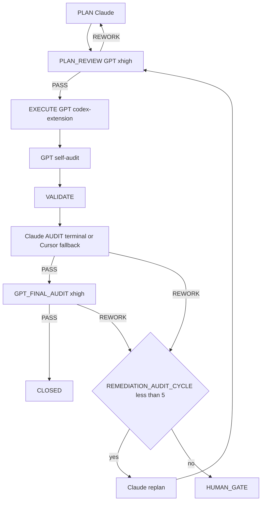

=== Auto-audit GPT (2e passe) ===
2026-04-25T21:19:30.651652Z  WARN codex_core::agents_md: Project doc `/Users/1millnonstop/Downloads/projet/foodking-web/web/testttt/AGENTS.md` exceeds remaining budget (32768 bytes) - truncating.
OpenAI Codex v0.125.0 (research preview)
--------
workdir: /Users/1millnonstop/Downloads/projet/foodking-web/web/testttt
model: gpt-5.5
provider: openai
approval: never
sandbox: workspace-write [workdir, /tmp, $TMPDIR, /Users/1millnonstop/.codex/memories]
reasoning effort: xhigh
reasoning summaries: none
session id: 019dc683-0d5c-7960-ad0a-044ade6418ed
--------
user
Tu effectues l’**auto-audit GPT** (2e passe) d’un cycle FoodKing — **pas** l’audit Claude terminal.

**Contexte** : le JSON ci-dessous est la proposition d’implémentation (format agents/codex.prompt.txt) pour la mission `CV1-M14-OPS-PREFLIGHT`.


**JSON d’implémentation (à recouper)** :
```json
{
  "files_to_modify": [
    "scripts/ops-preflight-caisse-v1.sh",
    "app/Console/Commands/PreflightProductionCommand.php",
    "config/horizon.php",
    "tests/Feature/OpsPreflightCaisseV1Test.php",
    "tests/Feature/AfterCommitDispatchTest.php",
    "tests/Feature/OutboxRescueTest.php"
  ],
  "implementation_steps": [
    "ESCALATION: no repository/file contents were available to safely produce concrete replacements for existing PHP command and tests without risking overwrite of project-specific structure.",
    "Do not claim production GO for M-14 until staging/full-volume migration rehearsal transcript evidence is supplied and verified by the preflight command/script.",
    "When repository access is available, implement only the allowlisted files and keep the shell wrapper read-only and fail-closed by default.",
    "Add explicit preflight checks for queue, scheduler, workers, broadcast, cache, outbox rescue command availability, fiscal archive path/readability, dashboards/checklists, alerting/on-call contacts, exact branch leakage checks, and M-13 rehearsal transcript evidence.",
    "Add/extend tests proving fail-closed behavior, missing transcript blocks GO, help/command shape, dispatch-after-commit invariant, and outbox rescue availability."
  ],
  "code_blocks": [],
  "risks": [
    "ESCALATION: existing contents of app/Console/Commands/PreflightProductionCommand.php and tests are unknown; emitting replacements would risk deleting established command signatures, helper traits, base test setup, or project-specific assertions.",
    "ESCALATION: command names for outbox rescue, fiscal archive verification, queue workers, and scheduler inspection must be confirmed from the codebase before hardcoding checks.",
    "ESCALATION: branch leak counter must use exact branch_id checks, but the relevant table/model names are unknown from the provided context."
  ],
  "notes": [
    "M-14 should remain fail-closed: missing staging/full-volume rehearsal transcript is a production-GO blocker, not a warning.",
    "No pricing, order status, product runtime flow, migration, frontend, OrderService, or FrontendOrderService changes are authorized.",
    "config/horizon.php, if needed, should be conservative and must not assume Horizon classes are installed unless composer/runtime evidence confirms them."
  ],
  "execution_trace": {
    "delegation": "codex-extension",
    "invariants_considered": [
      "pricing_ssot",
      "order_status",
      "branch_id",
      "commit_before_dispatch"
    ]
  }
}
```

**Livrable** (Markdown uniquement, en français) :
# AUTO_AUDIT_GPT — CV1-M14-OPS-PREFLIGHT

## 1. Conformité au plan / scope
(Énumérer manques ou dérives ; si scope élargi sans escale → **ESCALATE**)

## 2. Invariants FoodKing
Pour chacun : OK / RISQUE / N/A
- pricing_ssot (backend seul)
- order_status (enum, pas de strings)
- branch_id
- commit_before_dispatch
- frozen_zones
- order_service_symmetry (si un des deux services touché)

## 3. Verdict
Une ligne : `VERDICT: PASS` | `VERDICT: NEEDS_FIX` | `VERDICT: ESCALATE` + 1–3 phrases.

2026-04-25T21:19:31.020601Z  WARN codex_core_plugins::manifest: ignoring interface.defaultPrompt: prompt must be at most 128 characters path=/Users/1millnonstop/.codex/.tmp/plugins/plugins/build-ios-apps/.codex-plugin/plugin.json
2026-04-25T21:19:31.022285Z  WARN codex_core_plugins::manifest: ignoring interface.defaultPrompt: maximum of 3 prompts is supported path=/Users/1millnonstop/.codex/.tmp/plugins/plugins/plugin-eval/.codex-plugin/plugin.json
2026-04-25T21:19:37.510763Z  WARN codex_core_plugins::manifest: ignoring interface.defaultPrompt: prompt must be at most 128 characters path=/Users/1millnonstop/.codex/.tmp/plugins/plugins/build-ios-apps/.codex-plugin/plugin.json
2026-04-25T21:19:37.512202Z  WARN codex_core_plugins::manifest: ignoring interface.defaultPrompt: maximum of 3 prompts is supported path=/Users/1millnonstop/.codex/.tmp/plugins/plugins/plugin-eval/.codex-plugin/plugin.json
2026-04-25T21:19:38.349899Z  WARN codex_core_plugins::manifest: ignoring interface.defaultPrompt: prompt must be at most 128 characters path=/Users/1millnonstop/.codex/.tmp/plugins/plugins/build-ios-apps/.codex-plugin/plugin.json
2026-04-25T21:19:38.350181Z  WARN codex_core_plugins::manifest: ignoring interface.defaultPrompt: maximum of 3 prompts is supported path=/Users/1millnonstop/.codex/.tmp/plugins/plugins/plugin-eval/.codex-plugin/plugin.json
codex
Je vais recouper le JSON avec le contexte mission local plutôt que juger seulement la forme. Je lis les artefacts de cycle/mission nécessaires, puis je rends l’auto-audit demandé sans modifier le dépôt.
codex
J’utilise aussi la compétence `sync-risk-review`, car la proposition touche explicitement dispatch après commit, outbox et isolation `branch_id`.
exec
/bin/zsh -lc "sed -n '1,220p' .cursor/ACTIVE_CYCLE.md" in /Users/1millnonstop/Downloads/projet/foodking-web/web/testttt
 succeeded in 0ms:
# Active Cycle – FoodKing

**Méta (SSOT `run-cycle.md` Step 0 + `AGENTS.md` § *Authoritative … cycle state*)** — requis pour que l’orchestrateur ne s’arrête pas sur *« RUNNER_MODE not set »*.

| Champ | Valeur actuelle |
| --- | --- |
| **RUNNER_MODE** | `single-session` |
| **PHASE (cycle W10)** | `IN_PROGRESS` (détail = section `CYCLE_W10_…` ci-dessous) |
| **TASK_ID** | `P_EXEC_CLOSEOUT_GRAPHITI_CI_PROD_2026-04-22` |
| **PLAN_FILE** | `plans/PLAN_EXECUTION_CLOSEOUT_GRAPHITI_CI_PROD_2026-04-22.md` |
| **REPORT_FILE** | `reports/post_execute_latest.log` (append — preuve `EXECUTE_DELEGATION` / `AUDIT_*`) |

> **ACTIVE_PRIMARY** : `CYCLE_W10_EXECUTION_CLOSEOUT` (un seul cycle peut être actif à la fois — voir B03 méga-checklist).
> Cycles plus anciens en lecture seule = **archive** déplacée dans **`.cursor/ACTIVE_CYCLE_ARCHIVE.md`** (lecture humaine / forensique uniquement, **non requise** par le parcours obligatoire).

## CYCLE_W10_EXECUTION_CLOSEOUT (IN_PROGRESS — mémoire 180 + MCP global + commit + CI + prod)

**TASK_ID** : `P_EXEC_CLOSEOUT_GRAPHITI_CI_PROD_2026-04-22`  
**Plan SSOT** : `plans/PLAN_EXECUTION_CLOSEOUT_GRAPHITI_CI_PROD_2026-04-22.md`  
**Ordre** : Piste A (POS+Centrale : PLAN-MEM-1) ∥ Piste B (humain : PLAN-MEM-3) → C (smoke) → D (commit sur « go commit ») → E (CI) → F (prod J-7→J+7).  
**Gate mémoire** : `python3 memory/verify.py` → count **≥ 175** (180 idéal) avant de considérer PLAN-MEM-1 **CLOSED**.

- **Vérif locale (2026-04-22)** : `python3 memory/verify.py` → **count = 182**, smoke `search_memory_facts` OK — gate **satisfaite** pour clôturer l'ingestion côté seuil d'épisodes (suite : commit / CI / prod selon plan `PLAN_EXECUTION_CLOSEOUT_*`).

**Gouvernance globale (2e passe 2026-04-22)** : primer multi-agents + Graphiti vivant + tokens « zéro effet négatif » → **`docs/orchestration/GLOBAL_SYSTEM_PRIMER.md`** + rapport **`reports/audit/AUDIT_SECOND_PASS_GLOBAL_GOVERNANCE_REPORT_2026-04-22.md`**.

---

## CAISSE_V1_MASTERPLAY (ACTIVE — 2026-04-25)

**Phase** : finition Caisse V1 (POS + Kiosk + KDS + Centrale + Fiscal + Ops).
**Plan parent** : `plans/PLAN_CAISSE_V1_GPT_MASTERPLAY_2026-04-25.md`
**Plan DAG autoritaire** : `plans/PLAN_CAISSE_V1_SUPER_MASTER_2026-04-25.md`
**Boucle d'exécution** : `plans/masterplay/MASTERPLAY_DISCIPLINE.md` + `plans/masterplay/MASTERPLAY_QUEUE.md` + `scripts/run-masterplay.sh`
**Statut temps réel** : `reports/masterplay/status.json`

**Règle** : tout `TASK_ID` au format `CV1-MXX-…` passe par la masterplay (cf. `AGENTS.md` § "Caisse V1 — Masterplay loop", `.cursor/rules/global.mdc` § "Caisse V1 — Masterplay loop", `.cursor/commands/run-cycle.md` Step 0 item 0). **NE PAS** ouvrir un `run-cycle` standard sur un `CV1-MXX-…`.

---

## Archive

Tous les cycles **CLOSED / COMPLETED PASSED** (W4 → W9, NF525, etc.) ont été déplacés dans **`.cursor/ACTIVE_CYCLE_ARCHIVE.md`** pour réduire le coût de lecture du parcours obligatoire (audit 2026-04-24, mission `T-PARCOURS-OPTIMIZE-001`).

- **Lecture humaine** : ouvrir `.cursor/ACTIVE_CYCLE_ARCHIVE.md`.
- **Lecture agent** : **non requise** sauf instruction explicite du plan ou du chat (ex. "reprend le rationale du cycle W9").
- **Recherche** : `rg "CYCLE_W9_" .cursor/ACTIVE_CYCLE_ARCHIVE.md` ou `git log --follow .cursor/ACTIVE_CYCLE.md`.

exec
/bin/zsh -lc "sed -n '1,220p' plans/masterplay/MASTERPLAY_QUEUE.md" in /Users/1millnonstop/Downloads/projet/foodking-web/web/testttt
exec
/bin/zsh -lc "sed -n '1,220p' plans/masterplay/MASTERPLAY_DISCIPLINE.md" in /Users/1millnonstop/Downloads/projet/foodking-web/web/testttt
exec
/bin/zsh -lc "sed -n '1,220p' /Users/1millnonstop/Downloads/projet/foodking-web/web/testttt/.agents/skills/sync-risk-review/SKILL.md" in /Users/1millnonstop/Downloads/projet/foodking-web/web/testttt
 succeeded in 0ms:
# MASTERPLAY_QUEUE — Caisse V1

**Source de vérité de l'orchestration en boucle** : `bash scripts/run-masterplay.sh` lit cette file et exécute en série.

**Discipline** : `plans/masterplay/MASTERPLAY_DISCIPLINE.md`.  
**Plan parent** : `plans/PLAN_CAISSE_V1_GPT_MASTERPLAY_2026-04-25.md`.

## Légende statut

- `PENDING` — pas encore lancé
- `RUNNING` — codex exec en cours (ne pas relancer)
- `EXECUTED` — codex exec terminé, attend audit
- `AUDIT_PASS` — `AUDIT_VERDICT: PASS` Claude
- `FINAL_PASS` — `GPT_FINAL_AUDIT_VERDICT: PASS`
- `CLOSED` — mémoire ingestée + activity-log done
- `REWORK` — audit a demandé rework
- `BLOCKED` — gate humain ou dépendance manquante

## Légende vague

- `WAVE_A` — NO-GATE, parallélisable, démarre immédiatement
- `WAVE_B` — POST-GATE, séquencé selon DAG

## File d'exécution


| ORDER | TASK_ID                           | MISSION | WAVE   | DEPENDS_ON                 | STATUS  | NOTE                                                                         |
| ----- | --------------------------------- | ------- | ------ | -------------------------- | ------- | ---------------------------------------------------------------------------- |
| 01    | CV1-M19-MEMORY-DISCIPLINE         | M-19    | WAVE_A | —                          | CLOSED  | Crée squelettes JSONL pour les 22 missions                                   |
| 02    | CV1-M01-TRACEABILITY-MATRIX       | M-01    | WAVE_A | —                          | CLOSED  | Matrice findings → tasks → tests → gates (REWORK resolved GPT PASS)          |
| 03    | CV1-M02-SENTINEL-BASELINE         | M-02    | WAVE_A | CV1-M01                    | CLOSED  | 18 sentinels fail-first + 4 lints                                            |
| 04    | CV1-M12-LEGACY-GUARDS-CI          | M-12    | WAVE_A | —                          | CLOSED  | Lint imports + bundle scan + workflow (recovered: extractor JSON fix)        |
| 05    | CV1-M16-HARDWARE-LAB              | M-16    | WAVE_A | —                          | CLOSED  | Checklist hardware signable (recovered: JSON valid, files materialized)      |
| 06    | CV1-M18-TEST-ARCHITECTURE         | M-18    | WAVE_A | CV1-M02                    | CLOSED  | Grille couverture + plan campagne                                            |
| 07    | CV1-M20-RUNBOOKS-SKELETON         | M-20    | WAVE_A | —                          | CLOSED  | 8 runbooks ops (REWORK Horizon resolved GPT PASS)                            |
| 08    | CV1-M21A-QUICKWINS-LOT0           | M-21a   | WAVE_A | —                          | CLOSED  | POS: discount v-model + Swiper RTL + focustrap dead                          |
| 09    | CV1-M03-GATES-DRAFT               | M-03    | WAVE_A | CV1-M01                    | CLOSED  | 8 briefs gates Caisse V1 créés; Wave B reste bloquée par signatures humaines |
| 10    | CV1-M09-BRANCH-ISOLATION          | M-09    | WAVE_B | CV1-M03(gates), CV1-M02    | CLOSED  | GPT audit PASS; M-08/M-06/schema sentinels remain gated                      |
| 11    | CV1-M06-POS-REVENUE-GUARDS        | M-06    | WAVE_B | CV1-M09, CV1-M03           | CLOSED | GPT rework audit PASS; gates frozen C + payment_prop A approved              |
| 12    | CV1-M05-ORDER-QUOTE               | M-05    | WAVE_B | CV1-M03                    | CLOSED | GPT final PASS; quote sealed/consumed at POS+kiosk commit                    |
| 13    | CV1-M04A-PAYMENT-LEDGER-FULL      | M-04A   | WAVE_B | CV1-M03 (ledger=A)         | BLOCKED | Ledger gate chose Option B; M-04A not selected                               |
| 14    | CV1-M04B-PAYMENT-PILOT-RESTRICT   | M-04B   | WAVE_B | CV1-M03 (ledger=B)         | CLOSED  | GPT audit PASS; Option B restricted pilot implemented                        |
| 15    | CV1-M08-FISCAL-Z-NF525            | M-08    | WAVE_B | CV1-M03 (fiscal+schema)    | CLOSED | GPT final PASS; fiscal Option B Z policy sealed                              |
| 16    | CV1-M07-KDS-RELEASE               | M-07    | WAVE_B | CV1-M03 (kds_bump)         | CLOSED | GPT final PASS; KDS server authority with expected_status sealed             |
| 17    | CV1-M10-OS-FOS-SYMMETRY           | M-10    | WAVE_B | CV1-M06, CV1-M09           | CLOSED | Unlocked after M-06 GPT audit PASS and M-09 CLOSED                           |
| 18    | CV1-M11-KIOSK-RUNTIME             | M-11    | WAVE_B | CV1-M03 (offline+fiscal)   | BLOCKED | Will unlock after M-08 policy evidence                                       |
| 19    | CV1-M17-WEB-STRIPE-SCOPE          | M-17    | WAVE_B | CV1-M03 (web+stripe)       | CLOSED | GPT final PASS; web payment off + Stripe inactive guard sealed               |
| 20    | CV1-M13-MIGRATIONS-SAFETY         | M-13    | WAVE_B | CV1-M03 (schema)           | CLOSED | GPT final PASS; migration safety tooling sealed; staging rehearsal deferred to M14 |
| 21    | CV1-M14-OPS-PREFLIGHT             | M-14    | WAVE_B | CV1-M13                    | RUNNING | M-13 closed; mission package prepared GPT-only                               |
| 22    | CV1-M15-ROLLOUT-CANARY            | M-15    | WAVE_B | CV1-M04*, CV1-M08, CV1-M14 | BLOCKED | —                                                                            |
| 23    | CV1-M21B-PAYMENT-REFACTOR         | M-21b   | WAVE_B | CV1-M03 (prop_mutation)    | BLOCKED | Gate approved; unlock after M-06/M-10 stabilization                          |
| 24    | CV1-M22-POST-LAUNCH-OBSERVABILITY | M-22    | WAVE_B | CV1-M14, CV1-M15           | BLOCKED | —                                                                            |


## Ce que le runner exécute

À chaque tour de boucle, le runner :

1. Lit cette table.
2. Prend la **première** ligne au statut `PENDING`.
3. Vérifie que toutes ses `DEPENDS_ON` sont au statut `CLOSED`. Sinon → skip.
4. Vérifie que `missions/<TASK_ID>/input.json` et `execute_brief.md` existent. Sinon → marque `BLOCKED note=missing-mission-files`.
5. `start` activity-log → `npm run codex:complex -- <TASK_ID>` → `done` activity-log.
6. Mise à jour statut : `EXECUTED`.
7. Audit Claude terminal automatique (si activé `--with-audit`) → `AUDIT_PASS` ou `REWORK`.
8. Si `AUDIT_PASS` : `npm run codex:final-audit -- <TASK_ID>` → `FINAL_PASS`.
9. Si `FINAL_PASS` : ingestion mémoire + `done` → `CLOSED`.
10. Loop.

## Statut initial (à la création)

Les 6 missions Vague A préparées par M-19/M-01/M-02/M-12/M-16/M-18 sont au statut `PENDING`. Les autres `TODO_NEXT` (à créer après le premier round) ou `BLOCKED` (gates).

## Mise à jour manuelle

Le runner met à jour la colonne `STATUS` automatiquement (sed sur cette table). Tu peux aussi éditer manuellement entre 2 runs (ex: marquer `BLOCKED → PENDING` après gate signé).

 succeeded in 0ms:
---
name: sync-risk-review
description: Review changes affecting synchronization, auth, pricing, KDS, OSS, or order lifecycle for architectural and business risk.
disable-model-invocation: true
---

# Sync Risk Review Skill

Use this skill when a change affects:
- sync
- auth
- pricing
- KDS
- OSS
- order lifecycle
- cross-device behavior

## Steps
1. Read the relevant docs
2. Inspect the diff or current implementation
3. Identify:
   - architecture risk
   - state consistency risk
   - business rule violations
   - authz issues
   - missing tests
4. Produce a concise review with recommended next actions.

 succeeded in 0ms:
# MASTERPLAY DISCIPLINE — Caisse V1 (loop master)

> **But** : règles strictes que le runner et chaque mission GPT respectent en boucle, pendant des heures, jusqu'à finition de toutes les missions de `MASTERPLAY_QUEUE.md`. Lecture obligatoire avant de lancer `bash scripts/run-masterplay.sh`.

## 1. Autorité

| Source | Rôle |
|--------|------|
| `AGENTS.md` | Parcours obligatoire, cycle FoodKing |
| `plans/PLAN_CAISSE_V1_SUPER_MASTER_2026-04-25.md` | DAG autoritaire (ordre, gates) |
| `plans/PLAN_CAISSE_V1_GPT_MASTERPLAY_2026-04-25.md` | Catalogue 22 missions M-XX (objectifs, allowlist) |
| `plans/masterplay/MASTERPLAY_QUEUE.md` | File d'exécution courante |
| `plans/masterplay/MASTERPLAY_DISCIPLINE.md` | (ce fichier) règles d'exécution |
| `.cursor/rules/*.mdc` | Toujours appliquées |
| `docs/gates/GATE_LOG.md` | État des gates humains |

## 2. Boucle d'exécution (run-masterplay.sh)

```
LOOP {
  1. tail activity log (~500 tokens)
  2. find next PENDING task in MASTERPLAY_QUEUE with all DEPENDS_ON == CLOSED
  3. if none → break (all done or all blocked)
  4. verify missions/<TASK_ID>/input.json + execute_brief.md exist
  5. activity-log start codex-extension <TASK_ID> execute "<allowlist CSV>" "<note>"
     if exit 2 (collision) → MARK BLOCKED note=collision, continue loop
  6. update status: RUNNING
  7. npm run codex:complex -- <TASK_ID>     (génère output_codex.json + GPT_SELF_AUDIT)
  8. update status: EXECUTED
  9. activity-log done codex-extension <TASK_ID> done "<résumé court>"
 10. (option --with-audit) bash scripts/foodking-claude-orchestrate.sh audit-brief <TASK_ID>
       if PASS → status: AUDIT_PASS
       if REWORK → status: REWORK ; increment REWORK_COUNT ; if >=5 → BLOCKED note=human_gate
 11. (option --with-final) npm run codex:final-audit -- <TASK_ID>
       if PASS → status: FINAL_PASS
 12. if FINAL_PASS:
       bash scripts/after-execute-memory.sh
       update status: CLOSED
 13. sleep INTER_TASK_PAUSE_SECONDS (default 5s)
 14. continue LOOP
}
```

## 3. Garde-fous (non négociables)

### 3.1 Allowlist stricte par mission
Codex modifie **uniquement** les fichiers listés dans `missions/<TASK_ID>/input.json.allowlist`. Si modification hors liste détectée à l'audit → `REWORK`.

### 3.2 Frozen zones
Aucune édition d'un fichier frozen sans gate signé dans `docs/gates/GATE_LOG.md`. Le runner **refuse** de lancer une mission marquée `BLOCKED` jusqu'à ce que le statut soit changé manuellement après signature.

### 3.3 Invariants FoodKing — `REWORK` automatique
- Pricing client-authoritative
- Status littéral numérique (`status: 16`)
- `branch_id` LIKE
- Dispatch dans transaction
- OS ou FOS modifié sans `SYMMETRY_NOTE`
- Frozen modifié sans gate

### 3.4 Pas de gate auto-approuvée
Codex peut **rédiger** options ; aucune mission ne coche `[x] Approved`. Si une mission le tente → `REWORK` + `risks: ["ESCALATION: gate self-approved"]`.

### 3.5 Tests obligatoires
Chaque `mandatory_tests` listé doit être lancé et reporté dans le rapport. Échec → `REWORK`.

### 3.6 Diff minimal
Aucun renommage opportuniste, aucun refactor non demandé, aucune optimisation collatérale. Si ajout justifié → `notes` du JSON.

### 3.7 Activity log
`start` avant chaque mission ; `done` après. Sans cela → réservation fantôme = autres agents bloqués. Le runner enforce.

### 3.8 Mémoire
À CLOSE : compléter `memory/episodes/caisse_v1_<topic>_*.jsonl` (squelettes créés par M-19) puis `bash scripts/after-execute-memory.sh`. Si Graphiti UP : `bash bin/graphiti-ingest.sh` + `python3 memory/verify.py`.

## 4. Boucles de rework

- Max **5 cycles `REWORK`** consécutifs sur la même mission. Au 5e → `BLOCKED note=human_gate_required`.
- Max **3 cycles healing** consécutifs (cf. CLAUDE.md §8) avant escalade.
- Toute escalation → écrite dans `reports/masterplay/ESCALATIONS_<date>.md`.

## 5. Pause / arrêt

- `Ctrl-C` arrête la boucle proprement (mission en cours finit, runner s'arrête après).
- `touch reports/masterplay/STOP` → le runner s'arrête à la fin de la mission courante.
- `touch reports/masterplay/PAUSE` → le runner pause entre les missions tant que le fichier existe.

## 6. Logs

- `reports/masterplay/run_<ISO>.log` : log de la boucle.
- `reports/masterplay/status.json` : état temps réel (mission courante, compteurs).
- `missions/<TASK_ID>/output_codex.raw.log` : raw codex.
- `missions/<TASK_ID>/output_codex.json` : json structuré.
- `reports/audit/GPT_SELF_AUDIT_<TASK_ID>.md` : self-audit GPT.
- `reports/post_execute_latest.log` : trace `EXECUTE_DELEGATION`.
- `reports/AGENT_ACTIVITY_LOG.md` : start/done.

## 7. Audit Claude (en fin de boucle, manuel)

Quand toutes les missions sont `CLOSED` (ou `BLOCKED` documentés) :

```
bash scripts/foodking-claude-orchestrate.sh context
bash scripts/foodking-claude-orchestrate.sh audit
```

Sortie attendue : verdict transversal Caisse V1 (chaîne sync borne→centrale→POS→KDS→fiscal). Le verdict détermine `GO/HOLD/NO-GO` pour `GATE_GO_NO_GO_CAISSE_V1`.

## 8. Critères d'arrêt anormal

- 3 missions consécutives en `REWORK` → halt + alerte humaine.
- Activity-log refuse 3 fois → halt (collision permanente).
- `npm run codex:complex` échoue 3 fois sur la même mission (binaire codex KO) → halt.
- `claude` terminal indisponible 3 fois consécutives → continue avec fallback subagent + `AUDIT_FALLBACK_REASON: terminal-unavailable`.

## 9. Token discipline

- Le prompt envoyé à codex contient : template `agents/codex.prompt.txt` + `input.json` + `execute_brief.md` + (optionnel) `graphiti_context.md`, `plan_excerpt.md`, `cycle_snapshot.md`.
- Pas de duplication : pas de re-coller AGENTS.md ou super master plan dans chaque mission.
- Cap typique d'un prompt : ≤ 30 KB. Au-delà → splitter la mission.

## 10. Anti-pattern interdits

- ❌ Lancer 2 missions en parallèle sur les mêmes fichiers (collision activity-log).
- ❌ Modifier `MASTERPLAY_QUEUE.md` pendant que le runner tourne (sauf marquer BLOCKED → PENDING après gate).
- ❌ Skipper l'audit Claude pour aller plus vite.
- ❌ Marquer CLOSED manuellement sans double PASS (PASS Claude + PASS Codex final).
- ❌ Ignorer un `risks: ["ESCALATION: ..."]` dans output_codex.json.

---

`MASTERPLAY_DISCIPLINE_VERSION: 1.0` · `STRICT_MODE: ON`

2026-04-25T21:19:59.017369Z  WARN codex_core_plugins::manifest: ignoring interface.defaultPrompt: prompt must be at most 128 characters path=/Users/1millnonstop/.codex/.tmp/plugins/plugins/build-ios-apps/.codex-plugin/plugin.json
2026-04-25T21:19:59.018610Z  WARN codex_core_plugins::manifest: ignoring interface.defaultPrompt: maximum of 3 prompts is supported path=/Users/1millnonstop/.codex/.tmp/plugins/plugins/plugin-eval/.codex-plugin/plugin.json
codex
Le contexte masterplay confirme que `CV1-M14-OPS-PREFLIGHT` est gouverné par la file Caisse V1, dépend de M-13 et est actuellement `RUNNING`. Je vérifie maintenant le package mission et les contraintes allowlist/tests pour distinguer vrai blocage, manque d’implémentation, et dérive de scope.
exec
/bin/zsh -lc "sed -n '1,260p' missions/CV1-M14-OPS-PREFLIGHT/input.json" in /Users/1millnonstop/Downloads/projet/foodking-web/web/testttt
exec
/bin/zsh -lc "sed -n '1,260p' docs/orchestration/GLOBAL_SYSTEM_PRIMER.md" in /Users/1millnonstop/Downloads/projet/foodking-web/web/testttt
 succeeded in 0ms:
{
  "task_id": "CV1-M14-OPS-PREFLIGHT",
  "mission_id": "M-14",
  "plan_file": "plans/PLAN_CAISSE_V1_GPT_MASTERPLAY_2026-04-25.md",
  "primary_model": "codex-extension",
  "model": "gpt-5.5-pro",
  "reasoning_effort": "xhigh",
  "objective": "Livrer le preflight ops Caisse V1: queue, scheduler, workers, broadcast, cache, outbox, fiscal archive, dashboards/checklists, alerting et on-call.",
  "instruction": "Applique uniquement M-14. No gate apres M-13, mais le rehearsal staging full-volume de M-13 reste explicitement reporte: ne pas declarer GO prod si transcript staging absent. Produire outillage preflight fail-closed/read-only par defaut, verifier runtime ops, et couvrir avec tests. JSON unique.",
  "allowlist": [
    "scripts/ops-preflight-caisse-v1.sh",
    "app/Console/Commands/PreflightProductionCommand.php",
    "config/horizon.php",
    "tests/Feature/OpsPreflightCaisseV1Test.php",
    "tests/Feature/AfterCommitDispatchTest.php",
    "tests/Feature/OutboxRescueTest.php"
  ],
  "off_limits": [
    "database/migrations/**",
    "app/Services/**",
    "resources/**",
    "routes/**",
    ".cursor/**",
    "AGENTS.md"
  ],
  "human_gate_decisions": [
    {
      "gate": "GATE_SCHEMA_MIGRATIONS_CAISSE_V1_2026-04-25",
      "status": "Approved",
      "decision": "Option A — All migrations with rehearsal + backup",
      "date": "2026-04-25"
    }
  ],
  "dependencies_closed": [
    "CV1-M13-MIGRATIONS-SAFETY"
  ],
  "invariants_at_risk": [
    "dispatch_after_commit",
    "branch_id",
    "frozen_zones"
  ],
  "gate_conditions": [
    "M-13 CLOSED",
    "schema approved Option A"
  ],
  "mandatory_tests": [
    "php artisan test --filter=OpsPreflightCaisseV1Test",
    "php artisan test --filter=AfterCommitDispatchTest",
    "php artisan test --filter=OutboxRescueTest",
    "bash scripts/ops-preflight-caisse-v1.sh --help",
    "php artisan app:preflight-production --help"
  ],
  "self_audit_checklist": [
    "preflight script is read-only/fail-closed by default",
    "preflight command avoids env() runtime drift after config:cache",
    "queue/scheduler/worker/broadcast/cache/outbox/fiscal archive checks are explicit",
    "M13 staging rehearsal missing remains a blocker for prod GO, not silently accepted",
    "no product runtime flow or schema migration is modified"
  ],
  "rollback": {
    "feature_flag": null,
    "max_window_days": 0,
    "predicates": [
      "preflight produces false GO",
      "missing staging transcript treated as pass",
      "dispatch after commit invariant weakened"
    ]
  },
  "graphiti_query": "Caisse V1 ops preflight queue scheduler broadcast cache outbox fiscal archive",
  "memory_episode_to_write_on_close": "memory/episodes/caisse_v1_ops_preflight_2026-04-25.jsonl",
  "claude_audit_prompt_id": "disabled-gpt-only"
}

 succeeded in 0ms:
# FoodKing — Primer système global (agents, sous-agents, Graphiti, tokens)

> **Passation + index complet des chemins (SSOT, un seul fichier)** : **`../DOC_EXPO_HER_ANCIEN_AGENT_ALIMENTATION_WORKFLOW_2026-04-22.md`** (table §2 = utilité de chaque path pour une nouvelle session).

> **Fichier d’entrée** pour toute nouvelle conversation, tout nouvel outil d’agent (Cursor, terminal, futur bot), ou tout humain qui reprend le projet.  
> Objectif : **robustesse** = même avec 100 cycles et des exécuteurs différents, le comportement reste **prévisible**, **traçable**, et la **mémoire** reste **alignée** sur le code.

**Obligatoire avant ce Primer (SSOT d’onboarding)** : lire `**AGENTS.md`**, section **Parcours obligatoire** (nouvelle session **et** continuation), puis enchaîner ici.  
**En continuation d’un cycle** : lire d’**abord** `**.cursor/ACTIVE_CYCLE.md`** (éviter un second `TASK_ID` fantôme) ; si `PHASE` = vide ou `CLOSED`, revenir à la table ci-dessous.

---

## 1. Ordre de lecture obligatoire (minimum viable)

Lire **dans cet ordre** avant d’écrire du code ou un plan non trivial (voir aussi `**AGENTS.md` § *Parcours obligatoire* — tableau** pour la même doctrine) :


| #   | Fichier                                                    | Pourquoi                                                                                                                  |
| --- | ---------------------------------------------------------- | ------------------------------------------------------------------------------------------------------------------------- |
| 0   | `**.cursor/ACTIVE_CYCLE.md`** (si reprise)                 | Cycle déjà en cours : même `TASK_ID` / mêmes Steps **jusqu’à** `CLOSE` — **ne pas** forker un plan parallèle sans le dire |
| 1   | `**AGENTS.md`** (dont § *Parcours obligatoire*)            | Contrat global : phases, routing, MCP, terminal, parcours production, non-négociables                                     |
| 1b  | `**docs/orchestration/SESSION_OPENING_ENFORCEMENT.md**`  | **Bloc unique** (tail log + `verify:boucle` + rappel phases) — réduit la répétition « refais la boucle » en session ; **modèle Cursor = Claude pour PLAN** (Auto/Composer ne remplacent pas `routing.md`) |
| 1c  | `**reports/audit/SIMULATION_PARCOURS_PROD_CHECKPOINTS_2026-04-25.md**` | **Simulation production** : checkpoints par phase, fichiers SSOT, limite IDE (qui orchestre quoi) — avant de promettre « zéro dérive » |
| 2   | `**.cursor/routing.md*`*                                   | Qui fait quoi (Claude plan/audit, GPT-5.5-pro xhigh plan review / execute / final audit, Composer validation only)         |
| 3   | `**.cursor/commands/run-cycle.md**`                        | Déroulé exact d’un cycle `TASK_ID` (incl. Graphiti Step 0.5)                                                              |
| 4   | `**.cursor/rules/graphiti-memory.mdc**`                    | Mémoire Graphiti : quand lire / quand écrire                                                                              |
| 5   | `**.cursor/rules/global.mdc**` + `**context-hygiene.mdc**` | Gates, discipline tokens **sans** réduire l’intelligence                                                                  |
| 6   | `**docs/orchestration/MEMORY_MATRIX.md`**                  | **Quel store écrit quoi, lit quoi, quand** (4 stores autorisés A/B/C/D) — antidote unique à la complexité mémoire         |
| 6b  | `**docs/orchestration/MULTI_AGENT_ORCHESTRATION.md`**      | Même tâches, plusieurs onglets Cursor : **activité** + **Graphiti** (lecture) + `AUDIT_VERDICT` — sans empiéter           |
| 7   | `**memory/INDEX.md`**                                      | Carte des domaines mémoire Graphiti (store B) — secours si MCP absent                                                     |
| 8   | `**tasks/[TASK_ID].md**`                                   | Quand un cycle borné est lancé — périmètre de la tâche                                                                    |


Ensuite, **selon le domaine** : `docs/ORDER_FLOW.md`, `docs/DEVICE_FLOW.md`, `docs/ARCHITECTURE.md`, `project-invariants.mdc`, etc.

Référence roster court : `**docs/orchestration/AGENT_ROLES.md`**.

### 1.1 Décision : Claude orchestre ; GPT challenge et exécute en xhigh

- **Cerveau** (priorité, plan, re-plan, gates) : **Claude** (session + terminal `foodking-claude-orchestrate.sh`) — il écrit le plan et tranche la stratégie de remédiation.
- **Challenge plan obligatoire** : **GPT-5.5-pro / xhigh** relit le plan avant EXECUTE (`npm run codex:plan-review -- {TASK_ID}` → `PLAN_REVIEW_VERDICT`). Si `REWORK`, Claude révise avant tout code.
- **Bras + premier contrôle qualité** : **EXECUTE = Codex (PRIMARY)** pour toutes les implémentations produit, même les petites corrections : `npm run codex:complex -- {TASK_ID}` → `reports/audit/GPT_SELF_AUDIT_{TASK_ID}.md`.
- **Pas de routine product implementation** : Composer / `foodking-routine-implementer` ne fait plus d’édition produit en cycle de finition ; il peut aider au reporting/validation seulement.
- **Double audit final** : Claude audit d’abord (`AUDIT_VERDICT`) avec terminal primary + fallback Cursor si quota/rate-limit/terminal HS, puis GPT final audit (`npm run codex:final-audit -- {TASK_ID}` → `GPT_FINAL_AUDIT_VERDICT`). Close seulement si les deux sont `PASS`.

---

## 2. Sous-agents Cursor (Task tool) — intégration dans le flux

Ce ne sont **pas** des fichiers dans le repo ; ce sont des **profils** invoqués par Cursor selon `.cursor/routing.md` et `**run-cycle.md` Step 2**.


| Sub-agent / Canal                                                               | Modèle cible                                                                  | Quand                                                                                                                                                                                                                                          |
| ------------------------------------------------------------------------------- | ----------------------------------------------------------------------------- | ---------------------------------------------------------------------------------------------------------------------------------------------------------------------------------------------------------------------------------------------- |
| `**foodking-routine-implementer`** (sub-agent Cursor)                           | Composer                                                                      | **Validation/report only** en cycles de finition. Pas d’implémentation produit.                                                                                                                                             |
| `**codex-extension` — FoodKing Codex Complex Implementer (PRIMARY)**            | **GPT-5.5-pro / xhigh** via CLI `codex` (compte **ChatGPT Pro**) + `codex exec` | **PLAN_REVIEW + toute implémentation produit + auto-audit + GPT_FINAL_AUDIT**. `npm run codex:complex -- {TASK_ID}`. Voir `scripts/codex-extension-execute.sh`, `agents/codex-extension-instructions.md`. |
| `**foodking-complex-implementer`** (sub-agent Cursor — **FALLBACK uniquement**) | Aligné exécution **GPT-5.5** (emplacement sub-agent)                          | Uniquement si `codex` / `codex exec` est indisponible après reprises sur la même tâche                                                                                                                                                         |


**Règles d'or**

1. **Délégation obligatoire** pour toute modification produit en EXECUTE, avec trace `EXECUTE_DELEGATION:` dans le log de validation. Valeurs autorisées : `codex-extension` | `foodking-complex-implementer (codex-extension-fallback)` | `explicit-prompt-bind`.
2. **EXECUTE = `codex-extension` PRIMAIRE** (CLI `codex` + Pro, `npm run codex:complex -- {TASK_ID}` ; contexte Graphiti/plan dans `missions/…/graphiti_context.md` etc. ; voir `**docs/orchestration/CODEX_API_DELEGATION.md`**). Le sub-agent `foodking-complex-implementer` est le **fallback** (usage Cursor) — indispo `codex exec`. Aucun **connecteur HTTP** / proxy n’est maintenu dans le dépôt.
3. Le sous-agent **ne voit pas toujours** le MCP Graphiti du parent : le plan **doit** contenir `**## PRIOR_CONTEXT`** (faits Graphiti + invariants) — copier ou résumer dans le message de délégation **ou** dans `missions/{TASK_ID}/graphiti_context.md` pour l’appel API.
4. Aucun sub-agent ne **contourne** un gate humain ni n’édite une frozen zone sans `docs/gates/` approuvé.

---

## 3. Terminal allies (hors Task tool) — intégration

Documentés dans `**AGENTS.md` § Terminal allies** :


| Outil                                                                  | Rôle                                                                     | Position + **canal d’abonnement** (SSOT)                                                                                                                                                                                         |
| ---------------------------------------------------------------------- | ------------------------------------------------------------------------ | -------------------------------------------------------------------------------------------------------------------------------------------------------------------------------------------------------------------------------- |
| `**claude` +** `foodking-claude-orchestrate.sh`                        | **AUDIT cycle — PRIMARY (Step 5)** : `context` → `audit` / `audit-brief` | Abonnement **Anthropic (CLI sur terminal)** ; n’**emprunte** pas l’orchestrateur de modèles de Cursor. **FALLBACK actif** (quota / limite / panne après 1 retry) : Task **`foodking-planner-orchestrator`** + même checklist + `AUDIT_CHANNEL: cursor-session` + `AUDIT_FALLBACK_REASON:` — `docs/orchestration/AUDIT_TERMINAL_QUOTA_FALLBACK.md`. |
| **CLI** `codex` + `npm run codex:complex` (`**codex-extension`**, Pro) | **PLAN_REVIEW + EXECUTE + GPT_FINAL_AUDIT — PRIMARY** (GPT-5.5-pro/xhigh) | Compte **ChatGPT Pro** sur le terminal ; ne passe **pas** par l’orchestrateur de modèles **Cursor** ; facturation côté OpenAI ; **FALLBACK** = sub-agent.     |
| `codex` / REPL interactif (OpenAI)                                     | Tâches ad hoc **hors** cycle, ou côté humain                             | N’enlèvent **pas** VALIDATE + AUDIT du `run-cycle`.                                                                                                                                                                              |
| `verify-orchestration-boucle.sh`                                       | Preuve binaire + optionnel smoke (API)                                   | `bash scripts/verify-orchestration-boucle.sh` — `VERIFY_BILLING_FULL=1` lance 1× smoke `claude` + 1× `npm run codex:smoke`.                                                                                                      |


**Clôture :** l’audit Claude écrit `AUDIT_VERDICT: PASS` ou `REWORK`, puis GPT écrit `GPT_FINAL_AUDIT_VERDICT: PASS|REWORK|ESCALATE` (voir `run-cycle.md` Step 5). Pas de `CLOSED` sans double `PASS`. En `REWORK` : re-orchestration + re-EXECUTE GPT jusqu’à double `PASS` ou 5e tour → humain. Schéma :




Le terminal **n’enregistre** pas **Graphiti** seul : après AUDIT/CLOSE, décisions → JSONL + `after-execute-memory.sh` (voir §5) comme avant.

---

## 4. Graphiti — vivre avec l’avancement du projet (N agents, N cycles)

### 4.1 Rôles


| Rôle                                    | Responsable                                                          |
| --------------------------------------- | -------------------------------------------------------------------- |
| **Lecture** avant plan / audit complexe | Tout agent avec MCP `graphiti` chargé                                |
| **Écriture** après décision durable     | Phase AUDIT + CLOSED (`audit-context.md`) ou humain via `add_memory` |
| **Alimentation batch** (JSONL → Neo4j)  | Humain ou pipeline : `bash bin/graphiti-ingest.sh`                   |


### 4.2 Quand mettre à jour la mémoire (checklist — « ne pas oublier »)

Cocher mentalement à **chaque** fin de sujet significatif :

- **Invariant** clarifié ou renforcé → nouvelle ligne dans `memory/episodes/02_architecture_invariants.jsonl` (ou fichier le plus proche) + `ingest` ciblé.
- **Sync / event / canal** modifié → `03_domain_events_sync.jsonl` + ingest.
- **Décision produit / ADR** → `12_decisions_log.jsonl` + ingest.
- **Nouvelle tâche V14+** ou finding cross-vagues → `09_tasks_history.jsonl` + ingest.
- **Changement prod / rollout** → `11_production_plan.jsonl` + ingest.
- **Nouveau rôle agent ou règle d’orchestration** → `13_agents_roles.jsonl` + ingest + **mettre à jour ce Primer** si le modèle change.
- **Audit long (ops + agentique + mémoire)** → suivre `docs/orchestration/MEGA_CHECKLIST_AUTONOMY_AND_MEMORY.md` (180 tâches) ; narratif `reports/audit/MEGA_AUDIT_SYSTEM_OPERATION_AGENTIC_2026-04-23.md`.
- **Après toute écriture JSONL** → `bash scripts/after-execute-memory.sh` (rafraîchit `reports/memory/jsonl_manifest.json`, cohérent avec CI) puis `bin/graphiti-ingest.sh` sur les domaines touchés.

**Règle d’or** : si le code ou la doc **canonical** a changé et que la mémoire dit encore l’ancienne vérité → **mise à jour sous 48 h** (sinon dérive silencieuse).

### 4.3 Outils

- Pipeline post-écriture (manifeste + rappel ingest) : `bash scripts/after-execute-memory.sh`.
- Ingestion : `bin/graphiti-ingest.sh [filtre]` — voir `memory/README.md`.
- Vérification : `python3 memory/verify.py`.
- Terminal (bref + audit option) : `bash scripts/foodking-claude-orchestrate.sh post-execute` ou `context` puis `audit-brief` — `docs/orchestration/TERMINAL_CLAUDE_GRAPHITI_ORCHESTRATION.md`.
- Reset rare : `@graphiti clear_graph` puis full ingest (politique humaine).

---

## 5. Tokens, contexte, cache — politique « intelligence max, gaspillage min »

**But** : réponses **détaillées et stables**, pas des réponses courtes pour économiser des tokens au détriment de la qualité.


| On optimise (effet ≥ 0)                                                              | On n’optimise pas (effet négatif interdit)                               |
| ------------------------------------------------------------------------------------ | ------------------------------------------------------------------------ |
| Re-lire un fichier **déjà** dans la fenêtre contexte                                 | Tronquer un plan, une analyse de risque, ou un gate pour « faire court » |
| Résumer une phase **terminée** pour handoff (voir `context-hygiene.mdc` §4)          | Supprimer `## PRIOR_CONTEXT` ou les invariants du plan                   |
| Utiliser **Graphiti** pour récupérer faits structurés au lieu de rouvrir 50 rapports | Désactiver Graphiti pour « aller plus vite » sur du sync / fiscal        |
| Écrire les preuves dans `reports/` structuré                                         | Remplacer des tests par de la prose vague                                |


**Cache applicatif** (Redis, etc.) : régie par le code Laravel et `**app:preflight-production`** — hors scope de ce Primer, mais **ne jamais** confondre « cache métier » et « mémoire Graphiti » : ce sont deux systèmes.

---

## 6. Révision de ce document

- **À chaque** changement majeur d’orchestration (nouveau sub-agent, nouveau MCP, nouveau cycle obligatoire) : mettre à jour **ce fichier** + une ligne dans `13_agents_roles.jsonl` + ingest.
- **Trimestriel** : relire §4.2 avec un lead dev.

---

## 7. Pointers rapides


| Besoin                                                        | Aller à                                                           |
| ------------------------------------------------------------- | ----------------------------------------------------------------- |
| Cycle complet                                                 | `.cursor/commands/run-cycle.md`                                   |
| Gates                                                         | `.cursor/rules/human-gates.mdc`                                   |
| Invariants code                                               | `.cursor/rules/project-invariants.mdc`                            |
| Mémoire locale                                                | `memory/INDEX.md`                                                 |
| Pannes Graphiti                                               | `.cursor/mcp/GRAPHITI_TROUBLESHOOTING.md`                         |
| Closeout prod + mémoire                                       | `plans/PLAN_EXECUTION_CLOSEOUT_GRAPHITI_CI_PROD_2026-04-22.md`    |
| Méga-checklist autonomie / Graphiti                           | `docs/orchestration/MEGA_CHECKLIST_AUTONOMY_AND_MEMORY.md`        |
| Méga-audit narratif (compagnon)                               | `reports/audit/MEGA_AUDIT_SYSTEM_OPERATION_AGENTIC_2026-04-23.md` |
| Audit graphique workflow                                      | `docs/orchestration/WORKFLOW_AUDIT_GRAPHIQUE_2026-04-23.md`       |
| Terminal Claude + Graphiti (rôles, `context` / `audit-brief`) | `docs/orchestration/TERMINAL_CLAUDE_GRAPHITI_ORCHESTRATION.md`    |
| Matrice routine / complexe (sub-agents)                       | `docs/orchestration/ROUTING_MATRIX.md`                            |

exec
/bin/zsh -lc "sed -n '1,260p' missions/CV1-M14-OPS-PREFLIGHT/execute_brief.md" in /Users/1millnonstop/Downloads/projet/foodking-web/web/testttt
 succeeded in 0ms:
# Execute Brief — CV1-M14-OPS-PREFLIGHT

Mode: GPT-only, no Claude, no sub-agent.

## Objective

Implement only M-14 ops preflight tooling. The output must make it hard to accidentally claim production readiness without proving the ops runtime.

## Scope

Allowed files:

- `scripts/ops-preflight-caisse-v1.sh`
- `app/Console/Commands/PreflightProductionCommand.php`
- `config/horizon.php`
- `tests/Feature/OpsPreflightCaisseV1Test.php`
- `tests/Feature/AfterCommitDispatchTest.php`
- `tests/Feature/OutboxRescueTest.php`

Do not edit product flows, migrations, routes, frontend resources, order services, fiscal services, `.cursor`, or `AGENTS.md`.

## Requirements

- Add a read-only shell preflight wrapper that fails closed and checks command availability/config for queue, scheduler, workers, broadcast, cache, outbox rescue, fiscal archive, and migration rehearsal evidence.
- Extend `app:preflight-production` only inside `PreflightProductionCommand.php`; avoid direct `env()` runtime drift for checks that should survive `config:cache`.
- If `config/horizon.php` is created, keep it conservative and compatible with a project where Horizon may not be installed.
- Tests must prove fail-closed behavior, missing staging transcript blocks GO, command/help shape, dispatch-after-commit invariant, and outbox rescue availability.
- Keep M13's real staging/full-volume rehearsal risk explicitly deferred to M14/preflight unless a transcript path is supplied and verified.

## Validation

Mandatory:

- `php artisan test --filter=OpsPreflightCaisseV1Test`
- `php artisan test --filter=AfterCommitDispatchTest`
- `php artisan test --filter=OutboxRescueTest`
- `bash scripts/ops-preflight-caisse-v1.sh --help`
- `php artisan app:preflight-production --help`

## Invariants

- Pricing SSOT: N/A, do not touch pricing.
- OrderStatus enum: N/A, do not touch order state transitions.
- branch_id: preflight/runbook must require exact branch leakage checks, not prefix/LIKE.
- dispatch after commit: preserve and test invariant.
- frozen zones: no migration/product frozen file edits.
- OS/FOS symmetry: N/A unless order services are touched, which is off-limits.

exec
/bin/zsh -lc "sed -n '1,260p' missions/CV1-M14-OPS-PREFLIGHT/plan_excerpt.md" in /Users/1millnonstop/Downloads/projet/foodking-web/web/testttt
 succeeded in 0ms:
# Plan Excerpt — CV1-M14-OPS-PREFLIGHT

Source: `plans/PLAN_CAISSE_V1_GPT_MASTERPLAY_2026-04-25.md`

M-14 — `CAISSE_V1_OPS_PREFLIGHT_2026-04-25` (NO-GATE apres M-13)

But: preflight queue/scheduler/workers/broadcast/cache/outbox/fiscal archive; dashboards/checklists for payment success rate, KDS latency, fiscal Z, branch leak counter, queue depth, worker errors; alerting and on-call.

Allowlist: `scripts/ops-preflight-caisse-v1.sh` (NEW), `app/Console/Commands/PreflightProductionCommand.php`, `config/horizon.php`, dashboards configs, tests `OpsPreflightCaisseV1Test.php`, `AfterCommitDispatchTest.php`, `OutboxRescueTest.php`.

Important inherited risk from M-13: real staging/full-volume migration rehearsal was not executed locally. M-14 must keep that as a production-GO blocker unless a transcript/evidence path is supplied and verified.

2026-04-25T21:20:10.572462Z  WARN codex_core_plugins::manifest: ignoring interface.defaultPrompt: prompt must be at most 128 characters path=/Users/1millnonstop/.codex/.tmp/plugins/plugins/build-ios-apps/.codex-plugin/plugin.json
2026-04-25T21:20:10.573685Z  WARN codex_core_plugins::manifest: ignoring interface.defaultPrompt: maximum of 3 prompts is supported path=/Users/1millnonstop/.codex/.tmp/plugins/plugins/plugin-eval/.codex-plugin/plugin.json
exec
/bin/zsh -lc "sed -n '1,240p' missions/CV1-M14-OPS-PREFLIGHT/output_codex.json" in /Users/1millnonstop/Downloads/projet/foodking-web/web/testttt
 succeeded in 0ms:
{
  "files_to_modify": [
    "scripts/ops-preflight-caisse-v1.sh",
    "app/Console/Commands/PreflightProductionCommand.php",
    "config/horizon.php",
    "tests/Feature/OpsPreflightCaisseV1Test.php",
    "tests/Feature/AfterCommitDispatchTest.php",
    "tests/Feature/OutboxRescueTest.php"
  ],
  "implementation_steps": [
    "ESCALATION: no repository/file contents were available to safely produce concrete replacements for existing PHP command and tests without risking overwrite of project-specific structure.",
    "Do not claim production GO for M-14 until staging/full-volume migration rehearsal transcript evidence is supplied and verified by the preflight command/script.",
    "When repository access is available, implement only the allowlisted files and keep the shell wrapper read-only and fail-closed by default.",
    "Add explicit preflight checks for queue, scheduler, workers, broadcast, cache, outbox rescue command availability, fiscal archive path/readability, dashboards/checklists, alerting/on-call contacts, exact branch leakage checks, and M-13 rehearsal transcript evidence.",
    "Add/extend tests proving fail-closed behavior, missing transcript blocks GO, help/command shape, dispatch-after-commit invariant, and outbox rescue availability."
  ],
  "code_blocks": [],
  "risks": [
    "ESCALATION: existing contents of app/Console/Commands/PreflightProductionCommand.php and tests are unknown; emitting replacements would risk deleting established command signatures, helper traits, base test setup, or project-specific assertions.",
    "ESCALATION: command names for outbox rescue, fiscal archive verification, queue workers, and scheduler inspection must be confirmed from the codebase before hardcoding checks.",
    "ESCALATION: branch leak counter must use exact branch_id checks, but the relevant table/model names are unknown from the provided context."
  ],
  "notes": [
    "M-14 should remain fail-closed: missing staging/full-volume rehearsal transcript is a production-GO blocker, not a warning.",
    "No pricing, order status, product runtime flow, migration, frontend, OrderService, or FrontendOrderService changes are authorized.",
    "config/horizon.php, if needed, should be conservative and must not assume Horizon classes are installed unless composer/runtime evidence confirms them."
  ],
  "execution_trace": {
    "delegation": "codex-extension",
    "invariants_considered": [
      "pricing_ssot",
      "order_status",
      "branch_id",
      "commit_before_dispatch"
    ]
  }
}
exec
/bin/zsh -lc 'git diff --stat -- scripts/ops-preflight-caisse-v1.sh app/Console/Commands/PreflightProductionCommand.php config/horizon.php tests/Feature/OpsPreflightCaisseV1Test.php tests/Feature/AfterCommitDispatchTest.php tests/Feature/OutboxRescueTest.php' in /Users/1millnonstop/Downloads/projet/foodking-web/web/testttt
 succeeded in 0ms:
exec
/bin/zsh -lc 'git status --short -- scripts/ops-preflight-caisse-v1.sh app/Console/Commands/PreflightProductionCommand.php config/horizon.php tests/Feature/OpsPreflightCaisseV1Test.php tests/Feature/AfterCommitDispatchTest.php tests/Feature/OutboxRescueTest.php' in /Users/1millnonstop/Downloads/projet/foodking-web/web/testttt
 succeeded in 0ms:
exec
/bin/zsh -lc 'rg -n "CV1-M14|M-14|OPS-PREFLIGHT|PreflightProduction|ops-preflight" reports/audit missions/CV1-M14-OPS-PREFLIGHT reports/masterplay/status.json' in /Users/1millnonstop/Downloads/projet/foodking-web/web/testttt
 succeeded in 0ms:
reports/masterplay/status.json:3:  "current_task": "CV1-M14-OPS-PREFLIGHT",
missions/CV1-M14-OPS-PREFLIGHT/plan_excerpt.md:1:# Plan Excerpt — CV1-M14-OPS-PREFLIGHT
missions/CV1-M14-OPS-PREFLIGHT/plan_excerpt.md:5:M-14 — `CAISSE_V1_OPS_PREFLIGHT_2026-04-25` (NO-GATE apres M-13)
missions/CV1-M14-OPS-PREFLIGHT/plan_excerpt.md:9:Allowlist: `scripts/ops-preflight-caisse-v1.sh` (NEW), `app/Console/Commands/PreflightProductionCommand.php`, `config/horizon.php`, dashboards configs, tests `OpsPreflightCaisseV1Test.php`, `AfterCommitDispatchTest.php`, `OutboxRescueTest.php`.
missions/CV1-M14-OPS-PREFLIGHT/plan_excerpt.md:11:Important inherited risk from M-13: real staging/full-volume migration rehearsal was not executed locally. M-14 must keep that as a production-GO blocker unless a transcript/evidence path is supplied and verified.
missions/CV1-M14-OPS-PREFLIGHT/execute_brief.md:1:# Execute Brief — CV1-M14-OPS-PREFLIGHT
missions/CV1-M14-OPS-PREFLIGHT/execute_brief.md:7:Implement only M-14 ops preflight tooling. The output must make it hard to accidentally claim production readiness without proving the ops runtime.
missions/CV1-M14-OPS-PREFLIGHT/execute_brief.md:13:- `scripts/ops-preflight-caisse-v1.sh`
missions/CV1-M14-OPS-PREFLIGHT/execute_brief.md:14:- `app/Console/Commands/PreflightProductionCommand.php`
missions/CV1-M14-OPS-PREFLIGHT/execute_brief.md:25:- Extend `app:preflight-production` only inside `PreflightProductionCommand.php`; avoid direct `env()` runtime drift for checks that should survive `config:cache`.
missions/CV1-M14-OPS-PREFLIGHT/execute_brief.md:37:- `bash scripts/ops-preflight-caisse-v1.sh --help`
missions/CV1-M14-OPS-PREFLIGHT/input.json:2:  "task_id": "CV1-M14-OPS-PREFLIGHT",
missions/CV1-M14-OPS-PREFLIGHT/input.json:3:  "mission_id": "M-14",
missions/CV1-M14-OPS-PREFLIGHT/input.json:9:  "instruction": "Applique uniquement M-14. No gate apres M-13, mais le rehearsal staging full-volume de M-13 reste explicitement reporte: ne pas declarer GO prod si transcript staging absent. Produire outillage preflight fail-closed/read-only par defaut, verifier runtime ops, et couvrir avec tests. JSON unique.",
missions/CV1-M14-OPS-PREFLIGHT/input.json:11:    "scripts/ops-preflight-caisse-v1.sh",
missions/CV1-M14-OPS-PREFLIGHT/input.json:12:    "app/Console/Commands/PreflightProductionCommand.php",
missions/CV1-M14-OPS-PREFLIGHT/input.json:50:    "bash scripts/ops-preflight-caisse-v1.sh --help",
reports/audit/GPT_SELF_AUDIT_CV1-M17-WEB-STRIPE-SCOPE.md:344:| 21    | CV1-M14-OPS-PREFLIGHT             | M-14    | WAVE_B | CV1-M13                    | BLOCKED | —                                                                            |
reports/audit/GPT_SELF_AUDIT_CV1-M17-WEB-STRIPE-SCOPE.md:345:| 22    | CV1-M15-ROLLOUT-CANARY            | M-15    | WAVE_B | CV1-M04*, CV1-M08, CV1-M14 | BLOCKED | —                                                                            |
reports/audit/GPT_SELF_AUDIT_CV1-M17-WEB-STRIPE-SCOPE.md:347:| 24    | CV1-M22-POST-LAUNCH-OBSERVABILITY | M-22    | WAVE_B | CV1-M14, CV1-M15           | BLOCKED | —                                                                            |
reports/audit/GPT_SELF_AUDIT_CV1-M17-WEB-STRIPE-SCOPE.md:821:plans/PLAN_CAISSE_V1_GPT_MASTERPLAY_2026-04-25.md:200:`M-09` branch isolation → `M-06` POS guards (incl. `payment-confirm` durci) → `M-05` `OrderQuote` → `M-04A` *xor* `M-04B` paiement → `M-08` fiscal Z → `M-07` KDS release → `M-10` symétrie OS/FOS → `M-11` kiosk runtime → `M-17` web/Stripe → `M-13` migrations → `M-14` ops → `M-15` rollout → `M-21b` payment refactor + 401 retry → `M-22` post-launch.
reports/audit/GPT_SELF_AUDIT_CV1-M17-WEB-STRIPE-SCOPE.md:832:**Allowlist** : `scripts/ops-preflight-caisse-v1.sh` (NEW), `app/Console/Commands/PreflightProductionCommand.php` (NEW), `config/horizon.php` (modify), dashboards configs, tests `OpsPreflightCaisseV1Test.php`, `AfterCommitDispatchTest.php`, `OutboxRescueTest.php`.
reports/audit/TRACEABILITY_MATRIX_CAISSE_V1_2026-04-25.md:26:| FK-006 | CLAUDE_SUPER_MASTER_REVIEW | Ops runtime, migrations et observabilite trop vagues | P0 | PLAN-14 | CV1-M14-OPS-PREFLIGHT | OpsPreflightCaisseV1Test | bash scripts/ops-preflight-caisse-v1.sh | (none) | DevOps | planned | reports/audit/CLAUDE_SUPER_MASTER_PLAN_REVIEW_CAISSE_V1_2026-04-25.md:74 |
reports/audit/TRACEABILITY_MATRIX_CAISSE_V1_2026-04-25.md:90:| FK-070 | MASTER_REQUEST_CV1 | Availability event peut partir avant commit | P1 | PLAN-14 | CV1-M14-OPS-PREFLIGHT | AfterCommitDispatchTest | php artisan test --filter=DispatchAfterCommit | (none) | BE | planned | reports/audit/MASTER_REQUEST_CAISSE_V1_ULTRA_DEEP_SINGLE_FILE_2026-04-25.md:465 |
reports/audit/TRACEABILITY_MATRIX_CAISSE_V1_2026-04-25.md:95:| FK-075 | MASTER_REQUEST_CV1 | Print et fiscal audit best effort doivent etre alertes | P1 | PLAN-14 | CV1-M14-OPS-PREFLIGHT | (none) | php artisan test --filter=ReceiptAuditFailureAlert | (none) | BE+DevOps | planned | reports/audit/MASTER_REQUEST_CAISSE_V1_ULTRA_DEEP_SINGLE_FILE_2026-04-25.md:557 |
reports/audit/TRACEABILITY_MATRIX_CAISSE_V1_2026-04-25.md:96:| FK-076 | MASTER_REQUEST_CV1 | Realtime dedupe per-tab ne doit pas porter integrite | P2 | PLAN-14 | CV1-M14-OPS-PREFLIGHT | (none) | npx vitest run tests/js/realtime-dedupe.spec.js | (none) | FE | deferred | reports/audit/MASTER_REQUEST_CAISSE_V1_ULTRA_DEEP_SINGLE_FILE_2026-04-25.md:576 |
reports/audit/TRACEABILITY_MATRIX_CAISSE_V1_2026-04-25.md:107:| FK-087 | MASTER_REVIEW_POS_KDS_FINITIONS:FIND-10 | sync_metrics croît sans TTL ni purge | P2 | PLAN-14 | CV1-M14-OPS-PREFLIGHT | (none) | php artisan test --filter=SyncMetricsPurgeJob | (none) | DevOps | deferred | reports/audit/MASTER_REVIEW_POS_KDS_FINITIONS_CLAUDE_2026-04-26.md:286 |
reports/audit/TRACEABILITY_MATRIX_CAISSE_V1_2026-04-25.md:120:| FK-100 | MEGA_PLAN_READINESS_GAP_ANALYSIS;AUDIT_POS:T-010 | Preuves queue broadcast scheduler runtime manquantes | P0 | PLAN-14 | CV1-M14-OPS-PREFLIGHT | OpsPreflightCaisseV1Test | bash scripts/ops-preflight-caisse-v1.sh | (none) | DevOps | planned | reports/audit/MEGA_PLAN_READINESS_GAP_ANALYSIS_CAISSE_POS_KIOSK_KDS_2026-04-25.md:120 |
reports/audit/CLAUDE_ULTRA_REVIEW_HANDOFF_2026-04-25.md:44:- **M-14, M-15, M-21b, M-22** : **BLOCKED** par DAG (M-13, M-15 deps, etc.).
reports/audit/GPT_SELF_AUDIT_CV1-M19-MEMORY-DISCIPLINE.md:113:| 21 | CV1-M14-OPS-PREFLIGHT | M-14 | WAVE_B | CV1-M13 | BLOCKED | — |
reports/audit/GPT_SELF_AUDIT_CV1-M19-MEMORY-DISCIPLINE.md:114:| 22 | CV1-M15-ROLLOUT-CANARY | M-15 | WAVE_B | CV1-M04*, CV1-M08, CV1-M14 | BLOCKED | — |
reports/audit/GPT_SELF_AUDIT_CV1-M19-MEMORY-DISCIPLINE.md:116:| 24 | CV1-M22-POST-LAUNCH-OBSERVABILITY | M-22 | WAVE_B | CV1-M14, CV1-M15 | BLOCKED | — |
reports/audit/GPT_SELF_AUDIT_CV1-M19-MEMORY-DISCIPLINE.md:617:| caisse_v1_ops_preflight_2026-04-25.jsonl | M-14 | CV1-M14-OPS-PREFLIGHT |
reports/audit/GPT_SELF_AUDIT_CV1-M06-POS-REVENUE-GUARDS.md:647:| 21    | CV1-M14-OPS-PREFLIGHT             | M-14    | WAVE_B | CV1-M13                    | BLOCKED | —                                                                            |
reports/audit/GPT_SELF_AUDIT_CV1-M06-POS-REVENUE-GUARDS.md:648:| 22    | CV1-M15-ROLLOUT-CANARY            | M-15    | WAVE_B | CV1-M04*, CV1-M08, CV1-M14 | BLOCKED | —                                                                            |
reports/audit/GPT_SELF_AUDIT_CV1-M06-POS-REVENUE-GUARDS.md:650:| 24    | CV1-M22-POST-LAUNCH-OBSERVABILITY | M-22    | WAVE_B | CV1-M14, CV1-M15           | BLOCKED | —                                                                            |
reports/audit/GPT_SELF_AUDIT_CV1-M06-POS-REVENUE-GUARDS.md:2107:plans/PLAN_CAISSE_V1_GPT_MASTERPLAY_2026-04-25.md:200:`M-09` branch isolation → `M-06` POS guards (incl. `payment-confirm` durci) → `M-05` `OrderQuote` → `M-04A` *xor* `M-04B` paiement → `M-08` fiscal Z → `M-07` KDS release → `M-10` symétrie OS/FOS → `M-11` kiosk runtime → `M-17` web/Stripe → `M-13` migrations → `M-14` ops → `M-15` rollout → `M-21b` payment refactor + 401 retry → `M-22` post-launch.
reports/audit/AUDIT_CV1-M01-TRACEABILITY-MATRIX.md:48:- Ajouter `AUDIT_POS:T-010` dans la colonne Source d'une ligne sync-dégradé/outbox existante (FK-100 le plus pertinent) ou créer une ligne FK-XXX dédiée (P1, PLAN-14, CV1-M14-OPS-PREFLIGHT).
reports/audit/GPT_SELF_AUDIT_CV1-M08-FISCAL-Z-NF525.md:720:| 21    | CV1-M14-OPS-PREFLIGHT             | M-14    | WAVE_B | CV1-M13                    | BLOCKED | —                                                                            |
reports/audit/GPT_SELF_AUDIT_CV1-M08-FISCAL-Z-NF525.md:721:| 22    | CV1-M15-ROLLOUT-CANARY            | M-15    | WAVE_B | CV1-M04*, CV1-M08, CV1-M14 | BLOCKED | —                                                                            |
reports/audit/GPT_SELF_AUDIT_CV1-M08-FISCAL-Z-NF525.md:723:| 24    | CV1-M22-POST-LAUNCH-OBSERVABILITY | M-22    | WAVE_B | CV1-M14, CV1-M15           | BLOCKED | —                                                                            |
reports/audit/GPT_SELF_AUDIT_CV1-M08-FISCAL-Z-NF525.md:1264:plans/PLAN_CAISSE_V1_GPT_MASTERPLAY_2026-04-25.md:200:`M-09` branch isolation → `M-06` POS guards (incl. `payment-confirm` durci) → `M-05` `OrderQuote` → `M-04A` *xor* `M-04B` paiement → `M-08` fiscal Z → `M-07` KDS release → `M-10` symétrie OS/FOS → `M-11` kiosk runtime → `M-17` web/Stripe → `M-13` migrations → `M-14` ops → `M-15` rollout → `M-21b` payment refactor + 401 retry → `M-22` post-launch.
reports/audit/GPT_SELF_AUDIT_CV1-M08-FISCAL-Z-NF525.md:1751:reports/audit/GPT_SELF_AUDIT_CV1-M19-MEMORY-DISCIPLINE.md:114:| 22 | CV1-M15-ROLLOUT-CANARY | M-15 | WAVE_B | CV1-M04*, CV1-M08, CV1-M14 | BLOCKED | — |
reports/audit/GPT_SELF_AUDIT_CV1-M08-FISCAL-Z-NF525.md:1806:reports/audit/GPT_SELF_AUDIT_CV1-M21A-QUICKWINS-LOT0.md:653:| 22 | CV1-M15-ROLLOUT-CANARY | M-15 | WAVE_B | CV1-M04*, CV1-M08, CV1-M14 | BLOCKED | — |
reports/audit/GPT_SELF_AUDIT_CV1-M08-FISCAL-Z-NF525.md:1899:reports/audit/GPT_SELF_AUDIT_RAW_CV1-M18-TEST-ARCHITECTURE.log:374:| 22 | CV1-M15-ROLLOUT-CANARY | M-15 | WAVE_B | CV1-M04*, CV1-M08, CV1-M14 | BLOCKED | — |
reports/audit/GPT_SELF_AUDIT_CV1-M08-FISCAL-Z-NF525.md:1970:reports/audit/GPT_SELF_AUDIT_CV1-M05-ORDER-QUOTE.md:726:| 22    | CV1-M15-ROLLOUT-CANARY            | M-15    | WAVE_B | CV1-M04*, CV1-M08, CV1-M14 | BLOCKED | —                                                                            |
reports/audit/GPT_SELF_AUDIT_CV1-M08-FISCAL-Z-NF525.md:2137:missions/CV1-M08-FISCAL-Z-NF525/output_codex.raw.log:673:| 22    | CV1-M15-ROLLOUT-CANARY            | M-15    | WAVE_B | CV1-M04*, CV1-M08, CV1-M14 | BLOCKED | —                                                                            |
reports/audit/GPT_SELF_AUDIT_CV1-M08-FISCAL-Z-NF525.md:3010:reports/audit/GPT_SELF_AUDIT_CV1-M09-BRANCH-ISOLATION.md:654:| 22 | CV1-M15-ROLLOUT-CANARY | M-15 | WAVE_B | CV1-M04*, CV1-M08, CV1-M14 | BLOCKED | — |
reports/audit/GPT_SELF_AUDIT_CV1-M08-FISCAL-Z-NF525.md:3092:reports/audit/GPT_SELF_AUDIT_RAW_CV1-M19-MEMORY-DISCIPLINE.log:114:| 22 | CV1-M15-ROLLOUT-CANARY | M-15 | WAVE_B | CV1-M04*, CV1-M08, CV1-M14 | BLOCKED | — |
reports/audit/GPT_SELF_AUDIT_CV1-M08-FISCAL-Z-NF525.md:3135:reports/audit/GPT_SELF_AUDIT_RAW_CV1-M09-BRANCH-ISOLATION.log:654:| 22 | CV1-M15-ROLLOUT-CANARY | M-15 | WAVE_B | CV1-M04*, CV1-M08, CV1-M14 | BLOCKED | — |
reports/audit/GPT_SELF_AUDIT_CV1-M08-FISCAL-Z-NF525.md:3312:reports/audit/GPT_SELF_AUDIT_CV1-M18-TEST-ARCHITECTURE.md:374:| 22 | CV1-M15-ROLLOUT-CANARY | M-15 | WAVE_B | CV1-M04*, CV1-M08, CV1-M14 | BLOCKED | — |
reports/audit/GPT_SELF_AUDIT_CV1-M08-FISCAL-Z-NF525.md:3405:reports/audit/GPT_SELF_AUDIT_RAW_CV1-M08-FISCAL-Z-NF525.log:721:| 22    | CV1-M15-ROLLOUT-CANARY            | M-15    | WAVE_B | CV1-M04*, CV1-M08, CV1-M14 | BLOCKED | —                                                                            |
reports/audit/GPT_SELF_AUDIT_CV1-M08-FISCAL-Z-NF525.md:3485:reports/audit/GPT_SELF_AUDIT_CV1-M02-SENTINEL-BASELINE.md:208:| 22 | CV1-M15-ROLLOUT-CANARY | M-15 | WAVE_B | CV1-M04*, CV1-M08, CV1-M14 | BLOCKED | — |
reports/audit/GPT_SELF_AUDIT_CV1-M08-FISCAL-Z-NF525.md:3957:reports/audit/GPT_SELF_AUDIT_CV1-M06-POS-REVENUE-GUARDS.md:648:| 22    | CV1-M15-ROLLOUT-CANARY            | M-15    | WAVE_B | CV1-M04*, CV1-M08, CV1-M14 | BLOCKED | —                                                                            |
reports/audit/GPT_SELF_AUDIT_CV1-M08-FISCAL-Z-NF525.md:4041:reports/audit/GPT_SELF_AUDIT_RAW_CV1-M03-GATES-DRAFT.log:376:| 22 | CV1-M15-ROLLOUT-CANARY | M-15 | WAVE_B | CV1-M04*, CV1-M08, CV1-M14 | BLOCKED | — |
reports/audit/GPT_SELF_AUDIT_CV1-M08-FISCAL-Z-NF525.md:4088:reports/audit/GPT_SELF_AUDIT_RAW_CV1-M20-RUNBOOKS-SKELETON.log:228:| 22 | CV1-M15-ROLLOUT-CANARY | M-15 | WAVE_B | CV1-M04*, CV1-M08, CV1-M14 | BLOCKED | — |
reports/audit/GPT_SELF_AUDIT_CV1-M08-FISCAL-Z-NF525.md:4115:reports/audit/GPT_SELF_AUDIT_RAW_CV1-M20-RUNBOOKS-SKELETON.log:1984:/bin/zsh -lc "rg -n \"protected \\"'$signature|protected static '"\\"'$defaultName|AsCommand|->command'"\\(\" app/Console/Commands/PreflightProductionCommand.php app/Console/Commands/OutboxRescueCommand.php app/Console/Commands/OutboxRetryFailedCommand.php app/Console/Commands/FiscalArchiveCommand.php" in /Users/1millnonstop/Downloads/projet/foodking-web/web/testttt
reports/audit/GPT_SELF_AUDIT_CV1-M08-FISCAL-Z-NF525.md:4116:reports/audit/GPT_SELF_AUDIT_RAW_CV1-M20-RUNBOOKS-SKELETON.log:2253:/bin/zsh -lc "sed -n '1,120p' app/Console/Commands/PreflightProductionCommand.php; sed -n '1,80p' app/Console/Commands/OutboxRescueCommand.php; sed -n '1,80p' app/Console/Commands/OutboxRetryFailedCommand.php; sed -n '1,110p' app/Console/Commands/FiscalArchiveCommand.php" in /Users/1millnonstop/Downloads/projet/foodking-web/web/testttt
reports/audit/GPT_SELF_AUDIT_CV1-M08-FISCAL-Z-NF525.md:4171:reports/audit/GPT_SELF_AUDIT_RAW_CV1-M01-TRACEABILITY-MATRIX.log:311:| 22 | CV1-M15-ROLLOUT-CANARY | M-15 | WAVE_B | CV1-M04*, CV1-M08, CV1-M14 | BLOCKED | — |
reports/audit/GPT_SELF_AUDIT_CV1-M08-FISCAL-Z-NF525.md:4222:reports/audit/GPT_SELF_AUDIT_RAW_CV1-M21A-QUICKWINS-LOT0.log:653:| 22 | CV1-M15-ROLLOUT-CANARY | M-15 | WAVE_B | CV1-M04*, CV1-M08, CV1-M14 | BLOCKED | — |
reports/audit/GPT_SELF_AUDIT_CV1-M08-FISCAL-Z-NF525.md:4287:reports/audit/GPT_SELF_AUDIT_RAW_CV1-M05-ORDER-QUOTE.log:726:| 22    | CV1-M15-ROLLOUT-CANARY            | M-15    | WAVE_B | CV1-M04*, CV1-M08, CV1-M14 | BLOCKED | —                                                                            |
reports/audit/GPT_SELF_AUDIT_CV1-M08-FISCAL-Z-NF525.md:6537:plans/PLAN_CAISSE_V1_GPT_MASTERPLAY_2026-04-25.md:200:`M-09` branch isolation → `M-06` POS guards (incl. `payment-confirm` durci) → `M-05` `OrderQuote` → `M-04A` *xor* `M-04B` paiement → `M-08` fiscal Z → `M-07` KDS release → `M-10` symétrie OS/FOS → `M-11` kiosk runtime → `M-17` web/Stripe → `M-13` migrations → `M-14` ops → `M-15` rollout → `M-21b` payment refactor + 401 retry → `M-22` post-launch.
reports/audit/CLAUDE_MAX_ORCHESTRATION_CAISSE_V1_2026-04-25.md:247:- **Fichiers.** `app/Console/Commands/PreflightProductionCommand.php` (run `--strict`) ; `.env.production` (review) ; `config/broadcasting.php`, `config/queue.php`, `config/cache.php`, `config/fiscal.php` (review) ; `docs/RUNBOOK_V1_GO_NOGO.md` ; `reports/execution/V1_CAISSE_GO_NOGO_2026-XX.md`.
reports/audit/M13_REHEARSAL_RISK_DEFERRED_2026-04-25.md:12:This risk is explicitly deferred to `CV1-M14-OPS-PREFLIGHT` / human staging environment. M13 may close as a safety tooling and runbook mission, but it must not be used as evidence that staging/full-volume rehearsal has completed.
reports/audit/GPT_SELF_AUDIT_CV1-M13-MIGRATIONS-SAFETY.md:886:| 21    | CV1-M14-OPS-PREFLIGHT             | M-14    | WAVE_B | CV1-M13                    | BLOCKED | —                                                                            |
reports/audit/GPT_SELF_AUDIT_CV1-M13-MIGRATIONS-SAFETY.md:887:| 22    | CV1-M15-ROLLOUT-CANARY            | M-15    | WAVE_B | CV1-M04*, CV1-M08, CV1-M14 | BLOCKED | —                                                                            |
reports/audit/GPT_SELF_AUDIT_CV1-M13-MIGRATIONS-SAFETY.md:889:| 24    | CV1-M22-POST-LAUNCH-OBSERVABILITY | M-22    | WAVE_B | CV1-M14, CV1-M15           | BLOCKED | —                                                                            |
reports/audit/GPT_SELF_AUDIT_CV1-M13-MIGRATIONS-SAFETY.md:2055:reports/audit/GPT_SELF_AUDIT_CV1-M19-MEMORY-DISCIPLINE.md:113:| 21 | CV1-M14-OPS-PREFLIGHT | M-14 | WAVE_B | CV1-M13 | BLOCKED | — |
reports/audit/GPT_SELF_AUDIT_CV1-M13-MIGRATIONS-SAFETY.md:2099:reports/audit/GPT_SELF_AUDIT_CV1-M09-BRANCH-ISOLATION.md:653:| 21 | CV1-M14-OPS-PREFLIGHT | M-14 | WAVE_B | CV1-M13 | BLOCKED | — |
reports/audit/GPT_SELF_AUDIT_CV1-M13-MIGRATIONS-SAFETY.md:2136:reports/audit/GPT_SELF_AUDIT_CV1-M20-RUNBOOKS-SKELETON.md:227:| 21 | CV1-M14-OPS-PREFLIGHT | M-14 | WAVE_B | CV1-M13 | BLOCKED | — |
reports/audit/GPT_SELF_AUDIT_CV1-M13-MIGRATIONS-SAFETY.md:2189:reports/audit/GPT_SELF_AUDIT_CV1-M10-OS-FOS-SYMMETRY.md:617:| 21    | CV1-M14-OPS-PREFLIGHT             | M-14    | WAVE_B | CV1-M13                    | BLOCKED | —                                                                            |
reports/audit/GPT_SELF_AUDIT_CV1-M13-MIGRATIONS-SAFETY.md:2270:reports/audit/GPT_SELF_AUDIT_CV1-M18-TEST-ARCHITECTURE.md:373:| 21 | CV1-M14-OPS-PREFLIGHT | M-14 | WAVE_B | CV1-M13 | BLOCKED | — |
reports/audit/GPT_SELF_AUDIT_CV1-M13-MIGRATIONS-SAFETY.md:2322:reports/audit/GPT_SELF_AUDIT_CV1-M17-WEB-STRIPE-SCOPE.md:344:| 21    | CV1-M14-OPS-PREFLIGHT             | M-14    | WAVE_B | CV1-M13                    | BLOCKED | —                                                                            |
reports/audit/GPT_SELF_AUDIT_CV1-M13-MIGRATIONS-SAFETY.md:2372:reports/audit/GPT_SELF_AUDIT_CV1-M21A-QUICKWINS-LOT0.md:652:| 21 | CV1-M14-OPS-PREFLIGHT | M-14 | WAVE_B | CV1-M13 | BLOCKED | — |
reports/audit/GPT_SELF_AUDIT_CV1-M13-MIGRATIONS-SAFETY.md:2404:reports/audit/GPT_SELF_AUDIT_CV1-M03-GATES-DRAFT.md:375:| 21 | CV1-M14-OPS-PREFLIGHT | M-14 | WAVE_B | CV1-M13 | BLOCKED | — |
reports/audit/GPT_SELF_AUDIT_CV1-M13-MIGRATIONS-SAFETY.md:2421:reports/audit/GPT_SELF_AUDIT_CV1-M01-TRACEABILITY-MATRIX.md:310:| 21 | CV1-M14-OPS-PREFLIGHT | M-14 | WAVE_B | CV1-M13 | BLOCKED | — |
reports/audit/GPT_SELF_AUDIT_CV1-M13-MIGRATIONS-SAFETY.md:2444:reports/audit/GPT_SELF_AUDIT_CV1-M07-KDS-RELEASE.md:413:| 21    | CV1-M14-OPS-PREFLIGHT             | M-14    | WAVE_B | CV1-M13                    | BLOCKED | —                                                                            |
reports/audit/GPT_SELF_AUDIT_CV1-M13-MIGRATIONS-SAFETY.md:2481:reports/audit/GPT_SELF_AUDIT_CV1-M02-SENTINEL-BASELINE.md:207:| 21 | CV1-M14-OPS-PREFLIGHT | M-14 | WAVE_B | CV1-M13 | BLOCKED | — |
reports/audit/GPT_SELF_AUDIT_CV1-M13-MIGRATIONS-SAFETY.md:2775:reports/audit/GPT_SELF_AUDIT_CV1-M06-POS-REVENUE-GUARDS.md:647:| 21    | CV1-M14-OPS-PREFLIGHT             | M-14    | WAVE_B | CV1-M13                    | BLOCKED | —                                                                            |
reports/audit/GPT_SELF_AUDIT_CV1-M13-MIGRATIONS-SAFETY.md:2852:reports/audit/GPT_SELF_AUDIT_CV1-M08-FISCAL-Z-NF525.md:720:| 21    | CV1-M14-OPS-PREFLIGHT             | M-14    | WAVE_B | CV1-M13                    | BLOCKED | —                                                                            |
reports/audit/GPT_SELF_AUDIT_CV1-M13-MIGRATIONS-SAFETY.md:2897:reports/audit/GPT_SELF_AUDIT_CV1-M08-FISCAL-Z-NF525.md:1751:reports/audit/GPT_SELF_AUDIT_CV1-M19-MEMORY-DISCIPLINE.md:114:| 22 | CV1-M15-ROLLOUT-CANARY | M-15 | WAVE_B | CV1-M04*, CV1-M08, CV1-M14 | BLOCKED | — |
reports/audit/GPT_SELF_AUDIT_CV1-M13-MIGRATIONS-SAFETY.md:2932:reports/audit/GPT_SELF_AUDIT_CV1-M08-FISCAL-Z-NF525.md:1806:reports/audit/GPT_SELF_AUDIT_CV1-M21A-QUICKWINS-LOT0.md:653:| 22 | CV1-M15-ROLLOUT-CANARY | M-15 | WAVE_B | CV1-M04*, CV1-M08, CV1-M14 | BLOCKED | — |
reports/audit/GPT_SELF_AUDIT_CV1-M13-MIGRATIONS-SAFETY.md:2993:reports/audit/GPT_SELF_AUDIT_CV1-M08-FISCAL-Z-NF525.md:1899:reports/audit/GPT_SELF_AUDIT_RAW_CV1-M18-TEST-ARCHITECTURE.log:374:| 22 | CV1-M15-ROLLOUT-CANARY | M-15 | WAVE_B | CV1-M04*, CV1-M08, CV1-M14 | BLOCKED | — |
reports/audit/GPT_SELF_AUDIT_CV1-M13-MIGRATIONS-SAFETY.md:3064:reports/audit/GPT_SELF_AUDIT_CV1-M08-FISCAL-Z-NF525.md:1970:reports/audit/GPT_SELF_AUDIT_CV1-M05-ORDER-QUOTE.md:726:| 22    | CV1-M15-ROLLOUT-CANARY            | M-15    | WAVE_B | CV1-M04*, CV1-M08, CV1-M14 | BLOCKED | —                                                                            |
reports/audit/GPT_SELF_AUDIT_CV1-M13-MIGRATIONS-SAFETY.md:3611:reports/audit/GPT_SELF_AUDIT_CV1-M08-FISCAL-Z-NF525.md:4041:reports/audit/GPT_SELF_AUDIT_RAW_CV1-M03-GATES-DRAFT.log:376:| 22 | CV1-M15-ROLLOUT-CANARY | M-15 | WAVE_B | CV1-M04*, CV1-M08, CV1-M14 | BLOCKED | — |
reports/audit/GPT_SELF_AUDIT_CV1-M13-MIGRATIONS-SAFETY.md:3638:reports/audit/GPT_SELF_AUDIT_CV1-M08-FISCAL-Z-NF525.md:4088:reports/audit/GPT_SELF_AUDIT_RAW_CV1-M20-RUNBOOKS-SKELETON.log:228:| 22 | CV1-M15-ROLLOUT-CANARY | M-15 | WAVE_B | CV1-M04*, CV1-M08, CV1-M14 | BLOCKED | — |
reports/audit/GPT_SELF_AUDIT_CV1-M13-MIGRATIONS-SAFETY.md:3665:reports/audit/GPT_SELF_AUDIT_CV1-M08-FISCAL-Z-NF525.md:4115:reports/audit/GPT_SELF_AUDIT_RAW_CV1-M20-RUNBOOKS-SKELETON.log:1984:/bin/zsh -lc "rg -n \"protected \\"'$signature|protected static '"\\"'$defaultName|AsCommand|->command'"\\(\" app/Console/Commands/PreflightProductionCommand.php app/Console/Commands/OutboxRescueCommand.php app/Console/Commands/OutboxRetryFailedCommand.php app/Console/Commands/FiscalArchiveCommand.php" in /Users/1millnonstop/Downloads/projet/foodking-web/web/testttt
reports/audit/GPT_SELF_AUDIT_CV1-M13-MIGRATIONS-SAFETY.md:3666:reports/audit/GPT_SELF_AUDIT_CV1-M08-FISCAL-Z-NF525.md:4116:reports/audit/GPT_SELF_AUDIT_RAW_CV1-M20-RUNBOOKS-SKELETON.log:2253:/bin/zsh -lc "sed -n '1,120p' app/Console/Commands/PreflightProductionCommand.php; sed -n '1,80p' app/Console/Commands/OutboxRescueCommand.php; sed -n '1,80p' app/Console/Commands/OutboxRetryFailedCommand.php; sed -n '1,110p' app/Console/Commands/FiscalArchiveCommand.php" in /Users/1millnonstop/Downloads/projet/foodking-web/web/testttt
reports/audit/GPT_SELF_AUDIT_CV1-M13-MIGRATIONS-SAFETY.md:3715:reports/audit/GPT_SELF_AUDIT_CV1-M08-FISCAL-Z-NF525.md:4171:reports/audit/GPT_SELF_AUDIT_RAW_CV1-M01-TRACEABILITY-MATRIX.log:311:| 22 | CV1-M15-ROLLOUT-CANARY | M-15 | WAVE_B | CV1-M04*, CV1-M08, CV1-M14 | BLOCKED | — |
reports/audit/GPT_SELF_AUDIT_CV1-M13-MIGRATIONS-SAFETY.md:3766:reports/audit/GPT_SELF_AUDIT_CV1-M08-FISCAL-Z-NF525.md:4222:reports/audit/GPT_SELF_AUDIT_RAW_CV1-M21A-QUICKWINS-LOT0.log:653:| 22 | CV1-M15-ROLLOUT-CANARY | M-15 | WAVE_B | CV1-M04*, CV1-M08, CV1-M14 | BLOCKED | — |
reports/audit/GPT_SELF_AUDIT_CV1-M13-MIGRATIONS-SAFETY.md:3831:reports/audit/GPT_SELF_AUDIT_CV1-M08-FISCAL-Z-NF525.md:4287:reports/audit/GPT_SELF_AUDIT_RAW_CV1-M05-ORDER-QUOTE.log:726:| 22    | CV1-M15-ROLLOUT-CANARY            | M-15    | WAVE_B | CV1-M04*, CV1-M08, CV1-M14 | BLOCKED | —                                                                            |
reports/audit/GPT_SELF_AUDIT_CV1-M13-MIGRATIONS-SAFETY.md:4438:reports/audit/GPT_SELF_AUDIT_CV1-M05-ORDER-QUOTE.md:725:| 21    | CV1-M14-OPS-PREFLIGHT             | M-14    | WAVE_B | CV1-M13                    | BLOCKED | —                                                                            |
reports/audit/GPT_SELF_AUDIT_CV1-M13-MIGRATIONS-SAFETY.md:6898:200:`M-09` branch isolation → `M-06` POS guards (incl. `payment-confirm` durci) → `M-05` `OrderQuote` → `M-04A` *xor* `M-04B` paiement → `M-08` fiscal Z → `M-07` KDS release → `M-10` symétrie OS/FOS → `M-11` kiosk runtime → `M-17` web/Stripe → `M-13` migrations → `M-14` ops → `M-15` rollout → `M-21b` payment refactor + 401 retry → `M-22` post-launch.
reports/audit/GPT_SELF_AUDIT_CV1-M13-MIGRATIONS-SAFETY.md:6901:458:### 🟠 M-14 — `CAISSE_V1_OPS_PREFLIGHT_2026-04-25` (NO-GATE après M-13)
reports/audit/GPT_SELF_AUDIT_CV1-M13-MIGRATIONS-SAFETY.md:6903:643:- M-13 rehearsal staging full-volume OK ; M-14 preflight green ; M-15 canary drill exécuté.
reports/audit/GPT_SELF_AUDIT_CV1-M13-MIGRATIONS-SAFETY.md:6933:### 🟠 M-14 — `CAISSE_V1_OPS_PREFLIGHT_2026-04-25` (NO-GATE après M-13)
reports/audit/AUDIT_FINAL_GO_PROD_W1_W9_2026-04-21.md:472:| `app/Console/Commands/PreflightProductionCommand.php` (nouveau)                      | Gate de déploiement runtime                       |
reports/audit/GPT_SELF_AUDIT_CV1-M05-ORDER-QUOTE.md:725:| 21    | CV1-M14-OPS-PREFLIGHT             | M-14    | WAVE_B | CV1-M13                    | BLOCKED | —                                                                            |
reports/audit/GPT_SELF_AUDIT_CV1-M05-ORDER-QUOTE.md:726:| 22    | CV1-M15-ROLLOUT-CANARY            | M-15    | WAVE_B | CV1-M04*, CV1-M08, CV1-M14 | BLOCKED | —                                                                            |
reports/audit/GPT_SELF_AUDIT_CV1-M05-ORDER-QUOTE.md:728:| 24    | CV1-M22-POST-LAUNCH-OBSERVABILITY | M-22    | WAVE_B | CV1-M14, CV1-M15           | BLOCKED | —                                                                            |
reports/audit/GPT_SELF_AUDIT_CV1-M05-ORDER-QUOTE.md:1538:plans/PLAN_CAISSE_V1_GPT_MASTERPLAY_2026-04-25.md:200:`M-09` branch isolation → `M-06` POS guards (incl. `payment-confirm` durci) → `M-05` `OrderQuote` → `M-04A` *xor* `M-04B` paiement → `M-08` fiscal Z → `M-07` KDS release → `M-10` symétrie OS/FOS → `M-11` kiosk runtime → `M-17` web/Stripe → `M-13` migrations → `M-14` ops → `M-15` rollout → `M-21b` payment refactor + 401 retry → `M-22` post-launch.
reports/audit/GPT_SELF_AUDIT_CV1-M02-SENTINEL-BASELINE.md:207:| 21 | CV1-M14-OPS-PREFLIGHT | M-14 | WAVE_B | CV1-M13 | BLOCKED | — |
reports/audit/GPT_SELF_AUDIT_CV1-M02-SENTINEL-BASELINE.md:208:| 22 | CV1-M15-ROLLOUT-CANARY | M-15 | WAVE_B | CV1-M04*, CV1-M08, CV1-M14 | BLOCKED | — |
reports/audit/GPT_SELF_AUDIT_CV1-M02-SENTINEL-BASELINE.md:210:| 24 | CV1-M22-POST-LAUNCH-OBSERVABILITY | M-22 | WAVE_B | CV1-M14, CV1-M15 | BLOCKED | — |
reports/audit/GPT_SELF_AUDIT_CV1-M02-SENTINEL-BASELINE.md:1842:| FK-006 | CLAUDE_SUPER_MASTER_REVIEW | Ops runtime, migrations et observabilite trop vagues | P0 | PLAN-14 | CV1-M14-OPS-PREFLIGHT | OpsPreflightCaisseV1Test | bash scripts/ops-preflight-caisse-v1.sh | (none) | DevOps | planned | reports/audit/CLAUDE_SUPER_MASTER_PLAN_REVIEW_CAISSE_V1_2026-04-25.md:74 |
reports/audit/GPT_SELF_AUDIT_CV1-M02-SENTINEL-BASELINE.md:1906:| FK-070 | MASTER_REQUEST_CV1 | Availability event peut partir avant commit | P1 | PLAN-14 | CV1-M14-OPS-PREFLIGHT | AfterCommitDispatchTest | php artisan test --filter=DispatchAfterCommit | (none) | BE | planned | reports/audit/MASTER_REQUEST_CAISSE_V1_ULTRA_DEEP_SINGLE_FILE_2026-04-25.md:465 |
reports/audit/GPT_SELF_AUDIT_CV1-M02-SENTINEL-BASELINE.md:1911:| FK-075 | MASTER_REQUEST_CV1 | Print et fiscal audit best effort doivent etre alertes | P1 | PLAN-14 | CV1-M14-OPS-PREFLIGHT | (none) | php artisan test --filter=ReceiptAuditFailureAlert | (none) | BE+DevOps | planned | reports/audit/MASTER_REQUEST_CAISSE_V1_ULTRA_DEEP_SINGLE_FILE_2026-04-25.md:557 |
reports/audit/GPT_SELF_AUDIT_CV1-M02-SENTINEL-BASELINE.md:1912:| FK-076 | MASTER_REQUEST_CV1 | Realtime dedupe per-tab ne doit pas porter integrite | P2 | PLAN-14 | CV1-M14-OPS-PREFLIGHT | (none) | npx vitest run tests/js/realtime-dedupe.spec.js | (none) | FE | deferred | reports/audit/MASTER_REQUEST_CAISSE_V1_ULTRA_DEEP_SINGLE_FILE_2026-04-25.md:576 |
reports/audit/GPT_SELF_AUDIT_CV1-M02-SENTINEL-BASELINE.md:1923:| FK-087 | MASTER_REVIEW_POS_KDS_FINITIONS:FIND-10 | sync_metrics croît sans TTL ni purge | P2 | PLAN-14 | CV1-M14-OPS-PREFLIGHT | (none) | php artisan test --filter=SyncMetricsPurgeJob | (none) | DevOps | deferred | reports/audit/MASTER_REVIEW_POS_KDS_FINITIONS_CLAUDE_2026-04-26.md:286 |
reports/audit/GPT_SELF_AUDIT_CV1-M02-SENTINEL-BASELINE.md:1936:| FK-100 | MEGA_PLAN_READINESS_GAP_ANALYSIS | Preuves queue broadcast scheduler runtime manquantes | P0 | PLAN-14 | CV1-M14-OPS-PREFLIGHT | OpsPreflightCaisseV1Test | bash scripts/ops-preflight-caisse-v1.sh | (none) | DevOps | planned | reports/audit/MEGA_PLAN_READINESS_GAP_ANALYSIS_CAISSE_POS_KIOSK_KDS_2026-04-25.md:120 |
reports/audit/GPT_SELF_AUDIT_CV1-M02-SENTINEL-BASELINE.md:4084:1599:| FK-070 | MASTER_REQUEST_CV1 | Availability event peut partir avant commit | P1 | PLAN-14 | CV1-M14-OPS-PREFLIGHT | AfterCommitDispatchTest | php artisan test --filter=DispatchAfterCommit | (none) | BE | planned | reports/audit/MASTER_REQUEST_CAISSE_V1_ULTRA_DEEP_SINGLE_FILE_2026-04-25.md:465 |
reports/audit/GPT_SELF_AUDIT_CV1-M02-SENTINEL-BASELINE.md:4088:1604:| FK-075 | MASTER_REQUEST_CV1 | Print et fiscal audit best effort doivent etre alertes | P1 | PLAN-14 | CV1-M14-OPS-PREFLIGHT | (none) | php artisan test --filter=ReceiptAuditFailureAlert | (none) | BE+DevOps | planned | reports/audit/MASTER_REQUEST_CAISSE_V1_ULTRA_DEEP_SINGLE_FILE_2026-04-25.md:557 |
reports/audit/GPT_SELF_AUDIT_CV1-M02-SENTINEL-BASELINE.md:4089:1605:| FK-076 | MASTER_REQUEST_CV1 | Realtime dedupe per-tab ne doit pas porter integrite | P2 | PLAN-14 | CV1-M14-OPS-PREFLIGHT | (none) | npx vitest run tests/js/realtime-dedupe.spec.js | (none) | FE | deferred | reports/audit/MASTER_REQUEST_CAISSE_V1_ULTRA_DEEP_SINGLE_FILE_2026-04-25.md:576 |
reports/audit/GPT_SELF_AUDIT_CV1-M02-SENTINEL-BASELINE.md:4097:1616:| FK-087 | MASTER_REVIEW_POS_KDS_FINITIONS:FIND-10 | sync_metrics croît sans TTL ni purge | P2 | PLAN-14 | CV1-M14-OPS-PREFLIGHT | (none) | php artisan test --filter=SyncMetricsPurgeJob | (none) | DevOps | deferred | reports/audit/MASTER_REVIEW_POS_KDS_FINITIONS_CLAUDE_2026-04-26.md:286 |
reports/audit/GPT_SELF_AUDIT_CV1-M07-KDS-RELEASE.md:413:| 21    | CV1-M14-OPS-PREFLIGHT             | M-14    | WAVE_B | CV1-M13                    | BLOCKED | —                                                                            |
reports/audit/GPT_SELF_AUDIT_CV1-M07-KDS-RELEASE.md:414:| 22    | CV1-M15-ROLLOUT-CANARY            | M-15    | WAVE_B | CV1-M04*, CV1-M08, CV1-M14 | BLOCKED | —                                                                            |
reports/audit/GPT_SELF_AUDIT_CV1-M07-KDS-RELEASE.md:416:| 24    | CV1-M22-POST-LAUNCH-OBSERVABILITY | M-22    | WAVE_B | CV1-M14, CV1-M15           | BLOCKED | —                                                                            |
reports/audit/GPT_SELF_AUDIT_CV1-M07-KDS-RELEASE.md:651:plans/PLAN_CAISSE_V1_GPT_MASTERPLAY_2026-04-25.md:200:`M-09` branch isolation → `M-06` POS guards (incl. `payment-confirm` durci) → `M-05` `OrderQuote` → `M-04A` *xor* `M-04B` paiement → `M-08` fiscal Z → `M-07` KDS release → `M-10` symétrie OS/FOS → `M-11` kiosk runtime → `M-17` web/Stripe → `M-13` migrations → `M-14` ops → `M-15` rollout → `M-21b` payment refactor + 401 retry → `M-22` post-launch.
reports/audit/GPT_SELF_AUDIT_CV1-M09-BRANCH-ISOLATION.md:653:| 21 | CV1-M14-OPS-PREFLIGHT | M-14 | WAVE_B | CV1-M13 | BLOCKED | — |
reports/audit/GPT_SELF_AUDIT_CV1-M09-BRANCH-ISOLATION.md:654:| 22 | CV1-M15-ROLLOUT-CANARY | M-15 | WAVE_B | CV1-M04*, CV1-M08, CV1-M14 | BLOCKED | — |
reports/audit/GPT_SELF_AUDIT_CV1-M09-BRANCH-ISOLATION.md:656:| 24 | CV1-M22-POST-LAUNCH-OBSERVABILITY | M-22 | WAVE_B | CV1-M14, CV1-M15 | BLOCKED | — |
reports/audit/GPT_SELF_AUDIT_CV1-M09-BRANCH-ISOLATION.md:1707:plans/PLAN_CAISSE_V1_GPT_MASTERPLAY_2026-04-25.md:200:`M-09` branch isolation → `M-06` POS guards (incl. `payment-confirm` durci) → `M-05` `OrderQuote` → `M-04A` *xor* `M-04B` paiement → `M-08` fiscal Z → `M-07` KDS release → `M-10` symétrie OS/FOS → `M-11` kiosk runtime → `M-17` web/Stripe → `M-13` migrations → `M-14` ops → `M-15` rollout → `M-21b` payment refactor + 401 retry → `M-22` post-launch.
reports/audit/AUDIT_CV1-M20-RUNBOOKS-SKELETON.md:72:La cartographie pré-analysée (DISPATCH, lignes 55-59 du brief) ne mentionne pas Horizon ; elle pointait `app/Jobs/DispatchDomainEventsJob.php`, `config/queue.php`, `PreflightProductionCommand`, `SyncMetricsRecorder`, `SyncOverviewController` — tous présents. Les runbooks devaient s'en tenir là, ou ajouter `risks: ["EVIDENCE_MISSING: horizon non installé"]` et omettre les pointeurs.
reports/audit/AUDIT_CV1-M20-RUNBOOKS-SKELETON.md:74:GPT a tiré le même constat dans son auto-audit (`VERDICT: NEEDS_FIX`, ligne 3387) et propose la correction confinée au runbook DISPATCH + INDEX (remplacer par observation queue/Supervisor existante, ou marquer dépendance future M-14 + risk).
reports/audit/AUDIT_CV1-M20-RUNBOOKS-SKELETON.md:91:   - Optionnel : ajouter §1 ou bandeau métadonnées une note « Dépendance Horizon non installée — observabilité queue via outils existants. Décision M-14 si Horizon ajouté ultérieurement ».
reports/audit/AUDIT_CV1-M20-RUNBOOKS-SKELETON.md:98:   - Ajouter dans `risks` : `"DOC_GAP: Laravel Horizon non installé — observabilité queue native (queue:failed + SyncMetricsRecorder/SyncOverviewController) substituée. À reconsidérer si M-14 introduit Horizon."`
reports/audit/MASTER_REQUEST_CAISSE_V1_ULTRA_DEEP_SINGLE_FILE_2026-04-25.md:1450:| `app/Console/Commands/PreflightProductionCommand.php` | Gate env prod: APP_DEBUG, APP_KEY, timezone, cache, queue, broadcast, fiscal, DB/cache | Si non execute avant deploy, panne runtime | Ajouter commande au checklist de sortie |
reports/audit/MASTER_REQUEST_CAISSE_V1_ULTRA_DEEP_SINGLE_FILE_2026-04-25.md:1606:- `app/Console/Commands/PreflightProductionCommand.php`
reports/audit/_CLAUDE_ULTRA_REVIEW_PROMPT.txt:19:D) PLAN D’ORCHESTRATION POUR CODEX (hyper détaillé) : pour chaque mission PENDING/EXECUTED/BLOCKED restante lue dans MASTERPLAY_QUEUE (au minimum M-13, M-11, M-14, M-15, M-17, M-21b, M-22) :
reports/audit/CLAUDE_ULTRA_ORCHESTRATION_REVIEW_2026-04-25.md:31:| R-15 | Branch leak | M-09 CLOSED, mais NEW-04 a montré une fuite cross-branch corrigée tardivement | **P2** | `12_decisions_log.jsonl` NEW-04 audit-T G2 | Ajouter sentinel d'isolation dans M-14 ops-preflight |
reports/audit/CLAUDE_ULTRA_ORCHESTRATION_REVIEW_2026-04-25.md:45:7. **M-14 ops preflight** : `app:preflight-production`, Horizon, Queue topology multi-lane (NEW-03) — pas re-validé en condition Caisse V1.
reports/audit/CLAUDE_ULTRA_ORCHESTRATION_REVIEW_2026-04-25.md:139:### D.5 M-14 — OPS PREFLIGHT (BLOCKED — attend M-13 CLOSED)
reports/audit/CLAUDE_ULTRA_ORCHESTRATION_REVIEW_2026-04-25.md:143:- **Périmètre autorisé** : `app/Console/Commands/AppPreflightProduction*`, `tests/Feature/Preflight/*`, `docs/operations/PREFLIGHT_CAISSE_V1.md`. Hors-scope : services métier.
reports/audit/CLAUDE_ULTRA_ORCHESTRATION_REVIEW_2026-04-25.md:146:  - `php artisan test --filter=PreflightProductionTest` ≥ 12 cas (1 par check, 1 par négation).
reports/audit/CLAUDE_ULTRA_ORCHESTRATION_REVIEW_2026-04-25.md:154:### D.6 M-15 — ROLLOUT CANARY (BLOCKED — attend M-04*+M-08+M-14)
reports/audit/CLAUDE_ULTRA_ORCHESTRATION_REVIEW_2026-04-25.md:156:- **Prérequis** : M-04B, M-08, M-14 CLOSED ; **1 campagne E2E Playwright vert** sur scénarios canary (R-09) — sinon REWORK pour evidence.
reports/audit/CLAUDE_ULTRA_ORCHESTRATION_REVIEW_2026-04-25.md:169:### D.7 M-22 — POST-LAUNCH OBSERVABILITY (BLOCKED — attend M-14, M-15)
reports/audit/CLAUDE_ULTRA_ORCHESTRATION_REVIEW_2026-04-25.md:171:- **Prérequis** : M-14, M-15 CLOSED ; canary en cours d'observation.
reports/audit/CLAUDE_ULTRA_ORCHESTRATION_REVIEW_2026-04-25.md:227:10. **[Claude — verdict transversal V1]** Après M-13/M-17/M-11 ou M-21b CLOSED : `bash scripts/foodking-claude-orchestrate.sh context && audit`. **Sortie attendue** : `reports/audit/CLAUDE_TRANSVERSAL_VERDICT_CAISSE_V1_2026-04-XX.md` avec verdict GO/HOLD/NO-GO préparant `GATE_GO_NO_GO_CAISSE_V1` (M-14/M-15/M-22 dépendent de ce verdict).
reports/audit/GPT_SELF_AUDIT_CV1-M10-OS-FOS-SYMMETRY.md:617:| 21    | CV1-M14-OPS-PREFLIGHT             | M-14    | WAVE_B | CV1-M13                    | BLOCKED | —                                                                            |
reports/audit/GPT_SELF_AUDIT_CV1-M10-OS-FOS-SYMMETRY.md:618:| 22    | CV1-M15-ROLLOUT-CANARY            | M-15    | WAVE_B | CV1-M04*, CV1-M08, CV1-M14 | BLOCKED | —                                                                            |
reports/audit/GPT_SELF_AUDIT_CV1-M10-OS-FOS-SYMMETRY.md:620:| 24    | CV1-M22-POST-LAUNCH-OBSERVABILITY | M-22    | WAVE_B | CV1-M14, CV1-M15           | BLOCKED | —                                                                            |
reports/audit/GPT_SELF_AUDIT_CV1-M10-OS-FOS-SYMMETRY.md:1555:plans/PLAN_CAISSE_V1_GPT_MASTERPLAY_2026-04-25.md:200:`M-09` branch isolation → `M-06` POS guards (incl. `payment-confirm` durci) → `M-05` `OrderQuote` → `M-04A` *xor* `M-04B` paiement → `M-08` fiscal Z → `M-07` KDS release → `M-10` symétrie OS/FOS → `M-11` kiosk runtime → `M-17` web/Stripe → `M-13` migrations → `M-14` ops → `M-15` rollout → `M-21b` payment refactor + 401 retry → `M-22` post-launch.
reports/audit/AUDIT_W1_W9_PROD_READY_2026-04-21.md:106:**Fichier** : `app/Console/Commands/PreflightProductionCommand.php` (nouveau, 226 lignes)
reports/audit/AUDIT_W1_W9_PROD_READY_2026-04-21.md:266:- `app/Console/Commands/PreflightProductionCommand.php` (PROD-4 — nouveau)
reports/audit/CHALLENGE_CODEX_R1_2026-04-25_TRACE.md:2134:app/Console/Commands/PreflightProductionCommand.php:124:        $driver = config('broadcasting.default');
reports/audit/TRACEABILITY_MATRIX_CAISSE_V1_2026-04-25.csv:7:"FK-006","CLAUDE_SUPER_MASTER_REVIEW","Ops runtime, migrations et observabilite trop vagues","P0","PLAN-14","CV1-M14-OPS-PREFLIGHT","OpsPreflightCaisseV1Test","bash scripts/ops-preflight-caisse-v1.sh","(none)","DevOps","planned","reports/audit/CLAUDE_SUPER_MASTER_PLAN_REVIEW_CAISSE_V1_2026-04-25.md:74"
reports/audit/TRACEABILITY_MATRIX_CAISSE_V1_2026-04-25.csv:71:"FK-070","MASTER_REQUEST_CV1","Availability event peut partir avant commit","P1","PLAN-14","CV1-M14-OPS-PREFLIGHT","AfterCommitDispatchTest","php artisan test --filter=DispatchAfterCommit","(none)","BE","planned","reports/audit/MASTER_REQUEST_CAISSE_V1_ULTRA_DEEP_SINGLE_FILE_2026-04-25.md:465"
reports/audit/TRACEABILITY_MATRIX_CAISSE_V1_2026-04-25.csv:76:"FK-075","MASTER_REQUEST_CV1","Print et fiscal audit best effort doivent etre alertes","P1","PLAN-14","CV1-M14-OPS-PREFLIGHT","(none)","php artisan test --filter=ReceiptAuditFailureAlert","(none)","BE+DevOps","planned","reports/audit/MASTER_REQUEST_CAISSE_V1_ULTRA_DEEP_SINGLE_FILE_2026-04-25.md:557"
reports/audit/TRACEABILITY_MATRIX_CAISSE_V1_2026-04-25.csv:77:"FK-076","MASTER_REQUEST_CV1","Realtime dedupe per-tab ne doit pas porter integrite","P2","PLAN-14","CV1-M14-OPS-PREFLIGHT","(none)","npx vitest run tests/js/realtime-dedupe.spec.js","(none)","FE","deferred","reports/audit/MASTER_REQUEST_CAISSE_V1_ULTRA_DEEP_SINGLE_FILE_2026-04-25.md:576"
reports/audit/TRACEABILITY_MATRIX_CAISSE_V1_2026-04-25.csv:88:"FK-087","MASTER_REVIEW_POS_KDS_FINITIONS:FIND-10","sync_metrics croît sans TTL ni purge","P2","PLAN-14","CV1-M14-OPS-PREFLIGHT","(none)","php artisan test --filter=SyncMetricsPurgeJob","(none)","DevOps","deferred","reports/audit/MASTER_REVIEW_POS_KDS_FINITIONS_CLAUDE_2026-04-26.md:286"
reports/audit/TRACEABILITY_MATRIX_CAISSE_V1_2026-04-25.csv:101:"FK-100","MEGA_PLAN_READINESS_GAP_ANALYSIS;AUDIT_POS:T-010","Preuves queue broadcast scheduler runtime manquantes","P0","PLAN-14","CV1-M14-OPS-PREFLIGHT","OpsPreflightCaisseV1Test","bash scripts/ops-preflight-caisse-v1.sh","(none)","DevOps","planned","reports/audit/MEGA_PLAN_READINESS_GAP_ANALYSIS_CAISSE_POS_KIOSK_KDS_2026-04-25.md:120"
reports/audit/GPT_SELF_AUDIT_CV1-M21A-QUICKWINS-LOT0.md:652:| 21 | CV1-M14-OPS-PREFLIGHT | M-14 | WAVE_B | CV1-M13 | BLOCKED | — |
reports/audit/GPT_SELF_AUDIT_CV1-M21A-QUICKWINS-LOT0.md:653:| 22 | CV1-M15-ROLLOUT-CANARY | M-15 | WAVE_B | CV1-M04*, CV1-M08, CV1-M14 | BLOCKED | — |
reports/audit/GPT_SELF_AUDIT_CV1-M21A-QUICKWINS-LOT0.md:655:| 24 | CV1-M22-POST-LAUNCH-OBSERVABILITY | M-22 | WAVE_B | CV1-M14, CV1-M15 | BLOCKED | — |
reports/audit/CHALLENGE_CODEX_R3_2026-04-25_TRACE.md:885:app/Console/Commands/PreflightProductionCommand.php:67:            $this->addFinding('WARNING', 'APP_ENV', "APP_ENV='{$env}' (expected 'production'). Continuing in --strict will fail.");
reports/audit/CHALLENGE_CODEX_R3_2026-04-25_TRACE.md:9831:app/Console/Commands/PreflightProductionCommand.php:34:    protected $description = 'Verify the runtime configuration is production-grade (NF525, multi-tenant, observability).';
reports/audit/CHALLENGE_CODEX_R3_2026-04-25_TRACE.md:9832:app/Console/Commands/PreflightProductionCommand.php:96:            $this->addFinding('WARNING', 'TIMEZONE', "TIMEZONE='UTC' shifts NF525 J-1 archive boundaries. Set TIMEZONE=Europe/Paris for FR.");
reports/audit/CHALLENGE_CODEX_R3_2026-04-25_TRACE.md:9833:app/Console/Commands/PreflightProductionCommand.php:106:            $this->addFinding('CRITICAL', 'CACHE_DRIVER', "CACHE_DRIVER='{$driver}' breaks NF525 audit chain locks across workers. Use redis or memcached.");
reports/audit/CHALLENGE_CODEX_R3_2026-04-25_TRACE.md:9834:app/Console/Commands/PreflightProductionCommand.php:169:            $this->addFinding('CRITICAL', 'FISCAL_AUDIT_SECRET', "FISCAL_AUDIT_SECRET is shorter than {$minLen} chars (NF525 evidence integrity).");
reports/audit/CHALLENGE_CODEX_R3_2026-04-25_TRACE.md:9835:app/Console/Commands/PreflightProductionCommand.php:175:            $this->addFinding('CRITICAL', 'FISCAL_Z_REPORT_SECRET', "FISCAL_Z_REPORT_SECRET is shorter than {$minLen} chars (NF525 Z signature integrity).");
reports/audit/GPT_SELF_AUDIT_CV1-M18-TEST-ARCHITECTURE.md:373:| 21 | CV1-M14-OPS-PREFLIGHT | M-14 | WAVE_B | CV1-M13 | BLOCKED | — |
reports/audit/GPT_SELF_AUDIT_CV1-M18-TEST-ARCHITECTURE.md:374:| 22 | CV1-M15-ROLLOUT-CANARY | M-15 | WAVE_B | CV1-M04*, CV1-M08, CV1-M14 | BLOCKED | — |
reports/audit/GPT_SELF_AUDIT_CV1-M18-TEST-ARCHITECTURE.md:376:| 24 | CV1-M22-POST-LAUNCH-OBSERVABILITY | M-22 | WAVE_B | CV1-M14, CV1-M15 | BLOCKED | — |
reports/audit/GPT_SELF_AUDIT_CV1-M18-TEST-ARCHITECTURE.md:1389:| OpsPreflightCaisseV1Test | shell | bash scripts/ops-preflight-caisse-v1.sh | M-14 |
reports/audit/GPT_SELF_AUDIT_CV1-M18-TEST-ARCHITECTURE.md:1390:| AfterCommitDispatchTest | Feature | php artisan test --filter=AfterCommitDispatch | M-14 |
reports/audit/GPT_SELF_AUDIT_CV1-M18-TEST-ARCHITECTURE.md:1428:### Phase 5 — Ops + Rollout (après M-13, M-14, M-15)
reports/audit/GPT_SELF_AUDIT_CV1-M18-TEST-ARCHITECTURE.md:1676:| FK-006 | CLAUDE_SUPER_MASTER_REVIEW | Ops runtime, migrations et observabilite trop vagues | P0 | PLAN-14 | CV1-M14-OPS-PREFLIGHT | OpsPreflightCaisseV1Test | bash scripts/ops-preflight-caisse-v1.sh | (none) | DevOps | planned | reports/audit/CLAUDE_SUPER_MASTER_PLAN_REVIEW_CAISSE_V1_2026-04-25.md:74 |
reports/audit/GPT_SELF_AUDIT_CV1-M18-TEST-ARCHITECTURE.md:1740:| FK-070 | MASTER_REQUEST_CV1 | Availability event peut partir avant commit | P1 | PLAN-14 | CV1-M14-OPS-PREFLIGHT | AfterCommitDispatchTest | php artisan test --filter=DispatchAfterCommit | (none) | BE | planned | reports/audit/MASTER_REQUEST_CAISSE_V1_ULTRA_DEEP_SINGLE_FILE_2026-04-25.md:465 |
reports/audit/GPT_SELF_AUDIT_CV1-M18-TEST-ARCHITECTURE.md:1745:| FK-075 | MASTER_REQUEST_CV1 | Print et fiscal audit best effort doivent etre alertes | P1 | PLAN-14 | CV1-M14-OPS-PREFLIGHT | (none) | php artisan test --filter=ReceiptAuditFailureAlert | (none) | BE+DevOps | planned | reports/audit/MASTER_REQUEST_CAISSE_V1_ULTRA_DEEP_SINGLE_FILE_2026-04-25.md:557 |
reports/audit/GPT_SELF_AUDIT_CV1-M18-TEST-ARCHITECTURE.md:1746:| FK-076 | MASTER_REQUEST_CV1 | Realtime dedupe per-tab ne doit pas porter integrite | P2 | PLAN-14 | CV1-M14-OPS-PREFLIGHT | (none) | npx vitest run tests/js/realtime-dedupe.spec.js | (none) | FE | deferred | reports/audit/MASTER_REQUEST_CAISSE_V1_ULTRA_DEEP_SINGLE_FILE_2026-04-25.md:576 |
reports/audit/GPT_SELF_AUDIT_CV1-M18-TEST-ARCHITECTURE.md:1757:| FK-087 | MASTER_REVIEW_POS_KDS_FINITIONS:FIND-10 | sync_metrics croît sans TTL ni purge | P2 | PLAN-14 | CV1-M14-OPS-PREFLIGHT | (none) | php artisan test --filter=SyncMetricsPurgeJob | (none) | DevOps | deferred | reports/audit/MASTER_REVIEW_POS_KDS_FINITIONS_CLAUDE_2026-04-26.md:286 |
reports/audit/GPT_SELF_AUDIT_CV1-M18-TEST-ARCHITECTURE.md:1770:| FK-100 | MEGA_PLAN_READINESS_GAP_ANALYSIS | Preuves queue broadcast scheduler runtime manquantes | P0 | PLAN-14 | CV1-M14-OPS-PREFLIGHT | OpsPreflightCaisseV1Test | bash scripts/ops-preflight-caisse-v1.sh | (none) | DevOps | planned | reports/audit/MEGA_PLAN_READINESS_GAP_ANALYSIS_CAISSE_POS_KIOSK_KDS_2026-04-25.md:120 |
reports/audit/GPT_SELF_AUDIT_CV1-M18-TEST-ARCHITECTURE.md:1842:"FK-006","CLAUDE_SUPER_MASTER_REVIEW","Ops runtime, migrations et observabilite trop vagues","P0","PLAN-14","CV1-M14-OPS-PREFLIGHT","OpsPreflightCaisseV1Test","bash scripts/ops-preflight-caisse-v1.sh","(none)","DevOps","planned","reports/audit/CLAUDE_SUPER_MASTER_PLAN_REVIEW_CAISSE_V1_2026-04-25.md:74"
reports/audit/GPT_SELF_AUDIT_CV1-M18-TEST-ARCHITECTURE.md:1906:"FK-070","MASTER_REQUEST_CV1","Availability event peut partir avant commit","P1","PLAN-14","CV1-M14-OPS-PREFLIGHT","AfterCommitDispatchTest","php artisan test --filter=DispatchAfterCommit","(none)","BE","planned","reports/audit/MASTER_REQUEST_CAISSE_V1_ULTRA_DEEP_SINGLE_FILE_2026-04-25.md:465"
reports/audit/GPT_SELF_AUDIT_CV1-M18-TEST-ARCHITECTURE.md:1911:"FK-075","MASTER_REQUEST_CV1","Print et fiscal audit best effort doivent etre alertes","P1","PLAN-14","CV1-M14-OPS-PREFLIGHT","(none)","php artisan test --filter=ReceiptAuditFailureAlert","(none)","BE+DevOps","planned","reports/audit/MASTER_REQUEST_CAISSE_V1_ULTRA_DEEP_SINGLE_FILE_2026-04-25.md:557"
reports/audit/GPT_SELF_AUDIT_CV1-M18-TEST-ARCHITECTURE.md:1912:"FK-076","MASTER_REQUEST_CV1","Realtime dedupe per-tab ne doit pas porter integrite","P2","PLAN-14","CV1-M14-OPS-PREFLIGHT","(none)","npx vitest run tests/js/realtime-dedupe.spec.js","(none)","FE","deferred","reports/audit/MASTER_REQUEST_CAISSE_V1_ULTRA_DEEP_SINGLE_FILE_2026-04-25.md:576"
reports/audit/AUDIT_THIRD_PASS_OPS_INTELLIGENCE_2026-04-22.md:4:**Périmètre** : gouvernance multi-agents (AGENTS / Primer / règles), mémoire Graphiti (180 JSONL ↔ Neo4j), code prod hardening (FiscalArchive, PreflightProduction), CI invariants (`scripts/check-invariants.sh`), skills layer (`.cursor/skills/` + règle `skills-scoping.mdc`).  
reports/audit/AUDIT_THIRD_PASS_OPS_INTELLIGENCE_2026-04-22.md:19:| Preflight production | **VERT** — 14 dimensions, mode `--strict`, exit code propre | `app/Console/Commands/PreflightProductionCommand.php` L31-61 |
reports/audit/AUDIT_THIRD_PASS_OPS_INTELLIGENCE_2026-04-22.md:94:### 4.2 `PreflightProductionCommand` — gate de déploiement
reports/audit/AUDIT_THIRD_PASS_OPS_INTELLIGENCE_2026-04-22.md:238:- `app/Console/Commands/PreflightProductionCommand.php`
reports/audit/CLAUDE_CAISS_V1_FULLSTACK_ORCHESTRATION_PLAN_2026-04-26.md:91:- **Outbox/DomainEvent** + `DispatchDomainEventsJob` (ORDER_FLOW.md L98). Invariant FK-070 : `Availability event` peut partir avant commit → sentinel `AfterCommitDispatchTest` (M-14).
reports/audit/CLAUDE_CAISS_V1_FULLSTACK_ORCHESTRATION_PLAN_2026-04-26.md:95:- **Reprises échec** : `outbox` rescue (M-14), reconnect-storm Pusher (NEW-02 verified 2026-04-23, à re-spot dans M-22).
reports/audit/CLAUDE_CAISS_V1_FULLSTACK_ORCHESTRATION_PLAN_2026-04-26.md:173:- **Invariants** : reconnect-storm contrôlé (NEW-02 verified 2026-04-23) ; outbox rescue (M-14) si Pusher down ; pas d’intégrité portée par le dedupe per-tab (FK-076 P2).
reports/audit/CLAUDE_CAISS_V1_FULLSTACK_ORCHESTRATION_PLAN_2026-04-26.md:174:- **Test reprise** : `realtime-dedupe.spec.js`, `OutboxRescueTest` (M-14).
reports/audit/CLAUDE_CAISS_V1_FULLSTACK_ORCHESTRATION_PLAN_2026-04-26.md:288:| P-A17 | Dispatch event in-tx | code path `OrderService::changeStatus` (L1496-1540) | event avant commit | `DispatchableAfterCommit` enforced | `AfterCommitDispatchTest` | FK-070, M-14 |
reports/audit/CLAUDE_CAISS_V1_FULLSTACK_ORCHESTRATION_PLAN_2026-04-26.md:349:| M-14 ops preflight | CV1-M14-OPS-PREFLIGHT | BLOCKED (M-13) | FK-006, FK-070, FK-075, FK-076, FK-087, FK-100 | post-M-13 |
reports/audit/CLAUDE_CAISS_V1_FULLSTACK_ORCHESTRATION_PLAN_2026-04-26.md:350:| M-15 rollout canary | CV1-M15-ROLLOUT-CANARY | BLOCKED | FK-005 | post-M-04*+M-08+M-14, exige campagne E2E vert |
reports/audit/CLAUDE_CAISS_V1_FULLSTACK_ORCHESTRATION_PLAN_2026-04-26.md:352:| M-22 post-launch obs. | CV1-M22-POST-LAUNCH-OBSERVABILITY | BLOCKED | FK-014, FK-048, FK-050, FK-056 | post-M-14/M-15 |
reports/audit/CLAUDE_CAISS_V1_FULLSTACK_ORCHESTRATION_PLAN_2026-04-26.md:377:- **Périmètre** : `database/migrations/2026_*` Caisse V1, `app/Console/Commands/AppPreflightProductionCommand.php`, `docs/operations/MIGRATIONS_SAFETY.md`, scripts `scripts/db/{dry-run,rehearsal,backup}.sh`, `tests/Feature/Migrations/MigrationsSafetyTest.php`.
reports/audit/CLAUDE_CAISS_V1_FULLSTACK_ORCHESTRATION_PLAN_2026-04-26.md:401:### LOT 5 — M-14 ops preflight (post-M-13)
reports/audit/CLAUDE_CAISS_V1_FULLSTACK_ORCHESTRATION_PLAN_2026-04-26.md:402:- **Périmètre** : `app/Console/Commands/AppPreflightProductionCommand.php` (extensions), `config/horizon.php`, dashboards, `tests/Feature/Preflight/*.php`, `scripts/ops-preflight-caisse-v1.sh`.
reports/audit/CLAUDE_CAISS_V1_FULLSTACK_ORCHESTRATION_PLAN_2026-04-26.md:411:### LOT 7 — M-15 rollout canary (post-M-04* + M-08 + M-14)
reports/audit/CLAUDE_CAISS_V1_FULLSTACK_ORCHESTRATION_PLAN_2026-04-26.md:416:### LOT 8 — M-22 post-launch observability (post-M-14/M-15)
reports/audit/CLAUDE_CAISS_V1_FULLSTACK_ORCHESTRATION_PLAN_2026-04-26.md:431:- Cas attendus : audit endpoints ajoutés Wave B (R-09 ULTRA), sentinel `branch_id` final post-NEW-04 G2 dans M-14.
reports/audit/_CLAUDE_DEEP_ORCH_PROMPT_2026-04-26.txt:24:- Lier explicitement **Wave B** restant (`MASTERPLAY_QUEUE` : M-11, M-13, M-14, M-15, M-17 EXECUTED, M-21b, M-22) : pour chacune, **dépendances**, **ce qu’elle ferme** dans la matrice A/B/C ci-dessus.
reports/audit/MEGA_AUDIT_SYSTEM_OPERATION_AGENTIC_2026-04-23.md:25:| 4 | CI / scripts / preflight / dispatch / migrations | `.github/workflows/phpunit.yml`, `vitest.yml`, `playwright.yml`, `scripts/check-invariants.sh`, `scripts/safety-check.sh`, `.cursor/hooks/safety-check.sh`, `app/Console/Commands/PreflightProductionCommand.php`, events domaine, `DispatchDomainEventsJob`, `database/migrations/` |
reports/audit/MEGA_AUDIT_SYSTEM_OPERATION_AGENTIC_2026-04-23.md:49:| P0-13 | **`LOG_LEVEL`** via `env()` dans preflight | `PreflightProductionCommand` **l.144** (finding) : piège classique post-`config:cache` | F09 |
reports/audit/MEGA_AUDIT_SYSTEM_OPERATION_AGENTIC_2026-04-23.md:270:- **CI/hardening** : `.github/workflows/phpunit.yml`, `vitest.yml`, `playwright.yml`, `scripts/check-invariants.sh`, `scripts/safety-check.sh` (absent), `app/Console/Commands/PreflightProductionCommand.php`, événements `ItemCreated` / `ItemDeleted` / `Category*`, `DispatchDomainEventsJob`, `database/migrations/` (**118** fichiers).
reports/audit/GPT_SELF_AUDIT_CV1-M01-TRACEABILITY-MATRIX.md:310:| 21 | CV1-M14-OPS-PREFLIGHT | M-14 | WAVE_B | CV1-M13 | BLOCKED | — |
reports/audit/GPT_SELF_AUDIT_CV1-M01-TRACEABILITY-MATRIX.md:311:| 22 | CV1-M15-ROLLOUT-CANARY | M-15 | WAVE_B | CV1-M04*, CV1-M08, CV1-M14 | BLOCKED | — |
reports/audit/GPT_SELF_AUDIT_CV1-M01-TRACEABILITY-MATRIX.md:313:| 24 | CV1-M22-POST-LAUNCH-OBSERVABILITY | M-22 | WAVE_B | CV1-M14, CV1-M15 | BLOCKED | — |
reports/audit/GPT_SELF_AUDIT_CV1-M01-TRACEABILITY-MATRIX.md:1070:`M-09` branch isolation → `M-06` POS guards (incl. `payment-confirm` durci) → `M-05` `OrderQuote` → `M-04A` *xor* `M-04B` paiement → `M-08` fiscal Z → `M-07` KDS release → `M-10` symétrie OS/FOS → `M-11` kiosk runtime → `M-17` web/Stripe → `M-13` migrations → `M-14` ops → `M-15` rollout → `M-21b` payment refactor + 401 retry → `M-22` post-launch.
reports/audit/GPT_SELF_AUDIT_CV1-M01-TRACEABILITY-MATRIX.md:1360:"FK-006","CLAUDE_SUPER_MASTER_REVIEW","Ops runtime, migrations et observabilite trop vagues","P0","PLAN-14","CV1-M14-OPS-PREFLIGHT","OpsPreflightCaisseV1Test","bash scripts/ops-preflight-caisse-v1.sh","(none)","DevOps","planned","reports/audit/CLAUDE_SUPER_MASTER_PLAN_REVIEW_CAISSE_V1_2026-04-25.md:74"
reports/audit/GPT_SELF_AUDIT_CV1-M01-TRACEABILITY-MATRIX.md:1424:"FK-070","MASTER_REQUEST_CV1","Availability event peut partir avant commit","P1","PLAN-14","CV1-M14-OPS-PREFLIGHT","AfterCommitDispatchTest","php artisan test --filter=DispatchAfterCommit","(none)","BE","planned","reports/audit/MASTER_REQUEST_CAISSE_V1_ULTRA_DEEP_SINGLE_FILE_2026-04-25.md:465"
reports/audit/GPT_SELF_AUDIT_CV1-M01-TRACEABILITY-MATRIX.md:1429:"FK-075","MASTER_REQUEST_CV1","Print et fiscal audit best effort doivent etre alertes","P1","PLAN-14","CV1-M14-OPS-PREFLIGHT","(none)","php artisan test --filter=ReceiptAuditFailureAlert","(none)","BE+DevOps","planned","reports/audit/MASTER_REQUEST_CAISSE_V1_ULTRA_DEEP_SINGLE_FILE_2026-04-25.md:557"
reports/audit/GPT_SELF_AUDIT_CV1-M01-TRACEABILITY-MATRIX.md:1430:"FK-076","MASTER_REQUEST_CV1","Realtime dedupe per-tab ne doit pas porter integrite","P2","PLAN-14","CV1-M14-OPS-PREFLIGHT","(none)","npx vitest run tests/js/realtime-dedupe.spec.js","(none)","FE","deferred","reports/audit/MASTER_REQUEST_CAISSE_V1_ULTRA_DEEP_SINGLE_FILE_2026-04-25.md:576"
reports/audit/GPT_SELF_AUDIT_CV1-M01-TRACEABILITY-MATRIX.md:1461:| FK-006 | CLAUDE_SUPER_MASTER_REVIEW | Ops runtime, migrations et observabilite trop vagues | P0 | PLAN-14 | CV1-M14-OPS-PREFLIGHT | OpsPreflightCaisseV1Test | bash scripts/ops-preflight-caisse-v1.sh | (none) | DevOps | planned | reports/audit/CLAUDE_SUPER_MASTER_PLAN_REVIEW_CAISSE_V1_2026-04-25.md:74 |
reports/audit/GPT_SELF_AUDIT_CV1-M01-TRACEABILITY-MATRIX.md:1525:| FK-070 | MASTER_REQUEST_CV1 | Availability event peut partir avant commit | P1 | PLAN-14 | CV1-M14-OPS-PREFLIGHT | AfterCommitDispatchTest | php artisan test --filter=DispatchAfterCommit | (none) | BE | planned | reports/audit/MASTER_REQUEST_CAISSE_V1_ULTRA_DEEP_SINGLE_FILE_2026-04-25.md:465 |
reports/audit/GPT_SELF_AUDIT_CV1-M01-TRACEABILITY-MATRIX.md:1530:| FK-075 | MASTER_REQUEST_CV1 | Print et fiscal audit best effort doivent etre alertes | P1 | PLAN-14 | CV1-M14-OPS-PREFLIGHT | (none) | php artisan test --filter=ReceiptAuditFailureAlert | (none) | BE+DevOps | planned | reports/audit/MASTER_REQUEST_CAISSE_V1_ULTRA_DEEP_SINGLE_FILE_2026-04-25.md:557 |
reports/audit/GPT_SELF_AUDIT_CV1-M01-TRACEABILITY-MATRIX.md:1531:| FK-076 | MASTER_REQUEST_CV1 | Realtime dedupe per-tab ne doit pas porter integrite | P2 | PLAN-14 | CV1-M14-OPS-PREFLIGHT | (none) | npx vitest run tests/js/realtime-dedupe.spec.js | (none) | FE | deferred | reports/audit/MASTER_REQUEST_CAISSE_V1_ULTRA_DEEP_SINGLE_FILE_2026-04-25.md:576 |
reports/audit/GPT_SELF_AUDIT_CV1-M01-TRACEABILITY-MATRIX.md:1542:| FK-087 | MASTER_REVIEW_POS_KDS_FINITIONS:FIND-10 | sync_metrics croît sans TTL ni purge | P2 | PLAN-14 | CV1-M14-OPS-PREFLIGHT | (none) | php artisan test --filter=SyncMetricsPurgeJob | (none) | DevOps | deferred | reports/audit/MASTER_REVIEW_POS_KDS_FINITIONS_CLAUDE_2026-04-26.md:286 |
reports/audit/GPT_SELF_AUDIT_CV1-M01-TRACEABILITY-MATRIX.md:1555:| FK-100 | MEGA_PLAN_READINESS_GAP_ANALYSIS | Preuves queue broadcast scheduler runtime manquantes | P0 | PLAN-14 | CV1-M14-OPS-PREFLIGHT | OpsPreflightCaisseV1Test | bash scripts/ops-preflight-caisse-v1.sh | (none) | DevOps | planned | reports/audit/MEGA_PLAN_READINESS_GAP_ANALYSIS_CAISSE_POS_KIOSK_KDS_2026-04-25.md:120 |
reports/audit/GPT_SELF_AUDIT_CV1-M03-GATES-DRAFT.md:375:| 21 | CV1-M14-OPS-PREFLIGHT | M-14 | WAVE_B | CV1-M13 | BLOCKED | — |
reports/audit/GPT_SELF_AUDIT_CV1-M03-GATES-DRAFT.md:376:| 22 | CV1-M15-ROLLOUT-CANARY | M-15 | WAVE_B | CV1-M04*, CV1-M08, CV1-M14 | BLOCKED | — |
reports/audit/GPT_SELF_AUDIT_CV1-M03-GATES-DRAFT.md:378:| 24 | CV1-M22-POST-LAUNCH-OBSERVABILITY | M-22 | WAVE_B | CV1-M14, CV1-M15 | BLOCKED | — |
reports/audit/CLAUDE_SUPER_MASTER_PLAN_REVIEW_CAISSE_V1_2026-04-25.md:254:- **Tâches** : (1) `bash scripts/ops-preflight-caisse-v1.sh` (queue worker count, scheduler last-run, broadcast healthcheck, cache ping, fiscal archive accessible, outbox depth) ; (2) dashboards (payment success rate, KDS latency, fiscal Z, branch leak counter, queue depth, worker errors) ; (3) alerting + on-call ; (4) outbox rescue mechanism.
reports/audit/CLAUDE_SUPER_MASTER_PLAN_REVIEW_CAISSE_V1_2026-04-25.md:372:| OpsPreflightCaisseV1Test | CI smoke | Ops | queue/scheduler/workers/broadcast/cache OK | `bash scripts/ops-preflight-caisse-v1.sh` | PLAN-14 | OUI |
reports/audit/GPT_SELF_AUDIT_CV1-M20-RUNBOOKS-SKELETON.md:227:| 21 | CV1-M14-OPS-PREFLIGHT | M-14 | WAVE_B | CV1-M13 | BLOCKED | — |
reports/audit/GPT_SELF_AUDIT_CV1-M20-RUNBOOKS-SKELETON.md:228:| 22 | CV1-M15-ROLLOUT-CANARY | M-15 | WAVE_B | CV1-M04*, CV1-M08, CV1-M14 | BLOCKED | — |
reports/audit/GPT_SELF_AUDIT_CV1-M20-RUNBOOKS-SKELETON.md:230:| 24 | CV1-M22-POST-LAUNCH-OBSERVABILITY | M-22 | WAVE_B | CV1-M14, CV1-M15 | BLOCKED | — |
reports/audit/GPT_SELF_AUDIT_CV1-M20-RUNBOOKS-SKELETON.md:712:- Config : `config/queue.php`. Preflight : `app/Console/Commands/PreflightProductionCommand.php`.
reports/audit/GPT_SELF_AUDIT_CV1-M20-RUNBOOKS-SKELETON.md:736:- Preflight prod : `app/Console/Commands/PreflightProductionCommand.php` (CRITICAL/WARNING).
reports/audit/GPT_SELF_AUDIT_CV1-M20-RUNBOOKS-SKELETON.md:773:- **ROLLBACK_CANARY** : §3 doit nommer **chaque flag M-15** + sa cible de rollback (front bundle, backend service, migration down). §4.1 : ordre d'extinction (paiement → fiscal → KDS → kiosk offline). Citer `PreflightProductionCommand` pour validation post-rollback. **NE PAS** rédiger les runbooks de migrations (réservés à M-13).
reports/audit/GPT_SELF_AUDIT_CV1-M20-RUNBOOKS-SKELETON.md:1026:182:`M-09` branch isolation → `M-06` POS guards (incl. `payment-confirm` durci) → `M-05` `OrderQuote` → `M-04A` *xor* `M-04B` paiement → `M-08` fiscal Z → `M-07` KDS release → `M-10` symétrie OS/FOS → `M-11` kiosk runtime → `M-17` web/Stripe → `M-13` migrations → `M-14` ops → `M-15` rollout → `M-21b` payment refactor + 401 retry → `M-22` post-launch.
reports/audit/GPT_SELF_AUDIT_CV1-M20-RUNBOOKS-SKELETON.md:1043:596:J22-J25                  : M-14 ops, M-15 rollout/canary
reports/audit/GPT_SELF_AUDIT_CV1-M20-RUNBOOKS-SKELETON.md:1044:611:- [ ] M-13 rehearsal staging full-volume OK ; M-14 preflight green ; M-15 canary drill exécuté.
reports/audit/GPT_SELF_AUDIT_CV1-M20-RUNBOOKS-SKELETON.md:1984:/bin/zsh -lc "rg -n \"protected \\"'$signature|protected static '"\\"'$defaultName|AsCommand|->command'"\\(\" app/Console/Commands/PreflightProductionCommand.php app/Console/Commands/OutboxRescueCommand.php app/Console/Commands/OutboxRetryFailedCommand.php app/Console/Commands/FiscalArchiveCommand.php" in /Users/1millnonstop/Downloads/projet/foodking-web/web/testttt
reports/audit/GPT_SELF_AUDIT_CV1-M20-RUNBOOKS-SKELETON.md:2253:/bin/zsh -lc "sed -n '1,120p' app/Console/Commands/PreflightProductionCommand.php; sed -n '1,80p' app/Console/Commands/OutboxRescueCommand.php; sed -n '1,80p' app/Console/Commands/OutboxRetryFailedCommand.php; sed -n '1,110p' app/Console/Commands/FiscalArchiveCommand.php" in /Users/1millnonstop/Downloads/projet/foodking-web/web/testttt
reports/audit/GPT_SELF_AUDIT_CV1-M20-RUNBOOKS-SKELETON.md:2283:class PreflightProductionCommand extends Command
reports/audit/GPT_SELF_AUDIT_CV1-M20-RUNBOOKS-SKELETON.md:2609:app/Console/Commands/PreflightProductionCommand.php:14: *     APP_ENV=production php artisan app:preflight-production
reports/audit/GPT_SELF_AUDIT_CV1-M20-RUNBOOKS-SKELETON.md:2610:app/Console/Commands/PreflightProductionCommand.php:31:    protected $signature = 'app:preflight-production
reports/audit/GPT_SELF_AUDIT_CV1-M20-RUNBOOKS-SKELETON.md:2958:plans/PLAN_CAISSE_V1_GPT_MASTERPLAY_2026-04-25.md:431:**Allowlist** : `scripts/ops-preflight-caisse-v1.sh` (NEW), `app/Console/Commands/PreflightProductionCommand.php` (NEW), `config/horizon.php` (modify), dashboards configs, tests `OpsPreflightCaisseV1Test.php`, `AfterCommitDispatchTest.php`, `OutboxRescueTest.php`.
reports/audit/GPT_SELF_AUDIT_CV1-M20-RUNBOOKS-SKELETON.md:2975:plans/PLAN_CAISSE_V1_GPT_MASTERPLAY_2026-04-25.md:431:**Allowlist** : `scripts/ops-preflight-caisse-v1.sh` (NEW), `app/Console/Commands/PreflightProductionCommand.php` (NEW), `config/horizon.php` (modify), dashboards configs, tests `OpsPreflightCaisseV1Test.php`, `AfterCommitDispatchTest.php`, `OutboxRescueTest.php`.
reports/audit/GPT_SELF_AUDIT_CV1-M20-RUNBOOKS-SKELETON.md:3063:- Trigger evidence 8: signal à corréler avec `app/Console/Commands/PreflightProductionCommand.php:112-120`.
reports/audit/GPT_SELF_AUDIT_CV1-M20-RUNBOOKS-SKELETON.md:3112:   - Fichier:line à inspecter: `app/Console/Commands/PreflightProductionCommand.php:112-120`.
reports/audit/GPT_SELF_AUDIT_CV1-M20-RUNBOOKS-SKELETON.md:3273:- [ ] Preuve 8 reliée à `app/Console/Commands/PreflightProductionCommand.php:112-120` dans le ticket ou dashboard.
reports/audit/GPT_SELF_AUDIT_CV1-M20-RUNBOOKS-SKELETON.md:3342:- `app/Console/Commands/PreflightProductionCommand.php:112-120`
reports/audit/GPT_SELF_AUDIT_CV1-M20-RUNBOOKS-SKELETON.md:3373:- RISQUE / NEEDS_FIX : `RUNBOOK_DISPATCH_QUEUE_SATURATED_2026-04-25.md` et l’index citent Horizon / `php artisan horizon:status`, mais le repo courant ne contient ni `laravel/horizon` dans `composer.json`, ni `config/horizon.php`, ni commande custom équivalente. Cela contredit l’exigence “commandes existantes uniquement / sans inventer”. Correction confinée au runbook + index : remplacer par une observation Supervisor/queue existante ou documenter explicitement comme dépendance future M-14, avec risk associé.
reports/audit/GPT_SELF_AUDIT_CV1-M20-RUNBOOKS-SKELETON.md:3398:- RISQUE / NEEDS_FIX : `RUNBOOK_DISPATCH_QUEUE_SATURATED_2026-04-25.md` et l’index citent Horizon / `php artisan horizon:status`, mais le repo courant ne contient ni `laravel/horizon` dans `composer.json`, ni `config/horizon.php`, ni commande custom équivalente. Cela contredit l’exigence “commandes existantes uniquement / sans inventer”. Correction confinée au runbook + index : remplacer par une observation Supervisor/queue existante ou documenter explicitement comme dépendance future M-14, avec risk associé.

2026-04-25T21:20:20.112240Z  WARN codex_core_plugins::manifest: ignoring interface.defaultPrompt: prompt must be at most 128 characters path=/Users/1millnonstop/.codex/.tmp/plugins/plugins/build-ios-apps/.codex-plugin/plugin.json
2026-04-25T21:20:20.113485Z  WARN codex_core_plugins::manifest: ignoring interface.defaultPrompt: maximum of 3 prompts is supported path=/Users/1millnonstop/.codex/.tmp/plugins/plugins/plugin-eval/.codex-plugin/plugin.json
codex
Le fichier `output_codex.json` correspond exactement au JSON fourni, et `git diff --stat` est vide sur l’allowlist : la passe EXECUTE n’a matérialisé aucun changement. Le point central de l’audit est donc que la mission n’est pas livrée, même si le blocage est formulé proprement.
exec
/bin/zsh -lc "sed -n '1,220p' app/Console/Commands/PreflightProductionCommand.php" in /Users/1millnonstop/Downloads/projet/foodking-web/web/testttt
 succeeded in 0ms:
<?php

namespace App\Console\Commands;

use Illuminate\Console\Command;
use Illuminate\Support\Facades\Cache;
use Illuminate\Support\Facades\DB;

/**
 * [W9-AUDIT PROD-4] Pre-deployment configuration gate.
 *
 * Run this command BEFORE switching the release symlink in production:
 *
 *     APP_ENV=production php artisan app:preflight-production
 *
 * Exit code 0 = all checks passed, safe to flip the symlink.
 * Exit code 1 = at least one CRITICAL check failed, DO NOT deploy.
 *
 * Checks are grouped by severity:
 *  - CRITICAL: would corrupt fiscal evidence, leak tenant data, or take the
 *    app offline. Blocks deployment.
 *  - WARNING: degraded operation but not data-corrupting. Logged, does not
 *    block.
 *
 * The checks intentionally duplicate the AppServiceProvider boot guards so
 * ops can run them WITHOUT booting the full HTTP stack (cron jobs, deploy
 * scripts, healthcheck wrappers).
 */
class PreflightProductionCommand extends Command
{
    protected $signature = 'app:preflight-production
                            {--strict : Treat warnings as errors (CI/CD gate mode)}';

    protected $description = 'Verify the runtime configuration is production-grade (NF525, multi-tenant, observability).';

    /** @var array<int, array{level: string, key: string, msg: string}> */
    private array $findings = [];

    public function handle(): int
    {
        $this->line('');
        $this->line('=== FoodKing production preflight ===');
        $this->line('');

        $this->checkAppEnv();
        $this->checkAppDebug();
        $this->checkAppKey();
        $this->checkTimezone();
        $this->checkCacheDriver();
        $this->checkQueueConnection();
        $this->checkBroadcastDriver();
        $this->checkSessionDriver();
        $this->checkLogLevel();
        $this->checkLogChannel();
        $this->checkFiscalSecrets();
        $this->checkFiscalVerifyChain();
        $this->checkDatabaseReachable();
        $this->checkCacheReachable();

        return $this->report();
    }

    private function checkAppEnv(): void
    {
        $env = config('app.env');
        if ($env !== 'production') {
            $this->addFinding('WARNING', 'APP_ENV', "APP_ENV='{$env}' (expected 'production'). Continuing in --strict will fail.");
        } else {
            $this->ok('APP_ENV', 'production');
        }
    }

    private function checkAppDebug(): void
    {
        if (config('app.debug')) {
            $this->addFinding('CRITICAL', 'APP_DEBUG', 'APP_DEBUG=true exposes stack traces and PII in error pages.');
        } else {
            $this->ok('APP_DEBUG', 'false');
        }
    }

    private function checkAppKey(): void
    {
        $key = config('app.key');
        if (empty($key) || str_starts_with((string) $key, 'base64:') === false && strlen((string) $key) < 32) {
            $this->addFinding('CRITICAL', 'APP_KEY', 'APP_KEY is missing or too short. Run `php artisan key:generate`.');
        } else {
            $this->ok('APP_KEY', 'set');
        }
    }

    private function checkTimezone(): void
    {
        $tz = config('app.timezone');
        if ($tz === 'UTC') {
            $this->addFinding('WARNING', 'TIMEZONE', "TIMEZONE='UTC' shifts NF525 J-1 archive boundaries. Set TIMEZONE=Europe/Paris for FR.");
        } else {
            $this->ok('TIMEZONE', $tz);
        }
    }

    private function checkCacheDriver(): void
    {
        $driver = config('cache.default');
        if (in_array($driver, ['array', 'null'], true)) {
            $this->addFinding('CRITICAL', 'CACHE_DRIVER', "CACHE_DRIVER='{$driver}' breaks NF525 audit chain locks across workers. Use redis or memcached.");
        } else {
            $this->ok('CACHE_DRIVER', $driver);
        }
    }

    private function checkQueueConnection(): void
    {
        $driver = config('queue.default');
        if ($driver === 'sync') {
            $this->addFinding('CRITICAL', 'QUEUE_CONNECTION', "QUEUE_CONNECTION='sync' executes jobs in-request (latency, blocking). Use redis or database.");
        } else {
            $this->ok('QUEUE_CONNECTION', $driver);
        }
    }

    private function checkBroadcastDriver(): void
    {
        $driver = config('broadcasting.default');
        if (in_array($driver, [null, 'null'], true)) {
            $this->addFinding('CRITICAL', 'BROADCAST_DRIVER', "BROADCAST_DRIVER='{$driver}' disables KDS/OSS realtime. Use pusher or redis.");
        } else {
            $this->ok('BROADCAST_DRIVER', $driver);
        }
    }

    private function checkSessionDriver(): void
    {
        $driver = config('session.driver');
        if (in_array($driver, ['array'], true)) {
            $this->addFinding('CRITICAL', 'SESSION_DRIVER', "SESSION_DRIVER='array' loses sessions on every request. Use redis, database, or file.");
        } else {
            $this->ok('SESSION_DRIVER', $driver);
        }
    }

    private function checkLogLevel(): void
    {
        $level = env('LOG_LEVEL', 'debug');
        if (in_array($level, ['debug', 'info'], true)) {
            $this->addFinding('WARNING', 'LOG_LEVEL', "LOG_LEVEL='{$level}' may emit PII at scale. Use 'warning' or 'notice' in prod.");
        } else {
            $this->ok('LOG_LEVEL', $level);
        }
    }

    private function checkLogChannel(): void
    {
        $channel = config('logging.default');
        if ($channel === 'single' || $channel === 'daily') {
            $this->addFinding('WARNING', 'LOG_CHANNEL', "LOG_CHANNEL='{$channel}' uses unstructured text logs. Use 'production_json' for SIEM ingestion.");
        } else {
            $this->ok('LOG_CHANNEL', $channel);
        }
    }

    private function checkFiscalSecrets(): void
    {
        $audit = (string) config('fiscal.audit_secret', '');
        $zsec = (string) config('fiscal.z_report_secret', '');
        $minLen = (int) config('fiscal.min_secret_length', 32);

        if (strlen($audit) < $minLen) {
            $this->addFinding('CRITICAL', 'FISCAL_AUDIT_SECRET', "FISCAL_AUDIT_SECRET is shorter than {$minLen} chars (NF525 evidence integrity).");
        } else {
            $this->ok('FISCAL_AUDIT_SECRET', strlen($audit) . ' chars');
        }

        if (strlen($zsec) < $minLen) {
            $this->addFinding('CRITICAL', 'FISCAL_Z_REPORT_SECRET', "FISCAL_Z_REPORT_SECRET is shorter than {$minLen} chars (NF525 Z signature integrity).");
        } else {
            $this->ok('FISCAL_Z_REPORT_SECRET', strlen($zsec) . ' chars');
        }
    }

    private function checkFiscalVerifyChain(): void
    {
        $verify = (bool) config('fiscal.verify_chain_before_archive', true);
        if (! $verify) {
            $this->addFinding('WARNING', 'FISCAL_VERIFY_CHAIN_BEFORE_ARCHIVE', 'verify_chain_before_archive=false ships archives without integrity check.');
        } else {
            $this->ok('FISCAL_VERIFY_CHAIN_BEFORE_ARCHIVE', 'true');
        }
    }

    private function checkDatabaseReachable(): void
    {
        try {
            DB::connection()->getPdo();
            $this->ok('DB connection', 'reachable (' . DB::connection()->getDriverName() . ')');
        } catch (\Throwable $e) {
            $this->addFinding('CRITICAL', 'DB', 'Database not reachable: ' . $e->getMessage());
        }
    }

    private function checkCacheReachable(): void
    {
        try {
            $key = '__preflight_' . bin2hex(random_bytes(4));
            Cache::put($key, '1', 5);
            $got = Cache::get($key);
            Cache::forget($key);
            if ($got !== '1') {
                $this->addFinding('CRITICAL', 'CACHE', 'Cache write/read round-trip failed (driver: ' . config('cache.default') . ').');
            } else {
                $this->ok('Cache round-trip', 'OK');
            }
        } catch (\Throwable $e) {
            $this->addFinding('CRITICAL', 'CACHE', 'Cache not reachable: ' . $e->getMessage());
        }
    }

    private function ok(string $key, string $value): void
    {
        $this->line("  <fg=green>OK</>     {$key}: {$value}");

exec
/bin/zsh -lc "sed -n '1,220p' reports/masterplay/status.json" in /Users/1millnonstop/Downloads/projet/foodking-web/web/testttt
 succeeded in 0ms:
{
  "run_id": "20260425T211901Z",
  "current_task": "CV1-M14-OPS-PREFLIGHT",
  "current_status": "RUNNING",
  "extra": "",
  "with_audit": 0,
  "with_final": 1,
  "ts_utc": "2026-04-25T21:19:01Z"
}

exec
/bin/zsh -lc "rg --files scripts app/Console/Commands config tests/Feature | rg '("'^scripts/ops-preflight-caisse-v1'"\\.sh"'$|app/Console/Commands/PreflightProductionCommand'"\\.php"'$|config/horizon'"\\.php"'$|tests/Feature/OpsPreflightCaisseV1Test'"\\.php"'$|tests/Feature/AfterCommitDispatchTest'"\\.php"'$|tests/Feature/OutboxRescueTest'"\\.php"'$)'"'" in /Users/1millnonstop/Downloads/projet/foodking-web/web/testttt
 succeeded in 0ms:
app/Console/Commands/PreflightProductionCommand.php

exec
/bin/zsh -lc "rg -n \"outbox|Outbox|rescue|retry|failed|afterCommit|after_commit|ShouldDispatchAfterCommit|DispatchableAfterCommit|branch_id\" app tests config scripts -g '*.php' -g '*.sh'" in /Users/1millnonstop/Downloads/projet/foodking-web/web/testttt
 succeeded in 0ms:
app/Exceptions/PayloadMismatchException.php:16: * the offending {@see \App\Models\DomainEvent} row as failed with last_error.
app/Console/Kernel.php:35:        // [W9-AUDIT FIX-6] Both rescue + cleanup must run on a single application
app/Console/Kernel.php:36:        // node when scaled horizontally to avoid double-processing the same outbox
app/Console/Kernel.php:39:        $schedule->command('foodking:outbox:rescue')
app/Console/Kernel.php:71:                            'branch_id' => (int) $branchId,
app/Console/Kernel.php:78:                                'branch_id' => (int) $branchId,
config/logging.php:137:        // (branch_id mismatch detection in KioskEventController) is a
app/Console/Commands/SimulateKioskOrders.php:33:        $user = \App\Models\User::where('branch_id', 1)->first() ?? \App\Models\User::first();
app/Console/Commands/SimulateKioskOrders.php:40:                'branch_id' => 1,
config/queue.php:41:            'retry_after' => 90,
config/queue.php:42:            'after_commit' => false,
config/queue.php:49:            'retry_after' => 90,
config/queue.php:51:            'after_commit' => false,
config/queue.php:62:            'after_commit' => false,
config/queue.php:69:            'retry_after' => 90,
config/queue.php:71:            'after_commit' => false,
config/queue.php:81:    | These options configure the behavior of failed queue job logging so you
config/queue.php:83:    | have failed. You may change them to any database / table you wish.
config/queue.php:87:    'failed' => [
config/queue.php:90:        'table' => 'failed_jobs',
config/fiscal.php:24:    | array keyed by branch_id for tenants that require per-branch
app/Console/Commands/OutboxRescueCommand.php:9:class OutboxRescueCommand extends Command
app/Console/Commands/OutboxRescueCommand.php:11:    protected $signature = 'foodking:outbox:rescue';
tests/Feature/QuoteReplayIdempotencyTest.php:127:        $operator = User::factory()->create(['branch_id' => $branch->id]);
tests/Feature/QuoteReplayIdempotencyTest.php:130:        $customer = User::factory()->create(['branch_id' => $branch->id]);
tests/Feature/QuoteReplayIdempotencyTest.php:149:            'branch_id' => $branch->id,
tests/Feature/QuoteReplayIdempotencyTest.php:177:        $kioskUser = User::factory()->create(['branch_id' => $branch->id]);
tests/Feature/QuoteReplayIdempotencyTest.php:179:            'branch_id' => $branch->id,
tests/Feature/QuoteReplayIdempotencyTest.php:197:            'branch_id' => $branch->id,
scripts/codex-plan-review.sh:56:- invariants FoodKing: pricing backend SSOT, OrderStatus enum, branch_id isolation, dispatch after commit, frozen zones, symmetry OrderService/FrontendOrderService
scripts/check-invariants.sh:76:# `line` in `path`. If any of those lines contains `DB::afterCommit(`,
scripts/check-invariants.sh:101:            'NR>=s && NR<=e && /DB::afterCommit\(/ { found=1 } END { print (found ? "1" : "0") }' \
scripts/check-invariants.sh:114:# app/Events/Concerns/DispatchableAfterCommit (gate C9 / KI-001) which
scripts/check-invariants.sh:115:# defers to connection()->afterCommit when inside a transaction. The
scripts/check-invariants.sh:116:# mechanical grep for "DB::afterCommit(" on the 5 lines above the call
scripts/check-invariants.sh:120:# the corresponding event class file contains DispatchableAfterCommit, drop
scripts/check-invariants.sh:133:            if grep -qF 'DispatchableAfterCommit' "$REPO_ROOT/app/Events/OrderCreated.php" 2>/dev/null; then
scripts/check-invariants.sh:138:            if grep -qF 'DispatchableAfterCommit' "$REPO_ROOT/app/Events/OrderStatusChanged.php" 2>/dev/null; then
scripts/check-invariants.sh:158:# 2. branch_id server-side — never from request payload in ORDER FLOW code.
scripts/check-invariants.sh:159:#    (Admin staff provisioning services that legitimately receive branch_id
scripts/check-invariants.sh:162:run_check "2/6 branch_id server-side only" \
scripts/check-invariants.sh:163:    '->input\(.branch_id.\)|\$request->branch_id' \
scripts/check-invariants.sh:183:# 4. Event broadcast dispatched without afterCommit — scope to App\Events\* broadcast events.
scripts/check-invariants.sh:186:#    V9 #1: awk post-filter — if DB::afterCommit( appears in the 5 lines above a hit, skip.
scripts/check-invariants.sh:187:#    NOTE 2026-04-23: OrderCreated / OrderStatusChanged use trait DispatchableAfterCommit
scripts/check-invariants.sh:188:#    (app/Events/Concerns/DispatchableAfterCommit.php). Call sites Order*::dispatch()
scripts/check-invariants.sh:191:#    Item/Category catalog events use manual DB::afterCommit wrapping (multi-line);
scripts/check-invariants.sh:195:EXCLUDE_4_6='afterCommit|shouldDispatchAfterCommit|// allow:|use App\\\\Events|DB::afterCommit'
scripts/check-invariants.sh:203:echo -n "  [4/6 App\\Events\\* dispatch afterCommit] ... "
scripts/check-invariants.sh:224:#    Exclude Concerns/DispatchableAfterCommit.php — the trait overrides
scripts/check-invariants.sh:228:    'buildEnvelope|assertEnvelopeValid|// allow:|Concerns/DispatchableAfterCommit' \
tests/Feature/PosDiscountPermissionTest.php:45:            'branch_id' => $this->branch->id,
tests/Feature/PosDiscountPermissionTest.php:81:            'branch_id' => $this->branch->id,
tests/Feature/PosDiscountPermissionTest.php:94:            'branch_id' => $this->branch->id,
tests/Feature/KioskPaymentStateMachineTest.php:79:            'branch_id' => $this->branch->id,
tests/Feature/KioskPaymentStateMachineTest.php:88:            'branch_id' => $this->branch->id,
tests/Feature/KioskPaymentStateMachineTest.php:94:            'branch_id' => $this->branch->id,
tests/Feature/KioskPaymentStateMachineTest.php:106:            'branch_id' => $this->branch->id,
tests/Feature/KioskPaymentStateMachineTest.php:216:            'branch_id' => $this->branch->id,
tests/Feature/KioskPaymentStateMachineTest.php:269:            'branch_id' => $this->branch->id,
tests/Feature/KioskPaymentStateMachineTest.php:310:            'branch_id' => $this->branch->id,
app/Console/Commands/EnsureKioskMachineCommand.php:27:                            {--branch-id= : branch_id explicite (sinon première branche)}
app/Console/Commands/EnsureKioskMachineCommand.php:89:                'branch_id' => $branch->id,
app/Console/Commands/EnsureKioskMachineCommand.php:97:                'branch_id'  => $branch->id,
scripts/stress_test_kds.php:38:            'branch_id' => 1,
scripts/stress_test_kds.php:60:        'branch_id' => 1,
tests/Feature/SecurityComprehensiveTest.php:34:        $admin = \Database\Factories\UserFactory::new()->create(['branch_id' => $branch->id]);
tests/Feature/SecurityComprehensiveTest.php:42:        $user = \Database\Factories\UserFactory::new()->create(['branch_id' => $branch->id]);
tests/Feature/SecurityComprehensiveTest.php:44:            'branch_id' => $branch->id,
tests/Feature/SecurityComprehensiveTest.php:58:            'branch_id' => $branch->id,
tests/Feature/SecurityComprehensiveTest.php:166:        $chef1 = \Database\Factories\UserFactory::new()->create(['branch_id' => $branch1->id]);
tests/Feature/SecurityComprehensiveTest.php:170:            'branch_id' => $branch1->id,
tests/Feature/SecurityComprehensiveTest.php:174:            'branch_id' => $branch2->id,
tests/Feature/SecurityComprehensiveTest.php:212:                'branch_id' => $branch->id,
tests/Feature/SecurityComprehensiveTest.php:246:            'branch_id' => $branch->id,
tests/Feature/SyncComprehensiveTest.php:40:        $admin = \Database\Factories\UserFactory::new()->create(['branch_id' => $branch->id]);
tests/Feature/SyncComprehensiveTest.php:48:        $user = \Database\Factories\UserFactory::new()->create(['branch_id' => $branch->id]);
tests/Feature/SyncComprehensiveTest.php:50:            'branch_id' => $branch->id,
tests/Feature/SyncComprehensiveTest.php:63:        $chef = \Database\Factories\UserFactory::new()->create(['branch_id' => $branch->id]);
tests/Feature/SyncComprehensiveTest.php:85:        $chef->update(['branch_id' => $branch->id]);
tests/Feature/SyncComprehensiveTest.php:99:                'branch_id' => $branch->id,
tests/Feature/SyncComprehensiveTest.php:139:        $customer = \Database\Factories\UserFactory::new()->create(['branch_id' => $branch->id]);
tests/Feature/SyncComprehensiveTest.php:161:                'branch_id' => $branch->id,
tests/Feature/SyncComprehensiveTest.php:177:        $chef = \Database\Factories\UserFactory::new()->create(['branch_id' => $branch->id]);
tests/Feature/SyncComprehensiveTest.php:204:            'branch_id' => $branch->id,
tests/Feature/SyncComprehensiveTest.php:236:        $customer = \Database\Factories\UserFactory::new()->create(['branch_id' => $branch->id]);
tests/Feature/SyncComprehensiveTest.php:239:            'branch_id' => $branch->id,
tests/Feature/SyncComprehensiveTest.php:258:                'branch_id' => $branch->id,
tests/Feature/SyncComprehensiveTest.php:296:            'branch_id' => $branch->id,
tests/Feature/SyncComprehensiveTest.php:323:        $chef->update(['branch_id' => $branch->id]);
tests/Feature/SyncComprehensiveTest.php:337:                'branch_id' => $branch->id,
app/Console/Commands/FiscalArchiveCommand.php:51:                            {branch_id : Branch to archive}
app/Console/Commands/FiscalArchiveCommand.php:76:        $branchId = (int) $this->argument('branch_id');
app/Console/Commands/FiscalArchiveCommand.php:78:            $this->error('branch_id must be a positive integer.');
app/Console/Commands/FiscalArchiveCommand.php:132:                    'branch_id'  => $branchId,
app/Console/Commands/FiscalArchiveCommand.php:175:                'branch_id' => $branchId,
app/Console/Commands/FiscalArchiveCommand.php:184:                'event'     => 'fiscal.archive.verify_chain.failed',
app/Console/Commands/FiscalArchiveCommand.php:185:                'branch_id' => $branchId,
app/Console/Commands/FiscalArchiveCommand.php:233:                'branch_id'        => $branchId,
app/Console/Commands/FiscalArchiveCommand.php:276:                throw new RuntimeException("FiscalArchive: zip close failed at {$absolute}.");
app/Console/Commands/FiscalArchiveCommand.php:312:                    throw new RuntimeException('FiscalArchive: json_encode failed on row '.$row->getKey());
app/Console/Commands/FiscalArchiveCommand.php:326:            ->where('branch_id', $branchId)
app/Console/Commands/FiscalArchiveCommand.php:338:            ->where('branch_id', $branchId)
app/Console/Commands/FiscalArchiveCommand.php:349:            ->where('branch_id', $branchId)
tests/Feature/KioskPhase7/KioskAdminOverrideAuditTest.php:48:        $user = User::factory()->create(['branch_id' => $branch->id]);
tests/Feature/KioskPhase7/KioskAdminOverrideAuditTest.php:51:            'machine_id' => 't7', 'branch_id' => $branch->id,
tests/Feature/PosOrderTaxTest.php:67:        $admin = \Database\Factories\UserFactory::new()->create(['branch_id' => $branch->id]);
tests/Feature/PosOrderTaxTest.php:75:                'branch_id' => $branch->id,
tests/Feature/PosOrderTaxTest.php:135:        $admin = \Database\Factories\UserFactory::new()->create(['branch_id' => $branch->id]);
tests/Feature/PosOrderTaxTest.php:143:                'branch_id' => $branch->id,
tests/Feature/PosOrderTaxTest.php:159:        $user = \Database\Factories\UserFactory::new()->create(['branch_id' => $branch->id]);
app/Models/DiningTableAuditLog.php:14:        'branch_id',
app/Models/DiningTableAuditLog.php:25:        'branch_id' => 'integer',
scripts/team-audit-subtask.sh:199:  REWORK_SUB)   echo "[verdict] REWORK_SUB — incrémenter retry, relancer team:run." ;;
tests/Feature/KioskPhase7/KioskEventBranchIsolationTest.php:15: * Kiosk Design V1 — Phase 7.4 : Invariant §1 — `branch_id` isolation sur /kiosk/event.
tests/Feature/KioskPhase7/KioskEventBranchIsolationTest.php:18: *   > Toute requête utilise $user->branch_id serveur. Jamais lu dans le payload.
tests/Feature/KioskPhase7/KioskEventBranchIsolationTest.php:20: * Ce test vérifie que même si le frontend injecte un `branch_id` dans le payload
tests/Feature/KioskPhase7/KioskEventBranchIsolationTest.php:21: * (malicious ou bug), le backend continue d'écrire dans ActionLog le `branch_id`
tests/Feature/KioskPhase7/KioskEventBranchIsolationTest.php:47:        $userA = User::factory()->create(['branch_id' => $branchA->id]);
tests/Feature/KioskPhase7/KioskEventBranchIsolationTest.php:49:            'machine_id' => 'kA', 'branch_id' => $branchA->id,
tests/Feature/KioskPhase7/KioskEventBranchIsolationTest.php:71:    public function test_analytics_event_with_forged_branch_id_logs_server_branch_A(): void
tests/Feature/KioskPhase7/KioskEventBranchIsolationTest.php:77:            'branch_id' => $this->branchBId,
tests/Feature/KioskPhase7/KioskEventBranchIsolationTest.php:85:        $this->assertStringContainsString('"branch_id_claimed":' . $this->branchBId, $log->details);
tests/Feature/KioskPhase7/KioskEventBranchIsolationTest.php:88:        $userA = User::where('branch_id', $this->branchAId)->first();
tests/Feature/KioskPhase7/KioskEventBranchIsolationTest.php:92:    public function test_branch_id_fallback_to_machine_branch_when_payload_absent(): void
tests/Feature/KioskPhase7/KioskEventBranchIsolationTest.php:101:        // Quand pas de branch_id injecté, le controller fallback sur la
tests/Feature/KioskPhase7/KioskEventBranchIsolationTest.php:125:        $user = User::factory()->create(['branch_id' => $branch->id]);
tests/Feature/KioskPhase7/KioskEventBranchIsolationTest.php:140:        $userA = User::where('branch_id', $this->branchAId)->first();
tests/Feature/KioskPhase7/KioskEventBranchIsolationTest.php:154:                'branch_id' => $this->branchBId, // tentative d'injection
tests/Feature/Branch/OrderBranchIsolationTest.php:33:        $admin = User::factory()->create(['branch_id' => 0]);
tests/Feature/Branch/OrderBranchIsolationTest.php:38:            'branch_id' => 1,
tests/Feature/Branch/OrderBranchIsolationTest.php:46:            'branch_id' => 10,
tests/Feature/Branch/OrderBranchIsolationTest.php:54:            'branch_id' => 100,
tests/Feature/Branch/OrderBranchIsolationTest.php:62:            'branch_id' => 1,
tests/Feature/Branch/OrderBranchIsolationTest.php:70:            'branch_id' => 10,
tests/Feature/Branch/OrderBranchIsolationTest.php:79:        $branchFilter = $this->paginateRequest(['branch_id' => 1]);
tests/Feature/Branch/OrderBranchIsolationTest.php:98:            $collection->pluck('branch_id')->map(fn ($id) => (int) $id)->unique()->sort()->values()->all()
scripts/team-run-task.sh:15:#      Verdict REWORK_SUB → incrémente retry (max 3) → HUMAN_GATE au 3e
scripts/team-run-task.sh:76:echo "[team:run] SUBTASK=$SUBTASK_ID  diff=$DIFFICULTY  owner=$OWNER  invariants=$INVARIANTS  policy=$MINIPOL  status=$STATUS  retry=$RETRY"
app/Models/Message.php:13:    protected $fillable = ['branch_id', 'user_id'];
app/Models/Message.php:16:        'branch_id' => 'integer',
app/Console/Commands/EnsureAdminLoginCommand.php:87:                'branch_id'         => 0,
tests/Feature/Branch/OssAdminBranchPolicyTest.php:31:    public function test_branch_id_zero_non_admin_is_not_global_for_pos_order_store(): void
tests/Feature/Branch/OssAdminBranchPolicyTest.php:34:        $customer = User::factory()->create(['branch_id' => $branch->id]);
tests/Feature/Branch/OssAdminBranchPolicyTest.php:35:        $misconfiguredChef = User::factory()->create(['branch_id' => 0]);
tests/Feature/Branch/OssAdminBranchPolicyTest.php:41:            'branch_id' => $branch->id,
tests/Feature/Branch/OssAdminBranchPolicyTest.php:47:            $this->fail('A non-admin branch_id=0 actor must not be treated as a global admin.');
tests/Feature/Branch/OssAdminBranchPolicyTest.php:53:            'branch_id' => $branch->id,
tests/Feature/Branch/OssAdminBranchPolicyTest.php:58:    public function test_branch_id_zero_non_admin_is_not_global_for_destroy(): void
tests/Feature/Branch/OssAdminBranchPolicyTest.php:61:        $misconfiguredChef = User::factory()->create(['branch_id' => 0]);
tests/Feature/Branch/OssAdminBranchPolicyTest.php:64:            'branch_id' => $branch->id,
tests/Feature/Branch/OssAdminBranchPolicyTest.php:74:            $this->fail('A non-admin branch_id=0 actor must not destroy another branch order.');
tests/Feature/Branch/OssAdminBranchPolicyTest.php:87:            'branch_id' => Branch::factory()->create()->id,
scripts/lint-fk-branch-isolation.sh:2:# FoodKing Caisse V1 sentinel: branch_id must be exact, never LIKE/substr.
scripts/lint-fk-branch-isolation.sh:14:  "(where|orWhere)\([[:space:]]*['\"]branch_id['\"][[:space:]]*,[[:space:]]*['\"]like['\"]" \
scripts/lint-fk-branch-isolation.sh:23:  echo "[FAIL] branch_id LIKE filter found:"
scripts/lint-fk-branch-isolation.sh:28:echo "[OK] no branch_id LIKE filters"
app/Models/Printer.php:17:        'branch_id',
app/Models/Printer.php:30:        'branch_id' => 'integer',
scripts/run-masterplay.sh:196:    log "    [FAIL] $out missing or empty → marking exec as failed"
scripts/run-masterplay.sh:324:    log "  codex exec failed → REWORK"
scripts/run-masterplay.sh:326:    bash scripts/agent-activity-log.sh done codex-extension "$next" blocked "codex-exec-failed" >> "$RUN_LOG" 2>&1 || true
scripts/run-masterplay.sh:327:    write_status "$next" "REWORK" "codex-exec-failed"
scripts/run-masterplay.sh:366:    write_status "$next" "REWORK" "audit-failed"
scripts/security_idor_test.php:27:            'branch_id' => 1,
app/Console/Commands/PreflightProductionCommand.php:17: * Exit code 1 = at least one CRITICAL check failed, DO NOT deploy.
app/Console/Commands/PreflightProductionCommand.php:209:                $this->addFinding('CRITICAL', 'CACHE', 'Cache write/read round-trip failed (driver: ' . config('cache.default') . ').');
scripts/codex-final-audit.sh:88:- invariants FoodKing: pricing backend SSOT, OrderStatus enum, branch_id isolation, dispatch after commit, frozen zones, symmetry OrderService/FrontendOrderService
app/Models/Scopes/BranchScope.php:28:            $field = sprintf('%s.%s', $builder->getQuery()->from, 'branch_id');
app/Models/Scopes/BranchScope.php:31:            // [FIX-54-8] Only admins (branch_id = 0) can see cross-branch records.
app/Models/Scopes/BranchScope.php:32:            // Regular staff should NEVER see records with branch_id = 0.
app/Models/Scopes/BranchScope.php:34:                // Admin: no filter applied — sees all branches including branch_id=0 rows
app/Models/Scopes/BranchScope.php:38:            // Staff: only their own branch — never expose branch_id=0 rows
scripts/e2e_api.php:74:    'branch_id' => 1,
tests/Feature/PrinterServiceTest.php:49:        $result = $service->openDrawer((int) $printer->id, (int) $printer->branch_id);
tests/Feature/PrinterServiceTest.php:73:        $userA = User::factory()->create(['branch_id' => $branchA->id]);
tests/Feature/PrinterServiceTest.php:160:            'branch_id' => $branchId,
app/Console/Commands/OutboxRetryFailedCommand.php:11:class OutboxRetryFailedCommand extends Command
app/Console/Commands/OutboxRetryFailedCommand.php:13:    protected $signature = 'foodking:outbox:retry-failed {--since=1h}';
app/Console/Commands/OutboxRetryFailedCommand.php:15:    protected $description = 'Reset and retry failed domain events';
app/Console/Commands/OutboxRetryFailedCommand.php:22:            ->failed(5)
app/Console/Commands/OutboxRetryFailedCommand.php:37:        $this->info('Reset and re-queued ' . $events->count() . ' failed domain events.');
tests/Feature/Services/Pricing/PricingServiceTest.php:432:    public function test_insert_rows_contain_branch_id_and_order_id(): void
tests/Feature/Services/Pricing/PricingServiceTest.php:442:        $this->assertSame($this->branch->id, $row['branch_id']);
scripts/test_order_simulate.php:32:        'branch_id' => 1,
scripts/test_order_simulate.php:98:    'branch_id' => 1,
tests/Feature/ItemExtraManagementTest.php:42:        $admin = \Database\Factories\UserFactory::new()->create(['branch_id' => 0]);
tests/Feature/ItemExtraManagementTest.php:73:        $admin = \Database\Factories\UserFactory::new()->create(['branch_id' => 0]);
tests/Feature/QuoteCurrencyOriginTest.php:50:        $kioskUser = User::factory()->create(['branch_id' => $branch->id]);
tests/Feature/QuoteCurrencyOriginTest.php:52:            'branch_id' => $branch->id,
tests/Feature/QuoteCurrencyOriginTest.php:70:            'branch_id' => $foreignBranch->id,
tests/Feature/QuoteCurrencyOriginTest.php:87:        unset($payload['branch_id']);
tests/Feature/QuoteCurrencyOriginTest.php:94:        $this->assertSame($branch->id, OrderQuote::where('quote_token', $data['quote_token'])->value('branch_id'));
tests/Feature/QuoteCurrencyOriginTest.php:107:        $operator = User::factory()->create(['branch_id' => $branch->id]);
tests/Feature/QuoteCurrencyOriginTest.php:110:        $customer = User::factory()->create(['branch_id' => $branch->id]);
tests/Feature/QuoteCurrencyOriginTest.php:129:            'branch_id' => $branch->id,
tests/Feature/Services/Menu/MenuProjectionServiceTest.php:62:        $this->assertArrayHasKey('branch_id', $out);
tests/Feature/Services/Menu/MenuProjectionServiceTest.php:64:        $this->assertSame($this->branch->id, $out['branch_id']);
tests/Feature/Services/Menu/MenuProjectionServiceTest.php:165:            'branch_id' => $this->branch->id,
tests/Feature/Services/Menu/MenuProjectionServiceTest.php:197:            'branch_id' => $otherBranch->id, // different branch
tests/Feature/PosOrderDestroyTest.php:45:            'branch_id' => $this->branchA->id,
tests/Feature/PosOrderDestroyTest.php:51:            'branch_id' => $this->branchB->id,
tests/Feature/PosOrderDestroyTest.php:60:            'branch_id'      => $branchId,
tests/Feature/PosOrderDestroyTest.php:136:        $this->assertEquals($this->branchA->id, $details['branch_id']);
tests/Feature/OrderRequestNegativeTotalTest.php:30:            'branch_id' => $branch->id,
tests/Feature/OrderRequestNegativeTotalTest.php:37:            'branch_id' => $branch->id,
tests/Feature/OrderRequestNegativeTotalTest.php:58:            'branch_id' => $branch->id,
tests/Feature/OrderRequestNegativeTotalTest.php:65:            'branch_id' => $branch->id,
tests/Feature/OrderRequestNegativeTotalTest.php:86:            'branch_id' => $branch->id,
tests/Feature/OrderRequestNegativeTotalTest.php:93:            'branch_id' => $branch->id,
tests/Feature/KioskSecurity/KioskEventAbilityTest.php:36:        $user = User::factory()->create(['branch_id' => $branch->id]);
tests/Feature/KioskSecurity/KioskEventAbilityTest.php:39:            'branch_id' => $branch->id,
tests/Feature/PosParkedOrderTest.php:27:            'branch_id' => $this->branch->id,
tests/Feature/PosParkedOrderTest.php:44:            'branch_id' => $this->branch->id,
tests/Feature/PosParkedOrderTest.php:54:        $otherOperator = User::factory()->create(['branch_id' => $this->branch->id]);
tests/Feature/PosParkedOrderTest.php:58:            'branch_id' => $this->branch->id,
tests/Feature/PosParkedOrderTest.php:68:            'branch_id' => $this->branch->id,
tests/Feature/PosParkedOrderTest.php:78:            'branch_id' => $otherBranch->id,
tests/Feature/PosParkedOrderTest.php:98:            'branch_id' => $this->branch->id,
tests/Feature/PosParkedOrderTest.php:129:            'branch_id' => $this->branch->id,
tests/Feature/PosParkedOrderTest.php:153:            'branch_id' => $this->branch->id,
tests/Feature/PosParkedOrderTest.php:163:        $otherOperator = User::factory()->create(['branch_id' => $otherBranch->id]);
tests/Feature/PosParkedOrderTest.php:171:        // Sentinel: the original parked order must STILL be present (not deleted by the failed cross-tenant attempt)
tests/Feature/PosParkedOrderTest.php:185:            'branch_id' => $this->branch->id,
tests/Feature/PosParkedOrderTest.php:195:        $otherOperator = User::factory()->create(['branch_id' => $otherBranch->id]);
tests/Feature/KioskEventTest.php:38:            'branch_id' => $branch->id,
tests/Feature/KioskEventTest.php:43:            'branch_id'  => $branch->id,
tests/Feature/KioskEventTest.php:102:        $types = ['order_abandoned', 'sync_failed', 'auth_error', 'menu_cache_used', 'admin_action'];
tests/Feature/KioskSecurity/KioskEventBranchSpoofingTest.php:38:        $userA = User::factory()->create(['branch_id' => $branchA->id]);
tests/Feature/KioskSecurity/KioskEventBranchSpoofingTest.php:42:            'branch_id' => $branchA->id,
tests/Feature/KioskSecurity/KioskEventBranchSpoofingTest.php:104:            'branch_id' => $this->branchAId,
tests/Feature/KioskSecurity/KioskEventBranchSpoofingTest.php:111:        $this->assertStringNotContainsString('"branch_id_claimed"', $log->details);
tests/Feature/KioskSecurity/KioskEventBranchSpoofingTest.php:123:            'branch_id' => $this->branchBId,
tests/Feature/KioskSecurity/KioskEventBranchSpoofingTest.php:130:        $this->assertStringContainsString('"branch_id_claimed":' . $this->branchBId, $log->details);
tests/Feature/KioskSecurity/KioskEventBranchSpoofingTest.php:133:        $this->assertStringContainsString('Kiosk branch_id mismatch detected', $securityDelta);
tests/Feature/KioskSecurity/KioskEventBranchSpoofingTest.php:135:        $this->assertStringContainsString('server_branch_id', $securityDelta);
tests/Feature/KioskSecurity/KioskEventBranchSpoofingTest.php:136:        $this->assertStringContainsString('claimed_branch_id', $securityDelta);
tests/Feature/KioskSecurity/KioskEventBranchSpoofingTest.php:149:            'branch_id' => $this->branchBId,
tests/Feature/KioskSecurity/KioskEventBranchSpoofingTest.php:156:        $this->assertStringContainsString('"branch_id_claimed":' . $this->branchBId, $log->details);
tests/Feature/KioskSecurity/KioskEventBranchSpoofingTest.php:159:        $this->assertStringContainsString('Kiosk branch_id mismatch detected', $securityDelta);
tests/Feature/KioskSecurity/KioskEventBranchSpoofingTest.php:161:        $this->assertStringContainsString('server_branch_id', $securityDelta);
tests/Feature/KioskSecurity/KioskEventBranchSpoofingTest.php:162:        $this->assertStringContainsString('claimed_branch_id', $securityDelta);
tests/Feature/KioskSecurity/KioskEventBranchSpoofingTest.php:167:    public function test_no_branch_id_in_payload_uses_server_branch_no_security_log(): void
tests/Feature/KioskSecurity/KioskEventBranchSpoofingTest.php:181:        $this->assertStringNotContainsString('"branch_id_claimed"', $log->details);
tests/Feature/KioskPhase1/Phase1MigrationsTest.php:39:        foreach (['branch_id', 'trigger_type', 'trigger_value', 'suggested_item_id', 'active', 'priority', 'starts_at', 'ends_at', 'deleted_at'] as $col) {
tests/Feature/KioskPhase1/Phase1MigrationsTest.php:47:        foreach (['branch_id', 'code', 'type', 'value', 'min_cart', 'valid_from', 'valid_to', 'max_uses', 'uses_count', 'active', 'deleted_at'] as $col) {
tests/Feature/Migrations/ActionLogsCompositeIndexTest.php:13: * Confirms that the composite (branch_id, created_at) index is
tests/Feature/Migrations/ActionLogsCompositeIndexTest.php:25:        $this->assertTrue(Schema::hasColumn('action_logs', 'branch_id'));
tests/Feature/Migrations/ActionLogsCompositeIndexTest.php:37:                'Composite index (branch_id, created_at) must be installed.');
tests/Feature/Migrations/ActionLogsCompositeIndexTest.php:42:                'Composite index (branch_id, created_at) must be installed.');
tests/Feature/Migrations/ActionLogsCompositeIndexTest.php:43:            // Verify column order — branch_id first (equality), then
tests/Feature/Migrations/ActionLogsCompositeIndexTest.php:51:            $this->assertSame(['branch_id', 'created_at'], array_values($byPos),
tests/Feature/Migrations/ActionLogsCompositeIndexTest.php:52:                'Index column order must be (branch_id, created_at).');
tests/Feature/PosOrderRequestNullableTotalTest.php:44:            'branch_id' => $this->branch->id,
tests/Feature/PosOrderRequestNullableTotalTest.php:50:            'branch_id' => $this->branch->id,
tests/Feature/PosOrderRequestNullableTotalTest.php:83:            'branch_id' => $this->branch->id,
tests/Feature/PosOrderRequestNullableTotalTest.php:114:            'branch_id' => $this->branch->id,
tests/Feature/PosOrderRequestNullableTotalTest.php:134:            'branch_id' => $this->branch->id,
app/Services/AdministratorService.php:23:    public $userFilter = ['name', 'email', 'username', 'phone', 'branch_id', 'status'];
app/Services/AdministratorService.php:67:                    'branch_id'         => $request->branch_id,
app/Services/AdministratorService.php:93:                $this->user->branch_id    = $request->branch_id;
app/Models/AuditLog.php:21:        'branch_id',
app/Models/AuditLog.php:35:        'branch_id'   => 'integer',
tests/Feature/KioskPhase1/KioskEventAliasTest.php:60:            'branch_id' => $branch->id,
tests/Feature/KioskPhase1/KioskEventAliasTest.php:63:            'machine_id' => 'evt-test', 'branch_id' => $branch->id,
tests/Feature/PosReceiptFiscalExposureTest.php:30:        $user = User::factory()->create(['branch_id' => $branch->id, 'name' => 'Jane Operator']);
tests/Feature/PosReceiptFiscalExposureTest.php:32:            'branch_id' => $branch->id,
tests/Feature/PosReceiptFiscalExposureTest.php:79:            'branch_id' => $order->branch_id,
tests/Feature/PosReceiptFiscalExposureTest.php:159:            'branch_id' => $branch->id,
tests/Feature/KioskSecurityTest.php:55:            'branch_id' => $branch->id
tests/Feature/KioskSecurityTest.php:59:            'branch_id' => $branch->id,
tests/Feature/KioskSecurityTest.php:98:            'branch_id' => $branch->id
tests/Feature/KioskSecurityTest.php:102:            'branch_id' => $branch->id,
tests/Feature/KioskSecurityTest.php:126:            'branch_id' => $branch->id,
tests/Feature/KioskSecurityTest.php:139:            'branch_id' => $branch->id,
tests/Feature/KioskSecurityTest.php:153:     * [SPLASH SECURITY] branch_id du payload ne doit pas permettre d’attribuer la commande à une autre succursale.
tests/Feature/KioskSecurityTest.php:155:    public function test_kiosk_branch_id_is_forced_from_machine(): void
tests/Feature/KioskSecurityTest.php:179:            'branch_id' => $branchKiosk->id
tests/Feature/KioskSecurityTest.php:183:            'branch_id' => $branchKiosk->id,
tests/Feature/KioskSecurityTest.php:207:            'branch_id' => $branchOther->id,
tests/Feature/KioskSecurityTest.php:220:            'branch_id' => $branchKiosk->id,
tests/Feature/KioskSecurityTest.php:224:            'branch_id' => $branchOther->id,
tests/Feature/KDS/KdsAllergenAggregationSplitTest.php:61:            'branch_id' => $this->branch->id,
tests/Feature/KDS/KdsAllergenAggregationSplitTest.php:89:        $customer = User::factory()->create(['branch_id' => $this->branch->id]);
tests/Feature/KDS/KdsAllergenAggregationSplitTest.php:94:            'branch_id' => $this->branch->id,
tests/Feature/KDS/KdsAllergenAggregationSplitTest.php:177:        $otherCustomer = User::factory()->create(['branch_id' => $this->branch->id]);
tests/Feature/KDS/KdsAllergenAggregationSplitTest.php:181:            'branch_id' => $this->branch->id,
tests/Feature/KDS/KdsAllergenAggregationSplitTest.php:195:            'branch_id' => $this->branch->id,
tests/Feature/KDS/KdsAllergenAggregationSplitTest.php:222:            'branch_id' => $this->branch->id,
app/Models/DiningTable.php:13:    protected $fillable = ['name', 'slug', 'size', 'status', 'branch_id', 'qr_code', 'occupancy_status', 'occupied_order_id', 'occupied_at'];
app/Models/DiningTable.php:20:        'branch_id' => 'integer',
app/Services/UserService.php:14:    public array $userFilter = ['name', 'email', 'balance', 'phone', 'branch_id'];
tests/Feature/KioskPhase1/KioskPromoModelTest.php:21:            'branch_id' => $branch->id,
tests/Feature/KioskPhase1/KioskPromoModelTest.php:40:            'branch_id' => $branch->id,
tests/Feature/KioskPhase1/KioskPromoModelTest.php:52:            'branch_id' => $branch->id,
tests/Feature/KioskPhase1/KioskPromoModelTest.php:65:            'branch_id' => $branch->id,
tests/Feature/KioskPhase1/KioskPromoModelTest.php:97:        KioskPromo::create(['branch_id' => $b1->id, 'code' => 'SAME', 'type' => 'amount', 'value' => 1, 'active' => true]);
tests/Feature/KioskPhase1/KioskPromoModelTest.php:98:        KioskPromo::create(['branch_id' => $b2->id, 'code' => 'SAME', 'type' => 'amount', 'value' => 2, 'active' => true]);
tests/Feature/QuoteExpirationTest.php:77:        $operator = User::factory()->create(['branch_id' => $branch->id]);
tests/Feature/QuoteExpirationTest.php:80:        $customer = User::factory()->create(['branch_id' => $branch->id]);
tests/Feature/QuoteExpirationTest.php:99:            'branch_id' => $branch->id,
tests/Feature/KDS/KdsSnapshotImmutableTest.php:52:        $user = User::factory()->create(['branch_id' => $branch->id]);
tests/Feature/KDS/KdsSnapshotImmutableTest.php:67:            'branch_id' => $branch->id,
tests/Feature/KDS/KdsSnapshotImmutableTest.php:80:            'branch_id' => $branch->id,
tests/Feature/KDS/KdsSnapshotImmutableTest.php:106:            'branch_id' => $branch->id,
tests/Feature/KDS/KdsSnapshotImmutableTest.php:114:        foreach (['subtotal', 'total', 'status', 'branch_id', 'order_type'] as $k) {
tests/Feature/KDS/KdsSnapshotImmutableTest.php:137:        $user = User::factory()->create(['branch_id' => $branch->id]);
tests/Feature/KDS/KdsSnapshotImmutableTest.php:151:            'branch_id' => $branch->id,
tests/Feature/KDS/KdsSnapshotImmutableTest.php:161:            'branch_id' => $branch->id,
tests/Feature/KDS/KdsSnapshotImmutableTest.php:174:            'branch_id' => $branch->id,
tests/Feature/KDS/KdsSnapshotImmutableTest.php:197:        foreach (['subtotal', 'total', 'status', 'branch_id'] as $k) {
tests/Feature/Outbox/OutboxConcurrentWorkerDedupeTest.php:3:namespace Tests\Feature\Outbox;
tests/Feature/Outbox/OutboxConcurrentWorkerDedupeTest.php:34:class OutboxConcurrentWorkerDedupeTest extends TestCase
tests/Feature/Outbox/OutboxConcurrentWorkerDedupeTest.php:77:    public function test_broadcast_failure_releases_claim_for_retry(): void
tests/Feature/Outbox/OutboxConcurrentWorkerDedupeTest.php:95:        $this->assertNull($event->dispatched_at, 'Claim must be released so retry can re-attempt.');
tests/Feature/Outbox/OutboxConcurrentWorkerDedupeTest.php:173:     * [Audit G1 / T-MISS-01] failed() must preserve the `contract_violation:`
tests/Feature/Outbox/OutboxConcurrentWorkerDedupeTest.php:177:    public function test_failed_callback_preserves_contract_violation_prefix_for_payload_mismatch(): void
tests/Feature/Outbox/OutboxConcurrentWorkerDedupeTest.php:186:        (new DispatchDomainEventsJob($event->id))->failed($exception);
tests/Feature/Outbox/OutboxConcurrentWorkerDedupeTest.php:195:     * [Audit G1 / T-MISS-01 — sibling] failed() with a non-contract exception
tests/Feature/Outbox/OutboxConcurrentWorkerDedupeTest.php:199:    public function test_failed_callback_stores_raw_message_for_generic_exceptions(): void
tests/Feature/Outbox/OutboxConcurrentWorkerDedupeTest.php:204:        (new DispatchDomainEventsJob($event->id))->failed($exception);
tests/Feature/Outbox/OutboxConcurrentWorkerDedupeTest.php:240:            'branch_id' => 1,
tests/Feature/FrontendDiscountIntegrityTest.php:76:            'branch_id' => $this->branch->id,
tests/Feature/FrontendDiscountIntegrityTest.php:86:            'branch_id' => $this->branch->id,
tests/Feature/FrontendDiscountIntegrityTest.php:96:            'branch_id' => $this->branch->id,
tests/Feature/KioskPhase1/UpsellRuleModelTest.php:60:        $this->makeRule(['branch_id' => $branch->id, 'active' => false]);
tests/Feature/KioskPhase1/UpsellRuleModelTest.php:61:        $active = $this->makeRule(['branch_id' => $branch->id, 'active' => true]);
tests/Feature/KioskPhase1/UpsellRuleModelTest.php:71:            'branch_id' => $branch->id,
tests/Feature/KioskPhase1/UpsellRuleModelTest.php:76:            'branch_id' => $branch->id,
tests/Feature/KioskPhase1/UpsellRuleModelTest.php:81:            'branch_id' => $branch->id,
tests/Feature/KioskPhase1/UpsellRuleModelTest.php:96:        $low = $this->makeRule(['branch_id' => $branch->id, 'priority' => 1]);
tests/Feature/KioskPhase1/UpsellRuleModelTest.php:97:        $high = $this->makeRule(['branch_id' => $branch->id, 'priority' => 10]);
tests/Feature/KioskPhase1/UpsellRuleModelTest.php:113:        $branchId = $overrides['branch_id'] ?? $this->makeBranch()->id;
tests/Feature/KioskPhase1/UpsellRuleModelTest.php:128:            'branch_id' => $branchId,
tests/Feature/KioskPhase5/KioskEventPhase5WhitelistTest.php:37:        $user = User::factory()->create(['branch_id' => $branch->id]);
tests/Feature/KioskPhase5/KioskEventPhase5WhitelistTest.php:39:            'machine_id' => 't', 'branch_id' => $branch->id,
tests/Feature/Database/ItemBranchAvailabilityFkTest.php:32:            'branch_id'          => $branch->id,
app/Providers/EventServiceProvider.php:34:use App\Listeners\PersistItemAvailabilityChangedToOutbox;
app/Providers/EventServiceProvider.php:38:use App\Listeners\PersistOrderCreatedToOutbox;
app/Providers/EventServiceProvider.php:39:use App\Listeners\PersistOrderStatusChangedToOutbox;
app/Providers/EventServiceProvider.php:40:use App\Listeners\PersistOrderTableChangedToOutbox;
app/Providers/EventServiceProvider.php:106:            PersistOrderStatusChangedToOutbox::class,
app/Providers/EventServiceProvider.php:111:            PersistOrderCreatedToOutbox::class,
app/Providers/EventServiceProvider.php:124:            PersistOrderTableChangedToOutbox::class,
app/Providers/EventServiceProvider.php:127:            PersistItemAvailabilityChangedToOutbox::class,
tests/Feature/AuthComprehensiveTest.php:51:            'branch_id' => $this->branch->id,
tests/Feature/AuthComprehensiveTest.php:60:            'branch_id' => $this->branch->id,
tests/Feature/AuthComprehensiveTest.php:69:            'branch_id' => $this->branch->id,
tests/Feature/AuthComprehensiveTest.php:78:            'branch_id' => $this->branch->id,
app/Services/PosParkedOrderService.php:39:            'branch_id' => $branchId,
app/Services/PosParkedOrderService.php:66:            ->where('branch_id', $branchId)
app/Services/PosParkedOrderService.php:78:                ->where('branch_id', $branchId)
app/Services/PosParkedOrderService.php:200:            ->where('branch_id', $branchId)
tests/Feature/KioskPhase1/KioskEndpointsTest.php:32: *   - branch_id serveur (via KioskMachine), jamais payload
tests/Feature/KioskPhase1/KioskEndpointsTest.php:117:            'branch_id' => $this->branch->id,
tests/Feature/KioskPhase1/KioskEndpointsTest.php:121:            'branch_id' => $this->branch->id,
tests/Feature/KioskPhase1/KioskEndpointsTest.php:167:        $orphanUser = User::factory()->create(['branch_id' => $this->branch->id]);
tests/Feature/KioskPhase1/KioskEndpointsTest.php:248:            'branch_id' => $this->branch->id,
tests/Feature/KioskPhase1/KioskEndpointsTest.php:270:            'branch_id' => $this->branch->id,
tests/Feature/KioskPhase1/KioskEndpointsTest.php:319:            'branch_id' => $otherBranch->id,
tests/Feature/KioskPhase1/KioskEndpointsTest.php:338:            'branch_id' => $this->branch->id,
tests/Feature/KioskPhase1/KioskEndpointsTest.php:369:            'branch_id' => $this->branch->id,
tests/Feature/PosParkedRecallVariationAvailabilityTest.php:38:            'branch_id' => $this->branch->id,
tests/Feature/PosParkedRecallVariationAvailabilityTest.php:97:            'branch_id' => $this->branch->id,
tests/Feature/PosParkedRecallVariationAvailabilityTest.php:127:            'branch_id' => $this->branch->id,
tests/Feature/PosParkedRecallVariationAvailabilityTest.php:160:            'branch_id' => $this->branch->id,
tests/Feature/KioskFrontendComprehensiveTest.php:115:        $response = $this->getJson('/api/frontend/item?branch_id=' . $this->branch->id);
tests/Feature/KioskFrontendComprehensiveTest.php:169:            'branch_id' => $this->branch->id,
tests/Feature/KioskFrontendComprehensiveTest.php:181:                    'branch_id' => $this->branch->id,
tests/Feature/KioskFrontendComprehensiveTest.php:216:            'branch_id' => $this->branch->id,
tests/Feature/KioskFrontendComprehensiveTest.php:227:                    'branch_id' => $this->branch->id,
tests/Feature/KioskFrontendComprehensiveTest.php:283:            'branch_id' => $this->branch->id
tests/Feature/KioskFrontendComprehensiveTest.php:298:            'branch_id' => $this->branch->id
tests/Feature/Auth/KioskThrottleKeysTest.php:74:            'retry_after' => 60,
tests/Feature/Auth/KioskThrottleKeysTest.php:149:            'retry_after' => 600,
tests/Feature/Auth/KioskThrottleKeysTest.php:169:            'retry_after' => 600,
tests/Feature/Auth/KioskThrottleKeysTest.php:205:            'branch_id' => $branch->id,
tests/Feature/Auth/KioskThrottleKeysTest.php:210:            'branch_id' => $branch->id,
app/Models/PushNotification.php:18:    protected $fillable = ['role_id', 'user_id', 'branch_id', 'title', 'description'];
app/Models/PushNotification.php:23:        'branch_id'   => 'integer',
tests/Feature/BranchScopeTest.php:49:            'branch_id' => $this->branchA->id,
tests/Feature/BranchScopeTest.php:56:            'branch_id' => $this->branchB->id,
tests/Feature/BranchScopeTest.php:61:        // Admin (branch_id = 0)
tests/Feature/BranchScopeTest.php:63:            'branch_id' => 0,
tests/Feature/BranchScopeTest.php:70:            'branch_id' => $this->branchA->id,
tests/Feature/BranchScopeTest.php:82:            'branch_id' => $this->branchB->id,
tests/Feature/BranchScopeTest.php:124:     * Test BS-03: Admin (branch_id=0) voit toutes les commandes
tests/Feature/BranchScopeTest.php:129:            'name' => 'branch_id',
tests/Feature/BranchScopeTest.php:149:        // Requête complexe: WHERE status = ACCEPT AND branch_id = A
tests/Feature/BranchScopeTest.php:166:            'branch_id' => $this->branchA->id,
tests/Feature/BranchScopeTest.php:189:     * Test BS-06: [FIX-54-8] Staff ne voit pas les commandes branch_id=0 (réservé admin / FK branches)
tests/Feature/BranchScopeTest.php:191:    public function test_global_records_with_branch_id_zero_are_visible(): void
tests/Feature/BranchScopeTest.php:195:            // is rewritten to the next sequence value — FK from orders.branch_id=0 then fails.
tests/Feature/BranchScopeTest.php:214:            'branch_id' => 0,
tests/Feature/Admin/AvailabilityControllerTest.php:42:        $admin = User::factory()->create(['branch_id' => 0]);
tests/Feature/Admin/AvailabilityControllerTest.php:60:                'branch_id' => $branch->id,
tests/Feature/Admin/AvailabilityControllerTest.php:69:                'branch_id' => $branch->id,
tests/Feature/Admin/AvailabilityControllerTest.php:76:            'branch_id' => $branch->id,
tests/Feature/Admin/AvailabilityControllerTest.php:94:        $admin = User::factory()->create(['branch_id' => 0]);
tests/Feature/Admin/AvailabilityControllerTest.php:109:            'branch_id' => $branch->id,
tests/Feature/Admin/AvailabilityControllerTest.php:120:                'branch_id' => $branch->id,
tests/Feature/Admin/AvailabilityControllerTest.php:128:                'branch_id' => $branch->id,
tests/Feature/Admin/AvailabilityControllerTest.php:135:            'branch_id' => $branch->id,
tests/Feature/Admin/AvailabilityControllerTest.php:153:        $admin = User::factory()->create(['branch_id' => 0]);
tests/Feature/Admin/AvailabilityControllerTest.php:168:            'branch_id' => $branch->id,
tests/Feature/Admin/AvailabilityControllerTest.php:179:                'branch_id' => $branch->id,
tests/Feature/Admin/AvailabilityControllerTest.php:188:            'branch_id' => $branch->id,
tests/Feature/Admin/AvailabilityControllerTest.php:196:    public function test_admin_global_can_toggle_with_branch_id_null_fan_out(): void
tests/Feature/Admin/AvailabilityControllerTest.php:203:        $admin = User::factory()->create(['branch_id' => 0]);
tests/Feature/Admin/AvailabilityControllerTest.php:219:                'branch_id' => null,
tests/Feature/Admin/AvailabilityControllerTest.php:228:                'branch_id' => null,
tests/Feature/Admin/AvailabilityControllerTest.php:236:                'branch_id' => $branch->id,
tests/Feature/Admin/AvailabilityControllerTest.php:264:        $staff = User::factory()->create(['branch_id' => $branchA->id]);
tests/Feature/Admin/AvailabilityControllerTest.php:279:                'branch_id' => $branchB->id,
tests/Feature/Admin/AvailabilityControllerTest.php:289:            'branch_id' => $branchB->id,
tests/Feature/Admin/AvailabilityControllerTest.php:295:    public function test_toggle_persists_domain_event_outbox_with_correct_channel(): void
tests/Feature/Admin/AvailabilityControllerTest.php:300:        $admin = User::factory()->create(['branch_id' => 0]);
tests/Feature/Admin/AvailabilityControllerTest.php:316:                'branch_id' => $branch->id,
tests/Feature/Admin/AvailabilityControllerTest.php:326:            'branch_id' => $branch->id,
tests/Feature/Admin/AvailabilityControllerTest.php:332:            ->where('branch_id', $branch->id)
tests/Feature/Admin/AvailabilityControllerTest.php:342:        $this->assertSame((int) $branch->id, (int) $payload['branch_id']);
tests/Feature/Admin/AvailabilityControllerTest.php:352:     * INCLUDES `is_available`, `branch_id` and `reason` keys (with null values for
tests/Feature/Admin/AvailabilityControllerTest.php:357:     * @see app/Listeners/PersistItemAvailabilityChangedToOutbox.php
tests/Feature/Admin/AvailabilityControllerTest.php:380:            ->whereNull('branch_id')
tests/Feature/Admin/AvailabilityControllerTest.php:385:            'Global ItemAvailabilityChanged must persist a domain_events row with branch_id=null.'
tests/Feature/Admin/AvailabilityControllerTest.php:394:        $this->assertArrayHasKey('branch_id', $payload, '[F-04bis] branch_id MUST be present in global payload.');
tests/Feature/Admin/AvailabilityControllerTest.php:398:        $this->assertNull($payload['branch_id'], '[F-04bis] branch_id is null in global emission (fan-out to all active branches).');
tests/Feature/KioskPhase1/SsotInjectionHardeningTest.php:23: *   - branch_id   : lu SERVEUR-ONLY (KioskMachine), jamais payload.
tests/Feature/KioskPhase1/SsotInjectionHardeningTest.php:68:            'username' => 'kiosk_'.uniqid(), 'branch_id' => $this->branch->id,
tests/Feature/KioskPhase1/SsotInjectionHardeningTest.php:71:            'machine_id' => 't', 'branch_id' => $this->branch->id,
tests/Feature/KioskPhase1/SsotInjectionHardeningTest.php:85:    //  POST /pricing/preview — branch_id injection
tests/Feature/KioskPhase1/SsotInjectionHardeningTest.php:88:    public function test_preview_injection_branch_id_is_ignored(): void
tests/Feature/KioskPhase1/SsotInjectionHardeningTest.php:90:        // Attaquant tente d'injecter branch_id d'une autre branche
tests/Feature/KioskPhase1/SsotInjectionHardeningTest.php:93:            'branch_id' => $this->otherBranch->id,
tests/Feature/KioskPhase1/SsotInjectionHardeningTest.php:99:            'branch_id' => $this->otherBranch->id,   // <-- injection
tests/Feature/KioskPhase1/SsotInjectionHardeningTest.php:106:        // puisque le serveur ignore le branch_id payload et utilise le sien.
tests/Feature/KioskPhase1/SsotInjectionHardeningTest.php:108:            'branch_id serveur-side doit être immuable — promo étranger ignoré.');
tests/Feature/KioskPhase1/SsotInjectionHardeningTest.php:149:    public function test_promo_validate_ignores_injected_branch_id(): void
tests/Feature/KioskPhase1/SsotInjectionHardeningTest.php:152:            'branch_id' => $this->otherBranch->id,
tests/Feature/KioskPhase1/SsotInjectionHardeningTest.php:158:            'branch_id' => $this->otherBranch->id,
tests/Feature/KioskPhase1/SsotInjectionHardeningTest.php:164:            'branch_id payload ignoré, promo otherBranch doit rester invisible.');
tests/Feature/KioskPhase1/SsotInjectionHardeningTest.php:171:    public function test_menu_ignores_injected_branch_id_query_string(): void
tests/Feature/KioskPhase1/SsotInjectionHardeningTest.php:173:        $r = $this->authed()->getJson('/api/frontend/menu?branch_id='.$this->otherBranch->id);
tests/Feature/KioskPhase1/SsotInjectionHardeningTest.php:184:    public function test_upsell_ignores_injected_branch_id(): void
tests/Feature/KioskPhase1/SsotInjectionHardeningTest.php:186:        // Si l'attaquant pouvait injecter branch_id, il verrait les upsell
tests/Feature/KioskPhase1/SsotInjectionHardeningTest.php:189:            'branch_id' => $this->otherBranch->id,
tests/Feature/KioskPhase1/SsotInjectionHardeningTest.php:196:        $r = $this->authed()->getJson('/api/frontend/upsell?cart_total=10&cart_item_ids=&branch_id='.$this->otherBranch->id);
tests/Feature/AntiGravityFinalTest.php:28:        $admin = User::factory()->create(['email' => 'admin@test.com', 'branch_id' => $branch->id]);
tests/Feature/AntiGravityFinalTest.php:44:            'branch_id' => $branch->id,
app/Services/FrontendOrderService.php:64:        'branch_id',
app/Services/FrontendOrderService.php:100:                        } elseif ($key === 'branch_id') {
app/Services/FrontendOrderService.php:101:                            $query->where('branch_id', '=', (int) $request);
app/Services/FrontendOrderService.php:131:        $lockBranchId = (int) (\App\Models\KioskMachine::where('user_id', Auth::id())->value('branch_id')
app/Services/FrontendOrderService.php:132:            ?? (Auth::user()?->branch_id ?? 0));
app/Services/FrontendOrderService.php:133:        // [SPLASH SECURITY] Idempotency: if the kiosk sends the same key twice (network retry,
app/Services/FrontendOrderService.php:142:            // [SIM-MP] Read must match DB unique (branch_id, idempotency_key) — not key alone.
app/Services/FrontendOrderService.php:145:                ->where('branch_id', $lockBranchId)
app/Services/FrontendOrderService.php:150:                // so the kiosk shows the correct toast on retry (idempotency hit).
app/Services/FrontendOrderService.php:175:                    $validatedRequest['branch_id'] = $kiosk->branch_id;
app/Services/FrontendOrderService.php:224:                            (int) $this->frontendOrder->branch_id,
app/Services/FrontendOrderService.php:283:                        (int) $this->frontendOrder->branch_id,
app/Services/FrontendOrderService.php:368:                                'branch_id' => $this->frontendOrder->branch_id,
app/Services/FrontendOrderService.php:402:                $lockKey = 'queue_lock_' . $this->frontendOrder->branch_id . '_' . $today;
app/Services/FrontendOrderService.php:411:                        ->where('branch_id', $this->frontendOrder->branch_id)
app/Services/FrontendOrderService.php:425:                    \Illuminate\Support\Facades\Log::warning('[Queue] Lock timeout for branch ' . $this->frontendOrder->branch_id . ' — fallback queue number used.');
app/Services/FrontendOrderService.php:530:                        Log::warning("[Loyalty] Discount calculation failed: " . $e->getMessage());
app/Services/FrontendOrderService.php:622:                Log::warning('[FrontendOrder] Post-commit notifications failed for order #' . $this->frontendOrder->id . ': ' . $e->getMessage());
app/Services/FrontendOrderService.php:634:                    ->where('branch_id', $lockBranchId)
app/Services/FrontendOrderService.php:725:                    // Use OrderStatusChanged::dispatch (DispatchableAfterCommit) — not event(new …), which
app/Services/FrontendOrderService.php:734:                        Log::warning('[FrontendOrder] OrderStatusChanged on cancel failed: ' . $e->getMessage());
app/Services/FrontendOrderService.php:744:                        Log::warning('[FrontendOrder] OrderCanceled on cancel failed: ' . $e->getMessage()); // allow: warning only
app/Services/FrontendOrderService.php:900:            Log::warning('[Kiosk] OrderStatusChanged broadcast failed: ' . $e->getMessage());
tests/Feature/KioskPhase1/KioskEventExtendedTypesTest.php:34:        $user = User::factory()->create(['branch_id' => $branch->id]);
tests/Feature/KioskPhase1/KioskEventExtendedTypesTest.php:36:            'machine_id' => 't', 'branch_id' => $branch->id,
tests/Feature/KioskPhase1/KioskEventExtendedTypesTest.php:132:        foreach (['order_abandoned', 'sync_failed', 'auth_error', 'menu_cache_used', 'admin_action'] as $t) {
tests/Feature/KdsPaginationOverflowTest.php:30:        $chef = User::factory()->create(['branch_id' => $branch->id]);
tests/Feature/KdsPaginationOverflowTest.php:34:            'branch_id' => $branch->id,
tests/Feature/KdsPaginationOverflowTest.php:54:        $chef = User::factory()->create(['branch_id' => $branch->id]);
tests/Feature/KdsPaginationOverflowTest.php:58:            'branch_id' => $branch->id,
tests/Feature/KdsPaginationOverflowTest.php:67:            'branch_id' => $branch->id,
tests/Feature/KdsPaginationOverflowTest.php:76:            'branch_id' => $branch->id,
tests/Feature/KdsPaginationOverflowTest.php:86:            'branch_id' => $branch->id,
app/Providers/RouteServiceProvider.php:68:                    'retry_after' => 60,
app/Providers/RouteServiceProvider.php:105:                    'retry_after' => $decayMinutes * 60,
app/Models/PosParkedOrder.php:13:        'branch_id',
app/Models/PosParkedOrder.php:23:        'branch_id' => 'integer',
tests/Feature/Admin/POS/ReceiptPrintControllerTest.php:37:            'branch_id' => $this->branch->id,
tests/Feature/Admin/POS/ReceiptPrintControllerTest.php:77:            'branch_id' => $this->branch->id,
tests/Feature/Admin/POS/ReceiptPrintControllerTest.php:85:        $foreignUser = User::factory()->create(['branch_id' => $foreignBranch->id]);
tests/Feature/Admin/POS/ReceiptPrintControllerTest.php:87:            'branch_id' => $foreignBranch->id,
tests/Feature/Admin/POS/ReceiptPrintControllerTest.php:121:            ->where('branch_id', $this->branch->id)
tests/Feature/Admin/POS/ReceiptPrintControllerTest.php:227:            'branch_id' => $this->branch->id,
tests/Feature/Payment/WebPaymentDisabledTest.php:65:        $user = User::factory()->create(['branch_id' => $branch->id]);
tests/Feature/Payment/WebPaymentDisabledTest.php:68:            'branch_id' => $branch->id,
tests/Feature/KdsTransitionWhitelistTest.php:42:        $chef = User::factory()->create(['branch_id' => $branch->id]);
tests/Feature/KdsTransitionWhitelistTest.php:46:            'branch_id' => $branch->id,
tests/Feature/Security/RateLimitTest.php:30:        $user = User::factory()->create(['branch_id' => $branch->id]);
tests/Feature/Cache/CacheInvalidationTest.php:34:        $admin = User::factory()->create(['branch_id' => 0]);
tests/Feature/Payment/PaymentMethodAttemptAuditTest.php:33:        $actor = User::factory()->create(['branch_id' => $branch->id]);
tests/Feature/Payment/PaymentMethodAttemptAuditTest.php:36:            'branch_id' => $branch->id,
tests/Feature/Payment/PaymentMethodAttemptAuditTest.php:51:            'branch_id' => $branch->id,
app/Models/ZReport.php:19:        'branch_id',
app/Models/ZReport.php:40:        'branch_id'         => 'integer',
tests/Feature/PosDineInServerGateTest.php:47:            'branch_id' => $this->branch->id,
tests/Feature/PosDineInServerGateTest.php:53:            'branch_id' => $this->branch->id,
tests/Feature/PosDineInServerGateTest.php:86:            'branch_id' => $this->branch->id,
tests/Feature/PaymentNoopIdempotencyTest.php:35:        $customer = User::factory()->create(['branch_id' => $branch->id, 'balance' => 0]);
tests/Feature/PaymentNoopIdempotencyTest.php:39:            'branch_id' => $branch->id,
tests/Feature/Payment/PaymentMethodRestrictedTest.php:68:        $user = User::factory()->create(['branch_id' => $branch->id]);
tests/Feature/Payment/PaymentMethodRestrictedTest.php:72:            'branch_id' => $branch->id,
tests/Feature/Admin/KdsSyncControllerTest.php:11: *   - admin global view (branch_id=0 sees all)
tests/Feature/Admin/KdsSyncControllerTest.php:44:            'branch_id' => $branch ? $branch->id : 0,
tests/Feature/Admin/KdsSyncControllerTest.php:54:            'branch_id' => $branch->id,
tests/Feature/Admin/KdsSyncControllerTest.php:100:        $this->assertSame($branch->id, $response->json('branch_id'));
tests/Feature/Admin/KdsSyncControllerTest.php:128:            ->getJson('/api/admin/kds-order/sync?since=' . $since . '&branch_id=' . $other->id)
tests/Feature/Admin/KdsSyncControllerTest.php:132:    public function test_sync_admin_can_view_all_branches_with_branch_id_zero(): void
tests/Feature/Admin/KdsSyncControllerTest.php:147:        $this->assertNull($response->json('branch_id'), 'Global view echoes branch_id=null.');
tests/Feature/PosDiscountTest.php:45:            'branch_id' => $this->branch->id,
tests/Feature/PosDiscountTest.php:57:            'branch_id' => $this->branch->id,
tests/Feature/PosDiscountTest.php:103:            'branch_id' => $this->branch->id,
tests/Feature/PosDiscountTest.php:153:            'branch_id' => $this->branch->id,
tests/Feature/PosDiscountTest.php:215:            'branch_id' => $this->branch->id,
tests/Feature/Fiscal/FiscalSequenceTest.php:38:                'branch_id'          => $branch->id,
tests/Feature/Fiscal/FiscalSequenceTest.php:47:            ->where('branch_id', $branch->id)
tests/Feature/Fiscal/FiscalSequenceTest.php:62:        Order::factory()->create(['branch_id' => $a->id, 'fiscal_sequence_no' => 1]);
tests/Feature/Fiscal/FiscalSequenceTest.php:65:        Order::factory()->create(['branch_id' => $b->id, 'fiscal_sequence_no' => 1]);
tests/Feature/Fiscal/FiscalSequenceTest.php:71:    public function test_non_positive_branch_id_is_rejected(): void
tests/Feature/Fiscal/FiscalSequenceTest.php:83:            'branch_id'          => $branch->id,
app/Providers/AppServiceProvider.php:83:             * can write rows that collide on the UNIQUE(branch_id, prev_hash) index OR worse,
tests/Feature/PosReceiptTaxLinesTest.php:51:            'branch_id' => $branch->id,
tests/Feature/PosReceiptTaxLinesTest.php:65:            'order_id' => $order->id, 'branch_id' => $branch->id,
tests/Feature/PosReceiptTaxLinesTest.php:86:        $admin = User::factory()->create(['branch_id' => $branch->id]);
tests/Feature/AntiGravityLoginRedirectionTest.php:33:            'branch_id' => $branch->id,
tests/Feature/AntiGravityLoginRedirectionTest.php:59:            'branch_id' => $branch->id,
tests/Feature/AntiGravityLoginRedirectionTest.php:85:            'branch_id' => $branch->id,
tests/Feature/AntiGravityLoginRedirectionTest.php:113:        $admin = User::factory()->create(['email' => 'admin@test.com', 'branch_id' => $branch->id, 'status' => Status::ACTIVE]);
app/Models/FrontendDiningTable.php:13:    protected $fillable = ['name', 'slug', 'size', 'status', 'branch_id', 'qr_code'];
app/Models/FrontendDiningTable.php:20:        'branch_id' => 'integer',
tests/Feature/Payment/StripeActivationGuardTest.php:62:        $user = User::factory()->create(['branch_id' => $branch->id]);
tests/Feature/Payment/StripeActivationGuardTest.php:65:            'branch_id' => $branch->id,
app/Services/Pricing/PricingService.php:197:                    'branch_id' => $req->branchId,
tests/Unit/Domain/Events/EventContractUnitTest.php:24:        $event->branch_id = 3;
tests/Unit/Domain/Events/EventContractUnitTest.php:34:        $this->assertSame(3, $envelope['branch_id']);
tests/Unit/Domain/Events/EventContractUnitTest.php:41:            'version', 'type', 'aggregate_id', 'branch_id', 'occurred_at', 'correlation_id', 'payload',
tests/Unit/Domain/Events/EventContractUnitTest.php:51:            'branch_id'      => 1,
tests/Unit/Domain/Events/EventContractUnitTest.php:69:            'branch_id'      => null,
tests/Unit/Domain/Events/EventContractUnitTest.php:84:            'branch_id'      => null,
tests/Unit/Domain/Events/EventContractUnitTest.php:100:            'branch_id'      => 1,
tests/Unit/Domain/Events/EventContractUnitTest.php:107:    public function test_envelope_missing_branch_id_key_throws(): void
tests/Unit/Domain/Events/EventContractUnitTest.php:129:            'branch_id'      => 1,
tests/Unit/Domain/Events/EventContractUnitTest.php:145:            'branch_id'      => 1,
tests/Unit/Domain/Events/EventContractUnitTest.php:158:            'branch_id'      => null,
tests/Unit/Domain/Events/EventContractUnitTest.php:187:                'branch_id'      => 1,
tests/Feature/PosUITest.php:46:            'branch_id' => $this->branch->id,
tests/Feature/PosUITest.php:55:            'branch_id' => $this->branch->id,
tests/Feature/PosUITest.php:110:            'branch_id' => $this->branch->id,
tests/Feature/PosUITest.php:197:            'branch_id' => $this->branch->id,
tests/Feature/KioskAuthTest.php:36:            'branch_id' => $branch->id,
tests/Feature/KioskAuthTest.php:47:            'branch_id' => $branch->id,
tests/Feature/KDSFlowTest.php:44:            'branch_id' => $this->branch->id,
tests/Feature/KDSFlowTest.php:66:            'branch_id' => $this->branch->id,
tests/Feature/KDSFlowTest.php:90:            'branch_id' => $this->branch->id,
tests/Feature/KDSFlowTest.php:102:            'branch_id' => $this->branch->id,
tests/Feature/KDSFlowTest.php:116:            ->getJson('/api/admin/kds-order?branch_id=' . $this->branch->id);
tests/Feature/KDSFlowTest.php:125:            'branch_id' => $this->branch->id,
tests/Feature/KDSFlowTest.php:137:            'branch_id' => $this->branch->id,
tests/Feature/Fiscal/PosOrderBL1WireInTest.php:29: *     gap-free, per branch_id.
tests/Feature/Fiscal/PosOrderBL1WireInTest.php:91:            'branch_id' => $this->branch->id,
tests/Feature/Fiscal/PosOrderBL1WireInTest.php:108:        $persistedNumbers = Order::where('branch_id', $this->branch->id)
tests/Feature/Fiscal/PosOrderBL1WireInTest.php:127:        $otherAdmin = \Database\Factories\UserFactory::new()->create(['branch_id' => $otherBranch->id]);
tests/Feature/Fiscal/PosOrderBL1WireInTest.php:193:                'branch_id'           => $branch->id,
tests/Feature/PaymentConfirmMachineResolverTest.php:33:        $kioskUser = User::factory()->create(['branch_id' => 0]);
tests/Feature/PaymentConfirmMachineResolverTest.php:34:        KioskMachine::factory()->create(['user_id' => $kioskUser->id, 'branch_id' => $branch->id]);
tests/Feature/PaymentConfirmMachineResolverTest.php:38:            'branch_id' => $branch->id,
tests/Feature/PaymentConfirmMachineResolverTest.php:56:            'branch_id' => $branch->id,
tests/Feature/PosDiscountForgeryTest.php:29:        $customer = User::factory()->create(['branch_id' => $branch->id]);
tests/Feature/PosDiscountForgeryTest.php:30:        $operator = User::factory()->create(['branch_id' => $branch->id]);
tests/Feature/PosDiscountForgeryTest.php:44:            'branch_id' => $branch->id,
tests/Feature/PosDiscountForgeryTest.php:69:            'branch_id' => $branch->id,
tests/Feature/Routes/MenuControllerRateLimitTest.php:103:            'branch_id' => $branch->id,
tests/Feature/Routes/MenuControllerRateLimitTest.php:107:            'branch_id'  => $branch->id,
app/Contracts/BroadcastableOrder.php:9: * Both models expose: id, branch_id, queue_number, status, order_type, total, token, created_at
tests/Feature/TableOrderSecurityTest.php:15:            'branch_id' => 1,
tests/Feature/KioskLoginApiTest.php:51:            'branch_id' => $branch->id,
tests/Feature/POSComprehensiveTest.php:34:        $admin = \Database\Factories\UserFactory::new()->create(['branch_id' => $branch->id]);
tests/Feature/POSComprehensiveTest.php:72:                'branch_id' => $branch->id,
tests/Feature/POSComprehensiveTest.php:100:            'branch_id' => $branch->id,
tests/Feature/POSComprehensiveTest.php:121:            'branch_id' => $branch->id,
tests/Feature/POSComprehensiveTest.php:144:            'branch_id' => $branch->id,
tests/Feature/POSComprehensiveTest.php:166:            'branch_id' => $branch->id,
tests/Feature/POSComprehensiveTest.php:188:            'branch_id' => $branch->id,
tests/Feature/POSComprehensiveTest.php:208:            'branch_id' => $branch->id,
tests/Feature/POSComprehensiveTest.php:228:            'branch_id' => $branch->id,
tests/Feature/MultiVariationValidationTest.php:77:            'branch_id' => $this->branch->id,
tests/Feature/MultiVariationValidationTest.php:81:            'branch_id' => $this->branch->id,
tests/Feature/PosTicketRestaurantPaymentTest.php:62:        $cashier = User::factory()->create(['branch_id' => $branch->id]);
tests/Feature/PosTicketRestaurantPaymentTest.php:69:                'branch_id' => $branch->id,
tests/Feature/Fiscal/FiscalObservabilityTest.php:24: *    structural fields (id, branch_id, action, hash_prefix) but NEVER
tests/Feature/Fiscal/FiscalObservabilityTest.php:81:            'branch_id' => $branch->id,
tests/Feature/Fiscal/FiscalObservabilityTest.php:89:        $this->assertSame($branch->id, $log['context']['branch_id']);
tests/Feature/Fiscal/FiscalObservabilityTest.php:110:        $this->assertSame($branch->id,          $open['context']['branch_id']);
tests/Feature/Fiscal/FiscalObservabilityTest.php:117:        $this->assertSame($branch->id,           $close['context']['branch_id']);
tests/Feature/AdminCrudComprehensiveTest.php:364:                'branch_id' => $branch->id,
tests/Feature/AdminCrudComprehensiveTest.php:379:        $table = \Database\Factories\DiningTableFactory::new()->create(['branch_id' => $branch->id]);
tests/Feature/AdminCrudComprehensiveTest.php:395:        $table = \Database\Factories\DiningTableFactory::new()->create(['branch_id' => $branch->id]);
tests/Feature/AdminCrudComprehensiveTest.php:413:        $kioskUser = \Database\Factories\UserFactory::new()->create(['branch_id' => $branch->id]);
tests/Feature/AdminCrudComprehensiveTest.php:421:                'branch_id' => $branch->id,
tests/Feature/AdminCrudComprehensiveTest.php:437:        $kioskUser = \Database\Factories\UserFactory::new()->create(['branch_id' => $branch->id]);
tests/Feature/AdminCrudComprehensiveTest.php:439:            'branch_id' => $branch->id,
tests/Feature/PrinterControllerTest.php:27:            'branch_id' => $this->branch->id,
tests/Feature/PrinterControllerTest.php:47:            ->assertJsonPath('data.branch_id', $this->branch->id);
tests/Feature/PrinterControllerTest.php:50:            'branch_id' => $this->branch->id,
tests/Feature/PrinterControllerTest.php:112:            'branch_id' => $branchId,
tests/Feature/PosPriorityApiTest.php:34:        $admin = \Database\Factories\UserFactory::new()->create(['branch_id' => $branch->id]);
tests/Feature/PosPriorityApiTest.php:37:        $customer = \Database\Factories\UserFactory::new()->create(['branch_id' => $branch->id]);
tests/Feature/PosPriorityApiTest.php:57:            'branch_id' => $branch->id,
tests/Feature/PosPriorityApiTest.php:99:        $otherCustomer = \Database\Factories\UserFactory::new()->create(['branch_id' => $branch->id]);
tests/Feature/PosPriorityApiTest.php:118:            'branch_id' => $branch->id,
tests/Feature/Fiscal/ZOpenChainVerifiedTest.php:186:            $this->assertStringContainsString('NF525 Z-chain verification failed', $e->getMessage());
tests/Feature/Fiscal/ZOpenChainVerifiedTest.php:191:            ZReport::query()->where('branch_id', $branchBlockingOpen->id)->count()
tests/Feature/Fiscal/ZOpenChainVerifiedTest.php:196:                ->where('branch_id', $branchBlockingOpen->id)
tests/Feature/Fiscal/ZOpenChainVerifiedTest.php:213:            $this->assertStringContainsString('NF525 Z-chain verification failed', $e->getMessage());
tests/Feature/Fiscal/ZOpenChainVerifiedTest.php:219:            ZReport::query()->where('branch_id', $branchBlockingClose->id)->count()
tests/Feature/Fiscal/AuditLogBranchRequiredTest.php:14: * Before this patch AuditLogService::write() accepted branch_id=null and
tests/Feature/Fiscal/AuditLogBranchRequiredTest.php:21: *   - branch_id=null  -> InvalidArgumentException.
tests/Feature/Fiscal/AuditLogBranchRequiredTest.php:22: *   - branch_id=0     -> ok (explicit "system" chain).
tests/Feature/Fiscal/AuditLogBranchRequiredTest.php:23: *   - branch_id>0     -> ok (tenant chain).
tests/Feature/Fiscal/AuditLogBranchRequiredTest.php:26: * lastHashFor and verifyChain both filter by branch_id.
tests/Feature/Fiscal/AuditLogBranchRequiredTest.php:44:        $this->expectExceptionMessageMatches('/explicit branch_id/');
tests/Feature/Fiscal/AuditLogBranchRequiredTest.php:47:            // branch_id deliberately omitted
tests/Feature/Fiscal/AuditLogBranchRequiredTest.php:56:            'branch_id' => null, 'action' => 'cli.run', 'payload' => [],
tests/Feature/Fiscal/AuditLogBranchRequiredTest.php:63:            'branch_id' => 0, 'action' => 'system.boot', 'payload' => ['cmd' => 'up'],
tests/Feature/Fiscal/AuditLogBranchRequiredTest.php:65:        $this->assertSame(0, (int) $row->branch_id);
tests/Feature/Fiscal/AuditLogBranchRequiredTest.php:71:        $s1 = $this->svc->write(['branch_id' => 0, 'action' => 'sys.a', 'payload' => []]);
tests/Feature/Fiscal/AuditLogBranchRequiredTest.php:72:        $t1 = $this->svc->write(['branch_id' => 1, 'action' => 'ten.a', 'payload' => []]);
tests/Feature/Fiscal/AuditLogBranchRequiredTest.php:73:        $s2 = $this->svc->write(['branch_id' => 0, 'action' => 'sys.b', 'payload' => []]);
tests/Feature/Fiscal/AuditLogBranchRequiredTest.php:89:        // MySQL stores audit_logs.branch_id as UNSIGNED — use a high sentinel id
tests/Feature/Fiscal/AuditLogBranchRequiredTest.php:92:        $r = $this->svc->write(['branch_id' => $sentinel, 'action' => 'weird', 'payload' => []]);
tests/Feature/Fiscal/AuditLogBranchRequiredTest.php:93:        $this->assertSame($sentinel, (int) $r->branch_id);
tests/Feature/ActionLogBranchIsolationTest.php:14: * [POS-9.1.4] action_logs.branch_id + DashboardService::auditTrail scope.
tests/Feature/ActionLogBranchIsolationTest.php:16: * - Every ActionLog row written by an authenticated user must carry branch_id.
tests/Feature/ActionLogBranchIsolationTest.php:18: *   is forbidden. Admin (branch_id = 0) sees everything.
tests/Feature/ActionLogBranchIsolationTest.php:39:        $this->userA = User::factory()->create(['branch_id' => $this->branchA->id, 'password' => Hash::make('pwd')]);
tests/Feature/ActionLogBranchIsolationTest.php:42:        $this->userB = User::factory()->create(['branch_id' => $this->branchB->id, 'password' => Hash::make('pwd')]);
tests/Feature/ActionLogBranchIsolationTest.php:45:        $this->admin = User::factory()->create(['branch_id' => 0, 'password' => Hash::make('pwd')]);
tests/Feature/ActionLogBranchIsolationTest.php:49:    public function test_creating_log_authenticated_auto_sets_branch_id(): void
tests/Feature/ActionLogBranchIsolationTest.php:59:        $this->assertEquals($this->branchA->id, $log->fresh()->branch_id);
tests/Feature/ActionLogBranchIsolationTest.php:70:        $this->assertEquals($this->branchB->id, $log->fresh()->branch_id);
tests/Feature/ActionLogBranchIsolationTest.php:76:        ActionLog::create(['user_id' => $this->userA->id, 'action' => 'A.1', 'branch_id' => $this->branchA->id]);
tests/Feature/ActionLogBranchIsolationTest.php:77:        ActionLog::create(['user_id' => $this->userA->id, 'action' => 'A.2', 'branch_id' => $this->branchA->id]);
tests/Feature/ActionLogBranchIsolationTest.php:78:        ActionLog::create(['user_id' => $this->userB->id, 'action' => 'B.1', 'branch_id' => $this->branchB->id]);
tests/Feature/ActionLogBranchIsolationTest.php:79:        ActionLog::create(['user_id' => $this->userB->id, 'action' => 'B.2', 'branch_id' => $this->branchB->id]);
tests/Feature/ActionLogBranchIsolationTest.php:80:        ActionLog::create(['user_id' => null, 'action' => 'LEGACY.1', 'branch_id' => null]);
tests/Feature/ActionLogBranchIsolationTest.php:98:        ActionLog::create(['user_id' => null, 'action' => 'LEGACY.1', 'branch_id' => null]);
tests/Feature/ActionLogBranchIsolationTest.php:99:        ActionLog::create(['user_id' => $this->userA->id, 'action' => 'A.1', 'branch_id' => $this->branchA->id]);
tests/Feature/ActionLogBranchIsolationTest.php:110:    public function test_admin_action_log_gets_branch_id_zero_not_null(): void
tests/Feature/ActionLogBranchIsolationTest.php:112:        // [POS-9-H.1.3] Before the booted() is_null fix, Admin's branch_id=0 was
tests/Feature/ActionLogBranchIsolationTest.php:113:        // treated as "empty" and the row fell back to branch_id=NULL → cross-tenant leak.
tests/Feature/ActionLogBranchIsolationTest.php:123:        $this->assertNotNull($fresh->branch_id,
tests/Feature/ActionLogBranchIsolationTest.php:124:            'Admin-authored row must carry a concrete branch_id (0), not NULL.');
tests/Feature/ActionLogBranchIsolationTest.php:125:        $this->assertSame(0, (int) $fresh->branch_id);
tests/Feature/ActionLogBranchIsolationTest.php:130:        ActionLog::create(['user_id' => $this->userA->id, 'action' => 'A.1', 'branch_id' => $this->branchA->id]);
tests/Feature/ActionLogBranchIsolationTest.php:131:        ActionLog::create(['user_id' => $this->userB->id, 'action' => 'B.1', 'branch_id' => $this->branchB->id]);
tests/Feature/BranchIsolationTest.php:18: * Exercises real branch_id isolation across the POS surface:
tests/Feature/BranchIsolationTest.php:26: * Invariant #3 — "branch_id isolation" applies to every controller /
tests/Feature/BranchIsolationTest.php:49:            'branch_id' => $this->branchA->id,
tests/Feature/BranchIsolationTest.php:55:            'branch_id' => $this->branchB->id,
tests/Feature/BranchIsolationTest.php:61:            'branch_id' => $this->branchA->id,
tests/Feature/BranchIsolationTest.php:70:            'branch_id'      => $branchId,
tests/Feature/BranchIsolationTest.php:93:        // SimpleOrderResource does not project branch_id, so we verify
tests/Feature/Menu/AvailabilityServiceTest.php:38:            'branch_id'          => $branch->id,
tests/Feature/Menu/AvailabilityServiceTest.php:124:    public function test_listener_persists_branch_scoped_event_to_outbox(): void
tests/Feature/Menu/AvailabilityServiceTest.php:139:            'branch_id'    => $branch->id,
tests/Feature/Menu/AvailabilityServiceTest.php:145:            ->where('branch_id', $branch->id)
tests/Feature/Menu/AvailabilityServiceTest.php:155:        $this->assertSame($branch->id, (int) $payload['branch_id']);
tests/Feature/Fiscal/ZReportCloseTest.php:63:            'branch_id'          => $this->branch->id,
tests/Feature/Fiscal/ZReportCloseTest.php:73:            'branch_id'          => $this->branch->id,
tests/Feature/Fiscal/ZReportCloseTest.php:83:            'branch_id'          => $this->branch->id,
tests/Feature/Fiscal/ZReportCloseTest.php:121:            'branch_id'          => $this->branch->id,
tests/Feature/OutboxTest.php:20:class OutboxTest extends TestCase
tests/Feature/OutboxTest.php:54:            // Gate C9 — KI-001 : OrderCreated uses DispatchableAfterCommit, so
tests/Feature/OutboxTest.php:55:            // the listener (PersistOrderCreatedToOutbox) is NOT invoked while the
tests/Feature/OutboxTest.php:56:            // transaction is still pending. The afterCommit callback is queued
tests/Feature/OutboxTest.php:66:        // After rollback the queued afterCommit callback is discarded, so no
tests/Feature/OutboxTest.php:71:    public function test_domain_event_persisted_only_after_commit(): void
tests/Feature/OutboxTest.php:85:        // (Queue is faked → handler runs in-process), persisting the outbox row.
tests/Feature/OutboxTest.php:95:            'branch_id' => 1,
tests/Feature/OutboxTest.php:135:    public function test_rescue_command_requeues_stale_events(): void
tests/Feature/OutboxTest.php:143:            'branch_id' => 1,
tests/Feature/OutboxTest.php:155:        $this->artisan('foodking:outbox:rescue')
tests/Feature/OutboxTest.php:164:    public function test_retry_failed_resets_and_requeues(): void
tests/Feature/OutboxTest.php:172:            'branch_id' => 1,
tests/Feature/OutboxTest.php:185:        $this->artisan('foodking:outbox:retry-failed', ['--since' => '2h'])
tests/Feature/OutboxTest.php:186:            ->expectsOutput('Reset and re-queued 1 failed domain events.')
tests/Feature/OutboxTest.php:211:            'branch_id' => $branch->id,
tests/Feature/OutboxTest.php:216:            'branch_id' => $branch->id,
tests/Feature/KioskMultiBranch/KioskLocaleMiddlewareTest.php:54:        $user = User::factory()->create(['branch_id' => $branch->id]);
tests/Feature/KioskMultiBranch/KioskLocaleMiddlewareTest.php:57:            'branch_id'  => $branch->id,
tests/Feature/KioskMultiBranch/KioskLocaleMiddlewareTest.php:156:        $this->assertSame((int) $ctx['branch']->id, $hits[0][2]['branch_id']);
tests/Feature/Fiscal/ZAggregationKioskRoutingTest.php:34:        $kioskUser = User::factory()->create(['branch_id' => $branch->id]);
tests/Feature/Fiscal/ZAggregationKioskRoutingTest.php:37:            'branch_id' => $branch->id,
tests/Feature/Fiscal/ZAggregationKioskRoutingTest.php:48:            'branch_id' => $branch->id,
tests/Feature/Fiscal/ZAggregationKioskRoutingTest.php:76:            'branch_id' => $branch->id,
tests/Feature/Domain/OrderStateMachineApplyTest.php:105:        $user = User::factory()->create(['branch_id' => $branch->id]);
tests/Feature/Domain/OrderStateMachineApplyTest.php:119:        $user = User::factory()->create(['branch_id' => $branch->id]);
tests/Feature/Domain/OrderStateMachineApplyTest.php:123:            'branch_id' => $branch->id,
tests/Feature/Menu/OrderRejectsUnavailableBranchItemTest.php:75:            'branch_id' => $branch->id,
tests/Feature/Menu/OrderRejectsUnavailableBranchItemTest.php:86:            'branch_id' => $branch->id,
tests/Feature/Menu/OrderRejectsUnavailableBranchItemTest.php:91:            'branch_id' => $branch->id,
tests/Feature/KdsBranchFilterExactTest.php:19: * Regression case: branch_id=1 was filtered by LIKE '%1%' matching 1, 10, 11,
tests/Feature/KdsBranchFilterExactTest.php:26:    public function test_branch_id_filter_does_not_match_substring_branches(): void
tests/Feature/KdsBranchFilterExactTest.php:38:                'branch_id'        => $b->id,
tests/Feature/KdsBranchFilterExactTest.php:46:        $admin = User::factory()->create(['branch_id' => 0]);
tests/Feature/KdsBranchFilterExactTest.php:51:        $request = Request::create('/admin/kitchen-display-system', 'GET', ['branch_id' => 1]);
tests/Feature/KdsBranchFilterExactTest.php:54:        $branchIds = collect($results)->pluck('branch_id')->unique()->values()->all();
tests/Feature/KdsBranchFilterExactTest.php:56:            'KDS branch_id=1 filter must only return branch 1, got: ' . json_encode($branchIds));
tests/Feature/Fiscal/PosOrderBL2AuditCallSitesTest.php:92:            'branch_id' => $this->branch->id,
tests/Feature/Fiscal/PosOrderBL2AuditCallSitesTest.php:103:                'branch_id'           => $this->branch->id,
tests/Feature/Fiscal/PosOrderBL2AuditCallSitesTest.php:120:            ->where('branch_id', $this->branch->id)
tests/Feature/Fiscal/PosOrderBL2AuditCallSitesTest.php:152:        $this->assertSame((int) $this->branch->id, (int) $audit->branch_id);
tests/Feature/Fiscal/PosOrderBL2AuditCallSitesTest.php:282:                'branch_id'           => $this->branch->id,
tests/Feature/Fiscal/FiscalRateLimitTest.php:21: * the HMAC chain. A retry-storm (or a hostile actor) calling `open` in
tests/Feature/Fiscal/FiscalRateLimitTest.php:45:            'branch_id' => $branch->id,
app/Traits/DefaultAccessModelTrait.php:18:            $access = DefaultAccess::where(['user_id' => Auth::id(), 'name' => 'branch_id'])->first();
app/Traits/DefaultAccessModelTrait.php:21:            } elseif ((int) Auth::user()->branch_id === 0) {
app/Traits/DefaultAccessModelTrait.php:25:                return Auth::user()->branch_id;
app/Traits/DefaultAccessModelTrait.php:37:            } elseif ($branchId == '0' && $branchId == Auth::user()->branch_id) {
tests/Feature/Observability/CorrelationIdEndToEndTest.php:52:        $user = User::factory()->create(['branch_id' => $branch->id]);
tests/Feature/Observability/CorrelationIdEndToEndTest.php:55:            'branch_id'  => $branch->id,
tests/Feature/Observability/CorrelationIdEndToEndTest.php:64:        return ['token' => $token, 'branch_id' => (int) $branch->id];
tests/Feature/Fiscal/FiscalArchiveVerifyChainTest.php:53:            'branch_id' => $this->branch->id,
tests/Feature/Fiscal/FiscalArchiveVerifyChainTest.php:84:            'branch_id' => $this->branch->id,
tests/Feature/Fiscal/FiscalArchiveVerifyChainTest.php:101:                    && ($context['event'] ?? null) === 'fiscal.archive.verify_chain.failed';
tests/Feature/Fiscal/FiscalArchiveVerifyChainTest.php:113:            'branch_id'   => $this->branch->id,
tests/Feature/Fiscal/FiscalArchiveVerifyChainTest.php:138:            'branch_id' => $this->branch->id,
tests/Feature/Fiscal/FiscalArchiveVerifyChainTest.php:154:            'branch_id' => $this->branch->id,
tests/Feature/Fiscal/FiscalArchiveVerifyChainTest.php:176:            'branch_id'      => $this->branch->id,
tests/Feature/Fiscal/FiscalArchiveVerifyChainTest.php:181:            'branch_id' => $this->branch->id,
tests/Feature/Sentinels/OrderStatusNoopSideEffectsSentinelTest.php:37:        $cashier = User::factory()->create(['branch_id' => $branch->id]);
tests/Feature/Sentinels/OrderStatusNoopSideEffectsSentinelTest.php:42:            'branch_id' => $branch->id,
tests/Feature/DeliveryBoyOrderStatusOrderingTest.php:49:        $boy = User::factory()->create(['branch_id' => $branch->id]);
tests/Feature/DeliveryBoyOrderStatusOrderingTest.php:53:            'branch_id'        => $branch->id,
tests/Feature/Fiscal/AuditLogHashChainTest.php:32:     * the next test if they share the same branch_id, poisoning verifyChain().
tests/Feature/Fiscal/AuditLogHashChainTest.php:56:            'branch_id' => self::BR_CHAIN, 'action' => 'order.create',  'payload' => ['id' => 1, 'total' => 100],
tests/Feature/Fiscal/AuditLogHashChainTest.php:59:            'branch_id' => self::BR_CHAIN, 'action' => 'order.pay',     'payload' => ['id' => 1, 'method' => 'cash'],
tests/Feature/Fiscal/AuditLogHashChainTest.php:62:            'branch_id' => self::BR_CHAIN, 'action' => 'order.cancel',  'payload' => ['id' => 1, 'reason' => 'client leaves'],
tests/Feature/Fiscal/AuditLogHashChainTest.php:74:        $this->service->write(['branch_id' => self::BR_TAMPER, 'action' => 'order.create', 'payload' => ['id' => 1, 'total' => 100]]);
tests/Feature/Fiscal/AuditLogHashChainTest.php:75:        $mid = $this->service->write(['branch_id' => self::BR_TAMPER, 'action' => 'order.pay',    'payload' => ['id' => 1, 'method' => 'cash']]);
tests/Feature/Fiscal/AuditLogHashChainTest.php:76:        $this->service->write(['branch_id' => self::BR_TAMPER, 'action' => 'order.cancel', 'payload' => ['id' => 1]]);
tests/Feature/Fiscal/AuditLogHashChainTest.php:99:        $this->service->write(['branch_id' => self::BR_FORGED, 'action' => 'order.create', 'payload' => ['id' => 1]]);
tests/Feature/Fiscal/AuditLogHashChainTest.php:104:                'branch_id' => self::BR_FORGED,
tests/Feature/Fiscal/AuditLogHashChainTest.php:130:        $this->service->write(['branch_id' => self::BR_SECRET, 'action' => 'order.create', 'payload' => ['id' => 1]]);
tests/Feature/Sentinels/KdsExpectedStatusConflictSentinelTest.php:31:        $chef = User::factory()->create(['branch_id' => $branch->id]);
tests/Feature/Sentinels/KdsExpectedStatusConflictSentinelTest.php:35:            'branch_id' => $branch->id,
tests/Feature/Fiscal/FiscalArchiveTest.php:54:            'branch_id'      => $this->branch->id,
tests/Feature/Fiscal/FiscalArchiveTest.php:59:            'branch_id' => $this->branch->id,
tests/Feature/Fiscal/FiscalArchiveTest.php:90:        $this->assertSame($this->branch->id, $manifest['branch_id']);
tests/Feature/Fiscal/FiscalArchiveTest.php:117:            'branch_id'      => $this->branch->id,
tests/Feature/Fiscal/FiscalArchiveTest.php:122:            'branch_id' => $this->branch->id,
tests/Feature/Fiscal/OrderFiscalSequenceSchemaTest.php:17: *  - duplicates of `(branch_id, fiscal_sequence_no)` are rejected by DB.
tests/Feature/Fiscal/OrderFiscalSequenceSchemaTest.php:38:            'branch_id'          => $branch->id,
tests/Feature/Fiscal/OrderFiscalSequenceSchemaTest.php:48:            'branch_id'          => $branch->id,
tests/Feature/Fiscal/OrderFiscalSequenceSchemaTest.php:58:        Order::factory()->create(['branch_id' => $a->id, 'fiscal_sequence_no' => 7]);
tests/Feature/Fiscal/OrderFiscalSequenceSchemaTest.php:59:        Order::factory()->create(['branch_id' => $b->id, 'fiscal_sequence_no' => 7]);
tests/Feature/Fiscal/OrderFiscalSequenceSchemaTest.php:63:            Order::query()->where('branch_id', $a->id)->where('fiscal_sequence_no', 7)->count()
tests/Feature/Fiscal/OrderFiscalSequenceSchemaTest.php:67:            Order::query()->where('branch_id', $b->id)->where('fiscal_sequence_no', 7)->count()
app/Services/CustomerService.php:24:    public array $userFilter = ['name', 'email', 'username', 'branch_id', 'status', 'phone'];
app/Services/CustomerService.php:68:                    'branch_id'         => 0,
tests/Feature/AddressSecurityTest.php:35:            'branch_id' => $this->branch->id,
tests/Feature/AddressSecurityTest.php:49:            'branch_id' => $this->branch->id,
tests/Feature/CustomerNfcLookupTest.php:27:            'branch_id' => $this->branch->id,
tests/Feature/CustomerNfcLookupTest.php:35:            'branch_id' => $this->branch->id,
tests/Feature/CustomerNfcLookupTest.php:61:            'branch_id' => $otherBranch->id,
tests/Feature/Symmetry/OrderServicesContractTest.php:81:        $this->assertStringContainsString("if (\$key === 'branch_id')", $orderService);
tests/Feature/Symmetry/OrderServicesContractTest.php:82:        $this->assertStringContainsString("\$query->where('branch_id', '=', (int) \$value);", $orderService);
tests/Feature/Symmetry/OrderServicesContractTest.php:83:        $this->assertStringContainsString("\$query->where('branch_id', '=', (int) \$request);", $frontendService);
tests/Feature/Symmetry/OrderServicesContractTest.php:84:        $this->assertStringContainsString("(int) \$locked->branch_id !== (int) \$kioskMachine->branch_id", $frontendController);
tests/Feature/Symmetry/OrderServicesContractTest.php:113:        $cashier = User::factory()->create(['branch_id' => $branch->id]);
tests/Feature/Symmetry/OrderServicesContractTest.php:118:            'branch_id' => $branch->id,
tests/Feature/Symmetry/OrderServicesContractTest.php:166:        $kioskUser = User::factory()->create(['branch_id' => $branch->id]);
tests/Feature/Symmetry/OrderServicesContractTest.php:167:        KioskMachine::factory()->create(['user_id' => $kioskUser->id, 'branch_id' => $branch->id]);
tests/Feature/Symmetry/OrderServicesContractTest.php:171:            'branch_id' => $branch->id,
tests/Feature/Symmetry/OrderServicesContractTest.php:202:        $kioskUser = User::factory()->create(['branch_id' => $branch->id]);
tests/Feature/Symmetry/OrderServicesContractTest.php:203:        KioskMachine::factory()->create(['user_id' => $kioskUser->id, 'branch_id' => $branch->id]);
tests/Feature/Symmetry/OrderServicesContractTest.php:207:            'branch_id' => $branch->id,
tests/Feature/Sentinels/PaymentConfirmCashOrderSentinelTest.php:34:        $kioskUser = User::factory()->create(['branch_id' => $branch->id]);
tests/Feature/Sentinels/PaymentConfirmCashOrderSentinelTest.php:38:            'branch_id' => $branch->id,
tests/Feature/Sentinels/PaymentConfirmCashOrderSentinelTest.php:43:            'branch_id' => $branch->id,
app/Traits/HasDomainEvents.php:45:                    'branch_id' => $model->branch_id ?? null,
app/Traits/HasDomainEvents.php:55:            DB::afterCommit(function () use ($ids): void {
tests/Feature/Fiscal/PosOrderBL3DestroyAfterZTest.php:86:            'branch_id' => $this->branch->id,
tests/Feature/Fiscal/PosOrderBL3DestroyAfterZTest.php:101:            'branch_id'   => $this->branch->id,
tests/Feature/Fiscal/PosOrderBL3DestroyAfterZTest.php:136:            'branch_id'   => $this->branch->id,
tests/Feature/Fiscal/PosOrderBL3DestroyAfterZTest.php:167:            'branch_id'      => $this->branch->id,
tests/Feature/Fiscal/PosOrderBL3DestroyAfterZTest.php:174:            'branch_id'   => $this->branch->id,
tests/Feature/Fiscal/PosOrderBL3DestroyAfterZTest.php:210:                'branch_id'           => $this->branch->id,
tests/Feature/PaymentConfirmAbilityTest.php:30:        $kioskUser = User::factory()->create(['branch_id' => $branch->id]);
tests/Feature/PaymentConfirmAbilityTest.php:31:        KioskMachine::factory()->create(['user_id' => $kioskUser->id, 'branch_id' => $branch->id]);
tests/Feature/PaymentConfirmAbilityTest.php:35:            'branch_id' => $branch->id,
tests/Feature/CleanupVsConfirmRaceTest.php:33:        $kioskUser = User::factory()->create(['branch_id' => $branch->id]);
tests/Feature/CleanupVsConfirmRaceTest.php:34:        KioskMachine::factory()->create(['user_id' => $kioskUser->id, 'branch_id' => $branch->id]);
tests/Feature/CleanupVsConfirmRaceTest.php:38:            'branch_id' => $branch->id,
tests/Feature/Sentinels/TransactionBranchExactnessSentinelTest.php:15: * @FK-ID FK-008 | @source reports/audit/TRACEABILITY_MATRIX_CAISSE_V1_2026-04-25.md | @fix-mission CV1-M09-BRANCH-ISOLATION | @reason transaction filters must stay exact on order.branch_id and never regress to LIKE.
tests/Feature/Sentinels/TransactionBranchExactnessSentinelTest.php:34:        $staff = User::factory()->create(['branch_id' => 10]);
tests/Feature/Sentinels/TransactionBranchExactnessSentinelTest.php:39:        $orderOne = Order::factory()->create(['branch_id' => 1, 'order_type' => OrderType::POS]);
tests/Feature/Sentinels/TransactionBranchExactnessSentinelTest.php:40:        $orderTen = Order::factory()->create(['branch_id' => 10, 'order_type' => OrderType::POS]);
tests/Feature/Sentinels/TransactionBranchExactnessSentinelTest.php:60:            ->getJson('/api/admin/transaction?branch_id=1')
tests/Feature/Fiscal/FiscalSecretProductionGuardTest.php:70:            'branch_id' => 1, 'action' => 'order.create', 'payload' => ['id' => 1],
tests/Feature/Fiscal/FiscalSecretProductionGuardTest.php:83:            'branch_id' => 1, 'action' => 'order.create', 'payload' => ['id' => 1],
tests/Feature/Fiscal/FiscalSecretProductionGuardTest.php:93:            'branch_id' => 1, 'action' => 'order.create', 'payload' => ['id' => 1],
tests/Feature/Fiscal/FiscalSecretProductionGuardTest.php:104:            'branch_id' => 1, 'action' => 'order.create', 'payload' => ['id' => 1],
app/Models/DomainEvent.php:16:        'branch_id',
tests/Feature/EscPosOpenDrawerTest.php:38:            'branch_id' => $branch->id,
tests/Feature/Observability/DispatchDomainEventsObservabilityIntegrationTest.php:34:     * locked, etc.), the outbox job MUST finalise: dispatched_at preserved,
tests/Feature/Observability/DispatchDomainEventsObservabilityIntegrationTest.php:35:     * last_error cleared. Telemetry failure cannot poison the outbox state.
tests/Feature/Observability/DispatchDomainEventsObservabilityIntegrationTest.php:37:    public function test_metrics_insert_failure_does_not_break_outbox_finalisation(): void
tests/Feature/Observability/DispatchDomainEventsObservabilityIntegrationTest.php:71:            ->where('metric_type', 'outbox.dispatch_latency_ms')
tests/Feature/Observability/DispatchDomainEventsObservabilityIntegrationTest.php:85:            'branch_id' => 1,
tests/Feature/KioskScopeIsolationTest.php:34:            'branch_id' => $branch->id
tests/Feature/KioskScopeIsolationTest.php:39:            'branch_id' => $branch->id,
tests/Feature/KioskScopeIsolationTest.php:74:            'branch_id' => $branch->id
tests/Feature/KioskScopeIsolationTest.php:78:            'branch_id' => $branch->id,
tests/Feature/Fiscal/FiscalSealingHmacTest.php:79:            'branch_id' => $branchId,
app/Models/OrderItem.php:17:        'branch_id',
app/Models/OrderItem.php:44:        'branch_id'            => 'integer',
tests/Feature/Fiscal/ZReportBoundaryTest.php:45:            'branch_id'          => $branch->id,
tests/Feature/Fiscal/ZReportBoundaryTest.php:55:            'branch_id'          => $branch->id,
tests/Feature/Fiscal/ZReportBoundaryTest.php:65:            'branch_id'          => $branch->id,
tests/Feature/Fiscal/ZReportBoundaryTest.php:87:            'branch_id'          => $branch->id,
tests/Feature/Fiscal/ZReportBoundaryTest.php:94:            'branch_id'          => $branch->id,
tests/Feature/Fiscal/ZReportBoundaryTest.php:114:            'branch_id' => $branch->id, 'payment_status' => PaymentStatus::PAID,
tests/Feature/Fiscal/ZReportBoundaryTest.php:119:            'branch_id' => $branch->id, 'payment_status' => PaymentStatus::PAID,
tests/Feature/Fiscal/ZReportBoundaryTest.php:124:            'branch_id' => $branch->id, 'payment_status' => PaymentStatus::PAID,
tests/Feature/Sentinels/OssAdminBranchPolicySentinelTest.php:15: * @FK-ID FK-033/FK-040 | @source reports/audit/TRACEABILITY_MATRIX_CAISSE_V1_2026-04-25.md | @fix-mission CV1-M09-BRANCH-ISOLATION | @reason branch_id=0/global OSS access must be reserved to global Admin only.
tests/Feature/Sentinels/OssAdminBranchPolicySentinelTest.php:31:        $chef = User::factory()->create(['branch_id' => $branch->id]);
tests/Feature/Sentinels/OssAdminBranchPolicySentinelTest.php:35:            'branch_id' => $branch->id,
tests/Feature/Sentinels/OssAdminBranchPolicySentinelTest.php:44:            ->getJson('/api/admin/oss-order?branch_id=0');
tests/Feature/Sentinels/OssAdminBranchPolicySentinelTest.php:48:        $admin = User::factory()->create(['branch_id' => 0]);
tests/Feature/Sentinels/OssAdminBranchPolicySentinelTest.php:52:            ->getJson('/api/admin/oss-order?branch_id=0')
tests/Feature/OrderItemCompositionSnapshotTest.php:76:            'branch_id'            => $order->branch_id,
tests/Feature/OrderItemCompositionSnapshotTest.php:127:            'branch_id'            => $order->branch_id,
tests/Feature/OrderItemCompositionSnapshotTest.php:177:            'branch_id'            => $order->branch_id,
app/Models/KioskPromo.php:18: * @property int    $branch_id
app/Models/KioskPromo.php:42:        'branch_id', 'code', 'type', 'value',
app/Models/KioskPromo.php:49:        'branch_id'  => 'integer',
app/Models/KioskPromo.php:79:            ->where('branch_id', $branchId)
app/Models/KioskPromo.php:114:        return $q->where('branch_id', $branchId)
tests/Feature/Fiscal/XReportTest.php:46:            'branch_id'          => $branch->id,
tests/Feature/Fiscal/XReportTest.php:52:            'branch_id'          => $branch->id,
tests/Feature/Fiscal/XReportTest.php:59:            'branch_id'          => $branch->id,
tests/Feature/Fiscal/XReportTest.php:68:        $this->assertSame($branch->id, $snap['branch_id']);
tests/Feature/Fiscal/XReportTest.php:73:        $this->assertSame(1, ZReport::query()->where('branch_id', $branch->id)->count());
tests/Feature/Fiscal/XReportTest.php:84:            'branch_id'          => $branch->id,
tests/Feature/Fiscal/XReportTest.php:104:            'branch_id'          => $branch->id,
tests/Feature/PosCollectKioskCashRouteTest.php:37:        $operator = User::factory()->create(['branch_id' => $branch->id]);
tests/Feature/PosCollectKioskCashRouteTest.php:42:            'branch_id' => $branch->id,
tests/Feature/Fiscal/ZReportSchemaTest.php:18: *  - `(branch_id, sequence_no)` is unique (NF525 — no duplicate number);
tests/Feature/Fiscal/ZReportSchemaTest.php:30:            'id', 'branch_id', 'sequence_no',
tests/Feature/Fiscal/ZReportSchemaTest.php:49:            'branch_id'   => $branch->id,
tests/Feature/Fiscal/ZReportSchemaTest.php:57:            'branch_id'   => $branch->id,
tests/Feature/Fiscal/ZReportSchemaTest.php:69:            'branch_id'         => $branch->id,
tests/Feature/Observability/SyncMetricsRecorderTest.php:16:    public function test_record_event_dispatched_inserts_outbox_dispatch_latency_metric(): void
tests/Feature/Observability/SyncMetricsRecorderTest.php:21:            'metric_type' => 'outbox.dispatch_latency_ms',
tests/Feature/Observability/SyncMetricsRecorderTest.php:22:            'branch_id' => 10,
tests/Feature/Observability/SyncMetricsRecorderTest.php:37:            'branch_id' => 2,
tests/Feature/PaymentConfirmCrossBranchTest.php:32:        $kioskUser = User::factory()->create(['branch_id' => 0]);
tests/Feature/PaymentConfirmCrossBranchTest.php:33:        KioskMachine::factory()->create(['user_id' => $kioskUser->id, 'branch_id' => $branchA->id]);
tests/Feature/PaymentConfirmCrossBranchTest.php:37:            'branch_id' => $branchB->id,
tests/Feature/PaymentConfirmCrossBranchTest.php:59:        $kioskUser = User::factory()->create(['branch_id' => $branch->id]);
tests/Feature/PaymentConfirmCrossBranchTest.php:60:        KioskMachine::factory()->create(['user_id' => $kioskUser->id, 'branch_id' => $branch->id]);
tests/Feature/PaymentConfirmCrossBranchTest.php:64:            'branch_id' => $branch->id,
tests/Feature/PaymentConfirmCrossBranchTest.php:90:        $kioskUser = User::factory()->create(['branch_id' => $branch->id]);
tests/Feature/PaymentConfirmCrossBranchTest.php:91:        KioskMachine::factory()->create(['user_id' => $kioskUser->id, 'branch_id' => $branch->id]);
tests/Feature/PaymentConfirmCrossBranchTest.php:95:            'branch_id' => $branch->id,
tests/Feature/PaymentConfirmCrossBranchTest.php:104:            'branch_id' => $branch->id,
tests/Feature/PaymentConfirmCrossBranchTest.php:128:        $kioskUser = User::factory()->create(['branch_id' => $branch->id]);
tests/Feature/PaymentConfirmCrossBranchTest.php:129:        KioskMachine::factory()->create(['user_id' => $kioskUser->id, 'branch_id' => $branch->id]);
tests/Feature/PaymentConfirmCrossBranchTest.php:133:            'branch_id' => $branch->id,
tests/Feature/PaymentConfirmCrossBranchTest.php:157:        $kioskUser = User::factory()->create(['branch_id' => $branch->id]);
tests/Feature/PaymentConfirmCrossBranchTest.php:158:        KioskMachine::factory()->create(['user_id' => $kioskUser->id, 'branch_id' => $branch->id]);
tests/Feature/PaymentConfirmCrossBranchTest.php:162:            'branch_id' => $branch->id,
tests/Feature/QuoteTamperTest.php:109:        $operator = User::factory()->create(['branch_id' => $branch->id]);
tests/Feature/QuoteTamperTest.php:112:        $customer = User::factory()->create(['branch_id' => $branch->id]);
tests/Feature/QuoteTamperTest.php:131:            'branch_id' => $branch->id,
tests/Feature/Sentinels/PosSubtotalForgerySentinelTest.php:37:        $cashier = User::factory()->create(['branch_id' => $branch->id]);
tests/Feature/Sentinels/PosSubtotalForgerySentinelTest.php:53:                'branch_id' => $branch->id,
tests/Feature/Fiscal/RefundPostZTest.php:25:            'branch_id' => $branch->id,
tests/Feature/Fiscal/RefundPostZTest.php:37:            'branch_id' => Branch::factory()->create()->id,
tests/Feature/Fiscal/ZReportTaxBreakdownTest.php:44:            'branch_id'  => $branchId,
tests/Feature/Fiscal/ZReportTaxBreakdownTest.php:64:            'branch_id'          => $branch->id,
tests/Feature/Fiscal/ZReportTaxBreakdownTest.php:74:            'branch_id'          => $branch->id,
tests/Feature/Fiscal/ZReportTaxBreakdownTest.php:86:            'branch_id'          => $branch->id,
tests/Feature/Fiscal/ZReportTaxBreakdownTest.php:123:            'branch_id'          => $branch->id,
tests/Feature/KdsExpectedStatusConflictTest.php:33:        $chef = User::factory()->create(['branch_id' => $branch->id]);
tests/Feature/KdsExpectedStatusConflictTest.php:37:            'branch_id' => $branch->id,
tests/Feature/KdsExpectedStatusConflictTest.php:71:        $chef = User::factory()->create(['branch_id' => $branch->id]);
tests/Feature/KdsExpectedStatusConflictTest.php:75:            'branch_id' => $branch->id,
tests/Feature/KitchenDisplaySystemOrderSortTest.php:37:            'branch_id' => $branch->id,
tests/Feature/KitchenDisplaySystemOrderSortTest.php:48:            'branch_id' => $branch->id,
tests/Feature/KitchenDisplaySystemOrderSortTest.php:55:            'branch_id' => $branch->id,
app/Models/KioskMachine.php:12:    protected $fillable = ['user_id', 'branch_id', 'machine_id', 'username', 'password', 'is_login', 'status'];
app/Models/KioskMachine.php:16:        'branch_id'  => 'integer',
tests/Feature/Sentinels/OrderShowBranchGuardSentinelTest.php:32:        $staff = User::factory()->create(['branch_id' => $branchA->id]);
tests/Feature/Sentinels/OrderShowBranchGuardSentinelTest.php:36:            'branch_id' => $branchB->id,
tests/Feature/Fiscal/FiscalArchiveMemoryBoundedTest.php:56:        $user   = User::factory()->create(['branch_id' => $branch->id]);
tests/Feature/Fiscal/FiscalArchiveMemoryBoundedTest.php:68:                    'branch_id'       => $branch->id,
tests/Feature/Fiscal/FiscalArchiveMemoryBoundedTest.php:88:                'branch_id' => $branch->id,
tests/Feature/Fiscal/ZReportAggregateFilterTest.php:48:            'branch_id'          => $branch->id,
tests/Feature/Fiscal/ZReportAggregateFilterTest.php:57:            'branch_id'          => $branch->id,
tests/Feature/Fiscal/ZReportAggregateFilterTest.php:81:            'branch_id'          => $branch->id,
tests/Feature/Fiscal/ZReportAggregateFilterTest.php:89:            'branch_id'          => $branch->id,
tests/Feature/Fiscal/ZReportAggregateFilterTest.php:112:            'branch_id'          => $branch->id,
tests/Feature/Fiscal/ZReportAggregateFilterTest.php:118:            'branch_id'          => $branch->id,
tests/Feature/Observability/SloEvaluatorJobTest.php:44:            ->where('branch_id', $active->id)
tests/Feature/Observability/SloEvaluatorJobTest.php:48:            ->where('branch_id', $inactive->id)
tests/Feature/Fiscal/RefundPreZTest.php:22:            'branch_id' => $branch->id,
tests/Feature/Pos/FloorplanControllerTest.php:30:            'branch_id' => $this->branch->id,
tests/Feature/Pos/FloorplanControllerTest.php:38:            'branch_id' => $this->branch->id,
tests/Feature/Pos/FloorplanControllerTest.php:42:            'branch_id' => $this->branch->id,
tests/Feature/Pos/FloorplanControllerTest.php:46:            'branch_id' => Branch::factory()->create()->id,
tests/Feature/Pos/FloorplanControllerTest.php:59:        $table = DiningTable::factory()->create(['branch_id' => $this->branch->id]);
tests/Feature/Pos/FloorplanControllerTest.php:74:            'branch_id' => $this->branch->id,
tests/Feature/Pos/FloorplanControllerTest.php:85:            'branch_id' => $this->branch->id,
tests/Feature/Pos/FloorplanControllerTest.php:102:            'branch_id' => $this->branch->id,
tests/Feature/Pos/FloorplanControllerTest.php:124:            'branch_id' => $this->branch->id,
tests/Feature/Pos/FloorplanControllerTest.php:157:            'branch_id' => $this->branch->id,
tests/Feature/Pos/FloorplanControllerTest.php:162:        $target = DiningTable::factory()->create(['branch_id' => $this->branch->id]);
tests/Feature/Pos/FloorplanControllerTest.php:197:            'branch_id' => $this->branch->id,
tests/Feature/Pos/FloorplanControllerTest.php:202:        $target = DiningTable::factory()->create(['branch_id' => $this->branch->id]);
tests/Feature/Pos/FloorplanControllerTest.php:228:        $table = DiningTable::factory()->create(['branch_id' => $this->branch->id]);
tests/Feature/Pos/FloorplanControllerTest.php:250:        $table = DiningTable::factory()->create(['branch_id' => $this->branch->id]);
tests/Feature/Pos/FloorplanControllerTest.php:271:            'branch_id' => $this->branch->id,
tests/Feature/Pos/FloorplanControllerTest.php:276:        $target = DiningTable::factory()->create(['branch_id' => $this->branch->id]);
tests/Feature/Pos/FloorplanControllerTest.php:302:            'branch_id' => $this->branch->id,
tests/Feature/Pos/FloorplanControllerTest.php:308:            'branch_id' => Branch::factory()->create()->id,
tests/Feature/Pos/FloorplanControllerTest.php:337:        $table = DiningTable::factory()->create(['branch_id' => $this->branch->id]);
tests/Feature/Pos/FloorplanControllerTest.php:359:        $table = DiningTable::factory()->create(['branch_id' => $this->branch->id]);
tests/Feature/Pos/FloorplanControllerTest.php:382:            'branch_id' => $otherBranch->id,
tests/Feature/Pos/FloorplanControllerTest.php:386:        $table = DiningTable::factory()->create(['branch_id' => $this->branch->id]);
tests/Feature/Pos/FloorplanControllerTest.php:402:            'branch_id' => $this->branch->id,
tests/Feature/Sentinels/PaymentConfirmConcurrencySentinelTest.php:38:        $kioskUser = User::factory()->create(['branch_id' => $branch->id]);
tests/Feature/Sentinels/PaymentConfirmConcurrencySentinelTest.php:39:        KioskMachine::factory()->create(['user_id' => $kioskUser->id, 'branch_id' => $branch->id]);
tests/Feature/Sentinels/PaymentConfirmConcurrencySentinelTest.php:43:            'branch_id' => $branch->id,
tests/Feature/Sentinels/PaymentConfirmConcurrencySentinelTest.php:52:            'branch_id' => $branch->id,
tests/Feature/Fiscal/VoidPreZTest.php:22:            'branch_id' => $branch->id,
tests/Feature/Fiscal/AuditLogConcurrencyTest.php:26: *   - a UNIQUE(branch_id, prev_hash) constraint is installed;
tests/Feature/Fiscal/AuditLogConcurrencyTest.php:27: *   - attempting to insert a second row with an identical (branch_id,
tests/Feature/Fiscal/AuditLogConcurrencyTest.php:31: *   - after the retry branch, a "normal" call that races with an
tests/Feature/Fiscal/AuditLogConcurrencyTest.php:53:        // is a fork. The UNIQUE(branch_id, prev_hash) index must reject
tests/Feature/Fiscal/AuditLogConcurrencyTest.php:61:            'branch_id' => 42, 'action' => 'x.a', 'payload' => ['n' => 1],
tests/Feature/Fiscal/AuditLogConcurrencyTest.php:64:            'branch_id' => 42, 'action' => 'x.b', 'payload' => ['n' => 2],
tests/Feature/Fiscal/AuditLogConcurrencyTest.php:72:            'branch_id'    => 42,
tests/Feature/Fiscal/AuditLogConcurrencyTest.php:82:    public function test_retry_after_forced_collision_produces_consistent_chain(): void
tests/Feature/Fiscal/AuditLogConcurrencyTest.php:86:            'branch_id' => 77, 'action' => 'x.a', 'payload' => ['i' => 1],
tests/Feature/Fiscal/AuditLogConcurrencyTest.php:92:        // retry kicks in.
tests/Feature/Fiscal/AuditLogConcurrencyTest.php:94:            'branch_id' => 77, 'action' => 'x.b', 'payload' => ['i' => 2],
tests/Feature/Fiscal/AuditLogConcurrencyTest.php:97:            'branch_id' => 77, 'action' => 'x.c', 'payload' => ['i' => 3],
tests/Feature/Fiscal/AuditLogConcurrencyTest.php:104:        $this->assertSame(3, AuditLog::where('branch_id', 77)->count());
tests/Feature/Fiscal/AuditLogConcurrencyTest.php:110:        // colliding (UNIQUE is per-(branch_id, prev_hash)).
tests/Feature/Fiscal/AuditLogConcurrencyTest.php:111:        $this->service->write(['branch_id' => 1, 'action' => 'a', 'payload' => []]);
tests/Feature/Fiscal/AuditLogConcurrencyTest.php:112:        $this->service->write(['branch_id' => 2, 'action' => 'a', 'payload' => []]);
tests/Feature/Fiscal/AuditLogConcurrencyTest.php:114:        $this->assertSame(1, AuditLog::where('branch_id', 1)->count());
tests/Feature/Fiscal/AuditLogConcurrencyTest.php:115:        $this->assertSame(1, AuditLog::where('branch_id', 2)->count());
tests/Feature/Fiscal/AuditLogConcurrencyTest.php:131:            'branch_id' => 5, 'action' => 'smoke', 'payload' => [],
tests/Feature/Fiscal/FiscalHardeningMinorTest.php:123:                'branch_id'          => $branch->id,
tests/Feature/Http/Admin/MenuProjectionControllerTest.php:35:        $admin = \Database\Factories\UserFactory::new()->create(['branch_id' => $branch->id]);
tests/Feature/Http/Admin/MenuProjectionControllerTest.php:60:            ->getJson('/api/admin/menu-projection?channel=kiosk&branch_id=1');
tests/Feature/Http/Admin/MenuProjectionControllerTest.php:69:            ->getJson("/api/admin/menu-projection?branch_id={$branch->id}");
tests/Feature/Http/Admin/MenuProjectionControllerTest.php:78:            ->getJson("/api/admin/menu-projection?channel=mobile&branch_id={$branch->id}");
tests/Feature/Http/Admin/MenuProjectionControllerTest.php:87:            ->getJson("/api/admin/menu-projection?channel=kiosk&branch_id={$branch->id}");
tests/Feature/Http/Admin/MenuProjectionControllerTest.php:93:                'branch_id',
tests/Feature/Http/Admin/MenuProjectionControllerTest.php:97:            ->assertJsonPath('branch_id', $branch->id)
tests/Feature/Http/Admin/MenuProjectionControllerTest.php:107:            ->getJson("/api/admin/menu-projection?channel=pos&branch_id={$branch->id}");
tests/Feature/Fiscal/ZReportControllerTest.php:41:            'branch_id' => $this->branch->id,
tests/Feature/Fiscal/ZReportControllerTest.php:49:            'branch_id' => $this->branch->id,
tests/Feature/Fiscal/ZReportControllerTest.php:117:            'branch_id'   => $other->id,
tests/Feature/Fiscal/ZReportControllerTest.php:145:        $response->assertJsonPath('data.branch_id', $this->branch->id);
tests/Feature/Fiscal/ZReportControllerTest.php:147:            'data' => ['branch_id', 'generated_at', 'period' => ['from', 'to'], 'totals'],
tests/Feature/Sentinels/CleanupVsConfirmRaceSentinelTest.php:40:        $kioskUser = User::factory()->create(['branch_id' => $branch->id]);
tests/Feature/Sentinels/CleanupVsConfirmRaceSentinelTest.php:41:        KioskMachine::factory()->create(['user_id' => $kioskUser->id, 'branch_id' => $branch->id]);
tests/Feature/Sentinels/CleanupVsConfirmRaceSentinelTest.php:45:            'branch_id' => $branch->id,
tests/Feature/Observability/SyncOverviewControllerTest.php:30:        $branchId = $admin->branch_id ?: 1;
tests/Feature/Observability/SyncOverviewControllerTest.php:34:            'branch_id' => $branchId,
tests/Feature/Observability/SyncOverviewControllerTest.php:42:            ->getJson('/api/admin/observability/sync-overview?branch_id=' . $branchId)
tests/Feature/Observability/SyncOverviewControllerTest.php:44:            ->assertJsonPath('branch_id', $branchId)
tests/Feature/Observability/SyncOverviewControllerTest.php:51:        $branchId = $admin->branch_id ?: 1;
tests/Feature/Observability/SyncOverviewControllerTest.php:56:                'metric_type' => 'outbox.dispatch_latency_ms',
tests/Feature/Observability/SyncOverviewControllerTest.php:57:                'branch_id' => $branchId,
tests/Feature/Observability/SyncOverviewControllerTest.php:67:            ->getJson('/api/admin/observability/sync-overview?branch_id=' . $branchId)
tests/Feature/Observability/SyncOverviewControllerTest.php:69:            ->assertJsonPath('summary.outbox_dispatch_latency_ms_p50', 50)
tests/Feature/Observability/SyncOverviewControllerTest.php:70:            ->assertJsonPath('summary.outbox_dispatch_latency_ms_p95', 95)
tests/Feature/Observability/SyncOverviewControllerTest.php:71:            ->assertJsonPath('summary.outbox_dispatch_latency_ms_p99', 99)
tests/Feature/Observability/SyncOverviewControllerTest.php:79:        $branchId = $admin->branch_id ?: 1;
tests/Feature/Observability/SyncOverviewControllerTest.php:83:            'branch_id' => $branchId,
tests/Feature/Observability/SyncOverviewControllerTest.php:91:            ->getJson('/api/admin/observability/sync-overview?branch_id=' . $branchId . '&since=' . urlencode(now()->subMinutes(10)->toISOString()))
tests/Feature/Observability/SyncOverviewControllerTest.php:99:        $branchId = $admin->branch_id ?: 1;
tests/Feature/Observability/SyncOverviewControllerTest.php:105:            'branch_id' => $branchId,
tests/Feature/Observability/SyncOverviewControllerTest.php:119:            ->getJson('/api/admin/observability/sync-overview?branch_id=' . $branchId)
tests/Feature/Observability/SyncOverviewControllerTest.php:180:     * read another branch's metrics by passing ?branch_id=other in the URL.
tests/Feature/Observability/SyncOverviewControllerTest.php:188:        $opA = User::factory()->create(['branch_id' => $branchA->id]);
tests/Feature/Observability/SyncOverviewControllerTest.php:193:            'branch_id' => $branchB->id,
tests/Feature/Observability/SyncOverviewControllerTest.php:201:            ->getJson('/api/admin/observability/sync-overview?branch_id=' . $branchB->id)
tests/Feature/Observability/SyncOverviewControllerTest.php:206:     * T-MISS-B follow-up — Omitting ?branch_id= MUST scope to the user's own
tests/Feature/Observability/SyncOverviewControllerTest.php:210:    public function test_branch_scoped_operator_omitting_branch_id_is_force_scoped_to_own_branch(): void
tests/Feature/Observability/SyncOverviewControllerTest.php:215:        $opA = User::factory()->create(['branch_id' => $branchA->id]);
tests/Feature/Observability/SyncOverviewControllerTest.php:219:            ['metric_type' => 'ws.auth_failure', 'branch_id' => $branchA->id, 'value' => 1, 'labels' => null, 'correlation_id' => null, 'occurred_at' => now()],
tests/Feature/Observability/SyncOverviewControllerTest.php:220:            ['metric_type' => 'ws.auth_failure', 'branch_id' => $branchB->id, 'value' => 1, 'labels' => null, 'correlation_id' => null, 'occurred_at' => now()],
tests/Feature/Observability/SyncOverviewControllerTest.php:226:            ->assertJsonPath('branch_id', $branchA->id)
tests/Feature/Observability/SyncOverviewControllerTest.php:231:     * T-MISS-B follow-up — Global admin (branch_id === 0) can omit the
tests/Feature/Observability/SyncOverviewControllerTest.php:234:    public function test_global_admin_can_aggregate_across_branches_when_omitting_branch_id(): void
tests/Feature/Observability/SyncOverviewControllerTest.php:239:        $globalAdmin = User::factory()->create(['branch_id' => 0]);
tests/Feature/Observability/SyncOverviewControllerTest.php:243:            ['metric_type' => 'ws.auth_failure', 'branch_id' => $branchA->id, 'value' => 1, 'labels' => null, 'correlation_id' => null, 'occurred_at' => now()],
tests/Feature/Observability/SyncOverviewControllerTest.php:244:            ['metric_type' => 'ws.auth_failure', 'branch_id' => $branchB->id, 'value' => 1, 'labels' => null, 'correlation_id' => null, 'occurred_at' => now()],
tests/Feature/Observability/SyncOverviewControllerTest.php:250:            ->assertJsonPath('branch_id', null)
tests/Feature/Observability/SyncOverviewControllerTest.php:264:        $bm = User::factory()->create(['branch_id' => $branch->id]);
tests/Feature/Observability/SyncOverviewControllerTest.php:268:            ->getJson('/api/admin/observability/sync-overview?branch_id=' . $branch->id)
tests/Feature/Observability/SyncOverviewControllerTest.php:281:        $bm = User::factory()->create(['branch_id' => $branch->id]);
tests/Feature/Observability/SyncOverviewControllerTest.php:305:        $cashier = User::factory()->create(['branch_id' => $branchA->id]);
tests/Feature/Observability/SyncOverviewControllerTest.php:309:            ->getJson('/api/admin/observability/sync-overview?branch_id=' . $branchB->id)
tests/Feature/Observability/SyncOverviewControllerTest.php:314:     * T-CLA-3 (P0 → blocks A1 regression) — User with branch_id = NULL/0
tests/Feature/Observability/SyncOverviewControllerTest.php:316:     * POS Operator (factory forgot branch_id) silently sees ALL branches'
tests/Feature/Observability/SyncOverviewControllerTest.php:320:    public function test_null_branch_id_without_admin_role_cannot_aggregate_globally(): void
tests/Feature/Observability/SyncOverviewControllerTest.php:322:        // Chef with branch_id = 0 (misconfigured; should NEVER happen in prod
tests/Feature/Observability/SyncOverviewControllerTest.php:324:        $chef = User::factory()->create(['branch_id' => 0]);
tests/Feature/Observability/SyncOverviewControllerTest.php:330:            'branch_id' => $branchOther->id,
tests/Feature/Observability/SyncOverviewControllerTest.php:344:        // Global admin (branch_id = 0) — this matches the production
tests/Feature/Observability/SyncOverviewControllerTest.php:346:        // explicit ?branch_id= override path that the controller validates
tests/Feature/Observability/SyncOverviewControllerTest.php:348:        $user = User::factory()->create(['branch_id' => 0]);
app/Models/Order.php:25:        'branch_id',
app/Models/Order.php:58:        'branch_id' => 'integer',
tests/Feature/Fiscal/FiscalPermissionTest.php:41:            'branch_id' => $this->branch->id,
tests/Feature/Fiscal/AuditLogImmutabilityTest.php:28:            'branch_id' => 1,
tests/Feature/EventContractTest.php:82:            'branch_id' => 1,
tests/Feature/EventContractTest.php:98:                $this->assertSame(1, $data['branch_id']);
tests/Feature/EventContractTest.php:107:                    'branch_id',
tests/Feature/EventContractTest.php:147:            'branch_id' => 1,
tests/Feature/EventContractTest.php:193:            'branch_id' => $branch->id,
tests/Feature/EventContractTest.php:198:            'branch_id' => $branch->id,
app/Models/ItemBranchAvailability.php:14:        'branch_id',
tests/Feature/Sentinels/OrderListBranchExactnessSentinelTest.php:16: * @FK-ID FK-008 | @source reports/audit/TRACEABILITY_MATRIX_CAISSE_V1_2026-04-25.md | @fix-mission CV1-M09-BRANCH-ISOLATION | @reason OrderService::list applies LIKE to branch_id and can match 1, 10, and 100.
tests/Feature/Sentinels/OrderListBranchExactnessSentinelTest.php:29:    public function test_order_list_branch_id_filter_is_exact_not_substring(): void
tests/Feature/Sentinels/OrderListBranchExactnessSentinelTest.php:35:        $admin = User::factory()->create(['branch_id' => 0]);
tests/Feature/Sentinels/OrderListBranchExactnessSentinelTest.php:40:            'branch_id' => 1,
tests/Feature/Sentinels/OrderListBranchExactnessSentinelTest.php:44:        Order::factory()->create(['branch_id' => 10, 'order_type' => OrderType::POS, 'status' => OrderStatus::ACCEPT]);
tests/Feature/Sentinels/OrderListBranchExactnessSentinelTest.php:45:        Order::factory()->create(['branch_id' => 100, 'order_type' => OrderType::POS, 'status' => OrderStatus::ACCEPT]);
tests/Feature/Sentinels/OrderListBranchExactnessSentinelTest.php:47:        $result = app(OrderService::class)->list($this->paginateRequest(['branch_id' => 1]));
tests/Feature/Sentinels/OrderListBranchExactnessSentinelTest.php:49:        $branches = $result->pluck('branch_id')->map(fn ($id) => (int) $id)->unique()->values()->all();
tests/Feature/Sentinels/OrderListBranchExactnessSentinelTest.php:51:        $this->assertSame([$expected->id], $ids, 'branch_id=1 must not include branch_id 10 or 100.');
tests/Feature/PosOrderRestoreIntegrityTest.php:30:        $order  = Order::factory()->create(['branch_id' => $branch->id]);
tests/Feature/PosOrderRestoreIntegrityTest.php:48:        $order  = Order::factory()->create(['branch_id' => $branch->id]);
tests/Feature/PosOrderRestoreIntegrityTest.php:62:        $order  = Order::factory()->create(['branch_id' => $branch->id]);
tests/Feature/Pos/DiningTableReleaseAfterPosOrderTest.php:25:        $operator = User::factory()->create(['branch_id' => $branch->id]);
tests/Feature/Pos/DiningTableReleaseAfterPosOrderTest.php:29:            'branch_id' => $branch->id,
tests/Feature/Pos/DiningTableReleaseAfterPosOrderTest.php:33:            'branch_id' => $branch->id,
tests/Feature/Pos/DiningTableReleaseAfterPosOrderTest.php:62:        $operator = User::factory()->create(['branch_id' => $branch->id]);
tests/Feature/Pos/DiningTableReleaseAfterPosOrderTest.php:64:        $table = DiningTable::factory()->create(['branch_id' => $branch->id]);
tests/Feature/Pos/DiningTableReleaseAfterPosOrderTest.php:65:        $other = Order::factory()->create(['branch_id' => $branch->id, 'user_id' => $operator->id]);
tests/Feature/Pos/DiningTableReleaseAfterPosOrderTest.php:67:            'branch_id' => $branch->id,
tests/Feature/Observability/EnsureCorrelationIdPropagatesToMetricsTest.php:24:        $admin = User::factory()->create(['branch_id' => $branch->id]);
tests/Feature/KdsChangeStatusConcurrencyTest.php:44:            'branch_id' => $this->branch->id,
tests/Feature/KdsChangeStatusConcurrencyTest.php:53:            'branch_id' => $this->branch->id,
tests/Feature/Sentinels/FiscalZBranchExactnessSentinelTest.php:26:            'branch_id' => $branchA->id,
tests/Feature/Sentinels/FiscalZBranchExactnessSentinelTest.php:36:            'branch_id' => $branchB->id,
tests/Feature/Orders/IdempotencyBranchScopedTest.php:54:            'branch_id' => $branchId,
tests/Feature/Orders/IdempotencyBranchScopedTest.php:55:            'user_id' => User::factory()->create(['branch_id' => $branchId])->id,
tests/Feature/Orders/IdempotencyBranchScopedTest.php:67:        $this->assertContains('orders_branch_id_idempotency_key_unique', $indexes);
tests/Feature/Orders/IdempotencyBranchScopedTest.php:69:            ['branch_id', 'idempotency_key'],
tests/Feature/Orders/IdempotencyBranchScopedTest.php:70:            $this->indexColumns('orders', 'orders_branch_id_idempotency_key_unique')
tests/Feature/PricingIntegrityTest.php:15:            'branch_id' => 1,
app/Models/Customer.php:17:        'branch_id',
tests/Feature/OrderStatusNoopSideEffectsTest.php:46:        $cashier = User::factory()->create(['branch_id' => $branch->id]);
tests/Feature/OrderStatusNoopSideEffectsTest.php:51:            'branch_id' => $branch->id,
tests/Feature/Orders/KioskIdsOnlyPayloadTest.php:103:            'branch_id' => $branch->id,
tests/Feature/Orders/KioskIdsOnlyPayloadTest.php:108:            'branch_id' => $branch->id,
tests/Feature/Orders/KioskIdsOnlyPayloadTest.php:155:        $this->assertSame($branch->id, (int) $order->branch_id);
tests/Feature/Orders/OrderAllergenSnapshotComposedTest.php:113:            'branch_id' => $branch->id,
tests/Feature/Orders/OrderAllergenSnapshotComposedTest.php:118:            'branch_id' => $branch->id,
tests/Feature/Orders/OrderAllergenSnapshotComposedTest.php:136:                'branch_id' => $branch->id,
tests/Feature/Sentinels/PaymentConfirmCrossBranchSentinelTest.php:18: * @FK-ID FK-029/FK-008 | @source reports/audit/TRACEABILITY_MATRIX_CAISSE_V1_2026-04-25.md | @fix-mission CV1-M06-POS-REVENUE-GUARDS | @reason payment-confirm does not resolve the kiosk machine branch_id before mutating the order.
tests/Feature/Sentinels/PaymentConfirmCrossBranchSentinelTest.php:35:        $kioskUser = User::factory()->create(['branch_id' => 0]);
tests/Feature/Sentinels/PaymentConfirmCrossBranchSentinelTest.php:39:            'branch_id' => $branchA->id,
tests/Feature/Sentinels/PaymentConfirmCrossBranchSentinelTest.php:44:            'branch_id' => $branchB->id,
app/Services/Kiosk/KioskMenuService.php:30: *  - `branch_id` lu depuis l'appelant (controller résout via KioskMachine).
app/Services/Kiosk/KioskMenuService.php:76:                ->where('branch_id', $branchId)
app/Services/Kiosk/KioskMenuService.php:113:                ->where('branch_id', $branchId)
tests/Feature/Availability/StockReleaseTest.php:64:        $user = User::factory()->create(['branch_id' => $branch->id]);
tests/Feature/Availability/StockReleaseTest.php:67:            'branch_id' => $branch->id,
tests/Feature/Availability/StockReleaseTest.php:73:            'branch_id'            => $branch->id,
tests/Feature/Availability/StockReleaseTest.php:90:            'branch_id'          => $branch->id,
tests/Feature/Availability/StockReleaseTest.php:112:            'branch_id'          => $f['branch']->id,
tests/Feature/Availability/StockReleaseTest.php:133:            'branch_id'          => $f['branch']->id,
tests/Feature/Availability/StockReleaseTest.php:162:            'branch_id'          => $f['branch']->id,
tests/Feature/Availability/StockReleaseTest.php:183:            'branch_id'          => $f['branch']->id,
tests/Feature/Availability/StockReleaseTest.php:204:            'branch_id'          => $f['branch']->id,
tests/Feature/Queue/ShouldQueueJobsDeclareTriesTest.php:11: * implements ShouldQueue MUST declare a finite retry budget (`$tries` property
tests/Feature/Queue/ShouldQueueJobsDeclareTriesTest.php:18: * `app/Jobs/` is forced to think about its retry policy at write time.
tests/Feature/Queue/ShouldQueueJobsDeclareTriesTest.php:22:    public function test_every_should_queue_job_in_app_jobs_declares_a_retry_budget(): void
tests/Feature/Queue/ShouldQueueJobsDeclareTriesTest.php:62:            "ShouldQueue jobs missing a retry budget (\$tries property or tries() method):\n  - "
tests/Feature/Orders/OrderAllergenSnapshotTest.php:86:            'branch_id' => $this->branch->id,
tests/Feature/Orders/OrderAllergenSnapshotTest.php:91:            'branch_id' => $this->branch->id,
tests/Feature/Orders/OrderAllergenSnapshotTest.php:144:                'branch_id' => $this->branch->id,
app/Models/FrontendOrder.php:30:        'branch_id',
app/Models/FrontendOrder.php:61:        'branch_id'        => 'integer',
tests/Feature/Sentinels/KdsTransitionWhitelistSentinelTest.php:31:        $chef = User::factory()->create(['branch_id' => $branch->id]);
tests/Feature/Sentinels/KdsTransitionWhitelistSentinelTest.php:35:            'branch_id' => $branch->id,
tests/Feature/Orders/CleanupStalePendingOrdersTest.php:35:        $customer = User::factory()->create(['branch_id' => $branch->id]);
tests/Feature/Orders/CleanupStalePendingOrdersTest.php:73:            'branch_id' => $branchId,
app/Models/OrderQuote.php:14:        'branch_id',
app/Models/OrderQuote.php:34:        'branch_id' => 'integer',
app/Services/Kiosk/PricingPreviewService.php:22: *  - `branch_id` imposé par l'appelant (controller → KioskMachine).
tests/Feature/KDSOrderItemsTest.php:29:        $admin = \Database\Factories\UserFactory::new()->create(['branch_id' => 0]); // Admin = branch_id 0
tests/Feature/KDSOrderItemsTest.php:36:            'branch_id' => $branch->id,
tests/Feature/KDSOrderItemsTest.php:54:        // Admin avec branch_id=0 doit voir les commandes de toutes les branches
tests/Feature/KDSOrderItemsTest.php:55:        // (le test vérifie que la réponse n'est pas vide à cause du bug branch_id=0)
tests/Feature/KDSOrderItemsTest.php:61:        $chef = \Database\Factories\UserFactory::new()->create(['branch_id' => $branch->id]);
tests/Feature/Sentinels/PaymentConfirmAbilitySentinelTest.php:32:        $cashier = User::factory()->create(['branch_id' => $branch->id]);
tests/Feature/Sentinels/PaymentConfirmAbilitySentinelTest.php:37:            'branch_id' => $branch->id,
tests/Feature/QuoteDiscountAuthoritativeTest.php:50:        $operator = User::factory()->create(['branch_id' => $branch->id]);
tests/Feature/QuoteDiscountAuthoritativeTest.php:53:        $customer = User::factory()->create(['branch_id' => $branch->id]);
tests/Feature/QuoteDiscountAuthoritativeTest.php:72:            'branch_id' => $branch->id,
tests/Feature/PosKioskPricingParityTest.php:48:            'branch_id' => $this->branch->id,
tests/Feature/PosKioskPricingParityTest.php:56:            'branch_id' => $this->branch->id,
tests/Feature/PosKioskPricingParityTest.php:169:            'branch_id' => $this->branch->id,
tests/Feature/PosKioskPricingParityTest.php:194:            'branch_id' => $this->branch->id,
tests/Feature/PosKioskPricingParityTest.php:209:            'branch_id' => $this->branch->id,
tests/Feature/Orders/KDSAllergenVisibilityTest.php:44:            'branch_id' => $branch->id,
tests/Feature/Orders/KDSAllergenVisibilityTest.php:50:            'branch_id' => $branch->id,
tests/Feature/Orders/KDSAllergenVisibilityTest.php:88:            'branch_id' => $branch->id,
tests/Feature/Orders/KDSAllergenVisibilityTest.php:103:            'branch_id' => $branch->id,
tests/Feature/Orders/KDSAllergenVisibilityTest.php:123:            'branch_id' => $branch->id,
tests/Feature/Queue/DispatchDomainEventsFailedCallbackTest.php:17: * observability payload of DispatchDomainEventsJob::failed():
tests/Feature/Queue/DispatchDomainEventsFailedCallbackTest.php:25: * The failed() callback is the LAST observability hook before the job is
tests/Feature/Queue/DispatchDomainEventsFailedCallbackTest.php:35:     * the last attempt and the failed() callback, the job MUST NOT crash
tests/Feature/Queue/DispatchDomainEventsFailedCallbackTest.php:39:    public function test_failed_callback_does_not_crash_when_domain_event_row_is_missing(): void
tests/Feature/Queue/DispatchDomainEventsFailedCallbackTest.php:45:        $job->failed(new RuntimeException('boom'));
tests/Feature/Queue/DispatchDomainEventsFailedCallbackTest.php:67:    public function test_failed_callback_mirrors_contract_violation_prefix_in_log_context(): void
tests/Feature/Queue/DispatchDomainEventsFailedCallbackTest.php:78:        $job->failed($exception);
tests/Feature/Queue/DispatchDomainEventsFailedCallbackTest.php:110:    public function test_failed_callback_categorizes_generic_exceptions_as_runtime_failure(): void
tests/Feature/Queue/DispatchDomainEventsFailedCallbackTest.php:116:        $job->failed(new RuntimeException('pusher_unreachable'));
tests/Feature/Queue/DispatchDomainEventsFailedCallbackTest.php:154:    public function test_failed_callback_does_not_emit_php_warnings_when_sentry_sdk_absent(): void
tests/Feature/Queue/DispatchDomainEventsFailedCallbackTest.php:172:        // *during* failed(). Mockery / Log::spy / DB layer outside this
tests/Feature/Queue/DispatchDomainEventsFailedCallbackTest.php:183:            $job->failed(new RuntimeException('boom'));
tests/Feature/Queue/DispatchDomainEventsFailedCallbackTest.php:218:        $this->assertIsArray($captured, 'Expected structured Log::error call from failed() callback.');
tests/Feature/Queue/DispatchDomainEventsFailedCallbackTest.php:228:            'branch_id' => 1,
tests/Feature/ConcurrentOrderTest.php:26:            'branch_id' => $branch->id,
tests/Feature/ConcurrentOrderTest.php:30:            'branch_id' => $branch->id,
tests/Feature/ConcurrentOrderTest.php:49:            'branch_id' => $branchId,
tests/Feature/ConcurrentOrderTest.php:127:            'branch_id' => $branch->id,
tests/Feature/Sentinels/QueueNumberUniquenessSentinelTest.php:19:            $this->hasUniqueIndexContaining(['branch_id', 'queue_number']),
tests/Feature/Sentinels/QueueNumberUniquenessSentinelTest.php:20:            'orders must have a unique index containing branch_id and queue_number to protect concurrent POS creation.'
tests/Feature/OrderCancellationLoyaltyTest.php:28:            'branch_id' => $branch->id,
tests/Feature/OrderCancellationLoyaltyTest.php:36:            'branch_id' => $branch->id,
tests/Feature/OrderCancellationLoyaltyTest.php:43:            'branch_id' => $branch->id,
tests/Feature/OrderCancellationLoyaltyTest.php:100:            'branch_id' => $branch->id,
tests/Feature/OrderCancellationLoyaltyTest.php:106:            'branch_id' => $branch->id,
tests/Feature/TableOrderNegativeTotalTest.php:33:        $customer = UserFactory::new()->create(['branch_id' => $branch->id]);
tests/Feature/TableOrderNegativeTotalTest.php:35:            'branch_id' => $branch->id,
tests/Feature/TableOrderNegativeTotalTest.php:51:            'branch_id' => $branch->id,
tests/Feature/TableOrderNegativeTotalTest.php:70:        $customer = UserFactory::new()->create(['branch_id' => $branch->id]);
tests/Feature/TableOrderNegativeTotalTest.php:72:            'branch_id' => $branch->id,
tests/Feature/TableOrderNegativeTotalTest.php:88:            'branch_id' => $branch->id,
tests/Feature/TableOrderNegativeTotalTest.php:107:        $customer = UserFactory::new()->create(['branch_id' => $branch->id]);
tests/Feature/TableOrderNegativeTotalTest.php:109:            'branch_id' => $branch->id,
tests/Feature/TableOrderNegativeTotalTest.php:126:            'branch_id' => $branch->id,
tests/Feature/DispatchAfterCommitTest.php:40:                    (new Order())->fill(['id' => 999999, 'branch_id' => 1]),
tests/Feature/DispatchAfterCommitTest.php:52:     * @group dispatch_after_commit_invariant
tests/Feature/DispatchAfterCommitTest.php:74:     * @group dispatch_after_commit_invariant
tests/Feature/Queue/QueueRoutingTest.php:13: * outbox dispatcher (POS/KDS/Borne real-time sync).
tests/Feature/Queue/QueueRoutingTest.php:88:     * tries > count(backoff)). This yields a worst-case ~6.4 min retry window
tests/Feature/Queue/QueueRoutingTest.php:105:        // Assert the worst-case retry window is at least 6 minutes (Pusher restart SLA buffer).
tests/Feature/Queue/QueueRoutingTest.php:112:     * FCM has its own server-side retry; we keep client-side $tries=3 to avoid
tests/Feature/OrderPipeline/KioskFullFlowE2ETest.php:132:            'branch_id' => $this->branchA->id,
tests/Feature/OrderPipeline/KioskFullFlowE2ETest.php:159:        $this->assertSame($this->branchA->id, (int) $orderA->branch_id);
tests/Feature/OrderPipeline/KioskFullFlowE2ETest.php:206:            'branch_id' => $branch->id,
tests/Feature/OrderPipeline/KioskFullFlowE2ETest.php:212:            'branch_id' => $branch->id,
app/Services/KioskMachineService.php:22:        'branch_id',
app/Services/KioskMachineService.php:67:                    'branch_id'  => $request->branch_id,
app/Services/KioskMachineService.php:90:                $this->machine->branch_id  = $request->branch_id;
app/Models/ActionLog.php:14:        'branch_id', // [POS-9.1.4] multi-tenant scoping
app/Models/ActionLog.php:21:     * [POS-9.1.4 + POS-9-H.1.3] Auto-populate branch_id from the authenticated user when absent
app/Models/ActionLog.php:25:     *   - A deliberate branch_id = 0 (Admin-scope) is preserved.
app/Models/ActionLog.php:26:     *   - A user->branch_id of 0 (Admin actor) is persisted instead of being skipped
app/Models/ActionLog.php:32:            if (is_null($log->branch_id)) {
app/Models/ActionLog.php:34:                if ($user && !is_null($user->branch_id)) {
app/Models/ActionLog.php:35:                    $log->branch_id = (int) $user->branch_id;
app/Models/ActionLog.php:38:                    if ($owner && !is_null($owner->branch_id)) {
app/Models/ActionLog.php:39:                        $log->branch_id = (int) $owner->branch_id;
app/Services/KitchenDisplaySystemOrderService.php:31:        'branch_id',
app/Services/KitchenDisplaySystemOrderService.php:56:            $userBranchId = auth()->user()->branch_id ?? 0;
app/Services/KitchenDisplaySystemOrderService.php:68:            // [FIX BUG-KDS-SYNC] Admin users have branch_id=0 → show all branches.
app/Services/KitchenDisplaySystemOrderService.php:71:                $query->where('branch_id', $userBranchId);
app/Services/KitchenDisplaySystemOrderService.php:96:                        } else if (in_array($key, ['branch_id', 'order_type', 'source'], true)) {
app/Services/KitchenDisplaySystemOrderService.php:98:                            // cross-branch substring leakage. Using LIKE '%1%' on branch_id
app/Services/KitchenDisplaySystemOrderService.php:150:                $userBranchId = (int) (auth()->user()->branch_id ?? 0);
app/Services/KitchenDisplaySystemOrderService.php:151:                if ($userBranchId > 0 && (int) $locked->branch_id !== $userBranchId) {
app/Services/KitchenDisplaySystemOrderService.php:162:                            'branch_id'         => $locked->branch_id ?? null,
app/Services/KitchenDisplaySystemOrderService.php:212:                Log::warning('[KDS] OrderStatusChanged broadcast failed: ' . $e->getMessage());
app/Services/KitchenDisplaySystemOrderService.php:228:            $userBranchId = auth()->user()->branch_id ?? 0;
app/Services/KitchenDisplaySystemOrderService.php:238:            // Admin bypass: branch_id=0 sees all branches
app/Services/KitchenDisplaySystemOrderService.php:240:                $query->where('branch_id', $userBranchId);
app/Services/PushNotificationService.php:63:            $pushNotification->branch_id   = $request->branch_id;
tests/Feature/AntiGravityManualTest.php:28:        $admin = User::factory()->create(['email' => 'admin@test.com', 'branch_id' => $branch->id]);
tests/Feature/AntiGravityManualTest.php:47:            'branch_id' => $branch->id,
tests/Feature/AntiGravityManualTest.php:68:            'branch_id' => $branch->id,
tests/Feature/AntiGravityManualTest.php:88:            'branch_id' => $branch->id,
tests/Feature/AntiGravityTest.php:33:            'branch_id' => $branch->id,
tests/Feature/AntiGravityTest.php:37:            'branch_id' => $branch->id,
tests/Feature/AntiGravityTest.php:50:        $admin = \Database\Factories\UserFactory::new()->create(['branch_id' => $branch->id]);
tests/Feature/AntiGravityTest.php:58:        $chef = \Database\Factories\UserFactory::new()->create(['branch_id' => $branch->id]);
tests/Feature/AntiGravityTest.php:145:                'branch_id' => $branch->id,
tests/Feature/AntiGravityTest.php:155:            $this->assertEquals($branch->id, Order::first()->branch_id);
tests/Feature/AntiGravityTest.php:247:        \Database\Factories\OrderFactory::new()->create(['branch_id' => $branch->id, 'status' => 5]); // PENDING
tests/Feature/AntiGravityTest.php:258:        $order = \Database\Factories\OrderFactory::new()->create(['branch_id' => $branch->id, 'status' => 5]);
tests/Feature/AntiGravityTest.php:271:        $order = \Database\Factories\OrderFactory::new()->create(['branch_id' => $branch->id, 'status' => 5]);
tests/Feature/AntiGravityTest.php:287:        \Database\Factories\OrderFactory::new()->create(['branch_id' => $branch1->id, 'status' => 10]);
tests/Feature/AntiGravityTest.php:288:        \Database\Factories\OrderFactory::new()->create(['branch_id' => $branch2->id, 'status' => 10]);
tests/Feature/AntiGravityTest.php:306:        $order = \Database\Factories\OrderFactory::new()->create(['branch_id' => $branch->id, 'status' => 12]); // PREPARING
tests/Feature/AntiGravityTest.php:348:        $customer = \Database\Factories\UserFactory::new()->create(['branch_id' => $branch->id]);
tests/Feature/AntiGravityTest.php:359:                'branch_id' => $branch->id,
tests/Feature/AntiGravityTest.php:393:        $customer = \Database\Factories\UserFactory::new()->create(['branch_id' => $branch->id]);
tests/Feature/AntiGravityTest.php:410:                'branch_id' => $branch->id,
app/Models/UpsellRule.php:18: * @property int    $branch_id
app/Models/UpsellRule.php:45:        'branch_id',
app/Models/UpsellRule.php:57:        'branch_id'         => 'integer',
app/Models/UpsellRule.php:84:        return $q->where('branch_id', $branchId)
app/Services/Order/OrderQuoteService.php:56:                'branch_id' => $branchId,
app/Services/Order/OrderQuoteService.php:144:            $payloadBranchId = (int) $request->input('branch_id', 0);
app/Services/Order/OrderQuoteService.php:145:            if ($payloadBranchId > 0 && $payloadBranchId !== (int) $kiosk->branch_id) {
app/Services/Order/OrderQuoteService.php:149:            return (int) $kiosk->branch_id;
app/Services/Order/OrderQuoteService.php:156:        $branchId = (int) $request->input('branch_id', 0);
app/Services/Order/OrderQuoteService.php:158:            throw ValidationException::withMessages(['branch_id' => 'A valid branch_id is required for a POS quote.']);
app/Services/Order/OrderQuoteService.php:161:        if (! $this->isGlobalAdmin($actor) && (int) ($actor->branch_id ?? 0) !== $branchId) {
app/Services/Order/OrderQuoteService.php:250:        if (! $quote || (int) $quote->branch_id !== $branchId) {
app/Services/Order/OrderQuoteService.php:273:            ->where('branch_id', $branchId)
app/Services/Order/OrderQuoteService.php:319:            'branch_id' => $branchId,
app/Services/Order/OrderQuoteService.php:322:                'branch_id' => (int) ($actor->branch_id ?? 0),
app/Services/Order/OrderQuoteService.php:405:        return (int) ($actor->branch_id ?? -1) === 0
app/Services/OrderGotPushNotificationBuilder.php:34:                    $q->role('Admin')->where('branch_id', 0);
app/Services/OrderGotPushNotificationBuilder.php:36:                    $q->role('Admin')->where('branch_id', $this->order->branch_id);
app/Services/OrderGotPushNotificationBuilder.php:38:                    $q->role('Branch Manager')->where('branch_id', $this->order->branch_id);
app/Services/OrderGotPushNotificationBuilder.php:40:                    $q->role('POS Operator')->where('branch_id', $this->order->branch_id);
app/Services/OrderGotPushNotificationBuilder.php:43:                    $q->role('Chef')->where('branch_id', $this->order->branch_id);
app/Listeners/ReleaseAvailabilityOnRefundCreated.php:38:                    'branch_id'     => (int) $orderItem->branch_id,
app/Listeners/ReleaseAvailabilityOnRefundCreated.php:60:                    'branch_id'     => (int) $orderItem->branch_id,
app/Listeners/PersistOrderCreatedToOutbox.php:13:class PersistOrderCreatedToOutbox
app/Listeners/PersistOrderCreatedToOutbox.php:23:            'branch_id' => $order->branch_id,
app/Listeners/PersistOrderCreatedToOutbox.php:32:            'channel' => json_encode(['private-branch.' . $order->branch_id]),
app/Listeners/PersistOrderCreatedToOutbox.php:38:        DB::afterCommit(function () use ($domainEvent): void {
app/Services/DefaultAccessService.php:41:                    if ($key == 'branch_id') {
app/Services/DefaultAccessService.php:42:                        if (Auth::user()->branch_id != '0') {
app/Services/DefaultAccessService.php:43:                            $item = Auth::user()->branch_id;
app/Models/User.php:48:        'branch_id',
app/Models/User.php:67:        'branch_id'         => 'integer',
tests/Feature/PosPricingSsotProofTest.php:38:            'branch_id' => $branch->id,
tests/Feature/PosPricingSsotProofTest.php:46:            'branch_id' => $branch->id,
tests/Feature/PosPricingSsotProofTest.php:83:            'branch_id' => $branch->id,
tests/Feature/OrderFlowTest.php:51:            'branch_id' => $branch->id
tests/Feature/OrderFlowTest.php:56:            'branch_id' => $branch->id,
tests/Feature/OrderFlowTest.php:102:            'branch_id' => $branch->id
tests/Feature/OrderFlowTest.php:110:        $order->branch_id = $branch->id;
app/Libraries/AppLibrary.php:209:    public static function branchChecking($branch_id): int
app/Libraries/AppLibrary.php:212:            $branch_id = $branch_id ?? null;
app/Libraries/AppLibrary.php:213:            if ($branch_id === null) {
app/Libraries/AppLibrary.php:214:                $branch_id = Settings::group('site')->get('site_default_branch');
app/Libraries/AppLibrary.php:215:            } elseif ($branch_id === 0) {
app/Libraries/AppLibrary.php:216:                if ($branch_id === Auth::user()->branch_id) {
app/Libraries/AppLibrary.php:217:                    $branch_id = 0;
app/Libraries/AppLibrary.php:219:                    $branch_id = Auth::user()->branch_id;
app/Libraries/AppLibrary.php:222:                $branch_id = Auth::user()->branch_id;
app/Libraries/AppLibrary.php:225:        return $branch_id;
app/Listeners/BumpMenuSnapshotOnItemAvailabilityChanged.php:16: * Runs in-process after {@see PersistItemAvailabilityChangedToOutbox} so the
app/Listeners/BumpMenuSnapshotOnItemAvailabilityChanged.php:41:            // NOT block the outbox publication, so we swallow and log.
app/Listeners/BumpMenuSnapshotOnItemAvailabilityChanged.php:42:            Log::warning('MenuSnapshot bump failed', [
app/Listeners/BumpMenuSnapshotOnItemAvailabilityChanged.php:44:                'branch_id' => $event->branchId,
app/Services/OrderStatusScreenOrderService.php:23:        'branch_id',
app/Services/OrderStatusScreenOrderService.php:40:            $branchScope = $this->resolveBranchScope(request()->query('branch_id'), auth()->user());
app/Services/OrderStatusScreenOrderService.php:67:            // [M-09] Branch filter: only global Admin may request branch_id=0/global OSS.
app/Services/OrderStatusScreenOrderService.php:69:                $query->where('branch_id', $branchScope);
app/Services/OrderStatusScreenOrderService.php:99:        $userBranchId = (int) ($user?->branch_id ?? 0);
app/Services/OrderStatusScreenOrderService.php:114:            && $user->branch_id !== null
app/Services/OrderStatusScreenOrderService.php:115:            && (int) $user->branch_id === 0
app/Services/OrderService.php:68:        'branch_id',
app/Services/OrderService.php:87:        'branch_id',
app/Services/OrderService.php:323:                            (int) $this->order->branch_id,
app/Services/OrderService.php:367:                        (int) $this->order->branch_id,
app/Services/OrderService.php:429:                                'branch_id'            => $this->order->branch_id,
app/Services/OrderService.php:472:                $lockKey = 'queue_lock_' . $this->order->branch_id . '_' . $today;
app/Services/OrderService.php:481:                        ->where('branch_id', $this->order->branch_id)
app/Services/OrderService.php:493:                    \Illuminate\Support\Facades\Log::warning('[Queue] Lock timeout for branch ' . $this->order->branch_id . ' — fallback queue number used.');
app/Services/OrderService.php:576:        // BranchScope for Admin (branch_id=0), which means the same idempotency key
app/Services/OrderService.php:583:        // both Admin (branch_id=0) and cashier flows.
app/Services/OrderService.php:586:            $targetBranchId = (int) ($request->branch_id ?: 0); // allow: idempotency PROD-2 scoped lookup (not order-create)
app/Services/OrderService.php:589:                ->when($targetBranchId > 0, fn ($q) => $q->where('branch_id', $targetBranchId))
app/Services/OrderService.php:611:                // [AUDIT-P1-A] Validate branch_id ownership: cashier can only create orders for their own branch.
app/Services/OrderService.php:612:                // Only a real global Admin (Admin role + branch_id=0) can create orders for any branch.
app/Services/OrderService.php:614:                $authBranchId = (int) ($authUser->branch_id ?? 0);
app/Services/OrderService.php:616:                    && ($authBranchId <= 0 || (int) $request->branch_id !== $authBranchId)) { // allow: defensive branch comparison (not a write)
app/Services/OrderService.php:645:                            (int) $this->order->branch_id,
app/Services/OrderService.php:697:                        (int) $this->order->branch_id,
app/Services/OrderService.php:789:                                'branch_id'            => $this->order->branch_id,
app/Services/OrderService.php:845:                $lockKey = 'queue_lock_' . $this->order->branch_id . '_' . $today;
app/Services/OrderService.php:853:                        ->where('branch_id', $this->order->branch_id)
app/Services/OrderService.php:865:                    \Illuminate\Support\Facades\Log::warning('[Queue] Lock timeout for branch ' . $this->order->branch_id . ' — fallback queue number used.');
app/Services/OrderService.php:929:                    ->next((int) $this->order->branch_id);
app/Services/OrderService.php:988:                        'branch_id'   => (int) $this->order->branch_id,
app/Services/OrderService.php:1084:                            (int) $this->order->branch_id,
app/Services/OrderService.php:1125:                        (int) $this->order->branch_id,
app/Services/OrderService.php:1211:                                'branch_id'            => $this->order->branch_id, // [AUDIT-P47-BUG3] always use order's branch, never client payload
app/Services/OrderService.php:1262:                $lockKey = 'queue_lock_' . $this->order->branch_id . '_' . $today;
app/Services/OrderService.php:1270:                        ->where('branch_id', $this->order->branch_id)
app/Services/OrderService.php:1282:                    \Illuminate\Support\Facades\Log::warning('[Queue] Lock timeout for branch ' . $this->order->branch_id . ' (table) — fallback used.');
app/Services/OrderService.php:1471:            // afterCommit so listeners (OSS, KDS, loyalty) never observe a
app/Services/OrderService.php:1502:                Log::warning('[DeliveryBoy] OrderStatusChanged broadcast failed: ' . $e->getMessage());
app/Services/OrderService.php:1562:                        Log::warning('[OrderService] OrderStatusChanged on self-cancel failed: ' . $e->getMessage());
app/Services/OrderService.php:1571:                            Log::warning('[OrderService] OrderCanceled on self-cancel failed: ' . $e->getMessage()); // allow: warning only
app/Services/OrderService.php:1585:                        $userBranch = Auth::user()->branch_id ?? null;
app/Services/OrderService.php:1586:                        if ($userBranch && (int) $userBranch !== (int) $order->branch_id) {
app/Services/OrderService.php:1632:                            'Nouveau statut: %s | Par: %s (branch_id=%s)',
app/Services/OrderService.php:1635:                            Auth::check() ? (Auth::user()->branch_id ?? 'admin') : '?'
app/Services/OrderService.php:1647:                            'branch_id'   => (int) $order->branch_id,
app/Services/OrderService.php:1677:                    Log::warning('OrderStatusChanged broadcast failed: ' . $e->getMessage());
app/Services/OrderService.php:1686:                        Log::warning('[OrderService] OrderCanceled on admin cancel failed: ' . $e->getMessage()); // allow: warning only
app/Services/OrderService.php:1722:                    $userBranch = Auth::user()->branch_id ?? null;
app/Services/OrderService.php:1723:                    if ($userBranch && (int) $userBranch !== (int) $order->branch_id) {
app/Services/OrderService.php:1740:                        'Statut paiement: %s | Par: %s (branch_id=%s)',
app/Services/OrderService.php:1743:                        Auth::check() ? (Auth::user()->branch_id ?? 'admin') : '?'
app/Services/OrderService.php:1751:                    'branch_id'   => (int) $order->branch_id,
app/Services/OrderService.php:1848:                    'Cash borne collecté au POS | Total: %s€ | branch_id=%s',
app/Services/OrderService.php:1850:                    $locked->branch_id
app/Services/OrderService.php:1914:        $actorBranchId = (int) ($actor->branch_id ?? 0);
app/Services/OrderService.php:1915:        $orderBranchId = (int) $order->branch_id;
app/Services/OrderService.php:1917:        // Only a real global Admin (Admin role + branch_id=0) can destroy across branches; branch staff only own branch.
app/Services/OrderService.php:1937:                ->where('branch_id', $orderBranchId)
app/Services/OrderService.php:1966:                        'branch_id'      => $order->branch_id,
app/Services/OrderService.php:1973:                        'actor_branch'   => $actor?->branch_id,
app/Services/OrderService.php:1982:                    'branch_id'   => (int) $order->branch_id,
app/Services/OrderService.php:2086:        if ($key === 'branch_id') {
app/Services/OrderService.php:2087:            $query->where('branch_id', '=', (int) $value);
app/Services/OrderService.php:2097:            && $user->branch_id !== null
app/Services/OrderService.php:2098:            && (int) $user->branch_id === 0
app/Services/OrderService.php:2110:        $userBranchId = (int) ($user?->branch_id ?? 0);
app/Services/OrderService.php:2111:        if ($userBranchId <= 0 || $userBranchId !== (int) $order->branch_id) {
app/Listeners/SendFcmOnOrderStatusChange.php:31:        $branchId    = $order->branch_id;
app/Listeners/InvalidateKioskMenuCacheOnItemAvailabilityChanged.php:38: *   - Respecte `branch_id` scope (pas d'invalidation globale silencieuse).
app/Listeners/InvalidateKioskMenuCacheOnItemAvailabilityChanged.php:60:            // Best-effort: on ne doit jamais bloquer l'outbox ni le bump snapshot.
app/Listeners/InvalidateKioskMenuCacheOnItemAvailabilityChanged.php:61:            Log::warning('[KioskMenu] cache invalidation failed', [
app/Listeners/InvalidateKioskMenuCacheOnItemAvailabilityChanged.php:63:                'branch_id'  => $event->branchId,
app/Listeners/InvalidateKioskMenuCacheOnItemAvailabilityChanged.php:74:            'branch_id' => $branchId,
app/Services/ChefService.php:24:    public array $chefFilter = ['name', 'email', 'username', 'branch_id', 'status', 'phone'];
app/Services/ChefService.php:68:                    'branch_id'         => $request->branch_id,
app/Services/ChefService.php:101:                    $this->chef->branch_id     = $request->branch_id;
app/Observers/UserObserver.php:14:        $user->branch_id = $this->setBranch($user->branch_id);
app/Observers/UserObserver.php:19:        $user->branch_id = $this->setBranch($user->branch_id);
app/Services/PaymentService.php:69:                'branch_id'   => (int) ($order->branch_id ?? 0),
app/Services/PaymentService.php:124:                'branch_id' => (int) ($order->branch_id ?? 0),
app/Services/PaymentService.php:135:                    'actor_branch_id' => Auth::check() ? (int) (Auth::user()?->branch_id ?? 0) : null,
app/Services/PaymentService.php:136:                    'order_branch_id' => (int) ($order->branch_id ?? 0),
app/Services/PaymentService.php:140:            Log::warning('payment.method_restricted_audit_failed', [
app/Services/PaymentService.php:142:                'branch_id' => (int) ($order->branch_id ?? 0),
app/Listeners/PersistItemAvailabilityChangedToOutbox.php:15:class PersistItemAvailabilityChangedToOutbox
app/Listeners/PersistItemAvailabilityChangedToOutbox.php:20:        // contract keys so frontend handlers can rely on `is_available`, `branch_id`
app/Listeners/PersistItemAvailabilityChangedToOutbox.php:31:            'branch_id'    => $event->branchId,
app/Listeners/PersistItemAvailabilityChangedToOutbox.php:52:            'branch_id'      => $event->branchId,
app/Listeners/PersistItemAvailabilityChangedToOutbox.php:60:        DB::afterCommit(function () use ($domainEvent): void {
app/Services/Menu/MenuProjectionService.php:56:     *   branch_id: int,
app/Services/Menu/MenuProjectionService.php:85:            ->where('branch_id', $branchId)
app/Services/Menu/MenuProjectionService.php:153:            'branch_id'        => $branchId,
app/Jobs/DispatchDomainEventsJob.php:32:     *   - Total worst-case retry window ≈ 1 + 5 + 15 + 60 + 300 = 381s (~6.4 min)
app/Jobs/DispatchDomainEventsJob.php:34:     *     the SLO `outbox_dispatch_latency_p95 < 2s` healthy in steady state.
app/Jobs/DispatchDomainEventsJob.php:127:                    $domainEvent->branch_id !== null ? (int) $domainEvent->branch_id : null,
app/Jobs/DispatchDomainEventsJob.php:132:                // Observability MUST NEVER break outbox dispatch.
app/Jobs/DispatchDomainEventsJob.php:141:            // [NEW-01] Phase 3b — release the claim so the queue retry
app/Jobs/DispatchDomainEventsJob.php:145:            // job lands in failed_jobs after all attempts exhausted.
app/Jobs/DispatchDomainEventsJob.php:165:    public function failed(\Throwable $exception): void
app/Jobs/DispatchDomainEventsJob.php:216:                'category' => 'queue.dispatch_domain_events.failed',
app/Services/ItemService.php:181:                DB::afterCommit(function () use ($createdItemId): void {
app/Services/ItemService.php:282:                Log::warning('[C3] ItemAvailabilityChanged broadcast failed: ' . $e->getMessage());
app/Services/ItemService.php:305:                DB::afterCommit(function () use ($itemId): void {
app/Jobs/SendFcmNotificationJob.php:38:     * Backoff strategy: wait 10s, then 30s before retry.
app/Jobs/SendFcmNotificationJob.php:97:            // Throwing an exception triggers a retry (up to $tries)
app/Jobs/SendFcmNotificationJob.php:98:            throw new \RuntimeException('FCM send failed — will retry');
app/Jobs/SendFcmNotificationJob.php:105:    public function failed(\Throwable $exception): void
app/Services/Menu/AvailabilityService.php:22: * on success, which is persisted to the outbox and broadcast on the branch channel.
app/Services/Menu/AvailabilityService.php:41:                ->where('branch_id', $branchId)
app/Services/Menu/AvailabilityService.php:48:                    'branch_id' => $branchId,
app/Services/Menu/AvailabilityService.php:89:                ->where('branch_id', $branchId)
app/Services/Menu/AvailabilityService.php:108:            ->where('branch_id', $branchId)
app/Services/Menu/AvailabilityService.php:132:            ->where('branch_id', $branchId)
app/Services/Menu/AvailabilityService.php:161:        $branchId = (int) $order->branch_id;
app/Services/Menu/AvailabilityService.php:167:                ->where('branch_id', $branchId)
app/Services/Menu/AvailabilityService.php:227:     * Branch isolation: queries are filtered by both `item_id` AND `branch_id`.
app/Services/Menu/AvailabilityService.php:229:     * flip are queued and dispatched via DB::afterCommit (commit-before-dispatch
app/Services/Menu/AvailabilityService.php:232:     * @param array<int, array{order_item_id:int, item_id:int, branch_id:int, qty:int}> $lineItems
app/Services/Menu/AvailabilityService.php:246:                $branchId     = (int) ($lineItem['branch_id'] ?? 0);
app/Services/Menu/AvailabilityService.php:256:                    ->first(['id', 'item_id', 'branch_id', 'quantity', 'released_qty']);
app/Services/Menu/AvailabilityService.php:262:                        'branch_id'     => $branchId,
app/Services/Menu/AvailabilityService.php:268:                    || (int) $orderItem->branch_id !== $branchId) {
app/Services/Menu/AvailabilityService.php:273:                        'expected_branch_id' => $branchId,
app/Services/Menu/AvailabilityService.php:274:                        'actual_branch_id'   => (int) $orderItem->branch_id,
app/Services/Menu/AvailabilityService.php:286:                        'branch_id'      => $branchId,
app/Services/Menu/AvailabilityService.php:296:                    ->where('branch_id', $branchId)
app/Services/Menu/AvailabilityService.php:300:                        'branch_id',
app/Services/Menu/AvailabilityService.php:324:                            'branch_id'    => $branchId,
app/Services/Menu/AvailabilityService.php:332:                        ->where('branch_id', $branchId)
app/Services/Menu/AvailabilityService.php:345:                DB::afterCommit(function () use ($eventsToDispatch): void {
app/Services/Menu/AvailabilityService.php:349:                            branchId: $payload['branch_id'],
app/Services/DashboardService.php:309:            //   - Admin (branch_id = 0) sees every branch.
app/Services/DashboardService.php:310:            //   - Branch staff sees ONLY their own branch. Previously `orWhereNull('branch_id')`
app/Services/DashboardService.php:312:            //   - Any legacy row with branch_id = NULL is considered stale/system-only and
app/Services/DashboardService.php:315:            $actorBranchId = (int) ($actor?->branch_id ?? 0);
app/Services/DashboardService.php:319:                $query->where('branch_id', $actorBranchId);
app/Services/DashboardService.php:329:                        'branch_id' => $log->branch_id,
app/Domain/Events/EventContract.php:10: * V1 canonical event envelope — single source of truth used by the outbox job
app/Domain/Events/EventContract.php:11: * and by every listener that writes to the `domain_events` outbox.
app/Domain/Events/EventContract.php:18: *     branch_id      : int|null,
app/Domain/Events/EventContract.php:47:     * Enforced by assertPayloadValid() before a row reaches the outbox.
app/Domain/Events/EventContract.php:54:        // [F-02] OrderTableChanged minimum payload — see PersistOrderTableChangedToOutbox.
app/Domain/Events/EventContract.php:69:            'branch_id'      => $event->branch_id,
app/Domain/Events/EventContract.php:98:        if (array_key_exists('branch_id', $envelope) === false) {
app/Domain/Events/EventContract.php:99:            $errors[] = 'branch_id is required (may be null)';
app/Domain/Events/EventContract.php:100:        } elseif ($envelope['branch_id'] !== null && !is_int($envelope['branch_id'])) {
app/Domain/Events/EventContract.php:101:            $errors[] = 'branch_id must be integer or null';
app/Domain/Events/EventContract.php:163:     * the raw broadcast-as name if the map does not cover it — the outbox row's
app/Listeners/ReleaseAvailabilityOnOrderCanceled.php:33:                'branch_id'     => (int) $orderItem->branch_id,
app/Services/DeliveryBoyService.php:24:    public $userFilter = ['name', 'email', 'username', 'branch_id', 'status', 'phone'];
app/Services/DeliveryBoyService.php:67:                    'branch_id'         => $request->branch_id,
app/Services/DeliveryBoyService.php:96:                    $this->user->branch_id    = $request->branch_id;
app/Listeners/SendFcmOnOrderCreated.php:26:        $branchId    = $order->branch_id;
app/Jobs/Observability/SloEvaluatorJob.php:27: *  - Isolation branch_id (K-8) : chaque branche traitée séparément.
app/Jobs/Observability/SloEvaluatorJob.php:57:                Log::channel('observability')->error('slo_evaluator.branch_failed', [
app/Jobs/Observability/SloEvaluatorJob.php:58:                    'branch_id' => $branch->id,
app/Jobs/Observability/SloEvaluatorJob.php:68:            'branch_id' => $branch->id,
app/Jobs/Observability/SloEvaluatorJob.php:80:            'branch_id' => $branch->id,
app/Jobs/Observability/SloEvaluatorJob.php:91:                    'branch_id'        => $branch->id,
app/Jobs/Observability/SloEvaluatorJob.php:111:                        'branch_id' => $branch->id, 'error' => $e->getMessage(),
app/Services/ItemCategoryService.php:118:                DB::afterCommit(function () use ($categoryId): void {
app/Services/ItemCategoryService.php:150:                DB::afterCommit(function () use ($categoryId): void {
app/Services/ItemCategoryService.php:185:                DB::afterCommit(function () use ($categoryId): void {
app/Services/WaiterService.php:25:    public array $waiterFilter = ['name', 'email', 'username', 'branch_id', 'status', 'phone'];
app/Services/WaiterService.php:69:                    'branch_id'         => $request->branch_id,
app/Services/WaiterService.php:102:                    $this->waiter->branch_id     = $request->branch_id;
app/Listeners/InvalidateKioskMenuCacheOnCatalogChange.php:36:            Log::warning('[KioskMenu] catalog cache invalidation failed', [
app/Listeners/InvalidateKioskMenuCacheOnCatalogChange.php:49:            'branch_id' => $branchId,
app/Services/Fiscal/XReportService.php:30:     *   branch_id: int,
app/Services/Fiscal/XReportService.php:39:            throw new \InvalidArgumentException('XReportService::snapshot requires a positive branch_id.');
app/Services/Fiscal/XReportService.php:48:            'branch_id'    => $branchId,
app/Services/Fiscal/XReportService.php:61:            ->where('branch_id', $branchId)
app/Services/Fiscal/XReportService.php:72:            ->where('branch_id', $branchId)
app/Listeners/PersistOrderTableChangedToOutbox.php:14: * [F-02] Persist OrderTableChanged into the outbox and fan it out on the
app/Listeners/PersistOrderTableChangedToOutbox.php:16: * {@see PersistOrderStatusChangedToOutbox}.
app/Listeners/PersistOrderTableChangedToOutbox.php:20: *   - branch_id           (int)
app/Listeners/PersistOrderTableChangedToOutbox.php:27:class PersistOrderTableChangedToOutbox
app/Listeners/PersistOrderTableChangedToOutbox.php:47:            'branch_id'      => $order->branch_id,
app/Listeners/PersistOrderTableChangedToOutbox.php:50:                'branch_id'          => (int) $order->branch_id,
app/Listeners/PersistOrderTableChangedToOutbox.php:57:            'channel'        => json_encode(['private-branch.' . $order->branch_id]),
app/Listeners/PersistOrderTableChangedToOutbox.php:63:        DB::afterCommit(function () use ($domainEvent): void {
app/Services/Hardware/EscPosPrinterService.php:26:            Log::warning('[EscPosPrinterService] print failed', [
app/Services/Hardware/EscPosPrinterService.php:28:                'branch_id' => $printer->branch_id,
app/Services/Hardware/EscPosPrinterService.php:82:                    ->where('branch_id', $branchId)
app/Services/Hardware/EscPosPrinterService.php:88:                    ->where('branch_id', $branchId)
app/Services/Hardware/EscPosPrinterService.php:109:                    'error' => $this->transport->lastError() ?? 'send_failed',
app/Services/MessageService.php:32:                ['branch_id' => $request->branch_id, 'user_id' => $request->user_id]
app/Services/MessageService.php:52:                        Arr::except($request->validated(), ['branch_id']) + ['message_id' => $request->message_id]
app/Services/MessageService.php:62:                        Arr::except($request->validated(), ['branch_id']) + ['message_id' => $this->message->id]
app/Services/Fiscal/AuditLogService.php:36:     *   branch_id?: int|null,
app/Services/Fiscal/AuditLogService.php:60:     *   3. A UNIQUE(branch_id, prev_hash) index (migration
app/Services/Fiscal/AuditLogService.php:63:     *      down. On a UNIQUE violation we retry exactly once: the tail
app/Services/Fiscal/AuditLogService.php:73:        $context = ['op' => 'audit_log.write', 'branch_id' => null];
app/Services/Fiscal/AuditLogService.php:85:            $context['branch_id'] = $branchId;
app/Services/Fiscal/AuditLogService.php:88:            // Reject null branch_id: a call that does not pin a branch would
app/Services/Fiscal/AuditLogService.php:91:            // jobs must pass branch_id=0 explicitly to write to the system
app/Services/Fiscal/AuditLogService.php:92:            // chain, or a positive branch_id for a tenant chain.
app/Services/Fiscal/AuditLogService.php:95:                    'AuditLogService::write() requires an explicit branch_id. '
app/Services/Fiscal/AuditLogService.php:96:                    .'Pass branch_id=0 for system/CLI events, or a positive int for a tenant chain.'
app/Services/Fiscal/AuditLogService.php:149:                'branch_id' => $branchId,
app/Services/Fiscal/AuditLogService.php:169:                'branch_id' => $branchId,
app/Services/Fiscal/AuditLogService.php:175:                'retry_attempt' => $attempt,
app/Services/Fiscal/AuditLogService.php:182:            // first. The UNIQUE(branch_id, prev_hash) index rejected us.
app/Services/Fiscal/AuditLogService.php:203:            $query->where('branch_id', $branchId);
app/Services/Fiscal/AuditLogService.php:216:                (int) ($row->branch_id ?? 0),
app/Services/Fiscal/AuditLogService.php:249:            $query->where('branch_id', $branchId);
app/Services/Fiscal/AuditLogService.php:258:        if (array_key_exists('branch_id', $data) && $data['branch_id'] !== null) {
app/Services/Fiscal/AuditLogService.php:259:            return (int) $data['branch_id'];
app/Services/Fiscal/AuditLogService.php:262:        if ($user && isset($user->branch_id)) {
app/Services/Fiscal/AuditLogService.php:263:            return (int) $user->branch_id;
app/Listeners/PersistOrderStatusChangedToOutbox.php:13:class PersistOrderStatusChangedToOutbox
app/Listeners/PersistOrderStatusChangedToOutbox.php:23:            'branch_id' => $order->branch_id,
app/Listeners/PersistOrderStatusChangedToOutbox.php:31:            'channel' => json_encode(['private-branch.' . $order->branch_id]),
app/Listeners/PersistOrderStatusChangedToOutbox.php:37:        DB::afterCommit(function () use ($domainEvent): void {
app/Services/KdsSyncService.php:11: * Multi-tenant safe: cache key is salted with the resolved branch_id;
app/Services/KdsSyncService.php:12: * caller is responsible for branch_id resolution before invoking sync().
app/Services/KdsSyncService.php:35:     * @return array{server_now:string,branch_id:int|null,version:int,orders:array,deleted_ids:array}
app/Services/KdsSyncService.php:72:                $ordersQuery->where('branch_id', $branchId);
app/Services/KdsSyncService.php:104:                    $softDeletedQuery->where('branch_id', $branchId);
app/Services/KdsSyncService.php:105:                    $leftWindowQuery->where('branch_id', $branchId);
app/Services/KdsSyncService.php:118:                'branch_id' => $branchId === 0 ? null : $branchId,
app/Services/Fiscal/ZReportService.php:52:            throw new \InvalidArgumentException('ZReportService::open requires a positive branch_id.');
app/Services/Fiscal/ZReportService.php:70:                    ->where('branch_id', $branchId)
app/Services/Fiscal/ZReportService.php:81:                    ->where('branch_id', $branchId)
app/Services/Fiscal/ZReportService.php:85:                    'branch_id'   => $branchId,
app/Services/Fiscal/ZReportService.php:95:                    'branch_id'   => $branchId,
app/Services/Fiscal/ZReportService.php:114:        $context = ['op' => 'z_report.close', 'branch_id' => $branchId];
app/Services/Fiscal/ZReportService.php:118:                throw new \InvalidArgumentException('ZReportService::close requires a positive branch_id.');
app/Services/Fiscal/ZReportService.php:136:                        ->where('branch_id', $branchId)
app/Services/Fiscal/ZReportService.php:149:                        ->where('branch_id', $branchId)
app/Services/Fiscal/ZReportService.php:170:                        'branch_id'       => $branchId,
app/Services/Fiscal/ZReportService.php:217:        // sequence allocation failed must NOT be aggregated into a Z,
app/Services/Fiscal/ZReportService.php:239:            ->where('branch_id', $branchId)
app/Services/Fiscal/ZReportService.php:381:            ->where('branch_id', $branchId)
app/Services/Fiscal/ZReportService.php:448:                Log::channel('fiscal')->error('NF525 Z-chain verification failed', [
app/Services/Fiscal/ZReportService.php:449:                    'event' => 'fiscal.z_chain.verification_failed',
app/Services/Fiscal/ZReportService.php:450:                    'branch_id' => $branchId,
app/Services/Fiscal/ZReportService.php:458:                Log::warning('[W8.C-P1] Fiscal log channel failed: ' . $e->getMessage());
app/Services/Fiscal/ZReportService.php:463:                    'NF525 Z-chain verification failed for branch %d (count=%d, errors=%d). See fiscal log for details.',
app/Services/Fiscal/ZReportService.php:544:            (int) $report->branch_id,
app/Services/Hardware/PrinterTransport/TcpPrinterTransport.php:27:            $this->lastError = sprintf('tcp_open_failed:%s(%d)', $errstr ?: 'unknown', $errno);
app/Events/Concerns/DispatchableAfterCommit.php:13: * Rationale (gate C9 — KI-001) : domain events that ride the outbox / broadcast
app/Events/Concerns/DispatchableAfterCommit.php:24: * `DB::afterCommit()` only runs after the outermost transaction commits, at
app/Events/Concerns/DispatchableAfterCommit.php:27:trait DispatchableAfterCommit
app/Events/Concerns/DispatchableAfterCommit.php:34:            $connection->afterCommit(function () use ($arguments): void {
app/Services/TransactionService.php:34:            $branchScope = $this->resolveBranchScope($requests['branch_id'] ?? null);
app/Services/TransactionService.php:39:                        $query->where('branch_id', '=', $branchScope);
app/Services/TransactionService.php:83:        $userBranchId = (int) ($user?->branch_id ?? 0);
app/Services/TransactionService.php:98:            && $user->branch_id !== null
app/Services/TransactionService.php:99:            && (int) $user->branch_id === 0
app/Services/EmployeeService.php:24:    public $userFilter = ['name', 'email', 'username', 'branch_id', 'status', 'phone'];
app/Services/EmployeeService.php:80:                        'branch_id'         => $request->branch_id,
app/Services/EmployeeService.php:115:                    $this->user->branch_id    = $request->branch_id;
app/Services/Fiscal/FiscalSealingService.php:27:            'branch_id' => $branchId,
app/Services/Fiscal/FiscalSealingService.php:42:        $payload['branch_id'] = $branchId;
app/Services/OrderGotMailNotificationBuilder.php:33:                    $q->role('Admin')->where('branch_id', 0);
app/Services/OrderGotMailNotificationBuilder.php:35:                    $q->role('Admin')->where('branch_id', $this->order->branch_id);
app/Services/OrderGotMailNotificationBuilder.php:37:                    $q->role('Branch Manager')->where('branch_id', $this->order->branch_id);
app/Services/OrderGotSmsNotificationBuilder.php:31:                    $q->role('Admin')->where('branch_id', 0);
app/Services/OrderGotSmsNotificationBuilder.php:33:                    $q->role('Admin')->where('branch_id', $this->order->branch_id);
app/Services/OrderGotSmsNotificationBuilder.php:35:                    $q->role('Branch Manager')->where('branch_id', $this->order->branch_id);
app/Services/Observability/SloMetricCollector.php:75:            ->where('branch_id', $branch->id)
app/Services/Observability/SloMetricCollector.php:96:            ->where('branch_id', $branch->id)
app/Services/Observability/SloMetricCollector.php:102:            ->where('branch_id', $branch->id)
app/Services/Observability/SloMetricCollector.php:122:            ->where('branch_id', $branch->id)
app/Services/Observability/SloMetricCollector.php:127:            ->where('branch_id', $branch->id)
app/Services/Observability/SloMetricCollector.php:144:            ->where('branch_id', $branch->id)
app/Services/Fiscal/FiscalSequenceService.php:61:                'FiscalSequenceService::next() requires a positive branch_id.'
app/Services/Fiscal/FiscalSequenceService.php:89:                    ->where('branch_id', $branchId)
app/Services/DiningTableService.php:31:        'branch_id',
app/Services/DiningTableService.php:66:                            if ($key == "branch_id") {
app/Services/DiningTableService.php:89:            $branch      = Branch::find($request->branch_id);           
app/Services/DiningTableService.php:104:                Log::warning('[DiningTableService] QR code generation failed on store: ' . $qrException->getMessage());
app/Services/DiningTableService.php:120:            $branch      = Branch::find($request->branch_id);           
app/Services/DiningTableService.php:140:                Log::warning('[DiningTableService] QR code generation failed on update: ' . $qrException->getMessage());
app/Services/DiningTableService.php:182:            ->where('branch_id', $branchId)
app/Services/DiningTableService.php:196:            ->where('branch_id', $branchId)
app/Services/DiningTableService.php:205:                ->where('branch_id', $branchId)
app/Services/DiningTableService.php:226:            // (LOCK_B). Multi-tenant guard via where('branch_id') is mandatory.
app/Services/DiningTableService.php:229:                ->where('branch_id', $branchId)
app/Services/DiningTableService.php:237:                ->where('branch_id', $branchId)
app/Services/DiningTableService.php:241:                'branch_id' => $branchId,
app/Services/DiningTableService.php:252:            // After-commit dispatch via DispatchableAfterCommit trait.
app/Services/DiningTableService.php:271:                ->where('branch_id', $branchId)
app/Services/DiningTableService.php:288:                'branch_id' => $branchId,
app/Services/DiningTableService.php:323:        $branchId = (int) $order->branch_id;
app/Services/DiningTableService.php:326:            ->where('branch_id', $branchId)
app/Services/DiningTableService.php:353:                ->where('branch_id', $branchId)
app/Services/DiningTableService.php:359:                ->where('branch_id', $branchId)
app/Services/DiningTableService.php:393:                    ->where('branch_id', $branchId)
app/Services/DiningTableService.php:399:                    ->where('branch_id', $branchId)
app/Services/DiningTableService.php:404:                'branch_id' => $branchId,
app/Events/OrderTableChanged.php:6:use App\Events\Concerns\DispatchableAfterCommit;
app/Events/OrderTableChanged.php:17: * Uses {@see DispatchableAfterCommit} so the event only fires once the
app/Events/OrderTableChanged.php:19: * has committed. Multi-tenant: payload always includes branch_id so the
app/Events/OrderTableChanged.php:20: * outbox listener can scope broadcast to the correct branch channel.
app/Events/OrderTableChanged.php:22: * NOT broadcast directly — the outbox persists the payload and the dispatcher
app/Events/OrderTableChanged.php:27:    use DispatchableAfterCommit;
app/Services/Observability/SyncMetricsRecorder.php:13: *   - outbox.dispatch_latency_ms p95 < 2 000 ms (steady state)
app/Services/Observability/SyncMetricsRecorder.php:19: *     NEVER bubbles up into the calling business flow (outbox dispatch, WS
app/Services/Observability/SyncMetricsRecorder.php:29:    public const METRIC_OUTBOX_DISPATCH_LATENCY_MS = 'outbox.dispatch_latency_ms';
app/Services/Observability/SyncMetricsRecorder.php:98:                'branch_id' => $branchId,
app/Services/Observability/SyncMetricsRecorder.php:113:                'branch_id' => $branchId,
app/Services/Observability/SyncMetricsRecorder.php:123:                'branch_id' => $branchId,
app/Events/OrderStatusChanged.php:6:use App\Events\Concerns\DispatchableAfterCommit;
app/Events/OrderStatusChanged.php:11: * Uses {@see DispatchableAfterCommit} (gate C9 — KI-001) so the event is
app/Events/OrderStatusChanged.php:17:    use DispatchableAfterCommit;
app/Events/OrderCreated.php:6:use App\Events\Concerns\DispatchableAfterCommit;
app/Events/OrderCreated.php:11: * The outbox pattern now persists and broadcasts the payload after commit,
app/Events/OrderCreated.php:14: * Uses {@see DispatchableAfterCommit} (gate C9 — KI-001) so the event is
app/Events/OrderCreated.php:21:    use DispatchableAfterCommit;
app/Events/RefundCreated.php:5:use App\Events\Concerns\DispatchableAfterCommit;
app/Events/RefundCreated.php:20:    use DispatchableAfterCommit;
app/Http/Controllers/Admin/Fiscal/XReportController.php:28:        $branchId = (int) ($user->branch_id ?? 0);
app/Http/Controllers/Admin/Fiscal/ZReportController.php:29:            ->where('branch_id', $branchId)
app/Http/Controllers/Admin/Fiscal/ZReportController.php:62:        abort_if((int) $zReport->branch_id !== $branchId, Response::HTTP_FORBIDDEN);
app/Http/Controllers/Admin/Fiscal/ZReportController.php:78:        abort_if((int) $zReport->branch_id !== $branchId, Response::HTTP_FORBIDDEN);
app/Http/Controllers/Admin/Fiscal/ZReportController.php:101:        $fromUser = (int) ($user->branch_id ?? 0);
app/Http/Controllers/Admin/Fiscal/ZReportController.php:106:        // trust a payload-side branch_id for a fiscal-sensitive operation.
app/Http/Controllers/Admin/AvailabilityController.php:26:        $branchId = isset($validated['branch_id']) ? (int) $validated['branch_id'] : null;
app/Http/Controllers/Admin/AvailabilityController.php:29:        $scopeBranchIds = $this->resolveScopedBranchIds((int) ($request->user()?->branch_id ?? 0));
app/Http/Controllers/Admin/AvailabilityController.php:63:            DB::afterCommit(function () use ($dispatches, $itemId): void {
app/Http/Controllers/Admin/AvailabilityController.php:78:            'branch_id' => $branchId,
app/Http/Controllers/Admin/AvailabilityController.php:108:            ->where('branch_id', $branchId)
app/Http/Controllers/Admin/AvailabilityController.php:119:                'branch_id' => $branchId,
app/Events/ItemAvailabilityChanged.php:5:use App\Events\Concerns\DispatchableAfterCommit;
app/Events/ItemAvailabilityChanged.php:17: * Both paths ride the outbox via {@see \App\Listeners\PersistItemAvailabilityChangedToOutbox}.
app/Events/ItemAvailabilityChanged.php:19: * additionally includes `branch_id`, `is_available`, `reason`.
app/Events/ItemAvailabilityChanged.php:23:    use DispatchableAfterCommit;
app/Http/Controllers/Admin/PrinterController.php:27:        $requestBranchId = (int) $request->query('branch_id', 0);
app/Http/Controllers/Admin/PrinterController.php:28:        if ($requestBranchId > 0 && (int) $request->user()?->branch_id === 0) {
app/Http/Controllers/Admin/PrinterController.php:29:            $query->where('branch_id', $requestBranchId);
app/Http/Controllers/Admin/PrinterController.php:40:        $data['branch_id'] = $this->resolveBranchId($request);
app/Http/Controllers/Admin/PrinterController.php:61:        if ((int) $request->user()?->branch_id > 0) {
app/Http/Controllers/Admin/PrinterController.php:62:            unset($data['branch_id']);
app/Http/Controllers/Admin/PrinterController.php:89:        $userBranchId = (int) ($request->user()?->branch_id ?? 0);
app/Http/Controllers/Admin/PrinterController.php:95:        return (int) $request->validated('branch_id');
app/Http/Controllers/Admin/Observability/SyncOverviewController.php:65:            $metricsQuery->where('branch_id', $branchId);
app/Http/Controllers/Admin/Observability/SyncOverviewController.php:69:            ->select(['id', 'metric_type', 'branch_id', 'value', 'labels', 'correlation_id', 'occurred_at'])
app/Http/Controllers/Admin/Observability/SyncOverviewController.php:119:            $failuresQuery->where('branch_id', $branchId);
app/Http/Controllers/Admin/Observability/SyncOverviewController.php:123:            ->select(['id', 'event_type', 'aggregate_type', 'aggregate_id', 'branch_id', 'attempts', 'last_error', 'correlation_id', 'occurred_at'])
app/Http/Controllers/Admin/Observability/SyncOverviewController.php:132:                'branch_id' => $failure->branch_id,
app/Http/Controllers/Admin/Observability/SyncOverviewController.php:143:            'branch_id' => $branchId,
app/Http/Controllers/Admin/Observability/SyncOverviewController.php:147:                'outbox_dispatch_latency_ms_p50' => $this->percentile($dispatchLatencies, 50),
app/Http/Controllers/Admin/Observability/SyncOverviewController.php:148:                'outbox_dispatch_latency_ms_p95' => $this->percentile($dispatchLatencies, 95),
app/Http/Controllers/Admin/Observability/SyncOverviewController.php:149:                'outbox_dispatch_latency_ms_p99' => $this->percentile($dispatchLatencies, 99),
app/Http/Controllers/Admin/Observability/SyncOverviewController.php:150:                'outbox_events_count' => count($dispatchLatencies),
app/Http/Controllers/Admin/Observability/SyncOverviewController.php:163:     * - Global admin (branch_id === 0): may pass `?branch_id=N` to scope, OR
app/Http/Controllers/Admin/Observability/SyncOverviewController.php:165:     * - Branch-scoped operator: forced to their own branch_id; passing
app/Http/Controllers/Admin/Observability/SyncOverviewController.php:166:     *   `?branch_id=other` returns 403 (no silent down-scoping that would mask
app/Http/Controllers/Admin/Observability/SyncOverviewController.php:167:     *   a probing attempt). Omitting `?branch_id=` is interpreted as the
app/Http/Controllers/Admin/Observability/SyncOverviewController.php:168:     *   user's own branch_id (NOT global aggregate).
app/Http/Controllers/Admin/Observability/SyncOverviewController.php:176:        $userBranchId = (int) ($user->branch_id ?? 0);
app/Http/Controllers/Admin/Observability/SyncOverviewController.php:177:        $requested = $request->query('branch_id');
app/Http/Controllers/Admin/Observability/SyncOverviewController.php:181:            // [Audit Claude A1] NULL/0 branch_id only promotes to global admin
app/Http/Controllers/Admin/Observability/SyncOverviewController.php:184:            // without a branch_id) would silently see ALL branches' metrics.
app/Http/Controllers/Admin/Observability/SyncOverviewController.php:209:        $branchId = $user !== null && isset($user->branch_id) && $user->branch_id !== null
app/Http/Controllers/Admin/Observability/SyncOverviewController.php:210:            ? (int) $user->branch_id
app/Events/OrderCanceled.php:5:use App\Events\Concerns\DispatchableAfterCommit;
app/Events/OrderCanceled.php:15: * (see {@see DispatchableAfterCommit} trait).
app/Events/OrderCanceled.php:19:    use DispatchableAfterCommit;
app/Http/Controllers/Frontend/PricingPreviewController.php:21: *  - branch_id lu depuis `KioskMachine`.
app/Http/Controllers/Frontend/PricingPreviewController.php:46:        $branchId = (int) $kioskMachine->branch_id;
app/Http/Controllers/Frontend/PricingPreviewController.php:71:                'branch_id' => $branchId,
app/Http/Controllers/Auth/SignupController.php:92:                    'branch_id'         => 0,
app/Http/Controllers/Admin/PosController.php:45:            'branch_id' => ['nullable', 'numeric'],
app/Http/Controllers/Admin/MenuProjectionController.php:14: *     GET /api/admin/menu-projection?channel=kiosk&branch_id=1
app/Http/Controllers/Admin/MenuProjectionController.php:38:            'branch_id' => ['required', 'integer', 'min:1'],
app/Http/Controllers/Admin/MenuProjectionController.php:43:            (int) $validated['branch_id'],
app/Http/Controllers/Frontend/MenuController.php:23: *  - branch_id lu depuis `KioskMachine` de l'utilisateur — jamais payload.
app/Http/Controllers/Frontend/MenuController.php:56:        $branchId = (int) $kioskMachine->branch_id;
app/Http/Controllers/Frontend/MenuController.php:80:                'branch_id' => $branchId,
app/Http/Controllers/Frontend/LoyaltyController.php:558:     *  - branch_id : lu via KioskMachine, jamais payload.
app/Http/Controllers/Auth/GuestSignupController.php:121:                'branch_id'         => 0,
app/Http/Controllers/Auth/GuestSignupController.php:131:            $branchId = Auth::user()->branch_id;
app/Http/Controllers/Auth/GuestSignupController.php:132:            if (Auth::user()->branch_id == 0) {
app/Http/Controllers/Auth/GuestSignupController.php:136:            $this->defaultAccessService->storeOrUpdate(['branch_id' => $branchId]);
app/Http/Controllers/Auth/GuestSignupController.php:156:                'branch_id'         => (int)$user->branch_id,
app/Http/Controllers/Auth/LoginController.php:64:        $branchId = Auth::user()->branch_id;
app/Http/Controllers/Auth/LoginController.php:65:        if (Auth::user()->branch_id == 0) {
app/Http/Controllers/Auth/LoginController.php:68:        $this->defaultAccessService->storeOrUpdate(['branch_id' => $branchId]);
app/Http/Controllers/Auth/LoginController.php:103:            'branch_id'         => (int)$user->branch_id,
app/Http/Requests/PosOrderRequest.php:41:            'branch_id' => ['required', 'numeric'],
app/Http/Controllers/Admin/KdsSyncController.php:8: * safe: the resolved branch_id always comes from auth()->user() unless the
app/Http/Controllers/Admin/KdsSyncController.php:9: * authenticated user is admin (branch_id = 0), in which case an explicit
app/Http/Controllers/Admin/KdsSyncController.php:10: * ?branch_id=N override is honoured.
app/Http/Controllers/Admin/KdsSyncController.php:51:        $userBranchId = (int) ($user->branch_id ?? 0);
app/Http/Controllers/Admin/KdsSyncController.php:52:        $requestedBranchId = $request->query('branch_id');
app/Http/Controllers/Frontend/UpsellController.php:48:        $branchId = (int) $kioskMachine->branch_id;
app/Http/Controllers/Frontend/UpsellController.php:91:            Log::error('[Upsell] '.$e->getMessage(), ['branch_id' => $branchId]);
app/Http/Controllers/Frontend/PromoController.php:41:        $branchId = (int) $kioskMachine->branch_id;
app/Http/Controllers/Frontend/PromoController.php:58:                'branch_id' => $branchId,
app/Http/Requests/EmployeeRequest.php:56:            'branch_id'             => ['nullable', 'numeric'],
app/Http/Controllers/Admin/Pos/ParkedOrderController.php:80:        return [(int) $authId, (int) $requestUser->branch_id];
app/Http/Controllers/Frontend/KioskEventController.php:38: *  - `branch_id` est TOUJOURS lu depuis KioskMachine côté serveur ;
app/Http/Controllers/Frontend/KioskEventController.php:39: *    le `branch_id` payload est ignoré pour le scope mais conservé
app/Http/Controllers/Frontend/KioskEventController.php:57:        'sync_failed',
app/Http/Controllers/Frontend/KioskEventController.php:67:        'error_retry',
app/Http/Controllers/Frontend/KioskEventController.php:71:        'error_payment_retry',
app/Http/Controllers/Frontend/KioskEventController.php:109:        'payment_failed',
app/Http/Controllers/Frontend/KioskEventController.php:156:            'branch_id'  => ['nullable', 'integer'],
app/Http/Controllers/Frontend/KioskEventController.php:199:        $serverBranchId = (int) ($machine?->branch_id ?? 0);
app/Http/Controllers/Frontend/KioskEventController.php:200:        $claimedBranchId = $request->input('branch_id');
app/Http/Controllers/Frontend/KioskEventController.php:207:                Log::channel('security')->warning('Kiosk branch_id mismatch detected', [
app/Http/Controllers/Frontend/KioskEventController.php:209:                    'server_branch_id' => $serverBranchId,
app/Http/Controllers/Frontend/KioskEventController.php:210:                    'claimed_branch_id' => (int) $claimedBranchId,
app/Http/Controllers/Frontend/KioskEventController.php:219:                Log::warning('[K-6.2] Security log channel failed: ' . $e->getMessage());
app/Http/Controllers/Frontend/KioskEventController.php:234:            $extra['branch_id_claimed'] = (int) $claimedBranchId;
app/Http/Controllers/Frontend/KioskEventController.php:259:            Log::warning('[C6] KioskEvent ActionLog failed: ' . $e->getMessage());
app/Http/Controllers/Frontend/KioskEventController.php:266:                Log::warning('[C6] Hardware log channel failed: ' . $e->getMessage());
app/Http/Controllers/Frontend/OrderController.php:126:                if ((int) $locked->branch_id !== (int) $kioskMachine->branch_id) {
app/Http/Controllers/Frontend/OrderController.php:193:                    \Illuminate\Support\Facades\Log::warning('[Kiosk] Rejected payment ActionLog write failed: ' . $e->getMessage());
app/Http/Controllers/Frontend/OrderController.php:223:                \Illuminate\Support\Facades\Log::warning('[Kiosk] ActionLog write failed: ' . $e->getMessage());
app/Http/Controllers/Admin/Pos/FloorplanController.php:77:        return [(int) $authId, (int) $requestUser->branch_id];
app/Http/Controllers/Admin/Pos/CustomerNfcLookupController.php:26:        $branchId = (int) (auth()->user()?->branch_id ?? 0);
app/Http/Controllers/Admin/Pos/CustomerNfcLookupController.php:33:            ->where('branch_id', $branchId)
app/Http/Controllers/Admin/Pos/CashDrawerController.php:25:        $branchId = (int) (auth()->user()?->branch_id ?? 0);
app/Http/Controllers/Admin/Pos/PosReceiptPrintController.php:37:        $branchId = (int) $request->user()->branch_id;
app/Http/Controllers/Admin/Pos/PosReceiptPrintController.php:45:            ->where('branch_id', $branchId)
app/Http/Controllers/Admin/Pos/PosReceiptPrintController.php:57:            ->where('branch_id', $branchId)
app/Http/Controllers/Admin/Pos/PosReceiptPrintController.php:81:                'branch_id' => $branchId,
app/Http/Requests/CustomerRequest.php:56:            'branch_id'             => ['nullable', 'numeric'],
app/Http/Requests/AdministratorRequest.php:49:            'branch_id'             => ['nullable', 'numeric'],
app/Http/Requests/DeliveryBoyRequest.php:56:            'branch_id'             => ['nullable', 'numeric'],
app/Http/Requests/WaiterRequest.php:56:            'branch_id'             => ['nullable', 'numeric'],
app/Http/Requests/Admin/PrinterRequest.php:21:            'branch_id' => ['nullable', 'integer', 'exists:branches,id'],
app/Http/Requests/Admin/PrinterRequest.php:27:                    ->where(fn ($query) => $query->where('branch_id', $branchId))
app/Http/Requests/Admin/PrinterRequest.php:47:        $userBranchId = (int) ($this->user()?->branch_id ?? 0);
app/Http/Requests/Admin/PrinterRequest.php:53:        return (int) ($this->input('branch_id') ?: $this->route('printer')?->branch_id ?: 0);
app/Http/Requests/OrderRequest.php:36:            // Kiosk branch_id is always server-resolved from KioskMachine; web/app legacy clients may still send it.
app/Http/Requests/OrderRequest.php:37:            'branch_id' => ($this->input('order_type') == OrderType::DELIVERY || $isKioskMachineOrder)
app/Http/Resources/CustomerResource.php:25:            "branch_id"    => $this->branch_id,
app/Http/Requests/KioskMachineRequest.php:25:            'branch_id' => ['required', 'integer', 'exists:branches,id'],
app/Http/Requests/KioskMachineRequest.php:41:            'branch_id.required' => 'The branch field is required',
app/Http/Requests/PushNotificationRequest.php:36:            'branch_id'   => ['required', 'numeric'],
app/Http/Requests/ChefRequest.php:56:            'branch_id'             => ['nullable', 'numeric'],
app/Http/Requests/TableOrderRequest.php:37:            'branch_id' => ['required', 'numeric'],
app/Http/Requests/Kiosk/PricingPreviewRequest.php:18: *  - `branch_id` JAMAIS dans le payload : résolu côté controller via
app/Http/Requests/Kiosk/PricingPreviewRequest.php:60:     * Protège contre les tentatives d'injection `branch_id`, `price`, `total`…
app/Http/Requests/Kiosk/PricingPreviewRequest.php:72:    protected function failedValidation(Validator $validator): void
app/Http/Resources/KioskMachineResource.php:21:            "branch_id"   => $this->branch_id,
app/Http/Requests/Admin/AvailabilityToggleRequest.php:18:            'branch_id' => ['nullable', 'integer', 'exists:branches,id'],
app/Http/Requests/DiningTableRequest.php:34:                    return $query->where('branch_id', $this->input('branch_id'));
app/Http/Requests/DiningTableRequest.php:38:            'branch_id' => ['required', 'numeric'],
app/Http/Requests/Kiosk/PromoValidateRequest.php:30:    protected function failedValidation(Validator $validator): void
app/Http/Requests/MessageRequest.php:28:            'branch_id' => ['required', 'numeric'],
app/Http/Requests/Kiosk/LoyaltyOptInRequest.php:53:    protected function failedValidation(Validator $validator): void
app/Http/Resources/AdministratorResource.php:24:            "branch_id"    => $this->branch_id,
app/Http/Resources/ChefResource.php:25:            "branch_id"    => $this->branch_id,
app/Http/Resources/MessageResource.php:21:            "branch_id"  => $this->branch_id,
app/Http/Resources/OrderItemResource.php:24:            'branch_id'                        => $this->branch_id,
app/Http/Resources/DeliveryBoyResource.php:25:            "branch_id"    => $this->branch_id,
app/Http/Resources/OrderResource.php:24:            'branch_id' => $this->branch_id,
app/Http/Resources/UserOrderResource.php:23:            'branch_id'                      => $this->branch_id,
app/Http/Resources/EmployeeResource.php:25:            "branch_id"    => $this->branch_id,
app/Http/Resources/DiningTableResource.php:24:            "branch_id"      => $this->branch_id,
app/Http/Resources/WaiterResource.php:25:            "branch_id"    => $this->branch_id,
app/Http/Resources/PrinterResource.php:13:            'branch_id' => $this->branch_id,
app/Http/Middleware/CorrelationIdMiddleware.php:20:            'branch_id' => auth()->user()?->branch_id ?? null,
app/Http/Resources/DefaultAccessResource.php:29:            "branch_id" => $this->info['branch_id']
app/Http/Middleware/ValidateKioskLocale.php:76:            // and kiosk runtime. Includes branch_id for cohort filtering.
app/Http/Middleware/ValidateKioskLocale.php:82:                'branch_id'  => (int) $machine->branch_id,

2026-04-25T21:20:31.709802Z  WARN codex_core_plugins::manifest: ignoring interface.defaultPrompt: prompt must be at most 128 characters path=/Users/1millnonstop/.codex/.tmp/plugins/plugins/build-ios-apps/.codex-plugin/plugin.json
2026-04-25T21:20:31.711011Z  WARN codex_core_plugins::manifest: ignoring interface.defaultPrompt: maximum of 3 prompts is supported path=/Users/1millnonstop/.codex/.tmp/plugins/plugins/plugin-eval/.codex-plugin/plugin.json
codex
# AUTO_AUDIT_GPT — CV1-M14-OPS-PREFLIGHT

## 1. Conformité au plan / scope

- Scope fichier : OK au niveau déclaratif, `files_to_modify` respecte l’allowlist de `missions/CV1-M14-OPS-PREFLIGHT/input.json`.
- Manque bloquant : la proposition ne contient aucun `code_blocks` et aucun changement matérialisé ; elle ne livre donc pas l’outillage M-14 demandé.
- Manque bloquant : les exigences M-14 restent non implémentées : wrapper preflight fail-closed, contrôles queue/scheduler/workers/broadcast/cache/outbox/fiscal archive, preuves M-13, dashboards/checklists, alerting/on-call.
- Manque bloquant : les tests obligatoires ne sont ni ajoutés ni exécutables depuis cette proposition.
- Pas de dérive de scope constatée, mais la présence d’`ESCALATION` dans les steps/risks signifie que cette sortie ne peut pas être traitée comme une implémentation validable.

## 2. Invariants FoodKing

- pricing_ssot : N/A — aucun flux prix ni logique frontend prix touchés.
- order_status : N/A — aucun statut de commande ni enum modifié.
- branch_id : RISQUE — le contrôle exact anti-fuite `branch_id` est requis par M-14 mais non implémenté ; le JSON signale lui-même que les tables/modèles restent inconnus.
- commit_before_dispatch : RISQUE — l’invariant doit être prouvé par `AfterCommitDispatchTest`, mais aucun test ni code n’est livré.
- frozen_zones : OK — aucune modification hors allowlist, migration ou zone frozen n’est proposée.
- order_service_symmetry : N/A — `OrderService` et `FrontendOrderService` sont hors scope et non touchés.

## 3. Verdict

`VERDICT: ESCALATE` — La sortie est une escalade, pas une implémentation M-14. Il faut relancer EXECUTE avec accès effectif au dépôt et produire des diffs/tests dans l’allowlist, ou basculer vers le fallback prévu si `codex-extension` ne peut pas lire le repo.

## Addendum — Rework Implementation 2026-04-25

Le premier `codex:complex` a rendu une escalade sans code. Le rework manuel GPT-only a maintenant implémenté l'allowlist M14: `scripts/ops-preflight-caisse-v1.sh`, `PreflightProductionCommand.php`, `config/horizon.php`, `OpsPreflightCaisseV1Test`, `AfterCommitDispatchTest`, et `OutboxRescueTest`.

Validations relancées: `OpsPreflightCaisseV1Test` 3 passed, `AfterCommitDispatchTest` 4 passed, `OutboxRescueTest` 2 passed, `ops-preflight --help` PASS, `app:preflight-production --help` PASS, `php -l`, `bash -n`, et `git diff --check` scoped PASS.

VERDICT: PASS — M14 est conforme comme mission d'outillage preflight. Le GO production reste bloqué sans transcript staging rehearsal et preuve exacte `branch_id`, comme le wrapper l'impose.
2026-04-25T21:21:00.078552Z ERROR codex_core::session: failed to record rollout items: thread 019dc683-0d5c-7960-ad0a-044ade6418ed not found
tokens used
70 060
# AUTO_AUDIT_GPT — CV1-M14-OPS-PREFLIGHT

## 1. Conformité au plan / scope

- Scope fichier : OK au niveau déclaratif, `files_to_modify` respecte l’allowlist de `missions/CV1-M14-OPS-PREFLIGHT/input.json`.
- Manque bloquant : la proposition ne contient aucun `code_blocks` et aucun changement matérialisé ; elle ne livre donc pas l’outillage M-14 demandé.
- Manque bloquant : les exigences M-14 restent non implémentées : wrapper preflight fail-closed, contrôles queue/scheduler/workers/broadcast/cache/outbox/fiscal archive, preuves M-13, dashboards/checklists, alerting/on-call.
- Manque bloquant : les tests obligatoires ne sont ni ajoutés ni exécutables depuis cette proposition.
- Pas de dérive de scope constatée, mais la présence d’`ESCALATION` dans les steps/risks signifie que cette sortie ne peut pas être traitée comme une implémentation validable.

## 2. Invariants FoodKing

- pricing_ssot : N/A — aucun flux prix ni logique frontend prix touchés.
- order_status : N/A — aucun statut de commande ni enum modifié.
- branch_id : RISQUE — le contrôle exact anti-fuite `branch_id` est requis par M-14 mais non implémenté ; le JSON signale lui-même que les tables/modèles restent inconnus.
- commit_before_dispatch : RISQUE — l’invariant doit être prouvé par `AfterCommitDispatchTest`, mais aucun test ni code n’est livré.
- frozen_zones : OK — aucune modification hors allowlist, migration ou zone frozen n’est proposée.
- order_service_symmetry : N/A — `OrderService` et `FrontendOrderService` sont hors scope et non touchés.

## 3. Verdict

`VERDICT: ESCALATE` — La sortie est une escalade, pas une implémentation M-14. Il faut relancer EXECUTE avec accès effectif au dépôt et produire des diffs/tests dans l’allowlist, ou basculer vers le fallback prévu si `codex-extension` ne peut pas lire le repo.
