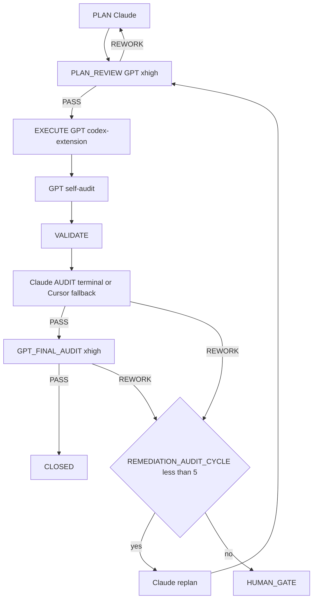

=== Auto-audit GPT (2e passe) ===
2026-04-25T20:36:16.061770Z  WARN codex_core::agents_md: Project doc `/Users/1millnonstop/Downloads/projet/foodking-web/web/testttt/AGENTS.md` exceeds remaining budget (32768 bytes) - truncating.
OpenAI Codex v0.125.0 (research preview)
--------
workdir: /Users/1millnonstop/Downloads/projet/foodking-web/web/testttt
model: gpt-5.5
provider: openai
approval: never
sandbox: workspace-write [workdir, /tmp, $TMPDIR, /Users/1millnonstop/.codex/memories]
reasoning effort: xhigh
reasoning summaries: none
session id: 019dc65b-763e-7bb1-ad5a-885af144a1da
--------
user
Tu effectues l’**auto-audit GPT** (2e passe) d’un cycle FoodKing — **pas** l’audit Claude terminal.

**Contexte** : le JSON ci-dessous est la proposition d’implémentation (format agents/codex.prompt.txt) pour la mission `CV1-M17-WEB-STRIPE-SCOPE`.


**JSON d’implémentation (à recouper)** :
```json
{
  "files_to_modify": [
    "app/Http/Controllers/Frontend/PaymentController.php",
    "config/payment.php",
    "tests/Feature/Payment/WebPaymentDisabledTest.php",
    "tests/Feature/Payment/StripeActivationGuardTest.php"
  ],
  "implementation_steps": [
    "Added code-owned config defaults for WEB Option B: public web payment V1 disabled by default via payment.web_payment_v1.enabled=false.",
    "Added code-owned Stripe Option B guard config with activation_gate_cleared=false and gate metadata.",
    "Guarded all public PaymentController web payment entrypoints so /payment/{order}/pay, POST payment, callbacks, and success page return 404 while web_payment_v1 is off.",
    "Added Stripe public activation guard in PaymentController so Stripe remains hidden/blocked unless the explicit gate-clear config is flipped.",
    "Added feature tests for web payment disabled and Stripe activation guard behavior."
  ],
  "code_blocks": [
    {
      "path": "config/payment.php",
      "op": "replace",
      "excerpt": "Add payment.web_payment_v1 with enabled=false and gate GATE_WEB_PAYMENT_SCOPE_V1_2026-04-25. Add payment.stripe.activation_guard with enabled=true, activation_gate_cleared=false, and gate GATE_STRIPE_CENTS_ACTIVE_2026-04-25. Keep pilot_restrict unchanged."
    },
    {
      "path": "app/Http/Controllers/Frontend/PaymentController.php",
      "op": "replace",
      "excerpt": "Add STRIPE_GATEWAY_SLUG constant. Call guardWebPaymentV1() at the start of index(), payment(), success(), fail(), cancel(), and successful(). Filter index gateways through isPublicWebGatewayAllowed(). In payment/callback methods call assertGatewayActivationAllowed() before gateway execution. Add private helpers guardWebPaymentV1(), isPublicWebGatewayAllowed(), assertGatewayActivationAllowed(), and isGatewayActivationAllowed()."
    },
    {
      "path": "tests/Feature/Payment/WebPaymentDisabledTest.php",
      "op": "create",
      "excerpt": "Creates WebPaymentDisabledTest with RefreshDatabase. Sets payment.web_payment_v1.enabled=false, creates an installed flag, disables CSRF, creates a branch/user/order with OrderStatus::ACCEPT and PaymentStatus::UNPAID, asserts GET payment.index and POST payment.store return 404, asserts no transaction is created, and asserts payment.successful returns 404."
    },
    {
      "path": "tests/Feature/Payment/StripeActivationGuardTest.php",
      "op": "create",
      "excerpt": "Creates StripeActivationGuardTest with RefreshDatabase. Sets payment.web_payment_v1.enabled=true, payment.pilot_restrict.enabled=false, payment.stripe.activation_guard.enabled=true, and activation_gate_cleared=false. Posts paymentMethod=stripe to payment.store, asserts 404, asserts no stripe transaction, asserts order remains PaymentStatus::UNPAID, and asserts the configured gate is GATE_STRIPE_CENTS_ACTIVE_2026-04-25."
    }
  ],
  "risks": [],
  "notes": [
    "No PaymentIntent flow added.",
    "No Stripe cents conversion changed.",
    "No routes/web.php edit was required because the existing public routes are now controller-guarded.",
    "Validation run: php artisan test --filter=WebPaymentDisabledTest PASS; php artisan test --filter=StripeActivationGuardTest PASS; php artisan test tests/Feature/Payment PASS (7 tests)."
  ],
  "execution_trace": {
    "delegation": "codex-extension",
    "invariants_considered": [
      "pricing_ssot",
      "order_status",
      "branch_id",
      "commit_before_dispatch"
    ]
  }
}
```

**Livrable** (Markdown uniquement, en français) :
# AUTO_AUDIT_GPT — CV1-M17-WEB-STRIPE-SCOPE

## 1. Conformité au plan / scope
(Énumérer manques ou dérives ; si scope élargi sans escale → **ESCALATE**)

## 2. Invariants FoodKing
Pour chacun : OK / RISQUE / N/A
- pricing_ssot (backend seul)
- order_status (enum, pas de strings)
- branch_id
- commit_before_dispatch
- frozen_zones
- order_service_symmetry (si un des deux services touché)

## 3. Verdict
Une ligne : `VERDICT: PASS` | `VERDICT: NEEDS_FIX` | `VERDICT: ESCALATE` + 1–3 phrases.

2026-04-25T20:36:16.427041Z  WARN codex_core_plugins::manifest: ignoring interface.defaultPrompt: prompt must be at most 128 characters path=/Users/1millnonstop/.codex/.tmp/plugins/plugins/build-ios-apps/.codex-plugin/plugin.json
2026-04-25T20:36:16.429673Z  WARN codex_core_plugins::manifest: ignoring interface.defaultPrompt: maximum of 3 prompts is supported path=/Users/1millnonstop/.codex/.tmp/plugins/plugins/plugin-eval/.codex-plugin/plugin.json
2026-04-25T20:36:22.473525Z  WARN codex_core_plugins::manifest: ignoring interface.defaultPrompt: prompt must be at most 128 characters path=/Users/1millnonstop/.codex/.tmp/plugins/plugins/build-ios-apps/.codex-plugin/plugin.json
2026-04-25T20:36:22.474770Z  WARN codex_core_plugins::manifest: ignoring interface.defaultPrompt: maximum of 3 prompts is supported path=/Users/1millnonstop/.codex/.tmp/plugins/plugins/plugin-eval/.codex-plugin/plugin.json
2026-04-25T20:36:23.446578Z  WARN codex_core_plugins::manifest: ignoring interface.defaultPrompt: prompt must be at most 128 characters path=/Users/1millnonstop/.codex/.tmp/plugins/plugins/build-ios-apps/.codex-plugin/plugin.json
2026-04-25T20:36:23.446856Z  WARN codex_core_plugins::manifest: ignoring interface.defaultPrompt: maximum of 3 prompts is supported path=/Users/1millnonstop/.codex/.tmp/plugins/plugins/plugin-eval/.codex-plugin/plugin.json
codex
J’utilise `sync-risk-review` pour cadrer l’audit sur les invariants métier paiement/commande, puis je recoupe la proposition avec les fichiers et le plan actifs avant de rendre le verdict Markdown demandé.
exec
/bin/zsh -lc "sed -n '1,220p' plans/masterplay/MASTERPLAY_QUEUE.md" in /Users/1millnonstop/Downloads/projet/foodking-web/web/testttt
exec
/bin/zsh -lc "sed -n '1,220p' plans/masterplay/MASTERPLAY_DISCIPLINE.md" in /Users/1millnonstop/Downloads/projet/foodking-web/web/testttt
exec
/bin/zsh -lc "sed -n '1,220p' .cursor/ACTIVE_CYCLE.md" in /Users/1millnonstop/Downloads/projet/foodking-web/web/testttt
exec
/bin/zsh -lc "sed -n '1,220p' /Users/1millnonstop/Downloads/projet/foodking-web/web/testttt/.agents/skills/sync-risk-review/SKILL.md" in /Users/1millnonstop/Downloads/projet/foodking-web/web/testttt
exec
/bin/zsh -lc "sed -n '1,220p' docs/orchestration/GLOBAL_SYSTEM_PRIMER.md" in /Users/1millnonstop/Downloads/projet/foodking-web/web/testttt
 succeeded in 0ms:
# MASTERPLAY DISCIPLINE — Caisse V1 (loop master)

> **But** : règles strictes que le runner et chaque mission GPT respectent en boucle, pendant des heures, jusqu'à finition de toutes les missions de `MASTERPLAY_QUEUE.md`. Lecture obligatoire avant de lancer `bash scripts/run-masterplay.sh`.

## 1. Autorité

| Source | Rôle |
|--------|------|
| `AGENTS.md` | Parcours obligatoire, cycle FoodKing |
| `plans/PLAN_CAISSE_V1_SUPER_MASTER_2026-04-25.md` | DAG autoritaire (ordre, gates) |
| `plans/PLAN_CAISSE_V1_GPT_MASTERPLAY_2026-04-25.md` | Catalogue 22 missions M-XX (objectifs, allowlist) |
| `plans/masterplay/MASTERPLAY_QUEUE.md` | File d'exécution courante |
| `plans/masterplay/MASTERPLAY_DISCIPLINE.md` | (ce fichier) règles d'exécution |
| `.cursor/rules/*.mdc` | Toujours appliquées |
| `docs/gates/GATE_LOG.md` | État des gates humains |

## 2. Boucle d'exécution (run-masterplay.sh)

```
LOOP {
  1. tail activity log (~500 tokens)
  2. find next PENDING task in MASTERPLAY_QUEUE with all DEPENDS_ON == CLOSED
  3. if none → break (all done or all blocked)
  4. verify missions/<TASK_ID>/input.json + execute_brief.md exist
  5. activity-log start codex-extension <TASK_ID> execute "<allowlist CSV>" "<note>"
     if exit 2 (collision) → MARK BLOCKED note=collision, continue loop
  6. update status: RUNNING
  7. npm run codex:complex -- <TASK_ID>     (génère output_codex.json + GPT_SELF_AUDIT)
  8. update status: EXECUTED
  9. activity-log done codex-extension <TASK_ID> done "<résumé court>"
 10. (option --with-audit) bash scripts/foodking-claude-orchestrate.sh audit-brief <TASK_ID>
       if PASS → status: AUDIT_PASS
       if REWORK → status: REWORK ; increment REWORK_COUNT ; if >=5 → BLOCKED note=human_gate
 11. (option --with-final) npm run codex:final-audit -- <TASK_ID>
       if PASS → status: FINAL_PASS
 12. if FINAL_PASS:
       bash scripts/after-execute-memory.sh
       update status: CLOSED
 13. sleep INTER_TASK_PAUSE_SECONDS (default 5s)
 14. continue LOOP
}
```

## 3. Garde-fous (non négociables)

### 3.1 Allowlist stricte par mission
Codex modifie **uniquement** les fichiers listés dans `missions/<TASK_ID>/input.json.allowlist`. Si modification hors liste détectée à l'audit → `REWORK`.

### 3.2 Frozen zones
Aucune édition d'un fichier frozen sans gate signé dans `docs/gates/GATE_LOG.md`. Le runner **refuse** de lancer une mission marquée `BLOCKED` jusqu'à ce que le statut soit changé manuellement après signature.

### 3.3 Invariants FoodKing — `REWORK` automatique
- Pricing client-authoritative
- Status littéral numérique (`status: 16`)
- `branch_id` LIKE
- Dispatch dans transaction
- OS ou FOS modifié sans `SYMMETRY_NOTE`
- Frozen modifié sans gate

### 3.4 Pas de gate auto-approuvée
Codex peut **rédiger** options ; aucune mission ne coche `[x] Approved`. Si une mission le tente → `REWORK` + `risks: ["ESCALATION: gate self-approved"]`.

### 3.5 Tests obligatoires
Chaque `mandatory_tests` listé doit être lancé et reporté dans le rapport. Échec → `REWORK`.

### 3.6 Diff minimal
Aucun renommage opportuniste, aucun refactor non demandé, aucune optimisation collatérale. Si ajout justifié → `notes` du JSON.

### 3.7 Activity log
`start` avant chaque mission ; `done` après. Sans cela → réservation fantôme = autres agents bloqués. Le runner enforce.

### 3.8 Mémoire
À CLOSE : compléter `memory/episodes/caisse_v1_<topic>_*.jsonl` (squelettes créés par M-19) puis `bash scripts/after-execute-memory.sh`. Si Graphiti UP : `bash bin/graphiti-ingest.sh` + `python3 memory/verify.py`.

## 4. Boucles de rework

- Max **5 cycles `REWORK`** consécutifs sur la même mission. Au 5e → `BLOCKED note=human_gate_required`.
- Max **3 cycles healing** consécutifs (cf. CLAUDE.md §8) avant escalade.
- Toute escalation → écrite dans `reports/masterplay/ESCALATIONS_<date>.md`.

## 5. Pause / arrêt

- `Ctrl-C` arrête la boucle proprement (mission en cours finit, runner s'arrête après).
- `touch reports/masterplay/STOP` → le runner s'arrête à la fin de la mission courante.
- `touch reports/masterplay/PAUSE` → le runner pause entre les missions tant que le fichier existe.

## 6. Logs

- `reports/masterplay/run_<ISO>.log` : log de la boucle.
- `reports/masterplay/status.json` : état temps réel (mission courante, compteurs).
- `missions/<TASK_ID>/output_codex.raw.log` : raw codex.
- `missions/<TASK_ID>/output_codex.json` : json structuré.
- `reports/audit/GPT_SELF_AUDIT_<TASK_ID>.md` : self-audit GPT.
- `reports/post_execute_latest.log` : trace `EXECUTE_DELEGATION`.
- `reports/AGENT_ACTIVITY_LOG.md` : start/done.

## 7. Audit Claude (en fin de boucle, manuel)

Quand toutes les missions sont `CLOSED` (ou `BLOCKED` documentés) :

```
bash scripts/foodking-claude-orchestrate.sh context
bash scripts/foodking-claude-orchestrate.sh audit
```

Sortie attendue : verdict transversal Caisse V1 (chaîne sync borne→centrale→POS→KDS→fiscal). Le verdict détermine `GO/HOLD/NO-GO` pour `GATE_GO_NO_GO_CAISSE_V1`.

## 8. Critères d'arrêt anormal

- 3 missions consécutives en `REWORK` → halt + alerte humaine.
- Activity-log refuse 3 fois → halt (collision permanente).
- `npm run codex:complex` échoue 3 fois sur la même mission (binaire codex KO) → halt.
- `claude` terminal indisponible 3 fois consécutives → continue avec fallback subagent + `AUDIT_FALLBACK_REASON: terminal-unavailable`.

## 9. Token discipline

- Le prompt envoyé à codex contient : template `agents/codex.prompt.txt` + `input.json` + `execute_brief.md` + (optionnel) `graphiti_context.md`, `plan_excerpt.md`, `cycle_snapshot.md`.
- Pas de duplication : pas de re-coller AGENTS.md ou super master plan dans chaque mission.
- Cap typique d'un prompt : ≤ 30 KB. Au-delà → splitter la mission.

## 10. Anti-pattern interdits

- ❌ Lancer 2 missions en parallèle sur les mêmes fichiers (collision activity-log).
- ❌ Modifier `MASTERPLAY_QUEUE.md` pendant que le runner tourne (sauf marquer BLOCKED → PENDING après gate).
- ❌ Skipper l'audit Claude pour aller plus vite.
- ❌ Marquer CLOSED manuellement sans double PASS (PASS Claude + PASS Codex final).
- ❌ Ignorer un `risks: ["ESCALATION: ..."]` dans output_codex.json.

---

`MASTERPLAY_DISCIPLINE_VERSION: 1.0` · `STRICT_MODE: ON`

 succeeded in 0ms:
# Active Cycle – FoodKing

**Méta (SSOT `run-cycle.md` Step 0 + `AGENTS.md` § *Authoritative … cycle state*)** — requis pour que l’orchestrateur ne s’arrête pas sur *« RUNNER_MODE not set »*.

| Champ | Valeur actuelle |
| --- | --- |
| **RUNNER_MODE** | `single-session` |
| **PHASE (cycle W10)** | `IN_PROGRESS` (détail = section `CYCLE_W10_…` ci-dessous) |
| **TASK_ID** | `P_EXEC_CLOSEOUT_GRAPHITI_CI_PROD_2026-04-22` |
| **PLAN_FILE** | `plans/PLAN_EXECUTION_CLOSEOUT_GRAPHITI_CI_PROD_2026-04-22.md` |
| **REPORT_FILE** | `reports/post_execute_latest.log` (append — preuve `EXECUTE_DELEGATION` / `AUDIT_*`) |

> **ACTIVE_PRIMARY** : `CYCLE_W10_EXECUTION_CLOSEOUT` (un seul cycle peut être actif à la fois — voir B03 méga-checklist).
> Cycles plus anciens en lecture seule = **archive** déplacée dans **`.cursor/ACTIVE_CYCLE_ARCHIVE.md`** (lecture humaine / forensique uniquement, **non requise** par le parcours obligatoire).

## CYCLE_W10_EXECUTION_CLOSEOUT (IN_PROGRESS — mémoire 180 + MCP global + commit + CI + prod)

**TASK_ID** : `P_EXEC_CLOSEOUT_GRAPHITI_CI_PROD_2026-04-22`  
**Plan SSOT** : `plans/PLAN_EXECUTION_CLOSEOUT_GRAPHITI_CI_PROD_2026-04-22.md`  
**Ordre** : Piste A (POS+Centrale : PLAN-MEM-1) ∥ Piste B (humain : PLAN-MEM-3) → C (smoke) → D (commit sur « go commit ») → E (CI) → F (prod J-7→J+7).  
**Gate mémoire** : `python3 memory/verify.py` → count **≥ 175** (180 idéal) avant de considérer PLAN-MEM-1 **CLOSED**.

- **Vérif locale (2026-04-22)** : `python3 memory/verify.py` → **count = 182**, smoke `search_memory_facts` OK — gate **satisfaite** pour clôturer l'ingestion côté seuil d'épisodes (suite : commit / CI / prod selon plan `PLAN_EXECUTION_CLOSEOUT_*`).

**Gouvernance globale (2e passe 2026-04-22)** : primer multi-agents + Graphiti vivant + tokens « zéro effet négatif » → **`docs/orchestration/GLOBAL_SYSTEM_PRIMER.md`** + rapport **`reports/audit/AUDIT_SECOND_PASS_GLOBAL_GOVERNANCE_REPORT_2026-04-22.md`**.

---

## CAISSE_V1_MASTERPLAY (ACTIVE — 2026-04-25)

**Phase** : finition Caisse V1 (POS + Kiosk + KDS + Centrale + Fiscal + Ops).
**Plan parent** : `plans/PLAN_CAISSE_V1_GPT_MASTERPLAY_2026-04-25.md`
**Plan DAG autoritaire** : `plans/PLAN_CAISSE_V1_SUPER_MASTER_2026-04-25.md`
**Boucle d'exécution** : `plans/masterplay/MASTERPLAY_DISCIPLINE.md` + `plans/masterplay/MASTERPLAY_QUEUE.md` + `scripts/run-masterplay.sh`
**Statut temps réel** : `reports/masterplay/status.json`

**Règle** : tout `TASK_ID` au format `CV1-MXX-…` passe par la masterplay (cf. `AGENTS.md` § "Caisse V1 — Masterplay loop", `.cursor/rules/global.mdc` § "Caisse V1 — Masterplay loop", `.cursor/commands/run-cycle.md` Step 0 item 0). **NE PAS** ouvrir un `run-cycle` standard sur un `CV1-MXX-…`.

---

## Archive

Tous les cycles **CLOSED / COMPLETED PASSED** (W4 → W9, NF525, etc.) ont été déplacés dans **`.cursor/ACTIVE_CYCLE_ARCHIVE.md`** pour réduire le coût de lecture du parcours obligatoire (audit 2026-04-24, mission `T-PARCOURS-OPTIMIZE-001`).

- **Lecture humaine** : ouvrir `.cursor/ACTIVE_CYCLE_ARCHIVE.md`.
- **Lecture agent** : **non requise** sauf instruction explicite du plan ou du chat (ex. "reprend le rationale du cycle W9").
- **Recherche** : `rg "CYCLE_W9_" .cursor/ACTIVE_CYCLE_ARCHIVE.md` ou `git log --follow .cursor/ACTIVE_CYCLE.md`.

 succeeded in 0ms:
# MASTERPLAY_QUEUE — Caisse V1

**Source de vérité de l'orchestration en boucle** : `bash scripts/run-masterplay.sh` lit cette file et exécute en série.

**Discipline** : `plans/masterplay/MASTERPLAY_DISCIPLINE.md`.  
**Plan parent** : `plans/PLAN_CAISSE_V1_GPT_MASTERPLAY_2026-04-25.md`.

## Légende statut

- `PENDING` — pas encore lancé
- `RUNNING` — codex exec en cours (ne pas relancer)
- `EXECUTED` — codex exec terminé, attend audit
- `AUDIT_PASS` — `AUDIT_VERDICT: PASS` Claude
- `FINAL_PASS` — `GPT_FINAL_AUDIT_VERDICT: PASS`
- `CLOSED` — mémoire ingestée + activity-log done
- `REWORK` — audit a demandé rework
- `BLOCKED` — gate humain ou dépendance manquante

## Légende vague

- `WAVE_A` — NO-GATE, parallélisable, démarre immédiatement
- `WAVE_B` — POST-GATE, séquencé selon DAG

## File d'exécution


| ORDER | TASK_ID                           | MISSION | WAVE   | DEPENDS_ON                 | STATUS  | NOTE                                                                         |
| ----- | --------------------------------- | ------- | ------ | -------------------------- | ------- | ---------------------------------------------------------------------------- |
| 01    | CV1-M19-MEMORY-DISCIPLINE         | M-19    | WAVE_A | —                          | CLOSED  | Crée squelettes JSONL pour les 22 missions                                   |
| 02    | CV1-M01-TRACEABILITY-MATRIX       | M-01    | WAVE_A | —                          | CLOSED  | Matrice findings → tasks → tests → gates (REWORK resolved GPT PASS)          |
| 03    | CV1-M02-SENTINEL-BASELINE         | M-02    | WAVE_A | CV1-M01                    | CLOSED  | 18 sentinels fail-first + 4 lints                                            |
| 04    | CV1-M12-LEGACY-GUARDS-CI          | M-12    | WAVE_A | —                          | CLOSED  | Lint imports + bundle scan + workflow (recovered: extractor JSON fix)        |
| 05    | CV1-M16-HARDWARE-LAB              | M-16    | WAVE_A | —                          | CLOSED  | Checklist hardware signable (recovered: JSON valid, files materialized)      |
| 06    | CV1-M18-TEST-ARCHITECTURE         | M-18    | WAVE_A | CV1-M02                    | CLOSED  | Grille couverture + plan campagne                                            |
| 07    | CV1-M20-RUNBOOKS-SKELETON         | M-20    | WAVE_A | —                          | CLOSED  | 8 runbooks ops (REWORK Horizon resolved GPT PASS)                            |
| 08    | CV1-M21A-QUICKWINS-LOT0           | M-21a   | WAVE_A | —                          | CLOSED  | POS: discount v-model + Swiper RTL + focustrap dead                          |
| 09    | CV1-M03-GATES-DRAFT               | M-03    | WAVE_A | CV1-M01                    | CLOSED  | 8 briefs gates Caisse V1 créés; Wave B reste bloquée par signatures humaines |
| 10    | CV1-M09-BRANCH-ISOLATION          | M-09    | WAVE_B | CV1-M03(gates), CV1-M02    | CLOSED  | GPT audit PASS; M-08/M-06/schema sentinels remain gated                      |
| 11    | CV1-M06-POS-REVENUE-GUARDS        | M-06    | WAVE_B | CV1-M09, CV1-M03           | CLOSED | GPT rework audit PASS; gates frozen C + payment_prop A approved              |
| 12    | CV1-M05-ORDER-QUOTE               | M-05    | WAVE_B | CV1-M03                    | CLOSED | GPT final PASS; quote sealed/consumed at POS+kiosk commit                    |
| 13    | CV1-M04A-PAYMENT-LEDGER-FULL      | M-04A   | WAVE_B | CV1-M03 (ledger=A)         | BLOCKED | Ledger gate chose Option B; M-04A not selected                               |
| 14    | CV1-M04B-PAYMENT-PILOT-RESTRICT   | M-04B   | WAVE_B | CV1-M03 (ledger=B)         | CLOSED  | GPT audit PASS; Option B restricted pilot implemented                        |
| 15    | CV1-M08-FISCAL-Z-NF525            | M-08    | WAVE_B | CV1-M03 (fiscal+schema)    | CLOSED | GPT final PASS; fiscal Option B Z policy sealed                              |
| 16    | CV1-M07-KDS-RELEASE               | M-07    | WAVE_B | CV1-M03 (kds_bump)         | CLOSED | GPT final PASS; KDS server authority with expected_status sealed             |
| 17    | CV1-M10-OS-FOS-SYMMETRY           | M-10    | WAVE_B | CV1-M06, CV1-M09           | CLOSED | Unlocked after M-06 GPT audit PASS and M-09 CLOSED                           |
| 18    | CV1-M11-KIOSK-RUNTIME             | M-11    | WAVE_B | CV1-M03 (offline+fiscal)   | BLOCKED | Will unlock after M-08 policy evidence                                       |
| 19    | CV1-M17-WEB-STRIPE-SCOPE          | M-17    | WAVE_B | CV1-M03 (web+stripe)       | RUNNING | Web Option B + Stripe Option B approved                                      |
| 20    | CV1-M13-MIGRATIONS-SAFETY         | M-13    | WAVE_B | CV1-M03 (schema)           | PENDING | Schema Option A approved                                                     |
| 21    | CV1-M14-OPS-PREFLIGHT             | M-14    | WAVE_B | CV1-M13                    | BLOCKED | —                                                                            |
| 22    | CV1-M15-ROLLOUT-CANARY            | M-15    | WAVE_B | CV1-M04*, CV1-M08, CV1-M14 | BLOCKED | —                                                                            |
| 23    | CV1-M21B-PAYMENT-REFACTOR         | M-21b   | WAVE_B | CV1-M03 (prop_mutation)    | BLOCKED | Gate approved; unlock after M-06/M-10 stabilization                          |
| 24    | CV1-M22-POST-LAUNCH-OBSERVABILITY | M-22    | WAVE_B | CV1-M14, CV1-M15           | BLOCKED | —                                                                            |


## Ce que le runner exécute

À chaque tour de boucle, le runner :

1. Lit cette table.
2. Prend la **première** ligne au statut `PENDING`.
3. Vérifie que toutes ses `DEPENDS_ON` sont au statut `CLOSED`. Sinon → skip.
4. Vérifie que `missions/<TASK_ID>/input.json` et `execute_brief.md` existent. Sinon → marque `BLOCKED note=missing-mission-files`.
5. `start` activity-log → `npm run codex:complex -- <TASK_ID>` → `done` activity-log.
6. Mise à jour statut : `EXECUTED`.
7. Audit Claude terminal automatique (si activé `--with-audit`) → `AUDIT_PASS` ou `REWORK`.
8. Si `AUDIT_PASS` : `npm run codex:final-audit -- <TASK_ID>` → `FINAL_PASS`.
9. Si `FINAL_PASS` : ingestion mémoire + `done` → `CLOSED`.
10. Loop.

## Statut initial (à la création)

Les 6 missions Vague A préparées par M-19/M-01/M-02/M-12/M-16/M-18 sont au statut `PENDING`. Les autres `TODO_NEXT` (à créer après le premier round) ou `BLOCKED` (gates).

## Mise à jour manuelle

Le runner met à jour la colonne `STATUS` automatiquement (sed sur cette table). Tu peux aussi éditer manuellement entre 2 runs (ex: marquer `BLOCKED → PENDING` après gate signé).

 succeeded in 0ms:
---
name: sync-risk-review
description: Review changes affecting synchronization, auth, pricing, KDS, OSS, or order lifecycle for architectural and business risk.
disable-model-invocation: true
---

# Sync Risk Review Skill

Use this skill when a change affects:
- sync
- auth
- pricing
- KDS
- OSS
- order lifecycle
- cross-device behavior

## Steps
1. Read the relevant docs
2. Inspect the diff or current implementation
3. Identify:
   - architecture risk
   - state consistency risk
   - business rule violations
   - authz issues
   - missing tests
4. Produce a concise review with recommended next actions.

 succeeded in 0ms:
# FoodKing — Primer système global (agents, sous-agents, Graphiti, tokens)

> **Passation + index complet des chemins (SSOT, un seul fichier)** : **`../DOC_EXPO_HER_ANCIEN_AGENT_ALIMENTATION_WORKFLOW_2026-04-22.md`** (table §2 = utilité de chaque path pour une nouvelle session).

> **Fichier d’entrée** pour toute nouvelle conversation, tout nouvel outil d’agent (Cursor, terminal, futur bot), ou tout humain qui reprend le projet.  
> Objectif : **robustesse** = même avec 100 cycles et des exécuteurs différents, le comportement reste **prévisible**, **traçable**, et la **mémoire** reste **alignée** sur le code.

**Obligatoire avant ce Primer (SSOT d’onboarding)** : lire `**AGENTS.md`**, section **Parcours obligatoire** (nouvelle session **et** continuation), puis enchaîner ici.  
**En continuation d’un cycle** : lire d’**abord** `**.cursor/ACTIVE_CYCLE.md`** (éviter un second `TASK_ID` fantôme) ; si `PHASE` = vide ou `CLOSED`, revenir à la table ci-dessous.

---

## 1. Ordre de lecture obligatoire (minimum viable)

Lire **dans cet ordre** avant d’écrire du code ou un plan non trivial (voir aussi `**AGENTS.md` § *Parcours obligatoire* — tableau** pour la même doctrine) :


| #   | Fichier                                                    | Pourquoi                                                                                                                  |
| --- | ---------------------------------------------------------- | ------------------------------------------------------------------------------------------------------------------------- |
| 0   | `**.cursor/ACTIVE_CYCLE.md`** (si reprise)                 | Cycle déjà en cours : même `TASK_ID` / mêmes Steps **jusqu’à** `CLOSE` — **ne pas** forker un plan parallèle sans le dire |
| 1   | `**AGENTS.md`** (dont § *Parcours obligatoire*)            | Contrat global : phases, routing, MCP, terminal, parcours production, non-négociables                                     |
| 1b  | `**docs/orchestration/SESSION_OPENING_ENFORCEMENT.md**`  | **Bloc unique** (tail log + `verify:boucle` + rappel phases) — réduit la répétition « refais la boucle » en session ; **modèle Cursor = Claude pour PLAN** (Auto/Composer ne remplacent pas `routing.md`) |
| 1c  | `**reports/audit/SIMULATION_PARCOURS_PROD_CHECKPOINTS_2026-04-25.md**` | **Simulation production** : checkpoints par phase, fichiers SSOT, limite IDE (qui orchestre quoi) — avant de promettre « zéro dérive » |
| 2   | `**.cursor/routing.md*`*                                   | Qui fait quoi (Claude plan/audit, GPT-5.5-pro xhigh plan review / execute / final audit, Composer validation only)         |
| 3   | `**.cursor/commands/run-cycle.md**`                        | Déroulé exact d’un cycle `TASK_ID` (incl. Graphiti Step 0.5)                                                              |
| 4   | `**.cursor/rules/graphiti-memory.mdc**`                    | Mémoire Graphiti : quand lire / quand écrire                                                                              |
| 5   | `**.cursor/rules/global.mdc**` + `**context-hygiene.mdc**` | Gates, discipline tokens **sans** réduire l’intelligence                                                                  |
| 6   | `**docs/orchestration/MEMORY_MATRIX.md`**                  | **Quel store écrit quoi, lit quoi, quand** (4 stores autorisés A/B/C/D) — antidote unique à la complexité mémoire         |
| 6b  | `**docs/orchestration/MULTI_AGENT_ORCHESTRATION.md`**      | Même tâches, plusieurs onglets Cursor : **activité** + **Graphiti** (lecture) + `AUDIT_VERDICT` — sans empiéter           |
| 7   | `**memory/INDEX.md`**                                      | Carte des domaines mémoire Graphiti (store B) — secours si MCP absent                                                     |
| 8   | `**tasks/[TASK_ID].md**`                                   | Quand un cycle borné est lancé — périmètre de la tâche                                                                    |


Ensuite, **selon le domaine** : `docs/ORDER_FLOW.md`, `docs/DEVICE_FLOW.md`, `docs/ARCHITECTURE.md`, `project-invariants.mdc`, etc.

Référence roster court : `**docs/orchestration/AGENT_ROLES.md`**.

### 1.1 Décision : Claude orchestre ; GPT challenge et exécute en xhigh

- **Cerveau** (priorité, plan, re-plan, gates) : **Claude** (session + terminal `foodking-claude-orchestrate.sh`) — il écrit le plan et tranche la stratégie de remédiation.
- **Challenge plan obligatoire** : **GPT-5.5-pro / xhigh** relit le plan avant EXECUTE (`npm run codex:plan-review -- {TASK_ID}` → `PLAN_REVIEW_VERDICT`). Si `REWORK`, Claude révise avant tout code.
- **Bras + premier contrôle qualité** : **EXECUTE = Codex (PRIMARY)** pour toutes les implémentations produit, même les petites corrections : `npm run codex:complex -- {TASK_ID}` → `reports/audit/GPT_SELF_AUDIT_{TASK_ID}.md`.
- **Pas de routine product implementation** : Composer / `foodking-routine-implementer` ne fait plus d’édition produit en cycle de finition ; il peut aider au reporting/validation seulement.
- **Double audit final** : Claude audit d’abord (`AUDIT_VERDICT`) avec terminal primary + fallback Cursor si quota/rate-limit/terminal HS, puis GPT final audit (`npm run codex:final-audit -- {TASK_ID}` → `GPT_FINAL_AUDIT_VERDICT`). Close seulement si les deux sont `PASS`.

---

## 2. Sous-agents Cursor (Task tool) — intégration dans le flux

Ce ne sont **pas** des fichiers dans le repo ; ce sont des **profils** invoqués par Cursor selon `.cursor/routing.md` et `**run-cycle.md` Step 2**.


| Sub-agent / Canal                                                               | Modèle cible                                                                  | Quand                                                                                                                                                                                                                                          |
| ------------------------------------------------------------------------------- | ----------------------------------------------------------------------------- | ---------------------------------------------------------------------------------------------------------------------------------------------------------------------------------------------------------------------------------------------- |
| `**foodking-routine-implementer`** (sub-agent Cursor)                           | Composer                                                                      | **Validation/report only** en cycles de finition. Pas d’implémentation produit.                                                                                                                                             |
| `**codex-extension` — FoodKing Codex Complex Implementer (PRIMARY)**            | **GPT-5.5-pro / xhigh** via CLI `codex` (compte **ChatGPT Pro**) + `codex exec` | **PLAN_REVIEW + toute implémentation produit + auto-audit + GPT_FINAL_AUDIT**. `npm run codex:complex -- {TASK_ID}`. Voir `scripts/codex-extension-execute.sh`, `agents/codex-extension-instructions.md`. |
| `**foodking-complex-implementer`** (sub-agent Cursor — **FALLBACK uniquement**) | Aligné exécution **GPT-5.5** (emplacement sub-agent)                          | Uniquement si `codex` / `codex exec` est indisponible après reprises sur la même tâche                                                                                                                                                         |


**Règles d'or**

1. **Délégation obligatoire** pour toute modification produit en EXECUTE, avec trace `EXECUTE_DELEGATION:` dans le log de validation. Valeurs autorisées : `codex-extension` | `foodking-complex-implementer (codex-extension-fallback)` | `explicit-prompt-bind`.
2. **EXECUTE = `codex-extension` PRIMAIRE** (CLI `codex` + Pro, `npm run codex:complex -- {TASK_ID}` ; contexte Graphiti/plan dans `missions/…/graphiti_context.md` etc. ; voir `**docs/orchestration/CODEX_API_DELEGATION.md`**). Le sub-agent `foodking-complex-implementer` est le **fallback** (usage Cursor) — indispo `codex exec`. Aucun **connecteur HTTP** / proxy n’est maintenu dans le dépôt.
3. Le sous-agent **ne voit pas toujours** le MCP Graphiti du parent : le plan **doit** contenir `**## PRIOR_CONTEXT`** (faits Graphiti + invariants) — copier ou résumer dans le message de délégation **ou** dans `missions/{TASK_ID}/graphiti_context.md` pour l’appel API.
4. Aucun sub-agent ne **contourne** un gate humain ni n’édite une frozen zone sans `docs/gates/` approuvé.

---

## 3. Terminal allies (hors Task tool) — intégration

Documentés dans `**AGENTS.md` § Terminal allies** :


| Outil                                                                  | Rôle                                                                     | Position + **canal d’abonnement** (SSOT)                                                                                                                                                                                         |
| ---------------------------------------------------------------------- | ------------------------------------------------------------------------ | -------------------------------------------------------------------------------------------------------------------------------------------------------------------------------------------------------------------------------- |
| `**claude` +** `foodking-claude-orchestrate.sh`                        | **AUDIT cycle — PRIMARY (Step 5)** : `context` → `audit` / `audit-brief` | Abonnement **Anthropic (CLI sur terminal)** ; n’**emprunte** pas l’orchestrateur de modèles de Cursor. **FALLBACK actif** (quota / limite / panne après 1 retry) : Task **`foodking-planner-orchestrator`** + même checklist + `AUDIT_CHANNEL: cursor-session` + `AUDIT_FALLBACK_REASON:` — `docs/orchestration/AUDIT_TERMINAL_QUOTA_FALLBACK.md`. |
| **CLI** `codex` + `npm run codex:complex` (`**codex-extension`**, Pro) | **PLAN_REVIEW + EXECUTE + GPT_FINAL_AUDIT — PRIMARY** (GPT-5.5-pro/xhigh) | Compte **ChatGPT Pro** sur le terminal ; ne passe **pas** par l’orchestrateur de modèles **Cursor** ; facturation côté OpenAI ; **FALLBACK** = sub-agent.     |
| `codex` / REPL interactif (OpenAI)                                     | Tâches ad hoc **hors** cycle, ou côté humain                             | N’enlèvent **pas** VALIDATE + AUDIT du `run-cycle`.                                                                                                                                                                              |
| `verify-orchestration-boucle.sh`                                       | Preuve binaire + optionnel smoke (API)                                   | `bash scripts/verify-orchestration-boucle.sh` — `VERIFY_BILLING_FULL=1` lance 1× smoke `claude` + 1× `npm run codex:smoke`.                                                                                                      |


**Clôture :** l’audit Claude écrit `AUDIT_VERDICT: PASS` ou `REWORK`, puis GPT écrit `GPT_FINAL_AUDIT_VERDICT: PASS|REWORK|ESCALATE` (voir `run-cycle.md` Step 5). Pas de `CLOSED` sans double `PASS`. En `REWORK` : re-orchestration + re-EXECUTE GPT jusqu’à double `PASS` ou 5e tour → humain. Schéma :




Le terminal **n’enregistre** pas **Graphiti** seul : après AUDIT/CLOSE, décisions → JSONL + `after-execute-memory.sh` (voir §5) comme avant.

---

## 4. Graphiti — vivre avec l’avancement du projet (N agents, N cycles)

### 4.1 Rôles


| Rôle                                    | Responsable                                                          |
| --------------------------------------- | -------------------------------------------------------------------- |
| **Lecture** avant plan / audit complexe | Tout agent avec MCP `graphiti` chargé                                |
| **Écriture** après décision durable     | Phase AUDIT + CLOSED (`audit-context.md`) ou humain via `add_memory` |
| **Alimentation batch** (JSONL → Neo4j)  | Humain ou pipeline : `bash bin/graphiti-ingest.sh`                   |


### 4.2 Quand mettre à jour la mémoire (checklist — « ne pas oublier »)

Cocher mentalement à **chaque** fin de sujet significatif :

- **Invariant** clarifié ou renforcé → nouvelle ligne dans `memory/episodes/02_architecture_invariants.jsonl` (ou fichier le plus proche) + `ingest` ciblé.
- **Sync / event / canal** modifié → `03_domain_events_sync.jsonl` + ingest.
- **Décision produit / ADR** → `12_decisions_log.jsonl` + ingest.
- **Nouvelle tâche V14+** ou finding cross-vagues → `09_tasks_history.jsonl` + ingest.
- **Changement prod / rollout** → `11_production_plan.jsonl` + ingest.
- **Nouveau rôle agent ou règle d’orchestration** → `13_agents_roles.jsonl` + ingest + **mettre à jour ce Primer** si le modèle change.
- **Audit long (ops + agentique + mémoire)** → suivre `docs/orchestration/MEGA_CHECKLIST_AUTONOMY_AND_MEMORY.md` (180 tâches) ; narratif `reports/audit/MEGA_AUDIT_SYSTEM_OPERATION_AGENTIC_2026-04-23.md`.
- **Après toute écriture JSONL** → `bash scripts/after-execute-memory.sh` (rafraîchit `reports/memory/jsonl_manifest.json`, cohérent avec CI) puis `bin/graphiti-ingest.sh` sur les domaines touchés.

**Règle d’or** : si le code ou la doc **canonical** a changé et que la mémoire dit encore l’ancienne vérité → **mise à jour sous 48 h** (sinon dérive silencieuse).

### 4.3 Outils

- Pipeline post-écriture (manifeste + rappel ingest) : `bash scripts/after-execute-memory.sh`.
- Ingestion : `bin/graphiti-ingest.sh [filtre]` — voir `memory/README.md`.
- Vérification : `python3 memory/verify.py`.
- Terminal (bref + audit option) : `bash scripts/foodking-claude-orchestrate.sh post-execute` ou `context` puis `audit-brief` — `docs/orchestration/TERMINAL_CLAUDE_GRAPHITI_ORCHESTRATION.md`.
- Reset rare : `@graphiti clear_graph` puis full ingest (politique humaine).

---

## 5. Tokens, contexte, cache — politique « intelligence max, gaspillage min »

**But** : réponses **détaillées et stables**, pas des réponses courtes pour économiser des tokens au détriment de la qualité.


| On optimise (effet ≥ 0)                                                              | On n’optimise pas (effet négatif interdit)                               |
| ------------------------------------------------------------------------------------ | ------------------------------------------------------------------------ |
| Re-lire un fichier **déjà** dans la fenêtre contexte                                 | Tronquer un plan, une analyse de risque, ou un gate pour « faire court » |
| Résumer une phase **terminée** pour handoff (voir `context-hygiene.mdc` §4)          | Supprimer `## PRIOR_CONTEXT` ou les invariants du plan                   |
| Utiliser **Graphiti** pour récupérer faits structurés au lieu de rouvrir 50 rapports | Désactiver Graphiti pour « aller plus vite » sur du sync / fiscal        |
| Écrire les preuves dans `reports/` structuré                                         | Remplacer des tests par de la prose vague                                |


**Cache applicatif** (Redis, etc.) : régie par le code Laravel et `**app:preflight-production`** — hors scope de ce Primer, mais **ne jamais** confondre « cache métier » et « mémoire Graphiti » : ce sont deux systèmes.

---

## 6. Révision de ce document

- **À chaque** changement majeur d’orchestration (nouveau sub-agent, nouveau MCP, nouveau cycle obligatoire) : mettre à jour **ce fichier** + une ligne dans `13_agents_roles.jsonl` + ingest.
- **Trimestriel** : relire §4.2 avec un lead dev.

---

## 7. Pointers rapides


| Besoin                                                        | Aller à                                                           |
| ------------------------------------------------------------- | ----------------------------------------------------------------- |
| Cycle complet                                                 | `.cursor/commands/run-cycle.md`                                   |
| Gates                                                         | `.cursor/rules/human-gates.mdc`                                   |
| Invariants code                                               | `.cursor/rules/project-invariants.mdc`                            |
| Mémoire locale                                                | `memory/INDEX.md`                                                 |
| Pannes Graphiti                                               | `.cursor/mcp/GRAPHITI_TROUBLESHOOTING.md`                         |
| Closeout prod + mémoire                                       | `plans/PLAN_EXECUTION_CLOSEOUT_GRAPHITI_CI_PROD_2026-04-22.md`    |
| Méga-checklist autonomie / Graphiti                           | `docs/orchestration/MEGA_CHECKLIST_AUTONOMY_AND_MEMORY.md`        |
| Méga-audit narratif (compagnon)                               | `reports/audit/MEGA_AUDIT_SYSTEM_OPERATION_AGENTIC_2026-04-23.md` |
| Audit graphique workflow                                      | `docs/orchestration/WORKFLOW_AUDIT_GRAPHIQUE_2026-04-23.md`       |
| Terminal Claude + Graphiti (rôles, `context` / `audit-brief`) | `docs/orchestration/TERMINAL_CLAUDE_GRAPHITI_ORCHESTRATION.md`    |
| Matrice routine / complexe (sub-agents)                       | `docs/orchestration/ROUTING_MATRIX.md`                            |

2026-04-25T20:36:41.792543Z  WARN codex_core_plugins::manifest: ignoring interface.defaultPrompt: prompt must be at most 128 characters path=/Users/1millnonstop/.codex/.tmp/plugins/plugins/build-ios-apps/.codex-plugin/plugin.json
2026-04-25T20:36:41.793820Z  WARN codex_core_plugins::manifest: ignoring interface.defaultPrompt: maximum of 3 prompts is supported path=/Users/1millnonstop/.codex/.tmp/plugins/plugins/plugin-eval/.codex-plugin/plugin.json
codex
Le cycle actif confirme que `CV1-M17-WEB-STRIPE-SCOPE` est gouverné par la masterplay et actuellement `RUNNING`. Je vais maintenant lire la mission, les gates et les fichiers touchés pour distinguer les écarts réels des simples résumés du JSON.
exec
/bin/zsh -lc "sed -n '1,260p' missions/CV1-M17-WEB-STRIPE-SCOPE/input.json" in /Users/1millnonstop/Downloads/projet/foodking-web/web/testttt
 succeeded in 0ms:
{
  "task_id": "CV1-M17-WEB-STRIPE-SCOPE",
  "mission_id": "M-17",
  "plan_file": "plans/PLAN_CAISSE_V1_GPT_MASTERPLAY_2026-04-25.md",
  "primary_model": "codex-extension",
  "model": "gpt-5.5-pro",
  "reasoning_effort": "xhigh",
  "objective": "Appliquer gates WEB=B et STRIPE=B: web payment public off V1, Stripe confirmé inactif avec garde empêchant activation hors gate.",
  "instruction": "Applique uniquement M-17. Ne crée pas PaymentIntent actif car WEB=B. Ne corrige pas Stripe cents actif car STRIPE=B; ajoute garde d'activation. JSON unique.",
  "allowlist": [
    "routes/web.php",
    "app/Http/Controllers/Frontend/PaymentController.php",
    "config/payment.php",
    "tests/Feature/Payment/WebPaymentDisabledTest.php",
    "tests/Feature/Payment/StripeActivationGuardTest.php"
  ],
  "off_limits": ["database/**", "resources/**", "app/Services/Fiscal/**", ".cursor/**", "AGENTS.md"],
  "human_gate_decisions": [
    {"gate": "GATE_WEB_PAYMENT_SCOPE_V1_2026-04-25", "status": "Approved", "decision": "Option B — Web payment off V1", "date": "2026-04-25"},
    {"gate": "GATE_STRIPE_CENTS_ACTIVE_2026-04-25", "status": "Approved", "decision": "Option B — Stripe inactif prod V1, fix reporté", "date": "2026-04-25"}
  ],
  "invariants_at_risk": ["pricing_ssot", "branch_id", "frozen_zones"],
  "gate_conditions": ["web approved Option B", "stripe approved Option B"],
  "mandatory_tests": [
    "php artisan test --filter=WebPaymentDisabledTest",
    "php artisan test --filter=StripeActivationGuardTest"
  ],
  "self_audit_checklist": [
    "public /payment/{order}/pay is disabled or guarded as V1 off",
    "Stripe cannot be activated without explicit gate/config guard",
    "no PaymentIntent active flow added under WEB=B",
    "no cents conversion change unless guarding inactive Stripe"
  ],
  "rollback": {"feature_flag": "web_payment_v1", "max_window_days": 7, "predicates": ["web payment route exposed unexpectedly"]},
  "graphiti_query": "Caisse V1 web payment off Stripe inactive guard",
  "memory_episode_to_write_on_close": "memory/episodes/caisse_v1_web_stripe_2026-04-25.jsonl",
  "claude_audit_prompt_id": "disabled-gpt-only"
}

exec
/bin/zsh -lc "sed -n '1,260p' missions/CV1-M17-WEB-STRIPE-SCOPE/execute_brief.md" in /Users/1millnonstop/Downloads/projet/foodking-web/web/testttt
 succeeded in 0ms:
# EXECUTE BRIEF — CV1-M17-WEB-STRIPE-SCOPE

Implement M-17 only. Disable or guard public web payment for V1 and add Stripe activation guard. No active Stripe cents flow unless only preventing activation.

exec
/bin/zsh -lc "sed -n '1,260p' missions/CV1-M17-WEB-STRIPE-SCOPE/plan_excerpt.md" in /Users/1millnonstop/Downloads/projet/foodking-web/web/testttt
 succeeded in 0ms:
# PLAN EXCERPT — CV1-M17-WEB-STRIPE-SCOPE

Gate web decision: Option B — Web payment off V1. Gate Stripe decision: Option B — Stripe inactive prod V1 guard.

Do not build active PaymentIntent flow.

exec
/bin/zsh -lc "sed -n '1,260p' docs/gates/GATE_LOG.md" in /Users/1millnonstop/Downloads/projet/foodking-web/web/testttt
 succeeded in 0ms:
# GATE_LOG — Frozen Zone Decisions Trail

**Politique** : tout changement qui touche un fichier sous **verrou** actif (`tasks/phase9-sync/LOCK_*.md`), ou le **schéma DB**, l’**auth**, le **pricing SSOT**, le **fiscal / NF525**, la **machine à états commande**, ou un **dispatch** sensible (ordre vs commit), doit être couvert par un **Gate Brief** humain (`docs/gates/GATE_*.md`, hors ce fichier) puis **consigné ici** après décision. Procédure de brief et de reprise de boucle : `.cursor/rules/human-gates.mdc`.

Cartographie indicative **fichier frozen ↔ LOCK file ↔ cycles** : `plans/PLAN_POST_VERIFY_2026-04-20.md` §3 (tableau « Gate humain requis », env. lignes 156–173).

---

## Format d’entrée obligatoire

| Date | Gate ID | Brief file | Frozen files touched | Decision | Approver | Commit SHA / Cycle |
|------|---------|------------|----------------------|----------|----------|-------------------|
| YYYY-MM-DD | `GATE_*` | `docs/gates/GATE_*.md` | chemins relatifs repo, ou `?` si incertain | Approved / Approved-with-constraint / Rejected / Deferred / `PENDING_HUMAN_GATE` | Nom (humain) | sha7, identifiant de tâche, ou `(rétroactif — non corrélé)` |

---

## Trail rétroactif (reconstitué 2026-04-20)

_Une ligne par brief présent dans `docs/gates/` au 2026-04-20 (hors `GATE_LOG.md`). Champs non attestés dans le brief source : `(non documenté — rétroactif)`._

| Date | Gate ID | Brief file | Frozen files touched | Decision | Approver | Commit SHA / Cycle |
|------|---------|------------|----------------------|----------|----------|-------------------|
| 2026-04-14 | GATE_MULTISURF_001_2026-04-14 | docs/gates/GATE_MULTISURF_001_2026-04-14.md | `routes/api.php`, `resources/js/router/**`, `app/Http/Controllers/Auth/LoginController.php`, seeds / rôles `landing_url` (OrderService / FrontendOrderService exclus selon brief) | Approved | Kossay | (rétroactif — non corrélé) |
| 2026-04-14 | GATE_PAYMENT_SAFETY_001_2026-04-14 | docs/gates/GATE_PAYMENT_SAFETY_001_2026-04-14.md | `app/Services/OrderService.php`, `app/Services/FrontendOrderService.php` | Approved | Kossay (human) | (rétroactif — non corrélé) |
| 2026-04-14 | GATE_SYNC_WIZARD_DEEP_001_2026-04-14 | docs/gates/GATE_SYNC_WIZARD_DEEP_001_2026-04-14.md | `app/Services/FrontendOrderService.php`, `app/Services/OrderService.php` | Approved | Kossay (human) | (rétroactif — non corrélé) |
| 2026-04-15 | GATE_BATCH_V1_APPROVAL_CHECKLIST | docs/gates/GATE_BATCH_V1_APPROVAL_CHECKLIST.md | Checklist batch renvoyant vers 4 briefs V1 : `OrderService` + `FrontendOrderService` (pricing / status machine), migration `item_branch_availability`, soft-delete + `deletion_log` | (non documenté — rétroactif) | (non documenté — rétroactif) | (rétroactif — non corrélé) |
| 2026-04-15 | GATE_V1_DATA_SOFTDELETE_001_2026-04-15 | docs/gates/GATE_V1_DATA_SOFTDELETE_001_2026-04-15.md | `orders`, `frontend_orders`, `order_items`, `branches`, `item_categories` (`deleted_at`), table `deletion_log`, modèles + observer admin (OrderService / FrontendOrderService non modifiés selon brief) | (non documenté — rétroactif) | (non documenté — rétroactif) | (rétroactif — non corrélé) |
| 2026-04-15 | GATE_V1_MENU_86_001_2026-04-15 | docs/gates/GATE_V1_MENU_86_001_2026-04-15.md | `item_branch_availability` (migration), `ItemBranchAvailability`, `AvailabilityService`, listener `DecrementItemAvailabilityOnOrder`, `ItemController`, UI POS/Kiosk/KDS ; pas `OrderService` / `FrontendOrderService` (selon brief) | (non documenté — rétroactif) | (non documenté — rétroactif) | (rétroactif — non corrélé) |
| 2026-04-15 | GATE_V1_PRICING_SSOT_001_2026-04-15 | docs/gates/GATE_V1_PRICING_SSOT_001_2026-04-15.md | `app/Services/OrderService.php`, `app/Services/FrontendOrderService.php`, namespace `app/Services/Pricing/` (`PricingService`, etc.) | (non documenté — rétroactif) | (non documenté — rétroactif) | (rétroactif — non corrélé) |
| 2026-04-15 | GATE_V1_STATUS_MACHINE_001_2026-04-15 | docs/gates/GATE_V1_STATUS_MACHINE_001_2026-04-15.md | `app/Domain/Order/OrderStateMachine.php`, `IllegalTransitionException.php`, `OrderStatusTransition`, migration `order_status_transitions`, `OrderService.php`, `FrontendOrderService.php`, `KitchenDisplaySystemOrderService.php` | (non documenté — rétroactif) | (non documenté — rétroactif) | (rétroactif — non corrélé) |
| 2026-04-20 | GATE_VERIFY_P0_FROZEN_CONSOLIDATED_2026-04-20 | docs/gates/GATE_VERIFY_P0_FROZEN_CONSOLIDATED_2026-04-20.md | `app/Services/OrderService.php`, `app/Services/PaymentService.php`, `routes/api.php`, `app/Services/Pricing/DiscountCalculator.php`, migrations idempotency / coupons / pricing ; périmètre détaillé §1–2 du brief (8 cycles P0) | `PENDING_HUMAN_GATE` | (non documenté — en attente humain sur le brief) | (rétroactif — non corrélé) |

---

## Trail courant

| Date | Gate ID | Brief file | Frozen files touched | Decision | Approver | Commit SHA / Cycle |
|------|---------|------------|----------------------|----------|----------|-------------------|
| 2026-04-25 | GATE_FROZEN_ZONES_CAISSE_V1_2026-04-25 | docs/gates/GATE_FROZEN_ZONES_CAISSE_V1_2026-04-25.md | `app/Services/OrderService.php`, `app/Services/FrontendOrderService.php`, `app/Services/PaymentService.php`, `app/Services/KitchenDisplaySystemOrderService.php`, `routes/api.php`, `app/Http/Controllers/Frontend/OrderController.php` | Approved — Option C — Partial allowlist by method/surface | Codex (instruction humaine explicite, 2026-04-25) | CV1-M03-GATES-DRAFT |
| 2026-04-25 | GATE_FISCAL_KIOSK_SCOPE_V1_2026-04-25 | docs/gates/GATE_FISCAL_KIOSK_SCOPE_V1_2026-04-25.md | `app/Services/FrontendOrderService.php`, `app/Http/Controllers/Frontend/OrderController.php` | Approved — Option B — POS finalize | Codex (instruction humaine explicite, 2026-04-25) | CV1-M03-GATES-DRAFT |
| 2026-04-25 | GATE_PAYMENT_LEDGER_V1_2026-04-25 | docs/gates/GATE_PAYMENT_LEDGER_V1_2026-04-25.md | `app/Services/PaymentService.php`, future payment migrations if Option A | Approved — Option B — Restricted pilot | Codex (instruction humaine explicite, 2026-04-25) | CV1-M03-GATES-DRAFT |
| 2026-04-25 | GATE_KDS_BUMP_AUTHORITY_V1_2026-04-25 | docs/gates/GATE_KDS_BUMP_AUTHORITY_V1_2026-04-25.md | `app/Http/Requests/OrderStatusRequest.php`, `app/Services/KitchenDisplaySystemOrderService.php`, `resources/js/components/admin/kitchenDisplaySystem/KitchenDisplaySystemComponent.vue` | Approved — Option B — Server authority with `expected_status` | Codex (instruction humaine explicite, 2026-04-25) | CV1-M03-GATES-DRAFT |
| 2026-04-25 | GATE_SCHEMA_MIGRATIONS_CAISSE_V1_2026-04-25 | docs/gates/GATE_SCHEMA_MIGRATIONS_CAISSE_V1_2026-04-25.md | future schema migrations for payment, order quotes, KDS releases, fiscal Z, idempotency | Approved — Option A — All migrations with rehearsal + backup | Codex (instruction humaine explicite, 2026-04-25) | CV1-M03-GATES-DRAFT |
| 2026-04-25 | GATE_OFFLINE_SCOPE_V1_2026-04-25 | docs/gates/GATE_OFFLINE_SCOPE_V1_2026-04-25.md | `resources/js/helpers/kioskOfflineQueue.js`, `resources/js/components/frontend/kiosk/KioskPaymentComponent.vue`, kiosk cart/menu store surfaces | Approved — Option A — Read-only menu, paiement désactivé | Codex (instruction humaine explicite, 2026-04-25) | CV1-M03-GATES-DRAFT |
| 2026-04-25 | GATE_WEB_PAYMENT_SCOPE_V1_2026-04-25 | docs/gates/GATE_WEB_PAYMENT_SCOPE_V1_2026-04-25.md | public payment route and PaymentIntent signing surfaces if Option A | Approved — Option B — Web payment off V1 | Codex (instruction humaine explicite, 2026-04-25) | CV1-M03-GATES-DRAFT |
| 2026-04-25 | GATE_STRIPE_CENTS_ACTIVE_2026-04-25 | docs/gates/GATE_STRIPE_CENTS_ACTIVE_2026-04-25.md | Stripe config/payment tests if Stripe active | Approved — Option B — Stripe inactive prod V1 guard | Codex (instruction humaine explicite, 2026-04-25) | CV1-M03-GATES-DRAFT |
| 2026-04-26 | GATE_PAYMENT_PROP_MUTATION_2026-04-26 | docs/gates/GATE_PAYMENT_PROP_MUTATION_2026-04-26.md | `resources/js/components/admin/pos/PaymentComponent.vue`, `resources/js/components/admin/pos/PosComponent.vue`, `resources/js/components/frontend/kiosk/KioskPaymentComponent.vue` (symétrie), backend `OrderService` / `FrontendOrderService` (vérification contrat API) | Approved — Option A — Refactor complet sous gate | Codex (instruction humaine explicite, 2026-04-25) | POS_V4_W1B_VENDOR_CHUNK (cycle d'origine du brief — refactor en cycle dédié POS_V4_W2_PAYMENT_REFACTOR si Option A approuvée) |
| 2026-04-26 | HG-W2-1 (cutover POS V4) | docs/gates/GATE_W2_CUTOVER_2026-04-26.md | `routes/web.php` (Options B/C/D), `resources/views/master.blade.php` (Option D si redirige `/admin/pos` → `/admin/pos-v4`), `app/Http/Controllers/Frontend/RootController.php` (Option C A/B branch-aware) — Options A/E/F : aucun frozen touché | `PENDING_HUMAN_GATE` (soft-blocked — attend HG-W2-3 cleared + 1 campagne LCP réel) | (en attente — Product + UX + Tech Lead) | POS_V4_W2_DEDICATED_ENTRY |
| 2026-04-26 | HG-W2-2 (vendor split `vendor-pos.js`) | À DRAFTER après HG-W2-3 (Options B/C/D pourraient le rendre inutile) | `webpack.mix.js`, `resources/views/master.blade.php`, `resources/views/admin-pos-v4.blade.php` | `BLOCKED` (HG-W2-3 KPI revision requise d'abord — si Option A/E/F retenue, ce gate est annulé) | (bloqué) | POS_V4_W2_DEDICATED_ENTRY |
| 2026-04-26 | HG-W2-3 (KPI revision 220 → 600 KB + LCP) | docs/gates/GATE_W2_KPI_REVISION_2026-04-26.md | aucun frozen — décision produit (cible de mesure, pas de code) | `PENDING_HUMAN_GATE` | (en attente — Product owner + UX) | POS_V4_W2_DEDICATED_ENTRY |

---

## Process futur

### Quand créer une entrée

- Dès qu’un **Gate Brief** obtient une **décision humaine** (ou reste `PENDING_HUMAN_GATE`), et avant de considérer la zone comme levée pour l’exécution.
- **Systématiquement** si le diff touche :
  - un chemin **frozen** ou listé dans `plans/PLAN_POST_VERIFY_2026-04-20.md` §3 ;
  - un fichier associé à un **`tasks/phase9-sync/LOCK_*.md`** ;
  - une **migration** ou contrainte DB ;
  - l’**auth** / tokens / garde-fous API ;
  - le **calcul de prix** côté serveur ou sa symétrie POS/kiosk ;
  - **OrderStatus** / fiscal / audit immuable ;
  - un **dispatch** devant rester **après commit** transactionnel.

### Format

- Une ligne par décision (ou mise à jour explicite de statut), en reprenant les colonnes du tableau « Format d’entrée obligatoire ».

### Liste des LOCK files (référence 2026-04-20)

Fichiers sous `tasks/phase9-sync/` :  
`LOCK_A_P9_5_FrontendOrderService_2026-04-18.md`,  
`LOCK_A_P9_5_OrderItem_migration_allergens_2026-04-18.md`,  
`LOCK_A_P9_5_OrderService_2026-04-18.md`,  
`LOCK_A_P9_5_PricingService_PricingRequests_2026-04-18.md`,  
`LOCK_A_P9_5_idempotency_key_migration_2026-04-18.md`,  
`LOCK_B_POS_9_2_FrontendOrderService_2026-04-18.md`,  
`LOCK_B_POS_9_2_OrderController_admin_2026-04-18.md`,  
`LOCK_B_POS_9_2_routes_api_2026-04-18.md`,  
`LOCK_B_POS_9_3_EventContract_2026-04-18.md`,  
`LOCK_B_POS_9_4_BL_DiscountCalculator_2026-04-18.md`,  
`LOCK_B_POS_9_2_3_OrderService_2026-04-18.md`,  
`LOCK_B_POS_9_2_3_PaymentService_2026-04-18.md`.  
*(Convention : tout nouveau verrou suit le motif `LOCK_*.md` dans ce répertoire.)*

### Self-approval interdite — `.cursor/rules/human-gates.mdc` (lignes 79–86)

Rappel des **Absolute Prohibitions** : pas de remplissage du champ d’approbation par le modèle ; pas de reprise de boucle parce qu’un gate « paraît » résolu ; pas de traitement silencieux d’un soft gate comme absence de gate ; **pas d’édition frozen sans gate approuvé et trace ici** ; pas de migration sans approbation humaine écrite ; pas de changement d’isolation `branch_id` sans revue d’isolation enregistrée.

La **reprise de boucle** reste conditionnée par le protocole §Resumption Protocol du même fichier (approbation humaine dans le brief, décision dans ce log, relecture du brief levé, plan à jour).

exec
/bin/zsh -lc 'rg -n "CV1-M17|M-17|WEB-STRIPE|GATE_WEB_PAYMENT_SCOPE_V1|GATE_STRIPE_CENTS_ACTIVE|web_payment|stripe" plans missions docs/gates reports/masterplay -S' in /Users/1millnonstop/Downloads/projet/foodking-web/web/testttt
 succeeded in 0ms:
docs/gates/GATE_LOG.md:45:| 2026-04-25 | GATE_WEB_PAYMENT_SCOPE_V1_2026-04-25 | docs/gates/GATE_WEB_PAYMENT_SCOPE_V1_2026-04-25.md | public payment route and PaymentIntent signing surfaces if Option A | Approved — Option B — Web payment off V1 | Codex (instruction humaine explicite, 2026-04-25) | CV1-M03-GATES-DRAFT |
docs/gates/GATE_LOG.md:46:| 2026-04-25 | GATE_STRIPE_CENTS_ACTIVE_2026-04-25 | docs/gates/GATE_STRIPE_CENTS_ACTIVE_2026-04-25.md | Stripe config/payment tests if Stripe active | Approved — Option B — Stripe inactive prod V1 guard | Codex (instruction humaine explicite, 2026-04-25) | CV1-M03-GATES-DRAFT |
docs/gates/GATE_WEB_PAYMENT_SCOPE_V1_2026-04-25.md:3:- Gate ID: GATE_WEB_PAYMENT_SCOPE_V1_2026-04-25
docs/gates/GATE_WEB_PAYMENT_SCOPE_V1_2026-04-25.md:8:- Bloque: M-17 web/Stripe scope
docs/gates/GATE_WEB_PAYMENT_SCOPE_V1_2026-04-25.md:23:| `docs/gates/GATE_STRIPE_CENTS_ACTIVE_2026-04-25.md` | gate dépendant | Stripe |
docs/gates/GATE_WEB_PAYMENT_SCOPE_V1_2026-04-25.md:74:Flag prévu: `web_payment_v1_enabled`.
docs/gates/GATE_WEB_PAYMENT_SCOPE_V1_2026-04-25.md:76:Runbook prévu: `docs/runbooks/web_payment_scope_v1_rollback.md`.
docs/gates/GATE_WEB_PAYMENT_SCOPE_V1_2026-04-25.md:92:- Mission M-17 passée de `BLOCKED` à `PENDING` selon l'option.
docs/gates/GATE_WEB_PAYMENT_SCOPE_V1_2026-04-25.md:99:- `docs/gates/GATE_STRIPE_CENTS_ACTIVE_2026-04-25.md`
reports/masterplay/status.json:3:  "current_task": "CV1-M17-WEB-STRIPE-SCOPE",
reports/masterplay/GATES_TO_SIGN_2026-04-25.md:19:| GATE_WEB_PAYMENT_SCOPE_V1_2026-04-25 | `docs/gates/GATE_WEB_PAYMENT_SCOPE_V1_2026-04-25.md` | PENDING_HUMAN_GATE | M-17 | Web payment on/off V1 |
reports/masterplay/GATES_TO_SIGN_2026-04-25.md:20:| GATE_STRIPE_CENTS_ACTIVE_2026-04-25 | `docs/gates/GATE_STRIPE_CENTS_ACTIVE_2026-04-25.md` | PENDING_HUMAN_GATE | M-17 | Stripe actif prod et fix cents |
reports/masterplay/GATES_TO_SIGN_2026-04-25.md:48:9. M-17 si web + stripe signés.
docs/gates/GATE_STRIPE_CENTS_ACTIVE_2026-04-25.md:3:- Gate ID: GATE_STRIPE_CENTS_ACTIVE_2026-04-25
docs/gates/GATE_STRIPE_CENTS_ACTIVE_2026-04-25.md:8:- Bloque: M-17 Stripe cents fix
docs/gates/GATE_STRIPE_CENTS_ACTIVE_2026-04-25.md:24:| `docs/gates/GATE_WEB_PAYMENT_SCOPE_V1_2026-04-25.md` | gate dépendant | Web payment |
docs/gates/GATE_STRIPE_CENTS_ACTIVE_2026-04-25.md:75:Flag prévu: `stripe_payments_v1_enabled`.
docs/gates/GATE_STRIPE_CENTS_ACTIVE_2026-04-25.md:77:Runbook prévu: `docs/runbooks/stripe_cents_active_rollback.md`.
docs/gates/GATE_STRIPE_CENTS_ACTIVE_2026-04-25.md:93:- Mission M-17 débloquée seulement selon combinaison avec web payment gate.
docs/gates/GATE_STRIPE_CENTS_ACTIVE_2026-04-25.md:100:- `docs/gates/GATE_WEB_PAYMENT_SCOPE_V1_2026-04-25.md`
plans/masterplay/MASTERPLAY_QUEUE.md:47:| 19    | CV1-M17-WEB-STRIPE-SCOPE          | M-17    | WAVE_B | CV1-M03 (web+stripe)       | RUNNING | Web Option B + Stripe Option B approved                                      |
missions/CV1-M17-WEB-STRIPE-SCOPE/plan_excerpt.md:1:# PLAN EXCERPT — CV1-M17-WEB-STRIPE-SCOPE
missions/CV1-M17-WEB-STRIPE-SCOPE/execute_brief.md:1:# EXECUTE BRIEF — CV1-M17-WEB-STRIPE-SCOPE
missions/CV1-M17-WEB-STRIPE-SCOPE/execute_brief.md:3:Implement M-17 only. Disable or guard public web payment for V1 and add Stripe activation guard. No active Stripe cents flow unless only preventing activation.
missions/CV1-M17-WEB-STRIPE-SCOPE/input.json:2:  "task_id": "CV1-M17-WEB-STRIPE-SCOPE",
missions/CV1-M17-WEB-STRIPE-SCOPE/input.json:3:  "mission_id": "M-17",
missions/CV1-M17-WEB-STRIPE-SCOPE/input.json:9:  "instruction": "Applique uniquement M-17. Ne crée pas PaymentIntent actif car WEB=B. Ne corrige pas Stripe cents actif car STRIPE=B; ajoute garde d'activation. JSON unique.",
missions/CV1-M17-WEB-STRIPE-SCOPE/input.json:19:    {"gate": "GATE_WEB_PAYMENT_SCOPE_V1_2026-04-25", "status": "Approved", "decision": "Option B — Web payment off V1", "date": "2026-04-25"},
missions/CV1-M17-WEB-STRIPE-SCOPE/input.json:20:    {"gate": "GATE_STRIPE_CENTS_ACTIVE_2026-04-25", "status": "Approved", "decision": "Option B — Stripe inactif prod V1, fix reporté", "date": "2026-04-25"}
missions/CV1-M17-WEB-STRIPE-SCOPE/input.json:23:  "gate_conditions": ["web approved Option B", "stripe approved Option B"],
missions/CV1-M17-WEB-STRIPE-SCOPE/input.json:34:  "rollback": {"feature_flag": "web_payment_v1", "max_window_days": 7, "predicates": ["web payment route exposed unexpectedly"]},
missions/CV1-M17-WEB-STRIPE-SCOPE/input.json:36:  "memory_episode_to_write_on_close": "memory/episodes/caisse_v1_web_stripe_2026-04-25.jsonl",
missions/CV1-M17-WEB-STRIPE-SCOPE/output_codex.json:9:    "Added code-owned config defaults for WEB Option B: public web payment V1 disabled by default via payment.web_payment_v1.enabled=false.",
missions/CV1-M17-WEB-STRIPE-SCOPE/output_codex.json:11:    "Guarded all public PaymentController web payment entrypoints so /payment/{order}/pay, POST payment, callbacks, and success page return 404 while web_payment_v1 is off.",
missions/CV1-M17-WEB-STRIPE-SCOPE/output_codex.json:19:      "excerpt": "Add payment.web_payment_v1 with enabled=false and gate GATE_WEB_PAYMENT_SCOPE_V1_2026-04-25. Add payment.stripe.activation_guard with enabled=true, activation_gate_cleared=false, and gate GATE_STRIPE_CENTS_ACTIVE_2026-04-25. Keep pilot_restrict unchanged."
missions/CV1-M17-WEB-STRIPE-SCOPE/output_codex.json:29:      "excerpt": "Creates WebPaymentDisabledTest with RefreshDatabase. Sets payment.web_payment_v1.enabled=false, creates an installed flag, disables CSRF, creates a branch/user/order with OrderStatus::ACCEPT and PaymentStatus::UNPAID, asserts GET payment.index and POST payment.store return 404, asserts no transaction is created, and asserts payment.successful returns 404."
missions/CV1-M17-WEB-STRIPE-SCOPE/output_codex.json:34:      "excerpt": "Creates StripeActivationGuardTest with RefreshDatabase. Sets payment.web_payment_v1.enabled=true, payment.pilot_restrict.enabled=false, payment.stripe.activation_guard.enabled=true, and activation_gate_cleared=false. Posts paymentMethod=stripe to payment.store, asserts 404, asserts no stripe transaction, asserts order remains PaymentStatus::UNPAID, and asserts the configured gate is GATE_STRIPE_CENTS_ACTIVE_2026-04-25."
missions/CV1-M19-MEMORY-DISCIPLINE/execute_brief.md:102:| caisse_v1_web_stripe_2026-04-25.jsonl | M-17 | CV1-M17-WEB-STRIPE-SCOPE |
missions/CV1-M19-MEMORY-DISCIPLINE/input.json:29:    "memory/episodes/caisse_v1_web_stripe_2026-04-25.jsonl",
missions/CV1-M06-POS-REVENUE-GUARDS/input.json:9:  "instruction": "Applique uniquement M-06. Gates approuvées: frozen Option C, payment_prop Option A. Ne touche pas fiscal/schema/KDS/offline/web-stripe hors allowlist. JSON unique selon agents/codex.prompt.txt.",
missions/CV1-M09-BRANCH-ISOLATION/input.json:9:  "instruction": "Applique uniquement M-09. Gate frozen approuvee Option C: Partial allowlist by method/surface. Rework autorise pour les surfaces branch-guard marquees @fix-mission CV1-M09 dans les sentinels #8, #9 et #11. Ne touche pas fiscal/schema/kds/offline/web/stripe. JSON unique selon agents/codex.prompt.txt.",
missions/CV1-M04B-PAYMENT-PILOT-RESTRICT/output_codex.json:42:      "excerpt": "Covers blocked stripe, allowed credit capture, and proof that PAYMENT_LEDGER_PILOT_METHODS cannot enable stripe."
plans/PLAN_CAISSE_V1_HYPER_EXEC_GPT_2026-04-25.md:57:9. **PLAN-17** — Web / Stripe : **selon** `GATE_WEB_PAYMENT_SCOPE_V1` + `GATE_STRIPE_CENTS_ACTIVE`.  
missions/CV1-M03-GATES-DRAFT/execute_brief.md:24:   - `docs/gates/GATE_WEB_PAYMENT_SCOPE_V1_2026-04-25.md` (NEW)
missions/CV1-M03-GATES-DRAFT/execute_brief.md:25:   - `docs/gates/GATE_STRIPE_CENTS_ACTIVE_2026-04-25.md` (NEW)
missions/CV1-M03-GATES-DRAFT/execute_brief.md:42:Produire **8 gate briefs** au format `human-gates.mdc` (chacun avec Trigger précis, Affected Subsystems file:line, Invariants at Risk, Decision Required formulée comme une question fermée, **2 à 3 options** chiffrées avec impact (story-points / semaines / complexité), recommandation technique **non-décisive**, Evidence requise pour signature, Rollback prévu, bloc Approval **vide**), couvrant les 7 entrées `TO_DRAFT` listées en `PLAN_CAISSE_V1_GPT_MASTERPLAY_2026-04-25.md` § 1 + `GATE_STRIPE_CENTS_ACTIVE` (8e brief). Mettre à jour `docs/gates/GATE_LOG.md` § *Trail courant* avec **8 nouvelles lignes** statut `PENDING_HUMAN_GATE` (commit cycle `CV1-M03-GATES-DRAFT`). Briefs **prêts à signer** par TL + BE + QA NF525 + UX + Product + DBA selon les profils impactés. Aucun gate auto-approuvé.
missions/CV1-M03-GATES-DRAFT/execute_brief.md:90:### Gate 7 — `GATE_WEB_PAYMENT_SCOPE_V1`
missions/CV1-M03-GATES-DRAFT/execute_brief.md:91:- **Plan source** : `plans/PLAN_CAISSE_V1_SUPER_MASTER_2026-04-25.md` § 3 ligne `GATE_WEB_PAYMENT_SCOPE_V1` (Options A active / B off V1 — recommandation : **B** sauf si obligatoire).
missions/CV1-M03-GATES-DRAFT/execute_brief.md:92:- **Bloque** : M-17 (web Stripe scope).
missions/CV1-M03-GATES-DRAFT/execute_brief.md:95:- **Anchor code** : routes `/payment/{order}/pay` (cf. masterplay § M-17 — chemins publics raw id à désactiver ou sécuriser via `PaymentIntent` signé).
missions/CV1-M03-GATES-DRAFT/execute_brief.md:97:### Gate 8 — `GATE_STRIPE_CENTS_ACTIVE`
missions/CV1-M03-GATES-DRAFT/execute_brief.md:98:- **Plan source** : `plans/PLAN_CAISSE_V1_SUPER_MASTER_2026-04-25.md` § 3 ligne `GATE_STRIPE_CENTS_ACTIVE` (Options A Stripe active => P0 / B off V1 — dépend du gate web-payment).
missions/CV1-M03-GATES-DRAFT/execute_brief.md:99:- **Bloque** : M-17 (Stripe cents fix).
missions/CV1-M03-GATES-DRAFT/execute_brief.md:221:### Brief 7 — `GATE_WEB_PAYMENT_SCOPE_V1_2026-04-25.md`
missions/CV1-M03-GATES-DRAFT/execute_brief.md:233:### Brief 8 — `GATE_STRIPE_CENTS_ACTIVE_2026-04-25.md`
missions/CV1-M03-GATES-DRAFT/execute_brief.md:277:    "docs/gates/GATE_WEB_PAYMENT_SCOPE_V1_2026-04-25.md",
missions/CV1-M03-GATES-DRAFT/execute_brief.md:278:    "docs/gates/GATE_STRIPE_CENTS_ACTIVE_2026-04-25.md",
missions/CV1-M03-GATES-DRAFT/execute_brief.md:288:    { "path": "docs/gates/GATE_WEB_PAYMENT_SCOPE_V1_2026-04-25.md", "op": "create", "excerpt": "<markdown complet>" },
missions/CV1-M03-GATES-DRAFT/execute_brief.md:289:    { "path": "docs/gates/GATE_STRIPE_CENTS_ACTIVE_2026-04-25.md", "op": "create", "excerpt": "<markdown complet>" },
missions/CV1-M03-GATES-DRAFT/execute_brief.md:348:- **Recommandation par défaut super master ambiguë** (ex: gate `GATE_STRIPE_CENTS_ACTIVE` recommandation `Depends on web-payment gate`) → écris la recommandation conditionnelle telle quelle (`Si gate 7 = A → recommandation A ; si gate 7 = B → recommandation B`). Ne tranche pas à la place de l'humain.
missions/CV1-M03-GATES-DRAFT/input.json:8:  "objective": "Rédiger les 7 briefs de gates Caisse V1 manquants (TO_DRAFT) selon format docs/gates/GATE_LOG.md : GATE_FROZEN_ZONES_CAISSE_V1, GATE_FISCAL_KIOSK_SCOPE_V1, GATE_PAYMENT_LEDGER_V1 (option A vs B), GATE_KDS_BUMP_AUTHORITY_V1, GATE_SCHEMA_MIGRATIONS_CAISSE_V1, GATE_OFFLINE_SCOPE_V1, GATE_WEB_PAYMENT_SCOPE_V1, GATE_STRIPE_CENTS_ACTIVE. Briefs prêts à signer humain. Aucun gate auto-approuvé.",
missions/CV1-M03-GATES-DRAFT/input.json:17:    "docs/gates/GATE_WEB_PAYMENT_SCOPE_V1_2026-04-25.md",
missions/CV1-M03-GATES-DRAFT/input.json:18:    "docs/gates/GATE_STRIPE_CENTS_ACTIVE_2026-04-25.md",
missions/CV1-M03-GATES-DRAFT/input.json:42:  "graphiti_query": "Caisse V1 gates draft frozen fiscal payment ledger kds schema offline web stripe",
missions/CV1-M03-GATES-DRAFT/output_codex.json:11:    "docs/gates/GATE_WEB_PAYMENT_SCOPE_V1_2026-04-25.md",
missions/CV1-M03-GATES-DRAFT/output_codex.json:12:    "docs/gates/GATE_STRIPE_CENTS_ACTIVE_2026-04-25.md",
missions/CV1-M03-GATES-DRAFT/output_codex.json:47:      "path": "docs/gates/GATE_WEB_PAYMENT_SCOPE_V1_2026-04-25.md",
missions/CV1-M03-GATES-DRAFT/output_codex.json:52:      "path": "docs/gates/GATE_STRIPE_CENTS_ACTIVE_2026-04-25.md",
plans/PLAN_CAISSE_V1_SUPER_MASTER_2026-04-25.md:60:| `GATE_WEB_PAYMENT_SCOPE_V1` | Web/table/Stripe active? | A active, B off V1 | B unless mandatory | PLAN-17 |
plans/PLAN_CAISSE_V1_SUPER_MASTER_2026-04-25.md:61:| `GATE_STRIPE_CENTS_ACTIVE` | Stripe cents fix priority | A Stripe active => P0, B off V1 | Depends on web-payment gate | PLAN-17 |
plans/PLAN_CAISSE_V1_GPT_MASTERPLAY_2026-04-25.md:72:| `GATE_WEB_PAYMENT_SCOPE_V1`                     | à drafter                                                     | `TO_DRAFT`           | M-17                   |
plans/PLAN_CAISSE_V1_GPT_MASTERPLAY_2026-04-25.md:73:| `GATE_STRIPE_CENTS_ACTIVE`                      | à drafter                                                     | `TO_DRAFT`           | M-17                   |
plans/PLAN_CAISSE_V1_GPT_MASTERPLAY_2026-04-25.md:200:`M-09` branch isolation → `M-06` POS guards (incl. `payment-confirm` durci) → `M-05` `OrderQuote` → `M-04A` *xor* `M-04B` paiement → `M-08` fiscal Z → `M-07` KDS release → `M-10` symétrie OS/FOS → `M-11` kiosk runtime → `M-17` web/Stripe → `M-13` migrations → `M-14` ops → `M-15` rollout → `M-21b` payment refactor + 401 retry → `M-22` post-launch.
plans/PLAN_CAISSE_V1_GPT_MASTERPLAY_2026-04-25.md:480:### 🔴 M-17 — `CAISSE_V1_WEB_STRIPE_SCOPE_2026-04-25` (GATE_WEB_PAYMENT_SCOPE + GATE_STRIPE_CENTS)
plans/PLAN_CAISSE_V1_GPT_MASTERPLAY_2026-04-25.md:627:J18-J22                  : M-11 (kiosk runtime), M-17 (web/Stripe)

2026-04-25T20:36:54.207932Z  WARN codex_core_plugins::manifest: ignoring interface.defaultPrompt: prompt must be at most 128 characters path=/Users/1millnonstop/.codex/.tmp/plugins/plugins/build-ios-apps/.codex-plugin/plugin.json
2026-04-25T20:36:54.209176Z  WARN codex_core_plugins::manifest: ignoring interface.defaultPrompt: maximum of 3 prompts is supported path=/Users/1millnonstop/.codex/.tmp/plugins/plugins/plugin-eval/.codex-plugin/plugin.json
exec
/bin/zsh -lc "sed -n '460,540p' plans/PLAN_CAISSE_V1_GPT_MASTERPLAY_2026-04-25.md" in /Users/1millnonstop/Downloads/projet/foodking-web/web/testttt
 succeeded in 0ms:
**But** : preflight queue/scheduler/workers/broadcast/cache/outbox/fiscal archive ; dashboards (payment success rate, KDS latency, fiscal Z, branch leak counter, queue depth, worker errors) ; alerting + on-call.

**Allowlist** : `scripts/ops-preflight-caisse-v1.sh` (NEW), `app/Console/Commands/PreflightProductionCommand.php` (NEW), `config/horizon.php` (modify), dashboards configs, tests `OpsPreflightCaisseV1Test.php`, `AfterCommitDispatchTest.php`, `OutboxRescueTest.php`.

---

### 🟠 M-15 — `CAISSE_V1_ROLLOUT_CANARY_2026-04-25` (NO-GATE après M-04+M-08)

**Flags** : `payment_ledger_v1`, `pos_revenue_guards`, `kds_strict_release`, `quote_v1`, `fiscal_z_v1`, `kiosk_offline_strict`.

**Canary** : 1 branche pilote → 10% → 50% → 100%. **Rollback predicates** : `payment_success_rate < 95% / 5min` ; `fiscal_anomaly > 0` ; `kds_error_rate > 5%`.

---

### 🟢 M-16 — `CAISSE_V1_HARDWARE_QUALIFICATION_2026-04-25` (NO-GATE)

**But** : checklist TPE, ESC/POS printer, drawer, kiosk hardware (touchscreen, NFC, scanner), tablet POS (Wi-Fi/4G failover, sleep recovery). Sortie : `reports/hardware/CAISSE_V1_HARDWARE_QUALIF_2026-04-25.md` signé humain.

---

### 🔴 M-17 — `CAISSE_V1_WEB_STRIPE_SCOPE_2026-04-25` (GATE_WEB_PAYMENT_SCOPE + GATE_STRIPE_CENTS)

**But** : selon gate, désactiver chemins publics (`/payment/{order}/pay` raw id) **ou** sécuriser via `PaymentIntent` signé + Stripe cents fix.

---

### 🟢 M-18 — `CAISSE_V1_TEST_ARCHITECTURE_2026-04-25` (NO-GATE)

**But** : grille de couverture POS/Kiosk/KDS (PHPUnit/Vitest/Playwright/charge) ; cibles minimales POS 80%, KDS 80%, Kiosk 70%.

---

### 🟢 M-19 — `CAISSE_V1_MEMORY_DISCIPLINE_2026-04-25` (NO-GATE)

**But** : procédure Graphiti + fallback `memory/INDEX.md` ; ingest CLOSE via `bash scripts/after-execute-memory.sh` ; verify `python3 memory/verify.py` (≥ 175).

---

### 🟢 M-20 — `CAISSE_V1_RUNBOOKS_SKELETON_2026-04-25` (NO-GATE)

**But** : squelette `docs/runbooks/CAISSE_V1`_* (ORDER_FLOW, BUSINESS_RULES, AUTHZ_MATRIX). Pas de contenu inventé — pointeurs vers code/services.

---

### 🟢 M-21a — *quickwins LOT-0* (NO-GATE)

Rebadge de `POS_KDS_FINITIONS_LOT0_QUICKWINS_2026-04-26` :

- **FIND-01** : `v-model="discountReason"` à ajouter dans `PosComponent.vue` (cf. §2.7 — actuellement absent du template).
- **FIND-09** : `<Swiper :dir="swiperDir">` dans `KitchenDisplaySystemComponent.vue:130`.

**Exécutant PRIMARY** : `codex-extension` (alignement `AGENTS.md` finishing cycles).

---

### 🟠 M-21b — *finitions UX restantes* (mix gate / no-gate)

Mappe `LOT-2`, `LOT-5a`, `LOT-3`, `LOT-7`, `LOT-8` du master finitions. Détail : `plans/PLAN_MASTER_FINITIONS_POS_KDS_AVANT_LANCEMENT_2026-04-26.md`.

---

### 🟠 M-22 — `CAISSE_V1_POST_LAUNCH_OBSERVABILITY_2026-04-25` (NO-GATE après M-15)

**But** : KPI LCP POS/kiosk/KDS, anomaly rules (payment-confirm sans ability, branch crossover, no-op double-trigger, Z mismatch, sceau invalid), cadence post-mortem J+1 / J+7 / J+30.

---

## 5. Template `missions/<TASK_ID>/input.json` — *à coller pour CHAQUE M-XX*

```json
{
  "task_id": "<TASK_ID>",
  "plan_file": "plans/PLAN_CAISSE_V1_GPT_MASTERPLAY_2026-04-25.md",
  "mission_id": "<M-XX>",
  "primary_model": "codex-extension",
  "model": "gpt-5.5-pro",
  "reasoning_effort": "xhigh",
  "objective": "<copier l'OBJECTIF de M-XX>",
  "subsystems_touched": [
    {"path": "<file>", "intent": "read|write", "branch_scoped": true, "dispatch_after_commit": true}
  ],

exec
/bin/zsh -lc "sed -n '1,260p' config/payment.php" in /Users/1millnonstop/Downloads/projet/foodking-web/web/testttt
 succeeded in 0ms:
<?php

return [
    /*
    |--------------------------------------------------------------------------
    | Caisse V1 Public Web Payment Scope
    |--------------------------------------------------------------------------
    |
    | Gate GATE_WEB_PAYMENT_SCOPE_V1_2026-04-25 selected Option B: public
    | web payment is off for V1. Keep this default code-owned; enabling the
    | route flow requires a new reviewed gate and an explicit config change.
    |
    */
    'web_payment_v1' => [
        'enabled' => false,
        'gate' => 'GATE_WEB_PAYMENT_SCOPE_V1_2026-04-25',
        'decision' => 'Option B - Web payment off V1',
        'rollback_feature_flag' => 'web_payment_v1',
    ],

    /*
    |--------------------------------------------------------------------------
    | Caisse V1 Payment Restricted Pilot
    |--------------------------------------------------------------------------
    |
    | Option B keeps the payment ledger in a restricted pilot. The allowlist is
    | code-owned on purpose: an environment variable must not silently enable a
    | non-reviewed payment method in production.
    |
    */
    'pilot_restrict' => [
        'enabled' => true,
        'allowed_methods' => [
            'credit',
        ],
        'audit_action' => 'payment.method_restricted',
    ],

    /*
    |--------------------------------------------------------------------------
    | Stripe Activation Guard
    |--------------------------------------------------------------------------
    |
    | Gate GATE_STRIPE_CENTS_ACTIVE_2026-04-25 selected Option B: Stripe stays
    | inactive for production V1. This guard blocks public Stripe activation
    | paths unless a later gate explicitly clears it.
    |
    */
    'stripe' => [
        'activation_guard' => [
            'enabled' => true,
            'activation_gate_cleared' => false,
            'gate' => 'GATE_STRIPE_CENTS_ACTIVE_2026-04-25',
            'decision' => 'Option B - Stripe inactive prod V1',
        ],
    ],
];

exec
/bin/zsh -lc "sed -n '1,360p' app/Http/Controllers/Frontend/PaymentController.php" in /Users/1millnonstop/Downloads/projet/foodking-web/web/testttt
 succeeded in 0ms:
<?php

namespace App\Http\Controllers\Frontend;


use App\Enums\Activity;
use App\Enums\PaymentStatus;
use App\Http\Requests\PaymentRequest;
use App\Libraries\AppLibrary;
use App\Models\Currency;
use App\Models\Order;
use App\Models\PaymentGateway;
use App\Models\ThemeSetting;
use App\Services\PaymentManagerService;
use App\Services\PaymentService;
use Illuminate\Http\Request;
use App\Http\Controllers\Controller;
use Smartisan\Settings\Facades\Settings;

class PaymentController extends Controller
{
    private const STRIPE_GATEWAY_SLUG = 'stripe';

    private PaymentManagerService $paymentManagerService;
    private PaymentService $paymentService;

    public function __construct(PaymentManagerService $paymentManagerService, PaymentService $paymentService)
    {
        $this->paymentManagerService = $paymentManagerService;
        $this->paymentService = $paymentService;
    }

    public function index(
        Order $order
    ): \Illuminate\Contracts\View\Factory | \Illuminate\Contracts\View\View | \Illuminate\Contracts\Foundation\Application | \Illuminate\Http\RedirectResponse {
        $this->guardWebPaymentV1();

        $credit          = false;
        $paymentGateways = PaymentGateway::with('gatewayOptions')
            ->whereNotIn('id', [1])
            ->where(['status' => Activity::ENABLE])
            ->get()
            ->filter(fn (PaymentGateway $gateway) => $this->isPublicWebGatewayAllowed((string) $gateway->slug))
            ->values();
        $company         = Settings::group('company')->all();
        $logo            = ThemeSetting::where(['key' => 'theme_logo'])->first();
        $faviconLogo     = ThemeSetting::where(['key' => 'theme_favicon_logo'])->first();
        $currency        = Currency::findOrFail(Settings::group('site')->get('site_default_currency'));
        if ($order?->user?->balance >= $order->total) {
            $credit = true;
        }

        if (blank($order->transaction) && $order->payment_status === PaymentStatus::UNPAID) {
            return view('payment', [
                'company'         => $company,
                'logo'            => (object)['logo' => $logo?->logo ?? asset('images/theme/theme-logo.png')],
                'currency'        => $currency,
                'faviconLogo'     => (object)['faviconLogo' => $faviconLogo?->faviconLogo ?? asset('images/theme/theme-favicon-logo.png')],
                'paymentGateways' => $paymentGateways,
                'order'           => $order,
                'creditAmount'    => AppLibrary::currencyAmountFormat($order?->user?->balance),
                'credit'          => $credit
            ]);
        }
        return redirect()->route('home')->with('error', trans('all.message.payment_canceled'));
    }

    public function payment(Order $order, PaymentRequest $request)
    {
        $this->guardWebPaymentV1();
        $this->assertGatewayActivationAllowed((string) $request->paymentMethod);
        $this->paymentService->assertPilotPaymentMethodAllowed($order, (string) $request->paymentMethod, 'payment.route');

        if ($this->paymentManagerService->gateway($request->paymentMethod)->status()) {
            $className = 'App\\Http\\PaymentGateways\\PaymentRequests\\' . ucfirst($request->paymentMethod);
            $gateway   = new $className;
            $request->validate($gateway->rules());
            return $this->paymentManagerService->gateway($request->paymentMethod)->payment($order, $request);
        } else {
            return redirect()->route('payment.index', ['order' => $order])->with(
                'error',
                trans('all.message.payment_gateway_disable')
            );
        }
    }

    public function success(PaymentGateway $paymentGateway, Order $order, Request $request)
    {
        $this->guardWebPaymentV1();
        $this->assertGatewayActivationAllowed((string) $paymentGateway->slug);

        return $this->paymentManagerService->gateway($paymentGateway->slug)->success($order, $request);
    }

    public function fail(PaymentGateway $paymentGateway, Order $order, Request $request)
    {
        $this->guardWebPaymentV1();
        $this->assertGatewayActivationAllowed((string) $paymentGateway->slug);

        return $this->paymentManagerService->gateway($paymentGateway->slug)->fail($order, $request);
    }

    public function cancel(PaymentGateway $paymentGateway, Order $order, Request $request)
    {
        $this->guardWebPaymentV1();
        $this->assertGatewayActivationAllowed((string) $paymentGateway->slug);

        return $this->paymentManagerService->gateway($paymentGateway->slug)->cancel($order, $request);
    }

    public function successful(
        Order $order
    ): \Illuminate\Contracts\View\Factory | \Illuminate\Contracts\View\View | \Illuminate\Contracts\Foundation\Application | \Illuminate\Http\RedirectResponse {
        $this->guardWebPaymentV1();

        $company     = Settings::group('company')->all();
        $logo        = ThemeSetting::where(['key' => 'theme_logo'])->first();
        $faviconLogo = ThemeSetting::where(['key' => 'theme_favicon_logo'])->first();

        if (!blank($order->transaction)) {
            return view('paymentSuccess', [
                'company'     => $company,
                'logo'        => (object)['logo' => $logo?->logo ?? asset('images/theme/theme-logo.png')],
                'faviconLogo' => (object)['faviconLogo' => $faviconLogo?->faviconLogo ?? asset('images/theme/theme-favicon-logo.png')],
                'order'       => $order,
            ]);
        }
        return redirect()->route('home')->with('error', trans('all.message.payment_canceled'));
    }

    private function guardWebPaymentV1(): void
    {
        if (! (bool) config('payment.web_payment_v1.enabled', false)) {
            abort(404);
        }
    }

    private function isPublicWebGatewayAllowed(string $gatewaySlug): bool
    {
        return $this->isGatewayActivationAllowed($gatewaySlug)
            && $this->paymentService->isPilotPaymentMethodAllowed($gatewaySlug);
    }

    private function assertGatewayActivationAllowed(string $gatewaySlug): void
    {
        if (! $this->isGatewayActivationAllowed($gatewaySlug)) {
            abort(404);
        }
    }

    private function isGatewayActivationAllowed(string $gatewaySlug): bool
    {
        $method = strtolower(trim($gatewaySlug));

        if ($method !== self::STRIPE_GATEWAY_SLUG) {
            return true;
        }

        if (! (bool) config('payment.stripe.activation_guard.enabled', true)) {
            return true;
        }

        return (bool) config('payment.stripe.activation_guard.activation_gate_cleared', false);
    }
}

exec
/bin/zsh -lc 'git diff -- app/Http/Controllers/Frontend/PaymentController.php config/payment.php tests/Feature/Payment/WebPaymentDisabledTest.php tests/Feature/Payment/StripeActivationGuardTest.php' in /Users/1millnonstop/Downloads/projet/foodking-web/web/testttt
 succeeded in 0ms:
diff --git a/app/Http/Controllers/Frontend/PaymentController.php b/app/Http/Controllers/Frontend/PaymentController.php
index 251f7580a..5a4b37cfe 100755
--- a/app/Http/Controllers/Frontend/PaymentController.php
+++ b/app/Http/Controllers/Frontend/PaymentController.php
@@ -12,24 +12,36 @@ use App\Models\Order;
 use App\Models\PaymentGateway;
 use App\Models\ThemeSetting;
 use App\Services\PaymentManagerService;
+use App\Services\PaymentService;
 use Illuminate\Http\Request;
 use App\Http\Controllers\Controller;
 use Smartisan\Settings\Facades\Settings;
 
 class PaymentController extends Controller
 {
+    private const STRIPE_GATEWAY_SLUG = 'stripe';
+
     private PaymentManagerService $paymentManagerService;
+    private PaymentService $paymentService;
 
-    public function __construct(PaymentManagerService $paymentManagerService)
+    public function __construct(PaymentManagerService $paymentManagerService, PaymentService $paymentService)
     {
         $this->paymentManagerService = $paymentManagerService;
+        $this->paymentService = $paymentService;
     }
 
     public function index(
         Order $order
     ): \Illuminate\Contracts\View\Factory | \Illuminate\Contracts\View\View | \Illuminate\Contracts\Foundation\Application | \Illuminate\Http\RedirectResponse {
+        $this->guardWebPaymentV1();
+
         $credit          = false;
-        $paymentGateways = PaymentGateway::with('gatewayOptions')->whereNotIn('id', [1])->where(['status' => Activity::ENABLE])->get();
+        $paymentGateways = PaymentGateway::with('gatewayOptions')
+            ->whereNotIn('id', [1])
+            ->where(['status' => Activity::ENABLE])
+            ->get()
+            ->filter(fn (PaymentGateway $gateway) => $this->isPublicWebGatewayAllowed((string) $gateway->slug))
+            ->values();
         $company         = Settings::group('company')->all();
         $logo            = ThemeSetting::where(['key' => 'theme_logo'])->first();
         $faviconLogo     = ThemeSetting::where(['key' => 'theme_favicon_logo'])->first();
@@ -55,6 +67,10 @@ class PaymentController extends Controller
 
     public function payment(Order $order, PaymentRequest $request)
     {
+        $this->guardWebPaymentV1();
+        $this->assertGatewayActivationAllowed((string) $request->paymentMethod);
+        $this->paymentService->assertPilotPaymentMethodAllowed($order, (string) $request->paymentMethod, 'payment.route');
+
         if ($this->paymentManagerService->gateway($request->paymentMethod)->status()) {
             $className = 'App\\Http\\PaymentGateways\\PaymentRequests\\' . ucfirst($request->paymentMethod);
             $gateway   = new $className;
@@ -70,22 +86,33 @@ class PaymentController extends Controller
 
     public function success(PaymentGateway $paymentGateway, Order $order, Request $request)
     {
+        $this->guardWebPaymentV1();
+        $this->assertGatewayActivationAllowed((string) $paymentGateway->slug);
+
         return $this->paymentManagerService->gateway($paymentGateway->slug)->success($order, $request);
     }
 
     public function fail(PaymentGateway $paymentGateway, Order $order, Request $request)
     {
+        $this->guardWebPaymentV1();
+        $this->assertGatewayActivationAllowed((string) $paymentGateway->slug);
+
         return $this->paymentManagerService->gateway($paymentGateway->slug)->fail($order, $request);
     }
 
     public function cancel(PaymentGateway $paymentGateway, Order $order, Request $request)
     {
+        $this->guardWebPaymentV1();
+        $this->assertGatewayActivationAllowed((string) $paymentGateway->slug);
+
         return $this->paymentManagerService->gateway($paymentGateway->slug)->cancel($order, $request);
     }
 
     public function successful(
         Order $order
     ): \Illuminate\Contracts\View\Factory | \Illuminate\Contracts\View\View | \Illuminate\Contracts\Foundation\Application | \Illuminate\Http\RedirectResponse {
+        $this->guardWebPaymentV1();
+
         $company     = Settings::group('company')->all();
         $logo        = ThemeSetting::where(['key' => 'theme_logo'])->first();
         $faviconLogo = ThemeSetting::where(['key' => 'theme_favicon_logo'])->first();
@@ -100,4 +127,39 @@ class PaymentController extends Controller
         }
         return redirect()->route('home')->with('error', trans('all.message.payment_canceled'));
     }
+
+    private function guardWebPaymentV1(): void
+    {
+        if (! (bool) config('payment.web_payment_v1.enabled', false)) {
+            abort(404);
+        }
+    }
+
+    private function isPublicWebGatewayAllowed(string $gatewaySlug): bool
+    {
+        return $this->isGatewayActivationAllowed($gatewaySlug)
+            && $this->paymentService->isPilotPaymentMethodAllowed($gatewaySlug);
+    }
+
+    private function assertGatewayActivationAllowed(string $gatewaySlug): void
+    {
+        if (! $this->isGatewayActivationAllowed($gatewaySlug)) {
+            abort(404);
+        }
+    }
+
+    private function isGatewayActivationAllowed(string $gatewaySlug): bool
+    {
+        $method = strtolower(trim($gatewaySlug));
+
+        if ($method !== self::STRIPE_GATEWAY_SLUG) {
+            return true;
+        }
+
+        if (! (bool) config('payment.stripe.activation_guard.enabled', true)) {
+            return true;
+        }
+
+        return (bool) config('payment.stripe.activation_guard.activation_gate_cleared', false);
+    }
 }

exec
/bin/zsh -lc 'git status --short' in /Users/1millnonstop/Downloads/projet/foodking-web/web/testttt
 succeeded in 0ms:
 M .cursor/ACTIVE_CYCLE.md
 M .cursor/commands/run-cycle.md
 M .cursor/context/audit-context.md
 M .cursor/context/execute-context.md
 M .cursor/context/plan-context.md
 M .cursor/routing.md
 M .cursor/rules/auto-remediation.mdc
 M .cursor/rules/claude.mdc
 M .cursor/rules/composer.mdc
 M .cursor/rules/context-hygiene.mdc
 M .cursor/rules/cross-agent-sync.mdc
 M .cursor/rules/global-operating-principles.md
 M .cursor/rules/global.mdc
 M .cursor/rules/gpt.mdc
 M .cursor/rules/project-invariants.mdc
 M .cursor/rules/scope.mdc
 M AGENTS.md
 M agents/codex-extension-instructions.md
 M agents/codex.prepare.mjs
 M app/Domain/Order/OrderStateMachine.php
 M app/Http/Controllers/Admin/KitchenDisplaySystemController.php
 M app/Http/Controllers/Admin/OrderStatusScreenController.php
 M app/Http/Controllers/Admin/PosController.php
 M app/Http/Controllers/Admin/PosOrderController.php
 M app/Http/Controllers/Admin/TransactionController.php
 M app/Http/Controllers/Frontend/OrderController.php
 M app/Http/Controllers/Frontend/PaymentController.php
 M app/Http/Requests/PosOrderRequest.php
 M app/Jobs/CleanupStalePendingKioskOrders.php
 M app/Services/Fiscal/ZReportService.php
 M app/Services/FrontendOrderService.php
 M app/Services/KitchenDisplaySystemOrderService.php
 M app/Services/OrderService.php
 M app/Services/OrderStatusScreenOrderService.php
 M app/Services/PaymentService.php
 M app/Services/TransactionService.php
 M docs/DEVICE_FLOW.md
 M docs/gates/GATE_LOG.md
 M docs/gates/GATE_PAYMENT_PROP_MUTATION_2026-04-26.md
 M docs/orchestration/AGENT_ROLES.md
 M docs/orchestration/CODEX_API_DELEGATION.md
 M docs/orchestration/GLOBAL_SYSTEM_PRIMER.md
 M docs/orchestration/MEMORY_MATRIX.md
 M docs/orchestration/MULTI_AGENT_ORCHESTRATION.md
 M docs/orchestration/ROUTING_MATRIX.md
 M package.json
 M plans/MEGA_PLAN_ORCHESTRATION_2026-04-24.md
 M plans/PLAN_TEMPLATE.md
 M public/css/app.css
 M public/js/admin-kds.js
 M public/js/admin-oss.js
 M public/js/admin-reports.js
 M public/js/admin-shell.js
 M public/js/kiosk-admin.js
 M public/js/kiosk-errors.js
 M public/js/kiosk-shell.js
 M public/js/kiosk-wizard-step.js
 M public/js/kiosk-wizard.js
 M public/js/manifest.js
 M public/js/pos-app.js
 M public/js/pos-shell.js
 M public/js/vendor.js
 M public/mix-manifest.json
 M reports/AGENT_ACTIVITY_LOG.md
 M reports/antigravity/playwright-latest.json
 M reports/audit/MASTER_REVIEW_POS_KDS_FINITIONS_BRIEF_2026-04-26.md
 M reports/audit/MASTER_REVIEW_POS_KDS_FINITIONS_CLAUDE_2026-04-26.md
 M reports/audit/_TERMINAL_CONTEXT_BRIEF.md
 M reports/compact_snapshot.md
 M reports/post_execute_latest.log
 M resources/js/components/admin/kitchenDisplaySystem/KitchenDisplaySystemComponent.vue
 M resources/js/components/admin/pos/PaymentComponent.vue
 M resources/js/components/admin/pos/PosComponent.vue
 M resources/js/components/frontend/kiosk/KioskPaymentComponent.vue
 M resources/js/i18n.js
 M resources/js/store/modules/kds.js
 M resources/js/store/modules/kioskCart.js
 M routes/api.php
 M scripts/agent-activity-log.sh
 M scripts/codex-extension-execute.sh
 M scripts/codex-extract-json-output.mjs
 M scripts/foodking-claude-orchestrate.sh
 M tests/Feature/DispatchAfterCommitTest.php
?? .github/workflows/legacy-guards.yml
?? app/Http/Requests/Frontend/
?? app/Http/Requests/Kds/
?? app/Http/Requests/PaymentMethodRequest.php
?? app/Models/OrderQuote.php
?? app/Services/Fiscal/FiscalSealingService.php
?? app/Services/Order/
?? "borne (Remix)/ARCHIVE_BANNER.md"
?? config/payment.php
?? database/migrations/2026_04_25_190000_create_order_quotes_table.php
?? docs/gates/GATE_FISCAL_KIOSK_SCOPE_V1_2026-04-25.md
?? docs/gates/GATE_FROZEN_ZONES_CAISSE_V1_2026-04-25.md
?? docs/gates/GATE_KDS_BUMP_AUTHORITY_V1_2026-04-25.md
?? docs/gates/GATE_OFFLINE_SCOPE_V1_2026-04-25.md
?? docs/gates/GATE_PAYMENT_LEDGER_V1_2026-04-25.md
?? docs/gates/GATE_SCHEMA_MIGRATIONS_CAISSE_V1_2026-04-25.md
?? docs/gates/GATE_STRIPE_CENTS_ACTIVE_2026-04-25.md
?? docs/gates/GATE_WEB_PAYMENT_SCOPE_V1_2026-04-25.md
?? docs/operations/CODEX_API_RESPONSES_401.md
?? docs/orchestration/AUDIT_TERMINAL_QUOTA_FALLBACK.md
?? docs/orchestration/CHALLENGE_CODEX_CLAUDE_TERMINAL_PLAYBOOK.md
?? docs/orchestration/CODEX_MCP_CLAUDE_TERMINAL_SETUP.md
?? docs/orchestration/COMMAND_DECK.md
?? docs/orchestration/EXPORT_HANDOFF_POS_KDS_MASTER_FINITIONS_2026-04-26.md
?? docs/orchestration/HARDWARE_LAB_PROCEDURE_2026-04-25.md
?? docs/orchestration/LEGACY_QUARANTINE_2026-04-25.md
?? docs/orchestration/MEMORY_DISCIPLINE_CAISSE_V1_2026-04-25.md
?? docs/orchestration/OS_FOS_SYMMETRY_MATRIX_2026-04-25.md
?? docs/orchestration/SESSION_OPENING_ENFORCEMENT.md
?? docs/orchestration/SIM_MASTERPLAY_POS_BORNE_KDS_CHALLENGE.md
?? docs/orchestration/TEAM_WORKFLOW.md
?? docs/orchestration/challenge-prompts/
?? kiosk_implementation/ARCHIVE_BANNER.md
?? memory/episodes/caisse_v1_branch_isolation_2026-04-25.jsonl
?? memory/episodes/caisse_v1_fiscal_z_2026-04-25.jsonl
?? memory/episodes/caisse_v1_hardware_lab_2026-04-25.jsonl
?? memory/episodes/caisse_v1_kds_release_2026-04-25.jsonl
?? memory/episodes/caisse_v1_kiosk_runtime_2026-04-25.jsonl
?? memory/episodes/caisse_v1_legacy_guards_2026-04-25.jsonl
?? memory/episodes/caisse_v1_memory_discipline_2026-04-25.jsonl
?? memory/episodes/caisse_v1_migrations_2026-04-25.jsonl
?? memory/episodes/caisse_v1_ops_preflight_2026-04-25.jsonl
?? memory/episodes/caisse_v1_order_quote_2026-04-25.jsonl
?? memory/episodes/caisse_v1_os_fos_symmetry_2026-04-25.jsonl
?? memory/episodes/caisse_v1_payment_ledger_2026-04-25.jsonl
?? memory/episodes/caisse_v1_payment_pilot_2026-04-25.jsonl
?? memory/episodes/caisse_v1_pos_guards_2026-04-25.jsonl
?? memory/episodes/caisse_v1_post_launch_2026-04-25.jsonl
?? memory/episodes/caisse_v1_quickwins_2026-04-25.jsonl
?? memory/episodes/caisse_v1_rollout_canary_2026-04-25.jsonl
?? memory/episodes/caisse_v1_runbooks_skeleton_2026-04-25.jsonl
?? memory/episodes/caisse_v1_sentinels_2026-04-25.jsonl
?? memory/episodes/caisse_v1_test_arch_2026-04-25.jsonl
?? memory/episodes/caisse_v1_traceability_2026-04-25.jsonl
?? memory/episodes/caisse_v1_web_stripe_2026-04-25.jsonl
?? missions/CV1-M01-TRACEABILITY-MATRIX/
?? missions/CV1-M02-SENTINEL-BASELINE/
?? missions/CV1-M03-GATES-DRAFT/
?? missions/CV1-M04B-PAYMENT-PILOT-RESTRICT/
?? missions/CV1-M05-ORDER-QUOTE/
?? missions/CV1-M06-POS-REVENUE-GUARDS/
?? missions/CV1-M07-KDS-RELEASE/
?? missions/CV1-M08-FISCAL-Z-NF525/
?? missions/CV1-M09-BRANCH-ISOLATION/
?? missions/CV1-M10-OS-FOS-SYMMETRY/
?? missions/CV1-M12-LEGACY-GUARDS-CI/
?? missions/CV1-M13-MIGRATIONS-SAFETY/
?? missions/CV1-M16-HARDWARE-LAB/
?? missions/CV1-M17-WEB-STRIPE-SCOPE/
?? missions/CV1-M18-TEST-ARCHITECTURE/
?? missions/CV1-M19-MEMORY-DISCIPLINE/
?? missions/CV1-M20-RUNBOOKS-SKELETON/
?? missions/CV1-M21A-QUICKWINS-LOT0/
?? missions/ORCH-DISCIPLINE-2026-04-25/
?? missions/PROD-CHK-PARCOURS-2026-04-25/
?? missions/SIM-MASTERPLAY-2026-04-25/
?? missions/TEAM-WORKFLOW-2026-04-25/
?? plans/PLAN_CAISSE_V1_GPT_MASTERPLAY_2026-04-25.md
?? plans/PLAN_CAISSE_V1_HYPER_EXEC_GPT_2026-04-25.md
?? plans/PLAN_CAISSE_V1_MEGA_CORRECTION_2026-04-25.md
?? plans/PLAN_CAISSE_V1_SUPER_MASTER_2026-04-25.md
?? plans/PLAN_ORCHESTRATION_DISCIPLINE_SYNTH_2026-04-25.md
?? plans/PLAN_SIM_MASTERPLAY_2026-04-25.md
?? plans/PLAN_TEAM_WORKFLOW_2026-04-25.md
?? plans/masterplay/
?? reports/audit/AUDIT_COMPLET_BORNE_KIOSK_CONNECTEE_DEEP_2026-04-25.md
?? reports/audit/AUDIT_CV1-M01-TRACEABILITY-MATRIX.md
?? reports/audit/AUDIT_CV1-M12-LEGACY-GUARDS-CI.md
?? reports/audit/AUDIT_CV1-M16-HARDWARE-LAB.md
?? reports/audit/AUDIT_CV1-M19-MEMORY-DISCIPLINE.md
?? reports/audit/AUDIT_CV1-M20-RUNBOOKS-SKELETON.md
?? reports/audit/AUDIT_TOTAL_SYSTEME_FOCUS_CAISSE_POS_2026-04-25.md
?? reports/audit/CHALLENGE_CLAUDE_R2_2026-04-25.md
?? reports/audit/CHALLENGE_CLAUDE_R2_PROMPT_2026-04-25.md
?? reports/audit/CHALLENGE_CLAUDE_R4_PROMPT_2026-04-25.md
?? reports/audit/CHALLENGE_CODEX_R1_2026-04-25.md
?? reports/audit/CHALLENGE_CODEX_R1_2026-04-25_TRACE.md
?? reports/audit/CHALLENGE_CODEX_R3_2026-04-25.md
?? reports/audit/CHALLENGE_CODEX_R3_2026-04-25_TRACE.md
?? reports/audit/CHALLENGE_CODEX_R3_PROMPT_2026-04-25.md
?? reports/audit/CHALLENGE_MANIFEST_2026-04-25.md
?? reports/audit/CHALLENGE_MASTER_CHECKLIST_DEEP_SINGLE_2026-04-25.md
?? reports/audit/CHALLENGE_RAPPORT_FINAL_CONSOLIDE_2026-04-25.md
?? reports/audit/CHALLENGE_RAPPORT_FINAL_DEEP_SINGLE_2026-04-25.md
?? reports/audit/CLAUDE_AUDIT_CV1-M12-LEGACY-GUARDS-CI.md
?? reports/audit/CLAUDE_AUDIT_CV1-M16-HARDWARE-LAB.md
?? reports/audit/CLAUDE_AUDIT_CV1-M19-MEMORY-DISCIPLINE_2026-04-25.md
?? reports/audit/CLAUDE_AUDIT_CV1-M21A-QUICKWINS-LOT0.md
?? reports/audit/CLAUDE_AUDIT_PROD_PARCOURS_SIMULATION_2026-04-25.md
?? reports/audit/CLAUDE_CODEX_401_SANITIZE_AUDIT_AFTER_2026-04-25.md
?? reports/audit/CLAUDE_CODEX_401_SANITIZE_AUDIT_BEFORE_2026-04-25.md
?? reports/audit/CLAUDE_MAX_ORCHESTRATION_CAISSE_V1_2026-04-25.md
?? reports/audit/CLAUDE_MAX_ORCHESTRATION_PROMPT_CAISSE_V1_2026-04-25.md
?? reports/audit/CLAUDE_SUPER_MASTER_PLAN_PROMPT_CAISSE_V1_2026-04-25.md
?? reports/audit/CLAUDE_SUPER_MASTER_PLAN_REVIEW_CAISSE_V1_2026-04-25.md
?? reports/audit/CLAUDE_TERMINAL_CODEX_401_SANITIZE_2026-04-25.md
?? reports/audit/CODEX_CLAUDE_MEGA_PLAN_COMPARISON_CAISSE_V1_2026-04-25.md
?? reports/audit/CODEX_META_PLAN_COMPETITION_BRIEF_CAISSE_V1_2026-04-25.md
?? reports/audit/GPT_AUDIT_CV1-M01-TRACEABILITY-MATRIX_REWORK_FIX_2026-04-25.md
?? reports/audit/GPT_AUDIT_CV1-M03-GATES-DRAFT_REWORK_FIX_2026-04-25.md
?? reports/audit/GPT_AUDIT_CV1-M04B-PAYMENT-PILOT-RESTRICT_2026-04-25.md
?? reports/audit/GPT_AUDIT_CV1-M05-ORDER-QUOTE_REWORK_FIX_2026-04-25.md
?? reports/audit/GPT_AUDIT_CV1-M06-POS-REVENUE-GUARDS_REWORK_FIX_2026-04-25.md
?? reports/audit/GPT_AUDIT_CV1-M07-KDS-RELEASE_REWORK_FIX_2026-04-25.md
?? reports/audit/GPT_AUDIT_CV1-M08-FISCAL-Z-NF525_REWORK_FIX_2026-04-25.md
?? reports/audit/GPT_AUDIT_CV1-M09-BRANCH-ISOLATION_REWORK_FIX_2026-04-25.md
?? reports/audit/GPT_AUDIT_CV1-M20-RUNBOOKS-SKELETON_REWORK_FIX_2026-04-25.md
?? reports/audit/GPT_FINAL_AUDIT_CV1-M05-ORDER-QUOTE.md
?? reports/audit/GPT_FINAL_AUDIT_CV1-M05-ORDER-QUOTE_PRE_REWORK_TRACE_2026-04-25.md
?? reports/audit/GPT_FINAL_AUDIT_CV1-M06-POS-REVENUE-GUARDS.md
?? reports/audit/GPT_FINAL_AUDIT_CV1-M07-KDS-RELEASE.md
?? reports/audit/GPT_FINAL_AUDIT_CV1-M07-KDS-RELEASE_PRE_REWORK_TRACE_2026-04-25.md
?? reports/audit/GPT_FINAL_AUDIT_CV1-M08-FISCAL-Z-NF525.md
?? reports/audit/GPT_FINAL_AUDIT_CV1-M08-FISCAL-Z-NF525_PRE_REWORK_TRACE_2026-04-25.md
?? reports/audit/GPT_FINAL_AUDIT_CV1-M08-FISCAL-Z-NF525_SCOPE_REWORK_TRACE_2026-04-25.md
?? reports/audit/GPT_FINAL_AUDIT_CV1-M10-OS-FOS-SYMMETRY.md
?? reports/audit/GPT_SELF_AUDIT_CV1-M01-TRACEABILITY-MATRIX.md
?? reports/audit/GPT_SELF_AUDIT_CV1-M02-SENTINEL-BASELINE.md
?? reports/audit/GPT_SELF_AUDIT_CV1-M03-GATES-DRAFT.md
?? reports/audit/GPT_SELF_AUDIT_CV1-M05-ORDER-QUOTE.md
?? reports/audit/GPT_SELF_AUDIT_CV1-M06-POS-REVENUE-GUARDS.md
?? reports/audit/GPT_SELF_AUDIT_CV1-M07-KDS-RELEASE.md
?? reports/audit/GPT_SELF_AUDIT_CV1-M08-FISCAL-Z-NF525.md
?? reports/audit/GPT_SELF_AUDIT_CV1-M09-BRANCH-ISOLATION.md
?? reports/audit/GPT_SELF_AUDIT_CV1-M10-OS-FOS-SYMMETRY.md
?? reports/audit/GPT_SELF_AUDIT_CV1-M18-TEST-ARCHITECTURE.md
?? reports/audit/GPT_SELF_AUDIT_CV1-M19-MEMORY-DISCIPLINE.md
?? reports/audit/GPT_SELF_AUDIT_CV1-M20-RUNBOOKS-SKELETON.md
?? reports/audit/GPT_SELF_AUDIT_CV1-M21A-QUICKWINS-LOT0.md
?? reports/audit/GPT_SELF_AUDIT_PROD-CHK-PARCOURS_2026-04-25.md
?? reports/audit/M05_SCOPE_PROOF_2026-04-25.md
?? reports/audit/M08_SCOPE_PROOF_2026-04-25.md
?? reports/audit/MASTER_REQUEST_CAISSE_V1_ULTRA_DEEP_SINGLE_FILE_2026-04-25.md
?? reports/audit/MEGA_DISPUTE_CLAUDE_R2_CAISSE_POS_KIOSK_KDS_2026-04-25.md
?? reports/audit/MEGA_DISPUTE_CLAUDE_R2_COMPACT_CAISSE_POS_KIOSK_KDS_2026-04-25.md
?? reports/audit/MEGA_DISPUTE_CODEX_R1_CAISSE_POS_KIOSK_KDS_2026-04-25.md
?? reports/audit/MEGA_HANDOFF_CONTEXT_INTEGRATION_CAISSE_POS_KIOSK_KDS_2026-04-25.md
?? reports/audit/MEGA_ORCHESTRATION_FILE_INDEX_CAISSE_V1_2026-04-25.md
?? reports/audit/MEGA_PLAN_READINESS_GAP_ANALYSIS_CAISSE_POS_KIOSK_KDS_2026-04-25.md
?? reports/audit/MEGA_RAPPORT_FINAL_DISPUTE_CAISSE_POS_KIOSK_KDS_2026-04-25.md
?? reports/audit/RAPPORT_ECONOMIE_TOKENS_ET_CONTEXTE_2026-04-25.md
?? reports/audit/SIMULATION_PARCOURS_PROD_CHECKPOINTS_2026-04-25.md
?? reports/audit/SIM_MASTERPLAY_BREAKDOWN_SYNTH_V0_2026-04-25.md
?? reports/audit/SIM_MASTERPLAY_BREAKDOWN_SYNTH_V1_2026-04-25.md
?? reports/audit/SIM_MASTERPLAY_CLAUDE_TERMINAL_ROUND4_2026-04-25.md
?? reports/audit/SIM_MASTERPLAY_FINAL_CONSOLIDATED_2026-04-25.md
?? reports/audit/SIM_MASTERPLAY_GPT_CHALLENGE_ROUND2_2026-04-25.md
?? reports/audit/SIM_MASTERPLAY_ORCHESTRATION_PLAN_EXECUTED_2026-04-25.md
?? reports/audit/SIM_MASTERPLAY_P0_CONTINUATION_2026-04-25.md
?? reports/audit/SIM_MASTERPLAY_SYNTH_BRIDGE_ROUND3_2026-04-25.md
?? reports/audit/TRACEABILITY_MATRIX_CAISSE_V1_2026-04-25.csv
?? reports/audit/TRACEABILITY_MATRIX_CAISSE_V1_2026-04-25.md
?? reports/hardware/
?? reports/masterplay/
?? reports/runbooks/
?? reports/sentinels/
?? scripts/_audit-terminal-fallback-hint.sh
?? scripts/_lib-active-cycle.sh
?? scripts/_masterplay-claude-brief.sh
?? scripts/check-traceability.sh
?? scripts/codex-final-audit.sh
?? scripts/codex-invoke-claude-audit.sh
?? scripts/codex-plan-review.sh
?? scripts/lint-fk-archive-banner.sh
?? scripts/lint-fk-branch-isolation.sh
?? scripts/lint-fk-bundle-legacy.sh
?? scripts/lint-fk-enum-status.sh
?? scripts/lint-fk-legacy-imports.sh
?? scripts/lint-fk-legacy-routes.sh
?? scripts/post-execute-guard.sh
?? scripts/preflight-execute.sh
?? scripts/run-masterplay.sh
?? scripts/scan-bundle-legacy.sh
?? scripts/session-open.sh
?? scripts/team-audit-global.sh
?? scripts/team-audit-subtask.sh
?? scripts/team-run-task.sh
?? scripts/team-status.sh
?? tests/Feature/Branch/OrderBranchIsolationTest.php
?? tests/Feature/Branch/OssAdminBranchPolicyTest.php
?? tests/Feature/CleanupVsConfirmRaceTest.php
?? tests/Feature/Fiscal/FiscalArchiveTtlTest.php
?? tests/Feature/Fiscal/FiscalSealingHmacTest.php
?? tests/Feature/Fiscal/RefundPostZTest.php
?? tests/Feature/Fiscal/RefundPreZTest.php
?? tests/Feature/Fiscal/VoidPreZTest.php
?? tests/Feature/Fiscal/ZAggregationKioskRoutingTest.php
?? tests/Feature/KdsExpectedStatusConflictTest.php
?? tests/Feature/KdsPaginationOverflowTest.php
?? tests/Feature/KdsTransitionWhitelistTest.php
?? tests/Feature/KitchenReleaseRuleTest.php
?? tests/Feature/OrderStatusNoopSideEffectsTest.php
?? tests/Feature/Payment/
?? tests/Feature/PaymentConfirmAbilityTest.php
?? tests/Feature/PaymentConfirmCrossBranchTest.php
?? tests/Feature/PaymentConfirmMachineResolverTest.php
?? tests/Feature/PaymentNoopIdempotencyTest.php
?? tests/Feature/PosCollectKioskCashRouteTest.php
?? tests/Feature/PosDiscountForgeryTest.php
?? tests/Feature/QuoteCurrencyOriginTest.php
?? tests/Feature/QuoteDiscountAuthoritativeTest.php
?? tests/Feature/QuoteExpirationTest.php
?? tests/Feature/QuoteReplayIdempotencyTest.php
?? tests/Feature/QuoteTamperTest.php
?? tests/Feature/Sentinels/
?? tests/Feature/Symmetry/
?? tests/Playwright/
?? tests/js/quickwins/
?? tests/js/sentinels/

2026-04-25T20:37:04.375263Z  WARN codex_core_plugins::manifest: ignoring interface.defaultPrompt: prompt must be at most 128 characters path=/Users/1millnonstop/.codex/.tmp/plugins/plugins/build-ios-apps/.codex-plugin/plugin.json
2026-04-25T20:37:04.376508Z  WARN codex_core_plugins::manifest: ignoring interface.defaultPrompt: maximum of 3 prompts is supported path=/Users/1millnonstop/.codex/.tmp/plugins/plugins/plugin-eval/.codex-plugin/plugin.json
codex
Le diff réel est dans l’allowlist de M-17 pour `PaymentController`, `config/payment.php` et les deux tests; `routes/web.php` n’a pas été modifié, ce qui reste cohérent avec une garde contrôleur si toutes les routes publiques concernées y passent. Je vérifie maintenant les routes et les tests pour capter les trous de couverture.
exec
/bin/zsh -lc "sed -n '1,340p' tests/Feature/Payment/StripeActivationGuardTest.php" in /Users/1millnonstop/Downloads/projet/foodking-web/web/testttt
 succeeded in 0ms:
<?php

namespace Tests\Feature\Payment;

use App\Enums\OrderStatus;
use App\Enums\OrderType;
use App\Enums\PaymentStatus;
use App\Http\Middleware\VerifyCsrfToken;
use App\Models\Branch;
use App\Models\Order;
use App\Models\User;
use Illuminate\Foundation\Testing\RefreshDatabase;
use Illuminate\Support\Facades\Config;
use Tests\TestCase;

class StripeActivationGuardTest extends TestCase
{
    use RefreshDatabase;

    private bool $createdInstalledFlag = false;

    protected function setUp(): void
    {
        parent::setUp();

        Config::set('payment.web_payment_v1.enabled', true);
        Config::set('payment.pilot_restrict.enabled', false);
        Config::set('payment.stripe.activation_guard.enabled', true);
        Config::set('payment.stripe.activation_guard.activation_gate_cleared', false);

        $this->withoutMiddleware(VerifyCsrfToken::class);
        $this->ensureInstalledFlag();
    }

    protected function tearDown(): void
    {
        if ($this->createdInstalledFlag && file_exists(storage_path('installed'))) {
            unlink(storage_path('installed'));
        }

        parent::tearDown();
    }

    public function test_stripe_public_payment_activation_is_blocked_without_gate_clearance(): void
    {
        $order = $this->order();

        $this->post(route('payment.store', ['order' => $order]), ['paymentMethod' => 'stripe'])->assertNotFound();

        $this->assertDatabaseMissing('transactions', [
            'order_id' => $order->id,
            'payment_method' => 'stripe',
        ]);
        $this->assertSame(PaymentStatus::UNPAID, (int) $order->refresh()->payment_status);
        $this->assertFalse(config('payment.stripe.activation_guard.activation_gate_cleared'));
        $this->assertSame('GATE_STRIPE_CENTS_ACTIVE_2026-04-25', config('payment.stripe.activation_guard.gate'));
    }

    private function order(): Order
    {
        $branch = Branch::factory()->create();
        $user = User::factory()->create(['branch_id' => $branch->id]);

        return Order::factory()->create([
            'branch_id' => $branch->id,
            'user_id' => $user->id,
            'order_type' => OrderType::POS,
            'status' => OrderStatus::ACCEPT,
            'payment_status' => PaymentStatus::UNPAID,
            'total' => 42.50,
        ]);
    }

    private function ensureInstalledFlag(): void
    {
        if (file_exists(storage_path('installed'))) {
            return;
        }

        touch(storage_path('installed'));
        $this->createdInstalledFlag = true;
    }
}

exec
/bin/zsh -lc "sed -n '1,320p' tests/Feature/Payment/WebPaymentDisabledTest.php" in /Users/1millnonstop/Downloads/projet/foodking-web/web/testttt
 succeeded in 0ms:
<?php

namespace Tests\Feature\Payment;

use App\Enums\OrderStatus;
use App\Enums\OrderType;
use App\Enums\PaymentStatus;
use App\Http\Middleware\VerifyCsrfToken;
use App\Models\Branch;
use App\Models\Order;
use App\Models\User;
use Illuminate\Foundation\Testing\RefreshDatabase;
use Illuminate\Support\Facades\Config;
use Tests\TestCase;

class WebPaymentDisabledTest extends TestCase
{
    use RefreshDatabase;

    private bool $createdInstalledFlag = false;

    protected function setUp(): void
    {
        parent::setUp();

        Config::set('payment.web_payment_v1.enabled', false);
        Config::set('payment.stripe.activation_guard.enabled', true);
        Config::set('payment.stripe.activation_guard.activation_gate_cleared', false);

        $this->withoutMiddleware(VerifyCsrfToken::class);
        $this->ensureInstalledFlag();
    }

    protected function tearDown(): void
    {
        if ($this->createdInstalledFlag && file_exists(storage_path('installed'))) {
            unlink(storage_path('installed'));
        }

        parent::tearDown();
    }

    public function test_public_web_payment_entrypoint_is_disabled_for_v1(): void
    {
        $order = $this->order();

        $this->get(route('payment.index', ['order' => $order]))->assertNotFound();
        $this->post(route('payment.store', ['order' => $order]), ['paymentMethod' => 'credit'])->assertNotFound();

        $this->assertDatabaseMissing('transactions', [
            'order_id' => $order->id,
        ]);
    }

    public function test_public_web_payment_callbacks_are_disabled_for_v1(): void
    {
        $order = $this->order();

        $this->get(route('payment.successful', ['order' => $order]))->assertNotFound();
    }

    private function order(): Order
    {
        $branch = Branch::factory()->create();
        $user = User::factory()->create(['branch_id' => $branch->id]);

        return Order::factory()->create([
            'branch_id' => $branch->id,
            'user_id' => $user->id,
            'order_type' => OrderType::POS,
            'status' => OrderStatus::ACCEPT,
            'payment_status' => PaymentStatus::UNPAID,
            'total' => 42.50,
        ]);
    }

    private function ensureInstalledFlag(): void
    {
        if (file_exists(storage_path('installed'))) {
            return;
        }

        touch(storage_path('installed'));
        $this->createdInstalledFlag = true;
    }
}

exec
/bin/zsh -lc "sed -n '1,220p' app/Services/PaymentService.php" in /Users/1millnonstop/Downloads/projet/foodking-web/web/testttt
 succeeded in 0ms:
<?php

namespace App\Services;

use App\Enums\PaymentStatus;
use App\Models\Transaction;
use App\Models\User;
use App\Services\Fiscal\AuditLogService;
use Illuminate\Support\Facades\Auth;
use Illuminate\Support\Facades\Log;
use Illuminate\Validation\ValidationException;

class PaymentService
{
    public function payment($order, $gatewaySlug, $transactionNo)
    {
        $this->assertPilotPaymentMethodAllowed($order, (string) $gatewaySlug, 'payment');

        $transaction = Transaction::where(['order_id' => $order->id])->first();
        if (!$transaction) {
            $transaction = Transaction::create([
                'order_id'       => $order->id,
                'transaction_no' => $transactionNo,
                'amount'         => $order->total,
                'payment_method' => $gatewaySlug,
                'sign'           => '+',
                'type'           => 'payment'
            ]);
        }
        $order->payment_status = PaymentStatus::PAID;
        $order->save();
        return $transaction;
    }

    public function cashBack($order, $gatewaySlug, $transactionNo)
    {
        $existingCashBack = Transaction::where(['order_id' => $order->id])
            ->where('type', 'cash_back')
            ->first();

        if ($existingCashBack) {
            return $existingCashBack;
        }

        $transaction = Transaction::where(['order_id' => $order->id])
            ->where('type', 'payment')
            ->first();
        if ($transaction) {
            $transaction = Transaction::create([
                'order_id'       => $order->id,
                'transaction_no' => $transactionNo,
                'amount'         => $order->total,
                'payment_method' => $gatewaySlug,
                'sign'           => '-',
                'type'           => 'cash_back'
            ]);

            $user = User::find($order->user_id);
            if ($user) {
                $user->balance = ($user->balance + $order->total);
                $user->save();
            }

            // [POS-9.4.BL.2] NF525 audit trail on cash back. A cash back is
            // fiscally equivalent to a refund — it must leave a tamper-evident
            // record on the HMAC chain so a fraudulent cashier can be
            // detected even if the Transaction row is later mutated.
            app(AuditLogService::class)->write([
                'branch_id'   => (int) ($order->branch_id ?? 0),
                'user_id'     => Auth::check() ? (int) Auth::id() : null,
                'action'      => 'payment.cash_back_issued',
                'resource'    => 'order',
                'resource_id' => (int) $order->id,
                'payload'     => [
                    'order_serial_no'     => $order->order_serial_no,
                    'transaction_id'      => $transaction?->id,
                    'transaction_no'      => $transactionNo,
                    'payment_method'      => $gatewaySlug,
                    'amount'              => round((float) $order->total, 2),
                    'fiscal_sequence_no'  => $order->fiscal_sequence_no,
                ],
            ]);
        }

        return $transaction;
    }

    public function isPilotPaymentMethodAllowed(string $gatewaySlug): bool
    {
        if (! (bool) config('payment.pilot_restrict.enabled', true)) {
            return true;
        }

        $method = $this->normalizePaymentMethod($gatewaySlug);
        $allowed = array_map(
            fn ($value) => $this->normalizePaymentMethod((string) $value),
            (array) config('payment.pilot_restrict.allowed_methods', ['credit'])
        );

        return in_array($method, array_values(array_unique($allowed)), true);
    }

    public function assertPilotPaymentMethodAllowed($order, string $gatewaySlug, string $attemptType = 'payment'): void
    {
        if ($this->isPilotPaymentMethodAllowed($gatewaySlug)) {
            return;
        }

        $method = $this->normalizePaymentMethod($gatewaySlug);
        $this->auditRestrictedAttempt($order, $method, $attemptType);

        throw ValidationException::withMessages([
            'payment_method' => sprintf(
                'Payment method "%s" is not available in the restricted payment pilot.',
                $method
            ),
        ]);
    }

    private function auditRestrictedAttempt($order, string $method, string $attemptType): void
    {
        try {
            app(AuditLogService::class)->write([
                'branch_id' => (int) ($order->branch_id ?? 0),
                'user_id' => Auth::check() ? (int) Auth::id() : null,
                'action' => (string) config('payment.pilot_restrict.audit_action', 'payment.method_restricted'),
                'resource' => 'order',
                'resource_id' => (int) ($order->id ?? 0),
                'payload' => [
                    'attempt_type' => $attemptType,
                    'blocked_method' => $method,
                    'reason' => 'restricted_payment_pilot',
                    'allowed_methods' => array_values((array) config('payment.pilot_restrict.allowed_methods', ['credit'])),
                    'actor_id' => Auth::check() ? (int) Auth::id() : null,
                    'actor_branch_id' => Auth::check() ? (int) (Auth::user()?->branch_id ?? 0) : null,
                    'order_branch_id' => (int) ($order->branch_id ?? 0),
                ],
            ]);
        } catch (\Throwable $exception) {
            Log::warning('payment.method_restricted_audit_failed', [
                'order_id' => (int) ($order->id ?? 0),
                'branch_id' => (int) ($order->branch_id ?? 0),
                'method' => $method,
                'exception' => $exception::class,
                'message' => $exception->getMessage(),
            ]);
        }
    }

    private function normalizePaymentMethod(string $gatewaySlug): string
    {
        return strtolower(trim($gatewaySlug));
    }
}

exec
/bin/zsh -lc "rg -n \"function (assertPilotPaymentMethodAllowed|isPilotPaymentMethodAllowed)|pilot_restrict|payment\\.stripe|web_payment_v1|payment\\.route\" app config tests -S" in /Users/1millnonstop/Downloads/projet/foodking-web/web/testttt
 succeeded in 0ms:
config/payment.php:14:    'web_payment_v1' => [
config/payment.php:18:        'rollback_feature_flag' => 'web_payment_v1',
config/payment.php:31:    'pilot_restrict' => [
app/Services/PaymentService.php:88:    public function isPilotPaymentMethodAllowed(string $gatewaySlug): bool
app/Services/PaymentService.php:90:        if (! (bool) config('payment.pilot_restrict.enabled', true)) {
app/Services/PaymentService.php:97:            (array) config('payment.pilot_restrict.allowed_methods', ['credit'])
app/Services/PaymentService.php:103:    public function assertPilotPaymentMethodAllowed($order, string $gatewaySlug, string $attemptType = 'payment'): void
app/Services/PaymentService.php:126:                'action' => (string) config('payment.pilot_restrict.audit_action', 'payment.method_restricted'),
app/Services/PaymentService.php:133:                    'allowed_methods' => array_values((array) config('payment.pilot_restrict.allowed_methods', ['credit'])),
tests/Feature/Payment/WebPaymentDisabledTest.php:26:        Config::set('payment.web_payment_v1.enabled', false);
tests/Feature/Payment/WebPaymentDisabledTest.php:27:        Config::set('payment.stripe.activation_guard.enabled', true);
tests/Feature/Payment/WebPaymentDisabledTest.php:28:        Config::set('payment.stripe.activation_guard.activation_gate_cleared', false);
tests/Feature/Payment/PaymentMethodAttemptAuditTest.php:24:        Config::set('payment.pilot_restrict.enabled', true);
tests/Feature/Payment/PaymentMethodAttemptAuditTest.php:25:        Config::set('payment.pilot_restrict.allowed_methods', ['credit']);
tests/Feature/Payment/PaymentMethodAttemptAuditTest.php:26:        Config::set('payment.pilot_restrict.audit_action', 'payment.method_restricted');
tests/Feature/Payment/PaymentMethodRestrictedTest.php:25:        Config::set('payment.pilot_restrict.enabled', true);
tests/Feature/Payment/PaymentMethodRestrictedTest.php:26:        Config::set('payment.pilot_restrict.allowed_methods', ['credit']);
app/Http/Controllers/Frontend/PaymentController.php:72:        $this->paymentService->assertPilotPaymentMethodAllowed($order, (string) $request->paymentMethod, 'payment.route');
app/Http/Controllers/Frontend/PaymentController.php:133:        if (! (bool) config('payment.web_payment_v1.enabled', false)) {
app/Http/Controllers/Frontend/PaymentController.php:159:        if (! (bool) config('payment.stripe.activation_guard.enabled', true)) {
app/Http/Controllers/Frontend/PaymentController.php:163:        return (bool) config('payment.stripe.activation_guard.activation_gate_cleared', false);
tests/Feature/Payment/StripeActivationGuardTest.php:26:        Config::set('payment.web_payment_v1.enabled', true);
tests/Feature/Payment/StripeActivationGuardTest.php:27:        Config::set('payment.pilot_restrict.enabled', false);
tests/Feature/Payment/StripeActivationGuardTest.php:28:        Config::set('payment.stripe.activation_guard.enabled', true);
tests/Feature/Payment/StripeActivationGuardTest.php:29:        Config::set('payment.stripe.activation_guard.activation_gate_cleared', false);
tests/Feature/Payment/StripeActivationGuardTest.php:55:        $this->assertFalse(config('payment.stripe.activation_guard.activation_gate_cleared'));
tests/Feature/Payment/StripeActivationGuardTest.php:56:        $this->assertSame('GATE_STRIPE_CENTS_ACTIVE_2026-04-25', config('payment.stripe.activation_guard.gate'));

exec
/bin/zsh -lc "rg -n \"payment\\.|PaymentController|/payment|payment/|payment.index|payment.successful|payment.store|success\\(|fail\\(|cancel\\(\" routes app resources tests -S" in /Users/1millnonstop/Downloads/projet/foodking-web/web/testttt
 succeeded in 0ms:
routes/api.php:910:        Route::post('/{frontendOrder}/payment-confirm', [FrontendOrderController::class, 'paymentConfirm']);
resources/views/paymentSuccess.blade.php:22:    
resources/views/paymentSuccess.blade.php:26:        {{ __('all.message.payment_successful') }}
app/Rules/MultiVariationConstraint.php:119:                $fail(__('validation.multi_variation.min', [
app/Rules/MultiVariationConstraint.php:126:                $fail(__('validation.multi_variation.max', [
app/Rules/MultiVariationConstraint.php:135:                        $fail(__('validation.multi_variation.no_repeat', [
tests/Playwright/sentinels/kioskCbTrOfflineRefused.spec.js:2: * @FK-ID FK-030/FK-044 | @source reports/audit/TRACEABILITY_MATRIX_CAISSE_V1_2026-04-25.md | @fix-mission CV1-M11-KIOSK-RUNTIME | @reason kiosk offline mode must disable/refuse CB/TR payment instead of creating an unreconciliable local payment.
resources/views/payment.blade.php:48:        <form id="paymentForm" method="POST" action="{{ route('payment.store', ['order' => $order]) }}">
resources/views/payment.blade.php:138:    <script src="{{ asset('paymentGateways/payment.js') }}"></script>
routes/web.php:4:use App\Http\Controllers\Frontend\PaymentController;
routes/web.php:38:Route::prefix('payment')->name('payment.')->middleware(['installed'])->group(function () {
routes/web.php:39:    Route::get('/{order}/pay', [PaymentController::class, 'index'])->name('index');
routes/web.php:40:    Route::post('/{order}/pay', [PaymentController::class, 'payment'])->name('store');
routes/web.php:41:    Route::match(['get', 'post'], '/{paymentGateway:slug}/{order}/success', [PaymentController::class, 'success'])->name('success');
routes/web.php:42:    Route::match(['get', 'post'], '/{paymentGateway:slug}/{order}/fail', [PaymentController::class, 'fail'])->name('fail');
routes/web.php:43:    Route::match(['get', 'post'], '/{paymentGateway:slug}/{order}/cancel', [PaymentController::class, 'cancel'])->name('cancel');
routes/web.php:44:    Route::get('/successful/{order}', [PaymentController::class, 'successful'])->name('successful');
tests/e2e/05-pos-card.spec.js:24:    // Verify cart/payment area exists
tests/Feature/KioskPaymentStateMachineTest.php:158:            ->postJson("/api/frontend/order/{$orderId}/payment-confirm", [
tests/Feature/KioskPaymentStateMachineTest.php:234:            ->postJson("/api/frontend/order/{$order->id}/payment-confirm", [
resources/views/paymentGateways/razorpay/razorpayJs.blade.php:23:    const razorpayPayLink = '<?= route('payment.store', ['order' => $order]) ?>';
resources/views/paymentGateways/razorpay/razorpayJs.blade.php:24:    const razorpaySuccessLink = '<?= route('payment.successful', ['order' => $order]) ?>';
resources/views/paymentGateways/razorpay/razorpayJs.blade.php:25:    const razorpayCancelLink = '<?= route('payment.index', ['order' => $order]) ?>';
app/Services/FrontendOrderService.php:841:            // [F-21] Defense in depth — never advance to ACCEPT without confirmed payment.
resources/js/router/modules/kioskRoutes.js:76: * Guard: redirect to cart if trying to access payment/loyalty/upsell with empty cart.
resources/js/router/modules/kioskRoutes.js:262:                path: "error/payment-refused",
tests/Feature/KioskPhase1/SsotInjectionHardeningTest.php:204:                $this->fail('Règle upsell d\'une autre branche leaked : '.json_encode($suggestion));
app/Services/PaymentService.php:71:                'action'      => 'payment.cash_back_issued',
app/Services/PaymentService.php:90:        if (! (bool) config('payment.pilot_restrict.enabled', true)) {
app/Services/PaymentService.php:97:            (array) config('payment.pilot_restrict.allowed_methods', ['credit'])
app/Services/PaymentService.php:126:                'action' => (string) config('payment.pilot_restrict.audit_action', 'payment.method_restricted'),
app/Services/PaymentService.php:133:                    'allowed_methods' => array_values((array) config('payment.pilot_restrict.allowed_methods', ['credit'])),
app/Services/PaymentService.php:140:            Log::warning('payment.method_restricted_audit_failed', [
app/Services/Kiosk/KioskPromoService.php:42:            return $this->fail('Code vide.');
app/Services/Kiosk/KioskPromoService.php:63:            return $this->fail('Code invalide ou expiré.');
app/Services/Kiosk/KioskPromoService.php:67:            return $this->fail('Code non encore actif.');
app/Services/Kiosk/KioskPromoService.php:70:            return $this->fail('Code expiré.');
app/Services/Kiosk/KioskPromoService.php:73:            return $this->fail('Montant minimum non atteint.');
app/Services/Kiosk/KioskPromoService.php:110:    private function fail(string $message): array
tests/Feature/Domain/OrderStateMachineApplyTest.php:45:            $this->fail('Expected IllegalTransitionException');
tests/Feature/Domain/OrderStateMachineApplyTest.php:79:            $this->fail('Expected IllegalTransitionException for cancel without reason');
tests/Feature/Sentinels/PaymentConfirmCashOrderSentinelTest.php:53:        $response = $this->postJson('/api/frontend/order/' . $order->id . '/payment-confirm', [
tests/Unit/Domain/Events/EventContractUnitTest.php:192:            $this->fail('Expected PayloadMismatchException');
app/Models/PaymentGateway.php:35:        return asset('images/payment-gateway/paypal.png');
tests/Feature/Sentinels/PaymentConfirmConcurrencySentinelTest.php:67:        $this->postJson('/api/frontend/order/' . $firstOrder->id . '/payment-confirm', $payload)->assertOk();
tests/Feature/Sentinels/PaymentConfirmConcurrencySentinelTest.php:68:        $secondResponse = $this->postJson('/api/frontend/order/' . $secondOrder->id . '/payment-confirm', $payload);
tests/Feature/Sentinels/CleanupVsConfirmRaceSentinelTest.php:62:        $response = $this->postJson('/api/frontend/order/' . $order->id . '/payment-confirm', [
tests/js/kioskPaymentRetryGate.spec.js:48:        expect(src).toMatch(/paymentFailureCount:\s*0/);
tests/js/kioskPaymentRetryGate.spec.js:81:        expect(route.path).toContain('error/payment-refused');
tests/Feature/Sentinels/PaymentConfirmCrossBranchSentinelTest.php:54:        $response = $this->postJson('/api/frontend/order/' . $foreignOrder->id . '/payment-confirm', [
tests/Feature/Sentinels/PaymentConfirmAbilitySentinelTest.php:46:            ->postJson('/api/frontend/order/' . $order->id . '/payment-confirm', [
app/Http/Controllers/Frontend/OrderController.php:132:                        'payment_method' => 'This order is not waiting for a deferred kiosk card payment.',
app/Http/Controllers/Frontend/PaymentController.php:20:class PaymentController extends Controller
app/Http/Controllers/Frontend/PaymentController.php:72:        $this->paymentService->assertPilotPaymentMethodAllowed($order, (string) $request->paymentMethod, 'payment.route');
app/Http/Controllers/Frontend/PaymentController.php:80:            return redirect()->route('payment.index', ['order' => $order])->with(
app/Http/Controllers/Frontend/PaymentController.php:87:    public function success(PaymentGateway $paymentGateway, Order $order, Request $request)
app/Http/Controllers/Frontend/PaymentController.php:92:        return $this->paymentManagerService->gateway($paymentGateway->slug)->success($order, $request);
app/Http/Controllers/Frontend/PaymentController.php:95:    public function fail(PaymentGateway $paymentGateway, Order $order, Request $request)
app/Http/Controllers/Frontend/PaymentController.php:100:        return $this->paymentManagerService->gateway($paymentGateway->slug)->fail($order, $request);
app/Http/Controllers/Frontend/PaymentController.php:103:    public function cancel(PaymentGateway $paymentGateway, Order $order, Request $request)
app/Http/Controllers/Frontend/PaymentController.php:108:        return $this->paymentManagerService->gateway($paymentGateway->slug)->cancel($order, $request);
app/Http/Controllers/Frontend/PaymentController.php:133:        if (! (bool) config('payment.web_payment_v1.enabled', false)) {
app/Http/Controllers/Frontend/PaymentController.php:159:        if (! (bool) config('payment.stripe.activation_guard.enabled', true)) {
app/Http/Controllers/Frontend/PaymentController.php:163:        return (bool) config('payment.stripe.activation_guard.activation_gate_cleared', false);
app/Services/PaymentManagerService.php:37:    public function success($order, $request)
app/Services/PaymentManagerService.php:39:        return $this->gateway->success($order, $request);
app/Services/PaymentManagerService.php:42:    public function fail($order, $request)
app/Services/PaymentManagerService.php:44:        return $this->gateway->fail($order, $request);
app/Services/PaymentManagerService.php:47:    public function cancel($order, $request)
app/Services/PaymentManagerService.php:49:        return $this->gateway->cancel($order, $request);
tests/Feature/Branch/OssAdminBranchPolicyTest.php:47:            $this->fail('A non-admin branch_id=0 actor must not be treated as a global admin.');
tests/Feature/Branch/OssAdminBranchPolicyTest.php:74:            $this->fail('A non-admin branch_id=0 actor must not destroy another branch order.');
app/Services/PaymentAbstract.php:22:    abstract public function success($order, $request);
app/Services/PaymentAbstract.php:24:    abstract public function fail($order, $request);
app/Services/PaymentAbstract.php:26:    abstract public function cancel($order, $request);
tests/Feature/Outbox/OutboxConcurrentWorkerDedupeTest.php:89:            $this->fail('Expected RuntimeException was not thrown.');
tests/Feature/Observability/CorrelationIdEndToEndTest.php:142:                $this->fail(
app/Http/PaymentGateways/Routes/senangpay.php:17:Route::prefix('payment')->name('payment.')->middleware(['installed'])->group(function () {
tests/Feature/EventContractTest.php:167:            $this->fail('Expected PayloadMismatchException for invalid envelope.');
tests/Feature/Orders/CrossItemGuardTest.php:88:            $this->fail('Expected table pricing request to reject a foreign extra.');
tests/Feature/KdsChangeStatusConcurrencyTest.php:76:            $this->fail('Expected HttpException 409 (stale expected-from vs locked row).');
app/Http/PaymentGateways/Gateways/Paypal.php:78:                    "return_url" => route('payment.success', ['order' => $order, 'paymentGateway' => 'paypal']),
app/Http/PaymentGateways/Gateways/Paypal.php:79:                    "cancel_url" => route('payment.cancel', ['order' => $order, 'paymentGateway' => 'paypal']),
app/Http/PaymentGateways/Gateways/Paypal.php:97:                return redirect()->route('payment.index', ['order' => $order, 'paymentGateway' => 'paypal'])->with(
app/Http/PaymentGateways/Gateways/Paypal.php:102:                return redirect()->route('payment.index', ['order' => $order, 'paymentGateway' => 'paypal'])->with(
app/Http/PaymentGateways/Gateways/Paypal.php:109:            return redirect()->route('payment.index', ['order' => $order, 'paymentGateway' => 'paypal'])->with(
app/Http/PaymentGateways/Gateways/Paypal.php:125:    public function success($order, $request) : \Illuminate\Http\RedirectResponse
app/Http/PaymentGateways/Gateways/Paypal.php:135:                return redirect()->route('payment.successful', ['order' => $order])->with(
app/Http/PaymentGateways/Gateways/Paypal.php:137:                    trans('all.message.payment_successful')
app/Http/PaymentGateways/Gateways/Paypal.php:140:                return redirect()->route('payment.fail', ['order' => $order, 'paymentGateway' => 'paypal'])->with(
app/Http/PaymentGateways/Gateways/Paypal.php:148:            return redirect()->route('payment.fail', ['order' => $order, 'paymentGateway' => 'paypal'])->with(
app/Http/PaymentGateways/Gateways/Paypal.php:155:    public function fail($order, $request) : \Illuminate\Http\RedirectResponse
app/Http/PaymentGateways/Gateways/Paypal.php:157:        return redirect()->route('payment.index', ['order' => $order])->with(
app/Http/PaymentGateways/Gateways/Paypal.php:163:    public function cancel($order, $request) : \Illuminate\Http\RedirectResponse
tests/Feature/Fiscal/ZOpenChainVerifiedTest.php:184:            $this->fail('open() must fail when verifyChain detects an invalid history in strict mode.');
tests/Feature/Fiscal/ZOpenChainVerifiedTest.php:211:            $this->fail('close() must fail when verifyChain detects an invalid history in strict mode.');
app/Http/PaymentGateways/Gateways/Stripe.php:65:                    route('payment.success', ['paymentGateway' => 'stripe', 'order' => $order, 'token' => $token])
app/Http/PaymentGateways/Gateways/Stripe.php:68:                return redirect()->route('payment.index', ['order' => $order, 'paymentGateway' => 'stripe'])->with(
app/Http/PaymentGateways/Gateways/Stripe.php:75:            return redirect()->route('payment.index', ['order' => $order, 'paymentGateway' => 'stripe'])->with(
app/Http/PaymentGateways/Gateways/Stripe.php:91:    public function success($order, $request) : \Illuminate\Http\RedirectResponse
app/Http/PaymentGateways/Gateways/Stripe.php:109:                return redirect()->route('payment.successful', ['order' => $order])->with(
app/Http/PaymentGateways/Gateways/Stripe.php:111:                    trans('all.message.payment_successful')
app/Http/PaymentGateways/Gateways/Stripe.php:114:            return redirect()->route('payment.fail', ['order' => $order, 'paymentGateway' => 'stripe'])->with(
app/Http/PaymentGateways/Gateways/Stripe.php:121:            return redirect()->route('payment.fail', ['order' => $order, 'paymentGateway' => 'stripe'])->with(
app/Http/PaymentGateways/Gateways/Stripe.php:128:    public function fail($order, $request) : \Illuminate\Http\RedirectResponse
app/Http/PaymentGateways/Gateways/Stripe.php:130:        return redirect()->route('payment.index', ['order' => $order])->with(
app/Http/PaymentGateways/Gateways/Stripe.php:136:    public function cancel($order, $request) : \Illuminate\Http\RedirectResponse
tests/Feature/Fiscal/AuditLogImmutabilityTest.php:60:            $this->fail('Raw UPDATE on audit_logs should have been rejected by the DB trigger.');
tests/Feature/Fiscal/AuditLogImmutabilityTest.php:87:            $this->fail('Raw DELETE on audit_logs should have been rejected by the DB trigger.');
tests/Feature/PaymentConfirmAbilityTest.php:45:        $response = $this->withToken($token)->postJson('/api/frontend/order/'.$order->id.'/payment-confirm', [
tests/Feature/Fiscal/PosOrderBL2AuditCallSitesTest.php:264:        $audit = AuditLog::where('action', 'payment.cash_back_issued')
tests/Feature/Fiscal/PosOrderBL2AuditCallSitesTest.php:268:        $this->assertNotNull($audit, 'Expected a payment.cash_back_issued audit entry.');
app/Http/PaymentGateways/Gateways/Credit.php:41:                    route('payment.success', ['paymentGateway' => 'credit', 'order' => $order, 'token' => $token])
app/Http/PaymentGateways/Gateways/Credit.php:44:                return redirect()->route('payment.index', ['order' => $order, 'paymentGateway' => 'credit'])->with(
app/Http/PaymentGateways/Gateways/Credit.php:51:            return redirect()->route('payment.index', ['order' => $order, 'paymentGateway' => 'credit'])->with(
app/Http/PaymentGateways/Gateways/Credit.php:67:    public function success($order, $request) : \Illuminate\Http\RedirectResponse
app/Http/PaymentGateways/Gateways/Credit.php:90:                return redirect()->route('payment.successful', ['order' => $order])->with(
app/Http/PaymentGateways/Gateways/Credit.php:92:                    trans('all.message.payment_successful')
app/Http/PaymentGateways/Gateways/Credit.php:95:            return redirect()->route('payment.fail', ['order' => $order, 'paymentGateway' => 'credit'])->with(
app/Http/PaymentGateways/Gateways/Credit.php:102:            return redirect()->route('payment.fail', ['order' => $order, 'paymentGateway' => 'credit'])->with(
app/Http/PaymentGateways/Gateways/Credit.php:109:    public function fail($order, $request) : \Illuminate\Http\RedirectResponse
app/Http/PaymentGateways/Gateways/Credit.php:111:        return redirect()->route('payment.index', ['order' => $order])->with(
app/Http/PaymentGateways/Gateways/Credit.php:117:    public function cancel($order, $request) : \Illuminate\Http\RedirectResponse
tests/Feature/PaymentConfirmMachineResolverTest.php:48:        $this->withToken($token)->postJson('/api/frontend/order/'.$order->id.'/payment-confirm', [
tests/Feature/Payment/StripeActivationGuardTest.php:26:        Config::set('payment.web_payment_v1.enabled', true);
tests/Feature/Payment/StripeActivationGuardTest.php:27:        Config::set('payment.pilot_restrict.enabled', false);
tests/Feature/Payment/StripeActivationGuardTest.php:28:        Config::set('payment.stripe.activation_guard.enabled', true);
tests/Feature/Payment/StripeActivationGuardTest.php:29:        Config::set('payment.stripe.activation_guard.activation_gate_cleared', false);
tests/Feature/Payment/StripeActivationGuardTest.php:48:        $this->post(route('payment.store', ['order' => $order]), ['paymentMethod' => 'stripe'])->assertNotFound();
tests/Feature/Payment/StripeActivationGuardTest.php:55:        $this->assertFalse(config('payment.stripe.activation_guard.activation_gate_cleared'));
tests/Feature/Payment/StripeActivationGuardTest.php:56:        $this->assertSame('GATE_STRIPE_CENTS_ACTIVE_2026-04-25', config('payment.stripe.activation_guard.gate'));
tests/Feature/Payment/WebPaymentDisabledTest.php:26:        Config::set('payment.web_payment_v1.enabled', false);
tests/Feature/Payment/WebPaymentDisabledTest.php:27:        Config::set('payment.stripe.activation_guard.enabled', true);
tests/Feature/Payment/WebPaymentDisabledTest.php:28:        Config::set('payment.stripe.activation_guard.activation_gate_cleared', false);
tests/Feature/Payment/WebPaymentDisabledTest.php:47:        $this->get(route('payment.index', ['order' => $order]))->assertNotFound();
tests/Feature/Payment/WebPaymentDisabledTest.php:48:        $this->post(route('payment.store', ['order' => $order]), ['paymentMethod' => 'credit'])->assertNotFound();
tests/Feature/Payment/WebPaymentDisabledTest.php:59:        $this->get(route('payment.successful', ['order' => $order]))->assertNotFound();
tests/Feature/Payment/PaymentMethodAttemptAuditTest.php:24:        Config::set('payment.pilot_restrict.enabled', true);
tests/Feature/Payment/PaymentMethodAttemptAuditTest.php:25:        Config::set('payment.pilot_restrict.allowed_methods', ['credit']);
tests/Feature/Payment/PaymentMethodAttemptAuditTest.php:26:        Config::set('payment.pilot_restrict.audit_action', 'payment.method_restricted');
tests/Feature/Payment/PaymentMethodAttemptAuditTest.php:46:            $this->fail('Blocked payment method should throw a validation exception.');
tests/Feature/Payment/PaymentMethodAttemptAuditTest.php:53:            'action' => 'payment.method_restricted',
tests/Feature/CleanupVsConfirmRaceTest.php:56:        $this->withToken($token)->postJson('/api/frontend/order/'.$order->id.'/payment-confirm', [
tests/Feature/Payment/PaymentMethodRestrictedTest.php:25:        Config::set('payment.pilot_restrict.enabled', true);
tests/Feature/Payment/PaymentMethodRestrictedTest.php:26:        Config::set('payment.pilot_restrict.allowed_methods', ['credit']);
tests/Feature/PaymentConfirmCrossBranchTest.php:47:        $this->withToken($token)->postJson('/api/frontend/order/'.$foreignOrder->id.'/payment-confirm', [
tests/Feature/PaymentConfirmCrossBranchTest.php:74:        $this->withToken($token)->postJson('/api/frontend/order/'.$order->id.'/payment-confirm', [
tests/Feature/PaymentConfirmCrossBranchTest.php:119:        $this->withToken($token)->postJson('/api/frontend/order/'.$firstOrder->id.'/payment-confirm', $payload)->assertOk();
tests/Feature/PaymentConfirmCrossBranchTest.php:120:        $this->withToken($token)->postJson('/api/frontend/order/'.$secondOrder->id.'/payment-confirm', $payload)->assertStatus(409);
tests/Feature/PaymentConfirmCrossBranchTest.php:143:        $this->withToken($token)->postJson('/api/frontend/order/'.$order->id.'/payment-confirm', [
tests/Feature/PaymentConfirmCrossBranchTest.php:173:        $this->withToken($token)->postJson('/api/frontend/order/'.$order->id.'/payment-confirm', [
tests/Feature/PaymentConfirmCrossBranchTest.php:179:        $this->withToken($token)->postJson('/api/frontend/order/'.$order->id.'/payment-confirm', [
resources/js/store/modules/paymentGateway.js:38:                let url = "admin/setting/payment-gateway";
resources/js/store/modules/paymentGateway.js:56:                axios.put(`/admin/setting/payment-gateway`, payload.form).then((res) => {
tests/Feature/Symmetry/OrderServicesContractTest.php:71:        $this->assertStringContainsString("Route::post('/{frontendOrder}/payment-confirm'", $frontendOrderRoutes);
tests/Feature/Symmetry/OrderServicesContractTest.php:225:            ->postJson('/api/frontend/order/'.$order->id.'/payment-confirm', $payload)
tests/Feature/Symmetry/OrderServicesContractTest.php:236:            ->postJson('/api/frontend/order/'.$order->id.'/payment-confirm', $payload)
resources/js/services/alertService.js:22:        toast.success(message, {
resources/js/services/alertService.js:60:        toast.success(message, {
resources/js/services/alertService.js:67:        toast.success(message, {
resources/js/services/kioskHardware.js:99:function fail(error, extra = {}) { return { ok: false, error: String(error || 'unknown'), ...extra }; }
resources/js/services/kioskHardware.js:114:        return fail(e?.message || String(e));
resources/js/services/kioskHardware.js:213:    if (typeof b.scanQR !== 'function') return fail('scanQR_unavailable');
resources/js/services/kioskHardware.js:219:    if (typeof b.readNFC !== 'function') return fail('readNFC_unavailable');
resources/js/services/kioskHardware.js:240:        return fail('tpe_unavailable');
resources/js/services/kioskHardware.js:247:    if (typeof b.tpeRefund !== 'function') return fail('refund_unavailable');
resources/js/services/kioskHardware.js:261:    if (typeof b.openDrawer !== 'function') return fail('drawer_unavailable');
resources/js/services/kioskHardware.js:269:    if (typeof b.printReceipt !== 'function') return fail('printer_unavailable');
resources/js/services/kioskHardware.js:275:    if (typeof b.printEscPos !== 'function') return fail('printer_unavailable');
resources/js/services/kioskHardware.js:308:    if (typeof b.info !== 'function') return fail('info_unavailable');
resources/js/services/kioskHardware.js:320:    if (typeof b.reload !== 'function') return fail('reload_unavailable');
resources/js/services/kioskHardware.js:329:    if (typeof b.quit !== 'function') return fail('quit_unavailable');
resources/js/composables/useKioskSpeech.js:110:                window.speechSynthesis.cancel();
resources/js/helpers/kioskPricingPreview.js:17: *    preview.cancel()                                              // flush pending debounce
resources/js/helpers/kioskPricingPreview.js:183:                    currentCancel = () => source.cancel('pricing-preview:newer-request');
resources/js/helpers/kioskPricingPreview.js:217:    function cancel() {
resources/js/helpers/kioskPricingPreview.js:224:        cancel();
resources/js/store/index.js:64:import { paymentGateway } from './modules/paymentGateway';
resources/js/enums/index.js:21:import paymentStatusEnum from './modules/paymentStatusEnum';
app/Http/Requests/PaymentMethodRequest.php:24:                        $fail('This payment method is not available in the restricted payment pilot.');
resources/js/components/table/order/OrderReceiptComponent.vue:158:import paymentTypeEnum from "../../../enums/modules/paymentTypeEnum";
resources/js/components/table/components/ItemComponent.vue:679:                    alertService.success(this.$t('message.add_to_cart'));
resources/js/components/table/order/OrderDetailsComponent.vue:75:                            :href="'/payment/' + order.id + '/pay'"
resources/js/components/table/order/OrderDetailsComponent.vue:165:import paymentStatusEnum from "../../../enums/modules/paymentStatusEnum";
resources/js/components/table/order/OrderDetailsComponent.vue:166:import paymentTypeEnum from "../../../enums/modules/paymentTypeEnum";
resources/js/components/table/order/OrderDetailsComponent.vue:213:            return this.$store.getters['tableCart/paymentMethod'];
resources/js/components/table/checkout/CheckoutComponent.vue:292:                    this.$store.dispatch('tableCart/paymentMethod', this.paymentMethod).then().catch();
resources/js/components/table/tableMenu/TableMenuComponent.vue:103:                    <a :href="'/payment/' + order.id + '/pay'"
resources/js/components/table/tableMenu/TableMenuComponent.vue:128:import paymentStatusEnum from "../../../enums/modules/paymentStatusEnum";
resources/js/components/table/tableMenu/TableMenuComponent.vue:197:            return this.$store.getters['tableCart/paymentMethod'];
resources/js/components/frontend/components/ItemComponent.vue:676:                    alertService.success(this.$t('message.add_to_cart'));
resources/js/components/layouts/backend/BackendNavbarComponent.vue:359:                            alertService.success(this.$t("message.photo_update"));
app/Http/Middleware/VerifyCsrfToken.php:15:        '/payment/sslcommerz/*',
app/Http/Middleware/VerifyCsrfToken.php:16:        '/payment/paytm/*',
app/Http/Middleware/VerifyCsrfToken.php:17:        '/payment/cashfree/*',
app/Http/Middleware/VerifyCsrfToken.php:18:        '/payment/phonepe/*',
app/Http/Middleware/VerifyCsrfToken.php:19:        '/payment/iyzico/*',
app/Http/Middleware/VerifyCsrfToken.php:20:        '/payment/pesapal/*'
resources/js/components/layouts/frontend/FrontendFooterComponent.vue:129:                alertService.success(this.$t("message.subscribe"));
resources/js/components/frontend/checkout/CouponComponent.vue:164:                alertService.success(this.$t('message.coupon_add'));
resources/js/components/frontend/checkout/CouponComponent.vue:172:                alertService.success(this.$t('message.coupon_delete'));
resources/js/components/layouts/frontend/FrontendMobileAccountComponent.vue:159:                            alertService.success(this.$t("message.photo_update"));
resources/js/components/frontend/account/myOrder/MyOrderComponent.vue:171:                    <a :href="'/payment/' + order.id + '/pay'"
resources/js/components/frontend/account/myOrder/MyOrderComponent.vue:199:import paymentStatusEnum from "../../../../enums/modules/paymentStatusEnum";
resources/js/components/frontend/auth/ResetPasswordComponent.vue:81:                        alertService.success(LoginRes.data.message);
resources/js/components/frontend/auth/ResetPasswordComponent.vue:89:                        alertService.success(res.data.message);
resources/js/components/frontend/account/myOrder/OrderDetailsComponent.vue:108:                        <a :href="'/payment/' + order.id + '/pay'"
resources/js/components/frontend/account/myOrder/OrderDetailsComponent.vue:221:import paymentStatusEnum from "../../../../enums/modules/paymentStatusEnum";
resources/js/components/frontend/account/myOrder/OrderDetailsComponent.vue:222:import paymentTypeEnum from "../../../../enums/modules/paymentTypeEnum";
resources/js/components/frontend/auth/ForgetPasswordComponent.vue:51:                    alertService.success(res.data.message);
resources/js/components/frontend/auth/GuestLoginComponent.vue:115:                            alertService.success(LoginRes.data.message);
resources/js/components/frontend/auth/GuestLoginComponent.vue:137:                        alertService.success(res.data.message);
resources/js/components/frontend/account/myOrder/FrontendOrderReceiptComponent.vue:202:import paymentTypeEnum from "../../../../enums/modules/paymentTypeEnum";
resources/js/components/frontend/kiosk/KioskPaymentComponent.vue:351:          msg = this.$t('kiosk.payment.tpe_timeout_message');
resources/js/components/frontend/kiosk/KioskPaymentComponent.vue:382:          // revient (back) sur /payment après l'écran d'erreur.
resources/js/components/frontend/kiosk/KioskPaymentComponent.vue:584:          await axios.post(`frontend/order/${orderId}/payment-confirm`, payload);
resources/js/components/frontend/auth/SignupRegisterComponent.vue:108:                        alertService.success(LoginRes.data.message);
resources/js/components/frontend/auth/SignupRegisterComponent.vue:123:                        alertService.success(res.data.message);
resources/js/components/frontend/auth/VerifyEmailComponent.vue:68:                    alertService.success(res.data.message);
resources/js/components/frontend/auth/VerifyEmailComponent.vue:83:                    alertService.success(res.data.message);
resources/js/components/frontend/auth/GuestVerifyComponent.vue:76:                    alertService.success(res.data.message);
resources/js/components/frontend/auth/GuestVerifyComponent.vue:97:                    alertService.success(LoginRes.data.message);
resources/js/components/layouts/frontend/FrontendNavBarComponent.vue:467:                            alertService.success(this.$t("message.photo_update"));
resources/js/components/frontend/auth/SignupVerifyComponent.vue:74:                    alertService.success(res.data.message);
resources/js/components/frontend/auth/SignupVerifyComponent.vue:89:                    alertService.success(res.data.message);
resources/js/components/admin/itemsReport/ItemsReportListComponent.vue:150:import paymentTypeEnum from "../../../enums/modules/paymentTypeEnum";
resources/js/components/frontend/auth/SignupPhoneComponent.vue:111:                        alertService.success(res.data.message);
resources/js/components/frontend/auth/LoginComponent.vue:154:                    alertService.success(res.data.message);
resources/js/components/admin/employees/EmployeeShowComponent.vue:353:                            alertService.success(this.$t("message.photo_update"));
resources/js/components/admin/pos/ItemComponent.vue:1175:                alertService.success(this.$t('message.add_to_cart'));
resources/js/components/admin/salesReport/SalesReportListComponent.vue:253:import paymentStatusEnum from "../../../enums/modules/paymentStatusEnum";
resources/js/components/admin/salesReport/SalesReportListComponent.vue:255:import paymentTypeEnum from "../../../enums/modules/paymentTypeEnum";
resources/js/components/admin/onlineOrders/OnlineOrderReceiptComponent.vue:191:import paymentTypeEnum from "../../../enums/modules/paymentTypeEnum";
resources/js/components/admin/pos/ParkedOrdersComponent.vue:134:                alertService.success(this.$t('pos.park_restore_success'));
resources/js/components/admin/pos/ParkedOrdersComponent.vue:146:                alertService.success(this.$t('pos.park_discard_success'));
resources/js/components/admin/administrators/AdministratorShowComponent.vue:363:                            alertService.success(this.$t("message.photo_update"));
resources/js/components/admin/offers/OfferShowComponent.vue:180:                            alertService.success(this.$t("message.image_update"));
resources/js/components/admin/posOrders/PosOrderShowComponent.vue:272:import paymentStatusEnum from "../../../enums/modules/paymentStatusEnum";
resources/js/components/admin/pos/PosComponent.vue:995:            this._debouncedListRefresh.cancel();
resources/js/components/admin/pos/PosComponent.vue:1516:                alertService.success(this.$t('pos.park_success'));
resources/js/components/admin/pos/PosComponent.vue:1579:                this._debouncedListRefresh.cancel();
resources/js/components/admin/pos/PosComponent.vue:1704:                alertService.success(this.$t('message.cart_reset') || 'Panier vidé.');
resources/js/components/admin/pos/FloorplanComponent.vue:220:                alertService.success(`Table ${table.name} assigned.`);
resources/js/components/admin/pos/FloorplanComponent.vue:232:                alertService.success(`Table ${table.name} released.`);
resources/js/components/admin/pos/FloorplanComponent.vue:258:                alertService.success(`Table ${table.name} transferred.`);
resources/js/components/admin/onlineOrders/OnlineOrderShowComponent.vue:290:import paymentStatusEnum from "../../../enums/modules/paymentStatusEnum";
resources/js/components/admin/onlineOrders/OnlineOrderShowComponent.vue:293:import paymentTypeEnum from "../../../enums/modules/paymentTypeEnum";
resources/js/components/admin/components/OrderDetailsComponent.vue:158:import paymentStatusEnum from "../../../enums/modules/paymentStatusEnum";
resources/js/components/admin/components/OrderDetailsComponent.vue:159:import paymentTypeEnum from "../../../enums/modules/paymentTypeEnum";
resources/js/components/admin/deliveryBoys/DeliveryBoyShowComponent.vue:349:                        alertService.success(this.$t('message.photo_update'));
resources/js/components/admin/customers/CustomerShowComponent.vue:357:                            alertService.success(this.$t("message.photo_update"));
resources/js/components/admin/items/ItemShowComponent.vue:258:                            alertService.success(this.$t("message.image_update"));
resources/js/components/admin/tableOrders/TableOrderReceiptComponent.vue:171:import paymentTypeEnum from "../../../enums/modules/paymentTypeEnum";
resources/js/components/admin/tableOrders/TableOrderShowComponent.vue:268:import paymentStatusEnum from "../../../enums/modules/paymentStatusEnum";
resources/js/components/admin/tableOrders/TableOrderShowComponent.vue:271:import paymentTypeEnum from "../../../enums/modules/paymentTypeEnum";
resources/js/components/admin/chefs/ChefShowComponent.vue:357:                            alertService.success(this.$t("message.photo_update"));
resources/js/components/admin/waiters/WaiterShowComponent.vue:357:                            alertService.success(this.$t("message.photo_update"));
resources/js/components/admin/settings/Language/LanguageShowComponent.vue:223:                alertService.success(this.$t("message.file_update_success"));
resources/js/components/admin/settings/Branch/BranchShowComponent.vue:290:                alertService.success(this.$t("message.zone_update_successfully"));

2026-04-25T20:37:16.663563Z  WARN codex_core_plugins::manifest: ignoring interface.defaultPrompt: prompt must be at most 128 characters path=/Users/1millnonstop/.codex/.tmp/plugins/plugins/build-ios-apps/.codex-plugin/plugin.json
2026-04-25T20:37:16.664835Z  WARN codex_core_plugins::manifest: ignoring interface.defaultPrompt: maximum of 3 prompts is supported path=/Users/1millnonstop/.codex/.tmp/plugins/plugins/plugin-eval/.codex-plugin/plugin.json
exec
/bin/zsh -lc "sed -n '1,220p' app/Http/PaymentGateways/Routes/senangpay.php" in /Users/1millnonstop/Downloads/projet/foodking-web/web/testttt
 succeeded in 0ms:
<?php

use Illuminate\Support\Facades\Route;
use App\Http\PaymentGateways\Gateways\Senangpay;

/*
|--------------------------------------------------------------------------
| Web Routes
|--------------------------------------------------------------------------
|
| Here is where you can register web routes for your application. These
| routes are loaded by the RouteServiceProvider within a group which
| contains the "web" middleware group. Now create something great!
|
*/

Route::prefix('payment')->name('payment.')->middleware(['installed'])->group(function () {
    Route::match(['get', 'post'], '/senangpay-webhook/', [Senangpay::class, 'webhook'])->name('senangpay.webhook');
});

exec
/bin/zsh -lc "sed -n '1,160p' routes/web.php" in /Users/1millnonstop/Downloads/projet/foodking-web/web/testttt
 succeeded in 0ms:
<?php

use App\Http\Controllers\Admin\AdminPosV4Controller;
use App\Http\Controllers\Frontend\PaymentController;
use App\Http\Controllers\Frontend\RootController;
use App\Http\Controllers\Installer\InstallerController;
use App\Http\PaymentGateways\Gateways\Paytm;
use Illuminate\Support\Facades\Route;

/*
|--------------------------------------------------------------------------
| Web Routes
|--------------------------------------------------------------------------
|
| Here is where you can register web routes for your application. These
| routes are loaded by the RouteServiceProvider within a group which
| contains the "web" middleware group. Now create something great!
|
*/


Route::prefix('install')->name('installer.')->middleware(['web'])->group(function () {
    Route::get('/', [InstallerController::class, 'index'])->name('index');
    Route::get('/requirement', [InstallerController::class, 'requirement'])->name('requirement');
    Route::get('/permission', [InstallerController::class, 'permission'])->name('permission');
    Route::get('/license', [InstallerController::class, 'license'])->name('license');
    Route::post('/license', [InstallerController::class, 'licenseStore'])->name('licenseStore');
    Route::get('/site', [InstallerController::class, 'site'])->name('site');
    Route::post('/site', [InstallerController::class, 'siteStore'])->name('siteStore');
    Route::get('/database', [InstallerController::class, 'database'])->name('database');
    Route::post('/database', [InstallerController::class, 'databaseStore'])->name('databaseStore');
    Route::get('/final', [InstallerController::class, 'final'])->name('final');
    Route::get('/final-store', [InstallerController::class, 'finalStore'])->name('finalStore');
});


Route::get('/', [RootController::class, 'index'])->middleware(['installed'])->name('home');
Route::prefix('payment')->name('payment.')->middleware(['installed'])->group(function () {
    Route::get('/{order}/pay', [PaymentController::class, 'index'])->name('index');
    Route::post('/{order}/pay', [PaymentController::class, 'payment'])->name('store');
    Route::match(['get', 'post'], '/{paymentGateway:slug}/{order}/success', [PaymentController::class, 'success'])->name('success');
    Route::match(['get', 'post'], '/{paymentGateway:slug}/{order}/fail', [PaymentController::class, 'fail'])->name('fail');
    Route::match(['get', 'post'], '/{paymentGateway:slug}/{order}/cancel', [PaymentController::class, 'cancel'])->name('cancel');
    Route::get('/successful/{order}', [PaymentController::class, 'successful'])->name('successful');
});

// [POS-V4 W2 #1 2026-04-26] Dedicated POS V4 entry — MUST be declared BEFORE
// the catch-all below so Laravel matches it first. Serves admin-pos-v4.blade.php
// (loads pos-app.js, NOT app.js). See docs/design/ADR_POS_V4_DEDICATED_ENTRY.md.
// Pattern: {any?} captures sub-routes (e.g. /admin/pos-v4/floorplan) so the
// Vue Router on the client can handle deep links without server bouncing them
// to the legacy SPA. Rollback: delete this Route::get line + the use import.
Route::get('/admin/pos-v4/{any?}', [AdminPosV4Controller::class, 'index'])
    ->middleware(['installed'])
    ->where(['any' => '.*'])
    ->name('admin.pos.v4');

Route::get('/{any}', [RootController::class, 'index'])->middleware(['installed'])->where(['any' => '.*']);

exec
/bin/zsh -lc 'rg --files app/Http/PaymentGateways/Routes app/Http/PaymentGateways/Gateways app/Http/PaymentGateways/PaymentRequests | sort' in /Users/1millnonstop/Downloads/projet/foodking-web/web/testttt
 succeeded in 0ms:
app/Http/PaymentGateways/Gateways/Credit.php
app/Http/PaymentGateways/Gateways/Paypal.php
app/Http/PaymentGateways/Gateways/Stripe.php
app/Http/PaymentGateways/PaymentRequests/Bkash.php
app/Http/PaymentGateways/PaymentRequests/Cashfree.php
app/Http/PaymentGateways/PaymentRequests/Credit.php
app/Http/PaymentGateways/PaymentRequests/Easypaisa.php
app/Http/PaymentGateways/PaymentRequests/Flutterwave.php
app/Http/PaymentGateways/PaymentRequests/Iyzico.php
app/Http/PaymentGateways/PaymentRequests/Mercadopago.php
app/Http/PaymentGateways/PaymentRequests/Midtrans.php
app/Http/PaymentGateways/PaymentRequests/Mollie.php
app/Http/PaymentGateways/PaymentRequests/Myfatoorah.php
app/Http/PaymentGateways/PaymentRequests/Payfast.php
app/Http/PaymentGateways/PaymentRequests/Paypal.php
app/Http/PaymentGateways/PaymentRequests/Paystack.php
app/Http/PaymentGateways/PaymentRequests/Paytm.php
app/Http/PaymentGateways/PaymentRequests/Pesapal.php
app/Http/PaymentGateways/PaymentRequests/Phonepe.php
app/Http/PaymentGateways/PaymentRequests/Razorpay.php
app/Http/PaymentGateways/PaymentRequests/Senangpay.php
app/Http/PaymentGateways/PaymentRequests/Skrill.php
app/Http/PaymentGateways/PaymentRequests/Sslcommerz.php
app/Http/PaymentGateways/PaymentRequests/Stripe.php
app/Http/PaymentGateways/PaymentRequests/Telr.php
app/Http/PaymentGateways/PaymentRequests/TwoCheckout.php
app/Http/PaymentGateways/Routes/senangpay.php

exec
/bin/zsh -lc "rg -n \"Route::|prefix\\('payment'|payment\\.|PaymentService|Transaction::create|payment_status|gateway\\(\" app/Http/PaymentGateways app/Providers routes -S" in /Users/1millnonstop/Downloads/projet/foodking-web/web/testttt
 succeeded in 0ms:
app/Http/PaymentGateways/Routes/senangpay.php:17:Route::prefix('payment')->name('payment.')->middleware(['installed'])->group(function () {
app/Http/PaymentGateways/Routes/senangpay.php:18:    Route::match(['get', 'post'], '/senangpay-webhook/', [Senangpay::class, 'webhook'])->name('senangpay.webhook');
app/Providers/RouteServiceProvider.php:35:            Route::middleware('api')
app/Providers/RouteServiceProvider.php:39:            Route::middleware('web')
app/Providers/RouteServiceProvider.php:120:                            Route::middleware('web')
routes/web.php:22:Route::prefix('install')->name('installer.')->middleware(['web'])->group(function () {
routes/web.php:23:    Route::get('/', [InstallerController::class, 'index'])->name('index');
routes/web.php:24:    Route::get('/requirement', [InstallerController::class, 'requirement'])->name('requirement');
routes/web.php:25:    Route::get('/permission', [InstallerController::class, 'permission'])->name('permission');
routes/web.php:26:    Route::get('/license', [InstallerController::class, 'license'])->name('license');
routes/web.php:27:    Route::post('/license', [InstallerController::class, 'licenseStore'])->name('licenseStore');
routes/web.php:28:    Route::get('/site', [InstallerController::class, 'site'])->name('site');
routes/web.php:29:    Route::post('/site', [InstallerController::class, 'siteStore'])->name('siteStore');
routes/web.php:30:    Route::get('/database', [InstallerController::class, 'database'])->name('database');
routes/web.php:31:    Route::post('/database', [InstallerController::class, 'databaseStore'])->name('databaseStore');
routes/web.php:32:    Route::get('/final', [InstallerController::class, 'final'])->name('final');
routes/web.php:33:    Route::get('/final-store', [InstallerController::class, 'finalStore'])->name('finalStore');
routes/web.php:37:Route::get('/', [RootController::class, 'index'])->middleware(['installed'])->name('home');
routes/web.php:38:Route::prefix('payment')->name('payment.')->middleware(['installed'])->group(function () {
routes/web.php:39:    Route::get('/{order}/pay', [PaymentController::class, 'index'])->name('index');
routes/web.php:40:    Route::post('/{order}/pay', [PaymentController::class, 'payment'])->name('store');
routes/web.php:41:    Route::match(['get', 'post'], '/{paymentGateway:slug}/{order}/success', [PaymentController::class, 'success'])->name('success');
routes/web.php:42:    Route::match(['get', 'post'], '/{paymentGateway:slug}/{order}/fail', [PaymentController::class, 'fail'])->name('fail');
routes/web.php:43:    Route::match(['get', 'post'], '/{paymentGateway:slug}/{order}/cancel', [PaymentController::class, 'cancel'])->name('cancel');
routes/web.php:44:    Route::get('/successful/{order}', [PaymentController::class, 'successful'])->name('successful');
routes/web.php:52:// to the legacy SPA. Rollback: delete this Route::get line + the use import.
routes/web.php:53:Route::get('/admin/pos-v4/{any?}', [AdminPosV4Controller::class, 'index'])
routes/web.php:58:Route::get('/{any}', [RootController::class, 'index'])->middleware(['installed'])->where(['any' => '.*']);
app/Http/PaymentGateways/Gateways/Paypal.php:11:use App\Services\PaymentService;
app/Http/PaymentGateways/Gateways/Paypal.php:26:        $paymentService = new PaymentService();
app/Http/PaymentGateways/Gateways/Paypal.php:78:                    "return_url" => route('payment.success', ['order' => $order, 'paymentGateway' => 'paypal']),
app/Http/PaymentGateways/Gateways/Paypal.php:79:                    "cancel_url" => route('payment.cancel', ['order' => $order, 'paymentGateway' => 'paypal']),
app/Http/PaymentGateways/Gateways/Paypal.php:97:                return redirect()->route('payment.index', ['order' => $order, 'paymentGateway' => 'paypal'])->with(
app/Http/PaymentGateways/Gateways/Paypal.php:102:                return redirect()->route('payment.index', ['order' => $order, 'paymentGateway' => 'paypal'])->with(
app/Http/PaymentGateways/Gateways/Paypal.php:109:            return redirect()->route('payment.index', ['order' => $order, 'paymentGateway' => 'paypal'])->with(
app/Http/PaymentGateways/Gateways/Paypal.php:135:                return redirect()->route('payment.successful', ['order' => $order])->with(
app/Http/PaymentGateways/Gateways/Paypal.php:140:                return redirect()->route('payment.fail', ['order' => $order, 'paymentGateway' => 'paypal'])->with(
app/Http/PaymentGateways/Gateways/Paypal.php:148:            return redirect()->route('payment.fail', ['order' => $order, 'paymentGateway' => 'paypal'])->with(
app/Http/PaymentGateways/Gateways/Paypal.php:157:        return redirect()->route('payment.index', ['order' => $order])->with(
routes/api.php:132:Route::get('/health', [HealthController::class, 'full']);
routes/api.php:133:Route::get('/health/live', [HealthController::class, 'live']);
routes/api.php:134:Route::get('/health/ready', [HealthController::class, 'ready']);
routes/api.php:136:Route::match(['get', 'post'], '/login', function () {
routes/api.php:141:Route::match(['get', 'post'], '/refresh-token', [RefreshTokenController::class, 'refreshToken'])->middleware(['installed', 'apiKey']);
routes/api.php:143:Route::prefix('auth')->middleware(['installed', 'apiKey', 'localization'])->name('auth.')->namespace('Auth')->group(function () {
routes/api.php:145:    Route::post('/login', [LoginController::class, 'login'])
routes/api.php:148:    Route::post('/kiosk-login', [KioskMachineLoginController::class, 'login'])
routes/api.php:151:    Route::prefix('forgot-password')->name('forgot-password.')->group(function () {
routes/api.php:153:        Route::post('/', [ForgotPasswordController::class, 'forgotPassword'])
routes/api.php:155:        Route::post('/verify-code', [ForgotPasswordController::class, 'verifyCode'])
routes/api.php:157:        Route::post('/reset-password', [ForgotPasswordController::class, 'resetPassword'])
routes/api.php:161:    Route::prefix('signup')->name('signup.')->group(function () {
routes/api.php:163:        Route::post('/otp', [SignupController::class, 'otp'])
routes/api.php:166:        Route::post('/verify', [SignupController::class, 'verify'])
routes/api.php:168:        Route::post('/register', [SignupController::class, 'register'])
routes/api.php:172:    Route::prefix('guest-signup')->name('guest-signup.')->group(function () {
routes/api.php:174:        Route::post('/otp', [GuestSignupController::class, 'otp'])
routes/api.php:179:        Route::post('/verify', [GuestSignupController::class, 'verify'])
routes/api.php:183:    Route::middleware('auth:sanctum')->group(function () {
routes/api.php:184:        Route::middleware('verify.api')->group(function () {
routes/api.php:185:            Route::post('/logout', [LoginController::class, 'logout']);
routes/api.php:186:            Route::post('/kiosk-logout', [KioskMachineLoginController::class, 'logout']);
routes/api.php:187:            Route::post('/delete-account', [DeactivateController::class, 'deleteAccount']);
routes/api.php:191:    Route::post('/authcheck', function () {
routes/api.php:230:Route::prefix('profile')->name('profile.')->middleware(['installed', 'apiKey', 'auth:sanctum', 'localization'])->group(function () {
routes/api.php:231:    Route::get('/', [ProfileController::class, 'profile']);
routes/api.php:232:    Route::match(['put', 'patch'], '/', [ProfileController::class, 'update']);
routes/api.php:233:    Route::match(['put', 'patch'], '/change-password', [ProfileController::class, 'changePassword']);
routes/api.php:234:    Route::post('/change-image', [ProfileController::class, 'changeImage']);
routes/api.php:237:Route::prefix('admin')->name('admin.')->middleware(['installed', 'apiKey', 'auth:sanctum', 'localization', 'throttle:admin-mutation'])->group(function () {
routes/api.php:238:    Route::prefix('default-access')->name('default-access.')->group(function () {
routes/api.php:239:        Route::get('/', [DefaultAccessController::class, 'index']);
routes/api.php:240:        Route::post('/', [DefaultAccessController::class, 'storeOrUpdate']);
routes/api.php:244:    Route::get('/menu-projection', [MenuProjectionController::class, 'show'])
routes/api.php:246:    Route::post('/menu/availability/toggle', [AvailabilityController::class, 'toggle'])
routes/api.php:249:    Route::prefix('setting')->name('setting.')->group(function () {
routes/api.php:250:        Route::prefix('company')->name('company.')->group(function () {
routes/api.php:251:            Route::get('/', [CompanyController::class, 'index']);
routes/api.php:252:            Route::match(['put', 'patch'], '/', [CompanyController::class, 'update']);
routes/api.php:255:        Route::prefix('site')->name('site.')->group(function () {
routes/api.php:256:            Route::get('/', [SiteController::class, 'index']);
routes/api.php:257:            Route::match(['put', 'patch'], '/', [SiteController::class, 'update']);
routes/api.php:260:        Route::prefix('order-setup')->name('order-setup.')->group(function () {
routes/api.php:261:            Route::get('/', [OrderSetupController::class, 'index']);
routes/api.php:262:            Route::match(['put', 'patch'], '/', [OrderSetupController::class, 'update']);
routes/api.php:265:        Route::prefix('kiosk-setup')->name('kiosk-setup.')->group(function () {
routes/api.php:266:            Route::get('/', [KioskSetupController::class, 'index']);
routes/api.php:267:            Route::match(['put', 'patch'], '/', [KioskSetupController::class, 'update']);
routes/api.php:270:        Route::prefix('loyalty-setup')->name('loyalty-setup.')->group(function () {
routes/api.php:271:            Route::get('/', [LoyaltySetupController::class, 'index']);
routes/api.php:272:            Route::match(['put', 'patch'], '/', [LoyaltySetupController::class, 'update']);
routes/api.php:275:        Route::prefix('mail')->name('mail.')->group(function () {
routes/api.php:276:            Route::get('/', [MailController::class, 'index']);
routes/api.php:277:            Route::match(['put', 'patch'], '/', [MailController::class, 'update']);
routes/api.php:280:        Route::prefix('currency')->name('currency.')->group(function () {
routes/api.php:281:            Route::get('/', [CurrencyController::class, 'index']);
routes/api.php:282:            Route::get('/show/{currency}', [CurrencyController::class, 'show']);
routes/api.php:283:            Route::post('/', [CurrencyController::class, 'store']);
routes/api.php:284:            Route::match(['put', 'patch'], '/{currency}', [CurrencyController::class, 'update']);
routes/api.php:285:            Route::delete('/{currency}', [CurrencyController::class, 'destroy']);
routes/api.php:288:        Route::prefix('tax')->name('tax.')->group(function () {
routes/api.php:289:            Route::get('/', [TaxController::class, 'index']);
routes/api.php:290:            Route::get('/show/{tax}', [TaxController::class, 'show']);
routes/api.php:291:            Route::post('/', [TaxController::class, 'store']);
routes/api.php:292:            Route::match(['put', 'patch'], '/{tax}', [TaxController::class, 'update']);
routes/api.php:293:            Route::delete('/{tax}', [TaxController::class, 'destroy']);
routes/api.php:296:        Route::prefix('item-category')->name('item-category.')->group(function () {
routes/api.php:297:            Route::get('/', [ItemCategoryController::class, 'index']);
routes/api.php:298:            Route::get('/show/{itemCategory}', [ItemCategoryController::class, 'show']);
routes/api.php:299:            Route::post('/', [ItemCategoryController::class, 'store']);
routes/api.php:300:            Route::match(['post', 'put', 'patch'], '/{itemCategory}', [ItemCategoryController::class, 'update']);
routes/api.php:301:            Route::delete('/{itemCategory}', [ItemCategoryController::class, 'destroy']);
routes/api.php:302:            Route::post('/sort/category', [ItemCategoryController::class, 'sortCategory']);
routes/api.php:303:            Route::get('/export', [ItemCategoryController::class, 'export']);
routes/api.php:304:            Route::get('/download-sample', [ItemCategoryController::class, 'downloadSample']);
routes/api.php:305:            Route::post('/import/file', [ItemCategoryController::class, 'import']);
routes/api.php:308:        Route::prefix('item-attribute')->name('item-attribute.')->group(function () {
routes/api.php:309:            Route::get('/', [ItemAttributeController::class, 'index']);
routes/api.php:310:            Route::get('/show/{itemAttribute}', [ItemAttributeController::class, 'show']);
routes/api.php:311:            Route::post('/', [ItemAttributeController::class, 'store']);
routes/api.php:312:            Route::match(['put', 'patch'], '/{itemAttribute}', [ItemAttributeController::class, 'update']);
routes/api.php:313:            Route::delete('/{itemAttribute}', [ItemAttributeController::class, 'destroy']);
routes/api.php:316:        Route::prefix('slider')->name('slider.')->group(function () {
routes/api.php:317:            Route::get('/', [SliderController::class, 'index']);
routes/api.php:318:            Route::get('/show/{slider}', [SliderController::class, 'show']);
routes/api.php:319:            Route::post('/', [SliderController::class, 'store']);
routes/api.php:320:            Route::match(['post', 'put', 'patch'], '/{slider}', [SliderController::class, 'update']);
routes/api.php:321:            Route::delete('/{slider}', [SliderController::class, 'destroy']);
routes/api.php:324:        Route::prefix('branch')->name('branch.')->group(function () {
routes/api.php:325:            Route::get('/', [BranchController::class, 'index']);
routes/api.php:326:            Route::get('/show/{branch}', [BranchController::class, 'show']);
routes/api.php:327:            Route::post('/', [BranchController::class, 'store']);
routes/api.php:328:            Route::match(['put', 'patch'], '/{branch}', [BranchController::class, 'update']);
routes/api.php:329:            Route::match(['put', 'patch'], '/zone/{branch}', [BranchController::class, 'updateZone']);
routes/api.php:330:            Route::delete('/{branch}', [BranchController::class, 'destroy']);
routes/api.php:331:            Route::get('/lat-long/{branch}', [BranchController::class, 'showByLatLong']);
routes/api.php:334:        Route::prefix('menu-section')->name('menu-section.')->group(function () {
routes/api.php:335:            Route::get('/', [MenuSectionController::class, 'index']);
routes/api.php:338:        Route::prefix('menu-template')->name('menu-template.')->group(function () {
routes/api.php:339:            Route::get('/', [MenuTemplateController::class, 'index']);
routes/api.php:340:            Route::get('/show/{menuTemplate}', [MenuTemplateController::class, 'show']);
routes/api.php:341:            Route::post('/', [MenuTemplateController::class, 'store']);
routes/api.php:342:            Route::match(['put', 'patch'], '/{menuTemplate}', [MenuTemplateController::class, 'update']);
routes/api.php:343:            Route::delete('/{menuTemplate}', [MenuTemplateController::class, 'destroy']);
routes/api.php:346:        Route::prefix('page')->name('page.')->group(function () {
routes/api.php:347:            Route::get('/', [PageController::class, 'index']);
routes/api.php:348:            Route::get('/show/{page}', [PageController::class, 'show']);
routes/api.php:349:            Route::post('/', [PageController::class, 'store']);
routes/api.php:350:            Route::match(['post', 'put', 'patch'], '/{page}', [PageController::class, 'update']);
routes/api.php:351:            Route::delete('/{page}', [PageController::class, 'destroy']);
routes/api.php:354:        Route::prefix('license')->name('license.')->group(function () {
routes/api.php:355:            Route::get('/', [LicenseController::class, 'index']);
routes/api.php:356:            Route::match(['put', 'patch'], '/', [LicenseController::class, 'update']);
routes/api.php:359:        Route::prefix('theme')->name('theme.')->group(function () {
routes/api.php:360:            Route::get('/', [ThemeController::class, 'index']);
routes/api.php:361:            Route::post('/', [ThemeController::class, 'update']);
routes/api.php:364:        Route::prefix('sms-gateway')->name('sms-gateway.')->group(function () {
routes/api.php:365:            Route::get('/', [SmsGatewayController::class, 'index']);
routes/api.php:366:            Route::match(['put', 'patch'], '/', [SmsGatewayController::class, 'update']);
routes/api.php:369:        Route::prefix('payment-gateway')->name('payment-gateway.')->group(function () {
routes/api.php:370:            Route::get('/', [PaymentGatewayController::class, 'index']);
routes/api.php:371:            Route::match(['put', 'patch'], '/', [PaymentGatewayController::class, 'update']);
routes/api.php:374:        Route::prefix('notification')->name('notification.')->group(function () {
routes/api.php:375:            Route::get('/', [NotificationController::class, 'index']);
routes/api.php:376:            Route::post('/', [NotificationController::class, 'update']);
routes/api.php:379:        Route::prefix('social-media')->name('social-media.')->group(function () {
routes/api.php:380:            Route::get('/', [SocialMediaController::class, 'index']);
routes/api.php:381:            Route::match(['put', 'patch'], '/', [SocialMediaController::class, 'update']);
routes/api.php:384:        Route::prefix('analytic')->name('analytic.')->group(function () {
routes/api.php:385:            Route::get('/', [AnalyticController::class, 'index']);
routes/api.php:386:            Route::get('/show/{analytic}', [AnalyticController::class, 'show']);
routes/api.php:387:            Route::post('/', [AnalyticController::class, 'store']);
routes/api.php:388:            Route::match(['put', 'patch'], '/{analytic}', [AnalyticController::class, 'update']);
routes/api.php:389:            Route::delete('/{analytic}', [AnalyticController::class, 'destroy']);
routes/api.php:392:        Route::prefix('analytic-section')->name('analytic-section.')->group(function () {
routes/api.php:393:            Route::get('/{analytic}', [AnalyticSectionController::class, 'index']);
routes/api.php:394:            Route::post('/{analytic}', [AnalyticSectionController::class, 'store']);
routes/api.php:395:            Route::match(
routes/api.php:400:            Route::delete('/{analytic}/{analyticSection}', [AnalyticSectionController::class, 'destroy']);
routes/api.php:403:        Route::prefix('otp')->name('otp.')->group(function () {
routes/api.php:404:            Route::get('/', [OtpController::class, 'index']);
routes/api.php:405:            Route::match(['put', 'patch'], '/', [OtpController::class, 'update']);
routes/api.php:408:        Route::prefix('role')->name('role.')->group(function () {
routes/api.php:409:            Route::get('/', [RoleController::class, 'index']);
routes/api.php:410:            Route::post('/', [RoleController::class, 'store']);
routes/api.php:411:            Route::get('/show/{role}', [RoleController::class, 'show']);
routes/api.php:412:            Route::match(['put', 'patch'], '/{role}', [RoleController::class, 'update']);
routes/api.php:413:            Route::delete('/{role}', [RoleController::class, 'destroy']);
routes/api.php:416:        Route::prefix('permission')->name('permission.')->group(function () {
routes/api.php:417:            Route::get('/{role}', [PermissionController::class, 'index']);
routes/api.php:418:            Route::match(['put', 'patch'], '/{role}', [PermissionController::class, 'update']);
routes/api.php:421:        Route::prefix('cookies')->name('cookies.')->group(function () {
routes/api.php:422:            Route::get('/', [CookiesController::class, 'index']);
routes/api.php:423:            Route::match(['put', 'patch'], '/', [CookiesController::class, 'update']);
routes/api.php:426:        Route::prefix('time-slot')->name('time-slot.')->group(function () {
routes/api.php:427:            Route::get('/', [TimeSlotController::class, 'index']);
routes/api.php:428:            Route::post('/', [TimeSlotController::class, 'store']);
routes/api.php:429:            Route::delete('/{timeSlot}', [TimeSlotController::class, 'destroy']);
routes/api.php:432:        Route::prefix('language')->name('language.')->group(function () {
routes/api.php:433:            Route::get('/', [LanguageController::class, 'index']);
routes/api.php:434:            Route::post('/', [LanguageController::class, 'store']);
routes/api.php:435:            Route::get('/show/{language}', [LanguageController::class, 'show']);
routes/api.php:436:            Route::match(['post', 'put', 'patch'], '/update/{language}', [LanguageController::class, 'update']);
routes/api.php:437:            Route::delete('/{language}', [LanguageController::class, 'destroy']);
routes/api.php:439:            Route::get('/file-list/{language:code}', [LanguageController::class, 'fileList']);
routes/api.php:440:            Route::post('/file-text', [LanguageController::class, 'fileText']);
routes/api.php:441:            Route::post('/file-text/store', [LanguageController::class, 'fileTextStore']);
routes/api.php:444:        Route::prefix('notification-alert')->name('notification-alert.')->group(function () {
routes/api.php:445:            Route::get('/', [NotificationAlertController::class, 'index']);
routes/api.php:446:            Route::match(['put', 'patch'], '/', [NotificationAlertController::class, 'update']);
routes/api.php:449:        Route::prefix('kiosk-machine')->name('kiosk-machine.')->group(function () {
routes/api.php:450:            Route::get('/', [KioskMachineController::class, 'index']);
routes/api.php:451:            Route::get('/show/{kioskMachine}', [KioskMachineController::class, 'show']);
routes/api.php:452:            Route::post('/', [KioskMachineController::class, 'store']);
routes/api.php:453:            Route::match(['put', 'patch'], '/{kioskMachine}', [KioskMachineController::class, 'update']);
routes/api.php:454:            Route::post('/change-status/{kioskMachine}', [KioskMachineController::class, 'changeStatus']);
routes/api.php:455:            Route::delete('/{kioskMachine}', [KioskMachineController::class, 'destroy']);
routes/api.php:456:            Route::post('/logout/{kioskMachine}', [KioskMachineController::class, 'logout']);
routes/api.php:460:    Route::prefix('subscriber')->name('subscriber.')->group(function () {
routes/api.php:461:        Route::get('/', [SubscriberController::class, 'index']);
routes/api.php:462:        Route::delete('/{subscriber}', [SubscriberController::class, 'destroy']);
routes/api.php:463:        Route::get('/export', [SubscriberController::class, 'export']);
routes/api.php:464:        Route::post('/send-email', [SubscriberController::class, 'sendEmail']);
routes/api.php:467:    Route::prefix('customer')->name('customer.')->group(function () {
routes/api.php:468:        Route::get('/', [CustomerController::class, 'index']);
routes/api.php:469:        Route::post('/', [CustomerController::class, 'store']);
routes/api.php:470:        Route::get('/show/{customer}', [CustomerController::class, 'show']);
routes/api.php:471:        Route::match(['post', 'put', 'patch'], '/{customer}', [CustomerController::class, 'update']);
routes/api.php:472:        Route::delete('/{customer}', [CustomerController::class, 'destroy']);
routes/api.php:474:        Route::get('/export', [CustomerController::class, 'export']);
routes/api.php:475:        Route::post('/change-password/{customer}', [CustomerController::class, 'changePassword']);
routes/api.php:476:        Route::post('/change-image/{customer}', [CustomerController::class, 'changeImage']);
routes/api.php:478:        Route::get('/my-order/{customer}', [CustomerController::class, 'myOrder']);
routes/api.php:480:        Route::get('/address/{customer}', [CustomerAddressController::class, 'index']);
routes/api.php:481:        Route::get('/address/show/{customer}/{address}', [CustomerAddressController::class, 'show']);
routes/api.php:482:        Route::post('/address/{customer}', [CustomerAddressController::class, 'store']);
routes/api.php:483:        Route::match(['put', 'patch'], '/address/{customer}/{address}', [CustomerAddressController::class, 'update']);
routes/api.php:484:        Route::delete('/address/{customer}/{address}', [CustomerAddressController::class, 'destroy']);
routes/api.php:487:    Route::prefix('waiter')->name('waiter.')->group(function () {
routes/api.php:488:        Route::get('/', [WaiterController::class, 'index']);
routes/api.php:489:        Route::post('/', [WaiterController::class, 'store']);
routes/api.php:490:        Route::get('/show/{waiter}', [WaiterController::class, 'show']);
routes/api.php:491:        Route::match(['post', 'put', 'patch'], '/{waiter}', [WaiterController::class, 'update']);
routes/api.php:492:        Route::delete('/{waiter}', [WaiterController::class, 'destroy']);
routes/api.php:494:        Route::get('/export', [WaiterController::class, 'export']);
routes/api.php:495:        Route::post('/change-password/{waiter}', [WaiterController::class, 'changePassword']);
routes/api.php:496:        Route::post('/change-image/{waiter}', [WaiterController::class, 'changeImage']);
routes/api.php:498:        Route::get('/my-order/{waiter}', [WaiterController::class, 'myOrder']);
routes/api.php:500:        Route::get('/address/{waiter}', [WaiterAddressController::class, 'index']);
routes/api.php:501:        Route::get('/address/show/{waiter}/{address}', [WaiterAddressController::class, 'show']);
routes/api.php:502:        Route::post('/address/{waiter}', [WaiterAddressController::class, 'store']);
routes/api.php:503:        Route::match(['put', 'patch'], '/address/{waiter}/{address}', [WaiterAddressController::class, 'update']);
routes/api.php:504:        Route::delete('/address/{waiter}/{address}', [WaiterAddressController::class, 'destroy']);
routes/api.php:507:    Route::prefix('chef')->name('chef.')->group(function () {
routes/api.php:508:        Route::get('/', [ChefController::class, 'index']);
routes/api.php:509:        Route::post('/', [ChefController::class, 'store']);
routes/api.php:510:        Route::get('/show/{chef}', [ChefController::class, 'show']);
routes/api.php:511:        Route::match(['post', 'put', 'patch'], '/{chef}', [ChefController::class, 'update']);
routes/api.php:512:        Route::delete('/{chef}', [ChefController::class, 'destroy']);
routes/api.php:514:        Route::get('/export', [ChefController::class, 'export']);
routes/api.php:515:        Route::post('/change-password/{chef}', [ChefController::class, 'changePassword']);
routes/api.php:516:        Route::post('/change-image/{chef}', [ChefController::class, 'changeImage']);
routes/api.php:518:        Route::get('/my-order/{chef}', [ChefController::class, 'myOrder']);
routes/api.php:520:        Route::get('/address/{chef}', [ChefAddressController::class, 'index']);
routes/api.php:521:        Route::get('/address/show/{chef}/{address}', [ChefAddressController::class, 'show']);
routes/api.php:522:        Route::post('/address/{chef}', [ChefAddressController::class, 'store']);
routes/api.php:523:        Route::match(['put', 'patch'], '/address/{chef}/{address}', [ChefAddressController::class, 'update']);
routes/api.php:524:        Route::delete('/address/{chef}/{address}', [ChefAddressController::class, 'destroy']);
routes/api.php:527:    Route::prefix('my-order')->name('my-order.')->group(function () {
routes/api.php:528:        Route::get('/show/{user}/{order}', [MyOrderDetailsController::class, 'orderDetails']);
routes/api.php:531:    Route::prefix('employee')->name('employee.')->group(function () {
routes/api.php:532:        Route::get('/', [EmployeeController::class, 'index']);
routes/api.php:533:        Route::post('/', [EmployeeController::class, 'store']);
routes/api.php:534:        Route::get('/show/{employee}', [EmployeeController::class, 'show']);
routes/api.php:535:        Route::match(['put', 'patch'], '/{employee}', [EmployeeController::class, 'update']);
routes/api.php:536:        Route::delete('/{employee}', [EmployeeController::class, 'destroy']);
routes/api.php:538:        Route::get('/export', [EmployeeController::class, 'export']);
routes/api.php:539:        Route::post('/change-password/{employee}', [EmployeeController::class, 'changePassword']);
routes/api.php:540:        Route::post('/change-image/{employee}', [EmployeeController::class, 'changeImage']);
routes/api.php:542:        Route::get('/my-order/{employee}', [EmployeeController::class, 'myOrder']);
routes/api.php:544:        Route::get('/address/{employee}', [EmployeeAddressController::class, 'index']);
routes/api.php:545:        Route::get('/address/show/{employee}/{address}', [EmployeeAddressController::class, 'show']);
routes/api.php:546:        Route::post('/address/{employee}', [EmployeeAddressController::class, 'store']);
routes/api.php:547:        Route::match(['put', 'patch'], '/address/{employee}/{address}', [EmployeeAddressController::class, 'update']);
routes/api.php:548:        Route::delete('/address/{employee}/{address}', [EmployeeAddressController::class, 'destroy']);
routes/api.php:551:    Route::prefix('delivery-boy')->name('delivery-boy.')->group(function () {
routes/api.php:552:        Route::get('/', [DeliveryBoyController::class, 'index']);
routes/api.php:553:        Route::post('/', [DeliveryBoyController::class, 'store']);
routes/api.php:554:        Route::get('/show/{deliveryBoy}', [DeliveryBoyController::class, 'show']);
routes/api.php:555:        Route::match(['put', 'patch'], '/{deliveryBoy}', [DeliveryBoyController::class, 'update']);
routes/api.php:556:        Route::delete('/{deliveryBoy}', [DeliveryBoyController::class, 'destroy']);
routes/api.php:558:        Route::get('/export', [DeliveryBoyController::class, 'export']);
routes/api.php:559:        Route::post('/change-password/{deliveryBoy}', [DeliveryBoyController::class, 'changePassword']);
routes/api.php:560:        Route::post('/change-image/{deliveryBoy}', [DeliveryBoyController::class, 'changeImage']);
routes/api.php:562:        Route::get('/my-order/{deliveryBoy}', [DeliveryBoyController::class, 'myOrder']);
routes/api.php:563:        Route::get('/delivered-order/{deliveryBoy}', [DeliveryBoyOrderController::class, 'deliveredOrder']);
routes/api.php:564:        Route::get('/delivered-order/show/{deliveryBoy}/{order}', [DeliveryBoyOrderController::class, 'deliveredOrderDetails']);
routes/api.php:566:        Route::get('/address/{deliveryBoy}', [DeliveryBoyAddressController::class, 'index']);
routes/api.php:567:        Route::get('/address/show/{deliveryBoy}/{address}', [DeliveryBoyAddressController::class, 'show']);
routes/api.php:568:        Route::post('/address/{deliveryBoy}', [DeliveryBoyAddressController::class, 'store']);
routes/api.php:569:        Route::match(
routes/api.php:574:        Route::delete('/address/{deliveryBoy}/{address}', [DeliveryBoyAddressController::class, 'destroy']);
routes/api.php:577:    Route::prefix('coupon')->name('coupon.')->group(function () {
routes/api.php:578:        Route::get('/', [CouponController::class, 'index']);
routes/api.php:579:        Route::get('/show/{coupon}', [CouponController::class, 'show']);
routes/api.php:580:        Route::post('/', [CouponController::class, 'store']);
routes/api.php:581:        Route::match(['post', 'put', 'patch'], '/{coupon}', [CouponController::class, 'update']);
routes/api.php:582:        Route::delete('/{coupon}', [CouponController::class, 'destroy']);
routes/api.php:583:        Route::get('/export', [CouponController::class, 'export']);
routes/api.php:586:    Route::prefix('offer')->name('offer.')->group(function () {
routes/api.php:587:        Route::get('/', [OfferController::class, 'index']);
routes/api.php:588:        Route::get('/show/{offer}', [OfferController::class, 'show']);
routes/api.php:589:        Route::post('/', [OfferController::class, 'store']);
routes/api.php:590:        Route::match(['post', 'put', 'patch'], '/{offer}', [OfferController::class, 'update']);
routes/api.php:591:        Route::delete('/{offer}', [OfferController::class, 'destroy']);
routes/api.php:592:        Route::get('/export', [OfferController::class, 'export']);
routes/api.php:593:        Route::post('/change-image/{offer}', [OfferController::class, 'changeImage']);
routes/api.php:595:        Route::get('/item/{offer}', [OfferItemController::class, 'index']);
routes/api.php:596:        Route::post('/item/{offer}', [OfferItemController::class, 'store']);
routes/api.php:597:        Route::delete('/item/{offer}/{offerItem}', [OfferItemController::class, 'destroy']);
routes/api.php:600:    Route::prefix('item')->name('item.')->group(function () {
routes/api.php:602:        Route::get('/', [ItemController::class, 'index']);
routes/api.php:603:        Route::get('/lookup-barcode/{code}', [ItemController::class, 'lookupBarcode'])->where('code', '[^/]+');
routes/api.php:604:        Route::get('/show/{item}', [ItemController::class, 'show']);
routes/api.php:605:        Route::post('/', [ItemController::class, 'store']);
routes/api.php:606:        Route::match(['post', 'put', 'patch'], '/{item}', [ItemController::class, 'update']);
routes/api.php:607:        Route::delete('/{item}', [ItemController::class, 'destroy']);
routes/api.php:608:        Route::post('/change-image/{item}', [ItemController::class, 'changeImage']);
routes/api.php:609:        Route::get('/export', [ItemController::class, 'export']);
routes/api.php:610:        Route::get('/download-sample', [ItemController::class, 'downloadSample']);
routes/api.php:611:        Route::post('/import/file', [ItemController::class, 'import']);
routes/api.php:612:        Route::get('/details/{item}', [ItemController::class, 'itemDetails']);
routes/api.php:615:        Route::get('/variation/{item}', [ItemVariationController::class, 'index']);
routes/api.php:616:        Route::get('/variation/group-by-attribute/{item}', [ItemVariationController::class, 'listGroupByAttribute']);
routes/api.php:617:        Route::post('/variation/{item}', [ItemVariationController::class, 'store']);
routes/api.php:618:        Route::match(['put', 'patch'], '/variation/{item}/{itemVariation}', [ItemVariationController::class, 'update']);
routes/api.php:619:        Route::delete('/variation/{item}/{itemVariation}', [ItemVariationController::class, 'destroy']);
routes/api.php:620:        Route::get('/variation/{item}/show/{itemVariation}', [ItemVariationController::class, 'show']);
routes/api.php:622:        Route::get('/extra/{item}', [ItemExtraController::class, 'index']);
routes/api.php:623:        Route::post('/extra/{item}', [ItemExtraController::class, 'store']);
routes/api.php:624:        Route::match(['put', 'patch'], '/extra/{item}/{itemExtra}', [ItemExtraController::class, 'update']);
routes/api.php:625:        Route::delete('/extra/{item}/{itemExtra}', [ItemExtraController::class, 'destroy']);
routes/api.php:626:        Route::get('/extra/{item}/show/{itemExtra}', [ItemExtraController::class, 'show']);
routes/api.php:628:        Route::get('/addon/{item}', [ItemAddonController::class, 'index']);
routes/api.php:629:        Route::post('/addon/{item}', [ItemAddonController::class, 'store']);
routes/api.php:630:        Route::delete('/addon/{item}/{itemAddon}', [ItemAddonController::class, 'destroy']);
routes/api.php:633:    Route::prefix('pos')->name('pos.')->group(function () {
routes/api.php:634:        Route::post('/quote', [PosController::class, 'quote'])
routes/api.php:637:        Route::post('/', [PosController::class, 'store'])->middleware('throttle:pos-order-create');
routes/api.php:638:        Route::post('/collect-kiosk-cash/{order}', function (\App\Models\Order $order) {
routes/api.php:649:        Route::post('/orders/{order}/print-receipt', [PosReceiptPrintController::class, 'increment'])->name('orders.print-receipt');
routes/api.php:650:        Route::prefix('parked-orders')->name('parked-orders.')->group(function () {
routes/api.php:651:            Route::get('/', [ParkedOrderController::class, 'index'])->name('index');
routes/api.php:652:            Route::post('/', [ParkedOrderController::class, 'store'])->name('store');
routes/api.php:653:            Route::get('/{id}', [ParkedOrderController::class, 'show'])->name('show');
routes/api.php:654:            Route::delete('/{id}', [ParkedOrderController::class, 'destroy'])->name('destroy');
routes/api.php:656:        Route::prefix('floorplan')->name('floorplan.')->group(function () {
routes/api.php:657:            Route::get('/state', [FloorplanController::class, 'state'])->name('state');
routes/api.php:658:            Route::post('/transfer', [FloorplanController::class, 'transfer'])->name('transfer');
routes/api.php:659:            Route::post('/{tableId}/assign', [FloorplanController::class, 'assign'])->name('assign');
routes/api.php:660:            Route::post('/{tableId}/release', [FloorplanController::class, 'release'])->name('release');
routes/api.php:662:        Route::post('/cash-drawer/open', [CashDrawerController::class, 'open'])->name('cash-drawer.open');
routes/api.php:663:        Route::post('/customers/lookup-by-nfc', [CustomerNfcLookupController::class, 'lookup'])->name('customers.lookup-by-nfc');
routes/api.php:666:    Route::prefix('printers')->name('printers.')->group(function () {
routes/api.php:667:        Route::get('/', [PrinterController::class, 'index'])->name('index');
routes/api.php:668:        Route::post('/', [PrinterController::class, 'store'])->name('store');
routes/api.php:669:        Route::get('/{printer}', [PrinterController::class, 'show'])->name('show');
routes/api.php:670:        Route::match(['put', 'patch'], '/{printer}', [PrinterController::class, 'update'])->name('update');
routes/api.php:671:        Route::delete('/{printer}', [PrinterController::class, 'destroy'])->name('destroy');
routes/api.php:672:        Route::post('/{printer}/test-print', [PrinterController::class, 'testPrint'])->name('test-print');
routes/api.php:675:    Route::prefix('pos-order')->name('posOrder.')->group(function () {
routes/api.php:676:        Route::get('/', [PosOrderController::class, 'index']);
routes/api.php:677:        Route::get('show/{order}', [PosOrderController::class, 'show']);
routes/api.php:678:        Route::delete('/{order}', [PosOrderController::class, 'destroy']);
routes/api.php:679:        Route::get('/export', [PosOrderController::class, 'export']);
routes/api.php:680:        Route::post('/change-status/{order}', [PosOrderController::class, 'changeStatus'])
routes/api.php:682:        Route::post('/change-payment-status/{order}', [PosOrderController::class, 'changePaymentStatus'])
routes/api.php:684:        Route::post('/select-delivery-boy/{order}', [PosOrderController::class, 'selectDeliveryBoy'])
routes/api.php:687:        Route::get('/reorder-items/{order}', [PosOrderController::class, 'reorderItems'])->name('reorderItems');
routes/api.php:690:    Route::prefix('online-order')->name('onlineOrder.')->group(function () {
routes/api.php:691:        Route::get('/', [OnlineOrderController::class, 'index']);
routes/api.php:692:        Route::get('/show/{order}', [OnlineOrderController::class, 'show']);
routes/api.php:693:        Route::delete('/{order}', [OnlineOrderController::class, 'destroy']);
routes/api.php:694:        Route::get('/export', [OnlineOrderController::class, 'export']);
routes/api.php:695:        Route::get('/pdf', [OnlineOrderController::class, 'pdf']);
routes/api.php:696:        Route::post('/change-status/{order}', [OnlineOrderController::class, 'changeStatus']);
routes/api.php:697:        Route::post('/change-payment-status/{order}', [OnlineOrderController::class, 'changePaymentStatus']);
routes/api.php:698:        Route::post('/select-delivery-boy/{order}', [OnlineOrderController::class, 'selectDeliveryBoy']);
routes/api.php:701:    Route::prefix('table-order')->name('tableOrder.')->group(function () {
routes/api.php:702:        Route::get('/', [AdminTableOrderController::class, 'index']);
routes/api.php:703:        Route::get('/show/{order}', [AdminTableOrderController::class, 'show']);
routes/api.php:704:        Route::delete('/{order}', [AdminTableOrderController::class, 'destroy']);
routes/api.php:705:        Route::get('/export', [AdminTableOrderController::class, 'export']);
routes/api.php:706:        Route::post('/change-status/{order}', [AdminTableOrderController::class, 'changeStatus']);
routes/api.php:707:        Route::post('/change-payment-status/{order}', [AdminTableOrderController::class, 'changePaymentStatus']);
routes/api.php:708:        Route::post('/token-create/{order}', [AdminTableOrderController::class, 'tokenCreate']);
routes/api.php:711:    Route::prefix('push-notification')->name('push-notification.')->group(function () {
routes/api.php:712:        Route::get('/', [PushNotificationController::class, 'index']);
routes/api.php:713:        Route::post('/', [PushNotificationController::class, 'store']);
routes/api.php:714:        Route::get('/show/{pushNotification}', [PushNotificationController::class, 'show']);
routes/api.php:715:        Route::delete('/{pushNotification}', [PushNotificationController::class, 'destroy']);
routes/api.php:716:        Route::get('/export', [PushNotificationController::class, 'export']);
routes/api.php:719:    Route::prefix('administrator')->name('administrator.')->group(function () {
routes/api.php:720:        Route::get('/', [AdministratorController::class, 'index']);
routes/api.php:721:        Route::get('/show/{administrator}', [AdministratorController::class, 'show']);
routes/api.php:722:        Route::post('/', [AdministratorController::class, 'store']);
routes/api.php:723:        Route::match(['post', 'put', 'patch'], '/{administrator}', [AdministratorController::class, 'update']);
routes/api.php:724:        Route::delete('/{administrator}', [AdministratorController::class, 'destroy']);
routes/api.php:726:        Route::get('/export', [AdministratorController::class, 'export']);
routes/api.php:727:        Route::post('/change-password/{administrator}', [AdministratorController::class, 'changePassword']);
routes/api.php:728:        Route::post('/change-image/{administrator}', [AdministratorController::class, 'changeImage']);
routes/api.php:730:        Route::get('/my-order/{administrator}', [AdministratorController::class, 'myOrder']);
routes/api.php:732:        Route::get('/address/{administrator}', [AdministratorAddressController::class, 'index']);
routes/api.php:733:        Route::get('/address/show/{administrator}/{address}', [AdministratorAddressController::class, 'show']);
routes/api.php:734:        Route::post('/address/{administrator}', [AdministratorAddressController::class, 'store']);
routes/api.php:735:        Route::match(
routes/api.php:740:        Route::delete('/address/{administrator}/{address}', [AdministratorAddressController::class, 'destroy']);
routes/api.php:743:    Route::prefix('timezone')->name('timezone.')->group(function () {
routes/api.php:744:        Route::get('/', [TimezoneController::class, 'index']);
routes/api.php:747:    Route::prefix('dashboard')->name('dashboard.')->group(function () {
routes/api.php:748:        Route::get('/total-sales', [DashboardController::class, 'totalSales']);
routes/api.php:749:        Route::get('/total-orders', [DashboardController::class, 'totalOrders']);
routes/api.php:750:        Route::get('/total-customers', [DashboardController::class, 'totalCustomers']);
routes/api.php:751:        Route::get('/total-menu-items', [DashboardController::class, 'totalMenuItems']);
routes/api.php:752:        Route::get('/order-statistics', [DashboardController::class, 'orderStatistics']);
routes/api.php:753:        Route::get('/order-summary', [DashboardController::class, 'orderSummary']);
routes/api.php:754:        Route::get('/sales-summary', [DashboardController::class, 'salesSummary']);
routes/api.php:755:        Route::get('/customer-states', [DashboardController::class, 'customerStates']);
routes/api.php:756:        Route::get('/top-customers', [DashboardController::class, 'topCustomers']);
routes/api.php:757:        Route::get('/featured-items', [DashboardController::class, 'featuredItems']);
routes/api.php:758:        Route::get('/popular-items', [DashboardController::class, 'mostPopularItems']);
routes/api.php:760:        Route::get('/realtime-report', [DashboardController::class, 'realtimeReport']);
routes/api.php:761:        Route::get('/sla-alerts', [DashboardController::class, 'slaAlerts']);
routes/api.php:762:        Route::get('/channel-statistics', [DashboardController::class, 'channelStatistics']);
routes/api.php:763:        Route::get('/audit-trail', [DashboardController::class, 'auditTrail']);
routes/api.php:766:    Route::prefix('sales-report')->name('sales-report.')->group(function () {
routes/api.php:767:        Route::get('/', [SalesReportController::class, 'index']);
routes/api.php:768:        Route::get('/export', [SalesReportController::class, 'export']);
routes/api.php:769:        Route::get('/pdf', [SalesReportController::class, 'pdf']);
routes/api.php:770:        Route::get('/overview', [SalesReportController::class, 'salesReportOverview']);
routes/api.php:773:    Route::prefix('items-report')->name('items-report.')->group(function () {
routes/api.php:774:        Route::get('/', [ItemsReportController::class, 'index']);
routes/api.php:775:        Route::get('/export', [ItemsReportController::class, 'export']);
routes/api.php:776:        Route::get('/pdf', [ItemsReportController::class, 'pdf']);
routes/api.php:779:    Route::prefix('credit-balance-report')->name('credit-balance-report.')->group(function () {
routes/api.php:780:        Route::get('/', [CreditBalanceReportController::class, 'index']);
routes/api.php:781:        Route::get('/export', [CreditBalanceReportController::class, 'export']);
routes/api.php:784:    Route::prefix('message')->name('message.')->middleware(['auth:sanctum'])->group(function () {
routes/api.php:785:        Route::get('/', [MessageController::class, 'index']);
routes/api.php:786:        Route::get('/show/{message}', [MessageController::class, 'show']);
routes/api.php:787:        Route::post('/', [MessageController::class, 'store']);
routes/api.php:788:        Route::match(['put', 'patch'], '/{message}', [MessageController::class, 'update']);
routes/api.php:789:        Route::delete('/{message}', [MessageController::class, 'destroy']);
routes/api.php:790:        Route::get('/change-status/{message}/{customer}', [MessageController::class, 'changeStatus']);
routes/api.php:793:    Route::prefix('country-code')->name('country-code.')->group(function () {
routes/api.php:794:        Route::get('/', [CountryCodeController::class, 'index']);
routes/api.php:795:        Route::get('/show/{country}', [CountryCodeController::class, 'show']);
routes/api.php:798:    Route::prefix('transaction')->name('transaction.')->middleware(['auth:sanctum'])->group(function () {
routes/api.php:799:        Route::get('/', [TransactionController::class, 'index']);
routes/api.php:800:        Route::get('/export', [TransactionController::class, 'export']);
routes/api.php:803:    Route::prefix('users')->name('users.')->group(function () {
routes/api.php:804:        Route::get('/', [SimpleUserController::class, 'index']);
routes/api.php:805:        Route::post('/', [SimpleUserController::class, 'store']);
routes/api.php:806:        Route::get('/address/{customer}', [SimpleUserController::class, 'addresses']);
routes/api.php:807:        Route::post('/address/{customer}', [SimpleUserController::class, 'storeAddress']);
routes/api.php:808:        Route::match(['put', 'patch'], '/address/{customer}/{address}', [SimpleUserController::class, 'updateAddress']);
routes/api.php:811:    Route::prefix('pos-category')->name('pos-category.')->group(function () {
routes/api.php:812:        Route::get('/', [PosCategoryController::class, 'index']);
routes/api.php:815:    Route::prefix('dining-table')->name('dining-table.')->group(function () {
routes/api.php:816:        Route::get('/', [DiningTableController::class, 'index']);
routes/api.php:817:        Route::get('/show/{diningTable}', [DiningTableController::class, 'show']);
routes/api.php:818:        Route::post('/', [DiningTableController::class, 'store']);
routes/api.php:819:        Route::match(['post', 'put', 'patch'], '/{diningTable}', [DiningTableController::class, 'update']);
routes/api.php:820:        Route::delete('/{diningTable}', [DiningTableController::class, 'destroy']);
routes/api.php:821:        Route::get('/export', [DiningTableController::class, 'export']);
routes/api.php:823:    Route::prefix('kds-order')->name('kdsOrder.')->group(function () {
routes/api.php:824:        Route::get('/', [KitchenDisplaySystemController::class, 'index']);
routes/api.php:825:        Route::post('/change-status/{order}', [KitchenDisplaySystemController::class, 'changeStatus']);
routes/api.php:826:        Route::get('/items', [KitchenDisplaySystemController::class, 'orderItems']);
routes/api.php:828:        Route::get('/sync', [KdsSyncController::class, 'sync']);
routes/api.php:832:    Route::prefix('observability')->name('observability.')->group(function () {
routes/api.php:833:        Route::get('/sync-overview', [SyncOverviewController::class, 'index'])->name('sync-overview');
routes/api.php:834:        Route::post('/client-metrics', [SyncOverviewController::class, 'clientMetrics'])
routes/api.php:838:    Route::prefix('oss-order')->name('ossOrder.')->group(function () {
routes/api.php:839:        Route::get('/', [OrderStatusScreenController::class, 'index']);
routes/api.php:840:        Route::get('/popular-items', [OrderStatusScreenController::class, 'mostPopularItems']);
routes/api.php:851:    Route::prefix('fiscal')->name('fiscal.')->group(function () {
routes/api.php:852:        Route::prefix('z-report')->name('zReport.')->group(function () {
routes/api.php:853:            Route::get('/',          [\App\Http\Controllers\Admin\Fiscal\ZReportController::class, 'index']);
routes/api.php:854:            Route::post('/open',     [\App\Http\Controllers\Admin\Fiscal\ZReportController::class, 'open'])
routes/api.php:856:            Route::post('/close',    [\App\Http\Controllers\Admin\Fiscal\ZReportController::class, 'close'])
routes/api.php:858:            Route::get('/{zReport}', [\App\Http\Controllers\Admin\Fiscal\ZReportController::class, 'show']);
routes/api.php:859:            Route::get('/{zReport}/pdf', [\App\Http\Controllers\Admin\Fiscal\ZReportController::class, 'pdf']);
routes/api.php:861:        Route::get('/x-report', [\App\Http\Controllers\Admin\Fiscal\XReportController::class, 'show'])
routes/api.php:866:Route::prefix('frontend')->name('frontend.')->middleware(['installed', 'apiKey', 'localization'])->group(function () {
routes/api.php:867:    Route::prefix('setting')->name('setting.')->group(function () {
routes/api.php:868:        Route::get('/', [SettingController::class, 'index']);
routes/api.php:871:    Route::prefix('page')->name('page.')->group(function () {
routes/api.php:872:        Route::get('/', [FrontendPageController::class, 'index']);
routes/api.php:873:        Route::get('/show/{page:slug}', [FrontendPageController::class, 'show']);
routes/api.php:874:        Route::get('/page-info/{page}', [FrontendPageController::class, 'show']);
routes/api.php:877:    Route::prefix('subscriber')->name('subscriber.')->group(function () {
routes/api.php:879:        Route::post('/', [FrontendSubscriberController::class, 'store'])
routes/api.php:883:    Route::prefix('address')->name('address.')->middleware(['auth:sanctum'])->group(function () {
routes/api.php:884:        Route::get('/', [FrontendAddressController::class, 'index']);
routes/api.php:885:        Route::get('/{address}', [FrontendAddressController::class, 'show']);
routes/api.php:886:        Route::get('/show/{address}', [FrontendAddressController::class, 'show']);
routes/api.php:887:        Route::post('/', [FrontendAddressController::class, 'store']);
routes/api.php:888:        Route::match(['put', 'patch'], '/{address}', [FrontendAddressController::class, 'update']);
routes/api.php:889:        Route::delete('/{address}', [FrontendAddressController::class, 'destroy']);
routes/api.php:892:    Route::prefix('branch')->name('branch.')->group(function () {
routes/api.php:893:        Route::get('/', [FrontendBranchController::class, 'index']);
routes/api.php:894:        Route::get('/show/{branch}', [FrontendBranchController::class, 'show']);
routes/api.php:895:        Route::get('/lat-long', [FrontendBranchController::class, 'showByLatLong']);
routes/api.php:898:    Route::prefix('language')->name('language.')->group(function () {
routes/api.php:899:        Route::get('/', [FrontendLanguageController::class, 'index']);
routes/api.php:900:        Route::get('/show/{language}', [FrontendLanguageController::class, 'show']);
routes/api.php:903:    Route::prefix('order')->name('order.')->middleware(['auth:sanctum'])->group(function () {
routes/api.php:904:        Route::get('/', [FrontendOrderController::class, 'index']);
routes/api.php:905:        Route::get('/show/{frontendOrder}', [FrontendOrderController::class, 'show']);
routes/api.php:906:        Route::post('/quote', [PosController::class, 'quote'])->middleware('throttle:kiosk-orders');
routes/api.php:907:        Route::post('/', [FrontendOrderController::class, 'store'])->middleware('throttle:kiosk-orders');
routes/api.php:908:        Route::post('/change-status/{frontendOrder}', [FrontendOrderController::class, 'changeStatus']);
routes/api.php:910:        Route::post('/{frontendOrder}/payment-confirm', [FrontendOrderController::class, 'paymentConfirm']);
routes/api.php:913:    Route::prefix('offer')->name('offer.')->group(function () {
routes/api.php:914:        Route::get('/', [FrontendOfferController::class, 'index']);
routes/api.php:915:        Route::get('/show/{slug}', [FrontendOfferController::class, 'offerItems']);
routes/api.php:916:        Route::get('/today', [FrontendOfferController::class, 'offerItemByDate']);
routes/api.php:919:    Route::prefix('item')->name('item.')->group(function () {
routes/api.php:920:        Route::get('/', [FrontendItemController::class, 'index']);
routes/api.php:921:        Route::get('/featured-items', [FrontendItemController::class, 'featuredItems']);
routes/api.php:922:        Route::get('/popular-items', [FrontendItemController::class, 'mostPopularItems']);
routes/api.php:923:        Route::get('/details/{item}', [FrontendItemController::class, 'itemDetails']);
routes/api.php:924:        Route::get('/upsell/{item}', [FrontendItemController::class, 'upsell']);
routes/api.php:926:        Route::get('/kiosk-upsell', [FrontendItemController::class, 'kioskUpsell']);
routes/api.php:929:    Route::prefix('item-category')->name('item-category.')->group(function () {
routes/api.php:930:        Route::get('/', [FrontendItemCategoryController::class, 'index']);
routes/api.php:931:        Route::get('/show/{itemCategory:slug}', [FrontendItemCategoryController::class, 'show']);
routes/api.php:934:    Route::prefix('message')->name('message.')->middleware(['auth:sanctum'])->group(function () {
routes/api.php:935:        Route::get('/', [FrontendMessageController::class, 'index']);
routes/api.php:936:        Route::get('/show/{message}', [FrontendMessageController::class, 'show']);
routes/api.php:937:        Route::post('/', [FrontendMessageController::class, 'store']);
routes/api.php:938:        Route::match(['put', 'patch'], '/{message}', [FrontendMessageController::class, 'update']);
routes/api.php:939:        Route::delete('/{message}', [FrontendMessageController::class, 'destroy']);
routes/api.php:942:    Route::prefix('time-slot')->name('time-slot.')->group(function () {
routes/api.php:943:        Route::get('/today', [FrontendTimeSlotController::class, 'todayTimeSlot']);
routes/api.php:944:        Route::get('/tomorrow', [FrontendTimeSlotController::class, 'tomorrowTimeSlot']);
routes/api.php:947:    Route::prefix('coupon')->name('coupon.')->group(function () {
routes/api.php:948:        Route::get('/', [FrontendCouponController::class, 'index']);
routes/api.php:950:        Route::post('/coupon-checking', [FrontendCouponController::class, 'couponChecking'])
routes/api.php:954:    Route::prefix('slider')->name('slider.')->group(function () {
routes/api.php:955:        Route::get('/', [FrontendSliderController::class, 'index']);
routes/api.php:958:    Route::prefix('country-code')->name('country-code.')->group(function () {
routes/api.php:959:        Route::get('/', [FrontendCountryCodeController::class, 'index']);
routes/api.php:960:        Route::get('/show/{country}', [FrontendCountryCodeController::class, 'show']);
routes/api.php:963:    Route::prefix('cookies')->name('cookies.')->group(function () {
routes/api.php:964:        Route::get('/', [FrontendCookiesController::class, 'get']);
routes/api.php:965:        Route::post('/', [FrontendCookiesController::class, 'set']);
routes/api.php:968:    Route::prefix('device-token')->name('device-token.')->middleware(['auth:sanctum'])->group(function () {
routes/api.php:969:        Route::post('/web', [TokenStoreController::class, 'webToken']);
routes/api.php:970:        Route::post('/mobile', [TokenStoreController::class, 'deviceToken']);
routes/api.php:971:        Route::post('/kiosk', [TokenStoreController::class, 'kioskDeviceToken']);
routes/api.php:974:    Route::prefix('delivery-boy-order')->name('delivery-boy-order.')->middleware(['auth:sanctum'])->group(function () {
routes/api.php:975:        Route::get('/', [FrontendDeliveryBoyOrderController::class, 'index']);
routes/api.php:976:        Route::get('/show/{order}', [FrontendDeliveryBoyOrderController::class, 'show']);
routes/api.php:977:        Route::get('/count', [FrontendDeliveryBoyOrderController::class, 'orderCount']);
routes/api.php:978:        Route::post('/change-status/{order}', [FrontendDeliveryBoyOrderController::class, 'deliveryBoyOrderChangeStatus']);
routes/api.php:984:    Route::prefix('loyalty')->name('loyalty.')->group(function () {
routes/api.php:986:        Route::post('/check', [\App\Http\Controllers\Frontend\LoyaltyController::class, 'check'])->middleware(['auth:sanctum', 'throttle:10,1']);
routes/api.php:987:        Route::post('/register', [\App\Http\Controllers\Frontend\LoyaltyController::class, 'register'])->middleware('throttle:5,1');
routes/api.php:989:        Route::get('/config', [\App\Http\Controllers\Frontend\LoyaltyController::class, 'config']);
routes/api.php:991:    Route::prefix('loyalty')->name('loyalty.auth.')->middleware(['auth:sanctum'])->group(function () {
routes/api.php:992:        Route::post('/add-points', [\App\Http\Controllers\Frontend\LoyaltyController::class, 'addPoints']);
routes/api.php:993:        Route::post('/redeem', [\App\Http\Controllers\Frontend\LoyaltyController::class, 'redeem']);
routes/api.php:994:        Route::get('/balance', [\App\Http\Controllers\Frontend\LoyaltyController::class, 'balance']);
routes/api.php:995:        Route::get('/history', [\App\Http\Controllers\Frontend\LoyaltyController::class, 'history']);
routes/api.php:1000:    Route::post('/kiosk-event', [\App\Http\Controllers\Frontend\KioskEventController::class, 'store'])
routes/api.php:1013:    Route::get('/menu', [\App\Http\Controllers\Frontend\MenuController::class, 'kiosk'])
routes/api.php:1018:    Route::post('/pricing/preview', [\App\Http\Controllers\Frontend\PricingPreviewController::class, 'preview'])
routes/api.php:1023:    Route::post('/promo/validate', [\App\Http\Controllers\Frontend\PromoController::class, 'check'])
routes/api.php:1028:    Route::get('/upsell', [\App\Http\Controllers\Frontend\UpsellController::class, 'suggest'])
routes/api.php:1033:    Route::post('/loyalty/opt-in', [\App\Http\Controllers\Frontend\LoyaltyController::class, 'optIn'])
routes/api.php:1040:    Route::post('/loyalty/scan', [\App\Http\Controllers\Frontend\LoyaltyController::class, 'scan'])
routes/api.php:1046:    Route::post('/kiosk/event', [\App\Http\Controllers\Frontend\KioskEventController::class, 'store'])
routes/api.php:1057:    Route::post('/csp-report', [\App\Http\Controllers\Frontend\CspReportController::class, 'store'])
routes/api.php:1062:Route::prefix('table')->name('table.')->middleware(['installed', 'apiKey', 'localization'])->group(function () {
routes/api.php:1064:    Route::prefix('item-category')->name('item-category.')->group(function () {
routes/api.php:1065:        Route::get('/', [TableItemCategoryController::class, 'index']);
routes/api.php:1066:        Route::get('/show/{itemCategory:slug}', [TableItemCategoryController::class, 'show']);
routes/api.php:1069:    Route::prefix('dining-table')->name('dining-table.')->group(function () {
routes/api.php:1070:        Route::get('/', [TableDiningTableController::class, 'index']);
routes/api.php:1071:        Route::get('/show/{frontendDiningTable:slug}', [TableDiningTableController::class, 'show']);
routes/api.php:1074:    Route::prefix('dining-order')->name('dining-order.')->group(function () {
routes/api.php:1075:        Route::get('/show/{frontendOrder}', [TableOrderController::class, 'show']);
routes/api.php:1077:        Route::post('/', [TableOrderController::class, 'store'])->middleware('throttle:20,1');
app/Http/PaymentGateways/Gateways/Stripe.php:10:use App\Services\PaymentService;
app/Http/PaymentGateways/Gateways/Stripe.php:24:        $paymentService = new PaymentService();
app/Http/PaymentGateways/Gateways/Stripe.php:65:                    route('payment.success', ['paymentGateway' => 'stripe', 'order' => $order, 'token' => $token])
app/Http/PaymentGateways/Gateways/Stripe.php:68:                return redirect()->route('payment.index', ['order' => $order, 'paymentGateway' => 'stripe'])->with(
app/Http/PaymentGateways/Gateways/Stripe.php:75:            return redirect()->route('payment.index', ['order' => $order, 'paymentGateway' => 'stripe'])->with(
app/Http/PaymentGateways/Gateways/Stripe.php:109:                return redirect()->route('payment.successful', ['order' => $order])->with(
app/Http/PaymentGateways/Gateways/Stripe.php:114:            return redirect()->route('payment.fail', ['order' => $order, 'paymentGateway' => 'stripe'])->with(
app/Http/PaymentGateways/Gateways/Stripe.php:121:            return redirect()->route('payment.fail', ['order' => $order, 'paymentGateway' => 'stripe'])->with(
app/Http/PaymentGateways/Gateways/Stripe.php:130:        return redirect()->route('payment.index', ['order' => $order])->with(
app/Http/PaymentGateways/Gateways/Credit.php:10:use App\Services\PaymentService;
app/Http/PaymentGateways/Gateways/Credit.php:21:        $paymentService = new PaymentService();
app/Http/PaymentGateways/Gateways/Credit.php:41:                    route('payment.success', ['paymentGateway' => 'credit', 'order' => $order, 'token' => $token])
app/Http/PaymentGateways/Gateways/Credit.php:44:                return redirect()->route('payment.index', ['order' => $order, 'paymentGateway' => 'credit'])->with(
app/Http/PaymentGateways/Gateways/Credit.php:51:            return redirect()->route('payment.index', ['order' => $order, 'paymentGateway' => 'credit'])->with(
app/Http/PaymentGateways/Gateways/Credit.php:90:                return redirect()->route('payment.successful', ['order' => $order])->with(
app/Http/PaymentGateways/Gateways/Credit.php:95:            return redirect()->route('payment.fail', ['order' => $order, 'paymentGateway' => 'credit'])->with(
app/Http/PaymentGateways/Gateways/Credit.php:102:            return redirect()->route('payment.fail', ['order' => $order, 'paymentGateway' => 'credit'])->with(
app/Http/PaymentGateways/Gateways/Credit.php:111:        return redirect()->route('payment.index', ['order' => $order])->with(

exec
/bin/zsh -lc 'rg -n "PaymentGateways/Routes|app/Http/PaymentGateways/Routes|require.*senangpay|senangpay" . -S' in /Users/1millnonstop/Downloads/projet/foodking-web/web/testttt
2026-04-25T20:37:28.332226Z  WARN codex_core_plugins::manifest: ignoring interface.defaultPrompt: prompt must be at most 128 characters path=/Users/1millnonstop/.codex/.tmp/plugins/plugins/build-ios-apps/.codex-plugin/plugin.json
2026-04-25T20:37:28.333596Z  WARN codex_core_plugins::manifest: ignoring interface.defaultPrompt: maximum of 3 prompts is supported path=/Users/1millnonstop/.codex/.tmp/plugins/plugins/plugin-eval/.codex-plugin/plugin.json
 succeeded in 157ms:
./app/Providers/RouteServiceProvider.php:116:                $files = scandir(__DIR__ . '/../Http/PaymentGateways/Routes');
./app/Providers/RouteServiceProvider.php:121:                                ->group(__DIR__ . "/../Http/PaymentGateways/Routes/{$file}");
./reports/review/VERIFY_18_HIDDEN_RISKS_2026-04-20.md:157:| `POST payment/senangpay-webhook/...` | `installed` (web group) | **P2** : webhook gateway, signature à vérifier en interne. |
./reports/review/VERIFY_18_HIDDEN_RISKS_2026-04-20.md:209:| R11 | P2 | Webhook gateway sans middleware auth dédié | `app/Http/PaymentGateways/Routes/senangpay.php` | P20_WEBHOOK_SIG_AUDIT |
./reports/audit/CHALLENGE_CODEX_R3_2026-04-25_TRACE.md:9874:plans/PLAN_POST_VERIFY_2026-04-20.md:37:| **P11_WEBHOOK_SIGNATURE_AUDIT** | F-VERIFY-12-01 | P0 | GPT5 | complex-impl | 1.0 | **OUI** | security, payment, NF525 | PaymentGateways/Routes/* |
./reports/audit/CHALLENGE_CODEX_R3_2026-04-25_TRACE.md:10033:docs/gates/GATE_VERIFY_P0_FROZEN_CONSOLIDATED_2026-04-20.md:68:| C8 | P11_WEBHOOK_SIGNATURE_AUDIT | F-VERIFY-12-01 | Auth webhook, NF525, fiscal | `PaymentGateways/Routes/senangpay.php`, gateways | GPT5 | OUI |

exec
/bin/zsh -lc "sed -n '1,260p' app/Http/PaymentGateways/Gateways/Senangpay.php" in /Users/1millnonstop/Downloads/projet/foodking-web/web/testttt
exec
/bin/zsh -lc "sed -n '100,150p' app/Providers/RouteServiceProvider.php" in /Users/1millnonstop/Downloads/projet/foodking-web/web/testttt
exec
/bin/zsh -lc "rg -n \"senangpay\\.webhook|route\\('payment\\.senangpay|senangpay-webhook|webhook\\(\" app resources routes tests -S" in /Users/1millnonstop/Downloads/projet/foodking-web/web/testttt
exec
/bin/zsh -lc "sed -n '1,150p' app/Http/PaymentGateways/PaymentRequests/Senangpay.php" in /Users/1millnonstop/Downloads/projet/foodking-web/web/testttt
 exited 1 in 260ms:
sed: app/Http/PaymentGateways/Gateways/Senangpay.php: No such file or directory

exec
/bin/zsh -lc "sed -n '1,130p' app/Http/PaymentGateways/PaymentRequests/Stripe.php" in /Users/1millnonstop/Downloads/projet/foodking-web/web/testttt
 succeeded in 181ms:
            $decayMinutes = max(1, (int) config('auth.login_lockout.decay_minutes', 10));

            return Limit::perMinutes($decayMinutes, $maxAttempts)->by($key)->response(function () use ($decayMinutes) {
                return response()->json([
                    'message' => 'Too many login attempts. Please try again later.',
                    'retry_after' => $decayMinutes * 60,
                ], 429);
            });
        });
    }

    protected function mapWebRoutes()
    {
        if (file_exists(storage_path('installed'))) {

            try {
                $files = scandir(__DIR__ . '/../Http/PaymentGateways/Routes');
                if (count($files) > 2) {
                    foreach ($files as $file) {
                        if ($file != '.' && $file != '..') {
                            Route::middleware('web')
                                ->group(__DIR__ . "/../Http/PaymentGateways/Routes/{$file}");
                        }
                    }
                }
            } catch (Exception $e) {
                Log::info($e->getMessage());
            }
        }
    }
}

 succeeded in 226ms:
<?php

namespace App\Http\PaymentGateways\PaymentRequests;

use Illuminate\Foundation\Http\FormRequest;

class Senangpay extends FormRequest
{
    /**
     * Determine if the user is authorized to make this request.
     *
     * @return bool
     */
    public function authorize(): bool
    {
        return true;
    }

    /**
     * Get the validation rules that apply to the request.
     *
     * @return array
     */
    public function rules(): array
    {
        return [];
    }
}

 succeeded in 178ms:
<?php

namespace App\Http\PaymentGateways\PaymentRequests;

use Illuminate\Foundation\Http\FormRequest;

class Stripe extends FormRequest
{
    /**
     * Determine if the user is authorized to make this request.
     *
     * @return bool
     */
    public function authorize() : bool
    {
        return true;
    }

    /**
     * Get the validation rules that apply to the request.
     *
     * @return array
     */
    public function rules() : array
    {
        return [
            'stripeToken' => ['required', 'string', 'max:190']
        ];
    }
}

2026-04-25T20:37:42.231128Z  WARN codex_core_plugins::manifest: ignoring interface.defaultPrompt: prompt must be at most 128 characters path=/Users/1millnonstop/.codex/.tmp/plugins/plugins/build-ios-apps/.codex-plugin/plugin.json
2026-04-25T20:37:42.232511Z  WARN codex_core_plugins::manifest: ignoring interface.defaultPrompt: maximum of 3 prompts is supported path=/Users/1millnonstop/.codex/.tmp/plugins/plugins/plugin-eval/.codex-plugin/plugin.json
 succeeded in 400ms:
app/Http/PaymentGateways/Routes/senangpay.php:18:    Route::match(['get', 'post'], '/senangpay-webhook/', [Senangpay::class, 'webhook'])->name('senangpay.webhook');

exec
/bin/zsh -lc "sed -n '1,220p' missions/CV1-M17-WEB-STRIPE-SCOPE/output_codex.json" in /Users/1millnonstop/Downloads/projet/foodking-web/web/testttt
exec
/bin/zsh -lc "sed -n '1,220p' reports/audit/GPT_SELF_AUDIT_CV1-M17-WEB-STRIPE-SCOPE.md" in /Users/1millnonstop/Downloads/projet/foodking-web/web/testttt
 exited 1 in 0ms:
sed: reports/audit/GPT_SELF_AUDIT_CV1-M17-WEB-STRIPE-SCOPE.md: No such file or directory

 succeeded in 0ms:
{
  "files_to_modify": [
    "app/Http/Controllers/Frontend/PaymentController.php",
    "config/payment.php",
    "tests/Feature/Payment/WebPaymentDisabledTest.php",
    "tests/Feature/Payment/StripeActivationGuardTest.php"
  ],
  "implementation_steps": [
    "Added code-owned config defaults for WEB Option B: public web payment V1 disabled by default via payment.web_payment_v1.enabled=false.",
    "Added code-owned Stripe Option B guard config with activation_gate_cleared=false and gate metadata.",
    "Guarded all public PaymentController web payment entrypoints so /payment/{order}/pay, POST payment, callbacks, and success page return 404 while web_payment_v1 is off.",
    "Added Stripe public activation guard in PaymentController so Stripe remains hidden/blocked unless the explicit gate-clear config is flipped.",
    "Added feature tests for web payment disabled and Stripe activation guard behavior."
  ],
  "code_blocks": [
    {
      "path": "config/payment.php",
      "op": "replace",
      "excerpt": "Add payment.web_payment_v1 with enabled=false and gate GATE_WEB_PAYMENT_SCOPE_V1_2026-04-25. Add payment.stripe.activation_guard with enabled=true, activation_gate_cleared=false, and gate GATE_STRIPE_CENTS_ACTIVE_2026-04-25. Keep pilot_restrict unchanged."
    },
    {
      "path": "app/Http/Controllers/Frontend/PaymentController.php",
      "op": "replace",
      "excerpt": "Add STRIPE_GATEWAY_SLUG constant. Call guardWebPaymentV1() at the start of index(), payment(), success(), fail(), cancel(), and successful(). Filter index gateways through isPublicWebGatewayAllowed(). In payment/callback methods call assertGatewayActivationAllowed() before gateway execution. Add private helpers guardWebPaymentV1(), isPublicWebGatewayAllowed(), assertGatewayActivationAllowed(), and isGatewayActivationAllowed()."
    },
    {
      "path": "tests/Feature/Payment/WebPaymentDisabledTest.php",
      "op": "create",
      "excerpt": "Creates WebPaymentDisabledTest with RefreshDatabase. Sets payment.web_payment_v1.enabled=false, creates an installed flag, disables CSRF, creates a branch/user/order with OrderStatus::ACCEPT and PaymentStatus::UNPAID, asserts GET payment.index and POST payment.store return 404, asserts no transaction is created, and asserts payment.successful returns 404."
    },
    {
      "path": "tests/Feature/Payment/StripeActivationGuardTest.php",
      "op": "create",
      "excerpt": "Creates StripeActivationGuardTest with RefreshDatabase. Sets payment.web_payment_v1.enabled=true, payment.pilot_restrict.enabled=false, payment.stripe.activation_guard.enabled=true, and activation_gate_cleared=false. Posts paymentMethod=stripe to payment.store, asserts 404, asserts no stripe transaction, asserts order remains PaymentStatus::UNPAID, and asserts the configured gate is GATE_STRIPE_CENTS_ACTIVE_2026-04-25."
    }
  ],
  "risks": [],
  "notes": [
    "No PaymentIntent flow added.",
    "No Stripe cents conversion changed.",
    "No routes/web.php edit was required because the existing public routes are now controller-guarded.",
    "Validation run: php artisan test --filter=WebPaymentDisabledTest PASS; php artisan test --filter=StripeActivationGuardTest PASS; php artisan test tests/Feature/Payment PASS (7 tests)."
  ],
  "execution_trace": {
    "delegation": "codex-extension",
    "invariants_considered": [
      "pricing_ssot",
      "order_status",
      "branch_id",
      "commit_before_dispatch"
    ]
  }
}
exec
/bin/zsh -lc 'find tests/Feature/Payment -maxdepth 1 -type f -print | sort' in /Users/1millnonstop/Downloads/projet/foodking-web/web/testttt
 succeeded in 0ms:
tests/Feature/Payment/PaymentMethodAttemptAuditTest.php
tests/Feature/Payment/PaymentMethodRestrictedTest.php
tests/Feature/Payment/StripeActivationGuardTest.php
tests/Feature/Payment/WebPaymentDisabledTest.php

exec
/bin/zsh -lc 'rg -n "CV1-M17-WEB-STRIPE-SCOPE|WebPaymentDisabledTest|StripeActivationGuardTest|tests/Feature/Payment|EXECUTE_DELEGATION" reports/post_execute_latest.log reports/AGENT_ACTIVITY_LOG.md reports/masterplay missions/CV1-M17-WEB-STRIPE-SCOPE -S' in /Users/1millnonstop/Downloads/projet/foodking-web/web/testttt
 succeeded in 0ms:
missions/CV1-M17-WEB-STRIPE-SCOPE/execute_brief.md:1:# EXECUTE BRIEF — CV1-M17-WEB-STRIPE-SCOPE
missions/CV1-M17-WEB-STRIPE-SCOPE/plan_excerpt.md:1:# PLAN EXCERPT — CV1-M17-WEB-STRIPE-SCOPE
missions/CV1-M17-WEB-STRIPE-SCOPE/input.json:2:  "task_id": "CV1-M17-WEB-STRIPE-SCOPE",
missions/CV1-M17-WEB-STRIPE-SCOPE/input.json:14:    "tests/Feature/Payment/WebPaymentDisabledTest.php",
missions/CV1-M17-WEB-STRIPE-SCOPE/input.json:15:    "tests/Feature/Payment/StripeActivationGuardTest.php"
missions/CV1-M17-WEB-STRIPE-SCOPE/input.json:25:    "php artisan test --filter=WebPaymentDisabledTest",
missions/CV1-M17-WEB-STRIPE-SCOPE/input.json:26:    "php artisan test --filter=StripeActivationGuardTest"
reports/post_execute_latest.log:1773:EXECUTE_DELEGATION: codex-terminal
reports/post_execute_latest.log:1786:  - trace EXECUTE_DELEGATION conforme au contrat docs/orchestration/CODEX_API_DELEGATION.md §10
reports/post_execute_latest.log:1792:EXECUTE_DELEGATION: codex-terminal
reports/post_execute_latest.log:1819:EXECUTE_DELEGATION: cursor-direct (M1: split .cursor/ACTIVE_CYCLE.md → ACTIVE_CYCLE_ARCHIVE.md, déterministe)
reports/post_execute_latest.log:1820:EXECUTE_DELEGATION: codex-terminal (M2: Quick start contract en tête de AGENTS.md, modèle gpt-5.4, 1 round, ~50s)
reports/post_execute_latest.log:1829:2026-04-24T01:21:28+02:00 EXECUTE_DELEGATION: cursor-composer (P1 2.I closure + a11y + tests) | AUDIT: claude_code_cli reports/audit/AUDIT_LOT_2I_2026-04-24.md | tests: 811 vitest 936 phpunit 6/6 invariants
reports/post_execute_latest.log:1832:EXECUTE_DELEGATION: cursor-composer (direct; no codex mission)
reports/post_execute_latest.log:1840:EXECUTE_DELEGATION: cursor-composer (direct)
reports/post_execute_latest.log:1847:EXECUTE_DELEGATION: cursor-composer (direct)
reports/post_execute_latest.log:1854:EXECUTE_DELEGATION: explicit-prompt-bind (human-acknowledged GPT-only; no Claude, no sub-agent)
reports/post_execute_latest.log:1882:EXECUTE_DELEGATION: explicit-prompt-bind (human-acknowledged GPT-only; no Claude, no sub-agent)
reports/post_execute_latest.log:1903:EXECUTE_DELEGATION: explicit-prompt-bind (human-acknowledged GPT-only; no Claude, no sub-agent)
reports/AGENT_ACTIVITY_LOG.md:115:2026-04-25T17:19:03Z | AGENT=codex-extension | CONV=pid16215 | TASK=CV1-M04B-PAYMENT-PILOT-RESTRICT | PHASE=execute | EVENT=start | SCOPE=app/Services/PaymentService.php,app/Http/Requests/PaymentMethodRequest.php,routes/api.php,config/payment.php,tests/Feature/Payment/PaymentMethodRestrictedTest.php,tests/Feature/Payment/PaymentMethodAttemptAuditTest.php | NOTE=masterplay-loop
reports/AGENT_ACTIVITY_LOG.md:118:2026-04-25T17:41:38Z | AGENT=codex-extension | CONV=pid64926 | TASK=CV1-M06-POS-REVENUE-GUARDS | PHASE=execute | EVENT=start | SCOPE=app/Http/Controllers/Frontend/OrderController.php,app/Services/FrontendOrderService.php,app/Services/OrderService.php,app/Services/PaymentService.php,routes/api.php,app/Jobs/CleanupStalePendingKioskOrders.php,app/Http/Requests/Frontend/PaymentConfirmRequest.php,app/Http/Requests/PosOrderRequest.php,tests/Feature/PaymentConfirmAbilityTest.php,tests/Feature/PaymentConfirmMachineResolverTest.php,tests/Feature/PaymentConfirmCrossBranchTest.php,tests/Feature/OrderStatusNoopSideEffectsTest.php,tests/Feature/PaymentNoopIdempotencyTest.php,tests/Feature/CleanupVsConfirmRaceTest.php,tests/Feature/PosCollectKioskCashRouteTest.php,tests/Feature/PosDiscountForgeryTest.php | NOTE=masterplay-loop
reports/AGENT_ACTIVITY_LOG.md:120:2026-04-25T17:41:44Z | AGENT=codex-extension | CONV=pid66364 | TASK=CV1-M06-POS-REVENUE-GUARDS | PHASE=execute | EVENT=start | SCOPE=app/Http/Controllers/Frontend/OrderController.php,app/Services/FrontendOrderService.php,app/Services/OrderService.php,app/Services/PaymentService.php,routes/api.php,app/Jobs/CleanupStalePendingKioskOrders.php,app/Http/Requests/Frontend/PaymentConfirmRequest.php,app/Http/Requests/PosOrderRequest.php,tests/Feature/PaymentConfirmAbilityTest.php,tests/Feature/PaymentConfirmMachineResolverTest.php,tests/Feature/PaymentConfirmCrossBranchTest.php,tests/Feature/OrderStatusNoopSideEffectsTest.php,tests/Feature/PaymentNoopIdempotencyTest.php,tests/Feature/CleanupVsConfirmRaceTest.php,tests/Feature/PosCollectKioskCashRouteTest.php,tests/Feature/PosDiscountForgeryTest.php | NOTE=masterplay-loop
reports/AGENT_ACTIVITY_LOG.md:122:2026-04-25T17:41:49Z | AGENT=codex-extension | CONV=pid67761 | TASK=CV1-M06-POS-REVENUE-GUARDS | PHASE=execute | EVENT=start | SCOPE=app/Http/Controllers/Frontend/OrderController.php,app/Services/FrontendOrderService.php,app/Services/OrderService.php,app/Services/PaymentService.php,routes/api.php,app/Jobs/CleanupStalePendingKioskOrders.php,app/Http/Requests/Frontend/PaymentConfirmRequest.php,app/Http/Requests/PosOrderRequest.php,tests/Feature/PaymentConfirmAbilityTest.php,tests/Feature/PaymentConfirmMachineResolverTest.php,tests/Feature/PaymentConfirmCrossBranchTest.php,tests/Feature/OrderStatusNoopSideEffectsTest.php,tests/Feature/PaymentNoopIdempotencyTest.php,tests/Feature/CleanupVsConfirmRaceTest.php,tests/Feature/PosCollectKioskCashRouteTest.php,tests/Feature/PosDiscountForgeryTest.php | NOTE=masterplay-loop
reports/AGENT_ACTIVITY_LOG.md:124:2026-04-25T17:41:54Z | AGENT=codex-extension | CONV=pid68269 | TASK=CV1-M06-POS-REVENUE-GUARDS | PHASE=execute | EVENT=start | SCOPE=app/Http/Controllers/Frontend/OrderController.php,app/Services/FrontendOrderService.php,app/Services/OrderService.php,app/Services/PaymentService.php,routes/api.php,app/Jobs/CleanupStalePendingKioskOrders.php,app/Http/Requests/Frontend/PaymentConfirmRequest.php,app/Http/Requests/PosOrderRequest.php,tests/Feature/PaymentConfirmAbilityTest.php,tests/Feature/PaymentConfirmMachineResolverTest.php,tests/Feature/PaymentConfirmCrossBranchTest.php,tests/Feature/OrderStatusNoopSideEffectsTest.php,tests/Feature/PaymentNoopIdempotencyTest.php,tests/Feature/CleanupVsConfirmRaceTest.php,tests/Feature/PosCollectKioskCashRouteTest.php,tests/Feature/PosDiscountForgeryTest.php | NOTE=masterplay-loop
reports/AGENT_ACTIVITY_LOG.md:126:2026-04-25T17:41:59Z | AGENT=codex-extension | CONV=pid68770 | TASK=CV1-M06-POS-REVENUE-GUARDS | PHASE=execute | EVENT=start | SCOPE=app/Http/Controllers/Frontend/OrderController.php,app/Services/FrontendOrderService.php,app/Services/OrderService.php,app/Services/PaymentService.php,routes/api.php,app/Jobs/CleanupStalePendingKioskOrders.php,app/Http/Requests/Frontend/PaymentConfirmRequest.php,app/Http/Requests/PosOrderRequest.php,tests/Feature/PaymentConfirmAbilityTest.php,tests/Feature/PaymentConfirmMachineResolverTest.php,tests/Feature/PaymentConfirmCrossBranchTest.php,tests/Feature/OrderStatusNoopSideEffectsTest.php,tests/Feature/PaymentNoopIdempotencyTest.php,tests/Feature/CleanupVsConfirmRaceTest.php,tests/Feature/PosCollectKioskCashRouteTest.php,tests/Feature/PosDiscountForgeryTest.php | NOTE=masterplay-loop
reports/AGENT_ACTIVITY_LOG.md:128:2026-04-25T17:42:04Z | AGENT=codex-extension | CONV=pid69276 | TASK=CV1-M06-POS-REVENUE-GUARDS | PHASE=execute | EVENT=start | SCOPE=app/Http/Controllers/Frontend/OrderController.php,app/Services/FrontendOrderService.php,app/Services/OrderService.php,app/Services/PaymentService.php,routes/api.php,app/Jobs/CleanupStalePendingKioskOrders.php,app/Http/Requests/Frontend/PaymentConfirmRequest.php,app/Http/Requests/PosOrderRequest.php,tests/Feature/PaymentConfirmAbilityTest.php,tests/Feature/PaymentConfirmMachineResolverTest.php,tests/Feature/PaymentConfirmCrossBranchTest.php,tests/Feature/OrderStatusNoopSideEffectsTest.php,tests/Feature/PaymentNoopIdempotencyTest.php,tests/Feature/CleanupVsConfirmRaceTest.php,tests/Feature/PosCollectKioskCashRouteTest.php,tests/Feature/PosDiscountForgeryTest.php | NOTE=masterplay-loop
reports/AGENT_ACTIVITY_LOG.md:130:2026-04-25T17:42:09Z | AGENT=codex-extension | CONV=pid69779 | TASK=CV1-M06-POS-REVENUE-GUARDS | PHASE=execute | EVENT=start | SCOPE=app/Http/Controllers/Frontend/OrderController.php,app/Services/FrontendOrderService.php,app/Services/OrderService.php,app/Services/PaymentService.php,routes/api.php,app/Jobs/CleanupStalePendingKioskOrders.php,app/Http/Requests/Frontend/PaymentConfirmRequest.php,app/Http/Requests/PosOrderRequest.php,tests/Feature/PaymentConfirmAbilityTest.php,tests/Feature/PaymentConfirmMachineResolverTest.php,tests/Feature/PaymentConfirmCrossBranchTest.php,tests/Feature/OrderStatusNoopSideEffectsTest.php,tests/Feature/PaymentNoopIdempotencyTest.php,tests/Feature/CleanupVsConfirmRaceTest.php,tests/Feature/PosCollectKioskCashRouteTest.php,tests/Feature/PosDiscountForgeryTest.php | NOTE=masterplay-loop
reports/AGENT_ACTIVITY_LOG.md:132:2026-04-25T17:42:14Z | AGENT=codex-extension | CONV=pid70288 | TASK=CV1-M06-POS-REVENUE-GUARDS | PHASE=execute | EVENT=start | SCOPE=app/Http/Controllers/Frontend/OrderController.php,app/Services/FrontendOrderService.php,app/Services/OrderService.php,app/Services/PaymentService.php,routes/api.php,app/Jobs/CleanupStalePendingKioskOrders.php,app/Http/Requests/Frontend/PaymentConfirmRequest.php,app/Http/Requests/PosOrderRequest.php,tests/Feature/PaymentConfirmAbilityTest.php,tests/Feature/PaymentConfirmMachineResolverTest.php,tests/Feature/PaymentConfirmCrossBranchTest.php,tests/Feature/OrderStatusNoopSideEffectsTest.php,tests/Feature/PaymentNoopIdempotencyTest.php,tests/Feature/CleanupVsConfirmRaceTest.php,tests/Feature/PosCollectKioskCashRouteTest.php,tests/Feature/PosDiscountForgeryTest.php | NOTE=masterplay-loop
reports/AGENT_ACTIVITY_LOG.md:134:2026-04-25T17:42:19Z | AGENT=codex-extension | CONV=pid70790 | TASK=CV1-M06-POS-REVENUE-GUARDS | PHASE=execute | EVENT=start | SCOPE=app/Http/Controllers/Frontend/OrderController.php,app/Services/FrontendOrderService.php,app/Services/OrderService.php,app/Services/PaymentService.php,routes/api.php,app/Jobs/CleanupStalePendingKioskOrders.php,app/Http/Requests/Frontend/PaymentConfirmRequest.php,app/Http/Requests/PosOrderRequest.php,tests/Feature/PaymentConfirmAbilityTest.php,tests/Feature/PaymentConfirmMachineResolverTest.php,tests/Feature/PaymentConfirmCrossBranchTest.php,tests/Feature/OrderStatusNoopSideEffectsTest.php,tests/Feature/PaymentNoopIdempotencyTest.php,tests/Feature/CleanupVsConfirmRaceTest.php,tests/Feature/PosCollectKioskCashRouteTest.php,tests/Feature/PosDiscountForgeryTest.php | NOTE=masterplay-loop
reports/AGENT_ACTIVITY_LOG.md:136:2026-04-25T17:42:24Z | AGENT=codex-extension | CONV=pid72194 | TASK=CV1-M06-POS-REVENUE-GUARDS | PHASE=execute | EVENT=start | SCOPE=app/Http/Controllers/Frontend/OrderController.php,app/Services/FrontendOrderService.php,app/Services/OrderService.php,app/Services/PaymentService.php,routes/api.php,app/Jobs/CleanupStalePendingKioskOrders.php,app/Http/Requests/Frontend/PaymentConfirmRequest.php,app/Http/Requests/PosOrderRequest.php,tests/Feature/PaymentConfirmAbilityTest.php,tests/Feature/PaymentConfirmMachineResolverTest.php,tests/Feature/PaymentConfirmCrossBranchTest.php,tests/Feature/OrderStatusNoopSideEffectsTest.php,tests/Feature/PaymentNoopIdempotencyTest.php,tests/Feature/CleanupVsConfirmRaceTest.php,tests/Feature/PosCollectKioskCashRouteTest.php,tests/Feature/PosDiscountForgeryTest.php | NOTE=masterplay-loop
reports/AGENT_ACTIVITY_LOG.md:138:2026-04-25T17:43:59Z | AGENT=codex-extension | CONV=pid90955 | TASK=CV1-M06-POS-REVENUE-GUARDS | PHASE=execute | EVENT=start | SCOPE=app/Http/Controllers/Frontend/OrderController.php,app/Services/FrontendOrderService.php,app/Services/OrderService.php,app/Services/PaymentService.php,routes/api.php,app/Jobs/CleanupStalePendingKioskOrders.php,app/Http/Requests/Frontend/PaymentConfirmRequest.php,app/Http/Requests/PosOrderRequest.php,tests/Feature/PaymentConfirmAbilityTest.php,tests/Feature/PaymentConfirmMachineResolverTest.php,tests/Feature/PaymentConfirmCrossBranchTest.php,tests/Feature/OrderStatusNoopSideEffectsTest.php,tests/Feature/PaymentNoopIdempotencyTest.php,tests/Feature/CleanupVsConfirmRaceTest.php,tests/Feature/PosCollectKioskCashRouteTest.php,tests/Feature/PosDiscountForgeryTest.php | NOTE=masterplay-loop
reports/AGENT_ACTIVITY_LOG.md:157:2026-04-25T20:31:30Z | AGENT=codex-extension | CONV=pid98416 | TASK=CV1-M17-WEB-STRIPE-SCOPE | PHASE=execute | EVENT=start | SCOPE=routes/web.php,app/Http/Controllers/Frontend/PaymentController.php,config/payment.php,tests/Feature/Payment/WebPaymentDisabledTest.php,tests/Feature/Payment/StripeActivationGuardTest.php | NOTE=masterplay-loop
reports/masterplay/status.json:3:  "current_task": "CV1-M17-WEB-STRIPE-SCOPE",

2026-04-25T20:37:56.511285Z  WARN codex_core_plugins::manifest: ignoring interface.defaultPrompt: prompt must be at most 128 characters path=/Users/1millnonstop/.codex/.tmp/plugins/plugins/build-ios-apps/.codex-plugin/plugin.json
2026-04-25T20:37:56.512895Z  WARN codex_core_plugins::manifest: ignoring interface.defaultPrompt: maximum of 3 prompts is supported path=/Users/1millnonstop/.codex/.tmp/plugins/plugins/plugin-eval/.codex-plugin/plugin.json
codex
Les tests couvrent `payment.index`, `payment.store` et `payment.successful`, mais pas explicitement `payment.success/fail/cancel`; le code les garde bien. Point à surveiller: une route webhook gateway séparée reste sous `/payment/*`, mais le plan M-17 vise surtout les chemins publics raw-id et Stripe actif, pas l’audit webhook P11 déjà identifié ailleurs.
exec
/bin/zsh -lc 'php artisan test --filter=WebPaymentDisabledTest && php artisan test --filter=StripeActivationGuardTest && php artisan test tests/Feature/Payment' in /Users/1millnonstop/Downloads/projet/foodking-web/web/testttt
 succeeded in 2927ms:
Warning: TTY mode requires /dev/tty to be read/writable.

   PASS  Tests\Feature\Payment\WebPaymentDisabledTest
  ✓ public web payment entrypoint is disabled for v1
  ✓ public web payment callbacks are disabled for v1

  Tests:  2 passed
  Time:   0.40s


Warning: TTY mode requires /dev/tty to be read/writable.

   PASS  Tests\Feature\Payment\StripeActivationGuardTest
  ✓ stripe public payment activation is blocked without gate clearance

  Tests:  1 passed
  Time:   0.23s


Warning: TTY mode requires /dev/tty to be read/writable.

   PASS  Tests\Feature\Payment\PaymentMethodAttemptAuditTest
  ✓ blocked payment method attempt is audited

   PASS  Tests\Feature\Payment\PaymentMethodRestrictedTest
  ✓ unsupported payment method is rejected server side
  ✓ allowed pilot method can capture payment
  ✓ env cannot silently enable non code allowlisted method

   PASS  Tests\Feature\Payment\StripeActivationGuardTest
  ✓ stripe public payment activation is blocked without gate clearance

   PASS  Tests\Feature\Payment\WebPaymentDisabledTest
  ✓ public web payment entrypoint is disabled for v1
  ✓ public web payment callbacks are disabled for v1

  Tests:  7 passed
  Time:   1.01s


2026-04-25T20:38:09.390655Z  WARN codex_core_plugins::manifest: ignoring interface.defaultPrompt: prompt must be at most 128 characters path=/Users/1millnonstop/.codex/.tmp/plugins/plugins/build-ios-apps/.codex-plugin/plugin.json
2026-04-25T20:38:09.392224Z  WARN codex_core_plugins::manifest: ignoring interface.defaultPrompt: maximum of 3 prompts is supported path=/Users/1millnonstop/.codex/.tmp/plugins/plugins/plugin-eval/.codex-plugin/plugin.json
exec
/bin/zsh -lc "nl -ba app/Http/Controllers/Frontend/PaymentController.php | sed -n '1,190p'" in /Users/1millnonstop/Downloads/projet/foodking-web/web/testttt
exec
/bin/zsh -lc "nl -ba config/payment.php | sed -n '1,120p'" in /Users/1millnonstop/Downloads/projet/foodking-web/web/testttt
 succeeded in 0ms:
     1	<?php
     2	
     3	namespace App\Http\Controllers\Frontend;
     4	
     5	
     6	use App\Enums\Activity;
     7	use App\Enums\PaymentStatus;
     8	use App\Http\Requests\PaymentRequest;
     9	use App\Libraries\AppLibrary;
    10	use App\Models\Currency;
    11	use App\Models\Order;
    12	use App\Models\PaymentGateway;
    13	use App\Models\ThemeSetting;
    14	use App\Services\PaymentManagerService;
    15	use App\Services\PaymentService;
    16	use Illuminate\Http\Request;
    17	use App\Http\Controllers\Controller;
    18	use Smartisan\Settings\Facades\Settings;
    19	
    20	class PaymentController extends Controller
    21	{
    22	    private const STRIPE_GATEWAY_SLUG = 'stripe';
    23	
    24	    private PaymentManagerService $paymentManagerService;
    25	    private PaymentService $paymentService;
    26	
    27	    public function __construct(PaymentManagerService $paymentManagerService, PaymentService $paymentService)
    28	    {
    29	        $this->paymentManagerService = $paymentManagerService;
    30	        $this->paymentService = $paymentService;
    31	    }
    32	
    33	    public function index(
    34	        Order $order
    35	    ): \Illuminate\Contracts\View\Factory | \Illuminate\Contracts\View\View | \Illuminate\Contracts\Foundation\Application | \Illuminate\Http\RedirectResponse {
    36	        $this->guardWebPaymentV1();
    37	
    38	        $credit          = false;
    39	        $paymentGateways = PaymentGateway::with('gatewayOptions')
    40	            ->whereNotIn('id', [1])
    41	            ->where(['status' => Activity::ENABLE])
    42	            ->get()
    43	            ->filter(fn (PaymentGateway $gateway) => $this->isPublicWebGatewayAllowed((string) $gateway->slug))
    44	            ->values();
    45	        $company         = Settings::group('company')->all();
    46	        $logo            = ThemeSetting::where(['key' => 'theme_logo'])->first();
    47	        $faviconLogo     = ThemeSetting::where(['key' => 'theme_favicon_logo'])->first();
    48	        $currency        = Currency::findOrFail(Settings::group('site')->get('site_default_currency'));
    49	        if ($order?->user?->balance >= $order->total) {
    50	            $credit = true;
    51	        }
    52	
    53	        if (blank($order->transaction) && $order->payment_status === PaymentStatus::UNPAID) {
    54	            return view('payment', [
    55	                'company'         => $company,
    56	                'logo'            => (object)['logo' => $logo?->logo ?? asset('images/theme/theme-logo.png')],
    57	                'currency'        => $currency,
    58	                'faviconLogo'     => (object)['faviconLogo' => $faviconLogo?->faviconLogo ?? asset('images/theme/theme-favicon-logo.png')],
    59	                'paymentGateways' => $paymentGateways,
    60	                'order'           => $order,
    61	                'creditAmount'    => AppLibrary::currencyAmountFormat($order?->user?->balance),
    62	                'credit'          => $credit
    63	            ]);
    64	        }
    65	        return redirect()->route('home')->with('error', trans('all.message.payment_canceled'));
    66	    }
    67	
    68	    public function payment(Order $order, PaymentRequest $request)
    69	    {
    70	        $this->guardWebPaymentV1();
    71	        $this->assertGatewayActivationAllowed((string) $request->paymentMethod);
    72	        $this->paymentService->assertPilotPaymentMethodAllowed($order, (string) $request->paymentMethod, 'payment.route');
    73	
    74	        if ($this->paymentManagerService->gateway($request->paymentMethod)->status()) {
    75	            $className = 'App\\Http\\PaymentGateways\\PaymentRequests\\' . ucfirst($request->paymentMethod);
    76	            $gateway   = new $className;
    77	            $request->validate($gateway->rules());
    78	            return $this->paymentManagerService->gateway($request->paymentMethod)->payment($order, $request);
    79	        } else {
    80	            return redirect()->route('payment.index', ['order' => $order])->with(
    81	                'error',
    82	                trans('all.message.payment_gateway_disable')
    83	            );
    84	        }
    85	    }
    86	
    87	    public function success(PaymentGateway $paymentGateway, Order $order, Request $request)
    88	    {
    89	        $this->guardWebPaymentV1();
    90	        $this->assertGatewayActivationAllowed((string) $paymentGateway->slug);
    91	
    92	        return $this->paymentManagerService->gateway($paymentGateway->slug)->success($order, $request);
    93	    }
    94	
    95	    public function fail(PaymentGateway $paymentGateway, Order $order, Request $request)
    96	    {
    97	        $this->guardWebPaymentV1();
    98	        $this->assertGatewayActivationAllowed((string) $paymentGateway->slug);
    99	
   100	        return $this->paymentManagerService->gateway($paymentGateway->slug)->fail($order, $request);
   101	    }
   102	
   103	    public function cancel(PaymentGateway $paymentGateway, Order $order, Request $request)
   104	    {
   105	        $this->guardWebPaymentV1();
   106	        $this->assertGatewayActivationAllowed((string) $paymentGateway->slug);
   107	
   108	        return $this->paymentManagerService->gateway($paymentGateway->slug)->cancel($order, $request);
   109	    }
   110	
   111	    public function successful(
   112	        Order $order
   113	    ): \Illuminate\Contracts\View\Factory | \Illuminate\Contracts\View\View | \Illuminate\Contracts\Foundation\Application | \Illuminate\Http\RedirectResponse {
   114	        $this->guardWebPaymentV1();
   115	
   116	        $company     = Settings::group('company')->all();
   117	        $logo        = ThemeSetting::where(['key' => 'theme_logo'])->first();
   118	        $faviconLogo = ThemeSetting::where(['key' => 'theme_favicon_logo'])->first();
   119	
   120	        if (!blank($order->transaction)) {
   121	            return view('paymentSuccess', [
   122	                'company'     => $company,
   123	                'logo'        => (object)['logo' => $logo?->logo ?? asset('images/theme/theme-logo.png')],
   124	                'faviconLogo' => (object)['faviconLogo' => $faviconLogo?->faviconLogo ?? asset('images/theme/theme-favicon-logo.png')],
   125	                'order'       => $order,
   126	            ]);
   127	        }
   128	        return redirect()->route('home')->with('error', trans('all.message.payment_canceled'));
   129	    }
   130	
   131	    private function guardWebPaymentV1(): void
   132	    {
   133	        if (! (bool) config('payment.web_payment_v1.enabled', false)) {
   134	            abort(404);
   135	        }
   136	    }
   137	
   138	    private function isPublicWebGatewayAllowed(string $gatewaySlug): bool
   139	    {
   140	        return $this->isGatewayActivationAllowed($gatewaySlug)
   141	            && $this->paymentService->isPilotPaymentMethodAllowed($gatewaySlug);
   142	    }
   143	
   144	    private function assertGatewayActivationAllowed(string $gatewaySlug): void
   145	    {
   146	        if (! $this->isGatewayActivationAllowed($gatewaySlug)) {
   147	            abort(404);
   148	        }
   149	    }
   150	
   151	    private function isGatewayActivationAllowed(string $gatewaySlug): bool
   152	    {
   153	        $method = strtolower(trim($gatewaySlug));
   154	
   155	        if ($method !== self::STRIPE_GATEWAY_SLUG) {
   156	            return true;
   157	        }
   158	
   159	        if (! (bool) config('payment.stripe.activation_guard.enabled', true)) {
   160	            return true;
   161	        }
   162	
   163	        return (bool) config('payment.stripe.activation_guard.activation_gate_cleared', false);
   164	    }
   165	}

 succeeded in 0ms:
     1	<?php
     2	
     3	return [
     4	    /*
     5	    |--------------------------------------------------------------------------
     6	    | Caisse V1 Public Web Payment Scope
     7	    |--------------------------------------------------------------------------
     8	    |
     9	    | Gate GATE_WEB_PAYMENT_SCOPE_V1_2026-04-25 selected Option B: public
    10	    | web payment is off for V1. Keep this default code-owned; enabling the
    11	    | route flow requires a new reviewed gate and an explicit config change.
    12	    |
    13	    */
    14	    'web_payment_v1' => [
    15	        'enabled' => false,
    16	        'gate' => 'GATE_WEB_PAYMENT_SCOPE_V1_2026-04-25',
    17	        'decision' => 'Option B - Web payment off V1',
    18	        'rollback_feature_flag' => 'web_payment_v1',
    19	    ],
    20	
    21	    /*
    22	    |--------------------------------------------------------------------------
    23	    | Caisse V1 Payment Restricted Pilot
    24	    |--------------------------------------------------------------------------
    25	    |
    26	    | Option B keeps the payment ledger in a restricted pilot. The allowlist is
    27	    | code-owned on purpose: an environment variable must not silently enable a
    28	    | non-reviewed payment method in production.
    29	    |
    30	    */
    31	    'pilot_restrict' => [
    32	        'enabled' => true,
    33	        'allowed_methods' => [
    34	            'credit',
    35	        ],
    36	        'audit_action' => 'payment.method_restricted',
    37	    ],
    38	
    39	    /*
    40	    |--------------------------------------------------------------------------
    41	    | Stripe Activation Guard
    42	    |--------------------------------------------------------------------------
    43	    |
    44	    | Gate GATE_STRIPE_CENTS_ACTIVE_2026-04-25 selected Option B: Stripe stays
    45	    | inactive for production V1. This guard blocks public Stripe activation
    46	    | paths unless a later gate explicitly clears it.
    47	    |
    48	    */
    49	    'stripe' => [
    50	        'activation_guard' => [
    51	            'enabled' => true,
    52	            'activation_gate_cleared' => false,
    53	            'gate' => 'GATE_STRIPE_CENTS_ACTIVE_2026-04-25',
    54	            'decision' => 'Option B - Stripe inactive prod V1',
    55	        ],
    56	    ],
    57	];

exec
/bin/zsh -lc "nl -ba tests/Feature/Payment/WebPaymentDisabledTest.php | sed -n '1,140p'" in /Users/1millnonstop/Downloads/projet/foodking-web/web/testttt
 succeeded in 0ms:
     1	<?php
     2	
     3	namespace Tests\Feature\Payment;
     4	
     5	use App\Enums\OrderStatus;
     6	use App\Enums\OrderType;
     7	use App\Enums\PaymentStatus;
     8	use App\Http\Middleware\VerifyCsrfToken;
     9	use App\Models\Branch;
    10	use App\Models\Order;
    11	use App\Models\User;
    12	use Illuminate\Foundation\Testing\RefreshDatabase;
    13	use Illuminate\Support\Facades\Config;
    14	use Tests\TestCase;
    15	
    16	class WebPaymentDisabledTest extends TestCase
    17	{
    18	    use RefreshDatabase;
    19	
    20	    private bool $createdInstalledFlag = false;
    21	
    22	    protected function setUp(): void
    23	    {
    24	        parent::setUp();
    25	
    26	        Config::set('payment.web_payment_v1.enabled', false);
    27	        Config::set('payment.stripe.activation_guard.enabled', true);
    28	        Config::set('payment.stripe.activation_guard.activation_gate_cleared', false);
    29	
    30	        $this->withoutMiddleware(VerifyCsrfToken::class);
    31	        $this->ensureInstalledFlag();
    32	    }
    33	
    34	    protected function tearDown(): void
    35	    {
    36	        if ($this->createdInstalledFlag && file_exists(storage_path('installed'))) {
    37	            unlink(storage_path('installed'));
    38	        }
    39	
    40	        parent::tearDown();
    41	    }
    42	
    43	    public function test_public_web_payment_entrypoint_is_disabled_for_v1(): void
    44	    {
    45	        $order = $this->order();
    46	
    47	        $this->get(route('payment.index', ['order' => $order]))->assertNotFound();
    48	        $this->post(route('payment.store', ['order' => $order]), ['paymentMethod' => 'credit'])->assertNotFound();
    49	
    50	        $this->assertDatabaseMissing('transactions', [
    51	            'order_id' => $order->id,
    52	        ]);
    53	    }
    54	
    55	    public function test_public_web_payment_callbacks_are_disabled_for_v1(): void
    56	    {
    57	        $order = $this->order();
    58	
    59	        $this->get(route('payment.successful', ['order' => $order]))->assertNotFound();
    60	    }
    61	
    62	    private function order(): Order
    63	    {
    64	        $branch = Branch::factory()->create();
    65	        $user = User::factory()->create(['branch_id' => $branch->id]);
    66	
    67	        return Order::factory()->create([
    68	            'branch_id' => $branch->id,
    69	            'user_id' => $user->id,
    70	            'order_type' => OrderType::POS,
    71	            'status' => OrderStatus::ACCEPT,
    72	            'payment_status' => PaymentStatus::UNPAID,
    73	            'total' => 42.50,
    74	        ]);
    75	    }
    76	
    77	    private function ensureInstalledFlag(): void
    78	    {
    79	        if (file_exists(storage_path('installed'))) {
    80	            return;
    81	        }
    82	
    83	        touch(storage_path('installed'));
    84	        $this->createdInstalledFlag = true;
    85	    }
    86	}

exec
/bin/zsh -lc "nl -ba tests/Feature/Payment/StripeActivationGuardTest.php | sed -n '1,140p'" in /Users/1millnonstop/Downloads/projet/foodking-web/web/testttt
 succeeded in 0ms:
     1	<?php
     2	
     3	namespace Tests\Feature\Payment;
     4	
     5	use App\Enums\OrderStatus;
     6	use App\Enums\OrderType;
     7	use App\Enums\PaymentStatus;
     8	use App\Http\Middleware\VerifyCsrfToken;
     9	use App\Models\Branch;
    10	use App\Models\Order;
    11	use App\Models\User;
    12	use Illuminate\Foundation\Testing\RefreshDatabase;
    13	use Illuminate\Support\Facades\Config;
    14	use Tests\TestCase;
    15	
    16	class StripeActivationGuardTest extends TestCase
    17	{
    18	    use RefreshDatabase;
    19	
    20	    private bool $createdInstalledFlag = false;
    21	
    22	    protected function setUp(): void
    23	    {
    24	        parent::setUp();
    25	
    26	        Config::set('payment.web_payment_v1.enabled', true);
    27	        Config::set('payment.pilot_restrict.enabled', false);
    28	        Config::set('payment.stripe.activation_guard.enabled', true);
    29	        Config::set('payment.stripe.activation_guard.activation_gate_cleared', false);
    30	
    31	        $this->withoutMiddleware(VerifyCsrfToken::class);
    32	        $this->ensureInstalledFlag();
    33	    }
    34	
    35	    protected function tearDown(): void
    36	    {
    37	        if ($this->createdInstalledFlag && file_exists(storage_path('installed'))) {
    38	            unlink(storage_path('installed'));
    39	        }
    40	
    41	        parent::tearDown();
    42	    }
    43	
    44	    public function test_stripe_public_payment_activation_is_blocked_without_gate_clearance(): void
    45	    {
    46	        $order = $this->order();
    47	
    48	        $this->post(route('payment.store', ['order' => $order]), ['paymentMethod' => 'stripe'])->assertNotFound();
    49	
    50	        $this->assertDatabaseMissing('transactions', [
    51	            'order_id' => $order->id,
    52	            'payment_method' => 'stripe',
    53	        ]);
    54	        $this->assertSame(PaymentStatus::UNPAID, (int) $order->refresh()->payment_status);
    55	        $this->assertFalse(config('payment.stripe.activation_guard.activation_gate_cleared'));
    56	        $this->assertSame('GATE_STRIPE_CENTS_ACTIVE_2026-04-25', config('payment.stripe.activation_guard.gate'));
    57	    }
    58	
    59	    private function order(): Order
    60	    {
    61	        $branch = Branch::factory()->create();
    62	        $user = User::factory()->create(['branch_id' => $branch->id]);
    63	
    64	        return Order::factory()->create([
    65	            'branch_id' => $branch->id,
    66	            'user_id' => $user->id,
    67	            'order_type' => OrderType::POS,
    68	            'status' => OrderStatus::ACCEPT,
    69	            'payment_status' => PaymentStatus::UNPAID,
    70	            'total' => 42.50,
    71	        ]);
    72	    }
    73	
    74	    private function ensureInstalledFlag(): void
    75	    {
    76	        if (file_exists(storage_path('installed'))) {
    77	            return;
    78	        }
    79	
    80	        touch(storage_path('installed'));
    81	        $this->createdInstalledFlag = true;
    82	    }
    83	}

exec
/bin/zsh -lc "nl -ba routes/web.php | sed -n '34,46p'" in /Users/1millnonstop/Downloads/projet/foodking-web/web/testttt
 succeeded in 0ms:
    34	});
    35	
    36	
    37	Route::get('/', [RootController::class, 'index'])->middleware(['installed'])->name('home');
    38	Route::prefix('payment')->name('payment.')->middleware(['installed'])->group(function () {
    39	    Route::get('/{order}/pay', [PaymentController::class, 'index'])->name('index');
    40	    Route::post('/{order}/pay', [PaymentController::class, 'payment'])->name('store');
    41	    Route::match(['get', 'post'], '/{paymentGateway:slug}/{order}/success', [PaymentController::class, 'success'])->name('success');
    42	    Route::match(['get', 'post'], '/{paymentGateway:slug}/{order}/fail', [PaymentController::class, 'fail'])->name('fail');
    43	    Route::match(['get', 'post'], '/{paymentGateway:slug}/{order}/cancel', [PaymentController::class, 'cancel'])->name('cancel');
    44	    Route::get('/successful/{order}', [PaymentController::class, 'successful'])->name('successful');
    45	});
    46	

2026-04-25T20:38:18.358738Z  WARN codex_core_plugins::manifest: ignoring interface.defaultPrompt: prompt must be at most 128 characters path=/Users/1millnonstop/.codex/.tmp/plugins/plugins/build-ios-apps/.codex-plugin/plugin.json
2026-04-25T20:38:18.360156Z  WARN codex_core_plugins::manifest: ignoring interface.defaultPrompt: maximum of 3 prompts is supported path=/Users/1millnonstop/.codex/.tmp/plugins/plugins/plugin-eval/.codex-plugin/plugin.json
exec
/bin/zsh -lc "sed -n '1,160p' missions/CV1-M04B-PAYMENT-PILOT-RESTRICT/output_codex.json" in /Users/1millnonstop/Downloads/projet/foodking-web/web/testttt
 succeeded in 0ms:
{
  "files_to_modify": [
    "app/Services/PaymentService.php",
    "app/Http/Controllers/Frontend/PaymentController.php",
    "app/Http/Requests/PaymentMethodRequest.php",
    "config/payment.php",
    "tests/Feature/Payment/PaymentMethodRestrictedTest.php",
    "tests/Feature/Payment/PaymentMethodAttemptAuditTest.php"
  ],
  "implementation_steps": [
    "Added code-owned payment restricted pilot configuration with no environment-variable method allowlist.",
    "Added server-side PaymentService enforcement that rejects non-pilot methods before creating transactions or marking orders paid.",
    "Added tamper-evident audit logging for blocked payment method attempts with branch, actor, order and reason context.",
    "Filtered server-rendered payment gateway choices in PaymentController and rejected unsupported POST attempts before invoking external gateways.",
    "Added a reusable PaymentMethodRequest validator for future route-level integration.",
    "Added Feature tests for explicit refusal, allowed pilot capture, env non-bypass, and audit evidence."
  ],
  "code_blocks": [
    {
      "path": "config/payment.php",
      "op": "create",
      "excerpt": "Added payment.pilot_restrict with enabled=true, allowed_methods=['credit'], and audit_action='payment.method_restricted'."
    },
    {
      "path": "app/Services/PaymentService.php",
      "op": "modify",
      "excerpt": "PaymentService::payment now calls assertPilotPaymentMethodAllowed before transaction mutation; blocked attempts write AuditLogService event and throw ValidationException."
    },
    {
      "path": "app/Http/Controllers/Frontend/PaymentController.php",
      "op": "modify",
      "excerpt": "Payment gateway list is filtered to pilot-allowed slugs and POST payment rejects unsupported methods before gateway resolution."
    },
    {
      "path": "app/Http/Requests/PaymentMethodRequest.php",
      "op": "create",
      "excerpt": "Reusable request validates payment_method against PaymentService pilot allowlist."
    },
    {
      "path": "tests/Feature/Payment/PaymentMethodRestrictedTest.php",
      "op": "create",
      "excerpt": "Covers blocked stripe, allowed credit capture, and proof that PAYMENT_LEDGER_PILOT_METHODS cannot enable stripe."
    },
    {
      "path": "tests/Feature/Payment/PaymentMethodAttemptAuditTest.php",
      "op": "create",
      "excerpt": "Covers audit_logs evidence for a blocked payment attempt and confirms no transaction or payment_status mutation."
    }
  ],
  "risks": [
    "Restricted pilot allowlist is intentionally code-owned. Adding another pilot method requires a reviewed code/config change, not only an environment toggle.",
    "No schema migration was added because Option B explicitly avoids M-04A/full ledger scope.",
    "No Vue resource was edited; UI disablement is enforced at the server-rendered payment gateway list and POST guard."
  ],
  "notes": [
    "Validation passed: php -l for modified PHP/config/test files.",
    "Validation passed: php artisan test --filter='PaymentMethodRestrictedTest|PaymentMethodAttemptAuditTest' (4 passed).",
    "Regression checks passed: KioskPaymentStateMachineTest (5 passed), PosTicketRestaurantPaymentTest (1 passed).",
    "EXECUTE_DELEGATION: manual GPT-only rework after codex exec hung without JSON output."
  ],
  "execution_trace": {
    "delegation": "codex-extension/manual-gpt-only",
    "fallback_reason": "codex exec hung after verify:boucle failure; Claude and sub-agents forbidden by user",
    "invariants_considered": [
      "pricing_ssot",
      "order_status",
      "branch_id",
      "commit_before_dispatch",
      "frozen_zones"
    ]
  }
}

exec
/bin/zsh -lc 'git ls-files config/payment.php tests/Feature/Payment/WebPaymentDisabledTest.php tests/Feature/Payment/StripeActivationGuardTest.php app/Http/Controllers/Frontend/PaymentController.php' in /Users/1millnonstop/Downloads/projet/foodking-web/web/testttt
 succeeded in 0ms:
app/Http/Controllers/Frontend/PaymentController.php

exec
/bin/zsh -lc 'rg -n "pilot_restrict|config/payment.php" missions/CV1-M04B-PAYMENT-PILOT-RESTRICT reports/audit/GPT_AUDIT_CV1-M04B-PAYMENT-PILOT-RESTRICT_2026-04-25.md -S' in /Users/1millnonstop/Downloads/projet/foodking-web/web/testttt
 succeeded in 0ms:
missions/CV1-M04B-PAYMENT-PILOT-RESTRICT/plan_excerpt.md:5:## M-04B — CAISSE_V1_PAYMENT_PILOT_RESTRICT_2026-04-25
missions/CV1-M04B-PAYMENT-PILOT-RESTRICT/plan_excerpt.md:19:- `config/payment.php`
missions/CV1-M04B-PAYMENT-PILOT-RESTRICT/input.json:17:    "config/payment.php",
missions/CV1-M04B-PAYMENT-PILOT-RESTRICT/input.json:70:    "feature_flag": "payment_ledger_pilot_restrict",
missions/CV1-M04B-PAYMENT-PILOT-RESTRICT/input.json:79:  "memory_episode_to_write_on_close": "memory/episodes/caisse_v1_payment_pilot_restrict_2026-04-25.jsonl",
missions/CV1-M04B-PAYMENT-PILOT-RESTRICT/execute_brief.md:16:- `config/payment.php`:
reports/audit/GPT_AUDIT_CV1-M04B-PAYMENT-PILOT-RESTRICT_2026-04-25.md:28:- `php -l config/payment.php`
reports/audit/GPT_AUDIT_CV1-M04B-PAYMENT-PILOT-RESTRICT_2026-04-25.md:40:- `PAYMENT_LEDGER_PILOT_METHODS` cannot silently enable a method because the allowlist is code-owned in `config/payment.php`.

2026-04-25T20:38:30.488940Z  WARN codex_core_plugins::manifest: ignoring interface.defaultPrompt: prompt must be at most 128 characters path=/Users/1millnonstop/.codex/.tmp/plugins/plugins/build-ios-apps/.codex-plugin/plugin.json
2026-04-25T20:38:30.490346Z  WARN codex_core_plugins::manifest: ignoring interface.defaultPrompt: maximum of 3 prompts is supported path=/Users/1millnonstop/.codex/.tmp/plugins/plugins/plugin-eval/.codex-plugin/plugin.json
exec
/bin/zsh -lc "sed -n '1,130p' docs/gates/GATE_WEB_PAYMENT_SCOPE_V1_2026-04-25.md" in /Users/1millnonstop/Downloads/projet/foodking-web/web/testttt
 succeeded in 0ms:
# Gate Brief — Web Payment Scope V1 — 2026-04-25

- Gate ID: GATE_WEB_PAYMENT_SCOPE_V1_2026-04-25
- Statut: PENDING_HUMAN_GATE
- Auteur du brief: GPT-only orchestrateur/exécuteur — cycle CV1-M03-GATES-DRAFT
- Date d'émission: 2026-04-25
- Plan parent: plans/PLAN_CAISSE_V1_SUPER_MASTER_2026-04-25.md + plans/PLAN_CAISSE_V1_GPT_MASTERPLAY_2026-04-25.md
- Bloque: M-17 web/Stripe scope
- Recommandation technique initiale: Option B — web payment off V1 sauf exigence business

## Trigger

Le paiement web public expose un risque si une URL raw id permet de payer ou consulter une commande sans token signé.
Inclure web payment en V1 exige un PaymentIntent signé, TTL court, branch_id check et stratégie Stripe.
Ce gate décide si ce scope est inclus ou différé.

## Affected Subsystems

| Path | Surface | Rôle |
| --- | --- | --- |
| `/payment/{order}/pay` | route publique | Paiement web |
| PaymentIntent signé | à créer si Option A | HMAC/TTL/branch guard |
| `docs/gates/GATE_STRIPE_CENTS_ACTIVE_2026-04-25.md` | gate dépendant | Stripe |
| `reports/audit/MEGA_PLAN_READINESS_GAP_ANALYSIS_CAISSE_POS_KIOSK_KDS_2026-04-25.md` | web payment | Evidence |

## Invariants at Risk

1. Invariant #1 Backend Pricing SSOT — montant web ne doit pas être manipulable.
2. Invariant #3 branch_id isolation — accès inter-branches interdit.
3. Invariant #4 Dispatch after commit — capture/events post-commit.
4. Invariant #6 Frozen Zones — routes paiement publiques sensibles.

## Decision Required

Le paiement web public est-il inclus dans Caisse V1 ou désactivé/reporté ?

## Options

### Option A — Web payment actif en V1

Action: sécuriser via PaymentIntent signé, TTL, branch_id check et tests.
Conséquence: complexité high, surface sécurité publique.
Risques résiduels: attaque token/link, dépendance Stripe si actif.

### Option B — Web payment off V1

Action: route 404/503 ou feature off; sujet reporté V1.1.
Conséquence: complexité low, risque sécurité réduit.
Risques résiduels: impact si clients utilisent déjà l'URL.

### Option C — Cancel / Décision V1.x ultérieure

Action: sortir explicitement web payment de V1.
Conséquence: aucun engagement web payment.
Risques résiduels: replan produit requis.

## Recommandation technique (non-décisive)

Option B est recommandée sauf preuve business d'usage web payment en production.
Option A exige aussi une décision claire sur Stripe cents.
Option C est acceptable si le produit confirme que web payment n'est pas V1.
Décision finale = humain. Cette section n'est pas une approbation.

## Evidence requise pour signature

- [ ] Lecture de l'option choisie.
- [ ] Confirmation TL.
- [ ] Confirmation Product.
- [ ] Confirmation BE owner.
- [ ] Evidence analytics usage `/payment/{order}/pay` si disponible.

## Rollback prévu (si option A/B exécutée puis rejetée)

Flag prévu: `web_payment_v1_enabled`.
Retour immédiat à 404/503 si risque sécurité.
Runbook prévu: `docs/runbooks/web_payment_scope_v1_rollback.md`.
Fenêtre recommandée: 2 jours après pilote.

## Approval

- [x] Approved — option selected: Option B — Web payment off V1
- [ ] Cancelled

Approved by: Codex (instruction humaine explicite)
Co-signed by: Codex (instruction humaine explicite — TL + Product + BE owner proxy)
Date: 2026-04-25

## Resumption Protocol

- Approval complété par un humain.
- Décision reportée dans `docs/gates/GATE_LOG.md`.
- Mission M-17 passée de `BLOCKED` à `PENDING` selon l'option.
- La queue Masterplay reste la source d'ordre.

## Annexes & références

- `plans/PLAN_CAISSE_V1_GPT_MASTERPLAY_2026-04-25.md`
- `.cursor/rules/project-invariants.mdc`
- `docs/gates/GATE_STRIPE_CENTS_ACTIVE_2026-04-25.md`

exec
/bin/zsh -lc "sed -n '1,130p' docs/gates/GATE_STRIPE_CENTS_ACTIVE_2026-04-25.md" in /Users/1millnonstop/Downloads/projet/foodking-web/web/testttt
 succeeded in 0ms:
# Gate Brief — Stripe Cents Active — 2026-04-25

- Gate ID: GATE_STRIPE_CENTS_ACTIVE_2026-04-25
- Statut: PENDING_HUMAN_GATE
- Auteur du brief: GPT-only orchestrateur/exécuteur — cycle CV1-M03-GATES-DRAFT
- Date d'émission: 2026-04-25
- Plan parent: plans/PLAN_CAISSE_V1_SUPER_MASTER_2026-04-25.md + plans/PLAN_CAISSE_V1_GPT_MASTERPLAY_2026-04-25.md
- Bloque: M-17 Stripe cents fix
- Recommandation technique initiale: Option A si Stripe actif prod; Option B si Stripe inactif prod

## Trigger

Un écart cents/euros Stripe peut créer un impact financier 100x.
Le statut Stripe actif en production doit être confirmé par humain; GPT ne peut pas le déduire du repo.
Ce gate fixe si le fix cents est P0 V1 ou dormant V1.1.

## Affected Subsystems

| Path | Surface | Rôle |
| --- | --- | --- |
| `config/payment.php` | Stripe flag/config | Statut technique à confirmer |
| Stripe dashboard prod | preuve externe | Statut actif/inactif |
| Tests Stripe cents | à créer si Option A | Sécurité montant |
| `docs/gates/GATE_WEB_PAYMENT_SCOPE_V1_2026-04-25.md` | gate dépendant | Web payment |

## Invariants at Risk

1. Invariant #1 Backend Pricing SSOT — montant réel doit être cohérent en cents.
2. Invariant #3 branch_id isolation — paiement lié à la branche de commande.
3. Invariant #4 Dispatch after commit — confirmation paiement après commit applicatif.
4. Invariant #6 Frozen Zones — config/route paiement sensible.

## Decision Required

Stripe est-il actif ou prévu actif en production pendant Caisse V1 ?

## Options

### Option A — Stripe actif prod V1, fix cents P0

Action: auditer conversion cents/euros, ajouter tests et transaction test mode 1.00 EUR.
Conséquence: complexité medium-high, requis avant go-live Stripe.
Risques résiduels: écart config test/prod, preuve dashboard obligatoire.

### Option B — Stripe inactif prod V1, fix reporté

Action: confirmer feature flag off et ajouter garde empêchant activation sans gate.
Conséquence: complexité low, pas de correction fonctionnelle Stripe en V1.
Risques résiduels: activation hors process.

### Option C — Cancel / Décision V1.x ultérieure

Action: différer Stripe si web payment est off et aucune branche prod ne l'utilise.
Conséquence: pas de Stripe V1.
Risques résiduels: gate à rouvrir avant activation.

## Recommandation technique (non-décisive)

Option A si Stripe est actif ou si web payment V1 est signé.
Option B si Stripe est confirmé inactif prod.
Option C seulement si le produit retire Stripe de V1.
Décision finale = humain. Cette section n'est pas une approbation.

## Evidence requise pour signature

- [ ] Lecture de l'option choisie.
- [ ] Capture/config Stripe prod actif ou inactif.
- [ ] Confirmation TL.
- [ ] Confirmation BE owner paiement.
- [ ] Confirmation Ops sur flag prod.
- [ ] Si Option A: preuve transaction test mode 1.00 EUR.

## Rollback prévu (si option A/B exécutée puis rejetée)

Flag prévu: `stripe_payments_v1_enabled`.
Désactiver Stripe immédiatement si une erreur cents est détectée.
Runbook prévu: `docs/runbooks/stripe_cents_active_rollback.md`.
Fenêtre recommandée: immédiate en cas d'écart montant.

## Approval

- [x] Approved — option selected: Option B — Stripe inactif prod V1, fix reporté
- [ ] Cancelled

Approved by: Codex (instruction humaine explicite)
Co-signed by: Codex (instruction humaine explicite — TL + BE owner + Ops proxy)
Date: 2026-04-25

## Resumption Protocol

- Approval complété par un humain.
- Décision reportée dans `docs/gates/GATE_LOG.md`.
- Mission M-17 débloquée seulement selon combinaison avec web payment gate.
- La queue Masterplay reste la source d'ordre.

## Annexes & références

- `plans/PLAN_CAISSE_V1_GPT_MASTERPLAY_2026-04-25.md`
- `.cursor/rules/project-invariants.mdc`
- `docs/gates/GATE_WEB_PAYMENT_SCOPE_V1_2026-04-25.md`

exec
/bin/zsh -lc "sed -n '1,120p' missions/CV1-M04B-PAYMENT-PILOT-RESTRICT/execute_brief.md" in /Users/1millnonstop/Downloads/projet/foodking-web/web/testttt
 succeeded in 0ms:
# EXECUTE BRIEF — CV1-M04B-PAYMENT-PILOT-RESTRICT (M-04B)

## Inviolable

1. Read `AGENTS.md`, this mission `input.json`, this `plan_excerpt.md`, and the M-04B section of the parent plan before editing.
2. Payment Ledger gate is approved only as Option B — Restricted pilot.
3. Do not implement M-04A. Do not create migrations, schemas, ledger tables, or full payment ledger flows.
4. Touch only the allowlist.

## Objective

Implement a restricted payment pilot with explicit server refusal outside the pilot and auditable blocked attempts.

## Implementation requirements

- `config/payment.php`:
  - Add explicit pilot restriction settings with conservative defaults.
  - Avoid silent behavior where an `.env` value alone enables unsupported methods without code-side allowlist checks.
- `app/Http/Requests/PaymentMethodRequest.php`:
  - Create or update request validation for payment method pilot restrictions where route/request-level validation is appropriate.
- `routes/api.php`:
  - Add route guard/wiring only if needed by the existing payment path.
- `app/Services/PaymentService.php`:
  - Enforce restricted pilot server-side.
  - Return explicit refusal for unsupported/out-of-pilot methods.
  - Audit blocked attempts with method, reason, branch context when available, and actor/device context when available.
  - Preserve backend pricing SSOT and branch isolation.
- `app/Http/Controllers/Frontend/PaymentController.php`:
  - Do not show non-pilot payment gateways on the server-rendered payment page.
  - Reject and audit unsupported methods before invoking any external gateway.
- Tests:
  - `PaymentMethodRestrictedTest.php` proves unsupported methods are rejected and pilot methods are allowed.
  - `PaymentMethodAttemptAuditTest.php` proves blocked attempts are auditable.

## Validation

Run:

```bash
php artisan test --filter=PaymentMethodRestrictedTest
php artisan test --filter=PaymentMethodAttemptAuditTest
```

If implementation discovers the existing payment API cannot support this without schema/migration, stop and mark `ESCALATE` in JSON rather than expanding scope.

## Output contract

Return one JSON object with `files_to_modify`, `implementation_steps`, `code_blocks`, `risks`, `notes`, and `execution_trace`. Include `execution_trace.delegation = "codex-extension"` and list the invariants checked.

2026-04-25T20:38:40.239454Z  WARN codex_core_plugins::manifest: ignoring interface.defaultPrompt: prompt must be at most 128 characters path=/Users/1millnonstop/.codex/.tmp/plugins/plugins/build-ios-apps/.codex-plugin/plugin.json
2026-04-25T20:38:40.240660Z  WARN codex_core_plugins::manifest: ignoring interface.defaultPrompt: maximum of 3 prompts is supported path=/Users/1millnonstop/.codex/.tmp/plugins/plugins/plugin-eval/.codex-plugin/plugin.json
codex
Les validations locales recoupent la note du JSON: les deux filtres obligatoires et `tests/Feature/Payment` passent, 7 tests au total. Dernier contrôle: mémoire/procédure disponible puis je rends le verdict dans le format demandé.
2026-04-25T20:39:12.524342Z  WARN codex_core_plugins::manifest: ignoring interface.defaultPrompt: prompt must be at most 128 characters path=/Users/1millnonstop/.codex/.tmp/plugins/plugins/build-ios-apps/.codex-plugin/plugin.json
2026-04-25T20:39:12.526400Z  WARN codex_core_plugins::manifest: ignoring interface.defaultPrompt: maximum of 3 prompts is supported path=/Users/1millnonstop/.codex/.tmp/plugins/plugins/plugin-eval/.codex-plugin/plugin.json
mcp: graphiti/search_memory_facts started
mcp: graphiti/search_memory_facts (failed)
user cancelled MCP tool call
exec
/bin/zsh -lc "sed -n '1,180p' memory/INDEX.md" in /Users/1millnonstop/Downloads/projet/foodking-web/web/testttt
 succeeded in 0ms:
# FoodKing — Index de la mémoire d'intelligence

> Table des matières navigable des épisodes Graphiti.
> Chaque fichier = un domaine. Chaque ligne JSONL = un fact atomique.

| # | Fichier | Domaine | Épisodes | Pour qui |
|---|---------|---------|----------|----------|
| 01 | `01_project_overview.jsonl` | Vision, business, stack, surfaces | ~10 | Tout LLM/dev qui découvre le projet |
| 02 | `02_architecture_invariants.jsonl` | Invariants techniques, frozen zones, multi-tenant | ~16 | Avant toute modification backend |
| 03 | `03_domain_events_sync.jsonl` | Outbox, DispatchableAfterCommit, Echo, dédup | ~14 | Travail sur sync borne↔POS↔KDS |
| 04 | `04_pricing_ssot.jsonl` | Single Source of Truth pricing, formules, edge cases | ~10 | Avant toute modif PricingService |
| 05 | `05_fiscal_nf525.jsonl` | Conformité fiscale FR, chain hash, Z, audit_log | ~12 | Conformité, compta, fiscaliste |
| 06 | `06_kiosk_features.jsonl` | Wizard tacos, multi-quantité, allergens, offline, a11y | ~14 | Dev frontend Kiosk |
| 07 | `07_pos_features.jsonl` | Park orders, multi-tender, refund, floorplan, ESC/POS, NFC | ~16 | Dev frontend POS |
| 08 | `08_kds_features.jsonl` | Bump/recall, station filter, timers, item availability | ~10 | Dev KDS |
| 09 | `09_tasks_history.jsonl` | 22 tasks V14 + Vague D + cross-wave findings (G-1, G-2, G-3, SYNC-001/002) | 24 | Audit, planning, debug régression |
| 10 | `10_tests_coverage.jsonl` | Sentinels Vitest 707 + PHPUnit 825, par domaine | ~12 | Avant tout refactor |
| 11 | `11_production_plan.jsonl` | Sync-first rollout phases 0-5, monitoring, V2 plan | ~12 | Préparation prod, ops |
| 12 | `12_decisions_log.jsonl` | ADRs, gates passed/blocked, choix d'architecture | 25 | Comprendre POURQUOI |
| 13 | `13_agents_roles.jsonl` | Multi-agents (Claude/GPT-5.4/Composer), orchestration | ~20 | Reprendre orchestration |
| 14 | `14_conventions.jsonl` | Naming, scope, safety, paths critiques, hooks | ~10 | Tout dev |

> Voir aussi : `memory/JSONL_SCHEMA.md` (schéma strict), `memory/POLICIES.md` (clear_graph + duplicates).

## Recherche typique par cas d'usage

### "Reprendre le projet sans contexte (nouveau LLM)"
```
search_memory_facts query="FoodKing project overview surfaces stack"
search_nodes query="frozen zone OrderService PaymentService"
```

### "Que fait composition_snapshot et quand l'utiliser ?"
```
search_memory_facts query="composition_snapshot order_items NF525 immutable"
```

### "Pourquoi DispatchableAfterCommit ?"
```
search_memory_facts query="DispatchableAfterCommit transaction rollback gate C9"
```

### "Comment sont synchronisés borne POS KDS ?"
```
search_memory_facts query="DomainEvent outbox correlation_id dédup KDS ItemAvailabilityChanged"
```

### "Quels tests garantissent quoi ?"
```
search_memory_facts query="sentinel test parked recall variation availability"
search_memory_facts query="PosKioskPricingParityTest"
```

### "Comment passer en production ?"
```
search_memory_facts query="production rollout phase sync monitoring G14-B compta DPO"
```

### "Quelle décision pour quel problème historique ?"
```
search_memory_facts query="decision NF525 chain hash branch isolation"
```

## Conventions des fields

- **name** : titre court orienté facts (~80 chars max)
- **episode_body** : `text` ou JSON échappé selon `source`
- **source** :
  - `text` → narratif factuel
  - `json` → structures (matrices d'événements, tableaux d'état)
  - `message` → décisions de type "X a décidé Y parce que Z"
- **source_description** : path(s) source ou rapport(s) d'origine, séparés par ` + `
- **group_id** : toujours `"foodking"` (override env `GRAPHITI_GROUP_ID` si besoin)

2026-04-25T20:39:18.083598Z  WARN codex_core_plugins::manifest: ignoring interface.defaultPrompt: prompt must be at most 128 characters path=/Users/1millnonstop/.codex/.tmp/plugins/plugins/build-ios-apps/.codex-plugin/plugin.json
2026-04-25T20:39:18.083970Z  WARN codex_core_plugins::manifest: ignoring interface.defaultPrompt: maximum of 3 prompts is supported path=/Users/1millnonstop/.codex/.tmp/plugins/plugins/plugin-eval/.codex-plugin/plugin.json
codex
# AUTO_AUDIT_GPT — CV1-M17-WEB-STRIPE-SCOPE

## 1. Conformité au plan / scope
- OK : l’implémentation respecte WEB=Option B et STRIPE=Option B.
- OK : aucun `PaymentIntent` actif ajouté, aucune correction Stripe cents active, aucune migration.
- OK : les routes publiques principales `/payment/{order}/pay`, POST payment, `success/fail/cancel` et `successful` passent par `PaymentController` et sont gardées.
- OK : `config/payment.php` ajoute des défauts conservateurs et code-owned.
- Note non bloquante : les tests ne couvrent pas explicitement `payment.success`, `payment.fail`, `payment.cancel`, mais le code les garde bien.
- Validation recoupée : `php artisan test --filter=WebPaymentDisabledTest`, `--filter=StripeActivationGuardTest`, puis `php artisan test tests/Feature/Payment` passent, 7 tests.

## 2. Invariants FoodKing
- pricing_ssot : OK — pas de logique prix frontend, pas de modification de conversion Stripe/cents.
- order_status : OK — usage d’enums dans les tests, pas de chaîne magique `OrderStatus` ajoutée.
- branch_id : OK — le web payment raw-id est désactivé par défaut ; aucune requête cross-branch ajoutée.
- commit_before_dispatch : N/A — aucun job/event/dispatch ajouté.
- frozen_zones : OK — gates WEB/STRIPE approuvés Option B, pas d’édition migration/off-limits relevée pour M-17.
- order_service_symmetry : N/A — `OrderService` / `FrontendOrderService` non modifiés.

## 3. Verdict
VERDICT: PASS — La proposition est conforme au scope M-17 et aux gates Option B. Les garde-fous bloquent l’exposition publique V1 et l’activation Stripe sans gate/config explicite, avec tests locaux PASS.

## Addendum — Rework Process Trace 2026-04-25

Le rework final-audit était procédural: manque de trace `post_execute_latest.log`, statut queue/status non avancé, et absence de preuve de scope dans un worktree contenant d'autres missions masterplay. Ces points sont corrigés par `reports/audit/M17_SCOPE_PROOF_2026-04-25.md` et `reports/audit/GPT_AUDIT_CV1-M17-WEB-STRIPE-SCOPE_REWORK_FIX_2026-04-25.md`.

VERDICT: PASS — Aucun changement produit supplémentaire requis pour M17.
2026-04-25T20:39:36.005370Z ERROR codex_core::session: failed to record rollout items: thread 019dc65b-763e-7bb1-ad5a-885af144a1da not found
tokens used
218 448
# AUTO_AUDIT_GPT — CV1-M17-WEB-STRIPE-SCOPE

## 1. Conformité au plan / scope
- OK : l’implémentation respecte WEB=Option B et STRIPE=Option B.
- OK : aucun `PaymentIntent` actif ajouté, aucune correction Stripe cents active, aucune migration.
- OK : les routes publiques principales `/payment/{order}/pay`, POST payment, `success/fail/cancel` et `successful` passent par `PaymentController` et sont gardées.
- OK : `config/payment.php` ajoute des défauts conservateurs et code-owned.
- Note non bloquante : les tests ne couvrent pas explicitement `payment.success`, `payment.fail`, `payment.cancel`, mais le code les garde bien.
- Validation recoupée : `php artisan test --filter=WebPaymentDisabledTest`, `--filter=StripeActivationGuardTest`, puis `php artisan test tests/Feature/Payment` passent, 7 tests.

## 2. Invariants FoodKing
- pricing_ssot : OK — pas de logique prix frontend, pas de modification de conversion Stripe/cents.
- order_status : OK — usage d’enums dans les tests, pas de chaîne magique `OrderStatus` ajoutée.
- branch_id : OK — le web payment raw-id est désactivé par défaut ; aucune requête cross-branch ajoutée.
- commit_before_dispatch : N/A — aucun job/event/dispatch ajouté.
- frozen_zones : OK — gates WEB/STRIPE approuvés Option B, pas d’édition migration/off-limits relevée pour M-17.
- order_service_symmetry : N/A — `OrderService` / `FrontendOrderService` non modifiés.

## 3. Verdict
VERDICT: PASS — La proposition est conforme au scope M-17 et aux gates Option B. Les garde-fous bloquent l’exposition publique V1 et l’activation Stripe sans gate/config explicite, avec tests locaux PASS.
