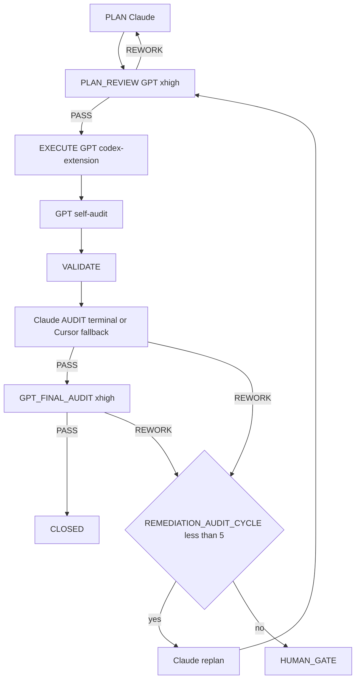

=== Auto-audit GPT (2e passe) ===
OpenAI Codex v0.125.0 (research preview)
--------
workdir: /Users/1millnonstop/Downloads/projet/foodking-web/web/testttt
model: gpt-5.5
provider: openai
approval: never
sandbox: workspace-write [workdir, /tmp, $TMPDIR, /Users/1millnonstop/.codex/memories]
reasoning effort: xhigh
reasoning summaries: none
session id: 019dc565-3849-7a50-8dc8-b339fdc5e4fa
--------
user
Tu effectues l’**auto-audit GPT** (2e passe) d’un cycle FoodKing — **pas** l’audit Claude terminal.

**Contexte** : le JSON ci-dessous est la proposition d’implémentation (format agents/codex.prompt.txt) pour la mission `CV1-M18-TEST-ARCHITECTURE`.


**JSON d’implémentation (à recouper)** :
```json
{
  "files_to_modify": [
    "reports/audit/TRACEABILITY_MATRIX_CAISSE_V1_2026-04-25.md",
    "reports/audit/TRACEABILITY_MATRIX_CAISSE_V1_2026-04-25.csv",
    "scripts/check-traceability.sh"
  ],
  "implementation_steps": [
    "..."
  ],
  "code_blocks": [
    {
      "path": "reports/audit/TRACEABILITY_MATRIX_CAISSE_V1_2026-04-25.md",
      "op": "create",
      "excerpt": "<contenu complet>"
    },
    {
      "path": "reports/audit/TRACEABILITY_MATRIX_CAISSE_V1_2026-04-25.csv",
      "op": "create",
      "excerpt": "<csv complet>"
    },
    {
      "path": "scripts/check-traceability.sh",
      "op": "create",
      "excerpt": "<bash complet>"
    }
  ],
  "risks": [],
  "notes": "Compteurs finaux : total=NN, P0=NN, P1=NN, P2=NN, unmapped=NN, with_test=NN%, with_gate=NN%",
  "execution_trace": {
    "delegation": "codex-extension",
    "invariants_considered": []
  }
}
```

**Livrable** (Markdown uniquement, en français) :
# AUTO_AUDIT_GPT — CV1-M18-TEST-ARCHITECTURE

## 1. Conformité au plan / scope
(Énumérer manques ou dérives ; si scope élargi sans escale → **ESCALATE**)

## 2. Invariants FoodKing
Pour chacun : OK / RISQUE / N/A
- pricing_ssot (backend seul)
- order_status (enum, pas de strings)
- branch_id
- commit_before_dispatch
- frozen_zones
- order_service_symmetry (si un des deux services touché)

## 3. Verdict
Une ligne : `VERDICT: PASS` | `VERDICT: NEEDS_FIX` | `VERDICT: ESCALATE` + 1–3 phrases.

codex
Je vais recouper la proposition avec l’état réel du dépôt et les artefacts de mission, puis rendre uniquement le verdict Markdown demandé. Je commence par les fichiers de cycle obligatoires, surtout la masterplay Caisse V1 et le contexte `CV1-M18`.
exec
/bin/zsh -lc "sed -n '1,220p' plans/masterplay/GO.md" in /Users/1millnonstop/Downloads/projet/foodking-web/web/testttt
exec
/bin/zsh -lc "sed -n '1,220p' plans/masterplay/MASTERPLAY_DISCIPLINE.md" in /Users/1millnonstop/Downloads/projet/foodking-web/web/testttt
exec
/bin/zsh -lc "sed -n '1,260p' plans/masterplay/MASTERPLAY_QUEUE.md" in /Users/1millnonstop/Downloads/projet/foodking-web/web/testttt
exec
/bin/zsh -lc "sed -n '1,220p' .cursor/ACTIVE_CYCLE.md" in /Users/1millnonstop/Downloads/projet/foodking-web/web/testttt
 succeeded in 0ms:
# MASTERPLAY DISCIPLINE — Caisse V1 (loop master)

> **But** : règles strictes que le runner et chaque mission GPT respectent en boucle, pendant des heures, jusqu'à finition de toutes les missions de `MASTERPLAY_QUEUE.md`. Lecture obligatoire avant de lancer `bash scripts/run-masterplay.sh`.

## 1. Autorité

| Source | Rôle |
|--------|------|
| `AGENTS.md` | Parcours obligatoire, cycle FoodKing |
| `plans/PLAN_CAISSE_V1_SUPER_MASTER_2026-04-25.md` | DAG autoritaire (ordre, gates) |
| `plans/PLAN_CAISSE_V1_GPT_MASTERPLAY_2026-04-25.md` | Catalogue 22 missions M-XX (objectifs, allowlist) |
| `plans/masterplay/MASTERPLAY_QUEUE.md` | File d'exécution courante |
| `plans/masterplay/MASTERPLAY_DISCIPLINE.md` | (ce fichier) règles d'exécution |
| `.cursor/rules/*.mdc` | Toujours appliquées |
| `docs/gates/GATE_LOG.md` | État des gates humains |

## 2. Boucle d'exécution (run-masterplay.sh)

```
LOOP {
  1. tail activity log (~500 tokens)
  2. find next PENDING task in MASTERPLAY_QUEUE with all DEPENDS_ON == CLOSED
  3. if none → break (all done or all blocked)
  4. verify missions/<TASK_ID>/input.json + execute_brief.md exist
  5. activity-log start codex-extension <TASK_ID> execute "<allowlist CSV>" "<note>"
     if exit 2 (collision) → MARK BLOCKED note=collision, continue loop
  6. update status: RUNNING
  7. npm run codex:complex -- <TASK_ID>     (génère output_codex.json + GPT_SELF_AUDIT)
  8. update status: EXECUTED
  9. activity-log done codex-extension <TASK_ID> done "<résumé court>"
 10. (option --with-audit) bash scripts/foodking-claude-orchestrate.sh audit-brief <TASK_ID>
       if PASS → status: AUDIT_PASS
       if REWORK → status: REWORK ; increment REWORK_COUNT ; if >=5 → BLOCKED note=human_gate
 11. (option --with-final) npm run codex:final-audit -- <TASK_ID>
       if PASS → status: FINAL_PASS
 12. if FINAL_PASS:
       bash scripts/after-execute-memory.sh
       update status: CLOSED
 13. sleep INTER_TASK_PAUSE_SECONDS (default 5s)
 14. continue LOOP
}
```

## 3. Garde-fous (non négociables)

### 3.1 Allowlist stricte par mission
Codex modifie **uniquement** les fichiers listés dans `missions/<TASK_ID>/input.json.allowlist`. Si modification hors liste détectée à l'audit → `REWORK`.

### 3.2 Frozen zones
Aucune édition d'un fichier frozen sans gate signé dans `docs/gates/GATE_LOG.md`. Le runner **refuse** de lancer une mission marquée `BLOCKED` jusqu'à ce que le statut soit changé manuellement après signature.

### 3.3 Invariants FoodKing — `REWORK` automatique
- Pricing client-authoritative
- Status littéral numérique (`status: 16`)
- `branch_id` LIKE
- Dispatch dans transaction
- OS ou FOS modifié sans `SYMMETRY_NOTE`
- Frozen modifié sans gate

### 3.4 Pas de gate auto-approuvée
Codex peut **rédiger** options ; aucune mission ne coche `[x] Approved`. Si une mission le tente → `REWORK` + `risks: ["ESCALATION: gate self-approved"]`.

### 3.5 Tests obligatoires
Chaque `mandatory_tests` listé doit être lancé et reporté dans le rapport. Échec → `REWORK`.

### 3.6 Diff minimal
Aucun renommage opportuniste, aucun refactor non demandé, aucune optimisation collatérale. Si ajout justifié → `notes` du JSON.

### 3.7 Activity log
`start` avant chaque mission ; `done` après. Sans cela → réservation fantôme = autres agents bloqués. Le runner enforce.

### 3.8 Mémoire
À CLOSE : compléter `memory/episodes/caisse_v1_<topic>_*.jsonl` (squelettes créés par M-19) puis `bash scripts/after-execute-memory.sh`. Si Graphiti UP : `bash bin/graphiti-ingest.sh` + `python3 memory/verify.py`.

## 4. Boucles de rework

- Max **5 cycles `REWORK`** consécutifs sur la même mission. Au 5e → `BLOCKED note=human_gate_required`.
- Max **3 cycles healing** consécutifs (cf. CLAUDE.md §8) avant escalade.
- Toute escalation → écrite dans `reports/masterplay/ESCALATIONS_<date>.md`.

## 5. Pause / arrêt

- `Ctrl-C` arrête la boucle proprement (mission en cours finit, runner s'arrête après).
- `touch reports/masterplay/STOP` → le runner s'arrête à la fin de la mission courante.
- `touch reports/masterplay/PAUSE` → le runner pause entre les missions tant que le fichier existe.

## 6. Logs

- `reports/masterplay/run_<ISO>.log` : log de la boucle.
- `reports/masterplay/status.json` : état temps réel (mission courante, compteurs).
- `missions/<TASK_ID>/output_codex.raw.log` : raw codex.
- `missions/<TASK_ID>/output_codex.json` : json structuré.
- `reports/audit/GPT_SELF_AUDIT_<TASK_ID>.md` : self-audit GPT.
- `reports/post_execute_latest.log` : trace `EXECUTE_DELEGATION`.
- `reports/AGENT_ACTIVITY_LOG.md` : start/done.

## 7. Audit Claude (en fin de boucle, manuel)

Quand toutes les missions sont `CLOSED` (ou `BLOCKED` documentés) :

```
bash scripts/foodking-claude-orchestrate.sh context
bash scripts/foodking-claude-orchestrate.sh audit
```

Sortie attendue : verdict transversal Caisse V1 (chaîne sync borne→centrale→POS→KDS→fiscal). Le verdict détermine `GO/HOLD/NO-GO` pour `GATE_GO_NO_GO_CAISSE_V1`.

## 8. Critères d'arrêt anormal

- 3 missions consécutives en `REWORK` → halt + alerte humaine.
- Activity-log refuse 3 fois → halt (collision permanente).
- `npm run codex:complex` échoue 3 fois sur la même mission (binaire codex KO) → halt.
- `claude` terminal indisponible 3 fois consécutives → continue avec fallback subagent + `AUDIT_FALLBACK_REASON: terminal-unavailable`.

## 9. Token discipline

- Le prompt envoyé à codex contient : template `agents/codex.prompt.txt` + `input.json` + `execute_brief.md` + (optionnel) `graphiti_context.md`, `plan_excerpt.md`, `cycle_snapshot.md`.
- Pas de duplication : pas de re-coller AGENTS.md ou super master plan dans chaque mission.
- Cap typique d'un prompt : ≤ 30 KB. Au-delà → splitter la mission.

## 10. Anti-pattern interdits

- ❌ Lancer 2 missions en parallèle sur les mêmes fichiers (collision activity-log).
- ❌ Modifier `MASTERPLAY_QUEUE.md` pendant que le runner tourne (sauf marquer BLOCKED → PENDING après gate).
- ❌ Skipper l'audit Claude pour aller plus vite.
- ❌ Marquer CLOSED manuellement sans double PASS (PASS Claude + PASS Codex final).
- ❌ Ignorer un `risks: ["ESCALATION: ..."]` dans output_codex.json.

---

`MASTERPLAY_DISCIPLINE_VERSION: 1.0` · `STRICT_MODE: ON`

 succeeded in 0ms:
# GO — Lance la masterplay Caisse V1

> **Intégration obligatoire confirmée (2026-04-25)** : la masterplay est désormais référencée dans :
> - `AGENTS.md` P0 + section "Caisse V1 — Masterplay loop"
> - `.cursor/rules/global.mdc` (alwaysApply) section "Caisse V1 — Masterplay loop"
> - `.cursor/commands/run-cycle.md` Step 0 item 0 (fast-path `^CV1-M…`)
> - `.cursor/ACTIVE_CYCLE.md` section "CAISSE_V1_MASTERPLAY (ACTIVE)"
>
> Tout agent qui ouvre le repo et touche un `TASK_ID` `CV1-MXX-…` est OBLIGÉ de lire `MASTERPLAY_DISCIPLINE.md` + `MASTERPLAY_QUEUE.md` avant d'agir.

## 0. Prérequis (1 fois)

```bash
# Vérifier binaire codex (CLI OpenAI, compte ChatGPT Pro)
npm run codex:doctor || npm install   # installe @openai/codex si absent

# Vérifier binaire claude (Anthropic, audit terminal)
which claude && claude --version       # doit retourner 2.x.x

# Vérifier la boucle FoodKing
npm run verify:boucle
```

Si l'un échoue : voir `AGENTS.md` § "Parcours obligatoire" et `agents/codex-extension-instructions.md`.

## 1. Démarrage propre (boucle longue)

```bash
# Boucle simple — exécute toutes les missions PENDING dans l'ordre, sans audit auto
bash scripts/run-masterplay.sh

# Boucle complète — codex exec + audit Claude terminal + audit Codex final + ingest mémoire
bash scripts/run-masterplay.sh --with-audit --with-final

# Boucle limitée (tester sur 2 missions d'abord)
bash scripts/run-masterplay.sh --with-audit --with-final --max 2
```

## 2. Suivre l'avancement

```bash
# Statut temps réel (fichier JSON mis à jour à chaque mission)
cat reports/masterplay/status.json

# Log de la boucle courante
ls -lt reports/masterplay/run_*.log | head -1
tail -f $(ls -t reports/masterplay/run_*.log | head -1)

# File d'attente (à jour)
cat plans/masterplay/MASTERPLAY_QUEUE.md
```

## 3. Pause / Stop

```bash
# Pause (rester en attente, le runner reprend dès suppression)
touch reports/masterplay/PAUSE
# Reprendre
rm reports/masterplay/PAUSE

# Stop propre (à la fin de la mission courante)
touch reports/masterplay/STOP

# Stop immédiat (Ctrl-C dans le terminal du runner)
```

## 4. Missions Vague A prêtes (no-gate, démarrent immédiatement)

| ORDER | TASK_ID | Mission | Livrables clés |
|-------|---------|---------|----------------|
| 01 | `CV1-M19-MEMORY-DISCIPLINE` | M-19 | 22 squelettes JSONL, procédure mémoire |
| 02 | `CV1-M01-TRACEABILITY-MATRIX` | M-01 | Matrice findings .md+.csv, script de check |
| 03 | `CV1-M02-SENTINEL-BASELINE` | M-02 | 18 tests sentinels rouges + 4 lints + index |
| 04 | `CV1-M12-LEGACY-GUARDS-CI` | M-12 | Workflow CI + 4 scripts lint legacy |
| 05 | `CV1-M16-HARDWARE-LAB` | M-16 | Checklist + protocoles + grille acceptation |
| 06 | `CV1-M18-TEST-ARCHITECTURE` | M-18 | Matrice couverture + plan campagne |

## 5. Pendant que ça tourne (de mon côté, la prochaine fois)

Je préparerai en parallèle :
- `CV1-M20-RUNBOOKS-SKELETON` (M-20) — squelettes runbooks ops
- `CV1-M21A-QUICKWINS-LOT0` (M-21a) — quickwins POS (discount v-model + Swiper RTL)
- `CV1-M03-GATES-DRAFT` (M-03) — briefs des 7 gates TO_DRAFT

## 6. Après ces 6 (toi + humain)

1. Audit Claude transversal :
   ```bash
   bash scripts/foodking-claude-orchestrate.sh context
   bash scripts/foodking-claude-orchestrate.sh audit
   ```
2. Signer les gates `PENDING_HUMAN_GATE` (cf. `docs/gates/GATE_LOG.md`).
3. Une fois M-03 livré, signer les 7 gates `TO_DRAFT`.
4. Débloquer la Vague B en passant manuellement les BLOCKED → PENDING au fil des signatures.

## 7. Garde-fous (rappel)

- **Allowlist stricte par mission** : codex ne touche QUE les fichiers listés.
- **Frozen zones** : intouchables sans gate signé.
- **Invariants FoodKing** : violation = REWORK auto.
- **Activity-log** : enforce les collisions (pas de double édition cross-agent).
- **Max 5 REWORK** par mission → BLOCKED + escalation humaine.

Lis `plans/masterplay/MASTERPLAY_DISCIPLINE.md` pour le détail complet.

---

**TL;DR** : `bash scripts/run-masterplay.sh --with-audit --with-final` → laisse tourner → reviens dans X heures → check `cat reports/masterplay/status.json` et `cat plans/masterplay/MASTERPLAY_QUEUE.md`.

 succeeded in 0ms:
# MASTERPLAY_QUEUE — Caisse V1

**Source de vérité de l'orchestration en boucle** : `bash scripts/run-masterplay.sh` lit cette file et exécute en série.

**Discipline** : `plans/masterplay/MASTERPLAY_DISCIPLINE.md`.  
**Plan parent** : `plans/PLAN_CAISSE_V1_GPT_MASTERPLAY_2026-04-25.md`.

## Légende statut
- `PENDING` — pas encore lancé
- `RUNNING` — codex exec en cours (ne pas relancer)
- `EXECUTED` — codex exec terminé, attend audit
- `AUDIT_PASS` — `AUDIT_VERDICT: PASS` Claude
- `FINAL_PASS` — `GPT_FINAL_AUDIT_VERDICT: PASS`
- `CLOSED` — mémoire ingestée + activity-log done
- `REWORK` — audit a demandé rework
- `BLOCKED` — gate humain ou dépendance manquante

## Légende vague
- `WAVE_A` — NO-GATE, parallélisable, démarre immédiatement
- `WAVE_B` — POST-GATE, séquencé selon DAG

## File d'exécution

| ORDER | TASK_ID | MISSION | WAVE | DEPENDS_ON | STATUS | NOTE |
|-------|---------|---------|------|------------|--------|------|
| 01 |CV1-M19-MEMORY-DISCIPLINE| M-19 | WAVE_A | — | CLOSED | Crée squelettes JSONL pour les 22 missions |
| 02 | CV1-M01-TRACEABILITY-MATRIX | M-01 | WAVE_A | — | CLOSED | Matrice findings → tasks → tests → gates |
| 03 | CV1-M02-SENTINEL-BASELINE | M-02 | WAVE_A | CV1-M01 | CLOSED | 18 sentinels fail-first + 4 lints |
| 04 |CV1-M12-LEGACY-GUARDS-CI| M-12 | WAVE_A | — | CLOSED | Lint imports + bundle scan + workflow (recovered: extractor JSON fix) |
| 05 |CV1-M16-HARDWARE-LAB| M-16 | WAVE_A | — | CLOSED | Checklist hardware signable (recovered: JSON valid, files materialized) |
| 06 | CV1-M18-TEST-ARCHITECTURE | M-18 | WAVE_A | CV1-M02 | RUNNING | Grille couverture + plan campagne |
| 07 | CV1-M20-RUNBOOKS-SKELETON | M-20 | WAVE_A | — | CLOSED | 8 runbooks ops (TPE, printer, kiosk net, dispatch, outbox, fiscal, KDS, rollback) |
| 08 | CV1-M21A-QUICKWINS-LOT0 | M-21a | WAVE_A | — | CLOSED | POS: discount v-model + Swiper RTL + focustrap dead |
| 09 | CV1-M03-GATES-DRAFT | M-03 | WAVE_A | CV1-M01 | PENDING | 8 briefs gates Caisse V1 (frozen, fiscal, ledger A/B, kds, schema, offline, web, stripe) |
| 10 | CV1-M09-BRANCH-ISOLATION | M-09 | WAVE_B | CV1-M03(gates), CV1-M02 | BLOCKED | Gate frozen requis |
| 11 | CV1-M06-POS-REVENUE-GUARDS | M-06 | WAVE_B | CV1-M09, CV1-M03 | BLOCKED | Gate frozen + payment_prop_mutation |
| 12 | CV1-M05-ORDER-QUOTE | M-05 | WAVE_B | CV1-M03 | BLOCKED | Gate schema |
| 13 | CV1-M04A-PAYMENT-LEDGER-FULL | M-04A | WAVE_B | CV1-M03 (ledger=A) | BLOCKED | Gate ledger=A |
| 14 | CV1-M04B-PAYMENT-PILOT-RESTRICT | M-04B | WAVE_B | CV1-M03 (ledger=B) | BLOCKED | Gate ledger=B |
| 15 | CV1-M08-FISCAL-Z-NF525 | M-08 | WAVE_B | CV1-M03 (fiscal+schema) | BLOCKED | Gates fiscal + schema |
| 16 | CV1-M07-KDS-RELEASE | M-07 | WAVE_B | CV1-M03 (kds_bump) | BLOCKED | Gate kds_bump |
| 17 | CV1-M10-OS-FOS-SYMMETRY | M-10 | WAVE_B | CV1-M06, CV1-M09 | BLOCKED | Après guards POS + branch |
| 18 | CV1-M11-KIOSK-RUNTIME | M-11 | WAVE_B | CV1-M03 (offline+fiscal) | BLOCKED | Gates offline + fiscal |
| 19 | CV1-M17-WEB-STRIPE-SCOPE | M-17 | WAVE_B | CV1-M03 (web+stripe) | BLOCKED | Gates web + stripe |
| 20 | CV1-M13-MIGRATIONS-SAFETY | M-13 | WAVE_B | CV1-M03 (schema) | BLOCKED | Gate schema |
| 21 | CV1-M14-OPS-PREFLIGHT | M-14 | WAVE_B | CV1-M13 | BLOCKED | — |
| 22 | CV1-M15-ROLLOUT-CANARY | M-15 | WAVE_B | CV1-M04*, CV1-M08, CV1-M14 | BLOCKED | — |
| 23 | CV1-M21B-PAYMENT-REFACTOR | M-21b | WAVE_B | CV1-M03 (prop_mutation) | BLOCKED | Gate payment_prop_mutation |
| 24 | CV1-M22-POST-LAUNCH-OBSERVABILITY | M-22 | WAVE_B | CV1-M14, CV1-M15 | BLOCKED | — |

## Ce que le runner exécute

À chaque tour de boucle, le runner :
1. Lit cette table.
2. Prend la **première** ligne au statut `PENDING`.
3. Vérifie que toutes ses `DEPENDS_ON` sont au statut `CLOSED`. Sinon → skip.
4. Vérifie que `missions/<TASK_ID>/input.json` et `execute_brief.md` existent. Sinon → marque `BLOCKED note=missing-mission-files`.
5. `start` activity-log → `npm run codex:complex -- <TASK_ID>` → `done` activity-log.
6. Mise à jour statut : `EXECUTED`.
7. Audit Claude terminal automatique (si activé `--with-audit`) → `AUDIT_PASS` ou `REWORK`.
8. Si `AUDIT_PASS` : `npm run codex:final-audit -- <TASK_ID>` → `FINAL_PASS`.
9. Si `FINAL_PASS` : ingestion mémoire + `done` → `CLOSED`.
10. Loop.

## Statut initial (à la création)

Les 6 missions Vague A préparées par M-19/M-01/M-02/M-12/M-16/M-18 sont au statut `PENDING`. Les autres `TODO_NEXT` (à créer après le premier round) ou `BLOCKED` (gates).

## Mise à jour manuelle

Le runner met à jour la colonne `STATUS` automatiquement (sed sur cette table). Tu peux aussi éditer manuellement entre 2 runs (ex: marquer `BLOCKED → PENDING` après gate signé).

 succeeded in 0ms:
# Active Cycle – FoodKing

**Méta (SSOT `run-cycle.md` Step 0 + `AGENTS.md` § *Authoritative … cycle state*)** — requis pour que l’orchestrateur ne s’arrête pas sur *« RUNNER_MODE not set »*.

| Champ | Valeur actuelle |
| --- | --- |
| **RUNNER_MODE** | `single-session` |
| **PHASE (cycle W10)** | `IN_PROGRESS` (détail = section `CYCLE_W10_…` ci-dessous) |
| **TASK_ID** | `P_EXEC_CLOSEOUT_GRAPHITI_CI_PROD_2026-04-22` |
| **PLAN_FILE** | `plans/PLAN_EXECUTION_CLOSEOUT_GRAPHITI_CI_PROD_2026-04-22.md` |
| **REPORT_FILE** | `reports/post_execute_latest.log` (append — preuve `EXECUTE_DELEGATION` / `AUDIT_*`) |

> **ACTIVE_PRIMARY** : `CYCLE_W10_EXECUTION_CLOSEOUT` (un seul cycle peut être actif à la fois — voir B03 méga-checklist).
> Cycles plus anciens en lecture seule = **archive** déplacée dans **`.cursor/ACTIVE_CYCLE_ARCHIVE.md`** (lecture humaine / forensique uniquement, **non requise** par le parcours obligatoire).

## CYCLE_W10_EXECUTION_CLOSEOUT (IN_PROGRESS — mémoire 180 + MCP global + commit + CI + prod)

**TASK_ID** : `P_EXEC_CLOSEOUT_GRAPHITI_CI_PROD_2026-04-22`  
**Plan SSOT** : `plans/PLAN_EXECUTION_CLOSEOUT_GRAPHITI_CI_PROD_2026-04-22.md`  
**Ordre** : Piste A (POS+Centrale : PLAN-MEM-1) ∥ Piste B (humain : PLAN-MEM-3) → C (smoke) → D (commit sur « go commit ») → E (CI) → F (prod J-7→J+7).  
**Gate mémoire** : `python3 memory/verify.py` → count **≥ 175** (180 idéal) avant de considérer PLAN-MEM-1 **CLOSED**.

- **Vérif locale (2026-04-22)** : `python3 memory/verify.py` → **count = 182**, smoke `search_memory_facts` OK — gate **satisfaite** pour clôturer l'ingestion côté seuil d'épisodes (suite : commit / CI / prod selon plan `PLAN_EXECUTION_CLOSEOUT_*`).

**Gouvernance globale (2e passe 2026-04-22)** : primer multi-agents + Graphiti vivant + tokens « zéro effet négatif » → **`docs/orchestration/GLOBAL_SYSTEM_PRIMER.md`** + rapport **`reports/audit/AUDIT_SECOND_PASS_GLOBAL_GOVERNANCE_REPORT_2026-04-22.md`**.

---

## CAISSE_V1_MASTERPLAY (ACTIVE — 2026-04-25)

**Phase** : finition Caisse V1 (POS + Kiosk + KDS + Centrale + Fiscal + Ops).
**Plan parent** : `plans/PLAN_CAISSE_V1_GPT_MASTERPLAY_2026-04-25.md`
**Plan DAG autoritaire** : `plans/PLAN_CAISSE_V1_SUPER_MASTER_2026-04-25.md`
**Boucle d'exécution** : `plans/masterplay/MASTERPLAY_DISCIPLINE.md` + `plans/masterplay/MASTERPLAY_QUEUE.md` + `scripts/run-masterplay.sh`
**Statut temps réel** : `reports/masterplay/status.json`

**Règle** : tout `TASK_ID` au format `CV1-MXX-…` passe par la masterplay (cf. `AGENTS.md` § "Caisse V1 — Masterplay loop", `.cursor/rules/global.mdc` § "Caisse V1 — Masterplay loop", `.cursor/commands/run-cycle.md` Step 0 item 0). **NE PAS** ouvrir un `run-cycle` standard sur un `CV1-MXX-…`.

---

## Archive

Tous les cycles **CLOSED / COMPLETED PASSED** (W4 → W9, NF525, etc.) ont été déplacés dans **`.cursor/ACTIVE_CYCLE_ARCHIVE.md`** pour réduire le coût de lecture du parcours obligatoire (audit 2026-04-24, mission `T-PARCOURS-OPTIMIZE-001`).

- **Lecture humaine** : ouvrir `.cursor/ACTIVE_CYCLE_ARCHIVE.md`.
- **Lecture agent** : **non requise** sauf instruction explicite du plan ou du chat (ex. "reprend le rationale du cycle W9").
- **Recherche** : `rg "CYCLE_W9_" .cursor/ACTIVE_CYCLE_ARCHIVE.md` ou `git log --follow .cursor/ACTIVE_CYCLE.md`.

exec
/bin/zsh -lc "sed -n '1,220p' AGENTS.md" in /Users/1millnonstop/Downloads/projet/foodking-web/web/testttt
 succeeded in 0ms:
# FoodKing – Cursor Agent Operating Contract

## 0. Quick start contract — read this first

Commence ici. Ne lance aucune action tant que tu n'as pas lu les priorités P0.
Ce contrat fixe l'ordre minimal de lecture pour comprendre le repo en moins de 60 secondes.
Lis complètement ce qui est marqué obligatoire ; diffère seulement ce qui est explicitement classé P2.

### Reading priority

| Priority | What to read | Why |
| --- | --- | --- |
| P0 | `AGENTS.md §1 Parcours obligatoire` | Cadre impératif de travail, ordre de lecture, discipline de cycle. |
| P0 | `.cursor/ACTIVE_CYCLE.md` (continuation) | État courant du cycle actif, contexte vivant, reprise sans divergence. |
| P0 | `.cursor/rules/global.mdc` (auto-attaché — mentionné pour info) | Règles globales toujours applicables, même si déjà injectées par l'outil. |
| P0 | `plans/masterplay/MASTERPLAY_DISCIPLINE.md` + `plans/masterplay/MASTERPLAY_QUEUE.md` (Caisse V1 actif) | **Pendant la phase Caisse V1** : règles d'or de la boucle GPT + file d'exécution. Tout agent qui touche une mission `CV1-MXX-…` DOIT lire ces deux fichiers avant d'agir. |
| P1 | `docs/orchestration/GLOBAL_SYSTEM_PRIMER.md` | Vocabulaire, architecture d'orchestration, invariants transverses. |
| P1 | `.cursor/commands/run-cycle.md` | Procédure exacte pour démarrer un cycle borné correctement. |
| P1 | `docs/orchestration/MEMORY_MATRIX.md` | Où chercher la mémoire utile sans relire tout le dépôt. |
| P1 | `.cursor/routing.md` | Routage des tâches, choix du bon canal, limites d'intervention. |
| P2 | `docs/orchestration/CODEX_API_DELEGATION.md` (quand EXECUTE complexe) | À lire si tu délègues ou exécutes du complexe (uniquement **CLI `codex`**, pas d’exécuteur HTTP dans le dépôt). |
| P2 | `.cursor/ACTIVE_CYCLE_ARCHIVE.md` (forensique humain) | Historique utile pour audit humain, pas requis au démarrage. |
| P2 | `docs/orchestration/EXPORT_CONFIG_CODEX_GPT_API_ET_AUDIT_PERSISTANCE.md` (nouveau poste) | Configuration et persistance utiles surtout lors d'un nouvel environnement. |

Règle simple : P0 avant toute action, P1 avant tout EXECUTE, P2 seulement à la demande du sujet.
Si un doute persiste après P0+P1, arrête-toi et relis ; n'improvise pas.

### One-line bootstrap

```bash
npm run verify:boucle
bash scripts/agent-activity-log.sh tail 50
run-cycle <TASK_ID>
```

### Caisse V1 — Masterplay loop (actif)

Pendant la phase de finition Caisse V1 (POS + Kiosk + KDS + Centrale + Fiscal), l'orchestration passe par la **MASTERPLAY** :

```bash
# Lire d'abord (obligatoire)
cat plans/masterplay/MASTERPLAY_DISCIPLINE.md
cat plans/masterplay/MASTERPLAY_QUEUE.md
cat plans/masterplay/GO.md

# Lancer la boucle (Codex extension complexe + audit Claude terminal + audit Codex final)
bash scripts/run-masterplay.sh --with-audit --with-final
```

- **Plan parent** : `plans/PLAN_CAISSE_V1_GPT_MASTERPLAY_2026-04-25.md` (catalogue 22 missions M-XX, ancrages file:line)
- **Plan autoritaire DAG** : `plans/PLAN_CAISSE_V1_SUPER_MASTER_2026-04-25.md`
- **Statut temps réel** : `reports/masterplay/status.json` + `reports/masterplay/run_*.log`
- Tout `TASK_ID` au format `CV1-MXX-…` est gouverné par la masterplay (allowlist, frozen, gates, REWORK max 5).
- Hors phase Caisse V1 : repasser au `run-cycle <TASK_ID>` standard.

**Anti-répétition (nouvel onglet / agent parallèle)** : copier d’abord le bloc de `docs/orchestration/SESSION_OPENING_ENFORCEMENT.md` — même discipline, moins d’oubli de `ACTIVE_CYCLE` / `run-cycle`.

Utilise `run-cycle <TASK_ID>` pour initier tout cycle borné.
Les deux autres commandes servent à vérifier l'état local et le journal d'activité avant d'exécuter.

### Quality-first, not token-cheap

Lis P0 et P1 intégralement, sans skim. Les économies de tokens ne se font jamais sur la substance des règles, seulement sur la répétition, le bruit et les relectures inutiles. En cas de tension entre vitesse et rigueur, applique la rigueur ; voir `.cursor/rules/global.mdc § Token Discipline`.

### If you're a new human contributor

Commence par `docs/orchestration/EXPORT_CONFIG_CODEX_GPT_API_ET_AUDIT_PERSISTANCE.md` pour préparer ton poste et comprendre le mode de persistance attendu.
Lis-le après P0, puis enchaîne sur P1 avant toute contribution effective.

---

## 1. Parcours obligatoire — **nouvelle conversation** **et** **continuation** (production, non négociable)

> **Objectif** : qu’**à chaque** session (premier message ou 500e message), l’exécutant sache **quel** chemin suivre — **sans** supposer un historique de chat. Tout est **dans le dépôt** ; l’histoire de conversation **n’est pas** la SSOT.

**Règle d’or** : *aucune* modification de code **produit** (hors `plans/`, `reports/`, `docs/gates/`, `missions/`, JSONL gouvernance) **dans le cadre d’un travail borné** sans **(a)** parcours ci-dessous **et** **(b)** cycle `run-cycle` + plan actif, sauf **exception** explicite humaine (notée dans le plan / gate).

| Étape | Action | Quand / pourquoi |
|-------|--------|------------------|
| **0. Continuation** | Lire **`.cursor/ACTIVE_CYCLE.md`**. | Si `PHASE` n’est **pas** vide et le cycle n’est **pas** archivé : **reprendre** ce `TASK_ID` / ce `PLAN_FILE` / ce `REPORT_FILE` — **ne pas** dupliquer un second cycle fantôme. Si humain confirme **nouveau** sujet : réinitialiser / nouveau `TASK_ID` selon `run-cycle` Step 0. |
| **1. Lecture initiale** | Lire **ce fichier** (`AGENTS.md`) **puis** **`docs/orchestration/GLOBAL_SYSTEM_PRIMER.md`** (table §1 = ordre complet : routing, `run-cycle`, Graphiti, `MEMORY_MATRIX`, etc.). | **Avant** tout code ou plan non trivial. Même en « continuation » si le contexte a dérivé ou l’onglet a été rafraîchi. |
| **2. Cycle structuré (SSOT procédurale)** | Toute tâche avec **`TASK_ID`** : suivre **`.cursor/commands/run-cycle.md`** et la commande **`run-cycle <TASK_ID>`** (ou équivalent explicite dans le chat : enchaîner les **Steps 0 → 5** sans en sauter). | **Programme courant (quota-optimized)** : `PLAN GPT → PLAN_REVIEW GPT → EXECUTE GPT → VALIDATE → AUDIT GPT → [CLAUDE CRITIQUE SI NÉCESSAIRE] → [GATE \| CLOSE]`. Aucun « close » sans audit PASS documenté. |
| **3. Vérification d’environnement** | `npm run verify:boucle` (0 requête par défaut). **Si le terminal ne “voit” pas Codex alors que l’extension est connectée** : l’auth IDE n’alimente pas le CLI — lancer `npm run codex:doctor` (npm + `login status` + 1 requête). **Rapide :** `npm run codex:verify-pro`. **Complet :** `npm run verify:boucle:full`. Encart : `agents/codex-extension-instructions.md`. | Même en **Step 5** : l’`EXECUTE` (CLI `codex`) requiert le binaire + session Pro sur **ce** binaire. Voir `run-cycle` Step 0 item 8. |
| **4. Secrets & outils machine** | Binaire **`claude`** sur le **`PATH`** (Claude Code CLI) pour l’**AUDIT** PRIMARY en terminal. Binaire **`codex`** (CLI OpenAI) : *Sign in with ChatGPT* **Pro** — **pas** de clé API dans le dépôt. Résolution : `PATH` **ou** `node_modules/.bin/codex` après **`npm install`** (dépendance **`@openai/codex`**) **ou** `npm i -g @openai/codex`. **Ne pas** mélanger avec une clé *Platform* restreinte dans l’environnement (provoque des 401 *scopes* sur l’API Responses) — `npm run codex:audit-bleed` aide. (Option) MCP Graphiti selon `~/.cursor/mcp.json`. | Sans `claude` : noter dès le **plan** l’`AUDIT` fallback + `AUDIT_FALLBACK_REASON`. Sans binaire `codex` : pas d’`EXECUTE` complexe PRIMARY (sub-agent + `FALLBACK_REASON` ou `npm install` + auth Pro). |
| **5. Traces & mémoire (déjà dans ce fichier)** | **`EXECUTE_DELEGATION:`** avant VALIDATE ; **`AUDIT_CHANNEL:`** + **`TERMINAL_AUDIT_OK: 1`** si audit terminal OK ; `docs/orchestration/MEMORY_MATRIX.md` ; `scripts/agent-activity-log.sh` (tail / start / done). | Traçabilité = **même** qualité en prod sur N agents parallèles. |

**Ce n’est pas optionnel** pour travailler « en production FoodKing » : c’est le **contrat** d’onboarding. Les **règles** `.cursor/rules/*.mdc` (dont **`global.mdc` — alwaysApply**) et ce fichier **s’imposent** **à** tout modèle, **dans** toute conversation, dès l’ouverture du dépôt.

**Pour un humain / nouveau compte** : mêmes étapes ; la doc **`docs/orchestration/EXPORT_CONFIG_CODEX_GPT_API_ET_AUDIT_PERSISTANCE.md`** regroupe l’**export** config API + persistance des règles hors-chat.

## Engine
Cursor local agent. No cloud orchestration. No external framework.
Auto/Premium routing: disabled. Model selection is explicit per cycle.

## Global system primer (multi-agents, Graphiti, tokens — lecture clé)

Tout nouvel intervenant (session Cursor, sub-agent Task, CLI terminal, humain) qui touche **orchestration**, **mémoire**, ou **discipline de contexte** : lire **`docs/orchestration/GLOBAL_SYSTEM_PRIMER.md`** après ce fichier. Y sont définis : ordre de lecture obligatoire, `codex-extension` GPT-5.5-pro/xhigh, fallback `foodking-complex-implementer`, fallback audit `foodking-planner-orchestrator`, terminal **`claude` / `codex`**, **mise à jour continue de Graphiti**, et la politique **« intelligence max — zéro optimisation négative »** (tokens : supprimer le gaspillage, pas la substance). Pour audits longs et robustesse **opération + agentique + mémoire** : **`docs/orchestration/MEGA_CHECKLIST_AUTONOMY_AND_MEMORY.md`** (180 tâches) et le narratif **`reports/audit/MEGA_AUDIT_SYSTEM_OPERATION_AGENTIC_2026-04-23.md`**.

**Discipline mémoire (qui écrit où, qui lit quoi, quand)** : **`docs/orchestration/MEMORY_MATRIX.md`** — matrice unique des **4 stores autorisés** (Code A · Graphiti+JSONL B · Missions C · Rapports D), table d'écriture par phase, ordre de lecture pour une nouvelle session, anti-patterns. Aucun nouveau store de mémoire ne peut être ajouté sans gate `docs/gates/GATE_MEMORY_*`. Décisions 2026-04-23 sur OpenSpace et claude-mem : **non intégrés**, justifications dans la matrice.

**Synchro multi-agents (cross-conv, cross-terminal)** : `.cursor/rules/cross-agent-sync.mdc` (alwaysApply) + `reports/AGENT_ACTIVITY_LOG.md` (append-only) + `scripts/agent-activity-log.sh` (`tail | start | done | collisions | active`). Au démarrage de session : `tail 50` (~500 tokens). Avant édition produit (Step 2 EXECUTE) : `start` (refus exit 2 si collision). À la clôture (Step 5 CLOSE) : `done`. Évite que deux agents (Cursor convs / `codex-extension` / `claude-terminal` / humain) modifient les mêmes fichiers à leur insu. **Doctrine étendue** (Graphiti = mémoire partagée, rôles Claude vs Codex, anti-patterns) : **`docs/orchestration/MULTI_AGENT_ORCHESTRATION.md`**.

## Workflow
PLAN GPT (codex) → PLAN_REVIEW GPT (codex) → EXECUTE GPT (codex) → VALIDATE → AUDIT GPT (codex) → [CLAUDE CRITICAL ESCALATION ONLY] → [HUMAN GATE | CLOSE]

No phase may be skipped. Default close condition is `AUDIT_VERDICT: PASS` from GPT path, with optional Claude escalation audit only for critical/blocked cases.

## Model Roles
| Model | Role | Channel (priorité **qualité maximale / zéro raccourci token**) |
|---|---|---|
| Claude | Escalade critique uniquement | Utiliser Claude seulement pour cas vraiment critiques: blocage logique majeur, gate ambigu non résoluble, conflit d'audits, ou arbitrage architecture multi-fichiers à haut risque. Le canal prioritaire reste GPT/Codex pour économiser les quotas Claude. |
| **GPT-5.5 / GPT-5.5-pro** | **PLAN + PLAN_REVIEW + EXECUTE + AUDIT** | **`codex-extension`** — `npm run codex:plan-review`, `npm run codex:complex`, `npm run codex:final-audit` (CLI `codex` + `codex exec`, **compte ChatGPT Pro**, modèle `gpt-5.5-pro` si dispo sinon `gpt-5.5`, `model_reasoning_effort=xhigh`). GPT devient le canal principal d'orchestration, implémentation et audit de routine. |
| GPT-5.5 (fallback) | Complex implementation (FALLBACK only) | **Sub-agent** `foodking-complex-implementer` (Task Cursor) — consomme l’**usage** des modèles de l’**abonnement Cursor**. **Uniquement** si `codex` / l’exécution `codex exec` a échoué (≥2 tentatives documentées) ou binaire indispo. |
| Composer | Validation/report only | Plus d’implémentation routine pendant les cycles de finition. Composer peut résumer, exécuter/rapporter des validations, mais toute correction produit repart en EXECUTE GPT. |

**Qui décide (mode actuel quota-optimized)** : **GPT/Codex** porte l’**autorité opérationnelle** sur planification, implémentation, auto-audit, et audit final de routine. **Claude** est mis en pause et appelé uniquement en **escalade critique** (ambiguïté structurelle, gate sensible, conflit technique majeur, analyse de risque à très forte complexité). Le **fait** code / test l’emporte sur la croyance.

**Principe unique (mode actuel) — à valider en prod sur chaque cycle :** **PLAN GPT → PLAN_REVIEW GPT → EXECUTE GPT → self-audit GPT → VALIDATE → AUDIT GPT**. Le repli vers Claude n’intervient qu'en escalade critique documentée (`CLAUDE_ESCALATION_REASON:`), avec portée minimale.

One PRIMARY_EXECUTION_MODEL per cycle. Roles are explicit and layered; review checkpoints do not authorize scope expansion.
Full routing policy: `.cursor/routing.md`. Naming: the **PRIMARY complex implementer** is the **FoodKing Codex Complex Implementer** (slug `codex-extension`); see `docs/orchestration/CODEX_API_DELEGATION.md`.

## Authoritative multi-agent bounded cycle (SSOT)

For **TASK_ID-driven** work in Cursor, this path is **authoritative** and overrides any conflicting step elsewhere in this document:

1. **Command:** `.cursor/commands/run-cycle.md` (invoke with a `TASK_ID`, e.g. `run-cycle SMOKE-001`).
2. **Cycle state:** `.cursor/ACTIVE_CYCLE.md` (`RUNNER_MODE: single-session`, `PHASE`, `PLAN_FILE`, `REPORT_FILE`, completion rows).
3. **Plan artifact:** `plans/PLAN_[TASK_ID]_[DATE].md` per `.cursor/context/plan-context.md` (from `plans/PLAN_TEMPLATE.md` when applicable).
4. **Phase instructions:** `.cursor/context/plan-context.md` (PLAN), `.cursor/context/execute-context.md` (EXECUTE), `.cursor/context/audit-context.md` (AUDIT); VALIDATE per `run-cycle.md` when `validate-context.md` is absent.

**EXECUTE delegation (GPT only; PRIMARY first, FALLBACK only on failure):**

- **Routine implementation disabled during finishing cycles** : no product edit via Composer / `foodking-routine-implementer`. Small edits still route through GPT to keep the same quality chain.
- **PRIMARY** : **`codex-extension`** — **FoodKing Codex Complex Implementer** (CLI `codex`, compte **ChatGPT Pro**, `gpt-5.5-pro`, `model_reasoning_effort=xhigh`). Procédure :
  1. Préparer `missions/{TASK_ID}/input.json` (+ optionnels : `graphiti_context.md` issu de `search_memory_facts(group_ids=["foodking"])`, `plan_excerpt.md`, `execute_brief.md`, `cycle_snapshot.md` — fusionnés par le script d’assemblage de prompt).
  2. Lancer `npm run codex:complex -- {TASK_ID}` (`bash scripts/codex-extension-execute.sh`) ; le wrapper passe explicitement `-m ${CODEX_EXT_MODEL_PRO:-gpt-5.5-pro}` et `model_reasoning_effort=${CODEX_EXT_REASONING_EFFORT:-xhigh}`. (Instructions custom : `agents/codex-extension-instructions.md`.) **Bootstrap** : `npm run codex:prepare -- {TASK_ID}`.
  3. Appliquer `missions/{TASK_ID}/output_codex.json` ; consommer l’**auto-audit** `reports/audit/GPT_SELF_AUDIT_{TASK_ID}.md` (généré par le wrapper).
  4. Tracer `EXECUTE_DELEGATION: codex-extension` dans `reports/post_execute_latest.log` et le `REPORT_FILE`.
- **Complexe — FALLBACK (uniquement si `codex exec` est HS après reprises, ou binaire manquant)** : `Task` → `foodking-complex-implementer` — tracer `EXECUTE_DELEGATION: foodking-complex-implementer (codex-extension-fallback)` + `FALLBACK_REASON:`. 

Référence complète : **`docs/orchestration/CODEX_API_DELEGATION.md`** (naming, fallback contract, audit handoff, token discipline, schéma boucle). Procédure cycle : `.cursor/commands/run-cycle.md`. La trace `EXECUTE_DELEGATION` dans le rapport est **obligatoire** pour passer en VALIDATE.

**Clôture vs. audit :** Après `VALIDATE`, l’**audit** **Claude** (terminal `foodking-claude-orchestrate.sh` en PRIMARY, fallback Cursor si quota/rate-limit/terminal HS) écrit `AUDIT_VERDICT: PASS|REWORK`, puis GPT écrit `GPT_FINAL_AUDIT_VERDICT: PASS|REWORK|ESCALATE`. **Pas** de `CLOSED` sans double PASS. Sur `REWORK`, boucle `replan (orchestration Claude) → missions + EXECUTE GPT → self-audit GPT → VALIDATE → re-audit Claude → GPT final`, avec `REMEDIATION_AUDIT_CYCLE` 1..5 — au 5e `REWORK` sans double PASS, **HUMAN_GATE** (détail : Step 5 de `run-cycle.md` et `auto-remediation.mdc`).

Sections below labeled **Legacy workflow** remain valid for **PR-centric / review-loop** habits but **do not replace** this SSOT for bounded cycles.

## Source of truth (extended)
- README.md
- docs/PROJECT_CONTINUITY_AND_VISION.md
- docs/ARCHITECTURE.md
- docs/API_MAP.md
- docs/AUTHZ_MATRIX.md
- docs/ORDER_FLOW.md
- docs/DEVICE_FLOW.md
- docs/BUSINESS_RULES.md
- docs/CORE_MODULES.md
- docs/DATABASE_SCHEMA_CORE.md
- docs/ERROR_HANDLING.md
- docs/SECURITY_NOTES.md
- docs/TEST_PLAN.md
- docs/MASSIVE_TEST_PLAN.md
- docs/SAAS_VISION.md
- docs/CONTRIBUTING_QA_BOTS.md
- workflows/qa-loop.md
- workflows/task-routing.md
- workflows/report-format.md
- workflows/task-status.md
- reports/README.md
- docs/orchestration/MEGA_CHECKLIST_AUTONOMY_AND_MEMORY.md
- docs/orchestration/WORKFLOW_AUDIT_GRAPHIQUE_2026-04-23.md
- docs/orchestration/TERMINAL_CLAUDE_GRAPHITI_ORCHESTRATION.md
- docs/orchestration/ROUTING_MATRIX.md

## Stop Conditions
Halt and generate a gate brief on any of:
- Gate trigger detected
- Scope expansion beyond declared boundary
- FoodKing invariant violation
- Two consecutive validation failures
- Planning ambiguity unresolvable from task context
- **`codex` / `codex exec` indisponible après reprises (auth, binaire, ou échec ≥2 sur la même tâche)** : basculer sur le fallback `Task → foodking-complex-implementer` et **noter explicitement** `EXECUTE_DELEGATION: foodking-complex-implementer (codex-extension-fallback)` + `FALLBACK_REASON:`.
- **Audit en terminal (PRIMARY) indisponible ou limité** (`claude` absent, **quota / rate limit / session Anthropic saturée**, auth, réseau — après **1 retry** documenté de `context` + `audit-brief` ou `audit`) : **continuer le cycle** — même checklist `audit-context.md` via Task **`foodking-planner-orchestrator`** (recommandé) ou session Cursor **Claude** ; **`AUDIT_CHANNEL: cursor-session`** + **`AUDIT_FALLBACK_REASON:`** (obligatoire) + optionnel **`AUDIT_SUBAGENT_FALLBACK: foodking-planner-orchestrator`**. Voir `docs/orchestration/AUDIT_TERMINAL_QUOTA_FALLBACK.md`. **Ne jamais** omettre la raison.

## FoodKing Non-Negotiables
- Backend is pricing SSOT — no frontend price logic
- `OrderStatus` enum is authoritative — no hardcoded strings
- `branch_id` = business data isolation — no cross-branch data bleed
- Dispatch strictly after DB commit
- `OrderService` / `FrontendOrderService` symmetry mandatory on any order change
- Frozen zones require gate clearance before any edit

## MCP

### Phase 1 — Filesystem
Filesystem MCP only for repo reads where applicable.

### Phase 2 — Graphiti (mémoire inter-cycles — **présent dans toutes les sessions où le serveur est enregistré**)

**Objectif** : décisions d’architecture, invariants, sync borne↔POS↔KDS, fiscal NF525, historique de cycles — récupérables sans relire des centaines de fichiers.

| Élément | Détail |
|--------|--------|
| **Enregistrement Cursor (obligatoire côté humain)** | Fusionner le bloc `graphiti` dans **`~/.cursor/mcp.json`** (Settings → MCP). Modèle : **`.cursor/mcp/graphiti.json.example`**. Le dépôt ne peut pas injecter un MCP automatiquement dans l’IDE. |
| **Règle agent (automatique dès que le MCP est chargé)** | Voir **`.cursor/rules/graphiti-memory.mdc`** (always-on) + **`global.mdc`** : avant toute tâche non triviale, appeler au moins **`search_memory_facts`** (et optionnellement **`search_memory_nodes`**) avec `group_ids=["foodking"]`. |
| **Après AUDIT / CLOSE** | Si `add_memory` est disponible : enregistrer les décisions durables (ADR, gate, invariant clarifié). |
| **Si Graphiti absent de la session** | **Ne pas bloquer** PLAN / EXECUTE : une ligne « Graphiti non chargé » + secours **`memory/INDEX.md`** + lecture ciblée des JSONL sous `memory/episodes/`. |
| **Server** | Zep Graphiti — wrapper local **`.cursor/mcp/start-graphiti-mcp.sh`** (voir exemple JSON). Clone typique : `/Users/1millnonstop/graphiti`. |
| **Backend** | Neo4j (ex. Aura) — credentials hors repo. |
| **Dépannage** | **`.cursor/mcp/GRAPHITI_TROUBLESHOOTING.md`** (LiteLLM, embeddings, redémarrage proxy). |
| **Group ID** | Toujours **`foodking`**. |
| **Ingestion / vérif locale** | `memory/ingest.py`, `memory/verify.py`, `bin/graphiti-ingest.sh` ; index des domaines **`memory/INDEX.md`**. |

**Intégration bounded cycle** : la commande **`.cursor/commands/run-cycle.md`** inclut l’appel Graphiti en **Step 0 item 5** (query avant PLAN).

### Phase 3 — Playwright MCP (tests E2E sur flows critiques FoodKing)

- Package : `@playwright/mcp@latest` (npx, pas d’install global)
- Browser : Chromium
- BASE_URL : `http://localhost:8000`

codex
La file masterplay confirme que `CV1-M18-TEST-ARCHITECTURE` est une mission Caisse V1 active et dépend de `CV1-M02`. Je lis maintenant le brief de mission, l’allowlist réelle et les livrables existants pour vérifier si la proposition correspond au plan plutôt qu’à une autre mission.
exec
/bin/zsh -lc "sed -n '1,240p' docs/orchestration/GLOBAL_SYSTEM_PRIMER.md" in /Users/1millnonstop/Downloads/projet/foodking-web/web/testttt
exec
/bin/zsh -lc "sed -n '1,260p' .cursor/commands/run-cycle.md" in /Users/1millnonstop/Downloads/projet/foodking-web/web/testttt
 succeeded in 0ms:
# Command: run-cycle

Orchestrate one full bounded cycle inside a single Cursor session.

## Trigger
Invoke with a TASK_ID. Example: `run-cycle SMOKE-001`

---

## Step 0 — Pre-flight

0. **Caisse V1 fast-path** : si `TASK_ID` matche `^CV1-M[0-9]{2}[A-Z]?-`, ne pas exécuter ce `run-cycle.md` directement. Utiliser **la masterplay** :
   - Lire `plans/masterplay/MASTERPLAY_DISCIPLINE.md` (règles d'or)
   - Lire `plans/masterplay/MASTERPLAY_QUEUE.md` (statut + DAG)
   - Lancer `bash scripts/run-masterplay.sh --with-audit --with-final` (ou `--max 1` pour une seule mission)
   - Le runner orchestre lui-même PLAN/EXECUTE/AUDIT pour la mission via `missions/<TASK_ID>/input.json` + `execute_brief.md`.
   - Ce `run-cycle.md` standard reste valide pour tout autre `TASK_ID`.

1. Read `.cursor/ACTIVE_CYCLE.md`.
2. Read `RUNNER_MODE`:
   - `single-session` → proceed automatically through all phases without stopping between them.
   - `manual` → execute one phase at a time. After each phase, output: `→ PHASE: [completed]. Awaiting manual confirmation to continue to [next phase].` and halt until the developer explicitly says "continue".
   - If RUNNER_MODE is missing: halt. `"RUNNER_MODE not set in ACTIVE_CYCLE.md. Set to single-session or manual and retry."`
3. Confirm TASK_ID matches the provided input. If ACTIVE_CYCLE is blank, write TASK_ID and PHASE: PLAN first.
4. Confirm no gate is currently open (`Gate: None` or all gate rows unchecked). If a gate is open, halt and surface the gate file path.
5. **Graphiti (when MCP `graphiti` is loaded):** call `search_memory_facts` once with a natural-language query derived from the TASK_ID / subsystem (always `group_ids=["foodking"]`). Fold any returned facts into context before PLAN. If Graphiti is not loaded: one-line note only — do not block the cycle (see `.cursor/rules/graphiti-memory.mdc`).
6. **Memory discipline (mandatory):** before writing anywhere, recall the matrix in `docs/orchestration/MEMORY_MATRIX.md`. PLAN writes to **C** (`missions/<TASK>/`) + **D** (`plans/`, `ACTIVE_CYCLE.md`); EXECUTE writes to **A** (code) + **D** (`post_execute_latest.log`); AUDIT writes to **B** (Graphiti/JSONL — *only* for durable decisions) + **D** (verdict). Never invent a 5th store; if a need appears, halt and open `docs/gates/GATE_MEMORY_*`.
7. **Cross-agent sync (mandatory, ~500 tokens):** read the tail of the activity log to detect parallel work :
   ```bash
   bash scripts/agent-activity-log.sh tail 50
   ```
   If an active reservation overlaps the planned scope, halt and adapt the plan (or wait / coordinate). Per `.cursor/rules/cross-agent-sync.mdc`.
8. **Boucle terminal (pre-check, 0 requête API) :** `npm run verify:boucle` — vérifie que le binaire `claude` est sur PATH, que `CODEX_API_DELEGATION` / `run-cycle` contiennent le schéma *terminal-first*, et avertit tôt si l’environnement ne peut pas exécuter l’**AUDIT** / **EXÉCUTE** PRIMARY. Si **exit 1** (binaire `claude` manquant) : le cycle peut quand même **planifier** mais doit **déclarer dès le plan** l’**AUDIT fallback** `cursor-session` (raison: `claude` absent) pour éviter une impasse en Step 5. Pré-API complète (1× chaque) : `npm run verify:boucle:full` — pour cycles **critiques** (POS, fiscal) ou avant release. **Trip E2E automatisé (smoke + mini mission) :** `npm run boucle:e2e` (journal : `reports/execution/BOUCLE_E2E_LAST_RUN.txt`, schéma : `reports/execution/RUN_P_BOUCLE_E2E_2026-04-24.md`).

---

## Step 1 — PLAN

Load `.cursor/context/plan-context.md` and follow its instructions exactly.

- If Step 0 item 5 (Graphiti) returned facts, reference them explicitly in the plan as **`## PRIOR_CONTEXT`** (per `plan-context.md`; 2–5 lines max).
- Produce `plans/PLAN_[TASK_ID]_[DATE].md` (fichier **SSOT** du cycle — l’orchestrateur en **session Cursor** en est l’auteur formel). **Option (tâches sensibles / alignement long)** : amorcer l’orchestration **Claude en terminal** avant d’exécuter le code : `bash scripts/foodking-claude-orchestrate.sh context` (génère le bref disque consommable par un audit/une planification cohérente) ; cela **ne** remplace **pas** le plan `plans/…` — c’est un **gabarit d’intelligence** pour la même session.
- **PLAN_REVIEW obligatoire (second avis GPT, max qualité)** : avant de passer en EXECUTE, faire relire le plan par **GPT-5.5 / GPT-5.5-pro en reasoning `xhigh`** via `npm run codex:plan-review -- {TASK_ID}` (`codex-extension`) ou, si le CLI est indisponible, `foodking-complex-implementer (codex-extension-fallback)`. La revue doit vérifier scope, invariants FoodKing, gates, stratégie de tests, frozen zones, parité OrderService/FrontendOrderService si applicable, et absence de logique prix frontend. Tracer dans le plan ou le `REPORT_FILE` :
  - `PLAN_REVIEW_CHANNEL: codex-extension | foodking-complex-implementer (codex-extension-fallback)`
  - `PLAN_REVIEW_MODEL: gpt-5.5-pro`
  - `PLAN_REVIEW_REASONING_EFFORT: xhigh`
  - `PLAN_REVIEW_VERDICT: PASS | REWORK | ESCALATE`
- Si `PLAN_REVIEW_VERDICT: REWORK`, Claude révise le plan puis relance une revue GPT. Si `ESCALATE`, ouvrir gate ou demander arbitrage humain. Ne jamais passer en EXECUTE sans `PLAN_REVIEW_VERDICT: PASS`.
- Update `ACTIVE_CYCLE.md`: PHASE → EXECUTE, PLAN_FILE set, PLAN row checked.
- Halt if:
  - Scope is ambiguous
  - A frozen zone is in scope without a cleared gate
  - Any gate condition is anticipated and not pre-cleared

If `RUNNER_MODE: single-session`: proceed to Step 2 immediately without stopping.
If `RUNNER_MODE: manual`: halt here. Output `→ PHASE: PLAN complete. Awaiting confirmation to start EXECUTE.`

---

## Step 2 — EXECUTE

Read the plan file. **Delegation is mandatory** per `.cursor/routing.md`. **Toutes les implémentations passent par GPT** : fold Graphiti `search_memory_facts` (group `foodking`) and plan `## PRIOR_CONTEXT` into `missions/{TASK_ID}/graphiti_context.md` and/or `plan_excerpt.md` (see `docs/orchestration/CODEX_API_DELEGATION.md`), then run `missions/{TASK_ID}/input.json` + `npm run codex:complex -- {TASK_ID}` (`bash scripts/codex-extension-execute.sh`, CLI `codex` + compte **ChatGPT Pro**, model `gpt-5.5-pro`, `model_reasoning_effort=xhigh` by default), apply `missions/{TASK_ID}/output_codex.json`, review `reports/audit/GPT_SELF_AUDIT_{TASK_ID}.md`, and set `EXECUTE_DELEGATION: codex-extension`. If the **CLI `codex`** path fails after retries, use the Cursor subagent **`foodking-complex-implementer`** with the same plan and invariants. **No routine implementation path is allowed during finishing cycles**: Composer / `foodking-routine-implementer` may summarize or validate, but must not implement product changes. All product edits in this phase must be evidenced by one of these paths (or the same chat only with **human-acknowledged** `explicit-prompt-bind` as in the exception below).

- Before leaving EXECUTE, ensure **delegation is evidenced** for auditors: the validation input (`reports/post_execute_latest.log` and/or `REPORT_FILE` from `ACTIVE_CYCLE.md`) must contain a line `EXECUTE_DELEGATION: codex-extension | foodking-complex-implementer (codex-extension-fallback) | explicit-prompt-bind (human-acknowledged)` naming what actually ran. **Do not** advance to VALIDATE if product code changed without that line (unless EXECUTE made **zero** product edits).
- **Reserve scope before any product edit** (per `.cursor/rules/cross-agent-sync.mdc`):
  ```bash
  bash scripts/agent-activity-log.sh start <AGENT> <TASK_ID> execute "<csv_files_or_dirs>" "<short note>"
  ```
  If exit code 2 (collision with another agent), **halt** — do not force. Adapt scope, wait for release, or coordinate.
- **Then run preflight** (executable guard, refuses if scope mismatch — see `docs/orchestration/COMMAND_DECK.md`):
  ```bash
  bash scripts/preflight-execute.sh <TASK_ID> --scope="<csv>"   # exit 2/3/4 if not aligned
  ```
  Modes: `--mode=governance` (no product edit), `--mode=read-only`, or `--override="reason"` (logged) for documented human exceptions.
- Implementation must follow the active plan only — no scope expansion.
- Before transitioning out of EXECUTE, re-read the plan file and confirm no `ESCALATION` entry is unresolved. If one exists, halt:
  > "Unresolved ESCALATION detected. Halting. Developer action required."
- Update `ACTIVE_CYCLE.md`: PHASE → VALIDATE, EXECUTE row checked.

---

## Step 3 — Post-execute hook

Attempt to trigger `.cursor/hooks/post-execute.sh`.

- If shell execution is available: run it, capture result to `reports/post_execute_latest.log`.
- If shell execution is not available:
  > "Shell execution unavailable. Run `.cursor/hooks/post-execute.sh` manually, then confirm to continue."
  Wait for developer confirmation before proceeding to Step 4.
- If the hook exits non-zero or the log shows a failure: halt.
  > "Post-execute hook failed. Review reports/post_execute_latest.log before continuing."

---

## Step 4 — VALIDATE

Load `.cursor/context/execute-context.md` and apply its handoff section as the validate protocol:

- Primary input: `reports/post_execute_latest.log`
- Invoke validation as declared in the plan's test strategy. Validation may use Composer/session tooling for summaries and test execution, but **any product fix discovered during VALIDATE must return to Step 2 and be implemented by GPT**.
- Confirm only declared subsystems were touched.
- Confirm `EXECUTE_DELEGATION:` line is present in the log (required for audit traceability).
- **Run post-execute guard** (refuses VALIDATE if delegation missing OR diff out of reserved scope):
  ```bash
  bash scripts/post-execute-guard.sh <TASK_ID>   # exit 1 (no delegation) or 4 (diff out of scope)
  ```
- Update `ACTIVE_CYCLE.md`: PHASE → AUDIT, VALIDATE row checked.
- **Tests verts ne suffisent pas à clôturer** : la **clôture** d’un cycle borné exige en plus **`AUDIT_VERDICT: PASS`** issu de l’**audit Claude** et **`GPT_FINAL_AUDIT_VERDICT: PASS`** issu du second avis GPT (Step 5). Tant qu’un audit conclut `REWORK`, **ne pas** passer en `PHASE: CLOSED` (voir Step 5 — boucle de remédiation, plafond 5).
- Halt on two consecutive **VALIDATE** failures **without intervening AUDIT-driven remediation** — do not retry autonomously. (REMEDIATION-driven re-runs of EXECUTE → VALIDATE that follow an `audit-context.md` triage are NOT counted as "consecutive validation failures"; they are distinct attempts. See `.cursor/rules/auto-remediation.mdc`.)

---

## Step 5 — AUDIT

Load `.cursor/context/audit-context.md` and follow its checklist exactly.

> **Canal d’audit — ordre de priorité (obligatoire, aligné abonnement produit)**
>
> **PRIMARY** : **Claude en terminal** (abonnement Anthropic / CLI `claude` — l’audit **n’emprunte pas** l’orchestrateur de modèles de Cursor ; c’est l’**abonnement cible côté terminal**) :
> 1) `bash scripts/foodking-claude-orchestrate.sh context` (génère `reports/audit/_TERMINAL_CONTEXT_BRIEF.md` à partir d’ACTIVE_CYCLE + JSONL — peu de tokens),
> 2) puis un audit ciblé : `bash scripts/foodking-claude-orchestrate.sh audit-brief` (audit court) **ou** `bash scripts/foodking-claude-orchestrate.sh audit` (passe d’orchestration plus large, selon criticité de la tâche).
>    - Résultat de checklist dans le `REPORT_FILE` (le même que `ACTIVE_CYCLE.md` → `REPORT_FILE` ou log append).
> 3) Dès qu’un `audit` / `audit-brief` terminal a **produit** une sortie d’audit exploitable (commande **exit 0**), tracer dans le `REPORT_FILE` **`AUDIT_CHANNEL: claude-terminal`** **et** **`TERMINAL_AUDIT_OK: 1`**. Même sémantique de gate que `EXECUTE_DELEGATION` avant VALIDATE : **ne pas** CLOSE avec `claude-terminal` seul **sans** `TERMINAL_AUDIT_OK: 1`. En cas d’**échec** terminal (exit non-zéro) : **1 retour** (retry réseau) autorisé ; si encore KO → **FALLBACK** obligatoire : `AUDIT_CHANNEL: cursor-session` + `AUDIT_FALLBACK_REASON:` (ex. `terminal_exit_nonzero` ou message court).
>
> **FALLBACK** (uniquement si PRIMARY impossible après **1 retry** terminal) : **ne pas bloquer le cycle** si l’abonnement Anthropic est **à court de quota**, en **rate limit**, ou si la **session terminal** est saturée. Repli **canonique** : invoquer le sub-agent Cursor **`foodking-planner-orchestrator`** (Task) avec la **même** checklist `.cursor/context/audit-context.md`, lecture de `reports/audit/_TERMINAL_CONTEXT_BRIEF.md` si utile, et production de **`AUDIT_VERDICT: PASS | REWORK`** dans le `REPORT_FILE`. Alternative acceptée : même checklist en **session Cursor** avec le **modèle Claude** (sans sub-agent), si tu préfères une seule conversation. Dans **tous** les cas : **`AUDIT_CHANNEL: cursor-session`** + **`AUDIT_FALLBACK_REASON: <1 ligne>`** obligatoires ; recommandé en plus **`AUDIT_SUBAGENT_FALLBACK: foodking-planner-orchestrator`** quand le Task planner est utilisé. Exemples de raison : `anthropic_rate_limit_after_retry`, `quota_exceeded`, `claude: command not found`, `terminal_auth_network`.
>
> Doc détaillée : `docs/orchestration/AUDIT_TERMINAL_QUOTA_FALLBACK.md`.
>
> Cette règle réplique la logique **`codex-extension` PRIMARY → `foodking-complex-implementer` FALLBACK** pour l’**EXECUTE**, mais côté **Claude/audit** : *terminal d’abord (abonnement cible), puis repli orchestrateur Cursor (`foodking-planner-orchestrator` ou session Claude) si terminal HS ou limité*.
>
> Vérif. technique d’environnement : `bash scripts/verify-orchestration-boucle.sh` (binaire + optionnel : smoke `codex` + `claude` si `VERIFY_BILLING_FULL=1`).

> **Cycles avec section `## SUBTASKS` (team workflow — voir `docs/orchestration/TEAM_WORKFLOW.md`)** :
> L’audit global Claude **ne démarre qu’après** que **toutes** les sous-tâches soient `DONE` (avec `CLAUDE_MINI_PASS`) ou qu’un `HUMAN_GATE` soit ouvert.
> Les `REWORK_SUB` (échec mini-audit par sous-tâche) sont traités **localement** avec **max 3 retries par sous-tâche** ; au 3e échec → `HUMAN_GATE`.
> Les `REWORK` **post-audit global** (ci-dessous) continuent d’utiliser le `REMEDIATION_AUDIT_CYCLE` 1..5 comme d’habitude.
> Lancement type : `npm run team:audit:global -- <TASK_ID>` (= `foodking-claude-orchestrate.sh audit` avec pré-vérif que toutes les sous-tâches sont `DONE`).

**Verdict Claude (obligatoire — canal terminal PRIMARY ou fallback Cursor explicite)** : dans le `REPORT_FILE` (même run que l’audit), **une ligne unique** :
```
AUDIT_VERDICT: PASS
```
ou
```
AUDIT_VERDICT: REWORK
```
- **`PASS` (vert)** = l’implémentation + le plan sont **acceptés** sur le fond (gouvernance, invariants, cohérence) ; **décision** portée par la sortie **Claude** du terminal (ou, en repli, session Cursor + `AUDIT_FALLBACK_REASON:` explicite — même règle de suite).
- **`REWORK` (non vert)** = corrections / replan / nouvelle exécution requises avant toute clôture.

**GPT_FINAL_AUDIT obligatoire (double avis final)** : après `AUDIT_VERDICT: PASS` Claude, faire une revue finale par **GPT-5.5 / GPT-5.5-pro en reasoning `xhigh`** via `npm run codex:final-audit -- {TASK_ID}` contre le plan, le diff, `reports/post_execute_latest.log`, les tests, `GPT_SELF_AUDIT_{TASK_ID}.md`, et le verdict Claude. Tracer :
```
GPT_FINAL_AUDIT_CHANNEL: codex-extension | foodking-complex-implementer (codex-extension-fallback)
GPT_FINAL_AUDIT_MODEL: gpt-5.5-pro
GPT_FINAL_AUDIT_REASONING_EFFORT: xhigh
GPT_FINAL_AUDIT_VERDICT: PASS | REWORK | ESCALATE
```
Si le verdict GPT final est `REWORK`, retour à la boucle de remédiation. Si `ESCALATE`, ouvrir gate. **Jamais** de `CLOSED` sans **les deux lignes** `AUDIT_VERDICT: PASS` et `GPT_FINAL_AUDIT_VERDICT: PASS` (les tests du Step 4 seuls ne suffisent pas).

**Boucle de remédiation (audit → orchestration → EXECUTE), plafond 5**

1. Après les audits, lire les verdicts. Si **`AUDIT_VERDICT: PASS`** et **`GPT_FINAL_AUDIT_VERDICT: PASS`** → seulement alors : append `Audit: PASSED` (cohérent audit-context), `PHASE → CLOSED`, mémoire / `agent-activity-log.sh done` comme ci-dessous.
2. Si **`AUDIT_VERDICT: REWORK`** ou **`GPT_FINAL_AUDIT_VERDICT: REWORK`** :
   - Lire / incrémenter dans `REPORT_FILE` le compteur **`REMEDIATION_AUDIT_CYCLE`** (1 à 5 ; noter `REMEDIATION_AUDIT_CYCLE: N/5` à chaque tour).
   - Si **N < 5** : **ne pas** CLOSED — tracers `CLAUDE_ORCHESTRATION: replan` (l’orchestrateur **Claude** : session et/ou terminal) pour ajuster le plan, la mission `missions/{TASK_ID}/` ou le brief, puis **retour Step 2 EXECUTE** (PRIMARY `codex-extension` si correction complexe), enchaîner **Step 3 → 4 → 5** jusqu’à `PASS` ou épuisement des 5 tours.
   - Si **N == 5** et l’audit reste `REWORK` → **HUMAN_GATE** : bref de gate, `PHASE → GATE`, **pas** de 6e boucle autonome. Intervention humaine requise (stratégie, scope, ou arbitrage de risque).

**Sortie heureuse (PASS)** — alignée audit-context + mémoire :

- Append `Audit: PASSED` (si pas déjà fait) et conserver `AUDIT_VERDICT: PASS` + `GPT_FINAL_AUDIT_VERDICT: PASS` dans le même `REPORT_FILE`, `PHASE → CLOSED`, archiver.
  - **Memory write (only durable decisions):** if AUDIT confirmed a durable decision/invariant/ADR (per `docs/orchestration/MEMORY_MATRIX.md` row B), append **one** JSONL line in the right `memory/episodes/*.jsonl`, then run `bash scripts/after-execute-memory.sh`. The report (D) keeps a 1-line ref, **never** a verbatim copy.
  - **Release scope reservation** (per `.cursor/rules/cross-agent-sync.mdc`):
    ```bash
    bash scripts/agent-activity-log.sh done <AGENT> <TASK_ID> done "1-line summary"
    ```
    Use `blocked` instead of `done` if a gate was opened; use `abandoned` if the cycle was dropped. **Always release** — orphan reservations block future agents.

- Si l’audit échoue sur **invariant / zone critique / même bug 3×** (voir `auto-remediation.mdc` + `audit-context.md` triage) indépendamment de `REWORK` : appliquer la branche **GATE** (gate brief, halt) — cela **court-circuite** le plafond des 5 tours si le risque l’exige.

---

## Hard halts (any phase)

Stop immediately and surface the condition on any of:
- Gate brief required
- Ambiguity unresolvable from task context
- Unresolved ESCALATION in plan file
- Post-execute hook failed or unavailable without developer confirmation
- Two consecutive **VALIDATE** failures **without intervening AUDIT remediation** (see Step 4 nuance above)
- Same bug `bug_signature` reaches **3rd consecutive remediation attempt** (per `.cursor/rules/auto-remediation.mdc`)
- **`AUDIT_VERDICT: REWORK` or `GPT_FINAL_AUDIT_VERDICT: REWORK` at `REMEDIATION_AUDIT_CYCLE: 5/5` still without dual `PASS`** → **HUMAN_GATE** (orchestrator stops autonomous retries; see Step 5)
- Manual UX test required (per plan)
- Product decision required (per plan)
- Invariant violation detected

Do not self-approve any halt condition. Do not silently continue.

---

## Token discipline

Do not re-read files already in context. Do not re-explain policies defined in .mdc rules. Output phase transitions as single-line status only: `→ PHASE: [name]`.

 succeeded in 0ms:
# FoodKing — Primer système global (agents, sous-agents, Graphiti, tokens)

> **Passation + index complet des chemins (SSOT, un seul fichier)** : **`../DOC_EXPO_HER_ANCIEN_AGENT_ALIMENTATION_WORKFLOW_2026-04-22.md`** (table §2 = utilité de chaque path pour une nouvelle session).

> **Fichier d’entrée** pour toute nouvelle conversation, tout nouvel outil d’agent (Cursor, terminal, futur bot), ou tout humain qui reprend le projet.  
> Objectif : **robustesse** = même avec 100 cycles et des exécuteurs différents, le comportement reste **prévisible**, **traçable**, et la **mémoire** reste **alignée** sur le code.

**Obligatoire avant ce Primer (SSOT d’onboarding)** : lire `**AGENTS.md`**, section **Parcours obligatoire** (nouvelle session **et** continuation), puis enchaîner ici.  
**En continuation d’un cycle** : lire d’**abord** `**.cursor/ACTIVE_CYCLE.md`** (éviter un second `TASK_ID` fantôme) ; si `PHASE` = vide ou `CLOSED`, revenir à la table ci-dessous.

---

## 1. Ordre de lecture obligatoire (minimum viable)

Lire **dans cet ordre** avant d’écrire du code ou un plan non trivial (voir aussi `**AGENTS.md` § *Parcours obligatoire* — tableau** pour la même doctrine) :


| #   | Fichier                                                    | Pourquoi                                                                                                                  |
| --- | ---------------------------------------------------------- | ------------------------------------------------------------------------------------------------------------------------- |
| 0   | `**.cursor/ACTIVE_CYCLE.md`** (si reprise)                 | Cycle déjà en cours : même `TASK_ID` / mêmes Steps **jusqu’à** `CLOSE` — **ne pas** forker un plan parallèle sans le dire |
| 1   | `**AGENTS.md`** (dont § *Parcours obligatoire*)            | Contrat global : phases, routing, MCP, terminal, parcours production, non-négociables                                     |
| 1b  | `**docs/orchestration/SESSION_OPENING_ENFORCEMENT.md**`  | **Bloc unique** (tail log + `verify:boucle` + rappel phases) — réduit la répétition « refais la boucle » en session ; **modèle Cursor = Claude pour PLAN** (Auto/Composer ne remplacent pas `routing.md`) |
| 1c  | `**reports/audit/SIMULATION_PARCOURS_PROD_CHECKPOINTS_2026-04-25.md**` | **Simulation production** : checkpoints par phase, fichiers SSOT, limite IDE (qui orchestre quoi) — avant de promettre « zéro dérive » |
| 2   | `**.cursor/routing.md*`*                                   | Qui fait quoi (Claude plan/audit, GPT-5.5-pro xhigh plan review / execute / final audit, Composer validation only)         |
| 3   | `**.cursor/commands/run-cycle.md**`                        | Déroulé exact d’un cycle `TASK_ID` (incl. Graphiti Step 0.5)                                                              |
| 4   | `**.cursor/rules/graphiti-memory.mdc**`                    | Mémoire Graphiti : quand lire / quand écrire                                                                              |
| 5   | `**.cursor/rules/global.mdc**` + `**context-hygiene.mdc**` | Gates, discipline tokens **sans** réduire l’intelligence                                                                  |
| 6   | `**docs/orchestration/MEMORY_MATRIX.md`**                  | **Quel store écrit quoi, lit quoi, quand** (4 stores autorisés A/B/C/D) — antidote unique à la complexité mémoire         |
| 6b  | `**docs/orchestration/MULTI_AGENT_ORCHESTRATION.md`**      | Même tâches, plusieurs onglets Cursor : **activité** + **Graphiti** (lecture) + `AUDIT_VERDICT` — sans empiéter           |
| 7   | `**memory/INDEX.md`**                                      | Carte des domaines mémoire Graphiti (store B) — secours si MCP absent                                                     |
| 8   | `**tasks/[TASK_ID].md**`                                   | Quand un cycle borné est lancé — périmètre de la tâche                                                                    |


Ensuite, **selon le domaine** : `docs/ORDER_FLOW.md`, `docs/DEVICE_FLOW.md`, `docs/ARCHITECTURE.md`, `project-invariants.mdc`, etc.

Référence roster court : `**docs/orchestration/AGENT_ROLES.md`**.

### 1.1 Décision : Claude orchestre ; GPT challenge et exécute en xhigh

- **Cerveau** (priorité, plan, re-plan, gates) : **Claude** (session + terminal `foodking-claude-orchestrate.sh`) — il écrit le plan et tranche la stratégie de remédiation.
- **Challenge plan obligatoire** : **GPT-5.5-pro / xhigh** relit le plan avant EXECUTE (`npm run codex:plan-review -- {TASK_ID}` → `PLAN_REVIEW_VERDICT`). Si `REWORK`, Claude révise avant tout code.
- **Bras + premier contrôle qualité** : **EXECUTE = Codex (PRIMARY)** pour toutes les implémentations produit, même les petites corrections : `npm run codex:complex -- {TASK_ID}` → `reports/audit/GPT_SELF_AUDIT_{TASK_ID}.md`.
- **Pas de routine product implementation** : Composer / `foodking-routine-implementer` ne fait plus d’édition produit en cycle de finition ; il peut aider au reporting/validation seulement.
- **Double audit final** : Claude audit d’abord (`AUDIT_VERDICT`) avec terminal primary + fallback Cursor si quota/rate-limit/terminal HS, puis GPT final audit (`npm run codex:final-audit -- {TASK_ID}` → `GPT_FINAL_AUDIT_VERDICT`). Close seulement si les deux sont `PASS`.

---

## 2. Sous-agents Cursor (Task tool) — intégration dans le flux

Ce ne sont **pas** des fichiers dans le repo ; ce sont des **profils** invoqués par Cursor selon `.cursor/routing.md` et `**run-cycle.md` Step 2**.


| Sub-agent / Canal                                                               | Modèle cible                                                                  | Quand                                                                                                                                                                                                                                          |
| ------------------------------------------------------------------------------- | ----------------------------------------------------------------------------- | ---------------------------------------------------------------------------------------------------------------------------------------------------------------------------------------------------------------------------------------------- |
| `**foodking-routine-implementer`** (sub-agent Cursor)                           | Composer                                                                      | **Validation/report only** en cycles de finition. Pas d’implémentation produit.                                                                                                                                             |
| `**codex-extension` — FoodKing Codex Complex Implementer (PRIMARY)**            | **GPT-5.5-pro / xhigh** via CLI `codex` (compte **ChatGPT Pro**) + `codex exec` | **PLAN_REVIEW + toute implémentation produit + auto-audit + GPT_FINAL_AUDIT**. `npm run codex:complex -- {TASK_ID}`. Voir `scripts/codex-extension-execute.sh`, `agents/codex-extension-instructions.md`. |
| `**foodking-complex-implementer`** (sub-agent Cursor — **FALLBACK uniquement**) | Aligné exécution **GPT-5.5** (emplacement sub-agent)                          | Uniquement si `codex` / `codex exec` est indisponible après reprises sur la même tâche                                                                                                                                                         |


**Règles d'or**

1. **Délégation obligatoire** pour toute modification produit en EXECUTE, avec trace `EXECUTE_DELEGATION:` dans le log de validation. Valeurs autorisées : `codex-extension` | `foodking-complex-implementer (codex-extension-fallback)` | `explicit-prompt-bind`.
2. **EXECUTE = `codex-extension` PRIMAIRE** (CLI `codex` + Pro, `npm run codex:complex -- {TASK_ID}` ; contexte Graphiti/plan dans `missions/…/graphiti_context.md` etc. ; voir `**docs/orchestration/CODEX_API_DELEGATION.md`**). Le sub-agent `foodking-complex-implementer` est le **fallback** (usage Cursor) — indispo `codex exec`. Aucun **connecteur HTTP** / proxy n’est maintenu dans le dépôt.
3. Le sous-agent **ne voit pas toujours** le MCP Graphiti du parent : le plan **doit** contenir `**## PRIOR_CONTEXT`** (faits Graphiti + invariants) — copier ou résumer dans le message de délégation **ou** dans `missions/{TASK_ID}/graphiti_context.md` pour l’appel API.
4. Aucun sub-agent ne **contourne** un gate humain ni n’édite une frozen zone sans `docs/gates/` approuvé.

---

## 3. Terminal allies (hors Task tool) — intégration

Documentés dans `**AGENTS.md` § Terminal allies** :


| Outil                                                                  | Rôle                                                                     | Position + **canal d’abonnement** (SSOT)                                                                                                                                                                                         |
| ---------------------------------------------------------------------- | ------------------------------------------------------------------------ | -------------------------------------------------------------------------------------------------------------------------------------------------------------------------------------------------------------------------------- |
| `**claude` +** `foodking-claude-orchestrate.sh`                        | **AUDIT cycle — PRIMARY (Step 5)** : `context` → `audit` / `audit-brief` | Abonnement **Anthropic (CLI sur terminal)** ; n’**emprunte** pas l’orchestrateur de modèles de Cursor. **FALLBACK actif** (quota / limite / panne après 1 retry) : Task **`foodking-planner-orchestrator`** + même checklist + `AUDIT_CHANNEL: cursor-session` + `AUDIT_FALLBACK_REASON:` — `docs/orchestration/AUDIT_TERMINAL_QUOTA_FALLBACK.md`. |
| **CLI** `codex` + `npm run codex:complex` (`**codex-extension`**, Pro) | **PLAN_REVIEW + EXECUTE + GPT_FINAL_AUDIT — PRIMARY** (GPT-5.5-pro/xhigh) | Compte **ChatGPT Pro** sur le terminal ; ne passe **pas** par l’orchestrateur de modèles **Cursor** ; facturation côté OpenAI ; **FALLBACK** = sub-agent.     |
| `codex` / REPL interactif (OpenAI)                                     | Tâches ad hoc **hors** cycle, ou côté humain                             | N’enlèvent **pas** VALIDATE + AUDIT du `run-cycle`.                                                                                                                                                                              |
| `verify-orchestration-boucle.sh`                                       | Preuve binaire + optionnel smoke (API)                                   | `bash scripts/verify-orchestration-boucle.sh` — `VERIFY_BILLING_FULL=1` lance 1× smoke `claude` + 1× `npm run codex:smoke`.                                                                                                      |


**Clôture :** l’audit Claude écrit `AUDIT_VERDICT: PASS` ou `REWORK`, puis GPT écrit `GPT_FINAL_AUDIT_VERDICT: PASS|REWORK|ESCALATE` (voir `run-cycle.md` Step 5). Pas de `CLOSED` sans double `PASS`. En `REWORK` : re-orchestration + re-EXECUTE GPT jusqu’à double `PASS` ou 5e tour → humain. Schéma :




Le terminal **n’enregistre** pas **Graphiti** seul : après AUDIT/CLOSE, décisions → JSONL + `after-execute-memory.sh` (voir §5) comme avant.

---

## 4. Graphiti — vivre avec l’avancement du projet (N agents, N cycles)

### 4.1 Rôles


| Rôle                                    | Responsable                                                          |
| --------------------------------------- | -------------------------------------------------------------------- |
| **Lecture** avant plan / audit complexe | Tout agent avec MCP `graphiti` chargé                                |
| **Écriture** après décision durable     | Phase AUDIT + CLOSED (`audit-context.md`) ou humain via `add_memory` |
| **Alimentation batch** (JSONL → Neo4j)  | Humain ou pipeline : `bash bin/graphiti-ingest.sh`                   |


### 4.2 Quand mettre à jour la mémoire (checklist — « ne pas oublier »)

Cocher mentalement à **chaque** fin de sujet significatif :

- **Invariant** clarifié ou renforcé → nouvelle ligne dans `memory/episodes/02_architecture_invariants.jsonl` (ou fichier le plus proche) + `ingest` ciblé.
- **Sync / event / canal** modifié → `03_domain_events_sync.jsonl` + ingest.
- **Décision produit / ADR** → `12_decisions_log.jsonl` + ingest.
- **Nouvelle tâche V14+** ou finding cross-vagues → `09_tasks_history.jsonl` + ingest.
- **Changement prod / rollout** → `11_production_plan.jsonl` + ingest.
- **Nouveau rôle agent ou règle d’orchestration** → `13_agents_roles.jsonl` + ingest + **mettre à jour ce Primer** si le modèle change.
- **Audit long (ops + agentique + mémoire)** → suivre `docs/orchestration/MEGA_CHECKLIST_AUTONOMY_AND_MEMORY.md` (180 tâches) ; narratif `reports/audit/MEGA_AUDIT_SYSTEM_OPERATION_AGENTIC_2026-04-23.md`.
- **Après toute écriture JSONL** → `bash scripts/after-execute-memory.sh` (rafraîchit `reports/memory/jsonl_manifest.json`, cohérent avec CI) puis `bin/graphiti-ingest.sh` sur les domaines touchés.

**Règle d’or** : si le code ou la doc **canonical** a changé et que la mémoire dit encore l’ancienne vérité → **mise à jour sous 48 h** (sinon dérive silencieuse).

### 4.3 Outils

- Pipeline post-écriture (manifeste + rappel ingest) : `bash scripts/after-execute-memory.sh`.
- Ingestion : `bin/graphiti-ingest.sh [filtre]` — voir `memory/README.md`.
- Vérification : `python3 memory/verify.py`.
- Terminal (bref + audit option) : `bash scripts/foodking-claude-orchestrate.sh post-execute` ou `context` puis `audit-brief` — `docs/orchestration/TERMINAL_CLAUDE_GRAPHITI_ORCHESTRATION.md`.
- Reset rare : `@graphiti clear_graph` puis full ingest (politique humaine).

---

## 5. Tokens, contexte, cache — politique « intelligence max, gaspillage min »

**But** : réponses **détaillées et stables**, pas des réponses courtes pour économiser des tokens au détriment de la qualité.


| On optimise (effet ≥ 0)                                                              | On n’optimise pas (effet négatif interdit)                               |
| ------------------------------------------------------------------------------------ | ------------------------------------------------------------------------ |
| Re-lire un fichier **déjà** dans la fenêtre contexte                                 | Tronquer un plan, une analyse de risque, ou un gate pour « faire court » |
| Résumer une phase **terminée** pour handoff (voir `context-hygiene.mdc` §4)          | Supprimer `## PRIOR_CONTEXT` ou les invariants du plan                   |
| Utiliser **Graphiti** pour récupérer faits structurés au lieu de rouvrir 50 rapports | Désactiver Graphiti pour « aller plus vite » sur du sync / fiscal        |
| Écrire les preuves dans `reports/` structuré                                         | Remplacer des tests par de la prose vague                                |


**Cache applicatif** (Redis, etc.) : régie par le code Laravel et `**app:preflight-production`** — hors scope de ce Primer, mais **ne jamais** confondre « cache métier » et « mémoire Graphiti » : ce sont deux systèmes.

---

## 6. Révision de ce document

- **À chaque** changement majeur d’orchestration (nouveau sub-agent, nouveau MCP, nouveau cycle obligatoire) : mettre à jour **ce fichier** + une ligne dans `13_agents_roles.jsonl` + ingest.
- **Trimestriel** : relire §4.2 avec un lead dev.

---

## 7. Pointers rapides


| Besoin                                                        | Aller à                                                           |
| ------------------------------------------------------------- | ----------------------------------------------------------------- |
| Cycle complet                                                 | `.cursor/commands/run-cycle.md`                                   |
| Gates                                                         | `.cursor/rules/human-gates.mdc`                                   |
| Invariants code                                               | `.cursor/rules/project-invariants.mdc`                            |
| Mémoire locale                                                | `memory/INDEX.md`                                                 |
| Pannes Graphiti                                               | `.cursor/mcp/GRAPHITI_TROUBLESHOOTING.md`                         |
| Closeout prod + mémoire                                       | `plans/PLAN_EXECUTION_CLOSEOUT_GRAPHITI_CI_PROD_2026-04-22.md`    |
| Méga-checklist autonomie / Graphiti                           | `docs/orchestration/MEGA_CHECKLIST_AUTONOMY_AND_MEMORY.md`        |
| Méga-audit narratif (compagnon)                               | `reports/audit/MEGA_AUDIT_SYSTEM_OPERATION_AGENTIC_2026-04-23.md` |
| Audit graphique workflow                                      | `docs/orchestration/WORKFLOW_AUDIT_GRAPHIQUE_2026-04-23.md`       |
| Terminal Claude + Graphiti (rôles, `context` / `audit-brief`) | `docs/orchestration/TERMINAL_CLAUDE_GRAPHITI_ORCHESTRATION.md`    |
| Matrice routine / complexe (sub-agents)                       | `docs/orchestration/ROUTING_MATRIX.md`                            |

exec
/bin/zsh -lc "sed -n '1,260p' docs/orchestration/MEMORY_MATRIX.md" in /Users/1millnonstop/Downloads/projet/foodking-web/web/testttt
 succeeded in 0ms:
# Matrice mémoire FoodKing — qui écrit quoi, qui lit quoi, quand

> **But** : une seule page, lue par **tout agent / humain / nouvelle session** avant d'écrire ou de lire de la "mémoire". Évite la double source, le doc-mort, l'oubli d'ingestion.
>
> **Règle d'or** : *un type de fait → un seul propriétaire de store*. Si le fait existe ailleurs, c'est un **miroir** (lecture), pas une vérité.

---

## 1. Les 4 stores autorisés (et **rien d'autre**)

| # | Store | Format / lieu | Propriétaire | Vérité pour… |
|---|-------|---------------|--------------|--------------|
| **A** | **Code + tests** | git (`app/`, `resources/`, `tests/`) | Le dépôt | **Comportement réel** (la seule vérité absolue). Si Graphiti dit X et le code fait Y → le code gagne, Graphiti a un drift. |
| **B** | **Graphiti** (Neo4j via MCP) + miroir local **`memory/episodes/*.jsonl`** | `.cursor/mcp/graphiti.json` + `bin/graphiti-ingest.sh` | Phase **AUDIT** (humain ou Claude) | **Décisions durables, invariants, ADR, gates, liens entités** *cross-cycle* |
| **C** | **Mission de tâche** | `missions/<TASK_ID>/{input.json, graphiti_context.md, plan_excerpt.md, execute_brief.md, output_codex.json}` | Phase **PLAN + EXECUTE** | **Contexte d'une tâche unique** : ce qui entre dans `codex-terminal`, ce qui en sort. Éphémère par cycle. |
| **D** | **Rapports & cycle** | `plans/PLAN_*.md`, `reports/execution/RUN_*.md`, `reports/post_execute_latest.log`, `.cursor/ACTIVE_CYCLE.md`, `docs/gates/`, **`reports/AGENT_ACTIVITY_LOG.md`** (cross-agent sync) | Phases **PLAN, EXECUTE, VALIDATE, AUDIT** | **Trace procédurale et preuve d'audit** : qui a fait quoi, quand, avec quel résultat (`EXECUTE_DELEGATION`, `AUDIT_VERDICT`), **+ qui réserve quels fichiers en parallèle** (voir `.cursor/rules/cross-agent-sync.mdc`) |

**Aucun autre store** n'est autorisé sans gate. Pas d'OpenSpace, pas de claude-mem, pas de Notion sauvage. Si un besoin nouveau apparaît, il doit s'inscrire dans **A, B, C ou D** ou ouvrir un gate dans `docs/gates/` avec justification.

---

## 2. Matrice "écriture" — qui écrit quoi, à quel moment du cycle

| Phase | Store A (code) | Store B (Graphiti / JSONL) | Store C (missions) | Store D (rapports / cycle) |
|------|----------------|----------------------------|---------------------|----------------------------|
| **PLAN** | — | *Lecture seule* (`search_memory_facts`) | crée `missions/<TASK>/graphiti_context.md` + `plan_excerpt.md` | crée `plans/PLAN_*.md`, met à jour `ACTIVE_CYCLE.md` PHASE→EXECUTE |
| **PLAN_REVIEW (`codex-extension`, CLI `codex` + Pro)** | — | — | lit `plan_excerpt.md` si présent | écrit `reports/audit/GPT_PLAN_REVIEW_<TASK>.md` + `PLAN_REVIEW_VERDICT` |
| **EXECUTE produit (`codex-extension`, CLI `codex` + Pro)** | écrit (apply `output_codex.json`) | — | écrit `output_codex.json` (par le wrapper) | trace `EXECUTE_DELEGATION: codex-extension` dans `post_execute_latest.log` / `REPORT_FILE` |
| **EXECUTE fallback (`foodking-complex-implementer`)** | écrit | — | — | trace `EXECUTE_DELEGATION: foodking-complex-implementer (codex-extension-fallback)` + `FALLBACK_REASON:` |
| **VALIDATE** | — (lit, run tests) | — | — | écrit résultats tests dans `REPORT_FILE` + `post_execute_latest.log` |
| **AUDIT Claude** | — | écrit (1 ligne JSONL → ingest) **si décision durable** | — | écrit **`AUDIT_VERDICT: PASS \| REWORK`**, compteur `REMEDIATION_AUDIT_CYCLE` si reprise, + `AUDIT_CHANNEL: claude-terminal \| cursor-session` |
| **GPT_FINAL_AUDIT** | — | — | lit mission + rapports utiles | écrit `reports/audit/GPT_FINAL_AUDIT_<TASK>.md` + `GPT_FINAL_AUDIT_VERDICT` |
| **CLOSE** | — | `bash scripts/after-execute-memory.sh` (manifest + ingest si JSONL touché) | archive ou laisse | append `## Final report` dans `REPORT_FILE` |
| **GATE** (zone critique / 3e remediation) | — | — | — | écrit `docs/gates/GATE_<TASK>_<DATE>.md`, halt humain |

> **Règle anti-doublon** : si une décision sort de l'AUDIT, elle va dans **B** (Graphiti + JSONL). Le rapport (D) la **résume en 1 ligne** avec le `episode_id` ou la ref JSONL. Pas de copie verbatim.

---

## 3. Matrice "lecture" — qui lit quoi, dans quel ordre

| Question | Lire d'abord | Puis si besoin |
|----------|--------------|----------------|
| "Quelle est la règle métier sur X ?" | **A** (code) puis **B** (Graphiti `search_memory_facts`) | docs/ canoniques |
| "Pourquoi cette décision a été prise ?" | **B** (`12_decisions_log.jsonl` ou `search_memory_facts`) | `docs/gates/` (D) |
| "Que faisait le cycle précédent ?" | **D** (`ACTIVE_CYCLE.md`, dernier `RUN_*.md`) | **C** (`missions/<DERNIER_TASK>/`) |
| "Que doit livrer cette tâche ?" | **D** (`plans/PLAN_<TASK>_*.md`) | **C** (`missions/<TASK>/input.json`) |
| "Qu'a livré l’EXECUTE `codex-extension` ?" | **C** (`missions/<TASK>/output_codex.json`) | **D** (`post_execute_latest.log`, `GPT_SELF_AUDIT_*.md`) |
| "Quelle invariant interdit ce que je veux faire ?" | **B** (`02_architecture_invariants.jsonl`) + `.cursor/rules/project-invariants.mdc` | **A** (le code lui-même) |
| "Qui a auditeur le dernier cycle ?" | **D** (`AUDIT_VERDICT` + `AUDIT_CHANNEL` dans `RUN_*.md`) | — |

**Ordre de défaut pour une nouvelle session Cursor (zéro contexte)** :
1. `AGENTS.md` (10 lignes top)
2. `docs/orchestration/GLOBAL_SYSTEM_PRIMER.md`
3. `docs/orchestration/MEMORY_MATRIX.md` (ce fichier)
4. `.cursor/ACTIVE_CYCLE.md`
5. Le `PLAN_FILE` cité par ACTIVE_CYCLE
6. Si Graphiti MCP chargé : `search_memory_facts(query=<sujet>, group_ids=["foodking"])`
7. Si pas chargé : `memory/INDEX.md` + JSONL ciblés

---

## 4. Décisions sur les outils tiers évalués (2026-04-23)

| Outil | Verdict | Pourquoi |
|-------|---------|----------|
| **Graphiti** (Zep) | **GARDÉ** = store B officiel | Déjà intégré, MCP, group `foodking`, `add_memory`/`search_memory_facts`, fallback JSONL. Aucun remplaçant équivalent pour la mémoire métier *graphée*. |
| [HKUDS/OpenSpace](https://github.com/HKUDS/OpenSpace) | **NON intégré** (réévaluer si besoin réel apparaît) | Cible *skills auto-évolutives*, pas la mémoire métier. Empile Python + DB + cloud. **N'écrit dans aucun de nos 4 stores**. À reconsidérer seulement si on identifie une famille de tâches répétitives sur lesquelles les *patterns d'exécution* (≠ décisions) coûtent vraiment. |
| [thedotmack/claude-mem](https://github.com/thedotmack/claude-mem) | **NON intégré** | Cible la continuité *intra-session Claude Code* ; nous, on travaille majoritairement dans Cursor + `codex-terminal` + `claude` terminal **non interactif** (audit). Aussi **AGPL-3.0** : redéploiement ou exposition réseau impose ouverture de la source. Si un jour l'usage devient majoritairement Claude Code interactif, à réévaluer alors. |

**Comment ces décisions sont enforced ?** En présence de l'une de ces stacks dans le repo, l'auditeur (humain ou Claude terminal) doit ouvrir un `docs/gates/` car ça change la matrice.

---

## 5. Anti-patterns (à refuser en review)

- ❌ Coller un résumé de chat dans `reports/` "pour mémoire" → c'est un **pseudo-store**. Si c'est important : 1 ligne JSONL dans **B** + référence dans **D**.
- ❌ Stocker une décision dans un commit message uniquement → invisible à `search_memory_facts`.
- ❌ Mettre la sortie `codex-extension` ailleurs que dans `missions/<TASK>/output_codex.json` (ou hors dépôt) sans traçage **D**.
- ❌ Ajouter un nouveau dossier "doc/" parallèle à `docs/orchestration/` → consolider ici.
- ❌ Écrire dans Graphiti **pendant** PLAN ou EXECUTE (ça pollue les faits avec des hypothèses non auditées) — Graphiti = phase AUDIT/CLOSE.
- ❌ Lire `reports/` antérieurs à 30 jours sans passer par Graphiti d'abord (token waste, et Graphiti **est** le résumé canonique).

---

## 6. Comment cette matrice s'auto-applique

- **Référencée depuis** : `AGENTS.md` (§ MCP/store discipline), `.cursor/commands/run-cycle.md` (Step 0 et Step 5), `docs/orchestration/GLOBAL_SYSTEM_PRIMER.md` (§ ordre de lecture).
- **Maintenue par** : la phase AUDIT. Toute proposition d'ajouter un store passe par un **gate** (`docs/gates/GATE_MEMORY_*`).
- **Vérifiable** : `bash scripts/after-execute-memory.sh` confirme la cohérence JSONL ↔ manifeste ; un nouveau store apparaîtrait comme un fichier non listé ici.

---

**TL;DR pour une nouvelle session** :
*Code = vérité. Graphiti = pourquoi. Missions = ce que la tâche fait. Rapports = preuve. Rien d'autre.*

Date : 2026-04-23

exec
/bin/zsh -lc "sed -n '1,240p' .cursor/routing.md" in /Users/1millnonstop/Downloads/projet/foodking-web/web/testttt
 succeeded in 0ms:
# FoodKing – Model Routing Policy

Auto/Premium routing: DISABLED
One PRIMARY_EXECUTION_MODEL per cycle. Current quota strategy: GPT/Codex owns orchestration, plan review, implementation, self-audit, and final audit. Claude is reserved for critical escalation only.

---

## Routing Table — Max Quality Finishing Mode

| Phase | Model | Permitted scope |
|---|---|---|
| PLAN | **GPT-5.5 / xhigh via `codex-extension`** | Canal primary. Lit la tâche, écrit le plan, signale invariants/gates, prépare le briefing d'exécution. Claude uniquement si escalade critique explicite. |
| PLAN_REVIEW (mandatory) | **GPT-5.5-pro / xhigh** via `codex-extension` | `npm run codex:plan-review -- <TASK_ID>`. Second avis avant EXECUTE : vérifie scope, invariants, gates, tests, frozen zones, `branch_id`, prix backend SSOT, OrderStatus enum, dispatch after commit. Trace obligatoire : `PLAN_REVIEW_VERDICT: PASS | REWORK | ESCALATE`. |
| EXECUTE (PRIMARY) | **`codex-extension`** — GPT-5.5-pro / **xhigh** via **CLI `codex`** (compte **ChatGPT Pro** — *Sign in with ChatGPT*, pas de clé API dans le dépôt) | Préparer `missions/{TASK_ID}/input.json` (+ contextes), `npm run codex:complex -- {TASK_ID}` (`bash scripts/codex-extension-execute.sh`), appliquer `output_codex.json`, `EXECUTE_DELEGATION: codex-extension`, auto-audit → `reports/audit/GPT_SELF_AUDIT_*.md`. Voir `docs/orchestration/CODEX_API_DELEGATION.md`. |
| EXECUTE — complex (FALLBACK) | Sub-agent Cursor `foodking-complex-implementer` | **Uniquement** si le binaire `codex` / Pro échoue (≥2 tentatives) ou tâches complexes impossibles en `codex exec` documentées. **Facturé côté Cursor (usage de l’abonnement Cursor)**. Trace : `EXECUTE_DELEGATION: foodking-complex-implementer (codex-extension-fallback)` + `FALLBACK_REASON:`. |
| EXECUTE — routine | **Disabled for finishing cycles** | Pas d’implémentation Composer / `foodking-routine-implementer`. Les petites tâches passent aussi par `codex-extension` pour garder le même niveau de revue et d’auto-audit. |
| VALIDATE | Cursor session / local tools | Diff summary, test results, anomaly flags, report draft. No product fix here; fixes return to EXECUTE through GPT. |
| **AUDIT (PRIMARY)** | **GPT-5.5 / xhigh via `codex-extension`** | Audit standard par GPT/Codex (`self-audit` + final audit), avec traces `AUDIT_CHANNEL: gpt-codex` et `AUDIT_VERDICT`. |
| **AUDIT (CRITICAL ESCALATION)** | **Claude (terminal ou sub-agent)** | À utiliser seulement si escalade critique documentée (`CLAUDE_ESCALATION_REASON:`), par exemple conflit d'invariants, gate ambigu, ou litige architectural majeur. |
| GPT_FINAL_AUDIT (mandatory) | **GPT-5.5-pro / xhigh** via `codex-extension` | `npm run codex:final-audit -- <TASK_ID>`. Avis final principal. Si Claude a été appelé en critique, GPT compare les deux et trace l'arbitrage. |
| GATE BRIEF | Claude → Human | Même règle d’orchestrateur, mais brouillon de gate côté procédure humaine. |
| REPORT | Composer | Cycle summary aligned to `reports/` discipline |

---

## Hard Boundaries

**Claude**
- No product/application implementation code (`app/`, `resources/`, `routes/`, etc.)
- Intervention sur demande explicite d'escalade critique
- May write gate briefs and critical arbitration notes only

**GPT-5.5**
- Primary for planning, plan-review, execution, and routine audits
- Executes within declared scope and must still honor human gate constraints
- No self-approval of human gates
- **Schema, migrations, and DDL** are **non-routine**: only here, only when explicitly listed in `SUBSYSTEMS_TOUCHED` with gates satisfied as required
- No auth changes or external service wiring unless explicitly scoped
- No frozen zone edits without gate clearance

**Composer**
- **No** `database/migrations`, migration stubs, schema, or DDL — not even “scaffold-only”; route schema work to GPT-5.5 (complex) with explicit plan scope
- No product implementation in finishing cycles; even routine product edits route to GPT
- No auth, sync, pricing, dispatch, or `branch_id` filtering logic
- No frozen zone edits
- No architectural decisions
- No gate briefs

---

## FoodKing Routing Triggers

| Condition | Routing consequence |
|---|---|
| `OrderService` or `FrontendOrderService` in scope | GPT-5.5 + symmetry check required in plan |
| Pricing logic in scope | Claude confirms backend-first in plan before routing to GPT-5.5 |
| `OrderStatus` reference in scope | GPT-5.5 must reference enum from code — no strings |
| Dispatch logic in scope | GPT-5.5 + post-commit constraint explicit in plan |
| `branch_id` filtering or scoping in scope | GPT-5.5 + isolation logic declared in plan |
| Frozen zone file in scope | Gate brief required before any implementation begins |
| Schema / migrations / DDL in scope | **Complex (GPT-5.5)** only, explicitly declared; **never** Composer (routine) |

---

## Escalation Protocol
If Composer or GPT-5.5 discovers a scope gap or invariant conflict mid-cycle:
1. Stop execution
2. Log under `ESCALATION` in the active plan file
3. Do not self-resolve — Claude reviews and decides: re-plan or gate

Mid-cycle model switch requires Claude confirmation logged in the plan file.

---

## Routing Integrity
This file is version-controlled and may not be modified during an active cycle.
Routing changes require a plan-phase Claude decision recorded in `docs/gates/GATE_LOG.md`.

exec
/bin/zsh -lc "rg --files missions/CV1-M18-TEST-ARCHITECTURE reports/audit scripts plans | rg 'CV1-M18|TRACEABILITY_MATRIX_CAISSE_V1|check-traceability|PLAN_CAISSE_V1'" in /Users/1millnonstop/Downloads/projet/foodking-web/web/testttt
 succeeded in 0ms:
scripts/check-traceability.sh
missions/CV1-M18-TEST-ARCHITECTURE/input.json
missions/CV1-M18-TEST-ARCHITECTURE/execute_brief.md
plans/PLAN_CAISSE_V1_SUPER_MASTER_2026-04-25.md
plans/PLAN_CAISSE_V1_HYPER_EXEC_GPT_2026-04-25.md
plans/PLAN_CAISSE_V1_GPT_MASTERPLAY_2026-04-25.md
plans/PLAN_CAISSE_V1_MEGA_CORRECTION_2026-04-25.md
reports/audit/TRACEABILITY_MATRIX_CAISSE_V1_2026-04-25.md
reports/audit/TRACEABILITY_MATRIX_CAISSE_V1_2026-04-25.csv

exec
/bin/zsh -lc 'ls -la missions/CV1-M18-TEST-ARCHITECTURE' in /Users/1millnonstop/Downloads/projet/foodking-web/web/testttt
exec
/bin/zsh -lc "sed -n '1,260p' missions/CV1-M18-TEST-ARCHITECTURE/input.json" in /Users/1millnonstop/Downloads/projet/foodking-web/web/testttt
 succeeded in 0ms:
total 1528
drwxr-xr-x@  6 1millnonstop  staff     192 Apr 25 18:07 .
drwxr-xr-x@ 57 1millnonstop  staff    1824 Apr 25 16:03 ..
-rw-r--r--@  1 1millnonstop  staff    5937 Apr 25 15:48 execute_brief.md
-rw-r--r--@  1 1millnonstop  staff    1784 Apr 25 15:47 input.json
-rw-r--r--@  1 1millnonstop  staff     888 Apr 25 18:07 output_codex.json
-rw-r--r--@  1 1millnonstop  staff  762999 Apr 25 18:07 output_codex.raw.log

 succeeded in 0ms:
{
  "task_id": "CV1-M18-TEST-ARCHITECTURE",
  "mission_id": "M-18",
  "plan_file": "plans/PLAN_CAISSE_V1_GPT_MASTERPLAY_2026-04-25.md",
  "primary_model": "codex-extension",
  "model": "gpt-5.5-pro",
  "reasoning_effort": "xhigh",
  "objective": "Produire la grille de couverture tests Caisse V1 (POS/Kiosk/KDS/Centrale/Fiscal/Ops) — PHPUnit Feature, Vitest, Playwright, charge — avec cibles minimales, mapping vers fichiers tests existants/à créer, et plan de campagne. Aucun code produit ni nouveau test, juste la grille.",
  "instruction": "Crée la matrice + plan campagne. Aucun code. JSON unique selon agents/codex.prompt.txt.",
  "allowlist": [
    "reports/qa/CAISSE_V1_TEST_COVERAGE_MATRIX_2026-04-25.md",
    "reports/qa/CAISSE_V1_TEST_CAMPAIGN_PLAN_2026-04-25.md",
    "docs/qa/TEST_TYPES_AND_TARGETS_CAISSE_V1.md"
  ],
  "off_limits": ["app/**", "resources/**", "routes/**", "database/**", "tests/**", "scripts/**", "config/**", ".cursor/**", "AGENTS.md"],
  "invariants_at_risk": [],
  "gate_conditions": [],
  "mandatory_tests": [],
  "self_audit_checklist": [
    "Matrice couvre 6 surfaces (POS, Kiosk, KDS, OSS, Backend, Ops)",
    "Pour chaque surface : Feature/Vitest/Playwright/charge — tests existants listés (ls tests/) + à créer",
    "Cibles couverture : POS ≥ 80%, KDS ≥ 80%, Kiosk ≥ 70% (cf super master plan)",
    "Plan campagne : ordre, durée, owner, dépendances missions M-XX",
    "Aucun fichier produit modifié, aucun nouveau test créé"
  ],
  "rollback": { "feature_flag": null, "max_window_days": 0, "predicates": [] },
  "graphiti_query": "Caisse V1 test coverage matrix campaign",
  "memory_episode_to_write_on_close": "memory/episodes/caisse_v1_test_arch_2026-04-25.jsonl",
  "claude_audit_prompt_id": "audit-prompt-tests"
}

exec
/bin/zsh -lc "sed -n '1,260p' missions/CV1-M18-TEST-ARCHITECTURE/execute_brief.md" in /Users/1millnonstop/Downloads/projet/foodking-web/web/testttt
 succeeded in 0ms:
# EXECUTE BRIEF — CV1-M18-TEST-ARCHITECTURE (M-18)

## INVIOLABLE
1. Lis `AGENTS.md`, `missions/CV1-M18-TEST-ARCHITECTURE/input.json`, `plans/PLAN_CAISSE_V1_GPT_MASTERPLAY_2026-04-25.md` (mission M-18, super master § PLAN-18).
2. Allowlist : 3 fichiers `.md` uniquement.
3. **Tu n'écris aucun test ni aucun script.** Tu produis la grille + le plan.
4. Tu peux **lire** `tests/` pour inventorier l'existant (ls/glob/grep), pas le modifier.

## OBJECTIF EXACT

Grille de couverture tests Caisse V1 + plan de campagne, **machine-vérifiable** par audit Claude.

## INVENTAIRE EXISTANT À PRODUIRE

Pour chaque surface, lister les **tests déjà présents** :

```
POS Feature : tests/Feature/Pos/*.php → liste fichiers + nombre tests par fichier (grep "function test_")
POS Vitest  : tests/js/pos*.spec.js
KDS Feature : tests/Feature/Kds/*.php (si dossier existe) ; sinon tests/Feature/*Kds*.php
KDS Vitest  : tests/js/kds*.spec.js
Kiosk Feature : tests/Feature/Kiosk*.php
Kiosk Vitest  : tests/js/kiosk*.spec.js
Kiosk Playwright : tests/e2e/03-kiosk-*.spec.js + tests/Playwright/kiosk/
Branch isolation : tests/Feature/BranchIsolationTest.php
Fiscal : tests/Feature/Fiscal/*.php
Outbox/Dispatch : tests/Feature/Dispatch*Test.php, tests/Feature/Outbox*Test.php
Sentinels : tests/Feature/Sentinels/* (créés par M-02)
```

Si dossier absent : noter `(absent)` dans la grille.

## STRUCTURE — `CAISSE_V1_TEST_COVERAGE_MATRIX_2026-04-25.md`

```
# CAISSE V1 — Test Coverage Matrix

## 0. Cibles minimales (super master PLAN-18)
| Surface | Coverage Feature | Coverage Vitest | Critical Playwright flows |
|---------|------------------|-----------------|---------------------------|
| POS     | ≥ 80%            | ≥ 70%           | cash, card, parked, void  |
| Kiosk   | ≥ 70%            | ≥ 80%           | cash, card, offline, loyalty |
| KDS     | ≥ 80%            | ≥ 70%           | bump, multi-screen, overflow |
| OSS     | ≥ 70%            | n/a             | display refresh           |
| Backend | ≥ 80% sur services critiques (OrderService, PaymentService, FiscalSequenceService, KitchenDisplaySystemOrderService) | n/a | n/a |
| Ops     | n/a              | n/a             | preflight, outbox-rescue, after-commit |

## 1. POS

### 1.1 Feature (PHPUnit)
| Existant | Tests | Mission de fix |
| ... |

### 1.2 Vitest
| ... |

### 1.3 Playwright
| Flow | Existant | Mission |
| Cash → KDS → OSS → ticket | (absent) | M-15 / E2E |
| ... |

### 1.4 À créer (par mission)
| TASK_ID | Tests à créer | Type |
| CV1-M06 | PaymentConfirmAbilityTest, ... | Feature |

## 2. Kiosk
(même structure)

## 3. KDS
(même structure)

## 4. OSS
(même structure)

## 5. Backend services
(même structure — OrderService, FrontendOrderService, PaymentService, OrderQuoteService (NEW), FiscalSequenceService, KitchenDisplaySystemOrderService)

## 6. Ops / CI
| Test | Type | Commande | Mission |
| OpsPreflightCaisseV1Test | shell | bash scripts/ops-preflight-caisse-v1.sh | M-14 |
| AfterCommitDispatchTest | Feature | php artisan test --filter=AfterCommitDispatch | M-14 |
| MigrationDryRunTest | Feature | php artisan test --filter=MigrationDryRun | M-13 |
| RolloutCanaryDrillTest | drill | runbook | M-15 |

## 7. Synthèse compteurs
- Existants : NN tests Feature, NN Vitest, NN Playwright
- À créer (toutes missions) : NN
- Cibles atteintes après campagne : POS=NN%, Kiosk=NN%, KDS=NN%
```

## STRUCTURE — `CAISSE_V1_TEST_CAMPAIGN_PLAN_2026-04-25.md`

```
# CAISSE V1 — Test Campaign Plan

## Phases

### Phase 0 — Baseline (M-02 sentinels)
- Lance les sentinels rouges → 18 RED documentés
- Lance suite existante → baseline coverage actuelle
- Output : reports/qa/CAISSE_V1_BASELINE_TESTS_RUN_<date>.log

### Phase 1 — Sécurité / Branch / POS guards (après M-06, M-09)
- Re-run sentinels #1-#11 → attendu VERT
- Run nouveaux tests M-06 / M-09
- Vérifier coverage Backend services ≥ 80%

### Phase 2 — Quote + Paiement (après M-05, M-04A/B)
- Sentinels #4 + nouveaux QuoteExpirationTest, QuoteTamperTest, QuoteReplayIdempotencyTest
- Re-run PaymentLedger / PaymentMethodRestricted

### Phase 3 — KDS + Fiscal (après M-07, M-08)
- Sentinels #12-#13 + KdsExpectedStatusConflictTest
- ZAggregationKioskRoutingTest, RefundPreZTest, RefundPostZTest

### Phase 4 — Kiosk runtime (après M-11)
- Sentinels #17-#18 + Vitest + Playwright kiosk

### Phase 5 — Ops + Rollout (après M-13, M-14, M-15)
- OpsPreflightCaisseV1Test
- MigrationDryRunTest
- RolloutCanaryDrillTest

### Phase 6 — Hardware (M-16)
- Checklist hardware signée par Ops

### Phase 7 — Pré-go-live
- Suite complète PHPUnit + Vitest verts
- Playwright critical flows verts
- Performance : LCP < 2.5s POS/Kiosk
- Coverage globale rendue : reports/qa/CAISSE_V1_FINAL_COVERAGE_<date>.html

## Owners
| Phase | Owner | Backup |
| ... |

## Durées estimées
| Phase | Heures dev | Heures QA |
| ... |

## Critère sortie campagne
- 100% sentinels verts
- Cibles couverture atteintes
- Aucun test skip non documenté
- Aucune régression vs baseline
```

## STRUCTURE — `docs/qa/TEST_TYPES_AND_TARGETS_CAISSE_V1.md`

Référence courte sur :
- quand utiliser Feature vs Unit vs Vitest vs Playwright
- conventions de nommage (`*SentinelTest`, `*ContractTest`, `*RaceTest`, `*Test`)
- isolation `RefreshDatabase` vs `DatabaseTransactions`
- patterns mock TPE, mock printer, mock outbox, mock broadcast
- comment marquer un test "blocking" vs "informational" pour la CI

## INTERDITS

- Créer un test, un script, une migration.
- Inventer un test qui n'a pas de mission de fix associée.
- Modifier `tests/` même pour ajouter un commentaire.

## SI BLOCAGE

- Si une surface n'a aucun test existant → noter `(absent — création par M-XX)` dans la grille, pas d'erreur.
- Si tu ne peux pas lister les tests existants (filesystem inaccessible) → `risks: ["ESCALATION: cannot read tests/ to inventory"]`.

exec
/bin/zsh -lc "sed -n '1,260p' scripts/check-traceability.sh" in /Users/1millnonstop/Downloads/projet/foodking-web/web/testttt
 succeeded in 0ms:
#!/usr/bin/env bash
set -u

MD_FILE="reports/audit/TRACEABILITY_MATRIX_CAISSE_V1_2026-04-25.md"
CSV_FILE="reports/audit/TRACEABILITY_MATRIX_CAISSE_V1_2026-04-25.csv"
EXPECTED_HEADER='FK-ID,Source,Description,Severity,Plan-ID,TASK_ID,Sentinel,Test_Command,Gate,Owner,Status,Evidence'

fail=0

emit_ok() {
  printf 'OK — %s\n' "$1"
}

emit_fail() {
  fail=1
  printf 'FAIL — %s — %s — %s\n' "$1" "$2" "$3"
}

if [ ! -f "$MD_FILE" ]; then
  emit_fail "FILE" "$MD_FILE" "missing markdown matrix"
fi

if [ ! -f "$CSV_FILE" ]; then
  emit_fail "FILE" "$CSV_FILE" "missing csv matrix"
  exit 1
fi

header="$(head -n 1 "$CSV_FILE" | tr -d '\r' | sed 's/^"//; s/"$//; s/","/,/g')"
if [ "$header" = "$EXPECTED_HEADER" ]; then
  emit_ok "CSV header conforme"
else
  emit_fail "R3" "HEADER" "expected $EXPECTED_HEADER"
fi

awk -v expected_header="$EXPECTED_HEADER" '
function parse_csv(line, out,    i, c, n, field, inq, nextc) {
  n = 1
  field = ""
  inq = 0
  for (i = 1; i <= length(line); i++) {
    c = substr(line, i, 1)
    if (inq) {
      if (c == "\"") {
        nextc = substr(line, i + 1, 1)
        if (nextc == "\"") {
          field = field "\""
          i++
        } else {
          inq = 0
        }
      } else {
        field = field c
      }
    } else {
      if (c == "\"") {
        inq = 1
      } else if (c == ",") {
        out[n] = field
        n++
        field = ""
      } else {
        field = field c
      }
    }
  }
  out[n] = field
  return n
}

function valid_plan(plan) {
  if (plan == "?") return 1
  if (plan == "PLAN-04A" || plan == "PLAN-04B") return 1
  if (plan ~ /^PLAN-[0-9][0-9]$/) {
    n = substr(plan, 6, 2) + 0
    return n >= 0 && n <= 22
  }
  return 0
}

function valid_test_cmd(cmd) {
  return cmd == "PREUVE_MANQUANTE" || cmd ~ /^(php artisan test|npm run|npx |bash |python3 |rg |manual:|checklist )/
}

function say_ok(msg) {
  print "OK — " msg
}

function say_fail(rule, fk, reason) {
  failures = 1
  print "FAIL — " rule " — " fk " — " reason
}

BEGIN {
  failures = 0
  expected_cols = 12
  data_rows = 0
}

NR == 1 {
  normalized = $0
  gsub(/\r$/, "", normalized)
  gsub(/^"/, "", normalized)
  gsub(/"$/, "", normalized)
  gsub(/","/, ",", normalized)
  if (normalized != expected_header) {
    say_fail("R3", "HEADER", "header non conforme")
  }
  next
}

{
  gsub(/\r$/, "", $0)
  delete f
  cols = parse_csv($0, f)
  data_rows++
  expected_fk = sprintf("FK-%03d", data_rows)

  if (cols != expected_cols) {
    say_fail("R3", (f[1] ? f[1] : expected_fk), "nb colonnes=" cols " attendu=" expected_cols)
  }

  if (f[1] != expected_fk) {
    say_fail("R3", (f[1] ? f[1] : expected_fk), "FK-ID attendu " expected_fk)
  }

  if (!valid_plan(f[5])) {
    say_fail("R4", f[1], "Plan-ID invalide: " f[5])
  }

  if (f[4] == "P0") {
    if (f[5] == "" || f[5] == "?") {
      say_fail("R1", f[1], "P0 sans Plan-ID")
    }
    if (f[7] == "(none)" && !valid_test_cmd(f[8])) {
      say_fail("R2", f[1], "P0 sans Sentinel ni Test_Command executable ni PREUVE_MANQUANTE")
    }
  }
}

END {
  if (data_rows == 0) {
    say_fail("R3", "CSV", "aucune ligne de donnees")
  } else {
    say_ok("CSV lignes=" data_rows " FK-ID sequentiels")
  }
  if (!failures) {
    say_ok("R1/R2/R3/R4 conformes")
  }
  exit failures
}
' "$CSV_FILE" || fail=1

if grep -q 'TRACEABILITY_STATUS: COMPLETE' "$MD_FILE"; then
  emit_ok "Markdown verdict COMPLETE"
else
  emit_fail "MD" "TRACEABILITY_STATUS" "missing COMPLETE verdict"
fi

md_rows="$(grep -E '^\| FK-[0-9]{3} \|' "$MD_FILE" | wc -l | tr -d ' ')"
csv_rows="$(tail -n +2 "$CSV_FILE" | wc -l | tr -d ' ')"
if [ "$md_rows" = "$csv_rows" ]; then
  emit_ok "Markdown/CSV row count aligned ($csv_rows)"
else
  emit_fail "MDCSV" "ROW_COUNT" "markdown=$md_rows csv=$csv_rows"
fi

exit "$fail"

exec
/bin/zsh -lc "sed -n '1,220p' reports/audit/TRACEABILITY_MATRIX_CAISSE_V1_2026-04-25.md" in /Users/1millnonstop/Downloads/projet/foodking-web/web/testttt
 succeeded in 0ms:
# TRACEABILITY MATRIX — CAISSE V1

## 0. Verdict

`TRACEABILITY_STATUS: COMPLETE`

Matrice complete et machine-verifiable pour Caisse V1. Les gates sont cites comme dependances; aucune approbation humaine n est cochee.

## 1. Compteurs

- Total findings: 101
- Severity split: P0=44, P1=36, P2=20, INFO=1
- Avec Test_Command explicite: 79/101 (78%)
- Avec Gate: 49/101 (49%)
- Unmapped: 0/101 (0%)

## 2. Matrice principale

| FK-ID | Source | Description | Severity | Plan-ID | TASK_ID | Sentinel | Test_Command | Gate | Owner | Status | Evidence |
|-------|--------|-------------|----------|---------|---------|----------|--------------|------|-------|--------|----------|
| FK-001 | MASTER_REQUEST_CV1;CLAUDE_SUPER_MASTER_REVIEW | Cycle produit requis avant toute correction Caisse V1 | P0 | PLAN-00 | CV1-M01-TRACEABILITY-MATRIX | (none) | bash scripts/check-traceability.sh | (none) | QA | in_progress | reports/audit/MASTER_REQUEST_CAISSE_V1_ULTRA_DEEP_SINGLE_FILE_2026-04-25.md:306 |
| FK-002 | CLAUDE_SUPER_MASTER_REVIEW | Plan initial lineaire insuffisant; DAG plan-of-plans requis | P0 | PLAN-00 | CV1-M01-TRACEABILITY-MATRIX | (none) | bash scripts/check-traceability.sh | (none) | QA | in_progress | reports/audit/CLAUDE_SUPER_MASTER_PLAN_REVIEW_CAISSE_V1_2026-04-25.md:71 |
| FK-003 | CLAUDE_SUPER_MASTER_REVIEW | Allowlist, denylist et audit prompt manquent par TASK_ID | P0 | PLAN-00 | CV1-M01-TRACEABILITY-MATRIX | (none) | bash scripts/check-traceability.sh | (none) | QA | in_progress | reports/audit/CLAUDE_SUPER_MASTER_PLAN_REVIEW_CAISSE_V1_2026-04-25.md:75 |
| FK-004 | CLAUDE_SUPER_MASTER_REVIEW | Choix paiement ledger full vs pilote restreint non separe | P0 | PLAN-03 | CV1-M03-GATES-DRAFT | (none) | PREUVE_MANQUANTE | GATE_PAYMENT_LEDGER_V1 | Human | planned | reports/audit/CLAUDE_SUPER_MASTER_PLAN_REVIEW_CAISSE_V1_2026-04-25.md:72 |
| FK-005 | CLAUDE_SUPER_MASTER_REVIEW | Rollback, canary et feature flags absents du plan | P0 | PLAN-15 | CV1-M15-ROLLOUT-CANARY | RolloutCanaryDrillTest | bash runbooks/rollout-canary-drill.sh | (none) | DevOps | planned | reports/audit/CLAUDE_SUPER_MASTER_PLAN_REVIEW_CAISSE_V1_2026-04-25.md:73 |
| FK-006 | CLAUDE_SUPER_MASTER_REVIEW | Ops runtime, migrations et observabilite trop vagues | P0 | PLAN-14 | CV1-M14-OPS-PREFLIGHT | OpsPreflightCaisseV1Test | bash scripts/ops-preflight-caisse-v1.sh | (none) | DevOps | planned | reports/audit/CLAUDE_SUPER_MASTER_PLAN_REVIEW_CAISSE_V1_2026-04-25.md:74 |
| FK-007 | CLAUDE_SUPER_MASTER_REVIEW | Hardware lab-readiness doit demarrer en Phase 0 | P1 | PLAN-16 | CV1-M16-HARDWARE-LAB | HardwareTpeTimeoutTest | PREUVE_MANQUANTE | (none) | Ops | planned | reports/audit/CLAUDE_SUPER_MASTER_PLAN_REVIEW_CAISSE_V1_2026-04-25.md:76 |
| FK-008 | CLAUDE_SUPER_MASTER_REVIEW | Threat-model branch isolation doit couvrir 7 surfaces | P0 | PLAN-09 | CV1-M09-BRANCH-ISOLATION | OrderListBranchExactnessSentinelTest | php artisan test --filter=OrderListBranchExactness | GATE_FROZEN_ZONES_CAISSE_V1 | BE | planned | reports/audit/CLAUDE_SUPER_MASTER_PLAN_REVIEW_CAISSE_V1_2026-04-25.md:77 |
| FK-009 | CLAUDE_SUPER_MASTER_REVIEW | Sentinelles sans expected_state ni evidence_artifact | P0 | PLAN-02 | CV1-M02-SENTINEL-BASELINE | PaymentConfirmAbilitySentinelTest | php artisan test --filter=PaymentConfirmAbility | (none) | QA | planned | reports/audit/CLAUDE_SUPER_MASTER_PLAN_REVIEW_CAISSE_V1_2026-04-25.md:78 |
| FK-010 | CLAUDE_SUPER_MASTER_REVIEW | Fiscal Z, refund, void et HMAC insuffisamment detailles | P0 | PLAN-08 | CV1-M08-FISCAL-Z-NF525 | FiscalSealingHmacTest | php artisan test --filter=FiscalSealingHmac | GATE_FISCAL_KIOSK_V1 | BE | planned | reports/audit/CLAUDE_SUPER_MASTER_PLAN_REVIEW_CAISSE_V1_2026-04-25.md:79 |
| FK-011 | CLAUDE_SUPER_MASTER_REVIEW | Legacy bypass guards CI doivent etre grep, AST et bundle scan | P0 | PLAN-12 | CV1-M12-LEGACY-GUARDS-CI | LegacyImportGuardLintTest | npm run lint:fk-legacy | (none) | DevOps | planned | reports/audit/CLAUDE_SUPER_MASTER_PLAN_REVIEW_CAISSE_V1_2026-04-25.md:80 |
| FK-012 | CLAUDE_SUPER_MASTER_REVIEW;MEGA_PLAN_READINESS_GAP_ANALYSIS | Graphiti et fallback memory/INDEX doivent etre prouves | P1 | PLAN-19 | CV1-M19-MEMORY-DISCIPLINE | (none) | python3 memory/verify.py | (none) | QA | verified | reports/audit/MEGA_PLAN_READINESS_GAP_ANALYSIS_CAISSE_POS_KIOSK_KDS_2026-04-25.md:136 |
| FK-013 | CLAUDE_SUPER_MASTER_REVIEW | Traceability finding to task/test/gate doit etre exportable | P0 | PLAN-01 | CV1-M01-TRACEABILITY-MATRIX | (none) | bash scripts/check-traceability.sh | (none) | QA | in_progress | reports/audit/CLAUDE_SUPER_MASTER_PLAN_REVIEW_CAISSE_V1_2026-04-25.md:82 |
| FK-014 | CLAUDE_SUPER_MASTER_REVIEW | Monitoring post-launch et alerting anomalies absents | P1 | PLAN-22 | CV1-M22-POST-LAUNCH-OBSERVABILITY | (none) | PREUVE_MANQUANTE | (none) | DevOps | planned | reports/audit/CLAUDE_SUPER_MASTER_PLAN_REVIEW_CAISSE_V1_2026-04-25.md:83 |
| FK-015 | CLAUDE_SUPER_MASTER_REVIEW | Quote security spec formelle HMAC TTL replay requise | P0 | PLAN-05 | CV1-M05-ORDER-QUOTE | QuoteTamperTest | php artisan test --filter=QuoteTamper | GATE_SCHEMA_MIGRATIONS_V1 | BE | planned | reports/audit/CLAUDE_SUPER_MASTER_PLAN_REVIEW_CAISSE_V1_2026-04-25.md:84 |
| FK-016 | CLAUDE_SUPER_MASTER_REVIEW;MASTER_REVIEW_POS_KDS_FINITIONS | OS/FOS symmetry contract test requis | P1 | PLAN-10 | CV1-M10-OS-FOS-SYMMETRY | (none) | php artisan test --filter=OrderServiceFrontendOrderServiceContract | GATE_VERIFY_P0_FROZEN_CONSOLIDATED_2026-04-20 | BE | planned | reports/audit/CLAUDE_SUPER_MASTER_PLAN_REVIEW_CAISSE_V1_2026-04-25.md:85 |
| FK-017 | AUDIT_POS:F-001;AUDIT_POS:T-001;MEGA_RAPPORT_FINAL_DISPUTE | POS encaisse encore sur un total local non quote | P0 | PLAN-05 | CV1-M05-ORDER-QUOTE | PosTotalServerAuthoritativeSentinelTest | php artisan test --filter=PosTotalServerAuthoritative | GATE_SCHEMA_MIGRATIONS_V1 | BE+FE | planned | reports/audit/AUDIT_TOTAL_SYSTEME_FOCUS_CAISSE_POS_2026-04-25.md:328 |
| FK-018 | AUDIT_POS:F-002;AUDIT_POS:T-002 | Gate remise POS base sur subtotal client forgeable | P0 | PLAN-06 | CV1-M06-POS-REVENUE-GUARDS | PosSubtotalForgerySentinelTest | php artisan test --filter=PosSubtotalForgery | GATE_FROZEN_ZONES_CAISSE_V1 | BE | planned | reports/audit/AUDIT_TOTAL_SYSTEME_FOCUS_CAISSE_POS_2026-04-25.md:334 |
| FK-019 | AUDIT_POS:F-003;AUDIT_POS:T-003 | Paiement POS sans ledger ni state machine moderne | P0 | PLAN-04A | CV1-M04A-PAYMENT-LEDGER-FULL | PaymentLedgerStateMachineTest | php artisan test --filter=PaymentLedgerStateMachine | GATE_PAYMENT_LEDGER_V1 | BE | planned | reports/audit/AUDIT_TOTAL_SYSTEME_FOCUS_CAISSE_POS_2026-04-25.md:340 |
| FK-020 | AUDIT_POS:F-004;AUDIT_POS:T-004;CLAUDE_SUPER_MASTER_REVIEW | Queue number non unique sous fallback microtime | P0 | PLAN-13 | CV1-M13-MIGRATIONS-SAFETY | QueueNumberUniquenessSentinelTest | php artisan test --filter=QueueNumberUniqueness | GATE_SCHEMA_MIGRATIONS_V1 | BE+DBA | planned | reports/audit/AUDIT_TOTAL_SYSTEME_FOCUS_CAISSE_POS_2026-04-25.md:346 |
| FK-021 | AUDIT_POS:F-005;AUDIT_POS:T-005;MASTER_REQUEST_CV1 | Catch duplicate idempotency POS non branch-scope | P1 | PLAN-09 | CV1-M09-BRANCH-ISOLATION | (none) | php artisan test --filter=PosIdempotencyBranchScope | GATE_FROZEN_ZONES_CAISSE_V1 | BE | planned | reports/audit/AUDIT_TOTAL_SYSTEME_FOCUS_CAISSE_POS_2026-04-25.md:352 |
| FK-022 | AUDIT_POS:F-006;AUDIT_POS:T-006;MASTER_REQUEST_CV1 | Requests status/payment acceptent trop large | P1 | PLAN-10 | CV1-M10-OS-FOS-SYMMETRY | OrderStatusEnumKioskHardcodeSentinelTest | npm run lint:fk-enum | (none) | BE | planned | reports/audit/AUDIT_TOTAL_SYSTEME_FOCUS_CAISSE_POS_2026-04-25.md:358 |
| FK-023 | AUDIT_POS:F-007;AUDIT_POS:T-007;MEGA_RAPPORT_FINAL_DISPUTE;KIOSK-DEEP-018 | POS collecte le cash kiosk via endpoint KDS | P0 | PLAN-06 | CV1-M06-POS-REVENUE-GUARDS | PosCashEndpointSentinelTest | php artisan test --filter=PosCollectKioskCashRoute | GATE_FROZEN_ZONES_CAISSE_V1 | BE+FE | planned | reports/audit/AUDIT_TOTAL_SYSTEME_FOCUS_CAISSE_POS_2026-04-25.md:364 |
| FK-024 | AUDIT_POS:F-008;AUDIT_POS:T-008 | Money model reste float/decimal applicatif | P1 | PLAN-04A | CV1-M04A-PAYMENT-LEDGER-FULL | (none) | php artisan test --filter=MoneyRounding | GATE_PAYMENT_LEDGER_V1 | BE | planned | reports/audit/AUDIT_TOTAL_SYSTEME_FOCUS_CAISSE_POS_2026-04-25.md:370 |
| FK-025 | AUDIT_POS:F-009;AUDIT_POS:T-009;AUDIT_POS:T-024 | Device hardware TPE, printer, drawer non valide reel | P1 | PLAN-16 | CV1-M16-HARDWARE-LAB | HardwareTpeTimeoutTest | PREUVE_MANQUANTE | (none) | Ops | planned | reports/audit/AUDIT_TOTAL_SYSTEME_FOCUS_CAISSE_POS_2026-04-25.md:376 |
| FK-026 | AUDIT_POS:F-010;AUDIT_POS:T-017;MEGA_RAPPORT_FINAL_DISPUTE | Route web payment expose un order id brut | P0 | PLAN-17 | CV1-M17-WEB-STRIPE-SCOPE | (none) | php artisan test --filter=SignedPaymentIntent | GATE_WEB_PAYMENT_SCOPE_V1 | BE | planned | reports/audit/AUDIT_TOTAL_SYSTEME_FOCUS_CAISSE_POS_2026-04-25.md:382 |
| FK-027 | AUDIT_POS:F-011;AUDIT_POS:T-015;MEGA_RAPPORT_FINAL_DISPUTE | Stripe convertit mal les decimaux en cents si actif | P0 | PLAN-17 | CV1-M17-WEB-STRIPE-SCOPE | (none) | php artisan test --filter=StripeCentsConversion | GATE_STRIPE_CENTS_ACTIVE | BE | planned | reports/audit/AUDIT_TOTAL_SYSTEME_FOCUS_CAISSE_POS_2026-04-25.md:388 |
| FK-028 | AUDIT_POS:F-012;AUDIT_POS:T-018 | Transactions et PaymentService sans idempotence financiere | P0 | PLAN-04A | CV1-M04A-PAYMENT-LEDGER-FULL | PaymentLedgerStateMachineTest | php artisan test --filter=PaymentProviderReferenceUnique | GATE_PAYMENT_LEDGER_V1 | BE+DBA | planned | reports/audit/AUDIT_TOTAL_SYSTEME_FOCUS_CAISSE_POS_2026-04-25.md:394 |
| FK-029 | AUDIT_POS:F-013;AUDIT_KIOSK:KIOSK-DEEP-013 | Kiosk TPE confirme sans ledger ni verification montant | P0 | PLAN-06 | CV1-M06-POS-REVENUE-GUARDS | PaymentConfirmAbilitySentinelTest | php artisan test --filter=PaymentConfirmAbility | GATE_FROZEN_ZONES_CAISSE_V1 | BE | planned | reports/audit/AUDIT_TOTAL_SYSTEME_FOCUS_CAISSE_POS_2026-04-25.md:400 |
| FK-030 | AUDIT_POS:F-014;AUDIT_POS:T-016;MEGA_RAPPORT_FINAL_DISPUTE | CB/TR kiosk offline peut payer sans commande reconciliable | P0 | PLAN-11 | CV1-M11-KIOSK-RUNTIME | KioskCbTrOfflineRefusedSentinelTest | npx playwright test tests/e2e/kiosk-offline-cb-refused.spec.js | GATE_OFFLINE_SCOPE_V1 | BE+FE | planned | reports/audit/AUDIT_TOTAL_SYSTEME_FOCUS_CAISSE_POS_2026-04-25.md:406 |
| FK-031 | AUDIT_POS:F-015;AUDIT_POS:T-021;AUDIT_KIOSK:KIOSK-DEEP-004 | Status CANCELED=16 duplique cote kiosk/frontend | P0 | PLAN-11 | CV1-M11-KIOSK-RUNTIME | OrderStatusEnumKioskHardcodeSentinelTest | npm run lint:fk-enum | (none) | FE | planned | reports/audit/AUDIT_TOTAL_SYSTEME_FOCUS_CAISSE_POS_2026-04-25.md:412 |
| FK-032 | AUDIT_POS:F-016;AUDIT_POS:T-019 | POS wizard garde des prix et recaps locaux | P1 | PLAN-05 | CV1-M05-ORDER-QUOTE | PosTotalServerAuthoritativeSentinelTest | php artisan test --filter=PosTotalServerAuthoritative | GATE_SCHEMA_MIGRATIONS_V1 | BE+FE | planned | reports/audit/AUDIT_TOTAL_SYSTEME_FOCUS_CAISSE_POS_2026-04-25.md:418 |
| FK-033 | AUDIT_POS:F-017;AUDIT_POS:T-020 | KDS/OSS traitent branch_id=0 global sans role Admin strict | P0 | PLAN-09 | CV1-M09-BRANCH-ISOLATION | OrderShowBranchGuardSentinelTest | php artisan test --filter=OssAdminBranchPolicy | GATE_FROZEN_ZONES_CAISSE_V1 | BE | planned | reports/audit/AUDIT_TOTAL_SYSTEME_FOCUS_CAISSE_POS_2026-04-25.md:424 |
| FK-034 | AUDIT_POS:F-018;AUDIT_POS:T-022 | Credit wallet peut double-debiter sous callback concurrent | P1 | PLAN-04A | CV1-M04A-PAYMENT-LEDGER-FULL | (none) | php artisan test --filter=CreditWalletIdempotency | GATE_PAYMENT_LEDGER_V1 | BE | planned | reports/audit/AUDIT_TOTAL_SYSTEME_FOCUS_CAISSE_POS_2026-04-25.md:430 |
| FK-035 | AUDIT_POS:F-019;AUDIT_POS:T-023 | POS V4 public expose configs runtime non minimales | P2 | PLAN-21 | CV1-M21A-QUICKWINS-LOT0 | (none) | npx vitest run tests/js/posBootConfig.spec.js | (none) | FE | deferred | reports/audit/AUDIT_TOTAL_SYSTEME_FOCUS_CAISSE_POS_2026-04-25.md:436 |
| FK-036 | AUDIT_POS:F-020;AUDIT_POS:T-025;MEGA_PLAN_READINESS_GAP_ANALYSIS | Contrat OrderIntent commun POS/kiosk/web/table absent | P0 | PLAN-05 | CV1-M05-ORDER-QUOTE | (none) | php artisan test --filter=OrderIntentContract | GATE_SCHEMA_MIGRATIONS_V1 | BE+FE | planned | reports/audit/AUDIT_TOTAL_SYSTEME_FOCUS_CAISSE_POS_2026-04-25.md:442 |
| FK-037 | AUDIT_POS:F-021;AUDIT_POS:T-027;MEGA_RAPPORT_FINAL_DISPUTE | Kitchen release implicite via status, pas ticket explicite | P0 | PLAN-07 | CV1-M07-KDS-RELEASE | KdsTransitionWhitelistSentinelTest | php artisan test --filter=KitchenReleaseRule | GATE_KDS_BUMP_V1 | BE | planned | reports/audit/AUDIT_TOTAL_SYSTEME_FOCUS_CAISSE_POS_2026-04-25.md:448 |
| FK-038 | AUDIT_POS:F-022;AUDIT_POS:T-028;MEGA_RAPPORT_FINAL_DISPUTE | KDS hard-cap 50 peut masquer des tickets | P1 | PLAN-07 | CV1-M07-KDS-RELEASE | (none) | php artisan test --filter=KdsPaginationOverflow | GATE_KDS_BUMP_V1 | BE+FE | planned | reports/audit/AUDIT_TOTAL_SYSTEME_FOCUS_CAISSE_POS_2026-04-25.md:454 |
| FK-039 | AUDIT_POS:F-023;AUDIT_POS:T-029 | KDS dedupe utilise updated_at en secondes | P1 | PLAN-07 | CV1-M07-KDS-RELEASE | (none) | php artisan test --filter=KdsVersionMonotonic | GATE_KDS_BUMP_V1 | BE+FE | planned | reports/audit/AUDIT_TOTAL_SYSTEME_FOCUS_CAISSE_POS_2026-04-25.md:460 |
| FK-040 | AUDIT_POS:F-024;AUDIT_POS:T-030 | Admin global KDS degrade en polling non realtime role-checke | P1 | PLAN-09 | CV1-M09-BRANCH-ISOLATION | (none) | php artisan test --filter=KdsGlobalAdminRealtime | GATE_FROZEN_ZONES_CAISSE_V1 | BE+FE | planned | reports/audit/AUDIT_TOTAL_SYSTEME_FOCUS_CAISSE_POS_2026-04-25.md:466 |
| FK-041 | AUDIT_POS:F-025;AUDIT_POS:T-031 | Web/table PENDING visibles client mais non transmis KDS | P1 | PLAN-07 | CV1-M07-KDS-RELEASE | (none) | php artisan test --filter=WebTableAcceptanceSla | (none) | BE+FE | planned | reports/audit/AUDIT_TOTAL_SYSTEME_FOCUS_CAISSE_POS_2026-04-25.md:472 |
| FK-042 | AUDIT_POS:F-026;AUDIT_POS:T-032;AUDIT_KIOSK:KIOSK-DEEP-018 | Cash kiosk couple encaissement et statut cuisine | P1 | PLAN-06 | CV1-M06-POS-REVENUE-GUARDS | PosCashEndpointSentinelTest | php artisan test --filter=PosCollectKioskCashRoute | GATE_FROZEN_ZONES_CAISSE_V1 | BE+FE | planned | reports/audit/AUDIT_TOTAL_SYSTEME_FOCUS_CAISSE_POS_2026-04-25.md:478 |
| FK-043 | AUDIT_POS:F-027 | OrderCreated est trop large pour piloter le KDS | P1 | PLAN-07 | CV1-M07-KDS-RELEASE | (none) | php artisan test --filter=KitchenReleaseRule | GATE_KDS_BUMP_V1 | BE | planned | reports/audit/AUDIT_TOTAL_SYSTEME_FOCUS_CAISSE_POS_2026-04-25.md:484 |
| FK-044 | AUDIT_POS:F-028;AUDIT_POS:T-016 | Offline kiosk CB/TR casse commande paiement KDS | P0 | PLAN-11 | CV1-M11-KIOSK-RUNTIME | KioskCbTrOfflineRefusedSentinelTest | npx playwright test tests/e2e/kiosk-offline-cb-refused.spec.js | GATE_OFFLINE_SCOPE_V1 | BE+FE | planned | reports/audit/AUDIT_TOTAL_SYSTEME_FOCUS_CAISSE_POS_2026-04-25.md:490 |
| FK-045 | AUDIT_POS:T-011 | Upsell POS backend absent | P2 | PLAN-21 | CV1-M21A-QUICKWINS-LOT0 | (none) | npx vitest run tests/js/posUpsellBackend.spec.js | (none) | FE | deferred | reports/audit/AUDIT_TOTAL_SYSTEME_FOCUS_CAISSE_POS_2026-04-25.md:737 |
| FK-046 | AUDIT_POS:T-012;MASTER_REVIEW_POS_KDS_FINITIONS | Pass UX/a11y POS incomplet | P2 | PLAN-21 | CV1-M21A-QUICKWINS-LOT0 | (none) | npx playwright test tests/e2e/pos-a11y.spec.js | (none) | FE | planned | reports/audit/AUDIT_TOTAL_SYSTEME_FOCUS_CAISSE_POS_2026-04-25.md:738 |
| FK-047 | AUDIT_POS:T-013 | Matrice tests CI production manquante | P2 | PLAN-18 | CV1-M18-TEST-ARCHITECTURE | (none) | PREUVE_MANQUANTE | (none) | QA | planned | reports/audit/AUDIT_TOTAL_SYSTEME_FOCUS_CAISSE_POS_2026-04-25.md:739 |
| FK-048 | AUDIT_POS:T-014 | Roadmap SaaS V2 tenant isolation non tranchee | P2 | PLAN-22 | CV1-M22-POST-LAUNCH-OBSERVABILITY | (none) | PREUVE_MANQUANTE | (none) | Product | deferred | reports/audit/AUDIT_TOTAL_SYSTEME_FOCUS_CAISSE_POS_2026-04-25.md:740 |
| FK-049 | AUDIT_POS:T-033 | Matrice E2E page par page jusqu au KDS manquante | P1 | PLAN-18 | CV1-M18-TEST-ARCHITECTURE | (none) | PREUVE_MANQUANTE | (none) | QA | planned | reports/audit/AUDIT_TOTAL_SYSTEME_FOCUS_CAISSE_POS_2026-04-25.md:759 |
| FK-050 | AUDIT_POS:T-034 | Instrumentation abandon et upsell par etape absente | P2 | PLAN-22 | CV1-M22-POST-LAUNCH-OBSERVABILITY | (none) | PREUVE_MANQUANTE | (none) | Product | deferred | reports/audit/AUDIT_TOTAL_SYSTEME_FOCUS_CAISSE_POS_2026-04-25.md:760 |
| FK-051 | AUDIT_KIOSK:KIOSK-DEEP-001;T-KIOSK-001 | Kiosk charge le menu par anciens endpoints et premiere branche | P0 | PLAN-11 | CV1-M11-KIOSK-RUNTIME | (none) | npx vitest run tests/js/kiosk-menu-source.spec.js | (none) | FE | planned | reports/audit/AUDIT_COMPLET_BORNE_KIOSK_CONNECTEE_DEEP_2026-04-25.md:164 |
| FK-052 | AUDIT_KIOSK:KIOSK-DEEP-002;T-KIOSK-002 | Logique locale addons/prix encore active cote borne | P0 | PLAN-11 | CV1-M11-KIOSK-RUNTIME | KioskPromoPreviewCheckoutParitySentinelTest | npx vitest run tests/js/kiosk-pricing-ssot.spec.js | (none) | FE | planned | reports/audit/AUDIT_COMPLET_BORNE_KIOSK_CONNECTEE_DEEP_2026-04-25.md:165 |
| FK-053 | AUDIT_KIOSK:KIOSK-DEEP-003;KIOSK-DEEP-015;T-KIOSK-003 | Identifiant offline kiosk genere incompatible avec routes | P0 | PLAN-11 | CV1-M11-KIOSK-RUNTIME | KioskOfflineIdPrefixSentinelTest | npx vitest run tests/js/kiosk-offline-id-prefix.spec.js | GATE_OFFLINE_SCOPE_V1 | FE | planned | reports/audit/AUDIT_COMPLET_BORNE_KIOSK_CONNECTEE_DEEP_2026-04-25.md:166 |
| FK-054 | AUDIT_KIOSK:KIOSK-DEEP-005;T-KIOSK-005 | Upsell kiosk utilise endpoint ancien non branch-scope strict | P1 | PLAN-11 | CV1-M11-KIOSK-RUNTIME | (none) | npx vitest run tests/js/kiosk-upsell-branch.spec.js | (none) | FE | planned | reports/audit/AUDIT_COMPLET_BORNE_KIOSK_CONNECTEE_DEEP_2026-04-25.md:168 |
| FK-055 | AUDIT_KIOSK:KIOSK-DEEP-006;T-KIOSK-006;MASTER_REQUEST_CV1 | Promo kiosk preview/final ou champ discount_amount divergent | P0 | PLAN-05 | CV1-M05-ORDER-QUOTE | KioskPromoPreviewCheckoutParitySentinelTest | npx vitest run tests/js/kiosk-promo-preview-checkout.spec.js | GATE_SCHEMA_MIGRATIONS_V1 | BE+FE | planned | reports/audit/MASTER_REQUEST_CAISSE_V1_ULTRA_DEEP_SINGLE_FILE_2026-04-25.md:322 |
| FK-056 | AUDIT_KIOSK:KIOSK-DEEP-007;KIOSK-DEEP-016;KIOSK-DEEP-017 | Analytics kiosk offline v2 et sendBeacon non fiables | P1 | PLAN-22 | CV1-M22-POST-LAUNCH-OBSERVABILITY | (none) | npx vitest run tests/js/kiosk-analytics-transport.spec.js | (none) | FE+DevOps | planned | reports/audit/AUDIT_COMPLET_BORNE_KIOSK_CONNECTEE_DEEP_2026-04-25.md:170 |
| FK-057 | AUDIT_KIOSK:KIOSK-DEEP-008 | Cartes produits kiosk ont interactions imbriquees faibles | P1 | PLAN-21 | CV1-M21A-QUICKWINS-LOT0 | (none) | npx playwright test tests/e2e/kiosk-product-cards.spec.js | (none) | FE | planned | reports/audit/AUDIT_COMPLET_BORNE_KIOSK_CONNECTEE_DEEP_2026-04-25.md:171 |
| FK-058 | AUDIT_KIOSK:KIOSK-DEEP-009 | Cash kiosk marque paye/accepte immediatement | P1 | PLAN-11 | CV1-M11-KIOSK-RUNTIME | (none) | php artisan test --filter=KioskCashPaymentPolicy | GATE_FISCAL_KIOSK_V1 | BE+FE | planned | reports/audit/AUDIT_COMPLET_BORNE_KIOSK_CONNECTEE_DEEP_2026-04-25.md:172 |
| FK-059 | AUDIT_KIOSK:KIOSK-DEEP-010;T-KIOSK-010 | Docs API kiosk decrivent ancien modele non runtime | P1 | PLAN-20 | CV1-M20-RUNBOOKS-SKELETON | (none) | PREUVE_MANQUANTE | (none) | Product | planned | reports/audit/AUDIT_COMPLET_BORNE_KIOSK_CONNECTEE_DEEP_2026-04-25.md:173 |
| FK-060 | AUDIT_KIOSK:KIOSK-DEEP-011;T-KIOSK-011 | Provisioning kiosk garde credentials et branche par defaut | P2 | PLAN-11 | CV1-M11-KIOSK-RUNTIME | (none) | php artisan test --filter=KioskProvisioningSecurity | (none) | BE | deferred | reports/audit/AUDIT_COMPLET_BORNE_KIOSK_CONNECTEE_DEEP_2026-04-25.md:174 |
| FK-061 | AUDIT_KIOSK:KIOSK-DEEP-012;T-KIOSK-009 | Tests kiosk ne capturent pas les vrais bugs frontend | P2 | PLAN-18 | CV1-M18-TEST-ARCHITECTURE | (none) | npx playwright test tests/e2e/03-kiosk-wizard.spec.js | (none) | QA | planned | reports/audit/AUDIT_COMPLET_BORNE_KIOSK_CONNECTEE_DEEP_2026-04-25.md:175 |
| FK-062 | AUDIT_KIOSK:KIOSK-DEEP-014 | Fiscalite kiosk/Z a options A/B/C non tranchees | P0 | PLAN-08 | CV1-M08-FISCAL-Z-NF525 | ZAggregationKioskRoutingTest | php artisan test --filter=ZAggregationKioskRouting | GATE_FISCAL_KIOSK_V1 | BE | planned | reports/audit/AUDIT_COMPLET_BORNE_KIOSK_CONNECTEE_DEEP_2026-04-25.md:1174 |
| FK-063 | AUDIT_KIOSK:KIOSK-DEEP-019 | PIN admin kiosk fallback backend 1234 en prod | P1 | PLAN-11 | CV1-M11-KIOSK-RUNTIME | (none) | php artisan test --filter=KioskAdminPinFallback | (none) | BE+FE | planned | reports/audit/AUDIT_COMPLET_BORNE_KIOSK_CONNECTEE_DEEP_2026-04-25.md:1340 |
| FK-064 | AUDIT_KIOSK:KIOSK-DEEP-020 | KioskMachine manque contraintes DB et filtres exacts | P2 | PLAN-13 | CV1-M13-MIGRATIONS-SAFETY | (none) | php artisan test --filter=KioskMachineUniqueness | GATE_SCHEMA_MIGRATIONS_V1 | BE+DBA | deferred | reports/audit/AUDIT_COMPLET_BORNE_KIOSK_CONNECTEE_DEEP_2026-04-25.md:1372 |
| FK-065 | AUDIT_KIOSK:KIOSK-DEEP-021 | Route loyalty scan manque middleware ability route-level | P1 | PLAN-11 | CV1-M11-KIOSK-RUNTIME | (none) | php artisan test --filter=KioskLoyaltyScanAbility | (none) | BE | planned | reports/audit/AUDIT_COMPLET_BORNE_KIOSK_CONNECTEE_DEEP_2026-04-25.md:1399 |
| FK-066 | AUDIT_KIOSK:KIOSK-DEEP-022 | Design System kiosk present mais pas runtime canonique | P2 | PLAN-21 | CV1-M21A-QUICKWINS-LOT0 | (none) | PREUVE_MANQUANTE | (none) | FE | deferred | reports/audit/AUDIT_COMPLET_BORNE_KIOSK_CONNECTEE_DEEP_2026-04-25.md:1423 |
| FK-067 | AUDIT_KIOSK:T-KIOSK-012;CLAUDE_SUPER_MASTER_REVIEW | Prototypes kiosk doivent etre marques archive non-runtime | P1 | PLAN-12 | CV1-M12-LEGACY-GUARDS-CI | LegacyImportGuardLintTest | npm run lint:fk-legacy | (none) | DevOps | planned | reports/audit/AUDIT_COMPLET_BORNE_KIOSK_CONNECTEE_DEEP_2026-04-25.md:1020 |
| FK-068 | MASTER_REQUEST_CV1 | KDS multi-ecran manque expected_status explicite | P0 | PLAN-07 | CV1-M07-KDS-RELEASE | KdsExpectedStatusConflictSentinelTest | php artisan test --filter=KdsExpectedStatusConflict | GATE_KDS_BUMP_V1 | BE+FE | planned | reports/audit/MASTER_REQUEST_CAISSE_V1_ULTRA_DEEP_SINGLE_FILE_2026-04-25.md:369 |
| FK-069 | MASTER_REQUEST_CV1 | KDS list et orderItems divergent sur PREPARED | P1 | PLAN-07 | CV1-M07-KDS-RELEASE | (none) | php artisan test --filter=KdsOrderItemsListParity | GATE_KDS_BUMP_V1 | BE | planned | reports/audit/MASTER_REQUEST_CAISSE_V1_ULTRA_DEEP_SINGLE_FILE_2026-04-25.md:429 |
| FK-070 | MASTER_REQUEST_CV1 | Availability event peut partir avant commit | P1 | PLAN-14 | CV1-M14-OPS-PREFLIGHT | AfterCommitDispatchTest | php artisan test --filter=DispatchAfterCommit | (none) | BE | planned | reports/audit/MASTER_REQUEST_CAISSE_V1_ULTRA_DEEP_SINGLE_FILE_2026-04-25.md:465 |
| FK-071 | MASTER_REQUEST_CV1 | DiningTable release incomplet entre table et commande | P1 | PLAN-10 | CV1-M10-OS-FOS-SYMMETRY | (none) | php artisan test --filter=DiningTableReleaseAfterPosOrder | (none) | BE | planned | reports/audit/MASTER_REQUEST_CAISSE_V1_ULTRA_DEEP_SINGLE_FILE_2026-04-25.md:483 |
| FK-072 | MASTER_REQUEST_CV1 | Legacy kiosk contient logique non authoritative | P1 | PLAN-12 | CV1-M12-LEGACY-GUARDS-CI | LegacyImportGuardLintTest | npm run lint:fk-legacy | (none) | DevOps | planned | reports/audit/MASTER_REQUEST_CAISSE_V1_ULTRA_DEEP_SINGLE_FILE_2026-04-25.md:502 |
| FK-073 | MASTER_REQUEST_CV1 | POS UI paiement incomplet vs backend enum TR | P1 | PLAN-06 | CV1-M06-POS-REVENUE-GUARDS | (none) | npx vitest run tests/js/pos-ticket-restaurant.spec.js | GATE_PAYMENT_LEDGER_V1 | BE+FE | planned | reports/audit/MASTER_REQUEST_CAISSE_V1_ULTRA_DEEP_SINGLE_FILE_2026-04-25.md:520 |
| FK-074 | MASTER_REQUEST_CV1 | Multi-payment et remboursements partiels limites | P1 | PLAN-04A | CV1-M04A-PAYMENT-LEDGER-FULL | (none) | php artisan test --filter=PartialRefundLedger | GATE_PAYMENT_LEDGER_V1 | BE | planned | reports/audit/MASTER_REQUEST_CAISSE_V1_ULTRA_DEEP_SINGLE_FILE_2026-04-25.md:539 |
| FK-075 | MASTER_REQUEST_CV1 | Print et fiscal audit best effort doivent etre alertes | P1 | PLAN-14 | CV1-M14-OPS-PREFLIGHT | (none) | php artisan test --filter=ReceiptAuditFailureAlert | (none) | BE+DevOps | planned | reports/audit/MASTER_REQUEST_CAISSE_V1_ULTRA_DEEP_SINGLE_FILE_2026-04-25.md:557 |
| FK-076 | MASTER_REQUEST_CV1 | Realtime dedupe per-tab ne doit pas porter integrite | P2 | PLAN-14 | CV1-M14-OPS-PREFLIGHT | (none) | npx vitest run tests/js/realtime-dedupe.spec.js | (none) | FE | deferred | reports/audit/MASTER_REQUEST_CAISSE_V1_ULTRA_DEEP_SINGLE_FILE_2026-04-25.md:576 |
| FK-077 | MASTER_REQUEST_CV1 | Public js compile ne doit pas etre source patchee | P2 | PLAN-12 | CV1-M12-LEGACY-GUARDS-CI | BundleScanLegacyTest | npm run scan:bundle:legacy | (none) | DevOps | planned | reports/audit/MASTER_REQUEST_CAISSE_V1_ULTRA_DEEP_SINGLE_FILE_2026-04-25.md:593 |
| FK-078 | MASTER_REQUEST_CV1 | Audio et hardware direct doivent etre classes par surface | P2 | PLAN-16 | CV1-M16-HARDWARE-LAB | (none) | PREUVE_MANQUANTE | (none) | Ops | planned | reports/audit/MASTER_REQUEST_CAISSE_V1_ULTRA_DEEP_SINGLE_FILE_2026-04-25.md:610 |
| FK-079 | MASTER_REVIEW_POS_KDS_FINITIONS:FIND-01 | discountReason POS sans v-model bloque les remises | P0 | PLAN-21 | CV1-M21A-QUICKWINS-LOT0 | PosDiscountReasonBindingSentinelTest | npx vitest run tests/js/sentinels/PosDiscountReasonBindingSentinelTest.spec.js | (none) | FE | planned | reports/audit/MASTER_REVIEW_POS_KDS_FINITIONS_CLAUDE_2026-04-26.md:22 |
| FK-080 | MASTER_REVIEW_POS_KDS_FINITIONS:FIND-02 | Gate frozen consolidé reste pending pour zones P0 | P0 | PLAN-03 | CV1-M03-GATES-DRAFT | (none) | PREUVE_MANQUANTE | GATE_VERIFY_P0_FROZEN_CONSOLIDATED_2026-04-20 | Human | planned | reports/audit/MASTER_REVIEW_POS_KDS_FINITIONS_CLAUDE_2026-04-26.md:51 |
| FK-081 | MASTER_REVIEW_POS_KDS_FINITIONS:FIND-03 | PaymentComponent mute directement ses props | P0 | PLAN-21 | CV1-M21B-PAYMENT-REFACTOR | PaymentComponentPropMutationSentinelTest | npx vitest run tests/js/sentinels/PaymentComponentPropMutationSentinelTest.spec.js | GATE_PAYMENT_PROP_MUTATION_2026-04-26 | FE | planned | reports/audit/MASTER_REVIEW_POS_KDS_FINITIONS_CLAUDE_2026-04-26.md:79 |
| FK-082 | MASTER_REVIEW_POS_KDS_FINITIONS:FIND-04 | kioskFormatPrice hardcode fr-FR et EUR | P1 | PLAN-21 | CV1-M21A-QUICKWINS-LOT0 | KioskFormatPriceLocaleTest | npx vitest run tests/js/kiosk-format-price-locale.spec.js | (none) | FE | planned | reports/audit/MASTER_REVIEW_POS_KDS_FINITIONS_CLAUDE_2026-04-26.md:110 |
| FK-083 | MASTER_REVIEW_POS_KDS_FINITIONS:FIND-05 | bn.json manque les cles KDS | P1 | PLAN-21 | CV1-M21A-QUICKWINS-LOT0 | (none) | npx vitest run tests/js/i18n-kds-keys.spec.js | (none) | FE | planned | reports/audit/MASTER_REVIEW_POS_KDS_FINITIONS_CLAUDE_2026-04-26.md:137 |
| FK-084 | MASTER_REVIEW_POS_KDS_FINITIONS:FIND-06 | Focus trap POS importe mais jamais active | P1 | PLAN-21 | CV1-M21A-QUICKWINS-LOT0 | (none) | npx playwright test tests/e2e/pos-focustrap.spec.js | (none) | FE | planned | reports/audit/MASTER_REVIEW_POS_KDS_FINITIONS_CLAUDE_2026-04-26.md:166 |
| FK-085 | MASTER_REVIEW_POS_KDS_FINITIONS:FIND-08 | Tests Feature POS trop minces | P1 | PLAN-18 | CV1-M18-TEST-ARCHITECTURE | (none) | php artisan test --testsuite=Feature --filter=Pos | (none) | QA | planned | reports/audit/MASTER_REVIEW_POS_KDS_FINITIONS_CLAUDE_2026-04-26.md:228 |
| FK-086 | MASTER_REVIEW_POS_KDS_FINITIONS:FIND-09 | Swiper KDS force dir=ltr et casse RTL | P2 | PLAN-21 | CV1-M21A-QUICKWINS-LOT0 | (none) | npx vitest run tests/js/kds-rtl.spec.js | (none) | FE | planned | reports/audit/MASTER_REVIEW_POS_KDS_FINITIONS_CLAUDE_2026-04-26.md:260 |
| FK-087 | MASTER_REVIEW_POS_KDS_FINITIONS:FIND-10 | sync_metrics croît sans TTL ni purge | P2 | PLAN-14 | CV1-M14-OPS-PREFLIGHT | (none) | php artisan test --filter=SyncMetricsPurgeJob | (none) | DevOps | deferred | reports/audit/MASTER_REVIEW_POS_KDS_FINITIONS_CLAUDE_2026-04-26.md:286 |
| FK-088 | MASTER_REVIEW_POS_KDS_FINITIONS:FIND-11 | pos_parked_orders n a pas expires_at | P2 | PLAN-13 | CV1-M13-MIGRATIONS-SAFETY | (none) | php artisan test --filter=ParkedOrderExpiration | GATE_SCHEMA_MIGRATIONS_V1 | BE+DBA | deferred | reports/audit/MASTER_REVIEW_POS_KDS_FINITIONS_CLAUDE_2026-04-26.md:315 |
| FK-089 | MASTER_REVIEW_POS_KDS_FINITIONS:FIND-12 | PaymentComponent ne refresh pas sur 401 mid-payment | P2 | PLAN-21 | CV1-M21B-PAYMENT-REFACTOR | (none) | npx vitest run tests/js/payment-401-retry.spec.js | GATE_PAYMENT_PROP_MUTATION_2026-04-26 | FE | deferred | reports/audit/MASTER_REVIEW_POS_KDS_FINITIONS_CLAUDE_2026-04-26.md:345 |
| FK-090 | MASTER_REVIEW_POS_KDS_FINITIONS:FIND-13 | Tests Feature KDS trop minces pour transitions/stations | P2 | PLAN-18 | CV1-M18-TEST-ARCHITECTURE | (none) | php artisan test --filter=KdsStatusTransition | (none) | QA | planned | reports/audit/MASTER_REVIEW_POS_KDS_FINITIONS_CLAUDE_2026-04-26.md:374 |
| FK-091 | MASTER_REVIEW_POS_KDS_FINITIONS:FIND-14 | Gates POS V4 cutover et KPI LCP restent pending | P2 | PLAN-21 | CV1-M21A-QUICKWINS-LOT0 | (none) | PREUVE_MANQUANTE | HG-W2-1 | Human | deferred | reports/audit/MASTER_REVIEW_POS_KDS_FINITIONS_CLAUDE_2026-04-26.md:404 |
| FK-092 | MASTER_REVIEW_POS_KDS_FINITIONS:FIND-15 | Bloc pricing allowed POS attend signoff avant 2026-05-10 | P2 | PLAN-21 | CV1-M21A-QUICKWINS-LOT0 | (none) | PREUVE_MANQUANTE | (none) | Human | deferred | reports/audit/MASTER_REVIEW_POS_KDS_FINITIONS_CLAUDE_2026-04-26.md:431 |
| FK-093 | MEGA_PLAN_READINESS_GAP_ANALYSIS | Decision scope paiement V1 manquante | P0 | PLAN-03 | CV1-M03-GATES-DRAFT | (none) | PREUVE_MANQUANTE | GATE_PAYMENT_LEDGER_V1 | Human | planned | reports/audit/MEGA_PLAN_READINESS_GAP_ANALYSIS_CAISSE_POS_KIOSK_KDS_2026-04-25.md:86 |
| FK-094 | MEGA_PLAN_READINESS_GAP_ANALYSIS | Decision cash kiosk manquante | P0 | PLAN-03 | CV1-M03-GATES-DRAFT | (none) | PREUVE_MANQUANTE | GATE_FISCAL_KIOSK_V1 | Human | planned | reports/audit/MEGA_PLAN_READINESS_GAP_ANALYSIS_CAISSE_POS_KIOSK_KDS_2026-04-25.md:86 |
| FK-095 | MEGA_PLAN_READINESS_GAP_ANALYSIS | Decision CB/TPE kiosk autonome manquante | P0 | PLAN-03 | CV1-M03-GATES-DRAFT | (none) | PREUVE_MANQUANTE | GATE_OFFLINE_SCOPE_V1 | Human | planned | reports/audit/MEGA_PLAN_READINESS_GAP_ANALYSIS_CAISSE_POS_KIOSK_KDS_2026-04-25.md:86 |
| FK-096 | MEGA_PLAN_READINESS_GAP_ANALYSIS | Decision fiscal Z kiosk manquante | P0 | PLAN-03 | CV1-M03-GATES-DRAFT | (none) | PREUVE_MANQUANTE | GATE_FISCAL_KIOSK_V1 | Human | planned | reports/audit/MEGA_PLAN_READINESS_GAP_ANALYSIS_CAISSE_POS_KIOSK_KDS_2026-04-25.md:86 |
| FK-097 | MEGA_PLAN_READINESS_GAP_ANALYSIS | Decision web/table/Stripe actif ou off manquante | P0 | PLAN-03 | CV1-M03-GATES-DRAFT | (none) | PREUVE_MANQUANTE | GATE_WEB_PAYMENT_SCOPE_V1 | Human | planned | reports/audit/MEGA_PLAN_READINESS_GAP_ANALYSIS_CAISSE_POS_KIOSK_KDS_2026-04-25.md:86 |
| FK-098 | MEGA_PLAN_READINESS_GAP_ANALYSIS | Decision KDS bump authority manquante | P0 | PLAN-03 | CV1-M03-GATES-DRAFT | (none) | PREUVE_MANQUANTE | GATE_KDS_BUMP_V1 | Human | planned | reports/audit/MEGA_PLAN_READINESS_GAP_ANALYSIS_CAISSE_POS_KIOSK_KDS_2026-04-25.md:86 |
| FK-099 | MEGA_PLAN_READINESS_GAP_ANALYSIS | Decision offline scope POS/kiosk manquante | P0 | PLAN-03 | CV1-M03-GATES-DRAFT | (none) | PREUVE_MANQUANTE | GATE_OFFLINE_SCOPE_V1 | Human | planned | reports/audit/MEGA_PLAN_READINESS_GAP_ANALYSIS_CAISSE_POS_KIOSK_KDS_2026-04-25.md:86 |
| FK-100 | MEGA_PLAN_READINESS_GAP_ANALYSIS | Preuves queue broadcast scheduler runtime manquantes | P0 | PLAN-14 | CV1-M14-OPS-PREFLIGHT | OpsPreflightCaisseV1Test | bash scripts/ops-preflight-caisse-v1.sh | (none) | DevOps | planned | reports/audit/MEGA_PLAN_READINESS_GAP_ANALYSIS_CAISSE_POS_KIOSK_KDS_2026-04-25.md:120 |
| FK-101 | MEGA_PLAN_READINESS_GAP_ANALYSIS | Claude terminal live n a pas produit de sortie R2/R4 | INFO | PLAN-00 | CV1-M01-TRACEABILITY-MATRIX | (none) | PREUVE_MANQUANTE | (none) | QA | deferred | reports/audit/MEGA_PLAN_READINESS_GAP_ANALYSIS_CAISSE_POS_KIOSK_KDS_2026-04-25.md:144 |

## 3. Findings non mappés (escalation)

| FK-ID | Source | Description | Severity | Evidence |
|-------|--------|-------------|----------|----------|

Aucun P0 non mappe.

## 4. Couverture par Plan-ID

| Plan-ID | Count | FK-IDs |
|---------|-------|--------|
| PLAN-00 | 4 | FK-001, FK-002, FK-003, FK-101 |
| PLAN-01 | 1 | FK-013 |
| PLAN-02 | 1 | FK-009 |
| PLAN-03 | 9 | FK-004, FK-080, FK-093, FK-094, FK-095, FK-096, FK-097, FK-098, FK-099 |
| PLAN-04A | 5 | FK-019, FK-024, FK-028, FK-034, FK-074 |
| PLAN-04B | 0 | (none) |
| PLAN-05 | 5 | FK-015, FK-017, FK-032, FK-036, FK-055 |
| PLAN-06 | 5 | FK-018, FK-023, FK-029, FK-042, FK-073 |
| PLAN-07 | 7 | FK-037, FK-038, FK-039, FK-041, FK-043, FK-068, FK-069 |
| PLAN-08 | 2 | FK-010, FK-062 |
| PLAN-09 | 4 | FK-008, FK-021, FK-033, FK-040 |
| PLAN-10 | 3 | FK-016, FK-022, FK-071 |
| PLAN-11 | 11 | FK-030, FK-031, FK-044, FK-051, FK-052, FK-053, FK-054, FK-058, FK-060, FK-063, FK-065 |
| PLAN-12 | 4 | FK-011, FK-067, FK-072, FK-077 |
| PLAN-13 | 3 | FK-020, FK-064, FK-088 |
| PLAN-14 | 6 | FK-006, FK-070, FK-075, FK-076, FK-087, FK-100 |
| PLAN-15 | 1 | FK-005 |
| PLAN-16 | 3 | FK-007, FK-025, FK-078 |
| PLAN-17 | 2 | FK-026, FK-027 |
| PLAN-18 | 5 | FK-047, FK-049, FK-061, FK-085, FK-090 |
| PLAN-19 | 1 | FK-012 |
| PLAN-20 | 1 | FK-059 |
| PLAN-21 | 14 | FK-035, FK-045, FK-046, FK-057, FK-066, FK-079, FK-081, FK-082, FK-083, FK-084, FK-086, FK-089, FK-091, FK-092 |
| PLAN-22 | 4 | FK-014, FK-048, FK-050, FK-056 |

## 5. Couverture par Gate

| Gate | Count | FK-IDs |
|------|-------|--------|
| GATE_FISCAL_KIOSK_V1 | 5 | FK-010, FK-058, FK-062, FK-094, FK-096 |
| GATE_FROZEN_ZONES_CAISSE_V1 | 8 | FK-008, FK-018, FK-021, FK-023, FK-029, FK-033, FK-040, FK-042 |
| GATE_KDS_BUMP_V1 | 7 | FK-037, FK-038, FK-039, FK-043, FK-068, FK-069, FK-098 |
| GATE_OFFLINE_SCOPE_V1 | 5 | FK-030, FK-044, FK-053, FK-095, FK-099 |
| GATE_PAYMENT_LEDGER_V1 | 8 | FK-004, FK-019, FK-024, FK-028, FK-034, FK-073, FK-074, FK-093 |
| GATE_PAYMENT_PROP_MUTATION_2026-04-26 | 2 | FK-081, FK-089 |
| GATE_SCHEMA_MIGRATIONS_V1 | 8 | FK-015, FK-017, FK-020, FK-032, FK-036, FK-055, FK-064, FK-088 |
| GATE_STRIPE_CENTS_ACTIVE | 1 | FK-027 |
| GATE_VERIFY_P0_FROZEN_CONSOLIDATED_2026-04-20 | 2 | FK-016, FK-080 |
| GATE_WEB_PAYMENT_SCOPE_V1 | 2 | FK-026, FK-097 |
| HG-W2-1 | 1 | FK-091 |

## 6. Procédure de mise à jour

1. Ajouter une finding dans la table principale avec un FK-ID sequentiel `FK-###`.
2. Renseigner toutes les colonnes du schema dans le meme ordre que le CSV.
3. Pour tout P0, renseigner un `Plan-ID` valide et un `Sentinel`, une commande test, ou `PREUVE_MANQUANTE`.
4. Ajouter la meme ligne dans le CSV avec tous les champs entre guillemets doubles RFC 4180.
5. Lancer `bash scripts/check-traceability.sh`; corriger jusqu a obtenir uniquement des lignes `OK`.

exec
/bin/zsh -lc "sed -n '1,80p' reports/audit/TRACEABILITY_MATRIX_CAISSE_V1_2026-04-25.csv" in /Users/1millnonstop/Downloads/projet/foodking-web/web/testttt
 succeeded in 0ms:
"FK-ID","Source","Description","Severity","Plan-ID","TASK_ID","Sentinel","Test_Command","Gate","Owner","Status","Evidence"
"FK-001","MASTER_REQUEST_CV1;CLAUDE_SUPER_MASTER_REVIEW","Cycle produit requis avant toute correction Caisse V1","P0","PLAN-00","CV1-M01-TRACEABILITY-MATRIX","(none)","bash scripts/check-traceability.sh","(none)","QA","in_progress","reports/audit/MASTER_REQUEST_CAISSE_V1_ULTRA_DEEP_SINGLE_FILE_2026-04-25.md:306"
"FK-002","CLAUDE_SUPER_MASTER_REVIEW","Plan initial lineaire insuffisant; DAG plan-of-plans requis","P0","PLAN-00","CV1-M01-TRACEABILITY-MATRIX","(none)","bash scripts/check-traceability.sh","(none)","QA","in_progress","reports/audit/CLAUDE_SUPER_MASTER_PLAN_REVIEW_CAISSE_V1_2026-04-25.md:71"
"FK-003","CLAUDE_SUPER_MASTER_REVIEW","Allowlist, denylist et audit prompt manquent par TASK_ID","P0","PLAN-00","CV1-M01-TRACEABILITY-MATRIX","(none)","bash scripts/check-traceability.sh","(none)","QA","in_progress","reports/audit/CLAUDE_SUPER_MASTER_PLAN_REVIEW_CAISSE_V1_2026-04-25.md:75"
"FK-004","CLAUDE_SUPER_MASTER_REVIEW","Choix paiement ledger full vs pilote restreint non separe","P0","PLAN-03","CV1-M03-GATES-DRAFT","(none)","PREUVE_MANQUANTE","GATE_PAYMENT_LEDGER_V1","Human","planned","reports/audit/CLAUDE_SUPER_MASTER_PLAN_REVIEW_CAISSE_V1_2026-04-25.md:72"
"FK-005","CLAUDE_SUPER_MASTER_REVIEW","Rollback, canary et feature flags absents du plan","P0","PLAN-15","CV1-M15-ROLLOUT-CANARY","RolloutCanaryDrillTest","bash runbooks/rollout-canary-drill.sh","(none)","DevOps","planned","reports/audit/CLAUDE_SUPER_MASTER_PLAN_REVIEW_CAISSE_V1_2026-04-25.md:73"
"FK-006","CLAUDE_SUPER_MASTER_REVIEW","Ops runtime, migrations et observabilite trop vagues","P0","PLAN-14","CV1-M14-OPS-PREFLIGHT","OpsPreflightCaisseV1Test","bash scripts/ops-preflight-caisse-v1.sh","(none)","DevOps","planned","reports/audit/CLAUDE_SUPER_MASTER_PLAN_REVIEW_CAISSE_V1_2026-04-25.md:74"
"FK-007","CLAUDE_SUPER_MASTER_REVIEW","Hardware lab-readiness doit demarrer en Phase 0","P1","PLAN-16","CV1-M16-HARDWARE-LAB","HardwareTpeTimeoutTest","PREUVE_MANQUANTE","(none)","Ops","planned","reports/audit/CLAUDE_SUPER_MASTER_PLAN_REVIEW_CAISSE_V1_2026-04-25.md:76"
"FK-008","CLAUDE_SUPER_MASTER_REVIEW","Threat-model branch isolation doit couvrir 7 surfaces","P0","PLAN-09","CV1-M09-BRANCH-ISOLATION","OrderListBranchExactnessSentinelTest","php artisan test --filter=OrderListBranchExactness","GATE_FROZEN_ZONES_CAISSE_V1","BE","planned","reports/audit/CLAUDE_SUPER_MASTER_PLAN_REVIEW_CAISSE_V1_2026-04-25.md:77"
"FK-009","CLAUDE_SUPER_MASTER_REVIEW","Sentinelles sans expected_state ni evidence_artifact","P0","PLAN-02","CV1-M02-SENTINEL-BASELINE","PaymentConfirmAbilitySentinelTest","php artisan test --filter=PaymentConfirmAbility","(none)","QA","planned","reports/audit/CLAUDE_SUPER_MASTER_PLAN_REVIEW_CAISSE_V1_2026-04-25.md:78"
"FK-010","CLAUDE_SUPER_MASTER_REVIEW","Fiscal Z, refund, void et HMAC insuffisamment detailles","P0","PLAN-08","CV1-M08-FISCAL-Z-NF525","FiscalSealingHmacTest","php artisan test --filter=FiscalSealingHmac","GATE_FISCAL_KIOSK_V1","BE","planned","reports/audit/CLAUDE_SUPER_MASTER_PLAN_REVIEW_CAISSE_V1_2026-04-25.md:79"
"FK-011","CLAUDE_SUPER_MASTER_REVIEW","Legacy bypass guards CI doivent etre grep, AST et bundle scan","P0","PLAN-12","CV1-M12-LEGACY-GUARDS-CI","LegacyImportGuardLintTest","npm run lint:fk-legacy","(none)","DevOps","planned","reports/audit/CLAUDE_SUPER_MASTER_PLAN_REVIEW_CAISSE_V1_2026-04-25.md:80"
"FK-012","CLAUDE_SUPER_MASTER_REVIEW;MEGA_PLAN_READINESS_GAP_ANALYSIS","Graphiti et fallback memory/INDEX doivent etre prouves","P1","PLAN-19","CV1-M19-MEMORY-DISCIPLINE","(none)","python3 memory/verify.py","(none)","QA","verified","reports/audit/MEGA_PLAN_READINESS_GAP_ANALYSIS_CAISSE_POS_KIOSK_KDS_2026-04-25.md:136"
"FK-013","CLAUDE_SUPER_MASTER_REVIEW","Traceability finding to task/test/gate doit etre exportable","P0","PLAN-01","CV1-M01-TRACEABILITY-MATRIX","(none)","bash scripts/check-traceability.sh","(none)","QA","in_progress","reports/audit/CLAUDE_SUPER_MASTER_PLAN_REVIEW_CAISSE_V1_2026-04-25.md:82"
"FK-014","CLAUDE_SUPER_MASTER_REVIEW","Monitoring post-launch et alerting anomalies absents","P1","PLAN-22","CV1-M22-POST-LAUNCH-OBSERVABILITY","(none)","PREUVE_MANQUANTE","(none)","DevOps","planned","reports/audit/CLAUDE_SUPER_MASTER_PLAN_REVIEW_CAISSE_V1_2026-04-25.md:83"
"FK-015","CLAUDE_SUPER_MASTER_REVIEW","Quote security spec formelle HMAC TTL replay requise","P0","PLAN-05","CV1-M05-ORDER-QUOTE","QuoteTamperTest","php artisan test --filter=QuoteTamper","GATE_SCHEMA_MIGRATIONS_V1","BE","planned","reports/audit/CLAUDE_SUPER_MASTER_PLAN_REVIEW_CAISSE_V1_2026-04-25.md:84"
"FK-016","CLAUDE_SUPER_MASTER_REVIEW;MASTER_REVIEW_POS_KDS_FINITIONS","OS/FOS symmetry contract test requis","P1","PLAN-10","CV1-M10-OS-FOS-SYMMETRY","(none)","php artisan test --filter=OrderServiceFrontendOrderServiceContract","GATE_VERIFY_P0_FROZEN_CONSOLIDATED_2026-04-20","BE","planned","reports/audit/CLAUDE_SUPER_MASTER_PLAN_REVIEW_CAISSE_V1_2026-04-25.md:85"
"FK-017","AUDIT_POS:F-001;AUDIT_POS:T-001;MEGA_RAPPORT_FINAL_DISPUTE","POS encaisse encore sur un total local non quote","P0","PLAN-05","CV1-M05-ORDER-QUOTE","PosTotalServerAuthoritativeSentinelTest","php artisan test --filter=PosTotalServerAuthoritative","GATE_SCHEMA_MIGRATIONS_V1","BE+FE","planned","reports/audit/AUDIT_TOTAL_SYSTEME_FOCUS_CAISSE_POS_2026-04-25.md:328"
"FK-018","AUDIT_POS:F-002;AUDIT_POS:T-002","Gate remise POS base sur subtotal client forgeable","P0","PLAN-06","CV1-M06-POS-REVENUE-GUARDS","PosSubtotalForgerySentinelTest","php artisan test --filter=PosSubtotalForgery","GATE_FROZEN_ZONES_CAISSE_V1","BE","planned","reports/audit/AUDIT_TOTAL_SYSTEME_FOCUS_CAISSE_POS_2026-04-25.md:334"
"FK-019","AUDIT_POS:F-003;AUDIT_POS:T-003","Paiement POS sans ledger ni state machine moderne","P0","PLAN-04A","CV1-M04A-PAYMENT-LEDGER-FULL","PaymentLedgerStateMachineTest","php artisan test --filter=PaymentLedgerStateMachine","GATE_PAYMENT_LEDGER_V1","BE","planned","reports/audit/AUDIT_TOTAL_SYSTEME_FOCUS_CAISSE_POS_2026-04-25.md:340"
"FK-020","AUDIT_POS:F-004;AUDIT_POS:T-004;CLAUDE_SUPER_MASTER_REVIEW","Queue number non unique sous fallback microtime","P0","PLAN-13","CV1-M13-MIGRATIONS-SAFETY","QueueNumberUniquenessSentinelTest","php artisan test --filter=QueueNumberUniqueness","GATE_SCHEMA_MIGRATIONS_V1","BE+DBA","planned","reports/audit/AUDIT_TOTAL_SYSTEME_FOCUS_CAISSE_POS_2026-04-25.md:346"
"FK-021","AUDIT_POS:F-005;AUDIT_POS:T-005;MASTER_REQUEST_CV1","Catch duplicate idempotency POS non branch-scope","P1","PLAN-09","CV1-M09-BRANCH-ISOLATION","(none)","php artisan test --filter=PosIdempotencyBranchScope","GATE_FROZEN_ZONES_CAISSE_V1","BE","planned","reports/audit/AUDIT_TOTAL_SYSTEME_FOCUS_CAISSE_POS_2026-04-25.md:352"
"FK-022","AUDIT_POS:F-006;AUDIT_POS:T-006;MASTER_REQUEST_CV1","Requests status/payment acceptent trop large","P1","PLAN-10","CV1-M10-OS-FOS-SYMMETRY","OrderStatusEnumKioskHardcodeSentinelTest","npm run lint:fk-enum","(none)","BE","planned","reports/audit/AUDIT_TOTAL_SYSTEME_FOCUS_CAISSE_POS_2026-04-25.md:358"
"FK-023","AUDIT_POS:F-007;AUDIT_POS:T-007;MEGA_RAPPORT_FINAL_DISPUTE;KIOSK-DEEP-018","POS collecte le cash kiosk via endpoint KDS","P0","PLAN-06","CV1-M06-POS-REVENUE-GUARDS","PosCashEndpointSentinelTest","php artisan test --filter=PosCollectKioskCashRoute","GATE_FROZEN_ZONES_CAISSE_V1","BE+FE","planned","reports/audit/AUDIT_TOTAL_SYSTEME_FOCUS_CAISSE_POS_2026-04-25.md:364"
"FK-024","AUDIT_POS:F-008;AUDIT_POS:T-008","Money model reste float/decimal applicatif","P1","PLAN-04A","CV1-M04A-PAYMENT-LEDGER-FULL","(none)","php artisan test --filter=MoneyRounding","GATE_PAYMENT_LEDGER_V1","BE","planned","reports/audit/AUDIT_TOTAL_SYSTEME_FOCUS_CAISSE_POS_2026-04-25.md:370"
"FK-025","AUDIT_POS:F-009;AUDIT_POS:T-009;AUDIT_POS:T-024","Device hardware TPE, printer, drawer non valide reel","P1","PLAN-16","CV1-M16-HARDWARE-LAB","HardwareTpeTimeoutTest","PREUVE_MANQUANTE","(none)","Ops","planned","reports/audit/AUDIT_TOTAL_SYSTEME_FOCUS_CAISSE_POS_2026-04-25.md:376"
"FK-026","AUDIT_POS:F-010;AUDIT_POS:T-017;MEGA_RAPPORT_FINAL_DISPUTE","Route web payment expose un order id brut","P0","PLAN-17","CV1-M17-WEB-STRIPE-SCOPE","(none)","php artisan test --filter=SignedPaymentIntent","GATE_WEB_PAYMENT_SCOPE_V1","BE","planned","reports/audit/AUDIT_TOTAL_SYSTEME_FOCUS_CAISSE_POS_2026-04-25.md:382"
"FK-027","AUDIT_POS:F-011;AUDIT_POS:T-015;MEGA_RAPPORT_FINAL_DISPUTE","Stripe convertit mal les decimaux en cents si actif","P0","PLAN-17","CV1-M17-WEB-STRIPE-SCOPE","(none)","php artisan test --filter=StripeCentsConversion","GATE_STRIPE_CENTS_ACTIVE","BE","planned","reports/audit/AUDIT_TOTAL_SYSTEME_FOCUS_CAISSE_POS_2026-04-25.md:388"
"FK-028","AUDIT_POS:F-012;AUDIT_POS:T-018","Transactions et PaymentService sans idempotence financiere","P0","PLAN-04A","CV1-M04A-PAYMENT-LEDGER-FULL","PaymentLedgerStateMachineTest","php artisan test --filter=PaymentProviderReferenceUnique","GATE_PAYMENT_LEDGER_V1","BE+DBA","planned","reports/audit/AUDIT_TOTAL_SYSTEME_FOCUS_CAISSE_POS_2026-04-25.md:394"
"FK-029","AUDIT_POS:F-013;AUDIT_KIOSK:KIOSK-DEEP-013","Kiosk TPE confirme sans ledger ni verification montant","P0","PLAN-06","CV1-M06-POS-REVENUE-GUARDS","PaymentConfirmAbilitySentinelTest","php artisan test --filter=PaymentConfirmAbility","GATE_FROZEN_ZONES_CAISSE_V1","BE","planned","reports/audit/AUDIT_TOTAL_SYSTEME_FOCUS_CAISSE_POS_2026-04-25.md:400"
"FK-030","AUDIT_POS:F-014;AUDIT_POS:T-016;MEGA_RAPPORT_FINAL_DISPUTE","CB/TR kiosk offline peut payer sans commande reconciliable","P0","PLAN-11","CV1-M11-KIOSK-RUNTIME","KioskCbTrOfflineRefusedSentinelTest","npx playwright test tests/e2e/kiosk-offline-cb-refused.spec.js","GATE_OFFLINE_SCOPE_V1","BE+FE","planned","reports/audit/AUDIT_TOTAL_SYSTEME_FOCUS_CAISSE_POS_2026-04-25.md:406"
"FK-031","AUDIT_POS:F-015;AUDIT_POS:T-021;AUDIT_KIOSK:KIOSK-DEEP-004","Status CANCELED=16 duplique cote kiosk/frontend","P0","PLAN-11","CV1-M11-KIOSK-RUNTIME","OrderStatusEnumKioskHardcodeSentinelTest","npm run lint:fk-enum","(none)","FE","planned","reports/audit/AUDIT_TOTAL_SYSTEME_FOCUS_CAISSE_POS_2026-04-25.md:412"
"FK-032","AUDIT_POS:F-016;AUDIT_POS:T-019","POS wizard garde des prix et recaps locaux","P1","PLAN-05","CV1-M05-ORDER-QUOTE","PosTotalServerAuthoritativeSentinelTest","php artisan test --filter=PosTotalServerAuthoritative","GATE_SCHEMA_MIGRATIONS_V1","BE+FE","planned","reports/audit/AUDIT_TOTAL_SYSTEME_FOCUS_CAISSE_POS_2026-04-25.md:418"
"FK-033","AUDIT_POS:F-017;AUDIT_POS:T-020","KDS/OSS traitent branch_id=0 global sans role Admin strict","P0","PLAN-09","CV1-M09-BRANCH-ISOLATION","OrderShowBranchGuardSentinelTest","php artisan test --filter=OssAdminBranchPolicy","GATE_FROZEN_ZONES_CAISSE_V1","BE","planned","reports/audit/AUDIT_TOTAL_SYSTEME_FOCUS_CAISSE_POS_2026-04-25.md:424"
"FK-034","AUDIT_POS:F-018;AUDIT_POS:T-022","Credit wallet peut double-debiter sous callback concurrent","P1","PLAN-04A","CV1-M04A-PAYMENT-LEDGER-FULL","(none)","php artisan test --filter=CreditWalletIdempotency","GATE_PAYMENT_LEDGER_V1","BE","planned","reports/audit/AUDIT_TOTAL_SYSTEME_FOCUS_CAISSE_POS_2026-04-25.md:430"
"FK-035","AUDIT_POS:F-019;AUDIT_POS:T-023","POS V4 public expose configs runtime non minimales","P2","PLAN-21","CV1-M21A-QUICKWINS-LOT0","(none)","npx vitest run tests/js/posBootConfig.spec.js","(none)","FE","deferred","reports/audit/AUDIT_TOTAL_SYSTEME_FOCUS_CAISSE_POS_2026-04-25.md:436"
"FK-036","AUDIT_POS:F-020;AUDIT_POS:T-025;MEGA_PLAN_READINESS_GAP_ANALYSIS","Contrat OrderIntent commun POS/kiosk/web/table absent","P0","PLAN-05","CV1-M05-ORDER-QUOTE","(none)","php artisan test --filter=OrderIntentContract","GATE_SCHEMA_MIGRATIONS_V1","BE+FE","planned","reports/audit/AUDIT_TOTAL_SYSTEME_FOCUS_CAISSE_POS_2026-04-25.md:442"
"FK-037","AUDIT_POS:F-021;AUDIT_POS:T-027;MEGA_RAPPORT_FINAL_DISPUTE","Kitchen release implicite via status, pas ticket explicite","P0","PLAN-07","CV1-M07-KDS-RELEASE","KdsTransitionWhitelistSentinelTest","php artisan test --filter=KitchenReleaseRule","GATE_KDS_BUMP_V1","BE","planned","reports/audit/AUDIT_TOTAL_SYSTEME_FOCUS_CAISSE_POS_2026-04-25.md:448"
"FK-038","AUDIT_POS:F-022;AUDIT_POS:T-028;MEGA_RAPPORT_FINAL_DISPUTE","KDS hard-cap 50 peut masquer des tickets","P1","PLAN-07","CV1-M07-KDS-RELEASE","(none)","php artisan test --filter=KdsPaginationOverflow","GATE_KDS_BUMP_V1","BE+FE","planned","reports/audit/AUDIT_TOTAL_SYSTEME_FOCUS_CAISSE_POS_2026-04-25.md:454"
"FK-039","AUDIT_POS:F-023;AUDIT_POS:T-029","KDS dedupe utilise updated_at en secondes","P1","PLAN-07","CV1-M07-KDS-RELEASE","(none)","php artisan test --filter=KdsVersionMonotonic","GATE_KDS_BUMP_V1","BE+FE","planned","reports/audit/AUDIT_TOTAL_SYSTEME_FOCUS_CAISSE_POS_2026-04-25.md:460"
"FK-040","AUDIT_POS:F-024;AUDIT_POS:T-030","Admin global KDS degrade en polling non realtime role-checke","P1","PLAN-09","CV1-M09-BRANCH-ISOLATION","(none)","php artisan test --filter=KdsGlobalAdminRealtime","GATE_FROZEN_ZONES_CAISSE_V1","BE+FE","planned","reports/audit/AUDIT_TOTAL_SYSTEME_FOCUS_CAISSE_POS_2026-04-25.md:466"
"FK-041","AUDIT_POS:F-025;AUDIT_POS:T-031","Web/table PENDING visibles client mais non transmis KDS","P1","PLAN-07","CV1-M07-KDS-RELEASE","(none)","php artisan test --filter=WebTableAcceptanceSla","(none)","BE+FE","planned","reports/audit/AUDIT_TOTAL_SYSTEME_FOCUS_CAISSE_POS_2026-04-25.md:472"
"FK-042","AUDIT_POS:F-026;AUDIT_POS:T-032;AUDIT_KIOSK:KIOSK-DEEP-018","Cash kiosk couple encaissement et statut cuisine","P1","PLAN-06","CV1-M06-POS-REVENUE-GUARDS","PosCashEndpointSentinelTest","php artisan test --filter=PosCollectKioskCashRoute","GATE_FROZEN_ZONES_CAISSE_V1","BE+FE","planned","reports/audit/AUDIT_TOTAL_SYSTEME_FOCUS_CAISSE_POS_2026-04-25.md:478"
"FK-043","AUDIT_POS:F-027","OrderCreated est trop large pour piloter le KDS","P1","PLAN-07","CV1-M07-KDS-RELEASE","(none)","php artisan test --filter=KitchenReleaseRule","GATE_KDS_BUMP_V1","BE","planned","reports/audit/AUDIT_TOTAL_SYSTEME_FOCUS_CAISSE_POS_2026-04-25.md:484"
"FK-044","AUDIT_POS:F-028;AUDIT_POS:T-016","Offline kiosk CB/TR casse commande paiement KDS","P0","PLAN-11","CV1-M11-KIOSK-RUNTIME","KioskCbTrOfflineRefusedSentinelTest","npx playwright test tests/e2e/kiosk-offline-cb-refused.spec.js","GATE_OFFLINE_SCOPE_V1","BE+FE","planned","reports/audit/AUDIT_TOTAL_SYSTEME_FOCUS_CAISSE_POS_2026-04-25.md:490"
"FK-045","AUDIT_POS:T-011","Upsell POS backend absent","P2","PLAN-21","CV1-M21A-QUICKWINS-LOT0","(none)","npx vitest run tests/js/posUpsellBackend.spec.js","(none)","FE","deferred","reports/audit/AUDIT_TOTAL_SYSTEME_FOCUS_CAISSE_POS_2026-04-25.md:737"
"FK-046","AUDIT_POS:T-012;MASTER_REVIEW_POS_KDS_FINITIONS","Pass UX/a11y POS incomplet","P2","PLAN-21","CV1-M21A-QUICKWINS-LOT0","(none)","npx playwright test tests/e2e/pos-a11y.spec.js","(none)","FE","planned","reports/audit/AUDIT_TOTAL_SYSTEME_FOCUS_CAISSE_POS_2026-04-25.md:738"
"FK-047","AUDIT_POS:T-013","Matrice tests CI production manquante","P2","PLAN-18","CV1-M18-TEST-ARCHITECTURE","(none)","PREUVE_MANQUANTE","(none)","QA","planned","reports/audit/AUDIT_TOTAL_SYSTEME_FOCUS_CAISSE_POS_2026-04-25.md:739"
"FK-048","AUDIT_POS:T-014","Roadmap SaaS V2 tenant isolation non tranchee","P2","PLAN-22","CV1-M22-POST-LAUNCH-OBSERVABILITY","(none)","PREUVE_MANQUANTE","(none)","Product","deferred","reports/audit/AUDIT_TOTAL_SYSTEME_FOCUS_CAISSE_POS_2026-04-25.md:740"
"FK-049","AUDIT_POS:T-033","Matrice E2E page par page jusqu au KDS manquante","P1","PLAN-18","CV1-M18-TEST-ARCHITECTURE","(none)","PREUVE_MANQUANTE","(none)","QA","planned","reports/audit/AUDIT_TOTAL_SYSTEME_FOCUS_CAISSE_POS_2026-04-25.md:759"
"FK-050","AUDIT_POS:T-034","Instrumentation abandon et upsell par etape absente","P2","PLAN-22","CV1-M22-POST-LAUNCH-OBSERVABILITY","(none)","PREUVE_MANQUANTE","(none)","Product","deferred","reports/audit/AUDIT_TOTAL_SYSTEME_FOCUS_CAISSE_POS_2026-04-25.md:760"
"FK-051","AUDIT_KIOSK:KIOSK-DEEP-001;T-KIOSK-001","Kiosk charge le menu par anciens endpoints et premiere branche","P0","PLAN-11","CV1-M11-KIOSK-RUNTIME","(none)","npx vitest run tests/js/kiosk-menu-source.spec.js","(none)","FE","planned","reports/audit/AUDIT_COMPLET_BORNE_KIOSK_CONNECTEE_DEEP_2026-04-25.md:164"
"FK-052","AUDIT_KIOSK:KIOSK-DEEP-002;T-KIOSK-002","Logique locale addons/prix encore active cote borne","P0","PLAN-11","CV1-M11-KIOSK-RUNTIME","KioskPromoPreviewCheckoutParitySentinelTest","npx vitest run tests/js/kiosk-pricing-ssot.spec.js","(none)","FE","planned","reports/audit/AUDIT_COMPLET_BORNE_KIOSK_CONNECTEE_DEEP_2026-04-25.md:165"
"FK-053","AUDIT_KIOSK:KIOSK-DEEP-003;KIOSK-DEEP-015;T-KIOSK-003","Identifiant offline kiosk genere incompatible avec routes","P0","PLAN-11","CV1-M11-KIOSK-RUNTIME","KioskOfflineIdPrefixSentinelTest","npx vitest run tests/js/kiosk-offline-id-prefix.spec.js","GATE_OFFLINE_SCOPE_V1","FE","planned","reports/audit/AUDIT_COMPLET_BORNE_KIOSK_CONNECTEE_DEEP_2026-04-25.md:166"
"FK-054","AUDIT_KIOSK:KIOSK-DEEP-005;T-KIOSK-005","Upsell kiosk utilise endpoint ancien non branch-scope strict","P1","PLAN-11","CV1-M11-KIOSK-RUNTIME","(none)","npx vitest run tests/js/kiosk-upsell-branch.spec.js","(none)","FE","planned","reports/audit/AUDIT_COMPLET_BORNE_KIOSK_CONNECTEE_DEEP_2026-04-25.md:168"
"FK-055","AUDIT_KIOSK:KIOSK-DEEP-006;T-KIOSK-006;MASTER_REQUEST_CV1","Promo kiosk preview/final ou champ discount_amount divergent","P0","PLAN-05","CV1-M05-ORDER-QUOTE","KioskPromoPreviewCheckoutParitySentinelTest","npx vitest run tests/js/kiosk-promo-preview-checkout.spec.js","GATE_SCHEMA_MIGRATIONS_V1","BE+FE","planned","reports/audit/MASTER_REQUEST_CAISSE_V1_ULTRA_DEEP_SINGLE_FILE_2026-04-25.md:322"
"FK-056","AUDIT_KIOSK:KIOSK-DEEP-007;KIOSK-DEEP-016;KIOSK-DEEP-017","Analytics kiosk offline v2 et sendBeacon non fiables","P1","PLAN-22","CV1-M22-POST-LAUNCH-OBSERVABILITY","(none)","npx vitest run tests/js/kiosk-analytics-transport.spec.js","(none)","FE+DevOps","planned","reports/audit/AUDIT_COMPLET_BORNE_KIOSK_CONNECTEE_DEEP_2026-04-25.md:170"
"FK-057","AUDIT_KIOSK:KIOSK-DEEP-008","Cartes produits kiosk ont interactions imbriquees faibles","P1","PLAN-21","CV1-M21A-QUICKWINS-LOT0","(none)","npx playwright test tests/e2e/kiosk-product-cards.spec.js","(none)","FE","planned","reports/audit/AUDIT_COMPLET_BORNE_KIOSK_CONNECTEE_DEEP_2026-04-25.md:171"
"FK-058","AUDIT_KIOSK:KIOSK-DEEP-009","Cash kiosk marque paye/accepte immediatement","P1","PLAN-11","CV1-M11-KIOSK-RUNTIME","(none)","php artisan test --filter=KioskCashPaymentPolicy","GATE_FISCAL_KIOSK_V1","BE+FE","planned","reports/audit/AUDIT_COMPLET_BORNE_KIOSK_CONNECTEE_DEEP_2026-04-25.md:172"
"FK-059","AUDIT_KIOSK:KIOSK-DEEP-010;T-KIOSK-010","Docs API kiosk decrivent ancien modele non runtime","P1","PLAN-20","CV1-M20-RUNBOOKS-SKELETON","(none)","PREUVE_MANQUANTE","(none)","Product","planned","reports/audit/AUDIT_COMPLET_BORNE_KIOSK_CONNECTEE_DEEP_2026-04-25.md:173"
"FK-060","AUDIT_KIOSK:KIOSK-DEEP-011;T-KIOSK-011","Provisioning kiosk garde credentials et branche par defaut","P2","PLAN-11","CV1-M11-KIOSK-RUNTIME","(none)","php artisan test --filter=KioskProvisioningSecurity","(none)","BE","deferred","reports/audit/AUDIT_COMPLET_BORNE_KIOSK_CONNECTEE_DEEP_2026-04-25.md:174"
"FK-061","AUDIT_KIOSK:KIOSK-DEEP-012;T-KIOSK-009","Tests kiosk ne capturent pas les vrais bugs frontend","P2","PLAN-18","CV1-M18-TEST-ARCHITECTURE","(none)","npx playwright test tests/e2e/03-kiosk-wizard.spec.js","(none)","QA","planned","reports/audit/AUDIT_COMPLET_BORNE_KIOSK_CONNECTEE_DEEP_2026-04-25.md:175"
"FK-062","AUDIT_KIOSK:KIOSK-DEEP-014","Fiscalite kiosk/Z a options A/B/C non tranchees","P0","PLAN-08","CV1-M08-FISCAL-Z-NF525","ZAggregationKioskRoutingTest","php artisan test --filter=ZAggregationKioskRouting","GATE_FISCAL_KIOSK_V1","BE","planned","reports/audit/AUDIT_COMPLET_BORNE_KIOSK_CONNECTEE_DEEP_2026-04-25.md:1174"
"FK-063","AUDIT_KIOSK:KIOSK-DEEP-019","PIN admin kiosk fallback backend 1234 en prod","P1","PLAN-11","CV1-M11-KIOSK-RUNTIME","(none)","php artisan test --filter=KioskAdminPinFallback","(none)","BE+FE","planned","reports/audit/AUDIT_COMPLET_BORNE_KIOSK_CONNECTEE_DEEP_2026-04-25.md:1340"
"FK-064","AUDIT_KIOSK:KIOSK-DEEP-020","KioskMachine manque contraintes DB et filtres exacts","P2","PLAN-13","CV1-M13-MIGRATIONS-SAFETY","(none)","php artisan test --filter=KioskMachineUniqueness","GATE_SCHEMA_MIGRATIONS_V1","BE+DBA","deferred","reports/audit/AUDIT_COMPLET_BORNE_KIOSK_CONNECTEE_DEEP_2026-04-25.md:1372"
"FK-065","AUDIT_KIOSK:KIOSK-DEEP-021","Route loyalty scan manque middleware ability route-level","P1","PLAN-11","CV1-M11-KIOSK-RUNTIME","(none)","php artisan test --filter=KioskLoyaltyScanAbility","(none)","BE","planned","reports/audit/AUDIT_COMPLET_BORNE_KIOSK_CONNECTEE_DEEP_2026-04-25.md:1399"
"FK-066","AUDIT_KIOSK:KIOSK-DEEP-022","Design System kiosk present mais pas runtime canonique","P2","PLAN-21","CV1-M21A-QUICKWINS-LOT0","(none)","PREUVE_MANQUANTE","(none)","FE","deferred","reports/audit/AUDIT_COMPLET_BORNE_KIOSK_CONNECTEE_DEEP_2026-04-25.md:1423"
"FK-067","AUDIT_KIOSK:T-KIOSK-012;CLAUDE_SUPER_MASTER_REVIEW","Prototypes kiosk doivent etre marques archive non-runtime","P1","PLAN-12","CV1-M12-LEGACY-GUARDS-CI","LegacyImportGuardLintTest","npm run lint:fk-legacy","(none)","DevOps","planned","reports/audit/AUDIT_COMPLET_BORNE_KIOSK_CONNECTEE_DEEP_2026-04-25.md:1020"
"FK-068","MASTER_REQUEST_CV1","KDS multi-ecran manque expected_status explicite","P0","PLAN-07","CV1-M07-KDS-RELEASE","KdsExpectedStatusConflictSentinelTest","php artisan test --filter=KdsExpectedStatusConflict","GATE_KDS_BUMP_V1","BE+FE","planned","reports/audit/MASTER_REQUEST_CAISSE_V1_ULTRA_DEEP_SINGLE_FILE_2026-04-25.md:369"
"FK-069","MASTER_REQUEST_CV1","KDS list et orderItems divergent sur PREPARED","P1","PLAN-07","CV1-M07-KDS-RELEASE","(none)","php artisan test --filter=KdsOrderItemsListParity","GATE_KDS_BUMP_V1","BE","planned","reports/audit/MASTER_REQUEST_CAISSE_V1_ULTRA_DEEP_SINGLE_FILE_2026-04-25.md:429"
"FK-070","MASTER_REQUEST_CV1","Availability event peut partir avant commit","P1","PLAN-14","CV1-M14-OPS-PREFLIGHT","AfterCommitDispatchTest","php artisan test --filter=DispatchAfterCommit","(none)","BE","planned","reports/audit/MASTER_REQUEST_CAISSE_V1_ULTRA_DEEP_SINGLE_FILE_2026-04-25.md:465"
"FK-071","MASTER_REQUEST_CV1","DiningTable release incomplet entre table et commande","P1","PLAN-10","CV1-M10-OS-FOS-SYMMETRY","(none)","php artisan test --filter=DiningTableReleaseAfterPosOrder","(none)","BE","planned","reports/audit/MASTER_REQUEST_CAISSE_V1_ULTRA_DEEP_SINGLE_FILE_2026-04-25.md:483"
"FK-072","MASTER_REQUEST_CV1","Legacy kiosk contient logique non authoritative","P1","PLAN-12","CV1-M12-LEGACY-GUARDS-CI","LegacyImportGuardLintTest","npm run lint:fk-legacy","(none)","DevOps","planned","reports/audit/MASTER_REQUEST_CAISSE_V1_ULTRA_DEEP_SINGLE_FILE_2026-04-25.md:502"
"FK-073","MASTER_REQUEST_CV1","POS UI paiement incomplet vs backend enum TR","P1","PLAN-06","CV1-M06-POS-REVENUE-GUARDS","(none)","npx vitest run tests/js/pos-ticket-restaurant.spec.js","GATE_PAYMENT_LEDGER_V1","BE+FE","planned","reports/audit/MASTER_REQUEST_CAISSE_V1_ULTRA_DEEP_SINGLE_FILE_2026-04-25.md:520"
"FK-074","MASTER_REQUEST_CV1","Multi-payment et remboursements partiels limites","P1","PLAN-04A","CV1-M04A-PAYMENT-LEDGER-FULL","(none)","php artisan test --filter=PartialRefundLedger","GATE_PAYMENT_LEDGER_V1","BE","planned","reports/audit/MASTER_REQUEST_CAISSE_V1_ULTRA_DEEP_SINGLE_FILE_2026-04-25.md:539"
"FK-075","MASTER_REQUEST_CV1","Print et fiscal audit best effort doivent etre alertes","P1","PLAN-14","CV1-M14-OPS-PREFLIGHT","(none)","php artisan test --filter=ReceiptAuditFailureAlert","(none)","BE+DevOps","planned","reports/audit/MASTER_REQUEST_CAISSE_V1_ULTRA_DEEP_SINGLE_FILE_2026-04-25.md:557"
"FK-076","MASTER_REQUEST_CV1","Realtime dedupe per-tab ne doit pas porter integrite","P2","PLAN-14","CV1-M14-OPS-PREFLIGHT","(none)","npx vitest run tests/js/realtime-dedupe.spec.js","(none)","FE","deferred","reports/audit/MASTER_REQUEST_CAISSE_V1_ULTRA_DEEP_SINGLE_FILE_2026-04-25.md:576"
"FK-077","MASTER_REQUEST_CV1","Public js compile ne doit pas etre source patchee","P2","PLAN-12","CV1-M12-LEGACY-GUARDS-CI","BundleScanLegacyTest","npm run scan:bundle:legacy","(none)","DevOps","planned","reports/audit/MASTER_REQUEST_CAISSE_V1_ULTRA_DEEP_SINGLE_FILE_2026-04-25.md:593"
"FK-078","MASTER_REQUEST_CV1","Audio et hardware direct doivent etre classes par surface","P2","PLAN-16","CV1-M16-HARDWARE-LAB","(none)","PREUVE_MANQUANTE","(none)","Ops","planned","reports/audit/MASTER_REQUEST_CAISSE_V1_ULTRA_DEEP_SINGLE_FILE_2026-04-25.md:610"
"FK-079","MASTER_REVIEW_POS_KDS_FINITIONS:FIND-01","discountReason POS sans v-model bloque les remises","P0","PLAN-21","CV1-M21A-QUICKWINS-LOT0","PosDiscountReasonBindingSentinelTest","npx vitest run tests/js/sentinels/PosDiscountReasonBindingSentinelTest.spec.js","(none)","FE","planned","reports/audit/MASTER_REVIEW_POS_KDS_FINITIONS_CLAUDE_2026-04-26.md:22"

codex
Le recoupement clé est déjà net : l’allowlist M-18 autorise seulement `reports/qa/*` et `docs/qa/*`; le JSON proposé vise la matrice de traçabilité M-01 et un script, qui est explicitement hors scope M-18. Je vérifie tout de même la sortie `output_codex.json` réelle et les ancres PLAN-18 avant de conclure.
exec
/bin/zsh -lc "sed -n '1,220p' missions/CV1-M18-TEST-ARCHITECTURE/output_codex.json" in /Users/1millnonstop/Downloads/projet/foodking-web/web/testttt
 succeeded in 0ms:
{
  "files_to_modify": [
    "reports/audit/TRACEABILITY_MATRIX_CAISSE_V1_2026-04-25.md",
    "reports/audit/TRACEABILITY_MATRIX_CAISSE_V1_2026-04-25.csv",
    "scripts/check-traceability.sh"
  ],
  "implementation_steps": [
    "..."
  ],
  "code_blocks": [
    {
      "path": "reports/audit/TRACEABILITY_MATRIX_CAISSE_V1_2026-04-25.md",
      "op": "create",
      "excerpt": "<contenu complet>"
    },
    {
      "path": "reports/audit/TRACEABILITY_MATRIX_CAISSE_V1_2026-04-25.csv",
      "op": "create",
      "excerpt": "<csv complet>"
    },
    {
      "path": "scripts/check-traceability.sh",
      "op": "create",
      "excerpt": "<bash complet>"
    }
  ],
  "risks": [],
  "notes": "Compteurs finaux : total=NN, P0=NN, P1=NN, P2=NN, unmapped=NN, with_test=NN%, with_gate=NN%",
  "execution_trace": {
    "delegation": "codex-extension",
    "invariants_considered": []
  }
}
exec
/bin/zsh -lc "rg --files reports/qa docs/qa | rg 'CAISSE_V1_TEST|TEST_TYPES_AND_TARGETS'" in /Users/1millnonstop/Downloads/projet/foodking-web/web/testttt
 exited 1 in 0ms:
rg: reports/qa: No such file or directory (os error 2)
rg: docs/qa: No such file or directory (os error 2)

exec
/bin/zsh -lc 'rg -n "PLAN-18|M-18|CV1-M18|TEST-ARCHITECTURE|CAISSE_V1_TEST" plans/PLAN_CAISSE_V1_GPT_MASTERPLAY_2026-04-25.md plans/PLAN_CAISSE_V1_SUPER_MASTER_2026-04-25.md' in /Users/1millnonstop/Downloads/projet/foodking-web/web/testttt
 succeeded in 0ms:
plans/PLAN_CAISSE_V1_SUPER_MASTER_2026-04-25.md:86:| PLAN-18 | TEST_ARCHITECTURE_AND_COVERAGE | test coverage matrix and campaign | PLAN-02 | none | QA | coverage report |
plans/PLAN_CAISSE_V1_SUPER_MASTER_2026-04-25.md:102:  -> PLAN-18
plans/PLAN_CAISSE_V1_SUPER_MASTER_2026-04-25.md:127:  -> PLAN-18 full campaign
plans/PLAN_CAISSE_V1_SUPER_MASTER_2026-04-25.md:130:PLAN-14 + PLAN-15 + PLAN-16 + PLAN-18
plans/PLAN_CAISSE_V1_SUPER_MASTER_2026-04-25.md:146:| PLAN-18 coverage architecture | QA docs | test matrix |
plans/PLAN_CAISSE_V1_GPT_MASTERPLAY_2026-04-25.md:178:`M-01` matrice complète · `M-02` sentinels · `M-12` legacy guards CI · `M-16` hardware lab · `M-18` test architecture · `M-19` mémoire · `M-20` runbook squelette · `M-21a` quickwins UX (LOT-0 finitions).
plans/PLAN_CAISSE_V1_GPT_MASTERPLAY_2026-04-25.md:455:### 🟢 M-18 — `CAISSE_V1_TEST_ARCHITECTURE_2026-04-25` (NO-GATE)
plans/PLAN_CAISSE_V1_GPT_MASTERPLAY_2026-04-25.md:587:J0 (immédiat, parallèle) : M-01, M-02, M-12, M-16, M-18, M-19, M-20, M-21a

exec
/bin/zsh -lc 'git status --short -- reports/audit/TRACEABILITY_MATRIX_CAISSE_V1_2026-04-25.md reports/audit/TRACEABILITY_MATRIX_CAISSE_V1_2026-04-25.csv scripts/check-traceability.sh reports/qa/CAISSE_V1_TEST_COVERAGE_MATRIX_2026-04-25.md reports/qa/CAISSE_V1_TEST_CAMPAIGN_PLAN_2026-04-25.md docs/qa/TEST_TYPES_AND_TARGETS_CAISSE_V1.md missions/CV1-M18-TEST-ARCHITECTURE/output_codex.json' in /Users/1millnonstop/Downloads/projet/foodking-web/web/testttt
 succeeded in 0ms:
?? reports/audit/TRACEABILITY_MATRIX_CAISSE_V1_2026-04-25.csv
?? reports/audit/TRACEABILITY_MATRIX_CAISSE_V1_2026-04-25.md
?? scripts/check-traceability.sh

exec
/bin/zsh -lc "sed -n '440,485p' plans/PLAN_CAISSE_V1_GPT_MASTERPLAY_2026-04-25.md" in /Users/1millnonstop/Downloads/projet/foodking-web/web/testttt
exec
/bin/zsh -lc "sed -n '78,92p' plans/PLAN_CAISSE_V1_SUPER_MASTER_2026-04-25.md" in /Users/1millnonstop/Downloads/projet/foodking-web/web/testttt
 succeeded in 0ms:
| PLAN-10 | OS_FOS_SYMMETRY_AND_CONTRACTS | OrderService / FrontendOrderService parity | PLAN-06, PLAN-09 | frozen signed | Codex + Claude audit | symmetry report/tests |
| PLAN-11 | KIOSK_RUNTIME_OFFLINE_POLICY | kiosk offline, enum, menu, machine, admin PIN | PLAN-03 | offline, fiscal | Codex | kiosk runtime safe |
| PLAN-12 | LEGACY_CUTOVER_AND_GUARDS | archive markings, CI lint, bundle/route guards | PLAN-00 | none | Codex + DevOps | CI/static guards |
| PLAN-13 | MIGRATION_DATA_SAFETY | dry-run, rehearsal, backups, rollback | PLAN-03 | schema | Codex + DBA | migration runbooks |
| PLAN-14 | OPS_RUNTIME_OBSERVABILITY | queue, workers, scheduler, broadcast, cache, outbox | PLAN-13 | none | DevOps | ops preflight |
| PLAN-15 | ROLLOUT_CANARY_ROLLBACK | feature flags, canary, rollback predicates | PLAN-04, PLAN-08 | none | DevOps + BE | rollout runbook |
| PLAN-16 | HARDWARE_QUALIFICATION | TPE, printer, drawer, kiosk, scanner | PLAN-00 | none | Ops/human | hardware report |
| PLAN-17 | STRIPE_AND_WEB_PAYMENT_GATE | Stripe cents, signed web payment, or disable | PLAN-03 | web payment, Stripe active | Codex | web/Stripe decision |
| PLAN-18 | TEST_ARCHITECTURE_AND_COVERAGE | test coverage matrix and campaign | PLAN-02 | none | QA | coverage report |
| PLAN-19 | MEMORY_DISCIPLINE_GRAPHITI_FALLBACK | Graphiti read/write, memory fallback | PLAN-00 | none | Claude/orchestrator | memory procedure |
| PLAN-20 | DOCUMENTATION_AND_RUNBOOK | ORDER_FLOW, BUSINESS_RULES, runbooks | PLAN-04..PLAN-08 | none | Tech writer + Claude | docs/runbooks |
| PLAN-21 | UX_FINITIONS_POS_KDS_KIOSK | discount v-model, RTL, i18n, focustrap, locale | PLAN-00 | prop mutation only for payment component | FE/Codex | UX finish tests |
| PLAN-22 | POST_LAUNCH_OBSERVABILITY_AND_ANOMALY | anomaly detection and post-launch cadence | PLAN-14, PLAN-15 | none | DevOps + QA | dashboards/on-call |

## 5. Dependency Graph

 succeeded in 0ms:

---

### 🟢 M-16 — `CAISSE_V1_HARDWARE_QUALIFICATION_2026-04-25` (NO-GATE)

**But** : checklist TPE, ESC/POS printer, drawer, kiosk hardware (touchscreen, NFC, scanner), tablet POS (Wi-Fi/4G failover, sleep recovery). Sortie : `reports/hardware/CAISSE_V1_HARDWARE_QUALIF_2026-04-25.md` signé humain.

---

### 🔴 M-17 — `CAISSE_V1_WEB_STRIPE_SCOPE_2026-04-25` (GATE_WEB_PAYMENT_SCOPE + GATE_STRIPE_CENTS)

**But** : selon gate, désactiver chemins publics (`/payment/{order}/pay` raw id) **ou** sécuriser via `PaymentIntent` signé + Stripe cents fix.

---

### 🟢 M-18 — `CAISSE_V1_TEST_ARCHITECTURE_2026-04-25` (NO-GATE)

**But** : grille de couverture POS/Kiosk/KDS (PHPUnit/Vitest/Playwright/charge) ; cibles minimales POS 80%, KDS 80%, Kiosk 70%.

---

### 🟢 M-19 — `CAISSE_V1_MEMORY_DISCIPLINE_2026-04-25` (NO-GATE)

**But** : procédure Graphiti + fallback `memory/INDEX.md` ; ingest CLOSE via `bash scripts/after-execute-memory.sh` ; verify `python3 memory/verify.py` (≥ 175).

---

### 🟢 M-20 — `CAISSE_V1_RUNBOOKS_SKELETON_2026-04-25` (NO-GATE)

**But** : squelette `docs/runbooks/CAISSE_V1_*` (ORDER_FLOW, BUSINESS_RULES, AUTHZ_MATRIX). Pas de contenu inventé — pointeurs vers code/services.

---

### 🟢 M-21a — *quickwins LOT-0* (NO-GATE)

Rebadge de `POS_KDS_FINITIONS_LOT0_QUICKWINS_2026-04-26` :
- **FIND-01** : `v-model="discountReason"` à ajouter dans `PosComponent.vue` (cf. §2.7 — actuellement absent du template).
- **FIND-09** : `<Swiper :dir="swiperDir">` dans `KitchenDisplaySystemComponent.vue:130`.

**Exécutant PRIMARY** : `codex-extension` (alignement `AGENTS.md` finishing cycles).

---

### 🟠 M-21b — *finitions UX restantes* (mix gate / no-gate)

Mappe `LOT-2`, `LOT-5a`, `LOT-3`, `LOT-7`, `LOT-8` du master finitions. Détail : `plans/PLAN_MASTER_FINITIONS_POS_KDS_AVANT_LANCEMENT_2026-04-26.md`.

exec
/bin/zsh -lc 'find reports -maxdepth 2 -type d -name qa -print; find docs -maxdepth 2 -type d -name qa -print' in /Users/1millnonstop/Downloads/projet/foodking-web/web/testttt
 succeeded in 0ms:
exec
/bin/zsh -lc 'bash scripts/check-traceability.sh' in /Users/1millnonstop/Downloads/projet/foodking-web/web/testttt
 succeeded in 0ms:
OK — CSV header conforme
OK — CSV lignes=101 FK-ID sequentiels
OK — R1/R2/R3/R4 conformes
OK — Markdown verdict COMPLETE
OK — Markdown/CSV row count aligned (101)

codex
# AUTO_AUDIT_GPT — CV1-M18-TEST-ARCHITECTURE

## 1. Conformité au plan / scope

- **Dérive bloquante** : le JSON vise `reports/audit/TRACEABILITY_MATRIX_CAISSE_V1_2026-04-25.*` et `scripts/check-traceability.sh`, qui correspondent à la mission M-01, pas à `CV1-M18-TEST-ARCHITECTURE`.
- **Allowlist M-18 non respectée** : `input.json` autorise uniquement :
  - `reports/qa/CAISSE_V1_TEST_COVERAGE_MATRIX_2026-04-25.md`
  - `reports/qa/CAISSE_V1_TEST_CAMPAIGN_PLAN_2026-04-25.md`
  - `docs/qa/TEST_TYPES_AND_TARGETS_CAISSE_V1.md`
- **Hors-scope explicite** : `scripts/**` est dans `off_limits`; créer/modifier `scripts/check-traceability.sh` viole donc la mission.
- **Livrables M-18 absents** : la grille de couverture, le plan de campagne et la doc QA demandés ne sont pas produits.
- **Sortie incomplète** : `implementation_steps: ["..."]`, extraits placeholders, compteurs `NN`, `risks: []` malgré le hors-scope, et `invariants_considered: []`.

## 2. Invariants FoodKing

- pricing_ssot : N/A — aucun code prix touché, mais l’absence de livrable M-18 empêche de valider la couverture test prévue.
- order_status : N/A — aucun code statut touché.
- branch_id : N/A — aucun code isolation branche touché.
- commit_before_dispatch : N/A — aucun dispatch touché.
- frozen_zones : RISQUE — `scripts/**` est explicitement off-limits pour M-18, sans gate ni escalation.
- order_service_symmetry : N/A — ni `OrderService` ni `FrontendOrderService` touchés.

## 3. Verdict

`VERDICT: ESCALATE` — La proposition ne respecte pas le scope autoritaire de `CV1-M18-TEST-ARCHITECTURE` et tente de livrer des artefacts M-01, dont un script explicitement interdit par l’allowlist/off-limits M-18. Replan ou rework obligatoire avant toute validation.
2026-04-25T16:08:43.286888Z ERROR codex_core::session: failed to record rollout items: thread 019dc565-3849-7a50-8dc8-b339fdc5e4fa not found
tokens used
85 009
# AUTO_AUDIT_GPT — CV1-M18-TEST-ARCHITECTURE

## 1. Conformité au plan / scope

- **Dérive bloquante** : le JSON vise `reports/audit/TRACEABILITY_MATRIX_CAISSE_V1_2026-04-25.*` et `scripts/check-traceability.sh`, qui correspondent à la mission M-01, pas à `CV1-M18-TEST-ARCHITECTURE`.
- **Allowlist M-18 non respectée** : `input.json` autorise uniquement :
  - `reports/qa/CAISSE_V1_TEST_COVERAGE_MATRIX_2026-04-25.md`
  - `reports/qa/CAISSE_V1_TEST_CAMPAIGN_PLAN_2026-04-25.md`
  - `docs/qa/TEST_TYPES_AND_TARGETS_CAISSE_V1.md`
- **Hors-scope explicite** : `scripts/**` est dans `off_limits`; créer/modifier `scripts/check-traceability.sh` viole donc la mission.
- **Livrables M-18 absents** : la grille de couverture, le plan de campagne et la doc QA demandés ne sont pas produits.
- **Sortie incomplète** : `implementation_steps: ["..."]`, extraits placeholders, compteurs `NN`, `risks: []` malgré le hors-scope, et `invariants_considered: []`.

## 2. Invariants FoodKing

- pricing_ssot : N/A — aucun code prix touché, mais l’absence de livrable M-18 empêche de valider la couverture test prévue.
- order_status : N/A — aucun code statut touché.
- branch_id : N/A — aucun code isolation branche touché.
- commit_before_dispatch : N/A — aucun dispatch touché.
- frozen_zones : RISQUE — `scripts/**` est explicitement off-limits pour M-18, sans gate ni escalation.
- order_service_symmetry : N/A — ni `OrderService` ni `FrontendOrderService` touchés.

## 3. Verdict

`VERDICT: ESCALATE` — La proposition ne respecte pas le scope autoritaire de `CV1-M18-TEST-ARCHITECTURE` et tente de livrer des artefacts M-01, dont un script explicitement interdit par l’allowlist/off-limits M-18. Replan ou rework obligatoire avant toute validation.
