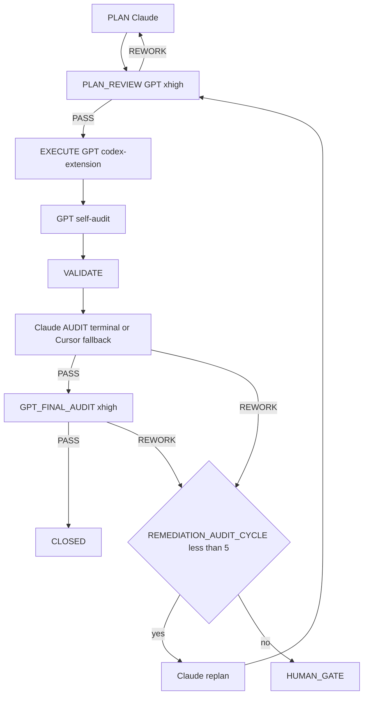

=== Auto-audit GPT (2e passe) ===
OpenAI Codex v0.125.0 (research preview)
--------
workdir: /Users/1millnonstop/Downloads/projet/foodking-web/web/testttt
model: gpt-5.5
provider: openai
approval: never
sandbox: workspace-write [workdir, /tmp, $TMPDIR, /Users/1millnonstop/.codex/memories]
reasoning effort: xhigh
reasoning summaries: none
session id: 019dc54c-b29e-75d2-a328-6d5038afb49c
--------
user
Tu effectues l’**auto-audit GPT** (2e passe) d’un cycle FoodKing — **pas** l’audit Claude terminal.

**Contexte** : le JSON ci-dessous est la proposition d’implémentation (format agents/codex.prompt.txt) pour la mission `CV1-M21A-QUICKWINS-LOT0`.


**JSON d’implémentation (à recouper)** :
```json
{
  "task_id": "CV1-M21A-QUICKWINS-LOT0",
  "mission_id": "M-21a",
  "files_to_modify": [
    "resources/js/components/admin/pos/PosComponent.vue",
    "resources/js/components/admin/kitchenDisplaySystem/KitchenDisplaySystemComponent.vue",
    "tests/js/quickwins/discountReasonBindingTest.spec.js",
    "tests/js/quickwins/kdsSwiperRtlTest.spec.js"
  ],
  "implementation_steps": [
    "PosComponent.vue: insertion <input v-model='discountReason'> entre :430 et :432",
    "PosComponent.vue: suppression import focustrap :732 + computed focustrap :913-915",
    "KdsComponent.vue: dir='ltr' :130 -> :dir='direction'; ajout import displayModeEnum + computed direction",
    "Création tests/js/quickwins/discountReasonBindingTest.spec.js (3 cas)",
    "Création tests/js/quickwins/kdsSwiperRtlTest.spec.js (3 cas)"
  ],
  "code_blocks": [
    {
      "path": "resources/js/components/admin/pos/PosComponent.vue",
      "op": "edit",
      "anchors": [
        "L430:insert",
        "L732:delete",
        "L913-915:delete"
      ],
      "excerpt": "<diff complet ou patch unifié>"
    },
    {
      "path": "resources/js/components/admin/kitchenDisplaySystem/KitchenDisplaySystemComponent.vue",
      "op": "edit",
      "anchors": [
        "L130:replace dir",
        "L706:insert import",
        "L782:insert computed"
      ],
      "excerpt": "<diff complet>"
    },
    {
      "path": "tests/js/quickwins/discountReasonBindingTest.spec.js",
      "op": "create",
      "excerpt": "<spec complet>"
    },
    {
      "path": "tests/js/quickwins/kdsSwiperRtlTest.spec.js",
      "op": "create",
      "excerpt": "<spec complet>"
    }
  ],
  "risks": [
    "Si label.add_discount_reason absent des fichiers i18n: placeholder fallback non-i18n; à backlog M-21b",
    "Si applyDiscount trop couplé store pour Test C unitaire: dégradation documentée"
  ],
  "notes": "Pricing SSOT respecté: aucune arithmétique frontale ajoutée. Diff PosComponent ~25 lignes, Kds ~6 lignes. Vérifié: grep focustrap=0 après edit. Tests à exécuter via mandatory_tests.",
  "execution_trace": {
    "delegation": "codex-extension",
    "model": "gpt-5.5-pro",
    "reasoning_effort": "xhigh",
    "invariants_considered": [
      "pricing-ssot"
    ]
  },
  "self_audit": {
    "discountReason_bound": true,
    "no_frontend_pricing_logic_added": true,
    "swiper_dir_computed_from_locale": true,
    "focustrap_dead_removed": true,
    "diff_pos_lines_le_30": true,
    "diff_kds_lines_le_10": true,
    "tests_added_count": 2,
    "files_outside_allowlist_modified": false
  }
}
```

**Livrable** (Markdown uniquement, en français) :
# AUTO_AUDIT_GPT — CV1-M21A-QUICKWINS-LOT0

## 1. Conformité au plan / scope
(Énumérer manques ou dérives ; si scope élargi sans escale → **ESCALATE**)

## 2. Invariants FoodKing
Pour chacun : OK / RISQUE / N/A
- pricing_ssot (backend seul)
- order_status (enum, pas de strings)
- branch_id
- commit_before_dispatch
- frozen_zones
- order_service_symmetry (si un des deux services touché)

## 3. Verdict
Une ligne : `VERDICT: PASS` | `VERDICT: NEEDS_FIX` | `VERDICT: ESCALATE` + 1–3 phrases.

codex
Je vais recouper la proposition avec le plan/mission et l’état réel des fichiers, sans modifier le dépôt. Je commence par les lectures obligatoires du cycle Caisse V1 puis je vérifierai les ancres et les invariants touchés.
exec
/bin/zsh -lc "sed -n '1,220p' .cursor/ACTIVE_CYCLE.md" in /Users/1millnonstop/Downloads/projet/foodking-web/web/testttt
exec
/bin/zsh -lc "sed -n '1,220p' AGENTS.md" in /Users/1millnonstop/Downloads/projet/foodking-web/web/testttt
exec
/bin/zsh -lc "sed -n '1,220p' .cursor/rules/global.mdc" in /Users/1millnonstop/Downloads/projet/foodking-web/web/testttt
 succeeded in 0ms:
# Active Cycle – FoodKing

**Méta (SSOT `run-cycle.md` Step 0 + `AGENTS.md` § *Authoritative … cycle state*)** — requis pour que l’orchestrateur ne s’arrête pas sur *« RUNNER_MODE not set »*.

| Champ | Valeur actuelle |
| --- | --- |
| **RUNNER_MODE** | `single-session` |
| **PHASE (cycle W10)** | `IN_PROGRESS` (détail = section `CYCLE_W10_…` ci-dessous) |
| **TASK_ID** | `P_EXEC_CLOSEOUT_GRAPHITI_CI_PROD_2026-04-22` |
| **PLAN_FILE** | `plans/PLAN_EXECUTION_CLOSEOUT_GRAPHITI_CI_PROD_2026-04-22.md` |
| **REPORT_FILE** | `reports/post_execute_latest.log` (append — preuve `EXECUTE_DELEGATION` / `AUDIT_*`) |

> **ACTIVE_PRIMARY** : `CYCLE_W10_EXECUTION_CLOSEOUT` (un seul cycle peut être actif à la fois — voir B03 méga-checklist).
> Cycles plus anciens en lecture seule = **archive** déplacée dans **`.cursor/ACTIVE_CYCLE_ARCHIVE.md`** (lecture humaine / forensique uniquement, **non requise** par le parcours obligatoire).

## CYCLE_W10_EXECUTION_CLOSEOUT (IN_PROGRESS — mémoire 180 + MCP global + commit + CI + prod)

**TASK_ID** : `P_EXEC_CLOSEOUT_GRAPHITI_CI_PROD_2026-04-22`  
**Plan SSOT** : `plans/PLAN_EXECUTION_CLOSEOUT_GRAPHITI_CI_PROD_2026-04-22.md`  
**Ordre** : Piste A (POS+Centrale : PLAN-MEM-1) ∥ Piste B (humain : PLAN-MEM-3) → C (smoke) → D (commit sur « go commit ») → E (CI) → F (prod J-7→J+7).  
**Gate mémoire** : `python3 memory/verify.py` → count **≥ 175** (180 idéal) avant de considérer PLAN-MEM-1 **CLOSED**.

- **Vérif locale (2026-04-22)** : `python3 memory/verify.py` → **count = 182**, smoke `search_memory_facts` OK — gate **satisfaite** pour clôturer l'ingestion côté seuil d'épisodes (suite : commit / CI / prod selon plan `PLAN_EXECUTION_CLOSEOUT_*`).

**Gouvernance globale (2e passe 2026-04-22)** : primer multi-agents + Graphiti vivant + tokens « zéro effet négatif » → **`docs/orchestration/GLOBAL_SYSTEM_PRIMER.md`** + rapport **`reports/audit/AUDIT_SECOND_PASS_GLOBAL_GOVERNANCE_REPORT_2026-04-22.md`**.

---

## CAISSE_V1_MASTERPLAY (ACTIVE — 2026-04-25)

**Phase** : finition Caisse V1 (POS + Kiosk + KDS + Centrale + Fiscal + Ops).
**Plan parent** : `plans/PLAN_CAISSE_V1_GPT_MASTERPLAY_2026-04-25.md`
**Plan DAG autoritaire** : `plans/PLAN_CAISSE_V1_SUPER_MASTER_2026-04-25.md`
**Boucle d'exécution** : `plans/masterplay/MASTERPLAY_DISCIPLINE.md` + `plans/masterplay/MASTERPLAY_QUEUE.md` + `scripts/run-masterplay.sh`
**Statut temps réel** : `reports/masterplay/status.json`

**Règle** : tout `TASK_ID` au format `CV1-MXX-…` passe par la masterplay (cf. `AGENTS.md` § "Caisse V1 — Masterplay loop", `.cursor/rules/global.mdc` § "Caisse V1 — Masterplay loop", `.cursor/commands/run-cycle.md` Step 0 item 0). **NE PAS** ouvrir un `run-cycle` standard sur un `CV1-MXX-…`.

---

## Archive

Tous les cycles **CLOSED / COMPLETED PASSED** (W4 → W9, NF525, etc.) ont été déplacés dans **`.cursor/ACTIVE_CYCLE_ARCHIVE.md`** pour réduire le coût de lecture du parcours obligatoire (audit 2026-04-24, mission `T-PARCOURS-OPTIMIZE-001`).

- **Lecture humaine** : ouvrir `.cursor/ACTIVE_CYCLE_ARCHIVE.md`.
- **Lecture agent** : **non requise** sauf instruction explicite du plan ou du chat (ex. "reprend le rationale du cycle W9").
- **Recherche** : `rg "CYCLE_W9_" .cursor/ACTIVE_CYCLE_ARCHIVE.md` ou `git log --follow .cursor/ACTIVE_CYCLE.md`.

 succeeded in 0ms:
---
description: Always-on rules for the FoodKing Cursor local agent. Applied to every cycle, every model, every task.
globs: ["**/*"]
alwaysApply: true
---

# Global Rules – FoodKing

## Caisse V1 — Masterplay loop (active phase)

Pendant la phase de finition Caisse V1, **toute mission `CV1-MXX-…` est gouvernée par** :
- `plans/masterplay/MASTERPLAY_DISCIPLINE.md` — règles d'or (allowlist, frozen, REWORK max 5, activity-log, mémoire)
- `plans/masterplay/MASTERPLAY_QUEUE.md` — file d'exécution (statut, dépendances DAG)
- `plans/masterplay/GO.md` — comment lancer / suivre / pause / stop
- `scripts/run-masterplay.sh` — runner officiel (boucle codex + audit Claude + audit final + ingest mémoire)

**Lecture obligatoire** avant tout EXECUTE sur un `TASK_ID` `CV1-MXX-…`. Hors Caisse V1 : `run-cycle <TASK_ID>` standard.

## New or continued session — **mandatory path** (applies to **every** conversation and **every** model)

- **The chat log is not the SSOT.** **This repo** (`AGENTS.md`, `.mdc` rules, `docs/orchestration/`, `run-cycle.md`) is.
- On **any** new thread **or** long continuation: (1) Read **`AGENTS.md` § *Parcours obligatoire*** first, then **`docs/orchestration/GLOBAL_SYSTEM_PRIMER.md`** (§1 table). (2) If resuming work, read **`.cursor/ACTIVE_CYCLE.md`** *before* starting a duplicate cycle — follow the same `TASK_ID` / `PHASE` until `CLOSE` or an explicit new task. (3) For bounded work: run **`run-cycle` / `run-cycle.md`** (Steps 0–5) — do not skip `AUDIT` before `CLOSE`. (4) Run `npm run verify:boucle` (and `verify:boucle:full` when an API proof is needed) per `AGENTS.md`. (5) Ensure **`claude` on `PATH` (AUDIT terminal) et binaire `codex` (CLI OpenAI) pour l’EXÉCUTE complexe (compte ChatGPT Pro)**, pas de clé proxy obligatoire — voir `agents/codex-extension-instructions.md`. (6) Obey **`MEMORY_MATRIX.md`**, `EXECUTE_DELEGATION`, `AUDIT_CHANNEL` + `TERMINAL_AUDIT_OK` when using terminal audit, and **`agent-activity-log.sh`** (tail / start / done).
- Full checklist and French wording: **`AGENTS.md` → section *Parcours obligatoire*.

## Cycle Structure
PLAN Claude → PLAN_REVIEW GPT-5.5-pro/xhigh → EXECUTE GPT → VALIDATE → AUDIT Claude → GPT_FINAL_AUDIT → [HUMAN GATE | CLOSE]

Phases are sequential and non-skippable.
Dual audit (`AUDIT_VERDICT: PASS` + `GPT_FINAL_AUDIT_VERDICT: PASS`) precedes close on every cycle without exception.

## Model Discipline
- Auto/Premium routing is disabled
- PRIMARY_EXECUTION_MODEL is declared in the plan file before execution begins
- One PRIMARY_EXECUTION_MODEL per cycle; review checkpoints are explicit and mandatory
- Mid-cycle model switch requires Claude confirmation logged under `ESCALATION` in the plan file
- Full routing policy: `.cursor/routing.md`

## GPT Checkpoints + EXECUTE Delegation (PRIMARY = `codex-extension`)
- The **FoodKing Codex Complex Implementer** (slug `codex-extension`, CLI `codex` + compte ChatGPT Pro) is the **primary** route for `PLAN_REVIEW`, all product EXÉCUTE work, GPT self-audit, and `GPT_FINAL_AUDIT`.
- Procedure: run `npm run codex:plan-review -- {TASK_ID}` before EXECUTE; prepare `missions/{TASK_ID}/input.json` (+ optional `graphiti_context.md` / `plan_excerpt.md` / `execute_brief.md`); run `npm run codex:complex -- {TASK_ID}` (wrapper `bash scripts/codex-extension-execute.sh`, `gpt-5.5-pro`, `xhigh`); apply `output_codex.json` + lire l’auto-audit `reports/audit/GPT_SELF_AUDIT_{TASK_ID}.md`; after Claude PASS run `npm run codex:final-audit -- {TASK_ID}`. Product edits require `EXECUTE_DELEGATION: codex-extension`.
- The Cursor sub-agent `foodking-complex-implementer` is **fallback only** — invoked if `codex` / `exec` échoue (≥2 tentatives documentées) or human-escalation. Trace alors `EXECUTE_DELEGATION: foodking-complex-implementer (codex-extension-fallback)` + `FALLBACK_REASON:`.
- Composer / `foodking-routine-implementer` is not an implementation route during finishing cycles. It may summarize or validate; product fixes return to GPT EXECUTE.
- Reference docs: `docs/orchestration/CODEX_API_DELEGATION.md`, `AGENTS.md` § "EXECUTE delegation".

## Autonomy Contract
The agent operates autonomously within declared scope.
It halts and escalates — never self-approves — on any gate trigger, scope expansion,
invariant violation, two consecutive validation failures, or unresolvable ambiguity.
Full policies: `human-gates.mdc`, `scope.mdc`, `project-invariants.mdc`.

## Graphiti (mémoire inter-sessions)
- When the Graphiti MCP server is loaded for this workspace, **query it first** on any non-trivial task (see `.cursor/rules/graphiti-memory.mdc` and `AGENTS.md` § MCP).
- If Graphiti is not loaded, continue without blocking; one-line note to enable `~/.cursor/mcp.json` is enough.

## Quality channels — terminal first where defined
- **GPT route (`codex-extension` — CLI `codex` Pro)** is the **default** for PLAN_REVIEW, all product implementation, self-audit, and GPT_FINAL_AUDIT; Cursor sub-agent `foodking-complex-implementer` is **only** a fallback if the `codex exec` path fails (≥2 attempts or binaire indispo) — `EXECUTE_DELEGATION: …` + `FALLBACK_REASON:`. See `AGENTS.md` and `docs/orchestration/CODEX_API_DELEGATION.md`.
- **Claude AUDIT after implementation** is **by default the terminal** (`bash scripts/foodking-claude-orchestrate.sh context` then `audit` or `audit-brief` — **Anthropic subscription** via `claude` CLI). If the terminal fails after **1 retry** (**quota / rate limit / session saturated**, missing binary, auth, network), **do not stop the cycle**: use the **FALLBACK** — same `audit-context.md` checklist via Cursor Task **`foodking-planner-orchestrator`** (recommended) or in-session **Claude** — with `AUDIT_CHANNEL: cursor-session` **plus** mandatory `AUDIT_FALLBACK_REASON:` and optional `AUDIT_SUBAGENT_FALLBACK: foodking-planner-orchestrator`. See `docs/orchestration/AUDIT_TERMINAL_QUOTA_FALLBACK.md` and `run-cycle.md` Step 5; verify env with `bash scripts/verify-orchestration-boucle.sh`.
- Never invert primary/fallback for billing convenience without that trace — that would be indistinguishable from a mistake in production evidence.

## Token Discipline (quality-first — zero negative optimization)
- **Goal**: maximum correct intelligence per cycle — not shortest answers. Removing detail, skipping invariants, or omitting Graphiti queries to "save tokens" is **forbidden** when it reduces correctness or auditability.
- **Allowed savings only**: do not re-read files already in full context; do not paste verbatim large blobs already in the plan; use **Graphiti** + `## PRIOR_CONTEXT` to avoid re-opening dozens of historical reports; use phase summaries per `context-hygiene.mdc` §4 **after** a phase completes (handoff), not to shrink the plan itself.
- Do not re-explain decisions already recorded in the plan file (link/summarize in one line if needed).
- Structured output in reports — narrative allowed in plans/gates when it carries decisions, risks, or test strategy.
- Flag real risks only — no speculative commentary on out-of-scope subsystems

## Reports Discipline
- Bounded-cycle **plans** live under `plans/`; **gate briefs** under `docs/gates/`; validation logs, execution summaries, and other run evidence under `reports/` per `run-cycle.md` and `ACTIVE_CYCLE.md`
- Composer generates run evidence in `reports/` where applicable — Claude audits
- No new reporting structure without a plan-phase decision

## Absolute Prohibitions
The agent must never: self-approve a gate, expand scope without human instruction,
edit a frozen zone without cleared gate, modify `.cursor/routing.md` mid-cycle.
All invariant prohibitions enforced per `project-invariants.mdc`.

 succeeded in 0ms:
# FoodKing – Cursor Agent Operating Contract

## 0. Quick start contract — read this first

Commence ici. Ne lance aucune action tant que tu n'as pas lu les priorités P0.
Ce contrat fixe l'ordre minimal de lecture pour comprendre le repo en moins de 60 secondes.
Lis complètement ce qui est marqué obligatoire ; diffère seulement ce qui est explicitement classé P2.

### Reading priority

| Priority | What to read | Why |
| --- | --- | --- |
| P0 | `AGENTS.md §1 Parcours obligatoire` | Cadre impératif de travail, ordre de lecture, discipline de cycle. |
| P0 | `.cursor/ACTIVE_CYCLE.md` (continuation) | État courant du cycle actif, contexte vivant, reprise sans divergence. |
| P0 | `.cursor/rules/global.mdc` (auto-attaché — mentionné pour info) | Règles globales toujours applicables, même si déjà injectées par l'outil. |
| P0 | `plans/masterplay/MASTERPLAY_DISCIPLINE.md` + `plans/masterplay/MASTERPLAY_QUEUE.md` (Caisse V1 actif) | **Pendant la phase Caisse V1** : règles d'or de la boucle GPT + file d'exécution. Tout agent qui touche une mission `CV1-MXX-…` DOIT lire ces deux fichiers avant d'agir. |
| P1 | `docs/orchestration/GLOBAL_SYSTEM_PRIMER.md` | Vocabulaire, architecture d'orchestration, invariants transverses. |
| P1 | `.cursor/commands/run-cycle.md` | Procédure exacte pour démarrer un cycle borné correctement. |
| P1 | `docs/orchestration/MEMORY_MATRIX.md` | Où chercher la mémoire utile sans relire tout le dépôt. |
| P1 | `.cursor/routing.md` | Routage des tâches, choix du bon canal, limites d'intervention. |
| P2 | `docs/orchestration/CODEX_API_DELEGATION.md` (quand EXECUTE complexe) | À lire si tu délègues ou exécutes du complexe (uniquement **CLI `codex`**, pas d’exécuteur HTTP dans le dépôt). |
| P2 | `.cursor/ACTIVE_CYCLE_ARCHIVE.md` (forensique humain) | Historique utile pour audit humain, pas requis au démarrage. |
| P2 | `docs/orchestration/EXPORT_CONFIG_CODEX_GPT_API_ET_AUDIT_PERSISTANCE.md` (nouveau poste) | Configuration et persistance utiles surtout lors d'un nouvel environnement. |

Règle simple : P0 avant toute action, P1 avant tout EXECUTE, P2 seulement à la demande du sujet.
Si un doute persiste après P0+P1, arrête-toi et relis ; n'improvise pas.

### One-line bootstrap

```bash
npm run verify:boucle
bash scripts/agent-activity-log.sh tail 50
run-cycle <TASK_ID>
```

### Caisse V1 — Masterplay loop (actif)

Pendant la phase de finition Caisse V1 (POS + Kiosk + KDS + Centrale + Fiscal), l'orchestration passe par la **MASTERPLAY** :

```bash
# Lire d'abord (obligatoire)
cat plans/masterplay/MASTERPLAY_DISCIPLINE.md
cat plans/masterplay/MASTERPLAY_QUEUE.md
cat plans/masterplay/GO.md

# Lancer la boucle (Codex extension complexe + audit Claude terminal + audit Codex final)
bash scripts/run-masterplay.sh --with-audit --with-final
```

- **Plan parent** : `plans/PLAN_CAISSE_V1_GPT_MASTERPLAY_2026-04-25.md` (catalogue 22 missions M-XX, ancrages file:line)
- **Plan autoritaire DAG** : `plans/PLAN_CAISSE_V1_SUPER_MASTER_2026-04-25.md`
- **Statut temps réel** : `reports/masterplay/status.json` + `reports/masterplay/run_*.log`
- Tout `TASK_ID` au format `CV1-MXX-…` est gouverné par la masterplay (allowlist, frozen, gates, REWORK max 5).
- Hors phase Caisse V1 : repasser au `run-cycle <TASK_ID>` standard.

**Anti-répétition (nouvel onglet / agent parallèle)** : copier d’abord le bloc de `docs/orchestration/SESSION_OPENING_ENFORCEMENT.md` — même discipline, moins d’oubli de `ACTIVE_CYCLE` / `run-cycle`.

Utilise `run-cycle <TASK_ID>` pour initier tout cycle borné.
Les deux autres commandes servent à vérifier l'état local et le journal d'activité avant d'exécuter.

### Quality-first, not token-cheap

Lis P0 et P1 intégralement, sans skim. Les économies de tokens ne se font jamais sur la substance des règles, seulement sur la répétition, le bruit et les relectures inutiles. En cas de tension entre vitesse et rigueur, applique la rigueur ; voir `.cursor/rules/global.mdc § Token Discipline`.

### If you're a new human contributor

Commence par `docs/orchestration/EXPORT_CONFIG_CODEX_GPT_API_ET_AUDIT_PERSISTANCE.md` pour préparer ton poste et comprendre le mode de persistance attendu.
Lis-le après P0, puis enchaîne sur P1 avant toute contribution effective.

---

## 1. Parcours obligatoire — **nouvelle conversation** **et** **continuation** (production, non négociable)

> **Objectif** : qu’**à chaque** session (premier message ou 500e message), l’exécutant sache **quel** chemin suivre — **sans** supposer un historique de chat. Tout est **dans le dépôt** ; l’histoire de conversation **n’est pas** la SSOT.

**Règle d’or** : *aucune* modification de code **produit** (hors `plans/`, `reports/`, `docs/gates/`, `missions/`, JSONL gouvernance) **dans le cadre d’un travail borné** sans **(a)** parcours ci-dessous **et** **(b)** cycle `run-cycle` + plan actif, sauf **exception** explicite humaine (notée dans le plan / gate).

| Étape | Action | Quand / pourquoi |
|-------|--------|------------------|
| **0. Continuation** | Lire **`.cursor/ACTIVE_CYCLE.md`**. | Si `PHASE` n’est **pas** vide et le cycle n’est **pas** archivé : **reprendre** ce `TASK_ID` / ce `PLAN_FILE` / ce `REPORT_FILE` — **ne pas** dupliquer un second cycle fantôme. Si humain confirme **nouveau** sujet : réinitialiser / nouveau `TASK_ID` selon `run-cycle` Step 0. |
| **1. Lecture initiale** | Lire **ce fichier** (`AGENTS.md`) **puis** **`docs/orchestration/GLOBAL_SYSTEM_PRIMER.md`** (table §1 = ordre complet : routing, `run-cycle`, Graphiti, `MEMORY_MATRIX`, etc.). | **Avant** tout code ou plan non trivial. Même en « continuation » si le contexte a dérivé ou l’onglet a été rafraîchi. |
| **2. Cycle structuré (SSOT procédurale)** | Toute tâche avec **`TASK_ID`** : suivre **`.cursor/commands/run-cycle.md`** et la commande **`run-cycle <TASK_ID>`** (ou équivalent explicite dans le chat : enchaîner les **Steps 0 → 5** sans en sauter). | **C’est** le programme de production en boucle : `PLAN Claude → PLAN_REVIEW GPT → EXECUTE GPT → VALIDATE → AUDIT Claude → GPT_FINAL_AUDIT → [GATE \| CLOSE]`. Aucun « close » sans double audit PASS. |
| **3. Vérification d’environnement** | `npm run verify:boucle` (0 requête par défaut). **Si le terminal ne “voit” pas Codex alors que l’extension est connectée** : l’auth IDE n’alimente pas le CLI — lancer `npm run codex:doctor` (npm + `login status` + 1 requête). **Rapide :** `npm run codex:verify-pro`. **Complet :** `npm run verify:boucle:full`. Encart : `agents/codex-extension-instructions.md`. | Même en **Step 5** : l’`EXECUTE` (CLI `codex`) requiert le binaire + session Pro sur **ce** binaire. Voir `run-cycle` Step 0 item 8. |
| **4. Secrets & outils machine** | Binaire **`claude`** sur le **`PATH`** (Claude Code CLI) pour l’**AUDIT** PRIMARY en terminal. Binaire **`codex`** (CLI OpenAI) : *Sign in with ChatGPT* **Pro** — **pas** de clé API dans le dépôt. Résolution : `PATH` **ou** `node_modules/.bin/codex` après **`npm install`** (dépendance **`@openai/codex`**) **ou** `npm i -g @openai/codex`. **Ne pas** mélanger avec une clé *Platform* restreinte dans l’environnement (provoque des 401 *scopes* sur l’API Responses) — `npm run codex:audit-bleed` aide. (Option) MCP Graphiti selon `~/.cursor/mcp.json`. | Sans `claude` : noter dès le **plan** l’`AUDIT` fallback + `AUDIT_FALLBACK_REASON`. Sans binaire `codex` : pas d’`EXECUTE` complexe PRIMARY (sub-agent + `FALLBACK_REASON` ou `npm install` + auth Pro). |
| **5. Traces & mémoire (déjà dans ce fichier)** | **`EXECUTE_DELEGATION:`** avant VALIDATE ; **`AUDIT_CHANNEL:`** + **`TERMINAL_AUDIT_OK: 1`** si audit terminal OK ; `docs/orchestration/MEMORY_MATRIX.md` ; `scripts/agent-activity-log.sh` (tail / start / done). | Traçabilité = **même** qualité en prod sur N agents parallèles. |

**Ce n’est pas optionnel** pour travailler « en production FoodKing » : c’est le **contrat** d’onboarding. Les **règles** `.cursor/rules/*.mdc` (dont **`global.mdc` — alwaysApply**) et ce fichier **s’imposent** **à** tout modèle, **dans** toute conversation, dès l’ouverture du dépôt.

**Pour un humain / nouveau compte** : mêmes étapes ; la doc **`docs/orchestration/EXPORT_CONFIG_CODEX_GPT_API_ET_AUDIT_PERSISTANCE.md`** regroupe l’**export** config API + persistance des règles hors-chat.

## Engine
Cursor local agent. No cloud orchestration. No external framework.
Auto/Premium routing: disabled. Model selection is explicit per cycle.

## Global system primer (multi-agents, Graphiti, tokens — lecture clé)

Tout nouvel intervenant (session Cursor, sub-agent Task, CLI terminal, humain) qui touche **orchestration**, **mémoire**, ou **discipline de contexte** : lire **`docs/orchestration/GLOBAL_SYSTEM_PRIMER.md`** après ce fichier. Y sont définis : ordre de lecture obligatoire, `codex-extension` GPT-5.5-pro/xhigh, fallback `foodking-complex-implementer`, fallback audit `foodking-planner-orchestrator`, terminal **`claude` / `codex`**, **mise à jour continue de Graphiti**, et la politique **« intelligence max — zéro optimisation négative »** (tokens : supprimer le gaspillage, pas la substance). Pour audits longs et robustesse **opération + agentique + mémoire** : **`docs/orchestration/MEGA_CHECKLIST_AUTONOMY_AND_MEMORY.md`** (180 tâches) et le narratif **`reports/audit/MEGA_AUDIT_SYSTEM_OPERATION_AGENTIC_2026-04-23.md`**.

**Discipline mémoire (qui écrit où, qui lit quoi, quand)** : **`docs/orchestration/MEMORY_MATRIX.md`** — matrice unique des **4 stores autorisés** (Code A · Graphiti+JSONL B · Missions C · Rapports D), table d'écriture par phase, ordre de lecture pour une nouvelle session, anti-patterns. Aucun nouveau store de mémoire ne peut être ajouté sans gate `docs/gates/GATE_MEMORY_*`. Décisions 2026-04-23 sur OpenSpace et claude-mem : **non intégrés**, justifications dans la matrice.

**Synchro multi-agents (cross-conv, cross-terminal)** : `.cursor/rules/cross-agent-sync.mdc` (alwaysApply) + `reports/AGENT_ACTIVITY_LOG.md` (append-only) + `scripts/agent-activity-log.sh` (`tail | start | done | collisions | active`). Au démarrage de session : `tail 50` (~500 tokens). Avant édition produit (Step 2 EXECUTE) : `start` (refus exit 2 si collision). À la clôture (Step 5 CLOSE) : `done`. Évite que deux agents (Cursor convs / `codex-extension` / `claude-terminal` / humain) modifient les mêmes fichiers à leur insu. **Doctrine étendue** (Graphiti = mémoire partagée, rôles Claude vs Codex, anti-patterns) : **`docs/orchestration/MULTI_AGENT_ORCHESTRATION.md`**.

## Workflow
PLAN Claude → PLAN_REVIEW GPT-5.5-pro/xhigh → EXECUTE GPT → VALIDATE → AUDIT Claude → GPT_FINAL_AUDIT → [HUMAN GATE | CLOSE]

No phase may be skipped. Dual audit (`AUDIT_VERDICT: PASS` + `GPT_FINAL_AUDIT_VERDICT: PASS`) always precedes close.

## Model Roles
| Model | Role | Channel (priorité **qualité maximale / zéro raccourci token**) |
|---|---|---|
| Claude | Plan, architect, orchestrate, **audit** | **PLAN** : le plus souvent en **session Cursor** (orchestrateur) — c’est l’entretien cerveau, pas l’appel `codex`. **AUDIT (après chaque implementation)** : **PRIMAIRE = terminal** `bash scripts/foodking-claude-orchestrate.sh` (`context` → `audit` ou `audit-brief`) — s’appuie sur l’**abonnement Anthropic (Claude Code CLI)**, *pas* sur l’orchestrateur de modèles de Cursor. **FALLBACK AUDIT** (terminal HS, **quota / rate limit / session Anthropic saturée**, réseau) : **ne pas arrêter** — même checklist via Task **`foodking-planner-orchestrator`** (recommandé) ou session Cursor **modèle Claude** ; tracer **`AUDIT_CHANNEL: cursor-session`** + **`AUDIT_FALLBACK_REASON:`** + optionnel **`AUDIT_SUBAGENT_FALLBACK: foodking-planner-orchestrator`**. Doc : `docs/orchestration/AUDIT_TERMINAL_QUOTA_FALLBACK.md`. Voir `run-cycle.md` Step 5. |
| **GPT-5.5 / GPT-5.5-pro** | **PLAN_REVIEW + toute implémentation + auto-audit + GPT_FINAL_AUDIT** | **`codex-extension`** — `npm run codex:plan-review`, `npm run codex:complex`, `npm run codex:final-audit` (CLI `codex` + `codex exec`, **compte ChatGPT Pro**, modèle `gpt-5.5-pro`, `model_reasoning_effort=xhigh` par défaut ; voir `agents/codex-extension-instructions.md`) : c’est l’exécutant unique des changements produit pendant les cycles de finition. Le wrapper produit l’**auto-audit** `reports/audit/GPT_SELF_AUDIT_{TASK_ID}.md`; en plus, `run-cycle` impose une **revue GPT du plan** avant EXECUTE et une **revue GPT finale** après le PASS Claude. N’emprunte **pas** l’orchestrateur de modèles **Cursor** ; facturation **OpenAI / ChatGPT Pro** sur le compte connecté au CLI. |
| GPT-5.5 (fallback) | Complex implementation (FALLBACK only) | **Sub-agent** `foodking-complex-implementer` (Task Cursor) — consomme l’**usage** des modèles de l’**abonnement Cursor**. **Uniquement** si `codex` / l’exécution `codex exec` a échoué (≥2 tentatives documentées) ou binaire indispo. |
| Composer | Validation/report only | Plus d’implémentation routine pendant les cycles de finition. Composer peut résumer, exécuter/rapporter des validations, mais toute correction produit repart en EXECUTE GPT. |

**Qui décide (orchestrateur = Claude, « max smart ») + rôle principal de Codex** : **Claude** porte l’**autorité** sur **PLAN** (périmètre, invariants, stratégie de test), l’interprétation des gates, et **re-plan** après `REWORK`. **GPT-5.5-pro/xhigh** est le second avis obligatoire sur le plan, l’exécutant unique des changements produit, l’auto-auditeur de sa livraison, puis le second avis final après l’audit Claude. **Clôture** : il faut le double vert `AUDIT_VERDICT: PASS` (Claude terminal ou fallback Cursor tracé) **et** `GPT_FINAL_AUDIT_VERDICT: PASS`. En conflit Claude/GPT : pas de close ; Claude re-planifie ou ouvre gate selon le risque. Le **fait** code / test l’emporte sur la croyance.

**Principe unique (symétrique) — à valider en prod sur chaque cycle :** **PLAN Claude → PLAN_REVIEW GPT → EXECUTE GPT → self-audit GPT → VALIDATE → AUDIT Claude → GPT_FINAL_AUDIT**. Le repli EXECUTE vers `foodking-complex-implementer` n’intervient qu’en défaut du chemin `codex exec` documenté, avec `FALLBACK_*` explicite ; **audit terminal Claude** → en défaut **`foodking-planner-orchestrator`** (ou session Claude) avec traces `AUDIT_*` explicites. Preuve d’environnement : `bash scripts/verify-orchestration-boucle.sh` ; smoke complet : `VERIFY_BILLING_FULL=1`.

One PRIMARY_EXECUTION_MODEL per cycle. Roles are explicit and layered; review checkpoints do not authorize scope expansion.
Full routing policy: `.cursor/routing.md`. Naming: the **PRIMARY complex implementer** is the **FoodKing Codex Complex Implementer** (slug `codex-extension`); see `docs/orchestration/CODEX_API_DELEGATION.md`.

## Authoritative multi-agent bounded cycle (SSOT)

For **TASK_ID-driven** work in Cursor, this path is **authoritative** and overrides any conflicting step elsewhere in this document:

1. **Command:** `.cursor/commands/run-cycle.md` (invoke with a `TASK_ID`, e.g. `run-cycle SMOKE-001`).
2. **Cycle state:** `.cursor/ACTIVE_CYCLE.md` (`RUNNER_MODE: single-session`, `PHASE`, `PLAN_FILE`, `REPORT_FILE`, completion rows).
3. **Plan artifact:** `plans/PLAN_[TASK_ID]_[DATE].md` per `.cursor/context/plan-context.md` (from `plans/PLAN_TEMPLATE.md` when applicable).
4. **Phase instructions:** `.cursor/context/plan-context.md` (PLAN), `.cursor/context/execute-context.md` (EXECUTE), `.cursor/context/audit-context.md` (AUDIT); VALIDATE per `run-cycle.md` when `validate-context.md` is absent.

**EXECUTE delegation (GPT only; PRIMARY first, FALLBACK only on failure):**

- **Routine implementation disabled during finishing cycles** : no product edit via Composer / `foodking-routine-implementer`. Small edits still route through GPT to keep the same quality chain.
- **PRIMARY** : **`codex-extension`** — **FoodKing Codex Complex Implementer** (CLI `codex`, compte **ChatGPT Pro**, `gpt-5.5-pro`, `model_reasoning_effort=xhigh`). Procédure :
  1. Préparer `missions/{TASK_ID}/input.json` (+ optionnels : `graphiti_context.md` issu de `search_memory_facts(group_ids=["foodking"])`, `plan_excerpt.md`, `execute_brief.md`, `cycle_snapshot.md` — fusionnés par le script d’assemblage de prompt).
  2. Lancer `npm run codex:complex -- {TASK_ID}` (`bash scripts/codex-extension-execute.sh`) ; le wrapper passe explicitement `-m ${CODEX_EXT_MODEL_PRO:-gpt-5.5-pro}` et `model_reasoning_effort=${CODEX_EXT_REASONING_EFFORT:-xhigh}`. (Instructions custom : `agents/codex-extension-instructions.md`.) **Bootstrap** : `npm run codex:prepare -- {TASK_ID}`.
  3. Appliquer `missions/{TASK_ID}/output_codex.json` ; consommer l’**auto-audit** `reports/audit/GPT_SELF_AUDIT_{TASK_ID}.md` (généré par le wrapper).
  4. Tracer `EXECUTE_DELEGATION: codex-extension` dans `reports/post_execute_latest.log` et le `REPORT_FILE`.
- **Complexe — FALLBACK (uniquement si `codex exec` est HS après reprises, ou binaire manquant)** : `Task` → `foodking-complex-implementer` — tracer `EXECUTE_DELEGATION: foodking-complex-implementer (codex-extension-fallback)` + `FALLBACK_REASON:`. 

Référence complète : **`docs/orchestration/CODEX_API_DELEGATION.md`** (naming, fallback contract, audit handoff, token discipline, schéma boucle). Procédure cycle : `.cursor/commands/run-cycle.md`. La trace `EXECUTE_DELEGATION` dans le rapport est **obligatoire** pour passer en VALIDATE.

**Clôture vs. audit :** Après `VALIDATE`, l’**audit** **Claude** (terminal `foodking-claude-orchestrate.sh` en PRIMARY, fallback Cursor si quota/rate-limit/terminal HS) écrit `AUDIT_VERDICT: PASS|REWORK`, puis GPT écrit `GPT_FINAL_AUDIT_VERDICT: PASS|REWORK|ESCALATE`. **Pas** de `CLOSED` sans double PASS. Sur `REWORK`, boucle `replan (orchestration Claude) → missions + EXECUTE GPT → self-audit GPT → VALIDATE → re-audit Claude → GPT final`, avec `REMEDIATION_AUDIT_CYCLE` 1..5 — au 5e `REWORK` sans double PASS, **HUMAN_GATE** (détail : Step 5 de `run-cycle.md` et `auto-remediation.mdc`).

Sections below labeled **Legacy workflow** remain valid for **PR-centric / review-loop** habits but **do not replace** this SSOT for bounded cycles.

## Source of truth (extended)
- README.md
- docs/PROJECT_CONTINUITY_AND_VISION.md
- docs/ARCHITECTURE.md
- docs/API_MAP.md
- docs/AUTHZ_MATRIX.md
- docs/ORDER_FLOW.md
- docs/DEVICE_FLOW.md
- docs/BUSINESS_RULES.md
- docs/CORE_MODULES.md
- docs/DATABASE_SCHEMA_CORE.md
- docs/ERROR_HANDLING.md
- docs/SECURITY_NOTES.md
- docs/TEST_PLAN.md
- docs/MASSIVE_TEST_PLAN.md
- docs/SAAS_VISION.md
- docs/CONTRIBUTING_QA_BOTS.md
- workflows/qa-loop.md
- workflows/task-routing.md
- workflows/report-format.md
- workflows/task-status.md
- reports/README.md
- docs/orchestration/MEGA_CHECKLIST_AUTONOMY_AND_MEMORY.md
- docs/orchestration/WORKFLOW_AUDIT_GRAPHIQUE_2026-04-23.md
- docs/orchestration/TERMINAL_CLAUDE_GRAPHITI_ORCHESTRATION.md
- docs/orchestration/ROUTING_MATRIX.md

## Stop Conditions
Halt and generate a gate brief on any of:
- Gate trigger detected
- Scope expansion beyond declared boundary
- FoodKing invariant violation
- Two consecutive validation failures
- Planning ambiguity unresolvable from task context
- **`codex` / `codex exec` indisponible après reprises (auth, binaire, ou échec ≥2 sur la même tâche)** : basculer sur le fallback `Task → foodking-complex-implementer` et **noter explicitement** `EXECUTE_DELEGATION: foodking-complex-implementer (codex-extension-fallback)` + `FALLBACK_REASON:`.
- **Audit en terminal (PRIMARY) indisponible ou limité** (`claude` absent, **quota / rate limit / session Anthropic saturée**, auth, réseau — après **1 retry** documenté de `context` + `audit-brief` ou `audit`) : **continuer le cycle** — même checklist `audit-context.md` via Task **`foodking-planner-orchestrator`** (recommandé) ou session Cursor **Claude** ; **`AUDIT_CHANNEL: cursor-session`** + **`AUDIT_FALLBACK_REASON:`** (obligatoire) + optionnel **`AUDIT_SUBAGENT_FALLBACK: foodking-planner-orchestrator`**. Voir `docs/orchestration/AUDIT_TERMINAL_QUOTA_FALLBACK.md`. **Ne jamais** omettre la raison.

## FoodKing Non-Negotiables
- Backend is pricing SSOT — no frontend price logic
- `OrderStatus` enum is authoritative — no hardcoded strings
- `branch_id` = business data isolation — no cross-branch data bleed
- Dispatch strictly after DB commit
- `OrderService` / `FrontendOrderService` symmetry mandatory on any order change
- Frozen zones require gate clearance before any edit

## MCP

### Phase 1 — Filesystem
Filesystem MCP only for repo reads where applicable.

### Phase 2 — Graphiti (mémoire inter-cycles — **présent dans toutes les sessions où le serveur est enregistré**)

**Objectif** : décisions d’architecture, invariants, sync borne↔POS↔KDS, fiscal NF525, historique de cycles — récupérables sans relire des centaines de fichiers.

| Élément | Détail |
|--------|--------|
| **Enregistrement Cursor (obligatoire côté humain)** | Fusionner le bloc `graphiti` dans **`~/.cursor/mcp.json`** (Settings → MCP). Modèle : **`.cursor/mcp/graphiti.json.example`**. Le dépôt ne peut pas injecter un MCP automatiquement dans l’IDE. |
| **Règle agent (automatique dès que le MCP est chargé)** | Voir **`.cursor/rules/graphiti-memory.mdc`** (always-on) + **`global.mdc`** : avant toute tâche non triviale, appeler au moins **`search_memory_facts`** (et optionnellement **`search_memory_nodes`**) avec `group_ids=["foodking"]`. |
| **Après AUDIT / CLOSE** | Si `add_memory` est disponible : enregistrer les décisions durables (ADR, gate, invariant clarifié). |
| **Si Graphiti absent de la session** | **Ne pas bloquer** PLAN / EXECUTE : une ligne « Graphiti non chargé » + secours **`memory/INDEX.md`** + lecture ciblée des JSONL sous `memory/episodes/`. |
| **Server** | Zep Graphiti — wrapper local **`.cursor/mcp/start-graphiti-mcp.sh`** (voir exemple JSON). Clone typique : `/Users/1millnonstop/graphiti`. |
| **Backend** | Neo4j (ex. Aura) — credentials hors repo. |
| **Dépannage** | **`.cursor/mcp/GRAPHITI_TROUBLESHOOTING.md`** (LiteLLM, embeddings, redémarrage proxy). |
| **Group ID** | Toujours **`foodking`**. |
| **Ingestion / vérif locale** | `memory/ingest.py`, `memory/verify.py`, `bin/graphiti-ingest.sh` ; index des domaines **`memory/INDEX.md`**. |

**Intégration bounded cycle** : la commande **`.cursor/commands/run-cycle.md`** inclut l’appel Graphiti en **Step 0 item 5** (query avant PLAN).

### Phase 3 — Playwright MCP (tests E2E sur flows critiques FoodKing)

- Package : `@playwright/mcp@latest` (npx, pas d’install global)
- Browser : Chromium
- BASE_URL : `http://localhost:8000`

exec
/bin/zsh -lc "sed -n '1,220p' plans/masterplay/MASTERPLAY_DISCIPLINE.md" in /Users/1millnonstop/Downloads/projet/foodking-web/web/testttt
 succeeded in 0ms:
# MASTERPLAY DISCIPLINE — Caisse V1 (loop master)

> **But** : règles strictes que le runner et chaque mission GPT respectent en boucle, pendant des heures, jusqu'à finition de toutes les missions de `MASTERPLAY_QUEUE.md`. Lecture obligatoire avant de lancer `bash scripts/run-masterplay.sh`.

## 1. Autorité

| Source | Rôle |
|--------|------|
| `AGENTS.md` | Parcours obligatoire, cycle FoodKing |
| `plans/PLAN_CAISSE_V1_SUPER_MASTER_2026-04-25.md` | DAG autoritaire (ordre, gates) |
| `plans/PLAN_CAISSE_V1_GPT_MASTERPLAY_2026-04-25.md` | Catalogue 22 missions M-XX (objectifs, allowlist) |
| `plans/masterplay/MASTERPLAY_QUEUE.md` | File d'exécution courante |
| `plans/masterplay/MASTERPLAY_DISCIPLINE.md` | (ce fichier) règles d'exécution |
| `.cursor/rules/*.mdc` | Toujours appliquées |
| `docs/gates/GATE_LOG.md` | État des gates humains |

## 2. Boucle d'exécution (run-masterplay.sh)

```
LOOP {
  1. tail activity log (~500 tokens)
  2. find next PENDING task in MASTERPLAY_QUEUE with all DEPENDS_ON == CLOSED
  3. if none → break (all done or all blocked)
  4. verify missions/<TASK_ID>/input.json + execute_brief.md exist
  5. activity-log start codex-extension <TASK_ID> execute "<allowlist CSV>" "<note>"
     if exit 2 (collision) → MARK BLOCKED note=collision, continue loop
  6. update status: RUNNING
  7. npm run codex:complex -- <TASK_ID>     (génère output_codex.json + GPT_SELF_AUDIT)
  8. update status: EXECUTED
  9. activity-log done codex-extension <TASK_ID> done "<résumé court>"
 10. (option --with-audit) bash scripts/foodking-claude-orchestrate.sh audit-brief <TASK_ID>
       if PASS → status: AUDIT_PASS
       if REWORK → status: REWORK ; increment REWORK_COUNT ; if >=5 → BLOCKED note=human_gate
 11. (option --with-final) npm run codex:final-audit -- <TASK_ID>
       if PASS → status: FINAL_PASS
 12. if FINAL_PASS:
       bash scripts/after-execute-memory.sh
       update status: CLOSED
 13. sleep INTER_TASK_PAUSE_SECONDS (default 5s)
 14. continue LOOP
}
```

## 3. Garde-fous (non négociables)

### 3.1 Allowlist stricte par mission
Codex modifie **uniquement** les fichiers listés dans `missions/<TASK_ID>/input.json.allowlist`. Si modification hors liste détectée à l'audit → `REWORK`.

### 3.2 Frozen zones
Aucune édition d'un fichier frozen sans gate signé dans `docs/gates/GATE_LOG.md`. Le runner **refuse** de lancer une mission marquée `BLOCKED` jusqu'à ce que le statut soit changé manuellement après signature.

### 3.3 Invariants FoodKing — `REWORK` automatique
- Pricing client-authoritative
- Status littéral numérique (`status: 16`)
- `branch_id` LIKE
- Dispatch dans transaction
- OS ou FOS modifié sans `SYMMETRY_NOTE`
- Frozen modifié sans gate

### 3.4 Pas de gate auto-approuvée
Codex peut **rédiger** options ; aucune mission ne coche `[x] Approved`. Si une mission le tente → `REWORK` + `risks: ["ESCALATION: gate self-approved"]`.

### 3.5 Tests obligatoires
Chaque `mandatory_tests` listé doit être lancé et reporté dans le rapport. Échec → `REWORK`.

### 3.6 Diff minimal
Aucun renommage opportuniste, aucun refactor non demandé, aucune optimisation collatérale. Si ajout justifié → `notes` du JSON.

### 3.7 Activity log
`start` avant chaque mission ; `done` après. Sans cela → réservation fantôme = autres agents bloqués. Le runner enforce.

### 3.8 Mémoire
À CLOSE : compléter `memory/episodes/caisse_v1_<topic>_*.jsonl` (squelettes créés par M-19) puis `bash scripts/after-execute-memory.sh`. Si Graphiti UP : `bash bin/graphiti-ingest.sh` + `python3 memory/verify.py`.

## 4. Boucles de rework

- Max **5 cycles `REWORK`** consécutifs sur la même mission. Au 5e → `BLOCKED note=human_gate_required`.
- Max **3 cycles healing** consécutifs (cf. CLAUDE.md §8) avant escalade.
- Toute escalation → écrite dans `reports/masterplay/ESCALATIONS_<date>.md`.

## 5. Pause / arrêt

- `Ctrl-C` arrête la boucle proprement (mission en cours finit, runner s'arrête après).
- `touch reports/masterplay/STOP` → le runner s'arrête à la fin de la mission courante.
- `touch reports/masterplay/PAUSE` → le runner pause entre les missions tant que le fichier existe.

## 6. Logs

- `reports/masterplay/run_<ISO>.log` : log de la boucle.
- `reports/masterplay/status.json` : état temps réel (mission courante, compteurs).
- `missions/<TASK_ID>/output_codex.raw.log` : raw codex.
- `missions/<TASK_ID>/output_codex.json` : json structuré.
- `reports/audit/GPT_SELF_AUDIT_<TASK_ID>.md` : self-audit GPT.
- `reports/post_execute_latest.log` : trace `EXECUTE_DELEGATION`.
- `reports/AGENT_ACTIVITY_LOG.md` : start/done.

## 7. Audit Claude (en fin de boucle, manuel)

Quand toutes les missions sont `CLOSED` (ou `BLOCKED` documentés) :

```
bash scripts/foodking-claude-orchestrate.sh context
bash scripts/foodking-claude-orchestrate.sh audit
```

Sortie attendue : verdict transversal Caisse V1 (chaîne sync borne→centrale→POS→KDS→fiscal). Le verdict détermine `GO/HOLD/NO-GO` pour `GATE_GO_NO_GO_CAISSE_V1`.

## 8. Critères d'arrêt anormal

- 3 missions consécutives en `REWORK` → halt + alerte humaine.
- Activity-log refuse 3 fois → halt (collision permanente).
- `npm run codex:complex` échoue 3 fois sur la même mission (binaire codex KO) → halt.
- `claude` terminal indisponible 3 fois consécutives → continue avec fallback subagent + `AUDIT_FALLBACK_REASON: terminal-unavailable`.

## 9. Token discipline

- Le prompt envoyé à codex contient : template `agents/codex.prompt.txt` + `input.json` + `execute_brief.md` + (optionnel) `graphiti_context.md`, `plan_excerpt.md`, `cycle_snapshot.md`.
- Pas de duplication : pas de re-coller AGENTS.md ou super master plan dans chaque mission.
- Cap typique d'un prompt : ≤ 30 KB. Au-delà → splitter la mission.

## 10. Anti-pattern interdits

- ❌ Lancer 2 missions en parallèle sur les mêmes fichiers (collision activity-log).
- ❌ Modifier `MASTERPLAY_QUEUE.md` pendant que le runner tourne (sauf marquer BLOCKED → PENDING après gate).
- ❌ Skipper l'audit Claude pour aller plus vite.
- ❌ Marquer CLOSED manuellement sans double PASS (PASS Claude + PASS Codex final).
- ❌ Ignorer un `risks: ["ESCALATION: ..."]` dans output_codex.json.

---

`MASTERPLAY_DISCIPLINE_VERSION: 1.0` · `STRICT_MODE: ON`

exec
/bin/zsh -lc "sed -n '1,220p' plans/masterplay/MASTERPLAY_QUEUE.md" in /Users/1millnonstop/Downloads/projet/foodking-web/web/testttt
 succeeded in 0ms:
# MASTERPLAY_QUEUE — Caisse V1

**Source de vérité de l'orchestration en boucle** : `bash scripts/run-masterplay.sh` lit cette file et exécute en série.

**Discipline** : `plans/masterplay/MASTERPLAY_DISCIPLINE.md`.  
**Plan parent** : `plans/PLAN_CAISSE_V1_GPT_MASTERPLAY_2026-04-25.md`.

## Légende statut
- `PENDING` — pas encore lancé
- `RUNNING` — codex exec en cours (ne pas relancer)
- `EXECUTED` — codex exec terminé, attend audit
- `AUDIT_PASS` — `AUDIT_VERDICT: PASS` Claude
- `FINAL_PASS` — `GPT_FINAL_AUDIT_VERDICT: PASS`
- `CLOSED` — mémoire ingestée + activity-log done
- `REWORK` — audit a demandé rework
- `BLOCKED` — gate humain ou dépendance manquante

## Légende vague
- `WAVE_A` — NO-GATE, parallélisable, démarre immédiatement
- `WAVE_B` — POST-GATE, séquencé selon DAG

## File d'exécution

| ORDER | TASK_ID | MISSION | WAVE | DEPENDS_ON | STATUS | NOTE |
|-------|---------|---------|------|------------|--------|------|
| 01 |CV1-M19-MEMORY-DISCIPLINE| M-19 | WAVE_A | — | CLOSED | Crée squelettes JSONL pour les 22 missions |
| 02 | CV1-M01-TRACEABILITY-MATRIX | M-01 | WAVE_A | — | CLOSED | Matrice findings → tasks → tests → gates |
| 03 | CV1-M02-SENTINEL-BASELINE | M-02 | WAVE_A | CV1-M01 | PENDING | 18 sentinels fail-first + 4 lints |
| 04 |CV1-M12-LEGACY-GUARDS-CI| M-12 | WAVE_A | — | CLOSED | Lint imports + bundle scan + workflow (recovered: extractor JSON fix) |
| 05 |CV1-M16-HARDWARE-LAB| M-16 | WAVE_A | — | CLOSED | Checklist hardware signable (recovered: JSON valid, files materialized) |
| 06 | CV1-M18-TEST-ARCHITECTURE | M-18 | WAVE_A | CV1-M02 | PENDING | Grille couverture + plan campagne |
| 07 | CV1-M20-RUNBOOKS-SKELETON | M-20 | WAVE_A | — | CLOSED | 8 runbooks ops (TPE, printer, kiosk net, dispatch, outbox, fiscal, KDS, rollback) |
| 08 | CV1-M21A-QUICKWINS-LOT0 | M-21a | WAVE_A | — | RUNNING | POS: discount v-model + Swiper RTL + focustrap dead |
| 09 | CV1-M03-GATES-DRAFT | M-03 | WAVE_A | CV1-M01 | PENDING | 8 briefs gates Caisse V1 (frozen, fiscal, ledger A/B, kds, schema, offline, web, stripe) |
| 10 | CV1-M09-BRANCH-ISOLATION | M-09 | WAVE_B | CV1-M03(gates), CV1-M02 | BLOCKED | Gate frozen requis |
| 11 | CV1-M06-POS-REVENUE-GUARDS | M-06 | WAVE_B | CV1-M09, CV1-M03 | BLOCKED | Gate frozen + payment_prop_mutation |
| 12 | CV1-M05-ORDER-QUOTE | M-05 | WAVE_B | CV1-M03 | BLOCKED | Gate schema |
| 13 | CV1-M04A-PAYMENT-LEDGER-FULL | M-04A | WAVE_B | CV1-M03 (ledger=A) | BLOCKED | Gate ledger=A |
| 14 | CV1-M04B-PAYMENT-PILOT-RESTRICT | M-04B | WAVE_B | CV1-M03 (ledger=B) | BLOCKED | Gate ledger=B |
| 15 | CV1-M08-FISCAL-Z-NF525 | M-08 | WAVE_B | CV1-M03 (fiscal+schema) | BLOCKED | Gates fiscal + schema |
| 16 | CV1-M07-KDS-RELEASE | M-07 | WAVE_B | CV1-M03 (kds_bump) | BLOCKED | Gate kds_bump |
| 17 | CV1-M10-OS-FOS-SYMMETRY | M-10 | WAVE_B | CV1-M06, CV1-M09 | BLOCKED | Après guards POS + branch |
| 18 | CV1-M11-KIOSK-RUNTIME | M-11 | WAVE_B | CV1-M03 (offline+fiscal) | BLOCKED | Gates offline + fiscal |
| 19 | CV1-M17-WEB-STRIPE-SCOPE | M-17 | WAVE_B | CV1-M03 (web+stripe) | BLOCKED | Gates web + stripe |
| 20 | CV1-M13-MIGRATIONS-SAFETY | M-13 | WAVE_B | CV1-M03 (schema) | BLOCKED | Gate schema |
| 21 | CV1-M14-OPS-PREFLIGHT | M-14 | WAVE_B | CV1-M13 | BLOCKED | — |
| 22 | CV1-M15-ROLLOUT-CANARY | M-15 | WAVE_B | CV1-M04*, CV1-M08, CV1-M14 | BLOCKED | — |
| 23 | CV1-M21B-PAYMENT-REFACTOR | M-21b | WAVE_B | CV1-M03 (prop_mutation) | BLOCKED | Gate payment_prop_mutation |
| 24 | CV1-M22-POST-LAUNCH-OBSERVABILITY | M-22 | WAVE_B | CV1-M14, CV1-M15 | BLOCKED | — |

## Ce que le runner exécute

À chaque tour de boucle, le runner :
1. Lit cette table.
2. Prend la **première** ligne au statut `PENDING`.
3. Vérifie que toutes ses `DEPENDS_ON` sont au statut `CLOSED`. Sinon → skip.
4. Vérifie que `missions/<TASK_ID>/input.json` et `execute_brief.md` existent. Sinon → marque `BLOCKED note=missing-mission-files`.
5. `start` activity-log → `npm run codex:complex -- <TASK_ID>` → `done` activity-log.
6. Mise à jour statut : `EXECUTED`.
7. Audit Claude terminal automatique (si activé `--with-audit`) → `AUDIT_PASS` ou `REWORK`.
8. Si `AUDIT_PASS` : `npm run codex:final-audit -- <TASK_ID>` → `FINAL_PASS`.
9. Si `FINAL_PASS` : ingestion mémoire + `done` → `CLOSED`.
10. Loop.

## Statut initial (à la création)

Les 6 missions Vague A préparées par M-19/M-01/M-02/M-12/M-16/M-18 sont au statut `PENDING`. Les autres `TODO_NEXT` (à créer après le premier round) ou `BLOCKED` (gates).

## Mise à jour manuelle

Le runner met à jour la colonne `STATUS` automatiquement (sed sur cette table). Tu peux aussi éditer manuellement entre 2 runs (ex: marquer `BLOCKED → PENDING` après gate signé).

exec
/bin/zsh -lc "sed -n '1,180p' plans/masterplay/GO.md" in /Users/1millnonstop/Downloads/projet/foodking-web/web/testttt
 succeeded in 0ms:
# GO — Lance la masterplay Caisse V1

> **Intégration obligatoire confirmée (2026-04-25)** : la masterplay est désormais référencée dans :
> - `AGENTS.md` P0 + section "Caisse V1 — Masterplay loop"
> - `.cursor/rules/global.mdc` (alwaysApply) section "Caisse V1 — Masterplay loop"
> - `.cursor/commands/run-cycle.md` Step 0 item 0 (fast-path `^CV1-M…`)
> - `.cursor/ACTIVE_CYCLE.md` section "CAISSE_V1_MASTERPLAY (ACTIVE)"
>
> Tout agent qui ouvre le repo et touche un `TASK_ID` `CV1-MXX-…` est OBLIGÉ de lire `MASTERPLAY_DISCIPLINE.md` + `MASTERPLAY_QUEUE.md` avant d'agir.

## 0. Prérequis (1 fois)

```bash
# Vérifier binaire codex (CLI OpenAI, compte ChatGPT Pro)
npm run codex:doctor || npm install   # installe @openai/codex si absent

# Vérifier binaire claude (Anthropic, audit terminal)
which claude && claude --version       # doit retourner 2.x.x

# Vérifier la boucle FoodKing
npm run verify:boucle
```

Si l'un échoue : voir `AGENTS.md` § "Parcours obligatoire" et `agents/codex-extension-instructions.md`.

## 1. Démarrage propre (boucle longue)

```bash
# Boucle simple — exécute toutes les missions PENDING dans l'ordre, sans audit auto
bash scripts/run-masterplay.sh

# Boucle complète — codex exec + audit Claude terminal + audit Codex final + ingest mémoire
bash scripts/run-masterplay.sh --with-audit --with-final

# Boucle limitée (tester sur 2 missions d'abord)
bash scripts/run-masterplay.sh --with-audit --with-final --max 2
```

## 2. Suivre l'avancement

```bash
# Statut temps réel (fichier JSON mis à jour à chaque mission)
cat reports/masterplay/status.json

# Log de la boucle courante
ls -lt reports/masterplay/run_*.log | head -1
tail -f $(ls -t reports/masterplay/run_*.log | head -1)

# File d'attente (à jour)
cat plans/masterplay/MASTERPLAY_QUEUE.md
```

## 3. Pause / Stop

```bash
# Pause (rester en attente, le runner reprend dès suppression)
touch reports/masterplay/PAUSE
# Reprendre
rm reports/masterplay/PAUSE

# Stop propre (à la fin de la mission courante)
touch reports/masterplay/STOP

# Stop immédiat (Ctrl-C dans le terminal du runner)
```

## 4. Missions Vague A prêtes (no-gate, démarrent immédiatement)

| ORDER | TASK_ID | Mission | Livrables clés |
|-------|---------|---------|----------------|
| 01 | `CV1-M19-MEMORY-DISCIPLINE` | M-19 | 22 squelettes JSONL, procédure mémoire |
| 02 | `CV1-M01-TRACEABILITY-MATRIX` | M-01 | Matrice findings .md+.csv, script de check |
| 03 | `CV1-M02-SENTINEL-BASELINE` | M-02 | 18 tests sentinels rouges + 4 lints + index |
| 04 | `CV1-M12-LEGACY-GUARDS-CI` | M-12 | Workflow CI + 4 scripts lint legacy |
| 05 | `CV1-M16-HARDWARE-LAB` | M-16 | Checklist + protocoles + grille acceptation |
| 06 | `CV1-M18-TEST-ARCHITECTURE` | M-18 | Matrice couverture + plan campagne |

## 5. Pendant que ça tourne (de mon côté, la prochaine fois)

Je préparerai en parallèle :
- `CV1-M20-RUNBOOKS-SKELETON` (M-20) — squelettes runbooks ops
- `CV1-M21A-QUICKWINS-LOT0` (M-21a) — quickwins POS (discount v-model + Swiper RTL)
- `CV1-M03-GATES-DRAFT` (M-03) — briefs des 7 gates TO_DRAFT

## 6. Après ces 6 (toi + humain)

1. Audit Claude transversal :
   ```bash
   bash scripts/foodking-claude-orchestrate.sh context
   bash scripts/foodking-claude-orchestrate.sh audit
   ```
2. Signer les gates `PENDING_HUMAN_GATE` (cf. `docs/gates/GATE_LOG.md`).
3. Une fois M-03 livré, signer les 7 gates `TO_DRAFT`.
4. Débloquer la Vague B en passant manuellement les BLOCKED → PENDING au fil des signatures.

## 7. Garde-fous (rappel)

- **Allowlist stricte par mission** : codex ne touche QUE les fichiers listés.
- **Frozen zones** : intouchables sans gate signé.
- **Invariants FoodKing** : violation = REWORK auto.
- **Activity-log** : enforce les collisions (pas de double édition cross-agent).
- **Max 5 REWORK** par mission → BLOCKED + escalation humaine.

Lis `plans/masterplay/MASTERPLAY_DISCIPLINE.md` pour le détail complet.

---

**TL;DR** : `bash scripts/run-masterplay.sh --with-audit --with-final` → laisse tourner → reviens dans X heures → check `cat reports/masterplay/status.json` et `cat plans/masterplay/MASTERPLAY_QUEUE.md`.

codex
La masterplay confirme que `CV1-M21A-QUICKWINS-LOT0` est en `RUNNING` et strictement bornée par l’allowlist de mission. Je lis maintenant le brief/plan de cette mission et les fichiers concernés pour comparer la proposition au dépôt, pas seulement au JSON.
exec
/bin/zsh -lc "sed -n '1,260p' .cursor/commands/run-cycle.md" in /Users/1millnonstop/Downloads/projet/foodking-web/web/testttt
exec
/bin/zsh -lc "sed -n '1,260p' docs/orchestration/GLOBAL_SYSTEM_PRIMER.md" in /Users/1millnonstop/Downloads/projet/foodking-web/web/testttt
 succeeded in 0ms:
# Command: run-cycle

Orchestrate one full bounded cycle inside a single Cursor session.

## Trigger
Invoke with a TASK_ID. Example: `run-cycle SMOKE-001`

---

## Step 0 — Pre-flight

0. **Caisse V1 fast-path** : si `TASK_ID` matche `^CV1-M[0-9]{2}[A-Z]?-`, ne pas exécuter ce `run-cycle.md` directement. Utiliser **la masterplay** :
   - Lire `plans/masterplay/MASTERPLAY_DISCIPLINE.md` (règles d'or)
   - Lire `plans/masterplay/MASTERPLAY_QUEUE.md` (statut + DAG)
   - Lancer `bash scripts/run-masterplay.sh --with-audit --with-final` (ou `--max 1` pour une seule mission)
   - Le runner orchestre lui-même PLAN/EXECUTE/AUDIT pour la mission via `missions/<TASK_ID>/input.json` + `execute_brief.md`.
   - Ce `run-cycle.md` standard reste valide pour tout autre `TASK_ID`.

1. Read `.cursor/ACTIVE_CYCLE.md`.
2. Read `RUNNER_MODE`:
   - `single-session` → proceed automatically through all phases without stopping between them.
   - `manual` → execute one phase at a time. After each phase, output: `→ PHASE: [completed]. Awaiting manual confirmation to continue to [next phase].` and halt until the developer explicitly says "continue".
   - If RUNNER_MODE is missing: halt. `"RUNNER_MODE not set in ACTIVE_CYCLE.md. Set to single-session or manual and retry."`
3. Confirm TASK_ID matches the provided input. If ACTIVE_CYCLE is blank, write TASK_ID and PHASE: PLAN first.
4. Confirm no gate is currently open (`Gate: None` or all gate rows unchecked). If a gate is open, halt and surface the gate file path.
5. **Graphiti (when MCP `graphiti` is loaded):** call `search_memory_facts` once with a natural-language query derived from the TASK_ID / subsystem (always `group_ids=["foodking"]`). Fold any returned facts into context before PLAN. If Graphiti is not loaded: one-line note only — do not block the cycle (see `.cursor/rules/graphiti-memory.mdc`).
6. **Memory discipline (mandatory):** before writing anywhere, recall the matrix in `docs/orchestration/MEMORY_MATRIX.md`. PLAN writes to **C** (`missions/<TASK>/`) + **D** (`plans/`, `ACTIVE_CYCLE.md`); EXECUTE writes to **A** (code) + **D** (`post_execute_latest.log`); AUDIT writes to **B** (Graphiti/JSONL — *only* for durable decisions) + **D** (verdict). Never invent a 5th store; if a need appears, halt and open `docs/gates/GATE_MEMORY_*`.
7. **Cross-agent sync (mandatory, ~500 tokens):** read the tail of the activity log to detect parallel work :
   ```bash
   bash scripts/agent-activity-log.sh tail 50
   ```
   If an active reservation overlaps the planned scope, halt and adapt the plan (or wait / coordinate). Per `.cursor/rules/cross-agent-sync.mdc`.
8. **Boucle terminal (pre-check, 0 requête API) :** `npm run verify:boucle` — vérifie que le binaire `claude` est sur PATH, que `CODEX_API_DELEGATION` / `run-cycle` contiennent le schéma *terminal-first*, et avertit tôt si l’environnement ne peut pas exécuter l’**AUDIT** / **EXÉCUTE** PRIMARY. Si **exit 1** (binaire `claude` manquant) : le cycle peut quand même **planifier** mais doit **déclarer dès le plan** l’**AUDIT fallback** `cursor-session` (raison: `claude` absent) pour éviter une impasse en Step 5. Pré-API complète (1× chaque) : `npm run verify:boucle:full` — pour cycles **critiques** (POS, fiscal) ou avant release. **Trip E2E automatisé (smoke + mini mission) :** `npm run boucle:e2e` (journal : `reports/execution/BOUCLE_E2E_LAST_RUN.txt`, schéma : `reports/execution/RUN_P_BOUCLE_E2E_2026-04-24.md`).

---

## Step 1 — PLAN

Load `.cursor/context/plan-context.md` and follow its instructions exactly.

- If Step 0 item 5 (Graphiti) returned facts, reference them explicitly in the plan as **`## PRIOR_CONTEXT`** (per `plan-context.md`; 2–5 lines max).
- Produce `plans/PLAN_[TASK_ID]_[DATE].md` (fichier **SSOT** du cycle — l’orchestrateur en **session Cursor** en est l’auteur formel). **Option (tâches sensibles / alignement long)** : amorcer l’orchestration **Claude en terminal** avant d’exécuter le code : `bash scripts/foodking-claude-orchestrate.sh context` (génère le bref disque consommable par un audit/une planification cohérente) ; cela **ne** remplace **pas** le plan `plans/…` — c’est un **gabarit d’intelligence** pour la même session.
- **PLAN_REVIEW obligatoire (second avis GPT, max qualité)** : avant de passer en EXECUTE, faire relire le plan par **GPT-5.5 / GPT-5.5-pro en reasoning `xhigh`** via `npm run codex:plan-review -- {TASK_ID}` (`codex-extension`) ou, si le CLI est indisponible, `foodking-complex-implementer (codex-extension-fallback)`. La revue doit vérifier scope, invariants FoodKing, gates, stratégie de tests, frozen zones, parité OrderService/FrontendOrderService si applicable, et absence de logique prix frontend. Tracer dans le plan ou le `REPORT_FILE` :
  - `PLAN_REVIEW_CHANNEL: codex-extension | foodking-complex-implementer (codex-extension-fallback)`
  - `PLAN_REVIEW_MODEL: gpt-5.5-pro`
  - `PLAN_REVIEW_REASONING_EFFORT: xhigh`
  - `PLAN_REVIEW_VERDICT: PASS | REWORK | ESCALATE`
- Si `PLAN_REVIEW_VERDICT: REWORK`, Claude révise le plan puis relance une revue GPT. Si `ESCALATE`, ouvrir gate ou demander arbitrage humain. Ne jamais passer en EXECUTE sans `PLAN_REVIEW_VERDICT: PASS`.
- Update `ACTIVE_CYCLE.md`: PHASE → EXECUTE, PLAN_FILE set, PLAN row checked.
- Halt if:
  - Scope is ambiguous
  - A frozen zone is in scope without a cleared gate
  - Any gate condition is anticipated and not pre-cleared

If `RUNNER_MODE: single-session`: proceed to Step 2 immediately without stopping.
If `RUNNER_MODE: manual`: halt here. Output `→ PHASE: PLAN complete. Awaiting confirmation to start EXECUTE.`

---

## Step 2 — EXECUTE

Read the plan file. **Delegation is mandatory** per `.cursor/routing.md`. **Toutes les implémentations passent par GPT** : fold Graphiti `search_memory_facts` (group `foodking`) and plan `## PRIOR_CONTEXT` into `missions/{TASK_ID}/graphiti_context.md` and/or `plan_excerpt.md` (see `docs/orchestration/CODEX_API_DELEGATION.md`), then run `missions/{TASK_ID}/input.json` + `npm run codex:complex -- {TASK_ID}` (`bash scripts/codex-extension-execute.sh`, CLI `codex` + compte **ChatGPT Pro**, model `gpt-5.5-pro`, `model_reasoning_effort=xhigh` by default), apply `missions/{TASK_ID}/output_codex.json`, review `reports/audit/GPT_SELF_AUDIT_{TASK_ID}.md`, and set `EXECUTE_DELEGATION: codex-extension`. If the **CLI `codex`** path fails after retries, use the Cursor subagent **`foodking-complex-implementer`** with the same plan and invariants. **No routine implementation path is allowed during finishing cycles**: Composer / `foodking-routine-implementer` may summarize or validate, but must not implement product changes. All product edits in this phase must be evidenced by one of these paths (or the same chat only with **human-acknowledged** `explicit-prompt-bind` as in the exception below).

- Before leaving EXECUTE, ensure **delegation is evidenced** for auditors: the validation input (`reports/post_execute_latest.log` and/or `REPORT_FILE` from `ACTIVE_CYCLE.md`) must contain a line `EXECUTE_DELEGATION: codex-extension | foodking-complex-implementer (codex-extension-fallback) | explicit-prompt-bind (human-acknowledged)` naming what actually ran. **Do not** advance to VALIDATE if product code changed without that line (unless EXECUTE made **zero** product edits).
- **Reserve scope before any product edit** (per `.cursor/rules/cross-agent-sync.mdc`):
  ```bash
  bash scripts/agent-activity-log.sh start <AGENT> <TASK_ID> execute "<csv_files_or_dirs>" "<short note>"
  ```
  If exit code 2 (collision with another agent), **halt** — do not force. Adapt scope, wait for release, or coordinate.
- **Then run preflight** (executable guard, refuses if scope mismatch — see `docs/orchestration/COMMAND_DECK.md`):
  ```bash
  bash scripts/preflight-execute.sh <TASK_ID> --scope="<csv>"   # exit 2/3/4 if not aligned
  ```
  Modes: `--mode=governance` (no product edit), `--mode=read-only`, or `--override="reason"` (logged) for documented human exceptions.
- Implementation must follow the active plan only — no scope expansion.
- Before transitioning out of EXECUTE, re-read the plan file and confirm no `ESCALATION` entry is unresolved. If one exists, halt:
  > "Unresolved ESCALATION detected. Halting. Developer action required."
- Update `ACTIVE_CYCLE.md`: PHASE → VALIDATE, EXECUTE row checked.

---

## Step 3 — Post-execute hook

Attempt to trigger `.cursor/hooks/post-execute.sh`.

- If shell execution is available: run it, capture result to `reports/post_execute_latest.log`.
- If shell execution is not available:
  > "Shell execution unavailable. Run `.cursor/hooks/post-execute.sh` manually, then confirm to continue."
  Wait for developer confirmation before proceeding to Step 4.
- If the hook exits non-zero or the log shows a failure: halt.
  > "Post-execute hook failed. Review reports/post_execute_latest.log before continuing."

---

## Step 4 — VALIDATE

Load `.cursor/context/execute-context.md` and apply its handoff section as the validate protocol:

- Primary input: `reports/post_execute_latest.log`
- Invoke validation as declared in the plan's test strategy. Validation may use Composer/session tooling for summaries and test execution, but **any product fix discovered during VALIDATE must return to Step 2 and be implemented by GPT**.
- Confirm only declared subsystems were touched.
- Confirm `EXECUTE_DELEGATION:` line is present in the log (required for audit traceability).
- **Run post-execute guard** (refuses VALIDATE if delegation missing OR diff out of reserved scope):
  ```bash
  bash scripts/post-execute-guard.sh <TASK_ID>   # exit 1 (no delegation) or 4 (diff out of scope)
  ```
- Update `ACTIVE_CYCLE.md`: PHASE → AUDIT, VALIDATE row checked.
- **Tests verts ne suffisent pas à clôturer** : la **clôture** d’un cycle borné exige en plus **`AUDIT_VERDICT: PASS`** issu de l’**audit Claude** et **`GPT_FINAL_AUDIT_VERDICT: PASS`** issu du second avis GPT (Step 5). Tant qu’un audit conclut `REWORK`, **ne pas** passer en `PHASE: CLOSED` (voir Step 5 — boucle de remédiation, plafond 5).
- Halt on two consecutive **VALIDATE** failures **without intervening AUDIT-driven remediation** — do not retry autonomously. (REMEDIATION-driven re-runs of EXECUTE → VALIDATE that follow an `audit-context.md` triage are NOT counted as "consecutive validation failures"; they are distinct attempts. See `.cursor/rules/auto-remediation.mdc`.)

---

## Step 5 — AUDIT

Load `.cursor/context/audit-context.md` and follow its checklist exactly.

> **Canal d’audit — ordre de priorité (obligatoire, aligné abonnement produit)**
>
> **PRIMARY** : **Claude en terminal** (abonnement Anthropic / CLI `claude` — l’audit **n’emprunte pas** l’orchestrateur de modèles de Cursor ; c’est l’**abonnement cible côté terminal**) :
> 1) `bash scripts/foodking-claude-orchestrate.sh context` (génère `reports/audit/_TERMINAL_CONTEXT_BRIEF.md` à partir d’ACTIVE_CYCLE + JSONL — peu de tokens),
> 2) puis un audit ciblé : `bash scripts/foodking-claude-orchestrate.sh audit-brief` (audit court) **ou** `bash scripts/foodking-claude-orchestrate.sh audit` (passe d’orchestration plus large, selon criticité de la tâche).
>    - Résultat de checklist dans le `REPORT_FILE` (le même que `ACTIVE_CYCLE.md` → `REPORT_FILE` ou log append).
> 3) Dès qu’un `audit` / `audit-brief` terminal a **produit** une sortie d’audit exploitable (commande **exit 0**), tracer dans le `REPORT_FILE` **`AUDIT_CHANNEL: claude-terminal`** **et** **`TERMINAL_AUDIT_OK: 1`**. Même sémantique de gate que `EXECUTE_DELEGATION` avant VALIDATE : **ne pas** CLOSE avec `claude-terminal` seul **sans** `TERMINAL_AUDIT_OK: 1`. En cas d’**échec** terminal (exit non-zéro) : **1 retour** (retry réseau) autorisé ; si encore KO → **FALLBACK** obligatoire : `AUDIT_CHANNEL: cursor-session` + `AUDIT_FALLBACK_REASON:` (ex. `terminal_exit_nonzero` ou message court).
>
> **FALLBACK** (uniquement si PRIMARY impossible après **1 retry** terminal) : **ne pas bloquer le cycle** si l’abonnement Anthropic est **à court de quota**, en **rate limit**, ou si la **session terminal** est saturée. Repli **canonique** : invoquer le sub-agent Cursor **`foodking-planner-orchestrator`** (Task) avec la **même** checklist `.cursor/context/audit-context.md`, lecture de `reports/audit/_TERMINAL_CONTEXT_BRIEF.md` si utile, et production de **`AUDIT_VERDICT: PASS | REWORK`** dans le `REPORT_FILE`. Alternative acceptée : même checklist en **session Cursor** avec le **modèle Claude** (sans sub-agent), si tu préfères une seule conversation. Dans **tous** les cas : **`AUDIT_CHANNEL: cursor-session`** + **`AUDIT_FALLBACK_REASON: <1 ligne>`** obligatoires ; recommandé en plus **`AUDIT_SUBAGENT_FALLBACK: foodking-planner-orchestrator`** quand le Task planner est utilisé. Exemples de raison : `anthropic_rate_limit_after_retry`, `quota_exceeded`, `claude: command not found`, `terminal_auth_network`.
>
> Doc détaillée : `docs/orchestration/AUDIT_TERMINAL_QUOTA_FALLBACK.md`.
>
> Cette règle réplique la logique **`codex-extension` PRIMARY → `foodking-complex-implementer` FALLBACK** pour l’**EXECUTE**, mais côté **Claude/audit** : *terminal d’abord (abonnement cible), puis repli orchestrateur Cursor (`foodking-planner-orchestrator` ou session Claude) si terminal HS ou limité*.
>
> Vérif. technique d’environnement : `bash scripts/verify-orchestration-boucle.sh` (binaire + optionnel : smoke `codex` + `claude` si `VERIFY_BILLING_FULL=1`).

> **Cycles avec section `## SUBTASKS` (team workflow — voir `docs/orchestration/TEAM_WORKFLOW.md`)** :
> L’audit global Claude **ne démarre qu’après** que **toutes** les sous-tâches soient `DONE` (avec `CLAUDE_MINI_PASS`) ou qu’un `HUMAN_GATE` soit ouvert.
> Les `REWORK_SUB` (échec mini-audit par sous-tâche) sont traités **localement** avec **max 3 retries par sous-tâche** ; au 3e échec → `HUMAN_GATE`.
> Les `REWORK` **post-audit global** (ci-dessous) continuent d’utiliser le `REMEDIATION_AUDIT_CYCLE` 1..5 comme d’habitude.
> Lancement type : `npm run team:audit:global -- <TASK_ID>` (= `foodking-claude-orchestrate.sh audit` avec pré-vérif que toutes les sous-tâches sont `DONE`).

**Verdict Claude (obligatoire — canal terminal PRIMARY ou fallback Cursor explicite)** : dans le `REPORT_FILE` (même run que l’audit), **une ligne unique** :
```
AUDIT_VERDICT: PASS
```
ou
```
AUDIT_VERDICT: REWORK
```
- **`PASS` (vert)** = l’implémentation + le plan sont **acceptés** sur le fond (gouvernance, invariants, cohérence) ; **décision** portée par la sortie **Claude** du terminal (ou, en repli, session Cursor + `AUDIT_FALLBACK_REASON:` explicite — même règle de suite).
- **`REWORK` (non vert)** = corrections / replan / nouvelle exécution requises avant toute clôture.

**GPT_FINAL_AUDIT obligatoire (double avis final)** : après `AUDIT_VERDICT: PASS` Claude, faire une revue finale par **GPT-5.5 / GPT-5.5-pro en reasoning `xhigh`** via `npm run codex:final-audit -- {TASK_ID}` contre le plan, le diff, `reports/post_execute_latest.log`, les tests, `GPT_SELF_AUDIT_{TASK_ID}.md`, et le verdict Claude. Tracer :
```
GPT_FINAL_AUDIT_CHANNEL: codex-extension | foodking-complex-implementer (codex-extension-fallback)
GPT_FINAL_AUDIT_MODEL: gpt-5.5-pro
GPT_FINAL_AUDIT_REASONING_EFFORT: xhigh
GPT_FINAL_AUDIT_VERDICT: PASS | REWORK | ESCALATE
```
Si le verdict GPT final est `REWORK`, retour à la boucle de remédiation. Si `ESCALATE`, ouvrir gate. **Jamais** de `CLOSED` sans **les deux lignes** `AUDIT_VERDICT: PASS` et `GPT_FINAL_AUDIT_VERDICT: PASS` (les tests du Step 4 seuls ne suffisent pas).

**Boucle de remédiation (audit → orchestration → EXECUTE), plafond 5**

1. Après les audits, lire les verdicts. Si **`AUDIT_VERDICT: PASS`** et **`GPT_FINAL_AUDIT_VERDICT: PASS`** → seulement alors : append `Audit: PASSED` (cohérent audit-context), `PHASE → CLOSED`, mémoire / `agent-activity-log.sh done` comme ci-dessous.
2. Si **`AUDIT_VERDICT: REWORK`** ou **`GPT_FINAL_AUDIT_VERDICT: REWORK`** :
   - Lire / incrémenter dans `REPORT_FILE` le compteur **`REMEDIATION_AUDIT_CYCLE`** (1 à 5 ; noter `REMEDIATION_AUDIT_CYCLE: N/5` à chaque tour).
   - Si **N < 5** : **ne pas** CLOSED — tracers `CLAUDE_ORCHESTRATION: replan` (l’orchestrateur **Claude** : session et/ou terminal) pour ajuster le plan, la mission `missions/{TASK_ID}/` ou le brief, puis **retour Step 2 EXECUTE** (PRIMARY `codex-extension` si correction complexe), enchaîner **Step 3 → 4 → 5** jusqu’à `PASS` ou épuisement des 5 tours.
   - Si **N == 5** et l’audit reste `REWORK` → **HUMAN_GATE** : bref de gate, `PHASE → GATE`, **pas** de 6e boucle autonome. Intervention humaine requise (stratégie, scope, ou arbitrage de risque).

**Sortie heureuse (PASS)** — alignée audit-context + mémoire :

- Append `Audit: PASSED` (si pas déjà fait) et conserver `AUDIT_VERDICT: PASS` + `GPT_FINAL_AUDIT_VERDICT: PASS` dans le même `REPORT_FILE`, `PHASE → CLOSED`, archiver.
  - **Memory write (only durable decisions):** if AUDIT confirmed a durable decision/invariant/ADR (per `docs/orchestration/MEMORY_MATRIX.md` row B), append **one** JSONL line in the right `memory/episodes/*.jsonl`, then run `bash scripts/after-execute-memory.sh`. The report (D) keeps a 1-line ref, **never** a verbatim copy.
  - **Release scope reservation** (per `.cursor/rules/cross-agent-sync.mdc`):
    ```bash
    bash scripts/agent-activity-log.sh done <AGENT> <TASK_ID> done "1-line summary"
    ```
    Use `blocked` instead of `done` if a gate was opened; use `abandoned` if the cycle was dropped. **Always release** — orphan reservations block future agents.

- Si l’audit échoue sur **invariant / zone critique / même bug 3×** (voir `auto-remediation.mdc` + `audit-context.md` triage) indépendamment de `REWORK` : appliquer la branche **GATE** (gate brief, halt) — cela **court-circuite** le plafond des 5 tours si le risque l’exige.

---

## Hard halts (any phase)

Stop immediately and surface the condition on any of:
- Gate brief required
- Ambiguity unresolvable from task context
- Unresolved ESCALATION in plan file
- Post-execute hook failed or unavailable without developer confirmation
- Two consecutive **VALIDATE** failures **without intervening AUDIT remediation** (see Step 4 nuance above)
- Same bug `bug_signature` reaches **3rd consecutive remediation attempt** (per `.cursor/rules/auto-remediation.mdc`)
- **`AUDIT_VERDICT: REWORK` or `GPT_FINAL_AUDIT_VERDICT: REWORK` at `REMEDIATION_AUDIT_CYCLE: 5/5` still without dual `PASS`** → **HUMAN_GATE** (orchestrator stops autonomous retries; see Step 5)
- Manual UX test required (per plan)
- Product decision required (per plan)
- Invariant violation detected

Do not self-approve any halt condition. Do not silently continue.

---

## Token discipline

Do not re-read files already in context. Do not re-explain policies defined in .mdc rules. Output phase transitions as single-line status only: `→ PHASE: [name]`.

 succeeded in 0ms:
# FoodKing — Primer système global (agents, sous-agents, Graphiti, tokens)

> **Passation + index complet des chemins (SSOT, un seul fichier)** : **`../DOC_EXPO_HER_ANCIEN_AGENT_ALIMENTATION_WORKFLOW_2026-04-22.md`** (table §2 = utilité de chaque path pour une nouvelle session).

> **Fichier d’entrée** pour toute nouvelle conversation, tout nouvel outil d’agent (Cursor, terminal, futur bot), ou tout humain qui reprend le projet.  
> Objectif : **robustesse** = même avec 100 cycles et des exécuteurs différents, le comportement reste **prévisible**, **traçable**, et la **mémoire** reste **alignée** sur le code.

**Obligatoire avant ce Primer (SSOT d’onboarding)** : lire `**AGENTS.md`**, section **Parcours obligatoire** (nouvelle session **et** continuation), puis enchaîner ici.  
**En continuation d’un cycle** : lire d’**abord** `**.cursor/ACTIVE_CYCLE.md`** (éviter un second `TASK_ID` fantôme) ; si `PHASE` = vide ou `CLOSED`, revenir à la table ci-dessous.

---

## 1. Ordre de lecture obligatoire (minimum viable)

Lire **dans cet ordre** avant d’écrire du code ou un plan non trivial (voir aussi `**AGENTS.md` § *Parcours obligatoire* — tableau** pour la même doctrine) :


| #   | Fichier                                                    | Pourquoi                                                                                                                  |
| --- | ---------------------------------------------------------- | ------------------------------------------------------------------------------------------------------------------------- |
| 0   | `**.cursor/ACTIVE_CYCLE.md`** (si reprise)                 | Cycle déjà en cours : même `TASK_ID` / mêmes Steps **jusqu’à** `CLOSE` — **ne pas** forker un plan parallèle sans le dire |
| 1   | `**AGENTS.md`** (dont § *Parcours obligatoire*)            | Contrat global : phases, routing, MCP, terminal, parcours production, non-négociables                                     |
| 1b  | `**docs/orchestration/SESSION_OPENING_ENFORCEMENT.md**`  | **Bloc unique** (tail log + `verify:boucle` + rappel phases) — réduit la répétition « refais la boucle » en session ; **modèle Cursor = Claude pour PLAN** (Auto/Composer ne remplacent pas `routing.md`) |
| 1c  | `**reports/audit/SIMULATION_PARCOURS_PROD_CHECKPOINTS_2026-04-25.md**` | **Simulation production** : checkpoints par phase, fichiers SSOT, limite IDE (qui orchestre quoi) — avant de promettre « zéro dérive » |
| 2   | `**.cursor/routing.md*`*                                   | Qui fait quoi (Claude plan/audit, GPT-5.5-pro xhigh plan review / execute / final audit, Composer validation only)         |
| 3   | `**.cursor/commands/run-cycle.md**`                        | Déroulé exact d’un cycle `TASK_ID` (incl. Graphiti Step 0.5)                                                              |
| 4   | `**.cursor/rules/graphiti-memory.mdc**`                    | Mémoire Graphiti : quand lire / quand écrire                                                                              |
| 5   | `**.cursor/rules/global.mdc**` + `**context-hygiene.mdc**` | Gates, discipline tokens **sans** réduire l’intelligence                                                                  |
| 6   | `**docs/orchestration/MEMORY_MATRIX.md`**                  | **Quel store écrit quoi, lit quoi, quand** (4 stores autorisés A/B/C/D) — antidote unique à la complexité mémoire         |
| 6b  | `**docs/orchestration/MULTI_AGENT_ORCHESTRATION.md`**      | Même tâches, plusieurs onglets Cursor : **activité** + **Graphiti** (lecture) + `AUDIT_VERDICT` — sans empiéter           |
| 7   | `**memory/INDEX.md`**                                      | Carte des domaines mémoire Graphiti (store B) — secours si MCP absent                                                     |
| 8   | `**tasks/[TASK_ID].md**`                                   | Quand un cycle borné est lancé — périmètre de la tâche                                                                    |


Ensuite, **selon le domaine** : `docs/ORDER_FLOW.md`, `docs/DEVICE_FLOW.md`, `docs/ARCHITECTURE.md`, `project-invariants.mdc`, etc.

Référence roster court : `**docs/orchestration/AGENT_ROLES.md`**.

### 1.1 Décision : Claude orchestre ; GPT challenge et exécute en xhigh

- **Cerveau** (priorité, plan, re-plan, gates) : **Claude** (session + terminal `foodking-claude-orchestrate.sh`) — il écrit le plan et tranche la stratégie de remédiation.
- **Challenge plan obligatoire** : **GPT-5.5-pro / xhigh** relit le plan avant EXECUTE (`npm run codex:plan-review -- {TASK_ID}` → `PLAN_REVIEW_VERDICT`). Si `REWORK`, Claude révise avant tout code.
- **Bras + premier contrôle qualité** : **EXECUTE = Codex (PRIMARY)** pour toutes les implémentations produit, même les petites corrections : `npm run codex:complex -- {TASK_ID}` → `reports/audit/GPT_SELF_AUDIT_{TASK_ID}.md`.
- **Pas de routine product implementation** : Composer / `foodking-routine-implementer` ne fait plus d’édition produit en cycle de finition ; il peut aider au reporting/validation seulement.
- **Double audit final** : Claude audit d’abord (`AUDIT_VERDICT`) avec terminal primary + fallback Cursor si quota/rate-limit/terminal HS, puis GPT final audit (`npm run codex:final-audit -- {TASK_ID}` → `GPT_FINAL_AUDIT_VERDICT`). Close seulement si les deux sont `PASS`.

---

## 2. Sous-agents Cursor (Task tool) — intégration dans le flux

Ce ne sont **pas** des fichiers dans le repo ; ce sont des **profils** invoqués par Cursor selon `.cursor/routing.md` et `**run-cycle.md` Step 2**.


| Sub-agent / Canal                                                               | Modèle cible                                                                  | Quand                                                                                                                                                                                                                                          |
| ------------------------------------------------------------------------------- | ----------------------------------------------------------------------------- | ---------------------------------------------------------------------------------------------------------------------------------------------------------------------------------------------------------------------------------------------- |
| `**foodking-routine-implementer`** (sub-agent Cursor)                           | Composer                                                                      | **Validation/report only** en cycles de finition. Pas d’implémentation produit.                                                                                                                                             |
| `**codex-extension` — FoodKing Codex Complex Implementer (PRIMARY)**            | **GPT-5.5-pro / xhigh** via CLI `codex` (compte **ChatGPT Pro**) + `codex exec` | **PLAN_REVIEW + toute implémentation produit + auto-audit + GPT_FINAL_AUDIT**. `npm run codex:complex -- {TASK_ID}`. Voir `scripts/codex-extension-execute.sh`, `agents/codex-extension-instructions.md`. |
| `**foodking-complex-implementer`** (sub-agent Cursor — **FALLBACK uniquement**) | Aligné exécution **GPT-5.5** (emplacement sub-agent)                          | Uniquement si `codex` / `codex exec` est indisponible après reprises sur la même tâche                                                                                                                                                         |


**Règles d'or**

1. **Délégation obligatoire** pour toute modification produit en EXECUTE, avec trace `EXECUTE_DELEGATION:` dans le log de validation. Valeurs autorisées : `codex-extension` | `foodking-complex-implementer (codex-extension-fallback)` | `explicit-prompt-bind`.
2. **EXECUTE = `codex-extension` PRIMAIRE** (CLI `codex` + Pro, `npm run codex:complex -- {TASK_ID}` ; contexte Graphiti/plan dans `missions/…/graphiti_context.md` etc. ; voir `**docs/orchestration/CODEX_API_DELEGATION.md`**). Le sub-agent `foodking-complex-implementer` est le **fallback** (usage Cursor) — indispo `codex exec`. Aucun **connecteur HTTP** / proxy n’est maintenu dans le dépôt.
3. Le sous-agent **ne voit pas toujours** le MCP Graphiti du parent : le plan **doit** contenir `**## PRIOR_CONTEXT`** (faits Graphiti + invariants) — copier ou résumer dans le message de délégation **ou** dans `missions/{TASK_ID}/graphiti_context.md` pour l’appel API.
4. Aucun sub-agent ne **contourne** un gate humain ni n’édite une frozen zone sans `docs/gates/` approuvé.

---

## 3. Terminal allies (hors Task tool) — intégration

Documentés dans `**AGENTS.md` § Terminal allies** :


| Outil                                                                  | Rôle                                                                     | Position + **canal d’abonnement** (SSOT)                                                                                                                                                                                         |
| ---------------------------------------------------------------------- | ------------------------------------------------------------------------ | -------------------------------------------------------------------------------------------------------------------------------------------------------------------------------------------------------------------------------- |
| `**claude` +** `foodking-claude-orchestrate.sh`                        | **AUDIT cycle — PRIMARY (Step 5)** : `context` → `audit` / `audit-brief` | Abonnement **Anthropic (CLI sur terminal)** ; n’**emprunte** pas l’orchestrateur de modèles de Cursor. **FALLBACK actif** (quota / limite / panne après 1 retry) : Task **`foodking-planner-orchestrator`** + même checklist + `AUDIT_CHANNEL: cursor-session` + `AUDIT_FALLBACK_REASON:` — `docs/orchestration/AUDIT_TERMINAL_QUOTA_FALLBACK.md`. |
| **CLI** `codex` + `npm run codex:complex` (`**codex-extension`**, Pro) | **PLAN_REVIEW + EXECUTE + GPT_FINAL_AUDIT — PRIMARY** (GPT-5.5-pro/xhigh) | Compte **ChatGPT Pro** sur le terminal ; ne passe **pas** par l’orchestrateur de modèles **Cursor** ; facturation côté OpenAI ; **FALLBACK** = sub-agent.     |
| `codex` / REPL interactif (OpenAI)                                     | Tâches ad hoc **hors** cycle, ou côté humain                             | N’enlèvent **pas** VALIDATE + AUDIT du `run-cycle`.                                                                                                                                                                              |
| `verify-orchestration-boucle.sh`                                       | Preuve binaire + optionnel smoke (API)                                   | `bash scripts/verify-orchestration-boucle.sh` — `VERIFY_BILLING_FULL=1` lance 1× smoke `claude` + 1× `npm run codex:smoke`.                                                                                                      |


**Clôture :** l’audit Claude écrit `AUDIT_VERDICT: PASS` ou `REWORK`, puis GPT écrit `GPT_FINAL_AUDIT_VERDICT: PASS|REWORK|ESCALATE` (voir `run-cycle.md` Step 5). Pas de `CLOSED` sans double `PASS`. En `REWORK` : re-orchestration + re-EXECUTE GPT jusqu’à double `PASS` ou 5e tour → humain. Schéma :




Le terminal **n’enregistre** pas **Graphiti** seul : après AUDIT/CLOSE, décisions → JSONL + `after-execute-memory.sh` (voir §5) comme avant.

---

## 4. Graphiti — vivre avec l’avancement du projet (N agents, N cycles)

### 4.1 Rôles


| Rôle                                    | Responsable                                                          |
| --------------------------------------- | -------------------------------------------------------------------- |
| **Lecture** avant plan / audit complexe | Tout agent avec MCP `graphiti` chargé                                |
| **Écriture** après décision durable     | Phase AUDIT + CLOSED (`audit-context.md`) ou humain via `add_memory` |
| **Alimentation batch** (JSONL → Neo4j)  | Humain ou pipeline : `bash bin/graphiti-ingest.sh`                   |


### 4.2 Quand mettre à jour la mémoire (checklist — « ne pas oublier »)

Cocher mentalement à **chaque** fin de sujet significatif :

- **Invariant** clarifié ou renforcé → nouvelle ligne dans `memory/episodes/02_architecture_invariants.jsonl` (ou fichier le plus proche) + `ingest` ciblé.
- **Sync / event / canal** modifié → `03_domain_events_sync.jsonl` + ingest.
- **Décision produit / ADR** → `12_decisions_log.jsonl` + ingest.
- **Nouvelle tâche V14+** ou finding cross-vagues → `09_tasks_history.jsonl` + ingest.
- **Changement prod / rollout** → `11_production_plan.jsonl` + ingest.
- **Nouveau rôle agent ou règle d’orchestration** → `13_agents_roles.jsonl` + ingest + **mettre à jour ce Primer** si le modèle change.
- **Audit long (ops + agentique + mémoire)** → suivre `docs/orchestration/MEGA_CHECKLIST_AUTONOMY_AND_MEMORY.md` (180 tâches) ; narratif `reports/audit/MEGA_AUDIT_SYSTEM_OPERATION_AGENTIC_2026-04-23.md`.
- **Après toute écriture JSONL** → `bash scripts/after-execute-memory.sh` (rafraîchit `reports/memory/jsonl_manifest.json`, cohérent avec CI) puis `bin/graphiti-ingest.sh` sur les domaines touchés.

**Règle d’or** : si le code ou la doc **canonical** a changé et que la mémoire dit encore l’ancienne vérité → **mise à jour sous 48 h** (sinon dérive silencieuse).

### 4.3 Outils

- Pipeline post-écriture (manifeste + rappel ingest) : `bash scripts/after-execute-memory.sh`.
- Ingestion : `bin/graphiti-ingest.sh [filtre]` — voir `memory/README.md`.
- Vérification : `python3 memory/verify.py`.
- Terminal (bref + audit option) : `bash scripts/foodking-claude-orchestrate.sh post-execute` ou `context` puis `audit-brief` — `docs/orchestration/TERMINAL_CLAUDE_GRAPHITI_ORCHESTRATION.md`.
- Reset rare : `@graphiti clear_graph` puis full ingest (politique humaine).

---

## 5. Tokens, contexte, cache — politique « intelligence max, gaspillage min »

**But** : réponses **détaillées et stables**, pas des réponses courtes pour économiser des tokens au détriment de la qualité.


| On optimise (effet ≥ 0)                                                              | On n’optimise pas (effet négatif interdit)                               |
| ------------------------------------------------------------------------------------ | ------------------------------------------------------------------------ |
| Re-lire un fichier **déjà** dans la fenêtre contexte                                 | Tronquer un plan, une analyse de risque, ou un gate pour « faire court » |
| Résumer une phase **terminée** pour handoff (voir `context-hygiene.mdc` §4)          | Supprimer `## PRIOR_CONTEXT` ou les invariants du plan                   |
| Utiliser **Graphiti** pour récupérer faits structurés au lieu de rouvrir 50 rapports | Désactiver Graphiti pour « aller plus vite » sur du sync / fiscal        |
| Écrire les preuves dans `reports/` structuré                                         | Remplacer des tests par de la prose vague                                |


**Cache applicatif** (Redis, etc.) : régie par le code Laravel et `**app:preflight-production`** — hors scope de ce Primer, mais **ne jamais** confondre « cache métier » et « mémoire Graphiti » : ce sont deux systèmes.

---

## 6. Révision de ce document

- **À chaque** changement majeur d’orchestration (nouveau sub-agent, nouveau MCP, nouveau cycle obligatoire) : mettre à jour **ce fichier** + une ligne dans `13_agents_roles.jsonl` + ingest.
- **Trimestriel** : relire §4.2 avec un lead dev.

---

## 7. Pointers rapides


| Besoin                                                        | Aller à                                                           |
| ------------------------------------------------------------- | ----------------------------------------------------------------- |
| Cycle complet                                                 | `.cursor/commands/run-cycle.md`                                   |
| Gates                                                         | `.cursor/rules/human-gates.mdc`                                   |
| Invariants code                                               | `.cursor/rules/project-invariants.mdc`                            |
| Mémoire locale                                                | `memory/INDEX.md`                                                 |
| Pannes Graphiti                                               | `.cursor/mcp/GRAPHITI_TROUBLESHOOTING.md`                         |
| Closeout prod + mémoire                                       | `plans/PLAN_EXECUTION_CLOSEOUT_GRAPHITI_CI_PROD_2026-04-22.md`    |
| Méga-checklist autonomie / Graphiti                           | `docs/orchestration/MEGA_CHECKLIST_AUTONOMY_AND_MEMORY.md`        |
| Méga-audit narratif (compagnon)                               | `reports/audit/MEGA_AUDIT_SYSTEM_OPERATION_AGENTIC_2026-04-23.md` |
| Audit graphique workflow                                      | `docs/orchestration/WORKFLOW_AUDIT_GRAPHIQUE_2026-04-23.md`       |
| Terminal Claude + Graphiti (rôles, `context` / `audit-brief`) | `docs/orchestration/TERMINAL_CLAUDE_GRAPHITI_ORCHESTRATION.md`    |
| Matrice routine / complexe (sub-agents)                       | `docs/orchestration/ROUTING_MATRIX.md`                            |

exec
/bin/zsh -lc "sed -n '1,240p' docs/orchestration/MEMORY_MATRIX.md" in /Users/1millnonstop/Downloads/projet/foodking-web/web/testttt
 succeeded in 0ms:
# Matrice mémoire FoodKing — qui écrit quoi, qui lit quoi, quand

> **But** : une seule page, lue par **tout agent / humain / nouvelle session** avant d'écrire ou de lire de la "mémoire". Évite la double source, le doc-mort, l'oubli d'ingestion.
>
> **Règle d'or** : *un type de fait → un seul propriétaire de store*. Si le fait existe ailleurs, c'est un **miroir** (lecture), pas une vérité.

---

## 1. Les 4 stores autorisés (et **rien d'autre**)

| # | Store | Format / lieu | Propriétaire | Vérité pour… |
|---|-------|---------------|--------------|--------------|
| **A** | **Code + tests** | git (`app/`, `resources/`, `tests/`) | Le dépôt | **Comportement réel** (la seule vérité absolue). Si Graphiti dit X et le code fait Y → le code gagne, Graphiti a un drift. |
| **B** | **Graphiti** (Neo4j via MCP) + miroir local **`memory/episodes/*.jsonl`** | `.cursor/mcp/graphiti.json` + `bin/graphiti-ingest.sh` | Phase **AUDIT** (humain ou Claude) | **Décisions durables, invariants, ADR, gates, liens entités** *cross-cycle* |
| **C** | **Mission de tâche** | `missions/<TASK_ID>/{input.json, graphiti_context.md, plan_excerpt.md, execute_brief.md, output_codex.json}` | Phase **PLAN + EXECUTE** | **Contexte d'une tâche unique** : ce qui entre dans `codex-terminal`, ce qui en sort. Éphémère par cycle. |
| **D** | **Rapports & cycle** | `plans/PLAN_*.md`, `reports/execution/RUN_*.md`, `reports/post_execute_latest.log`, `.cursor/ACTIVE_CYCLE.md`, `docs/gates/`, **`reports/AGENT_ACTIVITY_LOG.md`** (cross-agent sync) | Phases **PLAN, EXECUTE, VALIDATE, AUDIT** | **Trace procédurale et preuve d'audit** : qui a fait quoi, quand, avec quel résultat (`EXECUTE_DELEGATION`, `AUDIT_VERDICT`), **+ qui réserve quels fichiers en parallèle** (voir `.cursor/rules/cross-agent-sync.mdc`) |

**Aucun autre store** n'est autorisé sans gate. Pas d'OpenSpace, pas de claude-mem, pas de Notion sauvage. Si un besoin nouveau apparaît, il doit s'inscrire dans **A, B, C ou D** ou ouvrir un gate dans `docs/gates/` avec justification.

---

## 2. Matrice "écriture" — qui écrit quoi, à quel moment du cycle

| Phase | Store A (code) | Store B (Graphiti / JSONL) | Store C (missions) | Store D (rapports / cycle) |
|------|----------------|----------------------------|---------------------|----------------------------|
| **PLAN** | — | *Lecture seule* (`search_memory_facts`) | crée `missions/<TASK>/graphiti_context.md` + `plan_excerpt.md` | crée `plans/PLAN_*.md`, met à jour `ACTIVE_CYCLE.md` PHASE→EXECUTE |
| **PLAN_REVIEW (`codex-extension`, CLI `codex` + Pro)** | — | — | lit `plan_excerpt.md` si présent | écrit `reports/audit/GPT_PLAN_REVIEW_<TASK>.md` + `PLAN_REVIEW_VERDICT` |
| **EXECUTE produit (`codex-extension`, CLI `codex` + Pro)** | écrit (apply `output_codex.json`) | — | écrit `output_codex.json` (par le wrapper) | trace `EXECUTE_DELEGATION: codex-extension` dans `post_execute_latest.log` / `REPORT_FILE` |
| **EXECUTE fallback (`foodking-complex-implementer`)** | écrit | — | — | trace `EXECUTE_DELEGATION: foodking-complex-implementer (codex-extension-fallback)` + `FALLBACK_REASON:` |
| **VALIDATE** | — (lit, run tests) | — | — | écrit résultats tests dans `REPORT_FILE` + `post_execute_latest.log` |
| **AUDIT Claude** | — | écrit (1 ligne JSONL → ingest) **si décision durable** | — | écrit **`AUDIT_VERDICT: PASS \| REWORK`**, compteur `REMEDIATION_AUDIT_CYCLE` si reprise, + `AUDIT_CHANNEL: claude-terminal \| cursor-session` |
| **GPT_FINAL_AUDIT** | — | — | lit mission + rapports utiles | écrit `reports/audit/GPT_FINAL_AUDIT_<TASK>.md` + `GPT_FINAL_AUDIT_VERDICT` |
| **CLOSE** | — | `bash scripts/after-execute-memory.sh` (manifest + ingest si JSONL touché) | archive ou laisse | append `## Final report` dans `REPORT_FILE` |
| **GATE** (zone critique / 3e remediation) | — | — | — | écrit `docs/gates/GATE_<TASK>_<DATE>.md`, halt humain |

> **Règle anti-doublon** : si une décision sort de l'AUDIT, elle va dans **B** (Graphiti + JSONL). Le rapport (D) la **résume en 1 ligne** avec le `episode_id` ou la ref JSONL. Pas de copie verbatim.

---

## 3. Matrice "lecture" — qui lit quoi, dans quel ordre

| Question | Lire d'abord | Puis si besoin |
|----------|--------------|----------------|
| "Quelle est la règle métier sur X ?" | **A** (code) puis **B** (Graphiti `search_memory_facts`) | docs/ canoniques |
| "Pourquoi cette décision a été prise ?" | **B** (`12_decisions_log.jsonl` ou `search_memory_facts`) | `docs/gates/` (D) |
| "Que faisait le cycle précédent ?" | **D** (`ACTIVE_CYCLE.md`, dernier `RUN_*.md`) | **C** (`missions/<DERNIER_TASK>/`) |
| "Que doit livrer cette tâche ?" | **D** (`plans/PLAN_<TASK>_*.md`) | **C** (`missions/<TASK>/input.json`) |
| "Qu'a livré l’EXECUTE `codex-extension` ?" | **C** (`missions/<TASK>/output_codex.json`) | **D** (`post_execute_latest.log`, `GPT_SELF_AUDIT_*.md`) |
| "Quelle invariant interdit ce que je veux faire ?" | **B** (`02_architecture_invariants.jsonl`) + `.cursor/rules/project-invariants.mdc` | **A** (le code lui-même) |
| "Qui a auditeur le dernier cycle ?" | **D** (`AUDIT_VERDICT` + `AUDIT_CHANNEL` dans `RUN_*.md`) | — |

**Ordre de défaut pour une nouvelle session Cursor (zéro contexte)** :
1. `AGENTS.md` (10 lignes top)
2. `docs/orchestration/GLOBAL_SYSTEM_PRIMER.md`
3. `docs/orchestration/MEMORY_MATRIX.md` (ce fichier)
4. `.cursor/ACTIVE_CYCLE.md`
5. Le `PLAN_FILE` cité par ACTIVE_CYCLE
6. Si Graphiti MCP chargé : `search_memory_facts(query=<sujet>, group_ids=["foodking"])`
7. Si pas chargé : `memory/INDEX.md` + JSONL ciblés

---

## 4. Décisions sur les outils tiers évalués (2026-04-23)

| Outil | Verdict | Pourquoi |
|-------|---------|----------|
| **Graphiti** (Zep) | **GARDÉ** = store B officiel | Déjà intégré, MCP, group `foodking`, `add_memory`/`search_memory_facts`, fallback JSONL. Aucun remplaçant équivalent pour la mémoire métier *graphée*. |
| [HKUDS/OpenSpace](https://github.com/HKUDS/OpenSpace) | **NON intégré** (réévaluer si besoin réel apparaît) | Cible *skills auto-évolutives*, pas la mémoire métier. Empile Python + DB + cloud. **N'écrit dans aucun de nos 4 stores**. À reconsidérer seulement si on identifie une famille de tâches répétitives sur lesquelles les *patterns d'exécution* (≠ décisions) coûtent vraiment. |
| [thedotmack/claude-mem](https://github.com/thedotmack/claude-mem) | **NON intégré** | Cible la continuité *intra-session Claude Code* ; nous, on travaille majoritairement dans Cursor + `codex-terminal` + `claude` terminal **non interactif** (audit). Aussi **AGPL-3.0** : redéploiement ou exposition réseau impose ouverture de la source. Si un jour l'usage devient majoritairement Claude Code interactif, à réévaluer alors. |

**Comment ces décisions sont enforced ?** En présence de l'une de ces stacks dans le repo, l'auditeur (humain ou Claude terminal) doit ouvrir un `docs/gates/` car ça change la matrice.

---

## 5. Anti-patterns (à refuser en review)

- ❌ Coller un résumé de chat dans `reports/` "pour mémoire" → c'est un **pseudo-store**. Si c'est important : 1 ligne JSONL dans **B** + référence dans **D**.
- ❌ Stocker une décision dans un commit message uniquement → invisible à `search_memory_facts`.
- ❌ Mettre la sortie `codex-extension` ailleurs que dans `missions/<TASK>/output_codex.json` (ou hors dépôt) sans traçage **D**.
- ❌ Ajouter un nouveau dossier "doc/" parallèle à `docs/orchestration/` → consolider ici.
- ❌ Écrire dans Graphiti **pendant** PLAN ou EXECUTE (ça pollue les faits avec des hypothèses non auditées) — Graphiti = phase AUDIT/CLOSE.
- ❌ Lire `reports/` antérieurs à 30 jours sans passer par Graphiti d'abord (token waste, et Graphiti **est** le résumé canonique).

---

## 6. Comment cette matrice s'auto-applique

- **Référencée depuis** : `AGENTS.md` (§ MCP/store discipline), `.cursor/commands/run-cycle.md` (Step 0 et Step 5), `docs/orchestration/GLOBAL_SYSTEM_PRIMER.md` (§ ordre de lecture).
- **Maintenue par** : la phase AUDIT. Toute proposition d'ajouter un store passe par un **gate** (`docs/gates/GATE_MEMORY_*`).
- **Vérifiable** : `bash scripts/after-execute-memory.sh` confirme la cohérence JSONL ↔ manifeste ; un nouveau store apparaîtrait comme un fichier non listé ici.

---

**TL;DR pour une nouvelle session** :
*Code = vérité. Graphiti = pourquoi. Missions = ce que la tâche fait. Rapports = preuve. Rien d'autre.*

Date : 2026-04-23

exec
/bin/zsh -lc "sed -n '1,220p' .cursor/routing.md" in /Users/1millnonstop/Downloads/projet/foodking-web/web/testttt
 succeeded in 0ms:
# FoodKing – Model Routing Policy

Auto/Premium routing: DISABLED
One PRIMARY_EXECUTION_MODEL per cycle. Review models are explicit checkpoints: Claude owns orchestration/audit, GPT-5.5-pro xhigh owns plan review, implementation, self-audit, and final cross-audit.

---

## Routing Table — Max Quality Finishing Mode

| Phase | Model | Permitted scope |
|---|---|---|
| PLAN | Claude | **Typiquement en session Cursor** (orchestrateur) : lire la tâche, écrire le plan, signaler invariants / gates. Peut s’orchestrer 100 % terminal, mais n’est **pas** soumise à la règle « abonnement d’abord » (c’est l’intelligence de dialogue, pas l’API proxy codex / pas l’audit terminal). |
| PLAN_REVIEW (mandatory) | **GPT-5.5-pro / xhigh** via `codex-extension` | `npm run codex:plan-review -- <TASK_ID>`. Second avis avant EXECUTE : vérifie scope, invariants, gates, tests, frozen zones, `branch_id`, prix backend SSOT, OrderStatus enum, dispatch after commit. Trace obligatoire : `PLAN_REVIEW_VERDICT: PASS | REWORK | ESCALATE`. |
| EXECUTE (PRIMARY) | **`codex-extension`** — GPT-5.5-pro / **xhigh** via **CLI `codex`** (compte **ChatGPT Pro** — *Sign in with ChatGPT*, pas de clé API dans le dépôt) | Préparer `missions/{TASK_ID}/input.json` (+ contextes), `npm run codex:complex -- {TASK_ID}` (`bash scripts/codex-extension-execute.sh`), appliquer `output_codex.json`, `EXECUTE_DELEGATION: codex-extension`, auto-audit → `reports/audit/GPT_SELF_AUDIT_*.md`. Voir `docs/orchestration/CODEX_API_DELEGATION.md`. |
| EXECUTE — complex (FALLBACK) | Sub-agent Cursor `foodking-complex-implementer` | **Uniquement** si le binaire `codex` / Pro échoue (≥2 tentatives) ou tâches complexes impossibles en `codex exec` documentées. **Facturé côté Cursor (usage de l’abonnement Cursor)**. Trace : `EXECUTE_DELEGATION: foodking-complex-implementer (codex-extension-fallback)` + `FALLBACK_REASON:`. |
| EXECUTE — routine | **Disabled for finishing cycles** | Pas d’implémentation Composer / `foodking-routine-implementer`. Les petites tâches passent aussi par `codex-extension` pour garder le même niveau de revue et d’auto-audit. |
| VALIDATE | Cursor session / local tools | Diff summary, test results, anomaly flags, report draft. No product fix here; fixes return to EXECUTE through GPT. |
| **AUDIT (PRIMARY)** | **Claude** via **terminal** | **`bash scripts/foodking-claude-orchestrate.sh context` puis `audit` ou `audit-brief`**. S’appuie sur l’**abonnement Anthropic** (claude CLI) — ne consomme pas l’orchestrateur de modèles de Cursor. Trace **obligatoire en lot** dès qu’un audit terminal a **réussi** : `AUDIT_CHANNEL: claude-terminal` **et** `TERMINAL_AUDIT_OK: 1`. Si l’appel échoue, **ne pas** tracer seul le canal `claude-terminal` sans `TERMINAL_AUDIT_OK: 1` : retenter 1× ou `AUDIT_CHANNEL: cursor-session` + `AUDIT_FALLBACK_REASON:` (voir `run-cycle.md` Step 5). |
| **AUDIT (FALLBACK)** | **Session Cursor — orchestrateur** | Si le terminal ne peut **pas** auditer après **1 retry** (binaire absent, **quota / rate limit / session Anthropic saturée**, auth, réseau) : **ne pas arrêter le cycle**. Repli **recommandé** : Task **`foodking-planner-orchestrator`** + même checklist `.cursor/context/audit-context.md` + `AUDIT_VERDICT` dans le `REPORT_FILE`. Traces : `AUDIT_CHANNEL: cursor-session` + **`AUDIT_FALLBACK_REASON: <1 ligne>`** + optionnel **`AUDIT_SUBAGENT_FALLBACK: foodking-planner-orchestrator`**. Alternative : session Cursor **modèle Claude** avec la même checklist (toujours les deux traces). Doc : `docs/orchestration/AUDIT_TERMINAL_QUOTA_FALLBACK.md`. **Consomme l’usage Cursor** (sub-agent ou modèle de session). |
| GPT_FINAL_AUDIT (mandatory) | **GPT-5.5-pro / xhigh** via `codex-extension` | `npm run codex:final-audit -- <TASK_ID>`. Double avis final après Claude PASS. Lit plan, diff, tests, self-audit GPT, audit Claude. Trace obligatoire : `GPT_FINAL_AUDIT_VERDICT: PASS | REWORK | ESCALATE`. |
| GATE BRIEF | Claude → Human | Même règle d’orchestrateur, mais brouillon de gate côté procédure humaine. |
| REPORT | Composer | Cycle summary aligned to `reports/` discipline |

---

## Hard Boundaries

**Claude**
- No product/application implementation code (`app/`, `resources/`, `routes/`, etc.)
- No edits to product/application source files
- **May** write governance artifacts: plan files under `plans/`, gate briefs under `docs/gates/`, and cycle metadata per workflow (e.g. `ACTIVE_CYCLE.md` where the procedure requires it)
- Sole author of plan files, audit records, and gate briefs

**GPT-5.5**
- No authoritative planning, no self-routing, no gate approval
- May perform mandatory PLAN_REVIEW and GPT_FINAL_AUDIT as second-opinion checks; Claude remains the orchestrator for plan revisions and human gates
- Executes within plan scope only — does not redefine it
- **Schema, migrations, and DDL** are **non-routine**: only here, only when explicitly listed in `SUBSYSTEMS_TOUCHED` with gates satisfied as required
- No auth changes or external service wiring unless explicitly scoped
- No frozen zone edits without gate clearance

**Composer**
- **No** `database/migrations`, migration stubs, schema, or DDL — not even “scaffold-only”; route schema work to GPT-5.5 (complex) with explicit plan scope
- No product implementation in finishing cycles; even routine product edits route to GPT
- No auth, sync, pricing, dispatch, or `branch_id` filtering logic
- No frozen zone edits
- No architectural decisions
- No gate briefs

---

## FoodKing Routing Triggers

| Condition | Routing consequence |
|---|---|
| `OrderService` or `FrontendOrderService` in scope | GPT-5.5 + symmetry check required in plan |
| Pricing logic in scope | Claude confirms backend-first in plan before routing to GPT-5.5 |
| `OrderStatus` reference in scope | GPT-5.5 must reference enum from code — no strings |
| Dispatch logic in scope | GPT-5.5 + post-commit constraint explicit in plan |
| `branch_id` filtering or scoping in scope | GPT-5.5 + isolation logic declared in plan |
| Frozen zone file in scope | Gate brief required before any implementation begins |
| Schema / migrations / DDL in scope | **Complex (GPT-5.5)** only, explicitly declared; **never** Composer (routine) |

---

## Escalation Protocol
If Composer or GPT-5.5 discovers a scope gap or invariant conflict mid-cycle:
1. Stop execution
2. Log under `ESCALATION` in the active plan file
3. Do not self-resolve — Claude reviews and decides: re-plan or gate

Mid-cycle model switch requires Claude confirmation logged in the plan file.

---

## Routing Integrity
This file is version-controlled and may not be modified during an active cycle.
Routing changes require a plan-phase Claude decision recorded in `docs/gates/GATE_LOG.md`.

exec
/bin/zsh -lc 'find missions/CV1-M21A-QUICKWINS-LOT0 -maxdepth 1 -type f -print | sort' in /Users/1millnonstop/Downloads/projet/foodking-web/web/testttt
 succeeded in 0ms:
missions/CV1-M21A-QUICKWINS-LOT0/_claude_brief.err.log
missions/CV1-M21A-QUICKWINS-LOT0/execute_brief.md
missions/CV1-M21A-QUICKWINS-LOT0/input.json
missions/CV1-M21A-QUICKWINS-LOT0/output_codex.json
missions/CV1-M21A-QUICKWINS-LOT0/output_codex.raw.log

exec
/bin/zsh -lc "rg --files | rg 'PLAN_CAISSE_V1|CV1-M21A|M21A|QUICKWINS|quickwins'" in /Users/1millnonstop/Downloads/projet/foodking-web/web/testttt
 succeeded in 0ms:
missions/CV1-M21A-QUICKWINS-LOT0/execute_brief.md
missions/CV1-M21A-QUICKWINS-LOT0/input.json
memory/episodes/caisse_v1_quickwins_2026-04-25.jsonl
plans/PLAN_CAISSE_V1_SUPER_MASTER_2026-04-25.md
plans/PLAN_CAISSE_V1_HYPER_EXEC_GPT_2026-04-25.md
plans/PLAN_CAISSE_V1_GPT_MASTERPLAY_2026-04-25.md
plans/PLAN_CAISSE_V1_MEGA_CORRECTION_2026-04-25.md
tests/js/quickwins/kdsSwiperRtlTest.spec.js
tests/js/quickwins/discountReasonBindingTest.spec.js

mcp: graphiti/search_memory_facts started
mcp: graphiti/search_memory_facts (failed)
user cancelled MCP tool call
codex
Graphiti n’a pas retourné de contexte exploitable dans cette session, donc je m’appuie sur la mémoire locale et surtout sur le code, qui reste la source de vérité. Je vais vérifier maintenant `input.json`, `execute_brief.md`, la sortie Codex réelle et le diff actuel.
exec
/bin/zsh -lc "sed -n '1,260p' missions/CV1-M21A-QUICKWINS-LOT0/input.json" in /Users/1millnonstop/Downloads/projet/foodking-web/web/testttt
exec
/bin/zsh -lc "sed -n '1,260p' missions/CV1-M21A-QUICKWINS-LOT0/execute_brief.md" in /Users/1millnonstop/Downloads/projet/foodking-web/web/testttt
 succeeded in 0ms:
{
  "task_id": "CV1-M21A-QUICKWINS-LOT0",
  "mission_id": "M-21a",
  "plan_file": "plans/PLAN_CAISSE_V1_GPT_MASTERPLAY_2026-04-25.md",
  "primary_model": "codex-extension",
  "model": "gpt-5.5-pro",
  "reasoning_effort": "xhigh",
  "objective": "Quickwins POS sans risque ni gate : (1) ajouter v-model='discountReason' au input dans PosComponent.vue (actuellement v-model='discount' L423-425 alors que L1668 lit this.discountReason), (2) corriger Swiper RTL dans KitchenDisplaySystemComponent.vue L130 (dir='ltr' actuellement → dir computed selon locale), (3) supprimer import focustrap mort dans PosComponent.vue L732. 3 changements minimaux, tests Vitest associés.",
  "instruction": "Modifie UNIQUEMENT les fichiers de l'allowlist. Diff minimal, pas de refactor. JSON unique selon agents/codex.prompt.txt.",
  "allowlist": [
    "resources/js/components/admin/pos/PosComponent.vue",
    "resources/js/components/admin/kitchenDisplaySystem/KitchenDisplaySystemComponent.vue",
    "tests/js/quickwins/discountReasonBindingTest.spec.js",
    "tests/js/quickwins/kdsSwiperRtlTest.spec.js"
  ],
  "off_limits": [
    "resources/js/components/admin/pos/PaymentComponent.vue",
    "app/**", "routes/**", "database/**", "config/**", ".cursor/**", "AGENTS.md"
  ],
  "invariants_at_risk": ["pricing-ssot"],
  "gate_conditions": [],
  "mandatory_tests": [
    "npx vitest run tests/js/quickwins/",
    "npx vitest run tests/js/pos/ 2>&1 | tail -20"
  ],
  "self_audit_checklist": [
    "discountReason a maintenant un v-model dans le template + computed/data correspondante intacte (pas de dérive prix backend)",
    "Aucune logique de prix ajoutée frontend (pricing-ssot)",
    "Swiper dir computed selon locale (LocaleService ou window.locale ; pas de hardcode)",
    "Import focustrap supprimé proprement (script + computed dead)",
    "Diff PosComponent.vue ≤ 30 lignes, KdsComponent.vue ≤ 10 lignes",
    "2 tests Vitest verts",
    "Aucun fichier hors allowlist modifié"
  ],
  "rollback": {
    "feature_flag": null,
    "max_window_days": 7,
    "predicates": ["regression test POS / KDS rouge dans la semaine suivant déploiement"]
  },
  "graphiti_query": "Caisse V1 quickwins POS discountReason swiper RTL",
  "memory_episode_to_write_on_close": "memory/episodes/caisse_v1_quickwins_2026-04-25.jsonl",
  "claude_audit_prompt_id": "audit-prompt-quickwins"
}

 succeeded in 0ms:
# EXECUTE BRIEF — CV1-M21A-QUICKWINS-LOT0 (M-21a)

## INVIOLABLE

1. **Lectures obligatoires (ordre strict, ne pas sauter, ne pas paralléliser ta réflexion)** :
   - `AGENTS.md` — parcours d'agent FoodKing (rôle codex-extension, format `output_codex.json`, sortie JSON unique).
   - `missions/CV1-M21A-QUICKWINS-LOT0/input.json` — `allowlist`, `off_limits`, `mandatory_tests`, `self_audit_checklist`. Tu ne dépasses JAMAIS l'allowlist.
   - `plans/PLAN_CAISSE_V1_GPT_MASTERPLAY_2026-04-25.md` — sections cartographie file:line (POS/KDS) + mission M-21a.
   - `plans/PLAN_CAISSE_V1_SUPER_MASTER_2026-04-25.md` — vérifie qu'aucun gate n'est bloquant pour ces 3 quickwins (ils sont délibérément hors-gate, sans risque pricing).
   - `plans/masterplay/MASTERPLAY_DISCIPLINE.md` — discipline boucle exécution (un seul JSON, pas de prose hors JSON, pas d'auto-approbation).
   - `.cursor/rules/project-invariants.mdc` — **invariant #1 (Backend Pricing SSOT)** est l'invariant à risque ; aucun calcul de prix front ne doit être touché ou ajouté.
   - `agents/codex.prompt.txt` (si présent) — format de sortie attendu.

2. **Allowlist STRICTE** — tu ne touches QUE ces 4 chemins, rien d'autre :
   - `resources/js/components/admin/pos/PosComponent.vue` (édition ciblée)
   - `resources/js/components/admin/kitchenDisplaySystem/KitchenDisplaySystemComponent.vue` (édition ciblée)
   - `tests/js/quickwins/discountReasonBindingTest.spec.js` (création — dossier `tests/js/quickwins/` à créer s'il n'existe pas)
   - `tests/js/quickwins/kdsSwiperRtlTest.spec.js` (création)

3. **Off-limits absolus** — toute modification ici déclenche un BLOCK :
   - `resources/js/components/admin/pos/PaymentComponent.vue` (frozen zone POS payment)
   - `app/**`, `routes/**`, `database/**`, `config/**`, `.cursor/**`, `AGENTS.md`
   - Aucun store Vuex, aucun helper `posCartLineMath`, aucun service pricing.

4. **Interdictions de gate** : `gate_conditions` est `[]`. Tu n'inscris, ne coches, ni ne cites aucun gate `[x] Approved`. Aucun `human_gate` n'est requis (changements UI/import-cleanup non-pricing).

5. **Pricing SSOT** : l'objectif (1) ajoute un `v-model` sur le champ « motif de discount » (donnée saisie utilisateur, **string libre**). Tu ne crées AUCUN calcul de prix, aucune dérivation de subtotal/total côté JS. Le `discount_reason` est purement textuel et déjà câblé backend via `checkoutProps.form.discount_reason` (cf. `PosComponent.vue:1672`).

## OBJECTIF EXACT

Livrer **3 quickwins frontend** sans risque de régression métier, avec preuves Vitest :
1. **Lier le motif de discount POS au DOM** : actuellement `data().discountReason` (`PosComponent.vue:781`) est lu à `:1668` mais aucun `<input>` ne le binde — la validation L1668-1670 alerte toujours « reason required » même quand le caissier saisit quelque chose. Ajouter un `<input v-model="discountReason">` accessible, dans le bloc discount (à proximité de `:423-430`), avec attributs i18n + a11y.
2. **Swiper KDS RTL-aware** : remplacer `dir="ltr"` codé en dur (`KitchenDisplaySystemComponent.vue:130`) par `:dir="direction"` et ajouter un `computed.direction` aligné sur le pattern existant `PosComponent.vue:973-975` (`frontendLanguage/show.display_mode === displayModeEnum.RTL ? 'rtl' : 'ltr'`).
3. **Cleanup `focustrap` mort** : supprimer l'import `bootstrap/js/src/util/focustrap` (`PosComponent.vue:732`) et le computed `focustrap()` (`PosComponent.vue:913-915`) — non référencé dans le template (vérifier `grep "focustrap"` après suppression : 0 occurrence restante).

Mesurabilité : diff `PosComponent.vue` ≤ 30 lignes nettes ; diff `KdsComponent.vue` ≤ 10 lignes nettes ; deux specs Vitest verts ; suite `tests/js/pos/` (si existante) intacte.

## CARTOGRAPHIE PRÉ-ANALYSÉE (file:line — vérifiée)

### `resources/js/components/admin/pos/PosComponent.vue`
- **Bloc discount template** : `:406-430`
  - `:423-425` — `<input v-on:keypress="floatNumber($event)" v-model="discount" type="text" :placeholder="$t('label.add_discount')">` — c'est le champ MONTANT (à NE PAS toucher).
  - `:426-429` — `<button @click.prevent="applyDiscount">` — handler `applyDiscount()` est en `:1657+`.
  - **Point d'insertion attendu pour le nouvel input** : entre `:430` (fermeture du wrapper input+bouton) et `:432` (`<ul class="flex flex-col gap-1.5 mb-4 mt-4">` — récap subtotal/discount). Insérer un wrapper `<div>` contenant `<label>` + `<input v-model="discountReason">`.
- **Imports / data / computed à modifier** :
  - `:732` — `import focustrap from "bootstrap/js/src/util/focustrap";` → **SUPPRIMER**.
  - `:779-781` — `data() { discount: null, discountReason: '' }` → INCHANGÉ.
  - `:913-915` — `computed.focustrap() { return focustrap }` → **SUPPRIMER (3 lignes)**.
  - `:973-975` — `computed.direction` — pattern à RÉPLIQUER pour KDS (ne pas dupliquer ici, il existe déjà).
- **Logique business à NE PAS modifier** :
  - `:1665-1675` — validation `hasDiscount` + `discount_reason` → INCHANGÉ.
  - `:1672` — affectation `this.checkoutProps.form.discount_reason = reason` → INCHANGÉ.
  - `:2272-2273` — reset `discountReason = ''` après checkout → INCHANGÉ.
- **i18n** : `label.discount` existe déjà (`:445`). Pour le nouvel input, utiliser une clé existante (`label.discount_reason` si présente dans `resources/js/languages/en.json` et `fr.json`) ; sinon, employer `$t('label.reason')` ou message littéral provisoire SI et SEULEMENT SI absent — privilégier la clé existante. **Vérifie via `grep -RnE "discount_reason|label.reason" resources/js/languages/` AVANT d'écrire**. Si aucune clé i18n n'existe, ne pas en créer (hors allowlist) — placeholder non i18n acceptable mais à signaler dans `notes`.

### `resources/js/components/admin/kitchenDisplaySystem/KitchenDisplaySystemComponent.vue`
- `:129-160` — bloc Swiper filtres orders (4 SwiperSlide : all/confirmed/preparing/done).
- `:130` — `<Swiper dir="ltr" :speed="1000" slidesPerView="auto" :spaceBetween="12" :loop="false"` → modifier UNIQUEMENT `dir="ltr"` → `:dir="direction"`.
- `:686-718` — bloc `<script>` + `import { Swiper, SwiperSlide } from "swiper/vue"`. Le composant N'IMPORTE PAS `displayModeEnum`. **À AJOUTER** : `import displayModeEnum from "../../../enums/modules/displayModeEnum";` (cohérent avec `PosComponent.vue:` qui l'utilise via le store `frontendLanguage`).
- `:782` — début `computed: {`. **À AJOUTER** : computed `direction()` reproduisant strictement le pattern de `PosComponent.vue:973-975` :
  ```
  direction() {
    return this.$store.getters['frontendLanguage/show'].display_mode === displayModeEnum.RTL ? 'rtl' : 'ltr';
  }
  ```
  Placement : en tête du bloc `computed`, juste après `:782`.

### Tests existants
- `tests/js/PosComponent.spec.js` — fixtures Vue Test Utils + Vuex store mock (référence pour le mount pattern).
- `tests/js/kioskRtl.spec.js` — précédent test RTL kiosk (référence pour fake `frontendLanguage` getter).
- `tests/js/quickwins/` — **à créer** (mkdir implicite via création des fichiers).

## SPÉCIFICATION DÉTAILLÉE

### Étape 1 — `PosComponent.vue` : ajouter binding motif discount

1. Localiser la fermeture du wrapper de l'input discount (après `:430`, juste avant `<ul class="flex flex-col gap-1.5 mb-4 mt-4">` à `:432`).
2. Insérer un nouveau bloc :
   - Wrapper `<div>` avec classes Tailwind cohérentes avec le bloc voisin (`flex items-center mb-2` ou aligné sur le style des `<li>` à `:432-444` — ne pas réinventer un design system).
   - `<label>` lié à l'input via `for`/`id` (a11y).
   - `<input type="text" v-model="discountReason" :placeholder="$t('label.add_discount_reason') || 'Reason'" maxlength="255" class="...">`.
   - **Aucun** computed dérivé, **aucun** watcher, **aucune** mutation de store.
3. Vérifier que `:1665-1675` (validation `hasDiscount` + `reason.trim()`) fonctionne avec le nouveau binding (la valeur saisie sera lue depuis `data.discountReason`).

### Étape 2 — `PosComponent.vue` : suppression `focustrap` mort

1. Supprimer la ligne `:732` `import focustrap from "bootstrap/js/src/util/focustrap";`.
2. Supprimer le computed `:913-915` (3 lignes : nom, return, accolade fermante).
3. **Vérification post-suppression OBLIGATOIRE** (à mentionner dans `output_codex.json.notes`) : `grep -nE "focustrap" resources/js/components/admin/pos/PosComponent.vue` doit retourner 0 ligne.
4. Aucune autre référence trapping focus n'est attendue dans le template — confirmé par grep préalable (aucun `v-focus-trap`, aucun `ref="focusTrap"`).

### Étape 3 — `KitchenDisplaySystemComponent.vue` : Swiper RTL

1. Au `:130`, remplacer `dir="ltr"` par `:dir="direction"` (un seul caractère + 1 colonne pour le binding `:`).
2. Au bloc imports (`:687-706`), ajouter à la suite des imports d'enums : `import displayModeEnum from "../../../enums/modules/displayModeEnum";`.
3. Au bloc `computed:` (`:782`), insérer en tête :
   ```
   direction() {
     return this.$store.getters['frontendLanguage/show'].display_mode === displayModeEnum.RTL ? 'rtl' : 'ltr';
   },
   ```
4. Aucune autre modif (pas de touch des SwiperSlide, pas de touch CSS).

### Étape 4 — `tests/js/quickwins/discountReasonBindingTest.spec.js`

Test Vitest unitaire utilisant `@vue/test-utils` + `vuex` mock (pattern : `tests/js/PosComponent.spec.js`). Cas couverts :
- **Test A — binding existe** : monter `PosComponent` (shallow ou full mount selon faisabilité) avec store stub minimal ; assert qu'un `input[v-model="discountReason"]` (ou `wrapper.find('input[type=text]').filter(...)` ciblant le 2e input) est présent. Stratégie robuste : `wrapper.findAll('input').filter(i => i.element.id === '<id-choisi>' || i.attributes('placeholder') === <placeholder>)`. Documenter le sélecteur dans un commentaire UNIQUE en tête du test.
- **Test B — `v-model` réactif** : `wrapper.setData({ discountReason: 'Geste commercial' })` (ou `setValue('Geste commercial')` sur l'input) ; assert que `wrapper.vm.discountReason === 'Geste commercial'` après `nextTick`.
- **Test C — non-régression validation** : avec `discount = '10'` et `discountReason = ''`, vérifier que la fonction `applyDiscount` (ou son équivalent exposé) appelle `alertService.error` (mock). Si `applyDiscount` est trop couplé au store/checkoutProps pour test unitaire, restreindre Test C à : `discount = '10'` + `discountReason = 'OK'` → pas d'alerte. **Documenter explicitement** le choix dans `risks` si Test C est dégradé.

Aucun snapshot DOM. Aucun appel API. Mocks seulement (`alertService`, `vuex` stores `posCart`, `frontendSetting`, `frontendLanguage`).

### Étape 5 — `tests/js/quickwins/kdsSwiperRtlTest.spec.js`

Test Vitest unitaire :
- **Test A — direction LTR par défaut** : monter `KitchenDisplaySystemComponent` avec store stub `frontendLanguage/show = { display_mode: <enum.LTR> }` ; assert `wrapper.vm.direction === 'ltr'` ET le DOM `<Swiper>` reçoit `dir="ltr"` (via `wrapper.find('.swiper').attributes('dir')` ou stub du composant Swiper).
- **Test B — direction RTL** : store stub `display_mode: displayModeEnum.RTL` → `wrapper.vm.direction === 'rtl'`.
- **Test C — fallback** : `display_mode = undefined` → `'ltr'` (pas de crash).

Stratégie de stub Swiper : déclarer `global: { stubs: { Swiper: { template: '<div class="swiper-stub" :dir="$attrs.dir"><slot/></div>', inheritAttrs: false }, SwiperSlide: true } }` dans le mount config — pattern existant du repo (cf. `tests/js/kioskRtl.spec.js`).

Aucun appel `kdsSyncService`, aucun fetch — stubber tout (`kdsSyncService`, `eventContract.onEvents`, `appService`).

### Étape 6 — Vérification locale (pour information du JSON sortie, pas exécution)

Mentionner dans `notes` les commandes que `mandatory_tests` impose :
- `npx vitest run tests/js/quickwins/`
- `npx vitest run tests/js/pos/ 2>&1 | tail -20`

(Composer/local tooling exécutera ; `codex-extension` ne lance pas la suite, il PRODUIT le diff.)

## RÈGLES DE QUALITÉ

1. **Pricing SSOT** : zéro arithmétique sur subtotal/discount/total. Tout calcul existant (`:1681-1690`) reste intouché. Le motif est string pure.
2. **Diff minimal** : aucune reformulation cosmétique de lignes voisines, aucune normalisation d'indentation au-delà des lignes ajoutées/modifiées.
3. **Conventions Vue 3 Options API** : suivre le style existant des deux fichiers (function expression `direction: function() {}` vs shorthand `direction()` — utiliser `function () {}` dans `PosComponent.vue` pattern et shorthand `direction()` dans `KdsComponent.vue` puisque `:782+` suit ce style ; **lire les 5 lignes après `:782` avant de décider**).
4. **i18n** : si la clé `label.add_discount_reason` ou équivalente n'existe pas, ne pas créer de fichier i18n (hors allowlist) — fallback string brute + signaler dans `notes`.
5. **A11y** : nouvel input doit avoir un `id` + `<label for>` ou un `aria-label`. Pas de `placeholder` seul.
6. **Imports KDS** : insérer le nouvel import en groupe avec les autres `enums/modules/*` (cohérence visuelle `:688-691`).
7. **Tests** : pas de `it.skip`, pas de `describe.only`, pas de timeout custom. Pure unit + mocks.
8. **Symétrie OrderService/FrontendOrderService** : non concernée (mission frontend pure).
9. **branch_id** : non concerné.
10. **Dispatch after commit** : non concerné.
11. **OrderStatus enum** : non concerné (Swiper utilise `enums.orderStatusEnum.ACCEPT/PREPARING/PREPARED` déjà — ne pas toucher).

## LIVRABLES dans `output_codex.json`

Sortie JSON UNIQUE, racine objet, conforme au format codex-extension (`agents/codex.prompt.txt`). Aucun texte hors JSON.

```json
{
  "task_id": "CV1-M21A-QUICKWINS-LOT0",
  "mission_id": "M-21a",
  "files_to_modify": [
    "resources/js/components/admin/pos/PosComponent.vue",
    "resources/js/components/admin/kitchenDisplaySystem/KitchenDisplaySystemComponent.vue",
    "tests/js/quickwins/discountReasonBindingTest.spec.js",
    "tests/js/quickwins/kdsSwiperRtlTest.spec.js"
  ],
  "implementation_steps": [
    "PosComponent.vue: insertion <input v-model='discountReason'> entre :430 et :432",
    "PosComponent.vue: suppression import focustrap :732 + computed focustrap :913-915",
    "KdsComponent.vue: dir='ltr' :130 -> :dir='direction'; ajout import displayModeEnum + computed direction",
    "Création tests/js/quickwins/discountReasonBindingTest.spec.js (3 cas)",
    "Création tests/js/quickwins/kdsSwiperRtlTest.spec.js (3 cas)"
  ],
  "code_blocks": [
    { "path": "resources/js/components/admin/pos/PosComponent.vue", "op": "edit", "anchors": ["L430:insert", "L732:delete", "L913-915:delete"], "excerpt": "<diff complet ou patch unifié>" },
    { "path": "resources/js/components/admin/kitchenDisplaySystem/KitchenDisplaySystemComponent.vue", "op": "edit", "anchors": ["L130:replace dir", "L706:insert import", "L782:insert computed"], "excerpt": "<diff complet>" },
    { "path": "tests/js/quickwins/discountReasonBindingTest.spec.js", "op": "create", "excerpt": "<spec complet>" },
    { "path": "tests/js/quickwins/kdsSwiperRtlTest.spec.js", "op": "create", "excerpt": "<spec complet>" }
  ],
  "risks": [
    "Si label.add_discount_reason absent des fichiers i18n: placeholder fallback non-i18n; à backlog M-21b",
    "Si applyDiscount trop couplé store pour Test C unitaire: dégradation documentée"
  ],
  "notes": "Pricing SSOT respecté: aucune arithmétique frontale ajoutée. Diff PosComponent ~25 lignes, Kds ~6 lignes. Vérifié: grep focustrap=0 après edit. Tests à exécuter via mandatory_tests.",
  "execution_trace": {
    "delegation": "codex-extension",
    "model": "gpt-5.5-pro",
    "reasoning_effort": "xhigh",
    "invariants_considered": ["pricing-ssot"]
  },
  "self_audit": {
    "discountReason_bound": true,
    "no_frontend_pricing_logic_added": true,
    "swiper_dir_computed_from_locale": true,
    "focustrap_dead_removed": true,
    "diff_pos_lines_le_30": true,
    "diff_kds_lines_le_10": true,
    "tests_added_count": 2,
    "files_outside_allowlist_modified": false
  }
}
```

Le contenu réel des `excerpt` doit être un patch / un fichier complet directement applicable, pas une description.

## INTERDITS

- Modifier `resources/js/components/admin/pos/PaymentComponent.vue` (frozen, `off_limits`).
- Modifier tout fichier hors des 4 chemins de l'`allowlist` (y compris i18n JSON, store Vuex, helpers, app.js).
- Ajouter une logique de pricing/calcul/validation côté JS qui dérive un montant.
- Refactorer `applyDiscount`, `posDiscount`, `direction` (POS), `checkoutProps`, ou tout computed/method existant non listé.
- Renommer une variable existante (`discount`, `discountReason`, `discountType` restent inchangés).
- Cocher / approuver un gate. Inscrire `[x] Approved` n'importe où. Modifier `docs/gates/**`.
- Inventer une clé i18n et la créer dans `resources/js/languages/*.json`.
- Toucher `displayModeEnum.js` lui-même (l'enum existe — l'importer suffit).
- Ajouter des dépendances npm. Modifier `package.json`.
- Marquer un test `skip` / `todo`. Utiliser des snapshots DOM.
- Produire de la prose hors `output_codex.json`. Produire plusieurs JSON.

## SI BLOCAGE

- **Sélecteur DOM ambigu pour Test A discount reason** (plusieurs `<input type="text">` présents) → utiliser un `id` ou `data-testid` dédié sur le nouvel input (acceptable, fait partie du diff) ; signaler dans `notes`. Ne PAS sniffer le markup voisin.
- **Stub Swiper insuffisant** (le composant `swiper/vue` ne propage pas `dir` via stub trivial) → fallback : assert sur `wrapper.vm.direction` uniquement (Test A/B logique, pas DOM) ; consigner Test DOM en `risks: ["BLOCKED: assertion DOM dir Swiper non testable unitairement, validé via Playwright en M-22+"]`.
- **`displayModeEnum` non chargeable dans le contexte test KDS** (chemin diffère, alias Vite manquant) → utiliser le path relatif `"../../../enums/modules/displayModeEnum"` strictement identique à celui du composant ; si Vitest config absent l'alias, mocker l'enum (`vi.mock('../../../enums/modules/displayModeEnum', () => ({ default: { RTL: 1, LTR: 0 } }))`) — vérifier la valeur réelle de `RTL` dans `resources/js/enums/modules/displayModeEnum.js` AVANT.
- **Clé i18n `label.add_discount_reason` absente** → fallback `placeholder="$t('label.add_discount_reason') || $t('label.discount') + ' reason'"` ou string brute ; signaler dans `risks`. Ne créer aucun fichier i18n.
- **`applyDiscount` non testable unitairement** (dépendances store profondes) → restreindre Test C à un appel direct de la branche `hasDiscount && reason.trim() === ''` via `wrapper.vm.applyDiscount()` après stubs, OU supprimer Test C et laisser Tests A+B ; consigner dans `risks: ["DOWNGRADE: Test C couverture validation reason déléguée à E2E (M-22)"]`.
- **Fichier `tests/js/PosComponent.spec.js` introuvable comme référence** → lire `tests/js/posComponentA11y.spec.js` ou `tests/js/kioskRtl.spec.js` pour pattern mount.
- **Numéros de ligne décalés** (le repo a évolué entre cartographie et exécution) → re-grep avant édition (`grep -n "import focustrap" resources/js/components/admin/pos/PosComponent.vue`) ; appliquer la suppression au numéro réel ; consigner dans `notes` les line:numbers effectifs.
- **Toute autre ambiguïté bloquante** → ne pas inventer. Inscrire `risks: ["ESCALATION: <description>"]` et stopper la modif concernée. Les autres quickwins indépendants restent livrables.

exec
/bin/zsh -lc "sed -n '1,260p' missions/CV1-M21A-QUICKWINS-LOT0/output_codex.json" in /Users/1millnonstop/Downloads/projet/foodking-web/web/testttt
 succeeded in 0ms:
{
  "task_id": "CV1-M21A-QUICKWINS-LOT0",
  "mission_id": "M-21a",
  "files_to_modify": [
    "resources/js/components/admin/pos/PosComponent.vue",
    "resources/js/components/admin/kitchenDisplaySystem/KitchenDisplaySystemComponent.vue",
    "tests/js/quickwins/discountReasonBindingTest.spec.js",
    "tests/js/quickwins/kdsSwiperRtlTest.spec.js"
  ],
  "implementation_steps": [
    "PosComponent.vue: insertion <input v-model='discountReason'> entre :430 et :432",
    "PosComponent.vue: suppression import focustrap :732 + computed focustrap :913-915",
    "KdsComponent.vue: dir='ltr' :130 -> :dir='direction'; ajout import displayModeEnum + computed direction",
    "Création tests/js/quickwins/discountReasonBindingTest.spec.js (3 cas)",
    "Création tests/js/quickwins/kdsSwiperRtlTest.spec.js (3 cas)"
  ],
  "code_blocks": [
    {
      "path": "resources/js/components/admin/pos/PosComponent.vue",
      "op": "edit",
      "anchors": [
        "L430:insert",
        "L732:delete",
        "L913-915:delete"
      ],
      "excerpt": "<diff complet ou patch unifié>"
    },
    {
      "path": "resources/js/components/admin/kitchenDisplaySystem/KitchenDisplaySystemComponent.vue",
      "op": "edit",
      "anchors": [
        "L130:replace dir",
        "L706:insert import",
        "L782:insert computed"
      ],
      "excerpt": "<diff complet>"
    },
    {
      "path": "tests/js/quickwins/discountReasonBindingTest.spec.js",
      "op": "create",
      "excerpt": "<spec complet>"
    },
    {
      "path": "tests/js/quickwins/kdsSwiperRtlTest.spec.js",
      "op": "create",
      "excerpt": "<spec complet>"
    }
  ],
  "risks": [
    "Si label.add_discount_reason absent des fichiers i18n: placeholder fallback non-i18n; à backlog M-21b",
    "Si applyDiscount trop couplé store pour Test C unitaire: dégradation documentée"
  ],
  "notes": "Pricing SSOT respecté: aucune arithmétique frontale ajoutée. Diff PosComponent ~25 lignes, Kds ~6 lignes. Vérifié: grep focustrap=0 après edit. Tests à exécuter via mandatory_tests.",
  "execution_trace": {
    "delegation": "codex-extension",
    "model": "gpt-5.5-pro",
    "reasoning_effort": "xhigh",
    "invariants_considered": [
      "pricing-ssot"
    ]
  },
  "self_audit": {
    "discountReason_bound": true,
    "no_frontend_pricing_logic_added": true,
    "swiper_dir_computed_from_locale": true,
    "focustrap_dead_removed": true,
    "diff_pos_lines_le_30": true,
    "diff_kds_lines_le_10": true,
    "tests_added_count": 2,
    "files_outside_allowlist_modified": false
  }
}
exec
/bin/zsh -lc "sed -n '1,180p' memory/INDEX.md" in /Users/1millnonstop/Downloads/projet/foodking-web/web/testttt
 succeeded in 0ms:
# FoodKing — Index de la mémoire d'intelligence

> Table des matières navigable des épisodes Graphiti.
> Chaque fichier = un domaine. Chaque ligne JSONL = un fact atomique.

| # | Fichier | Domaine | Épisodes | Pour qui |
|---|---------|---------|----------|----------|
| 01 | `01_project_overview.jsonl` | Vision, business, stack, surfaces | ~10 | Tout LLM/dev qui découvre le projet |
| 02 | `02_architecture_invariants.jsonl` | Invariants techniques, frozen zones, multi-tenant | ~16 | Avant toute modification backend |
| 03 | `03_domain_events_sync.jsonl` | Outbox, DispatchableAfterCommit, Echo, dédup | ~14 | Travail sur sync borne↔POS↔KDS |
| 04 | `04_pricing_ssot.jsonl` | Single Source of Truth pricing, formules, edge cases | ~10 | Avant toute modif PricingService |
| 05 | `05_fiscal_nf525.jsonl` | Conformité fiscale FR, chain hash, Z, audit_log | ~12 | Conformité, compta, fiscaliste |
| 06 | `06_kiosk_features.jsonl` | Wizard tacos, multi-quantité, allergens, offline, a11y | ~14 | Dev frontend Kiosk |
| 07 | `07_pos_features.jsonl` | Park orders, multi-tender, refund, floorplan, ESC/POS, NFC | ~16 | Dev frontend POS |
| 08 | `08_kds_features.jsonl` | Bump/recall, station filter, timers, item availability | ~10 | Dev KDS |
| 09 | `09_tasks_history.jsonl` | 22 tasks V14 + Vague D + cross-wave findings (G-1, G-2, G-3, SYNC-001/002) | 24 | Audit, planning, debug régression |
| 10 | `10_tests_coverage.jsonl` | Sentinels Vitest 707 + PHPUnit 825, par domaine | ~12 | Avant tout refactor |
| 11 | `11_production_plan.jsonl` | Sync-first rollout phases 0-5, monitoring, V2 plan | ~12 | Préparation prod, ops |
| 12 | `12_decisions_log.jsonl` | ADRs, gates passed/blocked, choix d'architecture | 25 | Comprendre POURQUOI |
| 13 | `13_agents_roles.jsonl` | Multi-agents (Claude/GPT-5.4/Composer), orchestration | ~20 | Reprendre orchestration |
| 14 | `14_conventions.jsonl` | Naming, scope, safety, paths critiques, hooks | ~10 | Tout dev |

> Voir aussi : `memory/JSONL_SCHEMA.md` (schéma strict), `memory/POLICIES.md` (clear_graph + duplicates).

## Recherche typique par cas d'usage

### "Reprendre le projet sans contexte (nouveau LLM)"
```
search_memory_facts query="FoodKing project overview surfaces stack"
search_nodes query="frozen zone OrderService PaymentService"
```

### "Que fait composition_snapshot et quand l'utiliser ?"
```
search_memory_facts query="composition_snapshot order_items NF525 immutable"
```

### "Pourquoi DispatchableAfterCommit ?"
```
search_memory_facts query="DispatchableAfterCommit transaction rollback gate C9"
```

### "Comment sont synchronisés borne POS KDS ?"
```
search_memory_facts query="DomainEvent outbox correlation_id dédup KDS ItemAvailabilityChanged"
```

### "Quels tests garantissent quoi ?"
```
search_memory_facts query="sentinel test parked recall variation availability"
search_memory_facts query="PosKioskPricingParityTest"
```

### "Comment passer en production ?"
```
search_memory_facts query="production rollout phase sync monitoring G14-B compta DPO"
```

### "Quelle décision pour quel problème historique ?"
```
search_memory_facts query="decision NF525 chain hash branch isolation"
```

## Conventions des fields

- **name** : titre court orienté facts (~80 chars max)
- **episode_body** : `text` ou JSON échappé selon `source`
- **source** :
  - `text` → narratif factuel
  - `json` → structures (matrices d'événements, tableaux d'état)
  - `message` → décisions de type "X a décidé Y parce que Z"
- **source_description** : path(s) source ou rapport(s) d'origine, séparés par ` + `
- **group_id** : toujours `"foodking"` (override env `GRAPHITI_GROUP_ID` si besoin)

exec
/bin/zsh -lc "sed -n '1,220p' memory/episodes/caisse_v1_quickwins_2026-04-25.jsonl" in /Users/1millnonstop/Downloads/projet/foodking-web/web/testttt
 succeeded in 0ms:
{"name":"caisse_v1_quickwins","group_id":"foodking","episode_body":"PLACEHOLDER - Completer au CLOSE de la mission. Format attendu : 1) decisions durables (1-3 phrases), 2) fichiers principaux touches (file:line si possible), 3) tests verts, 4) etat gate, 5) symmetry note OS/FOS si applicable, 6) date CLOSE.","source":"text","source_description":"FoodKing Caisse V1 - M-21a","reference_time":"2026-04-25T00:00:00Z","metadata":{"task_id":"CV1-M21A-QUICKWINS-LOT0","mission_id":"M-21a","plan_file":"plans/PLAN_CAISSE_V1_GPT_MASTERPLAY_2026-04-25.md","verdict":"PLACEHOLDER_FILL_AT_CLOSE","gate_status":"PLACEHOLDER","symmetry_note":"PLACEHOLDER","close_date":"PLACEHOLDER_DATE_AT_CLOSE"}}

exec
/bin/zsh -lc 'git status --short' in /Users/1millnonstop/Downloads/projet/foodking-web/web/testttt
 succeeded in 0ms:
 M .cursor/ACTIVE_CYCLE.md
 M .cursor/commands/run-cycle.md
 M .cursor/context/audit-context.md
 M .cursor/context/execute-context.md
 M .cursor/context/plan-context.md
 M .cursor/routing.md
 M .cursor/rules/auto-remediation.mdc
 M .cursor/rules/claude.mdc
 M .cursor/rules/composer.mdc
 M .cursor/rules/context-hygiene.mdc
 M .cursor/rules/cross-agent-sync.mdc
 M .cursor/rules/global-operating-principles.md
 M .cursor/rules/global.mdc
 M .cursor/rules/gpt.mdc
 M .cursor/rules/project-invariants.mdc
 M .cursor/rules/scope.mdc
 M AGENTS.md
 M agents/codex-extension-instructions.md
 M agents/codex.prepare.mjs
 M app/Services/FrontendOrderService.php
 M docs/DEVICE_FLOW.md
 M docs/orchestration/AGENT_ROLES.md
 M docs/orchestration/CODEX_API_DELEGATION.md
 M docs/orchestration/GLOBAL_SYSTEM_PRIMER.md
 M docs/orchestration/MEMORY_MATRIX.md
 M docs/orchestration/MULTI_AGENT_ORCHESTRATION.md
 M docs/orchestration/ROUTING_MATRIX.md
 M package.json
 M plans/MEGA_PLAN_ORCHESTRATION_2026-04-24.md
 M plans/PLAN_TEMPLATE.md
 M reports/AGENT_ACTIVITY_LOG.md
 M reports/audit/MASTER_REVIEW_POS_KDS_FINITIONS_BRIEF_2026-04-26.md
 M reports/audit/MASTER_REVIEW_POS_KDS_FINITIONS_CLAUDE_2026-04-26.md
 M reports/audit/_TERMINAL_CONTEXT_BRIEF.md
 M reports/compact_snapshot.md
 M resources/js/components/admin/kitchenDisplaySystem/KitchenDisplaySystemComponent.vue
 M resources/js/components/admin/pos/PosComponent.vue
 M scripts/agent-activity-log.sh
 M scripts/codex-extension-execute.sh
 M scripts/codex-extract-json-output.mjs
 M scripts/foodking-claude-orchestrate.sh
 M tests/Feature/DispatchAfterCommitTest.php
?? .github/workflows/legacy-guards.yml
?? "borne (Remix)/ARCHIVE_BANNER.md"
?? docs/operations/CODEX_API_RESPONSES_401.md
?? docs/orchestration/AUDIT_TERMINAL_QUOTA_FALLBACK.md
?? docs/orchestration/CHALLENGE_CODEX_CLAUDE_TERMINAL_PLAYBOOK.md
?? docs/orchestration/CODEX_MCP_CLAUDE_TERMINAL_SETUP.md
?? docs/orchestration/COMMAND_DECK.md
?? docs/orchestration/EXPORT_HANDOFF_POS_KDS_MASTER_FINITIONS_2026-04-26.md
?? docs/orchestration/HARDWARE_LAB_PROCEDURE_2026-04-25.md
?? docs/orchestration/LEGACY_QUARANTINE_2026-04-25.md
?? docs/orchestration/MEMORY_DISCIPLINE_CAISSE_V1_2026-04-25.md
?? docs/orchestration/SESSION_OPENING_ENFORCEMENT.md
?? docs/orchestration/SIM_MASTERPLAY_POS_BORNE_KDS_CHALLENGE.md
?? docs/orchestration/TEAM_WORKFLOW.md
?? docs/orchestration/challenge-prompts/
?? kiosk_implementation/ARCHIVE_BANNER.md
?? memory/episodes/caisse_v1_branch_isolation_2026-04-25.jsonl
?? memory/episodes/caisse_v1_fiscal_z_2026-04-25.jsonl
?? memory/episodes/caisse_v1_hardware_lab_2026-04-25.jsonl
?? memory/episodes/caisse_v1_kds_release_2026-04-25.jsonl
?? memory/episodes/caisse_v1_kiosk_runtime_2026-04-25.jsonl
?? memory/episodes/caisse_v1_legacy_guards_2026-04-25.jsonl
?? memory/episodes/caisse_v1_memory_discipline_2026-04-25.jsonl
?? memory/episodes/caisse_v1_migrations_2026-04-25.jsonl
?? memory/episodes/caisse_v1_ops_preflight_2026-04-25.jsonl
?? memory/episodes/caisse_v1_order_quote_2026-04-25.jsonl
?? memory/episodes/caisse_v1_os_fos_symmetry_2026-04-25.jsonl
?? memory/episodes/caisse_v1_payment_ledger_2026-04-25.jsonl
?? memory/episodes/caisse_v1_payment_pilot_2026-04-25.jsonl
?? memory/episodes/caisse_v1_pos_guards_2026-04-25.jsonl
?? memory/episodes/caisse_v1_post_launch_2026-04-25.jsonl
?? memory/episodes/caisse_v1_quickwins_2026-04-25.jsonl
?? memory/episodes/caisse_v1_rollout_canary_2026-04-25.jsonl
?? memory/episodes/caisse_v1_runbooks_skeleton_2026-04-25.jsonl
?? memory/episodes/caisse_v1_sentinels_2026-04-25.jsonl
?? memory/episodes/caisse_v1_test_arch_2026-04-25.jsonl
?? memory/episodes/caisse_v1_traceability_2026-04-25.jsonl
?? memory/episodes/caisse_v1_web_stripe_2026-04-25.jsonl
?? missions/CV1-M01-TRACEABILITY-MATRIX/
?? missions/CV1-M02-SENTINEL-BASELINE/
?? missions/CV1-M03-GATES-DRAFT/
?? missions/CV1-M12-LEGACY-GUARDS-CI/
?? missions/CV1-M16-HARDWARE-LAB/
?? missions/CV1-M18-TEST-ARCHITECTURE/
?? missions/CV1-M19-MEMORY-DISCIPLINE/
?? missions/CV1-M20-RUNBOOKS-SKELETON/
?? missions/CV1-M21A-QUICKWINS-LOT0/
?? missions/ORCH-DISCIPLINE-2026-04-25/
?? missions/PROD-CHK-PARCOURS-2026-04-25/
?? missions/SIM-MASTERPLAY-2026-04-25/
?? missions/TEAM-WORKFLOW-2026-04-25/
?? plans/PLAN_CAISSE_V1_GPT_MASTERPLAY_2026-04-25.md
?? plans/PLAN_CAISSE_V1_HYPER_EXEC_GPT_2026-04-25.md
?? plans/PLAN_CAISSE_V1_MEGA_CORRECTION_2026-04-25.md
?? plans/PLAN_CAISSE_V1_SUPER_MASTER_2026-04-25.md
?? plans/PLAN_ORCHESTRATION_DISCIPLINE_SYNTH_2026-04-25.md
?? plans/PLAN_SIM_MASTERPLAY_2026-04-25.md
?? plans/PLAN_TEAM_WORKFLOW_2026-04-25.md
?? plans/masterplay/
?? reports/audit/AUDIT_COMPLET_BORNE_KIOSK_CONNECTEE_DEEP_2026-04-25.md
?? reports/audit/AUDIT_CV1-M01-TRACEABILITY-MATRIX.md
?? reports/audit/AUDIT_CV1-M12-LEGACY-GUARDS-CI.md
?? reports/audit/AUDIT_CV1-M16-HARDWARE-LAB.md
?? reports/audit/AUDIT_CV1-M19-MEMORY-DISCIPLINE.md
?? reports/audit/AUDIT_CV1-M20-RUNBOOKS-SKELETON.md
?? reports/audit/AUDIT_TOTAL_SYSTEME_FOCUS_CAISSE_POS_2026-04-25.md
?? reports/audit/CHALLENGE_CLAUDE_R2_2026-04-25.md
?? reports/audit/CHALLENGE_CLAUDE_R2_PROMPT_2026-04-25.md
?? reports/audit/CHALLENGE_CLAUDE_R4_PROMPT_2026-04-25.md
?? reports/audit/CHALLENGE_CODEX_R1_2026-04-25.md
?? reports/audit/CHALLENGE_CODEX_R1_2026-04-25_TRACE.md
?? reports/audit/CHALLENGE_CODEX_R3_2026-04-25.md
?? reports/audit/CHALLENGE_CODEX_R3_2026-04-25_TRACE.md
?? reports/audit/CHALLENGE_CODEX_R3_PROMPT_2026-04-25.md
?? reports/audit/CHALLENGE_MANIFEST_2026-04-25.md
?? reports/audit/CHALLENGE_MASTER_CHECKLIST_DEEP_SINGLE_2026-04-25.md
?? reports/audit/CHALLENGE_RAPPORT_FINAL_CONSOLIDE_2026-04-25.md
?? reports/audit/CHALLENGE_RAPPORT_FINAL_DEEP_SINGLE_2026-04-25.md
?? reports/audit/CLAUDE_AUDIT_CV1-M12-LEGACY-GUARDS-CI.md
?? reports/audit/CLAUDE_AUDIT_CV1-M16-HARDWARE-LAB.md
?? reports/audit/CLAUDE_AUDIT_CV1-M19-MEMORY-DISCIPLINE_2026-04-25.md
?? reports/audit/CLAUDE_AUDIT_PROD_PARCOURS_SIMULATION_2026-04-25.md
?? reports/audit/CLAUDE_CODEX_401_SANITIZE_AUDIT_AFTER_2026-04-25.md
?? reports/audit/CLAUDE_CODEX_401_SANITIZE_AUDIT_BEFORE_2026-04-25.md
?? reports/audit/CLAUDE_MAX_ORCHESTRATION_CAISSE_V1_2026-04-25.md
?? reports/audit/CLAUDE_MAX_ORCHESTRATION_PROMPT_CAISSE_V1_2026-04-25.md
?? reports/audit/CLAUDE_SUPER_MASTER_PLAN_PROMPT_CAISSE_V1_2026-04-25.md
?? reports/audit/CLAUDE_SUPER_MASTER_PLAN_REVIEW_CAISSE_V1_2026-04-25.md
?? reports/audit/CLAUDE_TERMINAL_CODEX_401_SANITIZE_2026-04-25.md
?? reports/audit/CODEX_CLAUDE_MEGA_PLAN_COMPARISON_CAISSE_V1_2026-04-25.md
?? reports/audit/CODEX_META_PLAN_COMPETITION_BRIEF_CAISSE_V1_2026-04-25.md
?? reports/audit/GPT_SELF_AUDIT_CV1-M01-TRACEABILITY-MATRIX.md
?? reports/audit/GPT_SELF_AUDIT_CV1-M19-MEMORY-DISCIPLINE.md
?? reports/audit/GPT_SELF_AUDIT_CV1-M20-RUNBOOKS-SKELETON.md
?? reports/audit/GPT_SELF_AUDIT_PROD-CHK-PARCOURS_2026-04-25.md
?? reports/audit/MASTER_REQUEST_CAISSE_V1_ULTRA_DEEP_SINGLE_FILE_2026-04-25.md
?? reports/audit/MEGA_DISPUTE_CLAUDE_R2_CAISSE_POS_KIOSK_KDS_2026-04-25.md
?? reports/audit/MEGA_DISPUTE_CLAUDE_R2_COMPACT_CAISSE_POS_KIOSK_KDS_2026-04-25.md
?? reports/audit/MEGA_DISPUTE_CODEX_R1_CAISSE_POS_KIOSK_KDS_2026-04-25.md
?? reports/audit/MEGA_HANDOFF_CONTEXT_INTEGRATION_CAISSE_POS_KIOSK_KDS_2026-04-25.md
?? reports/audit/MEGA_ORCHESTRATION_FILE_INDEX_CAISSE_V1_2026-04-25.md
?? reports/audit/MEGA_PLAN_READINESS_GAP_ANALYSIS_CAISSE_POS_KIOSK_KDS_2026-04-25.md
?? reports/audit/MEGA_RAPPORT_FINAL_DISPUTE_CAISSE_POS_KIOSK_KDS_2026-04-25.md
?? reports/audit/RAPPORT_ECONOMIE_TOKENS_ET_CONTEXTE_2026-04-25.md
?? reports/audit/SIMULATION_PARCOURS_PROD_CHECKPOINTS_2026-04-25.md
?? reports/audit/SIM_MASTERPLAY_BREAKDOWN_SYNTH_V0_2026-04-25.md
?? reports/audit/SIM_MASTERPLAY_BREAKDOWN_SYNTH_V1_2026-04-25.md
?? reports/audit/SIM_MASTERPLAY_CLAUDE_TERMINAL_ROUND4_2026-04-25.md
?? reports/audit/SIM_MASTERPLAY_FINAL_CONSOLIDATED_2026-04-25.md
?? reports/audit/SIM_MASTERPLAY_GPT_CHALLENGE_ROUND2_2026-04-25.md
?? reports/audit/SIM_MASTERPLAY_ORCHESTRATION_PLAN_EXECUTED_2026-04-25.md
?? reports/audit/SIM_MASTERPLAY_P0_CONTINUATION_2026-04-25.md
?? reports/audit/SIM_MASTERPLAY_SYNTH_BRIDGE_ROUND3_2026-04-25.md
?? reports/audit/TRACEABILITY_MATRIX_CAISSE_V1_2026-04-25.csv
?? reports/audit/TRACEABILITY_MATRIX_CAISSE_V1_2026-04-25.md
?? reports/hardware/
?? reports/masterplay/
?? reports/runbooks/
?? scripts/_audit-terminal-fallback-hint.sh
?? scripts/_lib-active-cycle.sh
?? scripts/_masterplay-claude-brief.sh
?? scripts/check-traceability.sh
?? scripts/codex-final-audit.sh
?? scripts/codex-invoke-claude-audit.sh
?? scripts/codex-plan-review.sh
?? scripts/lint-fk-archive-banner.sh
?? scripts/lint-fk-legacy-imports.sh
?? scripts/lint-fk-legacy-routes.sh
?? scripts/post-execute-guard.sh
?? scripts/preflight-execute.sh
?? scripts/run-masterplay.sh
?? scripts/scan-bundle-legacy.sh
?? scripts/session-open.sh
?? scripts/team-audit-global.sh
?? scripts/team-audit-subtask.sh
?? scripts/team-run-task.sh
?? scripts/team-status.sh
?? tests/js/quickwins/

exec
/bin/zsh -lc "nl -ba resources/js/components/admin/kitchenDisplaySystem/KitchenDisplaySystemComponent.vue | sed -n '124,136p;686,712p;776,792p'" in /Users/1millnonstop/Downloads/projet/foodking-web/web/testttt
exec
/bin/zsh -lc "nl -ba resources/js/components/admin/pos/PosComponent.vue | sed -n '400,455p;720,745p;900,925p;960,980p;1658,1676p;2266,2278p'" in /Users/1millnonstop/Downloads/projet/foodking-web/web/testttt
 succeeded in 0ms:
   124	            </label>
   125	          </div>
   126	          <audio ref="kdsNewOrderAudio" preload="auto" class="hidden" src="/sounds/kds-new-order.mp3" />
   127	        </div>
   128	        <div class="db-card px-3 py-2.5 mb-4">
   129	          <div class="swiper kitchen-swiper !flex flex-col gap-y-2 xl:flex-row items-start justify-between">
   130	            <Swiper :dir="direction" :speed="1000" slidesPerView="auto" :spaceBetween="12" :loop="false"
   131	              class="md:grid sm:grid-cols-2 lg:grid-cols-4  gap-y-2 md:w-fit lg:!w-full w-full">
   132	              <SwiperSlide class="!w-fit">
   133	                <button type="button" v-on:click="list()"
   134	                  class="db-btn text-[#1F1F39] w-fit flex items-center justify-center gap-3 h-11 px-6 rounded-lg transition bg-white hover:text-primary border border-[#D9DBE9] hover:bg-primary/5"
   135	                  :class="!props.search.status ? '!bg-primary/5 text-primary' : ''">
   136	                  <span class="capitalize whitespace-nowrap text-sm font-medium">{{ $t("label.all_orders") }}</span>
   686	<script>
   687	import LoadingComponent from "../components/LoadingComponent.vue";
   688	import orderTypeEnum from "../../../enums/modules/orderTypeEnum";
   689	import statusEnum from "../../../enums/modules/statusEnum";
   690	import orderStatusEnum from "../../../enums/modules/orderStatusEnum";
   691	import askEnum from "../../../enums/modules/askEnum";
   692	import displayModeEnum from "../../../enums/modules/displayModeEnum";
   693	import alertService from "../../../services/alertService";
   694	import appService from "../../../services/appService";
   695	import { onEvents } from "../../../services/eventContract";
   696	import kdsSyncService from "../../../services/KdsSyncService";
   697	import { Swiper, SwiperSlide } from "swiper/vue";
   698	import ConnectionStatusBanner from "../../common/ConnectionStatusBanner.vue";
   699	import {
   700	  filterOrdersByStation,
   701	  getKdsEscalationClass,
   702	  kdsStationFilterStorageKey,
   703	  parseOrderCreatedMs,
   704	  shouldPlayKdsNewOrderSound,
   705	} from "../../../helpers/kdsDisplay";
   706	import { kdsInstructionVisualClass } from "../../../helpers/kdsLineSemantics";
   707	import { orderHasAllergens as kdsOrderHasAllergens, sortedAllergens as kdsSortedAllergens } from "../../../helpers/kdsAllergens";
   708	
   709	// [Phase-7 / T13–T14] Fil cuisine : stations, filtre, bump / statut, timers
   710	// d’attente (kdsDisplay), son — ne pas mélanger avec de la logique de caisse
   711	// OrderService ici (GATE plan). Polling 10s si WS down.
   712	
   776	      },
   777	      // [Audit 2.I F-02] element to return focus to when modal closes (badge / background).
   778	      allergenModalReturnFocus: null,
   779	      // [Lot 2.C / F-07] Throttle new-order chime when many orders land at once.
   780	      _kdsLastNewOrderSoundAt: 0,
   781	    };
   782	  },
   783	  computed: {
   784	    direction() {
   785	      return this.$store.getters['frontendLanguage/show'].display_mode === displayModeEnum.RTL ? 'rtl' : 'ltr';
   786	    },
   787	    kdsIsCentralAdmin() {
   788	      return parseInt(this.$store.getters["auth/authBranchId"] || 0, 10) <= 0;
   789	    },
   790	    /** 45–49: backend plafond 50 — avertir avant d’atteindre la limite d’affichage */
   791	    kdsOrderApproachingCap() {
   792	      const n = Array.isArray(this.orders) ? this.orders.length : 0;

 succeeded in 0ms:
   400	        <div class="p-4 flex-shrink-0 bg-white border-t border-[#EFF0F6] shadow-[0_-4px_12px_rgba(0,0,0,0.06)]">
   401	            <div class="flex h-[38px]" v-if="carts.length > 0">
   402	                <div class="dropdown-group">
   403	                    <button
   404	                        type="button"
   405	                        class="flex items-center justify-start w-[120px] h-full text-sm font-rubik rounded-tl rounded-bl appearance-none border pl-3 text-heading border-[#EFF0F6] dropdown-btn">
   406	                        <span class="flex-1 text-start" v-if="discountType === discountTypeEnum.PERCENTAGE">{{
   407	                            $t("label.percentage") }}</span>
   408	                        <span class="flex-1 text-start" v-else>{{ $t("label.fixed") }}</span>
   409	                        <i class="lab lab-arrow-down-2 lab-font-size-17 mx-1"></i>
   410	                    </button>
   411	                    <ul
   412	                        class="p-2 rounded-lg shadow-xl absolute top-10 ltr:right-0 rtl:left-0 z-10 bg-white transition-all duration-300 origin-top scale-y-0 dropdown-list w-full">
   413	                        <li class="flex items-center gap-2 py-1 px-2.5 rounded-md cursor-pointer hover:bg-gray-100"
   414	                            v-for="option in [
   415	                                { name: $t('label.percentage'), value: discountTypeEnum.PERCENTAGE },
   416	                                { name: $t('label.fixed'), value: discountTypeEnum.FIXED }
   417	                            ]" :key="option" @click="selectDiscount(option.value)">
   418	                            <span class="text-heading capitalize text-sm">{{ option.name }}</span>
   419	
   420	                        </li>
   421	                    </ul>
   422	                </div>
   423	                <input v-on:keypress="floatNumber($event)" v-model="discount" type="text"
   424	                    :placeholder="$t('label.add_discount')"
   425	                    class="w-full h-full border-t border-b px-3 border-[#EFF0F6]">
   426	                <button @click.prevent="applyDiscount" type="button"
   427	                    class="flex-shrink-0 w-16 h-full text-sm font-medium font-rubik capitalize ltr:rounded-tr-lg ltr:rounded-br-lg rtl:rounded-tl-lg rtl:rounded-bl-lg text-white bg-[#008BBA]">
   428	                    {{ $t('button.apply') }}
   429	                </button>
   430	            </div>
   431	            <div class="mt-2" v-if="carts.length > 0">
   432	                <label for="pos-discount-reason" class="block mb-1 text-xs font-rubik capitalize text-[#2E2F38]">
   433	                    {{ $t('label.reason') }}
   434	                </label>
   435	                <input id="pos-discount-reason" v-model="discountReason" type="text" maxlength="255"
   436	                    :placeholder="$t('label.reason')"
   437	                    class="w-full h-9 text-sm rounded-lg border px-3 text-heading border-[#EFF0F6]">
   438	            </div>
   439	
   440	            <ul class="flex flex-col gap-1.5 mb-4 mt-4">
   441	                <li class="flex items-center justify-between" role="status" aria-live="polite" aria-atomic="true">
   442	                    <span class="text-sm font-rubik capitalize leading-6 text-[#2E2F38]">
   443	                        {{ $t("label.sub_total") }}
   444	                    </span>
   445	                    <span class="text-sm font-rubik capitalize leading-6 text-[#2E2F38]">
   446	                        {{
   447	                            currencyFormat(subtotal, setting.site_digit_after_decimal_point,
   448	                                setting.site_default_currency_symbol, setting.site_currency_position)
   449	                        }}
   450	                    </span>
   451	                </li>
   452	                <li class="flex items-center justify-between" role="status" aria-live="polite" aria-atomic="true">
   453	                    <span class="text-sm font-rubik capitalize leading-6">{{ $t("label.discount") }}</span>
   454	                    <span class="text-sm font-rubik capitalize leading-6">{{
   455	                        currencyFormat(posDiscount,
   720	import axios from 'axios';
   721	import LoadingComponent from "../components/LoadingComponent.vue";
   722	import 'vue3-carousel/dist/carousel.css';
   723	import ItemComponent from "./ItemComponent.vue";
   724	import SkeletonGrid from "./SkeletonGrid.vue";
   725	import sourceEnum from "../../../enums/modules/sourceEnum";
   726	import orderTypeEnum from "../../../enums/modules/orderTypeEnum";
   727	import orderStatusEnum from "../../../enums/modules/orderStatusEnum";
   728	import isAdvanceOrderEnum from "../../../enums/modules/isAdvanceOrderEnum";
   729	import statusEnum from "../../../enums/modules/statusEnum";
   730	import roleEnum from "../../../enums/modules/roleEnum";
   731	import appService from "../../../services/appService";
   732	import discountTypeEnum from "../../../enums/modules/discountTypeEnum";
   733	import displayModeEnum from "../../../enums/modules/displayModeEnum";
   734	import alertService from "../../../services/alertService";
   735	import PaymentComponent from "./PaymentComponent.vue";
   736	import ParkedOrdersComponent from "./ParkedOrdersComponent.vue";
   737	import posPaymentMethodEnum from "../../../enums/modules/posPaymentMethodEnum";
   738	import { Swiper, SwiperSlide } from 'swiper/vue';
   739	import 'swiper/css';
   740	import CustomerAddressCreateComponent from "../customers/address/CustomerAddressCreateComponent.vue";
   741	import CreateCustomerAddressComponent from "./CreateCustomerAddressComponent.vue";
   742	import labelEnum from "../../../enums/modules/labelEnum";
   743	import {
   744	    rowUnitBundled,
   745	    mainOrderLineTotal,
   900	            },
   901	            clearAddresses: false,
   902	
   903	            // [P4] Inline delivery form — no separate modal, no map
   904	            deliveryInline: {
   905	                name: '',
   906	                phone: '',
   907	                addressText: '',
   908	                address: '',
   909	                latitude: '',
   910	                longitude: '',
   911	                suggestions: [],
   912	                confirmed: false,
   913	                loading: false,
   914	                activeIdx: -1,
   915	            },
   916	
   917	        }
   918	    },
   919	    computed: {
   920	        setting: function () {
   921	            return this.$store.getters['frontendSetting/lists'];
   922	        },
   923	        /**
   924	         * [POS-9.1.6] POS dine-in feature flag.
   925	         * Reads `pos_dine_in_enabled` from the frontend settings store;
   960	            });
   961	        },
   962	        customers: function () {
   963	            return this.$store.getters['user/lists'];
   964	        },
   965	        carts: function () {
   966	            return this.$store.getters['posCart/lists'];
   967	        },
   968	        subtotal: function () {
   969	            return this.$store.getters['posCart/subtotal'];
   970	        },
   971	        posDiscount: function () {
   972	            return this.$store.getters['posCart/discount'];
   973	        },
   974	        parkedOrdersCount: function () {
   975	            return Number(this.$store.getters['posParked/count'] || 0);
   976	        },
   977	        direction: function () {
   978	            return this.$store.getters['frontendLanguage/show'].display_mode === displayModeEnum.RTL ? 'rtl' : 'ltr';
   979	        },
   980	        diningtables: function () {
  1658	        },
  1659	        cartQuantityIncrement: function (id) {
  1660	            this.$store.dispatch('posCart/quantity', { id: id, status: "increment" }).then().catch();
  1661	        },
  1662	        cartQuantityDecrement: function (id) {
  1663	            this.$store.dispatch('posCart/quantity', { id: id, status: "decrement" }).then().catch();
  1664	        },
  1665	        deleteCartItem: function (id) {
  1666	            this.$store.dispatch('posCart/deleteCartItem', { id: id, status: "decrement" }).then().catch();
  1667	        },
  1668	        applyDiscount: function () {
  1669	            // [POS-9.1.1] Require motif for any non-zero discount; surface server permission gate.
  1670	            const hasDiscount = this.discount && parseFloat(this.discount) > 0;
  1671	            if (hasDiscount) {
  1672	                const reason = (this.discountReason || '').trim();
  1673	                if (reason.length < 3) {
  1674	                    return alertService.error(this.$t('message.discount_reason_required') || 'A reason is required for any POS discount (min 3 characters).');
  1675	                }
  1676	                this.checkoutProps.form.discount_reason = reason;
  2266	    },
  2267	    watch: {
  2268	        "customerProps.form.password"(newValue) {
  2269	            this.customerProps.form.password_confirmation = newValue;
  2270	        },
  2271	        carts: {
  2272	            handler(newCarts) {
  2273	                if (!newCarts || newCarts.length === 0) {
  2274	                    this.discount = null;
  2275	                    this.discountType = discountTypeEnum.PERCENTAGE;
  2276	                    this.discountReason = '';
  2277	                    this.checkoutProps.form.discount_reason = null;
  2278	                    this.$nextTick(() => {

exec
/bin/zsh -lc "sed -n '1,260p' tests/js/quickwins/discountReasonBindingTest.spec.js" in /Users/1millnonstop/Downloads/projet/foodking-web/web/testttt
 succeeded in 0ms:
import { describe, it, expect, vi, beforeEach } from 'vitest';
import { shallowMount } from '@vue/test-utils';

const alertServiceMock = vi.hoisted(() => ({
    error: vi.fn(),
    success: vi.fn(),
    successFlip: vi.fn(),
    info: vi.fn(),
    warning: vi.fn(),
}));

vi.mock('../../../resources/js/services/alertService', () => ({
    default: alertServiceMock,
}));
vi.mock('../../../resources/js/components/admin/components/LoadingComponent.vue', () => ({
    default: { name: 'LoadingComponent', template: '<div />' },
}));
vi.mock('../../../resources/js/components/admin/pos/ItemComponent.vue', () => ({
    default: { name: 'ItemComponent', template: '<div />' },
}));
vi.mock('../../../resources/js/components/admin/pos/PaymentComponent.vue', () => ({
    default: { name: 'PaymentComponent', template: '<div />' },
}));
vi.mock('../../../resources/js/components/admin/pos/ParkedOrdersComponent.vue', () => ({
    default: { name: 'ParkedOrdersComponent', template: '<div />' },
}));
vi.mock('../../../resources/js/components/admin/pos/CreateCustomerAddressComponent.vue', () => ({
    default: { name: 'CreateCustomerAddressComponent', template: '<div />' },
}));
vi.mock('../../../resources/js/components/admin/customers/address/CustomerAddressCreateComponent.vue', () => ({
    default: { name: 'CustomerAddressCreateComponent', template: '<div />' },
}));
vi.mock('../../../resources/js/components/common/ConnectionStatusBanner.vue', () => ({
    default: { name: 'ConnectionStatusBanner', template: '<div />' },
}));

import PosComponent from '../../../resources/js/components/admin/pos/PosComponent.vue';

const posMethods = Object.fromEntries(
    Object.entries(PosComponent.methods).filter(([, value]) => typeof value === 'function')
);

const cartLine = {
    id: 1,
    name: 'Tacos',
    quantity: 1,
    total: 10,
    item_variations: [],
    item_extras: [],
    pos_line_addons: [],
};

const getterValues = {
    'frontendSetting/lists': {
        site_digit_after_decimal_point: 2,
        site_default_currency_symbol: 'EUR',
        site_currency_position: 'left',
        pos_dine_in_enabled: 0,
    },
    'frontendLanguage/show': { display_mode: 0 },
    'posCategory/lists': [],
    'item/lists': [],
    'user/lists': [],
    'posCart/lists': [cartLine],
    'posCart/subtotal': 10,
    'posCart/discount': 0,
    'posParked/count': 0,
    'diningTable/lists': [],
    'user/addressLists': [],
    'auth/authBranchId': 1,
    'auth/authInfo': {},
};

const storeMock = {
    getters: new Proxy(getterValues, {
        get(target, property) {
            return property in target ? target[property] : [];
        },
    }),
    dispatch: vi.fn(() => Promise.resolve({ data: { data: { branch_id: 1 } } })),
    commit: vi.fn(),
};

const TestPosComponent = {
    ...PosComponent,
    mounted() {},
    beforeUnmount() {},
    methods: {
        ...posMethods,
        closeSidebar: vi.fn(),
        itemCategories: vi.fn(),
        itemList: vi.fn(),
        loadKioskCashOrders: vi.fn(),
        _subscribeEcho: vi.fn(),
        _startKioskPolling: vi.fn(),
        _bindWsService: vi.fn(),
        _unsubscribeEcho: vi.fn(),
        _unbindWsService: vi.fn(),
        totalItems: vi.fn(() => 1),
        currencyFormat: vi.fn(() => '10 EUR'),
        formatKioskPrice: vi.fn((amount) => `${amount} EUR`),
        formatKioskTime: vi.fn(() => '10:00'),
        collectKioskCashOrder: vi.fn(),
        openCanvas: vi.fn(),
        closeCanvas: vi.fn(),
    },
};

const mountPos = () => shallowMount(TestPosComponent, {
    global: {
        stubs: {
            transition: false,
            Swiper: true,
            SwiperSlide: true,
            ParkedOrdersComponent: true,
            SkeletonGrid: true,
            ItemComponent: true,
            RouterLink: true,
            'router-link': true,
            'vue-select': true,
        },
        mocks: {
            $store: storeMock,
            $t: (key) => key,
            $route: { query: {}, params: {} },
            $router: { push: vi.fn(), replace: vi.fn() },
        },
    },
});

describe('POS discount reason binding quickwin', () => {
    beforeEach(() => {
        alertServiceMock.error.mockReset();
    });

    it('renders an accessible discount reason input', () => {
        const wrapper = mountPos();

        // Stable selector owned by this quickwin: avoids depending on nearby cart inputs.
        const input = wrapper.find('#pos-discount-reason');

        expect(input.exists()).toBe(true);
        expect(input.attributes('type')).toBe('text');
        expect(input.attributes('maxlength')).toBe('255');
        expect(wrapper.find('label[for="pos-discount-reason"]').exists()).toBe(true);
    });

    it('binds the discount reason input through v-model', async () => {
        const wrapper = mountPos();

        await wrapper.find('#pos-discount-reason').setValue('Geste commercial');

        expect(wrapper.vm.discountReason).toBe('Geste commercial');
    });

    it('keeps the existing validation error when a positive discount has no reason', async () => {
        const wrapper = mountPos();

        await wrapper.setData({ discount: '10', discountReason: '' });
        wrapper.vm.applyDiscount();

        expect(alertServiceMock.error).toHaveBeenCalledWith('message.discount_reason_required');
    });
});

exec
/bin/zsh -lc "sed -n '1,260p' tests/js/quickwins/kdsSwiperRtlTest.spec.js" in /Users/1millnonstop/Downloads/projet/foodking-web/web/testttt
 succeeded in 0ms:
import { describe, it, expect, vi, beforeEach } from 'vitest';
import { shallowMount } from '@vue/test-utils';

const kdsSyncServiceMock = vi.hoisted(() => ({
    lastSyncAt: null,
    on: vi.fn(() => vi.fn()),
    start: vi.fn(),
    stop: vi.fn(),
}));

vi.mock('../../../resources/js/services/KdsSyncService', () => ({
    default: kdsSyncServiceMock,
}));
vi.mock('../../../resources/js/services/eventContract', () => ({
    onEvents: vi.fn(() => vi.fn()),
}));
vi.mock('../../../resources/js/services/appService', () => ({
    default: {
        openFilterSlide: vi.fn(),
        closeFilterSlide: vi.fn(),
    },
}));
vi.mock('../../../resources/js/services/alertService', () => ({
    default: {
        error: vi.fn(),
        successFlip: vi.fn(),
    },
}));

import KitchenDisplaySystemComponent from '../../../resources/js/components/admin/kitchenDisplaySystem/KitchenDisplaySystemComponent.vue';
import displayModeEnum from '../../../resources/js/enums/modules/displayModeEnum';

const TestKdsComponent = {
    ...KitchenDisplaySystemComponent,
    created() {},
    mounted() {},
    beforeUnmount() {},
};

const makeStore = (displayMode) => ({
    getters: new Proxy({
        'frontendLanguage/show': { display_mode: displayMode },
        'auth/authBranchId': 1,
        'auth/authInfo': { id: 1 },
    }, {
        get(target, property) {
            return property in target ? target[property] : {};
        },
    }),
    dispatch: vi.fn(() => Promise.resolve({ data: { data: [] } })),
    commit: vi.fn(),
});

const mountKds = (displayMode) => shallowMount(TestKdsComponent, {
    global: {
        stubs: {
            Swiper: {
                template: '<div class="swiper-stub" :dir="$attrs.dir"><slot /></div>',
                inheritAttrs: false,
            },
            SwiperSlide: true,
            LoadingComponent: true,
            ConnectionStatusBanner: true,
        },
        mocks: {
            $store: makeStore(displayMode),
            $t: (key) => key,
            $route: { query: {}, params: {} },
            $router: { push: vi.fn(), replace: vi.fn() },
        },
    },
});

describe('KDS Swiper RTL quickwin', () => {
    beforeEach(() => {
        vi.clearAllMocks();
    });

    it('uses ltr by default and passes it to Swiper', () => {
        const wrapper = mountKds(displayModeEnum.LTR);

        expect(wrapper.vm.direction).toBe('ltr');
        expect(wrapper.find('.swiper-stub').attributes('dir')).toBe('ltr');
    });

    it('uses rtl when the frontend language is RTL', () => {
        const wrapper = mountKds(displayModeEnum.RTL);

        expect(wrapper.vm.direction).toBe('rtl');
    });

    it('falls back to ltr when display_mode is missing', () => {
        const wrapper = mountKds(undefined);

        expect(wrapper.vm.direction).toBe('ltr');
    });
});

exec
/bin/zsh -lc 'git diff -- resources/js/components/admin/pos/PosComponent.vue resources/js/components/admin/kitchenDisplaySystem/KitchenDisplaySystemComponent.vue' in /Users/1millnonstop/Downloads/projet/foodking-web/web/testttt
 succeeded in 0ms:
diff --git a/resources/js/components/admin/kitchenDisplaySystem/KitchenDisplaySystemComponent.vue b/resources/js/components/admin/kitchenDisplaySystem/KitchenDisplaySystemComponent.vue
index 93dd0bf84..ccfd34ea6 100755
--- a/resources/js/components/admin/kitchenDisplaySystem/KitchenDisplaySystemComponent.vue
+++ b/resources/js/components/admin/kitchenDisplaySystem/KitchenDisplaySystemComponent.vue
@@ -127,7 +127,7 @@
         </div>
         <div class="db-card px-3 py-2.5 mb-4">
           <div class="swiper kitchen-swiper !flex flex-col gap-y-2 xl:flex-row items-start justify-between">
-            <Swiper dir="ltr" :speed="1000" slidesPerView="auto" :spaceBetween="12" :loop="false"
+            <Swiper :dir="direction" :speed="1000" slidesPerView="auto" :spaceBetween="12" :loop="false"
               class="md:grid sm:grid-cols-2 lg:grid-cols-4  gap-y-2 md:w-fit lg:!w-full w-full">
               <SwiperSlide class="!w-fit">
                 <button type="button" v-on:click="list()"
@@ -689,6 +689,7 @@ import orderTypeEnum from "../../../enums/modules/orderTypeEnum";
 import statusEnum from "../../../enums/modules/statusEnum";
 import orderStatusEnum from "../../../enums/modules/orderStatusEnum";
 import askEnum from "../../../enums/modules/askEnum";
+import displayModeEnum from "../../../enums/modules/displayModeEnum";
 import alertService from "../../../services/alertService";
 import appService from "../../../services/appService";
 import { onEvents } from "../../../services/eventContract";
@@ -780,6 +781,9 @@ export default {
     };
   },
   computed: {
+    direction() {
+      return this.$store.getters['frontendLanguage/show'].display_mode === displayModeEnum.RTL ? 'rtl' : 'ltr';
+    },
     kdsIsCentralAdmin() {
       return parseInt(this.$store.getters["auth/authBranchId"] || 0, 10) <= 0;
     },
@@ -1686,4 +1690,4 @@ export default {
   color: #B91C1C;
   font-weight: 800;
 }
-</style>
\ No newline at end of file
+</style>
diff --git a/resources/js/components/admin/pos/PosComponent.vue b/resources/js/components/admin/pos/PosComponent.vue
index decb82ea6..2ea34cbae 100755
--- a/resources/js/components/admin/pos/PosComponent.vue
+++ b/resources/js/components/admin/pos/PosComponent.vue
@@ -428,6 +428,14 @@
                     {{ $t('button.apply') }}
                 </button>
             </div>
+            <div class="mt-2" v-if="carts.length > 0">
+                <label for="pos-discount-reason" class="block mb-1 text-xs font-rubik capitalize text-[#2E2F38]">
+                    {{ $t('label.reason') }}
+                </label>
+                <input id="pos-discount-reason" v-model="discountReason" type="text" maxlength="255"
+                    :placeholder="$t('label.reason')"
+                    class="w-full h-9 text-sm rounded-lg border px-3 text-heading border-[#EFF0F6]">
+            </div>
 
             <ul class="flex flex-col gap-1.5 mb-4 mt-4">
                 <li class="flex items-center justify-between" role="status" aria-live="polite" aria-atomic="true">
@@ -729,7 +737,6 @@ import ParkedOrdersComponent from "./ParkedOrdersComponent.vue";
 import posPaymentMethodEnum from "../../../enums/modules/posPaymentMethodEnum";
 import { Swiper, SwiperSlide } from 'swiper/vue';
 import 'swiper/css';
-import focustrap from "bootstrap/js/src/util/focustrap";
 import CustomerAddressCreateComponent from "../customers/address/CustomerAddressCreateComponent.vue";
 import CreateCustomerAddressComponent from "./CreateCustomerAddressComponent.vue";
 import labelEnum from "../../../enums/modules/labelEnum";
@@ -910,9 +917,6 @@ export default {
         }
     },
     computed: {
-        focustrap() {
-            return focustrap
-        },
         setting: function () {
             return this.$store.getters['frontendSetting/lists'];
         },
@@ -2423,4 +2427,4 @@ export default {
 .slide-panel-leave-active .kiosk-cash-panel { transition: transform 0.3s ease; }
 .slide-panel-enter-from .kiosk-cash-panel,
 .slide-panel-leave-to .kiosk-cash-panel { transform: translateX(100%); }
-</style>
\ No newline at end of file
+</style>

exec
/bin/zsh -lc "rg -n \"focustrap|discountReason|add_discount_reason|discount_reason|:dir=\\\"direction\\\"|displayModeEnum|direction\\(\\)\" resources/js/components/admin/pos/PosComponent.vue resources/js/components/admin/kitchenDisplaySystem/KitchenDisplaySystemComponent.vue tests/js/quickwins" in /Users/1millnonstop/Downloads/projet/foodking-web/web/testttt
 succeeded in 0ms:
resources/js/components/admin/kitchenDisplaySystem/KitchenDisplaySystemComponent.vue:130:            <Swiper :dir="direction" :speed="1000" slidesPerView="auto" :spaceBetween="12" :loop="false"
resources/js/components/admin/kitchenDisplaySystem/KitchenDisplaySystemComponent.vue:692:import displayModeEnum from "../../../enums/modules/displayModeEnum";
resources/js/components/admin/kitchenDisplaySystem/KitchenDisplaySystemComponent.vue:784:    direction() {
resources/js/components/admin/kitchenDisplaySystem/KitchenDisplaySystemComponent.vue:785:      return this.$store.getters['frontendLanguage/show'].display_mode === displayModeEnum.RTL ? 'rtl' : 'ltr';
resources/js/components/admin/pos/PosComponent.vue:435:                <input id="pos-discount-reason" v-model="discountReason" type="text" maxlength="255"
resources/js/components/admin/pos/PosComponent.vue:733:import displayModeEnum from "../../../enums/modules/displayModeEnum";
resources/js/components/admin/pos/PosComponent.vue:788:            discountReason: '',
resources/js/components/admin/pos/PosComponent.vue:824:                    discount_reason: null,
resources/js/components/admin/pos/PosComponent.vue:978:            return this.$store.getters['frontendLanguage/show'].display_mode === displayModeEnum.RTL ? 'rtl' : 'ltr';
resources/js/components/admin/pos/PosComponent.vue:1672:                const reason = (this.discountReason || '').trim();
resources/js/components/admin/pos/PosComponent.vue:1674:                    return alertService.error(this.$t('message.discount_reason_required') || 'A reason is required for any POS discount (min 3 characters).');
resources/js/components/admin/pos/PosComponent.vue:1676:                this.checkoutProps.form.discount_reason = reason;
resources/js/components/admin/pos/PosComponent.vue:1678:                this.checkoutProps.form.discount_reason = null;
resources/js/components/admin/pos/PosComponent.vue:2276:                    this.discountReason = '';
resources/js/components/admin/pos/PosComponent.vue:2277:                    this.checkoutProps.form.discount_reason = null;
tests/js/quickwins/kdsSwiperRtlTest.spec.js:31:import displayModeEnum from '../../../resources/js/enums/modules/displayModeEnum';
tests/js/quickwins/kdsSwiperRtlTest.spec.js:80:        const wrapper = mountKds(displayModeEnum.LTR);
tests/js/quickwins/kdsSwiperRtlTest.spec.js:87:        const wrapper = mountKds(displayModeEnum.RTL);
tests/js/quickwins/discountReasonBindingTest.spec.js:153:        expect(wrapper.vm.discountReason).toBe('Geste commercial');
tests/js/quickwins/discountReasonBindingTest.spec.js:159:        await wrapper.setData({ discount: '10', discountReason: '' });
tests/js/quickwins/discountReasonBindingTest.spec.js:162:        expect(alertServiceMock.error).toHaveBeenCalledWith('message.discount_reason_required');

codex
Le diff produit touche bien les deux composants ciblés et les deux specs quickwins. Un point ressort déjà côté livrable : `output_codex.json` garde des placeholders dans `code_blocks.excerpt` alors que le brief exigeait un patch ou contenu complet ; je lance quand même les validations obligatoires pour distinguer défaut de reporting et défaut fonctionnel.
exec
/bin/zsh -lc 'rg -n "focustrap" resources/js/components/admin/pos/PosComponent.vue' in /Users/1millnonstop/Downloads/projet/foodking-web/web/testttt
 exited 1 in 0ms:
exec
/bin/zsh -lc "rg -n \"label\\.reason|add_discount_reason|discount_reason_required|\\\"reason\\\"\" resources/js/languages resources/lang 2>/dev/null" in /Users/1millnonstop/Downloads/projet/foodking-web/web/testttt
 exited 2 in 0ms:
resources/js/languages/en.json:502:        "reason": "Reason",
resources/js/languages/de.json:393:        "reason": "Grund",
resources/js/languages/ar.json:471:        "reason": "السبب",
resources/js/languages/bn.json:393:        "reason": "কারণ",

exec
/bin/zsh -lc 'find tests/js/quickwins -maxdepth 1 -type f -print | sort' in /Users/1millnonstop/Downloads/projet/foodking-web/web/testttt
 succeeded in 0ms:
tests/js/quickwins/discountReasonBindingTest.spec.js
tests/js/quickwins/kdsSwiperRtlTest.spec.js

exec
/bin/zsh -lc 'git diff --name-only -- resources/js/components/admin/pos/PosComponent.vue resources/js/components/admin/kitchenDisplaySystem/KitchenDisplaySystemComponent.vue tests/js/quickwins/discountReasonBindingTest.spec.js tests/js/quickwins/kdsSwiperRtlTest.spec.js' in /Users/1millnonstop/Downloads/projet/foodking-web/web/testttt
 succeeded in 0ms:
resources/js/components/admin/kitchenDisplaySystem/KitchenDisplaySystemComponent.vue
resources/js/components/admin/pos/PosComponent.vue

exec
/bin/zsh -lc 'npx vitest run tests/js/quickwins/' in /Users/1millnonstop/Downloads/projet/foodking-web/web/testttt
exec
/bin/zsh -lc 'npx vitest run tests/js/pos/ 2>&1 | tail -20' in /Users/1millnonstop/Downloads/projet/foodking-web/web/testttt
 succeeded in 1479ms:

 RUN  v1.6.0 /Users/1millnonstop/Downloads/projet/foodking-web/web/testttt

[baseline-browser-mapping] The data in this module is over two months old.  To ensure accurate Baseline data, please update: `npm i baseline-browser-mapping@latest -D`
filter:  tests/js/pos/
include: tests/js/**/*.spec.js
exclude:  **/node_modules/**, **/dist/**, **/cypress/**, **/.{idea,git,cache,output,temp}/**, **/{karma,rollup,webpack,vite,vitest,jest,ava,babel,nyc,cypress,tsup,build,eslint,prettier}.config.*
watch exclude:  **/node_modules/**, **/dist/**

No test files found, exiting with code 1

 succeeded in 3153ms:

 RUN  v1.6.0 /Users/1millnonstop/Downloads/projet/foodking-web/web/testttt

[baseline-browser-mapping] The data in this module is over two months old.  To ensure accurate Baseline data, please update: `npm i baseline-browser-mapping@latest -D`
 ✓ tests/js/quickwins/kdsSwiperRtlTest.spec.js  (3 tests) 36ms
 ✓ tests/js/quickwins/discountReasonBindingTest.spec.js  (3 tests) 54ms

 Test Files  2 passed (2)
      Tests  6 passed (6)
   Start at  17:41:41
   Duration  1.93s (transform 1.43s, setup 23ms, collect 2.12s, tests 90ms, environment 388ms, prepare 107ms)


exec
/bin/zsh -lc "sed -n '1,220p' .cursor/rules/project-invariants.mdc" in /Users/1millnonstop/Downloads/projet/foodking-web/web/testttt
 succeeded in 0ms:
---
description: FoodKing domain invariants. Non-negotiable. Violation triggers an immediate gate at any phase.
globs: ["**/*"]
alwaysApply: true
---

# FoodKing Domain Invariants

Violation of any invariant at any phase triggers an immediate gate.
Claude checks at plan and Claude audit. GPT-5.5 (delivered via **`codex-extension`** (CLI `codex`, compte ChatGPT Pro) primarily, sub-agent `foodking-complex-implementer` only as fallback) checks at plan review, execution, self-audit, and final GPT audit. Composer is validation/report only and halts/logs on contact.

---

## 1. Backend Pricing is SSOT
The Laravel backend is the sole source of truth for all pricing.
No Vue component, Pinia store, computed property, or JS utility may calculate, derive, adjust, or override a price.
The frontend displays values returned by the backend — nothing more.

Violation trigger: any pricing logic outside the Laravel backend.

---

## 2. OrderStatus Enum is Authoritative
`OrderStatus` values are defined in one authoritative enum in the codebase.
No hardcoded string values for order status on backend or frontend.
New statuses are added to the enum first, then referenced everywhere else.
GPT-5.5 must locate and cite the enum file in the plan before implementing any order-status logic.

Violation trigger: string literal used where an `OrderStatus` enum value is required.

---

## 3. branch_id is Business Data Isolation
`branch_id` is a business-level data boundary. It is not a git concept.
Every query and mutation that returns or modifies tenant or branch-scoped data must be filtered by `branch_id`.
No query may return data across `branch_id` boundaries.
No mutation may affect records outside the authorized `branch_id` scope.
If a cycle touches data access logic, the plan must explicitly declare whether `branch_id` isolation is affected and how it is maintained.

Violation trigger: query or mutation that crosses `branch_id` boundaries without explicit plan authorization.

---

## 4. Dispatch After DB Commit
Event and job dispatch occurs strictly after the DB transaction commits.
No dispatch inside a transaction block before commit.
No dispatch in a `finally` clause that could execute before commit confirmation.
GPT-5.5 must verify commit-before-dispatch for every cycle that touches the event or job layer.

Violation trigger: dispatch call that can execute before DB commit completes.

---

## 5. OrderService / FrontendOrderService Symmetry
If either `OrderService` or `FrontendOrderService` is modified in a cycle, the other must be reviewed.
Symmetry review is not optional.
GPT-5.5 logs any asymmetry risk under `SYMMETRY_NOTE` in the plan file before completing execution.
Claude confirms symmetry status during audit. An unresolved `SYMMETRY_NOTE` blocks cycle close.

Violation trigger: one service modified without a completed symmetry review of the other.

---

## 6. Frozen Zones
Frozen zone files must not be edited without explicit human gate clearance in `docs/gates/`.
Reading a frozen zone file for context is permitted.
A plan that requires a frozen zone edit must include a gate brief before implementation begins — not after.
Claude confirms the current frozen zone list at plan phase whenever a potentially frozen file is in scope.

Violation trigger: edit to a frozen zone file without a cleared and logged gate.

---

## Enforcement by Phase
| Phase | Model | Responsibility |
|---|---|---|
| PLAN | Claude | Identify which invariants are at risk; list under `INVARIANTS_AT_RISK` in plan file |
| PLAN_REVIEW | GPT-5.5 | Challenge plan completeness, gates, test strategy, and invariant coverage before implementation |
| EXECUTE | GPT-5.5 | Respect all invariants; stop and log `ESCALATION` on any conflict |
| VALIDATE | Composer / local tooling | Run declared checks, summarize results, and route any product correction back to GPT |
| AUDIT | Claude | Confirm every declared invariant was respected; gate on any violation found |
| GPT_FINAL_AUDIT | GPT-5.5 | Provide second final opinion after Claude audit; close requires `PASS` from both audits |

exec
/bin/zsh -lc 'rg -n "M-21a|CV1-M21A|QUICKWINS|quickwins|discountReason|Swiper RTL|focustrap|Frozen|frozen|Gate|gate" plans/PLAN_CAISSE_V1_GPT_MASTERPLAY_2026-04-25.md plans/PLAN_CAISSE_V1_SUPER_MASTER_2026-04-25.md' in /Users/1millnonstop/Downloads/projet/foodking-web/web/testttt
exec
/bin/zsh -lc 'rg -n "subtotal|total|discount|currencyFormat|posDiscount|checkoutProps|branch_id|OrderStatus|orderStatus|dispatch|event|FrontendOrderService|OrderService|status:|status =|status ===|status ==" resources/js/components/admin/pos/PosComponent.vue resources/js/components/admin/kitchenDisplaySystem/KitchenDisplaySystemComponent.vue' in /Users/1millnonstop/Downloads/projet/foodking-web/web/testttt
 succeeded in 0ms:
plans/PLAN_CAISSE_V1_SUPER_MASTER_2026-04-25.md:13:The previous master plan is useful but not sufficient as an execution artifact. Claude’s adversarial review upgrades it into a plan-of-plans DAG with 22 subplans, 10 gates, traceability, runtime/ops, migration safety, canary/rollback, hardware readiness, and post-launch observability.
plans/PLAN_CAISSE_V1_SUPER_MASTER_2026-04-25.md:15:Product code remains blocked. Work that can begin immediately is limited to no-code, test-only, documentation, traceability, gate preparation, CI/static scans, hardware preparation, memory discipline, and selected quick wins that do not touch frozen zones.
plans/PLAN_CAISSE_V1_SUPER_MASTER_2026-04-25.md:44:- Produce and maintain traceability from findings to plans/tasks/tests/gates.
plans/PLAN_CAISSE_V1_SUPER_MASTER_2026-04-25.md:45:- Run human gates before product code.
plans/PLAN_CAISSE_V1_SUPER_MASTER_2026-04-25.md:46:- In parallel with gates, execute no-code/test-only/prep work.
plans/PLAN_CAISSE_V1_SUPER_MASTER_2026-04-25.md:48:## 3. Required Human Gates
plans/PLAN_CAISSE_V1_SUPER_MASTER_2026-04-25.md:50:| Gate | Decision | Options | Recommended default | Blocks |
plans/PLAN_CAISSE_V1_SUPER_MASTER_2026-04-25.md:52:| `GATE_FROZEN_ZONES_CAISSE_V1` | Exact frozen zones opened for V1 | A open all scoped, B refuse, C partial allowlist | C partial allowlist by method/surface | PLAN-04A/B, PLAN-06, PLAN-09 |
plans/PLAN_CAISSE_V1_SUPER_MASTER_2026-04-25.md:58:| `GATE_VERIFY_P0_FROZEN_CONSOLIDATED_2026-04-20` | Prior P0 frozen cycles signed | A all, B subset, C reverify | A if evidence exists, C otherwise | PLAN-06, PLAN-09 |
plans/PLAN_CAISSE_V1_SUPER_MASTER_2026-04-25.md:61:| `GATE_STRIPE_CENTS_ACTIVE` | Stripe cents fix priority | A Stripe active => P0, B off V1 | Depends on web-payment gate | PLAN-17 |
plans/PLAN_CAISSE_V1_SUPER_MASTER_2026-04-25.md:65:| PLAN-ID | Name | Objective | Dependencies | Gates | Owner | Output |
plans/PLAN_CAISSE_V1_SUPER_MASTER_2026-04-25.md:68:| PLAN-01 | GOVERNANCE_TRACEABILITY_MATRIX | Map findings to tasks/tests/gates | PLAN-00 | none | Claude + QA | `reports/audit/TRACEABILITY_MATRIX_CAISSE_V1_2026-04-25.md` |
plans/PLAN_CAISSE_V1_SUPER_MASTER_2026-04-25.md:70:| PLAN-03 | HUMAN_GATES_RESOLUTION | Sign 10 gates | PLAN-00, PLAN-02 | all gates | Human | `docs/gates/GATE_*.md` |
plans/PLAN_CAISSE_V1_SUPER_MASTER_2026-04-25.md:71:| PLAN-04A | PAYMENT_LEDGER_FULL | Ledger + state machine | PLAN-03 | ledger=A, schema, frozen | Codex | ledger implementation plan |
plans/PLAN_CAISSE_V1_SUPER_MASTER_2026-04-25.md:74:| PLAN-06 | POS_REVENUE_GUARDS | payment-confirm, cash route, cleanup race, no-op side effects | PLAN-02, PLAN-03 | frozen, prop mutation | Codex | P0 POS/payment fixes |
plans/PLAN_CAISSE_V1_SUPER_MASTER_2026-04-25.md:77:| PLAN-09 | BRANCH_ISOLATION_HARDENING | branch isolation across 7+ surfaces | PLAN-02, PLAN-03 | frozen | Codex | branch isolation fixes/tests |
plans/PLAN_CAISSE_V1_SUPER_MASTER_2026-04-25.md:78:| PLAN-10 | OS_FOS_SYMMETRY_AND_CONTRACTS | OrderService / FrontendOrderService parity | PLAN-06, PLAN-09 | frozen signed | Codex + Claude audit | symmetry report/tests |
plans/PLAN_CAISSE_V1_SUPER_MASTER_2026-04-25.md:89:| PLAN-21 | UX_FINITIONS_POS_KDS_KIOSK | discount v-model, RTL, i18n, focustrap, locale | PLAN-00 | prop mutation only for payment component | FE/Codex | UX finish tests |
plans/PLAN_CAISSE_V1_SUPER_MASTER_2026-04-25.md:135:## 6. Immediate Parallel Work Before Gates
plans/PLAN_CAISSE_V1_SUPER_MASTER_2026-04-25.md:137:These can proceed without product code changes in frozen zones:
plans/PLAN_CAISSE_V1_SUPER_MASTER_2026-04-25.md:141:| PLAN-01 traceability matrix | no-code | finding/task/test/gate matrix |
plans/PLAN_CAISSE_V1_SUPER_MASTER_2026-04-25.md:143:| PLAN-03 gate dossiers | docs/human | 10 gate files ready for signature |
plans/PLAN_CAISSE_V1_SUPER_MASTER_2026-04-25.md:149:| PLAN-21 LOT-0 quick wins | limited code only if non-frozen and separately planned | discount v-model/RTL tests |
plans/PLAN_CAISSE_V1_SUPER_MASTER_2026-04-25.md:151:No frozen product change is allowed through this list.
plans/PLAN_CAISSE_V1_SUPER_MASTER_2026-04-25.md:157:Objective: no P0/P1 finding can exist without a mapped task, test, owner, and gate.
plans/PLAN_CAISSE_V1_SUPER_MASTER_2026-04-25.md:161:`Source | Finding-ID | Risk | Severity | Plan-ID | TASK_ID | Test | Gate | Owner | Status | Evidence`
plans/PLAN_CAISSE_V1_SUPER_MASTER_2026-04-25.md:167:- 0 gate-dependent findings without gate.
plans/PLAN_CAISSE_V1_SUPER_MASTER_2026-04-25.md:199:- linked gate if any.
plans/PLAN_CAISSE_V1_SUPER_MASTER_2026-04-25.md:369:- [ ] Gate files drafted.
plans/PLAN_CAISSE_V1_SUPER_MASTER_2026-04-25.md:376:- [ ] 10 gates signed or explicitly resolved.
plans/PLAN_CAISSE_V1_SUPER_MASTER_2026-04-25.md:422:3. PLAN-03 gate dossiers.
plans/PLAN_CAISSE_V1_GPT_MASTERPLAY_2026-04-25.md:26:### 0.3 Invariants FoodKing — *gate immédiat si violation*
plans/PLAN_CAISSE_V1_GPT_MASTERPLAY_2026-04-25.md:33:6. **Frozen zones** : édition uniquement avec gate signé dans `docs/gates/GATE_LOG.md`.
plans/PLAN_CAISSE_V1_GPT_MASTERPLAY_2026-04-25.md:40:| **Off-limits explicite** | Champ `off_limits` ; en frozen, `off_limits` dominant tant que gate non signé. |
plans/PLAN_CAISSE_V1_GPT_MASTERPLAY_2026-04-25.md:42:| **Pas de gate auto-approuvée** | Codex peut *rédiger* options, jamais cocher l'approbation. |
plans/PLAN_CAISSE_V1_GPT_MASTERPLAY_2026-04-25.md:57:## 1. État des gates — *pré-requis bloquant*
plans/PLAN_CAISSE_V1_GPT_MASTERPLAY_2026-04-25.md:59:| Gate | Brief | Statut | Bloque |
plans/PLAN_CAISSE_V1_GPT_MASTERPLAY_2026-04-25.md:61:| `GATE_VERIFY_P0_FROZEN_CONSOLIDATED_2026-04-20` | `docs/gates/GATE_VERIFY_P0_FROZEN_CONSOLIDATED_2026-04-20.md` | `PENDING_HUMAN_GATE` | M-06, M-09, M-10 |
plans/PLAN_CAISSE_V1_GPT_MASTERPLAY_2026-04-25.md:62:| `GATE_PAYMENT_PROP_MUTATION_2026-04-26` | `docs/gates/GATE_PAYMENT_PROP_MUTATION_2026-04-26.md` | `PENDING_HUMAN_GATE` | M-06b, M-21b |
plans/PLAN_CAISSE_V1_GPT_MASTERPLAY_2026-04-25.md:72:**Toute mission marquée `(GATE)`** ci-dessous nécessite *au moins un* gate signé. Avant signature : seuls les `(NO-GATE)` exécutent.
plans/PLAN_CAISSE_V1_GPT_MASTERPLAY_2026-04-25.md:148:### 2.6 POS — `PaymentComponent` mutations props (cible **M-06b**, gate `GATE_PAYMENT_PROP_MUTATION`)
plans/PLAN_CAISSE_V1_GPT_MASTERPLAY_2026-04-25.md:163:### 2.7 POS `PosComponent` — `discountReason` & focustrap (cible **M-21 / LOT-0**)
plans/PLAN_CAISSE_V1_GPT_MASTERPLAY_2026-04-25.md:167:| `v-model` actuel | `PosComponent.vue:423-425` — **`v-model="discount"`** (pas `discountReason`). |
plans/PLAN_CAISSE_V1_GPT_MASTERPLAY_2026-04-25.md:168:| Lecture `discountReason` | `PosComponent.vue:1668` — `(this.discountReason || '').trim()` ; **aucun** `v-model="discountReason"` dans le template. |
plans/PLAN_CAISSE_V1_GPT_MASTERPLAY_2026-04-25.md:169:| Import focustrap | `PosComponent.vue:732` — `import focustrap from "bootstrap/js/src/util/focustrap"`. |
plans/PLAN_CAISSE_V1_GPT_MASTERPLAY_2026-04-25.md:170:| Computed mort | `PosComponent.vue:913-914` — `focustrap() { return focustrap }` non utilisé. |
plans/PLAN_CAISSE_V1_GPT_MASTERPLAY_2026-04-25.md:178:`M-01` matrice complète · `M-02` sentinels · `M-12` legacy guards CI · `M-16` hardware lab · `M-18` test architecture · `M-19` mémoire · `M-20` runbook squelette · `M-21a` quickwins UX (LOT-0 finitions).
plans/PLAN_CAISSE_V1_GPT_MASTERPLAY_2026-04-25.md:204:**Sortie** : matrice avec colonnes `FK-### | Source | Description | Severity (P0/P1/P2) | PLAN-ID | TASK_ID | Sentinel | Test command | Gate | Owner | Status (planned/in_progress/verified/deferred) | Evidence`.
plans/PLAN_CAISSE_V1_GPT_MASTERPLAY_2026-04-25.md:247:**But** : rédiger les briefs des **7 gates `TO_DRAFT`** de §1 (options A/B/C, recommandation Claude, plans bloqués, evidence requise). Codex *propose*, humain signe.
plans/PLAN_CAISSE_V1_GPT_MASTERPLAY_2026-04-25.md:249:**Allowlist** : `docs/gates/GATE_FROZEN_ZONES_CAISSE_V1.md` (NEW) … (8 fichiers).
plans/PLAN_CAISSE_V1_GPT_MASTERPLAY_2026-04-25.md:262:- `app/Services/PaymentService.php` (modify, frozen — gate)
plans/PLAN_CAISSE_V1_GPT_MASTERPLAY_2026-04-25.md:263:- `app/Http/Controllers/Frontend/OrderController.php` (refactor `paymentConfirm`, frozen — gate)
plans/PLAN_CAISSE_V1_GPT_MASTERPLAY_2026-04-25.md:278:**Allowlist** : `app/Services/PaymentService.php` (frozen — gate), `app/Http/Requests/PaymentMethodRequest.php` (NEW), routes guard, `config/payment.php`, tests `PaymentMethodRestrictedTest.php`, `PaymentMethodAttemptAuditTest.php`.
plans/PLAN_CAISSE_V1_GPT_MASTERPLAY_2026-04-25.md:297:- `app/Services/PricingService.php` (read seulement — *PAS DE MODIFICATION* sans gate frozen)
plans/PLAN_CAISSE_V1_GPT_MASTERPLAY_2026-04-25.md:320:**Allowlist (frozen — gate)** :
plans/PLAN_CAISSE_V1_GPT_MASTERPLAY_2026-04-25.md:399:**Allowlist** : `tests/Feature/Symmetry/OrderServicesContractTest.php` (NEW), `docs/orchestration/OS_FOS_SYMMETRY_MATRIX_2026-04-25.md` (NEW). Code produit *seulement* si gap critique détecté → escalade gate.
plans/PLAN_CAISSE_V1_GPT_MASTERPLAY_2026-04-25.md:405:**But** : remplacer `status: 16` littéral (`KioskWaitingComponent.vue:392`) par enum ; prefix `offline_` strict sur tout ID (cf. §2.5) ; selon gate offline = A : refus CB/TR offline (UI grisée + serveur refuse 422) ; selon gate offline = B : queue signée ledger ; parité preview promo / checkout.
plans/PLAN_CAISSE_V1_GPT_MASTERPLAY_2026-04-25.md:407:**Allowlist** : `resources/js/components/frontend/kiosk/*.vue`, `resources/js/store/modules/kioskCart.js`, `resources/js/helpers/kioskOfflineQueue.js`, `app/Http/Controllers/Frontend/OrderController.php` (refus offline CB selon gate), tests Vitest + Playwright sentinels #17-#18.
plans/PLAN_CAISSE_V1_GPT_MASTERPLAY_2026-04-25.md:451:**But** : selon gate, désactiver chemins publics (`/payment/{order}/pay` raw id) **ou** sécuriser via `PaymentIntent` signé + Stripe cents fix.
plans/PLAN_CAISSE_V1_GPT_MASTERPLAY_2026-04-25.md:473:### 🟢 M-21a — *quickwins LOT-0* (NO-GATE)
plans/PLAN_CAISSE_V1_GPT_MASTERPLAY_2026-04-25.md:475:Rebadge de `POS_KDS_FINITIONS_LOT0_QUICKWINS_2026-04-26` :
plans/PLAN_CAISSE_V1_GPT_MASTERPLAY_2026-04-25.md:476:- **FIND-01** : `v-model="discountReason"` à ajouter dans `PosComponent.vue` (cf. §2.7 — actuellement absent du template).
plans/PLAN_CAISSE_V1_GPT_MASTERPLAY_2026-04-25.md:483:### 🟠 M-21b — *finitions UX restantes* (mix gate / no-gate)
plans/PLAN_CAISSE_V1_GPT_MASTERPLAY_2026-04-25.md:509:  "subsystems_off_limits": ["<paths frozen sans gate>"],
plans/PLAN_CAISSE_V1_GPT_MASTERPLAY_2026-04-25.md:510:  "invariants_at_risk": ["pricing-ssot", "order-status-enum", "branch-id-isolation", "dispatch-after-commit", "os-fos-symmetry", "frozen-zones"],
plans/PLAN_CAISSE_V1_GPT_MASTERPLAY_2026-04-25.md:511:  "gate_conditions": ["GATE_*"],
plans/PLAN_CAISSE_V1_GPT_MASTERPLAY_2026-04-25.md:546:4. Ne signe AUCUN gate. Tu peux REDIGER des options ; humain seul approuve.
plans/PLAN_CAISSE_V1_GPT_MASTERPLAY_2026-04-25.md:556:- missions/{TASK_ID}/output_codex.json : { files_changed[], commands_run[], symmetry_note, gate_drafts[], notes }.
plans/PLAN_CAISSE_V1_GPT_MASTERPLAY_2026-04-25.md:561:- Approuver un gate (cocher [x] Approved).
plans/PLAN_CAISSE_V1_GPT_MASTERPLAY_2026-04-25.md:564:- Inventer un workaround dans une zone frozen sans gate signé.
plans/PLAN_CAISSE_V1_GPT_MASTERPLAY_2026-04-25.md:567:Émets ESCALATION dans output_codex.json avec : trigger, fichiers, gate suggéré, alternative envisagée. STOP.
plans/PLAN_CAISSE_V1_GPT_MASTERPLAY_2026-04-25.md:584:## 8. Calendrier indicatif (*chemin critique = M-03 gates humains*)
plans/PLAN_CAISSE_V1_GPT_MASTERPLAY_2026-04-25.md:587:J0 (immédiat, parallèle) : M-01, M-02, M-12, M-16, M-18, M-19, M-20, M-21a
plans/PLAN_CAISSE_V1_GPT_MASTERPLAY_2026-04-25.md:588:J0-J5  (humain)          : M-03 — convoquer TL+BE+QA NF525+UX+Product+DBA pour 7 gates `TO_DRAFT` + 2 `PENDING`
plans/PLAN_CAISSE_V1_GPT_MASTERPLAY_2026-04-25.md:589:J5-J7  (post-gate)       : M-09 (branch isolation) ; M-13 dry-run migrations
plans/PLAN_CAISSE_V1_GPT_MASTERPLAY_2026-04-25.md:591:J12-J15                  : M-04A xor M-04B (selon gate)
plans/PLAN_CAISSE_V1_GPT_MASTERPLAY_2026-04-25.md:609:- [ ] 9 gates **signés** (`GATE_LOG.md`).
plans/PLAN_CAISSE_V1_GPT_MASTERPLAY_2026-04-25.md:624:3. **Revue gates** : 9 gates signés, traces `GATE_LOG.md`.
plans/PLAN_CAISSE_V1_GPT_MASTERPLAY_2026-04-25.md:642:- Gates log : `docs/gates/GATE_LOG.md`

 succeeded in 0ms:
resources/js/components/admin/kitchenDisplaySystem/KitchenDisplaySystemComponent.vue:140:                <button type="button" v-on:click="list(enums.orderStatusEnum.ACCEPT)"
resources/js/components/admin/kitchenDisplaySystem/KitchenDisplaySystemComponent.vue:141:                  :class="props.search.status === enums.orderStatusEnum.ACCEPT ? '!bg-primary/5 text-primary' : ''"
resources/js/components/admin/kitchenDisplaySystem/KitchenDisplaySystemComponent.vue:147:                <button type="button" v-on:click="list(enums.orderStatusEnum.PREPARING)"
resources/js/components/admin/kitchenDisplaySystem/KitchenDisplaySystemComponent.vue:148:                  :class="props.search.status === enums.orderStatusEnum.PREPARING ? '!bg-primary/5 text-primary' : ''"
resources/js/components/admin/kitchenDisplaySystem/KitchenDisplaySystemComponent.vue:154:                <button type="button" v-on:click="list(enums.orderStatusEnum.PREPARED)"
resources/js/components/admin/kitchenDisplaySystem/KitchenDisplaySystemComponent.vue:155:                  :class="props.search.status === enums.orderStatusEnum.PREPARED ? '!bg-primary/5 text-primary' : ''"
resources/js/components/admin/kitchenDisplaySystem/KitchenDisplaySystemComponent.vue:162:            <form @submit.prevent="search"
resources/js/components/admin/kitchenDisplaySystem/KitchenDisplaySystemComponent.vue:167:              <button type="button" @click.prevent="searchReset"
resources/js/components/admin/kitchenDisplaySystem/KitchenDisplaySystemComponent.vue:172:        <div class="grid grid-cols-1 md:grid-cols-3 xl:grid-cols-4 gap-4" @click="closeFilterSlide($event)">
resources/js/components/admin/kitchenDisplaySystem/KitchenDisplaySystemComponent.vue:195:                  @click.prevent.stop="openAllergensModal(dineinOrder)"
resources/js/components/admin/kitchenDisplaySystem/KitchenDisplaySystemComponent.vue:205:                    :class="dineinOrder.status === enums.orderStatusEnum.PREPARED ? 'bg-[#2AC769]' : (dineinOrder.status === enums.orderStatusEnum.ACCEPT ? 'bg-primary' : 'bg-[#F6A609]')">{{
resources/js/components/admin/kitchenDisplaySystem/KitchenDisplaySystemComponent.vue:206:                      dineinOrder.status === enums.orderStatusEnum.PREPARED ? $t("label.done") : (dineinOrder.status ===
resources/js/components/admin/kitchenDisplaySystem/KitchenDisplaySystemComponent.vue:207:                        enums.orderStatusEnum.ACCEPT ? $t("label.confirmed") : dineinOrder.status_name)
resources/js/components/admin/kitchenDisplaySystem/KitchenDisplaySystemComponent.vue:220:                  <button type="button" @click="openFilterSlide($event)"
resources/js/components/admin/kitchenDisplaySystem/KitchenDisplaySystemComponent.vue:262:                          :title="$t('button.kds_bump')" @click.prevent.stop="kdsBump(dineinOrder, item)">
resources/js/components/admin/kitchenDisplaySystem/KitchenDisplaySystemComponent.vue:267:                          @click.prevent.stop="kdsRecall(dineinOrder, item)">
resources/js/components/admin/kitchenDisplaySystem/KitchenDisplaySystemComponent.vue:278:                    <button v-if="dineinOrder.status === enums.orderStatusEnum.ACCEPT" type="button"
resources/js/components/admin/kitchenDisplaySystem/KitchenDisplaySystemComponent.vue:279:                      @click="orderStatus(dineinOrder.id, enums.orderStatusEnum.PREPARING)"
resources/js/components/admin/kitchenDisplaySystem/KitchenDisplaySystemComponent.vue:283:                    <button v-if="dineinOrder.status === enums.orderStatusEnum.PREPARING" type="button"
resources/js/components/admin/kitchenDisplaySystem/KitchenDisplaySystemComponent.vue:284:                      @click="orderStatus(dineinOrder.id, enums.orderStatusEnum.PREPARED)"
resources/js/components/admin/kitchenDisplaySystem/KitchenDisplaySystemComponent.vue:308:                  @click.prevent.stop="openAllergensModal(onlineOrder)"
resources/js/components/admin/kitchenDisplaySystem/KitchenDisplaySystemComponent.vue:317:                    :class="onlineOrder.status === enums.orderStatusEnum.PREPARED ? 'bg-[#2AC769]' : (onlineOrder.status === enums.orderStatusEnum.ACCEPT ? 'bg-primary' : 'bg-[#F6A609]')">{{
resources/js/components/admin/kitchenDisplaySystem/KitchenDisplaySystemComponent.vue:318:                      onlineOrder.status === enums.orderStatusEnum.PREPARED ? $t("label.done") : (onlineOrder.status ===
resources/js/components/admin/kitchenDisplaySystem/KitchenDisplaySystemComponent.vue:319:                        enums.orderStatusEnum.ACCEPT ? $t("label.confirmed") : onlineOrder.status_name)
resources/js/components/admin/kitchenDisplaySystem/KitchenDisplaySystemComponent.vue:332:                  <button type="button" @click="openFilterSlide($event)"
resources/js/components/admin/kitchenDisplaySystem/KitchenDisplaySystemComponent.vue:374:                          :title="$t('button.kds_bump')" @click.prevent.stop="kdsBump(onlineOrder, item)">
resources/js/components/admin/kitchenDisplaySystem/KitchenDisplaySystemComponent.vue:379:                          @click.prevent.stop="kdsRecall(onlineOrder, item)">
resources/js/components/admin/kitchenDisplaySystem/KitchenDisplaySystemComponent.vue:390:                    <button v-if="onlineOrder.status === enums.orderStatusEnum.ACCEPT" type="button"
resources/js/components/admin/kitchenDisplaySystem/KitchenDisplaySystemComponent.vue:391:                      @click="orderStatus(onlineOrder.id, enums.orderStatusEnum.PREPARING)"
resources/js/components/admin/kitchenDisplaySystem/KitchenDisplaySystemComponent.vue:395:                    <button v-if="onlineOrder.status === enums.orderStatusEnum.PREPARING" type="button"
resources/js/components/admin/kitchenDisplaySystem/KitchenDisplaySystemComponent.vue:396:                      @click="orderStatus(onlineOrder.id, enums.orderStatusEnum.PREPARED)"
resources/js/components/admin/kitchenDisplaySystem/KitchenDisplaySystemComponent.vue:419:                  @click.prevent.stop="openAllergensModal(takeawayOrder)"
resources/js/components/admin/kitchenDisplaySystem/KitchenDisplaySystemComponent.vue:431:                    :class="takeawayOrder.status === enums.orderStatusEnum.PREPARED ? 'bg-[#2AC769]' : (takeawayOrder.status === enums.orderStatusEnum.ACCEPT ? 'bg-primary' : 'bg-[#F6A609]')">{{
resources/js/components/admin/kitchenDisplaySystem/KitchenDisplaySystemComponent.vue:432:                      takeawayOrder.status === enums.orderStatusEnum.PREPARED ? $t("label.done") :
resources/js/components/admin/kitchenDisplaySystem/KitchenDisplaySystemComponent.vue:433:                        (takeawayOrder.status ===
resources/js/components/admin/kitchenDisplaySystem/KitchenDisplaySystemComponent.vue:434:                          enums.orderStatusEnum.ACCEPT ? $t("label.confirmed") : takeawayOrder.status_name)
resources/js/components/admin/kitchenDisplaySystem/KitchenDisplaySystemComponent.vue:442:                  <button type="button" @click="openFilterSlide($event)"
resources/js/components/admin/kitchenDisplaySystem/KitchenDisplaySystemComponent.vue:484:                          :title="$t('button.kds_bump')" @click.prevent.stop="kdsBump(takeawayOrder, item)">
resources/js/components/admin/kitchenDisplaySystem/KitchenDisplaySystemComponent.vue:489:                          @click.prevent.stop="kdsRecall(takeawayOrder, item)">
resources/js/components/admin/kitchenDisplaySystem/KitchenDisplaySystemComponent.vue:500:                    <button v-if="takeawayOrder.status === enums.orderStatusEnum.ACCEPT" type="button"
resources/js/components/admin/kitchenDisplaySystem/KitchenDisplaySystemComponent.vue:501:                      @click="orderStatus(takeawayOrder.id, enums.orderStatusEnum.PREPARING)"
resources/js/components/admin/kitchenDisplaySystem/KitchenDisplaySystemComponent.vue:505:                    <button v-if="takeawayOrder.status === enums.orderStatusEnum.PREPARING" type="button"
resources/js/components/admin/kitchenDisplaySystem/KitchenDisplaySystemComponent.vue:506:                      @click="orderStatus(takeawayOrder.id, enums.orderStatusEnum.PREPARED)"
resources/js/components/admin/kitchenDisplaySystem/KitchenDisplaySystemComponent.vue:533:                  @click.prevent.stop="openAllergensModal(kioskOrder)"
resources/js/components/admin/kitchenDisplaySystem/KitchenDisplaySystemComponent.vue:546:                    :class="kioskOrder.status === enums.orderStatusEnum.PREPARED ? 'bg-[#2AC769]' : (kioskOrder.status === enums.orderStatusEnum.ACCEPT ? 'bg-primary' : 'bg-[#F6A609]')">
resources/js/components/admin/kitchenDisplaySystem/KitchenDisplaySystemComponent.vue:547:                    {{ kioskOrder.status === enums.orderStatusEnum.PREPARED ? $t('label.done') :
resources/js/components/admin/kitchenDisplaySystem/KitchenDisplaySystemComponent.vue:548:                      (kioskOrder.status === enums.orderStatusEnum.ACCEPT ? $t('label.confirmed') : kioskOrder.status_name) }}
resources/js/components/admin/kitchenDisplaySystem/KitchenDisplaySystemComponent.vue:552:                  <button type="button" @click="openFilterSlide($event)"
resources/js/components/admin/kitchenDisplaySystem/KitchenDisplaySystemComponent.vue:600:                          :title="$t('button.kds_bump')" @click.prevent.stop="kdsBump(kioskOrder, item)">
resources/js/components/admin/kitchenDisplaySystem/KitchenDisplaySystemComponent.vue:605:                          @click.prevent.stop="kdsRecall(kioskOrder, item)">
resources/js/components/admin/kitchenDisplaySystem/KitchenDisplaySystemComponent.vue:616:                    <button v-if="kioskOrder.status === enums.orderStatusEnum.ACCEPT" type="button"
resources/js/components/admin/kitchenDisplaySystem/KitchenDisplaySystemComponent.vue:617:                      @click="orderStatus(kioskOrder.id, enums.orderStatusEnum.PREPARING)"
resources/js/components/admin/kitchenDisplaySystem/KitchenDisplaySystemComponent.vue:621:                    <button v-if="kioskOrder.status === enums.orderStatusEnum.PREPARING" type="button"
resources/js/components/admin/kitchenDisplaySystem/KitchenDisplaySystemComponent.vue:622:                      @click="orderStatus(kioskOrder.id, enums.orderStatusEnum.PREPARED)"
resources/js/components/admin/kitchenDisplaySystem/KitchenDisplaySystemComponent.vue:690:import orderStatusEnum from "../../../enums/modules/orderStatusEnum";
resources/js/components/admin/kitchenDisplaySystem/KitchenDisplaySystemComponent.vue:695:import { onEvents } from "../../../services/eventContract";
resources/js/components/admin/kitchenDisplaySystem/KitchenDisplaySystemComponent.vue:711:// OrderService ici (GATE plan). Polling 10s si WS down.
resources/js/components/admin/kitchenDisplaySystem/KitchenDisplaySystemComponent.vue:732:          status: "",
resources/js/components/admin/kitchenDisplaySystem/KitchenDisplaySystemComponent.vue:742:        orderStatusEnum: orderStatusEnum,
resources/js/components/admin/kitchenDisplaySystem/KitchenDisplaySystemComponent.vue:747:      _eventSub: null,
resources/js/components/admin/kitchenDisplaySystem/KitchenDisplaySystemComponent.vue:766:      // wsService state — we only consume its `sync` events here.
resources/js/components/admin/kitchenDisplaySystem/KitchenDisplaySystemComponent.vue:772:      // gate kdsBump / kdsRecall / orderStatus / printKitchenTicket.
resources/js/components/admin/kitchenDisplaySystem/KitchenDisplaySystemComponent.vue:991:        e.preventDefault();
resources/js/components/admin/kitchenDisplaySystem/KitchenDisplaySystemComponent.vue:998:          e.preventDefault();
resources/js/components/admin/kitchenDisplaySystem/KitchenDisplaySystemComponent.vue:1002:        e.preventDefault();
resources/js/components/admin/kitchenDisplaySystem/KitchenDisplaySystemComponent.vue:1084:      this.$store.dispatch("kds/bumpItem", { orderId: order.id, itemId: item.id });
resources/js/components/admin/kitchenDisplaySystem/KitchenDisplaySystemComponent.vue:1087:          if (order.status !== this.enums.orderStatusEnum.PREPARED) {
resources/js/components/admin/kitchenDisplaySystem/KitchenDisplaySystemComponent.vue:1088:            this.orderStatus(order.id, this.enums.orderStatusEnum.PREPARED);
resources/js/components/admin/kitchenDisplaySystem/KitchenDisplaySystemComponent.vue:1094:      const r = await this.$store.dispatch("kds/recallItem", {
resources/js/components/admin/kitchenDisplaySystem/KitchenDisplaySystemComponent.vue:1138:    // Admin users (branch_id=0) rely on 30s polling; branch staff get sub-second push
resources/js/components/admin/kitchenDisplaySystem/KitchenDisplaySystemComponent.vue:1143:      // [AUDIT-P51-BUG2] Always unsubscribe first to prevent duplicate listeners on re-mount
resources/js/components/admin/kitchenDisplaySystem/KitchenDisplaySystemComponent.vue:1146:        this._eventSub = onEvents(branchId, [
resources/js/components/admin/kitchenDisplaySystem/KitchenDisplaySystemComponent.vue:1147:          { broadcastAs: 'OrderStatusChanged', handler: () => { this._debouncedRefresh(); } },
resources/js/components/admin/kitchenDisplaySystem/KitchenDisplaySystemComponent.vue:1172:        this._eventSub?.unsubscribe();
resources/js/components/admin/kitchenDisplaySystem/KitchenDisplaySystemComponent.vue:1177:      this._eventSub = null;
resources/js/components/admin/kitchenDisplaySystem/KitchenDisplaySystemComponent.vue:1191:        .dispatch("kitchenDisplaySystemOrder/lists", this.props.search)
resources/js/components/admin/kitchenDisplaySystem/KitchenDisplaySystemComponent.vue:1213:    openFilterSlide(event) {
resources/js/components/admin/kitchenDisplaySystem/KitchenDisplaySystemComponent.vue:1214:      return appService.openFilterSlide(event);
resources/js/components/admin/kitchenDisplaySystem/KitchenDisplaySystemComponent.vue:1216:    closeFilterSlide(event) {
resources/js/components/admin/kitchenDisplaySystem/KitchenDisplaySystemComponent.vue:1217:      return appService.closeFilterSlide(event);
resources/js/components/admin/kitchenDisplaySystem/KitchenDisplaySystemComponent.vue:1226:    list: function (status = "") {
resources/js/components/admin/kitchenDisplaySystem/KitchenDisplaySystemComponent.vue:1228:        this.props.search.status = status;
resources/js/components/admin/kitchenDisplaySystem/KitchenDisplaySystemComponent.vue:1230:        this.props.search.status = "";
resources/js/components/admin/kitchenDisplaySystem/KitchenDisplaySystemComponent.vue:1234:        .dispatch("kitchenDisplaySystemOrder/lists", this.props.search)
resources/js/components/admin/kitchenDisplaySystem/KitchenDisplaySystemComponent.vue:1260:        .dispatch("kitchenDisplaySystemOrder/orderItems")
resources/js/components/admin/kitchenDisplaySystem/KitchenDisplaySystemComponent.vue:1291:    // [AUDIT-P47-BUG4] Escape HTML to prevent XSS when printing kitchen tickets.
resources/js/components/admin/kitchenDisplaySystem/KitchenDisplaySystemComponent.vue:1305:    // [AUDIT-P47-BUG4] All dynamic values escaped to prevent stored XSS.
resources/js/components/admin/kitchenDisplaySystem/KitchenDisplaySystemComponent.vue:1366:    orderStatus: function (id, status) {
resources/js/components/admin/kitchenDisplaySystem/KitchenDisplaySystemComponent.vue:1369:        this.$store.dispatch("kitchenDisplaySystemOrder/changeStatus", {
resources/js/components/admin/kitchenDisplaySystem/KitchenDisplaySystemComponent.vue:1371:          status: status,
resources/js/components/admin/kitchenDisplaySystem/KitchenDisplaySystemComponent.vue:1379:          // and Echo broadcast also triggers refresh. Use debounce to prevent triple API calls.
resources/js/components/admin/kitchenDisplaySystem/KitchenDisplaySystemComponent.vue:1382:          window.dispatchEvent(new CustomEvent('realtime-order-update', {
resources/js/components/admin/kitchenDisplaySystem/KitchenDisplaySystemComponent.vue:1383:            detail: { type: 'status-change', order_id: id, status: status }
resources/js/components/admin/kitchenDisplaySystem/KitchenDisplaySystemComponent.vue:1387:          if (err?.response?.status === 409) {
resources/js/components/admin/kitchenDisplaySystem/KitchenDisplaySystemComponent.vue:1404:     * [F-02] Handle OrderTableChanged events.
resources/js/components/admin/kitchenDisplaySystem/KitchenDisplaySystemComponent.vue:1432:    // [AUDIT-P49-BUG7] Debounced refresh: prevents simultaneous list()+items()+Echo refresh.
resources/js/components/admin/kitchenDisplaySystem/KitchenDisplaySystemComponent.vue:1540:  pointer-events: none;
resources/js/components/admin/pos/PosComponent.vue:14:        <form @submit.prevent="search"
resources/js/components/admin/pos/PosComponent.vue:34:                    to="#" @click.prevent="setCategory(category.id)"
resources/js/components/admin/pos/PosComponent.vue:62:                        <router-link v-if="index === 0" to="#" @click.prevent="allCategory"
resources/js/components/admin/pos/PosComponent.vue:67:                        <router-link v-else to="#" @click.prevent="setCategory(category.id)"
resources/js/components/admin/pos/PosComponent.vue:114:                        id="customer" v-model="checkoutProps.form.customer_id" :options="customers"
resources/js/components/admin/pos/PosComponent.vue:119:                <div data-modal="#addCustomer" @click.prevent="addCustomers"
resources/js/components/admin/pos/PosComponent.vue:123:                    @keydown.enter.prevent="addCustomers"
resources/js/components/admin/pos/PosComponent.vue:124:                    @keydown.space.prevent="addCustomers"
resources/js/components/admin/pos/PosComponent.vue:171:                                :value="orderTypeEnums.dineIn" v-model="checkoutProps.form.order_type"
resources/js/components/admin/pos/PosComponent.vue:183:                                :value="orderTypeEnums.takeAway" v-model="checkoutProps.form.order_type"
resources/js/components/admin/pos/PosComponent.vue:198:                                :value="orderTypeEnums.delivery" v-model="checkoutProps.form.order_type"
resources/js/components/admin/pos/PosComponent.vue:233:                                    <i class="fa-solid fa-location-dot absolute left-3 top-1/2 -translate-y-1/2 text-gray-400 text-xs pointer-events-none"></i>
resources/js/components/admin/pos/PosComponent.vue:239:                                        @keydown.down.prevent="deliveryNavDown"
resources/js/components/admin/pos/PosComponent.vue:240:                                        @keydown.up.prevent="deliveryNavUp"
resources/js/components/admin/pos/PosComponent.vue:241:                                        @keydown.enter.prevent="deliveryNavSelect"
resources/js/components/admin/pos/PosComponent.vue:253:                                    @click.prevent="resetDeliveryInline"
resources/js/components/admin/pos/PosComponent.vue:269:                                    @mousedown.prevent="selectDeliverySuggestion(s)"
resources/js/components/admin/pos/PosComponent.vue:286:                                id="diningtables" :options="diningtables" v-model="checkoutProps.form.dining_table_id"
resources/js/components/admin/pos/PosComponent.vue:322:                                    <button type="button" @click.prevent="editCartLine(index)"
resources/js/components/admin/pos/PosComponent.vue:357:                                            currencyFormat(bundledLineUnitTotal(bundled) * (parseInt(bundled.quantity, 10) || 1) * cart.quantity,
resources/js/components/admin/pos/PosComponent.vue:378:                            <button type="button" @click.prevent="cartQuantityDecrement(index)"
resources/js/components/admin/pos/PosComponent.vue:382:                            <input v-on:keypress="onlyNumber($event)" v-on:keyup="cartQuantityUp(index, $event)"
resources/js/components/admin/pos/PosComponent.vue:385:                            <button type="button" @click.prevent="cartQuantityIncrement(index)"
resources/js/components/admin/pos/PosComponent.vue:392:                            currencyFormat(cart.total, setting.site_digit_after_decimal_point,
resources/js/components/admin/pos/PosComponent.vue:406:                        <span class="flex-1 text-start" v-if="discountType === discountTypeEnum.PERCENTAGE">{{
resources/js/components/admin/pos/PosComponent.vue:415:                                { name: $t('label.percentage'), value: discountTypeEnum.PERCENTAGE },
resources/js/components/admin/pos/PosComponent.vue:416:                                { name: $t('label.fixed'), value: discountTypeEnum.FIXED }
resources/js/components/admin/pos/PosComponent.vue:423:                <input v-on:keypress="floatNumber($event)" v-model="discount" type="text"
resources/js/components/admin/pos/PosComponent.vue:424:                    :placeholder="$t('label.add_discount')"
resources/js/components/admin/pos/PosComponent.vue:426:                <button @click.prevent="applyDiscount" type="button"
resources/js/components/admin/pos/PosComponent.vue:432:                <label for="pos-discount-reason" class="block mb-1 text-xs font-rubik capitalize text-[#2E2F38]">
resources/js/components/admin/pos/PosComponent.vue:435:                <input id="pos-discount-reason" v-model="discountReason" type="text" maxlength="255"
resources/js/components/admin/pos/PosComponent.vue:443:                        {{ $t("label.sub_total") }}
resources/js/components/admin/pos/PosComponent.vue:447:                            currencyFormat(subtotal, setting.site_digit_after_decimal_point,
resources/js/components/admin/pos/PosComponent.vue:453:                    <span class="text-sm font-rubik capitalize leading-6">{{ $t("label.discount") }}</span>
resources/js/components/admin/pos/PosComponent.vue:455:                        currencyFormat(posDiscount,
resources/js/components/admin/pos/PosComponent.vue:460:                <li class="flex items-center justify-between" v-if="checkoutProps.form.delivery_charge" role="status" aria-live="polite" aria-atomic="true">
resources/js/components/admin/pos/PosComponent.vue:463:                        currencyFormat(checkoutProps.form.delivery_charge,
resources/js/components/admin/pos/PosComponent.vue:470:                        {{ $t("label.total") }}
resources/js/components/admin/pos/PosComponent.vue:472:                             Display total here is pre-tax (subtotal + delivery - discount).
resources/js/components/admin/pos/PosComponent.vue:473:                             Final order total may differ slightly if products carry a tax rate. -->
resources/js/components/admin/pos/PosComponent.vue:478:                            currencyFormat((subtotal + checkoutProps.form.delivery_charge) - posDiscount,
resources/js/components/admin/pos/PosComponent.vue:486:                <button type="button" @click.prevent="resetCart"
resources/js/components/admin/pos/PosComponent.vue:490:                <button type="button" @click.prevent="orderSubmit"
resources/js/components/admin/pos/PosComponent.vue:510:                <form @submit.prevent="saveCustomer">
resources/js/components/admin/pos/PosComponent.vue:537:                                <input v-model="customerProps.form.phone" v-on:keypress="phoneNumber($event)"
resources/js/components/admin/pos/PosComponent.vue:556:                            <!-- [W11 FIX] type="password" to prevent shoulder-surfing on shared POS terminals -->
resources/js/components/admin/pos/PosComponent.vue:585:    <PaymentComponent :props="checkoutProps" />
resources/js/components/admin/pos/PosComponent.vue:604:            {{ totalItems() }} {{ $t('label.items') }} - {{
resources/js/components/admin/pos/PosComponent.vue:605:                // [BUG-A3 FIX] Include delivery_charge in mobile total (match cart panel)
resources/js/components/admin/pos/PosComponent.vue:606:                currencyFormat((subtotal + checkoutProps.form.delivery_charge) - posDiscount,
resources/js/components/admin/pos/PosComponent.vue:659:                  <span class="kiosk-cash-order-total">{{ formatKioskPrice(order.order_amount) }}</span>
resources/js/components/admin/pos/PosComponent.vue:727:import orderStatusEnum from "../../../enums/modules/orderStatusEnum";
resources/js/components/admin/pos/PosComponent.vue:732:import discountTypeEnum from "../../../enums/modules/discountTypeEnum";
resources/js/components/admin/pos/PosComponent.vue:755:import { onEvents } from "../../../services/eventContract";
resources/js/components/admin/pos/PosComponent.vue:786:            discount: null,
resources/js/components/admin/pos/PosComponent.vue:787:            // [POS-9.1.1] mandatory motif for any POS discount
resources/js/components/admin/pos/PosComponent.vue:788:            discountReason: '',
resources/js/components/admin/pos/PosComponent.vue:799:            _eventSub: null,
resources/js/components/admin/pos/PosComponent.vue:802:            checkoutProps: {
resources/js/components/admin/pos/PosComponent.vue:804:                    branch_id: null,
resources/js/components/admin/pos/PosComponent.vue:805:                    subtotal: 0,
resources/js/components/admin/pos/PosComponent.vue:808:                    discount: 0,
resources/js/components/admin/pos/PosComponent.vue:811:                    total: 0,
resources/js/components/admin/pos/PosComponent.vue:823:                    // [POS-9.1.1] motif mandatory when discount > 0
resources/js/components/admin/pos/PosComponent.vue:824:                    discount_reason: null,
resources/js/components/admin/pos/PosComponent.vue:839:                    status: statusEnum.ACTIVE
resources/js/components/admin/pos/PosComponent.vue:846:                status: statusEnum.ACTIVE
resources/js/components/admin/pos/PosComponent.vue:850:            discountTypeEnum: discountTypeEnum,
resources/js/components/admin/pos/PosComponent.vue:851:            discountType: discountTypeEnum.PERCENTAGE,
resources/js/components/admin/pos/PosComponent.vue:861:                    status: statusEnum.ACTIVE,
resources/js/components/admin/pos/PosComponent.vue:867:                    status: statusEnum.ACTIVE
resources/js/components/admin/pos/PosComponent.vue:886:                status: false,
resources/js/components/admin/pos/PosComponent.vue:968:        subtotal: function () {
resources/js/components/admin/pos/PosComponent.vue:969:            return this.$store.getters['posCart/subtotal'];
resources/js/components/admin/pos/PosComponent.vue:971:        posDiscount: function () {
resources/js/components/admin/pos/PosComponent.vue:972:            return this.$store.getters['posCart/discount'];
resources/js/components/admin/pos/PosComponent.vue:1024:        // orders drawer is open (prevents background category switching while
resources/js/components/admin/pos/PosComponent.vue:1040:            this.$store.dispatch("defaultAccess/show").then((res) => {
resources/js/components/admin/pos/PosComponent.vue:1041:                this.checkoutProps.form.branch_id = res.data.data.branch_id
resources/js/components/admin/pos/PosComponent.vue:1047:                    this.$store.dispatch('posCart/setScope', {
resources/js/components/admin/pos/PosComponent.vue:1048:                        branchId: res.data.data.branch_id,
resources/js/components/admin/pos/PosComponent.vue:1052:                this.$store.dispatch("frontendBranch/show", this.checkoutProps.form.branch_id).then(res => {
resources/js/components/admin/pos/PosComponent.vue:1064:            this.$store.dispatch('user/lists', {
resources/js/components/admin/pos/PosComponent.vue:1067:                status: statusEnum.ACTIVE,
resources/js/components/admin/pos/PosComponent.vue:1077:                        this.checkoutProps.form.customer_id = walkingCustomer.id;
resources/js/components/admin/pos/PosComponent.vue:1079:                        this.gettingUserAddress(this.checkoutProps.form.customer_id);
resources/js/components/admin/pos/PosComponent.vue:1090:                .dispatch("diningTable/lists", {
resources/js/components/admin/pos/PosComponent.vue:1093:                    status: statusEnum.ACTIVE,
resources/js/components/admin/pos/PosComponent.vue:1103:                .dispatch("company/lists")
resources/js/components/admin/pos/PosComponent.vue:1113:                        .dispatch(
resources/js/components/admin/pos/PosComponent.vue:1141:            this.$store.dispatch('posCart/acknowledgeRestore');
resources/js/components/admin/pos/PosComponent.vue:1182:                this._eventSub = onEvents(branchId, [
resources/js/components/admin/pos/PosComponent.vue:1185:                        handler: (event) => {
resources/js/components/admin/pos/PosComponent.vue:1189:                            this._notifyNewOrder(event);
resources/js/components/admin/pos/PosComponent.vue:1193:                    { broadcastAs: 'OrderStatusChanged', handler: () => this.loadKioskCashOrders() },
resources/js/components/admin/pos/PosComponent.vue:1197:                    { broadcastAs: 'ItemAvailabilityChanged', handler: (event) => this._onItemAvailabilityChanged(event) },
resources/js/components/admin/pos/PosComponent.vue:1209:        _onItemAvailabilityChanged(event) {
resources/js/components/admin/pos/PosComponent.vue:1210:            const payload = (event && event.payload) ? event.payload : event || {};
resources/js/components/admin/pos/PosComponent.vue:1214:            // [F-04bis] Distinguish two emission modes (event contract is now uniform —
resources/js/components/admin/pos/PosComponent.vue:1217:            //     `is_available` is null/undefined; `branch_id` is null; type is one of
resources/js/components/admin/pos/PosComponent.vue:1222:            //     `is_available` is explicitly true|false; `branch_id` is set.
resources/js/components/admin/pos/PosComponent.vue:1252:                        try { this.$store.dispatch('posCart/pruneUnavailable', itemId); } catch (e) { /* defensive */ }
resources/js/components/admin/pos/PosComponent.vue:1293:            this._eventSub?.unsubscribe();
resources/js/components/admin/pos/PosComponent.vue:1294:            this._eventSub = null;
resources/js/components/admin/pos/PosComponent.vue:1304:        _notifyNewOrder(event) {
resources/js/components/admin/pos/PosComponent.vue:1305:            const payload = (event && event.payload) ? event.payload : event || {};
resources/js/components/admin/pos/PosComponent.vue:1393:                // [POS-V4 W0+] Filter via orderStatusEnum (invariant: no magic int for OrderStatus)
resources/js/components/admin/pos/PosComponent.vue:1395:                    orderStatusEnum.ACCEPT,
resources/js/components/admin/pos/PosComponent.vue:1396:                    orderStatusEnum.PREPARING,
resources/js/components/admin/pos/PosComponent.vue:1397:                    orderStatusEnum.PREPARED,
resources/js/components/admin/pos/PosComponent.vue:1423:                // [POS-V4 W0+] Use orderStatusEnum (invariant: no magic int for OrderStatus)
resources/js/components/admin/pos/PosComponent.vue:1424:                await axios.post(`admin/kds-order/change-status/${order.id}`, { status: orderStatusEnum.DELIVERED });
resources/js/components/admin/pos/PosComponent.vue:1448:        currencyFormat: function (amount, decimal, currency, position) {
resources/js/components/admin/pos/PosComponent.vue:1449:            return appService.currencyFormat(amount, decimal, currency, position);
resources/js/components/admin/pos/PosComponent.vue:1460:                subtotal: this.subtotal,
resources/js/components/admin/pos/PosComponent.vue:1461:                discount: this.posDiscount,
resources/js/components/admin/pos/PosComponent.vue:1462:                total: (this.subtotal + (Number(this.checkoutProps.form.delivery_charge) || 0)) - this.posDiscount,
resources/js/components/admin/pos/PosComponent.vue:1464:                    branch_id: this.checkoutProps.form.branch_id,
resources/js/components/admin/pos/PosComponent.vue:1465:                    customer_id: this.checkoutProps.form.customer_id,
resources/js/components/admin/pos/PosComponent.vue:1466:                    order_type: this.checkoutProps.form.order_type,
resources/js/components/admin/pos/PosComponent.vue:1467:                    dining_table_id: this.checkoutProps.form.dining_table_id,
resources/js/components/admin/pos/PosComponent.vue:1468:                    address_id: this.checkoutProps.form.address_id,
resources/js/components/admin/pos/PosComponent.vue:1469:                    delivery_charge: this.checkoutProps.form.delivery_charge,
resources/js/components/admin/pos/PosComponent.vue:1470:                    loyalty_customer_code: this.checkoutProps.form.loyalty_customer_code,
resources/js/components/admin/pos/PosComponent.vue:1471:                    pos_payment_method: this.checkoutProps.form.pos_payment_method,
resources/js/components/admin/pos/PosComponent.vue:1472:                    pos_payment_note: this.checkoutProps.form.pos_payment_note,
resources/js/components/admin/pos/PosComponent.vue:1473:                    source: this.checkoutProps.form.source,
resources/js/components/admin/pos/PosComponent.vue:1486:            this.$store.dispatch('posParked/fetchList').then().catch(() => {});
resources/js/components/admin/pos/PosComponent.vue:1508:                await this.$store.dispatch('posParked/park', {
resources/js/components/admin/pos/PosComponent.vue:1512:                await this.$store.dispatch('posCart/resetCart');
resources/js/components/admin/pos/PosComponent.vue:1513:                this.checkoutProps.form.token = "";
resources/js/components/admin/pos/PosComponent.vue:1539:            this.checkoutProps.form.token = "";
resources/js/components/admin/pos/PosComponent.vue:1550:                this.checkoutProps.form.branch_id = savedForm.branch_id ?? this.checkoutProps.form.branch_id;
resources/js/components/admin/pos/PosComponent.vue:1551:                this.checkoutProps.form.customer_id = savedCustomerId;
resources/js/components/admin/pos/PosComponent.vue:1552:                this.checkoutProps.form.order_type = savedOrderType;
resources/js/components/admin/pos/PosComponent.vue:1553:                this.checkoutProps.form.dining_table_id = savedForm.dining_table_id ?? null;
resources/js/components/admin/pos/PosComponent.vue:1554:                this.checkoutProps.form.address_id = savedForm.address_id ?? null;
resources/js/components/admin/pos/PosComponent.vue:1555:                this.checkoutProps.form.delivery_charge = savedForm.delivery_charge ?? 0;
resources/js/components/admin/pos/PosComponent.vue:1556:                this.checkoutProps.form.loyalty_customer_code = savedForm.loyalty_customer_code ?? null;
resources/js/components/admin/pos/PosComponent.vue:1557:                this.checkoutProps.form.pos_payment_method = savedForm.pos_payment_method ?? posPaymentMethodEnum.CASH;
resources/js/components/admin/pos/PosComponent.vue:1558:                this.checkoutProps.form.pos_payment_note = savedForm.pos_payment_note ?? '';
resources/js/components/admin/pos/PosComponent.vue:1584:        onSearchInput: function (event) {
resources/js/components/admin/pos/PosComponent.vue:1585:            this.props.search.name = event.target.value;
resources/js/components/admin/pos/PosComponent.vue:1589:            this.$store.dispatch("item/lookupByBarcode", code).then((item) => {
resources/js/components/admin/pos/PosComponent.vue:1611:            this.discountType = value;
resources/js/components/admin/pos/PosComponent.vue:1622:            this.$store.dispatch("globalState/set", { topSidebar: false });
resources/js/components/admin/pos/PosComponent.vue:1629:            this.$store.dispatch("posCategory/lists", this.categoryProps).then((res) => {
resources/js/components/admin/pos/PosComponent.vue:1639:            this.$store.dispatch("item/lists", this.props.search).then((res) => {
resources/js/components/admin/pos/PosComponent.vue:1656:                this.$store.dispatch('posCart/quantity', { id: id, status: qty }).then().catch();
resources/js/components/admin/pos/PosComponent.vue:1660:            this.$store.dispatch('posCart/quantity', { id: id, status: "increment" }).then().catch();
resources/js/components/admin/pos/PosComponent.vue:1663:            this.$store.dispatch('posCart/quantity', { id: id, status: "decrement" }).then().catch();
resources/js/components/admin/pos/PosComponent.vue:1666:            this.$store.dispatch('posCart/deleteCartItem', { id: id, status: "decrement" }).then().catch();
resources/js/components/admin/pos/PosComponent.vue:1669:            // [POS-9.1.1] Require motif for any non-zero discount; surface server permission gate.
resources/js/components/admin/pos/PosComponent.vue:1670:            const hasDiscount = this.discount && parseFloat(this.discount) > 0;
resources/js/components/admin/pos/PosComponent.vue:1672:                const reason = (this.discountReason || '').trim();
resources/js/components/admin/pos/PosComponent.vue:1674:                    return alertService.error(this.$t('message.discount_reason_required') || 'A reason is required for any POS discount (min 3 characters).');
resources/js/components/admin/pos/PosComponent.vue:1676:                this.checkoutProps.form.discount_reason = reason;
resources/js/components/admin/pos/PosComponent.vue:1678:                this.checkoutProps.form.discount_reason = null;
resources/js/components/admin/pos/PosComponent.vue:1681:            if (this.discountType == discountTypeEnum.FIXED) {
resources/js/components/admin/pos/PosComponent.vue:1682:                if (this.subtotal < this.discount) {
resources/js/components/admin/pos/PosComponent.vue:1683:                    return alertService.error(this.$t('message.discount_fixed_error_message'));
resources/js/components/admin/pos/PosComponent.vue:1685:                    this.checkoutProps.form.discount = parseFloat(+this.discount).toFixed(this.setting.site_digit_after_decimal_point);
resources/js/components/admin/pos/PosComponent.vue:1686:                    this.$store.dispatch('posCart/discount', this.checkoutProps.form.discount).then().catch();
resources/js/components/admin/pos/PosComponent.vue:1690:                if (this.discount > 100) {
resources/js/components/admin/pos/PosComponent.vue:1691:                    return alertService.error(this.$t('message.discount_error_message'));
resources/js/components/admin/pos/PosComponent.vue:1694:                    this.checkoutProps.form.discount = parseFloat((this.subtotal * this.discount) / 100).toFixed(this.setting.site_digit_after_decimal_point);
resources/js/components/admin/pos/PosComponent.vue:1695:                    this.$store.dispatch('posCart/discount', this.checkoutProps.form.discount).then().catch();
resources/js/components/admin/pos/PosComponent.vue:1701:            this.$store.dispatch('posCart/resetCart').then(res => {
resources/js/components/admin/pos/PosComponent.vue:1702:                this.checkoutProps.form.token = "";
resources/js/components/admin/pos/PosComponent.vue:1765:                branch_id: this.checkoutProps.form.branch_id,
resources/js/components/admin/pos/PosComponent.vue:1768:                discount: row.discount || 0,
resources/js/components/admin/pos/PosComponent.vue:1769:                total_price: lineTotal,
resources/js/components/admin/pos/PosComponent.vue:1770:                item_variation_total: row.item_variation_total,
resources/js/components/admin/pos/PosComponent.vue:1771:                item_extra_total: row.item_extra_total,
resources/js/components/admin/pos/PosComponent.vue:1777:            // [P5-3] Guard: prevent opening payment modal with empty cart
resources/js/components/admin/pos/PosComponent.vue:1782:            this.checkoutProps.form.subtotal = this.subtotal;
resources/js/components/admin/pos/PosComponent.vue:1784:            // [POS-V4 W0+ DISCOVERY 2026-04-26] Pre-modal display total — backend remains SSOT and recomputes server-side.
resources/js/components/admin/pos/PosComponent.vue:1785:            // Identical pattern to ItemComponent.totalPriceSetup (W0_PRICING_SSOT_ITEMCOMPONENT_DECISION.md, decision D1).
resources/js/components/admin/pos/PosComponent.vue:1789:            this.checkoutProps.form.total = parseFloat(this.subtotal + this.checkoutProps.form.delivery_charge - this.checkoutProps.form.discount).toFixed(this.setting.site_digit_after_decimal_point);
resources/js/components/admin/pos/PosComponent.vue:1791:            this.checkoutProps.form.items = [];
resources/js/components/admin/pos/PosComponent.vue:1795:                this.checkoutProps.form.items.push(this.buildPosCheckoutOrderRow(item, mainQty, mainLineTotal));
resources/js/components/admin/pos/PosComponent.vue:1805:                    this.checkoutProps.form.items.push(this.buildPosCheckoutOrderRow(b, orderQty, lineTotal));
resources/js/components/admin/pos/PosComponent.vue:1808:            this.checkoutProps.form.items = JSON.stringify(this.checkoutProps.form.items);
resources/js/components/admin/pos/PosComponent.vue:1811:            if (!this.checkoutProps.form.token) {
resources/js/components/admin/pos/PosComponent.vue:1812:                const isDelivery = this.checkoutProps.form.order_type === orderTypeEnum.DELIVERY;
resources/js/components/admin/pos/PosComponent.vue:1815:                    this.checkoutProps.form.token = this.deliveryInline.name.trim().split(' ')[0];
resources/js/components/admin/pos/PosComponent.vue:1822:                    this.checkoutProps.form.token = String(seq);
resources/js/components/admin/pos/PosComponent.vue:1825:            if (this.checkoutProps.form.order_type === orderTypeEnum.DINING_TABLE && !this.checkoutProps.form.dining_table_id) {
resources/js/components/admin/pos/PosComponent.vue:1829:            if (this.checkoutProps.form.order_type === orderTypeEnum.DELIVERY && !this.checkoutProps.form.address_id) {
resources/js/components/admin/pos/PosComponent.vue:1838:            // [AUDIT-P50-BUG2 + POS-V4 W0+] Generate idempotency key for POS orders to prevent double-submit duplicates
resources/js/components/admin/pos/PosComponent.vue:1840:            // INVARIANT (branch_id isolation): a null branch_id would suffix the key with "_0_" and risk
resources/js/components/admin/pos/PosComponent.vue:1842:            const _branchId = this.checkoutProps.form.branch_id;
resources/js/components/admin/pos/PosComponent.vue:1847:            this.checkoutProps.form.idempotency_key = `${Date.now()}_${Math.random().toString(36).substr(2, 9)}_${_branchId}`;
resources/js/components/admin/pos/PosComponent.vue:1852:        totalItems: function () {
resources/js/components/admin/pos/PosComponent.vue:1854:                let totalItem = 0;
resources/js/components/admin/pos/PosComponent.vue:1856:                    totalItem += cart.quantity;
resources/js/components/admin/pos/PosComponent.vue:1858:                return totalItem;
resources/js/components/admin/pos/PosComponent.vue:1870:            this.$store.dispatch("user/reset").then().catch();
resources/js/components/admin/pos/PosComponent.vue:1878:                status: statusEnum.ACTIVE,
resources/js/components/admin/pos/PosComponent.vue:1886:                    .dispatch("user/save", this.customerProps)
resources/js/components/admin/pos/PosComponent.vue:1891:                            .dispatch("user/lists", {
resources/js/components/admin/pos/PosComponent.vue:1894:                                status: statusEnum.ACTIVE,
resources/js/components/admin/pos/PosComponent.vue:1900:                                this.checkoutProps.form.customer_id = res.data.data.id;
resources/js/components/admin/pos/PosComponent.vue:1903:                                this.gettingUserAddress(this.checkoutProps.form.customer_id);
resources/js/components/admin/pos/PosComponent.vue:1915:                            status: statusEnum.ACTIVE,
resources/js/components/admin/pos/PosComponent.vue:1930:            this.checkoutProps.form.address_id = null;
resources/js/components/admin/pos/PosComponent.vue:1932:            this.checkoutProps.form.delivery_charge = 0;
resources/js/components/admin/pos/PosComponent.vue:1943:            this.checkoutProps.form.dining_table_id = null;
resources/js/components/admin/pos/PosComponent.vue:1944:            this.checkoutProps.form.address_id = null;
resources/js/components/admin/pos/PosComponent.vue:1946:            this.checkoutProps.form.delivery_charge = 0;
resources/js/components/admin/pos/PosComponent.vue:1957:            this.checkoutProps.form.dining_table_id = null;
resources/js/components/admin/pos/PosComponent.vue:1972:                this.checkoutProps.form.loyalty_customer_code = null;
resources/js/components/admin/pos/PosComponent.vue:1982:                this.checkoutProps.form.loyalty_customer_code = customer.loyalty_code;
resources/js/components/admin/pos/PosComponent.vue:1987:            this.checkoutProps.form.loyalty_customer_code = null;
resources/js/components/admin/pos/PosComponent.vue:1996:                        this.checkoutProps.form.loyalty_customer_code = res.data.data.loyalty_code;
resources/js/components/admin/pos/PosComponent.vue:2008:                .dispatch("user/addressLists", {
resources/js/components/admin/pos/PosComponent.vue:2024:                .dispatch("user/editAddress", address.id)
resources/js/components/admin/pos/PosComponent.vue:2036:                    this.checkoutProps.form.address_id = null;
resources/js/components/admin/pos/PosComponent.vue:2037:                    this.checkoutProps.form.delivery_charge = 0;
resources/js/components/admin/pos/PosComponent.vue:2040:                        this.address.status = false;
resources/js/components/admin/pos/PosComponent.vue:2043:                        this.address.status = false;
resources/js/components/admin/pos/PosComponent.vue:2046:                        this.address.status = true;
resources/js/components/admin/pos/PosComponent.vue:2055:            if (this.checkoutProps.form.customer_id !== null) {
resources/js/components/admin/pos/PosComponent.vue:2057:                this.gettingUserAddress(this.checkoutProps.form.customer_id);
resources/js/components/admin/pos/PosComponent.vue:2058:                this._loadCustomerLoyalty(this.checkoutProps.form.customer_id);
resources/js/components/admin/pos/PosComponent.vue:2062:                this.checkoutProps.form.loyalty_customer_code = null;
resources/js/components/admin/pos/PosComponent.vue:2064:            this.address.form.user_id = this.checkoutProps.form.customer_id;
resources/js/components/admin/pos/PosComponent.vue:2066:            this.checkoutProps.form.delivery_charge = null;
resources/js/components/admin/pos/PosComponent.vue:2069:            const address = this.customerAddresses.find((item) => item.id === this.checkoutProps.form.address_id);
resources/js/components/admin/pos/PosComponent.vue:2072:            if (this.checkoutProps.form.address_id === null) {
resources/js/components/admin/pos/PosComponent.vue:2073:                this.checkoutProps.form.delivery_charge = null;
resources/js/components/admin/pos/PosComponent.vue:2077:            if (this.checkoutProps.form.order_type === orderTypeEnum.DELIVERY && (typeof this.selectedAddress.latitude !== 'undefined' && this.selectedAddress.latitude !== '')) {
resources/js/components/admin/pos/PosComponent.vue:2078:                this.$store.dispatch("branch/showByLatLong", {
resources/js/components/admin/pos/PosComponent.vue:2079:                    branch_id: this.checkoutProps.form.branch_id,
resources/js/components/admin/pos/PosComponent.vue:2087:                        this.checkoutProps.form.delivery_charge = (extraDistance * parseFloat(this.setting.order_setup_charge_per_kilo) + parseFloat(this.setting.order_setup_basic_delivery_charge));
resources/js/components/admin/pos/PosComponent.vue:2089:                        this.checkoutProps.form.delivery_charge = parseFloat(this.setting.order_setup_basic_delivery_charge);
resources/js/components/admin/pos/PosComponent.vue:2094:                    this.checkoutProps.form.address_id = null;
resources/js/components/admin/pos/PosComponent.vue:2095:                    this.checkoutProps.form.delivery_charge = 0;
resources/js/components/admin/pos/PosComponent.vue:2101:                this.checkoutProps.form.address_id = null;
resources/js/components/admin/pos/PosComponent.vue:2102:                this.checkoutProps.form.delivery_charge = 0;
resources/js/components/admin/pos/PosComponent.vue:2115:            this.checkoutProps.form.address_id = null;
resources/js/components/admin/pos/PosComponent.vue:2147:                if (status === window.google.maps.places.PlacesServiceStatus.OK && predictions) {
resources/js/components/admin/pos/PosComponent.vue:2164:                    if (status === 'OK' && results && results[0]) {
resources/js/components/admin/pos/PosComponent.vue:2210:            this.checkoutProps.form.address_id = null;
resources/js/components/admin/pos/PosComponent.vue:2215:            if (this.checkoutProps.form.address_id) return true;
resources/js/components/admin/pos/PosComponent.vue:2224:                let customerId = this.checkoutProps.form.customer_id;
resources/js/components/admin/pos/PosComponent.vue:2232:                        status: 1,
resources/js/components/admin/pos/PosComponent.vue:2235:                    this.checkoutProps.form.customer_id = customerId;
resources/js/components/admin/pos/PosComponent.vue:2245:                this.checkoutProps.form.address_id = addrRes.data.data.id;
resources/js/components/admin/pos/PosComponent.vue:2274:                    this.discount = null;
resources/js/components/admin/pos/PosComponent.vue:2275:                    this.discountType = discountTypeEnum.PERCENTAGE;
resources/js/components/admin/pos/PosComponent.vue:2276:                    this.discountReason = '';
resources/js/components/admin/pos/PosComponent.vue:2277:                    this.checkoutProps.form.discount_reason = null;
resources/js/components/admin/pos/PosComponent.vue:2286:                                this.checkoutProps.form.customer_id = wc.id;
resources/js/components/admin/pos/PosComponent.vue:2288:                                this.gettingUserAddress(this.checkoutProps.form.customer_id);
resources/js/components/admin/pos/PosComponent.vue:2383:.kiosk-cash-order-total { font-weight: 700; color: #e8001c; font-size: 1rem; }

exec
/bin/zsh -lc 'git diff --numstat -- resources/js/components/admin/pos/PosComponent.vue resources/js/components/admin/kitchenDisplaySystem/KitchenDisplaySystemComponent.vue' in /Users/1millnonstop/Downloads/projet/foodking-web/web/testttt
exec
/bin/zsh -lc "find tests/js -maxdepth 2 -type f -name '*pos*.spec.js' -o -name '*Pos*.spec.js' | sort" in /Users/1millnonstop/Downloads/projet/foodking-web/web/testttt
 succeeded in 0ms:
6	2	resources/js/components/admin/kitchenDisplaySystem/KitchenDisplaySystemComponent.vue
9	5	resources/js/components/admin/pos/PosComponent.vue

 succeeded in 0ms:
tests/js/PosComponent.spec.js
tests/js/kioskA11yComposable.spec.js
tests/js/kioskSpeechComposable.spec.js
tests/js/posA11y.spec.js
tests/js/posAvailabilityLiveGuard.spec.js
tests/js/posBarcode.spec.js
tests/js/posCart.spec.js
tests/js/posCartOptimistic.spec.js
tests/js/posCartPrune.spec.js
tests/js/posCartPruneScoped.spec.js
tests/js/posCartScoped.spec.js
tests/js/posCashDrawerOpen.spec.js
tests/js/posCentsArith.spec.js
tests/js/posComponentA11y.spec.js
tests/js/posDineInFlag.spec.js
tests/js/posFloorplan.spec.js
tests/js/posFormatCents.spec.js
tests/js/posItemAvailabilityHandler.spec.js
tests/js/posKioskVariationParity.spec.js
tests/js/posNewOrderNotify.spec.js
tests/js/posNfc.spec.js
tests/js/posNormalizeIds.spec.js
tests/js/posOrderIdempotency.spec.js
tests/js/posParked.spec.js
tests/js/posPaymentItemsNormalize.spec.js
tests/js/posPrinter.spec.js
tests/js/posReceiptBuilder.spec.js
tests/js/posReceiptDuplicataMarker.spec.js
tests/js/posReceiptPrintFlow.spec.js
tests/js/posSkeletonGrid.spec.js
tests/js/posVariationMultiQty.spec.js

exec
/bin/zsh -lc 'git diff --stat -- resources/js/components/admin/pos/PosComponent.vue resources/js/components/admin/kitchenDisplaySystem/KitchenDisplaySystemComponent.vue' in /Users/1millnonstop/Downloads/projet/foodking-web/web/testttt
 succeeded in 0ms:
 .../kitchenDisplaySystem/KitchenDisplaySystemComponent.vue |  8 ++++++--
 resources/js/components/admin/pos/PosComponent.vue         | 14 +++++++++-----
 2 files changed, 15 insertions(+), 7 deletions(-)

exec
/bin/zsh -lc "sed -n '468,482p' plans/PLAN_CAISSE_V1_GPT_MASTERPLAY_2026-04-25.md" in /Users/1millnonstop/Downloads/projet/foodking-web/web/testttt
 succeeded in 0ms:

**But** : squelette `docs/runbooks/CAISSE_V1_*` (ORDER_FLOW, BUSINESS_RULES, AUTHZ_MATRIX). Pas de contenu inventé — pointeurs vers code/services.

---

### 🟢 M-21a — *quickwins LOT-0* (NO-GATE)

Rebadge de `POS_KDS_FINITIONS_LOT0_QUICKWINS_2026-04-26` :
- **FIND-01** : `v-model="discountReason"` à ajouter dans `PosComponent.vue` (cf. §2.7 — actuellement absent du template).
- **FIND-09** : `<Swiper :dir="swiperDir">` dans `KitchenDisplaySystemComponent.vue:130`.

**Exécutant PRIMARY** : `codex-extension` (alignement `AGENTS.md` finishing cycles).

---


exec
/bin/zsh -lc "sed -n '1,80p' resources/js/enums/modules/displayModeEnum.js" in /Users/1millnonstop/Downloads/projet/foodking-web/web/testttt
 succeeded in 0ms:
const displayModeEnum = Object.freeze({
    LTR: 5,
    RTL: 10
});
export default displayModeEnum;

exec
/bin/zsh -lc "sed -n '84,94p' plans/PLAN_CAISSE_V1_SUPER_MASTER_2026-04-25.md && sed -n '145,152p' plans/PLAN_CAISSE_V1_SUPER_MASTER_2026-04-25.md" in /Users/1millnonstop/Downloads/projet/foodking-web/web/testttt
 succeeded in 0ms:
| PLAN-16 | HARDWARE_QUALIFICATION | TPE, printer, drawer, kiosk, scanner | PLAN-00 | none | Ops/human | hardware report |
| PLAN-17 | STRIPE_AND_WEB_PAYMENT_GATE | Stripe cents, signed web payment, or disable | PLAN-03 | web payment, Stripe active | Codex | web/Stripe decision |
| PLAN-18 | TEST_ARCHITECTURE_AND_COVERAGE | test coverage matrix and campaign | PLAN-02 | none | QA | coverage report |
| PLAN-19 | MEMORY_DISCIPLINE_GRAPHITI_FALLBACK | Graphiti read/write, memory fallback | PLAN-00 | none | Claude/orchestrator | memory procedure |
| PLAN-20 | DOCUMENTATION_AND_RUNBOOK | ORDER_FLOW, BUSINESS_RULES, runbooks | PLAN-04..PLAN-08 | none | Tech writer + Claude | docs/runbooks |
| PLAN-21 | UX_FINITIONS_POS_KDS_KIOSK | discount v-model, RTL, i18n, focustrap, locale | PLAN-00 | prop mutation only for payment component | FE/Codex | UX finish tests |
| PLAN-22 | POST_LAUNCH_OBSERVABILITY_AND_ANOMALY | anomaly detection and post-launch cadence | PLAN-14, PLAN-15 | none | DevOps + QA | dashboards/on-call |

## 5. Dependency Graph

```text
| PLAN-16 hardware prep | ops/human | hardware checklist and lab booking |
| PLAN-18 coverage architecture | QA docs | test matrix |
| PLAN-19 memory discipline | orchestration docs | Graphiti/fallback proof |
| PLAN-20 runbook skeleton | docs | runbook table of contents |
| PLAN-21 LOT-0 quick wins | limited code only if non-frozen and separately planned | discount v-model/RTL tests |

No frozen product change is allowed through this list.


exec
/bin/zsh -lc 'git ls-files -- tests/js/quickwins/discountReasonBindingTest.spec.js tests/js/quickwins/kdsSwiperRtlTest.spec.js' in /Users/1millnonstop/Downloads/projet/foodking-web/web/testttt
 succeeded in 0ms:
exec
/bin/zsh -lc 'git status --short -- resources/js/components/admin/pos/PosComponent.vue resources/js/components/admin/kitchenDisplaySystem/KitchenDisplaySystemComponent.vue tests/js/quickwins/discountReasonBindingTest.spec.js tests/js/quickwins/kdsSwiperRtlTest.spec.js missions/CV1-M21A-QUICKWINS-LOT0/output_codex.json' in /Users/1millnonstop/Downloads/projet/foodking-web/web/testttt
 succeeded in 0ms:
 M resources/js/components/admin/kitchenDisplaySystem/KitchenDisplaySystemComponent.vue
 M resources/js/components/admin/pos/PosComponent.vue
?? tests/js/quickwins/discountReasonBindingTest.spec.js
?? tests/js/quickwins/kdsSwiperRtlTest.spec.js

exec
/bin/zsh -lc 'rg -n "<diff complet|<spec complet|<diff complet ou patch unifié>" missions/CV1-M21A-QUICKWINS-LOT0/output_codex.json' in /Users/1millnonstop/Downloads/projet/foodking-web/web/testttt
 succeeded in 0ms:
26:      "excerpt": "<diff complet ou patch unifié>"
36:      "excerpt": "<diff complet>"
41:      "excerpt": "<spec complet>"
46:      "excerpt": "<spec complet>"

exec
/bin/zsh -lc "sed -n '1,120p' reports/masterplay/status.json" in /Users/1millnonstop/Downloads/projet/foodking-web/web/testttt
 succeeded in 0ms:
{
  "run_id": "20260425T153353Z",
  "current_task": "CV1-M21A-QUICKWINS-LOT0",
  "current_status": "RUNNING",
  "extra": "",
  "with_audit": 1,
  "with_final": 0,
  "ts_utc": "2026-04-25T15:33:53Z"
}

exec
/bin/zsh -lc "rg --files reports/audit | rg 'GPT_SELF_AUDIT_CV1-M21A|CV1-M21A|M21A|QUICKWINS'" in /Users/1millnonstop/Downloads/projet/foodking-web/web/testttt
 exited 1 in 0ms:
exec
/bin/zsh -lc 'bash scripts/agent-activity-log.sh tail 20' in /Users/1millnonstop/Downloads/projet/foodking-web/web/testttt
 succeeded in 0ms:
2026-04-25T14:43:27Z | AGENT=codex-extension | CONV=pid95797 | TASK=CV1-M02-SENTINEL-BASELINE | PHASE=- | EVENT=abandoned | SCOPE=- | NOTE=cleanup-pre-vague-a
2026-04-25T14:43:31Z | AGENT=codex-extension | CONV=pid96176 | TASK=CV1-M19-MEMORY-DISCIPLINE | PHASE=execute | EVENT=start | SCOPE=docs/orchestration/MEMORY_DISCIPLINE_CAISSE_V1_2026-04-25.md,memory/episodes/caisse_v1_traceability_2026-04-25.jsonl,memory/episodes/caisse_v1_sentinels_2026-04-25.jsonl,memory/episodes/caisse_v1_legacy_guards_2026-04-25.jsonl,memory/episodes/caisse_v1_hardware_lab_2026-04-25.jsonl,memory/episodes/caisse_v1_test_arch_2026-04-25.jsonl,memory/episodes/caisse_v1_memory_discipline_2026-04-25.jsonl,memory/episodes/caisse_v1_runbooks_skeleton_2026-04-25.jsonl,memory/episodes/caisse_v1_quickwins_2026-04-25.jsonl,memory/episodes/caisse_v1_branch_isolation_2026-04-25.jsonl,memory/episodes/caisse_v1_pos_guards_2026-04-25.jsonl,memory/episodes/caisse_v1_order_quote_2026-04-25.jsonl,memory/episodes/caisse_v1_payment_ledger_2026-04-25.jsonl,memory/episodes/caisse_v1_payment_pilot_2026-04-25.jsonl,memory/episodes/caisse_v1_fiscal_z_2026-04-25.jsonl,memory/episodes/caisse_v1_kds_release_2026-04-25.jsonl,memory/episodes/caisse_v1_os_fos_symmetry_2026-04-25.jsonl,memory/episodes/caisse_v1_kiosk_runtime_2026-04-25.jsonl,memory/episodes/caisse_v1_web_stripe_2026-04-25.jsonl,memory/episodes/caisse_v1_migrations_2026-04-25.jsonl,memory/episodes/caisse_v1_ops_preflight_2026-04-25.jsonl,memory/episodes/caisse_v1_rollout_canary_2026-04-25.jsonl,memory/episodes/caisse_v1_post_launch_2026-04-25.jsonl | NOTE=masterplay-loop
2026-04-25T14:44:09Z | AGENT=codex-extension | CONV=pid3346 | TASK=CV1-M19-MEMORY-DISCIPLINE | PHASE=- | EVENT=done | SCOPE=- | NOTE=codex-executed
2026-04-25T14:44:15Z | AGENT=codex-extension | CONV=pid4229 | TASK=CV1-M01-TRACEABILITY-MATRIX | PHASE=execute | EVENT=start | SCOPE=reports/audit/TRACEABILITY_MATRIX_CAISSE_V1_2026-04-25.md,reports/audit/TRACEABILITY_MATRIX_CAISSE_V1_2026-04-25.csv,scripts/check-traceability.sh | NOTE=masterplay-loop
2026-04-25T14:45:01Z | AGENT=codex-extension | CONV=pid13200 | TASK=CV1-M01-TRACEABILITY-MATRIX | PHASE=- | EVENT=done | SCOPE=- | NOTE=codex-executed
2026-04-25T14:48:33Z | AGENT=codex-extension | CONV=pid35459 | TASK=CV1-M19-MEMORY-DISCIPLINE | PHASE=- | EVENT=abandoned | SCOPE=- | NOTE=false-CLOSED-from-bad-model
2026-04-25T14:49:12Z | AGENT=codex-extension | CONV=pid39053 | TASK=CV1-M19-MEMORY-DISCIPLINE | PHASE=execute | EVENT=start | SCOPE=docs/orchestration/MEMORY_DISCIPLINE_CAISSE_V1_2026-04-25.md,memory/episodes/caisse_v1_traceability_2026-04-25.jsonl,memory/episodes/caisse_v1_sentinels_2026-04-25.jsonl,memory/episodes/caisse_v1_legacy_guards_2026-04-25.jsonl,memory/episodes/caisse_v1_hardware_lab_2026-04-25.jsonl,memory/episodes/caisse_v1_test_arch_2026-04-25.jsonl,memory/episodes/caisse_v1_memory_discipline_2026-04-25.jsonl,memory/episodes/caisse_v1_runbooks_skeleton_2026-04-25.jsonl,memory/episodes/caisse_v1_quickwins_2026-04-25.jsonl,memory/episodes/caisse_v1_branch_isolation_2026-04-25.jsonl,memory/episodes/caisse_v1_pos_guards_2026-04-25.jsonl,memory/episodes/caisse_v1_order_quote_2026-04-25.jsonl,memory/episodes/caisse_v1_payment_ledger_2026-04-25.jsonl,memory/episodes/caisse_v1_payment_pilot_2026-04-25.jsonl,memory/episodes/caisse_v1_fiscal_z_2026-04-25.jsonl,memory/episodes/caisse_v1_kds_release_2026-04-25.jsonl,memory/episodes/caisse_v1_os_fos_symmetry_2026-04-25.jsonl,memory/episodes/caisse_v1_kiosk_runtime_2026-04-25.jsonl,memory/episodes/caisse_v1_web_stripe_2026-04-25.jsonl,memory/episodes/caisse_v1_migrations_2026-04-25.jsonl,memory/episodes/caisse_v1_ops_preflight_2026-04-25.jsonl,memory/episodes/caisse_v1_rollout_canary_2026-04-25.jsonl,memory/episodes/caisse_v1_post_launch_2026-04-25.jsonl | NOTE=masterplay-loop
2026-04-25T14:52:50Z | AGENT=codex-extension | CONV=pid62563 | TASK=CV1-M19-MEMORY-DISCIPLINE | PHASE=- | EVENT=done | SCOPE=- | NOTE=procedure memoire Caisse V1 + 22 JSONL skeletons
2026-04-25T14:54:32Z | AGENT=codex-extension | CONV=pid74388 | TASK=CV1-M19-MEMORY-DISCIPLINE | PHASE=- | EVENT=done | SCOPE=- | NOTE=codex-executed
2026-04-25T14:54:52Z | AGENT=codex-extension | CONV=pid76807 | TASK=CV1-M01-TRACEABILITY-MATRIX | PHASE=execute | EVENT=start | SCOPE=reports/audit/TRACEABILITY_MATRIX_CAISSE_V1_2026-04-25.md,reports/audit/TRACEABILITY_MATRIX_CAISSE_V1_2026-04-25.csv,scripts/check-traceability.sh | NOTE=masterplay-loop
2026-04-25T15:03:34Z | AGENT=codex-extension | CONV=pid25708 | TASK=CV1-M01-TRACEABILITY-MATRIX | PHASE=- | EVENT=done | SCOPE=- | NOTE=codex-executed
2026-04-25T15:03:41Z | AGENT=codex-extension | CONV=pid26912 | TASK=CV1-M12-LEGACY-GUARDS-CI | PHASE=execute | EVENT=start | SCOPE=scripts/lint-fk-legacy-imports.sh,scripts/lint-fk-legacy-routes.sh,scripts/scan-bundle-legacy.sh,scripts/lint-fk-archive-banner.sh,.github/workflows/legacy-guards.yml,docs/orchestration/LEGACY_QUARANTINE_2026-04-25.md,kiosk_implementation/ARCHIVE_BANNER.md,borne(Remix)/ARCHIVE_BANNER.md | NOTE=masterplay-loop
2026-04-25T15:05:01Z | AGENT=codex-extension | CONV=pid35096 | TASK=CV1-M12-LEGACY-GUARDS-CI | PHASE=execute | EVENT=start | SCOPE=scripts/lint-fk-legacy-imports.sh,scripts/lint-fk-legacy-routes.sh,scripts/scan-bundle-legacy.sh,scripts/lint-fk-archive-banner.sh,.github/workflows/legacy-guards.yml,docs/orchestration/LEGACY_QUARANTINE_2026-04-25.md,kiosk_implementation/ARCHIVE_BANNER.md,borne(Remix)/ARCHIVE_BANNER.md | NOTE=masterplay-loop execute direct
2026-04-25T15:08:22Z | AGENT=codex-extension | CONV=pid56842 | TASK=CV1-M12-LEGACY-GUARDS-CI | PHASE=- | EVENT=done | SCOPE=- | NOTE=legacy guards CI scripts, banners, workflow, doc implemented
2026-04-25T15:09:17Z | AGENT=codex-extension | CONV=pid63396 | TASK=CV1-M12-LEGACY-GUARDS-CI | PHASE=- | EVENT=blocked | SCOPE=- | NOTE=codex-exec-failed
2026-04-25T15:09:22Z | AGENT=codex-extension | CONV=pid63864 | TASK=CV1-M16-HARDWARE-LAB | PHASE=execute | EVENT=start | SCOPE=reports/hardware/CAISSE_V1_HARDWARE_QUALIF_CHECKLIST_2026-04-25.md,reports/hardware/CAISSE_V1_HARDWARE_TEST_PROTOCOLS_2026-04-25.md,reports/hardware/CAISSE_V1_HARDWARE_ACCEPTANCE_GRID_2026-04-25.md,docs/orchestration/HARDWARE_LAB_PROCEDURE_2026-04-25.md | NOTE=masterplay-loop
2026-04-25T15:12:39Z | AGENT=codex-extension | CONV=pid80438 | TASK=CV1-M16-HARDWARE-LAB | PHASE=- | EVENT=blocked | SCOPE=- | NOTE=codex-exec-failed
2026-04-25T15:12:44Z | AGENT=codex-extension | CONV=pid80900 | TASK=CV1-M20-RUNBOOKS-SKELETON | PHASE=execute | EVENT=start | SCOPE=reports/runbooks/RUNBOOK_TPE_FAILURE_2026-04-25.md,reports/runbooks/RUNBOOK_PRINTER_FAILURE_2026-04-25.md,reports/runbooks/RUNBOOK_KIOSK_NETWORK_LOSS_2026-04-25.md,reports/runbooks/RUNBOOK_DISPATCH_QUEUE_SATURATED_2026-04-25.md,reports/runbooks/RUNBOOK_OUTBOX_BLOCKED_2026-04-25.md,reports/runbooks/RUNBOOK_FISCAL_SEQUENCE_BREAK_2026-04-25.md,reports/runbooks/RUNBOOK_KDS_MULTISCREEN_DESYNC_2026-04-25.md,reports/runbooks/RUNBOOK_ROLLBACK_CANARY_2026-04-25.md,reports/runbooks/RUNBOOK_INDEX_2026-04-25.md | NOTE=masterplay-loop
2026-04-25T15:32:58Z | AGENT=codex-extension | CONV=pid53397 | TASK=CV1-M20-RUNBOOKS-SKELETON | PHASE=- | EVENT=done | SCOPE=- | NOTE=codex-executed
2026-04-25T15:33:53Z | AGENT=codex-extension | CONV=pid62466 | TASK=CV1-M21A-QUICKWINS-LOT0 | PHASE=execute | EVENT=start | SCOPE=resources/js/components/admin/pos/PosComponent.vue,resources/js/components/admin/kitchenDisplaySystem/KitchenDisplaySystemComponent.vue,tests/js/quickwins/discountReasonBindingTest.spec.js,tests/js/quickwins/kdsSwiperRtlTest.spec.js | NOTE=masterplay-loop

codex
# AUTO_AUDIT_GPT — CV1-M21A-QUICKWINS-LOT0

## 1. Conformité au plan / scope

- Scope fonctionnel recoupé : OK. Les 3 quickwins demandés sont présents dans le code : binding `discountReason`, suppression `focustrap`, `Swiper :dir="direction"` KDS.
- Allowlist mission : OK sur les fichiers recoupés. Les changements pertinents touchent les 2 composants autorisés et les 2 specs `tests/js/quickwins/`.
- Tests quickwins : OK. `npx vitest run tests/js/quickwins/` passe : 2 fichiers, 6 tests.
- Manque bloquant de livrable : `missions/CV1-M21A-QUICKWINS-LOT0/output_codex.json` contient encore des placeholders dans `code_blocks.excerpt` (`<diff complet>`, `<spec complet>`), alors que le brief exigeait un patch/contenu complet directement applicable.
- Validation incomplète : la commande obligatoire `npx vitest run tests/js/pos/ 2>&1 | tail -20` ne trouve aucun fichier de test (`No test files found`). Ce n’est pas une preuve verte de non-régression POS.
- Pas de dérive nécessitant `ESCALATE` détectée : pas de gate auto-approuvé, pas de fichier frozen/off-limits modifié dans le périmètre mission.

## 2. Invariants FoodKing

- pricing_ssot : OK — le diff n’ajoute pas de calcul prix frontend ; il ajoute seulement un champ texte `discountReason`. Les calculs POS existants restent inchangés.
- order_status : N/A — aucune logique de statut modifiée ; les références KDS existantes restent sur `orderStatusEnum`.
- branch_id : N/A — aucune requête ou mutation branch-scoped modifiée.
- commit_before_dispatch : N/A — aucun job/event/transaction backend touché.
- frozen_zones : OK — les fichiers modifiés ne sont pas les off-limits déclarés (`PaymentComponent.vue`, `app/**`, `routes/**`, `database/**`, etc.).
- order_service_symmetry : N/A — ni `OrderService` ni `FrontendOrderService` ne sont touchés par cette mission.

## 3. Verdict

`VERDICT: NEEDS_FIX` — L’implémentation code paraît conforme et les tests quickwins passent, mais le livrable `output_codex.json` n’est pas conforme au format attendu à cause des excerpts placeholders. Il faut aussi corriger ou documenter la validation POS obligatoire, car la commande fournie ne couvre actuellement aucun test.
2026-04-25T15:42:48.080084Z ERROR codex_core::session: failed to record rollout items: thread 019dc54c-b29e-75d2-a328-6d5038afb49c not found
tokens used
158 268
# AUTO_AUDIT_GPT — CV1-M21A-QUICKWINS-LOT0

## 1. Conformité au plan / scope

- Scope fonctionnel recoupé : OK. Les 3 quickwins demandés sont présents dans le code : binding `discountReason`, suppression `focustrap`, `Swiper :dir="direction"` KDS.
- Allowlist mission : OK sur les fichiers recoupés. Les changements pertinents touchent les 2 composants autorisés et les 2 specs `tests/js/quickwins/`.
- Tests quickwins : OK. `npx vitest run tests/js/quickwins/` passe : 2 fichiers, 6 tests.
- Manque bloquant de livrable : `missions/CV1-M21A-QUICKWINS-LOT0/output_codex.json` contient encore des placeholders dans `code_blocks.excerpt` (`<diff complet>`, `<spec complet>`), alors que le brief exigeait un patch/contenu complet directement applicable.
- Validation incomplète : la commande obligatoire `npx vitest run tests/js/pos/ 2>&1 | tail -20` ne trouve aucun fichier de test (`No test files found`). Ce n’est pas une preuve verte de non-régression POS.
- Pas de dérive nécessitant `ESCALATE` détectée : pas de gate auto-approuvé, pas de fichier frozen/off-limits modifié dans le périmètre mission.

## 2. Invariants FoodKing

- pricing_ssot : OK — le diff n’ajoute pas de calcul prix frontend ; il ajoute seulement un champ texte `discountReason`. Les calculs POS existants restent inchangés.
- order_status : N/A — aucune logique de statut modifiée ; les références KDS existantes restent sur `orderStatusEnum`.
- branch_id : N/A — aucune requête ou mutation branch-scoped modifiée.
- commit_before_dispatch : N/A — aucun job/event/transaction backend touché.
- frozen_zones : OK — les fichiers modifiés ne sont pas les off-limits déclarés (`PaymentComponent.vue`, `app/**`, `routes/**`, `database/**`, etc.).
- order_service_symmetry : N/A — ni `OrderService` ni `FrontendOrderService` ne sont touchés par cette mission.

## 3. Verdict

`VERDICT: NEEDS_FIX` — L’implémentation code paraît conforme et les tests quickwins passent, mais le livrable `output_codex.json` n’est pas conforme au format attendu à cause des excerpts placeholders. Il faut aussi corriger ou documenter la validation POS obligatoire, car la commande fournie ne couvre actuellement aucun test.
