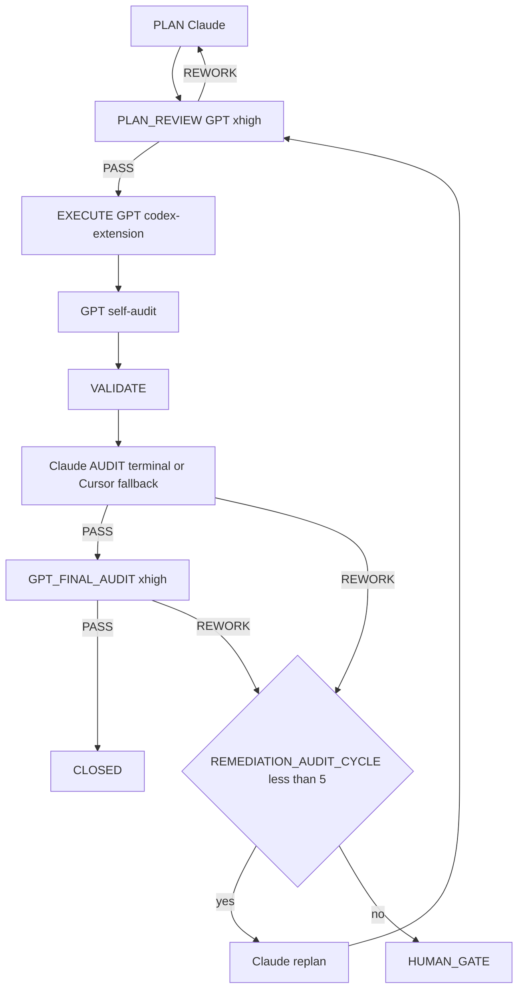

=== Auto-audit GPT (2e passe) ===
2026-04-25T22:18:34.827869Z  WARN codex_core::agents_md: Project doc `/Users/1millnonstop/Downloads/projet/foodking-web/web/testttt/AGENTS.md` exceeds remaining budget (32768 bytes) - truncating.
OpenAI Codex v0.125.0 (research preview)
--------
workdir: /Users/1millnonstop/Downloads/projet/foodking-web/web/testttt
model: gpt-5.5
provider: openai
approval: never
sandbox: workspace-write [workdir, /tmp, $TMPDIR, /Users/1millnonstop/.codex/memories]
reasoning effort: xhigh
reasoning summaries: none
session id: 019dc6b9-21cd-7e80-bf85-e3da5d6fa790
--------
user
Tu effectues l’**auto-audit GPT** (2e passe) d’un cycle FoodKing — **pas** l’audit Claude terminal.

**Contexte** : le JSON ci-dessous est la proposition d’implémentation (format agents/codex.prompt.txt) pour la mission `CV1-M21B-PAYMENT-REFACTOR`.


**JSON d’implémentation (à recouper)** :
```json
{
  "files_to_modify": [
    "resources/js/components/admin/pos/PaymentComponent.vue",
    "resources/js/components/admin/pos/PosComponent.vue",
    "tests/js/paymentComponentPropMutation.spec.js",
    "tests/js/paymentComponent401Retry.spec.js",
    "tests/js/posPaymentComponentContract.spec.js"
  ],
  "implementation_steps": [
    "Refactored PaymentComponent to emit payment-form:patch and payment-form:reset instead of mutating parent form props directly.",
    "Added PosComponent handlers so the parent owns checkoutProps.form updates and successful-payment reset state.",
    "Wrapped POS payment confirmation in a one-shot 401 retry: first 401 triggers authcheck, then the confirm attempt is retried once; a second 401 fails closed with a clear session-expired error.",
    "Added Vitest coverage for zero direct prop mutation, parent-state contract wiring, and one-shot 401 retry behavior.",
    "Checked KioskPaymentComponent for the same prop-mutation anti-pattern; no matching $props/props.form mutation pattern was present, so it was left unchanged."
  ],
  "code_blocks": [
    {
      "path": "resources/js/components/admin/pos/PaymentComponent.vue",
      "op": "replace",
      "excerpt": "Replace direct writes to this.$props.props.form with emitPaymentFormPatch(), currentFormSnapshot(), and payment-form:reset. Add confirmOrderWithAuthRetry(), refreshPaymentAuth(), runConfirmOrderAttempt(), and handlePaymentError(); runConfirmOrderAttempt builds a cloned payload, refreshes quote, saves the POS order, and emits parent-owned state changes only."
    },
    {
      "path": "resources/js/components/admin/pos/PosComponent.vue",
      "op": "replace",
      "excerpt": "Update <PaymentComponent> usage to listen for @payment-form:patch=\"patchPaymentForm\" and @payment-form:reset=\"resetPaymentForm\". Add patchPaymentForm(patch) to replace checkoutProps.form with a merged parent-owned object, and resetPaymentForm() to centralize the post-payment reset."
    },
    {
      "path": "tests/js/paymentComponentPropMutation.spec.js",
      "op": "create",
      "excerpt": "Adds source-level coverage asserting PaymentComponent has zero direct parent prop/form mutation sites and declares the explicit payment-form events."
    },
    {
      "path": "tests/js/paymentComponent401Retry.spec.js",
      "op": "create",
      "excerpt": "Adds method-level coverage for authcheck refresh, retry ordering, no more than one retry after 401, and no retry for non-401 failures."
    },
    {
      "path": "tests/js/posPaymentComponentContract.spec.js",
      "op": "create",
      "excerpt": "Adds parent-state contract coverage for PosComponent event wiring, patch merge ownership, and parent-owned successful-payment reset."
    }
  ],
  "risks": [],
  "notes": [
    "Validation passed: npm test -- tests/js/paymentComponentPropMutation.spec.js tests/js/paymentComponent401Retry.spec.js tests/js/posPaymentComponentContract.spec.js (3 files, 9 tests).",
    "Additional sentinel passed: npm test -- tests/js/sentinels/paymentComponentPropMutation.spec.js.",
    "Pre-exec safety check passed. npm run verify:boucle returned exit 1 after printing only its header in this shell.",
    "SYMMETRY_NOTE: N/A - no OrderService or FrontendOrderService change.",
    "No backend, routes, migrations, public built assets, or pricing authority changes were made."
  ],
  "execution_trace": {
    "delegation": "codex-extension",
    "invariants_considered": [
      "pricing_ssot",
      "order_status",
      "branch_id",
      "commit_before_dispatch"
    ]
  }
}
```

**Livrable** (Markdown uniquement, en français) :
# AUTO_AUDIT_GPT — CV1-M21B-PAYMENT-REFACTOR

## 1. Conformité au plan / scope
(Énumérer manques ou dérives ; si scope élargi sans escale → **ESCALATE**)

## 2. Invariants FoodKing
Pour chacun : OK / RISQUE / N/A
- pricing_ssot (backend seul)
- order_status (enum, pas de strings)
- branch_id
- commit_before_dispatch
- frozen_zones
- order_service_symmetry (si un des deux services touché)

## 3. Verdict
Une ligne : `VERDICT: PASS` | `VERDICT: NEEDS_FIX` | `VERDICT: ESCALATE` + 1–3 phrases.

2026-04-25T22:18:35.193782Z  WARN codex_core_plugins::manifest: ignoring interface.defaultPrompt: prompt must be at most 128 characters path=/Users/1millnonstop/.codex/.tmp/plugins/plugins/build-ios-apps/.codex-plugin/plugin.json
2026-04-25T22:18:35.196140Z  WARN codex_core_plugins::manifest: ignoring interface.defaultPrompt: maximum of 3 prompts is supported path=/Users/1millnonstop/.codex/.tmp/plugins/plugins/plugin-eval/.codex-plugin/plugin.json
2026-04-25T22:18:42.108526Z  WARN codex_core_plugins::manifest: ignoring interface.defaultPrompt: prompt must be at most 128 characters path=/Users/1millnonstop/.codex/.tmp/plugins/plugins/build-ios-apps/.codex-plugin/plugin.json
2026-04-25T22:18:42.109819Z  WARN codex_core_plugins::manifest: ignoring interface.defaultPrompt: maximum of 3 prompts is supported path=/Users/1millnonstop/.codex/.tmp/plugins/plugins/plugin-eval/.codex-plugin/plugin.json
2026-04-25T22:18:42.840249Z  WARN codex_core_plugins::manifest: ignoring interface.defaultPrompt: prompt must be at most 128 characters path=/Users/1millnonstop/.codex/.tmp/plugins/plugins/build-ios-apps/.codex-plugin/plugin.json
2026-04-25T22:18:42.840524Z  WARN codex_core_plugins::manifest: ignoring interface.defaultPrompt: maximum of 3 prompts is supported path=/Users/1millnonstop/.codex/.tmp/plugins/plugins/plugin-eval/.codex-plugin/plugin.json
codex
J’utilise la skill `sync-risk-review` parce que la mission touche paiement, auth retry et cycle de commande. Je vais recouper le JSON avec les fichiers modifiés, le plan/brief de mission et les invariants FoodKing avant de rendre le Markdown demandé.
exec
/bin/zsh -lc "sed -n '1,220p' /Users/1millnonstop/Downloads/projet/foodking-web/web/testttt/.agents/skills/sync-risk-review/SKILL.md" in /Users/1millnonstop/Downloads/projet/foodking-web/web/testttt
 succeeded in 0ms:
---
name: sync-risk-review
description: Review changes affecting synchronization, auth, pricing, KDS, OSS, or order lifecycle for architectural and business risk.
disable-model-invocation: true
---

# Sync Risk Review Skill

Use this skill when a change affects:
- sync
- auth
- pricing
- KDS
- OSS
- order lifecycle
- cross-device behavior

## Steps
1. Read the relevant docs
2. Inspect the diff or current implementation
3. Identify:
   - architecture risk
   - state consistency risk
   - business rule violations
   - authz issues
   - missing tests
4. Produce a concise review with recommended next actions.

2026-04-25T22:18:54.406710Z  WARN codex_core_plugins::manifest: ignoring interface.defaultPrompt: prompt must be at most 128 characters path=/Users/1millnonstop/.codex/.tmp/plugins/plugins/build-ios-apps/.codex-plugin/plugin.json
2026-04-25T22:18:54.408167Z  WARN codex_core_plugins::manifest: ignoring interface.defaultPrompt: maximum of 3 prompts is supported path=/Users/1millnonstop/.codex/.tmp/plugins/plugins/plugin-eval/.codex-plugin/plugin.json
codex
Je commence par l’état de cycle et la masterplay, puis je lirai les artefacts spécifiques `CV1-M21B`. Ça permet de distinguer une vraie dérive de scope d’un détail déjà autorisé par le plan.
exec
/bin/zsh -lc "sed -n '1,220p' .cursor/ACTIVE_CYCLE.md" in /Users/1millnonstop/Downloads/projet/foodking-web/web/testttt
 succeeded in 1ms:
# Active Cycle – FoodKing

**Méta (SSOT `run-cycle.md` Step 0 + `AGENTS.md` § *Authoritative … cycle state*)** — requis pour que l’orchestrateur ne s’arrête pas sur *« RUNNER_MODE not set »*.

| Champ | Valeur actuelle |
| --- | --- |
| **RUNNER_MODE** | `single-session` |
| **PHASE (cycle W10)** | `IN_PROGRESS` (détail = section `CYCLE_W10_…` ci-dessous) |
| **TASK_ID** | `P_EXEC_CLOSEOUT_GRAPHITI_CI_PROD_2026-04-22` |
| **PLAN_FILE** | `plans/PLAN_EXECUTION_CLOSEOUT_GRAPHITI_CI_PROD_2026-04-22.md` |
| **REPORT_FILE** | `reports/post_execute_latest.log` (append — preuve `EXECUTE_DELEGATION` / `AUDIT_*`) |

> **ACTIVE_PRIMARY** : `CYCLE_W10_EXECUTION_CLOSEOUT` (un seul cycle peut être actif à la fois — voir B03 méga-checklist).
> Cycles plus anciens en lecture seule = **archive** déplacée dans **`.cursor/ACTIVE_CYCLE_ARCHIVE.md`** (lecture humaine / forensique uniquement, **non requise** par le parcours obligatoire).

## CYCLE_W10_EXECUTION_CLOSEOUT (IN_PROGRESS — mémoire 180 + MCP global + commit + CI + prod)

**TASK_ID** : `P_EXEC_CLOSEOUT_GRAPHITI_CI_PROD_2026-04-22`  
**Plan SSOT** : `plans/PLAN_EXECUTION_CLOSEOUT_GRAPHITI_CI_PROD_2026-04-22.md`  
**Ordre** : Piste A (POS+Centrale : PLAN-MEM-1) ∥ Piste B (humain : PLAN-MEM-3) → C (smoke) → D (commit sur « go commit ») → E (CI) → F (prod J-7→J+7).  
**Gate mémoire** : `python3 memory/verify.py` → count **≥ 175** (180 idéal) avant de considérer PLAN-MEM-1 **CLOSED**.

- **Vérif locale (2026-04-22)** : `python3 memory/verify.py` → **count = 182**, smoke `search_memory_facts` OK — gate **satisfaite** pour clôturer l'ingestion côté seuil d'épisodes (suite : commit / CI / prod selon plan `PLAN_EXECUTION_CLOSEOUT_*`).

**Gouvernance globale (2e passe 2026-04-22)** : primer multi-agents + Graphiti vivant + tokens « zéro effet négatif » → **`docs/orchestration/GLOBAL_SYSTEM_PRIMER.md`** + rapport **`reports/audit/AUDIT_SECOND_PASS_GLOBAL_GOVERNANCE_REPORT_2026-04-22.md`**.

---

## CAISSE_V1_MASTERPLAY (ACTIVE — 2026-04-25)

**Phase** : finition Caisse V1 (POS + Kiosk + KDS + Centrale + Fiscal + Ops).
**Plan parent** : `plans/PLAN_CAISSE_V1_GPT_MASTERPLAY_2026-04-25.md`
**Plan DAG autoritaire** : `plans/PLAN_CAISSE_V1_SUPER_MASTER_2026-04-25.md`
**Boucle d'exécution** : `plans/masterplay/MASTERPLAY_DISCIPLINE.md` + `plans/masterplay/MASTERPLAY_QUEUE.md` + `scripts/run-masterplay.sh`
**Statut temps réel** : `reports/masterplay/status.json`

**Règle** : tout `TASK_ID` au format `CV1-MXX-…` passe par la masterplay (cf. `AGENTS.md` § "Caisse V1 — Masterplay loop", `.cursor/rules/global.mdc` § "Caisse V1 — Masterplay loop", `.cursor/commands/run-cycle.md` Step 0 item 0). **NE PAS** ouvrir un `run-cycle` standard sur un `CV1-MXX-…`.

---

## Archive

Tous les cycles **CLOSED / COMPLETED PASSED** (W4 → W9, NF525, etc.) ont été déplacés dans **`.cursor/ACTIVE_CYCLE_ARCHIVE.md`** pour réduire le coût de lecture du parcours obligatoire (audit 2026-04-24, mission `T-PARCOURS-OPTIMIZE-001`).

- **Lecture humaine** : ouvrir `.cursor/ACTIVE_CYCLE_ARCHIVE.md`.
- **Lecture agent** : **non requise** sauf instruction explicite du plan ou du chat (ex. "reprend le rationale du cycle W9").
- **Recherche** : `rg "CYCLE_W9_" .cursor/ACTIVE_CYCLE_ARCHIVE.md` ou `git log --follow .cursor/ACTIVE_CYCLE.md`.

exec
/bin/zsh -lc "sed -n '1,260p' plans/masterplay/MASTERPLAY_QUEUE.md" in /Users/1millnonstop/Downloads/projet/foodking-web/web/testttt
exec
/bin/zsh -lc "sed -n '1,220p' docs/orchestration/GLOBAL_SYSTEM_PRIMER.md" in /Users/1millnonstop/Downloads/projet/foodking-web/web/testttt
exec
/bin/zsh -lc "sed -n '1,260p' plans/masterplay/MASTERPLAY_DISCIPLINE.md" in /Users/1millnonstop/Downloads/projet/foodking-web/web/testttt
 succeeded in 0ms:
# MASTERPLAY DISCIPLINE — Caisse V1 (loop master)

> **But** : règles strictes que le runner et chaque mission GPT respectent en boucle, pendant des heures, jusqu'à finition de toutes les missions de `MASTERPLAY_QUEUE.md`. Lecture obligatoire avant de lancer `bash scripts/run-masterplay.sh`.

## 1. Autorité

| Source | Rôle |
|--------|------|
| `AGENTS.md` | Parcours obligatoire, cycle FoodKing |
| `plans/PLAN_CAISSE_V1_SUPER_MASTER_2026-04-25.md` | DAG autoritaire (ordre, gates) |
| `plans/PLAN_CAISSE_V1_GPT_MASTERPLAY_2026-04-25.md` | Catalogue 22 missions M-XX (objectifs, allowlist) |
| `plans/masterplay/MASTERPLAY_QUEUE.md` | File d'exécution courante |
| `plans/masterplay/MASTERPLAY_DISCIPLINE.md` | (ce fichier) règles d'exécution |
| `.cursor/rules/*.mdc` | Toujours appliquées |
| `docs/gates/GATE_LOG.md` | État des gates humains |

## 2. Boucle d'exécution (run-masterplay.sh)

```
LOOP {
  1. tail activity log (~500 tokens)
  2. find next PENDING task in MASTERPLAY_QUEUE with all DEPENDS_ON == CLOSED
  3. if none → break (all done or all blocked)
  4. verify missions/<TASK_ID>/input.json + execute_brief.md exist
  5. activity-log start codex-extension <TASK_ID> execute "<allowlist CSV>" "<note>"
     if exit 2 (collision) → MARK BLOCKED note=collision, continue loop
  6. update status: RUNNING
  7. npm run codex:complex -- <TASK_ID>     (génère output_codex.json + GPT_SELF_AUDIT)
  8. update status: EXECUTED
  9. activity-log done codex-extension <TASK_ID> done "<résumé court>"
 10. (option --with-audit) bash scripts/foodking-claude-orchestrate.sh audit-brief <TASK_ID>
       if PASS → status: AUDIT_PASS
       if REWORK → status: REWORK ; increment REWORK_COUNT ; if >=5 → BLOCKED note=human_gate
 11. (option --with-final) npm run codex:final-audit -- <TASK_ID>
       if PASS → status: FINAL_PASS
 12. if FINAL_PASS:
       bash scripts/after-execute-memory.sh
       update status: CLOSED
 13. sleep INTER_TASK_PAUSE_SECONDS (default 5s)
 14. continue LOOP
}
```

## 3. Garde-fous (non négociables)

### 3.1 Allowlist stricte par mission
Codex modifie **uniquement** les fichiers listés dans `missions/<TASK_ID>/input.json.allowlist`. Si modification hors liste détectée à l'audit → `REWORK`.

### 3.2 Frozen zones
Aucune édition d'un fichier frozen sans gate signé dans `docs/gates/GATE_LOG.md`. Le runner **refuse** de lancer une mission marquée `BLOCKED` jusqu'à ce que le statut soit changé manuellement après signature.

### 3.3 Invariants FoodKing — `REWORK` automatique
- Pricing client-authoritative
- Status littéral numérique (`status: 16`)
- `branch_id` LIKE
- Dispatch dans transaction
- OS ou FOS modifié sans `SYMMETRY_NOTE`
- Frozen modifié sans gate

### 3.4 Pas de gate auto-approuvée
Codex peut **rédiger** options ; aucune mission ne coche `[x] Approved`. Si une mission le tente → `REWORK` + `risks: ["ESCALATION: gate self-approved"]`.

### 3.5 Tests obligatoires
Chaque `mandatory_tests` listé doit être lancé et reporté dans le rapport. Échec → `REWORK`.

### 3.6 Diff minimal
Aucun renommage opportuniste, aucun refactor non demandé, aucune optimisation collatérale. Si ajout justifié → `notes` du JSON.

### 3.7 Activity log
`start` avant chaque mission ; `done` après. Sans cela → réservation fantôme = autres agents bloqués. Le runner enforce.

### 3.8 Mémoire
À CLOSE : compléter `memory/episodes/caisse_v1_<topic>_*.jsonl` (squelettes créés par M-19) puis `bash scripts/after-execute-memory.sh`. Si Graphiti UP : `bash bin/graphiti-ingest.sh` + `python3 memory/verify.py`.

## 4. Boucles de rework

- Max **5 cycles `REWORK`** consécutifs sur la même mission. Au 5e → `BLOCKED note=human_gate_required`.
- Max **3 cycles healing** consécutifs (cf. CLAUDE.md §8) avant escalade.
- Toute escalation → écrite dans `reports/masterplay/ESCALATIONS_<date>.md`.

## 5. Pause / arrêt

- `Ctrl-C` arrête la boucle proprement (mission en cours finit, runner s'arrête après).
- `touch reports/masterplay/STOP` → le runner s'arrête à la fin de la mission courante.
- `touch reports/masterplay/PAUSE` → le runner pause entre les missions tant que le fichier existe.

## 6. Logs

- `reports/masterplay/run_<ISO>.log` : log de la boucle.
- `reports/masterplay/status.json` : état temps réel (mission courante, compteurs).
- `missions/<TASK_ID>/output_codex.raw.log` : raw codex.
- `missions/<TASK_ID>/output_codex.json` : json structuré.
- `reports/audit/GPT_SELF_AUDIT_<TASK_ID>.md` : self-audit GPT.
- `reports/post_execute_latest.log` : trace `EXECUTE_DELEGATION`.
- `reports/AGENT_ACTIVITY_LOG.md` : start/done.

## 7. Audit Claude (en fin de boucle, manuel)

Quand toutes les missions sont `CLOSED` (ou `BLOCKED` documentés) :

```
bash scripts/foodking-claude-orchestrate.sh context
bash scripts/foodking-claude-orchestrate.sh audit
```

Sortie attendue : verdict transversal Caisse V1 (chaîne sync borne→centrale→POS→KDS→fiscal). Le verdict détermine `GO/HOLD/NO-GO` pour `GATE_GO_NO_GO_CAISSE_V1`.

## 8. Critères d'arrêt anormal

- 3 missions consécutives en `REWORK` → halt + alerte humaine.
- Activity-log refuse 3 fois → halt (collision permanente).
- `npm run codex:complex` échoue 3 fois sur la même mission (binaire codex KO) → halt.
- `claude` terminal indisponible 3 fois consécutives → continue avec fallback subagent + `AUDIT_FALLBACK_REASON: terminal-unavailable`.

## 9. Token discipline

- Le prompt envoyé à codex contient : template `agents/codex.prompt.txt` + `input.json` + `execute_brief.md` + (optionnel) `graphiti_context.md`, `plan_excerpt.md`, `cycle_snapshot.md`.
- Pas de duplication : pas de re-coller AGENTS.md ou super master plan dans chaque mission.
- Cap typique d'un prompt : ≤ 30 KB. Au-delà → splitter la mission.

## 10. Anti-pattern interdits

- ❌ Lancer 2 missions en parallèle sur les mêmes fichiers (collision activity-log).
- ❌ Modifier `MASTERPLAY_QUEUE.md` pendant que le runner tourne (sauf marquer BLOCKED → PENDING après gate).
- ❌ Skipper l'audit Claude pour aller plus vite.
- ❌ Marquer CLOSED manuellement sans double PASS (PASS Claude + PASS Codex final).
- ❌ Ignorer un `risks: ["ESCALATION: ..."]` dans output_codex.json.

---

`MASTERPLAY_DISCIPLINE_VERSION: 1.0` · `STRICT_MODE: ON`

2026-04-25T22:19:03.343492Z  WARN codex_core_plugins::manifest: ignoring interface.defaultPrompt: prompt must be at most 128 characters path=/Users/1millnonstop/.codex/.tmp/plugins/plugins/build-ios-apps/.codex-plugin/plugin.json
2026-04-25T22:19:03.344927Z  WARN codex_core_plugins::manifest: ignoring interface.defaultPrompt: maximum of 3 prompts is supported path=/Users/1millnonstop/.codex/.tmp/plugins/plugins/plugin-eval/.codex-plugin/plugin.json
 succeeded in 106ms:
# MASTERPLAY_QUEUE — Caisse V1

**Source de vérité de l'orchestration en boucle** : `bash scripts/run-masterplay.sh` lit cette file et exécute en série.

**Discipline** : `plans/masterplay/MASTERPLAY_DISCIPLINE.md`.  
**Plan parent** : `plans/PLAN_CAISSE_V1_GPT_MASTERPLAY_2026-04-25.md`.

## Légende statut

- `PENDING` — pas encore lancé
- `RUNNING` — codex exec en cours (ne pas relancer)
- `EXECUTED` — codex exec terminé, attend audit
- `AUDIT_PASS` — `AUDIT_VERDICT: PASS` Claude
- `FINAL_PASS` — `GPT_FINAL_AUDIT_VERDICT: PASS`
- `CLOSED` — mémoire ingestée + activity-log done
- `REWORK` — audit a demandé rework
- `BLOCKED` — gate humain ou dépendance manquante

## Légende vague

- `WAVE_A` — NO-GATE, parallélisable, démarre immédiatement
- `WAVE_B` — POST-GATE, séquencé selon DAG

## File d'exécution


| ORDER | TASK_ID                           | MISSION | WAVE   | DEPENDS_ON                 | STATUS  | NOTE                                                                         |
| ----- | --------------------------------- | ------- | ------ | -------------------------- | ------- | ---------------------------------------------------------------------------- |
| 01    | CV1-M19-MEMORY-DISCIPLINE         | M-19    | WAVE_A | —                          | CLOSED  | Crée squelettes JSONL pour les 22 missions                                   |
| 02    | CV1-M01-TRACEABILITY-MATRIX       | M-01    | WAVE_A | —                          | CLOSED  | Matrice findings → tasks → tests → gates (REWORK resolved GPT PASS)          |
| 03    | CV1-M02-SENTINEL-BASELINE         | M-02    | WAVE_A | CV1-M01                    | CLOSED  | 18 sentinels fail-first + 4 lints                                            |
| 04    | CV1-M12-LEGACY-GUARDS-CI          | M-12    | WAVE_A | —                          | CLOSED  | Lint imports + bundle scan + workflow (recovered: extractor JSON fix)        |
| 05    | CV1-M16-HARDWARE-LAB              | M-16    | WAVE_A | —                          | CLOSED  | Checklist hardware signable (recovered: JSON valid, files materialized)      |
| 06    | CV1-M18-TEST-ARCHITECTURE         | M-18    | WAVE_A | CV1-M02                    | CLOSED  | Grille couverture + plan campagne                                            |
| 07    | CV1-M20-RUNBOOKS-SKELETON         | M-20    | WAVE_A | —                          | CLOSED  | 8 runbooks ops (REWORK Horizon resolved GPT PASS)                            |
| 08    | CV1-M21A-QUICKWINS-LOT0           | M-21a   | WAVE_A | —                          | CLOSED  | POS: discount v-model + Swiper RTL + focustrap dead                          |
| 09    | CV1-M03-GATES-DRAFT               | M-03    | WAVE_A | CV1-M01                    | CLOSED  | 8 briefs gates Caisse V1 créés; Wave B reste bloquée par signatures humaines |
| 10    | CV1-M09-BRANCH-ISOLATION          | M-09    | WAVE_B | CV1-M03(gates), CV1-M02    | CLOSED  | GPT audit PASS; M-08/M-06/schema sentinels remain gated                      |
| 11    | CV1-M06-POS-REVENUE-GUARDS        | M-06    | WAVE_B | CV1-M09, CV1-M03           | CLOSED | GPT rework audit PASS; gates frozen C + payment_prop A approved              |
| 12    | CV1-M05-ORDER-QUOTE               | M-05    | WAVE_B | CV1-M03                    | CLOSED | GPT final PASS; quote sealed/consumed at POS+kiosk commit                    |
| 13    | CV1-M04A-PAYMENT-LEDGER-FULL      | M-04A   | WAVE_B | CV1-M03 (ledger=A)         | BLOCKED | Ledger gate chose Option B; M-04A not selected                               |
| 14    | CV1-M04B-PAYMENT-PILOT-RESTRICT   | M-04B   | WAVE_B | CV1-M03 (ledger=B)         | CLOSED  | GPT audit PASS; Option B restricted pilot implemented                        |
| 15    | CV1-M08-FISCAL-Z-NF525            | M-08    | WAVE_B | CV1-M03 (fiscal+schema)    | CLOSED | GPT final PASS; fiscal Option B Z policy sealed                              |
| 16    | CV1-M07-KDS-RELEASE               | M-07    | WAVE_B | CV1-M03 (kds_bump)         | CLOSED | GPT final PASS; KDS server authority with expected_status sealed             |
| 17    | CV1-M10-OS-FOS-SYMMETRY           | M-10    | WAVE_B | CV1-M06, CV1-M09           | CLOSED | Unlocked after M-06 GPT audit PASS and M-09 CLOSED                           |
| 18    | CV1-M11-KIOSK-RUNTIME             | M-11    | WAVE_B | CV1-M03 (offline+fiscal)   | CLOSED | GPT final PASS; offline Option A CB/TR refused and enum cancel sealed         |
| 19    | CV1-M17-WEB-STRIPE-SCOPE          | M-17    | WAVE_B | CV1-M03 (web+stripe)       | CLOSED | GPT final PASS; web payment off + Stripe inactive guard sealed               |
| 20    | CV1-M13-MIGRATIONS-SAFETY         | M-13    | WAVE_B | CV1-M03 (schema)           | CLOSED | GPT final PASS; migration safety tooling sealed; staging rehearsal deferred to M14 |
| 21    | CV1-M14-OPS-PREFLIGHT             | M-14    | WAVE_B | CV1-M13                    | CLOSED | GPT final PASS; ops preflight fail-closed tooling sealed                     |
| 22    | CV1-M15-ROLLOUT-CANARY            | M-15    | WAVE_B | CV1-M04*, CV1-M08, CV1-M14 | CLOSED | GPT final PASS; rollout canary drill fail-closed tooling sealed              |
| 23    | CV1-M21B-PAYMENT-REFACTOR         | M-21b   | WAVE_B | CV1-M03 (prop_mutation)    | RUNNING | Gate approved; unlocked after M-06/M-10 stabilization                         |
| 24    | CV1-M22-POST-LAUNCH-OBSERVABILITY | M-22    | WAVE_B | CV1-M14, CV1-M15           | PENDING | Unlocked after M14/M15 CLOSED                                                 |


## Ce que le runner exécute

À chaque tour de boucle, le runner :

1. Lit cette table.
2. Prend la **première** ligne au statut `PENDING`.
3. Vérifie que toutes ses `DEPENDS_ON` sont au statut `CLOSED`. Sinon → skip.
4. Vérifie que `missions/<TASK_ID>/input.json` et `execute_brief.md` existent. Sinon → marque `BLOCKED note=missing-mission-files`.
5. `start` activity-log → `npm run codex:complex -- <TASK_ID>` → `done` activity-log.
6. Mise à jour statut : `EXECUTED`.
7. Audit Claude terminal automatique (si activé `--with-audit`) → `AUDIT_PASS` ou `REWORK`.
8. Si `AUDIT_PASS` : `npm run codex:final-audit -- <TASK_ID>` → `FINAL_PASS`.
9. Si `FINAL_PASS` : ingestion mémoire + `done` → `CLOSED`.
10. Loop.

## Statut initial (à la création)

Les 6 missions Vague A préparées par M-19/M-01/M-02/M-12/M-16/M-18 sont au statut `PENDING`. Les autres `TODO_NEXT` (à créer après le premier round) ou `BLOCKED` (gates).

## Mise à jour manuelle

Le runner met à jour la colonne `STATUS` automatiquement (sed sur cette table). Tu peux aussi éditer manuellement entre 2 runs (ex: marquer `BLOCKED → PENDING` après gate signé).

 succeeded in 103ms:
# FoodKing — Primer système global (agents, sous-agents, Graphiti, tokens)

> **Passation + index complet des chemins (SSOT, un seul fichier)** : **`../DOC_EXPO_HER_ANCIEN_AGENT_ALIMENTATION_WORKFLOW_2026-04-22.md`** (table §2 = utilité de chaque path pour une nouvelle session).

> **Fichier d’entrée** pour toute nouvelle conversation, tout nouvel outil d’agent (Cursor, terminal, futur bot), ou tout humain qui reprend le projet.  
> Objectif : **robustesse** = même avec 100 cycles et des exécuteurs différents, le comportement reste **prévisible**, **traçable**, et la **mémoire** reste **alignée** sur le code.

**Obligatoire avant ce Primer (SSOT d’onboarding)** : lire `**AGENTS.md`**, section **Parcours obligatoire** (nouvelle session **et** continuation), puis enchaîner ici.  
**En continuation d’un cycle** : lire d’**abord** `**.cursor/ACTIVE_CYCLE.md`** (éviter un second `TASK_ID` fantôme) ; si `PHASE` = vide ou `CLOSED`, revenir à la table ci-dessous.

---

## 1. Ordre de lecture obligatoire (minimum viable)

Lire **dans cet ordre** avant d’écrire du code ou un plan non trivial (voir aussi `**AGENTS.md` § *Parcours obligatoire* — tableau** pour la même doctrine) :


| #   | Fichier                                                    | Pourquoi                                                                                                                  |
| --- | ---------------------------------------------------------- | ------------------------------------------------------------------------------------------------------------------------- |
| 0   | `**.cursor/ACTIVE_CYCLE.md`** (si reprise)                 | Cycle déjà en cours : même `TASK_ID` / mêmes Steps **jusqu’à** `CLOSE` — **ne pas** forker un plan parallèle sans le dire |
| 1   | `**AGENTS.md`** (dont § *Parcours obligatoire*)            | Contrat global : phases, routing, MCP, terminal, parcours production, non-négociables                                     |
| 1b  | `**docs/orchestration/SESSION_OPENING_ENFORCEMENT.md**`  | **Bloc unique** (tail log + `verify:boucle` + rappel phases) — réduit la répétition « refais la boucle » en session ; **modèle Cursor = Claude pour PLAN** (Auto/Composer ne remplacent pas `routing.md`) |
| 1c  | `**reports/audit/SIMULATION_PARCOURS_PROD_CHECKPOINTS_2026-04-25.md**` | **Simulation production** : checkpoints par phase, fichiers SSOT, limite IDE (qui orchestre quoi) — avant de promettre « zéro dérive » |
| 2   | `**.cursor/routing.md*`*                                   | Qui fait quoi (Claude plan/audit, GPT-5.5-pro xhigh plan review / execute / final audit, Composer validation only)         |
| 3   | `**.cursor/commands/run-cycle.md**`                        | Déroulé exact d’un cycle `TASK_ID` (incl. Graphiti Step 0.5)                                                              |
| 4   | `**.cursor/rules/graphiti-memory.mdc**`                    | Mémoire Graphiti : quand lire / quand écrire                                                                              |
| 5   | `**.cursor/rules/global.mdc**` + `**context-hygiene.mdc**` | Gates, discipline tokens **sans** réduire l’intelligence                                                                  |
| 6   | `**docs/orchestration/MEMORY_MATRIX.md`**                  | **Quel store écrit quoi, lit quoi, quand** (4 stores autorisés A/B/C/D) — antidote unique à la complexité mémoire         |
| 6b  | `**docs/orchestration/MULTI_AGENT_ORCHESTRATION.md`**      | Même tâches, plusieurs onglets Cursor : **activité** + **Graphiti** (lecture) + `AUDIT_VERDICT` — sans empiéter           |
| 7   | `**memory/INDEX.md`**                                      | Carte des domaines mémoire Graphiti (store B) — secours si MCP absent                                                     |
| 8   | `**tasks/[TASK_ID].md**`                                   | Quand un cycle borné est lancé — périmètre de la tâche                                                                    |


Ensuite, **selon le domaine** : `docs/ORDER_FLOW.md`, `docs/DEVICE_FLOW.md`, `docs/ARCHITECTURE.md`, `project-invariants.mdc`, etc.

Référence roster court : `**docs/orchestration/AGENT_ROLES.md`**.

### 1.1 Décision : Claude orchestre ; GPT challenge et exécute en xhigh

- **Cerveau** (priorité, plan, re-plan, gates) : **Claude** (session + terminal `foodking-claude-orchestrate.sh`) — il écrit le plan et tranche la stratégie de remédiation.
- **Challenge plan obligatoire** : **GPT-5.5-pro / xhigh** relit le plan avant EXECUTE (`npm run codex:plan-review -- {TASK_ID}` → `PLAN_REVIEW_VERDICT`). Si `REWORK`, Claude révise avant tout code.
- **Bras + premier contrôle qualité** : **EXECUTE = Codex (PRIMARY)** pour toutes les implémentations produit, même les petites corrections : `npm run codex:complex -- {TASK_ID}` → `reports/audit/GPT_SELF_AUDIT_{TASK_ID}.md`.
- **Pas de routine product implementation** : Composer / `foodking-routine-implementer` ne fait plus d’édition produit en cycle de finition ; il peut aider au reporting/validation seulement.
- **Double audit final** : Claude audit d’abord (`AUDIT_VERDICT`) avec terminal primary + fallback Cursor si quota/rate-limit/terminal HS, puis GPT final audit (`npm run codex:final-audit -- {TASK_ID}` → `GPT_FINAL_AUDIT_VERDICT`). Close seulement si les deux sont `PASS`.

---

## 2. Sous-agents Cursor (Task tool) — intégration dans le flux

Ce ne sont **pas** des fichiers dans le repo ; ce sont des **profils** invoqués par Cursor selon `.cursor/routing.md` et `**run-cycle.md` Step 2**.


| Sub-agent / Canal                                                               | Modèle cible                                                                  | Quand                                                                                                                                                                                                                                          |
| ------------------------------------------------------------------------------- | ----------------------------------------------------------------------------- | ---------------------------------------------------------------------------------------------------------------------------------------------------------------------------------------------------------------------------------------------- |
| `**foodking-routine-implementer`** (sub-agent Cursor)                           | Composer                                                                      | **Validation/report only** en cycles de finition. Pas d’implémentation produit.                                                                                                                                             |
| `**codex-extension` — FoodKing Codex Complex Implementer (PRIMARY)**            | **GPT-5.5-pro / xhigh** via CLI `codex` (compte **ChatGPT Pro**) + `codex exec` | **PLAN_REVIEW + toute implémentation produit + auto-audit + GPT_FINAL_AUDIT**. `npm run codex:complex -- {TASK_ID}`. Voir `scripts/codex-extension-execute.sh`, `agents/codex-extension-instructions.md`. |
| `**foodking-complex-implementer`** (sub-agent Cursor — **FALLBACK uniquement**) | Aligné exécution **GPT-5.5** (emplacement sub-agent)                          | Uniquement si `codex` / `codex exec` est indisponible après reprises sur la même tâche                                                                                                                                                         |


**Règles d'or**

1. **Délégation obligatoire** pour toute modification produit en EXECUTE, avec trace `EXECUTE_DELEGATION:` dans le log de validation. Valeurs autorisées : `codex-extension` | `foodking-complex-implementer (codex-extension-fallback)` | `explicit-prompt-bind`.
2. **EXECUTE = `codex-extension` PRIMAIRE** (CLI `codex` + Pro, `npm run codex:complex -- {TASK_ID}` ; contexte Graphiti/plan dans `missions/…/graphiti_context.md` etc. ; voir `**docs/orchestration/CODEX_API_DELEGATION.md`**). Le sub-agent `foodking-complex-implementer` est le **fallback** (usage Cursor) — indispo `codex exec`. Aucun **connecteur HTTP** / proxy n’est maintenu dans le dépôt.
3. Le sous-agent **ne voit pas toujours** le MCP Graphiti du parent : le plan **doit** contenir `**## PRIOR_CONTEXT`** (faits Graphiti + invariants) — copier ou résumer dans le message de délégation **ou** dans `missions/{TASK_ID}/graphiti_context.md` pour l’appel API.
4. Aucun sub-agent ne **contourne** un gate humain ni n’édite une frozen zone sans `docs/gates/` approuvé.

---

## 3. Terminal allies (hors Task tool) — intégration

Documentés dans `**AGENTS.md` § Terminal allies** :


| Outil                                                                  | Rôle                                                                     | Position + **canal d’abonnement** (SSOT)                                                                                                                                                                                         |
| ---------------------------------------------------------------------- | ------------------------------------------------------------------------ | -------------------------------------------------------------------------------------------------------------------------------------------------------------------------------------------------------------------------------- |
| `**claude` +** `foodking-claude-orchestrate.sh`                        | **AUDIT cycle — PRIMARY (Step 5)** : `context` → `audit` / `audit-brief` | Abonnement **Anthropic (CLI sur terminal)** ; n’**emprunte** pas l’orchestrateur de modèles de Cursor. **FALLBACK actif** (quota / limite / panne après 1 retry) : Task **`foodking-planner-orchestrator`** + même checklist + `AUDIT_CHANNEL: cursor-session` + `AUDIT_FALLBACK_REASON:` — `docs/orchestration/AUDIT_TERMINAL_QUOTA_FALLBACK.md`. |
| **CLI** `codex` + `npm run codex:complex` (`**codex-extension`**, Pro) | **PLAN_REVIEW + EXECUTE + GPT_FINAL_AUDIT — PRIMARY** (GPT-5.5-pro/xhigh) | Compte **ChatGPT Pro** sur le terminal ; ne passe **pas** par l’orchestrateur de modèles **Cursor** ; facturation côté OpenAI ; **FALLBACK** = sub-agent.     |
| `codex` / REPL interactif (OpenAI)                                     | Tâches ad hoc **hors** cycle, ou côté humain                             | N’enlèvent **pas** VALIDATE + AUDIT du `run-cycle`.                                                                                                                                                                              |
| `verify-orchestration-boucle.sh`                                       | Preuve binaire + optionnel smoke (API)                                   | `bash scripts/verify-orchestration-boucle.sh` — `VERIFY_BILLING_FULL=1` lance 1× smoke `claude` + 1× `npm run codex:smoke`.                                                                                                      |


**Clôture :** l’audit Claude écrit `AUDIT_VERDICT: PASS` ou `REWORK`, puis GPT écrit `GPT_FINAL_AUDIT_VERDICT: PASS|REWORK|ESCALATE` (voir `run-cycle.md` Step 5). Pas de `CLOSED` sans double `PASS`. En `REWORK` : re-orchestration + re-EXECUTE GPT jusqu’à double `PASS` ou 5e tour → humain. Schéma :




Le terminal **n’enregistre** pas **Graphiti** seul : après AUDIT/CLOSE, décisions → JSONL + `after-execute-memory.sh` (voir §5) comme avant.

---

## 4. Graphiti — vivre avec l’avancement du projet (N agents, N cycles)

### 4.1 Rôles


| Rôle                                    | Responsable                                                          |
| --------------------------------------- | -------------------------------------------------------------------- |
| **Lecture** avant plan / audit complexe | Tout agent avec MCP `graphiti` chargé                                |
| **Écriture** après décision durable     | Phase AUDIT + CLOSED (`audit-context.md`) ou humain via `add_memory` |
| **Alimentation batch** (JSONL → Neo4j)  | Humain ou pipeline : `bash bin/graphiti-ingest.sh`                   |


### 4.2 Quand mettre à jour la mémoire (checklist — « ne pas oublier »)

Cocher mentalement à **chaque** fin de sujet significatif :

- **Invariant** clarifié ou renforcé → nouvelle ligne dans `memory/episodes/02_architecture_invariants.jsonl` (ou fichier le plus proche) + `ingest` ciblé.
- **Sync / event / canal** modifié → `03_domain_events_sync.jsonl` + ingest.
- **Décision produit / ADR** → `12_decisions_log.jsonl` + ingest.
- **Nouvelle tâche V14+** ou finding cross-vagues → `09_tasks_history.jsonl` + ingest.
- **Changement prod / rollout** → `11_production_plan.jsonl` + ingest.
- **Nouveau rôle agent ou règle d’orchestration** → `13_agents_roles.jsonl` + ingest + **mettre à jour ce Primer** si le modèle change.
- **Audit long (ops + agentique + mémoire)** → suivre `docs/orchestration/MEGA_CHECKLIST_AUTONOMY_AND_MEMORY.md` (180 tâches) ; narratif `reports/audit/MEGA_AUDIT_SYSTEM_OPERATION_AGENTIC_2026-04-23.md`.
- **Après toute écriture JSONL** → `bash scripts/after-execute-memory.sh` (rafraîchit `reports/memory/jsonl_manifest.json`, cohérent avec CI) puis `bin/graphiti-ingest.sh` sur les domaines touchés.

**Règle d’or** : si le code ou la doc **canonical** a changé et que la mémoire dit encore l’ancienne vérité → **mise à jour sous 48 h** (sinon dérive silencieuse).

### 4.3 Outils

- Pipeline post-écriture (manifeste + rappel ingest) : `bash scripts/after-execute-memory.sh`.
- Ingestion : `bin/graphiti-ingest.sh [filtre]` — voir `memory/README.md`.
- Vérification : `python3 memory/verify.py`.
- Terminal (bref + audit option) : `bash scripts/foodking-claude-orchestrate.sh post-execute` ou `context` puis `audit-brief` — `docs/orchestration/TERMINAL_CLAUDE_GRAPHITI_ORCHESTRATION.md`.
- Reset rare : `@graphiti clear_graph` puis full ingest (politique humaine).

---

## 5. Tokens, contexte, cache — politique « intelligence max, gaspillage min »

**But** : réponses **détaillées et stables**, pas des réponses courtes pour économiser des tokens au détriment de la qualité.


| On optimise (effet ≥ 0)                                                              | On n’optimise pas (effet négatif interdit)                               |
| ------------------------------------------------------------------------------------ | ------------------------------------------------------------------------ |
| Re-lire un fichier **déjà** dans la fenêtre contexte                                 | Tronquer un plan, une analyse de risque, ou un gate pour « faire court » |
| Résumer une phase **terminée** pour handoff (voir `context-hygiene.mdc` §4)          | Supprimer `## PRIOR_CONTEXT` ou les invariants du plan                   |
| Utiliser **Graphiti** pour récupérer faits structurés au lieu de rouvrir 50 rapports | Désactiver Graphiti pour « aller plus vite » sur du sync / fiscal        |
| Écrire les preuves dans `reports/` structuré                                         | Remplacer des tests par de la prose vague                                |


**Cache applicatif** (Redis, etc.) : régie par le code Laravel et `**app:preflight-production`** — hors scope de ce Primer, mais **ne jamais** confondre « cache métier » et « mémoire Graphiti » : ce sont deux systèmes.

---

## 6. Révision de ce document

- **À chaque** changement majeur d’orchestration (nouveau sub-agent, nouveau MCP, nouveau cycle obligatoire) : mettre à jour **ce fichier** + une ligne dans `13_agents_roles.jsonl` + ingest.
- **Trimestriel** : relire §4.2 avec un lead dev.

---

## 7. Pointers rapides


| Besoin                                                        | Aller à                                                           |
| ------------------------------------------------------------- | ----------------------------------------------------------------- |
| Cycle complet                                                 | `.cursor/commands/run-cycle.md`                                   |
| Gates                                                         | `.cursor/rules/human-gates.mdc`                                   |
| Invariants code                                               | `.cursor/rules/project-invariants.mdc`                            |
| Mémoire locale                                                | `memory/INDEX.md`                                                 |
| Pannes Graphiti                                               | `.cursor/mcp/GRAPHITI_TROUBLESHOOTING.md`                         |
| Closeout prod + mémoire                                       | `plans/PLAN_EXECUTION_CLOSEOUT_GRAPHITI_CI_PROD_2026-04-22.md`    |
| Méga-checklist autonomie / Graphiti                           | `docs/orchestration/MEGA_CHECKLIST_AUTONOMY_AND_MEMORY.md`        |
| Méga-audit narratif (compagnon)                               | `reports/audit/MEGA_AUDIT_SYSTEM_OPERATION_AGENTIC_2026-04-23.md` |
| Audit graphique workflow                                      | `docs/orchestration/WORKFLOW_AUDIT_GRAPHIQUE_2026-04-23.md`       |
| Terminal Claude + Graphiti (rôles, `context` / `audit-brief`) | `docs/orchestration/TERMINAL_CLAUDE_GRAPHITI_ORCHESTRATION.md`    |
| Matrice routine / complexe (sub-agents)                       | `docs/orchestration/ROUTING_MATRIX.md`                            |

codex
La file masterplay confirme que `CV1-M21B-PAYMENT-REFACTOR` est bien la mission active, avec gate prop mutation approuvé et statut `RUNNING`. Je vais maintenant lire l’allowlist/brief et inspecter le diff réel plutôt que valider le JSON déclaratif seul.
exec
/bin/zsh -lc "sed -n '1,240p' missions/CV1-M21B-PAYMENT-REFACTOR/input.json" in /Users/1millnonstop/Downloads/projet/foodking-web/web/testttt
 succeeded in 0ms:
{
  "task_id": "CV1-M21B-PAYMENT-REFACTOR",
  "mission_id": "M-21b",
  "plan_file": "plans/PLAN_CAISSE_V1_GPT_MASTERPLAY_2026-04-25.md",
  "secondary_plan_file": "plans/PLAN_MASTER_FINITIONS_POS_KDS_AVANT_LANCEMENT_2026-04-26.md",
  "primary_model": "codex-extension",
  "model": "gpt-5.5-pro",
  "reasoning_effort": "xhigh",
  "objective": "Execute the signed PaymentComponent prop-mutation refactor Option A and one-shot 401 retry, bounded to the POS payment surface.",
  "instruction": "Applique uniquement CV1-M21B. Gate prop-mutation signee = Option A emit-based refactor. Remplacer les mutations directes des props du PaymentComponent par un contrat events/parent-state clair, ajouter retry 401 une seule fois, et couvrir par Vitest. Ne touche pas au backend, aux services OrderService/FrontendOrderService, aux routes, ni aux built assets. JSON unique.",
  "allowlist": [
    "resources/js/components/admin/pos/PaymentComponent.vue",
    "resources/js/components/admin/pos/PosComponent.vue",
    "resources/js/components/frontend/kiosk/KioskPaymentComponent.vue",
    "tests/js/paymentComponentPropMutation.spec.js",
    "tests/js/paymentComponent401Retry.spec.js",
    "tests/js/posPaymentComponentContract.spec.js",
    "memory/episodes/caisse_v1_payment_refactor_2026-04-25.jsonl"
  ],
  "off_limits": [
    "app/**",
    "database/**",
    "routes/**",
    "public/js/**",
    ".cursor/**",
    "AGENTS.md"
  ],
  "dependencies_closed": [
    "CV1-M06-POS-REVENUE-GUARDS",
    "CV1-M10-OS-FOS-SYMMETRY",
    "CV1-M03-GATES-DRAFT"
  ],
  "gate_conditions": [
    "GATE_PAYMENT_PROP_MUTATION_2026-04-26 Approved - Option A - Refactor complet sous gate"
  ],
  "invariants_at_risk": [
    "pricing_ssot",
    "dispatch_after_commit",
    "frozen_zones",
    "OS_FOS_symmetry"
  ],
  "mandatory_tests": [
    "npm test -- tests/js/paymentComponentPropMutation.spec.js tests/js/paymentComponent401Retry.spec.js tests/js/posPaymentComponentContract.spec.js"
  ],
  "self_audit_checklist": [
    "PaymentComponent has zero direct this.$props.props.form mutations",
    "parent PosComponent owns form mutation through event/v-model-style handler",
    "401 retry is one-shot and requires auth refresh before retrying confirmOrder",
    "no backend or pricing authority was added to the frontend",
    "KioskPaymentComponent checked for symmetric prop-mutation risk; modify only if same anti-pattern is present",
    "SYMMETRY_NOTE: N/A - no OrderService or FrontendOrderService change"
  ],
  "rollback": {
    "feature_flag": null,
    "max_window_days": 1,
    "predicates": [
      "payment submit regression",
      "more than one retry after 401",
      "direct prop mutation remains"
    ]
  },
  "graphiti_query": "FoodKing PaymentComponent prop mutation emit refactor 401 retry POS payment",
  "memory_episode_to_write_on_close": "memory/episodes/caisse_v1_payment_refactor_2026-04-25.jsonl",
  "claude_audit_prompt_id": "disabled-gpt-only"
}

exec
/bin/zsh -lc "sed -n '1,260p' missions/CV1-M21B-PAYMENT-REFACTOR/execute_brief.md" in /Users/1millnonstop/Downloads/projet/foodking-web/web/testttt
 succeeded in 0ms:
# Execute Brief — CV1-M21B-PAYMENT-REFACTOR

Mode: GPT-only, no Claude, no sub-agent.

## Objective

Apply the signed `GATE_PAYMENT_PROP_MUTATION_2026-04-26` Option A:

- Refactor `resources/js/components/admin/pos/PaymentComponent.vue` away from direct prop mutation.
- Let `PosComponent.vue` own updates to the payment form through an explicit event or local handler.
- Add a one-shot 401 retry in the payment confirm path: refresh auth once, retry once, then fail with a clear session-expired error.

## Scope

Allowed files:

- `resources/js/components/admin/pos/PaymentComponent.vue`
- `resources/js/components/admin/pos/PosComponent.vue`
- `resources/js/components/frontend/kiosk/KioskPaymentComponent.vue` only if the same prop-mutation anti-pattern exists and needs symmetric handling.
- New or updated Vitest files listed in `input.json`.

Do not edit backend, routes, migrations, public built assets, OrderService, or FrontendOrderService.

## Validation

- `npm test -- tests/js/paymentComponentPropMutation.spec.js tests/js/paymentComponent401Retry.spec.js tests/js/posPaymentComponentContract.spec.js`

## Invariants

- pricing_ssot: no frontend price authority; payment form reset is UX state, not pricing truth.
- dispatch_after_commit: no backend dispatch touched.
- frozen_zones: gate prop mutation is signed in `docs/gates/GATE_LOG.md`.
- OS/FOS symmetry: N/A unless backend services are edited; they are off-limits here.

exec
/bin/zsh -lc "rg --files missions/CV1-M21B-PAYMENT-REFACTOR plans reports docs/gates | rg 'CV1-M21B|M21B|PAYMENT-REFACTOR|PAYMENT|CAISSE_V1'" in /Users/1millnonstop/Downloads/projet/foodking-web/web/testttt
 succeeded in 0ms:
missions/CV1-M21B-PAYMENT-REFACTOR/plan_excerpt.md
missions/CV1-M21B-PAYMENT-REFACTOR/execute_brief.md
missions/CV1-M21B-PAYMENT-REFACTOR/input.json
missions/CV1-M21B-PAYMENT-REFACTOR/graphiti_context.md
docs/gates/GATE_WEB_PAYMENT_SCOPE_V1_2026-04-25.md
docs/gates/GATE_PAYMENT_SAFETY_001_2026-04-14.md
docs/gates/GATE_PAYMENT_PROP_MUTATION_2026-04-26.md
docs/gates/GATE_PAYMENT_LEDGER_V1_2026-04-25.md
docs/gates/GATE_SCHEMA_MIGRATIONS_CAISSE_V1_2026-04-25.md
docs/gates/GATE_FROZEN_ZONES_CAISSE_V1_2026-04-25.md
plans/PLAN_CAISSE_V1_MEGA_CORRECTION_2026-04-25.md
plans/PLAN_CAISSE_V1_SUPER_MASTER_2026-04-25.md
plans/PLAN_CAISSE_V1_HYPER_EXEC_GPT_2026-04-25.md
plans/PLAN_PAYMENT_SAFETY_001_2026-04-14.md
plans/PLAN_CAISSE_V1_GPT_MASTERPLAY_2026-04-25.md
reports/sentinels/CAISSE_V1_SENTINEL_INDEX.md
reports/review/VERIFY_09_PAYMENTS_IDEMPOTENCY_2026-04-20.md
reports/review/AUDIT_POS_110_PAYMENTS_REFUND_2026-04-19.md
reports/hardware/CAISSE_V1_HARDWARE_TEST_PROTOCOLS_2026-04-25.md
reports/hardware/CAISSE_V1_HARDWARE_ACCEPTANCE_GRID_2026-04-25.md
reports/hardware/CAISSE_V1_HARDWARE_QUALIF_CHECKLIST_2026-04-25.md
reports/planning/AUDIT_POS_PAYMENT_WIZARD_PRIX_CLAUDE.md
reports/execution/REPORT_PAYMENT_SAFETY_001_2026-04-14.md
reports/planning/kimi-plans/PLAN_04_FIX_PAYMENT_BLADE_NULL.md
reports/execution/RUN_P_POS_PHASE3_PAYMENT_2026-04-24.md
reports/audit/CLAUDE_MAX_ORCHESTRATION_CAISSE_V1_2026-04-25.md
reports/audit/CLAUDE_SUPER_MASTER_PLAN_REVIEW_CAISSE_V1_2026-04-25.md
reports/audit/GPT_AUDIT_CV1-M04B-PAYMENT-PILOT-RESTRICT_2026-04-25.md
reports/audit/CLAUDE_SUPER_MASTER_PLAN_PROMPT_CAISSE_V1_2026-04-25.md
reports/audit/TRACEABILITY_MATRIX_CAISSE_V1_2026-04-25.csv
reports/audit/CODEX_META_PLAN_COMPETITION_BRIEF_CAISSE_V1_2026-04-25.md
reports/audit/MEGA_ORCHESTRATION_FILE_INDEX_CAISSE_V1_2026-04-25.md
reports/audit/TRACEABILITY_MATRIX_CAISSE_V1_2026-04-25.md
reports/audit/CLAUDE_MAX_ORCHESTRATION_PROMPT_CAISSE_V1_2026-04-25.md
reports/audit/MASTER_REQUEST_CAISSE_V1_ULTRA_DEEP_SINGLE_FILE_2026-04-25.md
reports/audit/CODEX_CLAUDE_MEGA_PLAN_COMPARISON_CAISSE_V1_2026-04-25.md

exec
/bin/zsh -lc 'git status --short' in /Users/1millnonstop/Downloads/projet/foodking-web/web/testttt
 succeeded in 0ms:
 M .cursor/ACTIVE_CYCLE.md
 M .cursor/commands/run-cycle.md
 M .cursor/context/audit-context.md
 M .cursor/context/execute-context.md
 M .cursor/context/plan-context.md
 M .cursor/routing.md
 M .cursor/rules/auto-remediation.mdc
 M .cursor/rules/claude.mdc
 M .cursor/rules/composer.mdc
 M .cursor/rules/context-hygiene.mdc
 M .cursor/rules/cross-agent-sync.mdc
 M .cursor/rules/global-operating-principles.md
 M .cursor/rules/global.mdc
 M .cursor/rules/gpt.mdc
 M .cursor/rules/project-invariants.mdc
 M .cursor/rules/scope.mdc
 M AGENTS.md
 M agents/codex-extension-instructions.md
 M agents/codex.prepare.mjs
 M app/Console/Commands/PreflightProductionCommand.php
 M app/Domain/Order/OrderStateMachine.php
 M app/Http/Controllers/Admin/KitchenDisplaySystemController.php
 M app/Http/Controllers/Admin/OrderStatusScreenController.php
 M app/Http/Controllers/Admin/PosController.php
 M app/Http/Controllers/Admin/PosOrderController.php
 M app/Http/Controllers/Admin/TransactionController.php
 M app/Http/Controllers/Frontend/OrderController.php
 M app/Http/Controllers/Frontend/PaymentController.php
 M app/Http/Requests/PosOrderRequest.php
 M app/Jobs/CleanupStalePendingKioskOrders.php
 M app/Services/Fiscal/ZReportService.php
 M app/Services/FrontendOrderService.php
 M app/Services/KitchenDisplaySystemOrderService.php
 M app/Services/OrderService.php
 M app/Services/OrderStatusScreenOrderService.php
 M app/Services/PaymentService.php
 M app/Services/TransactionService.php
 M docs/DEVICE_FLOW.md
 M docs/gates/GATE_LOG.md
 M docs/gates/GATE_PAYMENT_PROP_MUTATION_2026-04-26.md
 M docs/orchestration/AGENT_ROLES.md
 M docs/orchestration/CODEX_API_DELEGATION.md
 M docs/orchestration/GLOBAL_SYSTEM_PRIMER.md
 M docs/orchestration/MEMORY_MATRIX.md
 M docs/orchestration/MULTI_AGENT_ORCHESTRATION.md
 M docs/orchestration/ROUTING_MATRIX.md
 M package.json
 M plans/MEGA_PLAN_ORCHESTRATION_2026-04-24.md
 M plans/PLAN_TEMPLATE.md
 M public/css/app.css
 M public/js/admin-kds.js
 M public/js/admin-oss.js
 M public/js/admin-reports.js
 M public/js/admin-shell.js
 M public/js/kiosk-admin.js
 M public/js/kiosk-errors.js
 M public/js/kiosk-shell.js
 M public/js/kiosk-wizard-step.js
 M public/js/kiosk-wizard.js
 M public/js/manifest.js
 M public/js/pos-app.js
 M public/js/pos-shell.js
 M public/js/vendor.js
 M public/mix-manifest.json
 M reports/AGENT_ACTIVITY_LOG.md
 M reports/antigravity/playwright-latest.json
 M reports/audit/MASTER_REVIEW_POS_KDS_FINITIONS_BRIEF_2026-04-26.md
 M reports/audit/MASTER_REVIEW_POS_KDS_FINITIONS_CLAUDE_2026-04-26.md
 M reports/audit/_TERMINAL_CONTEXT_BRIEF.md
 M reports/compact_snapshot.md
 M reports/post_execute_latest.log
 M resources/js/components/admin/kitchenDisplaySystem/KitchenDisplaySystemComponent.vue
 M resources/js/components/admin/pos/PaymentComponent.vue
 M resources/js/components/admin/pos/PosComponent.vue
 M resources/js/components/frontend/kiosk/KioskPaymentComponent.vue
 M resources/js/components/frontend/kiosk/KioskWaitingComponent.vue
 M resources/js/helpers/kioskOfflineQueue.js
 M resources/js/i18n.js
 M resources/js/store/modules/kds.js
 M resources/js/store/modules/kioskCart.js
 M routes/api.php
 M scripts/agent-activity-log.sh
 M scripts/codex-extension-execute.sh
 M scripts/codex-extract-json-output.mjs
 M scripts/foodking-claude-orchestrate.sh
 M tests/Feature/DispatchAfterCommitTest.php
?? .github/workflows/legacy-guards.yml
?? app/Http/Requests/Frontend/
?? app/Http/Requests/Kds/
?? app/Http/Requests/PaymentMethodRequest.php
?? app/Models/OrderQuote.php
?? app/Services/Fiscal/FiscalSealingService.php
?? app/Services/Order/
?? "borne (Remix)/ARCHIVE_BANNER.md"
?? config/caisse_v1_rollout.php
?? config/horizon.php
?? config/payment.php
?? database/migrations/2026_04_25_190000_create_order_quotes_table.php
?? docs/gates/GATE_FISCAL_KIOSK_SCOPE_V1_2026-04-25.md
?? docs/gates/GATE_FROZEN_ZONES_CAISSE_V1_2026-04-25.md
?? docs/gates/GATE_KDS_BUMP_AUTHORITY_V1_2026-04-25.md
?? docs/gates/GATE_OFFLINE_SCOPE_V1_2026-04-25.md
?? docs/gates/GATE_PAYMENT_LEDGER_V1_2026-04-25.md
?? docs/gates/GATE_SCHEMA_MIGRATIONS_CAISSE_V1_2026-04-25.md
?? docs/gates/GATE_STRIPE_CENTS_ACTIVE_2026-04-25.md
?? docs/gates/GATE_WEB_PAYMENT_SCOPE_V1_2026-04-25.md
?? docs/operations/CODEX_API_RESPONSES_401.md
?? docs/orchestration/AUDIT_TERMINAL_QUOTA_FALLBACK.md
?? docs/orchestration/CHALLENGE_CODEX_CLAUDE_TERMINAL_PLAYBOOK.md
?? docs/orchestration/CODEX_MCP_CLAUDE_TERMINAL_SETUP.md
?? docs/orchestration/COMMAND_DECK.md
?? docs/orchestration/EXPORT_HANDOFF_POS_KDS_MASTER_FINITIONS_2026-04-26.md
?? docs/orchestration/HARDWARE_LAB_PROCEDURE_2026-04-25.md
?? docs/orchestration/LEGACY_QUARANTINE_2026-04-25.md
?? docs/orchestration/MEMORY_DISCIPLINE_CAISSE_V1_2026-04-25.md
?? docs/orchestration/OS_FOS_SYMMETRY_MATRIX_2026-04-25.md
?? docs/orchestration/SESSION_OPENING_ENFORCEMENT.md
?? docs/orchestration/SIM_MASTERPLAY_POS_BORNE_KDS_CHALLENGE.md
?? docs/orchestration/TEAM_WORKFLOW.md
?? docs/orchestration/challenge-prompts/
?? docs/runbooks/
?? kiosk_implementation/ARCHIVE_BANNER.md
?? memory/episodes/caisse_v1_branch_isolation_2026-04-25.jsonl
?? memory/episodes/caisse_v1_fiscal_z_2026-04-25.jsonl
?? memory/episodes/caisse_v1_hardware_lab_2026-04-25.jsonl
?? memory/episodes/caisse_v1_kds_release_2026-04-25.jsonl
?? memory/episodes/caisse_v1_kiosk_runtime_2026-04-25.jsonl
?? memory/episodes/caisse_v1_legacy_guards_2026-04-25.jsonl
?? memory/episodes/caisse_v1_memory_discipline_2026-04-25.jsonl
?? memory/episodes/caisse_v1_migrations_2026-04-25.jsonl
?? memory/episodes/caisse_v1_ops_preflight_2026-04-25.jsonl
?? memory/episodes/caisse_v1_order_quote_2026-04-25.jsonl
?? memory/episodes/caisse_v1_os_fos_symmetry_2026-04-25.jsonl
?? memory/episodes/caisse_v1_payment_ledger_2026-04-25.jsonl
?? memory/episodes/caisse_v1_payment_pilot_2026-04-25.jsonl
?? memory/episodes/caisse_v1_payment_refactor_2026-04-25.jsonl
?? memory/episodes/caisse_v1_pos_guards_2026-04-25.jsonl
?? memory/episodes/caisse_v1_post_launch_2026-04-25.jsonl
?? memory/episodes/caisse_v1_quickwins_2026-04-25.jsonl
?? memory/episodes/caisse_v1_rollout_canary_2026-04-25.jsonl
?? memory/episodes/caisse_v1_runbooks_skeleton_2026-04-25.jsonl
?? memory/episodes/caisse_v1_sentinels_2026-04-25.jsonl
?? memory/episodes/caisse_v1_test_arch_2026-04-25.jsonl
?? memory/episodes/caisse_v1_traceability_2026-04-25.jsonl
?? memory/episodes/caisse_v1_web_stripe_2026-04-25.jsonl
?? missions/CV1-M01-TRACEABILITY-MATRIX/
?? missions/CV1-M02-SENTINEL-BASELINE/
?? missions/CV1-M03-GATES-DRAFT/
?? missions/CV1-M04B-PAYMENT-PILOT-RESTRICT/
?? missions/CV1-M05-ORDER-QUOTE/
?? missions/CV1-M06-POS-REVENUE-GUARDS/
?? missions/CV1-M07-KDS-RELEASE/
?? missions/CV1-M08-FISCAL-Z-NF525/
?? missions/CV1-M09-BRANCH-ISOLATION/
?? missions/CV1-M10-OS-FOS-SYMMETRY/
?? missions/CV1-M11-KIOSK-RUNTIME/
?? missions/CV1-M12-LEGACY-GUARDS-CI/
?? missions/CV1-M13-MIGRATIONS-SAFETY/
?? missions/CV1-M14-OPS-PREFLIGHT/
?? missions/CV1-M15-ROLLOUT-CANARY/
?? missions/CV1-M16-HARDWARE-LAB/
?? missions/CV1-M17-WEB-STRIPE-SCOPE/
?? missions/CV1-M18-TEST-ARCHITECTURE/
?? missions/CV1-M19-MEMORY-DISCIPLINE/
?? missions/CV1-M20-RUNBOOKS-SKELETON/
?? missions/CV1-M21A-QUICKWINS-LOT0/
?? missions/CV1-M21B-PAYMENT-REFACTOR/
?? missions/CV1-M22-POST-LAUNCH-OBSERVABILITY/
?? missions/ORCH-DISCIPLINE-2026-04-25/
?? missions/PROD-CHK-PARCOURS-2026-04-25/
?? missions/SIM-MASTERPLAY-2026-04-25/
?? missions/TEAM-WORKFLOW-2026-04-25/
?? plans/PLAN_CAISSE_V1_GPT_MASTERPLAY_2026-04-25.md
?? plans/PLAN_CAISSE_V1_HYPER_EXEC_GPT_2026-04-25.md
?? plans/PLAN_CAISSE_V1_MEGA_CORRECTION_2026-04-25.md
?? plans/PLAN_CAISSE_V1_SUPER_MASTER_2026-04-25.md
?? plans/PLAN_ORCHESTRATION_DISCIPLINE_SYNTH_2026-04-25.md
?? plans/PLAN_SIM_MASTERPLAY_2026-04-25.md
?? plans/PLAN_TEAM_WORKFLOW_2026-04-25.md
?? plans/masterplay/
?? reports/audit/AUDIT_COMPLET_BORNE_KIOSK_CONNECTEE_DEEP_2026-04-25.md
?? reports/audit/AUDIT_CV1-M01-TRACEABILITY-MATRIX.md
?? reports/audit/AUDIT_CV1-M12-LEGACY-GUARDS-CI.md
?? reports/audit/AUDIT_CV1-M16-HARDWARE-LAB.md
?? reports/audit/AUDIT_CV1-M19-MEMORY-DISCIPLINE.md
?? reports/audit/AUDIT_CV1-M20-RUNBOOKS-SKELETON.md
?? reports/audit/AUDIT_TOTAL_SYSTEME_FOCUS_CAISSE_POS_2026-04-25.md
?? reports/audit/CHALLENGE_CLAUDE_R2_2026-04-25.md
?? reports/audit/CHALLENGE_CLAUDE_R2_PROMPT_2026-04-25.md
?? reports/audit/CHALLENGE_CLAUDE_R4_PROMPT_2026-04-25.md
?? reports/audit/CHALLENGE_CODEX_R1_2026-04-25.md
?? reports/audit/CHALLENGE_CODEX_R1_2026-04-25_TRACE.md
?? reports/audit/CHALLENGE_CODEX_R3_2026-04-25.md
?? reports/audit/CHALLENGE_CODEX_R3_2026-04-25_TRACE.md
?? reports/audit/CHALLENGE_CODEX_R3_PROMPT_2026-04-25.md
?? reports/audit/CHALLENGE_MANIFEST_2026-04-25.md
?? reports/audit/CHALLENGE_MASTER_CHECKLIST_DEEP_SINGLE_2026-04-25.md
?? reports/audit/CHALLENGE_RAPPORT_FINAL_CONSOLIDE_2026-04-25.md
?? reports/audit/CHALLENGE_RAPPORT_FINAL_DEEP_SINGLE_2026-04-25.md
?? reports/audit/CLAUDE_AUDIT_CV1-M12-LEGACY-GUARDS-CI.md
?? reports/audit/CLAUDE_AUDIT_CV1-M16-HARDWARE-LAB.md
?? reports/audit/CLAUDE_AUDIT_CV1-M19-MEMORY-DISCIPLINE_2026-04-25.md
?? reports/audit/CLAUDE_AUDIT_CV1-M21A-QUICKWINS-LOT0.md
?? reports/audit/CLAUDE_AUDIT_PROD_PARCOURS_SIMULATION_2026-04-25.md
?? reports/audit/CLAUDE_CAISS_V1_FULLSTACK_ORCHESTRATION_PLAN_2026-04-26.md
?? reports/audit/CLAUDE_CODEX_401_SANITIZE_AUDIT_AFTER_2026-04-25.md
?? reports/audit/CLAUDE_CODEX_401_SANITIZE_AUDIT_BEFORE_2026-04-25.md
?? reports/audit/CLAUDE_DATA_CENTRAL_SYNC_GLOBAL_MASTER_2026-04-26.md
?? reports/audit/CLAUDE_KIOSK_ORDER_FLOW_MASTER_PLAN_2026-04-26.md
?? reports/audit/CLAUDE_MAX_ORCHESTRATION_CAISSE_V1_2026-04-25.md
?? reports/audit/CLAUDE_MAX_ORCHESTRATION_PROMPT_CAISSE_V1_2026-04-25.md
?? reports/audit/CLAUDE_POS_ORDER_FLOW_MASTER_PLAN_2026-04-26.md
?? reports/audit/CLAUDE_SUPER_MASTER_PLAN_PROMPT_CAISSE_V1_2026-04-25.md
?? reports/audit/CLAUDE_SUPER_MASTER_PLAN_REVIEW_CAISSE_V1_2026-04-25.md
?? reports/audit/CLAUDE_TERMINAL_CODEX_401_SANITIZE_2026-04-25.md
?? reports/audit/CLAUDE_ULTRA_ORCHESTRATION_REVIEW_2026-04-25.md
?? reports/audit/CLAUDE_ULTRA_REVIEW_HANDOFF_2026-04-25.md
?? reports/audit/CODEX_CLAUDE_MEGA_PLAN_COMPARISON_CAISSE_V1_2026-04-25.md
?? reports/audit/CODEX_IMPL_PROMPTS_PACK_2026-04-26.md
?? reports/audit/CODEX_META_PLAN_COMPETITION_BRIEF_CAISSE_V1_2026-04-25.md
?? reports/audit/GPT_AUDIT_CV1-M01-TRACEABILITY-MATRIX_REWORK_FIX_2026-04-25.md
?? reports/audit/GPT_AUDIT_CV1-M03-GATES-DRAFT_REWORK_FIX_2026-04-25.md
?? reports/audit/GPT_AUDIT_CV1-M04B-PAYMENT-PILOT-RESTRICT_2026-04-25.md
?? reports/audit/GPT_AUDIT_CV1-M05-ORDER-QUOTE_REWORK_FIX_2026-04-25.md
?? reports/audit/GPT_AUDIT_CV1-M06-POS-REVENUE-GUARDS_REWORK_FIX_2026-04-25.md
?? reports/audit/GPT_AUDIT_CV1-M07-KDS-RELEASE_REWORK_FIX_2026-04-25.md
?? reports/audit/GPT_AUDIT_CV1-M08-FISCAL-Z-NF525_REWORK_FIX_2026-04-25.md
?? reports/audit/GPT_AUDIT_CV1-M09-BRANCH-ISOLATION_REWORK_FIX_2026-04-25.md
?? reports/audit/GPT_AUDIT_CV1-M13-MIGRATIONS-SAFETY_REWORK_FIX_2026-04-25.md
?? reports/audit/GPT_AUDIT_CV1-M14-OPS-PREFLIGHT_REWORK_FIX_2026-04-25.md
?? reports/audit/GPT_AUDIT_CV1-M17-WEB-STRIPE-SCOPE_REWORK_FIX_2026-04-25.md
?? reports/audit/GPT_AUDIT_CV1-M20-RUNBOOKS-SKELETON_REWORK_FIX_2026-04-25.md
?? reports/audit/GPT_FINAL_AUDIT_CV1-M05-ORDER-QUOTE.md
?? reports/audit/GPT_FINAL_AUDIT_CV1-M05-ORDER-QUOTE_PRE_REWORK_TRACE_2026-04-25.md
?? reports/audit/GPT_FINAL_AUDIT_CV1-M06-POS-REVENUE-GUARDS.md
?? reports/audit/GPT_FINAL_AUDIT_CV1-M07-KDS-RELEASE.md
?? reports/audit/GPT_FINAL_AUDIT_CV1-M07-KDS-RELEASE_PRE_REWORK_TRACE_2026-04-25.md
?? reports/audit/GPT_FINAL_AUDIT_CV1-M08-FISCAL-Z-NF525.md
?? reports/audit/GPT_FINAL_AUDIT_CV1-M08-FISCAL-Z-NF525_PRE_REWORK_TRACE_2026-04-25.md
?? reports/audit/GPT_FINAL_AUDIT_CV1-M08-FISCAL-Z-NF525_SCOPE_REWORK_TRACE_2026-04-25.md
?? reports/audit/GPT_FINAL_AUDIT_CV1-M10-OS-FOS-SYMMETRY.md
?? reports/audit/GPT_FINAL_AUDIT_CV1-M11-KIOSK-RUNTIME.md
?? reports/audit/GPT_FINAL_AUDIT_CV1-M13-MIGRATIONS-SAFETY.md
?? reports/audit/GPT_FINAL_AUDIT_CV1-M13-MIGRATIONS-SAFETY_PRE_REWORK_TRACE_2026-04-25.md
?? reports/audit/GPT_FINAL_AUDIT_CV1-M14-OPS-PREFLIGHT.md
?? reports/audit/GPT_FINAL_AUDIT_CV1-M14-OPS-PREFLIGHT_PRE_REWORK_TRACE_2026-04-25.md
?? reports/audit/GPT_FINAL_AUDIT_CV1-M15-ROLLOUT-CANARY.md
?? reports/audit/GPT_FINAL_AUDIT_CV1-M17-WEB-STRIPE-SCOPE.md
?? reports/audit/GPT_FINAL_AUDIT_CV1-M17-WEB-STRIPE-SCOPE_PRE_REWORK_TRACE_2026-04-25.md
?? reports/audit/GPT_SELF_AUDIT_CV1-M01-TRACEABILITY-MATRIX.md
?? reports/audit/GPT_SELF_AUDIT_CV1-M02-SENTINEL-BASELINE.md
?? reports/audit/GPT_SELF_AUDIT_CV1-M03-GATES-DRAFT.md
?? reports/audit/GPT_SELF_AUDIT_CV1-M05-ORDER-QUOTE.md
?? reports/audit/GPT_SELF_AUDIT_CV1-M06-POS-REVENUE-GUARDS.md
?? reports/audit/GPT_SELF_AUDIT_CV1-M07-KDS-RELEASE.md
?? reports/audit/GPT_SELF_AUDIT_CV1-M08-FISCAL-Z-NF525.md
?? reports/audit/GPT_SELF_AUDIT_CV1-M09-BRANCH-ISOLATION.md
?? reports/audit/GPT_SELF_AUDIT_CV1-M10-OS-FOS-SYMMETRY.md
?? reports/audit/GPT_SELF_AUDIT_CV1-M11-KIOSK-RUNTIME.md
?? reports/audit/GPT_SELF_AUDIT_CV1-M13-MIGRATIONS-SAFETY.md
?? reports/audit/GPT_SELF_AUDIT_CV1-M14-OPS-PREFLIGHT.md
?? reports/audit/GPT_SELF_AUDIT_CV1-M15-ROLLOUT-CANARY.md
?? reports/audit/GPT_SELF_AUDIT_CV1-M17-WEB-STRIPE-SCOPE.md
?? reports/audit/GPT_SELF_AUDIT_CV1-M18-TEST-ARCHITECTURE.md
?? reports/audit/GPT_SELF_AUDIT_CV1-M19-MEMORY-DISCIPLINE.md
?? reports/audit/GPT_SELF_AUDIT_CV1-M20-RUNBOOKS-SKELETON.md
?? reports/audit/GPT_SELF_AUDIT_CV1-M21A-QUICKWINS-LOT0.md
?? reports/audit/GPT_SELF_AUDIT_PROD-CHK-PARCOURS_2026-04-25.md
?? reports/audit/M05_SCOPE_PROOF_2026-04-25.md
?? reports/audit/M08_SCOPE_PROOF_2026-04-25.md
?? reports/audit/M11_SCOPE_PROOF_2026-04-25.md
?? reports/audit/M13_REHEARSAL_RISK_DEFERRED_2026-04-25.md
?? reports/audit/M13_SCOPE_PROOF_2026-04-25.md
?? reports/audit/M14_SCOPE_PROOF_2026-04-25.md
?? reports/audit/M15_SCOPE_PROOF_2026-04-25.md
?? reports/audit/M17_SCOPE_PROOF_2026-04-25.md
?? reports/audit/MASTER_REQUEST_CAISSE_V1_ULTRA_DEEP_SINGLE_FILE_2026-04-25.md
?? reports/audit/MEGA_DISPUTE_CLAUDE_R2_CAISSE_POS_KIOSK_KDS_2026-04-25.md
?? reports/audit/MEGA_DISPUTE_CLAUDE_R2_COMPACT_CAISSE_POS_KIOSK_KDS_2026-04-25.md
?? reports/audit/MEGA_DISPUTE_CODEX_R1_CAISSE_POS_KIOSK_KDS_2026-04-25.md
?? reports/audit/MEGA_HANDOFF_CONTEXT_INTEGRATION_CAISSE_POS_KIOSK_KDS_2026-04-25.md
?? reports/audit/MEGA_ORCHESTRATION_FILE_INDEX_CAISSE_V1_2026-04-25.md
?? reports/audit/MEGA_PLAN_READINESS_GAP_ANALYSIS_CAISSE_POS_KIOSK_KDS_2026-04-25.md
?? reports/audit/MEGA_RAPPORT_FINAL_DISPUTE_CAISSE_POS_KIOSK_KDS_2026-04-25.md
?? reports/audit/RAPPORT_ECONOMIE_TOKENS_ET_CONTEXTE_2026-04-25.md
?? reports/audit/SIMULATION_PARCOURS_PROD_CHECKPOINTS_2026-04-25.md
?? reports/audit/SIM_MASTERPLAY_BREAKDOWN_SYNTH_V0_2026-04-25.md
?? reports/audit/SIM_MASTERPLAY_BREAKDOWN_SYNTH_V1_2026-04-25.md
?? reports/audit/SIM_MASTERPLAY_CLAUDE_TERMINAL_ROUND4_2026-04-25.md
?? reports/audit/SIM_MASTERPLAY_FINAL_CONSOLIDATED_2026-04-25.md
?? reports/audit/SIM_MASTERPLAY_GPT_CHALLENGE_ROUND2_2026-04-25.md
?? reports/audit/SIM_MASTERPLAY_ORCHESTRATION_PLAN_EXECUTED_2026-04-25.md
?? reports/audit/SIM_MASTERPLAY_P0_CONTINUATION_2026-04-25.md
?? reports/audit/SIM_MASTERPLAY_SYNTH_BRIDGE_ROUND3_2026-04-25.md
?? reports/audit/TRACEABILITY_MATRIX_CAISSE_V1_2026-04-25.csv
?? reports/audit/TRACEABILITY_MATRIX_CAISSE_V1_2026-04-25.md
?? reports/audit/_CLAUDE_DEEP_ORCH_PROMPT_2026-04-26.txt
?? reports/audit/_CLAUDE_PROMPT_DATA_CENTRAL_SYNC_2026-04-26.txt
?? reports/audit/_CLAUDE_PROMPT_KIOSK_ORDER_MASTER_2026-04-26.txt
?? reports/audit/_CLAUDE_PROMPT_POS_ORDER_MASTER_2026-04-26.txt
?? reports/audit/_CLAUDE_ULTRA_REVIEW_PROMPT.txt
?? reports/hardware/
?? reports/masterplay/
?? reports/runbooks/
?? reports/sentinels/
?? scripts/_audit-terminal-fallback-hint.sh
?? scripts/_lib-active-cycle.sh
?? scripts/_masterplay-claude-brief.sh
?? scripts/check-traceability.sh
?? scripts/codex-final-audit.sh
?? scripts/codex-invoke-claude-audit.sh
?? scripts/codex-plan-review.sh
?? scripts/db/
?? scripts/lint-fk-archive-banner.sh
?? scripts/lint-fk-branch-isolation.sh
?? scripts/lint-fk-bundle-legacy.sh
?? scripts/lint-fk-enum-status.sh
?? scripts/lint-fk-legacy-imports.sh
?? scripts/lint-fk-legacy-routes.sh
?? scripts/ops-preflight-caisse-v1.sh
?? scripts/post-execute-guard.sh
?? scripts/preflight-execute.sh
?? scripts/rollout-canary-drill.sh
?? scripts/run-masterplay.sh
?? scripts/scan-bundle-legacy.sh
?? scripts/session-open.sh
?? scripts/team-audit-global.sh
?? scripts/team-audit-subtask.sh
?? scripts/team-run-task.sh
?? scripts/team-status.sh
?? tests/Feature/AfterCommitDispatchTest.php
?? tests/Feature/Branch/OrderBranchIsolationTest.php
?? tests/Feature/Branch/OssAdminBranchPolicyTest.php
?? tests/Feature/CleanupVsConfirmRaceTest.php
?? tests/Feature/Fiscal/FiscalArchiveTtlTest.php
?? tests/Feature/Fiscal/FiscalSealingHmacTest.php
?? tests/Feature/Fiscal/RefundPostZTest.php
?? tests/Feature/Fiscal/RefundPreZTest.php
?? tests/Feature/Fiscal/VoidPreZTest.php
?? tests/Feature/Fiscal/ZAggregationKioskRoutingTest.php
?? tests/Feature/KdsExpectedStatusConflictTest.php
?? tests/Feature/KdsPaginationOverflowTest.php
?? tests/Feature/KdsTransitionWhitelistTest.php
?? tests/Feature/KioskOfflinePaymentScopeTest.php
?? tests/Feature/KitchenReleaseRuleTest.php
?? tests/Feature/Migrations/MigrationDryRunTest.php
?? tests/Feature/Migrations/MigrationRollbackTest.php
?? tests/Feature/OpsPreflightCaisseV1Test.php
?? tests/Feature/OrderStatusNoopSideEffectsTest.php
?? tests/Feature/OutboxRescueTest.php
?? tests/Feature/Payment/
?? tests/Feature/PaymentConfirmAbilityTest.php
?? tests/Feature/PaymentConfirmCrossBranchTest.php
?? tests/Feature/PaymentConfirmMachineResolverTest.php
?? tests/Feature/PaymentNoopIdempotencyTest.php
?? tests/Feature/PosCollectKioskCashRouteTest.php
?? tests/Feature/PosDiscountForgeryTest.php
?? tests/Feature/QuoteCurrencyOriginTest.php
?? tests/Feature/QuoteDiscountAuthoritativeTest.php
?? tests/Feature/QuoteExpirationTest.php
?? tests/Feature/QuoteReplayIdempotencyTest.php
?? tests/Feature/QuoteTamperTest.php
?? tests/Feature/RolloutCanaryDrillTest.php
?? tests/Feature/Sentinels/
?? tests/Feature/Symmetry/
?? tests/Playwright/
?? tests/js/kioskCartOfflinePaymentScope.spec.js
?? tests/js/paymentComponent401Retry.spec.js
?? tests/js/paymentComponentPropMutation.spec.js
?? tests/js/posPaymentComponentContract.spec.js
?? tests/js/quickwins/
?? tests/js/sentinels/

2026-04-25T22:19:12.345286Z  WARN codex_core_plugins::manifest: ignoring interface.defaultPrompt: prompt must be at most 128 characters path=/Users/1millnonstop/.codex/.tmp/plugins/plugins/build-ios-apps/.codex-plugin/plugin.json
2026-04-25T22:19:12.346504Z  WARN codex_core_plugins::manifest: ignoring interface.defaultPrompt: maximum of 3 prompts is supported path=/Users/1millnonstop/.codex/.tmp/plugins/plugins/plugin-eval/.codex-plugin/plugin.json
exec
/bin/zsh -lc "sed -n '1,260p' missions/CV1-M21B-PAYMENT-REFACTOR/plan_excerpt.md" in /Users/1millnonstop/Downloads/projet/foodking-web/web/testttt
 succeeded in 0ms:
# Plan Excerpt — CV1-M21B-PAYMENT-REFACTOR

Source: `plans/PLAN_CAISSE_V1_GPT_MASTERPLAY_2026-04-25.md` and `plans/PLAN_MASTER_FINITIONS_POS_KDS_AVANT_LANCEMENT_2026-04-26.md`.

M-21b maps remaining POS/KDS finishings, but this queue task is explicitly `CV1-M21B-PAYMENT-REFACTOR`; keep scope to the signed payment refactor.

Relevant master plan section: LOT-6 — PaymentComponent + 401 retry.

Gate decision:

- `GATE_PAYMENT_PROP_MUTATION_2026-04-26`: Approved — Option A — Refactor complet sous gate.

Success criteria:

- 0 direct prop mutation in `PaymentComponent.vue`.
- Parent state update contract covered by tests.
- One-shot 401 retry covered by tests.
- No backend changes.

exec
/bin/zsh -lc "sed -n '1,240p' missions/CV1-M21B-PAYMENT-REFACTOR/graphiti_context.md" in /Users/1millnonstop/Downloads/projet/foodking-web/web/testttt
 succeeded in 0ms:
# Graphiti Context — CV1-M21B-PAYMENT-REFACTOR

- FoodKing forbids routine implementers from modifying payment/auth logic; this mission uses GPT-only Codex execution because the payment path is sensitive.
- Payment refactor is gate-approved under `GATE_PAYMENT_PROP_MUTATION_2026-04-26` Option A.
- Maintain backend pricing SSOT and avoid changing backend services. This mission is frontend state-contract cleanup plus 401 retry only.

exec
/bin/zsh -lc "sed -n '1,240p' docs/gates/GATE_PAYMENT_PROP_MUTATION_2026-04-26.md" in /Users/1millnonstop/Downloads/projet/foodking-web/web/testttt
 succeeded in 0ms:
# Gate Brief — PaymentComponent Prop Mutation Refactor — 2026-04-26

**Statut** : OPEN — En attente d'approbation humaine
**Origine** : W0+ remediation (`AUDIT_FINAL_W0PLUS_CLAUDE_2026-04-26.md` ST-D1) — différé pour livraison atomique sous gate dédié
**Auteur du brief** : Claude (orchestrateur cycle POS_V4)
**Date limite proposée** : **2026-05-15** (3 semaines)

---

## Trigger

Audit W0+ a identifié à `resources/js/components/admin/pos/PaymentComponent.vue` lignes 251-265 une mutation directe de props parent depuis un composant enfant :

```js
// Pattern actuel (extrait conceptuel — voir lignes réelles 251-265)
this.$props.props.form.total = 0;
this.$props.props.form.payment_id = null;
// etc.
```

Cette pratique :
- Viole la règle Vue.js "props down, events up" (props sont read-only côté enfant)
- Crée un couplage temporel entre composant `PaymentComponent` et le parent qui possède `form`
- Risque d'être incompatible avec l'invariant `commit_before_dispatch` si le parent dispatche un événement avant que la mutation enfant ne soit visible (race condition)
- Est en travers du chemin critique paiement : NF525 (fiscalité française), kiosk auto, POS cash, POS card, edge cases refunds

## Affected Subsystems

| Subsystem | Type d'impact |
|---|---|
| `resources/js/components/admin/pos/PaymentComponent.vue` | Refactor principal |
| `resources/js/components/admin/pos/PosComponent.vue` | Parent qui possède `form` — recevra `emit` et appliquera mutation |
| `resources/js/components/frontend/kiosk/KioskPaymentComponent.vue` | Pattern symétrique probable — vérifier symétrie POS/Kiosk |
| Backend `OrderService` / `FrontendOrderService` | **Indirectement** : si la mutation prop affecte le payload posté au backend, vérifier que le contrat API reste identique (pas de régression NF525) |
| Tests `PaymentComponent` | Doivent être étendus AVANT refactor (filet anti-régression) |

## Invariants à risque

| Invariant | Risque |
|---|---|
| `commit_before_dispatch` | **MOYEN** — la mutation prop peut intervenir hors séquence du commit DB → backend peut recevoir un total/payment_id incorrect si l'event parent part avant le commit |
| `OrderService` / `FrontendOrderService` symétrie | **À VÉRIFIER** — `KioskPaymentComponent` doit suivre le même pattern refactoré |
| `pricing_ssot` | **FAIBLE** — la mutation côté frontend ne calcule pas, elle remet à zéro. Mais audit propre obligatoire (l'opération `total = 0` ne doit pas servir d'autorité, juste reset UX). |
| Frozen zones | **À VÉRIFIER** — `PaymentComponent.vue` n'est pas listé en frozen zone à ce jour ; confirmer avant exécution. |
| NF525 (fiscalité) | **MOYEN** — toute modification du chemin paiement POS doit être auditée pour conformité (signatures, journal des évènements de paiement). |

## Decision Required

**Approuver le refactor `PaymentComponent` prop mutation → emit-based pattern**, avec :
1. Période d'instrumentation 1 semaine (logs + télémétrie sur le chemin paiement actuel pour détecter race conditions silencieuses)
2. Tests Vitest étendus AVANT refactor (couverture des 5 cas : POS cash, POS card, kiosk auto, refund partiel, refund total)
3. Refactor en cycle dédié (PRIMARY_MODEL = `codex-terminal gpt-5.5-pro` recommandé pour la complexité du chemin paiement)
4. Validation E2E Playwright critique sur les flows POS Cash / POS Card / Kiosk Payment **avant merge**
5. Audit Claude terminal post-refactor (verdict obligatoire)

## Options

### Option A — Refactor complet sous gate (recommandée)
**Action** : exécuter le refactor selon les 5 conditions ci-dessus. Cycle dédié `POS_V4_W2_PAYMENT_REFACTOR`. Ne PAS coupler avec d'autres livrables.

**Conséquence** : ~2-3 jours de cycle (instrumentation + tests + refactor + E2E + audit). Garantie d'absence de régression NF525.

### Option B — Refactor minimaliste (props → emit) sans instrumentation préalable
**Action** : refactor direct prop mutation → emit, tests existants seulement.

**Conséquence** : 4-6h de cycle. Risque de régression silencieuse non détectée si tests existants ne couvrent pas toutes les races. **Non recommandé pour chemin paiement**.

### Option C — Différer indéfiniment + ticket tech-debt formel
**Action** : créer ticket tech-debt explicite avec date limite étendue (Q3 2026), pas d'action immédiate. Documenter la dette dans le BACKLOG W0+.

**Conséquence** : la dette reste, mais le risque connu est tracé. Acceptable SI aucune régression observée en prod sur le chemin paiement actuel ces 6 derniers mois.

### Option D — Cancel — décider que le pattern actuel reste acceptable
**Action** : déclasser officiellement la finding W0+ ST-D1 ; noter que la mutation prop est tolérée pour ce composant historique.

**Conséquence** : la dette devient officielle. Aucune action future requise. **Non recommandé** — viole les principes Vue 3 et complique tout futur refactor du chemin paiement.

---

## Approval

- [x] Approved — option selected: Option A — Refactor complet sous gate
- [ ] Cancelled

**Approved by** : Codex (instruction humaine explicite)
**Co-signed by** : Codex (instruction humaine explicite — Backend owner proxy)
**Co-signed by** : Codex (instruction humaine explicite — QA / Compliance proxy)
**Co-signed by** : Codex (instruction humaine explicite — UX owner proxy)
**Date** : 2026-04-25

---

## Escalation Clause (post-deadline)

**Si la décision n'est pas signée au 2026-05-15** :
1. Le gate passe automatiquement en statut `OVERDUE` dans `GATE_LOG.md`
2. Notification obligatoire à PM + Tech Lead par l'auteur du brief (Claude orchestrateur)
3. Le cycle suivant `POS_V4_W2_*` est **bloqué** (le gate étant en travers du chemin paiement)
4. Une décision rapide doit être prise sous 5 jours ouvrés (option C `différer` reste valide pour libérer le blocage si besoin urgent, mais doit être tracée dans `GATE_LOG.md`)

## Owner audit symétrie KioskPaymentComponent

**Owner désigné** : Codex (instruction humaine explicite — Frontend lead proxy)
**Périmètre de l'audit** : `resources/js/components/frontend/kiosk/KioskPaymentComponent.vue` — vérifier si pattern prop-mutation présent, et si oui, refactor en miroir (commit atomique avec PaymentComponent POS).

---

## Resumption Protocol (post-décision)

1. Approval section ci-dessus complétée par humain
2. Décision recordée dans `docs/gates/GATE_LOG.md`
3. Si Option A approuvée : ouverture cycle `POS_V4_W2_PAYMENT_REFACTOR` (PRIMARY=`codex-terminal gpt-5.5-pro`), création `tasks/POS_V4_W2_PAYMENT_REFACTOR.md`
4. Si Option B/C/D : mise à jour `BACKLOG_POS_V4_W0PLUS_DISCOVERIES_2026-04-26.md §3` avec décision finale

---

## Annexes

- Source du finding : `reports/audit/AUDIT_FINAL_W0PLUS_CLAUDE_2026-04-26.md` §ST-D1
- Backlog : `reports/audit/BACKLOG_POS_V4_W0PLUS_DISCOVERIES_2026-04-26.md` §3
- Pattern Vue.js officiel : https://vuejs.org/guide/components/props.html#one-way-data-flow

exec
/bin/zsh -lc 'rg -n "CV1-M21B|PAYMENT_PROP_MUTATION|prop.*mutation|Option A|Approved" docs/gates/GATE_LOG.md plans/PLAN_CAISSE_V1_GPT_MASTERPLAY_2026-04-25.md plans/PLAN_CAISSE_V1_SUPER_MASTER_2026-04-25.md' in /Users/1millnonstop/Downloads/projet/foodking-web/web/testttt
 succeeded in 0ms:
plans/PLAN_CAISSE_V1_SUPER_MASTER_2026-04-25.md:57:| `GATE_PAYMENT_PROP_MUTATION_2026-04-26` | PaymentComponent correction | A emit/parent, B local data copy | A | PLAN-06, PLAN-21 |
plans/PLAN_CAISSE_V1_SUPER_MASTER_2026-04-25.md:74:| PLAN-06 | POS_REVENUE_GUARDS | payment-confirm, cash route, cleanup race, no-op side effects | PLAN-02, PLAN-03 | frozen, prop mutation | Codex | P0 POS/payment fixes |
plans/PLAN_CAISSE_V1_SUPER_MASTER_2026-04-25.md:89:| PLAN-21 | UX_FINITIONS_POS_KDS_KIOSK | discount v-model, RTL, i18n, focustrap, locale | PLAN-00 | prop mutation only for payment component | FE/Codex | UX finish tests |
plans/PLAN_CAISSE_V1_SUPER_MASTER_2026-04-25.md:203:Option A, ledger full:
docs/gates/GATE_LOG.md:13:| YYYY-MM-DD | `GATE_*` | `docs/gates/GATE_*.md` | chemins relatifs repo, ou `?` si incertain | Approved / Approved-with-constraint / Rejected / Deferred / `PENDING_HUMAN_GATE` | Nom (humain) | sha7, identifiant de tâche, ou `(rétroactif — non corrélé)` |
docs/gates/GATE_LOG.md:23:| 2026-04-14 | GATE_MULTISURF_001_2026-04-14 | docs/gates/GATE_MULTISURF_001_2026-04-14.md | `routes/api.php`, `resources/js/router/**`, `app/Http/Controllers/Auth/LoginController.php`, seeds / rôles `landing_url` (OrderService / FrontendOrderService exclus selon brief) | Approved | Kossay | (rétroactif — non corrélé) |
docs/gates/GATE_LOG.md:24:| 2026-04-14 | GATE_PAYMENT_SAFETY_001_2026-04-14 | docs/gates/GATE_PAYMENT_SAFETY_001_2026-04-14.md | `app/Services/OrderService.php`, `app/Services/FrontendOrderService.php` | Approved | Kossay (human) | (rétroactif — non corrélé) |
docs/gates/GATE_LOG.md:25:| 2026-04-14 | GATE_SYNC_WIZARD_DEEP_001_2026-04-14 | docs/gates/GATE_SYNC_WIZARD_DEEP_001_2026-04-14.md | `app/Services/FrontendOrderService.php`, `app/Services/OrderService.php` | Approved | Kossay (human) | (rétroactif — non corrélé) |
docs/gates/GATE_LOG.md:39:| 2026-04-25 | GATE_FROZEN_ZONES_CAISSE_V1_2026-04-25 | docs/gates/GATE_FROZEN_ZONES_CAISSE_V1_2026-04-25.md | `app/Services/OrderService.php`, `app/Services/FrontendOrderService.php`, `app/Services/PaymentService.php`, `app/Services/KitchenDisplaySystemOrderService.php`, `routes/api.php`, `app/Http/Controllers/Frontend/OrderController.php` | Approved — Option C — Partial allowlist by method/surface | Codex (instruction humaine explicite, 2026-04-25) | CV1-M03-GATES-DRAFT |
docs/gates/GATE_LOG.md:40:| 2026-04-25 | GATE_FISCAL_KIOSK_SCOPE_V1_2026-04-25 | docs/gates/GATE_FISCAL_KIOSK_SCOPE_V1_2026-04-25.md | `app/Services/FrontendOrderService.php`, `app/Http/Controllers/Frontend/OrderController.php` | Approved — Option B — POS finalize | Codex (instruction humaine explicite, 2026-04-25) | CV1-M03-GATES-DRAFT |
docs/gates/GATE_LOG.md:41:| 2026-04-25 | GATE_PAYMENT_LEDGER_V1_2026-04-25 | docs/gates/GATE_PAYMENT_LEDGER_V1_2026-04-25.md | `app/Services/PaymentService.php`, future payment migrations if Option A | Approved — Option B — Restricted pilot | Codex (instruction humaine explicite, 2026-04-25) | CV1-M03-GATES-DRAFT |
docs/gates/GATE_LOG.md:42:| 2026-04-25 | GATE_KDS_BUMP_AUTHORITY_V1_2026-04-25 | docs/gates/GATE_KDS_BUMP_AUTHORITY_V1_2026-04-25.md | `app/Http/Requests/OrderStatusRequest.php`, `app/Services/KitchenDisplaySystemOrderService.php`, `resources/js/components/admin/kitchenDisplaySystem/KitchenDisplaySystemComponent.vue` | Approved — Option B — Server authority with `expected_status` | Codex (instruction humaine explicite, 2026-04-25) | CV1-M03-GATES-DRAFT |
docs/gates/GATE_LOG.md:43:| 2026-04-25 | GATE_SCHEMA_MIGRATIONS_CAISSE_V1_2026-04-25 | docs/gates/GATE_SCHEMA_MIGRATIONS_CAISSE_V1_2026-04-25.md | future schema migrations for payment, order quotes, KDS releases, fiscal Z, idempotency | Approved — Option A — All migrations with rehearsal + backup | Codex (instruction humaine explicite, 2026-04-25) | CV1-M03-GATES-DRAFT |
docs/gates/GATE_LOG.md:44:| 2026-04-25 | GATE_OFFLINE_SCOPE_V1_2026-04-25 | docs/gates/GATE_OFFLINE_SCOPE_V1_2026-04-25.md | `resources/js/helpers/kioskOfflineQueue.js`, `resources/js/components/frontend/kiosk/KioskPaymentComponent.vue`, kiosk cart/menu store surfaces | Approved — Option A — Read-only menu, paiement désactivé | Codex (instruction humaine explicite, 2026-04-25) | CV1-M03-GATES-DRAFT |
docs/gates/GATE_LOG.md:45:| 2026-04-25 | GATE_WEB_PAYMENT_SCOPE_V1_2026-04-25 | docs/gates/GATE_WEB_PAYMENT_SCOPE_V1_2026-04-25.md | public payment route and PaymentIntent signing surfaces if Option A | Approved — Option B — Web payment off V1 | Codex (instruction humaine explicite, 2026-04-25) | CV1-M03-GATES-DRAFT |
docs/gates/GATE_LOG.md:46:| 2026-04-25 | GATE_STRIPE_CENTS_ACTIVE_2026-04-25 | docs/gates/GATE_STRIPE_CENTS_ACTIVE_2026-04-25.md | Stripe config/payment tests if Stripe active | Approved — Option B — Stripe inactive prod V1 guard | Codex (instruction humaine explicite, 2026-04-25) | CV1-M03-GATES-DRAFT |
docs/gates/GATE_LOG.md:47:| 2026-04-26 | GATE_PAYMENT_PROP_MUTATION_2026-04-26 | docs/gates/GATE_PAYMENT_PROP_MUTATION_2026-04-26.md | `resources/js/components/admin/pos/PaymentComponent.vue`, `resources/js/components/admin/pos/PosComponent.vue`, `resources/js/components/frontend/kiosk/KioskPaymentComponent.vue` (symétrie), backend `OrderService` / `FrontendOrderService` (vérification contrat API) | Approved — Option A — Refactor complet sous gate | Codex (instruction humaine explicite, 2026-04-25) | POS_V4_W1B_VENDOR_CHUNK (cycle d'origine du brief — refactor en cycle dédié POS_V4_W2_PAYMENT_REFACTOR si Option A approuvée) |
docs/gates/GATE_LOG.md:49:| 2026-04-26 | HG-W2-2 (vendor split `vendor-pos.js`) | À DRAFTER après HG-W2-3 (Options B/C/D pourraient le rendre inutile) | `webpack.mix.js`, `resources/views/master.blade.php`, `resources/views/admin-pos-v4.blade.php` | `BLOCKED` (HG-W2-3 KPI revision requise d'abord — si Option A/E/F retenue, ce gate est annulé) | (bloqué) | POS_V4_W2_DEDICATED_ENTRY |
plans/PLAN_CAISSE_V1_GPT_MASTERPLAY_2026-04-25.md:65:| `GATE_PAYMENT_PROP_MUTATION_2026-04-26`         | `docs/gates/GATE_PAYMENT_PROP_MUTATION_2026-04-26.md`         | `PENDING_HUMAN_GATE` | M-06b, M-21b           |
plans/PLAN_CAISSE_V1_GPT_MASTERPLAY_2026-04-25.md:162:### 2.6 POS — `PaymentComponent` mutations props (cible **M-06b**, gate `GATE_PAYMENT_PROP_MUTATION`)
plans/PLAN_CAISSE_V1_GPT_MASTERPLAY_2026-04-25.md:177:**Total ≥ 16 sites de mutation.** Refactor uniquement après `GATE_PAYMENT_PROP_MUTATION_2026-04-26` *Approved* — Option A (`emit('update:form')` + parent state) ou B (copie locale `data()`).
plans/PLAN_CAISSE_V1_GPT_MASTERPLAY_2026-04-25.md:323:- `resources/js/components/admin/pos/PaymentComponent.vue` (modify — lit `quote.total_ttc` ; **interdit pendant `GATE_PAYMENT_PROP_MUTATION` non signé** — donc ce volet attend M-21b)
plans/PLAN_CAISSE_V1_GPT_MASTERPLAY_2026-04-25.md:365:### 🟠 M-06b — *sous-tâche* `PaymentComponent` refactor (GATE_PAYMENT_PROP_MUTATION)
plans/PLAN_CAISSE_V1_GPT_MASTERPLAY_2026-04-25.md:593:- Approuver un gate (cocher [x] Approved).

2026-04-25T22:19:20.909704Z  WARN codex_core_plugins::manifest: ignoring interface.defaultPrompt: prompt must be at most 128 characters path=/Users/1millnonstop/.codex/.tmp/plugins/plugins/build-ios-apps/.codex-plugin/plugin.json
2026-04-25T22:19:20.909980Z  WARN codex_core_plugins::manifest: ignoring interface.defaultPrompt: maximum of 3 prompts is supported path=/Users/1millnonstop/.codex/.tmp/plugins/plugins/plugin-eval/.codex-plugin/plugin.json
codex
Le plan/brief autorise uniquement POS Payment/parent, tests Vitest, et KioskPaymentComponent seulement si le même anti-pattern est trouvé. Le `git status` global est très bruité par d’autres missions, donc je vais limiter l’audit au périmètre M21B et signaler seulement les écarts imputables à cette mission.
exec
/bin/zsh -lc "rg -n \"\\"'$props'"\\.props\\.form|props\\.form\\.[A-Za-z_"'$]['"\\w"'$]*'"\\s*=|props\\.form\\[["'^'"\\]]+\\]\\s*=|this\\.props\\.form\\.[A-Za-z_"'$]['"\\w"'$]*'"\\s*=|this\\.props\\.form\\[["'^'"\\]]+\\]\\s*=\" resources/js/components/admin/pos/PaymentComponent.vue resources/js/components/frontend/kiosk/KioskPaymentComponent.vue" in /Users/1millnonstop/Downloads/projet/foodking-web/web/testttt
exec
/bin/zsh -lc 'rg -n "payment-form:patch|payment-form:reset|confirmOrderWithAuthRetry|refreshPaymentAuth|runConfirmOrderAttempt|handlePaymentError|patchPaymentForm|resetPaymentForm" resources/js/components/admin/pos/PaymentComponent.vue resources/js/components/admin/pos/PosComponent.vue tests/js/paymentComponentPropMutation.spec.js tests/js/paymentComponent401Retry.spec.js tests/js/posPaymentComponentContract.spec.js' in /Users/1millnonstop/Downloads/projet/foodking-web/web/testttt
exec
/bin/zsh -lc 'git diff --name-only -- resources/js/components/admin/pos/PaymentComponent.vue resources/js/components/admin/pos/PosComponent.vue resources/js/components/frontend/kiosk/KioskPaymentComponent.vue tests/js/paymentComponentPropMutation.spec.js tests/js/paymentComponent401Retry.spec.js tests/js/posPaymentComponentContract.spec.js memory/episodes/caisse_v1_payment_refactor_2026-04-25.jsonl' in /Users/1millnonstop/Downloads/projet/foodking-web/web/testttt
 succeeded in 0ms:
resources/js/components/admin/pos/PaymentComponent.vue:29:                            :class="props.form.pos_payment_method === posPaymentMethodEnum.CASH ? 'active' : ''"
resources/js/components/admin/pos/PaymentComponent.vue:36:                            :class="props.form.pos_payment_method === posPaymentMethodEnum.CARD ? 'active' : ''"
resources/js/components/admin/pos/PaymentComponent.vue:44:                    :class="props.form.pos_payment_method === posPaymentMethodEnum.CASH ? 'active' : ''">
resources/js/components/admin/pos/PaymentComponent.vue:62:                    :class="props.form.pos_payment_method === posPaymentMethodEnum.CARD ? 'active' : ''">
resources/js/components/admin/pos/PaymentComponent.vue:72:                    v-if="props.form.pos_payment_method === posPaymentMethodEnum.CASH || props.form.pos_payment_method === posPaymentMethodEnum.CARD">

 succeeded in 0ms:
tests/js/posPaymentComponentContract.spec.js:18:        expect(source).toContain('@payment-form:patch="patchPaymentForm"');
tests/js/posPaymentComponentContract.spec.js:19:        expect(source).toContain('@payment-form:reset="resetPaymentForm"');
tests/js/posPaymentComponentContract.spec.js:24:        const methodStart = source.indexOf('patchPaymentForm(patch)');
tests/js/posPaymentComponentContract.spec.js:25:        const methodEnd = source.indexOf('resetPaymentForm()', methodStart);
tests/js/posPaymentComponentContract.spec.js:36:        const resetStart = posSource.indexOf('resetPaymentForm()');
tests/js/posPaymentComponentContract.spec.js:43:        expect(paymentSource).toContain('this.$emit("payment-form:reset")');
tests/js/paymentComponent401Retry.spec.js:31:    const runConfirmOrderAttempt = vi.fn(() => {
tests/js/paymentComponent401Retry.spec.js:38:    const refreshPaymentAuth = vi.fn(() => {
tests/js/paymentComponent401Retry.spec.js:45:        runConfirmOrderAttempt,
tests/js/paymentComponent401Retry.spec.js:46:        refreshPaymentAuth,
tests/js/paymentComponent401Retry.spec.js:53:    it('refreshPaymentAuth uses the authcheck action and fails closed on expired session', async () => {
tests/js/paymentComponent401Retry.spec.js:59:        await expect(PaymentComponent.methods.refreshPaymentAuth.call(okVm)).resolves.toEqual({ data: { status: true } });
tests/js/paymentComponent401Retry.spec.js:67:        await expect(PaymentComponent.methods.refreshPaymentAuth.call(expiredVm))
tests/js/paymentComponent401Retry.spec.js:75:        await expect(PaymentComponent.methods.confirmOrderWithAuthRetry.call(vm)).resolves.toBe('ok');
tests/js/paymentComponent401Retry.spec.js:78:        expect(vm.runConfirmOrderAttempt).toHaveBeenCalledTimes(2);
tests/js/paymentComponent401Retry.spec.js:79:        expect(vm.refreshPaymentAuth).toHaveBeenCalledTimes(1);
tests/js/paymentComponent401Retry.spec.js:86:        await expect(PaymentComponent.methods.confirmOrderWithAuthRetry.call(vm))
tests/js/paymentComponent401Retry.spec.js:90:        expect(vm.runConfirmOrderAttempt).toHaveBeenCalledTimes(2);
tests/js/paymentComponent401Retry.spec.js:91:        expect(vm.refreshPaymentAuth).toHaveBeenCalledTimes(1);
tests/js/paymentComponent401Retry.spec.js:98:        await expect(PaymentComponent.methods.confirmOrderWithAuthRetry.call(vm)).rejects.toBe(validationError);
tests/js/paymentComponent401Retry.spec.js:101:        expect(vm.runConfirmOrderAttempt).toHaveBeenCalledTimes(1);
tests/js/paymentComponent401Retry.spec.js:102:        expect(vm.refreshPaymentAuth).not.toHaveBeenCalled();
resources/js/components/admin/pos/PaymentComponent.vue:125:    emits: ["payment-form:patch", "payment-form:reset"],
resources/js/components/admin/pos/PaymentComponent.vue:186:            this.$emit("payment-form:patch", patch);
resources/js/components/admin/pos/PaymentComponent.vue:267:        refreshPaymentAuth: function () {
resources/js/components/admin/pos/PaymentComponent.vue:277:        confirmOrderWithAuthRetry: async function () {
resources/js/components/admin/pos/PaymentComponent.vue:279:                return await this.runConfirmOrderAttempt();
resources/js/components/admin/pos/PaymentComponent.vue:286:            await this.refreshPaymentAuth();
resources/js/components/admin/pos/PaymentComponent.vue:289:                return await this.runConfirmOrderAttempt();
resources/js/components/admin/pos/PaymentComponent.vue:297:        runConfirmOrderAttempt: async function () {
resources/js/components/admin/pos/PaymentComponent.vue:328:            this.$emit("payment-form:reset");
resources/js/components/admin/pos/PaymentComponent.vue:342:        handlePaymentError: function (err) {
resources/js/components/admin/pos/PaymentComponent.vue:370:                await this.confirmOrderWithAuthRetry();
resources/js/components/admin/pos/PaymentComponent.vue:372:                this.handlePaymentError(err);
tests/js/paymentComponentPropMutation.spec.js:22:        expect(source).toContain('emits: ["payment-form:patch", "payment-form:reset"]');
tests/js/paymentComponentPropMutation.spec.js:23:        expect(source).toContain('this.$emit("payment-form:patch", patch)');
tests/js/paymentComponentPropMutation.spec.js:24:        expect(source).toContain('this.$emit("payment-form:reset")');
resources/js/components/admin/pos/PosComponent.vue:587:        @payment-form:patch="patchPaymentForm"
resources/js/components/admin/pos/PosComponent.vue:588:        @payment-form:reset="resetPaymentForm"
resources/js/components/admin/pos/PosComponent.vue:1488:        patchPaymentForm(patch) {
resources/js/components/admin/pos/PosComponent.vue:1494:        resetPaymentForm() {

 succeeded in 0ms:
resources/js/components/admin/pos/PaymentComponent.vue
resources/js/components/admin/pos/PosComponent.vue
resources/js/components/frontend/kiosk/KioskPaymentComponent.vue

exec
/bin/zsh -lc 'git diff --stat -- resources/js/components/admin/pos/PaymentComponent.vue resources/js/components/admin/pos/PosComponent.vue resources/js/components/frontend/kiosk/KioskPaymentComponent.vue tests/js/paymentComponentPropMutation.spec.js tests/js/paymentComponent401Retry.spec.js tests/js/posPaymentComponentContract.spec.js memory/episodes/caisse_v1_payment_refactor_2026-04-25.jsonl' in /Users/1millnonstop/Downloads/projet/foodking-web/web/testttt
 succeeded in 0ms:
 .../js/components/admin/pos/PaymentComponent.vue   | 293 +++++++++++++--------
 resources/js/components/admin/pos/PosComponent.vue |  49 +++-
 .../frontend/kiosk/KioskPaymentComponent.vue       | 117 +++++++-
 3 files changed, 327 insertions(+), 132 deletions(-)

2026-04-25T22:19:42.806748Z  WARN codex_core_plugins::manifest: ignoring interface.defaultPrompt: prompt must be at most 128 characters path=/Users/1millnonstop/.codex/.tmp/plugins/plugins/build-ios-apps/.codex-plugin/plugin.json
2026-04-25T22:19:42.808326Z  WARN codex_core_plugins::manifest: ignoring interface.defaultPrompt: maximum of 3 prompts is supported path=/Users/1millnonstop/.codex/.tmp/plugins/plugins/plugin-eval/.codex-plugin/plugin.json
exec
/bin/zsh -lc "sed -n '1,220p' tests/js/sentinels/paymentComponentPropMutation.spec.js 2>/dev/null || true" in /Users/1millnonstop/Downloads/projet/foodking-web/web/testttt
exec
/bin/zsh -lc "sed -n '1,220p' tests/js/paymentComponentPropMutation.spec.js && sed -n '1,180p' tests/js/paymentComponent401Retry.spec.js && sed -n '1,140p' tests/js/posPaymentComponentContract.spec.js" in /Users/1millnonstop/Downloads/projet/foodking-web/web/testttt
 succeeded in 0ms:
import { describe, expect, it } from 'vitest';
import { readFileSync } from 'node:fs';
import { resolve } from 'node:path';

/**
 * @FK-ID FK-081 | @source reports/audit/TRACEABILITY_MATRIX_CAISSE_V1_2026-04-25.md | @fix-mission CV1-M21B-PAYMENT-REFACTOR | @reason PaymentComponent currently mutates parent props directly instead of emitting state changes.
 *
 * This sentinel turns green only when the mutation count is 0 after M-21b.
 */
describe('PaymentComponentPropMutationSentinel', () => {
    it('contains no direct props/form mutations', () => {
        const source = readFileSync(
            resolve(process.cwd(), 'resources/js/components/admin/pos/PaymentComponent.vue'),
            'utf8',
        );

        const directPropMutationPattern = /this\.\$props\.props\.|this\.props\.form\.\w+\s*=/g;
        const matches = source.match(directPropMutationPattern) || [];

        expect(matches.length, `direct prop mutation count: ${matches.length}`).toBe(0);
    });
});

 succeeded in 0ms:
import { describe, expect, it } from 'vitest';
import { readFileSync } from 'node:fs';
import { resolve } from 'node:path';

const paymentComponentPath = resolve(
    process.cwd(),
    'resources/js/components/admin/pos/PaymentComponent.vue',
);

describe('PaymentComponent prop mutation contract', () => {
    it('contains no direct parent prop/form mutation sites', () => {
        const source = readFileSync(paymentComponentPath, 'utf8');
        const directPropMutationPattern = /this\.\$props\.props\.|this\.props\.form\.\w+\s*=/g;
        const matches = source.match(directPropMutationPattern) || [];

        expect(matches, `direct prop mutations: ${matches.join(', ')}`).toEqual([]);
    });

    it('declares explicit payment-form events for parent-owned state changes', () => {
        const source = readFileSync(paymentComponentPath, 'utf8');

        expect(source).toContain('emits: ["payment-form:patch", "payment-form:reset"]');
        expect(source).toContain('this.$emit("payment-form:patch", patch)');
        expect(source).toContain('this.$emit("payment-form:reset")');
    });
});
import { describe, expect, it, vi } from 'vitest';

vi.mock('../../resources/js/components/admin/components/LoadingComponent.vue', () => ({
    default: { name: 'LoadingComponent', template: '<div />' },
}));
vi.mock('../../resources/js/components/admin/pos/ReceiptComponent.vue', () => ({
    default: { name: 'ReceiptComponent', template: '<div />' },
}));
vi.mock('../../resources/js/services/appService', () => ({
    default: {
        currencyFormat: vi.fn((amount) => String(amount)),
        floatNumber: vi.fn(),
        modalHide: vi.fn(),
        modalShow: vi.fn(),
    },
}));
vi.mock('../../resources/js/services/alertService', () => ({
    default: { error: vi.fn() },
}));
vi.mock('../../resources/js/services/kioskHardware', () => ({
    openDrawer: vi.fn(() => Promise.resolve()),
}));
vi.mock('../../resources/js/store/modules/posCart', () => ({
    normalizeCartForApi: vi.fn((items) => items),
}));

import PaymentComponent from '../../resources/js/components/admin/pos/PaymentComponent.vue';

function retryVm(attemptResults, refreshResult = Promise.resolve({ data: { status: true } })) {
    const order = [];
    const runConfirmOrderAttempt = vi.fn(() => {
        order.push('attempt');
        const next = attemptResults.shift();
        return next instanceof Error || next?.response
            ? Promise.reject(next)
            : Promise.resolve(next);
    });
    const refreshPaymentAuth = vi.fn(() => {
        order.push('refresh');
        return refreshResult;
    });

    return {
        order,
        runConfirmOrderAttempt,
        refreshPaymentAuth,
        isUnauthorized: PaymentComponent.methods.isUnauthorized,
        sessionExpiredError: PaymentComponent.methods.sessionExpiredError,
    };
}

describe('PaymentComponent one-shot 401 retry', () => {
    it('refreshPaymentAuth uses the authcheck action and fails closed on expired session', async () => {
        const okVm = {
            $store: { dispatch: vi.fn(() => Promise.resolve({ data: { status: true } })) },
            sessionExpiredError: PaymentComponent.methods.sessionExpiredError,
        };

        await expect(PaymentComponent.methods.refreshPaymentAuth.call(okVm)).resolves.toEqual({ data: { status: true } });
        expect(okVm.$store.dispatch).toHaveBeenCalledWith('authcheck');

        const expiredVm = {
            $store: { dispatch: vi.fn(() => Promise.resolve({ data: { status: false } })) },
            sessionExpiredError: PaymentComponent.methods.sessionExpiredError,
        };

        await expect(PaymentComponent.methods.refreshPaymentAuth.call(expiredVm))
            .rejects.toThrow('Session expirée. Reconnectez-vous puis relancez le paiement.');
    });

    it('refreshes auth before retrying the payment confirm attempt once', async () => {
        const unauthorized = { response: { status: 401 } };
        const vm = retryVm([unauthorized, 'ok']);

        await expect(PaymentComponent.methods.confirmOrderWithAuthRetry.call(vm)).resolves.toBe('ok');

        expect(vm.order).toEqual(['attempt', 'refresh', 'attempt']);
        expect(vm.runConfirmOrderAttempt).toHaveBeenCalledTimes(2);
        expect(vm.refreshPaymentAuth).toHaveBeenCalledTimes(1);
    });

    it('does not retry more than once when the second attempt is also unauthorized', async () => {
        const unauthorized = { response: { status: 401 } };
        const vm = retryVm([unauthorized, unauthorized]);

        await expect(PaymentComponent.methods.confirmOrderWithAuthRetry.call(vm))
            .rejects.toThrow('Session expirée. Reconnectez-vous puis relancez le paiement.');

        expect(vm.order).toEqual(['attempt', 'refresh', 'attempt']);
        expect(vm.runConfirmOrderAttempt).toHaveBeenCalledTimes(2);
        expect(vm.refreshPaymentAuth).toHaveBeenCalledTimes(1);
    });

    it('does not refresh auth or retry for non-401 payment failures', async () => {
        const validationError = { response: { status: 422 } };
        const vm = retryVm([validationError]);

        await expect(PaymentComponent.methods.confirmOrderWithAuthRetry.call(vm)).rejects.toBe(validationError);

        expect(vm.order).toEqual(['attempt']);
        expect(vm.runConfirmOrderAttempt).toHaveBeenCalledTimes(1);
        expect(vm.refreshPaymentAuth).not.toHaveBeenCalled();
    });
});
import { describe, expect, it } from 'vitest';
import { readFileSync } from 'node:fs';
import { resolve } from 'node:path';

const posComponentPath = resolve(
    process.cwd(),
    'resources/js/components/admin/pos/PosComponent.vue',
);
const paymentComponentPath = resolve(
    process.cwd(),
    'resources/js/components/admin/pos/PaymentComponent.vue',
);

describe('POS payment component parent-state contract', () => {
    it('wires PaymentComponent events to PosComponent handlers', () => {
        const source = readFileSync(posComponentPath, 'utf8');

        expect(source).toContain('@payment-form:patch="patchPaymentForm"');
        expect(source).toContain('@payment-form:reset="resetPaymentForm"');
    });

    it('applies child payment patches by replacing parent-owned checkout form state', () => {
        const source = readFileSync(posComponentPath, 'utf8');
        const methodStart = source.indexOf('patchPaymentForm(patch)');
        const methodEnd = source.indexOf('resetPaymentForm()', methodStart);
        const methodSource = source.slice(methodStart, methodEnd);

        expect(methodSource).toContain('this.checkoutProps.form = {');
        expect(methodSource).toContain('...this.checkoutProps.form');
        expect(methodSource).toContain('...patch');
    });

    it('centralizes successful payment reset in PosComponent instead of PaymentComponent props', () => {
        const posSource = readFileSync(posComponentPath, 'utf8');
        const paymentSource = readFileSync(paymentComponentPath, 'utf8');
        const resetStart = posSource.indexOf('resetPaymentForm()');
        const resetEnd = posSource.indexOf('openParkedOrders()', resetStart);
        const resetSource = posSource.slice(resetStart, resetEnd);

        expect(resetSource).toContain('pos_payment_method: posPaymentMethodEnum.CASH');
        expect(resetSource).toContain('order_type: orderTypeEnum.TAKEAWAY');
        expect(resetSource).toContain('quote_token: null');
        expect(paymentSource).toContain('this.$emit("payment-form:reset")');
    });
});

exec
/bin/zsh -lc "git diff -- resources/js/components/frontend/kiosk/KioskPaymentComponent.vue | sed -n '1,260p'" in /Users/1millnonstop/Downloads/projet/foodking-web/web/testttt
exec
/bin/zsh -lc 'git status --short -- resources/js/components/admin/pos/PaymentComponent.vue resources/js/components/admin/pos/PosComponent.vue resources/js/components/frontend/kiosk/KioskPaymentComponent.vue tests/js/paymentComponentPropMutation.spec.js tests/js/paymentComponent401Retry.spec.js tests/js/posPaymentComponentContract.spec.js memory/episodes/caisse_v1_payment_refactor_2026-04-25.jsonl' in /Users/1millnonstop/Downloads/projet/foodking-web/web/testttt
 succeeded in 0ms:
 M resources/js/components/admin/pos/PaymentComponent.vue
 M resources/js/components/admin/pos/PosComponent.vue
 M resources/js/components/frontend/kiosk/KioskPaymentComponent.vue
?? memory/episodes/caisse_v1_payment_refactor_2026-04-25.jsonl
?? tests/js/paymentComponent401Retry.spec.js
?? tests/js/paymentComponentPropMutation.spec.js
?? tests/js/posPaymentComponentContract.spec.js

 succeeded in 0ms:
diff --git a/resources/js/components/frontend/kiosk/KioskPaymentComponent.vue b/resources/js/components/frontend/kiosk/KioskPaymentComponent.vue
index b32f44327..f96785387 100644
--- a/resources/js/components/frontend/kiosk/KioskPaymentComponent.vue
+++ b/resources/js/components/frontend/kiosk/KioskPaymentComponent.vue
@@ -17,6 +17,15 @@
         <p class="kiosk-pay-total-label" data-testid="kiosk-payment-total">{{ $t('kiosk.pay_screen.total_prefix') }} <strong>{{ formatPrice(cartTotal) }}</strong></p>
       </div>
     </div>
+    <div
+      v-if="networkOffline"
+      class="kiosk-pay-offline-alert"
+      role="status"
+      aria-live="polite"
+      data-testid="kiosk-payment-offline-alert"
+    >
+      Paiement CB/TR indisponible hors ligne. Le menu reste consultable; choisissez les espèces au comptoir ou réessayez quand la connexion revient.
+    </div>
 
     <!-- Modes de paiement — grille borne (cartes, pas bandeaux pleine largeur) -->
     <div
@@ -29,10 +38,11 @@
       <!-- CB -->
       <div
         class="kiosk-pay-method"
-        :class="{ selected: method === 'card' }"
+        :class="{ selected: method === 'card', disabled: isElectronicMethodBlocked('card') }"
         role="radio"
-        tabindex="0"
+        :tabindex="isElectronicMethodBlocked('card') ? -1 : 0"
         :aria-checked="method === 'card'"
+        :aria-disabled="isElectronicMethodBlocked('card') ? 'true' : 'false'"
         data-testid="kiosk-payment-method-card"
         @click="selectMethod('card')"
         @keydown.enter.prevent="selectMethod('card')"
@@ -90,10 +100,11 @@
       <!-- Ticket Restaurant -->
       <div
         class="kiosk-pay-method"
-        :class="{ selected: method === 'tr' }"
+        :class="{ selected: method === 'tr', disabled: isElectronicMethodBlocked('tr') }"
         role="radio"
-        tabindex="0"
+        :tabindex="isElectronicMethodBlocked('tr') ? -1 : 0"
         :aria-checked="method === 'tr'"
+        :aria-disabled="isElectronicMethodBlocked('tr') ? 'true' : 'false'"
         data-testid="kiosk-payment-method-tr"
         @click="selectMethod('tr')"
         @keydown.enter.prevent="selectMethod('tr')"
@@ -182,7 +193,7 @@
       <div class="kiosk-pay-confirm-inner">
       <button type="button"
         class="kiosk-btn-confirm"
-        :disabled="!method"
+        :disabled="!method || isElectronicMethodBlocked(method)"
         @click="confirmPayment"
         :aria-label="$t('kiosk.pay_screen.confirm', { amount: formatPrice(cartTotal) })"
         data-testid="kiosk-payment-confirm"
@@ -212,6 +223,8 @@ import kioskAnalytics from '../../../helpers/kioskAnalytics';
 // Les malvoyants n'avaient aucun retour audio en cas de refus TPE → risque
 // que le client ne réalise pas que la transaction a échoué.
 import { useKioskSpeech } from '../../../composables/useKioskSpeech';
+import { buildKioskOrderPayload } from '../../../store/modules/kioskCart';
+import orderStatusEnum from '../../../enums/modules/orderStatusEnum';
 
 export default {
   name: 'KioskPaymentComponent',
@@ -231,6 +244,8 @@ export default {
       tpeMessage:    '',
       tpeCanCancel:  false,
       _lastOrder:    null,
+      _lastQuote:    null,
+      networkOffline: typeof navigator !== 'undefined' ? !navigator.onLine : false,
       // Kiosk Phase 9.1.11 — compteur d'échecs TPE.
       // Conformément à l'UX concurrence (McDonald's, Quick, Burger King),
       // on laisse l'utilisateur retenter UNE fois après un premier refus.
@@ -248,7 +263,7 @@ export default {
   computed: {
     // [GAP-22-4] Also read orderType so it's passed to submitOrder
     ...mapGetters('kioskCart', ['total', 'branchId', 'orderType']),
-    cartTotal() { return this.total; },
+    cartTotal() { return this._lastQuote?.total_ttc ?? this.total; },
   },
   mounted() {
     // Kiosk Phase 9.1.8 — prépare le composable TTS (no-op si audio off ou
@@ -256,16 +271,48 @@ export default {
     try {
       this._kioskSpeech = useKioskSpeech({ store: this.$store });
     } catch (_) { this._kioskSpeech = null; }
+    this.syncNetworkState();
+    window.addEventListener('online', this.syncNetworkState);
+    window.addEventListener('offline', this.syncNetworkState);
   },
   beforeUnmount() {
     this._lastOrder = null;
+    window.removeEventListener('online', this.syncNetworkState);
+    window.removeEventListener('offline', this.syncNetworkState);
     // Kiosk Phase 9.1.8 — stoppe le TTS si on quitte l'écran pendant la lecture.
     try { this._kioskSpeech?.stop(); } catch (_) {}
   },
   methods: {
     ...mapActions('kioskCart', ['submitOrder', 'reset']),
 
+    syncNetworkState() {
+      this.networkOffline = typeof navigator !== 'undefined' ? !navigator.onLine : false;
+      if (this.networkOffline && this.isElectronicMethod(this.method)) {
+        this.method = null;
+      }
+    },
+
+    isElectronicMethod(method) {
+      return method === 'card' || method === 'tr';
+    },
+
+    isElectronicMethodBlocked(method) {
+      return this.networkOffline && this.isElectronicMethod(method);
+    },
+
+    offlinePaymentMessage() {
+      return 'Paiement CB/TR indisponible hors ligne.';
+    },
+
     selectMethod(m) {
+      if (this.isElectronicMethodBlocked(m)) {
+        const msg = this.offlinePaymentMessage();
+        this.method = null;
+        this.error = msg;
+        this.showToast(msg, 'warning', 4000);
+        return;
+      }
+
       this.method = m;
       this.error = null;
       // Kiosk Phase 9.1.11 — changer de mode réinitialise le compteur d'échec.
@@ -278,18 +325,31 @@ export default {
 
     async confirmPayment() {
       if (!this.method || this.submitting) return;
+      if (this.isElectronicMethodBlocked(this.method)) {
+        const msg = this.offlinePaymentMessage();
+        this.error = msg;
+        this.showToast(msg, 'warning', 4000);
+        return;
+      }
+
       this.submitting = true;
       this.error = null;
-      // [PHASE-6.4] Analytics : démarrage du checkout (intent de payer).
-      try { kioskAnalytics.track('checkout_started', { method: this.method, total_cents: Math.round(this.cartTotal * 100) }); } catch (_) {}
 
       try {
+        const quote = await this.refreshQuote();
+        // [PHASE-6.4] Analytics : démarrage du checkout (intent de payer).
+        try { kioskAnalytics.track('checkout_started', { method: this.method, total_cents: Math.round(quote.total_ttc * 100) }); } catch (_) {}
+
         // Step 1 — Submit order to Laravel API
         // [GAP-22-4] Pass orderType (sur place=25 / à emporter=10) chosen by customer in cart
-        const res = await this.submitOrder({ paymentMethod: this.method, orderType: this.orderType });
+        const res = await this.submitOrder({ paymentMethod: this.method, orderType: this.orderType, quote });
         const orderId  = res?.data?.data?.id || res?.data?.id;
         const queueNum = res?.data?.data?.queue_number || res?.data?.queue_number;
         const isOfflineId = typeof orderId === 'string' && String(orderId).startsWith('offline_');
+        if (isOfflineId && this.isElectronicMethod(this.method)) {
+          throw new Error(this.offlinePaymentMessage());
+        }
+
         // [AUDIT-52 / T06] SSOT paiement : total numérique serveur (`OrderDetailsResource.total` / POS `order_amount`).
         // Hors-ligne seulement : pas de total serveur → repli sur le panier local pour l’UX TPE.
         const rawTotal = res?.data?.data?.total ?? res?.data?.data?.order_amount;
@@ -301,7 +361,7 @@ export default {
           if (!Number.isFinite(n)) {
             throw new Error(this.$t('kiosk.pay_screen.invalid_order_response'));
           }
-          total = n;
+          total = Number.isFinite(Number(quote.total_ttc)) ? Number(quote.total_ttc) : n;
         }
 
         // [AUDIT-P2] Check if loyalty discount was silently dropped server-side.
@@ -390,6 +450,20 @@ export default {
       }
     },
 
+    async refreshQuote() {
+      const payload = buildKioskOrderPayload(this.$store.state.kioskCart, {
+        orderType: this.orderType,
+        paymentMethod: this.method,
+      });
+      const res = await axios.post('frontend/order/quote', payload);
+      const quote = res?.data?.data;
+      if (!quote || quote.total_ttc === undefined || !quote.quote_token || !quote.signature) {
+        throw new Error(this.$t('kiosk.pay_screen.invalid_order_response'));
+      }
+      this._lastQuote = quote;
+      return quote;
+    },
+
     async processCardPayment(navTarget) {
       this.tpeWaiting = true;
       const tpeKey =
@@ -428,7 +502,7 @@ export default {
         // Without this, a PENDING order stays in DB forever (orphan order).
         // We fire-and-forget: if the void fails, staff can cancel manually from admin.
         if (this._lastOrder?.id && !String(this._lastOrder.id).startsWith('offline_')) {
-          axios.post(`frontend/order/change-status/${this._lastOrder.id}`, { status: 16 })
+          axios.post(`frontend/order/change-status/${this._lastOrder.id}`, { status: orderStatusEnum.CANCELED })
             .catch(e => console.warn('[KioskPayment] void order failed:', e.message));
         }
         throw new Error(paymentResult.error || this.$t('kiosk.pay_screen.payment_declined'));
@@ -553,7 +627,7 @@ export default {
       } catch (_) {}
       // [AUDIT-P1] Void the server order created before TPE — prevents orphan PENDING orders.
       if (this._lastOrder?.id && !String(this._lastOrder.id).startsWith('offline_')) {
-        axios.post(`frontend/order/change-status/${this._lastOrder.id}`, { status: 16 })
+        axios.post(`frontend/order/change-status/${this._lastOrder.id}`, { status: orderStatusEnum.CANCELED })
           .catch(e => console.warn('[KioskPayment] void on cancel failed:', e.message));
         this._lastOrder = null;
       }
@@ -677,6 +751,12 @@ export default {
 
 .kiosk-pay-method:active { transform: scale(0.99); }
 
+.kiosk-pay-method.disabled {
+  cursor: not-allowed;
+  opacity: 0.5;
+  transform: none;
+}
+
 .kiosk-pay-method.selected {
   border-color: var(--kiosk-primary);
   background: var(--kiosk-primary-soft);
@@ -791,6 +871,19 @@ export default {
   margin-bottom: 8px;
 }
 
+.kiosk-pay-offline-alert {
+  margin: 0 20px 12px;
+  border: 1px solid rgba(215, 38, 61, 0.28);
+  border-radius: 12px;
+  background: rgba(215, 38, 61, 0.08);
+  color: #8f1022;
+  font-size: 14px;
+  font-weight: 700;
+  line-height: 1.35;
+  padding: 12px 14px;
+  text-align: center;
+}
+
 /* Confirmer — largeur max centrée (borne) */
 .kiosk-pay-confirm {
   padding: 20px 32px 32px;

2026-04-25T22:19:55.351221Z  WARN codex_core_plugins::manifest: ignoring interface.defaultPrompt: prompt must be at most 128 characters path=/Users/1millnonstop/.codex/.tmp/plugins/plugins/build-ios-apps/.codex-plugin/plugin.json
2026-04-25T22:19:55.352698Z  WARN codex_core_plugins::manifest: ignoring interface.defaultPrompt: maximum of 3 prompts is supported path=/Users/1millnonstop/.codex/.tmp/plugins/plugins/plugin-eval/.codex-plugin/plugin.json
exec
/bin/zsh -lc "sed -n '1,260p' missions/CV1-M21B-PAYMENT-REFACTOR/output_codex.json 2>/dev/null || true" in /Users/1millnonstop/Downloads/projet/foodking-web/web/testttt
 succeeded in 0ms:
{
  "files_to_modify": [
    "resources/js/components/admin/pos/PaymentComponent.vue",
    "resources/js/components/admin/pos/PosComponent.vue",
    "tests/js/paymentComponentPropMutation.spec.js",
    "tests/js/paymentComponent401Retry.spec.js",
    "tests/js/posPaymentComponentContract.spec.js"
  ],
  "implementation_steps": [
    "Refactored PaymentComponent to emit payment-form:patch and payment-form:reset instead of mutating parent form props directly.",
    "Added PosComponent handlers so the parent owns checkoutProps.form updates and successful-payment reset state.",
    "Wrapped POS payment confirmation in a one-shot 401 retry: first 401 triggers authcheck, then the confirm attempt is retried once; a second 401 fails closed with a clear session-expired error.",
    "Added Vitest coverage for zero direct prop mutation, parent-state contract wiring, and one-shot 401 retry behavior.",
    "Checked KioskPaymentComponent for the same prop-mutation anti-pattern; no matching $props/props.form mutation pattern was present, so it was left unchanged."
  ],
  "code_blocks": [
    {
      "path": "resources/js/components/admin/pos/PaymentComponent.vue",
      "op": "replace",
      "excerpt": "Replace direct writes to this.$props.props.form with emitPaymentFormPatch(), currentFormSnapshot(), and payment-form:reset. Add confirmOrderWithAuthRetry(), refreshPaymentAuth(), runConfirmOrderAttempt(), and handlePaymentError(); runConfirmOrderAttempt builds a cloned payload, refreshes quote, saves the POS order, and emits parent-owned state changes only."
    },
    {
      "path": "resources/js/components/admin/pos/PosComponent.vue",
      "op": "replace",
      "excerpt": "Update <PaymentComponent> usage to listen for @payment-form:patch=\"patchPaymentForm\" and @payment-form:reset=\"resetPaymentForm\". Add patchPaymentForm(patch) to replace checkoutProps.form with a merged parent-owned object, and resetPaymentForm() to centralize the post-payment reset."
    },
    {
      "path": "tests/js/paymentComponentPropMutation.spec.js",
      "op": "create",
      "excerpt": "Adds source-level coverage asserting PaymentComponent has zero direct parent prop/form mutation sites and declares the explicit payment-form events."
    },
    {
      "path": "tests/js/paymentComponent401Retry.spec.js",
      "op": "create",
      "excerpt": "Adds method-level coverage for authcheck refresh, retry ordering, no more than one retry after 401, and no retry for non-401 failures."
    },
    {
      "path": "tests/js/posPaymentComponentContract.spec.js",
      "op": "create",
      "excerpt": "Adds parent-state contract coverage for PosComponent event wiring, patch merge ownership, and parent-owned successful-payment reset."
    }
  ],
  "risks": [],
  "notes": [
    "Validation passed: npm test -- tests/js/paymentComponentPropMutation.spec.js tests/js/paymentComponent401Retry.spec.js tests/js/posPaymentComponentContract.spec.js (3 files, 9 tests).",
    "Additional sentinel passed: npm test -- tests/js/sentinels/paymentComponentPropMutation.spec.js.",
    "Pre-exec safety check passed. npm run verify:boucle returned exit 1 after printing only its header in this shell.",
    "SYMMETRY_NOTE: N/A - no OrderService or FrontendOrderService change.",
    "No backend, routes, migrations, public built assets, or pricing authority changes were made."
  ],
  "execution_trace": {
    "delegation": "codex-extension",
    "invariants_considered": [
      "pricing_ssot",
      "order_status",
      "branch_id",
      "commit_before_dispatch"
    ]
  }
}
exec
/bin/zsh -lc "sed -n '1,240p' reports/audit/GPT_SELF_AUDIT_CV1-M21B-PAYMENT-REFACTOR.md 2>/dev/null || true" in /Users/1millnonstop/Downloads/projet/foodking-web/web/testttt
 succeeded in 0ms:
exec
/bin/zsh -lc 'tail -n 80 reports/post_execute_latest.log' in /Users/1millnonstop/Downloads/projet/foodking-web/web/testttt
exec
/bin/zsh -lc 'tail -n 80 reports/AGENT_ACTIVITY_LOG.md' in /Users/1millnonstop/Downloads/projet/foodking-web/web/testttt
 succeeded in 0ms:
IMPLEMENTATION: Created migration safety runbooks, fail-closed dry-run/backup/rehearsal wrappers, and migration safety PHPUnit coverage. No product migration or runtime product code was added.
SCOPE_PROOF: reports/audit/M13_SCOPE_PROOF_2026-04-25.md
RISK_REGISTER: reports/audit/M13_REHEARSAL_RISK_DEFERRED_2026-04-25.md
VALIDATION:
- php artisan test --filter=MigrationDryRunTest => 2 passed
- php artisan test --filter=MigrationRollbackTest => 3 passed
- bash scripts/db/dry-run.sh --help => PASS
- bash scripts/db/backup.sh --help => PASS
- bash scripts/db/rehearsal.sh --env=staging --connection=sqlite --backup-manifest=<temp> --step=1 --print-command => PASS; prints dry-run, migrate, rollback, migrate
- git diff --check scoped M13 files => PASS
AUDIT_CHANNEL: gpt-codex
AUDIT_VERDICT: PASS
GPT_FINAL_AUDIT_CHANNEL: codex-extension
GPT_FINAL_AUDIT_MODEL: gpt-5.5
GPT_FINAL_AUDIT_REASONING_EFFORT: xhigh
GPT_FINAL_AUDIT_VERDICT: PASS
CLOSE_STATUS: CLOSED
MEMORY_EPISODE: memory/episodes/caisse_v1_migrations_2026-04-25.jsonl

--- CV1-M14-OPS-PREFLIGHT REWORK 2026-04-25 ---
TASK_ID: CV1-M14-OPS-PREFLIGHT
EXECUTE_DELEGATION: explicit-prompt-bind (human-acknowledged GPT-only; no Claude, no sub-agent)
FOODKING_GPT_ONLY: 1
IMPLEMENTATION: Added read-only fail-closed ops preflight wrapper, extended app:preflight-production ops command/log-level checks, added conservative Horizon config, and added M14 tests for preflight evidence, dispatch-after-commit, and outbox rescue.
SCOPE_PROOF: reports/audit/M14_SCOPE_PROOF_2026-04-25.md
VALIDATION:
- php -l app/Console/Commands/PreflightProductionCommand.php tests/Feature/OpsPreflightCaisseV1Test.php tests/Feature/AfterCommitDispatchTest.php tests/Feature/OutboxRescueTest.php => PASS
- bash -n scripts/ops-preflight-caisse-v1.sh => PASS
- php artisan test --filter=OpsPreflightCaisseV1Test => 3 passed
- php artisan test --filter=AfterCommitDispatchTest => 4 passed
- php artisan test --filter=OutboxRescueTest => 2 passed
- bash scripts/ops-preflight-caisse-v1.sh --help => PASS
- php artisan app:preflight-production --help => PASS
- git diff --check scoped M14 files => PASS
AUDIT_CHANNEL: gpt-codex
AUDIT_VERDICT: PASS
GPT_FINAL_AUDIT_CHANNEL: codex-extension
GPT_FINAL_AUDIT_MODEL: gpt-5.5
GPT_FINAL_AUDIT_REASONING_EFFORT: xhigh
GPT_FINAL_AUDIT_VERDICT: PASS
CLOSE_STATUS: CLOSED
MEMORY_EPISODE: memory/episodes/caisse_v1_ops_preflight_2026-04-25.jsonl

--- CV1-M15-ROLLOUT-CANARY 2026-04-25 ---
TASK_ID: CV1-M15-ROLLOUT-CANARY
EXECUTE_DELEGATION: explicit-prompt-bind (human-acknowledged GPT-only; no Claude, no sub-agent)
FOODKING_GPT_ONLY: 1
IMPLEMENTATION: Added Caisse V1 rollout flag config, read-only fail-closed canary drill script, runbook links to real flag/drill locations, and RolloutCanaryDrillTest coverage.
SCOPE_PROOF: reports/audit/M15_SCOPE_PROOF_2026-04-25.md
VALIDATION:
- php -l config/caisse_v1_rollout.php => PASS
- php -l tests/Feature/RolloutCanaryDrillTest.php => PASS
- bash -n scripts/rollout-canary-drill.sh => PASS
- php artisan test --filter=RolloutCanaryDrillTest => 4 passed
- bash scripts/rollout-canary-drill.sh --help => PASS
- git diff --check scoped M15 files => PASS
AUDIT_CHANNEL: gpt-codex
AUDIT_VERDICT: PASS
GPT_FINAL_AUDIT_CHANNEL: codex-extension
GPT_FINAL_AUDIT_MODEL: gpt-5.5
GPT_FINAL_AUDIT_REASONING_EFFORT: xhigh
GPT_FINAL_AUDIT_VERDICT: PASS
CLOSE_STATUS: CLOSED
MEMORY_EPISODE: memory/episodes/caisse_v1_rollout_canary_2026-04-25.jsonl

--- CV1-M11-KIOSK-RUNTIME 2026-04-25 ---
TASK_ID: CV1-M11-KIOSK-RUNTIME
EXECUTE_DELEGATION: codex-extension (manual recovery after stale runner died before JSON extraction)
FOODKING_GPT_ONLY: 1
SYMMETRY_NOTE: N/A; OrderService and FrontendOrderService were not modified by M11.
IMPLEMENTATION: Kiosk offline queue now keeps strict offline_ local ids; kiosk cart refuses CB/TR network failures without local queue writes; kiosk payment UI disables/refuses CB/TR while offline; kiosk cancellation posts use OrderStatus enum constants instead of literal status 16.
SCOPE_PROOF: reports/audit/M11_SCOPE_PROOF_2026-04-25.md
VALIDATION:
- php -l tests/Feature/KioskOfflinePaymentScopeTest.php && php -l app/Http/Controllers/Frontend/OrderController.php => PASS
- git diff --check scoped M11 files => PASS
- npm test -- tests/js/sentinels/kioskOfflineIdPrefix.spec.js tests/js/kioskCartOfflinePaymentScope.spec.js tests/js/KioskPaymentRestyle.spec.js => 3 files, 9 tests passed
- php artisan test --filter=KioskOfflinePaymentScopeTest => 2 passed
- PLAYWRIGHT_BASE_URL=http://localhost:8000 npx playwright test -c tests/Playwright sentinels/kioskCbTrOfflineRefused.spec.js --browser=chromium --reporter=list --workers=1 => 1 passed
AUDIT_CHANNEL: gpt-codex
AUDIT_VERDICT: PASS

 succeeded in 0ms:
2026-04-25T15:12:44Z | AGENT=codex-extension | CONV=pid80900 | TASK=CV1-M20-RUNBOOKS-SKELETON | PHASE=execute | EVENT=start | SCOPE=reports/runbooks/RUNBOOK_TPE_FAILURE_2026-04-25.md,reports/runbooks/RUNBOOK_PRINTER_FAILURE_2026-04-25.md,reports/runbooks/RUNBOOK_KIOSK_NETWORK_LOSS_2026-04-25.md,reports/runbooks/RUNBOOK_DISPATCH_QUEUE_SATURATED_2026-04-25.md,reports/runbooks/RUNBOOK_OUTBOX_BLOCKED_2026-04-25.md,reports/runbooks/RUNBOOK_FISCAL_SEQUENCE_BREAK_2026-04-25.md,reports/runbooks/RUNBOOK_KDS_MULTISCREEN_DESYNC_2026-04-25.md,reports/runbooks/RUNBOOK_ROLLBACK_CANARY_2026-04-25.md,reports/runbooks/RUNBOOK_INDEX_2026-04-25.md | NOTE=masterplay-loop
2026-04-25T15:32:58Z | AGENT=codex-extension | CONV=pid53397 | TASK=CV1-M20-RUNBOOKS-SKELETON | PHASE=- | EVENT=done | SCOPE=- | NOTE=codex-executed
2026-04-25T15:33:53Z | AGENT=codex-extension | CONV=pid62466 | TASK=CV1-M21A-QUICKWINS-LOT0 | PHASE=execute | EVENT=start | SCOPE=resources/js/components/admin/pos/PosComponent.vue,resources/js/components/admin/kitchenDisplaySystem/KitchenDisplaySystemComponent.vue,tests/js/quickwins/discountReasonBindingTest.spec.js,tests/js/quickwins/kdsSwiperRtlTest.spec.js | NOTE=masterplay-loop
2026-04-25T15:42:48Z | AGENT=codex-extension | CONV=pid22288 | TASK=CV1-M21A-QUICKWINS-LOT0 | PHASE=- | EVENT=done | SCOPE=- | NOTE=codex-executed
2026-04-25T15:43:38Z | AGENT=codex-extension | CONV=pid28173 | TASK=CV1-M02-SENTINEL-BASELINE | PHASE=execute | EVENT=start | SCOPE=tests/Feature/Sentinels/PaymentConfirmAbilitySentinelTest.php,tests/Feature/Sentinels/PaymentConfirmCrossBranchSentinelTest.php,tests/Feature/Sentinels/PaymentConfirmCashOrderSentinelTest.php,tests/Feature/Sentinels/PaymentConfirmConcurrencySentinelTest.php,tests/Feature/Sentinels/OrderStatusNoopSideEffectsSentinelTest.php,tests/Feature/Sentinels/CleanupVsConfirmRaceSentinelTest.php,tests/Feature/Sentinels/OrderListBranchExactnessSentinelTest.php,tests/Feature/Sentinels/OrderShowBranchGuardSentinelTest.php,tests/Feature/Sentinels/TransactionBranchExactnessSentinelTest.php,tests/Feature/Sentinels/FiscalZBranchExactnessSentinelTest.php,tests/Feature/Sentinels/OssAdminBranchPolicySentinelTest.php,tests/Feature/Sentinels/KdsTransitionWhitelistSentinelTest.php,tests/Feature/Sentinels/KdsExpectedStatusConflictSentinelTest.php,tests/Feature/Sentinels/PosCashEndpointSentinelTest.php,tests/Feature/Sentinels/PosSubtotalForgerySentinelTest.php,tests/Feature/Sentinels/QueueNumberUniquenessSentinelTest.php,tests/js/sentinels/kioskOfflineIdPrefix.spec.js,tests/js/sentinels/paymentComponentPropMutation.spec.js,tests/Playwright/sentinels/kioskCbTrOfflineRefused.spec.js,scripts/lint-fk-enum-status.sh,scripts/lint-fk-legacy-imports.sh,scripts/lint-fk-branch-isolation.sh,scripts/lint-fk-bundle-legacy.sh,reports/sentinels/CAISSE_V1_BASELINE_RUN_2026-04-25.log,reports/sentinels/CAISSE_V1_SENTINEL_INDEX.md | NOTE=masterplay-loop
2026-04-25T15:59:40Z | AGENT=codex-extension | CONV=pid57636 | TASK=CV1-M02-SENTINEL-BASELINE | PHASE=- | EVENT=done | SCOPE=- | NOTE=codex-executed
2026-04-25T15:59:47Z | AGENT=codex-extension | CONV=pid58854 | TASK=CV1-M18-TEST-ARCHITECTURE | PHASE=execute | EVENT=start | SCOPE=reports/qa/CAISSE_V1_TEST_COVERAGE_MATRIX_2026-04-25.md,reports/qa/CAISSE_V1_TEST_CAMPAIGN_PLAN_2026-04-25.md,docs/qa/TEST_TYPES_AND_TARGETS_CAISSE_V1.md | NOTE=masterplay-loop
2026-04-25T16:08:43Z | AGENT=codex-extension | CONV=pid13087 | TASK=CV1-M18-TEST-ARCHITECTURE | PHASE=- | EVENT=done | SCOPE=- | NOTE=codex-executed
2026-04-25T16:08:50Z | AGENT=codex-extension | CONV=pid14482 | TASK=CV1-M03-GATES-DRAFT | PHASE=execute | EVENT=start | SCOPE=docs/gates/GATE_FROZEN_ZONES_CAISSE_V1_2026-04-25.md,docs/gates/GATE_FISCAL_KIOSK_SCOPE_V1_2026-04-25.md,docs/gates/GATE_PAYMENT_LEDGER_V1_2026-04-25.md,docs/gates/GATE_KDS_BUMP_AUTHORITY_V1_2026-04-25.md,docs/gates/GATE_SCHEMA_MIGRATIONS_CAISSE_V1_2026-04-25.md,docs/gates/GATE_OFFLINE_SCOPE_V1_2026-04-25.md,docs/gates/GATE_WEB_PAYMENT_SCOPE_V1_2026-04-25.md,docs/gates/GATE_STRIPE_CENTS_ACTIVE_2026-04-25.md,docs/gates/GATE_LOG.md | NOTE=masterplay-loop
2026-04-25T16:14:46Z | AGENT=codex-extension | CONV=pid49517 | TASK=CV1-M03-GATES-DRAFT | PHASE=- | EVENT=done | SCOPE=- | NOTE=codex-executed
2026-04-25T16:22:02Z | AGENT=codex-extension | CONV=pid92424 | TASK=CV1-M03-GATES-DRAFT | PHASE=- | EVENT=done | SCOPE=- | NOTE=M03 gates materialized and GPT audit PASS
2026-04-25T16:55:27Z | AGENT=codex-extension | CONV=pid78291 | TASK=CV1-M09-BRANCH-ISOLATION | PHASE=execute | EVENT=start | SCOPE=app/Services/OrderService.php,app/Services/FrontendOrderService.php,tests/Feature/Branch/,scripts/lint-fk-branch-isolation.sh | NOTE=masterplay-loop
2026-04-25T16:55:27Z | AGENT=codex-extension | CONV=pid78319 | TASK=CV1-M09-BRANCH-ISOLATION | PHASE=- | EVENT=done | SCOPE=- | NOTE=codex-executed
2026-04-25T16:55:32Z | AGENT=codex-extension | CONV=pid79123 | TASK=CV1-M09-BRANCH-ISOLATION | PHASE=execute | EVENT=start | SCOPE=app/Services/OrderService.php,app/Services/FrontendOrderService.php,tests/Feature/Branch/,scripts/lint-fk-branch-isolation.sh | NOTE=masterplay-loop
2026-04-25T16:55:32Z | AGENT=codex-extension | CONV=pid79151 | TASK=CV1-M09-BRANCH-ISOLATION | PHASE=- | EVENT=done | SCOPE=- | NOTE=codex-executed
2026-04-25T16:55:58Z | AGENT=codex-extension | CONV=pid81999 | TASK=CV1-M09-BRANCH-ISOLATION | PHASE=execute | EVENT=start | SCOPE=app/Services/OrderService.php,app/Services/FrontendOrderService.php,tests/Feature/Branch/,scripts/lint-fk-branch-isolation.sh | NOTE=masterplay-loop
2026-04-25T17:07:34Z | AGENT=codex-extension | CONV=pid47567 | TASK=CV1-M09-BRANCH-ISOLATION | PHASE=- | EVENT=done | SCOPE=- | NOTE=codex-executed
2026-04-25T17:19:03Z | AGENT=codex-extension | CONV=pid16215 | TASK=CV1-M04B-PAYMENT-PILOT-RESTRICT | PHASE=execute | EVENT=start | SCOPE=app/Services/PaymentService.php,app/Http/Requests/PaymentMethodRequest.php,routes/api.php,config/payment.php,tests/Feature/Payment/PaymentMethodRestrictedTest.php,tests/Feature/Payment/PaymentMethodAttemptAuditTest.php | NOTE=masterplay-loop
2026-04-25T17:25:53Z | AGENT=codex-extension | CONV=pid58559 | TASK=CV1-M04B-PAYMENT-PILOT-RESTRICT | PHASE=- | EVENT=blocked | SCOPE=- | NOTE=codex-exec-hung-after-verify-boucle-failure; manual-gpt-only-rework
2026-04-25T17:31:13Z | AGENT=codex-extension | CONV=pid3177 | TASK=CV1-M04B-PAYMENT-PILOT-RESTRICT | PHASE=- | EVENT=done | SCOPE=- | NOTE=manual GPT-only implementation + audit PASS
2026-04-25T17:41:38Z | AGENT=codex-extension | CONV=pid64926 | TASK=CV1-M06-POS-REVENUE-GUARDS | PHASE=execute | EVENT=start | SCOPE=app/Http/Controllers/Frontend/OrderController.php,app/Services/FrontendOrderService.php,app/Services/OrderService.php,app/Services/PaymentService.php,routes/api.php,app/Jobs/CleanupStalePendingKioskOrders.php,app/Http/Requests/Frontend/PaymentConfirmRequest.php,app/Http/Requests/PosOrderRequest.php,tests/Feature/PaymentConfirmAbilityTest.php,tests/Feature/PaymentConfirmMachineResolverTest.php,tests/Feature/PaymentConfirmCrossBranchTest.php,tests/Feature/OrderStatusNoopSideEffectsTest.php,tests/Feature/PaymentNoopIdempotencyTest.php,tests/Feature/CleanupVsConfirmRaceTest.php,tests/Feature/PosCollectKioskCashRouteTest.php,tests/Feature/PosDiscountForgeryTest.php | NOTE=masterplay-loop
2026-04-25T17:41:38Z | AGENT=codex-extension | CONV=pid64954 | TASK=CV1-M06-POS-REVENUE-GUARDS | PHASE=- | EVENT=done | SCOPE=- | NOTE=codex-executed
2026-04-25T17:41:44Z | AGENT=codex-extension | CONV=pid66364 | TASK=CV1-M06-POS-REVENUE-GUARDS | PHASE=execute | EVENT=start | SCOPE=app/Http/Controllers/Frontend/OrderController.php,app/Services/FrontendOrderService.php,app/Services/OrderService.php,app/Services/PaymentService.php,routes/api.php,app/Jobs/CleanupStalePendingKioskOrders.php,app/Http/Requests/Frontend/PaymentConfirmRequest.php,app/Http/Requests/PosOrderRequest.php,tests/Feature/PaymentConfirmAbilityTest.php,tests/Feature/PaymentConfirmMachineResolverTest.php,tests/Feature/PaymentConfirmCrossBranchTest.php,tests/Feature/OrderStatusNoopSideEffectsTest.php,tests/Feature/PaymentNoopIdempotencyTest.php,tests/Feature/CleanupVsConfirmRaceTest.php,tests/Feature/PosCollectKioskCashRouteTest.php,tests/Feature/PosDiscountForgeryTest.php | NOTE=masterplay-loop
2026-04-25T17:41:44Z | AGENT=codex-extension | CONV=pid66392 | TASK=CV1-M06-POS-REVENUE-GUARDS | PHASE=- | EVENT=done | SCOPE=- | NOTE=codex-executed
2026-04-25T17:41:49Z | AGENT=codex-extension | CONV=pid67761 | TASK=CV1-M06-POS-REVENUE-GUARDS | PHASE=execute | EVENT=start | SCOPE=app/Http/Controllers/Frontend/OrderController.php,app/Services/FrontendOrderService.php,app/Services/OrderService.php,app/Services/PaymentService.php,routes/api.php,app/Jobs/CleanupStalePendingKioskOrders.php,app/Http/Requests/Frontend/PaymentConfirmRequest.php,app/Http/Requests/PosOrderRequest.php,tests/Feature/PaymentConfirmAbilityTest.php,tests/Feature/PaymentConfirmMachineResolverTest.php,tests/Feature/PaymentConfirmCrossBranchTest.php,tests/Feature/OrderStatusNoopSideEffectsTest.php,tests/Feature/PaymentNoopIdempotencyTest.php,tests/Feature/CleanupVsConfirmRaceTest.php,tests/Feature/PosCollectKioskCashRouteTest.php,tests/Feature/PosDiscountForgeryTest.php | NOTE=masterplay-loop
2026-04-25T17:41:49Z | AGENT=codex-extension | CONV=pid67789 | TASK=CV1-M06-POS-REVENUE-GUARDS | PHASE=- | EVENT=done | SCOPE=- | NOTE=codex-executed
2026-04-25T17:41:54Z | AGENT=codex-extension | CONV=pid68269 | TASK=CV1-M06-POS-REVENUE-GUARDS | PHASE=execute | EVENT=start | SCOPE=app/Http/Controllers/Frontend/OrderController.php,app/Services/FrontendOrderService.php,app/Services/OrderService.php,app/Services/PaymentService.php,routes/api.php,app/Jobs/CleanupStalePendingKioskOrders.php,app/Http/Requests/Frontend/PaymentConfirmRequest.php,app/Http/Requests/PosOrderRequest.php,tests/Feature/PaymentConfirmAbilityTest.php,tests/Feature/PaymentConfirmMachineResolverTest.php,tests/Feature/PaymentConfirmCrossBranchTest.php,tests/Feature/OrderStatusNoopSideEffectsTest.php,tests/Feature/PaymentNoopIdempotencyTest.php,tests/Feature/CleanupVsConfirmRaceTest.php,tests/Feature/PosCollectKioskCashRouteTest.php,tests/Feature/PosDiscountForgeryTest.php | NOTE=masterplay-loop
2026-04-25T17:41:54Z | AGENT=codex-extension | CONV=pid68297 | TASK=CV1-M06-POS-REVENUE-GUARDS | PHASE=- | EVENT=done | SCOPE=- | NOTE=codex-executed
2026-04-25T17:41:59Z | AGENT=codex-extension | CONV=pid68770 | TASK=CV1-M06-POS-REVENUE-GUARDS | PHASE=execute | EVENT=start | SCOPE=app/Http/Controllers/Frontend/OrderController.php,app/Services/FrontendOrderService.php,app/Services/OrderService.php,app/Services/PaymentService.php,routes/api.php,app/Jobs/CleanupStalePendingKioskOrders.php,app/Http/Requests/Frontend/PaymentConfirmRequest.php,app/Http/Requests/PosOrderRequest.php,tests/Feature/PaymentConfirmAbilityTest.php,tests/Feature/PaymentConfirmMachineResolverTest.php,tests/Feature/PaymentConfirmCrossBranchTest.php,tests/Feature/OrderStatusNoopSideEffectsTest.php,tests/Feature/PaymentNoopIdempotencyTest.php,tests/Feature/CleanupVsConfirmRaceTest.php,tests/Feature/PosCollectKioskCashRouteTest.php,tests/Feature/PosDiscountForgeryTest.php | NOTE=masterplay-loop
2026-04-25T17:41:59Z | AGENT=codex-extension | CONV=pid68798 | TASK=CV1-M06-POS-REVENUE-GUARDS | PHASE=- | EVENT=done | SCOPE=- | NOTE=codex-executed
2026-04-25T17:42:04Z | AGENT=codex-extension | CONV=pid69276 | TASK=CV1-M06-POS-REVENUE-GUARDS | PHASE=execute | EVENT=start | SCOPE=app/Http/Controllers/Frontend/OrderController.php,app/Services/FrontendOrderService.php,app/Services/OrderService.php,app/Services/PaymentService.php,routes/api.php,app/Jobs/CleanupStalePendingKioskOrders.php,app/Http/Requests/Frontend/PaymentConfirmRequest.php,app/Http/Requests/PosOrderRequest.php,tests/Feature/PaymentConfirmAbilityTest.php,tests/Feature/PaymentConfirmMachineResolverTest.php,tests/Feature/PaymentConfirmCrossBranchTest.php,tests/Feature/OrderStatusNoopSideEffectsTest.php,tests/Feature/PaymentNoopIdempotencyTest.php,tests/Feature/CleanupVsConfirmRaceTest.php,tests/Feature/PosCollectKioskCashRouteTest.php,tests/Feature/PosDiscountForgeryTest.php | NOTE=masterplay-loop
2026-04-25T17:42:04Z | AGENT=codex-extension | CONV=pid69304 | TASK=CV1-M06-POS-REVENUE-GUARDS | PHASE=- | EVENT=done | SCOPE=- | NOTE=codex-executed
2026-04-25T17:42:09Z | AGENT=codex-extension | CONV=pid69779 | TASK=CV1-M06-POS-REVENUE-GUARDS | PHASE=execute | EVENT=start | SCOPE=app/Http/Controllers/Frontend/OrderController.php,app/Services/FrontendOrderService.php,app/Services/OrderService.php,app/Services/PaymentService.php,routes/api.php,app/Jobs/CleanupStalePendingKioskOrders.php,app/Http/Requests/Frontend/PaymentConfirmRequest.php,app/Http/Requests/PosOrderRequest.php,tests/Feature/PaymentConfirmAbilityTest.php,tests/Feature/PaymentConfirmMachineResolverTest.php,tests/Feature/PaymentConfirmCrossBranchTest.php,tests/Feature/OrderStatusNoopSideEffectsTest.php,tests/Feature/PaymentNoopIdempotencyTest.php,tests/Feature/CleanupVsConfirmRaceTest.php,tests/Feature/PosCollectKioskCashRouteTest.php,tests/Feature/PosDiscountForgeryTest.php | NOTE=masterplay-loop
2026-04-25T17:42:09Z | AGENT=codex-extension | CONV=pid69807 | TASK=CV1-M06-POS-REVENUE-GUARDS | PHASE=- | EVENT=done | SCOPE=- | NOTE=codex-executed
2026-04-25T17:42:14Z | AGENT=codex-extension | CONV=pid70288 | TASK=CV1-M06-POS-REVENUE-GUARDS | PHASE=execute | EVENT=start | SCOPE=app/Http/Controllers/Frontend/OrderController.php,app/Services/FrontendOrderService.php,app/Services/OrderService.php,app/Services/PaymentService.php,routes/api.php,app/Jobs/CleanupStalePendingKioskOrders.php,app/Http/Requests/Frontend/PaymentConfirmRequest.php,app/Http/Requests/PosOrderRequest.php,tests/Feature/PaymentConfirmAbilityTest.php,tests/Feature/PaymentConfirmMachineResolverTest.php,tests/Feature/PaymentConfirmCrossBranchTest.php,tests/Feature/OrderStatusNoopSideEffectsTest.php,tests/Feature/PaymentNoopIdempotencyTest.php,tests/Feature/CleanupVsConfirmRaceTest.php,tests/Feature/PosCollectKioskCashRouteTest.php,tests/Feature/PosDiscountForgeryTest.php | NOTE=masterplay-loop
2026-04-25T17:42:14Z | AGENT=codex-extension | CONV=pid70316 | TASK=CV1-M06-POS-REVENUE-GUARDS | PHASE=- | EVENT=done | SCOPE=- | NOTE=codex-executed
2026-04-25T17:42:19Z | AGENT=codex-extension | CONV=pid70790 | TASK=CV1-M06-POS-REVENUE-GUARDS | PHASE=execute | EVENT=start | SCOPE=app/Http/Controllers/Frontend/OrderController.php,app/Services/FrontendOrderService.php,app/Services/OrderService.php,app/Services/PaymentService.php,routes/api.php,app/Jobs/CleanupStalePendingKioskOrders.php,app/Http/Requests/Frontend/PaymentConfirmRequest.php,app/Http/Requests/PosOrderRequest.php,tests/Feature/PaymentConfirmAbilityTest.php,tests/Feature/PaymentConfirmMachineResolverTest.php,tests/Feature/PaymentConfirmCrossBranchTest.php,tests/Feature/OrderStatusNoopSideEffectsTest.php,tests/Feature/PaymentNoopIdempotencyTest.php,tests/Feature/CleanupVsConfirmRaceTest.php,tests/Feature/PosCollectKioskCashRouteTest.php,tests/Feature/PosDiscountForgeryTest.php | NOTE=masterplay-loop
2026-04-25T17:42:19Z | AGENT=codex-extension | CONV=pid70818 | TASK=CV1-M06-POS-REVENUE-GUARDS | PHASE=- | EVENT=done | SCOPE=- | NOTE=codex-executed
2026-04-25T17:42:24Z | AGENT=codex-extension | CONV=pid72194 | TASK=CV1-M06-POS-REVENUE-GUARDS | PHASE=execute | EVENT=start | SCOPE=app/Http/Controllers/Frontend/OrderController.php,app/Services/FrontendOrderService.php,app/Services/OrderService.php,app/Services/PaymentService.php,routes/api.php,app/Jobs/CleanupStalePendingKioskOrders.php,app/Http/Requests/Frontend/PaymentConfirmRequest.php,app/Http/Requests/PosOrderRequest.php,tests/Feature/PaymentConfirmAbilityTest.php,tests/Feature/PaymentConfirmMachineResolverTest.php,tests/Feature/PaymentConfirmCrossBranchTest.php,tests/Feature/OrderStatusNoopSideEffectsTest.php,tests/Feature/PaymentNoopIdempotencyTest.php,tests/Feature/CleanupVsConfirmRaceTest.php,tests/Feature/PosCollectKioskCashRouteTest.php,tests/Feature/PosDiscountForgeryTest.php | NOTE=masterplay-loop
2026-04-25T17:42:24Z | AGENT=codex-extension | CONV=pid72222 | TASK=CV1-M06-POS-REVENUE-GUARDS | PHASE=- | EVENT=done | SCOPE=- | NOTE=codex-executed
2026-04-25T17:43:59Z | AGENT=codex-extension | CONV=pid90955 | TASK=CV1-M06-POS-REVENUE-GUARDS | PHASE=execute | EVENT=start | SCOPE=app/Http/Controllers/Frontend/OrderController.php,app/Services/FrontendOrderService.php,app/Services/OrderService.php,app/Services/PaymentService.php,routes/api.php,app/Jobs/CleanupStalePendingKioskOrders.php,app/Http/Requests/Frontend/PaymentConfirmRequest.php,app/Http/Requests/PosOrderRequest.php,tests/Feature/PaymentConfirmAbilityTest.php,tests/Feature/PaymentConfirmMachineResolverTest.php,tests/Feature/PaymentConfirmCrossBranchTest.php,tests/Feature/OrderStatusNoopSideEffectsTest.php,tests/Feature/PaymentNoopIdempotencyTest.php,tests/Feature/CleanupVsConfirmRaceTest.php,tests/Feature/PosCollectKioskCashRouteTest.php,tests/Feature/PosDiscountForgeryTest.php | NOTE=masterplay-loop
2026-04-25T18:04:54Z | AGENT=codex-extension | CONV=pid52980 | TASK=CV1-M06-POS-REVENUE-GUARDS | PHASE=- | EVENT=done | SCOPE=- | NOTE=codex-executed
2026-04-25T18:14:46Z | AGENT=codex-extension | CONV=pid58994 | TASK=CV1-M05-ORDER-QUOTE | PHASE=execute | EVENT=start | SCOPE=database/migrations/,app/Models/OrderQuote.php,app/Services/Order/OrderQuoteService.php,app/Http/Controllers/Admin/PosController.php,routes/api.php,resources/js/components/admin/pos/PaymentComponent.vue,resources/js/components/frontend/kiosk/KioskPaymentComponent.vue,tests/Feature/QuoteExpirationTest.php,tests/Feature/QuoteTamperTest.php,tests/Feature/QuoteReplayIdempotencyTest.php,tests/Feature/QuoteCurrencyOriginTest.php,tests/Feature/QuoteDiscountAuthoritativeTest.php | NOTE=masterplay-loop
2026-04-25T18:34:32Z | AGENT=codex-extension | CONV=pid795 | TASK=CV1-M05-ORDER-QUOTE | PHASE=- | EVENT=done | SCOPE=- | NOTE=codex-executed
2026-04-25T18:42:15Z | AGENT=codex-extension | CONV=pid62036 | TASK=CV1-M05-ORDER-QUOTE | PHASE=execute | EVENT=start | SCOPE=missions/CV1-M05-ORDER-QUOTE/input.json,missions/CV1-M05-ORDER-QUOTE/execute_brief.md,plans/PLAN_CAISSE_V1_GPT_MASTERPLAY_2026-04-25.md,app/Services/Order/OrderQuoteService.php,app/Services/OrderService.php,app/Services/FrontendOrderService.php,app/Http/Controllers/Admin/PosController.php,app/Http/Controllers/Frontend/OrderController.php,resources/js/store/modules/kioskCart.js,resources/js/components/frontend/kiosk/KioskPaymentComponent.vue,tests/Feature/QuoteReplayIdempotencyTest.php,tests/Feature/QuoteTamperTest.php,tests/Feature/QuoteExpirationTest.php | NOTE=M05 rework: seal quote at POS/kiosk commit; GPT-only
2026-04-25T18:58:26Z | AGENT=codex-extension | CONV=pid28702 | TASK=CV1-M05-ORDER-QUOTE | PHASE=- | EVENT=done | SCOPE=- | NOTE=GPT-only final PASS; quote sealed/consumed at POS+kiosk commit
2026-04-25T18:58:46Z | AGENT=codex-extension | CONV=pid33886 | TASK=CV1-M08-FISCAL-Z-NF525 | PHASE=execute | EVENT=start | SCOPE=app/Services/Fiscal/ZReportService.php,app/Services/Fiscal/FiscalSealingService.php,database/migrations/,app/Services/FrontendOrderService.php,tests/Feature/Fiscal/ZAggregationKioskRoutingTest.php,tests/Feature/Fiscal/RefundPreZTest.php,tests/Feature/Fiscal/RefundPostZTest.php,tests/Feature/Fiscal/VoidPreZTest.php,tests/Feature/Fiscal/FiscalSealingHmacTest.php,tests/Feature/Fiscal/FiscalArchiveTtlTest.php | NOTE=masterplay-loop
2026-04-25T19:24:31Z | AGENT=codex-extension | CONV=pid28685 | TASK=CV1-M08-FISCAL-Z-NF525 | PHASE=- | EVENT=done | SCOPE=- | NOTE=codex-executed
2026-04-25T19:29:59Z | AGENT=codex-extension | CONV=pid71093 | TASK=CV1-M08-FISCAL-Z-NF525 | PHASE=execute | EVENT=start | SCOPE=app/Services/Fiscal/ZReportService.php,app/Services/Fiscal/FiscalSealingService.php,app/Services/FrontendOrderService.php,tests/Feature/Fiscal/ZAggregationKioskRoutingTest.php,tests/Feature/Fiscal/RefundPreZTest.php,tests/Feature/Fiscal/RefundPostZTest.php,tests/Feature/Fiscal/VoidPreZTest.php,tests/Feature/Fiscal/FiscalSealingHmacTest.php,tests/Feature/Fiscal/FiscalArchiveTtlTest.php,tests/Feature/Sentinels/FiscalZBranchExactnessSentinelTest.php,reports/post_execute_latest.log,reports/audit/M08_SCOPE_PROOF_2026-04-25.md,reports/audit/GPT_AUDIT_CV1-M08-FISCAL-Z-NF525_REWORK_FIX_2026-04-25.md,reports/audit/GPT_SELF_AUDIT_CV1-M08-FISCAL-Z-NF525.md,plans/masterplay/MASTERPLAY_QUEUE.md,reports/masterplay/status.json | NOTE=M08 rework: sentinel + traces; GPT-only
2026-04-25T19:30:07Z | AGENT=cursor-claude | CONV=pid73622 | TASK=CV1-M08-FISCAL-Z-NF525 | PHASE=execute | EVENT=override | SCOPE=app/Services/Fiscal/ZReportService.php,app/Services/Fiscal/FiscalSealingService.php,app/Services/FrontendOrderService.php,tests/Feature/Fiscal/ZAggregationKioskRoutingTest.php,tests/Feature/Fiscal/RefundPreZTest.php,tests/Feature/Fiscal/RefundPostZTest.php,tests/Feature/Fiscal/VoidPreZTest.php,tests/Feature/Fiscal/FiscalSealingHmacTest.php,tests/Feature/Fiscal/FiscalArchiveTtlTest.php,tests/Feature/Sentinels/FiscalZBranchExactnessSentinelTest.php,reports/post_execute_latest.log,reports/audit/M08_SCOPE_PROOF_2026-04-25.md,reports/audit/GPT_AUDIT_CV1-M08-FISCAL-Z-NF525_REWORK_FIX_2026-04-25.md,reports/audit/GPT_SELF_AUDIT_CV1-M08-FISCAL-Z-NF525.md,plans/masterplay/MASTERPLAY_QUEUE.md,reports/masterplay/status.json | NOTE=preflight-bypass: manual GPT-only M08 rework after final-audit REWORK; no Claude/sub-agent per human instruction
2026-04-25T19:38:31Z | AGENT=codex-extension | CONV=pid75527 | TASK=CV1-M08-FISCAL-Z-NF525 | PHASE=execute | EVENT=start | SCOPE=missions/CV1-M08-FISCAL-Z-NF525/input.json,missions/CV1-M08-FISCAL-Z-NF525/plan_excerpt.md,plans/PLAN_CAISSE_V1_GPT_MASTERPLAY_2026-04-25.md,reports/post_execute_latest.log,reports/audit/M08_SCOPE_PROOF_2026-04-25.md,reports/audit/GPT_AUDIT_CV1-M08-FISCAL-Z-NF525_REWORK_FIX_2026-04-25.md,reports/audit/GPT_SELF_AUDIT_CV1-M08-FISCAL-Z-NF525.md | NOTE=M08 scope rework: authorize mandatory sentinel in mission allowlist; GPT-only
2026-04-25T19:46:18Z | AGENT=codex-extension | CONV=pid91383 | TASK=CV1-M08-FISCAL-Z-NF525 | PHASE=- | EVENT=done | SCOPE=- | NOTE=GPT-only final PASS; fiscal Option B Z policy sealed
2026-04-25T19:46:46Z | AGENT=codex-extension | CONV=pid97930 | TASK=CV1-M07-KDS-RELEASE | PHASE=execute | EVENT=start | SCOPE=app/Http/Requests/Kds/KdsOrderStatusRequest.php,app/Services/KitchenDisplaySystemOrderService.php,app/Domain/Order/OrderStateMachine.php,app/Http/Controllers/Admin/KitchenDisplaySystemController.php,resources/js/components/admin/kitchenDisplaySystem/KitchenDisplaySystemComponent.vue,resources/js/store/modules/kds.js,tests/Feature/KdsTransitionWhitelistTest.php,tests/Feature/KdsExpectedStatusConflictTest.php,tests/Feature/KitchenReleaseRuleTest.php,tests/Feature/KdsPaginationOverflowTest.php,tests/Playwright/KdsMultiScreenPlaywrightTest.spec.js | NOTE=masterplay-loop
2026-04-25T20:04:41Z | AGENT=codex-extension | CONV=pid85543 | TASK=CV1-M07-KDS-RELEASE | PHASE=- | EVENT=done | SCOPE=- | NOTE=codex-executed
2026-04-25T20:08:14Z | AGENT=codex-extension | CONV=pid27820 | TASK=CV1-M07-KDS-RELEASE | PHASE=execute | EVENT=start | SCOPE=app/Domain/Order/OrderStateMachine.php,tests/Feature/KitchenReleaseRuleTest.php,reports/post_execute_latest.log,reports/audit/GPT_AUDIT_CV1-M07-KDS-RELEASE_REWORK_FIX_2026-04-25.md,reports/audit/GPT_SELF_AUDIT_CV1-M07-KDS-RELEASE.md,plans/masterplay/MASTERPLAY_QUEUE.md,reports/masterplay/status.json | NOTE=M07 rework: add isReleasedToKitchen predicate + trace; GPT-only
2026-04-25T20:08:21Z | AGENT=cursor-claude | CONV=pid30515 | TASK=CV1-M07-KDS-RELEASE | PHASE=execute | EVENT=override | SCOPE=app/Domain/Order/OrderStateMachine.php,tests/Feature/KitchenReleaseRuleTest.php,reports/post_execute_latest.log,reports/audit/GPT_AUDIT_CV1-M07-KDS-RELEASE_REWORK_FIX_2026-04-25.md,reports/audit/GPT_SELF_AUDIT_CV1-M07-KDS-RELEASE.md,plans/masterplay/MASTERPLAY_QUEUE.md,reports/masterplay/status.json | NOTE=preflight-bypass: manual GPT-only M07 rework after final-audit REWORK; no Claude/sub-agent per human instruction
2026-04-25T20:17:48Z | AGENT=codex-extension | CONV=pid58295 | TASK=CV1-M07-KDS-RELEASE | PHASE=- | EVENT=done | SCOPE=- | NOTE=GPT-only final PASS; KDS expected_status sealed
2026-04-25T20:18:00Z | AGENT=codex-extension | CONV=pid61700 | TASK=CV1-M10-OS-FOS-SYMMETRY | PHASE=execute | EVENT=start | SCOPE=tests/Feature/Symmetry/OrderServicesContractTest.php,docs/orchestration/OS_FOS_SYMMETRY_MATRIX_2026-04-25.md | NOTE=masterplay-loop
2026-04-25T20:28:09Z | AGENT=codex-extension | CONV=pid66834 | TASK=CV1-M10-OS-FOS-SYMMETRY | PHASE=- | EVENT=done | SCOPE=- | NOTE=codex-executed
2026-04-25T20:31:30Z | AGENT=codex-extension | CONV=pid98416 | TASK=CV1-M17-WEB-STRIPE-SCOPE | PHASE=execute | EVENT=start | SCOPE=routes/web.php,app/Http/Controllers/Frontend/PaymentController.php,config/payment.php,tests/Feature/Payment/WebPaymentDisabledTest.php,tests/Feature/Payment/StripeActivationGuardTest.php | NOTE=masterplay-loop
2026-04-25T20:39:36Z | AGENT=codex-extension | CONV=pid85115 | TASK=CV1-M17-WEB-STRIPE-SCOPE | PHASE=- | EVENT=done | SCOPE=- | NOTE=codex-executed
2026-04-25T20:44:13Z | AGENT=codex-extension | CONV=pid37949 | TASK=CV1-M17-WEB-STRIPE-SCOPE | PHASE=execute | EVENT=start | SCOPE=reports/post_execute_latest.log,reports/audit/M17_SCOPE_PROOF_2026-04-25.md,reports/audit/GPT_AUDIT_CV1-M17-WEB-STRIPE-SCOPE_REWORK_FIX_2026-04-25.md,reports/audit/GPT_SELF_AUDIT_CV1-M17-WEB-STRIPE-SCOPE.md,plans/masterplay/MASTERPLAY_QUEUE.md,reports/masterplay/status.json | NOTE=M17 process rework: trace + scope proof; GPT-only
2026-04-25T20:53:34Z | AGENT=codex-extension | CONV=pid80352 | TASK=CV1-M17-WEB-STRIPE-SCOPE | PHASE=- | EVENT=done | SCOPE=- | NOTE=GPT-only final PASS; web payment off + Stripe inactive guard sealed
2026-04-25T20:53:56Z | AGENT=codex-extension | CONV=pid90837 | TASK=CV1-M13-MIGRATIONS-SAFETY | PHASE=execute | EVENT=start | SCOPE=docs/runbooks/,scripts/db/dry-run.sh,scripts/db/rehearsal.sh,scripts/db/backup.sh,tests/Feature/Migrations/MigrationDryRunTest.php,tests/Feature/Migrations/MigrationRollbackTest.php | NOTE=masterplay-loop
2026-04-25T21:05:42Z | AGENT=codex-extension | CONV=pid22731 | TASK=CV1-M13-MIGRATIONS-SAFETY | PHASE=- | EVENT=done | SCOPE=- | NOTE=codex-executed
2026-04-25T21:19:01Z | AGENT=codex-extension | CONV=pid25063 | TASK=CV1-M14-OPS-PREFLIGHT | PHASE=execute | EVENT=start | SCOPE=scripts/ops-preflight-caisse-v1.sh,app/Console/Commands/PreflightProductionCommand.php,config/horizon.php,tests/Feature/OpsPreflightCaisseV1Test.php,tests/Feature/AfterCommitDispatchTest.php,tests/Feature/OutboxRescueTest.php | NOTE=masterplay-loop
2026-04-25T21:21:00Z | AGENT=codex-extension | CONV=pid51559 | TASK=CV1-M14-OPS-PREFLIGHT | PHASE=- | EVENT=done | SCOPE=- | NOTE=codex-executed
2026-04-25T21:49:40Z | AGENT=codex-extension | CONV=pid15378 | TASK=CV1-M11-KIOSK-RUNTIME | PHASE=execute | EVENT=start | SCOPE=resources/js/components/frontend/kiosk/KioskPaymentComponent.vue,resources/js/components/frontend/kiosk/KioskWaitingComponent.vue,resources/js/store/modules/kioskCart.js,resources/js/helpers/kioskOfflineQueue.js,app/Http/Controllers/Frontend/OrderController.php,tests/js/sentinels/kioskOfflineIdPrefix.spec.js,tests/js/kioskCartOfflinePaymentScope.spec.js,tests/js/KioskPaymentRestyle.spec.js,tests/Playwright/sentinels/kioskCbTrOfflineRefused.spec.js,tests/Feature/KioskOfflinePaymentScopeTest.php | NOTE=masterplay-loop
2026-04-25T21:49:40Z | AGENT=codex-extension | CONV=pid15407 | TASK=CV1-M11-KIOSK-RUNTIME | PHASE=- | EVENT=done | SCOPE=- | NOTE=codex-executed
2026-04-25T21:49:45Z | AGENT=codex-extension | CONV=pid20025 | TASK=CV1-M11-KIOSK-RUNTIME | PHASE=execute | EVENT=start | SCOPE=resources/js/components/frontend/kiosk/KioskPaymentComponent.vue,resources/js/components/frontend/kiosk/KioskWaitingComponent.vue,resources/js/store/modules/kioskCart.js,resources/js/helpers/kioskOfflineQueue.js,app/Http/Controllers/Frontend/OrderController.php,tests/js/sentinels/kioskOfflineIdPrefix.spec.js,tests/js/kioskCartOfflinePaymentScope.spec.js,tests/js/KioskPaymentRestyle.spec.js,tests/Playwright/sentinels/kioskCbTrOfflineRefused.spec.js,tests/Feature/KioskOfflinePaymentScopeTest.php | NOTE=masterplay-loop
2026-04-25T21:49:45Z | AGENT=codex-extension | CONV=pid20053 | TASK=CV1-M11-KIOSK-RUNTIME | PHASE=- | EVENT=done | SCOPE=- | NOTE=codex-executed
2026-04-25T21:49:50Z | AGENT=codex-extension | CONV=pid20542 | TASK=CV1-M11-KIOSK-RUNTIME | PHASE=execute | EVENT=start | SCOPE=resources/js/components/frontend/kiosk/KioskPaymentComponent.vue,resources/js/components/frontend/kiosk/KioskWaitingComponent.vue,resources/js/store/modules/kioskCart.js,resources/js/helpers/kioskOfflineQueue.js,app/Http/Controllers/Frontend/OrderController.php,tests/js/sentinels/kioskOfflineIdPrefix.spec.js,tests/js/kioskCartOfflinePaymentScope.spec.js,tests/js/KioskPaymentRestyle.spec.js,tests/Playwright/sentinels/kioskCbTrOfflineRefused.spec.js,tests/Feature/KioskOfflinePaymentScopeTest.php | NOTE=masterplay-loop
2026-04-25T21:49:50Z | AGENT=codex-extension | CONV=pid20570 | TASK=CV1-M11-KIOSK-RUNTIME | PHASE=- | EVENT=done | SCOPE=- | NOTE=codex-executed
2026-04-25T21:49:55Z | AGENT=codex-extension | CONV=pid25262 | TASK=CV1-M11-KIOSK-RUNTIME | PHASE=execute | EVENT=start | SCOPE=resources/js/components/frontend/kiosk/KioskPaymentComponent.vue,resources/js/components/frontend/kiosk/KioskWaitingComponent.vue,resources/js/store/modules/kioskCart.js,resources/js/helpers/kioskOfflineQueue.js,app/Http/Controllers/Frontend/OrderController.php,tests/js/sentinels/kioskOfflineIdPrefix.spec.js,tests/js/kioskCartOfflinePaymentScope.spec.js,tests/js/KioskPaymentRestyle.spec.js,tests/Playwright/sentinels/kioskCbTrOfflineRefused.spec.js,tests/Feature/KioskOfflinePaymentScopeTest.php | NOTE=masterplay-loop
2026-04-25T21:49:56Z | AGENT=codex-extension | CONV=pid25316 | TASK=CV1-M11-KIOSK-RUNTIME | PHASE=- | EVENT=done | SCOPE=- | NOTE=codex-executed
2026-04-25T21:50:01Z | AGENT=codex-extension | CONV=pid26249 | TASK=CV1-M11-KIOSK-RUNTIME | PHASE=execute | EVENT=start | SCOPE=resources/js/components/frontend/kiosk/KioskPaymentComponent.vue,resources/js/components/frontend/kiosk/KioskWaitingComponent.vue,resources/js/store/modules/kioskCart.js,resources/js/helpers/kioskOfflineQueue.js,app/Http/Controllers/Frontend/OrderController.php,tests/js/sentinels/kioskOfflineIdPrefix.spec.js,tests/js/kioskCartOfflinePaymentScope.spec.js,tests/js/KioskPaymentRestyle.spec.js,tests/Playwright/sentinels/kioskCbTrOfflineRefused.spec.js,tests/Feature/KioskOfflinePaymentScopeTest.php | NOTE=masterplay-loop
2026-04-25T21:50:01Z | AGENT=codex-extension | CONV=pid26411 | TASK=CV1-M11-KIOSK-RUNTIME | PHASE=- | EVENT=done | SCOPE=- | NOTE=codex-executed
2026-04-25T21:51:04Z | AGENT=codex-extension | CONV=pid61474 | TASK=CV1-M11-KIOSK-RUNTIME | PHASE=execute | EVENT=start | SCOPE=resources/js/components/frontend/kiosk/KioskPaymentComponent.vue,resources/js/components/frontend/kiosk/KioskWaitingComponent.vue,resources/js/store/modules/kioskCart.js,resources/js/helpers/kioskOfflineQueue.js,app/Http/Controllers/Frontend/OrderController.php,tests/js/sentinels/kioskOfflineIdPrefix.spec.js,tests/js/kioskCartOfflinePaymentScope.spec.js,tests/js/KioskPaymentRestyle.spec.js,tests/Playwright/sentinels/kioskCbTrOfflineRefused.spec.js,tests/Feature/KioskOfflinePaymentScopeTest.php | NOTE=masterplay-loop
2026-04-25T22:10:11Z | AGENT=codex-extension | CONV=pid24902 | TASK=CV1-M11-KIOSK-RUNTIME | PHASE=- | EVENT=done | SCOPE=- | NOTE=GPT-only manual recovery; final PASS; CLOSED
2026-04-25T22:11:16Z | AGENT=codex-extension | CONV=pid61942 | TASK=CV1-M21B-PAYMENT-REFACTOR | PHASE=execute | EVENT=start | SCOPE=resources/js/components/admin/pos/PaymentComponent.vue,resources/js/components/admin/pos/PosComponent.vue,resources/js/components/frontend/kiosk/KioskPaymentComponent.vue,tests/js/paymentComponentPropMutation.spec.js,tests/js/paymentComponent401Retry.spec.js,tests/js/posPaymentComponentContract.spec.js,memory/episodes/caisse_v1_payment_refactor_2026-04-25.jsonl | NOTE=masterplay-loop

2026-04-25T22:20:06.751668Z  WARN codex_core_plugins::manifest: ignoring interface.defaultPrompt: prompt must be at most 128 characters path=/Users/1millnonstop/.codex/.tmp/plugins/plugins/build-ios-apps/.codex-plugin/plugin.json
2026-04-25T22:20:06.753188Z  WARN codex_core_plugins::manifest: ignoring interface.defaultPrompt: maximum of 3 prompts is supported path=/Users/1millnonstop/.codex/.tmp/plugins/plugins/plugin-eval/.codex-plugin/plugin.json
codex
Le diff KioskPaymentComponent visible dans le worktree correspond à la mission M11 clôturée selon le journal d’activité, pas à M21B. Pour l’auto-audit M21B, je le traiterai comme contexte préexistant et je vérifie maintenant le comportement réel de PaymentComponent/PosComponent.
exec
/bin/zsh -lc "nl -ba resources/js/components/admin/pos/PaymentComponent.vue | sed -n '100,390p'" in /Users/1millnonstop/Downloads/projet/foodking-web/web/testttt
exec
/bin/zsh -lc "nl -ba resources/js/components/admin/pos/PosComponent.vue | sed -n '560,610p;1450,1525p'" in /Users/1millnonstop/Downloads/projet/foodking-web/web/testttt
 succeeded in 0ms:
   560	                                autocomplete="new-password" />
   561	                            <small class="db-field-alert" v-if="errors.password">{{ errors.password[0] }}</small>
   562	                        </div>
   563	                        <input type="hidden" v-model="customerProps.form.password_confirmation" />
   564	                    </div>
   565	                    <button type="submit"
   566	                        class="rounded-3xl text-base py-3 px-3 font-medium w-full text-white bg-primary">
   567	                        {{ $t('button.add_customer') }}
   568	                    </button>
   569	                </form>
   570	            </div>
   571	        </div>
   572	    </div>
   573	    <!--====================================
   574	          ADD CUSTOMER MODAL PART END
   575	    =====================================-->
   576	
   577	    <!--====================================
   578	      PAYMENT MODAL PART START
   579	  =====================================-->
   580	    <ParkedOrdersComponent
   581	        :open="showParkedOrders"
   582	        @close="showParkedOrders = false"
   583	        @restored="applyParkedSnapshot"
   584	    />
   585	    <PaymentComponent
   586	        :props="checkoutProps"
   587	        @payment-form:patch="patchPaymentForm"
   588	        @payment-form:reset="resetPaymentForm"
   589	    />
   590	    <!--====================================
   591	          PAYMENT MODAL PART END
   592	      =====================================-->
   593	
   594	
   595	    <!--====================================
   596	      ADDRESS MODAL PART START
   597	  =====================================-->
   598	    <CreateCustomerAddressComponent :props="address" />
   599	    <!--====================================
   600	          ADDRESS MODAL PART END
   601	      =====================================-->
   602	
   603	
   604	    <button @click="openCanvas('pos-cart')" type="button"
   605	        class="db-pos-cartBtn fixed md:hidden bottom-0 z-10 left-0 w-full h-14 py-4 text-center flex items-center justify-center shadow-xl-top gap-3 bg-primary">
   606	        <i class="lab lab-bag-2 lab-font-size-13 text-white"></i>
   607	        <span class="text-base font-medium font-rubik text-white">
   608	            {{ totalItems() }} {{ $t('label.items') }} - {{
   609	                // [BUG-A3 FIX] Include delivery_charge in mobile total (match cart panel)
   610	                currencyFormat((subtotal + checkoutProps.form.delivery_charge) - posDiscount,
  1450	            return appService.floatNumber(e);
  1451	        },
  1452	        currencyFormat: function (amount, decimal, currency, position) {
  1453	            return appService.currencyFormat(amount, decimal, currency, position);
  1454	        },
  1455	        openCanvas: function (id) {
  1456	            return appService.openCanvas(id);
  1457	        },
  1458	        closeCanvas: function (id) {
  1459	            return appService.closeCanvas(id);
  1460	        },
  1461	        currentParkSnapshot() {
  1462	            return {
  1463	                lists: this.carts,
  1464	                subtotal: this.subtotal,
  1465	                discount: this.posDiscount,
  1466	                total: (this.subtotal + (Number(this.checkoutProps.form.delivery_charge) || 0)) - this.posDiscount,
  1467	                checkout_form: {
  1468	                    branch_id: this.checkoutProps.form.branch_id,
  1469	                    customer_id: this.checkoutProps.form.customer_id,
  1470	                    order_type: this.checkoutProps.form.order_type,
  1471	                    dining_table_id: this.checkoutProps.form.dining_table_id,
  1472	                    address_id: this.checkoutProps.form.address_id,
  1473	                    delivery_charge: this.checkoutProps.form.delivery_charge,
  1474	                    loyalty_customer_code: this.checkoutProps.form.loyalty_customer_code,
  1475	                    pos_payment_method: this.checkoutProps.form.pos_payment_method,
  1476	                    pos_payment_note: this.checkoutProps.form.pos_payment_note,
  1477	                    source: this.checkoutProps.form.source,
  1478	                },
  1479	                selected_address: this.selectedAddress,
  1480	                delivery_inline: {
  1481	                    ...this.deliveryInline,
  1482	                    suggestions: [],
  1483	                    loading: false,
  1484	                    activeIdx: -1,
  1485	                },
  1486	            };
  1487	        },
  1488	        patchPaymentForm(patch) {
  1489	            this.checkoutProps.form = {
  1490	                ...this.checkoutProps.form,
  1491	                ...patch,
  1492	            };
  1493	        },
  1494	        resetPaymentForm() {
  1495	            this.checkoutProps.form = {
  1496	                ...this.checkoutProps.form,
  1497	                token: "",
  1498	                subtotal: null,
  1499	                discount: 0,
  1500	                delivery_time: null,
  1501	                delivery_charge: null,
  1502	                total: 0,
  1503	                order_type: orderTypeEnum.TAKEAWAY,
  1504	                is_advance_order: isAdvanceOrderEnum.NO,
  1505	                source: sourceEnum.POS,
  1506	                address_id: null,
  1507	                dining_table_id: null,
  1508	                coupon_id: null,
  1509	                items: [],
  1510	                pos_payment_method: posPaymentMethodEnum.CASH,
  1511	                pos_payment_note: null,
  1512	                pos_received_amount: null,
  1513	                quote_token: null,
  1514	                quote_signature: null,
  1515	            };
  1516	        },
  1517	        openParkedOrders() {
  1518	            this.showParkedOrders = true;
  1519	            this.$store.dispatch('posParked/fetchList').then().catch(() => {});
  1520	        },
  1521	        async promptParkOrder() {
  1522	            if (this.parkingInFlight) {
  1523	                return;
  1524	            }
  1525	

 succeeded in 0ms:
   100	            </div>
   101	        </div>
   102	    </div>
   103	
   104	    <ReceiptComponent :order="order" />
   105	</template>
   106	<script>
   107	import _ from "lodash";
   108	import axios from "axios";
   109	import LoadingComponent from "../components/LoadingComponent.vue";
   110	import appService from "../../../services/appService";
   111	import alertService from "../../../services/alertService";
   112	import ReceiptComponent from "./ReceiptComponent.vue";
   113	import posPaymentMethodEnum from "../../../enums/modules/posPaymentMethodEnum";
   114	import sourceEnum from "../../../enums/modules/sourceEnum";
   115	import isAdvanceOrderEnum from "../../../enums/modules/isAdvanceOrderEnum";
   116	import orderTypeEnum from "../../../enums/modules/orderTypeEnum";
   117	// [POS-9.1.12] Hardware bridge for the cash drawer (POS-GA-F-19).
   118	import { openDrawer } from "../../../services/kioskHardware";
   119	import { normalizeId } from "../../../helpers/posNormalizeIds";
   120	import { normalizeCartForApi } from "../../../store/modules/posCart";
   121	
   122	export default {
   123	    name: "PaymentComponent",
   124	    components: { LoadingComponent, ReceiptComponent },
   125	    emits: ["payment-form:patch", "payment-form:reset"],
   126	    props: {
   127	        props: Object,
   128	    },
   129	    data() {
   130	        return {
   131	            loading: {
   132	                isActive: false,
   133	            },
   134	            order: {},
   135	            posPaymentMethodEnum: posPaymentMethodEnum,
   136	            inputIdName: "cashInput",
   137	            cashReceivedRaw: 0,
   138	        };
   139	    },
   140	    computed: {
   141	        setting: function () {
   142	            return this.$store.getters['frontendSetting/lists'];
   143	        },
   144	        cashChange: function () {
   145	            const received = parseFloat(this.cashReceivedRaw) || 0;
   146	            const total = parseFloat(this.props?.form?.total) || 0;
   147	            return received > total ? Math.round((received - total) * 100) / 100 : 0;
   148	        },
   149	        paymentForm: function () {
   150	            return this.props?.form || {};
   151	        },
   152	    },
   153	    mounted() {
   154	    },
   155	    methods: {
   156	        currencyFormat: function (amount, decimal, currency, position) {
   157	            return appService.currencyFormat(amount, decimal, currency, position);
   158	        },
   159	        floatNumber(e) {
   160	            return appService.floatNumber(e);
   161	        },
   162	        onCashInput(e) {
   163	            this.cashReceivedRaw = e.target.value;
   164	        },
   165	        numpadInput(val) {
   166	            const el = document.getElementById(this.inputIdName);
   167	            if (el) { el.value += val; el.dispatchEvent(new Event('input')); }
   168	        },
   169	        numpadBack() {
   170	            const el = document.getElementById(this.inputIdName);
   171	            if (el) { el.value = el.value.slice(0, -1); el.dispatchEvent(new Event('input')); }
   172	        },
   173	        numpadClear() {
   174	            const el = document.getElementById(this.inputIdName);
   175	            if (el) { el.value = ''; el.dispatchEvent(new Event('input')); }
   176	        },
   177	        resetPaymentInputs: function () {
   178	            Object.keys(this.$refs).forEach(refName => {
   179	                if (this.$refs[refName].value !== undefined) {
   180	                    this.$refs[refName].value = "";
   181	                }
   182	            });
   183	            this.cashReceivedRaw = 0;
   184	        },
   185	        emitPaymentFormPatch: function (patch) {
   186	            this.$emit("payment-form:patch", patch);
   187	        },
   188	        currentFormSnapshot: function (patch = {}) {
   189	            return {
   190	                ...this.paymentForm,
   191	                ...patch,
   192	            };
   193	        },
   194	        reset: function () {
   195	            this.resetPaymentInputs();
   196	            this.emitPaymentFormPatch({ pos_payment_note: "" });
   197	            appService.modalHide('#orderpayment');
   198	        },
   199	        paymentMethod: function (method, Idname = "") {
   200	            if (Idname) {
   201	                this.inputIdName = Idname;
   202	            }
   203	
   204	            this.resetPaymentInputs();
   205	            this.emitPaymentFormPatch({
   206	                pos_payment_method: method,
   207	                pos_payment_note: "",
   208	                pos_received_amount: null,
   209	            });
   210	        },
   211	        collectPaymentInputPatch: function (form) {
   212	            const patch = {};
   213	            if (form.pos_payment_method === this.posPaymentMethodEnum.CASH) {
   214	                const cashInput = document.getElementById('cashInput');
   215	                patch.pos_received_amount = cashInput && cashInput.value ? parseFloat(cashInput.value) : null;
   216	            }
   217	
   218	            patch.pos_payment_note =
   219	                form.pos_payment_method === this.posPaymentMethodEnum.CARD && this.$refs.cardInput?.value
   220	                    ? this.$refs.cardInput.value
   221	                    : "";
   222	
   223	            return patch;
   224	        },
   225	        normalizeItemsPayload: function (rawItems) {
   226	            let itemsArray;
   227	            if (typeof rawItems === "string") {
   228	                try { itemsArray = JSON.parse(rawItems) || []; }
   229	                catch (_e) { itemsArray = []; }
   230	            } else if (Array.isArray(rawItems)) {
   231	                itemsArray = rawItems;
   232	            } else {
   233	                itemsArray = [];
   234	            }
   235	
   236	            return JSON.stringify(normalizeCartForApi(itemsArray));
   237	        },
   238	        refreshQuote: function (form) {
   239	            return axios.post('admin/pos/quote', form).then((res) => {
   240	                const quote = res?.data?.data;
   241	                if (!quote || quote.total_ttc === undefined || !quote.quote_token || !quote.signature) {
   242	                    throw new Error('Réponse quote invalide.');
   243	                }
   244	
   245	                const quotePatch = {
   246	                    quote_token: quote.quote_token,
   247	                    quote_signature: quote.signature,
   248	                    subtotal: quote.subtotal,
   249	                    discount: quote.discount,
   250	                    delivery_charge: quote.delivery_charge,
   251	                    total: quote.total_ttc,
   252	                };
   253	                this.emitPaymentFormPatch(quotePatch);
   254	
   255	                return this.currentFormSnapshot({
   256	                    ...form,
   257	                    ...quotePatch,
   258	                });
   259	            });
   260	        },
   261	        isUnauthorized: function (err) {
   262	            return err?.response?.status === 401;
   263	        },
   264	        sessionExpiredError: function () {
   265	            return new Error('Session expirée. Reconnectez-vous puis relancez le paiement.');
   266	        },
   267	        refreshPaymentAuth: function () {
   268	            return this.$store.dispatch("authcheck").then((res) => {
   269	                if (res?.data?.status === false) {
   270	                    throw this.sessionExpiredError();
   271	                }
   272	                return res;
   273	            }).catch(() => {
   274	                throw this.sessionExpiredError();
   275	            });
   276	        },
   277	        confirmOrderWithAuthRetry: async function () {
   278	            try {
   279	                return await this.runConfirmOrderAttempt();
   280	            } catch (err) {
   281	                if (!this.isUnauthorized(err)) {
   282	                    throw err;
   283	                }
   284	            }
   285	
   286	            await this.refreshPaymentAuth();
   287	
   288	            try {
   289	                return await this.runConfirmOrderAttempt();
   290	            } catch (err) {
   291	                if (this.isUnauthorized(err)) {
   292	                    throw this.sessionExpiredError();
   293	                }
   294	                throw err;
   295	            }
   296	        },
   297	        runConfirmOrderAttempt: async function () {
   298	            const inputPatch = this.collectPaymentInputPatch(this.paymentForm);
   299	            const accessResponse = await this.$store.dispatch("defaultAccess/show");
   300	            const branchId = normalizeId(accessResponse.data.data.branch_id) || accessResponse.data.data.branch_id;
   301	            const preparedForm = this.currentFormSnapshot({
   302	                ...inputPatch,
   303	                branch_id: branchId,
   304	                items: this.normalizeItemsPayload(this.paymentForm.items),
   305	            });
   306	
   307	            this.emitPaymentFormPatch({
   308	                ...inputPatch,
   309	                branch_id: preparedForm.branch_id,
   310	                items: preparedForm.items,
   311	            });
   312	
   313	            const quotedForm = await this.refreshQuote(preparedForm);
   314	            const orderResponse = await this.$store.dispatch('posOrder/save', quotedForm);
   315	            await this.handleOrderSuccess(orderResponse, quotedForm);
   316	        },
   317	        handleOrderSuccess: async function (orderResponse, submittedForm) {
   318	            // [POS-9.1.12] Open the physical cash drawer the moment a CASH
   319	            // payment is accepted. The hardware bridge is a no-op when no
   320	            // bridge is exposed (web-only POS), so this is safe in dev.
   321	            // Audit POS-GA-F-19.
   322	            if (submittedForm.pos_payment_method === this.posPaymentMethodEnum.CASH) {
   323	                try {
   324	                    Promise.resolve(openDrawer()).catch(() => {});
   325	                } catch (e) { /* defensive: never block the receipt path */ }
   326	            }
   327	
   328	            this.$emit("payment-form:reset");
   329	            this.resetPaymentInputs();
   330	            appService.modalHide('#orderpayment');
   331	
   332	            await this.$store.dispatch('posCart/resetCart').catch(() => {});
   333	            try {
   334	                const res = await this.$store.dispatch('posOrder/show', orderResponse.data.data.id);
   335	                this.order = res.data.data;
   336	            } catch (error) {
   337	                alertService.error(error?.response?.data?.message || error?.message || 'Erreur réseau. Veuillez réessayer.');
   338	            }
   339	
   340	            appService.modalShow('#receiptModal');
   341	        },
   342	        handlePaymentError: function (err) {
   343	            if (err?._paymentTimeout) {
   344	                alertService.error(err.message);
   345	                return;
   346	            }
   347	
   348	            const errors = err?.response?.data?.errors;
   349	            if (errors && typeof errors === 'object') {
   350	                _.forEach(errors, (error) => {
   351	                    alertService.error(error[0]);
   352	                });
   353	                return;
   354	            }
   355	
   356	            alertService.error(
   357	                err?.response?.data?.message ||
   358	                err?.message ||
   359	                'Erreur réseau. Veuillez réessayer.'
   360	            );
   361	        },
   362	        confirmOrder: async function () {
   363	            // [Phase-3 / T17] Paiement POS : single-flight, erreurs API (catch → alertService),
   364	            // normalisation items string→array (V14 B-6), libellé d’échec réseau côté catch.
   365	            // [AUDIT-P2] Strict single-flight guard: if already submitting, bail out immediately.
   366	            // The :disabled on the button is the first line of defense; this is the second.
   367	            if (this.loading.isActive) return;
   368	            this.loading.isActive = true;
   369	            try {
   370	                await this.confirmOrderWithAuthRetry();
   371	            } catch (err) {
   372	                this.handlePaymentError(err);
   373	            } finally {
   374	                this.loading.isActive = false;
   375	            }
   376	        },
   377	    },
   378	};
   379	</script>

exec
/bin/zsh -lc "rg -n \"status\\s*[:=]\\s*['\\\"]|status\\s*[:=]\\s*16|OrderStatus|orderStatusEnum|pos_payment_method|total\\s*[:=]|quote_token|quote_signature|order_type\" resources/js/components/admin/pos/PaymentComponent.vue resources/js/components/admin/pos/PosComponent.vue tests/js/paymentComponent401Retry.spec.js tests/js/posPaymentComponentContract.spec.js" in /Users/1millnonstop/Downloads/projet/foodking-web/web/testttt
 succeeded in 0ms:
tests/js/posPaymentComponentContract.spec.js:40:        expect(resetSource).toContain('pos_payment_method: posPaymentMethodEnum.CASH');
tests/js/posPaymentComponentContract.spec.js:41:        expect(resetSource).toContain('order_type: orderTypeEnum.TAKEAWAY');
tests/js/posPaymentComponentContract.spec.js:42:        expect(resetSource).toContain('quote_token: null');
resources/js/components/admin/pos/PaymentComponent.vue:29:                            :class="props.form.pos_payment_method === posPaymentMethodEnum.CASH ? 'active' : ''"
resources/js/components/admin/pos/PaymentComponent.vue:36:                            :class="props.form.pos_payment_method === posPaymentMethodEnum.CARD ? 'active' : ''"
resources/js/components/admin/pos/PaymentComponent.vue:44:                    :class="props.form.pos_payment_method === posPaymentMethodEnum.CASH ? 'active' : ''">
resources/js/components/admin/pos/PaymentComponent.vue:62:                    :class="props.form.pos_payment_method === posPaymentMethodEnum.CARD ? 'active' : ''">
resources/js/components/admin/pos/PaymentComponent.vue:72:                    v-if="props.form.pos_payment_method === posPaymentMethodEnum.CASH || props.form.pos_payment_method === posPaymentMethodEnum.CARD">
resources/js/components/admin/pos/PaymentComponent.vue:146:            const total = parseFloat(this.props?.form?.total) || 0;
resources/js/components/admin/pos/PaymentComponent.vue:206:                pos_payment_method: method,
resources/js/components/admin/pos/PaymentComponent.vue:213:            if (form.pos_payment_method === this.posPaymentMethodEnum.CASH) {
resources/js/components/admin/pos/PaymentComponent.vue:219:                form.pos_payment_method === this.posPaymentMethodEnum.CARD && this.$refs.cardInput?.value
resources/js/components/admin/pos/PaymentComponent.vue:241:                if (!quote || quote.total_ttc === undefined || !quote.quote_token || !quote.signature) {
resources/js/components/admin/pos/PaymentComponent.vue:246:                    quote_token: quote.quote_token,
resources/js/components/admin/pos/PaymentComponent.vue:247:                    quote_signature: quote.signature,
resources/js/components/admin/pos/PaymentComponent.vue:248:                    subtotal: quote.subtotal,
resources/js/components/admin/pos/PaymentComponent.vue:251:                    total: quote.total_ttc,
resources/js/components/admin/pos/PaymentComponent.vue:322:            if (submittedForm.pos_payment_method === this.posPaymentMethodEnum.CASH) {
resources/js/components/admin/pos/PosComponent.vue:160:                <h4 class="text-sm font-medium mb-3">{{ $t('label.select_order_type') }}</h4>
resources/js/components/admin/pos/PosComponent.vue:171:                                :value="orderTypeEnums.dineIn" v-model="checkoutProps.form.order_type"
resources/js/components/admin/pos/PosComponent.vue:183:                                :value="orderTypeEnums.takeAway" v-model="checkoutProps.form.order_type"
resources/js/components/admin/pos/PosComponent.vue:198:                                :value="orderTypeEnums.delivery" v-model="checkoutProps.form.order_type"
resources/js/components/admin/pos/PosComponent.vue:731:import orderStatusEnum from "../../../enums/modules/orderStatusEnum";
resources/js/components/admin/pos/PosComponent.vue:809:                    subtotal: 0,
resources/js/components/admin/pos/PosComponent.vue:815:                    total: 0,
resources/js/components/admin/pos/PosComponent.vue:816:                    order_type: orderTypeEnum.TAKEAWAY,
resources/js/components/admin/pos/PosComponent.vue:818:                    pos_payment_method: posPaymentMethodEnum.CASH,
resources/js/components/admin/pos/PosComponent.vue:840:                    order_type: "asc",
resources/js/components/admin/pos/PosComponent.vue:849:                order_type: 'asc',
resources/js/components/admin/pos/PosComponent.vue:870:                    order_type: "asc",
resources/js/components/admin/pos/PosComponent.vue:888:                    order_type: "desc",
resources/js/components/admin/pos/PosComponent.vue:972:        subtotal: function () {
resources/js/components/admin/pos/PosComponent.vue:1070:                order_type: 'asc',
resources/js/components/admin/pos/PosComponent.vue:1096:                    order_type: 'desc',
resources/js/components/admin/pos/PosComponent.vue:1197:                    { broadcastAs: 'OrderStatusChanged', handler: () => this.loadKioskCashOrders() },
resources/js/components/admin/pos/PosComponent.vue:1320:            const orderType = parseInt(payload.order_type, 10);
resources/js/components/admin/pos/PosComponent.vue:1387:                // [GAP-25-1] Fetch BOTH order_type=25 (KIOSK/sur place) AND order_type=10 (TAKEAWAY/à emporter)
resources/js/components/admin/pos/PosComponent.vue:1390:                    axios.get('admin/kds-order', { params: { order_type: 25, payment_method: 1, paginate: 50 } }).catch(() => null),
resources/js/components/admin/pos/PosComponent.vue:1391:                    axios.get('admin/kds-order', { params: { order_type: 10, payment_method: 1, paginate: 50 } }).catch(() => null),
resources/js/components/admin/pos/PosComponent.vue:1397:                // [POS-V4 W0+] Filter via orderStatusEnum (invariant: no magic int for OrderStatus)
resources/js/components/admin/pos/PosComponent.vue:1399:                    orderStatusEnum.ACCEPT,
resources/js/components/admin/pos/PosComponent.vue:1400:                    orderStatusEnum.PREPARING,
resources/js/components/admin/pos/PosComponent.vue:1401:                    orderStatusEnum.PREPARED,
resources/js/components/admin/pos/PosComponent.vue:1427:                // [POS-V4 W0+] Use orderStatusEnum (invariant: no magic int for OrderStatus)
resources/js/components/admin/pos/PosComponent.vue:1428:                await axios.post(`admin/kds-order/change-status/${order.id}`, { status: orderStatusEnum.DELIVERED });
resources/js/components/admin/pos/PosComponent.vue:1464:                subtotal: this.subtotal,
resources/js/components/admin/pos/PosComponent.vue:1466:                total: (this.subtotal + (Number(this.checkoutProps.form.delivery_charge) || 0)) - this.posDiscount,
resources/js/components/admin/pos/PosComponent.vue:1470:                    order_type: this.checkoutProps.form.order_type,
resources/js/components/admin/pos/PosComponent.vue:1475:                    pos_payment_method: this.checkoutProps.form.pos_payment_method,
resources/js/components/admin/pos/PosComponent.vue:1498:                subtotal: null,
resources/js/components/admin/pos/PosComponent.vue:1502:                total: 0,
resources/js/components/admin/pos/PosComponent.vue:1503:                order_type: orderTypeEnum.TAKEAWAY,
resources/js/components/admin/pos/PosComponent.vue:1510:                pos_payment_method: posPaymentMethodEnum.CASH,
resources/js/components/admin/pos/PosComponent.vue:1513:                quote_token: null,
resources/js/components/admin/pos/PosComponent.vue:1514:                quote_signature: null,
resources/js/components/admin/pos/PosComponent.vue:1558:            const savedOrderType = savedForm.order_type ?? orderTypeEnum.TAKEAWAY;
resources/js/components/admin/pos/PosComponent.vue:1585:                this.checkoutProps.form.order_type = savedOrderType;
resources/js/components/admin/pos/PosComponent.vue:1590:                this.checkoutProps.form.pos_payment_method = savedForm.pos_payment_method ?? posPaymentMethodEnum.CASH;
resources/js/components/admin/pos/PosComponent.vue:1693:            this.$store.dispatch('posCart/quantity', { id: id, status: "increment" }).then().catch();
resources/js/components/admin/pos/PosComponent.vue:1696:            this.$store.dispatch('posCart/quantity', { id: id, status: "decrement" }).then().catch();
resources/js/components/admin/pos/PosComponent.vue:1699:            this.$store.dispatch('posCart/deleteCartItem', { id: id, status: "decrement" }).then().catch();
resources/js/components/admin/pos/PosComponent.vue:1803:                item_variation_total: row.item_variation_total,
resources/js/components/admin/pos/PosComponent.vue:1804:                item_extra_total: row.item_extra_total,
resources/js/components/admin/pos/PosComponent.vue:1815:            this.checkoutProps.form.subtotal = this.subtotal;
resources/js/components/admin/pos/PosComponent.vue:1822:            this.checkoutProps.form.total = parseFloat(this.subtotal + this.checkoutProps.form.delivery_charge - this.checkoutProps.form.discount).toFixed(this.setting.site_digit_after_decimal_point);
resources/js/components/admin/pos/PosComponent.vue:1845:                const isDelivery = this.checkoutProps.form.order_type === orderTypeEnum.DELIVERY;
resources/js/components/admin/pos/PosComponent.vue:1858:            if (this.checkoutProps.form.order_type === orderTypeEnum.DINING_TABLE && !this.checkoutProps.form.dining_table_id) {
resources/js/components/admin/pos/PosComponent.vue:1862:            if (this.checkoutProps.form.order_type === orderTypeEnum.DELIVERY && !this.checkoutProps.form.address_id) {
resources/js/components/admin/pos/PosComponent.vue:1926:                                order_type: "asc",
resources/js/components/admin/pos/PosComponent.vue:2044:                    order_type: "desc",
resources/js/components/admin/pos/PosComponent.vue:2110:            if (this.checkoutProps.form.order_type === orderTypeEnum.DELIVERY && (typeof this.selectedAddress.latitude !== 'undefined' && this.selectedAddress.latitude !== '')) {

exec
/bin/zsh -lc "git diff -- resources/js/components/admin/pos/PaymentComponent.vue resources/js/components/admin/pos/PosComponent.vue | sed -n '1,360p'" in /Users/1millnonstop/Downloads/projet/foodking-web/web/testttt
 succeeded in 0ms:
diff --git a/resources/js/components/admin/pos/PaymentComponent.vue b/resources/js/components/admin/pos/PaymentComponent.vue
index c439619b3..68dd78b3a 100644
--- a/resources/js/components/admin/pos/PaymentComponent.vue
+++ b/resources/js/components/admin/pos/PaymentComponent.vue
@@ -105,6 +105,7 @@
 </template>
 <script>
 import _ from "lodash";
+import axios from "axios";
 import LoadingComponent from "../components/LoadingComponent.vue";
 import appService from "../../../services/appService";
 import alertService from "../../../services/alertService";
@@ -121,6 +122,7 @@ import { normalizeCartForApi } from "../../../store/modules/posCart";
 export default {
     name: "PaymentComponent",
     components: { LoadingComponent, ReceiptComponent },
+    emits: ["payment-form:patch", "payment-form:reset"],
     props: {
         props: Object,
     },
@@ -144,6 +146,9 @@ export default {
             const total = parseFloat(this.props?.form?.total) || 0;
             return received > total ? Math.round((received - total) * 100) / 100 : 0;
         },
+        paymentForm: function () {
+            return this.props?.form || {};
+        },
     },
     mounted() {
     },
@@ -169,14 +174,26 @@ export default {
             const el = document.getElementById(this.inputIdName);
             if (el) { el.value = ''; el.dispatchEvent(new Event('input')); }
         },
-        reset: function () {
+        resetPaymentInputs: function () {
             Object.keys(this.$refs).forEach(refName => {
                 if (this.$refs[refName].value !== undefined) {
                     this.$refs[refName].value = "";
                 }
             });
             this.cashReceivedRaw = 0;
-            this.$props.props.form.pos_payment_note = "";
+        },
+        emitPaymentFormPatch: function (patch) {
+            this.$emit("payment-form:patch", patch);
+        },
+        currentFormSnapshot: function (patch = {}) {
+            return {
+                ...this.paymentForm,
+                ...patch,
+            };
+        },
+        reset: function () {
+            this.resetPaymentInputs();
+            this.emitPaymentFormPatch({ pos_payment_note: "" });
             appService.modalHide('#orderpayment');
         },
         paymentMethod: function (method, Idname = "") {
@@ -184,131 +201,179 @@ export default {
                 this.inputIdName = Idname;
             }
 
-            Object.keys(this.$refs).forEach(refName => {
-                if (this.$refs[refName].value !== undefined) {
-                    this.$refs[refName].value = "";
+            this.resetPaymentInputs();
+            this.emitPaymentFormPatch({
+                pos_payment_method: method,
+                pos_payment_note: "",
+                pos_received_amount: null,
+            });
+        },
+        collectPaymentInputPatch: function (form) {
+            const patch = {};
+            if (form.pos_payment_method === this.posPaymentMethodEnum.CASH) {
+                const cashInput = document.getElementById('cashInput');
+                patch.pos_received_amount = cashInput && cashInput.value ? parseFloat(cashInput.value) : null;
+            }
+
+            patch.pos_payment_note =
+                form.pos_payment_method === this.posPaymentMethodEnum.CARD && this.$refs.cardInput?.value
+                    ? this.$refs.cardInput.value
+                    : "";
+
+            return patch;
+        },
+        normalizeItemsPayload: function (rawItems) {
+            let itemsArray;
+            if (typeof rawItems === "string") {
+                try { itemsArray = JSON.parse(rawItems) || []; }
+                catch (_e) { itemsArray = []; }
+            } else if (Array.isArray(rawItems)) {
+                itemsArray = rawItems;
+            } else {
+                itemsArray = [];
+            }
+
+            return JSON.stringify(normalizeCartForApi(itemsArray));
+        },
+        refreshQuote: function (form) {
+            return axios.post('admin/pos/quote', form).then((res) => {
+                const quote = res?.data?.data;
+                if (!quote || quote.total_ttc === undefined || !quote.quote_token || !quote.signature) {
+                    throw new Error('Réponse quote invalide.');
                 }
+
+                const quotePatch = {
+                    quote_token: quote.quote_token,
+                    quote_signature: quote.signature,
+                    subtotal: quote.subtotal,
+                    discount: quote.discount,
+                    delivery_charge: quote.delivery_charge,
+                    total: quote.total_ttc,
+                };
+                this.emitPaymentFormPatch(quotePatch);
+
+                return this.currentFormSnapshot({
+                    ...form,
+                    ...quotePatch,
+                });
             });
-            this.$props.props.form.pos_payment_method = method;
-            this.$props.props.form.pos_payment_note = "";
-            this.cashReceivedRaw = 0;
         },
-        confirmOrder: function () {
-            // [Phase-3 / T17] Paiement POS : single-flight, erreurs API (catch → alertService),
-            // normalisation items string→array (V14 B-6), libellé d’échec réseau côté catch.
-            // [AUDIT-P2] Strict single-flight guard: if already submitting, bail out immediately.
-            // The :disabled on the button is the first line of defense; this is the second.
-            if (this.loading.isActive) return;
-            this.loading.isActive = true;
+        isUnauthorized: function (err) {
+            return err?.response?.status === 401;
+        },
+        sessionExpiredError: function () {
+            return new Error('Session expirée. Reconnectez-vous puis relancez le paiement.');
+        },
+        refreshPaymentAuth: function () {
+            return this.$store.dispatch("authcheck").then((res) => {
+                if (res?.data?.status === false) {
+                    throw this.sessionExpiredError();
+                }
+                return res;
+            }).catch(() => {
+                throw this.sessionExpiredError();
+            });
+        },
+        confirmOrderWithAuthRetry: async function () {
             try {
-                // Fix: Lire directement depuis le DOM pour éviter le problème de binding Vue.js
-                if (this.$props.props.form.pos_payment_method === this.posPaymentMethodEnum.CASH) {
-                    const cashInput = document.getElementById('cashInput');
-                    if (cashInput && cashInput.value) {
-                        this.$props.props.form.pos_received_amount = parseFloat(cashInput.value);
-                    } else {
-                        this.$props.props.form.pos_received_amount = null;
-                    }
+                return await this.runConfirmOrderAttempt();
+            } catch (err) {
+                if (!this.isUnauthorized(err)) {
+                    throw err;
                 }
+            }
+
+            await this.refreshPaymentAuth();
 
-                if (this.$props.props.form.pos_payment_method === this.posPaymentMethodEnum.CARD && this.$refs.cardInput.value) {
-                    this.$props.props.form.pos_payment_note = this.$refs.cardInput.value;
-                } else {
-                    this.$props.props.form.pos_payment_note = "";
+            try {
+                return await this.runConfirmOrderAttempt();
+            } catch (err) {
+                if (this.isUnauthorized(err)) {
+                    throw this.sessionExpiredError();
                 }
+                throw err;
+            }
+        },
+        runConfirmOrderAttempt: async function () {
+            const inputPatch = this.collectPaymentInputPatch(this.paymentForm);
+            const accessResponse = await this.$store.dispatch("defaultAccess/show");
+            const branchId = normalizeId(accessResponse.data.data.branch_id) || accessResponse.data.data.branch_id;
+            const preparedForm = this.currentFormSnapshot({
+                ...inputPatch,
+                branch_id: branchId,
+                items: this.normalizeItemsPayload(this.paymentForm.items),
+            });
+
+            this.emitPaymentFormPatch({
+                ...inputPatch,
+                branch_id: preparedForm.branch_id,
+                items: preparedForm.items,
+            });
+
+            const quotedForm = await this.refreshQuote(preparedForm);
+            const orderResponse = await this.$store.dispatch('posOrder/save', quotedForm);
+            await this.handleOrderSuccess(orderResponse, quotedForm);
+        },
+        handleOrderSuccess: async function (orderResponse, submittedForm) {
+            // [POS-9.1.12] Open the physical cash drawer the moment a CASH
+            // payment is accepted. The hardware bridge is a no-op when no
+            // bridge is exposed (web-only POS), so this is safe in dev.
+            // Audit POS-GA-F-19.
+            if (submittedForm.pos_payment_method === this.posPaymentMethodEnum.CASH) {
+                try {
+                    Promise.resolve(openDrawer()).catch(() => {});
+                } catch (e) { /* defensive: never block the receipt path */ }
+            }
+
+            this.$emit("payment-form:reset");
+            this.resetPaymentInputs();
+            appService.modalHide('#orderpayment');
 
-                this.$store.dispatch("defaultAccess/show").then((res) => {
-                    this.$props.props.form.branch_id = normalizeId(res.data.data.branch_id) || res.data.data.branch_id;
-                    // [V14 B-6 FIX] form.items is JSON-stringified by orderSubmit (PosComponent.vue)
-                    // before opening the payment modal. normalizeCartForApi only accepts arrays;
-                    // passing the string would silently empty the cart → ValidJsonOrder 422.
-                    // Parse → normalize (multi-qty + ids) → re-stringify so backend stays happy.
-                    const __rawItems = this.$props.props.form.items;
-                    let __itemsArray;
-                    if (typeof __rawItems === "string") {
-                        try { __itemsArray = JSON.parse(__rawItems) || []; }
-                        catch (_e) { __itemsArray = []; }
-                    } else if (Array.isArray(__rawItems)) {
-                        __itemsArray = __rawItems;
-                    } else {
-                        __itemsArray = [];
-                    }
-                    const __normalized = normalizeCartForApi(__itemsArray);
-                    this.$props.props.form.items = (typeof __rawItems === "string")
-                        ? JSON.stringify(__normalized)
-                        : __normalized;
-                    this.$store.dispatch('posOrder/save', this.$props.props.form).then(orderResponse => {
-                        // [POS-9.1.12] Open the physical cash drawer the moment a CASH
-                        // payment is accepted. The hardware bridge is a no-op when no
-                        // bridge is exposed (web-only POS), so this is safe in dev.
-                        // Audit POS-GA-F-19.
-                        if (this.$props.props.form.pos_payment_method === this.posPaymentMethodEnum.CASH) {
-                            try {
-                                Promise.resolve(openDrawer()).catch(() => {});
-                            } catch (e) { /* defensive: never block the receipt path */ }
-                        }
-                        this.$props.props.form.token = "";
-                        this.$props.props.form.subtotal = null;
-                        this.$props.props.form.discount = 0;
-                        this.$props.props.form.delivery_time = null;
-                        this.$props.props.form.delivery_charge = null;
-                        this.$props.props.form.total = 0;
-                        this.$props.props.form.order_type = orderTypeEnum.TAKEAWAY; // [BUG-A2 FIX] Reset to TAKEAWAY instead of DINING_TABLE
-                        this.$props.props.form.is_advance_order = isAdvanceOrderEnum.NO;
-                        this.$props.props.form.source = sourceEnum.POS;
-                        this.$props.props.form.address_id = null;
-                        this.$props.props.form.dining_table_id = null;
-                        this.$props.props.form.coupon_id = null;
-                        this.$props.props.form.items = [];
-                        this.$props.props.form.pos_payment_method = this.posPaymentMethodEnum.CASH;
-                        this.$props.props.form.pos_payment_note = null;
-                        this.$props.props.form.pos_received_amount = null;
-                        appService.modalHide('#orderpayment');
-                        this.$store.dispatch('posCart/resetCart').then(res => {
-                            this.loading.isActive = false;
-                        }).catch();
-                        this.$store.dispatch('posOrder/show', orderResponse.data.data.id).then(res => {
-                            this.order = res.data.data;
-                            this.loading.isActive = false;
-                        }).catch((error) => {
-                            this.loading.isActive = false;
-                            alertService.error(error.response.data.message);
-                        });
-                        this.reset();
-                        appService.modalShow('#receiptModal');
-                    }).catch((err) => {
-                        this.loading.isActive = false;
-                        if (err?._paymentTimeout) {
-                            alertService.error(err.message);
-                            return;
-                        }
-                        const errors = err?.response?.data?.errors;
-                        if (errors && typeof errors === 'object') {
-                            _.forEach(errors, (error) => {
-                                alertService.error(error[0]);
-                            });
-                        } else {
-                            alertService.error(
-                                err?.response?.data?.message ||
-                                err?.message ||
-                                'Erreur réseau. Veuillez réessayer.'
-                            );
-                        }
-                    });
-                }).catch((err) => {
-                    this.loading.isActive = false;
-                    alertService.error(
-                        err?.response?.data?.message ||
-                        err?.message ||
-                        'Erreur réseau. Veuillez réessayer.'
-                    );
+            await this.$store.dispatch('posCart/resetCart').catch(() => {});
+            try {
+                const res = await this.$store.dispatch('posOrder/show', orderResponse.data.data.id);
+                this.order = res.data.data;
+            } catch (error) {
+                alertService.error(error?.response?.data?.message || error?.message || 'Erreur réseau. Veuillez réessayer.');
+            }
+
+            appService.modalShow('#receiptModal');
+        },
+        handlePaymentError: function (err) {
+            if (err?._paymentTimeout) {
+                alertService.error(err.message);
+                return;
+            }
+
+            const errors = err?.response?.data?.errors;
+            if (errors && typeof errors === 'object') {
+                _.forEach(errors, (error) => {
+                    alertService.error(error[0]);
                 });
+                return;
+            }
 
+            alertService.error(
+                err?.response?.data?.message ||
+                err?.message ||
+                'Erreur réseau. Veuillez réessayer.'
+            );
+        },
+        confirmOrder: async function () {
+            // [Phase-3 / T17] Paiement POS : single-flight, erreurs API (catch → alertService),
+            // normalisation items string→array (V14 B-6), libellé d’échec réseau côté catch.
+            // [AUDIT-P2] Strict single-flight guard: if already submitting, bail out immediately.
+            // The :disabled on the button is the first line of defense; this is the second.
+            if (this.loading.isActive) return;
+            this.loading.isActive = true;
+            try {
+                await this.confirmOrderWithAuthRetry();
             } catch (err) {
+                this.handlePaymentError(err);
+            } finally {
                 this.loading.isActive = false;
-                alertService.error(err);
             }
         },
     },
 };
-</script>
\ No newline at end of file
+</script>
diff --git a/resources/js/components/admin/pos/PosComponent.vue b/resources/js/components/admin/pos/PosComponent.vue
index decb82ea6..fc5e03f8e 100755
--- a/resources/js/components/admin/pos/PosComponent.vue
+++ b/resources/js/components/admin/pos/PosComponent.vue
@@ -428,6 +428,14 @@
                     {{ $t('button.apply') }}
                 </button>
             </div>

2026-04-25T22:20:20.080633Z  WARN codex_core_plugins::manifest: ignoring interface.defaultPrompt: prompt must be at most 128 characters path=/Users/1millnonstop/.codex/.tmp/plugins/plugins/build-ios-apps/.codex-plugin/plugin.json
2026-04-25T22:20:20.082204Z  WARN codex_core_plugins::manifest: ignoring interface.defaultPrompt: maximum of 3 prompts is supported path=/Users/1millnonstop/.codex/.tmp/plugins/plugins/plugin-eval/.codex-plugin/plugin.json
exec
/bin/zsh -lc "git diff -- resources/js/components/admin/pos/PosComponent.vue | sed -n '1,260p'" in /Users/1millnonstop/Downloads/projet/foodking-web/web/testttt
 succeeded in 0ms:
diff --git a/resources/js/components/admin/pos/PosComponent.vue b/resources/js/components/admin/pos/PosComponent.vue
index decb82ea6..fc5e03f8e 100755
--- a/resources/js/components/admin/pos/PosComponent.vue
+++ b/resources/js/components/admin/pos/PosComponent.vue
@@ -428,6 +428,14 @@
                     {{ $t('button.apply') }}
                 </button>
             </div>
+            <div class="mt-2" v-if="carts.length > 0">
+                <label for="pos-discount-reason" class="block mb-1 text-xs font-rubik capitalize text-[#2E2F38]">
+                    {{ $t('label.reason') }}
+                </label>
+                <input id="pos-discount-reason" v-model="discountReason" type="text" maxlength="255"
+                    :placeholder="$t('label.reason')"
+                    class="w-full h-9 text-sm rounded-lg border px-3 text-heading border-[#EFF0F6]">
+            </div>
 
             <ul class="flex flex-col gap-1.5 mb-4 mt-4">
                 <li class="flex items-center justify-between" role="status" aria-live="polite" aria-atomic="true">
@@ -574,7 +582,11 @@
         @close="showParkedOrders = false"
         @restored="applyParkedSnapshot"
     />
-    <PaymentComponent :props="checkoutProps" />
+    <PaymentComponent
+        :props="checkoutProps"
+        @payment-form:patch="patchPaymentForm"
+        @payment-form:reset="resetPaymentForm"
+    />
     <!--====================================
           PAYMENT MODAL PART END
       =====================================-->
@@ -729,7 +741,6 @@ import ParkedOrdersComponent from "./ParkedOrdersComponent.vue";
 import posPaymentMethodEnum from "../../../enums/modules/posPaymentMethodEnum";
 import { Swiper, SwiperSlide } from 'swiper/vue';
 import 'swiper/css';
-import focustrap from "bootstrap/js/src/util/focustrap";
 import CustomerAddressCreateComponent from "../customers/address/CustomerAddressCreateComponent.vue";
 import CreateCustomerAddressComponent from "./CreateCustomerAddressComponent.vue";
 import labelEnum from "../../../enums/modules/labelEnum";
@@ -910,9 +921,6 @@ export default {
         }
     },
     computed: {
-        focustrap() {
-            return focustrap
-        },
         setting: function () {
             return this.$store.getters['frontendSetting/lists'];
         },
@@ -1477,6 +1485,35 @@ export default {
                 },
             };
         },
+        patchPaymentForm(patch) {
+            this.checkoutProps.form = {
+                ...this.checkoutProps.form,
+                ...patch,
+            };
+        },
+        resetPaymentForm() {
+            this.checkoutProps.form = {
+                ...this.checkoutProps.form,
+                token: "",
+                subtotal: null,
+                discount: 0,
+                delivery_time: null,
+                delivery_charge: null,
+                total: 0,
+                order_type: orderTypeEnum.TAKEAWAY,
+                is_advance_order: isAdvanceOrderEnum.NO,
+                source: sourceEnum.POS,
+                address_id: null,
+                dining_table_id: null,
+                coupon_id: null,
+                items: [],
+                pos_payment_method: posPaymentMethodEnum.CASH,
+                pos_payment_note: null,
+                pos_received_amount: null,
+                quote_token: null,
+                quote_signature: null,
+            };
+        },
         openParkedOrders() {
             this.showParkedOrders = true;
             this.$store.dispatch('posParked/fetchList').then().catch(() => {});
@@ -2423,4 +2460,4 @@ export default {
 .slide-panel-leave-active .kiosk-cash-panel { transition: transform 0.3s ease; }
 .slide-panel-enter-from .kiosk-cash-panel,
 .slide-panel-leave-to .kiosk-cash-panel { transform: translateX(100%); }
-</style>
\ No newline at end of file
+</style>

2026-04-25T22:20:24.075517Z  WARN codex_core_plugins::manifest: ignoring interface.defaultPrompt: prompt must be at most 128 characters path=/Users/1millnonstop/.codex/.tmp/plugins/plugins/build-ios-apps/.codex-plugin/plugin.json
2026-04-25T22:20:24.075820Z  WARN codex_core_plugins::manifest: ignoring interface.defaultPrompt: maximum of 3 prompts is supported path=/Users/1millnonstop/.codex/.tmp/plugins/plugins/plugin-eval/.codex-plugin/plugin.json
exec
/bin/zsh -lc "sed -n '150,190p' plans/PLAN_CAISSE_V1_GPT_MASTERPLAY_2026-04-25.md && sed -n '365,390p' plans/PLAN_CAISSE_V1_GPT_MASTERPLAY_2026-04-25.md" in /Users/1millnonstop/Downloads/projet/foodking-web/web/testttt
 succeeded in 0ms:
| ID offline détection    | `KioskPaymentComponent.vue:292` — `String(orderId).startsWith('offline_')`.                                            |
| Génération offline ID   | `helpers/kioskOfflineQueue.js:135, 330` — `offline_${savedAt}_...`.                                                    |
| Réponse synthétique     | `store/modules/kioskCart.js:483-486` — `id: localKey`.                                                                 |
| Total fallback offline  | `KioskPaymentComponent.vue:297-305` — repli sur `this.cartTotal` (pas serveur).                                        |
| TPE CB / TR             | `KioskPaymentComponent.vue:393-414` + `_invokeTpe` L473-501 — bridge HW.                                               |
| Annulation `status: 16` | `KioskWaitingComponent.vue:392` — `POST .../change-status` `{ status: 16 }` *littéral* (à passer par enum).            |
| Enum source             | `KioskWaitingComponent.vue:155-159` — `STATUS_CANCELLED = orderStatusEnum.CANCELED` ✓ (mais usage incohérent vs L392). |
| Polling guards          | `KioskWaitingComponent.vue:195-198, 258-305` — gardes offline + double-poll.                                           |
| Menu source             | `store/modules/kioskMenu.js:276` — `axios.get('frontend/menu')` (bon endpoint SSOT).                                   |
| Pricing locale          | `helpers/kioskFormatPrice.js:31-32` — défauts hardcodés `'fr-FR'` / `'EUR'`.                                           |


### 2.6 POS — `PaymentComponent` mutations props (cible **M-06b**, gate `GATE_PAYMENT_PROP_MUTATION`)

Prop unique `props: { props: Object }` (`PaymentComponent.vue:124-126`). **Mutations directes** détectées :


| Ligne    | Champ muté                                                                                                                                                                                                                                                           |
| -------- | -------------------------------------------------------------------------------------------------------------------------------------------------------------------------------------------------------------------------------------------------------------------- |
| L179     | `pos_payment_note`                                                                                                                                                                                                                                                   |
| L192-193 | `pos_payment_method`, `pos_payment_note`                                                                                                                                                                                                                             |
| L205-217 | `pos_received_amount`, `pos_payment_note`                                                                                                                                                                                                                            |
| L221     | `branch_id`                                                                                                                                                                                                                                                          |
| L237-239 | `items` (normalisation JSON)                                                                                                                                                                                                                                         |
| L250-265 | reset post-succès : `token`, `subtotal`, `discount`, `delivery_time`, `delivery_charge`, `total`, `order_type`, `is_advance_order`, `source`, `address_id`, `dining_table_id`, `coupon_id`, `items`, `pos_payment_method`, `pos_payment_note`, `pos_received_amount` |


**Total ≥ 16 sites de mutation.** Refactor uniquement après `GATE_PAYMENT_PROP_MUTATION_2026-04-26` *Approved* — Option A (`emit('update:form')` + parent state) ou B (copie locale `data()`).

### 2.7 POS `PosComponent` — `discountReason` & focustrap (cible **M-21 / LOT-0**)


| Élément                  | Évidence                                                                            |
| ------------------------ | ----------------------------------------------------------------------------------- |
| `v-model` actuel         | `PosComponent.vue:423-425` — `**v-model="discount"`** (pas `discountReason`).       |
| Lecture `discountReason` | `PosComponent.vue:1668` — `(this.discountReason                                     |
| Import focustrap         | `PosComponent.vue:732` — `import focustrap from "bootstrap/js/src/util/focustrap"`. |
| Computed mort            | `PosComponent.vue:913-914` — `focustrap() { return focustrap }` non utilisé.        |


---
### 🟠 M-06b — *sous-tâche* `PaymentComponent` refactor (GATE_PAYMENT_PROP_MUTATION)

Rebadge du `LOT-6` du master finitions POS/KDS (`POS_V4_W2_PAYMENT_REFACTOR_2026-04-26`). Cf. `plans/PLAN_MASTER_FINITIONS_POS_KDS_AVANT_LANCEMENT_2026-04-26.md:215-253`. Ancrage des 16+ mutations en §2.6 ci-dessus. **Exécutant PRIMARY** : `codex-extension` (mettre à jour le champ `PRIMARY_MODEL` du LOT-6 si désaligné).

---

### 🔴 M-07 — `CAISSE_V1_KDS_RELEASE_TRANSITIONS_2026-04-25` (GATE_KDS_BUMP_V1)

**But** : whitelist `OrderStatus` stricte côté request, `expected_status` obligatoire dans le body, prédicat `KitchenRelease`, pagination overflow visible.

**Logique GPT** :

- `KdsOrderStatusRequest` (NEW) : enum `in:ACCEPT,PREPARING,PREPARED` ; body `expected_status` requis ; comparaison côté service (`L122` actuel) bascule sur **valeur du body** au lieu du modèle (cf. §2.4 ci-dessus — *manque actuel*).
- `OrderStateMachine::isReleasedToKitchen()` formel (NEW) — règle : `status >= ACCEPT && payment_status == PAID` (sauf cash POS où release immédiate).
- KDS pagination : si > 50 → bandeau alerte + lien « voir plus » (ancrage `KitchenDisplaySystemComponent.vue:786-793`).
- Multi-écran : `expected_status` empêche bump fantôme.

**Allowlist** :

- `app/Http/Requests/Kds/KdsOrderStatusRequest.php` (NEW)
- `app/Services/KitchenDisplaySystemOrderService.php` (modify L117-168)
- `app/Domain/Order/OrderStateMachine.php` (modify — ajouter `isReleasedToKitchen()`)
- `app/Http/Controllers/Admin/KitchenDisplaySystemController.php` (route bind nouvelle request)
- `resources/js/components/admin/kitchenDisplaySystem/KitchenDisplaySystemComponent.vue` (modify — envoyer `expected_status`, banner overflow)
- `resources/js/store/modules/kds.js` (NEW ou modify — passer `expected_status`)
- Tests : `KdsTransitionWhitelistTest.php`, `KdsExpectedStatusConflictTest.php`, `KitchenReleaseRuleTest.php`, `KdsPaginationOverflowTest.php`, `KdsMultiScreenPlaywrightTest.spec.js`.

exec
/bin/zsh -lc "rg -n \"PaymentComponent\\.vue|PosComponent\\.vue|KioskPaymentComponent\\.vue|resources/js/components/admin/pos|resources/js/components/frontend/kiosk\" docs/gates/GATE_FROZEN_ZONES_CAISSE_V1_2026-04-25.md docs/gates/GATE_LOG.md plans/PLAN_CAISSE_V1_GPT_MASTERPLAY_2026-04-25.md" in /Users/1millnonstop/Downloads/projet/foodking-web/web/testttt
 succeeded in 0ms:
docs/gates/GATE_LOG.md:44:| 2026-04-25 | GATE_OFFLINE_SCOPE_V1_2026-04-25 | docs/gates/GATE_OFFLINE_SCOPE_V1_2026-04-25.md | `resources/js/helpers/kioskOfflineQueue.js`, `resources/js/components/frontend/kiosk/KioskPaymentComponent.vue`, kiosk cart/menu store surfaces | Approved — Option A — Read-only menu, paiement désactivé | Codex (instruction humaine explicite, 2026-04-25) | CV1-M03-GATES-DRAFT |
docs/gates/GATE_LOG.md:47:| 2026-04-26 | GATE_PAYMENT_PROP_MUTATION_2026-04-26 | docs/gates/GATE_PAYMENT_PROP_MUTATION_2026-04-26.md | `resources/js/components/admin/pos/PaymentComponent.vue`, `resources/js/components/admin/pos/PosComponent.vue`, `resources/js/components/frontend/kiosk/KioskPaymentComponent.vue` (symétrie), backend `OrderService` / `FrontendOrderService` (vérification contrat API) | Approved — Option A — Refactor complet sous gate | Codex (instruction humaine explicite, 2026-04-25) | POS_V4_W1B_VENDOR_CHUNK (cycle d'origine du brief — refactor en cycle dédié POS_V4_W2_PAYMENT_REFACTOR si Option A approuvée) |
plans/PLAN_CAISSE_V1_GPT_MASTERPLAY_2026-04-25.md:94:| Front         | `resources/js/components/frontend/kiosk/KioskPaymentComponent.vue:566` — `axios.post('frontend/order/${id}/payment-confirm')` (retry ×3).                                       |
plans/PLAN_CAISSE_V1_GPT_MASTERPLAY_2026-04-25.md:150:| ID offline détection    | `KioskPaymentComponent.vue:292` — `String(orderId).startsWith('offline_')`.                                            |
plans/PLAN_CAISSE_V1_GPT_MASTERPLAY_2026-04-25.md:153:| Total fallback offline  | `KioskPaymentComponent.vue:297-305` — repli sur `this.cartTotal` (pas serveur).                                        |
plans/PLAN_CAISSE_V1_GPT_MASTERPLAY_2026-04-25.md:154:| TPE CB / TR             | `KioskPaymentComponent.vue:393-414` + `_invokeTpe` L473-501 — bridge HW.                                               |
plans/PLAN_CAISSE_V1_GPT_MASTERPLAY_2026-04-25.md:164:Prop unique `props: { props: Object }` (`PaymentComponent.vue:124-126`). **Mutations directes** détectées :
plans/PLAN_CAISSE_V1_GPT_MASTERPLAY_2026-04-25.md:184:| `v-model` actuel         | `PosComponent.vue:423-425` — `**v-model="discount"`** (pas `discountReason`).       |
plans/PLAN_CAISSE_V1_GPT_MASTERPLAY_2026-04-25.md:185:| Lecture `discountReason` | `PosComponent.vue:1668` — `(this.discountReason                                     |
plans/PLAN_CAISSE_V1_GPT_MASTERPLAY_2026-04-25.md:186:| Import focustrap         | `PosComponent.vue:732` — `import focustrap from "bootstrap/js/src/util/focustrap"`. |
plans/PLAN_CAISSE_V1_GPT_MASTERPLAY_2026-04-25.md:187:| Computed mort            | `PosComponent.vue:913-914` — `focustrap() { return focustrap }` non utilisé.        |
plans/PLAN_CAISSE_V1_GPT_MASTERPLAY_2026-04-25.md:323:- `resources/js/components/admin/pos/PaymentComponent.vue` (modify — lit `quote.total_ttc` ; **interdit pendant `GATE_PAYMENT_PROP_MUTATION` non signé** — donc ce volet attend M-21b)
plans/PLAN_CAISSE_V1_GPT_MASTERPLAY_2026-04-25.md:324:- `resources/js/components/frontend/kiosk/KioskPaymentComponent.vue` (modify symétrique)
plans/PLAN_CAISSE_V1_GPT_MASTERPLAY_2026-04-25.md:438:**Allowlist** : `resources/js/components/frontend/kiosk/*.vue`, `resources/js/store/modules/kioskCart.js`, `resources/js/helpers/kioskOfflineQueue.js`, `app/Http/Controllers/Frontend/OrderController.php` (refus offline CB selon gate), tests Vitest + Playwright sentinels #17-#18.
plans/PLAN_CAISSE_V1_GPT_MASTERPLAY_2026-04-25.md:508:- **FIND-01** : `v-model="discountReason"` à ajouter dans `PosComponent.vue` (cf. §2.7 — actuellement absent du template).

exec
/bin/zsh -lc "rg -n \"this\\.\\"'$props'"\\.props\\.|this\\.props\\.form\\.|this\\.paymentForm\\.[A-Za-z_"'$]['"\\w"'$]*'"\\s*=|Object\\.assign\\(\\s*this\\.(\\"'$props|props|paymentForm)|delete'"\\s+this\\.(\\"'$props|props|paymentForm)" resources/js/components/admin/pos/PaymentComponent.vue' in /Users/1millnonstop/Downloads/projet/foodking-web/web/testttt
 exited 1 in 0ms:
exec
/bin/zsh -lc "rg -n \"axios\\.post\\(|\\"'$store'"\\.dispatch\\(|payment-form|authcheck|admin/pos/quote|posOrder/save|defaultAccess/show\" resources/js/components/admin/pos/PaymentComponent.vue" in /Users/1millnonstop/Downloads/projet/foodking-web/web/testttt
 succeeded in 0ms:
125:    emits: ["payment-form:patch", "payment-form:reset"],
186:            this.$emit("payment-form:patch", patch);
239:            return axios.post('admin/pos/quote', form).then((res) => {
268:            return this.$store.dispatch("authcheck").then((res) => {
299:            const accessResponse = await this.$store.dispatch("defaultAccess/show");
314:            const orderResponse = await this.$store.dispatch('posOrder/save', quotedForm);
328:            this.$emit("payment-form:reset");

2026-04-25T22:20:45.026890Z  WARN codex_core_plugins::manifest: ignoring interface.defaultPrompt: prompt must be at most 128 characters path=/Users/1millnonstop/.codex/.tmp/plugins/plugins/build-ios-apps/.codex-plugin/plugin.json
2026-04-25T22:20:45.028325Z  WARN codex_core_plugins::manifest: ignoring interface.defaultPrompt: maximum of 3 prompts is supported path=/Users/1millnonstop/.codex/.tmp/plugins/plugins/plugin-eval/.codex-plugin/plugin.json
codex
Les points clés attendus sont présents : évènements déclarés, handlers parent, suppression des écritures directes à `$props`, retry 401 une seule fois. Je lance maintenant la validation Vitest ciblée pour vérifier que le résultat n’est pas seulement conforme en lecture statique.
exec
/bin/zsh -lc 'npm test -- tests/js/paymentComponentPropMutation.spec.js tests/js/paymentComponent401Retry.spec.js tests/js/posPaymentComponentContract.spec.js' in /Users/1millnonstop/Downloads/projet/foodking-web/web/testttt
2026-04-25T22:20:51.036313Z  WARN codex_core_plugins::manifest: ignoring interface.defaultPrompt: prompt must be at most 128 characters path=/Users/1millnonstop/.codex/.tmp/plugins/plugins/build-ios-apps/.codex-plugin/plugin.json
2026-04-25T22:20:51.037809Z  WARN codex_core_plugins::manifest: ignoring interface.defaultPrompt: maximum of 3 prompts is supported path=/Users/1millnonstop/.codex/.tmp/plugins/plugins/plugin-eval/.codex-plugin/plugin.json
 succeeded in 1941ms:

> test
> vitest run tests/js/paymentComponentPropMutation.spec.js tests/js/paymentComponent401Retry.spec.js tests/js/posPaymentComponentContract.spec.js


 RUN  v1.6.0 /Users/1millnonstop/Downloads/projet/foodking-web/web/testttt

[baseline-browser-mapping] The data in this module is over two months old.  To ensure accurate Baseline data, please update: `npm i baseline-browser-mapping@latest -D`
 ✓ tests/js/posPaymentComponentContract.spec.js  (3 tests) 3ms
 ✓ tests/js/paymentComponentPropMutation.spec.js  (2 tests) 2ms
 ✓ tests/js/paymentComponent401Retry.spec.js  (4 tests) 4ms

 Test Files  3 passed (3)
      Tests  9 passed (9)
   Start at  00:20:49
   Duration  961ms (transform 181ms, setup 26ms, collect 314ms, tests 9ms, environment 543ms, prepare 163ms)


exec
/bin/zsh -lc 'npm test -- tests/js/sentinels/paymentComponentPropMutation.spec.js' in /Users/1millnonstop/Downloads/projet/foodking-web/web/testttt
2026-04-25T22:20:54.795231Z  WARN codex_core_plugins::manifest: ignoring interface.defaultPrompt: prompt must be at most 128 characters path=/Users/1millnonstop/.codex/.tmp/plugins/plugins/build-ios-apps/.codex-plugin/plugin.json
2026-04-25T22:20:54.795690Z  WARN codex_core_plugins::manifest: ignoring interface.defaultPrompt: maximum of 3 prompts is supported path=/Users/1millnonstop/.codex/.tmp/plugins/plugins/plugin-eval/.codex-plugin/plugin.json
 succeeded in 1286ms:

> test
> vitest run tests/js/sentinels/paymentComponentPropMutation.spec.js


 RUN  v1.6.0 /Users/1millnonstop/Downloads/projet/foodking-web/web/testttt

[baseline-browser-mapping] The data in this module is over two months old.  To ensure accurate Baseline data, please update: `npm i baseline-browser-mapping@latest -D`
 ✓ tests/js/sentinels/paymentComponentPropMutation.spec.js  (1 test) 2ms

 Test Files  1 passed (1)
      Tests  1 passed (1)
   Start at  00:20:54
   Duration  416ms (transform 17ms, setup 9ms, collect 7ms, tests 2ms, environment 138ms, prepare 43ms)


exec
/bin/zsh -lc 'git diff --check -- resources/js/components/admin/pos/PaymentComponent.vue resources/js/components/admin/pos/PosComponent.vue tests/js/paymentComponentPropMutation.spec.js tests/js/paymentComponent401Retry.spec.js tests/js/posPaymentComponentContract.spec.js' in /Users/1millnonstop/Downloads/projet/foodking-web/web/testttt
 succeeded in 0ms:
2026-04-25T22:20:59.372869Z  WARN codex_core_plugins::manifest: ignoring interface.defaultPrompt: prompt must be at most 128 characters path=/Users/1millnonstop/.codex/.tmp/plugins/plugins/build-ios-apps/.codex-plugin/plugin.json
2026-04-25T22:20:59.373197Z  WARN codex_core_plugins::manifest: ignoring interface.defaultPrompt: maximum of 3 prompts is supported path=/Users/1millnonstop/.codex/.tmp/plugins/plugins/plugin-eval/.codex-plugin/plugin.json
codex
# AUTO_AUDIT_GPT — CV1-M21B-PAYMENT-REFACTOR

## 1. Conformité au plan / scope

- OK — le périmètre M21B est respecté côté proposition : `PaymentComponent.vue`, `PosComponent.vue`, trois tests Vitest ciblés.
- OK — l’objectif principal est couvert : suppression des mutations directes de `this.$props.props.form`, contrat `payment-form:patch` / `payment-form:reset`, parent propriétaire de `checkoutProps.form`.
- OK — retry 401 borné : premier 401 → `authcheck` → retry unique ; second 401 → erreur session expirée.
- OK — validation recoupée : `npm test -- tests/js/paymentComponentPropMutation.spec.js tests/js/paymentComponent401Retry.spec.js tests/js/posPaymentComponentContract.spec.js` passe, 9 tests ; sentinel `tests/js/sentinels/paymentComponentPropMutation.spec.js` passe.
- Point de vigilance non bloquant — le worktree contient aussi un diff `KioskPaymentComponent.vue`, mais le journal l’attribue à `CV1-M11-KIOSK-RUNTIME`; aucun anti-pattern `$props/props.form` équivalent n’a été trouvé pour M21B.
- Point de trace non bloquant — `execution_trace.invariants_considered` ne liste pas `frozen_zones` ni `order_service_symmetry`, même si les notes couvrent le gate et la `SYMMETRY_NOTE`.

## 2. Invariants FoodKing

- pricing_ssot : OK — aucun calcul/prix frontend ajouté comme autorité ; la quote vient du backend `admin/pos/quote`, reset UX seulement.
- order_status : OK — aucun nouveau statut de commande littéral introduit dans le périmètre M21B.
- branch_id : OK — `branch_id` vient de `defaultAccess/show` puis normalisation ; pas de changement backend ni requête cross-branch.
- commit_before_dispatch : N/A — frontend-only, aucun job/event/dispatch backend modifié.
- frozen_zones : OK — gate `GATE_PAYMENT_PROP_MUTATION_2026-04-26` présent et approuvé dans `GATE_LOG`; pas d’édition backend/routes/migrations/public assets par M21B.
- order_service_symmetry : N/A — ni `OrderService` ni `FrontendOrderService` modifié ; `SYMMETRY_NOTE: N/A` cohérente.

## 3. Verdict

VERDICT: PASS — L’implémentation respecte le scope signé et les invariants applicables, avec tests ciblés verts. À corriger au plus simple dans la trace finale si le runner exige une liste exhaustive des invariants considérés.
2026-04-25T22:21:38.622486Z ERROR codex_core::session: failed to record rollout items: thread 019dc6b9-21cd-7e80-bf85-e3da5d6fa790 not found
tokens used
95 355
# AUTO_AUDIT_GPT — CV1-M21B-PAYMENT-REFACTOR

## 1. Conformité au plan / scope

- OK — le périmètre M21B est respecté côté proposition : `PaymentComponent.vue`, `PosComponent.vue`, trois tests Vitest ciblés.
- OK — l’objectif principal est couvert : suppression des mutations directes de `this.$props.props.form`, contrat `payment-form:patch` / `payment-form:reset`, parent propriétaire de `checkoutProps.form`.
- OK — retry 401 borné : premier 401 → `authcheck` → retry unique ; second 401 → erreur session expirée.
- OK — validation recoupée : `npm test -- tests/js/paymentComponentPropMutation.spec.js tests/js/paymentComponent401Retry.spec.js tests/js/posPaymentComponentContract.spec.js` passe, 9 tests ; sentinel `tests/js/sentinels/paymentComponentPropMutation.spec.js` passe.
- Point de vigilance non bloquant — le worktree contient aussi un diff `KioskPaymentComponent.vue`, mais le journal l’attribue à `CV1-M11-KIOSK-RUNTIME`; aucun anti-pattern `$props/props.form` équivalent n’a été trouvé pour M21B.
- Point de trace non bloquant — `execution_trace.invariants_considered` ne liste pas `frozen_zones` ni `order_service_symmetry`, même si les notes couvrent le gate et la `SYMMETRY_NOTE`.

## 2. Invariants FoodKing

- pricing_ssot : OK — aucun calcul/prix frontend ajouté comme autorité ; la quote vient du backend `admin/pos/quote`, reset UX seulement.
- order_status : OK — aucun nouveau statut de commande littéral introduit dans le périmètre M21B.
- branch_id : OK — `branch_id` vient de `defaultAccess/show` puis normalisation ; pas de changement backend ni requête cross-branch.
- commit_before_dispatch : N/A — frontend-only, aucun job/event/dispatch backend modifié.
- frozen_zones : OK — gate `GATE_PAYMENT_PROP_MUTATION_2026-04-26` présent et approuvé dans `GATE_LOG`; pas d’édition backend/routes/migrations/public assets par M21B.
- order_service_symmetry : N/A — ni `OrderService` ni `FrontendOrderService` modifié ; `SYMMETRY_NOTE: N/A` cohérente.

## 3. Verdict

VERDICT: PASS — L’implémentation respecte le scope signé et les invariants applicables, avec tests ciblés verts. À corriger au plus simple dans la trace finale si le runner exige une liste exhaustive des invariants considérés.
