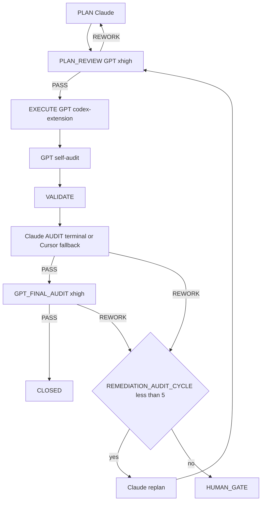

=== Auto-audit GPT (2e passe) ===
OpenAI Codex v0.124.0 (research preview)
--------
workdir: /Users/1millnonstop/Downloads/projet/foodking-web/web/testttt
model: gpt-5.5
provider: openai
approval: never
sandbox: workspace-write [workdir, /tmp, $TMPDIR, /Users/1millnonstop/.codex/memories]
reasoning effort: xhigh
reasoning summaries: none
session id: 019deac2-e122-7c41-ae96-dc3c68b59e43
--------
user
Tu effectues l’**auto-audit GPT** (2e passe) d’un cycle FoodKing — **pas** l’audit Claude terminal.

**Contexte** : le JSON ci-dessous est la proposition d’implémentation (format agents/codex.prompt.txt) pour la mission `CV1-WC-T-WC-EDITOR-01`.


**JSON d’implémentation (à recouper)** :
```json
{
  "files_to_modify": [
    "resources/js/components/admin/items/composer/ProductComposerEditorComponent.vue",
    "resources/js/components/admin/items/composer/ComposerTemplatePickerModal.vue",
    "resources/js/components/admin/items/composer/ComposerStepListSidebar.vue",
    "resources/js/components/admin/items/composer/ComposerStepFormPanel.vue",
    "tests/js/composerEditorV2.spec.js",
    "lang/fr/all.php",
    "lang/en/all.php",
    "lang/de/all.php",
    "lang/ar/all.php",
    "lang/bn/all.php",
    "resources/js/languages/fr.json",
    "resources/js/languages/en.json",
    "resources/js/languages/de.json",
    "resources/js/languages/ar.json",
    "resources/js/languages/bn.json",
    "reports/post_execute_latest.log"
  ],
  "implementation_steps": [
    "Rewrote ProductComposerEditorComponent.vue into product header, template picker entry, draggable steps sidebar, central step form, live POS/Kiosk preview, bottom draft/publish actions, and publish/delete confirmation modals.",
    "Added ComposerTemplatePickerModal.vue with the seven authorized templates and select(template) emission.",
    "Added ComposerStepListSidebar.vue using vue-draggable-next and emitting reorder/remove/select events.",
    "Added ComposerStepFormPanel.vue with labeled source_type/source_ref picker, min/max sliders, POS/Kiosk visibility checkboxes, and active toggle.",
    "Verified StepEditorComponent.vue already has the T-WC-SOURCE-PICKER-01 availableSources prop/signature; no patch was needed.",
    "Added composerEditorV2.spec.js with 8 Vitest sentinels covering header, profile steps, reorder PATCH, add page, delete confirmation, template apply, source picker, and publish confirmation.",
    "Added label.composer.* and message.composer.* i18n keys in PHP and JSON locales for fr/en/de/ar/bn.",
    "Appended EXECUTE trace to reports/post_execute_latest.log."
  ],
  "code_blocks": [
    {
      "path": "resources/js/components/admin/items/composer/ProductComposerEditorComponent.vue",
      "op": "replace",
      "excerpt": "Full rewrite implemented: loads item context, profile, available sources, and branches; renders product header, branch scope selector, template modal trigger, draggable sidebar, form panel, ItemPreviewComponent live preview, save draft, publish confirmation, delete confirmation, template apply, step reorder PATCH, step DELETE, and profile create/update/publish calls."
    },
    {
      "path": "resources/js/components/admin/items/composer/ComposerTemplatePickerModal.vue",
      "op": "create",
      "excerpt": "New modal component listing simple/sandwich/tacos/assiette/snacking/menu/custom templates and emitting select(template_key) or close."
    },
    {
      "path": "resources/js/components/admin/items/composer/ComposerStepListSidebar.vue",
      "op": "create",
      "excerpt": "New vue-draggable-next sidebar component with step rows, drag handle, source label, min/max badge, POS/Kiosk visibility badges, select/remove/reorder events."
    },
    {
      "path": "resources/js/components/admin/items/composer/ComposerStepFormPanel.vue",
      "op": "create",
      "excerpt": "New central form component for label, source_type, source_ref select from available sources, min/max range sliders, visible_on POS/Kiosk checkboxes, and is_active toggle."
    },
    {
      "path": "tests/js/composerEditorV2.spec.js",
      "op": "create",
      "excerpt": "Added 8 Vitest sentinels for the C.3 editor acceptance cases."
    },
    {
      "path": "lang/{fr,en,de,ar,bn}/all.php + resources/js/languages/{fr,en,de,ar,bn}.json",
      "op": "replace",
      "excerpt": "Added 15+ composer labels/messages per locale under label.composer.* and message.composer.*."
    },
    {
      "path": "reports/post_execute_latest.log",
      "op": "replace",
      "excerpt": "Appended EXECUTE trace with delegation, files touched, validation results, gap closed, plan-drift note, and commit blocker."
    }
  ],
  "risks": [
    "ESCALATION: single commit could not be created because the sandbox forbids writes under .git; git add failed creating .git/index.lock with Operation not permitted.",
    "Plan drift noted: task text named GET /admin/item/{id}, but the landed code/routes use GET /admin/item/show/{id}; the implementation uses the existing route."
  ],
  "notes": [
    "Validation PASS: node parser sanity for ProductComposerEditorComponent.vue.",
    "Validation PASS: npx vitest run tests/js/composerEditorV2.spec.js -> 8/8.",
    "Validation PASS: npx vitest run tests/js/productComposerEditor.spec.js tests/js/composerEditorV2.spec.js -> 15/15.",
    "Validation PASS: npx vitest run tests/js/ 2>&1 | tail -8 -> 157 files, 1023 passed, 2 skipped.",
    "Validation PASS: PHP locale syntax and JSON locale parse.",
    "No backend files, frozen zones, pricing logic, OrderService, or FrontendOrderService were modified."
  ],
  "execution_trace": {
    "delegation": "codex-extension",
    "invariants_considered": [
      "pricing_ssot",
      "branch_id"
    ]
  }
}
```

**Livrable** (Markdown uniquement, en français) :
# AUTO_AUDIT_GPT — CV1-WC-T-WC-EDITOR-01

## 1. Conformité au plan / scope
(Énumérer manques ou dérives ; si scope élargi sans escale → **ESCALATE**)

## 2. Invariants FoodKing
Pour chacun : OK / RISQUE / N/A
- pricing_ssot (backend seul)
- order_status (enum, pas de strings)
- branch_id
- commit_before_dispatch
- frozen_zones
- order_service_symmetry (si un des deux services touché)

## 3. Verdict
Une ligne : `VERDICT: PASS` | `VERDICT: NEEDS_FIX` | `VERDICT: ESCALATE` + 1–3 phrases.

codex
Je vais recouper la proposition avec le plan actif, les fichiers mission éventuels et l’état réel des fichiers modifiés, puis rendre uniquement l’auto-audit demandé.
exec
/bin/zsh -lc "sed -n '1,220p' .cursor/ACTIVE_CYCLE.md" in /Users/1millnonstop/Downloads/projet/foodking-web/web/testttt
exec
/bin/zsh -lc "sed -n '1,220p' docs/orchestration/GLOBAL_SYSTEM_PRIMER.md" in /Users/1millnonstop/Downloads/projet/foodking-web/web/testttt
exec
/bin/zsh -lc "sed -n '1,220p' docs/orchestration/MEMORY_MATRIX.md" in /Users/1millnonstop/Downloads/projet/foodking-web/web/testttt
 succeeded in 0ms:
# Active Cycle – FoodKing

**Méta (SSOT `run-cycle.md` Step 0 + `AGENTS.md` § *Authoritative … cycle state*)** — requis pour que l’orchestrateur ne s’arrête pas sur *« RUNNER_MODE not set »*.

| Champ | Valeur actuelle |
| --- | --- |
| **RUNNER_MODE** | `single-session` |
| **PHASE** | `PLAN` (Phase 1 audits parallèles en cours) |
| **TASK_ID** | `CV1-V1-CLOSEOUT-001` (Master orchestration V1 close-out — 5 audits parallèles + synthèse + cleanup + refonte dashboard + roadmap wizard) |
| **PLAN_FILE** | `plans/PLAN_CV1-V1-CLOSEOUT-MASTER-2026-05-02.md` |
| **EXECUTION_TIER** | mixed (audits read-only via `explore` × 5 ; cleanup routine via Composer ; gates écrits par orchestrator) |
| **EXECUTE_DELEGATION** | déterminé par tâche issue de la synthèse Phase 2 |
| **REPORT_FILE** | `reports/post_execute_latest.log` (append — preuve `EXECUTE_DELEGATION` / `AUDIT_*`) |
| **MULTI_AGENT_LOOP** | `docs/orchestration/MULTI_AGENT_LOOP_2026-05-02.md` (SSOT du pivot 2026-05-02) |
| **PARENT_CYCLE** | `CV1-LIFECYCLE-UX-001` V2 closed (6 PASS + 2 gates pending). Cleanup demandé par user pour livrer V1 fonctionnelle propre. |

> **ACTIVE_PRIMARY** : `CAISSE_V1_MASTERPLAY` (un seul cycle peut être actif à la fois — voir B03 méga-checklist).
> Cycles plus anciens en lecture seule = **archive** déplacée dans **`.cursor/ACTIVE_CYCLE_ARCHIVE.md`** (lecture humaine / forensique uniquement, **non requise** par le parcours obligatoire).

## CYCLE_W10_EXECUTION_CLOSEOUT (READ_ONLY_SECONDARY — mémoire 180 + MCP global + commit + CI + prod)

**TASK_ID** : `P_EXEC_CLOSEOUT_GRAPHITI_CI_PROD_2026-04-22`  
**Plan SSOT** : `plans/PLAN_EXECUTION_CLOSEOUT_GRAPHITI_CI_PROD_2026-04-22.md`  
**Ordre** : Piste A (POS+Centrale : PLAN-MEM-1) ∥ Piste B (humain : PLAN-MEM-3) → C (smoke) → D (commit sur « go commit ») → E (CI) → F (prod J-7→J+7).  
**Gate mémoire** : `python3 memory/verify.py` → count **≥ 175** (180 idéal) avant de considérer PLAN-MEM-1 **CLOSED**.

- **Vérif locale (2026-04-22)** : `python3 memory/verify.py` → **count = 182**, smoke `search_memory_facts` OK — gate **satisfaite** pour clôturer l'ingestion côté seuil d'épisodes (suite : commit / CI / prod selon plan `PLAN_EXECUTION_CLOSEOUT_*`).

**Gouvernance globale (2e passe 2026-04-22)** : primer multi-agents + Graphiti vivant + tokens « zéro effet négatif » → **`docs/orchestration/GLOBAL_SYSTEM_PRIMER.md`** + rapport **`reports/audit/AUDIT_SECOND_PASS_GLOBAL_GOVERNANCE_REPORT_2026-04-22.md`**.

**Statut Train A 2026-04-26** : W10 n'est plus primaire pendant la préparation release Caisse V1. Toute reprise W10 doit créer un cycle dédié ou repasser par une décision humaine.

---

## CAISSE_V1_MASTERPLAY (ACTIVE_PRIMARY — 2026-04-25 → Train A 2026-04-27)

**Phase** : finition Caisse V1 (POS + Kiosk + KDS + Centrale + Fiscal + Ops).
**Plan parent** : `plans/PLAN_CAISSE_V1_GPT_MASTERPLAY_2026-04-25.md`
**Plan DAG autoritaire** : `plans/PLAN_CAISSE_V1_SUPER_MASTER_2026-04-25.md`
**Boucle d'exécution** : `plans/masterplay/MASTERPLAY_DISCIPLINE.md` + `plans/masterplay/MASTERPLAY_QUEUE.md` + `scripts/run-masterplay.sh`
**Statut temps réel** : `reports/masterplay/status.json`
**Train A V1** : `reports/audit/PHASE2_PLAN_TRAINS_REWORKED_2026-04-27.md`
**Gates humaines Train A** : `docs/gates/GATE_PHASE2_TRAIN_A_HUMAN_DECISIONS_2026-04-26.md`
**Manifeste Phase A ciblée** : `docs/PHASE_A_CLOSED.md`

**Règle** : tout `TASK_ID` au format `CV1-MXX-…` passe par la masterplay (cf. `AGENTS.md` § "Caisse V1 — Masterplay loop", `.cursor/rules/global.mdc` § "Caisse V1 — Masterplay loop", `.cursor/commands/run-cycle.md` Step 0 item 0). **NE PAS** ouvrir un `run-cycle` standard sur un `CV1-MXX-…`.

**Règle Train A** : A.1/A.2/A.3 sont de la persistance/gouvernance release. D-M13 reste bloqué tant que la migration unique `(branch_id, queue_number)` n'a pas reçu son signoff humain final.

---

## Archive

Tous les cycles **CLOSED / COMPLETED PASSED** (W4 → W9, NF525, etc.) ont été déplacés dans **`.cursor/ACTIVE_CYCLE_ARCHIVE.md`** pour réduire le coût de lecture du parcours obligatoire (audit 2026-04-24, mission `T-PARCOURS-OPTIMIZE-001`).

- **Lecture humaine** : ouvrir `.cursor/ACTIVE_CYCLE_ARCHIVE.md`.
- **Lecture agent** : **non requise** sauf instruction explicite du plan ou du chat (ex. "reprend le rationale du cycle W9").
- **Recherche** : `rg "CYCLE_W9_" .cursor/ACTIVE_CYCLE_ARCHIVE.md` ou `git log --follow .cursor/ACTIVE_CYCLE.md`.

 succeeded in 0ms:
# Matrice mémoire FoodKing — qui écrit quoi, qui lit quoi, quand

> **But** : une seule page, lue par **tout agent / humain / nouvelle session** avant d'écrire ou de lire de la "mémoire". Évite la double source, le doc-mort, l'oubli d'ingestion.
>
> **Règle d'or** : *un type de fait → un seul propriétaire de store*. Si le fait existe ailleurs, c'est un **miroir** (lecture), pas une vérité.

---

## 1. Les 4 stores autorisés (et **rien d'autre**)

| # | Store | Format / lieu | Propriétaire | Vérité pour… |
|---|-------|---------------|--------------|--------------|
| **A** | **Code + tests** | git (`app/`, `resources/`, `tests/`) | Le dépôt | **Comportement réel** (la seule vérité absolue). Si Graphiti dit X et le code fait Y → le code gagne, Graphiti a un drift. |
| **B** | **Graphiti** (Neo4j via MCP) + miroir local **`memory/episodes/*.jsonl`** | `.cursor/mcp/graphiti.json` + `bin/graphiti-ingest.sh` | Phase **AUDIT** (humain ou Claude) | **Décisions durables, invariants, ADR, gates, liens entités** *cross-cycle* |
| **C** | **Mission de tâche** | `missions/<TASK_ID>/{input.json, graphiti_context.md, plan_excerpt.md, execute_brief.md, output_codex.json}` | Phase **PLAN + EXECUTE** | **Contexte d'une tâche unique** : ce qui entre dans `codex-terminal`, ce qui en sort. Éphémère par cycle. |
| **D** | **Rapports & cycle** | `plans/PLAN_*.md`, `reports/execution/RUN_*.md`, `reports/post_execute_latest.log`, `.cursor/ACTIVE_CYCLE.md`, `docs/gates/`, **`reports/AGENT_ACTIVITY_LOG.md`** (cross-agent sync) | Phases **PLAN, EXECUTE, VALIDATE, AUDIT** | **Trace procédurale et preuve d'audit** : qui a fait quoi, quand, avec quel résultat (`EXECUTE_DELEGATION`, `AUDIT_VERDICT`), **+ qui réserve quels fichiers en parallèle** (voir `.cursor/rules/cross-agent-sync.mdc`) |

**Aucun autre store** n'est autorisé sans gate. Pas d'OpenSpace, pas de claude-mem, pas de Notion sauvage. Si un besoin nouveau apparaît, il doit s'inscrire dans **A, B, C ou D** ou ouvrir un gate dans `docs/gates/` avec justification.

---

## 2. Écriture et lecture — une seule table + ordre session (compact)

### 2.1 Écriture par phase du cycle

| Phase | Store A (code) | Store B (Graphiti / JSONL) | Store C (missions) | Store D (rapports / cycle) |
|------|----------------|----------------------------|---------------------|----------------------------|
| **PLAN** | — | *Lecture seule* (`search_memory_facts`) | crée `missions/<TASK>/graphiti_context.md` + `plan_excerpt.md` | crée `plans/PLAN_*.md`, met à jour `ACTIVE_CYCLE.md` PHASE→EXECUTE |
| **PLAN_REVIEW (`codex-extension`)** | — | — | lit `plan_excerpt.md` si présent | `GPT_PLAN_REVIEW_<TASK>.md` + `PLAN_REVIEW_VERDICT` |
| **EXECUTE (`codex-extension`)** | écrit (`output_codex.json`) | — | `output_codex.json` | `EXECUTE_DELEGATION:` dans `post_execute_latest.log` / `REPORT_FILE` |
| **EXECUTE fallback** | écrit | — | — | `EXECUTE_DELEGATION: … (codex-extension-fallback)` + `FALLBACK_REASON:` |
| **VALIDATE** | — | — | — | résultats tests dans `REPORT_FILE` + `post_execute_latest.log` |
| **AUDIT Claude** | — | JSONL si décision durable | — | `AUDIT_VERDICT`, `REMEDIATION_AUDIT_CYCLE`, `AUDIT_CHANNEL` |
| **GPT_FINAL_AUDIT** | — | — | lit mission + rapports | `GPT_FINAL_AUDIT_<TASK>.md` + verdict |
| **CLOSE** | — | `after-execute-memory.sh` si JSONL touché | — | `## Final report` dans `REPORT_FILE` |
| **GATE** | — | — | — | `docs/gates/GATE_<TASK>_<DATE>.md` |

> **Anti-doublon** : décision durable AUDIT → **B** (JSONL + ingest) ; **D** résume en une ligne avec référence épisode.

### 2.2 Lecture selon la question (pas de parcours « tout ouvrir »)

| Question | Lire d'abord | Puis si besoin |
|----------|--------------|----------------|
| Règle métier X | **A** puis **B** (`search_memory_facts`) | docs canoniques |
| Pourquoi cette décision | **B** (`12_decisions_log.jsonl` ou Graphiti) | `docs/gates/` |
| Cycle précédent | **D** (`ACTIVE_CYCLE.md`, dernier `RUN_*.md`) | **C** |
| Livrable tâche | **D** (`plans/PLAN_<TASK>_*.md`) | **C** `input.json` |
| Sortie Codex | **C** `output_codex.json` | **D** logs + `GPT_SELF_AUDIT_*` |
| Invariant qui bloque | **B** `02_architecture_invariants.jsonl` + `project-invariants.mdc` | **A** |
| Dernier audit | **D** `AUDIT_VERDICT` + `AUDIT_CHANNEL` | — |

**Ordre minimal nouvelle session** : `AGENTS.md` → `GLOBAL_SYSTEM_PRIMER.md` → ce fichier → `ACTIVE_CYCLE.md` → `PLAN_FILE` → Graphiti **si MCP** sinon `memory/INDEX.md` + ≤3 JSONL du domaine.

---

## 3. Décisions sur les outils tiers évalués (2026-04-23)

| Outil | Verdict | Pourquoi |
|-------|---------|----------|
| **Graphiti** (Zep) | **GARDÉ** = store B officiel | Déjà intégré, MCP, group `foodking`, `add_memory`/`search_memory_facts`, fallback JSONL. Aucun remplaçant équivalent pour la mémoire métier *graphée*. |
| [HKUDS/OpenSpace](https://github.com/HKUDS/OpenSpace) | **NON intégré** (réévaluer si besoin réel apparaît) | Cible *skills auto-évolutives*, pas la mémoire métier. Empile Python + DB + cloud. **N'écrit dans aucun de nos 4 stores**. À reconsidérer seulement si on identifie une famille de tâches répétitives sur lesquelles les *patterns d'exécution* (≠ décisions) coûtent vraiment. |
| [thedotmack/claude-mem](https://github.com/thedotmack/claude-mem) | **NON intégré** | Cible la continuité *intra-session Claude Code* ; nous, on travaille majoritairement dans Cursor + `codex-terminal` + `claude` terminal **non interactif** (audit). Aussi **AGPL-3.0** : redéploiement ou exposition réseau impose ouverture de la source. Si un jour l'usage devient majoritairement Claude Code interactif, à réévaluer alors. |

**Comment ces décisions sont enforced ?** En présence de l'une de ces stacks dans le repo, l'auditeur (humain ou Claude terminal) doit ouvrir un `docs/gates/` car ça change la matrice.

---

## 4. Anti-patterns (à refuser en review)

- ❌ Coller un résumé de chat dans `reports/` "pour mémoire" → c'est un **pseudo-store**. Si c'est important : 1 ligne JSONL dans **B** + référence dans **D**.
- ❌ Stocker une décision dans un commit message uniquement → invisible à `search_memory_facts`.
- ❌ Mettre la sortie `codex-extension` ailleurs que dans `missions/<TASK>/output_codex.json` (ou hors dépôt) sans traçage **D**.
- ❌ Ajouter un nouveau dossier "doc/" parallèle à `docs/orchestration/` → consolider ici.
- ❌ Écrire dans Graphiti **pendant** PLAN ou EXECUTE (ça pollue les faits avec des hypothèses non auditées) — Graphiti = phase AUDIT/CLOSE.
- ❌ Lire `reports/` antérieurs à 30 jours sans passer par Graphiti d'abord (token waste, et Graphiti **est** le résumé canonique).

---

## 5. Comment cette matrice s'auto-applique

- **Référencée depuis** : `AGENTS.md` (§ MCP/store discipline), `.cursor/commands/run-cycle.md` (Step 0 et Step 5), `docs/orchestration/GLOBAL_SYSTEM_PRIMER.md` (§ ordre de lecture).
- **Maintenue par** : la phase AUDIT. Toute proposition d'ajouter un store passe par un **gate** (`docs/gates/GATE_MEMORY_*`).
- **Vérifiable** : `bash scripts/after-execute-memory.sh` confirme la cohérence JSONL ↔ manifeste ; un nouveau store apparaîtrait comme un fichier non listé ici.

---

**TL;DR pour une nouvelle session** :
*Code = vérité. Graphiti = pourquoi. Missions = ce que la tâche fait. Rapports = preuve. Rien d'autre.*

Date : 2026-05-02 (§2 fusion lecture/écriture ; numérotation ajustée)

 succeeded in 0ms:
# FoodKing — Primer système global (agents, sous-agents, Graphiti, tokens)

> **Passation + index complet des chemins (SSOT, un seul fichier)** : **`../DOC_EXPO_HER_ANCIEN_AGENT_ALIMENTATION_WORKFLOW_2026-04-22.md`** (table §2 = utilité de chaque path pour une nouvelle session).

> **Fichier d’entrée** pour toute nouvelle conversation, tout nouvel outil d’agent (Cursor, terminal, futur bot), ou tout humain qui reprend le projet.  
> Objectif : **robustesse** = même avec 100 cycles et des exécuteurs différents, le comportement reste **prévisible**, **traçable**, et la **mémoire** reste **alignée** sur le code.

**Obligatoire avant ce Primer (SSOT d’onboarding)** : lire `**AGENTS.md`**, section **Parcours obligatoire** (nouvelle session **et** continuation), puis enchaîner ici.  
**En continuation d’un cycle** : lire d’**abord** `**.cursor/ACTIVE_CYCLE.md`** (éviter un second `TASK_ID` fantôme) ; si `PHASE` = vide ou `CLOSED`, revenir à la table ci-dessous.

---

## 1. Ordre de lecture obligatoire (minimum viable)

Lire **dans cet ordre** avant d’écrire du code ou un plan non trivial (voir aussi `**AGENTS.md` § *Parcours obligatoire* — tableau** pour la même doctrine) :


| #   | Fichier                                                    | Pourquoi                                                                                                                  |
| --- | ---------------------------------------------------------- | ------------------------------------------------------------------------------------------------------------------------- |
| 0   | `**.cursor/ACTIVE_CYCLE.md`** (si reprise)                 | Cycle déjà en cours : même `TASK_ID` / mêmes Steps **jusqu’à** `CLOSE` — **ne pas** forker un plan parallèle sans le dire |
| 1   | `**AGENTS.md`** (dont § *Parcours obligatoire*)            | Contrat global : phases, routing, MCP, terminal, parcours production, non-négociables                                     |
| 1b  | `**docs/orchestration/SESSION_OPENING_ENFORCEMENT.md**`  | **Bloc unique** (tail log + `verify:boucle` + rappel phases) — réduit la répétition « refais la boucle » en session ; **modèle Cursor = Claude pour PLAN** (Auto/Composer ne remplacent pas `routing.md`) |
| 1c  | `**reports/audit/SIMULATION_PARCOURS_PROD_CHECKPOINTS_2026-04-25.md**` | **Simulation production** : checkpoints par phase, fichiers SSOT, limite IDE (qui orchestre quoi) — avant de promettre « zéro dérive » |
| 2   | `**.cursor/routing.md*`*                                   | Qui fait quoi (Claude plan/audit, GPT-5.5-pro xhigh plan review / execute / final audit, Composer validation only)         |
| 3   | `**.cursor/commands/run-cycle.md**`                        | Déroulé exact d’un cycle `TASK_ID` (incl. Graphiti Step 0.5)                                                              |
| 4   | `**.cursor/rules/graphiti-memory.mdc**`                    | Mémoire Graphiti : quand lire / quand écrire                                                                              |
| 5   | `**.cursor/rules/global.mdc**` + `**context-hygiene.mdc**` | Gates, discipline tokens **sans** réduire l’intelligence                                                                  |
| 6   | `**docs/orchestration/MEMORY_MATRIX.md`**                  | **Quel store écrit quoi, lit quoi, quand** (4 stores autorisés A/B/C/D) — antidote unique à la complexité mémoire         |
| 6b  | `**docs/orchestration/MULTI_AGENT_ORCHESTRATION.md`**      | Même tâches, plusieurs onglets Cursor : **activité** + **Graphiti** (lecture) + `AUDIT_VERDICT` — sans empiéter           |
| 7   | `**memory/INDEX.md`**                                      | Carte des domaines mémoire Graphiti (store B) — secours si MCP absent                                                     |
| 8   | `**tasks/[TASK_ID].md**`                                   | Quand un cycle borné est lancé — périmètre de la tâche                                                                    |


Ensuite, **selon le domaine** : `docs/ORDER_FLOW.md`, `docs/DEVICE_FLOW.md`, `docs/ARCHITECTURE.md`, `project-invariants.mdc`, etc.

Référence roster court : `**docs/orchestration/AGENT_ROLES.md`**.

### 1.1 Décision : Claude orchestre ; GPT challenge et exécute en xhigh

- **Cerveau** (priorité, plan, re-plan, gates) : **Claude** (session + terminal `foodking-claude-orchestrate.sh`) — il écrit le plan et tranche la stratégie de remédiation.
- **Challenge plan obligatoire** : **GPT-5.5-pro / xhigh** relit le plan avant EXECUTE (`npm run codex:plan-review -- {TASK_ID}` → `PLAN_REVIEW_VERDICT`). Si `REWORK`, Claude révise avant tout code.
- **Bras + premier contrôle qualité** : **EXECUTE = Codex (PRIMARY)** pour toutes les implémentations produit, même les petites corrections : `npm run codex:complex -- {TASK_ID}` → `reports/audit/GPT_SELF_AUDIT_{TASK_ID}.md`.
- **Pas de routine product implementation** : Composer / `foodking-routine-implementer` ne fait plus d’édition produit en cycle de finition ; il peut aider au reporting/validation seulement.
- **Double audit final** : Claude audit d’abord (`AUDIT_VERDICT`) avec terminal primary + fallback Cursor si quota/rate-limit/terminal HS, puis GPT final audit (`npm run codex:final-audit -- {TASK_ID}` → `GPT_FINAL_AUDIT_VERDICT`). Close seulement si les deux sont `PASS`.

---

## 2. Sous-agents Cursor (Task tool) — intégration dans le flux

Ce ne sont **pas** des fichiers dans le repo ; ce sont des **profils** invoqués par Cursor selon `.cursor/routing.md` et `**run-cycle.md` Step 2**.


| Sub-agent / Canal                                                               | Modèle cible                                                                  | Quand                                                                                                                                                                                                                                          |
| ------------------------------------------------------------------------------- | ----------------------------------------------------------------------------- | ---------------------------------------------------------------------------------------------------------------------------------------------------------------------------------------------------------------------------------------------- |
| `**foodking-routine-implementer`** (sub-agent Cursor)                           | Composer                                                                      | **Validation/report only** en cycles de finition. Pas d’implémentation produit.                                                                                                                                             |
| `**codex-extension` — FoodKing Codex Complex Implementer (PRIMARY)**            | **GPT-5.5-pro / xhigh** via CLI `codex` (compte **ChatGPT Pro**) + `codex exec` | **PLAN_REVIEW + toute implémentation produit + auto-audit + GPT_FINAL_AUDIT**. `npm run codex:complex -- {TASK_ID}`. Voir `scripts/codex-extension-execute.sh`, `agents/codex-extension-instructions.md`. |
| `**foodking-complex-implementer`** (sub-agent Cursor — **FALLBACK uniquement**) | Aligné exécution **GPT-5.5** (emplacement sub-agent)                          | Uniquement si `codex` / `codex exec` est indisponible après reprises sur la même tâche                                                                                                                                                         |


**Règles d'or**

1. **Délégation obligatoire** pour toute modification produit en EXECUTE, avec trace `EXECUTE_DELEGATION:` dans le log de validation. Valeurs autorisées : `codex-extension` | `foodking-complex-implementer (codex-extension-fallback)` | `explicit-prompt-bind`.
2. **EXECUTE = `codex-extension` PRIMAIRE** (CLI `codex` + Pro, `npm run codex:complex -- {TASK_ID}` ; contexte Graphiti/plan dans `missions/…/graphiti_context.md` etc. ; voir `**docs/orchestration/CODEX_API_DELEGATION.md`**). Le sub-agent `foodking-complex-implementer` est le **fallback** (usage Cursor) — indispo `codex exec`. Aucun **connecteur HTTP** / proxy n’est maintenu dans le dépôt.
3. Le sous-agent **ne voit pas toujours** le MCP Graphiti du parent : le plan **doit** contenir `**## PRIOR_CONTEXT`** (faits Graphiti + invariants) — copier ou résumer dans le message de délégation **ou** dans `missions/{TASK_ID}/graphiti_context.md` pour l’appel API.
4. Aucun sub-agent ne **contourne** un gate humain ni n’édite une frozen zone sans `docs/gates/` approuvé.

---

## 3. Terminal allies (hors Task tool) — intégration

Documentés dans `**AGENTS.md` § Terminal allies** :


| Outil                                                                  | Rôle                                                                     | Position + **canal d’abonnement** (SSOT)                                                                                                                                                                                         |
| ---------------------------------------------------------------------- | ------------------------------------------------------------------------ | -------------------------------------------------------------------------------------------------------------------------------------------------------------------------------------------------------------------------------- |
| `**claude` +** `foodking-claude-orchestrate.sh`                        | **AUDIT cycle — PRIMARY (Step 5)** : `context` → `audit` / `audit-brief` | Abonnement **Anthropic (CLI sur terminal)** ; n’**emprunte** pas l’orchestrateur de modèles de Cursor. **FALLBACK actif** (quota / limite / panne après 1 retry) : Task **`foodking-planner-orchestrator`** + même checklist + `AUDIT_CHANNEL: cursor-session` + `AUDIT_FALLBACK_REASON:` — `docs/orchestration/AUDIT_TERMINAL_QUOTA_FALLBACK.md`. |
| **CLI** `codex` + `npm run codex:complex` (`**codex-extension`**, Pro) | **PLAN_REVIEW + EXECUTE + GPT_FINAL_AUDIT — PRIMARY** (GPT-5.5-pro/xhigh) | Compte **ChatGPT Pro** sur le terminal ; ne passe **pas** par l’orchestrateur de modèles **Cursor** ; facturation côté OpenAI ; **FALLBACK** = sub-agent.     |
| `codex` / REPL interactif (OpenAI)                                     | Tâches ad hoc **hors** cycle, ou côté humain                             | N’enlèvent **pas** VALIDATE + AUDIT du `run-cycle`.                                                                                                                                                                              |
| `verify-orchestration-boucle.sh`                                       | Preuve binaire + optionnel smoke (API)                                   | `bash scripts/verify-orchestration-boucle.sh` — `VERIFY_BILLING_FULL=1` lance 1× smoke `claude` + 1× `npm run codex:smoke`.                                                                                                      |


**Clôture :** l’audit Claude écrit `AUDIT_VERDICT: PASS` ou `REWORK`, puis GPT écrit `GPT_FINAL_AUDIT_VERDICT: PASS|REWORK|ESCALATE` (voir `run-cycle.md` Step 5). Pas de `CLOSED` sans double `PASS`. En `REWORK` : re-orchestration + re-EXECUTE GPT jusqu’à double `PASS` ou 5e tour → humain. Schéma :




Le terminal **n’enregistre** pas **Graphiti** seul : après AUDIT/CLOSE, décisions → JSONL + `after-execute-memory.sh` (voir §5) comme avant.

---

## 4. Graphiti — vivre avec l’avancement du projet (N agents, N cycles)

### 4.1 Rôles


| Rôle                                    | Responsable                                                          |
| --------------------------------------- | -------------------------------------------------------------------- |
| **Lecture** avant plan / audit complexe | Tout agent avec MCP `graphiti` chargé                                |
| **Écriture** après décision durable     | Phase AUDIT + CLOSED (`audit-context.md`) ou humain via `add_memory` |
| **Alimentation batch** (JSONL → Neo4j)  | Humain ou pipeline : `bash bin/graphiti-ingest.sh`                   |


### 4.2 Quand mettre à jour la mémoire (checklist — « ne pas oublier »)

Cocher mentalement à **chaque** fin de sujet significatif :

- **Invariant** clarifié ou renforcé → nouvelle ligne dans `memory/episodes/02_architecture_invariants.jsonl` (ou fichier le plus proche) + `ingest` ciblé.
- **Sync / event / canal** modifié → `03_domain_events_sync.jsonl` + ingest.
- **Décision produit / ADR** → `12_decisions_log.jsonl` + ingest.
- **Nouvelle tâche V14+** ou finding cross-vagues → `09_tasks_history.jsonl` + ingest.
- **Changement prod / rollout** → `11_production_plan.jsonl` + ingest.
- **Nouveau rôle agent ou règle d’orchestration** → `13_agents_roles.jsonl` + ingest + **mettre à jour ce Primer** si le modèle change.
- **Audit long (ops + agentique + mémoire)** → suivre `docs/orchestration/MEGA_CHECKLIST_AUTONOMY_AND_MEMORY.md` (180 tâches) ; narratif `reports/audit/MEGA_AUDIT_SYSTEM_OPERATION_AGENTIC_2026-04-23.md`.
- **Après toute écriture JSONL** → `bash scripts/after-execute-memory.sh` (rafraîchit `reports/memory/jsonl_manifest.json`, cohérent avec CI) puis `bin/graphiti-ingest.sh` sur les domaines touchés.

**Règle d’or** : si le code ou la doc **canonical** a changé et que la mémoire dit encore l’ancienne vérité → **mise à jour sous 48 h** (sinon dérive silencieuse).

### 4.3 Outils

- Pipeline post-écriture (manifeste + rappel ingest) : `bash scripts/after-execute-memory.sh`.
- Ingestion : `bin/graphiti-ingest.sh [filtre]` — voir `memory/README.md`.
- Vérification : `python3 memory/verify.py`.
- Terminal (bref + audit option) : `bash scripts/foodking-claude-orchestrate.sh post-execute` ou `context` puis `audit-brief` — `docs/orchestration/TERMINAL_CLAUDE_GRAPHITI_ORCHESTRATION.md`.
- Reset rare : `@graphiti clear_graph` puis full ingest (politique humaine).

---

## 5. Tokens, contexte, cache — politique « intelligence max, gaspillage min »

**But** : réponses **détaillées et stables**, pas des réponses courtes pour économiser des tokens au détriment de la qualité.


| On optimise (effet ≥ 0)                                                              | On n’optimise pas (effet négatif interdit)                               |
| ------------------------------------------------------------------------------------ | ------------------------------------------------------------------------ |
| Re-lire un fichier **déjà** dans la fenêtre contexte                                 | Tronquer un plan, une analyse de risque, ou un gate pour « faire court » |
| Résumer une phase **terminée** pour handoff (voir `context-hygiene.mdc` §4)          | Supprimer `## PRIOR_CONTEXT` ou les invariants du plan                   |
| Utiliser **Graphiti** pour récupérer faits structurés au lieu de rouvrir 50 rapports | Désactiver Graphiti pour « aller plus vite » sur du sync / fiscal        |
| Écrire les preuves dans `reports/` structuré                                         | Remplacer des tests par de la prose vague                                |


**Cache applicatif** (Redis, etc.) : régie par le code Laravel et `**app:preflight-production`** — hors scope de ce Primer, mais **ne jamais** confondre « cache métier » et « mémoire Graphiti » : ce sont deux systèmes.

---

## 6. Révision de ce document

- **À chaque** changement majeur d’orchestration (nouveau sub-agent, nouveau MCP, nouveau cycle obligatoire) : mettre à jour **ce fichier** + une ligne dans `13_agents_roles.jsonl` + ingest.
- **Trimestriel** : relire §4.2 avec un lead dev.

---

## 7. Pointers rapides


| Besoin                                                        | Aller à                                                           |
| ------------------------------------------------------------- | ----------------------------------------------------------------- |
| Cycle complet                                                 | `.cursor/commands/run-cycle.md`                                   |
| Gates                                                         | `.cursor/rules/human-gates.mdc`                                   |
| Invariants code                                               | `.cursor/rules/project-invariants.mdc`                            |
| Mémoire locale                                                | `memory/INDEX.md`                                                 |
| Pannes Graphiti                                               | `.cursor/mcp/GRAPHITI_TROUBLESHOOTING.md`                         |
| Closeout prod + mémoire                                       | `plans/PLAN_EXECUTION_CLOSEOUT_GRAPHITI_CI_PROD_2026-04-22.md`    |
| Méga-checklist autonomie / Graphiti                           | `docs/orchestration/MEGA_CHECKLIST_AUTONOMY_AND_MEMORY.md`        |
| Méga-audit narratif (compagnon)                               | `reports/audit/MEGA_AUDIT_SYSTEM_OPERATION_AGENTIC_2026-04-23.md` |
| Audit graphique workflow                                      | `docs/orchestration/WORKFLOW_AUDIT_GRAPHIQUE_2026-04-23.md`       |
| Terminal Claude + Graphiti (rôles, `context` / `audit-brief`) | `docs/orchestration/TERMINAL_CLAUDE_GRAPHITI_ORCHESTRATION.md`    |
| Matrice routine / complexe (sub-agents)                       | `docs/orchestration/ROUTING_MATRIX.md`                            |

exec
/bin/zsh -lc 'bash scripts/agent-activity-log.sh tail 50' in /Users/1millnonstop/Downloads/projet/foodking-web/web/testttt
 succeeded in 0ms:
2026-05-02T19:55:29Z | AGENT=cursor-claude | CONV=pid8520 | TASK=CV1-V1-CLOSEOUT-001-task-LotC | PHASE=- | EVENT=done | SCOPE=- | NOTE=PASS — vitest 988/2
2026-05-02T19:55:29Z | AGENT=cursor-claude | CONV=pid8529 | TASK=CV1-V1-CLOSEOUT-001-T-DEEP-PROD-01 | PHASE=- | EVENT=done | SCOPE=- | NOTE=PASS — sentinel 3/3
2026-05-02T19:55:29Z | AGENT=cursor-claude | CONV=pid8539 | TASK=CV1-V1-CLOSEOUT-001-T-DEEP-CAT-01 | PHASE=- | EVENT=done | SCOPE=- | NOTE=PASS — sentinel 3/3
2026-05-02T19:55:58Z | AGENT=cursor-claude | CONV=pid22533 | TASK=CV1-V1-CLOSEOUT-001-T-CENT-AVAIL-DISPATCH-01 | PHASE=execute | EVENT=start | SCOPE=app/Services/Menu/AvailabilityService.php,tests/Feature/Menu/AvailabilityDispatchAfterCommitTest.php | NOTE=T-CENT-AVAIL-DISPATCH-01 fix dispatchEvent after-commit
2026-05-02T19:55:58Z | AGENT=cursor-claude | CONV=pid22585 | TASK=CV1-V1-CLOSEOUT-001-T-DEEP-AVAIL-API-01 | PHASE=execute | EVENT=start | SCOPE=app/Http/Controllers/Admin/AvailabilityController.php,routes/api.php,tests/Feature/Menu/SetMaxDailyQtyEndpointTest.php | NOTE=T-DEEP-AVAIL-API-01 endpoint admin setMaxDailyQty
2026-05-02T19:55:58Z | AGENT=cursor-claude | CONV=pid22643 | TASK=CV1-V1-CLOSEOUT-001-T-LOT-A-CACHE | PHASE=execute | EVENT=start | SCOPE=resources/js/components/admin/settings/MenuComponent.vue | NOTE=Lot A.2 — cacher 8 modules G2 du menu réglages admin
2026-05-02T20:03:58Z | AGENT=cursor-claude | CONV=pid50102 | TASK=CV1-V1-CLOSEOUT-001-T-CENT-AVAIL-DISPATCH-01 | PHASE=- | EVENT=done | SCOPE=- | NOTE=PASS — sentinel 3/3, invariant #4 fixed
2026-05-02T20:07:15Z | AGENT=cursor-claude | CONV=pid86207 | TASK=CV1-V1-CLOSEOUT-001-T-DEEP-AVAIL-API-01 | PHASE=- | EVENT=done | SCOPE=- | NOTE=PASS — sentinel 5/5, P0 gap fermé
2026-05-02T20:10:49Z | AGENT=cursor-claude | CONV=pid15358 | TASK=CV1-V1-CLOSEOUT-001-T-LOT-A-CACHE | PHASE=- | EVENT=done | SCOPE=- | NOTE=PASS — sentinel 4/4, 8 modules cachés
2026-05-02T20:17:59Z | AGENT=cursor-claude | CONV=pid35589 | TASK=CV1-V1-CLOSEOUT-001-T-CENT-DEDUP-AVAIL-01 | PHASE=execute | EVENT=start | SCOPE=app/Http/Controllers/Admin/AvailabilityController.php,tests/Feature/Menu/AvailabilityControllerDelegationTest.php | NOTE=T-CENT-DEDUP-AVAIL-01 délégation toggle Controller→Service
2026-05-02T20:21:07Z | AGENT=cursor-claude | CONV=pid36909 | TASK=CV1-V1-CLOSEOUT-001-T-CENT-POS-PROJ-01 | PHASE=execute | EVENT=start | SCOPE=app/Services/Menu/PosMenuProjection.php,app/Http/Controllers/Admin/PosCategoryController.php,tests/Feature/Menu/PosCategoryProjectionParityTest.php | NOTE=T-CENT-POS-PROJ-01 brancher controller sur projection unifiée
2026-05-02T20:23:43Z | AGENT=cursor-claude | CONV=pid51560 | TASK=CV1-V1-CLOSEOUT-001-T-CENT-POS-PROJ-01 | PHASE=- | EVENT=abandoned | SCOPE=- | NOTE=User pivot vers wizard composable admin UI — Codex Pro test différé
2026-05-02T20:28:29Z | AGENT=cursor-claude | CONV=pid82457 | TASK=CV1-V1-CLOSEOUT-001-T-CENT-DEDUP-AVAIL-01 | PHASE=- | EVENT=done | SCOPE=- | NOTE=PASS — sentinel 3/3, 204/29 no regression
2026-05-02T20:52:04Z | AGENT=cursor-claude | CONV=pid8845 | TASK=CV1-POS-DESIGN-CONVERGENCE-001 | PHASE=execute | EVENT=start | SCOPE=resources/css/foundations/pos-v5-tokens.css,resources/css/app.css,resources/css/pos-v5.css,resources/js/components/admin/pos/v5/ | NOTE=POS V5 design convergence — Phase 0 (tokens) + Phase 1 (primitives PosV5*)
2026-05-02T21:22:07Z | AGENT=cursor-claude | CONV=pid21424 | TASK=CV1-WC-T-WC-LIST-01 | PHASE=execute | EVENT=start | SCOPE=resources/js/components/admin/items/ItemListComponent.vue,tests/js/itemListWizardButton.spec.js | NOTE=T-WC-LIST-01 add wizard button + badge per row
2026-05-02T21:22:19Z | AGENT=cursor-claude | CONV=pid22708 | TASK=CV1-WC-T-WC-LIST-01 | PHASE=- | EVENT=abandoned | SCOPE=- | NOTE=fusionné avec T-WC-CREATE-URL-01 collision scope
2026-05-02T21:22:19Z | AGENT=cursor-claude | CONV=pid22717 | TASK=CV1-WC-T-WC-LIST-CREATE-COMBO | PHASE=execute | EVENT=start | SCOPE=resources/js/components/admin/items/ItemListComponent.vue,resources/js/router/modules/itemRoutes.js,tests/js/itemListWizardButton.spec.js | NOTE=T-WC-LIST-01 + T-WC-CREATE-URL-01 combo
2026-05-02T21:22:30Z | AGENT=cursor-claude | CONV=pid23675 | TASK=CV1-WC-T-WC-MENU-CATALOG-01 | PHASE=execute | EVENT=start | SCOPE=resources/js/components/layouts/backend/BackendMenuComponent.vue,resources/js/store/index.js,resources/js/store/modules/composer.js | NOTE=T-WC-MENU-CATALOG-01 sous-section Catalogue + cleanup composer Vuex
2026-05-02T21:26:35Z | AGENT=cursor-claude | CONV=pid47838 | TASK=CV1-WIZARD-COMPOSABLE-001/T-WC-PERM-01 | PHASE=execute | EVENT=start | SCOPE=resources/js/router/index.js,resources/js/languages/fr.json,resources/js/languages/en.json,resources/js/languages/ar.json,resources/js/languages/de.json,resources/js/languages/bn.json,tests/js/routerPermissionRequired.spec.js | NOTE=T-WC-PERM-01 router guard + i18n key permission_required
2026-05-02T21:27:09Z | AGENT=cursor-claude | CONV=pid50820 | TASK=CV1-WC-T-WC-MENU-CATALOG-01 | PHASE=- | EVENT=abandoned | SCOPE=- | NOTE=stale reservation from pid23675 (~2h ago); reclaiming for current session
2026-05-02T21:27:16Z | AGENT=cursor-claude | CONV=pid51472 | TASK=CV1-WC-T-WC-AFTER-CREATE-01 | PHASE=execute | EVENT=start | SCOPE=resources/js/components/admin/items/ItemCreateComponent.vue,tests/js/itemCreatePostSaveCTA.spec.js,lang/fr/all.php,lang/en/all.php,lang/de/all.php,lang/ar/all.php,lang/bn/all.php | NOTE=T-WC-AFTER-CREATE-01 — post-save CTA modal in ItemCreateComponent (PHP i18n only; JSON deferred — collision with T-WC-PERM-01)
2026-05-02T21:27:57Z | AGENT=cursor-claude | CONV=pid55044 | TASK=CV1-WIZARD-COMPOSABLE-001/T-WC-PERM-01 | PHASE=- | EVENT=abandoned | SCOPE=- | NOTE=stale reservation from pid47838 (~2h ago); PID dead, no work product (spec file absent, permission_required key not added); same-agent cleanup
2026-05-02T21:28:03Z | AGENT=cursor-claude | CONV=pid55618 | TASK=CV1-WC-T-WC-MENU-CATALOG-01 | PHASE=execute | EVENT=start | SCOPE=resources/js/components/layouts/backend/BackendMenuComponent.vue,resources/js/store/index.js,resources/js/store/modules/composer.js,resources/js/languages/fr.json,resources/js/languages/en.json,resources/js/languages/ar.json,resources/js/languages/de.json,resources/js/languages/bn.json | NOTE=T-WC-MENU-CATALOG-01 sous-section Catalogue (Items+Catégories+Attributs) + register composer Vuex + add menu.product_list i18n key
2026-05-02T21:29:52Z | AGENT=cursor-claude | CONV=pid76205 | TASK=CV1-WIZARD-COMPOSABLE-001/T-WC-PERM-01 | PHASE=- | EVENT=done | SCOPE=- | NOTE=router guard toast permission_required + i18n 5 locales + sentinel 9/9 + vitest 1001 OK
2026-05-02T21:31:11Z | AGENT=cursor-claude | CONV=pid86004 | TASK=CV1-WC-T-WC-MENU-CATALOG-01 | PHASE=- | EVENT=done | SCOPE=- | NOTE=PASS — vitest 1001/2 (no regression), v1HiddenMenuModules 4/4, commit 6c1b739c6 (7 files, +48/-1)
2026-05-02T21:31:31Z | AGENT=cursor-claude | CONV=pid87668 | TASK=CV1-WC-T-WC-PERM-01 | PHASE=- | EVENT=done | SCOPE=- | NOTE=PASS — 9/9 sentinel, 1001/2 no regression
2026-05-02T21:32:17Z | AGENT=cursor-claude | CONV=pid21815 | TASK=CV1-WC-T-WC-MENU-CATALOG-01 | PHASE=- | EVENT=done | SCOPE=- | NOTE=PASS — vitest 1001/2 no regression
2026-05-02T21:32:57Z | AGENT=cursor-claude | CONV=pid37640 | TASK=CV1-POS-DESIGN-CONVERGENCE-001 | PHASE=execute | EVENT=start | SCOPE=resources/js/components/admin/pos/ItemComponent.vue,resources/js/components/admin/pos/PaymentComponent.vue | NOTE=POS V5 — Phase 3 (Item modal + Payment)
2026-05-02T21:34:00Z | AGENT=cursor-claude | CONV=pid43339 | TASK=CV1-WC-T-WC-LIST-CREATE-COMBO | PHASE=- | EVENT=abandoned | SCOPE=- | NOTE=stale 5+ min, zero working-tree output (no diff on ItemListComponent.vue / itemRoutes.js, no tests/js/itemListWizardButton.spec.js); user re-routed via parallel sub-agent (this session) — same pattern as pid23675 -> pid50820 reclaim earlier in this run
2026-05-02T21:34:06Z | AGENT=cursor-claude | CONV=pid43971 | TASK=CV1-WC-T-WC-LIST-CREATE-COMBO | PHASE=execute | EVENT=start | SCOPE=resources/js/components/admin/items/ItemListComponent.vue,resources/js/router/modules/itemRoutes.js,tests/js/itemListWizardButton.spec.js | NOTE=T-WC-LIST-01 + T-WC-CREATE-URL-01 combo (fresh start after pid22717 stale-reclaim) — i18n JSON/PHP keys deferred (pid47838 + pid51472 active on lang files)
2026-05-02T21:35:32Z | AGENT=cursor-claude | CONV=pid51370 | TASK=CV1-WC-T-WC-AFTER-CREATE-01 | PHASE=- | EVENT=done | SCOPE=- | NOTE=PASS — sentinel 5/5, vitest 1006/2 (no regression). JSON i18n deferred (collision T-WC-PERM-01); commit 63727b667
2026-05-02T21:36:50Z | AGENT=cursor-claude | CONV=pid58059 | TASK=CV1-WC-T-WC-I18N-JSON-FOLLOWUP | PHASE=execute | EVENT=start | SCOPE=resources/js/languages/fr.json,resources/js/languages/en.json,resources/js/languages/de.json,resources/js/languages/ar.json,resources/js/languages/bn.json | NOTE=Sync JSON i18n keys CTA post-create (deferred from T-WC-AFTER-CREATE-01)
2026-05-02T21:38:07Z | AGENT=cursor-claude | CONV=pid64560 | TASK=CV1-WC-T-WC-I18N-JSON-FOLLOWUP | PHASE=- | EVENT=done | SCOPE=- | NOTE=PASS — 5 langues, 5 clés synchronisées
2026-05-02T21:41:26Z | AGENT=cursor-claude | CONV=pid7784 | TASK=CV1-WC-T-WC-LIST-CREATE-COMBO | PHASE=- | EVENT=done | SCOPE=- | NOTE=PASS — sentinel 4/4 (itemListWizardButton.spec.js); vitest 1010/2 (no regression vs baseline 992/2 +18 from peer agents); commit 4e92be7c9; A.3 #3+#4 fermés; badge deferred (SimpleItemResource lacks composer_profile)
2026-05-02T21:42:34Z | AGENT=cursor-claude | CONV=pid15157 | TASK=CV1-WC-T-WC-LIST-CREATE-COMBO | PHASE=- | EVENT=done | SCOPE=- | NOTE=PASS — sentinel 4/4, vitest 1010/2 no regression
2026-05-02T21:42:50Z | AGENT=cursor-claude | CONV=pid24371 | TASK=CV1-WC-T-WC-TEMPLATES-01 | PHASE=execute | EVENT=start | SCOPE=app/Http/Controllers/Admin/ComposerProfileController.php,app/Services/Composer/ComposerTemplateService.php,routes/api.php,tests/Feature/Composer/ComposerTemplateApplyTest.php | NOTE=T-WC-TEMPLATES-01 templates wizard pré-remplis (sandwich/tacos/assiette/etc.)
2026-05-02T21:43:03Z | AGENT=cursor-claude | CONV=pid29505 | TASK=CV1-WC-T-WC-TEMPLATES-01 | PHASE=- | EVENT=abandoned | SCOPE=- | NOTE=fusionné avec SOURCE-PICKER (collision Controller + routes/api.php)
2026-05-02T21:43:03Z | AGENT=cursor-claude | CONV=pid29548 | TASK=CV1-WC-T-WC-TEMPLATES-SOURCE-COMBO | PHASE=execute | EVENT=start | SCOPE=app/Http/Controllers/Admin/ComposerProfileController.php,app/Services/Composer/ComposerTemplateService.php,routes/api.php,resources/js/components/admin/items/composer/StepEditorComponent.vue,tests/Feature/Composer/ComposerTemplateApplyTest.php,tests/Feature/Composer/ComposerAvailableSourcesTest.php | NOTE=T-WC-TEMPLATES-01 + T-WC-SOURCE-PICKER-01 combo
2026-05-02T21:43:11Z | AGENT=cursor-claude | CONV=pid30254 | TASK=CV1-POS-DESIGN-CONVERGENCE-001 | PHASE=- | EVENT=done | SCOPE=- | NOTE=POS V5 design convergence — 7 phases complètes (tokens + 8 primitives + refonte 9 surfaces). Build OK, 1010/1012 tests verts, 0 lint. Wizard kiosk FROZEN intact, invariants FoodKing respectés.
2026-05-02T21:55:28Z | AGENT=cursor-claude | CONV=pid22712 | TASK=CV1-WC-T-WC-TEMPLATES-SOURCE-COMBO | PHASE=- | EVENT=done | SCOPE=- | NOTE=PASS — sentinels 8/8, Composer 72/2 no regression
2026-05-02T21:55:28Z | AGENT=cursor-claude | CONV=pid22752 | TASK=CV1-WC-T-WC-EDITOR-01 | PHASE=execute | EVENT=start | SCOPE=resources/js/components/admin/items/composer/ProductComposerEditorComponent.vue,resources/js/components/admin/items/composer/StepEditorComponent.vue,resources/js/components/admin/items/composer/ComposerTemplatePickerModal.vue,resources/js/components/admin/items/composer/ComposerStepListSidebar.vue,resources/js/components/admin/items/composer/ComposerStepFormPanel.vue,tests/js/composerEditorV2.spec.js,resources/js/languages/fr.json,resources/js/languages/en.json,resources/js/languages/de.json,resources/js/languages/ar.json,resources/js/languages/bn.json | NOTE=T-WC-EDITOR-01 XL refonte composer admin user-friendly via Codex Pro
2026-05-02T21:59:19Z | AGENT=cursor-claude | CONV=pid55751 | TASK=CV1-WC-T-WC-EDITOR-01 | PHASE=execute | EVENT=start | SCOPE=resources/js/components/admin/items/composer/ProductComposerEditorComponent.vue,resources/js/components/admin/items/composer/StepEditorComponent.vue,resources/js/components/admin/items/composer/ComposerTemplatePickerModal.vue,resources/js/components/admin/items/composer/ComposerStepListSidebar.vue,resources/js/components/admin/items/composer/ComposerStepFormPanel.vue,tests/js/composerEditorV2.spec.js,lang/fr/all.php,lang/en/all.php,lang/de/all.php,lang/ar/all.php,lang/bn/all.php,resources/js/languages/fr.json,resources/js/languages/en.json,resources/js/languages/de.json,resources/js/languages/ar.json,resources/js/languages/bn.json | NOTE=T-WC-EDITOR-01 scope extension for PHP+i18n JSON locales
2026-05-02T22:01:38Z | AGENT=cursor-claude | CONV=pid69017 | TASK=CV1-WC-T-WC-KIOSK-REGISTRY-01 | PHASE=execute | EVENT=start | SCOPE=resources/js/components/frontend/kiosk/KioskWizardComponent.vue,tests/js/kioskWizardStepRegistry.spec.js | NOTE=T-WC-KIOSK-REGISTRY-01 registre explicite step_kind→component
2026-05-02T22:01:38Z | AGENT=cursor-claude | CONV=pid69148 | TASK=CV1-WC-T-WC-STOCK-PROPAGATION-01 | PHASE=execute | EVENT=start | SCOPE=app/Listeners/PersistItemAvailabilityChangedToOutbox.php,tests/Feature/Stock/WizardOptionStockSyncTest.php | NOTE=T-WC-STOCK-PROPAGATION-01 sentinel sync stock options wizard
2026-05-02T22:02:33Z | AGENT=cursor-claude | CONV=pid87143 | TASK=CV1-POS-DESIGN-CONVERGENCE-001-r2 | PHASE=execute | EVENT=start | SCOPE=resources/js/components/admin/pos/PosComponent.vue,resources/js/components/admin/pos/ItemComponent.vue,resources/js/components/admin/posOrders/PosOrderListComponent.vue,resources/js/components/admin/posOrders/PosOrderShowComponent.vue,resources/js/components/admin/posOrders/PosOrderReceiptComponent.vue | NOTE=POS V5 round 2 — fixes mineurs
2026-05-02T22:07:18Z | AGENT=cursor-claude | CONV=pid16571 | TASK=CV1-WC-T-WC-KIOSK-REGISTRY-01 | PHASE=- | EVENT=done | SCOPE=- | NOTE=PASS — sentinel 5/5, vitest 1015/2 no regression, commit 1112a9f79
2026-05-02T22:08:27Z | AGENT=cursor-claude | CONV=pid23090 | TASK=CV1-WC-T-WC-KIOSK-REGISTRY-01 | PHASE=- | EVENT=done | SCOPE=- | NOTE=PASS — 5/5 sentinel, 1015/2 no regression
2026-05-02T22:08:35Z | AGENT=cursor-claude | CONV=pid24913 | TASK=CV1-POS-DESIGN-CONVERGENCE-001-r2 | PHASE=- | EVENT=done | SCOPE=- | NOTE=Round 2 complet — 4 fixes (badge dupliqué, i18n labels, photos hero tiles, PosOrders touches V5). Build OK, 48/48 tests, 0 lint.
2026-05-02T22:12:35Z | AGENT=cursor-claude | CONV=pid86391 | TASK=CV1-WC-T-WC-STOCK-PROPAGATION-01 | PHASE=- | EVENT=done | SCOPE=- | NOTE=PASS — 4/4 sentinel, Stock 49/5 no regression
2026-05-02T22:14:32Z | AGENT=cursor-claude | CONV=pid17440 | TASK=CV1-WC-T-WC-EDITOR-01 | PHASE=- | EVENT=done | SCOPE=- | NOTE=T-WC-EDITOR-01 implemented; composerEditorV2 8/8; tests/js 1023/2; git commit blocked by sandbox .git write permission

codex
Le journal confirme que la mission `CV1-WC-T-WC-EDITOR-01` a bien été exécutée dans la fenêtre Wizard Composable, avec extension de scope i18n et blocage de commit côté `.git`. Je vérifie maintenant le plan/brief et les diffs réels avant de statuer.
mcp: graphiti/search_memory_facts started
mcp: graphiti/search_memory_facts (failed)
user cancelled MCP tool call
codex
Graphiti n’a pas renvoyé de contexte exploitable dans cette session, donc je bascule sur le secours local prévu (`memory/INDEX.md`) et les artefacts de mission/plan.
exec
/bin/zsh -lc "sed -n '1,220p' memory/INDEX.md" in /Users/1millnonstop/Downloads/projet/foodking-web/web/testttt
 succeeded in 0ms:
# FoodKing — Index de la mémoire d'intelligence

> Table des matières navigable des épisodes Graphiti.
> Chaque fichier = un domaine. Chaque ligne JSONL = un fact atomique.
> **2026-05-02** — `12_decisions_log.jsonl` enrichi (+7 entries) et `09_tasks_history.jsonl` (+1 entry) : audits ultra-review Mission 1 (catalog sync POS↔Kiosk) + Mission 2 (lifecycle stock+composition) — verdict `READY_WITH_DEBT_TICKET` sur les deux. Fondations posées en 7 batches par Claude (terminal opus xhigh) + relais Cursor : 4 services backend stub + 11 sentinels PHPUnit skipped + 5 composants Vue squelettes + 1 composable + 1 service JS + design tokens + a11y WCAG checklist + 2 plans master + handoff Codex. Sources : `reports/audit/CLAUDE_ULTRA_REVIEW_MISSION_{1,2}_*.md`, `plans/PLAN_CV1-{CATALOG-CONVERGENCE-001,LIFECYCLE-UX-001}_2026-05-02.md`, `reports/handoff/HANDOFF_CODEX_CV1_FOUNDATIONS_2026-05-02.md`. Cycles à ouvrir : `CV1-CATALOG-CONVERGENCE-001` (Mission 1) et `CV1-LIFECYCLE-UX-001` (Mission 2). Gate frozen pricing requis avant M2 V2 task 2.2.
> **2026-04-26** — `caisse_v1_masterplay_codex_close_2026-04-26.jsonl` : clôture masterplay GPT/Codex, M-04A bloqué Option B, prochaine gate W2 / release (voir `reports/audit/CLAUDE_AUDIT_BRIEF_CODEX_MASTERPLAY_CLOSE_2026-04-26.md`).
> **2026-04-26** — `caisse_v1_wave2_option_b_2026-04-26.jsonl` : 36 missions `CV1-LOT-*` préparées (Option B) ; 4 lots bloqués (K-05, P-06, P-10, P-13) ; prochain run `CV1-LOT-D01-CLIENT-TOTAL-INVARIANT` — `missions/W2_LOT_CODEX_RUN_ORDER_OPTION_B_2026-04-26.md` + `reports/audit/W2_LOT_MISSION_PREP_OPTION_B_2026-04-26.md`.
> **2026-04-26** — Train A V1 release prep : Caisse V1 / POS+Kiosk est l'`ACTIVE_PRIMARY`, W10 passe en lecture seule, et la politique mémoire devient ciblée : tracker uniquement les décisions durables V1, pas les outputs bruités. Sources : `docs/gates/GATE_PHASE2_TRAIN_A_HUMAN_DECISIONS_2026-04-26.md`, `docs/PHASE_A_CLOSED.md`, `reports/audit/PHASE2_PLAN_TRAINS_REWORKED_2026-04-27.md`.

| # | Fichier | Domaine | Épisodes | Pour qui |
|---|---------|---------|----------|----------|
| 01 | `01_project_overview.jsonl` | Vision, business, stack, surfaces | ~10 | Tout LLM/dev qui découvre le projet |
| 02 | `02_architecture_invariants.jsonl` | Invariants techniques, frozen zones, multi-tenant | ~16 | Avant toute modification backend |
| 03 | `03_domain_events_sync.jsonl` | Outbox, DispatchableAfterCommit, Echo, dédup | ~14 | Travail sur sync borne↔POS↔KDS |
| 04 | `04_pricing_ssot.jsonl` | Single Source of Truth pricing, formules, edge cases | ~10 | Avant toute modif PricingService |
| 05 | `05_fiscal_nf525.jsonl` | Conformité fiscale FR, chain hash, Z, audit_log | ~12 | Conformité, compta, fiscaliste |
| 06 | `06_kiosk_features.jsonl` | Wizard tacos, multi-quantité, allergens, offline, a11y | ~14 | Dev frontend Kiosk |
| 07 | `07_pos_features.jsonl` | Park orders, multi-tender, refund, floorplan, ESC/POS, NFC | ~16 | Dev frontend POS |
| 08 | `08_kds_features.jsonl` | Bump/recall, station filter, timers, item availability | ~10 | Dev KDS |
| 09 | `09_tasks_history.jsonl` | 22 tasks V14 + Vague D + cross-wave findings (G-1, G-2, G-3, SYNC-001/002) | 24 | Audit, planning, debug régression |
| 10 | `10_tests_coverage.jsonl` | Sentinels Vitest 707 + PHPUnit 825, par domaine | ~12 | Avant tout refactor |
| 11 | `11_production_plan.jsonl` | Sync-first rollout phases 0-5, monitoring, V2 plan | ~12 | Préparation prod, ops |
| 12 | `12_decisions_log.jsonl` | ADRs, gates passed/blocked, choix d'architecture | 25 | Comprendre POURQUOI |
| 13 | `13_agents_roles.jsonl` | Multi-agents (Claude/GPT-5.4/Composer), orchestration | ~20 | Reprendre orchestration |
| 14 | `14_conventions.jsonl` | Naming, scope, safety, paths critiques, hooks | ~10 | Tout dev |

> Voir aussi : `memory/JSONL_SCHEMA.md` (schéma strict), `memory/POLICIES.md` (clear_graph + duplicates).

## Politique épisodes Train A / V1

- Tracker les décisions durables : gates humaines, choix release, invariants corrigés, blocages D-M13, décisions paiement V1, i18n FR, hardware UAT.
- Ne pas tracker les sorties transitoires : logs volumineux, outputs de tests complets, fichiers temporaires de runner, brouillons non validés.
- Ne pas supprimer ou déplacer `memory/episodes/*.jsonl` sans gate humain explicite.
- Si une décision doit survivre à la session, l'écrire d'abord dans `docs/gates/`, `docs/PHASE_A_CLOSED.md`, ou un rapport d'audit stable, puis seulement l'indexer ici.

## Recherche typique par cas d'usage

### "Reprendre le projet sans contexte (nouveau LLM)"
```
search_memory_facts query="FoodKing project overview surfaces stack"
search_nodes query="frozen zone OrderService PaymentService"
```

### "Que fait composition_snapshot et quand l'utiliser ?"
```
search_memory_facts query="composition_snapshot order_items NF525 immutable"
```

### "Pourquoi DispatchableAfterCommit ?"
```
search_memory_facts query="DispatchableAfterCommit transaction rollback gate C9"
```

### "Comment sont synchronisés borne POS KDS ?"
```
search_memory_facts query="DomainEvent outbox correlation_id dédup KDS ItemAvailabilityChanged"
```

### "Quels tests garantissent quoi ?"
```
search_memory_facts query="sentinel test parked recall variation availability"
search_memory_facts query="PosKioskPricingParityTest"
```

### "Comment passer en production ?"
```
search_memory_facts query="production rollout phase sync monitoring G14-B compta DPO"
```

### "Quelle décision pour quel problème historique ?"
```
search_memory_facts query="decision NF525 chain hash branch isolation"
```

## Conventions des fields

- **name** : titre court orienté facts (~80 chars max)
- **episode_body** : `text` ou JSON échappé selon `source`
- **source** :
  - `text` → narratif factuel
  - `json` → structures (matrices d'événements, tableaux d'état)
  - `message` → décisions de type "X a décidé Y parce que Z"
- **source_description** : path(s) source ou rapport(s) d'origine, séparés par ` + `
- **group_id** : toujours `"foodking"` (override env `GRAPHITI_GROUP_ID` si besoin)

exec
/bin/zsh -lc "rg --files plans missions reports/audit reports/execution | rg 'CV1-WC-T-WC-EDITOR-01|WIZARD|COMPOSER|WC'" in /Users/1millnonstop/Downloads/projet/foodking-web/web/testttt
 succeeded in 0ms:
plans/PLAN_PRODUCT_COMPOSER_SYNC_TRAIN2_DASHBOARD_COMPOSER_2026-04-27.md
plans/PLAN_CV1-V1-ULTRA-DEEP-CATALOG-WIZARD-STOCK-2026-05-02.md
plans/PLAN_PRODUCT_COMPOSER_SYNC_TRAIN5_E2E_RELEASE_2026-04-27.md
plans/PLAN_PRODUCT_COMPOSER_SYNC_TRAIN1_AUDIT_SCHEMA_2026-04-27.md
plans/PLAN_POS_V4_WIZARD_VIEWPORT_FIT_2026-05-02.md
plans/PLAN_PRODUCT_COMPOSER_SYNC_TRAIN4_STOCK_ORDER_SYNC_2026-04-27.md
plans/PLAN_SYNC_WIZARD_DEEP_001_2026-04-14.md
plans/PLAN_PRODUCT_COMPOSER_SYNC_TRAIN3_PROJECTION_RUNTIME_2026-04-27.md
plans/PLAN_CV1-WIZARD-COMPOSABLE-ADMIN-V1-2026-05-02.md
plans/PLAN_WIZARD_AUDIT_001_2026-04-14.md
reports/execution/RAPPORT_FIX_UI_WIZARD_P1.md
reports/execution/SYNTHESE_V5_COMPOSER_BATCH_2026-04-20.md
reports/execution/RAPPORT_IMPLEMENTATION_WIZARD_REFACTOR.md
reports/execution/SYNTHESE_V8_COMPOSER_BATCH_2026-04-20.md
reports/execution/SYNTHESE_V6_COMPOSER_BATCH_2026-04-20.md
reports/execution/SYNTHESE_V3_COMPOSER_BATCH_2026-04-20.md
reports/execution/AUDIT_KIOSK_WIZARD_DYNAMIC_LOGIC_2026-04-17.md
reports/execution/SYNTHESE_V1_COMPOSER_BATCH_2026-04-20.md
reports/execution/POS-EDIT-WIZARD-RESTORE-AUDIT-2026-03-10.md
reports/execution/REPORT_SYNC_WIZARD_DEEP_001_2026-04-14.md
reports/execution/RUN_P11_BUILD_PIPELINE_RESTORE_KIOSK_POSWIZARD_2026-04-20.md
reports/execution/RAPPORT_IMPLEMENTATION_WIZARD_P0_P1.md
reports/execution/RUN_KIOSK_MENU_WIZARD_UX_2026-04-17.md
reports/execution/SYNTHESE_V7_COMPOSER_BATCH_2026-04-20.md
reports/execution/SYNTHESE_V9_COMPOSER_BATCH_2026-04-20.md
reports/execution/SYNTHESE_V4_COMPOSER_BATCH_2026-04-20.md
reports/execution/RUN_KIOSK_WIZARD_CORRECTION_PLAN_2026-04-17.md
reports/execution/REPORT_WIZARD_AUDIT_001_2026-04-14.md
reports/audit/CLAUDE_PRODUCT_COMPOSER_MEGA_AUDIT_AND_PLAN_2026-04-27.md
reports/audit/CLAUDE_HANDOFF_PRODUCT_COMPOSER_BFIX2_2026-04-27.md
reports/audit/CODEX_FINAL_COMPOSER_AUDIT_2026-04-27.md
reports/audit/CLAUDE_MASTER_REVIEW_PRODUCT_COMPOSER_SYNC_2026-04-27.md
reports/audit/GPT_SELF_AUDIT_PRODUCT-COMPOSER-SYNC-B0-P0-HOTFIX.md
reports/audit/CODEX_HANDOFF_TO_CLAUDE_MASTER_REVIEW_PRODUCT_COMPOSER_SYNC_2026-04-27.md
reports/audit/GPT_SELF_AUDIT_PRODUCT-COMPOSER-SYNC-B6-CATALOG-EVENTING-PHOTO-E2E.md
reports/audit/GPT_SELF_AUDIT_PRODUCT-COMPOSER-SYNC-B4-RUNTIME-WIZARD-MIGRATION.md
reports/audit/GPT_SELF_AUDIT_CV1-LOT-K07-WIZARD-UNIFY.md
reports/audit/PRODUCT_COMPOSER_SYNC_EXECUTION_CONTROLLER_2026-04-27.md
reports/audit/CLAUDE_PRODUCT_COMPOSER_FINAL_EXECUTION_PLAN_2026-04-27.md
reports/audit/CV1_WIZARD_MASTER_SYNTHESIS_2026-05-02.md
reports/audit/GPT_SELF_AUDIT_PRODUCT-COMPOSER-SYNC-01A-GATE-BRIEFS.md
reports/audit/CLAUDE_PRODUCT_COMPOSER_FINAL_AUDIT_HANDOFF_2026-04-27.md
reports/audit/GPT_SELF_AUDIT_PRODUCT-COMPOSER-SYNC-B9-E2E-HARDWARE-SIGNOFF.md
reports/audit/CODEX_VA_SYS_03_WIZARD_RUNTIME_CONTRACT_2026-04-30.md
reports/audit/PRODUCT_WIZARD_CATALOG_CONFIGURATION_MASTER_AUDIT_2026-04-27.md
plans/PLAN_POS_V4_WIZARD_DRINKS_SYNC_2026-05-02.md
plans/PLAN_PRODUCT_COMPOSER_SYNC_MASTER_2026-04-27.md
reports/audit/GPT_SELF_AUDIT_PRODUCT-COMPOSER-SYNC-B7-KIOSK-LOCKDOWN-RELEASE-AUDIT.md
reports/audit/GPT_SELF_AUDIT_PRODUCT-COMPOSER-SYNC-B8-DELIVERY-MAPS-HARDENING.md
reports/audit/PRODUCT_WIZARD_COMPOSER_FOUNDATION_EXECUTION_2026-04-27.md
reports/audit/CODEX_CENTRAL_SYNC_COMPOSER_DATA_ULTRA_PLAN_2026-04-28.md
reports/audit/GPT_SELF_AUDIT_PRODUCT-COMPOSER-SYNC-B3-DASHBOARD-COMPOSER-WRITE.md
reports/audit/PRODUCT_WIZARD_COMPOSER_DELIVERY_AUDIT_2026-04-27.md
reports/audit/POS_MENU_WIZARD_REGRESSION_FIX_2026-05-01.md
reports/audit/GPT_SELF_AUDIT_PRODUCT-COMPOSER-SYNC-B5B-CASH-AT-COUNTER-LIFECYCLE.md
reports/audit/PRODUCT_COMPOSER_SYNC_CONTINUATION_REPORT_2026-04-27.md
reports/audit/GPT_SELF_AUDIT_PRODUCT-COMPOSER-SYNC-02A-DASHBOARD-COMPOSER-LITE.md
reports/audit/CLAUDE_HANDOFF_PRODUCT_COMPOSER_FINAL_AUDIT_2026-04-27.md
missions/PRODUCT-COMPOSER-SYNC-B5B-CASH-AT-COUNTER-LIFECYCLE/execute_brief.md
missions/PRODUCT-COMPOSER-SYNC-B5B-CASH-AT-COUNTER-LIFECYCLE/input.json
missions/PRODUCT-COMPOSER-SYNC-B5B-CASH-AT-COUNTER-LIFECYCLE/report.md
missions/PRODUCT-COMPOSER-SYNC-B5B-CASH-AT-COUNTER-LIFECYCLE/allowlist.txt
reports/audit/GPT_SELF_AUDIT_PRODUCT-COMPOSER-SYNC-B5A-STOCK-V2-CORE.md
reports/audit/PRODUCT_COMPOSER_SYNC_DEEP_AUDIT_ORCHESTRATION_2026-04-27.md
reports/audit/GPT_SELF_AUDIT_PRODUCT-COMPOSER-SYNC-B2-SCHEMA-ADR.md
missions/PRODUCT-COMPOSER-SYNC-B7-KIOSK-LOCKDOWN-RELEASE-AUDIT/execute_brief.md
missions/PRODUCT-COMPOSER-SYNC-B7-KIOSK-LOCKDOWN-RELEASE-AUDIT/input.json
missions/PRODUCT-COMPOSER-SYNC-B7-KIOSK-LOCKDOWN-RELEASE-AUDIT/report.md
missions/PRODUCT-COMPOSER-SYNC-B7-KIOSK-LOCKDOWN-RELEASE-AUDIT/allowlist.txt
reports/audit/GPT_SELF_AUDIT_PRODUCT-COMPOSER-SYNC-03A-PROJECTION-CONSTRAINTS-LITE.md
reports/audit/CODEX_VA_SYS_02_COMPOSER_CONTRACT_HARDENING_2026-04-30.md
reports/audit/KIOSK_WIZARD_LIVE_COMPOSITION_UX_FIX_2026-05-01.md
reports/audit/CLAUDE_PRODUCT_COMPOSER_SYNC_AUDIT_PROMPT_2026-04-27.md
reports/audit/KIOSK_WIZARD_BACKEND_RISK_AUDIT_2026-05-01.md
missions/PRODUCT-COMPOSER-SYNC-B4-RUNTIME-WIZARD-MIGRATION/execute_brief.md
missions/PRODUCT-COMPOSER-SYNC-B4-RUNTIME-WIZARD-MIGRATION/input.json
missions/PRODUCT-COMPOSER-SYNC-B4-RUNTIME-WIZARD-MIGRATION/allowlist.txt
missions/PRODUCT-COMPOSER-SYNC-04-STOCK-ORDER-SYNC/execute_brief.md
missions/PRODUCT-COMPOSER-SYNC-04-STOCK-ORDER-SYNC/input.json
missions/PRODUCT-COMPOSER-SYNC-04-STOCK-ORDER-SYNC/allowlist.txt
missions/PRODUCT-COMPOSER-SYNC-B6-CATALOG-EVENTING-PHOTO-E2E/execute_brief.md
missions/PRODUCT-COMPOSER-SYNC-B6-CATALOG-EVENTING-PHOTO-E2E/input.json
missions/PRODUCT-COMPOSER-SYNC-B6-CATALOG-EVENTING-PHOTO-E2E/report.md
missions/PRODUCT-COMPOSER-SYNC-B6-CATALOG-EVENTING-PHOTO-E2E/allowlist.txt
missions/PRODUCT-COMPOSER-SYNC-01-SCHEMA-ADR/execute_brief.md
missions/PRODUCT-COMPOSER-SYNC-01-SCHEMA-ADR/input.json
missions/PRODUCT-COMPOSER-SYNC-01-SCHEMA-ADR/allowlist.txt
missions/PRODUCT-COMPOSER-SYNC-01A-GATE-BRIEFS/execute_brief.md
missions/PRODUCT-COMPOSER-SYNC-01A-GATE-BRIEFS/input.json
missions/PRODUCT-COMPOSER-SYNC-01A-GATE-BRIEFS/allowlist.txt
missions/CV1-LOT-K07-WIZARD-UNIFY/plan_excerpt.md
missions/CV1-LOT-K07-WIZARD-UNIFY/README.md
missions/CV1-LOT-K07-WIZARD-UNIFY/execute_brief.md
missions/CV1-LOT-K07-WIZARD-UNIFY/input.json
missions/CV1-LOT-K07-WIZARD-UNIFY/graphiti_context.md
missions/CV1-LOT-K07-WIZARD-UNIFY/output_codex.json
missions/PRODUCT-COMPOSER-SYNC-00-DEMAND-REGISTRY/execute_brief.md
missions/PRODUCT-COMPOSER-SYNC-00-DEMAND-REGISTRY/input.json
missions/PRODUCT-COMPOSER-SYNC-00-DEMAND-REGISTRY/allowlist.txt
missions/PRODUCT-COMPOSER-SYNC-B5A-STOCK-V2-CORE/execute_brief.md
missions/PRODUCT-COMPOSER-SYNC-B5A-STOCK-V2-CORE/input.json
missions/PRODUCT-COMPOSER-SYNC-B5A-STOCK-V2-CORE/allowlist.txt
missions/PRODUCT-COMPOSER-SYNC-02-DASHBOARD-COMPOSER/execute_brief.md
missions/PRODUCT-COMPOSER-SYNC-02-DASHBOARD-COMPOSER/input.json
missions/PRODUCT-COMPOSER-SYNC-02-DASHBOARD-COMPOSER/allowlist.txt
missions/PRODUCT-COMPOSER-SYNC-02A-DASHBOARD-COMPOSER-LITE/execute_brief.md
missions/PRODUCT-COMPOSER-SYNC-02A-DASHBOARD-COMPOSER-LITE/input.json
missions/PRODUCT-COMPOSER-SYNC-02A-DASHBOARD-COMPOSER-LITE/allowlist.txt
missions/PRODUCT-COMPOSER-SYNC-B2-SCHEMA-ADR/execute_brief.md
missions/PRODUCT-COMPOSER-SYNC-B2-SCHEMA-ADR/input.json
missions/PRODUCT-COMPOSER-SYNC-B2-SCHEMA-ADR/allowlist.txt
missions/CV1-WC-T-WC-EDITOR-01/input.json
missions/CV1-WC-T-WC-EDITOR-01/output_codex.json
missions/PRODUCT-COMPOSER-SYNC-B0-P0-HOTFIX/execute_brief.md
missions/PRODUCT-COMPOSER-SYNC-B0-P0-HOTFIX/input.json
missions/PRODUCT-COMPOSER-SYNC-B0-P0-HOTFIX/report.md
missions/PRODUCT-COMPOSER-SYNC-B0-P0-HOTFIX/allowlist.txt
missions/CV1-WC-T-WC-POS-RUNTIME-01/input.json
missions/PRODUCT-COMPOSER-SYNC-B8-DELIVERY-MAPS-HARDENING/execute_brief.md
missions/PRODUCT-COMPOSER-SYNC-B8-DELIVERY-MAPS-HARDENING/input.json
missions/PRODUCT-COMPOSER-SYNC-B8-DELIVERY-MAPS-HARDENING/allowlist.txt
missions/PRODUCT-COMPOSER-SYNC-05-E2E-CLAUDE-HANDOFF/execute_brief.md
missions/PRODUCT-COMPOSER-SYNC-05-E2E-CLAUDE-HANDOFF/input.json
missions/PRODUCT-COMPOSER-SYNC-05-E2E-CLAUDE-HANDOFF/allowlist.txt
missions/PRODUCT-COMPOSER-SYNC-B3-DASHBOARD-COMPOSER-WRITE/execute_brief.md
missions/PRODUCT-COMPOSER-SYNC-B3-DASHBOARD-COMPOSER-WRITE/input.json
missions/PRODUCT-COMPOSER-SYNC-B3-DASHBOARD-COMPOSER-WRITE/allowlist.txt
missions/PRODUCT-COMPOSER-SYNC-B9-E2E-HARDWARE-SIGNOFF/execute_brief.md
missions/PRODUCT-COMPOSER-SYNC-B9-E2E-HARDWARE-SIGNOFF/input.json
missions/PRODUCT-COMPOSER-SYNC-B9-E2E-HARDWARE-SIGNOFF/report.md
missions/PRODUCT-COMPOSER-SYNC-B9-E2E-HARDWARE-SIGNOFF/allowlist.txt
missions/PRODUCT-COMPOSER-SYNC-03-PROJECTION-RUNTIME/execute_brief.md
missions/PRODUCT-COMPOSER-SYNC-03-PROJECTION-RUNTIME/input.json
missions/PRODUCT-COMPOSER-SYNC-03-PROJECTION-RUNTIME/allowlist.txt
missions/PRODUCT-COMPOSER-SYNC-03A-PROJECTION-CONSTRAINTS-LITE/execute_brief.md
missions/PRODUCT-COMPOSER-SYNC-03A-PROJECTION-CONSTRAINTS-LITE/input.json
missions/PRODUCT-COMPOSER-SYNC-03A-PROJECTION-CONSTRAINTS-LITE/allowlist.txt

exec
/bin/zsh -lc 'git status --short' in /Users/1millnonstop/Downloads/projet/foodking-web/web/testttt
 succeeded in 0ms:
 M .cursor/agents/app-complex-implementer.md
 M lang/ar/all.php
 M lang/bn/all.php
 M lang/de/all.php
 M lang/en/all.php
 M lang/fr/all.php
 M public/css/app.css
 M public/js/admin-shell.js
 M public/js/kiosk-shell.js
 M public/js/kiosk-wizard.js
 M public/js/pos-app.js
 M public/js/pos-shell.js
 M public/mix-manifest.json
 M reports/AGENT_ACTIVITY_LOG.md
 M reports/post_execute_latest.log
 M resources/css/app.css
 M resources/js/components/admin/items/composer/ProductComposerEditorComponent.vue
 M resources/js/components/admin/pos/FloorplanComponent.vue
 M resources/js/components/admin/pos/ItemComponent.vue
 M resources/js/components/admin/pos/ParkedOrdersComponent.vue
 M resources/js/components/admin/pos/PaymentComponent.vue
 M resources/js/components/admin/pos/PosComponent.vue
 M resources/js/components/admin/pos/PosOrdersTrackerComponent.vue
 M resources/js/components/admin/pos/ReceiptComponent.vue
 M resources/js/components/admin/pos/SkeletonGrid.vue
 M resources/js/components/admin/posOrders/PosOrderListComponent.vue
 M resources/js/components/admin/posOrders/PosOrderReceiptComponent.vue
 M resources/js/components/admin/posOrders/PosOrderShowComponent.vue
 M resources/js/languages/ar.json
 M resources/js/languages/bn.json
 M resources/js/languages/de.json
 M resources/js/languages/en.json
 M resources/js/languages/fr.json
?? plans/PLAN_CV1-KIOSK-VISUAL-REDESIGN-001_2026-05-02.md
?? reports/audit/ULTRA_REVIEW_POS_V5_DESIGN_CONVERGENCE_2026-05-02.md
?? reports/design/
?? reports/screenshots/POS_V5_AFTER_caisse_main_2026-05-02.png
?? reports/screenshots/POS_V5_AFTER_floorplan_2026-05-02.png
?? reports/screenshots/POS_V5_AFTER_tracker_kanban_2026-05-02.png
?? reports/screenshots/POS_V5_R2_AFTER_caisse_2026-05-02.png
?? resources/css/foundations/pos-v5-tokens.css
?? resources/css/pos-v5.css
?? resources/js/components/admin/items/composer/ComposerStepFormPanel.vue
?? resources/js/components/admin/items/composer/ComposerStepListSidebar.vue
?? resources/js/components/admin/items/composer/ComposerTemplatePickerModal.vue
?? resources/js/components/admin/pos/v5/
?? tests/js/composerEditorV2.spec.js

exec
/bin/zsh -lc "rg -n \"CV1-WC-T-WC-EDITOR-01|T-WC-EDITOR-01|WC-EDITOR\" plans missions reports -g '*.*'" in /Users/1millnonstop/Downloads/projet/foodking-web/web/testttt
 succeeded in 0ms:
reports/post_execute_latest.log:2888:NOTES: ItemAddon.role mappé (pas addon_role); permission:catalog.compose sur les 2 nouvelles routes; wiring parent picker reporté T-WC-EDITOR-01.
reports/post_execute_latest.log:2893:NEXT: Phase C.3 (T-WC-EDITOR-01 XL) via Codex Pro — input.json prête (commit antérieur).
reports/post_execute_latest.log:2895:=== PLAN_REVIEW — CV1-WIZARD-COMPOSABLE-001 / T-WC-EDITOR-01 ===
reports/post_execute_latest.log:2959:=== EXECUTE — CV1-WIZARD-COMPOSABLE-001 / T-WC-EDITOR-01 ===
reports/AGENT_ACTIVITY_LOG.md:512:2026-05-02T21:55:28Z | AGENT=cursor-claude | CONV=pid22752 | TASK=CV1-WC-T-WC-EDITOR-01 | PHASE=execute | EVENT=start | SCOPE=resources/js/components/admin/items/composer/ProductComposerEditorComponent.vue,resources/js/components/admin/items/composer/StepEditorComponent.vue,resources/js/components/admin/items/composer/ComposerTemplatePickerModal.vue,resources/js/components/admin/items/composer/ComposerStepListSidebar.vue,resources/js/components/admin/items/composer/ComposerStepFormPanel.vue,tests/js/composerEditorV2.spec.js,resources/js/languages/fr.json,resources/js/languages/en.json,resources/js/languages/de.json,resources/js/languages/ar.json,resources/js/languages/bn.json | NOTE=T-WC-EDITOR-01 XL refonte composer admin user-friendly via Codex Pro
reports/AGENT_ACTIVITY_LOG.md:513:2026-05-02T21:59:19Z | AGENT=cursor-claude | CONV=pid55751 | TASK=CV1-WC-T-WC-EDITOR-01 | PHASE=execute | EVENT=start | SCOPE=resources/js/components/admin/items/composer/ProductComposerEditorComponent.vue,resources/js/components/admin/items/composer/StepEditorComponent.vue,resources/js/components/admin/items/composer/ComposerTemplatePickerModal.vue,resources/js/components/admin/items/composer/ComposerStepListSidebar.vue,resources/js/components/admin/items/composer/ComposerStepFormPanel.vue,tests/js/composerEditorV2.spec.js,lang/fr/all.php,lang/en/all.php,lang/de/all.php,lang/ar/all.php,lang/bn/all.php,resources/js/languages/fr.json,resources/js/languages/en.json,resources/js/languages/de.json,resources/js/languages/ar.json,resources/js/languages/bn.json | NOTE=T-WC-EDITOR-01 scope extension for PHP+i18n JSON locales
reports/AGENT_ACTIVITY_LOG.md:521:2026-05-02T22:14:32Z | AGENT=cursor-claude | CONV=pid17440 | TASK=CV1-WC-T-WC-EDITOR-01 | PHASE=- | EVENT=done | SCOPE=- | NOTE=T-WC-EDITOR-01 implemented; composerEditorV2 8/8; tests/js 1023/2; git commit blocked by sandbox .git write permission
plans/PLAN_CV1-WIZARD-COMPOSABLE-ADMIN-V1-2026-05-02.md:166:**Tâche :** `T-WC-EDITOR-01` — `WizardComposerEditorComponent.vue` :
plans/PLAN_CV1-WIZARD-COMPOSABLE-ADMIN-V1-2026-05-02.md:220:- Sentinels nouveaux (T-WC-EDITOR, T-WC-SOURCE, T-WC-POS-RUNTIME, T-WC-KIOSK-RUNTIME, T-WC-STOCK-SYNC)
plans/PLAN_CV1-WIZARD-COMPOSABLE-ADMIN-V1-2026-05-02.md:243:| Après | Phase C : T-WC-EDITOR-01 (XL) | 1 × Codex complex (si Pro dispo) ou fallback Cursor | sequential |
missions/CV1-WC-T-WC-POS-RUNTIME-01/input.json:25:    "resources/js/components/admin/items/composer/* (T-WC-EDITOR-01 territory)",
missions/CV1-WC-T-WC-EDITOR-01/input.json:2:  "task_id": "CV1-WC-T-WC-EDITOR-01",
missions/CV1-WC-T-WC-EDITOR-01/input.json:8:  "plan_section": "Phase C.3 — Implémentation Admin UI éditeur composable (T-WC-EDITOR-01)",
missions/CV1-WC-T-WC-EDITOR-01/input.json:13:  "instruction": "Refonte complète du composer admin wizard user-friendly per-product. Le user (FoodKing owner) demande une UI 'plug-and-play sans code' pour configurer le wizard de chaque produit (POS = monolithique 1 page accordéon, Kiosk = multi-pages personnalisables).\n\n**SCOPE & FILES (allowlist stricte) :**\n\n1. **REWRITE** `resources/js/components/admin/items/composer/ProductComposerEditorComponent.vue` — refonte complète. Conserver : route name `admin.items.composer`, props/route param `id`, endpoints API existants. Nouvelle structure :\n   - **Header** : nom produit + catégorie + photo + bouton retour fiche produit. Charge via `axios.get('/admin/item/' + itemId)` (endpoint existant).\n   - **Sidebar gauche (steps)** : liste de pages avec drag & drop via `vue-draggable-next` (déjà installé `package.json:76`). Chaque step affiche : icône, label, source type, min/max, badge visibilité POS/Kiosk, bouton supprimer (icône poubelle).\n   - **Bouton 'Choisir un template'** au-dessus de la sidebar steps : ouvre modal listant 7 templates (`simple/sandwich/tacos/assiette/snacking/menu/custom`), POST `/admin/composer/items/{id}/apply-template` avec `{template}`. Endpoint créé par T-WC-TEMPLATES-01.\n   - **Bouton '+ Ajouter une page'** : ouvre formulaire ajout step (label, source_type, source_ref via picker).\n   - **Centre (édition step sélectionné)** : formulaire avec :\n     - Label éditable\n     - Dropdown source_type (item_attribute / extra_group / addon)\n     - Picker source_ref (NEW — utilise `<select>` peuplé par `axios.get('/admin/composer/items/{id}/available-sources')`, endpoint créé par T-WC-SOURCE-PICKER-01). Affiche le NOM (ex: 'Viande', 'Sauces extras', 'Boisson') au lieu du `source_ref` brut.\n     - Sliders min_select / max_select (type=range, affichage valeur)\n     - Checkboxes visible_on : POS / Kiosk (cocher = visible)\n     - Toggle is_active\n   - **Sidebar droite (preview live)** : iframe ou composant intégré qui montre 2 cartes côte-à-côte : 'Aperçu Caisse' (POS) et 'Aperçu Borne' (Kiosk). Réutilise `ItemPreviewComponent` (M2 1.2 — lecture seule). Refresh au moindre changement (debounced 500ms).\n   - **Bottom bar** : 2 boutons CLAIRS — 'Sauvegarder le brouillon' (gris, secondaire) et 'Publier' (vert, primaire avec icône check). Confirmation modale avant publish ('Cette modification sera visible immédiatement sur POS et Kiosk pour la branche scope.').\n\n2. **MODIFY** `resources/js/components/admin/items/composer/StepEditorComponent.vue` — vérifier que les changements de T-WC-SOURCE-PICKER-01 sont intégrés (picker source_ref). Si déjà fait par T-WC-SOURCE-PICKER-01, juste vérifier la signature des props compatible avec le nouveau parent.\n\n3. **NEW** `resources/js/components/admin/items/composer/ComposerTemplatePickerModal.vue` — modal qui liste les 7 templates avec description courte (ex: 'Tacos : taille + viande + sauce + garnitures + suppléments + menu'). Émet `select(template_name)`.\n\n4. **NEW** `resources/js/components/admin/items/composer/ComposerStepListSidebar.vue` — sidebar gauche avec drag&drop via `<draggable v-model='steps'>` (vue-draggable-next).\n\n5. **NEW** `resources/js/components/admin/items/composer/ComposerStepFormPanel.vue` — formulaire central (label, source_type dropdown, source_ref picker, sliders min/max, checkboxes visible_on).\n\n6. **NEW** `tests/js/composerEditorV2.spec.js` — sentinels Vitest avec minimum 8 cas :\n   - Rend header avec nom produit\n   - Affiche liste steps depuis API GET profile\n   - Drag & drop réordonne les steps + appelle PATCH update\n   - Bouton 'Ajouter page' ouvre form nouveau step\n   - Bouton 'Supprimer page' supprime step (DELETE step endpoint existant) + modal confirmation\n   - Picker template ouvre modal puis applique template via POST apply-template\n   - Picker source_ref affiche les options disponibles depuis available-sources endpoint\n   - Bouton 'Publier' demande confirmation puis appelle POST publish\n\n7. **MODIFY** `lang/{fr,en,de,ar,bn}/all.php` + `resources/js/languages/{fr,en,de,ar,bn}.json` — ajouter nouvelles clés i18n (au minimum 15 clés sous `label.composer.*` et `message.composer.*`).\n\n**STRICT INVARIANTS :**\n- Pricing SSOT (#1) : aucun calcul prix client.\n- branch_id (#3) : tous les appels axios passent `branch_id` si applicable (chercher pattern existant).\n- Frozen zones (#6) : aucune modif backend (seul frontend Vue + i18n + tests).\n\n**Validation locale (mandatory before commit) :**\n```\nnode -e \"require('fs').readFileSync('resources/js/components/admin/items/composer/ProductComposerEditorComponent.vue', 'utf8')\" # parser sanity\nnpx vitest run tests/js/composerEditorV2.spec.js\nnpx vitest run tests/js/ 2>&1 | tail -8\n```\nSentinels 8/8 PASS, **0 régression** vitest globale.\n\n**Trace** (append to `reports/post_execute_latest.log`) :\n```\n=== EXECUTE — CV1-WIZARD-COMPOSABLE-001 / T-WC-EDITOR-01 ===\nDATE: <ISO>\nEXECUTION_TIER: complex\nEXECUTE_DELEGATION: codex-extension\nFILES_TOUCHED: <liste>\nNEW_COMPONENTS: ProductComposerEditorComponent (rewrite), ComposerTemplatePickerModal, ComposerStepListSidebar, ComposerStepFormPanel\nNEW_SENTINELS: composerEditorV2 8/8\nLOCAL_VALIDATE: <verdict>\nGAP_FERMÉ: A.1 F1+F2+F3+F4+F6+F7 — composer UI plug-and-play user-friendly\nNOTES: <plan-drift discoveries>\n```\n\n**Commit ONCE** with message :\n`[CV1-WIZARD-COMPOSABLE-001 T-WC-EDITOR-01] Refonte composer admin user-friendly (drag&drop + pickers + preview live + templates)`\n\nNo amend, no force-push.",
missions/CV1-WC-T-WC-EDITOR-01/input.json:59:  "trace_template": "=== CV1-WIZARD-COMPOSABLE-001 / T-WC-EDITOR-01 ===\nEXECUTE_DELEGATION: codex-extension\nEXECUTION_TIER: complex\nDATE: 2026-05-02\nFILES_TOUCHED:\n  - ProductComposerEditorComponent.vue (rewrite)\n  - ComposerTemplatePickerModal.vue (NEW)\n  - ComposerStepListSidebar.vue (NEW)\n  - ComposerStepFormPanel.vue (NEW)\n  - StepEditorComponent.vue (verify)\n  - composerEditorV2.spec.js (NEW)\n  - lang/{fr,en,de,ar,bn}/all.php\n  - resources/js/languages/{fr,en,de,ar,bn}.json\nNEW_SENTINELS: composerEditorV2 (8 cas)\nLOCAL_VALIDATE: vitest composerEditorV2 -> 8/8 ; --filter tests/js/ -> X/Y no regression\nGAP_FERMÉ: A.1 F1-F8 — composer admin user-friendly plug-and-play\nHALT: <none | reason>\n",
missions/CV1-WC-T-WC-EDITOR-01/input.json:61:  "commit_message_template": "[CV1-WIZARD-COMPOSABLE-001 T-WC-EDITOR-01] Refonte composer admin user-friendly (drag&drop + pickers + preview live + templates)\n\n- ProductComposerEditorComponent: header produit (nom+catégorie+photo), sidebar steps drag&drop (vue-draggable-next), centre form édition step, sidebar droite preview live POS+Kiosk, bottom bar boutons clairs.\n- ComposerTemplatePickerModal (NEW): 7 templates avec descriptions.\n- ComposerStepListSidebar (NEW): liste pages drag&drop + actions.\n- ComposerStepFormPanel (NEW): form édition complet (label, source picker, sliders, visibilité, active).\n- composerEditorV2 sentinel: 8 cas couvrant header, drag&drop, templates, source picker, publish.\n- i18n: 15+ clés dans 5 langues (PHP + JSON).\n- GAP fermé: A.1 F1-F8 — composer admin orienté dev → plug-and-play user-friendly.\n- Audit: reports/audit/CV1_WIZARD_MASTER_SYNTHESIS_2026-05-02.md Phase C.3\n"
missions/CV1-WC-T-WC-EDITOR-01/output_codex.raw.log:1:=== Codex extension — mission CV1-WC-T-WC-EDITOR-01 — modèle: gpt-5.5 (CODEX_EXT_MODEL / CODEX_EXT_TIER) ===
missions/CV1-WC-T-WC-EDITOR-01/output_codex.raw.log:60:  "task_id": "CV1-WC-T-WC-EDITOR-01",
missions/CV1-WC-T-WC-EDITOR-01/output_codex.raw.log:66:  "plan_section": "Phase C.3 — Implémentation Admin UI éditeur composable (T-WC-EDITOR-01)",
missions/CV1-WC-T-WC-EDITOR-01/output_codex.raw.log:71:  "instruction": "Refonte complète du composer admin wizard user-friendly per-product. Le user (FoodKing owner) demande une UI 'plug-and-play sans code' pour configurer le wizard de chaque produit (POS = monolithique 1 page accordéon, Kiosk = multi-pages personnalisables).\n\n**SCOPE & FILES (allowlist stricte) :**\n\n1. **REWRITE** `resources/js/components/admin/items/composer/ProductComposerEditorComponent.vue` — refonte complète. Conserver : route name `admin.items.composer`, props/route param `id`, endpoints API existants. Nouvelle structure :\n   - **Header** : nom produit + catégorie + photo + bouton retour fiche produit. Charge via `axios.get('/admin/item/' + itemId)` (endpoint existant).\n   - **Sidebar gauche (steps)** : liste de pages avec drag & drop via `vue-draggable-next` (déjà installé `package.json:76`). Chaque step affiche : icône, label, source type, min/max, badge visibilité POS/Kiosk, bouton supprimer (icône poubelle).\n   - **Bouton 'Choisir un template'** au-dessus de la sidebar steps : ouvre modal listant 7 templates (`simple/sandwich/tacos/assiette/snacking/menu/custom`), POST `/admin/composer/items/{id}/apply-template` avec `{template}`. Endpoint créé par T-WC-TEMPLATES-01.\n   - **Bouton '+ Ajouter une page'** : ouvre formulaire ajout step (label, source_type, source_ref via picker).\n   - **Centre (édition step sélectionné)** : formulaire avec :\n     - Label éditable\n     - Dropdown source_type (item_attribute / extra_group / addon)\n     - Picker source_ref (NEW — utilise `<select>` peuplé par `axios.get('/admin/composer/items/{id}/available-sources')`, endpoint créé par T-WC-SOURCE-PICKER-01). Affiche le NOM (ex: 'Viande', 'Sauces extras', 'Boisson') au lieu du `source_ref` brut.\n     - Sliders min_select / max_select (type=range, affichage valeur)\n     - Checkboxes visible_on : POS / Kiosk (cocher = visible)\n     - Toggle is_active\n   - **Sidebar droite (preview live)** : iframe ou composant intégré qui montre 2 cartes côte-à-côte : 'Aperçu Caisse' (POS) et 'Aperçu Borne' (Kiosk). Réutilise `ItemPreviewComponent` (M2 1.2 — lecture seule). Refresh au moindre changement (debounced 500ms).\n   - **Bottom bar** : 2 boutons CLAIRS — 'Sauvegarder le brouillon' (gris, secondaire) et 'Publier' (vert, primaire avec icône check). Confirmation modale avant publish ('Cette modification sera visible immédiatement sur POS et Kiosk pour la branche scope.').\n\n2. **MODIFY** `resources/js/components/admin/items/composer/StepEditorComponent.vue` — vérifier que les changements de T-WC-SOURCE-PICKER-01 sont intégrés (picker source_ref). Si déjà fait par T-WC-SOURCE-PICKER-01, juste vérifier la signature des props compatible avec le nouveau parent.\n\n3. **NEW** `resources/js/components/admin/items/composer/ComposerTemplatePickerModal.vue` — modal qui liste les 7 templates avec description courte (ex: 'Tacos : taille + viande + sauce + garnitures + suppléments + menu'). Émet `select(template_name)`.\n\n4. **NEW** `resources/js/components/admin/items/composer/ComposerStepListSidebar.vue` — sidebar gauche avec drag&drop via `<draggable v-model='steps'>` (vue-draggable-next).\n\n5. **NEW** `resources/js/components/admin/items/composer/ComposerStepFormPanel.vue` — formulaire central (label, source_type dropdown, source_ref picker, sliders min/max, checkboxes visible_on).\n\n6. **NEW** `tests/js/composerEditorV2.spec.js` — sentinels Vitest avec minimum 8 cas :\n   - Rend header avec nom produit\n   - Affiche liste steps depuis API GET profile\n   - Drag & drop réordonne les steps + appelle PATCH update\n   - Bouton 'Ajouter page' ouvre form nouveau step\n   - Bouton 'Supprimer page' supprime step (DELETE step endpoint existant) + modal confirmation\n   - Picker template ouvre modal puis applique template via POST apply-template\n   - Picker source_ref affiche les options disponibles depuis available-sources endpoint\n   - Bouton 'Publier' demande confirmation puis appelle POST publish\n\n7. **MODIFY** `lang/{fr,en,de,ar,bn}/all.php` + `resources/js/languages/{fr,en,de,ar,bn}.json` — ajouter nouvelles clés i18n (au minimum 15 clés sous `label.composer.*` et `message.composer.*`).\n\n**STRICT INVARIANTS :**\n- Pricing SSOT (#1) : aucun calcul prix client.\n- branch_id (#3) : tous les appels axios passent `branch_id` si applicable (chercher pattern existant).\n- Frozen zones (#6) : aucune modif backend (seul frontend Vue + i18n + tests).\n\n**Validation locale (mandatory before commit) :**\n```\nnode -e \"require('fs').readFileSync('resources/js/components/admin/items/composer/ProductComposerEditorComponent.vue', 'utf8')\" # parser sanity\nnpx vitest run tests/js/composerEditorV2.spec.js\nnpx vitest run tests/js/ 2>&1 | tail -8\n```\nSentinels 8/8 PASS, **0 régression** vitest globale.\n\n**Trace** (append to `reports/post_execute_latest.log`) :\n```\n=== EXECUTE — CV1-WIZARD-COMPOSABLE-001 / T-WC-EDITOR-01 ===\nDATE: <ISO>\nEXECUTION_TIER: complex\nEXECUTE_DELEGATION: codex-extension\nFILES_TOUCHED: <liste>\nNEW_COMPONENTS: ProductComposerEditorComponent (rewrite), ComposerTemplatePickerModal, ComposerStepListSidebar, ComposerStepFormPanel\nNEW_SENTINELS: composerEditorV2 8/8\nLOCAL_VALIDATE: <verdict>\nGAP_FERMÉ: A.1 F1+F2+F3+F4+F6+F7 — composer UI plug-and-play user-friendly\nNOTES: <plan-drift discoveries>\n```\n\n**Commit ONCE** with message :\n`[CV1-WIZARD-COMPOSABLE-001 T-WC-EDITOR-01] Refonte composer admin user-friendly (drag&drop + pickers + preview live + templates)`\n\nNo amend, no force-push.",
missions/CV1-WC-T-WC-EDITOR-01/output_codex.raw.log:117:  "trace_template": "=== CV1-WIZARD-COMPOSABLE-001 / T-WC-EDITOR-01 ===\nEXECUTE_DELEGATION: codex-extension\nEXECUTION_TIER: complex\nDATE: 2026-05-02\nFILES_TOUCHED:\n  - ProductComposerEditorComponent.vue (rewrite)\n  - ComposerTemplatePickerModal.vue (NEW)\n  - ComposerStepListSidebar.vue (NEW)\n  - ComposerStepFormPanel.vue (NEW)\n  - StepEditorComponent.vue (verify)\n  - composerEditorV2.spec.js (NEW)\n  - lang/{fr,en,de,ar,bn}/all.php\n  - resources/js/languages/{fr,en,de,ar,bn}.json\nNEW_SENTINELS: composerEditorV2 (8 cas)\nLOCAL_VALIDATE: vitest composerEditorV2 -> 8/8 ; --filter tests/js/ -> X/Y no regression\nGAP_FERMÉ: A.1 F1-F8 — composer admin user-friendly plug-and-play\nHALT: <none | reason>\n",
missions/CV1-WC-T-WC-EDITOR-01/output_codex.raw.log:119:  "commit_message_template": "[CV1-WIZARD-COMPOSABLE-001 T-WC-EDITOR-01] Refonte composer admin user-friendly (drag&drop + pickers + preview live + templates)\n\n- ProductComposerEditorComponent: header produit (nom+catégorie+photo), sidebar steps drag&drop (vue-draggable-next), centre form édition step, sidebar droite preview live POS+Kiosk, bottom bar boutons clairs.\n- ComposerTemplatePickerModal (NEW): 7 templates avec descriptions.\n- ComposerStepListSidebar (NEW): liste pages drag&drop + actions.\n- ComposerStepFormPanel (NEW): form édition complet (label, source picker, sliders, visibilité, active).\n- composerEditorV2 sentinel: 8 cas couvrant header, drag&drop, templates, source picker, publish.\n- i18n: 15+ clés dans 5 langues (PHP + JSON).\n- GAP fermé: A.1 F1-F8 — composer admin orienté dev → plug-and-play user-friendly.\n- Audit: reports/audit/CV1_WIZARD_MASTER_SYNTHESIS_2026-05-02.md Phase C.3\n"
missions/CV1-WC-T-WC-EDITOR-01/output_codex.raw.log:1180:2026-05-02T21:55:28Z | AGENT=cursor-claude | CONV=pid22752 | TASK=CV1-WC-T-WC-EDITOR-01 | PHASE=execute | EVENT=start | SCOPE=resources/js/components/admin/items/composer/ProductComposerEditorComponent.vue,resources/js/components/admin/items/composer/StepEditorComponent.vue,resources/js/components/admin/items/composer/ComposerTemplatePickerModal.vue,resources/js/components/admin/items/composer/ComposerStepListSidebar.vue,resources/js/components/admin/items/composer/ComposerStepFormPanel.vue,tests/js/composerEditorV2.spec.js,resources/js/languages/fr.json,resources/js/languages/en.json,resources/js/languages/de.json,resources/js/languages/ar.json,resources/js/languages/bn.json | NOTE=T-WC-EDITOR-01 XL refonte composer admin user-friendly via Codex Pro
missions/CV1-WC-T-WC-EDITOR-01/output_codex.raw.log:1222:| 4 | Composer UI sans picker, sans drag&drop, sans preview live | A.1 F2+F3+F7 | **complex L (XL)** | `T-WC-EDITOR-01` |
missions/CV1-WC-T-WC-EDITOR-01/output_codex.raw.log:1254:| `T-WC-EDITOR-01` | Refonte complète `ProductComposerEditorComponent.vue` : header contexte produit (nom + catégorie + photo), liste pages drag&drop (`vue-draggable-next`), pickers source par type, sliders min/max, checkboxes visibilité POS/Kiosk, preview live `ItemPreviewComponent` embedded sidebar, bouton "Publier" clair vs "Sauver brouillon" | A.1 F1+F2+F3+F4+F6+F7 + A.4 | **XL** |
missions/CV1-WC-T-WC-EDITOR-01/output_codex.raw.log:1287:- **Complex L+XL (Codex Pro / fallback)** : `T-WC-EDITOR-01`, `T-WC-POS-RUNTIME-01`, `T-WC-KIOSK-REGISTRY-01`, `T-WC-STOCK-PROPAGATION-01`, `T-WC-SOURCE-FK-01`
missions/CV1-WC-T-WC-EDITOR-01/output_codex.raw.log:1305:| `T-WC-EDITOR-01` casse existant | Feature flag `composer_editor_v2.enabled` ; route alternative `/admin/items/show/:id/composer-v2` |
missions/CV1-WC-T-WC-EDITOR-01/output_codex.raw.log:1482:**Tâche :** `T-WC-EDITOR-01` — `WizardComposerEditorComponent.vue` :
missions/CV1-WC-T-WC-EDITOR-01/output_codex.raw.log:1536:- Sentinels nouveaux (T-WC-EDITOR, T-WC-SOURCE, T-WC-POS-RUNTIME, T-WC-KIOSK-RUNTIME, T-WC-STOCK-SYNC)
missions/CV1-WC-T-WC-EDITOR-01/output_codex.raw.log:1559:| Après | Phase C : T-WC-EDITOR-01 (XL) | 1 × Codex complex (si Pro dispo) ou fallback Cursor | sequential |
missions/CV1-WC-T-WC-EDITOR-01/output_codex.raw.log:1581:2026-05-02T21:55:28Z | AGENT=cursor-claude | CONV=pid22752 | TASK=CV1-WC-T-WC-EDITOR-01 | PHASE=execute | EVENT=start | SCOPE=resources/js/components/admin/items/composer/ProductComposerEditorComponent.vue,resources/js/components/admin/items/composer/StepEditorComponent.vue,resources/js/components/admin/items/composer/ComposerTemplatePickerModal.vue,resources/js/components/admin/items/composer/ComposerStepListSidebar.vue,resources/js/components/admin/items/composer/ComposerStepFormPanel.vue,tests/js/composerEditorV2.spec.js,resources/js/languages/fr.json,resources/js/languages/en.json,resources/js/languages/de.json,resources/js/languages/ar.json,resources/js/languages/bn.json | NOTE=T-WC-EDITOR-01 XL refonte composer admin user-friendly via Codex Pro
missions/CV1-WC-T-WC-EDITOR-01/output_codex.raw.log:2052:/bin/zsh -lc 'find missions/CV1-WC-T-WC-EDITOR-01 -maxdepth 2 -type f -print 2>/dev/null | sort' in /Users/1millnonstop/Downloads/projet/foodking-web/web/testttt
missions/CV1-WC-T-WC-EDITOR-01/output_codex.raw.log:2054:missions/CV1-WC-T-WC-EDITOR-01/input.json
missions/CV1-WC-T-WC-EDITOR-01/output_codex.raw.log:2055:missions/CV1-WC-T-WC-EDITOR-01/output_codex.raw.log
missions/CV1-WC-T-WC-EDITOR-01/output_codex.raw.log:2087:/bin/zsh -lc "sed -n '1,240p' missions/CV1-WC-T-WC-EDITOR-01/input.json" in /Users/1millnonstop/Downloads/projet/foodking-web/web/testttt
missions/CV1-WC-T-WC-EDITOR-01/output_codex.raw.log:2213:  "task_id": "CV1-WC-T-WC-EDITOR-01",
missions/CV1-WC-T-WC-EDITOR-01/output_codex.raw.log:2219:  "plan_section": "Phase C.3 — Implémentation Admin UI éditeur composable (T-WC-EDITOR-01)",
missions/CV1-WC-T-WC-EDITOR-01/output_codex.raw.log:2224:  "instruction": "Refonte complète du composer admin wizard user-friendly per-product. Le user (FoodKing owner) demande une UI 'plug-and-play sans code' pour configurer le wizard de chaque produit (POS = monolithique 1 page accordéon, Kiosk = multi-pages personnalisables).\n\n**SCOPE & FILES (allowlist stricte) :**\n\n1. **REWRITE** `resources/js/components/admin/items/composer/ProductComposerEditorComponent.vue` — refonte complète. Conserver : route name `admin.items.composer`, props/route param `id`, endpoints API existants. Nouvelle structure :\n   - **Header** : nom produit + catégorie + photo + bouton retour fiche produit. Charge via `axios.get('/admin/item/' + itemId)` (endpoint existant).\n   - **Sidebar gauche (steps)** : liste de pages avec drag & drop via `vue-draggable-next` (déjà installé `package.json:76`). Chaque step affiche : icône, label, source type, min/max, badge visibilité POS/Kiosk, bouton supprimer (icône poubelle).\n   - **Bouton 'Choisir un template'** au-dessus de la sidebar steps : ouvre modal listant 7 templates (`simple/sandwich/tacos/assiette/snacking/menu/custom`), POST `/admin/composer/items/{id}/apply-template` avec `{template}`. Endpoint créé par T-WC-TEMPLATES-01.\n   - **Bouton '+ Ajouter une page'** : ouvre formulaire ajout step (label, source_type, source_ref via picker).\n   - **Centre (édition step sélectionné)** : formulaire avec :\n     - Label éditable\n     - Dropdown source_type (item_attribute / extra_group / addon)\n     - Picker source_ref (NEW — utilise `<select>` peuplé par `axios.get('/admin/composer/items/{id}/available-sources')`, endpoint créé par T-WC-SOURCE-PICKER-01). Affiche le NOM (ex: 'Viande', 'Sauces extras', 'Boisson') au lieu du `source_ref` brut.\n     - Sliders min_select / max_select (type=range, affichage valeur)\n     - Checkboxes visible_on : POS / Kiosk (cocher = visible)\n     - Toggle is_active\n   - **Sidebar droite (preview live)** : iframe ou composant intégré qui montre 2 cartes côte-à-côte : 'Aperçu Caisse' (POS) et 'Aperçu Borne' (Kiosk). Réutilise `ItemPreviewComponent` (M2 1.2 — lecture seule). Refresh au moindre changement (debounced 500ms).\n   - **Bottom bar** : 2 boutons CLAIRS — 'Sauvegarder le brouillon' (gris, secondaire) et 'Publier' (vert, primaire avec icône check). Confirmation modale avant publish ('Cette modification sera visible immédiatement sur POS et Kiosk pour la branche scope.').\n\n2. **MODIFY** `resources/js/components/admin/items/composer/StepEditorComponent.vue` — vérifier que les changements de T-WC-SOURCE-PICKER-01 sont intégrés (picker source_ref). Si déjà fait par T-WC-SOURCE-PICKER-01, juste vérifier la signature des props compatible avec le nouveau parent.\n\n3. **NEW** `resources/js/components/admin/items/composer/ComposerTemplatePickerModal.vue` — modal qui liste les 7 templates avec description courte (ex: 'Tacos : taille + viande + sauce + garnitures + suppléments + menu'). Émet `select(template_name)`.\n\n4. **NEW** `resources/js/components/admin/items/composer/ComposerStepListSidebar.vue` — sidebar gauche avec drag&drop via `<draggable v-model='steps'>` (vue-draggable-next).\n\n5. **NEW** `resources/js/components/admin/items/composer/ComposerStepFormPanel.vue` — formulaire central (label, source_type dropdown, source_ref picker, sliders min/max, checkboxes visible_on).\n\n6. **NEW** `tests/js/composerEditorV2.spec.js` — sentinels Vitest avec minimum 8 cas :\n   - Rend header avec nom produit\n   - Affiche liste steps depuis API GET profile\n   - Drag & drop réordonne les steps + appelle PATCH update\n   - Bouton 'Ajouter page' ouvre form nouveau step\n   - Bouton 'Supprimer page' supprime step (DELETE step endpoint existant) + modal confirmation\n   - Picker template ouvre modal puis applique template via POST apply-template\n   - Picker source_ref affiche les options disponibles depuis available-sources endpoint\n   - Bouton 'Publier' demande confirmation puis appelle POST publish\n\n7. **MODIFY** `lang/{fr,en,de,ar,bn}/all.php` + `resources/js/languages/{fr,en,de,ar,bn}.json` — ajouter nouvelles clés i18n (au minimum 15 clés sous `label.composer.*` et `message.composer.*`).\n\n**STRICT INVARIANTS :**\n- Pricing SSOT (#1) : aucun calcul prix client.\n- branch_id (#3) : tous les appels axios passent `branch_id` si applicable (chercher pattern existant).\n- Frozen zones (#6) : aucune modif backend (seul frontend Vue + i18n + tests).\n\n**Validation locale (mandatory before commit) :**\n```\nnode -e \"require('fs').readFileSync('resources/js/components/admin/items/composer/ProductComposerEditorComponent.vue', 'utf8')\" # parser sanity\nnpx vitest run tests/js/composerEditorV2.spec.js\nnpx vitest run tests/js/ 2>&1 | tail -8\n```\nSentinels 8/8 PASS, **0 régression** vitest globale.\n\n**Trace** (append to `reports/post_execute_latest.log`) :\n```\n=== EXECUTE — CV1-WIZARD-COMPOSABLE-001 / T-WC-EDITOR-01 ===\nDATE: <ISO>\nEXECUTION_TIER: complex\nEXECUTE_DELEGATION: codex-extension\nFILES_TOUCHED: <liste>\nNEW_COMPONENTS: ProductComposerEditorComponent (rewrite), ComposerTemplatePickerModal, ComposerStepListSidebar, ComposerStepFormPanel\nNEW_SENTINELS: composerEditorV2 8/8\nLOCAL_VALIDATE: <verdict>\nGAP_FERMÉ: A.1 F1+F2+F3+F4+F6+F7 — composer UI plug-and-play user-friendly\nNOTES: <plan-drift discoveries>\n```\n\n**Commit ONCE** with message :\n`[CV1-WIZARD-COMPOSABLE-001 T-WC-EDITOR-01] Refonte composer admin user-friendly (drag&drop + pickers + preview live + templates)`\n\nNo amend, no force-push.",
missions/CV1-WC-T-WC-EDITOR-01/output_codex.raw.log:2270:  "trace_template": "=== CV1-WIZARD-COMPOSABLE-001 / T-WC-EDITOR-01 ===\nEXECUTE_DELEGATION: codex-extension\nEXECUTION_TIER: complex\nDATE: 2026-05-02\nFILES_TOUCHED:\n  - ProductComposerEditorComponent.vue (rewrite)\n  - ComposerTemplatePickerModal.vue (NEW)\n  - ComposerStepListSidebar.vue (NEW)\n  - ComposerStepFormPanel.vue (NEW)\n  - StepEditorComponent.vue (verify)\n  - composerEditorV2.spec.js (NEW)\n  - lang/{fr,en,de,ar,bn}/all.php\n  - resources/js/languages/{fr,en,de,ar,bn}.json\nNEW_SENTINELS: composerEditorV2 (8 cas)\nLOCAL_VALIDATE: vitest composerEditorV2 -> 8/8 ; --filter tests/js/ -> X/Y no regression\nGAP_FERMÉ: A.1 F1-F8 — composer admin user-friendly plug-and-play\nHALT: <none | reason>\n",
missions/CV1-WC-T-WC-EDITOR-01/output_codex.raw.log:2272:  "commit_message_template": "[CV1-WIZARD-COMPOSABLE-001 T-WC-EDITOR-01] Refonte composer admin user-friendly (drag&drop + pickers + preview live + templates)\n\n- ProductComposerEditorComponent: header produit (nom+catégorie+photo), sidebar steps drag&drop (vue-draggable-next), centre form édition step, sidebar droite preview live POS+Kiosk, bottom bar boutons clairs.\n- ComposerTemplatePickerModal (NEW): 7 templates avec descriptions.\n- ComposerStepListSidebar (NEW): liste pages drag&drop + actions.\n- ComposerStepFormPanel (NEW): form édition complet (label, source picker, sliders, visibilité, active).\n- composerEditorV2 sentinel: 8 cas couvrant header, drag&drop, templates, source picker, publish.\n- i18n: 15+ clés dans 5 langues (PHP + JSON).\n- GAP fermé: A.1 F1-F8 — composer admin orienté dev → plug-and-play user-friendly.\n- Audit: reports/audit/CV1_WIZARD_MASTER_SYNTHESIS_2026-05-02.md Phase C.3\n"
missions/CV1-WC-T-WC-EDITOR-01/output_codex.raw.log:6137:/bin/zsh -lc 'bash scripts/agent-activity-log.sh start cursor-claude CV1-WC-T-WC-EDITOR-01 execute "resources/js/components/admin/items/composer/ProductComposerEditorComponent.vue,resources/js/components/admin/items/composer/StepEditorComponent.vue,resources/js/components/admin/items/composer/ComposerTemplatePickerModal.vue,resources/js/components/admin/items/composer/ComposerStepListSidebar.vue,resources/js/components/admin/items/composer/ComposerStepFormPanel.vue,tests/js/composerEditorV2.spec.js,lang/fr/all.php,lang/en/all.php,lang/de/all.php,lang/ar/all.php,lang/bn/all.php,resources/js/languages/fr.json,resources/js/languages/en.json,resources/js/languages/de.json,resources/js/languages/ar.json,resources/js/languages/bn.json" "T-WC-EDITOR-01 scope extension for PHP+i18n JSON locales"' in /Users/1millnonstop/Downloads/projet/foodking-web/web/testttt
missions/CV1-WC-T-WC-EDITOR-01/output_codex.raw.log:6142:/bin/zsh -lc 'bash scripts/preflight-execute.sh CV1-WC-T-WC-EDITOR-01 --agent=cursor-claude --scope "resources/js/components/admin/items/composer/ProductComposerEditorComponent.vue,resources/js/components/admin/items/composer/StepEditorComponent.vue,resources/js/components/admin/items/composer/ComposerTemplatePickerModal.vue,resources/js/components/admin/items/composer/ComposerStepListSidebar.vue,resources/js/components/admin/items/composer/ComposerStepFormPanel.vue,tests/js/composerEditorV2.spec.js,lang/fr/all.php,lang/en/all.php,lang/de/all.php,lang/ar/all.php,lang/bn/all.php,resources/js/languages/fr.json,resources/js/languages/en.json,resources/js/languages/de.json,resources/js/languages/ar.json,resources/js/languages/bn.json"' in /Users/1millnonstop/Downloads/projet/foodking-web/web/testttt
missions/CV1-WC-T-WC-EDITOR-01/output_codex.raw.log:6144:preflight: OK — AGENT=cursor-claude TASK=CV1-WC-T-WC-EDITOR-01, SCOPE déclaré couvert par réservation active.
missions/CV1-WC-T-WC-EDITOR-01/output_codex.raw.log:84809:NOTES: ItemAddon.role mappé (pas addon_role); permission:catalog.compose sur les 2 nouvelles routes; wiring parent picker reporté T-WC-EDITOR-01.
missions/CV1-WC-T-WC-EDITOR-01/output_codex.raw.log:84814:NEXT: Phase C.3 (T-WC-EDITOR-01 XL) via Codex Pro — input.json prête (commit antérieur).
missions/CV1-WC-T-WC-EDITOR-01/output_codex.raw.log:84816:=== PLAN_REVIEW — CV1-WIZARD-COMPOSABLE-001 / T-WC-EDITOR-01 ===
missions/CV1-WC-T-WC-EDITOR-01/output_codex.raw.log:89723:+=== EXECUTE — CV1-WIZARD-COMPOSABLE-001 / T-WC-EDITOR-01 ===
missions/CV1-WC-T-WC-EDITOR-01/output_codex.raw.log:91989:+=== EXECUTE — CV1-WIZARD-COMPOSABLE-001 / T-WC-EDITOR-01 ===
missions/CV1-WC-T-WC-EDITOR-01/output_codex.raw.log:93925:=== EXECUTE — CV1-WIZARD-COMPOSABLE-001 / T-WC-EDITOR-01 ===
missions/CV1-WC-T-WC-EDITOR-01/output_codex.raw.log:94344:+=== EXECUTE — CV1-WIZARD-COMPOSABLE-001 / T-WC-EDITOR-01 ===
missions/CV1-WC-T-WC-EDITOR-01/output_codex.raw.log:96613:+=== EXECUTE — CV1-WIZARD-COMPOSABLE-001 / T-WC-EDITOR-01 ===
missions/CV1-WC-T-WC-EDITOR-01/output_codex.raw.log:98881:+=== EXECUTE — CV1-WIZARD-COMPOSABLE-001 / T-WC-EDITOR-01 ===
missions/CV1-WC-T-WC-EDITOR-01/output_codex.raw.log:101176:+=== EXECUTE — CV1-WIZARD-COMPOSABLE-001 / T-WC-EDITOR-01 ===
missions/CV1-WC-T-WC-EDITOR-01/output_codex.raw.log:103447:+=== EXECUTE — CV1-WIZARD-COMPOSABLE-001 / T-WC-EDITOR-01 ===
missions/CV1-WC-T-WC-EDITOR-01/output_codex.raw.log:105355:/bin/zsh -lc 'bash scripts/agent-activity-log.sh done cursor-claude CV1-WC-T-WC-EDITOR-01 done "T-WC-EDITOR-01 implemented; composerEditorV2 8/8; tests/js 1023/2; git commit blocked by sandbox .git write permission"' in /Users/1millnonstop/Downloads/projet/foodking-web/web/testttt
missions/CV1-WC-T-WC-EDITOR-01/output_codex.raw.log:105357:OK released: cursor-claude/CV1-WC-T-WC-EDITOR-01 (done)
missions/CV1-WC-T-WC-EDITOR-01/output_codex.raw.log:105718:+=== EXECUTE — CV1-WIZARD-COMPOSABLE-001 / T-WC-EDITOR-01 ===
missions/CV1-WC-T-WC-EDITOR-01/output_codex.raw.log:107987:+=== EXECUTE — CV1-WIZARD-COMPOSABLE-001 / T-WC-EDITOR-01 ===
missions/CV1-WC-T-WC-EDITOR-01/output_codex.raw.log:110254:+=== EXECUTE — CV1-WIZARD-COMPOSABLE-001 / T-WC-EDITOR-01 ===
missions/CV1-WC-T-WC-EDITOR-01/output_codex.raw.log:112542:+=== EXECUTE — CV1-WIZARD-COMPOSABLE-001 / T-WC-EDITOR-01 ===
missions/CV1-WC-T-WC-EDITOR-01/output_codex.raw.log:114896:+=== EXECUTE — CV1-WIZARD-COMPOSABLE-001 / T-WC-EDITOR-01 ===
reports/audit/CV1_WIZARD_MASTER_SYNTHESIS_2026-05-02.md:28:| 4 | Composer UI sans picker, sans drag&drop, sans preview live | A.1 F2+F3+F7 | **complex L (XL)** | `T-WC-EDITOR-01` |
reports/audit/CV1_WIZARD_MASTER_SYNTHESIS_2026-05-02.md:60:| `T-WC-EDITOR-01` | Refonte complète `ProductComposerEditorComponent.vue` : header contexte produit (nom + catégorie + photo), liste pages drag&drop (`vue-draggable-next`), pickers source par type, sliders min/max, checkboxes visibilité POS/Kiosk, preview live `ItemPreviewComponent` embedded sidebar, bouton "Publier" clair vs "Sauver brouillon" | A.1 F1+F2+F3+F4+F6+F7 + A.4 | **XL** |
reports/audit/CV1_WIZARD_MASTER_SYNTHESIS_2026-05-02.md:93:- **Complex L+XL (Codex Pro / fallback)** : `T-WC-EDITOR-01`, `T-WC-POS-RUNTIME-01`, `T-WC-KIOSK-REGISTRY-01`, `T-WC-STOCK-PROPAGATION-01`, `T-WC-SOURCE-FK-01`
reports/audit/CV1_WIZARD_MASTER_SYNTHESIS_2026-05-02.md:111:| `T-WC-EDITOR-01` casse existant | Feature flag `composer_editor_v2.enabled` ; route alternative `/admin/items/show/:id/composer-v2` |
reports/audit/GPT_SELF_AUDIT_RAW_CV1-WC-T-WC-EDITOR-01.log:16:**Contexte** : le JSON ci-dessous est la proposition d’implémentation (format agents/codex.prompt.txt) pour la mission `CV1-WC-T-WC-EDITOR-01`.
reports/audit/GPT_SELF_AUDIT_RAW_CV1-WC-T-WC-EDITOR-01.log:110:# AUTO_AUDIT_GPT — CV1-WC-T-WC-EDITOR-01
reports/audit/GPT_SELF_AUDIT_RAW_CV1-WC-T-WC-EDITOR-01.log:515:2026-05-02T21:55:28Z | AGENT=cursor-claude | CONV=pid22752 | TASK=CV1-WC-T-WC-EDITOR-01 | PHASE=execute | EVENT=start | SCOPE=resources/js/components/admin/items/composer/ProductComposerEditorComponent.vue,resources/js/components/admin/items/composer/StepEditorComponent.vue,resources/js/components/admin/items/composer/ComposerTemplatePickerModal.vue,resources/js/components/admin/items/composer/ComposerStepListSidebar.vue,resources/js/components/admin/items/composer/ComposerStepFormPanel.vue,tests/js/composerEditorV2.spec.js,resources/js/languages/fr.json,resources/js/languages/en.json,resources/js/languages/de.json,resources/js/languages/ar.json,resources/js/languages/bn.json | NOTE=T-WC-EDITOR-01 XL refonte composer admin user-friendly via Codex Pro
reports/audit/GPT_SELF_AUDIT_RAW_CV1-WC-T-WC-EDITOR-01.log:516:2026-05-02T21:59:19Z | AGENT=cursor-claude | CONV=pid55751 | TASK=CV1-WC-T-WC-EDITOR-01 | PHASE=execute | EVENT=start | SCOPE=resources/js/components/admin/items/composer/ProductComposerEditorComponent.vue,resources/js/components/admin/items/composer/StepEditorComponent.vue,resources/js/components/admin/items/composer/ComposerTemplatePickerModal.vue,resources/js/components/admin/items/composer/ComposerStepListSidebar.vue,resources/js/components/admin/items/composer/ComposerStepFormPanel.vue,tests/js/composerEditorV2.spec.js,lang/fr/all.php,lang/en/all.php,lang/de/all.php,lang/ar/all.php,lang/bn/all.php,resources/js/languages/fr.json,resources/js/languages/en.json,resources/js/languages/de.json,resources/js/languages/ar.json,resources/js/languages/bn.json | NOTE=T-WC-EDITOR-01 scope extension for PHP+i18n JSON locales
reports/audit/GPT_SELF_AUDIT_RAW_CV1-WC-T-WC-EDITOR-01.log:524:2026-05-02T22:14:32Z | AGENT=cursor-claude | CONV=pid17440 | TASK=CV1-WC-T-WC-EDITOR-01 | PHASE=- | EVENT=done | SCOPE=- | NOTE=T-WC-EDITOR-01 implemented; composerEditorV2 8/8; tests/js 1023/2; git commit blocked by sandbox .git write permission
reports/audit/GPT_SELF_AUDIT_RAW_CV1-WC-T-WC-EDITOR-01.log:527:Le journal confirme que la mission `CV1-WC-T-WC-EDITOR-01` a bien été exécutée dans la fenêtre Wizard Composable, avec extension de scope i18n et blocage de commit côté `.git`. Je vérifie maintenant le plan/brief et les diffs réels avant de statuer.
reports/audit/GPT_SELF_AUDIT_RAW_CV1-WC-T-WC-EDITOR-01.log:622:/bin/zsh -lc "rg --files plans missions reports/audit reports/execution | rg 'CV1-WC-T-WC-EDITOR-01|WIZARD|COMPOSER|WC'" in /Users/1millnonstop/Downloads/projet/foodking-web/web/testttt
reports/audit/GPT_SELF_AUDIT_RAW_CV1-WC-T-WC-EDITOR-01.log:735:missions/CV1-WC-T-WC-EDITOR-01/input.json
reports/audit/GPT_SELF_AUDIT_RAW_CV1-WC-T-WC-EDITOR-01.log:736:missions/CV1-WC-T-WC-EDITOR-01/output_codex.json

exec
/bin/zsh -lc "sed -n '1,180p' missions/CV1-WC-T-WC-EDITOR-01/input.json" in /Users/1millnonstop/Downloads/projet/foodking-web/web/testttt
exec
/bin/zsh -lc "sed -n '140,190p' plans/PLAN_CV1-WIZARD-COMPOSABLE-ADMIN-V1-2026-05-02.md" in /Users/1millnonstop/Downloads/projet/foodking-web/web/testttt
 succeeded in 0ms:
---

## §3 — Plan d'attaque en 5 phases (méthodologie ultra-détaillée)

### Phase A — Audit profond multi-axe (4 sub-agents parallèles, read-only)

| Sub-axe | Question | Sortie |
|---|---|---|
| A.1 | Quel est l'état EXACT de l'éditeur admin composer actuel ? Que manque-t-il pour user-friendly ? | `reports/audit/CV1_WIZARD_AXE_A1_ADMIN_COMPOSER_UI_2026-05-02.md` |
| A.2 | Stock + Items + Variations + Extras + Addons : tous traçables par ID via FK ? Quelles sont les requêtes pour résoudre "options d'une page de wizard depuis le catalogue" ? | `reports/audit/CV1_WIZARD_AXE_A2_STOCK_ID_TRACEABILITY_2026-05-02.md` |
| A.3 | Workflow admin actuel : création produit → assignation catégorie → configuration wizard → publish → vérification borne/caisse. Où sont les frictions ? | `reports/audit/CV1_WIZARD_AXE_A3_ADMIN_WORKFLOW_2026-05-02.md` |
| A.4 | Décomposition Kiosk pages actuelles : quels step components, quel mapping `step_key` → composant, comment ajouter/retirer une page côté Kiosk ? | `reports/audit/CV1_WIZARD_AXE_A4_KIOSK_PAGE_DECOMPOSITION_2026-05-02.md` |

### Phase B — Synthèse audits + Master spec UI/UX

Consolide les 4 audits en :
- `reports/audit/CV1_WIZARD_MASTER_SYNTHESIS_2026-05-02.md` (verdict + scores + blockers + plan)
- `docs/specs/SPEC_WIZARD_COMPOSABLE_ADMIN_UI_2026-05-02.md` (UI mockup textuel page-par-page de l'éditeur admin)

### Phase C — Implémentation Admin UI éditeur composable

#### C.1 — Liste produits par catégorie (cleanup + ergonomie)
**Tâche :** `T-WC-LIST-01` — `ItemListComponent` épuré : groupement par catégorie, badge "wizard configuré : oui/non", bouton "Configurer wizard" visible.
**Tier :** routine M.

#### C.2 — Page éditeur wizard (le cœur)
**Tâche :** `T-WC-EDITOR-01` — `WizardComposerEditorComponent.vue` :
- Liste pages actuelles (drag & drop sortable, `vuedraggable`)
- Bouton "+ Ajouter page" → modale avec choix template (taille / viande / sauce / etc.) ou step custom
- Chaque page : nom éditable, source (variations/extras/addons/attribute), min/max sliders, visibilité (POS/Kiosk checkboxes), bouton "Supprimer cette page"
- Sidebar droite : preview live POS + Kiosk (réutilise `ItemPreviewComponent` M2 1.2)
- Bouton "Publier" en bas (flip `is_published`)
**Tier :** complex L (composant Vue 3 large, drag & drop, preview live, intégration plusieurs API).

#### C.3 — Templates de wizard
**Tâche :** `T-WC-TEMPLATES-01` — Au moment de créer un produit, choisir template `sandwich/tacos/assiette/...`. Le template **pré-remplit** les pages standards. L'admin personnalise ensuite via C.2.
**Tier :** routine M.

#### C.4 — Sourcing options depuis catalogue
**Tâche :** `T-WC-SOURCE-01` — Pour chaque page (step), résoudre dynamiquement les options depuis :
- `source_type='item_attribute'` + `source_ref=ID` → toutes les variations qui partagent cet attribut
- `source_type='extra_group'` → tous les extras du produit
- `source_type='addon'` → tous les addons du produit
+ ajout d'un endpoint `GET /api/admin/composer/items/{item}/available-sources` qui liste les options sourçables.
**Tier :** routine M (backend) + routine S (frontend dropdown).

### Phase D — Synchro & invariants

#### D.1 — POS wizard runtime lit composer_profile
**Tâche :** `T-WC-POS-RUNTIME-01` — Refactor `public/js/pos-wizard.js` pour :
- Charger `item.composer_profile` (déjà projeté backend)

 succeeded in 0ms:
{
  "task_id": "CV1-WC-T-WC-EDITOR-01",
  "parent_cycle": "CV1-WIZARD-COMPOSABLE-001",
  "execution_tier": "complex",
  "primary_execution_model": "gpt-5.5-pro",
  "reasoning_effort": "xhigh",
  "plan_file": "plans/PLAN_CV1-WIZARD-COMPOSABLE-ADMIN-V1-2026-05-02.md",
  "plan_section": "Phase C.3 — Implémentation Admin UI éditeur composable (T-WC-EDITOR-01)",
  "audit_source": "reports/audit/CV1_WIZARD_MASTER_SYNTHESIS_2026-05-02.md §3 Lot C.3 + audit A.1 frictions F1-F8",
  "delegated_by": "Claude in-session orchestrator (Phase C.3 XL refonte composer admin user-friendly)",
  "delegation_reason": "Refonte complète Vue 3 component XL avec drag&drop + pickers dynamiques + preview live + intégration multiples endpoints. Multi-fichier, complexité élevée, nécessite GPT-5.5-pro xhigh.",

  "instruction": "Refonte complète du composer admin wizard user-friendly per-product. Le user (FoodKing owner) demande une UI 'plug-and-play sans code' pour configurer le wizard de chaque produit (POS = monolithique 1 page accordéon, Kiosk = multi-pages personnalisables).\n\n**SCOPE & FILES (allowlist stricte) :**\n\n1. **REWRITE** `resources/js/components/admin/items/composer/ProductComposerEditorComponent.vue` — refonte complète. Conserver : route name `admin.items.composer`, props/route param `id`, endpoints API existants. Nouvelle structure :\n   - **Header** : nom produit + catégorie + photo + bouton retour fiche produit. Charge via `axios.get('/admin/item/' + itemId)` (endpoint existant).\n   - **Sidebar gauche (steps)** : liste de pages avec drag & drop via `vue-draggable-next` (déjà installé `package.json:76`). Chaque step affiche : icône, label, source type, min/max, badge visibilité POS/Kiosk, bouton supprimer (icône poubelle).\n   - **Bouton 'Choisir un template'** au-dessus de la sidebar steps : ouvre modal listant 7 templates (`simple/sandwich/tacos/assiette/snacking/menu/custom`), POST `/admin/composer/items/{id}/apply-template` avec `{template}`. Endpoint créé par T-WC-TEMPLATES-01.\n   - **Bouton '+ Ajouter une page'** : ouvre formulaire ajout step (label, source_type, source_ref via picker).\n   - **Centre (édition step sélectionné)** : formulaire avec :\n     - Label éditable\n     - Dropdown source_type (item_attribute / extra_group / addon)\n     - Picker source_ref (NEW — utilise `<select>` peuplé par `axios.get('/admin/composer/items/{id}/available-sources')`, endpoint créé par T-WC-SOURCE-PICKER-01). Affiche le NOM (ex: 'Viande', 'Sauces extras', 'Boisson') au lieu du `source_ref` brut.\n     - Sliders min_select / max_select (type=range, affichage valeur)\n     - Checkboxes visible_on : POS / Kiosk (cocher = visible)\n     - Toggle is_active\n   - **Sidebar droite (preview live)** : iframe ou composant intégré qui montre 2 cartes côte-à-côte : 'Aperçu Caisse' (POS) et 'Aperçu Borne' (Kiosk). Réutilise `ItemPreviewComponent` (M2 1.2 — lecture seule). Refresh au moindre changement (debounced 500ms).\n   - **Bottom bar** : 2 boutons CLAIRS — 'Sauvegarder le brouillon' (gris, secondaire) et 'Publier' (vert, primaire avec icône check). Confirmation modale avant publish ('Cette modification sera visible immédiatement sur POS et Kiosk pour la branche scope.').\n\n2. **MODIFY** `resources/js/components/admin/items/composer/StepEditorComponent.vue` — vérifier que les changements de T-WC-SOURCE-PICKER-01 sont intégrés (picker source_ref). Si déjà fait par T-WC-SOURCE-PICKER-01, juste vérifier la signature des props compatible avec le nouveau parent.\n\n3. **NEW** `resources/js/components/admin/items/composer/ComposerTemplatePickerModal.vue` — modal qui liste les 7 templates avec description courte (ex: 'Tacos : taille + viande + sauce + garnitures + suppléments + menu'). Émet `select(template_name)`.\n\n4. **NEW** `resources/js/components/admin/items/composer/ComposerStepListSidebar.vue` — sidebar gauche avec drag&drop via `<draggable v-model='steps'>` (vue-draggable-next).\n\n5. **NEW** `resources/js/components/admin/items/composer/ComposerStepFormPanel.vue` — formulaire central (label, source_type dropdown, source_ref picker, sliders min/max, checkboxes visible_on).\n\n6. **NEW** `tests/js/composerEditorV2.spec.js` — sentinels Vitest avec minimum 8 cas :\n   - Rend header avec nom produit\n   - Affiche liste steps depuis API GET profile\n   - Drag & drop réordonne les steps + appelle PATCH update\n   - Bouton 'Ajouter page' ouvre form nouveau step\n   - Bouton 'Supprimer page' supprime step (DELETE step endpoint existant) + modal confirmation\n   - Picker template ouvre modal puis applique template via POST apply-template\n   - Picker source_ref affiche les options disponibles depuis available-sources endpoint\n   - Bouton 'Publier' demande confirmation puis appelle POST publish\n\n7. **MODIFY** `lang/{fr,en,de,ar,bn}/all.php` + `resources/js/languages/{fr,en,de,ar,bn}.json` — ajouter nouvelles clés i18n (au minimum 15 clés sous `label.composer.*` et `message.composer.*`).\n\n**STRICT INVARIANTS :**\n- Pricing SSOT (#1) : aucun calcul prix client.\n- branch_id (#3) : tous les appels axios passent `branch_id` si applicable (chercher pattern existant).\n- Frozen zones (#6) : aucune modif backend (seul frontend Vue + i18n + tests).\n\n**Validation locale (mandatory before commit) :**\n```\nnode -e \"require('fs').readFileSync('resources/js/components/admin/items/composer/ProductComposerEditorComponent.vue', 'utf8')\" # parser sanity\nnpx vitest run tests/js/composerEditorV2.spec.js\nnpx vitest run tests/js/ 2>&1 | tail -8\n```\nSentinels 8/8 PASS, **0 régression** vitest globale.\n\n**Trace** (append to `reports/post_execute_latest.log`) :\n```\n=== EXECUTE — CV1-WIZARD-COMPOSABLE-001 / T-WC-EDITOR-01 ===\nDATE: <ISO>\nEXECUTION_TIER: complex\nEXECUTE_DELEGATION: codex-extension\nFILES_TOUCHED: <liste>\nNEW_COMPONENTS: ProductComposerEditorComponent (rewrite), ComposerTemplatePickerModal, ComposerStepListSidebar, ComposerStepFormPanel\nNEW_SENTINELS: composerEditorV2 8/8\nLOCAL_VALIDATE: <verdict>\nGAP_FERMÉ: A.1 F1+F2+F3+F4+F6+F7 — composer UI plug-and-play user-friendly\nNOTES: <plan-drift discoveries>\n```\n\n**Commit ONCE** with message :\n`[CV1-WIZARD-COMPOSABLE-001 T-WC-EDITOR-01] Refonte composer admin user-friendly (drag&drop + pickers + preview live + templates)`\n\nNo amend, no force-push.",

  "subsystems": [
    "resources/js/components/admin/items/composer/ProductComposerEditorComponent.vue (rewrite)",
    "resources/js/components/admin/items/composer/StepEditorComponent.vue (verify integration)",
    "resources/js/components/admin/items/composer/ComposerTemplatePickerModal.vue (NEW)",
    "resources/js/components/admin/items/composer/ComposerStepListSidebar.vue (NEW)",
    "resources/js/components/admin/items/composer/ComposerStepFormPanel.vue (NEW)",
    "tests/js/composerEditorV2.spec.js (NEW)",
    "lang/{fr,en,de,ar,bn}/all.php (i18n keys)",
    "resources/js/languages/{fr,en,de,ar,bn}.json (i18n keys)"
  ],

  "subsystems_off_limits": [
    "any backend file (controllers, services, models)",
    "any frozen file from reports/handoff/HANDOFF_CODEX_CV1_FOUNDATIONS_2026-05-02.md §2",
    "ItemPreviewComponent (M2 1.2 — read-only consumption)",
    "router/index.js + adminRoutes.js (route déjà OK)"
  ],

  "invariants_at_risk": [
    "Pricing SSOT (#1): aucun prix calculé côté client",
    "branch_id (#3): scope si applicable",
    "Frozen zones (#6): no backend touch"
  ],

  "acceptance": [
    "ProductComposerEditorComponent rendu avec header produit (nom + catégorie + photo).",
    "Sidebar steps drag & drop fonctionnel via vue-draggable-next.",
    "Bouton 'Choisir template' ouvre modal et applique via POST apply-template.",
    "Picker source_ref affiche options labeled depuis available-sources endpoint.",
    "Preview live POS+Kiosk se rafraîchit aux changements (debounced).",
    "Bouton 'Publier' avec confirmation modale.",
    "8 sentinels Vitest PASS, 0 régression vitest globale.",
    "i18n keys ajoutées dans 5 langues (PHP + JSON).",
    "Trace appended to reports/post_execute_latest.log.",
    "Single commit with conventional message."
  ],

  "halt_conditions": [
    "Si vue-draggable-next API a changé (ou import incompatible Vue 3 / v2.2.1) → adapter ou halt avec dump.",
    "Si endpoints T-WC-TEMPLATES-01 ou T-WC-SOURCE-PICKER-01 ne sont pas encore landed (vérifier git log + routes/api.php) → halt avec NEEDS_CLAUDE_T_WC_EDITOR_01.md.",
    "Si refonte casse tests existants `tests/js/` notamment composerEditor* ou productComposerSummary → adapter sentinels existants ou halt.",
    "Si frozen zone modification appears necessary → write reports/handoff/blocks/NEEDS_CLAUDE_T_WC_EDITOR_01.md and stop."
  ],

  "trace_template": "=== CV1-WIZARD-COMPOSABLE-001 / T-WC-EDITOR-01 ===\nEXECUTE_DELEGATION: codex-extension\nEXECUTION_TIER: complex\nDATE: 2026-05-02\nFILES_TOUCHED:\n  - ProductComposerEditorComponent.vue (rewrite)\n  - ComposerTemplatePickerModal.vue (NEW)\n  - ComposerStepListSidebar.vue (NEW)\n  - ComposerStepFormPanel.vue (NEW)\n  - StepEditorComponent.vue (verify)\n  - composerEditorV2.spec.js (NEW)\n  - lang/{fr,en,de,ar,bn}/all.php\n  - resources/js/languages/{fr,en,de,ar,bn}.json\nNEW_SENTINELS: composerEditorV2 (8 cas)\nLOCAL_VALIDATE: vitest composerEditorV2 -> 8/8 ; --filter tests/js/ -> X/Y no regression\nGAP_FERMÉ: A.1 F1-F8 — composer admin user-friendly plug-and-play\nHALT: <none | reason>\n",

  "commit_message_template": "[CV1-WIZARD-COMPOSABLE-001 T-WC-EDITOR-01] Refonte composer admin user-friendly (drag&drop + pickers + preview live + templates)\n\n- ProductComposerEditorComponent: header produit (nom+catégorie+photo), sidebar steps drag&drop (vue-draggable-next), centre form édition step, sidebar droite preview live POS+Kiosk, bottom bar boutons clairs.\n- ComposerTemplatePickerModal (NEW): 7 templates avec descriptions.\n- ComposerStepListSidebar (NEW): liste pages drag&drop + actions.\n- ComposerStepFormPanel (NEW): form édition complet (label, source picker, sliders, visibilité, active).\n- composerEditorV2 sentinel: 8 cas couvrant header, drag&drop, templates, source picker, publish.\n- i18n: 15+ clés dans 5 langues (PHP + JSON).\n- GAP fermé: A.1 F1-F8 — composer admin orienté dev → plug-and-play user-friendly.\n- Audit: reports/audit/CV1_WIZARD_MASTER_SYNTHESIS_2026-05-02.md Phase C.3\n"
}

exec
/bin/zsh -lc "sed -n '1,240p' missions/CV1-WC-T-WC-EDITOR-01/output_codex.json" in /Users/1millnonstop/Downloads/projet/foodking-web/web/testttt
 succeeded in 0ms:
{
  "files_to_modify": [
    "resources/js/components/admin/items/composer/ProductComposerEditorComponent.vue",
    "resources/js/components/admin/items/composer/ComposerTemplatePickerModal.vue",
    "resources/js/components/admin/items/composer/ComposerStepListSidebar.vue",
    "resources/js/components/admin/items/composer/ComposerStepFormPanel.vue",
    "tests/js/composerEditorV2.spec.js",
    "lang/fr/all.php",
    "lang/en/all.php",
    "lang/de/all.php",
    "lang/ar/all.php",
    "lang/bn/all.php",
    "resources/js/languages/fr.json",
    "resources/js/languages/en.json",
    "resources/js/languages/de.json",
    "resources/js/languages/ar.json",
    "resources/js/languages/bn.json",
    "reports/post_execute_latest.log"
  ],
  "implementation_steps": [
    "Rewrote ProductComposerEditorComponent.vue into product header, template picker entry, draggable steps sidebar, central step form, live POS/Kiosk preview, bottom draft/publish actions, and publish/delete confirmation modals.",
    "Added ComposerTemplatePickerModal.vue with the seven authorized templates and select(template) emission.",
    "Added ComposerStepListSidebar.vue using vue-draggable-next and emitting reorder/remove/select events.",
    "Added ComposerStepFormPanel.vue with labeled source_type/source_ref picker, min/max sliders, POS/Kiosk visibility checkboxes, and active toggle.",
    "Verified StepEditorComponent.vue already has the T-WC-SOURCE-PICKER-01 availableSources prop/signature; no patch was needed.",
    "Added composerEditorV2.spec.js with 8 Vitest sentinels covering header, profile steps, reorder PATCH, add page, delete confirmation, template apply, source picker, and publish confirmation.",
    "Added label.composer.* and message.composer.* i18n keys in PHP and JSON locales for fr/en/de/ar/bn.",
    "Appended EXECUTE trace to reports/post_execute_latest.log."
  ],
  "code_blocks": [
    {
      "path": "resources/js/components/admin/items/composer/ProductComposerEditorComponent.vue",
      "op": "replace",
      "excerpt": "Full rewrite implemented: loads item context, profile, available sources, and branches; renders product header, branch scope selector, template modal trigger, draggable sidebar, form panel, ItemPreviewComponent live preview, save draft, publish confirmation, delete confirmation, template apply, step reorder PATCH, step DELETE, and profile create/update/publish calls."
    },
    {
      "path": "resources/js/components/admin/items/composer/ComposerTemplatePickerModal.vue",
      "op": "create",
      "excerpt": "New modal component listing simple/sandwich/tacos/assiette/snacking/menu/custom templates and emitting select(template_key) or close."
    },
    {
      "path": "resources/js/components/admin/items/composer/ComposerStepListSidebar.vue",
      "op": "create",
      "excerpt": "New vue-draggable-next sidebar component with step rows, drag handle, source label, min/max badge, POS/Kiosk visibility badges, select/remove/reorder events."
    },
    {
      "path": "resources/js/components/admin/items/composer/ComposerStepFormPanel.vue",
      "op": "create",
      "excerpt": "New central form component for label, source_type, source_ref select from available sources, min/max range sliders, visible_on POS/Kiosk checkboxes, and is_active toggle."
    },
    {
      "path": "tests/js/composerEditorV2.spec.js",
      "op": "create",
      "excerpt": "Added 8 Vitest sentinels for the C.3 editor acceptance cases."
    },
    {
      "path": "lang/{fr,en,de,ar,bn}/all.php + resources/js/languages/{fr,en,de,ar,bn}.json",
      "op": "replace",
      "excerpt": "Added 15+ composer labels/messages per locale under label.composer.* and message.composer.*."
    },
    {
      "path": "reports/post_execute_latest.log",
      "op": "replace",
      "excerpt": "Appended EXECUTE trace with delegation, files touched, validation results, gap closed, plan-drift note, and commit blocker."
    }
  ],
  "risks": [
    "ESCALATION: single commit could not be created because the sandbox forbids writes under .git; git add failed creating .git/index.lock with Operation not permitted.",
    "Plan drift noted: task text named GET /admin/item/{id}, but the landed code/routes use GET /admin/item/show/{id}; the implementation uses the existing route."
  ],
  "notes": [
    "Validation PASS: node parser sanity for ProductComposerEditorComponent.vue.",
    "Validation PASS: npx vitest run tests/js/composerEditorV2.spec.js -> 8/8.",
    "Validation PASS: npx vitest run tests/js/productComposerEditor.spec.js tests/js/composerEditorV2.spec.js -> 15/15.",
    "Validation PASS: npx vitest run tests/js/ 2>&1 | tail -8 -> 157 files, 1023 passed, 2 skipped.",
    "Validation PASS: PHP locale syntax and JSON locale parse.",
    "No backend files, frozen zones, pricing logic, OrderService, or FrontendOrderService were modified."
  ],
  "execution_trace": {
    "delegation": "codex-extension",
    "invariants_considered": [
      "pricing_ssot",
      "branch_id"
    ]
  }
}
exec
/bin/zsh -lc "sed -n '2948,3008p' reports/post_execute_latest.log" in /Users/1millnonstop/Downloads/projet/foodking-web/web/testttt
 succeeded in 0ms:


=== AUDIT — CV1-WIZARD-COMPOSABLE-001 / T-WC-STOCK-PROPAGATION-01 ===
DATE: 2026-05-03T00:12+02:00
AUDIT_VERDICT: PASS
SCOPE_COMPLIANCE: PASS — 1 sentinel new + read-only inspection PersistItemAvailabilityChangedToOutbox.
SENTINEL: WizardOptionStockSyncTest 4/4; Stock 49/5 (no regression).
GAP_FERMÉ: A.2 §4 — propagation rupture wizard options verrouillée sur 4 chemins.
FINDING_CORRECTION_AUDIT_A2: addon items via stockable_type=Item DO auto-sync IBA + dispatch ItemAvailabilityChanged (synthèse audit imprécise sur ce point). Vraie asymétrie = variation/extra n'ont PAS de ligne IBA (keyée item_id), kiosk dépend de StockLevelChanged → CatalogChanged → refetch.
COMMIT: 41cac097b

=== EXECUTE — CV1-WIZARD-COMPOSABLE-001 / T-WC-EDITOR-01 ===
DATE: 2026-05-03T00:13:27+02:00
EXECUTION_TIER: complex
EXECUTE_DELEGATION: codex-extension
FILES_TOUCHED:
  - resources/js/components/admin/items/composer/ProductComposerEditorComponent.vue (rewrite)
  - resources/js/components/admin/items/composer/ComposerTemplatePickerModal.vue (NEW)
  - resources/js/components/admin/items/composer/ComposerStepListSidebar.vue (NEW)
  - resources/js/components/admin/items/composer/ComposerStepFormPanel.vue (NEW)
  - tests/js/composerEditorV2.spec.js (NEW)
  - lang/{fr,en,de,ar,bn}/all.php
  - resources/js/languages/{fr,en,de,ar,bn}.json
VERIFIED_READ_ONLY:
  - resources/js/components/admin/items/composer/StepEditorComponent.vue (T-WC-SOURCE-PICKER-01 props compatible; no patch needed)
NEW_COMPONENTS: ProductComposerEditorComponent (rewrite), ComposerTemplatePickerModal, ComposerStepListSidebar, ComposerStepFormPanel
NEW_SENTINELS: composerEditorV2 8/8
LOCAL_VALIDATE: node parser sanity PASS; composerEditorV2 8/8 PASS; productComposerEditor legacy contract 7/7 PASS; tests/js/ -> 157 files, 1023 passed, 2 skipped, 0 regression
GAP_FERMÉ: A.1 F1+F2+F3+F4+F6+F7 — composer UI plug-and-play user-friendly
NOTES: Product header uses the actual landed item detail route /admin/item/show/{id}; task text mentioned /admin/item/{id}, but routes/api.php + item store show /show/{item} as the existing GET endpoint. Pricing SSOT preserved (no client pricing logic). branch_id scope preserved through branch_id_scope on composer profile calls and ItemPreviewComponent branch_id projection calls.
COMMIT: BLOCKED — sandbox forbids writes under .git (git add failed creating .git/index.lock with Operation not permitted). Working tree contains the implementation; commit must be made by a shell with .git write access.

codex
Le brief mission et la trace post-execute correspondent globalement au JSON. Le point à trancher est surtout technique : endpoints utilisés, `branch_id` sur les appels composer/preview, absence de logique prix/front, et respect strict de l’allowlist malgré le commit bloqué.
exec
/bin/zsh -lc "sed -n '1,260p' resources/js/components/admin/items/composer/ProductComposerEditorComponent.vue" in /Users/1millnonstop/Downloads/projet/foodking-web/web/testttt
 succeeded in 0ms:
<template>
    <section class="min-h-[calc(100vh-120px)] bg-[#f5f7f6] pb-24" data-testid="admin-composer-root">
        <div class="mx-auto max-w-[1760px] space-y-4 px-3 py-4 sm:px-5">
            <header class="rounded-lg border border-[#d9dfdc] bg-white p-4 shadow-sm">
                <div class="flex flex-col gap-4 lg:flex-row lg:items-center lg:justify-between">
                    <div class="flex min-w-0 items-center gap-4">
                        <div class="flex h-20 w-20 shrink-0 items-center justify-center overflow-hidden rounded-lg border border-[#d9dfdc] bg-[#eef2ef]">
                            
                            <span v-else class="text-2xl font-bold text-[#587065]" data-testid="admin-composer-product-photo">
                                {{ itemInitial }}
                            </span>
                        </div>
                        <div class="min-w-0">
                            <p class="text-xs font-semibold uppercase tracking-[0.08em] text-[#587065]">
                                {{ t('label.composer.product_context', 'Produit') }}
                            </p>
                            <h1 class="truncate text-2xl font-semibold text-[#202824]" data-testid="admin-composer-product-name">
                                {{ itemName }}
                            </h1>
                            <p class="mt-1 text-sm text-[#66756e]" data-testid="admin-composer-product-category">
                                {{ itemCategory }}
                            </p>
                        </div>
                    </div>

                    <div class="flex flex-col gap-3 sm:flex-row sm:items-end">
                        <label class="min-w-[220px]">
                            <span class="mb-1 block text-xs font-semibold text-[#5d6f66]">
                                {{ t('label.composer.branch_scope', 'Portee branche') }}
                            </span>
                            <select
                                v-model="branchIdScope"
                                class="db-field-control"
                                data-testid="admin-composer-branch-scope"
                                @change="onBranchScopeChange"
                            >
                                <option :value="null">{{ t('label.composer.all_branches', 'Toutes les branches') }}</option>
                                <option v-for="branch in branches" :key="branch.id" :value="branch.id">
                                    {{ branch.name }}
                                </option>
                            </select>
                        </label>
                        <button
                            type="button"
                            class="db-btn-outline h-[42px] !border-[#6d7c74] !text-[#405149]"
                            data-testid="admin-composer-back"
                            @click="returnToItem"
                        >
                            <i class="lab lab-arrow-left" aria-hidden="true"></i>
                            {{ t('label.composer.back_to_product', 'Retour fiche produit') }}
                        </button>
                        <button
                            v-if="profile && profile.is_published"
                            type="button"
                            class="db-btn-outline h-[42px] !border-[#d7a546] !text-[#8d6318]"
                            data-testid="admin-composer-unpublish"
                            :disabled="savingDraft"
                            @click="unpublish"
                        >
                            <i class="lab lab-close-circle" aria-hidden="true"></i>
                            {{ t('label.composer.unpublish', 'Depublier') }}
                        </button>
                    </div>
                </div>
            </header>

            <div
                v-if="loadError"
                class="rounded-lg border border-[#e6b8b8] bg-[#fff1f1] p-3 text-sm font-medium text-[#9b2f2f]"
                role="alert"
                data-testid="admin-composer-load-error"
            >
                {{ loadError }}
            </div>

            <div class="grid grid-cols-1 gap-4 xl:grid-cols-[300px_minmax(0,1fr)_390px]">
                <aside class="space-y-3 rounded-lg border border-[#d9dfdc] bg-white p-3 shadow-sm">
                    <button
                        type="button"
                        class="db-btn h-[42px] w-full justify-center bg-[#334238] text-white"
                        data-testid="admin-composer-template"
                        @click="templateModalOpen = true"
                    >
                        <i class="lab lab-document-text" aria-hidden="true"></i>
                        {{ t('label.composer.choose_template', 'Choisir un template') }}
                    </button>
                    <button
                        type="button"
                        class="db-btn-outline h-[42px] w-full justify-center !border-[#1ab759] !text-[#138445]"
                        data-testid="admin-composer-add-step"
                        @click="addStep"
                    >
                        <i class="lab lab-add-circle" aria-hidden="true"></i>
                        {{ t('label.composer.add_page', 'Ajouter une page') }}
                    </button>

                    <ComposerStepListSidebar
                        v-model="steps"
                        :selected-key="selectedStepKey"
                        :source-labels="sourceLabels"
                        @select="selectStep"
                        @remove="requestRemoveStep"
                        @reorder="onStepsReordered"
                    />
                </aside>

                <main class="min-w-0 rounded-lg border border-[#d9dfdc] bg-white p-4 shadow-sm">
                    <div class="mb-4 flex flex-wrap items-center justify-between gap-3">
                        <div>
                            <h2 class="text-lg font-semibold text-[#202824]">
                                {{ t('label.composer.edit_page', 'Edition de la page') }}
                            </h2>
                            <p class="text-sm text-[#66756e]">
                                {{ selectedStep ? selectedSourceLabel(selectedStep) : t('message.composer.no_steps', 'Ajoutez une page pour commencer.') }}
                            </p>
                        </div>
                        <span
                            class="rounded-full border px-3 py-1 text-xs font-semibold"
                            :class="profile?.is_published ? 'border-[#b9e7c8] bg-[#edf9f1] text-[#14743a]' : 'border-[#e4d8b5] bg-[#fff8df] text-[#8a6812]'"
                            data-testid="admin-composer-publish-state"
                        >
                            {{ profile?.is_published ? t('label.composer.published', 'Publie') : t('label.composer.draft', 'Brouillon') }}
                        </span>
                    </div>

                    <ComposerStepFormPanel
                        v-if="selectedStep"
                        v-model="selectedStepDraft"
                        :available-sources="availableSources"
                        :source-type-labels="sourceTypeLabels"
                        @change="schedulePreviewRefresh"
                    />
                    <div
                        v-else
                        class="flex min-h-[360px] items-center justify-center rounded-lg border border-dashed border-[#ccd5d0] bg-[#f8faf9] p-6 text-center"
                        data-testid="admin-composer-empty-state"
                    >
                        <div>
                            <p class="text-lg font-semibold text-[#405149]">
                                {{ t('message.composer.no_steps', 'Ajoutez une page pour commencer.') }}
                            </p>
                            <button type="button" class="db-btn mt-4 bg-[#1ab759] text-white" @click="addStep">
                                <i class="lab lab-add-circle" aria-hidden="true"></i>
                                {{ t('label.composer.add_page', 'Ajouter une page') }}
                            </button>
                        </div>
                    </div>
                </main>

                <aside class="rounded-lg border border-[#d9dfdc] bg-white p-4 shadow-sm">
                    <div class="mb-3 flex items-center justify-between gap-3">
                        <div>
                            <h2 class="text-lg font-semibold text-[#202824]">
                                {{ t('label.composer.live_preview', 'Apercu live') }}
                            </h2>
                            <p class="text-sm text-[#66756e]">
                                {{ t('message.composer.preview_refreshing', 'Rafraichi apres modification.') }}
                            </p>
                        </div>
                        <span class="rounded-full bg-[#eef2ef] px-3 py-1 text-xs font-semibold text-[#587065]">
                            500ms
                        </span>
                    </div>

                    <ItemPreviewComponent
                        v-if="item && previewBranches.length"
                        :key="previewRefreshKey"
                        ref="livePreview"
                        :item="item"
                        :branches="previewBranches"
                        data-testid="admin-composer-live-preview"
                    />
                    <div
                        v-else
                        class="rounded-lg border border-dashed border-[#ccd5d0] bg-[#f8faf9] p-5 text-sm text-[#66756e]"
                        data-testid="admin-composer-preview-empty"
                    >
                        {{ t('message.composer.preview_unavailable', 'Aucune branche disponible pour afficher la preview.') }}
                    </div>
                </aside>
            </div>
        </div>

        <footer class="fixed inset-x-0 bottom-0 z-20 border-t border-[#d9dfdc] bg-white/95 px-4 py-3 shadow-[0_-10px_24px_rgba(32,40,36,0.08)] backdrop-blur">
            <div class="mx-auto flex max-w-[1760px] flex-col gap-3 sm:flex-row sm:items-center sm:justify-end">
                <button
                    type="button"
                    class="db-btn-outline h-[44px] justify-center !border-[#99a69f] !text-[#405149]"
                    data-testid="admin-composer-save-draft"
                    :disabled="savingDraft"
                    @click="saveDraft"
                >
                    <i class="lab lab-document-text" aria-hidden="true"></i>
                    {{ savingDraft ? t('label.composer.saving', 'Enregistrement...') : t('label.composer.save_draft', 'Sauvegarder le brouillon') }}
                </button>
                <button
                    type="button"
                    class="db-btn h-[44px] justify-center bg-[#1ab759] text-white"
                    data-testid="admin-composer-publish"
                    :disabled="publishing"
                    @click="publishConfirmOpen = true"
                >
                    <i class="lab lab-tick-circle-2" aria-hidden="true"></i>
                    {{ publishing ? t('label.composer.publishing', 'Publication...') : t('label.composer.publish', 'Publier') }}
                </button>
            </div>
        </footer>

        <ComposerTemplatePickerModal
            :show="templateModalOpen"
            @close="templateModalOpen = false"
            @select="applyTemplate"
        />

        <div v-if="publishConfirmOpen" class="fixed inset-0 z-40 flex items-center justify-center bg-black/40 px-4" data-testid="composer-publish-confirm-modal">
            <div class="w-full max-w-lg rounded-lg bg-white p-5 shadow-xl">
                <h3 class="text-lg font-semibold text-[#202824]">
                    {{ t('label.composer.publish_confirm_title', 'Publier ce wizard') }}
                </h3>
                <p class="mt-2 text-sm text-[#5f6f67]">
                    {{ t('message.composer.publish_confirm_body', 'Cette modification sera visible immediatement sur POS et Kiosk pour la branche scope.') }}
                </p>
                <div class="mt-5 flex justify-end gap-2">
                    <button type="button" class="db-btn-outline" data-testid="composer-publish-cancel" @click="publishConfirmOpen = false">
                        {{ t('label.cancel', 'Annuler') }}
                    </button>
                    <button type="button" class="db-btn bg-[#1ab759] text-white" data-testid="composer-publish-confirm" @click="publish">
                        <i class="lab lab-tick-circle-2" aria-hidden="true"></i>
                        {{ t('label.composer.publish', 'Publier') }}
                    </button>
                </div>
            </div>
        </div>

        <div v-if="pendingDeleteStep" class="fixed inset-0 z-40 flex items-center justify-center bg-black/40 px-4" data-testid="composer-delete-confirm-modal">
            <div class="w-full max-w-lg rounded-lg bg-white p-5 shadow-xl">
                <h3 class="text-lg font-semibold text-[#202824]">
                    {{ t('label.composer.remove_page', 'Supprimer la page') }}
                </h3>
                <p class="mt-2 text-sm text-[#5f6f67]">
                    {{ t('message.composer.delete_confirm', 'Cette page sera retiree du wizard de ce produit.') }}
                </p>
                <div class="mt-5 flex justify-end gap-2">
                    <button type="button" class="db-btn-outline" data-testid="composer-delete-cancel" @click="pendingDeleteStep = null">
                        {{ t('label.cancel', 'Annuler') }}
                    </button>
                    <button type="button" class="db-btn bg-[#ef4444] text-white" data-testid="composer-delete-confirm" @click="confirmRemoveStep">
                        <i class="lab lab-trash" aria-hidden="true"></i>
                        {{ t('label.delete', 'Supprimer') }}
                    </button>
                </div>
            </div>
        </div>
    </section>

exec
/bin/zsh -lc "sed -n '1,260p' tests/js/composerEditorV2.spec.js" in /Users/1millnonstop/Downloads/projet/foodking-web/web/testttt
exec
/bin/zsh -lc "sed -n '260,560p' resources/js/components/admin/items/composer/ProductComposerEditorComponent.vue" in /Users/1millnonstop/Downloads/projet/foodking-web/web/testttt
 succeeded in 0ms:
import { describe, expect, it, beforeEach, vi } from 'vitest';
import { mount, flushPromises } from '@vue/test-utils';

const alertServiceMock = vi.hoisted(() => ({
    success: vi.fn(),
    error: vi.fn(),
}));

vi.mock('axios', () => ({
    default: {
        get: vi.fn(),
        post: vi.fn(),
        put: vi.fn(),
        patch: vi.fn(),
        delete: vi.fn(),
    },
}));

vi.mock('../../resources/js/services/alertService', () => ({
    default: alertServiceMock,
}));

vi.mock('vue-draggable-next', () => ({
    VueDraggableNext: {
        name: 'draggable',
        props: ['modelValue'],
        emits: ['update:modelValue', 'end'],
        template: `
            <div data-testid="draggable">
                <slot
                    v-for="(element, index) in modelValue"
                    name="item"
                    :element="element"
                    :index="index"
                />
            </div>
        `,
    },
}));

import axios from 'axios';
import ProductComposerEditorComponent from '../../resources/js/components/admin/items/composer/ProductComposerEditorComponent.vue';

const item = {
    id: 7,
    name: 'Tacos XL',
    category_name: 'Tacos',
    preview: '/uploads/tacos.jpg',
};

const sources = {
    item_id: 7,
    item_attribute: [{ id: 5, name: 'Viande', source_type: 'item_attribute' }],
    extra_group: [{ id: 'sauces', name: 'Sauces extras', source_type: 'extra_group' }],
    addon: [{ id: 88, name: 'Boisson', source_type: 'addon' }],
};

function profile(overrides = {}) {
    return {
        id: 55,
        item_id: 7,
        template: 'custom',
        is_published: false,
        branch_id_scope: null,
        version: 3,
        steps: [
            {
                id: 101,
                profile_id: 55,
                step_key: 'viande',
                label: 'Viande',
                source_type: 'item_attribute',
                source_ref: '5',
                min_select: 1,
                max_select: 1,
                visible_on: ['pos', 'kiosk'],
                position: 0,
                is_active: true,
            },
            {
                id: 102,
                profile_id: 55,
                step_key: 'boisson',
                label: 'Boisson',
                source_type: 'addon',
                source_ref: '88',
                min_select: 0,
                max_select: 1,
                visible_on: ['kiosk'],
                position: 1,
                is_active: true,
            },
        ],
        ...overrides,
    };
}

const t = (key) => ({
    'label.composer.new_page': 'Nouvelle page',
    'label.composer.source_item_attribute': 'Attribut produit',
    'label.composer.source_extra_group': 'Groupe extras',
    'label.composer.source_addon': 'Addon catalogue',
    'label.composer.all_source_options': 'Toutes les options',
    'message.composer.no_steps': 'Ajoutez une page pour commencer.',
}[key] || key);

function primeAxios({ profilePayload = profile() } = {}) {
    axios.get.mockImplementation((url) => {
        if (url === '/admin/item/show/7') {
            return Promise.resolve({ data: { data: item } });
        }
        if (url === '/admin/composer/items/7/profile') {
            return Promise.resolve({ data: { data: profilePayload } });
        }
        if (url === '/admin/composer/items/7/available-sources') {
            return Promise.resolve({ data: { data: sources } });
        }
        return Promise.reject(new Error(`unexpected GET ${url}`));
    });
    axios.post.mockResolvedValue({ data: { data: profilePayload } });
    axios.put.mockResolvedValue({ data: { data: profilePayload } });
    axios.patch.mockResolvedValue({ data: { data: {} } });
    axios.delete.mockResolvedValue({ data: { status: true } });
}

async function mountEditor(options = {}) {
    primeAxios(options);
    const store = {
        dispatch: vi.fn(() => Promise.resolve()),
        getters: {
            'backendGlobalState/branches': [
                { id: 1, name: 'Paris Centre' },
                { id: 2, name: 'Lyon' },
            ],
        },
    };
    const routerPush = vi.fn();
    const wrapper = mount(ProductComposerEditorComponent, {
        props: { itemId: 7 },
        global: {
            stubs: {
                ItemPreviewComponent: {
                    name: 'ItemPreviewComponent',
                    template: '<section data-testid="stub-live-preview"></section>',
                    methods: { refreshAll: vi.fn() },
                },
            },
            mocks: {
                $t: t,
                $store: store,
                $router: { push: routerPush },
            },
        },
    });
    await flushPromises();
    await flushPromises();
    return { wrapper, store, routerPush };
}

describe('ProductComposerEditorComponent V2', () => {
    beforeEach(() => {
        vi.clearAllMocks();
    });

    it('rend le header avec le nom produit', async () => {
        const { wrapper } = await mountEditor();

        expect(wrapper.find('[data-testid="admin-composer-product-name"]').text()).toContain('Tacos XL');
        expect(wrapper.find('[data-testid="admin-composer-product-category"]').text()).toContain('Tacos');
        expect(wrapper.find('[data-testid="admin-composer-product-photo"]').exists()).toBe(true);
    });

    it('affiche la liste steps depuis API GET profile', async () => {
        const { wrapper } = await mountEditor();

        expect(axios.get).toHaveBeenCalledWith('/admin/composer/items/7/profile', undefined);
        expect(wrapper.find('[data-testid="composer-step-row-101"]').text()).toContain('Viande');
        expect(wrapper.find('[data-testid="composer-step-row-102"]').text()).toContain('Boisson');
    });

    it('drag and drop reordonne les steps et appelle PATCH update', async () => {
        const { wrapper } = await mountEditor();
        const sidebar = wrapper.findComponent({ name: 'ComposerStepListSidebar' });
        const reordered = [...wrapper.vm.steps].reverse().map((step, index) => ({ ...step, position: index }));

        sidebar.vm.$emit('reorder', reordered);
        await flushPromises();

        expect(axios.patch).toHaveBeenCalledWith('/admin/composer/steps/102', expect.objectContaining({ position: 0 }));
        expect(axios.patch).toHaveBeenCalledWith('/admin/composer/steps/101', expect.objectContaining({ position: 1 }));
    });

    it('bouton Ajouter page ouvre le formulaire nouveau step', async () => {
        const { wrapper } = await mountEditor();

        await wrapper.find('[data-testid="admin-composer-add-step"]').trigger('click');
        await flushPromises();

        expect(wrapper.find('[data-testid="composer-step-form-panel"]').exists()).toBe(true);
        expect(wrapper.find('[data-testid="composer-step-label-input"]').element.value).toBe('Nouvelle page');
        expect(wrapper.vm.selectedStep.id).toBeNull();
    });

    it('bouton Supprimer page demande confirmation puis DELETE step endpoint', async () => {
        const { wrapper } = await mountEditor();

        await wrapper.find('[data-testid="composer-step-remove-101"]').trigger('click');
        expect(wrapper.find('[data-testid="composer-delete-confirm-modal"]').exists()).toBe(true);

        await wrapper.find('[data-testid="composer-delete-confirm"]').trigger('click');
        await flushPromises();

        expect(axios.delete).toHaveBeenCalledWith('/admin/composer/steps/101');
        expect(wrapper.find('[data-testid="composer-step-row-101"]').exists()).toBe(false);
    });

    it('picker template ouvre modal puis applique via POST apply-template', async () => {
        const { wrapper } = await mountEditor({
            profilePayload: profile({ template: 'tacos' }),
        });

        await wrapper.find('[data-testid="admin-composer-template"]').trigger('click');
        expect(wrapper.find('[data-testid="composer-template-picker-modal"]').exists()).toBe(true);

        await wrapper.find('[data-testid="composer-template-tacos"]').trigger('click');
        await flushPromises();

        expect(axios.post).toHaveBeenCalledWith('/admin/composer/items/7/apply-template', { template: 'tacos' });
    });

    it('picker source_ref affiche les options disponibles depuis available-sources', async () => {
        const { wrapper } = await mountEditor();

        expect(wrapper.find('[data-testid="composer-step-source-ref"]').text()).toContain('Viande');
        expect(wrapper.find('[data-testid="composer-step-source-ref"]').text()).toContain('Toutes les options');
    });

    it('bouton Publier demande confirmation puis appelle POST publish', async () => {
        const { wrapper } = await mountEditor({
            profilePayload: profile({ is_published: false }),
        });

        await wrapper.find('[data-testid="admin-composer-publish"]').trigger('click');
        expect(wrapper.find('[data-testid="composer-publish-confirm-modal"]').exists()).toBe(true);

        axios.post.mockResolvedValueOnce({ data: { data: profile({ is_published: true }) } });
        await wrapper.find('[data-testid="composer-publish-confirm"]').trigger('click');
        await flushPromises();

        expect(axios.post).toHaveBeenCalledWith('/admin/composer/profiles/55/publish');
    });
});

 succeeded in 0ms:
    </section>
</template>

<script>
import axios from 'axios';
import alertService from '../../../../services/alertService';
import ItemPreviewComponent from '../ItemPreviewComponent.vue';
import ComposerTemplatePickerModal from './ComposerTemplatePickerModal.vue';
import ComposerStepListSidebar from './ComposerStepListSidebar.vue';
import ComposerStepFormPanel from './ComposerStepFormPanel.vue';

const SOURCE_TYPES = ['item_attribute', 'extra_group', 'addon'];

export default {
    name: 'ProductComposerEditorComponent',
    components: {
        ItemPreviewComponent,
        ComposerTemplatePickerModal,
        ComposerStepListSidebar,
        ComposerStepFormPanel,
    },
    props: {
        itemId: {
            type: [Number, String],
            required: true,
        },
    },
    data() {
        return {
            loading: false,
            savingDraft: false,
            publishing: false,
            item: null,
            profile: null,
            template: 'custom',
            branchIdScope: null,
            steps: [],
            selectedStepKey: null,
            availableSources: {
                item_attribute: [],
                extra_group: [],
                addon: [],
            },
            branches: [],
            templateModalOpen: false,
            publishConfirmOpen: false,
            pendingDeleteStep: null,
            previewRefreshKey: 0,
            previewTimer: null,
            loadError: '',
        };
    },
    computed: {
        itemName() {
            return this.item?.name || this.t('label.composer.loading_product', 'Chargement produit');
        },
        itemCategory() {
            return this.item?.category_name || this.item?.category?.name || this.t('label.category', 'Categorie');
        },
        itemPhoto() {
            return this.item?.preview || this.item?.image || this.item?.image_url || this.item?.photo || '';
        },
        itemInitial() {
            return (this.itemName || 'P').trim().charAt(0).toUpperCase();
        },
        sourceTypeLabels() {
            return {
                item_attribute: this.t('label.composer.source_item_attribute', 'Attribut produit'),
                extra_group: this.t('label.composer.source_extra_group', 'Groupe extras'),
                addon: this.t('label.composer.source_addon', 'Addon catalogue'),
            };
        },
        sourceLabels() {
            const labels = {};
            SOURCE_TYPES.forEach((type) => {
                (this.availableSources[type] || []).forEach((source) => {
                    labels[`${type}:${String(source.id)}`] = source.name;
                });
            });
            return labels;
        },
        selectedStep() {
            if (!this.steps.length) return null;
            return this.steps.find((step) => step._uid === this.selectedStepKey) || this.steps[0];
        },
        selectedStepDraft: {
            get() {
                return this.selectedStep ? { ...this.selectedStep } : null;
            },
            set(value) {
                this.updateSelectedStep(value);
            },
        },
        previewBranches() {
            if (!this.branches.length) return [];
            if (!this.branchIdScope) return this.branches;
            const scoped = this.branches.find((branch) => Number(branch.id) === Number(this.branchIdScope));
            if (!scoped) return this.branches;
            return [scoped, ...this.branches.filter((branch) => Number(branch.id) !== Number(this.branchIdScope))];
        },
    },
    mounted() {
        this.load();
    },
    beforeUnmount() {
        if (this.previewTimer) {
            clearTimeout(this.previewTimer);
        }
    },
    methods: {
        t(key, fallback) {
            return typeof this.$t === 'function' ? this.$t(key) : fallback;
        },
        async load() {
            this.loading = true;
            this.loadError = '';
            try {
                await Promise.all([
                    this.loadItem(),
                    this.loadAvailableSources(),
                    this.loadBranches(),
                ]);
                await this.loadProfile();
            } catch (error) {
                this.loadError = error?.response?.data?.message || this.t('message.composer.load_failed', 'Impossible de charger le composer.');
            } finally {
                this.loading = false;
            }
        },
        async loadItem() {
            const response = await axios.get(`/admin/item/show/${this.itemId}`);
            this.item = response.data?.data || response.data || null;
        },
        async loadBranches() {
            try {
                if (this.$store?.dispatch) {
                    await this.$store.dispatch('backendGlobalState/branches', {});
                    this.branches = this.$store.getters?.['backendGlobalState/branches'] || [];
                }
            } catch (error) {
                this.branches = [];
            }

            if (!this.branches.length && Array.isArray(this.item?.branches)) {
                this.branches = this.item.branches;
            }
        },
        async loadProfile() {
            try {
                const config = this.branchIdScope ? { params: { branch_id_scope: this.branchIdScope } } : undefined;
                const response = await axios.get(`/admin/composer/items/${this.itemId}/profile`, config);
                this.hydrateProfile(response.data?.data || null);
            } catch (error) {
                if (error?.response?.status === 404) {
                    this.profile = null;
                    this.template = 'custom';
                    this.steps = [];
                    this.selectedStepKey = null;
                    return;
                }
                throw error;
            }
        },
        async loadAvailableSources() {
            const response = await axios.get(`/admin/composer/items/${this.itemId}/available-sources`);
            const data = response.data?.data || response.data || {};
            this.availableSources = {
                item_attribute: Array.isArray(data.item_attribute) ? data.item_attribute : [],
                extra_group: Array.isArray(data.extra_group) ? data.extra_group : [],
                addon: Array.isArray(data.addon) ? data.addon : [],
            };
        },
        hydrateProfile(profile) {
            this.profile = profile;
            this.template = profile?.template || 'custom';
            this.branchIdScope = profile?.branch_id_scope ?? this.branchIdScope ?? null;
            this.steps = (profile?.steps || []).map((step, index) => this.normalizeStep(step, index));
            this.selectedStepKey = this.steps[0]?._uid || null;
            this.schedulePreviewRefresh();
        },
        normalizeStep(step = {}, index = 0) {
            const sourceType = SOURCE_TYPES.includes(step.source_type) ? step.source_type : 'item_attribute';
            const minSelect = Number.isFinite(Number(step.min_select)) ? Number(step.min_select) : 0;
            const maxSelect = Number.isFinite(Number(step.max_select)) ? Number(step.max_select) : Math.max(1, minSelect);
            return {
                id: step.id ?? null,
                profile_id: step.profile_id ?? this.profile?.id ?? null,
                step_key: step.step_key || this.makeStepKey(step.label || '', index),
                label: step.label || this.t('label.composer.new_page', 'Nouvelle page'),
                source_type: sourceType,
                source_ref: step.source_ref == null ? '' : String(step.source_ref),
                min_select: minSelect,
                max_select: Math.max(maxSelect, minSelect),
                allow_repeat: Boolean(step.allow_repeat),
                visible_on: Array.isArray(step.visible_on) && step.visible_on.length ? [...step.visible_on] : ['pos', 'kiosk'],
                stockable_choices: Boolean(step.stockable_choices),
                position: Number.isFinite(Number(step.position)) ? Number(step.position) : index,
                is_active: step.is_active !== false,
                addon_role: step.addon_role ?? null,
                _uid: step._uid || (step.id ? `step-${step.id}` : `draft-${Date.now()}-${index}`),
            };
        },
        makeStepKey(label, index) {
            const slug = String(label || '')
                .toLowerCase()
                .normalize('NFD')
                .replace(/[\u0300-\u036f]/g, '')
                .replace(/[^a-z0-9]+/g, '_')
                .replace(/^_+|_+$/g, '');
            return slug || `page_${index + 1}`;
        },
        selectStep(step) {
            this.selectedStepKey = step?._uid || null;
        },
        addStep() {
            const next = this.normalizeStep({
                label: this.t('label.composer.new_page', 'Nouvelle page'),
                source_type: 'item_attribute',
                source_ref: '',
                min_select: 0,
                max_select: 1,
                visible_on: ['pos', 'kiosk'],
                is_active: true,
                position: this.steps.length,
            }, this.steps.length);
            this.steps = [...this.steps, next];
            this.selectedStepKey = next._uid;
            this.schedulePreviewRefresh();
        },
        updateSelectedStep(value) {
            if (!value?._uid) return;
            this.steps = this.steps.map((step, index) => {
                if (step._uid !== value._uid) return step;
                const next = this.normalizeStep({
                    ...step,
                    ...value,
                    step_key: value.step_key || this.makeStepKey(value.label, index),
                    position: index,
                }, index);
                return { ...next, _uid: step._uid };
            });
            this.schedulePreviewRefresh();
        },
        onStepsLocalChange(value) {
            this.steps = (value || []).map((step, index) => this.normalizeStep({ ...step, position: index }, index));
            if (!this.steps.some((step) => step._uid === this.selectedStepKey)) {
                this.selectedStepKey = this.steps[0]?._uid || null;
            }
            this.schedulePreviewRefresh();
        },
        async onStepsReordered(value) {
            this.onStepsLocalChange(value);
            if (!this.profile?.id) return;
            const requests = this.steps
                .filter((step) => step.id)
                .map((step) => axios.patch(`/admin/composer/steps/${step.id}`, this.payloadForStep(step)));
            if (requests.length) {
                await Promise.all(requests);
            }
        },
        requestRemoveStep(step) {
            this.pendingDeleteStep = step;
        },
        async confirmRemoveStep() {
            const step = this.pendingDeleteStep;
            if (!step) return;
            if (step.id) {
                await axios.delete(`/admin/composer/steps/${step.id}`);
            }
            this.steps = this.steps.filter((candidate) => candidate._uid !== step._uid)
                .map((candidate, index) => this.normalizeStep({ ...candidate, position: index }, index));
            this.selectedStepKey = this.steps[0]?._uid || null;
            this.pendingDeleteStep = null;
            alertService.success(this.t('message.composer.step_deleted', 'Page supprimee.'));
            this.schedulePreviewRefresh();
        },
        profilePayload() {
            return {
                template: this.template || 'custom',
                branch_id_scope: this.branchIdScope || null,
                steps: this.steps.map((step, index) => this.payloadForStep({ ...step, position: index })),
            };
        },
        payloadForStep(step) {
            const minSelect = Number(step.min_select || 0);
            const maxSelect = Math.max(Number(step.max_select || 0), minSelect);
            return {
                step_key: step.step_key || this.makeStepKey(step.label, step.position || 0),
                label: step.label || this.t('label.composer.new_page', 'Nouvelle page'),
                source_type: SOURCE_TYPES.includes(step.source_type) ? step.source_type : 'item_attribute',
                source_ref: step.source_ref == null ? '' : String(step.source_ref),
                min_select: minSelect,
                max_select: maxSelect,
                allow_repeat: Boolean(step.allow_repeat),
                visible_on: Array.isArray(step.visible_on) ? step.visible_on : ['pos', 'kiosk'],
                stockable_choices: Boolean(step.stockable_choices),
                position: Number(step.position || 0),
                is_active: step.is_active !== false,
                addon_role: step.addon_role || null,
            };
        },

exec
/bin/zsh -lc 'rg -n "axios|branch_id|price|total|OrderStatus|dispatch|afterCommit|apply-template|available-sources|publish|delete|ItemPreviewComponent|/admin/item" resources/js/components/admin/items/composer/ProductComposerEditorComponent.vue resources/js/components/admin/items/composer/ComposerStepFormPanel.vue resources/js/components/admin/items/composer/ComposerStepListSidebar.vue resources/js/components/admin/items/composer/ComposerTemplatePickerModal.vue tests/js/composerEditorV2.spec.js' in /Users/1millnonstop/Downloads/projet/foodking-web/web/testttt
 succeeded in 0ms:
tests/js/composerEditorV2.spec.js:9:vi.mock('axios', () => ({
tests/js/composerEditorV2.spec.js:15:        delete: vi.fn(),
tests/js/composerEditorV2.spec.js:41:import axios from 'axios';
tests/js/composerEditorV2.spec.js:42:import ProductComposerEditorComponent from '../../resources/js/components/admin/items/composer/ProductComposerEditorComponent.vue';
tests/js/composerEditorV2.spec.js:63:        is_published: false,
tests/js/composerEditorV2.spec.js:64:        branch_id_scope: null,
tests/js/composerEditorV2.spec.js:108:    axios.get.mockImplementation((url) => {
tests/js/composerEditorV2.spec.js:109:        if (url === '/admin/item/show/7') {
tests/js/composerEditorV2.spec.js:115:        if (url === '/admin/composer/items/7/available-sources') {
tests/js/composerEditorV2.spec.js:120:    axios.post.mockResolvedValue({ data: { data: profilePayload } });
tests/js/composerEditorV2.spec.js:121:    axios.put.mockResolvedValue({ data: { data: profilePayload } });
tests/js/composerEditorV2.spec.js:122:    axios.patch.mockResolvedValue({ data: { data: {} } });
tests/js/composerEditorV2.spec.js:123:    axios.delete.mockResolvedValue({ data: { status: true } });
tests/js/composerEditorV2.spec.js:129:        dispatch: vi.fn(() => Promise.resolve()),
tests/js/composerEditorV2.spec.js:142:                ItemPreviewComponent: {
tests/js/composerEditorV2.spec.js:143:                    name: 'ItemPreviewComponent',
tests/js/composerEditorV2.spec.js:176:        expect(axios.get).toHaveBeenCalledWith('/admin/composer/items/7/profile', undefined);
tests/js/composerEditorV2.spec.js:189:        expect(axios.patch).toHaveBeenCalledWith('/admin/composer/steps/102', expect.objectContaining({ position: 0 }));
tests/js/composerEditorV2.spec.js:190:        expect(axios.patch).toHaveBeenCalledWith('/admin/composer/steps/101', expect.objectContaining({ position: 1 }));
tests/js/composerEditorV2.spec.js:208:        expect(wrapper.find('[data-testid="composer-delete-confirm-modal"]').exists()).toBe(true);
tests/js/composerEditorV2.spec.js:210:        await wrapper.find('[data-testid="composer-delete-confirm"]').trigger('click');
tests/js/composerEditorV2.spec.js:213:        expect(axios.delete).toHaveBeenCalledWith('/admin/composer/steps/101');
tests/js/composerEditorV2.spec.js:217:    it('picker template ouvre modal puis applique via POST apply-template', async () => {
tests/js/composerEditorV2.spec.js:228:        expect(axios.post).toHaveBeenCalledWith('/admin/composer/items/7/apply-template', { template: 'tacos' });
tests/js/composerEditorV2.spec.js:231:    it('picker source_ref affiche les options disponibles depuis available-sources', async () => {
tests/js/composerEditorV2.spec.js:238:    it('bouton Publier demande confirmation puis appelle POST publish', async () => {
tests/js/composerEditorV2.spec.js:240:            profilePayload: profile({ is_published: false }),
tests/js/composerEditorV2.spec.js:243:        await wrapper.find('[data-testid="admin-composer-publish"]').trigger('click');
tests/js/composerEditorV2.spec.js:244:        expect(wrapper.find('[data-testid="composer-publish-confirm-modal"]').exists()).toBe(true);
tests/js/composerEditorV2.spec.js:246:        axios.post.mockResolvedValueOnce({ data: { data: profile({ is_published: true }) } });
tests/js/composerEditorV2.spec.js:247:        await wrapper.find('[data-testid="composer-publish-confirm"]').trigger('click');
tests/js/composerEditorV2.spec.js:250:        expect(axios.post).toHaveBeenCalledWith('/admin/composer/profiles/55/publish');
resources/js/components/admin/items/composer/ProductComposerEditorComponent.vue:59:                            v-if="profile && profile.is_published"
resources/js/components/admin/items/composer/ProductComposerEditorComponent.vue:62:                            data-testid="admin-composer-unpublish"
resources/js/components/admin/items/composer/ProductComposerEditorComponent.vue:64:                            @click="unpublish"
resources/js/components/admin/items/composer/ProductComposerEditorComponent.vue:67:                            {{ t('label.composer.unpublish', 'Depublier') }}
resources/js/components/admin/items/composer/ProductComposerEditorComponent.vue:125:                            :class="profile?.is_published ? 'border-[#b9e7c8] bg-[#edf9f1] text-[#14743a]' : 'border-[#e4d8b5] bg-[#fff8df] text-[#8a6812]'"
resources/js/components/admin/items/composer/ProductComposerEditorComponent.vue:126:                            data-testid="admin-composer-publish-state"
resources/js/components/admin/items/composer/ProductComposerEditorComponent.vue:128:                            {{ profile?.is_published ? t('label.composer.published', 'Publie') : t('label.composer.draft', 'Brouillon') }}
resources/js/components/admin/items/composer/ProductComposerEditorComponent.vue:135:                        :available-sources="availableSources"
resources/js/components/admin/items/composer/ProductComposerEditorComponent.vue:171:                    <ItemPreviewComponent
resources/js/components/admin/items/composer/ProductComposerEditorComponent.vue:205:                    data-testid="admin-composer-publish"
resources/js/components/admin/items/composer/ProductComposerEditorComponent.vue:206:                    :disabled="publishing"
resources/js/components/admin/items/composer/ProductComposerEditorComponent.vue:207:                    @click="publishConfirmOpen = true"
resources/js/components/admin/items/composer/ProductComposerEditorComponent.vue:210:                    {{ publishing ? t('label.composer.publishing', 'Publication...') : t('label.composer.publish', 'Publier') }}
resources/js/components/admin/items/composer/ProductComposerEditorComponent.vue:221:        <div v-if="publishConfirmOpen" class="fixed inset-0 z-40 flex items-center justify-center bg-black/40 px-4" data-testid="composer-publish-confirm-modal">
resources/js/components/admin/items/composer/ProductComposerEditorComponent.vue:224:                    {{ t('label.composer.publish_confirm_title', 'Publier ce wizard') }}
resources/js/components/admin/items/composer/ProductComposerEditorComponent.vue:227:                    {{ t('message.composer.publish_confirm_body', 'Cette modification sera visible immediatement sur POS et Kiosk pour la branche scope.') }}
resources/js/components/admin/items/composer/ProductComposerEditorComponent.vue:230:                    <button type="button" class="db-btn-outline" data-testid="composer-publish-cancel" @click="publishConfirmOpen = false">
resources/js/components/admin/items/composer/ProductComposerEditorComponent.vue:233:                    <button type="button" class="db-btn bg-[#1ab759] text-white" data-testid="composer-publish-confirm" @click="publish">
resources/js/components/admin/items/composer/ProductComposerEditorComponent.vue:235:                        {{ t('label.composer.publish', 'Publier') }}
resources/js/components/admin/items/composer/ProductComposerEditorComponent.vue:241:        <div v-if="pendingDeleteStep" class="fixed inset-0 z-40 flex items-center justify-center bg-black/40 px-4" data-testid="composer-delete-confirm-modal">
resources/js/components/admin/items/composer/ProductComposerEditorComponent.vue:247:                    {{ t('message.composer.delete_confirm', 'Cette page sera retiree du wizard de ce produit.') }}
resources/js/components/admin/items/composer/ProductComposerEditorComponent.vue:250:                    <button type="button" class="db-btn-outline" data-testid="composer-delete-cancel" @click="pendingDeleteStep = null">
resources/js/components/admin/items/composer/ProductComposerEditorComponent.vue:253:                    <button type="button" class="db-btn bg-[#ef4444] text-white" data-testid="composer-delete-confirm" @click="confirmRemoveStep">
resources/js/components/admin/items/composer/ProductComposerEditorComponent.vue:255:                        {{ t('label.delete', 'Supprimer') }}
resources/js/components/admin/items/composer/ProductComposerEditorComponent.vue:264:import axios from 'axios';
resources/js/components/admin/items/composer/ProductComposerEditorComponent.vue:266:import ItemPreviewComponent from '../ItemPreviewComponent.vue';
resources/js/components/admin/items/composer/ProductComposerEditorComponent.vue:276:        ItemPreviewComponent,
resources/js/components/admin/items/composer/ProductComposerEditorComponent.vue:291:            publishing: false,
resources/js/components/admin/items/composer/ProductComposerEditorComponent.vue:305:            publishConfirmOpen: false,
resources/js/components/admin/items/composer/ProductComposerEditorComponent.vue:390:            const response = await axios.get(`/admin/item/show/${this.itemId}`);
resources/js/components/admin/items/composer/ProductComposerEditorComponent.vue:395:                if (this.$store?.dispatch) {
resources/js/components/admin/items/composer/ProductComposerEditorComponent.vue:396:                    await this.$store.dispatch('backendGlobalState/branches', {});
resources/js/components/admin/items/composer/ProductComposerEditorComponent.vue:409:                const config = this.branchIdScope ? { params: { branch_id_scope: this.branchIdScope } } : undefined;
resources/js/components/admin/items/composer/ProductComposerEditorComponent.vue:410:                const response = await axios.get(`/admin/composer/items/${this.itemId}/profile`, config);
resources/js/components/admin/items/composer/ProductComposerEditorComponent.vue:424:            const response = await axios.get(`/admin/composer/items/${this.itemId}/available-sources`);
resources/js/components/admin/items/composer/ProductComposerEditorComponent.vue:435:            this.branchIdScope = profile?.branch_id_scope ?? this.branchIdScope ?? null;
resources/js/components/admin/items/composer/ProductComposerEditorComponent.vue:515:                .map((step) => axios.patch(`/admin/composer/steps/${step.id}`, this.payloadForStep(step)));
resources/js/components/admin/items/composer/ProductComposerEditorComponent.vue:527:                await axios.delete(`/admin/composer/steps/${step.id}`);
resources/js/components/admin/items/composer/ProductComposerEditorComponent.vue:533:            alertService.success(this.t('message.composer.step_deleted', 'Page supprimee.'));
resources/js/components/admin/items/composer/ProductComposerEditorComponent.vue:539:                branch_id_scope: this.branchIdScope || null,
resources/js/components/admin/items/composer/ProductComposerEditorComponent.vue:566:                    ? await axios.put(`/admin/composer/profiles/${this.profile.id}`, payload)
resources/js/components/admin/items/composer/ProductComposerEditorComponent.vue:567:                    : await axios.post(`/admin/composer/items/${this.itemId}/profile`, payload);
resources/js/components/admin/items/composer/ProductComposerEditorComponent.vue:578:            const response = await axios.post(`/admin/composer/items/${this.itemId}/apply-template`, { template });
resources/js/components/admin/items/composer/ProductComposerEditorComponent.vue:583:        async publish() {
resources/js/components/admin/items/composer/ProductComposerEditorComponent.vue:584:            this.publishing = true;
resources/js/components/admin/items/composer/ProductComposerEditorComponent.vue:589:                const response = await axios.post(`/admin/composer/profiles/${this.profile.id}/publish`);
resources/js/components/admin/items/composer/ProductComposerEditorComponent.vue:591:                this.publishConfirmOpen = false;
resources/js/components/admin/items/composer/ProductComposerEditorComponent.vue:592:                alertService.success(this.t('message.composer.published', 'Wizard publie.'));
resources/js/components/admin/items/composer/ProductComposerEditorComponent.vue:594:                alertService.error(error?.response?.data?.message || this.t('message.composer.publish_failed', 'Publication impossible.'));
resources/js/components/admin/items/composer/ProductComposerEditorComponent.vue:597:                this.publishing = false;
resources/js/components/admin/items/composer/ProductComposerEditorComponent.vue:600:        async unpublish() {
resources/js/components/admin/items/composer/ProductComposerEditorComponent.vue:602:            const response = await axios.post(`/admin/composer/profiles/${this.profile.id}/unpublish`);

exec
/bin/zsh -lc "sed -n '1,260p' resources/js/components/admin/items/composer/ComposerStepListSidebar.vue" in /Users/1millnonstop/Downloads/projet/foodking-web/web/testttt
exec
/bin/zsh -lc "sed -n '560,680p' resources/js/components/admin/items/composer/ProductComposerEditorComponent.vue" in /Users/1millnonstop/Downloads/projet/foodking-web/web/testttt
exec
/bin/zsh -lc "sed -n '1,260p' resources/js/components/admin/items/composer/ComposerStepFormPanel.vue" in /Users/1millnonstop/Downloads/projet/foodking-web/web/testttt
 succeeded in 0ms:
        },
        async saveDraft() {
            this.savingDraft = true;
            try {
                const payload = this.profilePayload();
                const response = this.profile?.id
                    ? await axios.put(`/admin/composer/profiles/${this.profile.id}`, payload)
                    : await axios.post(`/admin/composer/items/${this.itemId}/profile`, payload);
                this.hydrateProfile(response.data?.data || null);
                alertService.success(this.t('message.composer.draft_saved', 'Brouillon sauvegarde.'));
            } catch (error) {
                alertService.error(error?.response?.data?.message || this.t('message.composer.save_failed', 'Sauvegarde impossible.'));
                throw error;
            } finally {
                this.savingDraft = false;
            }
        },
        async applyTemplate(template) {
            const response = await axios.post(`/admin/composer/items/${this.itemId}/apply-template`, { template });
            this.templateModalOpen = false;
            this.hydrateProfile(response.data?.data || null);
            alertService.success(this.t('message.composer.template_applied', 'Template applique.'));
        },
        async publish() {
            this.publishing = true;
            try {
                if (!this.profile?.id) {
                    await this.saveDraft();
                }
                const response = await axios.post(`/admin/composer/profiles/${this.profile.id}/publish`);
                this.hydrateProfile(response.data?.data || null);
                this.publishConfirmOpen = false;
                alertService.success(this.t('message.composer.published', 'Wizard publie.'));
            } catch (error) {
                alertService.error(error?.response?.data?.message || this.t('message.composer.publish_failed', 'Publication impossible.'));
                throw error;
            } finally {
                this.publishing = false;
            }
        },
        async unpublish() {
            if (!this.profile?.id) return;
            const response = await axios.post(`/admin/composer/profiles/${this.profile.id}/unpublish`);
            this.hydrateProfile(response.data?.data || null);
        },
        onBranchScopeChange() {
            if (this.branchIdScope === '') {
                this.branchIdScope = null;
            }
            this.loadProfile();
        },
        selectedSourceLabel(step) {
            if (!step) return '';
            return this.sourceLabels[`${step.source_type}:${String(step.source_ref)}`] || this.sourceTypeLabels[step.source_type] || step.source_type;
        },
        schedulePreviewRefresh() {
            if (this.previewTimer) {
                clearTimeout(this.previewTimer);
            }
            this.previewTimer = setTimeout(() => {
                if (this.$refs.livePreview?.refreshAll) {
                    this.$refs.livePreview.refreshAll();
                } else {
                    this.previewRefreshKey += 1;
                }
            }, 500);
        },
        returnToItem() {
            if (this.$router?.push) {
                this.$router.push({ name: 'admin.item.show', params: { id: this.itemId } });
            }
        },
    },
};
</script>

 succeeded in 0ms:
<template>
    <section class="space-y-3" data-testid="composer-step-list-sidebar">
        <div class="flex items-center justify-between">
            <h2 class="text-sm font-semibold uppercase tracking-[0.08em] text-[#587065]">
                {{ t('label.composer.pages', 'Pages') }}
            </h2>
            <span class="rounded-full bg-[#eef2ef] px-2 py-1 text-xs font-semibold text-[#587065]">
                {{ modelValue.length }}
            </span>
        </div>

        <draggable
            v-if="modelValue.length"
            v-model="stepsProxy"
            item-key="_uid"
            handle=".composer-step-drag-handle"
            class="space-y-2"
            ghost-class="opacity-40"
            @end="emitReorder"
        >
            <template #item="{ element, index }">
                <article
                    class="rounded-lg border p-3 transition"
                    :class="element._uid === selectedKey ? 'border-[#1ab759] bg-[#f3fbf6]' : 'border-[#d9dfdc] bg-[#fbfcfb]'"
                    :data-testid="`composer-step-row-${element.id || index}`"
                >
                    <div class="flex items-start gap-2">
                        <button
                            type="button"
                            class="composer-step-drag-handle mt-1 cursor-grab text-[#87958e]"
                            :aria-label="t('label.composer.reorder_page', 'Reordonner')"
                            :data-testid="`composer-step-drag-${element.id || index}`"
                        >
                            <i class="lab lab-menu" aria-hidden="true"></i>
                        </button>
                        <button
                            type="button"
                            class="min-w-0 flex-1 text-left"
                            :data-testid="`composer-step-select-${element.id || index}`"
                            @click="$emit('select', element)"
                        >
                            <span class="flex items-center gap-2">
                                <span class="flex h-8 w-8 shrink-0 items-center justify-center rounded-lg bg-white text-[#14743a]">
                                    <i :class="iconFor(element)" aria-hidden="true"></i>
                                </span>
                                <span class="min-w-0">
                                    <span class="block truncate text-sm font-semibold text-[#202824]">{{ element.label }}</span>
                                    <span class="block truncate text-xs text-[#66756e]">{{ sourceLabel(element) }}</span>
                                </span>
                            </span>
                        </button>
                        <button
                            type="button"
                            class="mt-1 text-[#b42318]"
                            :aria-label="t('label.composer.remove_page', 'Supprimer la page')"
                            :data-testid="`composer-step-remove-${element.id || index}`"
                            @click="$emit('remove', element)"
                        >
                            <i class="lab lab-trash" aria-hidden="true"></i>
                        </button>
                    </div>

                    <div class="mt-3 flex flex-wrap items-center gap-2">
                        <span class="rounded-full bg-white px-2 py-1 text-[11px] font-semibold text-[#405149]">
                            {{ element.min_select }} / {{ element.max_select }}
                        </span>
                        <span
                            v-if="isVisibleOn(element, 'pos')"
                            class="rounded-full bg-[#e8f2ff] px-2 py-1 text-[11px] font-semibold text-[#24528f]"
                        >
                            POS
                        </span>
                        <span
                            v-if="isVisibleOn(element, 'kiosk')"
                            class="rounded-full bg-[#fff2df] px-2 py-1 text-[11px] font-semibold text-[#8a5b12]"
                        >
                            Kiosk
                        </span>
                        <span
                            v-if="!element.is_active"
                            class="rounded-full bg-[#f1f2f3] px-2 py-1 text-[11px] font-semibold text-[#6b7370]"
                        >
                            {{ t('label.composer.inactive', 'Inactive') }}
                        </span>
                    </div>
                </article>
            </template>
        </draggable>

        <div v-else class="rounded-lg border border-dashed border-[#ccd5d0] bg-[#f8faf9] p-4 text-sm text-[#66756e]" data-testid="composer-step-list-empty">
            {{ t('message.composer.no_steps', 'Ajoutez une page pour commencer.') }}
        </div>
    </section>
</template>

<script>
import { VueDraggableNext } from 'vue-draggable-next';

export default {
    name: 'ComposerStepListSidebar',
    components: {
        draggable: VueDraggableNext,
    },
    props: {
        modelValue: {
            type: Array,
            default: () => [],
        },
        selectedKey: {
            type: String,
            default: null,
        },
        sourceLabels: {
            type: Object,
            default: () => ({}),
        },
    },
    emits: ['update:modelValue', 'select', 'remove', 'reorder'],
    data() {
        return {
            lastOrderedSteps: null,
        };
    },
    computed: {
        stepsProxy: {
            get() {
                return this.modelValue;
            },
            set(value) {
                const positioned = (value || []).map((step, index) => ({ ...step, position: index }));
                this.lastOrderedSteps = positioned;
                this.$emit('update:modelValue', positioned);
            },
        },
    },
    methods: {
        t(key, fallback) {
            return typeof this.$t === 'function' ? this.$t(key) : fallback;
        },
        emitReorder() {
            const ordered = this.lastOrderedSteps || this.stepsProxy;
            this.$emit('reorder', ordered.map((step, index) => ({ ...step, position: index })));
            this.lastOrderedSteps = null;
        },
        sourceLabel(step) {
            const key = `${step.source_type}:${String(step.source_ref ?? '')}`;
            return this.sourceLabels[key] || step.source_type;
        },
        iconFor(step) {
            if (step.source_type === 'addon') return 'lab lab-addon';
            if (step.source_type === 'extra_group') return 'lab lab-extra';
            return 'lab lab-variation';
        },
        isVisibleOn(step, surface) {
            return Array.isArray(step.visible_on) && step.visible_on.includes(surface);
        },
    },
};
</script>

 succeeded in 0ms:
<template>
    <form class="space-y-5" data-testid="composer-step-form-panel" @submit.prevent>
        <label class="block">
            <span class="mb-1 block text-sm font-semibold text-[#405149]">
                {{ t('label.composer.step_label', 'Nom de la page') }}
            </span>
            <input
                v-model="draft.label"
                class="db-field-control"
                data-testid="composer-step-label-input"
                @input="commit"
            />
        </label>

        <div class="grid grid-cols-1 gap-4 lg:grid-cols-2">
            <label class="block">
                <span class="mb-1 block text-sm font-semibold text-[#405149]">
                    {{ t('label.composer.source_type', 'Source') }}
                </span>
                <select
                    v-model="draft.source_type"
                    class="db-field-control"
                    data-testid="composer-step-source-type"
                    @change="onSourceTypeChange"
                >
                    <option v-for="(label, value) in sourceTypeLabels" :key="value" :value="value">
                        {{ label }}
                    </option>
                </select>
            </label>

            <label class="block">
                <span class="mb-1 block text-sm font-semibold text-[#405149]">
                    {{ t('label.composer.source_ref', 'Choix disponibles') }}
                </span>
                <select
                    v-model="draft.source_ref"
                    class="db-field-control"
                    data-testid="composer-step-source-ref"
                    @change="commit"
                >
                    <option value="">{{ t('label.composer.all_source_options', 'Toutes les options') }}</option>
                    <option v-for="source in optionsForType" :key="`${draft.source_type}-${source.id}`" :value="String(source.id)">
                        {{ source.name }}
                    </option>
                </select>
                <span v-if="!optionsForType.length" class="mt-1 block text-xs text-[#8a6812]" data-testid="composer-step-source-empty">
                    {{ t('message.composer.no_sources', 'Aucune source disponible pour ce type.') }}
                </span>
            </label>
        </div>

        <div class="grid grid-cols-1 gap-4 lg:grid-cols-2">
            <label class="rounded-lg border border-[#d9dfdc] bg-[#fbfcfb] p-4">
                <span class="flex items-center justify-between text-sm font-semibold text-[#405149]">
                    {{ t('label.composer.min_select', 'Minimum') }}
                    <strong>{{ draft.min_select }}</strong>
                </span>
                <input
                    v-model.number="draft.min_select"
                    type="range"
                    min="0"
                    max="10"
                    class="mt-3 w-full"
                    data-testid="composer-step-min-range"
                    @input="onMinChange"
                />
            </label>

            <label class="rounded-lg border border-[#d9dfdc] bg-[#fbfcfb] p-4">
                <span class="flex items-center justify-between text-sm font-semibold text-[#405149]">
                    {{ t('label.composer.max_select', 'Maximum') }}
                    <strong>{{ draft.max_select }}</strong>
                </span>
                <input
                    v-model.number="draft.max_select"
                    type="range"
                    min="0"
                    max="10"
                    class="mt-3 w-full"
                    data-testid="composer-step-max-range"
                    @input="onMaxChange"
                />
            </label>
        </div>

        <fieldset class="rounded-lg border border-[#d9dfdc] bg-[#fbfcfb] p-4">
            <legend class="px-1 text-sm font-semibold text-[#405149]">
                {{ t('label.composer.visible_on', 'Visible sur') }}
            </legend>
            <div class="mt-3 flex flex-wrap gap-3">
                <label class="inline-flex items-center gap-2 rounded-lg bg-white px-3 py-2 text-sm font-semibold text-[#405149]">
                    <input
                        type="checkbox"
                        :checked="isVisible('pos')"
                        data-testid="composer-step-visible-pos"
                        @change="toggleSurface('pos')"
                    />
                    POS
                </label>
                <label class="inline-flex items-center gap-2 rounded-lg bg-white px-3 py-2 text-sm font-semibold text-[#405149]">
                    <input
                        type="checkbox"
                        :checked="isVisible('kiosk')"
                        data-testid="composer-step-visible-kiosk"
                        @change="toggleSurface('kiosk')"
                    />
                    Kiosk
                </label>
            </div>
        </fieldset>

        <label class="flex items-center justify-between rounded-lg border border-[#d9dfdc] bg-[#fbfcfb] p-4">
            <span>
                <span class="block text-sm font-semibold text-[#405149]">
                    {{ t('label.composer.is_active', 'Active') }}
                </span>
                <span class="block text-xs text-[#66756e]">
                    {{ draft.is_active ? t('label.active', 'Actif') : t('label.inactive', 'Inactif') }}
                </span>
            </span>
            <input
                v-model="draft.is_active"
                type="checkbox"
                class="h-5 w-5"
                data-testid="composer-step-active-toggle"
                @change="commit"
            />
        </label>
    </form>
</template>

<script>
export default {
    name: 'ComposerStepFormPanel',
    props: {
        modelValue: {
            type: Object,
            required: true,
        },
        availableSources: {
            type: Object,
            default: () => ({}),
        },
        sourceTypeLabels: {
            type: Object,
            default: () => ({
                item_attribute: 'Attribut produit',
                extra_group: 'Groupe extras',
                addon: 'Addon catalogue',
            }),
        },
    },
    emits: ['update:modelValue', 'change'],
    data() {
        return {
            draft: this.clone(this.modelValue),
        };
    },
    computed: {
        optionsForType() {
            const list = this.availableSources?.[this.draft.source_type];
            return Array.isArray(list) ? list : [];
        },
    },
    watch: {
        modelValue: {
            deep: true,
            handler(value) {
                this.draft = this.clone(value);
            },
        },
    },
    methods: {
        t(key, fallback) {
            return typeof this.$t === 'function' ? this.$t(key) : fallback;
        },
        clone(value) {
            return {
                ...value,
                visible_on: Array.isArray(value?.visible_on) ? [...value.visible_on] : ['pos', 'kiosk'],
            };
        },
        commit() {
            this.$emit('update:modelValue', this.clone(this.draft));
            this.$emit('change', this.clone(this.draft));
        },
        onSourceTypeChange() {
            this.draft.source_ref = '';
            this.commit();
        },
        onMinChange() {
            if (Number(this.draft.max_select) < Number(this.draft.min_select)) {
                this.draft.max_select = Number(this.draft.min_select);
            }
            this.commit();
        },
        onMaxChange() {
            if (Number(this.draft.max_select) < Number(this.draft.min_select)) {
                this.draft.min_select = Number(this.draft.max_select);
            }
            this.commit();
        },
        isVisible(surface) {
            return Array.isArray(this.draft.visible_on) && this.draft.visible_on.includes(surface);
        },
        toggleSurface(surface) {
            const current = Array.isArray(this.draft.visible_on) ? [...this.draft.visible_on] : [];
            if (current.includes(surface)) {
                this.draft.visible_on = current.filter((item) => item !== surface);
            } else {
                this.draft.visible_on = [...current, surface];
            }
            this.commit();
        },
    },
};
</script>

exec
/bin/zsh -lc "sed -n '1,240p' resources/js/components/admin/items/composer/ComposerTemplatePickerModal.vue" in /Users/1millnonstop/Downloads/projet/foodking-web/web/testttt
 succeeded in 0ms:
<template>
    <div v-if="show" class="fixed inset-0 z-50 flex items-center justify-center bg-black/45 px-4" data-testid="composer-template-picker-modal">
        <div class="w-full max-w-4xl rounded-lg bg-white p-5 shadow-xl">
            <div class="mb-4 flex items-start justify-between gap-3">
                <div>
                    <h3 class="text-xl font-semibold text-[#202824]">
                        {{ t('label.composer.choose_template', 'Choisir un template') }}
                    </h3>
                    <p class="mt-1 text-sm text-[#66756e]">
                        {{ t('message.composer.template_picker_hint', 'Selectionnez un point de depart, puis personnalisez les pages.') }}
                    </p>
                </div>
                <button type="button" class="db-btn-outline !px-3" data-testid="composer-template-close" @click="$emit('close')">
                    <i class="lab lab-close" aria-hidden="true"></i>
                </button>
            </div>

            <div class="grid grid-cols-1 gap-3 md:grid-cols-2 xl:grid-cols-3">
                <button
                    v-for="template in templates"
                    :key="template.key"
                    type="button"
                    class="rounded-lg border border-[#d9dfdc] bg-[#fbfcfb] p-4 text-left transition hover:border-[#1ab759] hover:bg-[#f2fbf5]"
                    :data-testid="`composer-template-${template.key}`"
                    @click="$emit('select', template.key)"
                >
                    <span class="mb-3 flex h-10 w-10 items-center justify-center rounded-lg bg-[#e9f2ed] text-lg text-[#14743a]">
                        <i :class="template.icon" aria-hidden="true"></i>
                    </span>
                    <span class="block text-base font-semibold text-[#202824]">
                        {{ template.label }}
                    </span>
                    <span class="mt-1 block text-sm leading-5 text-[#66756e]">
                        {{ template.description }}
                    </span>
                </button>
            </div>
        </div>
    </div>
</template>

<script>
export default {
    name: 'ComposerTemplatePickerModal',
    props: {
        show: {
            type: Boolean,
            default: false,
        },
    },
    emits: ['close', 'select'],
    computed: {
        templates() {
            return [
                {
                    key: 'simple',
                    icon: 'lab lab-box',
                    label: this.t('label.composer.template_simple', 'Simple'),
                    description: this.t('message.composer.template_simple', 'Simple : quantite seule, sans parcours de composition.'),
                },
                {
                    key: 'sandwich',
                    icon: 'lab lab-burger',
                    label: this.t('label.composer.template_sandwich', 'Sandwich'),
                    description: this.t('message.composer.template_sandwich', 'Sandwich : pain, viande, sauce, garnitures et supplements.'),
                },
                {
                    key: 'tacos',
                    icon: 'lab lab-menu',
                    label: this.t('label.composer.template_tacos', 'Tacos'),
                    description: this.t('message.composer.template_tacos', 'Tacos : taille, viande, sauce, garnitures, supplements et menu.'),
                },
                {
                    key: 'assiette',
                    icon: 'lab lab-dish',
                    label: this.t('label.composer.template_assiette', 'Assiette'),
                    description: this.t('message.composer.template_assiette', 'Assiette : viande, sauce et garnitures, sans page menu.'),
                },
                {
                    key: 'snacking',
                    icon: 'lab lab-cookie',
                    label: this.t('label.composer.template_snacking', 'Snacking'),
                    description: this.t('message.composer.template_snacking', 'Snacking : options rapides et supplements.'),
                },
                {
                    key: 'menu',
                    icon: 'lab lab-category',
                    label: this.t('label.composer.template_menu', 'Menu'),
                    description: this.t('message.composer.template_menu', 'Menu : formule complete avec boisson et accompagnement.'),
                },
                {
                    key: 'custom',
                    icon: 'lab lab-edit',
                    label: this.t('label.composer.template_custom', 'Custom'),
                    description: this.t('message.composer.template_custom', 'Custom : demarrer vide et composer les pages manuellement.'),
                },
            ];
        },
    },
    methods: {
        t(key, fallback) {
            return typeof this.$t === 'function' ? this.$t(key) : fallback;
        },
    },
};
</script>

exec
/bin/zsh -lc 'git diff --name-only -- resources/js/components/admin/items/composer/ProductComposerEditorComponent.vue resources/js/components/admin/items/composer/StepEditorComponent.vue lang/fr/all.php lang/en/all.php lang/de/all.php lang/ar/all.php lang/bn/all.php resources/js/languages/fr.json resources/js/languages/en.json resources/js/languages/de.json resources/js/languages/ar.json resources/js/languages/bn.json' in /Users/1millnonstop/Downloads/projet/foodking-web/web/testttt
 succeeded in 0ms:
lang/ar/all.php
lang/bn/all.php
lang/de/all.php
lang/en/all.php
lang/fr/all.php
resources/js/components/admin/items/composer/ProductComposerEditorComponent.vue
resources/js/languages/ar.json
resources/js/languages/bn.json
resources/js/languages/de.json
resources/js/languages/en.json
resources/js/languages/fr.json

exec
/bin/zsh -lc "for f in lang/fr/all.php lang/en/all.php lang/de/all.php lang/ar/all.php lang/bn/all.php resources/js/languages/fr.json resources/js/languages/en.json resources/js/languages/de.json resources/js/languages/ar.json resources/js/languages/bn.json; do rg -n \"composer\\.|composer\\\"\" \""'$f" | wc -l | tr -d '"' ' | awk -v file=\""'$f" '"'{print file \":\" "'$1}'"'; done" in /Users/1millnonstop/Downloads/projet/foodking-web/web/testttt
 succeeded in 0ms:
lang/fr/all.php:1
lang/en/all.php:1
lang/de/all.php:0
lang/ar/all.php:0
lang/bn/all.php:0
resources/js/languages/fr.json:3
resources/js/languages/en.json:3
resources/js/languages/de.json:2
resources/js/languages/ar.json:2
resources/js/languages/bn.json:2

exec
/bin/zsh -lc "for f in resources/js/languages/fr.json resources/js/languages/en.json resources/js/languages/de.json resources/js/languages/ar.json resources/js/languages/bn.json; do node -e \"JSON.parse(require('fs').readFileSync(process.argv[1], 'utf8'))\" \""'$f" && echo "$f: OK"; done' in /Users/1millnonstop/Downloads/projet/foodking-web/web/testttt
exec
/bin/zsh -lc 'for f in lang/fr/all.php lang/en/all.php lang/de/all.php lang/ar/all.php lang/bn/all.php; do php -l "$f"; done' in /Users/1millnonstop/Downloads/projet/foodking-web/web/testttt
 succeeded in 183ms:
resources/js/languages/ar.json: OK
resources/js/languages/bn.json: OK

 succeeded in 175ms:
No syntax errors detected in lang/ar/all.php
No syntax errors detected in lang/bn/all.php

exec
/bin/zsh -lc "rg -n \"'composer'|\\\"composer\\\"|composer\" lang/fr/all.php lang/en/all.php lang/de/all.php lang/ar/all.php lang/bn/all.php resources/js/languages/fr.json resources/js/languages/en.json resources/js/languages/de.json resources/js/languages/ar.json resources/js/languages/bn.json" in /Users/1millnonstop/Downloads/projet/foodking-web/web/testttt
 succeeded in 0ms:
lang/bn/all.php:73:        'composer' => [
lang/bn/all.php:156:        'composer' => [
lang/de/all.php:73:        'composer' => [
lang/de/all.php:156:        'composer' => [
resources/js/languages/en.json:273:        "composer": {
resources/js/languages/en.json:1057:        "composer": {
resources/js/languages/en.json:1059:            "load_failed": "Unable to load composer.",
resources/js/languages/en.json:1820:            "composer_unpublished": {
resources/js/languages/en.json:1825:            "composer_missing_for_complex_kind": {
resources/js/languages/ar.json:194:        "composer": {
resources/js/languages/ar.json:945:        "composer": {
resources/js/languages/ar.json:1702:            "composer_unpublished": {
resources/js/languages/ar.json:1707:            "composer_missing_for_complex_kind": {
resources/js/languages/de.json:131:        "composer": {
resources/js/languages/de.json:833:        "composer": {
resources/js/languages/de.json:1582:            "composer_unpublished": {
resources/js/languages/de.json:1587:            "composer_missing_for_complex_kind": {
resources/js/languages/fr.json:258:        "composer": {
resources/js/languages/fr.json:889:        "composer": {
resources/js/languages/fr.json:891:            "load_failed": "Impossible de charger le composer.",
resources/js/languages/fr.json:910:            "template_custom": "Custom : demarrer vide et composer les pages manuellement."
resources/js/languages/fr.json:1666:            "composer_unpublished": {
resources/js/languages/fr.json:1671:            "composer_missing_for_complex_kind": {
lang/en/all.php:73:        'composer' => [
lang/en/all.php:161:        'composer' => [
lang/en/all.php:163:            'load_failed' => 'Unable to load composer.',
lang/ar/all.php:73:        'composer' => [
lang/ar/all.php:157:        'composer' => [
lang/fr/all.php:80:        'composer' => [
lang/fr/all.php:169:        'composer' => [
lang/fr/all.php:171:            'load_failed' => 'Impossible de charger le composer.',
resources/js/languages/bn.json:131:        "composer": {
resources/js/languages/bn.json:833:        "composer": {
resources/js/languages/bn.json:1582:            "composer_unpublished": {
resources/js/languages/bn.json:1587:            "composer_missing_for_complex_kind": {

exec
/bin/zsh -lc 'rg -n "OrderService|FrontendOrderService|pricing|price|unit_price|total|OrderStatus|branch_id|branch_id_scope|dispatch|afterCommit|commit" resources/js/components/admin/items/composer/ProductComposerEditorComponent.vue resources/js/components/admin/items/composer/ComposerTemplatePickerModal.vue resources/js/components/admin/items/composer/ComposerStepListSidebar.vue resources/js/components/admin/items/composer/ComposerStepFormPanel.vue tests/js/composerEditorV2.spec.js lang/fr/all.php lang/en/all.php lang/de/all.php lang/ar/all.php lang/bn/all.php resources/js/languages/fr.json resources/js/languages/en.json resources/js/languages/de.json resources/js/languages/ar.json resources/js/languages/bn.json' in /Users/1millnonstop/Downloads/projet/foodking-web/web/testttt
 succeeded in 0ms:
lang/fr/all.php:24:        'price' => 'Prix',
lang/fr/all.php:31:        'total' => 'Total',
resources/js/components/admin/items/composer/ProductComposerEditorComponent.vue:395:                if (this.$store?.dispatch) {
resources/js/components/admin/items/composer/ProductComposerEditorComponent.vue:396:                    await this.$store.dispatch('backendGlobalState/branches', {});
resources/js/components/admin/items/composer/ProductComposerEditorComponent.vue:409:                const config = this.branchIdScope ? { params: { branch_id_scope: this.branchIdScope } } : undefined;
resources/js/components/admin/items/composer/ProductComposerEditorComponent.vue:435:            this.branchIdScope = profile?.branch_id_scope ?? this.branchIdScope ?? null;
resources/js/components/admin/items/composer/ProductComposerEditorComponent.vue:539:                branch_id_scope: this.branchIdScope || null,
resources/js/languages/de.json:32:            "divergence_warn_price": "Der Preis unterscheidet sich zwischen POS und Kiosk.",
resources/js/languages/de.json:230:        "price": "Preis",
resources/js/languages/de.json:313:        "branch_id": "Zweig",
resources/js/languages/de.json:334:        "additional_price": "Mehrpreis",
resources/js/languages/de.json:355:        "total_sales": "Gesamtumsatz",
resources/js/languages/de.json:356:        "total_orders": "Bestellungen insgesamt",
resources/js/languages/de.json:357:        "total_customers": "Kunden insgesamt",
resources/js/languages/de.json:358:        "total_menu_items": "Gesamtzahl der Menüpunkte",
resources/js/languages/de.json:407:        "total": "Gesamt",
resources/js/languages/de.json:423:        "subtotal": "Zwischensumme",
resources/js/languages/de.json:494:        "sub_total": "Zwischensumme",
resources/js/languages/de.json:592:        "total_tax": "Totale belasting",
resources/js/languages/de.json:665:        "total_earnings": "Totale inkomsten",
resources/js/languages/de.json:666:        "total_discounts": "Totale kortingen",
resources/js/languages/de.json:667:        "total_delivery_charges": "Totale bezorgkosten",
resources/js/languages/de.json:708:        "total_amount": "Totaalbedrag",
resources/js/languages/de.json:856:        "pagination_label": "Anzeigen {from} Zu {to} von {total} einträge",
resources/js/languages/de.json:928:        "total": "Total",
resources/js/languages/de.json:958:        "subtotal": "Sous-total",
resources/js/languages/de.json:1124:            "total_prefix": "Total à régler :",
resources/js/languages/de.json:1287:            "confirm_discount_sub": "Réduction déduite de votre total",
resources/js/languages/de.json:1452:                    "meta_paid": "Supplément {price}",
resources/js/languages/de.json:1461:                    "extra_one": "+{n} sauce supplémentaire ({price})",
resources/js/languages/de.json:1462:                    "extra_many": "+{n} sauces supplémentaires ({price})",
resources/js/languages/de.json:1544:            "total_paid": "Total payé",
resources/js/languages/de.json:1556:            "receipt_total": "TOTAL",
resources/js/languages/de.json:1560:            "speech_summary": "Commande numéro {number} confirmée. Total payé : {total}. Présentez-vous au comptoir.",
lang/ar/all.php:17:        'price'             => 'السعر',
lang/ar/all.php:24:        'total'             => 'الإجمالي',
resources/js/components/admin/items/composer/ComposerStepFormPanel.vue:11:                @input="commit"
resources/js/components/admin/items/composer/ComposerStepFormPanel.vue:40:                    @change="commit"
resources/js/components/admin/items/composer/ComposerStepFormPanel.vue:127:                @change="commit"
resources/js/components/admin/items/composer/ComposerStepFormPanel.vue:184:        commit() {
resources/js/components/admin/items/composer/ComposerStepFormPanel.vue:190:            this.commit();
resources/js/components/admin/items/composer/ComposerStepFormPanel.vue:196:            this.commit();
resources/js/components/admin/items/composer/ComposerStepFormPanel.vue:202:            this.commit();
resources/js/components/admin/items/composer/ComposerStepFormPanel.vue:214:            this.commit();
resources/js/languages/en.json:36:        "add_item": "Add {item}, {price}",
resources/js/languages/en.json:48:                "body": "A priced option within an attribute (M +€0, L +€2). The customer picks one variation per attribute."
resources/js/languages/en.json:70:            "divergence_warn_price": "Price differs between POS and Kiosk.",
resources/js/languages/en.json:151:            "today_total": "today",
resources/js/languages/en.json:396:        "price": "Price",
resources/js/languages/en.json:481:        "branch_id": "Branch",
resources/js/languages/en.json:502:        "additional_price": "Additional Price",
resources/js/languages/en.json:523:        "total_sales": "Total Sales",
resources/js/languages/en.json:524:        "total_orders": "Total Orders",
resources/js/languages/en.json:525:        "total_customers": "Total Customers",
resources/js/languages/en.json:526:        "total_menu_items": "Total Menu Items",
resources/js/languages/en.json:594:        "total": "Total",
resources/js/languages/en.json:610:        "subtotal": "Subtotal",
resources/js/languages/en.json:681:        "sub_total": "Sub Total",
resources/js/languages/en.json:779:        "total_tax": "Total Tax",
resources/js/languages/en.json:852:        "total_earnings": "Total earnings",
resources/js/languages/en.json:853:        "total_discounts": "Total discounts",
resources/js/languages/en.json:854:        "total_delivery_charges": "Total delivery charges",
resources/js/languages/en.json:895:        "total_amount": "Total Amount",
resources/js/languages/en.json:1086:        "pagination_label": "Showing {from} to {to} of {total} entries",
resources/js/languages/en.json:1128:        "discount_fixed_error_message": "The discount amount does not over the subtotal amount",
resources/js/languages/en.json:1159:        "total": "Total",
resources/js/languages/en.json:1160:        "subtotal": "Subtotal",
resources/js/languages/en.json:1278:            "cache_banner": "Offline menu — prices are indicative. We will reconnect automatically when possible.",
resources/js/languages/en.json:1356:            "total_prefix": "Amount to pay:",
resources/js/languages/en.json:1433:            "section_menu": "Menu & prices",
resources/js/languages/en.json:1520:            "confirm_discount_sub": "Discount taken off your total",
resources/js/languages/en.json:1690:                    "meta_paid": "Supplement {price}",
resources/js/languages/en.json:1699:                    "extra_one": "+{n} extra sauce ({price})",
resources/js/languages/en.json:1700:                    "extra_many": "+{n} extra sauces ({price})",
resources/js/languages/en.json:1745:            "audio_description_hint": "Speaks buttons, prices and choices aloud (EAA 2025)",
resources/js/languages/en.json:1782:            "total_paid": "Total paid",
resources/js/languages/en.json:1794:            "receipt_total": "TOTAL",
resources/js/languages/en.json:1798:            "speech_summary": "Order number {number} confirmed. Total paid: {total}. Please go to the counter.",
lang/de/all.php:17:        'price'            => 'Preis',
lang/de/all.php:24:        'total'            => 'Total',
lang/bn/all.php:17:        'price'            => 'দাম',
lang/bn/all.php:24:        'total'            => 'মোট',
tests/js/composerEditorV2.spec.js:64:        branch_id_scope: null,
tests/js/composerEditorV2.spec.js:129:        dispatch: vi.fn(() => Promise.resolve()),
resources/js/languages/fr.json:36:        "add_item": "Ajouter {item}, {price}",
resources/js/languages/fr.json:70:            "divergence_warn_price": "Le prix diffère entre POS et Kiosk.",
resources/js/languages/fr.json:151:            "today_total": "aujourd'hui",
resources/js/languages/fr.json:341:        "price": "Prix",
resources/js/languages/fr.json:345:        "total": "Total",
resources/js/languages/fr.json:346:        "subtotal": "Sous-total",
resources/js/languages/fr.json:395:        "sub_total": "Sous-total",
resources/js/languages/fr.json:448:        "additional_price": "Prix additionnel",
resources/js/languages/fr.json:473:        "branch_id": "Branche",
resources/js/languages/fr.json:743:        "total_amount": "Montant total",
resources/js/languages/fr.json:744:        "total_customers": "Total clients",
resources/js/languages/fr.json:745:        "total_delivery_charges": "Total des frais de livraison",
resources/js/languages/fr.json:746:        "total_discounts": "Total des remises",
resources/js/languages/fr.json:747:        "total_earnings": "Total des revenus",
resources/js/languages/fr.json:748:        "total_menu_items": "Total articles menu",
resources/js/languages/fr.json:749:        "total_orders": "Total commandes",
resources/js/languages/fr.json:750:        "total_sales": "Total ventes",
resources/js/languages/fr.json:751:        "total_tax": "Total taxes",
resources/js/languages/fr.json:962:        "discount_fixed_error_message": "Le montant de la remise ne doit pas dépasser le sous-total.",
resources/js/languages/fr.json:975:        "pagination_label": "Affichering {from} to {to} of {total} entries",
resources/js/languages/fr.json:997:        "total": "Total",
resources/js/languages/fr.json:1027:        "subtotal": "Sous-total",
resources/js/languages/fr.json:1200:            "total_prefix": "Total à régler :",
resources/js/languages/fr.json:1364:            "confirm_discount_sub": "Réduction déduite de votre total",
resources/js/languages/fr.json:1534:                    "meta_paid": "Supplément {price}",
resources/js/languages/fr.json:1543:                    "extra_one": "+{n} sauce supplémentaire ({price})",
resources/js/languages/fr.json:1544:                    "extra_many": "+{n} sauces supplémentaires ({price})",
resources/js/languages/fr.json:1627:            "total_paid": "Total payé",
resources/js/languages/fr.json:1639:            "receipt_total": "TOTAL",
resources/js/languages/fr.json:1643:            "speech_summary": "Commande numéro {number} confirmée. Total payé : {total}. Présentez-vous au comptoir.",
lang/en/all.php:17:        'price' => 'Price',
lang/en/all.php:24:        'total' => 'Total',
resources/js/languages/bn.json:32:            "divergence_warn_price": "POS ও Kiosk-এর মধ্যে দাম আলাদা।",
resources/js/languages/bn.json:230:        "price": "দাম",
resources/js/languages/bn.json:313:        "branch_id": "শাখা",
resources/js/languages/bn.json:334:        "additional_price": "অতিরিক্ত মূল্য",
resources/js/languages/bn.json:355:        "total_sales": "মোট বিক্রয়",
resources/js/languages/bn.json:356:        "total_orders": "মোট অর্ডার",
resources/js/languages/bn.json:357:        "total_customers": "মোট গ্রাহক",
resources/js/languages/bn.json:358:        "total_menu_items": "মোট মেনু পন্য",
resources/js/languages/bn.json:407:        "total": "মোট",
resources/js/languages/bn.json:423:        "subtotal": "সাবটোটাল",
resources/js/languages/bn.json:494:        "sub_total": "সাবটোটাল",
resources/js/languages/bn.json:592:        "total_tax": "মোট ট্যাক্স",
resources/js/languages/bn.json:665:        "total_earnings": "মোট উপার্জন",
resources/js/languages/bn.json:666:        "total_discounts": "মোট ছাড়",
resources/js/languages/bn.json:667:        "total_delivery_charges": "মোট ডেলিভারি চার্জ",
resources/js/languages/bn.json:708:        "total_amount": "মোট পরিমাণ",
resources/js/languages/bn.json:856:        "pagination_label": "{total} টি এন্ট্রির মধ্যে {from} থেকে {to} পর্যন্ত দেখানো হচ্ছে",
resources/js/languages/bn.json:928:        "total": "Total",
resources/js/languages/bn.json:958:        "subtotal": "Sous-total",
resources/js/languages/bn.json:1124:            "total_prefix": "Total à régler :",
resources/js/languages/bn.json:1287:            "confirm_discount_sub": "Réduction déduite de votre total",
resources/js/languages/bn.json:1452:                    "meta_paid": "Supplément {price}",
resources/js/languages/bn.json:1461:                    "extra_one": "+{n} sauce supplémentaire ({price})",
resources/js/languages/bn.json:1462:                    "extra_many": "+{n} sauces supplémentaires ({price})",
resources/js/languages/bn.json:1544:            "total_paid": "Total payé",
resources/js/languages/bn.json:1556:            "receipt_total": "TOTAL",
resources/js/languages/bn.json:1560:            "speech_summary": "Commande numéro {number} confirmée. Total payé : {total}. Présentez-vous au comptoir.",
resources/js/languages/ar.json:36:        "add_item": "إضافة {item}، {price}",
resources/js/languages/ar.json:70:            "divergence_warn_price": "السعر يختلف بين POS وKiosk.",
resources/js/languages/ar.json:308:        "price": "السعر",
resources/js/languages/ar.json:391:        "branch_id": "معرف الفرع",
resources/js/languages/ar.json:412:        "additional_price": "السعر الإضافي",
resources/js/languages/ar.json:433:        "total_sales": "إجمالي المبيعات",
resources/js/languages/ar.json:434:        "total_orders": "إجمالي الطلبات",
resources/js/languages/ar.json:435:        "total_customers": "إجمالي العملاء",
resources/js/languages/ar.json:436:        "total_menu_items": "إجمالي عناصر القائمة",
resources/js/languages/ar.json:485:        "total": "المجموع",
resources/js/languages/ar.json:501:        "subtotal": "المجموع الفرعي",
resources/js/languages/ar.json:572:        "sub_total": "المجموع الفرعي",
resources/js/languages/ar.json:669:        "total_tax": "إجمالي الضريبة",
resources/js/languages/ar.json:742:        "total_earnings": "إجمالي الأرباح",
resources/js/languages/ar.json:743:        "total_discounts": "إجمالي الخصومات",
resources/js/languages/ar.json:744:        "total_delivery_charges": "إجمالي رسوم التوصيل",
resources/js/languages/ar.json:785:        "total_amount": "إجمالي المبلغ",
resources/js/languages/ar.json:972:        "pagination_label": "عرض {from} إلى {to} من مدخلات {total}",
resources/js/languages/ar.json:1045:        "total": "المجموع",
resources/js/languages/ar.json:1046:        "subtotal": "المجموع الفرعي",
resources/js/languages/ar.json:1242:            "total_prefix": "المبلغ المستحق:",
resources/js/languages/ar.json:1572:                    "meta_paid": "إضافة {price}",
resources/js/languages/ar.json:1581:                    "extra_one": "+{n} صلصة إضافية ({price})",
resources/js/languages/ar.json:1582:                    "extra_many": "+{n} صلصات إضافية ({price})",
resources/js/languages/ar.json:1664:            "total_paid": "المبلغ المدفوع",
resources/js/languages/ar.json:1676:            "receipt_total": "الإجمالي",
resources/js/languages/ar.json:1680:            "speech_summary": "تم تأكيد الطلب رقم {number}. المبلغ المدفوع: {total}. يرجى التوجه إلى الكاونتر.",

exec
/bin/zsh -lc 'git ls-files --others --exclude-standard -- resources/js/components/admin/items/composer/ComposerTemplatePickerModal.vue resources/js/components/admin/items/composer/ComposerStepListSidebar.vue resources/js/components/admin/items/composer/ComposerStepFormPanel.vue tests/js/composerEditorV2.spec.js' in /Users/1millnonstop/Downloads/projet/foodking-web/web/testttt
 succeeded in 0ms:
resources/js/components/admin/items/composer/ComposerStepFormPanel.vue
resources/js/components/admin/items/composer/ComposerStepListSidebar.vue
resources/js/components/admin/items/composer/ComposerTemplatePickerModal.vue
tests/js/composerEditorV2.spec.js

exec
/bin/zsh -lc 'git diff --stat -- resources/js/components/admin/items/composer/ProductComposerEditorComponent.vue lang/fr/all.php lang/en/all.php lang/de/all.php lang/ar/all.php lang/bn/all.php resources/js/languages/fr.json resources/js/languages/en.json resources/js/languages/de.json resources/js/languages/ar.json resources/js/languages/bn.json' in /Users/1millnonstop/Downloads/projet/foodking-web/web/testttt
 succeeded in 0ms:
 lang/ar/all.php                                    |  53 +-
 lang/bn/all.php                                    |  53 +-
 lang/de/all.php                                    |  53 +-
 lang/en/all.php                                    |  53 +-
 lang/fr/all.php                                    |  51 +-
 .../composer/ProductComposerEditorComponent.vue    | 662 ++++++++++++++++++---
 resources/js/languages/ar.json                     |  65 ++
 resources/js/languages/bn.json                     |  65 ++
 resources/js/languages/de.json                     |  65 ++
 resources/js/languages/en.json                     |  65 ++
 resources/js/languages/fr.json                     |  65 ++
 11 files changed, 1163 insertions(+), 87 deletions(-)

exec
/bin/zsh -lc "rg -n \"admin/item/show|item/show|admin\\.item\\.show|Route::.*item\" routes resources/js/router app/Http/Controllers/Admin -g '*.{php,js}'" in /Users/1millnonstop/Downloads/projet/foodking-web/web/testttt
exec
/bin/zsh -lc "rg -n \"composer/items|available-sources|apply-template|branch_id_scope|profile\\)|publish|unpublish|steps\" routes app/Http/Controllers/Admin app/Services/Composer tests/Feature/Composer -g '*.{php}'" in /Users/1millnonstop/Downloads/projet/foodking-web/web/testttt
 succeeded in 0ms:
routes/api.php:308:        Route::prefix('item-category')->name('item-category.')->group(function () {
routes/api.php:313:            Route::get('/show/{itemCategory}', [ItemCategoryController::class, 'show']);
routes/api.php:315:            Route::match(['post', 'put', 'patch'], '/{itemCategory}', [ItemCategoryController::class, 'update']);
routes/api.php:316:            Route::delete('/{itemCategory}', [ItemCategoryController::class, 'destroy']);
routes/api.php:320:        Route::prefix('item-attribute')->name('item-attribute.')->group(function () {
routes/api.php:322:            Route::get('/show/{itemAttribute}', [ItemAttributeController::class, 'show']);
routes/api.php:324:            Route::match(['put', 'patch'], '/{itemAttribute}', [ItemAttributeController::class, 'update']);
routes/api.php:325:            Route::delete('/{itemAttribute}', [ItemAttributeController::class, 'destroy']);
routes/api.php:607:        Route::get('/item/{offer}', [OfferItemController::class, 'index']);
routes/api.php:608:        Route::post('/item/{offer}', [OfferItemController::class, 'store']);
routes/api.php:609:        Route::delete('/item/{offer}/{offerItem}', [OfferItemController::class, 'destroy']);
routes/api.php:612:    Route::prefix('item')->name('item.')->group(function () {
routes/api.php:616:        Route::get('/show/{item}', [ItemController::class, 'show']);
routes/api.php:618:        Route::post('/{item}/duplicate', [ItemController::class, 'duplicate'])->name('duplicate');
routes/api.php:619:        Route::match(['post', 'put', 'patch'], '/{item}', [ItemController::class, 'update']);
routes/api.php:620:        Route::delete('/{item}', [ItemController::class, 'destroy']);
routes/api.php:621:        Route::post('/change-image/{item}', [ItemController::class, 'changeImage']);
routes/api.php:625:        Route::get('/details/{item}', [ItemController::class, 'itemDetails']);
routes/api.php:628:        Route::get('/variation/{item}', [ItemVariationController::class, 'index']);
routes/api.php:629:        Route::get('/variation/group-by-attribute/{item}', [ItemVariationController::class, 'listGroupByAttribute']);
routes/api.php:630:        Route::post('/variation/{item}', [ItemVariationController::class, 'store']);
routes/api.php:631:        Route::match(['put', 'patch'], '/variation/{item}/{itemVariation}', [ItemVariationController::class, 'update']);
routes/api.php:632:        Route::delete('/variation/{item}/{itemVariation}', [ItemVariationController::class, 'destroy']);
routes/api.php:633:        Route::get('/variation/{item}/show/{itemVariation}', [ItemVariationController::class, 'show']);
routes/api.php:635:        Route::get('/extra/{item}', [ItemExtraController::class, 'index']);
routes/api.php:636:        Route::post('/extra/{item}', [ItemExtraController::class, 'store']);
routes/api.php:637:        Route::match(['put', 'patch'], '/extra/{item}/{itemExtra}', [ItemExtraController::class, 'update']);
routes/api.php:638:        Route::delete('/extra/{item}/{itemExtra}', [ItemExtraController::class, 'destroy']);
routes/api.php:639:        Route::get('/extra/{item}/show/{itemExtra}', [ItemExtraController::class, 'show']);
routes/api.php:641:        Route::get('/addon/{item}', [ItemAddonController::class, 'index']);
routes/api.php:642:        Route::post('/addon/{item}', [ItemAddonController::class, 'store']);
routes/api.php:643:        Route::delete('/addon/{item}/{itemAddon}', [ItemAddonController::class, 'destroy']);
routes/api.php:648:            Route::get('/items/{item}/profile', [ComposerProfileController::class, 'show']);
routes/api.php:649:            Route::post('/items/{item}/profile', [ComposerProfileController::class, 'store']);
routes/api.php:651:            Route::post('/items/{item}/apply-template', [ComposerProfileController::class, 'applyTemplate']);
routes/api.php:653:            Route::get('/items/{item}/available-sources', [ComposerProfileController::class, 'availableSources']);
routes/api.php:778:        Route::get('/reorder-items/{order}', [PosOrderController::class, 'reorderItems'])->name('reorderItems');
routes/api.php:842:        Route::get('/total-menu-items', [DashboardController::class, 'totalMenuItems']);
routes/api.php:848:        Route::get('/featured-items', [DashboardController::class, 'featuredItems']);
routes/api.php:849:        Route::get('/popular-items', [DashboardController::class, 'mostPopularItems']);
routes/api.php:864:    Route::prefix('items-report')->name('items-report.')->group(function () {
routes/api.php:917:        Route::get('/items', [KitchenDisplaySystemController::class, 'orderItems']);
routes/api.php:931:        Route::get('/popular-items', [OrderStatusScreenController::class, 'mostPopularItems']);
routes/api.php:1010:    Route::prefix('item')->name('item.')->group(function () {
routes/api.php:1012:        Route::get('/featured-items', [FrontendItemController::class, 'featuredItems']);
routes/api.php:1013:        Route::get('/popular-items', [FrontendItemController::class, 'mostPopularItems']);
routes/api.php:1014:        Route::get('/details/{item}', [FrontendItemController::class, 'itemDetails']);
routes/api.php:1015:        Route::get('/upsell/{item}', [FrontendItemController::class, 'upsell']);
routes/api.php:1020:    Route::prefix('item-category')->name('item-category.')->group(function () {
routes/api.php:1022:        Route::get('/show/{itemCategory:slug}', [FrontendItemCategoryController::class, 'show']);
routes/api.php:1155:    Route::prefix('item-category')->name('item-category.')->group(function () {
routes/api.php:1157:        Route::get('/show/{itemCategory:slug}', [TableItemCategoryController::class, 'show']);
resources/js/router/modules/itemRoutes.js:54:                name: "admin.item.show",
resources/js/router/index.js:92:        to.name !== 'admin.item.show' &&
resources/js/router/index.js:95:        return next({ name: 'admin.item.show', params: { id: to.params.id } });

 succeeded in 0ms:
app/Services/Composer/ComposerProfileProjection.php:21:        if (! $profile) {
app/Services/Composer/ComposerProfileProjection.php:29:        $steps = $profile->steps
app/Services/Composer/ComposerProfileProjection.php:55:            'is_published' => (bool) $profile->is_published,
app/Services/Composer/ComposerProfileProjection.php:56:            'published_at' => optional($profile->published_at)->toIso8601String(),
app/Services/Composer/ComposerProfileProjection.php:57:            'branch_id_scope' => $profile->branch_id_scope !== null ? (int) $profile->branch_id_scope : null,
app/Services/Composer/ComposerProfileProjection.php:58:            'steps' => $steps,
app/Http/Controllers/Admin/ComposerStepController.php:14:    public function __construct(private readonly ComposerStepService $steps)
app/Http/Controllers/Admin/ComposerStepController.php:19:    public function store(ComposerStepRequest $request, ItemWizardProfile $profile)
app/Http/Controllers/Admin/ComposerStepController.php:21:        $this->authorizeWritableBranchScope($request, $profile->branch_id_scope);
app/Http/Controllers/Admin/ComposerStepController.php:23:        return new ComposerStepResource($this->steps->create($profile, $request->validated()));
app/Http/Controllers/Admin/ComposerStepController.php:28:        $this->authorizeWritableBranchScope($request, $step->profile?->branch_id_scope);
app/Http/Controllers/Admin/ComposerStepController.php:30:        return new ComposerStepResource($this->steps->update($step, $request->validated()));
app/Http/Controllers/Admin/ComposerStepController.php:35:        $this->authorizeWritableBranchScope($request, $step->profile?->branch_id_scope);
app/Http/Controllers/Admin/ComposerStepController.php:37:        $this->steps->delete($step);
app/Services/Composer/ComposerTemplateService.php:22:     * @return array{template: string, branch_id_scope: ?int, steps: array<int, array<string, mixed>>}
app/Services/Composer/ComposerTemplateService.php:30:            'branch_id_scope' => null,
app/Services/Composer/ComposerTemplateService.php:31:            'steps' => $this->stepsFor($template),
app/Services/Composer/ComposerTemplateService.php:38:    private function stepsFor(string $template): array
tests/Feature/Composer/ComposerTemplateApplyTest.php:15: * Sentinels for POST /api/admin/composer/items/{item}/apply-template:
tests/Feature/Composer/ComposerTemplateApplyTest.php:38:    public function test_applies_tacos_template_creates_six_steps(): void
tests/Feature/Composer/ComposerTemplateApplyTest.php:41:            ->postJson("/api/admin/composer/items/{$this->item->id}/apply-template", ['template' => 'tacos']);
tests/Feature/Composer/ComposerTemplateApplyTest.php:48:        $this->assertNotNull($profile);
tests/Feature/Composer/ComposerTemplateApplyTest.php:49:        $this->assertSame(6, $profile->steps()->count());
tests/Feature/Composer/ComposerTemplateApplyTest.php:50:        $this->assertFalse((bool) $profile->is_published);
tests/Feature/Composer/ComposerTemplateApplyTest.php:53:    public function test_applies_simple_template_creates_zero_steps(): void
tests/Feature/Composer/ComposerTemplateApplyTest.php:56:            ->postJson("/api/admin/composer/items/{$this->item->id}/apply-template", ['template' => 'simple']);
tests/Feature/Composer/ComposerTemplateApplyTest.php:61:        $this->assertNotNull($profile);
tests/Feature/Composer/ComposerTemplateApplyTest.php:62:        $this->assertSame(0, $profile->steps()->count());
tests/Feature/Composer/ComposerTemplateApplyTest.php:68:            ->postJson("/api/admin/composer/items/{$this->item->id}/apply-template", ['template' => 'assiette'])
tests/Feature/Composer/ComposerTemplateApplyTest.php:72:        $stepKeys = $profile->steps->pluck('step_key')->all();
tests/Feature/Composer/ComposerTemplateApplyTest.php:82:            ->postJson("/api/admin/composer/items/{$this->item->id}/apply-template", ['template' => 'menu'])
tests/Feature/Composer/ComposerTemplateApplyTest.php:86:        $steps = $profile->steps->keyBy('step_key');
tests/Feature/Composer/ComposerTemplateApplyTest.php:88:        $this->assertSame('addon', (string) $steps['plat']->source_type);
tests/Feature/Composer/ComposerTemplateApplyTest.php:89:        $this->assertSame('menu_component', (string) $steps['plat']->addon_role);
tests/Feature/Composer/ComposerTemplateApplyTest.php:90:        $this->assertSame('drink', (string) $steps['boisson']->addon_role);
tests/Feature/Composer/ComposerTemplateApplyTest.php:91:        $this->assertSame('dessert', (string) $steps['dessert']->addon_role);
tests/Feature/Composer/ComposerTemplateApplyTest.php:97:            ->postJson("/api/admin/composer/items/{$this->item->id}/apply-template", ['template' => 'unknown'])
tests/Feature/Composer/ComposerTemplateApplyTest.php:107:            "/api/admin/composer/items/{$this->item->id}/apply-template",
tests/Feature/Composer/ComposerPublishSyncTest.php:24:    public function test_branch_scoped_publish_invalidates_kiosk_cache_and_persists_catalog_outbox(): void
tests/Feature/Composer/ComposerPublishSyncTest.php:37:        app(ComposerProfileService::class)->publish($profile);
tests/Feature/Composer/ComposerPublishSyncTest.php:45:        $this->assertSame('published', $row->payload['change_type']);
tests/Feature/Composer/ComposerPublishSyncTest.php:48:        $this->assertTrue((bool) $row->payload['payload_diff']['is_published']);
tests/Feature/Composer/ComposerPublishSyncTest.php:52:    public function test_global_publish_persists_outbox_for_active_branches_only(): void
tests/Feature/Composer/ComposerPublishSyncTest.php:65:        app(ComposerProfileService::class)->publish($profile);
tests/Feature/Composer/ComposerPublishSyncTest.php:79:        $this->assertSame(['published', 'published'], $rows->map(fn (DomainEvent $row): string => $row->payload['change_type'])->all());
tests/Feature/Composer/ComposerPublishSyncTest.php:82:    public function test_unpublish_invalidates_cache_and_persists_catalog_outbox(): void
tests/Feature/Composer/ComposerPublishSyncTest.php:90:        app(ComposerProfileService::class)->unpublish($profile);
tests/Feature/Composer/ComposerPublishSyncTest.php:95:        $this->assertSame('unpublished', $row->payload['change_type']);
tests/Feature/Composer/ComposerPublishSyncTest.php:96:        $this->assertFalse((bool) $row->payload['payload_diff']['is_published']);
tests/Feature/Composer/ComposerPublishSyncTest.php:99:    public function test_published_step_mutation_invalidates_catalog_projection(): void
tests/Feature/Composer/ComposerPublishSyncTest.php:124:        $this->assertSame('steps_updated', $row->payload['change_type']);
tests/Feature/Composer/ComposerPublishSyncTest.php:128:    private function profileForBranch(?int $branchId, bool $published = false): ItemWizardProfile
tests/Feature/Composer/ComposerPublishSyncTest.php:132:            'branch_id_scope' => $branchId,
tests/Feature/Composer/ComposerPublishSyncTest.php:133:            'is_published' => $published,
tests/Feature/Composer/ComposerPublishSyncTest.php:134:            'published_at' => $published ? now() : null,
tests/Feature/Composer/ComposerProfileApiTest.php:41:    public function test_profile_crud_publish_unpublish_and_price_payload_rejection(): void
tests/Feature/Composer/ComposerProfileApiTest.php:45:            'branch_id_scope' => $this->branch->id,
tests/Feature/Composer/ComposerProfileApiTest.php:46:            'steps' => [
tests/Feature/Composer/ComposerProfileApiTest.php:71:            ->postJson("/api/admin/composer/items/{$this->item->id}/profile", $payload);
tests/Feature/Composer/ComposerProfileApiTest.php:75:            ->assertJsonPath('data.steps.0.step_key', 'crudites')
tests/Feature/Composer/ComposerProfileApiTest.php:76:            ->assertJsonPath('data.steps.1.addon_role', 'drink');
tests/Feature/Composer/ComposerProfileApiTest.php:82:            'branch_id_scope' => $this->branch->id,
tests/Feature/Composer/ComposerProfileApiTest.php:86:            ->postJson("/api/admin/composer/items/{$this->item->id}/profile", $payload + ['price' => 99])
tests/Feature/Composer/ComposerProfileApiTest.php:92:            ->postJson("/api/admin/composer/profiles/{$profileId}/publish")
tests/Feature/Composer/ComposerProfileApiTest.php:94:            ->assertJsonPath('data.is_published', true);
tests/Feature/Composer/ComposerProfileApiTest.php:99:            ->postJson("/api/admin/composer/profiles/{$profileId}/unpublish")
tests/Feature/Composer/ComposerProfileApiTest.php:101:            ->assertJsonPath('data.is_published', false);
tests/Feature/Composer/ComposerProfileApiTest.php:108:            'branch_id_scope' => $this->branch->id,
tests/Feature/Composer/ComposerProfileApiTest.php:112:            ->postJson("/api/admin/composer/profiles/{$profile->id}/steps", [
tests/Feature/Composer/ComposerProfileApiTest.php:126:            'branch_id_scope' => $this->branch->id,
tests/Feature/Composer/ComposerProfileApiTest.php:127:            'steps' => [
tests/Feature/Composer/ComposerProfileApiTest.php:139:            ->postJson("/api/admin/composer/items/{$this->item->id}/profile", $payload)
tests/Feature/Composer/ComposerProfileApiTest.php:141:            ->assertJsonValidationErrors(['steps.0.source_type']);
tests/Feature/Composer/ComposerProfileApiTest.php:145:            'branch_id_scope' => $this->branch->id,
tests/Feature/Composer/ComposerProfileApiTest.php:149:            ->postJson("/api/admin/composer/profiles/{$profile->id}/steps", [
tests/Feature/Composer/ComposerProfileApiTest.php:164:            'branch_id_scope' => $this->branch->id,
tests/Feature/Composer/ComposerProfileApiTest.php:165:            'steps' => [
tests/Feature/Composer/ComposerProfileApiTest.php:179:            ->postJson("/api/admin/composer/items/{$this->item->id}/profile", $payload)
tests/Feature/Composer/ComposerProfileApiTest.php:182:                'steps.0.max_select',
tests/Feature/Composer/ComposerProfileApiTest.php:183:                'steps.0.visible_on.1',
tests/Feature/Composer/ComposerProfileApiTest.php:191:            'branch_id_scope' => $this->branch->id,
tests/Feature/Composer/ComposerProfileApiTest.php:195:            ->postJson("/api/admin/composer/profiles/{$profile->id}/steps", [
tests/Feature/Composer/ComposerProfileApiTest.php:210:    public function test_publish_rejects_empty_profile_and_legacy_unsupported_step(): void
tests/Feature/Composer/ComposerProfileApiTest.php:214:            'branch_id_scope' => $this->branch->id,
tests/Feature/Composer/ComposerProfileApiTest.php:218:            ->postJson("/api/admin/composer/profiles/{$emptyProfile->id}/publish")
tests/Feature/Composer/ComposerProfileApiTest.php:220:            ->assertJsonValidationErrors(['steps']);
tests/Feature/Composer/ComposerProfileApiTest.php:224:            'branch_id_scope' => $this->branch->id,
tests/Feature/Composer/ComposerProfileApiTest.php:242:            ->postJson("/api/admin/composer/profiles/{$legacyProfile->id}/publish")
tests/Feature/Composer/ComposerProfileApiTest.php:244:            ->assertJsonValidationErrors(['steps']);
routes/api.php:651:            Route::post('/items/{item}/apply-template', [ComposerProfileController::class, 'applyTemplate']);
routes/api.php:653:            Route::get('/items/{item}/available-sources', [ComposerProfileController::class, 'availableSources']);
routes/api.php:655:            Route::post('/profiles/{profile}/unpublish', [ComposerProfileController::class, 'unpublish']);
routes/api.php:656:            Route::post('/profiles/{profile}/steps', [ComposerStepController::class, 'store']);
routes/api.php:657:            Route::match(['put', 'patch'], '/steps/{step}', [ComposerStepController::class, 'update']);
routes/api.php:658:            Route::delete('/steps/{step}', [ComposerStepController::class, 'destroy']);
routes/api.php:660:        Route::post('/profiles/{profile}/publish', [ComposerProfileController::class, 'publish'])
routes/api.php:661:            ->middleware('permission:catalog.publish');
app/Services/Composer/ComposerStepService.php:17:        $step = $profile->steps()->create($this->normalize($payload));
app/Services/Composer/ComposerStepService.php:18:        $this->dispatchProfileChanged($profile->fresh(), 'steps_updated', $emitSync);
app/Services/Composer/ComposerStepService.php:27:        $this->dispatchProfileChanged($fresh->profile, 'steps_updated');
app/Services/Composer/ComposerStepService.php:36:        $this->dispatchProfileChanged($profile, 'steps_updated');
app/Services/Composer/ComposerStepService.php:88:        if (! $emitSync || ! $profile || ! $profile->is_published) {
app/Services/Composer/ComposerStepService.php:100:            $profile->branch_id_scope !== null ? (int) $profile->branch_id_scope : null,
app/Services/Composer/ComposerStepService.php:104:                'is_published' => (bool) $profile->is_published,
tests/Feature/Composer/ComposerProfileUnpublishTest.php:15: * Sentinel — Mission #2 Vague 2 action 2.8 (Composer profile unpublish symmetry).
tests/Feature/Composer/ComposerProfileUnpublishTest.php:17: * Asserts that ComposerProfileService::unpublish:
tests/Feature/Composer/ComposerProfileUnpublishTest.php:18: *   - flips is_published from true to false on the model.
tests/Feature/Composer/ComposerProfileUnpublishTest.php:19: *   - dispatches ComposerProfileChanged with changeType='unpublished'.
tests/Feature/Composer/ComposerProfileUnpublishTest.php:20: *   - on an already-unpublished profile: no crash; current impl still dispatches once (see test body).
tests/Feature/Composer/ComposerProfileUnpublishTest.php:26:class ComposerProfileUnpublishTest extends TestCase
tests/Feature/Composer/ComposerProfileUnpublishTest.php:36:    public function test_unpublish_flips_is_published_to_false(): void
tests/Feature/Composer/ComposerProfileUnpublishTest.php:38:        $profile = $this->publishedProfile();
tests/Feature/Composer/ComposerProfileUnpublishTest.php:40:        app(ComposerProfileService::class)->unpublish($profile);
tests/Feature/Composer/ComposerProfileUnpublishTest.php:43:        $this->assertFalse((bool) $profile->is_published);
tests/Feature/Composer/ComposerProfileUnpublishTest.php:46:    public function test_unpublish_dispatches_composer_profile_changed_with_unpublished_type(): void
tests/Feature/Composer/ComposerProfileUnpublishTest.php:48:        $profile = $this->publishedProfile();
tests/Feature/Composer/ComposerProfileUnpublishTest.php:50:        $fresh = app(ComposerProfileService::class)->unpublish($profile);
tests/Feature/Composer/ComposerProfileUnpublishTest.php:55:                && $e->changeType === 'unpublished'
tests/Feature/Composer/ComposerProfileUnpublishTest.php:56:                && $e->branchId === ($fresh->branch_id_scope !== null ? (int) $fresh->branch_id_scope : null)
tests/Feature/Composer/ComposerProfileUnpublishTest.php:57:                && ($e->payloadDiff['is_published'] ?? null) === false;
tests/Feature/Composer/ComposerProfileUnpublishTest.php:61:    public function test_unpublish_payload_contains_item_id_and_version(): void
tests/Feature/Composer/ComposerProfileUnpublishTest.php:63:        $profile = $this->publishedProfile();
tests/Feature/Composer/ComposerProfileUnpublishTest.php:65:        $fresh = app(ComposerProfileService::class)->unpublish($profile);
tests/Feature/Composer/ComposerProfileUnpublishTest.php:73:    public function test_unpublish_already_unpublished_profile_still_runs_but_dispatches_event(): void
tests/Feature/Composer/ComposerProfileUnpublishTest.php:75:        // Note: the current implementation always dispatches ComposerProfileChanged on unpublish().
tests/Feature/Composer/ComposerProfileUnpublishTest.php:78:        app(ComposerProfileService::class)->unpublish($profile);
tests/Feature/Composer/ComposerProfileUnpublishTest.php:82:        $this->assertFalse((bool) $profile->is_published);
tests/Feature/Composer/ComposerProfileUnpublishTest.php:85:    public function test_unpublish_persists_in_db_and_returns_fresh_model(): void
tests/Feature/Composer/ComposerProfileUnpublishTest.php:87:        $profile = $this->publishedProfile();
tests/Feature/Composer/ComposerProfileUnpublishTest.php:89:        $returned = app(ComposerProfileService::class)->unpublish($profile);
tests/Feature/Composer/ComposerProfileUnpublishTest.php:92:        $this->assertFalse((bool) $returned->is_published);
tests/Feature/Composer/ComposerProfileUnpublishTest.php:95:            ->where('is_published', true)
tests/Feature/Composer/ComposerProfileUnpublishTest.php:99:    private function publishedProfile(): ItemWizardProfile
tests/Feature/Composer/ComposerProfileUnpublishTest.php:105:            'branch_id_scope' => null,
tests/Feature/Composer/ComposerProfileUnpublishTest.php:107:            'is_published' => true,
tests/Feature/Composer/ComposerProfileUnpublishTest.php:108:            'published_at' => now(),
tests/Feature/Composer/ComposerProfileUnpublishTest.php:124:        return $profile->fresh('steps');
tests/Feature/Composer/ComposerProfileUnpublishTest.php:134:            'branch_id_scope' => null,
tests/Feature/Composer/ComposerProfileUnpublishTest.php:136:            'is_published' => false,
app/Services/Composer/ComposerProfileService.php:27:            ->with('steps')
app/Services/Composer/ComposerProfileService.php:31:                fn ($query) => $query->where('branch_id_scope', $branchIdScope),
app/Services/Composer/ComposerProfileService.php:32:                fn ($query) => $query->whereNull('branch_id_scope')
app/Services/Composer/ComposerProfileService.php:44:                'branch_id_scope' => $payload['branch_id_scope'] ?? null,
app/Services/Composer/ComposerProfileService.php:46:                'is_published' => false,
app/Services/Composer/ComposerProfileService.php:49:            foreach (($payload['steps'] ?? []) as $step) {
app/Services/Composer/ComposerProfileService.php:53:            return $profile->fresh('steps');
app/Services/Composer/ComposerProfileService.php:62:                'branch_id_scope' => $payload['branch_id_scope'] ?? null,
app/Services/Composer/ComposerProfileService.php:66:            if (array_key_exists('steps', $payload)) {
app/Services/Composer/ComposerProfileService.php:67:                $profile->steps()->delete();
app/Services/Composer/ComposerProfileService.php:68:                foreach (($payload['steps'] ?? []) as $step) {
app/Services/Composer/ComposerProfileService.php:73:            $fresh = $profile->fresh('steps');
app/Services/Composer/ComposerProfileService.php:74:            if ($fresh->is_published) {
app/Services/Composer/ComposerProfileService.php:82:    public function publish(ItemWizardProfile $profile): ItemWizardProfile
app/Services/Composer/ComposerProfileService.php:84:        return DB::transaction(function () use ($profile): ItemWizardProfile {
app/Services/Composer/ComposerProfileService.php:85:            $this->assertPublishable($profile);
app/Services/Composer/ComposerProfileService.php:86:            $profile->publish();
app/Services/Composer/ComposerProfileService.php:87:            $fresh = $profile->fresh('steps');
app/Services/Composer/ComposerProfileService.php:89:            ComposerProfileChanged::dispatch(...$this->composerChangedPayload($fresh, 'published'));
app/Services/Composer/ComposerProfileService.php:95:    private function assertPublishable(ItemWizardProfile $profile): void
app/Services/Composer/ComposerProfileService.php:98:            'steps',
app/Services/Composer/ComposerProfileService.php:106:                'steps' => 'Composer profile cannot be published without an item.',
app/Services/Composer/ComposerProfileService.php:110:        $activeSteps = $fresh->steps
app/Services/Composer/ComposerProfileService.php:116:                'steps' => 'Composer profile cannot be published without active steps.',
app/Services/Composer/ComposerProfileService.php:123:                    'steps' => 'Composer profile contains an unsupported source type.',
app/Services/Composer/ComposerProfileService.php:129:                    'steps' => 'Composer profile contains an invalid selection range.',
app/Services/Composer/ComposerProfileService.php:135:                    'steps' => 'Composer profile contains a required step without available choices.',
app/Services/Composer/ComposerProfileService.php:146:            $projected = $this->projection->project($profile, $profile->item, (string) $surface, $profile->branch_id_scope);
app/Services/Composer/ComposerProfileService.php:147:            $projectedStep = collect($projected['steps'] ?? [])->firstWhere('id', (int) $step->id);
app/Services/Composer/ComposerProfileService.php:157:    public function unpublish(ItemWizardProfile $profile): ItemWizardProfile
app/Services/Composer/ComposerProfileService.php:159:        return DB::transaction(function () use ($profile): ItemWizardProfile {
app/Services/Composer/ComposerProfileService.php:160:            $profile->unpublish();
app/Services/Composer/ComposerProfileService.php:161:            $fresh = $profile->fresh('steps');
app/Services/Composer/ComposerProfileService.php:162:            ComposerProfileChanged::dispatch(...$this->composerChangedPayload($fresh, 'unpublished'));
app/Services/Composer/ComposerProfileService.php:173:            $profile->branch_id_scope !== null ? (int) $profile->branch_id_scope : null,
app/Services/Composer/ComposerProfileService.php:177:                'is_published' => (bool) $profile->is_published,
tests/Feature/Composer/ComposerAvailableSourcesTest.php:14: * Sentinels for GET /api/admin/composer/items/{item}/available-sources:
tests/Feature/Composer/ComposerAvailableSourcesTest.php:41:            ->getJson("/api/admin/composer/items/{$this->item->id}/available-sources");
tests/Feature/Composer/ComposerAvailableSourcesTest.php:63:        $response = $this->getJson("/api/admin/composer/items/{$this->item->id}/available-sources");
tests/Feature/Composer/ComposerAuthzMinimalTest.php:67:            'branch_id_scope' => null,
tests/Feature/Composer/ComposerAuthzMinimalTest.php:80:            ->postJson("/api/admin/composer/profiles/{$globalProfile->id}/publish")
tests/Feature/Composer/ComposerAuthzMinimalTest.php:84:            ->postJson("/api/admin/composer/profiles/{$globalProfile->id}/unpublish")
tests/Feature/Composer/ComposerAuthzMinimalTest.php:88:            ->postJson($this->stepsUrlForProfile($globalProfile->id), $this->stepPayload())
tests/Feature/Composer/ComposerAuthzMinimalTest.php:107:            'branch_id_scope' => $this->branchB->id,
tests/Feature/Composer/ComposerAuthzMinimalTest.php:122:            'branch_id_scope' => $this->branchA->id,
tests/Feature/Composer/ComposerAuthzMinimalTest.php:126:            'branch_id_scope' => $this->branchB->id,
tests/Feature/Composer/ComposerAuthzMinimalTest.php:133:            ->assertJsonPath('data.branch_id_scope', $this->branchA->id);
tests/Feature/Composer/ComposerAuthzMinimalTest.php:136:            ->getJson($this->profileUrl().'?branch_id_scope='.$this->branchB->id)
tests/Feature/Composer/ComposerAuthzMinimalTest.php:147:            'branch_id_scope' => null,
tests/Feature/Composer/ComposerAuthzMinimalTest.php:151:            'branch_id_scope' => $this->branchB->id,
tests/Feature/Composer/ComposerAuthzMinimalTest.php:158:            ->assertJsonPath('data.branch_id_scope', null);
tests/Feature/Composer/ComposerAuthzMinimalTest.php:179:            ->assertJsonPath('data.branch_id_scope', null);
tests/Feature/Composer/ComposerAuthzMinimalTest.php:198:    public function test_branch_admin_cannot_mutate_composer_steps_for_other_branch(): void
tests/Feature/Composer/ComposerAuthzMinimalTest.php:205:            'branch_id_scope' => $this->branchB->id,
tests/Feature/Composer/ComposerAuthzMinimalTest.php:209:            'branch_id_scope' => $this->branchA->id,
tests/Feature/Composer/ComposerAuthzMinimalTest.php:216:            ->postJson($this->stepsUrlForProfile($foreignProfile->id), $this->stepPayload())
tests/Feature/Composer/ComposerAuthzMinimalTest.php:228:            ->postJson($this->stepsUrlForProfile($ownProfile->id), $this->stepPayload('Assiette'))
tests/Feature/Composer/ComposerAuthzMinimalTest.php:243:        return "/api/admin/composer/items/{$this->item->id}/profile";
tests/Feature/Composer/ComposerAuthzMinimalTest.php:246:    private function stepsUrlForProfile(int $profileId): string
tests/Feature/Composer/ComposerAuthzMinimalTest.php:248:        return "/api/admin/composer/profiles/{$profileId}/steps";
tests/Feature/Composer/ComposerAuthzMinimalTest.php:258:        return "/api/admin/composer/steps/{$stepId}";
tests/Feature/Composer/ComposerAuthzMinimalTest.php:265:            'branch_id_scope' => $branchId,
tests/Feature/Composer/ComposerAuthzMinimalTest.php:266:            'steps' => [
app/Http/Controllers/Admin/ComposerProfileController.php:26:        $branchIdScope = $request->integer('branch_id_scope') ?: null;
app/Http/Controllers/Admin/ComposerProfileController.php:36:        $this->authorizeBranchScope($request, $profile->branch_id_scope);
app/Http/Controllers/Admin/ComposerProfileController.php:38:        return new ComposerProfileResource($profile);
app/Http/Controllers/Admin/ComposerProfileController.php:43:        $this->authorizeWritableBranchScope($request, $request->integer('branch_id_scope') ?: null);
app/Http/Controllers/Admin/ComposerProfileController.php:48:    public function update(ComposerProfileRequest $request, ItemWizardProfile $profile)
app/Http/Controllers/Admin/ComposerProfileController.php:50:        $this->authorizeWritableBranchScope($request, $profile->branch_id_scope);
app/Http/Controllers/Admin/ComposerProfileController.php:51:        $this->authorizeWritableBranchScope($request, $request->integer('branch_id_scope') ?: null);
app/Http/Controllers/Admin/ComposerProfileController.php:56:    public function publish(Request $request, ItemWizardProfile $profile)
app/Http/Controllers/Admin/ComposerProfileController.php:58:        $this->authorizeWritableBranchScope($request, $profile->branch_id_scope);
app/Http/Controllers/Admin/ComposerProfileController.php:60:        return new ComposerProfileResource($this->profiles->publish($profile));
app/Http/Controllers/Admin/ComposerProfileController.php:63:    public function unpublish(Request $request, ItemWizardProfile $profile)
app/Http/Controllers/Admin/ComposerProfileController.php:65:        $this->authorizeWritableBranchScope($request, $profile->branch_id_scope);
app/Http/Controllers/Admin/ComposerProfileController.php:67:        return new ComposerProfileResource($this->profiles->unpublish($profile));
app/Http/Controllers/Admin/ComposerProfileController.php:72:     * profile. The resulting profile is unpublished and global (branch_id_scope=null);
app/Http/Controllers/Admin/ComposerProfileController.php:73:     * the admin can then customise/publish it through the standard endpoints.
app/Http/Controllers/Admin/ComposerProfileController.php:83:        // the standard `store` endpoint with their own branch_id_scope.
app/Http/Controllers/Admin/ComposerProfileController.php:91:            'data' => new ComposerProfileResource($profile->loadMissing('steps')),
tests/Feature/Composer/ProfilePublishMidCartRejectionTest.php:29: * an admin publishes v2 retiring one of the chosen options, the order
tests/Feature/Composer/ProfilePublishMidCartRejectionTest.php:40: *   3. Admin publishes v2 (via ComposerProfileService::publish), and the
tests/Feature/Composer/ProfilePublishMidCartRejectionTest.php:42: *      published projection).
tests/Feature/Composer/ProfilePublishMidCartRejectionTest.php:213:            'branch_id_scope' => $branch->id,
tests/Feature/Composer/ProfilePublishMidCartRejectionTest.php:214:            'steps' => [
tests/Feature/Composer/ProfilePublishMidCartRejectionTest.php:228:        $composer->publish($profile->fresh('steps'));
tests/Feature/Composer/ProfilePublishMidCartRejectionTest.php:242:        $composer->update($profile->fresh('steps'), [
tests/Feature/Composer/ProfilePublishMidCartRejectionTest.php:244:            'branch_id_scope' => $branch->id,
tests/Feature/Composer/ProfilePublishMidCartRejectionTest.php:245:            'steps' => [
tests/Feature/Composer/ProfilePublishMidCartRejectionTest.php:289:            'branch_id_scope' => $branch->id,
tests/Feature/Composer/ProfilePublishMidCartRejectionTest.php:290:            'steps' => [
tests/Feature/Composer/ProfilePublishMidCartRejectionTest.php:304:        $composer->publish($profile->fresh('steps'));
app/Http/Controllers/Admin/MenuProjectionController.php:61:            ! $user->can('catalog.compose') && ! $user->can('catalog.publish') && ! $user->can('items_show'),

exec
/bin/zsh -lc 'git diff --name-only -- app routes database bootstrap config composer.json package.json | cat' in /Users/1millnonstop/Downloads/projet/foodking-web/web/testttt
 succeeded in 0ms:
exec
/bin/zsh -lc 'git diff --name-only -- resources/js/components/admin/items/composer/StepEditorComponent.vue | cat' in /Users/1millnonstop/Downloads/projet/foodking-web/web/testttt
 succeeded in 0ms:
exec
/bin/zsh -lc "sed -n '1,130p' app/Http/Controllers/Admin/ComposerProfileController.php" in /Users/1millnonstop/Downloads/projet/foodking-web/web/testttt
 succeeded in 0ms:
<?php

namespace App\Http\Controllers\Admin;

use App\Http\Requests\ComposerProfileRequest;
use App\Http\Resources\ComposerProfileResource;
use App\Models\Item;
use App\Models\ItemWizardProfile;
use App\Services\Composer\ComposerProfileService;
use App\Services\Composer\ComposerTemplateService;
use Illuminate\Http\JsonResponse;
use Illuminate\Http\Request;
use Illuminate\Validation\Rule;

class ComposerProfileController extends AdminController
{
    public function __construct(
        private readonly ComposerProfileService $profiles,
        private readonly ComposerTemplateService $templates,
    ) {
        parent::__construct();
    }

    public function show(Request $request, Item $item)
    {
        $branchIdScope = $request->integer('branch_id_scope') ?: null;
        $user = $request->user();
        if ($branchIdScope === null && $user && ! $user->hasRole('Admin') && ! $user->hasRole('Tenant Admin')) {
            $branchIdScope = (int) $user->branch_id ?: null;
        }

        $profile = $this->profiles->showForItem($item, $branchIdScope);

        abort_if(! $profile, 404);

        $this->authorizeBranchScope($request, $profile->branch_id_scope);

        return new ComposerProfileResource($profile);
    }

    public function store(ComposerProfileRequest $request, Item $item)
    {
        $this->authorizeWritableBranchScope($request, $request->integer('branch_id_scope') ?: null);

        return new ComposerProfileResource($this->profiles->createForItem($item, $request->validated()));
    }

    public function update(ComposerProfileRequest $request, ItemWizardProfile $profile)
    {
        $this->authorizeWritableBranchScope($request, $profile->branch_id_scope);
        $this->authorizeWritableBranchScope($request, $request->integer('branch_id_scope') ?: null);

        return new ComposerProfileResource($this->profiles->update($profile, $request->validated()));
    }

    public function publish(Request $request, ItemWizardProfile $profile)
    {
        $this->authorizeWritableBranchScope($request, $profile->branch_id_scope);

        return new ComposerProfileResource($this->profiles->publish($profile));
    }

    public function unpublish(Request $request, ItemWizardProfile $profile)
    {
        $this->authorizeWritableBranchScope($request, $profile->branch_id_scope);

        return new ComposerProfileResource($this->profiles->unpublish($profile));
    }

    /**
     * Apply a named wizard template (sandwich/tacos/...) to bootstrap a starter
     * profile. The resulting profile is unpublished and global (branch_id_scope=null);
     * the admin can then customise/publish it through the standard endpoints.
     */
    public function applyTemplate(Request $request, Item $item): JsonResponse
    {
        $data = $request->validate([
            'template' => ['required', 'string', Rule::in(ComposerTemplateService::TEMPLATES)],
        ]);

        // Templates create a global (null scope) starter; only Admin / Tenant Admin
        // may seed cross-branch profiles. Branch-scoped users should fall back to
        // the standard `store` endpoint with their own branch_id_scope.
        $this->authorizeWritableBranchScope($request, null);

        $payload = $this->templates->buildPayload($data['template'], $item);
        $profile = $this->profiles->createForItem($item, $payload);

        return response()->json([
            'success' => true,
            'data' => new ComposerProfileResource($profile->loadMissing('steps')),
        ]);
    }

    /**
     * Returns the labeled source candidates available for an item's wizard
     * (item_attribute / extra_group / addon). Powers the source picker in the
     * admin StepEditor — replaces the previous raw `source_ref` text input.
     */
    public function availableSources(Item $item): JsonResponse
    {
        $item->loadMissing(['variations.itemAttribute', 'extras', 'addons.addonItem']);

        $attributes = $item->variations
            ->pluck('itemAttribute')
            ->filter()
            ->unique('id')
            ->map(fn ($attr) => [
                'id' => (int) $attr->id,
                'name' => (string) $attr->name,
                'source_type' => 'item_attribute',
            ])->values();

        $extras = $item->extras
            ->groupBy(fn ($extra) => (string) ($extra->group_label ?? 'default'))
            ->map(fn ($group, $label) => [
                'id' => (string) $label,
                'name' => $label === 'default' ? 'Extras' : (string) $label,
                'source_type' => 'extra_group',
                'count' => $group->count(),
            ])->values();

        $addons = $item->addons
            ->map(fn ($addon) => [
                'id' => (int) $addon->id,
                'name' => $addon->addonItem?->name ?? "Addon #{$addon->id}",
                'source_type' => 'addon',
                'addon_role' => $addon->role,
            ])->values();


exec
/bin/zsh -lc "sed -n '1,120p' app/Services/Composer/ComposerTemplateService.php" in /Users/1millnonstop/Downloads/projet/foodking-web/web/testttt
 succeeded in 0ms:
<?php

namespace App\Services\Composer;

use App\Models\Item;

/**
 * Builds wizard step starter payloads keyed by template name.
 *
 * Used by ComposerProfileController::applyTemplate to generate a starter
 * profile (consumable by ComposerProfileService::createForItem) that the
 * admin can subsequently customise. Step shape matches what
 * ComposerStepService::normalize accepts (step_key, label, source_type,
 * source_ref, min_select, max_select, position, is_active, visible_on,
 * addon_role).
 */
class ComposerTemplateService
{
    public const TEMPLATES = ['simple', 'sandwich', 'tacos', 'assiette', 'snacking', 'menu', 'custom'];

    /**
     * @return array{template: string, branch_id_scope: ?int, steps: array<int, array<string, mixed>>}
     */
    public function buildPayload(string $template, Item $item): array
    {
        $template = in_array($template, self::TEMPLATES, true) ? $template : 'custom';

        return [
            'template' => $template,
            'branch_id_scope' => null,
            'steps' => $this->stepsFor($template),
        ];
    }

    /**
     * @return array<int, array<string, mixed>>
     */
    private function stepsFor(string $template): array
    {
        $base = function (string $key, string $label, int $position, array $extras = []): array {
            return array_merge([
                'step_key' => $key,
                'label' => $label,
                'position' => $position,
                'source_type' => 'item_attribute',
                'source_ref' => '',
                'min_select' => 1,
                'max_select' => 1,
                'is_active' => true,
                'visible_on' => ['pos', 'kiosk'],
                'addon_role' => null,
            ], $extras);
        };

        return match ($template) {
            'sandwich' => [
                $base('pain', 'Choisis ton pain', 1),
                $base('viande', 'Choisis ta viande', 2),
                $base('sauce', 'Choisis ta sauce', 3),
                $base('garnitures', 'Choisis tes garnitures', 4, [
                    'source_type' => 'extra_group',
                    'min_select' => 0,
                    'max_select' => 6,
                ]),
                $base('supplements', 'Suppléments', 5, [
                    'source_type' => 'extra_group',
                    'min_select' => 0,
                    'max_select' => 5,
                ]),
            ],
            'tacos' => [
                $base('taille', 'Choisis la taille', 1),
                $base('viande', 'Choisis tes viandes', 2, [
                    'min_select' => 1,
                    'max_select' => 4,
                ]),
                $base('sauce', 'Choisis ta sauce', 3),
                $base('garnitures', 'Choisis tes garnitures', 4, [
                    'source_type' => 'extra_group',
                    'min_select' => 0,
                    'max_select' => 6,
                ]),
                $base('supplements', 'Suppléments', 5, [
                    'source_type' => 'extra_group',
                    'min_select' => 0,
                    'max_select' => 5,
                ]),
                $base('menu', 'Choisis ta formule', 6, [
                    'source_type' => 'addon',
                    'min_select' => 0,
                    'max_select' => 1,
                    'addon_role' => 'menu_component',
                ]),
            ],
            'assiette' => [
                $base('viande', 'Choisis ta viande', 1, [
                    'min_select' => 1,
                    'max_select' => 2,
                ]),
                $base('sauce', 'Choisis ta sauce', 2),
                $base('garnitures', 'Choisis tes garnitures', 3, [
                    'source_type' => 'extra_group',
                    'min_select' => 0,
                    'max_select' => 6,
                ]),
            ],
            'snacking' => [
                $base('supplements', 'Suppléments', 1, [
                    'source_type' => 'extra_group',
                    'min_select' => 0,
                    'max_select' => 5,
                ]),
            ],
            'menu' => [
                $base('plat', 'Choisis ton plat', 1, [
                    'source_type' => 'addon',
                    'addon_role' => 'menu_component',
                ]),
                $base('boisson', 'Choisis ta boisson', 2, [
                    'source_type' => 'addon',

exec
/bin/zsh -lc "sed -n '1,90p' app/Http/Controllers/Admin/ComposerStepController.php" in /Users/1millnonstop/Downloads/projet/foodking-web/web/testttt
exec
/bin/zsh -lc "sed -n '1,120p' app/Services/Composer/ComposerProfileService.php" in /Users/1millnonstop/Downloads/projet/foodking-web/web/testttt
 succeeded in 0ms:
<?php

namespace App\Http\Controllers\Admin;

use App\Http\Requests\ComposerStepRequest;
use App\Http\Resources\ComposerStepResource;
use App\Models\ItemWizardProfile;
use App\Models\ItemWizardStep;
use App\Services\Composer\ComposerStepService;
use Illuminate\Http\Request;

class ComposerStepController extends AdminController
{
    public function __construct(private readonly ComposerStepService $steps)
    {
        parent::__construct();
    }

    public function store(ComposerStepRequest $request, ItemWizardProfile $profile)
    {
        $this->authorizeWritableBranchScope($request, $profile->branch_id_scope);

        return new ComposerStepResource($this->steps->create($profile, $request->validated()));
    }

    public function update(ComposerStepRequest $request, ItemWizardStep $step)
    {
        $this->authorizeWritableBranchScope($request, $step->profile?->branch_id_scope);

        return new ComposerStepResource($this->steps->update($step, $request->validated()));
    }

    public function destroy(Request $request, ItemWizardStep $step)
    {
        $this->authorizeWritableBranchScope($request, $step->profile?->branch_id_scope);

        $this->steps->delete($step);

        return response(['status' => true]);
    }
}

 succeeded in 0ms:
<?php

namespace App\Services\Composer;

use App\Events\ComposerProfilePublished;
use App\Events\ComposerProfileChanged;
use App\Models\Item;
use App\Models\ItemWizardProfile;
use App\Models\ItemWizardStep;
use Illuminate\Support\Facades\DB;
use Illuminate\Validation\ValidationException;

class ComposerProfileService
{
    private const SOURCE_TYPES = ['item_attribute', 'extra_group', 'addon'];

    public function __construct(
        private readonly ComposerStepService $stepService,
        private readonly ComposerProfileProjection $projection,
    )
    {
    }

    public function showForItem(Item $item, ?int $branchIdScope = null): ?ItemWizardProfile
    {
        return ItemWizardProfile::query()
            ->with('steps')
            ->where('item_id', $item->id)
            ->when(
                $branchIdScope !== null,
                fn ($query) => $query->where('branch_id_scope', $branchIdScope),
                fn ($query) => $query->whereNull('branch_id_scope')
            )
            ->latest('id')
            ->first();
    }

    public function createForItem(Item $item, array $payload): ItemWizardProfile
    {
        return DB::transaction(function () use ($item, $payload): ItemWizardProfile {
            $profile = ItemWizardProfile::query()->create([
                'item_id' => $item->id,
                'template' => $payload['template'],
                'branch_id_scope' => $payload['branch_id_scope'] ?? null,
                'version' => 1,
                'is_published' => false,
            ]);

            foreach (($payload['steps'] ?? []) as $step) {
                $this->stepService->create($profile, $step, false);
            }

            return $profile->fresh('steps');
        });
    }

    public function update(ItemWizardProfile $profile, array $payload): ItemWizardProfile
    {
        return DB::transaction(function () use ($profile, $payload): ItemWizardProfile {
            $profile->update([
                'template' => $payload['template'],
                'branch_id_scope' => $payload['branch_id_scope'] ?? null,
                'version' => ((int) $profile->version) + 1,
            ]);

            if (array_key_exists('steps', $payload)) {
                $profile->steps()->delete();
                foreach (($payload['steps'] ?? []) as $step) {
                    $this->stepService->create($profile, $step, false);
                }
            }

            $fresh = $profile->fresh('steps');
            if ($fresh->is_published) {
                ComposerProfileChanged::dispatch(...$this->composerChangedPayload($fresh, 'updated'));
            }

            return $fresh;
        });
    }

    public function publish(ItemWizardProfile $profile): ItemWizardProfile
    {
        return DB::transaction(function () use ($profile): ItemWizardProfile {
            $this->assertPublishable($profile);
            $profile->publish();
            $fresh = $profile->fresh('steps');
            ComposerProfilePublished::dispatch((int) $fresh->id);
            ComposerProfileChanged::dispatch(...$this->composerChangedPayload($fresh, 'published'));

            return $fresh;
        });
    }

    private function assertPublishable(ItemWizardProfile $profile): void
    {
        $fresh = $profile->fresh([
            'steps',
            'item.variations.itemAttribute',
            'item.extras',
            'item.addons.addonItem',
        ]);

        if (! $fresh || ! $fresh->item) {
            throw ValidationException::withMessages([
                'steps' => 'Composer profile cannot be published without an item.',
            ]);
        }

        $activeSteps = $fresh->steps
            ->filter(fn (ItemWizardStep $step): bool => (bool) $step->is_active)
            ->values();

        if ($activeSteps->isEmpty()) {
            throw ValidationException::withMessages([
                'steps' => 'Composer profile cannot be published without active steps.',
            ]);
        }

        foreach ($activeSteps as $step) {

exec
/bin/zsh -lc "git diff -- lang/en/all.php | sed -n '1,140p'" in /Users/1millnonstop/Downloads/projet/foodking-web/web/testttt
 succeeded in 0ms:
diff --git a/lang/en/all.php b/lang/en/all.php
index df2fdd4f3..61726cd64 100755
--- a/lang/en/all.php
+++ b/lang/en/all.php
@@ -70,6 +70,38 @@ return [
             'below_threshold' => 'Below threshold',
         ],
         'configure_wizard' => 'Configure wizard',
+        'composer' => [
+            'product_context' => 'Product',
+            'choose_template' => 'Choose a template',
+            'add_page' => 'Add page',
+            'pages' => 'Pages',
+            'edit_page' => 'Page editor',
+            'step_label' => 'Page name',
+            'source_type' => 'Source',
+            'source_ref' => 'Available choices',
+            'min_select' => 'Minimum',
+            'max_select' => 'Maximum',
+            'visible_on' => 'Visible on',
+            'is_active' => 'Active',
+            'save_draft' => 'Save draft',
+            'publish' => 'Publish',
+            'publish_confirm_title' => 'Publish this wizard',
+            'live_preview' => 'Live preview',
+            'branch_scope' => 'Branch scope',
+            'all_branches' => 'All branches',
+            'source_item_attribute' => 'Product attribute',
+            'source_extra_group' => 'Extra group',
+            'source_addon' => 'Catalog addon',
+            'remove_page' => 'Remove page',
+            'new_page' => 'New page',
+            'template_simple' => 'Simple',
+            'template_sandwich' => 'Sandwich',
+            'template_tacos' => 'Tacos',
+            'template_assiette' => 'Assiette',
+            'template_snacking' => 'Snacking',
+            'template_menu' => 'Menu',
+            'template_custom' => 'Custom',
+        ],
         'view_product' => 'View product',
         'continue' => 'Continue',
     ],
@@ -125,6 +157,23 @@ return [
         'database_error_message' => 'A database error occurred.',
         'invalid_status_transition' => 'Invalid status transition. The order cannot be moved to this state directly.',
         'item_created_success' => 'Item created successfully',
-        'item_created_next_step' => 'What would you like to do next?'
+        'item_created_next_step' => 'What would you like to do next?',
+        'composer' => [
+            'no_steps' => 'Add a page to get started.',
+            'load_failed' => 'Unable to load composer.',
+            'draft_saved' => 'Draft saved.',
+            'save_failed' => 'Unable to save draft.',
+            'published' => 'Wizard published.',
+            'publish_failed' => 'Unable to publish.',
+            'publish_confirm_body' => 'This change will be visible immediately on POS and Kiosk for the scoped branch.',
+            'template_applied' => 'Template applied.',
+            'template_picker_hint' => 'Pick a starting point, then customize the pages.',
+            'step_deleted' => 'Page removed.',
+            'delete_confirm' => 'This page will be removed from this product wizard.',
+            'no_sources' => 'No source is available for this type.',
+            'preview_refreshing' => 'Refreshes after each change.',
+            'preview_unavailable' => 'No branch is available for the preview.',
+            'template_tacos' => 'Tacos: size, meat, sauce, toppings, supplements, and menu.',
+        ],
     ]
-];
\ No newline at end of file
+];

exec
/bin/zsh -lc 'rg -n "branchIdScope|branch_id_scope|applyTemplate|profilePayload|previewBranches|loadProfile|loadAvailableSources" resources/js/components/admin/items/composer/ProductComposerEditorComponent.vue tests/js/composerEditorV2.spec.js' in /Users/1millnonstop/Downloads/projet/foodking-web/web/testttt
 succeeded in 0ms:
tests/js/composerEditorV2.spec.js:64:        branch_id_scope: null,
tests/js/composerEditorV2.spec.js:107:function primeAxios({ profilePayload = profile() } = {}) {
tests/js/composerEditorV2.spec.js:113:            return Promise.resolve({ data: { data: profilePayload } });
tests/js/composerEditorV2.spec.js:120:    axios.post.mockResolvedValue({ data: { data: profilePayload } });
tests/js/composerEditorV2.spec.js:121:    axios.put.mockResolvedValue({ data: { data: profilePayload } });
tests/js/composerEditorV2.spec.js:219:            profilePayload: profile({ template: 'tacos' }),
tests/js/composerEditorV2.spec.js:240:            profilePayload: profile({ is_published: false }),
resources/js/components/admin/items/composer/ProductComposerEditorComponent.vue:38:                                v-model="branchIdScope"
resources/js/components/admin/items/composer/ProductComposerEditorComponent.vue:172:                        v-if="item && previewBranches.length"
resources/js/components/admin/items/composer/ProductComposerEditorComponent.vue:176:                        :branches="previewBranches"
resources/js/components/admin/items/composer/ProductComposerEditorComponent.vue:218:            @select="applyTemplate"
resources/js/components/admin/items/composer/ProductComposerEditorComponent.vue:295:            branchIdScope: null,
resources/js/components/admin/items/composer/ProductComposerEditorComponent.vue:353:        previewBranches() {
resources/js/components/admin/items/composer/ProductComposerEditorComponent.vue:355:            if (!this.branchIdScope) return this.branches;
resources/js/components/admin/items/composer/ProductComposerEditorComponent.vue:356:            const scoped = this.branches.find((branch) => Number(branch.id) === Number(this.branchIdScope));
resources/js/components/admin/items/composer/ProductComposerEditorComponent.vue:358:            return [scoped, ...this.branches.filter((branch) => Number(branch.id) !== Number(this.branchIdScope))];
resources/js/components/admin/items/composer/ProductComposerEditorComponent.vue:379:                    this.loadAvailableSources(),
resources/js/components/admin/items/composer/ProductComposerEditorComponent.vue:382:                await this.loadProfile();
resources/js/components/admin/items/composer/ProductComposerEditorComponent.vue:407:        async loadProfile() {
resources/js/components/admin/items/composer/ProductComposerEditorComponent.vue:409:                const config = this.branchIdScope ? { params: { branch_id_scope: this.branchIdScope } } : undefined;
resources/js/components/admin/items/composer/ProductComposerEditorComponent.vue:423:        async loadAvailableSources() {
resources/js/components/admin/items/composer/ProductComposerEditorComponent.vue:435:            this.branchIdScope = profile?.branch_id_scope ?? this.branchIdScope ?? null;
resources/js/components/admin/items/composer/ProductComposerEditorComponent.vue:536:        profilePayload() {
resources/js/components/admin/items/composer/ProductComposerEditorComponent.vue:539:                branch_id_scope: this.branchIdScope || null,
resources/js/components/admin/items/composer/ProductComposerEditorComponent.vue:564:                const payload = this.profilePayload();
resources/js/components/admin/items/composer/ProductComposerEditorComponent.vue:577:        async applyTemplate(template) {
resources/js/components/admin/items/composer/ProductComposerEditorComponent.vue:606:            if (this.branchIdScope === '') {
resources/js/components/admin/items/composer/ProductComposerEditorComponent.vue:607:                this.branchIdScope = null;
resources/js/components/admin/items/composer/ProductComposerEditorComponent.vue:609:            this.loadProfile();

exec
/bin/zsh -lc "git diff -- resources/js/languages/en.json | sed -n '1,160p'" in /Users/1millnonstop/Downloads/projet/foodking-web/web/testttt
 succeeded in 0ms:
diff --git a/resources/js/languages/en.json b/resources/js/languages/en.json
index 70e1c0661..20f314d80 100755
--- a/resources/js/languages/en.json
+++ b/resources/js/languages/en.json
@@ -270,6 +270,48 @@
         "next": "Next",
         "default": "Default",
         "configure_wizard": "Configure wizard",
+        "composer": {
+            "product_context": "Product",
+            "choose_template": "Choose a template",
+            "add_page": "Add page",
+            "pages": "Pages",
+            "edit_page": "Page editor",
+            "step_label": "Page name",
+            "source_type": "Source",
+            "source_ref": "Available choices",
+            "min_select": "Minimum",
+            "max_select": "Maximum",
+            "visible_on": "Visible on",
+            "is_active": "Active",
+            "save_draft": "Save draft",
+            "saving": "Saving...",
+            "publish": "Publish",
+            "publishing": "Publishing...",
+            "unpublish": "Unpublish",
+            "publish_confirm_title": "Publish this wizard",
+            "live_preview": "Live preview",
+            "branch_scope": "Branch scope",
+            "all_branches": "All branches",
+            "back_to_product": "Back to product",
+            "source_item_attribute": "Product attribute",
+            "source_extra_group": "Extra group",
+            "source_addon": "Catalog addon",
+            "remove_page": "Remove page",
+            "new_page": "New page",
+            "draft": "Draft",
+            "published": "Published",
+            "inactive": "Inactive",
+            "reorder_page": "Reorder",
+            "all_source_options": "All options",
+            "loading_product": "Loading product",
+            "template_simple": "Simple",
+            "template_sandwich": "Sandwich",
+            "template_tacos": "Tacos",
+            "template_assiette": "Assiette",
+            "template_snacking": "Snacking",
+            "template_menu": "Menu",
+            "template_custom": "Custom"
+        },
         "wizard_configured": "Wizard configured",
         "view_product": "View product",
         "action": "Action",
@@ -1012,6 +1054,29 @@
         "permission_required": "Permission required to access this page: {permission}",
         "item_created_success": "Product created successfully",
         "item_created_next_step": "What would you like to do next?",
+        "composer": {
+            "no_steps": "Add a page to get started.",
+            "load_failed": "Unable to load composer.",
+            "draft_saved": "Draft saved.",
+            "save_failed": "Unable to save draft.",
+            "published": "Wizard published.",
+            "publish_failed": "Unable to publish.",
+            "publish_confirm_body": "This change will be visible immediately on POS and Kiosk for the scoped branch.",
+            "template_applied": "Template applied.",
+            "template_picker_hint": "Pick a starting point, then customize the pages.",
+            "step_deleted": "Page removed.",
+            "delete_confirm": "This page will be removed from this product wizard.",
+            "no_sources": "No source is available for this type.",
+            "preview_refreshing": "Refreshes after each change.",
+            "preview_unavailable": "No branch is available for the preview.",
+            "template_simple": "Simple: quantity only, no composition flow.",
+            "template_sandwich": "Sandwich: bread, meat, sauce, toppings, and supplements.",
+            "template_tacos": "Tacos: size, meat, sauce, toppings, supplements, and menu.",
+            "template_assiette": "Assiette: meat, sauce, and toppings, without menu page.",
+            "template_snacking": "Snacking: quick options and supplements.",
+            "template_menu": "Menu: full formula with drink and side.",
+            "template_custom": "Custom: start empty and compose pages manually."
+        },
         "kds_recall_grace_expired": "Recall unavailable: the 60-second undo window has passed.",
         "kds_status_conflict": "This order was changed elsewhere. The list was refreshed—check the status before you act.",
         "nfc_unsupported_browser": "NFC is not available in this browser.",

exec
/bin/zsh -lc 'npx vitest run tests/js/composerEditorV2.spec.js' in /Users/1millnonstop/Downloads/projet/foodking-web/web/testttt
 succeeded in 5702ms:

 RUN  v1.6.0 /Users/1millnonstop/Downloads/projet/foodking-web/web/testttt

[baseline-browser-mapping] The data in this module is over two months old.  To ensure accurate Baseline data, please update: `npm i baseline-browser-mapping@latest -D`
 ✓ tests/js/composerEditorV2.spec.js  (8 tests) 662ms

 Test Files  1 passed (1)
      Tests  8 passed (8)
   Start at  00:17:55
   Duration  3.32s (transform 984ms, setup 59ms, collect 1.38s, tests 662ms, environment 380ms, prepare 369ms)


codex
Le test ciblé `composerEditorV2` repasse en 8/8. Je relève toutefois un écart fonctionnel possible : le sélecteur de portée branche existe, mais l’application de template passe par un endpoint backend explicitement global, donc je vérifie si cela doit bloquer le verdict.
exec
/bin/zsh -lc "sed -n '1,180p' tests/Feature/Composer/ComposerAuthzMinimalTest.php" in /Users/1millnonstop/Downloads/projet/foodking-web/web/testttt
 succeeded in 0ms:
<?php

namespace Tests\Feature\Composer;

use App\Models\Branch;
use App\Models\Item;
use App\Models\ItemWizardProfile;
use App\Models\ItemWizardStep;
use App\Models\User;
use Database\Seeders\ComposerPermissionsMinimalSeeder;
use Illuminate\Foundation\Testing\RefreshDatabase;
use Spatie\Permission\Models\Role;
use Tests\TestCase;

class ComposerAuthzMinimalTest extends TestCase
{
    use RefreshDatabase;

    private Item $item;
    private Branch $branchA;
    private Branch $branchB;

    protected function setUp(): void
    {
        parent::setUp();

        $this->seedMinimalSettings();
        $this->seedSpatieRoles();

        Role::firstOrCreate(['name' => 'Branch Admin', 'guard_name' => 'sanctum']);
        Role::firstOrCreate(['name' => 'Tenant Admin', 'guard_name' => 'sanctum']);
        Role::firstOrCreate(['name' => 'Delivery Boy', 'guard_name' => 'sanctum']);
        $this->seed(ComposerPermissionsMinimalSeeder::class);

        $this->branchA = Branch::factory()->create();
        $this->branchB = Branch::factory()->create();
        $this->item = Item::factory()->create();
    }

    public function test_branch_admin_can_compose_own_branch(): void
    {
        $user = User::factory()->create(['branch_id' => $this->branchA->id]);
        $user->assignRole('Branch Admin');

        $this->actingAs($user, 'sanctum')
            ->postJson($this->profileUrl(), $this->payload($this->branchA->id))
            ->assertSuccessful();
    }

    public function test_branch_admin_cannot_compose_other_branch(): void
    {
        $user = User::factory()->create(['branch_id' => $this->branchA->id]);
        $user->assignRole('Branch Admin');

        $this->actingAs($user, 'sanctum')
            ->postJson($this->profileUrl(), $this->payload($this->branchB->id))
            ->assertForbidden();
    }

    public function test_branch_admin_cannot_create_or_mutate_global_composer_profiles(): void
    {
        $user = User::factory()->create(['branch_id' => $this->branchA->id]);
        $user->assignRole('Branch Admin');

        $globalProfile = ItemWizardProfile::factory()->create([
            'item_id' => $this->item->id,
            'branch_id_scope' => null,
        ]);
        $globalStep = ItemWizardStep::factory()->create(['profile_id' => $globalProfile->id]);

        $this->actingAs($user, 'sanctum')
            ->postJson($this->profileUrl(), $this->payload(null))
            ->assertForbidden();

        $this->actingAs($user, 'sanctum')
            ->putJson($this->profileUpdateUrl($globalProfile->id), $this->payload($this->branchA->id))
            ->assertForbidden();

        $this->actingAs($user, 'sanctum')
            ->postJson("/api/admin/composer/profiles/{$globalProfile->id}/publish")
            ->assertForbidden();

        $this->actingAs($user, 'sanctum')
            ->postJson("/api/admin/composer/profiles/{$globalProfile->id}/unpublish")
            ->assertForbidden();

        $this->actingAs($user, 'sanctum')
            ->postJson($this->stepsUrlForProfile($globalProfile->id), $this->stepPayload())
            ->assertForbidden();

        $this->actingAs($user, 'sanctum')
            ->putJson($this->stepUrl($globalStep->id), $this->stepPayload('Global step changed', $globalStep->step_key))
            ->assertForbidden();

        $this->actingAs($user, 'sanctum')
            ->deleteJson($this->stepUrl($globalStep->id))
            ->assertForbidden();
    }

    public function test_branch_admin_cannot_update_foreign_profile_by_forging_payload_scope(): void
    {
        $user = User::factory()->create(['branch_id' => $this->branchA->id]);
        $user->assignRole('Branch Admin');

        $foreignProfile = ItemWizardProfile::factory()->create([
            'item_id' => $this->item->id,
            'branch_id_scope' => $this->branchB->id,
        ]);

        $this->actingAs($user, 'sanctum')
            ->putJson($this->profileUpdateUrl($foreignProfile->id), $this->payload($this->branchA->id))
            ->assertForbidden();
    }

    public function test_show_defaults_to_actor_branch_and_does_not_leak_foreign_latest_profile(): void
    {
        $user = User::factory()->create(['branch_id' => $this->branchA->id]);
        $user->assignRole('Branch Admin');

        $ownProfile = ItemWizardProfile::factory()->create([
            'item_id' => $this->item->id,
            'branch_id_scope' => $this->branchA->id,
        ]);
        ItemWizardProfile::factory()->create([
            'item_id' => $this->item->id,
            'branch_id_scope' => $this->branchB->id,
        ]);

        $this->actingAs($user, 'sanctum')
            ->getJson($this->profileUrl())
            ->assertSuccessful()
            ->assertJsonPath('data.id', $ownProfile->id)
            ->assertJsonPath('data.branch_id_scope', $this->branchA->id);

        $this->actingAs($user, 'sanctum')
            ->getJson($this->profileUrl().'?branch_id_scope='.$this->branchB->id)
            ->assertForbidden();
    }

    public function test_tenant_admin_show_defaults_to_global_profile_not_branch_latest(): void
    {
        $user = User::factory()->create(['branch_id' => $this->branchA->id]);
        $user->assignRole('Tenant Admin');

        $globalProfile = ItemWizardProfile::factory()->create([
            'item_id' => $this->item->id,
            'branch_id_scope' => null,
        ]);
        ItemWizardProfile::factory()->create([
            'item_id' => $this->item->id,
            'branch_id_scope' => $this->branchB->id,
        ]);

        $this->actingAs($user, 'sanctum')
            ->getJson($this->profileUrl())
            ->assertSuccessful()
            ->assertJsonPath('data.id', $globalProfile->id)
            ->assertJsonPath('data.branch_id_scope', null);
    }

    public function test_tenant_admin_can_compose_any_branch(): void
    {
        $user = User::factory()->create(['branch_id' => $this->branchA->id]);
        $user->assignRole('Tenant Admin');

        $this->actingAs($user, 'sanctum')
            ->postJson($this->profileUrl(), $this->payload($this->branchB->id))
            ->assertSuccessful();
    }

    public function test_tenant_admin_can_create_global_composer_profile(): void
    {
        $user = User::factory()->create(['branch_id' => $this->branchA->id]);
        $user->assignRole('Tenant Admin');

        $this->actingAs($user, 'sanctum')
            ->postJson($this->profileUrl(), $this->payload(null))
            ->assertSuccessful()
            ->assertJsonPath('data.branch_id_scope', null);
    }

exec
/bin/zsh -lc "sed -n '1,130p' tests/Feature/Composer/ComposerTemplateApplyTest.php" in /Users/1millnonstop/Downloads/projet/foodking-web/web/testttt
 succeeded in 0ms:
<?php

namespace Tests\Feature\Composer;

use App\Models\Item;
use App\Models\ItemWizardProfile;
use App\Models\User;
use Database\Seeders\ComposerPermissionsMinimalSeeder;
use Illuminate\Foundation\Testing\RefreshDatabase;
use Spatie\Permission\Models\Role;
use Tests\TestCase;

/**
 * [CV1-WIZARD-COMPOSABLE-001 T-WC-TEMPLATES-01]
 * Sentinels for POST /api/admin/composer/items/{item}/apply-template:
 * named templates expand to the expected step skeletons; unknown templates 422.
 */
class ComposerTemplateApplyTest extends TestCase
{
    use RefreshDatabase;

    private Item $item;
    private User $admin;

    protected function setUp(): void
    {
        parent::setUp();

        $this->seedMinimalSettings();
        Role::firstOrCreate(['name' => 'Admin', 'guard_name' => 'sanctum']);
        $this->seed(ComposerPermissionsMinimalSeeder::class);

        $this->item = Item::factory()->create();
        $this->admin = User::factory()->create();
        $this->admin->assignRole('Admin');
    }

    public function test_applies_tacos_template_creates_six_steps(): void
    {
        $response = $this->actingAs($this->admin, 'sanctum')
            ->postJson("/api/admin/composer/items/{$this->item->id}/apply-template", ['template' => 'tacos']);

        $response->assertOk()
            ->assertJsonPath('success', true)
            ->assertJsonPath('data.template', 'tacos');

        $profile = ItemWizardProfile::query()->where('item_id', $this->item->id)->first();
        $this->assertNotNull($profile);
        $this->assertSame(6, $profile->steps()->count());
        $this->assertFalse((bool) $profile->is_published);
    }

    public function test_applies_simple_template_creates_zero_steps(): void
    {
        $response = $this->actingAs($this->admin, 'sanctum')
            ->postJson("/api/admin/composer/items/{$this->item->id}/apply-template", ['template' => 'simple']);

        $response->assertOk()->assertJsonPath('data.template', 'simple');

        $profile = ItemWizardProfile::query()->where('item_id', $this->item->id)->first();
        $this->assertNotNull($profile);
        $this->assertSame(0, $profile->steps()->count());
    }

    public function test_applies_assiette_template_has_meat_no_pain_no_menu(): void
    {
        $this->actingAs($this->admin, 'sanctum')
            ->postJson("/api/admin/composer/items/{$this->item->id}/apply-template", ['template' => 'assiette'])
            ->assertOk();

        $profile = ItemWizardProfile::query()->where('item_id', $this->item->id)->first();
        $stepKeys = $profile->steps->pluck('step_key')->all();

        $this->assertContains('viande', $stepKeys);
        $this->assertNotContains('pain', $stepKeys);
        $this->assertNotContains('menu', $stepKeys);
    }

    public function test_applies_menu_template_uses_addon_roles(): void
    {
        $this->actingAs($this->admin, 'sanctum')
            ->postJson("/api/admin/composer/items/{$this->item->id}/apply-template", ['template' => 'menu'])
            ->assertOk();

        $profile = ItemWizardProfile::query()->where('item_id', $this->item->id)->first();
        $steps = $profile->steps->keyBy('step_key');

        $this->assertSame('addon', (string) $steps['plat']->source_type);
        $this->assertSame('menu_component', (string) $steps['plat']->addon_role);
        $this->assertSame('drink', (string) $steps['boisson']->addon_role);
        $this->assertSame('dessert', (string) $steps['dessert']->addon_role);
    }

    public function test_rejects_unknown_template_with_422(): void
    {
        $this->actingAs($this->admin, 'sanctum')
            ->postJson("/api/admin/composer/items/{$this->item->id}/apply-template", ['template' => 'unknown'])
            ->assertStatus(422)
            ->assertJsonValidationErrors(['template']);

        $this->assertSame(0, ItemWizardProfile::query()->where('item_id', $this->item->id)->count());
    }

    public function test_requires_authentication(): void
    {
        $response = $this->postJson(
            "/api/admin/composer/items/{$this->item->id}/apply-template",
            ['template' => 'simple']
        );

        $this->assertContains($response->status(), [401, 403, 419]);
    }
}

exec
/bin/zsh -lc 'rg -n "apply-template|branch_id_scope|template" tests/Feature/Composer app/Http/Controllers/Admin/ComposerProfileController.php' in /Users/1millnonstop/Downloads/projet/foodking-web/web/testttt
 succeeded in 0ms:
tests/Feature/Composer/ComposerTemplateApplyTest.php:15: * Sentinels for POST /api/admin/composer/items/{item}/apply-template:
tests/Feature/Composer/ComposerTemplateApplyTest.php:16: * named templates expand to the expected step skeletons; unknown templates 422.
tests/Feature/Composer/ComposerTemplateApplyTest.php:38:    public function test_applies_tacos_template_creates_six_steps(): void
tests/Feature/Composer/ComposerTemplateApplyTest.php:41:            ->postJson("/api/admin/composer/items/{$this->item->id}/apply-template", ['template' => 'tacos']);
tests/Feature/Composer/ComposerTemplateApplyTest.php:45:            ->assertJsonPath('data.template', 'tacos');
tests/Feature/Composer/ComposerTemplateApplyTest.php:53:    public function test_applies_simple_template_creates_zero_steps(): void
tests/Feature/Composer/ComposerTemplateApplyTest.php:56:            ->postJson("/api/admin/composer/items/{$this->item->id}/apply-template", ['template' => 'simple']);
tests/Feature/Composer/ComposerTemplateApplyTest.php:58:        $response->assertOk()->assertJsonPath('data.template', 'simple');
tests/Feature/Composer/ComposerTemplateApplyTest.php:65:    public function test_applies_assiette_template_has_meat_no_pain_no_menu(): void
tests/Feature/Composer/ComposerTemplateApplyTest.php:68:            ->postJson("/api/admin/composer/items/{$this->item->id}/apply-template", ['template' => 'assiette'])
tests/Feature/Composer/ComposerTemplateApplyTest.php:79:    public function test_applies_menu_template_uses_addon_roles(): void
tests/Feature/Composer/ComposerTemplateApplyTest.php:82:            ->postJson("/api/admin/composer/items/{$this->item->id}/apply-template", ['template' => 'menu'])
tests/Feature/Composer/ComposerTemplateApplyTest.php:94:    public function test_rejects_unknown_template_with_422(): void
tests/Feature/Composer/ComposerTemplateApplyTest.php:97:            ->postJson("/api/admin/composer/items/{$this->item->id}/apply-template", ['template' => 'unknown'])
tests/Feature/Composer/ComposerTemplateApplyTest.php:99:            ->assertJsonValidationErrors(['template']);
tests/Feature/Composer/ComposerTemplateApplyTest.php:107:            "/api/admin/composer/items/{$this->item->id}/apply-template",
tests/Feature/Composer/ComposerTemplateApplyTest.php:108:            ['template' => 'simple']
app/Http/Controllers/Admin/ComposerProfileController.php:19:        private readonly ComposerTemplateService $templates,
app/Http/Controllers/Admin/ComposerProfileController.php:26:        $branchIdScope = $request->integer('branch_id_scope') ?: null;
app/Http/Controllers/Admin/ComposerProfileController.php:36:        $this->authorizeBranchScope($request, $profile->branch_id_scope);
app/Http/Controllers/Admin/ComposerProfileController.php:43:        $this->authorizeWritableBranchScope($request, $request->integer('branch_id_scope') ?: null);
app/Http/Controllers/Admin/ComposerProfileController.php:50:        $this->authorizeWritableBranchScope($request, $profile->branch_id_scope);
app/Http/Controllers/Admin/ComposerProfileController.php:51:        $this->authorizeWritableBranchScope($request, $request->integer('branch_id_scope') ?: null);
app/Http/Controllers/Admin/ComposerProfileController.php:58:        $this->authorizeWritableBranchScope($request, $profile->branch_id_scope);
app/Http/Controllers/Admin/ComposerProfileController.php:65:        $this->authorizeWritableBranchScope($request, $profile->branch_id_scope);
app/Http/Controllers/Admin/ComposerProfileController.php:71:     * Apply a named wizard template (sandwich/tacos/...) to bootstrap a starter
app/Http/Controllers/Admin/ComposerProfileController.php:72:     * profile. The resulting profile is unpublished and global (branch_id_scope=null);
app/Http/Controllers/Admin/ComposerProfileController.php:78:            'template' => ['required', 'string', Rule::in(ComposerTemplateService::TEMPLATES)],
app/Http/Controllers/Admin/ComposerProfileController.php:83:        // the standard `store` endpoint with their own branch_id_scope.
app/Http/Controllers/Admin/ComposerProfileController.php:86:        $payload = $this->templates->buildPayload($data['template'], $item);
tests/Feature/Composer/ComposerProfileApiTest.php:44:            'template' => 'sandwich',
tests/Feature/Composer/ComposerProfileApiTest.php:45:            'branch_id_scope' => $this->branch->id,
tests/Feature/Composer/ComposerProfileApiTest.php:74:            ->assertJsonPath('data.template', 'sandwich')
tests/Feature/Composer/ComposerProfileApiTest.php:82:            'branch_id_scope' => $this->branch->id,
tests/Feature/Composer/ComposerProfileApiTest.php:108:            'branch_id_scope' => $this->branch->id,
tests/Feature/Composer/ComposerProfileApiTest.php:125:            'template' => 'custom',
tests/Feature/Composer/ComposerProfileApiTest.php:126:            'branch_id_scope' => $this->branch->id,
tests/Feature/Composer/ComposerProfileApiTest.php:145:            'branch_id_scope' => $this->branch->id,
tests/Feature/Composer/ComposerProfileApiTest.php:163:            'template' => 'custom',
tests/Feature/Composer/ComposerProfileApiTest.php:164:            'branch_id_scope' => $this->branch->id,
tests/Feature/Composer/ComposerProfileApiTest.php:191:            'branch_id_scope' => $this->branch->id,
tests/Feature/Composer/ComposerProfileApiTest.php:214:            'branch_id_scope' => $this->branch->id,
tests/Feature/Composer/ComposerProfileApiTest.php:224:            'branch_id_scope' => $this->branch->id,
tests/Feature/Composer/ComposerAuthzMinimalTest.php:67:            'branch_id_scope' => null,
tests/Feature/Composer/ComposerAuthzMinimalTest.php:107:            'branch_id_scope' => $this->branchB->id,
tests/Feature/Composer/ComposerAuthzMinimalTest.php:122:            'branch_id_scope' => $this->branchA->id,
tests/Feature/Composer/ComposerAuthzMinimalTest.php:126:            'branch_id_scope' => $this->branchB->id,
tests/Feature/Composer/ComposerAuthzMinimalTest.php:133:            ->assertJsonPath('data.branch_id_scope', $this->branchA->id);
tests/Feature/Composer/ComposerAuthzMinimalTest.php:136:            ->getJson($this->profileUrl().'?branch_id_scope='.$this->branchB->id)
tests/Feature/Composer/ComposerAuthzMinimalTest.php:147:            'branch_id_scope' => null,
tests/Feature/Composer/ComposerAuthzMinimalTest.php:151:            'branch_id_scope' => $this->branchB->id,
tests/Feature/Composer/ComposerAuthzMinimalTest.php:158:            ->assertJsonPath('data.branch_id_scope', null);
tests/Feature/Composer/ComposerAuthzMinimalTest.php:179:            ->assertJsonPath('data.branch_id_scope', null);
tests/Feature/Composer/ComposerAuthzMinimalTest.php:205:            'branch_id_scope' => $this->branchB->id,
tests/Feature/Composer/ComposerAuthzMinimalTest.php:209:            'branch_id_scope' => $this->branchA->id,
tests/Feature/Composer/ComposerAuthzMinimalTest.php:264:            'template' => 'custom',
tests/Feature/Composer/ComposerAuthzMinimalTest.php:265:            'branch_id_scope' => $branchId,
tests/Feature/Composer/ComposerProfileUnpublishTest.php:56:                && $e->branchId === ($fresh->branch_id_scope !== null ? (int) $fresh->branch_id_scope : null)
tests/Feature/Composer/ComposerProfileUnpublishTest.php:104:            'template' => 'custom',
tests/Feature/Composer/ComposerProfileUnpublishTest.php:105:            'branch_id_scope' => null,
tests/Feature/Composer/ComposerProfileUnpublishTest.php:133:            'template' => 'custom',
tests/Feature/Composer/ComposerProfileUnpublishTest.php:134:            'branch_id_scope' => null,
tests/Feature/Composer/ComposerPublishSyncTest.php:132:            'branch_id_scope' => $branchId,
tests/Feature/Composer/ProfilePublishMidCartRejectionTest.php:212:            'template' => 'sandwich',
tests/Feature/Composer/ProfilePublishMidCartRejectionTest.php:213:            'branch_id_scope' => $branch->id,
tests/Feature/Composer/ProfilePublishMidCartRejectionTest.php:243:            'template' => 'sandwich',
tests/Feature/Composer/ProfilePublishMidCartRejectionTest.php:244:            'branch_id_scope' => $branch->id,
tests/Feature/Composer/ProfilePublishMidCartRejectionTest.php:288:            'template' => 'sandwich',
tests/Feature/Composer/ProfilePublishMidCartRejectionTest.php:289:            'branch_id_scope' => $branch->id,

exec
/bin/zsh -lc 'npx vitest run tests/js/productComposerEditor.spec.js tests/js/composerEditorV2.spec.js' in /Users/1millnonstop/Downloads/projet/foodking-web/web/testttt
 succeeded in 1694ms:

 RUN  v1.6.0 /Users/1millnonstop/Downloads/projet/foodking-web/web/testttt

[baseline-browser-mapping] The data in this module is over two months old.  To ensure accurate Baseline data, please update: `npm i baseline-browser-mapping@latest -D`
 ✓ tests/js/productComposerEditor.spec.js  (7 tests) 8ms
 ✓ tests/js/composerEditorV2.spec.js  (8 tests) 95ms

 Test Files  2 passed (2)
      Tests  15 passed (15)
   Start at  00:18:09
   Duration  889ms (transform 248ms, setup 13ms, collect 326ms, tests 103ms, environment 325ms, prepare 111ms)


exec
/bin/zsh -lc "sed -n '1,260p' resources/js/components/admin/items/ItemPreviewComponent.vue" in /Users/1millnonstop/Downloads/projet/foodking-web/web/testttt
 succeeded in 0ms:
<template>
    <!--
        ItemPreviewComponent — Mission #2 Vague 1 action 1.2.

        Provides an inline POS / Kiosk preview of the item being edited so the
        admin can see what the cashier and the customer will actually see,
        without leaving the admin tab.

        Backed by MenuProjectionService::forChannel('pos'|'kiosk', $branchId)
        which already exists (route /api/admin/menu-projection, see
        app/Http/Controllers/Admin/MenuProjectionController.php) but has no
        runtime consumer in V1 — this component is the first one.

        Audit  : reports/audit/CLAUDE_ULTRA_REVIEW_MISSION_2_STOCK_COMPOSITION_2026-05-02.md §B #9
        Plan   : plans/PLAN_CV1-LIFECYCLE-UX-001_2026-05-02.md task 1.2
        Status : implemented (task 1.2).
    -->
    <section
        class="rounded border border-slate-200 bg-white p-4 space-y-4"
        data-testid="admin-item-preview"
        :aria-busy="loading"
        aria-labelledby="item-preview-title"
    >
        <header class="flex flex-col gap-2 sm:flex-row sm:items-center sm:justify-between">
            <div>
                <h3 id="item-preview-title" class="text-base font-semibold text-slate-800">
                    {{ $t('admin.item_preview.title') }}
                </h3>
                <p class="mt-1 text-sm text-slate-500">
                    {{ $t('admin.item_preview.subtitle') }}
                </p>
            </div>
            <div class="flex flex-wrap items-center gap-2">
                <label class="text-xs font-semibold text-slate-600" for="item-preview-branch">
                    {{ $t('label.branch') }}
                </label>
                <select
                    id="item-preview-branch"
                    v-model="selectedBranchId"
                    class="db-form-select text-sm"
                    data-testid="admin-item-preview-branch-select"
                    @change="refreshAll"
                >
                    <option v-for="branch in branches" :key="branch.id" :value="branch.id">
                        {{ branch.name }}
                    </option>
                </select>
                <button
                    type="button"
                    class="db-btn db-btn-secondary text-sm"
                    data-testid="admin-item-preview-refresh"
                    :disabled="loading"
                    @click="refreshAll"
                >
                    <i class="lab lab-refresh" aria-hidden="true"></i>
                    {{ $t('label.refresh') }}
                </button>
            </div>
        </header>

        <div class="grid grid-cols-1 gap-4 lg:grid-cols-2">
            <article
                class="rounded border border-slate-200 p-4"
                data-testid="admin-item-preview-pos"
                aria-label="POS preview"
            >
                <header class="mb-3 flex items-center justify-between">
                    <h4 class="text-sm font-semibold text-slate-800">
                        <i class="lab lab-cashier" aria-hidden="true"></i>
                        {{ $t('admin.item_preview.surface_pos') }}
                    </h4>
                    <span class="rounded bg-slate-100 px-2 py-1 text-xs font-semibold text-slate-600">
                        {{ posSummary.statusLabel }}
                    </span>
                </header>

                <div v-if="posProjection" class="space-y-2">
                    <p class="text-sm font-semibold text-slate-700">{{ posProjection.name }}</p>
                    <p class="text-xs text-slate-500">{{ posProjection.category_name }}</p>
                    <p class="text-sm">{{ formatPrice(posProjection.flat_price) }}</p>
                </div>
                <p v-else class="text-sm text-slate-400">
                    {{ loading ? $t('admin.item_preview.loading') : $t('admin.item_preview.no_pos_data') }}
                </p>
            </article>

            <article
                class="rounded border border-slate-200 p-4"
                data-testid="admin-item-preview-kiosk"
                aria-label="Kiosk preview"
            >
                <header class="mb-3 flex items-center justify-between">
                    <h4 class="text-sm font-semibold text-slate-800">
                        <i class="lab lab-kiosk" aria-hidden="true"></i>
                        {{ $t('admin.item_preview.surface_kiosk') }}
                    </h4>
                    <span class="rounded bg-slate-100 px-2 py-1 text-xs font-semibold text-slate-600">
                        {{ kioskSummary.statusLabel }}
                    </span>
                </header>

                <div v-if="kioskProjection" class="space-y-2">
                    <p class="text-sm font-semibold text-slate-700">{{ kioskProjection.kiosk_label || kioskProjection.name }}</p>
                    <p v-if="kioskProjection.kiosk_emoji || kioskProjection.emoji" class="text-2xl" aria-hidden="true">
                        {{ kioskProjection.kiosk_emoji || kioskProjection.emoji }}
                    </p>
                    <p class="text-xs text-slate-500">{{ kioskProjection.category_name }}</p>
                    <p class="text-sm">{{ formatPrice(kioskProjection.flat_price) }}</p>
                </div>
                <p v-else class="text-sm text-slate-400">
                    {{ loading ? $t('admin.item_preview.loading') : $t('admin.item_preview.no_kiosk_data') }}
                </p>
            </article>
        </div>

        <div
            v-if="projectionError"
            class="rounded border border-red-300 bg-red-50 p-3 text-sm text-red-800"
            role="alert"
            aria-live="assertive"
            data-testid="admin-item-preview-error"
        >
            {{ projectionError }}
        </div>

        <div
            v-if="parityWarning"
            class="rounded border border-amber-300 bg-amber-50 p-3 text-sm text-amber-800"
            role="alert"
            data-testid="admin-item-preview-parity-warning"
        >
            <i class="lab lab-warning" aria-hidden="true"></i>
            {{ parityWarning }}
        </div>

        <span class="sr-only" aria-live="polite">{{ branchAnnounce }}</span>
    </section>
</template>

<script>
/**
 * ItemPreviewComponent — admin inline projection preview.
 *
 * Props:
 *   item: Object       The item being edited (must contain id and branch_ids[]).
 *   branches: Array    [{id, name}] available branches for the dropdown.
 *
 * Emits:
 *   parity-warning(message: string) — non-blocking divergence indicator.
 *
 */
import axios from 'axios';
import { announcer } from '../../../helpers/a11y/announcer';

export default {
    name: 'ItemPreviewComponent',
    props: {
        item: { type: Object, required: true },
        branches: { type: Array, default: () => [] },
    },
    data() {
        return {
            loading: false,
            posProjection: null,
            kioskProjection: null,
            selectedBranchId: null,
            parityWarning: '',
            projectionError: '',
            branchAnnounce: '',
        };
    },
    computed: {
        posSummary() {
            return {
                statusLabel: this.posProjection?.is_available ? this.$t('label.available') : this.$t('label.unavailable'),
            };
        },
        kioskSummary() {
            return {
                statusLabel: this.kioskProjection?.is_available ? this.$t('label.available') : this.$t('label.unavailable'),
            };
        },
    },
    mounted() {
        this.selectedBranchId = this.branches[0]?.id ?? null;
        if (this.selectedBranchId && this.item?.id) {
            this.refreshAll();
        }
    },
    watch: {
        'item.id'(id) {
            if (id && this.selectedBranchId) {
                this.refreshAll();
            }
        },
    },
    methods: {
        async refreshAll() {
            if (!this.selectedBranchId || !this.item?.id) return;
            this.loading = true;
            this.parityWarning = '';
            this.projectionError = '';
            this.branchAnnounce = '';
            try {
                const [pos, kiosk] = await Promise.all([
                    this.loadProjection('pos', this.selectedBranchId),
                    this.loadProjection('kiosk', this.selectedBranchId),
                ]);
                this.posProjection = pos;
                this.kioskProjection = kiosk;
                this.computeParityWarning();
                const b = this.branches.find((x) => Number(x.id) === Number(this.selectedBranchId));
                this.branchAnnounce = b ? `${this.$t('label.branch')} ${b.name}` : '';
            } catch (e) {
                // eslint-disable-next-line no-console
                console.error(e);
                this.posProjection = null;
                this.kioskProjection = null;
                const errMsg = this.$t('admin.item_preview.load_error');
                this.projectionError = errMsg;
                announcer.assertive(errMsg);
                this.$emit('parity-warning', errMsg);
            } finally {
                this.loading = false;
            }
        },
        async loadProjection(channel, branchId) {
            const { data } = await axios.get('admin/menu-projection', {
                params: { channel, branch_id: branchId },
            });
            const categories = data?.categories ?? [];
            const itemId = Number(this.item.id);
            for (let i = 0; i < categories.length; i += 1) {
                const cat = categories[i];
                const rawItems = cat?.items ?? [];
                for (let j = 0; j < rawItems.length; j += 1) {
                    const row = rawItems[j];
                    if (Number(row.id) === itemId) {
                        const merged = { ...row, category_name: cat.name ?? row.category_name ?? '' };
                        if (merged.flat_price == null && merged.price != null) {
                            merged.flat_price = merged.price;
                        }
                        if (merged.emoji && !merged.kiosk_emoji) {
                            merged.kiosk_emoji = merged.emoji;
                        }
                        return merged;
                    }
                }
            }
            return null;
        },
        computeParityWarning() {
            const pos = this.posProjection;
            const kos = this.kioskProjection;
            let msg = '';
            const posMissing = pos == null;
            const kosMissing = kos == null;
            if (posMissing !== kosMissing) {
                msg = this.$t('admin.item_preview.divergence_warn_visibility');
            } else if (pos && kos) {

exec
/bin/zsh -lc 'rg -n "POS|Kiosk|kiosk|pos|preview|branches|branch_id" resources/js/components/admin/items/ItemPreviewComponent.vue' in /Users/1millnonstop/Downloads/projet/foodking-web/web/testttt
 succeeded in 0ms:
5:        Provides an inline POS / Kiosk preview of the item being edited so the
9:        Backed by MenuProjectionService::forChannel('pos'|'kiosk', $branchId)
14:        Audit  : reports/audit/CLAUDE_ULTRA_REVIEW_MISSION_2_STOCK_COMPOSITION_2026-05-02.md §B #9
20:        data-testid="admin-item-preview"
22:        aria-labelledby="item-preview-title"
26:                <h3 id="item-preview-title" class="text-base font-semibold text-slate-800">
27:                    {{ $t('admin.item_preview.title') }}
30:                    {{ $t('admin.item_preview.subtitle') }}
34:                <label class="text-xs font-semibold text-slate-600" for="item-preview-branch">
38:                    id="item-preview-branch"
41:                    data-testid="admin-item-preview-branch-select"
44:                    <option v-for="branch in branches" :key="branch.id" :value="branch.id">
51:                    data-testid="admin-item-preview-refresh"
64:                data-testid="admin-item-preview-pos"
65:                aria-label="POS preview"
70:                        {{ $t('admin.item_preview.surface_pos') }}
73:                        {{ posSummary.statusLabel }}
77:                <div v-if="posProjection" class="space-y-2">
78:                    <p class="text-sm font-semibold text-slate-700">{{ posProjection.name }}</p>
79:                    <p class="text-xs text-slate-500">{{ posProjection.category_name }}</p>
80:                    <p class="text-sm">{{ formatPrice(posProjection.flat_price) }}</p>
83:                    {{ loading ? $t('admin.item_preview.loading') : $t('admin.item_preview.no_pos_data') }}
89:                data-testid="admin-item-preview-kiosk"
90:                aria-label="Kiosk preview"
94:                        <i class="lab lab-kiosk" aria-hidden="true"></i>
95:                        {{ $t('admin.item_preview.surface_kiosk') }}
98:                        {{ kioskSummary.statusLabel }}
102:                <div v-if="kioskProjection" class="space-y-2">
103:                    <p class="text-sm font-semibold text-slate-700">{{ kioskProjection.kiosk_label || kioskProjection.name }}</p>
104:                    <p v-if="kioskProjection.kiosk_emoji || kioskProjection.emoji" class="text-2xl" aria-hidden="true">
105:                        {{ kioskProjection.kiosk_emoji || kioskProjection.emoji }}
107:                    <p class="text-xs text-slate-500">{{ kioskProjection.category_name }}</p>
108:                    <p class="text-sm">{{ formatPrice(kioskProjection.flat_price) }}</p>
111:                    {{ loading ? $t('admin.item_preview.loading') : $t('admin.item_preview.no_kiosk_data') }}
121:            data-testid="admin-item-preview-error"
130:            data-testid="admin-item-preview-parity-warning"
142: * ItemPreviewComponent — admin inline projection preview.
145: *   item: Object       The item being edited (must contain id and branch_ids[]).
146: *   branches: Array    [{id, name}] available branches for the dropdown.
159:        branches: { type: Array, default: () => [] },
164:            posProjection: null,
165:            kioskProjection: null,
173:        posSummary() {
175:                statusLabel: this.posProjection?.is_available ? this.$t('label.available') : this.$t('label.unavailable'),
178:        kioskSummary() {
180:                statusLabel: this.kioskProjection?.is_available ? this.$t('label.available') : this.$t('label.unavailable'),
185:        this.selectedBranchId = this.branches[0]?.id ?? null;
205:                const [pos, kiosk] = await Promise.all([
206:                    this.loadProjection('pos', this.selectedBranchId),
207:                    this.loadProjection('kiosk', this.selectedBranchId),
209:                this.posProjection = pos;
210:                this.kioskProjection = kiosk;
212:                const b = this.branches.find((x) => Number(x.id) === Number(this.selectedBranchId));
217:                this.posProjection = null;
218:                this.kioskProjection = null;
219:                const errMsg = this.$t('admin.item_preview.load_error');
229:                params: { channel, branch_id: branchId },
243:                        if (merged.emoji && !merged.kiosk_emoji) {
244:                            merged.kiosk_emoji = merged.emoji;
253:            const pos = this.posProjection;
254:            const kos = this.kioskProjection;
256:            const posMissing = pos == null;
258:            if (posMissing !== kosMissing) {
259:                msg = this.$t('admin.item_preview.divergence_warn_visibility');
260:            } else if (pos && kos) {
261:                const pPrice = pos.flat_price ?? pos.price;
264:                    msg = this.$t('admin.item_preview.divergence_warn_price');
265:                } else if (!!pos.is_available !== !!kos.is_available) {
266:                    msg = this.$t('admin.item_preview.divergence_warn_availability');

exec
/bin/zsh -lc "sed -n '1,100p' resources/js/router/modules/itemRoutes.js" in /Users/1millnonstop/Downloads/projet/foodking-web/web/testttt
 succeeded in 0ms:
// [POS-V4 W1-C 2026-04-26] Lazy-load all SFC imports into webpack chunk "admin-shell".
// Pattern identical to posRoutes.js (W1-A) and kioskRoutes.js. Converted by
// tools/refactor/lazy_router_modules.mjs. Goal: reduce app.js first-paint
// (see reports/baseline/POS_V4_PERF_HISTORY.md — cross-cycle SSOT).
const ItemComponent = () => import(/* webpackChunkName: "admin-shell" */ "../../components/admin/items/ItemComponent");
const ItemListComponent = () => import(/* webpackChunkName: "admin-shell" */ "../../components/admin/items/ItemListComponent");
const ItemShowComponent = () => import(/* webpackChunkName: "admin-shell" */ "../../components/admin/items/ItemShowComponent");
export default [
    {
        path: '/admin/items',
        component: ItemComponent,
        name: 'admin.items',
        redirect: {name: 'admin.items.list'},
        meta: {
            isFrontend: false,
            auth: true,
            permissionUrl: 'items',
            breadcrumb: 'items'
        },
        children: [
            {
                path: '',
                component: ItemListComponent,
                name: 'admin.items.list',
                meta: {
                    isFrontend: false,
                    auth: true,
                    permissionUrl: 'items',
                    breadcrumb: ''
                },
            },
            // [CV1-WIZARD-COMPOSABLE-001 T-WC-CREATE-URL-01] Dedicated /admin/items/create
            // entry point. We do not render a distinct Create page: redirect to the list with
            // ?create=1 so the existing ItemCreateComponent drawer (mounted inside the list)
            // opens via mounted() hook in ItemListComponent. Keeps /admin/items/create
            // bookmarkable, share-able, and breadcrumb-traceable while reusing the drawer UX.
            {
                path: 'create',
                component: ItemListComponent,
                name: 'admin.items.create',
                meta: {
                    isFrontend: false,
                    auth: true,
                    permissionUrl: 'items_create',
                    breadcrumb: 'create',
                },
                beforeEnter: (to, from, next) => {
                    next({ name: 'admin.items.list', query: { create: '1' } });
                },
            },
            {
                path: "show/:id",
                component: ItemShowComponent,
                name: "admin.item.show",
                meta: {
                    isFrontend: false,
                    auth: true,
                    permissionUrl: "items",
                    breadcrumb: "view",
                },
            }
        ]
    }
]

exec
/bin/zsh -lc "rg -n \"ProductComposerEditorComponent|admin\\.items\\.composer|itemId|props\" resources/js/router/modules/itemRoutes.js resources/js/router/index.js resources/js/components/admin/items/composer/ProductComposerEditorComponent.vue tests/js/productComposerEditor.spec.js" in /Users/1millnonstop/Downloads/projet/foodking-web/web/testttt
 succeeded in 0ms:
tests/js/productComposerEditor.spec.js:13:        const source = read('resources/js/components/admin/items/composer/ProductComposerEditorComponent.vue');
tests/js/productComposerEditor.spec.js:15:        expect(source).toContain('/admin/composer/items/${this.itemId}/profile');
tests/js/productComposerEditor.spec.js:25:        expect(source).toContain("name: 'admin.items.composer'");
tests/js/productComposerEditor.spec.js:27:        expect(source).toContain('ProductComposerEditorComponent');
tests/js/productComposerEditor.spec.js:35:        expect(source).toContain("name: 'admin.items.composer'");
tests/js/productComposerEditor.spec.js:42:        expect(source).toContain('/admin/composer/items/${itemId}/profile');
tests/js/productComposerEditor.spec.js:49:        const editor = read('resources/js/components/admin/items/composer/ProductComposerEditorComponent.vue');
resources/js/components/admin/items/composer/ProductComposerEditorComponent.vue:274:    name: 'ProductComposerEditorComponent',
resources/js/components/admin/items/composer/ProductComposerEditorComponent.vue:281:    props: {
resources/js/components/admin/items/composer/ProductComposerEditorComponent.vue:282:        itemId: {
resources/js/components/admin/items/composer/ProductComposerEditorComponent.vue:390:            const response = await axios.get(`/admin/item/show/${this.itemId}`);
resources/js/components/admin/items/composer/ProductComposerEditorComponent.vue:410:                const response = await axios.get(`/admin/composer/items/${this.itemId}/profile`, config);
resources/js/components/admin/items/composer/ProductComposerEditorComponent.vue:424:            const response = await axios.get(`/admin/composer/items/${this.itemId}/available-sources`);
resources/js/components/admin/items/composer/ProductComposerEditorComponent.vue:567:                    : await axios.post(`/admin/composer/items/${this.itemId}/profile`, payload);
resources/js/components/admin/items/composer/ProductComposerEditorComponent.vue:578:            const response = await axios.post(`/admin/composer/items/${this.itemId}/apply-template`, { template });
resources/js/components/admin/items/composer/ProductComposerEditorComponent.vue:629:                this.$router.push({ name: 'admin.item.show', params: { id: this.itemId } });

exec
/bin/zsh -lc "sed -n '1,120p' tests/js/productComposerEditor.spec.js" in /Users/1millnonstop/Downloads/projet/foodking-web/web/testttt
 succeeded in 0ms:
import { describe, expect, it } from 'vitest';
import fs from 'fs';
import path from 'path';

const root = process.cwd();

function read(file) {
    return fs.readFileSync(path.join(root, file), 'utf8');
}

describe('product composer editor contract', () => {
    it('keeps editor payload price-free and calls composer APIs', () => {
        const source = read('resources/js/components/admin/items/composer/ProductComposerEditorComponent.vue');

        expect(source).toContain('/admin/composer/items/${this.itemId}/profile');
        expect(source).toContain('/admin/composer/profiles/${this.profile.id}/publish');
        expect(source).not.toContain('v-model="form.price"');
        expect(source).not.toContain('price:');
    });

    it('defines a dedicated composer route guarded by catalog.compose', () => {
        const source = read('resources/js/router/modules/adminRoutes.js');
        const routerIndex = read('resources/js/router/index.js');

        expect(source).toContain("name: 'admin.items.composer'");
        expect(source).toContain("permissionUrl: 'catalog.compose'");
        expect(source).toContain('ProductComposerEditorComponent');
        expect(routerIndex).toContain('import adminRoutes from "./modules/adminRoutes"');
        expect(routerIndex).toContain('adminRoutes,');
    });

    it('exposes the composer editor from the product composition tab', () => {
        const source = read('resources/js/components/admin/items/ProductComposerSummaryComponent.vue');

        expect(source).toContain("name: 'admin.items.composer'");
        expect(source).toContain('Configurer');
    });

    it('store module uses composer endpoints without pricing fields', () => {
        const source = read('resources/js/store/modules/composer.js');

        expect(source).toContain('/admin/composer/items/${itemId}/profile');
        expect(source).toContain('/admin/composer/profiles/${profileId}/publish');
        expect(source).not.toContain('delivery_charge');
        expect(source).not.toContain('total');
    });

    it('exposes stable composer management selectors for VA-SYS-05 E2E', () => {
        const editor = read('resources/js/components/admin/items/composer/ProductComposerEditorComponent.vue');
        const stepEditor = read('resources/js/components/admin/items/composer/StepEditorComponent.vue');
        const preview = read('resources/js/components/admin/items/composer/StepPreviewComponent.vue');

        [
            'admin-composer-root',
            'admin-composer-template',
            'admin-composer-branch-scope',
            'admin-composer-save-draft',
            'admin-composer-publish',
            'admin-composer-unpublish',
            'admin-composer-add-step',
        ].forEach((testId) => expect(editor).toContain(testId));

        [
            'admin-composer-step-${index}',
            'admin-composer-step-${index}-key',
            'admin-composer-step-${index}-label',
            'admin-composer-step-${index}-source-type',
            'admin-composer-step-${index}-source-ref',
            'admin-composer-step-${index}-min',
            'admin-composer-step-${index}-max',
            'admin-composer-step-${index}-addon-role',
        ].forEach((testId) => expect(stepEditor).toContain(testId));

        expect(preview).toContain('admin-composer-step-${index}-preview');
    });

    it('exposes stable product and category management selectors for central sync E2E', () => {
        const itemList = read('resources/js/components/admin/items/ItemListComponent.vue');
        const itemCreate = read('resources/js/components/admin/items/ItemCreateComponent.vue');
        const itemShow = read('resources/js/components/admin/items/ItemShowComponent.vue');
        const categoryList = read('resources/js/components/admin/settings/ItemCategory/ItemCateogryListComponent.vue');
        const categoryCreate = read('resources/js/components/admin/settings/ItemCategory/ItemCategoryCreateComponent.vue');

        [
            'admin-items-list',
            'admin-item-row-${item.id}',
            'admin-item-create-open',
            'admin-item-edit-${item.id}',
            'admin-item-delete-${item.id}',
            'admin-item-view-${item.id}',
            'admin-availability-toggle-${item.id}',
            'admin-availability-status-${item.id}',
        ].forEach((testId) => expect(itemList).toContain(testId));

        [
            'admin-item-form-name',
            'admin-item-form-price',
            'admin-item-form-category',
            'admin-item-form-image',
            'admin-item-form-save',
        ].forEach((testId) => expect(itemCreate).toContain(testId));

        [
            'admin-item-tab-image',
            'admin-item-photo-input',
            'admin-item-photo-save',
        ].forEach((testId) => expect(itemShow).toContain(testId));

        [
            'admin-category-list',
            'admin-category-row-${itemCategory.id}',
            'admin-category-create-open',
            'admin-category-view-${itemCategory.id}',
            'admin-category-edit-${itemCategory.id}',
            'admin-category-delete-${itemCategory.id}',
        ].forEach((testId) => expect(categoryList).toContain(testId));

        [
            'admin-category-form-name',
            'admin-category-form-image',

exec
/bin/zsh -lc "rg -n \"composer\" resources/js/router resources/js/components/admin/items -g '*.{js,vue}'" in /Users/1millnonstop/Downloads/projet/foodking-web/web/testttt
 succeeded in 0ms:
resources/js/components/admin/items/ProductComposerSummaryComponent.vue:14:                        :to="{ name: 'admin.items.composer', params: { id: item.id } }"
resources/js/components/admin/items/ItemListComponent.vue:243:                                            :to="{ name: 'admin.items.composer', params: { id: item.id } }"
resources/js/components/admin/items/ComposerProfileWarningBadge.vue:14:        data-testid="composer-profile-warning-badge"
resources/js/components/admin/items/ComposerProfileWarningBadge.vue:71:    'composer_unpublished',
resources/js/components/admin/items/ComposerProfileWarningBadge.vue:72:    'composer_missing_for_complex_kind',
resources/js/components/admin/items/ComposerProfileWarningBadge.vue:79:const COMPOSER_CODES = ['composer_unpublished', 'composer_missing_for_complex_kind'];
resources/js/components/admin/items/ComposerProfileWarningBadge.vue:127:                        .push(`/admin/items/show/${rawId}/composer`)
resources/js/router/modules/adminRoutes.js:1:const ProductComposerEditorComponent = () => import(/* webpackChunkName: "admin-shell" */ "../../components/admin/items/composer/ProductComposerEditorComponent");
resources/js/router/modules/adminRoutes.js:5:        path: '/admin/items/show/:id/composer',
resources/js/router/modules/adminRoutes.js:7:        name: 'admin.items.composer',
resources/js/router/modules/adminRoutes.js:13:            breadcrumb: 'composer',
resources/js/components/admin/items/ItemCreateComponent.vue:406:                this.$router.push({ name: 'admin.items.composer', params: { id } });
resources/js/components/admin/items/composer/ComposerStepFormPanel.vue:2:    <form class="space-y-5" data-testid="composer-step-form-panel" @submit.prevent>
resources/js/components/admin/items/composer/ComposerStepFormPanel.vue:5:                {{ t('label.composer.step_label', 'Nom de la page') }}
resources/js/components/admin/items/composer/ComposerStepFormPanel.vue:10:                data-testid="composer-step-label-input"
resources/js/components/admin/items/composer/ComposerStepFormPanel.vue:18:                    {{ t('label.composer.source_type', 'Source') }}
resources/js/components/admin/items/composer/ComposerStepFormPanel.vue:23:                    data-testid="composer-step-source-type"
resources/js/components/admin/items/composer/ComposerStepFormPanel.vue:34:                    {{ t('label.composer.source_ref', 'Choix disponibles') }}
resources/js/components/admin/items/composer/ComposerStepFormPanel.vue:39:                    data-testid="composer-step-source-ref"
resources/js/components/admin/items/composer/ComposerStepFormPanel.vue:42:                    <option value="">{{ t('label.composer.all_source_options', 'Toutes les options') }}</option>
resources/js/components/admin/items/composer/ComposerStepFormPanel.vue:47:                <span v-if="!optionsForType.length" class="mt-1 block text-xs text-[#8a6812]" data-testid="composer-step-source-empty">
resources/js/components/admin/items/composer/ComposerStepFormPanel.vue:48:                    {{ t('message.composer.no_sources', 'Aucune source disponible pour ce type.') }}
resources/js/components/admin/items/composer/ComposerStepFormPanel.vue:56:                    {{ t('label.composer.min_select', 'Minimum') }}
resources/js/components/admin/items/composer/ComposerStepFormPanel.vue:65:                    data-testid="composer-step-min-range"
resources/js/components/admin/items/composer/ComposerStepFormPanel.vue:72:                    {{ t('label.composer.max_select', 'Maximum') }}
resources/js/components/admin/items/composer/ComposerStepFormPanel.vue:81:                    data-testid="composer-step-max-range"
resources/js/components/admin/items/composer/ComposerStepFormPanel.vue:89:                {{ t('label.composer.visible_on', 'Visible sur') }}
resources/js/components/admin/items/composer/ComposerStepFormPanel.vue:96:                        data-testid="composer-step-visible-pos"
resources/js/components/admin/items/composer/ComposerStepFormPanel.vue:105:                        data-testid="composer-step-visible-kiosk"
resources/js/components/admin/items/composer/ComposerStepFormPanel.vue:116:                    {{ t('label.composer.is_active', 'Active') }}
resources/js/components/admin/items/composer/ComposerStepFormPanel.vue:126:                data-testid="composer-step-active-toggle"
resources/js/components/admin/items/wizard/ProductCreateWizardComponent.vue:7:        with 4 viandes, 6 sauces, 5 crudités, 3 cheeses, photo, composer
resources/js/components/admin/items/wizard/ProductCreateWizardComponent.vue:138: *   8. composer_publish  → POST /api/admin/composer-profile + /publish
resources/js/components/admin/items/wizard/ProductCreateWizardComponent.vue:166: *           variations,extras,addons,composer_publish,preview_validate}
resources/js/components/admin/items/wizard/ProductCreateWizardComponent.vue:178:    { key: 'composer_publish', component: 'WizardStepComposerPublish', optional: true },
resources/js/components/admin/items/composer/StepPreviewComponent.vue:2:    <div class="rounded border border-gray-200 bg-white p-3" :data-testid="`admin-composer-step-${index}-preview`">
resources/js/components/admin/items/composer/ComposerTemplatePickerModal.vue:2:    <div v-if="show" class="fixed inset-0 z-50 flex items-center justify-center bg-black/45 px-4" data-testid="composer-template-picker-modal">
resources/js/components/admin/items/composer/ComposerTemplatePickerModal.vue:7:                        {{ t('label.composer.choose_template', 'Choisir un template') }}
resources/js/components/admin/items/composer/ComposerTemplatePickerModal.vue:10:                        {{ t('message.composer.template_picker_hint', 'Selectionnez un point de depart, puis personnalisez les pages.') }}
resources/js/components/admin/items/composer/ComposerTemplatePickerModal.vue:13:                <button type="button" class="db-btn-outline !px-3" data-testid="composer-template-close" @click="$emit('close')">
resources/js/components/admin/items/composer/ComposerTemplatePickerModal.vue:24:                    :data-testid="`composer-template-${template.key}`"
resources/js/components/admin/items/composer/ComposerTemplatePickerModal.vue:58:                    label: this.t('label.composer.template_simple', 'Simple'),
resources/js/components/admin/items/composer/ComposerTemplatePickerModal.vue:59:                    description: this.t('message.composer.template_simple', 'Simple : quantite seule, sans parcours de composition.'),
resources/js/components/admin/items/composer/ComposerTemplatePickerModal.vue:64:                    label: this.t('label.composer.template_sandwich', 'Sandwich'),
resources/js/components/admin/items/composer/ComposerTemplatePickerModal.vue:65:                    description: this.t('message.composer.template_sandwich', 'Sandwich : pain, viande, sauce, garnitures et supplements.'),
resources/js/components/admin/items/composer/ComposerTemplatePickerModal.vue:70:                    label: this.t('label.composer.template_tacos', 'Tacos'),
resources/js/components/admin/items/composer/ComposerTemplatePickerModal.vue:71:                    description: this.t('message.composer.template_tacos', 'Tacos : taille, viande, sauce, garnitures, supplements et menu.'),
resources/js/components/admin/items/composer/ComposerTemplatePickerModal.vue:76:                    label: this.t('label.composer.template_assiette', 'Assiette'),
resources/js/components/admin/items/composer/ComposerTemplatePickerModal.vue:77:                    description: this.t('message.composer.template_assiette', 'Assiette : viande, sauce et garnitures, sans page menu.'),
resources/js/components/admin/items/composer/ComposerTemplatePickerModal.vue:82:                    label: this.t('label.composer.template_snacking', 'Snacking'),
resources/js/components/admin/items/composer/ComposerTemplatePickerModal.vue:83:                    description: this.t('message.composer.template_snacking', 'Snacking : options rapides et supplements.'),
resources/js/components/admin/items/composer/ComposerTemplatePickerModal.vue:88:                    label: this.t('label.composer.template_menu', 'Menu'),
resources/js/components/admin/items/composer/ComposerTemplatePickerModal.vue:89:                    description: this.t('message.composer.template_menu', 'Menu : formule complete avec boisson et accompagnement.'),
resources/js/components/admin/items/composer/ComposerTemplatePickerModal.vue:94:                    label: this.t('label.composer.template_custom', 'Custom'),
resources/js/components/admin/items/composer/ComposerTemplatePickerModal.vue:95:                    description: this.t('message.composer.template_custom', 'Custom : demarrer vide et composer les pages manuellement.'),
resources/js/components/admin/items/composer/ComposerStepListSidebar.vue:2:    <section class="space-y-3" data-testid="composer-step-list-sidebar">
resources/js/components/admin/items/composer/ComposerStepListSidebar.vue:5:                {{ t('label.composer.pages', 'Pages') }}
resources/js/components/admin/items/composer/ComposerStepListSidebar.vue:16:            handle=".composer-step-drag-handle"
resources/js/components/admin/items/composer/ComposerStepListSidebar.vue:25:                    :data-testid="`composer-step-row-${element.id || index}`"
resources/js/components/admin/items/composer/ComposerStepListSidebar.vue:30:                            class="composer-step-drag-handle mt-1 cursor-grab text-[#87958e]"
resources/js/components/admin/items/composer/ComposerStepListSidebar.vue:31:                            :aria-label="t('label.composer.reorder_page', 'Reordonner')"
resources/js/components/admin/items/composer/ComposerStepListSidebar.vue:32:                            :data-testid="`composer-step-drag-${element.id || index}`"
resources/js/components/admin/items/composer/ComposerStepListSidebar.vue:39:                            :data-testid="`composer-step-select-${element.id || index}`"
resources/js/components/admin/items/composer/ComposerStepListSidebar.vue:55:                            :aria-label="t('label.composer.remove_page', 'Supprimer la page')"
resources/js/components/admin/items/composer/ComposerStepListSidebar.vue:56:                            :data-testid="`composer-step-remove-${element.id || index}`"
resources/js/components/admin/items/composer/ComposerStepListSidebar.vue:83:                            {{ t('label.composer.inactive', 'Inactive') }}
resources/js/components/admin/items/composer/ComposerStepListSidebar.vue:90:        <div v-else class="rounded-lg border border-dashed border-[#ccd5d0] bg-[#f8faf9] p-4 text-sm text-[#66756e]" data-testid="composer-step-list-empty">
resources/js/components/admin/items/composer/ComposerStepListSidebar.vue:91:            {{ t('message.composer.no_steps', 'Ajoutez une page pour commencer.') }}
resources/js/components/admin/items/composer/ProductComposerEditorComponent.vue:2:    <section class="min-h-[calc(100vh-120px)] bg-[#f5f7f6] pb-24" data-testid="admin-composer-root">
resources/js/components/admin/items/composer/ProductComposerEditorComponent.vue:13:                                data-testid="admin-composer-product-photo"
resources/js/components/admin/items/composer/ProductComposerEditorComponent.vue:15:                            <span v-else class="text-2xl font-bold text-[#587065]" data-testid="admin-composer-product-photo">
resources/js/components/admin/items/composer/ProductComposerEditorComponent.vue:21:                                {{ t('label.composer.product_context', 'Produit') }}
resources/js/components/admin/items/composer/ProductComposerEditorComponent.vue:23:                            <h1 class="truncate text-2xl font-semibold text-[#202824]" data-testid="admin-composer-product-name">
resources/js/components/admin/items/composer/ProductComposerEditorComponent.vue:26:                            <p class="mt-1 text-sm text-[#66756e]" data-testid="admin-composer-product-category">
resources/js/components/admin/items/composer/ProductComposerEditorComponent.vue:35:                                {{ t('label.composer.branch_scope', 'Portee branche') }}
resources/js/components/admin/items/composer/ProductComposerEditorComponent.vue:40:                                data-testid="admin-composer-branch-scope"
resources/js/components/admin/items/composer/ProductComposerEditorComponent.vue:43:                                <option :value="null">{{ t('label.composer.all_branches', 'Toutes les branches') }}</option>
resources/js/components/admin/items/composer/ProductComposerEditorComponent.vue:52:                            data-testid="admin-composer-back"
resources/js/components/admin/items/composer/ProductComposerEditorComponent.vue:56:                            {{ t('label.composer.back_to_product', 'Retour fiche produit') }}
resources/js/components/admin/items/composer/ProductComposerEditorComponent.vue:62:                            data-testid="admin-composer-unpublish"
resources/js/components/admin/items/composer/ProductComposerEditorComponent.vue:67:                            {{ t('label.composer.unpublish', 'Depublier') }}
resources/js/components/admin/items/composer/ProductComposerEditorComponent.vue:77:                data-testid="admin-composer-load-error"
resources/js/components/admin/items/composer/ProductComposerEditorComponent.vue:87:                        data-testid="admin-composer-template"
resources/js/components/admin/items/composer/ProductComposerEditorComponent.vue:91:                        {{ t('label.composer.choose_template', 'Choisir un template') }}
resources/js/components/admin/items/composer/ProductComposerEditorComponent.vue:96:                        data-testid="admin-composer-add-step"
resources/js/components/admin/items/composer/ProductComposerEditorComponent.vue:100:                        {{ t('label.composer.add_page', 'Ajouter une page') }}
resources/js/components/admin/items/composer/ProductComposerEditorComponent.vue:117:                                {{ t('label.composer.edit_page', 'Edition de la page') }}
resources/js/components/admin/items/composer/ProductComposerEditorComponent.vue:120:                                {{ selectedStep ? selectedSourceLabel(selectedStep) : t('message.composer.no_steps', 'Ajoutez une page pour commencer.') }}
resources/js/components/admin/items/composer/ProductComposerEditorComponent.vue:126:                            data-testid="admin-composer-publish-state"
resources/js/components/admin/items/composer/ProductComposerEditorComponent.vue:128:                            {{ profile?.is_published ? t('label.composer.published', 'Publie') : t('label.composer.draft', 'Brouillon') }}
resources/js/components/admin/items/composer/ProductComposerEditorComponent.vue:142:                        data-testid="admin-composer-empty-state"
resources/js/components/admin/items/composer/ProductComposerEditorComponent.vue:146:                                {{ t('message.composer.no_steps', 'Ajoutez une page pour commencer.') }}
resources/js/components/admin/items/composer/ProductComposerEditorComponent.vue:150:                                {{ t('label.composer.add_page', 'Ajouter une page') }}
resources/js/components/admin/items/composer/ProductComposerEditorComponent.vue:160:                                {{ t('label.composer.live_preview', 'Apercu live') }}
resources/js/components/admin/items/composer/ProductComposerEditorComponent.vue:163:                                {{ t('message.composer.preview_refreshing', 'Rafraichi apres modification.') }}
resources/js/components/admin/items/composer/ProductComposerEditorComponent.vue:177:                        data-testid="admin-composer-live-preview"
resources/js/components/admin/items/composer/ProductComposerEditorComponent.vue:182:                        data-testid="admin-composer-preview-empty"
resources/js/components/admin/items/composer/ProductComposerEditorComponent.vue:184:                        {{ t('message.composer.preview_unavailable', 'Aucune branche disponible pour afficher la preview.') }}
resources/js/components/admin/items/composer/ProductComposerEditorComponent.vue:195:                    data-testid="admin-composer-save-draft"
resources/js/components/admin/items/composer/ProductComposerEditorComponent.vue:200:                    {{ savingDraft ? t('label.composer.saving', 'Enregistrement...') : t('label.composer.save_draft', 'Sauvegarder le brouillon') }}
resources/js/components/admin/items/composer/ProductComposerEditorComponent.vue:205:                    data-testid="admin-composer-publish"
resources/js/components/admin/items/composer/ProductComposerEditorComponent.vue:210:                    {{ publishing ? t('label.composer.publishing', 'Publication...') : t('label.composer.publish', 'Publier') }}
resources/js/components/admin/items/composer/ProductComposerEditorComponent.vue:221:        <div v-if="publishConfirmOpen" class="fixed inset-0 z-40 flex items-center justify-center bg-black/40 px-4" data-testid="composer-publish-confirm-modal">
resources/js/components/admin/items/composer/ProductComposerEditorComponent.vue:224:                    {{ t('label.composer.publish_confirm_title', 'Publier ce wizard') }}
resources/js/components/admin/items/composer/ProductComposerEditorComponent.vue:227:                    {{ t('message.composer.publish_confirm_body', 'Cette modification sera visible immediatement sur POS et Kiosk pour la branche scope.') }}
resources/js/components/admin/items/composer/ProductComposerEditorComponent.vue:230:                    <button type="button" class="db-btn-outline" data-testid="composer-publish-cancel" @click="publishConfirmOpen = false">
resources/js/components/admin/items/composer/ProductComposerEditorComponent.vue:233:                    <button type="button" class="db-btn bg-[#1ab759] text-white" data-testid="composer-publish-confirm" @click="publish">
resources/js/components/admin/items/composer/ProductComposerEditorComponent.vue:235:                        {{ t('label.composer.publish', 'Publier') }}
resources/js/components/admin/items/composer/ProductComposerEditorComponent.vue:241:        <div v-if="pendingDeleteStep" class="fixed inset-0 z-40 flex items-center justify-center bg-black/40 px-4" data-testid="composer-delete-confirm-modal">
resources/js/components/admin/items/composer/ProductComposerEditorComponent.vue:244:                    {{ t('label.composer.remove_page', 'Supprimer la page') }}
resources/js/components/admin/items/composer/ProductComposerEditorComponent.vue:247:                    {{ t('message.composer.delete_confirm', 'Cette page sera retiree du wizard de ce produit.') }}
resources/js/components/admin/items/composer/ProductComposerEditorComponent.vue:250:                    <button type="button" class="db-btn-outline" data-testid="composer-delete-cancel" @click="pendingDeleteStep = null">
resources/js/components/admin/items/composer/ProductComposerEditorComponent.vue:253:                    <button type="button" class="db-btn bg-[#ef4444] text-white" data-testid="composer-delete-confirm" @click="confirmRemoveStep">
resources/js/components/admin/items/composer/ProductComposerEditorComponent.vue:314:            return this.item?.name || this.t('label.composer.loading_product', 'Chargement produit');
resources/js/components/admin/items/composer/ProductComposerEditorComponent.vue:327:                item_attribute: this.t('label.composer.source_item_attribute', 'Attribut produit'),
resources/js/components/admin/items/composer/ProductComposerEditorComponent.vue:328:                extra_group: this.t('label.composer.source_extra_group', 'Groupe extras'),
resources/js/components/admin/items/composer/ProductComposerEditorComponent.vue:329:                addon: this.t('label.composer.source_addon', 'Addon catalogue'),
resources/js/components/admin/items/composer/ProductComposerEditorComponent.vue:384:                this.loadError = error?.response?.data?.message || this.t('message.composer.load_failed', 'Impossible de charger le composer.');
resources/js/components/admin/items/composer/ProductComposerEditorComponent.vue:410:                const response = await axios.get(`/admin/composer/items/${this.itemId}/profile`, config);
resources/js/components/admin/items/composer/ProductComposerEditorComponent.vue:424:            const response = await axios.get(`/admin/composer/items/${this.itemId}/available-sources`);
resources/js/components/admin/items/composer/ProductComposerEditorComponent.vue:448:                label: step.label || this.t('label.composer.new_page', 'Nouvelle page'),
resources/js/components/admin/items/composer/ProductComposerEditorComponent.vue:476:                label: this.t('label.composer.new_page', 'Nouvelle page'),
resources/js/components/admin/items/composer/ProductComposerEditorComponent.vue:515:                .map((step) => axios.patch(`/admin/composer/steps/${step.id}`, this.payloadForStep(step)));
resources/js/components/admin/items/composer/ProductComposerEditorComponent.vue:527:                await axios.delete(`/admin/composer/steps/${step.id}`);
resources/js/components/admin/items/composer/ProductComposerEditorComponent.vue:533:            alertService.success(this.t('message.composer.step_deleted', 'Page supprimee.'));
resources/js/components/admin/items/composer/ProductComposerEditorComponent.vue:548:                label: step.label || this.t('label.composer.new_page', 'Nouvelle page'),
resources/js/components/admin/items/composer/ProductComposerEditorComponent.vue:566:                    ? await axios.put(`/admin/composer/profiles/${this.profile.id}`, payload)
resources/js/components/admin/items/composer/ProductComposerEditorComponent.vue:567:                    : await axios.post(`/admin/composer/items/${this.itemId}/profile`, payload);
resources/js/components/admin/items/composer/ProductComposerEditorComponent.vue:569:                alertService.success(this.t('message.composer.draft_saved', 'Brouillon sauvegarde.'));
resources/js/components/admin/items/composer/ProductComposerEditorComponent.vue:571:                alertService.error(error?.response?.data?.message || this.t('message.composer.save_failed', 'Sauvegarde impossible.'));
resources/js/components/admin/items/composer/ProductComposerEditorComponent.vue:578:            const response = await axios.post(`/admin/composer/items/${this.itemId}/apply-template`, { template });
resources/js/components/admin/items/composer/ProductComposerEditorComponent.vue:581:            alertService.success(this.t('message.composer.template_applied', 'Template applique.'));
resources/js/components/admin/items/composer/ProductComposerEditorComponent.vue:589:                const response = await axios.post(`/admin/composer/profiles/${this.profile.id}/publish`);
resources/js/components/admin/items/composer/ProductComposerEditorComponent.vue:592:                alertService.success(this.t('message.composer.published', 'Wizard publie.'));
resources/js/components/admin/items/composer/ProductComposerEditorComponent.vue:594:                alertService.error(error?.response?.data?.message || this.t('message.composer.publish_failed', 'Publication impossible.'));
resources/js/components/admin/items/composer/ProductComposerEditorComponent.vue:602:            const response = await axios.post(`/admin/composer/profiles/${this.profile.id}/unpublish`);
resources/js/components/admin/items/composer/StepEditorComponent.vue:2:    <div class="grid grid-cols-1 gap-3 rounded border border-gray-200 bg-[#F7F7FC] p-3 md:grid-cols-6" :data-testid="`admin-composer-step-${index}`">
resources/js/components/admin/items/composer/StepEditorComponent.vue:3:        <input v-model="draft.step_key" class="db-field-control md:col-span-1" :data-testid="`admin-composer-step-${index}-key`" placeholder="step_key" @input="emitChange" />
resources/js/components/admin/items/composer/StepEditorComponent.vue:4:        <input v-model="draft.label" class="db-field-control md:col-span-1" :data-testid="`admin-composer-step-${index}-label`" placeholder="Label" @input="emitChange" />
resources/js/components/admin/items/composer/StepEditorComponent.vue:5:        <select v-model="draft.source_type" class="db-field-control md:col-span-1" :data-testid="`admin-composer-step-${index}-source-type`" @change="onSourceTypeChange">
resources/js/components/admin/items/composer/StepEditorComponent.vue:14:            :data-testid="`admin-composer-step-${index}-source-ref`"
resources/js/components/admin/items/composer/StepEditorComponent.vue:15:            :data-picker="`admin-composer-step-${index}-source-picker`"
resources/js/components/admin/items/composer/StepEditorComponent.vue:27:            :data-testid="`admin-composer-step-${index}-source-ref`"
resources/js/components/admin/items/composer/StepEditorComponent.vue:31:        <input v-model.number="draft.min_select" type="number" min="0" class="db-field-control" :data-testid="`admin-composer-step-${index}-min`" @input="emitChange" />
resources/js/components/admin/items/composer/StepEditorComponent.vue:32:        <input v-model.number="draft.max_select" type="number" min="0" class="db-field-control" :data-testid="`admin-composer-step-${index}-max`" @input="emitChange" />
resources/js/components/admin/items/composer/StepEditorComponent.vue:33:        <select v-model="draft.addon_role" class="db-field-control md:col-span-2" :data-testid="`admin-composer-step-${index}-addon-role`" @change="emitChange">
resources/js/components/admin/items/composer/StepEditorComponent.vue:59:        // /admin/composer/items/{id}/available-sources. When absent or empty for

exec
/bin/zsh -lc "sed -n '1,40p' resources/js/router/modules/adminRoutes.js" in /Users/1millnonstop/Downloads/projet/foodking-web/web/testttt
 succeeded in 0ms:
const ProductComposerEditorComponent = () => import(/* webpackChunkName: "admin-shell" */ "../../components/admin/items/composer/ProductComposerEditorComponent");

export default [
    {
        path: '/admin/items/show/:id/composer',
        component: ProductComposerEditorComponent,
        name: 'admin.items.composer',
        props: (route) => ({ itemId: route.params.id }),
        meta: {
            isFrontend: false,
            auth: true,
            permissionUrl: 'catalog.compose',
            breadcrumb: 'composer',
        },
    },
];

codex
# AUTO_AUDIT_GPT — CV1-WC-T-WC-EDITOR-01

## 1. Conformité au plan / scope

- Scope globalement conforme : fichiers Vue composer, tests JS, i18n PHP/JSON et trace `reports/post_execute_latest.log`; pas de backend modifié.
- Validation recoupée : `composerEditorV2` passe 8/8, et `productComposerEditor + composerEditorV2` passe 15/15.
- Dérive acceptable : l’implémentation utilise `/admin/item/show/{id}` au lieu de `/admin/item/{id}` ; c’est cohérent avec la route existante.
- **NEEDS_FIX** : le flux template ne respecte pas complètement `branch_id`. `applyTemplate()` poste seulement `{ template }`, alors que l’UI expose `branchIdScope`; côté backend, `apply-template` crée explicitement un profil global `branch_id_scope=null`. Risque : un admin avec branche sélectionnée peut créer un profil global, ou un Branch Admin peut se heurter à un 403. Il manque aussi un sentinel branch-scoped template.
- Blocage process : le commit unique demandé n’a pas été créé à cause de l’accès `.git` sandbox. Ce n’est pas une dérive code, mais cela bloque la clôture opérationnelle.

## 2. Invariants FoodKing

- pricing_ssot : **OK** — pas de calcul métier prix ajouté côté frontend.
- order_status : **N/A** — aucun statut commande touché.
- branch_id : **RISQUE** — `branch_id_scope` est partiellement géré, mais le flux template ignore la portée branche.
- commit_before_dispatch : **N/A** — aucun job/event/dispatch métier modifié.
- frozen_zones : **OK** — pas de backend, migration, service critique ou zone frozen modifiée.
- order_service_symmetry : **N/A** — ni `OrderService` ni `FrontendOrderService` touchés.

## 3. Verdict

`VERDICT: NEEDS_FIX` — l’implémentation est largement dans le scope et les sentinels passent, mais le flux template doit être corrigé ou explicitement borné pour ne pas contourner la portée `branch_id_scope`. Pas d’`ESCALATE` constaté pour scope élargi, mais pas de `PASS` tant que ce risque branche n’est pas fermé.
tokens used
139 432
# AUTO_AUDIT_GPT — CV1-WC-T-WC-EDITOR-01

## 1. Conformité au plan / scope

- Scope globalement conforme : fichiers Vue composer, tests JS, i18n PHP/JSON et trace `reports/post_execute_latest.log`; pas de backend modifié.
- Validation recoupée : `composerEditorV2` passe 8/8, et `productComposerEditor + composerEditorV2` passe 15/15.
- Dérive acceptable : l’implémentation utilise `/admin/item/show/{id}` au lieu de `/admin/item/{id}` ; c’est cohérent avec la route existante.
- **NEEDS_FIX** : le flux template ne respecte pas complètement `branch_id`. `applyTemplate()` poste seulement `{ template }`, alors que l’UI expose `branchIdScope`; côté backend, `apply-template` crée explicitement un profil global `branch_id_scope=null`. Risque : un admin avec branche sélectionnée peut créer un profil global, ou un Branch Admin peut se heurter à un 403. Il manque aussi un sentinel branch-scoped template.
- Blocage process : le commit unique demandé n’a pas été créé à cause de l’accès `.git` sandbox. Ce n’est pas une dérive code, mais cela bloque la clôture opérationnelle.

## 2. Invariants FoodKing

- pricing_ssot : **OK** — pas de calcul métier prix ajouté côté frontend.
- order_status : **N/A** — aucun statut commande touché.
- branch_id : **RISQUE** — `branch_id_scope` est partiellement géré, mais le flux template ignore la portée branche.
- commit_before_dispatch : **N/A** — aucun job/event/dispatch métier modifié.
- frozen_zones : **OK** — pas de backend, migration, service critique ou zone frozen modifiée.
- order_service_symmetry : **N/A** — ni `OrderService` ni `FrontendOrderService` touchés.

## 3. Verdict

`VERDICT: NEEDS_FIX` — l’implémentation est largement dans le scope et les sentinels passent, mais le flux template doit être corrigé ou explicitement borné pour ne pas contourner la portée `branch_id_scope`. Pas d’`ESCALATE` constaté pour scope élargi, mais pas de `PASS` tant que ce risque branche n’est pas fermé.
