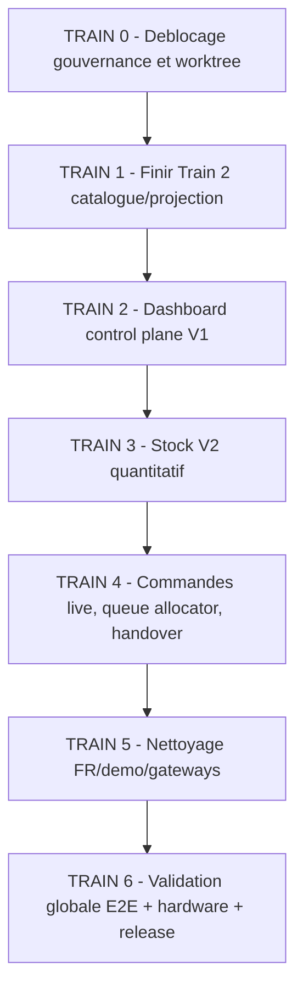

# Orchestration globale des demandes restantes - 2026-04-27

Mode: PLAN / ORCHESTRATION ONLY  
Auteur: Codex  
Base lue: Train 1, Train 2, audit blocages utilisateur, ultra-plan sync, audit nettoyage legacy.  
Verdict: `READY_FOR_SEQUENCED_EXECUTION_AFTER_TRAIN0_UNLOCK`

## 0. Objectif utilisateur traduit en objectifs executables

Tu as demande de finir proprement ce qui reste, sans perdre les demandes initiales:

1. Un Dashboard reel pour gerer produits, categories, prix, photos, offres, disponibilite et stock.
2. La caisse et la borne doivent partager les memes donnees catalogue/stock, mais garder deux designs separes.
3. La borne client doit rester verrouillee, sans admin, sans retour caisse, sans PIN.
4. Plus de faux blocage "Client ID" en caisse.
5. Livraison: distance Google Maps si disponible, sinon fallback robuste; frais 0-5 km = 5 EUR puis 1 EUR par km commence.
6. Queue sans doublons, centralisee, audit d'ordre et paiement propre.
7. POS doit voir les commandes kiosk/POS en live; KDS/OSS doivent suivre.
8. Nettoyage profond des residus demo/Bangladesh/langues/gateways sans casser l'historique.
9. Tests globaux, E2E, simulation paiement, hardware lab et rapport final avant release.

## 1. Etat actuel verifie

### Deja solide

- Train 1 D-M13: PASS local, queue unique par `(branch_id, business_date, queue_number)`.
- Borne client: verrouillage route/admin/PIN corrige.
- POS sans Client ID: client comptoir cache resolu cote backend.
- Livraison V1: `DeliveryFeeService` backend + helper frontend.
- Tests globaux apres correctifs: `php artisan test` PASS, `npx vitest run` PASS, `npm run production` PASS.
- Train 2 PH2-01/02/03: data ownership, event snapshot, projection parity PASS.

### Reste non termine

- Train 2 PH2-04: migration consommateurs vers `MenuProjectionService`.
- Dashboard control plane complet: pas encore livre.
- Stock quantitatif atomique `stock_levels` / `stock_movements`: pas encore livre.
- Queue allocator centralise: pas encore livre, meme si DB uniqueness est OK.
- POS live board complet + handover explicite: pas encore livre.
- Nettoyage demo/Bangladesh: seulement runtime filtre, pas nettoyage seeders/gateways/data.
- E2E final multi-surface + hardware lab: pas encore refait apres tous les changements.

### Blocage structurel

`bash .cursor/hooks/safety-check.sh` bloque encore sur:

```text
[HALT] Frozen zone staged: app/Services/OrderService.php - gate clearance required.
```

Donc tout train qui touche `OrderService` doit commencer par un deblocage gouvernance, pas par un patch direct.

## 2. Strategie d'orchestration

On ne doit pas partir dans un seul mega-patch. La bonne execution est par trains courts, chacun avec:

- mission ID;
- allowlist stricte;
- interdictions;
- tests cibles;
- preuve rapport;
- audit avant train suivant.

Ordre obligatoire:



## 3. Artefacts crees

Plans d'execution:

- `plans/PLAN_DEMANDES_RESTANTES_MASTER_2026-04-27.md`
- `plans/PLAN_DEMANDES_RESTANTES_TRAIN1_CATALOG_DASHBOARD_V1_2026-04-27.md`
- `plans/PLAN_DEMANDES_RESTANTES_TRAIN2_STOCK_REALTIME_ORDER_OPS_2026-04-27.md`
- `plans/PLAN_DEMANDES_RESTANTES_TRAIN3_CLEANUP_E2E_RELEASE_2026-04-27.md`

Ce rapport est le document de synthese et d'arbitrage.

## 4. Gates humains non auto-approuvables

| Gate | Bloque | Decision recommandee |
| --- | --- | --- |
| `HG-FROZEN-ORDERSERVICE-UNLOCK` | tout patch `OrderService` / queue allocator / handover | Autoriser une mission bornee avec allowlist exacte et tests globaux. |
| `HG-STOCK-V2-SOURCE-OF-TRUTH` | migrations stock | Option A: `stock_levels` devient SSOT quantitatif, `item_branch_availability` reste compat/projection transitoire. |
| `HG-CATEGORY-BRANCH-SCOPE` | categories par branche | Categories globales + pivot visibility par branche. |
| `HG-DASHBOARD-AUTHZ-CATALOG-OPS` | endpoints Dashboard | Directeur/manager modifient catalogue/stock; caissier vend et lit. |
| `HG-CLEANUP-DEMO-DATA-MODE` | purge DB/langues/gateways | Commencer Option A: runtime + dry-run + seeders; pas de suppression directe. |
| `HG-GOOGLE-MAPS-POLICY` | livraison prod | Fallback 5 EUR si geocoding indisponible; ne jamais bloquer vente. |
| `HG-HARDWARE-LAB-SIGNOFF` | release | Borne physique + imprimante + TPE + KDS reels. |

## 5. Backlog par priorite

### P0 - Debloquer execution propre

1. Inventaire worktree sale.
2. Gate frozen OrderService.
3. Stabiliser baseline: full PHPUnit, full Vitest, build, route list.
4. Figement "aucune suppression destructive".

### P1 - Finir la centralisation donnees

1. PH2-04 migration consommateurs vers `MenuProjectionService`.
2. Version HTTP menu + stale banner client.
3. Branch scope categories.
4. Authz dashboard catalog/ops.

### P1 - Dashboard utilisable

1. Catalogue manager: categories + produits + prix + photos + disponibilite.
2. Product composer: variations/extras/addons/offres.
3. Stock manager V1: disponibilite item branche.
4. Audit logs sur mutations importantes.

### P1 - Commandes operationnelles

1. Queue allocator central.
2. POS live board.
3. Handover explicite.
4. KDS/OSS fanout coherent.

### P2 - Stock V2

1. Schema `stock_levels` / `stock_movements`.
2. Decrement atomique.
3. Release annulation/remboursement.
4. Reconciliation horaire.
5. Badges rupture POS/kiosk.

### P2 - Nettoyage profond

1. Devise EUR DB.
2. Seeders FR.
3. Gateways manquantes et non-France.
4. i18n bundle FR-first.
5. Commande dry-run cleanup demo.

### P3 - Release

1. Playwright complet.
2. Tests paiement simulation.
3. Hardware lab.
4. Rapport final et go/no-go.

## 6. Definition of Done globale

La demande est vraiment terminee quand:

- Dashboard permet de creer/modifier produit, categorie, prix, image, offre, availability/stock sans toucher DB manuellement.
- Un changement produit/categorie/stock apparait sur POS et kiosk sans F5 ou avec fallback version/stale maitrise.
- POS peut prendre commande emporter/livraison sans `customer_id` manuel.
- Livraison applique le tarif officiel et ne bloque pas si Maps echoue.
- Kiosk ne montre jamais admin/caisse/PIN.
- Queue n'a pas de doublons par branche + business date.
- POS live board voit les commandes kiosk/POS.
- KDS avance preparation et OSS affiche/retrait proprement.
- Stock ne peut pas devenir negatif sous concurrence.
- Seeds/locales/gateways ne recreent pas des donnees Bangladesh/demo visibles.
- `php artisan test`, `npx vitest run`, build production, Playwright flows et hardware lab passent.

## 7. Decision finale

`ORCHESTRATION_VERDICT: EXECUTE_TRAIN0_FIRST_THEN_TRAINS_1_TO_6`

Le prochain travail responsable n'est pas de lancer directement le stock V2 ou le Dashboard complet. Il faut d'abord lever proprement le blocage frozen/worktree, puis finir Train 2 PH2-04, puis construire Dashboard V1 sur les APIs existantes avant d'ajouter le stock quantitatif.
