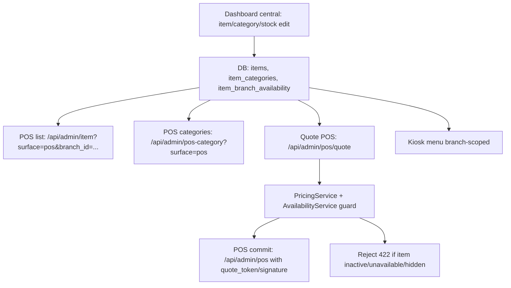

# Ultra Audit POS — Catalogue Central, Categories, Produits, Prix, Stock

Date: 2026-04-27  
Mandat: audit technique caisse/POS, frontend + backend, synchronisation avec le catalogue central et la gestion stock.  
Contrainte utilisateur: ne pas toucher au wizard de prise de commande caisse.  
Mode: audit + tests uniquement, aucun patch produit.  
Verdict: `PASS_WITH_RESIDUAL_REWORK`

## 1. Synthese

Le flux critique V1 est fonctionnel et protege:

1. Le POS charge les categories visibles caisse via `admin/pos-category` avec filtre `channels null/pos`.
2. Le POS charge les produits via `admin/item` avec `surface=pos` et `branch_id` une fois la branche de caisse resolue.
3. La rupture stock centrale est persistee dans `item_branch_availability`, branche par branche.
4. Le backend quote/commande rejette les produits inactifs, globalement indisponibles, en rupture branche, ainsi que les variations/supplements inactifs ou invisibles sur la surface.
5. Le paiement POS rafraichit une quote backend juste avant `posOrder/save`; le prix frontend n'est pas autoritaire.

Conclusion operationnelle: si une UI POS est stale, le backend reste la barriere finale. La caisse ne doit pas pouvoir vendre un produit centralement indisponible ou en rupture branche.

Il reste cependant des dettes de synchronisation live et de centralisation:

- les ajouts/suppressions categorie/produit ne provoquent pas encore un refresh live POS aussi net que les changements de prix/variations;
- le detail produit POS (`admin/item/details/{id}?surface=pos`) ne recoit pas `branch_id`, donc le modal detail expose seulement l'etat global, pas l'overlay rupture branche;
- `MenuProjectionService` est la future projection SSOT, mais POS/Kiosk ne sont pas encore branches dessus en production V1.

## 2. Perimetre Inspecte

### Backend catalogue et stock

| Domaine | Fichiers lus | Evaluation |
| --- | --- | --- |
| Liste produits POS | `app/Services/ItemService.php`, `app/Http/Resources/SimpleItemResource.php` | OK: filtre surface + overlay branch availability |
| Detail produit POS | `app/Http/Controllers/Admin/ItemController.php`, `app/Services/ItemService.php`, `app/Http/Resources/NormalItemResource.php` | Risque: pas de `branch_id` dans le detail |
| Categories POS | `app/Http/Controllers/Admin/PosCategoryController.php`, `app/Services/ItemCategoryService.php` | OK: surface POS; amelioration: projection unique future |
| Toggle rupture | `app/Http/Controllers/Admin/AvailabilityController.php`, `app/Services/Menu/AvailabilityService.php` | OK: branch scope, fan-out admin global, outbox/event |
| Projection future | `app/Services/Menu/MenuProjectionService.php`, `app/Http/Controllers/Admin/MenuProjectionController.php` | OK comme fondation, pas encore active pour POS |
| Prix et quote | `app/Services/Pricing/PricingService.php`, `app/Services/Order/OrderQuoteService.php`, `app/Http/Controllers/Admin/PosController.php` | OK: backend SSOT + HMAC quote |

### Frontend POS

| Domaine | Fichiers lus | Evaluation |
| --- | --- | --- |
| Bootstrap POS | `resources/js/components/admin/pos/PosComponent.vue` | OK: resolution `defaultAccess`, scope cart branch/user, `surface=pos` |
| Live rupture | `resources/js/components/admin/pos/PosComponent.vue`, `resources/js/store/modules/posCart.js` | OK: `ItemAvailabilityChanged` greyout/prune |
| Liste categories | `resources/js/store/modules/posCategory.js` | OK: endpoint dedie POS |
| Detail produit | `resources/js/store/modules/item.js`, `resources/js/components/admin/pos/ItemComponent.vue` | Risque: `surface=pos` oui, `branch_id` non |
| Paiement/quote | `resources/js/components/admin/pos/PaymentComponent.vue` | OK: `admin/pos/quote` juste avant sauvegarde |
| Gestion rupture centrale UI | `resources/js/components/admin/items/AvailabilityToggleComponent.vue`, `ItemListComponent.vue` | OK global/fan-out; manque UX branche specifique |

## 3. Flux Technique Valide



### Prix

La caisse affiche des totaux locaux pour l'ergonomie, mais le flux de paiement appelle `PaymentComponent.refreshQuote()` avant sauvegarde. La quote passe par `OrderQuoteService`, qui appelle `PricingService`. `PricingService` recharge les prix DB, options, taxes, restrictions de surface et disponibilites. `OrderQuoteService::hmacKey()` throw si `APP_KEY` manque, donc pas de fallback HMAC faible.

### Stock / rupture

`AvailabilityController::toggle()` ecrit `item_branch_availability`. Pour `branch_id=null`, l'admin global fan-out toutes les branches; pour un staff branche, le scope est limite a sa branche. Les events `ItemAvailabilityChanged` alimentent outbox, snapshot, cache kiosk et POS live handler.

### Categories / produits

Le CRUD central produit/categorie est operationnel. Les tests confirment creation, modification prix, suppression produit/categorie. Les categories POS sont filtrees `channels null/pos` et triees par `sort`. La future projection unique supporte aussi `pos_sort`, mais le read-path POS actuel ne l'utilise pas encore.

## 4. Findings Techniques

### F1 — PASS: garde serveur sur disponibilite centrale et branche

Preuves:

- `AvailabilityService::assertItemsOrderableForBranch()` rejette item introuvable, status non actif, `is_available=false`, et rupture branche.
- `PricingService::assertOptionsOrderable()` rejette variation/supplement introuvable, inactif, ou invisible sur `pos|kiosk|web`.
- Tests: 39 PASS sur availability/projection/order guard; 37 PASS sur CRUD/stock/requetes.

Impact: meme si le POS ou la borne voit un ancien catalogue, la commande est bloquee cote backend.

### F2 — PASS: quote POS et prix backend SSOT

Preuves:

- `PaymentComponent` appelle `admin/pos/quote` avant `posOrder/save`.
- `OrderQuoteService::sealForCommit()` exige token+signature pour POS/Kiosk.
- Tests: `QuoteBindingTest`, `QuoteReplayIdempotencyTest`, `PosPricingSsotProofTest`, `PosKioskPricingParityTest`, `PosDiscountPermissionTest`, `PosManualDiscountAuditTest` passent, hors un test legacy `POSComprehensiveTest` detaille en F7.

Impact: modification prix centrale prise en compte au paiement, pas par le prix client.

### F3 — PASS: POS recoit les ruptures live et prune le panier

Preuves:

- `PosComponent._onItemAvailabilityChanged()` distingue event global vs branch availability.
- Sur indisponible branche, la ligne est grisee, le panier est prune via `posCart/pruneUnavailable`.
- Tests JS: `posItemAvailabilityHandler`, `posAvailabilityLiveGuard`, `posCartPrune`, `posCartPruneScoped` PASS.

Impact: bon comportement cashier en cas de rupture pendant une session.

### F4 — REWORK P1: detail produit POS sans overlay `branch_id`

Constat:

- La liste POS passe `branch_id` a `ItemService::simpleList()` et recoit `effective_is_available`.
- Le modal detail POS appelle `item/details` avec seulement `{ id, surface: 'pos' }`.
- `NormalItemResource` expose `is_available` global et documente que la disponibilite branche est geree ailleurs.

Risque:

- En flux normal, le tile indisponible bloque l'ouverture du modal.
- Mais un etat stale, un recall panier, une route directe ou une ouverture deja en cours peut afficher un produit globalement disponible alors qu'il est indisponible sur la branche.
- Backend rejette toujours la quote, donc risque UX/operationnel, pas perte d'argent.

Plan recommande:

- Mission `POS-CATALOG-DETAIL-BRANCH-OVERLAY`.
- Allowlist: `resources/js/store/modules/item.js`, `resources/js/components/admin/pos/ItemComponent.vue`, `app/Http/Controllers/Admin/ItemController.php`, `app/Services/ItemService.php`, `app/Http/Resources/NormalItemResource.php`, test sentinel new.
- Ajouter `branch_id` au detail POS, appliquer le meme overlay que la liste, et afficher le meme banner indisponible.

### F5 — REWORK P1: create/delete produit/categorie ne force pas encore un refresh live POS

Constat:

- `ItemService::update()` emet `ItemAvailabilityChanged::fromItem(..., 'full')`; le POS recharge `itemList()` sur `type='full'`.
- `ItemCreated`, `ItemDeleted`, `CategoryCreated`, `CategoryUpdated`, `CategoryDeleted` n'ont qu'un listener cache kiosk (`InvalidateKioskMenuCacheOnCatalogChange`).
- Aucun handler POS direct pour ces events; `itemCategories()` n'est appele qu'au bootstrap ou action utilisateur.

Risque:

- Prix/variations/status update: OK via global `ItemAvailabilityChanged`.
- Nouveau produit, suppression produit, nouvelle categorie, suppression categorie: POS peut demander F5/recherche/changement manuel pour voir l'etat exact.
- Backend protege la vente, mais l'experience "central modifie -> POS instantane" n'est pas totale.

Plan recommande:

- Mission `POS-CATALOG-LIVE-CATALOG-CHANGE`.
- Creer/standardiser un event `CatalogChanged` ou reutiliser une projection snapshot.
- POS: sur create/delete/category update, recharger `itemCategories()` + `itemList()` en debounce.
- Tests: JS handler + Feature event/outbox/snapshot.

### F6 — REWORK P2: projection unique existe mais pas encore consommee par le POS

Constat:

- `MenuProjectionService` declare clairement que POS/Kiosk controllers ne sont pas encore branches dessus.
- Le POS actuel est protege par les endpoints legacy + sentinelles, mais la duplication read-path reste une dette.

Risque:

- Divergence future entre `PosCategoryController`, `ItemService`, `KioskMenuService` et `MenuProjectionService`.
- Les champs de presentation (`pos_sort`, `kiosk_label`, `kiosk_emoji`) peuvent evoluer differemment selon surface.

Decision recommandee:

- Pour V1: ne pas migrer brutalement, garder legacy stable + tests.
- Pour Train B: migrer une surface a la fois vers `MenuProjectionService`, avec tests de parite avant/apres.

### F7 — REWORK TEST LEGACY: `POSComprehensiveTest::pos_can_create_order`

Resultat:

- Suite POS prix/quote: 28 PASS, 1 FAIL.
- Echec: `POSComprehensiveTest::pos_can_create_order` recoit 422 sur `/api/admin/pos/quote`.
- Reproduction par service: `InvalidArgumentException: Article ... inactif dans le catalogue. Commande rejetee.`

Cause:

- Le test cree un item via factory sans `status => Status::ACTIVE`.
- `ItemFactory` met `status => 1`, alors que `Status::ACTIVE = 5`.
- Le backend a raison de rejeter; c'est une fixture legacy non migree, pas une regression produit.

Action:

- Inclure dans la mission deja planifiee `CV1-FIX-R1-POS-QUOTE-BINDING-TESTS` ou une mission test-only equivalent.
- Allowlist test uniquement: `tests/Feature/POSComprehensiveTest.php`.
- Remplacer les factories legacy par `status => Status::ACTIVE`, `is_available => true`, et payload quote complet si necessaire.

### F8 — AMELIORATION P2: rupture par supplement/variation non atomique par branche

Etat actuel:

- Le systeme gere rupture par item/branche.
- Les supplements et variations sont controles par `status` et `visible_on`, mais pas par une table `item_extra_branch_availability` ou `item_variation_branch_availability`.

Risque:

- Si "Cheddar" ou une boisson precise est en rupture sur une branche mais pas l'article parent, il faut desactiver globalement le supplement/produit ou contourner operationnellement.

Decision:

- Pas bloquant V1 si la gestion stock est item-level.
- A traiter seulement si le business veut piloter sauces/boissons/supplements comme stock atomique branche.

## 5. Tests Executes

### Backend catalogue / stock / projection

Commande:

```bash
php artisan test --filter='CatalogStockCentralSyncEndToEndTest|AdminItemBranchAvailabilityProjectionTest|AvailabilityControllerTest|AvailabilityServiceTest|BumpMenuSnapshotListenerTest|MenuProjectionControllerTest|MenuProjectionServiceTest|OrderRejectsUnavailableBranchItemTest'
```

Resultat: `39 passed`.

### Frontend POS availability / panier / paiement

Commande:

```bash
npx vitest run tests/js/posAvailabilityLiveGuard.spec.js tests/js/posItemAvailabilityHandler.spec.js tests/js/posCartPrune.spec.js tests/js/posCartPruneScoped.spec.js tests/js/posPaymentComponentContract.spec.js tests/js/posPaymentItemsNormalize.spec.js tests/js/adminAvailabilityToggle.spec.js
```

Resultat: `7 files passed`, `36 tests passed`.

### Prix POS / quote / parite

Commande:

```bash
php artisan test --filter='QuoteBindingTest|QuoteReplayIdempotencyTest|PosPricingSsotProofTest|PosKioskPricingParityTest|PosDiscountPermissionTest|PosManualDiscountAuditTest|POSComprehensiveTest'
```

Resultat: `28 passed`, `1 failed`.

Fail connu: `POSComprehensiveTest::pos_can_create_order`, fixture legacy avec `status=1` alors que `Status::ACTIVE=5`.

### Wizard/Cart POS JS sans modification du wizard

Commande:

```bash
npx vitest run tests/js/posVariationMultiQty.spec.js tests/js/posKioskVariationParity.spec.js tests/js/posCart.spec.js tests/js/posCartOptimistic.spec.js tests/js/posCartScoped.spec.js tests/js/posBarcode.spec.js
```

Resultat: `6 files passed`, `34 tests passed`.

### CRUD central + requetes + stock release

Commande:

```bash
php artisan test --filter='AdminCrudComprehensiveTest|ItemExtraManagementTest|ItemRequestTest|ItemCategoryRequestTest|ItemCategoryHierarchyTest|StockReleaseTest|ItemBranchAvailabilityFkTest|FrontendSurfaceFilteringTest|CacheInvalidationTest'
```

Resultat: `37 passed`, `8 skipped`.

Skips acceptes:

- MySQL-only JSON_CONTAINS / FK ALTER cases under local SQLite.

### POS shell/accessibilite/hardware simulation

Commande:

```bash
npx vitest run tests/js/PosComponent.spec.js tests/js/posA11y.spec.js tests/js/posComponentA11y.spec.js tests/js/posSkeletonGrid.spec.js tests/js/posNfc.spec.js tests/js/posPrinter.spec.js tests/js/posCashDrawerOpen.spec.js
```

Resultat: `7 files passed`, `23 tests passed`.

Warnings non bloquants: stubs Vue Test Utils pour `router-link` / `vue-select`.

## 6. Safety / Worktree

`bash .cursor/hooks/safety-check.sh` retourne:

```text
[HALT] Frozen zone staged: app/Services/OrderService.php — gate clearance required.
```

Ce blocage est preexistant dans l'etat global du depot. Je n'ai pas modifie `OrderService.php`, ni le wizard caisse, ni aucun fichier produit pendant cette passe.

Le worktree est massivement sale; ce rapport ne conclut donc pas "release global clean". Il conclut seulement sur le perimetre POS catalogue/stock central.

## 7. Plan de Correction Recommande

### Mission A — POS-CATALOG-DETAIL-BRANCH-OVERLAY

But: aligner le detail modal POS sur la disponibilite branche deja presente dans la liste.

Allowlist:

- `resources/js/store/modules/item.js`
- `resources/js/components/admin/pos/ItemComponent.vue`
- `app/Http/Controllers/Admin/ItemController.php`
- `app/Services/ItemService.php`
- `app/Http/Resources/NormalItemResource.php`
- `tests/Feature/Menu/PosItemDetailBranchAvailabilityTest.php` new
- `tests/js/posAvailabilityLiveGuard.spec.js`

Critere de sortie:

- POS item detail avec `branch_id` indisponible retourne `is_available=false`.
- Modal POS bloque l'ajout si la rupture branche arrive entre liste et detail.
- Tests POS availability restent verts.

### Mission B — POS-CATALOG-LIVE-CATALOG-CHANGE

But: refresh live POS sur create/delete produit et create/update/delete categorie.

Allowlist:

- `app/Events/CatalogChanged.php` new ou extension d'un event existant
- `app/Providers/EventServiceProvider.php`
- `app/Services/ItemService.php`
- `app/Services/ItemCategoryService.php`
- `app/Listeners/*Catalog*` scoped
- `resources/js/components/admin/pos/PosComponent.vue`
- `tests/Feature/Menu/CatalogChangedBroadcastTest.php` new
- `tests/js/posItemAvailabilityHandler.spec.js` ou nouveau `posCatalogChangedHandler.spec.js`

Critere de sortie:

- Item created/deleted -> POS appelle `itemList()` debounced.
- Category created/updated/deleted -> POS appelle `itemCategories()` + `itemList()` debounced.
- Branch isolation conservee.
- Kiosk cache invalidation conservee.

### Mission C — POS-LEGACY-COMPREHENSIVE-FIXTURE-QUOTE-BINDING

But: fermer le fail test-only `POSComprehensiveTest::pos_can_create_order`.

Allowlist:

- `tests/Feature/POSComprehensiveTest.php`

Critere de sortie:

- `php artisan test tests/Feature/POSComprehensiveTest.php` PASS.
- Aucun fichier `app/**`, `resources/**`, `routes/**`, `database/**`.

### Mission D — MENU-PROJECTION-POS-MIGRATION (post V1)

But: brancher POS sur `MenuProjectionService` avec flag et tests de parite.

Decision:

- Post-V1 seulement.
- Ne pas melanger avec les corrections V1, car le read-path legacy est deja couvert et fonctionnel.

## 8. Verdict

`PASS_WITH_RESIDUAL_REWORK`

Le systeme POS est techniquement solide sur le flux argent/commande: central catalogue -> POS list -> quote backend -> commit. Les protections de prix et stock sont cote serveur et les tests cibles sont majoritairement verts.

Les trois corrections a faire avant de dire "synchronisation POS parfaite" sont:

1. branch overlay dans le detail produit POS;
2. live refresh POS sur create/delete produit/categorie;
3. correction fixture legacy `POSComprehensiveTest`.

Le wizard caisse n'a pas ete touche.
