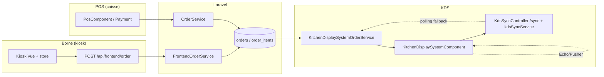

# Master Play — Breakdown synthétique **V0** (POS · Borne · KDS)

**Horizon** : simulation `SIM-MASTERPLAY-2026-04-25` — **V0** = cartographie + risques + pistes de doublons **à valider** en Round 2 (GPT Pro) et Round 3 (synthèse).  
**Sources** : `docs/DEVICE_FLOW.md`, `docs/HANDOFF_NEW_CURSOR/04_FICHIERS_PIVOTS_PAR_FLUX.md`, `routes/api.php` (extraits), `reports/audit/AUDIT_KDS_POS_SYNCHRONISATION_PROFONDE_2026-04-24.md`, recherche codebase (Echo, KDS, kiosk).

---

## 0. Lexique & périmètre

| Terme | Signification dans ce document |
|--------|--------------------------------|
| **POS** | Caisse admin — `OrderService`, `PosComponent`, flux table / commande manager. |
| **Borne** | Kiosk client — `FrontendOrderService`, `POST /api/frontend/order`, wizard Vue. |
| **KDS** | Cuisine — `KitchenDisplaySystemOrderService`, `KitchenDisplaySystemComponent.vue`, statuts cuisine. |
| **Glue** | Routes API, événements temps réel, jobs, règles `branch_id`, alignement doc ↔ code. |

**Hors périmètre détaillé V0** : OSS complet (fichiers listés en pivot §4), fidélité complète — **mentions** seulement si impact chaîne commande.

---

## 1. Vue d’ensemble — chaîne métier

**Point de vérité unique métier** : persistance **backend** + enums / state machine ; surfaces ne font qu’afficher et commander des transitions autorisées.

---

## 2. Surface **POS** (caisse)

### 2.1 Fichiers pivots (SSOT dépôt)

| Rôle | Chemin |
|------|--------|
| Métier commande | `app/Services/OrderService.php` |
| UI principale | `resources/js/components/admin/pos/PosComponent.vue` |
| Paiement | `resources/js/components/admin/pos/PaymentComponent.vue` (si présent) |
| Modèle | `app/Models/Order.php` |

### 2.2 Connexions attendues vers KDS / borne

- Toute création / transition **doit** alimenter les **événements** consommés par KDS (`OrderStatusChanged`, `OrderCreated`, etc. — voir audit KDS 2026-04-24).
- **Symétrie** : si un changement touche `OrderService`, **revue** `FrontendOrderService` (invariant projet) — à indexer dans Master Play final.

### 2.3 Zones « mal connectées » **candidates** (V0 — à preuve)

| ID | Description | Preuve / action |
|----|----------------|-----------------|
| POS-DOC-01 | `DEVICE_FLOW.md` mentionne **Firebase** pour entrées kiosk côté POS ; le code moderne cite **Echo / Pusher** sur KDS — **dérive documentaire** possible entre flux devices. | Comparer `DEVICE_FLOW.md` §2 avec implémentation réelle POS (grep `Echo`, `Firebase` sous `resources/js/components/admin/pos/`). |
| POS-GUARD-01 | Admin `branch_id = 0` vs staff filiale — comportement liste KDS déjà documenté (audit 2026-04-24). | Vérifier même logique sur **écrans POS** (fuites d’affichage). |

---

## 3. Surface **Borne (kiosk)**

### 3.1 Fichiers pivots

| Rôle | Chemin |
|------|--------|
| Route commande | `routes/api.php` — groupe `frontend` |
| Contrôleur | `app/Http/Controllers/Frontend/OrderController.php` |
| Service | `app/Services/FrontendOrderService.php` |
| Panier / étapes | `resources/js/components/frontend/kiosk/*.vue`, `kioskCart.js` |
| Paiement | `KioskPaymentComponent.vue` |
| Config | `config/kiosk.php`, `master.blade.php` (`foodkingConfig`) |

### 3.2 Connexions critiques

- **Idempotence** : header `X-Idempotency-Key` (pivot handoff) — doublon réseau borne ↔ double commande.
- **Prix** : **affichage** des montants backend — toute logique de **recalcul** prix côté Vue hors preview autorisée = **violation invariant** (à chasser au Master Play final).

### 3.3 Candidats doublons / dette

| ID | Description | Action |
|----|-------------|--------|
| KIOSK-UI-01 | Nombre élevé de composants `Kiosk*Component.vue` — risque de **logique dispersée** (erreurs réseau, promos, offline). | Cartographier **par flux** (wizard vs admin borne) dans V1. |
| KIOSK-SYNC-01 | `KioskAppComponent.vue` écoute `ItemAvailabilityChanged` (pivot §5) — cohérence avec **POS / KDS** sur la même rupture stock. | Vérifier une seule **sémantique** « 86 » sur les trois surfaces. |

---

## 4. Surface **KDS**

### 4.1 Fichiers pivots

| Rôle | Chemin |
|------|--------|
| Service liste / items | `app/Services/KitchenDisplaySystemOrderService.php` |
| Contrôleur | `app/Http/Controllers/Admin/KitchenDisplaySystemController.php` |
| Sync HTTP fallback | `app/Http/Controllers/Admin/KdsSyncController.php`, route `GET .../kds-order/sync` |
| UI | `resources/js/components/admin/kitchenDisplaySystem/KitchenDisplaySystemComponent.vue` |
| Client sync | `resources/js/services/KdsSyncService.js` (inféré par imports composant) |

### 4.2 Mécanismes temps réel (d’après code + audit)

- **Echo** : abonnements `OrderStatusChanged`, `OrderCreated`, `ItemAvailabilityChanged`, `OrderTableChanged` (branch > 0).
- **Polling** : intervalles adaptatifs ; **sync service** branché sur `kdsSyncService` (événements `sync` / `error`).
- **Filtre exact** `branch_id` : tests cités dans `AUDIT_KDS_POS_SYNCHRONISATION_PROFONDE_2026-04-24.md`.

### 4.3 Candidats « mal connectés »

| ID | Description | Action |
|----|-------------|--------|
| KDS-ECHO-01 | Commentaire **AUDIT-P51-BUG2** : unsubscribe avant re-subscribe Echo — **régression** = doubles événements UI. | Vérifier autres surfaces (POS) pour pattern identique. |
| KDS-WS-01 | Double voie **WS + polling** — risque de **rafraîchissements redondants** ou ordre non déterministe si les deux tirent des états différents. | Documenter **priorité** : qui gagne (WS vs sync HTTP) dans Master Play final. |

---

## 5. **Glue** transversal (le cœur du Master Play)

### 5.1 Routes API (extrait pertinent)

- Préfixe admin `kds-order` : `index`, `change-status/{order}`, `items`, **`sync`** (fallback F-03) — `routes/api.php`.
- Préfixe frontend : commande kiosk (voir groupe dans `api.php`).

### 5.2 Matrice **événement → consommateurs** (V0 — à compléter)

| Événement (broadcast) | KDS | Borne | POS | Notes |
|------------------------|-----|-------|-----|-------|
| `OrderStatusChanged` | Oui (Echo) | À grep | À grep | KDS confirmé dans composant. |
| `OrderCreated` | Oui | ? | ? | |
| `ItemAvailabilityChanged` | Oui | pivot §5 | ? | Cohérence rupture stock. |
| `OrderTableChanged` | Oui (floor plan) | N/A ? | Oui ? | Transfert table. |

**Round 2 GPT** : compléter colonnes **?** avec chemins exacts ou « non branché ».

### 5.3 Symétrie services (invariant)

- Toute évolution future sur **création / statut** commande : **OrderService** ↔ **FrontendOrderService** — le Master Play final doit avoir une **ligne explicite** par flux (kiosk vs table vs walk-in).

---

## 6. Doublons & fichiers « jumeaux » (candidats)

| Zone | Indices | Vérification |
|------|---------|--------------|
| Listeners temps réel | Patterns `subscribeEcho` / `onEvents` multiples | Grep `subscribeEcho` sous `resources/js/components/admin/`. |
| Erreurs réseau kiosk | `KioskError*Component.vue` × N | Factorisation UX possible — pas forcément bug, **dettes lisibilité**. |
| Plans historiques POS/KDS | `PLAN_POS_KIOSK_KDS_*` + rapports `AUDIT_*` | **Consolidation** dans un seul Master Play pour éviter contradictions. |

---

## 7. Ce que **Graphiti** doit ingérer **après** synthèse (pas en V0 brut)

- Décisions tranchées sur **priorité WS vs polling**, **admin branch 0**, **OSS vs KDS**.
- Épisodes : `memory/episodes/12_decisions_log.jsonl` + domaine sync si ADR.

**Requêtes lecture suggérées** (voir doc challenge §1) : POS+kiosk+KDS sync, symmetry services, F-03 KDS.

---

## 8. Angles d’attaque pour **GPT Pro** (Round 2) — « bagarre » ciblée

1. **Infirmer** que `DEVICE_FLOW.md` est aligné sur l’implémentation POS temps réel actuelle.  
2. Trouver **un chemin** où la borne peut afficher un état **non** reflété par KDS dans les N secondes suivantes (SLA).  
3. Identifier **un doublon** de mutation statut (API + action locale) sans single-flight.  
4. Tester la **symétrie** OrderService / FrontendOrderService sur **un cas limite** (remise, table, annulation).  
5. **OSS** : file d’attente dépend-elle d’un état que seul KDS met à jour mais POS peut rollback ?  
6. **PricingPreviewService** kiosk : confirmer qu’aucun prix « autorisé » ne devient SSOT client.  
7. Proposer **3 mesures** de qualité mesurables (latence sync, taux double listener, couverture tests sur glue).

---

## 9. Verdict V0

| Critère | État |
|---------|------|
| Cartographie 3 surfaces + glue | **Complet** (niveau architecture). |
| Preuves fichier-par-fichier exhaustives | **Incomplet** — nécessite Round 2 + grep ciblé. |
| Alignement audits existants | **Bon** (réutilise AUDIT_KDS_POS 2026-04-24). |
| Prêt production sans relecture | **Non** — document de travail. |

**Prochaine étape** : `npm run codex:complex -- SIM-MASTERPLAY-2026-04-25` puis synthèse humaine / Claude Round 3.

---

*Généré pour la simulation Master Play — ne remplace pas un cycle `TASK_ID` produit ni un gate.*
