# Rapport audit consolidé — synchronisation caisse & borne → KDS (FoodKing V1)

**Généré (UTC)** : 2026-05-06T04:03:55.393Z  
**Spec Playwright** : `tests/e2e/audit-max-sync-order-journey-documentation.spec.js`  
**Trace JSON automatique (régression)** : `reports/antigravity/global-pos-kiosk-order-trace.json` *(cycle `global-pos-kiosk-order-trace.spec.js` — voir champ `verdict`)*  
**Données brutes cycle présent** : `raw-trace.json` *(même requête artisan que le trace, mais fixture préfixe `AUDIT-SYNC-JOURNEY`)*

## Table des matières

1. [Préambule & périmètre](#0-préambul--périmètre)
2. [Fixture injectée](#1-fixture-injectée)
3. [Projection catalogue (admin)](#2-projection-catalogue-admin)
4. [Bande caisse POS](#3-bande-caisse-pos)
5. [Bande borne kiosk](#4-bande-borne-kiosk)
6. [Cuisine KDS](#5-cuisine-kds)
7. [Tables audit backend](#6-tables-audit-backend)
8. [Liste fichiers image](#7-liste-fichiers-image)
9. [Grille de relecture humaine](#8-grille-de-relecture-humaine)
10. [Vue consolidée du flux (Mermaid)](#9-vue-consolidée-du-flux-data)
11. [Manifeste d’intégrité (SHA-256)](#10-manifeste-dintégrité-sha-256)

---

## 0. Préambul & périmètre

- **Objectif** : documenter *ce qui s’affiche* et *ce qui est prouvé côté API/SQL* pour deux commandes **réelles** (POS cash + kiosk carte simulée) jusqu’au **KDS** sur la même branche.
- **Préfixe fixture** : `AUDIT-SYNC-JOURNEY` — nettoyage en entrée/sortie de spec.
- **Prix attendu** : **12,50 €** TTC (assiette composer : variation + extra + addon boisson).
- **Encaissement POS / paiement borne** : soumission **axios in-page** (`createPosOrderViaApi` / `createKioskCardOrderViaApi`) pour garantir le même contrat que le trace global ; les captures encadrent ces appels (avant / après).
- **Wizard POS** : ouvert puis **annulé** via `wizard-btn-cancel` pour éviter l’interception pointeur sur le chip panier (comportement documenté pour l’audit UX).
- **Continuité agent / CI** : les runs Playwright longs peuvent être **interrompus** par timeout shell ou session ; le spec est conçu pour **reprendre** (fixtures nettoyées, dossier captures vidé au début). Ce rapport + `MANIFEST.json` matérialisent l’état d’un run **complet**.

---

## 1. Fixture injectée

```json
{
  "category_name": "AUDIT-SYNC-JOURNEY Category 5AB7F60A",
  "run": "5AB7F60A",
  "branch_id": 1,
  "customer_id": 28,
  "category_id": 305,
  "item_id": 358,
  "item_name": "AUDIT-SYNC-JOURNEY Assiette 5AB7F60A",
  "addon_item_id": 359,
  "addon_name": "AUDIT-SYNC-JOURNEY Boisson 5AB7F60A",
  "variation_id": 261,
  "variation_name": "AUDIT-SYNC-JOURNEY XL 5AB7F60A",
  "extra_id": 171,
  "extra_name": "AUDIT-SYNC-JOURNEY Sauce 5AB7F60A",
  "addon_id": 57,
  "expected_total": 12.5
}
```

---

## 2. Projection catalogue (admin)

L’endpoint `GET admin/menu-projection` est **403** pour le seul rôle caissier : session **admin** minimale.


### Capture `01-admin-dashboard-prelude.png`

URL observée : `http://localhost:8000/admin/dashboard` — capture **viewport** (zone visible ; pour audit papier, refaire un scroll manuel sur les longues listes).

Assertion : capture documentaire

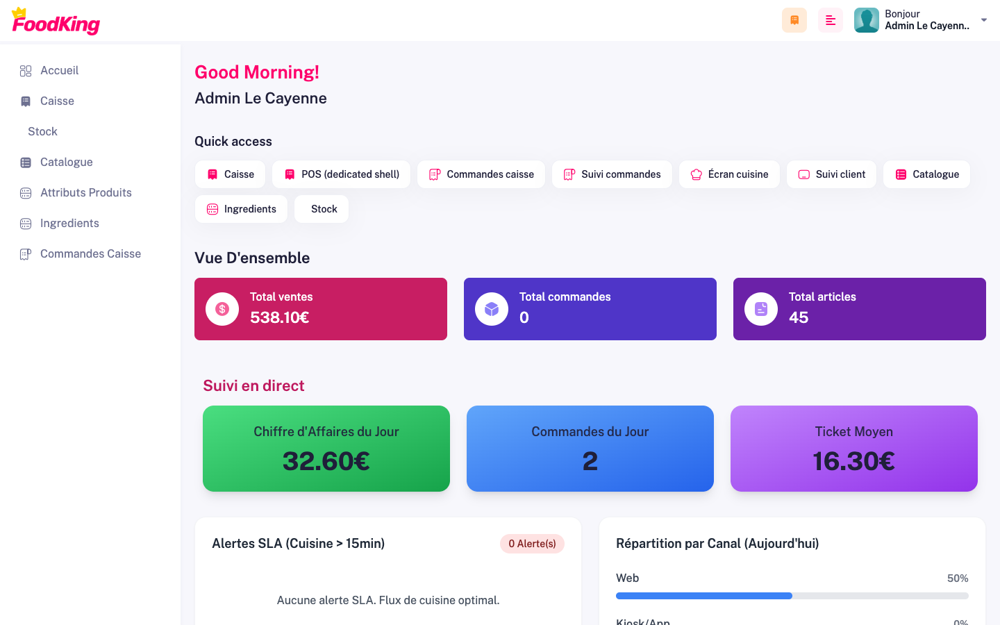

**Item sous test** : `AUDIT-SYNC-JOURNEY Assiette 5AB7F60A` (id `358`).

### Étapes composer projetées (POS)

| Étape (canal **pos**) | Clé | Label | min/max |
|---|---|---|---|
| 1 | `taille` | Taille | 1/1 |
| 2 | `sauce` | Sauce | 1/1 |
| 3 | `boisson` | Boisson | 1/1 |

### Étapes composer projetées (Kiosk)

| Étape (canal **kiosk**) | Clé | Label | min/max |
|---|---|---|---|
| 1 | `taille` | Taille | 1/1 |
| 2 | `sauce` | Sauce | 1/1 |
| 3 | `boisson` | Boisson | 1/1 |

---

## 3. Bande caisse POS

### 3.1 Connexion & surface `/admin/pos`


### Capture `02-pos-home-menu-loaded.png`

URL observée : `http://localhost:8000/admin/pos` — capture **viewport** (zone visible ; pour audit papier, refaire un scroll manuel sur les longues listes).

Assertion : capture documentaire

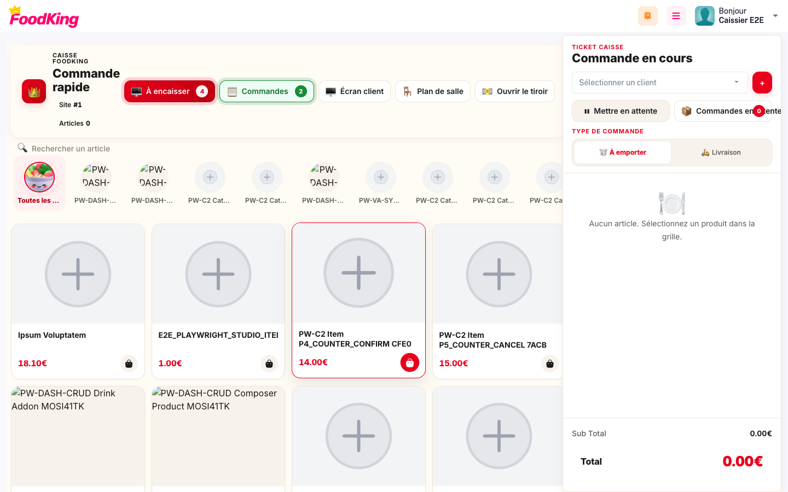

### 3.2 Pill catégorie fixture (**AUDIT-SYNC-JOURNEY Category 5AB7F60A**)


### Capture `03-pos-category-selected.png`

URL observée : `http://localhost:8000/admin/pos` — capture **viewport** (zone visible ; pour audit papier, refaire un scroll manuel sur les longues listes).

Assertion : capture documentaire

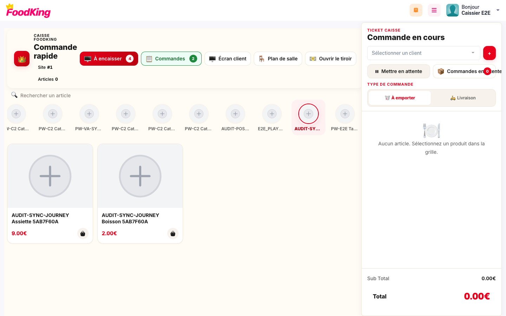

### 3.3 Ouverture wizard produit (démonstration UX)


### Capture `04-pos-wizard-open-after-item-click.png`

URL observée : `http://localhost:8000/admin/pos` — capture **viewport** (zone visible ; pour audit papier, refaire un scroll manuel sur les longues listes).

Assertion : capture documentaire

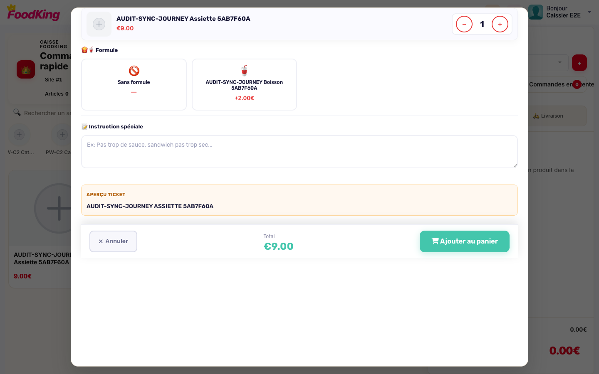

### 3.3bis Fermeture wizard (`pos-wizard.js`)


### Capture `05-pos-after-wizard-cancel.png`

URL observée : `http://localhost:8000/admin/pos` — capture **viewport** (zone visible ; pour audit papier, refaire un scroll manuel sur les longues listes).

Assertion : capture documentaire

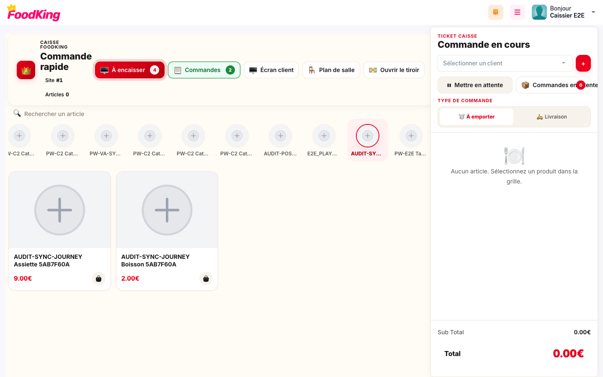

### 3.4 Panneau ticket (chip)


### Capture `06-pos-cart-panel-open.png`

URL observée : `http://localhost:8000/admin/pos` — capture **viewport** (zone visible ; pour audit papier, refaire un scroll manuel sur les longues listes).

Assertion : panneau ticket caisse inspecté

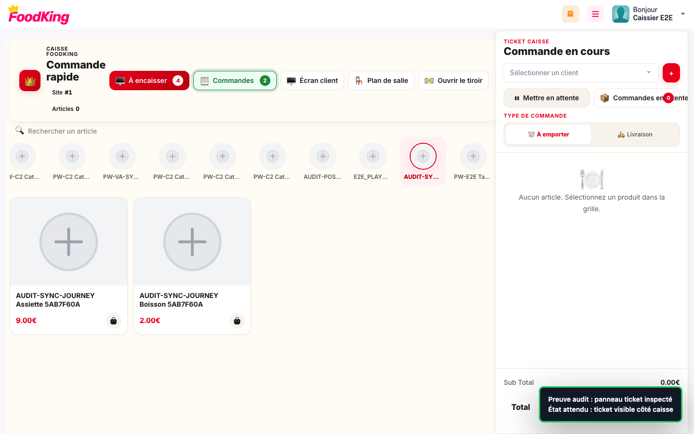

### 3.5 Création commande POS (cash) — `admin/pos/quote` + `admin/pos`

| Champ | Valeur |
|---|---|
| Devis TTC | **12.5** |
| Commande id | **182** |
| File (queue_number) | **A0004** |
| Instruction cuisine (ligne) | `AUDIT-SYNC-JOURNEY POS line 5AB7F60A` |


### Capture `07-pos-after-order-api-success.png`

URL observée : `http://localhost:8000/admin/pos` — capture **viewport** (zone visible ; pour audit papier, refaire un scroll manuel sur les longues listes).

Assertion : preuve API POS visible : file A0004

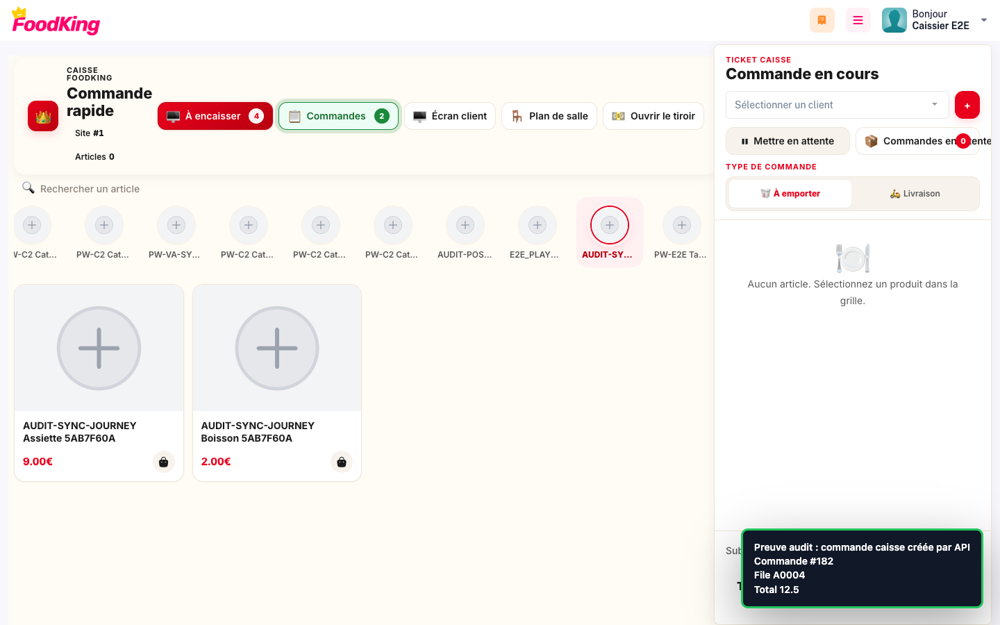

### 3.6 Tracker intégré POS (commandes en cours / prêtes)


### Capture `08-pos-integrated-tracker.png`

URL observée : `http://localhost:8000/admin/pos-orders-tracker` — capture **viewport** (zone visible ; pour audit papier, refaire un scroll manuel sur les longues listes).

Assertion : capture documentaire

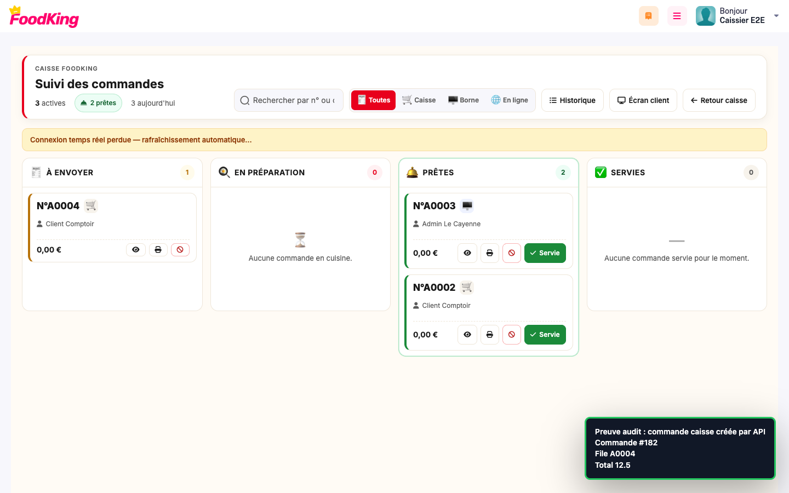

### 3.7 Liste back-office « Commandes caisse » (`/admin/pos-orders`)

On cherche le **queue_number** `A0004` (commande **#182**) dans la grille ; selon filtres / pagination / délai d’indexation SPA, la ligne peut être **absente** sans invalider la preuve API + KDS.


### Capture `09-pos-backoffice-order-list.png`

URL observée : `http://localhost:8000/admin/pos-orders` — capture **viewport** (zone visible ; pour audit papier, refaire un scroll manuel sur les longues listes).

Assertion : liste commandes caisse : file A0004 visible

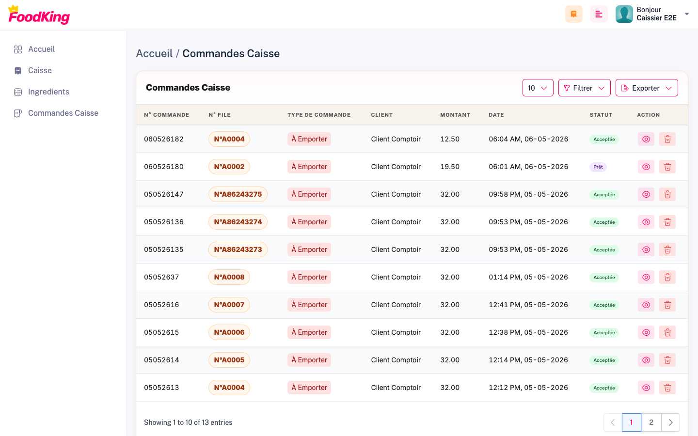


### Capture `10-pos-backoffice-queue-number-visible.png`

URL observée : `http://localhost:8000/admin/pos-orders` — capture **viewport** (zone visible ; pour audit papier, refaire un scroll manuel sur les longues listes).

Assertion : confirmation grille : file A0004 visible

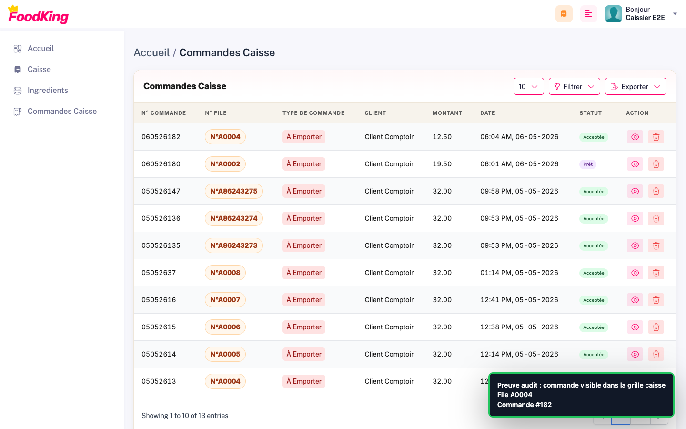

### 3.8 OSS — écran file client (`/admin/order-status-screen`, timeout **10 s**)


### Capture `11-pos-oss-order-status-screen.png`

URL observée : `http://localhost:8000/admin/order-status-screen` — capture **viewport** (zone visible ; pour audit papier, refaire un scroll manuel sur les longues listes).

Assertion : capture documentaire

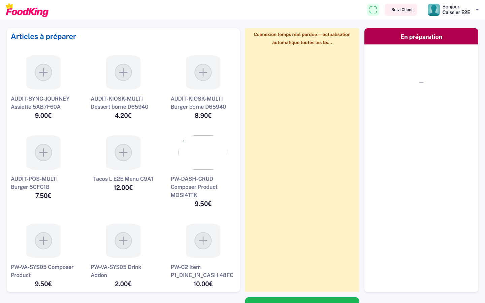

> Route OSS chargée avec le compte caisse sur cet environnement.

---

## 4. Bande borne Kiosk

Parcours **découpé** pour l’audit page par page (équivalent fonctionnel au helper `openKioskCategoryAsCustomer`, mais avec plus de captures).

### 4.1 Login machine borne


### Capture `20-kiosk-after-machine-auth.png`

URL observée : `http://localhost:8000/kiosk/idle` — capture **viewport** (zone visible ; pour audit papier, refaire un scroll manuel sur les longues listes).

Assertion : capture documentaire

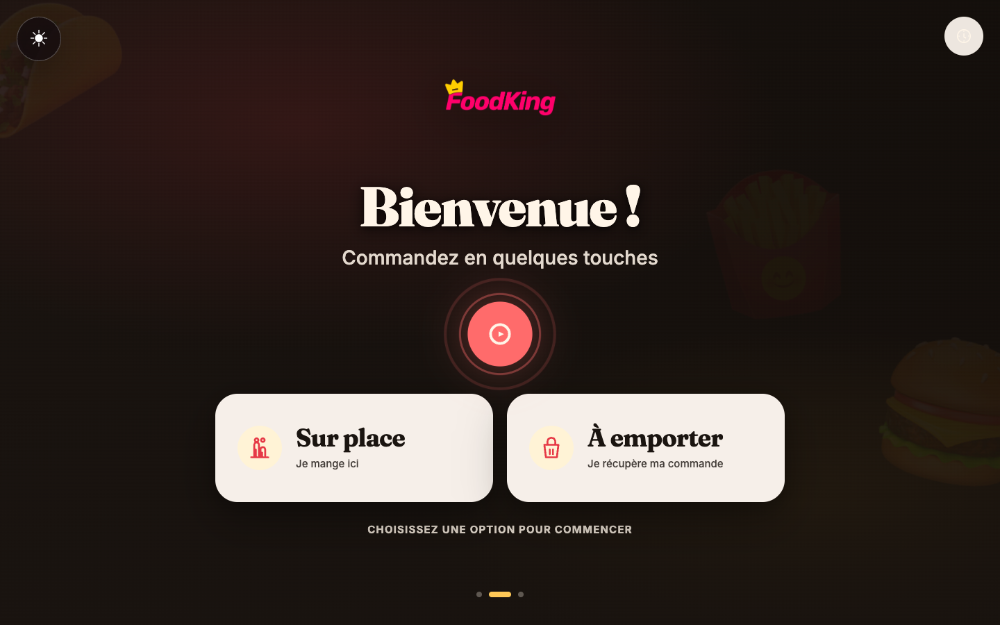

### 4.2 Idle — choix mode (sur place)


### Capture `21-kiosk-idle-order-type.png`

URL observée : `http://localhost:8000/kiosk/idle` — capture **viewport** (zone visible ; pour audit papier, refaire un scroll manuel sur les longues listes).

Assertion : capture documentaire

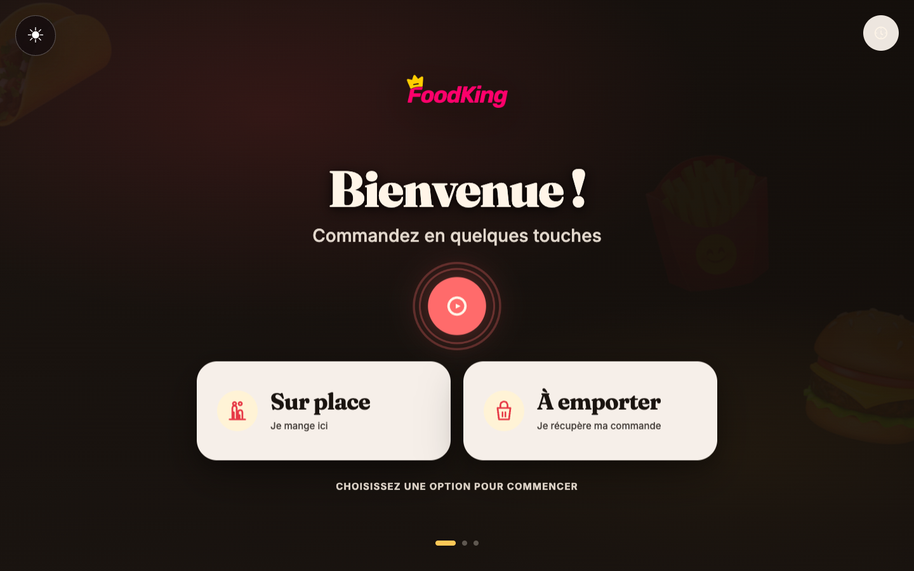

### 4.3 Après « Sur place » — racine catégories


### Capture `22-kiosk-categories-root.png`

URL observée : `http://localhost:8000/kiosk/categories?cat=224` — capture **viewport** (zone visible ; pour audit papier, refaire un scroll manuel sur les longues listes).

Assertion : capture documentaire

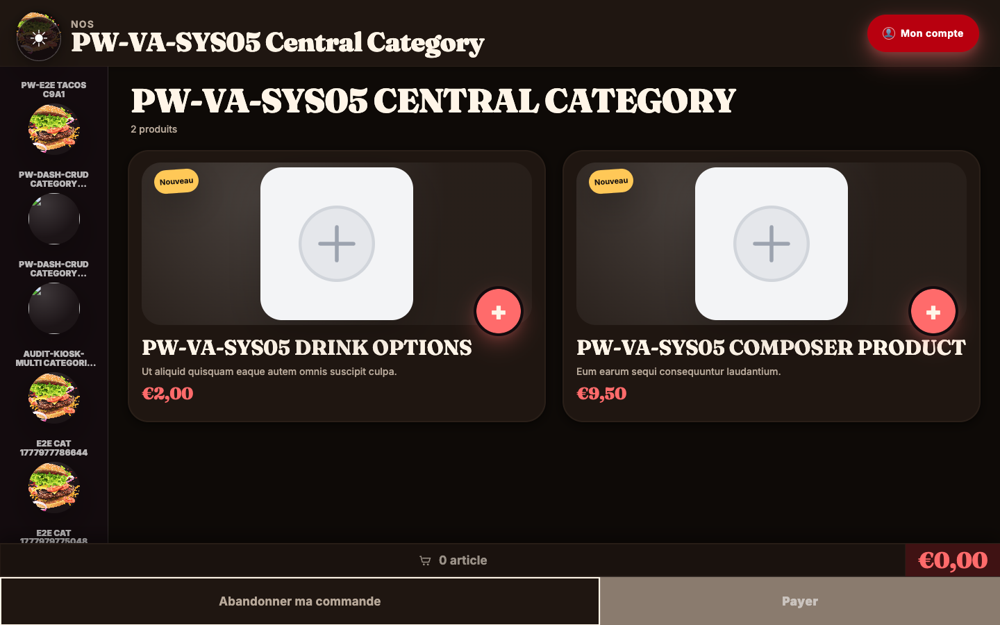

### 4.4 Grille catégorie ciblée (deep link)


### Capture `23-kiosk-category-grid-target.png`

URL observée : `http://localhost:8000/kiosk/categories?cat=305` — capture **viewport** (zone visible ; pour audit papier, refaire un scroll manuel sur les longues listes).

Assertion : grille catégorie chargée avec AUDIT-SYNC-JOURNEY Assiette 5AB7F60A


### 4.5 Carte produit fixture


### Capture `24-kiosk-product-card-visible.png`

URL observée : `http://localhost:8000/kiosk/categories?cat=305` — capture **viewport** (zone visible ; pour audit papier, refaire un scroll manuel sur les longues listes).

Assertion : carte produit fixture visible : AUDIT-SYNC-JOURNEY Assiette 5AB7F60A

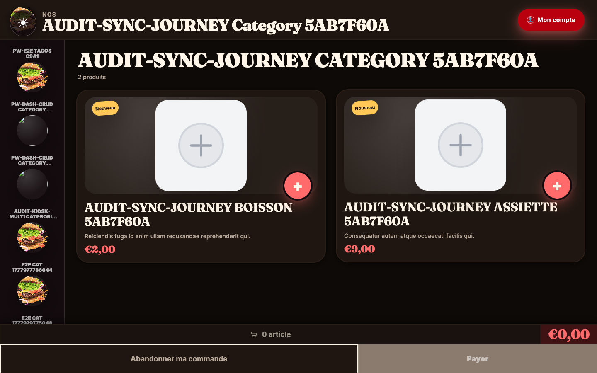

### 4.6 Ajout panier → wizard composer


### Capture `25-kiosk-wizard-after-add.png`

URL observée : `http://localhost:8000/kiosk/categories?cat=305` — capture **viewport** (zone visible ; pour audit papier, refaire un scroll manuel sur les longues listes).

Assertion : capture documentaire

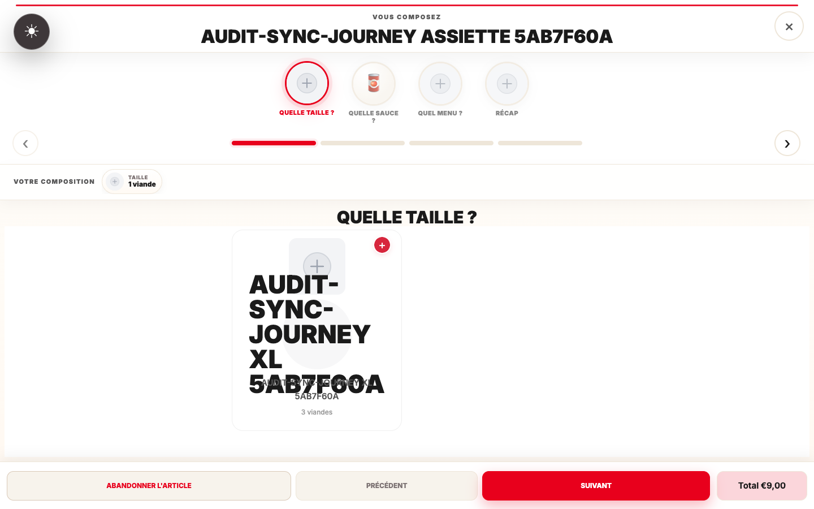

### 4.7 Wizard — jusqu’à **3** « suivant » (borné, une capture par pas)


### Capture `26-kiosk-wizard-step-1.png`

URL observée : `http://localhost:8000/kiosk/categories?cat=305` — capture **viewport** (zone visible ; pour audit papier, refaire un scroll manuel sur les longues listes).

Assertion : capture documentaire

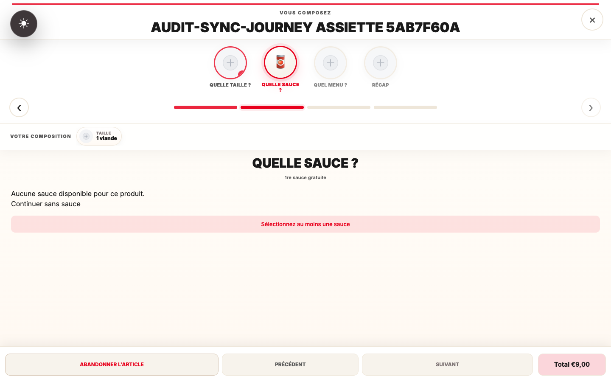

### 4.8 Commande + confirmation paiement carte (API)

| Champ | Valeur |
|---|---|
| Devis TTC | **12.5** |
| Commande id | **183** |
| File | **A0005** |
| payment_confirm | `true` |


### Capture `27-kiosk-after-api-order-and-confirm.png`

URL observée : `http://localhost:8000/kiosk/confirmation?number=A0005&total=12.5` — capture **viewport** (zone visible ; pour audit papier, refaire un scroll manuel sur les longues listes).

Assertion : confirmation borne visible : file A0005

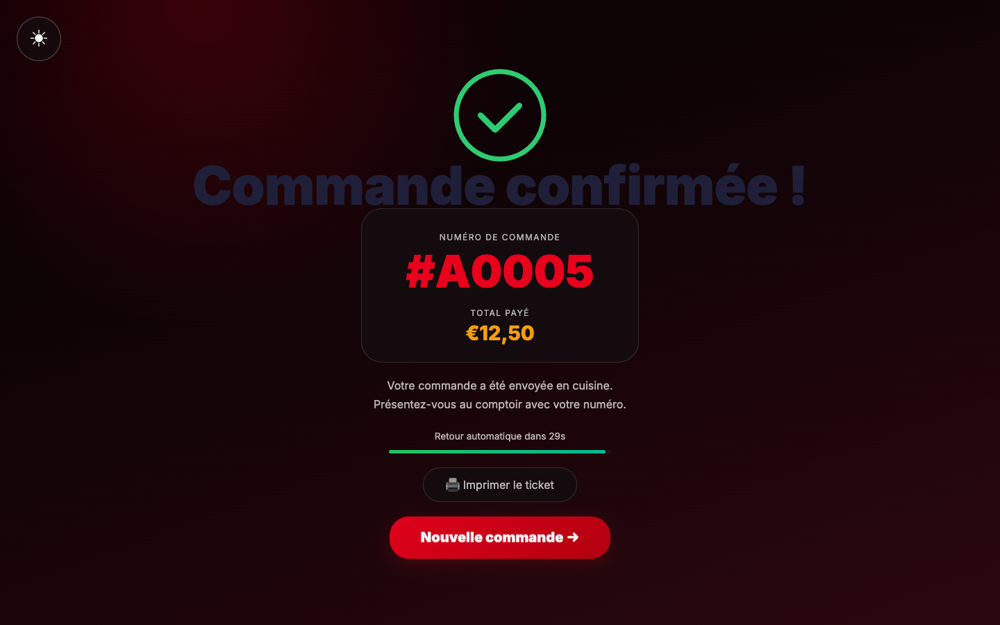

---

## 5. Cuisine KDS


### Capture `30-kds-initial-load.png`

URL observée : `http://localhost:8000/admin/kitchen-display-system` — capture **viewport** (zone visible ; pour audit papier, refaire un scroll manuel sur les longues listes).

Assertion : capture documentaire

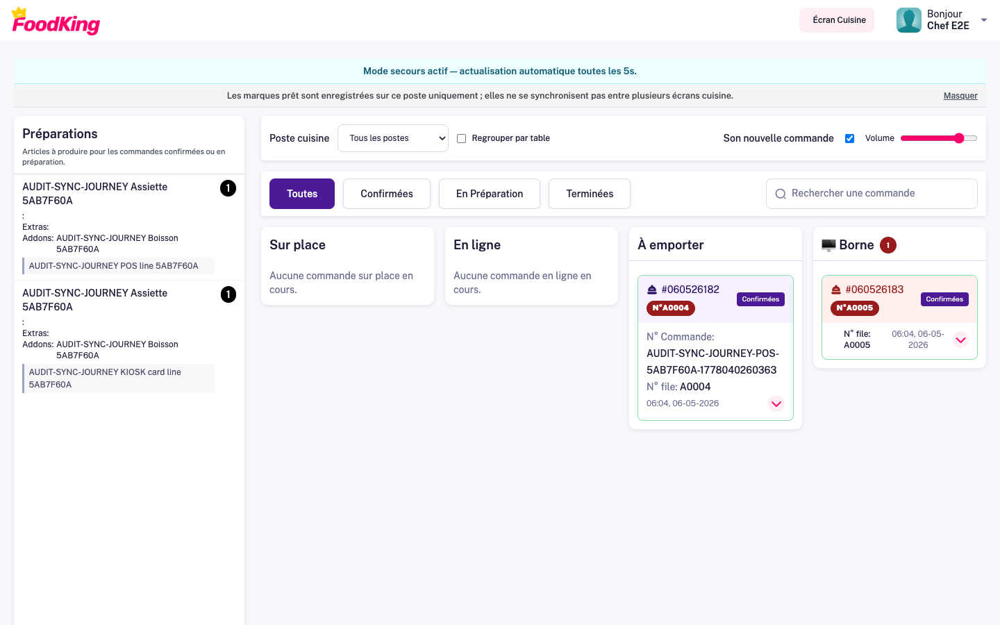


### Capture `31-kds-pos-line-visible.png`

URL observée : `http://localhost:8000/admin/kitchen-display-system` — capture **viewport** (zone visible ; pour audit papier, refaire un scroll manuel sur les longues listes).

Assertion : capture documentaire

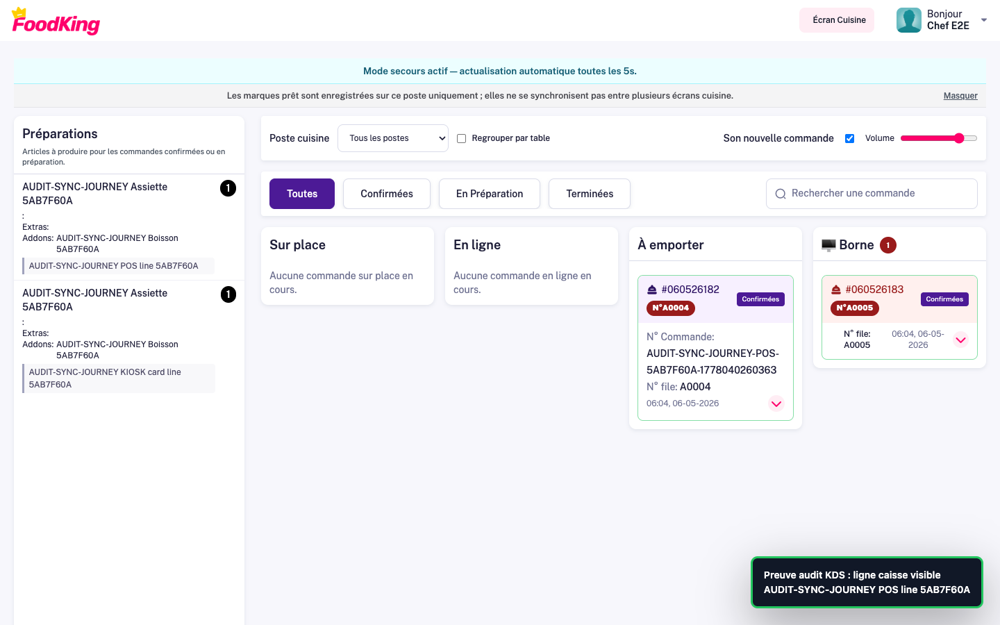


### Capture `32-kds-kiosk-queue-visible.png`

URL observée : `http://localhost:8000/admin/kitchen-display-system` — capture **viewport** (zone visible ; pour audit papier, refaire un scroll manuel sur les longues listes).

Assertion : capture documentaire

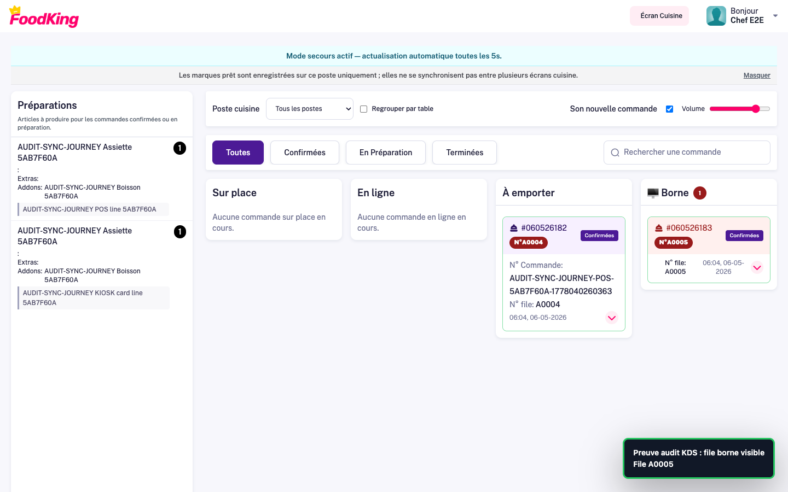


### Capture `33-kds-addon-name-visible.png`

URL observée : `http://localhost:8000/admin/kitchen-display-system` — capture **viewport** (zone visible ; pour audit papier, refaire un scroll manuel sur les longues listes).

Assertion : capture documentaire


### 5.1 Transitions d’état documentées (une capture par phase clé)


### Capture `34-kds-pos-order-preparing.png`

URL observée : `http://localhost:8000/admin/kitchen-display-system` — capture **viewport** (zone visible ; pour audit papier, refaire un scroll manuel sur les longues listes).

Assertion : KDS POS #182 en préparation

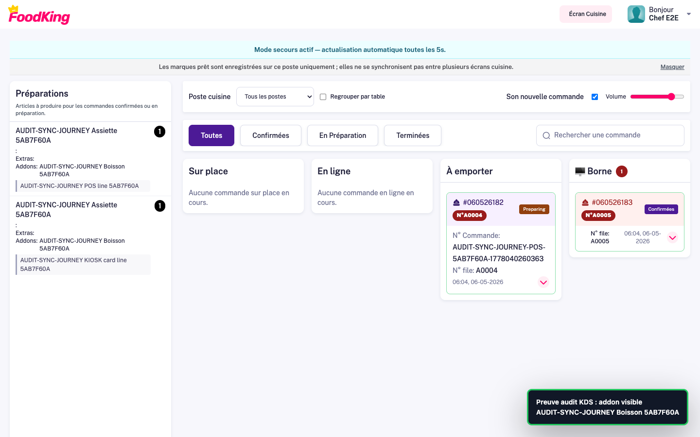


### Capture `35-kds-pos-order-prepared.png`

URL observée : `http://localhost:8000/admin/kitchen-display-system` — capture **viewport** (zone visible ; pour audit papier, refaire un scroll manuel sur les longues listes).

Assertion : KDS POS #182 préparé


### Capture `36-kds-kiosk-order-preparing.png`

URL observée : `http://localhost:8000/admin/kitchen-display-system` — capture **viewport** (zone visible ; pour audit papier, refaire un scroll manuel sur les longues listes).

Assertion : KDS borne #183 en préparation

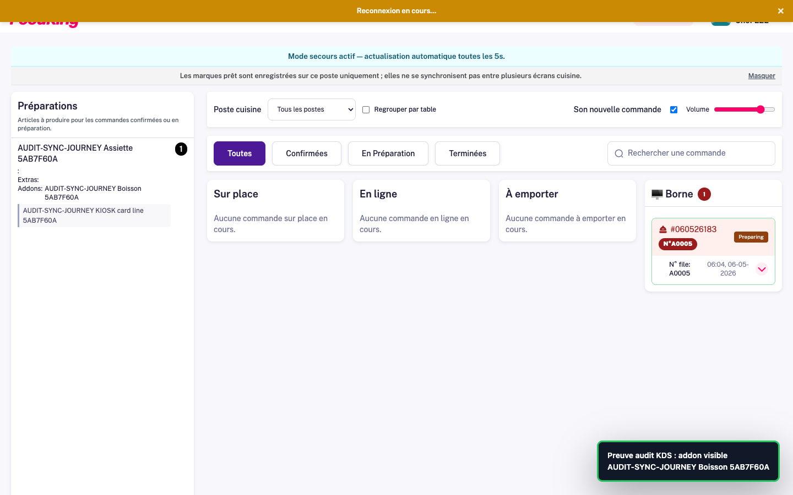


### Capture `37-kds-both-orders-prepared-final.png`

URL observée : `http://localhost:8000/admin/kitchen-display-system` — capture **viewport** (zone visible ; pour audit papier, refaire un scroll manuel sur les longues listes).

Assertion : KDS final : commandes préparées visibles

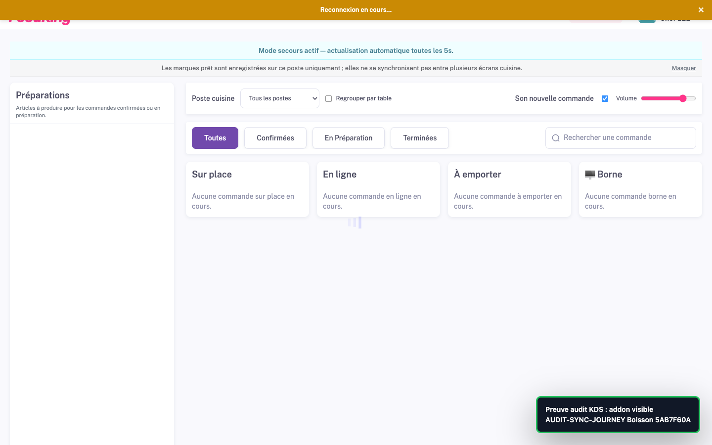

---

## 6. Tables audit backend

### 6.1 Synthèse commandes (SQL via `inspectGlobalTrace`)

| id | surface | file | statut | total TTC | paiement | transitions (résumé) |
|---|---|---|---|---|---|---|
| 182 | pos | `A0004` | 8 | 12.5 | pm=1 / pstat=5 | 4→7 ; 7→8 |
| 183 | kiosk | `A0005` | 8 | 12.5 | pm=4 / pstat=5 | 1→4 ; 4→7 ; 7→8 |

### 6.2 Stocks branch après commandes (extraits)

```json
{
  "main_item": 18,
  "variation": 18,
  "extra": 18,
  "addon_item": 18
}
```

### 6.3 Unicité file d’attente

```json
{
  "A0004": 1,
  "A0005": 1
}
```

### 6.4 Fichier machine complet

- `raw-trace.json` : même structure que le rapport global (orders, composition_snapshot, domain_events, transitions, stock_movement).
- Trace global de référence (autre préfixe) : `reports/antigravity/global-pos-kiosk-order-trace.json` **(présent sur disque)**.

### 6.5 Extrait JSON (tronqué — l’intégralité est dans `raw-trace.json`)

```json
{
  "orders": [
    {
      "id": 182,
      "branch_id": 1,
      "business_date": "2026-05-06",
      "queue_number": "A0004",
      "token": "AUDIT-SYNC-JOURNEY-POS-5AB7F60A-1778040260363",
      "source_surface": "pos",
      "order_type": 10,
      "status": 8,
      "payment_method": 1,
      "payment_status": 5,
      "pos_payment_method": 1,
      "total": 12.5,
      "subtotal": 12.5,
      "discount": 0,
      "fiscal_sequence_no": 26,
      "transaction_id": null,
      "order_items_count": 1,
      "composition_snapshot": {
        "lines": [
          {
            "quantity": 1,
            "line_total": 1,
            "unit_price": 1,
            "attribute_id": 306,
            "variation_id": 261,
            "attribute_name": "AUDIT-SYNC-JOURNEY Taille 5AB7F60A",
            "variation_name": "AUDIT-SYNC-JOURNEY XL 5AB7F60A"
          }
        ],
        "addons": [
          {
            "role": "drink",
            "addon_id": 57,
            "quantity": 1,
            "addon_name": "AUDIT-SYNC-JOURNEY Boisson 5AB7F60A",
            "line_total": 2,
            "unit_price": 2,
            "addon_item_id": 359
          }
        ],
        "extras": [
          {
            "extra_id": 171,
            "quantity": 1,
            "extra_name": "AUDIT-SYNC-JOURNEY Sauce 5AB7F60A",
            "line_total": 0.5,
            "unit_price": 0.5
          }
        ],
        "captured_at": "2026-05-06T06:04:20+02:00",
        "schema_version": 1
      },
      "domain_events": [
        "OrderCreated",
        "OrderStatusChanged"
      ],
      "transitions": [
        {
          "from": 4,
          "to": 7
        },
        {
          "from": 7,
          "to": 8
        }
      ],
      "stock_movement": {
        "count": 4,
        "delta_sum": -4,
        "stockables": [
          "Item#358:-1",
          "ItemVariation#261:-1",
          "ItemExtra#171:-1",
          "Item#359:-1"
        ]
      }
    },
    {
      "id": 183,
      "branch_id": 1,
      "business_date": "2026-05-06",
      "queue_number": "A0005",
      "token": null,
      "source_surface": "kiosk",
      "order_type": 25,
      "status": 8,
      "payment_method": 4,
      "payment_status": 5,
      "pos_payment_method": null,
      "total": 12.5,
      "subtotal": 12.5,
      "discount": 0,
      "fiscal_sequence_no": null,
      "transaction_id": "AUDIT-SYNC-JOURNEY-TPE-SIM-5AB7F60A-1778040280429",
      "order_items_count": 1,
      "composition_snapshot": {
        "lines": [
          {
            "quantity": 1,
            "line_total": 1,
            "unit_price": 1,
            "attribute_id": 306,
            "variation_id": 261,
            "attribute_name": "AUDIT-SYNC-JOURNEY Taille 5AB7F60A",
            "variation_name": "AUDIT-SYNC-JOURNEY XL 5AB7F60A"
          }
        ],
        "addons": [
          {
            "role": "drink",
            "addon_id": 57,
            "quantity": 1,
            "addon_name": "AUDIT-SYNC-JOURNEY Boisson 5AB7F60A",
            "line_total": 2,
            "unit_price": 2,
            "addon_item_id": 359
          }
        ],
        "extras": [
          {
            "extra_id": 171,
            "quantity": 1,
            "extra_name": "AUDIT-SYNC-JOURNEY Sauce 5AB7F60A",
            "line_total": 0.5,
            "unit_price": 0.5
          }
        ],
        "captured_at": "2026-05-06T06:04:40+02:00",
        "schema_version": 1
      },
      "domain_events": [
        "OrderCreated",
        "OrderStatusChanged",
        "OrderStatusChanged"
      ],
      "transitions": [
        {
          "from": 1,
          "to": 4
        },
        {
          "from": 4,
          "to": 7
        },
        {
          "from": 7,
          "to": 8
        }
      ],
      "stock_movement": {
        "count": 4,
        "delta_sum": -4,
        "stockables": [
          "Item#358:-1",
          "ItemVariation#261:-1",
          "ItemExtra#171:-1",
          "Item#359:-1"
        ]
      }
    }
  ],
  "stock": {
    "main_item": 18,
    "variation": 18,
    "extra": 18,
    "addon_item": 18
  },
  "queue_counts": {
    "A0004": 1,
    "A0005": 1
  }
}
```

---

## 7. Liste fichiers image

### 7.0 Contrat de preuve visuelle

| Capture | Assertion | Extrait texte observé |
|---|---|---|
| `01-admin-dashboard-prelude.png` | capture documentaire | Bonjour Admin Le Cayenn.. Admin Le Cayenne admin@lecayenne.fr +330600000000 0.00€ Edit Profile Change Password Logout Accueil Caisse Stock Catalogue Attributs Produits Ingredients  |
| `02-pos-home-menu-loaded.png` | capture documentaire | Bonjour Caissier E2E Caissier E2E pos@lecayenne.fr +330600000002 0.00€ Edit Profile Change Password Logout Accueil Caisse Ingredients Commandes Caisse Aller au panier 👑 CAISSE FOO |
| `03-pos-category-selected.png` | capture documentaire | Bonjour Caissier E2E Caissier E2E pos@lecayenne.fr +330600000002 0.00€ Edit Profile Change Password Logout Accueil Caisse Ingredients Commandes Caisse Aller au panier 👑 CAISSE FOO |
| `04-pos-wizard-open-after-item-click.png` | capture documentaire | Bonjour Caissier E2E Caissier E2E pos@lecayenne.fr +330600000002 0.00€ Edit Profile Change Password Logout Accueil Caisse Ingredients Commandes Caisse Aller au panier 👑 CAISSE FOO |
| `05-pos-after-wizard-cancel.png` | capture documentaire | Bonjour Caissier E2E Caissier E2E pos@lecayenne.fr +330600000002 0.00€ Edit Profile Change Password Logout Accueil Caisse Ingredients Commandes Caisse Aller au panier 👑 CAISSE FOO |
| `06-pos-cart-panel-open.png` | panneau ticket caisse inspecté | Bonjour Caissier E2E Caissier E2E pos@lecayenne.fr +330600000002 0.00€ Edit Profile Change Password Logout Accueil Caisse Ingredients Commandes Caisse Aller au panier 👑 CAISSE FOO |
| `07-pos-after-order-api-success.png` | preuve API POS visible : file A0004 | Bonjour Caissier E2E Caissier E2E pos@lecayenne.fr +330600000002 0.00€ Edit Profile Change Password Logout Accueil Caisse Ingredients Commandes Caisse Aller au panier 👑 CAISSE FOO |
| `08-pos-integrated-tracker.png` | capture documentaire | Bonjour Caissier E2E Caissier E2E pos@lecayenne.fr +330600000002 0.00€ Edit Profile Change Password Logout Accueil Caisse Ingredients Commandes Caisse CAISSE FOODKING Suivi des com |
| `09-pos-backoffice-order-list.png` | liste commandes caisse : file A0004 visible | Bonjour Caissier E2E Caissier E2E pos@lecayenne.fr +330600000002 0.00€ Edit Profile Change Password Logout Accueil Caisse Ingredients Commandes Caisse Accueil Commandes Caisse Comm |
| `10-pos-backoffice-queue-number-visible.png` | confirmation grille : file A0004 visible | Bonjour Caissier E2E Caissier E2E pos@lecayenne.fr +330600000002 0.00€ Edit Profile Change Password Logout Accueil Caisse Ingredients Commandes Caisse Accueil Commandes Caisse Comm |
| `11-pos-oss-order-status-screen.png` | capture documentaire | Suivi Client Bonjour Caissier E2E Caissier E2E pos@lecayenne.fr +330600000002 0.00€ Edit Profile Change Password Logout Articles à préparer AUDIT-SYNC-JOURNEY Assiette 5AB7F60A 9.0 |
| `20-kiosk-after-machine-auth.png` | capture documentaire | ☀ 🌮 🍔 🍟 Bienvenue ! Commandez en quelques touches Sur place Je mange ici À emporter Je récupère ma commande CHOISISSEZ UNE OPTION POUR COMMENCER |
| `21-kiosk-idle-order-type.png` | capture documentaire | ☀ 🌮 🍔 🍟 Bienvenue ! Commandez en quelques touches Sur place Je mange ici À emporter Je récupère ma commande CHOISISSEZ UNE OPTION POUR COMMENCER |
| `22-kiosk-categories-root.png` | capture documentaire | ☀ NOS PW-VA-SYS05 Central Category 👤 Mon compte PW-E2E TACOS C9A1 PW-DASH-CRUD CATEGORY MOSOO30C PW-DASH-CRUD CATEGORY MOSWKAGX AUDIT-KIOSK-MULTI CATEGORIE BORNE D65940 E2E CAT 17 |
| `23-kiosk-category-grid-target.png` | grille catégorie chargée avec AUDIT-SYNC-JOURNEY Assiette 5AB7F60A | ☀ NOS AUDIT-SYNC-JOURNEY Category 5AB7F60A 👤 Mon compte PW-E2E TACOS C9A1 PW-DASH-CRUD CATEGORY MOSOO30C PW-DASH-CRUD CATEGORY MOSWKAGX AUDIT-KIOSK-MULTI CATEGORIE BORNE D65940 E2 |
| `24-kiosk-product-card-visible.png` | carte produit fixture visible : AUDIT-SYNC-JOURNEY Assiette 5AB7F60A | ☀ NOS AUDIT-SYNC-JOURNEY Category 5AB7F60A 👤 Mon compte PW-E2E TACOS C9A1 PW-DASH-CRUD CATEGORY MOSOO30C PW-DASH-CRUD CATEGORY MOSWKAGX AUDIT-KIOSK-MULTI CATEGORIE BORNE D65940 E2 |
| `25-kiosk-wizard-after-add.png` | capture documentaire | ☀ NOS AUDIT-SYNC-JOURNEY Category 5AB7F60A 👤 Mon compte PW-E2E TACOS C9A1 PW-DASH-CRUD CATEGORY MOSOO30C PW-DASH-CRUD CATEGORY MOSWKAGX AUDIT-KIOSK-MULTI CATEGORIE BORNE D65940 E2 |
| `26-kiosk-wizard-step-1.png` | capture documentaire | ☀ NOS AUDIT-SYNC-JOURNEY Category 5AB7F60A 👤 Mon compte PW-E2E TACOS C9A1 PW-DASH-CRUD CATEGORY MOSOO30C PW-DASH-CRUD CATEGORY MOSWKAGX AUDIT-KIOSK-MULTI CATEGORIE BORNE D65940 E2 |
| `27-kiosk-after-api-order-and-confirm.png` | confirmation borne visible : file A0005 | ☀ Commande confirmée ! NUMÉRO DE COMMANDE #A0005 TOTAL PAYÉ €12,50 Votre commande a été envoyée en cuisine. Présentez-vous au comptoir avec votre numéro. Retour automatique dans 29 |
| `30-kds-initial-load.png` | capture documentaire | Écran Cuisine Bonjour Chef E2E Chef E2E chef@lecayenne.fr +330600000003 0.00€ Edit Profile Change Password Logout Mode secours actif — actualisation automatique toutes les 5s. Les  |
| `31-kds-pos-line-visible.png` | capture documentaire | Écran Cuisine Bonjour Chef E2E Chef E2E chef@lecayenne.fr +330600000003 0.00€ Edit Profile Change Password Logout Mode secours actif — actualisation automatique toutes les 5s. Les  |
| `32-kds-kiosk-queue-visible.png` | capture documentaire | Écran Cuisine Bonjour Chef E2E Chef E2E chef@lecayenne.fr +330600000003 0.00€ Edit Profile Change Password Logout Mode secours actif — actualisation automatique toutes les 5s. Les  |
| `33-kds-addon-name-visible.png` | capture documentaire | Écran Cuisine Bonjour Chef E2E Chef E2E chef@lecayenne.fr +330600000003 0.00€ Edit Profile Change Password Logout Mode secours actif — actualisation automatique toutes les 5s. Les  |
| `34-kds-pos-order-preparing.png` | KDS POS #182 en préparation | Écran Cuisine Bonjour Chef E2E Chef E2E chef@lecayenne.fr +330600000003 0.00€ Edit Profile Change Password Logout Reconnexion en cours… × Mode secours actif — actualisation automat |
| `35-kds-pos-order-prepared.png` | KDS POS #182 préparé | Écran Cuisine Bonjour Chef E2E Chef E2E chef@lecayenne.fr +330600000003 0.00€ Edit Profile Change Password Logout Reconnexion en cours… × Mode secours actif — actualisation automat |
| `36-kds-kiosk-order-preparing.png` | KDS borne #183 en préparation | Écran Cuisine Bonjour Chef E2E Chef E2E chef@lecayenne.fr +330600000003 0.00€ Edit Profile Change Password Logout Reconnexion en cours… × Mode secours actif — actualisation automat |
| `37-kds-both-orders-prepared-final.png` | KDS final : commandes préparées visibles | Écran Cuisine Bonjour Chef E2E Chef E2E chef@lecayenne.fr +330600000003 0.00€ Edit Profile Change Password Logout Reconnexion en cours… × Mode secours actif — actualisation automat |

- `screenshots/01-admin-dashboard-prelude.png`
- `screenshots/02-pos-home-menu-loaded.png`
- `screenshots/03-pos-category-selected.png`
- `screenshots/04-pos-wizard-open-after-item-click.png`
- `screenshots/05-pos-after-wizard-cancel.png`
- `screenshots/06-pos-cart-panel-open.png`
- `screenshots/07-pos-after-order-api-success.png`
- `screenshots/08-pos-integrated-tracker.png`
- `screenshots/09-pos-backoffice-order-list.png`
- `screenshots/10-pos-backoffice-queue-number-visible.png`
- `screenshots/11-pos-oss-order-status-screen.png`
- `screenshots/20-kiosk-after-machine-auth.png`
- `screenshots/21-kiosk-idle-order-type.png`
- `screenshots/22-kiosk-categories-root.png`
- `screenshots/23-kiosk-category-grid-target.png`
- `screenshots/24-kiosk-product-card-visible.png`
- `screenshots/25-kiosk-wizard-after-add.png`
- `screenshots/26-kiosk-wizard-step-1.png`
- `screenshots/27-kiosk-after-api-order-and-confirm.png`
- `screenshots/30-kds-initial-load.png`
- `screenshots/31-kds-pos-line-visible.png`
- `screenshots/32-kds-kiosk-queue-visible.png`
- `screenshots/33-kds-addon-name-visible.png`
- `screenshots/34-kds-pos-order-preparing.png`
- `screenshots/35-kds-pos-order-prepared.png`
- `screenshots/36-kds-kiosk-order-preparing.png`
- `screenshots/37-kds-both-orders-prepared-final.png`

**Total captures** : 27

---

## 8. Grille de relecture humaine

| # | Question | Preuve attendue |
|---:|---|---|
| 1 | Le POS affiche-t-il la catégorie & l’item fixture ? | Captures 02–05 |
| 2 | Après API POS, le ticket / bannières reflètent-elles le total 12,50 € ? | Capture **07** |
| 3 | Le tracker & la liste `/admin/pos-orders` montrent-ils le **queue_number** POS ? | **08–10** |
| 4 | OSS file d’attente client | **§3.8** (capture **11** si route OK) |
| 5 | Parcours kiosk : idle → sur place → grille → wizard (≤3 suivant) → API | **20–27** |
| 6 | KDS : deux files distinctes + addon + 4 transitions | 30–37 |
| 7 | Backend : 2 lignes `orders`, stocks -4, pas de collision `queue_counts` | §6 + `raw-trace.json` |

---

## 9. Vue consolidée du flux (data)

```mermaid
flowchart LR
  subgraph Admin
    A1[login admin] --> A2[menu-projection POS+Kiosk]
  end
  subgraph POS
    P1[login caissier] --> P2[/admin/pos]
    P2 --> P3[quote + order API]
    P3 --> P4[tracker + pos-orders]
  end
  subgraph Kiosk
    K1[login borne] --> K2[idle sur place]
    K2 --> K3[grille + wizard]
    K3 --> K4[quote + order + payment-confirm API]
  end
  subgraph KDS
    D1[login chef] --> D2[KDS grid]
    D2 --> D3[change-status x4]
  end
  A2 --> P1
  P4 --> D2
  K4 --> D2
```

---

## 10. Manifeste d’intégrité (SHA-256)

Après chaque exécution réussie du spec, le fichier **`MANIFEST.json`** à la racine de ce dossier recense **chaque fichier** (captures, Markdown, JSON) avec **taille en octets** et **empreinte SHA-256**.

- Utilisation audit : vérifier que les PNG / JSON n’ont pas été altérés entre transfert archivage et relecture.
- Le manifeste est (re)généré dans le bloc `finally` du test, après écriture du Markdown.

---

## Annexes — pistes d’amélioration UX (issues typiques)

- **Wizard POS vs chip panier** : si le wizard reste ouvert, le chip « Commandes » / panier peut être masqué par une couche `.formule-card` — documenté en §3.3bis.
- **Deep link kiosk** : sans idle + type de commande, `/kiosk/categories?cat=` peut échouer — d’où le parcours §4.2–4.4.
- **Viewport vs pleine page** : captures volontairement **viewport** pour éviter timeouts screenshot sur grilles très hautes ; compléter par captures manuelles scroll si besoin légal / QA papier.

