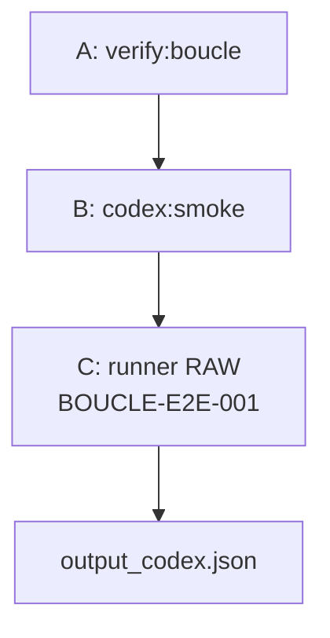

# RUN — Boucle orchestre / simulation E2E (trip technique)

**Objectif** : prouver que la **chaîne** « gouvernance (docs + binaire claude) → proxy **codex** (plafond sortie 2M) → **mission** → `output_codex.json` » s’enchaîne, alignée sur l’**intention** (terminal-first, marge côté `max_completion_tokens` gérée dans le connecteur).

**Commande** : `npm run boucle:e2e` (script `scripts/foodking-boucle-e2e-demo.sh`).

**Preuve d’exécution** (copiée localement) : `reports/execution/BOUCLE_E2E_LAST_RUN.txt`.

**Statut** (dernière course 2026-04-23) : **OK** (exit 0) — A + B + C **verts**.

**Option (coût : claude + codex côté verify full)** : `INCLUDE_FULL_VERIFY=1 npm run boucle:e2e` (remplace [B] par `verify:boucle:full` → pas de double smoke).

---

## 1) Schéma — **boucle complète** (session Cursor, `run-cycle`)

- **Step 2 (complexe)** = PRIMARY **`codex-terminal`** (`npm run codex:complex -- TASK_ID`).  
- **Step 5** = PRIMARY **terminal** `claude` (hors repli `cursor-session` documenté).

---

## 2) Schéma — **ce que `npm run boucle:e2e` exécute** (trip automatisé)

- **A** : binaire `claude` + vérification doc (`run-cycle`, `CODEX_API_DELEGATION`). **Sans** requête API (mode défaut `VERIFY_BILLING_FULL=0`).  
- **B** : 1 requête proxy, **plafond** affiché **2M** côté requête.  
- **C** : mini-EXECUTE contrôlé (3 lignes de référence attendues).

**Extrait reçu (preuve)** : 3 lignes `boucle` / `codex-terminal` / `OK` (voir journal).

---

## 3) Limites de la simulation

- N’inclut **pas** PLAN / VALIDATE / **AUDIT claude** complets (phases manuelles ou `run-cycle` en session).  
- Pour prouver **claude API** + **codex** en une seule autre course : `INCLUDE_FULL_VERIFY=1 npm run boucle:e2e`.

**Fin du rapport (reproductible : relancer `npm run boucle:e2e`).**
