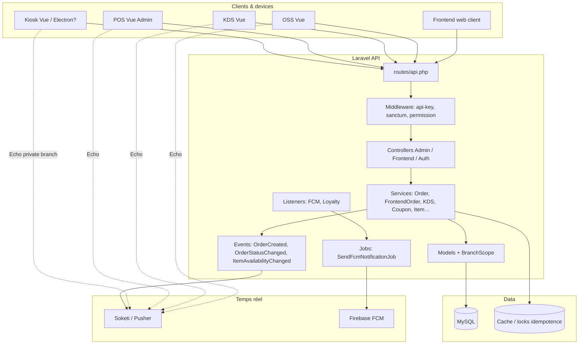
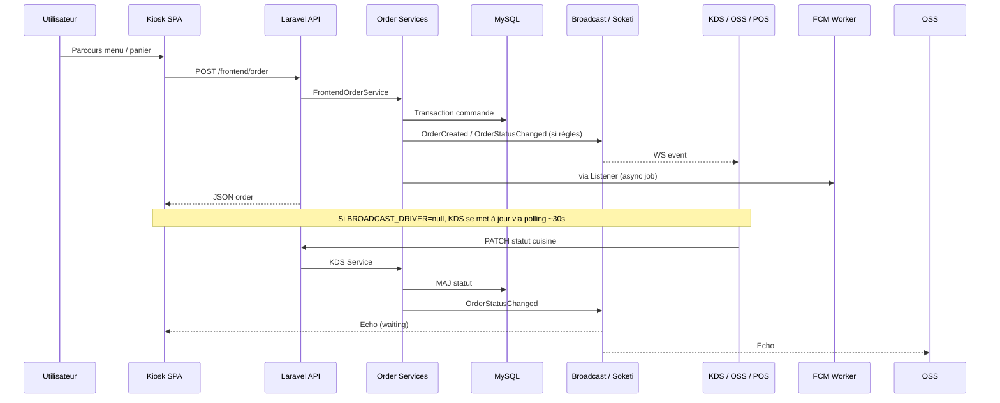
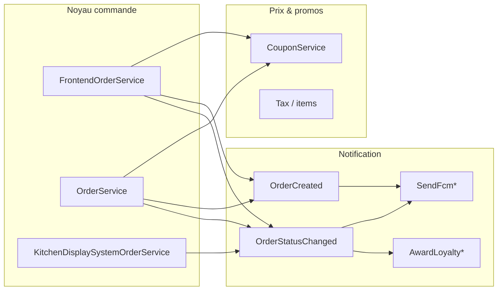

# Audit profond — Projet FoodKing (monolithe) + plan de vérification & amélioration massif

**Date** : 2026-03-31  
**Rôle** : Architecte / relecture (conforme `AGENTS.md` : analyse transversale, authz, flux commande, synchro, stratégie de tests)  
**Note modèle** : Ce document est rédigé selon les exigences de rigueur « architecte » du dépôt. L’environnement d’exécution Cursor ne permet pas de forcer un modèle nommé « Claude Opus » ; le contenu suit néanmoins strictement le workflow et les sources de vérité du projet.

**Sources de vérité lues pour la cohérence** : `AGENTS.md`, `docs/PROJECT_CONTINUITY_AND_VISION.md`, `docs/ARCHITECTURE.md`, `docs/ORDER_FLOW.md`, `docs/DEVICE_FLOW.md`, `docs/API_MAP.md`, `docs/TEST_PLAN.md`, `reports/review/AUDIT_SYNC_BROADCAST_ARCHITECTURE_2026-03-31.md`, inventaires code (services, tests).

---

## 1. Synthèse exécutive (10 lignes)

- **Stack** : Laravel 9 + SPA Vue 3 + MySQL ; Sanctum + Spatie Permission ; broadcast Pusher-compatible (Soketi) ; FCM pour pushes ; queue souvent `sync` en dev.  
- **Cœur métier** : `OrderService` (POS / tables / certains flux admin) et `FrontendOrderService` (kiosk / web) partagent la table `orders` avec deux modèles Eloquent (`Order`, `FrontendOrder`).  
- **Synchro temps réel visible** : `OrderCreated`, `OrderStatusChanged`, `ItemAvailabilityChanged` sur canaux `private-branch.{id}` ; consommateurs KDS, OSS, POS, kiosk (partiel).  
- **Synchro indirecte** : listeners `AwardLoyaltyPointsOnDelivery`, `SendFcmOnOrderCreated/Change` ; événements mail/SMS/push legacy sur statuts ; idempotence + locks sur création borne.  
- **Fort** : recalcul prix serveur, durcissement sécurité (tokens expirants, idempotence, IDOR address, reset password, colonnes SQL allowlist, isolation branche kiosk).  
- **Fragile config** : `BROADCAST_DRIVER` défaut `null` → pas de WS réel ; FCM sans clés → silence ; `DEVICE_FLOW.md` encore partiellement obsolète (mention Firebase vs Echo).  
- **Tests** : ~39 fichiers Feature PHPUnit + ~14 specs JS kiosk/POS ; run PHP complet sujet à pression mémoire → scripts par lots documentés (`scripts/run_php_feature_batches.sh`).  
- **Non couvert par tests auto** : E2E navigateur multi-écrans, TPE physique, Electron hors repo, charge Soketi sous panne.  
- **Reste produit** (vision doc) : amend commande POS, temps réel « garanti » (ops), parité merchandising Splash avancée (« comme d’habitude »), stock bloquant bout-en-bout.  
- **Verdict plan** : poursuivre en **3 volets** — (A) ops & observabilité temps réel, (B) dette doc + tests mémoire, (C) produit / parité borne.

---

## 2. Méthodologie d’audit (profondeur)

| Couche | Méthode | Résultat |
|--------|---------|----------|
| HTTP | `routes/api.php` + middlewares | Cartographie des surfaces (admin, frontend, auth, broadcast) |
| Métier | `app/Services/*` (87 fichiers) | Identification des agrégats : commande, menu, coupon, KDS, fidélité |
| Données | Models + `BranchScope`, `DefaultAccess*` | Multi-tenant par branche ; pièges tests vs prod |
| Événements | `app/Events/*`, `EventServiceProvider`, dispatches dans services | Graphe cause → effet (broadcast + FCM + loyalty) |
| Front | `resources/js/components/**`, `store/modules`, `helpers/kiosk*` | Flux Vue alignés API ; Echo + polling |
| Sécurité | `AUTHZ_MATRIX`, contrôleurs auth, `AddressRequest`, rate limits | Matrice abilities / rôles |
| Tests | `tests/Feature`, `tests/Unit`, `tests/js` | Couverture indicative + lacunes E2E |

**Limite** : un audit « fichier par fichier » exhaustif (milliers de fichiers) n’apporte pas de valeur proportionnelle ; l’audit **par couche et par flux critique** est la norme industrielle. Ce rapport liste les **fichiers pivots** et l’**ordre d’invocation** pour les chemins critiques.

---

## 3. Ordre logique d’architecture (couches)

```
Requête HTTP
  → Middleware global (API key, CORS, Sanctum…)
  → Route groupe (permissions Spatie, abilities kiosk)
  → Controller (validation Request, réponse Resource)
  → Service (transaction DB, règles métier, coupons, taxes)
  → Model + scopes (BranchScope)
  → Events (OrderCreated / OrderStatusChanged / ItemAvailabilityChanged)
       → Broadcast (Soketi) + Listeners → Jobs FCM / Loyalty
  → Réponse JSON / Resource
```

**Principe** : les contrôleurs restent fins ; la **vérité prix / statut** est dans les **Services**, pas dans le client.

---

## 4. Fichiers pivots par domaine (non exhaustif mais structurant)

### 4.1 Commande & statuts

| Ordre logique | Fichier | Rôle |
|---------------|---------|------|
| 1 | `routes/api.php` | Point d’entrée, throttle, auth |
| 2 | `Frontend/OrderController.php` | Kiosk / web : création, show, statut client, paiement |
| 3 | `Admin/OrderController.php` (ou équivalent POS) | Liste / actions staff |
| 4 | `FrontendOrderService.php` | Création kiosk, idempotence, loyalty, finalize paiement différé, broadcast |
| 5 | `OrderService.php` | POS, tables, coupons, changements statut staff, annulation client (Order) |
| 6 | `KitchenDisplaySystemOrderService.php` | Transitions cuisine + broadcast |
| 7 | `OrderStatusScreenOrderService.php` | Lecture OSS |
| 8 | `Models/Order.php`, `Models/FrontendOrder.php` | Persistance, BranchScope |
| 9 | `Events/OrderCreated.php`, `OrderStatusChanged.php` | Contrat temps réel |

### 4.2 Synchronisation & notifications

| Fichier | Rôle |
|---------|------|
| `routes/channels.php` | Autorisation `branch.{id}` (kiosk machine vs staff) |
| `BroadcastServiceProvider.php` | `/api/broadcasting/auth` + Sanctum |
| `resources/js/bootstrap.js` | Echo + Bearer + refresh post-login |
| `Listeners/SendFcmOnOrderCreated.php`, `SendFcmOnOrderStatusChange.php` | Pont vers FCM (async) |
| `Listeners/AwardLoyaltyPointsOnDelivery.php` | Fidélité sur statuts terminaux |
| `Events/ItemAvailabilityChanged.php` | Sync menu vers kiosks (multi-canaux branches actives) |

### 4.3 Kiosk (Vue)

| Fichier | Rôle |
|---------|------|
| `router/modules/kioskRoutes.js` | Navigation borne |
| `store/modules/kioskCart.js`, `kioskMenu.js` | État panier / catalogue |
| `helpers/kioskOfflineQueue.js`, `kioskPricing.js`, `kioskFormatPrice.js` | Offline, prix affichage, cohérence avec config |
| `KioskAppComponent.vue` | Shell, Echo `ItemAvailabilityChanged` |
| `KioskIdleScreenComponent.vue` → … → `KioskConfirmationComponent.vue` | Parcours client |
| `KitchenDisplaySystemComponent.vue`, `PreparingAndReadyComponent.vue`, `PosComponent.vue` | Consommateurs temps réel + polling |

### 4.4 Sécurité & auth

| Fichier | Rôle |
|---------|------|
| `LoginController.php`, `RefreshTokenController.php`, `KioskMachineLoginController.php`, `ForgotPasswordController.php` | Tokens, expiration, reset sécurisé |
| `config/sanctum.php` | TTL tokens |
| `config/kiosk.php` + `master.blade.php` | Config borne sans fuite secrets |
| `AddressRequest.php` | IDOR |

---

## 5. Flux critiques — séquences (logique)

### 5.1 Kiosk : commande espèces (résumé)

1. Menu : GET items / catégories (cache client possible).  
2. Panier : state local + éventuellement upsell API.  
3. POST `/frontend/order` : serveur recalcule, persiste, **broadcast** `OrderCreated` + `OrderStatusChanged` si passage direct ACCEPT (selon règles paiement).  
4. KDS/OSS/POS : Echo ou polling → rafraîchissement listes.  
5. FCM : notifications cuisine / POS / client selon listener.

### 5.2 Kiosk : paiement carte différé

1. POST order → commande PENDING ou équivalent métier sans signal KDS prématuré.  
2. Confirmation TPE → `payment-confirm` → `finalizePaidKioskOrder` → **alors** `OrderCreated` / statuts attendus.  
3. **Point de synchro subtil** : tout écran qui suppose « commande = cuisine » doit respecter ce découplage.

### 5.3 POS / KDS

1. Staff change statut via `OrderService` ou `KitchenDisplaySystemOrderService`.  
2. `OrderStatusChanged` → OSS + kiosk waiting + FCM + loyalty si critères remplis.

---

## 6. Matrice synchronisation (direct vs indirect)

| Mécanisme | Type | Producteurs | Consommateurs | Risque si cassé |
|-----------|------|-------------|----------------|-----------------|
| REST API | Direct | Tous clients | Tous | Données fausses si client fait confiance aux prix locaux |
| WebSocket Echo | Direct | Laravel broadcast | KDS, OSS, POS, Kiosk (partiel) | Retard 30s si driver null |
| Polling 30s | Direct (HTTP répété) | Composants Vue | KDS, OSS, POS | Latence, charge |
| FCM jobs | Indirect | Listeners | Apps mobile / topics | Silencieux si mal config |
| Mail/SMS/Push legacy events | Indirect | OrderService paths | Utilisateurs | Parallèle au WS |
| IndexedDB offline queue | Indirect | Kiosk | API au retry | Doublons sans idempotence (mitigé) |
| ItemAvailabilityChanged | Direct multi-cast | ItemService | Kiosks | Coût si N branches très grand |

---

## 7. Ce qui a été fortement renforcé (cycles d’audit récents)

Synthèse alignée sur l’historique de la session / git (sans rejouer chaque ligne de diff) :

- **Intégrité financière** : discount ligne forcé serveur, coupons / loyalty validés serveur, sanitization `order_column` / LIKE.  
- **Sécurité** : Sanctum expiration, refresh révoque ancien token, loyalty check authentifié, adresses IDOR, reset password avec jeton post-OTP, dashboard admin non accessible avec token kiosk-only, rate limit commandes frontend.  
- **Concurrence** : idempotence + `Cache::lock`, mutex sync file offline.  
- **UX / i18n borne** : chaînes migrées vers clés, helpers prix partagés, wizard steps sync parent/enfant.  
- **Tests** : nombreux tests Feature réparés ou ajoutés (kiosk, KDS, scope, discount, payment state machine, etc.) ; Vitest sur helpers kiosk.  
- **Tooling** : exécution PHPUnit par lots + profil mémoire.  
- **Documentation** : `API_MAP`, `TEST_PLAN`, rapports review/execution/antigravity.

---

## 8. Points restants à vérifier ou améliorer (backlog plan structuré)

### Phase A — Ops & « temps réel garanti » (P0–P1)

| ID | Tâche | Vérification | Test |
|----|--------|--------------|------|
| A1 | `BROADCAST_DRIVER=pusher` + Soketi UP sur chaque env | Checklist déploiement + healthcheck | Anti-Gravity ou script curl WS |
| A2 | Alerting si broadcast échoue (taux d’erreurs logs) | Log central ou compteur | Observabilité manuelle d’abord |
| A3 | Décision queue : `sync` vs `database` + workers pour FCM | Charge mesurée | Charge test Kimi |
| A4 | Corriger `DEVICE_FLOW.md` (Firebase → Echo/polling) | Relecture doc | No-test |

### Phase B — Documentation & dette cognitive (P1)

| ID | Tâche | Détail |
|----|--------|--------|
| B1 | Cartographier **tous** les chemins `changeStatus` (Order vs FrontendOrder) dans un seul schéma maintenu | Évite contradictions ORDER_FLOW vs code |
| B2 | Marquer rapports d’audit obsolètes (ex. GAP-S1 corrigé dans `OrderService`) | Référence unique dans `reports/review/latest.md` |

### Phase C — Tests massifs (P1–P2) — type Kimi-test sauf mention

| ID | Suite / sujet | Objectif |
|----|----------------|----------|
| C1 | Tous les lots `run_php_feature_batches.sh` en CI | Gate merge |
| C2 | `npm test` (Vitest) sur helpers kiosk | Gate merge |
| C3 | Tests contractuels API (statuts HTTP stables) | Réduit drift Admin CRUD |
| C4 | Scénario PHPUnit « broadcast fake + assert dispatched » sur **chaque** nouveau chemin statut | Régression synchro |
| C5 | **Anti-Gravity** : parcours bore → paiement → waiting → KDS → OSS sur hardware cible | Seul valideur E2E réel |

### Phase D — Produit & parité Splash / vision (P2–P3)

| ID | Tâche | Source |
|----|--------|--------|
| D1 | « Comme d’habitude » / dernière commande | `SPLASH_FOODKING_GAP_ANALYSIS` |
| D2 | Upsell / suggestion par catégorie (flags) | Déjà amorcé en migrations / admin |
| D3 | Amend commande POS après validation | `PROJECT_CONTINUITY` |
| D4 | Stock bloquant exploité bout-en-bout | Vision produit |

### Phase E — Scalabilité broadcast menu (P3)

| ID | Tâche | Risque |
|----|--------|--------|
| E1 | `ItemAvailabilityChanged` fan-out toutes branches | Coût WS si centaines de branches |

---

## 9. Inventaire tests (aperçu massif)

### 9.1 PHPUnit Feature (extraits thématiques)

- **Kiosk** : `KioskSecurityTest`, `KioskScopeIsolationTest`, `KioskPaymentStateMachineTest`, `KioskLoginApiTest`, `KioskAuthTest`, `KioskFrontendComprehensiveTest`, `KioskEventTest`, `KioskUpsellCategoryTest`  
- **KDS** : `KDSFlowTest`, `KDSScopeRestrictionTest`, `KitchenDisplaySystemOrderSortTest`, `KDSOrderItemsTest`  
- **POS / commande** : `POSComprehensiveTest`, `PosDiscountTest`, `PosUITest`, `PosPriorityApiTest`, `OrderFlowTest`, `OrderStateTransitionTest`, `TableOrderSecurityTest`  
- **Sync / scope** : `SyncComprehensiveTest`, `BranchScopeTest`, `BranchIsolationTest`  
- **Sécurité** : `SecurityComprehensiveTest`, `AddressSecurityTest`, `CouponSecurityTest`, `AuthComprehensiveTest`  
- **Fidélité / remises** : `LoyaltyApiTest`, `FrontendDiscountIntegrityTest`, `PricingIntegrityTest`  
- **Admin / seed** : `AdminCrudComprehensiveTest`, `MenuSeederTest`  
- **Anti-Gravity placeholders** : `AntiGravity*.php` (à utiliser selon workflow)

### 9.2 Vitest (`tests/js`)

`KioskWizard`, `kioskOfflineQueue`, `kioskPricing` helpers, `kioskFormatPrice`, `kioskCategoryOrder`, `kioskSandwichSplit`, `KioskLogin`, `posCart`, etc.

### 9.3 Lacunes connues

- Pas de suite Playwright/Cypress dans ce repo pour **multi-navigateurs**.  
- Electron **borne-windows** hors arborescence courante : non testé ici.  
- Charge / Soak Soketi : non automatisé.

**Type de test recommandé par phase (AGENTS.md)** :  
- Phases A–D hors E2E → **Kimi-test**  
- Phase C5 et A1 réaliste poste cuisine → **Anti-Gravity**

---

## 10. Diagramme technique global (C4 contexte — Mermaid)



---

## 11. Diagramme flux commande & synchro (détaillé)



---

## 12. Diagramme dépendances métier (simplifié)



---

## 13. Diagramme états (commande — rappel)

```mermaid
stateDiagram-v2
  [*] --> PENDING : création client
  PENDING --> ACCEPT : paiement validé / caisse
  ACCEPT --> PREPARING : chef
  PREPARING --> PREPARED : chef
  PREPARED --> DELIVERED : caisse
  PENDING --> CANCELED : annulation
  ACCEPT --> CANCELED : annulation
  note right of PENDING : Kiosk carte différé: KDS peut attendre finalize
```

---

## 14. Plan d’exécution recommandé (ordre)

1. **Gate ops** : A1–A3 + mise à jour doc DEVICE_FLOW (A4).  
2. **Gate tests auto** : intégrer lots PHP + Vitest en CI (C1–C2).  
3. **Gate synchro** : C4 sur tout nouveau chemin statut ; revue `ItemAvailabilityChanged` si montée en charge (E1).  
4. **Gate produit** : D1–D4 par priorités business.  
5. **Gate humain** : Anti-Gravity C5 avant go-live restaurant.

---

## 15. Verdict

| Zone | Appréciation |
|------|----------------|
| Architecture monolithe | Cohérente, services comme SOT |
| Sécurité récente | Forte progression |
| Synchro | Bon design ; dépend fortement config + ops |
| Tests | Large couverture API ; E2E multi-écrans insuffisant sans Anti-Gravity |
| Documentation | Quelques fichiers à resynchroniser avec le code |

**Prochain livrable humain** : valider ce plan (GO / MODIFY / STOP), puis affecter **Kimi** pour phases B–C et **Anti-Gravity** pour C5 selon `AGENTS.md`.

---

*Fin du rapport — référencer ce fichier depuis `reports/planning/latest.md` pour le cycle courant.*
