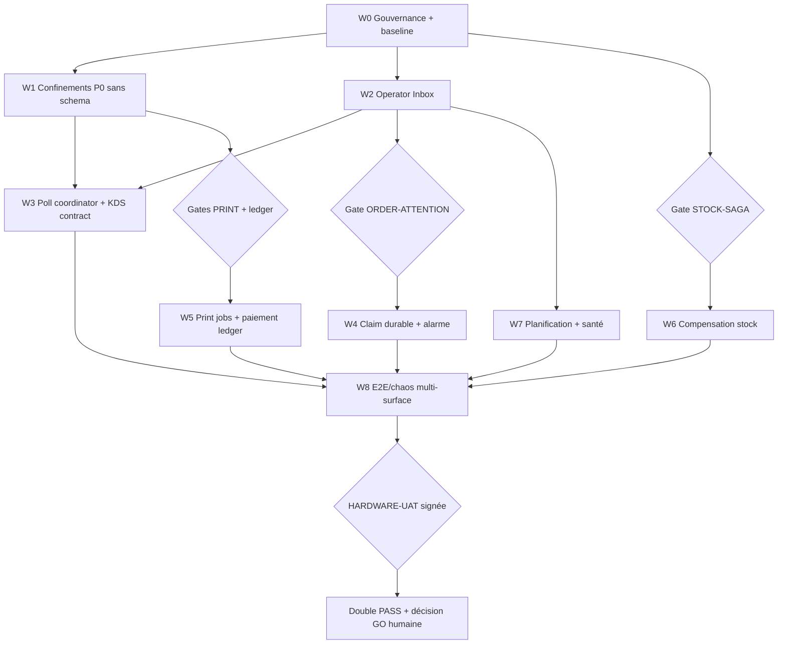

# Plan global de fiabilisation opératoire FoodKing

**Source :** `reports/audit/AUDIT_GLOBAL_OPERATIONS_CAISSE_KDS_WEB_MOBILE_2026-08-11.md`  
**Statut :** plan de remédiation proposé — aucune autorisation implicite de zone frozen/migration  
**Décision initiale :** HOLD terrain jusqu'au double audit et au gate matériel signé  
**Routage :** toutes les implémentations sont `EXECUTION_TIER: complex`

**Contre-débat final :** `reports/audit/ADVERSARIAL_DECISION_RECORD_GLOBAL_OPS_2026-08-12.md`

**Contrat Inbox/attention proposé :** `docs/architecture/OPERATOR_INBOX_ATTENTION_CONTRACT_PROPOSAL_2026-08-12.md`  
**Matrice de traçabilité :** `reports/qa/GLOBAL_OPS_REQUIREMENTS_TRACEABILITY_2026-08-12.md`

> Compatibilité `report-to-plan` : les tâches portent les marqueurs historiques `[CLAUDE]` / `[KIMI]`. Dans le contrat courant du dépôt, `[KIMI]` signifie **exécution canonique `[CODEX] codex-extension`** ; il ne réactive pas un ancien routeur. `[CLAUDE]` reste PLAN/AUDIT, jamais édition produit.

## 1. Problèmes racines à corriger

| ID | Cause racine | Fichiers/aires principales | Risque |
| --- | --- | --- | --- |
| R1 | Cinq projections de commandes différentes | POS, tracker, health, dashboard, historique | Commandes invisibles, faux temps réel |
| R2 | Polling autonome par composant/onglet sous plafond partagé | POS, KDS, listeners, dashboard, throttle | 429 au repos, mutation bloquée |
| R3 | Attention opérateur confondue avec statut métier | POS, tracker, KDS, FCM | Commande ignorée après bip/reload |
| R4 | Intention matérielle confondue avec effet réel | TPE, bridge, print claim, drawer | `PAID`/`printed`/`opened` faux |
| R5 | Autorités d'impression multiples et non device-bound | queue DB, KDS localStorage, bridges | Perte, doublon, mauvaise branche |
| R6 | Contrat WebSocket KDS fictif | `KdsSyncService`, `WebSocketService`, test cadence | Double-poll et état réseau faux |
| R7 | Ledger unique pour deux compensations stock | listeners, StockService, AvailabilityService | Divergence irréparable |
| R8 | Horaires demandés/promis/release non séparés | POS, tracker, KDS | Sonnerie et aging trop tôt |
| R9 | Santé par compte/volume, sans freshness ni paging | health, outbox monitor, scheduler | Faux vert, incident non humainement vu |
| R10 | Surface mobile et ingress Uber hors preuve transactionnelle | outbox client, `/m`, Uber dirty | Fuite branche, stock/prix non fiables |

## 2. Décisions retenues après débat adversarial

| Sujet | Choix retenu | Choix rejeté | Motif |
| --- | --- | --- | --- |
| CB POS | Enregistrement manuel honnête d'une CB externe ; aucun sélecteur terminal mono tant que sa valeur n'est pas persistée | Bloquer sans terminal, jeter un terminal sélectionné ou simuler un débit | Le backend est déclaratif, le mono ignore actuellement `terminal_id` et aucun protocole acquéreur n'existe |
| CB borne | Fail-closed sans bridge/preuve de confiance | Fallback `STUB-*` | Aucun opérateur ne confirme le débit |
| Sonnerie | Delivery/seen + claim avec lease par responsabilité ; résolution par action métier canonique | Sonner jusqu'à `ACCEPT`, ACK permanent au simple clic ou ACK global de branche | Le claim doit expirer/failover ; cuisine ne doit pas silencer caisse/boissons ; seule l'action réelle résout |
| Liste commandes | Projection backend Inbox unique | Ajouter une sidebar sur le flux POS existant | Ne corrige pas les populations divergentes |
| 429 | Agréger/coordonner/backoff | Augmenter seulement 120/min | Protège les mutations et réduit la charge à la source |
| Impression | Job serveur leased + une lease active par imprimante, agent principal/standby device-bound | `printed_at` utilisé comme claim ou poste unique sans secours | Crash, veille et 202 ne prouvent pas le papier |
| Tiroir | `FAILED_BEFORE_WRITE` vs `UNKNOWN_AFTER_SUBMIT`; Winspool ne vaut pas ouverture physique | Tout 2xx/non-false/worker OK = tiroir ouvert | Élimine faux succès et retry/double pulse dangereux |
| Stock | Preuves physique et disponibilité séparées | Compteur partagé `released_qty` | Le sibling ne doit pas masquer l'échec physique |
| Historique | Actions backend `actions[]` | Reconstruire les transitions en Vue | Préserve enum, permissions et état réel |
| Matériel | UAT réelle signée | Tests simulés comme gate | Le dépôt l'impose déjà |

## 3. Graphe de dépendances

## 4. Missions atomiques

### W0 — Gouvernance, sauvegarde et baseline

#### GLOB-OPS-00 — Geler les preuves et résoudre les collisions

- **Owner :** `[CLAUDE]` PLAN/AUDIT.
- **But :** enregistrer le worktree dirty, identifier l'auteur/mission des fichiers impression/Uber/POS, vérifier les frozen zones et ouvrir uniquement les gates requis.
- **Actions :**
  1. Lire `reports/AGENT_ACTIVITY_LOG.md`, masterplay queue/gates et les diffs des fichiers ciblés.
  2. Réserver par mission avec `scripts/agent-activity-log.sh start`.
  3. Interdire toute migration ou édition frozen non explicitement signée.
  4. Capturer baseline DB en lecture seule et rapports QA sans normaliser les 484 orphelins.
- **Acceptation :** zéro fichier utilisateur écrasé ; scope/frozen/gates listés dans le plan de cycle.
- **Risque :** faible, mais bloquant pour toutes les vagues.

### W1 — Confinements P0 sans migration

#### GLOB-OPS-01 — Fail-closed CB borne

- **Owner :** `[KIMI→CODEX]`.
- **Fichiers candidats :** `resources/js/services/kioskHardware.js`, `resources/js/components/frontend/kiosk/KioskPaymentComponent.vue`, contrôleur de confirmation et tests borne.
- **Implémentation :** désactiver la CB en build non-dev si bridge de confiance absent ; supprimer tout succès `STUB-*` production ; rejeter côté serveur les attestations stub/non conformes sans muter commande/paiement/fiscal.
- **Invariants :** prix backend, `OrderStatus`, branche, mutation transactionnelle.
- **Tests :** bridge absent, stub, faux montant, replay, timeout ; commande reste non payée et aucune séquence fiscale.
- **Gate :** confirmer le gate paiement/frozen avant édition du contrôleur.
- **Done :** impossible de créer un `PAID` borne sans preuve acceptée.

#### GLOB-OPS-02 — Rendre la CB POS honnête et non bloquante

- **Owner :** `[KIMI→CODEX]`.
- **Fichiers candidats :** `PaymentComponent.vue`, `PosCounterCollectModal.vue`, traductions et tests UI.
- **Implémentation :** mono sans gate TPE et sans `terminal_id` jeté ; confirmation « CB déjà validée sur TPE externe — aucune demande envoyée » ; montant comptoir égal au total serveur ; supprimer « TPE validé (simulation) » et toute assertion de débit.
- **Tests :** aucune dépendance terminal mono, timeout/replay idempotent, aucun `terminal_id` mono, montant comptoir exact ; aucun texte ne prétend un débit.
- **Limite affichée :** attribution/frais/Z mono-tender restent incomplets jusqu'à GLOB-OPS-10.
- **Done :** le cas utilisateur téléphone/client face-à-face est enregistrable sans mensonge ni terminal obligatoire.

#### GLOB-OPS-03 — Éliminer le faux succès tiroir

- **Owner :** `[KIMI→CODEX]`.
- **Fichiers candidats :** `kioskHardware.js`, `PaymentComponent.vue`, `PosComponent.vue`, tests drawer.
- **Implémentation :** `null`, timeout, JSON incomplet et 202 deviennent échec/inconnu ; `FAILED_BEFORE_WRITE` seul est retryable, `UNKNOWN_AFTER_SUBMIT` exige décision humaine ; un seul exécuteur au cutover ; spool accepté n'est jamais « tiroir ouvert ».
- **Tests :** null, timeout, bridge absent, réponse malformée, un seul pulse lorsque backend et local sont disponibles.
- **Collision :** `PosComponent.vue` est dirty ; différer son edit ou réconcilier explicitement avec son propriétaire.
- **Done :** aucun toast « ouvert » fondé sur HTTP/Winspool ; aucun retry automatique après état physique inconnu.

#### GLOB-OPS-04 — Corriger les faux ACK d'impression existants

- **Owner :** `[KIMI→CODEX]`.
- **Fichiers candidats :** `KitchenTicketAutoPrinter.php`, `KitchenTicketPrintListener.vue`, helpers bridges/tests.
- **Implémentation :** traiter `false/null/202 optimiste` comme non livré ; ne pas ACKer un simple enqueue ; retry seulement si échec connu avant spool ; après submit sans résultat, état inconnu et décision humaine/duplicata, jamais retry automatique.
- **Tests :** `sendRaw=false`, worker échoue avant spool, réponse perdue après submit, bridge arrêté, ACK perdu.
- **Limite :** ne promet pas exactly-once sans GLOB-OPS-09.
- **Collision/gate :** fichiers bridge/listeners déjà dirty ; réservation et gate impression obligatoires.
- **Done :** l'application ne marque plus « imprimé » sur une simple intention connue comme échouée.

### W2 — Vérité opératoire unique

#### GLOB-OPS-05 — Concevoir le contrat `OperatorInbox`

- **Owner :** `[CLAUDE]` PLAN + audit d'invariants.
- **Livrable :** schéma versionné de ressource et matrice `status × payment × role × source → actions[]`.
- **Champs minimaux :** order/correlation ID, branch, source canonique, `OrderStatus`, payment state/method, scheduled/release/promised times, attention summary, production groups, freshness/version, `actions[]`.
- **Règles :** `branch_id` explicite ; admin global sélectionne une branche ou un mode toutes branches visible ; aucun top-100 silencieux.
- **Done :** table de vérité approuvée avant code.

#### GLOB-OPS-06 — Implémenter la projection et l'API Inbox

- **Owner :** `[KIMI→CODEX]`.
- **Fichiers candidats :** nouveau service/resource/controller/routes/tests ; réutiliser l'enum et policies existantes.
- **Implémentation :** catégories `ACTION_REQUIRED`, `IN_PRODUCTION`, `READY_HANDOFF`, `UPCOMING`, `RECENT_TERMINAL`, curseur stable et delta/version.
- **Tests :** 201 commandes, vieille active 62 jours, future demain, deux branches, statuts/paiements/rôles ; aucune disparition implicite.
- **Invariants :** aucune logique prix frontend ; actions serveur ; requêtes branch-scoped ; pas de mutation de state machine.
- **Done :** mêmes IDs/comptes pour les mêmes filtres sur POS, tracker et health.

#### GLOB-OPS-07 — Remplacer les listes concurrentes par l'Inbox

- **Owner :** `[KIMI→CODEX]`.
- **Fichiers candidats :** POS, tracker, historique/détail et composant Inbox dédié.
- **UX :** sidebar/drawer accessible, cartes expandables, groupes Cuisine/Boissons, actions backend, reprint, état dégradé et fraîcheur.
- **Erreurs :** page détail ne peut plus rester vide ; dernière donnée conservée, bannière avec retry et référence d'erreur.
- **A11y :** vrais `button`/`a`, `aria-label`, `aria-live`, focus trap/retour, reduced motion.
- **Collision :** découper le composant afin de réduire l'overlap avec `PosComponent.vue` dirty.
- **Done :** le caissier peut ouvrir, accepter/rejeter/annuler si autorisé et réimprimer sans changer de système de vérité.

### W3 — Réduction 429 et KDS

#### GLOB-OPS-08A — Isoler et rendre exploitable le reporting CSP

- **Owner :** `[CLAUDE]` gate sécurité, puis `[KIMI→CODEX]`.
- **Source :** `reports/audit/RATE_LIMIT_FORENSICS_2026-08-12.md` et `tasks/TASK_GLOB_OPS_CSP_RATE_LIMIT_001.md`.
- **Implémentation :** parser `application/csp-report` et `application/reports+json`, borner/sanitariser, dédupliquer par fingerprint, donner à CSP un bucket réellement distinct du `throttle:api` global, puis corriger les violations normales.
- **Interdits :** aucune hausse générale du plafond, aucun nouvel `unsafe-*`, aucune désactivation production.
- **Tests :** media types natifs et raw body ; 121 CSP n'épuisent pas le bucket métier ; NAT commun ; reload POS/kiosk/web avec zéro malformed.
- **Done :** un reload normal ne crée plus de tempête inutile et la télémétrie restante identifie une directive réelle.

#### GLOB-OPS-08 — Aligner le contrat KDS et instaurer un poll coordinator

- **Owner :** `[KIMI→CODEX]`.
- **Task intakes :** `tasks/TASK_GLOB_OPS_KDS_WS_CONTRACT_001.md` puis `tasks/TASK_GLOB_OPS_POLL_COORDINATOR_001.md` ; CSP isolé par `tasks/TASK_GLOB_OPS_CSP_RATE_LIMIT_001.md`.
- **Fichiers candidats :** `KdsSyncService.js`, `WebSocketService.js` seulement si nécessaire, test contract, coordinator partagé.
- **Implémentation :** consommer `getState()` et `{previous,current}` réels ; désigner un seul propriétaire full/delta ; leader `BroadcastChannel`, pause hidden, jitter, backoff `Retry-After`, ETag/delta.
- **Tests :** contract test avec le vrai service ; état connecté/déconnecté ; trois onglets deux minutes ; plafond mesuré ; mutations non affamées.
- **Done :** zéro double-poll KDS et zéro 429 au repos sur la matrice testée.

### W4 — Attention, claim durable et alarme

#### GLOB-OPS-09 — Ledger d'attention branch-scoped

- **Owner :** `[CLAUDE]` plan/gate, puis `[KIMI→CODEX]` execute après gate.
- **Gate :** migration/frozen `ORDER-ATTENTION` obligatoire.
- **Implémentation :** ledger `DELIVERED/SEEN/CLAIMED(lease)/RESOLVED`, acteur/device, branche, attention kind, station/responsibility, fencing/timestamps/idempotence ; notification après commit ; claim suspend temporairement le scope, expiry reprend l'audio, action canonique résout.
- **Alarme :** salves 8–12 s agrégées jusqu'au claim puis reprise à expiry ; badge/titre/notification restent visibles jusqu'à résolution ; audio unlock visible ; future silencieuse avant release.
- **Tests :** reload, deuxième poste, claims concurrents/expiry/failover, branche B interdite, audio bloqué, web payée auto-promue.
- **Parité :** note explicite OrderService/FrontendOrderService.
- **Done :** aucune commande actionnable non acquittée ne devient silencieuse par reload/seed.

### W5 — Preuve paiement et impression durable

#### GLOB-OPS-10 — Ledger de paiements mono/split cohérent

- **Owner :** `[CLAUDE]` gate ledger/fiscal, puis `[KIMI→CODEX]`.
- **Gate :** ledger/frozen/fiscal explicite.
- **Implémentation :** toute remise mono/split/counter/refund crée une écriture immutable avec montant serveur, branche, terminal optionnel/validé, opérateur et référence externe ; contre-écritures pour remboursements.
- **Tests :** mono cash/card, split N lignes/somme exacte, terminal inactif/inter-branche rejeté, Z mono+split sans écart, idempotence/replay.
- **Done :** les agrégats TPE/fees/Z ne perdent plus les mono-paiements et aucun écran ne prétend un débit physique.

#### GLOB-OPS-11 — `print_jobs` leased et une autorité active par imprimante

- **Owner :** `[CLAUDE]` gates design/schema, puis `[KIMI→CODEX]`.
- **Gates :** PRINT-AUTHORITY, PRINT-DELIVERY-SEMANTICS, migration.
- **Implémentation :** identité logique `(branch, order, document, revision, station, generation)`, snapshot immuable, états pending/leased/spool_accepted/failed_before_spool/unknown_after_submit/dead_letter, lease fencing, attempts, claimant device, idempotence ; agent standby ; worker résultat complet sans prétendre le papier.
- **Politique :** matrice document/origine approuvée ; reçu client vs ticket cuisine explicitement séparés.
- **Tests chaos :** crash avant/après papier/ACK, deux onglets, deux bridges, deux branches, admin global, restart, mauvais spooler.
- **Done :** aucune perte silencieuse ; doublon borné/audité ; bonne station et branche.

### W6 — Convergence stock

#### GLOB-OPS-12 — Séparer les preuves de libération et réparer le réconciliateur

- **Owner :** `[CLAUDE]` design/gate, puis `[KIMI→CODEX]`.
- **Gate :** schema/frozen `STOCK-SAGA`.
- **Implémentation :** mouvements physiques et disponibilité/quota ont leurs propres preuves idempotentes ; état de saga et compensation durable ; réconciliateur compare attendu/réel.
- **Tests :** stock échoue puis disponibilité réussit ; double cancel/refund ; partiel ; retry après crash ; deux branches ; minuit.
- **Parité :** OrderService/FrontendOrderService et dispatch after commit explicitement audités.
- **Done :** le contre-exemple actuel converge automatiquement ou apparaît en dead-letter actionnable.

### W7 — Temps et observabilité

#### GLOB-OPS-13 — Unifier scheduled/promised/release

- **Owner :** `[KIMI→CODEX]` après validation du contrat `[CLAUDE]`.
- **Implémentation :** serveur normalise « dans N minutes »/heure exacte ; expose scheduled, promised et release ; supprime le lead hardcodé frontend ; Inbox Upcoming multi-jour.
- **Tests :** demain, minuit, DST Europe/Paris, heure identique multi-surface, aucun aging/son avant release.
- **Done :** une seule sémantique temporelle sur POS/KDS/web.

#### GLOB-OPS-14 — Santé actionnable et paging

- **Owner :** `[KIMI→CODEX]`; choix du canal humain par `[CLAUDE/HUMAN]`.
- **Implémentation :** âge du plus ancien outbox, dernier succès worker/scheduler/janitor, freshness Inbox, taux 429, print failures, stock saga/dead letters ; erreur probe = unknown/down ; un incident critique suffit.
- **Données historiques :** classer les 484 orphelins ; aucune mutation automatique sans gate retention/state machine.
- **Tests :** scheduler arrêté, DB probe en erreur, un événement bloqué, alerting hors heures creuses.
- **Done :** chaque rouge possède cause, propriétaire et action ; aucun message rassurant non prouvé.

### W8 — Mobile, Uber, QA et terrain

#### GLOB-OPS-15 — Qualifier mobile et sécuriser `/m`

- **Owner :** `[CLAUDE]` audit dépôt mobile, puis `[KIMI→CODEX]` si scope autorisé.
- **Implémentation :** contrat statuts/push/polling, tokens, branche liée au device/PIN ; supprimer le choix silencieux de première branche.
- **Done :** la mention « application mobile couverte » n'est autorisée qu'après E2E réel du dépôt correspondant.

#### GLOB-OPS-16 — Quarantainer l'ingress Uber non conforme

- **Owner :** `[CLAUDE]` audit du dirty worktree, puis `[KIMI→CODEX]` après intégration de la mission propriétaire.
- **Implémentation :** prix serveur, dédup branch-scoped, réservation atomique ou quarantaine explicite, erreur stock non avalée.
- **Done :** aucune commande payée/visible cuisine sans mouvement stock ou état de quarantaine opérable.

#### GLOB-OPS-17 — E2E/chaos multi-surface falsifiable

- **Owner :** `[KIMI→CODEX]` pour les tests ; `[CLAUDE]` audit du rapport.
- **Matrice :** POS, téléphone, web COD/carte, borne cash/carte, mobile ; création naturelle sans injection de store/event.
- **Chaos :** worker/outbox/socket, 20–50 clients, 429, claim/ACK impression, stock, branche A/B, reload/expiry attention, DST.
- **Preuves :** correlation IDs, HAR, métriques P50/P95, logs structurés, captures et état DB avant/après.
- **Done :** aucun scénario synthétique ne peut être présenté comme propagation réelle.

#### GLOB-OPS-18 — Laboratoire matériel et décision humaine

- **Owner :** `[HUMAN]` exécution/signature ; `[CLAUDE]` audit ; `[KIMI→CODEX]` seulement pour corriger un écart dans un nouveau cycle.
- **Matériel :** TPE réel, imprimantes cuisine/client, tiroir pins m=0/m=1, borne, tablette, réseau, papier vide, spooler, restart, offline/reconnect.
- **Artefacts :** grille hardware remplie, identifiants appareils, versions bridge, photos/tickets, heures, opérateur et signatures.
- **Addendum obligatoire :** `reports/hardware/GLOBAL_OPS_HARDWARE_PROTOCOL_GAP_ANALYSIS_2026-08-12.md`; les tests TPE intégrés sont `N/A` tant que le produit reste manuel externe.
- **Done :** `HARDWARE-UAT` signé et double verdict Claude + GPT PASS ; seul l'humain décide GO.

## 5. Ordre d'exécution recommandé

1. **Urgence sûreté :** GLOB-OPS-01 à 04, après réservations/gates ciblés.
2. **Contrôle opérateur :** GLOB-OPS-05 à 08.
3. **Persistance critique :** ouvrir puis exécuter GLOB-OPS-09 à 12.
4. **Temps/santé :** GLOB-OPS-13 à 14.
5. **Surfaces externes :** GLOB-OPS-15 à 16.
6. **Qualification :** GLOB-OPS-17 puis 18.

Les missions 01–04 ne doivent pas être utilisées pour annoncer un GO : elles retirent des mensonges/fail-open et améliorent le confinement. Le contrôle durable provient des ledgers/jobs et de l'UAT.

## 6. Conditions d'arrêt

- Collision avec un fichier dirty dont la mission propriétaire n'est pas identifiée.
- Frozen zone ou migration sans gate signé.
- Modification d'OrderService sans analyse de parité FrontendOrderService.
- Action frontend non dérivée de l'enum/policy backend.
- Deux validations consécutives en échec.
- Absence de test branch A/B pour toute ressource opérationnelle/device.
- Tentative de déclarer papier, TPE ou tiroir « validé » sans test physique signé.

## 7. Critères de clôture globale

- Zéro fail-open carte borne.
- Carte POS manuelle fonctionnelle et honnêtement libellée.
- Un même jeu d'IDs/comptes sur Inbox, tracker, santé et KDS.
- Zéro 429 au repos sur la matrice multi-onglets ; mutations protégées.
- Alarme durable jusqu'au claim, reprise à expiry/failover et disparition seulement à résolution canonique.
- Aucun claim impression bloqué ; preuve worker réelle et bonne station/branche.
- Remise en stock convergente après panne injectée.
- Planification cohérente avant/après minuit et DST.
- Santé qui passe `UNKNOWN/DOWN` sur probe cassé et page réellement un humain.
- Application mobile qualifiée séparément ou explicitement déclarée hors scope.
- Gate matériel rempli et signé.
- `AUDIT_VERDICT: PASS` Claude et `GPT_FINAL_AUDIT_VERDICT: PASS` GPT.

**PLAN_VERDICT: READY_FOR_BOUNDED_CYCLES_WITH_GATES**
