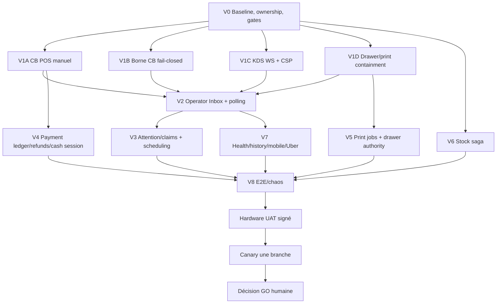

# Plan d'orchestration Claude — Global Operations Reliability

**MASTER_TASK_ID:** `GLOBAL-OPS-RELIABILITY-OWNER-APPROVED-2026-08-12`  
**Owner decision:** D1–D7 Option A approuvées avec contrainte CB POS manuelle externe  
**Execution model:** Claude PLAN/AUDIT, Codex extension EXECUTE, double PASS obligatoire  
**Commercial status:** `HOLD`  
**Hardware status:** `PENDING_EXECUTION_AND_SIGNATURE`  
**Cost discipline:** ne jamais injecter l'audit complet dans chaque sous-cycle ; lire les artefacts disque et produire des missions atomiques

## 1. Clarification propriétaire autoritaire

La CB POS actuelle n'est pas et ne doit pas être traitée comme une intégration TPE :

- le caissier encaisse physiquement sur un TPE externe déconnecté de FoodKing ;
- il confirme ensuite dans FoodKing que la CB a été acceptée ;
- FoodKing enregistre `CARD` pour fiscalité/gestion, imprime selon la politique et poursuit le flux ;
- aucun appel, health, callback ou statut du TPE n'est attendu ;
- aucun `terminal_id` mono ne doit être affiché/envoyé s'il est jeté par le backend ;
- un futur ledger peut conserver un label/ID TPE seulement s'il est réellement persisté et branch-scoped ;
- l'intégration TPE réelle est une option future, pas un prérequis du correctif courant.

La CB borne, en revanche, reste fail-closed sans intégration réelle puisqu'aucun opérateur ne peut attester le débit.

## 2. Règles d'orchestration

1. Claude lit `CLAUDE.md`, `AGENTS.md`, l'ACTIVE_CYCLE, les gates et ce plan.
2. Claude ne modifie pas directement le code produit ; il produit/revoit les plans et délègue EXECUTE à `codex-extension`.
3. Chaque lot possède TASK_ID, allowlist, gates, invariants, tests fail-first et rollback.
4. Réservation activity log avant tout edit produit ; collision = arrêt/replan.
5. Aucune migration ou frozen edit sans gate spécifique enregistré.
6. Aucun lot suivant ne démarre si le précédent a `REWORK`, test rouge ou donnée ambiguë.
7. `OrderStatus`, pricing backend, branche, after-commit et OS/FOS symmetry restent inviolables.
8. Aucun test mocké ne prouve TPE, papier ou tiroir.
9. Pas de big bang : containment, projection, persistence, chaos, hardware, canary.
10. Chaque cycle ferme avec Claude audit PASS + GPT final audit PASS.

## 3. Vagues et dépendances

## 4. Sous-cycles atomiques

### V0 — Gouvernance et baseline

#### `GLOB-OPS-00-OWNER-GATE-BASELINE`

- **Owner:** `[CLAUDE]`
- Vérifier transcription gate parent et GATE_LOG.
- Vérifier freeze/collisions et identifier propriétaire de chaque fichier dirty.
- Capturer `git status`, tests baseline, versions DB/browser/bridges et métriques rate limit.
- Créer un registre de preuves par requirement RQ-01..RQ-18.
- Aucun code produit.

#### `GLOB-OPS-00B-HARDWARE-INVENTORY`

- **Owner:** `[CLAUDE + HUMAN OPS]`
- Identifier modèle imprimante caisse, tiroir, câble/port, OS, bridge, nom spooler.
- Déterminer si le tiroir est RJ11/RJ12 via port DK imprimante, USB direct ou réseau fabricant.
- Photos ports/étiquettes et numéros de série requis ; ne pas deviner à la forme du connecteur.
- Aucun PASS matériel à cette étape.

### V1 — Confinements P0

#### `GLOB-OPS-01-POS-CARD-MANUAL-EXTERNAL`

- **Owner:** `[CLAUDE PLAN/AUDIT]` → `[KIMI→CODEX EXECUTE]`
- Retirer blocage terminal du mono CARD.
- Copy explicite « CB déjà validée sur TPE externe — aucune demande envoyée ».
- Confirmation oui/non avant mutation ; non = aucun POST.
- Aucun sélecteur/terminal ID mono tant qu'il n'est pas persisté.
- CARD comptoir = total serveur exact, aucun rendu/surpaiement.
- Timeout/replay : même idempotency key, même ordre, avertissement ne pas redébiter.
- Impression normale après succès de l'enregistrement.
- Ne pas ajouter d'intégration TPE.

Tests : zéro terminal, API terminal 403/500/timeout sans blocage, confirmation refusée, double clic, timeout après commit, commande téléphone et face-à-face, aucun appel matériel.

#### `GLOB-OPS-02-KIOSK-CARD-FAIL-CLOSED`

- Stub paiement doit échouer en production.
- CB invisible/désactivée sans bridge de confiance.
- Défense serveur contre `STUB-*` et marqueurs simulation.
- Aucun `PAID`, fiscal ou event payé sur preuve invalide.
- Kiosk cash/counter flow inchangé.

#### `GLOB-OPS-03-KDS-WS-CONTRACT`

- Aligner `KdsSyncService` sur `getState()`, états lowercase et `{previous,current}`.
- Remplacer le mock fictif par contract test réel.
- Un seul owner full/delta ; aucun double poll.

#### `GLOB-OPS-04-CSP-PARSER-RATE-BUCKET`

- Parser legacy raw `application/csp-report` et modern `application/reports+json`.
- Borne de corps, sanitation, fingerprint/dédup.
- Bucket réellement séparé du `throttle:api` et NAT business.
- Corriger les violations normales ; ne pas désactiver CSP/ajouter unsafe.

#### `GLOB-OPS-05-DRAWER-TRUTH-CONTAINMENT`

- `null`, 202, malformed ne signifient jamais ouvert.
- `FAILED_BEFORE_WRITE` retryable ; `UNKNOWN_AFTER_SUBMIT` sans retry automatique.
- Paiement cash déjà commit ne se rejoue jamais.
- UI persistante « paiement enregistré, tiroir non confirmé ».
- Identifier/désamorcer double pulse backend + local avant cutover durable.

#### `GLOB-OPS-06-PRINT-TRUTH-CONTAINMENT`

- `false/null/202` jamais `printed`.
- Worker fail-before-spool = retry ; after-submit inconnu = décision humaine/duplicata.
- Ticket non claimé définitivement sans lease.
- Aucune promesse exactly-once à ce stade.

### V2 — Vérité opératoire unique

#### `GLOB-OPS-07-INBOX-CONTRACT-PROJECTION`

- Implémenter résumé léger + pages cursorisées depuis une projection backend unique.
- Buckets Action required, In production, Ready, Upcoming, Recent terminal, Historical orphan/Janitor séparés.
- Branch/cursor/cache stricts ; admin global sélectionne une branche pour agir.
- `actions[]` typées, versionnées, sans URL/status libre.
- Aucun changement de state machine.

#### `GLOB-OPS-08-INBOX-POS-UX`

- Sidebar/drawer accessible dans POS.
- Détail produits, modificateurs, cuisine et boissons.
- Accepter/rejeter/annuler/livrer/rembourser/reprint seulement si proposé par serveur.
- Loading/error/empty distincts ; dernière donnée conservée et freshness visible.
- A11y clavier, focus, aria-live, reduced motion.

#### `GLOB-OPS-09-POLL-COORDINATOR`

- Une requête en vol par branch/feed/cursor.
- Leader cross-tab heartbeat/fencing.
- WS sequence gap → catch-up cursorisé.
- Backoff/jitter/Retry-After.
- Budgets critique/opérationnel/analytique ; mutations protégées.

### V3 — Attention et temps

#### `GLOB-OPS-10-ATTENTION-LEDGER`

- Migration/gate : `DELIVERED/SEEN/CLAIMED(lease)/RESOLVED`.
- Scope branche + kind + station/responsibility.
- Claim temporaire, actor/device/expiry/fencing.
- Visuel reste partout ; audio reprend à expiry/leader perdu.
- Action métier canonique résout transactionnellement.

#### `GLOB-OPS-11-ALARM-NOTIFICATIONS`

- Salves agrégées 8–12 s, première alerte dans SLO.
- Badge, titre, notification système/PWA, audio unlock.
- Push manager si non résolu ; escalation fournisseur externe dans lot séparé.
- Backlog initial agrégé, jamais N sons simultanés.

#### `GLOB-OPS-12-SCHEDULED-PROMISED-RELEASE`

- Heure exacte ou dans N minutes normalisées serveur.
- Distinguer scheduled/promised/release.
- Upcoming multi-jour ; aucune alarme/aging avant release.
- Tests minuit/DST Europe-Paris.

### V4 — Paiement/fiscal/caisse

#### `GLOB-OPS-13-PAYMENT-LEDGER-FULL`

- Gate fiscal/schema dédié et plan review obligatoire.
- Écriture immutable pour mono/split/counter/refund/reversal.
- CARD manuel toujours identifié comme CARD, même sans terminal ID.
- Terminal ID/label seulement s'il est réellement persisté et branch-validé.
- Agrégats Z/fees mono+split cohérents.

#### `GLOB-OPS-14-CASH-SESSION-ENFORCEMENT`

- Session caisse ouverte requise pour cash.
- Dérogation manager auditée + reconciliation task.
- Mouvement cash unique et exact, y compris tranche split.

#### `GLOB-OPS-15-PAID-CANCEL-REFUND`

- Jamais retour à UNPAID/suppression.
- Retour/remboursement avec motif/permission/contre-écriture.
- CARD externe rappelle remboursement TPE manuel.
- Drawer OUT seulement pour part cash réellement remboursée selon policy.

### V5 — Autorité matérielle durable

#### `GLOB-OPS-16-PRINT-JOBS`

- Migration/gates print.
- Identité branch/order/revision/document/station/generation.
- Snapshot/octets immuables + checksum.
- PENDING/LEASED/SPOOL_ACCEPTED/FAILED_BEFORE_SPOOL/UNKNOWN_AFTER_SUBMIT/DEAD_LETTER.
- Une lease active par imprimante, primary/standby, fencing.
- Dual-write temporaire éventuellement, jamais dual-consume.
- Reprint humain = nouvelle génération + acteur/motif/duplicata.

#### `GLOB-OPS-17-DRAWER-INTENT-AGENT`

- Backend autorise/audite no-sale mais ne pulse pas au cutover.
- Agent local exécute une intention idempotente.
- Listener cash legacy devient producteur d'intention ou est désactivé.
- Winspool ne vaut pas capteur physique.

### V6 — Stock

#### `GLOB-OPS-18-STOCK-RESERVATION-SAGA`

- Gate schema/stock.
- Réservation atomique à la commande, consume à production, release avant production.
- Après préparation : waste/override, pas restock automatique.
- Saga commune avec preuves distinctes stock/disponibilité.
- Retry/dead-letter/reconciler attendu-réel.
- Corriger le faux-green sentinel.

### V7 — Santé, données, surfaces externes

#### `GLOB-OPS-19-HEALTH-PAGING`

- Inbox freshness, outbox oldest, scheduler/janitor heartbeat, 429, print/stock dead letters.
- Probe error = UNKNOWN/RED.
- Une seule commande critique suffit pour alerter.

#### `GLOB-OPS-20-HISTORICAL-REPAIR-SET`

- Dry-run SELECT-only puis classification humaine.
- Aucun auto-cancel payé/fiscalisé.
- Repair batch distinct et rollback/audit.

#### `GLOB-OPS-21-MOBILE-REAL-INTEGRATION-AUDIT`

- Identifier vrai repo/app ; `/m` ne vaut pas app cliente.
- Tokens/branch/status/push/polling/E2E.
- Ne pas déclarer mobile couverte avant preuve.

#### `GLOB-OPS-22-UBER-QUARANTINE`

- Coordonner avec propriétaire du dirty diff.
- Prix serveur, dédup branch-scoped, stock atomique ou quarantaine.
- Aucun order paid/KDS sans réservation/preuve.

### V8 — Qualification et rollout

#### `GLOB-OPS-23-E2E-NATURAL-MATRIX`

- POS, phone, web COD/card, kiosk cash/card, mobile réel.
- Aucune injection store/event synthétique.
- Correlation IDs, HAR, DB before/after, branch A/B.

#### `GLOB-OPS-24-CHAOS`

- Worker/outbox/socket/leader/429.
- Claim print avant/après submit/ACK.
- Stock partial failures/retries.
- 20–50 reconnect clients.

#### `GLOB-OPS-25-HARDWARE-UAT`

- Humain/Ops : TPE manuel externe, imprimantes, tiroir, borne, KDS, réseau.
- Identifier câble tiroir : souvent RJ11/RJ12 ressemblant Ethernet, branché au port DK de l'imprimante ; confirmer modèle exact.
- Tester pulse pins m=0/m=1, papier vide, spooler, câble, restart.
- Grille signée ; tests TPE intégrés marqués N/A tant qu'aucune intégration n'existe.

#### `GLOB-OPS-26-CANARY-DEPLOY`

- Backup/preflight/feature flags/rollback.
- Une branche, une caisse, une station, observation.
- Expansion progressive uniquement après métriques et double PASS.
- GO final humain séparé.

## 5. SLO de qualification

- visibilité nouvelle commande p95 ≤ 3 s via realtime, fallback ≤ 10 s ;
- première alerte ≤ 3 s après release ;
- leader/claim failover ≤ 15 s ;
- zéro 429 au repos sur matrice multi-onglets ;
- mutation accept/collect p95 ≤ 1,5 s hors TPE externe ;
- job impression créé ≤ 2 s, spool target ≤ 5 s ;
- fuite inter-branche = 0 ;
- incident critique visible/page humain ≤ 60 s ;
- divergence stock silencieuse = 0.

## 6. Conditions d'arrêt

- collision dirty non attribuée ;
- gate migration/fiscal/hardware absent ;
- test fail-first non démontré ;
- tentative d'intégrer/piloter le TPE dans le scope CB manuel ;
- terminal ID mono encore jeté mais affiché ;
- action frontend non revalidée serveur ;
- `branch_id=0` utilisé comme device scope ;
- 202/Winspool présenté comme papier/tiroir physique ;
- double consumer print/drawer ;
- OrderService touché sans FrontendOrderService symmetry note ;
- deux validations rouges consécutives ;
- audit Claude ou GPT final en REWORK.

## 7. Condition de clôture master

Tous les RQ-01..RQ-18 sont `PROVEN`, chaque cycle a double PASS, les migrations ont rehearsal/rollback, la grille hardware est signée, le canary est stable et le propriétaire signe un GO commercial distinct.

**PLAN_VERDICT: READY_FOR_CLAUDE_ORCHESTRATION — NOT A SINGLE EXECUTE TASK**

